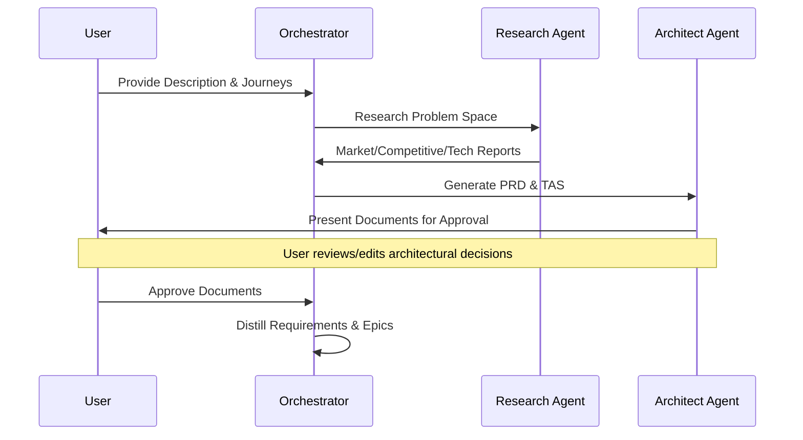
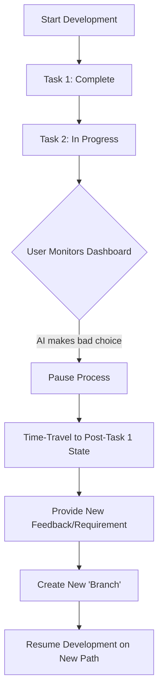
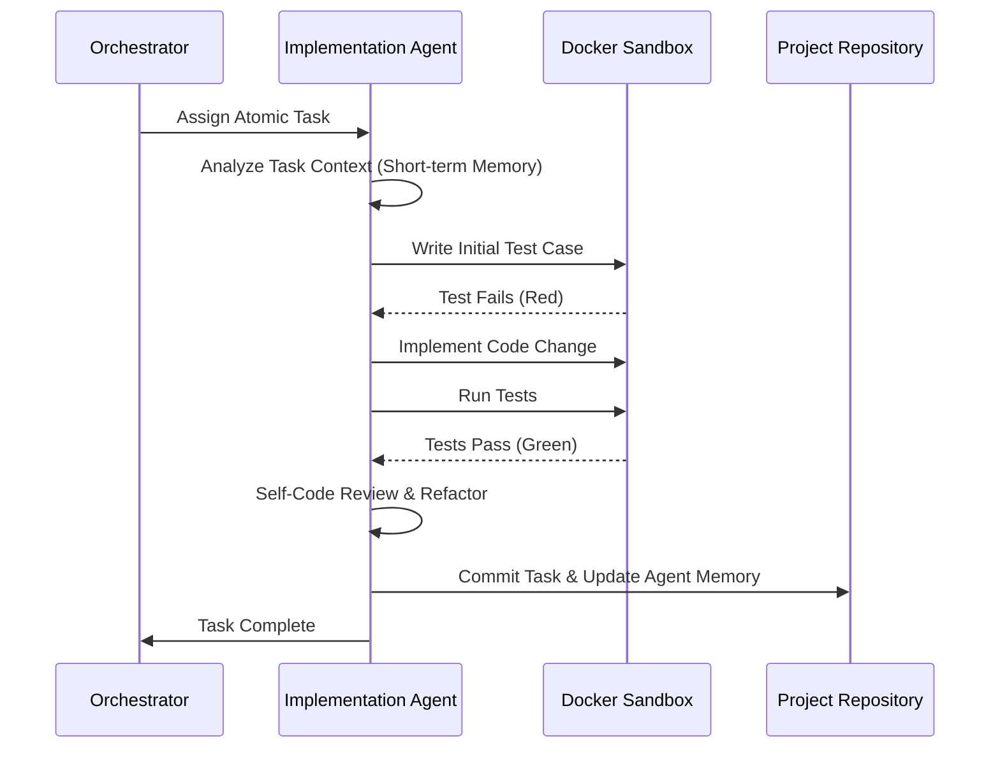

# User Research Report: devs

## 1. Executive Summary
The software development landscape is shifting from manual coding to agentic orchestration. **devs** aims to solve the "Blank Page Problem" and the "Technical Debt Trap" by providing a structured, agent-driven pipeline for greenfield development. 

Our research identifies a primary target audience of **experienced developers venturing into new domains**, **indie hackers seeking rapid but robust MVPs**, and **technical architects who demand transparency (Glass-Box)** over autonomous "black-box" systems. The key to success for `devs` lies in its ability to maintain high-fidelity architectural control through human-approvable documents (PRD/TAS) and a verifiable TDD cycle.

## 2. Target Audience Segments

### Segment A: The Polyglot Maker
Developers who are technically proficient in one stack (e.g., Backend/Java) but want to build a project in another (e.g., Frontend/React + FastAPI). They need the AI to act as an "Architect-in-Residence" that ensures idiomatic patterns.

### Segment B: The High-Stakes Indie Hacker
Solo founders or small teams building products where reliability is a core feature. They cannot afford "chat-to-code" hallucinations and require a system that enforces testing and documentation from day one.

### Segment C: The Enterprise Prototyper
Internal tool builders or R&D engineers who need to quickly spin up prototypes that adhere to corporate security and architectural standards without the manual overhead of boilerplate setup.

## 3. User Personas

### Persona 1: Alex, the Polyglot Prototype Builder
*   **Role:** Senior Full-Stack Engineer
*   **Demographics:** 32 years old, works in a mid-sized tech firm.
*   **Tech-Savviness:** Expert. Familiar with CI/CD, Git, and complex architectures.
*   **Goals:** 
    *   Build a side project using a language they aren't an expert in (e.g., Rust).
    *   Ensure the project doesn't become a "mess of spaghetti code" generated by LLMs.
*   **Frustrations:** 
    *   Standard AI assistants often suggest deprecated libraries or non-idiomatic code.
    *   The time spent fixing AI bugs often exceeds the time saved.
*   **Needs:** A system that presents a Technical Architecture Specification (TAS) for approval *before* a single line of code is written.

### Persona 2: Sarah, the Quality-Obsessed Founder
*   **Role:** Technical Founder of a Fintech Startup
*   **Demographics:** 29 years old, based in Berlin.
*   **Tech-Savviness:** High. Strong background in Security and TDD.
*   **Goals:** 
    *   Launch an MVP in 2 weeks with 90%+ test coverage.
    *   Have a "Glass-Box" view of every decision the AI makes for audit purposes.
*   **Frustrations:** 
    *   "Black-box" agents like Devin feel too risky for financial logic.
    *   Wasting money on AI agents that get stuck in infinite loops.
*   **Needs:** Branching/Time-travel capabilities to undo an AI's "bad turn" and re-direct development without restarting the project.

### Persona 3: Marcus, the Enterprise Developer
*   **Role:** Lead Developer (Operations)
*   **Demographics:** 40 years old, Enterprise environment.
*   **Tech-Savviness:** Mid-to-High. Focuses on stability and documentation.
*   **Goals:** 
    *   Automate the creation of internal dashboards and CLI tools.
    *   Ensure every project includes agentic debugging support so it's easy to maintain.
*   **Frustrations:** 
    *   Agents working "ahead of schedule" or modifying files outside of their current task scope.
    *   Lack of long-term memory in AI chat interfaces.
*   **Needs:** Sandboxed execution and persistent "Long-term Memory" that remembers enterprise-wide constraints (e.g., "Never use external CSS").

## 4. User Pain Points & Needs

| Pain Point | User Need | `devs` Feature Solution |
| :--- | :--- | :--- |
| **Architectural Drift** | High-level planning before implementation. | PRD/TAS Research & Approval Phase |
| **Black-Box Anxiety** | Visibility into AI reasoning and decisions. | Glass-Box Architecture / Markdown Docs |
| **Token Runaway** | Preventing agents from wasting time/money. | Loop Detection & Budget Gates |
| **Context Loss** | Persistent memory across long-running tasks. | Vector-based Long-term Memory (ChromaDB) |
| **Unreliable Code** | Verifiable correctness of AI outputs. | Mandatory TDD Cycle (Test -> Implement -> Review) |
| **Stochastic Dead-ends** | Ability to "undo" and try a different path. | Time-Travel & Branching (Git for Prompts) |

## 5. Core User Journeys

### Journey 1: From Idea to Architectural Approval
This journey covers the initial research and documentation phase where the user establishes the project's foundation.

### Journey 2: Branching and Time-Travel Intervention
This journey illustrates how a user corrects an agent's path using the "Git for Prompts" feature.

### Journey 3: The Automated TDD Cycle
This journey shows the granular implementation of a single task within a project phase.

