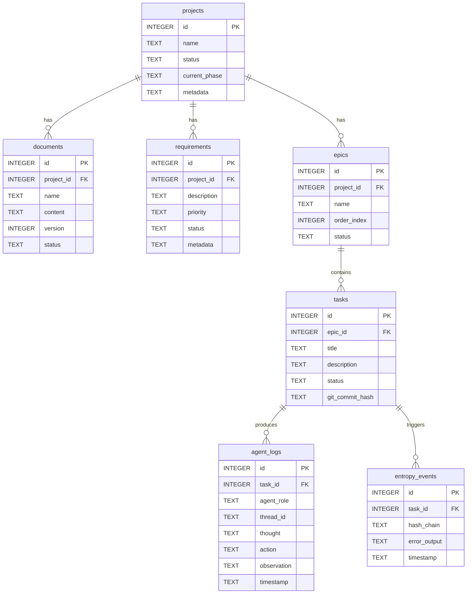

# Database Schema

**Location:** `.devs/state.sqlite`
**Engine:** SQLite 3 (via `better-sqlite3`)
**Managed by:** `@devs/core` — the only package with write access to `.devs/`
**Requirements:** TAS-105 through TAS-111, 9_ROADMAP-TAS-102, 9_ROADMAP-REQ-017

---

## Connection Settings

Every connection is configured with three PRAGMAs (see `packages/core/src/persistence/database.ts`):

| PRAGMA | Value | Reason |
|--------|-------|--------|
| `journal_mode` | `WAL` | Concurrent reads during writes (CLI + VSCode Extension) |
| `synchronous` | `NORMAL` | Durability at critical checkpoints without excessive fsync |
| `foreign_keys` | `ON` | Enforce referential integrity across all tables |

---

## Entity-Relationship Diagram



---

## Table Definitions

### `projects` — [TAS-105]

Top-level project entity. All other tables are direct or indirect descendants.

| Column | Type | Constraints | Description |
|--------|------|-------------|-------------|
| `id` | `INTEGER` | PK AUTOINCREMENT | Unique project identifier |
| `name` | `TEXT` | NOT NULL | Human-readable project name |
| `status` | `TEXT` | NOT NULL DEFAULT `'pending'` | Lifecycle state (pending, active, complete, failed) |
| `current_phase` | `TEXT` | nullable | Name/ID of the currently executing phase |
| `metadata` | `TEXT` | nullable | JSON blob for arbitrary extension data |

---

### `documents` — [TAS-106]

Versioned high-level specification documents (PRD, TAS, MCP Design, etc.) attached to a project. Versioning allows review and approval history to be preserved.

| Column | Type | Constraints | Description |
|--------|------|-------------|-------------|
| `id` | `INTEGER` | PK AUTOINCREMENT | Unique document identifier |
| `project_id` | `INTEGER` | NOT NULL FK → `projects(id)` | Owning project |
| `name` | `TEXT` | NOT NULL | Document name (e.g., `"1_prd"`) |
| `content` | `TEXT` | nullable | Full document content (Markdown) |
| `version` | `INTEGER` | NOT NULL DEFAULT `1` | Monotonic version counter |
| `status` | `TEXT` | NOT NULL DEFAULT `'draft'` | Approval state (draft, approved, superseded) |

---

### `requirements` — [TAS-107]

Atomic requirements distilled from specification documents. Each row carries priority and trace metadata to link it back to its source document.

| Column | Type | Constraints | Description |
|--------|------|-------------|-------------|
| `id` | `INTEGER` | PK AUTOINCREMENT | Unique requirement identifier |
| `project_id` | `INTEGER` | NOT NULL FK → `projects(id)` | Owning project |
| `description` | `TEXT` | NOT NULL | Requirement text |
| `priority` | `TEXT` | NOT NULL DEFAULT `'medium'` | Priority level (low, medium, high, critical) |
| `status` | `TEXT` | NOT NULL DEFAULT `'pending'` | Implementation state (pending, in-progress, done) |
| `metadata` | `TEXT` | nullable | JSON blob (e.g., source document ID, tags) |

---

### `epics` — [TAS-108]

Ordered implementation phases (epics) within a project. `order_index` drives the dependency-ordered execution sequence.

| Column | Type | Constraints | Description |
|--------|------|-------------|-------------|
| `id` | `INTEGER` | PK AUTOINCREMENT | Unique epic identifier |
| `project_id` | `INTEGER` | NOT NULL FK → `projects(id)` | Owning project |
| `name` | `TEXT` | NOT NULL | Epic name (e.g., `"SQLite Schema & Persistence Layer"`) |
| `order_index` | `INTEGER` | NOT NULL DEFAULT `0` | Execution order within the project |
| `status` | `TEXT` | NOT NULL DEFAULT `'pending'` | Lifecycle state |

---

### `tasks` — [TAS-109]

Atomic implementation tasks within an epic. `git_commit_hash` correlates each completed task with the exact commit that satisfies it, enabling precise traceability.

| Column | Type | Constraints | Description |
|--------|------|-------------|-------------|
| `id` | `INTEGER` | PK AUTOINCREMENT | Unique task identifier |
| `epic_id` | `INTEGER` | NOT NULL FK → `epics(id)` | Owning epic |
| `title` | `TEXT` | NOT NULL | Short task title |
| `description` | `TEXT` | nullable | Full task description (Markdown) |
| `status` | `TEXT` | NOT NULL DEFAULT `'pending'` | Lifecycle state |
| `git_commit_hash` | `TEXT` | nullable | SHA of the commit implementing this task |

---

### `agent_logs` — [TAS-110]

Per-task audit log capturing each agent reasoning step. `thread_id` groups all entries for a single agent invocation, enabling full replay of the thought→action→observation chain.

| Column | Type | Constraints | Description |
|--------|------|-------------|-------------|
| `id` | `INTEGER` | PK AUTOINCREMENT | Unique log entry identifier |
| `task_id` | `INTEGER` | NOT NULL FK → `tasks(id)` | Task being executed |
| `agent_role` | `TEXT` | NOT NULL | Agent type (e.g., `"implementer"`, `"reviewer"`) |
| `thread_id` | `TEXT` | nullable | Groups entries for one agent invocation |
| `thought` | `TEXT` | nullable | Agent's internal reasoning |
| `action` | `TEXT` | nullable | Tool call or action taken (JSON) |
| `observation` | `TEXT` | nullable | Result of the action |
| `timestamp` | `TEXT` | NOT NULL DEFAULT `datetime('now')` | UTC timestamp |

---

### `entropy_events` — [TAS-111]

Records repeating failure signatures to detect and prevent agent loops. `hash_chain` is a rolling hash of the last N error outputs; when it stabilises the system detects an entropy loop and aborts or escalates.

| Column | Type | Constraints | Description |
|--------|------|-------------|-------------|
| `id` | `INTEGER` | PK AUTOINCREMENT | Unique event identifier |
| `task_id` | `INTEGER` | NOT NULL FK → `tasks(id)` | Task that produced the failure |
| `hash_chain` | `TEXT` | NOT NULL | Rolling SHA-256 hash of recent errors |
| `error_output` | `TEXT` | nullable | Raw error text |
| `timestamp` | `TEXT` | NOT NULL DEFAULT `datetime('now')` | UTC timestamp |

---

## Schema Initialization

The schema is initialized via `initializeSchema(db)` in `packages/core/src/persistence/schema.ts`:

```typescript
import { createDatabase } from "@devs/core/persistence/database";
import { initializeSchema } from "@devs/core/persistence/schema";

const db = createDatabase();   // opens .devs/state.sqlite, sets PRAGMAs
initializeSchema(db);          // CREATE TABLE IF NOT EXISTS for all 7 tables
```

`initializeSchema` is idempotent: calling it multiple times on the same database is safe.

---

## Audit Script

To verify the schema of a live database:

```bash
pnpm exec tsx scripts/db_audit.ts
```

This queries `sqlite_master` and `PRAGMA table_info` for each of the 7 core tables and prints a column-by-column report.
