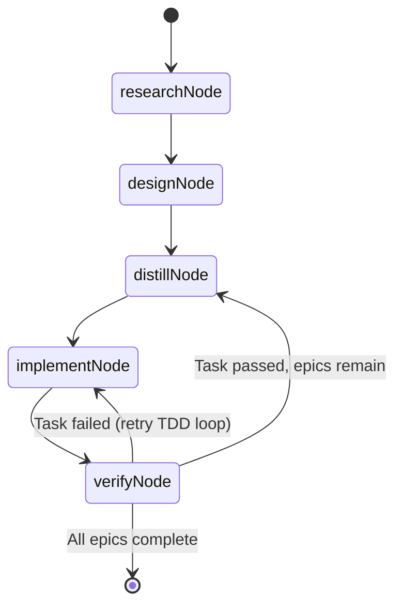
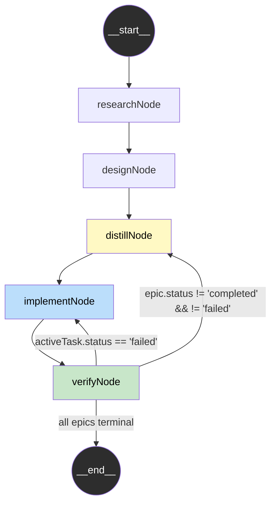

# Orchestration Graph

The devs orchestration pipeline is implemented as a **cyclical LangGraph `StateGraph`**.
This document describes the graph topology, node responsibilities, and routing logic.

Requirements: `[9_ROADMAP-TAS-101]`, `[TAS-009]`, `[TAS-103]`, `[2_TAS-REQ-016]`

Source: `packages/core/src/orchestration/graph.ts`

---

## Graph Diagram



### LangGraph Edge Diagram



---

## Nodes

All nodes are **stubs** in Phase 1. They update `status` and `projectConfig.status`
to the correct pipeline phase value. Full agent implementations will be added in
later phases.

| Node            | Status After      | Responsibility                                                |
|-----------------|-------------------|---------------------------------------------------------------|
| `researchNode`  | `"researching"`   | Market, competitive, technology, and user research reports    |
| `designNode`    | `"specifying"`    | PRD, TAS, MCP Design, Security, UI/UX specification docs      |
| `distillNode`   | `"planning"`      | Requirement distillation + atomic task DAG generation         |
| `implementNode` | `"implementing"`  | 6-step TDD cycle for the active task (`state.activeTaskId`)   |
| `verifyNode`    | (updates tasks)   | Full test suite + regression checks + task status update      |

---

## Edges

### Linear Edges (unconditional)

| From         | To           |
|--------------|--------------|
| `__start__`  | `research`   |
| `research`   | `design`     |
| `design`     | `distill`    |
| `distill`    | `implement`  |
| `implement`  | `verify`     |

### Conditional Edges (from `verify`)

Routing is determined by `routeAfterVerify(state)`:

| Condition                                              | Next Node   | Meaning                      |
|--------------------------------------------------------|-------------|------------------------------|
| `activeTask.status === "failed"`                       | `implement` | Retry TDD loop for this task |
| Any epic: `status !== "completed" && !== "failed"`     | `distill`   | Advance to next task/epic    |
| All epics are in terminal state (completed or failed)  | `__end__`   | Pipeline complete            |

**Priority order**: failed task check → active epics check → terminate.

---

## Routing Function

```ts
export function routeAfterVerify(state: GraphState): VerifyRoute {
  // 1. Retry if active task failed verification
  const activeTask = state.tasks.find((t) => t.taskId === state.activeTaskId);
  if (activeTask?.status === "failed") {
    return "implement";
  }

  // 2. Advance if epics remain
  const hasActiveEpics = state.epics.some(
    (e) => e.status !== "completed" && e.status !== "failed",
  );
  if (hasActiveEpics) {
    return "distill";
  }

  // 3. Terminate
  return END;
}
```

---

## State Flow

The `OrchestratorState` passes through each node as an immutable snapshot.
Nodes return `Partial<GraphState>` — only the fields they modify — and LangGraph
merges the partial update using the replace reducer (last-write-wins).

```
Initial State:
  status: "initializing"
  epics: [], tasks: [], documents: []
  activeEpicId: null, activeTaskId: null

After researchNode:
  status: "researching"
  documents: [research reports...]  ← (future: added by real agent)

After designNode:
  status: "specifying"
  documents: [..., PRD, TAS, ...]   ← (future: added by real agent)

After distillNode:
  status: "planning"
  requirements: [...]               ← (future: distilled from docs)
  tasks: [...]                      ← (future: atomic task DAG)

After implementNode:
  status: "implementing"
  agentLogs: [...]                  ← (future: TDD cycle logs)

After verifyNode:
  tasks: [..., {taskId: "t1", status: "completed"}]  ← stub updates task

routeAfterVerify → END (no epics)
```

---

## Cyclical Nature (TAS-103)

The graph satisfies TAS-103 ("Implement cyclical LangGraph skeleton") through two
feedback loops:

1. **Retry loop**: `verify → implement` — When a task fails verification, the
   implementation agent retries the TDD cycle. Loop terminates when the task
   passes (or a configurable max-retry threshold is reached, enforced by future
   entropy/loop-detection logic via `state.entropy`).

2. **Advancement loop**: `verify → distill → implement → verify` — When a task
   passes, the distill node selects the next pending task and the cycle continues.
   Terminates when all epics are complete.

---

## Milestones Supported

The graph architecture supports all three milestone paths defined in the roadmap:

| Milestone      | Phases        | Pipeline role                                       |
|----------------|---------------|-----------------------------------------------------|
| **Foundation** | Phases 1–5    | Research + Design + Distill stages                  |
| **Intelligence** | Phases 6–10 | Implement + Verify stages (core TDD loop)           |
| **Autonomy**   | Phases 11–15  | Full pipeline running autonomously with loop control |
