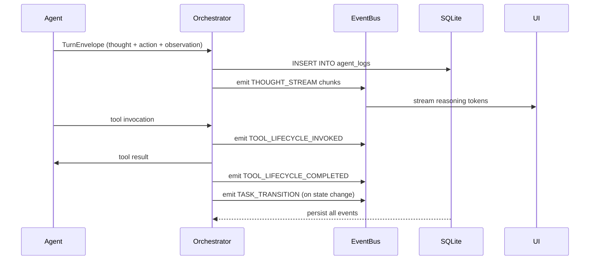

# SAOP Protocol — Structured Agent-Orchestrator Protocol

**Status:** Active
**Requirements:** TAS-035, TAS-112, TAS-113, TAS-038
**Schemas:** `packages/core/src/schemas/turn_envelope.ts`, `packages/core/src/schemas/events.ts`

---

## Overview

The Structured Agent-Orchestrator Protocol (SAOP) defines the contract for all
interactions between the Agent Suite and the Orchestration Layer. It enforces
"Glass-Box" transparency: every decision an agent makes is fully auditable by
humans and tools.

SAOP has two halves:

1. **Turn Envelopes** — synchronous, per-turn structured output from agents.
2. **RTES Events** — asynchronous real-time events emitted during agent execution.

---

## 1. Turn Envelopes (TAS-112)

Every turn an agent produces is wrapped in a `TurnEnvelope` before being
persisted to SQLite or handed off to the next agent.

### Schema

```typescript
interface TurnEnvelope {
  turn_index:  number;          // Zero-based ordinal within the task session
  agent_id:    AgentId;         // Producing agent: "researcher" | "architect" | "developer" | "reviewer"
  role:        AgentId;         // Role the agent plays this turn (usually matches agent_id)
  content: {
    thought:     string;        // Glass-Box: internal reasoning / chain-of-thought
    action:      string;        // Planned actions for this turn (strategy)
    observation: string;        // Results observed from the previous turn's tools
  };
  metadata: {
    version:              "1.0.0";              // Literal schema version
    task_id:              string;               // Correlation ID → SQLite `tasks` table
    timestamp:            string;               // ISO 8601 UTC
    confidence:           number;               // [0.0, 1.0] — agent's self-assessed certainty
    estimated_complexity: "low" | "medium" | "high";
  };
}
```

### Zod Validation

```typescript
import { TurnEnvelopeSchema } from "@devs/core";

const envelope = TurnEnvelopeSchema.parse(rawJson); // throws ZodError on invalid input
const result   = TurnEnvelopeSchema.safeParse(rawJson); // non-throwing variant
```

### Field Rationale

| Field | Purpose |
|-------|---------|
| `turn_index` | Enables deterministic ordering in SQLite even if events arrive out of order. |
| `content.thought` | Glass-Box visibility into the agent's reasoning (TAS-035). Stored verbatim — never truncated. |
| `content.action` | Allows the ReviewerAgent to evaluate strategy before observing tool results. |
| `content.observation` | Grounds the agent's self-assessment in concrete evidence from the prior turn. |
| `metadata.confidence` | Powers the Entropy Detector — declining confidence trends trigger escalation. |
| `metadata.task_id` | Links every turn to the authoritative task record for `Project Rewind` (TAS-114). |

---

## 2. RTES Events (TAS-113)

The Real-time Trace & Event Streaming bus carries asynchronous events emitted
during agent execution. Consumers (VSCode UI, CLI Dashboard, SQLite logger) all
subscribe to the same event stream.

### Event Wrapper

Every event on the bus is wrapped in an `Event`:

```typescript
interface Event {
  event_id:   string;        // UUID — uniquely identifies this event instance
  session_id: string;        // Groups events belonging to one orchestration session
  payload:    EventPayload;  // Discriminated union — one of the types below
}
```

### Event Types

#### `THOUGHT_STREAM`

Emitted incrementally as the agent produces its chain-of-thought.
Enables the VSCode Extension to stream reasoning tokens to the user in real time.

```typescript
{
  type:        "THOUGHT_STREAM";
  agent_id:    AgentId;
  turn_index:  number;
  chunk:       string;    // Incremental text chunk
  is_final:    boolean;   // True for the last chunk of this turn's thought
}
```

#### `TOOL_LIFECYCLE_INVOKED`

Emitted when an agent dispatches a tool call. Correlates with `TOOL_LIFECYCLE_COMPLETED`
via `call_id`.

```typescript
{
  type:       "TOOL_LIFECYCLE_INVOKED";
  call_id:    string;
  tool:       string;
  arguments:  Record<string, unknown>;
  timestamp:  string;   // ISO 8601 UTC
}
```

#### `TOOL_LIFECYCLE_COMPLETED`

Emitted when a tool call returns. Contains the outcome and wall-clock duration.

```typescript
{
  type:        "TOOL_LIFECYCLE_COMPLETED";
  call_id:     string;                          // Matches the INVOKED call_id
  tool:        string;
  status:      "success" | "failure" | "timeout";
  duration_ms: number;                          // >= 0
  timestamp:   string;                          // ISO 8601 UTC
}
```

#### `TASK_TRANSITION`

Emitted when a task moves between lifecycle states. The optional `git_hash`
implements Git State Correlation (TAS-114), allowing full environment rewind.

```typescript
{
  type:        "TASK_TRANSITION";
  task_id:     string;
  from_state:  string;
  to_state:    string;
  git_hash?:   string;   // HEAD commit hash, present when a commit accompanies the transition
  timestamp:   string;   // ISO 8601 UTC
}
```

#### `SANDBOX_PULSE`

Emitted per line as the sandbox produces terminal output. Sensitive values
(secrets, tokens, keys) are redacted before emission.

```typescript
{
  type:      "SANDBOX_PULSE";
  line:      string;    // One line of terminal output
  masked:    boolean;   // True if secrets were redacted from this line
  timestamp: string;    // ISO 8601 UTC
}
```

### Zod Validation

```typescript
import { EventSchema, EventPayloadSchema } from "@devs/core";

// Validate a full event:
const event = EventSchema.parse(rawJson);

// Validate only a payload (useful when wrapping externally):
const payload = EventPayloadSchema.parse(rawPayload);
```

---

## 3. Extensibility

### Adding a New Turn Field

Add the field to `TurnContentSchema` or `TurnMetadataSchema` in
`packages/core/src/schemas/turn_envelope.ts`. If the field is optional,
use `.optional()`. If mandatory, increment `metadata.version` and add a
migration path.

### Adding a New Event Type

1. Define a new Zod schema with a unique `type: z.literal("MY_EVENT")` field.
2. Add it to the `EventPayloadSchema` discriminated union.
3. Export the schema and its inferred type.
4. No existing schemas require modification.

---

## 4. Data Flow



---

## 5. Persistence Mapping

| Schema Field                    | SQLite Column               | Table         |
|---------------------------------|-----------------------------|---------------|
| `TurnEnvelope.metadata.task_id` | `tasks.id`                  | `tasks`       |
| `TurnEnvelope.turn_index`       | `agent_logs.turn_index`     | `agent_logs`  |
| `TurnEnvelope` (full)           | `agent_logs.envelope_json`  | `agent_logs`  |
| `Event.event_id`                | `agent_logs.event_id`       | `agent_logs`  |
| `TaskTransitionPayload.git_hash` | `tasks.head_hash`           | `tasks`       |

SQLite schema definition is out of scope for this document — see the SQLite
persistence task documentation when available.
