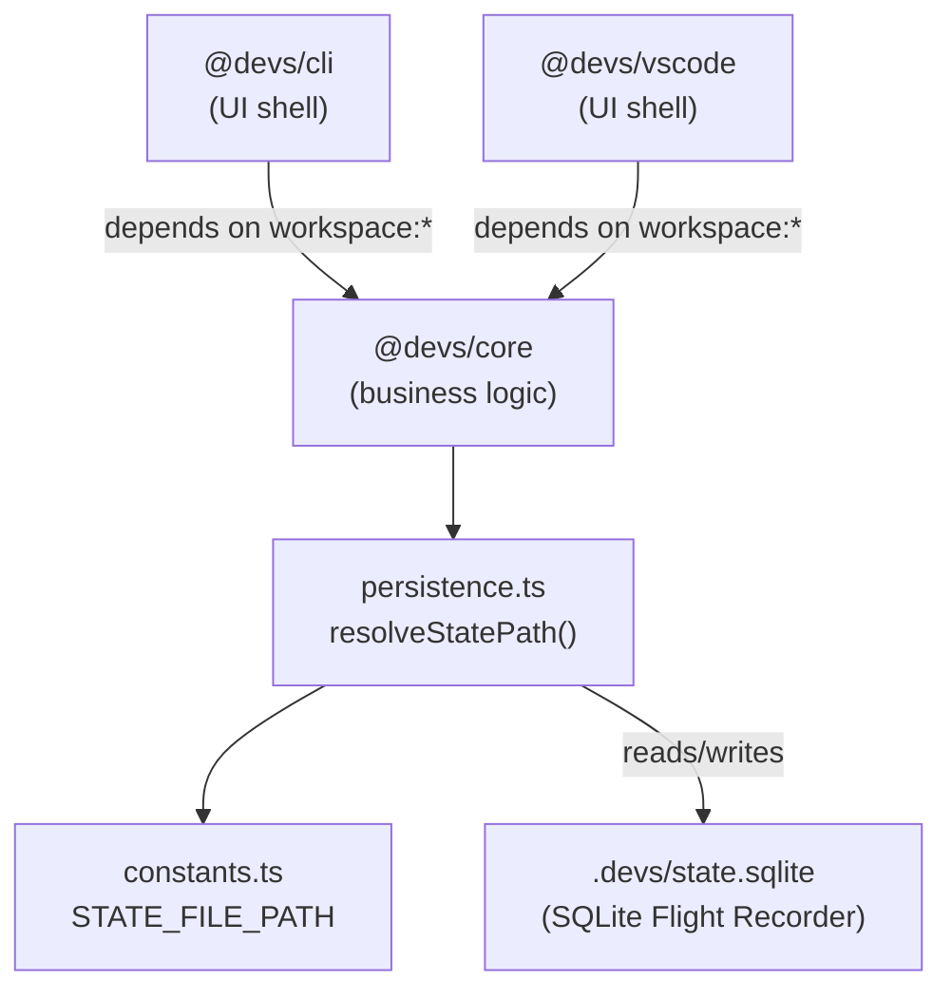

# State Sharing Architecture

## Overview

The `devs` system uses a single shared SQLite database — the **Flight Recorder** — to maintain real-time state across all components (CLI, VSCode Extension, MCP server). This document explains how the CLI and VSCode extension share state through the `.devs/` directory.

## The `.devs/` Flight Recorder Directory

The `.devs/` directory lives at the project root and contains all runtime state generated by the `devs` system:

```
<project-root>/
└── .devs/
    ├── .gitignore       # Excludes all runtime files from VCS
    ├── POLICY.md        # Developer Agent write-access prohibition policy
    └── state.sqlite     # Shared SQLite state database (runtime, not committed)
```

Runtime files (`.sqlite`, `.lance/`, `.log`) are excluded from version control by `.devs/.gitignore`. Only `POLICY.md` and `.gitignore` itself are tracked.

## Shared State File Path

The canonical path to the shared state database is defined as a constant in `@devs/core`:

```typescript
// packages/core/src/constants.ts
export const STATE_FILE_PATH = ".devs/state.sqlite" as const;
```

This constant is the **single source of truth** for the state file location. All packages that need to access the state file MUST import this constant from `@devs/core` — they must never hardcode the path.

## How CLI and VSCode Extension Access Shared State

Both the CLI and the VSCode extension depend on `@devs/core` as a workspace dependency:

```json
// packages/cli/package.json  AND  packages/vscode/package.json
{
  "dependencies": {
    "@devs/core": "workspace:*"
  }
}
```

This means both packages resolve the state path through the same module:

```
packages/cli        →  @devs/core/persistence  →  resolveStatePath()  →  /abs/path/.devs/state.sqlite
packages/vscode     →  @devs/core/persistence  →  resolveStatePath()  →  /abs/path/.devs/state.sqlite
```

Because both packages use the same resolver function in the same `@devs/core` module, they always arrive at the same absolute path — guaranteeing state consistency.

## Path Resolution Strategy

The `resolveStatePath()` function in `@devs/core/persistence` uses a root-walking strategy:

1. Start from the caller's current working directory (or an explicit `fromDir` parameter).
2. Walk up the directory tree, checking each directory for a `package.json` with `"private": true`.
3. When found, that directory is the project root.
4. Return `resolve(root, ".devs/state.sqlite")`.

```typescript
// packages/core/src/persistence.ts
import { resolveStatePath } from "@devs/core/persistence";

// Works correctly from any subdirectory:
const stateFile = resolveStatePath();           // from process.cwd()
const stateFile = resolveStatePath("/path/to/packages/cli");  // explicit dir
```

This approach is robust regardless of which package or subdirectory the caller is operating in.

## Access Control Policy

Per `.devs/POLICY.md`:

- **`@devs/core` and `@devs/memory`** manage all reads and writes to `.devs/state.sqlite`.
- **Developer Agents** (AI code generators) have **NO write access** to `.devs/`.
- This prevents AI agents from tampering with task state, loop counters, or audit trails.

The CLI and VSCode extension pass all state queries through `@devs/core` APIs — they never open the SQLite database directly.

## Requirements Satisfied

| Requirement | Description |
|---|---|
| `1_PRD-REQ-INT-013` | Real-time state sharing between CLI and VSCode extension enabled by consistent `STATE_FILE_PATH` constant and shared resolver. |
| `TAS-076` | Version manifest initialized in root `package.json` under the `devs` metadata field. |

## Diagram


