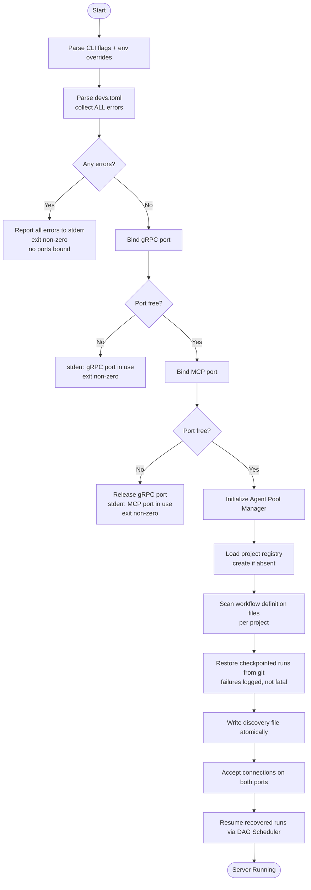
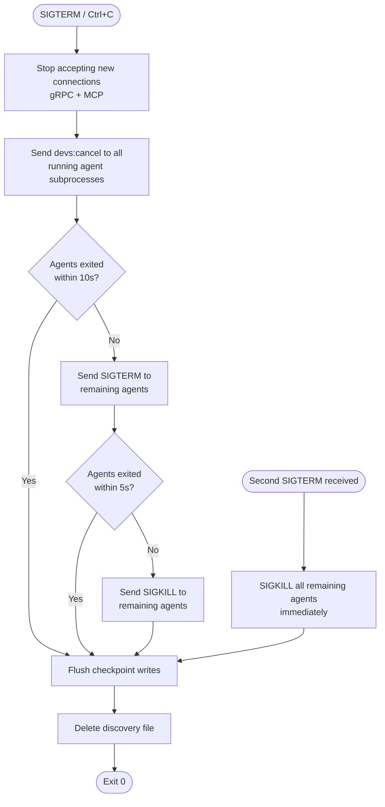

### **[2_TAS-REQ-001]** The server startup sequence MUST follow this exact order, aborting with a non...
- **Type:** Technical
- **Description:** The server startup sequence MUST follow this exact order, aborting with a non-zero exit code at the first unrecoverable error:

1. Parse CLI flags and environment variable overrides.
2. Locate and parse `devs.toml` — collect ALL validation errors in a single pass and report them together to stderr. Exit non-zero if any errors exist. No port is bound before this step completes successfully.
3. Bind gRPC port — fail immediately if already in use (`EADDRINUSE`). No cleanup required.
4. Bind MCP port — fail immediately if already in use; release the already-bound gRPC port before exiting.
5. Initialize the Agent Pool Manager from the validated pool configurations.
6. Load and validate the project registry (`~/.config/devs/projects.toml`). Create the file if absent (an empty registry is valid).
7. For each registered project, scan for workflow definition files in the configured `workflow_paths`.
8. **[2_TAS-REQ-206]** Restore checkpointed runs from git: for each project's checkpoint branch, read all `checkpoint.json` files. Reset stages in `Running` state to `Eligible`; re-queue stages in `Waiting`/`Eligible` state; re-queue `Pending` runs. A failure to restore one project's checkpoints MUST NOT abort startup — log at `ERROR` level and continue with remaining projects.
9. Write the discovery file atomically to `~/.config/devs/server.addr` (or the path in `DEVS_DISCOVERY_FILE` if set).
10. Begin accepting connections on both ports.
11. Resume recovered runs by triggering the DAG Scheduler for each restored `WorkflowRun`.


- **Source:** TAS (Technical Architecture Specification) (docs/plan/specs/2_tas.md)
- **Dependencies:** None

### **[2_TAS-REQ-001A]** The Interface Layer MUST NOT contain business logic
- **Type:** Technical
- **Description:** The Interface Layer MUST NOT contain business logic. All validation, routing, and state mutation MUST be delegated to Engine Layer components. Interface Layer handlers are limited to: deserializing the wire request, calling one Engine Layer method, serializing the response.
- **Source:** TAS (Technical Architecture Specification) (docs/plan/specs/2_tas.md)
- **Dependencies:** None

### **[2_TAS-REQ-001B]** Infrastructure Layer components MUST NOT hold mutable shared state beyond the...
- **Type:** Technical
- **Description:** Infrastructure Layer components MUST NOT hold mutable shared state beyond their own internal caches. They are invoked from Engine Layer components and return results without retaining references to caller state.
- **Source:** TAS (Technical Architecture Specification) (docs/plan/specs/2_tas.md)
- **Dependencies:** None

### **[2_TAS-REQ-001C]** The MCP server and gRPC server MUST share the same in-process state
- **Type:** Technical
- **Description:** The MCP server and gRPC server MUST share the same in-process state. A change made through the MCP interface MUST be immediately visible through the gRPC interface and vice versa, within the same Tokio scheduler cycle, without any inter-process communication.
- **Source:** TAS (Technical Architecture Specification) (docs/plan/specs/2_tas.md)
- **Dependencies:** None

### **[2_TAS-REQ-001D]** The repository root contains a single `Cargo.toml` workspace manifest
- **Type:** Technical
- **Description:** The repository root contains a single `Cargo.toml` workspace manifest. All crates are members of this workspace. No library crate depends on a crate outside the workspace in its non-dev dependencies, except for third-party crates specified in §2.2.

The workspace is organized into the following crates:

| Crate | Type | Binary | Description |
|---|---|---|---|
| `devs-proto` | lib | — | Generated protobuf/gRPC types and client stubs. Contains `build.rs` invoking `tonic-build`. Generated files committed in `src/gen/` so downstream crates do not require `protoc`. |
| `devs-core` | lib | — | Shared domain types (`WorkflowDefinition`, `WorkflowRun`, `StageRun`, validation, error types) and the Template Engine. Zero network or filesystem I/O in non-dev dependencies. |
| `devs-config` | lib | — | Config file parsing (`devs.toml`, `projects.toml`), config precedence resolution (CLI flag > env var > file > built-in default), project registry management. Depends on `devs-core`. |
| `devs-checkpoint` | lib | — | Git-backed persistence via `git2`. Atomic JSON checkpoint reads/writes, log file management, retention sweep. Depends on `devs-core`. No knowledge of gRPC or scheduling. |
| `devs-adapters` | lib | — | `AgentAdapter` trait and five concrete implementations (claude, gemini, opencode, qwen, copilot). PTY spawning via `portable-pty`. Subprocess lifecycle, bidirectional signal handling, rate-limit detection. Depends on `devs-core`. |
| `devs-pool` | lib | — | Agent Pool Manager: semaphore-based concurrency enforcement, capability-based routing, fallback ordering, rate-limit cooldown tracking, `PoolExhausted` event emission. Depends on `devs-core`, `devs-adapters`. |
| `devs-executor` | lib | — | Stage Executor: execution environment management (tempdir, Docker via `DOCKER_HOST`, remote SSH), repo cloning, artifact collection, context file writing. Depends on `devs-core`, `devs-adapters`, `devs-pool`, `devs-checkpoint`. |
| `devs-scheduler` | lib | — | DAG Scheduler: dependency graph evaluation, stage lifecycle state machine, fan-out management, retry/timeout enforcement, multi-project priority scheduling. Depends on `devs-core`, `devs-executor`, `devs-checkpoint`. |
| `devs-webhook` | lib | — | Webhook Dispatcher: at-least-once HTTP delivery via `reqwest`, per-event retry backoff, payload size enforcement. Depends on `devs-core`. |
| `devs-grpc` | lib | — | gRPC service implementations (`tonic` server traits): thin adapters translating proto messages to `devs-core` types and calling `devs-scheduler`/`devs-pool`. Depends on `devs-proto`, `devs-core`, `devs-scheduler`, `devs-pool`. |
| `devs-mcp` | lib | — | MCP server implementation (HTTP/JSON-RPC). All Glass-Box tools: observation, control, testing interfaces. Depends on `devs-core`, `devs-scheduler`, `devs-pool`, `devs-checkpoint`. |
| `devs-server` | bin | `devs` | Server binary. Composes all engine crates, manages startup/shutdown sequence, binds gRPC and MCP ports. Depends on `devs-grpc`, `devs-mcp`, `devs-config`, `devs-webhook`, `devs-scheduler`. |
| `devs-tui` | bin | `devs-tui` | TUI client. Connects to server over gRPC, renders dashboard using Ratatui. Depends on `devs-proto`, `devs-core`. |
| `devs-cli` | bin | `devs` (subcommands) | CLI client. Clap-based argument parsing, gRPC calls, JSON/human-readable output. Depends on `devs-proto`, `devs-core`. |
| `devs-mcp-bridge` | bin | `devs-mcp-bridge` | MCP stdio bridge. Reads JSON-RPC from stdin, forwards over HTTP to MCP port, writes responses to stdout. Depends on `devs-core` only. |
- **Source:** TAS (Technical Architecture Specification) (docs/plan/specs/2_tas.md)
- **Dependencies:** None

### **[2_TAS-REQ-001E]** `devs-core` MUST NOT have `tokio`, `git2`, `reqwest`, or `tonic` in its non-d...
- **Type:** Technical
- **Description:** `devs-core` MUST NOT have `tokio`, `git2`, `reqwest`, or `tonic` in its non-dev `[dependencies]`. This is verified as part of `./do lint` by a dependency audit step.
- **Source:** TAS (Technical Architecture Specification) (docs/plan/specs/2_tas.md)
- **Dependencies:** None

### **[2_TAS-REQ-001F]** `devs-proto` generated files (`src/gen/*.rs`) MUST be committed to the reposi...
- **Type:** Technical
- **Description:** `devs-proto` generated files (`src/gen/*.rs`) MUST be committed to the repository. The `build.rs` regenerates them when `.proto` source files change, detected via `cargo:rerun-if-changed` directives.
- **Source:** TAS (Technical Architecture Specification) (docs/plan/specs/2_tas.md)
- **Dependencies:** None

### **[2_TAS-REQ-001G]** Wire types from `devs-proto` MUST NOT appear in the public API of `devs-sched...
- **Type:** Technical
- **Description:** Wire types from `devs-proto` MUST NOT appear in the public API of `devs-scheduler`, `devs-executor`, or `devs-pool`. All cross-crate communication within the engine uses types from `devs-core`.
- **Source:** TAS (Technical Architecture Specification) (docs/plan/specs/2_tas.md)
- **Dependencies:** None

### **[2_TAS-REQ-001H]** Config validation (step 2) MUST collect ALL errors in a single pass and repor...
- **Type:** Technical
- **Description:** Config validation (step 2) MUST collect ALL errors in a single pass and report them together. The error output format is one error per line on stderr, each prefixed with `ERROR:`. The process MUST NOT bind any port if any config error exists.
- **Source:** TAS (Technical Architecture Specification) (docs/plan/specs/2_tas.md)
- **Dependencies:** None

### **[2_TAS-REQ-001I]** If the MCP port is unavailable (step 4), the server MUST release the already-...
- **Type:** Technical
- **Description:** If the MCP port is unavailable (step 4), the server MUST release the already-bound gRPC port before exiting, leaving no lingering port bindings in any exit path.
- **Source:** TAS (Technical Architecture Specification) (docs/plan/specs/2_tas.md)
- **Dependencies:** None

### **[2_TAS-REQ-001J]** Discovery file write (step 9) MUST be atomic: write to a `.tmp` suffixed file...
- **Type:** Technical
- **Description:** Discovery file write (step 9) MUST be atomic: write to a `.tmp` suffixed file in the same directory, then rename to the final path. On Linux/macOS this is guaranteed atomic by `rename(2)`. On Windows, the implementation MUST use a rename approach equivalent to `MoveFileExW` with `MOVEFILE_REPLACE_EXISTING`.
- **Source:** TAS (Technical Architecture Specification) (docs/plan/specs/2_tas.md)
- **Dependencies:** None

### **[2_TAS-REQ-001K]** Checkpoint restoration (step 8) MUST NOT fail startup if a single project's c...
- **Type:** Technical
- **Description:** Checkpoint restoration (step 8) MUST NOT fail startup if a single project's checkpoint branch is inaccessible (e.g., corrupt git repo, missing branch). The server MUST log an `ERROR`-level message for that project and continue restoring the remaining projects.
- **Source:** TAS (Technical Architecture Specification) (docs/plan/specs/2_tas.md)
- **Dependencies:** None

### **[2_TAS-REQ-001L]** If the `devs.toml` does not exist at the default search path and `--config` i...
- **Type:** Technical
- **Description:** If the `devs.toml` does not exist at the default search path and `--config` is not supplied, the server MUST start with all built-in defaults and emit a `WARN`-level log: `"No devs.toml found at <path>; using built-in defaults."` This is not an error.
- **Source:** TAS (Technical Architecture Specification) (docs/plan/specs/2_tas.md)
- **Dependencies:** None

### **[2_TAS-REQ-001M]** If `--config` is supplied and the file does not exist, the server MUST exit i...
- **Type:** Technical
- **Description:** If `--config` is supplied and the file does not exist, the server MUST exit immediately with a descriptive error before any port binding: `"Error: config file not found: <path>"`.
- **Source:** TAS (Technical Architecture Specification) (docs/plan/specs/2_tas.md)
- **Dependencies:** None

### **[2_TAS-REQ-001N]** If the discovery file directory does not exist, the server MUST create it (in...
- **Type:** Technical
- **Description:** If the discovery file directory does not exist, the server MUST create it (including all missing parent directories) before writing the discovery file. Failure to create the directory is a fatal error at step 9.
- **Source:** TAS (Technical Architecture Specification) (docs/plan/specs/2_tas.md)
- **Dependencies:** None

### **[2_TAS-REQ-002]** On receiving `SIGTERM` (Linux/macOS) or `Ctrl+C` / `CTRL_BREAK_EVENT` (Window...
- **Type:** Technical
- **Description:** On receiving `SIGTERM` (Linux/macOS) or `Ctrl+C` / `CTRL_BREAK_EVENT` (Windows), the server MUST perform a graceful shutdown in this exact order:

1. Stop accepting new gRPC connections.
2. Stop accepting new MCP connections.
3. Send `devs:cancel\n` via stdin to all actively running agent subprocesses.
4. Wait up to 10 seconds for agent subprocesses to terminate voluntarily.
5. Send `SIGTERM` to any still-running agent subprocesses.
6. Wait up to 5 more seconds; send `SIGKILL` to any subprocesses still running.
7. Flush all in-flight checkpoint writes (wait for all `spawn_blocking` git2 tasks to complete).
8. Delete the discovery file.
9. Exit with code 0.


- **Source:** TAS (Technical Architecture Specification) (docs/plan/specs/2_tas.md)
- **Dependencies:** None

### **[2_TAS-REQ-002A]** The discovery file MUST be deleted before the process exits
- **Type:** Technical
- **Description:** The discovery file MUST be deleted before the process exits. If deletion fails (e.g., permissions error), the failure MUST be logged at `ERROR` level. The process MUST still exit with code 0.
- **Source:** TAS (Technical Architecture Specification) (docs/plan/specs/2_tas.md)
- **Dependencies:** None

### **[2_TAS-REQ-002B]** In-flight gRPC streaming calls (e.g., `StreamRunEvents`, `StreamLogs`) that a...
- **Type:** Technical
- **Description:** In-flight gRPC streaming calls (e.g., `StreamRunEvents`, `StreamLogs`) that are active at shutdown MUST receive a `CANCELLED` status code before their connections are closed.
- **Source:** TAS (Technical Architecture Specification) (docs/plan/specs/2_tas.md)
- **Dependencies:** None

### **[2_TAS-REQ-002C]** All `WorkflowRun` and `StageRun` state that was `Running` at shutdown MUST be...
- **Type:** Technical
- **Description:** All `WorkflowRun` and `StageRun` state that was `Running` at shutdown MUST be persisted to git before exit, with those stages' status set in the checkpoint such that recovery on restart (§1.3 step 8) correctly resets them to `Eligible`.
- **Source:** TAS (Technical Architecture Specification) (docs/plan/specs/2_tas.md)
- **Dependencies:** None

### **[2_TAS-REQ-002D]** If a second `SIGTERM` is received during an in-progress shutdown, the server ...
- **Type:** Technical
- **Description:** If a second `SIGTERM` is received during an in-progress shutdown, the server MUST immediately send `SIGKILL` to all remaining agent subprocesses without waiting for the grace period, then proceed to checkpoint flush and exit.
- **Source:** TAS (Technical Architecture Specification) (docs/plan/specs/2_tas.md)
- **Dependencies:** None

### **[2_TAS-REQ-002E]** The discovery file path is resolved in this priority order:
- **Type:** Technical
- **Description:** The discovery file path is resolved in this priority order:
1. The `DEVS_DISCOVERY_FILE` environment variable, if set and non-empty.
2. The `server.discovery_file` key in `devs.toml`, if present.
3. The default path: `~/.config/devs/server.addr` (where `~` resolves via `HOME` on Linux/macOS and `USERPROFILE` on Windows).
- **Source:** TAS (Technical Architecture Specification) (docs/plan/specs/2_tas.md)
- **Dependencies:** None

### **[2_TAS-REQ-002F]** The discovery file MUST contain exactly one line of plain UTF-8 text in the f...
- **Type:** Technical
- **Description:** The discovery file MUST contain exactly one line of plain UTF-8 text in the format `<host>:<port>`, where `<host>` is an IPv4 address, an IPv6 address in brackets (e.g., `[::1]`), or a DNS hostname, and `<port>` is a decimal integer in the range `1`–`65535`. Clients MUST strip all surrounding whitespace before parsing.
- **Source:** TAS (Technical Architecture Specification) (docs/plan/specs/2_tas.md)
- **Dependencies:** None

### **[2_TAS-REQ-002G]** The discovery file encodes the gRPC listen port
- **Type:** Technical
- **Description:** The discovery file encodes the gRPC listen port. The MCP port is retrieved via the `ServerService.GetInfo` gRPC RPC after connecting. Client binaries that need the MCP port (e.g., `devs-mcp-bridge`) MUST call `GetInfo` first rather than hardcoding or computing the MCP port.
- **Source:** TAS (Technical Architecture Specification) (docs/plan/specs/2_tas.md)
- **Dependencies:** None

### **[2_TAS-REQ-002H]** If a client reads the discovery file and the address is stale (server not lis...
- **Type:** Technical
- **Description:** If a client reads the discovery file and the address is stale (server not listening), the gRPC connection attempt fails. The client MUST report this condition as exit code `3` and print a human-readable error to stderr: `"Server at <addr> is not reachable. Is it running?"`.
- **Source:** TAS (Technical Architecture Specification) (docs/plan/specs/2_tas.md)
- **Dependencies:** None

### **[2_TAS-REQ-002I]** For E2E test isolation, every test that starts a server instance MUST set `DE...
- **Type:** Technical
- **Description:** For E2E test isolation, every test that starts a server instance MUST set `DEVS_DISCOVERY_FILE` to a unique temporary path (e.g., a path under the test's temp directory). This prevents discovery file conflicts between parallel server instances in the same test run.
- **Source:** TAS (Technical Architecture Specification) (docs/plan/specs/2_tas.md)
- **Dependencies:** None

### **[2_TAS-REQ-002J]** When `--server <host:port>` is passed to any client binary, the client MUST u...
- **Type:** Technical
- **Description:** When `--server <host:port>` is passed to any client binary, the client MUST use the explicit address unconditionally and MUST NOT read the discovery file.
- **Source:** TAS (Technical Architecture Specification) (docs/plan/specs/2_tas.md)
- **Dependencies:** None

### **[2_TAS-REQ-002K]** The server binary initializes a single multi-threaded Tokio runtime using `#[...
- **Type:** Technical
- **Description:** The server binary initializes a single multi-threaded Tokio runtime using `#[tokio::main]` with the default thread pool (worker thread count = number of logical CPUs). All async tasks run on this shared runtime. Creating additional Tokio runtimes inside the server process is prohibited.
- **Source:** TAS (Technical Architecture Specification) (docs/plan/specs/2_tas.md)
- **Dependencies:** None

### **[2_TAS-REQ-002L]** Blocking operations that cannot be made async — specifically all `git2` files...
- **Type:** Technical
- **Description:** Blocking operations that cannot be made async — specifically all `git2` filesystem operations, subprocess `wait()` calls, and synchronous SSH operations — MUST be dispatched with `tokio::task::spawn_blocking`. These operations MUST NOT be called directly on a Tokio worker thread.
- **Source:** TAS (Technical Architecture Specification) (docs/plan/specs/2_tas.md)
- **Dependencies:** None

### **[2_TAS-REQ-002M]** Shared mutable state between async tasks MUST use `Arc<tokio::sync::RwLock<T>...
- **Type:** Technical
- **Description:** Shared mutable state between async tasks MUST use `Arc<tokio::sync::RwLock<T>>` for read-heavy state (e.g., `SchedulerState` reads during event broadcasts) or `Arc<tokio::sync::Mutex<T>>` for write-heavy or fine-grained state. `std::sync::RwLock` and `std::sync::Mutex` MUST NOT be held across `.await` points.
- **Source:** TAS (Technical Architecture Specification) (docs/plan/specs/2_tas.md)
- **Dependencies:** None

### **[2_TAS-REQ-002N]** The concurrency semaphore for each agent pool is `Arc<tokio::sync::Semaphore>...
- **Type:** Technical
- **Description:** The concurrency semaphore for each agent pool is `Arc<tokio::sync::Semaphore>` with `max_concurrent` permits. Permits are acquired via `.acquire_owned()` so they can be sent across task boundaries. Permit release MUST occur when the `OwnedSemaphorePermit` is dropped by the stage executor, regardless of stage success or failure.
- **Source:** TAS (Technical Architecture Specification) (docs/plan/specs/2_tas.md)
- **Dependencies:** None

### **[2_TAS-REQ-002O]** The DAG Scheduler maintains all `WorkflowRun` and `StageRun` instances in a s...
- **Type:** Technical
- **Description:** The DAG Scheduler maintains all `WorkflowRun` and `StageRun` instances in a single `Arc<RwLock<SchedulerState>>`. This is the canonical source of truth for runtime state. The git checkpoint is the source of truth for persisted state. On startup, git checkpoint data is loaded into `SchedulerState` before any connections are accepted.
- **Source:** TAS (Technical Architecture Specification) (docs/plan/specs/2_tas.md)
- **Dependencies:** None

### **[2_TAS-REQ-002P]** Lock acquisition order MUST be consistent across all code paths to prevent de...
- **Type:** Technical
- **Description:** Lock acquisition order MUST be consistent across all code paths to prevent deadlock. The defined global order is: `SchedulerState` → `PoolState` → `CheckpointStore` internal lock (if any). Any code path that must acquire multiple locks MUST acquire them in this order.
- **Source:** TAS (Technical Architecture Specification) (docs/plan/specs/2_tas.md)
- **Dependencies:** None

### **[2_TAS-REQ-002Q]** The Webhook Dispatcher operates on a dedicated `tokio::sync::mpsc` channel wi...
- **Type:** Technical
- **Description:** The Webhook Dispatcher operates on a dedicated `tokio::sync::mpsc` channel with a buffer of at least 1024 events. Engine components send `WebhookEvent` messages and immediately return without awaiting delivery. The dispatcher task consumes events independently and retries HTTP delivery without blocking any Scheduler operation.
- **Source:** TAS (Technical Architecture Specification) (docs/plan/specs/2_tas.md)
- **Dependencies:** None

### **[2_TAS-REQ-002R]** All gRPC service methods MUST return `tonic::Status` errors with the appropri...
- **Type:** Technical
- **Description:** All gRPC service methods MUST return `tonic::Status` errors with the appropriate `tonic::Code`. The mapping between domain errors and gRPC status codes is:

| Domain Error Condition | gRPC Code |
|---|---|
| Entity not found (run, stage, project, pool) | `NOT_FOUND` |
| Validation error on input parameters | `INVALID_ARGUMENT` |
| Duplicate name or state conflict | `ALREADY_EXISTS` |
| Client API version mismatch | `FAILED_PRECONDITION` |
| Server resource exhausted (e.g., too many queued runs) | `RESOURCE_EXHAUSTED` |
| Operation not permitted in current entity state | `FAILED_PRECONDITION` |
| Internal server error (unhandled) | `INTERNAL` |
| Client cancelled an in-flight streaming RPC | `CANCELLED` |
- **Source:** TAS (Technical Architecture Specification) (docs/plan/specs/2_tas.md)
- **Dependencies:** None

### **[2_TAS-REQ-002S]** Every gRPC unary response message MUST include a `string request_id` field co...
- **Type:** Technical
- **Description:** Every gRPC unary response message MUST include a `string request_id` field containing a server-generated UUID4 for correlation with server-side logs.
- **Source:** TAS (Technical Architecture Specification) (docs/plan/specs/2_tas.md)
- **Dependencies:** None

### **[2_TAS-REQ-002T]** All gRPC streaming RPCs MUST respect Tokio context cancellation
- **Type:** Technical
- **Description:** All gRPC streaming RPCs MUST respect Tokio context cancellation. When a client cancels a stream, the server MUST stop sending messages and release all associated resources within 500 ms.
- **Source:** TAS (Technical Architecture Specification) (docs/plan/specs/2_tas.md)
- **Dependencies:** None

### **[2_TAS-REQ-002U]** The server MUST implement gRPC reflection via `tonic-reflection` so that tool...
- **Type:** Technical
- **Description:** The server MUST implement gRPC reflection via `tonic-reflection` so that tools such as `grpcurl` can discover the full service schema at runtime without a local `.proto` file.
- **Source:** TAS (Technical Architecture Specification) (docs/plan/specs/2_tas.md)
- **Dependencies:** None

### **[2_TAS-REQ-003]** All code MUST be written in Rust stable with a minimum version of 1.80.0
- **Type:** Technical
- **Description:** All code MUST be written in Rust stable with a minimum version of 1.80.0. No nightly features, nightly-only attributes, or nightly-only crate features are permitted in any workspace crate's non-dev code paths.
- **Source:** TAS (Technical Architecture Specification) (docs/plan/specs/2_tas.md)
- **Dependencies:** None

### **[2_TAS-REQ-004]** The repository root MUST contain a `rust-toolchain.toml` file that pins the t...
- **Type:** Technical
- **Description:** The repository root MUST contain a `rust-toolchain.toml` file that pins the toolchain channel to `"stable"` with a minimum version of `"1.80.0"`. This file ensures that all developers and CI runners use a consistent toolchain regardless of their locally installed Rust version.

```toml
# rust-toolchain.toml (authoritative)
[toolchain]
channel = "stable"
components = ["rustfmt", "clippy", "llvm-tools-preview"]
```

The `llvm-tools-preview` component is required by `cargo-llvm-cov` for coverage instrumentation (§2.7). Including it in `rust-toolchain.toml` ensures it is installed automatically by `rustup` on every machine and CI runner.
- **Source:** TAS (Technical Architecture Specification) (docs/plan/specs/2_tas.md)
- **Dependencies:** None

### **[2_TAS-REQ-004A]** The workspace `[workspace.lints]` table MUST contain the following configurat...
- **Type:** Technical
- **Description:** The workspace `[workspace.lints]` table MUST contain the following configuration, enforced on all member crates via `[lints] workspace = true` in each crate's `Cargo.toml`:

```toml
# Cargo.toml (workspace root) — authoritative lint table
[workspace.lints.rust]
missing_docs       = "deny"
unsafe_code        = "deny"
unused_must_use    = "deny"
dead_code          = "warn"

[workspace.lints.clippy]
all                = { level = "deny", priority = -1 }
pedantic           = { level = "warn", priority = -1 }
# Allow exceptions that produce excessive noise in idiomatic Rust
module_name_repetitions = "allow"
must_use_candidate      = "allow"
```
- **Source:** TAS (Technical Architecture Specification) (docs/plan/specs/2_tas.md)
- **Dependencies:** None

### **[2_TAS-REQ-004B]** `unsafe_code = "deny"` applies workspace-wide
- **Type:** Technical
- **Description:** `unsafe_code = "deny"` applies workspace-wide. No `unsafe` block is permitted in any crate. If a dependency transitively requires unsafe code inside its own implementation (e.g., `git2`, `portable-pty`), that is acceptable — the prohibition applies only to code authored within this workspace.
- **Source:** TAS (Technical Architecture Specification) (docs/plan/specs/2_tas.md)
- **Dependencies:** None

### **[2_TAS-REQ-004C]** The workspace MUST define the following Cargo profiles:
- **Type:** Technical
- **Description:** The workspace MUST define the following Cargo profiles:

```toml
# Cargo.toml (workspace root) — authoritative profile table
[profile.dev]
opt-level = 0
debug     = true
# Speed up incremental builds in development
incremental = true

[profile.release]
opt-level     = 3
lto           = "thin"
codegen-units = 1
strip         = "debuginfo"
panic         = "abort"

[profile.test]
# Inherits from dev; ensure test binaries have debug info for coverage
inherits = "dev"
debug    = true
```

The `panic = "abort"` in the release profile eliminates stack-unwinding overhead. All `Result` types are propagated explicitly; panics in production code are defects.
- **Source:** TAS (Technical Architecture Specification) (docs/plan/specs/2_tas.md)
- **Dependencies:** None

### **[2_TAS-REQ-004D]** The root `Cargo.toml` MUST declare `resolver = "2"` to use the v2 feature res...
- **Type:** Technical
- **Description:** The root `Cargo.toml` MUST declare `resolver = "2"` to use the v2 feature resolver, which correctly handles feature unification across workspace crates with optional features.
- **Source:** TAS (Technical Architecture Specification) (docs/plan/specs/2_tas.md)
- **Dependencies:** None

### **[2_TAS-REQ-004E]** No workspace crate may declare optional `[features]` that enable or disable c...
- **Type:** Technical
- **Description:** No workspace crate may declare optional `[features]` that enable or disable core business logic. Feature flags are permitted only for TLS backend selection in `reqwest` (always `rustls-tls`, never `native-tls`) and for test-only utilities gated with `#[cfg(test)]`. This constraint prevents partial-feature builds from silently omitting required functionality.
- **Source:** TAS (Technical Architecture Specification) (docs/plan/specs/2_tas.md)
- **Dependencies:** None

### **[2_TAS-REQ-004F]** All CI jobs MUST build and test with `--all-features` to ensure no feature co...
- **Type:** Technical
- **Description:** All CI jobs MUST build and test with `--all-features` to ensure no feature combination is silently broken. The explicit invocation is `cargo build --workspace --all-features` and `cargo test --workspace --all-features`.
- **Source:** TAS (Technical Architecture Specification) (docs/plan/specs/2_tas.md)
- **Dependencies:** None

### **[2_TAS-REQ-004G]** The `unsafe_code = "deny"` lint MUST be active
- **Type:** Technical
- **Description:** The `unsafe_code = "deny"` lint MUST be active. Any `#[allow(unsafe_code)]` or `unsafe` block in workspace source files MUST cause `./do lint` to fail with a `clippy` error. If a third-party crate's API requires calling an `unsafe fn`, the workspace crate MUST wrap it in a safe abstraction within a dedicated module with a `SAFETY:` comment, but the `unsafe` keyword itself in workspace source remains prohibited — such patterns indicate the wrong abstraction and MUST be resolved by using a safe alternative API.
- **Source:** TAS (Technical Architecture Specification) (docs/plan/specs/2_tas.md)
- **Dependencies:** None

### **[2_TAS-REQ-005]** The following crate versions and enabled feature flags are authoritative for ...
- **Type:** Security
- **Description:** The following crate versions and enabled feature flags are authoritative for all workspace members' `[dependencies]`. Features not listed are disabled unless noted otherwise.

| Crate | Version | Required Features | Purpose |
|---|---|---|---|
| `tokio` | 1.38 | `full` | Async runtime: task spawning, channels, timers, I/O, `spawn_blocking`. `full` enables all tokio sub-features including `rt-multi-thread`, `macros`, `time`, `sync`, `net`. |
| `tonic` | 0.12 | `transport`, `codegen` | gRPC server and client. `transport` provides the `Server` and `Channel` types. `codegen` provides `async_trait` re-exports used by generated service traits. |
| `prost` | 0.13 | `derive` | Protobuf message encoding/decoding. `derive` enables `#[derive(Message)]`. **[2_TAS-REQ-603]** Must match the version used by `tonic-build`. |
| `tonic-build` | 0.12 | _(build dependency)_ | `build.rs` code generator for `.proto` files. Invoked via `tonic_build::compile_protos`. |
| `tonic-reflection` | 0.12 | `server` | gRPC server reflection for `grpcurl` compatibility. Registered alongside service routes at server startup. |
| `ratatui` | 0.28 | `crossterm` | TUI widget library. The `crossterm` feature activates the `CrosstermBackend` used on all three platforms. |
| `crossterm` | 0.28 | _(default)_ | Cross-platform terminal I/O. Provides raw mode, event polling, and ANSI escape sequences on Linux, macOS, and Windows. |
| `clap` | 4.5 | `derive`, `env` | CLI argument parsing. `derive` enables `#[derive(Parser, Args, Subcommand)]`. `env` allows env-var binding for each argument. |
| `serde` | 1.0 | `derive` | Serialization framework. `derive` enables `#[derive(Serialize, Deserialize)]`. Used by every data type in `devs-core`. |
| `serde_json` | 1.0 | _(default)_ | JSON serialization for checkpoint files, context files, MCP responses, and webhook payloads. |
| `toml` | 0.8 | `serde` | TOML config parsing. `serde` feature enables `toml::from_str::<T>()`. Used exclusively in `devs-config`. |
| `serde_yaml` | 0.9 | _(default)_ | YAML workflow definition parsing. Used in `devs-config` for `.yaml`/`.yml` workflow files. |
| `uuid` | 1.10 | `v4`, `serde` | UUID v4 generation for `run_id`, `stage_run_id`, and request correlation IDs. `serde` enables transparent JSON serialization as strings. |
| `git2` | 0.19 | `ssh`, `https` | Git operations for the checkpoint store. `ssh` enables libssh2 for remote SSH execution environment repo cloning. `https` enables OpenSSL/Schannel for HTTPS clone. |
| `reqwest` | 0.12 | `json`, `rustls-tls` | Outbound HTTP client for webhook delivery. `json` enables `.json()` body serialization. `rustls-tls` is the mandatory TLS backend. |
| `tracing` | 0.1 | _(default)_ | Structured logging instrumentation. All log statements in library crates use `tracing::info!`, `tracing::warn!`, `tracing::error!`, `tracing::debug!`. |
| `tracing-subscriber` | 0.3 | `env-filter`, `json` | Log subscriber configuration. `env-filter` enables `RUST_LOG` filtering. `json` enables JSON-formatted log output for CI environments. |
| `portable-pty` | 0.8 | _(default)_ | PTY allocation for agent adapters that require an interactive terminal. Provides a cross-platform API over `openpty` (Linux/macOS) and `ConPTY` (Windows). |
| `tokio-stream` | 0.1 | `sync` | Async stream utilities. `sync` enables `BroadcastStream` and `ReceiverStream` wrappers over Tokio channels, used in gRPC streaming RPCs. |
| `handlebars` | 6.0 | _(default)_ | Template variable resolution for `{{template}}` syntax in stage prompts, system prompts, and context files. Used exclusively in `devs-core`'s Template Engine. |
| `chrono` | 0.4 | `serde` | Timestamps (`DateTime<Utc>`) stored as ISO 8601 strings in checkpoints and API responses. `serde` feature serializes to/from RFC 3339 strings. |
| `tempfile` | 3.12 | _(default)_ | Temporary directory creation for `tempdir` execution environments and prompt file writing. Directories are automatically cleaned up when the `TempDir` handle is dropped. |
| `bytes` | 1.7 | _(default)_ | Byte buffer management for gRPC streaming (prost message encoding) and log streaming. |
| `thiserror` | 1.0 | _(default)_ | Ergonomic `#[derive(Error)]` for library crate error types. Used in every `devs-*` library crate's `error.rs`. |
**[2_TAS-REQ-234]** | `anyhow` | 1.0 | _(default)_ | Opaque error propagation in binary crates (`devs-server`, `devs-tui`, `devs-cli`, `devs-mcp-bridge`). MUST NOT appear in library crates' `[dependencies]`. |
- **Source:** TAS (Technical Architecture Specification) (docs/plan/specs/2_tas.md)
- **Dependencies:** None

### **[2_TAS-REQ-005A]** The dependency on `anyhow` is restricted to binary crates only
- **Type:** Functional
- **Description:** The dependency on `anyhow` is restricted to binary crates only. Library crates (`devs-core`, `devs-config`, `devs-checkpoint`, `devs-adapters`, `devs-pool`, `devs-executor`, `devs-scheduler`, `devs-webhook`, `devs-grpc`, `devs-mcp`, `devs-proto`) MUST use `thiserror` for their error types and return `Result<T, MyError>` where `MyError` is a domain-specific type. This allows downstream callers to pattern-match on specific error variants.
- **Source:** TAS (Technical Architecture Specification) (docs/plan/specs/2_tas.md)
- **Dependencies:** None

### **[2_TAS-REQ-006]** `reqwest` MUST use the `rustls-tls` feature exclusively
- **Type:** Security
- **Description:** `reqwest` MUST use the `rustls-tls` feature exclusively. The `native-tls` and `native-tls-alpn` features MUST NOT be enabled on any workspace crate. This guarantees that webhook TLS behavior is identical on Linux, macOS, and Windows without requiring OpenSSL to be installed on the host system.
- **Source:** TAS (Technical Architecture Specification) (docs/plan/specs/2_tas.md)
- **Dependencies:** None

### **[2_TAS-REQ-007]** Dev-only dependencies — declared in `[dev-dependencies]` of workspace members...
- **Type:** Security
- **Description:** Dev-only dependencies — declared in `[dev-dependencies]` of workspace members or in `[workspace.dev-dependencies]` — are not subject to the "no nightly" restriction but MUST NOT appear in any crate's `[dependencies]`. The authoritative dev-dependency versions are:

| Crate | Version | Purpose |
|---|---|---|
| `cargo-llvm-cov` | 0.6 | Line coverage instrumentation via LLVM instrumentation profiles. Invoked by `./do coverage`. |
| `insta` | 1.40 | Snapshot testing for TUI text output. Snapshots stored as `.txt` fixture files under `src/snapshots/`. |
| `mockall` | 0.13 | Mock generation (`#[automock]`) for the `AgentAdapter` and `CheckpointStore` traits in unit tests. |
| `bollard` | 0.17 | Docker API client. Used in integration test helpers to start/stop Docker containers for the `docker` execution environment E2E tests. |
| `wiremock` | 0.6 | HTTP mock server. Used in webhook delivery tests to assert payload format and retry behavior without sending real HTTP requests. |
| `assert_cmd` | 2.0 | CLI binary integration testing. Runs `devs-cli` and `devs-mcp-bridge` as subprocesses and asserts exit codes and stdout/stderr patterns. |
| `predicates` | 3.1 | Composable predicates for use with `assert_cmd` output assertions. |
| `tokio-test` | 0.4 | Helpers for testing async code: `block_on`, mock time, mock I/O. |
| `rstest` | 0.22 | Parameterised test cases with `#[rstest]` and `#[case]` attributes. |
- **Source:** TAS (Technical Architecture Specification) (docs/plan/specs/2_tas.md)
- **Dependencies:** None

### **[2_TAS-REQ-007A]** `./do lint` MUST include a step that verifies no workspace crate's `Cargo.loc...
- **Type:** Security
- **Description:** `./do lint` MUST include a step that verifies no workspace crate's `Cargo.lock`-resolved dependency list contains a crate not present in the authoritative tables above (§2.2 for non-dev, §2.2 dev table for dev). The check is implemented as a script that compares `cargo metadata --format-version 1` output against the documented set and exits non-zero on any undocumented crate. This prevents accidental transitive dependency promotion.
- **Source:** TAS (Technical Architecture Specification) (docs/plan/specs/2_tas.md)
- **Dependencies:** None

### **[2_TAS-REQ-007B]** When a new dependency is required, the implementing agent MUST:
- **Type:** Security
- **Description:** When a new dependency is required, the implementing agent MUST:
1. Add it to the authoritative table in this document with version, features, and purpose.
2. Add it to the relevant crate's `Cargo.toml`.
3. Verify `./do lint` passes, including the dependency audit step.

Submitting code that uses an undocumented crate without updating this table is a blocking defect.
- **Source:** TAS (Technical Architecture Specification) (docs/plan/specs/2_tas.md)
- **Dependencies:** None

### **[2_TAS-REQ-008]** All `.proto` files reside under `proto/devs/v1/`
- **Type:** Technical
- **Description:** All `.proto` files reside under `proto/devs/v1/`. Each gRPC service has its own file. The layout is:

```
proto/
  devs/
    v1/
      common.proto               # Shared message types (Timestamp, RunStatus, StageStatus, etc.)
      workflow_definition.proto  # WorkflowDefinitionService + all workflow/stage definition messages
      run.proto                  # RunService + WorkflowRun, StageRun, RunStatus messages
      stage.proto                # StageService + StageOutput, StageRun detail messages
      log.proto                  # LogService + log streaming messages
      pool.proto                 # PoolService + AgentPool, PoolUtilization messages
      project.proto              # ProjectService + Project, ProjectConfig messages
      server.proto               # ServerService + ServerInfo (version, MCP port)
```
- **Source:** TAS (Technical Architecture Specification) (docs/plan/specs/2_tas.md)
- **Dependencies:** None

### **[2_TAS-REQ-008A]** Every `.proto` file MUST begin with the following header block:
- **Type:** Functional
- **Description:** Every `.proto` file MUST begin with the following header block:

```proto
syntax = "proto3";
package devs.v1;

import "google/protobuf/timestamp.proto";
// Additional imports as required
```
- **Source:** TAS (Technical Architecture Specification) (docs/plan/specs/2_tas.md)
- **Dependencies:** None

### **[2_TAS-REQ-008B]** The `devs-proto` crate contains a `build.rs` that compiles `.proto` files int...
- **Type:** Functional
- **Description:** The `devs-proto` crate contains a `build.rs` that compiles `.proto` files into Rust source. Generated files are written into `devs-proto/src/gen/`. This directory and all its contents MUST be committed to the repository so that `cargo build` succeeds without `protoc` installed.
- **Source:** TAS (Technical Architecture Specification) (docs/plan/specs/2_tas.md)
- **Dependencies:** None

### **[2_TAS-REQ-008C]** The `devs-proto/src/gen/` directory MUST contain an `mod.rs` (or equivalent `...
- **Type:** Functional
- **Description:** The `devs-proto/src/gen/` directory MUST contain an `mod.rs` (or equivalent `lib.rs` re-exports) that re-exports all generated modules under a clean public API. Downstream crates import types as `devs_proto::devs::v1::WorkflowRun`, not by reaching into `gen::` submodules directly.
- **Source:** TAS (Technical Architecture Specification) (docs/plan/specs/2_tas.md)
- **Dependencies:** None

### **[2_TAS-REQ-008D]** If `protoc` is not installed on the build machine, `build.rs` MUST detect thi...
- **Type:** Functional
- **Description:** If `protoc` is not installed on the build machine, `build.rs` MUST detect this and skip re-generation, using the committed generated files. It MUST NOT fail the build. The detection is: attempt to invoke `protoc --version`; if it fails, print `cargo:warning=protoc not found; using committed generated files.` and return `Ok(())` immediately.
- **Source:** TAS (Technical Architecture Specification) (docs/plan/specs/2_tas.md)
- **Dependencies:** None

### **[2_TAS-REQ-009]** The proto package name is `devs.v1`
- **Type:** Technical
- **Description:** The proto package name is `devs.v1`. Message and service names use `PascalCase`. Field names use `snake_case`. Enum value names use `SCREAMING_SNAKE_CASE` prefixed with the enum name (e.g., `RUN_STATUS_PENDING`, `RUN_STATUS_RUNNING`).
- **Source:** TAS (Technical Architecture Specification) (docs/plan/specs/2_tas.md)
- **Dependencies:** None

### **[2_TAS-REQ-009A]** Field numbers in all messages MUST be assigned sequentially starting from 1 a...
- **Type:** Security
- **Description:** Field numbers in all messages MUST be assigned sequentially starting from 1 and MUST NOT be reused after removal. If a field is removed from a message, its number is reserved with a `reserved` statement. This preserves backward compatibility with clients running older binaries.

```proto
// Example of correct field reservation (authoritative pattern)
message WorkflowRun {
  reserved 5;  // formerly `workflow_version`, removed in v1.2
  reserved "workflow_version";

  string run_id      = 1;
  string slug        = 2;
  string workflow_name = 3;
  // ... remaining fields
}
```
- **Source:** TAS (Technical Architecture Specification) (docs/plan/specs/2_tas.md)
- **Dependencies:** None

### **[2_TAS-REQ-009B]** The `ServerService` MUST include a `GetInfo` RPC that returns the server vers...
- **Type:** UX
- **Description:** The `ServerService` MUST include a `GetInfo` RPC that returns the server version and MCP port:

```proto
service ServerService {
  rpc GetInfo(GetInfoRequest) returns (GetInfoResponse);
}

message GetInfoRequest {}

message GetInfoResponse {
  string server_version = 1;  // semver string, e.g. "0.1.0"
  uint32 mcp_port       = 2;  // MCP HTTP listen port
  string request_id     = 3;  // server-generated UUID4 for log correlation
}
```

This is the mechanism clients use to discover the MCP port after connecting to the gRPC port via the discovery file (§1.5).
- **Source:** TAS (Technical Architecture Specification) (docs/plan/specs/2_tas.md)
- **Dependencies:** None

### **[2_TAS-REQ-010]** The GitLab CI pipeline defines three parallel jobs: `presubmit-linux`, `presu...
- **Type:** Security
- **Description:** The GitLab CI pipeline defines three parallel jobs: `presubmit-linux`, `presubmit-macos`, `presubmit-windows`. Each job runs on the respective OS runner and invokes `./do presubmit`. All three jobs MUST pass for a merge request to be mergeable.

```yaml
# gitlab-ci.yml (authoritative structure)
stages:
  - presubmit

variables:
  CARGO_HOME: "$CI_PROJECT_DIR/.cargo-cache"
  RUST_BACKTRACE: "1"
  RUST_LOG: "info"

.presubmit_template: &presubmit_template
  stage: presubmit
  timeout: 25m
  script:
    - ./do setup
    - ./do presubmit
  artifacts:
    when: always
    paths:
      - target/coverage/report.json
      - target/presubmit_timings.jsonl
      - target/traceability.json
    expire_in: 7 days
  cache:
    key: "$CI_JOB_NAME-$CI_COMMIT_REF_SLUG"
    paths:
      - .cargo-cache/registry
      - target/

presubmit-linux:
  <<: *presubmit_template
  tags: [linux, docker]
  image: rust:1.80-slim-bookworm

presubmit-macos:
  <<: *presubmit_template
  tags: [macos, shell]

presubmit-windows:
  <<: *presubmit_template
  tags: [windows, shell]
```
- **Source:** TAS (Technical Architecture Specification) (docs/plan/specs/2_tas.md)
- **Dependencies:** None

### **[2_TAS-REQ-010A]** The GitLab CI job timeout is set to **25 minutes** to provide a 10-minute buf...
- **Type:** Technical
- **Description:** The GitLab CI job timeout is set to **25 minutes** to provide a 10-minute buffer beyond the 15-minute `./do presubmit` hard timeout. If `./do presubmit` exceeds 15 minutes, it kills all child processes and exits non-zero, causing the CI job to fail cleanly within the 25-minute CI timeout. This two-tier timeout prevents hung CI jobs from consuming runner resources indefinitely.
- **Source:** TAS (Technical Architecture Specification) (docs/plan/specs/2_tas.md)
- **Dependencies:** None

### **[2_TAS-REQ-010B]** CI artifacts MUST include `target/coverage/report.json`, `target/presubmit_ti...
- **Type:** Functional
- **Description:** CI artifacts MUST include `target/coverage/report.json`, `target/presubmit_timings.jsonl`, and `target/traceability.json` with `expire_in: 7 days`. These files are uploaded even on job failure (`when: always`) to aid post-failure debugging.
- **Source:** TAS (Technical Architecture Specification) (docs/plan/specs/2_tas.md)
- **Dependencies:** None

### **[2_TAS-REQ-010C]** The Cargo registry cache (`$CARGO_HOME/registry`) and the `target/` directory...
- **Type:** Functional
- **Description:** The Cargo registry cache (`$CARGO_HOME/registry`) and the `target/` directory MUST be cached per job name per branch (`CI_JOB_NAME-$CI_COMMIT_REF_SLUG`). This avoids redownloading all crates on every run. Cache restoration failures MUST NOT cause the job to fail — `./do setup` will re-fetch any missing artifacts.
- **Source:** TAS (Technical Architecture Specification) (docs/plan/specs/2_tas.md)
- **Dependencies:** None

### **[2_TAS-REQ-010D]** The `./do` script MUST be POSIX `sh`-compatible
- **Type:** Functional
- **Description:** The `./do` script MUST be POSIX `sh`-compatible. Bash-specific syntax (arrays, `[[ ]]`, `$'...'`, process substitution `<(...)`) MUST NOT appear. On Windows the script runs under Git Bash, which provides a POSIX `sh`. The shebang line MUST be `#!/bin/sh`.
- **Source:** TAS (Technical Architecture Specification) (docs/plan/specs/2_tas.md)
- **Dependencies:** None

### **[2_TAS-REQ-010E]** The `DEVS_DISCOVERY_FILE` environment variable MUST be set to a unique tempor...
- **Type:** Functional
- **Description:** The `DEVS_DISCOVERY_FILE` environment variable MUST be set to a unique temporary path for every E2E test invocation within CI to prevent discovery file conflicts between parallel test processes running within the same job.
- **Source:** TAS (Technical Architecture Specification) (docs/plan/specs/2_tas.md)
- **Dependencies:** None

### **[2_TAS-REQ-010F]** `./do ci` copies the working directory to a temporary git commit (without mod...
- **Type:** Technical
- **Description:** `./do ci` copies the working directory to a temporary git commit (without modifying the actual branch) and submits it to the GitLab CI API to trigger a pipeline run. The command:
1. Creates a temporary branch named `ci/local-<timestamp>-<6-hex-chars>`.
2. Commits all staged and unstaged changes to that branch (no-edit, no-hooks).
3. Pushes the temporary branch to the `origin` remote.
4. Polls the GitLab CI API until the pipeline completes or 30 minutes elapse.
5. Prints a per-job summary (pass/fail with timing) to stdout.
6. Deletes the temporary branch from `origin`.
7. Exits with code 0 if all jobs passed, non-zero otherwise.

The GitLab API token is read from the `GITLAB_TOKEN` environment variable. If absent, `./do ci` exits non-zero with `"Error: GITLAB_TOKEN environment variable not set"`.
- **Source:** TAS (Technical Architecture Specification) (docs/plan/specs/2_tas.md)
- **Dependencies:** None

### **[2_TAS-REQ-012]** `./do lint` runs the following commands in order; any non-zero exit code fail...
- **Type:** Technical
- **Description:** `./do lint` runs the following commands in order; any non-zero exit code fails the entire lint step:

1. `cargo fmt --check --all`
2. `cargo clippy --workspace --all-targets --all-features -- -D warnings`
3. `cargo doc --no-deps --workspace 2>&1 | grep -E "^warning|^error" && exit 1 || exit 0`

Step 3 catches `missing_docs` violations and broken intra-doc links that `clippy` does not catch. The grep pattern matches rustdoc warnings/errors on stdout and causes the step to fail if any are found.
- **Source:** TAS (Technical Architecture Specification) (docs/plan/specs/2_tas.md)
- **Dependencies:** None

### **[2_TAS-REQ-012A]** A `rustfmt.toml` file at the repository root controls formatting
- **Type:** Technical
- **Description:** A `rustfmt.toml` file at the repository root controls formatting. Its authoritative content is:

```toml
# rustfmt.toml (authoritative)
edition          = "2021"
max_width        = 100
tab_spaces       = 4
use_small_heuristics = "Default"
imports_granularity = "Crate"
group_imports    = "StdExternalCrate"
```

`max_width = 100` provides slightly more horizontal space than the default 80 to accommodate long Rust identifiers (trait bounds, type parameters) common in async Rust without forcing awkward line breaks. `imports_granularity = "Crate"` groups all imports from the same crate into a single `use` statement tree.
- **Source:** TAS (Technical Architecture Specification) (docs/plan/specs/2_tas.md)
- **Dependencies:** None
### **[2_TAS-REQ-012B]** Formatting vs Linting separation
- **Type:** Technical
- **Description:** `./do format` runs `cargo fmt --all` to apply formatting in place. `./do lint` runs `cargo fmt --check --all`; any formatting divergence is a lint failure. These are separate commands: `format` mutates, `lint` only checks.
- **Source:** TAS (Technical Architecture Specification) (docs/plan/specs/2_tas.md)
- **Dependencies:** None

### **[2_TAS-REQ-012C]** Clippy configuration
- **Type:** Technical
- **Description:** `./do lint` runs clippy as: `cargo clippy --workspace --all-targets --all-features -- -D warnings`. `--all-targets` includes `tests`, `benches`, and `examples` in addition to `lib` and `bin` targets. `--all-features` ensures all optional feature combinations are checked. `-D warnings` promotes all clippy warnings to errors.
- **Source:** TAS (Technical Architecture Specification) (docs/plan/specs/2_tas.md)
- **Dependencies:** None

### **[2_TAS-REQ-012D]** Clippy suppression policy
- **Type:** Technical
- **Description:** The workspace `[workspace.lints.clippy]` table (§2.1.1) configures lint levels. Individual `#[allow(clippy::...)]` suppressions are permitted in source code only when the suppression includes a `// REASON:` comment explaining why the lint is inapplicable. Suppressions without `REASON:` comments are rejected by a custom `./do lint` check that `grep`s for `#[allow(clippy::` without a trailing comment.
- **Source:** TAS (Technical Architecture Specification) (docs/plan/specs/2_tas.md)
- **Dependencies:** None

### **[2_TAS-REQ-013]** Mandatory documentation
- **Type:** Technical
- **Description:** Every public Rust item (struct, enum, trait, function, method, constant, type alias, module) MUST have a doc comment (`///` or `//!` for module-level). This is enforced by `missing_docs = "deny"` in the workspace lint table. Items in `pub(crate)` visibility may have doc comments but are not required to.
- **Source:** TAS (Technical Architecture Specification) (docs/plan/specs/2_tas.md)
- **Dependencies:** None

### **[2_TAS-REQ-013A]** Dependency audit lint
- **Type:** Technical
- **Description:** `./do lint` includes a dependency audit step implemented as a shell script that:
  1. Runs `cargo metadata --format-version 1 --no-deps` to list all direct dependencies of all workspace crates.
  2. Compares the output against the authoritative dependency tables in §2.2.
  3. Exits non-zero if any dependency is present in `Cargo.toml` but absent from the §2.2 tables, or if any dependency in §2.2 specifies a version range that does not match what is in `Cargo.toml`.
- **Source:** TAS (Technical Architecture Specification) (docs/plan/specs/2_tas.md)
- **Dependencies:** None

### **[2_TAS-REQ-014]** Standardized subcommands
- **Type:** Technical
- **Description:** Each `./do` subcommand MUST implement the exact behavior described in the command definitions table. (setup, build, test, lint, format, coverage, presubmit, ci).
- **Source:** TAS (Technical Architecture Specification) (docs/plan/specs/2_tas.md)
- **Dependencies:** None

### **[2_TAS-REQ-014A]** Idempotent setup
- **Type:** Technical
- **Description:** `./do setup` MUST be idempotent. Running it on a machine that already has all dependencies installed MUST produce the same outcome (zero exit) as running it on a fresh machine. It MUST NOT modify already-correct installations.
- **Source:** TAS (Technical Architecture Specification) (docs/plan/specs/2_tas.md)
- **Dependencies:** None

### **[2_TAS-REQ-014B]** Required developer tools
- **Type:** Technical
- **Description:** `./do setup` MUST install the following tools, each verified by running `<tool> --version` after installation:
  - `rustup`: System package manager or `https://sh.rustup.rs`
  - `Rust stable ≥ 1.80.0`: `rustup toolchain install stable --component rustfmt clippy llvm-tools-preview`
  - `cargo-llvm-cov`: `cargo install cargo-llvm-cov --version 0.6 --locked`
  - `protoc`: Linux: `apt-get install -y protobuf-compiler`; macOS: `brew install protobuf`; Windows: `choco install protobuf` or `winget install protobuf`
  - `git`: System package manager
- **Source:** TAS (Technical Architecture Specification) (docs/plan/specs/2_tas.md)
- **Dependencies:** None

### **[2_TAS-REQ-014C]** Presubmit timeout enforcement
- **Type:** Technical
- **Description:** `./do presubmit` enforces a hard 15-minute wall-clock timeout using an algorithm that starts a background timer to kill the process group if the limit is exceeded.
- **Source:** TAS (Technical Architecture Specification) (docs/plan/specs/2_tas.md)
- **Dependencies:** None

### **[2_TAS-REQ-014D]** Presubmit timing telemetry
- **Type:** Technical
- **Description:** `./do presubmit` logs each step's start time, end time, and exit code to `target/presubmit_timings.jsonl`. Each line is a JSON object.
- **Source:** TAS (Technical Architecture Specification) (docs/plan/specs/2_tas.md)
- **Dependencies:** None

### **[2_TAS-REQ-014E]** Unknown command handling
- **Type:** Technical
- **Description:** `./do <unknown-command>` MUST print the following to stderr and exit non-zero:
  ```
  Unknown command: '<unknown-command>'
  Valid commands: setup build test lint format coverage presubmit ci
  ```
- **Source:** TAS (Technical Architecture Specification) (docs/plan/specs/2_tas.md)
- **Dependencies:** None

### **[2_TAS-REQ-014F]** Traceability check
- **Type:** Technical
- **Description:** `./do test` generates `target/traceability.json` after all tests complete. The generation algorithm scans source files for `Covers:` tags, scans spec files for requirement IDs, computes coverage, and exits non-zero if `traceability_pct < 100.0` or if any test references a non-existent requirement ID.
- **Source:** TAS (Technical Architecture Specification) (docs/plan/specs/2_tas.md)
- **Dependencies:** None

### **[2_TAS-REQ-015]** Coverage measurement sequence
- **Type:** Technical
- **Description:** `./do coverage` MUST run the following invocations in sequence:
  1. Unit test coverage (all workspace crates, tests tagged `#[test]` in `src/`).
  2. E2E test coverage (tests in `tests/` directories, external interface tests).
  3. Per-interface E2E coverage (CLI, TUI, MCP individually).
- **Source:** TAS (Technical Architecture Specification) (docs/plan/specs/2_tas.md)
- **Dependencies:** None

### **[2_TAS-REQ-015A]** Unit vs E2E test definition
- **Type:** Technical
- **Description:** Unit tests are defined as tests using `#[test]` or `#[tokio::test]` attributes located inside `src/` files. E2E tests are defined as tests in `tests/` directories that exercise the system through external interfaces (CLI binary invocation, TUI terminal emulation, MCP JSON-RPC calls). The test binary path convention identifies E2E tests by the prefix `e2e::` in their test name.
- **Source:** TAS (Technical Architecture Specification) (docs/plan/specs/2_tas.md)
- **Dependencies:** None

### **[2_TAS-REQ-015B]** E2E test serialization
- **Type:** Technical
- **Description:** E2E tests MUST run with `--test-threads 1` to prevent multiple `devs` server instances from conflicting on port numbers or the discovery file. Each E2E test that starts a server instance MUST set `DEVS_DISCOVERY_FILE` to a unique temporary path.
- **Source:** TAS (Technical Architecture Specification) (docs/plan/specs/2_tas.md)
- **Dependencies:** None

### **[2_TAS-REQ-015C]** Coverage report schema
- **Type:** Technical
- **Description:** `./do coverage` MUST write `target/coverage/report.json` with a specific schema including `generated_at`, `overall_passed`, and a `gates` array containing gate IDs QG-001 through QG-005 with their scope, threshold, and actual results.
- **Source:** TAS (Technical Architecture Specification) (docs/plan/specs/2_tas.md)
- **Dependencies:** None

### **[2_TAS-REQ-015D]** Coverage quality gate enforcement
- **Type:** Technical
- **Description:** `./do coverage` exits with code 0 only if `overall_passed` is `true` in the generated report. If any gate fails, `./do coverage` prints a summary table to stderr listing each failing gate with its `actual_pct` and `threshold_pct`, then exits non-zero.
- **Source:** TAS (Technical Architecture Specification) (docs/plan/specs/2_tas.md)
- **Dependencies:** None

### **[2_TAS-REQ-015E]** Interface coverage scope
- **Type:** Technical
- **Description:** The per-interface E2E coverage (QG-003, QG-004, QG-005) is computed as the line coverage of the lines executed by the CLI, TUI, and MCP test suites respectively, measured against the **total lines in all workspace crates**. It is not a ratio against interface-only files.
- **Source:** TAS (Technical Architecture Specification) (docs/plan/specs/2_tas.md)
- **Dependencies:** None

### **[2_TAS-REQ-015F]** TUI test strategy
- **Type:** Technical
- **Description:** TUI tests MUST use a headless terminal emulator approach:
  1. Render the TUI widget tree to an in-memory `ratatui::backend::TestBackend`.
  2. Assert on the text content of specific cells using `backend.buffer().get(x, y).symbol()`.
  3. Save and compare full terminal snapshots as `.txt` files using `insta::assert_snapshot!`.
  Pixel-level or screenshot-based comparison is prohibited.
- **Source:** TAS (Technical Architecture Specification) (docs/plan/specs/2_tas.md)
- **Dependencies:** None

### **[2_TAS-REQ-016]** Canonical file layout
- **Type:** Technical
- **Description:** The canonical file layout under `.devs/` is:
  ```
  .devs/
    runs/<run-id>/
      workflow_snapshot.json        # immutable
      checkpoint.json               # mutable; written atomically
      stages/<stage-name>/attempt_<N>/
        structured_output.json
        context.json
    logs/<run-id>/<stage-name>/attempt_<N>/
      stdout.log
      stderr.log
  ```
- **Source:** TAS (Technical Architecture Specification) (docs/plan/specs/2_tas.md)
- **Dependencies:** None

### **[2_TAS-REQ-017]** Checkpoint file contents
- **Type:** Technical
- **Description:** `checkpoint.json` MUST contain:
  - Schema version field `"schema_version": 1`
  - Full `WorkflowRun` object including all `StageRun` records
  Written via write-to-temp-file then `rename()` for atomicity.
- **Source:** TAS (Technical Architecture Specification) (docs/plan/specs/2_tas.md)
- **Dependencies:** None

### **[2_TAS-REQ-018]** Workflow snapshot persistence
- **Type:** Technical
- **Description:** `workflow_snapshot.json` is written and committed to git before the first stage transitions from `Waiting` to `Eligible`. It is never modified after that point.
- **Source:** TAS (Technical Architecture Specification) (docs/plan/specs/2_tas.md)
- **Dependencies:** None

### **[2_TAS-REQ-019]** RunStatus state machine
- **Type:** Technical
- **Description:** `RunStatus` legal transitions:
  ```
  Pending → Running → Paused ↔ Running → Completed
                              → Failed
                              → Cancelled
  Pending → Cancelled
  ```
- **Source:** TAS (Technical Architecture Specification) (docs/plan/specs/2_tas.md)
- **Dependencies:** None

### **[2_TAS-REQ-020]** StageStatus state machine
- **Type:** Technical
- **Description:** `StageStatus` legal transitions:
  ```
  Pending → Waiting → Eligible → Running → Paused ↔ Running → Completed
                                                   → Failed
                                                   → TimedOut
                                                   → Cancelled
  Failed  → Pending  (retry)
  TimedOut → Pending (retry)
  Waiting → Cancelled
  Eligible → Cancelled
  ```
- **Source:** TAS (Technical Architecture Specification) (docs/plan/specs/2_tas.md)
- **Dependencies:** None

### **[2_TAS-REQ-020A]** State transition validation
- **Type:** Technical
- **Description:** The `StateMachine` trait MUST reject any transition not listed above with `TransitionError::IllegalTransition { from, to }`. The transition is not applied and the current state is preserved. All state transitions MUST be persisted to `checkpoint.json` before any event is emitted to gRPC streaming subscribers.
- **Source:** TAS (Technical Architecture Specification) (docs/plan/specs/2_tas.md)
- **Dependencies:** None

### **[2_TAS-REQ-020B]** Cascade cancellation
- **Type:** Technical
- **Description:** When a `WorkflowRun` transitions to `Failed` or `Cancelled`, all non-terminal `StageRun` records MUST be transitioned to `Cancelled` in the same atomic checkpoint write. A stage is terminal if its status is one of: `Completed`, `Failed`, `TimedOut`, `Cancelled`.
- **Source:** TAS (Technical Architecture Specification) (docs/plan/specs/2_tas.md)
- **Dependencies:** None

### **[2_TAS-REQ-021]** Cargo workspace structure
- **Type:** Technical
- **Description:** The Cargo workspace MUST be organized into the following crates: `devs-proto`, `devs-core`, `devs-config`, `devs-checkpoint`, `devs-scheduler`, `devs-pool`, `devs-adapters`, `devs-executor`, `devs-webhook`, `devs-mcp`, `devs-grpc`, `devs-server`, `devs-tui`, `devs-cli`, and `devs-mcp-bridge`.
- **Source:** TAS (Technical Architecture Specification) (docs/plan/specs/2_tas.md)
- **Dependencies:** None

### **[2_TAS-REQ-021A]** Checkpoint write atomicity
- **Type:** Technical
- **Description:** `checkpoint.json` MUST conform exactly to the specified schema. The file is written atomically by writing to a sibling `.checkpoint.json.tmp` and then calling `rename()`. Any reader that encounters a file ending in `.tmp` MUST treat it as a partial write and ignore it.
- **Source:** TAS (Technical Architecture Specification) (docs/plan/specs/2_tas.md)
- **Dependencies:** None

### **[2_TAS-REQ-021B]** Optional field serialization
- **Type:** Technical
- **Description:** A `null` value for any optional timestamp field MUST be serialized as JSON `null`, never as an absent key. Deserializing a checkpoint where an optional field is absent MUST be treated as `null` for forward compatibility.
- **Source:** TAS (Technical Architecture Specification) (docs/plan/specs/2_tas.md)
- **Dependencies:** None

### **[2_TAS-REQ-021C]** Checkpoint write error handling
- **Type:** Technical
- **Description:** If a disk-full error occurs during the atomic write, `devs` MUST log the error at `ERROR` level, leave the previous checkpoint file unchanged, and continue running. The server MUST NOT crash on checkpoint write failure.
- **Source:** TAS (Technical Architecture Specification) (docs/plan/specs/2_tas.md)
- **Dependencies:** None

### **[2_TAS-REQ-022]** devs-proto responsibilities
- **Type:** Technical
- **Description:** This crate contains no runtime logic. Its sole responsibility is: 1. Invoking `tonic-build` in `build.rs` to compile `.proto` → Rust. 2. Re-exporting all generated types under `devs_proto::devs::v1`.
- **Source:** TAS (Technical Architecture Specification) (docs/plan/specs/2_tas.md)
- **Dependencies:** None

### **[2_TAS-REQ-022A]** Workflow snapshot creation
- **Type:** Technical
- **Description:** `workflow_snapshot.json` is a verbatim serialization of the `WorkflowDefinition` struct at the moment the run transitions from `Pending` to `Running`. It is written atomically and committed to the checkpoint branch before the first stage becomes `Eligible`.
- **Source:** TAS (Technical Architecture Specification) (docs/plan/specs/2_tas.md)
- **Dependencies:** None

### **[2_TAS-REQ-022B]** Snapshot immutability
- **Type:** Technical
- **Description:** Once written, `workflow_snapshot.json` is never modified. Any code path that would overwrite an existing snapshot MUST panic in debug builds and return an `ImmutableSnapshotError` in release builds.
- **Source:** TAS (Technical Architecture Specification) (docs/plan/specs/2_tas.md)
- **Dependencies:** None

### **[2_TAS-REQ-022C]** Snapshot commit metadata
- **Type:** Technical
- **Description:** The git commit message for the snapshot commit is: `devs: snapshot <run-id>`. The git author for all generated commits is `devs <devs@localhost>`.
- **Source:** TAS (Technical Architecture Specification) (docs/plan/specs/2_tas.md)
- **Dependencies:** None

### **[2_TAS-REQ-023]** devs-core responsibilities
- **Type:** Technical
- **Description:** Contains: All domain types, `StateMachine` trait, `TemplateResolver`, and `ValidationError` with collected multi-error reporting.
- **Source:** TAS (Technical Architecture Specification) (docs/plan/specs/2_tas.md)
- **Dependencies:** None

### **[2_TAS-REQ-023A]** Agent context file
- **Type:** Technical
- **Description:** Before spawning each agent, `devs` writes `.devs_context.json` into the agent's working directory. This file contains the outputs of all stages in the transitive `depends_on` closure of the current stage (terminal-state stages only).
- **Source:** TAS (Technical Architecture Specification) (docs/plan/specs/2_tas.md)
- **Dependencies:** None

### **[2_TAS-REQ-023B]** Context file size limits
- **Type:** Technical
- **Description:** The total serialized size of `.devs_context.json` MUST NOT exceed 10 MiB. If exceeded, `stdout` and `stderr` fields are truncated proportionally, the `truncated` flag is set to `true`, and a `WARN` log is emitted.
- **Source:** TAS (Technical Architecture Specification) (docs/plan/specs/2_tas.md)
- **Dependencies:** None

### **[2_TAS-REQ-023C]** Context file write atomicity
- **Type:** Technical
- **Description:** `.devs_context.json` is written atomically (write-to-temp-rename). A failure to write this file MUST cause the stage to transition to `Failed` immediately.
- **Source:** TAS (Technical Architecture Specification) (docs/plan/specs/2_tas.md)
- **Dependencies:** None

### **[2_TAS-REQ-023D]** Context file dependency scope
- **Type:** Technical
- **Description:** Only stages in the **transitive** `depends_on` closure of the current stage are included. Stages not reachable through the dependency graph are excluded.
- **Source:** TAS (Technical Architecture Specification) (docs/plan/specs/2_tas.md)
- **Dependencies:** None

### **[2_TAS-REQ-024]** devs-config responsibilities
- **Type:** Technical
- **Description:** Parses `devs.toml` into a `ServerConfig` struct. Parses `~/.config/devs/projects.toml` into `ProjectRegistry`. Validation errors are collected and returned as `Vec<ConfigError>` before any side effects.
- **Source:** TAS (Technical Architecture Specification) (docs/plan/specs/2_tas.md)
- **Dependencies:** None

### **[2_TAS-REQ-024A]** Agent structured output
- **Type:** Technical
- **Description:** When `completion = StructuredOutput`, the agent is expected to write `.devs_output.json`. `devs` reads this file after the process exits. If it exists, it takes absolute precedence over stdout JSON parsing.
- **Source:** TAS (Technical Architecture Specification) (docs/plan/specs/2_tas.md)
- **Dependencies:** None

### **[2_TAS-REQ-024B]** Structured output parsing rules
- **Type:** Technical
- **Description:** Defines a table of rules for determining `StageStatus` based on the presence of `.devs_output.json`, its validity, and the presence of trailing JSON in stdout.
- **Source:** TAS (Technical Architecture Specification) (docs/plan/specs/2_tas.md)
- **Dependencies:** None

### **[2_TAS-REQ-024C]** Structured output success field
- **Type:** Technical
- **Description:** The `"success"` key MUST be a JSON boolean. A string value such as `"true"` is invalid and causes `Stage → Failed`.
- **Source:** TAS (Technical Architecture Specification) (docs/plan/specs/2_tas.md)
- **Dependencies:** None

### **[2_TAS-REQ-025]** Shared server state
- **Type:** Technical
- **Description:** The `ServerState` structure MUST be defined in `devs-core/src/state.rs`, containing `runs`, `pools`, `projects`, `run_events`, and global `config`.
- **Source:** TAS (Technical Architecture Specification) (docs/plan/specs/2_tas.md)
- **Dependencies:** None

### **[2_TAS-REQ-026]** Server state recovery
- **Type:** Technical
- **Description:** On startup, `ServerState` is populated by reading projects, deserializing checkpoints, applying crash-recovery rules, and initializing pool semaphores.
- **Source:** TAS (Technical Architecture Specification) (docs/plan/specs/2_tas.md)
- **Dependencies:** None

### **[2_TAS-REQ-027]** Shared state mutation
- **Type:** Technical
- **Description:** Mutations to `ServerState.runs` MUST: 1. Acquire write guard, 2. Apply transition via `StateMachine`, 3. Release guard, 4. Persist checkpoint, 5. Broadcast `RunEvent`.
- **Source:** TAS (Technical Architecture Specification) (docs/plan/specs/2_tas.md)
- **Dependencies:** None

### **[2_TAS-REQ-028]** BoundedString constraints
- **Type:** Technical
- **Description:** `BoundedString<N>` wraps a `String` and enforces: Length ≤ N bytes (UTF-8 byte count). Empty strings are rejected with `ValidationError::EmptyString`.
- **Source:** TAS (Technical Architecture Specification) (docs/plan/specs/2_tas.md)
- **Dependencies:** None

### **[2_TAS-REQ-029]** EnvKey constraints
- **Type:** Technical
- **Description:** `EnvKey` wraps a `String` and enforces the regex pattern: `[A-Z_][A-Z0-9_]{0,127}`. Invalid keys return `ValidationError::InvalidEnvKey`.
- **Source:** TAS (Technical Architecture Specification) (docs/plan/specs/2_tas.md)
- **Dependencies:** None

### **[2_TAS-REQ-030]** RunSlug algorithm
- **Type:** Technical
- **Description:** Generated at run creation: `{workflow_name}-{YYYYMMDD}-{4 random lowercase alphanum}`. Truncated to 128 bytes. Collisions result in `DuplicateRunName` error.
- **Source:** TAS (Technical Architecture Specification) (docs/plan/specs/2_tas.md)
- **Dependencies:** None

### **[2_TAS-REQ-030A]** Workflow validation order
- **Type:** Technical
- **Description:** Workflow validation runs 13 checks in a fixed order (Schema, Stage uniqueness, Dependency existence, Cycle detection, Pool existence, Handler existence, Input type coercion, Prompt exclusivity, Fan-out/branch exclusivity, Fan-out completion compatibility, Timeout hierarchy, and Empty workflow check).
- **Source:** TAS (Technical Architecture Specification) (docs/plan/specs/2_tas.md)
- **Dependencies:** None

### **[2_TAS-REQ-030B]** Scheduler dispatch latency
- **Type:** Technical
- **Description:** The DAG scheduler MUST dispatch newly eligible stages within 100 ms of receiving a dependency-completion event.
- **Source:** TAS (Technical Architecture Specification) (docs/plan/specs/2_tas.md)
- **Dependencies:** None

### **[2_TAS-REQ-030C]** Fan-out expansion
- **Type:** Technical
- **Description:** When a fan-out stage is dispatched, the scheduler expands it into N sub-executions. Each is a distinct `StageRun`. Parent completes when all sub-executions reach a terminal state.
- **Source:** TAS (Technical Architecture Specification) (docs/plan/specs/2_tas.md)
- **Dependencies:** None

### **[2_TAS-REQ-031]** UUID format
- **Type:** Technical
- **Description:** All UUID fields use UUID v4, serialized as lowercase hyphenated strings. Non-UUID strings cause deserialization errors.
- **Source:** TAS (Technical Architecture Specification) (docs/plan/specs/2_tas.md)
- **Dependencies:** None

### **[2_TAS-REQ-032]** Validation error collection
- **Type:** Technical
- **Description:** Workflow definition validation is performed in a fixed order, collecting ALL errors before returning. A partial-success validation is not permitted.
- **Source:** TAS (Technical Architecture Specification) (docs/plan/specs/2_tas.md)
- **Dependencies:** None

### **[2_TAS-REQ-033]** Pool exhaustion episode
- **Type:** Technical
- **Description:** When all agents in a pool are simultaneously unavailable (rate-limited or cooldown), emit `PoolExhausted` webhook event exactly once per exhaustion episode.
- **Source:** TAS (Technical Architecture Specification) (docs/plan/specs/2_tas.md)
- **Dependencies:** None

### **[2_TAS-REQ-033A]** Multi-project scheduling
- **Type:** Technical
- **Description:** Defines Strict priority mode and Weighted fair queuing mode for selecting the next stage to dispatch from the global queue.
- **Source:** TAS (Technical Architecture Specification) (docs/plan/specs/2_tas.md)
- **Dependencies:** None

### **[2_TAS-REQ-033B]** Retry delay computation
- **Type:** Technical
- **Description:** Delay is computed as: Fixed (initial_delay), Exponential (min(initial^attempt, max)), or Linear (initial * attempt, capped at max).
- **Source:** TAS (Technical Architecture Specification) (docs/plan/specs/2_tas.md)
- **Dependencies:** None

### **[2_TAS-REQ-034]** AgentAdapter trait
- **Type:** Technical
- **Description:** The `AgentAdapter` trait MUST provide: `tool()`, `build_command()`, and `detect_rate_limit()`.
- **Source:** TAS (Technical Architecture Specification) (docs/plan/specs/2_tas.md)
- **Dependencies:** None

### **[2_TAS-REQ-035]** Agent defaults
- **Type:** Technical
- **Description:** Defines `prompt_mode`, flag/file arg, and `pty` default for claude, gemini, opencode, qwen, and copilot.
- **Source:** TAS (Technical Architecture Specification) (docs/plan/specs/2_tas.md)
- **Dependencies:** None

### **[2_TAS-REQ-036]** Passive rate-limit detection
- **Type:** Technical
- **Description:** Defines exit code and stderr patterns for each adapter (e.g., claude matches "rate limit", "429", "overloaded").
- **Source:** TAS (Technical Architecture Specification) (docs/plan/specs/2_tas.md)
- **Dependencies:** None

### **[2_TAS-REQ-037]** Environment variable injection
- **Type:** Technical
- **Description:** `DEVS_MCP_ADDR` MUST be injected into every agent subprocess. Server internal env vars (`DEVS_LISTEN`, etc.) MUST be stripped.
- **Source:** TAS (Technical Architecture Specification) (docs/plan/specs/2_tas.md)
- **Dependencies:** None

### **[2_TAS-REQ-038]** Stdin signal protocol
- **Type:** Technical
- **Description:** Agent → devs: MCP calls. devs → agent: stdin tokens (`devs:cancel\n`, etc.). SIGTERM sent after grace period.
- **Source:** TAS (Technical Architecture Specification) (docs/plan/specs/2_tas.md)
- **Dependencies:** None

### **[2_TAS-REQ-039]** Adapter fatal errors
- **Type:** Technical
- **Description:** Binary-not-found results in immediate stage `Failed` with no retry. PTY allocation failure results in immediate stage `Failed` with no retry.
- **Source:** TAS (Technical Architecture Specification) (docs/plan/specs/2_tas.md)
- **Dependencies:** None

### **[2_TAS-REQ-040]** StageExecutor trait
- **Type:** Technical
- **Description:** The `StageExecutor` trait MUST provide: `prepare()`, `collect_artifacts()`, and `cleanup()`.
- **Source:** TAS (Technical Architecture Specification) (docs/plan/specs/2_tas.md)
- **Dependencies:** None

### **[2_TAS-REQ-041]** Executor clone paths
- **Type:** Technical
- **Description:** Defines clone paths for `LocalTempDirExecutor`, `DockerExecutor`, and `RemoteSshExecutor`.
- **Source:** TAS (Technical Architecture Specification) (docs/plan/specs/2_tas.md)
- **Dependencies:** None

### **[2_TAS-REQ-042]** Clone depth
- **Type:** Technical
- **Description:** Git clone is shallow (`--depth 1`) by default. `full_clone = true` performs a full clone.
- **Source:** TAS (Technical Architecture Specification) (docs/plan/specs/2_tas.md)
- **Dependencies:** None

### **[2_TAS-REQ-043]** Working directory cleanup
- **Type:** Technical
- **Description:** Working directories MUST be cleaned up after every stage regardless of outcome.
- **Source:** TAS (Technical Architecture Specification) (docs/plan/specs/2_tas.md)
- **Dependencies:** None

### **[2_TAS-REQ-044]** Auto-collect logic
- **Type:** Technical
- **Description:** After stage completion, runs `git diff`, `git add -A`, `git commit`, and `git push` targeting the checkpoint branch ONLY.
- **Source:** TAS (Technical Architecture Specification) (docs/plan/specs/2_tas.md)
- **Dependencies:** None

### **[2_TAS-REQ-044A]** DockerExecutor requirements
- **Type:** Technical
- **Description:** Uses `DOCKER_HOST`, pulls images, clones via `docker exec`, and injects `DEVS_MCP_ADDR`. Container run with `--rm`.
- **Source:** TAS (Technical Architecture Specification) (docs/plan/specs/2_tas.md)
- **Dependencies:** None

### **[2_TAS-REQ-044B]** RemoteSshExecutor requirements
- **Type:** Technical
- **Description:** Uses `ssh2` crate, establishes session, clones over SSH exec channel, and SCPs context file.
- **Source:** TAS (Technical Architecture Specification) (docs/plan/specs/2_tas.md)
- **Dependencies:** None

### **[2_TAS-REQ-044C]** Execution environment schema
- **Type:** Technical
- **Description:** Defines `ExecutionEnv` enum schema for `Tempdir`, `Docker`, and `Remote` configurations in `StageDefinition`.
- **Source:** TAS (Technical Architecture Specification) (docs/plan/specs/2_tas.md)
- **Dependencies:** None
### **[2_TAS-REQ-045]** WebhookDispatcher Maintenance and Retry
- **Type:** Technical
- **Description:** `WebhookDispatcher` maintains a Tokio task per registered webhook target. Delivery is at-least-once: it retries on non-2xx responses using fixed backoff with 10-second timeout per attempt. Delivery failures are logged at `WARN` and do not affect run or stage status.
- **Source:** TAS (Technical Architecture Specification) (docs/plan/specs/2_tas.md)
- **Dependencies:** None

### **[2_TAS-REQ-046]** Webhook Payload Schema
- **Type:** Technical
- **Description:** Webhook payload schema includes event, timestamp, project_id, run_id, stage_name, data, and truncated fields. Maximum payload size: 64 KiB. If the serialized payload exceeds this, the `data` field is truncated and `"truncated": true` is set.
- **Source:** TAS (Technical Architecture Specification) (docs/plan/specs/2_tas.md)
- **Dependencies:** None

### **[2_TAS-REQ-047]** PoolExhausted Webhook Firing Condition
- **Type:** Functional
- **Description:** `PoolExhausted` webhook fires at most once per exhaustion episode (defined as the period between all agents becoming unavailable and any agent becoming available again).
- **Source:** TAS (Technical Architecture Specification) (docs/plan/specs/2_tas.md)
- **Dependencies:** None

### **[2_TAS-REQ-048]** MCP Server Protocol and Bridge
- **Type:** Technical
- **Description:** The MCP server listens on a dedicated TCP port (default 7891). It speaks JSON-RPC 2.0 over HTTP (not WebSocket). The MCP stdio bridge (`devs-mcp-bridge`) is a separate binary that reads JSON-RPC from stdin and writes to stdout, forwarding bidirectionally to the MCP HTTP port. It reports a structured error on connection loss and exits non-zero.
- **Source:** TAS (Technical Architecture Specification) (docs/plan/specs/2_tas.md)
- **Dependencies:** None

### **[2_TAS-REQ-049]** MCP Tool Response Conformance
- **Type:** Technical
- **Description:** All MCP tool responses MUST conform to a structure containing either a `result` object or an `error` string. No plain-text-only responses are permitted.
- **Source:** TAS (Technical Architecture Specification) (docs/plan/specs/2_tas.md)
- **Dependencies:** None

### **[2_TAS-REQ-050]** MCP Tools Categorization
- **Type:** Functional
- **Description:** MCP tools are organized into Observation tools (list_runs, get_run, etc.), Control tools (submit_run, cancel_run, etc.), Testing tools (inject_stage_input, etc.), and Mid-run agent tools (report_progress, etc.).
- **Source:** TAS (Technical Architecture Specification) (docs/plan/specs/2_tas.md)
- **Dependencies:** None

### **[2_TAS-REQ-051]** Data Model Reachability via MCP
- **Type:** Technical
- **Description:** Every entity in the data model MUST be reachable via at least one MCP observation tool with no field omitted. Optional fields that are not yet populated return typed null (JSON `null`), never absent from the response object.
- **Source:** TAS (Technical Architecture Specification) (docs/plan/specs/2_tas.md)
- **Dependencies:** None

### **[2_TAS-REQ-051A]** MCP Tool Request/Response Schemas
- **Type:** Technical
- **Description:** Provides complete MCP tool request/response schemas for tools like `list_runs`, `get_run`, `get_stage_output`, `stream_logs`, `get_pool_state`, `get_workflow_definition`, `list_checkpoints`, `submit_run`, `cancel_run`, `pause_run`, `resume_run`, `cancel_stage`, `pause_stage`, `resume_stage`, `write_workflow_definition`, `inject_stage_input`, `assert_stage_output`, `report_progress`, `signal_completion`, and `report_rate_limit`.
- **Source:** TAS (Technical Architecture Specification) (docs/plan/specs/2_tas.md)
- **Dependencies:** None

### **[2_TAS-REQ-052]** gRPC Services Implementation
- **Type:** Technical
- **Description:** Implements six tonic services: `WorkflowService`, `RunService`, `StageService`, `LogService`, `PoolService`, and `ProjectService`.
- **Source:** TAS (Technical Architecture Specification) (docs/plan/specs/2_tas.md)
- **Dependencies:** None

### **[2_TAS-REQ-053]** gRPC Client Version Check
- **Type:** Technical
- **Description:** All gRPC RPC methods include a `client_version` field in request metadata. If the client major version does not match the server, the server returns `FAILED_PRECONDITION` with message `"client version mismatch"`.
- **Source:** TAS (Technical Architecture Specification) (docs/plan/specs/2_tas.md)
- **Dependencies:** None

### **[2_TAS-REQ-054]** StreamRunEvents Server-Streaming RPC
- **Type:** Technical
- **Description:** `StreamRunEvents` is a server-streaming RPC. The server pushes `RunEvent` messages to the client immediately on any state transition. The TUI MUST re-render within 50 ms of receiving an event.
- **Source:** TAS (Technical Architecture Specification) (docs/plan/specs/2_tas.md)
- **Dependencies:** None

### **[2_TAS-REQ-055]** TUI Technology Stack and Connectivity
- **Type:** Technical
- **Description:** Built with `ratatui` 0.28 and `crossterm` 0.28. Connects to the server via tonic gRPC. Subscribes to `StreamRunEvents` and `WatchPoolState` for live updates.
- **Source:** TAS (Technical Architecture Specification) (docs/plan/specs/2_tas.md)
- **Dependencies:** None

### **[2_TAS-REQ-056]** TUI Tab Layout
- **Type:** UX
- **Description:** TUI features a tab layout including Dashboard (project/run list + selected run detail), Logs (full log stream), Debug (specific agent status and controls), and Pools (real-time pool utilization).
- **Source:** TAS (Technical Architecture Specification) (docs/plan/specs/2_tas.md)
- **Dependencies:** None

### **[2_TAS-REQ-057]** TUI DAG Rendering
- **Type:** UX
- **Description:** DAG rendering uses ASCII box-drawing characters. Stage nodes show: name, status (abbreviated), elapsed time. Edges show dependency direction with `→`.
- **Source:** TAS (Technical Architecture Specification) (docs/plan/specs/2_tas.md)
- **Dependencies:** None

### **[2_TAS-REQ-058]** TUI Testing Strategy
- **Type:** Technical
- **Description:** TUI tests use `insta` snapshot testing on rendered terminal text output. Headless terminal emulation is used (a fixed-size `TestBackend`). Pixel-comparison screenshots are prohibited.
- **Source:** TAS (Technical Architecture Specification) (docs/plan/specs/2_tas.md)
- **Dependencies:** None

### **[2_TAS-REQ-059]** TUI Auto-Reconnect Logic
- **Type:** UX
- **Description:** Auto-reconnect: on connection loss, the TUI retries with exponential backoff up to 30 seconds total, then waits 5 more seconds, then exits with a non-zero exit code.
- **Source:** TAS (Technical Architecture Specification) (docs/plan/specs/2_tas.md)
- **Dependencies:** None

### **[2_TAS-REQ-060]** CLI Technology Stack and Global Flags
- **Type:** Technical
- **Description:** Built with `clap` 4.5 derive macros. All subcommands support `--server <host:port>` (overrides discovery) and `--format json|text` (default: `text`).
- **Source:** TAS (Technical Architecture Specification) (docs/plan/specs/2_tas.md)
- **Dependencies:** None

### **[2_TAS-REQ-061]** CLI Subcommand Specification
- **Type:** Functional
- **Description:** Specifies CLI subcommands including `submit`, `list`, `status`, `logs`, `cancel`, `pause`, `resume`, `project add`, `project remove`, and `project list`, along with their corresponding gRPC calls.
- **Source:** TAS (Technical Architecture Specification) (docs/plan/specs/2_tas.md)
- **Dependencies:** None

### **[2_TAS-REQ-062]** CLI Exit Codes
- **Type:** Technical
- **Description:** Defines CLI exit codes: 0 (Success), 1 (General error), 2 (Not found), 3 (Server unreachable), and 4 (Validation error).
- **Source:** TAS (Technical Architecture Specification) (docs/plan/specs/2_tas.md)
- **Dependencies:** None

### **[2_TAS-REQ-063]** CLI JSON Error Format
- **Type:** Technical
- **Description:** JSON error output format to stdout: `{ "error": "<message>", "code": <n> }`. UUID and slug are both accepted as run identifiers; UUID takes precedence on collision.
- **Source:** TAS (Technical Architecture Specification) (docs/plan/specs/2_tas.md)
- **Dependencies:** None

### **[2_TAS-REQ-064]** devs logs --follow Behavior
- **Type:** Functional
- **Description:** `devs logs --follow` streams until the run reaches a terminal state, then exits 0 if `Completed`, 1 if `Failed` or `Cancelled`.
- **Source:** TAS (Technical Architecture Specification) (docs/plan/specs/2_tas.md)
- **Dependencies:** None

### **[2_TAS-REQ-065]** Server Binary Components Ownership
- **Type:** Technical
- **Description:** The server binary wires all crates together and owns a multi-thread Tokio runtime, shared scheduler, pool manager, checkpoint store, gRPC services, MCP server task, webhook dispatcher task, and retention sweep task.
- **Source:** TAS (Technical Architecture Specification) (docs/plan/specs/2_tas.md)
- **Dependencies:** None

### **[2_TAS-REQ-066]** Server Signal Handling
- **Type:** Technical
- **Description:** SIGTERM triggers graceful shutdown — stops accepting new runs, waits for in-flight stages to complete or reach a checkpoint, deletes the discovery file, then exits 0.
- **Source:** TAS (Technical Architecture Specification) (docs/plan/specs/2_tas.md)
- **Dependencies:** None

### **[2_TAS-REQ-067]** Proto File Structure
- **Type:** Technical
- **Description:** Proto files are organized in `proto/devs/v1/` into `common.proto`, `workflow.proto`, `run.proto`, `stage.proto`, `log.proto`, `pool.proto`, and `project.proto`.
- **Source:** TAS (Technical Architecture Specification) (docs/plan/specs/2_tas.md)
- **Dependencies:** None

### **[2_TAS-REQ-068]** Representative Proto Definitions
- **Type:** Technical
- **Description:** Defines representative proto messages for `RunStatusMessage`, `StageStatusMessage`, `WorkflowRun`, `StageRun`, `RunEvent`, and the `RunService` including `SubmitRunRequest`.
- **Source:** TAS (Technical Architecture Specification) (docs/plan/specs/2_tas.md)
- **Dependencies:** None

### **[2_TAS-REQ-069]** Default gRPC and MCP Ports
- **Type:** Technical
- **Description:** Default gRPC listen address is `127.0.0.1:7890`. Default MCP HTTP port is `7891`. Both are configurable in `devs.toml` and overridable via environment variables `DEVS_LISTEN` and `DEVS_MCP_PORT`.
- **Source:** TAS (Technical Architecture Specification) (docs/plan/specs/2_tas.md)
- **Dependencies:** None

### **[2_TAS-REQ-070]** gRPC Frame and Message Size Limits
- **Type:** Technical
- **Description:** The tonic server MUST have `max_frame_size` set to 16 MiB. Individual RPCs have request and response size limits (e.g., `SubmitRun` is 1 MiB, `StreamLogs` is 64 KiB request / unlimited response).
- **Source:** TAS (Technical Architecture Specification) (docs/plan/specs/2_tas.md)
- **Dependencies:** None

### **[2_TAS-REQ-071]** MCP HTTP JSON-RPC Format
- **Type:** Technical
- **Description:** The MCP server accepts HTTP POST to `/mcp/v1/call` with Content-Type `application/json`. The request body follows the JSON-RPC 2.0 format.
- **Source:** TAS (Technical Architecture Specification) (docs/plan/specs/2_tas.md)
- **Dependencies:** None

### **[2_TAS-REQ-072]** stream_logs Chunked Transfer Encoding
- **Type:** Technical
- **Description:** `stream_logs` with `follow: true` uses HTTP chunked transfer encoding (not WebSocket). Each chunk is a newline-delimited JSON `LogChunk` object.
- **Source:** TAS (Technical Architecture Specification) (docs/plan/specs/2_tas.md)
- **Dependencies:** None

### **[2_TAS-REQ-073]** Template Variable Resolution Order
- **Type:** Technical
- **Description:** Defines the priority order for template variable resolution, ranging from `workflow.input` (highest) to `fan_out.item` (lowest).
- **Source:** TAS (Technical Architecture Specification) (docs/plan/specs/2_tas.md)
- **Dependencies:** None

### **[2_TAS-REQ-074]** Cross-Stage Template Reference Validation
- **Type:** Technical
- **Description:** Cross-stage template references (`{{stage.<name>.*}}`) are only valid if the referenced stage is in the transitive `depends_on` closure of the current stage. Referencing a non-dependent stage causes an immediate `StageStatus::Failed`.
- **Source:** TAS (Technical Architecture Specification) (docs/plan/specs/2_tas.md)
- **Dependencies:** None

### **[2_TAS-REQ-075]** Missing Template Variable Failure
- **Type:** Technical
- **Description:** A missing variable (no match in any resolution order) causes immediate `StageStatus::Failed` with error: `"unresolved template variable: "`. It MUST NOT silently resolve to an empty string.
- **Source:** TAS (Technical Architecture Specification) (docs/plan/specs/2_tas.md)
- **Dependencies:** None

### **[2_TAS-REQ-076]** Auto-Generated Run Slug Format
- **Type:** Technical
- **Description:** Auto-generated run slugs follow the pattern: `<workflow-name>-<YYYYMMDD>-<4 random hex chars>`. Maximum length: 128 characters. Character set: `[a-z0-9-]+`. Non-alphanumeric characters are handled by replacement or collapse.
- **Source:** TAS (Technical Architecture Specification) (docs/plan/specs/2_tas.md)
- **Dependencies:** None

### **[2_TAS-REQ-077]** Discovery File Content and Protocol
- **Type:** Technical
- **Description:** Discovery file contains a single line of plain UTF-8 in the format `<host>:<port>`. It is written atomically via write-to-temp then rename. Default path is `~/.config/devs/server.addr`, overridable via `DEVS_DISCOVERY_FILE`.
- **Source:** TAS (Technical Architecture Specification) (docs/plan/specs/2_tas.md)
- **Dependencies:** None

### **[2_TAS-REQ-078]** Client Discovery Precedence
- **Type:** Technical
- **Description:** Client discovery precedence follows: 1. `--server` CLI flag, 2. `server_addr` in client config, 3. Discovery file content.
- **Source:** TAS (Technical Architecture Specification) (docs/plan/specs/2_tas.md)
- **Dependencies:** None

### **[2_TAS-REQ-079]** ./do test Traceability Schema
- **Type:** Technical
- **Description:** `./do test` generates `target/traceability.json` mapping requirements to covering tests and reporting overall coverage and status.
- **Source:** TAS (Technical Architecture Specification) (docs/plan/specs/2_tas.md)
- **Dependencies:** None

### **[2_TAS-REQ-080]** Test Annotation Convention
- **Type:** Technical
- **Description:** Traceability tool parses annotations like `// Covers: 1_PRD-REQ-NNN` or `#[doc = "Covers: 1_PRD-REQ-NNN"]`. Stale annotations cause `./do test` to fail.
- **Source:** TAS (Technical Architecture Specification) (docs/plan/specs/2_tas.md)
- **Dependencies:** None

### **[2_TAS-REQ-081]** ./do coverage Report Schema
- **Type:** Technical
- **Description:** `./do coverage` generates `target/coverage/report.json` with quality gate results (scope, threshold, actual, status) using `cargo-llvm-cov`.
- **Source:** TAS (Technical Architecture Specification) (docs/plan/specs/2_tas.md)
- **Dependencies:** None

### **[2_TAS-REQ-082]** E2E Test Definition and Constraints
- **Type:** Technical
- **Description:** E2E tests in `tests/e2e/` directories MUST start a real server subprocess and connect via appropriate interfaces only. No direct function calls into server internals are permitted.
- **Source:** TAS (Technical Architecture Specification) (docs/plan/specs/2_tas.md)
- **Dependencies:** None

### **[2_TAS-REQ-083]** ./do Script Subcommands Behavior
- **Type:** Functional
- **Description:** Specifies the behavior of the `./do` script subcommands: `setup`, `build`, `test`, `lint`, `format`, `coverage`, `presubmit`, and `ci`.
- **Source:** TAS (Technical Architecture Specification) (docs/plan/specs/2_tas.md)
- **Dependencies:** None

### **[2_TAS-REQ-084]** Unknown Subcommand Handling for ./do
- **Type:** Functional
- **Description:** Unknown subcommands for `./do` must print the valid subcommand list to stderr and exit with code 1.
- **Source:** TAS (Technical Architecture Specification) (docs/plan/specs/2_tas.md)
- **Dependencies:** None

### **[2_TAS-REQ-085]** ./do presubmit Timeout
- **Type:** Technical
- **Description:** `./do presubmit` has a hard 15-minute wall-clock timeout. If exceeded, child processes are killed and the script exits non-zero.
- **Source:** TAS (Technical Architecture Specification) (docs/plan/specs/2_tas.md)
- **Dependencies:** None

### **[2_TAS-REQ-086]** Retention Sweep Execution and Constraints
- **Type:** Technical
- **Description:** Retention sweep runs at server startup and every 24 hours via a Tokio task. It MUST NOT delete runs in `Running` or `Paused` status.
- **Source:** TAS (Technical Architecture Specification) (docs/plan/specs/2_tas.md)
- **Dependencies:** None

### **[2_TAS-REQ-086A]** Normative Proto Definitions
- **Type:** Technical
- **Description:** The provided proto definitions for `workflow.proto`, `stage.proto`, `log.proto`, `pool.proto`, `project.proto`, and `common.proto` are normative. All belong to package `devs.v1`.
- **Source:** TAS (Technical Architecture Specification) (docs/plan/specs/2_tas.md)
- **Dependencies:** None

### **[2_TAS-REQ-086B]** gRPC Status Code Mapping
- **Type:** Technical
- **Description:** The server returns specific gRPC status codes (OK, CANCELLED, INVALID_ARGUMENT, NOT_FOUND, etc.) based on defined trigger conditions. Generic `INTERNAL` is reserved for unexpected failures.
- **Source:** TAS (Technical Architecture Specification) (docs/plan/specs/2_tas.md)
- **Dependencies:** None

### **[2_TAS-REQ-086C]** gRPC Error Message Format
- **Type:** Technical
- **Description:** Every non-OK response MUST include a human-readable message in the format `"<error-kind>: <detail>"` where `<error-kind>` is machine-stable.
- **Source:** TAS (Technical Architecture Specification) (docs/plan/specs/2_tas.md)
- **Dependencies:** None

### **[2_TAS-REQ-086D]** INVALID_ARGUMENT Error Details
- **Type:** Technical
- **Description:** `INVALID_ARGUMENT` errors for workflow validation collect all errors and return them as a JSON array serialized in the message detail.
- **Source:** TAS (Technical Architecture Specification) (docs/plan/specs/2_tas.md)
- **Dependencies:** None

### **[2_TAS-REQ-086E]** Protocol State Machines
- **Type:** Technical
- **Description:** Normative state machines for Run Status and Stage Status are defined. Illegal transitions MUST return `FAILED_PRECONDITION`.
- **Source:** TAS (Technical Architecture Specification) (docs/plan/specs/2_tas.md)
- **Dependencies:** None

### **[2_TAS-REQ-086F]** Webhook HTTP POST Delivery
- **Type:** Technical
- **Description:** Webhook deliveries are HTTP POST requests with specific headers (`Content-Type`, `X-Devs-Event`, `X-Devs-Delivery`, etc.) and a standardized JSON payload envelope.
- **Source:** TAS (Technical Architecture Specification) (docs/plan/specs/2_tas.md)
- **Dependencies:** None

### **[2_TAS-REQ-086G]** CLI --format json Output Schemas
- **Type:** Technical
- **Description:** Standardized JSON output schemas for CLI commands like `submit`, `list`, `status`, `logs`, `cancel`, `pause`, `resume`, and `project` management.
- **Source:** TAS (Technical Architecture Specification) (docs/plan/specs/2_tas.md)
- **Dependencies:** None

### **[2_TAS-REQ-086H]** Semantic Versioning and Protocol Compatibility
- **Type:** Technical
- **Description:** Protocol compatibility follows Semantic Versioning rules, defining which changes require MAJOR or MINOR version bumps and the resulting compatibility guarantees.
- **Source:** TAS (Technical Architecture Specification) (docs/plan/specs/2_tas.md)
- **Dependencies:** None

### **[2_TAS-REQ-086I]** Version Compatibility Enforcement
- **Type:** Technical
- **Description:** Every gRPC request MUST carry `x-devs-client-version`. The server enforces major version parity, returning `FAILED_PRECONDITION` on mismatch or absence.
- **Source:** TAS (Technical Architecture Specification) (docs/plan/specs/2_tas.md)
- **Dependencies:** None

### **[2_TAS-REQ-086J]** Data Serialization Rules for JSON
- **Type:** Technical
- **Description:** Standardizes JSON encoding for types like `Uuid` (lowercase hyphenated), `DateTime` (ISO 8601), nullables (explicit `null`), enums (lowercase string), and binary data (base64 or UTF-8 with replacement).
- **Source:** TAS (Technical Architecture Specification) (docs/plan/specs/2_tas.md)
- **Dependencies:** None

### **[2_TAS-REQ-086K]** Proto3 Wrapper Type Mapping to JSON
- **Type:** Technical
- **Description:** Proto3 well-known wrapper types map to `null` in JSON representation when absent. Absence is equivalent to `null`, not a default value like `0`.
- **Source:** TAS (Technical Architecture Specification) (docs/plan/specs/2_tas.md)
- **Dependencies:** None

### **[2_TAS-REQ-086L]** Timestamp Generation Rules
- **Type:** Technical
- **Description:** All server-generated timestamps use `chrono::Utc::now()`. Monotonic clocks are restricted to elapsed-time measurements. Stored timestamps use wall-clock UTC.
- **Source:** TAS (Technical Architecture Specification) (docs/plan/specs/2_tas.md)
- **Dependencies:** None

### **[2_TAS-REQ-086M]** Server-Streaming gRPC Behavior
- **Type:** Technical
- **Description:** Specifies behavior for `StreamRunEvents` (initial snapshot + event flow + backpressure), `StreamLogs` (follow vs. non-follow modes), and `WatchPoolState`.
- **Source:** TAS (Technical Architecture Specification) (docs/plan/specs/2_tas.md)
- **Dependencies:** None

### **[2_TAS-REQ-086N]** Protocol-Level Edge Cases
- **Type:** Technical
- **Description:** Defines handling for protocol edge cases like over-sized requests, unknown proto fields, malformed JSON inputs, concurrent submissions, and stream interruptions.
- **Source:** TAS (Technical Architecture Specification) (docs/plan/specs/2_tas.md)
- **Dependencies:** None

### **[2_TAS-REQ-087]** store.delete_run() Implementation
- **Type:** Technical
- **Description:** `store.delete_run()` removes the run's directory tree and records a deletion commit on the checkpoint branch. Git history is not automatically pruned.
- **Source:** TAS (Technical Architecture Specification) (docs/plan/specs/2_tas.md)
- **Dependencies:** None

### **[2_TAS-REQ-088]** TemplateResolver Implementation and Context
- **Type:** Technical
- **Description:** Template resolution uses a `ResolutionContext` containing inputs, outputs, run metadata, and transitive dependency closure. Resolution is performed in a single-pass with specific validation rules.
- **Source:** TAS (Technical Architecture Specification) (docs/plan/specs/2_tas.md)
- **Dependencies:** None

### **[2_TAS-REQ-089]** .devs_context.json Content
- **Type:** Technical
- **Description:** Specifies the schema for `.devs_context.json` provided to agents, including run metadata, inputs, and state of dependency stages. Includes proportional truncation if over 10 MiB.
- **Source:** TAS (Technical Architecture Specification) (docs/plan/specs/2_tas.md)
- **Dependencies:** None

### **[2_TAS-REQ-090]** Context File Write Protocol
- **Type:** Technical
- **Description:** Context file is written atomically via write-to-temp-then-rename immediately before agent spawn. Write failure results in immediate stage failure.
- **Source:** TAS (Technical Architecture Specification) (docs/plan/specs/2_tas.md)
- **Dependencies:** None

### **[2_TAS-REQ-091]** Completion Signal Dispatch Logic
- **Type:** Technical
- **Description:** Defines logic for processing agent exit or `signal_completion` based on the configured completion signal type (`ExitCode`, `StructuredOutput`, or `McpToolCall`).
- **Source:** TAS (Technical Architecture Specification) (docs/plan/specs/2_tas.md)
- **Dependencies:** None

### **[2_TAS-REQ-092]** Timeout Enforcement Sequence
- **Type:** Technical
- **Description:** Timeout sequence: write `devs:cancel\n` to stdin → 5s grace → SIGTERM → 5s grace → SIGKILL. Stage transitions to `TimedOut` regardless of final process exit code.
- **Source:** TAS (Technical Architecture Specification) (docs/plan/specs/2_tas.md)
- **Dependencies:** None

### **[2_TAS-REQ-093]** Webhook Retry Policy
- **Type:** Technical
- **Description:** Webhook delivery uses fixed-interval retry (30s delay) up to 5 total attempts. Truncates payload to 64 KiB if necessary. Failures do not block the scheduler.
- **Source:** TAS (Technical Architecture Specification) (docs/plan/specs/2_tas.md)
- **Dependencies:** None

### **[2_TAS-REQ-100]** Dependency Graph Acyclic Constraint
- **Type:** Technical
- **Description:** The dependency graph MUST be acyclic. `cargo build` MUST fail if any circular dependency is introduced. `devs-core` and `devs-proto` MUST have zero internal workspace dependencies.
- **Source:** TAS (Technical Architecture Specification) (docs/plan/specs/2_tas.md)
- **Dependencies:** None

### **[2_TAS-REQ-101]** Binary vs Library Crate Constraints
- **Type:** Technical
- **Description:** Binary crates MUST NOT be depended upon by any other crate. Library crates MUST NOT contain `main` functions. All logic lives in library crates; binary crates contain only entry points and wiring.
- **Source:** TAS (Technical Architecture Specification) (docs/plan/specs/2_tas.md)
- **Dependencies:** None

### **[2_TAS-REQ-102]** StateMachine Trait and Transitions
- **Type:** Technical
- **Description:** `StateMachine` trait and its implementations for `WorkflowRun` and `StageRun` encode all valid status transitions as exhaustive match arms. Illegal transitions return `Err(TransitionError)` with diagnostic details.
- **Source:** TAS (Technical Architecture Specification) (docs/plan/specs/2_tas.md)
- **Dependencies:** None

### **[2_TAS-REQ-103]** TemplateResolver Priority Order (Detailed)
- **Type:** Technical
- **Description:** `TemplateResolver` processes expressions in exact priority order from `workflow.input` to `fan_out.item`, including run metadata, stage exit codes, structured outputs, and log streams.
- **Source:** TAS (Technical Architecture Specification) (docs/plan/specs/2_tas.md)
- **Dependencies:** None

### **[2_TAS-REQ-104]** ValidationError Multi-Error Reporting
- **Type:** Technical
- **Description:** `ValidationError` accumulates all validation errors in a single pass and returns them as a `Vec<ValidationError>`. Each entry carries a code, message, and optional field path.
- **Source:** TAS (Technical Architecture Specification) (docs/plan/specs/2_tas.md)
- **Dependencies:** None

### **[2_TAS-REQ-105]** ServerConfig Struct Schema
- **Type:** Technical
- **Description:** Defines the complete `ServerConfig` struct schema including types, defaults, and constraints for server listen address, MCP port, scheduling mode, retention policy, and agent pools.
- **Source:** TAS (Technical Architecture Specification) (docs/plan/specs/2_tas.md)
- **Dependencies:** None

### **[2_TAS-REQ-106]** Config Override Precedence
- **Type:** Technical
- **Description:** Config override precedence is: 1. CLI flag, 2. Environment variable, 3. `devs.toml` value, 4. Built-in default. Environment variables follow a standard `DEVS_` prefix and dotted-path conversion rule.
- **Source:** TAS (Technical Architecture Specification) (docs/plan/specs/2_tas.md)
- **Dependencies:** None
### **[2_TAS-REQ-107]** Project Registry Schema
- **Type:** Technical
- **Description:** `ProjectRegistry` (`~/.config/devs/projects.toml`) schema per project entry:
```toml
[[project]]
project_id        = "550e8400-e29b-41d4-a716-446655440000"  # UUID4; assigned by devs at registration
name              = "my-project"       # human label, max 128 chars
repo_path         = "/path/to/repo"   # absolute path; validated to exist at registration
priority          = 10                 # u32; used in strict scheduling (lower = higher priority)
weight            = 1                  # u32 ≥ 1; used in weighted scheduling
checkpoint_branch = "devs/state"      # default "devs/state"; created as orphan if absent
workflow_dirs     = ["./workflows"]   # relative to repo_path; searched for TOML/YAML workflow files
status            = "active"          # "active" | "removing"; managed by devs, not user-editable

  [[project.webhook]]
  webhook_id      = "a1b2c3d4-e5f6-7890-abcd-ef1234567890"  # UUID4; assigned by devs at add time
  url             = "https://hooks.example.com/devs"        # must be http or https
  events          = ["run.started", "run.completed", "run.failed"]  # see §4.4.2 for full event list
  secret          = "s3cr3t-hmac-key"  # optional; omit to disable HMAC-SHA256 signing
  timeout_secs    = 10                 # default 10; range 1–30
  max_retries     = 3                  # default 3; range 0–10
```
- **Source:** TAS (Technical Architecture Specification) (docs/plan/specs/2_tas.md)
- **Dependencies:** None

### **[2_TAS-REQ-108]** Git Checkpoint Store Implementation
- **Type:** Technical
- **Description:** `GitCheckpointStore` uses the `git2` crate exclusively for all git operations; it MUST NOT shell out to the `git` binary. All commits use author and committer identity `devs <devs@localhost>`. The store operates on a separate checkout of the checkpoint branch to avoid conflicting with the project's working tree; it uses a bare repository clone kept at `~/.config/devs/state-repos/<project-id>.git` for this purpose.
- **Source:** TAS (Technical Architecture Specification) (docs/plan/specs/2_tas.md)
- **Dependencies:** None

### **[2_TAS-REQ-109]** Atomic Checkpoint Write Protocol
- **Type:** Technical
- **Description:** Atomic write protocol for `checkpoint.json`:
1. Serialize WorkflowRun to JSON bytes.
2. Write bytes to <target_path>.tmp (in the same directory).
3. fsync the temp file.
4. Rename (atomic on POSIX; MoveFileEx on Windows) .tmp → checkpoint.json.
5. Stage checkpoint.json + any new stage output files for git add.
6. Commit with message: "devs: checkpoint <run-id> stage=<name> status=<status>".
7. Push to checkpoint branch.
If any step fails after step 2, the `.tmp` file is cleaned up. If push fails (network error), the commit is retained locally and retried on the next checkpoint write. A failed push is logged at `WARN` but does not affect the stage or run status.
- **Source:** TAS (Technical Architecture Specification) (docs/plan/specs/2_tas.md)
- **Dependencies:** None

### **[2_TAS-REQ-110]** Crash-Recovery Semantics
- **Type:** Technical
- **Description:** Crash-recovery semantics applied at server startup by `load_all_runs`:
- Stages with status `Running` → reset to `Eligible`
- Stages with status `Eligible` → remain `Eligible` (re-queued immediately)
- Runs with status `Running` but all stages terminal → transition run to `Completed` or `Failed`
- Runs with status `Pending` (never started) → remain `Pending`; re-queued on submission channel
- **Source:** TAS (Technical Architecture Specification) (docs/plan/specs/2_tas.md)
- **Dependencies:** None

### **[2_TAS-REQ-111]** Retention Sweep Algorithm
- **Type:** Technical
- **Description:** Retention sweep algorithm: executed at startup and every 24 hours thereafter.
1. List all run directories under `.devs/runs/`.
2. For each run: if `completed_at` is older than `max_age_days`, mark for deletion.
3. Sort remaining runs by `completed_at` descending. Compute cumulative size. Mark runs for deletion once cumulative size exceeds `max_size_mb`.
4. Delete marked runs atomically: remove `.devs/runs/<run-id>/` and `.devs/logs/<run-id>/` then commit.
5. Active (non-terminal) runs are never deleted regardless of age or size.
- **Source:** TAS (Technical Architecture Specification) (docs/plan/specs/2_tas.md)
- **Dependencies:** None

### **[2_TAS-REQ-112]** Scheduler Event Loop Invariants
- **Type:** Technical
- **Description:** Scheduler event loop invariants:
1. A `StageRun` in `Waiting` state MUST transition to `Eligible` within one scheduler tick after its last dependency enters a terminal state. No stage remains `Waiting` when all its dependencies are `Completed`.
2. A `StageRun` MUST NOT be dispatched (transition to `Running`) unless all entries in its `depends_on` list are in `Completed` state. `Failed`, `Cancelled`, or `TimedOut` dependency stages do NOT make a dependent stage `Eligible`.
3. When a dependency stage reaches `Failed`/`TimedOut`/`Cancelled` and no retry is possible, all downstream dependent stages transition to `Cancelled` immediately.
4. The scheduler MUST process at most one terminal-state event per stage per tick; duplicate events from the same stage (e.g. two `StageCompleted` signals) are idempotent — the second is discarded without state change.
- **Source:** TAS (Technical Architecture Specification) (docs/plan/specs/2_tas.md)
- **Dependencies:** None

### **[2_TAS-REQ-113]** Pool Selection Flow
- **Type:** Technical
- **Description:** The pool selection flow is executed for every stage dispatch attempt:
1. Stage dispatch request with required_capabilities.
2. Filter agents by capabilities superset. If no matching agents, fail stage immediately (PoolError::UnsatisfiedCapability).
3. If matching agents found, exclude rate-limited agents in cooldown.
4. If all matching agents are rate-limited, check if any agent exists. If no, fire PoolExhausted event (if episode start). If yes, wait for cooldown expiry then retry.
5. If available agents, check if it's attempt 1. If yes, prefer non-fallback agents first. If no, use any available agent in priority order.
6. Acquire semaphore permit (blocks if at max_concurrent).
7. Return AgentConfig to scheduler.
- **Source:** TAS (Technical Architecture Specification) (docs/plan/specs/2_tas.md)
- **Dependencies:** None

### **[2_TAS-REQ-114]** Rate-Limit Cooldown State
- **Type:** Technical
- **Description:** Rate-limit cooldown state per agent is stored as `Option<Instant>` (the earliest time the agent becomes available again). The cooldown duration is exactly 60 seconds from the rate-limit detection event. A `report_rate_limit` MCP call from an agent is treated identically to passive detection: both set the cooldown timer.
- **Source:** TAS (Technical Architecture Specification) (docs/plan/specs/2_tas.md)
- **Dependencies:** None

### **[2_TAS-REQ-115]** Pool Exhaustion Episode Tracking
- **Type:** Technical
- **Description:** Pool exhaustion episode tracking: The `AgentPool` maintains a boolean `is_exhausted`. It transitions to `true` when all agents are simultaneously rate-limited and a `PoolExhausted` webhook is fired. It transitions back to `false` when any agent's cooldown expires. The webhook fires at most once per `false→true` transition.
- **Source:** TAS (Technical Architecture Specification) (docs/plan/specs/2_tas.md)
- **Dependencies:** None

### **[2_TAS-REQ-116]** Stage Context Definition
- **Type:** Technical
- **Description:** `StageContext` passed to `build_command` contains all information needed to construct the agent invocation:
```rust
pub struct StageContext {
    pub run_id:        Uuid,
    pub stage_name:    String,
    pub attempt:       u32,
    pub prompt:        String,         // fully resolved (all template vars substituted)
    pub system_prompt: Option<String>,
    pub env:           HashMap<String, String>, // merged: server + workflow + stage
    pub working_dir:   PathBuf,        // the clone path inside the execution env
    pub mcp_addr:      String,         // host:port for DEVS_MCP_ADDR injection
    pub prompt_file:   Option<PathBuf>, // Some(_) if file-based prompt mode
}
```
- **Source:** TAS (Technical Architecture Specification) (docs/plan/specs/2_tas.md)
- **Dependencies:** None

### **[2_TAS-REQ-117]** Adapter Build Command Requirements
- **Type:** Technical
- **Description:** The adapter's `build_command` must produce an `AdapterCommand` with `DEVS_MCP_ADDR` in its `env` map. The server's own environment variables `DEVS_LISTEN`, `DEVS_MCP_PORT`, and `DEVS_DISCOVERY_FILE` are stripped from the inherited environment inside `devs-executor` before the command is spawned; they are never present in the adapter's `env` map output.
- **Source:** TAS (Technical Architecture Specification) (docs/plan/specs/2_tas.md)
- **Dependencies:** None

### **[2_TAS-REQ-118]** PTY Allocation
- **Type:** Technical
- **Description:** PTY allocation uses the `portable-pty` crate (cross-platform). PTY size is set to 220 columns × 50 rows. If `use_pty = true` and PTY allocation fails (e.g. OS limit), the stage transitions to `Failed` with error `"PTY allocation failed: <os error>"` and is NOT retried. The stage executor MUST NOT fall back to non-PTY mode automatically.
- **Source:** TAS (Technical Architecture Specification) (docs/plan/specs/2_tas.md)
- **Dependencies:** None

### **[2_TAS-REQ-119]** File-Based Prompt Mode
- **Type:** Technical
- **Description:** File-based prompt mode: the resolved prompt string is written to a temporary file at `<working_dir>/.devs_prompt_<uuid>` before the agent is spawned. The file is deleted after the agent exits regardless of outcome. If writing the prompt file fails, the stage transitions to `Failed` with error `"failed to write prompt file: <io error>"`.
- **Source:** TAS (Technical Architecture Specification) (docs/plan/specs/2_tas.md)
- **Dependencies:** None

### **[2_TAS-REQ-120]** Execution Handle Definition
- **Type:** Technical
- **Description:** The `ExecutionHandle` carries all state needed for artifact collection and cleanup:
```rust
pub struct ExecutionHandle {
    pub env_kind:    ExecutionEnvKind,  // Tempdir | Docker | Remote
    pub working_dir: PathBuf,           // clone root inside the execution env
    pub run_id:      Uuid,
    pub stage_name:  String,
    pub attempt:       u32,
    // Executor-specific handles:
    pub docker_container_id: Option<String>, // Docker only
    pub ssh_session:         Option<Arc<ssh2::Session>>, // Remote only
}

pub enum ExecutionEnvKind { Tempdir, Docker, Remote }
```
- **Source:** TAS (Technical Architecture Specification) (docs/plan/specs/2_tas.md)
- **Dependencies:** None

### **[2_TAS-REQ-121]** Executor Preparation Sequence
- **Type:** Technical
- **Description:** `prepare()` execution sequence per executor type:
**`LocalTempDirExecutor`:**
1. Create directory `<os-tempdir>/devs-<run-id>-<stage-name>/repo/`.
2. Run `git clone --depth 1 <repo_url> repo/` (or full clone if `full_clone = true`).
3. Write `.devs_context.json` to the working dir (atomic write).
4. Return `ExecutionHandle`.
**`DockerExecutor`:**
1. Pull image if not present (using Docker API via `DOCKER_HOST`).
2. Create container with `--rm`, `--env DEVS_MCP_ADDR=<host-gateway>:<mcp_port>`, and all stage env vars.
3. Start container.
4. Run `git clone` inside container via `docker exec`.
5. Copy `.devs_context.json` into container at `/workspace/repo/`.
6. Return `ExecutionHandle` with `docker_container_id`.
**`RemoteSshExecutor`:**
1. Establish SSH session using `ssh2` crate with parameters from `ssh_config`.
2. Create remote directory `~/devs-runs/<run-id>-<stage-name>/repo/`.
3. Execute `git clone` over SSH exec channel.
4. SCP `.devs_context.json` to remote working dir.
5. Return `ExecutionHandle` with `ssh_session`.
- **Source:** TAS (Technical Architecture Specification) (docs/plan/specs/2_tas.md)
- **Dependencies:** None

### **[2_TAS-REQ-122]** Artifact Collection Requirements
- **Type:** Technical
- **Description:** `collect_artifacts()` is only called when the stage completes (not on failure, timeout, or cancel — unless `auto_collect` is configured). Under `ArtifactCollection::AutoCollect`:
1. Run `git -C <working_dir> add -A`.
2. Run `git -C <working_dir> diff --cached --quiet`; if exit code 0 (no changes), skip commit.
3. If changes present: `git commit -m "devs: auto-collect stage <name> run <run-id>"` with author `devs <devs@localhost>`.
4. Push to the checkpoint branch only. MUST NOT push to any other branch.
- **Source:** TAS (Technical Architecture Specification) (docs/plan/specs/2_tas.md)
- **Dependencies:** None

### **[2_TAS-REQ-123]** Webhook Delivery Lifecycle
- **Type:** Technical
- **Description:** Webhook delivery lifecycle per event:
1. Internal event emitted.
2. Check if project has webhook targets.
3. Check if event type is in subscription.
4. Serialize payload to JSON.
5. Check if payload > 64 KiB; if yes, truncate data field and set truncated=true.
6. POST to target URL with 10s timeout.
7. If HTTP 2xx, log INFO: delivered.
8. If not HTTP 2xx, log WARN: failed, schedule retry after 5s fixed backoff.
- **Source:** TAS (Technical Architecture Specification) (docs/plan/specs/2_tas.md)
- **Dependencies:** None

### **[2_TAS-REQ-124]** Webhook Event Types and Payloads
- **Type:** Technical
- **Description:** Webhook event type enumeration and data payloads:
- `run.started`: `{ "workflow_name": "str", "slug": "str" }`
- `run.completed`: `{ "elapsed_ms": N }`
- `run.failed`: `{ "failed_stage": "str", "error": "str" }`
- `run.cancelled`: `{}`
- `stage.started`: `{ "attempt": N, "agent_tool": "str", "pool_name": "str" }`
- `stage.completed`: `{ "attempt": N, "elapsed_ms": N, "exit_code": N }`
- `stage.failed`: `{ "attempt": N, "exit_code": N, "error": "str" }`
- `stage.timed_out`: `{ "attempt": N, "timeout_secs": N }`
- `pool.exhausted`: `{ "pool_name": "str" }`
- `state.changed`: `{ "entity": "run|stage", "from": "str", "to": "str" }`
- **Source:** TAS (Technical Architecture Specification) (docs/plan/specs/2_tas.md)
- **Dependencies:** None

### **[2_TAS-REQ-125]** Webhook Retry Policy
- **Type:** Technical
- **Description:** Webhook retry policy: fixed 5-second backoff; maximum 10 retry attempts per delivery. After 10 failed attempts, the delivery is dropped and logged at `ERROR`. Retry state is in-memory only; a server restart drops pending retries (delivery is at-least-once with best-effort retry, not guaranteed-delivery).
- **Source:** TAS (Technical Architecture Specification) (docs/plan/specs/2_tas.md)
- **Dependencies:** None

### **[2_TAS-REQ-126]** MCP Server HTTP/JSON-RPC Specification
- **Type:** Technical
- **Description:** The MCP server is an HTTP/1.1 server accepting JSON-RPC 2.0 POST requests at path `/rpc`. Each request body is a single JSON-RPC request object; batch requests (JSON array) are not supported. The Content-Type MUST be `application/json`; any other Content-Type returns HTTP 415 Unsupported Media Type.
- **Source:** TAS (Technical Architecture Specification) (docs/plan/specs/2_tas.md)
- **Dependencies:** None

### **[2_TAS-REQ-127]** MCP Method Naming Convention
- **Type:** Technical
- **Description:** JSON-RPC method naming convention: all tool names are used as the JSON-RPC `method` field directly (e.g. `"method": "list_runs"`). The `id` field MUST be present and non-null for all tool calls (notifications are not used). The server returns JSON-RPC 2.0 response objects with the tool result embedded in the `result` field.
- **Source:** TAS (Technical Architecture Specification) (docs/plan/specs/2_tas.md)
- **Dependencies:** None

### **[2_TAS-REQ-128]** MCP stream_logs Tool Semantics
- **Type:** Technical
- **Description:** `stream_logs` is the only tool that returns a streaming response. When `follow: true`, the HTTP response uses chunked transfer encoding; each chunk is a newline-delimited JSON object. The connection remains open until the stage reaches a terminal state, after which a final `{"done": true}` chunk is sent and the connection closed. When `follow: false`, the full log snapshot is returned as a single JSON response.
- **Source:** TAS (Technical Architecture Specification) (docs/plan/specs/2_tas.md)
- **Dependencies:** None

### **[2_TAS-REQ-129]** MCP Stdio Bridge Behavior
- **Type:** Technical
- **Description:** The MCP stdio bridge (`devs-mcp-bridge`) reads one JSON-RPC request per line from stdin, forwards it to the MCP HTTP server, and writes the response to stdout followed by a newline. It does not buffer or batch. On connection loss to the MCP server, it writes `{"jsonrpc":"2.0","id":null,"error":{"code":-32000,"message":"MCP server connection lost"}}` to stdout and exits with code 1. It MUST NOT silently discard responses.
- **Source:** TAS (Technical Architecture Specification) (docs/plan/specs/2_tas.md)
- **Dependencies:** None

### **[2_TAS-REQ-130]** gRPC Version Compatibility
- **Type:** Technical
- **Description:** Version compatibility is enforced via gRPC metadata. Every request from any client MUST include a metadata key `x-devs-client-version` with value `"<major>.<minor>.<patch>"`. The server extracts the major version component and compares it to its own. If the client major version differs from the server major version, the server returns status `FAILED_PRECONDITION` with message `"client version mismatch: client=<client_ver> server=<server_ver>"` for ALL RPC methods without processing the request.
- **Source:** TAS (Technical Architecture Specification) (docs/plan/specs/2_tas.md)
- **Dependencies:** None

### **[2_TAS-REQ-131]** gRPC StreamRunEvents Semantics
- **Type:** Technical
- **Description:** `StreamRunEvents` semantics:
- Client sends `StreamRunEventsRequest { run_id: string }`.
- Server sends the current full `WorkflowRun` state as the first message immediately.
- Server sends subsequent `RunEvent` messages on every state transition for that run.
- When the run reaches a terminal state (`Completed`, `Failed`, `Cancelled`), the server sends one final event then closes the stream with `OK` status.
- If the `run_id` does not exist, the server returns `NOT_FOUND` immediately.
- If the client disconnects mid-stream, the server cleans up the subscription silently.
- **Source:** TAS (Technical Architecture Specification) (docs/plan/specs/2_tas.md)
- **Dependencies:** None

### **[2_TAS-REQ-132]** gRPC Streaming Resource Management
- **Type:** Technical
- **Description:** All streaming RPCs (`StreamRunEvents`, `LogService.StreamLogs`, `PoolService.WatchPoolState`) MUST handle client disconnection without leaking goroutines or channel resources. Each subscription is tracked in a registry; disconnection triggers immediate deregistration.
- **Source:** TAS (Technical Architecture Specification) (docs/plan/specs/2_tas.md)
- **Dependencies:** None

### **[2_TAS-REQ-133]** TUI Keyboard Navigation
- **Type:** UX
- **Description:** Keyboard navigation specification:
- `Tab` / `Shift+Tab`: Cycle forward / backward through tabs
- `1` `2` `3` `4`: Jump directly to Dashboard / Logs / Debug / Pools tab
- `↑` `↓` (Run list): Move selection up / down
- `Enter` (Run list): Select run; populate right pane
- `p`: Pause/resume selected run (toggle)
- `c`: Cancel selected run (prompts confirmation)
- `y`: Confirm destructive action
- `n` / `Esc`: Cancel destructive action
- `↑` `↓` `PgUp` `PgDn` (Logs): Scroll log buffer
- `f` (Logs): Toggle `--follow` mode (auto-scroll to bottom)
- `g` / `G` (Logs): Jump to top / bottom
- `q` / `Ctrl+C`: Quit TUI
- **Source:** TAS (Technical Architecture Specification) (docs/plan/specs/2_tas.md)
- **Dependencies:** None

### **[2_TAS-REQ-134]** TUI ASCII DAG Rendering
- **Type:** UX
- **Description:** Dashboard tab ASCII DAG rendering rules:
- Each stage is rendered as a box: `[ stage-name | STATUS | 0:05 ]` where the third field is elapsed time in `M:SS` format.
- Stage status abbreviations: `WAIT` (Waiting), `ELIG` (Eligible), `RUN` (Running), `DONE` (Completed), `FAIL` (Failed), `TIME` (TimedOut), `CANC` (Cancelled), `PAUS` (Paused).
- Dependency edges are drawn as ASCII lines connecting stage boxes from left to right, top to bottom. For workflows with >20 stages, the DAG view shows only the immediate predecessors and successors of the selected stage.
- The DAG view scrolls horizontally and vertically when the content exceeds the pane size.
- **Source:** TAS (Technical Architecture Specification) (docs/plan/specs/2_tas.md)
- **Dependencies:** None

### **[2_TAS-REQ-135]** TUI Test Infrastructure
- **Type:** Technical
- **Description:** TUI test infrastructure requirements:
- Tests use `ratatui::backend::TestBackend` with a fixed terminal size of 200×50.
- Snapshot files are stored in `crates/devs-tui/tests/snapshots/` with `.txt` extension.
- Snapshot files contain the raw rendered text of the terminal buffer, one line per row, with trailing spaces trimmed.
- `insta` crate is used for snapshot comparison. `INSTA_UPDATE=unseen` updates only new snapshots; existing snapshots require explicit `INSTA_UPDATE=always` to change.
- State assertions (e.g. "selected run ID matches expected UUID") are tested alongside visual snapshots in the same test function.
- **Source:** TAS (Technical Architecture Specification) (docs/plan/specs/2_tas.md)
- **Dependencies:** None

### **[2_TAS-REQ-136]** CLI Run Identifier Resolution
- **Type:** UX
- **Description:** Run identifier resolution: every CLI command accepting `<run-id-or-slug>` applies this resolution order:
1. If the argument matches the UUID4 format, look up by UUID first.
2. If UUID lookup returns not-found, look up by slug.
3. If slug lookup returns not-found, print JSON error `{"error": "run not found: <arg>", "code": 2}` to stdout and exit 2.
4. If the argument is not a UUID and matches multiple runs by slug, exit 2 with `{"error": "ambiguous slug: <arg> matches <n> runs", "code": 2}`.
- **Source:** TAS (Technical Architecture Specification) (docs/plan/specs/2_tas.md)
- **Dependencies:** None

### **[2_TAS-REQ-137]** CLI submit Input Parameter Parsing
- **Type:** UX
- **Description:** `devs submit` input parameter parsing: `--input key=value` pairs are split on the first `=` character. A key with no `=` is rejected with exit code 4. Values are passed as strings; the server performs type coercion per the declared `InputKind`. Multiple `--input` flags are permitted; duplicate keys are rejected with exit code 4.
- **Source:** TAS (Technical Architecture Specification) (docs/plan/specs/2_tas.md)
- **Dependencies:** None

### **[2_TAS-REQ-138]** CLI Text-Format Output Rules
- **Type:** UX
- **Description:** Text-format output rules (when `--format text`):
- `devs list` outputs a table: columns `RUN-ID (short)`, `SLUG`, `WORKFLOW`, `STATUS`, `CREATED`.
- `devs status <run>` outputs the run header followed by a stage table: `STAGE`, `STATUS`, `ATTEMPT`, `STARTED`, `ELAPSED`.
- `devs logs` streams raw log lines prefixed with `[stdout]` or `[stderr]` per line.
- **Source:** TAS (Technical Architecture Specification) (docs/plan/specs/2_tas.md)
- **Dependencies:** None

### **[2_TAS-REQ-139]** Server Startup Sequence
- **Type:** Technical
- **Description:** The complete server startup sequence must execute in this exact order, with each step gating the next:
1. Parse CLI flags.
2. Load devs.toml, apply env overrides.
3. Validate config; if invalid, report all errors and exit.
4. Bind gRPC port; if unavailable, exit.
5. Bind MCP HTTP port; if unavailable, release gRPC port and exit.
6. Initialize AgentPoolManager from config.
7. Initialize GitCheckpointStore for each registered project.
8. `load_all_runs` to recover checkpoints.
9. Write discovery file atomically.
10. Start accepting gRPC connections.
11. Start accepting MCP HTTP connections.
12. Re-queue recovered runs to scheduler.
13. Start retention sweep task.
14. Server ready.
- **Source:** TAS (Technical Architecture Specification) (docs/plan/specs/2_tas.md)
- **Dependencies:** None

### **[2_TAS-REQ-140]** Discovery File Write Protocol
- **Type:** Technical
- **Description:** Discovery file write protocol:
1. Serialize server address as plain UTF-8 `<host>:<port>` string.
2. Write to `<discovery_path>.tmp`.
3. Atomic rename to final path (`~/.config/devs/server.addr` or `$DEVS_DISCOVERY_FILE`).
4. Discovery file is written ONLY after both gRPC and MCP ports are successfully bound.
5. On SIGTERM, the discovery file is deleted before the process exits.
6. If the discovery file already exists at startup (stale from a previous run), it is overwritten atomically.
- **Source:** TAS (Technical Architecture Specification) (docs/plan/specs/2_tas.md)
- **Dependencies:** None

### **[2_TAS-REQ-141]** Server Shared State Wiring
- **Type:** Technical
- **Description:** Shared state wiring: the server instantiates these shared `Arc`-wrapped objects and passes them by clone to each component that needs them:
```rust
pub struct ServerState {
    pub config:         Arc<ServerConfig>,
    pub scheduler:      Arc<DagScheduler>,
    pub pool_manager:   Arc<AgentPoolManager>,
    pub checkpoint:     Arc<dyn CheckpointStore>,
    pub webhook:        Arc<WebhookDispatcher>,
    pub mcp_server:     Arc<McpServer>,
}
```
The `DagScheduler` holds a weak reference to `AgentPoolManager` to avoid reference cycles. The `McpServer` holds a weak reference to `DagScheduler` for the same reason.
- **Source:** TAS (Technical Architecture Specification) (docs/plan/specs/2_tas.md)
- **Dependencies:** None

### **[2_TAS-REQ-142]** Server Graceful Shutdown Sequence
- **Type:** Technical
- **Description:** Graceful shutdown sequence on SIGTERM:
1. Set a global `shutdown` flag (atomic bool).
2. Stop accepting new `SubmitRun` requests (return `UNAVAILABLE`).
3. Send `devs:cancel\n` to all Running stages.
4. Wait up to 30 seconds for all in-flight stages to reach a terminal or `Paused` state.
5. If timeout exceeded: send SIGKILL to remaining agent processes.
6. Write final checkpoints for all runs.
7. Close gRPC and MCP listeners.
8. Delete discovery file.
9. Exit 0.
- **Source:** TAS (Technical Architecture Specification) (docs/plan/specs/2_tas.md)
- **Dependencies:** None

### **[2_TAS-REQ-143]** Library Crate Unit Testing and Mocking
- **Type:** Technical
- **Description:** Each library crate MUST expose a `#[cfg(test)]` module with unit tests that mock all external dependencies using trait objects. Crates that depend on `devs-scheduler` MUST use a mock `DagScheduler` in unit tests. Crates that depend on `devs-checkpoint` MUST use a mock `CheckpointStore` in unit tests (backed by an in-memory `HashMap`). No unit test may start a real gRPC server, real git repository, or real Docker daemon.
- **Source:** TAS (Technical Architecture Specification) (docs/plan/specs/2_tas.md)
- **Dependencies:** None

### **[2_TAS-REQ-144]** Project Webhook Targets Limit
- **Type:** Technical
- **Description:** Each project registry entry MAY contain zero or more `[[project.webhook]]` sub-tables. Each sub-table defines one webhook target. Multiple targets for a single project are all delivered independently and concurrently for each matching event. The maximum number of webhook targets per project is 16.
- **Source:** TAS (Technical Architecture Specification) (docs/plan/specs/2_tas.md)
- **Dependencies:** None

### **[2_TAS-REQ-145]** Webhook Target Schema
- **Type:** Technical
- **Description:** The complete `WebhookTarget` struct schema, with all fields, types, defaults, and constraints:
- `webhook_id`: `Uuid` (system-assigned)
- `url`: `String` (http or https only, max 2048 chars)
- `events`: `Vec<WebhookEvent>` (non-empty)
- `secret`: `Option<String>` (HMAC-SHA256 signing key, max 512 chars)
- `timeout_secs`: `u32` (1–30, default 10)
- `max_retries`: `u32` (0–10, default 3)
- **Source:** TAS (Technical Architecture Specification) (docs/plan/specs/2_tas.md)
- **Dependencies:** None

### **[2_TAS-REQ-146]** Supported Webhook Events
- **Type:** Technical
- **Description:** All supported event strings and their trigger conditions:
- `run.started`: A `WorkflowRun` transitions `Pending` → `Running`
- `run.completed`: A `WorkflowRun` transitions to `Completed`
- `run.failed`: A `WorkflowRun` transitions to `Failed`
- `run.cancelled`: A `WorkflowRun` transitions to `Cancelled`
- `stage.started`: A `StageRun` transitions to `Running`
- `stage.completed`: A `StageRun` transitions to `Completed`
- `stage.failed`: A `StageRun` transitions to `Failed`
- `stage.timed_out`: A `StageRun` transitions to `TimedOut`
- `pool.exhausted`: All agents in a pool are unavailable at the moment a stage needs dispatching
- `state.changed`: Any internal state transition for this project's runs or stages (superset)
- **Source:** TAS (Technical Architecture Specification) (docs/plan/specs/2_tas.md)
- **Dependencies:** None

### **[2_TAS-REQ-147]** Webhook Payload Schema
- **Type:** Technical
- **Description:** Every delivery sends an HTTP POST with `Content-Type: application/json`. The `X-Devs-Delivery` header is set to a per-delivery UUID4. The JSON payload schema includes: `event`, `project_id`, `project_name`, `occurred_at`, `run` (run_id, slug, workflow_name, status, started_at, completed_at), `stage` (for stage.* events), `pool` (for pool.exhausted events), and `truncated` (if payload > 64 KiB).
- **Source:** TAS (Technical Architecture Specification) (docs/plan/specs/2_tas.md)
- **Dependencies:** None

### **[2_TAS-REQ-148]** Webhook HMAC-SHA256 Signing
- **Type:** Security
- **Description:** When `secret` is set on a webhook target, every delivery MUST include the following additional request header: `X-Devs-Signature-256: sha256=<lowercase-hex-encoded-digest>`. The digest is computed as `HMAC-SHA256(key=secret_bytes, message=raw_request_body_bytes)`. The `secret` string is UTF-8 encoded to obtain the key bytes.
- **Source:** TAS (Technical Architecture Specification) (docs/plan/specs/2_tas.md)
- **Dependencies:** None

### **[2_TAS-REQ-149]** Webhook Delivery Semantics
- **Type:** Technical
- **Description:** Webhook delivery follows an at-least-once model. Delivery success requires an HTTP 2xx response received within `timeout_secs`. Any other outcome is a delivery failure and triggers a retry. Retry backoff schedule: 1st: Immediate; 2nd: 5s delay; 3rd: 15s delay; N (N ≥ 4): min(15 × (N−1), 60) seconds delay.
- **Source:** TAS (Technical Architecture Specification) (docs/plan/specs/2_tas.md)
- **Dependencies:** None

### **[2_TAS-REQ-150]** Webhook Dispatcher Task Behavior
- **Type:** Technical
- **Description:** The `WebhookDispatcher` per project is a Tokio task that reads from an unbounded channel. The scheduler posts `WebhookNotification` values to this channel on every state transition; posting is non-blocking. Each notification is fanned out to matching targets. A runtime cap of 1024 undelivered notifications is enforced to prevent unbounded memory growth. Webhook delivery state is in-memory only.
- **Source:** TAS (Technical Architecture Specification) (docs/plan/specs/2_tas.md)
- **Dependencies:** None

### **[2_TAS-REQ-151]** CLI Project Webhook Management
- **Type:** UX
- **Description:** Three `devs project webhook` subcommands manage webhook targets:
- `add <project> --url <url> --events <e1,e2,...> [--secret <s>] [--timeout <n>] [--retries <n>]`
- `list <project> [--format json|table]`
- `remove <project> <webhook-id>`
All three commands rewrite `projects.toml` atomically and require the server to be running to reload state via gRPC.
- **Source:** TAS (Technical Architecture Specification) (docs/plan/specs/2_tas.md)
- **Dependencies:** None

### **[2_TAS-REQ-152]** Persistence Strategy
- **Type:** Technical
- **Description:** There is no relational database. All persistent state is stored as JSON files committed to the project's git repository under `.devs/`. In-process state is held in Tokio-synchronized data structures (`Arc<RwLock<...>>`). On server restart, state is reconstructed by reading the git-backed checkpoint files.
- **Source:** TAS (Technical Architecture Specification) (docs/plan/specs/2_tas.md)
- **Dependencies:** None

### **[2_TAS-REQ-153]** String Field Length Limits
- **Type:** Technical
- **Description:** String field length limits are enforced at construction time via newtype wrappers; invalid values return `ValidationError`.
- **Source:** TAS (Technical Architecture Specification) (docs/plan/specs/2_tas.md)
- **Dependencies:** None

### **[2_TAS-REQ-154]** devs.toml Top-Level Sections
- **Type:** Technical
- **Description:** `devs.toml` top-level sections:
- `[server]`: listen address, mcp_port, scheduling mode
- `[retention]`: max_age_days, max_size_mb
- `[[pool]]`: name, max_concurrent, and nested `[[pool.agent]]` entries
- `[webhooks]`: (per-project webhooks are defined in projects.toml)
- **Source:** TAS (Technical Architecture Specification) (docs/plan/specs/2_tas.md)
- **Dependencies:** None

### **[2_TAS-REQ-155]** Checkpoint Store Trait
- **Type:** Technical
- **Description:** Exposes a `CheckpointStore` trait with the following methods:
```rust
pub trait CheckpointStore: Send + Sync {
    fn save_snapshot(&self, run: &WorkflowRun) -> Result<()>;
    fn save_checkpoint(&self, run: &WorkflowRun) -> Result<()>;
    fn load_all_runs(&self) -> Result<Vec<WorkflowRun>>;
    fn save_log_chunk(&self, run_id: Uuid, stage: &str, attempt: u32,
                      stream: LogStream, data: &[u8]) -> Result<()>;
    fn sweep_retention(&self, policy: &RetentionPolicy) -> Result<SweepReport>;
}
```
- **Source:** TAS (Technical Architecture Specification) (docs/plan/specs/2_tas.md)
- **Dependencies:** None

### **[2_TAS-REQ-156]** Checkpoint Branch Creation
- **Type:** Technical
- **Description:** The checkpoint branch is created as a git orphan branch if it does not yet exist. All checkpoint commits are pushed to this branch only; the project's main branch is never written by `devs-checkpoint` unless artifact collection is configured as `AutoCollect`.
- **Source:** TAS (Technical Architecture Specification) (docs/plan/specs/2_tas.md)
- **Dependencies:** None

### **[2_TAS-REQ-157]** DAG Scheduler Internal Loop
- **Type:** Technical
- **Description:** The DAG scheduler is the central orchestration engine. It is a Tokio task that owns the in-memory run state and drives all stage transitions. Its internal loop:
1. On run submission: validate, create WorkflowRun, snapshot, commit, set initial stages to Eligible.
2. On pool slot available: select project and stage, transition to Running, spawn StageExecutor.
3. On stage result: apply transition, checkpoint, evaluate dependencies/branching, set new eligible stages.
4. On control signals (pause/cancel/resume): apply to run and stages, checkpoint, emit events.
- **Source:** TAS (Technical Architecture Specification) (docs/plan/specs/2_tas.md)
- **Dependencies:** None

### **[2_TAS-REQ-158]** Scheduler Dispatch Latency
- **Type:** Technical
- **Description:** The scheduler dispatches eligible stages with independent dependencies within 100 ms of their dependency completing (measured from the dependency's `completed_at` timestamp to the dependent's `started_at` timestamp). This is enforced by the event-driven loop with no polling delay.
- **Source:** TAS (Technical Architecture Specification) (docs/plan/specs/2_tas.md)
- **Dependencies:** None

### **[2_TAS-REQ-159]** DAG Cycle Detection
- **Type:** Technical
- **Description:** Cycle detection uses Kahn's algorithm on the `depends_on` graph. On detection, the error includes the full cycle path: `["a", "b", "c", "a"]`. Zero-stage workflows are rejected. Unknown pool names are rejected. All validation errors are collected before rejection.
- **Source:** TAS (Technical Architecture Specification) (docs/plan/specs/2_tas.md)
- **Dependencies:** None

### **[2_TAS-REQ-160]** Agent Pool Manager State
- **Type:** Technical
- **Description:** `AgentPoolManager` holds one `AgentPool` state per named pool. Each pool maintains:
- A `tokio::sync::Semaphore` with `max_concurrent` permits.
- A per-agent rate-limit cooldown tracker (60-second cooldown after rate-limit event).
- An ordered agent list (non-fallback agents first within priority, then fallback agents).
- **Source:** TAS (Technical Architecture Specification) (docs/plan/specs/2_tas.md)
- **Dependencies:** None

### **[2_TAS-REQ-161]** Agent Selection Algorithm
- **Type:** Technical
- **Description:** Agent selection algorithm for a stage with `required_capabilities = [C1, C2, ...]`:
1. Filter agents to those whose capability set is a superset of required capabilities.
2. If no agents satisfy, return `Err(PoolError::UnsatisfiedCapability)`.
3. Exclude agents in rate-limit cooldown.
4. On attempt 1: prefer non-fallback agents; use fallback if all non-fallback are rate-limited.
5. Acquire semaphore permit (blocks if at `max_concurrent`).
6. Return selected agent config.
- **Source:** TAS (Technical Architecture Specification) (docs/plan/specs/2_tas.md)
- **Dependencies:** None### **[2_TAS-REQ-206]** Restore checkpointed runs from git
- **Type:** Technical
- **Description:** Restore checkpointed runs from git: for each project's checkpoint branch, read all `checkpoint.json` files. Reset stages in `Running` state to `Eligible`; re-queue stages in `Waiting`/`Eligible` state; re-queue `Pending` runs. A failure to restore one project's checkpoints MUST NOT abort startup — log at `ERROR` level and continue with remaining projects.
- **Source:** TAS (Technical Architecture Specification) (docs/plan/specs/2_tas.md)
- **Dependencies:** None

### **[2_TAS-REQ-230]** Technology stack authoritative binding
- **Type:** Technical
- **Description:** This section specifies the complete technology stack, dependency versions, build system configuration, CI/CD pipeline, and developer toolchain for `devs`. Every agent implementing `devs` MUST treat this section as a binding constraint: deviations require an explicit requirement change, not ad-hoc choices.
- **Source:** TAS (Technical Architecture Specification) (docs/plan/specs/2_tas.md)
- **Dependencies:** None

### **[2_TAS-REQ-234]** anyhow crate restriction
- **Type:** Technical
- **Description:** `anyhow` | 1.0 | _(default)_ | Opaque error propagation in binary crates (`devs-server`, `devs-tui`, `devs-cli`, `devs-mcp-bridge`). MUST NOT appear in library crates' `[dependencies]`.
- **Source:** TAS (Technical Architecture Specification) (docs/plan/specs/2_tas.md)
- **Dependencies:** None

### **[2_TAS-REQ-237]** Proto3 syntax and Go package omission
- **Type:** Technical
- **Description:** All `.proto` files MUST declare `syntax = "proto3";` and `option go_package` is OMITTED (Go is not a target language). The `java_package` option is also omitted. Only the Rust targets are relevant.
- **Source:** TAS (Technical Architecture Specification) (docs/plan/specs/2_tas.md)
- **Dependencies:** None

### **[2_TAS-REQ-238]** Google Protocol Buffers Timestamp usage
- **Type:** Technical
- **Description:** All timestamp fields MUST use `google.protobuf.Timestamp` (imported from `google/protobuf/timestamp.proto`), never a raw `string` or `int64`. `tonic-build` maps these to `prost_types::Timestamp` in generated Rust code.
- **Source:** TAS (Technical Architecture Specification) (docs/plan/specs/2_tas.md)
- **Dependencies:** None

### **[2_TAS-REQ-240]** build.rs rerun-if-changed directives
- **Type:** Technical
- **Description:** The `build.rs` MUST emit `cargo:rerun-if-changed` directives for every `.proto` file, ensuring the generator re-runs on any proto change but not on unrelated source changes.
- **Source:** TAS (Technical Architecture Specification) (docs/plan/specs/2_tas.md)
- **Dependencies:** None

### **[2_TAS-REQ-244]** protoc absence detection in lint
- **Type:** Technical
- **Description:** A `.proto` file is modified but `protoc` is not installed | `build.rs` detects `protoc` absence, skips regeneration, emits a `cargo:warning`. The committed generated files are now stale. `./do lint` MUST detect this by checking whether `src/gen/` files are newer than all `.proto` files and fail if they are stale without matching the proto source.
- **Source:** TAS (Technical Architecture Specification) (docs/plan/specs/2_tas.md)
- **Dependencies:** None

### **[2_TAS-REQ-245]** Proto field removal protocol
- **Type:** Technical
- **Description:** A proto message field is removed | The field number MUST be added to a `reserved` statement in the `.proto` file. Removing a field without reserving its number causes `./do lint` to fail via a proto lint step (`buf lint` or equivalent).
- **Source:** TAS (Technical Architecture Specification) (docs/plan/specs/2_tas.md)
- **Dependencies:** None

### **[2_TAS-REQ-246]** clippy skip src/gen
- **Type:** Technical
- **Description:** Generated Rust file from `tonic-build` contains a `#[allow(clippy::...)]` suppression | This is expected for machine-generated code. The workspace lint table applies `#[expect(...)]` style; however, `build.rs` output is exempt because it is generated. The `clippy` invocation in `./do lint` MUST exclude `src/gen/` from linting via `--skip src/gen`.
- **Source:** TAS (Technical Architecture Specification) (docs/plan/specs/2_tas.md)
- **Dependencies:** None

### **[2_TAS-REQ-251]** ./do script single entrypoint
- **Type:** Technical
- **Description:** The `./do` script is the single entrypoint for all developer and CI operations. It MUST exist at the repository root from the first commit and MUST be executable (`chmod +x`). Every command below is callable as `./do <command>`.
- **Source:** TAS (Technical Architecture Specification) (docs/plan/specs/2_tas.md)
- **Dependencies:** None

### **[2_TAS-REQ-254]** LF line endings for ./do
- **Type:** Technical
- **Description:** Windows CI runner: line endings in `./do` script are CRLF | Git must be configured with `core.autocrlf = false` for the repository. The `.gitattributes` file MUST include `./do text eol=lf` to force LF line endings.
- **Source:** TAS (Technical Architecture Specification) (docs/plan/specs/2_tas.md)
- **Dependencies:** None

### **[2_TAS-REQ-255]** hanging test termination
- **Type:** Technical
- **Description:** `cargo test` hangs because an E2E test starts a server but fails to clean it up | `./do presubmit`'s 15-minute timeout terminates the hanging test. Post-mortem: E2E test frameworks MUST use `std::process::Command`'s `kill_on_drop`-equivalent (via `assert_cmd`) or explicit cleanup in `Drop` impls for any spawned server processes.
- **Source:** TAS (Technical Architecture Specification) (docs/plan/specs/2_tas.md)
- **Dependencies:** None

### **[2_TAS-REQ-256]** random port for E2E tests
- **Type:** Technical
- **Description:** An E2E test starts a server on a port that is already in use | The server exits non-zero; the test framework detects this as a startup failure and fails the test with a clear error. The test MUST use a random available port (OS-assigned by binding to port 0) to avoid collisions.
- **Source:** TAS (Technical Architecture Specification) (docs/plan/specs/2_tas.md)
- **Dependencies:** None

### **[2_TAS-REQ-259]** UTF-8 JSON format
- **Type:** Technical
- **Description:** All persistent files use UTF-8 encoded JSON. The exact on-disk format is normative; any deviation is a bug. Field ordering within objects is not guaranteed by serialization but MUST be accepted by deserialization regardless of order.
- **Source:** TAS (Technical Architecture Specification) (docs/plan/specs/2_tas.md)
- **Dependencies:** None

### **[2_TAS-REQ-261]** schema_version constraint
- **Type:** Technical
- **Description:** `schema_version` | integer | Always `1`; reader MUST reject any other value with a schema migration error
- **Source:** TAS (Technical Architecture Specification) (docs/plan/specs/2_tas.md)
- **Dependencies:** None

### **[2_TAS-REQ-268]** Persistence before event broadcast
- **Type:** Technical
- **Description:** Mutation → Persist → Broadcast sequence MUST happen in that order. A subscriber MUST NOT receive an event for a state that has not yet been persisted to disk.
- **Source:** TAS (Technical Architecture Specification) (docs/plan/specs/2_tas.md)
- **Dependencies:** None

### **[2_TAS-REQ-269]** Prohibited environment keys
- **Type:** Technical
- **Description:** The following keys are prohibited and MUST be rejected at stage definition parse time: `DEVS_LISTEN`, `DEVS_MCP_PORT`, `DEVS_DISCOVERY_FILE`. These are stripped from agent environments even if present in the server environment.
- **Source:** TAS (Technical Architecture Specification) (docs/plan/specs/2_tas.md)
- **Dependencies:** None

### **[2_TAS-REQ-270]** Corrupt checkpoint isolation
- **Type:** Technical
- **Description:** A single corrupt checkpoint file MUST NOT prevent the server from starting.
- **Source:** TAS (Technical Architecture Specification) (docs/plan/specs/2_tas.md)
- **Dependencies:** None

### **[2_TAS-REQ-271]** Server survival of checkpoint write failure
- **Type:** Technical
- **Description:** The server MUST NOT crash, terminate the run, or revert the in-memory state change (if a checkpoint write fails).
- **Source:** TAS (Technical Architecture Specification) (docs/plan/specs/2_tas.md)
- **Dependencies:** None

### **[2_TAS-REQ-272]** Template error fail-fast
- **Type:** Technical
- **Description:** All template resolution errors MUST be captured before agent spawn and MUST cause the stage to fail immediately (i.e., no agent process is ever spawned for a stage with unresolvable templates).
- **Source:** TAS (Technical Architecture Specification) (docs/plan/specs/2_tas.md)
- **Dependencies:** None

### **[2_TAS-REQ-273]** Atomic slug collision check
- **Type:** Technical
- **Description:** The check and the run creation MUST be performed under the same per-project mutex to prevent TOCTOU races (for slug collisions).
- **Source:** TAS (Technical Architecture Specification) (docs/plan/specs/2_tas.md)
- **Dependencies:** None

### **[2_TAS-REQ-274]** Unknown variable error
- **Type:** Technical
- **Description:** If a `{{variable}}` expression does not match any of the patterns, `TemplateResolver` returns `Err(TemplateError::UnknownVariable { expr: String })`. The stage is immediately transitioned to `Failed` with the error message embedded in `StageRun.output.stderr`. The resolver MUST NOT silently substitute an empty string for any unresolved variable.
- **Source:** TAS (Technical Architecture Specification) (docs/plan/specs/2_tas.md)
- **Dependencies:** None

### **[2_TAS-REQ-275]** Atomic registry updates
- **Type:** Technical
- **Description:** The registry file is written atomically (write temp + rename). `devs project add` appends a new entry; `devs project remove` removes the entry for the given project ID. Removing a project while it has active runs MUST leave the project record with `status = "removing"` until all active runs complete, after which the record is deleted.
- **Source:** TAS (Technical Architecture Specification) (docs/plan/specs/2_tas.md)
- **Dependencies:** None

### **[2_TAS-REQ-276]** Fan-out completion compatibility
- **Type:** Technical
- **Description:** Fan-out completion compatibility: fan-out stages MUST use `completion = exit_code` or `completion = structured_output`; `mcp_tool_call` is not supported with fan-out.
- **Source:** TAS (Technical Architecture Specification) (docs/plan/specs/2_tas.md)
- **Dependencies:** None

### **[2_TAS-REQ-278]** Waiting to Eligible transition
- **Type:** Technical
- **Description:** A `StageRun` in `Waiting` state MUST transition to `Eligible` within one scheduler tick after its last dependency enters a terminal state. No stage remains `Waiting` when all its dependencies are `Completed`.
- **Source:** TAS (Technical Architecture Specification) (docs/plan/specs/2_tas.md)
- **Dependencies:** None

### **[2_TAS-REQ-279]** Dependency completion requirement
- **Type:** Technical
- **Description:** A `StageRun` MUST NOT be dispatched (transition to `Running`) unless all entries in its `depends_on` list are in `Completed` state. `Failed`, `Cancelled`, or `TimedOut` dependency stages do NOT make a dependent stage `Eligible`.
- **Source:** TAS (Technical Architecture Specification) (docs/plan/specs/2_tas.md)
- **Dependencies:** None

### **[2_TAS-REQ-280]** Idempotent terminal events
- **Type:** Technical
- **Description:** The scheduler MUST process at most one terminal-state event per stage per tick; duplicate events from the same stage (e.g. two `StageCompleted` signals) are idempotent — the second is discarded without state change.
- **Source:** TAS (Technical Architecture Specification) (docs/plan/specs/2_tas.md)
- **Dependencies:** None

### **[2_TAS-REQ-281]** Docker image requirement
- **Type:** Technical
- **Description:** Container image MUST be specified in the stage's `execution_env.docker.image` field.
- **Source:** TAS (Technical Architecture Specification) (docs/plan/specs/2_tas.md)
- **Dependencies:** None

### **[2_TAS-REQ-282]** Agent binaries in Docker images
- **Type:** Technical
- **Description:** Agent CLI binaries MUST be present in the container image; `devs` does not install them at runtime.
- **Source:** TAS (Technical Architecture Specification) (docs/plan/specs/2_tas.md)
- **Dependencies:** None

### **[2_TAS-REQ-283]** Auto-collect push restriction
- **Type:** Technical
- **Description:** Push to the checkpoint branch only (under `ArtifactCollection::AutoCollect`). MUST NOT push to any other branch.
- **Source:** TAS (Technical Architecture Specification) (docs/plan/specs/2_tas.md)
- **Dependencies:** None

### **[2_TAS-REQ-286]** x-devs-client-version metadata
- **Type:** Technical
- **Description:** Every gRPC request MUST carry the `x-devs-client-version` metadata key. Its value is the client binary's `MAJOR.MINOR.PATCH` version string.
- **Source:** TAS (Technical Architecture Specification) (docs/plan/specs/2_tas.md)
- **Dependencies:** None

### **[2_TAS-REQ-287]** JSON null for optional fields
- **Type:** Technical
- **Description:** Optional field not yet populated | JSON `null` — key MUST be present in the object | `"started_at": null`.
- **Source:** TAS (Technical Architecture Specification) (docs/plan/specs/2_tas.md)
- **Dependencies:** None

### **[2_TAS-REQ-288]** StreamRunEvents reconnect semantics
- **Type:** Technical
- **Description:** **Reconnect semantics**: the client may reconnect after a disconnect by opening a new `StreamRunEvents` call. The initial snapshot message makes the stream self-healing. Clients MUST NOT assume they received all intermediate events.
- **Source:** TAS (Technical Architecture Specification) (docs/plan/specs/2_tas.md)
- **Dependencies:** None

### **[2_TAS-REQ-289]** Log chunk sequence numbers
- **Type:** Technical
- **Description:** **Sequence numbers**: per-stage, monotonically increasing from 1. Gaps in sequence numbers indicate dropped chunks (due to buffer limits). Clients SHOULD detect gaps and surface a warning.
- **Source:** TAS (Technical Architecture Specification) (docs/plan/specs/2_tas.md)
- **Dependencies:** None

### **[2_TAS-REQ-400]** No port bound before all config errors are collected and reported
- **Type:** Technical
- **Description:** No port is bound before all config errors are collected and reported.
- **Source:** TAS (Technical Architecture Specification) (docs/plan/specs/2_tas.md)
- **Dependencies:** None

### **[2_TAS-REQ-401]** Discovery file path resolution
- **Type:** Technical
- **Description:** The discovery file path resolves as: `DEVS_DISCOVERY_FILE` env var → `server.discovery_file` in `devs.toml` → `~/.config/devs/server.addr`
- **Source:** TAS (Technical Architecture Specification) (docs/plan/specs/2_tas.md)
- **Dependencies:** None

### **[2_TAS-REQ-402]** Discovery file format
- **Type:** Technical
- **Description:** The discovery file contains exactly `<host>:<port>` as plain UTF-8; no trailing newline is required but clients MUST strip whitespace.
- **Source:** TAS (Technical Architecture Specification) (docs/plan/specs/2_tas.md)
- **Dependencies:** None

### **[2_TAS-REQ-403]** Checkpoint restoration failure for one project does not prevent other projects from recovering
- **Type:** Technical
- **Description:** Checkpoint restoration failure for one project does not prevent other projects from recovering.
- **Source:** TAS (Technical Architecture Specification) (docs/plan/specs/2_tas.md)
- **Dependencies:** None

### **[2_TAS-REQ-404]** Clients MUST NOT be accepted on either port before the discovery file is written
- **Type:** Technical
- **Description:** Clients MUST NOT be accepted on either port before the discovery file is written.
- **Source:** TAS (Technical Architecture Specification) (docs/plan/specs/2_tas.md)
- **Dependencies:** None

### **[2_TAS-REQ-405]** Discovery file encodes gRPC port only
- **Type:** Technical
- **Description:** The discovery file encodes the gRPC port only; MCP port is obtained via `ServerService.GetInfo` gRPC call.
- **Source:** TAS (Technical Architecture Specification) (docs/plan/specs/2_tas.md)
- **Dependencies:** None

### **[2_TAS-REQ-406]** Server process TCP ports limit
- **Type:** Technical
- **Description:** The server process exposes exactly two TCP ports: one gRPC port and one MCP port. No HTTP REST endpoint or Unix domain socket listener is exposed.
- **Source:** TAS (Technical Architecture Specification) (docs/plan/specs/2_tas.md)
- **Dependencies:** None

### **[2_TAS-REQ-407]** Client-server communication channels
- **Type:** Technical
- **Description:** All client-to-server communication goes through either the gRPC port or the MCP port. No shared memory, Unix domain sockets, or named pipes are used for client-server IPC.
- **Source:** TAS (Technical Architecture Specification) (docs/plan/specs/2_tas.md)
- **Dependencies:** None

### **[2_TAS-REQ-408]** Agent-to-server MCP communication
- **Type:** Technical
- **Description:** Agent subprocesses communicate with `devs` exclusively via the MCP port, using the address injected in `DEVS_MCP_ADDR`. Agents do not communicate with client binaries directly.
- **Source:** TAS (Technical Architecture Specification) (docs/plan/specs/2_tas.md)
- **Dependencies:** None

### **[2_TAS-REQ-409]** Concurrent request handling
- **Type:** Technical
- **Description:** The server handles concurrent requests from TUI, CLI, and MCP bridge clients simultaneously without data races. All shared mutable state is protected by Tokio synchronization primitives.
- **Source:** TAS (Technical Architecture Specification) (docs/plan/specs/2_tas.md)
- **Dependencies:** None

### **[2_TAS-REQ-410]** Non-blocking I/O
- **Type:** Technical
- **Description:** No Tokio worker thread is blocked by synchronous I/O. All blocking I/O (`git2`, subprocess `wait()`, SSH) runs inside `tokio::task::spawn_blocking`.
- **Source:** TAS (Technical Architecture Specification) (docs/plan/specs/2_tas.md)
- **Dependencies:** None

### **[2_TAS-REQ-411]** Single Tokio runtime
- **Type:** Technical
- **Description:** Exactly one Tokio runtime is created in the server process. Creating additional runtimes is prohibited.
- **Source:** TAS (Technical Architecture Specification) (docs/plan/specs/2_tas.md)
- **Dependencies:** None

### **[2_TAS-REQ-412]** Immutable server configuration
- **Type:** Technical
- **Description:** Server configuration is immutable after startup. `devs.toml` is not reloaded while the server is running. Project registry changes (`devs project add/remove`) are the only live-update exception and take effect immediately.
- **Source:** TAS (Technical Architecture Specification) (docs/plan/specs/2_tas.md)
- **Dependencies:** None

### **[2_TAS-REQ-413]** Structured tracing logs
- **Type:** Technical
- **Description:** All log output from server and library crates uses the `tracing` crate with structured fields. `println!`, `eprintln!`, and `log::` macros are prohibited in library crates.
- **Source:** TAS (Technical Architecture Specification) (docs/plan/specs/2_tas.md)
- **Dependencies:** None

### **[2_TAS-REQ-414]** devs-core I/O prohibition
- **Type:** Technical
- **Description:** `devs-core` compiles with zero I/O crates (`tokio`, `git2`, `reqwest`, `tonic`) in its non-dev `[dependencies]`. Verified by `./do lint`.
- **Source:** TAS (Technical Architecture Specification) (docs/plan/specs/2_tas.md)
- **Dependencies:** None

### **[2_TAS-REQ-415]** devs-core type boundary
- **Type:** Technical
- **Description:** Every public API boundary between crates uses types from `devs-core`. Wire types from `devs-proto` do not appear in the public APIs of `devs-scheduler`, `devs-executor`, or `devs-pool`.
- **Source:** TAS (Technical Architecture Specification) (docs/plan/specs/2_tas.md)
- **Dependencies:** None

### **[2_TAS-REQ-416]** Lock guard release before await
- **Type:** Technical
- **Description:** All `Arc<RwLock<...>>` and `Arc<Mutex<...>>` guards are released before any `.await` point. Holding a synchronous lock guard across an await is a compile-error or a deadlock; both are prohibited.
- **Source:** TAS (Technical Architecture Specification) (docs/plan/specs/2_tas.md)
- **Dependencies:** None

### **[2_TAS-REQ-417]** Shared SchedulerState
- **Type:** Technical
- **Description:** The MCP server and gRPC server share the same `Arc<RwLock<SchedulerState>>`. There is no separate copy of run/stage state for MCP.
- **Source:** TAS (Technical Architecture Specification) (docs/plan/specs/2_tas.md)
- **Dependencies:** None

### **[2_TAS-REQ-418]** Invalid config exit behavior
- **Type:** Technical
- **Description:** Starting the server with an invalid `devs.toml` (unknown field, wrong type) causes all validation errors to appear on stderr and the process to exit non-zero with no ports bound. Verified by checking `ss -tlnp` or equivalent shows no bound ports on the configured addresses after the failed start.
- **Source:** TAS (Technical Architecture Specification) (docs/plan/specs/2_tas.md)
- **Dependencies:** None

### **[2_TAS-REQ-419]** EADDRINUSE exit behavior
- **Type:** Technical
- **Description:** Starting a second server instance on the same gRPC port while a first instance is running causes the second to exit non-zero with an `EADDRINUSE` error message in stderr.
- **Source:** TAS (Technical Architecture Specification) (docs/plan/specs/2_tas.md)
- **Dependencies:** None

### **[2_TAS-REQ-420]** Discovery-based CLI connection
- **Type:** Technical
- **Description:** A CLI client started without `--server`, when a server is running and has written its discovery file, successfully connects and completes a `devs list` command (exit 0).
- **Source:** TAS (Technical Architecture Specification) (docs/plan/specs/2_tas.md)
- **Dependencies:** None

### **[2_TAS-REQ-421]** Discovery file deletion on SIGTERM
- **Type:** Technical
- **Description:** Sending `SIGTERM` to a running server causes the discovery file to be deleted and the server to exit with code 0, verified by checking the file is absent after exit.
- **Source:** TAS (Technical Architecture Specification) (docs/plan/specs/2_tas.md)
- **Dependencies:** None

### **[2_TAS-REQ-422]** Exit code 3 for unreachable server
- **Type:** Technical
- **Description:** A CLI client invoked after the server has shut down exits with code 3 and prints a message containing "not reachable" or "not found" (because the discovery file is gone or the address is stale).
- **Source:** TAS (Technical Architecture Specification) (docs/plan/specs/2_tas.md)
- **Dependencies:** None

### **[2_TAS-REQ-423]** Simultaneous SubmitRun Duplicate Handling
- **Type:** Technical
- **Description:** Two simultaneous `SubmitRun` gRPC calls with identical run names for the same project: exactly one returns success and the other returns `ALREADY_EXISTS`, with no duplicate runs in `ListRuns`.
- **Source:** TAS (Technical Architecture Specification) (docs/plan/specs/2_tas.md)
- **Dependencies:** None

### **[2_TAS-REQ-424]** E2E Test Isolation
- **Type:** Technical
- **Description:** Two parallel E2E test server instances started with distinct `DEVS_DISCOVERY_FILE` paths operate independently; neither test's discovery file contains the other test's server address.
- **Source:** TAS (Technical Architecture Specification) (docs/plan/specs/2_tas.md)
- **Dependencies:** None
### **[2_TAS-REQ-425]** Documentation Completeness
- **Type:** Technical
- **Description:** `cargo check --workspace` produces zero warnings with `#![deny(missing_docs)]` active in all library crates.
- **Source:** TAS (Technical Architecture Specification) (docs/plan/specs/2_tas.md)
- **Dependencies:** None

### **[2_TAS-REQ-426]** Core Crate Dependency Isolation
- **Type:** Technical
- **Description:** A `cargo tree -p devs-core --edges normal` output contains no entries for `tokio`, `git2`, `reqwest`, or `tonic`.
- **Source:** TAS (Technical Architecture Specification) (docs/plan/specs/2_tas.md)
- **Dependencies:** None

### **[2_TAS-REQ-427]** Robust Project Loading
- **Type:** Functional
- **Description:** A server started with one registered project whose `repo_path` does not exist logs an `ERROR` for that project and completes startup normally; a `devs list` for an unaffected project succeeds.
- **Source:** TAS (Technical Architecture Specification) (docs/plan/specs/2_tas.md)
- **Dependencies:** None

### **[2_TAS-REQ-428]** Crash Recovery Persistence
- **Type:** Functional
- **Description:** A server restart after a crash (simulated by `SIGKILL`) with a stage previously in `Running` state: after restart the stage transitions to `Eligible` and eventually to `Running` again.
- **Source:** TAS (Technical Architecture Specification) (docs/plan/specs/2_tas.md)
- **Dependencies:** None

### **[2_TAS-REQ-429]** gRPC Reflection Support
- **Type:** Technical
- **Description:** `grpcurl list <server>` (using gRPC reflection) returns all six service names: `devs.v1.WorkflowDefinitionService`, `devs.v1.RunService`, `devs.v1.StageService`, `devs.v1.LogService`, `devs.v1.PoolService`, `devs.v1.ProjectService`.
- **Source:** TAS (Technical Architecture Specification) (docs/plan/specs/2_tas.md)
- **Dependencies:** None

### **[2_TAS-REQ-430]** Unified State Consistency
- **Type:** Technical
- **Description:** A state change applied through the MCP API (e.g., `cancel_run`) is reflected in the subsequent gRPC `GetRun` response with no intermediate sleep or polling required — the same in-process `SchedulerState` serves both interfaces.
- **Source:** TAS (Technical Architecture Specification) (docs/plan/specs/2_tas.md)
- **Dependencies:** None

### **[2_TAS-REQ-431]** MCP Bridge Error Handling
- **Type:** UX
- **Description:** `devs-mcp-bridge`, when the server is not running, prints `{"error": "connection refused", "code": 3}` to stdout and exits with code 3.
- **Source:** TAS (Technical Architecture Specification) (docs/plan/specs/2_tas.md)
- **Dependencies:** None

### **[2_TAS-REQ-432]** Config Path Validation
- **Type:** Functional
- **Description:** Starting the server with `--config` pointing to a non-existent file causes it to exit non-zero with `"config file not found"` in stderr and zero port bindings.
- **Source:** TAS (Technical Architecture Specification) (docs/plan/specs/2_tas.md)
- **Dependencies:** None

### **[2_TAS-REQ-433]** Toolchain Pinning
- **Type:** Technical
- **Description:** `rust-toolchain.toml` is present at the repository root from the first commit.
- **Source:** TAS (Technical Architecture Specification) (docs/plan/specs/2_tas.md)
- **Dependencies:** None

### **[2_TAS-REQ-434]** Rust Edition Enforcement
- **Type:** Technical
- **Description:** No crate in the workspace uses `edition` other than `"2021"`.
- **Source:** TAS (Technical Architecture Specification) (docs/plan/specs/2_tas.md)
- **Dependencies:** None

### **[2_TAS-REQ-435]** Dependency Version Documentation
- **Type:** Technical
- **Description:** Adding a new crate dependency to any workspace member requires updating the authoritative version table in §2.2. Undocumented dependencies are a lint failure.
- **Source:** TAS (Technical Architecture Specification) (docs/plan/specs/2_tas.md)
- **Dependencies:** None

### **[2_TAS-REQ-436]** Clippy Policy
- **Type:** Technical
- **Description:** The `clippy::pedantic` group is set to `warn`, not `deny`, to allow iterative refinement. The `clippy::all` group is `deny`.
- **Source:** TAS (Technical Architecture Specification) (docs/plan/specs/2_tas.md)
- **Dependencies:** None

### **[2_TAS-REQ-437]** Missing Documentation Deny
- **Type:** Technical
- **Description:** `#![deny(missing_docs)]` is enforced in every `lib.rs` and `main.rs` via the workspace lint table, not per-crate annotations.
- **Source:** TAS (Technical Architecture Specification) (docs/plan/specs/2_tas.md)
- **Dependencies:** None

### **[2_TAS-REQ-438]** Stable Rust Enforcement
- **Type:** Technical
- **Description:** No nightly compiler feature gate (e.g., `#![feature(...)]`) appears in any source file in the workspace.
- **Source:** TAS (Technical Architecture Specification) (docs/plan/specs/2_tas.md)
- **Dependencies:** None

### **[2_TAS-REQ-439]** Formatting Lint
- **Type:** Technical
- **Description:** `cargo fmt --check` failure is a blocking lint error, not a warning.
- **Source:** TAS (Technical Architecture Specification) (docs/plan/specs/2_tas.md)
- **Dependencies:** None

### **[2_TAS-REQ-440]** Clippy Lint Enforcement
- **Type:** Technical
- **Description:** `clippy -D warnings` failure is a blocking lint error.
- **Source:** TAS (Technical Architecture Specification) (docs/plan/specs/2_tas.md)
- **Dependencies:** None

### **[2_TAS-REQ-441]** Doc Lint Enforcement
- **Type:** Technical
- **Description:** `cargo doc` output containing the string `warning` or `error` is a blocking lint error.
- **Source:** TAS (Technical Architecture Specification) (docs/plan/specs/2_tas.md)
- **Dependencies:** None

### **[2_TAS-REQ-442]** Clippy Suppressed Reason Requirement
- **Type:** Technical
- **Description:** A `#[allow(clippy::...)]` without an adjacent `// REASON:` comment is a blocking lint error detected by `./do lint`.
- **Source:** TAS (Technical Architecture Specification) (docs/plan/specs/2_tas.md)
- **Dependencies:** None

### **[2_TAS-REQ-443]** Unsafe Code Prohibition
- **Type:** Security
- **Description:** `unsafe` code in workspace sources is a blocking lint error (`unsafe_code = "deny"`).
- **Source:** TAS (Technical Architecture Specification) (docs/plan/specs/2_tas.md)
- **Dependencies:** None

### **[2_TAS-REQ-444]** Sequential Lint Execution
- **Type:** Technical
- **Description:** All lint steps run in sequence. `./do lint` does not stop at the first failure — it collects all failures and reports them together. Exit code is the logical OR of all step exit codes.
- **Source:** TAS (Technical Architecture Specification) (docs/plan/specs/2_tas.md)
- **Dependencies:** None

### **[2_TAS-REQ-445]** Toolchain Config Validation
- **Type:** Technical
- **Description:** `rust-toolchain.toml` is present at the repository root, pins `channel = "stable"` with components `rustfmt`, `clippy`, `llvm-tools-preview`. Verified by `cat rust-toolchain.toml | grep 'channel = "stable"'`.
- **Source:** TAS (Technical Architecture Specification) (docs/plan/specs/2_tas.md)
- **Dependencies:** None

### **[2_TAS-REQ-446]** Multi-Platform Build Success
- **Type:** Technical
- **Description:** `cargo build --workspace --all-features` exits 0 on Linux, macOS, and Windows after `./do setup`. Verified by CI `presubmit-linux`, `presubmit-macos`, `presubmit-windows` jobs.
- **Source:** TAS (Technical Architecture Specification) (docs/plan/specs/2_tas.md)
- **Dependencies:** None

### **[2_TAS-REQ-447]** Repository Formatting Consistency
- **Type:** Technical
- **Description:** `cargo fmt --check --all` exits 0 on the committed codebase without any manual formatting interventions. Verified by `./do lint` step 1.
- **Source:** TAS (Technical Architecture Specification) (docs/plan/specs/2_tas.md)
- **Dependencies:** None

### **[2_TAS-REQ-448]** Workspace Clippy Cleanliness
- **Type:** Technical
- **Description:** `cargo clippy --workspace --all-targets --all-features -- -D warnings` exits 0. Verified by `./do lint` step 2.
- **Source:** TAS (Technical Architecture Specification) (docs/plan/specs/2_tas.md)
- **Dependencies:** None

### **[2_TAS-REQ-449]** Clean Documentation Generation
- **Type:** Technical
- **Description:** `cargo doc --no-deps --workspace` produces zero `warning` or `error` lines. Verified by `./do lint` step 3.
- **Source:** TAS (Technical Architecture Specification) (docs/plan/specs/2_tas.md)
- **Dependencies:** None

### **[2_TAS-REQ-450]** Dependency Isolation Verification
- **Type:** Technical
- **Description:** `cargo tree -p devs-core --edges normal` contains no entries for `tokio`, `git2`, `reqwest`, or `tonic`. Verified by the dependency audit in `./do lint`.
- **Source:** TAS (Technical Architecture Specification) (docs/plan/specs/2_tas.md)
- **Dependencies:** None

### **[2_TAS-REQ-451]** Library Error Handling Standard
- **Type:** Technical
- **Description:** `anyhow` does not appear in the `[dependencies]` of any library crate (`devs-core`, `devs-config`, `devs-checkpoint`, `devs-adapters`, `devs-pool`, `devs-executor`, `devs-scheduler`, `devs-webhook`, `devs-grpc`, `devs-mcp`, `devs-proto`). Verified by the dependency audit.
- **Source:** TAS (Technical Architecture Specification) (docs/plan/specs/2_tas.md)
- **Dependencies:** None

### **[2_TAS-REQ-452]** Workspace Unsafe Code Prohibition
- **Type:** Security
- **Description:** `unsafe` does not appear in any Rust source file in the workspace. Verified by `grep -r 'unsafe' src/` returning zero matches in all workspace crates, and by `cargo clippy` with `unsafe_code = "deny"`.
- **Source:** TAS (Technical Architecture Specification) (docs/plan/specs/2_tas.md)
- **Dependencies:** None

### **[2_TAS-REQ-453]** Minimal Setup Success
- **Type:** Technical
- **Description:** `./do setup` exits 0 on a fresh environment (Docker container with only `git` pre-installed) and leaves all required tools (`rustc`, `cargo`, `cargo-llvm-cov`, `protoc`) on `$PATH`. Verified by a CI job that starts from a minimal container image.
- **Source:** TAS (Technical Architecture Specification) (docs/plan/specs/2_tas.md)
- **Dependencies:** None

### **[2_TAS-REQ-454]** Setup Idempotence
- **Type:** Technical
- **Description:** `./do setup` exits 0 when run a second time on an already-configured machine (idempotence). Verified by running `./do setup && ./do setup` and asserting the second invocation also exits 0.
- **Source:** TAS (Technical Architecture Specification) (docs/plan/specs/2_tas.md)
- **Dependencies:** None

### **[2_TAS-REQ-455]** Traceability Generation
- **Type:** Technical
- **Description:** `./do test` generates `target/traceability.json` and the file's `overall_passed` field is `true` when all requirements have covering tests. Verified by checking the file exists and is valid JSON after `./do test`.
- **Source:** TAS (Technical Architecture Specification) (docs/plan/specs/2_tas.md)
- **Dependencies:** None

### **[2_TAS-REQ-456]** Stale Requirement Detection
- **Type:** Technical
- **Description:** `./do test` exits non-zero and `target/traceability.json` contains the missing requirement ID in `uncovered_ids` when a test annotation references a non-existent requirement ID. Verified by injecting a stale ID in a test comment and confirming the failure.
- **Source:** TAS (Technical Architecture Specification) (docs/plan/specs/2_tas.md)
- **Dependencies:** None

### **[2_TAS-REQ-457]** Coverage Report Schema
- **Type:** Technical
- **Description:** `./do coverage` generates `target/coverage/report.json` containing exactly five gate entries (QG-001 through QG-005) with all required fields. Verified by reading and schema-validating the file after `./do coverage`.
- **Source:** TAS (Technical Architecture Specification) (docs/plan/specs/2_tas.md)
- **Dependencies:** None

### **[2_TAS-REQ-458]** Coverage Quality Gate Enforcement
- **Type:** Technical
- **Description:** `./do coverage` exits non-zero when a gate threshold is not met. Verified by temporarily modifying the threshold for QG-001 to `99.9%` (artificially high) and confirming `./do coverage` fails.
- **Source:** TAS (Technical Architecture Specification) (docs/plan/specs/2_tas.md)
- **Dependencies:** None

### **[2_TAS-REQ-459]** Presubmit Timeout Enforcement
- **Type:** Technical
- **Description:** `./do presubmit` exits non-zero and kills child processes when the 15-minute wall-clock timeout is exceeded. Verified by a test that replaces `./do test` with an infinite-sleep command and asserts `./do presubmit` exits within 16 minutes.
- **Source:** TAS (Technical Architecture Specification) (docs/plan/specs/2_tas.md)
- **Dependencies:** None

### **[2_TAS-REQ-460]** Script Argument Validation
- **Type:** UX
- **Description:** `./do <unknown>` exits non-zero and prints a list of valid commands to stderr. Verified by `./do foobar 2>&1 | grep "Valid commands"` and checking exit code is non-zero.
- **Source:** TAS (Technical Architecture Specification) (docs/plan/specs/2_tas.md)
- **Dependencies:** None

### **[2_TAS-REQ-461]** Proto Sync Verification
- **Type:** Technical
- **Description:** `devs-proto/src/gen/` contains committed `.rs` files that match what `tonic-build` would generate from the current `.proto` files. Verified by running `./do build` with `protoc` installed and checking `git diff` shows no changes to `src/gen/`.
- **Source:** TAS (Technical Architecture Specification) (docs/plan/specs/2_tas.md)
- **Dependencies:** None

### **[2_TAS-REQ-462]** gRPC Service Presence
- **Type:** Technical
- **Description:** All six gRPC services are present in the `devs-proto` generated code. Verified by checking that the generated `src/gen/` directory contains types for `WorkflowDefinitionService`, `RunService`, `StageService`, `LogService`, `PoolService`, `ProjectService`.
- **Source:** TAS (Technical Architecture Specification) (docs/plan/specs/2_tas.md)
- **Dependencies:** None

### **[2_TAS-REQ-463]** Headless TUI Testing
- **Type:** Technical
- **Description:** TUI tests run headlessly using `ratatui::backend::TestBackend` and produce `insta` snapshot fixtures. Verified by `cargo test -p devs-tui` succeeding in a CI environment with no attached TTY.
- **Source:** TAS (Technical Architecture Specification) (docs/plan/specs/2_tas.md)
- **Dependencies:** None

### **[2_TAS-REQ-464]** Serialized E2E Testing
- **Type:** Technical
- **Description:** E2E tests run with `--test-threads 1`. Verified by checking that the `./do coverage` invocation for E2E includes `--test-threads 1` in the cargo invocation, and that no port-conflict failures occur in CI when E2E tests are run.
- **Source:** TAS (Technical Architecture Specification) (docs/plan/specs/2_tas.md)
- **Dependencies:** None

### **[2_TAS-REQ-465]** Workflow Name Validation
- **Type:** Technical
- **Description:** A `WorkflowDefinition.name` that does not match `[a-z0-9_-]+` or exceeds 128 bytes MUST be rejected with `ValidationError::InvalidName` before any other validation runs.
- **Source:** TAS (Technical Architecture Specification) (docs/plan/specs/2_tas.md)
- **Dependencies:** None

### **[2_TAS-REQ-466]** Stage Count Limits
- **Type:** Technical
- **Description:** A `WorkflowDefinition` with zero stages MUST be rejected with `ValidationError::EmptyWorkflow`. A workflow MAY have up to 256 stages; exceeding 256 stages MUST be rejected with `ValidationError::TooManyStages`.
- **Source:** TAS (Technical Architecture Specification) (docs/plan/specs/2_tas.md)
- **Dependencies:** None

### **[2_TAS-REQ-467]** Input Count Limits
- **Type:** Technical
- **Description:** A `WorkflowDefinition` with more than 64 inputs MUST be rejected with `ValidationError::TooManyInputs`.
- **Source:** TAS (Technical Architecture Specification) (docs/plan/specs/2_tas.md)
- **Dependencies:** None

### **[2_TAS-REQ-468]** Optional Input Resolution
- **Type:** Functional
- **Description:** A `WorkflowInput` with `required: false` and no `default` value is valid. The resolved value at runtime is `null` for optional inputs not provided at submission time.
- **Source:** TAS (Technical Architecture Specification) (docs/plan/specs/2_tas.md)
- **Dependencies:** None

### **[2_TAS-REQ-469]** Prompt Mutually Exclusive
- **Type:** Technical
- **Description:** A `StageDefinition` MUST have exactly one of `prompt` or `prompt_file` set. Both set or neither set MUST be rejected at validation time.
- **Source:** TAS (Technical Architecture Specification) (docs/plan/specs/2_tas.md)
- **Dependencies:** None

### **[2_TAS-REQ-470]** Control Flow Mutually Exclusive
- **Type:** Technical
- **Description:** A `StageDefinition` MUST NOT have both `fan_out` and `branch` set simultaneously.
- **Source:** TAS (Technical Architecture Specification) (docs/plan/specs/2_tas.md)
- **Dependencies:** None

### **[2_TAS-REQ-471]** Fan-Out Parameter Limits
- **Type:** Technical
- **Description:** A `FanOutConfig` MUST have exactly one of `count` or `input_list` set. `count` MUST be in the range 1–64 inclusive. An `input_list` MUST have 1–64 elements inclusive. Zero-length `input_list` MUST be rejected.
- **Source:** TAS (Technical Architecture Specification) (docs/plan/specs/2_tas.md)
- **Dependencies:** None

### **[2_TAS-REQ-472]** Retry Attempt Limits
- **Type:** Technical
- **Description:** A `RetryConfig.max_attempts` MUST be in the range 1–20 inclusive. A value of 0 is rejected. A value > 20 is rejected.
- **Source:** TAS (Technical Architecture Specification) (docs/plan/specs/2_tas.md)
- **Dependencies:** None

### **[2_TAS-REQ-473]** Exponential Backoff Cap
- **Type:** Technical
- **Description:** A `RetryConfig` with `backoff = Exponential` and no `max_delay` uses a computed cap of 300 seconds. `initial_delay` MUST be ≥ 1 second.
- **Source:** TAS (Technical Architecture Specification) (docs/plan/specs/2_tas.md)
- **Dependencies:** None

### **[2_TAS-REQ-474]** Agent Pool Limits
- **Type:** Technical
- **Description:** An `AgentPool.max_concurrent` MUST be in the range 1–1024 inclusive. An `AgentPool` MUST have at least one `AgentConfig`.
- **Source:** TAS (Technical Architecture Specification) (docs/plan/specs/2_tas.md)
- **Dependencies:** None

### **[2_TAS-REQ-475]** Project Weight Minimum
- **Type:** Technical
- **Description:** A `Project.weight` MUST be ≥ 1. A weight of 0 MUST be rejected at project registration time with `ValidationError::InvalidWeight`.
- **Source:** TAS (Technical Architecture Specification) (docs/plan/specs/2_tas.md)
- **Dependencies:** None

### **[2_TAS-REQ-476]** Webhook Scheme Validation
- **Type:** Security
- **Description:** A `WebhookTarget.url` MUST use the `https` or `http` scheme. Any other scheme (e.g. `ftp`, `file`) MUST be rejected with `ValidationError::InvalidWebhookUrl`.
- **Source:** TAS (Technical Architecture Specification) (docs/plan/specs/2_tas.md)
- **Dependencies:** None

### **[2_TAS-REQ-477]** Snapshot Immutability
- **Type:** Technical
- **Description:** The `WorkflowRun.definition_snapshot` field is set exactly once, when the run transitions from `Pending` to `Running`. Any code path that would overwrite a non-null snapshot MUST return `ImmutableSnapshotError`.
- **Source:** TAS (Technical Architecture Specification) (docs/plan/specs/2_tas.md)
- **Dependencies:** None

### **[2_TAS-REQ-478]** Attempt Counter Semantic
- **Type:** Technical
- **Description:** `StageRun.attempt` starts at 1 for the first execution. Each retry increments `attempt` by 1. A rate-limit event that causes pool fallback MUST NOT increment `attempt`; only genuine failures (non-zero exit with no rate-limit pattern match) increment the counter.
- **Source:** TAS (Technical Architecture Specification) (docs/plan/specs/2_tas.md)
- **Dependencies:** None

### **[2_TAS-REQ-479]** Exit Code Persistence
- **Type:** Technical
- **Description:** `StageRun.exit_code` MUST be recorded for every stage execution regardless of the `completion` signal type. A stage that is killed by `SIGKILL` records exit code `-9` (or the platform equivalent). A stage that times out records `null` for `exit_code` if the process does not exit before the checkpoint is written, and then records the actual exit code when the process exits.
- **Source:** TAS (Technical Architecture Specification) (docs/plan/specs/2_tas.md)
- **Dependencies:** None

### **[2_TAS-REQ-480]** Slug Uniqueness Constraint
- **Type:** Technical
- **Description:** Two `WorkflowRun` records in the same project MUST NOT have the same `slug` unless one of them has `status = Cancelled`. The uniqueness check is performed atomically under a per-project mutex at submission time.
- **Source:** TAS (Technical Architecture Specification) (docs/plan/specs/2_tas.md)
- **Dependencies:** None

### **[2_TAS-REQ-481]** Cross-Stage Variable Visibility
- **Type:** Technical
- **Description:** A template variable reference `{{stage.<name>.<field>}}` is only valid if `<name>` is in the transitive `depends_on` closure of the referencing stage. A reference to a stage outside this closure MUST cause the stage to transition to `Failed` at execution start, not at validation time.
- **Source:** TAS (Technical Architecture Specification) (docs/plan/specs/2_tas.md)
- **Dependencies:** None

### **[2_TAS-REQ-482]** Environment Variable Sanitation
- **Type:** Security
- **Description:** The `EnvKey` values `DEVS_LISTEN`, `DEVS_MCP_PORT`, and `DEVS_DISCOVERY_FILE` MUST be stripped from the agent's environment even if they appear in the server's own environment. `DEVS_MCP_ADDR` MUST be injected into every agent process, set to the MCP server's listen address.
- **Source:** TAS (Technical Architecture Specification) (docs/plan/specs/2_tas.md)
- **Dependencies:** None

### **[2_TAS-REQ-483]** Resilient Checkpoint Loading
- **Type:** Functional
- **Description:** If a `checkpoint.json` file exists but fails to parse (malformed JSON, unknown `schema_version`, missing required fields), `devs` MUST:
1. Log the error at `ERROR` level with the full file path and parse error message.
2. Skip that run (do not attempt recovery).
3. Continue loading all other runs.
4. After startup completes, expose the unrecoverable run IDs via the `list_runs` MCP tool with `status = "Unrecoverable"` and an `error` field describing the parse failure.
- **Source:** TAS (Technical Architecture Specification) (docs/plan/specs/2_tas.md)
- **Dependencies:** None

### **[2_TAS-REQ-484]** Missing Snapshot Handling
- **Type:** Functional
- **Description:** If the `workflow_snapshot.json` for a run is missing or corrupt, but the `checkpoint.json` is valid, the run is still recovered but any stage that would require reading the snapshot (e.g. re-resolving templates) transitions immediately to `Failed` with error `MissingSnapshot`.
- **Source:** TAS (Technical Architecture Specification) (docs/plan/specs/2_tas.md)
- **Dependencies:** None

### **[2_TAS-REQ-485]** Concurrent Write Safety
- **Type:** Technical
- **Description:** Multiple stage completions may occur concurrently for fan-out stages. Each concurrent completion acquires the `runs` `RwLock` write guard, applies its transition, releases the lock, and then writes `checkpoint.json`. Because lock acquisition is sequential, checkpoint writes are also sequential. A write that loses the lock race MUST re-read the current state from the in-memory map (not from disk) before writing, so the final file reflects all concurrent transitions.
- **Source:** TAS (Technical Architecture Specification) (docs/plan/specs/2_tas.md)
- **Dependencies:** None

### **[2_TAS-REQ-486]** Atomic Write Failure Handling
- **Type:** Technical
- **Description:** If the `rename()` syscall fails (e.g. because the target filesystem is full or the temp file and target are on different filesystems), `devs` MUST:
1. Log at `ERROR` level: `"checkpoint write failed: <OS error>"`.
2. Attempt to delete the `.tmp` file.
3. Continue running with in-memory state authoritative.
4. Retry the checkpoint write on the next state transition.
- **Source:** TAS (Technical Architecture Specification) (docs/plan/specs/2_tas.md)
- **Dependencies:** None

### **[2_TAS-REQ-487]** Output Truncation Logic
- **Type:** Technical
- **Description:** If a stage's combined `stdout` + `stderr` exceeds 2 MiB total (1 MiB each), the excess is truncated before storing in `StageOutput`. The truncation algorithm:
1. Measure `stdout_len` and `stderr_len`.
2. If `stdout_len > 1_048_576`: truncate `stdout` to last 1,048,576 bytes (keeping the most recent output, which is most relevant for completion detection).
3. If `stderr_len > 1_048_576`: truncate `stderr` to last 1,048,576 bytes.
4. Set `StageOutput.truncated = true`.
5. Log at `WARN` level: `"stage <name> output truncated: stdout=<original_len> stderr=<original_len>"`.
- **Source:** TAS (Technical Architecture Specification) (docs/plan/specs/2_tas.md)
- **Dependencies:** None

### **[2_TAS-REQ-488]** Template Resolution Failure Modes
- **Type:** Functional
- **Description:** Template variable resolution failures are categorized as follows:
- `{{stage.X.field}}` where `X` is not in `depends_on` transitive closure → Stage → `Failed`; error: `TemplateError::InvalidStageRef { stage: "X" }`
- `{{stage.X.output.field}}` where stage X used `exit_code` completion (no structured output) → Stage → `Failed`; error: `TemplateError::NoStructuredOutput { stage: "X" }`
- `{{workflow.input.Y}}` where `Y` is not declared in the workflow definition → Stage → `Failed`; error: `TemplateError::UnknownInput { name: "Y" }`
- `{{workflow.input.Y}}` where `Y` is declared but not provided and has no default → Stage → `Failed`; error: `TemplateError::MissingRequiredInput { name: "Y" }`
- `{{stage.X.output.field}}` where `field` does not exist in structured output → Stage → `Failed`; error: `TemplateError::UnknownOutputField { stage: "X", field: "field" }`
- **Source:** TAS (Technical Architecture Specification) (docs/plan/specs/2_tas.md)
- **Dependencies:** None

### **[2_TAS-REQ-489]** Submission Race Protection
- **Type:** Technical
- **Description:** If a user-supplied run name produces a slug that collides with an active (non-cancelled) run in the same project, the submission MUST be rejected atomically with: `{ "error": "duplicate_run_name", "slug": "<colliding_slug>", "existing_run_id": "<uuid>" }`.
- **Source:** TAS (Technical Architecture Specification) (docs/plan/specs/2_tas.md)
- **Dependencies:** None

### **[2_TAS-REQ-490]** Forward-Compatible Versioning
- **Type:** Technical
- **Description:** If `checkpoint.json` contains `"schema_version": N` where N ≠ 1 (the only currently supported version), the server MUST:
1. Log at `ERROR` level: `"unsupported checkpoint schema version <N> in <path>"`.
2. Mark that run as `Unrecoverable`.
3. NOT attempt to interpret the file's other fields.
- **Source:** TAS (Technical Architecture Specification) (docs/plan/specs/2_tas.md)
- **Dependencies:** None

### **[2_TAS-REQ-491]** Lazy Prompt File Resolution
- **Type:** Technical
- **Description:** `prompt_file` paths are resolved at stage execution time, not at workflow definition validation time. If the file does not exist when the stage is about to run, the stage MUST transition to `Failed` with error `PromptFileNotFound { path: "<path>" }`. No agent process is spawned.
- **Source:** TAS (Technical Architecture Specification) (docs/plan/specs/2_tas.md)
- **Dependencies:** None

### **[2_TAS-REQ-492]** Checkpoint Version Error Acceptance
- **Type:** Functional
- **Description:** Given a `checkpoint.json` with `"schema_version": 2`, the server startup MUST log an `ERROR` containing `"unsupported checkpoint schema version"` and skip that run. The server MUST still start and load all other runs.
- **Source:** TAS (Technical Architecture Specification) (docs/plan/specs/2_tas.md)
- **Dependencies:** None

### **[2_TAS-REQ-493]** Cycle Detection Acceptance
- **Type:** Functional
- **Description:** Given a workflow definition with a stage cycle `A → B → A`, `submit_run` MUST return a `INVALID_ARGUMENT` gRPC status whose error detail contains `"cycle detected"` and the array `["A", "B", "A"]`.
- **Source:** TAS (Technical Architecture Specification) (docs/plan/specs/2_tas.md)
- **Dependencies:** None

### **[2_TAS-REQ-494]** Illegal Transition Guard Acceptance
- **Type:** Functional
- **Description:** Given a `StageRun` in `Running` status, calling `transition(Running → Completed)` MUST succeed and subsequently calling `transition(Completed → Running)` MUST return `TransitionError::IllegalTransition { from: Completed, to: Running }` and leave the status as `Completed`.
- **Source:** TAS (Technical Architecture Specification) (docs/plan/specs/2_tas.md)
- **Dependencies:** None

### **[2_TAS-REQ-495]** Atomic Cancellation Acceptance
- **Type:** Functional
- **Description:** Given a `WorkflowRun` that transitions to `Cancelled`, all `StageRun` records with status `Waiting`, `Eligible`, or `Running` MUST have status `Cancelled` in the same `checkpoint.json` write. No intermediate checkpoint with partial cancellation is written.
- **Source:** TAS (Technical Architecture Specification) (docs/plan/specs/2_tas.md)
- **Dependencies:** None

### **[2_TAS-REQ-496]** Output Truncation Acceptance
- **Type:** Functional
- **Description:** Given a stage producing 2 MiB of stdout, `StageOutput.stdout` MUST be truncated to the last 1,048,576 bytes and `StageOutput.truncated` MUST be `true`. The `WARN` log entry MUST mention the original stdout length.
- **Source:** TAS (Technical Architecture Specification) (docs/plan/specs/2_tas.md)
- **Dependencies:** None

### **[2_TAS-REQ-497]** Disk Full Resilience Acceptance
- **Type:** Functional
- **Description:** Given a `checkpoint.json` write that fails with `ENOSPC` (disk full), the server MUST continue running with in-memory state intact. The next state transition MUST attempt another checkpoint write. The server MUST NOT exit or crash.
- **Source:** TAS (Technical Architecture Specification) (docs/plan/specs/2_tas.md)
- **Dependencies:** None

### **[2_TAS-REQ-498]** Duplicate Submission Rejection Acceptance
- **Type:** Functional
- **Description:** Given a `WorkflowRun` submitted with a run name that collides with an active run in the same project, `submit_run` MUST return an error containing `"duplicate_run_name"` and the `existing_run_id`. The new run MUST NOT be created.
- **Source:** TAS (Technical Architecture Specification) (docs/plan/specs/2_tas.md)
- **Dependencies:** None

### **[2_TAS-REQ-499]** Missing Prompt File Acceptance
- **Type:** Functional
- **Description:** Given a stage with `prompt_file = "outputs/plan.md"` and no such file exists at execution time, the stage MUST transition to `Failed` with error `PromptFileNotFound`. No agent process MUST have been spawned.
- **Source:** TAS (Technical Architecture Specification) (docs/plan/specs/2_tas.md)
- **Dependencies:** None

### **[2_TAS-REQ-500]** Missing Snapshot Recovery Acceptance
- **Type:** Functional
- **Description:** Given a `workflow_snapshot.json` is missing for a recovered run, stages requiring template resolution MUST transition to `Failed` with `MissingSnapshot`. Other stages without template references MUST still execute.
- **Source:** TAS (Technical Architecture Specification) (docs/plan/specs/2_tas.md)
- **Dependencies:** None

### **[2_TAS-REQ-501]** Prompt Mutually Exclusive Acceptance
- **Type:** Functional
- **Description:** Given a `StageDefinition` with both `prompt` and `prompt_file` set, validation MUST return a `ValidationError::MutuallyExclusive` for that stage. The error MUST be included in the full error list alongside any other validation errors from other stages.
- **Source:** TAS (Technical Architecture Specification) (docs/plan/specs/2_tas.md)
- **Dependencies:** None

### **[2_TAS-REQ-502]** Context File Limits Acceptance
- **Type:** Functional
- **Description:** Given a context file that would exceed 10 MiB, the server MUST truncate `stdout`/`stderr` fields proportionally across all stages, set `truncated: true` for affected stages, and emit a `WARN` log. The file as written MUST be ≤ 10 MiB.
- **Source:** TAS (Technical Architecture Specification) (docs/plan/specs/2_tas.md)
- **Dependencies:** None

### **[2_TAS-REQ-503]** Prohibited EnvKey Acceptance
- **Type:** Functional
- **Description:** Given an `EnvKey` value of `"DEVS_LISTEN"` in a stage's `env` map, validation MUST reject it with `ValidationError::ProhibitedEnvKey`.
- **Source:** TAS (Technical Architecture Specification) (docs/plan/specs/2_tas.md)
- **Dependencies:** None

### **[2_TAS-REQ-504]** Snapshot Immutable Acceptance
- **Type:** Functional
- **Description:** Given a `WorkflowRun` whose `definition_snapshot` is already set, attempting to overwrite it MUST return `ImmutableSnapshotError` and leave the existing snapshot unchanged.
- **Source:** TAS (Technical Architecture Specification) (docs/plan/specs/2_tas.md)
- **Dependencies:** None

### **[2_TAS-REQ-505]** Incompatible Template Completion Acceptance
- **Type:** Functional
- **Description:** Given a template reference `{{stage.X.output.field}}` where stage X used `exit_code` completion, the stage MUST fail immediately before agent spawn with `TemplateError::NoStructuredOutput`.
- **Source:** TAS (Technical Architecture Specification) (docs/plan/specs/2_tas.md)
- **Dependencies:** None

### **[2_TAS-REQ-506]** Boolean Success Enforcement Acceptance
- **Type:** Functional
- **Description:** Given a `.devs_output.json` containing `"success": "true"` (string, not boolean), the stage MUST transition to `Failed`.
- **Source:** TAS (Technical Architecture Specification) (docs/plan/specs/2_tas.md)
- **Dependencies:** None

### **[2_TAS-REQ-507]** Fan-Out Count Limit Acceptance
- **Type:** Functional
- **Description:** Given a `FanOutConfig` with `count = 0`, workflow validation MUST return `ValidationError::FanOutLimitError`.
- **Source:** TAS (Technical Architecture Specification) (docs/plan/specs/2_tas.md)
- **Dependencies:** None

### **[2_TAS-REQ-508]** Retry Count Limit Acceptance
- **Type:** Functional
- **Description:** Given a `RetryConfig` with `max_attempts = 21`, workflow validation MUST return `ValidationError::InvalidRetryCount`.
- **Source:** TAS (Technical Architecture Specification) (docs/plan/specs/2_tas.md)
- **Dependencies:** None

### **[2_TAS-REQ-509]** Project Weight Minimum Acceptance
- **Type:** Functional
- **Description:** Given a `Project` registered with `weight = 0`, the registration MUST be rejected with `ValidationError::InvalidWeight`.
- **Source:** TAS (Technical Architecture Specification) (docs/plan/specs/2_tas.md)
- **Dependencies:** None

### **[2_TAS-REQ-510]** Slug Format Acceptance
- **Type:** Functional
- **Description:** Given a `RunSlug` generated from a workflow named `"my-workflow"` on date `2024-01-15`, the slug MUST match `my-workflow-20240115-[a-z0-9]{4}` and be ≤ 128 characters.
- **Source:** TAS (Technical Architecture Specification) (docs/plan/specs/2_tas.md)
- **Dependencies:** None

### **[2_TAS-REQ-511]** Partial Checkpoint Recovery Acceptance
- **Type:** Functional
- **Description:** Given a corrupt `checkpoint.json` for run A and a valid `checkpoint.json` for run B in the same project, the server MUST start successfully, recover run B, mark run A as `Unrecoverable`, and expose both via `list_runs`.
- **Source:** TAS (Technical Architecture Specification) (docs/plan/specs/2_tas.md)
- **Dependencies:** None

### **[2_TAS-REQ-512]** Max Webhook Limit
- **Type:** Technical
- **Description:** A project MUST NOT have more than 16 webhook targets. `devs project webhook add` MUST reject the request with exit code 4 and the message: `"project '<name>' already has 16 webhook targets (maximum)"`.
- **Source:** TAS (Technical Architecture Specification) (docs/plan/specs/2_tas.md)
- **Dependencies:** None

### **[2_TAS-REQ-513]** Non-Empty Webhook Events
- **Type:** Technical
- **Description:** The `events` array MUST NOT be empty. A webhook target with `events = []` MUST be rejected at `devs project webhook add` time (exit code 4) and at server startup (startup aborts with a diagnostic to stderr).
- **Source:** TAS (Technical Architecture Specification) (docs/plan/specs/2_tas.md)
- **Dependencies:** None

### **[2_TAS-REQ-514]** Exhaustion Episode Logic
- **Type:** Technical
- **Description:** The `pool.exhausted` event fires at most once per exhaustion episode. An exhaustion episode begins when all agents in a pool transition to unavailable and ends when at least one agent becomes available. The `WebhookDispatcher` tracks per-pool episode state in memory; episode state is not persisted across restarts.
- **Source:** TAS (Technical Architecture Specification) (docs/plan/specs/2_tas.md)
- **Dependencies:** None

### **[2_TAS-REQ-515]** Non-Blocking Webhook Delivery
- **Type:** Technical
- **Description:** Delivery of a webhook event MUST NOT block the scheduler. The scheduler posts the event to the dispatcher's channel and returns immediately. If the in-flight queue exceeds 1024 items, the notification is dropped and `WARN` is logged; run/stage execution is unaffected.
- **Source:** TAS (Technical Architecture Specification) (docs/plan/specs/2_tas.md)
- **Dependencies:** None

### **[2_TAS-REQ-516]** Deduplicated Change Notification
- **Type:** Technical
- **Description:** When `state.changed` is in the `events` list alongside specific event strings (e.g. `["state.changed", "run.failed"]`), the dispatcher MUST deliver exactly one POST per state transition to that target. Duplicate delivery for the same transition is prohibited.
- **Source:** TAS (Technical Architecture Specification) (docs/plan/specs/2_tas.md)
- **Dependencies:** None

### **[2_TAS-REQ-517]** Webhook Config Validation
- **Type:** Security
- **Description:** The server MUST validate all `[[project.webhook]]` entries in `projects.toml` at startup. Invalid entries (bad URL scheme, unknown event string, empty `events`, out-of-range `timeout_secs` or `max_retries`) MUST cause startup to abort with all errors reported to stderr, before any port binding.
- **Source:** TAS (Technical Architecture Specification) (docs/plan/specs/2_tas.md)
- **Dependencies:** None

### **[2_TAS-REQ-600]** Architecture Acceptance Criteria
- **Type:** Technical
- **Description:** All of the following assertions MUST be verified by automated tests to consider the Architecture section implemented:
- **[2_TAS-REQ-418]** Starting the server with an invalid `devs.toml` (unknown field, wrong type) causes all validation errors to appear on stderr and the process to exit non-zero with no ports bound. Verified by checking `ss -tlnp` or equivalent shows no bound ports on the configured addresses after the failed start.
- **[2_TAS-REQ-419]** Starting a second server instance on the same gRPC port while a first instance is running causes the second to exit non-zero with an `EADDRINUSE` error message in stderr.
- **[2_TAS-REQ-420]** A CLI client started without `--server`, when a server is running and has written its discovery file, successfully connects and completes a `devs list` command (exit 0).
- **[2_TAS-REQ-421]** Sending `SIGTERM` to a running server causes the discovery file to be deleted and the server to exit with code 0, verified by checking the file is absent after exit.
- **[2_TAS-REQ-422]** A CLI client invoked after the server has shut down exits with code 3 and prints a message containing "not reachable" or "not found" (because the discovery file is gone or the address is stale).
- **[2_TAS-REQ-423]** Two simultaneous `SubmitRun` gRPC calls with identical run names for the same project: exactly one returns success and the other returns `ALREADY_EXISTS`, with no duplicate runs in `ListRuns`.
- **[2_TAS-REQ-424]** Two parallel E2E test server instances started with distinct `DEVS_DISCOVERY_FILE` paths operate independently; neither test's discovery file contains the other test's server address.
- **[2_TAS-REQ-425]** `cargo check --workspace` produces zero warnings with `#![deny(missing_docs)]` active in all library crates.
- **[2_TAS-REQ-426]** A `cargo tree -p devs-core --edges normal` output contains no entries for `tokio`, `git2`, `reqwest`, or `tonic`.
- **[2_TAS-REQ-427]** A server started with one registered project whose `repo_path` does not exist logs an `ERROR` for that project and completes startup normally; a `devs list` for an unaffected project succeeds.
- **[2_TAS-REQ-428]** A server restart after a crash (simulated by `SIGKILL`) with a stage previously in `Running` state: after restart the stage transitions to `Eligible` and eventually to `Running` again.
- **[2_TAS-REQ-429]** `grpcurl list <server>` (using gRPC reflection) returns all six service names: `devs.v1.WorkflowDefinitionService`, `devs.v1.RunService`, `devs.v1.StageService`, `devs.v1.LogService`, `devs.v1.PoolService`, `devs.v1.ProjectService`.
- **[2_TAS-REQ-430]** A state change applied through the MCP API (e.g., `cancel_run`) is reflected in the subsequent gRPC `GetRun` response with no intermediate sleep or polling required — the same in-process `SchedulerState` serves both interfaces.
- **[2_TAS-REQ-431]** `devs-mcp-bridge`, when the server is not running, prints `{"error": "connection refused", "code": 3}` to stdout and exits with code 3.
- **[2_TAS-REQ-432]** Starting the server with `--config` pointing to a non-existent file causes it to exit non-zero with `"config file not found"` in stderr and zero port bindings.
- **Source:** TAS (Technical Architecture Specification) (docs/plan/specs/2_tas.md)
- **Dependencies:** None

### **[2_TAS-REQ-601]** Technology Stack Acceptance Criteria
- **Type:** Technical
- **Description:** All of the following assertions MUST be verified by automated tests or `./do` script invocations to consider the Technology Stack section implemented:
- **[2_TAS-REQ-445]** `rust-toolchain.toml` is present at the repository root, pins `channel = "stable"` with components `rustfmt`, `clippy`, `llvm-tools-preview`. Verified by `cat rust-toolchain.toml | grep 'channel = "stable"'`.
- **[2_TAS-REQ-446]** `cargo build --workspace --all-features` exits 0 on Linux, macOS, and Windows after `./do setup`. Verified by CI `presubmit-linux`, `presubmit-macos`, `presubmit-windows` jobs.
- **[2_TAS-REQ-447]** `cargo fmt --check --all` exits 0 on the committed codebase without any manual formatting interventions. Verified by `./do lint` step 1.
- **[2_TAS-REQ-448]** `cargo clippy --workspace --all-targets --all-features -- -D warnings` exits 0. Verified by `./do lint` step 2.
- **[2_TAS-REQ-449]** `cargo doc --no-deps --workspace` produces zero `warning` or `error` lines. Verified by `./do lint` step 3.
- **[2_TAS-REQ-450]** `cargo tree -p devs-core --edges normal` contains no entries for `tokio`, `git2`, `reqwest`, or `tonic`. Verified by the dependency audit in `./do lint`.
- **[2_TAS-REQ-451]** `anyhow` does not appear in the `[dependencies]` of any library crate (`devs-core`, `devs-config`, `devs-checkpoint`, `devs-adapters`, `devs-pool`, `devs-executor`, `devs-scheduler`, `devs-webhook`, `devs-grpc`, `devs-mcp`, `devs-proto`). Verified by the dependency audit.
- **[2_TAS-REQ-452]** `unsafe` does not appear in any Rust source file in the workspace. Verified by `grep -r 'unsafe' src/` returning zero matches in all workspace crates, and by `cargo clippy` with `unsafe_code = "deny"`.
- **[2_TAS-REQ-453]** `./do setup` exits 0 on a fresh environment (Docker container with only `git` pre-installed) and leaves all required tools (`rustc`, `cargo`, `cargo-llvm-cov`, `protoc`) on `$PATH`. Verified by a CI job that starts from a minimal container image.
- **[2_TAS-REQ-454]** `./do setup` exits 0 when run a second time on an already-configured machine (idempotence). Verified by running `./do setup && ./do setup` and asserting the second invocation also exits 0.
- **[2_TAS-REQ-455]** `./do test` generates `target/traceability.json` and the file's `overall_passed` field is `true` when all requirements have covering tests. Verified by checking the file exists and is valid JSON after `./do test`.
- **[2_TAS-REQ-456]** `./do test` exits non-zero and `target/traceability.json` contains the missing requirement ID in `uncovered_ids` when a test annotation references a non-existent requirement ID. Verified by injecting a stale ID in a test comment and confirming the failure.
- **[2_TAS-REQ-457]** `./do coverage` generates `target/coverage/report.json` containing exactly five gate entries (QG-001 through QG-005) with all required fields. Verified by reading and schema-validating the file after `./do coverage`.
- **[2_TAS-REQ-458]** `./do coverage` exits non-zero when a gate threshold is not met. Verified by temporarily modifying the threshold for QG-001 to `99.9%` (artificially high) and confirming `./do coverage` fails.
- **[2_TAS-REQ-459]** `./do presubmit` exits non-zero and kills child processes when the 15-minute wall-clock timeout is exceeded. Verified by a test that replaces `./do test` with an infinite-sleep command and asserts `./do presubmit` exits within 16 minutes.
- **[2_TAS-REQ-460]** `./do <unknown>` exits non-zero and prints a list of valid commands to stderr. Verified by `./do foobar 2>&1 | grep "Valid commands"` and checking exit code is non-zero.
- **[2_TAS-REQ-461]** `devs-proto/src/gen/` contains committed `.rs` files that match what `tonic-build` would generate from the current `.proto` files. Verified by running `./do build` with `protoc` installed and checking `git diff` shows no changes to `src/gen/`.
- **[2_TAS-REQ-462]** All six gRPC services are present in the `devs-proto` generated code. Verified by checking that the generated `src/gen/` directory contains types for `WorkflowDefinitionService`, `RunService`, `StageService`, `LogService`, `PoolService`, `ProjectService`.
- **[2_TAS-REQ-463]** TUI tests run headlessly using `ratatui::backend::TestBackend` and produce `insta` snapshot fixtures. Verified by `cargo test -p devs-tui` succeeding in a CI environment with no attached TTY.
- **[2_TAS-REQ-464]** E2E tests run with `--test-threads 1`. Verified by checking that the `./do coverage` invocation for E2E includes `--test-threads 1` in the cargo invocation, and that no port-conflict failures occur in CI when E2E tests are run.
- **Source:** TAS (Technical Architecture Specification) (docs/plan/specs/2_tas.md)
- **Dependencies:** None

### **[2_TAS-REQ-602]** Distinct Port and Discovery Path Configuration
- **Type:** Technical
- **Description:** Two server instances start concurrently on the same machine with the same discovery file path: Last writer wins (atomic rename); clients connecting to the stale address receive exit code 3; users must configure distinct ports or discovery file paths.
- **Source:** TAS (Technical Architecture Specification) (docs/plan/specs/2_tas.md)
- **Dependencies:** None

### **[2_TAS-REQ-603]** Prost and Tonic-Build Version Matching
- **Type:** Technical
- **Description:** The version of the `prost` crate (0.13) must match the version used by `tonic-build` (0.12) for Protobuf message encoding/decoding.
- **Source:** TAS (Technical Architecture Specification) (docs/plan/specs/2_tas.md)
- **Dependencies:** None

### **[2_TAS-REQ-604]** OpenSSL Development Headers Requirement
- **Type:** Technical
- **Description:** On Linux and macOS CI runners, OpenSSL development headers must be available; the `./do setup` command installs them (§2.6.1).
- **Source:** TAS (Technical Architecture Specification) (docs/plan/specs/2_tas.md)
- **Dependencies:** None

### **[2_TAS-REQ-605]** E2E Test Requirement for New Server-Side Code
- **Type:** Technical
- **Description:** Unit test coverage is above 90% but E2E aggregate is below 80% due to new server-side code added without E2E tests: QG-002 fails; QG-001 passes. `./do coverage` exits non-zero. The developer must add E2E tests covering the new code paths.
- **Source:** TAS (Technical Architecture Specification) (docs/plan/specs/2_tas.md)
- **Dependencies:** None
