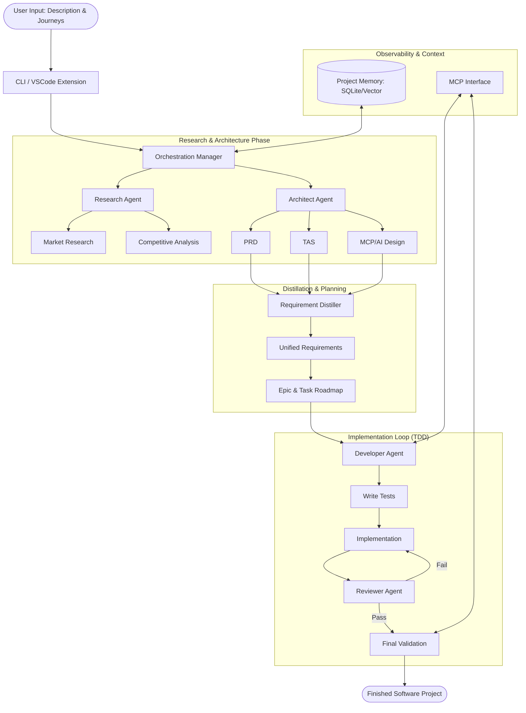

# Technology Landscape Report: Project 'devs'

## 1. Executive Architecture Summary

Project 'devs' is designed as a **Glass-Box Multi-Agent Orchestrator** that bridges the gap between high-level project conceptualization and rigorous, test-validated implementation. The architecture is centered around a **Plan-Act-Verify** lifecycle, utilizing a series of specialized agents (Research, Architect, Developer, Reviewer) coordinated through a central state machine. 

A critical architectural pillar is the **Model Context Protocol (MCP)** integration, which allows the system to interact with local development tools, debuggers, and profilers in a standardized way. The "Glass-Box" philosophy is implemented by maintaining a transparent, queryable state of all agent decisions, requirements, and execution logs, ensuring the user (and subsequent agent sessions) can audit and intervene at any stage.

## 2. Proposed Technology Stack

### Core Orchestration & Logic
*   **Runtime:** **Node.js (TypeScript)**. [REQ-TL-001]
    *   *Justification:* Provides native compatibility with the VSCode Extension API and has the most robust ecosystem for LLM orchestration and MCP SDKs.
*   **Orchestration Framework:** **LangGraph.js** or a **Custom State Machine**. [REQ-TL-002]
    *   *Justification:* LangGraph allows for cyclical graphs and explicit state management, which is essential for the iterative "TDD Loop" and "Research-to-Requirement" transitions.

### Language Models (LLMs)
*   **Primary Model:** **Gemini 3 Pro**. [REQ-TL-003]
    *   *Justification:* Its 1M+ token context window is uniquely suited for ingesting entire codebases, documentation, and research reports simultaneously, reducing the need for complex RAG (Retrieval-Augmented Generation) in many development scenarios.
*   **Secondary/Fast Model:** **Gemini 3 Flash**. [REQ-TL-004]
    *   *Justification:* Used for low-latency tasks like code reviews, unit test generation, and simple requirement distillation.

### Model Context Protocol (MCP)
*   **SDK:** **@modelcontextprotocol/sdk**. [REQ-TL-005]
    *   *Justification:* Industry standard for providing agents with tool access (file system, terminal, browser, git).
*   **Custom MCP Servers:** Development of specialized servers for **Agentic Profiling** and **TDD Execution**. [REQ-TL-006]

### Storage & Memory
*   **Relational Data:** **SQLite**. [REQ-TL-007]
    *   *Justification:* Local-first, zero-config, and perfect for storing project requirements, epic/task status, and agent logs within the `.devs/` directory.
*   **Vector Search (Long-term Memory):** **LanceDB** or **ChromaDB** (embedded). [REQ-TL-008]
    *   *Justification:* Enables semantic search over project history and architectural decisions without requiring a cloud-hosted database.

### Infrastructure & Sandboxing
*   **Agent Execution:** **Docker** or **WebContainers**. [REQ-TL-009]
    *   *Justification:* Critical for security. Agents must execute tests and implementation tasks in an isolated environment to prevent accidental or malicious system damage.

## 3. High-Level System Architecture

The following diagram illustrates the flow from user input to the final project delivery, highlighting the agentic handoffs.

## 4. Third-Party Services, APIs, and External Dependencies

| Service/Dependency | Purpose | Criticality |
| :--- | :--- | :--- |
| **Google AI Studio / Vertex AI** | Access to Gemini 3 Pro/Flash models. | High |
| **GitHub API** | Scaffolding repositories, managing PRs (if cloud-synced). | Medium |
| **MCP SDK** | Enabling tool-use for all agents. | High |
| **Docker Engine** | Providing sandboxed environments for code execution. | High |
| **ESLint/Prettier API** | Automated code quality and style enforcement. | Medium |
| **Vitest / Jest** | Frameworks for the mandatory TDD execution. | High |

## 5. Security, Performance & Scalability Considerations

### Security
*   **Mandatory Sandboxing:** All AI-generated code execution must occur within a Docker container with restricted network access. [REQ-TL-010]
*   **Token Redaction:** Pre-processing of logs to ensure no API keys or secrets are stored in the project's agent memory. [REQ-TL-011]
*   **User Checkpoints:** Explicit "Human-in-the-loop" approval for any tasks involving external network requests or dependency installations. [REQ-TL-012]

### Performance
*   **Context Management:** Utilizing Gemini's long context window to minimize RAG latency, while implementing a sliding window for "Short-term Memory" (current task) to optimize token usage. [REQ-TL-013]
*   **Parallelization:** Research agents can run Market and Competitive analysis in parallel, and Reviewers can run concurrently with the next task's test-writing phase. [REQ-TL-014]

### Scalability
*   **Stateless Agents:** By keeping the state in SQLite, the system can resume from any point if the process is interrupted. [REQ-TL-015]
*   **Project Partitioning:** Large projects are broken into 8-16 Epics, ensuring the LLM reasoning remains focused and within high-confidence bounds. [REQ-TL-016]

## 6. Technical Risks & Mitigation Strategies

| Risk | Impact | Mitigation Strategy |
| :--- | :--- | :--- |
| **Agent Looping (Token Drain)** | High | Implement "Max Turn" limits per task and automatic "Entropy Detection" to identify when an agent is repeating failed attempts without progress. [REQ-TL-017] |
| **Dependency Hell** | Medium | The Architect Agent must generate a locked dependency manifest. The Developer Agent is restricted from adding new libraries without a re-architecting phase. [REQ-TL-018] |
| **Stale Context** | Medium | Implement a "Context Refresh" at the start of every Epic, where the Architect Agent re-summarizes the current state of the project to clear noise. [REQ-TL-019] |
| **Sandbox Escape** | High | Use minimal base images for containers and implement strict `seccomp` profiles to limit system calls. [REQ-TL-020] |
| **LLM Hallucination in TDD** | Medium | Use a multi-model check: Gemini 3 Pro writes the test, Gemini 3 Flash reviews it for logic, and the code is only written once the test *fails* as expected (Red phase). [REQ-TL-021] |
