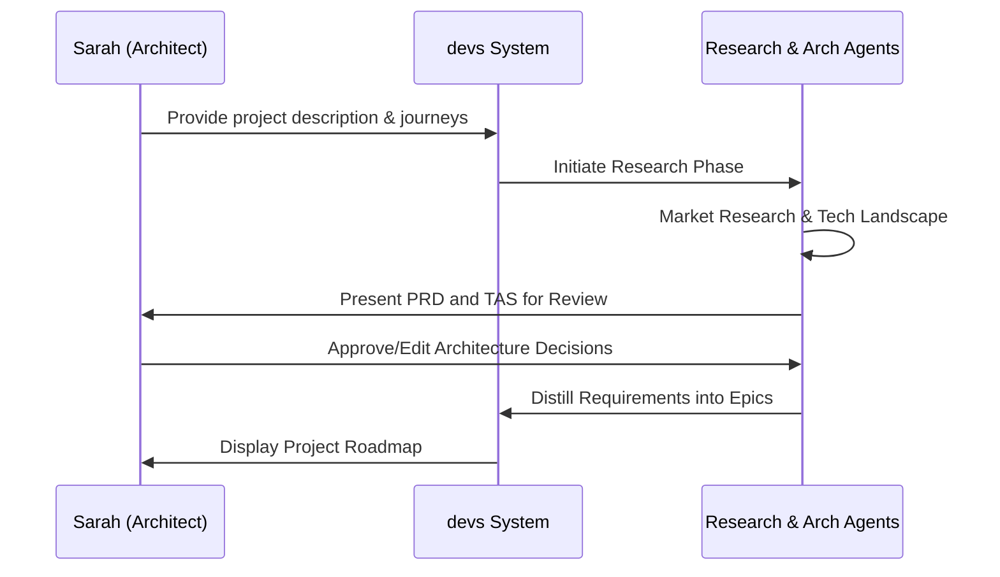
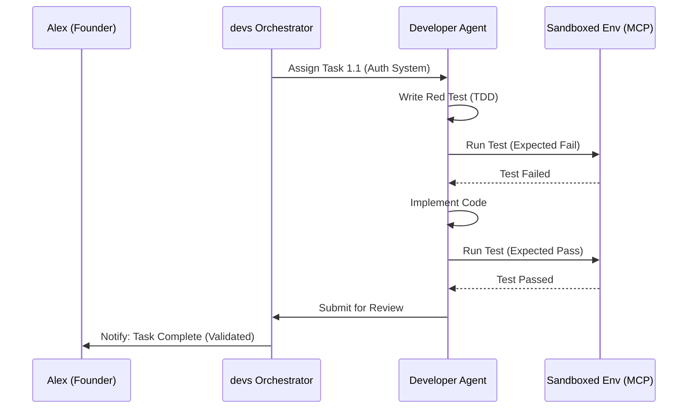
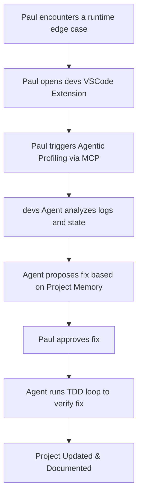

# User Research Report: Project 'devs'

## 1. Executive Summary
This report identifies the target audience and user requirements for 'devs', an agentic AI system for greenfield software development. The research highlights three primary segments: the **Time-Constrained Founder**, the **Quality-Focused Architect**, and the **Domain-Specific Developer**. 

Key findings indicate that while existing AI tools excel at autocomplete, users feel a significant gap in **architectural integrity** and **autonomous verification**. Users demand a "Glass-Box" approach where they can monitor, intervene, and audit AI decisions [REQ-UR-001]. The report outlines how 'devs' leverages agentic research and Test-Driven Development (TDD) to meet these needs, ensuring that the transition from high-level intent to finished project is transparent, reliable, and technically sound [REQ-UR-002].

## 2. Target Audience Segments

### 2.1 The Rapid Prototyper (Solo "Makers")
*   **Profile**: Entrepreneurs and solopreneurs looking to launch MVPs quickly.
*   **Focus**: Speed-to-market and cost efficiency.
*   **Key Need**: Reducing the "boilerplate tax" and infrastructure setup time [REQ-UR-015].

### 2.2 The Enterprise Architect
*   **Profile**: Senior engineers or tech leads in established organizations.
*   **Focus**: Maintainability, security, and adherence to specific architectural patterns.
*   **Key Need**: High-fidelity documentation and empirical verification (TDD) of AI-generated code [REQ-UR-003].

### 2.3 The Polyglot / Domain Specialist
*   **Profile**: Developers proficient in one domain (e.g., Data Science) needing to build in another (e.g., Web Full-stack).
*   **Focus**: Bridging knowledge gaps in unfamiliar tech stacks.
*   **Key Need**: Authoritative research and technology landscape reports to guide decisions [REQ-UR-004].

## 3. User Personas

### Persona 1: "Agile Alex" - The Startup Founder
*   **Role**: Founder of a seed-stage Fintech startup.
*   **Demographics**: 28-35 years old, background in Product Management with basic coding skills.
*   **Tech-Savviness**: High (understands systems) but lacks time for deep implementation.
*   **Goals**:
    *   Turn a 2-page idea into a functional prototype in under a week.
    *   Ensure the initial architecture can scale once a team is hired [REQ-UR-019].
*   **Frustrations**:
    *   Spending days on "plumbing" (auth, DB schema, CI/CD).
    *   AI tools that generate code that "looks right" but breaks under edge cases.
*   **Motivation for devs**: Needs a "virtual engineering team" that handles the research and initial build autonomously.

### Persona 2: "Structured Sarah" - The Senior Architect
*   **Role**: Technical Lead at a Mid-sized SaaS company.
*   **Demographics**: 40+ years old, 15+ years of software engineering.
*   **Tech-Savviness**: Expert. Deeply skeptical of "magic" AI.
*   **Goals**:
    *   Standardize greenfield project structures across her organization [REQ-UR-016].
    *   Ensure all AI-generated code follows strict functional programming patterns [REQ-UR-017].
*   **Frustrations**:
    *   "Black-Box" AI agents that make hidden architectural decisions.
    *   Cleaning up messy, un-tested code generated by juniors or basic AI tools.
*   **Motivation for devs**: Uses devs for its "Glass-Box" transparency and mandatory TDD cycle. She values the ability to review the TAS (Technical Architecture Specification) before code is written [REQ-UR-005].

### Persona 3: "Polyglot Paul" - The Domain Expert
*   **Role**: Senior Data Scientist building a custom dashboard tool.
*   **Demographics**: 30-40 years old, expert in Python/R, novice in React/TypeScript.
*   **Tech-Savviness**: Specialist. Expert in logic, novice in modern web frameworks.
*   **Goals**:
    *   Deploy a secure, internal tool using the latest enterprise-grade frameworks [REQ-UR-020].
    *   Understand *why* certain technologies were chosen (e.g., why Next.js over Vite) [REQ-UR-018].
*   **Frustrations**:
    *   Overwhelmed by the "JS Fatigue" and the sheer number of library choices.
    *   Finding consistent documentation for integrating disparate tools.
*   **Motivation for devs**: Relies on the "Research Agent" to perform the technology landscape analysis and recommend the best stack for his specific use case [REQ-UR-006].

## 4. User Pain Points & Needs

| Category | Pain Point | User Need |
| :--- | :--- | :--- |
| **Trust** | AI agents often "hallucinate" logic or use deprecated libraries. | Mandatory TDD and a "Research Phase" that validates tech choices [REQ-UR-007]. |
| **Control** | Lack of visibility into the agent's "thinking" process. | A "Glass-Box" architecture with clear checkpoints for user approval [REQ-UR-008]. |
| **Continuity** | Context loss between different phases of development. | Long-term project memory and requirement distillation from docs to tasks [REQ-UR-009]. |
| **Environment** | Difficulty setting up local environments for AI to test code. | Native VSCode integration and sandboxed agent execution (MCP) [REQ-UR-010]. |
| **Efficiency** | Agents getting stuck in loops and wasting expensive tokens. | Entropy detection and explicit "Max Turn" limits with user intervention [REQ-UR-011]. |

## 5. Core User Journeys

### 5.1 The "Idea to Architecture" Journey (Sarah)
Sarah uses 'devs' to ensure a new internal project starts with the right foundation [REQ-UR-012].

### 5.2 The "Automated TDD Implementation" Journey (Alex)
Alex monitors 'devs' as it builds the features he approved [REQ-UR-013].

### 5.3 The "Agentic Debugging" Journey (Paul)
Paul uses the MCP interface to understand a complex integration 'devs' just built [REQ-UR-014].

