# PRD: devs — AI Agent Workflow Definer and Orchestrator

**Document ID:** 1_PRD
**Status:** Authoritative
**Audience:** AI Developer Agents implementing the `devs` project

---

## 1. Executive Summary & Goals

### 1.1 Product Overview

`devs` is a headless AI agent workflow orchestration server written in Rust. It enables users to define, schedule, and execute complex multi-stage agentic development workflows as directed acyclic graphs (DAGs). Each stage in a workflow maps to an invocation of an AI agent CLI tool — Claude Code, Gemini CLI, OpenCode, Qwen, or GitHub Copilot. The server manages DAG scheduling, agent pool routing, concurrency enforcement, failure handling, retries, inter-stage data flow, and git-backed state persistence.

`devs` provides three client interfaces connected over gRPC: a terminal UI (TUI) for interactive monitoring and control, a command-line interface (CLI) for scripting and CI integration, and a Model Context Protocol (MCP) server for programmatic access by AI agents. This architecture allows any client to connect to a server running on a remote machine, and allows the server itself to run headlessly in a CI environment or on a dedicated host.

The product is built around a "Glass-Box" philosophy: the MCP server exposes the complete internal state of the application — runs, stages, agents, pools, checkpoints, logs — so that AI agents can observe, debug, profile, test, and control `devs` in real time. This makes `devs` simultaneously a workflow execution engine and a platform for agentic self-development: the same agents that `devs` orchestrates can use its MCP interface to build and evolve `devs` itself.

### 1.2 System Architecture Overview

The diagram below shows the top-level components and their communication paths. All client–server communication is exclusively over gRPC. The MCP stdio bridge is a thin adapter that accepts MCP protocol over stdio and forwards to the MCP port; it does not bypass gRPC for server control.

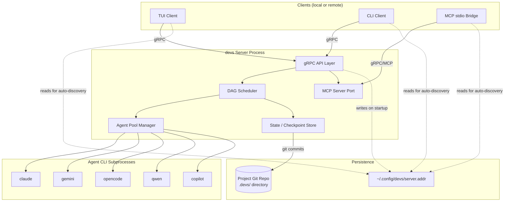
```mermaid
graph TD
    subgraph "Clients (local or remote)"
        TUI[TUI Client]
        CLI[CLI Client]
        MCPB[MCP stdio Bridge]
    end
    subgraph "devs Server Process"
        GRPC[gRPC API Layer]
        SCHED[DAG Scheduler]
        POOL[Agent Pool Manager]
        STATE[State / Checkpoint Store]
        MCPS[MCP Server Port]
    end
    subgraph "Agent CLI Subprocesses"
        C[claude]
        G[gemini]
        O[opencode]
        Q[qwen]
        CP[copilot]
    end
    subgraph "Persistence"
        REPO[(Project Git Repo\n.devs/ directory)]
        ADDR[~/.config/devs/server.addr]
    end

    TUI -- gRPC --> GRPC
    CLI -- gRPC --> GRPC
    MCPB -- gRPC/MCP --> MCPS
    GRPC --> SCHED
    SCHED --> POOL
    POOL --> C & G & O & Q & CP
    SCHED --> STATE
    STATE -- git commits --> REPO
    GRPC --> MCPS
    GRPC -.writes on startup.-> ADDR
    CLI -.reads for auto-discovery.-> ADDR
    TUI -.reads for auto-discovery.-> ADDR
    MCPB -.reads for auto-discovery.-> ADDR
```

### 1.3 MVP Scope

The following table is the authoritative boundary between MVP and post-MVP. No post-MVP feature may be implemented in MVP without an explicit scope change recorded in this document.

| Feature Area | MVP Status | Post-MVP |
|---|---|---|
| Workflow DAG definition — Rust builder API | In scope | — |
| Workflow DAG definition — TOML/YAML declarative format | In scope | — |
| Agent CLI adapters: claude, gemini, opencode, qwen, copilot | In scope | Additional adapters |
| Agent pool routing (fallback, capability tags, concurrency) | In scope | — |
| Completion signals: exit_code, structured_output, mcp_tool_call | In scope | — |
| Execution environments: tempdir, Docker, remote SSH | In scope | — |
| Artifact collection: agent-driven and auto-collect | In scope | — |
| Workflow triggers: manual CLI submit, MCP tool call | In scope | Cron, inbound webhook, file-watch |
| State persistence: git-backed checkpoints and logs in `.devs/` | In scope | — |
| Client interfaces: TUI, CLI, MCP server + stdio bridge | In scope | GUI, REST/web API |
| Multi-project support with shared pool and priority scheduling | In scope | — |
| Outbound webhooks for configurable event types | In scope | — |
| Client authentication | Not in scope | Post-MVP |
| External secrets manager integration | Not in scope | Post-MVP |
| Automated workflow triggers (cron, webhook, file-watch) | Not in scope | Post-MVP |

### 1.4 Primary Goals

Each goal below is stated as a measurable target verifiable by an automated test or CI check:

| Goal ID | Goal | Measurable Target |
|---|---|---|
| GOAL-001 | Correct DAG scheduling | All stages execute in dependency order; all stages with no unmet dependencies start in parallel within 100 ms of their dependencies completing. |
| GOAL-002 | Agent pool routing | Fallback, capability filtering, and concurrency limits behave correctly under simulated agent failure and rate-limit events. |
| GOAL-003 | Multi-project support | A single server instance correctly schedules and isolates workflow runs across at least two concurrent projects. |
| GOAL-004 | Three client interfaces | TUI, CLI, and MCP each connect to a running server and execute every documented operation without error. |
| GOAL-005 | Glass-Box observability | Every internal state entity (run, stage, agent, pool, checkpoint) is readable via MCP with no missing or stale fields. |
| GOAL-006 | Unit test coverage | All Rust source achieves ≥ 90% line coverage from unit tests as measured by `cargo-llvm-cov`. |
| GOAL-007 | E2E test coverage — overall | All Rust source achieves ≥ 80% line coverage through E2E tests (tests that exercise the system exclusively through CLI, TUI, or MCP). |
| GOAL-008 | E2E test coverage — per interface | Each of CLI, TUI, and MCP individually achieves ≥ 50% line coverage through E2E tests targeting that specific interface. |
| GOAL-009 | `./do` entrypoint | The `./do` script is present and fully functional from the first commit. All documented subcommands succeed on a clean checkout after `./do setup`. |
| GOAL-010 | Agentic self-development | The Glass-Box MCP interface is functional and usable by AI agents to observe and modify the running server from the first operational commit. |

### 1.5 Tech Stack

| Component | Technology | Rationale |
|---|---|---|
| Server | Rust (stable toolchain) | Memory safety, performance, single-binary deployment |
| TUI client | Rust | Shares workspace with server; no separate runtime |
| CLI client | Rust | Shares workspace with server; no separate runtime |
| MCP server | Rust | Integrated into server process on a separate port |
| gRPC transport | `tonic` crate | All client↔server communication |
| Build system | Cargo workspace | All components compile together |
| CI/CD | GitLab CI | Validates on Windows, macOS, and Linux |
| Coverage tooling | `cargo-llvm-cov` | Line coverage for unit and E2E test suites |
| State persistence | Git (via `git2` crate) | Checkpoints and logs committed to project repo |

All components ship in a single Cargo workspace. There is no mandatory runtime dependency on a database, message broker, or external service. The only mandatory runtime external tool dependency is `git` (required for checkpoint persistence and artifact collection).

The minimum supported Rust version (MSRV) is declared in `Cargo.toml` at the workspace level and applies uniformly to all crates.

### 1.6 `./do` Entrypoint Contract

The `./do` script is a shell script at the repository root. It is the single developer entrypoint and must be present, executable, and functional from the first commit. All commands must succeed on a clean checkout after `./do setup` completes.

#### 1.6.1 Command Specifications

| Command | Description | Expected Behaviour | Failure Condition |
|---|---|---|---|
| `./do setup` | Install all dev dependencies | Installs the Rust toolchain at the declared MSRV, `cargo-llvm-cov`, and any other required tools. Idempotent: safe to run multiple times. | Non-zero exit if any dependency cannot be installed. |
| `./do build` | Build all workspace crates for release | Executes `cargo build --release --workspace`. | Non-zero exit if any crate fails to compile. |
| `./do test` | Run all tests | Executes `cargo test --workspace`. All unit and integration tests must pass. | Non-zero exit if any test fails. |
| `./do lint` | Run all linters | Executes `cargo clippy --workspace --all-targets -- -D warnings`. | Non-zero exit if any lint warning is emitted. |
| `./do format` | Run all formatters | Executes `cargo fmt --workspace`. Formats source files in-place. | Non-zero exit if `cargo fmt` exits non-zero. |
| `./do coverage` | Run all coverage tools | Executes `cargo-llvm-cov` for unit and E2E test suites. Reports line coverage per crate and per interface. Fails if any coverage gate (§1.7) is not met. | Non-zero exit if any threshold is not met or tool is not installed. |
| `./do presubmit` | Run full presubmit suite | Runs `setup`, `format`, `lint`, `test`, `coverage`, then `./do ci` in sequence. Enforces a 15-minute wall-clock timeout for the entire sequence. | Non-zero exit if any step fails or the 15-minute timeout is reached. |
| `./do ci` | Run CI checks on a clean copy | Copies the working directory to a temporary commit and triggers all presubmit checks on CI runners. | Non-zero exit if the CI pipeline fails. |

#### 1.6.2 Presubmit Timeout

**[1_PRD-BR-001]** `./do presubmit` MUST enforce a hard 15-minute wall-clock timeout. If the total elapsed time from the start of `./do presubmit` exceeds 15 minutes, the script MUST terminate all child processes and exit non-zero. The timeout is measured from the moment `./do presubmit` is invoked; no individual step's elapsed time is separately excluded.

#### 1.6.3 Idempotency

**[1_PRD-BR-002]** `./do setup` MUST be idempotent. Invoking it multiple times on the same machine MUST NOT produce errors, warnings, or unintended side effects on any invocation after the first.

#### 1.6.4 Unrecognised Subcommand

**[1_PRD-BR-003]** If `./do` is invoked with a subcommand not listed in §1.6.1, the script MUST print the list of valid subcommands to stderr and exit with a non-zero status. It MUST NOT silently succeed or no-op.

### 1.7 Quality Gates & Coverage Requirements

Coverage is measured separately for unit tests and E2E tests using `cargo-llvm-cov`. All gates below are enforced as hard failures in `./do coverage` and in the GitLab CI pipeline.

| Gate ID | Scope | Metric | Threshold | Enforcement Point |
|---|---|---|---|---|
| QG-001 | All workspace crates | Unit test line coverage | ≥ 90% | `./do coverage`, CI |
| QG-002 | All workspace crates | E2E test line coverage | ≥ 80% | `./do coverage`, CI |
| QG-003 | CLI-exercised paths | E2E line coverage via CLI interface | ≥ 50% | `./do coverage`, CI |
| QG-004 | TUI-exercised paths | E2E line coverage via TUI interface | ≥ 50% | `./do coverage`, CI |
| QG-005 | MCP-exercised paths | E2E line coverage via MCP interface | ≥ 50% | `./do coverage`, CI |

**E2E test definition**: An E2E test exercises the system exclusively through one of the three external interfaces (CLI, TUI, or MCP). E2E tests MUST NOT call internal Rust functions, types, or modules directly; they interact with a running server process through its external surface.

**Per-interface coverage definition**: CLI E2E coverage counts lines reached by tests that drive the system only through the CLI client binary. TUI E2E coverage counts lines reached by tests that drive the system only through the TUI client binary. MCP E2E coverage counts lines reached by tests that interact with the system only through the MCP server port or the MCP stdio bridge.

**[1_PRD-BR-004]** Every requirement stated in this PRD MUST have at least one automated test (unit or E2E) that verifies it. A requirement without a corresponding automated test is considered unimplemented regardless of whether the code compiles or appears functionally correct.

**[1_PRD-BR-005]** TUI verification MUST use interaction automation, state assertions, and UI text-snapshots. Pixel-level screenshot comparison is explicitly prohibited.

**[1_PRD-BR-006]** All public Rust items (structs, enums, traits, free functions, methods, and modules) in all workspace crates MUST have doc comments. This is enforced by `cargo doc --no-deps` in `./do lint`.

**[1_PRD-BR-007]** All code MUST pass `cargo fmt --check` and `cargo clippy --workspace --all-targets -- -D warnings` before any commit is accepted by presubmit.

### 1.8 Business Rules Summary

| Rule ID | Rule |
|---|---|
| 1_PRD-BR-001 | `./do presubmit` enforces a hard 15-minute wall-clock timeout across the full sequence. |
| 1_PRD-BR-002 | `./do setup` is idempotent. |
| 1_PRD-BR-003 | Unrecognised `./do` subcommands exit non-zero and print valid subcommands. |
| 1_PRD-BR-004 | Every PRD requirement has at least one automated test. |
| 1_PRD-BR-005 | TUI tests use text-snapshot and state-assertion verification; pixel snapshots are prohibited. |
| 1_PRD-BR-006 | All public Rust items have doc comments enforced by `cargo doc`. |
| 1_PRD-BR-007 | All code passes `cargo fmt --check` and `cargo clippy -D warnings` before commit. |
| 1_PRD-BR-008 | No MVP feature may be deferred without an explicit scope change in this document. |
| 1_PRD-BR-009 | No post-MVP feature may be implemented in MVP without an explicit scope change in this document. |

### 1.9 Edge Cases & Error Handling

| ID | Edge Case | Context | Expected Behaviour |
|---|---|---|---|
| EC-001 | Presubmit timeout triggers at exactly 15 minutes | `./do presubmit` is running | Script kills all child processes atomically and exits non-zero. Partial test results are not reported as success. |
| EC-002 | `./do setup` encounters an incompatible Rust toolchain | Machine has a Rust version older than the declared MSRV | Script reports the required MSRV and the installed version to stderr, then exits non-zero. It does not attempt to continue with an incompatible toolchain. |
| EC-003 | `./do coverage` runs without `cargo-llvm-cov` installed | Developer has not run `./do setup` | Script reports that `cargo-llvm-cov` is missing and instructs the user to run `./do setup`, then exits non-zero. |
| EC-004 | Coverage thresholds pass for unit tests but one E2E interface gate fails | CLI gate passes; TUI gate fails | `./do coverage` reports each gate result individually (pass/fail with delta), exits non-zero, and identifies which gate(s) failed and by how many percentage points. Passing gates are reported clearly and not masked. |
| EC-005 | CI pipeline passes on Linux and macOS but fails on Windows | Platform-specific compilation or test issue | `./do ci` exits non-zero. The error output identifies the failing platform, failing step, and exact error. The failure is not silently ignored. |
| EC-006 | `./do presubmit` is interrupted by a signal (e.g., SIGINT) before timeout | Developer cancels manually | Script catches the signal, terminates all child processes cleanly, and exits non-zero. No orphan processes remain. |
| EC-007 | `cargo doc --no-deps` finds a public item without a doc comment | New code added without doc comment | `./do lint` exits non-zero and `cargo doc` output identifies the specific item and file location missing documentation. |

### 1.10 State Transitions

The `./do presubmit` command follows this execution state machine:

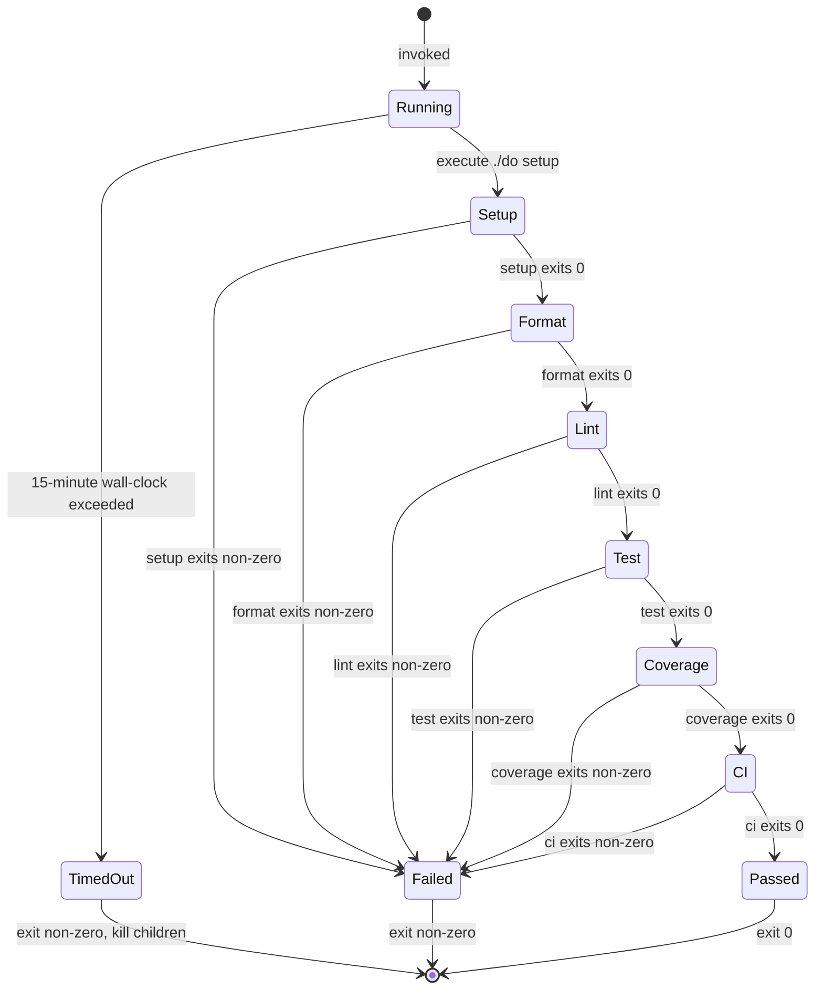
```mermaid
stateDiagram-v2
    [*] --> Running : invoked
    Running --> Setup : execute ./do setup
    Setup --> Format : setup exits 0
    Setup --> Failed : setup exits non-zero
    Format --> Lint : format exits 0
    Format --> Failed : format exits non-zero
    Lint --> Test : lint exits 0
    Lint --> Failed : lint exits non-zero
    Test --> Coverage : test exits 0
    Test --> Failed : test exits non-zero
    Coverage --> CI : coverage exits 0
    Coverage --> Failed : coverage exits non-zero
    CI --> Passed : ci exits 0
    CI --> Failed : ci exits non-zero
    Running --> TimedOut : 15-minute wall-clock exceeded
    TimedOut --> [*] : exit non-zero, kill children
    Failed --> [*] : exit non-zero
    Passed --> [*] : exit 0
```

### 1.11 Dependencies

| Dependency | Direction | Notes |
|---|---|---|
| Section 2 — Persona & User Needs | §1 drives §2 | Goal and scope decisions in §1 constrain persona requirements in §2. |
| Section 3 — Key Features & Requirements | §1 is depended on by §3 | All feature requirements in §3 must trace back to a goal in §1. |
| `./do` script implementation | §1 defines the contract | The script implementation must satisfy all command specs in §1.6. |
| GitLab CI pipeline | §1 defines requirements | The pipeline must enforce all coverage gates in §1.7 on Linux, macOS, and Windows. |
| `cargo-llvm-cov` | §1 selects the tool | All coverage measurement in the codebase uses this tool exclusively. |
| MSRV declaration in `Cargo.toml` | §1.5 references it | The workspace-level MSRV must be declared and must be the toolchain version installed by `./do setup`. |

### 1.12 Acceptance Criteria

All criteria below must pass before the MVP is considered complete:

- [ ] **AC-001**: A headless `devs` server process starts, writes its gRPC listen address to `~/.config/devs/server.addr`, and accepts connections from TUI, CLI, and MCP clients over gRPC.
- [ ] **AC-002**: A TUI client connects to the server over gRPC (using auto-discovery or an explicit `--server` flag) and renders a dashboard showing at least one workflow run with its stage graph and status.
- [ ] **AC-003**: A CLI client connects to the server over gRPC and executes every documented MVP command (`submit`, `list`, `status`, `logs`, `cancel`, `pause`, `resume`) without error against a running server.
- [ ] **AC-004**: An MCP client connects to the MCP server port and reads the full internal state (all runs, stages, agent outputs, pool states) with no field absent or stale.
- [ ] **AC-005**: `cargo test --workspace` exits zero on Linux, macOS, and Windows with no test failures.
- [ ] **AC-006**: `cargo clippy --workspace --all-targets -- -D warnings` exits zero on Linux, macOS, and Windows.
- [ ] **AC-007**: `cargo fmt --workspace --check` exits zero on Linux, macOS, and Windows (all code is formatted).
- [ ] **AC-008**: `cargo-llvm-cov` reports ≥ 90% line coverage for all workspace crates from unit tests.
- [ ] **AC-009**: `cargo-llvm-cov` reports ≥ 80% line coverage for all workspace crates from E2E tests.
- [ ] **AC-010**: E2E tests exercising only the CLI interface achieve ≥ 50% line coverage.
- [ ] **AC-011**: E2E tests exercising only the TUI interface achieve ≥ 50% line coverage.
- [ ] **AC-012**: E2E tests exercising only the MCP interface achieve ≥ 50% line coverage.
- [ ] **AC-013**: `./do setup` completes successfully on a clean Linux machine and installs all required dev dependencies.
- [ ] **AC-014**: `./do presubmit` completes within 15 minutes on the CI runner and all steps pass.
- [ ] **AC-015**: When `./do presubmit` is artificially delayed past 15 minutes, it exits non-zero and no child processes remain running after exit.
- [ ] **AC-016**: `./do setup` is idempotent: running it twice in sequence on the same machine produces no errors on the second invocation.
- [ ] **AC-017**: Invoking `./do` with an unrecognised subcommand prints valid subcommands to stderr and exits non-zero.
- [ ] **AC-018**: `cargo doc --no-deps` exits zero for all workspace crates (all public items have doc comments).
- [ ] **AC-019**: The GitLab CI pipeline runs all presubmit checks on Linux, macOS, and Windows runners and passes.
- [ ] **AC-020**: The Glass-Box MCP interface is available and operational from the first commit at which the server binary can start.
- [ ] **AC-021**: Every requirement in this PRD has a corresponding automated test identifiable by requirement ID in the test suite.

---

## 2. Persona & User Needs Map

This section defines the two personas that `devs` must serve at MVP, their needs, interaction models, required data contracts, and the business rules that govern their experience. All requirements here are traceable to §1.3 (MVP Scope) and §1.4 (Primary Goals).

---

### 2.1 Primary Persona: The Developer of `devs`

#### 2.1.1 Persona Profile

The sole human user of `devs` at MVP is the developer of `devs` itself. This is a single software engineer who:

- Writes no code by hand; all implementation is delegated to agentic AI tools (Claude Code, Gemini CLI, OpenCode, etc.).
- Interacts with `devs` primarily through the TUI for monitoring and the CLI for submitting and scripting.
- Relies on the MCP interface to let AI agents observe and evolve the `devs` codebase autonomously.
- Requires that every piece of system behaviour be verifiable by an automated test before it is considered done.
- Works across Linux, macOS, and Windows environments and expects identical behaviour on all three.

The developer never needs to authenticate to the server; the server is designed for local / trusted-network use in MVP (§1.3, §3.1).

#### 2.1.2 Interaction Model

The developer interacts with `devs` through three surfaces:

| Surface | Primary Use | Secondary Use |
|---|---|---|
| TUI | Monitor running workflow runs, inspect stage graphs, tail logs, view pool utilisation | Send cancel/pause/resume signals to individual stages or runs |
| CLI | Submit workflow runs with parameters, query run status in scripts, stream logs in CI | Cancel, pause, or resume runs programmatically |
| `./do` script | Run presubmit checks, build, test, lint, format, and coverage | Trigger CI on a clean copy |

The developer does not directly invoke MCP tools; instead, the AI agents they spawn use MCP to observe and control `devs`.

#### 2.1.3 Developer Workflow Data Model

The following schema describes the entities a developer creates and manages:

```
WorkflowDefinition
├── name: String                    -- unique within the project; max 128 chars, [a-z0-9-_]
├── format: Enum { RustBuilderAPI, Toml, Yaml }
├── inputs: Vec<WorkflowInputParam>
└── stages: Vec<StageDefinition>

WorkflowInputParam
├── name: String                    -- [a-z0-9_], max 64 chars
├── type: Enum { String, Path, Integer }
├── required: bool
└── default: Option<String>         -- must be absent when required = true

StageDefinition
├── name: String                    -- unique within workflow, [a-z0-9-_], max 64 chars
├── pool: String                    -- references a named pool in server config
├── prompt: Option<String>          -- inline prompt; mutually exclusive with prompt_file
├── prompt_file: Option<Path>       -- path loaded at runtime; mutually exclusive with prompt
├── system_prompt: Option<String>
├── env: Map<String, String>
├── depends_on: Vec<String>         -- stage names within same workflow
├── completion: Enum { ExitCode, StructuredOutput, McpToolCall }
├── execution_env: ExecutionEnv
├── timeout_secs: Option<u64>
├── retry: Option<RetryConfig>
└── required_capabilities: Vec<String>

RetryConfig
├── max_attempts: u32               -- minimum 1, maximum 10
└── backoff: Enum { Fixed, Exponential }

ExecutionEnv
├── target: Enum { Tempdir, Docker, Remote }
├── docker_host: Option<String>     -- only valid when target = Docker
├── ssh_config: Option<SshConfig>  -- only valid when target = Remote
└── artifact_collection: Enum { AgentDriven, AutoCollect }

WorkflowRun
├── id: String                      -- UUID v4
├── slug: String                    -- human-readable, e.g. "feature-2024-01-15-a3f2"
├── name: Option<String>            -- user-provided at submit time
├── workflow_name: String
├── workflow_snapshot: WorkflowDefinition  -- immutable copy taken at run start
├── status: RunStatus
├── inputs: Map<String, String>     -- resolved at submit time
├── stages: Vec<StageRun>
├── submitted_at: Timestamp
├── started_at: Option<Timestamp>
└── completed_at: Option<Timestamp>

RunStatus: Enum {
    Pending,      -- submitted, not yet started
    Running,      -- at least one stage active
    Paused,       -- all active stages paused
    Completed,    -- all stages finished successfully
    Failed,       -- at least one stage failed and no retry/branch resolved it
    Cancelled     -- explicitly cancelled
}

StageRun
├── stage_name: String
├── run_id: String
├── status: StageStatus
├── attempt: u32                    -- starts at 1; incremented on retry
├── agent_tool: String
├── pool_name: String
├── started_at: Option<Timestamp>
├── completed_at: Option<Timestamp>
├── exit_code: Option<i32>
├── stdout: Option<String>
├── stderr: Option<String>
└── structured_output: Option<JsonValue>

StageStatus: Enum {
    Waiting,      -- dependencies not yet complete
    Eligible,     -- all dependencies complete; waiting for pool slot
    Running,      -- agent process active
    Paused,       -- mid-run pause signal sent and acknowledged
    Completed,    -- stage finished successfully
    Failed,       -- stage finished with failure
    Cancelled,    -- explicitly cancelled
    TimedOut      -- per-stage timeout exceeded
}
```

#### 2.1.4 Developer Need: Agentic Self-Development

The developer's primary need is to build `devs` using AI agents rather than writing code directly. This requires:

1. **Glass-Box MCP server**: Every internal entity listed in the data model above — `WorkflowRun`, `StageRun`, `AgentPool`, `StageStatus`, log contents, structured outputs — must be readable via MCP with no missing or stale fields. The MCP server must be available from the first commit at which the server binary can start (GOAL-010).

2. **Runtime workflow definition access**: AI agents must be able to read and write workflow definitions through the MCP interface at runtime, enabling them to evolve workflows as they build the system.

3. **Test injection and assertion**: AI agents must be able to inject test inputs into a running stage and assert on its output via MCP. This is the primary mechanism for automated correctness verification during agentic development.

4. **Stable internal state representation**: All MCP-exposed entities must use stable, versioned field names. Any field rename or removal is a breaking change. Fields are never silently absent; if a value is not yet available, it is represented as a typed `null` / `None` rather than being omitted from the response.

**[2_PRD-BR-001]** The MCP server MUST expose every `WorkflowRun`, `StageRun`, pool state, log line, and checkpoint entity listed in §2.1.3 with no field omitted. An entity that exists internally but is absent from the MCP response is a bug.

**[2_PRD-BR-002]** All MCP-exposed fields that are not yet populated (e.g., `completed_at` on a running stage) MUST be represented as a typed null rather than being absent from the response schema.

#### 2.1.5 Developer Need: Automated Verification

The developer accepts a stage as complete only when a passing automated test verifies it. This imposes the following constraints on `devs` itself:

- Every requirement in this PRD has a corresponding automated test identifiable by requirement ID (1_PRD-BR-004).
- Unit test line coverage is ≥ 90% (QG-001).
- E2E test line coverage is ≥ 80% (QG-002), with each interface reaching ≥ 50% (QG-003, QG-004, QG-005).
- TUI tests use text-snapshot and state-assertion verification; pixel-level screenshot comparison is prohibited (1_PRD-BR-005).

**[2_PRD-BR-003]** A workflow stage MUST NOT be considered complete if any automated test that exercises its behaviour is failing or absent.

#### 2.1.6 Developer Need: Parallel Agentic Development

The developer runs multiple AI agents concurrently on independent chunks of work. This requires:

- Task decomposition into independent, non-conflicting units, each with explicit dependency declarations.
- The workflow DAG scheduler must correctly detect when two stages have no shared dependencies and run them in parallel (GOAL-001).
- Each parallel agent operates in an isolated execution environment (`tempdir`, Docker, or remote SSH) to prevent filesystem conflicts.

**[2_PRD-BR-004]** Two stages with no shared unresolved dependencies MUST be scheduled to start within 100 ms of each other once their preceding dependencies complete.

**[2_PRD-BR-005]** Stages executing in `tempdir` or `docker` or `remote` execution targets MUST NOT share a filesystem namespace with any other concurrently running stage in the same workflow run.

#### 2.1.7 Developer Need: Repeatable Builds and Quality Gates

The developer requires a single `./do` entrypoint that performs all build, test, lint, format, and coverage operations deterministically. The full specification of `./do` is in §1.6. The needs this satisfies for the developer are:

- A clean-checkout setup on any supported OS should converge to the same build environment in one command.
- Presubmit checks gate every commit with a hard 15-minute timeout (1_PRD-BR-001).
- Coverage reports identify which gates passed and failed with percentage-point deltas (EC-004).

**[2_PRD-BR-006]** The `./do` script MUST produce identical exit codes and identical test results on Linux, macOS, and Windows for any given commit, assuming `./do setup` has been run to completion on each platform.

#### 2.1.8 Developer Workflow State Diagram

The following diagram shows the states a developer passes through when building a `devs` feature using the agentic workflow:

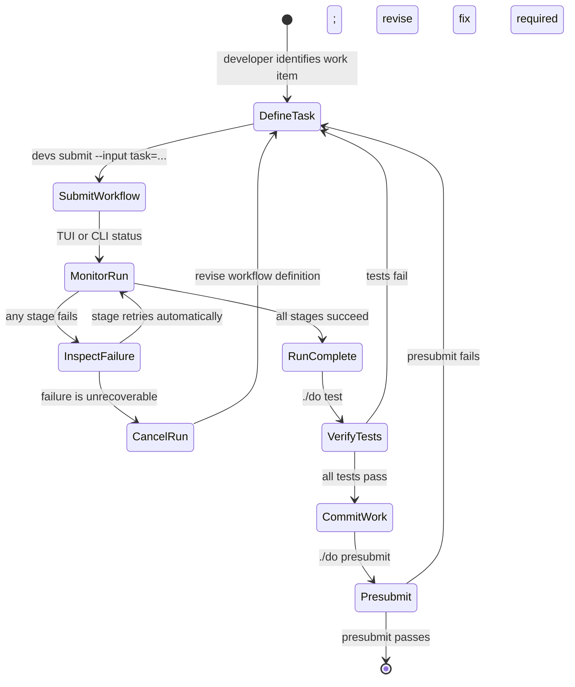
```mermaid
stateDiagram-v2
    [*] --> DefineTask : developer identifies work item
    DefineTask --> SubmitWorkflow : devs submit <workflow> --input task=...
    SubmitWorkflow --> MonitorRun : TUI or CLI status
    MonitorRun --> RunComplete : all stages succeed
    MonitorRun --> InspectFailure : any stage fails
    InspectFailure --> CancelRun : failure is unrecoverable
    InspectFailure --> MonitorRun : stage retries automatically
    CancelRun --> DefineTask : revise workflow definition
    RunComplete --> VerifyTests : ./do test
    VerifyTests --> CommitWork : all tests pass
    VerifyTests --> DefineTask : tests fail; revise
    CommitWork --> Presubmit : ./do presubmit
    Presubmit --> [*] : presubmit passes
    Presubmit --> DefineTask : presubmit fails; fix required
```

#### 2.1.9 Edge Cases — Developer Persona

| ID | Edge Case | Context | Expected Behaviour |
|---|---|---|---|
| EC-P001 | Developer submits a workflow with a `depends_on` reference to a stage that does not exist in the same workflow | CLI `devs submit` | Server rejects the submission with a validation error naming the missing stage. Exit code is non-zero. No run is created. |
| EC-P002 | Developer submits a workflow with a cyclic dependency (Stage A depends on Stage B; Stage B depends on Stage A) | CLI `devs submit` | Server detects the cycle, rejects the submission with an error message identifying the cycle, and exits non-zero. No run is created. |
| EC-P003 | Developer invokes `devs submit` with a required workflow input parameter omitted | CLI `devs submit` | Server returns an error listing the missing parameter names and their declared types. Exit code is non-zero. No run is created. |
| EC-P004 | Developer's TUI client connects to a server that is already mid-run on a long workflow | TUI initial connection | TUI renders the current state of all active runs, stages, and logs without requiring a restart. No historical state is lost or skipped. |
| EC-P005 | Developer runs `./do coverage` and one E2E interface gate fails while all others pass | Coverage reporting | Each gate result is reported individually (pass/fail with percentage and delta). The failing gate is identified by name. `./do coverage` exits non-zero. |
| EC-P006 | Developer cancels `./do presubmit` via SIGINT before the 15-minute timeout | Presubmit running | Script catches the signal, terminates all child processes cleanly, exits non-zero, and leaves no orphan processes. |
| EC-P007 | Developer modifies a workflow definition while a run using that definition is active | Live definition edit via MCP or filesystem | The active run continues using its snapshotted definition. The new definition takes effect only for subsequently submitted runs. |

---

### 2.2 Secondary Persona: AI Agent Clients

#### 2.2.1 Persona Profile

AI agent clients are automated software processes — instances of Claude Code, Gemini CLI, OpenCode, or other supported agent CLIs — that interact with `devs` programmatically. Agent clients have two distinct roles:

1. **Orchestrated agents**: Agents spawned by `devs` as part of a workflow stage. These agents may call back into `devs` via MCP to report progress or signal completion.
2. **Observing/controlling agents**: Agents (often the same ones building `devs`) that connect to the MCP or CLI interfaces to read state, submit workflows, control execution, and perform testing.

Both roles require different interaction patterns but share a common requirement: all interfaces that agents consume must produce stable, machine-readable output with no ambiguous or human-only-readable formatting.

#### 2.2.2 Agent Client Interaction Model

```
AgentClientSession
├── interface: Enum { Mcp, Cli, McpStdioBridge }
├── connected_at: Timestamp
├── server_addr: String
└── last_activity: Timestamp
```

Agents do not have persistent sessions with identity or authentication in MVP (§1.3 Non-Goals). Each MCP connection or CLI invocation is stateless from the server's perspective.

**Interface selection rules:**

| Agent Role | Primary Interface | Secondary Interface | Rationale |
|---|---|---|---|
| Building/evolving `devs` | MCP | CLI | Full state observability needed; MCP exposes all internals |
| Scripting workflow submission in CI | CLI | — | Scripting requires stable exit codes and structured stdout |
| Mid-run progress reporting (orchestrated) | MCP tool call | — | Only channel available from inside a running stage |
| Automated testing and assertion | MCP | CLI | MCP provides inject/assert capability; CLI provides run control |

#### 2.2.3 MCP Interface Requirements for Agent Clients

The MCP server must expose the following capabilities to satisfy agent client needs. Each capability maps to one or more MCP tool definitions:

**Observation capabilities:**

| Capability | Description | Required MCP Tool(s) |
|---|---|---|
| List all workflow runs | Return all runs with status, timestamps, and slug | `list_runs` |
| Get run detail | Full `WorkflowRun` including all `StageRun` records | `get_run` |
| Get stage output | Full stdout, stderr, structured output, and exit code for a stage | `get_stage_output` |
| Stream logs | Real-time log stream for a run or stage | `stream_logs` |
| Get pool state | Current pool utilisation, agent availability, fallback events | `get_pool_state` |
| Read workflow definition | Return the live or snapshotted definition for a run | `get_workflow_definition` |
| List checkpoints | All checkpoint entries for a run in the `.devs/` directory | `list_checkpoints` |

**Control capabilities:**

| Capability | Description | Required MCP Tool(s) |
|---|---|---|
| Submit workflow run | Submit a named run with typed input parameters | `submit_run` |
| Cancel run or stage | Send a cancel signal to a run or individual stage | `cancel_run`, `cancel_stage` |
| Pause run or stage | Send a pause signal | `pause_run`, `pause_stage` |
| Resume run or stage | Resume a paused run or stage | `resume_run`, `resume_stage` |
| Write workflow definition | Write or update a workflow definition at runtime | `write_workflow_definition` |

**Testing capabilities:**

| Capability | Description | Required MCP Tool(s) |
|---|---|---|
| Inject test input | Inject synthetic input data into a stage | `inject_stage_input` |
| Assert stage output | Assert that a stage's output matches a predicate | `assert_stage_output` |

**Mid-run agent → devs capabilities** (called by orchestrated agents from inside a running stage):

| Capability | Description | Required MCP Tool(s) |
|---|---|---|
| Report progress | Agent sends a progress update to `devs` | `report_progress` |
| Signal completion | Agent signals that its stage is complete, optionally with result data | `signal_completion` |
| Report rate limit | Agent proactively reports a rate-limit condition to trigger pool fallback | `report_rate_limit` |

**[2_PRD-BR-007]** Every MCP tool exposed by `devs` MUST return a structured JSON response. No MCP tool MAY return unstructured plain text as its primary response payload.

**[2_PRD-BR-008]** All MCP tool responses MUST include an `error` field of type `Option<String>`. When an operation fails, the `error` field MUST be non-null and contain a human-readable description of the failure. On success, `error` MUST be null.

**[2_PRD-BR-009]** The `submit_run` MCP tool MUST validate all workflow input parameters against their declared types before creating a run. A submission with a missing required parameter or a parameter value that fails type validation MUST be rejected with a structured error response and no run created.

#### 2.2.4 CLI Output Format Requirements for Agent Clients

When the CLI is used by an agent in a scripted context, all output must be machine-parseable. The following rules govern CLI output formatting:

**[2_PRD-BR-010]** All `devs` CLI commands MUST support a `--format json` flag. When `--format json` is specified, the command MUST write a single JSON object (or a newline-delimited stream of JSON objects for streaming commands) to stdout and write no other output to stdout. Human-readable formatting MAY appear on stderr only.

**[2_PRD-BR-011]** All `devs` CLI commands MUST exit with code `0` on success and a non-zero code on any error. Specific non-zero exit codes are:

| Exit Code | Meaning |
|---|---|
| 0 | Success |
| 1 | General error (invalid arguments, server error, etc.) |
| 2 | Run or stage not found |
| 3 | Server unreachable (connection refused or timeout) |
| 4 | Workflow validation error (cycle, missing stage, invalid parameter) |

**[2_PRD-BR-012]** When `--format json` is active, error conditions MUST produce a JSON object with at least `{ "error": "<message>", "code": <exit_code> }` written to stdout, and the process MUST exit non-zero.

#### 2.2.5 Machine-Readable Output Schemas

The following schemas define the JSON responses for the key CLI commands agents use:

```json
// devs list --format json
{
  "runs": [
    {
      "id": "string (UUID v4)",
      "slug": "string",
      "name": "string | null",
      "workflow_name": "string",
      "status": "Pending | Running | Paused | Completed | Failed | Cancelled",
      "submitted_at": "string (RFC 3339)",
      "started_at": "string (RFC 3339) | null",
      "completed_at": "string (RFC 3339) | null"
    }
  ]
}

// devs status <run> --format json
{
  "run": {
    "id": "string (UUID v4)",
    "slug": "string",
    "name": "string | null",
    "workflow_name": "string",
    "status": "Pending | Running | Paused | Completed | Failed | Cancelled",
    "submitted_at": "string (RFC 3339)",
    "started_at": "string (RFC 3339) | null",
    "completed_at": "string (RFC 3339) | null",
    "inputs": { "key": "value" },
    "stages": [
      {
        "stage_name": "string",
        "status": "Waiting | Eligible | Running | Paused | Completed | Failed | Cancelled | TimedOut",
        "attempt": "integer (≥ 1)",
        "agent_tool": "string",
        "pool_name": "string",
        "started_at": "string (RFC 3339) | null",
        "completed_at": "string (RFC 3339) | null",
        "exit_code": "integer | null"
      }
    ]
  }
}

// devs logs <run> [stage] --format json (newline-delimited stream)
{ "run_id": "string", "stage_name": "string | null", "line": "string", "timestamp": "string (RFC 3339)", "stream": "stdout | stderr" }
{ "run_id": "string", "stage_name": "string | null", "line": "string", "timestamp": "string (RFC 3339)", "stream": "stdout | stderr" }
```

#### 2.2.6 Agent Client Lifecycle State Diagram

The following diagram shows the states of an orchestrated agent (spawned by `devs` as part of a stage) and how it interacts with `devs` via MCP:

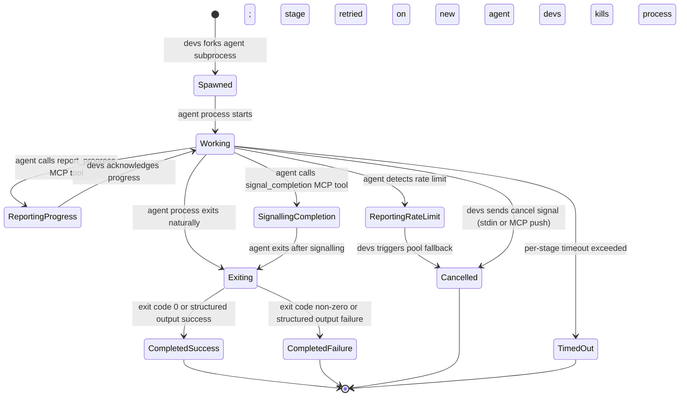
```mermaid
stateDiagram-v2
    [*] --> Spawned : devs forks agent subprocess
    Spawned --> Working : agent process starts
    Working --> ReportingProgress : agent calls report_progress MCP tool
    ReportingProgress --> Working : devs acknowledges progress
    Working --> ReportingRateLimit : agent detects rate limit
    ReportingRateLimit --> Cancelled : devs triggers pool fallback; stage retried on new agent
    Working --> SignallingCompletion : agent calls signal_completion MCP tool
    Working --> Exiting : agent process exits naturally
    SignallingCompletion --> Exiting : agent exits after signalling
    Exiting --> CompletedSuccess : exit code 0 or structured output success
    Exiting --> CompletedFailure : exit code non-zero or structured output failure
    Working --> Cancelled : devs sends cancel signal (stdin or MCP push)
    Working --> TimedOut : per-stage timeout exceeded; devs kills process
    CompletedSuccess --> [*]
    CompletedFailure --> [*]
    Cancelled --> [*]
    TimedOut --> [*]
```

#### 2.2.7 Observing/Controlling Agent State Diagram

The following diagram shows how an agent acting as an observer/controller (e.g., an agent building `devs`) uses the MCP interface:

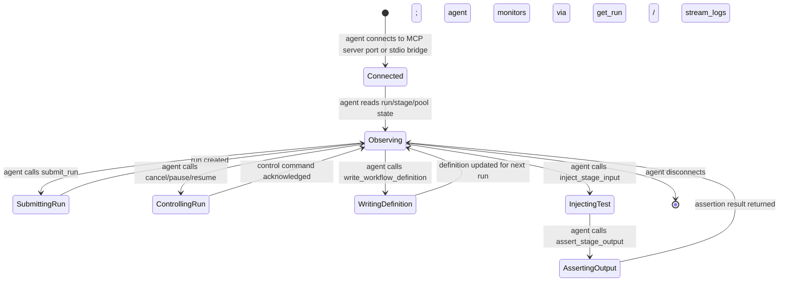
```mermaid
stateDiagram-v2
    [*] --> Connected : agent connects to MCP server port or stdio bridge
    Connected --> Observing : agent reads run/stage/pool state
    Observing --> SubmittingRun : agent calls submit_run
    SubmittingRun --> Observing : run created; agent monitors via get_run / stream_logs
    Observing --> ControllingRun : agent calls cancel/pause/resume
    ControllingRun --> Observing : control command acknowledged
    Observing --> WritingDefinition : agent calls write_workflow_definition
    WritingDefinition --> Observing : definition updated for next run
    Observing --> InjectingTest : agent calls inject_stage_input
    InjectingTest --> AssertingOutput : agent calls assert_stage_output
    AssertingOutput --> Observing : assertion result returned
    Observing --> [*] : agent disconnects
```

#### 2.2.8 Edge Cases — AI Agent Client Persona

| ID | Edge Case | Context | Expected Behaviour |
|---|---|---|---|
| EC-A001 | Agent calls `signal_completion` for a stage that has already been cancelled by the server | Mid-run MCP tool call | Server returns an error indicating the stage is in `Cancelled` state. The call is a no-op. No state corruption occurs. |
| EC-A002 | Agent calls `get_run` with a run ID that does not exist | MCP `get_run` tool call | Server returns `{ "error": "run not found", "id": "<requested-id>" }`. HTTP/gRPC status is a not-found code. |
| EC-A003 | Agent calls `submit_run` with a workflow input parameter whose value is the wrong type (e.g., a string where an integer is expected) | MCP `submit_run` tool call | Server rejects with a structured error listing the parameter name, expected type, and received value. No run is created. |
| EC-A004 | Agent calls `stream_logs` for a stage that has not yet started (status = `Waiting` or `Eligible`) | MCP `stream_logs` tool call | Server opens the stream immediately and begins emitting log lines as soon as the stage starts, without error. The stream does not require the stage to be running at connection time. |
| EC-A005 | Agent calls `write_workflow_definition` with a definition that contains a DAG cycle | MCP `write_workflow_definition` tool call | Server validates the definition, detects the cycle, rejects the write, and returns a structured error identifying the cycle. The existing definition is unchanged. |
| EC-A006 | Multiple agent clients concurrently call `submit_run` for the same workflow with the same user-provided run name | Concurrent MCP submissions | Only one run is created. The second submission receives an error indicating the run name is already in use. Both responses are correct and non-corrupted. |
| EC-A007 | CLI agent uses `devs logs <run> --format json` while the run is still active and new log lines are being emitted | Streaming CLI log command | The command emits newline-delimited JSON objects as lines arrive, without buffering. When the run completes, the stream ends and the process exits zero. |
| EC-A008 | Agent connects to the MCP stdio bridge and the bridge process loses its connection to the MCP server port mid-session | MCP stdio bridge in use | Bridge returns a structured error on the stdio channel and closes the connection cleanly. Agent receives a parseable error rather than a broken pipe or garbled output. |

#### 2.2.9 Dependencies

| Dependency | Direction | Notes |
|---|---|---|
| §3.1 Server Architecture | §2.2 depends on §3.1 | The gRPC API layer and MCP server port must be implemented before agent client needs can be satisfied. |
| §3.6 Agent Tools and Adapters | §2.2 is depended on by §3.6 | The adapter's MCP mid-run callback tools (`report_progress`, `signal_completion`, `report_rate_limit`) are defined by agent client needs in §2.2. |
| §3.7 Agent Pools | §2.2 is depended on by §3.7 | The `get_pool_state` MCP tool and the `report_rate_limit` mechanism are required by §2.2.3. |
| §1.7 Quality Gates | §2.1 drives §1.7 | The developer persona's automated verification need drives all coverage requirements. |
| §1.6 `./do` Entrypoint | §2.1 drives §1.6 | The developer persona's repeatable-builds need is the sole driver of the `./do` contract. |

---

### 2.3 Acceptance Criteria — Persona & User Needs

All criteria below must pass before the MVP is considered complete with respect to §2:

- [ ] **AC-P001**: The Glass-Box MCP server exposes every entity in §2.1.3 (`WorkflowRun`, `StageRun`, `RunStatus`, `StageStatus`, all fields) with no field absent or null for a field that has a value.
- [ ] **AC-P002**: An MCP client reading a `StageRun` that has not yet completed receives null for `completed_at` and `exit_code`, not an absent field or an error.
- [ ] **AC-P003**: Submitting a workflow via CLI or MCP with a `depends_on` reference to a non-existent stage name returns a structured validation error and creates no run.
- [ ] **AC-P004**: Submitting a workflow via CLI or MCP with a DAG cycle returns a structured validation error identifying the cycle and creates no run.
- [ ] **AC-P005**: Submitting a workflow via CLI or MCP with a missing required input parameter returns a structured error listing the missing parameter names and creates no run.
- [ ] **AC-P006**: Two stages with no shared unresolved dependencies are scheduled to start within 100 ms of each other after their dependencies complete, as measured by a unit test with a mock agent pool.
- [ ] **AC-P007**: Modifying a workflow definition (via MCP `write_workflow_definition`) while a run of that workflow is active does not alter the active run's behaviour; the run continues using the snapshotted definition.
- [ ] **AC-A001**: Every `devs` CLI command produces valid JSON when invoked with `--format json` and exits zero on success, as verified by an E2E test that parses the JSON output with a strict schema validator.
- [ ] **AC-A002**: Every `devs` CLI command exits with the correct non-zero code (as defined in §2.2.4) when an error condition is triggered, as verified by E2E tests covering each error code.
- [ ] **AC-A003**: When `--format json` is active and an error occurs, the CLI writes `{ "error": "...", "code": <n> }` to stdout and no other content to stdout.
- [ ] **AC-A004**: An MCP `get_run` call with a non-existent run ID returns a structured error response and an appropriate gRPC not-found status code.
- [ ] **AC-A005**: An MCP `submit_run` call with a type-invalid parameter is rejected with a structured error; no run is created, as verified by an MCP E2E test.
- [ ] **AC-A006**: Concurrent MCP `submit_run` calls with the same user-provided run name result in exactly one run created and one structured error returned to the second caller, with no data corruption.
- [ ] **AC-A007**: A running orchestrated agent calling `report_rate_limit` via MCP causes the stage to be immediately retried on the next available agent in the pool, as verified by an E2E test using a mock agent that reports a rate limit.
- [ ] **AC-A008**: `stream_logs` via MCP for a stage in `Waiting` state opens successfully and begins emitting lines once the stage starts, without requiring a reconnect.
- [ ] **AC-A009**: The MCP stdio bridge returns a parseable structured error when its upstream MCP server connection is severed, rather than a broken pipe or garbled output.

---

## 3. Key Features & Requirements

### 3.1 Server Architecture

**[1_PRD-REQ-001]** `devs` runs as a headless background process (the "server") exposing a gRPC API. All client interfaces (TUI, CLI, MCP) connect to the server over gRPC, enabling remote access from clients on other machines.

**[1_PRD-REQ-002]** The server, TUI client, CLI client, and MCP server are all implemented in Rust and ship as a single Cargo workspace.

**[1_PRD-REQ-003]** On startup, the server writes its listen address to a well-known file (`~/.config/devs/server.addr`) to enable client auto-discovery. Clients that are given an explicit `--server` flag or `server_addr` config key use that address and skip auto-discovery. For test isolation, auto-discovery uses a separate mechanism to avoid address conflicts between parallel server instances.

#### 3.1.1 gRPC Service Definition

The following proto-like pseudocode is the authoritative surface of the gRPC API layer. All client communications use these service definitions:

```proto
// devs.proto (pseudocode — actual .proto files are the implementation source of truth)

service WorkflowService {
  rpc SubmitRun       (SubmitRunRequest)    returns (SubmitRunResponse);
  rpc CancelRun       (RunIdRequest)        returns (AckResponse);
  rpc PauseRun        (RunIdRequest)        returns (AckResponse);
  rpc ResumeRun       (RunIdRequest)        returns (AckResponse);
  rpc ListRuns        (ListRunsRequest)     returns (ListRunsResponse);
  rpc GetRun          (RunIdRequest)        returns (GetRunResponse);
  rpc StreamRunEvents (RunIdRequest)        returns (stream RunEvent);
}

service StageService {
  rpc CancelStage     (StageIdRequest)      returns (AckResponse);
  rpc PauseStage      (StageIdRequest)      returns (AckResponse);
  rpc ResumeStage     (StageIdRequest)      returns (AckResponse);
  rpc GetStageOutput  (StageIdRequest)      returns (StageOutputResponse);
  rpc StreamStageLogs (StageIdRequest)      returns (stream LogLine);
}

service WorkflowDefinitionService {
  rpc GetDefinition   (GetDefinitionRequest)   returns (DefinitionResponse);
  rpc WriteDefinition (WriteDefinitionRequest) returns (AckResponse);
}

service PoolService {
  rpc GetPoolState    (PoolNameRequest)     returns (PoolStateResponse);
  rpc ListPools       (Empty)              returns (ListPoolsResponse);
}

service McpAgentService {
  // Called by orchestrated agents from inside a running stage
  rpc ReportProgress    (ProgressRequest)    returns (AckResponse);
  rpc SignalCompletion  (CompletionRequest)  returns (AckResponse);
  rpc ReportRateLimit   (RateLimitRequest)  returns (AckResponse);
}

service TestingService {
  rpc InjectStageInput  (InjectRequest)     returns (AckResponse);
  rpc AssertStageOutput (AssertRequest)     returns (AssertResponse);
}

message AckResponse  { bool success = 1; string error = 2; }
message RunIdRequest  { string run_id = 1; }
message StageIdRequest { string run_id = 1; string stage_name = 2; }
```

#### 3.1.2 Server Startup Sequence

1. Parse `devs.toml` (and project registry file).
2. Validate config (pool definitions, webhook targets, project entries).
3. Bind gRPC listen address (from config, then `--listen` flag, then env `DEVS_LISTEN`).
4. Bind MCP port (from config, then `--mcp-port` flag, then env `DEVS_MCP_PORT`).
5. Initialise agent pool manager with configured pools.
6. Restore in-flight run state from git-backed checkpoints (crash recovery).
7. Write resolved listen address to `~/.config/devs/server.addr` (auto-discovery file).
8. Begin accepting gRPC connections.
9. Begin accepting MCP connections.
10. Resume any checkpointed runs that were `Running` or `Eligible` at crash time.

#### 3.1.3 Discovery File Format

The auto-discovery file at `~/.config/devs/server.addr` is a plain UTF-8 text file containing a single line:

```
<host>:<port>
```

Example: `127.0.0.1:7890`
<!-- Resolved: aligned with 2_tas.md -->

The file is overwritten atomically (write to temp file then rename) on every server startup. Clients read the file on each invocation; they do not cache it between calls.

**Test isolation:** Integration and E2E tests that start a server subprocess MUST set the environment variable `DEVS_DISCOVERY_FILE` to a test-specific path (e.g., a temp file under the test's temp directory). When `DEVS_DISCOVERY_FILE` is set, the server writes to and clients read from that path instead of `~/.config/devs/server.addr`. This prevents address collisions between parallel test instances and the developer's own running server.

#### 3.1.4 Business Rules

**[3_PRD-BR-001]** The server MUST NOT start if the gRPC listen address is already in use. It MUST log the conflict and exit non-zero.

**[3_PRD-BR-002]** The server MUST write the discovery file only after the gRPC and MCP ports are both bound and accepting connections. A partially-started server MUST NOT write the discovery file.

**[3_PRD-BR-003]** The server MUST validate `devs.toml` before binding any port. Configuration errors MUST be reported to stderr with the offending field name and value, and the server MUST exit non-zero without binding.

**[3_PRD-BR-004]** Client version compatibility: if a client sends a gRPC request with a `devs-client-version` header, the server MUST reject the request with gRPC status `FAILED_PRECONDITION` and a structured error if the client's major version does not match the server's major version.

**[3_PRD-BR-005]** The server MUST clean up the discovery file (`~/.config/devs/server.addr` or `DEVS_DISCOVERY_FILE`) on clean shutdown (SIGTERM). On unclean shutdown (SIGKILL, crash), the stale file may persist; clients MUST handle connection failure gracefully (exit code 3, see §2.2.4).

#### 3.1.5 Edge Cases

| ID | Edge Case | Context | Expected Behaviour |
|---|---|---|---|
| EC-3.1-001 | Server process started while another `devs` server is already listening on the same port | Server startup | New instance detects `EADDRINUSE`, logs the conflict including the address, and exits non-zero. The existing server continues unaffected. |
| EC-3.1-002 | Discovery file exists from a previous (now-dead) server instance | Client auto-discovery | Client attempts to connect; receives connection refused; exits with code 3 and a message identifying the stale discovery file path and the attempted address. |
| EC-3.1-003 | Client compiled against a different major version connects to the server | gRPC handshake | Server checks `devs-client-version` header, returns `FAILED_PRECONDITION` with a structured error specifying the server version and the received client version. Client exits with code 1. |

#### 3.1.6 Server Lifecycle State Diagram

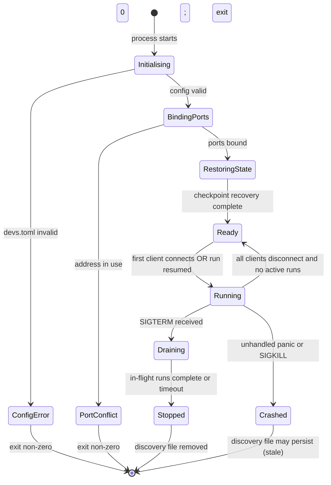
```mermaid
stateDiagram-v2
    [*] --> Initialising : process starts
    Initialising --> ConfigError : devs.toml invalid
    ConfigError --> [*] : exit non-zero
    Initialising --> BindingPorts : config valid
    BindingPorts --> PortConflict : address in use
    PortConflict --> [*] : exit non-zero
    BindingPorts --> RestoringState : ports bound
    RestoringState --> Ready : checkpoint recovery complete
    Ready --> Running : first client connects OR run resumed
    Running --> Ready : all clients disconnect and no active runs
    Running --> Draining : SIGTERM received
    Draining --> Stopped : in-flight runs complete or timeout
    Stopped --> [*] : discovery file removed; exit 0
    Running --> Crashed : unhandled panic or SIGKILL
    Crashed --> [*] : discovery file may persist (stale)
```

#### 3.1.7 Dependencies

| Dependency | Direction | Notes |
|---|---|---|
| §3.16 Server Config | §3.1 depends on §3.16 | Server reads `devs.toml` before any port binding. |
| §3.11 State Persistence | §3.1 depends on §3.11 | Crash recovery in startup sequence reads checkpoints. |
| §3.7 Agent Pools | §3.1 initialises §3.7 | Pool manager is initialised from config during startup. |
| §3.15 Client Interfaces | §3.15 depends on §3.1 | All client interfaces require a running server. |

### 3.2 Workflow Definition

**[1_PRD-REQ-004]** Workflows are modeled as directed acyclic graphs (DAGs) of stages. Each stage declares a `depends_on` list of other stage names. A stage becomes eligible to run as soon as all declared dependencies have successfully completed.

**[1_PRD-REQ-005]** Stages with no unmet dependencies are scheduled to run in parallel automatically. The scheduler does not require explicit parallelism declarations beyond the `depends_on` structure.

**[1_PRD-REQ-006]** `devs` supports two authoring formats for workflow definitions:

- **Rust Builder API**: A typed Rust builder API compiled against the `devs` library crate. Conditional branching is expressed as Rust closures that receive stage outputs and return the next stage identifier.
- **Declarative Config (TOML / YAML)**: A declarative format loaded by the server at runtime without Rust compilation. Branching is expressed via built-in predicates (`exit_code`, `stdout_contains`, `output_field`, etc.) or named Rust handlers registered at server startup.

**[1_PRD-REQ-007]** Workflows accept typed input parameters (strings, paths, integers) declared in the workflow definition. Parameters are validated on submission. Stages reference parameter values in prompts using `{{template}}` variable syntax.

**[1_PRD-REQ-008]** Each workflow run is identified by a user-provided name combined with a UUID or human-readable slug. If no name is supplied at submit time, a slug is auto-generated from the workflow name and a timestamp. Duplicate run names are prevented.

**[1_PRD-REQ-009]** When a run starts, `devs` snapshots the workflow definition and stores it alongside the checkpoint state. Runs are reproducible even if the live definition changes during execution.

#### 3.2.1 Declarative TOML Schema

The following is the complete schema for a workflow defined in TOML. All fields are documented with type, constraints, and whether they are required.

```toml
# workflow.toml — complete field reference

[workflow]
name        = "string"         # Required. Unique within project. Pattern: [a-z0-9][a-z0-9\-_]{0,127}
description = "string"         # Optional. Max 1024 chars. Human-readable description.

[[workflow.inputs]]
name     = "string"            # Required. Pattern: [a-z][a-z0-9_]{0,63}
type     = "String|Path|Integer" # Required.
required = true                 # Required. Boolean.
default  = "string"            # Optional. Must be absent when required = true.
                               # Value must be coercible to the declared type.

[[workflow.stages]]
name                  = "string"      # Required. Unique within workflow. Pattern: [a-z0-9][a-z0-9\-_]{0,63}
pool                  = "string"      # Required. Must reference a named pool in devs.toml.
depends_on            = ["string"]    # Optional. List of stage names within this workflow. Default: [].
prompt                = "string"      # Optional. Inline prompt text. Mutually exclusive with prompt_file.
prompt_file           = "string"      # Optional. Path resolved relative to workflow file. Mutually exclusive with prompt.
system_prompt         = "string"      # Optional. Passed to agent where supported.
required_capabilities = ["string"]    # Optional. Capability tags the selected agent must satisfy.
timeout_secs          = 300           # Optional. Integer ≥ 1. Default: no timeout.
completion            = "exit_code|structured_output|mcp_tool_call"  # Required.
artifact_collection   = "agent_driven|auto_collect"  # Optional. Default: agent_driven.

[workflow.stages.execution_env]
target      = "tempdir|docker|remote"  # Required. Default: tempdir.
docker_host = "string"                 # Optional. Only valid when target = "docker".
                                       # Defaults to DOCKER_HOST env var.
[workflow.stages.execution_env.ssh]
host     = "string"   # Required when target = "remote".
user     = "string"   # Required when target = "remote".
key_path = "string"   # Optional. Path to SSH private key. Falls back to ssh-agent.
port     = 22         # Optional. Default: 22.

[workflow.stages.retry]
max_attempts = 3            # Required when retry block present. Integer 1–10.
backoff      = "Fixed|Exponential"  # Required when retry block present.
backoff_secs = 5            # Optional. For Fixed: constant delay. For Exponential: base delay (seconds).
                            # Exponential delay = backoff_secs ^ attempt_number (capped at 300 s).

[workflow.stages.env]
# Arbitrary key = "value" pairs. All values must be strings.
# Example:
MY_VAR = "my_value"

[[workflow.stages.branch]]
# Declarative branching: list of conditions evaluated in order.
# First matching condition determines the next stage (or end of workflow).
predicate   = "exit_code_eq|exit_code_ne|stdout_contains|output_field_eq|output_field_truthy|always"
value       = "string|integer"  # The value to compare against. Type depends on predicate.
field       = "string"          # Required for output_field_* predicates. JSONPath into structured output.
next_stage  = "string"          # Stage name to execute next. Mutually exclusive with end.
end         = true              # If true, workflow ends (successfully) after this branch. Mutually exclusive with next_stage.
handler     = "string"          # Named Rust handler registered at server startup. Used instead of predicate+value.
```

#### 3.2.2 Built-in Predicate Reference

| Predicate | Applies To | Value Type | Match Condition |
|---|---|---|---|
| `exit_code_eq` | exit code | Integer | Stage exit code equals value |
| `exit_code_ne` | exit code | Integer | Stage exit code does not equal value |
| `exit_code_zero` | exit code | — | Stage exit code is 0 (success shorthand) |
| `exit_code_nonzero` | exit code | — | Stage exit code is non-zero (failure shorthand) |
| `stdout_contains` | stdout | String | stdout string contains value as substring |
| `stderr_contains` | stderr | String | stderr string contains value as substring |
| `output_field_eq` | structured output | String | Field at JSONPath `field` equals value (string comparison) |
| `output_field_truthy` | structured output | — | Field at JSONPath `field` is non-null, non-empty, and not `false` |
| `output_field_gte` | structured output | Integer | Field at JSONPath `field` (numeric) is ≥ value |
| `always` | — | — | Unconditional; used as the final catch-all branch |

#### 3.2.3 Named Handler Registration Contract

Named handlers are Rust functions registered at server startup via the builder API and referenced by name in declarative configs:

```rust
// Rust pseudocode — handler registration interface
pub trait BranchHandler: Send + Sync + 'static {
    /// Returns the next stage name, or None to end the workflow.
    fn evaluate(&self, ctx: &StageOutputContext) -> Result<Option<String>, HandlerError>;
}

// Registration at server startup:
server_builder.register_handler("my_handler", Box::new(MyHandler));
```

Handlers are registered before the server binds ports (step 1 of startup sequence, §3.1.2). A declarative workflow that references an unknown handler name is rejected at load time with a structured validation error.

#### 3.2.4 Validation Rules

The following validations are applied in order when a workflow definition is submitted or loaded:

1. **Schema validation**: All required fields present; all types correct; string patterns match.
2. **Stage name uniqueness**: No two stages share the same `name` within the workflow.
3. **Dependency existence**: Every name in `depends_on` references a stage defined in the same workflow.
4. **Cycle detection**: The stage dependency graph is acyclic. Kahn's algorithm is applied; any detected cycle is reported with the full cycle path (e.g., `a → b → c → a`).
5. **Pool existence**: Every `pool` field references a pool name defined in `devs.toml`.
6. **Handler existence**: Every `handler` field references a registered named handler.
7. **Input default type coercion**: Any `default` value on an optional input must be coercible to the input's declared type.
8. **Mutual exclusivity**: `prompt` and `prompt_file` must not both be set on the same stage.
9. **Fan-out + completion signal**: A stage with `fan_out` configured must use `structured_output` or `mcp_tool_call` as its completion signal (not `exit_code` alone).

All validation errors are collected before returning; the response lists all errors, not just the first.

#### 3.2.5 Run Naming and Dedup Schema

```
RunIdentity
├── id:   UUID v4                          -- server-generated; globally unique
├── slug: String                           -- derived: <workflow-name>-<YYYYMMDD>-<4 random hex chars>
│                                          --   e.g. "build-feature-20260310-a3f2"
│                                          --   max 128 chars; pattern: [a-z0-9\-]+
└── name: Option<String>                   -- user-provided at submit time
                                           --   max 128 chars; pattern: [a-zA-Z0-9\-_ ]+
```

Dedup enforcement: before creating a run, the server queries all existing runs for the project where `name` equals the submitted name (case-sensitive). If any non-`Cancelled` run exists with that name, the submission is rejected with exit code 4 and a structured error identifying the conflicting run's ID and status.

Auto-generation: when no `name` is provided, the server sets `name = null` and generates a `slug`. Slugs are not subject to dedup checks.

#### 3.2.6 Snapshot Format

At run start, the workflow definition is serialized to JSON and stored as `.devs/runs/<run-id>/workflow_snapshot.json`. This file is written before any stage begins. The JSON schema mirrors the TOML schema (§3.2.1) with all TOML keys converted to snake_case JSON keys. The snapshot is immutable after creation.

#### 3.2.7 Business Rules

**[3_PRD-BR-006]** A workflow definition MUST be rejected at submission time if cycle detection finds any cycle. The error response MUST include the full cycle path as an ordered list of stage names.

**[3_PRD-BR-007]** A workflow definition MUST be rejected if any stage references a pool name not declared in `devs.toml`. This check is performed at submission time, not at stage execution time.

**[3_PRD-BR-008]** Duplicate run names (same `name` field, non-cancelled) within the same project MUST be rejected. The rejection MUST be atomic: concurrent submissions with the same name result in exactly one run created and one rejection.

**[3_PRD-BR-009]** The workflow snapshot stored at `.devs/runs/<run-id>/workflow_snapshot.json` MUST NOT be modified after the run transitions from `Pending` to `Running`. Any attempt to write the snapshot after this transition is a server-side bug.

**[3_PRD-BR-010]** A workflow with zero stages MUST be rejected at load time with a validation error. An empty workflow is not a valid workflow.

#### 3.2.8 Edge Cases

| ID | Edge Case | Context | Expected Behaviour |
|---|---|---|---|
| EC-3.2-001 | Workflow definition contains a cycle: A→B→C→A | Submit or load via MCP `write_workflow_definition` | Rejected with structured error: `{ "error": "cycle detected", "cycle": ["a", "b", "c", "a"] }`. No run created. |
| EC-3.2-002 | Stage references a `depends_on` name that does not exist in the workflow | Submit or load | Rejected with structured error listing the missing stage name and the stage that referenced it. No run created. |
| EC-3.2-003 | Two concurrent `submit_run` calls arrive with the same user-provided name | Concurrent gRPC calls | Exactly one run is created. The second receives `{ "error": "run name already in use", "conflicting_run_id": "<id>" }`. No data corruption. |
| EC-3.2-004 | Workflow definition has zero stages | Load or submit | Rejected with `{ "error": "workflow must contain at least one stage" }`. |
| EC-3.2-005 | `prompt` and `prompt_file` are both set on the same stage | Schema validation | Rejected with `{ "error": "prompt and prompt_file are mutually exclusive", "stage": "<name>" }`. |

#### 3.2.9 Run Lifecycle State Diagram

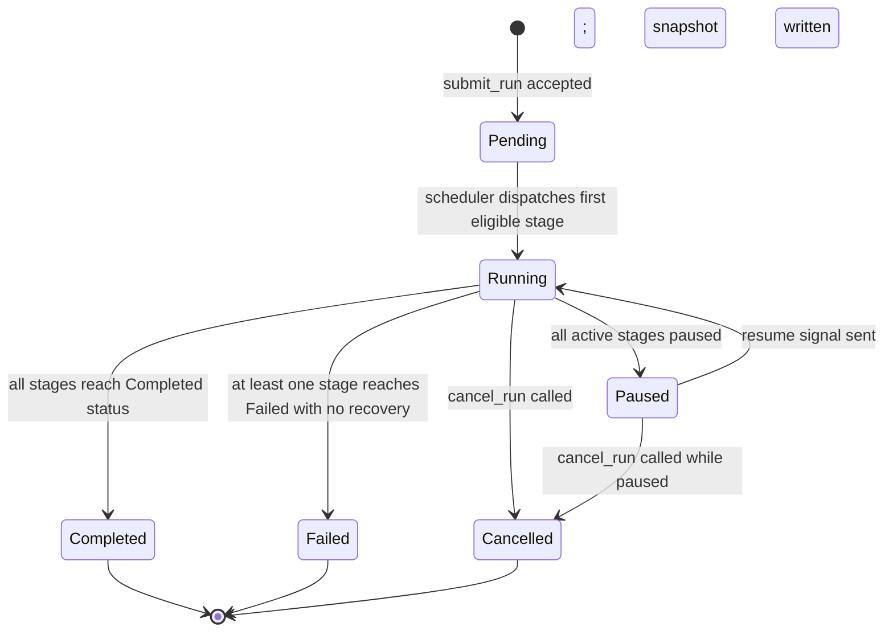
```mermaid
stateDiagram-v2
    [*] --> Pending : submit_run accepted; snapshot written
    Pending --> Running : scheduler dispatches first eligible stage
    Running --> Paused : all active stages paused
    Paused --> Running : resume signal sent
    Running --> Completed : all stages reach Completed status
    Running --> Failed : at least one stage reaches Failed with no recovery
    Running --> Cancelled : cancel_run called
    Paused --> Cancelled : cancel_run called while paused
    Completed --> [*]
    Failed --> [*]
    Cancelled --> [*]
```

#### 3.2.10 Dependencies

| Dependency | Direction | Notes |
|---|---|---|
| §3.3 Stage Inputs | §3.2 defines §3.3 | Stage input fields are part of the workflow definition schema. |
| §3.4 Completion Signals | §3.2 defines §3.4 | The `completion` field on each stage references completion signal types. |
| §3.7 Agent Pools | §3.2 depends on §3.7 | Stage `pool` field must reference a valid pool. |
| §3.11 State Persistence | §3.2 depends on §3.11 | Snapshot is written by the persistence layer. |
| §3.13 Workflow Triggers | §3.13 depends on §3.2 | Triggers submit workflow definitions through the validation pipeline. |

### 3.3 Stage Inputs

**[1_PRD-REQ-010]** Each stage supports the following inputs to the spawned agent:

| Input | Description |
|---|---|
| Prompt string | Text prompt with optional `{{template}}` variable interpolation referencing workflow inputs or prior stage outputs. |
| Prompt file | Path to a file loaded at runtime and used as the prompt. |
| System prompt | A separate system-level prompt passed to the agent where supported. |
| Environment variables | Per-stage key-value pairs injected into the agent's process environment, in addition to inherited server environment variables. |

#### 3.3.1 Complete Stage Input Field Table

| Field | Type | Required | Constraints |
|---|---|---|---|
| `name` | String | Yes | Unique within workflow; `[a-z0-9][a-z0-9\-_]{0,63}` |
| `pool` | String | Yes | Must match a pool name in `devs.toml` |
| `prompt` | String | Conditional | Max 65,536 chars. Mutually exclusive with `prompt_file`. At least one of `prompt` or `prompt_file` MUST be set. |
| `prompt_file` | Path | Conditional | Path resolved relative to workflow definition file at stage execution time. File must exist and be readable. Mutually exclusive with `prompt`. |
| `system_prompt` | String | No | Max 16,384 chars. Passed to agent if the adapter supports it; silently ignored otherwise. |
| `env` | Map\<String, String\> | No | Keys: `[A-Z_][A-Z0-9_]{0,127}`. Values: strings up to 32,768 chars each. Max 64 entries per stage. |
| `depends_on` | Vec\<String\> | No | Stage names within the same workflow. Default: empty (runs immediately). |
| `completion` | Enum | Yes | One of: `exit_code`, `structured_output`, `mcp_tool_call` |
| `execution_env.target` | Enum | No | One of: `tempdir`, `docker`, `remote`. Default: `tempdir`. |
| `execution_env.docker_host` | String | No | Valid only when `target = docker`. URL format: `unix:///path` or `tcp://host:port`. |
| `execution_env.ssh.*` | SshConfig | Conditional | Required when `target = remote`. See §3.8 for full schema. |
| `artifact_collection` | Enum | No | One of: `agent_driven`, `auto_collect`. Default: `agent_driven`. |
| `timeout_secs` | u64 | No | Integer ≥ 1. No upper limit enforced by schema (workflow-level timeout applies as ceiling). |
| `retry.max_attempts` | u32 | Conditional | Required when `retry` block present. Integer 1–10 inclusive. |
| `retry.backoff` | Enum | Conditional | Required when `retry` block present. One of: `Fixed`, `Exponential`. |
| `retry.backoff_secs` | u64 | No | Default: 5. For `Fixed`: constant delay in seconds. For `Exponential`: base in seconds. |
| `required_capabilities` | Vec\<String\> | No | Capability tag strings. Pattern: `[a-z0-9\-]+`. Max 16 tags. |
| `fan_out` | FanOutConfig | No | See §3.9 for full schema. Cannot be combined with `completion = exit_code` alone. |
| `branch` | Vec\<BranchCondition\> | No | Evaluated in order after stage completion. See §3.2.2 for predicate reference. |

#### 3.3.2 Template Variable Resolution Rules

Template variables use the syntax `{{namespace.key}}` within `prompt`, `prompt_file` content (loaded and interpolated at execution time), and `system_prompt` fields.

**Resolution order (highest precedence first):**

1. `{{workflow.input.<name>}}` — workflow input parameters validated at submit time.
2. `{{stage.<name>.exit_code}}` — exit code (integer) of a completed upstream stage.
3. `{{stage.<name>.output.<field>}}` — a field from the structured JSON output of a completed upstream stage. `<field>` is a dot-separated JSONPath (e.g., `stage.build.output.artifact_path`).
4. `{{stage.<name>.stdout}}` — full stdout of a completed upstream stage (truncated to 65,536 chars if larger).
5. `{{stage.<name>.stderr}}` — full stderr of a completed upstream stage (truncated to 65,536 chars if larger).

**Missing variable behaviour:** If a template variable cannot be resolved (unknown namespace, unknown stage name, missing output field), the server MUST reject stage execution with a structured error identifying the unresolvable variable. The stage is marked `Failed`. The error is NOT silently replaced with an empty string.

**Cross-stage references:** A stage may only reference output variables from stages that are declared (directly or transitively) in its `depends_on` list. Referencing a stage not in the dependency chain is a validation error caught at submission time.

#### 3.3.3 Env Var Inheritance Rules

The agent process environment is constructed as follows (later entries override earlier ones):

1. Server process environment (inherited by default).
2. Workflow-level `env` block (if present in the workflow definition).
3. Stage-level `env` block (overrides workflow-level and inherited vars for keys that conflict).

Keys from the server environment that conflict with stage-level `env` keys are overridden by the stage-level value. The server's own operational variables (`DEVS_LISTEN`, `DEVS_MCP_PORT`, `DEVS_DISCOVERY_FILE`) are stripped from the agent's environment before injection.

#### 3.3.4 Business Rules

**[3_PRD-BR-011]** At least one of `prompt` or `prompt_file` MUST be set on every stage. A stage with neither is rejected at validation time.

**[3_PRD-BR-012]** `prompt` and `prompt_file` MUST NOT both be set on the same stage. This is enforced at validation time (§3.2.4 rule 8).

**[3_PRD-BR-013]** Environment variable keys MUST match pattern `[A-Z_][A-Z0-9_]{0,127}`. Keys that do not match are rejected at validation time with a structured error identifying the offending key.

**[3_PRD-BR-014]** Template variables in `prompt_file` content are resolved at stage execution time (when the file is read), not at workflow load time. If the file does not exist at execution time, the stage fails immediately with a structured error.

#### 3.3.5 Edge Cases

| ID | Edge Case | Context | Expected Behaviour |
|---|---|---|---|
| EC-3.3-001 | Template variable references a stage name that does not exist in the workflow | Validation at submission | Rejected with `{ "error": "unresolvable template variable", "variable": "{{stage.nonexistent.exit_code}}", "stage": "<referencing-stage>" }`. No run created. |
| EC-3.3-002 | Both `prompt` and `prompt_file` are set on the same stage | Validation at submission | Rejected with `{ "error": "prompt and prompt_file are mutually exclusive", "stage": "<name>" }`. |
| EC-3.3-003 | Stage `env` block contains a key that collides with a server operational variable (e.g., `DEVS_LISTEN`) | Stage execution | Server operational variable is stripped; stage-level value is used. No error. Server logs a warning identifying the shadowed key. |
| EC-3.3-004 | `prompt_file` points to a file that does not exist at stage execution time | Stage execution | Stage immediately transitions to `Failed` with `{ "error": "prompt_file not found", "path": "<path>" }`. Retry policy applies. |
| EC-3.3-005 | Template variable references an upstream stage's `output.<field>` where the upstream stage used `exit_code` completion (no structured output) | Stage execution | Stage immediately transitions to `Failed` with `{ "error": "stage <name> has no structured output; cannot resolve template variable <var>" }`. |

#### 3.3.6 Dependencies

| Dependency | Direction | Notes |
|---|---|---|
| §3.2 Workflow Definition | §3.3 is defined by §3.2 | Stage input fields are declared in the workflow schema. |
| §3.5 Data Flow | §3.3 depends on §3.5 | Template variable resolution reads stage output from the data flow layer. |
| §3.6 Agent Tools | §3.3 is consumed by §3.6 | Adapters receive resolved prompt, env vars, and system prompt. |

### 3.4 Stage Completion Signals

**[1_PRD-REQ-011]** Each stage has a configurable completion signal mechanism. Three mechanisms are supported:

| Mechanism | Description |
|---|---|
| `exit_code` | Zero = success, non-zero = failure. No structured output. |
| `structured_output` | Agent writes JSON to stdout or a known file. `devs` parses it to determine outcome and extract data for downstream stages. |
| `mcp_tool_call` | The agent signals completion by invoking a `devs` MCP tool, optionally passing result data. Supports mid-run progress updates. |

#### 3.4.1 Mechanism Details and Success Determination

**`exit_code` mechanism:**
- The server waits for the agent process to exit.
- Exit code `0` → stage `Completed`.
- Exit code non-zero → stage `Failed`.
- No stdout or stderr content is parsed for success determination (though both streams are captured for logging and template variable access).
- Timeout: if the process does not exit within `timeout_secs`, the server sends SIGTERM. If not exited within 5 seconds, sends SIGKILL. Stage transitions to `TimedOut`.

**`structured_output` mechanism:**
- The server waits for the agent process to exit.
- After exit, the server reads structured output from one of two sources (in priority order):
  1. The file at path `<working-dir>/.devs_output.json` (created by the agent).
  2. Stdout parsed as a single JSON object (the last complete JSON object on stdout if multiple are present).
- The structured output JSON MUST contain a top-level `"success"` key with a boolean value.
- If `"success": true` → stage `Completed`. The full JSON object is stored as `StageRun.structured_output`.
- If `"success": false` → stage `Failed`. The `"error"` field (if present) is logged.
- If neither source yields valid JSON → stage `Failed` with error `"structured output not valid JSON"`.
- Exit code is recorded but does not determine success/failure when this mechanism is active.

**`mcp_tool_call` mechanism:**
- The agent calls `devs`'s `signal_completion` MCP tool while the stage is running.
- The `signal_completion` call carries an optional JSON payload (`result` field).
- The server stores the payload as `StageRun.structured_output` and transitions the stage to `Completed`.
- If the agent process exits before calling `signal_completion`, the exit code is used as a fallback:
  - Exit code `0` with no `signal_completion` → stage `Completed` with null structured output.
  - Exit code non-zero with no `signal_completion` → stage `Failed`.
- `signal_completion` called after the stage is already `Completed`, `Failed`, or `Cancelled` → server returns error; no state change.

#### 3.4.2 Structured Output JSON Schema

```json
{
  "success": true,
  "error": null,
  "result": {
    // Arbitrary JSON object. All fields accessible via {{stage.<name>.output.<field>}}
    // Example:
    "artifact_path": "/tmp/build/output.bin",
    "lines_changed": 42
  }
}
```

Required top-level fields:

| Field | Type | Required | Description |
|---|---|---|---|
| `success` | Boolean | Yes | `true` = stage success; `false` = stage failure. |
| `error` | String or null | No | Human-readable error description. Required when `success = false`. |
| `result` | Object or null | No | Arbitrary key-value data available to downstream stages via template variables. |

#### 3.4.3 Business Rules

**[3_PRD-BR-015]** When `completion = structured_output`, the file `.devs_output.json` takes precedence over stdout. If the file exists but contains invalid JSON, the stage MUST be marked `Failed` regardless of exit code.

**[3_PRD-BR-016]** The `signal_completion` MCP tool MUST be idempotent with respect to the first call: the first call transitions the stage. Subsequent calls while the stage is in a terminal state MUST return a structured error and MUST NOT alter the stage state.

**[3_PRD-BR-017]** Exit code is always recorded in `StageRun.exit_code` regardless of the completion mechanism. This field is never null for a stage that has exited (it may be null for a stage in `Running` or `Waiting` state).

#### 3.4.4 Edge Cases

| ID | Edge Case | Context | Expected Behaviour |
|---|---|---|---|
| EC-3.4-001 | `completion = structured_output`; agent exits 0 but stdout and `.devs_output.json` both contain invalid JSON | Stage completion | Stage transitions to `Failed` with `{ "error": "structured output not valid JSON", "source": "stdout" }`. Exit code is recorded as 0 in `StageRun.exit_code`. |
| EC-3.4-002 | `completion = mcp_tool_call`; agent calls `signal_completion` twice (race condition in agent) | Mid-run MCP call | First call succeeds and transitions stage. Second call returns `{ "error": "stage already in terminal state", "state": "Completed" }`. No state corruption. |
| EC-3.4-003 | `completion = exit_code`; agent exits non-zero but `.devs_output.json` is present and says `"success": true` | Stage completion | With `exit_code` mechanism, the file is NOT read. Stage is `Failed` because exit code is non-zero. The file is logged for debugging but does not override the mechanism. |
| EC-3.4-004 | `completion = structured_output`; agent writes multiple JSON objects to stdout (e.g., progress updates then final result) | Stage completion | The last complete JSON object on stdout is used. If it contains `"success"`, it is used as the structured output. Earlier objects are discarded for signal purposes (but logged). |

#### 3.4.5 Dependencies

| Dependency | Direction | Notes |
|---|---|---|
| §3.3 Stage Inputs | §3.4 complements §3.3 | Inputs define how the stage starts; completion signals define how it ends. |
| §3.5 Data Flow | §3.5 depends on §3.4 | Structured output is the source of `{{stage.<name>.output.*}}` template variables. |
| §3.10 Retry | §3.10 depends on §3.4 | Retry logic is triggered when completion signal indicates failure. |

### 3.5 Data Flow Between Stages

**[1_PRD-REQ-012]** Stage outputs flow to downstream stages via three complementary mechanisms, all supported and combinable:

- **Template variables**: Stage outputs (structured JSON fields, exit codes, etc.) are available as named variables referenced in prompts and conditions with `{{stage.<name>.<field>}}` syntax.
- **Context file**: The full output of prior stages is written to a context file passed to the next agent by `devs`.
- **Shared directory convention**: Agents write outputs to a known location in the working directory; the next agent reads from it directly.

#### 3.5.1 Template Variable Namespace Reference

All resolvable namespaces and their variable forms:

| Namespace | Variable Form | Type | Notes |
|---|---|---|---|
| Workflow inputs | `{{workflow.input.<name>}}` | String/Path/Integer coerced to string | Set at submit time; immutable during run. |
| Stage exit code | `{{stage.<name>.exit_code}}` | Integer as string | Only resolvable after stage completes (any terminal state). |
| Stage stdout | `{{stage.<name>.stdout}}` | String | Captured stdout, truncated to 65,536 chars. |
| Stage stderr | `{{stage.<name>.stderr}}` | String | Captured stderr, truncated to 65,536 chars. |
| Stage output field | `{{stage.<name>.output.<field>}}` | String (JSON field coerced to string) | `<field>` is dot-notation JSONPath into `structured_output.result`. Only valid when stage used `structured_output` or `mcp_tool_call` completion. |
| Run metadata | `{{run.id}}` | String (UUID) | The current run's UUID. |
| Run metadata | `{{run.slug}}` | String | The current run's slug. |
| Run metadata | `{{run.name}}` | String or empty string | The current run's user-provided name, or empty string if none. |

No other namespaces are defined at MVP. Using an undefined namespace is a validation error at submission time.

#### 3.5.2 Context File Format

Before each stage executes, `devs` writes a context file to `<working-dir>/.devs_context.json` containing the aggregated outputs of all upstream stages (those in the stage's transitive `depends_on` closure). The format:

```json
{
  "run_id": "string (UUID v4)",
  "run_slug": "string",
  "workflow_name": "string",
  "inputs": {
    "<input-name>": "<value-as-string>"
  },
  "stages": {
    "<stage-name>": {
      "status": "Completed | Failed | Cancelled | TimedOut",
      "exit_code": 0,
      "stdout": "string (truncated at 65536 chars)",
      "stderr": "string (truncated at 65536 chars)",
      "structured_output": { /* full object or null */ },
      "completed_at": "string (RFC 3339)"
    }
  }
}
```

The context file contains only stages that are in a terminal state at the time the downstream stage begins execution. Stages that are still running (in a fan-out scenario) are not included.

Maximum context file size: 10 MiB. If the serialized JSON exceeds 10 MiB, stdout and stderr fields are truncated further (proportionally) until the file fits within the limit. A warning is written to the server log identifying which fields were truncated.

#### 3.5.3 Shared Directory Convention

When the execution environment is `tempdir` or `docker` and multiple sequential stages share the same working directory, stages may communicate through the filesystem directly. Conventions:

- The working directory root is `<working-dir>/` (the cloned repo root).
- Agents write to paths they control by convention within the project. `devs` does not enforce any specific subdirectory for shared files.
- The `.devs_output.json` and `.devs_context.json` files in the working directory root are reserved for `devs` use. Agents MUST NOT read `.devs_context.json` directly for structured data; they MUST use the prompt template variables instead (so that data is explicitly declared in the workflow definition).
- For `remote` execution, shared directory communication is not available unless the agent stages run on the same remote host; the context file mechanism is always available.

#### 3.5.4 Business Rules

**[3_PRD-BR-018]** Template variable references to upstream stages MUST only resolve against stages that are in the transitive `depends_on` closure of the referencing stage. References to stages outside this closure are validation errors at submission time.

**[3_PRD-BR-019]** If a template variable references `{{stage.<name>.output.<field>}}` and the upstream stage succeeded with `exit_code` completion (no structured output), the stage execution MUST fail immediately with a structured error. The reference is not silently substituted with an empty string.

**[3_PRD-BR-020]** The context file MUST be written atomically (write-then-rename) to the working directory before the agent process is spawned. If the context file cannot be written (e.g., disk full), the stage MUST fail with a structured error rather than starting the agent without the context.

#### 3.5.5 Edge Cases

| ID | Edge Case | Context | Expected Behaviour |
|---|---|---|---|
| EC-3.5-001 | Upstream stage in `depends_on` completed with status `TimedOut` | Template variable resolution for downstream stage | The downstream stage can still access `{{stage.<name>.exit_code}}` (null or process signal code). Accessing `{{stage.<name>.output.*}}` returns a structured error at execution time because the stage did not produce structured output. |
| EC-3.5-002 | Template variable references a stage that was skipped (not in execution path due to branching) | Template variable resolution | Stage `<name>` has status `Cancelled` (or was never started). The variable resolves to `null` coerced to empty string for stdout/stderr, and null for output fields. The downstream stage MUST check `exit_code` before assuming output availability. |
| EC-3.5-003 | Context file serialization exceeds 10 MiB | Stage execution start | Server truncates stdout/stderr fields proportionally, logs a warning with the run ID and stage name, and writes the file. The agent starts successfully with the truncated context. |

#### 3.5.6 Dependencies

| Dependency | Direction | Notes |
|---|---|---|
| §3.4 Completion Signals | §3.5 depends on §3.4 | Structured output is the source of `output.*` template variables. |
| §3.3 Stage Inputs | §3.5 is consumed by §3.3 | Template variables are resolved into prompt strings in §3.3. |
| §3.8 Execution Environments | §3.5 depends on §3.8 | Working directory path and clone location are defined by execution environment. |

### 3.6 Agent Tools and Adapters

**[1_PRD-REQ-013]** `devs` spawns agents by invoking CLI tools as subprocesses. The following agent CLIs are supported at MVP:

- `claude` (Claude Code)
- `gemini` (Gemini CLI)
- `opencode` (OpenCode)
- `qwen` (Qwen CLI)
- `copilot` (GitHub Copilot CLI)

**[1_PRD-REQ-014]** The adapter layer is designed for extensibility. New CLI agent tools can be added without restructuring the core.

**[1_PRD-REQ-015]** Agent adapters support two prompt-passing modes:

- **Flag-based**: The prompt is passed as a command-line flag.
- **File-based**: The prompt is written to a temporary file and its path is passed to the agent.

**[1_PRD-REQ-016]** Each agent adapter can be configured to run the agent inside a PTY (pseudo-terminal) so the process believes it is operating in an interactive terminal. This is required for agent CLIs that behave differently in non-interactive environments.

**[1_PRD-REQ-017]** `devs` supports bidirectional mid-run interaction with running agents:

- **Agent → devs**: Agents call `devs` MCP tools mid-run to report progress, request context, or signal partial completion.
- **devs → agent**: `devs` pushes updates (cancel signals, updated instructions) to a running agent via stdin or MCP push notifications, depending on the adapter.

**[1_PRD-REQ-018]** `devs` detects agent rate limits through two complementary mechanisms:

- **Passive**: The adapter watches agent exit codes and stderr output for known rate-limit error patterns.
- **Active**: Agents call a `devs` MCP tool to proactively report a rate-limit condition, triggering an immediate pool fallback.

#### 3.6.1 Per-Adapter Configuration Schema

Each agent in a pool is configured as follows (within `devs.toml`, see §3.16):

```toml
[[pool.agents]]
tool          = "claude"          # Required. One of: claude, gemini, opencode, qwen, copilot.
binary_path   = "claude"          # Optional. Full path or name on PATH. Default: tool name.
prompt_mode   = "flag"            # Required. One of: flag, file.
prompt_flag   = "--print"         # Required when prompt_mode = flag. The CLI flag used to pass prompt text.
prompt_file_flag = "--file"       # Required when prompt_mode = file. The CLI flag used to pass prompt file path.
system_prompt_flag = "--system-prompt"  # Optional. If absent, system prompts are prepended to the user prompt.
pty           = false             # Optional. Boolean. Default: false. Run agent inside a PTY.
capabilities  = ["code-gen"]      # Optional. Capability tags for routing.
fallback      = false             # Optional. Boolean. Default: false. Only used when primary agents fail.
env           = { ANTHROPIC_API_KEY = "${ANTHROPIC_API_KEY}" }
               # Optional. Env vars injected specifically for this adapter.
               # ${VAR} syntax expands from server environment.
```

**Per-adapter defaults (when not overridden in config):**

| Adapter | Default `prompt_mode` | Default `prompt_flag` | Default `pty` |
|---|---|---|---|
| `claude` | `flag` | `--print` | `false` |
| `gemini` | `flag` | `--prompt` | `false` |
| `opencode` | `file` | `--prompt-file` | `true` |
| `qwen` | `flag` | `--query` | `false` |
| `copilot` | `file` | `--stdin` | `false` |

#### 3.6.2 Adapter Interface Trait

All adapters implement the following Rust trait. New adapters must implement this trait and register themselves at server startup:

```rust
// Rust pseudocode — actual signatures use async_trait
pub trait AgentAdapter: Send + Sync + 'static {
    /// Returns the canonical tool name (e.g., "claude").
    fn tool_name(&self) -> &'static str;

    /// Constructs the subprocess command for the given stage configuration.
    fn build_command(
        &self,
        cfg: &AgentConfig,
        prompt: &ResolvedPrompt,
        working_dir: &Path,
        devs_mcp_addr: &SocketAddr,
    ) -> Result<Command, AdapterError>;

    /// Detects whether a completed process indicates a rate-limit condition.
    /// Called passively after process exit.
    fn is_rate_limited(
        &self,
        exit_code: i32,
        stderr: &str,
    ) -> bool;

    /// Sends a cancel/pause signal to the running agent subprocess.
    /// `method` is either Stdin (write cancellation token to stdin) or Signal (SIGTERM).
    fn send_control_signal(
        &self,
        child: &mut Child,
        signal: ControlSignal,
    ) -> Result<(), AdapterError>;
}

pub enum ControlSignal { Cancel, Pause, Resume }
```

#### 3.6.3 Rate-Limit Pattern Reference

Passive rate-limit detection patterns per adapter:

| Adapter | Exit Code(s) | stderr Pattern (substring match) |
|---|---|---|
| `claude` | 1 | `"rate limit"`, `"429"`, `"overloaded"` |
| `gemini` | 1 | `"RESOURCE_EXHAUSTED"`, `"quota exceeded"`, `"rate limit"` |
| `opencode` | 1 | `"rate limit"`, `"429 Too Many Requests"` |
| `qwen` | 1 | `"rate limit"`, `"quota"`, `"QwenError: 429"` |
| `copilot` | 1 | `"rate limit"`, `"secondary rate limit"`, `"You have exceeded"` |

When ANY exit code or stderr pattern matches, `is_rate_limited()` returns `true`. Rate-limit detection takes precedence over general failure handling: if rate-limited, the stage is not immediately marked `Failed`; instead pool fallback is triggered (§3.7).

#### 3.6.4 Bidirectional Communication Protocol

**Agent → devs (MCP mid-run calls):**
- The agent's environment includes `DEVS_MCP_ADDR=<host:port>` pointing to the `devs` MCP server.
- The agent connects to this address using the MCP protocol (JSON-RPC 2.0 over TCP).
- Available mid-run tools: `report_progress`, `signal_completion`, `report_rate_limit` (see §2.2.3).

**devs → agent (control signals):**
- **Via stdin**: `devs` writes a UTF-8 newline-terminated control token to the agent's stdin. Defined tokens:
  - `devs:cancel\n` — agent should stop work and exit.
  - `devs:pause\n` — agent should suspend processing (adapter must support it).
  - `devs:resume\n` — agent should resume.
- **Via MCP push** (if adapter declares `mcp_push = true`): `devs` sends an MCP notification to the agent's MCP connection (future capability; adapter declares support).
- The active method (stdin vs MCP push) is determined by the adapter's capability declaration. If neither is supported, cancel is delivered via SIGTERM.

#### 3.6.5 Business Rules

**[3_PRD-BR-021]** When the agent binary is not found on PATH (or at `binary_path`), the stage MUST immediately fail with `{ "error": "agent binary not found", "tool": "<name>", "binary_path": "<value>" }`. The retry policy MUST NOT be applied for a missing binary (the error is permanent until config changes).

**[3_PRD-BR-022]** PTY allocation failures (when `pty = true`) MUST cause the stage to fail immediately with `{ "error": "PTY allocation failed", "tool": "<name>" }`. The retry policy MUST NOT retry PTY failures as they indicate a system-level incapability.

**[3_PRD-BR-023]** The `DEVS_MCP_ADDR` environment variable MUST be injected into every agent process environment, regardless of adapter type or prompt mode. Agents that do not support MCP may ignore it.

#### 3.6.6 Edge Cases

| ID | Edge Case | Context | Expected Behaviour |
|---|---|---|---|
| EC-3.6-001 | Agent binary is not on PATH and `binary_path` is not configured | Stage execution | Stage immediately transitions to `Failed`. Retry is not triggered. Error message includes the tool name and the attempted binary name. |
| EC-3.6-002 | PTY allocation fails (e.g., system out of PTY devices) when `pty = true` | Stage execution | Stage immediately transitions to `Failed` with PTY error. Retry is not triggered. Server logs a warning with the system error code. |
| EC-3.6-003 | `devs` writes `devs:cancel\n` to agent stdin but the agent process has already exited | Control signal delivery | Write fails with a broken pipe. `devs` logs the event and does not treat the write error as a new failure. The stage's exit code (already captured) determines outcome. |

#### 3.6.7 Dependencies

| Dependency | Direction | Notes |
|---|---|---|
| §3.7 Agent Pools | §3.6 is managed by §3.7 | Pool manager selects the adapter and invokes `build_command`. |
| §3.8 Execution Environments | §3.6 depends on §3.8 | `working_dir` and subprocess environment come from the execution environment setup. |
| §3.3 Stage Inputs | §3.6 consumes §3.3 | Resolved prompt and env vars are passed to `build_command`. |

### 3.7 Agent Pools

**[1_PRD-REQ-019]** An Agent Pool is a named, ordered collection of agent configurations. Pools are shared across all projects managed by the server.

**[1_PRD-REQ-020]** Pools support two complementary routing mechanisms:

- **Fallback order**: Agents are tried in declared priority order. The next agent is tried if the current one fails due to error, rate-limit, or service outage.
- **Capability tags**: Agents are tagged with capability labels (e.g., `code-gen`, `review`, `long-context`). Stages declare required capability tags. The pool selects only agents satisfying all required tags, in priority order.

**[1_PRD-REQ-021]** Each pool has a configurable `max_concurrent` value limiting the number of concurrently running agents, independent of pool size.

#### 3.7.1 Pool Configuration Schema

```toml
[pool.<pool-name>]
max_concurrent = 4        # Required. Integer ≥ 1. Max simultaneous agent processes across all projects.

[[pool.<pool-name>.agents]]
# See §3.6.1 for per-agent fields.
# Agents are ordered by declaration order in the TOML file (first = highest priority).
tool         = "claude"
capabilities = ["code-gen", "long-context"]
fallback     = false      # false = primary agent; true = only used when all primaries are unavailable.
```

**Full pool schema field table:**

| Field | Type | Required | Constraints |
|---|---|---|---|
| `max_concurrent` | u32 | Yes | Integer ≥ 1. Enforced across all stages using this pool simultaneously. |
| `agents` | Vec\<AgentConfig\> | Yes | At least one agent. Ordered by priority (index 0 = highest). |
| `agents[].tool` | String | Yes | One of the five MVP adapter tool names or a registered custom adapter name. |
| `agents[].binary_path` | String | No | Default: tool name (resolved on PATH). |
| `agents[].prompt_mode` | Enum | Yes | `flag` or `file`. |
| `agents[].prompt_flag` | String | Conditional | Required when `prompt_mode = flag`. |
| `agents[].prompt_file_flag` | String | Conditional | Required when `prompt_mode = file`. |
| `agents[].system_prompt_flag` | String | No | If absent, system prompt prepended to user prompt. |
| `agents[].pty` | Boolean | No | Default: `false`. |
| `agents[].capabilities` | Vec\<String\> | No | Default: `[]` (matches any capability requirement). |
| `agents[].fallback` | Boolean | No | Default: `false`. Fallback agents are tried only when all non-fallback agents are unavailable. |
| `agents[].env` | Map\<String,String\> | No | Env vars injected for this adapter only. |

#### 3.7.2 Routing Algorithm

```
function select_agent(pool, required_capabilities, attempt_number):
    # 1. Filter to agents satisfying all required capability tags.
    candidates = [a for a in pool.agents if required_capabilities ⊆ a.capabilities]

    if candidates is empty:
        return Error("no agent satisfies required capabilities: {required_capabilities}")

    # 2. On attempt 1, use only non-fallback agents.
    #    On subsequent attempts (rate-limit or failure), include fallback agents.
    if attempt_number == 1:
        primary = [a for a in candidates if not a.fallback]
        if primary is not empty:
            candidates = primary

    # 3. Select first candidate in declaration order that is not currently
    #    rate-limited (tracked in pool state with per-agent cooldown).
    for agent in candidates (in declaration order):
        if not pool.is_rate_limited(agent):
            if pool.current_running < pool.max_concurrent:
                pool.current_running += 1
                return Ok(agent)
            else:
                # Pool at capacity: stage enters Eligible state and waits.
                return Pending("pool at capacity; stage queued")

    # 4. All candidates are rate-limited.
    return Error("all agents rate-limited; pool exhaustion event fired")
```

#### 3.7.3 Capability Matching Rules

- An agent with `capabilities = []` satisfies any `required_capabilities` list (including non-empty lists). An empty capabilities list means "general purpose."
- A stage with `required_capabilities = []` can be routed to any agent.
- Capability matching is a strict subset check: all required tags must appear in the agent's tag set. Extra tags on the agent are irrelevant.
- Capability tag strings are case-sensitive. `"code-gen"` and `"Code-Gen"` are distinct tags.

#### 3.7.4 Concurrency Enforcement

- `max_concurrent` is enforced at the pool level, not per-project or per-workflow.
- When `pool.current_running == pool.max_concurrent`, newly eligible stages enter a per-pool queue in FIFO order.
- When a running agent completes (stage reaches any terminal state), `pool.current_running` is decremented and the next queued stage is dispatched.
- The queue is durable: if the server restarts, eligible stages recovered from checkpoints are re-queued before new stages can claim pool slots.

#### 3.7.5 Fallback Trigger Conditions

A fallback agent is selected when one of the following occurs for the current primary agent:

1. **Rate limit detected** (passive or active): pool retries using next available agent in candidate list, including fallbacks.
2. **Agent binary not found**: treated as a permanent failure for that agent; skipped in routing (not a fallback trigger).
3. **PTY allocation failure**: treated as a permanent failure for that agent; skipped (not a fallback trigger).
4. **Stage max_attempts exhausted**: all agents in the candidate list (including fallbacks) have been tried.

#### 3.7.6 Pool Exhaustion Behavior

Pool exhaustion is declared when ALL of the following are true:
- All agents satisfying the stage's required capabilities are rate-limited.
- There are no non-rate-limited fallback agents available.

On pool exhaustion:
1. A `PoolExhausted` event is fired (webhook delivered if subscribed, §3.14).
2. The stage is placed in `Eligible` state with a wait reason of `"pool exhausted"`.
3. The stage is retried automatically when any agent in the pool exits its rate-limit cooldown period.
4. Rate-limit cooldown: 60 seconds from last observed rate-limit event for that agent.

#### 3.7.7 Business Rules

**[3_PRD-BR-024]** `max_concurrent` MUST be enforced as a hard limit. At no point may the number of concurrently running agent processes in a pool exceed `max_concurrent`, regardless of how many projects or stages are competing.

**[3_PRD-BR-025]** When required capability tags cannot be satisfied by any agent in the pool, the stage MUST be immediately marked `Failed` (not queued). The error message MUST list the unsatisfied tags and the available capabilities.

**[3_PRD-BR-026]** The pool MUST fire a `PoolExhausted` webhook event (§3.14) whenever the pool transitions from "has available agent" to "all agents rate-limited." It MUST NOT fire repeatedly while the pool remains exhausted.

#### 3.7.8 Edge Cases

| ID | Edge Case | Context | Expected Behaviour |
|---|---|---|---|
| EC-3.7-001 | All agents in the pool are simultaneously rate-limited | Stage attempts to acquire a pool slot | Pool exhaustion event fired. Stage queued with `Eligible` status and wait reason `"pool exhausted"`. Stage auto-dispatched when any agent's rate-limit cooldown expires. |
| EC-3.7-002 | Stage requires a capability (`"long-context"`) that no agent in the pool has | Stage routing | Stage immediately transitions to `Failed` with structured error listing the missing capability. No webhook exhaustion event is fired (this is a config error, not exhaustion). |
| EC-3.7-003 | `max_concurrent = 1` and 10 stages from multiple projects all become eligible simultaneously | Concurrency enforcement | Exactly one stage runs at a time. The others queue in FIFO order by `eligible_at` timestamp. Each runs only after the previous completes. No agent process is spawned until a slot is available. |

#### 3.7.9 Dependencies

| Dependency | Direction | Notes |
|---|---|---|
| §3.6 Agent Adapters | §3.7 orchestrates §3.6 | Pool manager selects an adapter and invokes it. |
| §3.16 Server Config | §3.7 is configured by §3.16 | Pool definitions live in `devs.toml`. |
| §3.12 Multi-Project | §3.7 is shared by §3.12 | A single pool services all projects; multi-project scheduling determines queue order. |
| §3.14 Webhooks | §3.7 triggers §3.14 | Pool exhaustion fires a webhook event. |

### 3.8 Execution Environments

**[1_PRD-REQ-022]** The filesystem and process environment for an agent stage is configurable per-stage, or inherited from a workflow-level default. Three execution targets are supported at MVP:

| Target | Description |
|---|---|
| `tempdir` | A temporary directory on the local machine. The project repo is cloned into it before the stage runs. |
| `docker` | A Docker container. Supports full `DOCKER_HOST` configuration for local or remote daemons. The project repo is cloned into the container before the stage runs. |
| `remote` | A remote machine accessed via SSH. Supports full `ssh_config` for connection configuration. The repo is cloned onto the remote machine; agents are spawned there. |

**[1_PRD-REQ-023]** After a stage completes, artifact collection back to the project repo is configurable per-workflow via two modes:

- **Agent-driven**: Agents are instructed via prompt to commit and push their own changes using git.
- **Auto-collect**: `devs` diffs the working directory after the stage completes, commits any changes, and pushes them to the project repo.

#### 3.8.1 Per-Target Configuration Schema

**`tempdir` target:**

```toml
[workflow.stages.execution_env]
target = "tempdir"
# No additional fields required. devs creates a fresh temp dir per stage per run.
# Temp dir is created under the OS temp directory (e.g., /tmp/devs-<run-id>-<stage-name>/).
```

**`docker` target:**

```toml
[workflow.stages.execution_env]
target       = "tempdir"         # Use "docker"
docker_host  = "unix:///var/run/docker.sock"  # Optional. Default: DOCKER_HOST env var.
docker_image = "ubuntu:24.04"    # Required when target = docker. The container image to use.
docker_volumes = [               # Optional. List of host:container volume mounts.
  "/host/path:/container/path"
]
docker_network = "bridge"        # Optional. Docker network name. Default: bridge.
```

| Field | Type | Required | Constraints |
|---|---|---|---|
| `docker_host` | String | No | URL format: `unix:///path` or `tcp://host:port`. Default: `DOCKER_HOST` env var. |
| `docker_image` | String | Yes (docker) | Valid Docker image reference (name:tag or digest). |
| `docker_volumes` | Vec\<String\> | No | Each entry: `<host-path>:<container-path>[:<options>]`. |
| `docker_network` | String | No | Docker network name. Default: `bridge`. |

**`remote` (SSH) target:**

```toml
[workflow.stages.execution_env]
target   = "remote"

[workflow.stages.execution_env.ssh]
host       = "build.example.com"   # Required. Hostname or IP.
user       = "ci"                  # Required. SSH username.
key_path   = "~/.ssh/id_ed25519"   # Optional. Path to private key. Falls back to ssh-agent.
port       = 22                    # Optional. Default: 22.
ssh_config = "~/.ssh/config"       # Optional. Path to SSH config file. Default: system default.
```

| Field | Type | Required | Constraints |
|---|---|---|---|
| `host` | String | Yes (remote) | Hostname or IP address. Max 253 chars. |
| `user` | String | Yes (remote) | SSH username. Max 64 chars. |
| `key_path` | String | No | Path to SSH private key file. Expanded with `~`. If absent, relies on `ssh-agent`. |
| `port` | u16 | No | Default: 22. Range: 1–65535. |
| `ssh_config` | String | No | Path to SSH config file. Expanded with `~`. |

#### 3.8.2 Repo Clone Behavior Per Target

| Target | Clone Location | Clone Command | Branch |
|---|---|---|---|
| `tempdir` | `<os-temp>/devs-<run-id>-<stage-name>/repo/` | `git clone <project-repo-url> <dir>` | The project's default branch at run start time |
| `docker` | `/workspace/repo/` inside the container | `git clone` run inside a bootstrapping container step | Same as tempdir |
| `remote` | `~/devs-runs/<run-id>-<stage-name>/repo/` on the remote host | `ssh <host> git clone <url> <dir>` | Same as tempdir |

The clone is always a shallow clone (`--depth 1`) unless the stage definition sets `full_clone = true` (default: `false`). Shallow clones reduce setup time for large repos.

The project repo URL is the `remote_url` field from the project registry entry (§3.16). If the repo requires authentication, the server injects credentials via git credential helper using the configured credentials (§3.16).

#### 3.8.3 Cleanup Behavior After Stage

| Target | Cleanup Action | Timing |
|---|---|---|
| `tempdir` | Delete the entire temp directory | After artifact collection completes (or immediately on failure if `artifact_collection = agent_driven`) |
| `docker` | `docker rm -f <container-id>` | After artifact collection completes |
| `remote` | `ssh <host> rm -rf <stage-dir>` | After artifact collection completes |

Cleanup failures are logged as warnings and do not alter the stage's terminal status.

#### 3.8.4 Artifact Collection: Auto-Collect Diff Algorithm

When `artifact_collection = auto_collect`:

1. Before the agent is spawned, `devs` records the current HEAD commit hash of the cloned repo.
2. After the agent process exits (with any exit code), `devs` runs `git diff HEAD` in the working directory.
3. If the diff is non-empty (working tree has changes), `devs`:
   a. Runs `git add -A` in the working directory.
   b. Creates a commit with message: `devs: auto-collect stage <stage-name> run <run-id>`.
   c. Pushes the commit to the project repo's checkpoint branch (§3.11).
4. If the diff is empty, no commit is made. This is not an error.
5. Artifact collection runs regardless of the agent's exit code or completion signal outcome.

#### 3.8.5 Business Rules

**[3_PRD-BR-027]** Each stage execution environment MUST be isolated: no two concurrently running stages in the same run (or across runs) may share a working directory, container, or remote session. Isolation is enforced by including `<run-id>` and `<stage-name>` in the working directory path.

**[3_PRD-BR-028]** The working directory MUST be cleaned up after every stage, regardless of success or failure. Cleanup failures MUST be logged but MUST NOT cause the stage or run to fail.

**[3_PRD-BR-029]** Auto-collect artifact commits MUST be pushed to the checkpoint branch, not to the project's main branch. Pushing to main is the agent's responsibility (agent-driven mode only).

#### 3.8.6 Edge Cases

| ID | Edge Case | Context | Expected Behaviour |
|---|---|---|---|
| EC-3.8-001 | Docker daemon unreachable (DOCKER_HOST invalid or daemon not running) | Stage execution with `target = docker` | Stage immediately transitions to `Failed` with `{ "error": "docker daemon unreachable", "docker_host": "<value>" }`. Retry policy applies. |
| EC-3.8-002 | SSH authentication fails (wrong key, host not in known_hosts) | Stage execution with `target = remote` | Stage immediately transitions to `Failed` with `{ "error": "SSH authentication failed", "host": "<host>", "user": "<user>" }`. Retry policy applies. |
| EC-3.8-003 | Git clone fails (repo URL unreachable, authentication error) | Pre-stage repo clone | Stage immediately transitions to `Failed` with `{ "error": "repo clone failed", "url": "<url>", "exit_code": <code> }`. Retry policy applies. |
| EC-3.8-004 | `auto_collect` diff produces no changes (agent ran but made no file changes) | Post-stage artifact collection | No commit is made. A debug log entry is written: `"auto-collect: no changes detected for stage <name>"`. Stage status is unaffected. |

#### 3.8.7 Dependencies

| Dependency | Direction | Notes |
|---|---|---|
| §3.5 Data Flow | §3.8 provides §3.5 | Working directory path is the location of context file and shared directory. |
| §3.6 Agent Adapters | §3.8 is consumed by §3.6 | Adapter's `build_command` receives the working directory path. |
| §3.11 State Persistence | §3.8 depends on §3.11 | Auto-collect commits are pushed via the git persistence layer. |

### 3.9 Fan-Out (Parallelism Within a Stage)

**[1_PRD-REQ-024]** A stage can fan out across multiple agents running in parallel within the same stage. `devs` manages spawning, monitoring, and collecting results from all parallel agents before advancing to the next stage.

**[1_PRD-REQ-025]** Fan-out is available in both authoring formats:

- **Rust builder API**: A closure returns an iterator of agent configurations.
- **Declarative format**: A `fan_out` count or an explicit input list.

**[1_PRD-REQ-026]** After all parallel agents in a fan-out stage complete, results are merged before advancing. Two merge modes are supported:

- **Default**: Results are collected into an array and passed as structured input to the next stage.
- **Custom merge handler**: A Rust closure (builder API) or named handler (declarative format) reduces the parallel results before advancing.

#### 3.9.1 Fan-Out Configuration Schema

**Declarative (TOML):**

```toml
[workflow.stages.fan_out]
# Option A: fixed count — spawn N identical agents with index-based input
count = 5                  # Required (mutually exclusive with input_list).
                           # Integer ≥ 1. Each agent receives {{fan_out.index}} (0-based).

# Option B: input list — spawn one agent per item, passing item as {{fan_out.item}}
input_list = ["task1", "task2", "task3"]
             # Required (mutually exclusive with count).
             # Vec of strings. Max 64 items.

merge_handler = "my_merge_handler"
             # Optional. Named registered handler. If absent, default array merge is used.
```

| Field | Type | Required | Constraints |
|---|---|---|---|
| `fan_out.count` | u32 | Conditional | Integer ≥ 1, ≤ 64. Mutually exclusive with `input_list`. |
| `fan_out.input_list` | Vec\<String\> | Conditional | 1–64 items. Mutually exclusive with `count`. |
| `fan_out.merge_handler` | String | No | Named registered handler name. Default: array join. |

**Rust Builder API:**

```rust
// Rust pseudocode
stage_builder.fan_out(|ctx| {
    // Returns an iterator of per-agent PromptOverride
    vec![
        PromptOverride::new("handle task A"),
        PromptOverride::new("handle task B"),
    ].into_iter()
})
.merge(|results: Vec<StageOutputContext>| -> Result<JsonValue, MergeError> {
    // Custom merge closure: reduces N results to one JSON value
    Ok(serde_json::json!({ "merged": results.len() }))
});
```

#### 3.9.2 Spawning Semantics

1. The stage's base configuration (prompt template, env, execution env) is resolved once.
2. For each fan-out item (count index or input list item), a sub-agent is spawned with an additional template variable injected:
   - `{{fan_out.index}}` — zero-based integer index (available for both `count` and `input_list` modes).
   - `{{fan_out.item}}` — the string value from `input_list` (only available in `input_list` mode).
3. All sub-agents are submitted to the pool simultaneously; each competes for pool slots independently.
4. Each sub-agent runs in its own isolated execution environment (separate temp dir / container / SSH session).
5. The fan-out stage as a whole remains in `Running` state until all sub-agents reach a terminal state.

#### 3.9.3 Result Collection Format

The default merge produces a JSON array written as the fan-out stage's `structured_output.result`:

```json
{
  "success": true,
  "error": null,
  "result": {
    "fan_out_results": [
      { "index": 0, "item": "task1", "success": true, "exit_code": 0, "output": { /* sub-agent output */ } },
      { "index": 1, "item": "task2", "success": true, "exit_code": 0, "output": { /* sub-agent output */ } }
    ]
  }
}
```

Downstream stages access results via `{{stage.<name>.output.fan_out_results}}` (resolves to JSON array as string) or rely on the context file for structured access.

#### 3.9.4 Merge Handler Interface

```rust
// Rust pseudocode — merge handler trait
pub trait MergeHandler: Send + Sync + 'static {
    fn merge(
        &self,
        results: Vec<SubAgentResult>,
    ) -> Result<JsonValue, MergeError>;
}

pub struct SubAgentResult {
    pub index:   usize,
    pub item:    Option<String>,
    pub success: bool,
    pub exit_code: Option<i32>,
    pub output:  Option<JsonValue>,
    pub stdout:  String,
    pub stderr:  String,
}
```

If the merge handler returns an error, the fan-out stage is marked `Failed`.

#### 3.9.5 Business Rules

**[3_PRD-BR-030]** `fan_out.count` and `fan_out.input_list` MUST be mutually exclusive. A stage with both set is rejected at validation time.

**[3_PRD-BR-031]** A fan-out stage with `count = 0` or an empty `input_list` MUST be rejected at validation time with `{ "error": "fan_out requires at least one item" }`.

**[3_PRD-BR-032]** If any sub-agent in a fan-out stage fails AND there is no custom merge handler that handles partial failure, the fan-out stage as a whole MUST be marked `Failed` after all sub-agents complete. The error message MUST include the indices of all failed sub-agents.

**[3_PRD-BR-033]** The fan-out stage MUST wait for ALL sub-agents to reach a terminal state before invoking the merge handler or advancing to the next stage. A fan-out stage MUST NOT advance partially.

#### 3.9.6 Edge Cases

| ID | Edge Case | Context | Expected Behaviour |
|---|---|---|---|
| EC-3.9-001 | One sub-agent in a fan-out of 5 fails; no custom merge handler | Fan-out stage completion | After all 5 sub-agents reach terminal state, the fan-out stage transitions to `Failed`. Structured error lists the failed index. The retry policy of the fan-out stage applies to the whole stage, not individual sub-agents. |
| EC-3.9-002 | `fan_out.count = 0` is declared in TOML | Workflow validation | Rejected at submission time with `{ "error": "fan_out.count must be ≥ 1", "stage": "<name>" }`. |
| EC-3.9-003 | Custom merge handler returns an error (all sub-agents succeeded) | Post-completion merge | Fan-out stage transitions to `Failed` with `{ "error": "merge handler error: <message>", "stage": "<name>" }`. Retry policy applies to the whole stage. |

#### 3.9.7 Dependencies

| Dependency | Direction | Notes |
|---|---|---|
| §3.7 Agent Pools | §3.9 depends on §3.7 | Each sub-agent competes for pool slots independently. |
| §3.8 Execution Environments | §3.9 depends on §3.8 | Each sub-agent gets its own isolated execution environment. |
| §3.5 Data Flow | §3.5 depends on §3.9 | Fan-out results are accessible to downstream stages via context file and template variables. |

### 3.10 Retry and Timeouts

**[1_PRD-REQ-027]** Stage failure can trigger retry through two complementary mechanisms, which may be used together:

- **Per-stage retry config**: A stage declares a max retry count and backoff strategy. `devs` automatically retries before triggering the error branch.
- **Branch loopback**: The workflow graph's error branch routes back to the failed stage.

**[1_PRD-REQ-028]** Timeouts are configurable at two levels:

- **Per-stage**: If the agent does not complete within the configured duration, `devs` sends a cancel signal and marks the stage as failed.
- **Workflow-level**: A global cap on the total run duration.

#### 3.10.1 Retry Configuration Schema

```toml
[workflow.stages.retry]
max_attempts  = 3           # Required. Integer 1–10. Total attempts including the first.
                            # A stage with max_attempts=1 has zero retries.
backoff       = "Exponential"  # Required. One of: Fixed, Exponential.
backoff_secs  = 5           # Optional. Base delay in seconds. Default: 5.
                            # For Fixed: each retry waits exactly backoff_secs.
                            # For Exponential: retry N waits min(backoff_secs^N, 300) seconds.
```

**Backoff computation:**

- `Fixed`: delay before attempt N = `backoff_secs` (constant for all retries).
- `Exponential`: delay before attempt N = `min(backoff_secs ^ N, 300)` seconds, where N starts at 1 for the first retry.
  - Example: `backoff_secs = 5`, attempts: first retry waits 5s, second waits 25s, third waits 125s, fourth waits 300s (capped).

**Interaction with rate-limit events:** When an agent reports a rate-limit condition (passive or active, §3.6), the retry count is NOT incremented. Rate-limit fallback is handled at the pool routing level (§3.7) and does not consume a retry attempt. The retry counter only increments on genuine stage failures.

**Interaction with branch loopback:** Branch loopback retries are independent of per-stage retry config. Both mechanisms may be active simultaneously. The per-stage retry executes first; only after all per-stage retries are exhausted does the branch condition evaluate. If the branch loops back to the failed stage, the stage's retry counter resets to 1 for the new invocation.

#### 3.10.2 Timeout Configuration

```toml
[workflow]
timeout_secs = 3600   # Optional. Workflow-level timeout in seconds. Default: no timeout.
                      # If exceeded, all running stages are cancelled and run transitions to Failed.

[workflow.stages]
timeout_secs = 300    # Optional. Per-stage timeout in seconds. Default: no timeout.
                      # Ceiling: must not exceed workflow-level timeout if both are set.
```

#### 3.10.3 Timeout Signal Sequence

When a per-stage timeout is exceeded:

1. `devs` sends `devs:cancel\n` to the agent's stdin (if stdin channel is open).
2. After 5 seconds of grace period, if the process has not exited, `devs` sends SIGTERM to the agent process group.
3. After an additional 5 seconds, if the process still has not exited, `devs` sends SIGKILL to the process group.
4. Stage transitions to `TimedOut` terminal state.
5. Retry policy is applied (a timeout counts as a failure for retry purposes).

When the workflow-level timeout is exceeded:
1. All currently running stages receive the cancellation sequence above simultaneously.
2. Eligible stages (not yet started) are immediately cancelled.
3. Run transitions to `Failed` with `{ "error": "workflow timeout exceeded", "timeout_secs": <value> }`.

#### 3.10.4 Business Rules

**[3_PRD-BR-034]** A stage's `timeout_secs` MUST NOT exceed the workflow-level `timeout_secs` if both are set. This is enforced at validation time. If `stage.timeout_secs > workflow.timeout_secs`, the workflow is rejected.

**[3_PRD-BR-035]** Rate-limit events MUST NOT increment the per-stage retry counter. The `StageRun.attempt` field increments only on genuine failure retries, not on rate-limit pool fallback events.

**[3_PRD-BR-036]** When `max_attempts` is exhausted (all retry attempts have failed), the stage transitions to `Failed` terminal state and the workflow's branch conditions are evaluated. If no branch handles the failure, the run transitions to `Failed`.

#### 3.10.5 Edge Cases

| ID | Edge Case | Context | Expected Behaviour |
|---|---|---|---|
| EC-3.10-001 | `max_attempts = 3` and all three attempts fail | Stage retry | After the third failure, stage transitions to `Failed`. Branch conditions evaluate. If no recovery branch, run transitions to `Failed`. |
| EC-3.10-002 | Stage times out during a retry attempt (not the first attempt) | Per-stage timeout during retry | The timed-out attempt counts as a failure. `attempt` counter increments. If remaining attempts > 0, the backoff delay applies before next retry. `TimedOut` is the sub-attempt outcome, but `Failed` is the terminal state after retries exhausted. |
| EC-3.10-003 | Workflow-level timeout fires while a stage retry is mid-backoff delay | Backoff sleep interrupted | The sleep is interrupted immediately. All pending retries are cancelled. The run transitions to `Failed` with `"workflow timeout exceeded"`. |

#### 3.10.6 Stage Retry State Diagram

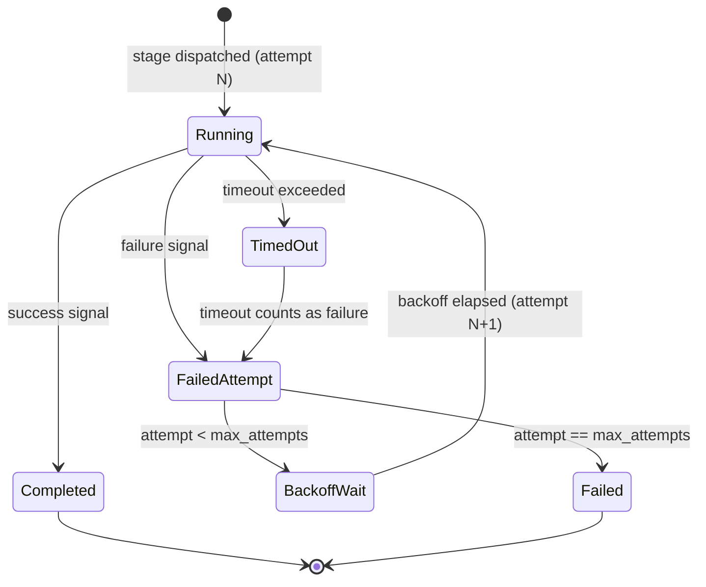
```mermaid
stateDiagram-v2
    [*] --> Running : stage dispatched (attempt N)
    Running --> Completed : success signal
    Running --> TimedOut : timeout exceeded
    Running --> FailedAttempt : failure signal
    TimedOut --> FailedAttempt : timeout counts as failure
    FailedAttempt --> BackoffWait : attempt < max_attempts
    BackoffWait --> Running : backoff elapsed (attempt N+1)
    FailedAttempt --> Failed : attempt == max_attempts
    Completed --> [*]
    Failed --> [*]
```

#### 3.10.7 Dependencies

| Dependency | Direction | Notes |
|---|---|---|
| §3.4 Completion Signals | §3.10 depends on §3.4 | Retry is triggered by completion signal indicating failure. |
| §3.7 Agent Pools | §3.10 depends on §3.7 | After backoff, the stage re-enters the pool queue for a new agent slot. |
| §3.2 Workflow Definition | §3.10 is configured by §3.2 | Retry config and timeout_secs are declared in the workflow schema. |

### 3.11 State Persistence

**[1_PRD-REQ-029]** Workflow execution state (checkpoints) and workflow definition snapshots are committed to the project's git repository inside a `.devs/` directory.

**[1_PRD-REQ-030]** The checkpoint target branch is configurable per-project:

- **Working branch**: Checkpoints are committed directly alongside project code.
- **Dedicated state branch**: Checkpoints are committed to a configurable branch (e.g., `devs/state`) to keep them isolated from project history.

**[1_PRD-REQ-031]** Git-backed state persistence ensures:

- In-flight workflow runs survive a server crash or restart.
- State is version-controlled and inspectable by AI agents.
- Workflow runs are reproducible (definition snapshot stored with checkpoint).

**[1_PRD-REQ-032]** Log retention is configurable via a policy specifying maximum age and/or maximum size. Logs are persisted alongside checkpoints in the project repo.

#### 3.11.1 Directory Layout

```
<project-repo-root>/
└── .devs/
    ├── runs/
    │   └── <run-id>/
    │       ├── workflow_snapshot.json     # Immutable snapshot of workflow definition at run start
    │       ├── checkpoint.json            # Mutable; updated after each stage state transition
    │       └── stages/
    │           └── <stage-name>/
    │               ├── attempt_<N>/
    │               │   ├── structured_output.json   # Written after stage completes (if applicable)
    │               │   └── context.json             # Context file written before agent spawn
    └── logs/
        └── <run-id>/
            └── <stage-name>/
                └── attempt_<N>/
                    ├── stdout.log         # Captured stdout from agent process
                    └── stderr.log         # Captured stderr from agent process
```

#### 3.11.2 Checkpoint File Format

`checkpoint.json` is written atomically (temp file then rename) after every stage state transition:

```json
{
  "schema_version": 1,
  "run_id": "string (UUID v4)",
  "slug": "string",
  "name": "string | null",
  "workflow_name": "string",
  "status": "Pending | Running | Paused | Completed | Failed | Cancelled",
  "submitted_at": "string (RFC 3339)",
  "started_at": "string (RFC 3339) | null",
  "completed_at": "string (RFC 3339) | null",
  "inputs": { "<key>": "<value>" },
  "stages": {
    "<stage-name>": {
      "status": "Waiting | Eligible | Running | Paused | Completed | Failed | Cancelled | TimedOut",
      "attempt": 1,
      "agent_tool": "claude",
      "pool_name": "default",
      "started_at": "string (RFC 3339) | null",
      "completed_at": "string (RFC 3339) | null",
      "exit_code": 0,
      "rate_limit_fallbacks": 0
    }
  }
}
```

#### 3.11.3 Git Commit Message Format

All checkpoint commits use the following message format:

```
devs: checkpoint <run-id> stage=<stage-name> status=<status>

Run: <slug>
Workflow: <workflow-name>
Attempt: <attempt-number>
```

Auto-collect artifact commits (§3.8.4) use:

```
devs: auto-collect stage <stage-name> run <run-id>
```

All `devs`-generated commits set the git author to `devs <devs@localhost>` and the committer to the same. The project's git config is not modified.

#### 3.11.4 Retention Policy Configuration Schema

```toml
[project.<name>.log_retention]
max_age_days  = 30    # Optional. Logs older than this are deleted during retention sweep. Default: 30.
max_size_mb   = 500   # Optional. If total log size for this project exceeds this, oldest logs are deleted first. Default: 500.
```

Retention sweeps run at server startup and every 24 hours thereafter. Deletion is at the run level: all logs and checkpoint files for a run are deleted together when the run is eligible for deletion. A run is eligible when its `completed_at` timestamp is older than `max_age_days` AND the run is in a terminal state (`Completed`, `Failed`, or `Cancelled`). Size-based eviction deletes entire runs (oldest first) until total size is below `max_size_mb`.

#### 3.11.5 Crash Recovery Sequence

On server startup (step 6 of §3.1.2):

1. Read all `checkpoint.json` files from `.devs/runs/*/checkpoint.json` in the project repo.
2. For each run with `status = Running` or `status = Paused`:
   a. Reconstruct the `WorkflowRun` in-memory from the checkpoint.
   b. Identify stages with `status = Running` at crash time — these are assumed to have not completed (process died with server). Transition them to `Eligible` and re-queue in the pool.
   c. Stages with `status = Eligible` at crash time: re-queue in the pool.
   d. Stages with terminal status: leave as-is.
3. Runs with `status = Pending` at crash time: re-queue for scheduling.
4. Log all recovered runs at INFO level.

#### 3.11.6 Business Rules

**[3_PRD-BR-037]** `checkpoint.json` MUST be written atomically (write to temp file, then `rename(2)`). A partially-written checkpoint is not acceptable. If the atomic write fails (e.g., disk full), the server MUST log an error with the run ID and stage name and continue in-memory; it MUST NOT crash.

**[3_PRD-BR-038]** The checkpoint branch for a project MUST be created if it does not exist. The server creates it as an orphan branch (no history) if `devs/state` branch is not present. The server MUST NOT fail a run because the checkpoint branch is missing; it creates it.

**[3_PRD-BR-039]** `workflow_snapshot.json` MUST be written and committed before the first stage transitions from `Waiting` to `Eligible`. If the snapshot write fails, the run MUST NOT start.

#### 3.11.7 Edge Cases

| ID | Edge Case | Context | Expected Behaviour |
|---|---|---|---|
| EC-3.11-001 | Project git repo has uncommitted changes when checkpoint is written | Auto-collect or checkpoint commit | `devs` only commits files under `.devs/` (for checkpoints) or the diff set (for auto-collect). It does NOT commit unrelated working tree changes. The working tree state is preserved. |
| EC-3.11-002 | Checkpoint branch does not exist on first run | Server writes first checkpoint | Server creates the branch as an orphan branch (`git checkout --orphan devs/state`) with the initial commit being the first checkpoint. No error is raised. |
| EC-3.11-003 | Log file for a stage exceeds `max_size_mb` allocation for the run | Log retention sweep | The run's logs are flagged for deletion in the next sweep if the run is in a terminal state and the total project log size exceeds the threshold. Individual log files are not truncated mid-run. |

#### 3.11.8 Dependencies

| Dependency | Direction | Notes |
|---|---|---|
| §3.1 Server Architecture | §3.11 is used by §3.1 | Crash recovery in startup sequence reads checkpoints. |
| §3.2 Workflow Definition | §3.11 stores §3.2 | Workflow snapshot is part of the checkpoint layout. |
| §3.8 Execution Environments | §3.8 depends on §3.11 | Auto-collect artifact commits are written via the persistence layer. |
| §3.16 Server Config | §3.11 depends on §3.16 | Checkpoint branch name and retention policy come from per-project config. |

### 3.12 Multi-Project Support

**[1_PRD-REQ-033]** A single `devs` server instance manages multiple projects simultaneously. The shared agent pool services all projects.

**[1_PRD-REQ-034]** When multiple projects compete for agent slots, the scheduling policy is configurable:

- **Strict priority queue**: Higher-priority projects always get first access to available agents.
- **Weighted fair queuing**: Agent slots are allocated proportionally to per-project weights.

Users assign priority or weight to each registered project.

#### 3.12.1 Project Registry Entry Schema

The project registry is a TOML file managed by `devs`. Its path is set by `registry_path` in `devs.toml` (default: `~/.config/devs/projects.toml`).

```toml
[[project]]
name                = "devs"                     # Required. Unique name. Pattern: [a-z0-9\-_]+.
repo_path           = "/home/user/software/devs"  # Required. Absolute path to project git repo root.
remote_url          = "git@github.com:user/devs.git"  # Required. Used for cloning in execution envs.
priority            = 10                          # Required for strict mode. Integer ≥ 0. Higher = higher priority.
weight              = 1                           # Required for weighted mode. Integer ≥ 1.
checkpoint_branch   = "devs/state"               # Optional. Default: "devs/state".
workflow_search_paths = ["workflows/", ".devs/workflows/"]
                                                  # Optional. Dirs searched for .toml/.yaml workflow files.
                                                  # Relative to repo_path. Default: [".devs/workflows/"].
```

| Field | Type | Required | Constraints |
|---|---|---|---|
| `name` | String | Yes | Unique in registry. Pattern: `[a-z0-9][a-z0-9\-_]{0,63}`. |
| `repo_path` | String | Yes | Absolute path. Must be a git repo root at registration time. |
| `remote_url` | String | Yes | Valid git remote URL (SSH or HTTPS). |
| `priority` | u32 | Yes | Used in strict priority mode. Higher integer = higher priority. Projects with equal priority are ordered by registration time. |
| `weight` | u32 | Yes | Used in weighted fair queuing. Minimum 1. Weight 0 is rejected at registration. |
| `checkpoint_branch` | String | No | Git branch name. Default: `devs/state`. Created if not present. |
| `workflow_search_paths` | Vec\<String\> | No | Relative directories. Default: `[".devs/workflows/"]`. |

#### 3.12.2 Scheduling Algorithms

**Strict Priority Queue:**

```
function pick_next_eligible_stage(eligible_stages_by_project, policy = StrictPriority):
    # Sort all eligible stages by project priority (descending), then by eligible_at (ascending).
    sorted = eligible_stages.sort_by(|s| (-s.project.priority, s.eligible_at))
    return sorted.first()
```

Projects with equal priority are ordered FIFO by `eligible_at` timestamp. This prevents starvation of equal-priority projects.

**Weighted Fair Queuing:**

```
function pick_next_eligible_stage(eligible_stages_by_project, policy = WeightedFairQueue):
    # Track virtual time per project. Each project accumulates "debt" when it uses a slot.
    # Select the eligible stage from the project with the smallest virtual_time / weight ratio.
    for project in projects_with_eligible_stages:
        score = project.virtual_time / project.weight
    return eligible_stage from project with minimum score
    # After dispatch, increment virtual_time for the chosen project by 1.
```

This ensures that over time, each project's slot usage is proportional to its weight. A project with `weight = 2` receives twice as many slots as one with `weight = 1` under sustained competition.

#### 3.12.3 Business Rules

**[3_PRD-BR-040]** In strict priority mode, a lower-priority project's eligible stages MUST NOT be dispatched while any higher-priority project has eligible stages, as long as pool slots are available. Starvation of lower-priority projects is acceptable in strict mode.

**[3_PRD-BR-041]** `weight = 0` MUST be rejected at project registration time. A project with zero weight could never receive slots and this is treated as a configuration error.

**[3_PRD-BR-042]** When a project is removed from the registry (via `devs project remove`) while it has active runs, those runs MUST be allowed to complete. The project is removed from scheduling consideration for new runs immediately, but existing runs continue to completion.

#### 3.12.4 Edge Cases

| ID | Edge Case | Context | Expected Behaviour |
|---|---|---|---|
| EC-3.12-001 | Two projects have the same `priority` in strict mode and both have eligible stages | Strict priority scheduling | Both are treated as equal priority; eligible stages are ordered by `eligible_at` (FIFO). No starvation; each gets the next available slot in submission order. |
| EC-3.12-002 | Project registration with `weight = 0` | `devs project add` CLI command | Server rejects with `{ "error": "weight must be ≥ 1" }`. No project entry is created. |
| EC-3.12-003 | Project is removed while a run is in `Running` state | `devs project remove` | The run continues to completion using the snapshotted configuration. The project is removed from the registry immediately and no new runs can be submitted for it. The in-flight run's logs and checkpoints are still written to the project repo. |

#### 3.12.5 Dependencies

| Dependency | Direction | Notes |
|---|---|---|
| §3.7 Agent Pools | §3.12 depends on §3.7 | Scheduling determines which eligible stage gets the next pool slot. |
| §3.16 Server Config | §3.12 depends on §3.16 | Scheduling policy (strict vs weighted) is set in `devs.toml`. |
| §3.11 State Persistence | §3.12 depends on §3.11 | Each project's checkpoint branch is configured per-project entry. |

### 3.13 Workflow Triggers

**[1_PRD-REQ-035]** At MVP, workflow runs are triggered manually only:

- **CLI**: `devs submit <workflow> [--name <run-name>] [--input key=value ...]`
- **MCP tool call**: An AI agent submits a run via the `devs` MCP interface.

#### 3.13.1 CLI Submit Command Full Argument Spec

```
devs submit <workflow-name>
    [--project <project-name>]   # Optional. Defaults to the project whose repo_path matches the cwd.
    [--name <run-name>]          # Optional. User-provided run name. Max 128 chars. Pattern: [a-zA-Z0-9\-_ ]+.
    [--input <key>=<value>]      # Repeatable. Provides a workflow input parameter.
                                 # <key> must match a declared input name.
                                 # <value> is coerced to the declared type.
    [--server <host:port>]       # Optional. Explicit server address; skips auto-discovery.
    [--format json]              # Optional. Machine-readable JSON output.
    [--wait]                     # Optional. Block until the run completes; stream status updates to stdout.
    [--timeout <seconds>]        # Optional. Only valid with --wait. Fail if run takes longer than this.
```

**Success output (human-readable):**
```
Run submitted: <slug> (id: <uuid>)
```

**Success output (`--format json`):**
```json
{
  "id": "<uuid>",
  "slug": "<slug>",
  "name": "<name> | null",
  "workflow_name": "<name>",
  "status": "Pending"
}
```

#### 3.13.2 MCP Submit Tool Contract

`submit_run` MCP tool (cross-reference §2.2.3):

```json
{
  "tool": "submit_run",
  "input": {
    "workflow_name": "string (required)",
    "project_name":  "string (optional, defaults to server's default project if only one registered)",
    "name":          "string | null (optional)",
    "inputs": {
      "<key>": "<value>"
    }
  },
  "output": {
    "success": true,
    "error":   null,
    "run": {
      "id":            "string (UUID v4)",
      "slug":          "string",
      "name":          "string | null",
      "workflow_name": "string",
      "status":        "Pending"
    }
  }
}
```

#### 3.13.3 Validation Order

Submissions (CLI or MCP) are validated in this exact order. The first failing check short-circuits and returns the corresponding error:

1. **Workflow exists**: The `workflow_name` resolves to a loaded workflow definition in the specified project. Error: `{ "error": "workflow not found", "name": "<name>" }`, exit code 2.
2. **Inputs valid**: All required inputs are provided; all provided inputs are declared; all values pass type coercion. Error: `{ "error": "input validation failed", "details": [...] }`, exit code 4.
3. **No duplicate name**: If `name` is provided, no existing non-cancelled run for this project has the same name. Error: `{ "error": "run name already in use", "conflicting_run_id": "<id>" }`, exit code 4.
4. **Server at capacity check**: If `max_concurrent` would be exceeded immediately AND the server has a hard limit configured (not applicable at MVP — there is no server-level run limit, only pool-level concurrency), reject. At MVP, this check always passes.
5. **Create run**: Run is created with `status = Pending` and snapshot written.

#### 3.13.4 Business Rules

**[3_PRD-BR-043]** Validation steps 1–3 MUST be atomic with respect to run creation. Two concurrent submissions with the same name MUST result in exactly one created run and one rejection, with no window where both could pass step 3 simultaneously. This is enforced via a per-project lock held during steps 3 and 5.

**[3_PRD-BR-044]** The `--project` flag is required on CLI `submit` when more than one project is registered and the current working directory does not resolve to exactly one registered project's `repo_path`. If neither condition resolves the project, the command MUST fail with `{ "error": "ambiguous project; use --project to specify" }`.

#### 3.13.5 Edge Cases

| ID | Edge Case | Context | Expected Behaviour |
|---|---|---|---|
| EC-3.13-001 | `workflow_name` does not match any loaded workflow for the project | `devs submit` or MCP `submit_run` | Immediate rejection: `{ "error": "workflow not found", "name": "<name>", "project": "<project>" }`. Exit code 2. No run created. |
| EC-3.13-002 | Two concurrent `submit_run` MCP calls arrive with the same `name` within the same millisecond | Concurrent gRPC requests | Per-project lock ensures exactly one succeeds. Second call receives `{ "error": "run name already in use", "conflicting_run_id": "<id>" }`. |
| EC-3.13-003 | `--input` value cannot be coerced to the declared type (e.g., `"abc"` for an `Integer` input) | CLI `devs submit` | Rejected with `{ "error": "input type mismatch", "input": "<name>", "expected": "Integer", "received": "abc" }`. Exit code 4. |

#### 3.13.6 Dependencies

| Dependency | Direction | Notes |
|---|---|---|
| §3.2 Workflow Definition | §3.13 depends on §3.2 | Submit triggers the workflow definition validation pipeline. |
| §3.15 Client Interfaces | §3.15 exposes §3.13 | CLI and MCP are the surfaces through which triggers are invoked. |
| §3.12 Multi-Project | §3.13 depends on §3.12 | Project resolution and per-project locking are multi-project concerns. |

### 3.14 Webhooks and Notifications

**[1_PRD-REQ-036]** `devs` delivers outbound webhook notifications for configurable event types:

| Event class | Description |
|---|---|
| Run lifecycle | Workflow run started, completed, or failed. |
| Stage lifecycle | Individual stage started, completed, or failed. |
| Pool exhaustion | All agents in a pool are unavailable. |
| All state changes | Fire on every internal state transition. |

**[1_PRD-REQ-037]** Notification targets and subscribed event types are configured per-project in the server config.

#### 3.14.1 Webhook Target Config Schema

```toml
[[project.<name>.webhook]]
url    = "https://hooks.example.com/devs"   # Required. HTTPS URL (HTTP allowed only in test environments).
events = ["run.completed", "run.failed", "stage.failed", "pool.exhausted"]
         # Required. List of subscribed event types. See §3.14.2 for all event type strings.
         # Use ["*"] to subscribe to all events.
headers = { "Authorization" = "Bearer ${WEBHOOK_TOKEN}" }
         # Optional. Additional HTTP headers. ${VAR} expands from server environment.
retry_policy = { max_attempts = 3, backoff_secs = 5 }
         # Optional. Retry on delivery failure. Default: max_attempts=3, backoff_secs=5 (fixed).
```

| Field | Type | Required | Constraints |
|---|---|---|---|
| `url` | String | Yes | Valid URL. HTTPS required in non-test environments. Max 2048 chars. |
| `events` | Vec\<String\> | Yes | Subset of defined event type strings (§3.14.2), or `["*"]` for all. |
| `headers` | Map\<String,String\> | No | Keys: valid HTTP header names. Values: strings (env var expansion supported). |
| `retry_policy.max_attempts` | u32 | No | Default: 3. Integer 1–10. |
| `retry_policy.backoff_secs` | u64 | No | Default: 5. Fixed backoff only for webhook retries. |

#### 3.14.2 Event Type Strings and Payload Schemas

All payloads are HTTP POST with `Content-Type: application/json`.

**`run.started`**
```json
{
  "event": "run.started",
  "timestamp": "RFC 3339",
  "project": "string",
  "run": { "id": "uuid", "slug": "string", "name": "string|null", "workflow_name": "string" }
}
```

**`run.completed`**
```json
{
  "event": "run.completed",
  "timestamp": "RFC 3339",
  "project": "string",
  "run": { "id": "uuid", "slug": "string", "name": "string|null", "workflow_name": "string",
           "started_at": "RFC 3339", "completed_at": "RFC 3339" }
}
```

**`run.failed`**
```json
{
  "event": "run.failed",
  "timestamp": "RFC 3339",
  "project": "string",
  "run": { "id": "uuid", "slug": "string", "name": "string|null", "workflow_name": "string" },
  "error": "string"
}
```

**`run.cancelled`**
```json
{
  "event": "run.cancelled",
  "timestamp": "RFC 3339",
  "project": "string",
  "run": { "id": "uuid", "slug": "string" }
}
```

**`stage.started`**
```json
{
  "event": "stage.started",
  "timestamp": "RFC 3339",
  "project": "string",
  "run_id": "uuid",
  "stage": { "name": "string", "attempt": 1, "agent_tool": "string", "pool_name": "string" }
}
```

**`stage.completed`**
```json
{
  "event": "stage.completed",
  "timestamp": "RFC 3339",
  "project": "string",
  "run_id": "uuid",
  "stage": { "name": "string", "attempt": 1, "exit_code": 0,
             "started_at": "RFC 3339", "completed_at": "RFC 3339" }
}
```

**`stage.failed`**
```json
{
  "event": "stage.failed",
  "timestamp": "RFC 3339",
  "project": "string",
  "run_id": "uuid",
  "stage": { "name": "string", "attempt": 1, "exit_code": 1, "error": "string|null" }
}
```

**`stage.timed_out`**
```json
{
  "event": "stage.timed_out",
  "timestamp": "RFC 3339",
  "project": "string",
  "run_id": "uuid",
  "stage": { "name": "string", "attempt": 1, "timeout_secs": 300 }
}
```

**`pool.exhausted`**
```json
{
  "event": "pool.exhausted",
  "timestamp": "RFC 3339",
  "pool_name": "string",
  "reason": "all_agents_rate_limited"
}
```

**`state.changed`** (fired for every state transition, used with `["*"]` or `["state.changed"]`):
```json
{
  "event": "state.changed",
  "timestamp": "RFC 3339",
  "entity_type": "Run | Stage | Pool",
  "entity_id": "string",
  "old_status": "string",
  "new_status": "string"
}
```

#### 3.14.3 Delivery Semantics

- **At-least-once**: `devs` retries delivery until the target returns a 2xx HTTP response or `max_attempts` is exhausted.
- **Timeout per attempt**: 10 seconds. If no 2xx response within 10 seconds, the attempt is counted as a failure.
- **Retry backoff**: Fixed `backoff_secs` between attempts (not exponential for webhooks).
- **Delivery order**: Not guaranteed across events. Events for the same entity (same run or stage) are delivered in the order they occurred.
- **Payload size limit**: 64 KiB per payload. If a payload exceeds 64 KiB, the event is delivered with the `error` field set to `"payload too large; some fields truncated"` and non-essential fields (stdout, stderr snippets) are omitted.

#### 3.14.4 Business Rules

**[3_PRD-BR-045]** Webhook delivery failures (all retries exhausted) MUST be logged at WARN level with the event type, target URL, and the last HTTP status code or connection error. A delivery failure MUST NOT cause the run or stage to fail.

**[3_PRD-BR-046]** The `pool.exhausted` event MUST be fired at most once per pool-exhaustion episode. It MUST NOT fire again while the pool remains exhausted. It fires again only after the pool recovers and becomes exhausted again.

**[3_PRD-BR-047]** Webhook delivery is fire-and-forget from the perspective of the stage execution pipeline. The stage MUST NOT wait for webhook delivery acknowledgment before transitioning to the next state.

#### 3.14.5 Edge Cases

| ID | Edge Case | Context | Expected Behaviour |
|---|---|---|---|
| EC-3.14-001 | Webhook target URL returns 5xx on all retry attempts | Any event delivery | After `max_attempts` exhausted, event is dropped. WARN log entry written with event type, URL, attempt count, and last status code. Run and stage are unaffected. |
| EC-3.14-002 | Event payload serializes to > 64 KiB | Large stage output in `stage.completed` event | Payload is truncated (stdout/stderr fields removed first), `truncated: true` field added, and delivery proceeds. The truncated payload is valid JSON. |
| EC-3.14-003 | `pool.exhausted` event fires; target is temporarily down; pool recovers and is exhausted again before the first delivery succeeds | Concurrent delivery retries | Both events are queued independently. When the target comes back up, both are delivered in order. No deduplication occurs because they are distinct episodes. |

#### 3.14.6 Dependencies

| Dependency | Direction | Notes |
|---|---|---|
| §3.7 Agent Pools | §3.14 is triggered by §3.7 | Pool exhaustion is the trigger for `pool.exhausted`. |
| §3.2 Workflow Definition | §3.14 is triggered by §3.2 | Run lifecycle events are triggered by run state machine transitions. |
| §3.16 Server Config | §3.14 is configured by §3.16 | Webhook targets are per-project config in project registry entries. |

### 3.15 Client Interfaces

#### 3.15.1 TUI Client

**[1_PRD-REQ-038]** The TUI is an interactive terminal dashboard connecting to the server over gRPC (local or remote). It provides the following tabbed views:

| Tab | Description |
|---|---|
| Dashboard | Split pane: project/run list on the left; selected run detail (stage graph, per-stage status, elapsed time, live log tail) on the right. |
| Logs | Full log stream for a selected stage or run. |
| Debug | Follow a specific agent's progress; inspect a diff of its working directory; send cancel/pause/resume signals. |
| Pools | Real-time view of pool utilization, agent availability, and fallback events. |

**Keyboard Shortcut Table:**

| Key | Action | Scope |
|---|---|---|
| `Tab` / `Shift+Tab` | Switch between tabs | Global |
| `↑` / `↓` | Navigate list items | Dashboard, Logs, Pools |
| `Enter` | Select item / expand detail | Dashboard, Logs |
| `c` | Cancel selected run or stage | Dashboard, Debug |
| `p` | Pause selected run or stage | Dashboard, Debug |
| `r` | Resume selected run or stage | Dashboard, Debug |
| `l` | Jump to Logs tab for selected item | Dashboard |
| `d` | Jump to Debug tab for selected item | Dashboard |
| `q` / `Esc` | Quit TUI | Global |
| `?` | Show keyboard shortcut help overlay | Global |
| `f` | Toggle follow mode (auto-scroll log tail) | Logs |
| `g` | Jump to top of log | Logs |
| `G` | Jump to bottom of log | Logs |

**Rendering Contract:**

- Refresh rate: The TUI subscribes to `StreamRunEvents` gRPC streaming RPC. Display updates are driven by server-pushed events, not polling. Each event received triggers a re-render of affected panes within 50 ms.
- Maximum log lines buffered in memory per stage: 10,000 lines. If a stage produces more, the oldest lines are evicted from the in-memory buffer. Older lines remain accessible via `devs logs` CLI.
- The stage graph on the Dashboard tab renders as an ASCII DAG showing stage names, statuses, and elapsed times. It is re-rendered on every received event for the active run.

**gRPC Streaming for Live Updates:**

The TUI subscribes to `WorkflowService.StreamRunEvents` for each visible run. The server pushes `RunEvent` messages (run status change, stage status change, log line) over the stream. On reconnect (server restart), the TUI re-subscribes automatically and fetches the latest full state via `GetRun` before resuming the stream.

**Text-Snapshot Test Contract:**

TUI tests use text-snapshots: the rendered terminal output (as a 2D character grid) is captured at defined moments (after a known event is received) and compared against a stored snapshot. Snapshots are stored as `.txt` files in the test fixtures directory. Pixel-level comparison is prohibited (1_PRD-BR-005). Tests use a headless terminal emulator (e.g., `vte` or a compatible in-process terminal) to render the TUI without a real TTY.

#### 3.15.2 CLI Interface

**[1_PRD-REQ-039]** The CLI client supports the following commands at MVP:

| Command | Description |
|---|---|
| `devs submit` | Submit a workflow run with optional name and input parameters. |
| `devs list` | List active and historical workflow runs. |
| `devs status <run>` | Show the current status of a run and its stages. |
| `devs logs <run> [stage]` | Stream or fetch logs for a run or specific stage. |
| `devs cancel <run>` | Cancel a running workflow. |
| `devs pause <run/stage>` | Pause a run or individual stage. |
| `devs resume <run/stage>` | Resume a paused run or stage. |

**Complete Flag Reference:**

`devs submit` — see §3.13.1.

`devs list`:
```
devs list
    [--project <name>]       # Filter to a specific project.
    [--status <status>]      # Filter by run status: Pending, Running, Paused, Completed, Failed, Cancelled.
    [--limit <n>]            # Max results. Default: 50. Max: 500.
    [--format json]
    [--server <host:port>]
```

`devs status <run-id-or-slug>`:
```
devs status <run-id-or-slug>
    [--format json]
    [--server <host:port>]
```
JSON output schema: see §2.2.5.

`devs logs <run-id-or-slug> [<stage-name>]`:
```
devs logs <run-id-or-slug> [<stage-name>]
    [--follow]               # Stream new lines as they are written. Default: false (fetch existing).
    [--format json]          # Newline-delimited JSON stream. See §2.2.5.
    [--server <host:port>]
```

`devs cancel <run-id-or-slug>`:
```
devs cancel <run-id-or-slug>
    [--format json]
    [--server <host:port>]
```

`devs pause <run-id-or-slug> [<stage-name>]`:
```
devs pause <run-id-or-slug> [<stage-name>]
    [--format json]
    [--server <host:port>]
```

`devs resume <run-id-or-slug> [<stage-name>]`:
```
devs resume <run-id-or-slug> [<stage-name>]
    [--format json]
    [--server <host:port>]
```

**`devs list --format json` output schema (cross-ref §2.2.5):**
See §2.2.5. The `runs` array is truncated to `--limit` items.

**Streaming log format (`devs logs --format json`):**
Each line on stdout is one newline-delimited JSON object (see §2.2.5). The process exits 0 when the run reaches a terminal state and all log lines have been emitted. With `--follow`, the process does not exit until the run is terminal or the user sends SIGINT.

#### 3.15.3 MCP Server (Glass-Box Interface)

**[1_PRD-REQ-040]** `devs` exposes a dedicated MCP server on a separate port. An MCP stdio bridge client is also provided, allowing AI agents to connect via stdio (the bridge forwards to the MCP port).

**[1_PRD-REQ-041]** The MCP server exposes the following capabilities at MVP:

- Observe agent state, stage outputs, and logs.
- Pause, resume, retry, or cancel individual agents or stages.
- Read and write workflow definitions at runtime.
- Inject test inputs and assert on stage outputs for automated testing and performance monitoring.
- Submit workflow runs.
- Report rate-limit conditions and completion signals (used by agents mid-run).

**Full MCP Tool List with Input/Output Schemas (cross-ref §2.2.3):**

All MCP tools use JSON-RPC 2.0. All responses include `"error": null | "string"`.

| Tool | Input Fields | Output Fields |
|---|---|---|
| `list_runs` | `project?: string, status?: string, limit?: int` | `runs: RunSummary[]` |
| `get_run` | `run_id: string` | `run: WorkflowRun` (full schema, §2.1.3) |
| `get_stage_output` | `run_id: string, stage_name: string` | `exit_code: int\|null, stdout: string, stderr: string, structured_output: object\|null` |
| `stream_logs` | `run_id: string, stage_name?: string, follow?: bool` | Streaming: `{ line: string, timestamp: RFC3339, stream: "stdout\|stderr" }` per message |
| `get_pool_state` | `pool_name: string` | `pool_name: string, max_concurrent: int, current_running: int, agents: AgentState[]` |
| `list_pools` | _(none)_ | `pools: PoolSummary[]` |
| `get_workflow_definition` | `workflow_name: string, project?: string, snapshot_run_id?: string` | `definition: WorkflowDefinition (JSON)` |
| `list_checkpoints` | `run_id: string` | `checkpoints: [{ path: string, committed_at: RFC3339 }]` |
| `submit_run` | `workflow_name: string, project?: string, name?: string, inputs?: object` | `run: { id, slug, name, workflow_name, status }` |
| `cancel_run` | `run_id: string` | `success: bool` |
| `cancel_stage` | `run_id: string, stage_name: string` | `success: bool` |
| `pause_run` | `run_id: string` | `success: bool` |
| `pause_stage` | `run_id: string, stage_name: string` | `success: bool` |
| `resume_run` | `run_id: string` | `success: bool` |
| `resume_stage` | `run_id: string, stage_name: string` | `success: bool` |
| `write_workflow_definition` | `workflow_name: string, project?: string, definition: object` | `success: bool, validation_errors?: string[]` |
| `inject_stage_input` | `run_id: string, stage_name: string, input: object` | `success: bool` |
| `assert_stage_output` | `run_id: string, stage_name: string, predicate: object` | `passed: bool, actual: object, expected: object` |
| `report_progress` | `run_id: string, stage_name: string, message: string` | `success: bool` |
| `signal_completion` | `run_id: string, stage_name: string, result?: object` | `success: bool` |
| `report_rate_limit` | `run_id: string, stage_name: string` | `success: bool, fallback_agent?: string` |

**stdio Bridge Protocol:**

The MCP stdio bridge is a standalone binary (`devs-mcp-bridge`) that:
1. Reads MCP JSON-RPC 2.0 messages from stdin (one per line, newline-delimited).
2. Forwards each message to the `devs` MCP server port (discovered via `DEVS_MCP_ADDR` env var or `--mcp-addr` flag).
3. Writes the response back to stdout.
4. On connection loss to the MCP server, writes a structured error to stdout: `{ "jsonrpc": "2.0", "error": { "code": -32603, "message": "MCP server connection lost" }, "id": null }` and exits non-zero.

#### 3.15.4 Business Rules

**[3_PRD-BR-048]** The TUI MUST reconnect automatically to the gRPC server after a transient disconnection (up to 30 seconds of retry with exponential backoff). If reconnection is not achieved within 30 seconds, the TUI displays an error overlay and exits non-zero after 5 more seconds.

**[3_PRD-BR-049]** All CLI commands that accept `<run-id-or-slug>` MUST accept both UUID format and slug format. If both a UUID and a slug match different runs, UUID takes precedence. If neither matches, exit code 2.

**[3_PRD-BR-050]** The MCP stdio bridge MUST forward all messages faithfully (no content modification) and MUST NOT buffer messages. It MUST write each response line to stdout as soon as it is received from the MCP server.

#### 3.15.5 Edge Cases

| ID | Edge Case | Context | Expected Behaviour |
|---|---|---|---|
| EC-3.15-001 | TUI connects to a server that has zero registered projects | TUI Dashboard tab | Dashboard renders an empty run list with message: `"No projects registered. Use 'devs project add' to add a project."` No error or crash. |
| EC-3.15-002 | `devs status <run>` called with a run ID that matches no run and no slug | CLI | Exit code 2. `{ "error": "run not found", "id": "<value>" }` on stdout (with `--format json`). |
| EC-3.15-003 | MCP `stream_logs` opened for a stage in `Waiting` state; stage never starts (workflow cancelled before stage begins) | MCP streaming | Stream remains open until the run reaches a terminal state. When the run is cancelled, the stream emits a final `{ "event": "stage_cancelled", ... }` message and closes cleanly. |

#### 3.15.6 Dependencies

| Dependency | Direction | Notes |
|---|---|---|
| §3.1 Server Architecture | §3.15 depends on §3.1 | All interfaces connect over gRPC to the server. |
| §3.13 Workflow Triggers | §3.15 exposes §3.13 | CLI `submit` and MCP `submit_run` are the trigger surfaces. |
| §2.2 AI Agent Client Persona | §3.15 satisfies §2.2 | MCP and CLI output schemas are defined to satisfy agent client needs. |

### 3.16 Server Configuration

**[1_PRD-REQ-042]** The server is configured via a single TOML file split into two parts:

- **Main config file** (`devs.toml`): Server settings (listen address, MCP port, default pool, scheduling policy, webhook targets, credential entries) and pool definitions.
- **Project registry**: Projects are registered via `devs project add` and stored in a separate registry file managed by `devs`. Each project entry records repo path, priority/weight, checkpoint branch, and workflow search paths.

**[1_PRD-REQ-043]** CLI flags and environment variables can override any config file value.

**[1_PRD-REQ-044]** Agent CLI API keys are supplied via environment variables on the server process (preferred) or TOML config entries (supported with a documented security caveat). No external secrets manager is integrated at MVP.

#### 3.16.1 Complete `devs.toml` Schema

```toml
# devs.toml — complete field reference

[server]
listen          = "127.0.0.1:7890"    # Optional. Default: "127.0.0.1:7890". gRPC listen address.
mcp_port        = 50052               # Optional. Default: 50052. MCP server port.
default_pool    = "default"           # Optional. Pool used by stages that don't specify one.
scheduling_policy = "strict_priority" # Optional. One of: strict_priority, weighted_fair_queuing.
                                      # Default: strict_priority.
registry_path   = "~/.config/devs/projects.toml"
                                      # Optional. Path to project registry file.
                                      # Default: ~/.config/devs/projects.toml.

[server.log]
level     = "info"    # Optional. One of: trace, debug, info, warn, error. Default: info.
format    = "text"    # Optional. One of: text, json. Default: text.

# Pool definitions — one or more named pools.
[pool.default]
max_concurrent = 4

[[pool.default.agents]]
tool         = "claude"
prompt_mode  = "flag"
prompt_flag  = "--print"
pty          = false
capabilities = ["code-gen", "long-context"]
fallback     = false

[[pool.default.agents]]
tool         = "gemini"
prompt_mode  = "flag"
prompt_flag  = "--prompt"
pty          = false
capabilities = ["code-gen"]
fallback     = true   # Used only when non-fallback agents are unavailable.
```

#### 3.16.2 Project Registry Schema

See §3.12.1 for the project registry entry schema. The registry file is managed exclusively by `devs project add` and `devs project remove` CLI commands. Manual editing is supported but not recommended.

#### 3.16.3 Config Override Precedence

Configuration values are resolved in the following order (highest precedence first):

1. **CLI flag** (e.g., `--listen 0.0.0.0:7890`, `--mcp-port 50053`) — overrides everything.
2. **Environment variable** (e.g., `DEVS_LISTEN=0.0.0.0:7890`, `DEVS_MCP_PORT=50053`) — overrides config file and defaults.
3. **`devs.toml` value** — explicit value from config file.
4. **Built-in default** — compiled-in default if no other source provides a value.

Environment variable naming convention: `DEVS_` prefix, then the config key with dots replaced by underscores and converted to upper case (e.g., `server.listen` → `DEVS_SERVER_LISTEN`). Flat keys (e.g., `listen` under `[server]`) map to `DEVS_LISTEN`.

#### 3.16.4 Credential Security

**Preferred method:** Supply API keys for agent CLIs via environment variables on the `devs` server process. Example:
```bash
ANTHROPIC_API_KEY=sk-... devs server start
```
The server passes these through to agent subprocess environments as configured per-adapter (§3.6.1).

**TOML config method (discouraged):** Keys may be set in `devs.toml` under `pool.<name>.agents[].env`:
```toml
[[pool.default.agents]]
tool = "claude"
env  = { ANTHROPIC_API_KEY = "sk-..." }
```

**Security caveat (authoritative wording):**

> Storing API keys in `devs.toml` is supported but carries significant security risk. Config files may be committed to version control, shared across team environments, or readable by other processes. Any key stored in `devs.toml` should be treated as potentially compromised. Use environment variables (set in the shell or via a secret manager that injects env vars) as the preferred credential delivery mechanism.

No external secret manager integration is provided at MVP. This is a deliberate scope decision (§1.3).

#### 3.16.5 Business Rules

**[3_PRD-BR-051]** The server MUST reject `devs.toml` if any required field is missing or any field value fails schema validation. All validation errors MUST be reported before the server binds any port.

**[3_PRD-BR-052]** CLI flags MUST take precedence over environment variables, which MUST take precedence over `devs.toml` values, which MUST take precedence over built-in defaults. No other precedence ordering is acceptable.

**[3_PRD-BR-053]** The registry file MUST be written atomically (temp file then rename) by `devs project add` and `devs project remove`. A partially-written registry file is not acceptable.

#### 3.16.6 Dependencies

| Dependency | Direction | Notes |
|---|---|---|
| §3.1 Server Architecture | §3.16 is read by §3.1 | Config is parsed before any port binding. |
| §3.7 Agent Pools | §3.16 defines §3.7 | Pool definitions are in `devs.toml`. |
| §3.12 Multi-Project | §3.16 stores §3.12 | Project registry is part of the config system. |

### 3.17 Developer Tooling and Quality

**[1_PRD-REQ-045]** A `./do` entrypoint script is present from the first commit. It supports the following commands:

| Command | Description |
|---|---|
| `./do setup` | Install all dev dependencies. |
| `./do build` | Build for release. |
| `./do test` | Run all tests. |
| `./do lint` | Run all linters. |
| `./do format` | Run all formatters. |
| `./do coverage` | Run all coverage tools. |
| `./do presubmit` | Run setup, format, lint, test, coverage, then `./do ci`. Enforces a 15-minute timeout. |
| `./do ci` | Copy working directory to a temporary commit and run all presubmit checks on CI runners. |

**[1_PRD-REQ-046]** Successful presubmit checks gate all commits and forward progress.

**[1_PRD-REQ-047]** GitLab CI/CD pipelines run all presubmit checks. The pipeline is validated on Windows, macOS, and Linux.

**[1_PRD-REQ-048]** All code is auto-formatted and linted.

**[1_PRD-REQ-049]** All public APIs and non-trivial internals are documented with doc comments.

**[1_PRD-REQ-050]** All code achieves 90% line coverage from unit tests.

**[1_PRD-REQ-051]** All code achieves at least 80% line coverage through E2E tests, measured separately from unit test coverage. E2E tests are defined as tests that exercise the system through external user interfaces (CLI, TUI, MCP). Each interface individually must achieve at least 50% line coverage through E2E tests.

**[1_PRD-REQ-052]** TUI verification uses interaction testing, state assertions, and UI text-snapshots. Pixel-level snapshot testing is not used.

**[1_PRD-REQ-053]** Every stated requirement in the specification is verified by at least one automated test.

#### 3.17.1 Cross-References

All `./do` command specifications are defined authoritatively in §1.6. All coverage gate thresholds are defined authoritatively in §1.7. Section 3.17 requirements ([1_PRD-REQ-045] through [1_PRD-REQ-053]) are restated here for traceability but their normative source is §1.6 and §1.7. The acceptance criteria in §3.18 that cover developer tooling verify that all coverage gates (QG-001 through QG-005) pass as part of the section 3 implementation.

---

### 3.18 Acceptance Criteria

All criteria below are testable and must pass before the MVP section 3 implementation is considered complete. IDs are scoped to section 3 to complement the criteria in §1.12 and §2.3.

- [ ] **AC-3-001**: Starting a `devs` server with a valid `devs.toml` results in gRPC and MCP ports being bound and the discovery file written at the path specified by `DEVS_DISCOVERY_FILE` (or `~/.config/devs/server.addr`), verified by an E2E test that reads the file and connects to the address.
- [ ] **AC-3-002**: Starting a second `devs` server instance on the same address causes the second instance to exit non-zero with an error message identifying the port conflict, verified by an E2E test.
- [ ] **AC-3-003**: A client connecting with a mismatched major version receives a `FAILED_PRECONDITION` gRPC error containing both the server version and the client version, verified by a unit test with a mock client.
- [ ] **AC-3-004**: Submitting a TOML workflow definition with a DAG cycle is rejected with a structured error containing the full cycle path as an ordered list, verified by a unit test of the cycle-detection validator.
- [ ] **AC-3-005**: Submitting a TOML workflow definition that references a stage name in `depends_on` that does not exist in the workflow is rejected with a structured error naming the missing stage, verified by a unit test.
- [ ] **AC-3-006**: Two concurrent `submit_run` gRPC calls with the same `name` result in exactly one run created and one rejection containing `"run name already in use"`, verified by a concurrency E2E test.
- [ ] **AC-3-007**: Submitting a workflow with zero stages is rejected with `"workflow must contain at least one stage"`, verified by a unit test.
- [ ] **AC-3-008**: A stage with both `prompt` and `prompt_file` set is rejected at validation time, verified by a unit test.
- [ ] **AC-3-009**: A template variable referencing a stage not in the stage's `depends_on` closure is rejected at submission time, verified by a unit test.
- [ ] **AC-3-010**: A template variable referencing a missing field from a stage's structured output causes the stage to immediately fail (not silently substitute empty string), verified by a unit test of the template resolution engine.
- [ ] **AC-3-011**: When `completion = structured_output` and stdout contains invalid JSON and `.devs_output.json` does not exist, the stage transitions to `Failed` with `"structured output not valid JSON"`, verified by an E2E test using a mock agent.
- [ ] **AC-3-012**: Calling `signal_completion` MCP tool twice for the same stage results in the second call returning an error and the stage state not changing, verified by a unit test.
- [ ] **AC-3-013**: The context file written before a stage executes contains exactly the outputs of all upstream terminal stages and no others, verified by a unit test of the context file builder.
- [ ] **AC-3-014**: When the context file serialization exceeds 10 MiB, the server truncates stdout/stderr fields, logs a warning, and the agent still starts successfully, verified by a unit test with a large synthetic output.
- [ ] **AC-3-015**: An agent binary not found on PATH causes the stage to immediately fail without triggering the retry policy, verified by an E2E test configuring a non-existent binary path.
- [ ] **AC-3-016**: PTY allocation failure (with `pty = true`) causes the stage to immediately fail without triggering the retry policy, verified by a unit test that mocks PTY allocation failure.
- [ ] **AC-3-017**: When all agents in a pool are rate-limited, a `PoolExhausted` webhook event is delivered to all configured targets exactly once per exhaustion episode, verified by an E2E test with a mock webhook receiver.
- [ ] **AC-3-018**: `max_concurrent` is enforced: with `max_concurrent = 1` and 3 simultaneously eligible stages, exactly 1 agent process runs at a time and the others queue, verified by an E2E test counting concurrent process spawns.
- [ ] **AC-3-019**: A stage with `required_capabilities = ["long-context"]` and no pool agent having that capability immediately transitions to `Failed` with a message listing the unsatisfied capability, verified by a unit test.
- [ ] **AC-3-020**: A Docker stage fails immediately with a structured error when `DOCKER_HOST` points to an unreachable daemon, verified by an E2E test with an invalid docker host.
- [ ] **AC-3-021**: An SSH remote stage fails immediately with a structured error when SSH authentication fails, verified by an E2E test using a misconfigured key.
- [ ] **AC-3-022**: Auto-collect artifact collection commits only changed files and does not commit unrelated working tree changes, verified by a unit test of the diff-and-commit logic.
- [ ] **AC-3-023**: A fan-out stage with one failing sub-agent and no merge handler transitions to `Failed` after all sub-agents complete, listing the failed sub-agent index, verified by an E2E test with a mock failing agent.
- [ ] **AC-3-024**: `fan_out.count = 0` is rejected at validation time, verified by a unit test.
- [ ] **AC-3-025**: Retry backoff for `Exponential` mode with `backoff_secs = 5` produces delays of 5, 25, 125 seconds (capped at 300) across successive attempts, verified by a unit test of the backoff computation function.
- [ ] **AC-3-026**: A stage timeout causes SIGTERM then (after 5 s grace) SIGKILL, and the stage transitions to `TimedOut`, verified by a unit test with a mock non-exiting process.
- [ ] **AC-3-027**: The workflow-level timeout cancels all running stages and transitions the run to `Failed` with `"workflow timeout exceeded"`, verified by an E2E test with a slow workflow and a short timeout.
- [ ] **AC-3-028**: `checkpoint.json` is written atomically after every stage state transition; a simulated disk-full condition on the rename step results in a logged error but no server crash, verified by a unit test with a mock filesystem.
- [ ] **AC-3-029**: Server crash recovery re-queues stages that were in `Running` state at crash time as `Eligible`, verified by an E2E test that kills the server mid-run and restarts it.
- [ ] **AC-3-030**: The checkpoint branch is created as an orphan branch if it does not exist, verified by an E2E test using a fresh git repo with no `devs/state` branch.
- [ ] **AC-3-031**: In strict priority scheduling, a higher-priority project's eligible stages are always dispatched before lower-priority projects' stages when a pool slot is available, verified by an E2E test with two projects at different priorities.
- [ ] **AC-3-032**: In weighted fair queuing, project slot allocation over 100 dispatches is within 5% of the configured weight ratio, verified by a unit test simulating 100 scheduling decisions.
- [ ] **AC-3-033**: Registering a project with `weight = 0` is rejected with a structured error, verified by a unit test of the registration validator.
- [ ] **AC-3-034**: Removing a project while a run is active allows the run to complete; the project does not appear in `devs list` for new submissions, verified by an E2E test.
- [ ] **AC-3-035**: `devs submit` with a `--input` value of the wrong type exits with code 4 and a JSON error listing the input name, expected type, and received value, verified by an E2E test.
- [ ] **AC-3-036**: Two concurrent MCP `submit_run` calls with the same name result in exactly one run and one rejection, verified by a concurrency E2E test (cross-ref AC-3-006).
- [ ] **AC-3-037**: Webhook delivery failure (target returns 5xx on all retries) is logged at WARN level and does not cause the run or stage to fail, verified by an E2E test with a mock webhook server returning 500.
- [ ] **AC-3-038**: A webhook payload exceeding 64 KiB is truncated to a valid JSON object with `"truncated": true` added, verified by a unit test of the payload serializer.
- [ ] **AC-3-039**: The `pool.exhausted` webhook event fires exactly once per exhaustion episode and not again while the pool remains exhausted, verified by a unit test of the pool event logic.
- [ ] **AC-3-040**: The TUI reconnects automatically after a transient server disconnection (up to 30 seconds), verified by a TUI E2E test that kills and restarts the server mid-session.
- [ ] **AC-3-041**: `devs status <slug>` (using slug instead of UUID) returns the correct run, verified by an E2E test.
- [ ] **AC-3-042**: The MCP `stream_logs` tool for a `Waiting` stage remains open and begins emitting lines when the stage starts, verified by an E2E test.
- [ ] **AC-3-043**: The MCP stdio bridge returns a structured JSON error when its upstream MCP connection is lost, verified by an E2E test that kills the server while the bridge is connected.
- [ ] **AC-3-044**: All MCP tool responses include an `"error"` field (null on success, non-null string on failure), verified by an MCP E2E test that exercises all tools in both success and failure paths.
- [ ] **AC-3-045**: `devs.toml` with a missing required field is rejected before any port is bound; the error identifies the missing field, verified by an E2E test with an intentionally malformed config.
- [ ] **AC-3-046**: CLI flag values override environment variable values, which override `devs.toml` values, verified by a unit test of the config resolution layer.
- [ ] **AC-3-047**: The security caveat for TOML-stored credentials is present in the server startup log at WARN level when any agent `env` block in `devs.toml` contains a key matching `*_API_KEY` or `*_TOKEN`, verified by a unit test of the credential warning logic.
- [ ] **AC-3-048**: All public Rust items in all workspace crates have doc comments; `cargo doc --no-deps` exits zero, verified by `./do lint` in CI.
- [ ] **AC-3-049**: Unit test line coverage for all workspace crates is ≥ 90% as reported by `cargo-llvm-cov`, verified by `./do coverage` in CI (cross-ref QG-001).
- [ ] **AC-3-050**: E2E test line coverage for all workspace crates is ≥ 80% as reported by `cargo-llvm-cov`, verified by `./do coverage` in CI (cross-ref QG-002).
- [ ] **AC-3-051**: E2E test line coverage via CLI interface is ≥ 50%, via TUI interface is ≥ 50%, via MCP interface is ≥ 50%, each measured independently, verified by `./do coverage` in CI (cross-ref QG-003, QG-004, QG-005).

---

## 4. Success Metrics & KPIs

This section defines all measurable success criteria for the `devs` MVP. Each metric has a normative threshold, a computation method, an enforcement point, and a disposition: **hard gate** (blocks merge/release if unmet) or **advisory** (tracked but non-blocking). All hard-gate metrics must be green simultaneously before the MVP milestone is declared complete.

The normative source for quality-gate thresholds is §1.7. The normative source for `./do` command behaviour is §1.6. This section consolidates those requirements into a single reference for evaluation, measurement, and acceptance testing.

---

### 4.1 Metric Catalogue

The following table is the authoritative enumeration of all MVP success metrics. Each row is elaborated in the subsections below.

| Metric ID | Metric Name | Threshold | Disposition | Enforcement Point | Cross-Ref |
|---|---|---|---|---|---|
| KPI-001 | Unit test line coverage (all crates) | ≥ 90% | Hard gate | `./do coverage`, CI | §1.7 QG-001 |
| KPI-002 | E2E test line coverage (aggregate, all crates) | ≥ 80% | Hard gate | `./do coverage`, CI | §1.7 QG-002 |
| KPI-003 | E2E line coverage via CLI interface | ≥ 50% | Hard gate | `./do coverage`, CI | §1.7 QG-003 |
| KPI-004 | E2E line coverage via TUI interface | ≥ 50% | Hard gate | `./do coverage`, CI | §1.7 QG-004 |
| KPI-005 | E2E line coverage via MCP interface | ≥ 50% | Hard gate | `./do coverage`, CI | §1.7 QG-005 |
| KPI-006 | Presubmit wall-clock duration | ≤ 15 minutes | Hard gate | `./do presubmit` | §1.6 |
| KPI-007 | CI pipeline platform coverage | Windows + macOS + Linux all green | Hard gate | GitLab CI | §1.6 |
| KPI-008 | Supported agent CLI adapters | = 5 (claude, gemini, opencode, qwen, copilot) | Hard gate | Integration test suite | §3.8 |
| KPI-009 | Supported execution environments | = 3 (tempdir, docker, remote SSH) | Hard gate | Integration test suite | §3.9 |
| KPI-010 | Requirement traceability | 100% of tagged requirements (1_PRD-REQ-*) have ≥ 1 automated test | Hard gate | `./do test` traceability report | §1.7 BR-004 |
| KPI-011 | Doc comment coverage | 0 public items without doc comment | Hard gate | `./do lint` (`cargo doc`) | §1.7 BR-006 |
| KPI-012 | Code formatting compliance | 0 formatting violations | Hard gate | `./do lint` (`cargo fmt --check`) | §1.7 BR-007 |
| KPI-013 | Clippy lint compliance | 0 Clippy warnings treated as errors | Hard gate | `./do lint` (`cargo clippy -D warnings`) | §1.7 BR-007 |

---

### 4.2 Coverage Metrics (KPI-001 through KPI-005)

#### 4.2.1 Measurement Tool and Instrumentation

All line-coverage measurements are produced exclusively by `cargo-llvm-cov` using source-based LLVM instrumentation. `cargo-llvm-cov` is installed by `./do setup`. The coverage command is `./do coverage`, which internally invokes `cargo llvm-cov` with the flags required to produce per-crate and per-run-type reports.

Coverage measurements are collected for two distinct test categories:

- **Unit tests**: tests in `#[cfg(test)]` modules within library and binary crates, invoked with `cargo llvm-cov test`. These tests call internal Rust functions and types directly.
- **E2E tests**: tests in the `tests/e2e/` workspace crate, invoked against a running server process exclusively through the external interfaces (CLI binary, TUI binary, MCP port). E2E tests MUST NOT import or call internal crate types directly; violation of this constraint invalidates the E2E coverage numbers for that test.

The two measurement runs are kept completely separate. Coverage files from unit tests are not merged with those from E2E tests, ensuring that KPI-001 and KPI-002 cannot inflate each other.

#### 4.2.2 Per-Interface E2E Coverage Computation

KPI-003, KPI-004, and KPI-005 measure the percentage of source lines reached when E2E tests exercise the system exclusively through one interface. This is achieved by tagging each E2E test with a Rust `#[test_tag]` attribute (or an equivalent compile-time feature flag per interface):

| Tag | Interface | Binary under test |
|---|---|---|
| `cli_e2e` | CLI client | `devs` CLI binary |
| `tui_e2e` | TUI client | `devs` TUI binary |
| `mcp_e2e` | MCP server | MCP port or stdio bridge |

`./do coverage` runs each interface subset independently and reports its line-coverage percentage separately. A test tagged `cli_e2e` MUST only drive the system through the CLI binary and MUST NOT directly invoke MCP or TUI code paths. Tests that mix interfaces are a test-authoring error and MUST be reported as such by the coverage script, not counted toward any single-interface gate.

#### 4.2.3 Coverage Report Schema

`./do coverage` produces a machine-readable JSON report at `target/coverage/report.json` in addition to human-readable terminal output. The structure is:

```jsonc
{
  "timestamp": "<ISO-8601 datetime>",
  "commit": "<git SHA>",
  "gates": [
    {
      "gate_id": "KPI-001",
      "label": "Unit test line coverage",
      "threshold_pct": 90.0,
      "actual_pct": 92.4,
      "passed": true,
      "delta_pct": 2.4            // actual - threshold; negative means failing margin
    },
    {
      "gate_id": "KPI-002",
      "label": "E2E test line coverage (aggregate)",
      "threshold_pct": 80.0,
      "actual_pct": 81.1,
      "passed": true,
      "delta_pct": 1.1
    },
    {
      "gate_id": "KPI-003",
      "label": "E2E line coverage via CLI",
      "threshold_pct": 50.0,
      "actual_pct": 53.7,
      "passed": true,
      "delta_pct": 3.7
    },
    {
      "gate_id": "KPI-004",
      "label": "E2E line coverage via TUI",
      "threshold_pct": 50.0,
      "actual_pct": 51.2,
      "passed": true,
      "delta_pct": 1.2
    },
    {
      "gate_id": "KPI-005",
      "label": "E2E line coverage via MCP",
      "threshold_pct": 50.0,
      "actual_pct": 50.0,
      "passed": true,
      "delta_pct": 0.0
    }
  ],
  "overall_passed": true
}
```

| Field | Type | Description |
|---|---|---|
| `timestamp` | ISO-8601 string | When `./do coverage` completed |
| `commit` | string (40-char hex) | Git SHA of the workspace HEAD at measurement time |
| `gates` | array of `GateResult` | One entry per KPI-001 through KPI-005 |
| `gates[].gate_id` | string | Matches the KPI identifier in §4.1 |
| `gates[].threshold_pct` | float (0–100) | The minimum required percentage |
| `gates[].actual_pct` | float (0–100) | The measured percentage, rounded to one decimal place |
| `gates[].passed` | boolean | `true` iff `actual_pct >= threshold_pct` |
| `gates[].delta_pct` | float | `actual_pct - threshold_pct`; negative means failing |
| `overall_passed` | boolean | `true` iff every gate in `gates` has `passed: true` |

`./do coverage` exits with status code `0` iff `overall_passed` is `true`. It exits with status code `1` if any gate fails, printing each failing gate with its `gate_id`, `actual_pct`, `threshold_pct`, and `delta_pct` to stderr.

#### 4.2.4 Business Rules

**[1_PRD-KPI-BR-001]** A coverage measurement that completes without error but produces an `actual_pct` of exactly `0.0` for any gate MUST be treated as an instrumentation failure. `./do coverage` MUST exit non-zero and report that instrumentation produced no data for that gate.

**[1_PRD-KPI-BR-002]** Coverage gates are evaluated after both the unit and E2E test suites complete. If the unit test suite crashes before completion, KPI-001 is reported as unmeasured (not as 0%), and `./do coverage` exits non-zero with an instrumentation failure message.

**[1_PRD-KPI-BR-003]** An E2E test that directly imports an internal crate type (other than the public surface of the `devs` library crate re-exported for testing) invalidates the E2E coverage count and causes `./do coverage` to exit non-zero with a boundary violation error identifying the offending test file and import.

**[1_PRD-KPI-BR-004]** Coverage thresholds are fixed constants in the `./do` script. They MUST NOT be read from any configuration file at runtime. Changing thresholds requires editing the `./do` script source and committing the change.

---

### 4.3 Presubmit Duration Metric (KPI-006)

`./do presubmit` enforces a hard 15-minute (900-second) wall-clock timeout across its full sequence: setup → format → lint → test → coverage → ci. The timeout is measured from the moment `./do presubmit` is invoked to the moment the last child process exits or is killed.

#### 4.3.1 Timing Schema

`./do presubmit` appends a timing record to `target/presubmit_timings.jsonl` (newline-delimited JSON) upon each run:

```jsonc
{
  "run_id": "<uuid-v4>",
  "started_at": "<ISO-8601>",
  "completed_at": "<ISO-8601>",          // null if killed by timeout
  "elapsed_seconds": 734,
  "timed_out": false,
  "exit_code": 0,
  "step_timings": {
    "setup":    { "elapsed_seconds": 12, "exit_code": 0 },
    "format":   { "elapsed_seconds": 3,  "exit_code": 0 },
    "lint":     { "elapsed_seconds": 45, "exit_code": 0 },
    "test":     { "elapsed_seconds": 410,"exit_code": 0 },
    "coverage": { "elapsed_seconds": 260,"exit_code": 0 },
    "ci":       { "elapsed_seconds": 4,  "exit_code": 0 }
  }
}
```

| Field | Type | Description |
|---|---|---|
| `run_id` | UUID v4 string | Unique identifier for this presubmit run |
| `started_at` | ISO-8601 string | Wall clock when `./do presubmit` started |
| `completed_at` | ISO-8601 string or null | Null if killed by timeout before finishing |
| `elapsed_seconds` | integer | Total elapsed wall-clock seconds |
| `timed_out` | boolean | `true` if the 900-second cap was reached |
| `exit_code` | integer | Final exit code of the presubmit script |
| `step_timings` | map of step name → `StepTiming` | Per-step elapsed time and exit code |
| `step_timings[].elapsed_seconds` | integer | Wall-clock seconds for this step |
| `step_timings[].exit_code` | integer | Exit code; null if step was killed mid-execution |

#### 4.3.2 Business Rules

**[1_PRD-KPI-BR-005]** If `elapsed_seconds >= 900`, `./do presubmit` MUST kill all child processes atomically, set `timed_out: true`, write the timing record with `completed_at: null`, and exit with code `1`. Partial test results MUST NOT be interpreted as pass.

**[1_PRD-KPI-BR-006]** The 15-minute threshold applies to the wall clock, not CPU time. Build parallelism (e.g., `cargo build -j N`) is expected to keep wall-clock time within threshold on standard developer hardware (multi-core laptop or CI runner with ≥ 4 cores).

**[1_PRD-KPI-BR-007]** KPI-006 is measured in CI on all three platforms (Windows, macOS, Linux). If the 15-minute wall-clock cap is exceeded on any single platform, KPI-006 fails for that commit.

---

### 4.4 CI Platform Coverage Metric (KPI-007)

The GitLab CI pipeline MUST execute all presubmit checks on each of three platforms: Windows, macOS, and Linux. KPI-007 passes iff all pipeline jobs on all three platforms complete with exit code `0`.

#### 4.4.1 Pipeline Job Matrix

| Job Name | Platform | Runner Tag | Steps Executed |
|---|---|---|---|
| `presubmit-linux` | Linux (x86-64) | `linux` | Full `./do presubmit` |
| `presubmit-macos` | macOS (arm64) | `macos` | Full `./do presubmit` |
| `presubmit-windows` | Windows (x86-64) | `windows` | Full `./do presubmit` |

All three jobs run in parallel within the pipeline. The pipeline fails if any single job fails.

#### 4.4.2 Business Rules

**[1_PRD-KPI-BR-008]** A pipeline that passes on Linux and macOS but fails on Windows (or any other two-of-three combination) is a failing pipeline. All three platform jobs MUST be green for KPI-007 to pass.

**[1_PRD-KPI-BR-009]** Platform-specific conditional compilation (`#[cfg(target_os = "windows")]`) is permitted where necessary. However, platform-specific code paths MUST be exercised by tests on that platform and counted toward coverage gates KPI-001 through KPI-005 on that platform.

---

### 4.5 Feature Completeness Metrics (KPI-008, KPI-009)

#### 4.5.1 Agent Adapter Completeness (KPI-008)

KPI-008 is satisfied iff all five agent CLI adapters are implemented, tested, and integrated at MVP:

| Adapter | CLI Tool | Capability Tags | Prompt Mode | PTY Support |
|---|---|---|---|---|
| `claude` | `claude` | `code-gen`, `review`, `long-context` | Flag-based (`-p`) | Required |
| `gemini` | `gemini` | `code-gen`, `review` | Flag-based | Optional |
| `opencode` | `opencode` | `code-gen` | File-based | Optional |
| `qwen` | `qwen` | `code-gen` | Flag-based | Optional |
| `copilot` | `gh copilot` | `code-gen` | Flag-based | Optional |

An adapter is considered **implemented** iff:
1. It is registered in the adapter registry with a valid `AdapterConfig`.
2. It passes all adapter-level unit tests (prompt formatting, exit-code parsing, rate-limit detection).
3. It is exercised by at least one E2E integration test that spawns the agent against a mock CLI stub and verifies correct stage completion.

**[1_PRD-KPI-BR-010]** An adapter that compiles but is not covered by a passing E2E integration test does NOT count toward KPI-008.

#### 4.5.2 Execution Environment Completeness (KPI-009)

KPI-009 is satisfied iff all three execution environment targets are implemented and tested:

| Target | Implementation Requirements | Tested Via |
|---|---|---|
| `tempdir` | Creates a temp dir, clones project repo, sets CWD for agent process | Unit + E2E |
| `docker` | Builds/pulls image, starts container, sets `DOCKER_HOST`, clones repo inside container | Integration test with mock Docker daemon |
| `remote` | Opens SSH session per `ssh_config`, clones repo on remote, spawns agent over SSH | Integration test with mock SSH server |

An execution environment is considered **implemented** iff:
1. The `ExecutionEnvironment` enum variant is handled in the stage dispatch path.
2. It passes environment-level unit tests (config validation, setup/teardown lifecycle).
3. It is exercised by at least one E2E integration test that runs a complete stage through that environment.

---

### 4.6 Requirement Traceability Metric (KPI-010)

Every tagged requirement in this document (`[1_PRD-REQ-NNN]`) MUST have at least one corresponding automated test. This is verified by the traceability report generated by `./do test`.

#### 4.6.1 Traceability Record Schema

The `./do test` command produces a traceability report at `target/traceability.json`:

```jsonc
{
  "timestamp": "<ISO-8601>",
  "commit": "<git SHA>",
  "requirements": [
    {
      "req_id": "1_PRD-REQ-001",
      "covered": true,
      "covering_tests": [
        "crate::server::tests::test_grpc_listen",
        "e2e::cli::test_server_startup"
      ]
    },
    {
      "req_id": "1_PRD-REQ-042",
      "covered": false,
      "covering_tests": []
    }
  ],
  "total_requirements": 54,
  "covered_requirements": 53,
  "uncovered_requirements": ["1_PRD-REQ-042"],
  "traceability_pct": 98.1,
  "passed": false
}
```

| Field | Type | Description |
|---|---|---|
| `requirements` | array | One entry per `1_PRD-REQ-*` tag found in the PRD source |
| `requirements[].req_id` | string | Requirement tag as it appears in the PRD |
| `requirements[].covered` | boolean | `true` iff at least one test annotates this `req_id` |
| `requirements[].covering_tests` | array of strings | Fully-qualified Rust test paths that assert this requirement |
| `uncovered_requirements` | array of strings | `req_id` values with `covered: false` |
| `traceability_pct` | float | `covered_requirements / total_requirements * 100` |
| `passed` | boolean | `true` iff `traceability_pct == 100.0` |

#### 4.6.2 Test Annotation Convention

Tests assert coverage of a requirement by including the requirement tag in a `#[doc = "Covers: 1_PRD-REQ-NNN"]` attribute or an equivalent `// Covers: 1_PRD-REQ-NNN` comment on the test function. The traceability scanner parses source files in the workspace to build the requirement→test mapping.

```rust
/// Covers: 1_PRD-REQ-001
#[test]
fn test_server_binds_configured_port() {
    // ...
}
```

Multiple requirements can be listed, one per line:
```rust
// Covers: 1_PRD-REQ-012
// Covers: 1_PRD-REQ-013
#[test]
fn test_stage_completion_exit_code() { /* ... */ }
```

#### 4.6.3 Business Rules

**[1_PRD-KPI-BR-011]** `./do test` MUST run the traceability scanner after the test suite completes. If any `1_PRD-REQ-*` tag in the PRD has zero covering tests, `./do test` MUST exit non-zero, print all uncovered requirement IDs, and set `passed: false` in `target/traceability.json`.

**[1_PRD-KPI-BR-012]** A test that references a non-existent requirement tag (i.e., a `req_id` not present in the PRD source) MUST cause `./do test` to exit non-zero with an error identifying the stale reference and the file where it appears.

**[1_PRD-KPI-BR-013]** The traceability scanner MUST parse the canonical PRD source file (`docs/plan/specs/1_prd.md`) to extract the authoritative list of `1_PRD-REQ-*` tags. It MUST NOT rely on a manually maintained list.

---

### 4.7 Code Quality Metrics (KPI-011, KPI-012, KPI-013)

These three metrics are enforced by `./do lint`.

| KPI | Tool | Command | Failure Condition |
|---|---|---|---|
| KPI-011 | `cargo doc` | `cargo doc --no-deps 2>&1 \| grep "missing documentation"` | Any public item lacking a doc comment |
| KPI-012 | `cargo fmt` | `cargo fmt --check` | Any file that would be reformatted |
| KPI-013 | `cargo clippy` | `cargo clippy --workspace --all-targets -- -D warnings` | Any warning elevated to error |

`./do lint` runs all three checks and reports all failures before exiting. It MUST NOT short-circuit on the first failure; all three checks run in sequence regardless of prior results.

**[1_PRD-KPI-BR-014]** `./do lint` exits with code `0` iff all three checks produce no output (KPI-012, KPI-013) or no warnings (KPI-011). It exits with code `1` if any check fails, printing each failure with the check name and exact tool output.

---

### 4.8 Metric State Machine

The lifecycle of a single metric gate from invocation to result:

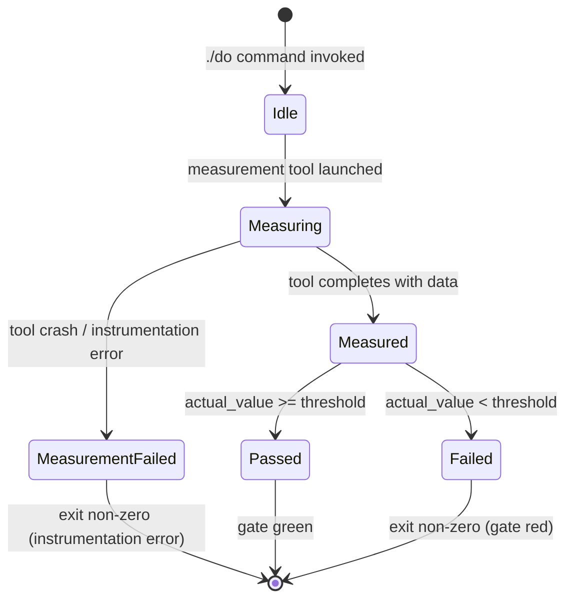
```mermaid
stateDiagram-v2
    [*] --> Idle : ./do command invoked
    Idle --> Measuring : measurement tool launched
    Measuring --> MeasurementFailed : tool crash / instrumentation error
    Measuring --> Measured : tool completes with data
    Measured --> Passed : actual_value >= threshold
    Measured --> Failed : actual_value < threshold
    MeasurementFailed --> [*] : exit non-zero (instrumentation error)
    Passed --> [*] : gate green
    Failed --> [*] : exit non-zero (gate red)
```

All gates within a single `./do coverage` or `./do lint` invocation run to completion before the final exit code is determined. A `MeasurementFailed` state for any gate immediately causes the script to exit non-zero after printing the instrumentation error; remaining gates are not evaluated when instrumentation fails.

---

### 4.9 Edge Cases & Error Handling

| ID | Edge Case | Context | Expected Behaviour |
|---|---|---|---|
| KPI-EC-001 | `cargo-llvm-cov` produces zero lines for a crate because the crate has no `#[test]` functions | Unit coverage run | `./do coverage` reports the crate as having 0% unit coverage, fails KPI-001, and identifies the crate by name. It MUST NOT silently skip crates with no tests. |
| KPI-EC-002 | E2E test suite binary panics before any test runs | Server fails to start in test harness | `./do coverage` reports KPI-002 through KPI-005 as unmeasured (not as 0%), exits non-zero, and prints the panic output so the root cause is visible. |
| KPI-EC-003 | Two interfaces' E2E tests overlap (test tagged `cli_e2e` accidentally imports MCP client code) | Authoring error | `./do coverage` detects the boundary violation via static import analysis, reports the offending test and import, and exits non-zero. The contaminated interface's coverage number is discarded. |
| KPI-EC-004 | KPI-002 (aggregate E2E ≥ 80%) passes but KPI-003 (CLI ≥ 50%) fails | CLI interface under-tested | `./do coverage` reports each gate separately, clearly marks KPI-003 as failed with actual percentage and delta, and exits non-zero. The passing KPI-002 result is shown and not masked. |
| KPI-EC-005 | Presubmit completes in 14:58 on Linux, but 15:12 on Windows | Platform speed difference | KPI-006 fails for the Windows CI job. The Linux and macOS jobs are unaffected. The pipeline fails overall per KPI-007. The timing record for the Windows job contains `timed_out: true`. |
| KPI-EC-006 | A new `1_PRD-REQ-NNN` tag is added to the PRD but no test covers it | PRD updated, tests not yet written | `./do test` exits non-zero, prints the uncovered requirement ID, and sets `passed: false`. The developer must write a covering test before the gate clears. |
| KPI-EC-007 | A test references `1_PRD-REQ-999` which does not exist in the PRD | Stale test annotation after requirement renaming | `./do test` exits non-zero and reports the stale reference with the file path and line number. The developer must update or remove the stale annotation. |
| KPI-EC-008 | `cargo clippy` produces a warning on one platform (e.g., Windows) but not others | Platform-specific code path | KPI-013 fails on that platform's CI job. The warning MUST be fixed or suppressed with a documented `#[allow(...)]` before the gate clears. |
| KPI-EC-009 | Coverage drops below threshold on a CI platform but not locally | Differing test execution order or platform-specific skips | Both the local and CI measurements are authoritative. CI failure is not overridden by a local pass. The developer must investigate and reproduce locally. |

---

### 4.10 Dependencies

| Dependency | Direction | Description |
|---|---|---|
| §1.6 (`./do` commands) | Section 4 depends on §1.6 | Metric enforcement points (KPI-006, KPI-007) are implemented by the `./do` script commands defined in §1.6. |
| §1.7 (Quality Gates) | Section 4 cross-references §1.7 | KPI-001 through KPI-005 restate thresholds defined in §1.7 (QG-001 through QG-005). §1.7 is the normative source; §4 is the evaluation reference. |
| §3 (Feature Requirements) | Section 4 depends on §3 | KPI-008 and KPI-009 are satisfied by implementing the features specified in §3.8 (agent adapters) and §3.9 (execution environments). |
| §3.18 (Acceptance Criteria) | Section 4 is verified by §3.18 | The acceptance criteria in §3.18 (AC-3-049 through AC-3-051) are the test-level assertions that verify KPI-001 through KPI-005. |
| `cargo-llvm-cov` | KPI-001 to KPI-005 depend on this tool | External dependency installed by `./do setup`. Coverage measurement is undefined without it. |
| GitLab CI runners | KPI-007 depends on CI infrastructure | Three platform runners (linux, macos, windows) must be available and tagged for the pipeline matrix to execute. |

---

### 4.11 Acceptance Criteria

- [ ] **AC-4-001**: `./do coverage` produces `target/coverage/report.json` with all five gate entries (KPI-001 through KPI-005), each with a numeric `actual_pct`, a `passed` boolean, and a `delta_pct` value. Verified by reading the file after a successful run.
- [ ] **AC-4-002**: `./do coverage` exits with code `0` iff all five coverage gates have `passed: true` in `target/coverage/report.json`, and exits with code `1` iff any gate has `passed: false`. Verified by asserting the exit code against the report contents.
- [ ] **AC-4-003**: Unit test line coverage (KPI-001) is ≥ 90% as reported by `cargo-llvm-cov` in CI on all three platforms. Verified by CI pipeline logs and `report.json`.
- [ ] **AC-4-004**: Aggregate E2E test line coverage (KPI-002) is ≥ 80% as reported by `cargo-llvm-cov` in CI on all three platforms. Verified by CI pipeline logs and `report.json`.
- [ ] **AC-4-005**: E2E coverage via CLI interface (KPI-003) is ≥ 50% on all three platforms. Verified by CI pipeline logs and `report.json`.
- [ ] **AC-4-006**: E2E coverage via TUI interface (KPI-004) is ≥ 50% on all three platforms. Verified by CI pipeline logs and `report.json`.
- [ ] **AC-4-007**: E2E coverage via MCP interface (KPI-005) is ≥ 50% on all three platforms. Verified by CI pipeline logs and `report.json`.
- [ ] **AC-4-008**: `./do presubmit` completes within 900 seconds on all three CI platforms. Verified by the `elapsed_seconds` field in `target/presubmit_timings.jsonl` after each CI run.
- [ ] **AC-4-009**: If `./do presubmit` is interrupted at the 900-second boundary, it kills all child processes and exits non-zero. Verified by a test that injects a synthetic timeout signal and asserts no orphan processes remain and exit code is `1`.
- [ ] **AC-4-010**: GitLab CI pipeline passes on Windows, macOS, and Linux simultaneously (KPI-007). Verified by pipeline job status for all three `presubmit-*` jobs in a single pipeline run.
- [ ] **AC-4-011**: All five agent CLI adapters (claude, gemini, opencode, qwen, copilot) are registered, pass adapter unit tests, and are exercised by at least one E2E integration test each (KPI-008). Verified by the test suite and the adapter registry at runtime.
- [ ] **AC-4-012**: All three execution environments (tempdir, docker, remote SSH) are implemented, pass environment unit tests, and are exercised by at least one E2E integration test each (KPI-009). Verified by the test suite.
- [ ] **AC-4-013**: `./do test` produces `target/traceability.json` with `passed: true`, meaning every `1_PRD-REQ-*` tag in `docs/plan/specs/1_prd.md` has at least one annotated covering test (KPI-010). Verified by reading `traceability.json` after a full test run.
- [ ] **AC-4-014**: `./do test` exits non-zero and names the uncovered requirement(s) when any `1_PRD-REQ-*` tag lacks a covering test. Verified by temporarily removing a test annotation and asserting the exit code and stderr output.
- [ ] **AC-4-015**: `./do lint` exits non-zero and identifies the specific item when any public Rust item is missing a doc comment (KPI-011). Verified by adding a public function without a doc comment and asserting the lint failure.
- [ ] **AC-4-016**: `./do lint` exits non-zero when `cargo fmt --check` detects a formatting violation (KPI-012). Verified by introducing a known formatting violation and asserting the failure.
- [ ] **AC-4-017**: `./do lint` exits non-zero when `cargo clippy -D warnings` produces a warning (KPI-013). Verified by introducing a known Clippy warning and asserting the failure.
- [ ] **AC-4-018**: `./do coverage` reports each gate result individually (pass/fail with `delta_pct`) and does not mask passing gates when one or more gates fail. Verified by a test that synthesises a coverage run where KPI-003 fails while KPI-001 passes, and asserts both results appear in the output.
- [ ] **AC-4-019**: `./do coverage` exits non-zero and prints an instrumentation failure message (not a 0% coverage result) when `cargo-llvm-cov` produces no data for any gate. Verified by mocking a zero-data coverage run and asserting the error output.

---

## 5. Out of Scope / Non-Goals

**[1_PRD-REQ-054]** The following features are explicitly out of scope for the MVP:

| Feature | Status | Rationale |
|---|---|---|
| GUI (graphical user interface) | Post-MVP | Browser/desktop UI adds significant frontend complexity; TUI satisfies developer-facing needs for MVP. |
| Web API / REST interface | Post-MVP | gRPC covers all MVP client transports; REST can be layered on the service layer post-MVP. |
| Client authentication | Post-MVP | Server is designed for local/trusted-network use; auth middleware adds complexity without MVP value. |
| External secrets manager integration | Post-MVP | Env-var and TOML-entry credential supply is sufficient for trusted single-user deployments. |
| Automated workflow triggers (cron, inbound webhook, file-watch) | Post-MVP | Manual submission via CLI/MCP is sufficient; trigger sources are independent of the run execution model. |

The purpose of this section is threefold:

1. **Boundary enforcement** — define the exact MVP perimeter so that AI developer agents cannot accidentally implement excluded features.
2. **Architectural forward-compatibility** — document the design decisions made now that allow each non-goal to be added post-MVP without restructuring the core.
3. **Acceptance criteria** — provide testable assertions that verify non-goals are absent from the shipped binary.

---

### 5.1 GUI (Graphical User Interface)

#### 5.1.1 Scope Boundary

A GUI is any browser-based or native desktop interface that renders workflow state, run history, or logs through a graphical windowing system. This includes:

- Single-page applications (React, Vue, Svelte, etc.) served over HTTP/WebSocket.
- Electron or Tauri desktop applications.
- Any embedded web server (`actix-web`, `axum`, `hyper`, `warp`, or equivalent) that serves HTML, CSS, JavaScript, or image assets.

The TUI client (§ 7.5 of this document) is **in scope** and is not a GUI. The TUI renders exclusively to an ANSI terminal and requires no browser or windowing system.

#### 5.1.2 Business Rules

- **[1_PRD-REQ-055]** The `devs` server binary MUST NOT start any HTTP listener at any port, under any configuration flag, at MVP. Binding to a TCP port with HTTP semantics is prohibited even behind a compile-time feature flag that is enabled by default.
- **[1_PRD-REQ-056]** The Cargo workspace MUST NOT include any dependency that transitively provides a web application framework (e.g., `actix-web`, `axum`, `rocket`, `warp`) in MVP build targets. Development/test-only dependencies are exempt.
- **[1_PRD-REQ-057]** No HTML, CSS, JavaScript, or WebAssembly assets MUST be embedded in or distributed alongside the MVP binary.
- **[1_PRD-REQ-058]** The gRPC API defined in § 7.1 is the sole programmatic interface for all client interactions. This API MUST be designed so that a future GUI client can connect to it without modifications to the server.

#### 5.1.3 Forward-Compatible Architecture

The gRPC service definitions (`.proto` files) constitute the stable interface contract that a post-MVP GUI will consume. The server-side business logic is fully isolated behind the service layer — adding a GUI requires only a new client, not changes to the server.

```
Post-MVP GUI addition (illustrative, non-normative):

[GUI Client] ──HTTP/WS──► [GUI Bridge Service]
                               │
                               └──gRPC──► [devs Server]
                                            (unchanged)
```

No server-side changes are required to add a GUI post-MVP. The GUI bridge service translates between HTTP/WebSocket and the existing gRPC API.

#### 5.1.4 Edge Cases

| Edge Case | Expected Behavior |
|---|---|
| A user passes an undocumented `--http-port` flag | The CLI MUST reject the flag with an `unknown argument` error and exit non-zero. |
| A developer adds a `tokio`-based HTTP server to a utility module during development | CI MUST fail the lint check that verifies no HTTP framework crate appears in `Cargo.lock` for non-dev targets. |
| A future feature request proposes embedding a web dashboard as a compile-time opt-in | The request MUST be deferred to post-MVP planning. The MVP branch MUST NOT merge any such feature flag. |

#### 5.1.5 Acceptance Criteria

- [ ] `cargo build --release` produces a binary with no embedded HTTP server; binding the binary to any port returns an error if and only if gRPC or MCP listeners are disabled via config.
- [ ] `strings devs | grep -i 'text/html'` returns no matches in the release binary.
- [ ] Running `devs` and scanning all open ports from the host reveals only the configured gRPC port and MCP port — no HTTP port.
- [ ] The `.proto` service definitions compile without modification when imported by a hypothetical external GUI client project.

---

### 5.2 Web API / REST Interface

#### 5.2.1 Scope Boundary

A Web API is any HTTP-based request/response interface that allows clients to interact with `devs` over standard HTTP methods (GET, POST, PUT, DELETE, PATCH). This includes:

- RESTful JSON APIs.
- GraphQL endpoints.
- JSON-RPC-over-HTTP.
- Any OpenAPI / Swagger specification for HTTP endpoints.
- Server-Sent Events (SSE) or long-polling endpoints.

The MCP server (§ 7.4) communicates via the Model Context Protocol over stdio or a dedicated TCP port. Although MCP uses JSON-RPC framing internally, it is not an HTTP API in the REST sense and is **in scope**.

#### 5.2.2 Business Rules

- **[1_PRD-REQ-059]** The server MUST NOT implement any HTTP handler or middleware at MVP. No HTTP router, route table, or request dispatcher MUST exist in the MVP codebase.
- **[1_PRD-REQ-060]** No OpenAPI, Swagger, or JSON Schema file describing HTTP endpoints MUST be generated or included in the repository at MVP.
- **[1_PRD-REQ-061]** The gRPC `.proto` files are the sole authoritative API description. They MUST be versioned in the repository and updated whenever the API surface changes.
- **[1_PRD-REQ-062]** The gRPC service layer MUST be implemented as a thin adapter over pure Rust service objects (not tied to any transport). This allows a REST adapter to be added post-MVP by wrapping the same service objects.

#### 5.2.3 Forward-Compatible Architecture

Service objects sit behind a trait boundary. Post-MVP, a REST gateway (e.g., `grpc-gateway` pattern or a native Axum layer) calls the same trait implementations:

```
MVP:
[CLI/TUI/MCP] ──gRPC──► [gRPC Handler] ──trait call──► [ServiceImpl]

Post-MVP (additive):
[REST client] ──HTTP──► [REST Handler]  ──trait call──► [ServiceImpl]
[CLI/TUI/MCP] ──gRPC──► [gRPC Handler] ──trait call──►      │
                                                        (same instance)
```

The `ServiceImpl` types MUST NOT contain any transport-specific logic. Every public method on `ServiceImpl` MUST take and return domain types, not proto-generated types. Proto conversion is the responsibility of the gRPC handler layer.

#### 5.2.4 Edge Cases

| Edge Case | Expected Behavior |
|---|---|
| A client attempts an HTTP GET to the gRPC port | The gRPC server responds with HTTP/2 error frames (standard gRPC behavior); no JSON body is returned. |
| The MCP port receives a plain HTTP request | The MCP listener rejects the connection with a protocol error; no HTTP response is sent. |
| A developer proposes adding `grpc-gateway` as an MVP feature | The PR MUST be rejected as out of scope; a post-MVP tracking issue MUST be opened instead. |
| A future REST client sends a request to the wrong port | No response is given; the connection is refused or closed immediately. |

#### 5.2.5 Acceptance Criteria

- [ ] `curl http://localhost:<grpc_port>/healthz` returns a connection error or protocol error — not an HTTP 200 response.
- [ ] `grep -r 'axum\|actix\|rocket\|warp\|hyper' Cargo.toml Cargo.lock` (non-dev targets) returns no matches.
- [ ] No `.yaml` or `.json` file with an `openapi:` or `swagger:` key exists in the repository.
- [ ] All gRPC service methods delegate to a service object method that accepts and returns domain types, not proto-generated types, as verified by a code review checklist item in CI.

---

### 5.3 Client Authentication

#### 5.3.1 Scope Boundary

Client authentication is any mechanism that verifies the identity or authorization of a connecting client before granting access to the `devs` gRPC or MCP APIs. This includes:

- TLS mutual authentication (mTLS).
- Token-based authentication (JWT, Bearer tokens, API keys over a header).
- OAuth 2.0 / OIDC flows.
- Username/password authentication.
- IP allowlist enforcement enforced by the application (OS-level firewall rules are outside this scope).

The MVP security model is **trusted-network / local use only**. Any process that can reach the gRPC or MCP listener is trusted unconditionally.

#### 5.3.2 Business Rules

- **[1_PRD-REQ-063]** The gRPC server MUST NOT implement any authentication interceptor or middleware at MVP. All incoming connections MUST be accepted regardless of origin.
- **[1_PRD-REQ-064]** The MCP server MUST NOT require authentication tokens in the MVP protocol handshake.
- **[1_PRD-REQ-065]** TLS MUST NOT be required for client connections at MVP. The gRPC transport MAY support plaintext (insecure) connections by default. A future TLS config option SHOULD be architecturally reserved (e.g., a `tls` section in the config schema may be defined but have no effect at MVP).
- **[1_PRD-REQ-066]** Server documentation MUST clearly state that the server is designed for local or trusted-network deployment and MUST NOT be exposed to the public internet without OS-level network controls.
- **[1_PRD-REQ-067]** The gRPC service layer MUST NOT embed any user-identity concept (user ID, session token, role) in its domain types at MVP, to avoid coupling the data model to an auth scheme prematurely.

#### 5.3.3 Trusted-Network Model

The expected MVP deployment topology is:

```
[Developer machine]
    ├── devs server (localhost:7890)
    ├── devs TUI (connects to localhost:7890)
    ├── devs CLI (connects to localhost:7890)
    └── AI Agent ──MCP stdio bridge──► devs MCP (localhost:50052)
```

Network exposure beyond loopback is only expected in trusted LAN environments (e.g., a developer's home lab). Public internet exposure is explicitly unsupported and MUST be documented as such.

#### 5.3.4 Forward-Compatible Architecture

Post-MVP authentication MUST be addable as a gRPC interceptor without modifying the service layer. The interceptor pattern is reserved:

```rust
// Post-MVP sketch (non-normative — illustrative only)
Server::builder()
    .add_service(AuthInterceptor::new(DevServiceImpl::new(...)))
    .serve(addr)
    .await?;
```

The `DevServiceImpl` type MUST remain authentication-agnostic at MVP. No `user_id` or `token` parameter MUST appear in any service method signature at MVP.

#### 5.3.5 Edge Cases

| Edge Case | Expected Behavior |
|---|---|
| Two simultaneous clients connect from different processes | Both connections are accepted and served concurrently without any session isolation. |
| A client sends a gRPC metadata header named `Authorization` | The server MUST ignore the header entirely and process the request normally. |
| The server is bound to `0.0.0.0` (all interfaces) rather than `127.0.0.1` | The server starts and logs a warning that the API is accessible without authentication. It MUST NOT refuse to start. |
| A connection arrives on the gRPC port with a TLS `ClientHello` | The server either rejects the TLS handshake with a protocol error (plaintext-only mode) or accepts it if TLS is configured; no auth check is performed either way. |

#### 5.3.6 Acceptance Criteria

- [ ] A gRPC client with no credentials or metadata can invoke every service method successfully when connected to a running server.
- [ ] No `tonic` interceptor, tower middleware, or custom `Service` wrapper that inspects connection metadata for authentication purposes exists in the codebase.
- [ ] The domain types (`WorkflowRun`, `StageRun`, `Project`, etc.) contain no `user_id`, `owner`, `session`, or `token` fields.
- [ ] Server startup log includes a warning when the listen address is not a loopback address.

---

### 5.4 External Secrets Manager Integration

#### 5.4.1 Scope Boundary

External secrets manager integration is any runtime mechanism that fetches credential values (API keys, tokens, passwords) from a remote secrets store over the network. This includes:

- HashiCorp Vault (all backends).
- AWS Secrets Manager / AWS Parameter Store.
- GCP Secret Manager.
- Azure Key Vault.
- 1Password Secrets Automation.
- Any other SaaS or self-hosted secrets API.

The MVP credential supply mechanisms are:

| Mechanism | Description |
|---|---|
| Environment variables on the server process | API keys are set in the shell environment before `devs` starts. This is the preferred mechanism. |
| TOML config file entries | API keys are placed directly in `devs.toml`. This is supported with a documented security caveat that plaintext secrets in config files should not be committed to version control. |

No network call to a secrets backend is made at MVP.

#### 5.4.2 Business Rules

- **[1_PRD-REQ-068]** The server MUST NOT make any outbound network connection to a secrets manager endpoint at startup, during credential resolution, or at any other time during MVP operation.
- **[1_PRD-REQ-069]** Credentials MUST be resolved exactly once at server startup from environment variables and/or the config file. No runtime re-fetching or rotation MUST occur at MVP.
- **[1_PRD-REQ-070]** If a required credential is absent (neither in the environment nor in the config), the server MUST log a clear error message naming the missing credential and refuse to start.
- **[1_PRD-REQ-071]** The `devs.toml` config schema MUST reserve a `[secrets]` section (parsed but ignored at MVP) so that post-MVP secrets manager configuration does not require a schema-breaking change.
- **[1_PRD-REQ-072]** The Cargo workspace MUST NOT include any SDK crate for a secrets manager (e.g., `aws-sdk-secretsmanager`, `vaultrs`, `google-cloud-secretmanager`) in MVP build targets.

#### 5.4.3 Credential Resolution Model

```
Startup credential resolution (MVP):

1. For each agent tool requiring an API key:
   a. Check environment variable (e.g., ANTHROPIC_API_KEY).
   b. If absent, check devs.toml [credentials] section.
   c. If still absent AND the tool is referenced by a registered pool:
      → Log error "Missing credential for tool '<name>'"
      → Abort startup.
2. Store resolved credentials in an in-memory credential store.
3. Inject credentials as environment variables when spawning agent processes.
```

Credentials resolved at startup are held in memory for the server's lifetime. They are never written to disk after initial resolution.

#### 5.4.4 Credential Config Schema (MVP)

```toml
# devs.toml — credential section (MVP)
[credentials]
# Plaintext entries are supported but discouraged for version-controlled configs.
# Environment variables take precedence over entries here.
anthropic_api_key = "sk-ant-..."   # overridden by ANTHROPIC_API_KEY env var
gemini_api_key    = "AIza..."      # overridden by GEMINI_API_KEY env var

# Reserved for post-MVP — parsed but produces a warning and is otherwise ignored:
# [secrets]
# provider = "vault"
# vault_addr = "https://vault.example.com"
```

| Config Key | Type | Env Override | Description |
|---|---|---|---|
| `credentials.anthropic_api_key` | `String` | `ANTHROPIC_API_KEY` | API key for the `claude` agent tool. |
| `credentials.gemini_api_key` | `String` | `GEMINI_API_KEY` | API key for the `gemini` agent tool. |
| `credentials.opencode_api_key` | `String` | `OPENCODE_API_KEY` | API key for the `opencode` agent tool. |
| `credentials.qwen_api_key` | `String` | `QWEN_API_KEY` | API key for the `qwen` agent tool. |
| `credentials.copilot_token` | `String` | `COPILOT_TOKEN` | Auth token for the `copilot` agent tool. |

#### 5.4.5 Edge Cases

| Edge Case | Expected Behavior |
|---|---|
| A credential is present in both the environment and the config file | The environment variable value takes precedence; the config value is silently ignored. |
| The config file contains a `[secrets]` section referencing a Vault address | The server logs a warning: `"[secrets] section is reserved for post-MVP and will be ignored."` Startup continues normally using env/config credentials. |
| An agent tool is registered in a pool but its credential is absent | Server MUST abort startup with a descriptive error; it MUST NOT start and silently fail only when the tool is first dispatched. |
| A credential value is an empty string (`""`) | Treated as absent; the server falls through to the next resolution mechanism and aborts if no non-empty value is found. |
| The config file has restricted permissions (mode 0600) | The server reads it normally; no special handling. The documentation SHOULD recommend 0600 permissions. |

#### 5.4.6 Acceptance Criteria

- [ ] Starting the server with all required credentials supplied via environment variables succeeds; the `[credentials]` section in `devs.toml` may be empty or absent.
- [ ] Starting the server with a credential absent from both env and config prints a descriptive error naming the missing key and exits non-zero.
- [ ] Environment variable values override config file values for the same credential key.
- [ ] Adding a `[secrets]` section to `devs.toml` produces a startup warning but does not prevent the server from starting.
- [ ] `cargo build --release` with `grep -r 'vault\|aws.sdk\|google.cloud.secret\|azure.keyvault' Cargo.lock` (non-dev targets) returns no matches.

---

### 5.5 Automated Workflow Triggers

#### 5.5.1 Scope Boundary

Automated workflow triggers are any mechanism by which a workflow run is initiated without a direct human or agent command. This includes:

- **Cron / scheduled triggers**: starting a run at a fixed time or interval (e.g., nightly, every 15 minutes).
- **Inbound webhook triggers**: starting a run in response to an HTTP POST from an external system (e.g., a GitHub push event, a CI notification).
- **File-watch triggers**: starting a run when a file or directory on the local filesystem changes (e.g., `inotify`, `kqueue`, `ReadDirectoryChangesW`).
- **Git hook triggers**: starting a run in response to a `git push` or `git commit` event.
- **Message queue triggers**: starting a run when a message arrives on a queue (AMQP, Kafka, SQS, etc.).

The two MVP submission mechanisms are:

| Mechanism | Description |
|---|---|
| `devs submit` CLI command | A human or script invokes `devs submit <workflow> [--name <run-name>] [--input key=value ...]`. |
| MCP `submit_run` tool call | An AI agent calls the `submit_run` MCP tool, passing workflow name and inputs. |

Both mechanisms are manual in the sense that they require an active caller. No background process monitors for trigger conditions at MVP.

#### 5.5.2 Business Rules

- **[1_PRD-REQ-073]** The server MUST NOT start any background task, timer, or event loop that initiates workflow runs autonomously at MVP.
- **[1_PRD-REQ-074]** The server MUST NOT open any inbound HTTP listener for webhook reception at MVP (this rule overlaps with § 5.2 and is restated here for completeness).
- **[1_PRD-REQ-075]** The server MUST NOT use `inotify`, `kqueue`, `ReadDirectoryChangesW`, or any OS-level file-watch API for trigger purposes at MVP. File-watch APIs used internally for config hot-reload are exempt if implemented post-MVP; at MVP, config is loaded once at startup.
- **[1_PRD-REQ-076]** The `devs.toml` config schema MUST reserve a `[triggers]` section (parsed but rejected with a clear error at MVP) so that post-MVP trigger configuration does not require a schema-breaking change.
- **[1_PRD-REQ-077]** The `SubmitRun` gRPC method (and the MCP `submit_run` tool) are the sole code paths that create a new `WorkflowRun` entity. No other code path MUST call the run creation logic at MVP.

#### 5.5.3 Forward-Compatible Architecture

Post-MVP trigger sources are additive callers of `SubmitRun`. The run execution model is completely independent of how the run was initiated:

```
MVP:
[CLI devs submit] ──gRPC SubmitRun──► [RunService::submit_run]
[MCP submit_run]  ──MCP  tool──────►      │
                                      creates WorkflowRun
                                      enqueues to scheduler

Post-MVP (additive):
[Cron Engine]       ──gRPC SubmitRun──► [RunService::submit_run]
[Webhook Receiver]  ──gRPC SubmitRun──►      │ (unchanged)
[File Watcher]      ──gRPC SubmitRun──►      │
```

`RunService::submit_run` MUST NOT contain any logic that distinguishes how the run was triggered. The trigger source is opaque to the execution engine.

#### 5.5.4 Trigger Config Schema (Reserved, MVP)

The following schema is defined now to prevent a breaking change post-MVP. At MVP, any `[triggers]` section in `devs.toml` MUST cause the server to log an error and refuse to start:

```toml
# RESERVED — not supported at MVP. Including this section causes a startup error.
# [triggers]
# [[triggers.cron]]
# workflow  = "nightly-build"
# schedule  = "0 2 * * *"          # cron expression
# inputs    = { branch = "main" }
#
# [[triggers.webhook]]
# workflow  = "pr-review"
# path      = "/webhook/github"    # inbound HTTP path (post-MVP)
# secret    = "GITHUB_WEBHOOK_SECRET"
#
# [[triggers.file_watch]]
# workflow  = "reformat"
# paths     = ["src/**/*.rs"]
# debounce  = "2s"
```

#### 5.5.5 State Diagram — Run Submission (MVP Only)

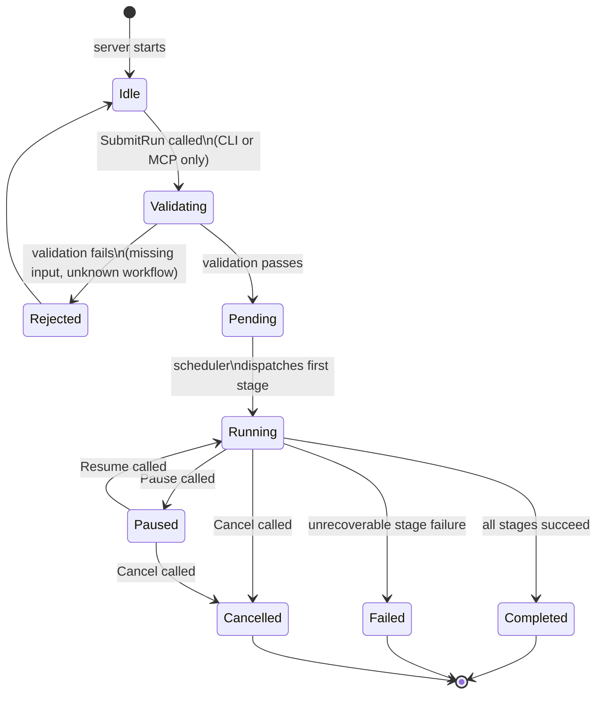
```mermaid
stateDiagram-v2
    [*] --> Idle : server starts

    Idle --> Validating : SubmitRun called\n(CLI or MCP only)
    Validating --> Rejected : validation fails\n(missing input, unknown workflow)
    Validating --> Pending : validation passes
    Rejected --> Idle

    Pending --> Running : scheduler\ndispatches first stage
    Running --> Completed : all stages succeed
    Running --> Failed : unrecoverable stage failure
    Running --> Cancelled : Cancel called
    Running --> Paused : Pause called
    Paused --> Running : Resume called
    Paused --> Cancelled : Cancel called

    Completed --> [*]
    Failed --> [*]
    Cancelled --> [*]
```

Note: The `Idle → Validating` transition is ONLY triggered by an explicit `SubmitRun` call. No timer, file event, or network event (other than gRPC/MCP) causes this transition at MVP.

#### 5.5.6 Edge Cases

| Edge Case | Expected Behavior |
|---|---|
| A user adds a `[triggers]` section to `devs.toml` at MVP | The server logs `"[triggers] section is not supported in MVP. Remove it from devs.toml."` and exits non-zero. |
| A user runs `devs submit` with a `--schedule` flag | The CLI MUST reject the flag with an `unknown argument` error and exit non-zero. |
| A CI pipeline runs `devs submit` in a loop to simulate scheduled execution | This is an acceptable workaround for MVP; the server handles each submission independently as a new run. |
| An MCP client submits a run with a `trigger_source` metadata field | The server ignores all unknown metadata fields and creates the run normally; no error is returned. |
| Two simultaneous `SubmitRun` calls arrive with the same run name | The second call MUST fail with a `ALREADY_EXISTS` gRPC status code (run name deduplication; see § 4.3 of this document). |

#### 5.5.7 Acceptance Criteria

- [ ] The server process has no background threads or `tokio` tasks that call `submit_run` or equivalent internal methods autonomously after startup completes.
- [ ] Adding `[triggers]` to `devs.toml` and starting the server produces an error message referencing `[triggers]` and exits non-zero.
- [ ] `devs submit --schedule "0 2 * * *" my-workflow` fails with an `unknown argument` error.
- [ ] All `WorkflowRun` entities in the database or checkpoint store were created exclusively by the `SubmitRun` gRPC handler or the MCP `submit_run` tool handler, as verifiable by tracing the call graph in code review.
- [ ] The gRPC `SubmitRun` method's implementation contains no conditional branch that checks a trigger source field.

---

### 5.6 Cross-Cutting Non-Goal Rules

The following rules apply across all non-goal areas defined in § 5.1–5.5:

- **[1_PRD-REQ-078]** Any pull request that introduces code belonging to a non-goal category MUST be rejected by the CI pipeline. A dedicated lint rule or architectural fitness function MUST detect and flag violations automatically where feasible.
- **[1_PRD-REQ-079]** The `CHANGELOG.md` and release notes for the MVP release MUST explicitly list all non-goals, so that users and contributors have clear expectations.
- **[1_PRD-REQ-080]** Post-MVP tracking issues MUST be created in the project issue tracker for each non-goal at or before the MVP release. This ensures deferred features are not lost.
- **[1_PRD-REQ-081]** The architecture MUST be validated against each non-goal during the post-MVP design checkpoint: any structural impediment to adding a non-goal feature post-MVP MUST be identified and resolved before the MVP release, even if the feature itself is not implemented.

#### 5.6.1 Dependencies

This section depends on or is referenced by the following sections:

| Dependency | Direction | Reason |
|---|---|---|
| § 4 (Interfaces) | Inbound | § 5.2 and § 5.3 constrain what § 4 is allowed to expose. |
| § 6 (Core Data Models) | Inbound | § 5.3 constrains that domain types contain no auth fields. § 5.4 constrains that credential types contain no secrets-manager fields. |
| § 7.1 (gRPC API) | Inbound | § 5.1, § 5.2, § 5.3 constrain the transport and security configuration of the gRPC service. |
| § 7.4 (MCP Server) | Inbound | § 5.3 constrains that the MCP handshake requires no authentication at MVP. |
| § 7.5 (TUI) | Inbound | § 5.1 clarifies that the TUI is not a GUI and is in scope. |
| Server Configuration (§ 8) | Bidirectional | § 5.4 defines the `[credentials]` config schema; § 5.5 defines the reserved `[triggers]` schema. |

#### 5.6.2 Overall Acceptance Criteria for § 5

- [ ] A full `cargo build --release` produces a binary that, when executed, opens no HTTP listeners (verified by `ss -tlnp` after startup).
- [ ] `cargo deny check` (or equivalent) confirms no forbidden crates (web frameworks, secrets SDKs) appear in the non-dev dependency graph.
- [ ] All domain type definitions (`WorkflowRun`, `StageRun`, `Project`, `Pool`, `Agent`) contain no fields named `user_id`, `owner_id`, `session`, `token`, `auth`, or `role`.
- [ ] The server startup sequence resolves all credentials from env/config without making any outbound network connection (verified by `strace`/`dtrace` in CI integration test).
- [ ] No background task created at server startup calls the run-creation code path autonomously (verified by a startup integration test that instruments `RunService::submit_run` and asserts it is never called without an external trigger).
- [ ] CI includes a check that fails if any file matching `[triggers]` parsing returns a non-error result.

---

## Appendix A: Workflow DAG Scheduling Model

### A.1 Overview

A workflow in `devs` is a directed acyclic graph (DAG) of stages. Each stage declares zero or more predecessor stages via its `depends_on` list. The DAG Scheduler is the component responsible for interpreting this graph, tracking execution state, and dispatching eligible stages to the Agent Pool as soon as their dependencies are satisfied.

The scheduler operates as an event-driven loop inside the `devs` server. Every time a stage transitions to a terminal state (`Completed`, `Failed`, `Cancelled`, or `TimedOut`), the scheduler re-evaluates the full graph to determine whether new stages have become eligible for dispatch. This event-driven model means stages with independent dependency sets are dispatched in parallel without any central polling or fixed tick interval.

The scheduler does not know about agent internals or execution environments. It communicates exclusively with the Agent Pool Manager (which owns concurrency limits, capability matching, and fallback logic) and the State/Checkpoint Engine (which persists every transition). This separation of concerns is strict: the scheduler MUST NOT directly spawn subprocesses or interact with git.

### A.2 Canonical Example

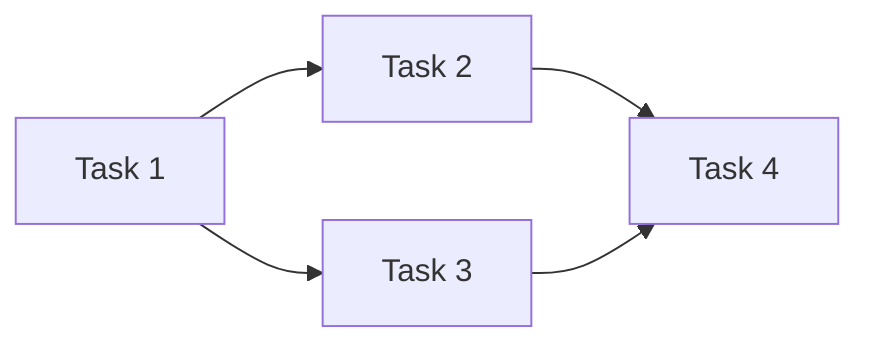
```mermaid
flowchart LR
    T1[Task 1] --> T2[Task 2]
    T1 --> T3[Task 3]
    T2 --> T4[Task 4]
    T3 --> T4
```

| Time | Event |
|------|-------|
| t=0 | Run submitted. Task 1 has no dependencies → dispatched immediately. |
| t=1 | Task 1 completes. Scheduler evaluates: Task 2 and Task 3 both depend only on Task 1 (now `Completed`) → both dispatched in parallel. |
| t=2 | Task 2 completes. Scheduler evaluates: Task 4 depends on Task 2 AND Task 3. Task 3 is still `Running` → Task 4 remains `Waiting`. |
| t=3 | Task 3 completes. Scheduler evaluates: Task 4's all dependencies are `Completed` → Task 4 dispatched. |
| t=4 | Task 4 completes. No further eligible stages → run transitions to `Completed`. |

### A.3 Internal Data Models

The scheduler maintains two in-memory structures per active run, derived from the `WorkflowDefinition` snapshot stored in the `WorkflowRun`. These structures are rebuilt from the persisted checkpoint on server restart and are never the system of record — the `WorkflowRun` and `StageRun` records in the State Engine are canonical.

#### A.3.1 DependencyGraph

An adjacency representation of the workflow DAG built once at run-start and treated as immutable for the lifetime of the run.

| Field | Type | Description |
|---|---|---|
| `run_id` | `Uuid` | The run this graph belongs to |
| `nodes` | `HashMap<String, StageNode>` | Keyed by stage name |
| `forward_edges` | `HashMap<String, Vec<String>>` | `stage → [stages that depend on it]` (successors) |
| `reverse_edges` | `HashMap<String, Vec<String>>` | `stage → [stages it depends on]` (predecessors) |
| `root_stages` | `Vec<String>` | Stages with an empty `depends_on` list |
| `topological_order` | `Vec<String>` | Stable topological ordering produced during validation |

#### A.3.2 StageNode

One entry in the `DependencyGraph` per stage.

| Field | Type | Description |
|---|---|---|
| `stage_name` | `String` | Matches `StageDefinition.name` |
| `in_degree` | `u32` | Number of predecessor stages; 0 for root stages |
| `unsatisfied_deps` | `HashSet<String>` | Names of predecessor stages not yet `Completed`; decremented as predecessors complete |
| `status` | `SchedulerStageStatus` | Scheduler-local view: `Blocked \| Eligible \| Dispatched \| Done \| Failed` |

`SchedulerStageStatus` is distinct from `StageStatus` (the persisted enum). The scheduler-local status is an optimisation cache and is always derivable from the canonical `StageRun` records.

#### A.3.3 RunSchedulerState

Per-run mutable state held in the scheduler's heap.

| Field | Type | Description |
|---|---|---|
| `run_id` | `Uuid` | |
| `graph` | `DependencyGraph` | |
| `dispatched` | `HashMap<String, Uuid>` | `stage_name → stage_run_id` for all currently running stages |
| `completed` | `HashSet<String>` | Stage names that have reached `Completed` |
| `failed` | `HashSet<String>` | Stage names that have reached `Failed`, `Cancelled`, or `TimedOut` |
| `workflow_deadline` | `Option<Instant>` | Absolute deadline for the whole run; `None` if no workflow-level timeout |
| `stage_deadlines` | `HashMap<String, Instant>` | Per-stage absolute deadlines; populated at dispatch time |

### A.4 DAG Validation

Before a run is accepted by the scheduler, the workflow definition snapshot MUST pass all of the following validation checks. Validation is performed synchronously inside `SubmitRun` before any stage is dispatched. A validation failure returns an error to the caller and leaves no persisted run record.

#### A.4.1 Validation Rules

| Rule ID | Rule | Error code |
|---------|------|------------|
| V-DAG-01 | Every stage name in any `depends_on` list MUST refer to a stage that exists in the same workflow definition. | `UnknownDependency` |
| V-DAG-02 | No stage MUST list itself in its own `depends_on`. | `SelfDependency` |
| V-DAG-03 | The stage graph MUST be acyclic. Cycles are detected via Kahn's algorithm; the cycle members are reported in the error. | `CyclicDependency` |
| V-DAG-04 | The workflow MUST contain at least one stage with an empty `depends_on` (a root stage). A workflow with all stages depending on something is necessarily cyclic and is caught by V-DAG-03, but this rule is checked first for a clearer error. | `NoRootStage` |
| V-DAG-05 | Stage names within a workflow MUST be unique (case-sensitive). | `DuplicateStageName` |
| V-DAG-06 | Fan-out stages MUST NOT also declare a `branch`. | `FanOutBranchConflict` |
| V-DAG-07 | If `completion = StructuredOutput` and the output is file-based, `structured_output_path` MUST be set. | `MissingStructuredOutputPath` |

#### A.4.2 Cycle Detection Algorithm (Kahn's)

```rust
// Pseudo-code — non-normative
fn detect_cycles(stages: &[StageDefinition]) -> Result<Vec<String>, ValidationError> {
    let mut in_degree: HashMap<&str, usize> = stages.iter()
        .map(|s| (s.name.as_str(), s.depends_on.len()))
        .collect();

    let mut queue: VecDeque<&str> = in_degree.iter()
        .filter(|(_, &d)| d == 0)
        .map(|(name, _)| *name)
        .collect();

    let mut topo_order = Vec::new();

    while let Some(node) = queue.pop_front() {
        topo_order.push(node);
        for successor in successors_of(stages, node) {
            let deg = in_degree.get_mut(successor).unwrap();
            *deg -= 1;
            if *deg == 0 {
                queue.push_back(successor);
            }
        }
    }

    if topo_order.len() == stages.len() {
        Ok(topo_order.iter().map(|s| s.to_string()).collect())
    } else {
        // Nodes not in topo_order form cycle(s)
        let cycle_members: Vec<String> = in_degree
            .iter()
            .filter(|(_, &d)| d > 0)
            .map(|(name, _)| name.to_string())
            .collect();
        Err(ValidationError::CyclicDependency { members: cycle_members })
    }
}
```

The topological order produced by this algorithm is stored in `DependencyGraph.topological_order` and is used by the TUI and MCP interfaces to present stages in a deterministic display order.

### A.5 Scheduling Algorithm

#### A.5.1 Dispatch Loop

The core scheduling logic executes as an async function triggered by stage-state-change events. It is also invoked once at run creation to dispatch root stages.

```
procedure advance_run(run_id):
    state ← load RunSchedulerState(run_id)

    if run is in terminal state:
        return  // nothing to do

    // Check workflow-level timeout
    if state.workflow_deadline is Some(d) and now() >= d:
        cancel_all_running_stages(run_id)
        transition_run(run_id, RunStatus::Failed, reason="WorkflowTimeout")
        return

    eligible ← []
    for stage_name in topological_order:
        node ← state.graph.nodes[stage_name]
        if node.status == Blocked and node.unsatisfied_deps is empty:
            node.status ← Eligible
            eligible.append(stage_name)

    for stage_name in eligible:
        stage_run_id ← dispatch_to_pool(run_id, stage_name)
        state.dispatched[stage_name] ← stage_run_id
        node.status ← Dispatched
        if stage has a timeout:
            state.stage_deadlines[stage_name] ← now() + timeout

    // Check for run completion
    if state.dispatched is empty and state.graph.all_nodes_terminal():
        if state.failed is empty:
            transition_run(run_id, RunStatus::Completed)
        else:
            transition_run(run_id, RunStatus::Failed)

    persist(state)
```

#### A.5.2 Stage Completion Handler

Invoked when the Agent Pool Manager reports that a stage run has reached a terminal state.

```
procedure on_stage_terminal(run_id, stage_name, outcome):
    state ← load RunSchedulerState(run_id)
    node ← state.graph.nodes[stage_name]

    remove state.dispatched[stage_name]
    remove state.stage_deadlines[stage_name]

    if outcome == Completed:
        state.completed.insert(stage_name)
        node.status ← Done
        // Decrement unsatisfied_deps for all successors
        for successor in state.graph.forward_edges[stage_name]:
            state.graph.nodes[successor].unsatisfied_deps.remove(stage_name)

    else:  // Failed, Cancelled, TimedOut
        state.failed.insert(stage_name)
        node.status ← Failed
        // Evaluate branch/retry before propagating failure
        handle_failure_routing(run_id, stage_name, outcome)
        return  // advance_run called by handle_failure_routing as appropriate

    advance_run(run_id)
```

#### A.5.3 Failure Routing

When a stage fails the scheduler evaluates three options in order:

1. **Per-stage retry**: if `retry.max_attempts > attempts_so_far`, schedule a retry with the configured backoff delay. The stage is re-dispatched as a new `StageRun` (new `stage_run_id`, incremented `attempt`). The `StageNode.status` is reset to `Eligible` after the backoff delay elapses.
2. **Branch loopback**: if the workflow's `BranchConfig` routes the failed stage back to a prior stage, that prior stage's `StageNode` is reset to `Eligible` (its `unsatisfied_deps` is repopulated from the definition). The run is NOT restarted; only the branch-targeted stage and its transitive successors are re-queued.
3. **Propagate failure**: if neither retry nor branch applies, all stages whose `unsatisfied_deps` include the failed stage are marked `Failed` with reason `DependencyFailed` and the run itself transitions to `Failed`.

Only one of the three options executes per failure event. Retry takes priority over branch loopback; branch loopback takes priority over propagation.

### A.6 State Transitions

#### A.6.1 WorkflowRun State Machine

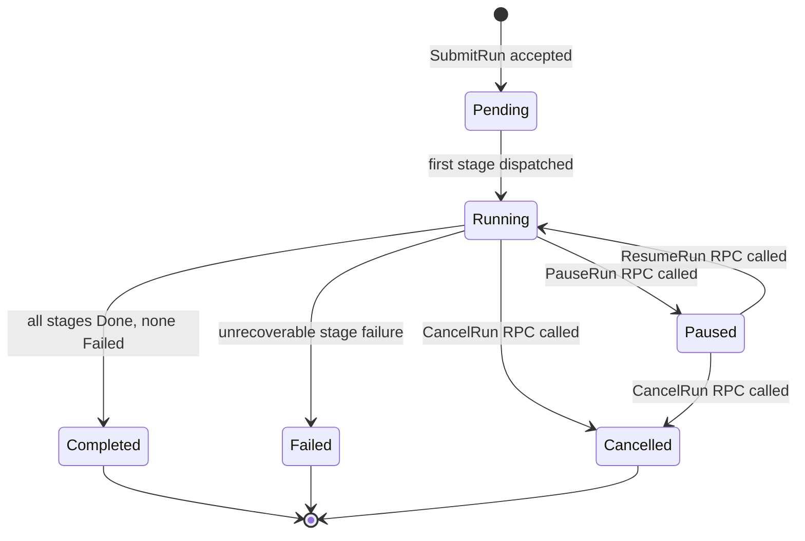
```mermaid
stateDiagram-v2
    [*] --> Pending : SubmitRun accepted
    Pending --> Running : first stage dispatched
    Running --> Paused : PauseRun RPC called
    Paused --> Running : ResumeRun RPC called
    Running --> Completed : all stages Done, none Failed
    Running --> Failed : unrecoverable stage failure
    Running --> Cancelled : CancelRun RPC called
    Paused --> Cancelled : CancelRun RPC called
    Completed --> [*]
    Failed --> [*]
    Cancelled --> [*]
```

#### A.6.2 StageRun State Machine

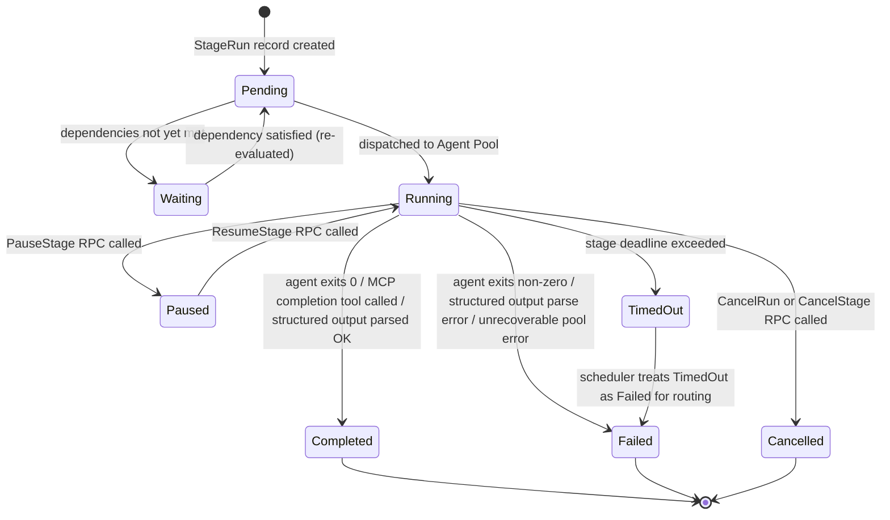
```mermaid
stateDiagram-v2
    [*] --> Pending : StageRun record created
    Pending --> Waiting : dependencies not yet met
    Waiting --> Pending : dependency satisfied (re-evaluated)
    Pending --> Running : dispatched to Agent Pool
    Running --> Paused : PauseStage RPC called
    Paused --> Running : ResumeStage RPC called
    Running --> Completed : agent exits 0 / MCP completion tool called / structured output parsed OK
    Running --> Failed : agent exits non-zero / structured output parse error / unrecoverable pool error
    Running --> TimedOut : stage deadline exceeded
    Running --> Cancelled : CancelRun or CancelStage RPC called
    TimedOut --> Failed : scheduler treats TimedOut as Failed for routing
    Completed --> [*]
    Failed --> [*]
    Cancelled --> [*]
```

> **Note:** `Waiting` is a display-only sub-state of `Pending` used by the TUI and MCP to communicate that a stage exists but cannot yet be dispatched. Internally the scheduler uses `StageNode.unsatisfied_deps.is_empty()` to distinguish between a stage that is waiting on dependencies vs. one that is ready-to-dispatch but blocked on pool concurrency.

#### A.6.3 Scheduler Internal Stage Status Transitions

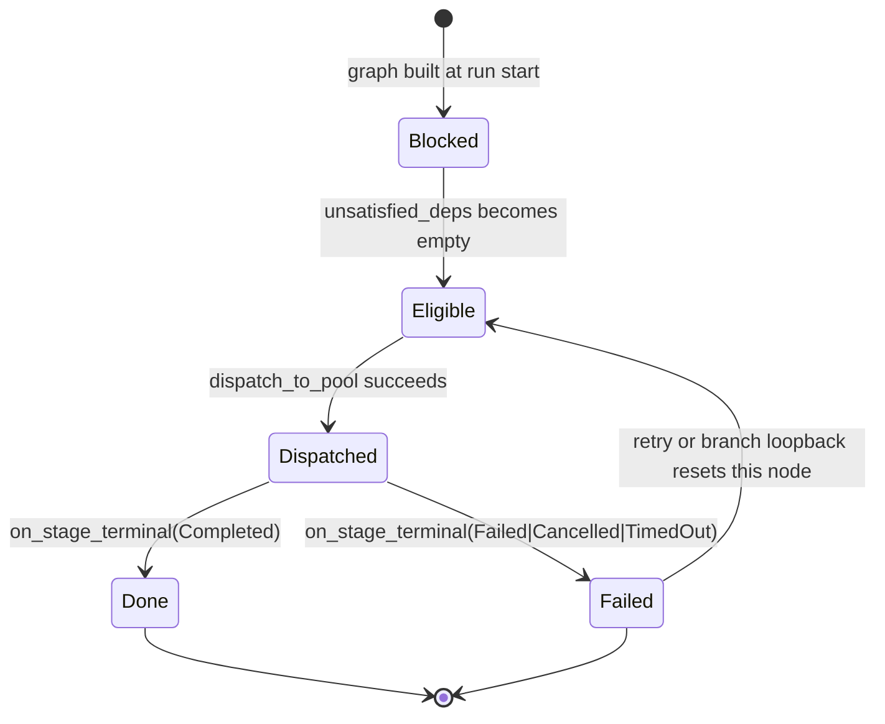
```mermaid
stateDiagram-v2
    [*] --> Blocked : graph built at run start
    Blocked --> Eligible : unsatisfied_deps becomes empty
    Eligible --> Dispatched : dispatch_to_pool succeeds
    Dispatched --> Done : on_stage_terminal(Completed)
    Dispatched --> Failed : on_stage_terminal(Failed|Cancelled|TimedOut)
    Failed --> Eligible : retry or branch loopback resets this node
    Done --> [*]
    Failed --> [*]
```

### A.7 Parallelism and Concurrency

The scheduler enforces two independent layers of concurrency control:

1. **Graph-level parallelism**: the DAG structure determines which stages may run concurrently. The scheduler dispatches all `Eligible` stages simultaneously without any artificial serialisation. There is no configurable limit on graph-level parallelism in the scheduler itself.

2. **Pool-level concurrency**: the Agent Pool Manager enforces `max_concurrent` per pool. When the scheduler calls `dispatch_to_pool`, the pool may queue the request internally if all agent slots are occupied. The stage remains in `Dispatched` state from the scheduler's perspective even while it is queue-pending inside the pool. The pool MUST eventually call `on_stage_terminal` even if the stage is cancelled while pool-pending.

**Fan-out parallelism** is a third layer: a single stage can spawn `N` parallel agent invocations. From the scheduler's perspective a fan-out stage is a single node. The scheduler dispatches it once; the Agent Pool Manager is responsible for managing the N sub-invocations and reporting a single aggregate terminal event back to the scheduler once all N have completed (or the merge handler has reduced them).

### A.8 Pause and Resume Semantics

When `PauseRun` is called:
- The `WorkflowRun.status` transitions to `Paused`.
- All currently `Running` `StageRun` records transition to `Paused`; the underlying agent processes receive a pause signal (SIGSTOP or equivalent for the configured execution environment).
- The scheduler MUST NOT dispatch any new stages while the run is `Paused`, even if eligible stages exist.
- Stage-level `PauseStage` / `ResumeStage` follow the same logic but only affect one `StageRun`. A run with a mix of `Running` and `Paused` stage runs remains in `Running` state at the run level.

When `ResumeRun` is called:
- The `WorkflowRun.status` transitions back to `Running`.
- All `Paused` stage runs resume (SIGCONT or equivalent).
- `advance_run` is called immediately to dispatch any newly eligible stages.

### A.9 Timeout Enforcement

Timeouts are enforced by a dedicated async timer task per run, not by polling in the main scheduler loop.

**Per-stage timeout**:
- At dispatch time, if `StageDefinition.timeout` is set, a timer is armed: `stage_deadline = now() + timeout`.
- When the timer fires, the scheduler calls `cancel_stage(stage_run_id)`, transitions the `StageRun` to `TimedOut`, and invokes `on_stage_terminal` with outcome `TimedOut`.
- If the stage completes before the timer fires, the timer is cancelled.

**Workflow-level timeout**:
- At run-start, if `WorkflowDefinition.timeout` is set, `workflow_deadline = now() + timeout`.
- The scheduler checks `workflow_deadline` at the start of every `advance_run` invocation.
- When the deadline is exceeded, all `Running` and `Paused` stage runs are cancelled, the run transitions to `Failed` with reason `WorkflowTimeout`.

**Interaction**: if a stage's own timeout fires at the same time as the workflow timeout, the stage timeout takes precedence for the `StageRun` record; the `WorkflowRun` may still transition to `Failed` via `WorkflowTimeout` immediately after.

### A.10 Cancellation Propagation

`CancelRun` causes cascading cancellation through the DAG:

1. All `Running` stage runs receive a cancel signal.
2. All `Waiting`/`Pending` stage runs that have not yet been dispatched are immediately transitioned to `Cancelled` without being dispatched.
3. The `WorkflowRun` transitions to `Cancelled` once all stage runs are in a terminal state.

`CancelStage` cancels a single stage run. The scheduler then invokes `handle_failure_routing` as it would for any failure — retry and branch loopback are evaluated. This means a single-stage cancel does not automatically cancel the whole run unless no recovery path exists.

### A.11 Checkpoint and Recovery

The scheduler persists every state transition via the State/Checkpoint Engine before returning from any handler. On server restart:

1. The server loads all `WorkflowRun` records in `Running` or `Paused` state from the checkpoint store.
2. For each, it reconstructs the `RunSchedulerState` by replaying `StageRun` records: any stage in `Running` at crash time is marked `Failed` (reason: `ServerRestart`) — agents cannot be reattached after a restart.
3. `advance_run` is called for each recovered run to dispatch any newly eligible stages, including retries triggered by the restart-induced failures.

**Business Rule B-RECOV-01**: A stage that was `Running` when the server crashed MUST be re-evaluated for retry or failure routing after recovery, using the same rules as a normal stage failure.

**Business Rule B-RECOV-02**: A stage that was `Waiting` or `Pending` but not yet dispatched when the server crashed MUST be dispatched normally after recovery without re-running its already-completed dependencies.

### A.12 Edge Cases and Error Handling

#### A.12.1 Diamond Dependencies

A stage depending on two stages that share a common ancestor (diamond pattern) is valid. The scheduler correctly handles this because `unsatisfied_deps` is a set of stage names, not a count. Completing the shared ancestor does not double-count satisfaction.

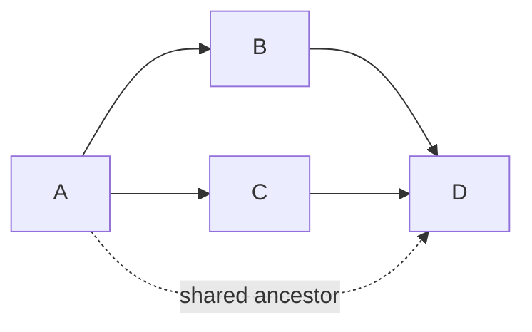
```mermaid
flowchart LR
    A --> B
    A --> C
    B --> D
    C --> D
    A -.->|shared ancestor| D
```

Stage D's `unsatisfied_deps` is `{B, C}`. When B completes, it becomes `{C}`. When C completes, it becomes `{}`, making D `Eligible`. The shared ancestor A has no direct entry in D's `unsatisfied_deps`, so its completion has no spurious effect.

#### A.12.2 Single-Stage Workflow

A workflow with exactly one stage and an empty `depends_on` is valid. The stage is dispatched immediately at run-start. The run transitions to `Completed` as soon as that single stage completes successfully. This case exercises the `root_stages` path and the `all_nodes_terminal` check in the same `advance_run` call.

#### A.12.3 All Stages Fail Immediately

If the first stage (or all root stages) fail without any configured retry or branch, the scheduler must:
- Mark all downstream stages `Failed` with reason `DependencyFailed`.
- NOT dispatch any downstream stages.
- Transition the run to `Failed`.
- Persist a checkpoint recording all stage statuses before returning.

#### A.12.4 Branch Loopback Creates Long Retry Chains

A `branch` that routes from a late stage back to an early stage effectively creates a loop within the run. The scheduler MUST NOT treat this as a cycle validation failure — the DAG definition itself has no cycle. The scheduler tracks `retry_count_per_stage_name` (a `HashMap<String, u32>` in `RunSchedulerState`) and enforces a hard cap of 100 loopback iterations per stage name per run. Exceeding the cap transitions the run to `Failed` with reason `LoopbackLimitExceeded`.

**Business Rule B-LOOP-01**: `RunSchedulerState` MUST track a `loopback_count: HashMap<String, u32>` field. Every branch-loopback re-queue of a stage increments its counter. When the counter reaches 100, the scheduler MUST NOT re-queue the stage and MUST instead propagate failure.

#### A.12.5 Concurrent Cancellation and Completion

If `CancelStage` arrives at the same moment that the Agent Pool Manager reports `Completed` for the same stage, the scheduler MUST apply exactly one of the two transitions. The implementation MUST hold a per-run mutex while processing terminal events. Whichever event acquires the lock first wins; the second event is discarded with a log warning.

#### A.12.6 Workflow Timeout Fires During Final Stage

If the workflow-level timeout fires while only one stage is running and that stage completes (successfully) before the scheduler processes the timeout event, the run SHOULD complete successfully. The timeout is only applied if it is detected at the start of `advance_run` before any stages are dispatched in that invocation. If all stages are already terminal before the timeout check, the run's terminal status takes precedence.

#### A.12.7 Fan-Out with Zero Inputs

If a fan-out stage resolves its `inputs` template variable to an empty JSON array at runtime, the stage is considered immediately `Completed` with an empty aggregate output, and the scheduler advances to the next stage. The pool is not called. This MUST be logged as a warning.

### A.13 Business Rules

| Rule ID | Assertion |
|---------|-----------|
| B-SCHED-01 | A stage MUST NOT be dispatched until every stage listed in its `depends_on` has status `Completed`. `Failed`, `Cancelled`, or `TimedOut` dependencies MUST trigger failure routing, not dispatch. |
| B-SCHED-02 | The scheduler MUST dispatch all `Eligible` stages concurrently in a single `advance_run` invocation without waiting for confirmation from the pool before dispatching the next eligible stage. |
| B-SCHED-03 | A `WorkflowRun` MUST NOT transition to `Completed` while any `StageRun` is in a non-terminal state (`Pending`, `Waiting`, `Running`, or `Paused`). |
| B-SCHED-04 | A `WorkflowRun` MUST transition to `Failed` if any `StageRun` reaches a terminal failure state and no recovery path (retry or branch) is available. |
| B-SCHED-05 | The scheduler MUST rebuild its in-memory `RunSchedulerState` from persisted `StageRun` records on server restart; it MUST NOT rely on any in-memory state that was lost during the crash. |
| B-SCHED-06 | Stage names used in `depends_on` are case-sensitive. `"Plan"` and `"plan"` are distinct stage names. |
| B-SCHED-07 | Every `StageRun` state transition MUST be persisted to the checkpoint store before the corresponding `advance_run` call returns, ensuring no transition is lost if the server crashes immediately after. |
| B-SCHED-08 | Retry attempts use the same stage definition from the workflow snapshot; the definition MUST NOT be re-read from disk during a retry. |
| B-SCHED-09 | A stage with `fan_out` configured is dispatched exactly once to the Agent Pool Manager. The Pool Manager, not the scheduler, is responsible for spawning and aggregating the N parallel sub-invocations. |
| B-SCHED-10 | Pausing a run MUST NOT cause any currently-running stage to be re-dispatched after resume. Resume re-issues signals to the exact same `stage_run_id` records that were paused. |

### A.14 gRPC / Internal API Surface

The scheduler is an internal component; it is not directly exposed via gRPC. External callers interact with the scheduler indirectly through the `RunService` gRPC methods. The following table maps external RPCs to the internal scheduler calls they trigger.

| gRPC Method | Scheduler Entry Point | Notes |
|---|---|---|
| `RunService.SubmitRun` | `validate_dag` → `create_run_state` → `advance_run` | Validation failure returns `INVALID_ARGUMENT` before any run state is created |
| `RunService.CancelRun` | `cancel_all_running_stages` → `advance_run` | Idempotent; cancelling an already-terminal run returns `OK` with a `already_terminal` flag |
| `RunService.PauseRun` | `pause_all_running_stages` | Fails with `FAILED_PRECONDITION` if run is not in `Running` state |
| `RunService.ResumeRun` | `resume_all_paused_stages` → `advance_run` | Fails with `FAILED_PRECONDITION` if run is not in `Paused` state |
| `StageService.CancelStage` | `cancel_stage(stage_run_id)` → `handle_failure_routing` → `advance_run` | |
| `StageService.PauseStage` | `pause_stage(stage_run_id)` | Stage-level; run remains `Running` |
| `StageService.ResumeStage` | `resume_stage(stage_run_id)` → `advance_run` | |
| *(internal)* Pool Manager callback | `on_stage_terminal(run_id, stage_name, outcome)` → `advance_run` | Not a gRPC call; async channel message within the server process |

### A.15 Dependencies

| Dependency | Direction | Notes |
|---|---|---|
| § 6.8 `WorkflowRun` | Inbound | Scheduler reads and writes `WorkflowRun.status` and owns `stage_runs`. |
| § 6.9 `StageRun` | Inbound | Scheduler creates `StageRun` records and drives all status transitions. |
| § 6.4 `RetryConfig` | Inbound | Retry logic is owned by the scheduler; the Pool Manager is not aware of retry semantics. |
| § 6.6 `BranchConfig` / § 6.7 `Predicate` | Inbound | Branch evaluation uses the stage output stored in `StageOutput`; the scheduler evaluates predicates directly. |
| § 6.5 `FanOutConfig` | Inbound | Fan-out configuration is read by the scheduler; execution is delegated to the Pool Manager. |
| Agent Pool Manager (§ 3) | Bidirectional | Scheduler sends dispatch requests to the pool; pool sends terminal events back to the scheduler. |
| State / Checkpoint Engine (§ 3) | Outbound | Every scheduler state transition is persisted synchronously before `advance_run` returns. |
| `RunService` gRPC (§ 7.1) | Inbound | External commands arrive via gRPC and are translated into scheduler calls. |
| Webhook Dispatcher (§ 3) | Outbound | The scheduler emits lifecycle events (stage started, stage completed, run completed, etc.) to the webhook dispatcher after each transition. |

### A.16 Acceptance Criteria

- [ ] A workflow whose `depends_on` graph contains a cycle is rejected at `SubmitRun` time with error code `CyclicDependency`; the error message includes the names of all stages that form the cycle.
- [ ] A workflow where a stage lists a non-existent stage name in `depends_on` is rejected at `SubmitRun` time with error code `UnknownDependency`.
- [ ] A workflow where a stage lists itself in `depends_on` is rejected with error code `SelfDependency`.
- [ ] A workflow with no root stages (all stages have non-empty `depends_on`) is rejected with error code `NoRootStage` (or `CyclicDependency` if the cycle check fires first).
- [ ] In a linear chain A→B→C, stages B and C are never dispatched before their respective predecessors have status `Completed` (verified by log assertions in an E2E test).
- [ ] In a diamond graph (A→B, A→C, B→D, C→D), stages B and C are dispatched simultaneously after A completes; D is not dispatched until both B and C are `Completed`.
- [ ] A failing root stage with no retry or branch causes all downstream stages to be marked `Failed` with reason `DependencyFailed` and the run to reach `Failed` without dispatching any downstream stage.
- [ ] A stage with `retry.max_attempts = 3` that fails on attempt 1 and 2 is re-dispatched automatically; if it succeeds on attempt 3 the run continues normally.
- [ ] A per-stage timeout that fires before the agent exits causes the `StageRun` to transition to `TimedOut` and the agent process to be cancelled.
- [ ] A workflow-level timeout that fires while stages are running causes all running stages to be cancelled and the run to transition to `Failed` with reason `WorkflowTimeout`.
- [ ] After a server restart, a run that had a stage `Running` at crash time re-evaluates that stage for retry or failure routing; it does NOT re-dispatch stages that had already `Completed`.
- [ ] `PauseRun` causes all running agent processes to receive a pause signal; no new stages are dispatched while the run is `Paused`; `ResumeRun` restores all paused stages and dispatches any newly eligible stages.
- [ ] `CancelRun` causes all running stages to be cancelled and all pending/waiting stages to be marked `Cancelled` without being dispatched; the run transitions to `Cancelled`.
- [ ] A fan-out stage whose resolved input list is empty completes immediately with an empty aggregate output and a warning log entry; the scheduler advances to the next stage normally.
- [ ] A branch loopback that exceeds 100 iterations for a single stage name causes the run to transition to `Failed` with reason `LoopbackLimitExceeded`.
- [ ] The topological display order produced by `DependencyGraph.topological_order` is stable across multiple `SubmitRun` calls for the same workflow definition (same stage declaration order → same topological order).

## Appendix B: Component Architecture Overview

This appendix defines the structural decomposition of `devs` into discrete components, the responsibilities and invariants of each component, the internal interfaces through which they communicate, and the rules governing their lifecycle. Data models referenced here are fully specified in §6 and the gRPC API contracts are fully specified in §7.

### B.1 High-Level Architecture

The system is divided into four tiers: **Client Tier** (TUI, CLI, MCP stdio bridge), **Server Tier** (core server process), **Agent Tier** (external agent CLI subprocesses), and **Persistence Tier** (git-backed checkpoint storage).

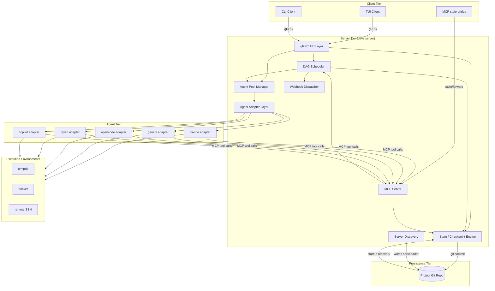
```mermaid
flowchart TB
    subgraph Clients["Client Tier"]
        TUI[TUI Client]
        CLI[CLI Client]
        MCP_CLIENT[MCP stdio bridge]
    end

    subgraph Server["Server Tier (devs server)"]
        GRPC[gRPC API Layer]
        SCHED[DAG Scheduler]
        POOL[Agent Pool Manager]
        ADAPTER[Agent Adapter Layer]
        STATE[State / Checkpoint Engine]
        WEBHOOK[Webhook Dispatcher]
        MCP_SRV[MCP Server]
        DISC[Server Discovery]
    end

    subgraph Agents["Agent Tier"]
        CLAUDE[claude adapter]
        GEMINI[gemini adapter]
        OPENCODE[opencode adapter]
        QWEN[qwen adapter]
        COPILOT[copilot adapter]
    end

    subgraph Envs["Execution Environments"]
        TEMPDIR[tempdir]
        DOCKER[docker]
        REMOTE[remote SSH]
    end

    subgraph Persist["Persistence Tier"]
        GIT[(Project Git Repo)]
    end

    TUI -- gRPC --> GRPC
    CLI -- gRPC --> GRPC
    MCP_CLIENT -- "stdio/forward" --> MCP_SRV

    GRPC --> SCHED
    GRPC --> POOL
    GRPC --> STATE

    SCHED --> POOL
    SCHED --> STATE
    SCHED --> WEBHOOK

    POOL --> ADAPTER
    ADAPTER --> CLAUDE & GEMINI & OPENCODE & QWEN & COPILOT
    CLAUDE & GEMINI & OPENCODE & QWEN & COPILOT --> Envs

    CLAUDE & GEMINI & OPENCODE & QWEN & COPILOT -- "MCP tool calls" --> MCP_SRV
    MCP_SRV --> SCHED
    MCP_SRV --> STATE

    STATE -- "git commit" --> GIT
    GIT -- "startup recovery" --> STATE
    DISC -- "writes server.addr" --> GIT
```

#### B.1.1 Component Inventory

| Component | Crate / Module | Primary Responsibility |
|---|---|---|
| gRPC API Layer | `devs-server::grpc` | Decode requests, validate, dispatch to internal subsystems |
| DAG Scheduler | `devs-server::scheduler` | Stage eligibility, dispatch ordering, concurrency enforcement |
| Agent Pool Manager | `devs-server::pool` | Pool selection, agent routing, fallback, concurrency slots |
| Agent Adapter Layer | `devs-server::adapter` | Spawn agent subprocesses; translate to/from CLI conventions |
| State / Checkpoint Engine | `devs-server::state` | Persist and recover run state via git commits |
| Webhook Dispatcher | `devs-server::webhook` | Deliver outbound HTTP event notifications |
| MCP Server | `devs-server::mcp` | Glass-box tool endpoint for agents; MCP protocol handling |
| TUI Client | `devs-tui` | Interactive terminal dashboard via gRPC streaming |
| CLI Client | `devs-cli` | Headless commands; connects to server via gRPC |
| MCP stdio Bridge | `devs-mcp-bridge` | Forwards MCP stdio to MCP server port |
| Server Discovery | `devs-server::discovery` | Write/read `~/.config/devs/server.addr` |

---

### B.2 gRPC API Layer

#### B.2.1 Responsibilities

The gRPC API Layer is the single public entry point for all client-initiated operations. It performs:

- **Request validation**: Checks field constraints, authorization of referenced resources (project IDs, workflow names, run IDs), and serialization correctness.
- **Dispatch**: Forwards validated requests to the DAG Scheduler, Agent Pool Manager, or State Engine as appropriate.
- **Streaming subscriptions**: Manages server-sent event streams for run status, stage logs, and pool utilization updates subscribed to by TUI clients.
- **Error translation**: Converts internal errors into gRPC `Status` codes with structured details.

The layer is stateless — it holds no mutable business state of its own. All state reads go through the State Engine; all state mutations go through the Scheduler or Pool Manager.

#### B.2.2 Internal Interface

The gRPC layer communicates with other server components through in-process Rust trait objects. The canonical trait contract for each downstream component is:

```rust
// Illustrative trait boundary (non-normative)
trait SchedulerHandle: Send + Sync {
    async fn submit_run(&self, req: SubmitRunRequest) -> Result<SubmitRunResponse, DevsError>;
    async fn cancel_run(&self, run_id: Uuid) -> Result<(), DevsError>;
    async fn pause_stage(&self, stage_run_id: Uuid) -> Result<(), DevsError>;
    async fn resume_stage(&self, stage_run_id: Uuid) -> Result<(), DevsError>;
}

trait StateHandle: Send + Sync {
    async fn get_run(&self, run_id: Uuid) -> Result<WorkflowRun, DevsError>;
    async fn list_runs(&self, project_id: Uuid, filter: RunFilter) -> Result<Vec<RunSummary>, DevsError>;
    async fn stream_logs(&self, stage_run_id: Uuid) -> Result<LogStream, DevsError>;
}
```

#### B.2.3 Business Rules

- **BR-GRPC-01**: Every incoming request MUST be validated against the proto schema before any dispatch. Malformed messages are rejected with `INVALID_ARGUMENT`.
- **BR-GRPC-02**: A request referencing a `project_id` that is not registered on the server MUST be rejected with `NOT_FOUND`.
- **BR-GRPC-03**: A request referencing a `run_id` that does not belong to the specified `project_id` MUST be rejected with `NOT_FOUND` (not `PERMISSION_DENIED`, to avoid leaking existence of other projects' runs).
- **BR-GRPC-04**: Streaming RPCs MUST emit an initial message carrying the current state snapshot before streaming deltas.
- **BR-GRPC-05**: If a downstream component returns an internal error, the gRPC layer MUST return `INTERNAL` with a sanitized message. Raw internal error details MUST NOT be forwarded to clients.
- **BR-GRPC-06**: The server MUST accept at most 1 024 concurrent streaming subscriptions. New streams beyond this limit are rejected with `RESOURCE_EXHAUSTED`.

#### B.2.4 Edge Cases

| Scenario | Expected Behavior |
|---|---|
| Client disconnects mid-stream | Server cancels the subscription task; resources are freed within 5 seconds |
| Submit request for a workflow that no longer exists | Rejected with `NOT_FOUND`; no run is created |
| Cancel request for a run already in `Completed` or `Failed` state | Rejected with `FAILED_PRECONDITION`; no state change |
| Two concurrent `SubmitRun` calls with the same user-provided run name for the same project | First call succeeds; second call is rejected with `ALREADY_EXISTS` |
| gRPC server is listening but the internal Scheduler is still initializing | Incoming run-submission requests are queued for up to 10 seconds; after timeout, rejected with `UNAVAILABLE` |

---

### B.3 DAG Scheduler

#### B.3.1 Responsibilities

The DAG Scheduler is the central orchestrator of workflow execution. It:

- Builds and validates the dependency graph from `WorkflowDefinition.stages[].depends_on` lists.
- Maintains the set of `StageRun` objects in memory for all active runs.
- Advances stage eligibility: when all dependencies of a stage reach `Completed` status, the stage transitions to `Waiting` and is dispatched to the Agent Pool Manager.
- Evaluates branch conditions and predicate handlers to determine the next stage after a stage completes.
- Enforces per-stage and workflow-level timeouts.
- Coordinates retry logic for failed stages.
- Emits lifecycle events to the Webhook Dispatcher.
- Writes checkpoints to the State Engine after every state transition.

#### B.3.2 Scheduler State Machine

Each `WorkflowRun` passes through the following states:

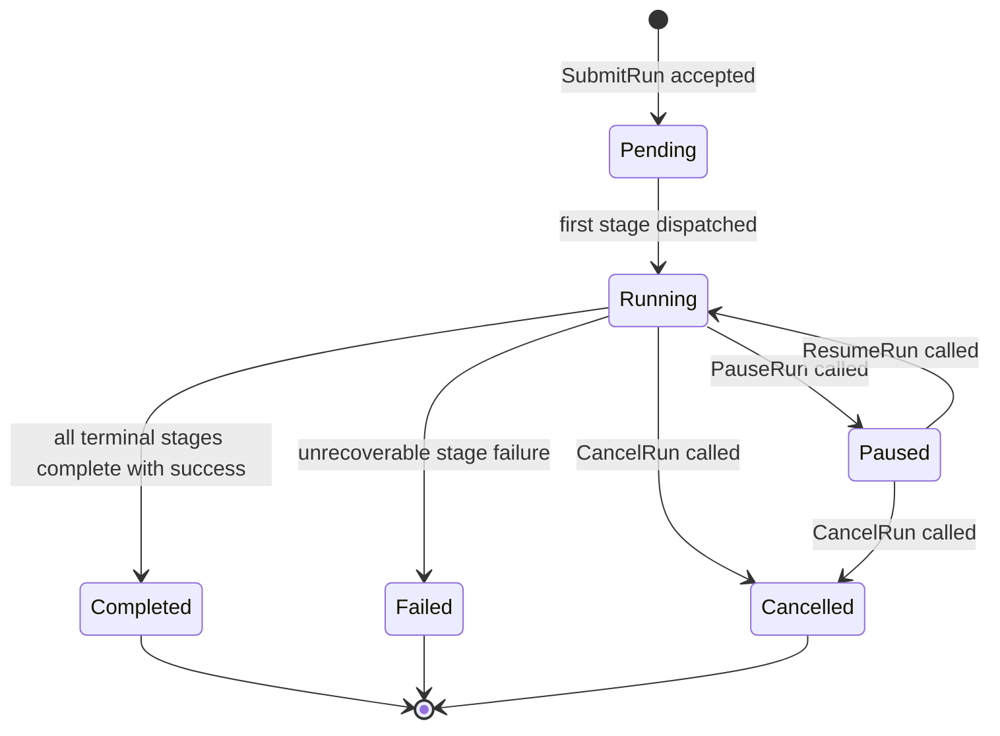
```mermaid
stateDiagram-v2
    [*] --> Pending : SubmitRun accepted
    Pending --> Running : first stage dispatched
    Running --> Paused : PauseRun called
    Paused --> Running : ResumeRun called
    Running --> Completed : all terminal stages complete with success
    Running --> Failed : unrecoverable stage failure
    Running --> Cancelled : CancelRun called
    Paused --> Cancelled : CancelRun called
    Completed --> [*]
    Failed --> [*]
    Cancelled --> [*]
```

Each `StageRun` passes through the following states:

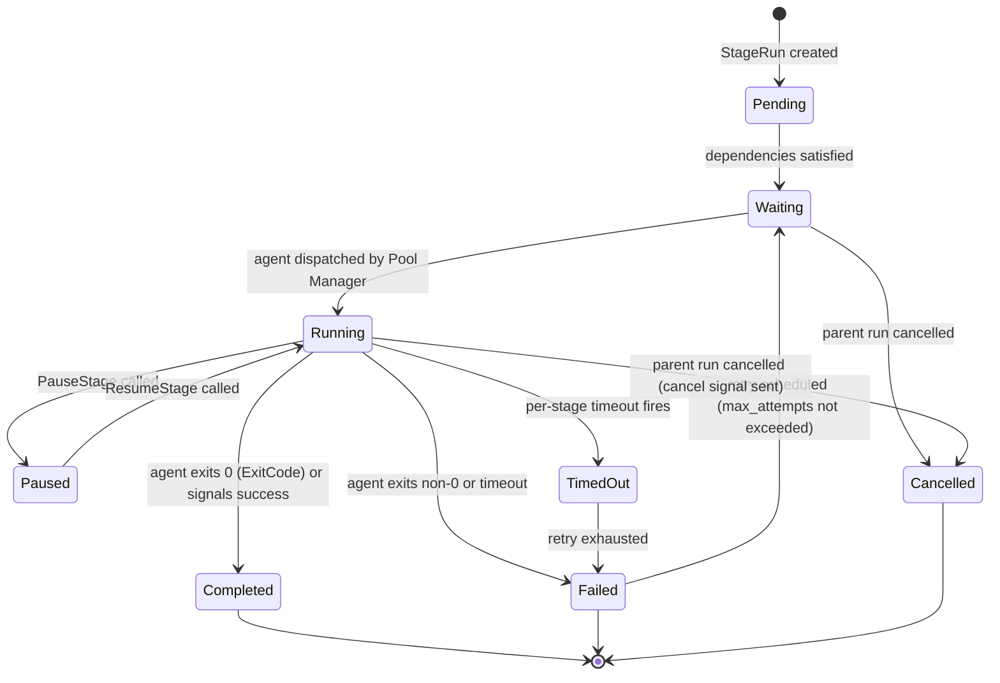
```mermaid
stateDiagram-v2
    [*] --> Pending : StageRun created
    Pending --> Waiting : dependencies satisfied
    Waiting --> Running : agent dispatched by Pool Manager
    Running --> Paused : PauseStage called
    Paused --> Running : ResumeStage called
    Running --> Completed : agent exits 0 (ExitCode) or signals success
    Running --> Failed : agent exits non-0 or timeout
    Running --> TimedOut : per-stage timeout fires
    TimedOut --> Failed : retry exhausted
    Failed --> Waiting : retry scheduled (max_attempts not exceeded)
    Waiting --> Cancelled : parent run cancelled
    Running --> Cancelled : parent run cancelled (cancel signal sent)
    Completed --> [*]
    Failed --> [*]
    Cancelled --> [*]
```

#### B.3.3 Scheduling Algorithm

The scheduler uses the following procedure, executed whenever any `StageRun` changes status:

```
function advance_run(run):
    for each stage S in run.workflow_definition.stages:
        if stage_run_for(S) exists and is not Pending: continue
        if all depends_on stages have status Completed:
            create StageRun(S, attempt=1, status=Waiting)
            dispatch_to_pool(stage_run)

    if no stage_runs are in {Pending, Waiting, Running, Paused}:
        if any stage_run.status == Failed (unretried):
            run.status = Failed
        else:
            run.status = Completed

    emit_lifecycle_event(run)
    checkpoint(run)
```

Fan-out stages create `N` child `StageRun` objects simultaneously. All `N` must reach `Completed` before downstream stages become eligible.

#### B.3.4 Timeout Enforcement

- A per-stage timeout timer is started when the `StageRun` transitions to `Running`.
- The scheduler maintains a min-heap of pending timeouts, checked at 1-second resolution.
- When a timeout fires, the scheduler sends `SIGTERM` to the agent process (via the Adapter Layer), waits up to 5 seconds, then sends `SIGKILL`.
- After the kill, the stage transitions to `TimedOut → Failed` and retry logic is evaluated.
- The workflow-level timeout is a single timer started when the `WorkflowRun` transitions to `Running`. If it fires, all active `StageRun` objects are cancelled and `WorkflowRun.status` is set to `Failed`.

#### B.3.5 Business Rules

- **BR-SCHED-01**: A stage MUST NOT be dispatched until all stages in its `depends_on` list have status `Completed` in the current run.
- **BR-SCHED-02**: Stages with no unmet dependencies MUST be dispatched concurrently (subject to pool concurrency limits).
- **BR-SCHED-03**: A `WorkflowRun` with zero runnable stages (all failed, no retries remaining) MUST transition to `Failed` immediately.
- **BR-SCHED-04**: After a retry is scheduled, the `StageRun.attempt` counter MUST be incremented. The original `StageRun` record is immutable; a new `StageRun` record is created for each retry attempt.
- **BR-SCHED-05**: The scheduler MUST durably checkpoint state (via the State Engine) before dispatching a stage and immediately after a stage reaches a terminal state.
- **BR-SCHED-06**: If the scheduler receives a duplicate `StageRun` completion signal (e.g., due to a crash-recovery replay), it MUST be idempotent — the second signal is ignored and no state is changed.
- **BR-SCHED-07**: Cancelling a run MUST send a cancel signal to all currently `Running` stage runs before transitioning the run to `Cancelled`.
- **BR-SCHED-08**: A workflow-level timeout MUST override all per-stage timeouts. If the workflow timeout fires while a stage timeout is also pending, the workflow timeout takes precedence.

#### B.3.6 Edge Cases

| Scenario | Expected Behavior |
|---|---|
| All stages in a workflow have no `depends_on` | All stages are dispatched simultaneously on run start |
| A `depends_on` stage fails and has no retry remaining | Dependent stages remain `Pending` permanently; run transitions to `Failed` |
| Branch predicate evaluates to a stage that is already `Completed` | The target stage is re-executed as a new `StageRun` with `attempt=1` |
| Fan-out count resolves to 0 (empty input list) | The fan-out stage is treated as immediately `Completed` with an empty output array |
| Scheduler restarts mid-run (crash recovery) | On startup, State Engine reloads in-progress runs; Scheduler re-queues all `Running` stages as `Waiting` for re-dispatch |
| Two stages in the same workflow declare identical `name` values | Validation rejects the workflow definition at registration time with `INVALID_ARGUMENT` |

---

### B.4 Agent Pool Manager

#### B.4.1 Responsibilities

The Agent Pool Manager owns all pool configuration and controls the acquisition and release of agent slots. It:

- Maintains a list of registered `AgentPool` objects loaded from `devs.toml`.
- Accepts dispatch requests from the Scheduler, selecting the best available agent from the named pool.
- Enforces pool-level `max_concurrent` limits using a counting semaphore per pool.
- Implements priority fallback: if the highest-priority agent is unavailable or fails due to a rate-limit or error, the next agent in the list is tried.
- Filters agents by required capability tags before applying fallback order.
- Forwards dispatch requests to the Agent Adapter Layer once an agent slot is acquired.
- Returns slots to the pool semaphore when a stage completes or fails.

#### B.4.2 Agent Selection Algorithm

```
function select_agent(pool_name, required_capabilities):
    pool = get_pool(pool_name)
    candidates = [a for a in pool.agents if a.capabilities ⊇ required_capabilities]
    if candidates is empty:
        return Err(NoCapableAgentFound)

    for agent in candidates:  // ordered by priority (index 0 = highest)
        if agent not in rate_limit_cooldown:
            if pool.semaphore.try_acquire():
                return Ok(agent)

    // All slots occupied or all candidates in cooldown: block until slot freed
    wait_for_slot(pool, timeout=stage_timeout)
    retry selection
```

When an agent fails with a rate-limit signal, the Pool Manager marks that agent as temporarily unavailable with a 60-second cooldown window and immediately retries selection from the next candidate.

#### B.4.3 Internal State Model

| Field | Type | Description |
|---|---|---|
| `pools` | `HashMap<String, PoolState>` | Keyed by pool name |
| `PoolState.config` | `AgentPool` | Immutable config from `devs.toml` |
| `PoolState.semaphore` | `Semaphore(max_concurrent)` | Counts active agent slots |
| `PoolState.rate_limit_cooldowns` | `HashMap<AgentTool, Instant>` | Per-agent rate-limit expiry times |
| `PoolState.active_agents` | `HashMap<Uuid, ActiveAgent>` | Keyed by `stage_run_id`; tracks running processes |

#### B.4.4 Business Rules

- **BR-POOL-01**: A pool MUST have at least one agent configured. A pool configuration with zero agents MUST be rejected at server startup.
- **BR-POOL-02**: The pool semaphore MUST be released exactly once per successful acquisition, regardless of whether the stage succeeds or fails.
- **BR-POOL-03**: If all agents in a pool are in rate-limit cooldown and the pool semaphore is exhausted, the Pool Manager MUST emit a `PoolExhaustion` event to the Webhook Dispatcher.
- **BR-POOL-04**: An agent's rate-limit cooldown window MUST be cleared if the agent completes a stage successfully.
- **BR-POOL-05**: Required capabilities that do not match any agent in the pool MUST cause the dispatch to fail immediately with `NoCapableAgentFound`; the stage transitions to `Failed` and is not retried.
- **BR-POOL-06**: The Pool Manager MUST NOT modify pool configuration at runtime. Configuration is fixed at server startup.

#### B.4.5 Edge Cases

| Scenario | Expected Behavior |
|---|---|
| All agents in rate-limit cooldown, pool semaphore has a free slot | Pool Manager waits for the soonest cooldown to expire, then dispatches |
| Agent process fails to start (e.g., binary not found) | Treated as a stage failure; pool slot is released; stage retry logic is applied |
| Pool `max_concurrent` set to 1 | All stages dispatched to this pool execute serially |
| Stage is cancelled while waiting for a pool slot | Cancellation is propagated; the stage never acquires a slot; pool state is unchanged |
| Two projects compete for the last pool slot | Project priority/weight scheduling determines which stage acquires the slot |

---

### B.5 Agent Adapter Layer

#### B.5.1 Responsibilities

Each supported agent CLI has a dedicated adapter. The adapter layer:

- Constructs the OS command line for the agent, including prompt delivery (flag-based or file-based), any `extra_args`, and environment variable injection.
- Optionally spawns the agent inside a PTY (pseudoterminal) for agent CLIs that require interactive terminal behaviour.
- Monitors the agent process: captures stdout, stderr, and the exit code.
- Detects rate-limit conditions passively (exit code patterns, stderr patterns) and reports them to the Pool Manager.
- Implements bidirectional interaction: forwards cancel/pause signals to the agent process via stdin or OS signals; receives MCP tool calls from the agent via the MCP Server.
- Collects structured output from stdout or a configured file path when `completion = StructuredOutput`.

#### B.5.2 Adapter Trait

All adapters implement a common trait:

```rust
// Illustrative adapter trait (non-normative)
trait AgentAdapter: Send + Sync {
    fn tool(&self) -> AgentTool;

    async fn spawn(
        &self,
        config: &AgentConfig,
        stage: &ResolvedStageInput,
        env: &ResolvedEnv,
        execution_env: &ExecutionEnvironment,
    ) -> Result<AgentHandle, AdapterError>;
}

trait AgentHandle: Send + Sync {
    async fn wait(&mut self) -> Result<AgentResult, AdapterError>;
    async fn send_cancel(&mut self) -> Result<(), AdapterError>;
    async fn send_stdin(&mut self, data: &[u8]) -> Result<(), AdapterError>;
    fn stdout_stream(&self) -> impl Stream<Item = Bytes>;
    fn stderr_stream(&self) -> impl Stream<Item = Bytes>;
}
```

#### B.5.3 Per-Adapter Configuration

| Adapter | Default Prompt Mode | PTY Default | Rate-Limit Exit Codes | Rate-Limit stderr Patterns |
|---|---|---|---|---|
| `claude` | `Flag` (`-p`) | `false` | `29` | `"rate limit"`, `"429"` |
| `gemini` | `Flag` (`--prompt`) | `false` | `1` (+ stderr match) | `"quota exceeded"`, `"429"` |
| `opencode` | `File` | `true` | `1` (+ stderr match) | `"rate limit"`, `"too many requests"` |
| `qwen` | `Flag` (`--message`) | `false` | `1` (+ stderr match) | `"rate limit"`, `"429"` |
| `copilot` | `Flag` (`-m`) | `false` | `1` (+ stderr match) | `"rate limited"`, `"429"` |

#### B.5.4 PTY Management

When `AgentConfig.pty = true`, the adapter allocates a PTY pair using the platform `openpty(3)` call (or equivalent). The agent is spawned with its stdin/stdout connected to the PTY slave. The adapter reads from the PTY master. PTY size is set to 220×50 (columns × rows) by default. PTY mode does not affect stderr, which remains a standard pipe.

#### B.5.5 Execution Environment Integration

Before spawning an agent, the adapter resolves the execution environment:

- **`Tempdir`**: Creates a temporary directory on the local machine, clones the project repo into it, and sets the agent's working directory to the clone root.
- **`Docker`**: Uses the Docker SDK (via `DOCKER_HOST`) to create a container from `docker_image`, copies the project repo into it, and runs the agent inside the container. Agent stdio is forwarded through the Docker exec API.
- **`Remote`**: Connects via SSH using `ssh_config_path` / `ssh_host` / `ssh_user`, creates a remote temp directory, uploads the project repo via `rsync`, then spawns the agent via SSH exec.

After stage completion (or failure), artifact collection is applied:

- **`AgentDriven`**: No action taken by `devs`; the agent is responsible for committing and pushing its own output.
- **`AutoCollect`**: The adapter diffs the working directory against the pre-stage snapshot, commits any changed files, and pushes to the project repo on the configured checkpoint branch.

#### B.5.6 Business Rules

- **BR-ADAPT-01**: An adapter MUST capture all stdout and stderr output, even if the stage fails.
- **BR-ADAPT-02**: Stdout and stderr MUST be streamed in real time to the State Engine for log storage. Adapters MUST NOT buffer the full output before writing.
- **BR-ADAPT-03**: If the prompt string exceeds 1 MiB, the adapter MUST automatically switch to file-based delivery regardless of the configured `prompt_mode`.
- **BR-ADAPT-04**: When PTY mode is active, the adapter MUST set the PTY to raw mode to prevent echo or line-buffering of agent output.
- **BR-ADAPT-05**: After sending a cancel signal, the adapter MUST wait at most 5 seconds for graceful exit before sending `SIGKILL`.
- **BR-ADAPT-06**: For `Docker` and `Remote` execution environments, the adapter MUST clean up (remove the container / delete the remote temp directory) after stage completion, regardless of success or failure.
- **BR-ADAPT-07**: If repo clone fails in any execution environment, the stage MUST transition to `Failed` immediately without attempting to spawn the agent.

#### B.5.7 Edge Cases

| Scenario | Expected Behavior |
|---|---|
| Agent binary not found on PATH | `AdapterError::BinaryNotFound`; stage transitions to `Failed`; pool slot released |
| Agent exits immediately with exit code 0 and empty stdout | Treated as success; `StageOutput` has empty stdout/stderr; branch conditions evaluated normally |
| Agent writes invalid JSON to stdout when `completion = StructuredOutput` | Stage transitions to `Failed` with `ParseError`; JSON parse error captured in stderr log |
| PTY master fd is closed by the OS before the agent exits | Adapter detects the fd close as an end-of-output signal; continues waiting for process exit |
| Docker daemon unreachable at spawn time | `AdapterError::DockerUnavailable`; stage fails immediately; retried per `RetryConfig` |
| Agent produces stdout faster than the State Engine can commit logs | Adapter buffers up to 8 MiB in memory; if exceeded, log lines are dropped and `StageOutput.truncated` is set to `true` |

---

### B.6 State / Checkpoint Engine

#### B.6.1 Responsibilities

The State Engine is the authoritative in-memory store for all active `WorkflowRun` and `StageRun` objects, and the durable store for checkpoints persisted to git. It:

- Holds an in-memory `HashMap<Uuid, WorkflowRun>` protected by an `RwLock`.
- Writes checkpoint JSON files and log files to the project's git repository on the configured checkpoint branch.
- On server startup, scans all registered projects' checkpoint branches for in-progress runs and re-hydrates the in-memory state.
- Provides streaming log tails to the gRPC layer for client subscriptions.
- Enforces log retention policy: deletes checkpoint and log entries older than the configured max age or beyond the max size limit.

#### B.6.2 Checkpoint Commit Strategy

Every state transition that changes a `WorkflowRun` or `StageRun` triggers a checkpoint write:

1. Serialize the current `WorkflowRun` (including all `StageRun` records) to `checkpoint.json`.
2. Append any new log content to the appropriate per-stage log file.
3. Stage and commit both files to the project's checkpoint branch using `git2` bindings (not a `git` subprocess).
4. The commit message format is: `devs: checkpoint run/<slug> stage/<stage_name> -> <status>`.

Commits are made without triggering repository hooks (equivalent to `--no-verify`) via the `git2` API. All commits use the server's configured author identity (`devs <devs@local>`).

#### B.6.3 Recovery on Startup

On startup, the State Engine performs recovery for each registered project:

```
for each project P:
    scan P.checkpoint_branch for .devs/runs/*/checkpoint.json
    for each checkpoint C:
        if C.run.status in {Running, Paused, Waiting}:
            re-hydrate WorkflowRun into in-memory store
            mark all stage_runs with status Running as Waiting
            notify Scheduler to re-queue them
        else:
            load into historical run store (read-only)
```

Runs in terminal states (`Completed`, `Failed`, `Cancelled`) are loaded as historical records and are available for `ListRuns` / `GetRun` queries but are not re-queued.

#### B.6.4 Business Rules

- **BR-STATE-01**: Every checkpoint write MUST be atomic from the git perspective: either the commit succeeds (checkpoint + log in a single commit) or the in-memory state is rolled back.
- **BR-STATE-02**: The in-memory state MUST always be a superset of the last committed checkpoint. No in-memory mutation is considered durable until a checkpoint commit succeeds.
- **BR-STATE-03**: On recovery, any `StageRun` that was `Running` at crash time MUST be re-queued as `Waiting` — it is never assumed to have completed.
- **BR-STATE-04**: The `definition_snapshot` stored in `workflow_snapshot.json` is written once at run creation and MUST NOT be modified by subsequent checkpoint updates.
- **BR-STATE-05**: Log retention policy enforcement MUST run as a background task, not inline with checkpoint writes. It MUST NOT delete log data for runs still in non-terminal states.
- **BR-STATE-06**: The State Engine MUST NOT hold the `RwLock` during git operations. It acquires the lock to read/modify in-memory state, then releases it before initiating the git commit.

#### B.6.5 Edge Cases

| Scenario | Expected Behavior |
|---|---|
| git commit fails (e.g., disk full) | In-memory state is preserved; error is logged; scheduler retries the commit with exponential backoff (3 attempts, base 1 s) |
| Checkpoint branch does not exist at server startup | State Engine creates the branch from an empty orphan commit |
| Two server instances start with the same project path simultaneously | Second instance detects a conflicting commit on the checkpoint branch at first write and fails with a clear error |
| Run checkpoint is corrupted (invalid JSON) | The corrupted run is skipped during recovery; error is logged; the run is not re-queued |
| Log file for a stage exceeds 100 MiB | Log writing continues; `StageOutput.truncated` is set to `true` when the in-memory representation is read back |

---

### B.7 Webhook Dispatcher

#### B.7.1 Responsibilities

The Webhook Dispatcher delivers outbound HTTP notifications for configurable lifecycle events. It:

- Subscribes to the internal event bus and receives `LifecycleEvent` values from the Scheduler.
- Filters events against each project's `WebhookConfig.events` subscription list.
- Serializes events to JSON and delivers them via HTTPS POST.
- Implements per-delivery retry with configurable count and exponential backoff.
- Operates fully asynchronously: event delivery MUST NOT block the Scheduler.

#### B.7.2 Event Payload Schema

All webhook payloads share a common envelope:

```json
{
  "event_type": "stage.completed",
  "event_id": "<uuid>",
  "timestamp": "<ISO 8601>",
  "project_id": "<uuid>",
  "run_id": "<uuid>",
  "payload": { ... }
}
```

Event-specific `payload` fields:

| Event Type | Payload Fields |
|---|---|
| `run.started` | `run_id`, `slug`, `workflow_name`, `inputs` |
| `run.completed` | `run_id`, `slug`, `workflow_name`, `duration_ms` |
| `run.failed` | `run_id`, `slug`, `workflow_name`, `failed_stage`, `error` |
| `stage.started` | `stage_run_id`, `stage_name`, `attempt`, `agent_tool` |
| `stage.completed` | `stage_run_id`, `stage_name`, `attempt`, `exit_code`, `duration_ms` |
| `stage.failed` | `stage_run_id`, `stage_name`, `attempt`, `exit_code`, `error` |
| `pool.exhausted` | `pool_name`, `required_capabilities`, `run_id` |
| `state.changed` | `entity_type` (`run` or `stage`), `entity_id`, `old_status`, `new_status` |

#### B.7.3 Delivery Guarantees

The Webhook Dispatcher provides **at-least-once delivery** within the configured retry window. It does not guarantee ordering between events for different runs. Events for the same run are delivered in chronological order within a single delivery worker task.

A delivery attempt is considered failed if:

- The HTTP response status code is 4xx (except 429) or 5xx.
- The connection times out per `WebhookConfig.timeout`.
- A TLS error occurs.

A 429 response triggers immediate retry with a 1-second base backoff (doubling on each retry), consuming one retry count.

#### B.7.4 Business Rules

- **BR-WEBHOOK-01**: Event delivery MUST be performed in a background task pool with at most 16 concurrent delivery workers per project.
- **BR-WEBHOOK-02**: If all retry attempts are exhausted, the event is logged as `delivery_failed` and dropped. Events are never queued indefinitely.
- **BR-WEBHOOK-03**: Webhook payloads MUST NOT include agent stdout/stderr content. Only metadata and status fields are included.
- **BR-WEBHOOK-04**: If `AllStateChanges` is subscribed, the dispatcher MUST send a `state.changed` event for every `StageRun` and `WorkflowRun` status transition, including intermediate transitions (e.g., `Pending → Waiting`).
- **BR-WEBHOOK-05**: The dispatcher MUST validate `WebhookConfig.url` at server startup. HTTP is permitted for loopback/localhost URLs but triggers a WARN on each delivery. Only non-HTTP/HTTPS schemes are rejected.
<!-- Resolved: aligned with 5_security_design.md SEC-035 -->

#### B.7.5 Edge Cases

| Scenario | Expected Behavior |
|---|---|
| Webhook endpoint takes longer than `timeout` to respond | Request is aborted after `timeout`; treated as failure; retried |
| Webhook endpoint is unreachable (DNS failure) | Treated as failure; retried with backoff; dropped after `retry_count` exhausted |
| Server shuts down with pending delivery attempts | In-flight deliveries are given 5 seconds to complete; remaining events are dropped (not durable) |
| Event bus produces events faster than the delivery worker can send | Events are buffered in a bounded channel of 1 024 events per project; excess events are dropped with a warning logged |

---

### B.8 MCP Server

#### B.8.1 Responsibilities

The MCP Server implements the Glass-Box interface. It exposes the full internal state of `devs` to AI agents via the Model Context Protocol. It:

- Listens on a separate configurable port (`server.mcp_port` in `devs.toml`).
- Exposes MCP tools for observing state, controlling runs, and triggering test scenarios.
- Accepts mid-run tool calls from agent processes (e.g., `signal_completion`, `report_progress`).
- Accepts connections from the MCP stdio bridge, which forwards tool calls from AI agents via stdio.

#### B.8.2 MCP Tool Catalog

| Tool Name | Direction | Description |
|---|---|---|
| `get_run` | Observe | Returns the full `WorkflowRun` JSON for a given `run_id` |
| `list_runs` | Observe | Lists runs for a project with optional status filter |
| `get_stage_output` | Observe | Returns `StageOutput` for a `stage_run_id` |
| `stream_logs` | Observe | Returns a log tail for a stage (paginated) |
| `get_pool_state` | Observe | Returns current pool utilization and agent availability |
| `pause_run` | Control | Pauses a running workflow run |
| `resume_run` | Control | Resumes a paused run |
| `cancel_run` | Control | Cancels a run |
| `retry_stage` | Control | Manually retries a failed stage |
| `signal_completion` | Agent→devs | Called by an agent to signal stage completion with result data |
| `report_progress` | Agent→devs | Called by an agent to emit a mid-run progress update |
| `report_rate_limit` | Agent→devs | Called by an agent to proactively signal a rate-limit condition |
| `get_workflow_definition` | Observe | Returns a workflow definition JSON |
| `write_workflow_definition` | Write | Registers or updates a workflow definition at runtime |
| `inject_stage_input` | Test | Injects a simulated stage output without spawning a real agent (test mode only) |
| `assert_stage_output` | Test | Asserts that a stage has reached a specified status (test mode only) |
<!-- Resolved: aligned with 3_mcp_design.md -->

#### B.8.3 Agent → devs Tool Call Protocol

When a stage has `completion = McpToolCall`, the agent must call `signal_completion` to signal completion:

```json
{
  "stage_run_id": "<uuid>",
  "success": true,
  "result": { "any": "json" }
}
```

The MCP Server validates that `stage_run_id` is currently `Running` and transitions the stage to `Completed`. Callers that supply an incorrect or already-terminal `stage_run_id` receive an error.

`report_progress` emits a `state.changed` webhook event but does not change the stage status. It is used for mid-run UI updates.

`report_rate_limit` immediately triggers the Pool Manager's rate-limit fallback logic for the calling agent.

#### B.8.4 Business Rules

- **BR-MCP-01**: All MCP tools that modify state MUST be idempotent. Calling `signal_completion` twice with the same `stage_run_id` and matching `success` value MUST return success on the second call without changing state.
- **BR-MCP-02**: The `inject_stage_input` and `assert_stage_output` tools MUST only be available when the server is started with `--test-mode`. They MUST NOT be exposed in production mode.
- **BR-MCP-03**: The MCP Server MUST NOT require authentication in MVP. All tool calls on the MCP port are accepted.
- **BR-MCP-04**: Every MCP tool call MUST be logged to the server's structured log with tool name, arguments (values matching credential patterns are redacted), and result status.
- **BR-MCP-05**: The stdio bridge MUST forward the client's connection identity opaquely. The MCP Server treats stdio bridge clients identically to direct TCP clients.

#### B.8.5 Edge Cases

| Scenario | Expected Behavior |
|---|---|
| `signal_completion` called for a stage in `Cancelled` state | Returns error `STAGE_NOT_RUNNING`; no state change |
| `signal_completion` called for a `stage_run_id` that does not exist | Returns error `NOT_FOUND` |
| Agent calls `report_rate_limit` and it is the only agent in the pool | Pool Manager emits `PoolExhaustion` event; stage remains `Running` until timeout |
| MCP client sends a tool call with malformed JSON arguments | Returns MCP error `InvalidParams`; no state change |
| Two fan-out child agents call `signal_completion` concurrently | Each fan-out child has a distinct `stage_run_id`; calls are handled independently without conflict |

---

### B.9 TUI Client

#### B.9.1 Responsibilities

The TUI Client provides an interactive terminal dashboard. It connects to the server over gRPC and renders live data using Ratatui. It holds no business state of its own — all data originates from gRPC streaming responses.

#### B.9.2 Layout and Tab Structure

The TUI uses a tabbed layout with four tabs:

| Tab | Layout | Content |
|---|---|---|
| Dashboard | Split pane (left / right) | Left: scrollable project + run list. Right: selected run's stage DAG, per-stage status, elapsed time, live log tail (last 20 lines) |
| Logs | Full screen | Full log stream for the selected stage or run; scrollable; line-searchable |
| Debug | Full screen | Selected agent's live stdout/stderr; working directory diff; cancel/pause/resume action controls |
| Pools | Full screen | Real-time pool utilization; per-agent availability; fallback event history |

#### B.9.3 Data Refresh

- The Dashboard tab subscribes to `WatchRuns` gRPC streaming RPC for live updates.
- The Logs tab subscribes to `StreamLogs` gRPC streaming RPC; new log lines are appended without full-screen refresh.
- The Pools tab subscribes to `WatchPoolStatus` gRPC streaming RPC.
- All subscriptions reconnect automatically with exponential backoff (1 s, 2 s, 4 s, cap 30 s) if the gRPC stream is interrupted.

#### B.9.4 Business Rules

- **BR-TUI-01**: The TUI MUST display a server connection status indicator at all times. When disconnected, the indicator is shown in red with the last-known server address.
- **BR-TUI-02**: Pressing `q` from any tab MUST open a confirmation modal rather than exiting immediately. Exit is confirmed with `y`.
- **BR-TUI-03**: The TUI MUST render correctly at a minimum terminal size of 80 columns × 24 rows. Below this size, a "terminal too small" message is displayed.
- **BR-TUI-04**: All keyboard shortcuts MUST be shown in a persistent help bar at the bottom of the screen.
- **BR-TUI-05**: The TUI MUST NOT directly mutate server state. All control actions (cancel, pause, resume) are issued through gRPC calls.

#### B.9.5 Edge Cases

| Scenario | Expected Behavior |
|---|---|
| Server is unreachable at TUI startup | TUI launches in disconnected state; user is prompted to set server address; reconnects when address is valid |
| Run completes while its detail view is open | Detail view updates to show final status with elapsed time; log tail is frozen |
| Terminal is resized below minimum | "Terminal too small" overlay is shown; UI restores when the terminal is large enough again |
| More runs than fit in the left panel | Left panel scrolls; keyboard navigation moves selection up and down |

---

### B.10 CLI Client

#### B.10.1 Responsibilities

The CLI Client provides headless command execution for scripting and CI use cases. Each invocation is a short-lived process that connects to the server via gRPC, executes one operation, and exits. It uses server auto-discovery (`~/.config/devs/server.addr`) unless `--server` is passed.

#### B.10.2 Command Routing

| Command | gRPC Call(s) | Output |
|---|---|---|
| `devs submit <workflow>` | `SubmitRun` | Run ID and slug on stdout |
| `devs list` | `ListRuns` | Table: run ID, slug, status, start time |
| `devs status <run>` | `GetRun` | Stage-by-stage status table |
| `devs logs <run> [stage]` | `StreamLogs` (streaming) | Log lines to stdout; exits on stream close or Ctrl-C |
| `devs cancel <run>` | `CancelRun` | Confirmation message or error |
| `devs pause <run/stage>` | `PauseRun` or `PauseStage` | Confirmation message or error |
| `devs resume <run/stage>` | `ResumeRun` or `ResumeStage` | Confirmation message or error |

#### B.10.3 Business Rules

- **BR-CLI-01**: On gRPC error, the CLI MUST print a human-readable error message to stderr and exit with code 1.
- **BR-CLI-02**: `devs submit` MUST print the `run_id` on its own line so it can be captured by scripts (e.g., `RUN=$(devs submit ...)`).
- **BR-CLI-03**: `devs logs` MUST exit 0 when the run reaches a terminal `Completed` state. If the run fails, it exits 1.
- **BR-CLI-04**: The `--server` flag MUST take precedence over the `server.addr` auto-discovery file.
- **BR-CLI-05**: All table output MUST use stable column widths so that the output can be reliably parsed by grep/awk.

#### B.10.4 Edge Cases

| Scenario | Expected Behavior |
|---|---|
| `devs submit` with a missing required input parameter | CLI prints a validation error and exits 1 before making any gRPC call |
| Server address file exists but server is not running | CLI attempts connection, times out after 5 seconds, prints error, exits 1 |
| `devs logs` called for a completed run | Returns historical log contents and exits 0 immediately |

---

### B.11 MCP stdio Bridge

#### B.11.1 Responsibilities

The MCP stdio Bridge allows AI agents to connect to the `devs` MCP Server via stdio (the transport convention used by MCP client SDKs). It is a thin forwarder:

- Reads newline-delimited JSON-RPC 2.0 frames from stdin.
- Forwards them to the MCP Server's TCP port.
- Writes responses back to stdout.

The bridge is a separate binary (`devs-mcp-bridge`) configured as an MCP server entry in agent tool configurations (e.g., Claude's `claude_desktop_config.json`).

#### B.11.2 Protocol

Each line on stdin is a complete JSON-RPC 2.0 request. Each line on stdout is a complete JSON-RPC 2.0 response. The bridge maintains a persistent TCP connection to the MCP Server. If the TCP connection drops, the bridge reconnects before forwarding the next request.

```
stdin  → [JSON-RPC request line] → MCP Server TCP port
stdout ← [JSON-RPC response line] ← MCP Server TCP port
```

#### B.11.3 Business Rules

- **BR-BRIDGE-01**: The bridge MUST resolve the MCP Server address using the same auto-discovery mechanism as the CLI Client (`DEVS_SERVER_ADDR` env var, then `~/.config/devs/server.addr`, then `--server` flag).
- **BR-BRIDGE-02**: The bridge MUST exit with code 1 if the MCP Server is unreachable after 3 connection attempts with 1-second backoff.
- **BR-BRIDGE-03**: The bridge MUST NOT parse or validate JSON-RPC payload content — it forwards bytes verbatim.
- **BR-BRIDGE-04**: When stdin closes, the bridge MUST send a TCP close to the MCP Server and then exit 0.

---

### B.12 Server Discovery

#### B.12.1 Responsibilities

Server Discovery provides a lightweight mechanism for clients to locate a running `devs` server without manual configuration:

- At server startup, writes the gRPC listen address to `~/.config/devs/server.addr`.
- At server shutdown, deletes `~/.config/devs/server.addr`.
- Clients read `server.addr` if no explicit `--server` flag is given.
- For testing, the environment variable `DEVS_SERVER_ADDR` overrides all other mechanisms to avoid address conflicts between parallel test server instances.

#### B.12.2 Address File Format

`~/.config/devs/server.addr` is a single-line UTF-8 text file containing the gRPC address in `host:port` format:

```
127.0.0.1:7890
```

#### B.12.3 Client Resolution Order

Clients resolve the server address in the following priority order (first match wins):

1. `--server <addr>` command-line flag.
2. `DEVS_SERVER_ADDR` environment variable.
3. Contents of `~/.config/devs/server.addr`.

#### B.12.4 Business Rules

- **BR-DISC-01**: If `~/.config/devs/server.addr` is present at server startup, the server MUST overwrite it. This handles stale files from a previously crashed server.
- **BR-DISC-02**: If the OS denies write permission to `~/.config/devs/server.addr`, server startup MUST log a warning but MUST NOT fail.
- **BR-DISC-03**: All three client binaries (TUI, CLI, stdio bridge) MUST use the same resolution order defined in B.12.3.

---

### B.13 Startup and Shutdown Sequence

#### B.13.1 Server Startup Order

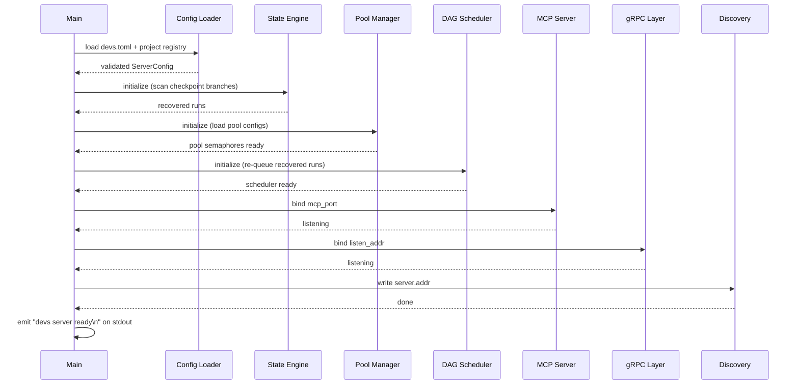
```mermaid
sequenceDiagram
    participant Main
    participant Config as Config Loader
    participant State as State Engine
    participant Pool as Pool Manager
    participant Sched as DAG Scheduler
    participant MCP as MCP Server
    participant GRPC as gRPC Layer
    participant Disc as Discovery

    Main->>Config: load devs.toml + project registry
    Config-->>Main: validated ServerConfig
    Main->>State: initialize (scan checkpoint branches)
    State-->>Main: recovered runs
    Main->>Pool: initialize (load pool configs)
    Pool-->>Main: pool semaphores ready
    Main->>Sched: initialize (re-queue recovered runs)
    Sched-->>Main: scheduler ready
    Main->>MCP: bind mcp_port
    MCP-->>Main: listening
    Main->>GRPC: bind listen_addr
    GRPC-->>Main: listening
    Main->>Disc: write server.addr
    Disc-->>Main: done
    Main->>Main: emit "devs server ready\n" on stdout
```

The server emits `devs server ready\n` on stdout when all components are initialized and listening. The test harness uses this signal to detect server readiness before sending requests.

#### B.13.2 Graceful Shutdown Order

On receipt of `SIGTERM` or `SIGINT`:

1. Stop accepting new gRPC connections.
2. Complete all in-flight gRPC requests (up to 10-second drain).
3. Signal the Scheduler to stop dispatching new stages.
4. Allow active agent processes to finish (up to `shutdown_grace_period`, default 30 seconds). After timeout, send `SIGTERM` to all active agents; after a further 5 seconds, send `SIGKILL`.
5. Flush all pending checkpoint commits to git.
6. Delete `~/.config/devs/server.addr`.
7. Exit 0.

#### B.13.3 Business Rules

- **BR-STARTUP-01**: If `devs.toml` is missing or unparseable, the server MUST exit 1 immediately with a human-readable error indicating the exact parse failure location.
- **BR-STARTUP-02**: If any pool configuration is invalid (e.g., zero agents, duplicate pool names), the server MUST exit 1 before binding any port.
- **BR-STARTUP-03**: If the gRPC listen port is already in use, the server MUST exit 1 with a message containing "address already in use".
- **BR-STARTUP-04**: State Engine recovery failures for a specific project MUST be logged as errors but MUST NOT prevent the server from starting. The affected project's runs are not recovered.
- **BR-SHUTDOWN-01**: Checkpoint commits in flight at shutdown MUST complete before the server exits, even if the grace period has elapsed.
- **BR-SHUTDOWN-02**: If `SIGKILL` is received during shutdown, the in-memory state is lost but the last committed checkpoint remains durable on the git branch.

#### B.13.4 Edge Cases

| Scenario | Expected Behavior |
|---|---|
| Server receives `SIGKILL` mid-checkpoint-commit | git commit is not completed; on next startup, State Engine falls back to the last successful checkpoint |
| All configured agent binaries are missing from PATH at startup | Server starts successfully; binary resolution is deferred to first dispatch time |
| Project repo has no checkpoint branch at startup | State Engine creates the orphan branch on the first checkpoint write |
| Two `devs` server instances start on the same machine | Second instance overwrites `server.addr`; clients will route to the second instance |

---

### B.14 Inter-Component Data Flow

The following diagram shows the critical path for a single-stage workflow run from submission to completion.

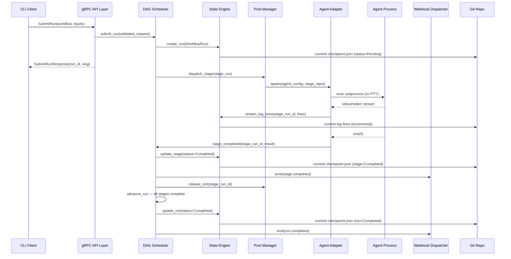
```mermaid
sequenceDiagram
    participant CLI as CLI Client
    participant GRPC as gRPC API Layer
    participant Sched as DAG Scheduler
    participant State as State Engine
    participant Pool as Pool Manager
    participant Adapt as Agent Adapter
    participant Agent as Agent Process
    participant Webhook as Webhook Dispatcher
    participant Git as Git Repo

    CLI->>GRPC: SubmitRun(workflow, inputs)
    GRPC->>Sched: submit_run(validated_request)
    Sched->>State: create_run(WorkflowRun)
    State->>Git: commit checkpoint.json (status=Pending)
    GRPC-->>CLI: SubmitRunResponse(run_id, slug)

    Sched->>Pool: dispatch_stage(stage_run)
    Pool->>Adapt: spawn(agent_config, stage_input)
    Adapt->>Agent: exec subprocess (or PTY)

    Agent-->>Adapt: stdout/stderr stream
    Adapt->>State: stream_log_lines(stage_run_id, lines)
    State->>Git: commit log lines (incremental)

    Agent-->>Adapt: exit(0)
    Adapt->>Sched: stage_completed(stage_run_id, result)
    Sched->>State: update_stage(status=Completed)
    State->>Git: commit checkpoint.json (stage=Completed)
    Sched->>Webhook: emit(stage.completed)
    Sched->>Pool: release_slot(stage_run_id)

    Sched->>Sched: advance_run — all stages complete
    Sched->>State: update_run(status=Completed)
    State->>Git: commit checkpoint.json (run=Completed)
    Sched->>Webhook: emit(run.completed)
```

---

### B.15 Acceptance Criteria

- [ ] Server starts successfully with a valid `devs.toml` and writes `~/.config/devs/server.addr`.
- [ ] Server exits 1 with a human-readable error if `devs.toml` is missing, unparseable, or contains an invalid pool configuration (zero agents, duplicate names).
- [ ] `devs submit` returns a run ID and slug; the run is immediately visible in `devs list`.
- [ ] A workflow with stages A, B (both depending on nothing), and C (depending on A and B): A and B are dispatched concurrently on run start; C is dispatched only after both A and B complete.
- [ ] A failing stage with `max_attempts = 3` is retried exactly 2 additional times before the run transitions to `Failed`.
- [ ] A stage with a 5-second timeout is killed and marked `TimedOut → Failed` if it does not exit within 5 seconds.
- [ ] A workflow-level timeout of 10 seconds cancels all active stages and marks the run `Failed` when exceeded.
- [ ] Cancelling a running workflow sends a cancel signal to all active agent processes and transitions the run to `Cancelled`.
- [ ] The State Engine commits a checkpoint to the git repo after every `StageRun` status transition.
- [ ] After a simulated server crash and restart, all in-progress runs are recovered and re-queued as `Waiting`.
- [ ] Pool `max_concurrent = 2` is enforced: a third concurrent stage dispatch blocks until one of the first two completes.
- [ ] When a pool is exhausted due to agent rate limits, a `pool.exhausted` webhook event is delivered to the configured endpoint.
- [ ] The TUI Dashboard tab displays live log tail updates for a running stage without requiring a manual refresh.
- [ ] The TUI renders a "terminal too small" overlay when the terminal is resized below 80×24 columns/rows.
- [ ] `devs logs <run>` streams output in real time and exits 0 when the run completes successfully; exits 1 when the run fails.
- [ ] MCP tool `get_run` returns the correct `WorkflowRun` JSON including all `StageRun` records.
- [ ] MCP tool `signal_completion` transitions a `Running` stage to `Completed` and causes the scheduler to advance the run.
- [ ] MCP tools `inject_stage_input` and `assert_stage_output` are inaccessible (return `MethodNotFound`) unless the server is started with `--test-mode`.
- [ ] The MCP stdio bridge forwards tool calls to the MCP Server and returns responses without modification.
- [ ] When `completion = StructuredOutput` and the agent writes invalid JSON to stdout, the stage fails with a parse error recorded in the log.
- [ ] For the `Docker` execution environment, the adapter creates the container, runs the stage, and removes the container after completion regardless of success or failure.
- [ ] For the `Remote` execution environment, the adapter connects via SSH, runs the stage, and removes the remote temp directory after completion.
- [ ] Webhook delivery with `retry_count = 3` retries exactly 3 times on HTTP 500 responses before dropping the event.
- [ ] Checkpoint files for all active runs exist on the configured checkpoint branch in the project git repo.
- [ ] Two concurrent `SubmitRun` calls with the same user-provided run name return `ALREADY_EXISTS` for the second call.

---

## 6. Core Data Models

This section defines every persistent and in-memory entity manipulated by `devs`. All field types use Rust-style notation: `String`, `u32`, `bool`, `Option<T>`, `Vec<T>`, `HashMap<K,V>`, `Uuid`, `DateTime<Utc>`, and `Duration`.

### 6.1 WorkflowDefinition

The canonical in-memory representation of a workflow parsed from TOML, YAML, or Rust API.

| Field | Type | Required | Constraints | Description |
|---|---|---|---|---|
| `name` | `String` | yes | 1–128 chars, `[a-z0-9_-]` | Unique identifier for this workflow within a project |
| `version` | `Option<String>` | no | semver | Optional schema version |
| `description` | `Option<String>` | no | max 1 024 chars | Human-readable description |
| `inputs` | `Vec<WorkflowInput>` | no | max 64 entries | Declared typed input parameters |
| `stages` | `Vec<StageDefinition>` | yes | 1–256 entries | Stage definitions in declaration order |
| `timeout` | `Option<Duration>` | no | positive | Workflow-level timeout cap |
| `default_env` | `Option<ExecutionEnvironment>` | no | | Inherited by stages that omit `execution_env` |
| `artifact_collection` | `ArtifactCollectionMode` | no | default: `AgentDriven` | How outputs are persisted after each stage |
| `checkpoint_branch` | `Option<String>` | no | valid git branch name | Overrides the project-level checkpoint branch |

### 6.2 WorkflowInput

| Field | Type | Required | Constraints | Description |
|---|---|---|---|---|
| `name` | `String` | yes | 1–64 chars, `[a-z0-9_]` | Parameter name used in template variables |
| `input_type` | `InputType` | yes | `String \| Path \| Integer \| Boolean` | Type used for validation at submit time |
| `required` | `bool` | yes | | Submission fails if absent and no default is provided |
| `default` | `Option<String>` | no | must parse as `input_type` | Used when caller omits the parameter |
| `description` | `Option<String>` | no | max 512 chars | Shown in CLI help and MCP schema |

### 6.3 StageDefinition

| Field | Type | Required | Constraints | Description |
|---|---|---|---|---|
| `name` | `String` | yes | 1–128 chars, `[a-z0-9_-]`, unique within workflow | Stage identifier |
| `pool` | `String` | yes | references a registered pool name | Agent pool to dispatch work to |
| `prompt` | `Option<String>` | see note | mutually exclusive with `prompt_file` | Template prompt string |
| `prompt_file` | `Option<String>` | see note | mutually exclusive with `prompt` | Relative path to prompt file |
| `system_prompt` | `Option<String>` | no | | System-level prompt passed where supported |
| `depends_on` | `Vec<String>` | no | all entries must be valid stage names in this workflow | Dependency stage names |
| `requires_capabilities` | `Vec<String>` | no | | Pool agent must satisfy all listed tags |
| `completion` | `CompletionMechanism` | yes | `ExitCode \| StructuredOutput \| McpToolCall` | How the stage signals done |
| `structured_output_path` | `Option<String>` | conditional | required when `completion = StructuredOutput` and output is file-based | Path (relative to working dir) of JSON output file |
| `env` | `HashMap<String, String>` | no | max 256 pairs | Per-stage environment variables; override server-level vars |
| `execution_env` | `Option<ExecutionEnvironment>` | no | inherits workflow default | Execution target for this stage |
| `retry` | `Option<RetryConfig>` | no | | Per-stage retry configuration |
| `timeout` | `Option<Duration>` | no | positive | Per-stage timeout |
| `fan_out` | `Option<FanOutConfig>` | no | mutually exclusive with `branch` | Fan-out configuration |
| `branch` | `Option<BranchConfig>` | no | mutually exclusive with `fan_out` | Post-completion routing |

> **Note:** Exactly one of `prompt` or `prompt_file` MUST be set. Both absent or both present is a validation error.

### 6.4 RetryConfig

| Field | Type | Required | Constraints | Description |
|---|---|---|---|---|
| `max_attempts` | `u32` | yes | 1–20 | Total allowed attempts including the first. `1` means no retry. |
| `backoff` | `BackoffStrategy` | yes | `Fixed \| Exponential \| Linear` | Delay growth strategy |
| `initial_delay` | `Duration` | yes | ≥ 1 s | Delay before first retry |
| `max_delay` | `Option<Duration>` | no | ≥ `initial_delay` | Cap on delay for `Exponential` and `Linear` strategies |

### 6.5 FanOutConfig

| Field | Type | Required | Constraints | Description |
|---|---|---|---|---|
| `count` | `Option<u32>` | conditional | one of `count` or `inputs` required | Fixed number of parallel agent invocations |
| `inputs` | `Option<String>` | conditional | template variable resolving to a JSON array | Dynamic list; one agent per array element |
| `merge_handler` | `Option<String>` | no | named Rust handler registered at startup | Custom merge function; default merges into array |

### 6.6 BranchConfig

Declarative workflows use `predicates`; Rust API workflows use a closure registered at build time, referred to by `handler` name.

| Field | Type | Required | Description |
|---|---|---|---|
| `handler` | `Option<String>` | conditional | Named Rust handler registered at server startup |
| `predicates` | `Vec<Predicate>` | conditional | Evaluated in order; first matching predicate wins |

### 6.7 Predicate

| Field | Type | Required | Description |
|---|---|---|---|
| `condition` | `ConditionType` | yes | `ExitCode \| StdoutContains \| OutputField` |
| `field` | `Option<String>` | conditional | Required for `OutputField`: dotted JSON path |
| `operator` | `PredicateOperator` | yes | `Eq \| Ne \| Lt \| Gt \| Contains \| Matches` |
| `value` | `String` | yes | Comparison value (parsed to numeric for `Lt`/`Gt`) |
| `next_stage` | `String` | yes | Target stage name to route to |

### 6.8 WorkflowRun

The runtime state of a single workflow execution.

| Field | Type | Description |
|---|---|---|
| `run_id` | `Uuid` | Globally unique identifier |
| `slug` | `String` | Human-readable unique identifier within the project |
| `workflow_name` | `String` | References the workflow definition name |
| `project_id` | `Uuid` | Owning project |
| `status` | `RunStatus` | `Pending \| Running \| Paused \| Completed \| Failed \| Cancelled` |
| `inputs` | `HashMap<String, String>` | Validated input values supplied at submit time |
| `definition_snapshot` | `WorkflowDefinition` | Deep copy of the definition at run start; immutable thereafter |
| `created_at` | `DateTime<Utc>` | Wall-clock time of `SubmitRun` call |
| `started_at` | `Option<DateTime<Utc>>` | When the first stage was dispatched |
| `completed_at` | `Option<DateTime<Utc>>` | When run reached a terminal state |
| `stage_runs` | `Vec<StageRun>` | One entry per stage per attempt |

### 6.9 StageRun

The runtime state of a single stage execution (one attempt).

| Field | Type | Description |
|---|---|---|
| `stage_run_id` | `Uuid` | Unique per attempt |
| `run_id` | `Uuid` | Parent run |
| `stage_name` | `String` | Name from the workflow definition |
| `attempt` | `u32` | 1-based attempt counter |
| `status` | `StageStatus` | `Pending \| Waiting \| Running \| Paused \| Completed \| Failed \| Cancelled \| TimedOut` |
| `agent_tool` | `Option<String>` | Resolved agent CLI name once dispatched |
| `pool_name` | `String` | Pool used for dispatch |
| `execution_env` | `ExecutionEnvironment` | Resolved execution environment |
| `started_at` | `Option<DateTime<Utc>>` | When the agent process was spawned |
| `completed_at` | `Option<DateTime<Utc>>` | When the stage reached a terminal state |
| `exit_code` | `Option<i32>` | Process exit code once available |
| `output` | `Option<StageOutput>` | Captured output once the stage completes |

### 6.10 StageOutput

| Field | Type | Constraints | Description |
|---|---|---|---|
| `stdout` | `String` | truncated to 1 MiB | Captured standard output |
| `stderr` | `String` | truncated to 1 MiB | Captured standard error |
| `structured` | `Option<serde_json::Value>` | | Parsed JSON if `completion = StructuredOutput` |
| `exit_code` | `i32` | | Process exit code |
| `log_path` | `String` | | Git-relative path to the full untruncated log |
| `truncated` | `bool` | | `true` if stdout/stderr were truncated |

### 6.11 AgentPool

| Field | Type | Constraints | Description |
|---|---|---|---|
| `name` | `String` | 1–128 chars, `[a-z0-9_-]`, unique server-wide | Pool identifier |
| `max_concurrent` | `u32` | 1–1 024 | Maximum simultaneously running agents across all projects |
| `agents` | `Vec<AgentConfig>` | min 1 | Ordered by priority (index 0 = highest) |

### 6.12 AgentConfig

| Field | Type | Constraints | Description |
|---|---|---|---|
| `tool` | `AgentTool` | one of `Claude \| Gemini \| Opencode \| Qwen \| Copilot` | Agent CLI to invoke |
| `capabilities` | `Vec<String>` | each 1–64 chars | Capability tags advertised by this agent |
| `fallback` | `bool` | | Marks as a fallback; for documentation only — priority is determined by list order |
| `prompt_mode` | `PromptMode` | `Flag \| File` | How the prompt is delivered to the agent process |
| `pty` | `bool` | | Run agent inside a PTY |
| `extra_args` | `Vec<String>` | | Additional CLI arguments appended to invocation |
| `env` | `HashMap<String, String>` | max 64 pairs | Agent-specific environment variable overrides |

### 6.13 ExecutionEnvironment

| Field | Type | Constraints | Description |
|---|---|---|---|
| `target` | `EnvTarget` | `Tempdir \| Docker \| Remote` | Execution target |
| `docker_host` | `Option<String>` | required if `target = Docker` | `DOCKER_HOST` value |
| `docker_image` | `Option<String>` | required if `target = Docker` | Docker image reference |
| `ssh_host` | `Option<String>` | required if `target = Remote` | SSH host (hostname or IP) |
| `ssh_config_path` | `Option<String>` | optional if `target = Remote` | Path to `ssh_config` file |
| `ssh_user` | `Option<String>` | optional if `target = Remote` | SSH login user |

### 6.14 ProjectConfig

| Field | Type | Constraints | Description |
|---|---|---|---|
| `project_id` | `Uuid` | | Server-assigned on `AddProject` |
| `name` | `String` | unique across server, 1–128 chars | Human-readable project name |
| `repo_path` | `String` | must be a valid directory with a `.git` folder | Local path to the project's git repository |
| `priority` | `u32` | 0–1 000; default 500 | Used by strict priority scheduler |
| `weight` | `u32` | 1–1 000; default 100 | Used by weighted fair scheduler |
| `checkpoint_branch` | `String` | valid git branch name; default `devs/state` | Branch for checkpoint commits |
| `workflow_search_paths` | `Vec<String>` | relative to `repo_path`; default `[".devs/workflows"]` | Directories scanned for workflow TOML/YAML files |
| `webhook_configs` | `Vec<WebhookConfig>` | | Outbound webhook targets |

### 6.15 WebhookConfig

| Field | Type | Constraints | Description |
|---|---|---|---|
| `url` | `String` | valid HTTPS URL | Delivery endpoint |
| `events` | `Vec<EventType>` | subset of `RunLifecycle \| StageLifecycle \| PoolExhaustion \| AllStateChanges` | Subscribed event classes |
| `headers` | `HashMap<String, String>` | max 16 pairs | Extra HTTP headers (e.g., `Authorization`) |
| `retry_count` | `u32` | 0–5; default 3 | Delivery retry count on HTTP error or timeout |
| `timeout` | `Duration` | 1 s – 30 s; default 10 s | HTTP request timeout per attempt |

### 6.16 Checkpoint File Format

Checkpoints are stored as UTF-8 JSON files committed to the project's git repository.

**Paths:**
- Checkpoint: `.devs/runs/<run_id>/checkpoint.json`
- Definition snapshot: `.devs/runs/<run_id>/workflow_snapshot.json`
- Stage log: `.devs/runs/<run_id>/stages/<stage_name>/attempt_<n>.log`

**`checkpoint.json` schema:**

```json
{
  "schema_version": "1",
  "run_id": "<uuid>",
  "last_updated": "<ISO 8601 timestamp>",
  "run": {
    "run_id": "<uuid>",
    "slug": "<slug>",
    "workflow_name": "<name>",
    "project_id": "<uuid>",
    "status": "running",
    "inputs": { "<key>": "<value>" },
    "created_at": "<ISO 8601>",
    "started_at": "<ISO 8601 or null>",
    "completed_at": "<ISO 8601 or null>",
    "stage_runs": [
      {
        "stage_run_id": "<uuid>",
        "run_id": "<uuid>",
        "stage_name": "<name>",
        "attempt": 1,
        "status": "completed",
        "agent_tool": "claude",
        "pool_name": "primary",
        "started_at": "<ISO 8601 or null>",
        "completed_at": "<ISO 8601 or null>",
        "exit_code": 0
      }
    ]
  }
}
```

Stage `StageOutput` is not stored in the checkpoint JSON; it is stored in the per-stage log files and re-read on demand.

---

## 7. gRPC API Reference

The gRPC service is the single transport for all client interfaces. The proto package is `devs.v1`. All services listen on the address configured by `server.listen_addr` in `devs.toml`.

### 7.1 Service: WorkflowService

```protobuf
service WorkflowService {
  // Register or update a workflow definition from raw TOML or YAML.
  rpc RegisterWorkflow(RegisterWorkflowRequest) returns (RegisterWorkflowResponse);
  // Delete a workflow definition by name.
  rpc DeleteWorkflow(DeleteWorkflowRequest) returns (DeleteWorkflowResponse);
  // Fetch a single workflow definition.
  rpc GetWorkflow(GetWorkflowRequest) returns (GetWorkflowResponse);
  // List all workflows, optionally filtered by project.
  rpc ListWorkflows(ListWorkflowsRequest) returns (ListWorkflowsResponse);
}

message RegisterWorkflowRequest {
  string project_id  = 1;  // UUID string
  string definition  = 2;  // raw TOML or YAML content
  string format      = 3;  // "toml" or "yaml"
}

message RegisterWorkflowResponse {
  string workflow_name = 1;
}

message DeleteWorkflowRequest {
  string project_id    = 1;
  string workflow_name = 2;
}
message DeleteWorkflowResponse {}

message GetWorkflowRequest {
  string project_id    = 1;
  string workflow_name = 2;
}

message GetWorkflowResponse {
  string definition = 1;
  string format     = 2;
}

message ListWorkflowsRequest {
  string project_id = 1;  // empty string = all projects
}

message ListWorkflowsResponse {
  repeated WorkflowSummary workflows = 1;
}

message WorkflowSummary {
  string project_id    = 1;
  string workflow_name = 2;
  string description   = 3;
}
```

**Error codes (gRPC status):**

| Status | Condition |
|---|---|
| `INVALID_ARGUMENT` | Malformed definition, DAG cycle, undefined dependency, duplicate stage name |
| `NOT_FOUND` | `project_id` or `workflow_name` does not exist |
| `ALREADY_EXISTS` | `RegisterWorkflow` when a definition with the same name already exists and the server is in strict mode; otherwise upsert |

### 7.2 Service: RunService

```protobuf
service RunService {
  rpc SubmitRun(SubmitRunRequest)   returns (SubmitRunResponse);
  rpc GetRun(GetRunRequest)         returns (GetRunResponse);
  rpc ListRuns(ListRunsRequest)     returns (ListRunsResponse);
  rpc CancelRun(CancelRunRequest)   returns (CancelRunResponse);
  rpc PauseRun(PauseRunRequest)     returns (PauseRunResponse);
  rpc ResumeRun(ResumeRunRequest)   returns (ResumeRunResponse);
  // Server-streaming: emits events until the run reaches a terminal state.
  rpc WatchRun(WatchRunRequest)     returns (stream RunEvent);
}

message SubmitRunRequest {
  string              project_id    = 1;
  string              workflow_name = 2;
  string              run_name      = 3;  // optional; slug auto-generated if empty
  map<string, string> inputs        = 4;
}

message SubmitRunResponse {
  string run_id = 1;  // UUID string
  string slug   = 2;
}

message GetRunRequest  { string run_id = 1; }
message GetRunResponse { RunSummary run = 1; }

message RunSummary {
  string   run_id        = 1;
  string   slug          = 2;
  string   workflow_name = 3;
  string   project_id    = 4;
  string   status        = 5;  // RunStatus value as string
  string   created_at    = 6;  // ISO 8601
  string   started_at    = 7;  // ISO 8601 or empty
  string   completed_at  = 8;  // ISO 8601 or empty
  repeated StageSummary stages = 9;
}

message StageSummary {
  string stage_name    = 1;
  string status        = 2;  // StageStatus value as string
  uint32 attempt       = 3;
  string agent_tool    = 4;  // empty if not yet dispatched
  string started_at    = 5;  // ISO 8601 or empty
  string completed_at  = 6;  // ISO 8601 or empty
  int32  exit_code     = 7;  // 0 if not yet exited
}

message ListRunsRequest {
  string project_id  = 1;  // optional filter; empty = all projects
  string status      = 2;  // optional filter; empty = all statuses
  uint32 limit       = 3;  // default 50, max 500
  string page_token  = 4;
}

message ListRunsResponse {
  repeated RunSummary runs  = 1;
  string next_page_token    = 2;  // empty when no further pages
}

message CancelRunRequest  { string run_id = 1; }
message CancelRunResponse {}

message PauseRunRequest   { string run_id = 1; }
message PauseRunResponse  {}

message ResumeRunRequest  { string run_id = 1; }
message ResumeRunResponse {}

message WatchRunRequest   { string run_id = 1; }

message RunEvent {
  string     run_id     = 1;
  string     event_type = 2;  // "run_status_changed" | "stage_status_changed"
  RunSummary run        = 3;
}
```

**Error codes:**

| Status | Condition |
|---|---|
| `NOT_FOUND` | `run_id` does not exist |
| `INVALID_ARGUMENT` | Input type mismatch, missing required input, invalid `run_name` characters |
| `FAILED_PRECONDITION` | `PauseRun`/`ResumeRun`/`CancelRun` on a run in an incompatible state |

### 7.3 Service: StageService

```protobuf
service StageService {
  rpc GetStage(GetStageRequest)           returns (GetStageResponse);
  rpc PauseStage(PauseStageRequest)       returns (PauseStageResponse);
  rpc ResumeStage(ResumeStageRequest)     returns (ResumeStageResponse);
  rpc RetryStage(RetryStageRequest)       returns (RetryStageResponse);
  rpc CancelStage(CancelStageRequest)     returns (CancelStageResponse);
  rpc GetStageOutput(GetStageOutputRequest) returns (GetStageOutputResponse);
}

message GetStageRequest {
  string run_id     = 1;
  string stage_name = 2;
}
message GetStageResponse { StageSummary stage = 1; }

message GetStageOutputRequest {
  string run_id     = 1;
  string stage_name = 2;
  uint32 attempt    = 3;  // 0 = latest attempt
}

message GetStageOutputResponse {
  string stdout          = 1;
  string stderr          = 2;
  bytes  structured_json = 3;  // raw JSON bytes; empty if not StructuredOutput
  int32  exit_code       = 4;
  bool   truncated       = 5;  // true if stdout/stderr were truncated to 1 MiB
}

message PauseStageRequest  { string run_id = 1; string stage_name = 2; }
message PauseStageResponse {}

message ResumeStageRequest { string run_id = 1; string stage_name = 2; }
message ResumeStageResponse {}

message RetryStageRequest  { string run_id = 1; string stage_name = 2; }
message RetryStageResponse { uint32 new_attempt = 1; }

message CancelStageRequest  { string run_id = 1; string stage_name = 2; }
message CancelStageResponse {}
```

### 7.4 Service: LogService

```protobuf
service LogService {
  // Server-streaming live logs; closes when the stage or run reaches terminal state.
  rpc StreamLogs(StreamLogsRequest)   returns (stream LogLine);
  // Fetch historical (non-streaming) logs.
  rpc FetchLogs(FetchLogsRequest)     returns (FetchLogsResponse);
}

message StreamLogsRequest {
  string run_id     = 1;
  string stage_name = 2;  // empty string = stream all stages
}

message FetchLogsRequest {
  string run_id     = 1;
  string stage_name = 2;
  uint32 attempt    = 3;  // 0 = latest
  uint32 offset     = 4;  // line offset for pagination
  uint32 limit      = 5;  // default 1 000, max 10 000
}

message LogLine {
  string run_id     = 1;
  string stage_name = 2;
  uint32 attempt    = 3;
  string timestamp  = 4;  // ISO 8601 with millisecond precision
  string stream     = 5;  // "stdout" or "stderr"
  string text       = 6;
}

message FetchLogsResponse {
  repeated LogLine lines = 1;
  bool has_more          = 2;
}
```

### 7.5 Service: PoolService

```protobuf
service PoolService {
  rpc GetPoolStatus(GetPoolStatusRequest)   returns (GetPoolStatusResponse);
  rpc ListPools(ListPoolsRequest)           returns (ListPoolsResponse);
  // Server-streaming pool events.
  rpc WatchPools(WatchPoolsRequest)         returns (stream PoolEvent);
}

message GetPoolStatusRequest { string pool_name = 1; }

message GetPoolStatusResponse {
  string              pool_name      = 1;
  uint32              max_concurrent = 2;
  uint32              active_agents  = 3;
  uint32              queued_tasks   = 4;
  repeated AgentStatus agents        = 5;
}

message AgentStatus {
  string tool          = 1;
  bool   available     = 2;
  bool   rate_limited  = 3;
  uint32 active_count  = 4;
}

message ListPoolsRequest {}
message ListPoolsResponse { repeated GetPoolStatusResponse pools = 1; }

message WatchPoolsRequest {}

message PoolEvent {
  string      pool_name  = 1;
  string      event_type = 2;  // "agent_started" | "agent_completed" | "rate_limited" | "exhausted" | "fallback"
  AgentStatus agent      = 3;
}
```

### 7.6 Service: ProjectService

```protobuf
service ProjectService {
  rpc AddProject(AddProjectRequest)       returns (AddProjectResponse);
  rpc RemoveProject(RemoveProjectRequest) returns (RemoveProjectResponse);
  rpc GetProject(GetProjectRequest)       returns (GetProjectResponse);
  rpc ListProjects(ListProjectsRequest)   returns (ListProjectsResponse);
  rpc UpdateProject(UpdateProjectRequest) returns (UpdateProjectResponse);
}

message AddProjectRequest {
  string          name                   = 1;
  string          repo_path              = 2;
  uint32          priority               = 3;  // default 500
  uint32          weight                 = 4;  // default 100
  string          checkpoint_branch      = 5;  // default "devs/state"
  repeated string workflow_search_paths  = 6;
}
message AddProjectResponse { string project_id = 1; }

message RemoveProjectRequest  { string project_id = 1; }
message RemoveProjectResponse {}

message GetProjectRequest  { string project_id = 1; }
message GetProjectResponse {
  string          project_id            = 1;
  string          name                  = 2;
  string          repo_path             = 3;
  uint32          priority              = 4;
  uint32          weight                = 5;
  string          checkpoint_branch     = 6;
  repeated string workflow_search_paths = 7;
}

message ListProjectsRequest  {}
message ListProjectsResponse { repeated GetProjectResponse projects = 1; }

message UpdateProjectRequest {
  string project_id        = 1;
  uint32 priority          = 2;  // 0 = no change
  uint32 weight            = 3;  // 0 = no change
  string checkpoint_branch = 4;  // empty = no change
}
message UpdateProjectResponse {}
```

---

## 8. MCP Tool Reference

The MCP server runs on a dedicated port (default: `server.mcp_port` in `devs.toml`). An MCP stdio bridge client is shipped alongside the server; the bridge forwards stdio JSON-RPC messages to the MCP port. All tools use JSON-RPC 2.0. Required parameters are marked with `*`.

### 8.1 Observation Tools

#### `devs/list_runs`

List workflow runs, optionally filtered.

```json
{
  "name": "devs/list_runs",
  "inputSchema": {
    "type": "object",
    "properties": {
      "project_id": { "type": "string", "description": "Filter by project UUID. Omit for all." },
      "status": { "type": "string", "enum": ["pending","running","paused","completed","failed","cancelled"] },
      "limit":  { "type": "integer", "minimum": 1, "maximum": 500, "default": 50 },
      "page_token": { "type": "string" }
    }
  }
}
```

**Output:** `{ "runs": [RunSummary], "next_page_token": "string|null" }`

#### `devs/get_run`

Fetch a single run with all stage summaries.

```json
{
  "name": "devs/get_run",
  "inputSchema": {
    "type": "object",
    "required": ["run_id"],
    "properties": {
      "run_id": { "type": "string" }
    }
  }
}
```

**Output:** Full `RunSummary` object.

#### `devs/get_stage_output`

Retrieve captured output for a completed stage.

```json
{
  "name": "devs/get_stage_output",
  "inputSchema": {
    "type": "object",
    "required": ["run_id", "stage_name"],
    "properties": {
      "run_id":     { "type": "string" },
      "stage_name": { "type": "string" },
      "attempt":    { "type": "integer", "minimum": 0, "default": 0, "description": "0 = latest attempt" }
    }
  }
}
```

**Output:** `{ "stdout": "...", "stderr": "...", "structured": {}, "exit_code": 0, "truncated": false }`

#### `devs/get_pool_status`

Get real-time pool utilisation.

```json
{
  "name": "devs/get_pool_status",
  "inputSchema": {
    "type": "object",
    "properties": {
      "pool_name": { "type": "string", "description": "Omit for all pools." }
    }
  }
}
```

**Output:** One or more `GetPoolStatusResponse` objects.

#### `devs/get_internal_state`

Dump the full scheduler, pool, and project state as a JSON snapshot. Only available when the server is running; intended for AI agent debugging and test assertions.

```json
{
  "name": "devs/get_internal_state",
  "inputSchema": { "type": "object", "properties": {} }
}
```

**Output:** `{ "scheduler": { "active_runs": [...], "queued_stages": [...] }, "pools": [...], "projects": [...] }`

#### `devs/read_workflow`

Read a workflow definition by project and name.

```json
{
  "name": "devs/read_workflow",
  "inputSchema": {
    "type": "object",
    "required": ["project_id", "workflow_name"],
    "properties": {
      "project_id":    { "type": "string" },
      "workflow_name": { "type": "string" }
    }
  }
}
```

**Output:** `{ "definition": "<toml or yaml string>", "format": "toml" }`

### 8.2 Control Tools

#### `devs/submit_run`

```json
{
  "name": "devs/submit_run",
  "inputSchema": {
    "type": "object",
    "required": ["project_id", "workflow_name"],
    "properties": {
      "project_id":    { "type": "string" },
      "workflow_name": { "type": "string" },
      "run_name":      { "type": "string", "description": "Optional. Slug auto-generated if omitted." },
      "inputs":        { "type": "object", "additionalProperties": { "type": "string" } }
    }
  }
}
```

**Output:** `{ "run_id": "<uuid>", "slug": "<slug>" }`

#### `devs/cancel_run`

```json
{ "name": "devs/cancel_run", "inputSchema": { "type": "object", "required": ["run_id"], "properties": { "run_id": { "type": "string" } } } }
```

#### `devs/pause_run` / `devs/resume_run`

Same schema as `devs/cancel_run` with `run_id`.

#### `devs/pause_stage` / `devs/resume_stage` / `devs/retry_stage` / `devs/cancel_stage`

```json
{
  "name": "devs/pause_stage",
  "inputSchema": {
    "type": "object",
    "required": ["run_id", "stage_name"],
    "properties": {
      "run_id":     { "type": "string" },
      "stage_name": { "type": "string" }
    }
  }
}
```

#### `devs/write_workflow`

Register or update a workflow definition at runtime.

```json
{
  "name": "devs/write_workflow",
  "inputSchema": {
    "type": "object",
    "required": ["project_id", "definition", "format"],
    "properties": {
      "project_id":  { "type": "string" },
      "definition":  { "type": "string", "description": "Raw TOML or YAML content" },
      "format":      { "type": "string", "enum": ["toml", "yaml"] }
    }
  }
}
```

**Output:** `{ "workflow_name": "<name>" }`

### 8.3 Agent Mid-Run Tools

These tools are called by running agent processes during stage execution.

#### `devs/signal_completion`

Signal stage completion for stages using the `mcp_tool_call` completion mechanism.

```json
{
  "name": "devs/signal_completion",
  "inputSchema": {
    "type": "object",
    "required": ["stage_run_id", "success"],
    "properties": {
      "stage_run_id": { "type": "string" },
      "success":      { "type": "boolean" },
      "output":       { "type": "object", "description": "Arbitrary JSON result data" }
    }
  }
}
```

#### `devs/report_progress`

Report mid-run progress without completing the stage.

```json
{
  "name": "devs/report_progress",
  "inputSchema": {
    "type": "object",
    "required": ["stage_run_id"],
    "properties": {
      "stage_run_id":      { "type": "string" },
      "message":           { "type": "string" },
      "percent_complete":  { "type": "integer", "minimum": 0, "maximum": 100 }
    }
  }
}
```

#### `devs/report_rate_limit`

Proactively report a rate-limit condition; triggers immediate pool fallback.

```json
{
  "name": "devs/report_rate_limit",
  "inputSchema": {
    "type": "object",
    "required": ["stage_run_id"],
    "properties": {
      "stage_run_id":         { "type": "string" },
      "retry_after_seconds":  { "type": "integer", "minimum": 0 }
    }
  }
}
```

**Output:** `{ "action": "fallback" }`

#### `devs/get_context`

Retrieve prior stage outputs during execution.

```json
{
  "name": "devs/get_context",
  "inputSchema": {
    "type": "object",
    "required": ["stage_run_id"],
    "properties": {
      "stage_run_id": { "type": "string" },
      "stage_name":   { "type": "string", "description": "Prior stage name. Omit for full context." }
    }
  }
}
```

**Output:** `{ "output": { "stdout": "...", "structured": {} } }` or full context object when `stage_name` is omitted.

### 8.4 Testing Tools (test-mode only)

These tools are available only when the server is started with `--test-mode`. Calls to these tools when the server is not in test mode return JSON-RPC error code `-32601` (Method not found).

#### `devs/inject_test_input`

Inject a mock stage output, overriding real agent execution for the specified stage.

```json
{
  "name": "devs/inject_test_input",
  "inputSchema": {
    "type": "object",
    "required": ["run_id", "stage_name", "mock_output"],
    "properties": {
      "run_id":      { "type": "string" },
      "stage_name":  { "type": "string" },
      "mock_output": {
        "type": "object",
        "properties": {
          "exit_code":  { "type": "integer" },
          "stdout":     { "type": "string" },
          "stderr":     { "type": "string" },
          "structured": { "type": "object" }
        }
      }
    }
  }
}
```

#### `devs/assert_stage_output`

Assert a stage's output matches an expected value. Returns a structured diff on failure.

```json
{
  "name": "devs/assert_stage_output",
  "inputSchema": {
    "type": "object",
    "required": ["run_id", "stage_name", "expected"],
    "properties": {
      "run_id":     { "type": "string" },
      "stage_name": { "type": "string" },
      "expected": {
        "type": "object",
        "properties": {
          "exit_code":  { "type": "integer" },
          "structured": { "type": "object" }
        }
      }
    }
  }
}
```

**Output:** `{ "passed": true, "diff": null }` on success; `{ "passed": false, "diff": { "path": "...", "expected": "...", "actual": "..." } }` on failure.

**MCP Error Codes:**

| JSON-RPC Code | Meaning |
|---|---|
| `-32600` | Invalid Request (malformed JSON-RPC envelope) |
| `-32601` | Method not found (unknown tool name, or test-mode-only tool in production) |
| `-32602` | Invalid params (missing required parameter, wrong type) |
| `-32603` | Internal error (server-side failure) |
| `-32000` | Application-level error; `data.code` contains a machine-readable error string (e.g., `NOT_FOUND`, `FAILED_PRECONDITION`) |

---

## 9. State Machines

### 9.1 WorkflowRun State Machine

```mermaid
stateDiagram-v2
    [*] --> Pending : SubmitRun accepted
    Pending --> Running : Scheduler dispatches first eligible stage
    Running --> Paused : PauseRun called
    Paused --> Running : ResumeRun called
    Running --> Completed : All stages reach Completed
    Running --> Failed : A stage fails with no available retry or error branch
    Running --> Cancelled : CancelRun called
    Paused --> Cancelled : CancelRun called
    Completed --> [*]
    Failed --> [*]
    Cancelled --> [*]
```

**Business rules for WorkflowRun transitions:**
- A run in `Completed`, `Failed`, or `Cancelled` MUST NOT accept `PauseRun`, `ResumeRun`, or `CancelRun`; the server MUST return `FAILED_PRECONDITION`.
- `ResumeRun` on a non-`Paused` run MUST return `FAILED_PRECONDITION`.
- Transitioning to `Running` does not guarantee any stage has started; it means the scheduler has begun processing.
- A run transitions to `Completed` only when every stage's final `StageRun` has `status = Completed`.

### 9.2 StageRun State Machine

```mermaid
stateDiagram-v2
    [*] --> Pending : Run created; stage enqueued
    Pending --> Waiting : Dependencies exist but are not yet all Completed
    Pending --> Running : No dependencies (or all already Completed) and pool slot available
    Waiting --> Running : All dependencies Completed and pool slot acquired
    Running --> Completed : Completion signal received with success outcome
    Running --> Failed : Non-zero exit code, failed structured output, or failed mcp_tool_call signal
    Running --> TimedOut : Stage timeout exceeded
    Running --> Paused : PauseStage or PauseRun called
    Paused --> Running : ResumeStage or ResumeRun called
    Running --> Cancelled : CancelStage or CancelRun called
    Paused --> Cancelled : CancelRun called
    TimedOut --> Pending : Retry scheduled (attempt < max_attempts)
    Failed --> Pending : Retry scheduled (attempt < max_attempts)
    TimedOut --> [*] : No retry available; run transitions to Failed
    Failed --> [*] : No retry available; run evaluates error branch
    Completed --> [*]
    Cancelled --> [*]
```

**Business rules for StageRun transitions:**
- A stage MUST NOT advance from `Waiting` to `Running` until every stage in its `depends_on` list has `status = Completed` in the current run.
- When a stage enters `TimedOut`, the server MUST send `SIGTERM` to the agent process. If the process has not exited within 5 seconds, `SIGKILL` MUST be sent.
- A `Completed` stage MUST NOT be retried, even via `RetryStage`.
- Each retry creates a new `StageRun` record with `attempt` incremented by 1. The previous failed `StageRun` record is preserved.
- A stage in `Paused` state MUST NOT advance to `Running` automatically; it requires an explicit `ResumeStage` or `ResumeRun`.

### 9.3 Agent Process Lifecycle

```mermaid
stateDiagram-v2
    [*] --> Spawning : Pool allocates slot; environment prepared
    Spawning --> Running : Process started (PTY or plain subprocess)
    Running --> RateLimited : Rate-limit detected (passive pattern match or active MCP report)
    RateLimited --> FallingBack : Pool selects next eligible agent
    FallingBack --> Spawning : New agent process started for same stage
    Running --> Completing : Completion signal received (exit, structured output, or MCP tool call)
    Completing --> [*] : Output captured; pool slot released
    Running --> Terminating : Cancel signal or timeout
    Terminating --> [*] : Process exited; pool slot released
```

---

## 10. Template Variable Reference

### 10.1 Syntax

Template variables in prompt strings and prompt files use double-brace syntax. The server resolves all variables before passing the prompt to the agent.

| Syntax | Resolves To |
|---|---|
| `{{inputs.<name>}}` | Workflow input parameter value supplied at submit time |
| `{{stage.<stage_name>.exit_code}}` | Integer exit code of a completed stage (as decimal string) |
| `{{stage.<stage_name>.stdout}}` | Captured stdout of a completed stage (may be truncated to 1 MiB) |
| `{{stage.<stage_name>.stderr}}` | Captured stderr of a completed stage (may be truncated to 1 MiB) |
| `{{stage.<stage_name>.output.<field>}}` | Dotted-path field extracted from the structured JSON output of a completed stage |
| `{{run.id}}` | Current run UUID |
| `{{run.slug}}` | Current run slug |
| `{{run.workflow_name}}` | Name of the current workflow |

### 10.2 Interpolation Rules

- All template variables MUST be resolved before the prompt is delivered to the agent. Dispatch MUST fail with `TEMPLATE_VAR_MISSING` if any variable references a stage that has not yet completed.
- References to undefined stage names MUST be rejected at workflow registration time (not at dispatch time).
- References to missing structured output fields are detected at dispatch time and cause `TEMPLATE_VAR_MISSING`.
- Variable values are treated as opaque strings and are never re-interpolated (no nested `{{...}}`).
- To embed a literal `{{` or `}}` in a prompt, escape as `\{{` and `\}}` respectively.
- Prompt strings that exceed 1 MiB after interpolation MUST cause dispatch to fail with `PROMPT_TOO_LARGE`.

### 10.3 Context File Format

When the context file mechanism is used, `devs` writes `devs_context.json` to the agent's working directory before spawning the agent:

```json
{
  "run_id": "<uuid>",
  "run_slug": "<slug>",
  "workflow_name": "<name>",
  "inputs": { "<param_name>": "<value>" },
  "stages": {
    "<stage_name>": {
      "status": "completed",
      "exit_code": 0,
      "stdout": "<truncated to 1 MiB>",
      "stderr": "<truncated to 1 MiB>",
      "output": { "<field>": "<value>" }
    }
  }
}
```

Only stages that have already reached `Completed` status are included in the context file. Stages that are still running or have not yet started are omitted.

---

## 11. Run Identification and Slug Generation

### 11.1 Algorithm

When `run_name` is provided at submit time:
1. Lowercase the string.
2. Replace any character not matching `[a-z0-9-]` with `-`.
3. Collapse consecutive `-` into a single `-`.
4. Strip leading and trailing `-`.
5. Truncate to 56 characters.
6. Append `-` followed by the first 8 hex characters of the new run's UUID.

When `run_name` is not provided:
1. Construct the base as `<workflow_name>-<YYYY-MM-DD>` using the server's local date at submit time.
2. Apply steps 2–6 above.

**Uniqueness guarantee:** Because the UUID suffix is always included and UUIDs are generated fresh for every submission, slug collisions cannot occur even if two runs with identical names are submitted simultaneously. The server MUST reject any submission that would produce a duplicate slug within the project as an internal invariant violation (this should be unreachable in practice).

**Slug format constraint:** A slug MUST match the regular expression `^[a-z0-9][a-z0-9-]{0,70}[a-z0-9]$`.

---

## 12. DAG Validation Rules

When a workflow definition is registered via `RegisterWorkflow` or `devs/write_workflow`, or loaded from a file on server startup, the following validations MUST be applied in order. Failure at any step produces a descriptive error and rejects the definition.

1. **Schema validity**: The definition MUST conform to the TOML/YAML schema (all required fields present, types correct).
2. **Unique stage names**: All stage `name` values MUST be unique within the workflow. Error: `DUPLICATE_STAGE_NAME`.
3. **Defined dependencies**: Every name in every `depends_on` list MUST reference a stage defined in the same workflow. Error: `UNDEFINED_DEPENDENCY`.
4. **Acyclic graph**: The dependency graph MUST be acyclic. Detection uses Kahn's algorithm (topological sort); a non-empty remainder after processing indicates a cycle. Error: `CYCLE_DETECTED`.
5. **At least one root**: At least one stage MUST have an empty `depends_on` list. Error: `NO_ROOT_STAGE` (this is implied by rule 4 but checked explicitly for clarity).
6. **Branch target validity**: For declarative workflows, all `branch.predicates[].next_stage` values MUST be valid stage names. Error: `UNDEFINED_BRANCH_TARGET`.
7. **Fan-out and branch mutual exclusion**: A stage MUST NOT declare both `fan_out` and `branch`. Error: `FANOUT_BRANCH_CONFLICT`.
8. **Prompt source exclusivity**: Each stage MUST have exactly one of `prompt` or `prompt_file`. Error: `PROMPT_CONFLICT` (both set) or `NO_PROMPT` (neither set).
9. **Structured output path**: If `completion = structured_output` and the prompt implies file-based output (i.e., `structured_output_path` is set), the path MUST be a valid relative path. Error: `INVALID_OUTPUT_PATH`.
10. **Pool reference exists**: Each stage's `pool` MUST reference a pool name registered in the server config. Error: `UNDEFINED_POOL`.

---

## 13. Server Configuration Schema

### 13.1 `devs.toml`

```toml
[server]
listen_addr = "127.0.0.1:7890"   # string; gRPC listen address
mcp_port    = 50052               # u16; MCP server listen port

[scheduling]
# "strict_priority" | "weighted_fair"
policy      = "strict_priority"

default_pool = "primary"  # string; pool used when a stage omits pool

[log_retention]
max_age_days = 30   # u32; optional; remove logs older than this
max_size_mb  = 500  # u32; optional; remove oldest logs when total exceeds this

# API keys: preferred via environment variables on the server process.
# Entries here are read as fallback. Values starting with "$" are treated
# as environment variable names to expand at startup.
[credentials]
ANTHROPIC_API_KEY = "$ANTHROPIC_API_KEY"
GOOGLE_API_KEY    = "$GOOGLE_API_KEY"

[[pool]]
name           = "primary"
max_concurrent = 4

  [[pool.agent]]
  tool         = "claude"
  capabilities = ["code-gen", "review", "long-context"]
  prompt_mode  = "flag"   # "flag" | "file"
  pty          = true
  fallback     = false

  [[pool.agent]]
  tool         = "opencode"
  capabilities = ["code-gen"]
  prompt_mode  = "file"
  pty          = false
  fallback     = true
```

### 13.2 Project Registry File

Projects are stored in a registry file managed by `devs` (default: `~/.config/devs/projects.toml`). Users MUST NOT edit this file directly; use `devs project add/remove/update` commands.

```toml
[[project]]
project_id             = "550e8400-e29b-41d4-a716-446655440000"
name                   = "my-project"
repo_path              = "/home/user/projects/my-project"
priority               = 500
weight                 = 100
checkpoint_branch      = "devs/state"
workflow_search_paths  = [".devs/workflows"]
```

### 13.3 Workflow TOML Schema

```toml
[workflow]
name        = "feature"          # required; string
description = "..."              # optional; string
timeout     = "2h"               # optional; duration string (e.g. "30m", "2h", "90s")

[workflow.default_env]
target      = "tempdir"          # "tempdir" | "docker" | "remote"

[workflow.artifact_collection]
mode        = "agent_driven"     # "agent_driven" | "auto_collect"

[[workflow.input]]
name        = "task_description" # required
type        = "string"           # "string" | "path" | "integer" | "boolean"
required    = true
description = "..."

[[stage]]
name        = "plan"             # required
pool        = "primary"          # required
prompt      = "Plan: {{inputs.task_description}}"  # required (or prompt_file)
completion  = "exit_code"        # "exit_code" | "structured_output" | "mcp_tool_call"

[stage.retry]
max_attempts  = 3
backoff       = "exponential"    # "fixed" | "exponential" | "linear"
initial_delay = "5s"
max_delay     = "60s"

[[stage]]
name        = "implement"
pool        = "primary"
prompt_file = "prompts/implement.md"
depends_on  = ["plan"]
completion  = "structured_output"
structured_output_path = "result.json"
timeout     = "30m"

[stage.branch]
  [[stage.branch.predicates]]
  condition  = "output_field"
  field      = "approved"
  operator   = "eq"
  value      = "true"
  next_stage = "merge"

  [[stage.branch.predicates]]
  condition  = "output_field"
  field      = "approved"
  operator   = "eq"
  value      = "false"
  next_stage = "plan"
```

---

## 14. Edge Cases and Error Handling

### 14.1 DAG Scheduling

| Edge Case | Expected Behaviour |
|---|---|
| A dependency stage fails and no error branch is configured | All stages that (transitively) depend on the failed stage transition to `Cancelled`. The run transitions to `Failed`. |
| A dependency stage is cancelled | Downstream stages behave identically to a dependency failure: they are `Cancelled` and the run is `Failed`. |
| A workflow is paused while multiple stages are in `Running` state | All running stages continue until they reach a terminal state; no new stages are dispatched until the run is resumed. |
| A workflow definition is updated while a run using that definition is in progress | The in-progress run uses its definition snapshot. The update affects only new runs submitted after the update. |
| Two `SubmitRun` calls for the same workflow are received simultaneously | Both runs proceed independently with separate `run_id` and `slug` values. There is no duplicate-detection across runs, only within a run's stages. |
| Fan-out child agents finish in different orders | The merge step is triggered only after the last child agent completes. Partial results are held in memory until all are available. |
| A `branch.predicate` evaluates and no predicate matches | The stage completes without routing to another stage. The workflow treats this as the end of the graph for that path and the run completes if all other stages are done; otherwise it is a configuration error detected at runtime (no matching branch): the stage is marked `Failed` with error `NO_MATCHING_BRANCH`. |

### 14.2 Agent Pool

| Edge Case | Expected Behaviour |
|---|---|
| All agents in a pool are simultaneously rate-limited | The pool enters `Exhausted` state. A `pool_exhaustion` webhook event fires. Queued stages remain in `Waiting` until at least one agent becomes available. |
| A stage requires capability tags not satisfied by any agent in the pool | The stage fails immediately with error code `CAPABILITY_NOT_SATISFIED`. Pool fallback is not attempted. The run proceeds to the error branch if configured; otherwise the run transitions to `Failed`. |
| `max_concurrent` is reached and a new stage becomes eligible | The stage remains in `Waiting` state until a pool slot is freed. The stage-level timeout, if configured, applies from the moment the stage first entered `Waiting`. |
| An agent process crashes (segfault, OOM kill) without writing completion output | The adapter detects the process exit via `waitpid`. Exit code is captured (typically non-zero or signal-derived). The stage is treated as `Failed` and retry logic is applied. |
| The primary agent and all fallback agents fail | The stage is marked `Failed` with error `ALL_AGENTS_FAILED`. Pool fallback does not loop back to the primary agent. |
| An agent exits with code 0 but writes no output when `completion = structured_output` | The stage is marked `Failed` with error `STRUCTURED_OUTPUT_MISSING`. |

### 14.3 State Persistence

| Edge Case | Expected Behaviour |
|---|---|
| Server crashes mid-stage execution | On restart, the server reads all checkpoints from git. Stages with `status = Running` at crash time are reset to `Pending` (attempt counter is preserved; retry limit is respected). |
| Git commit for a checkpoint fails due to a network error or merge conflict | The server retries the commit up to 3 times with exponential backoff (initial 1 s, max 10 s). If all retries fail, the checkpoint is cached in memory and a warning is logged. State is not lost while the server remains running. The next successful transition will attempt to commit again. |
| The checkpoint branch does not exist on the first run for a project | `devs` creates the branch from the current HEAD of the repository's default branch (as reported by `git symbolic-ref refs/remotes/origin/HEAD`). |
| Log files exceed the configured `max_size_mb` retention limit | `devs` removes the oldest log files (by `completed_at` timestamp of their stage run) until total size falls within the limit. Each removal is logged at `INFO` level. |
| Two `devs` server instances write to the same state branch simultaneously | The second `git push` fails. The server retries with `git pull --rebase` followed by `git push`, up to 3 attempts. |

### 14.4 Execution Environments

| Edge Case | Expected Behaviour |
|---|---|
| Docker daemon is unreachable when a `docker` stage is dispatched | The stage fails immediately with `DOCKER_UNAVAILABLE`. Pool fallback is NOT triggered (this is an environment failure, not an agent failure). |
| SSH connection to a remote host times out | The stage fails with `SSH_CONNECT_TIMEOUT`. Same isolation as the Docker case. |
| `tempdir` filesystem runs out of disk space during repository clone | The stage fails with `ENV_SETUP_FAILED`. The temporary directory is cleaned up. |
| Remote host loses connectivity mid-stage | The adapter detects a broken pipe or timeout on the SSH channel; the stage is treated as `Failed` (non-zero exit equivalent). Retry config applies. |
| A Docker container image is not found locally and cannot be pulled | The stage fails with `DOCKER_IMAGE_NOT_FOUND`. The error message includes the image reference. |

### 14.5 Template Variables

| Edge Case | Expected Behaviour |
|---|---|
| A template variable references a structured output field that is absent from the stage's JSON | Stage dispatch fails with `TEMPLATE_VAR_MISSING`. The stage transitions to `Failed`. |
| A prior stage's structured output is valid JSON but the top-level value is not an object | The server attempts to extract fields using the dotted path. If the path cannot be traversed, dispatch fails with `TEMPLATE_VAR_MISSING`. |
| Workflow input declared as `integer` but submitted as `"abc"` | `SubmitRun` returns `INVALID_ARGUMENT`. The run is not created. |
| Prompt string exceeds 1 MiB after template interpolation | Stage dispatch fails with `PROMPT_TOO_LARGE`. |
| A template variable escaping sequence `\{{` appears in a prompt | The server replaces `\{{` with `{{` and `\}}` with `}}` as literal characters after variable substitution is complete. |

### 14.6 Client Interfaces

| Edge Case | Expected Behaviour |
|---|---|
| TUI loses its gRPC connection | TUI displays a "Reconnecting…" banner. It attempts reconnection with exponential backoff (initial 1 s, capped at 30 s). Existing UI state is preserved during reconnection. |
| CLI command references a run ID that does not exist | CLI exits with code `1` and prints: `error: run '<id>' not found`. |
| MCP tool call is missing a required parameter | Server returns JSON-RPC error `{ "code": -32602, "message": "Invalid params: '<field>' is required" }`. |
| `devs/inject_test_input` is called on a server not started in `--test-mode` | Server returns JSON-RPC error `{ "code": -32601, "message": "Method not found" }`. |
| `WatchRun` gRPC stream is interrupted mid-stream | Client reconnects and re-subscribes from the beginning (no cursor/offset resumption at MVP). |

---

## 15. Business Rules (Consolidated)

The following rules are stated as concrete, testable assertions. Each is traceable to a requirement.

| Rule ID | Requirement | Assertion |
|---|---|---|
| BR-001 | REQ-004 | A workflow definition containing a cyclic dependency graph MUST be rejected at registration with error `CYCLE_DETECTED`. |
| BR-002 | REQ-004 | A workflow definition where any `depends_on` entry names a non-existent stage MUST be rejected with `UNDEFINED_DEPENDENCY`. |
| BR-003 | REQ-004 | A workflow definition with two stages sharing the same `name` MUST be rejected with `DUPLICATE_STAGE_NAME`. |
| BR-004 | REQ-005 | A stage MUST NOT be dispatched to an agent until every stage in its `depends_on` list has `status = Completed`. |
| BR-005 | REQ-005 | Stages with no unmet dependencies MUST be dispatched concurrently without requiring any explicit parallel declaration. |
| BR-006 | REQ-008 | A workflow run slug MUST be unique within a project. |
| BR-007 | REQ-007 | Workflow input parameters MUST be validated against declared types at `SubmitRun` time; a type mismatch MUST prevent run creation. |
| BR-008 | REQ-009 | The definition snapshot stored with a run at start time MUST remain immutable for the lifetime of that run, regardless of subsequent definition updates. |
| BR-009 | REQ-018 | Pool fallback MUST be triggered automatically when an agent exits with a detected rate-limit error pattern or when `devs/report_rate_limit` is called. |
| BR-010 | REQ-020 | Pool fallback MUST select the next agent in priority order that satisfies all required capability tags; agents not satisfying required tags MUST be skipped. |
| BR-011 | REQ-021 | A pool MUST NOT dispatch more than `max_concurrent` agents simultaneously across all projects sharing that pool. |
| BR-012 | REQ-028 | When a per-stage timeout is exceeded, the server MUST send `SIGTERM` to the agent process; if the process has not exited within 5 seconds, `SIGKILL` MUST be sent. |
| BR-013 | REQ-027 | Per-stage retry attempts MUST be fully exhausted before the error branch is evaluated. |
| BR-014 | REQ-029 | A checkpoint commit MUST be made to git after every `StageRun` status transition. |
| BR-015 | REQ-031 | On server restart, `StageRun` records with `status = Running` at the time of the previous shutdown MUST be reset to `Pending` (subject to retry limits). |
| BR-016 | REQ-032 | Log retention policy MUST be enforced by removing the oldest log files when the configured size or age limit is exceeded. |
| BR-017 | REQ-034 | Under strict priority scheduling, a stage from a higher-priority project MUST be dispatched before a stage from a lower-priority project when both are competing for the same available pool slot. |
| BR-018 | REQ-034 | Under weighted fair scheduling, no project with weight ≥ 1 MUST be permanently starved of agent slots. |
| BR-019 | REQ-040/041 | The MCP server MUST return JSON-RPC error code `-32602` for any tool call missing a required parameter. |
| BR-020 | REQ-035 | A run in `Completed`, `Failed`, or `Cancelled` state MUST return `FAILED_PRECONDITION` for any `PauseRun`, `ResumeRun`, or `CancelRun` call. |
| BR-021 | REQ-024 | All fan-out child agents MUST complete (successfully or with error) before the next stage after the fan-out stage is dispatched. |
| BR-022 | REQ-010 | A stage declaring both `prompt` and `prompt_file` MUST be rejected at registration with `PROMPT_CONFLICT`. |
| BR-023 | REQ-011 | A stage using `completion = structured_output` that exits with code 0 but produces non-parseable JSON MUST be marked `Failed` with `STRUCTURED_OUTPUT_PARSE_ERROR`. |
| BR-024 | REQ-003 | The server MUST write its gRPC listen address to `~/.config/devs/server.addr` on successful startup. |
| BR-025 | REQ-010 | Stage-level environment variables MUST override server-level environment variables with the same name. |
| BR-026 | REQ-016 | When `pty = true` in an `AgentConfig`, the agent process MUST be spawned inside a PTY so it observes `isatty() == true` on stdin, stdout, and stderr. |
| BR-027 | REQ-009 | The workflow definition snapshot stored at run start MUST be the definition active at the moment `SubmitRun` is accepted, not at any later time. |
| BR-028 | REQ-051 | E2E tests that exercise the TUI MUST use interaction simulation, state assertions, and UI text snapshots. Pixel-level image comparison MUST NOT be used. |

---

## 16. Acceptance Criteria

### 16.1 Workflow Definition and Registration

- [ ] A workflow with a cyclic dependency graph is rejected at registration with a message identifying the cycle.
- [ ] A workflow with an undefined `depends_on` reference is rejected at registration with the offending stage name in the error message.
- [ ] A workflow with duplicate stage names is rejected at registration.
- [ ] A workflow with no root stages (all stages have at least one dependency) is rejected at registration.
- [ ] A workflow where a stage declares both `prompt` and `prompt_file` is rejected.
- [ ] A workflow where a stage declares neither `prompt` nor `prompt_file` is rejected.
- [ ] A valid TOML workflow definition is registered successfully via gRPC `RegisterWorkflow` and can be retrieved via `GetWorkflow`.
- [ ] A valid YAML workflow definition is registered successfully via gRPC `RegisterWorkflow` and can be retrieved via `GetWorkflow`.
- [ ] All four input types (`string`, `path`, `integer`, `boolean`) are validated correctly: a submission providing the wrong type is rejected with `INVALID_ARGUMENT`.
- [ ] A workflow referencing an unregistered pool name is rejected at registration.

### 16.2 DAG Scheduling

- [ ] Root stages (no dependencies) are dispatched immediately when the run starts.
- [ ] A stage with `depends_on: ["A", "B"]` is not dispatched until both A and B have `status = Completed`.
- [ ] Two stages with no mutual dependency and a common downstream stage execute in parallel (verified by observing overlapping `started_at` times).
- [ ] When a stage fails and has no retry config and no error branch, all transitively dependent stages transition to `Cancelled` and the run transitions to `Failed`.
- [ ] A run's `status` transitions to `Completed` only after every stage in the workflow has `status = Completed`.
- [ ] Pausing a run while two stages are executing does not terminate those stages; no new stages are dispatched until the run is resumed.

### 16.3 Agent Pools

- [ ] When an agent exits with a rate-limit error pattern in stderr, the next eligible agent in pool priority order is tried automatically.
- [ ] A stage requiring capability tag `review` is only dispatched to agents tagged with `review`; agents without that tag are skipped in priority order.
- [ ] Dispatching a stage to a pool where no agent satisfies required capabilities fails immediately with `CAPABILITY_NOT_SATISFIED` without spawning any agent.
- [ ] With `max_concurrent = 2`, a third stage remains in `Waiting` state until one of the first two stages completes.
- [ ] When all pool agents are simultaneously rate-limited, a `pool_exhaustion` webhook event is delivered to the configured endpoint.
- [ ] After a `devs/report_rate_limit` MCP call from an agent, the pool immediately falls back to the next eligible agent.

### 16.4 State Persistence and Crash Recovery

- [ ] After a simulated server crash (process kill) and restart, the server correctly reads checkpoint state from git and resumes a run with stages in `Waiting` or `Pending` state.
- [ ] A stage that was `Running` at crash time is reset to `Pending` on restart (verified by re-reading `checkpoint.json`).
- [ ] The definition snapshot at `.devs/runs/<run_id>/workflow_snapshot.json` equals the definition that was active at submit time, even after the live definition is subsequently updated.
- [ ] Checkpoint commits appear on the configured `checkpoint_branch`.
- [ ] When `max_size_mb` is exceeded, the oldest log files are removed and the total size falls within the limit.

### 16.5 Execution Environments

- [ ] A stage with `target = tempdir` spawns the agent in a fresh temporary directory containing a clone of the project repo.
- [ ] A stage with `target = docker` starts a Docker container using the specified image before spawning the agent.
- [ ] When the Docker daemon is unreachable, the stage fails with `DOCKER_UNAVAILABLE` and no pool fallback is triggered.
- [ ] With `artifact_collection.mode = auto_collect`, file changes made by the agent in its working directory are committed and pushed to the project repo after stage completion.

### 16.6 CLI Interface

- [ ] `devs submit <workflow>` returns the run ID and slug in machine-readable output (JSON with `--output json` flag).
- [ ] `devs status <run-id>` for an unknown run ID exits with code `1` and prints an error message containing the run ID.
- [ ] `devs logs <run-id>` streams log lines in real time for a running stage and terminates after the stage completes.
- [ ] `devs cancel <run-id>` transitions the run to `Cancelled` and causes any running agent processes to be terminated.
- [ ] `devs pause <run-id>` and `devs resume <run-id>` correctly transition the run between `Running` and `Paused` states.

### 16.7 TUI Interface

- [ ] The Dashboard tab displays the stage dependency graph with per-stage status indicators that update in real time.
- [ ] The Logs tab streams live log output for the selected stage.
- [ ] The Debug tab displays a diff of the agent's working directory for a selected running stage.
- [ ] The Pools tab shows current pool utilisation with agent availability status.
- [ ] When the gRPC connection is lost, a "Reconnecting…" banner is displayed and the TUI automatically reconnects.
- [ ] TUI state assertions verify that the correct run slug and stage names appear in the Dashboard view.
- [ ] UI text-snapshot tests capture and assert on the rendered text content of each tab.

### 16.8 MCP Interface

- [ ] `devs/submit_run` creates a run and returns a valid UUID run ID.
- [ ] `devs/get_internal_state` returns a JSON snapshot containing `scheduler`, `pools`, and `projects` keys.
- [ ] `devs/signal_completion` with `"success": true` transitions the corresponding stage to `Completed`.
- [ ] `devs/report_rate_limit` triggers immediate pool fallback for the reporting stage without requiring the current agent process to exit first.
- [ ] A tool call missing a required parameter returns JSON-RPC error code `-32602`.
- [ ] `devs/inject_test_input` is rejected (error code `-32601`) when the server is started without `--test-mode`.
- [ ] `devs/assert_stage_output` returns `{ "passed": false }` with a non-null `diff` when the actual output does not match the expected value.

### 16.9 Quality and Coverage

- [ ] `cargo tarpaulin` (or equivalent) reports ≥ 90% line coverage for unit tests.
- [ ] The E2E test suite reports ≥ 80% aggregate line coverage across the codebase.
- [ ] E2E coverage for each of CLI, TUI, and MCP individually is ≥ 50%.
- [ ] `./do presubmit` completes without errors within 15 minutes on all three CI platforms (Windows, macOS, Linux).
- [ ] `cargo fmt --check` passes with zero diffs.
- [ ] `cargo clippy -- -D warnings` passes with zero warnings.
- [ ] All public Rust items (`pub fn`, `pub struct`, `pub enum`, `pub trait`) have doc comments.
- [ ] Every requirement with a `[1_PRD-REQ-NNN]` tag has at least one corresponding automated test referencing that tag.
