# TAS: devs — Technical Architecture Specification

**Document ID:** 2_TAS
**Status:** Authoritative
**Audience:** AI Developer Agents implementing the `devs` project
**Derives From:** 1_PRD

---

## 1. Architecture Overview

### 1.1 System Topology

`devs` is a single OS process (the server) that communicates with external clients exclusively over gRPC. The MCP server runs on a separate TCP port within the same process. Agent CLI tools are spawned as OS subprocesses. All persistent state is written to the project's git repository.

The server process is organized into four distinct layers with a strict unidirectional dependency order. Higher layers call into lower layers; lower layers never invoke higher layers. This constraint is enforced at compile time through Rust's visibility rules (`pub(crate)`, `pub(super)`) applied at crate and module boundaries.

**Client Layer** provides three separate binary crates for human and agent interaction: `devs-tui` (interactive terminal dashboard using Ratatui), `devs-cli` (command-line scripting and CI integration using Clap), and `devs-mcp-bridge` (stdio-to-MCP proxy enabling AI agents to connect via the stdio JSON-RPC transport). All three client binaries locate the server address via the discovery protocol (§1.5). `devs-tui` and `devs-cli` connect over gRPC using `tonic`; `devs-mcp-bridge` reads JSON-RPC messages from stdin, forwards them over HTTP to the MCP port, and writes responses to stdout.

**Interface Layer** hosts two network listeners running within the same Tokio runtime. The gRPC listener (`tonic`) binds to the configured listen address and serves the `devs.v1` protocol buffer services consumed by TUI and CLI clients. The MCP listener binds to a separate configurable port and serves HTTP/JSON-RPC requests conforming to the MCP specification, consumed by AI agents through the stdio bridge or directly over HTTP. Both listeners share immutable `Arc`-wrapped handles to the Engine Layer components. No business logic resides in the Interface Layer; it translates between wire formats and typed Rust method calls.

**Engine Layer** implements all workflow orchestration logic across five components: the DAG Scheduler (evaluates dependency graphs, advances stage lifecycle, manages run state), the Agent Pool Manager (enforces concurrency limits, capability-based routing, fallback ordering, rate-limit cooldown), the Stage Executor (manages execution environments, clones repositories, spawns adapters, collects artifacts), the Agent Adapters (per-tool subprocess management, PTY support, bidirectional stdin/MCP communication, rate-limit detection), and the Webhook Dispatcher (outbound HTTP notifications, at-least-once delivery, async fire-and-forget). Engine components communicate through typed async channels (`tokio::sync::mpsc`, `tokio::sync::broadcast`) and shared state under `Arc<RwLock<...>>`. All persistence is delegated exclusively to the Infrastructure Layer.

**Infrastructure Layer** provides three stateless services: the Checkpoint Store (reads and writes JSON files via `git2`, never holds in-flight workflow state), the Config & Registry loader (parses `devs.toml` and `projects.toml` at startup, exposes immutable read-only views after startup), and the Template Engine (resolves `{{template}}` variables in prompts against workflow input and stage output data, returns errors for missing variables). Infrastructure components have no dependencies between themselves and no upward dependencies into the Engine or Interface Layers.

The typical data flow for a workflow submission traverses all four layers:

1. A CLI client calls `RunService.SubmitRun` over gRPC → the Interface Layer validates the request and calls the DAG Scheduler.
2. The Scheduler validates workflow inputs, creates a `WorkflowRun` in `Pending` status, and delegates snapshot writing to the Checkpoint Store (committed to the project's checkpoint branch via `git2`).
3. The Scheduler transitions the run to `Running`, evaluates the DAG, and marks all stages with no unmet dependencies as `Eligible`.
4. Each `Eligible` stage is enqueued to the Agent Pool Manager, which selects an available agent configuration matching the stage's capability requirements, applies fallback ordering, and acquires a concurrency semaphore slot.
5. The Stage Executor receives the `(stage, agent config, execution environment)` tuple, clones the project repo into an isolated environment (tempdir / Docker container / remote SSH), resolves template variables via the Template Engine, and spawns the appropriate agent adapter.
6. The Agent Adapter manages the subprocess lifecycle — writing the prompt file or passing the prompt flag, monitoring stdout/stderr, handling PTY if configured, forwarding bidirectional signals, and detecting rate-limit conditions.
7. On stage completion, the Stage Executor writes `StageOutput` to the Checkpoint Store, releases the pool semaphore slot, and sends a completion message to the Scheduler via `stage_complete_tx`.
8. The Scheduler updates the DAG state, transitions newly eligible downstream stages, fires webhook events via the Webhook Dispatcher, and commits a checkpoint to git.

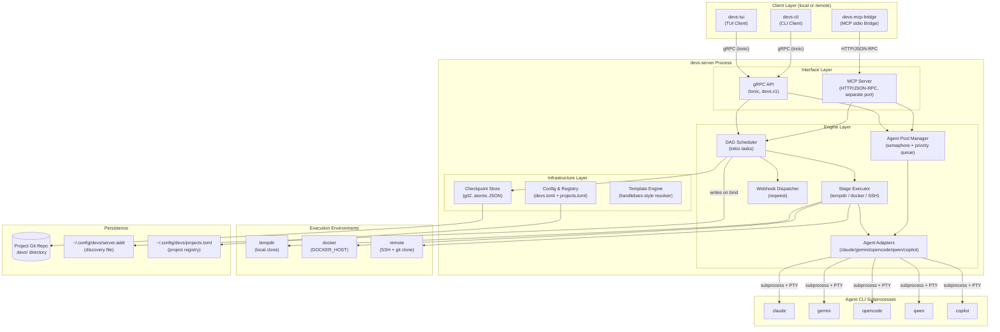

**[2_TAS-REQ-001a]** The Interface Layer MUST NOT contain business logic. All validation, routing, and state mutation MUST be delegated to Engine Layer components. Interface Layer handlers are limited to: deserializing the wire request, calling one Engine Layer method, serializing the response.

**[2_TAS-REQ-001b]** Infrastructure Layer components MUST NOT hold mutable shared state beyond their own internal caches. They are invoked from Engine Layer components and return results without retaining references to caller state.

**[2_TAS-REQ-001c]** The MCP server and gRPC server MUST share the same in-process state. A change made through the MCP interface MUST be immediately visible through the gRPC interface and vice versa, within the same Tokio scheduler cycle, without any inter-process communication.

---

### 1.2 Cargo Workspace Structure

**[2_TAS-REQ-001d]** The repository root contains a single `Cargo.toml` workspace manifest. All crates are members of this workspace. No library crate depends on a crate outside the workspace in its non-dev dependencies, except for third-party crates specified in §2.2.

The workspace is organized into the following crates:

| Crate | Type | Binary | Description |
|---|---|---|---|
| `devs-proto` | lib | — | Generated protobuf/gRPC types and client stubs. Contains `build.rs` invoking `tonic-build`. Generated files committed in `src/gen/` so downstream crates do not require `protoc`. |
| `devs-core` | lib | — | Shared domain types (`WorkflowDefinition`, `WorkflowRun`, `StageRun`, validation, error types) and the Template Engine. Zero network or filesystem I/O in non-dev dependencies. |
| `devs-config` | lib | — | Config file parsing (`devs.toml`, `projects.toml`), config precedence resolution (CLI flag > env var > file > built-in default), project registry management. Depends on `devs-core`. |
| `devs-checkpoint` | lib | — | Git-backed persistence via `git2`. Atomic JSON checkpoint reads/writes, log file management, retention sweep. Depends on `devs-core`. No knowledge of gRPC or scheduling. |
| `devs-adapters` | lib | — | `AgentAdapter` trait and five concrete implementations (claude, gemini, opencode, qwen, copilot). PTY spawning via `portable-pty`. Subprocess lifecycle, bidirectional signal handling, rate-limit detection. Depends on `devs-core`. |
| `devs-pool` | lib | — | Agent Pool Manager: semaphore-based concurrency enforcement, capability-based routing, fallback ordering, rate-limit cooldown tracking, `PoolExhausted` event emission. Depends on `devs-core`, `devs-adapters`. |
| `devs-executor` | lib | — | Stage Executor: execution environment management (tempdir, Docker via `DOCKER_HOST`, remote SSH), repo cloning, artifact collection, context file writing. Depends on `devs-core`, `devs-adapters`, `devs-pool`, `devs-checkpoint`. |
| `devs-scheduler` | lib | — | DAG Scheduler: dependency graph evaluation, stage lifecycle state machine, fan-out management, retry/timeout enforcement, multi-project priority scheduling. Depends on `devs-core`, `devs-executor`, `devs-checkpoint`. |
| `devs-webhook` | lib | — | Webhook Dispatcher: at-least-once HTTP delivery via `reqwest`, per-event retry backoff, payload size enforcement. Depends on `devs-core`. |
| `devs-grpc` | lib | — | gRPC service implementations (`tonic` server traits): thin adapters translating proto messages to `devs-core` types and calling `devs-scheduler`/`devs-pool`. Depends on `devs-proto`, `devs-core`, `devs-scheduler`, `devs-pool`. |
| `devs-mcp` | lib | — | MCP server implementation (HTTP/JSON-RPC). All Glass-Box tools: observation, control, testing interfaces. Depends on `devs-core`, `devs-scheduler`, `devs-pool`, `devs-checkpoint`. |
| `devs-server` | bin | `devs` | Server binary. Composes all engine crates, manages startup/shutdown sequence, binds gRPC and MCP ports. Depends on `devs-grpc`, `devs-mcp`, `devs-config`, `devs-webhook`, `devs-scheduler`. |
| `devs-tui` | bin | `devs-tui` | TUI client. Connects to server over gRPC, renders dashboard using Ratatui. Depends on `devs-proto`, `devs-core`. |
| `devs-cli` | bin | `devs` (subcommands) | CLI client. Clap-based argument parsing, gRPC calls, JSON/human-readable output. Depends on `devs-proto`, `devs-core`. |
| `devs-mcp-bridge` | bin | `devs-mcp-bridge` | MCP stdio bridge. Reads JSON-RPC from stdin, forwards over HTTP to MCP port, writes responses to stdout. Depends on `devs-core` only. |

**[2_TAS-REQ-001e]** `devs-core` MUST NOT have `tokio`, `git2`, `reqwest`, or `tonic` in its non-dev `[dependencies]`. This is verified as part of `./do lint` by a dependency audit step.

**[2_TAS-REQ-001f]** `devs-proto` generated files (`src/gen/*.rs`) MUST be committed to the repository. The `build.rs` regenerates them when `.proto` source files change, detected via `cargo:rerun-if-changed` directives.

**[2_TAS-REQ-001g]** Wire types from `devs-proto` MUST NOT appear in the public API of `devs-scheduler`, `devs-executor`, or `devs-pool`. All cross-crate communication within the engine uses types from `devs-core`.

#### Crate Dependency Graph

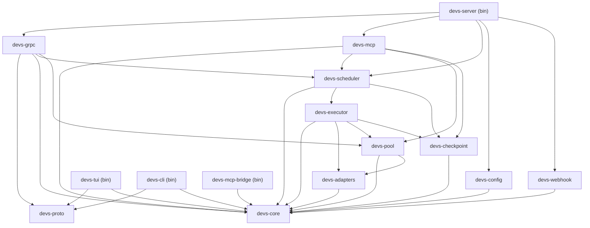

---

### 1.3 Process Startup Sequence

**[2_TAS-REQ-001]** The server startup sequence MUST follow this exact order, aborting with a non-zero exit code at the first unrecoverable error:

1. Parse CLI flags and environment variable overrides.
2. Locate and parse `devs.toml` — collect ALL validation errors in a single pass and report them together to stderr. Exit non-zero if any errors exist. No port is bound before this step completes successfully.
3. Bind gRPC port — fail immediately if already in use (`EADDRINUSE`). No cleanup required.
4. Bind MCP port — fail immediately if already in use; release the already-bound gRPC port before exiting.
5. Initialize the Agent Pool Manager from the validated pool configurations.
6. Load and validate the project registry (`~/.config/devs/projects.toml`). Create the file if absent (an empty registry is valid).
7. For each registered project, scan for workflow definition files in the configured `workflow_paths`.
8. Restore checkpointed runs from git: for each project's checkpoint branch, read all `checkpoint.json` files. Reset stages in `Running` state to `Eligible`; re-queue stages in `Waiting`/`Eligible` state; re-queue `Pending` runs. A failure to restore one project's checkpoints MUST NOT abort startup — log at `ERROR` level and continue with remaining projects.
9. Write the discovery file atomically to `~/.config/devs/server.addr` (or the path in `DEVS_DISCOVERY_FILE` if set).
10. Begin accepting connections on both ports.
11. Resume recovered runs by triggering the DAG Scheduler for each restored `WorkflowRun`.

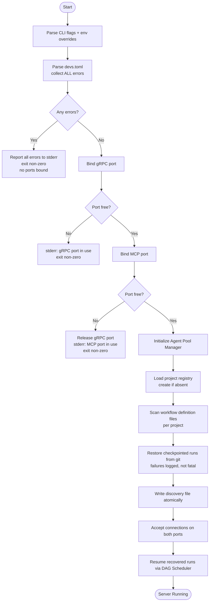

**[2_TAS-REQ-001h]** Config validation (step 2) MUST collect ALL errors in a single pass and report them together. The error output format is one error per line on stderr, each prefixed with `ERROR:`. The process MUST NOT bind any port if any config error exists.

**[2_TAS-REQ-001i]** If the MCP port is unavailable (step 4), the server MUST release the already-bound gRPC port before exiting, leaving no lingering port bindings in any exit path.

**[2_TAS-REQ-001j]** Discovery file write (step 9) MUST be atomic: write to a `.tmp` suffixed file in the same directory, then rename to the final path. On Linux/macOS this is guaranteed atomic by `rename(2)`. On Windows, the implementation MUST use a rename approach equivalent to `MoveFileExW` with `MOVEFILE_REPLACE_EXISTING`.

**[2_TAS-REQ-001k]** Checkpoint restoration (step 8) MUST NOT fail startup if a single project's checkpoint branch is inaccessible (e.g., corrupt git repo, missing branch). The server MUST log an `ERROR`-level message for that project and continue restoring the remaining projects.

**[2_TAS-REQ-001l]** If the `devs.toml` does not exist at the default search path and `--config` is not supplied, the server MUST start with all built-in defaults and emit a `WARN`-level log: `"No devs.toml found at <path>; using built-in defaults."` This is not an error.

**[2_TAS-REQ-001m]** If `--config` is supplied and the file does not exist, the server MUST exit immediately with a descriptive error before any port binding: `"Error: config file not found: <path>"`.

**[2_TAS-REQ-001n]** If the discovery file directory does not exist, the server MUST create it (including all missing parent directories) before writing the discovery file. Failure to create the directory is a fatal error at step 9.

#### Startup Business Rules

| Rule ID | Rule |
|---|---|
| ARCH-SR-001 | No port is bound before all config errors are collected and reported |
| ARCH-SR-002 | The discovery file path resolves as: `DEVS_DISCOVERY_FILE` env var → `server.discovery_file` in `devs.toml` → `~/.config/devs/server.addr` |
| ARCH-SR-003 | The discovery file contains exactly `<host>:<port>` as plain UTF-8; no trailing newline is required but clients MUST strip whitespace |
| ARCH-SR-004 | Checkpoint restoration failure for one project does not prevent other projects from recovering |
| ARCH-SR-005 | Clients MUST NOT be accepted on either port before the discovery file is written |
| ARCH-SR-006 | The discovery file encodes the gRPC port only; MCP port is obtained via `ServerService.GetInfo` gRPC call |

---

### 1.4 Clean Shutdown Sequence

**[2_TAS-REQ-002]** On receiving `SIGTERM` (Linux/macOS) or `Ctrl+C` / `CTRL_BREAK_EVENT` (Windows), the server MUST perform a graceful shutdown in this exact order:

1. Stop accepting new gRPC connections.
2. Stop accepting new MCP connections.
3. Send `devs:cancel\n` via stdin to all actively running agent subprocesses.
4. Wait up to 10 seconds for agent subprocesses to terminate voluntarily.
5. Send `SIGTERM` to any still-running agent subprocesses.
6. Wait up to 5 more seconds; send `SIGKILL` to any subprocesses still running.
7. Flush all in-flight checkpoint writes (wait for all `spawn_blocking` git2 tasks to complete).
8. Delete the discovery file.
9. Exit with code 0.

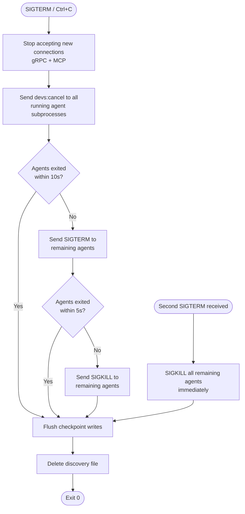

**[2_TAS-REQ-002a]** The discovery file MUST be deleted before the process exits. If deletion fails (e.g., permissions error), the failure MUST be logged at `ERROR` level. The process MUST still exit with code 0.

**[2_TAS-REQ-002b]** In-flight gRPC streaming calls (e.g., `StreamRunEvents`, `StreamLogs`) that are active at shutdown MUST receive a `CANCELLED` status code before their connections are closed.

**[2_TAS-REQ-002c]** All `WorkflowRun` and `StageRun` state that was `Running` at shutdown MUST be persisted to git before exit, with those stages' status set in the checkpoint such that recovery on restart (§1.3 step 8) correctly resets them to `Eligible`.

**[2_TAS-REQ-002d]** If a second `SIGTERM` is received during an in-progress shutdown, the server MUST immediately send `SIGKILL` to all remaining agent subprocesses without waiting for the grace period, then proceed to checkpoint flush and exit.

---

### 1.5 Server Discovery Protocol

Clients locate the running server without requiring the user to specify an address. The discovery mechanism uses a well-known file on the local filesystem written atomically by the server at startup.

**[2_TAS-REQ-002e]** The discovery file path is resolved in this priority order:
1. The `DEVS_DISCOVERY_FILE` environment variable, if set and non-empty.
2. The `server.discovery_file` key in `devs.toml`, if present.
3. The default path: `~/.config/devs/server.addr` (where `~` resolves via `HOME` on Linux/macOS and `USERPROFILE` on Windows).

**[2_TAS-REQ-002f]** The discovery file MUST contain exactly one line of plain UTF-8 text in the format `<host>:<port>`, where `<host>` is an IPv4 address, an IPv6 address in brackets (e.g., `[::1]`), or a DNS hostname, and `<port>` is a decimal integer in the range `1`–`65535`. Clients MUST strip all surrounding whitespace before parsing.

**[2_TAS-REQ-002g]** The discovery file encodes the gRPC listen port. The MCP port is retrieved via the `ServerService.GetInfo` gRPC RPC after connecting. Client binaries that need the MCP port (e.g., `devs-mcp-bridge`) MUST call `GetInfo` first rather than hardcoding or computing the MCP port.

**[2_TAS-REQ-002h]** If a client reads the discovery file and the address is stale (server not listening), the gRPC connection attempt fails. The client MUST report this condition as exit code `3` and print a human-readable error to stderr: `"Server at <addr> is not reachable. Is it running?"`.

**[2_TAS-REQ-002i]** For E2E test isolation, every test that starts a server instance MUST set `DEVS_DISCOVERY_FILE` to a unique temporary path (e.g., a path under the test's temp directory). This prevents discovery file conflicts between parallel server instances in the same test run.

**[2_TAS-REQ-002j]** When `--server <host:port>` is passed to any client binary, the client MUST use the explicit address unconditionally and MUST NOT read the discovery file.

#### Discovery File Format

| Field | Type | Constraints | Example |
|---|---|---|---|
| `host` | String | IPv4, bracketed IPv6 `[::1]`, or DNS hostname | `127.0.0.1` |
| `port` | u16 | 1–65535 | `7890` |

**Discovery file example:**
```
127.0.0.1:7890
```
<!-- Resolved: aligned with default port 7890 -->

#### Client Discovery Error Handling

| Condition | Client Behavior | Exit Code |
|---|---|---|
| Discovery file does not exist and no `--server` flag | Print `"No devs server found. Start with: devs serve"` to stderr | 3 |
| Discovery file exists but server not reachable | Print `"Server at <addr> is not reachable. Is it running?"` to stderr | 3 |
| Discovery file exists, server reachable, but version mismatch | Print `"Server version mismatch: client expects <X>, server is <Y>"` to stderr | 3 |
| Discovery file exists but content is malformed | Print `"Discovery file at <path> is malformed: <detail>"` to stderr | 3 |
| `--server` flag provided, server not reachable | Print `"Cannot connect to server at <addr>: <detail>"` to stderr | 3 |

---

### 1.6 Concurrency Model

`devs` is an async-first application built on Tokio. The concurrency model is defined here to ensure all engine components interact correctly without races or deadlocks.

**[2_TAS-REQ-002k]** The server binary initializes a single multi-threaded Tokio runtime using `#[tokio::main]` with the default thread pool (worker thread count = number of logical CPUs). All async tasks run on this shared runtime. Creating additional Tokio runtimes inside the server process is prohibited.

**[2_TAS-REQ-002l]** Blocking operations that cannot be made async — specifically all `git2` filesystem operations, subprocess `wait()` calls, and synchronous SSH operations — MUST be dispatched with `tokio::task::spawn_blocking`. These operations MUST NOT be called directly on a Tokio worker thread.

**[2_TAS-REQ-002m]** Shared mutable state between async tasks MUST use `Arc<tokio::sync::RwLock<T>>` for read-heavy state (e.g., `SchedulerState` reads during event broadcasts) or `Arc<tokio::sync::Mutex<T>>` for write-heavy or fine-grained state. `std::sync::RwLock` and `std::sync::Mutex` MUST NOT be held across `.await` points.

**[2_TAS-REQ-002n]** The concurrency semaphore for each agent pool is `Arc<tokio::sync::Semaphore>` with `max_concurrent` permits. Permits are acquired via `.acquire_owned()` so they can be sent across task boundaries. Permit release MUST occur when the `OwnedSemaphorePermit` is dropped by the stage executor, regardless of stage success or failure.

**[2_TAS-REQ-002o]** The DAG Scheduler maintains all `WorkflowRun` and `StageRun` instances in a single `Arc<RwLock<SchedulerState>>`. This is the canonical source of truth for runtime state. The git checkpoint is the source of truth for persisted state. On startup, git checkpoint data is loaded into `SchedulerState` before any connections are accepted.

#### Canonical Shared State Structures

The following are non-normative sketches showing the logical shape of the two primary shared state structures. Actual field names and types are defined in `devs-scheduler/src/state.rs` and `devs-pool/src/state.rs`.

```rust
// devs-scheduler/src/state.rs (non-normative)
pub struct SchedulerState {
    /// All known runs, keyed by run_id.
    pub runs: HashMap<Uuid, WorkflowRun>,
    /// All known stage runs, keyed by (run_id, stage_name, attempt).
    pub stage_runs: HashMap<(Uuid, String, u32), StageRun>,
    /// Eligible stages waiting for a pool slot, partitioned by project
    /// for priority-based dispatch. Key is (priority, project_id) for
    /// strict mode or (virtual_time, project_id) for weighted mode.
    pub eligible_queue: BTreeMap<ProjectDispatchKey, VecDeque<StageRunRef>>,
}

// devs-pool/src/state.rs (non-normative)
pub struct PoolState {
    /// Semaphore per named pool; permits = max_concurrent.
    pub semaphores: HashMap<String, Arc<Semaphore>>,
    /// Rate-limited agent indices per pool: (pool_name, agent_index) → cooldown_until.
    pub rate_limited: HashMap<(String, usize), Instant>,
}
```

**[2_TAS-REQ-002p]** Lock acquisition order MUST be consistent across all code paths to prevent deadlock. The defined global order is: `SchedulerState` → `PoolState` → `CheckpointStore` internal lock (if any). Any code path that must acquire multiple locks MUST acquire them in this order.

#### Internal Async Channel Topology

| Channel Name | Sender | Receiver | Channel Type | Purpose |
|---|---|---|---|---|
| `stage_complete_tx` | Stage Executor | DAG Scheduler | `mpsc` | Notify the scheduler that a stage has reached a terminal state |
| `webhook_tx` | Any engine component | Webhook Dispatcher | `mpsc` | Fire-and-forget webhook event payload delivery |
| `cancel_tx` | Scheduler / Interface Layer | All active Stage Executors | `broadcast` | Propagate cancel/pause signals to in-flight stages |
| `pool_event_tx` | Agent Pool Manager | DAG Scheduler | `mpsc` | Notify scheduler of rate-limit events and pool exhaustion episodes |

**[2_TAS-REQ-002q]** The Webhook Dispatcher operates on a dedicated `tokio::sync::mpsc` channel with a buffer of at least 1024 events. Engine components send `WebhookEvent` messages and immediately return without awaiting delivery. The dispatcher task consumes events independently and retries HTTP delivery without blocking any Scheduler operation.

---

### 1.7 gRPC Service Architecture

The `devs.v1` gRPC interface is split into six focused services, each defined in its own `.proto` file under `proto/devs/v1/`. All services are implemented in the `devs-grpc` crate and registered with a single `tonic` server instance.

| Service | Proto File | Key RPCs |
|---|---|---|
| `WorkflowDefinitionService` | `workflow_definition.proto` | `RegisterWorkflow`, `UpdateWorkflow`, `DeleteWorkflow`, `GetWorkflow`, `ListWorkflows` |
| `RunService` | `run.proto` | `SubmitRun`, `GetRun`, `ListRuns`, `CancelRun`, `PauseRun`, `ResumeRun`, `StreamRunEvents` |
| `StageService` | `stage.proto` | `GetStage`, `PauseStage`, `ResumeStage`, `RetryStage`, `CancelStage`, `GetStageOutput` |
| `LogService` | `log.proto` | `StreamLogs`, `FetchLogs` |
| `PoolService` | `pool.proto` | `GetPoolStatus`, `ListPools`, `WatchPoolUtilization` |
| `ProjectService` | `project.proto` | `AddProject`, `RemoveProject`, `GetProject`, `ListProjects`, `UpdateProject` |

**[2_TAS-REQ-002r]** All gRPC service methods MUST return `tonic::Status` errors with the appropriate `tonic::Code`. The mapping between domain errors and gRPC status codes is:

| Domain Error Condition | gRPC Code |
|---|---|
| Entity not found (run, stage, project, pool) | `NOT_FOUND` |
| Validation error on input parameters | `INVALID_ARGUMENT` |
| Duplicate name or state conflict | `ALREADY_EXISTS` |
| Client API version mismatch | `FAILED_PRECONDITION` |
| Server resource exhausted (e.g., too many queued runs) | `RESOURCE_EXHAUSTED` |
| Operation not permitted in current entity state | `FAILED_PRECONDITION` |
| Internal server error (unhandled) | `INTERNAL` |
| Client cancelled an in-flight streaming RPC | `CANCELLED` |

**[2_TAS-REQ-002s]** Every gRPC unary response message MUST include a `string request_id` field containing a server-generated UUID4 for correlation with server-side logs.

**[2_TAS-REQ-002t]** All gRPC streaming RPCs MUST respect Tokio context cancellation. When a client cancels a stream, the server MUST stop sending messages and release all associated resources within 500 ms.

**[2_TAS-REQ-002u]** The server MUST implement gRPC reflection via `tonic-reflection` so that tools such as `grpcurl` can discover the full service schema at runtime without a local `.proto` file.

---

### 1.8 Architecture Business Rules

The following rules govern the overall architecture and apply across all components. Each rule is independently testable.

| Rule ID | Rule |
|---|---|
| ARCH-BR-001 | The server process exposes exactly two TCP ports: one gRPC port and one MCP port. No HTTP REST endpoint or Unix domain socket listener is exposed. |
| ARCH-BR-002 | All client-to-server communication goes through either the gRPC port or the MCP port. No shared memory, Unix domain sockets, or named pipes are used for client-server IPC. |
| ARCH-BR-003 | Agent subprocesses communicate with `devs` exclusively via the MCP port, using the address injected in `DEVS_MCP_ADDR`. Agents do not communicate with client binaries directly. |
| ARCH-BR-004 | The server handles concurrent requests from TUI, CLI, and MCP bridge clients simultaneously without data races. All shared mutable state is protected by Tokio synchronization primitives. |
| ARCH-BR-005 | No Tokio worker thread is blocked by synchronous I/O. All blocking I/O (`git2`, subprocess `wait()`, SSH) runs inside `tokio::task::spawn_blocking`. |
| ARCH-BR-006 | Exactly one Tokio runtime is created in the server process. Creating additional runtimes is prohibited. |
| ARCH-BR-007 | Server configuration is immutable after startup. `devs.toml` is not reloaded while the server is running. Project registry changes (`devs project add/remove`) are the only live-update exception and take effect immediately. |
| ARCH-BR-008 | All log output from server and library crates uses the `tracing` crate with structured fields. `println!`, `eprintln!`, and `log::` macros are prohibited in library crates. |
| ARCH-BR-009 | `devs-core` compiles with zero I/O crates (`tokio`, `git2`, `reqwest`, `tonic`) in its non-dev `[dependencies]`. Verified by `./do lint`. |
| ARCH-BR-010 | Every public API boundary between crates uses types from `devs-core`. Wire types from `devs-proto` do not appear in the public APIs of `devs-scheduler`, `devs-executor`, or `devs-pool`. |
| ARCH-BR-011 | All `Arc<RwLock<...>>` and `Arc<Mutex<...>>` guards are released before any `.await` point. Holding a synchronous lock guard across an await is a compile-error or a deadlock; both are prohibited. |
| ARCH-BR-012 | The MCP server and gRPC server share the same `Arc<RwLock<SchedulerState>>`. There is no separate copy of run/stage state for MCP. |

---

### 1.9 Architecture Edge Cases and Error Handling

#### 1.9.1 Startup Edge Cases

| Scenario | Expected Behavior |
|---|---|
| `devs.toml` absent and no `--config` flag | Server starts with built-in defaults; logs `WARN: No devs.toml found at <path>; using built-in defaults.` |
| `--config` flag points to a non-existent file | Server prints `Error: config file not found: <path>` to stderr and exits non-zero before binding any port |
| gRPC port already in use at startup | Server prints `Error: gRPC port <N> already in use (EADDRINUSE)` to stderr and exits non-zero; no ports remain bound |
| MCP port already in use at startup | Server releases the gRPC port, prints `Error: MCP port <N> already in use` to stderr, exits non-zero; no ports remain bound |
| A project's checkpoint branch absent in its git repo | Server logs `WARN` for that project, skips checkpoint restoration, continues startup; project remains registered and accepts new submissions |
| A project's `repo_path` does not exist at startup | Server logs `ERROR` for that project, marks it `Unavailable` in the registry; submissions for that project are rejected until the path is restored |
| Discovery file directory (`~/.config/devs/`) does not exist | Server creates the directory (including parents) before writing the discovery file; failure to create is a fatal error |
| Two server instances start concurrently on the same machine with the same discovery file path | Last writer wins (atomic rename); clients connecting to the stale address receive exit code 3; users must configure distinct ports or discovery file paths |
| `devs.toml` has multiple errors (e.g., invalid pool name + unknown field) | All errors are collected and printed together; server does not exit after the first error encountered |

#### 1.9.2 Runtime Edge Cases

| Scenario | Expected Behavior |
|---|---|
| gRPC client disconnects mid-stream | Server cancels the stream resource within 500 ms; in-flight engine operations (e.g., a submitted run) are NOT rolled back |
| Discovery file deleted while server is running | Server continues operating; clients that attempt discovery after deletion receive exit code 3; server does not re-create the file |
| SIGTERM received while a stage is running | Server follows the shutdown sequence (§1.4); the stage is cancelled, its checkpoint is persisted as `Eligible`, and recovery on next restart re-queues it |
| `git2` checkpoint write fails due to disk full | Scheduler logs `ERROR: checkpoint write failed — disk full`; in-memory state is correct; the stale on-disk checkpoint is overwritten on the next successful write |
| New project registered while runs are active for other projects | New project is added atomically to the registry; existing runs are unaffected; new project's checkpoint branch is initialized if absent |
| MCP tool call arrives for a non-existent run ID | MCP server returns `{"error": "Run not found: <run_id>", "code": 2}` with HTTP 200; no server-side error is logged above `DEBUG` |

#### 1.9.3 Concurrency Edge Cases

| Scenario | Expected Behavior |
|---|---|
| Two simultaneous `SubmitRun` calls with duplicate run name for the same project | Exactly one succeeds; the other returns `ALREADY_EXISTS`; a per-project lock prevents both from passing the uniqueness check simultaneously |
| Pool semaphore at 0 and a new stage becomes eligible | Stage is enqueued in the eligible queue; when any stage releases its permit, the highest-priority queued stage is dispatched within one Tokio scheduler cycle |
| Two projects at equal priority compete for the last pool slot | Tie-broken by lexicographic order of `project_id` (UUID string); deterministic, starvation-free |
| Stage completion notification arrives while Scheduler holds a write lock | Completion message is queued on `stage_complete_tx`; processed after the write lock is released; no direct call into the scheduler while locked |
| `spawn_blocking` task for checkpoint write panics | Tokio propagates the panic as a `JoinError`; the scheduler catches it, logs `ERROR: checkpoint write panicked: <msg>`, and continues operating |

---

### 1.10 Architecture Acceptance Criteria

All of the following assertions MUST be verified by automated tests to consider the Architecture section implemented:

- **[ARCH-AC-001]** Starting the server with an invalid `devs.toml` (unknown field, wrong type) causes all validation errors to appear on stderr and the process to exit non-zero with no ports bound. Verified by checking `ss -tlnp` or equivalent shows no bound ports on the configured addresses after the failed start.
- **[ARCH-AC-002]** Starting a second server instance on the same gRPC port while a first instance is running causes the second to exit non-zero with an `EADDRINUSE` error message in stderr.
- **[ARCH-AC-003]** A CLI client started without `--server`, when a server is running and has written its discovery file, successfully connects and completes a `devs list` command (exit 0).
- **[ARCH-AC-004]** Sending `SIGTERM` to a running server causes the discovery file to be deleted and the server to exit with code 0, verified by checking the file is absent after exit.
- **[ARCH-AC-005]** A CLI client invoked after the server has shut down exits with code 3 and prints a message containing "not reachable" or "not found" (because the discovery file is gone or the address is stale).
- **[ARCH-AC-006]** Two simultaneous `SubmitRun` gRPC calls with identical run names for the same project: exactly one returns success and the other returns `ALREADY_EXISTS`, with no duplicate runs in `ListRuns`.
- **[ARCH-AC-007]** Two parallel E2E test server instances started with distinct `DEVS_DISCOVERY_FILE` paths operate independently; neither test's discovery file contains the other test's server address.
- **[ARCH-AC-008]** `cargo check --workspace` produces zero warnings with `#![deny(missing_docs)]` active in all library crates.
- **[ARCH-AC-009]** A `cargo tree -p devs-core --edges normal` output contains no entries for `tokio`, `git2`, `reqwest`, or `tonic`.
- **[ARCH-AC-010]** A server started with one registered project whose `repo_path` does not exist logs an `ERROR` for that project and completes startup normally; a `devs list` for an unaffected project succeeds.
- **[ARCH-AC-011]** A server restart after a crash (simulated by `SIGKILL`) with a stage previously in `Running` state: after restart the stage transitions to `Eligible` and eventually to `Running` again.
- **[ARCH-AC-012]** `grpcurl list <server>` (using gRPC reflection) returns all six service names: `devs.v1.WorkflowDefinitionService`, `devs.v1.RunService`, `devs.v1.StageService`, `devs.v1.LogService`, `devs.v1.PoolService`, `devs.v1.ProjectService`.
- **[ARCH-AC-013]** A state change applied through the MCP API (e.g., `cancel_run`) is reflected in the subsequent gRPC `GetRun` response with no intermediate sleep or polling required — the same in-process `SchedulerState` serves both interfaces.
- **[ARCH-AC-014]** `devs-mcp-bridge`, when the server is not running, prints `{"error": "connection refused", "code": 3}` to stdout and exits with code 3.
- **[ARCH-AC-015]** Starting the server with `--config` pointing to a non-existent file causes it to exit non-zero with `"config file not found"` in stderr and zero port bindings.

---

## 2. Technology Stack & Toolchain

This section specifies the complete technology stack, dependency versions, build system configuration, CI/CD pipeline, and developer toolchain for `devs`. Every agent implementing `devs` MUST treat this section as a binding constraint: deviations require an explicit requirement change, not ad-hoc choices.

---

### 2.1 Rust Toolchain

`devs` uses the Rust stable toolchain exclusively. The minimum supported Rust version (MSRV) is **1.80.0**, selected because it is the earliest stable release that provides the `LazyLock` standard library type (used in `devs-core` for static initialization), the `#[expect(lint)]` attribute (used in place of `#[allow(lint)]` throughout), and stabilized RPITIT (return-position `impl Trait` in traits, required for the `AgentAdapter` trait). No nightly features are permitted anywhere in the workspace. Any code that requires a nightly feature constitutes a blocking defect.

**[2_TAS-REQ-003]** All code MUST be written in Rust stable with a minimum version of 1.80.0. No nightly features, nightly-only attributes, or nightly-only crate features are permitted in any workspace crate's non-dev code paths.

**[2_TAS-REQ-004]** The repository root MUST contain a `rust-toolchain.toml` file that pins the toolchain channel to `"stable"` with a minimum version of `"1.80.0"`. This file ensures that all developers and CI runners use a consistent toolchain regardless of their locally installed Rust version.

```toml
# rust-toolchain.toml (authoritative)
[toolchain]
channel = "stable"
components = ["rustfmt", "clippy", "llvm-tools-preview"]
```

The `llvm-tools-preview` component is required by `cargo-llvm-cov` for coverage instrumentation (§2.7). Including it in `rust-toolchain.toml` ensures it is installed automatically by `rustup` on every machine and CI runner.

#### 2.1.1 Cargo Workspace Configuration

The root `Cargo.toml` workspace manifest controls edition, lint policy, and build profiles for all crates uniformly. Library crates use `edition = "2021"`. No crate may declare a different edition.

**[2_TAS-REQ-004a]** The workspace `[workspace.lints]` table MUST contain the following configuration, enforced on all member crates via `[lints] workspace = true` in each crate's `Cargo.toml`:

```toml
# Cargo.toml (workspace root) — authoritative lint table
[workspace.lints.rust]
missing_docs       = "deny"
unsafe_code        = "deny"
unused_must_use    = "deny"
dead_code          = "warn"

[workspace.lints.clippy]
all                = { level = "deny", priority = -1 }
pedantic           = { level = "warn", priority = -1 }
# Allow exceptions that produce excessive noise in idiomatic Rust
module_name_repetitions = "allow"
must_use_candidate      = "allow"
```

**[2_TAS-REQ-004b]** `unsafe_code = "deny"` applies workspace-wide. No `unsafe` block is permitted in any crate. If a dependency transitively requires unsafe code inside its own implementation (e.g., `git2`, `portable-pty`), that is acceptable — the prohibition applies only to code authored within this workspace.

**[2_TAS-REQ-004c]** The workspace MUST define the following Cargo profiles:

```toml
# Cargo.toml (workspace root) — authoritative profile table
[profile.dev]
opt-level = 0
debug     = true
# Speed up incremental builds in development
incremental = true

[profile.release]
opt-level     = 3
lto           = "thin"
codegen-units = 1
strip         = "debuginfo"
panic         = "abort"

[profile.test]
# Inherits from dev; ensure test binaries have debug info for coverage
inherits = "dev"
debug    = true
```

The `panic = "abort"` in the release profile eliminates stack-unwinding overhead. All `Result` types are propagated explicitly; panics in production code are defects.

**[2_TAS-REQ-004d]** The root `Cargo.toml` MUST declare `resolver = "2"` to use the v2 feature resolver, which correctly handles feature unification across workspace crates with optional features.

#### 2.1.2 Feature Flag Policy

**[2_TAS-REQ-004e]** No workspace crate may declare optional `[features]` that enable or disable core business logic. Feature flags are permitted only for TLS backend selection in `reqwest` (always `rustls-tls`, never `native-tls`) and for test-only utilities gated with `#[cfg(test)]`. This constraint prevents partial-feature builds from silently omitting required functionality.

**[2_TAS-REQ-004f]** All CI jobs MUST build and test with `--all-features` to ensure no feature combination is silently broken. The explicit invocation is `cargo build --workspace --all-features` and `cargo test --workspace --all-features`.

#### 2.1.3 Unsafe Code Prohibition

**[2_TAS-REQ-004g]** The `unsafe_code = "deny"` lint MUST be active. Any `#[allow(unsafe_code)]` or `unsafe` block in workspace source files MUST cause `./do lint` to fail with a `clippy` error. If a third-party crate's API requires calling an `unsafe fn`, the workspace crate MUST wrap it in a safe abstraction within a dedicated module with a `SAFETY:` comment, but the `unsafe` keyword itself in workspace source remains prohibited — such patterns indicate the wrong abstraction and MUST be resolved by using a safe alternative API.

#### 2.1.4 Technology Stack Business Rules (Rust Toolchain)

| Rule ID | Rule |
|---|---|
| TECH-BR-001 | `rust-toolchain.toml` is present at the repository root from the first commit. |
| TECH-BR-002 | No crate in the workspace uses `edition` other than `"2021"`. |
| TECH-BR-003 | Adding a new crate dependency to any workspace member requires updating the authoritative version table in §2.2. Undocumented dependencies are a lint failure. |
| TECH-BR-004 | The `clippy::pedantic` group is set to `warn`, not `deny`, to allow iterative refinement. The `clippy::all` group is `deny`. |
| TECH-BR-005 | `#![deny(missing_docs)]` is enforced in every `lib.rs` and `main.rs` via the workspace lint table, not per-crate annotations. |
| TECH-BR-006 | No nightly compiler feature gate (e.g., `#![feature(...)]`) appears in any source file in the workspace. |

---

### 2.2 Core Dependencies

This section is the authoritative version table for all non-dev dependencies. When implementing any crate in the workspace, use exactly the version specified here. Minor version bumps (e.g., `1.38` → `1.39`) are permitted without a spec change if they remain semver-compatible and all tests pass. Major version bumps (e.g., `0.12` → `0.13` for `tonic`) require updating this table before the implementation change is merged.

**[2_TAS-REQ-005]** The following crate versions and enabled feature flags are authoritative for all workspace members' `[dependencies]`. Features not listed are disabled unless noted otherwise.

| Crate | Version | Required Features | Purpose |
|---|---|---|---|
| `tokio` | 1.38 | `full` | Async runtime: task spawning, channels, timers, I/O, `spawn_blocking`. `full` enables all tokio sub-features including `rt-multi-thread`, `macros`, `time`, `sync`, `net`. |
| `tonic` | 0.12 | `transport`, `codegen` | gRPC server and client. `transport` provides the `Server` and `Channel` types. `codegen` provides `async_trait` re-exports used by generated service traits. |
| `prost` | 0.13 | `derive` | Protobuf message encoding/decoding. `derive` enables `#[derive(Message)]`. Must match the version used by `tonic-build`. |
| `tonic-build` | 0.12 | _(build dependency)_ | `build.rs` code generator for `.proto` files. Invoked via `tonic_build::compile_protos`. |
| `tonic-reflection` | 0.12 | `server` | gRPC server reflection for `grpcurl` compatibility. Registered alongside service routes at server startup. |
| `ratatui` | 0.28 | `crossterm` | TUI widget library. The `crossterm` feature activates the `CrosstermBackend` used on all three platforms. |
| `crossterm` | 0.28 | _(default)_ | Cross-platform terminal I/O. Provides raw mode, event polling, and ANSI escape sequences on Linux, macOS, and Windows. |
| `clap` | 4.5 | `derive`, `env` | CLI argument parsing. `derive` enables `#[derive(Parser, Args, Subcommand)]`. `env` allows env-var binding for each argument. |
| `serde` | 1.0 | `derive` | Serialization framework. `derive` enables `#[derive(Serialize, Deserialize)]`. Used by every data type in `devs-core`. |
| `serde_json` | 1.0 | _(default)_ | JSON serialization for checkpoint files, context files, MCP responses, and webhook payloads. |
| `toml` | 0.8 | `serde` | TOML config parsing. `serde` feature enables `toml::from_str::<T>()`. Used exclusively in `devs-config`. |
| `serde_yaml` | 0.9 | _(default)_ | YAML workflow definition parsing. Used in `devs-config` for `.yaml`/`.yml` workflow files. |
| `uuid` | 1.10 | `v4`, `serde` | UUID v4 generation for `run_id`, `stage_run_id`, and request correlation IDs. `serde` enables transparent JSON serialization as strings. |
| `git2` | 0.19 | `ssh`, `https` | Git operations for the checkpoint store. `ssh` enables libssh2 for remote SSH execution environment repo cloning. `https` enables OpenSSL/Schannel for HTTPS clone. |
| `reqwest` | 0.12 | `json`, `rustls-tls` | Outbound HTTP client for webhook delivery. `json` enables `.json()` body serialization. `rustls-tls` is the mandatory TLS backend. |
| `tracing` | 0.1 | _(default)_ | Structured logging instrumentation. All log statements in library crates use `tracing::info!`, `tracing::warn!`, `tracing::error!`, `tracing::debug!`. |
| `tracing-subscriber` | 0.3 | `env-filter`, `json` | Log subscriber configuration. `env-filter` enables `RUST_LOG` filtering. `json` enables JSON-formatted log output for CI environments. |
| `portable-pty` | 0.8 | _(default)_ | PTY allocation for agent adapters that require an interactive terminal. Provides a cross-platform API over `openpty` (Linux/macOS) and `ConPTY` (Windows). |
| `tokio-stream` | 0.1 | `sync` | Async stream utilities. `sync` enables `BroadcastStream` and `ReceiverStream` wrappers over Tokio channels, used in gRPC streaming RPCs. |
| `handlebars` | 6.0 | _(default)_ | Template variable resolution for `{{template}}` syntax in stage prompts, system prompts, and context files. Used exclusively in `devs-core`'s Template Engine. |
| `chrono` | 0.4 | `serde` | Timestamps (`DateTime<Utc>`) stored as ISO 8601 strings in checkpoints and API responses. `serde` feature serializes to/from RFC 3339 strings. |
| `tempfile` | 3.12 | _(default)_ | Temporary directory creation for `tempdir` execution environments and prompt file writing. Directories are automatically cleaned up when the `TempDir` handle is dropped. |
| `bytes` | 1.7 | _(default)_ | Byte buffer management for gRPC streaming (prost message encoding) and log streaming. |
| `thiserror` | 1.0 | _(default)_ | Ergonomic `#[derive(Error)]` for library crate error types. Used in every `devs-*` library crate's `error.rs`. |
| `anyhow` | 1.0 | _(default)_ | Opaque error propagation in binary crates (`devs-server`, `devs-tui`, `devs-cli`, `devs-mcp-bridge`). MUST NOT appear in library crates' `[dependencies]`. |

**[2_TAS-REQ-005a]** The dependency on `anyhow` is restricted to binary crates only. Library crates (`devs-core`, `devs-config`, `devs-checkpoint`, `devs-adapters`, `devs-pool`, `devs-executor`, `devs-scheduler`, `devs-webhook`, `devs-grpc`, `devs-mcp`, `devs-proto`) MUST use `thiserror` for their error types and return `Result<T, MyError>` where `MyError` is a domain-specific type. This allows downstream callers to pattern-match on specific error variants.

**[2_TAS-REQ-006]** `reqwest` MUST use the `rustls-tls` feature exclusively. The `native-tls` and `native-tls-alpn` features MUST NOT be enabled on any workspace crate. This guarantees that webhook TLS behavior is identical on Linux, macOS, and Windows without requiring OpenSSL to be installed on the host system.

**[2_TAS-REQ-007]** Dev-only dependencies — declared in `[dev-dependencies]` of workspace members or in `[workspace.dev-dependencies]` — are not subject to the "no nightly" restriction but MUST NOT appear in any crate's `[dependencies]`. The authoritative dev-dependency versions are:

| Crate | Version | Purpose |
|---|---|---|
| `cargo-llvm-cov` | 0.6 | Line coverage instrumentation via LLVM instrumentation profiles. Invoked by `./do coverage`. |
| `insta` | 1.40 | Snapshot testing for TUI text output. Snapshots stored as `.txt` fixture files under `src/snapshots/`. |
| `mockall` | 0.13 | Mock generation (`#[automock]`) for the `AgentAdapter` and `CheckpointStore` traits in unit tests. |
| `bollard` | 0.17 | Docker API client. Used in integration test helpers to start/stop Docker containers for the `docker` execution environment E2E tests. |
| `wiremock` | 0.6 | HTTP mock server. Used in webhook delivery tests to assert payload format and retry behavior without sending real HTTP requests. |
| `assert_cmd` | 2.0 | CLI binary integration testing. Runs `devs-cli` and `devs-mcp-bridge` as subprocesses and asserts exit codes and stdout/stderr patterns. |
| `predicates` | 3.1 | Composable predicates for use with `assert_cmd` output assertions. |
| `tokio-test` | 0.4 | Helpers for testing async code: `block_on`, mock time, mock I/O. |
| `rstest` | 0.22 | Parameterised test cases with `#[rstest]` and `#[case]` attributes. |

#### 2.2.1 Dependency Audit Rule

**[2_TAS-REQ-007a]** `./do lint` MUST include a step that verifies no workspace crate's `Cargo.lock`-resolved dependency list contains a crate not present in the authoritative tables above (§2.2 for non-dev, §2.2 dev table for dev). The check is implemented as a script that compares `cargo metadata --format-version 1` output against the documented set and exits non-zero on any undocumented crate. This prevents accidental transitive dependency promotion.

**[2_TAS-REQ-007b]** When a new dependency is required, the implementing agent MUST:
1. Add it to the authoritative table in this document with version, features, and purpose.
2. Add it to the relevant crate's `Cargo.toml`.
3. Verify `./do lint` passes, including the dependency audit step.

Submitting code that uses an undocumented crate without updating this table is a blocking defect.

#### 2.2.2 Platform-Specific Dependency Notes

On Windows, `git2` with the `https` feature links against the system Schannel TLS provider rather than OpenSSL. The CI `presubmit-windows` job validates this at compile time. On Linux and macOS CI runners, OpenSSL development headers must be available; the `./do setup` command installs them (§2.6.1). `portable-pty` uses `ConPTY` on Windows (available since Windows 10 Build 1809) and `openpty(3)` on POSIX systems; no additional system packages are required.

---

### 2.3 Protobuf & Code Generation

All inter-process communication between `devs-server` and its clients uses gRPC with Protocol Buffers v3 encoding. The proto definitions are the single source of truth for the wire format. Generated Rust code is committed to the repository to eliminate the `protoc` toolchain requirement for ordinary builds.

#### 2.3.1 Proto File Layout

**[2_TAS-REQ-008]** All `.proto` files reside under `proto/devs/v1/`. Each gRPC service has its own file. The layout is:

```
proto/
  devs/
    v1/
      common.proto               # Shared message types (Timestamp, RunStatus, StageStatus, etc.)
      workflow_definition.proto  # WorkflowDefinitionService + all workflow/stage definition messages
      run.proto                  # RunService + WorkflowRun, StageRun, RunStatus messages
      stage.proto                # StageService + StageOutput, StageRun detail messages
      log.proto                  # LogService + log streaming messages
      pool.proto                 # PoolService + AgentPool, PoolUtilization messages
      project.proto              # ProjectService + Project, ProjectConfig messages
      server.proto               # ServerService + ServerInfo (version, MCP port)
```

All `.proto` files MUST declare `syntax = "proto3";` and `option go_package` is OMITTED (Go is not a target language). The `java_package` option is also omitted. Only the Rust targets are relevant.

**[2_TAS-REQ-008a]** Every `.proto` file MUST begin with the following header block:

```proto
syntax = "proto3";
package devs.v1;

import "google/protobuf/timestamp.proto";
// Additional imports as required
```

All timestamp fields MUST use `google.protobuf.Timestamp` (imported from `google/protobuf/timestamp.proto`), never a raw `string` or `int64`. `tonic-build` maps these to `prost_types::Timestamp` in generated Rust code.

#### 2.3.2 Generated File Management

**[2_TAS-REQ-008b]** The `devs-proto` crate contains a `build.rs` that compiles `.proto` files into Rust source. Generated files are written into `devs-proto/src/gen/`. This directory and all its contents MUST be committed to the repository so that `cargo build` succeeds without `protoc` installed.

The `build.rs` MUST emit `cargo:rerun-if-changed` directives for every `.proto` file, ensuring the generator re-runs on any proto change but not on unrelated source changes.

```rust
// devs-proto/build.rs (authoritative sketch)
fn main() -> Result<(), Box<dyn std::error::Error>> {
    // Emit rerun directives for every .proto file
    let proto_dir = std::path::Path::new("../proto/devs/v1");
    for entry in std::fs::read_dir(proto_dir)? {
        let path = entry?.path();
        if path.extension().map(|e| e == "proto").unwrap_or(false) {
            println!("cargo:rerun-if-changed={}", path.display());
        }
    }

    tonic_build::configure()
        .out_dir("src/gen")
        .compile_well_known_types(true)
        .emit_rerun_if_changed(false) // We handle it above
        .compile(
            &[
                "../proto/devs/v1/common.proto",
                "../proto/devs/v1/workflow_definition.proto",
                "../proto/devs/v1/run.proto",
                "../proto/devs/v1/stage.proto",
                "../proto/devs/v1/log.proto",
                "../proto/devs/v1/pool.proto",
                "../proto/devs/v1/project.proto",
                "../proto/devs/v1/server.proto",
            ],
            &["../proto"],
        )?;
    Ok(())
}
```

**[2_TAS-REQ-008c]** The `devs-proto/src/gen/` directory MUST contain an `mod.rs` (or equivalent `lib.rs` re-exports) that re-exports all generated modules under a clean public API. Downstream crates import types as `devs_proto::devs::v1::WorkflowRun`, not by reaching into `gen::` submodules directly.

**[2_TAS-REQ-008d]** If `protoc` is not installed on the build machine, `build.rs` MUST detect this and skip re-generation, using the committed generated files. It MUST NOT fail the build. The detection is: attempt to invoke `protoc --version`; if it fails, print `cargo:warning=protoc not found; using committed generated files.` and return `Ok(())` immediately.

#### 2.3.3 Proto Naming and Versioning Conventions

**[2_TAS-REQ-009]** The proto package name is `devs.v1`. Message and service names use `PascalCase`. Field names use `snake_case`. Enum value names use `SCREAMING_SNAKE_CASE` prefixed with the enum name (e.g., `RUN_STATUS_PENDING`, `RUN_STATUS_RUNNING`).

**[2_TAS-REQ-009a]** Field numbers in all messages MUST be assigned sequentially starting from 1 and MUST NOT be reused after removal. If a field is removed from a message, its number is reserved with a `reserved` statement. This preserves backward compatibility with clients running older binaries.

```proto
// Example of correct field reservation (authoritative pattern)
message WorkflowRun {
  reserved 5;  // formerly `workflow_version`, removed in v1.2
  reserved "workflow_version";

  string run_id      = 1;
  string slug        = 2;
  string workflow_name = 3;
  // ... remaining fields
}
```

**[2_TAS-REQ-009b]** The `ServerService` MUST include a `GetInfo` RPC that returns the server version and MCP port:

```proto
service ServerService {
  rpc GetInfo(GetInfoRequest) returns (GetInfoResponse);
}

message GetInfoRequest {}

message GetInfoResponse {
  string server_version = 1;  // semver string, e.g. "0.1.0"
  uint32 mcp_port       = 2;  // MCP HTTP listen port
  string request_id     = 3;  // server-generated UUID4 for log correlation
}
```

This is the mechanism clients use to discover the MCP port after connecting to the gRPC port via the discovery file (§1.5).

#### 2.3.4 Protobuf Edge Cases and Error Handling

| Scenario | Expected Behavior |
|---|---|
| `protoc` not installed on developer machine | `build.rs` skips regeneration and uses committed `src/gen/` files; build succeeds. |
| A `.proto` file is modified but `protoc` is not installed | `build.rs` detects `protoc` absence, skips regeneration, emits a `cargo:warning`. The committed generated files are now stale. `./do lint` MUST detect this by checking whether `src/gen/` files are newer than all `.proto` files and fail if they are stale without matching the proto source. |
| A proto message field is removed | The field number MUST be added to a `reserved` statement in the `.proto` file. Removing a field without reserving its number causes `./do lint` to fail via a proto lint step (`buf lint` or equivalent). |
| Two workspace crates import `devs-proto` with different feature sets | Not possible: `devs-proto` has no optional features. The v2 feature resolver prevents any ambiguity. |
| Generated Rust file from `tonic-build` contains a `#[allow(clippy::...)]` suppression | This is expected for machine-generated code. The workspace lint table applies `#[expect(...)]` style; however, `build.rs` output is exempt because it is generated. The `clippy` invocation in `./do lint` MUST exclude `src/gen/` from linting via `--skip src/gen`. |

---

### 2.4 CI/CD Pipeline

All presubmit checks run through GitLab CI. The pipeline definition is the file `gitlab-ci.yml` at the repository root. The pipeline is the authoritative gate for all code changes.

#### 2.4.1 Pipeline Structure

**[2_TAS-REQ-010]** The GitLab CI pipeline defines three parallel jobs: `presubmit-linux`, `presubmit-macos`, `presubmit-windows`. Each job runs on the respective OS runner and invokes `./do presubmit`. All three jobs MUST pass for a merge request to be mergeable.

```yaml
# gitlab-ci.yml (authoritative structure)
stages:
  - presubmit

variables:
  CARGO_HOME: "$CI_PROJECT_DIR/.cargo-cache"
  RUST_BACKTRACE: "1"
  RUST_LOG: "info"

.presubmit_template: &presubmit_template
  stage: presubmit
  timeout: 25m
  script:
    - ./do setup
    - ./do presubmit
  artifacts:
    when: always
    paths:
      - target/coverage/report.json
      - target/presubmit_timings.jsonl
      - target/traceability.json
    expire_in: 7 days
  cache:
    key: "$CI_JOB_NAME-$CI_COMMIT_REF_SLUG"
    paths:
      - .cargo-cache/registry
      - target/

presubmit-linux:
  <<: *presubmit_template
  tags: [linux, docker]
  image: rust:1.80-slim-bookworm

presubmit-macos:
  <<: *presubmit_template
  tags: [macos, shell]

presubmit-windows:
  <<: *presubmit_template
  tags: [windows, shell]
```

**[2_TAS-REQ-010a]** The GitLab CI job timeout is set to **25 minutes** to provide a 10-minute buffer beyond the 15-minute `./do presubmit` hard timeout. If `./do presubmit` exceeds 15 minutes, it kills all child processes and exits non-zero, causing the CI job to fail cleanly within the 25-minute CI timeout. This two-tier timeout prevents hung CI jobs from consuming runner resources indefinitely.

**[2_TAS-REQ-010b]** CI artifacts MUST include `target/coverage/report.json`, `target/presubmit_timings.jsonl`, and `target/traceability.json` with `expire_in: 7 days`. These files are uploaded even on job failure (`when: always`) to aid post-failure debugging.

**[2_TAS-REQ-010c]** The Cargo registry cache (`$CARGO_HOME/registry`) and the `target/` directory MUST be cached per job name per branch (`CI_JOB_NAME-$CI_COMMIT_REF_SLUG`). This avoids redownloading all crates on every run. Cache restoration failures MUST NOT cause the job to fail — `./do setup` will re-fetch any missing artifacts.

#### 2.4.2 Platform-Specific CI Considerations

| Platform | Runner Type | Shell | Notes |
|---|---|---|---|
| Linux | Docker container (`rust:1.80-slim-bookworm`) | `sh` | `./do setup` installs `libssl-dev`, `pkg-config`, `git`. Docker daemon available for execution environment E2E tests. |
| macOS | Shell runner | `sh` (bash-compatible) | `./do setup` uses `brew` to install dependencies. `protoc` installed via `brew install protobuf`. |
| Windows | Shell runner | Git Bash (`sh`-compatible) | `./do setup` uses `winget` or `choco` to install `git`, `protobuf`. `portable-pty` uses ConPTY. PTY E2E tests run on Windows only in this job. |

**[2_TAS-REQ-010d]** The `./do` script MUST be POSIX `sh`-compatible. Bash-specific syntax (arrays, `[[ ]]`, `$'...'`, process substitution `<(...)`) MUST NOT appear. On Windows the script runs under Git Bash, which provides a POSIX `sh`. The shebang line MUST be `#!/bin/sh`.

**[2_TAS-REQ-010e]** The `DEVS_DISCOVERY_FILE` environment variable MUST be set to a unique temporary path for every E2E test invocation within CI to prevent discovery file conflicts between parallel test processes running within the same job.

#### 2.4.3 `./do ci` Command

**[2_TAS-REQ-010f]** `./do ci` copies the working directory to a temporary git commit (without modifying the actual branch) and submits it to the GitLab CI API to trigger a pipeline run. The command:
1. Creates a temporary branch named `ci/local-<timestamp>-<6-hex-chars>`.
2. Commits all staged and unstaged changes to that branch (no-edit, no-hooks).
3. Pushes the temporary branch to the `origin` remote.
4. Polls the GitLab CI API until the pipeline completes or 30 minutes elapse.
5. Prints a per-job summary (pass/fail with timing) to stdout.
6. Deletes the temporary branch from `origin`.
7. Exits with code 0 if all jobs passed, non-zero otherwise.

The GitLab API token is read from the `GITLAB_TOKEN` environment variable. If absent, `./do ci` exits non-zero with `"Error: GITLAB_TOKEN environment variable not set"`.

---

### 2.5 Formatting and Linting

All formatting and linting is enforced by `./do lint`. A CI presubmit run that does not pass `./do lint` is a blocking defect regardless of test results. The lint step is intentionally separated from the test step so that failures are clearly attributed.

#### 2.5.1 `rustfmt` Configuration

**[2_TAS-REQ-012a]** A `rustfmt.toml` file at the repository root controls formatting. Its authoritative content is:

```toml
# rustfmt.toml (authoritative)
edition          = "2021"
max_width        = 100
tab_spaces       = 4
use_small_heuristics = "Default"
imports_granularity = "Crate"
group_imports    = "StdExternalCrate"
```

`max_width = 100` provides slightly more horizontal space than the default 80 to accommodate long Rust identifiers (trait bounds, type parameters) common in async Rust without forcing awkward line breaks. `imports_granularity = "Crate"` groups all imports from the same crate into a single `use` statement tree.

**[2_TAS-REQ-012b]** `./do format` runs `cargo fmt --all` to apply formatting in place. `./do lint` runs `cargo fmt --check --all`; any formatting divergence is a lint failure. These are separate commands: `format` mutates, `lint` only checks.

#### 2.5.2 Clippy Configuration

**[2_TAS-REQ-012c]** `./do lint` runs clippy as:

```sh
cargo clippy --workspace --all-targets --all-features -- -D warnings
```

`--all-targets` includes `tests`, `benches`, and `examples` in addition to `lib` and `bin` targets. `--all-features` ensures all optional feature combinations are checked. `-D warnings` promotes all clippy warnings to errors.

**[2_TAS-REQ-012d]** The workspace `[workspace.lints.clippy]` table (§2.1.1) configures lint levels. Individual `#[allow(clippy::...)]` suppressions are permitted in source code only when the suppression includes a `// REASON:` comment explaining why the lint is inapplicable. Suppressions without `REASON:` comments are rejected by a custom `./do lint` check that `grep`s for `#[allow(clippy::` without a trailing comment.

#### 2.5.3 Documentation Lint

**[2_TAS-REQ-012]** `./do lint` runs the following commands in order; any non-zero exit code fails the entire lint step:

1. `cargo fmt --check --all`
2. `cargo clippy --workspace --all-targets --all-features -- -D warnings`
3. `cargo doc --no-deps --workspace 2>&1 | grep -E "^warning|^error" && exit 1 || exit 0`

Step 3 catches `missing_docs` violations and broken intra-doc links that `clippy` does not catch. The grep pattern matches rustdoc warnings/errors on stdout and causes the step to fail if any are found.

**[2_TAS-REQ-013]** Every public Rust item (struct, enum, trait, function, method, constant, type alias, module) MUST have a doc comment (`///` or `//!` for module-level). This is enforced by `missing_docs = "deny"` in the workspace lint table. Items in `pub(crate)` visibility may have doc comments but are not required to.

#### 2.5.4 Dependency Audit Lint

**[2_TAS-REQ-013a]** `./do lint` includes a dependency audit step implemented as a shell script that:
1. Runs `cargo metadata --format-version 1 --no-deps` to list all direct dependencies of all workspace crates.
2. Compares the output against the authoritative dependency tables in §2.2.
3. Exits non-zero if any dependency is present in `Cargo.toml` but absent from the §2.2 tables, or if any dependency in §2.2 specifies a version range that does not match what is in `Cargo.toml`.

This prevents undocumented dependencies from silently entering the codebase.

#### 2.5.5 Lint Business Rules

| Rule ID | Rule |
|---|---|
| TECH-BR-007 | `cargo fmt --check` failure is a blocking lint error, not a warning. |
| TECH-BR-008 | `clippy -D warnings` failure is a blocking lint error. |
| TECH-BR-009 | `cargo doc` output containing the string `warning` or `error` is a blocking lint error. |
| TECH-BR-010 | A `#[allow(clippy::...)]` without an adjacent `// REASON:` comment is a blocking lint error detected by `./do lint`. |
| TECH-BR-011 | `unsafe` code in workspace sources is a blocking lint error (`unsafe_code = "deny"`). |
| TECH-BR-012 | All lint steps run in sequence. `./do lint` does not stop at the first failure — it collects all failures and reports them together. Exit code is the logical OR of all step exit codes. |

---

### 2.6 `./do` Script Contract

The `./do` script is the single entrypoint for all developer and CI operations. It MUST exist at the repository root from the first commit and MUST be executable (`chmod +x`). Every command below is callable as `./do <command>`.

#### 2.6.1 Command Definitions

**[2_TAS-REQ-014]** Each `./do` subcommand MUST implement the exact behavior described in the following table. Any deviation is a defect.

| Command | Description | Exit 0 Condition | Exit Non-Zero Condition |
|---|---|---|---|
| `./do setup` | Install all developer dependencies: Rust toolchain (via `rustup`), `cargo-llvm-cov`, `protoc`, platform-specific system packages. Idempotent: safe to run multiple times. | All dependencies present and usable after command completes. | A required dependency cannot be installed or verified. |
| `./do build` | Build the full workspace in release mode: `cargo build --workspace --release`. | `cargo build` exits 0. | `cargo build` exits non-zero. |
| `./do test` | Run all tests (unit + integration) and generate `target/traceability.json`. Fails if any `1_PRD-REQ-*` tag in spec files has zero covering tests. | All tests pass and traceability check passes. | Any test fails or any requirement has no covering test. |
| `./do lint` | Run all lint steps in sequence (§2.5.3). Collects all failures and reports together. | All lint steps exit 0. | Any lint step exits non-zero. |
| `./do format` | Apply all formatters in place: `cargo fmt --all`. | `cargo fmt` exits 0. | `cargo fmt` exits non-zero. |
| `./do coverage` | Run coverage instrumentation and generate `target/coverage/report.json`. Fails if any quality gate threshold is not met. | All quality gates pass. | Any quality gate below threshold. |
| `./do presubmit` | Run setup → format (check only) → lint → test → coverage. Enforces a hard 15-minute wall-clock timeout. | All steps pass within 15 minutes. | Any step fails, or 15-minute timeout is exceeded. |
| `./do ci` | Push current work to a temporary CI branch, trigger pipeline, poll for result, clean up branch. | All CI jobs pass. | Any CI job fails, 30-minute poll timeout exceeded, or `GITLAB_TOKEN` not set. |

**[2_TAS-REQ-014a]** `./do setup` MUST be idempotent. Running it on a machine that already has all dependencies installed MUST produce the same outcome (zero exit) as running it on a fresh machine. It MUST NOT modify already-correct installations.

**[2_TAS-REQ-014b]** `./do setup` MUST install the following tools, each verified by running `<tool> --version` after installation:

| Tool | Installation Method |
|---|---|
| `rustup` | System package manager or `https://sh.rustup.rs` |
| Rust stable ≥ 1.80.0 | `rustup toolchain install stable --component rustfmt clippy llvm-tools-preview` |
| `cargo-llvm-cov` | `cargo install cargo-llvm-cov --version 0.6 --locked` |
| `protoc` | Linux: `apt-get install -y protobuf-compiler`; macOS: `brew install protobuf`; Windows: `choco install protobuf` or `winget install protobuf` |
| `git` | System package manager |

**[2_TAS-REQ-014c]** `./do presubmit` enforces a hard 15-minute wall-clock timeout using the following algorithm:

```sh
#!/bin/sh
# ./do presubmit — authoritative timeout enforcement (sketch)
TIMEOUT_SECS=900  # 15 minutes

# Start a background timer
(sleep $TIMEOUT_SECS; echo "PRESUBMIT TIMEOUT: exceeded ${TIMEOUT_SECS}s" >&2; kill -TERM $$ ) &
TIMER_PID=$!

# Run all steps
./do format --check || { kill $TIMER_PID 2>/dev/null; exit 1; }
./do lint           || { kill $TIMER_PID 2>/dev/null; exit 1; }
./do test           || { kill $TIMER_PID 2>/dev/null; exit 1; }
./do coverage       || { kill $TIMER_PID 2>/dev/null; exit 1; }

kill $TIMER_PID 2>/dev/null
wait $TIMER_PID 2>/dev/null
exit 0
```

On timeout, the script sends `SIGTERM` to its own process group, which terminates any running `cargo` subprocesses. The exit code is non-zero.

**[2_TAS-REQ-014d]** `./do presubmit` logs each step's start time, end time, and exit code to `target/presubmit_timings.jsonl`. Each line is a JSON object:

```json
{"step": "lint", "started_at": "2026-03-10T10:00:00Z", "ended_at": "2026-03-10T10:01:23Z", "duration_secs": 83, "exit_code": 0}
```

**[2_TAS-REQ-014e]** `./do <unknown-command>` MUST print the following to stderr and exit non-zero:

```
Unknown command: '<unknown-command>'
Valid commands: setup build test lint format coverage presubmit ci
```

#### 2.6.2 `./do test` Traceability Check

**[2_TAS-REQ-014f]** `./do test` generates `target/traceability.json` after all tests complete. The generation algorithm:
1. Scans all Rust source files under `src/` and `tests/` in all workspace crates for comments or attributes matching the pattern `Covers: 1_PRD-REQ-NNN` or `Covers: 2_TAS-REQ-NNN`.
2. Scans `docs/plan/specs/1_prd.md` and `docs/plan/specs/2_tas.md` for all requirement IDs matching `\[1_PRD-REQ-\d+\]` and `\[2_TAS-REQ-\d+\]`.
3. Computes `covered_ids` (IDs with ≥1 test) and `uncovered_ids` (IDs with 0 tests).
4. Writes `target/traceability.json`:

```json
{
  "total_requirements": 47,
  "covered_requirements": 47,
  "uncovered_requirements": 0,
  "traceability_pct": 100.0,
  "overall_passed": true,
  "uncovered_ids": []
}
```

5. Exits non-zero if `traceability_pct < 100.0` or if any test references a requirement ID that does not appear in the spec files (stale reference).

---

### 2.7 Coverage Toolchain

Coverage measurement uses `cargo-llvm-cov`, which instruments the binary using LLVM's source-based coverage (`-C instrument-coverage`). Coverage is measured separately for unit tests and E2E tests so that the per-gate thresholds (§2.7.2) can be enforced independently.

#### 2.7.1 Invocation

**[2_TAS-REQ-015]** `./do coverage` MUST run the following invocations in sequence:

```sh
# 1. Unit test coverage (all workspace crates, tests tagged #[test] in src/)
cargo llvm-cov \
  --workspace \
  --all-features \
  --include-ffi \
  --json \
  --output-path target/coverage/unit_raw.json \
  -- --test-threads 4

# 2. E2E test coverage (tests in tests/ directories, external interface tests)
cargo llvm-cov \
  --workspace \
  --all-features \
  --include-ffi \
  --json \
  --output-path target/coverage/e2e_raw.json \
  -- --test-threads 1 \  # serialized to avoid port conflicts between server instances
  $(cargo test --workspace --list 2>/dev/null | grep "e2e::" | awk -F: '{print $1}')

# 3. Per-interface E2E coverage (CLI, TUI, MCP individually)
# Repeat step 2 with filtered test names matching cli_e2e::, tui_e2e::, mcp_e2e:: prefixes
```

**[2_TAS-REQ-015a]** Unit tests are defined as tests using `#[test]` or `#[tokio::test]` attributes located inside `src/` files (i.e., within the crate source, not in `tests/`). E2E tests are defined as tests in `tests/` directories that exercise the system through external interfaces (CLI binary invocation, TUI terminal emulation, MCP JSON-RPC calls). The test binary path convention identifies E2E tests by the prefix `e2e::` in their test name.

**[2_TAS-REQ-015b]** E2E tests MUST run with `--test-threads 1` to prevent multiple `devs` server instances from conflicting on port numbers or the discovery file. Each E2E test that starts a server instance MUST set `DEVS_DISCOVERY_FILE` to a unique temporary path (see §1.5 ARCH-SR-002).

#### 2.7.2 Coverage Report Format

**[2_TAS-REQ-015c]** `./do coverage` MUST write `target/coverage/report.json` with the following schema after computing all coverage numbers. All fields are required; none may be absent.

```json
{
  "generated_at": "2026-03-10T10:15:00Z",
  "overall_passed": true,
  "gates": [
    {
      "gate_id":       "QG-001",
      "description":   "Unit test line coverage, all crates",
      "scope":         "unit",
      "threshold_pct": 90.0,
      "actual_pct":    92.3,
      "delta_pct":     2.3,
      "passed":        true
    },
    {
      "gate_id":       "QG-002",
      "description":   "E2E aggregate line coverage, all crates",
      "scope":         "e2e_aggregate",
      "threshold_pct": 80.0,
      "actual_pct":    83.1,
      "delta_pct":     3.1,
      "passed":        true
    },
    {
      "gate_id":       "QG-003",
      "description":   "CLI E2E line coverage",
      "scope":         "e2e_cli",
      "threshold_pct": 50.0,
      "actual_pct":    61.4,
      "delta_pct":     11.4,
      "passed":        true
    },
    {
      "gate_id":       "QG-004",
      "description":   "TUI E2E line coverage",
      "scope":         "e2e_tui",
      "threshold_pct": 50.0,
      "actual_pct":    54.2,
      "delta_pct":     4.2,
      "passed":        true
    },
    {
      "gate_id":       "QG-005",
      "description":   "MCP E2E line coverage",
      "scope":         "e2e_mcp",
      "threshold_pct": 50.0,
      "actual_pct":    57.8,
      "delta_pct":     7.8,
      "passed":        true
    }
  ]
}
```

Field definitions:

| Field | Type | Description |
|---|---|---|
| `generated_at` | ISO 8601 string | UTC timestamp when the report was generated. |
| `overall_passed` | bool | `true` only if every gate's `passed` field is `true`. |
| `gates` | array | One entry per quality gate. Array order matches gate ID order. |
| `gate_id` | string | Unique identifier matching the PRD KPI table (QG-001 through QG-005). |
| `description` | string | Human-readable description of what this gate measures. |
| `scope` | string | One of: `unit`, `e2e_aggregate`, `e2e_cli`, `e2e_tui`, `e2e_mcp`. |
| `threshold_pct` | float | Minimum required line coverage percentage. |
| `actual_pct` | float | Measured line coverage percentage, rounded to one decimal place. |
| `delta_pct` | float | `actual_pct - threshold_pct`. Negative means the gate is failing. |
| `passed` | bool | `true` if `actual_pct >= threshold_pct`. |

**[2_TAS-REQ-015d]** `./do coverage` exits with code 0 only if `overall_passed` is `true` in the generated report. If any gate fails, `./do coverage` prints a summary table to stderr listing each failing gate with its `actual_pct` and `threshold_pct`, then exits non-zero.

#### 2.7.3 Coverage Quality Gates

| Gate ID | Scope | Threshold |
|---|---|---|
| QG-001 | Unit tests, all crates | ≥ 90.0% line coverage |
| QG-002 | E2E tests, all crates aggregate | ≥ 80.0% line coverage |
| QG-003 | E2E tests, CLI interface only | ≥ 50.0% line coverage |
| QG-004 | E2E tests, TUI interface only | ≥ 50.0% line coverage |
| QG-005 | E2E tests, MCP interface only | ≥ 50.0% line coverage |

**[2_TAS-REQ-015e]** The per-interface E2E coverage (QG-003, QG-004, QG-005) is computed as the line coverage of the lines executed by the CLI, TUI, and MCP test suites respectively, measured against the **total lines in all workspace crates**. It is not a ratio against interface-only files. This ensures that each interface exercises the full system code path, not just its own surface.

#### 2.7.4 TUI Test Strategy

**[2_TAS-REQ-015f]** TUI tests MUST use a headless terminal emulator approach:
1. Render the TUI widget tree to an in-memory `ratatui::backend::TestBackend` (built into Ratatui).
2. Assert on the text content of specific cells using `backend.buffer().get(x, y).symbol()`.
3. Save and compare full terminal snapshots as `.txt` files using `insta::assert_snapshot!`.

Pixel-level or screenshot-based comparison is prohibited. Snapshot files are committed to the repository at `devs-tui/src/snapshots/`.

---

### 2.8 Technology Stack Edge Cases and Error Handling

#### 2.8.1 Build Toolchain Edge Cases

| Scenario | Expected Behavior |
|---|---|
| Rust toolchain version older than 1.80.0 is active | `rustup` enforces the version from `rust-toolchain.toml`; build fails with a clear `rustup` error if `rustup` cannot upgrade automatically. `./do setup` must have been run first. |
| `cargo-llvm-cov` not installed when `./do coverage` runs | `./do coverage` exits with `"Error: cargo-llvm-cov not found. Run: ./do setup"` and exit code 1. |
| `protoc` not installed when running `cargo build` for the first time | `build.rs` detects `protoc` absence, skips regeneration, uses committed `src/gen/` files, emits `cargo:warning`. Build succeeds. |
| `protoc` is installed but `.proto` files have been modified without regenerating | `./do lint` fails with an error indicating that `src/gen/` files are stale relative to `.proto` files. |
| `cargo fmt --check` fails on CI because a developer forgot to run `./do format` | `./do presubmit` fails at the `lint` step with `cargo fmt` diff output shown. The CI job fails with a clear message. |
| Two `./do presubmit` invocations run in parallel on the same machine | The second invocation competes for `target/` lock files (`cargo` uses a file lock on the `target/` directory). The second invocation waits or fails with a Cargo lock error. This is expected; parallel presubmit runs on one machine are unsupported. |
| `./do ci` is invoked without `GITLAB_TOKEN` set | Command exits immediately with `"Error: GITLAB_TOKEN environment variable not set"` and exit code 1. No branch is created or pushed. |
| CI cache is completely empty (first run or cache invalidated) | `./do setup` downloads all dependencies; `cargo build` downloads and compiles all crates. The job takes longer but succeeds. |
| Windows CI runner: line endings in `./do` script are CRLF | Git must be configured with `core.autocrlf = false` for the repository. The `.gitattributes` file MUST include `./do text eol=lf` to force LF line endings. |
| `cargo test` hangs because an E2E test starts a server but fails to clean it up | `./do presubmit`'s 15-minute timeout terminates the hanging test. Post-mortem: E2E test frameworks MUST use `std::process::Command`'s `kill_on_drop`-equivalent (via `assert_cmd`) or explicit cleanup in `Drop` impls for any spawned server processes. |

#### 2.8.2 Coverage Edge Cases

| Scenario | Expected Behavior |
|---|---|
| A gate drops below threshold after a code change that deletes covered lines | `./do coverage` exits non-zero; the failing gate and actual/threshold values are printed to stderr. The commit is blocked by the CI pipeline. |
| `cargo llvm-cov` produces a `NaN` or `null` for a coverage percentage | `./do coverage` treats this as `0.0%` for gate comparison, fails all applicable gates, and logs `"Warning: coverage instrumentation produced invalid data for <crate>"` to stderr. |
| An E2E test starts a server on a port that is already in use | The server exits non-zero; the test framework detects this as a startup failure and fails the test with a clear error. The test MUST use a random available port (OS-assigned by binding to port 0) to avoid collisions. |
| Unit test coverage is above 90% but E2E aggregate is below 80% due to new server-side code added without E2E tests | QG-002 fails; QG-001 passes. `./do coverage` exits non-zero. The developer must add E2E tests covering the new code paths. |

---

### 2.9 Technology Stack Dependencies

This section maps the dependencies between the Technology Stack section (§2) and other parts of the specification.

#### Depends On (inbound)
- **§1 Architecture Overview**: The crate structure (§1.2) and the layering rules (§1.1) constrain which crates may depend on `tokio`, `git2`, `reqwest`, and `tonic` (§2.1.1). Section §2 formalizes the dependency audit that enforces §1's constraint.
- **§3 Data Model**: The `serde`, `serde_json`, and `chrono` dependencies in §2.2 are required for the data model types defined in §3.
- **§4 gRPC API**: The `tonic`, `prost`, and `tonic-build` dependencies and the proto layout (§2.3) are the foundation for the gRPC API defined in §4.

#### Depended Upon By (outbound)
- Every other section depends on the Rust toolchain version, crate versions, and quality gates established in §2. Sections §3–§N assume that compilation succeeds against the dependency versions listed here, and that the quality gates in §2.7 are the acceptance criteria for all implementation work.
- The CI/CD pipeline (§2.4) is the runtime enforcement of every requirement in the specification. If `./do presubmit` passes, the implementation is considered correct with respect to all automated requirements.

---

### 2.10 Technology Stack Acceptance Criteria

All of the following assertions MUST be verified by automated tests or `./do` script invocations to consider the Technology Stack section implemented:

- **[TECH-AC-001]** `rust-toolchain.toml` is present at the repository root, pins `channel = "stable"` with components `rustfmt`, `clippy`, `llvm-tools-preview`. Verified by `cat rust-toolchain.toml | grep 'channel = "stable"'`.
- **[TECH-AC-002]** `cargo build --workspace --all-features` exits 0 on Linux, macOS, and Windows after `./do setup`. Verified by CI `presubmit-linux`, `presubmit-macos`, `presubmit-windows` jobs.
- **[TECH-AC-003]** `cargo fmt --check --all` exits 0 on the committed codebase without any manual formatting interventions. Verified by `./do lint` step 1.
- **[TECH-AC-004]** `cargo clippy --workspace --all-targets --all-features -- -D warnings` exits 0. Verified by `./do lint` step 2.
- **[TECH-AC-005]** `cargo doc --no-deps --workspace` produces zero `warning` or `error` lines. Verified by `./do lint` step 3.
- **[TECH-AC-006]** `cargo tree -p devs-core --edges normal` contains no entries for `tokio`, `git2`, `reqwest`, or `tonic`. Verified by the dependency audit in `./do lint`.
- **[TECH-AC-007]** `anyhow` does not appear in the `[dependencies]` of any library crate (`devs-core`, `devs-config`, `devs-checkpoint`, `devs-adapters`, `devs-pool`, `devs-executor`, `devs-scheduler`, `devs-webhook`, `devs-grpc`, `devs-mcp`, `devs-proto`). Verified by the dependency audit.
- **[TECH-AC-008]** `unsafe` does not appear in any Rust source file in the workspace. Verified by `grep -r 'unsafe' src/` returning zero matches in all workspace crates, and by `cargo clippy` with `unsafe_code = "deny"`.
- **[TECH-AC-009]** `./do setup` exits 0 on a fresh environment (Docker container with only `git` pre-installed) and leaves all required tools (`rustc`, `cargo`, `cargo-llvm-cov`, `protoc`) on `$PATH`. Verified by a CI job that starts from a minimal container image.
- **[TECH-AC-010]** `./do setup` exits 0 when run a second time on an already-configured machine (idempotence). Verified by running `./do setup && ./do setup` and asserting the second invocation also exits 0.
- **[TECH-AC-011]** `./do test` generates `target/traceability.json` and the file's `overall_passed` field is `true` when all requirements have covering tests. Verified by checking the file exists and is valid JSON after `./do test`.
- **[TECH-AC-012]** `./do test` exits non-zero and `target/traceability.json` contains the missing requirement ID in `uncovered_ids` when a test annotation references a non-existent requirement ID. Verified by injecting a stale ID in a test comment and confirming the failure.
- **[TECH-AC-013]** `./do coverage` generates `target/coverage/report.json` containing exactly five gate entries (QG-001 through QG-005) with all required fields. Verified by reading and schema-validating the file after `./do coverage`.
- **[TECH-AC-014]** `./do coverage` exits non-zero when a gate threshold is not met. Verified by temporarily modifying the threshold for QG-001 to `99.9%` (artificially high) and confirming `./do coverage` fails.
- **[TECH-AC-015]** `./do presubmit` exits non-zero and kills child processes when the 15-minute wall-clock timeout is exceeded. Verified by a test that replaces `./do test` with an infinite-sleep command and asserts `./do presubmit` exits within 16 minutes.
- **[TECH-AC-016]** `./do <unknown>` exits non-zero and prints a list of valid commands to stderr. Verified by `./do foobar 2>&1 | grep "Valid commands"` and checking exit code is non-zero.
- **[TECH-AC-017]** `devs-proto/src/gen/` contains committed `.rs` files that match what `tonic-build` would generate from the current `.proto` files. Verified by running `./do build` with `protoc` installed and checking `git diff` shows no changes to `src/gen/`.
- **[TECH-AC-018]** All six gRPC services are present in the `devs-proto` generated code. Verified by checking that the generated `src/gen/` directory contains types for `WorkflowDefinitionService`, `RunService`, `StageService`, `LogService`, `PoolService`, `ProjectService`.
- **[TECH-AC-019]** TUI tests run headlessly using `ratatui::backend::TestBackend` and produce `insta` snapshot fixtures. Verified by `cargo test -p devs-tui` succeeding in a CI environment with no attached TTY.
- **[TECH-AC-020]** E2E tests run with `--test-threads 1`. Verified by checking that the `./do coverage` invocation for E2E includes `--test-threads 1` in the cargo invocation, and that no port-conflict failures occur in CI when E2E tests are run.

---

## 3. Data Model & Database Schema

### 3.1 Persistence Strategy

**[2_TAS-REQ-014]** There is no relational database. All persistent state is stored as JSON files committed to the project's git repository under `.devs/`. In-process state is held in Tokio-synchronized data structures (`Arc<RwLock<...>>`). On server restart, state is reconstructed by reading the git-backed checkpoint files.

### 3.2 Core Type Definitions

All types below are defined in `devs-core/src/types.rs` and derived with `serde::Serialize` + `serde::Deserialize`.

**[2_TAS-REQ-015]** String field length limits are enforced at construction time via newtype wrappers; invalid values return `ValidationError`.

```
WorkflowDefinition {
    name:               BoundedString<128>,   // [a-z0-9_-]+
    format:             WorkflowFormat,       // { Rust, Toml, Yaml }
    inputs:             Vec<WorkflowInput>,   // max 64
    stages:             Vec<StageDefinition>, // 1..=256
    timeout_secs:       Option<u64>,
    default_env:        HashMap<EnvKey, String>,
    artifact_collection: ArtifactCollection, // { AgentDriven, AutoCollect }
}

WorkflowInput {
    name:     BoundedString<64>,  // [a-z0-9_]+
    kind:     InputKind,          // { String, Path, Integer, Boolean }
    required: bool,
    default:  Option<serde_json::Value>,
}

StageDefinition {
    name:                  BoundedString<128>,
    pool:                  String,
    prompt:                Option<String>,         // XOR prompt_file
    prompt_file:           Option<PathBuf>,
    system_prompt:         Option<String>,
    depends_on:            Vec<String>,
    required_capabilities: Vec<String>,
    completion:            CompletionSignal,       // { ExitCode, StructuredOutput, McpToolCall }
    env:                   HashMap<EnvKey, String>, // max 256
    execution_env:         Option<ExecutionEnv>,
    retry:                 Option<RetryConfig>,
    timeout_secs:          Option<u64>,
    fan_out:               Option<FanOutConfig>,   // XOR branch
    branch:                Option<BranchConfig>,
}

RetryConfig {
    max_attempts:  u8,           // 1..=20
    backoff:       BackoffKind,  // { Fixed, Exponential, Linear }
    initial_delay: Duration,
    max_delay:     Option<Duration>,
}

FanOutConfig {
    count:         Option<u32>,        // XOR input_list; max 64
    input_list:    Option<Vec<String>>,
    merge_handler: Option<String>,
}

BranchConfig {
    handler:    Option<String>,          // named Rust handler
    predicates: Vec<BranchPredicate>,   // built-in predicates
}

BranchPredicate {
    condition: PredicateKind, // { ExitCode(i32), StdoutContains(String), OutputField { field, value } }
    next_stage: String,
}

WorkflowRun {
    run_id:              Uuid,
    slug:                RunSlug,          // [a-z0-9-]+, max 128
    workflow_name:       String,
    project_id:          ProjectId,
    status:              RunStatus,
    inputs:              HashMap<String, serde_json::Value>,
    definition_snapshot: WorkflowDefinition, // immutable after Pending→Running
    created_at:          DateTime<Utc>,
    started_at:          Option<DateTime<Utc>>,
    completed_at:        Option<DateTime<Utc>>,
    stage_runs:          Vec<StageRun>,
}

RunStatus { Pending, Running, Paused, Completed, Failed, Cancelled }

StageRun {
    stage_run_id: Uuid,
    run_id:       Uuid,
    stage_name:   String,
    attempt:      u32,           // 1-based
    status:       StageStatus,
    agent_tool:   Option<AgentTool>,
    pool_name:    String,
    started_at:   Option<DateTime<Utc>>,
    completed_at: Option<DateTime<Utc>>,
    exit_code:    Option<i32>,   // always recorded regardless of completion signal
    output:       Option<StageOutput>,
}

StageStatus { Pending, Waiting, Eligible, Running, Paused, Completed, Failed, Cancelled, TimedOut }

StageOutput {
    stdout:     BoundedBytes<1_048_576>,  // 1 MiB
    stderr:     BoundedBytes<1_048_576>,  // 1 MiB
    structured: Option<serde_json::Value>,
    exit_code:  i32,
    log_path:   PathBuf,
    truncated:  bool,
}

AgentPool {
    name:           String,
    max_concurrent: u32,   // 1..=1024
    agents:         Vec<AgentConfig>,  // ≥1, ordered by priority
}

AgentConfig {
    tool:         AgentTool,   // { Claude, Gemini, OpenCode, Qwen, Copilot }
    capabilities: Vec<String>,
    fallback:     bool,
    prompt_mode:  PromptMode,  // { Flag(String), File(String) }
    pty:          bool,
    env:          HashMap<EnvKey, String>,
}

Project {
    project_id:    ProjectId,   // UUID4
    name:          String,
    repo_path:     PathBuf,
    priority:      u32,
    weight:        u32,         // min 1
    checkpoint_branch: String,  // default "devs/state"
    workflow_paths:    Vec<PathBuf>,
    webhook_targets:   Vec<WebhookTarget>,
}

WebhookTarget {
    url:    Url,
    events: Vec<WebhookEvent>,
}

WebhookEvent {
    RunStarted, RunCompleted, RunFailed, RunCancelled,
    StageStarted, StageCompleted, StageFailed, StageTimedOut,
    PoolExhausted, StateChanged,
}
```

### 3.3 Entity-Relationship Diagram

```mermaid
erDiagram
    Project {
        uuid project_id PK
        string name
        string repo_path
        u32 priority
        u32 weight
        string checkpoint_branch
    }

    WorkflowDefinition {
        string name PK
        string format
        u64 timeout_secs
        string artifact_collection
    }

    WorkflowRun {
        uuid run_id PK
        string slug
        string workflow_name FK
        uuid project_id FK
        string status
        json inputs
        json definition_snapshot
        datetime created_at
        datetime started_at
        datetime completed_at
    }

    StageRun {
        uuid stage_run_id PK
        uuid run_id FK
        string stage_name
        u32 attempt
        string status
        string agent_tool
        string pool_name
        datetime started_at
        datetime completed_at
        i32 exit_code
    }

    StageOutput {
        uuid stage_run_id PK_FK
        bytes stdout
        bytes stderr
        json structured
        string log_path
        bool truncated
    }

    AgentPool {
        string name PK
        u32 max_concurrent
    }

    AgentConfig {
        uuid agent_config_id PK
        string pool_name FK
        string tool
        json capabilities
        bool fallback
        string prompt_mode
        bool pty
    }

    WebhookTarget {
        uuid webhook_id PK
        uuid project_id FK
        string url
        json events
    }

    Project ||--o{ WorkflowRun : "has"
    Project ||--o{ WebhookTarget : "notifies"
    WorkflowDefinition ||--o{ WorkflowRun : "defines"
    WorkflowRun ||--o{ StageRun : "contains"
    StageRun ||--o| StageOutput : "produces"
    AgentPool ||--o{ AgentConfig : "contains"
    StageRun }o--|| AgentPool : "dispatched via"
```

### 3.4 Checkpoint File Layout

**[2_TAS-REQ-016]** The canonical file layout under `.devs/` is:

```
.devs/
  runs/<run-id>/
    workflow_snapshot.json        # immutable; written atomically before first stage starts
    checkpoint.json               # mutable; written atomically (write-temp-rename) after each state transition
    stages/<stage-name>/attempt_<N>/
      structured_output.json      # present only if completion = StructuredOutput
      context.json                # .devs_context.json copy written before agent spawn
  logs/<run-id>/<stage-name>/attempt_<N>/
    stdout.log
    stderr.log
```

**[2_TAS-REQ-017]** `checkpoint.json` MUST contain:
- Schema version field `"schema_version": 1`
- Full `WorkflowRun` object including all `StageRun` records
- Written via write-to-temp-file then `rename()` for atomicity

**[2_TAS-REQ-018]** `workflow_snapshot.json` is written and committed to git before the first stage transitions from `Waiting` to `Eligible`. It is never modified after that point.

### 3.5 State Machine Transitions

**[2_TAS-REQ-019]** `RunStatus` legal transitions:

```
Pending → Running → Paused ↔ Running → Completed
                            → Failed
                            → Cancelled
Pending → Cancelled
```

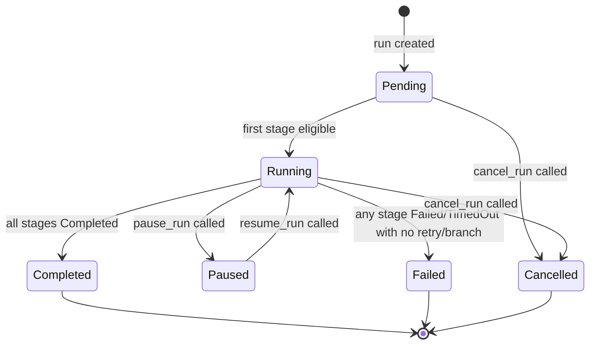

**[2_TAS-REQ-020]** `StageStatus` legal transitions:

```
Pending → Waiting → Eligible → Running → Paused ↔ Running → Completed
                                                 → Failed
                                                 → TimedOut
                                                 → Cancelled
Failed  → Pending  (retry)
TimedOut → Pending (retry)
Waiting → Cancelled
Eligible → Cancelled
```

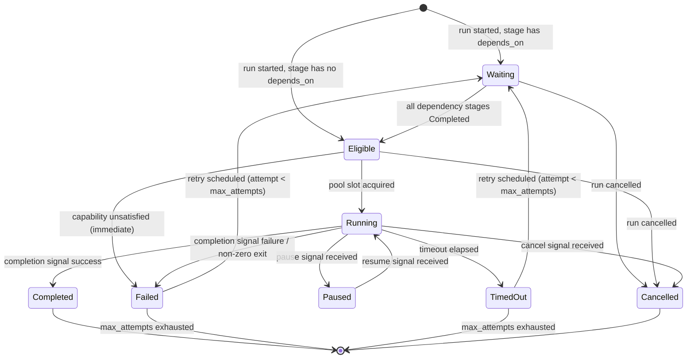

**[2_TAS-REQ-020a]** The `StateMachine` trait MUST reject any transition not listed above with `TransitionError::IllegalTransition { from, to }`. The transition is not applied and the current state is preserved. All state transitions MUST be persisted to `checkpoint.json` before any event is emitted to gRPC streaming subscribers.

**[2_TAS-REQ-020b]** When a `WorkflowRun` transitions to `Failed` or `Cancelled`, all non-terminal `StageRun` records MUST be transitioned to `Cancelled` in the same atomic checkpoint write. A stage is terminal if its status is one of: `Completed`, `Failed`, `TimedOut`, `Cancelled`.

### 3.6 JSON Serialization Schemas

All persistent files use UTF-8 encoded JSON. The exact on-disk format is normative; any deviation is a bug. Field ordering within objects is not guaranteed by serialization but MUST be accepted by deserialization regardless of order.

#### 3.6.1 `checkpoint.json`

**[2_TAS-REQ-021a]** `checkpoint.json` MUST conform exactly to the following schema. The file is written atomically by writing to a sibling `.checkpoint.json.tmp` and then calling `rename()`. Any reader that encounters a file ending in `.tmp` MUST treat it as a partial write and ignore it.

```json
{
  "schema_version": 1,
  "written_at": "<ISO 8601 UTC datetime>",
  "run": {
    "run_id": "<UUID v4 string>",
    "slug": "<[a-z0-9-]+ string, max 128 chars>",
    "workflow_name": "<string>",
    "project_id": "<UUID v4 string>",
    "status": "<RunStatus variant string>",
    "inputs": {
      "<input_name>": "<string | integer | boolean | null>"
    },
    "created_at": "<ISO 8601 UTC datetime>",
    "started_at": "<ISO 8601 UTC datetime | null>",
    "completed_at": "<ISO 8601 UTC datetime | null>",
    "stage_runs": [
      {
        "stage_run_id": "<UUID v4 string>",
        "run_id": "<UUID v4 string>",
        "stage_name": "<string>",
        "attempt": "<u32, 1-based>",
        "status": "<StageStatus variant string>",
        "agent_tool": "<AgentTool variant string | null>",
        "pool_name": "<string>",
        "started_at": "<ISO 8601 UTC datetime | null>",
        "completed_at": "<ISO 8601 UTC datetime | null>",
        "exit_code": "<i32 | null>",
        "output": {
          "stdout": "<base64-encoded bytes, max 1 MiB>",
          "stderr": "<base64-encoded bytes, max 1 MiB>",
          "structured": "<arbitrary JSON object | null>",
          "exit_code": "<i32>",
          "log_path": "<string path>",
          "truncated": "<bool>"
        }
      }
    ]
  }
}
```

**Field constraints enforced on write:**

| Field | Type | Constraint |
|---|---|---|
| `schema_version` | integer | Always `1`; reader MUST reject any other value with a schema migration error |
| `written_at` | string | ISO 8601 UTC; set to wall-clock time at the moment of the atomic rename |
| `run.run_id` | string | UUID v4; immutable after creation |
| `run.slug` | string | `[a-z0-9-]+`, max 128 chars; immutable after creation |
| `run.status` | string | One of: `"Pending"`, `"Running"`, `"Paused"`, `"Completed"`, `"Failed"`, `"Cancelled"` |
| `stage_run.attempt` | integer | ≥ 1; incremented by 1 for each retry |
| `stage_run.status` | string | One of: `"Pending"`, `"Waiting"`, `"Eligible"`, `"Running"`, `"Paused"`, `"Completed"`, `"Failed"`, `"Cancelled"`, `"TimedOut"` |
| `stage_run.output.stdout` | string | Base64-encoded; max 1,048,576 bytes decoded; if truncated, `truncated: true` |
| `stage_run.output.stderr` | string | Base64-encoded; max 1,048,576 bytes decoded; if truncated, `truncated: true` |

**[2_TAS-REQ-021b]** A `null` value for any optional timestamp field (e.g. `started_at`, `completed_at`) MUST be serialized as JSON `null`, never as an absent key. Deserializing a checkpoint where an optional field is absent (rather than `null`) MUST be treated as `null` for forward compatibility.

**[2_TAS-REQ-021c]** If a disk-full error occurs during the atomic write, `devs` MUST log the error at `ERROR` level, leave the previous checkpoint file unchanged, and continue running. The server MUST NOT crash on checkpoint write failure.

#### 3.6.2 `workflow_snapshot.json`

**[2_TAS-REQ-022a]** `workflow_snapshot.json` is a verbatim serialization of the `WorkflowDefinition` struct at the moment the run transitions from `Pending` to `Running`. It is written atomically to `.devs/runs/<run-id>/workflow_snapshot.json` and committed to the checkpoint branch before the first stage becomes `Eligible`.

```json
{
  "name": "<[a-z0-9_-]+, max 128 chars>",
  "format": "<\"Rust\" | \"Toml\" | \"Yaml\">",
  "inputs": [
    {
      "name": "<[a-z0-9_]+, max 64 chars>",
      "kind": "<\"String\" | \"Path\" | \"Integer\" | \"Boolean\">",
      "required": "<bool>",
      "default": "<string | integer | boolean | null>"
    }
  ],
  "stages": [
    {
      "name": "<string, max 128 chars>",
      "pool": "<pool name string>",
      "prompt": "<string | null>",
      "prompt_file": "<string path | null>",
      "system_prompt": "<string | null>",
      "depends_on": ["<stage name>"],
      "required_capabilities": ["<capability string>"],
      "completion": "<\"ExitCode\" | \"StructuredOutput\" | \"McpToolCall\">",
      "env": { "<KEY>": "<value>" },
      "execution_env": "<ExecutionEnv object | null>",
      "retry": "<RetryConfig object | null>",
      "timeout_secs": "<u64 | null>",
      "fan_out": "<FanOutConfig object | null>",
      "branch": "<BranchConfig object | null>"
    }
  ],
  "timeout_secs": "<u64 | null>",
  "default_env": { "<KEY>": "<value>" },
  "artifact_collection": "<\"AgentDriven\" | \"AutoCollect\">"
}
```

**[2_TAS-REQ-022b]** Once written, `workflow_snapshot.json` is never modified. Any code path that would overwrite an existing snapshot MUST panic in debug builds and return an `ImmutableSnapshotError` in release builds, leaving the file unchanged.

**[2_TAS-REQ-022c]** The git commit message for the snapshot commit is: `devs: snapshot <run-id>`. The git author for all generated commits is `devs <devs@localhost>`.

#### 3.6.3 `.devs_context.json` (Agent Context File)

**[2_TAS-REQ-023a]** Before spawning each agent, `devs` writes `.devs_context.json` into the agent's working directory. This file contains the outputs of all stages in the transitive `depends_on` closure of the current stage (terminal-state stages only).

```json
{
  "run_id": "<UUID v4 string>",
  "run_slug": "<string>",
  "run_name": "<string>",
  "workflow_name": "<string>",
  "inputs": { "<input_name>": "<value>" },
  "stages": {
    "<stage_name>": {
      "status": "<StageStatus variant>",
      "exit_code": "<i32 | null>",
      "stdout": "<string, UTF-8, max 1 MiB>",
      "stderr": "<string, UTF-8, max 1 MiB>",
      "structured": "<JSON object | null>",
      "truncated": "<bool>",
      "completed_at": "<ISO 8601 UTC datetime>"
    }
  }
}
```

**[2_TAS-REQ-023b]** The total serialized size of `.devs_context.json` MUST NOT exceed 10 MiB. If the full content would exceed this limit, `stdout` and `stderr` fields for each stage are truncated proportionally (equal bytes removed from each), and the `truncated` flag for affected stages is set to `true`. A `WARN`-level log entry MUST be emitted listing which stages were truncated and by how many bytes.

**[2_TAS-REQ-023c]** `.devs_context.json` is written atomically (write-to-temp-rename). A failure to write this file MUST cause the stage to transition to `Failed` immediately, before the agent process is spawned.

**[2_TAS-REQ-023d]** Only stages in the **transitive** `depends_on` closure of the current stage are included. Stages not reachable through the dependency graph are excluded, even if they have completed.

#### 3.6.4 `.devs_output.json` (Agent Structured Output)

**[2_TAS-REQ-024a]** When `completion = StructuredOutput`, the agent is expected to write `.devs_output.json` to its working directory. `devs` reads this file after the process exits (or after `signal_completion` is called). If the file exists, it takes absolute precedence over stdout JSON parsing.

```json
{
  "success": "<bool — required>",
  "output": {
    "<arbitrary_key>": "<arbitrary_value>"
  },
  "message": "<optional human-readable string>"
}
```

**[2_TAS-REQ-024b]** Parsing rules for `structured_output` completion:

| Condition | Result |
|---|---|
| `.devs_output.json` exists and is valid JSON with `"success": true` | Stage → `Completed`; `output.structured` = parsed JSON |
| `.devs_output.json` exists and is valid JSON with `"success": false` | Stage → `Failed`; `output.structured` = parsed JSON |
| `.devs_output.json` exists but is invalid JSON | Stage → `Failed`; `output.structured` = `null` |
| `.devs_output.json` absent; stdout ends with a valid JSON object containing `"success": true` | Stage → `Completed`; `output.structured` = parsed JSON |
| `.devs_output.json` absent; stdout ends with a valid JSON object containing `"success": false` | Stage → `Failed`; `output.structured` = parsed JSON |
| `.devs_output.json` absent; stdout contains no valid trailing JSON object | Stage → `Failed`; `output.structured` = `null` |

**[2_TAS-REQ-024c]** The `"success"` key MUST be a JSON boolean. A string value such as `"true"` is invalid and causes `Stage → Failed`.

### 3.7 In-Memory Runtime State

`devs` maintains all live state in Tokio-synchronized data structures. These structures are the authoritative source of truth during a run; the git-backed files are the recovery source on restart.

**[2_TAS-REQ-025]** The following in-memory structures MUST be defined in `devs-core/src/state.rs`:

```rust
/// Top-level shared server state, wrapped in Arc and passed to all subsystems.
pub struct ServerState {
    /// All workflow runs, keyed by run_id.
    pub runs: Arc<RwLock<HashMap<Uuid, WorkflowRun>>>,
    /// All registered agent pools, keyed by pool name.
    pub pools: Arc<RwLock<HashMap<String, PoolState>>>,
    /// All registered projects, keyed by project_id.
    pub projects: Arc<RwLock<HashMap<Uuid, Project>>>,
    /// Per-run event broadcast channels for gRPC streaming subscribers.
    pub run_events: Arc<RwLock<HashMap<Uuid, broadcast::Sender<RunEvent>>>>,
    /// Global configuration loaded at startup.
    pub config: Arc<ServerConfig>,
}

/// Live state of a single agent pool.
pub struct PoolState {
    pub definition: AgentPool,
    /// Semaphore enforcing max_concurrent across all projects.
    pub semaphore: Arc<Semaphore>,
    /// Per-agent rate-limit cooldown expiry times (wall clock).
    pub rate_limited_until: HashMap<usize, Instant>,
}

/// An event broadcast to gRPC StreamRunEvents subscribers.
pub enum RunEvent {
    RunStatusChanged { run_id: Uuid, status: RunStatus },
    StageStatusChanged { run_id: Uuid, stage_name: String, status: StageStatus },
    LogLine { run_id: Uuid, stage_name: String, stream: LogStream, line: String },
}

pub enum LogStream { Stdout, Stderr }
```

**[2_TAS-REQ-026]** On server startup, `ServerState` is populated by:
1. Reading `~/.config/devs/projects.toml` and populating `projects`.
2. For each project, reading the checkpoint branch and deserializing all `checkpoint.json` files under `.devs/runs/` into `runs`.
3. Applying crash-recovery rules (§4.11 of the PRD): stages in `Running` state → reset to `Eligible`; stages in `Eligible` state → re-queued; `Pending` runs → re-queued.
4. Initializing `PoolState` from `devs.toml` pool definitions, constructing `Semaphore` with the configured `max_concurrent` permits.
5. Writing the discovery file only after all of the above complete successfully.

**[2_TAS-REQ-027]** All mutations to `ServerState.runs` MUST:
1. Acquire the `RwLock` write guard.
2. Apply the state transition via the `StateMachine` trait (which validates legality).
3. Release the write guard.
4. Persist `checkpoint.json` to disk (outside the lock, using a snapshot of the mutated value).
5. Broadcast a `RunEvent` to all streaming subscribers for the affected run.

Steps 4 and 5 MUST happen in that order. A subscriber MUST NOT receive an event for a state that has not yet been persisted to disk.

### 3.8 Type Constraints & Validation Rules

Every type with a bounded or constrained value domain is implemented as a Rust newtype wrapper. Construction via `::new()` performs validation; invalid values return `ValidationError` without panicking. All newtypes derive `serde::Serialize` and `serde::Deserialize` with transparent representations.

#### 3.8.1 `BoundedString<const N: usize>`

**[2_TAS-REQ-028]** `BoundedString<N>` wraps a `String` and enforces:
- Length ≤ N bytes (UTF-8 byte count, not char count).
- Empty strings (`len == 0`) are rejected with `ValidationError::EmptyString`.
- Constructed via `BoundedString::<N>::new(s: &str) -> Result<Self, ValidationError>`.
- Implements `Deref<Target = str>`, `Display`, `PartialEq`, `Eq`, `Hash`, `Clone`.

#### 3.8.2 `EnvKey`

**[2_TAS-REQ-029]** `EnvKey` wraps a `String` and enforces:
- Regex pattern: `[A-Z_][A-Z0-9_]{0,127}` (total max 128 chars including first char).
- Any key not matching this pattern is rejected with `ValidationError::InvalidEnvKey`.
- The following keys are prohibited and MUST be rejected at stage definition parse time: `DEVS_LISTEN`, `DEVS_MCP_PORT`, `DEVS_DISCOVERY_FILE`. These are stripped from agent environments even if present in the server environment.

#### 3.8.3 `RunSlug`

**[2_TAS-REQ-030]** `RunSlug` is generated at run creation time using the following algorithm:

```rust
fn generate_slug(workflow_name: &str, now: DateTime<Utc>) -> RunSlug {
    let date = now.format("%Y%m%d").to_string();          // e.g. "20240101"
    let hex: String = rand::thread_rng()
        .sample_iter(&rand::distributions::Alphanumeric)
        .take(4)
        .map(|c| c.to_ascii_lowercase())
        .collect();                                        // e.g. "a3f7"
    let base = format!("{}-{}-{}", workflow_name, date, hex);
    // Truncate to 128 bytes without splitting a UTF-8 char boundary
    RunSlug::truncate_to_128(base)
}
```

The resulting slug matches `[a-z0-9-]+` and is at most 128 characters. If a user-provided run name collides with an existing non-cancelled run's slug or `run_id`, the submission is rejected atomically with `DuplicateRunName` error.

#### 3.8.4 `Uuid` (run_id, project_id, stage_run_id)

**[2_TAS-REQ-031]** All UUID fields use UUID version 4 (random), generated via the `uuid` crate with the `v4` feature. UUIDs are serialized as lowercase hyphenated strings (e.g. `"6ba7b810-9dad-11d1-80b4-00c04fd430c8"`). Any non-UUID string in a field declared as UUID causes a deserialization error.

#### 3.8.5 Validation Execution Order

**[2_TAS-REQ-032]** Workflow definition validation is performed in the following fixed order, collecting all errors before returning. A partial-success validation that stops at the first error is not permitted.

| Order | Validation Step | Error Type |
|---|---|---|
| 1 | Schema validation (required fields present, types correct) | `SchemaError` |
| 2 | Stage name uniqueness within the workflow | `DuplicateStageNameError` |
| 3 | `depends_on` references resolve to existing stage names | `UnknownDependencyError` |
| 4 | Cycle detection via Kahn's algorithm | `CycleError { cycle: Vec<String> }` |
| 5 | `pool` name exists in the server's pool registry | `UnknownPoolError` |
| 6 | Named `handler` references are registered with the server | `UnknownHandlerError` |
| 7 | Default value type matches declared `InputKind` | `TypeMismatchError` |
| 8 | `prompt` and `prompt_file` mutual exclusivity | `MutuallyExclusiveError` |
| 9 | `fan_out` and `branch` mutual exclusivity | `MutuallyExclusiveError` |
| 10 | `fan_out.count` and `fan_out.input_list` mutual exclusivity | `MutuallyExclusiveError` |
| 11 | `fan_out` count limits (1–64) and non-empty `input_list` | `FanOutLimitError` |
| 12 | `stage.timeout_secs` ≤ `workflow.timeout_secs` when both set | `TimeoutHierarchyError` |
| 13 | At least one stage defined | `EmptyWorkflowError` |

The full error list is returned as `Vec<ValidationError>`. gRPC callers receive the complete list in a `INVALID_ARGUMENT` status detail.

### 3.9 Field-Level Business Rules

This section states every invariant as a concrete, testable assertion.

**[2_TAS-BR-001]** A `WorkflowDefinition.name` that does not match `[a-z0-9_-]+` or exceeds 128 bytes MUST be rejected with `ValidationError::InvalidName` before any other validation runs.

**[2_TAS-BR-002]** A `WorkflowDefinition` with zero stages MUST be rejected with `ValidationError::EmptyWorkflow`. A workflow MAY have up to 256 stages; exceeding 256 stages MUST be rejected with `ValidationError::TooManyStages`.

**[2_TAS-BR-003]** A `WorkflowDefinition` with more than 64 inputs MUST be rejected with `ValidationError::TooManyInputs`.

**[2_TAS-BR-004]** A `WorkflowInput` with `required: false` and no `default` value is valid. The resolved value at runtime is `null` for optional inputs not provided at submission time.

**[2_TAS-BR-005]** A `StageDefinition` MUST have exactly one of `prompt` or `prompt_file` set. Both set or neither set MUST be rejected at validation time.

**[2_TAS-BR-006]** A `StageDefinition` MUST NOT have both `fan_out` and `branch` set simultaneously.

**[2_TAS-BR-007]** A `FanOutConfig` MUST have exactly one of `count` or `input_list` set. `count` MUST be in the range 1–64 inclusive. An `input_list` MUST have 1–64 elements inclusive. Zero-length `input_list` MUST be rejected.

**[2_TAS-BR-008]** A `RetryConfig.max_attempts` MUST be in the range 1–20 inclusive. A value of 0 is rejected. A value > 20 is rejected.

**[2_TAS-BR-009]** A `RetryConfig` with `backoff = Exponential` and no `max_delay` uses a computed cap of 300 seconds. `initial_delay` MUST be ≥ 1 second.

**[2_TAS-BR-010]** An `AgentPool.max_concurrent` MUST be in the range 1–1024 inclusive. An `AgentPool` MUST have at least one `AgentConfig`.

**[2_TAS-BR-011]** A `Project.weight` MUST be ≥ 1. A weight of 0 MUST be rejected at project registration time with `ValidationError::InvalidWeight`.

**[2_TAS-BR-012]** A `WebhookTarget.url` MUST use the `https` or `http` scheme. Any other scheme (e.g. `ftp`, `file`) MUST be rejected with `ValidationError::InvalidWebhookUrl`.

**[2_TAS-BR-013]** The `WorkflowRun.definition_snapshot` field is set exactly once, when the run transitions from `Pending` to `Running`. Any code path that would overwrite a non-null snapshot MUST return `ImmutableSnapshotError`.

**[2_TAS-BR-014]** `StageRun.attempt` starts at 1 for the first execution. Each retry increments `attempt` by 1. A rate-limit event that causes pool fallback MUST NOT increment `attempt`; only genuine failures (non-zero exit with no rate-limit pattern match) increment the counter.

**[2_TAS-BR-015]** `StageRun.exit_code` MUST be recorded for every stage execution regardless of the `completion` signal type. A stage that is killed by `SIGKILL` records exit code `-9` (or the platform equivalent). A stage that times out records `null` for `exit_code` if the process does not exit before the checkpoint is written, and then records the actual exit code when the process exits.

**[2_TAS-BR-016]** Two `WorkflowRun` records in the same project MUST NOT have the same `slug` unless one of them has `status = Cancelled`. The uniqueness check is performed atomically under a per-project mutex at submission time.

**[2_TAS-BR-017]** A template variable reference `{{stage.<name>.<field>}}` is only valid if `<name>` is in the transitive `depends_on` closure of the referencing stage. A reference to a stage outside this closure MUST cause the stage to transition to `Failed` at execution start, not at validation time (because the dependency graph is checked at validation time but template references within prompts are resolved at execution time).

**[2_TAS-BR-018]** The `EnvKey` values `DEVS_LISTEN`, `DEVS_MCP_PORT`, and `DEVS_DISCOVERY_FILE` MUST be stripped from the agent's environment even if they appear in the server's own environment. `DEVS_MCP_ADDR` MUST be injected into every agent process, set to the MCP server's listen address.

### 3.10 Edge Cases & Error Handling

#### 3.10.1 Checkpoint Read Failures on Startup

**[2_TAS-BR-019]** If a `checkpoint.json` file exists but fails to parse (malformed JSON, unknown `schema_version`, missing required fields), `devs` MUST:
1. Log the error at `ERROR` level with the full file path and parse error message.
2. Skip that run (do not attempt recovery).
3. Continue loading all other runs.
4. After startup completes, expose the unrecoverable run IDs via the `list_runs` MCP tool with `status = "Unrecoverable"` and an `error` field describing the parse failure.

A single corrupt checkpoint file MUST NOT prevent the server from starting.

**[2_TAS-BR-020]** If the `workflow_snapshot.json` for a run is missing or corrupt, but the `checkpoint.json` is valid, the run is still recovered but any stage that would require reading the snapshot (e.g. re-resolving templates) transitions immediately to `Failed` with error `MissingSnapshot`.

#### 3.10.2 Concurrent Checkpoint Writes

**[2_TAS-BR-021]** Multiple stage completions may occur concurrently for fan-out stages. Each concurrent completion acquires the `runs` `RwLock` write guard, applies its transition, releases the lock, and then writes `checkpoint.json`. Because lock acquisition is sequential, checkpoint writes are also sequential. A write that loses the lock race MUST re-read the current state from the in-memory map (not from disk) before writing, so the final file reflects all concurrent transitions.

#### 3.10.3 Disk Full During Checkpoint Write

**[2_TAS-BR-022]** If the `rename()` syscall fails (e.g. because the target filesystem is full or the temp file and target are on different filesystems), `devs` MUST:
1. Log at `ERROR` level: `"checkpoint write failed: <OS error>"`.
2. Attempt to delete the `.tmp` file.
3. Continue running with in-memory state authoritative.
4. Retry the checkpoint write on the next state transition.

The server MUST NOT crash, terminate the run, or revert the in-memory state change.

#### 3.10.4 Stage Output Exceeds Size Limit

**[2_TAS-BR-023]** If a stage's combined `stdout` + `stderr` exceeds 2 MiB total (1 MiB each), the excess is truncated before storing in `StageOutput`. The truncation algorithm:
1. Measure `stdout_len` and `stderr_len`.
2. If `stdout_len > 1_048_576`: truncate `stdout` to last 1,048,576 bytes (keeping the most recent output, which is most relevant for completion detection).
3. If `stderr_len > 1_048_576`: truncate `stderr` to last 1,048,576 bytes.
4. Set `StageOutput.truncated = true`.
5. Log at `WARN` level: `"stage <name> output truncated: stdout=<original_len> stderr=<original_len>"`.

#### 3.10.5 Template Variable Resolution Failures

**[2_TAS-BR-024]** Template variable resolution failures are categorized as follows:

| Failure Mode | Behavior |
|---|---|
| `{{stage.X.field}}` where `X` is not in `depends_on` transitive closure | Stage → `Failed`; error: `TemplateError::InvalidStageRef { stage: "X" }` |
| `{{stage.X.output.field}}` where stage X used `exit_code` completion (no structured output) | Stage → `Failed`; error: `TemplateError::NoStructuredOutput { stage: "X" }` |
| `{{workflow.input.Y}}` where `Y` is not declared in the workflow definition | Stage → `Failed`; error: `TemplateError::UnknownInput { name: "Y" }` |
| `{{workflow.input.Y}}` where `Y` is declared but not provided and has no default | Stage → `Failed`; error: `TemplateError::MissingRequiredInput { name: "Y" }` |
| `{{stage.X.output.field}}` where `field` does not exist in structured output | Stage → `Failed`; error: `TemplateError::UnknownOutputField { stage: "X", field: "field" }` |

All template resolution errors MUST be captured before agent spawn and MUST cause the stage to fail immediately (i.e., no agent process is ever spawned for a stage with unresolvable templates).

#### 3.10.6 Slug Collision on Run Submission

**[2_TAS-BR-025]** If a user-supplied run name produces a slug that collides with an active (non-cancelled) run in the same project, the submission MUST be rejected atomically with:
```json
{ "error": "duplicate_run_name", "slug": "<colliding_slug>", "existing_run_id": "<uuid>" }
```
The check and the run creation MUST be performed under the same per-project mutex to prevent TOCTOU races.

#### 3.10.7 Schema Version Mismatch on Checkpoint Read

**[2_TAS-BR-026]** If `checkpoint.json` contains `"schema_version": N` where N ≠ 1 (the only currently supported version), the server MUST:
1. Log at `ERROR` level: `"unsupported checkpoint schema version <N> in <path>"`.
2. Mark that run as `Unrecoverable` (same behavior as §3.10.1).
3. NOT attempt to interpret the file's other fields.

This behavior is forward-compatible: when a future schema version is introduced, only an explicit upgrade path may change the behavior above.

#### 3.10.8 `prompt_file` Absent at Execution Time

**[2_TAS-BR-027]** `prompt_file` paths are resolved at stage execution time, not at workflow definition validation time. If the file does not exist when the stage is about to run, the stage MUST transition to `Failed` with error `PromptFileNotFound { path: "<path>" }`. No agent process is spawned. This allows `prompt_file` to reference files created by earlier stages (e.g. written to a shared directory) without requiring them to exist at submit time.

### 3.11 Section Dependencies

This section is the foundation for all other sections. Its outputs (type definitions, state machines, file schemas) are consumed by:

| Dependent Section | Dependency |
|---|---|
| §4 Component Hierarchy | Imports all types from `devs-core/src/types.rs`; implements `StateMachine` trait |
| §5 API Design (gRPC) | Proto message types mirror `WorkflowRun`, `StageRun`, `StageOutput`, `AgentPool`, `Project` |
| §5 API Design (MCP) | MCP tool responses serialize `WorkflowRun`, `StageRun`, `StageOutput` as JSON |
| §6 Algorithms | DAG scheduling reads `StageDefinition.depends_on`; pool routing reads `AgentConfig.capabilities` |
| §7 Edge Cases | All error types (`ValidationError`, `TransitionError`, `TemplateError`) are defined here |
| §9 Acceptance Criteria | Test assertions reference field names and constraints defined here |

External dependencies of this section:

| Dependency | Reason |
|---|---|
| `serde` + `serde_json` | JSON serialization/deserialization for all file schemas |
| `uuid` crate (v4 feature) | UUID generation for `run_id`, `project_id`, `stage_run_id` |
| `chrono` crate | `DateTime<Utc>` for all timestamp fields |
| `tokio::sync::{RwLock, broadcast, Semaphore}` | In-memory runtime state synchronization |
| `git2` crate | Atomic checkpoint commits to the checkpoint branch |
| `rand` crate | Slug 4-hex-char suffix generation |

### 3.12 Acceptance Criteria

The following criteria are independently verifiable by an automated test. Each criterion references a requirement from this section.

- **[AC-3.01]** Given a `checkpoint.json` with `"schema_version": 2`, the server startup MUST log an `ERROR` containing `"unsupported checkpoint schema version"` and skip that run. The server MUST still start and load all other runs. *(covers 2_TAS-BR-026)*

- **[AC-3.02]** Given a workflow definition with a stage cycle `A → B → A`, `submit_run` MUST return a `INVALID_ARGUMENT` gRPC status whose error detail contains `"cycle detected"` and the array `["A", "B", "A"]`. *(covers 2_TAS-REQ-032, step 4)*

- **[AC-3.03]** Given a `StageRun` in `Running` status, calling `transition(Running → Completed)` MUST succeed and subsequently calling `transition(Completed → Running)` MUST return `TransitionError::IllegalTransition { from: Completed, to: Running }` and leave the status as `Completed`. *(covers 2_TAS-REQ-020a)*

- **[AC-3.04]** Given a `WorkflowRun` that transitions to `Cancelled`, all `StageRun` records with status `Waiting`, `Eligible`, or `Running` MUST have status `Cancelled` in the same `checkpoint.json` write. No intermediate checkpoint with partial cancellation is written. *(covers 2_TAS-REQ-020b)*

- **[AC-3.05]** Given a stage producing 2 MiB of stdout, `StageOutput.stdout` MUST be truncated to the last 1,048,576 bytes and `StageOutput.truncated` MUST be `true`. The `WARN` log entry MUST mention the original stdout length. *(covers 2_TAS-BR-023)*

- **[AC-3.06]** Given a `checkpoint.json` write that fails with `ENOSPC` (disk full), the server MUST continue running with in-memory state intact. The next state transition MUST attempt another checkpoint write. The server MUST NOT exit or crash. *(covers 2_TAS-BR-022, 2_TAS-REQ-021c)*

- **[AC-3.07]** Given a `WorkflowRun` submitted with a run name that collides with an active run in the same project, `submit_run` MUST return an error containing `"duplicate_run_name"` and the `existing_run_id`. The new run MUST NOT be created. *(covers 2_TAS-BR-016, 2_TAS-BR-025)*

- **[AC-3.08]** Given a stage with `prompt_file = "outputs/plan.md"` and no such file exists at execution time, the stage MUST transition to `Failed` with error `PromptFileNotFound`. No agent process MUST have been spawned. *(covers 2_TAS-BR-027)*

- **[AC-3.09]** Given a `workflow_snapshot.json` is missing for a recovered run, stages requiring template resolution MUST transition to `Failed` with `MissingSnapshot`. Other stages without template references MUST still execute. *(covers 2_TAS-BR-020)*

- **[AC-3.10]** Given a `StageDefinition` with both `prompt` and `prompt_file` set, validation MUST return a `ValidationError::MutuallyExclusive` for that stage. The error MUST be included in the full error list alongside any other validation errors from other stages. *(covers 2_TAS-REQ-032, step 8)*

- **[AC-3.11]** Given a context file that would exceed 10 MiB, the server MUST truncate `stdout`/`stderr` fields proportionally across all stages, set `truncated: true` for affected stages, and emit a `WARN` log. The file as written MUST be ≤ 10 MiB. *(covers 2_TAS-REQ-023b)*

- **[AC-3.12]** Given an `EnvKey` value of `"DEVS_LISTEN"` in a stage's `env` map, validation MUST reject it with `ValidationError::ProhibitedEnvKey`. *(covers 2_TAS-REQ-029)*

- **[AC-3.13]** Given a `WorkflowRun` whose `definition_snapshot` is already set, attempting to overwrite it MUST return `ImmutableSnapshotError` and leave the existing snapshot unchanged. *(covers 2_TAS-BR-013, 2_TAS-REQ-022b)*

- **[AC-3.14]** Given a template reference `{{stage.X.output.field}}` where stage X used `exit_code` completion, the stage MUST fail immediately before agent spawn with `TemplateError::NoStructuredOutput`. *(covers 2_TAS-BR-024)*

- **[AC-3.15]** Given a `.devs_output.json` containing `"success": "true"` (string, not boolean), the stage MUST transition to `Failed`. *(covers 2_TAS-REQ-024c)*

- **[AC-3.16]** Given a `FanOutConfig` with `count = 0`, workflow validation MUST return `ValidationError::FanOutLimitError`. *(covers 2_TAS-BR-007)*

- **[AC-3.17]** Given a `RetryConfig` with `max_attempts = 21`, workflow validation MUST return `ValidationError::InvalidRetryCount`. *(covers 2_TAS-BR-008)*

- **[AC-3.18]** Given a `Project` registered with `weight = 0`, the registration MUST be rejected with `ValidationError::InvalidWeight`. *(covers 2_TAS-BR-011)*

- **[AC-3.19]** Given a `RunSlug` generated from a workflow named `"my-workflow"` on date `2024-01-15`, the slug MUST match `my-workflow-20240115-[a-z0-9]{4}` and be ≤ 128 characters. *(covers 2_TAS-REQ-030)*

- **[AC-3.20]** Given a corrupt `checkpoint.json` for run A and a valid `checkpoint.json` for run B in the same project, the server MUST start successfully, recover run B, mark run A as `Unrecoverable`, and expose both via `list_runs`. *(covers 2_TAS-BR-019)*

---

## 4. Component Hierarchy & Core Modules

### 4.1 Cargo Workspace Structure

**[2_TAS-REQ-021]** The Cargo workspace MUST be organized into the following crates:

```
Cargo.toml                  # workspace root
proto/devs/v1/              # .proto source files
crates/
  devs-proto/               # build.rs + generated tonic/prost code
  devs-core/                # shared types, state machines, error types, template engine
  devs-config/              # devs.toml + projects.toml parsing and validation
  devs-checkpoint/             # git2-backed checkpoint store
  devs-scheduler/            # DAG scheduler, stage state machine
  devs-pool/                # agent pool manager (routing, concurrency, fallback)
  devs-adapters/            # agent adapter trait + 5 implementations
  devs-executor/            # execution environments (tempdir, docker, remote SSH)
  devs-webhook/             # outbound webhook dispatcher
  devs-mcp/                 # MCP server (HTTP JSON-RPC)
  devs-grpc/                # tonic gRPC service implementations
  devs-server/              # binary: wires all crates, startup sequence
  devs-tui/                 # binary: ratatui TUI client
  devs-cli/                 # binary: clap CLI client
  devs-mcp-bridge/          # binary: MCP stdio bridge
```

### 4.1.1 Component Dependency Graph

The following diagram shows compile-time crate dependencies. Arrows point from dependent → dependency. All crates in the workspace are internal; no circular dependencies are permitted.

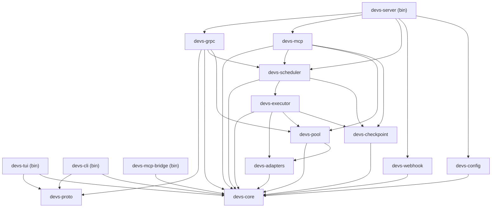

**[2_TAS-REQ-100]** The dependency graph MUST be acyclic. `cargo build` MUST fail if any circular dependency is introduced. `devs-core` and `devs-proto` MUST have zero internal workspace dependencies (they are the dependency roots). `devs-server` is the only crate permitted to depend on all other crates simultaneously.

**[2_TAS-REQ-101]** Binary crates (`devs-server`, `devs-tui`, `devs-cli`, `devs-mcp-bridge`) MUST NOT be depended upon by any other crate. Library crates MUST NOT contain `main` functions. Each binary crate contains only its entry point and wiring; all logic lives in library crates.

### 4.2 `devs-proto`

**[2_TAS-REQ-022]** This crate contains no runtime logic. Its sole responsibility is:
1. Invoking `tonic-build` in `build.rs` to compile `.proto` → Rust.
2. Re-exporting all generated types under `devs_proto::devs::v1`.

The crate is a dependency of `devs-grpc`, `devs-tui`, `devs-cli`, and `devs-mcp-bridge`.

### 4.3 `devs-core`

**[2_TAS-REQ-023]** Contains:
- All domain types from §3.2 (newtype wrappers, enums, error types).
- `StateMachine` trait with `transition(&mut self, event: E) -> Result<(), TransitionError>` — implemented by `WorkflowRun` and `StageRun`.
- `TemplateResolver` — resolves `{{variable}}` expressions in prompt strings using the resolution order defined in PRD §4.3. Returns `Err(TemplateError::UnknownVariable)` on missing variable rather than empty string.
- `ValidationError` with collected multi-error reporting (all validation errors returned in one pass, not first-error-only).

### 4.3.1 `devs-core` Detailed Specifications

**[2_TAS-REQ-102]** The `StateMachine` trait and its implementations for `WorkflowRun` and `StageRun` encode all valid status transitions as exhaustive match arms. Any attempt to call `transition` with an illegal event returns `Err(TransitionError::InvalidTransition { from, event })`. The error carries both the current state and the attempted event for diagnostics.

```rust
pub trait StateMachine {
    type Event;
    type Error;
    fn transition(&mut self, event: Self::Event) -> Result<(), Self::Error>;
    fn is_terminal(&self) -> bool;
}

pub enum WorkflowRunEvent {
    Start,
    Pause,
    Resume,
    Complete,
    Fail,
    Cancel,
}

pub enum StageRunEvent {
    MakeEligible,   // Waiting → Eligible (all deps complete)
    Dispatch,       // Eligible → Running
    Pause,          // Running → Paused
    Resume,         // Paused → Running
    Complete,       // Running → Completed
    Fail,           // Running → Failed
    TimeOut,        // Running → TimedOut
    Cancel,         // Running|Paused|Eligible|Waiting → Cancelled
    ScheduleRetry,  // Failed|TimedOut → Pending (reset for retry attempt)
}

#[derive(Debug)]
pub struct TransitionError {
    pub from:  String, // Display of current state
    pub event: String, // Display of attempted event
}
```

**[2_TAS-REQ-103]** `TemplateResolver` resolves `{{variable}}` expressions against a `TemplateContext`. The resolution algorithm processes expressions in this exact priority order:

1. `{{workflow.input.<name>}}` — from `WorkflowRun.inputs`
2. `{{run.id}}`, `{{run.slug}}`, `{{run.name}}` — from `WorkflowRun` fields
3. `{{stage.<name>.exit_code}}` — from `StageRun.exit_code` of a completed dependency stage
4. `{{stage.<name>.output.<field>}}` — from `StageRun.output.structured.<field>` of a completed dependency stage
5. `{{stage.<name>.stdout}}` — from `StageRun.output.stdout` (truncated to 64 KiB for template use)
6. `{{stage.<name>.stderr}}` — from `StageRun.output.stderr` (truncated to 64 KiB for template use)
7. `{{fan_out.index}}` — only valid within a fan-out sub-execution (integer 0-based index)
8. `{{fan_out.item}}` — only valid within a fan-out sub-execution using `input_list` mode

If a `{{variable}}` expression does not match any of the above patterns, `TemplateResolver` returns `Err(TemplateError::UnknownVariable { expr: String })`. The stage is immediately transitioned to `Failed` with the error message embedded in `StageRun.output.stderr`. The resolver MUST NOT silently substitute an empty string for any unresolved variable.

**[2_TAS-REQ-104]** `ValidationError` accumulates all validation errors in a single pass and returns them as a `Vec<ValidationError>`. Each entry carries:

```rust
pub struct ValidationError {
    pub code:    ValidationErrorCode, // enum variant
    pub message: String,              // human-readable description
    pub field:   Option<String>,      // dotted field path if applicable
}

pub enum ValidationErrorCode {
    SchemaMissing,
    FieldTooLong,
    DuplicateName,
    UnknownDependency,
    CycleDetected,        // message includes full cycle path
    UnknownPool,
    UnknownHandler,
    TypeMismatch,
    MutuallyExclusive,
    IncompatibleOptions,
    ValueOutOfRange,
    EmptyCollection,
}
```

**Edge Cases — `devs-core`:**

| # | Scenario | Expected Behavior |
|---|---|---|
| EC-C03-01 | `TemplateResolver` encounters `{{stage.foo.output.bar}}` but stage `foo` used `exit_code` completion (no structured output) | Returns `Err(TemplateError::InvalidReference)` with message `"stage 'foo' has no structured output (completion=exit_code)"` |
| EC-C03-02 | Template string references a stage not in the transitive `depends_on` closure | Returns `Err(TemplateError::UnauthorizedReference)` with message `"stage '<name>' is not in the transitive depends_on closure"` |
| EC-C03-03 | `transition()` called on a `WorkflowRun` already in `Completed` state with event `Complete` | Returns `Err(TransitionError)` immediately; state unchanged |
| EC-C03-04 | Workflow validation collects 5 separate errors (duplicate name + cycle + unknown pool + two unknown deps) | Returns all 5 errors in `Vec<ValidationError>` in a single call; none are suppressed |
| EC-C03-05 | `{{fan_out.item}}` referenced in a non-fan-out stage | Returns `Err(TemplateError::UnknownVariable)` |

### 4.4 `devs-config`

**[2_TAS-REQ-024]** Parses `devs.toml` into a `ServerConfig` struct. Parses `~/.config/devs/projects.toml` into `ProjectRegistry`. Validation errors are collected and returned as `Vec<ConfigError>` before any side effects. All config fields have documented defaults. The env var override mechanism applies `DEVS_`-prefixed uppercase keys against a flat dotted-path representation of the config.

**[2_TAS-REQ-025]** `devs.toml` top-level sections:

```toml
[server]
listen = "127.0.0.1:7890"     # gRPC listen address
mcp_port = 7891                # MCP HTTP listen port
scheduling = "weighted"        # "strict" | "weighted"

[retention]
max_age_days = 30
max_size_mb  = 500

[[pool]]
name           = "primary"
max_concurrent = 4

  [[pool.agent]]
  tool         = "claude"
  capabilities = ["code-gen", "review"]
  fallback     = false

[webhooks]
# per-project; defined in project registry (projects.toml [[project.webhook]] sub-tables), not here.
# See §4.4.2 Per-Project Webhook Configuration for the full schema and delivery semantics.
```

### 4.4.1 `devs-config` Detailed Specifications

**[2_TAS-REQ-105]** The complete `ServerConfig` struct schema, with all fields, types, defaults, and constraints:

| TOML key path | Rust type | Default | Constraint |
|---|---|---|---|
| `server.listen` | `String` | `"127.0.0.1:7890"` | Valid `<host>:<port>` |
| `server.mcp_port` | `u16` | `7891` | 1024–65535 |
| `server.external_addr` | `Option<String>` | `None` (uses `listen`) | Valid `<host>:<port>` if set |
| `server.scheduling` | `SchedulingMode` | `Weighted` | `"strict"` or `"weighted"` |
| `retention.max_age_days` | `u32` | `30` | 1–3650 |
| `retention.max_size_mb` | `u64` | `500` | 1–1,000,000 |
| `pool[*].name` | `String` | (required) | `[a-z0-9_-]+`, max 64 chars |
| `pool[*].max_concurrent` | `u32` | (required) | 1–1024 |
| `pool[*].agent[*].tool` | `AgentTool` | (required) | `claude\|gemini\|opencode\|qwen\|copilot` |
| `pool[*].agent[*].capabilities` | `Vec<String>` | `[]` | Each tag max 64 chars |
| `pool[*].agent[*].fallback` | `bool` | `false` | — |
| `pool[*].agent[*].pty` | `Option<bool>` | `None` (uses adapter default) | — |
| `pool[*].agent[*].prompt_mode` | `Option<PromptMode>` | `None` (uses adapter default) | `"flag"\|"file"` |

**[2_TAS-REQ-106]** Config override precedence is enforced in this order (highest → lowest):
1. CLI flag (e.g. `--listen 0.0.0.0:8080`)
2. Environment variable (e.g. `DEVS_LISTEN=0.0.0.0:8080`)
3. `devs.toml` value
4. Built-in default

Env var naming: `DEVS_` prefix + uppercase dotted path with dots replaced by `_` (e.g. `server.mcp_port` → `DEVS_SERVER_MCP_PORT`). All config errors are collected before any port binding attempt; the process exits with a diagnostic to stderr if any errors are present.

**[2_TAS-REQ-107]** `ProjectRegistry` (`~/.config/devs/projects.toml`) schema per project entry:

```toml
[[project]]
project_id        = "550e8400-e29b-41d4-a716-446655440000"  # UUID4; assigned by devs at registration
name              = "my-project"       # human label, max 128 chars
repo_path         = "/path/to/repo"   # absolute path; validated to exist at registration
priority          = 10                 # u32; used in strict scheduling (lower = higher priority)
weight            = 1                  # u32 ≥ 1; used in weighted scheduling
checkpoint_branch = "devs/state"      # default "devs/state"; created as orphan if absent
workflow_dirs     = ["./workflows"]   # relative to repo_path; searched for TOML/YAML workflow files
status            = "active"          # "active" | "removing"; managed by devs, not user-editable

  [[project.webhook]]
  webhook_id      = "a1b2c3d4-e5f6-7890-abcd-ef1234567890"  # UUID4; assigned by devs at add time
  url             = "https://hooks.example.com/devs"        # must be http or https
  events          = ["run.started", "run.completed", "run.failed"]  # see §4.4.2 for full event list
  secret          = "s3cr3t-hmac-key"  # optional; omit to disable HMAC-SHA256 signing
  timeout_secs    = 10                 # default 10; range 1–30
  max_retries     = 3                  # default 3; range 0–10
```

The registry file is written atomically (write temp + rename). `devs project add` appends a new entry; `devs project remove` removes the entry for the given project ID. Removing a project while it has active runs MUST leave the project record with `status = "removing"` until all active runs complete, after which the record is deleted.

### 4.4.2 Per-Project Webhook Configuration

Webhook notification targets are defined per-project inside `~/.config/devs/projects.toml` as `[[project.webhook]]` sub-tables, not in `devs.toml`. This separation ensures each project independently controls which events trigger outbound HTTP calls and where they are delivered. A single project can have multiple webhook targets; each target subscribes to its own set of events and is delivered to independently and concurrently.

The server instantiates one `WebhookDispatcher` Tokio task per registered project on startup and on `devs project add`. The dispatcher receives event notifications from the DAG scheduler via an in-memory channel and performs HTTP POST deliveries asynchronously, without blocking run or stage execution.

**[2_TAS-REQ-144]** Each project registry entry MAY contain zero or more `[[project.webhook]]` sub-tables. Each sub-table defines one webhook target. Multiple targets for a single project are all delivered independently and concurrently for each matching event. The maximum number of webhook targets per project is 16.

#### WebhookTarget Schema

**[2_TAS-REQ-145]** The complete `WebhookTarget` struct schema, with all fields, types, defaults, and constraints:

| TOML field | Rust type | Required | Default | Constraint |
|---|---|---|---|---|
| `webhook_id` | `Uuid` | Yes (system-assigned) | Generated at `webhook add` | UUID4; not user-settable |
| `url` | `String` | Yes | — | Absolute URL; scheme `http` or `https` only; max 2048 chars |
| `events` | `Vec<WebhookEvent>` | Yes | — | Non-empty; each element must be a known `WebhookEvent` variant |
| `secret` | `Option<String>` | No | `None` | If present: HMAC-SHA256 signing key; max 512 chars; stored as plaintext in `projects.toml` |
| `timeout_secs` | `u32` | No | `10` | 1–30 |
| `max_retries` | `u32` | No | `3` | 0–10 |

#### WebhookEvent Enumeration

**[2_TAS-REQ-146]** All supported event strings and their trigger conditions:

| Event string | Trigger condition |
|---|---|
| `run.started` | A `WorkflowRun` transitions `Pending` → `Running` |
| `run.completed` | A `WorkflowRun` transitions to `Completed` |
| `run.failed` | A `WorkflowRun` transitions to `Failed` |
| `run.cancelled` | A `WorkflowRun` transitions to `Cancelled` |
| `stage.started` | A `StageRun` transitions to `Running` |
| `stage.completed` | A `StageRun` transitions to `Completed` |
| `stage.failed` | A `StageRun` transitions to `Failed` |
| `stage.timed_out` | A `StageRun` transitions to `TimedOut` |
| `pool.exhausted` | All agents in a pool are unavailable at the moment a stage needs dispatching; fires once per exhaustion episode (not once per waiting stage) |
| `state.changed` | Any internal state transition for this project's runs or stages; superset of all event strings above |

A webhook target with `events = ["state.changed"]` receives every delivery that any specific event string would trigger. If a target subscribes to both `state.changed` and specific event strings, the dispatcher delivers exactly one POST per state transition to that target — duplicates are suppressed. The `event` field in the payload always contains the concrete leaf event string (e.g. `"run.completed"`), never `"state.changed"`.

#### Webhook Payload Schema

**[2_TAS-REQ-147]** Every delivery sends an HTTP POST with `Content-Type: application/json`. The `X-Devs-Delivery` header is set to a per-delivery UUID4. The JSON payload schema:

```json
{
  "event":        "run.completed",
  "project_id":   "550e8400-e29b-41d4-a716-446655440000",
  "project_name": "my-project",
  "occurred_at":  "2026-03-10T14:22:01Z",
  "run": {
    "run_id":        "7f3a1b2c-...",
    "slug":          "feature-20260310-ab12",
    "workflow_name": "feature",
    "status":        "Completed",
    "started_at":    "2026-03-10T14:20:00Z",
    "completed_at":  "2026-03-10T14:22:01Z"
  },
  "stage": null,
  "pool":  null,
  "truncated": false
}
```

Field population rules:
- `event`: always the concrete leaf event string; never `"state.changed"`.
- `occurred_at`: ISO 8601 UTC timestamp of the state transition.
- `run`: populated for all `run.*` and `stage.*` events; contains `run_id`, `slug`, `workflow_name`, `status`, `started_at`, `completed_at` (null if not yet reached).
- `stage`: non-null only for `stage.*` events; contains `stage_run_id`, `stage_name`, `attempt`, `status`, `started_at`, `completed_at`, `exit_code` (null if not yet set).
- `pool`: non-null only for `pool.exhausted` events; contains `pool_name` and `required_capabilities` (array of strings from the stage that triggered exhaustion).
- `truncated`: `true` if the serialised payload exceeded 64 KiB. Trimming order: `stage` sub-fields (all except `stage_name`, `status`), then `run` sub-fields (all except `run_id`, `slug`, `status`). The `event` and `occurred_at` fields are always present even after truncation. If the payload still exceeds 64 KiB after trimming, the delivery is aborted and a `WARN` log is emitted; `max_retries` is not consumed.

#### HMAC-SHA256 Request Signing

**[2_TAS-REQ-148]** When `secret` is set on a webhook target, every delivery MUST include the following additional request header:

```
X-Devs-Signature-256: sha256=<lowercase-hex-encoded-digest>
```

The digest is computed as `HMAC-SHA256(key=secret_bytes, message=raw_request_body_bytes)`. The `secret` string is UTF-8 encoded to obtain the key bytes. Recipients verify the signature by computing the same HMAC over the received body bytes and performing a constant-time comparison with the digest in the header.

The server logs `WARN: webhook secret stored as plaintext in projects.toml for project <name>; consider using an environment variable (post-MVP)` once per project at startup when a `secret` field is detected. This warning does not prevent startup or delivery.

#### Delivery Semantics

**[2_TAS-REQ-149]** Webhook delivery follows an at-least-once model. Delivery success requires an HTTP 2xx response received within `timeout_secs`. Any other outcome — non-2xx status, response timeout, connection refused, or DNS failure — is a delivery failure and triggers a retry.

Retry backoff schedule (fixed, not exponential):

| Attempt | Delay before attempt |
|---|---|
| 1 | Immediate (no delay) |
| 2 | 5 seconds after attempt 1 failure |
| 3 | 15 seconds after attempt 2 failure |
| N (N ≥ 4) | min(15 × (N−1), 60) seconds after attempt (N−1) failure |

After all `max_retries + 1` attempts are exhausted, the failure is logged at `WARN` with the project name, webhook URL, event, delivery UUID, and final HTTP status code or error message. No further action is taken. Delivery failures never affect run or stage status.

**[2_TAS-REQ-150]** The `WebhookDispatcher` per project is a Tokio task that reads from an unbounded channel. The scheduler posts `WebhookNotification` values to this channel on every state transition; posting is non-blocking. Each `WebhookNotification` is fanned out to all matching targets for that project. Delivery to each target is performed in a separate spawned Tokio task; concurrent deliveries from the same project do not block each other.

The channel capacity is logically unbounded but the dispatcher enforces a runtime cap: if more than 1024 undelivered notifications are queued, additional events are dropped and a `WARN` is logged per dropped event. This cap prevents unbounded memory growth if the target is persistently unavailable.

Webhook delivery state is in-memory only. A server crash discards all pending delivery attempts; the server does not re-deliver events from before the crash after recovery.

#### CLI Management Commands

**[2_TAS-REQ-151]** Three `devs project webhook` subcommands manage webhook targets. All three commands rewrite `projects.toml` atomically (write temp + rename) and require the server to be running to reload its in-memory dispatcher state via gRPC:

| Command | Description |
|---|---|
| `devs project webhook add <project> --url <url> --events <e1,e2,...> [--secret <s>] [--timeout <n>] [--retries <n>]` | Appends a new `[[project.webhook]]` entry; prints the generated `webhook_id` on success; rejects if project already has 16 targets |
| `devs project webhook list <project> [--format json\|table]` | Lists all webhook targets for the project with `webhook_id`, `url`, `events`, `timeout_secs`, `max_retries`; omits `secret` value (shows `[set]` or `[none]`) |
| `devs project webhook remove <project> <webhook-id>` | Removes the target with the given UUID from the project; no-op (exit 0) if the ID is not found |

`<project>` accepts either a project name or a project UUID. When the server is not reachable, `webhook add` and `webhook remove` still update `projects.toml` but print `WARN: server unreachable; changes will take effect on next server start`.

#### Business Rules

**[2_TAS-BR-WH-001]** A project MUST NOT have more than 16 webhook targets. `devs project webhook add` MUST reject the request with exit code 4 and the message: `"project '<name>' already has 16 webhook targets (maximum)"`.

**[2_TAS-BR-WH-002]** The `events` array MUST NOT be empty. A webhook target with `events = []` MUST be rejected at `devs project webhook add` time (exit code 4) and at server startup (startup aborts with a diagnostic to stderr).

**[2_TAS-BR-WH-003]** The `pool.exhausted` event fires at most once per exhaustion episode. An exhaustion episode begins when all agents in a pool transition to unavailable and ends when at least one agent becomes available. The `WebhookDispatcher` tracks per-pool episode state in memory; episode state is not persisted across restarts.

**[2_TAS-BR-WH-004]** Delivery of a webhook event MUST NOT block the scheduler. The scheduler posts the event to the dispatcher's channel and returns immediately. If the in-flight queue exceeds 1024 items, the notification is dropped and `WARN` is logged; run/stage execution is unaffected.

**[2_TAS-BR-WH-005]** When `state.changed` is in the `events` list alongside specific event strings (e.g. `["state.changed", "run.failed"]`), the dispatcher MUST deliver exactly one POST per state transition to that target. Duplicate delivery for the same transition is prohibited.

**[2_TAS-BR-WH-006]** The server MUST validate all `[[project.webhook]]` entries in `projects.toml` at startup. Invalid entries (bad URL scheme, unknown event string, empty `events`, out-of-range `timeout_secs` or `max_retries`) MUST cause startup to abort with all errors reported to stderr, before any port binding.

#### Event Delivery State Machine

```mermaid
stateDiagram-v2
    [*] --> Pending : event fires; notification enqueued in dispatcher
    Pending --> Delivering : dispatcher dequeues; spawns delivery task
    Delivering --> Succeeded : HTTP 2xx within timeout_secs
    Delivering --> Failed : non-2xx, timeout, or connection error
    Failed --> Retrying : attempts_made < max_retries + 1
    Retrying --> Delivering : after fixed backoff delay
    Failed --> Dropped : attempts_made == max_retries + 1; WARN logged
    Succeeded --> [*]
    Dropped --> [*]
```

#### Edge Cases — Per-Project Webhook Configuration

| # | Scenario | Expected Behavior |
|---|---|---|
| EC-WH-01 | Target URL is unreachable (DNS failure) on every attempt | All `max_retries + 1` attempts fail; final failure logged at `WARN` with error detail; run/stage status is unaffected |
| EC-WH-02 | Target returns HTTP 429 (rate-limited) | Treated as a delivery failure; retried according to the standard fixed backoff schedule; no special 429 handling at MVP |
| EC-WH-03 | Serialised payload exceeds 64 KiB | Trimmed in order: `stage` optional fields, then `run` optional fields; `"truncated": true` added; if still over 64 KiB after trimming, delivery is aborted and `WARN` logged; retry count not consumed |
| EC-WH-04 | Project transitions to `status = "removing"` while deliveries are in-flight | In-flight delivery tasks complete normally; no new events are enqueued for the project after removal is initiated; dispatcher task exits after queue drains |
| EC-WH-05 | `projects.toml` is manually edited to add a webhook with scheme `ftp://` | Server startup aborts; stderr: `"invalid config: project['my-project'].webhook['<id>'].url: scheme must be 'http' or 'https', got 'ftp'"` |
| EC-WH-06 | Two events fire simultaneously for the same project and target | Both events are independently enqueued and dispatched concurrently; no ordering guarantee between the two POST requests |
| EC-WH-07 | Server crashes after POST is sent but before a success log is written | Delivery is not retried after restart; the target may have received the event; this is expected under at-least-once semantics |
| EC-WH-08 | `max_retries = 0` is configured | The event is attempted exactly once; any failure is logged at `WARN` immediately; no retry occurs |
| EC-WH-09 | Webhook target URL changes (user edits `projects.toml` manually while server is running) | Server does not hot-reload `projects.toml`; change takes effect only after server restart or after `devs project webhook add/remove` triggers a reload via gRPC |
| EC-WH-10 | `pool.exhausted` fires while the pool recovers within 1 second (transient blip) | If the episode boundary (all-unavailable → at-least-one-available) closes before delivery completes, the episode is still counted as one; a second `pool.exhausted` delivery is only triggered by the next distinct exhaustion episode |

#### Dependencies

- **`devs-config` crate**: defines `WebhookTarget`, `WebhookEvent`, validates `ProjectRegistry` entries including all webhook sub-tables at startup.
- **`devs-scheduler` crate (DAG scheduler)**: posts `WebhookNotification` values to each project's `WebhookDispatcher` channel on every state transition.
- **`devs-server` crate**: owns all `WebhookDispatcher` instances; creates one per project on startup and on `devs project add`; tears down on project removal after queue drains.
- **`devs-cli` (project webhook subcommands)**: reads and writes `projects.toml` atomically; sends a `ReloadProject` gRPC call to the server after modifying the file.
- **`ProjectService` gRPC service**: exposes `ReloadProject` RPC so that CLI webhook management commands can notify the running server without a restart.

#### Acceptance Criteria

- `devs project webhook add` appends a `[[project.webhook]]` entry with a server-generated `webhook_id` (UUID4) and exits 0; the entry is readable via `devs project webhook list`.
- `devs project webhook add` with `--events ""` (empty) exits with code 4 and an error message containing `"events must not be empty"`.
- `devs project webhook add` on a project already at 16 targets exits with code 4 and an error message containing `"maximum"`.
- `devs project webhook remove` with a valid `webhook_id` removes the entry from `projects.toml`; subsequent `devs project webhook list` does not include it.
- An HTTP POST is delivered to the configured URL within 1 second of a matching state transition under normal network conditions.
- A target returning HTTP 500 is retried up to `max_retries` times; after exhaustion, a `WARN` log is written and run/stage status is unchanged.
- When `secret` is set, every HTTP POST includes `X-Devs-Signature-256: sha256=<hex>`; computing `HMAC-SHA256(secret, raw_body)` and hex-encoding it matches the header value.
- Subscribing to both `state.changed` and `run.failed` for the same target results in exactly one POST per `run.failed` event, not two.
- `pool.exhausted` is delivered at most once per exhaustion episode for each subscribed target.
- Payloads exceeding 64 KiB include `"truncated": true`; `event` and `occurred_at` fields are always present.
- Server startup fails with a diagnostic to stderr when `projects.toml` contains a webhook entry with an invalid URL scheme, unknown event string, empty `events`, or out-of-range numeric fields.
- `devs project webhook list --format json` outputs a valid JSON array; exit code 0.
- Delivery failures do not alter `WorkflowRun` or `StageRun` status fields.

**Edge Cases — `devs-config`:**

| # | Scenario | Expected Behavior |
|---|---|---|
| EC-C04-01 | `devs.toml` references unknown `scheduling` value `"round-robin"` | Startup aborts; stderr: `"invalid config: server.scheduling: unknown value 'round-robin'; expected 'strict' or 'weighted'"` |
| EC-C04-02 | Pool name contains uppercase letters (`"Primary"`) | Startup aborts; stderr: `"invalid config: pool[0].name: must match [a-z0-9_-]+"` |
| EC-C04-03 | `DEVS_SERVER_LISTEN` env var set to non-parseable value (`"not-an-address"`) | Startup aborts; stderr: `"invalid env override DEVS_SERVER_LISTEN: 'not-an-address' is not a valid <host>:<port>"` |
| EC-C04-04 | `devs.toml` missing required `pool[*].max_concurrent` field | Collected in `Vec<ConfigError>` together with any other errors; all reported before exit |
| EC-C04-05 | `[triggers]` section present in `devs.toml` at MVP | Startup aborts; stderr: `"invalid config: [triggers] section is not supported at MVP; scheduled triggers are post-MVP"` |
| EC-C04-06 | API key present in `devs.toml` (e.g. `api_key = "sk-..."`) | Startup continues but logs `WARN: credential found in config file (server.api_key); prefer environment variables` |

### 4.5 `devs-checkpoint`

**[2_TAS-REQ-026]** Exposes a `CheckpointStore` trait with the following methods:

```rust
pub trait CheckpointStore: Send + Sync {
    fn save_snapshot(&self, run: &WorkflowRun) -> Result<()>;
    fn save_checkpoint(&self, run: &WorkflowRun) -> Result<()>;
    fn load_all_runs(&self) -> Result<Vec<WorkflowRun>>;
    fn save_log_chunk(&self, run_id: Uuid, stage: &str, attempt: u32,
                      stream: LogStream, data: &[u8]) -> Result<()>;
    fn sweep_retention(&self, policy: &RetentionPolicy) -> Result<SweepReport>;
}
```

`GitCheckpointStore` implements `CheckpointStore` using `git2`. All git commits use author `devs <devs@localhost>`. Commit message format: `devs: checkpoint <run-id> stage=<name> status=<status>`.

**[2_TAS-REQ-027]** The checkpoint branch is created as a git orphan branch if it does not yet exist. All checkpoint commits are pushed to this branch only; the project's main branch is never written by `devs-checkpoint` unless artifact collection is configured as `AutoCollect`.

### 4.5.1 `devs-checkpoint` Detailed Specifications

**[2_TAS-REQ-108]** `GitCheckpointStore` uses the `git2` crate exclusively for all git operations; it MUST NOT shell out to the `git` binary. All commits use author and committer identity `devs <devs@localhost>`. The store operates on a separate checkout of the checkpoint branch to avoid conflicting with the project's working tree; it uses a bare repository clone kept at `~/.config/devs/state-repos/<project-id>.git` for this purpose.

**[2_TAS-REQ-109]** Atomic write protocol for `checkpoint.json`:

```
1. Serialize WorkflowRun to JSON bytes.
2. Write bytes to <target_path>.tmp (in the same directory).
3. fsync the temp file.
4. Rename (atomic on POSIX; MoveFileEx on Windows) .tmp → checkpoint.json.
5. Stage checkpoint.json + any new stage output files for git add.
6. Commit with message: "devs: checkpoint <run-id> stage=<name> status=<status>".
7. Push to checkpoint branch.
```

If any step fails after step 2, the `.tmp` file is cleaned up. If push fails (network error), the commit is retained locally and retried on the next checkpoint write. A failed push is logged at `WARN` but does not affect the stage or run status.

**[2_TAS-REQ-110]** Crash-recovery semantics applied at server startup by `load_all_runs`:
- Stages with status `Running` → reset to `Eligible`
- Stages with status `Eligible` → remain `Eligible` (re-queued immediately)
- Runs with status `Running` but all stages terminal → transition run to `Completed` or `Failed`
- Runs with status `Pending` (never started) → remain `Pending`; re-queued on submission channel

**[2_TAS-REQ-111]** Retention sweep algorithm: executed at startup and every 24 hours thereafter.
1. List all run directories under `.devs/runs/`.
2. For each run: if `completed_at` is older than `max_age_days`, mark for deletion.
3. Sort remaining runs by `completed_at` descending. Compute cumulative size. Mark runs for deletion once cumulative size exceeds `max_size_mb`.
4. Delete marked runs atomically: remove `.devs/runs/<run-id>/` and `.devs/logs/<run-id>/` then commit.
5. Active (non-terminal) runs are never deleted regardless of age or size.

**Edge Cases — `devs-checkpoint`:**

| # | Scenario | Expected Behavior |
|---|---|---|
| EC-C05-01 | Disk full when writing `checkpoint.json.tmp` | `save_checkpoint` returns `Err`; error logged at `ERROR`; server continues running; next checkpoint attempt will retry |
| EC-C05-02 | Checkpoint branch does not exist in the project repository | `GitCheckpointStore::new` creates it as an orphan branch with empty tree commit message `"devs: init checkpoint branch"` |
| EC-C05-03 | `checkpoint.json` on disk is corrupt JSON (e.g. truncated mid-write from a prior crash) | `load_all_runs` logs `WARN: corrupt checkpoint for run <id>, skipping`; the run is omitted from recovery |
| EC-C05-04 | Two concurrent `save_checkpoint` calls for different stages of the same run | Calls are serialized by a per-run `tokio::sync::Mutex`; no interleaving; both commits are produced in order |
| EC-C05-05 | Retention sweep encounters a run directory with missing `workflow_snapshot.json` | Sweep treats the run as having `completed_at = epoch`; logs `WARN: missing snapshot for <run-id>`; the run is eligible for deletion by age |
| EC-C05-06 | Git push to checkpoint branch rejected (force-push conflict from external tooling) | Logged at `WARN`; state store fetches and rebases local checkpoint commits; retries push once |

### 4.6 `devs-scheduler`

**[2_TAS-REQ-028]** The DAG scheduler is the central orchestration engine. It is a Tokio task that owns the in-memory run state and drives all stage transitions. Its internal loop:

1. On run submission: validate → create `WorkflowRun` with all stages in `Waiting` status → snapshot → commit → set stages with no `depends_on` to `Eligible`.
2. On pool slot available: select highest-priority project (per scheduling policy) → select an `Eligible` stage → transition to `Running` → spawn `StageExecutor` as a Tokio task.
3. On stage result received (via channel): apply transition → checkpoint → evaluate branch/fan-out merge → set newly eligible stages → emit events.
4. On pause/cancel/resume (from gRPC): apply to run + all non-terminal stages → checkpoint → emit events.

**[2_TAS-REQ-029]** The scheduler dispatches eligible stages with independent dependencies within 100 ms of their dependency completing (measured from the dependency's `completed_at` timestamp to the dependent's `started_at` timestamp). This is enforced by the event-driven loop with no polling delay.

**[2_TAS-REQ-030]** Cycle detection uses Kahn's algorithm on the `depends_on` graph. On detection, the error includes the full cycle path: `["a", "b", "c", "a"]`. Zero-stage workflows are rejected. Unknown pool names are rejected. All validation errors are collected before rejection.

**[2_TAS-REQ-030a]** Workflow validation runs these checks in order, collecting all errors before returning:

1. Schema validation (required fields present, field lengths within bounds).
2. Stage name uniqueness: `O(n)` pass over `stages`; collision → `"duplicate stage name: <name>"`.
3. Dependency existence: for every entry in every `depends_on` list, referenced stage name must exist → `"unknown dependency: <dep> in stage <name>"`.
4. Cycle detection via Kahn's algorithm:
   - Compute in-degree for each node.
   - Initialize queue with all zero-in-degree nodes.
   - Process queue: decrement in-degree of successors; enqueue those that reach zero.
   - If processed count < total stages, a cycle exists; reconstruct cycle path via DFS from any unprocessed node.
5. Pool existence: every `pool` field references a known pool name from `devs.toml`.
6. Handler existence: every `BranchConfig.handler` references a registered Rust handler name.
7. Input default type coercion: default values are coercible to declared `InputKind`.
8. Prompt mutual exclusivity: `prompt` and `prompt_file` are mutually exclusive; exactly one must be set.
9. Fan-out and branch exclusivity: `fan_out` and `branch` are mutually exclusive on a stage.
10. Fan-out completion compatibility: fan-out stages MUST use `completion = exit_code` or `completion = structured_output`; `mcp_tool_call` is not supported with fan-out.
11. Stage timeout ≤ workflow timeout (if both set): `"stage.timeout_secs (<N>) exceeds workflow.timeout_secs (<M>)"`.

**[2_TAS-REQ-030b]** The DAG scheduler MUST dispatch newly eligible stages within 100 ms of receiving a dependency-completion event. This is implemented by an event-driven loop with no polling: a `tokio::sync::mpsc` channel carries `SchedulerEvent` values; the scheduling loop processes events and spawns stage executors immediately when a stage becomes eligible and a pool slot is available.

```rust
// Non-normative scheduler event types
enum SchedulerEvent {
    RunSubmitted(WorkflowRun),
    StageCompleted { run_id: Uuid, stage_name: String, result: StageResult },
    StageFailed    { run_id: Uuid, stage_name: String, result: StageResult },
    PauseRun(Uuid),
    ResumeRun(Uuid),
    CancelRun(Uuid),
    PauseStage     { run_id: Uuid, stage_name: String },
    ResumeStage    { run_id: Uuid, stage_name: String },
    CancelStage    { run_id: Uuid, stage_name: String },
    RetryScheduled { run_id: Uuid, stage_name: String },
}
```

**[2_TAS-REQ-030c]** Fan-out orchestration within the scheduler:

1. When a fan-out stage is dispatched, the scheduler expands it into N sub-executions.
2. Each sub-execution is a distinct `StageRun` with the same `stage_name` but a `fan_out_index` field (`0..N`).
3. Each sub-execution competes independently for pool slots and executes in its own isolated environment.
4. The scheduler tracks a pending-sub-executions counter per fan-out stage.
5. When all sub-executions reach a terminal state, the scheduler invokes the merge handler (or default merge) and emits a single `StageCompleted` or `StageFailed` event for the fan-out stage as a whole.
6. If any sub-execution fails and no custom merge handler is registered, the entire fan-out stage is marked `Failed` and lists all failed indices in the error payload: `{ "failed_indices": [0, 2] }`.
7. Fan-out sub-executions do NOT count as separate `StageRun` entries in the top-level `WorkflowRun.stage_runs`; they are stored as a `fan_out_sub_runs` array on the parent `StageRun`.

### 4.6.1 `devs-scheduler` State Transition Diagrams

**WorkflowRun status state machine:**

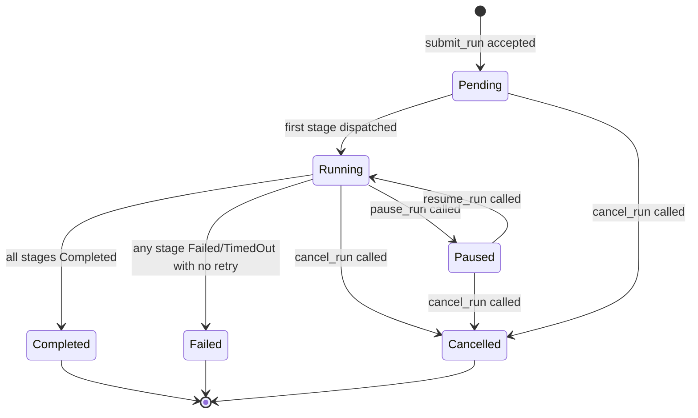

**StageRun status state machine:**

```mermaid
stateDiagram-v2
    [*] --> Waiting : run created; stage has unmet deps
    [*] --> Eligible : run created; stage has no deps
    Waiting --> Eligible : all depends_on stages Completed
    Eligible --> Running : pool slot acquired; agent spawned
    Running --> Completed : completion signal received; success
    Running --> Failed : completion signal received; failure
    Running --> TimedOut : timeout elapsed
    Running --> Paused : pause_run or pause_stage
    Paused --> Running : resume_run or resume_stage
    Failed --> Eligible : retry scheduled (attempt < max_attempts)
    TimedOut --> Eligible : retry scheduled (attempt < max_attempts)
    Running --> Cancelled : cancel_run or cancel_stage
    Paused --> Cancelled : cancel_run or cancel_stage
    Eligible --> Cancelled : cancel_run or cancel_stage
    Waiting --> Cancelled : cancel_run
    Completed --> [*]
    Failed --> [*]
    TimedOut --> [*]
    Cancelled --> [*]
```

**[2_TAS-REQ-112]** Scheduler event loop invariants:
1. A `StageRun` in `Waiting` state MUST transition to `Eligible` within one scheduler tick after its last dependency enters a terminal state. No stage remains `Waiting` when all its dependencies are `Completed`.
2. A `StageRun` MUST NOT be dispatched (transition to `Running`) unless all entries in its `depends_on` list are in `Completed` state. `Failed`, `Cancelled`, or `TimedOut` dependency stages do NOT make a dependent stage `Eligible`.
3. When a dependency stage reaches `Failed`/`TimedOut`/`Cancelled` and no retry is possible, all downstream dependent stages transition to `Cancelled` immediately.
4. The scheduler MUST process at most one terminal-state event per stage per tick; duplicate events from the same stage (e.g. two `StageCompleted` signals) are idempotent — the second is discarded without state change.

**Edge Cases — `devs-scheduler`:**

| # | Scenario | Expected Behavior |
|---|---|---|
| EC-C06-01 | A dependency stage reaches `Cancelled` while a dependent is already `Eligible` (race between cancel and dispatch) | Dependent stage is transitioned to `Cancelled`; if it was already dispatched (Running), a cancel signal is sent to the agent process |
| EC-C06-02 | `submit_run` called while the server is processing a SIGTERM shutdown | Returns `FAILED_PRECONDITION` gRPC error `"server is shutting down"`; no run is created |
| EC-C06-03 | Workflow has 100 stages with no dependencies (all can run in parallel) but pool `max_concurrent = 4` | First 4 stages acquire pool slots immediately; remaining 96 queue in FIFO order on the pool semaphore |
| EC-C06-04 | Branch handler returns a stage name that does not exist in the workflow | Stage that invoked the branch transitions to `Failed` with error `"branch handler returned unknown stage: '<name>'"` |
| EC-C06-05 | `pause_run` called while two stages are Running | Both Running stages receive `devs:pause\n` via stdin; both transition to `Paused`; run transitions to `Paused` only after both stages are `Paused` |
| EC-C06-06 | Workflow snapshot write fails (disk full) before first stage dispatch | Run transitions to `Failed` immediately with error `"failed to write workflow snapshot: <io error>"`; no stages are started |

### 4.7 `devs-pool`

**[2_TAS-REQ-031]** `AgentPoolManager` holds one `AgentPool` state per named pool. Each pool maintains:
- A `tokio::sync::Semaphore` with `max_concurrent` permits.
- A per-agent rate-limit cooldown tracker (60-second cooldown after rate-limit event).
- An ordered agent list (non-fallback agents first within priority, then fallback agents).

**[2_TAS-REQ-032]** Agent selection algorithm for a stage with `required_capabilities = [C1, C2, ...]`:
1. Filter agents to those whose capability set is a superset of required capabilities. An agent with empty capabilities satisfies any requirement.
2. If no agents satisfy capabilities → immediately return `Err(PoolError::UnsatisfiedCapability)` (stage → `Failed`, not queued).
3. From satisfying agents, exclude those in rate-limit cooldown.
4. On attempt 1: prefer non-fallback agents; if all non-fallback are rate-limited, use fallback.
5. Acquire semaphore permit (blocks if at `max_concurrent`).
6. Return selected agent config.

**[2_TAS-REQ-033]** When all agents in a pool are simultaneously unavailable (rate-limited or cooldown), emit `PoolExhausted` webhook event exactly once per exhaustion episode. An episode ends when any agent becomes available again.

**[2_TAS-REQ-033a]** Multi-project scheduling algorithm:

The scheduler selects which project's eligible stage to dispatch next from the global queue of `(project_id, stage_name)` pairs.

**Strict priority mode:**
```
fn select_next_stage(queue: &[(ProjectId, StageName)], projects: &ProjectRegistry) -> Option<(ProjectId, StageName)> {
    // Find the minimum priority value (lower number = higher priority)
    let min_priority = queue.iter()
        .map(|(pid, _)| projects[pid].priority)
        .min()?;
    // Among all stages from projects at min_priority, select the one
    // with the earliest created_at timestamp (FIFO within priority tier)
    queue.iter()
        .filter(|(pid, _)| projects[pid].priority == min_priority)
        .min_by_key(|(pid, sname)| stage_eligible_at(pid, sname))
        .cloned()
}
```

**Weighted fair queuing mode:**
Each project maintains a `virtual_time: f64` initialized to `0.0`. When a stage is dispatched, the project's virtual time is incremented by `1.0 / weight`. The scheduler always selects the project with the lowest `virtual_time`. Ties are broken by `project_id` string order for determinism.

```
fn select_next_stage_weighted(queue, projects) -> Option<(ProjectId, StageName)> {
    // Among projects with eligible stages, find min virtual_time / weight
    let selected_project = projects_with_eligible_stages()
        .min_by(|a, b| {
            let score_a = a.virtual_time / a.weight as f64;
            let score_b = b.virtual_time / b.weight as f64;
            score_a.partial_cmp(&score_b).unwrap_or(Equal)
                .then(a.project_id.cmp(&b.project_id))
        })?;
    // From that project's eligible stages, select by FIFO
    queue.iter()
        .filter(|(pid, _)| *pid == selected_project.project_id)
        .min_by_key(|(pid, sname)| stage_eligible_at(pid, sname))
        .cloned()
}
```

**[2_TAS-REQ-033b]** Retry scheduling: when a stage fails and `retry.max_attempts` has not been exhausted, the scheduler inserts a `RetryScheduled` event with a delay computed as:

- `Fixed` backoff: delay = `initial_delay` every attempt.
- `Exponential` backoff: delay = `min(initial_delay_secs^attempt_number, max_delay_secs.unwrap_or(300))` seconds.
- `Linear` backoff: delay = `initial_delay_secs * attempt_number` seconds, capped at `max_delay_secs.unwrap_or(300)`.

The delay is implemented via `tokio::time::sleep` inside a spawned task that sends a `RetryScheduled` event to the scheduler channel after the delay expires. Rate-limit events do NOT increment `StageRun.attempt`; they trigger a pool fallback only.

### 4.7.1 `devs-pool` Detailed Specifications

**[2_TAS-REQ-113]** The pool selection flow is visualized below. This is executed for every stage dispatch attempt:

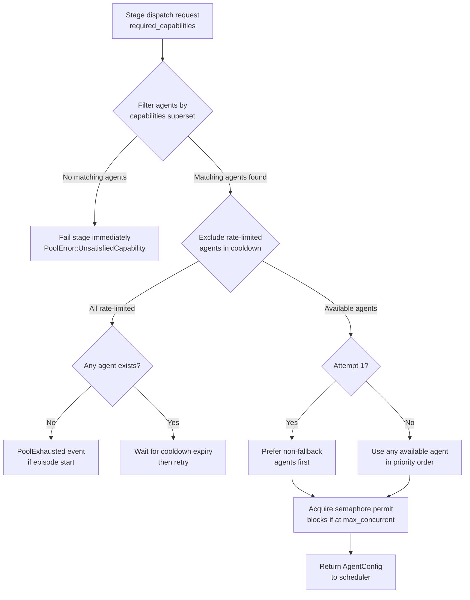

**[2_TAS-REQ-114]** Rate-limit cooldown state per agent is stored as `Option<Instant>` (the earliest time the agent becomes available again). The cooldown duration is exactly 60 seconds from the rate-limit detection event. A `report_rate_limit` MCP call from an agent is treated identically to passive detection: both set the cooldown timer.

**[2_TAS-REQ-115]** Pool exhaustion episode tracking: The `AgentPool` maintains a boolean `is_exhausted`. It transitions to `true` when all agents are simultaneously rate-limited and a `PoolExhausted` webhook is fired. It transitions back to `false` when any agent's cooldown expires. The webhook fires at most once per `false→true` transition.

**Edge Cases — `devs-pool`:**

| # | Scenario | Expected Behavior |
|---|---|---|
| EC-C07-01 | Stage requires `["code-gen", "review"]` but the only matching agent is currently rate-limited | Stage queues on pool semaphore until the rate-limit cooldown expires (60 s); then dispatched |
| EC-C07-02 | `max_concurrent = 1` and 10 stages all become eligible simultaneously | Exactly 1 stage is dispatched; 9 queue in FIFO order on the semaphore |
| EC-C07-03 | All agents in pool become rate-limited while 3 stages are queued | `PoolExhausted` webhook fires once; queued stages block until first cooldown expires |
| EC-C07-04 | `report_rate_limit` called for an agent that is already in cooldown | Cooldown timer is reset to 60 s from the new call time; idempotent with respect to the webhook (episode already active) |
| EC-C07-05 | Two projects in strict mode have equal priority and both have eligible stages | FIFO by stage `eligible_at` timestamp within the priority tier; deterministic ordering |

### 4.8 `devs-adapters`

**[2_TAS-REQ-034]** The `AgentAdapter` trait:

```rust
pub trait AgentAdapter: Send + Sync {
    fn tool(&self) -> AgentTool;
    fn build_command(&self, ctx: &StageContext) -> Result<AdapterCommand>;
    fn detect_rate_limit(&self, exit_code: i32, stderr: &str) -> bool;
}

pub struct AdapterCommand {
    pub argv:        Vec<String>,
    pub env:         HashMap<String, String>,
    pub use_pty:     bool,
    pub prompt_file: Option<PathBuf>, // Some(_) for file-based prompt mode
}
```

**[2_TAS-REQ-035]** Default adapter configurations:

| Adapter | `prompt_mode` | Flag / file arg | `pty` default |
|---|---|---|---|
| `claude` | `flag` | `--print` | `false` |
| `gemini` | `flag` | `--prompt` | `false` |
| `opencode` | `file` | `--prompt-file` | `true` |
| `qwen` | `flag` | `--query` | `false` |
| `copilot` | `file` | `--stdin` (reads file path) | `false` |

**[2_TAS-REQ-036]** Rate-limit passive detection patterns per adapter:

| Adapter | Trigger conditions |
|---|---|
| `claude` | exit code 1 AND stderr matches any of: `"rate limit"`, `"429"`, `"overloaded"` (case-insensitive) |
| `gemini` | exit code 1 AND stderr matches: `"quota"`, `"429"`, `"resource_exhausted"` |
| `opencode` | exit code 1 AND stderr matches: `"rate limit"`, `"429"` |
| `qwen` | exit code 1 AND stderr matches: `"rate limit"`, `"429"`, `"throttle"` |
| `copilot` | exit code 1 AND stderr matches: `"rate limit"`, `"429"` |

**[2_TAS-REQ-037]** `DEVS_MCP_ADDR` env var MUST be injected into every agent subprocess environment, pointing to the MCP server's `<host>:<port>`. The server's internal env vars (`DEVS_LISTEN`, `DEVS_MCP_PORT`, `DEVS_DISCOVERY_FILE`) MUST be stripped from the inherited environment before passing to agents.

**[2_TAS-REQ-038]** Bidirectional communication:
- Agent → devs: agent calls MCP tools using `DEVS_MCP_ADDR`.
- devs → agent: server writes `devs:cancel\n`, `devs:pause\n`, or `devs:resume\n` tokens to agent's stdin. SIGTERM is sent only after the 5-second grace period following `devs:cancel\n`.

**[2_TAS-REQ-039]** Binary-not-found results in immediate stage `Failed` with no retry. PTY allocation failure results in immediate stage `Failed` with no retry.

### 4.8.1 `devs-adapters` Detailed Specifications

**[2_TAS-REQ-116]** `StageContext` passed to `build_command` contains all information needed to construct the agent invocation:

```rust
pub struct StageContext {
    pub run_id:        Uuid,
    pub stage_name:    String,
    pub attempt:       u32,
    pub prompt:        String,         // fully resolved (all template vars substituted)
    pub system_prompt: Option<String>,
    pub env:           HashMap<String, String>, // merged: server + workflow + stage
    pub working_dir:   PathBuf,        // the clone path inside the execution env
    pub mcp_addr:      String,         // host:port for DEVS_MCP_ADDR injection
    pub prompt_file:   Option<PathBuf>, // Some(_) if file-based prompt mode
}
```

**[2_TAS-REQ-117]** The adapter's `build_command` must produce an `AdapterCommand` with `DEVS_MCP_ADDR` in its `env` map. The server's own environment variables `DEVS_LISTEN`, `DEVS_MCP_PORT`, and `DEVS_DISCOVERY_FILE` are stripped from the inherited environment inside `devs-executor` before the command is spawned; they are never present in the adapter's `env` map output.

**[2_TAS-REQ-118]** PTY allocation uses the `portable-pty` crate (cross-platform). PTY size is set to 220 columns × 50 rows. If `use_pty = true` and PTY allocation fails (e.g. OS limit), the stage transitions to `Failed` with error `"PTY allocation failed: <os error>"` and is NOT retried. The stage executor MUST NOT fall back to non-PTY mode automatically.

**[2_TAS-REQ-119]** File-based prompt mode: the resolved prompt string is written to a temporary file at `<working_dir>/.devs_prompt_<uuid>` before the agent is spawned. The file is deleted after the agent exits regardless of outcome. If writing the prompt file fails, the stage transitions to `Failed` with error `"failed to write prompt file: <io error>"`.

**Edge Cases — `devs-adapters`:**

| # | Scenario | Expected Behavior |
|---|---|---|
| EC-C08-01 | `claude` binary not found on `PATH` | Stage fails immediately with `"binary not found: claude"`; no retry regardless of retry config |
| EC-C08-02 | Agent process exits with code 0 but stderr contains `"rate limit"` | Exit code 0 is treated as success; rate-limit detection requires exit code 1 AND matching stderr pattern; no false positive |
| EC-C08-03 | `opencode` adapter writes prompt to temp file, then the temp file is deleted externally before the agent reads it | Stage fails with `"prompt file missing at spawn: <path>"`; retry is permitted (the file will be recreated on retry) |
| EC-C08-04 | Agent process ignores `devs:cancel\n` stdin token and continues running past 5-second grace period | SIGTERM is sent; agent has 5 more seconds; then SIGKILL is sent; stage transitions to `Cancelled` |
| EC-C08-05 | `gemini` adapter receives exit code 1 and stderr `"RESOURCE_EXHAUSTED: quota exceeded"` | `detect_rate_limit` returns `true` (matches `"resource_exhausted"` case-insensitively); pool cooldown triggered |
| EC-C08-06 | System prompt is set but the adapter's target CLI does not support system prompts | The system prompt is prepended to the main prompt with a separator: `"[SYSTEM]\n{system_prompt}\n[END SYSTEM]\n{prompt}"`; a `DEBUG` log is emitted noting the fallback |

### 4.9 `devs-executor`

**[2_TAS-REQ-040]** The `StageExecutor` trait:

```rust
pub trait StageExecutor: Send + Sync {
    async fn prepare(&self, ctx: &StageContext) -> Result<ExecutionHandle>;
    async fn collect_artifacts(&self, handle: &ExecutionHandle,
                               policy: ArtifactCollection) -> Result<()>;
    async fn cleanup(&self, handle: &ExecutionHandle) -> Result<()>;
}
```

Three implementations: `LocalTempDirExecutor`, `DockerExecutor`, `RemoteSshExecutor`.

**[2_TAS-REQ-041]** Clone paths per executor:

| Executor | Clone path |
|---|---|
| `LocalTempDirExecutor` | `<os-tempdir>/devs-<run-id>-<stage-name>/repo/` |
| `DockerExecutor` | `/workspace/repo/` inside container |
| `RemoteSshExecutor` | `~/devs-runs/<run-id>-<stage-name>/repo/` on remote host |

**[2_TAS-REQ-042]** Git clone is shallow (`--depth 1`) by default. Setting `full_clone = true` in stage config performs a full clone.

**[2_TAS-REQ-043]** Working directories MUST be cleaned up after every stage regardless of outcome (success, failure, or timeout). Cleanup failures are logged at `WARN` level but do not affect stage status.

**[2_TAS-REQ-044]** Auto-collect artifact collection: after stage completion, `devs-executor` runs `git diff`, `git add -A`, `git commit -m "devs: auto-collect stage <name> run <id>"`, and `git push` targeting the checkpoint branch only. It MUST NOT push to the project's main branch.

**[2_TAS-REQ-044a]** `DockerExecutor` implementation requirements:

- Uses `DOCKER_HOST` environment variable for daemon connection (falls back to platform default socket: `/var/run/docker.sock` on Linux/macOS, `npipe:////./pipe/docker_engine` on Windows).
- Container image MUST be specified in the stage's `execution_env.docker.image` field.
- The executor pulls the image if not present locally before starting the container.
- The project repository is cloned into the container at `/workspace/repo/` using `docker exec` to run `git clone`.
- Agent CLI binaries MUST be present in the container image; `devs` does not install them at runtime.
- The container is run with `--rm` flag; it is removed immediately after stage completion or failure.
- `DEVS_MCP_ADDR` is passed as a container environment variable pointing to the host's MCP port; on Linux this uses the host-gateway IP; on macOS/Windows this uses `host.docker.internal`.
- Stage environment variables are passed via `--env` flags to `docker run`.

**[2_TAS-REQ-044b]** `RemoteSshExecutor` implementation requirements:

- Uses `ssh2` crate for SSH connections (not shell subprocess).
- Connection is configured via the stage's `execution_env.remote.ssh_config` field, which accepts the same key-value pairs as an OpenSSH `~/.ssh/config` block: `HostName`, `User`, `Port`, `IdentityFile`, `ProxyJump`, etc.
- The executor establishes an SSH connection, then runs `git clone` over SSH to populate `~/devs-runs/<run-id>-<stage-name>/repo/`.
- The agent CLI is invoked via SSH exec channel with the full stage environment.
- `DEVS_MCP_ADDR` is set to the server's externally-reachable address (configured in `devs.toml` as `server.external_addr`; defaults to `server.listen`).
- stdout/stderr are streamed back over the SSH channel and written to log files in real time.
- If the SSH connection drops mid-stage, the stage transitions to `Failed` with error: `"SSH connection lost"`.

**[2_TAS-REQ-044c]** Execution environment configuration schema in `StageDefinition`:

```rust
enum ExecutionEnv {
    Tempdir { full_clone: bool },
    Docker {
        image:      String,
        full_clone: bool,
        // DOCKER_HOST override; if None, uses DOCKER_HOST env var
        docker_host: Option<String>,
    },
    Remote {
        ssh_config:  HashMap<String, String>, // OpenSSH config key-value pairs
        full_clone:  bool,
        // Server's externally-reachable address for DEVS_MCP_ADDR injection
        server_addr: Option<String>,
    },
}
```

The `execution_env` field at stage level overrides any `default_execution_env` set at workflow level. If neither is set, `Tempdir { full_clone: false }` is the default.

### 4.9.1 `devs-executor` Detailed Specifications

**[2_TAS-REQ-120]** The `ExecutionHandle` carries all state needed for artifact collection and cleanup:

```rust
pub struct ExecutionHandle {
    pub env_kind:    ExecutionEnvKind,  // Tempdir | Docker | Remote
    pub working_dir: PathBuf,           // clone root inside the execution env
    pub run_id:      Uuid,
    pub stage_name:  String,
    pub attempt:     u32,
    // Executor-specific handles:
    pub docker_container_id: Option<String>, // Docker only
    pub ssh_session:         Option<Arc<ssh2::Session>>, // Remote only
}

pub enum ExecutionEnvKind { Tempdir, Docker, Remote }
```

**[2_TAS-REQ-121]** `prepare()` execution sequence per executor type:

**`LocalTempDirExecutor`:**
1. Create directory `<os-tempdir>/devs-<run-id>-<stage-name>/repo/`.
2. Run `git clone --depth 1 <repo_url> repo/` (or full clone if `full_clone = true`).
3. Write `.devs_context.json` to the working dir (atomic write).
4. Return `ExecutionHandle`.

**`DockerExecutor`:**
1. Pull image if not present (using Docker API via `DOCKER_HOST`).
2. Create container with `--rm`, `--env DEVS_MCP_ADDR=<host-gateway>:<mcp_port>`, and all stage env vars.
3. Start container.
4. Run `git clone` inside container via `docker exec`.
5. Copy `.devs_context.json` into container at `/workspace/repo/`.
6. Return `ExecutionHandle` with `docker_container_id`.

**`RemoteSshExecutor`:**
1. Establish SSH session using `ssh2` crate with parameters from `ssh_config`.
2. Create remote directory `~/devs-runs/<run-id>-<stage-name>/repo/`.
3. Execute `git clone` over SSH exec channel.
4. SCP `.devs_context.json` to remote working dir.
5. Return `ExecutionHandle` with `ssh_session`.

**[2_TAS-REQ-122]** `collect_artifacts()` is only called when the stage completes (not on failure, timeout, or cancel — unless `auto_collect` is configured). Under `ArtifactCollection::AutoCollect`:
1. Run `git -C <working_dir> add -A`.
2. Run `git -C <working_dir> diff --cached --quiet`; if exit code 0 (no changes), skip commit.
3. If changes present: `git commit -m "devs: auto-collect stage <name> run <run-id>"` with author `devs <devs@localhost>`.
4. Push to the checkpoint branch only. MUST NOT push to any other branch.

**Edge Cases — `devs-executor`:**

| # | Scenario | Expected Behavior |
|---|---|---|
| EC-C09-01 | `git clone` fails (repository URL unreachable) in `LocalTempDirExecutor.prepare()` | Stage fails with `"git clone failed: <git error>"`; `cleanup()` still runs to remove the partial temp directory |
| EC-C09-02 | Docker image pull times out (>60 s) | Stage fails with `"docker pull timed out: <image>"`; stage retried if retry config allows |
| EC-C09-03 | SSH connection drops mid-stage after agent has started running | Stage transitions to `Failed` with `"SSH connection lost"`; no SIGTERM possible; retry is permitted |
| EC-C09-04 | Auto-collect `git push` is rejected (checkpoint branch has diverged) | Auto-collect logs `WARN`; does a `git pull --rebase` then retries push once; if second push fails, logs `ERROR` but stage status is NOT affected |
| EC-C09-05 | `cleanup()` fails to remove temp directory (e.g. permission error) | Logged at `WARN`; cleanup failure does NOT affect stage status; server continues |
| EC-C09-06 | Docker container exits before agent writes any output | Stage reads empty stdout/stderr; `.devs_output.json` absent; stage fails with `"structured output file not found: .devs_output.json"` if completion=structured_output |

### 4.10 `devs-webhook`

**[2_TAS-REQ-045]** `WebhookDispatcher` maintains a Tokio task per registered webhook target. Delivery is at-least-once: it retries on non-2xx responses using fixed backoff with 10-second timeout per attempt. Delivery failures are logged at `WARN` and do not affect run or stage status.

**[2_TAS-REQ-046]** Webhook payload schema:

```json
{
  "event":      "run.completed",
  "timestamp":  "2024-01-01T00:00:00Z",
  "project_id": "uuid",
  "run_id":     "uuid",
  "stage_name": "string | null",
  "data":       { ... },
  "truncated":  false
}
```

Maximum payload size: 64 KiB. If the serialized payload exceeds this, the `data` field is truncated and `"truncated": true` is set.

**[2_TAS-REQ-047]** `PoolExhausted` webhook fires at most once per exhaustion episode (defined as the period between all agents becoming unavailable and any agent becoming available again).

### 4.10.1 `devs-webhook` Detailed Specifications

**[2_TAS-REQ-123]** Webhook delivery lifecycle per event:

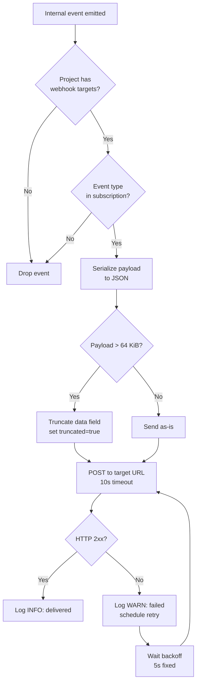

**[2_TAS-REQ-124]** Webhook event type enumeration and data payloads:

| Event type | `stage_name` | Key `data` fields |
|---|---|---|
| `run.started` | `null` | `{ "workflow_name": "str", "slug": "str" }` |
| `run.completed` | `null` | `{ "elapsed_ms": N }` |
| `run.failed` | `null` | `{ "failed_stage": "str", "error": "str" }` |
| `run.cancelled` | `null` | `{}` |
| `stage.started` | stage name | `{ "attempt": N, "agent_tool": "str", "pool_name": "str" }` |
| `stage.completed` | stage name | `{ "attempt": N, "elapsed_ms": N, "exit_code": N }` |
| `stage.failed` | stage name | `{ "attempt": N, "exit_code": N, "error": "str" }` |
| `stage.timed_out` | stage name | `{ "attempt": N, "timeout_secs": N }` |
| `pool.exhausted` | `null` | `{ "pool_name": "str" }` |
| `state.changed` | `null` or stage name | `{ "entity": "run\|stage", "from": "str", "to": "str" }` |

**[2_TAS-REQ-125]** Webhook retry policy: fixed 5-second backoff; maximum 10 retry attempts per delivery. After 10 failed attempts, the delivery is dropped and logged at `ERROR`. Retry state is in-memory only; a server restart drops pending retries (delivery is at-least-once with best-effort retry, not guaranteed-delivery).

**Edge Cases — `devs-webhook`:**

| # | Scenario | Expected Behavior |
|---|---|---|
| EC-C10-01 | Webhook target URL is unreachable (DNS failure) | Logged at `WARN`; retried up to 10 times with 5 s backoff; dropped after exhaustion |
| EC-C10-02 | Webhook fires for `run.completed` while a previous webhook for the same run is still retrying | Both deliveries proceed independently; ordering is not guaranteed between retry queues |
| EC-C10-03 | `state.changed` subscription enabled and a single stage transitions through `Eligible → Running → Completed` | Three separate webhook deliveries are fired, one per state transition |
| EC-C10-04 | Payload serialization for `run.failed` produces >64 KiB (e.g. very long error string in `data.error`) | `data.error` is truncated to fit within 64 KiB; `truncated: true` set |
| EC-C10-05 | Project is removed while a webhook retry is in flight | Retry is dropped immediately when the project removal is detected |

### 4.11 `devs-mcp`

**[2_TAS-REQ-048]** The MCP server listens on a dedicated TCP port (default 7891). It speaks JSON-RPC 2.0 over HTTP (not WebSocket). The MCP stdio bridge (`devs-mcp-bridge`) is a separate binary that reads JSON-RPC from stdin and writes to stdout, forwarding bidirectionally to the MCP HTTP port. It reports a structured error on connection loss and exits non-zero.

**[2_TAS-REQ-049]** All MCP tool responses MUST conform to:

```json
{
  "result": { ... },
  "error": null
}
```
or
```json
{
  "result": null,
  "error": "human-readable error string"
}
```

No plain-text-only responses are permitted.

**[2_TAS-REQ-050]** MCP tools organized by category:

**Observation tools:**
- `list_runs(project_id?, status?)` → `RunSummary[]`
- `get_run(run_id)` → `WorkflowRun`
- `get_stage_output(run_id, stage_name, attempt?)` → `StageOutput`
- `stream_logs(run_id, stage_name, attempt?, follow)` → streaming `LogChunk[]`
- `get_pool_state(pool_name?)` → `PoolState[]`
- `get_workflow_definition(name, project_id)` → `WorkflowDefinition`
- `list_checkpoints(run_id)` → `CheckpointMeta[]`

**Control tools:**
- `submit_run(workflow_name, project_id, name?, inputs?)` → `WorkflowRun`
- `cancel_run(run_id)` → `RunStatus`
- `cancel_stage(run_id, stage_name)` → `StageStatus`
- `pause_run(run_id)` → `RunStatus`
- `pause_stage(run_id, stage_name)` → `StageStatus`
- `resume_run(run_id)` → `RunStatus`
- `resume_stage(run_id, stage_name)` → `StageStatus`
- `write_workflow_definition(definition)` → `WorkflowDefinition`

**Testing tools:**
- `inject_stage_input(run_id, stage_name, input)` → `Ok`
- `assert_stage_output(run_id, stage_name, assertion)` → `AssertionResult`

**Mid-run agent tools (called by orchestrated agents):**
- `report_progress(run_id, stage_name, message)` → `Ok`
- `signal_completion(run_id, stage_name, success, output?)` → `Ok`
- `report_rate_limit(run_id, stage_name)` → `Ok`

**[2_TAS-REQ-051]** Every entity in the data model MUST be reachable via at least one MCP observation tool with no field omitted. Optional fields that are not yet populated return typed null (JSON `null`), never absent from the response object.

**[2_TAS-REQ-051a]** Complete MCP tool request/response schemas:

**`list_runs`**
```json
// Request params
{ "project_id": "uuid | null", "status": "pending|running|paused|completed|failed|cancelled | null" }
// Response result
{
  "runs": [
    {
      "run_id": "uuid", "slug": "string", "workflow_name": "string",
      "project_id": "uuid", "status": "string",
      "created_at": "ISO8601", "started_at": "ISO8601 | null", "completed_at": "ISO8601 | null"
    }
  ]
}
```

**`get_run`**
```json
// Request params
{ "run_id": "uuid" }
// Response result: full WorkflowRun object including all stage_runs
{
  "run_id": "uuid", "slug": "string", "workflow_name": "string", "project_id": "uuid",
  "status": "string", "inputs": {}, "definition_snapshot": {},
  "created_at": "ISO8601", "started_at": "ISO8601 | null", "completed_at": "ISO8601 | null",
  "stage_runs": [
    {
      "stage_run_id": "uuid", "run_id": "uuid", "stage_name": "string",
      "attempt": 1, "status": "string", "agent_tool": "string | null",
      "pool_name": "string", "started_at": "ISO8601 | null",
      "completed_at": "ISO8601 | null", "exit_code": "integer | null",
      "output": "StageOutput | null"
    }
  ]
}
```

**`get_stage_output`**
```json
// Request params
{ "run_id": "uuid", "stage_name": "string", "attempt": "integer | null" }
// Response result (attempt defaults to latest)
{
  "stdout": "string (≤1MiB)", "stderr": "string (≤1MiB)",
  "structured": "object | null", "exit_code": "integer",
  "log_path": "string", "truncated": "boolean"
}
```

**`stream_logs`**
```json
// Request params
{ "run_id": "uuid", "stage_name": "string", "attempt": "integer | null", "follow": "boolean" }
// Chunked response: each chunk (newline-delimited JSON)
{ "chunk": "base64-encoded bytes", "stream": "stdout|stderr", "sequence": "integer" }
```

**`get_pool_state`**
```json
// Request params
{ "pool_name": "string | null" }
// Response result
{
  "pools": [
    {
      "name": "string", "max_concurrent": "integer", "active_count": "integer",
      "queued_count": "integer", "exhausted": "boolean",
      "agents": [
        {
          "tool": "string", "capabilities": ["string"],
          "fallback": "boolean", "rate_limited": "boolean",
          "rate_limit_until": "ISO8601 | null"
        }
      ]
    }
  ]
}
```

**`get_workflow_definition`**
```json
// Request params
{ "name": "string", "project_id": "uuid" }
// Response result: full WorkflowDefinition
{
  "name": "string", "format": "string", "inputs": [], "stages": [],
  "timeout_secs": "integer | null", "default_env": {},
  "artifact_collection": "agent_driven|auto_collect"
}
```

**`list_checkpoints`**
```json
// Request params
{ "run_id": "uuid" }
// Response result
{
  "checkpoints": [
    { "run_id": "uuid", "stage_name": "string", "status": "string",
      "committed_at": "ISO8601", "git_sha": "string" }
  ]
}
```

**`submit_run`**
```json
// Request params
{ "workflow_name": "string", "project_id": "uuid", "name": "string | null",
  "inputs": { "key": "value" } }
// Response result: WorkflowRun (same schema as get_run)
// Error cases: workflow not found, validation failure, duplicate name
```

**`cancel_run`** / **`pause_run`** / **`resume_run`**
```json
// Request params
{ "run_id": "uuid" }
// Response result
{ "run_id": "uuid", "status": "string" }
// Error: run not found → error: "run not found: <uuid>"
// Error: illegal transition (e.g. cancel Completed) → error: "illegal transition: Completed → Cancelled"
```

**`cancel_stage`** / **`pause_stage`** / **`resume_stage`**
```json
// Request params
{ "run_id": "uuid", "stage_name": "string" }
// Response result
{ "stage_run_id": "uuid", "stage_name": "string", "status": "string" }
```

**`write_workflow_definition`**
```json
// Request params: full WorkflowDefinition JSON
{ "definition": { "name": "string", ... } }
// Response result: written WorkflowDefinition (with server-assigned metadata)
{ "name": "string", "format": "string", ... }
// Error: validation failure → error: "validation error: <details>"
```

**`inject_stage_input`**
```json
// Request params
{ "run_id": "uuid", "stage_name": "string", "input": { "key": "value" } }
// Response result
{ "ok": true }
// Error: stage not in Waiting/Eligible status → error: "stage must be in Waiting or Eligible state"
```

**`assert_stage_output`**
```json
// Request params
{ "run_id": "uuid", "stage_name": "string",
  "assertion": { "field": "stdout|stderr|exit_code|output.<key>", "op": "eq|contains|matches", "value": "any" } }
// Response result
{ "passed": "boolean", "actual": "any", "expected": "any", "field": "string" }
```

**`report_progress`**
```json
// Request params (called by orchestrated agent)
{ "run_id": "uuid", "stage_name": "string", "message": "string (≤4096 chars)" }
// Response result
{ "ok": true }
// Error: stage not Running → error: "stage not running: <name>"
```

**`signal_completion`**
```json
// Request params (called by orchestrated agent)
{ "run_id": "uuid", "stage_name": "string", "success": "boolean",
  "output": { "key": "value" } | null }
// Response result (first call)
{ "ok": true }
// Error (subsequent calls on terminal stage): error: "stage already in terminal state: <status>"
```

**`report_rate_limit`**
```json
// Request params (called by orchestrated agent)
{ "run_id": "uuid", "stage_name": "string" }
// Response result
{ "ok": true, "fallback_triggered": "boolean" }
```

### 4.11.1 `devs-mcp` Detailed Specifications

**[2_TAS-REQ-126]** The MCP server is an HTTP/1.1 server accepting JSON-RPC 2.0 POST requests at path `/rpc`. Each request body is a single JSON-RPC request object; batch requests (JSON array) are not supported. The Content-Type MUST be `application/json`; any other Content-Type returns HTTP 415 Unsupported Media Type.

**[2_TAS-REQ-127]** JSON-RPC method naming convention: all tool names are used as the JSON-RPC `method` field directly (e.g. `"method": "list_runs"`). The `id` field MUST be present and non-null for all tool calls (notifications are not used). The server returns JSON-RPC 2.0 response objects with the tool result embedded in the `result` field.

```
HTTP POST /rpc
Content-Type: application/json

{"jsonrpc": "2.0", "id": 1, "method": "list_runs", "params": {"project_id": null, "status": null}}

→ HTTP 200 OK
{"jsonrpc": "2.0", "id": 1, "result": {"result": {"runs": [...]}, "error": null}}
```

**[2_TAS-REQ-128]** `stream_logs` is the only tool that returns a streaming response. When `follow: true`, the HTTP response uses chunked transfer encoding; each chunk is a newline-delimited JSON object. The connection remains open until the stage reaches a terminal state, after which a final `{"done": true}` chunk is sent and the connection closed. When `follow: false`, the full log snapshot is returned as a single JSON response.

**[2_TAS-REQ-129]** The MCP stdio bridge (`devs-mcp-bridge`) reads one JSON-RPC request per line from stdin, forwards it to the MCP HTTP server, and writes the response to stdout followed by a newline. It does not buffer or batch. On connection loss to the MCP server, it writes `{"jsonrpc":"2.0","id":null,"error":{"code":-32000,"message":"MCP server connection lost"}}` to stdout and exits with code 1. It MUST NOT silently discard responses.

**Edge Cases — `devs-mcp`:**

| # | Scenario | Expected Behavior |
|---|---|---|
| EC-C11-01 | `signal_completion` called for a stage that is already `Completed` | Returns error `"stage already in terminal state: Completed"`; no state change |
| EC-C11-02 | `inject_stage_input` called for a stage that is already `Running` | Returns error `"stage must be in Waiting or Eligible state; current state: Running"`; no input injected |
| EC-C11-03 | `get_run` called with a UUID that does not exist | Returns `{"result": null, "error": "run not found: <uuid>"}` |
| EC-C11-04 | MCP client sends a malformed JSON body | Returns HTTP 400 with `{"jsonrpc":"2.0","id":null,"error":{"code":-32700,"message":"Parse error"}}` |
| EC-C11-05 | `stream_logs` with `follow: true` and the stage is already in a terminal state when the request arrives | Returns the full existing log immediately followed by `{"done": true}`; does not block |
| EC-C11-06 | MCP stdio bridge stdin is closed (EOF) while a forwarded request is in flight | Bridge waits for the in-flight response, writes it to stdout, then exits 0 |
| EC-C11-07 | `assert_stage_output` with `op: "matches"` and a malformed regex pattern | Returns `{"result": null, "error": "invalid regex: <pattern>: <regex error>"}`|

### 4.12 `devs-grpc`

**[2_TAS-REQ-052]** Implements six tonic services:

| Service | Responsibilities |
|---|---|
| `WorkflowService` | Register, delete, get, list workflow definitions |
| `RunService` | Submit, get, list, cancel, pause, resume runs; `StreamRunEvents` RPC |
| `StageService` | Get, pause, resume, retry, cancel stages; get stage output |
| `LogService` | Stream logs (server-streaming RPC); fetch log snapshot |
| `PoolService` | Get pool status, list pools; `WatchPoolState` server-streaming RPC |
| `ProjectService` | Add, remove, get, list, update projects |

**[2_TAS-REQ-053]** All RPC methods include a `client_version` field in request metadata. If the client major version does not match the server, the server returns `FAILED_PRECONDITION` with message `"client version mismatch"`.

**[2_TAS-REQ-054]** `StreamRunEvents` is a server-streaming RPC. The server pushes `RunEvent` messages to the client immediately on any state transition. The TUI MUST re-render within 50 ms of receiving an event.

### 4.12.1 `devs-grpc` Detailed Specifications

**[2_TAS-REQ-130]** Version compatibility is enforced via gRPC metadata. Every request from any client MUST include a metadata key `x-devs-client-version` with value `"<major>.<minor>.<patch>"`. The server extracts the major version component and compares it to its own. If the client major version differs from the server major version, the server returns status `FAILED_PRECONDITION` with message `"client version mismatch: client=<client_ver> server=<server_ver>"` for ALL RPC methods without processing the request.

**[2_TAS-REQ-131]** `StreamRunEvents` semantics:
- Client sends `StreamRunEventsRequest { run_id: string }`.
- Server sends the current full `WorkflowRun` state as the first message immediately.
- Server sends subsequent `RunEvent` messages on every state transition for that run.
- When the run reaches a terminal state (`Completed`, `Failed`, `Cancelled`), the server sends one final event then closes the stream with `OK` status.
- If the `run_id` does not exist, the server returns `NOT_FOUND` immediately.
- If the client disconnects mid-stream, the server cleans up the subscription silently.

**[2_TAS-REQ-132]** All streaming RPCs (`StreamRunEvents`, `LogService.StreamLogs`, `PoolService.WatchPoolState`) MUST handle client disconnection without leaking goroutines or channel resources. Each subscription is tracked in a registry; disconnection triggers immediate deregistration.

**Edge Cases — `devs-grpc`:**

| # | Scenario | Expected Behavior |
|---|---|---|
| EC-C12-01 | Client sends `SubmitRun` with an input key that has a valid name but the value cannot be coerced to the declared `InputKind` | Returns gRPC `INVALID_ARGUMENT` with message `"input '<key>': value '<val>' is not a valid <type>"` |
| EC-C12-02 | `StreamRunEvents` client is slow to consume and the server's per-client buffer fills | Server drops the oldest unacknowledged event from the buffer (not the run); client may miss intermediate state but always receives the latest state on reconnect |
| EC-C12-03 | Client sends request without `x-devs-client-version` metadata | Server returns `FAILED_PRECONDITION` with message `"missing required metadata: x-devs-client-version"` |
| EC-C12-04 | `PauseRun` called on a run that is already `Paused` | Returns `OK` with the current status (`Paused`); idempotent |
| EC-C12-05 | `CancelRun` called on a `Completed` run | Returns `FAILED_PRECONDITION` with message `"illegal transition: Completed → Cancelled"` |

### 4.13 `devs-tui`

**[2_TAS-REQ-055]** Built with `ratatui` 0.28 and `crossterm` 0.28. Connects to the server via tonic gRPC. Subscribes to `StreamRunEvents` and `WatchPoolState` for live updates.

**[2_TAS-REQ-056]** Tab layout:

| Tab | Content |
|---|---|
| Dashboard | Split pane: project/run list (left) + selected run detail — ASCII DAG, per-stage status, elapsed time, live log tail (right) |
| Logs | Full log stream for selected stage or run; max 10,000 lines in memory per stage |
| Debug | Follow a specific agent: working-dir diff, cancel/pause/resume controls |
| Pools | Real-time pool utilization, agent availability, fallback event log |

**[2_TAS-REQ-057]** DAG rendering uses ASCII box-drawing characters. Stage nodes show: name, status (abbreviated), elapsed time. Edges show dependency direction with `→`.

**[2_TAS-REQ-058]** TUI tests use `insta` snapshot testing on rendered terminal text output. Headless terminal emulation is used (a fixed-size `TestBackend`). Pixel-comparison screenshots are prohibited.

**[2_TAS-REQ-059]** Auto-reconnect: on connection loss, the TUI retries with exponential backoff up to 30 seconds total, then waits 5 more seconds, then exits with a non-zero exit code.

### 4.13.1 `devs-tui` Detailed Specifications

**[2_TAS-REQ-133]** Keyboard navigation specification:

| Key | Context | Action |
|---|---|---|
| `Tab` / `Shift+Tab` | Any | Cycle forward / backward through tabs |
| `1` `2` `3` `4` | Any | Jump directly to Dashboard / Logs / Debug / Pools tab |
| `↑` `↓` | Dashboard: run list | Move selection up / down |
| `Enter` | Dashboard: run list | Select run; populate right pane |
| `p` | Dashboard: run selected | Pause/resume selected run (toggle) |
| `c` | Dashboard: run selected | Cancel selected run (prompts confirmation) |
| `y` | Confirmation prompt | Confirm destructive action |
| `n` / `Esc` | Confirmation prompt | Cancel destructive action |
| `↑` `↓` `PgUp` `PgDn` | Logs tab | Scroll log buffer |
| `f` | Logs tab | Toggle `--follow` mode (auto-scroll to bottom) |
| `g` / `G` | Logs tab | Jump to top / bottom |
| `q` / `Ctrl+C` | Any | Quit TUI |

**[2_TAS-REQ-134]** Dashboard tab ASCII DAG rendering rules:
- Each stage is rendered as a box: `[ stage-name | STATUS | 0:05 ]` where the third field is elapsed time in `M:SS` format.
- Stage status abbreviations: `WAIT` (Waiting), `ELIG` (Eligible), `RUN` (Running), `DONE` (Completed), `FAIL` (Failed), `TIME` (TimedOut), `CANC` (Cancelled), `PAUS` (Paused).
- Dependency edges are drawn as ASCII lines connecting stage boxes from left to right, top to bottom. For workflows with >20 stages, the DAG view shows only the immediate predecessors and successors of the selected stage.
- The DAG view scrolls horizontally and vertically when the content exceeds the pane size.

**[2_TAS-REQ-135]** TUI test infrastructure requirements:
- Tests use `ratatui::backend::TestBackend` with a fixed terminal size of 200×50.
- Snapshot files are stored in `crates/devs-tui/tests/snapshots/` with `.txt` extension.
- Snapshot files contain the raw rendered text of the terminal buffer, one line per row, with trailing spaces trimmed.
- `insta` crate is used for snapshot comparison. `INSTA_UPDATE=unseen` updates only new snapshots; existing snapshots require explicit `INSTA_UPDATE=always` to change.
- State assertions (e.g. "selected run ID matches expected UUID") are tested alongside visual snapshots in the same test function.

**Edge Cases — `devs-tui`:**

| # | Scenario | Expected Behavior |
|---|---|---|
| EC-C13-01 | TUI connects to server successfully, then server is killed | Connection lost; TUI shows error banner `"Connection lost — reconnecting..."` with countdown; auto-reconnects up to 30 s |
| EC-C13-02 | User presses `c` (cancel) on a run, then `y` to confirm, but the run completes before the gRPC call arrives | `CancelRun` returns `FAILED_PRECONDITION`; TUI shows non-fatal toast: `"Run already completed"` |
| EC-C13-03 | Run has 512 stages — DAG pane overflows terminal height | Scrollable sub-pane activated; only visible rows rendered; virtual scrolling with no rendered rows outside viewport |
| EC-C13-04 | Log buffer for a stage exceeds 10,000 lines | Oldest lines evicted from in-memory buffer; a notice `"[log buffer full — oldest lines dropped]"` is shown at the top of the Logs tab |
| EC-C13-05 | Terminal is resized while TUI is running | `crossterm` resize event triggers immediate re-render with new dimensions; no content truncation |

### 4.14 `devs-cli`

**[2_TAS-REQ-060]** Built with `clap` 4.5 derive macros. All subcommands support `--server <host:port>` (overrides discovery) and `--format json|text` (default: `text`).

**[2_TAS-REQ-061]** Subcommand specification:

| Subcommand | gRPC call | Description |
|---|---|---|
| `devs submit <workflow> [--name <n>] [--input k=v ...]` | `RunService.SubmitRun` | Submit a workflow run |
| `devs list [--project <id>] [--status <s>]` | `RunService.ListRuns` | List runs |
| `devs status <run-id-or-slug>` | `RunService.GetRun` | Show run + stage status |
| `devs logs <run-id-or-slug> [<stage>] [--follow]` | `LogService.StreamLogs` | Stream or fetch logs |
| `devs cancel <run-id-or-slug>` | `RunService.CancelRun` | Cancel a run |
| `devs pause <run-id-or-slug> [<stage>]` | `RunService.PauseRun` / `StageService.PauseStage` | Pause |
| `devs resume <run-id-or-slug> [<stage>]` | `RunService.ResumeRun` / `StageService.ResumeStage` | Resume |
| `devs project add <path> [--priority <n>] [--weight <n>]` | `ProjectService.AddProject` | Register project |
| `devs project remove <project-id>` | `ProjectService.RemoveProject` | Remove project |
| `devs project list` | `ProjectService.ListProjects` | List registered projects |

**[2_TAS-REQ-062]** CLI exit codes:

| Code | Meaning |
|---|---|
| 0 | Success |
| 1 | General error |
| 2 | Not found |
| 3 | Server unreachable |
| 4 | Validation error |

**[2_TAS-REQ-063]** JSON error output format to stdout: `{ "error": "<message>", "code": <n> }`. UUID and slug are both accepted as run identifiers; UUID takes precedence on collision.

**[2_TAS-REQ-064]** `devs logs --follow` streams until the run reaches a terminal state, then exits 0 if `Completed`, 1 if `Failed` or `Cancelled`.

### 4.14.1 `devs-cli` Detailed Specifications

**[2_TAS-REQ-136]** Run identifier resolution: every CLI command accepting `<run-id-or-slug>` applies this resolution order:
1. If the argument matches the UUID4 format (`[0-9a-f]{8}-[0-9a-f]{4}-4[0-9a-f]{3}-[89ab][0-9a-f]{3}-[0-9a-f]{12}`), look up by UUID first.
2. If UUID lookup returns not-found, look up by slug.
3. If slug lookup returns not-found, print JSON error `{"error": "run not found: <arg>", "code": 2}` to stdout and exit 2.
4. If the argument is not a UUID and matches multiple runs by slug (theoretically impossible but guarded), exit 2 with `{"error": "ambiguous slug: <arg> matches <n> runs", "code": 2}`.

**[2_TAS-REQ-137]** `devs submit` input parameter parsing: `--input key=value` pairs are split on the first `=` character. A key with no `=` is rejected with exit code 4. Values are passed as strings; the server performs type coercion per the declared `InputKind`. Multiple `--input` flags are permitted; duplicate keys are rejected with exit code 4.

**[2_TAS-REQ-138]** Text-format output rules (when `--format text`):
- `devs list` outputs a table: columns `RUN-ID (short)`, `SLUG`, `WORKFLOW`, `STATUS`, `CREATED`.
- `devs status <run>` outputs the run header followed by a stage table: `STAGE`, `STATUS`, `ATTEMPT`, `STARTED`, `ELAPSED`.
- `devs logs` streams raw log lines prefixed with `[stdout]` or `[stderr]` per line.

**Edge Cases — `devs-cli`:**

| # | Scenario | Expected Behavior |
|---|---|---|
| EC-C14-01 | `devs submit` called with `--project` but the project ID is not registered | Exit 2; `{"error": "project not found: <id>", "code": 2}` |
| EC-C14-02 | `devs logs --follow` stream is interrupted by server restart mid-stream | CLI prints `"[stream interrupted — server restarted]"` to stderr; reconnects automatically; resumes log stream from last received sequence number |
| EC-C14-03 | `devs pause` called on a stage that is already `Paused` | Exit 0; `{"status": "Paused"}` (idempotent) |
| EC-C14-04 | `devs submit` run name slug would exceed 128 characters | CLI truncates at 128 chars and emits `WARN: run name truncated to 128 chars` to stderr before submission |
| EC-C14-05 | Server address from `~/.config/devs/server.addr` is stale (server no longer running) | gRPC connection fails; exit 3; `{"error": "server unreachable: <addr>", "code": 3}` |
| EC-C14-06 | `devs project add` called with `--weight 0` | Exit 4; `{"error": "weight must be >= 1", "code": 4}` |

### 4.15 `devs-server`

**[2_TAS-REQ-065]** The server binary wires all crates together. It owns:
- A `tokio::runtime::Runtime` (multi-thread, all cores).
- A shared `Arc<DagScheduler>`.
- A shared `Arc<AgentPoolManager>`.
- A shared `Arc<dyn CheckpointStore>`.
- A `tonic::transport::Server` with all six gRPC services.
- An `McpServer` Tokio task.
- A `WebhookDispatcher` Tokio task.
- A retention sweep task (at startup + every 24 hours).

**[2_TAS-REQ-066]** Signal handling: SIGTERM triggers graceful shutdown — stops accepting new runs, waits for in-flight stages to complete or reach a checkpoint, deletes the discovery file, then exits 0.

### 4.15.1 `devs-server` Startup Sequence & Detailed Specifications

**[2_TAS-REQ-139]** The complete server startup sequence must execute in this exact order, with each step gating the next:

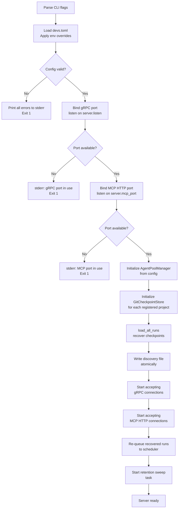

**[2_TAS-REQ-140]** Discovery file write protocol:
1. Serialize server address as plain UTF-8 `<host>:<port>` string.
2. Write to `<discovery_path>.tmp`.
3. Atomic rename to final path (`~/.config/devs/server.addr` or `$DEVS_DISCOVERY_FILE`).
4. Discovery file is written ONLY after both gRPC and MCP ports are successfully bound.
5. On SIGTERM, the discovery file is deleted before the process exits.
6. If the discovery file already exists at startup (stale from a previous run), it is overwritten atomically.

**[2_TAS-REQ-141]** Shared state wiring: the server instantiates these shared `Arc`-wrapped objects and passes them by clone to each component that needs them:

```rust
// Server shared state (all Arc-wrapped)
pub struct ServerState {
    pub config:         Arc<ServerConfig>,
    pub scheduler:      Arc<DagScheduler>,
    pub pool_manager:   Arc<AgentPoolManager>,
    pub checkpoint:     Arc<dyn CheckpointStore>,
    pub webhook:        Arc<WebhookDispatcher>,
    pub mcp_server:     Arc<McpServer>,
}
```

The `DagScheduler` holds a weak reference to `AgentPoolManager` to avoid reference cycles. The `McpServer` holds a weak reference to `DagScheduler` for the same reason.

**[2_TAS-REQ-142]** Graceful shutdown sequence on SIGTERM:
1. Set a global `shutdown` flag (atomic bool).
2. Stop accepting new `SubmitRun` requests (return `UNAVAILABLE`).
3. Send `devs:cancel\n` to all Running stages.
4. Wait up to 30 seconds for all in-flight stages to reach a terminal or `Paused` state.
5. If timeout exceeded: send SIGKILL to remaining agent processes.
6. Write final checkpoints for all runs.
7. Close gRPC and MCP listeners.
8. Delete discovery file.
9. Exit 0.

**Edge Cases — `devs-server`:**

| # | Scenario | Expected Behavior |
|---|---|---|
| EC-C15-01 | Both gRPC port and MCP port are the same value in config | Config validation error before binding: `"server.listen and server.mcp_port must use different ports"` |
| EC-C15-02 | `load_all_runs` recovers a run whose workflow definition references a pool that was removed from config since the checkpoint was written | Run is recovered; the stage that references the missing pool transitions to `Failed` when next dispatched with error `"pool not found: '<name>'"` |
| EC-C15-03 | Server receives SIGTERM while retention sweep is writing commit | Sweep is interrupted; partial commit is aborted; process exits cleanly |
| EC-C15-04 | 500 runs are recovered from checkpoints at startup | All 500 runs are re-queued concurrently; scheduler processes them in priority order; startup completes in bounded time |
| EC-C15-05 | Discovery file directory (`~/.config/devs/`) does not exist | Server creates the directory (including parents) before writing the discovery file |

### 4.16 Component Dependencies Summary

This section summarizes which crates each component depends on at runtime (operational dependencies, not just compile-time). This informs test isolation: components can be tested independently by mocking their dependencies.

| Component | Runtime Dependencies | Dependents |
|---|---|---|
| `devs-core` | None | All other crates |
| `devs-proto` | None | `devs-grpc`, `devs-tui`, `devs-cli`, `devs-mcp-bridge` |
| `devs-config` | `devs-core` | `devs-server` |
| `devs-checkpoint` | `devs-core`, `git2` | `devs-executor`, `devs-scheduler`, `devs-mcp`, `devs-server` |
| `devs-pool` | `devs-core`, `devs-adapters` | `devs-executor`, `devs-scheduler`, `devs-server` |
| `devs-adapters` | `devs-core` | `devs-pool`, `devs-executor` |
| `devs-executor` | `devs-core`, `devs-adapters`, `devs-pool`, `devs-checkpoint`, Docker API, `ssh2` | `devs-scheduler`, `devs-server` |
| `devs-scheduler` | `devs-core`, `devs-executor`, `devs-checkpoint` | `devs-grpc`, `devs-mcp`, `devs-server` |
| `devs-webhook` | `devs-core`, HTTP client | `devs-server` |
| `devs-mcp` | `devs-core`, `devs-scheduler`, `devs-pool`, `devs-checkpoint` | `devs-server`, `devs-mcp-bridge` |
| `devs-grpc` | `devs-proto`, `devs-core`, `devs-scheduler`, `devs-pool` | `devs-server`, `devs-tui`, `devs-cli` |
| `devs-tui` | `devs-proto`, `devs-core` (gRPC client) | None (binary) |
| `devs-cli` | `devs-proto`, `devs-core` (gRPC client) | None (binary) |
| `devs-mcp-bridge` | `devs-core` (HTTP client to MCP port) | None (binary) |
| `devs-server` | `devs-grpc`, `devs-mcp`, `devs-scheduler`, `devs-config`, `devs-webhook` | None (binary) |

**[2_TAS-REQ-143]** Each library crate MUST expose a `#[cfg(test)]` module with unit tests that mock all external dependencies using trait objects. Crates that depend on `devs-scheduler` MUST use a mock `DagScheduler` in unit tests. Crates that depend on `devs-checkpoint` MUST use a mock `CheckpointStore` in unit tests (backed by an in-memory `HashMap`). No unit test may start a real gRPC server, real git repository, or real Docker daemon.

### 4.17 Section 4 Acceptance Criteria

The following assertions are directly testable and constitute the acceptance criteria for the Component Hierarchy & Core Modules section. Each criterion maps to one or more automated tests.

**Workspace Structure:**
- [ ] `cargo build --workspace` succeeds with zero errors from a clean checkout
- [ ] `cargo build --workspace` fails if any crate introduces a dependency cycle (enforced by Cargo)
- [ ] Binary crates (`devs-server`, `devs-tui`, `devs-cli`, `devs-mcp-bridge`) are absent from any other crate's `[dependencies]`
- [ ] `devs-core` and `devs-proto` have zero internal workspace `[dependencies]`

**`devs-core` StateMachine:**
- [ ] `WorkflowRun::transition(Cancel)` from `Completed` state returns `Err(TransitionError)` with `from = "Completed"`
- [ ] `StageRun::transition(MakeEligible)` from `Waiting` with all deps Completed succeeds
- [ ] `TemplateResolver` returns `Err(UnknownVariable)` for `{{nonexistent}}` in any prompt
- [ ] `TemplateResolver` returns `Err(InvalidReference)` for `{{stage.foo.output.x}}` when stage `foo` uses `exit_code` completion
- [ ] `ValidationError` collection returns all errors in one pass (verified by submitting a workflow with 3 simultaneous errors)

**`devs-config`:**
- [ ] `devs.toml` with `[triggers]` section causes startup exit code 1 with message containing `"triggers"` and `"post-MVP"`
- [ ] `DEVS_SERVER_MCP_PORT=99999` (out of range) causes startup exit 1 with message containing `"mcp_port"` and `"99999"`
- [ ] Pool name `"My-Pool"` causes startup exit 1 with message containing `"[a-z0-9_-]+"`
- [ ] API key in TOML produces a `WARN` log line at startup without aborting

**`devs-checkpoint`:**
- [ ] `GitCheckpointStore` creates orphan checkpoint branch if it does not exist
- [ ] `save_checkpoint` writes `checkpoint.json` atomically (temp file approach; verified by checking no `.tmp` remains after completion)
- [ ] `load_all_runs` resets `Running` stages to `Eligible` after simulated crash
- [ ] `load_all_runs` skips runs with corrupt `checkpoint.json` and logs a warning
- [ ] Retention sweep deletes runs older than `max_age_days` and never deletes active runs

**`devs-scheduler` Scheduler:**
- [ ] Two stages with no shared dependencies are both dispatched within 100 ms of their common predecessor completing
- [ ] A stage whose dependency reaches `Failed` transitions to `Cancelled` within one scheduler tick
- [ ] `pause_run` with two Running stages results in both stages reaching `Paused` before run status becomes `Paused`
- [ ] Fan-out stage with 3 sub-agents: all 3 are dispatched before any merge; merge runs only after all 3 reach terminal state
- [ ] Workflow validation with a cycle returns the full cycle path in the error response

**`devs-pool`:**
- [ ] Stage requiring `["code-gen", "review"]` against a pool with only a `["code-gen"]` agent fails immediately with `UnsatisfiedCapability`
- [ ] `max_concurrent = 2` pool blocks a third concurrent dispatch until one permit is released
- [ ] `PoolExhausted` webhook fires exactly once when all agents enter cooldown simultaneously; fires again only after the cooldown expires and a second exhaustion episode begins
- [ ] Rate-limit cooldown of 60 s elapses before the agent is eligible again (tested with mocked time)

**`devs-adapters`:**
- [ ] `claude` adapter `build_command` produces `["claude", "--print", "<prompt>"]` for flag mode
- [ ] `opencode` adapter writes prompt to a temp file and produces `["opencode", "--prompt-file", "<path>"]`
- [ ] `DEVS_MCP_ADDR` is present in every adapter's returned `env` map
- [ ] `DEVS_LISTEN`, `DEVS_MCP_PORT`, `DEVS_DISCOVERY_FILE` are absent from every adapter's returned `env` map
- [ ] `detect_rate_limit(1, "rate limit exceeded")` returns `true` for `claude`; `detect_rate_limit(0, "rate limit exceeded")` returns `false`

**`devs-executor`:**
- [ ] `LocalTempDirExecutor.cleanup()` removes the temp directory after stage completion
- [ ] `LocalTempDirExecutor.cleanup()` removes the temp directory after stage failure
- [ ] Auto-collect with no git changes produces no commit
- [ ] Auto-collect with changes produces a commit with message matching `"devs: auto-collect stage <name> run <id>"`
- [ ] Auto-collect pushes only to the checkpoint branch; the project's main branch has no new commits

**`devs-webhook`:**
- [ ] Webhook payload for `run.completed` is valid JSON containing `event`, `timestamp`, `project_id`, `run_id`, `stage_name`, `data`, `truncated` fields
- [ ] Payload exceeding 64 KiB has `truncated: true` and `data` field size within limit
- [ ] Delivery failure is logged at `WARN` and does not change run or stage status
- [ ] `pool.exhausted` fires exactly once per exhaustion episode

**`devs-mcp`:**
- [ ] All MCP tool responses contain both `"result"` and `"error"` fields; one is always `null`
- [ ] `signal_completion` called twice on the same stage returns error on the second call with no state change
- [ ] `stream_logs` with `follow: false` returns immediately with current log snapshot
- [ ] `get_run` with non-existent UUID returns `{"result": null, "error": "run not found: <uuid>"}`
- [ ] MCP stdio bridge exits with code 1 and writes structured error on connection loss

**`devs-grpc`:**
- [ ] Client with mismatched major version receives `FAILED_PRECONDITION` on any RPC method
- [ ] `StreamRunEvents` sends the final event when the run reaches `Completed`, then closes the stream
- [ ] `CancelRun` on a `Completed` run returns `FAILED_PRECONDITION`

**`devs-tui`:**
- [ ] Snapshot test for Dashboard tab with one running run matches expected `.txt` fixture
- [ ] Snapshot test for Pools tab shows correct `active_count` and `rate_limited` agent state
- [ ] TUI auto-reconnects after server restart within 30 s
- [ ] Log buffer eviction: after 10,001 log lines, the oldest line is evicted; notice is shown

**`devs-cli`:**
- [ ] `devs status <uuid>` exits 0 and outputs JSON with `run_id` field when `--format json`
- [ ] `devs status <non-existent>` exits 2 with JSON error containing `"code": 2`
- [ ] `devs submit --input key` (missing `=`) exits 4 with `"code": 4`
- [ ] Server unreachable exits 3 with `"code": 3`
- [ ] `devs project add --weight 0` exits 4 with `"code": 4`

**`devs-server`:**
- [ ] Server startup fails with exit 1 if gRPC port is already bound
- [ ] Discovery file is written only after both gRPC and MCP ports are bound (verified by timing assertion)
- [ ] Discovery file is deleted on SIGTERM
- [ ] Server startup with `[triggers]` section in `devs.toml` exits 1 before any port binding

---

## 5. API Design & Protocols

### 5.1 Proto File Structure

**[2_TAS-REQ-067]** Proto files in `proto/devs/v1/`:

```
proto/devs/v1/
  common.proto          # shared message types: Uuid, Timestamp, RunStatus, StageStatus, etc.
  workflow.proto        # WorkflowDefinition, WorkflowInput, StageDefinition messages + WorkflowService
  run.proto             # WorkflowRun, StageRun, RunEvent messages + RunService
  stage.proto           # StageOutput + StageService
  log.proto             # LogChunk + LogService
  pool.proto            # AgentPool, PoolState + PoolService
  project.proto         # Project + ProjectService
```

### 5.2 Key Proto Messages

**[2_TAS-REQ-068]** Representative proto definitions:

```protobuf
syntax = "proto3";
package devs.v1;

import "google/protobuf/timestamp.proto";
import "google/protobuf/wrappers.proto";

// -- common.proto --

message RunStatusMessage {
  enum Value {
    PENDING   = 0;
    RUNNING   = 1;
    PAUSED    = 2;
    COMPLETED = 3;
    FAILED    = 4;
    CANCELLED = 5;
  }
  Value value = 1;
}

message StageStatusMessage {
  enum Value {
    PENDING   = 0;
    WAITING   = 1;
    ELIGIBLE  = 2;
    RUNNING   = 3;
    PAUSED    = 4;
    COMPLETED = 5;
    FAILED    = 6;
    CANCELLED = 7;
    TIMED_OUT = 8;
  }
  Value value = 1;
}

// -- run.proto --

message WorkflowRun {
  string run_id            = 1;
  string slug              = 2;
  string workflow_name     = 3;
  string project_id        = 4;
  RunStatusMessage status  = 5;
  string inputs_json       = 6;  // JSON-encoded map
  string snapshot_json     = 7;  // JSON-encoded WorkflowDefinition
  google.protobuf.Timestamp created_at   = 8;
  google.protobuf.Timestamp started_at   = 9;   // null if not yet started
  google.protobuf.Timestamp completed_at = 10;  // null if not yet completed
  repeated StageRun stage_runs           = 11;
}

message StageRun {
  string stage_run_id      = 1;
  string run_id            = 2;
  string stage_name        = 3;
  uint32 attempt           = 4;
  StageStatusMessage status = 5;
  string agent_tool        = 6;  // empty string if not yet assigned
  string pool_name         = 7;
  google.protobuf.Timestamp started_at   = 8;
  google.protobuf.Timestamp completed_at = 9;
  google.protobuf.Int32Value exit_code   = 10; // null wrapper if not yet exited
}

message RunEvent {
  string run_id         = 1;
  string event_type     = 2;  // "run.status_changed" | "stage.status_changed" | "log.chunk"
  WorkflowRun run       = 3;
  StageRun stage        = 4;
  google.protobuf.Timestamp occurred_at = 5;
}

// -- run.proto services --

service RunService {
  rpc SubmitRun(SubmitRunRequest)   returns (WorkflowRun);
  rpc GetRun(GetRunRequest)         returns (WorkflowRun);
  rpc ListRuns(ListRunsRequest)     returns (ListRunsResponse);
  rpc CancelRun(CancelRunRequest)   returns (WorkflowRun);
  rpc PauseRun(PauseRunRequest)     returns (WorkflowRun);
  rpc ResumeRun(ResumeRunRequest)   returns (WorkflowRun);
  rpc StreamRunEvents(StreamRunEventsRequest) returns (stream RunEvent);
}

message SubmitRunRequest {
  string workflow_name  = 1;
  string project_id     = 2;
  string name           = 3;  // optional; slug auto-generated if empty
  string inputs_json    = 4;  // JSON-encoded map<string, Value>
  string client_version = 5;
}
```

### 5.3 gRPC Transport Configuration

**[2_TAS-REQ-069]** Default gRPC listen address: `127.0.0.1:7890`. Default MCP HTTP port: `7891`. Both are configurable in `devs.toml` and overridable via `DEVS_LISTEN` and `DEVS_MCP_PORT` env vars.

**[2_TAS-REQ-070]** The tonic server MUST have `max_frame_size` set to 16 MiB to accommodate large log streaming payloads. Message size limits on individual RPCs:

| RPC | Max request size | Max response size |
|---|---|---|
| `SubmitRun` | 1 MiB | 1 MiB |
| `StreamRunEvents` | N/A | unlimited (streaming) |
| `StreamLogs` | 64 KiB | unlimited (streaming) |
| All others | 1 MiB | 4 MiB |

### 5.4 MCP HTTP Protocol

**[2_TAS-REQ-071]** The MCP server accepts HTTP POST to `/mcp/v1/call` with Content-Type `application/json`. Request body is JSON-RPC 2.0 format:

```json
{
  "jsonrpc": "2.0",
  "method":  "list_runs",
  "params":  { "project_id": "uuid", "status": "running" },
  "id":      1
}
```

Response:
```json
{
  "jsonrpc": "2.0",
  "result":  { "result": [...], "error": null },
  "id":      1
}
```

**[2_TAS-REQ-072]** `stream_logs` with `follow: true` uses HTTP chunked transfer encoding (not WebSocket). Each chunk is a newline-delimited JSON `LogChunk` object.

### 5.5 Template Variable Syntax

**[2_TAS-REQ-073]** Template variables in prompt strings use `{{` and `}}` delimiters. Resolution order (highest priority first):

1. `{{workflow.input.<name>}}` — typed workflow input parameter.
2. `{{stage.<name>.exit_code}}` — integer exit code of a completed stage.
3. `{{stage.<name>.output.<field>}}` — named field from structured JSON output.
4. `{{stage.<name>.stdout}}` — raw stdout (truncated to 10 KiB in template context).
5. `{{stage.<name>.stderr}}` — raw stderr (truncated to 10 KiB in template context).
6. `{{run.id}}` — run UUID string.
7. `{{run.slug}}` — run slug string.
8. `{{run.name}}` — user-provided run name (or slug if not supplied).
9. `{{fan_out.index}}` — zero-based fan-out sub-agent index (fan-out stages only).
10. `{{fan_out.item}}` — fan-out item string (input_list fan-out only).

**[2_TAS-REQ-074]** Cross-stage template references (`{{stage.<name>.*}}`) are only valid if the referenced stage is in the transitive `depends_on` closure of the current stage. Referencing a non-dependent stage causes an immediate `StageStatus::Failed` with error: `"template variable references non-dependent stage: <name>"`.

**[2_TAS-REQ-075]** A missing variable (no match in any resolution order) causes immediate `StageStatus::Failed` with error: `"unresolved template variable: "`. It MUST NOT silently resolve to an empty string.

### 5.6 Run Slug Format

**[2_TAS-REQ-076]** Auto-generated run slugs follow the pattern: `<workflow-name>-<YYYYMMDD>-<4 random hex chars>`. Maximum length: 128 characters. Character set: `[a-z0-9-]+`. If the workflow name contains characters outside this set, they are lowercased and non-alphanumeric characters are replaced with `-`. Multiple consecutive `-` are collapsed to one.

### 5.7 Server Discovery Protocol

**[2_TAS-REQ-077]** Discovery file content: a single line of plain UTF-8 in the format `<host>:<port>` with no trailing whitespace or newline. Written atomically via write-to-temp then rename. Path: `~/.config/devs/server.addr` by default; overridden by `DEVS_DISCOVERY_FILE` env var (used in tests to prevent address conflicts between parallel server instances).

**[2_TAS-REQ-078]** Client discovery precedence:
1. `--server <host:port>` CLI flag.
2. `server_addr` key in client config file.
3. Content of discovery file.

If the discovery file is stale (server not reachable at the recorded address), the client exits with code 3 and message `"server unreachable: stale discovery file at <path>"`.

### 5.8 Coverage and Traceability

**[2_TAS-REQ-079]** `./do test` generates `target/traceability.json` with the following schema:

```json
{
  "requirements": [
    {
      "id": "1_PRD-REQ-001",
      "covering_tests": ["crate::module::test_name"],
      "covered": true
    }
  ],
  "traceability_pct": 100.0,
  "overall_passed": true
}
```

Any `1_PRD-REQ-*` ID found in `docs/plan/specs/1_prd.md` with zero covering tests causes `./do test` to exit non-zero.

**[2_TAS-REQ-080]** Test annotation convention: `// Covers: 1_PRD-REQ-NNN` comment on the test function, or `#[doc = "Covers: 1_PRD-REQ-NNN"]` attribute. The traceability tool parses these annotations. Stale annotations (ID not present in the PRD) cause `./do test` to exit non-zero.

**[2_TAS-REQ-081]** `./do coverage` generates `target/coverage/report.json`:

```json
{
  "gates": [
    { "gate_id": "QG-001", "scope": "unit", "threshold_pct": 90.0,
      "actual_pct": 92.3, "passed": true, "delta_pct": 2.3 }
  ],
  "overall_passed": true
}
```

Coverage is measured with `cargo-llvm-cov`. Unit tests and E2E tests are instrumented separately by using distinct `cargo test` invocations with `--test` filter flags.

**[2_TAS-REQ-082]** E2E tests are defined as tests in `tests/e2e/` directories of the `devs-tui`, `devs-cli`, and `devs-mcp` crates respectively. They MUST start a real server subprocess, connect via the appropriate interface, and exercise operations through that interface only. No direct function calls into server internals are permitted in E2E tests.

### 5.9 `./do` Script Contract

**[2_TAS-REQ-083]** The `./do` script at the repository root supports these subcommands with the following exact behaviors:

| Subcommand | Behavior |
|---|---|
| `setup` | Install Rust toolchain (via rustup), cargo-llvm-cov, and any system deps. Idempotent. |
| `build` | `cargo build --release --workspace` |
| `test` | `cargo test --workspace` then generate `target/traceability.json` and verify 100% coverage |
| `lint` | Run the three-command lint sequence from §2.5 |
| `format` | `cargo fmt --all` |
| `coverage` | Run unit + E2E coverage and generate `target/coverage/report.json` |
| `presubmit` | `setup` → `format` → `lint` → `test` → `coverage` → `ci`; hard 15-minute wall-clock timeout |
| `ci` | Copy working directory to a temp commit, trigger GitLab CI pipeline, wait for result |

**[2_TAS-REQ-084]** Unknown subcommand: print valid subcommand list to stderr and exit with code 1.

**[2_TAS-REQ-085]** `./do presubmit` starts a background timer at invocation. If wall-clock elapsed time exceeds 900 seconds (15 minutes), all child processes are killed and the script exits non-zero with message `"presubmit timeout: exceeded 15 minutes"`.

### 5.10 Complete gRPC Proto Definitions

**[2_TAS-REQ-086a]** The following proto definitions are normative. All six service files import `common.proto` and `google/protobuf/timestamp.proto`. Each file belongs to package `devs.v1`.

#### 5.10.1 `workflow.proto`

```protobuf
syntax = "proto3";
package devs.v1;

import "devs/v1/common.proto";
import "google/protobuf/timestamp.proto";
import "google/protobuf/wrappers.proto";

// ── Service ────────────────────────────────────────────────────────────────

service WorkflowService {
  rpc RegisterWorkflow(RegisterWorkflowRequest) returns (WorkflowDefinitionProto);
  rpc DeleteWorkflow(DeleteWorkflowRequest)     returns (DeleteWorkflowResponse);
  rpc GetWorkflow(GetWorkflowRequest)           returns (WorkflowDefinitionProto);
  rpc ListWorkflows(ListWorkflowsRequest)       returns (ListWorkflowsResponse);
}

// ── Request / Response messages ────────────────────────────────────────────

message RegisterWorkflowRequest {
  string definition_json = 1;  // JSON-serialized WorkflowDefinition; all validation applied server-side
  string project_id      = 2;  // UUID4 of the owning project
  string client_version  = 3;  // x-devs-client-version value; also sent in metadata
}

message DeleteWorkflowRequest {
  string name        = 1;
  string project_id  = 2;
}

message DeleteWorkflowResponse {
  bool deleted = 1;
}

message GetWorkflowRequest {
  string name        = 1;
  string project_id  = 2;
}

message ListWorkflowsRequest {
  string project_id = 1;  // empty string = all projects
}

message ListWorkflowsResponse {
  repeated WorkflowSummaryProto workflows = 1;
}

message WorkflowSummaryProto {
  string name            = 1;
  string project_id      = 2;
  uint32 stage_count     = 3;
  string format          = 4;  // "rust" | "toml" | "yaml"
}

// ── Workflow definition message ─────────────────────────────────────────────

message WorkflowDefinitionProto {
  string   name                = 1;   // [a-z0-9_-]+, max 128
  string   format              = 2;   // "rust" | "toml" | "yaml"
  repeated WorkflowInputProto  inputs  = 3;
  repeated StageDefinitionProto stages = 4;
  google.protobuf.UInt64Value  timeout_secs        = 5;  // null = no timeout
  string   default_env_json    = 6;   // JSON map<string,string>; empty object if none
  string   artifact_collection = 7;   // "agent_driven" | "auto_collect"
}

message WorkflowInputProto {
  string name     = 1;   // [a-z0-9_]+, max 64
  string kind     = 2;   // "String" | "Path" | "Integer" | "Boolean"
  bool   required = 3;
  string default_json = 4;  // JSON-encoded default value; empty string if none
}

message StageDefinitionProto {
  string   name                   = 1;   // max 128, unique within workflow
  string   pool                   = 2;
  string   prompt                 = 3;   // empty string if using prompt_file
  string   prompt_file            = 4;   // empty string if using prompt; mutually exclusive
  string   system_prompt          = 5;   // empty string if none
  repeated string depends_on      = 6;
  repeated string required_capabilities = 7;
  string   completion             = 8;   // "exit_code" | "structured_output" | "mcp_tool_call"
  string   env_json               = 9;   // JSON map<string,string>; max 256 entries
  string   execution_env_json     = 10;  // JSON-encoded ExecutionEnv; empty string if inheriting
  string   retry_json             = 11;  // JSON-encoded RetryConfig; empty string if none
  google.protobuf.UInt64Value timeout_secs = 12;  // null = no stage-level timeout
  string   fan_out_json           = 13;  // JSON-encoded FanOutConfig; empty string if none
  string   branch_json            = 14;  // JSON-encoded BranchConfig; empty string if none
}
```

#### 5.10.2 `stage.proto`

```protobuf
syntax = "proto3";
package devs.v1;

import "devs/v1/common.proto";
import "google/protobuf/timestamp.proto";
import "google/protobuf/wrappers.proto";

// ── Service ────────────────────────────────────────────────────────────────

service StageService {
  rpc GetStage(GetStageRequest)             returns (StageRunProto);
  rpc PauseStage(PauseStageRequest)         returns (StageRunProto);
  rpc ResumeStage(ResumeStageRequest)       returns (StageRunProto);
  rpc RetryStage(RetryStageRequest)         returns (StageRunProto);
  rpc CancelStage(CancelStageRequest)       returns (StageRunProto);
  rpc GetStageOutput(GetStageOutputRequest) returns (StageOutputProto);
}

// ── Request / Response messages ────────────────────────────────────────────

message GetStageRequest {
  string run_id     = 1;
  string stage_name = 2;
}

message PauseStageRequest {
  string run_id     = 1;
  string stage_name = 2;
}

message ResumeStageRequest {
  string run_id     = 1;
  string stage_name = 2;
}

message RetryStageRequest {
  string run_id     = 1;
  string stage_name = 2;
}

message CancelStageRequest {
  string run_id     = 1;
  string stage_name = 2;
}

message GetStageOutputRequest {
  string run_id     = 1;
  string stage_name = 2;
  google.protobuf.UInt32Value attempt = 3;  // null = latest attempt
}

// ── Stage output message ────────────────────────────────────────────────────

message StageOutputProto {
  bytes  stdout     = 1;  // max 1 MiB; truncated if original exceeded limit
  bytes  stderr     = 2;  // max 1 MiB
  string structured_json = 3;  // JSON object; empty string if no structured output
  int32  exit_code  = 4;
  string log_path   = 5;  // path on server filesystem to the raw log file
  bool   truncated  = 6;
}
```

#### 5.10.3 `log.proto`

```protobuf
syntax = "proto3";
package devs.v1;

import "google/protobuf/timestamp.proto";
import "google/protobuf/wrappers.proto";

// ── Service ────────────────────────────────────────────────────────────────

service LogService {
  rpc StreamLogs(StreamLogsRequest)         returns (stream LogChunkProto);
  rpc GetLogSnapshot(GetLogSnapshotRequest) returns (LogSnapshotProto);
}

// ── Request / Response messages ────────────────────────────────────────────

message StreamLogsRequest {
  string run_id     = 1;
  string stage_name = 2;
  google.protobuf.UInt32Value attempt = 3;  // null = latest
  bool   follow     = 4;  // if true, stream stays open until stage reaches terminal state
}

message LogChunkProto {
  bytes  data      = 1;  // raw log bytes; UTF-8 text lines
  string stream    = 2;  // "stdout" | "stderr"
  uint64 sequence  = 3;  // monotonically increasing per-stage sequence number; starts at 1
  bool   done      = 4;  // true on the final chunk when follow=true and stage is terminal
  google.protobuf.Timestamp occurred_at = 5;
}

message GetLogSnapshotRequest {
  string run_id     = 1;
  string stage_name = 2;
  google.protobuf.UInt32Value attempt = 3;  // null = latest
}

message LogSnapshotProto {
  bytes  stdout   = 1;  // complete stdout; max 1 MiB (truncated with truncated=true)
  bytes  stderr   = 2;
  bool   truncated = 3;
  uint64 last_sequence = 4;  // sequence number of the last chunk included
}
```

#### 5.10.4 `pool.proto`

```protobuf
syntax = "proto3";
package devs.v1;

import "google/protobuf/timestamp.proto";
import "google/protobuf/wrappers.proto";

// ── Service ────────────────────────────────────────────────────────────────

service PoolService {
  rpc GetPoolStatus(GetPoolStatusRequest) returns (PoolStateProto);
  rpc ListPools(ListPoolsRequest)         returns (ListPoolsResponse);
  rpc WatchPoolState(WatchPoolStateRequest) returns (stream PoolStateEventProto);
}

// ── Request / Response messages ────────────────────────────────────────────

message GetPoolStatusRequest {
  string pool_name = 1;  // empty = all pools (returns first pool if multiple match)
}

message ListPoolsRequest {}  // no filter; always returns all pools

message ListPoolsResponse {
  repeated PoolStateProto pools = 1;
}

message WatchPoolStateRequest {
  string pool_name = 1;  // empty = watch all pools
}

// ── Pool state messages ────────────────────────────────────────────────────

message PoolStateProto {
  string name           = 1;
  uint32 max_concurrent = 2;
  uint32 active_count   = 3;
  uint32 queued_count   = 4;
  bool   exhausted      = 5;
  repeated AgentStateProto agents = 6;
}

message AgentStateProto {
  string tool         = 1;  // "claude" | "gemini" | "opencode" | "qwen" | "copilot"
  repeated string capabilities = 2;
  bool   fallback     = 3;
  bool   rate_limited = 4;
  google.protobuf.Timestamp rate_limit_until = 5;  // null if not rate-limited
}

message PoolStateEventProto {
  string pool_name       = 1;
  PoolStateProto state   = 2;
  string event_kind      = 3;  // "agent_started" | "agent_completed" | "agent_rate_limited" |
                               // "pool_exhausted" | "pool_recovered"
  google.protobuf.Timestamp occurred_at = 4;
}
```

#### 5.10.5 `project.proto`

```protobuf
syntax = "proto3";
package devs.v1;

import "google/protobuf/timestamp.proto";

// ── Service ────────────────────────────────────────────────────────────────

service ProjectService {
  rpc AddProject(AddProjectRequest)       returns (ProjectProto);
  rpc RemoveProject(RemoveProjectRequest) returns (RemoveProjectResponse);
  rpc GetProject(GetProjectRequest)       returns (ProjectProto);
  rpc ListProjects(ListProjectsRequest)   returns (ListProjectsResponse);
  rpc UpdateProject(UpdateProjectRequest) returns (ProjectProto);
}

// ── Request / Response messages ────────────────────────────────────────────

message AddProjectRequest {
  string repo_path          = 1;  // absolute path on server filesystem
  string name               = 2;  // human-readable label; defaults to basename of repo_path
  uint32 priority           = 3;  // used in strict-priority scheduling; default 100
  uint32 weight             = 4;  // used in weighted-fair-queue scheduling; min 1; default 1
  string checkpoint_branch  = 5;  // default "devs/state"
  repeated string workflow_paths = 6;  // relative paths to search for workflow files
  string webhook_targets_json = 7;  // JSON array of WebhookTarget; empty array if none
}

message RemoveProjectRequest {
  string project_id = 1;
}

message RemoveProjectResponse {
  bool   removed           = 1;
  uint32 active_runs_count = 2;  // number of runs still active at removal time; those runs complete normally
}

message GetProjectRequest {
  string project_id = 1;
}

message ListProjectsRequest {}

message ListProjectsResponse {
  repeated ProjectProto projects = 1;
}

message UpdateProjectRequest {
  string project_id         = 1;
  uint32 priority           = 2;  // 0 = unchanged
  uint32 weight             = 3;  // 0 = unchanged
  string checkpoint_branch  = 4;  // empty = unchanged
  string webhook_targets_json = 5;  // JSON array; empty string = unchanged
}

// ── Project message ─────────────────────────────────────────────────────────

message ProjectProto {
  string project_id          = 1;
  string name                = 2;
  string repo_path           = 3;
  uint32 priority            = 4;
  uint32 weight              = 5;
  string checkpoint_branch   = 6;
  repeated string workflow_paths = 7;
  string webhook_targets_json = 8;  // JSON array of WebhookTarget objects
  google.protobuf.Timestamp registered_at = 9;
}
```

#### 5.10.6 `common.proto`

```protobuf
syntax = "proto3";
package devs.v1;

import "google/protobuf/timestamp.proto";
import "google/protobuf/wrappers.proto";

// ── Shared enums ───────────────────────────────────────────────────────────

enum RunStatusEnum {
  RUN_STATUS_UNSPECIFIED = 0;
  RUN_STATUS_PENDING     = 1;
  RUN_STATUS_RUNNING     = 2;
  RUN_STATUS_PAUSED      = 3;
  RUN_STATUS_COMPLETED   = 4;
  RUN_STATUS_FAILED      = 5;
  RUN_STATUS_CANCELLED   = 6;
}

enum StageStatusEnum {
  STAGE_STATUS_UNSPECIFIED = 0;
  STAGE_STATUS_PENDING     = 1;
  STAGE_STATUS_WAITING     = 2;
  STAGE_STATUS_ELIGIBLE    = 3;
  STAGE_STATUS_RUNNING     = 4;
  STAGE_STATUS_PAUSED      = 5;
  STAGE_STATUS_COMPLETED   = 6;
  STAGE_STATUS_FAILED      = 7;
  STAGE_STATUS_CANCELLED   = 8;
  STAGE_STATUS_TIMED_OUT   = 9;
}

// ── Shared run/stage message types ─────────────────────────────────────────

message StageRunProto {
  string          stage_run_id  = 1;
  string          run_id        = 2;
  string          stage_name    = 3;
  uint32          attempt       = 4;  // 1-based
  StageStatusEnum status        = 5;
  string          agent_tool    = 6;  // empty string if not yet assigned
  string          pool_name     = 7;
  google.protobuf.Timestamp started_at   = 8;   // null if not yet started
  google.protobuf.Timestamp completed_at = 9;   // null if not yet completed
  google.protobuf.Int32Value exit_code   = 10;  // null wrapper if not yet exited
}
```

---

### 5.11 gRPC Error Code Mapping

**[2_TAS-REQ-086b]** The server returns precisely one gRPC status code for each error category. No method returns a generic `INTERNAL` for a condition listed below; `INTERNAL` is reserved for unexpected panics and infrastructure failures.

| gRPC Status Code | Integer | Trigger Conditions |
|---|---|---|
| `OK` | 0 | Request processed successfully |
| `CANCELLED` | 1 | Client disconnected mid-stream |
| `INVALID_ARGUMENT` | 3 | Workflow validation failure; input type coercion failure; malformed UUID; invalid enum value; `fan_out.count` = 0; `fan_out.count` and `fan_out.input_list` both set; `max_attempts` out of range; env key fails regex |
| `NOT_FOUND` | 5 | Run UUID not found; slug not found; workflow name not found; project ID not found; pool name not found; stage name not found within run |
| `ALREADY_EXISTS` | 6 | `SubmitRun` with a `name` that matches a non-cancelled run (duplicate name) |
| `FAILED_PRECONDITION` | 9 | Illegal state transition (e.g. Cancel on Completed); client major version mismatch; missing `x-devs-client-version` metadata; gRPC port or MCP port already in use (startup); stage `prompt` and `prompt_file` both set; stage timeout exceeds workflow timeout |
| `RESOURCE_EXHAUSTED` | 8 | Pool has no agents satisfying required capabilities AND all fallback agents are rate-limited; context file exceeds 10 MiB |
| `UNAVAILABLE` | 14 | Server is in graceful shutdown (new `SubmitRun` rejected); server not yet fully started |
| `UNIMPLEMENTED` | 12 | Method not implemented (reserved for future methods called by older server) |
| `INTERNAL` | 13 | Unexpected panic; git operation failure; disk full (after logging at ERROR) |

**[2_TAS-REQ-086c]** Every non-`OK` response MUST include a human-readable string in the gRPC status `message` field. The message format is: `"<error-kind>: <detail>"` where `<error-kind>` is a machine-stable prefix such as `"run not found"`, `"illegal transition"`, `"input validation"`, `"client version mismatch"`, etc. Clients MUST be able to match on the prefix without parsing free-form text in the detail section.

**[2_TAS-REQ-086d]** For `INVALID_ARGUMENT` errors arising from workflow validation, all validation errors are collected in a single pass and returned together. The detail section is a JSON array serialized as a string: `"input validation: [\"stage 'foo': prompt and prompt_file are mutually exclusive\", \"stage 'bar': pool 'missing-pool' not found\"]"`.

---

### 5.12 Protocol State Machines

**[2_TAS-REQ-086e]** The following state machines are normative. Any state transition not shown in these diagrams is illegal and MUST return `FAILED_PRECONDITION`.

#### 5.12.1 Run Status State Machine

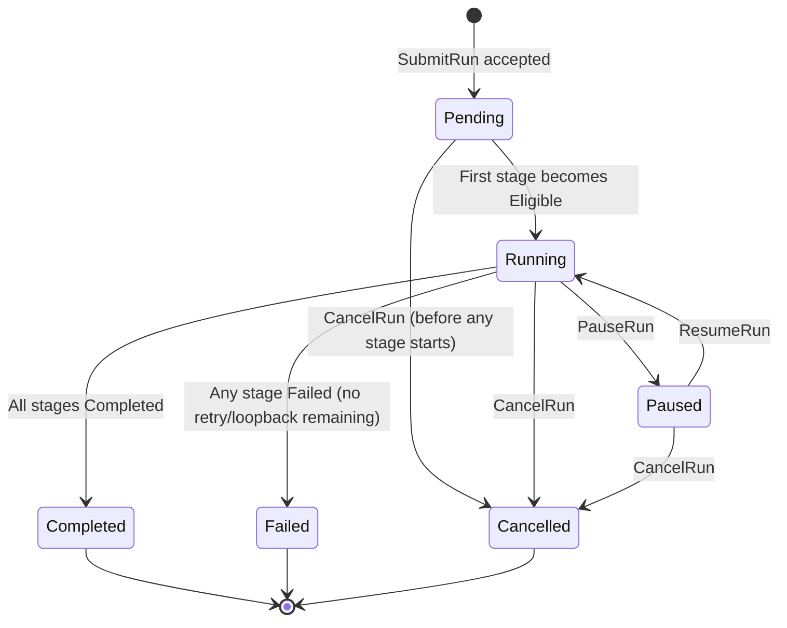

**Transition rules:**
- `Pending → Running`: triggered internally when the scheduler makes the first stage `Eligible`.
- `Running → Paused`: all currently `Running` stages receive `devs:pause\n` on stdin; run status transitions to `Paused` only after all running stages reach `Paused` or `Completed`.
- `Running → Completed`: only when ALL stages in the workflow reach a terminal state and none are `Failed` (or all `Failed` stages had their failure path route to eventual `Completed`).
- `Running → Failed`: when any stage transitions to `Failed` and no retry or branch loopback remains, the run is immediately marked `Failed`; all still-`Running` stages receive `devs:cancel\n`.
- `Paused → Running`: all `Paused` stages receive `devs:resume\n`.

#### 5.12.2 Stage Status State Machine

```mermaid
stateDiagram-v2
    [*] --> Pending : Run created; stage record initialised

    Pending --> Waiting : Run transitions to Running
    Waiting --> Eligible : All depends_on stages Completed
    Eligible --> Running : Pool slot acquired; agent spawned

    Running --> Paused : PauseStage or PauseRun
    Running --> Completed : Completion signal received; success
    Running --> Failed : Completion signal received; failure
    Running --> TimedOut : Stage timeout elapsed
    Running --> Cancelled : CancelStage or CancelRun

    Paused --> Running : ResumeStage or ResumeRun
    Paused --> Cancelled : CancelStage or CancelRun

    Failed --> Pending : Retry scheduled (attempt < max_attempts)
    TimedOut --> Pending : Retry scheduled (attempt < max_attempts)

    Completed --> [*]
    Failed --> [*] : No retry remaining
    TimedOut --> [*] : No retry remaining
    Cancelled --> [*]
```

**Transition rules:**
- `Waiting → Eligible`: the scheduler evaluates this transition after every stage completion event. A stage enters `Eligible` as soon as all stages in its `depends_on` list are `Completed`.
- `Eligible → Running`: the scheduler acquires a pool semaphore slot, selects an agent (capability + fallback algorithm from §4.7), spawns the agent process, and then atomically transitions the stage.
- `Running → Failed`: covers non-zero exit code (`exit_code` completion), `"success": false` structured output, or `signal_completion(success=false)`. The agent process may still be alive when the signal is received; the adapter waits for process exit before finalising the transition.
- `Failed/TimedOut → Pending`: occurs only when `retry.max_attempts` has not been exhausted. The attempt counter on the new `StageRun` record is incremented by 1. Rate-limit events do NOT trigger this path; they trigger a pool fallback without incrementing the attempt counter.

---

### 5.13 Webhook HTTP Protocol

**[2_TAS-REQ-086f]** Webhook deliveries are HTTP POST requests. The server is the sender; webhook `url` fields are configurable per-project.

#### 5.13.1 Request Headers

| Header | Value |
|---|---|
| `Content-Type` | `application/json; charset=utf-8` |
| `X-Devs-Event` | The event type string (e.g. `run.started`) |
| `X-Devs-Delivery` | A UUID4 unique to this delivery attempt |
| `X-Devs-Version` | The server's full `<major>.<minor>.<patch>` version string |
| `User-Agent` | `devs/<version>` |

No HMAC signature header is provided at MVP (post-MVP feature).

#### 5.13.2 Payload Schema

All webhook payloads conform to this envelope:

```json
{
  "event":      "string",           // event type; e.g. "run.started"
  "timestamp":  "ISO8601",          // UTC time the event occurred on the server
  "delivery_id": "uuid",            // same UUID as X-Devs-Delivery header
  "project_id": "uuid",
  "run_id":     "uuid",
  "stage_name": "string | null",    // null for run-level events
  "data":       {},                 // event-specific payload; see table below
  "truncated":  false               // true if data was truncated to fit 64 KiB limit
}
```

#### 5.13.3 Event-Specific `data` Schemas

| Event type | `data` schema |
|---|---|
| `run.started` | `{ "workflow_name": "string", "slug": "string", "input_count": N }` |
| `run.completed` | `{ "elapsed_ms": N, "stage_count": N }` |
| `run.failed` | `{ "failed_stage": "string", "error": "string", "elapsed_ms": N }` |
| `run.cancelled` | `{ "elapsed_ms": N }` |
| `stage.started` | `{ "attempt": N, "agent_tool": "string", "pool_name": "string" }` |
| `stage.completed` | `{ "attempt": N, "elapsed_ms": N, "exit_code": N }` |
| `stage.failed` | `{ "attempt": N, "exit_code": "integer \| null", "error": "string" }` |
| `stage.timed_out` | `{ "attempt": N, "timeout_secs": N, "elapsed_ms": N }` |
| `pool.exhausted` | `{ "pool_name": "string", "queued_count": N }` |
| `state.changed` | `{ "entity": "run\|stage", "stage_name": "string\|null", "from": "string", "to": "string" }` |

#### 5.13.4 Delivery Constraints

- **Timeout**: each HTTP POST attempt has a 10-second connect+read timeout. A timeout is treated as a failure.
- **Success criterion**: any HTTP 2xx response code is a successful delivery. 3xx redirects are NOT followed; they count as failures.
- **Retry policy**: fixed 5-second backoff; maximum 10 retry attempts. After 10 failures, the delivery is permanently dropped and logged at `ERROR`. Retry state is in-memory only (lost on server restart).
- **Payload size**: if the full JSON payload exceeds 64 KiB, `data.error` (or the largest string field in `data`) is truncated character-by-character until the payload fits. `truncated` is set to `true`. The envelope fields (`event`, `timestamp`, `run_id`, etc.) are never truncated.
- **Ordering**: events for the same run are enqueued in the order they occur. Delivery ordering is best-effort; network conditions may reorder deliveries across runs.

---

### 5.14 CLI `--format json` Output Schemas

**[2_TAS-REQ-086g]** When `--format json` is passed to any CLI command, output is written to stdout as a single JSON object followed by a newline. Errors use the error envelope described in §4.14. The schemas below are normative.

#### `devs submit --format json`

```json
{
  "run_id":        "uuid",
  "slug":          "string",
  "workflow_name": "string",
  "project_id":    "uuid",
  "status":        "pending",
  "created_at":    "ISO8601"
}
```

#### `devs list --format json`

```json
{
  "runs": [
    {
      "run_id":        "uuid",
      "slug":          "string",
      "workflow_name": "string",
      "project_id":    "uuid",
      "status":        "string",
      "created_at":    "ISO8601",
      "started_at":    "ISO8601 | null",
      "completed_at":  "ISO8601 | null"
    }
  ],
  "total": N
}
```

#### `devs status --format json`

```json
{
  "run_id":        "uuid",
  "slug":          "string",
  "workflow_name": "string",
  "project_id":    "uuid",
  "status":        "string",
  "created_at":    "ISO8601",
  "started_at":    "ISO8601 | null",
  "completed_at":  "ISO8601 | null",
  "stage_runs": [
    {
      "stage_run_id": "uuid",
      "stage_name":   "string",
      "attempt":      N,
      "status":       "string",
      "agent_tool":   "string | null",
      "pool_name":    "string",
      "started_at":   "ISO8601 | null",
      "completed_at": "ISO8601 | null",
      "exit_code":    "integer | null",
      "elapsed_ms":   "integer | null"
    }
  ]
}
```

#### `devs logs --format json`

Each log line is emitted as a separate newline-delimited JSON object (NDJSON), not wrapped in an array:

```json
{"stream": "stdout", "line": "string", "sequence": N, "occurred_at": "ISO8601"}
```

When the stream ends, a final object is emitted:

```json
{"done": true, "run_status": "completed|failed|cancelled"}
```

#### `devs cancel / pause / resume --format json`

```json
{ "run_id": "uuid", "status": "string" }
```

When a `<stage>` argument is provided (for `pause`/`resume`):

```json
{ "run_id": "uuid", "stage_run_id": "uuid", "stage_name": "string", "status": "string" }
```

#### `devs project add --format json`

```json
{
  "project_id":       "uuid",
  "name":             "string",
  "repo_path":        "string",
  "priority":         N,
  "weight":           N,
  "checkpoint_branch":"string",
  "registered_at":    "ISO8601"
}
```

#### `devs project list --format json`

```json
{
  "projects": [
    {
      "project_id":       "uuid",
      "name":             "string",
      "repo_path":        "string",
      "priority":         N,
      "weight":           N,
      "checkpoint_branch":"string",
      "registered_at":    "ISO8601"
    }
  ]
}
```

---

### 5.15 Protocol Versioning and Compatibility

**[2_TAS-REQ-086h]** The project uses Semantic Versioning (`MAJOR.MINOR.PATCH`). Protocol compatibility follows these rules:

| Change type | Version bump | Compatibility guarantee |
|---|---|---|
| New optional proto field (proto3 default) | MINOR | Forward and backward compatible |
| New RPC method | MINOR | Old clients ignore; no breakage |
| New MCP tool | MINOR | Old clients unaffected |
| Changed field type or semantics | MAJOR | Breaking; clients must upgrade |
| Removed field or RPC | MAJOR | Breaking |
| New required field (validated server-side) | MAJOR | Breaking |

**[2_TAS-REQ-086i]** Compatibility enforcement:

1. Every gRPC request MUST carry the `x-devs-client-version` metadata key. Its value is the client binary's `MAJOR.MINOR.PATCH` version string.
2. The server extracts the `MAJOR` component. If `client_major != server_major`, the server returns `FAILED_PRECONDITION` with message `"client version mismatch: client=<ver> server=<ver>"` for ALL RPC methods. No partial processing occurs.
3. If the `x-devs-client-version` metadata key is absent, the server returns `FAILED_PRECONDITION` with message `"missing required metadata: x-devs-client-version"`.
4. MCP tool calls do not carry a version header. The MCP server never rejects a call on version grounds; new fields added to MCP responses are ignored by older clients.
5. The server's own version is embedded at compile time via a build script that reads `Cargo.toml` workspace version. It is exposed as a string constant in `devs-core/src/version.rs`.

---

### 5.16 Data Serialization Rules

**[2_TAS-REQ-086j]** These rules apply to all JSON serialization in MCP responses, webhook payloads, CLI JSON output, and the JSON fields embedded in proto messages (e.g. `inputs_json`, `definition_json`).

| Type | JSON encoding | Example |
|---|---|---|
| `Uuid` | Lowercase hyphenated string | `"550e8400-e29b-41d4-a716-446655440000"` |
| `DateTime<Utc>` | RFC 3339 / ISO 8601 with millisecond precision and `Z` suffix | `"2026-03-10T14:23:05.123Z"` |
| Optional field not yet populated | JSON `null` — key MUST be present in the object | `"started_at": null` |
| `RunStatus` enum | Lowercase string | `"running"`, `"completed"`, `"failed"` |
| `StageStatus` enum | Lowercase string | `"eligible"`, `"timed_out"` |
| `AgentTool` enum | Lowercase string matching CLI name | `"claude"`, `"gemini"`, `"opencode"`, `"qwen"`, `"copilot"` |
| Integer exit code | JSON number (i32 range) | `0`, `-1`, `137` |
| Boolean | JSON `true` / `false` | `true` |
| Binary data (stdout/stderr in MCP `stream_logs`) | base64-encoded string | `"aGVsbG8="` |
| Binary data (stdout/stderr in `StageOutput` MCP responses) | UTF-8 string with replacement character U+FFFD for invalid bytes | `"hello\uFFFDworld"` |
| HashMap / env map | JSON object with string keys and string values | `{"KEY": "value"}` |

**[2_TAS-REQ-086k]** Proto3 well-known wrapper types (`google.protobuf.Int32Value`, `google.protobuf.UInt64Value`, etc.) map to `null` in any JSON representation when the wrapper is absent. This is consistent with proto3 JSON mapping rules (RFC). The absence of a wrapper field is equivalent to `null`, not to `0`.

**[2_TAS-REQ-086l]** All timestamps generated by the server use `chrono::Utc::now()`. Monotonic clocks are used only for elapsed-time measurements (reported in `elapsed_ms` fields). Stored timestamps (in `checkpoint.json`, webhook payloads) use wall-clock UTC.

---

### 5.17 Streaming Protocol Specifications

**[2_TAS-REQ-086m]** Three gRPC RPCs produce server-streaming responses. Their behaviour is specified below.

#### 5.17.1 `RunService.StreamRunEvents`

- **Initial message**: the server sends the full current `WorkflowRun` state (all stage_runs included) as the first `RunEvent` immediately upon stream establishment. `event_type` = `"run.snapshot"` on this initial message.
- **Subsequent messages**: one `RunEvent` per state transition. Event types: `"run.status_changed"`, `"stage.status_changed"`, `"log.chunk"` (for progress report notifications only; not full log data).
- **Backpressure**: the server maintains a per-client event buffer of 256 messages. If the client is slow and the buffer fills, the server drops the oldest event from the buffer (not the most recent). Dropped events are logged at `DEBUG`. The client always receives the most recent state on the next event.
- **Reconnect semantics**: the client may reconnect after a disconnect by opening a new `StreamRunEvents` call. The initial snapshot message makes the stream self-healing. Clients MUST NOT assume they received all intermediate events.
- **Stream termination**: when the run reaches a terminal state (`Completed`, `Failed`, `Cancelled`), the server sends one final `RunEvent` with the terminal `RunStatus`, then closes the stream with gRPC status `OK`.
- **Non-existent run**: if `run_id` is not found, the server returns `NOT_FOUND` immediately (no stream is opened).

#### 5.17.2 `LogService.StreamLogs`

- **`follow: false`**: all buffered log data is returned as a sequence of `LogChunkProto` messages, then the stream closes with `OK`. If no data has been written yet (stage is `Waiting` or `Eligible`), the stream returns zero chunks and closes immediately.
- **`follow: true`**: the server streams all existing chunks first (in `sequence` order), then holds the stream open and pushes new chunks as the agent writes to stdout/stderr. When the stage reaches a terminal state, the server sends a final chunk with `done: true` and an empty `data` field, then closes with `OK`.
- **Sequence numbers**: per-stage, monotonically increasing from 1. Gaps in sequence numbers indicate dropped chunks (due to buffer limits). Clients SHOULD detect gaps and surface a warning.
- **Log chunk size**: each `LogChunkProto.data` field contains at most 32 KiB of raw bytes. Larger writes from the agent are split into multiple chunks.
- **Reconnect**: a reconnecting client passes the last received `sequence` as context by opening a new `StreamLogs` call. The server does not support resumption (the `sequence` field in the request is absent); clients must buffer and deduplicate based on sequence numbers if they reconnect.

#### 5.17.3 `PoolService.WatchPoolState`

- **Initial message**: the server immediately sends the current `PoolStateEventProto` for the requested pool(s) with `event_kind = "pool.snapshot"`.
- **Subsequent messages**: one `PoolStateEventProto` per pool state change (agent started, completed, rate-limited, pool exhausted, pool recovered).
- **Backpressure**: same 256-message per-client buffer as `StreamRunEvents`; oldest dropped on overflow.
- **Stream lifetime**: pool watch streams remain open indefinitely until the client disconnects or the server shuts down.

---

### 5.18 Protocol-Level Edge Cases

**[2_TAS-REQ-086n]** The following edge cases apply at the protocol layer and must be handled before any business logic is executed.

| # | Scenario | Expected Behavior |
|---|---|---|
| EC-P01 | gRPC request body exceeds the per-RPC max request size (§5.3) | Server returns `RESOURCE_EXHAUSTED` with message `"request too large: <actual_bytes> > <limit_bytes>"` |
| EC-P02 | Client sends a proto message with an unknown field number | Unknown fields silently ignored (proto3 forward-compatibility rule); no error |
| EC-P03 | `SubmitRunRequest.inputs_json` is not valid JSON | Returns `INVALID_ARGUMENT`: `"input validation: inputs_json is not valid JSON"` |
| EC-P04 | `RegisterWorkflowRequest.definition_json` has a UTF-8 encoding error | Returns `INVALID_ARGUMENT`: `"definition_json is not valid UTF-8"` before validation |
| EC-P05 | Two concurrent `SubmitRun` calls with the same `name` arrive simultaneously | One succeeds; the other receives `ALREADY_EXISTS`. The duplicate-name check is protected by a per-project mutex to prevent a race condition. |
| EC-P06 | Webhook target URL uses an IP address that resolves but the connection is refused | Treated as a delivery failure; retried up to 10 times with 5-second fixed backoff |
| EC-P07 | `StreamRunEvents` call arrives for a run that has already reached a terminal state | Server sends one `RunEvent` with the terminal status and `event_type = "run.snapshot"`, then closes the stream with `OK` immediately |
| EC-P08 | MCP `stream_logs` request sent while the stage is already terminal and logs have been rotated (beyond retention policy) | Returns `{ "result": null, "error": "logs not found: run <id> stage <name> attempt <n>" }` |
| EC-P09 | CLI `--format json` output is piped to a closed process (SIGPIPE on stdout) | CLI catches `BrokenPipe` and exits 0 silently (standard UNIX pipe convention) |
| EC-P10 | Server receives two `SIGTERM` signals (e.g. double Ctrl+C) | Second signal is ignored during graceful shutdown; shutdown sequence runs exactly once |
| EC-P11 | MCP `write_workflow_definition` is called for a workflow that has an active (non-terminal) run | The definition is updated on disk for future runs; the active run continues using its immutable snapshot |
| EC-P12 | Proto `enum` field contains a value not defined in the schema (forward-compat scenario) | Unknown enum values are treated as the default (value 0) per proto3 rules; no error is returned |

---

### 5.19 Section 5 Acceptance Criteria

The following are directly testable assertions that verify the API Design & Protocols specification. Each maps to one or more automated tests.

**Proto File Structure:**
- [ ] `proto/devs/v1/` contains exactly the six files listed in §5.1: `common.proto`, `workflow.proto`, `run.proto`, `stage.proto`, `log.proto`, `pool.proto`, `project.proto`
- [ ] `protoc` (or `tonic-build`) compiles all proto files with zero warnings or errors from a clean workspace
- [ ] Proto package is `devs.v1` in every file (verified by `grep -r "^package" proto/`)
- [ ] `StageStatusEnum` in `common.proto` defines exactly 9 values (UNSPECIFIED + 8 named statuses)

**gRPC Error Codes:**
- [ ] `SubmitRun` with a malformed `inputs_json` returns `INVALID_ARGUMENT` (not `INTERNAL`)
- [ ] `GetRun` with a non-existent UUID returns `NOT_FOUND`
- [ ] `SubmitRun` with a duplicate non-cancelled run name returns `ALREADY_EXISTS`
- [ ] Any RPC called without `x-devs-client-version` metadata returns `FAILED_PRECONDITION` containing `"missing required metadata"`
- [ ] Any RPC called with a different major version returns `FAILED_PRECONDITION` containing `"client version mismatch"`
- [ ] `CancelRun` on a `Completed` run returns `FAILED_PRECONDITION` containing `"illegal transition"`
- [ ] `INVALID_ARGUMENT` with multiple validation errors includes all errors in the message (not just the first)

**State Machine Transitions:**
- [ ] `WorkflowRun` can only be in exactly one of: `{Pending, Running, Paused, Completed, Failed, Cancelled}`
- [ ] `RunStatus::Completed` never transitions to any other status (verified by attempting `PauseRun`, `ResumeRun`, `CancelRun` on a completed run)
- [ ] `StageStatus::Eligible → Running` transition is the only transition that spawns an agent process
- [ ] `StageStatus::Failed → Pending` transition increments `attempt` by 1 on the new `StageRun` record
- [ ] `StageStatus::Running → Paused` transition sends `devs:pause\n` to the agent's stdin before status is updated

**Webhook Protocol:**
- [ ] Every webhook POST includes `X-Devs-Event`, `X-Devs-Delivery`, `X-Devs-Version`, and `User-Agent` headers
- [ ] `X-Devs-Delivery` is unique per delivery attempt (verified across 10 deliveries to the same URL)
- [ ] Webhook payload for `run.started` parses as valid JSON conforming to the §5.13.2 envelope schema
- [ ] Webhook with 65 KiB payload has `truncated: true` and total payload ≤ 64 KiB
- [ ] Webhook delivery failure (mock server returning 500) is retried up to 10 times and then dropped

**CLI JSON Output:**
- [ ] `devs submit --format json` output parses as JSON and contains `run_id`, `slug`, `status`, `created_at` fields
- [ ] `devs list --format json` output contains a `"runs"` array and a `"total"` integer
- [ ] `devs status --format json` output contains a `"stage_runs"` array; each element has `elapsed_ms`
- [ ] `devs logs --format json` produces NDJSON (one JSON object per line); final line contains `"done": true`
- [ ] `devs cancel --format json` on a non-existent run exits 2 and outputs `{"error": "...", "code": 2}`

**Protocol Versioning:**
- [ ] Server version string matches `[0-9]+\.[0-9]+\.[0-9]+` pattern from `version.rs`
- [ ] `x-devs-client-version` with the same major version but different minor/patch version is accepted
- [ ] `x-devs-client-version` with a higher major version than the server is rejected with `FAILED_PRECONDITION`

**Data Serialization:**
- [ ] All ISO 8601 timestamps in JSON output end with `Z` (UTC) and include milliseconds
- [ ] Optional/nullable fields (e.g. `started_at` when not yet set) serialize as JSON `null`, not absent keys
- [ ] `StageStatus` values serialize as lowercase strings (`"timed_out"` not `"TimedOut"`)
- [ ] Binary content (stdout bytes) in MCP `get_stage_output` is valid UTF-8 with replacement chars for invalid bytes

**Streaming:**
- [ ] `StreamRunEvents` first message has `event_type = "run.snapshot"` containing the full run state
- [ ] `StreamRunEvents` for a terminal run sends exactly one message then closes the stream with `OK`
- [ ] `LogService.StreamLogs` with `follow: false` for an empty log returns zero chunks and closes immediately
- [ ] `LogService.StreamLogs` with `follow: true` sends a chunk with `done: true` when the stage reaches a terminal state
- [ ] Each `LogChunkProto.data` field contains at most 32 KiB

**Edge Cases:**
- [ ] Request body exceeding max size returns `RESOURCE_EXHAUSTED` (verified by sending a 5 MiB `RegisterWorkflow` body against the 1 MiB limit)
- [ ] Concurrent `SubmitRun` with the same name results in exactly one success and one `ALREADY_EXISTS`
- [ ] `StreamRunEvents` for an already-terminal run delivers one snapshot message and closes

---

## 6. Algorithms & Implementation Details

### 6.1 Retention Sweep Algorithm

**[2_TAS-REQ-086]** The retention sweep runs at server startup (after checkpoint restore) and every 24 hours thereafter via a recurring Tokio task. The sweep MUST NOT delete runs that are in `Running` or `Paused` status.

```
fn sweep_retention(store, policy):
    all_runs = store.load_all_run_metadata()  // load only metadata, not full output
    terminal_runs = filter(all_runs, status in {Completed, Failed, Cancelled})

    // Phase 1: age-based deletion
    cutoff = now() - Duration::days(policy.max_age_days)
    age_expired = filter(terminal_runs, run.completed_at < cutoff)

    // Phase 2: size-based deletion (if total size exceeds max_size_mb)
    total_size_bytes = sum(store.run_size_bytes(r) for r in terminal_runs)
    size_limit_bytes = policy.max_size_mb * 1024 * 1024
    size_expired = []
    if total_size_bytes > size_limit_bytes:
        // Sort remaining (non-age-expired) runs by completed_at ascending
        candidates = sort(terminal_runs - age_expired, by=completed_at asc)
        excess = total_size_bytes - size_limit_bytes
        accumulated = 0
        for run in candidates:
            size_expired.append(run)
            accumulated += store.run_size_bytes(run)
            if accumulated >= excess: break

    to_delete = deduplicate(age_expired + size_expired)

    // Delete atomically per run (all files + git commits for that run)
    for run in to_delete:
        store.delete_run(run.run_id)  // removes .devs/runs/<id>/ and .devs/logs/<id>/
        log INFO "swept run {} (reason: {})", run.run_id, reason

    return SweepReport { deleted_count: len(to_delete), bytes_freed: sum(...) }
```

**[2_TAS-REQ-087]** `store.delete_run()` removes the run's directory tree from the filesystem and records a deletion commit on the checkpoint branch: `devs: sweep run <id> (age|size)`. The git history itself is not pruned (no `git gc` is run automatically).

### 6.2 Template Resolution Algorithm

**[2_TAS-REQ-088]** Template resolution is performed by `TemplateResolver` in `devs-core`. The resolver takes a prompt string and a `ResolutionContext` containing all available variables, and returns `Result<String, TemplateError>`.

```rust
struct ResolutionContext<'a> {
    workflow_inputs: &'a HashMap<String, serde_json::Value>,
    stage_outputs:   &'a HashMap<String, StageOutput>,   // keyed by stage name
    run_id:          &'a str,
    run_slug:        &'a str,
    run_name:        &'a str,
    fan_out_index:   Option<u32>,
    fan_out_item:    Option<&'a str>,
    depends_on_closure: &'a HashSet<String>, // transitive dependency set
}
```

Resolution steps:
1. Scan the prompt string for all `{{...}}` expressions using a single-pass parser.
2. For each expression, attempt resolution in priority order (§5.5).
3. For `{{stage.<name>.*}}` references: first verify `<name>` is in `depends_on_closure`; if not, return `TemplateError::NonDependentStageRef { expr, stage_name }`.
4. For `{{stage.<name>.output.<field>}}` on a stage that used `exit_code` completion: return `TemplateError::NoStructuredOutput { stage_name }`.
5. If no resolver matches, return `TemplateError::UnknownVariable { expr }`.
6. Replace all resolved expressions and return the interpolated string.

stdout/stderr values in template context are truncated to 10,240 bytes (10 KiB) with suffix `"...[truncated]"` if longer. The truncation is applied only to the template context copy; the full values remain in `StageOutput`.

### 6.3 Context File Construction

**[2_TAS-REQ-089]** The `.devs_context.json` file written before each agent spawn contains:

```json
{
  "run": {
    "run_id": "uuid",
    "slug": "string",
    "name": "string",
    "workflow_name": "string"
  },
  "inputs": { "key": "value" },
  "stages": {
    "<stage-name>": {
      "status": "Completed",
      "exit_code": 0,
      "stdout": "string (truncated to proportional share of 10 MiB total)",
      "stderr": "string",
      "output": { "structured json fields" } | null
    }
  }
}
```

Only stages in `Completed` status and in the transitive `depends_on` closure of the current stage are included. If the total serialized size exceeds 10 MiB, stdout and stderr fields are proportionally truncated across all included stages. The truncation preserves the end of each stream (most recent output) rather than the beginning. A top-level `"truncated": true` field is added if any truncation occurred.

**[2_TAS-REQ-090]** The context file is written atomically (write-to-temp-file then rename) immediately before the agent process is spawned. If the write fails (e.g., disk full), the stage transitions to `Failed` with error `"failed to write context file: <io_error>"` without spawning the agent.

### 6.4 Completion Signal Processing

**[2_TAS-REQ-091]** Completion signal dispatch logic executed when an agent process exits or calls `signal_completion`:

```
fn handle_agent_exit(stage_run, exit_code, stdout, stderr, completion_signal):
    match completion_signal:
        ExitCode =>
            if exit_code == 0: transition(Completed)
            else:
                if is_rate_limit(exit_code, stderr): trigger_pool_fallback()
                else: transition(Failed, reason="exit_code={}")

        StructuredOutput =>
            output_json = read_devs_output_json()  // .devs_output.json priority
                          ?? extract_last_json_from_stdout(stdout)
            if output_json is None or parse fails:
                transition(Failed, reason="invalid structured output")
            elif output_json["success"] == true:
                transition(Completed, output=output_json)
            else:
                transition(Failed, output=output_json)

        McpToolCall =>
            if signal_completion already called:
                // already handled; use the stored result
                return
            else:
                // fallback: treat as exit_code completion
                if exit_code == 0: transition(Completed)
                else: transition(Failed, reason="process exited without signal_completion")
```

**[2_TAS-REQ-092]** Timeout enforcement sequence (applied independently of completion signal type):

1. At `started_at + timeout_secs`, write `devs:cancel\n` to agent stdin.
2. Wait 5 seconds.
3. Send SIGTERM to the agent process.
4. Wait 5 more seconds.
5. Send SIGKILL to the agent process.
6. Record `exit_code` from the killed process.
7. Transition stage to `TimedOut` regardless of the process's exit code.

The full 10-second grace window (steps 2+4) is always exhausted before SIGKILL, even if the process exits during the window.

### 6.5 Webhook Retry Policy

**[2_TAS-REQ-093]** Webhook delivery uses fixed-interval retry. The dispatcher:

1. Serializes the event payload.
2. If serialized size > 65,536 bytes (64 KiB): truncate `data` field and set `"truncated": true`.
3. Sends HTTP POST with `Content-Type: application/json` and a 10-second connect+read timeout.
4. On HTTP 2xx: delivery complete.
5. On HTTP non-2xx or timeout: log WARN with status/error; retry after 30 seconds.
6. Retry up to 5 times total (1 initial + 4 retries). After 5 failures: log ERROR, discard event.
7. Delivery failures NEVER block the scheduler or affect run/stage status.

---

## 7. Edge Cases & Error Handling

### 7.1 Server Startup Edge Cases

| Scenario | Expected Behavior |
|---|---|
| gRPC port already bound | Log `"gRPC port <N> already in use"` to stderr; exit code 1 before binding MCP port |
| MCP port already bound (gRPC succeeded) | Release gRPC port; log error to stderr; exit code 1 |
| `devs.toml` has unknown keys | Collected as `ConfigError::UnknownKey`; all unknown keys reported together; exit code 1 |
| Checkpoint branch missing from git repo | Create as orphan branch; log INFO `"created checkpoint branch <name>"` |
| Checkpoint JSON is malformed (disk corruption) | Log ERROR for that run; skip it during restore; continue with other runs |
| `Running` stage found in checkpoint at startup | Reset to `Eligible`; log INFO `"recovered stage <name> from Running to Eligible"` |
| Discovery file exists from a dead server | Overwrite atomically; do not error |
| `devs.toml` missing entirely | Report `"devs.toml not found at <path>"` to stderr; exit code 1 |
| Pool has `max_concurrent = 0` | Validation error: `"pool.<name>.max_concurrent must be ≥ 1"`; collected with other config errors |
| Pool has zero agents | Validation error: `"pool.<name> must have at least one agent"` |

### 7.2 Workflow Submission Edge Cases

| Scenario | Expected Behavior |
|---|---|
| Workflow name not found in project | `SubmitRun` fails: `"workflow not found: <name> in project <id>"`; MCP error field set |
| Duplicate non-cancelled run name | Atomic rejection under per-project lock: `"run name already in use: <name>"`; no run created |
| Required input missing (no default) | `"missing required input: <name>"`; run not created |
| Input value wrong type | `"input type mismatch: <name> expected <type> got <type>"`; run not created |
| Zero-stage workflow | `"workflow must have at least one stage"`; workflow rejected at definition write time |
| Workflow with self-referential depends_on | Detected as cycle: `{ "error": "cycle detected", "cycle": ["a","a"] }` |
| `fan_out.count > 64` | Validation error at definition time: `"fan_out.count must be ≤ 64"` |
| `fan_out.count` and `fan_out.input_list` both set | `"fan_out.count and fan_out.input_list are mutually exclusive"` |
| Stage timeout > workflow timeout | `"stage.timeout_secs (N) exceeds workflow.timeout_secs (M) for stage <name>"` |
| `prompt` and `prompt_file` both set | `"prompt and prompt_file are mutually exclusive in stage <name>"` |
| Neither `prompt` nor `prompt_file` set | `"stage <name> must have either prompt or prompt_file"` |
| `fan_out` and `branch` both set on stage | `"fan_out and branch are mutually exclusive in stage <name>"` |

### 7.3 Stage Execution Edge Cases

| Scenario | Expected Behavior |
|---|---|
| Agent binary not found in PATH | Immediate `StageStatus::Failed`; `"agent binary not found: <tool>"`; no retry |
| PTY allocation fails | Immediate `StageStatus::Failed`; `"PTY allocation failed: <os_error>"`; no retry |
| `prompt_file` path does not exist at execution time | Immediate `StageStatus::Failed`; `"prompt_file not found: <path>"` |
| Template variable references non-dependent stage | Immediate `StageStatus::Failed`; `"template variable references non-dependent stage: <name>"` |
| Template variable unresolved | Immediate `StageStatus::Failed`; `"unresolved template variable: "` |
| `.devs_output.json` is malformed JSON | `StageStatus::Failed`; `"invalid structured output: <parse_error>"`; regardless of exit code |
| `.devs_output.json` missing `"success"` field | `StageStatus::Failed`; `"structured output missing required field: success"` |
| stdout/stderr exceeds 1 MiB | Stored truncated to 1 MiB; `StageOutput.truncated = true`; logged at WARN |
| Context file write fails (disk full) | `StageStatus::Failed`; `"failed to write context file: <io_error>"`; agent not spawned |
| Auto-collect git push fails | Log ERROR; stage status unaffected (stage already Completed); webhook `stage.completed` fires |
| SSH connection drops mid-stage | `StageStatus::Failed`; `"SSH connection lost"`; retry logic applies |
| Docker container exits with code 137 (OOM kill) | Treated as non-zero exit; rate-limit detection checked against stderr first |
| `signal_completion` called twice | Second call: error `"stage already in terminal state: Completed"`; no state change |
| Fan-out sub-agent fails, no merge handler | Parent stage `Failed`; `{ "failed_indices": [N, M] }` in error payload |
| Cleanup of temp dir fails | Log WARN; continue; does not affect stage status |

### 7.4 Agent Pool Edge Cases

| Scenario | Expected Behavior |
|---|---|
| All agents in pool rate-limited simultaneously | `PoolExhausted` webhook fires once; stages queue behind semaphore; retry when cooldown expires |
| Stage requires capability not present in any pool agent | Immediate `StageStatus::Failed`; `"no agent satisfies capabilities: [<cap>]"`; not queued |
| `max_concurrent = 1` pool with 10 eligible stages | All 10 queue; dispatched serially as each slot is released |
| Agent selected but then becomes rate-limited before acquiring slot | Rate-limit detected; agent skipped; next candidate selected (or queued if none) |
| Pool exhausted event fires; then one agent recovers | Exhaustion episode ends; `PoolExhausted` will fire again for the NEXT exhaustion episode |
| All pools in config deleted at runtime | In-flight stages complete; new stages that reference deleted pools fail immediately |
| Rate-limit cooldown timer: agent becomes available at exactly 60s | Agent is eligible for selection at `started_at + 60s`; checked with `>=` comparison |

### 7.5 State Persistence Edge Cases

| Scenario | Expected Behavior |
|---|---|
| Disk full during checkpoint write | Log ERROR `"checkpoint write failed: <io_error>"`; server does not crash; in-memory state preserved |
| Two concurrent checkpoint writes for the same run | Serialized via per-run `tokio::sync::Mutex`; no interleaving |
| Checkpoint branch deleted externally between server restarts | Re-created as orphan branch on next startup |
| `workflow_snapshot.json` modified externally | Server detects hash mismatch on load (SHA-256 of file vs. stored hash in checkpoint.json); logs WARN; uses file as-is (not rejected — snapshot may be legitimate repair) |
| git2 push fails (remote unreachable) | Log ERROR; in-memory state is authoritative; server continues; next checkpoint write retried immediately |
| Retention sweep deletes a run that is concurrently being queried via MCP | Sweep holds a per-run read lock; query holds the same lock; sweep waits; no partial deletion observed by query |
| Log file for a running stage read via `stream_logs` before write completes | Streaming reader reads available bytes; blocks (follow mode) or returns EOF (non-follow) |

### 7.6 Client Interface Edge Cases

**TUI:**

| Scenario | Expected Behavior |
|---|---|
| gRPC `StreamRunEvents` connection drops | Auto-reconnect with exponential backoff: 1s, 2s, 4s, 8s, 16s, 30s max; total 30s; then 5s final wait; exit code 1 |
| Server returns run with 0 stages | Dashboard shows empty DAG pane with message `"no stages defined"` |
| Log stream for stage exceeds 10,000 lines | Oldest lines evicted from in-memory buffer; indicator shown: `"[log trimmed — N lines discarded]"` |
| Stage name longer than DAG pane width | Truncated with `…` suffix to fit; full name shown in status bar on selection |
| TUI launched before any runs exist | Dashboard shows empty run list; no error |

**CLI:**

| Scenario | Expected Behavior |
|---|---|
| Both UUID and slug match different runs (collision) | UUID takes precedence; slug match ignored |
| `--format json` with `devs logs --follow` | Each log chunk is a separate JSON object on its own line: `{"stream":"stdout","data":"..."}` |
| `devs submit` with `--input` that references unknown key | Server validation rejects; CLI prints `{ "error": "unknown input: <key>", "code": 4 }` |
| `devs cancel` on already-Completed run | CLI receives `FAILED_PRECONDITION` from gRPC; prints `{ "error": "illegal transition: Completed → Cancelled", "code": 1 }` |
| Discovery file absent and no `--server` flag | CLI prints `"server unreachable: no discovery file at <path>"` to stderr; exits with code 3 |

**MCP Bridge:**

| Scenario | Expected Behavior |
|---|---|
| MCP port unreachable | Bridge writes `{ "jsonrpc": "2.0", "error": { "code": -32603, "message": "MCP server unreachable" }, "id": null }` to stdout; exits non-zero |
| stdin closes (agent process exits) | Bridge performs graceful shutdown; closes MCP HTTP connection |
| Malformed JSON-RPC request received on stdin | Bridge responds `{ "error": { "code": -32700, "message": "Parse error" }, "id": null }` |
| MCP response exceeds 64 MiB | Bridge writes `{ "error": { "code": -32603, "message": "response too large" } }`; does not crash |

---

## 8. Component Dependencies

### 8.1 Crate Dependency Graph

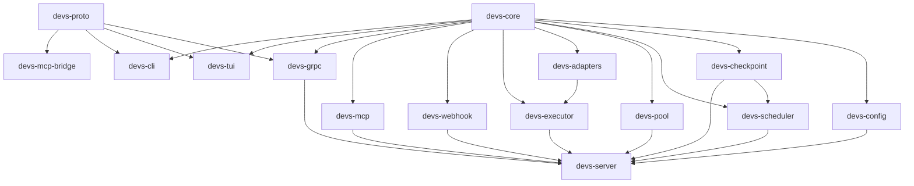

### 8.2 External Service Dependencies

| Component | External Dependency | Failure Mode |
|---|---|---|
| `devs-checkpoint` | git repository on local filesystem | Checkpoint write fails; server continues; logs ERROR |
| `devs-executor` (Docker) | Docker daemon via DOCKER_HOST | Stage fails immediately: `"docker daemon unavailable"` |
| `devs-executor` (Remote SSH) | SSH daemon on remote host | Stage fails: `"SSH connection failed: <os_error>"` |
| `devs-webhook` | External HTTP webhook endpoint | Delivery retried up to 5 times; then discarded; run unaffected |
| `devs-adapters` | Agent CLI binaries (claude, gemini, etc.) | Stage fails immediately: `"agent binary not found"` |
| All clients | `devs-server` gRPC port | Client exits with code 3 |

---

## 9. Acceptance Criteria

### 9.1 Server Architecture

- [ ] Server starts successfully following the exact 8-step startup sequence; any step failure exits with code 1 and a specific error message on stderr.
- [ ] gRPC port and MCP port bind independently; failure of either prevents the discovery file from being written.
- [ ] Discovery file `~/.config/devs/server.addr` is written only after both ports are bound and deleted on clean SIGTERM.
- [ ] `DEVS_DISCOVERY_FILE` env var redirects the discovery file path; two parallel server processes using different env values do not conflict.
- [ ] Server process survives checkpoint write failures (disk full); in-memory state remains authoritative.

### 9.2 Workflow Definition & Validation

- [ ] All 11 validation checks (§4.6 REQ-030a) run in a single pass; all errors returned together, not first-error-only.
- [ ] A workflow with a cycle `a → b → c → a` is rejected with `{ "error": "cycle detected", "cycle": ["a","b","c","a"] }`.
- [ ] A zero-stage workflow is rejected with message `"workflow must have at least one stage"`.
- [ ] `prompt` and `prompt_file` set simultaneously on one stage is rejected at definition-write time.
- [ ] `fan_out` and `branch` set simultaneously on one stage is rejected at definition-write time.
- [ ] Workflow snapshot is immutable after the first stage transitions from `Waiting` to `Eligible`; subsequent writes are rejected.
- [ ] Run slug follows pattern `<workflow-name>-<YYYYMMDD>-<4 hex chars>` and matches `[a-z0-9-]+`.
- [ ] Duplicate non-cancelled run names are rejected atomically; no partial run record created.

### 9.3 DAG Scheduling & Parallelism

- [ ] Two stages with no shared dependencies are both dispatched within 100 ms of their common dependency completing (measured end-to-end in an E2E test with a mock agent).
- [ ] A three-level DAG (`A → B,C → D`) executes B and C in parallel; D starts only after both B and C complete.
- [ ] Pausing a run transitions all non-terminal stages to `Paused`; resuming returns them to `Running`; the DAG continues correctly.
- [ ] Cancelling a run transitions all non-terminal stages to `Cancelled`; subsequent stage-completion events for that run are ignored.
- [ ] Fan-out with `count = 3` spawns exactly 3 sub-executions; the parent stage advances only after all 3 complete.
- [ ] Fan-out failure (one sub-agent fails, no merge handler) marks the parent stage `Failed` with `"failed_indices"` in the error payload.

### 9.4 Agent Pool

- [ ] `max_concurrent = 2` pool with 5 eligible stages dispatches exactly 2 concurrently; the remaining 3 queue.
- [ ] An agent in rate-limit cooldown is skipped during selection; the next eligible agent is used.
- [ ] When all agents are in cooldown simultaneously, `PoolExhausted` webhook fires exactly once; it does not fire again until the episode ends and a new exhaustion episode begins.
- [ ] A stage requiring capability `["long-context"]` fails immediately with `"no agent satisfies capabilities"` when no pool agent declares that capability.
- [ ] An agent with empty capabilities `[]` satisfies any capability requirement.

### 9.5 Stage Execution & Completion Signals

- [ ] `exit_code = 0` transitions stage to `Completed`; any non-zero exit transitions to `Failed`.
- [ ] `structured_output` completion with `.devs_output.json` present and `"success": true` → `Completed`; `"success": false` → `Failed`.
- [ ] Malformed `.devs_output.json` (invalid JSON) → `Failed`; exit code is still recorded in `StageRun.exit_code`.
- [ ] `mcp_tool_call` completion: `signal_completion` called with `success=true` → `Completed`; process then exits without further state change.
- [ ] Second call to `signal_completion` on an already-terminal stage returns an error; stage status unchanged.
- [ ] Timeout sequence: `devs:cancel\n` written to stdin; 5s grace; SIGTERM; 5s grace; SIGKILL; stage → `TimedOut`.
- [ ] Binary-not-found produces `Failed` with no retry regardless of retry config.

### 9.6 Template & Data Flow

- [ ] Template variable `{{stage.<name>.exit_code}}` resolves to integer string for a completed dependency stage.
- [ ] Template variable referencing a non-dependent stage fails the stage immediately with `"template variable references non-dependent stage"`.
- [ ] Missing template variable fails the stage with `"unresolved template variable: "` (not empty string).
- [ ] `{{stage.<name>.output.<field>}}` on an `exit_code`-only completion stage fails with `"no structured output"`.
- [ ] Context file `.devs_context.json` is written atomically before agent spawn; a write failure fails the stage without spawning the agent.
- [ ] Context file truncates to 10 MiB total; `"truncated": true` top-level field set when truncation occurs.

### 9.7 State Persistence

- [ ] `checkpoint.json` is written via write-to-temp-then-rename atomically on every state transition.
- [ ] After a simulated server crash (SIGKILL), restarting the server restores all `Completed` stages as `Completed` and all `Running` stages as `Eligible`.
- [ ] `workflow_snapshot.json` is committed to the checkpoint branch before the first stage starts.
- [ ] Checkpoint branch created as orphan if it does not exist; subsequent commits are pushed to it only.
- [ ] Retention sweep deletes runs older than `max_age_days` atomically; active (Running/Paused) runs are never deleted.
- [ ] Sweep runs at startup and every 24 hours; generates `SweepReport` with `deleted_count` and `bytes_freed`.

### 9.8 Multi-Project Support

- [ ] Strict priority scheduling: no stage from a lower-priority project is dispatched while a higher-priority project has eligible stages and a pool slot is available.
- [ ] Weighted fair queuing: over a run of 100 dispatches, the ratio of dispatched stages between two projects with weights 3 and 1 is within 10% of 3:1.
- [ ] `weight = 0` is rejected at project registration with `"project.weight must be ≥ 1"`.
- [ ] Removing a project while runs are active: active runs complete; new submissions to that project are rejected immediately.

### 9.9 MCP Interface (Glass-Box)

- [ ] Every field of every entity in §3.2 is present (not absent) in MCP responses; unpopulated optional fields are JSON `null`.
- [ ] All MCP tool responses include `"error": null` on success and `"result": null` on error.
- [ ] `submit_run` validates all inputs before creating any run record; rejected submissions leave no partial state.
- [ ] `assert_stage_output` returns `{ "passed": true/false, "actual": ..., "expected": ..., "field": "..." }`.
- [ ] MCP stdio bridge forwards JSON-RPC bidirectionally with no buffering; responds with structured error on MCP port unreachable.
- [ ] `stream_logs` with `follow: true` uses HTTP chunked transfer encoding; each chunk is a newline-delimited JSON object.

### 9.10 gRPC & CLI Interfaces

- [ ] All CLI commands support `--format json`; JSON output is valid JSON on stdout; human-readable text on stderr only.
- [ ] CLI exit codes: 0=success, 1=general, 2=not found, 3=server unreachable, 4=validation error — verified for each command in E2E tests.
- [ ] `devs logs --follow` exits 0 on `Completed` run, 1 on `Failed`/`Cancelled`.
- [ ] UUID and slug both accepted as run identifiers; UUID takes precedence when both match different runs.
- [ ] Client major version mismatch → gRPC `FAILED_PRECONDITION`; client exits with code 1 and descriptive message.
- [ ] `StreamRunEvents` delivers events to the TUI within 50 ms of state transition; TUI re-renders within 50 ms of event receipt.

### 9.11 Webhooks

- [ ] HTTP POST delivered to each registered target on every subscribed event type.
- [ ] Payload ≤ 64 KiB; if exceeded, `data` field is truncated and `"truncated": true` is set.
- [ ] Delivery failure: WARN logged; up to 5 total attempts with 30s between retries; run/stage status unaffected.
- [ ] `pool.exhausted` fires exactly once per exhaustion episode; verified with a wiremock server in E2E tests.
- [ ] Webhook delivery is fire-and-forget; no stage waits for webhook ACK before advancing.

### 9.12 TUI

- [ ] TUI renders ASCII DAG with stage names, statuses, and elapsed times for a 5-stage workflow.
- [ ] Dashboard tab auto-updates within 50 ms of a `RunEvent` received from `StreamRunEvents`.
- [ ] Logs tab respects 10,000-line in-memory limit; oldest lines evicted with indicator message.
- [ ] Debug tab shows working-directory diff and exposes cancel/pause/resume controls.
- [ ] Pools tab shows real-time pool utilization including active count, queued count, and rate-limit status per agent.
- [ ] TUI tests use `insta` text-snapshot assertions on a `TestBackend`; pixel screenshots are absent from the test suite.
- [ ] Auto-reconnect retries up to 30s total with exponential backoff; exits with code 1 after 5s additional wait.

### 9.13 Quality Gates & Tooling

- [ ] `./do presubmit` kills all children and exits non-zero after exactly 900 seconds wall-clock time.
- [ ] `./do setup` is idempotent; running it twice produces the same result as running it once.
- [ ] `./do test` generates `target/traceability.json`; exits non-zero if any `1_PRD-REQ-*` tag has zero covering tests or any test has a stale tag.
- [ ] `./do coverage` generates `target/coverage/report.json` with all five quality gates (QG-001 through QG-005); exits non-zero if any gate fails.
- [ ] All public Rust items have doc comments; `cargo doc --no-deps` emits zero warnings.
- [ ] `cargo clippy --workspace --all-targets -- -D warnings` emits zero warnings.
- [ ] E2E tests in `devs-tui`, `devs-cli`, and `devs-mcp` crates each start a real server subprocess and exercise the corresponding interface exclusively.
