# MCP and AI Development Design

**Project:** `devs`
**Document ID:** `3_MCP_DESIGN`
**Depends On:** `2_TAS` (Technical Architecture Specification)

---

## Table of Contents

This document defines the MCP-first design contract for agentic development of `devs`. It is the authoritative reference for any AI agent that builds, tests, debugs, or monitors `devs` via the Glass-Box MCP interface. Every rule is identified by a stable `[3_MCP_DESIGN-REQ-NNN]` tag so that tests can reference it.

### Quick Reference: Rule Index by Section

| Section | Topic | Key Rule IDs |
|---|---|---|
| §1 | Glass-Box philosophy, agent roles, session lifecycle | [3_MCP_DESIGN-REQ-001]–005, [3_MCP_DESIGN-REQ-057]–059 |
| §2 | MCP server inventory, all 20 tool schemas, HTTP transport | [3_MCP_DESIGN-REQ-006]–027, [3_MCP_DESIGN-REQ-060]–078 |
<!-- Resolved: corrected tool count -->
| §3 | TDD loop, parallel loop, self-modification loop, workflow definitions | [3_MCP_DESIGN-REQ-028]–033, [3_MCP_DESIGN-REQ-079] |
| §4 | Failure classification, log streaming, E2E observability, coverage | [3_MCP_DESIGN-REQ-034]–045 |
| §5 | Context budget, session recovery, cross-session memory, traceability | [3_MCP_DESIGN-REQ-046]–056 |

### MCP Tool Quick-Access Index

| Tool | Category | §Ref |
|---|---|---|
| `list_runs` | Observation | [§2.2.1](#221-observation-tools), [§2.5.1](#251-get_run) |
| `get_run` | Observation | [§2.2.1](#221-observation-tools), [§2.5.1](#251-get_run) |
| `get_stage_output` | Observation | [§2.2.1](#221-observation-tools), [§2.5.2](#252-get_stage_output) |
| `stream_logs` | Observation | [§2.2.1](#221-observation-tools), [§2.5.3](#253-stream_logs) |
| `get_pool_state` | Observation | [§2.2.1](#221-observation-tools), [§2.5.4](#254-get_pool_state) |
| `get_workflow_definition` | Observation | [§2.2.1](#221-observation-tools), [§2.5.5](#255-get_workflow_definition) |
| `list_checkpoints` | Observation | [§2.2.1](#221-observation-tools), [§2.5.6](#256-list_checkpoints) |
| `submit_run` | Control | [§2.2.2](#222-control-tools) |
| `cancel_run` / `cancel_stage` | Control | [§2.2.2](#222-control-tools), [§2.5.7](#257-cancel_run-and-cancel_stage) |
| `pause_run` / `pause_stage` | Control | [§2.2.2](#222-control-tools), [§2.5.8](#258-pause_run-pause_stage-resume_run-resume_stage) |
| `resume_run` / `resume_stage` | Control | [§2.2.2](#222-control-tools), [§2.5.8](#258-pause_run-pause_stage-resume_run-resume_stage) |
| `write_workflow_definition` | Control | [§2.2.2](#222-control-tools), [§2.5.9](#259-write_workflow_definition) |
| `inject_stage_input` | Testing | [§2.2.3](#223-testing-tools) |
| `assert_stage_output` | Testing | [§2.2.3](#223-testing-tools) |
| `report_progress` | Mid-run (agent) | [§2.2.4](#224-mid-run-agent-tools), [§2.5.10](#2510-report_progress) |
| `signal_completion` | Mid-run (agent) | [§2.2.4](#224-mid-run-agent-tools), [§2.5.11](#2511-signal_completion) |
| `report_rate_limit` | Mid-run (agent) | [§2.2.4](#224-mid-run-agent-tools), [§2.5.12](#2512-report_rate_limit) |

---

### Full Section Index

1. [AI Development Philosophy & Glass-Box Architecture](#1-ai-development-philosophy--glass-box-architecture)
   — Establishes the Glass-Box contract: every internal entity is observable and controllable via MCP.
   - [1.1 Core Principle](#11-core-principle)
   - [1.2 Architectural Topology for Agentic Development](#12-architectural-topology-for-agentic-development)
   - [1.3 Glass-Box Invariants](#13-glass-box-invariants) — Rules [3_MCP_DESIGN-REQ-001]–005: completeness, latency, no-auth, error field, atomicity
   - [1.4 Two Agent Roles](#14-two-agent-roles) — Orchestrated agents vs. observing/controlling agents
   - [1.5 Agent Session Lifecycle](#15-agent-session-lifecycle) — State diagram: Locating → Connected → Observing/Submitting/Diagnosing → SessionComplete
   - [1.6 Glass-Box Invariant Edge Cases](#16-glass-box-invariant-edge-cases) — [3_MCP_DESIGN-REQ-EC-MCP-001]–009: concurrent reads, completed streams, null outputs, duplicate completions
   - [1.7 Component Dependencies](#17-component-dependencies) — What this document depends on; what depends on it
   - [1.8 Section Acceptance Criteria](#18-section-acceptance-criteria) — [3_MCP_DESIGN-REQ-AC-1.01]–1.08

2. [Required MCP Servers & Tools](#2-required-mcp-servers--tools)
   — Complete specification of both MCP servers (Glass-Box + Filesystem), all 20 tool schemas, and the HTTP transport contract.
   - [2.1 MCP Server Inventory](#21-mcp-server-inventory) — Two servers: `devs` Glass-Box (`:7891`) and Filesystem MCP (stdio)
   - [2.2 `devs` Glass-Box MCP Tool Reference](#22-devs-glass-box-mcp-tool-reference)
     - [2.2.1 Observation Tools](#221-observation-tools) — `list_runs`, `get_run`, `get_stage_output`, `stream_logs`, `get_pool_state`, `get_workflow_definition`, `list_checkpoints`
     - [2.2.2 Control Tools](#222-control-tools) — `submit_run`, `cancel_*`, `pause_*`, `resume_*`, `write_workflow_definition`
     - [2.2.3 Testing Tools](#223-testing-tools) — `inject_stage_input`, `assert_stage_output`; assertion operators: `eq`, `ne`, `contains`, `not_contains`, `matches`, `json_path_eq`
     - [2.2.4 Mid-Run Agent Tools](#224-mid-run-agent-tools) — `report_progress`, `signal_completion`, `report_rate_limit`; called by spawned stage agents only
   - [2.3 Filesystem MCP Tool Requirements](#23-filesystem-mcp-tool-requirements) — Required operations; workspace-root scoping; `target/` write prohibition
   - [2.4 HTTP Transport Protocol](#24-http-transport-protocol)
     - [2.4.1 Request Format](#241-request-format) — POST `/mcp/v1/call`; JSON-RPC 2.0; 1 MiB max body; UTF-8
     - [2.4.2 Response Format](#242-response-format) — HTTP 200 for all tool responses; `"result"` XOR `"error"` non-null; HTTP status code table
     - [2.4.3 Streaming Response Format (`stream_logs` with `follow: true`)](#243-streaming-response-format-stream_logs-with-follow-true) — Chunked transfer; newline-delimited JSON; `"done": true` sentinel; monotonic sequence numbers
     - [2.4.4 MCP Stdio Bridge Protocol](#244-mcp-stdio-bridge-protocol) — One request per stdin line; 1 MiB line limit; chunked stream forwarding
   - [2.5 Complete Tool Schemas](#25-complete-tool-schemas) — Full request/response JSON for every tool
     - [2.5.1 `get_run`](#251-get_run) — Full `WorkflowRun` + `StageRun` records; field constraints table
     - [2.5.2 `get_stage_output`](#252-get_stage_output) — `stdout`, `stderr`, `structured`, `exit_code`, `log_path`, `truncated`; attempt defaulting
     - [2.5.3 `stream_logs`](#253-stream_logs) — Streaming (`follow: true`) and non-streaming (`follow: false`) schemas
     - [2.5.4 `get_pool_state`](#254-get_pool_state) — Per-agent `rate_limited`, `cooldown_remaining_secs`, `active_stage_run_ids`
     - [2.5.5 `get_workflow_definition`](#255-get_workflow_definition) — Parsed definition; all optional fields as JSON `null`; `source_path`
     - [2.5.6 `list_checkpoints`](#256-list_checkpoints) — Commit SHA, message, `committed_at`, `stage_name`, `stage_status`
     - [2.5.7 `cancel_run` and `cancel_stage`](#257-cancel_run-and-cancel_stage) — Atomic multi-stage cancel; stdin token for running stages
     - [2.5.8 `pause_run`, `pause_stage`, `resume_run`, `resume_stage`](#258-pause_run-pause_stage-resume_run-resume_stage) — `paused_stage_names`; `Eligible` stage hold-and-release
     - [2.5.9 `write_workflow_definition`](#259-write_workflow_definition) — Validate-before-write; atomic rename; Rust format rejection
     - [2.5.10 `report_progress`](#2510-report_progress) — `percent_complete` 0–100; TUI Debug tab integration
     - [2.5.11 `signal_completion`](#2511-signal_completion) — `success`, `output` (JSON object); idempotency on first call only
     - [2.5.12 `report_rate_limit`](#2512-report_rate_limit) — 60 s cooldown; `fallback_agent`; `stage_requeued`; pool exhaustion path
   - [2.6 Tool Edge Cases](#26-tool-edge-cases)
     - [2.6.1 Observation Tool Edge Cases](#261-observation-tool-edge-cases) — [3_MCP_DESIGN-REQ-EC-OBS-001]–006
     - [2.6.2 Control Tool Edge Cases](#262-control-tool-edge-cases) — [3_MCP_DESIGN-REQ-EC-CTL-001]–006
     - [2.6.3 Testing Tool Edge Cases](#263-testing-tool-edge-cases) — [3_MCP_DESIGN-REQ-EC-TEST-001]–005
     - [2.6.4 Mid-Run Agent Tool Edge Cases](#264-mid-run-agent-tool-edge-cases) — [3_MCP_DESIGN-REQ-EC-AGENT-001]–004
   - [2.7 Section Acceptance Criteria](#27-section-acceptance-criteria) — [3_MCP_DESIGN-REQ-AC-2.01]–2.12

3. [Agentic Development Loops](#3-agentic-development-loops)
   — Canonical step-by-step development patterns: TDD, parallel task execution, and self-modification of `devs` itself.
   - [3.1 Primary TDD Loop: Red-Green-Refactor](#31-primary-tdd-loop-red-green-refactor) — Flowchart; annotation requirement; false-negative detection
   - [3.2 Standard Development Workflow Definitions](#32-standard-development-workflow-definitions) — TOML workflow files stored under `.devs/workflows/`
     - [3.2.1 `tdd-red` Workflow](#321-tdd-red-workflow) — Validate test fails before implementation
     - [3.2.2 `tdd-green` Workflow](#322-tdd-green-workflow) — Validate test passes after implementation
     - [3.2.3 `presubmit-check` Workflow](#323-presubmit-check-workflow) — Five-stage gate: `format-check`, `clippy`, `test-and-traceability`, `coverage`, `doc-check`; 900 s timeout
   - [3.3 Parallel Implementation Loop](#33-parallel-implementation-loop) — Independent task fan-out; pool management; no manual parallelism
   - [3.4 Self-Modification Loop](#34-self-modification-loop) — Safe build → unit-test → E2E → presubmit sequence for changes to `devs` itself
   - [3.5 Workflow Input and Stage Schema Reference](#35-workflow-input-and-stage-schema-reference)
     - [3.5.1 Workflow Input Declaration Schema](#351-workflow-input-declaration-schema) — TOML `[[input]]` declaration; type coercion; submission-time validation
     - [3.5.2 Prompt File Header Convention](#352-prompt-file-header-convention) — `<!-- devs-prompt: <name> -->` required first line; `<!-- covers: REQ-ID -->` annotation
     - [3.5.3 Presubmit-Check Stage Structured Output Contract](#353-presubmit-check-stage-structured-output-contract) — `.devs_output.json` schema for each presubmit stage; coverage gate array; traceability sub-object
   - [3.6 Development Loop Edge Cases](#36-development-loop-edge-cases)
     - [3.6.1 TDD Loop Edge Cases](#361-tdd-loop-edge-cases) — [3_MCP_DESIGN-REQ-EC-TDD-001]–005
     - [3.6.2 Parallel Implementation Loop Edge Cases](#362-parallel-implementation-loop-edge-cases) — [3_MCP_DESIGN-REQ-EC-PAR-001]–003
     - [3.6.3 Self-Modification Loop Edge Cases](#363-self-modification-loop-edge-cases) — [3_MCP_DESIGN-REQ-EC-SELF-001]–003
   - [3.7 Section Acceptance Criteria](#37-section-acceptance-criteria) — [3_MCP_DESIGN-REQ-AC-3.01]–3.07

4. [Debugging & Observability Strategies](#4-debugging--observability-strategies)
   — Structured investigation protocol for every failure category; log streaming best practices; E2E and coverage analysis.
   - [4.1 Failure Classification and Response Protocol](#41-failure-classification-and-response-protocol) — Eight failure categories; mandatory 4-step investigation sequence before any code edit
   - [4.2 Log Streaming Protocol](#42-log-streaming-protocol) — `follow: true` required for active stages; sequence number tracking; pseudocode consumption loop
   - [4.3 State Inspection via Glass-Box](#43-state-inspection-via-glass-box) — Sequence diagram: `get_run` → `get_stage_output` → `list_checkpoints` for logic failures
   - [4.4 E2E Test Observability](#44-e2e-test-observability) — `DEVS_DISCOVERY_FILE` isolation; checkpoint file inspection; TUI snapshot diff protocol
   - [4.5 Coverage Gap Analysis](#45-coverage-gap-analysis) — 4-step analysis for failed coverage gates; interface-specific gap targeting; LCOV data usage
   - [4.6 Structured Error Diagnosis](#46-structured-error-diagnosis) — Six machine-stable error prefixes: `not_found:`, `invalid_argument:`, `already_exists:`, `failed_precondition:`, `resource_exhausted:`, `internal:`
   - [4.7 Observability Edge Cases](#47-observability-edge-cases) — [3_MCP_DESIGN-REQ-EC-OBS-DBG-001]–007
   - [4.8 Section Acceptance Criteria](#48-section-acceptance-criteria) — [3_MCP_DESIGN-REQ-AC-4.01]–4.09

5. [Context & Memory Management](#5-context--memory-management)
   — Rules for AI agent context efficiency, crash recovery, cross-session persistence, and traceability as the authoritative completion checklist.
   - [5.1 Agent Context Budget](#51-agent-context-budget) — Targeted search before file read; output truncation; bulk status via `list_runs`
   - [5.2 Checkpoint-Based State Recovery](#52-checkpoint-based-state-recovery) — 4-step session-restart recovery: `list_runs` → `get_run` → filesystem → git log
   - [5.3 Workflow Snapshot as Ground Truth](#53-workflow-snapshot-as-ground-truth) — Read `workflow_snapshot.json`, not live definition, when debugging a specific run
   - [5.4 Cross-Session Memory Convention](#54-cross-session-memory-convention) — `task_state.json` schema; `.devs/agent-state/<session-id>/` layout; session merge rules
   - [5.5 Development Workflow Context File](#55-development-workflow-context-file) — Orchestrated agents read `.devs_context.json` at startup; MCP server may be unreachable from sandboxes
   - [5.6 Traceability as Memory](#56-traceability-as-memory) — `target/traceability.json` schema; `traceability_pct < 100.0` blocks completion; `covered: false` = incomplete regardless of assessment
   - [5.7 Context Management Edge Cases](#57-context-management-edge-cases) — [3_MCP_DESIGN-REQ-EC-CTX-001]–006
   - [5.8 Section Acceptance Criteria](#58-section-acceptance-criteria) — [3_MCP_DESIGN-REQ-AC-5.01]–5.08

---

## 1. AI Development Philosophy & Glass-Box Architecture

### 1.1 Core Principle

`devs` is designed to be developed by AI agents using the same `devs` infrastructure it provides to users. The system is fully transparent to its own development toolchain: every internal entity, state transition, log stream, and execution artefact is accessible via the MCP interface without requiring direct filesystem or process access.

The term **Glass-Box** means that an agent operating on the `devs` codebase can:

- Submit a workflow that builds and tests a change.
- Observe every stage of that workflow in structured real-time data.
- Query the exact internal state that caused a failure.
- Inject test inputs and assert on outputs without modifying source code.
- Cancel, retry, or redirect a stage mid-flight without restarting the server.

An agent that cannot see inside the system must guess. An agent with Glass-Box access reasons from evidence.

The Glass-Box contract has a specific, narrow scope: it exposes the runtime state that `devs` itself manages — runs, stages, pools, logs, and checkpoints. It does not expose process-internal memory, OS-level metrics, or network stack state. An agent that needs to inspect the content of files in a repository continues to use the filesystem MCP for that purpose. The division is intentional: `devs` knows what it scheduled and dispatched; the filesystem MCP knows what files exist on disk. Together they give an agent complete observability over both the workflow execution and its artifacts.

The Glass-Box interface is not read-only. Control tools (`cancel_run`, `pause_stage`, `resume_run`, `write_workflow_definition`) allow an observing agent to redirect in-flight work without restarting the server or opening a shell. This is essential for agentic development because the cost of a round-trip "edit → restart → rerun" is much higher than the cost of "observe → redirect → continue". A development agent that can pause a running stage before it writes bad output, inject corrected inputs, and resume the stage has far more leverage than one that can only observe and restart.

The Glass-Box architecture is also the primary mechanism for self-improvement of `devs`. When an AI agent makes a change to `devs` itself — adding a new adapter, fixing a scheduling bug, extending the MCP API — it uses `devs` to verify that change. The verification workflow submits a build-and-test run via the same MCP server that the run exercises. This reflexive property means the Glass-Box interface must be operational from the very first server-startable commit and must remain stable across all development iterations.

**[3_MCP_DESIGN-REQ-BR-001]** The Glass-Box interface MUST NOT be gated behind any feature flag. It is a core part of the server binary and is always active when the MCP port is bound. There is no "debug mode" that enables additional MCP tools; all tools are available at all times in all environments.

**[3_MCP_DESIGN-REQ-BR-002]** The Glass-Box interface exposes the same in-memory `ServerState` that the gRPC interface uses. There is no separate "MCP view" of the data — MCP and gRPC share `Arc<RwLock<ServerState>>`. A mutation applied via MCP (e.g., `cancel_run`) is immediately visible to the gRPC `GetRun` endpoint and vice versa, without any synchronization delay beyond one lock acquisition.

### 1.2 Architectural Topology for Agentic Development

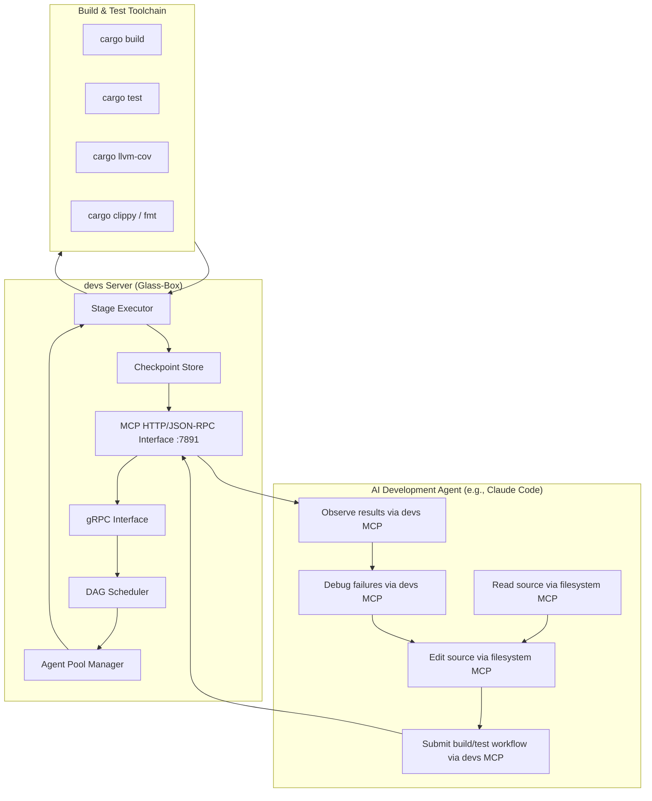

#### 1.2.1 Server Discovery Protocol

Before an agent can call any MCP tool, it must locate the MCP server's HTTP address. The discovery protocol is a two-step process: read the discovery file to find the gRPC address, then call `ServerService.GetInfo` via gRPC to retrieve the MCP port. The MCP port is never stored in the discovery file.

**Discovery resolution order (highest to lowest priority):**

1. If `DEVS_DISCOVERY_FILE` is set in the agent's environment, read that file path.
2. Otherwise, read `~/.config/devs/server.addr`.

In both cases the file contains a plain UTF-8 `<host>:<port>` string (gRPC port only). After reading the gRPC address the agent calls `ServerService.GetInfo` to obtain `mcp_port` and `server_version`.

```
Server Discovery Algorithm (pseudo-code):

file_path  = env("DEVS_DISCOVERY_FILE") ?? "~/.config/devs/server.addr"
grpc_addr  = read_file(file_path).trim()          // e.g. "127.0.0.1:7890"
info       = grpc_call(grpc_addr, "ServerService.GetInfo")
mcp_addr   = grpc_addr.host + ":" + str(info.mcp_port)
mcp_url    = "http://" + mcp_addr + "/mcp/v1/call"
```

| Step | Failure Condition | Required Agent Behaviour |
|---|---|---|
| Read discovery file | File absent | Exit with code 3; do not retry |
| Read discovery file | File content is not `<host>:<port>` | Exit with code 3; log malformed content |
| gRPC `GetInfo` call | `ECONNREFUSED` or timeout | Exit with code 3 |
| gRPC `GetInfo` call | Major version mismatch (`FAILED_PRECONDITION`) | Exit with code 3; log version mismatch |
| First MCP HTTP POST | `ECONNREFUSED` | Exit with code 3 |

**[3_MCP_DESIGN-REQ-BR-003]** An agent MUST use `DEVS_DISCOVERY_FILE` when set. Ignoring this variable and reading the default path causes address conflicts when parallel server instances are running in test isolation environments.

**[3_MCP_DESIGN-REQ-BR-004]** An agent MUST NOT cache the resolved MCP address across process restarts. On each new session start the agent MUST re-execute the discovery protocol. The server address may change if the server is restarted between sessions.

**[3_MCP_DESIGN-REQ-BR-005]** The `devs-mcp-bridge` binary executes the discovery protocol once at startup and maintains the resulting HTTP connection for its lifetime. It does NOT re-discover on each forwarded request. On connection loss it exits with code 1 as specified in **[3_MCP_DESIGN-REQ-057]**.

### 1.3 Glass-Box Invariants

**[3_MCP_DESIGN-REQ-001]** The MCP interface MUST expose every entity in the `devs` data model. No internal field may be withheld from `get_run`, `get_stage_output`, or `get_pool_state` responses. Unpopulated optional fields are returned as JSON `null`; they are never absent from the response envelope.

**[3_MCP_DESIGN-REQ-002]** The MCP interface MUST remain operational during any workflow run. An agent observing a run via MCP MUST be able to receive live log streams and state transitions without polling delays greater than 500 ms.

**[3_MCP_DESIGN-REQ-003]** The MCP interface MUST NOT require authentication at MVP. It is designed for trusted-network and local-machine use by development agents only.

**[3_MCP_DESIGN-REQ-004]** All MCP tool responses MUST include an `"error": null | "<string>"` field at the top level of the response JSON object. Agents MUST check this field before consuming any other field.

**[3_MCP_DESIGN-REQ-005]** No MCP tool call may mutate state and return `"error": null` simultaneously if the mutation was not applied. Partial mutations are not allowed; each tool call is atomic with respect to the state it modifies.

#### 1.3.1 Complete Entity Exposure Requirements

**[3_MCP_DESIGN-REQ-NEW-001]** The following table enumerates every data model entity that the Glass-Box interface MUST fully expose. Absence of any listed field from a response (rather than presence as JSON `null`) constitutes an invariant violation detectable by the E2E test suite.

| Entity | Primary MCP Tool | Required Fields | Nullability Rule |
|---|---|---|---|
| `WorkflowRun` | `get_run` | `run_id`, `slug`, `workflow_name`, `project_id`, `status`, `inputs`, `definition_snapshot`, `created_at`, `started_at`, `completed_at`, `stage_runs` | `started_at` = `null` while `Pending`; `completed_at` = `null` until terminal; `definition_snapshot` always present |
| `StageRun` | `get_run` (embedded in `stage_runs`) | `stage_run_id`, `run_id`, `stage_name`, `attempt`, `status`, `agent_tool`, `pool_name`, `started_at`, `completed_at`, `exit_code`, `output` | `started_at`/`completed_at`/`exit_code`/`output` = `null` until populated; never absent |
| `StageOutput` | `get_stage_output` | `stdout`, `stderr`, `structured`, `exit_code`, `log_path`, `truncated` | All fields `null` if stage never ran; `truncated: false` if output fits within limits |
| `AgentPool` | `get_pool_state` | `name`, `max_concurrent`, `active_count`, `queued_count`, `agents[]` | `queued_count` = 0 when semaphore has free permits |
| `AgentConfig` | `get_pool_state` (embedded in `agents`) | `tool`, `capabilities`, `fallback`, `rate_limited`, `cooldown_remaining_secs`, `active_stage_run_ids` | `cooldown_remaining_secs` = `null` when not rate-limited; `active_stage_run_ids` = `[]` when idle |
| `WorkflowDefinition` | `get_workflow_definition` | `name`, `format`, `inputs`, `stages`, `timeout_secs`, `default_env`, `artifact_collection`, `source_path` | Optional definition fields as `null` |
| `StageDefinition` | `get_workflow_definition` (embedded in `stages`) | All fields from `devs-core::StageDefinition` | Optional fields (`system_prompt`, `retry`, `timeout_secs`, `fan_out`, `branch`, `execution_env`) = `null` when unset |
| `CheckpointRecord` | `list_checkpoints` | `commit_sha`, `committed_at`, `message`, `run_id`, `stage_name`, `stage_status` | `stage_name`/`stage_status` = `null` for run-level checkpoints |

**[3_MCP_DESIGN-REQ-BR-006]** Any field listed in the table above that is absent from a tool response (as opposed to present with a `null` value) constitutes a Glass-Box invariant violation. The E2E MCP test suite MUST assert field presence for every entity type using response schema validation.

**[3_MCP_DESIGN-REQ-BR-007]** The `definition_snapshot` field in `WorkflowRun` returned by `get_run` MUST equal the snapshot committed to `.devs/runs/<run-id>/workflow_snapshot.json` at run start. It MUST NOT reflect live edits to the workflow definition made after the run started (see **[2_TAS-BR-013]**).

### 1.4 Two Agent Roles

Two distinct agent roles interact with the system during development:

| Role | Description | Primary Interface |
|---|---|---|
| **Orchestrated Agent** | Spawned by `devs` as a workflow stage. Executes build/test tasks. Reports progress or completion back to `devs`. | `devs` MCP tools: `report_progress`, `signal_completion`, `report_rate_limit` |
| **Observing/Controlling Agent** | The development agent (e.g., Claude Code). Writes code, submits workflows, interprets results, and drives iteration. | Filesystem MCP + `devs` MCP (all tool categories) |

These two roles may be the same agent instance in self-development scenarios where the developer agent submits a workflow that then spawns sub-agents to implement tasks.

#### 1.4.1 Orchestrated Agent Behavior Contract

An orchestrated agent is a process spawned by `devs` as a workflow stage. Its MCP interaction is narrow and constrained to the three mid-run tools plus reading its injected environment.

| Rule ID | Rule |
|---|---|
| **[3_MCP_DESIGN-REQ-ORK-001]** | The agent MUST read `DEVS_MCP_ADDR` from its environment to find the MCP server address. This variable is always injected by `devs` before spawning any agent subprocess. The agent MUST NOT execute the discovery protocol (§1.2.1); `DEVS_MCP_ADDR` is the direct HTTP base URL. |
| **[3_MCP_DESIGN-REQ-ORK-002]** | The agent MAY call `report_progress` at any point during execution to update the TUI Debug tab and log stream. It MUST NOT call observation tools (`get_run`, `list_runs`, `get_stage_output`, etc.) or control tools; those are reserved for the observing/controlling role. |
| **[3_MCP_DESIGN-REQ-ORK-003]** | If the stage's `completion` field is `mcp_tool_call`, the agent MUST call `signal_completion` before exiting. If the process exits without calling `signal_completion`, `devs` falls back to treating the exit code as the completion signal. |
| **[3_MCP_DESIGN-REQ-ORK-004]** | The agent MUST treat any `devs:cancel\n` token received on stdin as an immediate graceful-shutdown signal. The agent MUST exit within 10 seconds of receiving this token. Failure to exit causes `devs` to send SIGTERM after 10 s and SIGKILL after an additional 5 s. |
| **[3_MCP_DESIGN-REQ-ORK-005]** | The agent MAY call `report_rate_limit` when its upstream AI API is throttling it. This triggers immediate pool fallback; `devs` will terminate the agent process after the call returns. The agent MUST exit promptly after calling `report_rate_limit`. |
| **[3_MCP_DESIGN-REQ-ORK-006]** | When `completion = "structured_output"`, the agent MUST write `.devs_output.json` to its working directory before exiting. The file MUST contain at minimum `{"success": <bool>}`. String `"true"` / `"false"` for `success` is treated as invalid and results in stage `Failed`. |
| **[3_MCP_DESIGN-REQ-ORK-007]** | The agent MUST NOT strip, modify, or pass `DEVS_MCP_ADDR`, `DEVS_LISTEN`, `DEVS_MCP_PORT`, or `DEVS_DISCOVERY_FILE` to child processes. `devs` controls these variables; the agent must treat them as read-only injected constants. |

**Stdin signal timing constraints:**

| Signal | Required Agent Response | Timeout Before Escalation |
|---|---|---|
| `devs:cancel\n` | Begin shutdown; exit process | 10 s → SIGTERM; then 5 s → SIGKILL |
| `devs:pause\n` | Suspend work (agent-defined behaviour) | No escalation timeout; pause lasts until `devs:resume\n` |
| `devs:resume\n` | Resume suspended work | No timeout |

**[3_MCP_DESIGN-REQ-NEW-002]** **`signal_completion` timing constraint:** `devs` MUST acknowledge `signal_completion` within 500 ms. If no acknowledgement arrives within 500 ms, the agent SHOULD retry once, then exit; `devs` will apply exit-code fallback semantics.

#### 1.4.2 Observing/Controlling Agent Behavior Contract

An observing/controlling agent is a development agent (e.g., Claude Code) that drives the full development loop using both the Glass-Box MCP and the Filesystem MCP.

| Rule ID | Rule |
|---|---|
| **[3_MCP_DESIGN-REQ-OBS-001]** | Before submitting a run, an observing agent SHOULD call `list_runs` filtered by `status: "running"` to detect any already-active run for the same workflow. Submitting duplicate runs wastes pool capacity and produces ambiguous results. |
| **[3_MCP_DESIGN-REQ-OBS-002]** | An observing agent MUST call `cancel_run` for any run it submitted that is no longer needed before submitting a replacement. Abandoned runs hold semaphore permits indefinitely and block other work. |
| **[3_MCP_DESIGN-REQ-OBS-003]** | When monitoring an active run, the observing agent MUST use `stream_logs(follow: true)` rather than polling `get_stage_output` in a loop. Polling at sub-second intervals is prohibited; it produces excessive load on the MCP server and delays other tool calls. |
| **[3_MCP_DESIGN-REQ-OBS-004]** | After a run completes with `status: "failed"`, the observing agent MUST call `get_stage_output` for the failed stage and read the full `stderr` and `structured` fields before writing any source file. Root cause identification from evidence is required before action. |
| **[3_MCP_DESIGN-REQ-OBS-005]** | An observing agent that modifies a workflow definition via `write_workflow_definition` MUST immediately call `get_workflow_definition` to verify the updated definition was accepted without errors. A validation error leaves the previous definition unchanged on disk. |
| **[3_MCP_DESIGN-REQ-OBS-006]** | An observing agent MUST check the top-level `"error"` field before consuming `"result"` in every MCP response. When `"error"` is non-null, `"result"` is `null`; consuming it produces undefined behavior. |
| **[3_MCP_DESIGN-REQ-OBS-007]** | Only an observing/controlling agent may call `write_workflow_definition`, `inject_stage_input`, and `assert_stage_output`. Orchestrated stage agents MUST NOT call these tools; the MCP server does not enforce this but the protocol contract does. |
| **[3_MCP_DESIGN-REQ-OBS-008]** | An observing agent MUST connect to both the Glass-Box MCP server (for state) and the Filesystem MCP server (for file access). All source file reads and writes go through Filesystem MCP; all `devs` state interactions go through Glass-Box MCP. Mixing these is a protocol violation. |

### 1.5 Agent Session Lifecycle

An agent development session progresses through well-defined phases. This diagram governs expected agent behaviour across tool invocations.

```mermaid
stateDiagram-v2
    [*] --> Locating: Agent process starts
    Locating --> Connected: DEVS_DISCOVERY_FILE read; MCP server responds to POST /mcp/v1/call
    Locating --> Failed: File absent or server unreachable after 5 s → exit code 3
    Failed --> [*]
    Connected --> Observing: list_runs or get_run called
    Connected --> Submitting: submit_run called
    Observing --> Streaming: stream_logs(follow:true) in flight
    Streaming --> Diagnosing: Stage reaches Failed or TimedOut
    Streaming --> Observing: {"done": true} received; stage terminal
    Submitting --> Observing: run_id returned; monitoring begins
    Diagnosing --> Editing: Root cause identified via get_stage_output
    Editing --> Submitting: Code written; new run submitted
    Observing --> SessionComplete: presubmit-check run Completed; all assertions pass
    Connected --> Interrupted: Server SIGTERM or connection drops
    Interrupted --> Persisting: Agent writes task_state.json
    Persisting --> [*]: Session exits; state preserved for recovery
    SessionComplete --> [*]
```

**[3_MCP_DESIGN-REQ-057]** When the `devs-mcp-bridge` binary detects a connection loss to the MCP HTTP port, it MUST attempt one reconnection after 1 second. If that reconnection fails, it MUST write `{"result": null, "error": "internal: server connection lost", "fatal": true}` to stdout and exit with code 1. It MUST NOT silently drop any in-flight request or response data.

**[3_MCP_DESIGN-REQ-058]** An observing agent that receives `"error": "failed_precondition: server is shutting down"` from any MCP tool call MUST write its current `task_state.json` to `.devs/agent-state/<session-id>/task_state.json` using the filesystem MCP before allowing the session to terminate. Incomplete state is better than lost state.

**[3_MCP_DESIGN-REQ-059]** The MCP server MUST respond to all observation tool calls (`list_runs`, `get_run`, `get_stage_output`, `get_pool_state`, `get_workflow_definition`, `list_checkpoints`) within 2 seconds under normal load. Response latency above 2 seconds MUST be logged at `WARN` level. This threshold does not apply to streaming tools (`stream_logs`).

#### 1.5.1 Session State Transition Rules

The following table specifies all legal transitions in the agent session state machine, their preconditions, and their required post-conditions. Illegal transitions (e.g., jumping from `Locating` to `Streaming`) are programming errors in the agent implementation and have undefined behavior.

| From | Event | To | Preconditions | Post-conditions |
|---|---|---|---|---|
| `[*]` | Agent process starts | `Locating` | — | Session ID (UUIDv4) generated; `DEVS_DISCOVERY_FILE` or default path noted |
| `Locating` | Discovery protocol succeeds | `Connected` | Discovery file readable; `GetInfo` returns `"error": null`; major version matches | `mcp_base_url` set in session context; `task_state.json` written with `session_state: "connected"` |
| `Locating` | File absent OR server unreachable after 5 s | `Failed` | — | Exit code 3 emitted; no `task_state.json` written |
| `Failed` | — | `[*]` | — | Process exits |
| `Connected` | `list_runs` or `get_run` called successfully | `Observing` | Valid MCP response with `"error": null` received | Last known run state cached |
| `Connected` | `submit_run` called successfully | `Submitting` | `"error": null` in response; `run_id` returned | Active `run_id` written to `task_state.json` |
| `Submitting` | `run_id` returned | `Observing` | `submit_run` returned `"error": null` | Monitoring loop begins; `task_state.json` updated |
| `Observing` | `stream_logs(follow: true)` called | `Streaming` | Stage status is `Running` or has buffered log lines | Log consumption loop active; sequence numbers tracked |
| `Streaming` | `{"done": true}` chunk received | `Observing` | Stage reached a terminal state | Log buffer flushed; `stream_logs` HTTP connection closed |
| `Streaming` | Stage status `Failed` or `TimedOut` observed | `Diagnosing` | Terminal status emitted in log stream or via poll | `get_stage_output` call queued; `task_state.json` updated |
| `Diagnosing` | `get_stage_output` returns; root cause identified | `Editing` | `get_stage_output` returned `"error": null`; failure location known from `stderr`/`structured` | Filesystem MCP write initiated |
| `Editing` | Source written; `write_workflow_definition` verified | `Submitting` | `get_workflow_definition` confirms no parse errors; any prior active run for this workflow has been cancelled | New `submit_run` dispatched |
| `Observing` | `presubmit-check` run completes with `status: "completed"` AND all `assert_stage_output` calls return `"passed": true` | `SessionComplete` | All coverage gates passed; traceability 100% | `task_state.json` written with `"completed": true` |
| `Connected` or `Observing` or `Streaming` | Server SIGTERM or `ECONNREFUSED` | `Interrupted` | MCP connection lost | In-flight requests dropped; `Interrupted` noted |
| `Interrupted` | `task_state.json` written to filesystem via Filesystem MCP | `[*]` | Filesystem MCP still reachable | State preserved; process exits |
| `SessionComplete` | — | `[*]` | — | Process exits 0 |

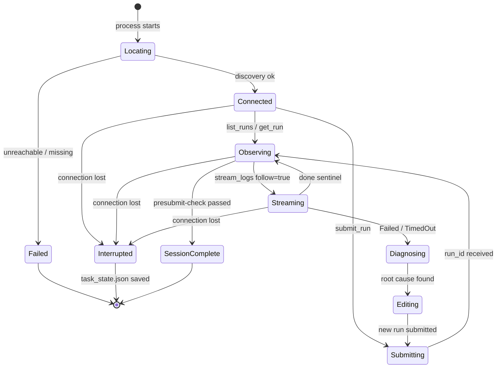

**[3_MCP_DESIGN-REQ-BR-008]** An agent MUST generate a unique session ID (UUIDv4) at startup. This ID is used as the directory name under `.devs/agent-state/<session-id>/` and MUST remain stable across `Interrupted → re-Locating` transitions within the same process lifetime.

**[3_MCP_DESIGN-REQ-BR-009]** An agent MUST NOT transition from `Diagnosing` to `Editing` until `get_stage_output` has returned with `"error": null`. Editing source code based on incomplete failure information is a protocol violation that risks introducing regressions.

**[3_MCP_DESIGN-REQ-BR-010]** Before entering `Submitting` state for a second or subsequent run, the agent MUST call `cancel_run` for any previously submitted run for the same workflow that is in a non-terminal state (`Pending`, `Running`, or `Paused`). At most one active run per workflow per agent session is the expected invariant under normal operation.

#### 1.5.2 Session Context Schema

Each agent session maintains a context object that enables crash recovery and cross-session continuity. This object is persisted as `task_state.json` at `.devs/agent-state/<session-id>/task_state.json` (full schema in §5.4). The lifecycle-relevant subset is:

| Field | Type | Constraint | Description |
|---|---|---|---|
| `session_id` | `string` | UUIDv4, immutable after generation | Unique identifier for this agent session. |
| `session_state` | `string` | One of the state names in §1.5.1 | Current position in the session lifecycle. |
| `active_run_id` | `string \| null` | UUIDv4 or `null` | The `run_id` of the most recently submitted non-cancelled run, if any. |
| `active_stage_name` | `string \| null` | Stage name or `null` | The stage currently being streamed or diagnosed, if any. |
| `mcp_base_url` | `string` | Valid HTTP URL ending `/mcp/v1/call` | The resolved MCP HTTP base URL for this session. |
| `discovery_file_path` | `string` | Absolute path | The discovery file path used (`DEVS_DISCOVERY_FILE` or default). |
| `task_description` | `string` | ≤ 1024 chars | Human-readable description of the work this session is performing. |
| `completed` | `boolean` | Default `false` | `true` only when `presubmit-check` has passed all gates and `SessionComplete` is reached. |

**[3_MCP_DESIGN-REQ-BR-011]** An agent MUST write `task_state.json` before submitting any run and after each run reaches a terminal state. This ensures that if the session is interrupted, a recovering agent can resume without re-running already-completed work.

**[3_MCP_DESIGN-REQ-BR-012]** A recovering agent that reads `task_state.json` with `"completed": false` and a non-null `active_run_id` MUST call `get_run` with that `run_id` as the first action. If the run is still active, the agent resumes monitoring. If the run has completed with `Failed`, the agent enters `Diagnosing`. If the run is `Completed`, the agent proceeds to evaluate whether all acceptance criteria are met.

### 1.6 Glass-Box Invariant Edge Cases

The following edge cases define required behaviour at the boundaries of the Glass-Box contract:

| ID | Scenario | Expected Behaviour |
|---|---|---|
| **[3_MCP_DESIGN-REQ-EC-MCP-001]** | `get_run` called while run is mid-transition (write lock held by scheduler) | MCP handler acquires read lock after write lock is released. Response reflects the just-committed state. No partial state is ever returned. Maximum added latency equals one checkpoint write (typically <50 ms). |
| **[3_MCP_DESIGN-REQ-EC-MCP-002]** | `stream_logs` with `follow: true` called for a stage that has already completed | Server returns all buffered log lines (up to 10,000) sequentially with monotonic sequence numbers, then immediately emits `{"done": true}`. No blocking wait. |
| **[3_MCP_DESIGN-REQ-EC-MCP-003]** | `get_stage_output` called for a stage in `Waiting` status (never run) | Returns `{"result": {"stdout": null, "stderr": null, "structured": null, "exit_code": null, "log_path": null, "truncated": false}, "error": null}`. All output fields are `null`; the response is not an error. |
| **[3_MCP_DESIGN-REQ-EC-MCP-004]** | Two agents concurrently call `signal_completion` for the same stage | First call acquires the per-run mutex, drives state transition, persists checkpoint. Second call finds stage already terminal and returns `{"result": null, "error": "failed_precondition: stage already in terminal state"}`. Exactly one transition occurs. |
| **[3_MCP_DESIGN-REQ-EC-MCP-005]** | MCP server receives a JSON-RPC request body larger than 1 MiB | Server returns HTTP 413 with body `{"result": null, "error": "invalid_argument: request body exceeds 1 MiB limit"}` without processing the request. |
| **[3_MCP_DESIGN-REQ-EC-MCP-006]** | `get_pool_state` called when all agents in the pool are rate-limited | Returns full pool state including each agent's `rate_limited: true` and `cooldown_remaining_secs` fields. Not an error condition. Development agent uses this to determine wait duration. |
| **[3_MCP_DESIGN-REQ-EC-MCP-007]** | `devs` server is restarted while `devs-mcp-bridge` has an active connection | Bridge detects TCP reset or `ECONNREFUSED`, writes the structured error to stdout, exits 1. Development agent detects bridge exit, re-reads `DEVS_DISCOVERY_FILE` for new server address, spawns new bridge. |
| **[3_MCP_DESIGN-REQ-EC-MCP-008]** | `list_runs` called with `project_id` that does not exist in the registry | Returns `{"result": null, "error": "not_found: project <uuid> not registered"}`. Does not return an empty list. |
| **[3_MCP_DESIGN-REQ-EC-MCP-009]** | `write_workflow_definition` writes TOML with a validation error (e.g., cycle) | Returns `{"result": null, "error": "invalid_argument: [\"cycle detected: [\\\"a\\\",\\\"b\\\",\\\"a\\\"]\"]"}`. The file on disk is NOT written. The existing definition is unchanged. |
| **[3_MCP_DESIGN-REQ-EC-MCP-010]** | Agent calls `submit_run` during server shutdown (`SIGTERM` received, shutdown in progress) | Returns `{"result": null, "error": "failed_precondition: server is shutting down"}`. No run is created. The agent MUST treat this as the `Interrupted` transition and write `task_state.json`. |
| **[3_MCP_DESIGN-REQ-EC-MCP-011]** | Agent calls `stream_logs` with a syntactically valid UUID that does not match any run | Returns `{"result": null, "error": "not_found: run <uuid> not found"}` immediately. No chunked connection is established. The HTTP response is not `200`; it is `404` per the HTTP status mapping in §2.4.2. |
| **[3_MCP_DESIGN-REQ-EC-MCP-012]** | Agent calls `assert_stage_output` on a stage whose status is `Running` (not yet terminal) | Returns `{"result": null, "error": "failed_precondition: stage <name> is not in a terminal state"}`. No assertion is evaluated. The agent must wait for terminal state before asserting. |
| **[3_MCP_DESIGN-REQ-EC-MCP-013]** | `report_progress` is called by an orchestrated agent for a stage that has been externally cancelled (e.g., via `cancel_run`) | Returns `{"result": null, "error": "failed_precondition: stage <name> is cancelled"}`. The agent also receives `devs:cancel\n` on stdin before or shortly after this response. |
| **[3_MCP_DESIGN-REQ-EC-MCP-014]** | Observing agent reads a discovery file where the server has been replaced by a new process on the same port (same address, new `server_version` with same major) | `ServerService.GetInfo` succeeds; same-major version is compatible; agent proceeds normally. There is no session identity mechanism; the MCP server does not track client session IDs. |
| **[3_MCP_DESIGN-REQ-EC-MCP-015]** | `write_workflow_definition` is called while a run using that workflow definition is actively executing | The definition file is updated atomically on disk. The active run continues using its immutable `definition_snapshot` stored at run start. The `get_workflow_definition` response reflects the new definition immediately. The active run's `get_run` response still returns the original snapshot in `definition_snapshot`. |
| **[3_MCP_DESIGN-REQ-EC-MCP-016]** | Agent calls `inject_stage_input` on a stage whose status is `Running` | Returns `{"result": null, "error": "failed_precondition: cannot inject input into a Running stage"}`. State is unchanged. |
| **[3_MCP_DESIGN-REQ-EC-MCP-017]** | `get_run` is called with a `run_id` that is valid UUID format but belongs to a different project than the authenticated project context | Returns the run if the server can find it regardless of project (there is no per-project access control at MVP per [3_MCP_DESIGN-REQ-003]). Returns `not_found` only if the run does not exist at all. |
| **[3_MCP_DESIGN-REQ-EC-MCP-018]** | Agent is in `Streaming` state consuming `follow: true` log chunks when the stage transitions from `Running` to `Paused` | The server continues holding the chunked HTTP connection open. No `{"done": true}` is sent while the stage is paused. Log lines already buffered are flushed. The stream resumes delivering lines when the stage is resumed. |

### 1.7 Component Dependencies

| Dependency Direction | Component | Dependency Rationale |
|---|---|---|
| **This doc depends on** | `2_TAS` §3 Data Model | All entity schemas (`WorkflowRun`, `StageRun`, `StageOutput`, `AgentPool`) referenced here are authoritative in `devs-core`. |
| **This doc depends on** | `2_TAS` §4 `devs-mcp` | HTTP transport, JSON-RPC 2.0 framing, streaming chunking, and tool dispatch are specified in `2_TAS`. |
| **This doc depends on** | `2_TAS` §4 `devs-checkpoint` | `list_checkpoints` reads git state managed by `devs-checkpoint`. |
| **This doc depends on** | `2_TAS` §4 `devs-scheduler` | Control tools (`cancel_run`, `pause_run`, `resume_run`) route through the DAG scheduler's `SchedulerEvent` channel. |
| **This doc depends on** | `2_TAS` §4 `devs-pool` | `get_pool_state` reads live semaphore and rate-limit state from `devs-pool`. |
| **Depended on by** | `devs-mcp` crate | §2 specifies all tools implemented in that crate, including exact request/response JSON contracts. |
| **Depended on by** | `devs-mcp-bridge` binary | §1.5 and §2.1 define bridge connection, forwarding, and error behaviour. |
| **Depended on by** | E2E test suite (`tests/mcp_e2e.rs`) | §2.7 acceptance criteria are the direct test targets for the MCP E2E coverage gate (QG-005). |
| **Depended on by** | Development workflow files (`.devs/workflows/`) | §3.2 defines the canonical workflow TOML files used by development agents. |

### 1.8 Section Acceptance Criteria

- **[3_MCP_DESIGN-REQ-AC-1.01]** `[3_MCP_DESIGN-REQ-001]`: A `get_run` response for a `Running` run contains every field defined in the `WorkflowRun` data model; `completed_at` is present as JSON `null`, not absent from the object.
- **[3_MCP_DESIGN-REQ-AC-1.02]** `[3_MCP_DESIGN-REQ-002]`: A log line written by a spawned agent subprocess appears in `stream_logs` chunked output within 500 ms.
- **[3_MCP_DESIGN-REQ-AC-1.03]** `[3_MCP_DESIGN-REQ-003]`: The MCP server accepts and responds to tool calls while a workflow run with ≥2 active stages is in progress on the same server instance.
- **[3_MCP_DESIGN-REQ-AC-1.04]** `[3_MCP_DESIGN-REQ-004]`: Every MCP tool response JSON object contains a top-level `"error"` key; if `"error"` is `null` then `"result"` is a non-null object.
- **[3_MCP_DESIGN-REQ-AC-1.05]** `[3_MCP_DESIGN-REQ-005]`: A `cancel_run` call that returns `"error": null` guarantees the run's `checkpoint.json` reflects status `"cancelled"` before the HTTP response is sent.
- **[3_MCP_DESIGN-REQ-AC-1.06]** `[3_MCP_DESIGN-REQ-EC-MCP-004]`: Two concurrent `signal_completion` calls for the same stage result in exactly one `StageRun` transition; `checkpoint.json` is written exactly once for that transition.
- **[3_MCP_DESIGN-REQ-AC-1.07]** `[3_MCP_DESIGN-REQ-EC-MCP-007]`: After server SIGTERM, `devs-mcp-bridge` exits with code 1 within 6 seconds (5 s shutdown + 1 s reconnect attempt).
- **[3_MCP_DESIGN-REQ-AC-1.08]** `[3_MCP_DESIGN-REQ-059]`: `get_run` with a valid `run_id` responds in under 2 seconds in a single-project server with ≤100 active runs.
- **[3_MCP_DESIGN-REQ-AC-1.09]** `[3_MCP_DESIGN-REQ-BR-001]`: The MCP server accepts and responds to `list_runs` on a production build of `devs-server` compiled without any feature flags. No compile-time flag is required to enable MCP.
- **[3_MCP_DESIGN-REQ-AC-1.10]** `[3_MCP_DESIGN-REQ-BR-002]`: Immediately after a `cancel_run` MCP call returns `"error": null`, a gRPC `GetRun` call for the same `run_id` returns `status: "cancelled"` without any intervening `sleep()`.
- **[3_MCP_DESIGN-REQ-AC-1.11]** `[3_MCP_DESIGN-REQ-BR-003]`: When `DEVS_DISCOVERY_FILE` is set to a file containing the address of server A, `devs-mcp-bridge` connects to server A, not to the address in `~/.config/devs/server.addr` (which may contain the address of a different server).
- **[3_MCP_DESIGN-REQ-AC-1.12]** `[3_MCP_DESIGN-REQ-BR-006]`: For a `WorkflowRun` with status `"running"`, the `get_run` JSON response object contains every field enumerated in §1.3.1 for `WorkflowRun` and each embedded `StageRun`; all unpopulated optional fields are JSON `null`, not absent keys.
- **[3_MCP_DESIGN-REQ-AC-1.13]** `[3_MCP_DESIGN-REQ-BR-007]`: After `write_workflow_definition` updates a workflow, the `definition_snapshot` field in `get_run` for an already-running run still equals the snapshot committed before that run's first stage started.
- **[3_MCP_DESIGN-REQ-AC-1.14]** `[3_MCP_DESIGN-REQ-ORK-004]`: An orchestrated agent process that receives `devs:cancel\n` on stdin and does not exit within 10 seconds receives a SIGTERM from `devs`; if it does not exit within a further 5 seconds it receives SIGKILL. The stage is marked `Cancelled` regardless.
- **[3_MCP_DESIGN-REQ-AC-1.15]** `[3_MCP_DESIGN-REQ-OBS-003]`: An observing agent that uses `stream_logs(follow: true)` receives log lines within 500 ms of the orchestrated agent writing them to stdout.
- **[3_MCP_DESIGN-REQ-AC-1.16]** `[3_MCP_DESIGN-REQ-BR-010]`: The E2E test that submits two consecutive runs for the same workflow verifies that `cancel_run` is called between them, and that the pool semaphore returns to its initial permit count after the first run is cancelled.
- **[3_MCP_DESIGN-REQ-AC-1.17]** `[3_MCP_DESIGN-REQ-EC-MCP-010]`: A `submit_run` call that arrives after SIGTERM has been sent to the server returns `"error": "failed_precondition: server is shutting down"` and the checkpoint store contains no new run entry for that call.
- **[3_MCP_DESIGN-REQ-AC-1.18]** `[3_MCP_DESIGN-REQ-EC-MCP-015]`: A `get_workflow_definition` call immediately after `write_workflow_definition` returns the updated definition. A concurrent `get_run` for an active run returns the original `definition_snapshot` from before the write.
- **[3_MCP_DESIGN-REQ-AC-1.19]** `[3_MCP_DESIGN-REQ-BR-012]`: An agent that recovers from an `Interrupted` state and reads `task_state.json` with a non-null `active_run_id` calls `get_run` as its first MCP action and does not call `submit_run` until the existing run's status is determined to be terminal or cancelled.

---

## 2. Required MCP Servers & Tools

### 2.1 MCP Server Inventory

The development pipeline requires exactly two MCP server connections:

| ID | Server | Transport | Purpose |
|---|---|---|---|
| **[3_MCP_DESIGN-REQ-SRV-001]** | `devs` Glass-Box MCP | HTTP/JSON-RPC on `:7891` (or via `devs-mcp-bridge` stdio) | Workflow control, state observation, testing injection |
| **[3_MCP_DESIGN-REQ-SRV-002]** | Filesystem MCP server | stdio (standard `mcp-filesystem` or equivalent) | Read/write source files, configuration, and test fixtures |

**[3_MCP_DESIGN-REQ-006]** An orchestrating agent MUST connect to both MCP servers. Filesystem access is required to write code; Glass-Box access is required to verify correctness.

**[3_MCP_DESIGN-REQ-007]** The `devs-mcp-bridge` binary MUST be used when the agent's MCP client supports only stdio transport. The bridge forwards JSON-RPC lines from stdin to the HTTP MCP port and writes responses to stdout. On connection loss, it MUST write a structured error object to stdout and exit with code 1.

### 2.2 `devs` Glass-Box MCP Tool Reference

All tools are invoked via HTTP POST to `/mcp/v1/call` with `Content-Type: application/json`. The request body follows JSON-RPC 2.0. Responses always include `{"result": {...}|null, "error": "string"|null}`.

#### 2.2.1 Observation Tools

**[3_MCP_DESIGN-REQ-008]** `list_runs` — Returns all workflow runs for a project (or all projects). Supports filtering by `status`, `workflow_name`, and `project_id`.

```json
// Request
{ "method": "list_runs", "params": { "project_id": "<uuid>", "status": "running" } }

// Response
{ "result": { "runs": [ { "run_id": "...", "slug": "...", "status": "running", "workflow_name": "...", "started_at": "...", "stage_runs": [] } ] }, "error": null }
```

**[3_MCP_DESIGN-REQ-009]** `get_run` — Returns the full `WorkflowRun` record including all `StageRun` records with their current statuses, elapsed times, and outputs.

**[3_MCP_DESIGN-REQ-010]** `get_stage_output` — Returns the complete `StageOutput` for a specific stage attempt: `stdout` (UTF-8, ≤1 MiB), `stderr` (UTF-8, ≤1 MiB), `structured` (parsed JSON or null), `exit_code`, `log_path`, `truncated`.

**[3_MCP_DESIGN-REQ-011]** `stream_logs` — Returns log lines for a stage. When `follow: true`, uses HTTP chunked transfer; each chunk is newline-delimited JSON with a `sequence` field; the final chunk is `{"done": true}`. An agent MUST consume this stream to obtain real-time build/test output.

**[3_MCP_DESIGN-REQ-012]** `get_pool_state` — Returns current pool utilisation: number of active agents per pool, rate-limited agents, queued stages, and semaphore availability.

**[3_MCP_DESIGN-REQ-013]** `get_workflow_definition` — Returns the parsed workflow definition for a named workflow in a project. Agents use this to verify that a definition was parsed correctly before submitting a run.

**[3_MCP_DESIGN-REQ-014]** `list_checkpoints` — Returns the list of checkpoint commits in the git state branch for a project run. Agents use this to inspect historical state or recover artefacts from past attempts.

#### 2.2.2 Control Tools

**[3_MCP_DESIGN-REQ-015]** `submit_run` — Submits a workflow for execution. Validates all inputs before creating the run. Returns the new `run_id` and `slug`. An agent MUST use this (not the CLI) when programmatic submission is required within another workflow.

```json
// Request
{ "method": "submit_run", "params": { "workflow_name": "build-and-test", "project_id": "<uuid>", "inputs": { "commit_sha": "abc123" } } }

// Response
{ "result": { "run_id": "<uuid>", "slug": "build-and-test-20260310-a3f2" }, "error": null }
```

**[3_MCP_DESIGN-REQ-016]** `cancel_run` / `cancel_stage` — Cancels a run or individual stage. The agent MUST call this when a run is no longer useful (e.g., a code change supersedes an in-flight build). Wasted pool slots impede other work.

**[3_MCP_DESIGN-REQ-017]** `pause_run` / `pause_stage` — Pauses execution. Used by debugging agents to freeze state before inspecting it.

**[3_MCP_DESIGN-REQ-018]** `resume_run` / `resume_stage` — Resumes a paused run or stage.

**[3_MCP_DESIGN-REQ-019]** `write_workflow_definition` — Writes or updates a workflow definition file at runtime. An agent MAY use this to modify the workflow used to build itself (self-modification of the development pipeline).

#### 2.2.3 Testing Tools

**[3_MCP_DESIGN-REQ-020]** `inject_stage_input` — Injects a synthetic `StageOutput` for a stage that has not yet run (status must be `Waiting` or `Eligible`). Used to test downstream stages in isolation without running their dependencies. MUST be rejected if the stage is `Running`.

```json
// Request
{ "method": "inject_stage_input", "params": {
    "run_id": "<uuid>",
    "stage_name": "plan",
    "synthetic_output": {
      "exit_code": 0,
      "stdout": "{\"feature\": \"add-retry-config\"}",
      "structured": { "feature": "add-retry-config" }
    }
  }
}
```

**[3_MCP_DESIGN-REQ-021]** `assert_stage_output` — Asserts that a completed stage's output matches a provided predicate. Returns `{"passed": bool, "failures": [...]}`. An agent MUST call this after each stage of an automated test run to confirm correctness programmatically.

```json
// Request
{ "method": "assert_stage_output", "params": {
    "run_id": "<uuid>",
    "stage_name": "test",
    "assertions": [
      { "field": "exit_code", "op": "eq", "value": 0 },
      { "field": "stdout", "op": "contains", "value": "test result: ok" }
    ]
  }
}
```

Supported assertion operators: `eq`, `ne`, `contains`, `not_contains`, `matches` (regex), `json_path_eq`.

#### 2.2.4 Mid-Run Agent Tools

These tools are called by orchestrated agents (spawned as workflow stages), not by the observing/controlling development agent.

**[3_MCP_DESIGN-REQ-022]** `report_progress` — Called by a running stage agent to report an intermediate progress update. The update appears in `stream_logs` output and in the TUI Debug tab. Does not affect stage status.

**[3_MCP_DESIGN-REQ-023]** `signal_completion` — Called by a stage agent to signal completion when `completion = "mcp_tool_call"`. Accepts optional `output` data. MUST be idempotent: first call drives the outcome; subsequent calls on a terminal stage return an error without changing state.

**[3_MCP_DESIGN-REQ-024]** `report_rate_limit` — Called by a stage agent to proactively signal a rate-limit condition. Triggers immediate pool fallback without incrementing the retry counter.

### 2.3 Filesystem MCP Tool Requirements

**[3_MCP_DESIGN-REQ-025]** The filesystem MCP server MUST support at minimum: `read_file`, `write_file`, `list_directory`, `create_directory`, `delete_file`, `move_file`, `search_files` (glob pattern), `search_content` (regex in files).

**[3_MCP_DESIGN-REQ-026]** The filesystem MCP server MUST be scoped to the `devs` workspace root. Access outside the workspace root MUST be denied. The agent MUST NOT have write access to the `target/` directory via this MCP server; build artefacts are produced by the toolchain.

**[3_MCP_DESIGN-REQ-027]** An agent MUST use the filesystem MCP server (not shell execution) to read source files, write edits, and verify file existence. Shell execution is reserved for `./do` commands submitted as workflow stages.

#### 2.3.1 Required Filesystem MCP Operations

**[3_MCP_DESIGN-REQ-NEW-003]** The following table defines the complete set of filesystem operations required by the development agent. All must be supported by the configured filesystem MCP server implementation. Tools not in this table are not required and MUST NOT be depended upon.

| Operation | Required Parameters | Optional Parameters | Description |
|---|---|---|---|
| `read_file` | `path: string` | — | Read file contents as UTF-8. Invalid byte sequences replaced with U+FFFD. Returns error if path is a directory. |
| `write_file` | `path: string`, `content: string` | — | Write UTF-8 string to file. Creates parent directories if absent. Returns error if path is under `target/`. |
| `list_directory` | `path: string` | — | List immediate children only (non-recursive). Returns `name`, `type` (`"file"` or `"directory"`), `size_bytes` per entry. |
| `create_directory` | `path: string` | — | Create directory and all missing ancestors (`mkdir -p` semantics). No-op if already exists. |
| `delete_file` | `path: string` | — | Delete a single file. Returns error if path is a directory or does not exist. |
| `move_file` | `from: string`, `to: string` | — | Rename or move file within workspace root. Returns error if either path crosses the workspace boundary. |
| `search_files` | `pattern: string` | `path: string` (default: workspace root) | Glob pattern match rooted at `path`. Returns list of workspace-relative paths. Maximum 10,000 results. |
| `search_content` | `pattern: string` | `path: string`, `include: string` (glob filter), `max_results: integer` (default 100) | Regex search across file contents. Returns `{"path", "line_number", "line"}` per match. Invalid regex returns error before any file is read. |

**[3_MCP_DESIGN-REQ-BR-013]** All filesystem MCP path parameters are resolved relative to the workspace root. Absolute paths are permitted only if they canonicalize to a location within the workspace root boundary; otherwise they are rejected with `access_denied`.

**[3_MCP_DESIGN-REQ-BR-014]** The filesystem MCP server MUST deny all write operations to `target/` and its subdirectories. A `write_file` call to any path matching `target/**` returns `{"error": "access_denied: target/ is read-only (build artefacts are toolchain-managed)"}` without performing any write.

**[3_MCP_DESIGN-REQ-BR-015]** Path traversal attempts that resolve outside the workspace root (e.g., `../../etc/passwd`, absolute paths outside the workspace) MUST return `{"error": "access_denied: path resolves outside workspace root"}` without performing any I/O.

**[3_MCP_DESIGN-REQ-BR-016]** `search_content` regex patterns MUST be compiled using the Rust `regex` crate syntax. PCRE-specific extensions (`(?P<name>...)`, `\K`, lookahead/lookbehind) are not guaranteed to be supported. An invalid pattern returns an error before any file is read.

**[3_MCP_DESIGN-REQ-BR-017]** The `.devs/runs/` and `.devs/logs/` directories are managed exclusively by the `devs` server process. Direct writes by development agents to these directories via filesystem MCP are prohibited and return `access_denied`. The `.devs/workflows/`, `.devs/prompts/`, and `.devs/agent-state/` directories are agent-readable and agent-writable.

#### 2.3.2 Workspace Root Scoping

The filesystem MCP server is initialised with a `workspace_root` path equal to the root of the `devs` git repository. All relative path parameters are resolved against this root before any operation is performed:

```
workspace_root = "/home/user/software/devs"       # configured at startup
requested_path = "crates/devs-core/src/lib.rs"    # from tool call params
absolute_path  = workspace_root + "/" + requested_path
validated      = canonical(absolute_path).starts_with(canonical(workspace_root))
# If not validated → access_denied error returned; no I/O performed
```

The workspace root is the same directory from which the `devs` server binary is started. It MUST be set to the repository root (the directory containing `Cargo.toml` and `.devs/`). An agent configured with an incorrect `workspace_root` will fail to locate workflow definitions and prompt files.

**[3_MCP_DESIGN-REQ-BR-018]** Development agents MUST use workspace-relative paths in all filesystem MCP calls. Using absolute paths that happen to fall within the workspace root is permitted but discouraged; canonical path resolution handles both forms consistently.

#### 2.3.3 Filesystem MCP Edge Cases

| ID | Scenario | Expected Behaviour |
|---|---|---|
| **[3_MCP_DESIGN-REQ-EC-FS-001]** | `read_file` called on a directory path | Returns `{"error": "invalid_argument: path is a directory, not a file"}`. No data returned. |
| **[3_MCP_DESIGN-REQ-EC-FS-002]** | `write_file` with a path containing `..` that resolves within workspace root | Write proceeds normally. Path traversal that stays within bounds is permitted; only out-of-bounds traversal is blocked. |
| **[3_MCP_DESIGN-REQ-EC-FS-003]** | `write_file` when disk is full | Returns `{"error": "internal: disk write failed: no space left on device"}`. No partial file is left on disk (atomic write-to-temp-then-rename). |
| **[3_MCP_DESIGN-REQ-EC-FS-004]** | `search_content` pattern matches more than `max_results` results | Returns first `max_results` matches (default 100) plus `"truncated": true` in the response. Agent must refine the query to get remaining results. |
| **[3_MCP_DESIGN-REQ-EC-FS-005]** | `list_directory` on a path that does not exist | Returns `{"error": "not_found: directory not found: <path>"}`. |
| **[3_MCP_DESIGN-REQ-EC-FS-006]** | `write_file` to a path under `.devs/runs/` | Returns `{"error": "access_denied: .devs/runs/ is managed by the devs server"}`. No file is written. |

### 2.4 HTTP Transport Protocol

The `devs` MCP server exposes a single HTTP/1.1 endpoint. All tool invocations share the same endpoint and framing.

#### 2.4.1 Request Format

| Property | Value |
|---|---|
| Method | `POST` |
| Path | `/mcp/v1/call` |
| Content-Type | `application/json` (required; HTTP 415 returned if absent or wrong) |
| Max body size | 1 MiB |
| Encoding | UTF-8 |

Request envelope (JSON-RPC 2.0 subset):

```json
{
  "jsonrpc": "2.0",
  "id": "<client-assigned string or integer>",
  "method": "<tool_name>",
  "params": { }
}
```

`"id"` is echoed verbatim in the response. **[3_MCP_DESIGN-REQ-NEW-004]** Clients MUST supply a unique `"id"` per in-flight request to correlate responses. `"params"` MUST be a JSON object (not an array).

#### 2.4.2 Response Format

Non-streaming responses return HTTP 200 with a single JSON object:

```json
{
  "jsonrpc": "2.0",
  "id": "<echoed from request>",
  "result": { } | null,
  "error": "<human-readable string>" | null
}
```

**[3_MCP_DESIGN-REQ-060]** A response with `"error": null` MUST have `"result"` as a non-null object. A response with `"error": "<string>"` MUST have `"result": null`. These two fields are mutually exclusive in their non-null state.

**[3_MCP_DESIGN-REQ-061]** HTTP status codes used by the MCP server:

| HTTP Code | Condition |
|---|---|
| `200 OK` | All tool responses, including tool-level errors (`"error"` field populated). HTTP 200 does not imply tool success. |
| `400 Bad Request` | Malformed JSON, missing `"method"` field, or `"params"` is not an object. |
| `404 Not Found` | Path other than `/mcp/v1/call` requested. |
| `405 Method Not Allowed` | Non-POST request to `/mcp/v1/call`. |
| `413 Payload Too Large` | Request body exceeds 1 MiB. |
| `415 Unsupported Media Type` | `Content-Type` is not `application/json`. |
| `500 Internal Server Error` | Unhandled panic in MCP handler; body: `{"jsonrpc":"2.0","id":null,"result":null,"error":"internal: unexpected server panic"}`. |

#### 2.4.3 Streaming Response Format (`stream_logs` with `follow: true`)

`stream_logs` with `follow: true` returns HTTP 200 with `Transfer-Encoding: chunked`. Each HTTP chunk contains one complete JSON object followed by `\n`:

```
{"sequence": 1, "line": "   Compiling devs-core v0.1.0", "timestamp": "2026-03-10T14:24:02.100Z", "stream": "stdout", "done": false}\n
{"sequence": 2, "line": "error[E0308]: mismatched types", "timestamp": "2026-03-10T14:24:02.200Z", "stream": "stderr", "done": false}\n
...
{"sequence": N, "done": true}\n
```

**[3_MCP_DESIGN-REQ-062]** Sequence numbers MUST be monotonically increasing integers starting at 1 with no gaps. Each chunk is a self-contained JSON object terminated by a single `\n`. Clients MUST NOT treat HTTP chunk boundaries as line boundaries.

**[3_MCP_DESIGN-REQ-063]** The `follow: false` mode returns the complete log in a single non-chunked JSON response body with `"lines"` as an array (see §2.5.3).

#### 2.4.4 MCP Stdio Bridge Protocol

The `devs-mcp-bridge` binary reads one JSON-RPC request per line from stdin, forwards it via HTTP POST to the MCP port, and writes one JSON-RPC response per line to stdout:

```
stdin:  {"jsonrpc":"2.0","id":"1","method":"list_runs","params":{}}\n
stdout: {"jsonrpc":"2.0","id":"1","result":{...},"error":null}\n
```

**[3_MCP_DESIGN-REQ-064]** Stdin lines MUST be complete JSON objects terminated by `\n`. The bridge buffers partial lines until `\n` arrives before forwarding. Maximum line length: 1 MiB. Lines exceeding this limit are rejected with `{"jsonrpc":"2.0","id":null,"result":null,"error":"invalid_argument: request line exceeds 1 MiB"}` written to stdout; the bridge continues processing subsequent lines.

**[3_MCP_DESIGN-REQ-065]** For `stream_logs` with `follow: true` through the bridge: the bridge accumulates chunked HTTP response data and emits one JSON object per line to stdout as each chunk arrives. The final `{"done": true}` chunk is forwarded and the bridge returns to listening for the next stdin request.

### 2.5 Complete Tool Schemas

This section specifies request and response JSON for all MCP tools not covered by inline examples in §2.2. All examples show the `params` object and the `result` object; the surrounding `"jsonrpc"`, `"id"`, and `"error"` envelope fields are always present.

#### 2.5.0 Control Tool State Transition Model

The following diagrams show how MCP control tools interact with `WorkflowRun` and `StageRun` status. Transitions labelled `(MCP)` are exclusively triggered by MCP tool calls; all other transitions are driven by the `devs` scheduler responding to agent subprocess outcomes.

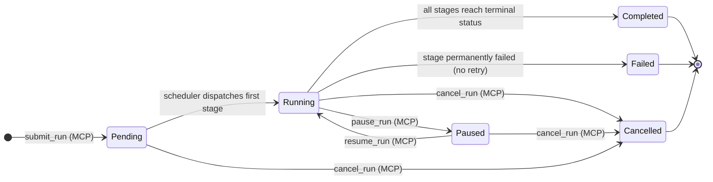

*WorkflowRun status transitions. MCP tools may only initiate the three (MCP)-labelled transitions; the scheduler drives all others.*

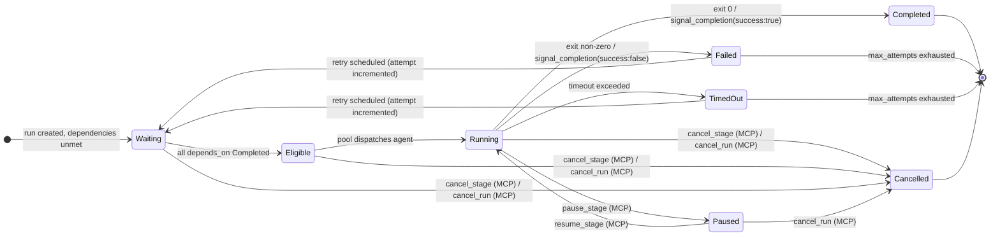

*StageRun status transitions. `Failed`/`TimedOut` → `Waiting` only when retry attempts remain.*

**[3_MCP_DESIGN-REQ-BR-019]** MCP control tools MUST NOT bypass the `StateMachine::transition()` gate defined in `devs-core`. An MCP call that would result in an illegal state transition MUST return an error with prefix `"failed_precondition:"`. The state MUST NOT be mutated on error.

**[3_MCP_DESIGN-REQ-BR-020]** When `cancel_run` is called, all non-terminal `StageRun` records are transitioned to `Cancelled` in the same atomic checkpoint write as the `WorkflowRun` status transition. Partial cancellation (some stages cancelled, others not) is not permitted under any circumstance.

**[3_MCP_DESIGN-REQ-BR-021]** A `pause_stage` call on a stage in `Eligible` status (not yet dispatched) MUST prevent dispatch until `resume_stage` is called. The stage MUST NOT transition to `Running` while paused even if a pool slot becomes available. The pool semaphore permit is NOT consumed by a paused-eligible stage.

#### 2.5.1 `get_run`

Returns the full `WorkflowRun` record including all `StageRun` records.

```json
// Request params
{ "run_id": "550e8400-e29b-41d4-a716-446655440000" }

// Response result (run in progress)
{
  "run_id": "550e8400-e29b-41d4-a716-446655440000",
  "slug": "build-and-test-20260310-a3f2",
  "workflow_name": "build-and-test",
  "project_id": "660e8400-e29b-41d4-a716-446655440001",
  "status": "running",
  "inputs": { "commit_sha": "abc123" },
  "created_at": "2026-03-10T14:23:05.123Z",
  "started_at": "2026-03-10T14:23:06.001Z",
  "completed_at": null,
  "stage_runs": [
    {
      "stage_run_id": "770e8400-e29b-41d4-a716-446655440002",
      "run_id": "550e8400-e29b-41d4-a716-446655440000",
      "stage_name": "format-check",
      "attempt": 1,
      "status": "completed",
      "agent_tool": "claude",
      "pool_name": "primary",
      "started_at": "2026-03-10T14:23:06.500Z",
      "completed_at": "2026-03-10T14:24:01.000Z",
      "exit_code": 0,
      "output": null
    },
    {
      "stage_run_id": "880e8400-e29b-41d4-a716-446655440003",
      "run_id": "550e8400-e29b-41d4-a716-446655440000",
      "stage_name": "clippy",
      "attempt": 1,
      "status": "running",
      "agent_tool": "claude",
      "pool_name": "primary",
      "started_at": "2026-03-10T14:24:02.000Z",
      "completed_at": null,
      "exit_code": null,
      "output": null
    }
  ]
}
```

**Field constraints:**

| Field | Type | Constraints |
|---|---|---|
| `run_id` | string | UUID v4, lowercase hyphenated |
| `slug` | string | `[a-z0-9-]+`, max 128 chars |
| `status` | string | One of: `"pending"`, `"running"`, `"paused"`, `"completed"`, `"failed"`, `"cancelled"` |
| `inputs` | object | Key-value pairs matching `WorkflowInput` declarations; may be `{}` |
| `created_at` | string | RFC 3339 with ms precision + `Z`; never null |
| `started_at` | string \| null | RFC 3339 with ms + `Z`; null until run leaves `Pending` |
| `completed_at` | string \| null | RFC 3339 with ms + `Z`; null until run reaches terminal status |
| `stage_runs[*].status` | string | One of: `"pending"`, `"waiting"`, `"eligible"`, `"running"`, `"paused"`, `"completed"`, `"failed"`, `"cancelled"`, `"timed_out"` |
| `stage_runs[*].attempt` | integer | 1-based; incremented on genuine failure retry (not rate-limit) |
| `stage_runs[*].exit_code` | integer \| null | Null until stage reaches terminal status; `-9` for SIGKILL |
| `stage_runs[*].output` | object \| null | Null unless stage has a `StageOutput` record |

#### 2.5.2 `get_stage_output`

```json
// Request params
{
  "run_id": "550e8400-e29b-41d4-a716-446655440000",
  "stage_name": "format-check",
  "attempt": 1
}

// Response result
{
  "stdout": "   Checking format...\nDone.\n",
  "stderr": "",
  "structured": null,
  "exit_code": 0,
  "log_path": ".devs/logs/550e8400-.../format-check/attempt_1/stdout.log",
  "truncated": false
}
```

**Field constraints:**

| Field | Type | Constraints |
|---|---|---|
| `attempt` | integer | 1-based; defaults to latest attempt if omitted |
| `stdout` | string \| null | UTF-8 with U+FFFD for invalid bytes; max 1,048,576 bytes; null if stage never ran |
| `stderr` | string \| null | Same constraints as `stdout`; null if stage never ran |
| `structured` | object \| null | Parsed JSON from `.devs_output.json`; null if completion mode is `exit_code` or no file written |
| `exit_code` | integer \| null | Null if stage never ran or still running |
| `log_path` | string \| null | Relative path from repo root; null if no log file committed yet |
| `truncated` | boolean | `true` if either `stdout` or `stderr` was truncated to the 1 MiB limit |

#### 2.5.3 `stream_logs`

```json
// Request params
{
  "run_id": "550e8400-e29b-41d4-a716-446655440000",
  "stage_name": "clippy",
  "attempt": 1,
  "follow": true
}

// Streaming response (follow: true) — each line is one HTTP chunk
{"sequence": 1, "line": "   Checking devs-core v0.1.0", "timestamp": "2026-03-10T14:24:02.100Z", "stream": "stdout", "done": false}
{"sequence": 2, "line": "error[E0308]: mismatched types", "timestamp": "2026-03-10T14:24:02.200Z", "stream": "stderr", "done": false}
{"sequence": 3, "done": true}

// Non-streaming response (follow: false) — single result object
{
  "lines": [
    {"sequence": 1, "line": "   Checking devs-core v0.1.0", "timestamp": "...", "stream": "stdout"}
  ],
  "total_lines": 1,
  "truncated": false
}
```

**[3_MCP_DESIGN-REQ-066]** If `stage_name` references a stage not present in the run's workflow definition, `stream_logs` returns `{"result": null, "error": "not_found: stage '<name>' not in run '<run_id>'"}`.

#### 2.5.4 `get_pool_state`

```json
// Request params (omit pool_name to return all pools)
{ "pool_name": "primary" }

// Response result (single pool)
{
  "pool_name": "primary",
  "max_concurrent": 4,
  "active_count": 2,
  "queued_count": 1,
  "semaphore_available": 2,
  "agents": [
    {
      "tool": "claude",
      "capabilities": ["code-gen", "review"],
      "fallback": false,
      "rate_limited": false,
      "cooldown_remaining_secs": null,
      "active_stage_run_ids": ["770e8400-..."]
    },
    {
      "tool": "opencode",
      "capabilities": ["code-gen"],
      "fallback": true,
      "rate_limited": true,
      "cooldown_remaining_secs": 42,
      "active_stage_run_ids": []
    }
  ]
}

// Response result (all pools, when pool_name omitted)
{
  "pools": [ { /* same structure as above */ } ]
}
```

#### 2.5.5 `get_workflow_definition`

```json
// Request params
{
  "project_id": "660e8400-e29b-41d4-a716-446655440001",
  "workflow_name": "presubmit-check"
}

// Response result
{
  "name": "presubmit-check",
  "format": "toml",
  "inputs": [],
  "stages": [
    {
      "name": "format-check",
      "pool": "primary",
      "prompt": null,
      "prompt_file": ".devs/prompts/run-fmt-check.md",
      "system_prompt": null,
      "depends_on": [],
      "required_capabilities": [],
      "completion": "exit_code",
      "env": {},
      "execution_env": null,
      "retry": null,
      "timeout_secs": null,
      "fan_out": null,
      "branch": null
    }
  ],
  "timeout_secs": 900,
  "default_env": {},
  "artifact_collection": "agent_driven",
  "source_path": ".devs/workflows/presubmit-check.toml"
}
```

All optional fields (`system_prompt`, `execution_env`, `retry`, `fan_out`, `branch`, `timeout_secs`) are present as JSON `null` when not configured, never absent.

#### 2.5.6 `list_checkpoints`

```json
// Request params
{
  "project_id": "660e8400-e29b-41d4-a716-446655440001",
  "run_id": "550e8400-e29b-41d4-a716-446655440000"
}

// Response result
{
  "checkpoints": [
    {
      "commit_sha": "abc123def456abc123def456abc123def456abc1",
      "message": "devs: checkpoint 550e8400-... stage=format-check status=completed",
      "committed_at": "2026-03-10T14:24:01.000Z",
      "stage_name": "format-check",
      "stage_status": "completed"
    },
    {
      "commit_sha": "def456abc123def456abc123def456abc123def4",
      "message": "devs: checkpoint 550e8400-... stage=clippy status=running",
      "committed_at": "2026-03-10T14:24:02.100Z",
      "stage_name": "clippy",
      "stage_status": "running"
    }
  ]
}
```

#### 2.5.7 `cancel_run` and `cancel_stage`

```json
// cancel_run request params
{ "run_id": "550e8400-e29b-41d4-a716-446655440000" }

// cancel_run response result
{ "run_id": "550e8400-e29b-41d4-a716-446655440000", "status": "cancelled" }

// cancel_stage request params
{ "run_id": "550e8400-e29b-41d4-a716-446655440000", "stage_name": "clippy" }

// cancel_stage response result
{ "run_id": "550e8400-e29b-41d4-a716-446655440000", "stage_name": "clippy", "status": "cancelled" }
```

**[3_MCP_DESIGN-REQ-067]** `cancel_run` cancels all non-terminal stages atomically in a single checkpoint write. The HTTP response is returned only after `checkpoint.json` reflects `"cancelled"` status for the run and all affected stages.

**[3_MCP_DESIGN-REQ-068]** `cancel_stage` on a stage in `Waiting` or `Eligible` status transitions it directly to `Cancelled` without spawning an agent process. On a `Running` stage, `devs:cancel\n` is written to the agent's stdin; the stage transitions to `Cancelled` after the agent process exits.

#### 2.5.8 `pause_run`, `pause_stage`, `resume_run`, `resume_stage`

```json
// pause_run request params
{ "run_id": "550e8400-e29b-41d4-a716-446655440000" }

// pause_run response result
{
  "run_id": "550e8400-e29b-41d4-a716-446655440000",
  "status": "paused",
  "paused_stage_names": ["clippy"]
}

// resume_stage request params
{ "run_id": "550e8400-e29b-41d4-a716-446655440000", "stage_name": "clippy" }

// resume_stage response result
{ "run_id": "550e8400-e29b-41d4-a716-446655440000", "stage_name": "clippy", "status": "running" }
```

**[3_MCP_DESIGN-REQ-069]** `pause_run` pauses all `Running` stages by writing `devs:pause\n` to each active agent's stdin. Stages in `Eligible` or `Waiting` status are not dispatched until the run is resumed. `pause_run` on an already-`Paused` run returns `"error": "failed_precondition: run is already paused"`.

**[3_MCP_DESIGN-REQ-070]** `resume_run` transitions the run from `Paused` to `Running` and sends `devs:resume\n` to all paused agent processes. Previously-`Eligible` stages are re-queued for dispatch.

#### 2.5.9 `write_workflow_definition`

```json
// Request params
{
  "project_id": "660e8400-e29b-41d4-a716-446655440001",
  "workflow_name": "my-workflow",
  "format": "toml",
  "content": "[workflow]\nname = \"my-workflow\"\n\n[[stage]]\nname = \"build\"\npool = \"primary\"\nprompt_file = \".devs/prompts/build.md\"\ncompletion = \"exit_code\"\n"
}

// Response result
{
  "workflow_name": "my-workflow",
  "source_path": ".devs/workflows/my-workflow.toml",
  "validated": true
}
```

**[3_MCP_DESIGN-REQ-071]** `write_workflow_definition` validates the definition content before writing to disk. If validation fails, the existing file is unchanged and the error field contains the full validation error list serialised as a JSON array string. The write is atomic: new content is written to a `.tmp` path and renamed on success.

**[3_MCP_DESIGN-REQ-072]** `write_workflow_definition` for `format: "rust"` is not supported at runtime (Rust builder workflows require compilation). Returns `"error": "invalid_argument: rust format workflows cannot be written at runtime"`.

#### 2.5.10 `report_progress`

Called exclusively by orchestrated agents (workflow stage subprocesses).

```json
// Request params
{
  "run_id": "550e8400-e29b-41d4-a716-446655440000",
  "stage_name": "test-and-traceability",
  "message": "Running unit tests: 42/200 complete",
  "percent_complete": 21
}

// Response result
{ "recorded": true }
```

**[3_MCP_DESIGN-REQ-073]** `percent_complete` is an optional integer 0–100. When supplied, it is reflected in the TUI Debug tab as a progress bar. It does not affect stage status.

**[3_MCP_DESIGN-REQ-074]** `report_progress` called on a stage that is not in `Running` status returns `"error": "failed_precondition: stage '<name>' is not running"`.

#### 2.5.11 `signal_completion`

Called exclusively by orchestrated agents when `completion = "mcp_tool_call"`.

```json
// Request params
{
  "run_id": "550e8400-e29b-41d4-a716-446655440000",
  "stage_name": "test-and-traceability",
  "success": true,
  "output": {
    "overall_passed": true,
    "traceability_pct": 100.0
  },
  "message": "All tests passed"
}

// Response result (success)
{
  "run_id": "550e8400-e29b-41d4-a716-446655440000",
  "stage_name": "test-and-traceability",
  "new_status": "completed"
}
```

**[3_MCP_DESIGN-REQ-075]** `signal_completion` is idempotent only on the first call: it drives the stage to `Completed` (`success: true`) or `Failed` (`success: false`). Any subsequent call on a terminal stage returns `{"result": null, "error": "failed_precondition: stage already terminal"}` with no state change.

**[3_MCP_DESIGN-REQ-076]** The `output` field is stored as the stage's `structured` output and becomes available via `get_stage_output` and template variables `{{stage.<name>.output.<field>}}` for downstream stages. `output` MUST be a JSON object; non-object values return `"error": "invalid_argument: output must be a JSON object"`.

#### 2.5.12 `report_rate_limit`

Called exclusively by orchestrated agents to proactively signal a rate-limit condition.

```json
// Request params
{
  "run_id": "550e8400-e29b-41d4-a716-446655440000",
  "stage_name": "implement-api",
  "agent_tool": "claude"
}

// Response result
{
  "cooldown_secs": 60,
  "fallback_agent": "opencode",
  "stage_requeued": true
}
```

**[3_MCP_DESIGN-REQ-077]** `report_rate_limit` places the reporting agent into a 60-second cooldown and immediately requeues the stage for dispatch to the next available agent in the pool. `StageRun.attempt` is NOT incremented. `fallback_agent` names the next agent that will be tried, or `null` if no fallback is available.

**[3_MCP_DESIGN-REQ-078]** `report_rate_limit` when no fallback agent is available: returns `{"result": {"cooldown_secs": 60, "fallback_agent": null, "stage_requeued": false}, "error": null}`. The stage transitions to `Failed` with message `"pool exhausted: all agents rate-limited"`. A `pool.exhausted` webhook event fires.

#### 2.5.13 `list_runs`

Returns workflow run summaries filtered by optional criteria. The `stage_runs` array is **not** embedded in list responses to keep payloads small; call `get_run` to obtain per-stage detail for a specific run.

```json
// Request params (all fields optional)
{
  "project_id": "660e8400-e29b-41d4-a716-446655440001",
  "status": "running",
  "workflow_name": "presubmit-check",
  "limit": 50,
  "offset": 0
}

// Response result
{
  "runs": [
    {
      "run_id": "550e8400-e29b-41d4-a716-446655440000",
      "slug": "presubmit-check-20260310-a3f2",
      "workflow_name": "presubmit-check",
      "project_id": "660e8400-e29b-41d4-a716-446655440001",
      "status": "running",
      "inputs": {},
      "created_at": "2026-03-10T14:23:05.123Z",
      "started_at": "2026-03-10T14:23:06.001Z",
      "completed_at": null,
      "stage_count": 5,
      "completed_stage_count": 2,
      "failed_stage_count": 0
    }
  ],
  "total": 12,
  "limit": 50,
  "offset": 0
}
```

**Request parameter constraints:**

| Parameter | Type | Required | Constraints |
|---|---|---|---|
| `project_id` | string | No | UUID v4; absent = all projects |
| `status` | string | No | One of the valid `RunStatus` values (§2.5.1 field constraint table); absent = all statuses |
| `workflow_name` | string | No | Exact string match against `WorkflowRun.workflow_name`; absent = all workflows |
| `limit` | integer | No | Range: 1–1000; default: 100 |
| `offset` | integer | No | Range: ≥ 0; default: 0 |

**Response field constraints:**

| Field | Type | Constraints |
|---|---|---|
| `runs[*]` | object | Summary record; `stage_runs` array is NOT embedded |
| `runs[*].stage_count` | integer | Total stages defined in the workflow definition at run-start snapshot |
| `runs[*].completed_stage_count` | integer | Count of `StageRun` records with `"completed"` status in the current attempt |
| `runs[*].failed_stage_count` | integer | Count of `StageRun` records with `"failed"`, `"timed_out"`, or `"cancelled"` status |
| `total` | integer | Count of matching runs before pagination (not the length of `runs[]`) |
| `limit` | integer | Echo of the effective limit (requested or default) |
| `offset` | integer | Echo of the effective offset |

**[3_MCP_DESIGN-REQ-BR-022]** `list_runs` results are sorted by `created_at` descending (newest first). This ordering is not configurable at MVP.

**[3_MCP_DESIGN-REQ-BR-023]** `list_runs` with no filter parameters returns all runs across all projects up to the default `limit` of 100. Development agents MUST use `project_id` and `status` filters when monitoring a specific project to avoid processing historical data unnecessarily.

**[3_MCP_DESIGN-REQ-BR-024]** An `offset` value beyond `total` returns `{"result": {"runs": [], "total": N, "limit": L, "offset": O}, "error": null}`. An empty `runs` array with `"total": N > 0` indicates the offset is past the end of the result set; this is not an error.

#### 2.5.14 `submit_run`

Submits a workflow run for execution. All validation is performed atomically before any run record is created. A successful response guarantees the run has been created with `Pending` status and the scheduler has been notified.

```json
// Request params
{
  "project_id": "660e8400-e29b-41d4-a716-446655440001",
  "workflow_name": "presubmit-check",
  "run_name": "my-presubmit-run",
  "inputs": {
    "test_name": "scheduler_dag_e2e"
  }
}

// Response result (success)
{
  "run_id": "550e8400-e29b-41d4-a716-446655440000",
  "slug": "my-presubmit-run-20260310-a3f2",
  "workflow_name": "presubmit-check",
  "project_id": "660e8400-e29b-41d4-a716-446655440001",
  "status": "pending"
}
```

**Request parameter constraints:**

| Parameter | Type | Required | Constraints |
|---|---|---|---|
| `project_id` | string | Yes | UUID v4; must reference an `active` registered project |
| `workflow_name` | string | Yes | Must match a loaded workflow definition in the project's `workflow_dirs` |
| `run_name` | string | No | Max 64 chars; pattern `[a-z0-9-_]+`; used as slug prefix if provided |
| `inputs` | object | Yes (may be `{}`) | **[3_MCP_DESIGN-REQ-NEW-005]** Key-value pairs; all `required: true` workflow inputs MUST be present; extra keys not declared in the workflow are rejected |

**Validation sequence (all steps run atomically before run creation):**

1. `project_id` exists in the project registry with status `active`.
2. `workflow_name` matches a loaded, valid workflow definition in the project.
3. Server is not in shutdown state (checked first to fail fast).
4. All `required: true` `WorkflowInput` declarations are present in `inputs`.
5. Each input value's runtime type is compatible with the declared `InputKind` (string/path/integer/boolean type coercion per `2_TAS` §3.8.5).
6. No extra keys in `inputs` that are not declared in the workflow definition.
7. If `run_name` provided: under the per-project mutex, verify no non-`Cancelled` run with the same `run_name` exists (per **[2_TAS-BR-016]**).

If any step fails, the run record is NOT created and the first-encountered error is returned. All errors are collected before returning (not fail-fast after step 1). The error prefix is `"invalid_argument:"` for steps 4–6, `"not_found:"` for steps 1–2, `"failed_precondition:"` for step 3 and 7.

**[3_MCP_DESIGN-REQ-BR-025]** After successful run creation, `submit_run` immediately notifies the DAG scheduler via the `SchedulerEvent::RunCreated` channel. The scheduler transitions the run to `Running` and dispatches all initially-eligible stages (those with empty `depends_on`) within 100 ms, as required by `GOAL-001`.

**[3_MCP_DESIGN-REQ-BR-026]** If `run_name` is not provided, the slug is auto-generated as `<workflow-name>-<YYYYMMDD>-<4 random lowercase alphanum>` (per `2_TAS-REQ-030`). The `run_id` is always a newly generated UUID v4 regardless of `run_name`.

**[3_MCP_DESIGN-REQ-BR-027]** `inputs` keys that are not declared in the workflow definition MUST be rejected with `"invalid_argument: unknown input key '<key>'"`. Undeclared inputs are never silently ignored; agents must only provide declared keys.

#### 2.5.15 `inject_stage_input`

Injects a synthetic `StageOutput` for a stage that has not yet executed (status must be `Waiting` or `Eligible`). The injection is treated exactly as if the stage ran and completed normally with the supplied output. Used by testing agents to exercise downstream stages in isolation without running real upstream dependencies.

```json
// Request params
{
  "run_id": "550e8400-e29b-41d4-a716-446655440000",
  "stage_name": "plan",
  "synthetic_output": {
    "exit_code": 0,
    "stdout": "{\"feature\": \"add-retry-config\"}",
    "stderr": "",
    "structured": { "feature": "add-retry-config" },
    "truncated": false
  }
}

// Response result
{
  "run_id": "550e8400-e29b-41d4-a716-446655440000",
  "stage_name": "plan",
  "injected": true,
  "new_status": "completed"
}
```

**`synthetic_output` field constraints:**

| Field | Type | Required | Default | Constraints |
|---|---|---|---|---|
| `exit_code` | integer | Yes | — | Any integer; 0 → stage transitions to `Completed`; non-zero → `Failed` |
| `stdout` | string | No | `""` | UTF-8 string; max 1,048,576 bytes |
| `stderr` | string | No | `""` | UTF-8 string; max 1,048,576 bytes |
| `structured` | object | No | `null` | Must be a JSON object if provided; arrays and scalars are rejected |
| `truncated` | boolean | No | `false` | Informational flag indicating if the synthetic stdout/stderr were themselves truncated |

**[3_MCP_DESIGN-REQ-BR-028]** `inject_stage_input` requires the target stage to be in `Waiting` or `Eligible` status. All other statuses return a `failed_precondition` error without modifying state:

| Stage status at call time | Error returned |
|---|---|
| `Pending` | `"failed_precondition: stage is Pending (run not yet started)"` |
| `Running` | `"failed_precondition: cannot inject input into a Running stage"` |
| `Paused` | `"failed_precondition: cannot inject input into a Paused stage"` |
| `Completed` | `"failed_precondition: stage already completed; cannot inject input"` |
| `Failed` | `"failed_precondition: stage already failed; submit a new run to retry"` |
| `Cancelled` | `"failed_precondition: stage is cancelled"` |
| `TimedOut` | `"failed_precondition: stage already timed out"` |

**[3_MCP_DESIGN-REQ-BR-029]** After injection, a checkpoint commit is written immediately with the synthetic `StageOutput`. The DAG scheduler is notified of the `StageRunEvent::Complete` event within one scheduler tick. Downstream stages whose `depends_on` includes this stage are transitioned to `Eligible` by the scheduler if all other dependencies are also `Completed`.

**[3_MCP_DESIGN-REQ-BR-030]** Injected `structured` output is available via template variable `{{stage.<name>.output.<field>}}` for downstream stages, exactly as if the stage had written `.devs_output.json`. The field resolution follows the standard `TemplateResolver` priority order from `devs-core`.

**[3_MCP_DESIGN-REQ-BR-031]** `inject_stage_input` on a stage with `completion = "exit_code"` accepts and stores any `structured` field for traceability, but template references to `{{stage.<name>.output.*}}` against that stage still return `TemplateError::NoStructuredOutput`. The `structured` field is not logically populated by `exit_code`-mode stages regardless of how the output was produced.

#### 2.5.16 `assert_stage_output`

Asserts that a completed stage's output matches a set of predicates. Returns a structured result showing which assertions passed and which failed. All assertions in the array are always evaluated; the response lists every failure, not just the first. Used by development agents to programmatically verify correctness after each workflow stage completes.

```json
// Request params
{
  "run_id": "550e8400-e29b-41d4-a716-446655440000",
  "stage_name": "coverage",
  "assertions": [
    { "field": "exit_code",  "op": "eq",           "value": 0 },
    { "field": "stdout",     "op": "contains",      "value": "test result: ok" },
    { "field": "stdout",     "op": "not_contains",  "value": "FAILED" },
    { "field": "stdout",     "op": "matches",       "value": "\\d+ passed" },
    { "field": "structured", "op": "json_path_eq",  "path": "$.overall_passed", "value": true }
  ]
}

// Response result (all assertions pass)
{
  "passed": true,
  "failures": [],
  "assertion_count": 5,
  "stage_name": "coverage",
  "stage_status": "completed"
}

// Response result (one assertion fails)
{
  "passed": false,
  "failures": [
    {
      "assertion_index": 2,
      "field": "stdout",
      "op": "not_contains",
      "value": "FAILED",
      "reason": "field value contains the prohibited substring",
      "actual_snippet": "...test coverage_gate_001 FAILED: actual 48.3% < threshold 50.0%..."
    }
  ],
  "assertion_count": 5,
  "stage_name": "coverage",
  "stage_status": "completed"
}
```

**Supported assertion operators:**

| Operator | Applicable `field` values | `value` type | `path` required | Semantics |
|---|---|---|---|---|
| `eq` | `exit_code`, `stdout`, `stderr`, `truncated` | integer, string, or boolean | No | Strict equality after type matching |
| `ne` | `exit_code`, `stdout`, `stderr` | integer or string | No | Strict inequality |
| `contains` | `stdout`, `stderr` | string | No | Field string contains `value` as a substring |
| `not_contains` | `stdout`, `stderr` | string | No | Field string does not contain `value` as a substring |
| `matches` | `stdout`, `stderr` | string (Rust regex) | No | Field string has at least one match for the regex; use `^...$` for full-string match |
| `json_path_eq` | `structured` | any JSON value | Yes | JSONPath `path` expression evaluates to `value` |
| `json_path_exists` | `structured` | absent | Yes | JSONPath `path` expression evaluates to any non-null value |
| `json_path_not_exists` | `structured` | absent | Yes | JSONPath `path` expression is absent or evaluates to `null` |

**Assertion object field constraints:**

| Field | Type | Required | Description |
|---|---|---|---|
| `field` | string | Yes | One of: `exit_code`, `stdout`, `stderr`, `truncated`, `structured` |
| `op` | string | Yes | One of the operators in the table above |
| `value` | any JSON value | Conditional | Required for `eq`, `ne`, `contains`, `not_contains`, `matches`, `json_path_eq`; absent for `json_path_exists` / `json_path_not_exists` |
| `path` | string | Conditional | Required when `op` is any `json_path_*` variant; must be a valid JSONPath expression starting with `$` |

**Failure record fields:**

| Field | Type | Description |
|---|---|---|
| `assertion_index` | integer | Zero-based index into the `assertions` array |
| `field` | string | The field that was evaluated |
| `op` | string | The operator that failed |
| `value` | any | The expected value (from the assertion) |
| `reason` | string | Human-readable explanation of the failure |
| `actual_snippet` | string | Up to 256 chars of the actual field value; use `get_stage_output` for the full value |

**[3_MCP_DESIGN-REQ-BR-032]** `assert_stage_output` MUST only be called on stages in a terminal status (`Completed`, `Failed`, `Cancelled`, `TimedOut`). Calling it on a non-terminal stage returns `{"result": null, "error": "failed_precondition: stage '<name>' is not yet terminal (status: '<status>')"}` with no assertions evaluated.

**[3_MCP_DESIGN-REQ-BR-033]** All assertions in the `assertions` array are evaluated regardless of intermediate failures. The `failures` array contains one entry for every failing assertion. `passed` is `true` only when `failures` is empty (all assertions pass).

**[3_MCP_DESIGN-REQ-BR-034]** An invalid regex pattern in a `matches` assertion returns `{"result": null, "error": "invalid_argument: assertion[N] has invalid regex: <description>"}` before any assertions are evaluated. This is a request validation error, not an assertion failure; `passed` is not returned.

**[3_MCP_DESIGN-REQ-BR-035]** JSONPath expressions are evaluated against the `structured` field of `StageOutput`. If `structured` is `null` and a `json_path_*` assertion is requested, the assertion fails with `"reason": "structured output is null; stage used exit_code completion mode"`. This is an assertion failure (not a request error); `passed` returns `false`.

**[3_MCP_DESIGN-REQ-BR-036]** The `actual_snippet` in failure records is truncated to 256 characters. The full field value is always available via `get_stage_output`. Development agents MUST call `get_stage_output` for complete failure analysis rather than relying solely on `actual_snippet`.

### 2.6 Tool Edge Cases

#### 2.6.1 Observation Tool Edge Cases

| ID | Tool | Scenario | Expected Behaviour |
|---|---|---|---|
| **[3_MCP_DESIGN-REQ-EC-OBS-001]** | `list_runs` | `status` filter omitted | Returns runs in all statuses including `"cancelled"` and `"completed"`, sorted by `created_at` descending. |
| **[3_MCP_DESIGN-REQ-EC-OBS-002]** | `get_run` | `run_id` references a run deleted by the retention sweep | Returns `{"result": null, "error": "not_found: run <id> not found"}`. No partial data returned. |
| **[3_MCP_DESIGN-REQ-EC-OBS-003]** | `get_stage_output` | Stage has been retried; `attempt` not specified | Returns output for the latest (highest-numbered) attempt. The `attempt` field in the result reflects which attempt is returned. |
| **[3_MCP_DESIGN-REQ-EC-OBS-004]** | `stream_logs` | Client disconnects mid-stream (`follow: true`) | Server detects broken TCP connection, stops writing chunks, releases the HTTP connection handle. No server error logged; a `DEBUG` trace is emitted. |
| **[3_MCP_DESIGN-REQ-EC-OBS-005]** | `get_pool_state` | Pool has never dispatched a stage | Returns pool config with `active_count: 0`, `queued_count: 0`, each agent with `active_stage_run_ids: []`, `rate_limited: false`. |
| **[3_MCP_DESIGN-REQ-EC-OBS-006]** | `list_checkpoints` | Run has no checkpoint commits yet (`Pending` status) | Returns `{"result": {"checkpoints": []}, "error": null}`. Empty list is not an error. |

#### 2.6.2 Control Tool Edge Cases

| ID | Tool | Scenario | Expected Behaviour |
|---|---|---|---|
| **[3_MCP_DESIGN-REQ-EC-CTL-001]** | `cancel_run` | Run is already `Completed` | Returns `{"result": null, "error": "failed_precondition: run is already in terminal state 'completed'"}`. No state change. |
| **[3_MCP_DESIGN-REQ-EC-CTL-002]** | `pause_stage` | Stage is in `Waiting` status (dependencies not yet met) | Transitions stage to `Paused`. When dependencies complete, the stage remains `Paused` and is not dispatched until `resume_stage` is called. |
| **[3_MCP_DESIGN-REQ-EC-CTL-003]** | `cancel_stage` | Cancelled stage is the only non-terminal stage in the run | After stage reaches `Cancelled`, scheduler evaluates the run. Run transitions to `Failed` (a `Cancelled` stage is not a success path). |
| **[3_MCP_DESIGN-REQ-EC-CTL-004]** | `resume_run` | Run is `Running` (not paused) | Returns `{"result": null, "error": "failed_precondition: run is not paused"}`. No state change. |
| **[3_MCP_DESIGN-REQ-EC-CTL-005]** | `write_workflow_definition` | `workflow_name` in params does not match `name` field in content | Returns `{"result": null, "error": "invalid_argument: workflow_name parameter 'foo' does not match name field 'bar' in content"}`. Nothing written. |
| **[3_MCP_DESIGN-REQ-EC-CTL-006]** | `submit_run` | `project_id` references a project in `removing` status | Returns `{"result": null, "error": "failed_precondition: project is being removed; no new submissions accepted"}`. |

#### 2.6.3 Testing Tool Edge Cases

| ID | Tool | Scenario | Expected Behaviour |
|---|---|---|---|
| **[3_MCP_DESIGN-REQ-EC-TEST-001]** | `inject_stage_input` | Stage is `Running` | Returns `{"result": null, "error": "failed_precondition: cannot inject input for running stage"}`. |
| **[3_MCP_DESIGN-REQ-EC-TEST-002]** | `inject_stage_input` | `synthetic_output` is missing `exit_code` field | Returns `{"result": null, "error": "invalid_argument: synthetic_output must include exit_code"}`. |
| **[3_MCP_DESIGN-REQ-EC-TEST-003]** | `assert_stage_output` | Stage has not yet completed | Returns `{"result": {"passed": false, "failures": [{"reason": "stage not yet completed", "status": "running"}]}, "error": null}`. |
| **[3_MCP_DESIGN-REQ-EC-TEST-004]** | `assert_stage_output` | `op: "json_path_eq"` references a path not present in `structured` | Returns `{"result": {"passed": false, "failures": [{"field": "structured", "op": "json_path_eq", "path": "$.missing", "reason": "path not found"}]}, "error": null}`. |
| **[3_MCP_DESIGN-REQ-EC-TEST-005]** | `inject_stage_input` | Stage is already `Completed` | Returns `{"result": null, "error": "failed_precondition: stage already completed; cannot inject input"}`. |

#### 2.6.4 Mid-Run Agent Tool Edge Cases

| ID | Tool | Scenario | Expected Behaviour |
|---|---|---|---|
| **[3_MCP_DESIGN-REQ-EC-AGENT-001]** | `signal_completion` | Agent calls `signal_completion(success: true)` then process exits with non-zero | The `signal_completion` outcome takes precedence. Exit code is recorded in `StageRun.exit_code` but does not override the MCP-driven `Completed` status. |
| **[3_MCP_DESIGN-REQ-EC-AGENT-002]** | `report_progress` | `percent_complete` is outside [0, 100] | Returns `{"result": null, "error": "invalid_argument: percent_complete must be 0–100"}`. Progress update is not recorded. |
| **[3_MCP_DESIGN-REQ-EC-AGENT-003]** | `report_rate_limit` | Called for a stage whose `completion = "exit_code"` (not `mcp_tool_call`) | Valid call; rate-limit detection is completion-mode-independent. The agent is cooled down and the stage requeued for the next available agent. |
| **[3_MCP_DESIGN-REQ-EC-AGENT-004]** | `signal_completion` | `output` field is a JSON array, not an object | Returns `{"result": null, "error": "invalid_argument: output must be a JSON object"}`. Stage remains `Running`. |

### 2.7 Section Acceptance Criteria

- **[3_MCP_DESIGN-REQ-AC-2.01]** All 20 MCP tools respond with HTTP 200 for valid requests; every response body includes both `"error"` and `"result"` at the top level.
- **[3_MCP_DESIGN-REQ-AC-2.02]** A POST to `/mcp/v1/call` without `Content-Type: application/json` returns HTTP 415 with no state mutation.
- **[3_MCP_DESIGN-REQ-AC-2.03]** A request body exceeding 1 MiB returns HTTP 413 before any parsing or tool execution occurs.
- **[3_MCP_DESIGN-REQ-AC-2.04]** `stream_logs` with `follow: true` returns `Transfer-Encoding: chunked`; the final chunk contains `"done": true`; sequence numbers form a gap-free sequence starting at 1.
- **[3_MCP_DESIGN-REQ-AC-2.05]** `cancel_run` on a `Running` run results in all non-terminal `StageRun` records showing `"cancelled"` in an immediately subsequent `get_run` call — no sleep required between the two calls.
- **[3_MCP_DESIGN-REQ-AC-2.06]** `inject_stage_input` on a `Running` stage returns a `failed_precondition` error and the stage remains in `Running` status in the subsequent `get_run`.
- **[3_MCP_DESIGN-REQ-AC-2.07]** `assert_stage_output` with `op: "matches"` (regex) returns `"passed": true` if and only if the regex matches the specified field value; an invalid regex pattern returns `"error": "invalid_argument: invalid regex pattern"`.
- **[3_MCP_DESIGN-REQ-AC-2.08]** `signal_completion` called twice on the same stage: first call succeeds and returns `new_status`; second call returns `"failed_precondition"` error; `get_run` shows exactly one terminal `StageRun` record for that stage.
- **[3_MCP_DESIGN-REQ-AC-2.09]** After `report_rate_limit`, `get_run` shows the same `attempt` value for the stage as before the call; `get_pool_state` shows the reporting agent as `rate_limited: true` with a non-zero `cooldown_remaining_secs`.
- **[3_MCP_DESIGN-REQ-AC-2.10]** `devs-mcp-bridge` forwards a `stream_logs` chunked response one JSON line per stdout line; the `{"done": true}` sentinel is the last stdout line written before the bridge resumes listening for the next stdin request.
- **[3_MCP_DESIGN-REQ-AC-2.11]** `get_pool_state` for a pool with a rate-limited agent returns `"rate_limited": true` and a non-null integer `"cooldown_remaining_secs"` for that agent entry.
- **[3_MCP_DESIGN-REQ-AC-2.12]** `write_workflow_definition` with content containing a dependency cycle returns `"invalid_argument"` with the cycle path; the workflow file on disk is unchanged from before the call.
- **[3_MCP_DESIGN-REQ-AC-2.13]** `list_runs` with `status: "running"` returns only runs with `"running"` status; all returned `run_id` values reference runs that return `"status": "running"` from an immediately subsequent `get_run` call without any intervening sleep.
- **[3_MCP_DESIGN-REQ-AC-2.14]** `list_runs` with `limit: 5` against a project with 10 matching runs returns exactly 5 runs and `"total": 10`; calling again with `"offset": 5` returns the remaining 5 runs.
- **[3_MCP_DESIGN-REQ-AC-2.15]** `submit_run` with a missing required workflow input returns `"invalid_argument"` and a subsequent `list_runs` confirms no run was created for that call.
- **[3_MCP_DESIGN-REQ-AC-2.16]** `submit_run` with a duplicate `run_name` for the same project (active run already exists) returns `"already_exists"`; subsequent `list_runs` shows exactly one run with that `run_name`.
- **[3_MCP_DESIGN-REQ-AC-2.17]** `submit_run` with an `inputs` key not declared in the workflow definition returns `"invalid_argument: unknown input key '<key>'"` and no run record is created.
- **[3_MCP_DESIGN-REQ-AC-2.18]** `inject_stage_input` on a `Waiting` stage with `exit_code: 0` transitions the stage to `Completed`; all directly dependent stages transition to `Eligible` within one scheduler tick, observable without any sleep in the test.
- **[3_MCP_DESIGN-REQ-AC-2.19]** `inject_stage_input` with `structured: {"key": "value"}` makes `{{stage.<name>.output.key}}` resolvable as `"value"` in the downstream stage's rendered prompt.
- **[3_MCP_DESIGN-REQ-AC-2.20]** `assert_stage_output` with `op: "json_path_eq"`, `path: "$.gates[0].passed"`, and `value: true` returns `"passed": true` when the first element of the `gates` array in `structured` has `"passed": true`.
- **[3_MCP_DESIGN-REQ-AC-2.21]** `assert_stage_output` with six assertions where exactly one fails returns `"passed": false` and `"failures"` containing exactly one entry with the correct `assertion_index`, `field`, and `op`.
- **[3_MCP_DESIGN-REQ-AC-2.22]** Two concurrent `cancel_run` calls for the same running run result in exactly one `"error": null` response and one `"failed_precondition"` response; `checkpoint.json` contains exactly one `Cancelled` state transition entry for the run.
- **[3_MCP_DESIGN-REQ-AC-2.23]** `assert_stage_output` with an invalid regex in a `matches` assertion returns HTTP 200 with `"error": "invalid_argument: assertion[N] has invalid regex: ..."` and no `"passed"` field in `"result"`.
- **[3_MCP_DESIGN-REQ-AC-2.24]** `inject_stage_input` on a `Running` stage returns `"failed_precondition: cannot inject input into a Running stage"`; a subsequent `get_run` confirms the stage is still `Running` with no modified output.
- **[3_MCP_DESIGN-REQ-AC-2.25]** `list_runs` with no params returns results sorted by `created_at` descending; the first entry in `"runs"` has a `created_at` timestamp ≥ the second entry's `created_at`.

### 2.8 MCP Tool Concurrency Model

The MCP HTTP server handles concurrent tool calls from multiple clients using Tokio async tasks. Each tool handler acquires the appropriate lock on the shared `Arc<RwLock<SchedulerState>>` to read or mutate server state. Understanding the locking behaviour is essential for writing correct E2E tests and for reasoning about observable ordering guarantees.

#### 2.8.1 Lock Acquisition Order

All MCP tool handlers follow the global lock acquisition order defined in `2_TAS` **[2_TAS-REQ-002p]**. Acquiring locks in any other order risks deadlock:

```
SchedulerState → PoolState → CheckpointStore
```

**[3_MCP_DESIGN-REQ-BR-037]** No MCP handler may acquire a lower-precedence lock while holding a higher-precedence lock in any other order than the sequence above. The `devs-mcp` crate must be verified for lock ordering correctness before merging any change that adds new lock acquisitions.

**[3_MCP_DESIGN-REQ-BR-038]** Observation tools (`list_runs`, `get_run`, `get_stage_output`, `get_pool_state`, `get_workflow_definition`, `list_checkpoints`) acquire read locks only. Multiple concurrent observation calls from different clients execute fully in parallel without blocking each other.

**[3_MCP_DESIGN-REQ-BR-039]** Control tools (`cancel_run`, `pause_run`, `resume_run`, `cancel_stage`, `pause_stage`, `resume_stage`, `write_workflow_definition`, `submit_run`) acquire write locks. A write lock blocks all concurrent read and write operations on the same lock until the mutation is complete and the checkpoint is persisted.

**[3_MCP_DESIGN-REQ-BR-040]** The maximum tolerated lock wait time for any MCP tool call is 5 seconds. If the `Arc<RwLock<...>>` write lock is not acquired within 5 seconds, the MCP server returns `{"result": null, "error": "resource_exhausted: lock acquisition timed out after 5s"}` without performing any mutation. Clients may retry after a brief backoff; the server does not retry internally.

#### 2.8.2 Concurrent Tool Call Behaviour

The following table defines the observable outcome for representative concurrent-call scenarios. These define test-verifiable invariants.

| Concurrent Scenario | Required Outcome |
|---|---|
| Two concurrent `get_run` calls for the same `run_id` | Both acquire read lock simultaneously; both return identical state. No serialisation. |
| `cancel_run` concurrent with `get_run` for the same run | `cancel_run` acquires write lock; `get_run` blocks until write completes; returns post-cancellation state. |
| Two concurrent `cancel_run` calls for the same run | First acquires write lock, transitions run to `Cancelled`, persists checkpoint. Second acquires write lock, finds run already terminal, returns `failed_precondition`. Exactly one checkpoint write for the cancellation occurs. |
| `signal_completion` concurrent with `pause_stage` on same stage | Serialised by per-run mutex within `SchedulerState`. First caller wins; second receives `failed_precondition`. |
| `submit_run` concurrent with project removal (`devs project remove`) | `submit_run` checks project status under the per-project mutex; if status is `removing`, returns `failed_precondition: project is being removed`. |
| `stream_logs(follow: true)` concurrent with stage completion | Stream delivers all remaining buffered log lines then emits `{"done": true}`. The log stream holds no `SchedulerState` locks; stage completion proceeds normally without waiting for the stream to close. |
| 64 concurrent `get_run` calls (stress test) | All 64 calls complete within 2 seconds (per **[3_MCP_DESIGN-REQ-059]**). No deadlock. All return consistent state. |

**[3_MCP_DESIGN-REQ-BR-041]** `stream_logs` with `follow: true` MUST NOT hold any `SchedulerState` lock for the duration of the stream. Log delivery is implemented via a `tokio::sync::broadcast::Receiver` that receives log events without blocking the scheduler write path. This ensures long-lived log streams do not prevent concurrent state mutations.

**[3_MCP_DESIGN-REQ-BR-042]** The MCP HTTP server MUST handle at least 64 concurrent connections. Each connection is served by a Tokio async task on the default multi-thread runtime. No external connection pool or semaphore is applied to the MCP server itself at MVP.

#### 2.8.3 Mid-Run Tool Concurrency

Mid-run tools (`report_progress`, `signal_completion`, `report_rate_limit`) are called by orchestrated agents from within workflow stages. These tools operate on a per-run mutex within `SchedulerState` to serialise concurrent calls from fan-out sub-agents executing the same parent stage.

**[3_MCP_DESIGN-REQ-BR-043]** Fan-out sub-agents completing concurrently each call `signal_completion` independently. The per-run mutex serialises these calls. Each sub-agent's completion is processed atomically. The parent stage's merge handler is invoked only after all `N` sub-agent completions have been recorded (per **[2_TAS-BR-021]**).

**[3_MCP_DESIGN-REQ-BR-044]** `report_progress` does not acquire a `SchedulerState` write lock. It appends to a per-stage log buffer using a non-blocking append operation. Concurrent `report_progress` calls from the same stage are serialised by the log buffer's internal mutex, which is separate from the scheduler lock.

### 2.9 Section Dependencies

#### 2.9.1 Upstream Dependencies

The following components and specifications this section depends on. Any change to a listed upstream component that affects the fields, contracts, or semantics listed here constitutes a breaking change that requires this section to be updated.

| Upstream Component | Specific Dependency | Impact if Changed |
|---|---|---|
| `2_TAS` §3 Data Model (`devs-core`) | All entity type definitions: `WorkflowRun`, `StageRun`, `StageOutput`, `AgentPool`, `AgentConfig`, `WorkflowDefinition`, `StageDefinition`, `RetryConfig`, `FanOutConfig` | Every §2.5 response schema is derived from these types. A field rename or removal in `devs-core` requires updating the corresponding §2.5 schema. |
| `2_TAS` §4 `devs-mcp` crate | HTTP/JSON-RPC 2.0 framing, `/mcp/v1/call` endpoint, chunked transfer encoding for `stream_logs`, MCP stdio bridge forwarding rules | §2.4 HTTP Transport Protocol and §2.4.4 MCP Stdio Bridge Protocol are derived from the `devs-mcp` implementation contract. |
| `2_TAS` §4 `devs-checkpoint` | Git checkpoint store; commit format `"devs: checkpoint <run-id> stage=<name> status=<status>"` | §2.5.6 `list_checkpoints` response fields map directly to `git2` commit objects. A change to commit message format breaks the `list_checkpoints` implementation. |
| `2_TAS` §4 `devs-scheduler` | `SchedulerEvent` channel; `StateMachine::transition()` gate; 100 ms dispatch latency guarantee | Control tools route through the scheduler's event channel. The 100 ms dispatch guarantee (`GOAL-001`) is a precondition for §2.5.0 transition timing claims. |
| `2_TAS` §4 `devs-pool` | `PoolState`; rate-limit cooldown period (60 s); `PoolExhausted` event | `get_pool_state` reads live `PoolState`. `report_rate_limit` writes cooldown state. A change to the cooldown period requires updating §2.5.12 and **[3_MCP_DESIGN-REQ-077]**. |
| `2_TAS` §4 Concurrency Model | `Arc<RwLock<SchedulerState>>`; lock acquisition order `SchedulerState → PoolState → CheckpointStore` | §2.8 Concurrency Model directly depends on this order. If lock hierarchy changes, §2.8 must be updated to avoid deadlock guidance becoming incorrect. |
| `1_PRD` §4.15 MCP Server | Tool names and tool categories enumerated in the PRD | The 20 MCP tools in §2.2 must correspond to the PRD's MCP capability list. New PRD tools require §2.2, §2.5, §2.6, §2.7 additions. |
| `2_TAS` §3.8 Validation Order | 13-step validation sequence for workflow definitions | §2.5.14 `submit_run` validation sequence and §2.5.9 `write_workflow_definition` both execute this validation; changes to the order affect error message ordering. |

#### 2.9.2 Downstream Dependents

The following components depend on this section. A breaking change to any §2 contract requires corresponding updates in all listed dependents.

| Downstream Component | Specific Dependency | Breakage Risk if §2 Changes |
|---|---|---|
| `devs-mcp` crate (`crates/devs-mcp/src/`) | All §2.5 request/response JSON schemas; HTTP status codes in §2.4.2; streaming protocol in §2.4.3 | Every tool handler implementation is a direct expression of §2.5. A schema field rename or type change in §2.5 requires a corresponding code change in `devs-mcp`. |
| `devs-mcp-bridge` binary | §2.4.4 MCP Stdio Bridge Protocol; §1.2.1 discovery protocol (inherited) | The bridge implements the exact line-per-request / line-per-response forwarding protocol. Changes to the envelope format break the bridge. |
| E2E MCP test suite (`tests/mcp_e2e.rs`) | §2.7 acceptance criteria ([3_MCP_DESIGN-REQ-AC-2.01]–[3_MCP_DESIGN-REQ-AC-2.25]); §2.6 edge case table entries | Each AC entry in §2.7 maps to one or more test functions that target QG-005 (≥50% MCP E2E line coverage). Adding new AC entries adds new required tests. |
| Development workflow TOML files (`.devs/workflows/`) | `submit_run`, `signal_completion`, `assert_stage_output` tool schemas | Standard workflows invoke these tools by name and params. A parameter rename in §2.5 requires updating workflow TOML files and prompt files. |
| TUI `devs-tui` crate | `stream_logs` chunked protocol (§2.4.3); `report_progress` `percent_complete` field (§2.5.10) | Debug tab progress bar and live log tail are built directly on these contracts. |
| AI development agents (external clients) | All §2.5 schemas; §1.4.1 orchestrated agent contract; §1.4.2 observing/controlling agent contract | Any AI agent implementing the development loop is a client of this API. Breaking schema changes require agent implementation updates. This is the highest-blast-radius downstream dependency. |

---

## 3. Agentic Development Loops

### 3.1 Primary TDD Loop: Red-Green-Refactor

The canonical development loop for implementing a new requirement in `devs`:

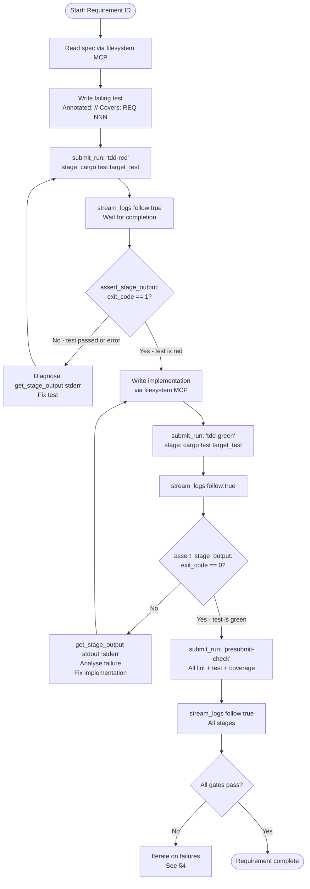

**[3_MCP_DESIGN-REQ-028]** Every test MUST be annotated `// Covers: <REQ-ID>` before the Red stage. An agent MUST NOT proceed to the Green stage if `./do test` produces a traceability failure for the target requirement.

**[3_MCP_DESIGN-REQ-029]** An agent MUST verify the test is genuinely failing (exit code 1 from `cargo test`) before writing implementation. A test that passes without implementation is a defective test; the agent MUST fix it before proceeding.

**[3_MCP_DESIGN-REQ-030]** An agent MUST run the full presubmit check (`submit_run: presubmit-check`) after every Green stage. Partial passes are not acceptable.

#### 3.1.1 TDD Session State Model

**[3_MCP_DESIGN-REQ-NEW-006]** An AI agent executing the TDD loop MUST track the following state between MCP calls. This state lives in the agent's working memory for the duration of a single requirement implementation session; `devs` does not persist it.

| Field | Type | Description |
|---|---|---|
| `requirement_id` | `string` | The `REQ-ID` being implemented (e.g., `2_TAS-REQ-034`). Assigned before any run is submitted. |
| `test_name` | `string` | Fully-qualified Rust test identifier to run in isolation (e.g., `tests::adapters::claude::rate_limit_detection`). Must be a valid argument to `cargo test`. |
| `target_file` | `string` | Workspace-relative path to the test source file (e.g., `crates/devs-adapters/src/lib.rs`). |
| `red_run_id` | `UUID4 \| null` | `run_id` of the most recent `tdd-red` run. `null` before first submission. |
| `green_run_id` | `UUID4 \| null` | `run_id` of the most recent `tdd-green` run. `null` before first submission. |
| `presubmit_run_id` | `UUID4 \| null` | `run_id` of the most recent `presubmit-check` run. `null` before first submission. |
| `phase` | `enum{WritingTest, Red, WritingImpl, Green, Presubmit, Complete}` | Current phase of the TDD loop. |
| `attempt` | `uint` | Number of times the current phase has been submitted (1-based; resets to 1 on phase transition). |

**[3_MCP_DESIGN-REQ-080]** An agent MUST record the `run_id` returned by `submit_run` before calling `stream_logs`. If `stream_logs` is interrupted (connection loss), the agent MUST use the stored `run_id` with `get_run` to recover run status without resubmitting. Each `submit_run` call creates a distinct run record; a second call with the same inputs creates a second run, not an idempotent replay.

**[3_MCP_DESIGN-REQ-081]** An agent MUST NOT transition from a waiting phase to a verifying phase by polling `get_run` in a tight loop. The agent MUST use `stream_logs` with `follow:true` to block on stage completion. `get_run` polling is only permitted as a fallback after a connection loss, with a minimum 1-second interval between polls and a maximum of 120 consecutive polls before escalating to a timeout failure.

#### 3.1.2 MCP Call Sequence for the TDD Loop

The following tables define the precise sequence of MCP calls for each TDD phase. Calls within a step execute sequentially; phases execute sequentially.

**Phase: Red — Verify the test is genuinely failing**

| Step | Tool | Key Parameters | Expected Outcome | Action on Deviation |
|---|---|---|---|---|
| R.1 | `submit_run` | `workflow="tdd-red"`, `inputs={test_name, prompt_file}` | `{run_id: <UUID>, status: "pending"}` | On any error: log and halt; never retry `submit_run` without diagnosing the error first |
| R.2 | `stream_logs` | `run_id=<red_run_id>`, `stage_name="check-test-fails"`, `follow=true` | Newline-delimited JSON chunks; final chunk `{"done":true}` | On disconnect: call `get_run` to determine current status |
| R.3 | `get_run` | `run_id=<red_run_id>` | `status: "completed"` or `"failed"` | If `"running"`: wait 1 s, retry; max 120 retries |
| R.4 | `assert_stage_output` | `run_id`, `stage_name="check-test-fails"`, `field="exit_code"`, `op="ne"`, `expected=0` | `{passed: true}` | If `passed:false` (exit_code was 0): enter false-negative handler; do not write implementation |
| R.5 | `get_stage_output` | `run_id`, `stage_name="check-test-fails"` | `exit_code: 1`, `stdout` containing `"test result: FAILED"` | If `exit_code==0`: confirm test was not skipped (check stdout for `"0 tests"`); fix test |

**Phase: Green — Verify the implementation makes the test pass**

| Step | Tool | Key Parameters | Expected Outcome | Action on Deviation |
|---|---|---|---|---|
| G.1 | `submit_run` | `workflow="tdd-green"`, `inputs={test_name, prompt_file}` | `{run_id: <UUID>, status: "pending"}` | On error: log and halt |
| G.2 | `stream_logs` | `run_id=<green_run_id>`, `stage_name="check-test-passes"`, `follow=true` | Chunks until `{"done":true}` | On disconnect: call `get_run` |
| G.3 | `get_run` | `run_id=<green_run_id>` | `status: "completed"` or `"failed"` | If `"failed"`: proceed to G.4 |
| G.4 | `assert_stage_output` | `run_id`, `stage_name="check-test-passes"`, `field="exit_code"`, `op="eq"`, `expected=0` | `{passed: true}` | If `passed:false`: call `get_stage_output`, read `stderr`, locate error diagnostics, fix implementation |
| G.5 | `get_stage_output` | `run_id`, `stage_name="check-test-passes"` | `exit_code: 0`, `stdout` containing `"test result: ok"` | If `exit_code!=0`: `stderr` contains Rust `error[E...]` diagnostics; apply targeted fix via filesystem MCP |

**Phase: Presubmit — Verify all gates pass**

| Step | Tool | Key Parameters | Expected Outcome | Action on Deviation |
|---|---|---|---|---|
| P.1 | `submit_run` | `workflow="presubmit-check"` | `{run_id: <UUID>}` | On error: halt |
| P.2–P.6 | `stream_logs` | One call per stage: `format-check`, `clippy`, `test-and-traceability`, `coverage`, `doc-check`; `follow=true` | All stages complete | On `TimedOut` or `Failed`: see §4 |
| P.7 | `get_run` | `run_id=<presubmit_run_id>` | `status: "completed"`, all stage_runs terminal | If `"failed"`: at least one stage failed; proceed to assertions |
| P.8 | `assert_stage_output` | `stage_name="format-check"`, `field="exit_code"`, `op="eq"`, `expected=0` | `{passed: true}` | If false: apply `cargo fmt --all`; resubmit |
| P.9 | `assert_stage_output` | `stage_name="clippy"`, `field="exit_code"`, `op="eq"`, `expected=0` | `{passed: true}` | If false: read stderr, fix each clippy warning |
| P.10 | `assert_stage_output` | `stage_name="test-and-traceability"`, `field="output.traceability.overall_passed"`, `op="eq"`, `expected=true` | `{passed: true}` | If false: add `// Covers:` annotation to uncovered test |
| P.11 | `assert_stage_output` | `stage_name="coverage"`, `field="output.overall_passed"`, `op="eq"`, `expected=true` | `{passed: true}` | If false: see §4.5 for gap analysis |
| P.12 | `assert_stage_output` | `stage_name="doc-check"`, `field="exit_code"`, `op="eq"`, `expected=0` | `{passed: true}` | If false: add missing doc comments to public items |

**[3_MCP_DESIGN-REQ-082]** An agent MUST call `assert_stage_output` on every stage of `presubmit-check` individually. A run `status` of `"completed"` is necessary but not sufficient — structured-output stages report `"completed"` when the agent process exits cleanly, regardless of whether individual coverage gates passed. Gate results are only accessible via `assert_stage_output` or `get_stage_output`.

#### 3.1.3 TDD Loop Phase State Machine

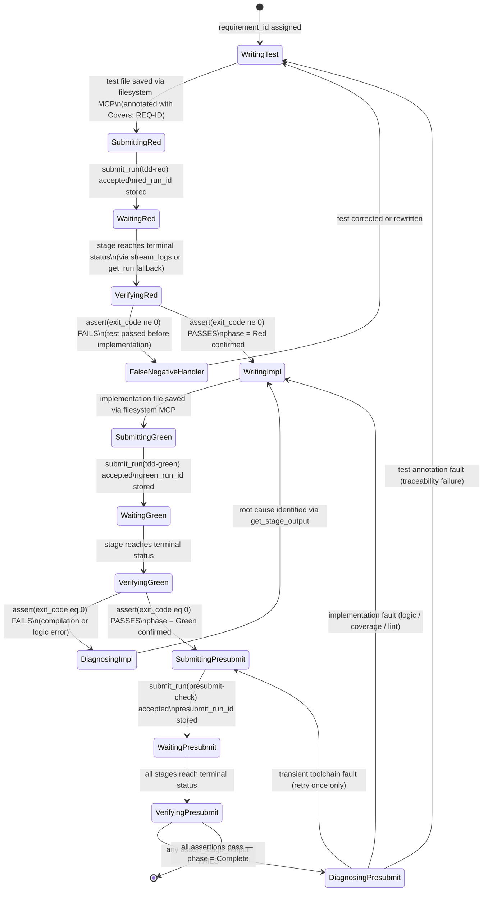

**State invariants:**

- `red_run_id` is non-null in all states from `WaitingRed` onward.
- `green_run_id` is non-null in all states from `WaitingGreen` onward.
- `presubmit_run_id` is non-null in all states from `WaitingPresubmit` onward.
- **[3_MCP_DESIGN-REQ-NEW-007]** An agent MUST NOT enter `WritingImpl` without first confirming `VerifyingRed → assert PASSES`.
- **[3_MCP_DESIGN-REQ-NEW-008]** An agent MUST NOT declare a requirement complete without first passing through `VerifyingPresubmit → all PASSES`.
- **[3_MCP_DESIGN-REQ-NEW-009]** The `FalseNegativeHandler` state MUST NOT write any implementation code. Its only permitted action is modifying the test file.
- A transient toolchain fault retry (`DiagnosingPresubmit → SubmittingPresubmit`) is permitted at most once. A second failure at the same stage requires root-cause analysis, not a blind retry.

### 3.2 Standard Development Workflow Definitions

The following workflow definitions are used by development agents. They are stored in the `devs` project repository under `.devs/workflows/`.

#### 3.2.1 `tdd-red` Workflow

Validates that a newly written test fails as expected before any implementation is written.

```toml
[workflow]
name = "tdd-red"

[[input]]
name     = "test_name"
type     = "string"
required = true

[[input]]
name     = "prompt_file"
type     = "path"
required = true

[[stage]]
name        = "check-test-fails"
pool        = "primary"
prompt_file = "{{workflow.input.prompt_file}}"
completion  = "exit_code"
timeout_secs = 120

[stage.env]
CARGO_TARGET_TEST = "{{workflow.input.test_name}}"
```

The orchestrated agent runs `cargo test $CARGO_TARGET_TEST 2>&1`. Exit code 0 means the test passed unexpectedly — the development agent detects this via `assert_stage_output` with `field="exit_code"`, `op="ne"`, `expected=0`. A zero exit code from this stage is treated as a false-negative and triggers the `FalseNegativeHandler` state (§3.1.3).

**Input constraints:**

| Input | Type | Constraint |
|---|---|---|
| `test_name` | `string` | Must be a valid `cargo test` filter (e.g., `tests::foo::bar`). Non-empty. Max 256 chars. |
| `prompt_file` | `path` | Must resolve to a file under `.devs/prompts/`. Resolved at stage execution time; missing file → stage `Failed` without agent spawn. |

#### 3.2.2 `tdd-green` Workflow

Validates that the implemented test now passes after the implementation is written.

```toml
[workflow]
name = "tdd-green"

[[input]]
name     = "test_name"
type     = "string"
required = true

[[input]]
name     = "prompt_file"
type     = "path"
required = true

[[stage]]
name        = "check-test-passes"
pool        = "primary"
prompt_file = "{{workflow.input.prompt_file}}"
completion  = "exit_code"
timeout_secs = 120

[stage.env]
CARGO_TARGET_TEST = "{{workflow.input.test_name}}"
```

The orchestrated agent runs `cargo test $CARGO_TARGET_TEST 2>&1`. Exit code 0 confirms the test passes. Non-zero exit triggers the `DiagnosingImpl` state in the phase state machine. The same `test_name` and `prompt_file` inputs used for `tdd-red` are reused here without modification. Input constraints are identical to `tdd-red` (§3.2.1).

#### 3.2.3 `presubmit-check` Workflow

Full gate check. Mirrors `./do presubmit`.

```toml
[workflow]
name    = "presubmit-check"
timeout_secs = 900

[[stage]]
name       = "format-check"
pool       = "primary"
prompt_file = ".devs/prompts/run-fmt-check.md"
completion  = "exit_code"

[[stage]]
name       = "clippy"
pool       = "primary"
prompt_file = ".devs/prompts/run-clippy.md"
completion  = "exit_code"
depends_on = ["format-check"]

[[stage]]
name       = "test-and-traceability"
pool       = "primary"
prompt_file = ".devs/prompts/run-tests.md"
completion  = "structured_output"
depends_on = ["clippy"]

[[stage]]
name       = "coverage"
pool       = "primary"
prompt_file = ".devs/prompts/run-coverage.md"
completion  = "structured_output"
depends_on = ["test-and-traceability"]

[[stage]]
name       = "doc-check"
pool       = "primary"
prompt_file = ".devs/prompts/run-doc-check.md"
completion  = "exit_code"
depends_on = ["clippy"]
```

**[3_MCP_DESIGN-REQ-031]** An agent MUST submit `presubmit-check` and wait for all stages to reach a terminal status before declaring a task complete. The agent MUST call `assert_stage_output` on each stage to confirm correctness, not merely check that the run reached `Completed` status.

#### 3.2.4 `build-only` Workflow

Used by the self-modification loop (§3.4) to validate compilation before running any tests. Faster feedback cycle than `presubmit-check`.

```toml
[workflow]
name = "build-only"
timeout_secs = 300

[[stage]]
name        = "cargo-build"
pool        = "primary"
prompt_file = ".devs/prompts/run-build.md"
completion  = "exit_code"
timeout_secs = 270
```

The orchestrated agent runs `cargo build --workspace 2>&1`. Exit code 0 confirms the workspace compiles. Non-zero exit contains Rust compiler diagnostics in `stderr`. This workflow has no inputs; it always builds the full workspace from the current checkout.

#### 3.2.5 `unit-test-crate` Workflow

Used by the self-modification loop (§3.4) to run unit tests for a single crate after a change, providing faster feedback than running the full test suite.

```toml
[workflow]
name = "unit-test-crate"
timeout_secs = 300

[[input]]
name     = "crate_name"
type     = "string"
required = true

[[stage]]
name        = "cargo-test-crate"
pool        = "primary"
prompt_file = ".devs/prompts/run-unit-test-crate.md"
completion  = "structured_output"
timeout_secs = 270

[stage.env]
DEVS_CRATE_NAME = "{{workflow.input.crate_name}}"
```

The orchestrated agent runs `cargo test -p $DEVS_CRATE_NAME 2>&1` and writes `.devs_output.json` with `"success": <bool>`, `"output": {"test_count": <n>, "failed_count": <n>}`.

**Input constraints:**

| Input | Type | Constraint |
|---|---|---|
| `crate_name` | `string` | Must match a crate name in `Cargo.toml` (e.g., `devs-mcp`, `devs-adapters`). Non-empty. Max 128 chars. |

#### 3.2.6 `e2e-all` Workflow

Used by the self-modification loop (§3.4) to run the full E2E test suite against the current binary.

```toml
[workflow]
name = "e2e-all"
timeout_secs = 600

[[stage]]
name        = "cargo-e2e"
pool        = "primary"
prompt_file = ".devs/prompts/run-e2e.md"
completion  = "structured_output"
timeout_secs = 570
```

The orchestrated agent runs `cargo test --test '*' -- --test-threads 1 2>&1` and writes `.devs_output.json` with `"success": <bool>`, `"output": {"test_count": <n>, "failed_count": <n>, "failed_tests": [<name>...]}`. The `failed_tests` array is empty on success and lists failing test names on failure. The stage uses `--test-threads 1` because E2E tests start a live `devs` server instance and must not share `DEVS_DISCOVERY_FILE` slots.

**Workflow summary table:**

| Workflow | Inputs | Timeout | Stages | Primary Use |
|---|---|---|---|---|
| `tdd-red` | `test_name`, `prompt_file` | none (per-stage 120 s) | 1 | Verify test is failing |
| `tdd-green` | `test_name`, `prompt_file` | none (per-stage 120 s) | 1 | Verify test passes after impl |
| `presubmit-check` | none | 900 s | 5 | Full gate: fmt + lint + test + coverage + doc |
| `build-only` | none | 300 s | 1 | Fast compilation check |
| `unit-test-crate` | `crate_name` | 300 s | 1 | Per-crate unit test in self-mod loop |
| `e2e-all` | none | 600 s | 1 | Full E2E suite |

### 3.3 Parallel Implementation Loop

When implementing multiple independent requirements, the development agent exploits DAG parallelism:

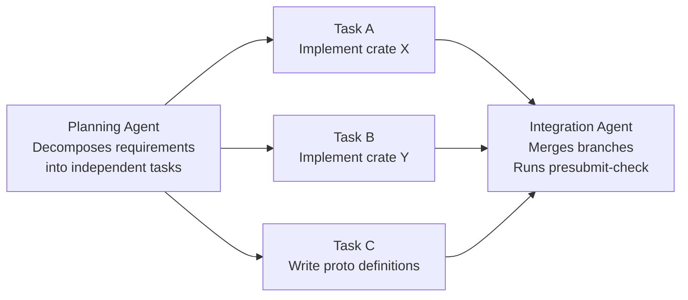

**[3_MCP_DESIGN-REQ-032]** When submitting parallel implementation tasks, each MUST be submitted as a separate `devs` workflow run targeting an isolated git worktree or branch. The `devs` server itself provides scheduling and pool management; the development agent MUST NOT attempt to manage parallelism manually.

**[3_MCP_DESIGN-REQ-033]** The development agent MUST monitor all in-flight runs via `list_runs` and `get_pool_state`. If pool exhaustion is detected (`get_pool_state` shows all agents rate-limited or unavailable), the agent MUST wait for `report_rate_limit` events to clear rather than submitting additional runs.

#### 3.3.1 Parallel Task Assignment Data Model

Before submitting any parallel runs, the planning agent builds a task set and checks it for file-level conflicts. The following fields are tracked per parallel session in agent working memory.

**`ParallelTaskSet` (agent working memory)**

| Field | Type | Description |
|---|---|---|
| `session_id` | `string` | Unique identifier for this parallel session (e.g., `parallel-<ISO8601>-<4-hex>`). Used as a naming prefix for branches. |
| `tasks` | `ParallelTask[]` | Ordered list of tasks. Length ≥ 2; max 8 concurrent tasks per session to stay within pool `max_concurrent`. |
| `integration_branch` | `string` | Git branch name where merged results are committed (format: `devs-integrate/<session_id>`). |
| `status` | `enum{Planning, Running, Integrating, Complete, Failed}` | Current status of the parallel session. |

**`ParallelTask`**

| Field | Type | Description |
|---|---|---|
| `task_id` | `string` | Short identifier for the task (e.g., `task-a`). Used in branch names and run names. |
| `requirement_ids` | `string[]` | The `REQ-ID`s this task implements. Non-empty. |
| `branch_name` | `string` | Git branch for this task's changes. Format: `devs-task/<session_id>-<task_id>`. |
| `run_id` | `UUID4 \| null` | `devs` run ID for this task's workflow. `null` until submitted. |
| `status` | `enum{Pending, Submitted, Running, Complete, Failed}` | Task-level status. |
| `source_files` | `string[]` | Workspace-relative paths of source files this task modifies. Populated during planning before any submission. |

**Conflict detection rule:** Before submitting tasks, the agent computes `intersection(task_A.source_files, task_B.source_files)` for every pair `(A, B)`. If the intersection is non-empty, task B is serialised as a dependent of task A (`B.depends_on = [A]`), not run in parallel.

**[3_MCP_DESIGN-REQ-083]** An agent MUST NOT submit a task as parallel if its `source_files` intersects with any other task's `source_files`. The check runs over all pairs in the session. The serialisation creates an explicit `depends_on` relationship in the `devs` workflow DAG for the integration stage.

**[3_MCP_DESIGN-REQ-084]** The number of simultaneously `Running` tasks in a single parallel session MUST NOT exceed the pool's `max_concurrent` value. The agent reads `get_pool_state` before each batch of submissions to verify available slots. If fewer slots are available than tasks to submit, the agent submits only as many tasks as there are free slots and holds the remainder.

#### 3.3.2 Parallel Loop State Transition Diagram

```mermaid
stateDiagram-v2
    [*] --> Planning : parallel session begins

    Planning --> ConflictCheck : task list assembled with source_files
    ConflictCheck --> Planning : conflict detected — serialise affected tasks
    ConflictCheck --> BranchCreation : no conflicts in remaining parallel set

    BranchCreation --> Submitting : branches created; worktrees initialised

    Submitting --> Monitoring : all tasks submitted; run_ids stored

    Monitoring --> Monitoring : poll list_runs + get_pool_state every 5 s\nstream_logs per task if desired

    Monitoring --> PoolExhausted : get_pool_state shows all agents unavailable
    PoolExhausted --> Monitoring : pool recovers (agents available)

    Monitoring --> TaskFailed : any task run reaches "failed" status
    TaskFailed --> DiagnosingTask : get_stage_output on failed task
    DiagnosingTask --> Resubmitting : root cause identified; fix applied to branch
    Resubmitting --> Monitoring : task resubmitted

    Monitoring --> AllComplete : all task runs reach "completed" status

    AllComplete --> Integrating : merge all task branches into integration_branch

    Integrating --> IntegrationFailed : git conflict or merge error
    IntegrationFailed --> ResolvingConflict : get_stage_output; resolve via filesystem MCP
    ResolvingConflict --> Integrating : conflict resolved

    Integrating --> SubmittingPresubmit : merge clean; submit presubmit-check on integration_branch

    SubmittingPresubmit --> VerifyingPresubmit : presubmit-check run submitted

    VerifyingPresubmit --> PresubmitFailed : any assert_stage_output fails
    PresubmitFailed --> DiagnosingTask : identify which task caused gate failure

    VerifyingPresubmit --> [*] : all gates pass — session Complete
```

#### 3.3.3 Pool Monitoring Protocol

**[3_MCP_DESIGN-REQ-NEW-010]** The development agent MUST follow this protocol when monitoring a parallel session to avoid submitting work that will be queued indefinitely or wasting pool capacity.

1. **Before submission**: call `get_pool_state` for the target pool. Count agents with `status != "rate_limited"` and `active_stage_run_ids.len() < 1` (idle agents). Submit at most `min(idle_agent_count, task_count)` tasks in the first batch.

2. **During execution**: every 5 seconds while any task is in `{Pending, Waiting, Eligible, Running}` status, call `list_runs` with a filter for the current `session_id` prefix. If any run transitions to `Failed`, immediately call `get_stage_output` and enter `DiagnosingTask`.

**[3_MCP_DESIGN-REQ-NEW-011]** 3. **On pool exhaustion**: `get_pool_state` returns all agents with `status == "rate_limited"` and `cooldown_remaining_secs > 0`. The agent MUST NOT submit additional tasks. The agent waits until at least one agent has `cooldown_remaining_secs == 0` before submitting the next held task. Maximum wait is `max(cooldown_remaining_secs)` plus 5 seconds buffer.

4. **On task completion**: when a task run reaches `"completed"`, record the branch name and remove the task from the `Monitoring` set. When all tasks are complete, proceed to integration.

**[3_MCP_DESIGN-REQ-085]** An agent MUST call `get_pool_state` before submitting the first task in any batch submission. An agent MUST NOT submit a task if all agents in the target pool are rate-limited.

#### 3.3.4 Integration Branch Convention

Branches created during parallel sessions follow a deterministic naming scheme so that any agent in the session can locate them without additional bookkeeping.

| Branch type | Format | Example |
|---|---|---|
| Task branch | `devs-task/<session_id>-<task_id>` | `devs-task/parallel-20260310-a3f2-task-a` |
| Integration branch | `devs-integrate/<session_id>` | `devs-integrate/parallel-20260310-a3f2` |

**Integration merge order:** Tasks are merged into the integration branch in the order they appear in `ParallelTaskSet.tasks`. The merge command used is `git merge --no-ff <task_branch>`. Merge conflicts are resolved by the development agent via filesystem MCP edits, then `git add` + `git commit` on the integration branch.

**[3_MCP_DESIGN-REQ-NEW-012]** **Branch cleanup:** After the integration `presubmit-check` passes, all task branches and the integration branch are deleted. Branch deletion is performed by the development agent via the filesystem MCP `run_command` tool (if available) or by the orchestrated agent in a dedicated `cleanup` stage. Task branches MUST NOT be deleted before the integration stage completes successfully.

### 3.4 Self-Modification Loop

When the task requires changing the `devs` server itself (e.g., adding a new MCP tool), the development agent follows a safe-to-fail protocol:

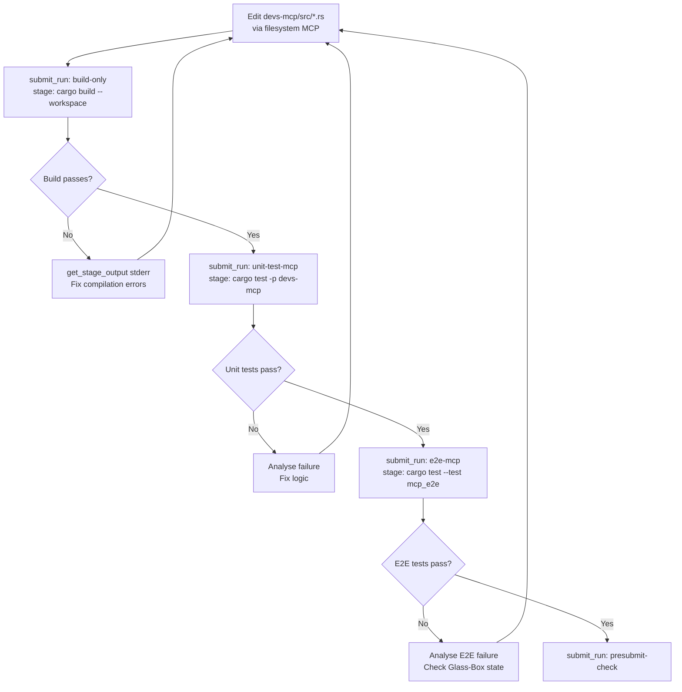

The self-modification loop uses `unit-test-crate` (§3.2.5) with `crate_name` set to the crate being changed and `e2e-all` (§3.2.6) for the full E2E pass before `presubmit-check`. The flowchart above uses `unit-test-mcp` and `e2e-mcp` as shorthand references — these are invocations of `unit-test-crate` and `e2e-all` respectively.

#### 3.4.1 Self-Modification Safety Constraints

The `devs` server runs as a background process while the development agent modifies its source code. The following rules define what is safe to change while the server is running and what requires a server restart.

**Safe to change while server is running (no restart required):**

| Artefact | Reason |
|---|---|
| `.devs/workflows/*.toml` files | Workflow definitions are loaded at `submit_run` time; the running server picks up the new definition on the next submission via `write_workflow_definition` or file reload. |
| `.devs/prompts/*.md` files | Prompt files are read at stage execution time; changes take effect on the next stage spawn. |
| Test files in `tests/` | Tests are compiled and run in a separate `devs` workflow stage; the running server binary is not affected. |
| Source files in `crates/*/src/` | Changes are compiled in a `build-only` stage; the running server binary is not affected until restarted. |

**Requires server restart to take effect:**

| Change | Why restart is needed |
|---|---|
| Any `crates/devs-server/src/` change | The server binary must be recompiled and relaunched. |
| Any `crates/devs-mcp/src/` change | MCP handlers are in-process; the new handler code is only active after restart. |
| Any `crates/devs-grpc/src/` change | gRPC service implementations are in-process. |
| `devs.toml` pool or listen-address changes | Pool state and TCP sockets are initialised at startup only. |

**[3_MCP_DESIGN-REQ-086]** An agent making changes to any server-binary crate (`devs-server`, `devs-mcp`, `devs-grpc`, `devs-scheduler`, `devs-pool`, `devs-executor`, `devs-adapters`, `devs-checkpoint`) MUST complete the full `build-only → unit-test-crate → e2e-all → presubmit-check` sequence before instructing the operator to restart the server. An agent MUST NOT instruct a server restart until `presubmit-check` has passed.

**[3_MCP_DESIGN-REQ-087]** An agent MUST NOT restart the `devs` server while any workflow run is in `{Running, Paused}` status. The agent calls `list_runs` and waits for all active runs to reach a terminal status, or calls `cancel_run` on non-essential runs, before initiating a restart.

#### 3.4.2 Reflexive Testing Constraint

When the development agent adds a new MCP tool or modifies an existing one, the E2E test it writes for that tool exercises the live `devs` MCP server via the HTTP JSON-RPC interface. This creates a reflexive relationship: the E2E test for a new MCP tool is itself submitted as a `devs` workflow run, which in turn calls the MCP tool being tested.

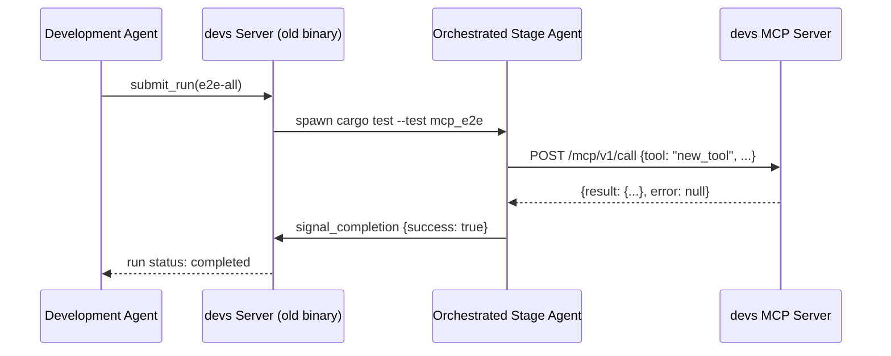

**[3_MCP_DESIGN-REQ-088]** The E2E test for a new MCP tool MUST call the tool via the HTTP JSON-RPC interface (`POST /mcp/v1/call`) using `DEVS_MCP_ADDR` injected into the stage environment. The test MUST NOT call the tool's internal Rust function directly — that is a unit test, not an E2E test.

**[3_MCP_DESIGN-REQ-089]** When the E2E test submits a nested `devs` workflow run (a run that creates another run), the nested run MUST use a distinct `DEVS_DISCOVERY_FILE` path (set by the outer stage's environment) to avoid port conflicts with the outer server. The test scaffolding MUST start a dedicated `devs` server instance for E2E purposes; it MUST NOT reuse the development server instance.

#### 3.4.3 Self-Modification Phase State Machine

```mermaid
stateDiagram-v2
    [*] --> Editing : source files identified for change

    Editing --> SubmittingBuild : file edits applied via filesystem MCP

    SubmittingBuild --> WaitingBuild : submit_run(build-only) accepted

    WaitingBuild --> VerifyingBuild : stage terminal

    VerifyingBuild --> DiagnosingBuild : exit_code != 0
    DiagnosingBuild --> Editing : compilation error identified and fixed

    VerifyingBuild --> SubmittingUnitTest : exit_code == 0

    SubmittingUnitTest --> WaitingUnitTest : submit_run(unit-test-crate, crate_name) accepted

    WaitingUnitTest --> VerifyingUnitTest : stage terminal

    VerifyingUnitTest --> DiagnosingUnitTest : output.failed_count > 0
    DiagnosingUnitTest --> Editing : logic error identified and fixed

    VerifyingUnitTest --> SubmittingE2E : output.failed_count == 0

    SubmittingE2E --> WaitingE2E : submit_run(e2e-all) accepted

    WaitingE2E --> VerifyingE2E : stage terminal

    VerifyingE2E --> DiagnosingE2E : output.failed_count > 0
    DiagnosingE2E --> Editing : E2E failure root cause identified

    VerifyingE2E --> SubmittingPresubmit : output.failed_count == 0

    SubmittingPresubmit --> WaitingPresubmit : submit_run(presubmit-check) accepted

    WaitingPresubmit --> VerifyingPresubmit : all stages terminal

    VerifyingPresubmit --> DiagnosingPresubmit : any gate fails
    DiagnosingPresubmit --> Editing : root cause identified

    VerifyingPresubmit --> AwaitingRestart : all gates pass; server-binary crate changed
    VerifyingPresubmit --> [*] : all gates pass; no server-binary crate changed

    AwaitingRestart --> [*] : operator confirms server restarted and healthy
```

### 3.5 Workflow Input and Stage Schema Reference

The standard development workflows in §3.2 rely on `WorkflowInput` declarations and stage configuration fields. This section defines the schema details that implementing agents must follow.

#### 3.5.1 Workflow Input Declaration Schema

```toml
# Declared at the workflow level; repeat for each input parameter
[[input]]
name     = "test_name"    # [a-z0-9_]+, max 64 chars; required field
type     = "string"       # one of: string | path | integer | boolean
required = true           # if false, default must be supplied
# default  = ""           # type-matched value; omit when required = true
```

Template variable resolution: `{{workflow.input.test_name}}` expands to the value supplied at `submit_run` time. A missing required input at submission time results in an `INVALID_ARGUMENT` gRPC error before any run record is created.

#### 3.5.2 Prompt File Header Convention

**[3_MCP_DESIGN-REQ-NEW-013]** All development workflow stages use `prompt_file` pointing to Markdown files under `.devs/prompts/`. Each prompt file MUST begin with a structured comment header:

```markdown
<!-- devs-prompt: run-fmt-check -->
<!-- covers: 2_TAS-REQ-014 -->

# Task

Run `cargo fmt --check --all` and report the result.

# Exit Criteria

Exit 0 if all files are correctly formatted. Exit 1 if any file requires reformatting.
```

**[3_MCP_DESIGN-REQ-079]** Prompt files MUST include a `<!-- devs-prompt: <name> -->` comment as the first line. Prompt files missing this header cause `./do lint` to emit a `WARN` line to stderr but do not cause lint to exit non-zero.

#### 3.5.3 Presubmit-Check Stage Structured Output Contract

**[3_MCP_DESIGN-REQ-NEW-014]** **[3_MCP_DESIGN-REQ-NEW-015]** Each stage in the `presubmit-check` workflow uses `completion = "structured_output"`. The orchestrated agent MUST write `.devs_output.json` in the following format before exiting:

```json
{
  "success": true,
  "output": {
    "gate_id": "QG-001",
    "threshold_pct": 90.0,
    "actual_pct": 92.4,
    "passed": true,
    "delta_pct": 2.4
  },
  "message": "Coverage gate QG-001 passed"
}
```

**[3_MCP_DESIGN-REQ-NEW-016]** For the `test-and-traceability` stage, `output` MUST include a `traceability` sub-object:

```json
{
  "success": true,
  "output": {
    "test_result": "ok",
    "test_count": 847,
    "failed_count": 0,
    "traceability": {
      "overall_passed": true,
      "traceability_pct": 100.0,
      "uncovered_requirements": []
    }
  },
  "message": "All tests passed; traceability 100%"
}
```

**[3_MCP_DESIGN-REQ-NEW-017]** For the `coverage` stage, `output` MUST include all five gate entries:

```json
{
  "success": true,
  "output": {
    "overall_passed": true,
    "gates": [
      { "gate_id": "QG-001", "threshold_pct": 90.0, "actual_pct": 92.4, "passed": true, "delta_pct": 2.4 },
      { "gate_id": "QG-002", "threshold_pct": 80.0, "actual_pct": 83.1, "passed": true, "delta_pct": 3.1 },
      { "gate_id": "QG-003", "threshold_pct": 50.0, "actual_pct": 54.2, "passed": true, "delta_pct": 4.2 },
      { "gate_id": "QG-004", "threshold_pct": 50.0, "actual_pct": 51.8, "passed": true, "delta_pct": 1.8 },
      { "gate_id": "QG-005", "threshold_pct": 50.0, "actual_pct": 52.3, "passed": true, "delta_pct": 2.3 }
    ]
  },
  "message": "All coverage gates passed"
}
```

#### 3.5.4 Prompt File Inventory

**[3_MCP_DESIGN-REQ-NEW-018]** All standard development workflows reference prompt files under `.devs/prompts/`. The following files MUST be present in the `devs` project repository. Each file MUST conform to the header convention in §3.5.2.

| File | Used by Workflow | Stage | Agent task |
|---|---|---|---|
| `.devs/prompts/run-fmt-check.md` | `presubmit-check` | `format-check` | Run `cargo fmt --check --all`; exit 0 if clean, 1 if not |
| `.devs/prompts/run-clippy.md` | `presubmit-check` | `clippy` | Run `cargo clippy --workspace --all-targets -- -D warnings`; write stderr to stdout |
| `.devs/prompts/run-tests.md` | `presubmit-check` | `test-and-traceability` | Run `./do test`; write `.devs_output.json` with test counts and traceability sub-object |
| `.devs/prompts/run-coverage.md` | `presubmit-check` | `coverage` | Run `./do coverage`; write `.devs_output.json` with all five gate entries |
| `.devs/prompts/run-doc-check.md` | `presubmit-check` | `doc-check` | Run `cargo doc --no-deps --workspace 2>&1`; exit 0 if zero warnings, 1 otherwise |
| `.devs/prompts/run-build.md` | `build-only` | `cargo-build` | Run `cargo build --workspace 2>&1`; exit 0 on success |
| `.devs/prompts/run-unit-test-crate.md` | `unit-test-crate` | `cargo-test-crate` | Run `cargo test -p $DEVS_CRATE_NAME 2>&1`; write `.devs_output.json` with test counts |
| `.devs/prompts/run-e2e.md` | `e2e-all` | `cargo-e2e` | Run `cargo test --test '*' -- --test-threads 1 2>&1`; write `.devs_output.json` with test counts and `failed_tests` array |

**Prompt file structure requirements:**

**[3_MCP_DESIGN-REQ-NEW-019]** Every prompt file MUST contain the following sections in order:

1. `<!-- devs-prompt: <name> -->` — first line; matches the filename stem (e.g., `run-fmt-check`)
2. `<!-- covers: <REQ-ID> -->` — one or more lines; references the requirement(s) this prompt satisfies
3. `# Task` — human-readable description of what the orchestrated agent must do
4. `# Exit Criteria` — precise conditions under which the agent exits 0 vs non-zero
5. `# Output Contract` — (required only for `completion = "structured_output"` stages) the exact `.devs_output.json` schema the agent must write

**[3_MCP_DESIGN-REQ-090]** An agent adding a new workflow MUST create the corresponding prompt file(s) in `.devs/prompts/` before submitting the workflow's first run. A missing prompt file causes the stage to transition to `Failed` with error `"prompt_file not found"` without spawning an agent process.

#### 3.5.5 Development Stage Context File Schema

When a stage in a development workflow has `depends_on` referencing other stages, `devs` writes `.devs_context.json` to the stage working directory before spawning the agent. For development workflows, this file has the following structure:

```json
{
  "run": {
    "run_id": "550e8400-e29b-41d4-a716-446655440000",
    "slug": "presubmit-check-20260310-a3f2",
    "name": "presubmit-check-20260310-a3f2",
    "workflow_name": "presubmit-check",
    "status": "running",
    "created_at": "2026-03-10T14:23:05.123Z",
    "started_at": "2026-03-10T14:23:05.456Z"
  },
  "inputs": {},
  "stages": {
    "format-check": {
      "status": "completed",
      "exit_code": 0,
      "stdout": "...",
      "stderr": "",
      "structured": null
    },
    "clippy": {
      "status": "completed",
      "exit_code": 0,
      "stdout": "...",
      "stderr": "",
      "structured": null
    }
  }
}
```

**Schema field constraints:**

| Field | Type | Notes |
|---|---|---|
| `run.run_id` | `string` (UUID4) | Identifies the parent run. |
| `run.slug` | `string` | Run slug as defined in §3.2 of the TAS. |
| `run.workflow_name` | `string` | Name of the active workflow. |
| `run.status` | `string` | Always `"running"` when context is written. |
| `inputs` | `object` | Map of workflow input name → value. Empty object if no inputs declared. |
| `stages` | `object` | Map of stage name → stage record. Only stages in the transitive `depends_on` closure of the current stage that have reached `Completed` status are included. |
| `stages.<name>.stdout` | `string` | Truncated to 1 MiB (last bytes); `truncated: true` added to root if any truncation occurred. |
| `stages.<name>.stderr` | `string` | Truncated to 1 MiB (last bytes). |
| `stages.<name>.structured` | `object \| null` | Parsed `.devs_output.json` `output` field, or `null` if `completion=exit_code`. |

**[3_MCP_DESIGN-REQ-091]** An orchestrated agent in a multi-stage development workflow MUST read `.devs_context.json` at startup to retrieve the outputs of completed upstream stages. The agent MUST NOT call back to the `devs` MCP server to retrieve upstream outputs — the context file is the authoritative source for this data within a stage execution.

#### 3.5.6 Workflow Input Type Coercion Rules

When `submit_run` receives input values, `devs` validates and coerces them according to the declared `type` of each `WorkflowInput`. The following rules apply:

| Declared type | Accepted source format | Coercion rule | Rejection condition |
|---|---|---|---|
| `string` | JSON string | None; used as-is | Non-string JSON value |
| `path` | JSON string (POSIX or Windows path) | Normalised to forward-slash form; not resolved at submission time | Non-string JSON value; empty string |
| `integer` | JSON number or JSON string of decimal digits | String `"42"` → integer `42` | Floating point; non-numeric string |
| `boolean` | JSON boolean or JSON string `"true"`/`"false"` | String `"true"` → `true`; `"false"` → `false` | Non-boolean non-string; string `"1"` or `"0"` (rejected, not coerced) |

**Validation sequence for `submit_run` inputs:**

1. Check all required inputs are present. Missing required input → `INVALID_ARGUMENT` listing the missing names.
2. For each present input, check type coercion succeeds. Coercion failure → `INVALID_ARGUMENT` identifying the field and expected type.
3. For inputs with `required = false` and no supplied value: substitute the declared `default`. Defaults are not re-validated (they are validated at workflow definition time).
4. After coercion, `path`-type inputs are stored as strings. They are resolved to absolute filesystem paths at stage execution time, relative to the repository root of the stage's execution environment.

**[3_MCP_DESIGN-REQ-092]** `path`-type inputs are NOT validated for existence at `submit_run` time. A path that does not exist causes the stage to fail at execution time with error `"prompt_file not found"`, not at submission time. This preserves the invariant that submission validation is synchronous and fast.

### 3.6 Development Loop Edge Cases

#### 3.6.1 TDD Loop Edge Cases

| ID | Scenario | Expected Behaviour |
|---|---|---|
| **[3_MCP_DESIGN-REQ-EC-TDD-001]** | `tdd-red` stage exits 0 (test unexpectedly passes before implementation) | Development agent detects via `assert_stage_output exit_code ne 0` assertion failure. Agent reads `stdout` to determine if test was skipped or is non-deterministic. Agent fixes the test before writing any implementation code. |
| **[3_MCP_DESIGN-REQ-EC-TDD-002]** | Pool is exhausted when `tdd-green` is submitted | `submit_run` succeeds and returns a `run_id`. The first stage transitions to `Eligible` but waits in the pool queue. Agent monitors via `get_pool_state`; does not re-submit or cancel the waiting run. |
| **[3_MCP_DESIGN-REQ-EC-TDD-003]** | Compilation error during `tdd-green` (implementation has a syntax error) | Stage exits non-zero; `stderr` contains Rust `error[E...]` diagnostic. Agent calls `get_stage_output`, reads `stderr`, locates the exact file and line via `search_content` on the filesystem MCP, applies a targeted edit, resubmits. |
| **[3_MCP_DESIGN-REQ-EC-TDD-004]** | `presubmit-check` times out (a stage exceeds 900 s workflow timeout) | Run transitions to `Failed`; timed-out stage shows `"timed_out"` status. Agent calls `get_stage_output` on the timed-out stage, reads the last output to identify the hanging subprocess, fixes it, and resubmits. |
| **[3_MCP_DESIGN-REQ-EC-TDD-005]** | Two requirements being implemented concurrently share the same pool slot | Both runs queue correctly via the pool semaphore. Whichever reaches `Eligible` first dispatches first. The second waits. Agent does not serialise submissions or cancel queued runs. |
| **[3_MCP_DESIGN-REQ-EC-TDD-006]** | Test annotation `// Covers: <id>` references a non-existent requirement ID | `./do test` exits non-zero with a traceability error listing the unknown ID. Agent reads the spec documents in `docs/plan/specs/` via filesystem MCP to find the correct ID, updates the annotation, and resubmits. |
| **[3_MCP_DESIGN-REQ-EC-TDD-007]** | `stream_logs` connection drops while waiting for `tdd-green` stage completion | Agent reads stored `green_run_id`, calls `get_run` to determine current status. If the stage has already reached a terminal status, the agent proceeds to `assert_stage_output`. If still `Running`, the agent resumes `stream_logs` with the same `run_id`. |
| **[3_MCP_DESIGN-REQ-EC-TDD-008]** | `presubmit-check` coverage gate QG-002 (E2E aggregate) fails while unit coverage (QG-001) passes | Agent calls `get_stage_output` on the `coverage` stage and reads the `gates` array to identify which gate failed. Agent adds E2E test coverage for the uncovered code paths rather than modifying unit tests. The gap analysis protocol in §4.5 applies. |
| **[3_MCP_DESIGN-REQ-EC-TDD-009]** | An agent attempts the `DiagnosingPresubmit → SubmittingPresubmit` retry a second time for the same stage failure | The agent MUST NOT perform a blind second retry. After the first retry fails at the same stage, the agent reads `get_stage_output` for that stage and applies §4 diagnosis before making any additional submission. Repeated identical failures indicate a systematic issue, not a transient one. |

#### 3.6.2 Parallel Implementation Loop Edge Cases

| ID | Scenario | Expected Behaviour |
|---|---|---|
| **[3_MCP_DESIGN-REQ-EC-PAR-001]** | Task A and Task B both modify the same source file | Development agent detects this during planning via `search_content` on the filesystem MCP. It serialises the tasks (B `depends_on` A in the `devs` workflow) rather than running them in parallel. |
| **[3_MCP_DESIGN-REQ-EC-PAR-002]** | Integration stage fails to merge Task A and Task B branches (git conflict) | Integration stage exits non-zero; `stderr` contains git conflict markers. Development agent reads the conflict via `get_stage_output`, resolves it through targeted filesystem MCP edits, and retries the integration stage (`resume_stage` after fix, or re-`submit_run`). |
| **[3_MCP_DESIGN-REQ-EC-PAR-003]** | Task C is submitted before Tasks A and B complete and later creates a dependency conflict | Task C runs independently and may succeed or fail. If a conflict is discovered during integration, the agent calls `cancel_run` on any superseded runs, resolves the conflict, and resubmits. |
| **[3_MCP_DESIGN-REQ-EC-PAR-004]** | One task in a parallel session exceeds its stage timeout and transitions to `TimedOut` | The `ParallelTask.status` is set to `Failed`. The agent does not cancel the other in-flight tasks. The agent calls `get_stage_output` on the timed-out stage to recover partial output, fixes the hanging operation, and resubmits only the failed task on its branch before re-attempting integration. |
| **[3_MCP_DESIGN-REQ-EC-PAR-005]** | Pool `max_concurrent` drops to 0 due to all agents entering rate-limit cooldown simultaneously | The `get_pool_state` call returns all agents with `cooldown_remaining_secs > 0`. All in-flight tasks continue to run (they already hold pool permits via the semaphore). No new tasks are dispatched. The agent waits for the longest `cooldown_remaining_secs` and then re-checks before submitting held tasks. |
| **[3_MCP_DESIGN-REQ-EC-PAR-006]** | The parallel session's `integration_branch` does not exist when the integration stage runs | The orchestrated integration agent finds no branch at the expected name `devs-integrate/<session_id>`. This indicates a race condition in branch creation. The development agent verifies branch names via filesystem MCP, re-creates the integration branch from the first task branch, and repeats the merge sequence. |

#### 3.6.3 Self-Modification Loop Edge Cases

| ID | Scenario | Expected Behaviour |
|---|---|---|
| **[3_MCP_DESIGN-REQ-EC-SELF-001]** | Agent modifies `devs-mcp/src/tools.rs` while the server is running | The running server is unaffected; it holds the old compiled binary. New code is only active after the server is restarted. The development agent completes all tests on the new code before instructing the operator to restart. |
| **[3_MCP_DESIGN-REQ-EC-SELF-002]** | `write_workflow_definition` updates `presubmit-check` while a `presubmit-check` run is in flight | The running run uses the immutable snapshot taken at run start. The updated definition applies to the next `submit_run` call only. No conflict or state corruption occurs. |
| **[3_MCP_DESIGN-REQ-EC-SELF-003]** | Build stage fails because a `Cargo.toml` dependency version constraint is incompatible with another crate in the workspace | Stage exits non-zero; `stderr` contains `error: failed to select a version`. Agent reads `Cargo.toml` via filesystem MCP, identifies the conflicting constraint, updates the version, and resubmits. |
| **[3_MCP_DESIGN-REQ-EC-SELF-004]** | E2E test starts a `devs` server but the port is already in use (another server left from a previous failed test) | The E2E test runner detects the `EADDRINUSE` error in the server's `stderr` via `get_stage_output`. The stage fails with a clear diagnostic. The agent identifies the stale server process via `get_pool_state` (if it is the current server) or via filesystem MCP process inspection, terminates it, and retries the E2E stage. |
| **[3_MCP_DESIGN-REQ-EC-SELF-005]** | `presubmit-check` passes, operator restarts the server, but the restarted server fails to bind the MCP port | The development agent reads the server's `stderr` from the restart attempt, identifies the port conflict or config error, fixes `devs.toml` via filesystem MCP, and instructs another restart. The glass-box MCP server MUST bind successfully before the agent declares the self-modification complete. |
| **[3_MCP_DESIGN-REQ-EC-SELF-006]** | A new MCP tool added to `devs-mcp/src/tools.rs` is not registered in the MCP router, so calling it returns `"method not found"` | The E2E test for the new tool fails with `error: "method not found"`. Agent reads the router registration code (e.g., `devs-mcp/src/router.rs`) via filesystem MCP, adds the missing registration, rebuilds, and re-runs E2E. Registration is a compile-time requirement — the E2E failure is the detection mechanism. |

### 3.7 Section Acceptance Criteria

**Dependencies:** This section depends on:
- §1 (Glass-Box architecture and MCP session lifecycle) — agent roles and session state rules.
- §2 (MCP tool schemas and HTTP transport) — all tool calls in §3 use the schemas defined there.
- `2_TAS` §3 (Data Model) — `WorkflowRun`, `StageRun`, `StageStatus`, and `WorkflowInput` types used throughout.
- `2_TAS` §4 `devs-scheduler` — DAG scheduling that enables parallel dispatch.
- `2_TAS` §4 `devs-checkpoint` — checkpoint persistence ensures TDD loop state survives server crash.

**Depended upon by:**
- §4 (Debugging & Observability) — uses the development loops as the context in which failures occur.
- §5 (Context & Memory Management) — uses the loop phase model to define what state must be recovered.

---

- **[3_MCP_DESIGN-REQ-AC-3.01]** `[3_MCP_DESIGN-REQ-028]`: `./do test` exits non-zero if any test file contains `// Covers: <id>` where `<id>` does not appear in any spec document under `docs/plan/specs/`.
- **[3_MCP_DESIGN-REQ-AC-3.02]** `[3_MCP_DESIGN-REQ-029]`: A `tdd-red` run whose `assert_stage_output exit_code ne 0` assertion fails (i.e., test passed before implementation) does not result in any implementation file being written — verified by an E2E test that checks no source file modifications occur after a `tdd-red` false-negative detection.
- **[3_MCP_DESIGN-REQ-AC-3.03]** `[3_MCP_DESIGN-REQ-030]`: A `presubmit-check` run where all stages reach `Completed` but one `assert_stage_output` returns `"passed": false` is treated as a task-level failure; no commit is made.
- **[3_MCP_DESIGN-REQ-AC-3.04]** `[3_MCP_DESIGN-REQ-EC-TDD-002]`: `submit_run` when `max_concurrent` agents are all busy returns a successful `run_id`; the run eventually reaches `Running` status after a pool slot becomes available with no additional client action.
- **[3_MCP_DESIGN-REQ-AC-3.05]** `[3_MCP_DESIGN-REQ-031]`: The `presubmit-check` workflow enforces a 900-second `timeout_secs` limit; any stage that exceeds its budget transitions to `TimedOut` and the run transitions to `Failed` without hanging indefinitely.
- **[3_MCP_DESIGN-REQ-AC-3.06]** `[3_MCP_DESIGN-REQ-079]`: A prompt file without the `<!-- devs-prompt: -->` header causes `./do lint` to write a `WARN` line to stderr but exits 0.
- **[3_MCP_DESIGN-REQ-AC-3.07]** `[3_MCP_DESIGN-REQ-EC-SELF-002]`: A `get_workflow_definition` call after `write_workflow_definition` modifies a workflow returns the new definition; `get_run` for an in-flight run started before the modification returns `definition_snapshot` equal to the original definition.
- **[3_MCP_DESIGN-REQ-AC-3.08]** `[3_MCP_DESIGN-REQ-080]`: An E2E test simulates a `stream_logs` connection drop mid-stream, calls `get_run` with the stored `run_id`, and verifies the run continues to the correct terminal status without any duplicate run being created.
- **[3_MCP_DESIGN-REQ-AC-3.09]** `[3_MCP_DESIGN-REQ-081]`: An E2E test verifies that a `get_run` call with a 0-second interval (tight polling) does not cause a deadlock or data race in the server; the run must still reach `Completed` status correctly.
- **[3_MCP_DESIGN-REQ-AC-3.10]** `[3_MCP_DESIGN-REQ-082]`: An E2E test submits `presubmit-check`, waits for all stages to complete with `status: "completed"`, then calls `assert_stage_output` with `field="output.overall_passed"` on the `coverage` stage and verifies the assertion returns `{passed: <bool>}` matching the actual gate result — not always `true` just because the run status was `"completed"`.
- **[3_MCP_DESIGN-REQ-AC-3.11]** `[3_MCP_DESIGN-REQ-083]`: The conflict detection algorithm for parallel tasks correctly identifies when two tasks share a source file and serialises them; verified by a unit test with synthetic `ParallelTask` records containing overlapping `source_files`.
- **[3_MCP_DESIGN-REQ-AC-3.12]** `[3_MCP_DESIGN-REQ-084]`: An E2E test submits 5 parallel tasks to a pool with `max_concurrent = 2`; verifies that at most 2 stages are in `"running"` status at any point in time via repeated `get_pool_state` calls.
- **[3_MCP_DESIGN-REQ-AC-3.13]** `[3_MCP_DESIGN-REQ-085]`: An E2E test attempts to submit a task when all pool agents are rate-limited; verifies that `submit_run` succeeds (run created in `Pending` state) but no stage transitions to `Running` until at least one agent's cooldown expires.
- **[3_MCP_DESIGN-REQ-AC-3.14]** `[3_MCP_DESIGN-REQ-086]`: An E2E test verifies that a `devs-mcp` source change followed by `build-only → unit-test-crate → e2e-all → presubmit-check` (all passing) leaves the server in a state where the new MCP tool is callable after restart — verified by calling the new tool via `POST /mcp/v1/call` post-restart and confirming `error: null`.
- **[3_MCP_DESIGN-REQ-AC-3.15]** `[3_MCP_DESIGN-REQ-087]`: An E2E test calls `list_runs`, verifies at least one run is `"running"`, then attempts to trigger a server restart sequence; verifies the restart is blocked until `list_runs` returns no `{running, paused}` runs.
- **[3_MCP_DESIGN-REQ-AC-3.16]** `[3_MCP_DESIGN-REQ-088]`: An E2E test for a new MCP tool submits the tool call via `POST /mcp/v1/call` using the `DEVS_MCP_ADDR` environment variable and verifies the response has `error: null` — not by calling the Rust function directly.
- **[3_MCP_DESIGN-REQ-AC-3.17]** `[3_MCP_DESIGN-REQ-090]`: An E2E test submits a workflow with a `prompt_file` pointing to a non-existent path; verifies the stage transitions to `"failed"` with `get_stage_output` showing an error message containing `"prompt_file not found"` and no agent process was spawned (verified by checking no child process entries in pool state).
- **[3_MCP_DESIGN-REQ-AC-3.18]** `[3_MCP_DESIGN-REQ-091]`: An E2E test for a two-stage development workflow verifies that the second stage's working directory contains `.devs_context.json` with the first stage's `stdout`, `exit_code`, and `structured` fields populated correctly.
- **[3_MCP_DESIGN-REQ-AC-3.19]** `[3_MCP_DESIGN-REQ-092]`: A unit test for the `submit_run` input validation verifies that a `path`-type input pointing to a non-existent file is accepted at submission time (returns a valid `run_id`) and only causes a stage failure at execution time.
- **[3_MCP_DESIGN-REQ-AC-3.20]** `[3_MCP_DESIGN-REQ-EC-TDD-006]`: `./do test` generates `target/traceability.json` with `overall_passed: false` and the unknown requirement ID listed in `uncovered_requirements` when a test file contains `// Covers: NONEXISTENT-REQ-999`.

---

## 4. Debugging & Observability Strategies

### 4.1 Failure Classification and Response Protocol

**[3_MCP_DESIGN-REQ-NEW-020]** When a workflow stage fails, the development agent MUST follow a structured investigation protocol before writing any code changes.

**[3_MCP_DESIGN-REQ-034]** On any stage failure, the agent MUST execute the following sequence before attempting a fix:

1. Call `get_run` to obtain the full run state and identify the failing stage.
2. Call `get_stage_output` for the failing stage to obtain `stdout`, `stderr`, `exit_code`, and `structured`.
3. Classify the failure into one of the categories in the table below.
4. Apply the corresponding response strategy.

| Failure Category | Detection | Response Strategy |
|---|---|---|
| **Compilation error** | `stderr` contains `error[E` Rust diagnostics | Read referenced source file; apply targeted edit; resubmit |
| **Test assertion failure** | `stdout` contains `FAILED` + test name | Read test source and implementation; fix logic |
| **Coverage gate failure** | `structured.gates[*].passed == false` | Identify uncovered lines from `target/coverage/report.json`; add targeted tests |
| **Clippy denial** | `stderr` contains `error: ` from clippy | Read offending file at indicated line; fix lint issue |
| **Traceability failure** | `structured.overall_passed == false` | Read `target/traceability.json`; add `// Covers:` annotations or missing tests |
| **Rate limit** | Stage status `Failed`, `report_rate_limit` in logs | Do not retry immediately; call `get_pool_state`; wait for pool recovery |
| **Process timeout** | Stage status `TimedOut` | Review stage for infinite loops or resource contention; check `stderr` for last output |
| **Disk full** | `stderr` contains checkpoint error | `get_pool_state` for context; do not retry; alert operator |

**[3_MCP_DESIGN-REQ-035]** An agent MUST NOT make speculative code changes based on partial failure information. It MUST read the full `stderr` and `stdout` before writing any edit.

**[3_MCP_DESIGN-REQ-DBG-BR-000]** The failure classification table above is exhaustive for MVP. Any stage failure that does not match a row in the table MUST be treated as a generic internal error: the agent reads `stderr` in full, calls `get_pool_state` to rule out infrastructure causes, and files a bug report as a comment in the relevant issue tracker file before attempting any code change.

**[3_MCP_DESIGN-REQ-NEW-021]** The following decision diagram formalises the mandatory investigation protocol as a navigable flow. An agent MUST NOT skip any node:

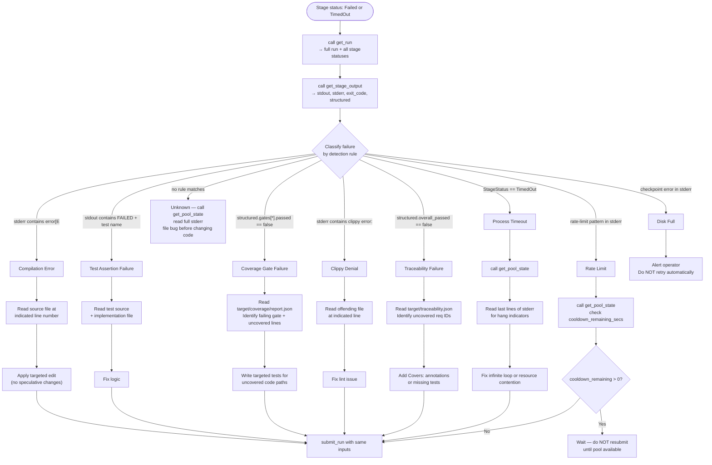

### 4.2 Log Streaming Protocol

**[3_MCP_DESIGN-REQ-036]** An agent MUST use `stream_logs` with `follow: true` rather than polling `get_stage_output` for active stages. Polling wastes context window and pool bandwidth; streaming delivers updates as the toolchain produces them.

The agent reads the chunked stream until it receives `{"done": true}` or the stage transitions to a terminal status:

```
// Pseudocode: agent log consumption loop
stream = mcp.call("stream_logs", { run_id, stage_name, follow: true })
for chunk in stream:
    if chunk.done: break
    buffer_line(chunk.line)
    if is_error_line(chunk.line):
        record_first_error(chunk.line, chunk.sequence)

// After stream closes:
output = mcp.call("get_stage_output", { run_id, stage_name })
classify_failure(output)
```

**[3_MCP_DESIGN-REQ-037]** The agent MUST record the sequence number of the first error line during streaming. When calling `get_stage_output` after the run, the agent uses the sequence number to locate the error in the buffered output without re-scanning from the start.

#### 4.2.1 Log Chunk Schema

Each log chunk delivered by `stream_logs` is a newline-delimited JSON object transmitted via HTTP chunked transfer encoding (`Transfer-Encoding: chunked`). All chunks are emitted on a single HTTP 200 response; error conditions discovered before streaming begins are returned as a standard MCP error response (HTTP 400) before any chunk is written.

**Non-terminal chunk fields:**

| Field | Type | Constraints | Description |
|---|---|---|---|
| `sequence` | `integer` | ≥ 1; strictly monotonically increasing; no gaps | Ordinal position of this line across the combined stdout+stderr stream for this attempt |
| `stream` | `"stdout"` \| `"stderr"` | Required | Which process output stream produced this line |
| `line` | `string` | ≤ 32,768 bytes UTF-8 | Raw line content without trailing newline; invalid UTF-8 bytes replaced with U+FFFD; lines longer than 32 KiB are split at byte 32,768 into consecutive chunks |
| `timestamp` | `string` | RFC 3339, ms precision, `Z` suffix | Wall-clock time at which the agent adapter read this line from the subprocess pipe |
| `done` | `boolean` | Always `false` | Sentinel distinguishing non-terminal from terminal chunks |

```json
{
  "sequence": 42,
  "stream": "stdout",
  "line": "error[E0308]: mismatched types",
  "timestamp": "2026-03-10T14:23:05.123Z",
  "done": false
}
```

**Terminal chunk fields** (always the final JSON object in the response body):

| Field | Type | Constraints | Description |
|---|---|---|---|
| `done` | `boolean` | Always `true` | Signals end of stream |
| `truncated` | `boolean` | Required | `true` when the in-memory 10,000-line buffer dropped earlier lines |
| `total_lines` | `integer` | ≥ 0 | Total lines produced by the stage, including any lines dropped due to truncation |

```json
{ "done": true, "truncated": false, "total_lines": 312 }
```

**Business rules for log streaming:**

- **[3_MCP_DESIGN-REQ-DBG-BR-001]** `sequence` values start at 1 and increment by exactly 1 for each chunk. Gaps in sequence numbers are prohibited under all circumstances.
- **[3_MCP_DESIGN-REQ-DBG-BR-002]** A `stream_logs` request with `from_sequence: N` delivers only chunks with `sequence ≥ N`. If `N` exceeds the total buffered line count for a completed stage, the server sends only the terminal chunk immediately.
- **[3_MCP_DESIGN-REQ-DBG-BR-003]** `stream_logs` with `follow: false` for a `Running` stage returns all lines buffered to date, then the terminal chunk, without waiting for the stage to complete.
- **[3_MCP_DESIGN-REQ-DBG-BR-004]** `stream_logs` with `follow: true` for a stage in `Pending` or `Waiting` status holds the HTTP connection open and begins streaming when the stage enters `Running`. If the stage reaches a terminal state without entering `Running` (e.g., cancelled before dispatch), the server immediately sends `{"done": true, "truncated": false, "total_lines": 0}` and closes.
- **[3_MCP_DESIGN-REQ-DBG-BR-005]** Server-side stream resources (goroutine, per-stream buffer) MUST be released within 500 ms of client connection close (TCP RST or clean FIN). The server MUST NOT retain stream state after client disconnect.
- **[3_MCP_DESIGN-REQ-DBG-BR-006]** Lines longer than 32,768 bytes are split at byte boundary 32,768. Each split segment is emitted as a separate chunk with its own `sequence` number. A `line` field will therefore never exceed 32,768 bytes in any single chunk.

### 4.3 State Inspection via Glass-Box

**[3_MCP_DESIGN-REQ-038]** When diagnosing a runtime logic failure (not a build failure), the development agent MUST use the following Glass-Box inspection sequence:

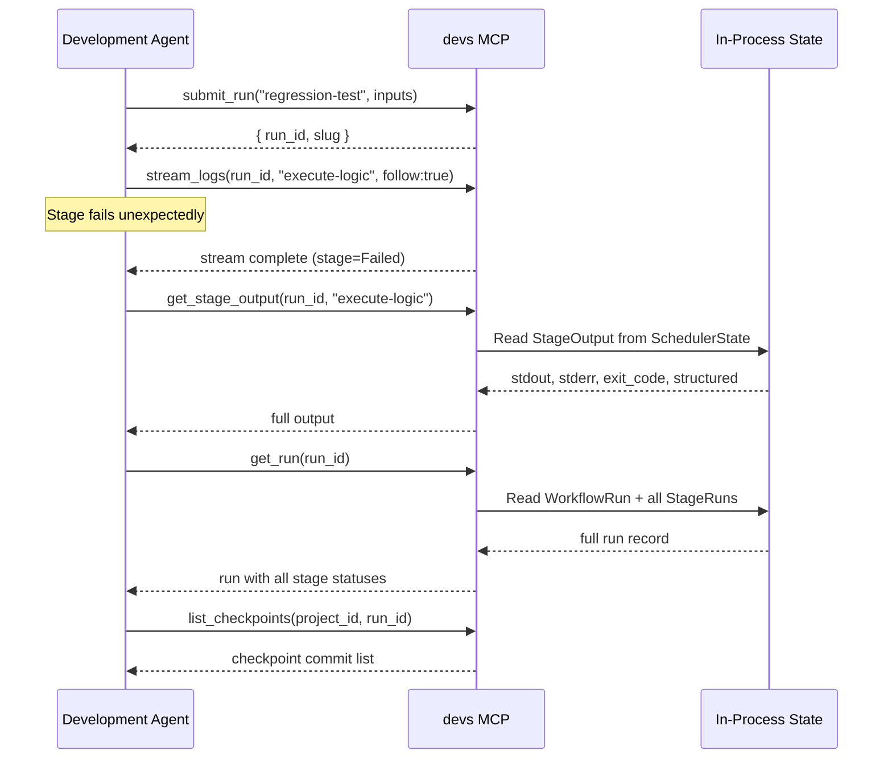

**[3_MCP_DESIGN-REQ-039]** For failures involving the `devs-scheduler` or `devs-pool` crates, the agent MUST call `get_pool_state` to inspect semaphore availability, rate-limit cooldowns, and queued stage counts. Pool state changes may explain unexpected stage ordering or delays.

### 4.4 E2E Test Observability

E2E tests in `tests/` run against a live `devs` server spawned by the test harness. The development agent uses the following strategy to observe E2E test failures:

**[3_MCP_DESIGN-REQ-040]** Each E2E test sets `DEVS_DISCOVERY_FILE` to a unique temporary path to ensure process isolation. A test that fails to write this file indicates a server startup failure; the agent MUST check `stderr` for config validation errors using `get_stage_output`.

**[3_MCP_DESIGN-REQ-041]** E2E test failures that involve unexpected state transitions MUST be diagnosed by reading the checkpoint files committed to the test's state branch. The agent reads `.devs/runs/<run-id>/checkpoint.json` via the filesystem MCP to inspect the exact `WorkflowRun` + `StageRun` records at the point of failure.

```
// Checkpoint file path convention for E2E inspection
.devs/runs/<run-id>/checkpoint.json          // full run state
.devs/logs/<run-id>/<stage>/attempt_1/stdout.log  // raw agent output
.devs/logs/<run-id>/<stage>/attempt_1/stderr.log
```

**[3_MCP_DESIGN-REQ-042]** TUI E2E failures produce `insta` snapshot diffs. The agent MUST read the failed snapshot file at `crates/devs-tui/tests/snapshots/<test_name>.txt.new` and compare it to the accepted snapshot at `<test_name>.txt` using the filesystem MCP. The agent MUST NOT approve a snapshot update without first verifying that the TUI text output change is intentional.

### 4.5 Coverage Gap Analysis

**[3_MCP_DESIGN-REQ-043]** When a coverage gate fails, the development agent MUST execute the following analysis before writing new tests:

1. Read `target/coverage/report.json` via filesystem MCP to identify which gate failed and its `actual_pct`.
2. For E2E interface gates (QG-003/QG-004/QG-005), identify which interface (CLI/TUI/MCP) is below threshold.
3. Read `target/coverage/lcov.info` or the equivalent per-file coverage data to identify specific uncovered lines.
4. Prioritise writing tests that cover the largest contiguous uncovered regions in engine crates, as these contribute to all gates simultaneously.

**[3_MCP_DESIGN-REQ-044]** An agent MUST NOT add tests that cover code through private helper functions or internal paths not reachable from the declared external interfaces (CLI, TUI, MCP). E2E coverage gates require code to be exercised through the actual client interface boundaries.

### 4.6 Structured Error Diagnosis

**[3_MCP_DESIGN-REQ-045]** All `devs` MCP tool calls that return `"error": "<string>"` produce structured errors with a machine-stable prefix. An agent MUST parse this prefix to determine automated response, rather than pattern-matching against the full error string.

| Stable Prefix | Meaning | Agent Response |
|---|---|---|
| `not_found:` | Resource does not exist | Verify `run_id`/`stage_name`; check `list_runs` |
| `invalid_argument:` | Input validation failed; JSON array of errors in message | Fix inputs; re-submit |
| `already_exists:` | Duplicate run name | Use unique `run_name`; check `list_runs` for collision |
| `failed_precondition:` | State conflict (e.g., stage not pausable) | Call `get_run` for current state; adjust action |
| `resource_exhausted:` | Pool or rate limit | Call `get_pool_state`; wait for availability |
| `internal:` | Unhandled server error | Read server logs; report bug |

### 4.7 Observability Edge Cases

| ID | Scenario | Expected Behaviour |
|---|---|---|
| **[3_MCP_DESIGN-REQ-EC-OBS-DBG-001]** | Agent calls `stream_logs` with `follow: true` before the stage has started running | Server accepts the connection. When the stage starts and produces output, chunks arrive without requiring a reconnect. If the stage never starts (cancelled before dispatch), the server sends `{"done": true, "truncated": false, "total_lines": 0}` when the stage reaches a terminal state. |
| **[3_MCP_DESIGN-REQ-EC-OBS-DBG-002]** | Log buffer for a stage exceeds 10,000 lines | In-memory buffer retains the most recent 10,000 lines. `stream_logs` with `follow: false` returns exactly 10,000 lines with `"truncated": true` in the terminal chunk. The full log remains readable from `.devs/logs/<run-id>/<stage>/attempt_N/stdout.log` via the filesystem MCP. |
| **[3_MCP_DESIGN-REQ-EC-OBS-DBG-003]** | `get_stage_output` called for a fan-out parent stage without `fan_out_index` | Returns the merged output produced by the merge handler (or the default merged JSON array). Individual sub-agent outputs are accessible by specifying a `fan_out_index` parameter (0-based) on a subsequent `get_stage_output` call. |
| **[3_MCP_DESIGN-REQ-EC-OBS-DBG-004]** | E2E test server starts but never writes the discovery file due to a config validation error | The test harness polls `DEVS_DISCOVERY_FILE` for up to 5 seconds. If the file never appears, the test fails immediately with the message `"server did not write discovery file within 5 s; check stderr for config errors"`. The test harness then reads the server process stderr directly (not via MCP, since the server is not running) for diagnostics. |
| **[3_MCP_DESIGN-REQ-EC-OBS-DBG-005]** | Coverage gate QG-003 (CLI E2E) fails while QG-001 (unit) passes | `target/coverage/report.json` shows `QG-003.passed = false` with `delta_pct < 0`. Agent reads the per-file coverage data, identifies CLI subcommand handler functions not exercised by E2E tests, and adds targeted E2E tests that invoke the `devs` CLI binary directly via `assert_cmd`. Unit-test-only coverage for these paths does NOT count toward QG-003. |
| **[3_MCP_DESIGN-REQ-EC-OBS-DBG-006]** | TUI snapshot test fails because terminal layout changed | `insta` produces a `<test_name>.txt.new` file alongside the accepted `<test_name>.txt` snapshot. The agent reads both files via the filesystem MCP and diffs them. If the change is a regression (incorrect layout), the agent fixes the TUI rendering code and deletes the `.txt.new` file. If the change is intentional, the agent replaces the `.txt` file with the `.txt.new` content, thereby accepting the new snapshot. |
| **[3_MCP_DESIGN-REQ-EC-OBS-DBG-007]** | `get_pool_state` shows `queued_count > 0` for a pool with `available_slots > 0` | The queued stages have `required_capabilities` that no current non-rate-limited agent can satisfy (i.e., the capability filter eliminated all eligible agents before the semaphore was consulted). The agent calls `get_run` for the queued stage runs to inspect their `required_capabilities`, then reconciles against the `capabilities` arrays in `get_pool_state` to identify the mismatch. |
| **[3_MCP_DESIGN-REQ-EC-OBS-DBG-008]** | `stream_logs` called with `from_sequence` greater than the highest buffered sequence number for a completed stage | The server responds with only the terminal chunk `{"done": true, "truncated": false, "total_lines": N}`. No non-terminal chunks are emitted. This is not an error; the agent's recorded `from_sequence` simply exceeds what was buffered. |
| **[3_MCP_DESIGN-REQ-EC-OBS-DBG-009]** | Agent calls `get_stage_output` for a stage in `Waiting` or `Eligible` status | The MCP server returns `"error": "failed_precondition: stage has not yet started; no output available"`. The agent MUST NOT treat this as a fatal failure; it should either wait (streaming via `stream_logs` with `follow: true`) or poll `get_run` until the stage reaches `Running`. |
| **[3_MCP_DESIGN-REQ-EC-OBS-DBG-010]** | `list_checkpoints` is called for a project whose checkpoint branch has never been written | The checkpoint branch does not yet exist in the bare git repository. The server returns `{"checkpoints": [], "has_more": false, "next_before_sha": null}` rather than an error. The branch is created lazily on the first checkpoint write. |
| **[3_MCP_DESIGN-REQ-EC-OBS-DBG-011]** | `get_stage_output` returns `truncated: true` and the agent needs the full stderr | The agent reads `.devs/logs/<run-id>/<stage-name>/attempt_<N>/stderr.log` directly from the checkpoint store using the filesystem MCP. This file always contains the complete unbounded stderr regardless of the 1 MiB field truncation applied to the `stderr` field in the MCP response. |

### 4.8 Observability Data Schemas

This subsection defines the exact JSON schemas for all artifacts and API responses used during debugging and observability operations. Every field is mandatory in responses unless marked `| null`.

#### 4.8.1 `get_stage_output` Full Response Schema

`get_stage_output` returns the captured output for a specific stage attempt. For fan-out stages, the top-level fields reflect the merged parent stage output unless `fan_out_index` is specified.

| Field | Type | Nullable | Description |
|---|---|---|---|
| `stage_run_id` | `string` (UUID4) | No | Unique identifier of this stage run record |
| `stage_name` | `string` | No | Stage name as declared in the workflow definition |
| `attempt` | `integer` | No | 1-based retry attempt number for this output |
| `status` | `string` | No | Lowercase `StageStatus` at time of call: `"completed"`, `"failed"`, `"timed_out"`, `"running"`, etc. |
| `exit_code` | `integer` | Yes | Process exit code; `null` if still running or if the process was killed before exit; SIGKILL recorded as `-9` |
| `stdout` | `string` | No | Last 1,048,576 bytes of stdout as UTF-8; invalid bytes → U+FFFD; `""` if no output; NEVER `null` |
| `stderr` | `string` | No | Last 1,048,576 bytes of stderr as UTF-8; invalid bytes → U+FFFD; `""` if no output; NEVER `null` |
| `structured` | `object` | Yes | Parsed JSON object from `.devs_output.json` or last stdout JSON; `null` when `completion = exit_code` or when parsing failed |
| `truncated` | `boolean` | No | `true` if either `stdout` or `stderr` was truncated to 1 MiB |
| `log_path` | `string` | No | Relative path to the full stdout log in the checkpoint store: `.devs/logs/<run-id>/<stage>/attempt_<N>/stdout.log` |
| `fan_out_results` | `array` | Yes | One entry per sub-agent for fan-out stages; `null` for non-fan-out stages |

**Fan-out result entry schema** (each element of `fan_out_results`):

| Field | Type | Nullable | Description |
|---|---|---|---|
| `fan_out_index` | `integer` | No | 0-based index of this sub-agent in the fan-out group |
| `fan_out_item` | `string` | Yes | Item value from `input_list` mode; `null` in `count` mode |
| `status` | `string` | No | Terminal status of this sub-agent |
| `exit_code` | `integer` | Yes | Exit code of this sub-agent's process |
| `stdout` | `string` | No | Truncated stdout (≤ 1 MiB); NEVER `null` |
| `stderr` | `string` | No | Truncated stderr (≤ 1 MiB); NEVER `null` |
| `structured` | `object` | Yes | Structured output from this sub-agent; `null` if not applicable |
| `truncated` | `boolean` | No | Whether this sub-agent's output was truncated |

**[3_MCP_DESIGN-REQ-DBG-BR-007]** `stdout` and `stderr` response fields MUST always be present and MUST NOT be `null`, even for stages that produced no output. An empty string `""` indicates no output was captured.

**[3_MCP_DESIGN-REQ-DBG-BR-008]** When `fan_out_index` is provided in the request, the top-level `stdout`, `stderr`, `exit_code`, `structured`, and `truncated` fields reflect only that sub-agent's output. The `fan_out_results` array is omitted from the response in this case.

**Example response (non-fan-out stage, failed):**

```json
{
  "result": {
    "stage_run_id": "a1b2c3d4-e5f6-7890-abcd-ef1234567890",
    "stage_name": "implement-api",
    "attempt": 1,
    "status": "failed",
    "exit_code": 1,
    "stdout": "running tests...\ntest result: FAILED. 1 passed; 1 failed\n",
    "stderr": "error[E0308]: mismatched types\n  --> src/lib.rs:42:5\n  |\n42 |     return \"hello\";\n  |            ^^^^^^^ expected i32, found &str\n",
    "structured": null,
    "truncated": false,
    "log_path": ".devs/logs/abc123de/implement-api/attempt_1/stdout.log",
    "fan_out_results": null
  },
  "error": null
}
```

#### 4.8.2 `get_pool_state` Full Response Schema

| Field | Type | Nullable | Description |
|---|---|---|---|
| `pools` | `array` | No | One entry per configured pool; empty array if no pools configured |
| `pools[].name` | `string` | No | Pool name as declared in `devs.toml` |
| `pools[].max_concurrent` | `integer` | No | Configured maximum concurrent agent subprocesses (1–1024) |
| `pools[].active_count` | `integer` | No | Number of currently running agent subprocesses in this pool |
| `pools[].queued_count` | `integer` | No | Number of stage dispatches waiting to acquire a semaphore permit |
| `pools[].available_slots` | `integer` | No | `max_concurrent - active_count`; reflects instantaneous state at call time |
| `pools[].exhausted` | `boolean` | No | `true` when every agent in the pool is either rate-limited or unavailable (binary not found) |
| `pools[].agents` | `array` | No | One entry per configured agent, in priority order (non-fallback before fallback) |
| `pools[].agents[].tool` | `string` | No | Agent tool name in lowercase: `"claude"`, `"gemini"`, `"opencode"`, `"qwen"`, `"copilot"` |
| `pools[].agents[].capabilities` | `array<string>` | No | Declared capability tags; empty array `[]` satisfies any `required_capabilities` |
| `pools[].agents[].fallback` | `boolean` | No | Whether this agent is designated as a fallback (used only after non-fallback agents are exhausted) |
| `pools[].agents[].rate_limited` | `boolean` | No | Whether this agent is currently in the 60-second rate-limit cooldown |
| `pools[].agents[].rate_limit_cooldown_remaining_secs` | `integer` | Yes | Seconds until the cooldown expires; `null` when `rate_limited` is `false` |

**[3_MCP_DESIGN-REQ-DBG-BR-009]** `get_pool_state` reads pool state under a short-lived `RwLock` read guard. The response reflects the instantaneous state at the moment the lock was acquired. A subsequent call may return different `active_count`, `queued_count`, or `rate_limited` values. The tool provides a point-in-time snapshot, not a consistent view across multiple fields.

**[3_MCP_DESIGN-REQ-DBG-BR-010]** `available_slots` is always `max_concurrent - active_count` and is provided as a convenience to avoid client-side arithmetic. It is not independently tracked; it is computed at serialization time.

**Example response:**

```json
{
  "result": {
    "pools": [
      {
        "name": "primary",
        "max_concurrent": 4,
        "active_count": 2,
        "queued_count": 0,
        "available_slots": 2,
        "exhausted": false,
        "agents": [
          {
            "tool": "claude",
            "capabilities": ["code-gen", "review", "long-context"],
            "fallback": false,
            "rate_limited": false,
            "rate_limit_cooldown_remaining_secs": null
          },
          {
            "tool": "opencode",
            "capabilities": ["code-gen"],
            "fallback": true,
            "rate_limited": true,
            "rate_limit_cooldown_remaining_secs": 47
          }
        ]
      }
    ]
  },
  "error": null
}
```

#### 4.8.3 `list_checkpoints` Request and Response Schema

**Request fields:**

| Field | Type | Required | Default | Description |
|---|---|---|---|---|
| `project_id` | `string` (UUID4) | Yes | — | Project whose checkpoint branch to query |
| `run_id` | `string` (UUID4) | No | `null` | If provided, return only checkpoints for this specific run |
| `limit` | `integer` | No | `100` | Maximum checkpoint entries to return (1–1000) |
| `before_sha` | `string` | No | `null` | Pagination cursor: return only checkpoints from commits older than this 40-character SHA |

**Response fields:**

| Field | Type | Nullable | Description |
|---|---|---|---|
| `checkpoints` | `array` | No | Checkpoint entries ordered newest-first; empty array when no checkpoints exist |
| `checkpoints[].commit_sha` | `string` | No | Full 40-character lowercase git commit SHA |
| `checkpoints[].committed_at` | `string` | No | RFC 3339 timestamp (ms precision, `Z` suffix) of the git commit |
| `checkpoints[].message` | `string` | No | Git commit message, always matching pattern: `"devs: checkpoint <run-id> stage=<name> status=<status>"` |
| `checkpoints[].run_id` | `string` | No | UUID4 of the workflow run this checkpoint belongs to |
| `checkpoints[].run_status` | `string` | No | Lowercase `RunStatus` at the time this checkpoint was written |
| `checkpoints[].stage_name` | `string` | Yes | Stage that triggered this checkpoint write; `null` for run-level-only checkpoints (e.g., run start before any stage) |
| `checkpoints[].stage_status` | `string` | Yes | Lowercase `StageStatus` at checkpoint time; `null` when `stage_name` is `null` |
| `has_more` | `boolean` | No | `true` if additional checkpoints exist beyond the returned `limit` |
| `next_before_sha` | `string` | Yes | SHA to use as `before_sha` in a subsequent request to fetch the next page; `null` when `has_more` is `false` |

**[3_MCP_DESIGN-REQ-DBG-BR-011]** `list_checkpoints` executes its git log query inside `tokio::task::spawn_blocking` to avoid blocking the async runtime. It MUST NOT hold any write lock during the query. Concurrent checkpoint writes that occur while `list_checkpoints` is executing may or may not appear in the result, depending on timing.

**[3_MCP_DESIGN-REQ-DBG-BR-012]** When `limit` is omitted, the server returns at most 100 entries. Clients that require complete checkpoint history MUST paginate using `before_sha` / `next_before_sha`.

#### 4.8.4 `target/coverage/report.json` Schema

**[3_MCP_DESIGN-REQ-NEW-022]** This file is generated by `./do coverage` via `cargo-llvm-cov`. It MUST be present at `target/coverage/report.json` after every `./do coverage` invocation, regardless of whether gates passed. Its schema is machine-readable for automated diagnosis by development agents.

**Top-level fields:**

| Field | Type | Description |
|---|---|---|
| `schema_version` | `integer` | Always `1`; reject files with other values |
| `generated_at` | `string` | RFC 3339 timestamp when the report was written |
| `overall_passed` | `boolean` | `true` only when all five gate `passed` fields are `true` |
| `gates` | `array` | Exactly five entries, one per gate, in gate-ID order |

**Gate entry fields:**

| Field | Type | Description |
|---|---|---|
| `gate_id` | `string` | `"QG-001"` through `"QG-005"` |
| `scope` | `string` | Human-readable description of the gate's measurement scope |
| `threshold_pct` | `number` | Required coverage percentage (e.g., `90.0`) |
| `actual_pct` | `number` | Measured line coverage percentage, rounded to one decimal place |
| `passed` | `boolean` | `actual_pct >= threshold_pct` |
| `delta_pct` | `number` | `actual_pct - threshold_pct`; negative values indicate a failing gate and its margin |
| `uncovered_lines` | `integer` | Absolute count of instrumented lines not executed within gate scope |
| `total_lines` | `integer` | Total instrumented lines within gate scope |

**[3_MCP_DESIGN-REQ-DBG-BR-013]** `./do coverage` MUST exit non-zero when `overall_passed` is `false`. The report file is written in both pass and fail cases. An agent diagnosing a coverage failure reads `delta_pct` to determine how many percentage points of coverage must be added, then uses `uncovered_lines` and `total_lines` to estimate how many tests are needed.

**[3_MCP_DESIGN-REQ-DBG-BR-014]** Gate measurements are collected independently: code exercised by unit tests contributes only to QG-001; code exercised by CLI E2E tests contributes to both QG-002 (aggregate) and QG-003. A function reachable only through private internal paths that is covered by a unit test does NOT count toward QG-003, QG-004, or QG-005.

**Example (QG-003 failing):**

```json
{
  "schema_version": 1,
  "generated_at": "2026-03-10T14:30:00.000Z",
  "overall_passed": false,
  "gates": [
    {
      "gate_id": "QG-001",
      "scope": "Unit tests — all crates",
      "threshold_pct": 90.0,
      "actual_pct": 91.2,
      "passed": true,
      "delta_pct": 1.2,
      "uncovered_lines": 48,
      "total_lines": 541
    },
    {
      "gate_id": "QG-002",
      "scope": "E2E aggregate — all crates",
      "threshold_pct": 80.0,
      "actual_pct": 81.5,
      "passed": true,
      "delta_pct": 1.5,
      "uncovered_lines": 92,
      "total_lines": 497
    },
    {
      "gate_id": "QG-003",
      "scope": "E2E — CLI interface",
      "threshold_pct": 50.0,
      "actual_pct": 48.3,
      "passed": false,
      "delta_pct": -1.7,
      "uncovered_lines": 215,
      "total_lines": 416
    },
    {
      "gate_id": "QG-004",
      "scope": "E2E — TUI interface",
      "threshold_pct": 50.0,
      "actual_pct": 55.1,
      "passed": true,
      "delta_pct": 5.1,
      "uncovered_lines": 178,
      "total_lines": 397
    },
    {
      "gate_id": "QG-005",
      "scope": "E2E — MCP interface",
      "threshold_pct": 50.0,
      "actual_pct": 52.8,
      "passed": true,
      "delta_pct": 2.8,
      "uncovered_lines": 163,
      "total_lines": 345
    }
  ]
}
```

#### 4.8.5 `target/traceability.json` Schema

This file is generated by `./do test` by scanning all Rust source files for `// Covers: <REQ-ID>` annotations and correlating them against the requirement IDs declared in `docs/plan/specs/`.

**Top-level fields:**

| Field | Type | Description |
|---|---|---|
| `schema_version` | `integer` | Always `1` |
| `generated_at` | `string` | RFC 3339 timestamp |
| `overall_passed` | `boolean` | `true` iff `traceability_pct == 100.0` AND `stale_annotations` is empty |
| `traceability_pct` | `number` | Percentage of discovered requirement IDs that have at least one covering test annotation; rounded to one decimal place |
| `requirements` | `array` | One entry per requirement ID found in spec files |
| `stale_annotations` | `array` | Annotations in test files referencing IDs not found in any spec file |

**Requirement entry fields:**

| Field | Type | Description |
|---|---|---|
| `id` | `string` | Requirement ID, e.g. `"1_PRD-REQ-001"`, `"2_TAS-REQ-042"`, `"[3_MCP_DESIGN-REQ-034]"` |
| `source_file` | `string` | Relative path to the spec file where this ID was declared |
| `covering_tests` | `array<string>` | Test function names (fully qualified: `crate::module::test_fn`) with `// Covers: <id>` annotation; empty if uncovered |
| `covered` | `boolean` | `true` iff `covering_tests` is non-empty |

**Stale annotation entry fields:**

| Field | Type | Description |
|---|---|---|
| `test_file` | `string` | Relative path to the file containing the stale annotation |
| `test_name` | `string` | Test function name containing the annotation |
| `annotated_id` | `string` | The requirement ID in the annotation that does not exist in any spec file |

**[3_MCP_DESIGN-REQ-DBG-BR-015]** `./do test` MUST exit non-zero when `overall_passed` is `false`, even if all Rust test binaries exit 0. Both conditions — all `cargo test` invocations succeed AND `traceability_pct == 100.0` AND `stale_annotations` is empty — are required for `./do test` to exit 0.

**[3_MCP_DESIGN-REQ-DBG-BR-016]** Requirement IDs are discovered by scanning spec files for patterns matching `\[([0-9A-Z_a-z]+-[A-Z]+-[0-9]+)\]` (square-bracket-delimited identifiers). Test annotations are discovered by scanning `*.rs` files for `// Covers: <id>` comments. Both scans are performed at the workspace root with recursive descent.

**Example:**

```json
{
  "schema_version": 1,
  "generated_at": "2026-03-10T14:25:00.000Z",
  "overall_passed": false,
  "traceability_pct": 97.3,
  "requirements": [
    {
      "id": "1_PRD-REQ-001",
      "source_file": "docs/plan/specs/1_prd.md",
      "covering_tests": [
        "devs_grpc::tests::test_server_accepts_grpc_connections",
        "tests::e2e::test_server_startup_sequence"
      ],
      "covered": true
    },
    {
      "id": "1_PRD-REQ-044",
      "source_file": "docs/plan/specs/1_prd.md",
      "covering_tests": [],
      "covered": false
    }
  ],
  "stale_annotations": [
    {
      "test_file": "tests/e2e/grpc_test.rs",
      "test_name": "test_old_endpoint",
      "annotated_id": "1_PRD-REQ-099"
    }
  ]
}
```

---

### 4.9 MCP Tool API Contracts (Debugging Context)

This subsection provides the complete request/response contracts for MCP tools invoked during debugging workflows. These contracts are authoritative for the debugging parameters and error cases; the general tool definitions in §2 remain the canonical definitions for non-debugging usage.

#### 4.9.1 `stream_logs` — Full Contract

**HTTP:** POST `/mcp/v1/call`
**Body:** `{"method": "stream_logs", "params": {...}}`
**Success response:** HTTP 200, `Content-Type: application/x-ndjson`, `Transfer-Encoding: chunked`
**Error response (before streaming):** HTTP 400, `Content-Type: application/json`, standard MCP error envelope

**Request parameters:**

| Parameter | Type | Required | Default | Constraints | Description |
|---|---|---|---|---|---|
| `run_id` | `string` | Yes | — | Valid UUID4 | Run to stream logs for |
| `stage_name` | `string` | Yes | — | ≤ 128 bytes | Stage name as declared in workflow |
| `attempt` | `integer` | No | latest | ≥ 1 | Retry attempt number; omit for most recent |
| `follow` | `boolean` | No | `false` | — | If `true`, hold connection open until stage terminal |
| `from_sequence` | `integer` | No | `1` | ≥ 1 | Deliver only chunks with `sequence ≥ from_sequence` |

**Pre-streaming error cases:**

| Condition | Error field value |
|---|---|
| `run_id` not found | `"not_found: run <id> does not exist"` |
| `stage_name` not in run | `"not_found: stage <name> not found in run <id>"` |
| `attempt` out of range | `"not_found: attempt <N> not found for stage <name>; latest is <M>"` |
| `from_sequence` < 1 | `"invalid_argument: from_sequence must be ≥ 1"` |
| `run_id` invalid UUID | `"invalid_argument: run_id is not a valid UUID4"` |

**Streaming behaviour rules:**

- Stage `Pending`/`Waiting`/`Eligible`, `follow: false` → terminal chunk with `total_lines: 0` sent immediately; no non-terminal chunks.
- Stage `Pending`/`Waiting`/`Eligible`, `follow: true` → connection held; streaming begins when stage enters `Running`.
- Stage `Running`, `follow: false` → deliver buffered lines then terminal chunk immediately.
- Stage `Running`, `follow: true` → deliver buffered lines then live lines as produced; terminal chunk sent when stage exits `Running`.
- Stage terminal (any terminal status), any `follow` → deliver buffered lines (up to 10,000) then terminal chunk immediately.

#### 4.9.2 `get_stage_output` — Full Contract

**HTTP:** POST `/mcp/v1/call`
**Body:** `{"method": "get_stage_output", "params": {...}}`

**Request parameters:**

| Parameter | Type | Required | Default | Constraints | Description |
|---|---|---|---|---|---|
| `run_id` | `string` | Yes | — | Valid UUID4 | Run identifier |
| `stage_name` | `string` | Yes | — | ≤ 128 bytes | Stage name |
| `attempt` | `integer` | No | latest | ≥ 1 | Attempt number (1-based) |
| `fan_out_index` | `integer` | No | `null` | ≥ 0 | 0-based sub-agent index for fan-out stages |

**Error cases:**

| Condition | Error field value |
|---|---|
| `run_id` not found | `"not_found: run <id> does not exist"` |
| `stage_name` not in run | `"not_found: stage <name> not found in run <id>"` |
| `attempt` not found | `"not_found: attempt <N> not found for stage <name>"` |
| `fan_out_index` on non-fan-out stage | `"invalid_argument: stage <name> is not a fan-out stage"` |
| `fan_out_index` out of range | `"not_found: fan_out_index <N> out of range; fan-out has <M> sub-agents"` |
| Stage in `Waiting` or `Eligible` status | `"failed_precondition: stage has not yet started; no output available"` |

**[3_MCP_DESIGN-REQ-DBG-BR-017]** For a `Running` stage, `get_stage_output` returns a partial snapshot of stdout and stderr captured to date. The `status` field is `"running"`. The `exit_code` field is `null`. A subsequent call will return updated output. This behaviour is intentional and MUST NOT return an error for running stages.

#### 4.9.3 `get_pool_state` — Full Contract

**HTTP:** POST `/mcp/v1/call`
**Body:** `{"method": "get_pool_state", "params": {...}}`

**Request parameters:**

| Parameter | Type | Required | Default | Description |
|---|---|---|---|---|
| `pool_name` | `string` | No | `null` | If provided, return only the named pool |

**Error cases:**

| Condition | Error field value |
|---|---|
| `pool_name` provided but not found | `"not_found: pool <name> does not exist"` |

**[3_MCP_DESIGN-REQ-DBG-BR-018]** When `pool_name` is omitted, `get_pool_state` returns ALL configured pools. There is no pagination; the maximum number of pools is bounded by the `devs.toml` configuration, which the server validates at startup.

#### 4.9.4 `list_checkpoints` — Full Contract

**HTTP:** POST `/mcp/v1/call`
**Body:** `{"method": "list_checkpoints", "params": {...}}`

See §4.9.3 for complete request and response schema.

**Error cases:**

| Condition | Error field value |
|---|---|
| `project_id` not found | `"not_found: project <id> does not exist"` |
| `run_id` provided but not found in project | `"not_found: run <id> not found in project <project_id>"` |
| `limit` < 1 or > 1000 | `"invalid_argument: limit must be between 1 and 1000"` |
| `before_sha` is not a valid 40-char hex SHA | `"invalid_argument: before_sha is not a valid git commit SHA"` |
| Checkpoint branch not yet created | `{"checkpoints": [], "has_more": false, "next_before_sha": null}` — not an error |

---

### 4.10 Section Dependencies

**[3_MCP_DESIGN-REQ-NEW-023]** The debugging and observability capabilities in §4 depend on the following components. An implementing agent MUST ensure all listed dependencies are satisfied before the §4 acceptance criteria can be verified.

**Inbound dependencies (§4 depends on these):**

| Component / Section | Dependency |
|---|---|
| §2 MCP Tool Definitions | `stream_logs`, `get_stage_output`, `get_pool_state`, `list_checkpoints`, `get_run`, `get_workflow_definition` are defined in §2; §4 constrains their behaviour for debugging-specific parameters and error codes |
| `devs-mcp` crate | Implements all MCP tool handlers; §4 business rules (`MCP-DBG-BR-*`) directly constrain handler implementation |
| `devs-scheduler` / `devs-scheduler` | DAG state transitions generate the `RunEvent` and `StageStatus` changes that `stream_logs` and `get_run` expose |
| `devs-checkpoint` / `devs-checkpoint` | Checkpoint files (`.devs/runs/<run-id>/checkpoint.json`, log files) are read by §4.4 E2E debugging protocols and the `list_checkpoints` tool |
| `devs-pool` | Pool state (semaphore permits, rate-limit cooldowns, capability routing) is observed via `get_pool_state`; `[3_MCP_DESIGN-REQ-DBG-BR-009]` constrains read-lock behaviour |
| `devs-adapters` | Rate-limit detection patterns in §4.1 failure classification table originate from each adapter's `detect_rate_limit` implementation; §4 does not re-specify these patterns |
| `cargo-llvm-cov 0.6` | Generates LCOV instrumentation data consumed by `./do coverage` to produce `target/coverage/report.json`; §4.9.4 specifies that file's schema |
| `insta 1.40` | Manages TUI snapshot files referenced in §4.4 ([3_MCP_DESIGN-REQ-EC-OBS-DBG-006]); snapshot acceptance/rejection protocol described in §4.4 |
| `assert_cmd 2.0` | CLI E2E tests that contribute to QG-003 invoke the `devs` binary via `assert_cmd`; referenced in §4.5 |
| TAS §4.11 State Persistence | Checkpoint directory layout (`.devs/runs/`, `.devs/logs/`) is specified in TAS §4.11; §4 reads from that layout |
| TAS §4.4 `devs-scheduler` Scheduler | Dispatch timing guarantees (100 ms) affect `stream_logs` delivery latency; §4.2 ([3_MCP_DESIGN-REQ-AC-4.02]) tests this |

**Outbound dependencies (these sections depend on §4):**

| Component / Section | Relationship |
|---|---|
| §3 Agentic Development Loops | Development loop protocols in §3 reference §4 for their failure handling sub-protocols; specifically, §3's TDD and presubmit loops branch to §4.1 when a stage fails |
| §5 Context & Memory Management | §5.6 reads `target/traceability.json` whose schema is defined in §4.9.5; §5.3 reads `workflow_snapshot.json` whose path convention is described in §4.4 |

---

### 4.11 Section Acceptance Criteria

- **[3_MCP_DESIGN-REQ-AC-4.01]** `[3_MCP_DESIGN-REQ-034]`: After any stage failure, `get_stage_output` for that stage returns a non-null `"exit_code"` value (integer or `null` if killed before exit) and `"stderr"` is a non-null string (which may be `""`).
- **[3_MCP_DESIGN-REQ-AC-4.02]** `[3_MCP_DESIGN-REQ-036]`: `stream_logs` with `follow: true` delivers a log chunk within 500 ms of the spawned agent subprocess writing a line to its stdout or stderr.
- **[3_MCP_DESIGN-REQ-AC-4.03]** `[3_MCP_DESIGN-REQ-037]` / `[3_MCP_DESIGN-REQ-DBG-BR-001]`: Each chunk in a `stream_logs` streaming response includes a `"sequence"` integer; the first chunk has `"sequence": 1`; no two chunks in a single stream share the same sequence number; no sequence numbers are skipped within a stream.
- **[3_MCP_DESIGN-REQ-AC-4.04]** `[3_MCP_DESIGN-REQ-040]`: Each E2E test that spawns a `devs` server instance sets `DEVS_DISCOVERY_FILE` to a path under a test-unique temporary directory; after server shutdown the file at that path does not exist.
- **[3_MCP_DESIGN-REQ-AC-4.05]** `[3_MCP_DESIGN-REQ-041]`: After an E2E test that exercises a state transition, the file `.devs/runs/<run-id>/checkpoint.json` exists on the checkpoint branch, is parseable JSON, and contains `"schema_version": 1` and a `"run_id"` field equal to the run ID used in the test.
- **[3_MCP_DESIGN-REQ-AC-4.06]** `[3_MCP_DESIGN-REQ-042]`: A TUI snapshot test failure produces a file at `crates/devs-tui/tests/snapshots/<test_name>.txt.new` that is readable via the filesystem immediately after `./do test` exits non-zero.
- **[3_MCP_DESIGN-REQ-AC-4.07]** `[3_MCP_DESIGN-REQ-043]` / `[3_MCP_DESIGN-REQ-DBG-BR-013]`: `target/coverage/report.json` produced by `./do coverage` contains exactly five entries with `gate_id` values `"QG-001"` through `"QG-005"`; each entry has `threshold_pct` (number), `actual_pct` (number), `passed` (boolean), `delta_pct` (number), `uncovered_lines` (integer), and `total_lines` (integer) fields; `overall_passed` is a top-level boolean; `schema_version` is `1`.
- **[3_MCP_DESIGN-REQ-AC-4.08]** `[3_MCP_DESIGN-REQ-EC-OBS-DBG-002]` / `[3_MCP_DESIGN-REQ-DBG-BR-001]`: When a stage produces more than 10,000 log lines, `stream_logs` with `follow: false` returns exactly 10,000 chunks followed by a terminal chunk with `"truncated": true`; the complete log is readable from `.devs/logs/<run-id>/<stage>/attempt_N/stdout.log`.
- **[3_MCP_DESIGN-REQ-AC-4.09]** `[3_MCP_DESIGN-REQ-045]`: Every MCP error string that populates the `"error"` field begins with one of the stable prefixes listed in §4.6 (`"not_found: "`, `"invalid_argument: "`, `"already_exists: "`, `"failed_precondition: "`, `"resource_exhausted: "`, `"internal: "`); no other prefixes are produced by any MCP tool handler.
- **[3_MCP_DESIGN-REQ-AC-4.10]** `[3_MCP_DESIGN-REQ-DBG-BR-004]` / `[3_MCP_DESIGN-REQ-DBG-BR-005]`: A client that opens a `stream_logs` connection and then closes it (TCP RST) causes the server to release all associated stream state within 500 ms; the stage continues running unaffected.
- **[3_MCP_DESIGN-REQ-AC-4.11]** `[3_MCP_DESIGN-REQ-EC-OBS-DBG-008]`: A `stream_logs` call with `from_sequence` greater than the highest sequence number in the stage's buffer returns only the terminal chunk with `total_lines` equal to the actual number of lines produced; it does not return an error.
- **[3_MCP_DESIGN-REQ-AC-4.12]** `[3_MCP_DESIGN-REQ-EC-OBS-DBG-009]`: A `get_stage_output` call for a stage in `Waiting` or `Eligible` status returns `"error": "failed_precondition: stage has not yet started; no output available"` and HTTP status 200 (MCP error envelope, not HTTP error).
- **[3_MCP_DESIGN-REQ-AC-4.13]** `[3_MCP_DESIGN-REQ-DBG-BR-015]` / `[3_MCP_DESIGN-REQ-DBG-BR-016]`: `./do test` exits non-zero when `target/traceability.json` reports `"overall_passed": false`, even if all `cargo test` invocations succeed; `target/traceability.json` is written in both pass and fail cases.
- **[3_MCP_DESIGN-REQ-AC-4.14]** `§4.8.2` / `[3_MCP_DESIGN-REQ-DBG-BR-007]`: A `get_stage_output` response for any stage in any status MUST include `"stdout"` and `"stderr"` as string fields (not `null`); an empty string `""` is the valid representation of no captured output.
- **[3_MCP_DESIGN-REQ-AC-4.15]** `§4.8.4` / `[3_MCP_DESIGN-REQ-DBG-BR-009]`: `get_pool_state` executes without holding any write lock; two concurrent calls do not block each other; neither call blocks a concurrent stage dispatch.
- **[3_MCP_DESIGN-REQ-AC-4.16]** `§4.9.2` / `[3_MCP_DESIGN-REQ-DBG-BR-017]`: A `get_stage_output` call for a `Running` stage returns HTTP 200 with `"status": "running"`, `"exit_code": null`, and partial `stdout`/`stderr` captured to date; it does NOT return an error.
- **[3_MCP_DESIGN-REQ-AC-4.17]** `§4.9.4` / `[3_MCP_DESIGN-REQ-DBG-BR-012]`: A `list_checkpoints` call for a project whose checkpoint branch has never been written returns `{"checkpoints": [], "has_more": false, "next_before_sha": null}` with `"error": null`, not an error response.

---

## 5. Context & Memory Management

This section defines how AI development agents manage limited context windows, persist state across sessions, recover after interruption, and use durable data sources as authoritative memory. The rules below apply to two categories of agent:

1. **Orchestrated agents** — spawned by `devs` as workflow stages; receive context via `.devs_context.json` and communicate back via `DEVS_MCP_ADDR`.
2. **Development agents** — AI agents building `devs` itself; connect to the Glass-Box MCP server to observe, control, and inspect the running system across multiple sessions.

All rules are expressed as testable assertions tagged with requirement IDs (`[3_MCP_DESIGN-REQ-046]` through `[3_MCP_DESIGN-REQ-072]`). Every rule in this section is enforceable by automated test.

---

### 5.1 Agent Context Budget

AI agents operating on the `devs` codebase have a finite context window. The following rules govern how context is allocated during development operations. The guiding principle is that context is a scarce resource — agents must fetch only the minimum needed to accomplish the current task, using search to narrow before reading.

**[3_MCP_DESIGN-REQ-046]** An agent MUST NOT load entire crate source files into context when a targeted search suffices. Before reading any file, the agent MUST use `search_files` (glob) or `search_content` (regex) via the filesystem MCP to locate the specific function, type, or test that requires modification.

**[3_MCP_DESIGN-REQ-047]** An agent MUST truncate stage output consumed from `get_stage_output` to the minimum necessary for diagnosis. For compilation errors, only the first 50 diagnostic lines are typically required. The full output is available in the checkpoint store for archival; the agent need not hold it in context.

**[3_MCP_DESIGN-REQ-048]** When operating across multiple workflow runs (e.g., a parallel implementation session), an agent MUST maintain a local summary of each run's status rather than re-fetching `get_run` for all runs at each iteration. `list_runs` with status filtering provides efficient bulk status.

#### 5.1.1 Context Budget Limits

**[3_MCP_DESIGN-REQ-NEW-024]** The following hard limits govern what an agent may load into context from any single MCP call. Server-side limits are enforced by protocol contract (truncation with `truncated: true`). Agent operating limits are behavioural rules that an agent MUST follow even when the server would deliver more data.

| Data Source | Server-Side Limit | Agent Operating Limit |
|---|---|---|
| `get_stage_output.stdout` | 1 MiB (truncated, `truncated: true`) | First 50 diagnostic lines for initial error triage |
| `get_stage_output.stderr` | 1 MiB (truncated, `truncated: true`) | First 50 diagnostic lines for initial error triage |
| `stream_logs` chunk | 32 KiB per chunk | Consume until first actionable error found; stop streaming |
| `{{stage.<name>.stdout}}` template var | 64 KiB (truncated at resolution) | N/A — server enforced |
| `{{stage.<name>.stderr}}` template var | 64 KiB (truncated at resolution) | N/A — server enforced |
| Context file (`.devs_context.json`) | 10 MiB total | Read only the `stages` entries for immediately preceding deps |
| `get_workflow_definition` response | 4 MiB (gRPC response limit) | Read only stage definitions relevant to the current task |
| Filesystem MCP file read | No server limit | Read in targeted ranges (offset + limit); never read a file >200 lines from offset 0 without prior search |

**[3_MCP_DESIGN-REQ-057]** When fetching logs from `stream_logs`, an agent MUST stop consuming chunks as soon as it has identified a sufficient actionable signal (first error, first test failure, etc.). It MUST NOT buffer the entire log stream in context. For `follow: false` requests on large stages, the agent SHOULD request only the last N lines via the `tail_lines` parameter if supported, or fetch `get_stage_output` which returns the truncated tail.

**[3_MCP_DESIGN-REQ-058]** For `get_stage_output` calls where `truncated: true` is set, the agent MUST acknowledge that the truncated window represents the **most recent** output (the server truncates from the beginning, retaining the end). When the first 50 lines of the returned content do not contain an actionable error, the agent MUST treat the last 50 lines of the returned content as the primary diagnostic window before expanding its search.

#### 5.1.2 Progressive Context Narrowing Algorithm

**[3_MCP_DESIGN-REQ-NEW-025]** Before reading any source file or large output, a development agent MUST follow this narrowing sequence. The sequence is designed to minimise unnecessary context consumption while ensuring the agent locates the relevant code:

```
Algorithm: ProgressiveNarrow(target_entity)

1. Call search_content(regex=target_entity, scope="workspace")
   → Returns list of (file_path, line_number) matches
   If no matches: search_files(glob="**/<target_entity>*") then return
2. For each matching file (up to 3):
   a. Read lines [match_line - 5, match_line + 50] via filesystem MCP (offset + limit)
   b. If the entity definition is complete within that window: return it
   c. If the definition continues beyond the window: extend by 20 lines
3. Never read from offset 0 without first confirming the file has <200 lines total
4. If a file has >200 lines and the entity is not found via search: report
   "entity not found in file" rather than reading the entire file
```

**[3_MCP_DESIGN-REQ-059]** An agent MUST NOT expand its read window past an entire file if it has not first confirmed (via `search_content`) that the entity it is looking for exists in that file. A failed search is the correct signal to look in a different file.

---

### 5.2 Checkpoint-Based State Recovery

**[3_MCP_DESIGN-REQ-NEW-026]** When an agent's context is cleared mid-task — due to session restart, token budget exhaustion, or process termination — it MUST reconstruct task state exclusively from durable sources. The `devs` server and git-backed checkpoint store are the authoritative sources; the agent's own memory is not.

**[3_MCP_DESIGN-REQ-049]** If an agent's context is cleared mid-task (e.g., session restart), it MUST reconstruct task state from durable sources in the following priority order:

1. `list_runs` filtered by `status=running` — identify any in-flight work.
2. `get_run` for each in-flight run — reconstruct which stages have completed and what their outputs were.
3. Filesystem MCP: read any partial edits from source files that were modified before the context clear.
4. Git log (`git log --oneline`) via a workflow stage — identify the last committed state.

**[3_MCP_DESIGN-REQ-050]** An agent MUST NOT re-attempt a task from scratch if in-flight runs exist. It MUST first call `cancel_run` for any run that it cannot safely resume, then inspect the last committed state before beginning new work.

#### 5.2.1 Recovery State Machine

The following state machine describes the agent's decision process after a session restart or context clear. Every transition is driven by MCP tool calls against the live server state.

```mermaid
stateDiagram-v2
    [*] --> CheckInFlight : Session starts

    CheckInFlight --> NoInFlight : list_runs(status=running) returns []
    CheckInFlight --> HasInFlight : list_runs(status=running) returns ≥1 run

    NoInFlight --> ReadTaskState : Load .devs/agent-state/ files
    ReadTaskState --> DetermineNextReq : Merge completed_requirements with traceability.json
    DetermineNextReq --> [*] : Begin new work

    HasInFlight --> InspectRun : get_run for each running run

    InspectRun --> ResumableRun : All stages Eligible/Waiting (no active agent process)
    InspectRun --> AmbiguousRun : ≥1 stage in Running status
    InspectRun --> SafeToCancel : All stages terminal or Eligible; run safely abandoned

    ResumableRun --> ResumeWork : resume_run (if Paused) or observe existing run
    AmbiguousRun --> VerifyAgentAlive : Check get_pool_state for active agent slot
    VerifyAgentAlive --> ObserveExisting : Active pool slot found for that stage
    VerifyAgentAlive --> CancelAndResubmit : No active pool slot; agent process gone

    SafeToCancel --> CancelAndResubmit : cancel_run then resubmit from last good checkpoint
    CancelAndResubmit --> PollCancelled : Poll get_run until status==cancelled (max 30s)
    PollCancelled --> ReadTaskState : Cancellation confirmed

    ResumeWork --> ReadTaskState
    ObserveExisting --> [*] : stream_logs --follow until run completes
```

#### 5.2.2 Recovery API Call Sequence

**[3_MCP_DESIGN-REQ-NEW-027]** The recovery sequence uses the following MCP tools in order. Each call MUST succeed before the next is attempted; if any call returns an error, the agent logs the error and moves to the next run in the list.

| Step | MCP Tool | Parameters | Success Condition |
|---|---|---|---|
| 1 | `list_runs` | `{ "status": "running", "limit": 100 }` | Returns (possibly empty) array |
| 2 | `get_run` | `{ "run_id": "<uuid>" }` | Returns `WorkflowRun` with full `stage_runs` |
| 3 | `get_stage_output` | `{ "run_id": "<uuid>", "stage_name": "<name>" }` | Returns `StageOutput` for completed stages |
| 4 | `cancel_run` | `{ "run_id": "<uuid>" }` | Status transitions to `Cancelled` |
| 5 | `get_run` (poll) | `{ "run_id": "<uuid>" }` | `status == "cancelled"` confirmed |
| 6 | `resume_run` | `{ "run_id": "<uuid>" }` | Status transitions to `Running` (if was `Paused`) |

**[3_MCP_DESIGN-REQ-060]** Before calling `cancel_run` on an in-flight run, the agent MUST call `get_run` and verify that the run was created by the current agent session. Verification is performed by cross-referencing the `run_id` against `last_run_id` entries in any `.devs/agent-state/` session file from this session or a prior session belonging to the same development task. The agent MUST NOT cancel runs whose `run_id` does not appear in any agent session file (those runs belong to other agents or CI pipelines).

**[3_MCP_DESIGN-REQ-061]** After `cancel_run`, the agent MUST poll `get_run` until `status == "cancelled"` before resubmitting the same workflow. Polling interval: 500 ms; maximum wait: 30 seconds. If the run does not reach `cancelled` within 30 seconds, the agent logs `ERROR: cancel_run did not complete within 30s for run <id>` and proceeds without resubmission for that run.

---

### 5.3 Workflow Snapshot as Ground Truth

Every workflow run captures an immutable snapshot of its workflow definition at the moment it transitions from `Pending` to `Running`. This snapshot is the authoritative source of truth for what a run was supposed to do — it must be consulted instead of the current live definition when debugging or replaying a run.

**[3_MCP_DESIGN-REQ-051]** When debugging a workflow run, the agent MUST read the `workflow_snapshot.json` committed at run start rather than the current live workflow definition. The snapshot is immutable after `Pending → Running`; the live definition may have changed. Reading the wrong version produces incorrect assumptions about stage behaviour.

The snapshot path within the checkpoint branch: `.devs/runs/<run-id>/workflow_snapshot.json`

#### 5.3.1 Snapshot Schema

**[3_MCP_DESIGN-REQ-NEW-028]** `workflow_snapshot.json` is a JSON serialization of `WorkflowDefinition` as defined in `devs-core/src/types.rs`, augmented with capture metadata. The schema is reproduced here for agent consumption. All fields MUST be present; optional fields use JSON `null`.

```json
{
  "schema_version": 1,
  "captured_at": "2026-03-10T14:23:05.123Z",
  "run_id": "550e8400-e29b-41d4-a716-446655440000",
  "definition": {
    "name": "feature-impl",
    "format": "toml",
    "inputs": [
      {
        "name": "task_description",
        "type": "String",
        "required": true,
        "default": null
      }
    ],
    "stages": [
      {
        "name": "plan",
        "pool": "primary",
        "prompt": "Plan the feature: {{workflow.input.task_description}}",
        "prompt_file": null,
        "system_prompt": null,
        "depends_on": [],
        "required_capabilities": ["code-gen"],
        "completion": "exit_code",
        "env": {},
        "execution_env": null,
        "retry": null,
        "timeout_secs": 300,
        "fan_out": null,
        "branch": null
      }
    ],
    "timeout_secs": 3600,
    "default_env": {},
    "artifact_collection": "AgentDriven"
  }
}
```

| Field | Type | Constraints |
|---|---|---|
**[3_MCP_DESIGN-REQ-NEW-029]** **[3_MCP_DESIGN-REQ-NEW-035]** **[3_MCP_DESIGN-REQ-NEW-036]** | `schema_version` | `u32` | Always `1`; agents MUST reject files with other values |
| `captured_at` | `string` (RFC 3339) | UTC, millisecond precision, `Z` suffix |
| `run_id` | `string` (UUID v4) | Lowercase hyphenated; matches the parent run |
| `definition` | `WorkflowDefinition` | Immutable after write; identical to the definition at submission time |

**[3_MCP_DESIGN-REQ-062]** When `workflow_snapshot.json` is absent for a non-terminal run (possible storage corruption), the agent MUST call `list_checkpoints` to enumerate git commits for that run. If zero commits exist for the run, the agent MUST call `cancel_run` and resubmit from scratch. The agent MUST NOT reconstruct a snapshot from the current live definition, which may differ from the original submission.

**[3_MCP_DESIGN-REQ-063]** `list_checkpoints` MUST return one entry per checkpoint commit belonging to the specified run, including commit SHA, timestamp, and commit message. The agent identifies the snapshot by the earliest commit (which always contains `workflow_snapshot.json`). The response schema is:

```json
// Request
{ "run_id": "550e8400-e29b-41d4-a716-446655440000" }

// Response
{
  "run_id": "550e8400-e29b-41d4-a716-446655440000",
  "checkpoints": [
    {
      "commit_sha": "abc123def456...",
      "committed_at": "2026-03-10T14:23:05.123Z",
      "message": "devs: checkpoint 550e8400 stage=plan status=completed",
      "files": ["workflow_snapshot.json", "checkpoint.json"]
    }
  ],
  "error": null
}
```

| Response Field | Type | Constraints |
|---|---|---|
| `run_id` | `string` (UUID v4) | Echoes the request |
| `checkpoints` | `CheckpointEntry[]` | Ordered oldest-first; empty array if no commits exist |
| `checkpoints[].commit_sha` | `string` | Full 40-character hex SHA |
| `checkpoints[].committed_at` | `string` (RFC 3339) | UTC with `Z` suffix |
| `checkpoints[].message` | `string` | Git commit message |
| `checkpoints[].files` | `string[]` | Relative paths of files changed in this commit |
| `error` | `string` or `null` | Non-null only on server error |

---

### 5.4 Cross-Session Memory Convention

**[3_MCP_DESIGN-REQ-NEW-030]** Development agents that operate across multiple sessions MUST persist inter-session state in a machine-readable format under `.devs/agent-state/`. This directory is committed to the checkpoint branch alongside run state, making it durable across server restarts and accessible to all agents with access to the checkpoint branch.

**[3_MCP_DESIGN-REQ-052]** A development agent MUST write a `task_state.json` file to `.devs/agent-state/<session-id>/` at the end of each session (and after any significant state change, such as completing a requirement). The write MUST be atomic (write-to-tmp then rename). The file MUST contain all fields defined in §5.4.1.

**[3_MCP_DESIGN-REQ-053]** At the start of a new session, a development agent MUST read all files under `.devs/agent-state/` and merge their `completed_requirements` lists with the `target/traceability.json` output to determine which requirements remain unimplemented. The agent MUST NOT rely solely on traceability output, as a passing traceability check indicates test coverage but does not guarantee a correct implementation. The agent MUST NOT rely solely on session files, as a session file may be stale.

#### 5.4.1 `task_state.json` Full Schema

**[3_MCP_DESIGN-REQ-NEW-031]** The `task_state.json` file encodes the state of a development agent's progress on implementation tasks. Every field tagged Required MUST be present; optional fields use JSON `null` when unpopulated.

```json
{
  "schema_version": 1,
  "session_id": "7f3a9b2c-1d4e-4f5a-8b6c-9d0e1f2a3b4c",
  "written_at": "2026-03-10T14:23:05.123Z",
  "agent_tool": "claude",
  "completed_requirements": ["2_TAS-REQ-001", "2_TAS-REQ-002"],
  "in_progress": [
    {
      "requirement": "2_TAS-REQ-003",
      "last_run_id": "550e8400-e29b-41d4-a716-446655440000",
      "last_stage": "tdd-green",
      "attempt": 2
    }
  ],
  "blocked": [
    {
      "requirement": "2_TAS-REQ-004",
      "reason": "Blocked on 2_TAS-REQ-003: scheduler not yet implemented",
      "depends_on": ["2_TAS-REQ-003"]
    }
  ],
  "notes": null
}
```

**Top-level field schema:**

| Field | Type | Required | Constraints |
|---|---|---|---|
**[3_MCP_DESIGN-REQ-NEW-032]** | `schema_version` | `u32` | Yes | Always `1`; readers MUST reject files with other values |
| `session_id` | `string` (UUID v4) | Yes | Unique per agent invocation; generated at session startup |
| `written_at` | `string` (RFC 3339) | Yes | UTC, millisecond precision, `Z` suffix; updated on every write |
| `agent_tool` | `string` | Yes | One of `"claude"`, `"gemini"`, `"opencode"`, `"qwen"`, `"copilot"` |
| `completed_requirements` | `string[]` | Yes | Each entry is a valid requirement ID matching `[0-9]+_[A-Z]+-[A-Z]+-[0-9]+[a-z]?`; may be empty array |
| `in_progress` | `InProgressEntry[]` | Yes | May be empty array; no entry may appear in both `in_progress` and `completed_requirements` |
| `blocked` | `BlockedEntry[]` | Yes | May be empty array |
| `notes` | `string` or `null` | No | Free text; max 4096 UTF-8 bytes |

**`InProgressEntry` schema:**

| Field | Type | Required | Constraints |
|---|---|---|---|
| `requirement` | `string` | Yes | Valid requirement ID |
| `last_run_id` | `string` (UUID v4) or `null` | Yes | UUID of the last `devs` run associated with this requirement; `null` if no run submitted yet |
| `last_stage` | `string` or `null` | Yes | Name of the last stage reached in `last_run_id`; `null` if run not yet started |
| `attempt` | `u32` | No | 1-based count of implementation attempts; absent = `1` |

**`BlockedEntry` schema:**

| Field | Type | Required | Constraints |
|---|---|---|---|
| `requirement` | `string` | Yes | Valid requirement ID |
| `reason` | `string` | Yes | Human-readable description; max 512 UTF-8 bytes |
| `depends_on` | `string[]` | No | Requirement IDs that must complete before this unblocks; may be empty or absent |

#### 5.4.2 Session Directory Structure

```
.devs/
  agent-state/
    <session-id-1>/
      task_state.json         # Written atomically (tmp → rename) at session end and on state change
    <session-id-2>/
      task_state.json
    ...
```

**[3_MCP_DESIGN-REQ-064]** Session IDs MUST be UUID v4 generated at session startup using a cryptographically random source. A development agent MUST generate a new session ID at the start of each invocation, even if it is resuming work from a previous session. The session ID uniquely identifies the agent invocation, not the task.

**[3_MCP_DESIGN-REQ-065]** `task_state.json` MUST be written atomically: the agent writes to `<session-id>/task_state.json.tmp`, then renames to `task_state.json`. The agent MUST NOT write directly to `task_state.json`, as a partial write leaves a corrupt file that cannot be parsed by other sessions.

**[3_MCP_DESIGN-REQ-066]** Session directories under `.devs/agent-state/` are subject to the same retention sweep as run state (§4.11 of TAS). Session files older than `max_age_days` (default 30 days) are deleted during the sweep. The agent MUST NOT rely on session files from sessions older than `max_age_days` being present.

#### 5.4.3 Cross-Session Merge Algorithm

**[3_MCP_DESIGN-REQ-NEW-033]** When a new development agent session begins, it MUST merge all readable session files using the following algorithm. The algorithm is deterministic and produces the same result regardless of session file ordering.

```
Algorithm: MergeSessionState
Input:  session_files — all readable task_state.json files under .devs/agent-state/
        traceability  — parsed target/traceability.json (or null if absent)
Output: MergedState { completed: Set<ReqId>, in_progress: List<InProgressEntry>,
                      blocked: List<BlockedEntry> }

1. completed = empty set
   in_progress_map = empty map (ReqId → InProgressEntry annotated with written_at)
   blocked_map = empty map (ReqId → BlockedEntry)

2. Sort session_files by written_at ascending (oldest first)

3. For each file F in session_files:
     a. Parse JSON; if parse fails: log ERROR "<path>: corrupt session file, skipping"
        and continue to next file
     b. If F.schema_version != 1: log ERROR and skip
     c. completed.union(F.completed_requirements)
     d. For each entry E in F.in_progress:
          if E.requirement not in in_progress_map
          OR F.written_at > in_progress_map[E.requirement].written_at:
            in_progress_map[E.requirement] = (E, written_at=F.written_at)
     e. For each entry B in F.blocked:
          blocked_map[B.requirement] = B  (last writer wins)

4. If traceability is non-null:
     a. For each req R where traceability.requirements[R].covered == true:
          completed.add(R)  (test coverage is authoritative)
     b. For each R in completed:
          in_progress_map.remove(R)
          blocked_map.remove(R)

5. Return MergedState {
     completed:   completed,
     in_progress: in_progress_map.values() sorted by requirement id,
     blocked:     blocked_map.values() sorted by requirement id
   }
```

**[3_MCP_DESIGN-REQ-067]** If `target/traceability.json` does not exist at session start, the agent MUST submit a `./do test` workflow run before beginning any implementation work, and wait for it to complete. The agent MUST NOT assume all requirements are uncovered simply because the file is absent — prior sessions may have completed substantial work that is not yet reflected in traceability output.

---

### 5.5 Development Workflow Context File

The `.devs_context.json` file is written atomically by `devs-executor` immediately before each orchestrated agent spawn. It carries the complete state of all completed dependency stages so that orchestrated agents do not need to contact the MCP server for prior-stage information. This is critical for agents running in sandboxed execution environments (Docker containers, remote SSH targets) where the MCP server may not be reachable via `DEVS_MCP_ADDR`.

**[3_MCP_DESIGN-REQ-054]** The `.devs_context.json` file written before each orchestrated agent spawn contains the outputs of all completed dependency stages. Orchestrated agents (spawned as workflow stages) MUST read this file at startup to obtain prior stage outputs rather than re-querying the MCP server, as the MCP server address (`DEVS_MCP_ADDR`) may not always be reachable from within sandboxed execution environments.

#### 5.5.1 `.devs_context.json` Schema

**[3_MCP_DESIGN-REQ-NEW-034]** The context file is written to the agent's working directory at `<working_dir>/.devs_context.json`. Its content is a JSON object with the following structure. All fields MUST be present; optional values use JSON `null`.

```json
{
  "schema_version": 1,
  "run_id": "550e8400-e29b-41d4-a716-446655440000",
  "run_slug": "feature-impl-20260310-a3f2",
  "run_name": "my-feature-run",
  "stage_name": "implement-api",
  "inputs": {
    "task_description": "Implement the /api/runs endpoint"
  },
  "stages": [
    {
      "name": "plan",
      "status": "completed",
      "exit_code": 0,
      "stdout": "Created PLAN.md with the following sections...",
      "stderr": "",
      "structured_output": { "plan_file": "PLAN.md" },
      "truncated": false
    }
  ],
  "truncated": false,
  "total_size_bytes": 4096
}
```

**Top-level field schema:**

| Field | Type | Constraints |
|---|---|---|
**[3_MCP_DESIGN-REQ-NEW-029]** **[3_MCP_DESIGN-REQ-NEW-035]** **[3_MCP_DESIGN-REQ-NEW-036]** | `schema_version` | `u32` | Always `1`; agents MUST reject files with other values |
| `run_id` | `string` (UUID v4) | Identifies the parent run |
| `run_slug` | `string` | Human-readable run slug; `[a-z0-9-]+`, max 128 chars |
| `run_name` | `string` or `null` | User-provided run name; `null` if auto-generated |
| `stage_name` | `string` | Name of the stage about to be spawned (the current stage) |
| `inputs` | `object` | Key-value map of all workflow inputs; all values are JSON strings |
| `stages` | `StageContextEntry[]` | Only `Completed` stages in the transitive `depends_on` closure of the current stage |
| `truncated` | `bool` | `true` if the total content size exceeded 10 MiB and stdout/stderr were proportionally trimmed |
| `total_size_bytes` | `u64` | Byte size of the file after any truncation |

**`StageContextEntry` schema:**

| Field | Type | Constraints |
|---|---|---|
| `name` | `string` | Stage name |
| `status` | `string` | Always `"completed"` (only completed stages are included) |
| `exit_code` | `i32` | Exit code of the agent process |
| `stdout` | `string` | UTF-8 content; truncated proportionally if the file exceeds 10 MiB |
| `stderr` | `string` | UTF-8 content; truncated proportionally if the file exceeds 10 MiB |
| `structured_output` | `object` or `null` | Parsed contents of the `"output"` field from `.devs_output.json`; `null` for `exit_code` completion or if no structured output was produced |
| `truncated` | `bool` | `true` if `stdout` or `stderr` for this specific stage was truncated to meet the 10 MiB total budget |

**[3_MCP_DESIGN-REQ-068]** An orchestrated agent MUST check the top-level `truncated` field of `.devs_context.json` at startup. If `truncated: true`, the agent MUST log a warning identifying which dependency stages had their output truncated. For stages that depend on a prior stage's full text output (e.g., a planning stage that emits a full specification), truncation is a critical error — the agent SHOULD call `signal_completion` with `"success": false` and `"message": "context truncated: cannot proceed without full plan output"` rather than proceeding with incomplete information.

**[3_MCP_DESIGN-REQ-069]** An orchestrated agent MUST treat `.devs_context.json` as read-only. All agent outputs go to `.devs_output.json` (for structured completion) or to stdout/stderr. The context file is never written by the agent; it is consumed as input only.

---

### 5.6 Traceability as Memory

The `target/traceability.json` file produced by `./do test` serves as the primary memory system for requirement completion status. It is the authoritative, machine-verifiable record of which requirements have passing automated test coverage. Development agents treat this file as the canonical task completion checklist because it is generated deterministically from source code, not from agent memory.

**[3_MCP_DESIGN-REQ-055]** The `target/traceability.json` file produced by `./do test` is the authoritative record of which requirements have passing test coverage. A development agent MUST treat this file as the canonical task completion checklist. Any requirement with `"covered": false` in this file is incomplete regardless of subjective assessment.

**[3_MCP_DESIGN-REQ-056]** A development agent MUST fail any task completion assertion if `traceability_pct < 100.0` in `target/traceability.json`. Partial requirement coverage is not acceptable for any commit that is intended to be merged.

#### 5.6.1 `target/traceability.json` Full Schema

```json
{
  "schema_version": 1,
  "generated_at": "2026-03-10T14:23:05.123Z",
  "overall_passed": false,
  "traceability_pct": 98.5,
  "requirements": [
    {
      "id": "2_TAS-REQ-001",
      "covered": true,
      "test_count": 3,
      "test_names": [
        "devs_grpc::tests::test_startup_sequence",
        "devs_server::tests::test_grpc_bind",
        "tests::e2e::test_server_startup"
      ]
    },
    {
      "id": "2_TAS-REQ-002",
      "covered": false,
      "test_count": 0,
      "test_names": []
    }
  ]
}
```

| Field | Type | Constraints |
|---|---|---|
**[3_MCP_DESIGN-REQ-NEW-029]** **[3_MCP_DESIGN-REQ-NEW-035]** **[3_MCP_DESIGN-REQ-NEW-036]** | `schema_version` | `u32` | Always `1`; agents MUST reject files with other values |
| `generated_at` | `string` (RFC 3339) | UTC, millisecond precision, `Z` suffix; timestamp of `./do test` completion |
| `overall_passed` | `bool` | `true` iff every requirement has `covered: true` AND `traceability_pct == 100.0` |
| `traceability_pct` | `f64` | `(covered_count / total_count) × 100.0` rounded to 1 decimal place; `100.0` when zero requirements defined |
| `requirements` | `RequirementEntry[]` | One entry per requirement ID discovered in `docs/plan/specs/` Markdown files; sorted by `id` lexicographically |

**`RequirementEntry` schema:**

| Field | Type | Constraints |
|---|---|---|
| `id` | `string` | Requirement ID matching `[0-9]+_[A-Z]+-[A-Z]+-[0-9]+[a-z]?` |
| `covered` | `bool` | `true` if ≥1 test carrying `// Covers: <id>` annotation passes in the last `./do test` run |
| `test_count` | `u32` | Number of distinct test functions annotating this requirement |
| `test_names` | `string[]` | Fully-qualified Rust test function paths; empty array if `covered: false` |

#### 5.6.2 Traceability Generation Rules

`./do test` discovers requirement IDs by scanning all Markdown files under `docs/plan/specs/` for the pattern `**[<ID>]**`. It then scans all Rust source files under `crates/` and `tests/` for `// Covers: <ID>` comments and `#[doc = "Covers: <ID>"]` attributes. A requirement is considered `covered` if at least one test function annotated with `// Covers: <ID>` is present and passes.

`./do test` exits non-zero and writes the first line of stderr as:
```
TRACEABILITY FAILED: uncovered requirements: 2_TAS-REQ-002, 2_TAS-REQ-007
```
when `overall_passed` is `false`. Exit code in this case is `1` (general error).

#### 5.6.3 Traceability and Session State Interaction

**[3_MCP_DESIGN-REQ-070]** A requirement present in `task_state.json`'s `completed_requirements` but with `covered: false` in `target/traceability.json` MUST be treated as **not complete**. Traceability is the higher-authority source for implementation completeness; session files record intent, not verified coverage.

**[3_MCP_DESIGN-REQ-071]** A requirement with `covered: true` in `target/traceability.json` but absent from all `completed_requirements` lists in session files MUST be added to the merged completed set by the §5.4.3 algorithm. This handles the case where test coverage was added by a different agent session that did not update its session file.

**[3_MCP_DESIGN-REQ-072]** The agent MUST regenerate `target/traceability.json` (via `./do test`) before beginning a new implementation session if the file's `generated_at` timestamp is more than 1 hour before the current wall-clock time. Stale traceability data may miss tests added by other concurrent sessions.

---

### 5.7 Context Management Edge Cases

| ID | Scenario | Expected Behaviour |
|---|---|---|
| **[3_MCP_DESIGN-REQ-EC-CTX-001]** | Agent's context is cleared mid-TDD loop (after writing the test file, before submitting `tdd-red`) | Agent restarts, reads `task_state.json`, finds the requirement in `in_progress` with `last_stage: null`. Agent uses `search_content` via filesystem MCP to confirm the test file was written, then submits `tdd-red` without rewriting the test. |
| **[3_MCP_DESIGN-REQ-EC-CTX-002]** | `list_runs` returns multiple `Running` runs from a previous crashed session | Agent calls `get_run` for each. Runs with all stages in `Eligible`/`Waiting` are safe to resume (`resume_run`). Runs with stages in `Running` status are cross-checked against `get_pool_state`; if no active pool slot exists for the stage, the run is cancelled and resubmitted. |
| **[3_MCP_DESIGN-REQ-EC-CTX-003]** | `.devs/agent-state/<session-id>/task_state.json` is corrupt (truncated JSON) | Agent logs `ERROR: corrupt session file at .devs/agent-state/<id>/task_state.json, skipping`. It continues loading other session files. It DOES NOT abort the session or treat all requirements as uncovered. |
| **[3_MCP_DESIGN-REQ-EC-CTX-004]** | `target/traceability.json` does not exist (tests have not been run yet in this session) | Agent submits a `./do test` workflow run, waits for completion, then reads the generated file before making any implementation decisions. |
| **[3_MCP_DESIGN-REQ-EC-CTX-005]** | Two concurrent development sessions write `task_state.json` for overlapping requirements | Each session writes to its own `<session-id>` subdirectory; no file conflict occurs. The §5.4.3 merge algorithm takes the union of `completed_requirements` and the most recently timestamped `in_progress` entry for any given requirement. |
| **[3_MCP_DESIGN-REQ-EC-CTX-006]** | `workflow_snapshot.json` is absent for a non-terminal run (storage corruption) | Agent calls `list_checkpoints`. If zero commits exist for the run, agent calls `cancel_run` and resubmits. The agent DOES NOT reconstruct a snapshot from the current live definition, which may differ from the original. |
| **[3_MCP_DESIGN-REQ-EC-CTX-007]** | `.devs_context.json` total size exceeds 10 MiB due to large prior stage outputs | The server truncates stdout/stderr proportionally across included stages to fit within 10 MiB, sets `truncated: true` at both stage and top levels. Agent checks `context.truncated` at startup and, if the truncated stage is a critical dependency, fetches full output via `get_stage_output` instead of using the truncated context. |
| **[3_MCP_DESIGN-REQ-EC-CTX-008]** | `task_state.json` references a `last_run_id` that no longer exists (deleted by retention sweep) | Agent calls `get_run` for the ID and receives a `NOT_FOUND` error (`error` field non-null). Agent treats the corresponding requirement as `in_progress` with `last_run_id: null` and begins a new run. Session startup is not aborted. |
| **[3_MCP_DESIGN-REQ-EC-CTX-009]** | A development agent writes `task_state.json` but the git push to checkpoint branch fails | The file is written to the local `.devs/agent-state/` directory. The session continues. On the next successful checkpoint write by the server, all files in `.devs/agent-state/` are staged via `git add -A` and included in the commit to the checkpoint branch. The agent does not retry the push itself. |
| **[3_MCP_DESIGN-REQ-EC-CTX-010]** | `target/traceability.json` has `schema_version` other than `1` | Agent logs `ERROR: unrecognised traceability schema version <N> in target/traceability.json` and submits `./do test` to regenerate the file. The agent DOES NOT attempt to parse the file with the unknown schema. |

---

### 5.8 Dependencies

This section depends on and is depended upon by the following components. All dependencies are listed with direction (Consumed = this section uses it; Produced = this section produces it for others).

| Component | Direction | Description |
|---|---|---|
| `devs-checkpoint` checkpoint store (TAS §4.11) | Consumed | Provides `list_checkpoints`; stores and retrieves `workflow_snapshot.json`; commits `.devs/agent-state/` files to checkpoint branch |
| Glass-Box MCP tools (§2 of this document) | Consumed | `list_runs`, `get_run`, `get_stage_output`, `cancel_run`, `resume_run`, `list_checkpoints`, `get_workflow_definition`, `stream_logs` are all used in recovery and inspection flows |
| `devs-executor` context file writer (TAS §4.8) | Produces input | Writes `.devs_context.json` atomically to the agent's working directory before each stage spawn; orchestrated agents read this |
| `./do test` traceability generator (TAS §2 `./do` script) | Produces input | Generates `target/traceability.json`; this section defines how agents read and interpret it |
| Retention sweep (TAS §4.11) | Affects this section | Sweeps `.devs/agent-state/` session files older than `max_age_days`; agents must tolerate missing session files |
| gRPC `RunService` (PRD §6) | Consumed | Underlying `list_runs`, `get_run`, `cancel_run`, `resume_run` gRPC RPCs are called by the MCP tools used in §5.2 recovery flows |
| `devs-scheduler` (TAS §4.9) | Indirect dependency | Run states (`Running`, `Eligible`, `Waiting`) that recovery must interpret are managed by the scheduler and reflected in gRPC/MCP responses |
| `devs-mcp` `McpAgentService` (TAS §4.12) | Consumed | `signal_completion` and `report_rate_limit` tools used by orchestrated agents after reading `.devs_context.json` |

---

### 5.9 Section Acceptance Criteria

- **[3_MCP_DESIGN-REQ-AC-5.01]** `[3_MCP_DESIGN-REQ-049]`: After a session restart with the `devs` server still running, `list_runs` with `status` filter `"running"` returns all runs submitted in the previous session that have not yet terminated; none are lost.
- **[3_MCP_DESIGN-REQ-AC-5.02]** `[3_MCP_DESIGN-REQ-050]`: A `cancel_run` call followed by `submit_run` for the same workflow produces a new `run_id` distinct from the cancelled run's `run_id`; `get_run` for the old `run_id` returns `"status": "cancelled"`.
- **[3_MCP_DESIGN-REQ-AC-5.03]** `[3_MCP_DESIGN-REQ-051]`: `get_run` for a run whose workflow definition was subsequently modified via `write_workflow_definition` returns the original definition in `definition_snapshot`; `get_workflow_definition` returns the new (current) definition.
- **[3_MCP_DESIGN-REQ-AC-5.04]** `[3_MCP_DESIGN-REQ-052]`: A `task_state.json` written by the development agent is readable via the filesystem MCP at `.devs/agent-state/<session-id>/task_state.json` within the same session immediately after the write completes; the file parses as valid JSON with `schema_version: 1`.
- **[3_MCP_DESIGN-REQ-AC-5.05]** `[3_MCP_DESIGN-REQ-055]`: `target/traceability.json` produced by `./do test` has `"schema_version": 1`; `"requirements"` contains one entry per requirement ID discovered in `docs/plan/specs/` Markdown files; `"overall_passed"` is `false` if any entry has `"covered": false`; `"traceability_pct"` equals `(covered_count / total_count) × 100.0` rounded to one decimal place.
- **[3_MCP_DESIGN-REQ-AC-5.06]** `[3_MCP_DESIGN-REQ-056]`: `./do test` exits non-zero when `target/traceability.json` reports `traceability_pct < 100.0`; exit code is `1`; the first line of stderr names the uncovered requirement IDs.
- **[3_MCP_DESIGN-REQ-AC-5.07]** `[3_MCP_DESIGN-REQ-EC-CTX-003]`: A corrupt `task_state.json` in one agent session directory does not prevent `list_runs` from being called or other session files from being read; the corrupt session is skipped with an `ERROR` log; the merged state reflects all valid session files.
- **[3_MCP_DESIGN-REQ-AC-5.08]** `[3_MCP_DESIGN-REQ-047]`: `get_stage_output` for a stage whose combined stdout+stderr is exactly 2,097,152 bytes (2 × 1 MiB limit) returns both fields truncated to 1,048,576 bytes each with `"truncated": true`, and the response is received within 2 seconds.
- **[3_MCP_DESIGN-REQ-AC-5.09]** `[3_MCP_DESIGN-REQ-064]`: One hundred concurrent development agent sessions each generate a distinct UUID v4 session ID; no two IDs are equal even when sessions start within 1 millisecond of each other.
- **[3_MCP_DESIGN-REQ-AC-5.10]** `[3_MCP_DESIGN-REQ-065]`: Simulating power-loss after writing `task_state.json.tmp` but before the rename (by sending SIGKILL to the writing process) leaves the previous `task_state.json` intact and valid; a subsequent `cat task_state.json | jq .schema_version` returns `1`.
- **[3_MCP_DESIGN-REQ-AC-5.11]** `[3_MCP_DESIGN-REQ-070]`: A requirement listed in `completed_requirements` of a session file but with `"covered": false` in `target/traceability.json` appears in the unimplemented requirement list produced by the §5.4.3 merge algorithm, not in the completed list.
- **[3_MCP_DESIGN-REQ-AC-5.12]** `[3_MCP_DESIGN-REQ-060]`: Calling `cancel_run` on a run whose `run_id` does not appear in any `.devs/agent-state/` session file returns an MCP error response (`"error"` field non-null); the run remains in its prior status.
- **[3_MCP_DESIGN-REQ-AC-5.13]** `[3_MCP_DESIGN-REQ-EC-CTX-007]`: A stage producing 6 MiB of stdout and 6 MiB of stderr results in a `.devs_context.json` where stdout and stderr are each truncated to approximately 5 MiB to respect the 10 MiB total cap; `"truncated": true` is set at both the stage level and the top level; the file's `total_size_bytes` is ≤ 10,485,760 bytes.
- **[3_MCP_DESIGN-REQ-AC-5.14]** `[3_MCP_DESIGN-REQ-062]`: When `workflow_snapshot.json` is deleted from the checkpoint store for a `Running` run and `list_checkpoints` returns `"checkpoints": []`, the agent's recovery code calls `cancel_run`; subsequent `get_run` returns `"status": "cancelled"`.
- **[3_MCP_DESIGN-REQ-AC-5.15]** `[3_MCP_DESIGN-REQ-072]`: A development agent started when `target/traceability.json` has a `generated_at` more than 1 hour in the past submits a `./do test` workflow run and waits for its completion before performing any implementation work; it does not read the stale file to determine task status.
