# User Features Specification: `devs`

**Document ID:** 4_USER_FEATURES
**Version:** 1.0
**Status:** Authoritative

---

## Table of Contents

This document is the authoritative user-facing contract for the `devs` system. It is structured
in ten sections that move from high-level context to concrete implementation contracts. Sections 1–5
describe *what* the system does from the user's perspective. Sections 6–8 define *how* the system
structures its data, exposes its interfaces, and models state. Sections 9–10 establish traceability
and verifiability requirements that gate every commit.

**Primary audience:** AI developer agents implementing `devs` from scratch. Every numbered
requirement, business rule, and acceptance criterion in this document must be covered by at least one
automated test annotated with the corresponding ID (e.g., `// Covers: FEAT-BR-001`).

**Normative status:** All `[4_USER_FEATURES-FEAT-*]` tags are normative requirements. Descriptive prose is
explanatory context. When prose and a `[4_USER_FEATURES-FEAT-*]` tag conflict, the tag governs.

---

### Quick-Reference: Key Entities

| Entity | Defined in | Key Identifier | Primary Interface |
|---|---|---|---|
| `WorkflowDefinition` | §6.1 | `name` (string) | MCP `get_workflow_definition`, gRPC `GetWorkflow` |
| `WorkflowInput` | §6.2 | `name` (string) | Embedded in `WorkflowDefinition` |
| `StageDefinition` | §6.3 | `name` (string, unique per workflow) | Embedded in `WorkflowDefinition` |
| `RetryConfig` | §6.4 | — (embedded) | Embedded in `StageDefinition` |
| `FanOutConfig` | §6.5 | — (embedded) | Embedded in `StageDefinition` |
| `BranchConfig` | §6.6 | — (embedded) | Embedded in `StageDefinition` |
| `ExecutionEnv` | §6.7 | `type` enum | Embedded in `StageDefinition` |
| `WorkflowRun` | §6.8 | `run_id` (UUID4) + `slug` (string) | MCP `get_run`, gRPC `GetRun` |
| `StageRun` | §6.9 | `stage_run_id` (UUID4) | Embedded in `WorkflowRun` |
| `StageOutput` | §6.10 | — (embedded) | MCP `get_stage_output`, gRPC `GetStageOutput` |
| `AgentPool` | §6.11 | `name` (string) | MCP `get_pool_state`, gRPC `GetPoolStatus` |
| `AgentConfig` | §6.12 | `tool` enum | Embedded in `AgentPool` |
| `Project` | §6.13 | `project_id` (UUID4) | gRPC `ProjectService` |
| `WebhookTarget` | §6.14 | `webhook_id` (UUID4) | Embedded in `Project` |
| Checkpoint files | §6.15 | File paths under `.devs/` | Filesystem MCP (read) |

---

### Quick-Reference: Exit Codes

All CLI commands and `./do` script steps use a consistent exit code convention. See §3.1 and §7.1
for full context.

| Code | Meaning | CLI context | `./do` context |
|---|---|---|---|
| `0` | Success | Command completed successfully | Step passed |
| `1` | General error | Unexpected server-side error; run `Failed`/`Cancelled` on `--follow` | Step failed (lint/test/coverage error) |
| `2` | Not found | Run, stage, or project not found | — |
| `3` | Server unreachable | Discovery file stale or server not started | — |
| `4` | Validation error | Malformed inputs, cycle, missing required field | — |

---

### Quick-Reference: MCP Error Prefixes

All MCP error strings begin with a machine-stable prefix. Agents MUST check `"error"` before
consuming `"result"`. See §5.3 for the full table.

| Prefix | Meaning |
|---|---|
| `not_found:` | Run, stage, or project not found |
| `invalid_argument:` | Input validation failure |
| `already_exists:` | Duplicate run name |
| `failed_precondition:` | Illegal state transition or server shutting down |
| `resource_exhausted:` | Lock timeout (5 s) or pool exhausted |
| `internal:` | Unhandled server error |

---

### Section Index

1. [Feature Overview & Categorization](#1-feature-overview--categorization)
   — Personas, interface mapping, feature category taxonomy. Defines the two AI agent sub-roles
   (Orchestrated vs Observing/Controlling) and their separated tool access.

   - [1.1 User Personas](#11-user-personas) — Human Developer and AI Agent Client
   - [1.2 Feature Categories](#12-feature-categories) — Nine categories across three interfaces

2. [Detailed User Journeys](#2-detailed-user-journeys)
   — Twelve end-to-end sequence and flow diagrams covering every primary use case. Each journey
   is normative: the depicted sequence is the required behavior, not an illustration.

   - [2.1 Server Startup and Discovery](#21-journey-server-startup-and-discovery)
   - [2.2 Workflow Authoring (Declarative TOML/YAML)](#22-journey-workflow-authoring-declarative-tomlYAML)
   - [2.3 Submitting a Workflow Run (CLI)](#23-journey-submitting-a-workflow-run-cli)
   - [2.4 Submitting a Workflow Run (MCP)](#24-journey-submitting-a-workflow-run-mcp)
   - [2.5 Monitoring a Run in the TUI](#25-journey-monitoring-a-run-in-the-tui)
   - [2.6 Streaming Logs via CLI](#26-journey-streaming-logs-via-cli)
   - [2.7 Cancelling a Run](#27-journey-cancelling-a-run)
   - [2.8 Pausing and Resuming a Run](#28-journey-pausing-and-resuming-a-run)
   - [2.9 Orchestrated Agent Completing a Stage](#29-journey-orchestrated-agent-completing-a-stage)
   - [2.10 Development Lifecycle via `./do`](#210-journey-development-lifecycle-via-do)
   - [2.11 AI Agent Agentic Development Loop (TDD)](#211-journey-ai-agent-agentic-development-loop-tdd)
   - [2.12 Failure Diagnosis by AI Agent](#212-journey-failure-diagnosis-by-ai-agent)

3. [Core Interactions & Edge Cases](#3-core-interactions--edge-cases)
   — Concrete behavioral rules for each interface. All rules are stated as testable assertions.
   At least three edge cases are enumerated per major feature area.

   - [3.1 CLI Interactions](#31-cli-interactions) — Commands, options, exit codes, identifier resolution
   - [3.2 TUI Interactions](#32-tui-interactions) — Tabs, stage boxes, event-driven rendering, reconnect
   - [3.3 MCP Tool Interactions](#33-mcp-tool-interactions) — Tool-by-tool behavioral rules
   - [3.4 Workflow Execution Edge Cases](#34-workflow-execution-edge-cases) — DAG, templates, fan-out, retry
   - [3.5 `./do` Script Edge Cases](#35-do-script-edge-cases) — Timeout, idempotency, traceability

4. [Accessibility & Localization Requirements](#4-accessibility--localization-requirements)
   — Terminal compatibility, machine-readable output, locale-neutral formatting,
   and cross-platform parity requirements.

   - [4.1 Terminal Interface Accessibility](#41-terminal-interface-accessibility) — ASCII-only, color-independent
   - [4.2 Machine-Readable Output](#42-machine-readable-output) — `--format json`, RFC 3339, lowercase enums
   - [4.3 Localization](#43-localization) — English-only MVP; machine-stable error prefixes
   - [4.4 Cross-Platform Compatibility](#44-cross-platform-compatibility) — Linux, macOS, Windows Git Bash

5. [Error Handling & User Feedback](#5-error-handling--user-feedback)
   — How errors are presented across all interfaces, from configuration failures through
   agent-side MCP error handling. Includes quality gate feedback for AI agents.

   - [5.1 CLI Error Presentation](#51-cli-error-presentation) — stderr vs stdout, JSON error format
   - [5.2 TUI Error Presentation](#52-tui-error-presentation) — Inline messages, reconnect notice
   - [5.3 MCP Error Presentation](#53-mcp-error-presentation) — Prefix table, truncation semantics
   - [5.4 Server-Side Error Handling](#54-server-side-error-handling) — Config errors, corrupt checkpoints, disk full
   - [5.5 Agent-Side Error Feedback](#55-agent-side-error-feedback) — `signal_completion` idempotency, shutdown protocol
   - [5.6 Quality Gate Feedback](#56-quality-gate-feedback) — `report.json`, `traceability.json`, lint format

6. [Data Models & Schemas](#6-data-models--schemas)
   — Complete field definitions, types, constraints, and relationships for every entity
   exposed through user-facing interfaces. All schemas are normative; the Rust implementation
   must conform exactly.

   - [6.1 WorkflowDefinition](#61-workflowdefinition) — name, format, inputs, stages, timeout, artifact_collection
   - [6.2 WorkflowInput](#62-workflowinput) — name, type, required, default; type coercion table
   - [6.3 StageDefinition](#63-stagedefinition) — pool, prompt/prompt_file, completion, env, execution_env, fan_out/branch
   - [6.4 RetryConfig](#64-retryconfig) — max_attempts, backoff strategies, delay formula table
   - [6.5 FanOutConfig](#65-fanoutconfig) — count/input_list, merge_handler, default merge output schema
   - [6.6 BranchConfig](#66-branchconfig) — handler/predicates, BranchPredicate fields, evaluation order
   - [6.7 ExecutionEnv](#67-executionenv) — Tempdir/Docker/RemoteSsh; working directory paths table
   - [6.8 WorkflowRun](#68-workflowrun) — run_id, slug, status, inputs, definition_snapshot, timestamps
   - [6.9 StageRun](#69-stagerun) — stage_run_id, attempt, status, agent_tool, exit_code
   - [6.10 StageOutput](#610-stageoutput) — stdout/stderr bounds, structured, log_path, truncated
   - [6.11 AgentPool](#611-agentpool) — name, max_concurrent, agents list
   - [6.12 AgentConfig](#612-agentconfig) — tool enum, capabilities, fallback, prompt_mode, pty; rate-limit patterns
   - [6.13 Project](#613-project) — project_id, priority, weight, checkpoint_branch, webhook_targets
   - [6.14 WebhookTarget](#614-webhooktarget) — url, events, secret, retry; payload envelope schema
   - [6.15 Checkpoint File Schemas](#615-checkpoint-file-schemas) — workflow_snapshot.json, checkpoint.json, report.json, traceability.json, task_state.json

7. [API Contracts](#7-api-contracts)
   — Exact command syntax, parameters, request/response schemas, and status codes for all
   user-facing interfaces. Constitutes the implementation contract for `devs-cli`, `devs-mcp`,
   and `devs-grpc`.

   - [7.1 CLI Command Reference](#71-cli-command-reference)
     - [7.1.1 `devs submit`](#711-devs-submit) — workflow-name, --name, --input; success/error JSON schemas
     - [7.1.2 `devs list`](#712-devs-list) — --status, --limit; response without stage_runs
     - [7.1.3 `devs status`](#713-devs-status) — full WorkflowRun with all StageRun records
     - [7.1.4 `devs logs`](#714-devs-logs) — --follow, --attempt; log chunk JSON schema; exit behavior
     - [7.1.5 `devs cancel`](#715-devs-cancel) — run-id or slug; atomic cancellation
     - [7.1.6 `devs pause`](#716-devs-pause) — --stage option for per-stage pause
     - [7.1.7 `devs resume`](#717-devs-resume) — --stage option for per-stage resume
   - [7.2 MCP Tool Reference](#72-mcp-tool-reference)
     — HTTP POST `/mcp/v1/call`; JSON-RPC 2.0; all 20 tools with parameter and result schemas
     - [7.2.1 `list_runs`](#721-list_runs) — project_id, status, limit, offset filters
     - [7.2.2 `get_run`](#722-get_run) — full WorkflowRun; every field always present
     - [7.2.3 `get_stage_output`](#723-get_stage_output) — stdout/stderr up to 1 MiB; truncated from beginning
     - [7.2.4 `stream_logs`](#724-stream_logs) — chunked encoding; sequence numbers; from_sequence
     - [7.2.5 `get_pool_state`](#725-get_pool_state) — active_count, queued_count, rate_limited_until per agent
     - [7.2.6 `get_workflow_definition`](#726-get_workflow_definition) — live definition (not run snapshot)
     - [7.2.7 `list_checkpoints`](#727-list_checkpoints) — commit SHA, message, stage_status per record
     - [7.2.8 `submit_run`](#728-submit_run) — validation order (7 steps, atomic); result schema
     - [7.2.9 `cancel_run`](#729-cancel_run) — atomic multi-StageRun cancellation
     - [7.2.10 `cancel_stage`](#7210-cancel_stage) — per-stage; run continues
     - [7.2.11 `pause_run` / `resume_run`](#7211-pause_run--resume_run) — devs:pause\n / devs:resume\n to agents
     - [7.2.12 `pause_stage` / `resume_stage`](#7212-pause_stage--resume_stage) — per-stage pause/resume
     - [7.2.13 `write_workflow_definition`](#7213-write_workflow_definition) — validate-then-write; no in-flight effect
     - [7.2.14 `inject_stage_input`](#7214-inject_stage_input) — Waiting/Eligible only; immediate checkpoint
     - [7.2.15 `assert_stage_output`](#7215-assert_stage_output) — 8 operators; all evaluated; no short-circuit
     - [7.2.16 `report_progress`](#7216-report_progress) — non-blocking; 0–100 pct_complete
     - [7.2.17 `signal_completion`](#7217-signal_completion) — idempotent first call only; output must be JSON object
     - [7.2.18 `report_rate_limit`](#7218-report_rate_limit) — fallback trigger; 60 s cooldown; attempt not incremented
   - [7.3 gRPC Service Reference](#73-grpc-service-reference)
     — Six services; `x-devs-client-version` enforcement; `StreamRunEvents` and `StreamLogs` behaviors

8. [State Machines](#8-state-machines)
   — Mermaid state diagrams for all stateful entities. Every transition is normative; illegal
   transitions are rejected by `StateMachine::transition()` with no state change.

   - [8.1 RunStatus State Machine](#81-runstatus-state-machine)
     — `Pending → Running → {Paused ↔ Running} → {Completed | Failed | Cancelled}`
   - [8.2 StageStatus State Machine](#82-stagestatus-state-machine)
     — `Pending → Waiting → Eligible → Running → {Completed | Failed | TimedOut | Cancelled}`; retry loop
   - [8.3 Server Startup State Machine](#83-server-startup-state-machine)
     — Config validation → port binding → pool init → checkpoint restore → discovery write → accept
   - [8.4 Server Shutdown State Machine](#84-server-shutdown-state-machine)
     — SIGTERM → cancel agents → SIGTERM → SIGKILL → flush → delete discovery → exit 0
   - [8.5 Agent Session Lifecycle](#85-agent-session-lifecycle-observingcontrolling-agent)
     — Locating → Connected → Observing → Submitting → Streaming → Diagnosing → Editing → SessionComplete

9. [Dependencies](#9-dependencies)
   — Identifies all crates, specifications, and external systems this document depends on,
   and all downstream consumers that implement against this spec.

   - [9.1 Inbound Dependencies](#91-inbound-dependencies-what-this-spec-depends-on)
     — `devs-core`, `devs-config`, `devs-checkpoint`, `devs-scheduler`, `devs-pool`, `devs-executor`,
       `devs-adapters`, `devs-grpc`, `devs-mcp`, `devs-webhook`; PRD, TAS, MCP Design specs
   - [9.2 Outbound Dependencies](#92-outbound-dependencies-what-depends-on-this-spec)
     — Implementation AI agents; E2E test suite; TUI, CLI, MCP crate implementations; coverage tracing
   - [9.3 External System Dependencies](#93-external-system-dependencies)
     — Five agent CLI binaries; Docker daemon; SSH remote host; `git2`; GitLab CI

10. [Acceptance Criteria](#10-acceptance-criteria)
    — 77 testable assertions organized by feature area. Each criterion is in the form
    "GIVEN … WHEN … THEN …". An automated test annotated `// Covers: AC-FEAT-NNN` is required
    for every criterion before the implementing task is considered complete.

    - [10.1 Server Startup and Discovery](#101-server-startup-and-discovery) — AC-FEAT-001 through 007
    - [10.2 Workflow Authoring and Submission](#102-workflow-authoring-and-submission) — AC-FEAT-010 through 019
    - [10.3 Stage Execution and Completion](#103-stage-execution-and-completion) — AC-FEAT-020 through 030
    - [10.4 Agent Pools and Routing](#104-agent-pools-and-routing) — AC-FEAT-031 through 035
    - [10.5 State Persistence and Recovery](#105-state-persistence-and-recovery) — AC-FEAT-036 through 040
    - [10.6 CLI Interface](#106-cli-interface) — AC-FEAT-041 through 046
    - [10.7 TUI Interface](#107-tui-interface) — AC-FEAT-047 through 052
    - [10.8 MCP Interface](#108-mcp-interface) — AC-FEAT-053 through 062
    - [10.9 Development Lifecycle (`./do`)](#109-development-lifecycle-do) — AC-FEAT-063 through 070
    - [10.10 Agentic Development Behaviors](#1010-agentic-development-behaviors) — AC-FEAT-071 through 077

---

### Business Rules Governing This Document

The following rules apply to the document itself and to all implementations derived from it:

**[4_USER_FEATURES-TOC-BR-001]** Every `[4_USER_FEATURES-FEAT-*]` tag in this document is a normative requirement. Implementation
is not complete until all tagged requirements are covered by automated tests.

**[4_USER_FEATURES-TOC-BR-002]** Every `[4_USER_FEATURES-FEAT-BR-*]` tag denotes a business rule stated as a concrete, testable
assertion. Business rules in subsections override any contradicting descriptive prose.

**[4_USER_FEATURES-TOC-BR-003]** The Quick-Reference tables in this ToC are informational summaries. The normative
definitions are in §6 (Data Models) and §7 (API Contracts). On conflict, §6/§7 govern.

**[4_USER_FEATURES-TOC-BR-004]** All schemas in §6 and §7 define the complete set of fields. No field may be added
to a response without a corresponding update to the schema and a new `[4_USER_FEATURES-FEAT-*]` tag.

**[4_USER_FEATURES-TOC-BR-005]** All acceptance criteria in §10 must have a corresponding automated test reachable
through at least one external interface (CLI, TUI, or MCP). Tests that exercise internal Rust
functions directly do not satisfy acceptance criteria for E2E coverage gates QG-003, QG-004, QG-005.

**[4_USER_FEATURES-TOC-BR-006]** The state machine diagrams in §8 are normative. Every arrow represents a legal
transition; any transition not shown is illegal and MUST be rejected by `StateMachine::transition()`
returning `TransitionError::IllegalTransition`.

**[4_USER_FEATURES-TOC-BR-007]** This document tracks all user-facing requirements. Implementation-internal
constraints (crate boundaries, lock ordering, concurrency model) are specified in `2_TAS.md`.
When this document and `2_TAS.md` conflict on a user-observable behavior, this document governs.

---

## 1. Feature Overview & Categorization

This section defines the two user personas served by `devs`, the two AI agent sub-roles and their
strictly separated capabilities, and the nine feature categories that map user needs to client
interfaces. Every behavioral constraint stated here is normative; the subsequent sections of this
document expand each category into concrete API contracts, state machines, and acceptance criteria.

### 1.1 User Personas

**[4_USER_FEATURES-FEAT-001]** The system serves two distinct user personas whose interaction patterns and trust
levels differ fundamentally:

| Persona | Description | Primary Interfaces |
|---|---|---|
| **Human Developer** | The developer of `devs` who defines workflows, monitors runs, and delegates implementation to AI agents | TUI (monitoring), CLI (submission/scripting), `./do` (development lifecycle) |
| **AI Agent Client** | Software agents that either execute as workflow stages or observe/control the system for agentic development | MCP (Glass-Box), CLI (scripting) |

#### 1.1.1 Human Developer Persona

The Human Developer is the sole human user of the MVP system. This persona writes workflow
definitions in TOML/YAML or the Rust builder API, registers projects, configures the server, and
monitors the progress of runs through the TUI and CLI. The developer never directly writes
application code; instead, they submit workflow runs that delegate implementation to AI agent
subprocesses, then inspect results through the interfaces.

**Interaction Model:**

The Human Developer interacts with `devs` in three primary contexts:

1. **Setup and configuration** — Running `./do setup` to install dependencies, editing `devs.toml`
   to define pools and server settings, and registering projects via `devs project add`. This
   context is infrequent and offline.

2. **Development monitoring** — Starting the TUI (`devs tui`) to watch the Dashboard tab during
   active workflow runs. The developer observes the ASCII DAG, per-stage statuses, elapsed times,
   and live log tails. No keystrokes are required for normal monitoring; the TUI is a passive view.

3. **Scripting and debugging** — Using the CLI to submit workflow runs (`devs submit`), inspect
   status (`devs status`), stream logs (`devs logs --follow`), and control execution
   (`devs cancel`, `devs pause`, `devs resume`). The developer scripts these commands in shell
   sequences that feed into the `./do ci` pipeline.

**Cross-Platform Requirements:**

**[4_USER_FEATURES-FEAT-BR-001]** The Human Developer's experience MUST be identical on Linux, macOS, and Windows
(Git Bash). All `./do` script commands MUST produce identical exit codes and output formats on all
three platforms. Platform-specific behavior that alters exit codes or output schemas is a defect.

**[4_USER_FEATURES-FEAT-BR-002]** The TUI MUST operate correctly in any terminal that supports ANSI escape codes at
a minimum size of 80 columns × 24 rows. Rendering MUST NOT depend on Unicode-only box characters;
all stage boxes and DAG connectors MUST use ASCII characters only.

**[4_USER_FEATURES-FEAT-BR-003]** The Human Developer MUST NOT be required to have any agent CLI binary (claude,
gemini, opencode, qwen, copilot) installed on their local machine when they are using `devs` only
as a scheduler connected to remote execution environments. Agent binaries are required only on the
machine where stages execute.

**Edge Cases for Human Developer Persona:**

| Edge Case | Trigger | Expected Behavior |
|---|---|---|
| EC-P-001 | Developer runs `devs submit` with `--server` pointing to a remote host but local `devs.toml` has no matching pool | `submit_run` validates pool existence against the remote server's registry; reports `invalid_argument: pool 'X' not found` with exit code 4; does not use local config for remote validation |
| EC-P-002 | Developer closes the TUI mid-run | TUI process exits; the server and all running agents continue unaffected; next TUI open reconnects and shows current state |
| EC-P-003 | Developer issues `devs cancel` on a run while the TUI is open watching the same run | TUI receives `RunEvent` with `status="cancelled"` within one event cycle (≤50 ms); displays `CANC` in all non-terminal stage boxes; does not require manual refresh |
| EC-P-004 | Developer runs `./do presubmit` and it exceeds 15 minutes | Script kills all child processes and exits with code 1; logs `ERROR: presubmit timeout after 900s` to stderr; `target/presubmit_timings.jsonl` records the timed-out step |
| EC-P-005 | Developer registers a project whose `repo_path` does not exist | `devs project add` exits with code 4; prints `invalid_argument: repo_path '/path/to/repo' does not exist or is not a git repository`; no project entry written to registry |

#### 1.1.2 AI Agent Client Persona

**[4_USER_FEATURES-FEAT-002]** AI Agent Clients are software processes — not humans — that interact with `devs`
programmatically. All communication is machine-to-machine via MCP JSON-RPC or CLI. AI Agent Clients
have two sub-roles that are distinguished by their execution context and have strictly separated
tool access:

| Sub-Role | Description | Permitted MCP Tools | Spawning Mechanism |
|---|---|---|---|
| **Orchestrated Agent** | Spawned as a workflow stage subprocess; executes a bounded task | `report_progress`, `signal_completion`, `report_rate_limit` | `devs-executor` via pool dispatch |
| **Observing/Controlling Agent** | Connects independently to observe and control the system; implements `devs` itself | All 20 MCP tools + Filesystem MCP | External process; connects to MCP port |

**Orchestrated Agent Characteristics:**

An Orchestrated Agent is a subprocess spawned by `devs-executor` to execute a single workflow
stage. It is a short-lived process (bounded by `stage.timeout_secs`) with a narrow MCP surface.
The agent discovers the MCP server address exclusively from the `DEVS_MCP_ADDR` environment
variable injected by the executor; it MUST NOT use the discovery file mechanism.

**[4_USER_FEATURES-FEAT-BR-004]** An Orchestrated Agent MUST call `signal_completion` before exiting if the
stage's `completion` field is `mcp_tool_call`. Exiting without this call causes the stage to be
evaluated by exit code fallback, which may produce an incorrect outcome.

**[4_USER_FEATURES-FEAT-BR-005]** An Orchestrated Agent MUST write `.devs_output.json` with `{"success": <bool>}`
before exiting if the stage's `completion` field is `structured_output`. Writing a file that omits
the `"success"` key or uses a non-boolean value (e.g., `"true"` as a string) causes the stage to
transition to `Failed`.

**[4_USER_FEATURES-FEAT-BR-006]** An Orchestrated Agent MUST exit within 10 seconds of receiving `devs:cancel\n`
on stdin. Failure to exit within this window triggers SIGTERM followed by SIGKILL.

**[4_USER_FEATURES-FEAT-BR-007]** An Orchestrated Agent MUST NOT use `submit_run`, `cancel_run`, `pause_run`,
`resume_run`, `write_workflow_definition`, `inject_stage_input`, or `assert_stage_output`. These
tools are reserved for Observing/Controlling Agents. Calling them from within a stage subprocess is
a usage error; the MCP server does not enforce this restriction at the transport layer, but the
calling agent must not rely on this.

**Observing/Controlling Agent Characteristics:**

An Observing/Controlling Agent is an externally invoked AI agent (e.g., a Claude Code instance
launched by the developer) that connects to `devs` via the MCP bridge or directly to the MCP HTTP
port. It has access to all 20 MCP tools plus the Filesystem MCP server. This agent implements
`devs` by following a Red-Green-Refactor TDD loop, submitting `presubmit-check` workflow runs, and
diagnosing failures through `get_stage_output` and `stream_logs`.

**[4_USER_FEATURES-FEAT-BR-008]** An Observing/Controlling Agent MUST check `list_runs` for existing non-terminal
runs before calling `submit_run` for the same workflow. Submitting a duplicate run name returns
`already_exists:` and the agent MUST handle this error without creating ambiguity about which run
is active.

**[4_USER_FEATURES-FEAT-BR-009]** An Observing/Controlling Agent MUST use `stream_logs` with `follow: true` to
monitor active stages. Polling `get_run` in a loop with intervals shorter than 1 second is
prohibited. If `stream_logs` fails, the agent MAY fall back to polling `get_run` with a minimum
1-second interval and a maximum of 120 polls before treating the stage as unresolvable.

**Edge Cases for AI Agent Client Persona:**

| Edge Case | Trigger | Expected Behavior |
|---|---|---|
| EC-A-001 | Orchestrated Agent calls `signal_completion` twice for the same stage | First call transitions stage normally; second call returns `failed_precondition: stage already in terminal state`; stage status is not modified; agent must not treat second call error as a stage failure |
| EC-A-002 | Orchestrated Agent exits without calling `signal_completion` when `completion=mcp_tool_call` | Server detects process exit; falls back to exit code evaluation; exit code 0 → `Completed`; non-zero → `Failed`; `report_progress` history is preserved in logs |
| EC-A-003 | Observing Agent calls `cancel_run` on a run it did not create (different session ID in `task_state.json`) | MCP server executes the cancel (no ownership enforcement at MVP); agent is responsible for cross-referencing `run_id` against its own session files before cancelling |
| EC-A-004 | Orchestrated Agent's `DEVS_MCP_ADDR` points to a port that is not yet bound | Agent MUST retry connection for up to 5 seconds; if still unavailable, proceed without MCP callbacks; stage outcome determined by exit code or `.devs_output.json` |
**Agent Role Identification Model:**

The two agent roles are distinguished by execution context, not by credentials or tokens. No
authentication is enforced at MVP; the MCP server trusts the network perimeter.

```
Execution context indicators:

  DEVS_MCP_ADDR set in environment
  → Role: Orchestrated Agent
  → Permitted tools: report_progress, signal_completion, report_rate_limit

  No DEVS_MCP_ADDR, or agent connected externally
  → Role: Observing/Controlling Agent
  → Permitted tools: all 17 + Filesystem MCP
```

**[4_USER_FEATURES-FEAT-BR-011]** The MCP server MUST NOT enforce tool-level restrictions based on agent role at
MVP. Role enforcement is a behavioral contract for implementing agents, not a server-side access
control mechanism. Post-MVP authentication may introduce enforcement.

---

### 1.2 Feature Categories

**[4_USER_FEATURES-FEAT-003]** Features are grouped into nine categories. Each category is delivered through
specific interfaces and has bounded scope. The table below is the authoritative mapping; no feature
may span categories without an explicit cross-reference in both.

| # | Category | Primary Interface(s) | Secondary Interface(s) | Description |
|---|---|---|---|---|
| 1 | **Workflow Authoring** | File system (TOML/YAML), Rust API | MCP `write_workflow_definition`, `get_workflow_definition` | Defining workflow DAGs, stages, inputs, completion signals, and branch conditions |
| 2 | **Workflow Submission** | CLI `devs submit`, MCP `submit_run` | gRPC `SubmitRun` | Triggering workflow runs with named parameters and run identity |
| 3 | **Run Monitoring** | TUI Dashboard tab, CLI `devs status`/`devs list` | MCP `get_run`, `list_runs`; gRPC `StreamRunEvents` | Observing active and historical workflow runs with stage-level detail |
| 4 | **Run Control** | CLI `devs cancel/pause/resume`, MCP `cancel_run/pause_run/resume_run` | MCP `cancel_stage/pause_stage/resume_stage`; gRPC `CancelRun` | Pausing, resuming, and cancelling runs and individual stages |
| 5 | **Log Access** | CLI `devs logs`, MCP `stream_logs`/`get_stage_output` | TUI Logs tab; gRPC `StreamLogs` | Streaming and fetching per-stage stdout/stderr |
| 6 | **Pool Observation** | TUI Pools tab, MCP `get_pool_state` | gRPC `WatchPoolState` | Viewing agent pool utilization, capability routing, and fallback events |
| 7 | **Development Lifecycle** | `./do` script | GitLab CI pipeline | Building, testing, linting, coverage, and presubmit enforcement |
| 8 | **Agentic Development** | MCP (all 20 tools + Filesystem MCP) | TUI Debug tab | AI-driven TDD loop, self-modification, debugging, session management |
| 9 | **Server Configuration** | `devs.toml`, `devs project add/remove` | CLI flags, env vars | Setting up the server, pools, projects, and webhook targets |

#### 1.2.1 Category Dependency Map

The nine feature categories have a layered dependency structure. Lower-layer categories must be
fully operational before higher-layer categories can function correctly.

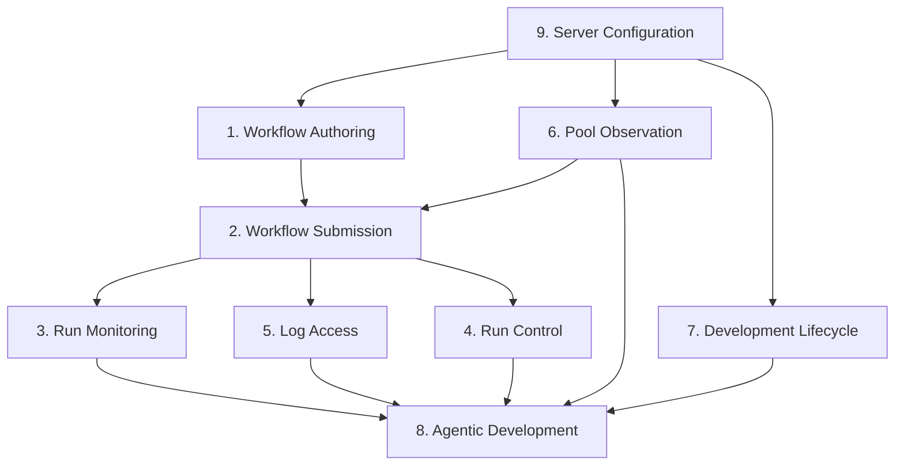

**[4_USER_FEATURES-FEAT-BR-012]** Category 9 (Server Configuration) is a prerequisite for all other categories.
The server MUST NOT accept connections until configuration parsing and port binding complete
successfully. If configuration is invalid, no other category is accessible.

**[4_USER_FEATURES-FEAT-BR-013]** Category 7 (Development Lifecycle) operates independently of the running server
for `./do build`, `./do lint`, and `./do format`. Only `./do test` (E2E tests) and `./do coverage`
require a running server instance. The `./do` script MUST manage its own server lifecycle for E2E
test execution.

#### 1.2.2 Category 1: Workflow Authoring

Workflow Authoring encompasses everything a user does to define the structure of automation:
creating workflow definitions, declaring input parameters, specifying stage dependencies, selecting
completion signal types, and configuring execution environments.

**Supported authoring formats:**

| Format | Load Mechanism | Compilation Required | Runtime Reload |
|---|---|---|---|
| TOML | File loaded at server startup from `workflow_dirs` | No | Yes, via `write_workflow_definition` MCP tool |
| YAML | File loaded at server startup from `workflow_dirs` | No | Yes, via `write_workflow_definition` MCP tool |
| Rust builder API | Compiled against `devs` library crate | Yes | No (requires server restart) |

**[4_USER_FEATURES-FEAT-BR-014]** TOML and YAML workflow definitions MUST be functionally equivalent; every field
available in TOML is available in YAML with identical semantics. No feature is exclusive to one
declarative format.

**[4_USER_FEATURES-FEAT-BR-015]** The Rust builder API produces a `WorkflowDefinition` value identical in schema
to one parsed from TOML/YAML. There is no builder-exclusive field or behavior.

**[4_USER_FEATURES-FEAT-BR-016]** A workflow definition file MUST be validated in full before any stage in that
workflow is dispatched. Validation runs all 13 checks listed in §6.1 in a single pass, collecting
all errors before returning. Partial validation (stopping at first error) is prohibited.

**Authoring scope boundary:** Workflow Authoring covers only the definition of workflow structure.
It does not cover run submission (Category 2) or execution environment provisioning (Category 9).

**Edge cases for Workflow Authoring:**

| Edge Case | Trigger | Expected Behavior |
|---|---|---|
| EC-WA-001 | TOML file contains a cycle: stage A depends on B, B depends on A | Validation rejects with `invalid_argument: cycle detected` and `"cycle": ["A","B","A"]`; no partial definition is loaded |
| EC-WA-002 | Workflow definition has zero stages | Validation rejects with `invalid_argument: workflow must have at least one stage` |
| EC-WA-003 | `write_workflow_definition` is called while a run using that workflow is active | The active run continues using its immutable `definition_snapshot`; the new definition takes effect for subsequent submissions only |
| EC-WA-004 | Two stages have the same `name` within one workflow | Validation rejects with `invalid_argument: duplicate stage name 'X'`; full list of all duplicate names included in error |
| EC-WA-005 | A stage references a `pool` that does not exist in `devs.toml` | Validation rejects at submission time with `invalid_argument: pool 'X' not found`; the definition file itself is accepted at load time |

#### 1.2.3 Category 2: Workflow Submission

Workflow Submission is the act of creating a `WorkflowRun` from a `WorkflowDefinition`. Submission
accepts typed input parameters, assigns a run identity (UUID + slug), validates all inputs against
the definition's declared parameter schema, and enqueues the run with the DAG scheduler.

**Submission interfaces and their constraints:**

| Interface | Command/Tool | Input format | Name generation | Validation scope |
|---|---|---|---|---|
| CLI | `devs submit <workflow> [--name <n>] [--input k=v ...]` | `key=value` pairs on command line | Auto-slug if `--name` omitted | Full 7-step atomic validation |
| MCP | `submit_run` | JSON object `{workflow_name, project_id, run_name?, inputs:{}}` | Auto-slug if `run_name` omitted | Full 7-step atomic validation |

**[4_USER_FEATURES-FEAT-BR-017]** Submission validation is atomic and all-or-nothing: all 7 validation steps
(workflow exists, inputs valid, no active duplicate name, inputs type-coerced, no extra input keys,
required inputs present, server not shutting down) complete before any run record is created. A
failure in any step produces no side effects.

**[4_USER_FEATURES-FEAT-BR-018]** Run name uniqueness is scoped to a project. Two runs with the same name in
different projects are permitted. Two runs with the same name in the same project are rejected
unless the existing run is in `Cancelled` status.

**[4_USER_FEATURES-FEAT-BR-019]** If `--name` is not provided at submission, the server generates a slug in the
format `<workflow-name>-<YYYYMMDD>-<4 random lowercase alphanum>`, maximum 128 characters, matching
`[a-z0-9-]+`. The slug is auto-generated once and is included in the successful submission response.

**Edge cases for Workflow Submission:**

| Edge Case | Trigger | Expected Behavior |
|---|---|---|
| EC-WS-001 | `submit_run` provides an integer value for a `String`-typed input | Rejected: `invalid_argument: input 'X' expected string, got number`; no run created |
| EC-WS-002 | `submit_run` provides `"true"` (string) for a `Boolean`-typed input | Accepted: coerced to `true`; `"1"` and `"0"` are rejected for Boolean inputs |
| EC-WS-003 | `devs submit` is called while server is processing a SIGTERM shutdown | Returns `failed_precondition: server is shutting down`; CLI exits with code 1 |
| EC-WS-004 | Two concurrent `submit_run` calls with the same `run_name` for the same project | Exactly one succeeds; the other returns `already_exists: run name 'X' already active`; guaranteed by per-project mutex |
| EC-WS-005 | Workflow definition file was deleted from disk between server startup and submit | `submit_run` validation uses the in-memory definition loaded at startup; if server was restarted after deletion, workflow is not found: `not_found: workflow 'X'` |

#### 1.2.4 Category 3: Run Monitoring

Run Monitoring gives users real-time and historical visibility into the state of every workflow run
and its stages. It covers the TUI Dashboard, CLI `devs list`/`devs status`, and the MCP
`get_run`/`list_runs` tools. Monitoring is read-only; it does not affect execution.

**Monitoring data hierarchy:**

```
WorkflowRun
  ├── run_id (UUID4)
  ├── slug (string)
  ├── status (RunStatus enum)
  ├── created_at / started_at / completed_at
  └── stage_runs[]
        ├── stage_run_id (UUID4)
        ├── stage_name (string)
        ├── attempt (1-based integer)
        ├── status (StageStatus enum)
        ├── agent_tool (string or null)
        ├── started_at / completed_at
        └── exit_code (integer or null)
```

**[4_USER_FEATURES-FEAT-BR-020]** Every field in the monitoring data hierarchy MUST be present in every API
response. Fields that are not yet populated (e.g., `completed_at` for a running stage) MUST be
JSON `null`, not absent from the response object.

**[4_USER_FEATURES-FEAT-BR-021]** The TUI Dashboard MUST re-render within 50 milliseconds of receiving a
`RunEvent` from the server's `StreamRunEvents` gRPC stream. Rendering is event-driven, not
timer-driven.

**[4_USER_FEATURES-FEAT-BR-022]** `devs list` without filters returns the 100 most-recently-created runs across
all projects, sorted by `created_at` descending. The response does NOT embed `stage_runs`; use
`devs status <run-id>` to retrieve stage detail.

**TUI DAG rendering rules:**

The Dashboard tab renders the workflow DAG as an ASCII graph. Each stage is represented as a box:

```
[ stage-name | STATUS | M:SS ]
```

Status abbreviations:

| Full Status | Abbreviation |
|---|---|
| `Waiting` | `WAIT` |
| `Eligible` | `ELIG` |
| `Running` | `RUN ` |
| `Completed` | `DONE` |
| `Failed` | `FAIL` |
| `TimedOut` | `TIME` |
| `Cancelled` | `CANC` |
| `Paused` | `PAUS` |

**[4_USER_FEATURES-FEAT-BR-023]** Stage boxes MUST be connected by ASCII arrows (`──►`) that reflect the
`depends_on` relationships. A stage with no `depends_on` is drawn at the leftmost column. Stages
that share a common dependency are drawn on the same column tier.

**Edge cases for Run Monitoring:**

| Edge Case | Trigger | Expected Behavior |
|---|---|---|
| EC-RM-001 | `devs status` called with a slug that matches multiple runs (UUID collision) | UUID format is checked first; if run-id is a valid UUID, it is resolved by UUID; if slug, resolved by slug in `created_at` descending order; most-recent match returned |
| EC-RM-002 | `list_runs` called with `limit=0` | Returns `invalid_argument: limit must be between 1 and 1000` |
| EC-RM-003 | TUI loses gRPC connection while displaying a running run | TUI displays reconnect notice; initiates exponential back-off reconnect (1→2→4→8→16→30 s); after 30 s total reconnect time + 5 s grace, exits with code 1 |
| EC-RM-004 | `get_run` called for a run_id that does not exist | Returns `{"result": null, "error": "not_found: run '<id>' does not exist"}` |
| EC-RM-005 | Run has 256 stages; TUI Dashboard tab renders all of them | DAG is scrollable; all stages visible via vertical scroll; no stage is silently omitted |

#### 1.2.5 Category 4: Run Control

Run Control enables users to interrupt, pause, or cancel workflow runs and individual stages.
Control operations are state transitions that flow through `StateMachine::transition()` and are
persisted to the checkpoint before any event is emitted.

**Control operations and their effects:**

| Operation | CLI Command | MCP Tool | Scope | Agent Signal | Stage Effect |
|---|---|---|---|---|---|
| Cancel run | `devs cancel <run>` | `cancel_run` | All non-terminal stages | `devs:cancel\n` via stdin | All non-terminal → `Cancelled` atomically |
| Cancel stage | — | `cancel_stage` | Single stage | `devs:cancel\n` via stdin | Stage → `Cancelled`; run continues |
| Pause run | `devs pause <run>` | `pause_run` | All running stages | `devs:pause\n` via stdin | Running → `Paused`; Eligible/Waiting held |
| Pause stage | `devs pause <run> --stage <s>` | `pause_stage` | Single stage | `devs:pause\n` via stdin | Stage → `Paused` |
| Resume run | `devs resume <run>` | `resume_run` | All paused stages | `devs:resume\n` via stdin | Paused → `Running`; held Eligible → dispatched |
| Resume stage | `devs resume <run> --stage <s>` | `resume_stage` | Single stage | `devs:resume\n` via stdin | Stage → `Running` |

**[4_USER_FEATURES-FEAT-BR-024]** `cancel_run` MUST transition all non-terminal `StageRun` records to `Cancelled`
in a single atomic checkpoint write. It is not permissible to transition stages one-by-one across
multiple checkpoint writes.

**[4_USER_FEATURES-FEAT-BR-025]** `pause_run` sends `devs:pause\n` to all currently `Running` stage processes via
stdin. Stages in `Eligible` or `Waiting` state are held (not dispatched) until the run is resumed.
The run status transitions to `Paused`.

**[4_USER_FEATURES-FEAT-BR-026]** `resume_run` sends `devs:resume\n` to all `Paused` stage processes and resumes
dispatching for all `Eligible` stages that were held. The run status transitions back to `Running`.

**[4_USER_FEATURES-FEAT-BR-027]** Control tools MUST reject illegal state transitions with
`failed_precondition: <current-state> cannot transition to <target-state>`. The state is not
modified on rejection.

**Edge cases for Run Control:**

| Edge Case | Trigger | Expected Behavior |
|---|---|---|
| EC-RC-001 | `cancel_run` called on a run that is already `Cancelled` | Returns `failed_precondition: run is already cancelled`; no state change; checkpoint not re-written |
| EC-RC-002 | `pause_stage` called on a stage in `Completed` state | Returns `failed_precondition: stage 'X' in terminal state Completed cannot be paused`; run continues unaffected |
| EC-RC-003 | `resume_run` called on a run that was never paused | Returns `failed_precondition: run is not paused`; no state change |
| EC-RC-004 | Agent ignores `devs:cancel\n` and does not exit within 10 seconds | Server sends SIGTERM; waits 5 more seconds; sends SIGKILL; stage recorded as `Cancelled` with `exit_code: -9` |
| EC-RC-005 | `cancel_stage` called while fan-out sub-agents are running | All sub-agent processes receive `devs:cancel\n`; all sub-runs transition to `Cancelled`; parent stage transitions to `Cancelled`; run continues with parent stage marked cancelled |

#### 1.2.6 Category 5: Log Access

Log Access provides users and AI agents with the ability to retrieve the stdout and stderr output
of any stage attempt, either as a complete snapshot or as a live stream.

**Log storage and retrieval model:**

Logs are persisted to the checkpoint git repository under
`.devs/logs/<run-id>/<stage-name>/attempt_<N>/stdout.log` and `stderr.log`. They are also held
in memory (up to 10,000 lines per stage in the TUI, up to 1 MiB per stream in `StageOutput`).

**[4_USER_FEATURES-FEAT-BR-028]** `devs logs <run> [<stage>]` without `--follow` prints all available log lines
for the run or stage to stdout, then exits with code 0.

**[4_USER_FEATURES-FEAT-BR-029]** `devs logs <run> [<stage>] --follow` streams log lines as they are produced.
When the run (or stage) reaches a terminal state, the stream is closed. Exit code is 0 if the run
`Completed`, 1 if the run `Failed` or `Cancelled`.

**[4_USER_FEATURES-FEAT-BR-030]** `get_stage_output` returns `stdout` and `stderr` as UTF-8 strings, each capped
at 1 MiB (1,048,576 bytes). If truncated, `truncated: true` is set. Truncation removes the
beginning of the stream (oldest output), preserving the most recent content.

**[4_USER_FEATURES-FEAT-BR-031]** `stream_logs` with `follow: true` on a stage in `Pending`, `Waiting`, or
`Eligible` state holds the HTTP connection open until the stage starts running. If the stage never
starts (e.g., cancelled before dispatch), the server returns `{"done": true, "truncated": false,
"total_lines": 0}`.

**Edge cases for Log Access:**

| Edge Case | Trigger | Expected Behavior |
|---|---|---|
| EC-LA-001 | `devs logs` called for a stage with no output (stage failed before spawning agent) | Returns empty output (zero lines); exit code 0; no error |
| EC-LA-002 | `stream_logs` with `from_sequence: 500` on a stage with only 200 total lines | Returns an empty stream immediately: `{"done": true, "truncated": false, "total_lines": 200}` |
| EC-LA-003 | `stream_logs` client disconnects mid-stream | Server detects disconnect; releases all stream resources within 500 ms; no error logged at `ERROR` level (expected disconnection) |
| EC-LA-004 | Stage produces more than 1 MiB of stdout before completing | In-memory `StageOutput.stdout` is truncated to last 1,048,576 bytes with `truncated: true`; the full output is written to `.devs/logs/.../stdout.log` on disk |
| EC-LA-005 | `devs logs` called with both a run identifier and a stage name, but the stage does not exist in that run | Exits with code 2: `not_found: stage 'X' not found in run 'Y'` |

#### 1.2.7 Category 6: Pool Observation

Pool Observation provides real-time visibility into the agent pool: how many agents are active,
how many stages are queued, which agents are rate-limited, and when pool exhaustion events occur.

**[4_USER_FEATURES-FEAT-BR-032]** `get_pool_state` returns a snapshot of pool state at the instant of the call.
The snapshot includes, for each pool: `name`, `max_concurrent`, `active_count`, `queued_count`,
and for each agent: `tool`, `capabilities`, `fallback`, `pty`, `rate_limited_until` (RFC 3339 or
null).

**[4_USER_FEATURES-FEAT-BR-033]** The TUI Pools tab MUST display pool utilization as a live view, updated on each
`WatchPoolState` gRPC event. At minimum, it shows: pool name, active/max ratio, queued count, and
per-agent availability.

**[4_USER_FEATURES-FEAT-BR-034]** A `pool.exhausted` webhook event fires at most once per exhaustion episode.
An exhaustion episode begins when the last available agent becomes unavailable (rate-limited or
failed). The episode ends when at least one agent becomes available. Only one `pool.exhausted`
event is fired per episode regardless of how many stages are queued.

**Edge cases for Pool Observation:**

| Edge Case | Trigger | Expected Behavior |
|---|---|---|
| EC-PO-001 | `get_pool_state` called for a pool name that does not exist | Returns `{"result": null, "error": "not_found: pool 'X' does not exist"}` |
| EC-PO-002 | All agents in a pool reach rate-limit simultaneously during high concurrency | `pool.exhausted` webhook fires exactly once; subsequent stages queue on the semaphore; `active_count=0`, `queued_count=N` in pool state |
| EC-PO-003 | A pool has `max_concurrent=1` and 10 stages arrive simultaneously | Exactly one stage dispatched; 9 queue in FIFO order; `queued_count=9` visible in `get_pool_state` |

#### 1.2.8 Category 7: Development Lifecycle

The Development Lifecycle category covers the `./do` entrypoint script and the GitLab CI pipeline.
These are the mechanisms through which the developer validates all code changes before commit.

**`./do` script command contracts:**

| Command | Inputs | Success Condition | Failure Condition | Side Effects |
|---|---|---|---|---|
| `./do setup` | None | All dev tools installed at required versions | Missing tool that cannot be installed | Idempotent; safe to run multiple times |
| `./do build` | None | `cargo build --workspace --release` exits 0 | Compilation error | Writes `target/release/` artifacts |
| `./do test` | None | All unit + E2E tests pass; `traceability.json` overall_passed=true | Any test fails or uncovered requirement | Writes `target/traceability.json` |
| `./do lint` | None | `cargo fmt --check`, `cargo clippy -D warnings`, `cargo doc` all exit 0 | Any lint violation or doc warning | No file modification |
| `./do format` | None | `cargo fmt --all` exits 0 | Formatting tool unavailable | Modifies source files in place |
| `./do coverage` | None | All 5 quality gates pass; `report.json` overall_passed=true | Any gate below threshold | Writes `target/coverage/report.json` |
| `./do presubmit` | None | All of: setup→format→lint→test→coverage→ci complete within 15 min | Timeout or any step fails | Writes `target/presubmit_timings.jsonl` |
<!-- Resolved: aligned with project description -->
| `./do ci` | None | GitLab pipeline passes on all 3 platforms | Pipeline fails or times out (30 min) | Pushes temp branch; cleans up on completion |

**[4_USER_FEATURES-FEAT-BR-035]** `./do presubmit` enforces a hard 15-minute wall-clock timeout. If any step does
not complete within 15 minutes total, all child processes are killed and the script exits with
code 1. The timeout is measured from the first step starting, not from when the script is invoked.

**[4_USER_FEATURES-FEAT-BR-036]** `./do setup` is idempotent. Running it multiple times MUST produce the same
result as running it once. It MUST NOT fail if the required tools are already at the correct
version.

**[4_USER_FEATURES-FEAT-BR-037]** `./do test` generates `target/traceability.json` and exits non-zero if
`overall_passed` is false, even when all `cargo test` tests pass. Requirement coverage failures
are reported as test failures.

**[4_USER_FEATURES-FEAT-BR-038]** `./do coverage` generates `target/coverage/report.json` with exactly five gates
(QG-001 through QG-005). The file's `overall_passed` field is the logical AND of all five
individual gate `passed` fields.

**[4_USER_FEATURES-FEAT-BR-039]** `./do lint` includes a dependency audit that verifies all crates in the
workspace match the authoritative version table in §2 of the TAS. An undocumented crate dependency
causes `./do lint` to exit non-zero.

**Edge cases for Development Lifecycle:**

| Edge Case | Trigger | Expected Behavior |
|---|---|---|
| EC-DL-001 | `./do presubmit` is interrupted at the 14-minute mark while `./do coverage` is running | Coverage child process is killed; `presubmit_timings.jsonl` records `coverage` as `timed_out: true`; script exits code 1 |
| EC-DL-002 | `./do test` finds a `// Covers: FEAT-BR-999` annotation referencing a non-existent requirement ID | `traceability.json` includes `"stale_annotations": [{"file": "...", "line": N, "id": "FEAT-BR-999"}]`; `overall_passed: false`; `./do test` exits non-zero |
| EC-DL-003 | `./do setup` is run on a machine where `protoc` is at a version below the minimum | Installs or upgrades `protoc` to the required version; does not use the existing installation |
| EC-DL-004 | `./do ci` is called but GitLab API credentials are not set | Exits with code 1; prints actionable error to stderr: `ERROR: GITLAB_TOKEN not set; cannot push CI branch` |
| EC-DL-005 | Two `./do presubmit` processes run concurrently on the same machine | Each runs in isolation; they may contend on `target/` directory; behavior is undefined; concurrent invocations are not a supported use case |

#### 1.2.9 Category 8: Agentic Development

Agentic Development covers the workflows, protocols, and behaviors that allow AI agents to
implement `devs` using `devs` itself. This category is the realization of the Glass-Box philosophy:
every internal entity is observable and controllable via MCP, enabling AI agents to run a TDD loop,
diagnose failures, and self-modify the system.

**[4_USER_FEATURES-FEAT-BR-040]** The Glass-Box MCP server MUST be operational from the first commit at which the
server binary can start. No feature flag controls MCP availability; it is always active when the
server is running with a bound MCP port.

**[4_USER_FEATURES-FEAT-BR-041]** Every internal entity (runs, stages, pools, workflow definitions, checkpoints)
MUST be fully observable via MCP tools with no field omitted or summarized. The MCP view is
identical to the in-process `Arc<RwLock<ServerState>>`; there is no separate representation.

**[4_USER_FEATURES-FEAT-BR-042]** AI agents implementing `devs` MUST follow the Red-Green-Refactor TDD loop:
(1) write a failing test with a `// Covers: <REQ-ID>` annotation, (2) verify the test fails
(exit code 1), (3) implement the minimum code to make it pass, (4) run `presubmit-check` workflow,
(5) proceed only after all gates pass.

**[4_USER_FEATURES-FEAT-BR-043]** Standard workflow definitions for agentic development (`tdd-red`, `tdd-green`,
`presubmit-check`, `build-only`, `unit-test-crate`, `e2e-all`) MUST be stored in
`.devs/workflows/` and MUST be usable from the first server-startable commit.

**[4_USER_FEATURES-FEAT-BR-044]** E2E tests for MCP tools MUST call the MCP server via `POST /mcp/v1/call` using
the `DEVS_MCP_ADDR` environment variable. Direct invocation of Rust functions implementing MCP
tool logic does not satisfy the E2E coverage requirement for QG-005.

**Edge cases for Agentic Development:**

| Edge Case | Trigger | Expected Behavior |
|---|---|---|
| EC-AD-001 | Observing Agent submits a `presubmit-check` run while a previous `presubmit-check` run is still running | Agent checks `list_runs(status=running)` first; finds active run; calls `stream_logs(follow:true)` to monitor it rather than submitting a duplicate |
| EC-AD-002 | Observing Agent modifies a crate that requires server restart while a run is active | Agent MUST NOT restart while any run is in `Running` or `Paused` state; it waits for terminal state or cancels the run first |
| EC-AD-003 | `write_workflow_definition` produces a cycle | Returns `invalid_argument: cycle detected` with full cycle path; definition file on disk is not modified |
| EC-AD-004 | Agent crashes mid-TDD loop with an active run | On restart, agent reads `.devs/agent-state/<session-id>/task_state.json`; calls `get_run(active_run_id)` to determine state before proceeding |
| EC-AD-005 | `assert_stage_output` is called with a `matches` operator and an invalid Rust regex | Returns `invalid_argument: invalid regex pattern '<pattern>': <parse error>`; no assertions are evaluated |

#### 1.2.10 Category 9: Server Configuration

Server Configuration covers the initial setup and ongoing management of the `devs` server,
including pool definitions, project registration, webhook targets, and credential supply.

**Configuration hierarchy:**

```
devs.toml                          (static; immutable after startup)
  └── [server] block               (gRPC port, MCP port, scheduling policy)
  └── [retention] block            (max_age_days, max_size_mb)
  └── [[pool]] blocks              (pool name, max_concurrent, agents)

~/.config/devs/projects.toml      (dynamic; updated by devs project add/remove)
  └── [[project]] blocks          (project_id, name, repo_path, priority, weight, ...)
        └── [[project.webhook]]   (url, events, secret, timeout_secs, max_retries)
```

**[4_USER_FEATURES-FEAT-BR-045]** `devs.toml` is parsed once at startup. Changes to `devs.toml` while the server
is running have no effect until restart. The only live-update exception is the project registry
(`projects.toml`), which is updated atomically by `devs project add/remove`.

**[4_USER_FEATURES-FEAT-BR-046]** Configuration override precedence is strictly: CLI flag > environment variable
(`DEVS_` prefix) > `devs.toml` > built-in default. A CLI flag that sets a value MUST always win
over the environment variable for the same key.

**[4_USER_FEATURES-FEAT-BR-047]** API keys and tokens in `devs.toml` trigger a startup `WARN` log entry: `WARNING:
credentials found in config file; prefer environment variables`. No startup failure is triggered by
this condition, but the warning MUST appear.

**[4_USER_FEATURES-FEAT-BR-048]** `devs project add` validates that the `repo_path` is an existing git repository
before writing to the project registry. A `repo_path` that does not contain a `.git` directory (or
is not a bare repository) is rejected.

**[4_USER_FEATURES-FEAT-BR-049]** When a project is removed with `devs project remove` while active runs exist,
the project's status is set to `"removing"` in the registry. Active runs continue to completion.
No new submissions are accepted for a project in `"removing"` status. The project entry is
physically deleted from the registry only after all runs reach terminal state.

**Edge cases for Server Configuration:**

| Edge Case | Trigger | Expected Behavior |
|---|---|---|
| EC-SC-001 | `devs.toml` specifies the same port for `server.listen` and `server.mcp_port` | Rejected at config validation: `invalid configuration: gRPC port and MCP port must be different`; no port binding attempted |
| EC-SC-002 | `devs.toml` is missing and no `--config` flag is provided | Server starts with built-in defaults and logs `WARN: no config file found; using built-in defaults`; all other startup steps proceed |
| EC-SC-003 | `--config` flag points to a file that does not exist | Fatal error before any port binding: `ERROR: config file '/path/to/devs.toml' not found`; exits with code 1 |
| EC-SC-004 | `devs project add` is called for a `repo_path` that is already registered | Rejected: `already_exists: project at '/path' already registered as '<name>'`; no duplicate entry created |
| EC-SC-005 | A pool's `max_concurrent` is set to 0 in `devs.toml` | Config validation rejects: `invalid configuration: pool 'X' max_concurrent must be between 1 and 1024`; no pool is created |

---

### 1.3 Feature-to-Interface Coverage Matrix

The following matrix maps each feature category to the interfaces through which it is observable
in E2E tests. At least one E2E test exercising each `✓` cell is required to satisfy the
per-interface coverage gates (QG-003, QG-004, QG-005).

| Feature Category | CLI (`devs`) | TUI | MCP |
|---|:---:|:---:|:---:|
| 1. Workflow Authoring | `devs submit` (validation errors) | — | `write_workflow_definition`, `get_workflow_definition` |
| 2. Workflow Submission | `devs submit` ✓ | — | `submit_run` ✓ |
| 3. Run Monitoring | `devs list`, `devs status` ✓ | Dashboard tab ✓ | `list_runs`, `get_run` ✓ |
| 4. Run Control | `devs cancel`, `devs pause`, `devs resume` ✓ | Debug tab ✓ | `cancel_run`, `pause_run`, `resume_run` ✓ |
| 5. Log Access | `devs logs`, `devs logs --follow` ✓ | Logs tab ✓ | `stream_logs`, `get_stage_output` ✓ |
| 6. Pool Observation | — | Pools tab ✓ | `get_pool_state` ✓ |
| 7. Development Lifecycle | `./do` commands ✓ | — | — |
| 8. Agentic Development | — | — | All 20 tools ✓ |
| 9. Server Configuration | `devs project add/remove` ✓ | — | — |

**[4_USER_FEATURES-FEAT-BR-050]** Every cell marked `✓` in the matrix above MUST have at least one E2E test that
exercises the feature through that interface boundary. Tests that call internal Rust functions
directly do not count toward the interface-specific coverage gates.

---

### 1.4 Section 1 Acceptance Criteria

The following acceptance criteria are testable assertions that verify the behavioral contracts
defined in §1. Each criterion MUST have an automated test annotated `// Covers: AC-FEAT-1-NNN`.

- **[4_USER_FEATURES-AC-FEAT-1-001]** GIVEN a running server, WHEN an Orchestrated Agent calls `signal_completion`
  twice for the same stage, THEN the first call succeeds and the second returns a
  `failed_precondition` error with no state change.

- **[4_USER_FEATURES-AC-FEAT-1-002]** GIVEN a running server, WHEN two concurrent `submit_run` calls use the same
  `run_name` for the same project, THEN exactly one returns a successful `run_id` and the other
  returns `already_exists`.

- **[4_USER_FEATURES-AC-FEAT-1-003]** GIVEN a workflow with a cycle (A→B→A), WHEN the workflow definition is
  submitted, THEN the server returns `invalid_argument: cycle detected` with `"cycle": ["A","B","A"]`
  and no run is created.

- **[4_USER_FEATURES-AC-FEAT-1-004]** GIVEN a Human Developer running `./do presubmit` that takes more than 15
  minutes, WHEN the timeout fires, THEN all child processes are killed and the script exits with
  code 1 within 5 seconds of the timeout.

- **[4_USER_FEATURES-AC-FEAT-1-005]** GIVEN a running server with an active run, WHEN `cancel_run` is called,
  THEN all non-terminal stages transition to `Cancelled` in a single checkpoint commit and a
  subsequent `get_run` returns all stages as `cancelled`.

- **[4_USER_FEATURES-AC-FEAT-1-006]** GIVEN a stage producing more than 1 MiB of stdout, WHEN `get_stage_output`
  is called, THEN `stdout` is exactly 1,048,576 bytes, `truncated` is `true`, and the content is
  the last (most recent) 1,048,576 bytes.

- **[4_USER_FEATURES-AC-FEAT-1-007]** GIVEN `devs.toml` with `server.listen` and `server.mcp_port` set to the
  same value, WHEN the server starts, THEN it exits with a config validation error before binding
  any port.

- **[4_USER_FEATURES-AC-FEAT-1-008]** GIVEN a project in `"removing"` status, WHEN `devs submit` is called for
  that project, THEN the server returns `failed_precondition: project is being removed` and no run
  is created.

- **[4_USER_FEATURES-AC-FEAT-1-009]** GIVEN a TUI connected to a server, WHEN a `RunEvent` is emitted by the
  server, THEN the TUI re-renders within 50 milliseconds.

- **[4_USER_FEATURES-AC-FEAT-1-010]** GIVEN `./do test` with a `// Covers: FEAT-BR-999` annotation in a test file
  where `FEAT-BR-999` does not exist in any spec document, WHEN `./do test` runs, THEN
  `target/traceability.json` contains `FEAT-BR-999` in `stale_annotations` and `./do test` exits
  with code 1.

---

## 2. Detailed User Journeys

Each journey in this section is normative: the depicted sequence is the required behavior. Business
rules are tagged `[4_USER_FEATURES-FEAT-BR-1NN]` and acceptance criteria are tagged `[4_USER_FEATURES-AC-FEAT-2-NNN]`. All
acceptance criteria require an automated test annotated `// Covers: AC-FEAT-2-NNN`.

---

### 2.1 Journey: Server Startup and Discovery

**[4_USER_FEATURES-FEAT-004]** A user starts the `devs` server and a client locates it automatically.

```mermaid
sequenceDiagram
    participant U as Human Developer
    participant S as devs-server
    participant CF as Config File
    participant DF as Discovery File

    U->>S: Start server (with optional --config flag)
    S->>CF: Parse devs.toml (collect ALL errors before reporting)
    CF-->>S: Config or errors
    alt Config errors present
        S-->>U: Print all errors to stderr, exit non-zero (no ports bound)
    else Config valid
        S->>S: Bind gRPC port (default 127.0.0.1:7890)
        S->>S: Bind MCP port (default 127.0.0.1:7891)
        S->>S: Initialize Agent Pool Manager
        S->>S: Load/create project registry
        S->>S: Scan workflow definition files per project
        S->>S: Restore checkpoints from git (per-project; failures non-fatal)
        S->>DF: Write <host>:<port> atomically (write-tmp → rename)
        S-->>U: Accept connections on both ports
        S->>S: Resume recovered runs via DAG Scheduler
    end
```

**[4_USER_FEATURES-FEAT-005]** A client (TUI, CLI, or MCP bridge) locates the server:

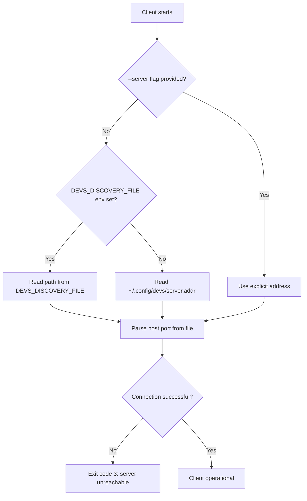

#### 2.1.1 Data Models

**Discovery file** — plain UTF-8 text file written atomically after both ports are bound:

```
<host>:<port>
```

Example: `127.0.0.1:7890`

The file contains the gRPC address only. Clients retrieve the MCP port by calling
`ServerService.GetInfo` over gRPC, which returns `{ server_version: string, mcp_port: uint32 }`.

**Startup config validation** collects all errors before reporting. No port is bound until all
validation passes. Config override precedence (highest to lowest):

| Priority | Source | Example |
|---|---|---|
| 1 | CLI flag | `--listen 0.0.0.0:7890` |
| 2 | Environment variable | `DEVS_LISTEN=0.0.0.0:7890` |
| 3 | `devs.toml` | `[server] listen = "0.0.0.0:7890"` |
| 4 | Built-in default | `127.0.0.1:7890` |

**Checkpoint recovery mapping** applied during startup step 8:

| Stored stage status | Recovered as |
|---|---|
| `Running` | `Eligible` (re-queued for dispatch) |
| `Eligible` | `Eligible` (remains queued) |
| `Waiting` | `Waiting` (re-evaluated for deps) |
| `Pending`, `Completed`, `Failed`, `TimedOut`, `Cancelled` | Unchanged |

A `Running` stage with all `depends_on` stages already `Completed` is recovered directly to
`Eligible`. A `WorkflowRun` whose every stage is terminal is recovered with the correct terminal
`RunStatus` (`Completed` if all stages completed, `Failed` otherwise).

#### 2.1.2 Business Rules

**[4_USER_FEATURES-FEAT-BR-100]** The server MUST collect ALL `devs.toml` validation errors and report them to
stderr before exiting. Stopping at the first error and omitting subsequent errors is a defect. Zero
ports are bound when any configuration error is present.

**[4_USER_FEATURES-FEAT-BR-101]** If the gRPC port is already in use (`EADDRINUSE`), the server MUST exit
immediately without binding any port and without writing the discovery file.

**[4_USER_FEATURES-FEAT-BR-102]** If the MCP port is already in use after the gRPC port has been bound, the server
MUST release the gRPC port before exiting. No discovery file is written. The server exits non-zero.

**[4_USER_FEATURES-FEAT-BR-103]** The discovery file MUST be written atomically: content is written to a `.tmp`
sibling file, then `rename(2)` is called to replace the target path. A partially written discovery
file MUST NOT be visible to clients at any point.

**[4_USER_FEATURES-FEAT-BR-104]** On `SIGTERM` (or `Ctrl+C`), the server MUST delete the discovery file before
exiting. Clients that read a stale discovery file after server exit receive connection refusal and
MUST exit with code 3.

**[4_USER_FEATURES-FEAT-BR-105]** Per-project checkpoint recovery failures are non-fatal: the server logs `ERROR`
for the failing project and continues startup. A project whose checkpoints cannot be loaded is
marked `Unrecoverable`; its runs are not resumed.

#### 2.1.3 Edge Cases

| ID | Trigger | Expected Behavior |
|---|---|---|
| EC-2.1-001 | gRPC and MCP ports set to the same value in `devs.toml` | Config validation rejects before any port bind: `invalid configuration: gRPC port and MCP port must be different`; exits non-zero |
| EC-2.1-002 | `--config` flag points to a non-existent file | Fatal before any port binding: `ERROR: config file '/path' not found`; all config errors reported; exits non-zero |
| EC-2.1-003 | `devs.toml` is absent and `--config` is not set | Server starts with built-in defaults and logs `WARN: no config file found; using built-in defaults`; all other startup steps proceed normally |
| EC-2.1-004 | Discovery file directory (`~/.config/devs/`) does not exist | Server creates the directory with mode `0700` before writing the file; creation failure is fatal with a descriptive error |
| EC-2.1-005 | Checkpoint `checkpoint.json` for a recovered run is corrupt JSON | Server logs `ERROR: corrupt checkpoint for run <id>; marking Unrecoverable`; skips that run; continues startup with remaining runs |
| EC-2.1-006 | Second `SIGTERM` received during shutdown (while agents are still being killed) | Server immediately sends `SIGKILL` to all remaining agent processes and exits; no further SIGTERM processing |

#### 2.1.4 Acceptance Criteria

- **[4_USER_FEATURES-AC-FEAT-2-001]** GIVEN `devs.toml` with two distinct validation errors, WHEN the server
  starts, THEN both errors appear on stderr before exit, zero ports are bound, and the process
  exits non-zero.

- **[4_USER_FEATURES-AC-FEAT-2-002]** GIVEN a running server, WHEN SIGTERM is sent, THEN the discovery file is
  deleted before the process exits and the exit code is 0.

- **[4_USER_FEATURES-AC-FEAT-2-003]** GIVEN gRPC port already in use, WHEN the server starts, THEN it exits
  non-zero, the MCP port is never bound, and no discovery file is written.

- **[4_USER_FEATURES-AC-FEAT-2-004]** GIVEN a client with `DEVS_DISCOVERY_FILE` set to a custom path, WHEN the
  server writes its discovery file to that path, THEN the client connects to the gRPC address in
  that file and operates normally.

- **[4_USER_FEATURES-AC-FEAT-2-005]** GIVEN a checkpoint with a `Running` stage, WHEN the server restarts and
  recovers that checkpoint, THEN `get_run` shows the stage as `eligible` (or `running` once
  re-dispatched), not `running` with a stale process reference.

---

### 2.2 Journey: Workflow Authoring (Declarative TOML/YAML)

**[4_USER_FEATURES-FEAT-006]** A developer authors a new workflow in TOML format.

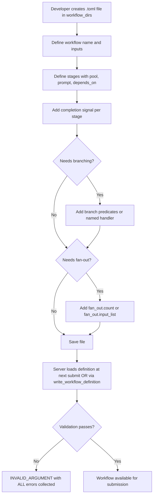

#### 2.2.1 TOML Workflow Skeleton

The canonical TOML structure for a workflow definition is shown below. Every field marked
`# required` MUST be present; all others are optional. Full field semantics are defined in §6.

```toml
[workflow]
name    = "feature"          # required; [a-z0-9_-]+, max 128 chars
timeout_secs = 3600          # optional; workflow-level cap

[[workflow.input]]
name     = "task_file"       # required; [a-z0-9_]+, max 64 chars
type     = "path"            # required; string | path | integer | boolean
required = true              # required
# default = "TASK.md"        # optional; must be absent when required = true; must match declared type

[[stage]]
name       = "plan"          # required; unique within workflow
pool       = "primary"       # required; must exist in devs.toml at submission time
prompt     = "Plan the feature described in {{workflow.input.task_file}}."
# prompt_file = ".devs/prompts/plan.md"   # mutually exclusive with prompt
completion = "exit_code"     # exit_code | structured_output | mcp_tool_call
timeout_secs = 300           # optional; must not exceed workflow.timeout_secs

[[stage]]
name       = "implement"
pool       = "primary"
prompt     = "Implement the plan from stage plan."
depends_on = ["plan"]        # stage "implement" runs after "plan" completes
completion = "structured_output"

[stage.retry]
max_attempts   = 3           # 1–20
backoff        = "exponential"  # fixed | exponential | linear
initial_delay  = 5           # seconds; minimum 1
max_delay      = 60          # seconds; optional

[[stage]]
name       = "review"
pool       = "gemini-pool"
prompt     = "Review the implementation. Exit 0 to approve, 1 to reject."
depends_on = ["implement"]
completion = "exit_code"

[stage.branch]
predicates = [
  { condition = "exit_code", operator = "eq", value = 0, next_stage = "merge" },
  { condition = "exit_code", operator = "ne", value = 0, next_stage = "plan" },
]
```

#### 2.2.2 Validation Pipeline

Workflow definition validation runs exactly 13 checks in the following order. All errors are
collected before returning; partial validation (stopping at first error) is prohibited.

| Step | Check | Error on Failure |
|---|---|---|
| 1 | Schema validation (required fields, type correctness) | `invalid_argument: schema error: <field>: <detail>` |
| 2 | Stage name uniqueness | `invalid_argument: duplicate stage name '<name>'` |
| 3 | `depends_on` references exist | `invalid_argument: stage '<s>' depends_on unknown stage '<d>'` |
| 4 | Cycle detection (Kahn's algorithm) | `invalid_argument: cycle detected` + `"cycle": ["A","B","A"]` |
| 5 | Pool name exists in server config | `invalid_argument: pool '<name>' not found` |
| 6 | Named branch/merge handler registered | `invalid_argument: handler '<name>' not registered` |
| 7 | Default value type matches `WorkflowInput.type` | `invalid_argument: input '<n>' default type mismatch` |
| 8 | `prompt` XOR `prompt_file` (exactly one) | `invalid_argument: stage '<s>' must have exactly one of prompt or prompt_file` |
| 9 | `fan_out` XOR `branch` (not both) | `invalid_argument: stage '<s>' cannot have both fan_out and branch` |
| 10 | `fan_out.count` XOR `fan_out.input_list` (not both) | `invalid_argument: stage '<s>' fan_out must specify count or input_list, not both` |
| 11 | Fan-out count/list bounds: 1–64 | `invalid_argument: stage '<s>' fan_out count must be between 1 and 64` |
| 12 | `stage.timeout_secs` ≤ `workflow.timeout_secs` | `invalid_argument: stage '<s>' timeout exceeds workflow timeout` |
| 13 | At least one stage defined | `invalid_argument: workflow must have at least one stage` |

#### 2.2.3 `write_workflow_definition` API Contract

An Observing/Controlling Agent may update a workflow definition at runtime via MCP without
restarting the server:

**Request:**
```json
{
  "method": "write_workflow_definition",
  "params": {
    "workflow_name": "feature",
    "format": "toml",
    "content": "<TOML or YAML string>"
  }
}
```

**Response (success):**
```json
{
  "result": {
    "workflow_name": "feature",
    "format": "toml",
    "stage_count": 3,
    "validated_at": "2026-03-11T10:00:00.000Z"
  },
  "error": null
}
```

**Response (validation failure):**
```json
{
  "result": null,
  "error": "invalid_argument: [\"duplicate stage name 'plan'\", \"cycle detected\"]"
}
```

**[4_USER_FEATURES-FEAT-BR-106]** `write_workflow_definition` MUST validate the incoming definition through all 13
checks before writing any file. On validation failure, the definition file on disk MUST remain
unchanged.

**[4_USER_FEATURES-FEAT-BR-107]** A workflow updated via `write_workflow_definition` while a run is active takes
effect only for new submissions. Active runs continue using their immutable `definition_snapshot`.

#### 2.2.4 Edge Cases

| ID | Trigger | Expected Behavior |
|---|---|---|
| EC-2.2-001 | TOML contains `depends_on = ["plan"]` but no stage named `"plan"` exists | Validation error: `invalid_argument: stage 'implement' depends_on unknown stage 'plan'`; definition rejected |
| EC-2.2-002 | Stage has both `prompt` and `prompt_file` set | Validation error: `invalid_argument: stage 'X' must have exactly one of prompt or prompt_file`; definition rejected |
| EC-2.2-003 | `stage.timeout_secs = 400` when `workflow.timeout_secs = 300` | Validation error: `invalid_argument: stage 'X' timeout (400s) exceeds workflow timeout (300s)` |
| EC-2.2-004 | `fan_out.count = 65` | Validation error: `invalid_argument: stage 'X' fan_out count must be between 1 and 64` |
| EC-2.2-005 | `write_workflow_definition` called with valid YAML while a run is executing the same workflow | The running run uses its immutable snapshot; new definition accepted; `get_workflow_definition` returns new version; subsequent `submit_run` uses new definition |

#### 2.2.5 Acceptance Criteria

- **[4_USER_FEATURES-AC-FEAT-2-006]** GIVEN a TOML definition with a cycle `A→B→A`, WHEN `write_workflow_definition`
  is called, THEN the response contains `"error"` with `"cycle detected"` and the `"cycle"` array
  `["A","B","A"]`, and the file on disk is unmodified.

- **[4_USER_FEATURES-AC-FEAT-2-007]** GIVEN a TOML definition with two simultaneous errors (duplicate stage name
  and missing depends_on target), WHEN validation runs, THEN BOTH errors appear in the response
  before any file write.

- **[4_USER_FEATURES-AC-FEAT-2-008]** GIVEN a workflow with `workflow.timeout_secs = 60` and a stage with
  `timeout_secs = 61`, WHEN the definition is submitted, THEN validation returns
  `invalid_argument` and no run is created.

- **[4_USER_FEATURES-AC-FEAT-2-009]** GIVEN a workflow definition updated via `write_workflow_definition` while
  a run is active, WHEN `get_run` is called on the active run, THEN `definition_snapshot` reflects
  the definition at the time the run was submitted, not the updated definition.

---

### 2.3 Journey: Submitting a Workflow Run (CLI)

**[4_USER_FEATURES-FEAT-007]** A developer submits a workflow run via the CLI.

```mermaid
sequenceDiagram
    participant U as Human Developer
    participant CLI as devs-cli
    participant SRV as devs-server
    participant DAG as DAG Scheduler

    U->>CLI: devs submit <workflow> [--name <name>] [--input key=value ...]
    CLI->>SRV: gRPC SubmitRun request
    SRV->>SRV: Step 1 — workflow exists in registry?
    SRV->>SRV: Step 2 — required inputs present?
    SRV->>SRV: Step 3 — no extra input keys?
    SRV->>SRV: Step 4 — input type coercion valid?
    SRV->>SRV: Step 5 — no duplicate run_name (non-cancelled) in project?
    SRV->>SRV: Step 6 — server not shutting down?
    SRV->>SRV: Step 7 — per-project lock held; create WorkflowRun atomically
    alt Any validation step fails
        SRV-->>CLI: INVALID_ARGUMENT / ALREADY_EXISTS / FAILED_PRECONDITION
        CLI-->>U: stderr: error message; exit code 4 (validation) or 1 (other)
    else All steps pass
        SRV->>SRV: Assign run_id (UUID4) + generate slug
        SRV->>SRV: Snapshot workflow definition (immutable)
        SRV->>DAG: Enqueue run (status: Pending)
        SRV-->>CLI: {run_id, slug, workflow_name, project_id, status:"pending"}
        CLI-->>U: stdout: "run submitted: <slug> (<run_id>)"; exit 0
        DAG->>DAG: Transition run Pending → Running
        DAG->>DAG: Dispatch all stages with no unmet depends_on (within 100ms)
    end
```

#### 2.3.1 CLI Command Syntax

```
devs submit <workflow-name>
    [--name <run-name>]
    [--input <key>=<value> ...]
    [--project <project-id-or-name>]
    [--server <host:port>]
    [--format json|text]
```

| Flag | Type | Required | Description |
|---|---|---|---|
| `<workflow-name>` | positional string | Yes | Name of the workflow definition |
| `--name` | string | No | Human-readable run name; auto-generated slug if omitted |
| `--input` | `key=value` (repeatable) | No | Input values; repeatable for multiple inputs |
| `--project` | string | Conditional | Required when cwd does not resolve to exactly one project |
| `--server` | `host:port` | No | Override server auto-discovery |
| `--format` | `json` or `text` | No | Output format; default `text` |

#### 2.3.2 gRPC Request/Response Schemas

**SubmitRun request** (proto message `SubmitRunRequest`):

| Field | Type | Required | Description |
|---|---|---|---|
| `workflow_name` | string | Yes | Must match a loaded `WorkflowDefinition.name` |
| `project_id` | string (UUID4) | Yes | Must match a registered project |
| `run_name` | string | No | User-provided name; slug auto-generated if absent |
| `inputs` | `map<string, string>` | No | Input values as strings; server coerces to declared types |

**SubmitRun success response** (proto message `SubmitRunResponse`):

| Field | Type | Description |
|---|---|---|
| `run_id` | string (UUID4) | Unique identifier for the created run |
| `slug` | string | URL-safe slug: `<workflow-name>-<YYYYMMDD>-<4 random hex>` |
| `workflow_name` | string | Echo of submitted workflow name |
| `project_id` | string (UUID4) | Echo of project ID |
| `status` | string | Always `"pending"` at submission time |
| `request_id` | string (UUID4) | Per-request tracing ID |

**CLI text-format success output** (stdout):
```
run submitted: feature-20260311-a3f9 (run_id: a1b2c3d4-...)
```

**CLI JSON-format success output** (`--format json`, stdout):
```json
{
  "run_id": "a1b2c3d4-e5f6-7890-abcd-ef1234567890",
  "slug": "feature-20260311-a3f9",
  "workflow_name": "feature",
  "project_id": "b2c3d4e5-...",
  "status": "pending"
}
```

**CLI error output** (`--format json`, stdout, exit code 4):
```json
{
  "error": "invalid_argument: input 'task_file' is required but not provided",
  "code": 4
}
```

#### 2.3.3 Business Rules

**[4_USER_FEATURES-FEAT-BR-108]** `devs submit` with `--project` absent and the current working directory
resolving to zero or more than one registered project MUST exit with code 4 and print
`invalid_argument: --project required; cwd matches N projects`.

**[4_USER_FEATURES-FEAT-BR-109]** The auto-generated slug format is `<workflow-name>-<YYYYMMDD>-<4 random
lowercase alphanum>`, maximum 128 characters, matching `[a-z0-9-]+`. If the workflow name portion
would cause the slug to exceed 128 characters, the workflow name is truncated from the right to fit.

**[4_USER_FEATURES-FEAT-BR-110]** Input values on the CLI are provided as `key=value` strings. The `=` character
splits on the first occurrence; a value containing `=` is permitted (e.g., `--input expr=a=b`
sets `expr` to `"a=b"`).

#### 2.3.4 Edge Cases

| ID | Trigger | Expected Behavior |
|---|---|---|
| EC-2.3-001 | `--input` provides a key not declared in the workflow's `inputs` | Validation fails: `invalid_argument: unknown input key 'X'`; exit code 4; no run created |
| EC-2.3-002 | Required input is omitted and has no default | Validation fails: `invalid_argument: input 'X' is required but not provided`; exit code 4 |
| EC-2.3-003 | Server is shutting down (received SIGTERM) when `devs submit` is called | gRPC returns `FAILED_PRECONDITION`; CLI exits code 1: `failed_precondition: server is shutting down` |
| EC-2.3-004 | `--name` is provided with characters outside `[a-z0-9-]` | Validation fails: `invalid_argument: run name must match [a-z0-9-]+`; exit code 4 |
| EC-2.3-005 | Workflow has zero stages (empty definition somehow loaded) | Validation fails at step 1 (definition invalid): `invalid_argument: workflow must have at least one stage` |

#### 2.3.5 Acceptance Criteria

- **[4_USER_FEATURES-AC-FEAT-2-010]** GIVEN a valid workflow with one required input, WHEN `devs submit` is called
  without that input, THEN the CLI exits with code 4 and stderr contains
  `invalid_argument: input '<name>' is required`.

- **[4_USER_FEATURES-AC-FEAT-2-011]** GIVEN a successful `devs submit`, WHEN `devs status <slug>` is called
  immediately after, THEN the run status is `pending` or `running` and the `run_id` matches the
  submission response.

- **[4_USER_FEATURES-AC-FEAT-2-012]** GIVEN `devs submit --format json` is called, WHEN validation fails, THEN
  stdout contains a JSON object with `"error"` and `"code"` fields, and stderr is empty.

---

### 2.4 Journey: Submitting a Workflow Run (MCP)

**[4_USER_FEATURES-FEAT-008]** An observing/controlling AI agent submits a workflow run via MCP.

```mermaid
sequenceDiagram
    participant A as AI Agent
    participant MCP as devs MCP Server
    participant SRV as devs-server

    A->>A: Check list_runs for active runs of same workflow
    A->>A: Write task_state.json before submitting
    A->>MCP: POST /mcp/v1/call submit_run {workflow_name, project_id, run_name?, inputs:{}}
    MCP->>SRV: Acquire per-project lock; run all 7 validation steps atomically
    alt Duplicate run_name for non-cancelled run in same project
        SRV-->>MCP: error already_exists
        MCP-->>A: {"result": null, "error": "already_exists: run name 'X' already active"}
    else Server shutting down
        MCP-->>A: {"result": null, "error": "failed_precondition: server is shutting down"}
    else Validation passes
        SRV->>SRV: Create WorkflowRun; snapshot definition; enqueue
        SRV-->>MCP: {run_id, slug, workflow_name, project_id, status:"pending"}
        MCP-->>A: {"result": {run_id, slug, workflow_name, project_id, status}, "error": null}
        A->>A: Record run_id immediately (before any stream_logs call)
        A->>A: Update task_state.json with active_run_id
    end
```

#### 2.4.1 MCP Tool Request/Response Schema

**Request:**
```json
{
  "method": "submit_run",
  "params": {
    "workflow_name": "presubmit-check",
    "project_id": "b2c3d4e5-f6a7-8901-bcde-f12345678901",
    "run_name": "presubmit-20260311-001",
    "inputs": {
      "crate_name": "devs-core"
    }
  }
}
```

| Field | Type | Required | Description |
|---|---|---|---|
| `workflow_name` | string | Yes | Must match a loaded workflow |
| `project_id` | string (UUID4) | Yes | Must match a registered, non-removing project |
| `run_name` | string | No | Optional; slug auto-generated if absent; must match `[a-z0-9-]+` |
| `inputs` | JSON object | No | Key/value pairs; all values must be JSON strings or appropriate types |

**Success response:**
```json
{
  "result": {
    "run_id": "a1b2c3d4-e5f6-7890-abcd-ef1234567890",
    "slug": "presubmit-check-20260311-a3f9",
    "workflow_name": "presubmit-check",
    "project_id": "b2c3d4e5-f6a7-8901-bcde-f12345678901",
    "status": "pending"
  },
  "error": null
}
```

**Validation failure response:**
```json
{
  "result": null,
  "error": "invalid_argument: [\"input 'crate_name' expected string, got number\"]"
}
```

#### 2.4.2 Input Type Coercion Rules

| Declared type | Accepted JSON values | Rejected values |
|---|---|---|
| `string` | JSON string `"foo"` | Numbers, booleans, objects |
| `path` | JSON string `"src/lib.rs"` — normalized to forward-slash, NOT resolved at submission | Non-strings |
| `integer` | JSON number `42` or decimal string `"42"` | `"42.5"`, booleans, `"0x1A"` |
| `boolean` | JSON `true`/`false` or strings `"true"`/`"false"` | `"1"`, `"0"`, `"yes"`, `"no"` |

**[4_USER_FEATURES-FEAT-BR-111]** Input type coercion runs during validation step 4 (before duplicate name check
in step 5). All coercion errors are collected and returned together with other validation errors.

**[4_USER_FEATURES-FEAT-BR-112]** `path`-typed inputs are stored as-is (not resolved to absolute paths at
submission time). Resolution is deferred to execution time when the prompt template is expanded.

#### 2.4.3 Edge Cases

| ID | Trigger | Expected Behavior |
|---|---|---|
| EC-2.4-001 | `inputs` contains `"success": true` (boolean) for a `boolean`-typed input | Accepted; coerced to `true` (JSON booleans are accepted directly) |
| EC-2.4-002 | `inputs` contains `"count": "42"` for an `integer`-typed input | Accepted; decimal string `"42"` coerces to integer `42` |
| EC-2.4-003 | Two concurrent `submit_run` calls with identical `run_name` in the same project | Per-project mutex guarantees exactly one succeeds; the other returns `already_exists`; no partial state is created |
| EC-2.4-004 | `run_name` contains uppercase letters | Rejected: `invalid_argument: run name must match [a-z0-9-]+`; no run created |
| EC-2.4-005 | `project_id` refers to a project in `"removing"` status | Rejected: `failed_precondition: project is being removed; no new submissions accepted` |

#### 2.4.4 Acceptance Criteria

- **[4_USER_FEATURES-AC-FEAT-2-013]** GIVEN two concurrent `submit_run` calls with the same `run_name` for the
  same project, WHEN both complete, THEN exactly one returns a `run_id` and the other returns
  `already_exists`; `list_runs` shows exactly one run with that name.

- **[4_USER_FEATURES-AC-FEAT-2-014]** GIVEN `inputs` with `"flag": "true"` for a `boolean`-typed input, WHEN
  `submit_run` is called, THEN the input is coerced to `true` and the run is created successfully.

- **[4_USER_FEATURES-AC-FEAT-2-015]** GIVEN `inputs` with `"flag": "yes"` for a `boolean`-typed input, WHEN
  `submit_run` is called, THEN the response contains `"error"` with `invalid_argument` and no run
  is created.

---

### 2.5 Journey: Monitoring a Run in the TUI

**[4_USER_FEATURES-FEAT-009]** A developer opens the TUI to monitor an active workflow run.

```mermaid
sequenceDiagram
    participant U as Human Developer
    participant TUI as devs-tui
    participant SRV as devs-server

    U->>TUI: Launch devs-tui [--server <addr>]
    TUI->>SRV: gRPC connect (auto-discover or --server)
    TUI->>SRV: StreamRunEvents(run_id) — initial snapshot request
    SRV-->>TUI: First message: event_type="run.snapshot" with full WorkflowRun
    TUI-->>U: Dashboard tab rendered (project/run list left, DAG right)
    loop Stage lifecycle events (event-driven, not timer-driven)
        SRV-->>TUI: RunEvent pushed via gRPC stream
        TUI->>TUI: Re-render within 50ms of event receipt
        TUI-->>U: Updated stage box: [ stage-name | STATUS | M:SS ]
    end
    U->>TUI: Tab key → Logs tab
    TUI-->>U: Log stream for selected stage (buffer: 10,000 lines per stage)
    U->>TUI: Tab key → Debug tab
    TUI-->>U: Agent progress bar, working-dir diff, Cancel/Pause/Resume buttons
    U->>TUI: Tab key → Pools tab
    TUI-->>U: Live pool utilization per agent; rate_limited_until timestamps
```

#### 2.5.1 TUI Layout and Key Bindings

**Tab bar** (always visible at top):

```
[ Dashboard ]  [ Logs ]  [ Debug ]  [ Pools ]
```

**Dashboard tab — split pane:**

```
┌──────────────────────────┬─────────────────────────────────────────┐
│ Project / Run List        │ Run Detail                              │
│ ─────────────────────────│ ─────────────────────────────────────── │
│ ▶ devs (active)           │ Workflow: presubmit-check               │
│   presubmit-20260311-a3f9 │ Run ID:  a1b2c3d4-...                  │
│   feature-20260311-b4g0   │ Status:  Running    Elapsed: 1:23      │
│                           │                                         │
│                           │ [ format-check | DONE | 0:12 ]         │
│                           │      │                                  │
│                           │      ├──► [ clippy     | RUN  | 0:45 ] │
│                           │      │                                  │
│                           │      └──► [ doc-check  | ELIG | 0:00 ] │
└──────────────────────────┴─────────────────────────────────────────┘
```

**Key bindings:**

| Key | Action |
|---|---|
| `Tab` / `Shift+Tab` | Cycle forward/backward through tabs |
| `↑` / `↓` | Navigate run list or log lines |
| `Enter` | Select run in list; load detail pane |
| `c` | Cancel selected run (prompts confirmation) |
| `p` | Pause selected run |
| `r` | Resume selected run |
| `q` / `Ctrl+C` | Quit TUI (server continues running) |
| `PgUp` / `PgDn` | Scroll log buffer |

**Stage status abbreviations** (exactly 4 characters for alignment):

| Full Status | Abbreviation |
|---|---|
| `Waiting` | `WAIT` |
| `Eligible` | `ELIG` |
| `Running` | `RUN ` (trailing space for alignment) |
| `Completed` | `DONE` |
| `Failed` | `FAIL` |
| `TimedOut` | `TIME` |
| `Cancelled` | `CANC` |
| `Paused` | `PAUS` |

**Stage box format:** `[ <stage-name> | <STATUS> | <M:SS> ]`

- `M:SS` is elapsed time from `started_at` to now (for running stages) or from `started_at` to
  `completed_at` (for terminal stages). Displays `0:00` for stages not yet started.
- Stage names are truncated to 20 characters with `…` if longer.

#### 2.5.2 gRPC StreamRunEvents — First Message

The first message on every `StreamRunEvents` stream is a full run snapshot:

```json
{
  "event_type": "run.snapshot",
  "run_id": "a1b2c3d4-...",
  "run": { /* full WorkflowRun object with all stage_runs */ },
  "timestamp": "2026-03-11T10:00:00.000Z"
}
```

Subsequent messages are delta events:

```json
{
  "event_type": "stage.status_changed",
  "run_id": "a1b2c3d4-...",
  "stage_name": "clippy",
  "old_status": "eligible",
  "new_status": "running",
  "timestamp": "2026-03-11T10:00:05.123Z"
}
```

When the run reaches a terminal state, the server sends a final `run.terminal` event and then
closes the stream with gRPC status `OK`.

#### 2.5.3 Business Rules

**[4_USER_FEATURES-FEAT-BR-113]** The TUI MUST re-render within 50 milliseconds of receiving any gRPC `RunEvent`
push. Rendering is event-driven; no polling timer is used for the normal update path.

**[4_USER_FEATURES-FEAT-BR-114]** The TUI log buffer holds a maximum of 10,000 lines per stage. Lines beyond this
limit cause the oldest lines to be evicted from the in-memory buffer. The full log is always
available on disk via `get_stage_output`.

**[4_USER_FEATURES-FEAT-BR-115]** The TUI MUST operate correctly in any terminal at minimum 80 columns × 24 rows.
All stage boxes and DAG connectors use ASCII characters only (`-`, `|`, `>`, `[`, `]`). No
Unicode box-drawing characters (`│`, `┌`, `─`) are used in the DAG renderer.

**[4_USER_FEATURES-FEAT-BR-116]** TUI auto-reconnect uses exponential backoff: 1→2→4→8→16→30 seconds. After the
total reconnect time reaches 30 seconds, the TUI waits an additional 5 seconds, then exits with
code 1 and prints `ERROR: lost connection to server; could not reconnect within 35s`.

#### 2.5.4 Edge Cases

| ID | Trigger | Expected Behavior |
|---|---|---|
| EC-2.5-001 | gRPC connection drops while Dashboard is rendering an active run | TUI displays `[RECONNECTING...]` overlay; initiates exponential backoff reconnect; on reconnect, re-subscribes and renders current state |
| EC-2.5-002 | Run has 256 stages | DAG pane is vertically scrollable; all stages rendered; no stage silently omitted; horizontal tiers grouped by `depends_on` depth |
| EC-2.5-003 | Stage name is 50 characters long | Displayed as first 20 characters + `…` in stage box; full name shown in a tooltip or status bar when stage is selected |
| EC-2.5-004 | Developer presses `c` to cancel but the run just reached `Completed` | TUI sends gRPC `CancelRun`; server returns `FAILED_PRECONDITION`; TUI displays inline error `failed_precondition: run already completed`; no state change |
| EC-2.5-005 | Terminal is resized below 80×24 during TUI operation | TUI displays a minimum-size warning and suspends rendering until the terminal is resized to at least 80×24 |

#### 2.5.5 Acceptance Criteria

- **[4_USER_FEATURES-AC-FEAT-2-016]** GIVEN a running server with an active run, WHEN the TUI is launched and
  `StreamRunEvents` delivers a stage status change, THEN the TUI re-renders within 50ms and the
  stage box shows the updated `STATUS` abbreviation.

- **[4_USER_FEATURES-AC-FEAT-2-017]** GIVEN the TUI connected to a server, WHEN the server process is killed,
  THEN the TUI displays a reconnect notice and exits with code 1 after failing to reconnect within
  35 seconds total.

- **[4_USER_FEATURES-AC-FEAT-2-018]** GIVEN a workflow with 5 stages in a `plan→[impl-api, impl-ui]→review→merge`
  DAG, WHEN the TUI Dashboard renders the run, THEN `impl-api` and `impl-ui` appear on the same
  column tier in the ASCII DAG, connected by arrows from `plan` and to `review`.

---

### 2.6 Journey: Streaming Logs via CLI

**[4_USER_FEATURES-FEAT-010]** A developer follows live log output for a running stage.

```mermaid
sequenceDiagram
    participant U as Human Developer
    participant CLI as devs-cli
    participant SRV as devs-server

    U->>CLI: devs logs <run-id> [<stage>] [--follow] [--attempt N]
    CLI->>SRV: gRPC StreamLogs(run_id, stage_name?, follow, from_sequence?, attempt?)
    SRV-->>CLI: Existing buffered log lines (sequence 1..N)
    alt --follow not set
        SRV-->>CLI: Close stream (gRPC OK)
        CLI-->>U: Lines printed to stdout; exit 0
    else --follow set
        loop Live output while stage/run is active
            SRV-->>CLI: Log chunk JSON (sequence, stream, line, timestamp, done:false)
        end
        SRV-->>CLI: Terminal chunk: {done:true, truncated:bool, total_lines:int}
        alt Run status = Completed
            CLI-->>U: Exit 0
        else Run status = Failed or Cancelled
            CLI-->>U: Exit 1
        end
    end
```

#### 2.6.1 CLI Syntax

```
devs logs <run-id-or-slug> [<stage-name>]
    [--follow]
    [--attempt <N>]
    [--from-sequence <N>]
    [--server <host:port>]
    [--format json|text]
```

| Flag | Type | Description |
|---|---|---|
| `<run-id-or-slug>` | positional | Run UUID or slug |
| `<stage-name>` | positional (optional) | Stage name; omit to stream all stages in order |
| `--follow` | flag | Hold stream open until stage/run terminates |
| `--attempt N` | integer | Which attempt to stream (1-based); defaults to latest |
| `--from-sequence N` | integer | Start from sequence number N (skip earlier chunks) |

#### 2.6.2 Log Chunk JSON Schema

Each chunk delivered over the stream (non-terminal):

```json
{
  "sequence": 42,
  "stream": "stdout",
  "line": "Compiling devs-core v0.1.0",
  "timestamp": "2026-03-11T10:00:05.123Z",
  "done": false
}
```

| Field | Type | Description |
|---|---|---|
| `sequence` | integer | Monotonically increasing from 1; no gaps |
| `stream` | `"stdout"` or `"stderr"` | Which output stream |
| `line` | string | One line of output; max 32,768 bytes; longer lines truncated with `…` |
| `timestamp` | RFC 3339 with ms | Wall-clock time the line was captured |
| `done` | boolean | Always `false` for non-terminal chunks |

Terminal chunk (final message after stage/run ends):

```json
{
  "done": true,
  "truncated": false,
  "total_lines": 1247
}
```

#### 2.6.3 Business Rules

**[4_USER_FEATURES-FEAT-BR-117]** Sequence numbers in `stream_logs` MUST start at 1 and MUST be monotonically
increasing with no gaps. A client receiving a gap (e.g., sequence jumps from 5 to 7) MUST treat
this as an internal error.

**[4_USER_FEATURES-FEAT-BR-118]** `stream_logs` with `follow: true` on a stage in `Pending`, `Waiting`, or
`Eligible` state MUST hold the HTTP connection open until the stage starts executing. If the stage
transitions to `Cancelled` without ever running, the server sends the terminal chunk with
`total_lines: 0`.

**[4_USER_FEATURES-FEAT-BR-119]** `devs logs --follow` exits with code 0 when the run reaches `Completed` and
with code 1 when the run reaches `Failed` or `Cancelled`. The exit code reflects the run's terminal
state, not the individual stage's state (if a stage name was specified).

#### 2.6.4 Edge Cases

| ID | Trigger | Expected Behavior |
|---|---|---|
| EC-2.6-001 | `--from-sequence 500` on a stage with only 200 total lines | Server returns terminal chunk immediately: `{"done":true,"truncated":false,"total_lines":200}`; no lines emitted |
| EC-2.6-002 | `stream_logs` client disconnects mid-stream | Server detects disconnect and releases all stream resources within 500ms; no `ERROR`-level log (expected disconnection) |
| EC-2.6-003 | Stage produces zero stdout/stderr output before completing | Stream delivers zero non-terminal chunks, then terminal chunk `{"done":true,"truncated":false,"total_lines":0}`; exit 0 |
| EC-2.6-004 | `--attempt 3` on a stage that has only 2 attempts | CLI exits code 2: `not_found: stage 'X' attempt 3 does not exist (max attempt: 2)` |
| EC-2.6-005 | Stage specified by `<stage-name>` does not exist in the run | CLI exits code 2: `not_found: stage 'X' not found in run 'Y'` |

#### 2.6.5 Acceptance Criteria

- **[4_USER_FEATURES-AC-FEAT-2-019]** GIVEN `devs logs <run> --follow` and the run reaches `Completed`, WHEN the
  final terminal chunk is delivered, THEN the CLI exits with code 0.

- **[4_USER_FEATURES-AC-FEAT-2-020]** GIVEN `devs logs <run> --follow` and the run reaches `Failed`, WHEN the
  final terminal chunk is delivered, THEN the CLI exits with code 1.

- **[4_USER_FEATURES-AC-FEAT-2-021]** GIVEN `stream_logs` with `follow: true` on a stage in `Eligible` state,
  WHEN the stage is later cancelled without running, THEN the server delivers
  `{"done":true,"truncated":false,"total_lines":0}` and closes the stream.

---

### 2.7 Journey: Cancelling a Run

**[4_USER_FEATURES-FEAT-011]** A developer cancels a running workflow.

```mermaid
sequenceDiagram
    participant U as Human Developer
    participant CLI as devs-cli
    participant SRV as devs-server
    participant AGENT as Running Agent Processes

    U->>CLI: devs cancel <run-id-or-slug>
    CLI->>SRV: gRPC CancelRun(run_id)
    SRV->>SRV: Acquire per-run write lock
    SRV->>SRV: Validate: run exists and is not already terminal
    SRV->>AGENT: Send "devs:cancel\n" to stdin of all Running stage processes
    SRV->>SRV: Transition all non-terminal StageRuns → Cancelled (single atomic checkpoint write)
    SRV->>SRV: Transition WorkflowRun → Cancelled (same checkpoint write)
    SRV->>SRV: Broadcast RunEvent (run.cancelled) to all StreamRunEvents subscribers
    SRV-->>CLI: Success (gRPC OK)
    CLI-->>U: "run <slug> cancelled"; exit 0
    note over AGENT: Grace period begins
    AGENT->>AGENT: Agent receives devs:cancel\n; begins cleanup; exits within 10s
    alt Agent does not exit within 5s of cancel signal
        SRV->>AGENT: SIGTERM
        alt Agent still running 5s after SIGTERM
            SRV->>AGENT: SIGKILL
        end
    end
    SRV->>SRV: Record final exit_code for each agent process
```

#### 2.7.1 Cancel Signal Timing

The cancel sequence for each running agent process is:

| T + 0 s | `devs:cancel\n` written to agent stdin |
|---|---|
| T + 5 s | If process still running: SIGTERM sent |
| T + 10 s | If process still running: SIGKILL sent |
| After SIGKILL | `exit_code` recorded as `-9` |

Note: The gRPC `CancelRun` response is returned to the caller immediately after the checkpoint
write, before waiting for agent processes to exit. Agent termination is asynchronous. The run
status is `Cancelled` in the checkpoint at the moment the gRPC response is sent.

#### 2.7.2 Atomic Checkpoint Write

The cancellation checkpoint write MUST include ALL of the following in one atomic operation:

1. `WorkflowRun.status` → `"cancelled"`
2. `WorkflowRun.completed_at` → current timestamp
3. Every non-terminal `StageRun.status` → `"cancelled"`
4. Every non-terminal `StageRun.completed_at` → current timestamp

Transitioning stages one-by-one in separate checkpoint writes is prohibited and constitutes a
defect.

#### 2.7.3 Business Rules

**[4_USER_FEATURES-FEAT-BR-120]** `cancel_run` on a run already in a terminal state (`Completed`, `Failed`,
`Cancelled`) MUST return `failed_precondition: run '<id>' is already <status>` and MUST NOT
modify any state or write any checkpoint.

**[4_USER_FEATURES-FEAT-BR-121]** `cancel_stage` cancels one stage without cancelling the run. The run continues;
downstream stages that `depends_on` the cancelled stage are immediately transitioned to `Cancelled`
(because the cancelled stage will never complete).

**[4_USER_FEATURES-FEAT-BR-122]** When a fan-out stage is cancelled via `cancel_stage`, all active sub-agent
processes receive `devs:cancel\n`. All sub-runs transition to `Cancelled`. The parent stage
transitions to `Cancelled`.

#### 2.7.4 Edge Cases

| ID | Trigger | Expected Behavior |
|---|---|---|
| EC-2.7-001 | `cancel_run` on an already-cancelled run | Returns `failed_precondition: run '<id>' is already cancelled`; no state change; no checkpoint write |
| EC-2.7-002 | `cancel_run` while a stage is in `Eligible` state (queued, not yet dispatched) | Stage transitions to `Cancelled` in the same atomic write without ever being dispatched; no agent process is spawned |
| EC-2.7-003 | Agent process ignores `devs:cancel\n` and `SIGTERM` and is killed by `SIGKILL` | `StageRun.exit_code` is recorded as `-9`; stage status remains `Cancelled` (cancel initiated before SIGKILL) |
| EC-2.7-004 | `cancel_run` while a stage is executing a retry delay (sleeping between attempts) | The retry timer is cancelled; stage transitions to `Cancelled`; no further attempt is made |
| EC-2.7-005 | Fan-out stage with 10 sub-agents: `cancel_stage` called | All 10 sub-agent processes receive `devs:cancel\n`; all 10 sub-runs → `Cancelled`; parent stage → `Cancelled`; run continues to next eligible stage (if any) |

#### 2.7.5 Acceptance Criteria

- **[4_USER_FEATURES-AC-FEAT-2-022]** GIVEN a run with 3 stages (one `Running`, one `Eligible`, one `Waiting`),
  WHEN `cancel_run` is called, THEN a single subsequent `get_run` shows all three stages as
  `cancelled` and the run as `cancelled`.

- **[4_USER_FEATURES-AC-FEAT-2-023]** GIVEN `cancel_run` on a `Completed` run, WHEN the MCP tool returns, THEN
  the response contains `"error": "failed_precondition: run '<id>' is already completed"` and
  `get_run` still shows status `completed`.

- **[4_USER_FEATURES-AC-FEAT-2-024]** GIVEN a running agent that ignores `devs:cancel\n`, WHEN the 10-second
  grace period expires, THEN the agent process is killed and `get_stage_output` shows a non-zero
  `exit_code`.

---

### 2.8 Journey: Pausing and Resuming a Run

**[4_USER_FEATURES-FEAT-012]** A developer pauses a run to inspect state, then resumes it.

```mermaid
sequenceDiagram
    participant U as Human Developer
    participant CLI as devs-cli
    participant SRV as devs-server
    participant AGENT as Running Agents

    U->>CLI: devs pause <run-id>
    CLI->>SRV: gRPC PauseRun(run_id)
    SRV->>SRV: Validate: run is in Running state
    SRV->>AGENT: Send "devs:pause\n" to stdin of all Running stage processes
    SRV->>SRV: Transition WorkflowRun → Paused
    SRV->>SRV: Mark all Eligible/Waiting stages as held (not dispatched until resumed)
    SRV->>SRV: Write checkpoint; broadcast RunEvent
    SRV-->>CLI: Success
    CLI-->>U: "run <slug> paused"; exit 0
    U->>U: Inspect logs, view stage outputs, debug
    U->>CLI: devs resume <run-id>
    CLI->>SRV: gRPC ResumeRun(run_id)
    SRV->>SRV: Validate: run is in Paused state
    SRV->>AGENT: Send "devs:resume\n" to stdin of all Paused stage processes
    SRV->>SRV: Transition WorkflowRun → Running
    SRV->>SRV: Dispatch all held Eligible stages (within 100ms)
    SRV->>SRV: Write checkpoint; broadcast RunEvent
    SRV-->>CLI: Success
    CLI-->>U: "run <slug> resumed"; exit 0
```

#### 2.8.1 Pause/Resume Semantics

Pausing operates at two granularities:

| Granularity | CLI Command | MCP Tool | Scope |
|---|---|---|---|
| Run-level | `devs pause <run>` | `pause_run` | All Running stages paused; all Eligible/Waiting stages held |
| Stage-level | `devs pause <run> --stage <s>` | `pause_stage` | One Running stage paused; run remains Running; other stages unaffected |

`devs:pause\n` is a soft signal. The agent process is expected to finish its current atomic
operation and stop executing new work. The process remains alive. `devs:resume\n` signals the
agent to continue.

Run-level pause state machine:

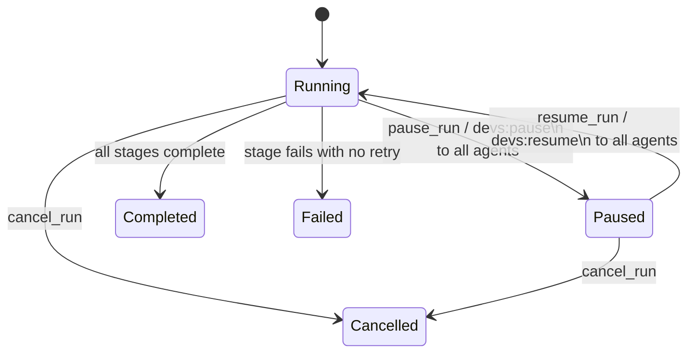

#### 2.8.2 Business Rules

**[4_USER_FEATURES-FEAT-BR-123]** `pause_run` on a run not in `Running` state MUST return
`failed_precondition: run '<id>' is not running (current state: <state>)`. No state change occurs.

**[4_USER_FEATURES-FEAT-BR-124]** `resume_run` on a run not in `Paused` state MUST return
`failed_precondition: run '<id>' is not paused (current state: <state>)`. No state change occurs.

**[4_USER_FEATURES-FEAT-BR-125]** When a run is paused at the run level, the DAG Scheduler MUST NOT dispatch
any new stages until `resume_run` is called. Stages that become `Eligible` during the pause
(because a dependency completes) transition to `Eligible` but are not dispatched; they are
dispatched immediately upon `resume_run`.

**[4_USER_FEATURES-FEAT-BR-126]** `cancel_run` on a `Paused` run MUST succeed. The cancel signal is sent to any
agents that are still running (in `Paused` sub-state). All non-terminal stages transition to
`Cancelled` atomically.

#### 2.8.3 Edge Cases

| ID | Trigger | Expected Behavior |
|---|---|---|
| EC-2.8-001 | `pause_run` on a run in `Paused` state | Returns `failed_precondition: run '<id>' is not running`; no state change |
| EC-2.8-002 | A stage completes successfully while the run is paused | Stage transitions to `Completed`; its downstream stages become `Eligible` but are not dispatched; `WorkflowRun` status remains `Paused` |
| EC-2.8-003 | `pause_stage` on a stage in `Completed` state | Returns `failed_precondition: stage '<s>' is in terminal state completed and cannot be paused` |
| EC-2.8-004 | Agent does not respond to `devs:pause\n` | No server-side enforcement at MVP; agent continues running; stage status shows `Running` (not `Paused`); run-level pause is recorded |
| EC-2.8-005 | `resume_run` while agents are still processing `devs:pause\n` | `devs:resume\n` is sent immediately to agent processes; agents receive both signals; agents resume work; no race condition because signals are sequential on the stdin pipe |

#### 2.8.4 Acceptance Criteria

- **[4_USER_FEATURES-AC-FEAT-2-025]** GIVEN a running run with two stages (`Running` and `Eligible`), WHEN
  `pause_run` is called, THEN `get_run` shows the run as `paused` and the `Eligible` stage
  remains `eligible` (not dispatched).

- **[4_USER_FEATURES-AC-FEAT-2-026]** GIVEN a paused run with an `Eligible` stage, WHEN `resume_run` is called,
  THEN the `Eligible` stage is dispatched within 100ms and `get_run` shows the run as `running`.

- **[4_USER_FEATURES-AC-FEAT-2-027]** GIVEN `pause_run` on a run in `Completed` state, WHEN the CLI returns,
  THEN the exit code is 1 and the error contains `failed_precondition`.

---

### 2.9 Journey: Orchestrated Agent Completing a Stage

**[4_USER_FEATURES-FEAT-013]** An AI agent spawned as a workflow stage signals completion via MCP.

```mermaid
sequenceDiagram
    participant DEVS as devs-executor
    participant AGENT as Orchestrated Agent
    participant MCP as devs MCP (same process)

    DEVS->>DEVS: Prepare execution environment (tempdir/docker/ssh)
    DEVS->>DEVS: Clone project repo into working directory
    DEVS->>DEVS: Write .devs_context.json atomically to working dir
    DEVS->>AGENT: Spawn subprocess with env: DEVS_MCP_ADDR, DEVS_LISTEN stripped
    AGENT->>AGENT: Read .devs_context.json for upstream stage outputs
    AGENT->>AGENT: Read prompt (flag or file depending on adapter)
    AGENT->>AGENT: Perform assigned task
    loop Optional progress updates
        AGENT->>MCP: POST /mcp/v1/call report_progress {stage_run_id, message, pct_complete}
        MCP-->>AGENT: {"result": {"recorded": true}, "error": null}
    end
    AGENT->>AGENT: Task complete
    alt completion_mode = "mcp_tool_call"
        AGENT->>MCP: POST /mcp/v1/call signal_completion {stage_run_id, success, output:{}}
        MCP-->>AGENT: {"result": {"status": "completed"}, "error": null}
        AGENT->>AGENT: Exit (any exit code; ignored)
    else completion_mode = "structured_output"
        AGENT->>AGENT: Write .devs_output.json {"success": true, "output": {...}, "message": "..."}
        AGENT->>AGENT: Exit with code 0
        DEVS->>DEVS: Read .devs_output.json; "success":true → Completed
    else completion_mode = "exit_code"
        AGENT->>AGENT: Exit with code 0 (Completed) or non-zero (Failed)
        DEVS->>DEVS: Record exit_code; determine outcome
    end
    DEVS->>DEVS: Collect artifacts (auto-collect or agent-driven)
    DEVS->>DEVS: Cleanup working directory
    DEVS->>DEVS: Persist StageRun to checkpoint; advance DAG
```

#### 2.9.1 `.devs_context.json` Schema

Written atomically before agent spawn. Maximum total size 10 MiB; proportional truncation applied
to `stdout`/`stderr` if exceeded, with `"truncated": true` added.

```json
{
  "schema_version": 1,
  "run_id": "a1b2c3d4-...",
  "run_slug": "feature-20260311-a3f9",
  "run_name": "feature-20260311-a3f9",
  "stage_name": "implement",
  "inputs": {
    "task_file": "TASK.md"
  },
  "stages": [
    {
      "name": "plan",
      "status": "completed",
      "exit_code": 0,
      "stdout": "Plan: 1. Add API layer...",
      "stderr": "",
      "structured_output": { "plan_steps": 3 },
      "truncated": false
    }
  ],
  "truncated": false,
  "total_size_bytes": 4096
}
```

| Field | Type | Description |
|---|---|---|
| `schema_version` | integer | Always `1` |
| `run_id` | UUID string | Current run identifier |
| `run_slug` | string | Human-readable run slug |
| `run_name` | string | User-provided run name or auto-slug |
| `stage_name` | string | Name of the stage currently executing |
| `inputs` | object | Workflow input values, all as strings |
| `stages` | array | Only `Completed` stages in the transitive `depends_on` closure |
| `stages[].structured_output` | object or null | Parsed contents of `.devs_output.json` from that stage |
| `truncated` | boolean | True if total_size_bytes exceeded 10 MiB |
| `total_size_bytes` | integer | Size of this file before any truncation |

#### 2.9.2 `.devs_output.json` Schema

Written by the agent in `structured_output` completion mode. The server reads this file
in preference to any JSON on stdout.

```json
{
  "success": true,
  "output": {
    "test_result": "passed",
    "test_count": 47
  },
  "message": "Optional human-readable summary"
}
```

| Field | Type | Required | Description |
|---|---|---|---|
| `"success"` | boolean | Yes | MUST be a JSON boolean; string `"true"` → stage `Failed` |
| `"output"` | JSON object | No | Arbitrary structured data passed to downstream template vars |
| `"message"` | string | No | Human-readable summary; written to stage logs |

Priority rule: if `.devs_output.json` exists and is valid JSON with a boolean `"success"` field,
it takes precedence over any JSON object on stdout. If `.devs_output.json` exists but is invalid
JSON, the stage transitions to `Failed` regardless of exit code or stdout content.

#### 2.9.3 Environment Variable Injection

Every agent subprocess receives:

| Variable | Value | Source |
|---|---|---|
| `DEVS_MCP_ADDR` | `http://<host>:<mcp_port>` | Injected by executor |
| All server env vars | Inherited | Server process environment |
| Workflow `default_env` | Merged | Lower priority |
| Stage `env` | Merged | Higher priority (overrides workflow env) |

The following variables are **stripped** from the agent environment (MUST NOT be passed to agents):

| Variable | Reason |
|---|---|
| `DEVS_LISTEN` | gRPC bind address; agents must not rebind |
| `DEVS_MCP_PORT` | MCP bind port; agents use `DEVS_MCP_ADDR` instead |
| `DEVS_DISCOVERY_FILE` | Discovery file path; agents use `DEVS_MCP_ADDR` directly |

#### 2.9.4 Business Rules

**[4_USER_FEATURES-FEAT-BR-127]** `.devs_context.json` write failure (e.g., disk full) causes the stage to
transition to `Failed` immediately without spawning the agent process. The error is logged at
`ERROR` level and recorded in the stage's `stderr` field.

**[4_USER_FEATURES-FEAT-BR-128]** `signal_completion` is idempotent only for the first call. A second call on a
stage in a terminal state returns `failed_precondition: stage already in terminal state` and
MUST NOT modify any state.

**[4_USER_FEATURES-FEAT-BR-129]** An Orchestrated Agent that exits without calling `signal_completion` when
`completion = "mcp_tool_call"` causes the server to fall back to exit code evaluation: exit
code 0 → `Completed`, non-zero → `Failed`. This fallback is not an error; it is a defined behavior.

**[4_USER_FEATURES-FEAT-BR-130]** The working directory is cleaned up after every stage completion regardless of
outcome (success, failure, timeout, cancellation). Cleanup failures are logged at `WARN` level
and do not affect stage outcome.

#### 2.9.5 Edge Cases

| ID | Trigger | Expected Behavior |
|---|---|---|
| EC-2.9-001 | `.devs_output.json` contains `"success": "true"` (string, not boolean) | Stage transitions to `Failed`; `StageRun.output.structured` is `null`; the literal string is logged in stderr |
| EC-2.9-002 | `.devs_output.json` is empty (0 bytes) | Invalid JSON; stage transitions to `Failed`; error message: `invalid_argument: .devs_output.json is not valid JSON` |
| EC-2.9-003 | Agent calls `signal_completion` then continues running and eventually exits non-zero | Stage status is determined by `signal_completion` result (already terminal); exit code is recorded in `StageRun.exit_code` but does not change stage status |
| EC-2.9-004 | Agent spawned in Docker but `DOCKER_HOST` points to an unavailable daemon | Executor fails to create container; stage transitions to `Failed` with `internal: docker daemon unavailable`; no retry unless `RetryConfig` is present |
| EC-2.9-005 | `report_progress` called after `signal_completion` has already been called | Server accepts the call but discards it silently; `progress` events after terminal state are no-ops; response: `{"result": {"recorded": false}, "error": null}` |

#### 2.9.6 Acceptance Criteria

- **[4_USER_FEATURES-AC-FEAT-2-028]** GIVEN a stage with `completion="structured_output"` and `.devs_output.json`
  containing `{"success": true}`, WHEN the agent exits, THEN `get_stage_output` shows
  `structured.success = true` and the stage status is `completed`.

- **[4_USER_FEATURES-AC-FEAT-2-029]** GIVEN a stage with `completion="structured_output"` and `.devs_output.json`
  containing `{"success": "true"}` (string), WHEN the agent exits, THEN the stage transitions to
  `failed`.

- **[4_USER_FEATURES-AC-FEAT-2-030]** GIVEN an agent calling `signal_completion` twice for the same stage, WHEN
  the second call is made, THEN the response contains `"error": "failed_precondition: stage already
  in terminal state"` and `get_run` shows the stage status unchanged from after the first call.

- **[4_USER_FEATURES-AC-FEAT-2-031]** GIVEN a stage with `completion="exit_code"`, WHEN the agent exits with code
  0, THEN the stage transitions to `completed` and `StageRun.exit_code = 0`.

---

### 2.10 Journey: Development Lifecycle via `./do`

**[4_USER_FEATURES-FEAT-014]** A developer (or AI agent) runs the development presubmit workflow.

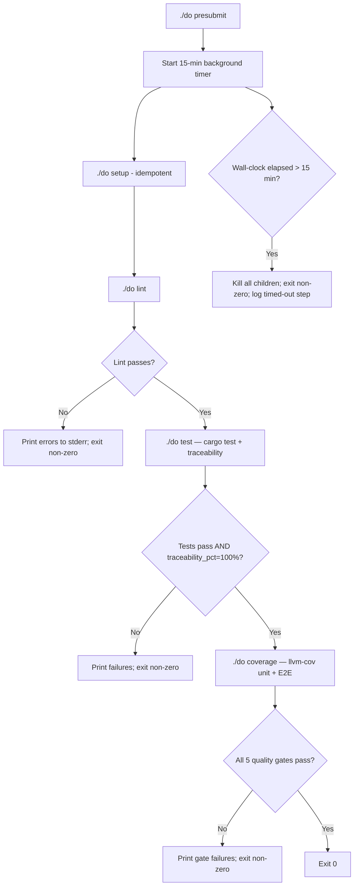

#### 2.10.1 `./do` Command Contracts

| Command | Success Condition | Output Artifacts |
|---|---|---|
| `./do setup` | All tools installed at required versions; idempotent | None (tool installations only) |
| `./do build` | `cargo build --workspace --release` exits 0 | `target/release/` binaries |
| `./do lint` | `cargo fmt --check` + `cargo clippy -D warnings` + `cargo doc` (0 warnings) + dep audit all exit 0 | None |
| `./do format` | `cargo fmt --all` exits 0 | Modified source files |
| `./do test` | `cargo test --workspace` passes AND `traceability.json` `overall_passed: true` | `target/traceability.json` |
| `./do coverage` | All 5 QG gates pass; `report.json` `overall_passed: true` | `target/coverage/report.json` |
| `./do presubmit` | setup→format→lint→test→coverage→ci all pass within 15 min | `target/presubmit_timings.jsonl` |
| `./do ci` | GitLab pipeline passes on all 3 platforms within 30 min | None (pipeline artifacts on GitLab) |

#### 2.10.2 `target/presubmit_timings.jsonl` Schema

One JSON object per line; each represents one `./do` step:

```jsonl
{"step": "setup", "started_at": "2026-03-11T10:00:00.000Z", "duration_ms": 1250, "exit_code": 0, "timed_out": false}
{"step": "lint", "started_at": "2026-03-11T10:00:01.250Z", "duration_ms": 8340, "exit_code": 0, "timed_out": false}
{"step": "test", "started_at": "2026-03-11T10:00:09.590Z", "duration_ms": 120000, "exit_code": 1, "timed_out": true}
```

| Field | Type | Description |
|---|---|---|
| `step` | string | One of: `setup`, `lint`, `test`, `coverage`, `ci` |
| `started_at` | RFC 3339 | Wall-clock start of this step |
| `duration_ms` | integer | Milliseconds elapsed for this step |
| `exit_code` | integer | Exit code of the step's subprocess |
| `timed_out` | boolean | `true` if the step was killed by the 15-min timer |

#### 2.10.3 `target/traceability.json` Schema

```json
{
  "schema_version": 1,
  "generated_at": "2026-03-11T10:02:30.000Z",
  "overall_passed": true,
  "traceability_pct": 100.0,
  "requirements": [
    {
      "id": "FEAT-BR-001",
      "source_file": "docs/plan/specs/4_user_features.md",
      "covering_tests": ["tests/cli/submit_test.rs::test_submit_validates_inputs"],
      "covered": true
    }
  ],
  "stale_annotations": []
}
```

| Field | Type | Description |
|---|---|---|
| `schema_version` | integer | Always `1` |
| `overall_passed` | boolean | `true` iff all requirements are covered AND `stale_annotations` is empty |
| `traceability_pct` | float | Percentage of requirements with at least one covering test |
| `requirements` | array | One entry per `[4_USER_FEATURES-FEAT-*]` tag found in spec documents |
| `stale_annotations` | array | `// Covers: <id>` annotations referencing non-existent requirement IDs |

Requirements are discovered by scanning `docs/plan/specs/` for `\[([0-9A-Z_a-z]+-[4_USER_FEATURES-A-Z]+-[4_USER_FEATURES-0-9]+)\]`
patterns. Covering tests are discovered by scanning `tests/` and `crates/*/tests/` for
`// Covers: <id>` comments.

#### 2.10.4 `target/coverage/report.json` Schema

```json
{
  "schema_version": 1,
  "generated_at": "2026-03-11T10:05:00.000Z",
  "overall_passed": true,
  "gates": [
    {
      "gate_id": "QG-001",
      "scope": "unit tests, all crates",
      "threshold_pct": 90.0,
      "actual_pct": 93.4,
      "passed": true,
      "delta_pct": 3.4,
      "uncovered_lines": 42,
      "total_lines": 638
    },
    {
      "gate_id": "QG-002",
      "scope": "E2E aggregate",
      "threshold_pct": 80.0,
      "actual_pct": 82.1,
      "passed": true,
      "delta_pct": 2.1,
      "uncovered_lines": 114,
      "total_lines": 638
    }
  ]
}
```

All five gates (QG-001 through QG-005) MUST appear in the `gates` array. `overall_passed` is
the logical AND of all five individual `passed` fields.

#### 2.10.5 Business Rules

**[4_USER_FEATURES-FEAT-BR-131]** The 15-minute timeout in `./do presubmit` is measured from the moment the
first step (setup) begins, not from when the script is invoked. The timer runs in the background
as a separate process or timer construct in POSIX sh.

**[4_USER_FEATURES-FEAT-BR-132]** `./do setup` is idempotent. Running it N times produces the same result as
running it once. Tools already at the required version are NOT reinstalled or downgraded.

**[4_USER_FEATURES-FEAT-BR-133]** `./do lint` includes a dependency audit step that verifies all crates in the
Cargo workspace match the authoritative version table in `2_TAS.md` §2.2. Any workspace crate
with a dependency version not matching the table causes `./do lint` to exit non-zero.

**[4_USER_FEATURES-FEAT-BR-134]** `./do test` exits non-zero if `traceability.json` `overall_passed` is `false`,
even when all `cargo test` tests pass individually. Traceability failures are test failures.

#### 2.10.6 Edge Cases

| ID | Trigger | Expected Behavior |
|---|---|---|
| EC-2.10-001 | `./do presubmit` wall clock reaches 15 min while `./do coverage` is running | Background timer sends kill signal to coverage subprocess; `presubmit_timings.jsonl` records coverage step with `timed_out: true`; script exits code 1 |
| EC-2.10-002 | `./do test` finds `// Covers: FEAT-BR-9999` where `FEAT-BR-9999` is not in any spec file | `stale_annotations` contains `{"id": "FEAT-BR-9999", ...}`; `overall_passed: false`; `./do test` exits non-zero |
| EC-2.10-003 | `./do ci` is run without `GITLAB_TOKEN` set | Exits code 1; stderr: `ERROR: GITLAB_TOKEN not set; cannot authenticate with GitLab`; no branch is pushed |
| EC-2.10-004 | `./do setup` on a machine where Rust is not installed | Installs Rust via `rustup` with the pinned toolchain version; subsequent `./do build` succeeds |
| EC-2.10-005 | `./do coverage` runs but E2E tests cannot start a server (port conflict) | E2E test suite fails; QG-002 through QG-005 show `actual_pct: 0.0` and `passed: false`; `overall_passed: false`; `./do coverage` exits non-zero |

#### 2.10.7 Acceptance Criteria

- **[4_USER_FEATURES-AC-FEAT-2-032]** GIVEN a test file with `// Covers: AC-FEAT-2-999` where `AC-FEAT-2-999`
  does not exist in any spec, WHEN `./do test` runs, THEN `target/traceability.json` contains
  `AC-FEAT-2-999` in `stale_annotations` and the process exits non-zero.

- **[4_USER_FEATURES-AC-FEAT-2-033]** GIVEN `./do presubmit` that runs for 16 minutes, WHEN the timeout fires
  at 15 minutes, THEN all child processes are killed and the process exits non-zero within 5
  seconds of the timeout firing.

- **[4_USER_FEATURES-AC-FEAT-2-034]** GIVEN `./do coverage` with all 5 quality gates passing, WHEN the command
  completes, THEN `target/coverage/report.json` exists with `overall_passed: true` and exactly
  5 entries in `gates` (QG-001 through QG-005).

- **[4_USER_FEATURES-AC-FEAT-2-035]** GIVEN `./do setup` run twice in sequence, WHEN the second invocation
  completes, THEN it exits with code 0 and does not reinstall already-present tools.

---

### 2.11 Journey: AI Agent Agentic Development Loop (TDD)

**[4_USER_FEATURES-FEAT-015]** An observing/controlling AI agent implements a requirement using TDD.

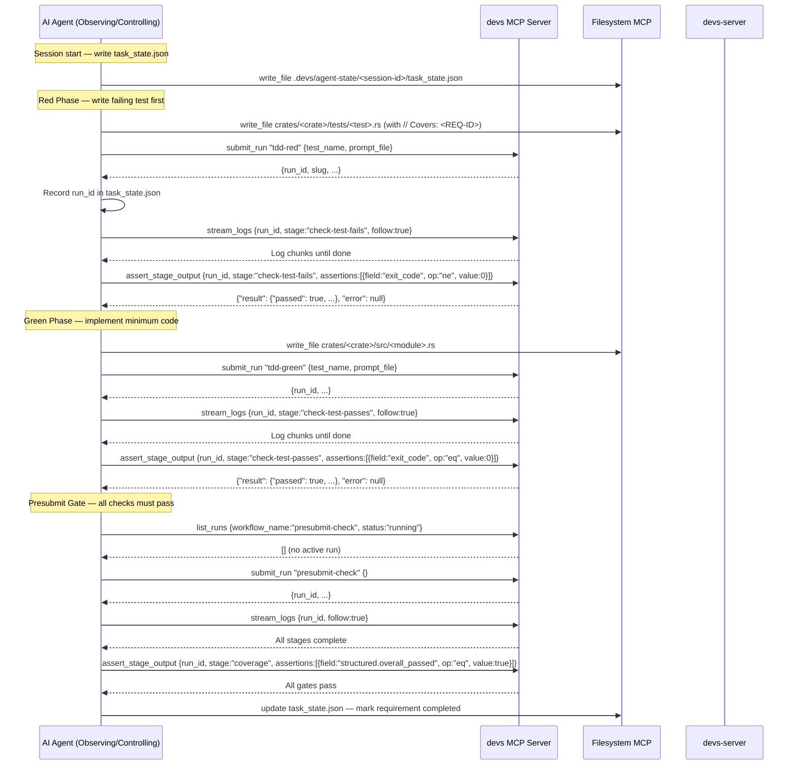

#### 2.11.1 Standard Workflow Definitions

The following workflow definitions MUST be stored in `.devs/workflows/` and MUST be usable from
the first server-startable commit. They are the standard toolchain for agentic development.

| Workflow | Inputs | Stage(s) | Stage Timeout | Purpose |
|---|---|---|---|---|
| `tdd-red` | `test_name` (string, required), `prompt_file` (path, required) | `check-test-fails` | 120s | Verify a new test fails before implementation exists |
| `tdd-green` | `test_name` (string, required), `prompt_file` (path, required) | `check-test-passes` | 120s | Verify a test passes after implementation |
| `presubmit-check` | none | `format-check`, `clippy`, `test-and-traceability`, `coverage`; `doc-check` (parallel with `clippy` after `format-check`) | 900s total | Full gate: format→clippy+doc→test→coverage |
| `build-only` | none | `cargo-build` | 300s | Fast compile check only |
| `unit-test-crate` | `crate_name` (string, required) | `cargo-test-crate` | 300s | Run unit tests for one crate |
| `e2e-all` | none | `cargo-e2e` | 600s | Full E2E test suite |

**`presubmit-check` stage dependency graph:**

```
format-check ──► clippy ──────────────────► test-and-traceability ──► coverage
                │
                └──► doc-check (parallel with clippy's downstream)
```

`doc-check` and `clippy` both depend on `format-check`. `test-and-traceability` depends on
`clippy`. `doc-check` has no downstream stages; it completes in parallel.

#### 2.11.2 `task_state.json` Schema

Written atomically (`write-to-tmp → rename`) to `.devs/agent-state/<session-id>/task_state.json`
before any `submit_run` call and after each run reaches a terminal state.

```json
{
  "schema_version": 1,
  "session_id": "c3d4e5f6-a7b8-9012-cdef-012345678901",
  "written_at": "2026-03-11T10:15:00.000Z",
  "agent_tool": "claude",
  "completed_requirements": ["FEAT-BR-001", "FEAT-BR-002"],
  "in_progress": [
    {
      "requirement": "FEAT-BR-003",
      "last_run_id": "a1b2c3d4-...",
      "last_stage": "check-test-passes",
      "attempt": 2
    }
  ],
  "blocked": [
    {
      "requirement": "FEAT-BR-010",
      "reason": "depends on FEAT-BR-003",
      "depends_on": ["FEAT-BR-003"]
    }
  ],
  "notes": "Working on template resolver; clippy issue in devs-core::template"
}
```

| Field | Type | Description |
|---|---|---|
| `schema_version` | integer | Always `1` |
| `session_id` | UUID4 string | Stable across agent restarts within one session |
| `written_at` | RFC 3339 | Timestamp of last write |
| `agent_tool` | string | One of: `claude`, `gemini`, `opencode`, `qwen`, `copilot` |
| `completed_requirements` | array of strings | Requirement IDs for which `covered: true` in traceability |
| `in_progress` | array of objects | Currently active requirements |
| `blocked` | array of objects | Requirements blocked on other requirements |
| `notes` | string | Free-form notes for session continuity |

#### 2.11.3 Session Recovery Algorithm

When an agent restarts after interruption:

```
1. Read .devs/agent-state/<session-id>/task_state.json
2. If active_run_id present in in_progress[].last_run_id:
     call get_run(last_run_id) to determine current state
3. If run is Running/Paused:
     call stream_logs(last_run_id, follow:true) to resume monitoring
4. If run is Completed/Failed/Cancelled:
     evaluate result and update task_state.json
5. If traceability.json exists and generated_at < 1 hour ago:
     treat traceability.requirements[R].covered as authoritative
6. Otherwise:
     submit ./do test run to regenerate traceability before any implementation
```

#### 2.11.4 Parallel Task Execution

When multiple independent requirements can be implemented concurrently:

1. Check `get_pool_state` to verify agents are available before batch submission.
2. Identify source file overlap: if `intersection(task_A.source_files, task_B.source_files)` is
   non-empty, serialize task B as a dependent of task A (do not submit concurrently).
3. Submit each independent task as a separate workflow run targeting an isolated git branch:
   - Task branch naming: `devs-task/<session_id>-<task_id>`
   - Integration branch: `devs-integrate/<session_id>`
4. Maximum concurrent tasks equals pool `max_concurrent`.
5. After all tasks complete, merge branches sequentially via `git merge --no-ff`.
6. Resolve conflicts via Filesystem MCP; then rerun `presubmit-check` on merged result.

#### 2.11.5 Business Rules

**[4_USER_FEATURES-FEAT-BR-135]** An agent MUST NOT make code changes before verifying that the test fails
(Red phase). Implementing first and testing second invalidates the TDD discipline and may produce
false-positive tests.

**[4_USER_FEATURES-FEAT-BR-136]** An agent MUST check `list_runs` for active `presubmit-check` runs before
submitting a new one. If an active `presubmit-check` run exists, the agent MUST monitor it via
`stream_logs` rather than submitting a duplicate.

**[4_USER_FEATURES-FEAT-BR-137]** An agent MUST write `task_state.json` before calling `submit_run` and again
after each run reaches a terminal state. This enables crash recovery without losing progress.

**[4_USER_FEATURES-FEAT-BR-138]** An agent MUST NOT restart the `devs` server while any run is in `Running` or
`Paused` state. Restart is only permitted after all runs reach terminal state or are cancelled.

#### 2.11.6 Edge Cases

| ID | Trigger | Expected Behavior |
|---|---|---|
| EC-2.11-001 | Agent crashes mid-TDD loop with a `tdd-green` run still `Running` | On restart, agent reads `task_state.json`; calls `get_run(last_run_id)`; finds run still running; calls `stream_logs(follow:true)` to resume monitoring |
| EC-2.11-002 | Two parallel tasks modify the same source file | Agent detects overlap via file intersection check; serializes second task to run after first completes; does not submit both concurrently |
| EC-2.11-003 | `traceability.json` is more than 1 hour old when agent reads it | Agent submits a `./do test` run first to regenerate traceability before implementing any requirement |
| EC-2.11-004 | `presubmit-check` coverage stage fails with `actual_pct < threshold` | Agent reads `target/coverage/report.json` via Filesystem MCP; identifies uncovered lines for the failing gate; writes targeted tests; resubmits `presubmit-check` |
| EC-2.11-005 | Agent calls `assert_stage_output` with a `matches` operator and an invalid Rust regex | Response: `{"result":null, "error":"invalid_argument: invalid regex '<pattern>': <detail>"}`; no assertions are evaluated; agent fixes the regex before retrying |

#### 2.11.7 Acceptance Criteria

- **[4_USER_FEATURES-AC-FEAT-2-036]** GIVEN an agent submitting `tdd-red` for a test that does not yet have
  implementation, WHEN `assert_stage_output` checks `exit_code ne 0`, THEN the assertion passes
  (confirming the test fails).

- **[4_USER_FEATURES-AC-FEAT-2-037]** GIVEN an agent with an active `presubmit-check` run already running, WHEN
  the agent calls `list_runs {workflow_name:"presubmit-check", status:"running"}`, THEN the
  response contains the active run and the agent MUST NOT submit a duplicate.

- **[4_USER_FEATURES-AC-FEAT-2-038]** GIVEN `task_state.json` with `last_run_id` set to a run in `Failed` state,
  WHEN the agent restarts and reads this file, THEN the agent calls `get_run(last_run_id)` and
  processes the failure before attempting any new implementation.

---

### 2.12 Journey: Failure Diagnosis by AI Agent

**[4_USER_FEATURES-FEAT-016]** An AI agent diagnoses and resolves a failed presubmit stage.

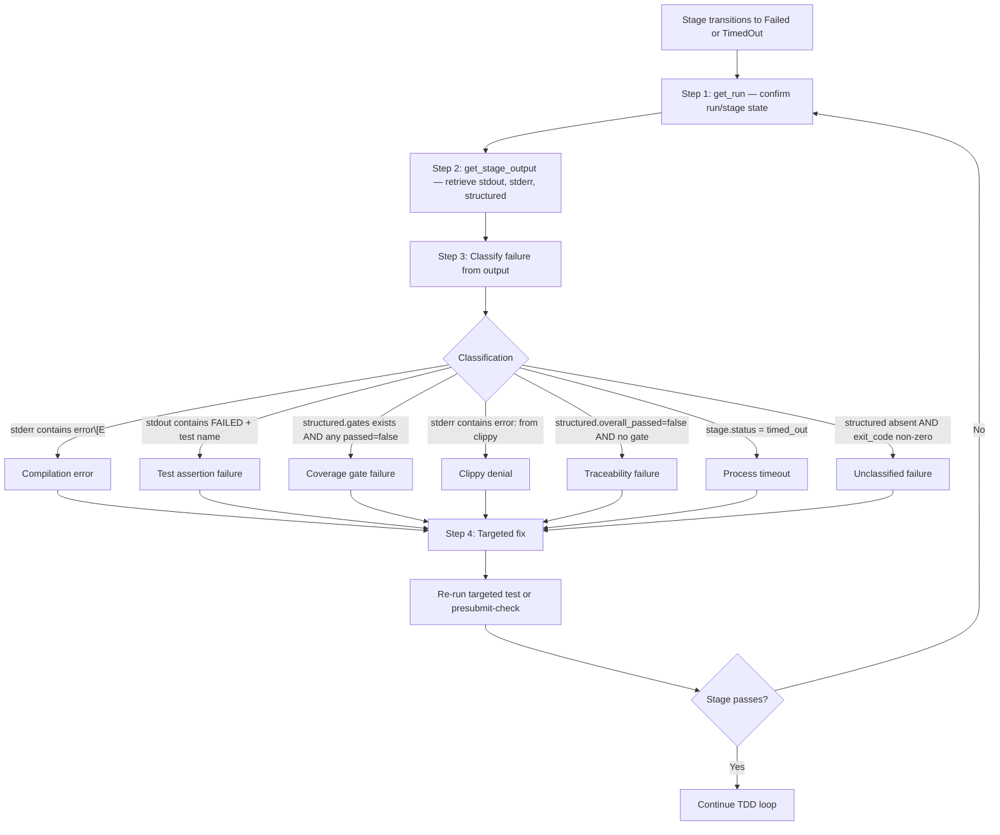

#### 2.12.1 Mandatory Diagnostic Sequence

Before making any code edit in response to a failure, an agent MUST execute all four steps:

1. **`get_run(run_id)`** — Confirm the run and stage are in `failed` or `timed_out` state. Never
   proceed based on a stale local assumption about run state.
2. **`get_stage_output(run_id, stage_name)`** — Retrieve the full `stdout`, `stderr`, and
   `structured` output of the failed stage. Read at minimum the last 50 lines of stderr and stdout.
3. **Classify the failure** using the classification table below.
4. **Apply the targeted fix** based on the classification. Do not make speculative edits to files
   that the failure diagnostic does not identify.

**[4_USER_FEATURES-FEAT-BR-139]** An agent MUST NOT transition from diagnosing to editing until `get_stage_output`
returns `"error": null`. If `get_stage_output` returns an error (e.g., stage output not yet
persisted), the agent MUST retry once before treating it as an internal error.

#### 2.12.2 Failure Classification Table

| Category | Detection Pattern | Required Action |
|---|---|---|
| Compilation error | `stderr` matches `error\[E[4_USER_FEATURES-0-9]+\]` (Rust error code) | Read source file at the line indicated by compiler; make targeted fix at that line only |
| Test assertion failure | `stdout` contains `FAILED` and a test function name | Read both the failing test and the implementation under test; identify the assertion that failed; fix the logic |
| Coverage gate failure | `structured.gates[*].passed == false` for any gate | Read `target/coverage/report.json` via Filesystem MCP; identify specific uncovered lines for the failing gate; add targeted tests covering those lines |
| Clippy denial | `stderr` matches `^error:` from `cargo clippy` | Read the source file at the indicated line; apply the minimal fix that satisfies the lint without changing behavior |
| Traceability failure | `structured.overall_passed == false` AND `stale_annotations` non-empty OR `uncovered_requirements` non-empty | Read `target/traceability.json`; for uncovered requirements, add `// Covers: <id>` to an existing test; for stale annotations, remove or correct them |
| Process timeout | `stage.status == "timed_out"` | Read last 50 lines of stderr for signs of infinite loops or blocking operations; add a timeout guard or fix the blocking call |
| Disk full | Checkpoint error in stderr: `ERROR: disk full` | Do not retry; surface to operator: `"alert: disk full on server; manual intervention required"` |
| Unclassified | `exit_code` non-zero AND none of the above patterns match | Read full stderr; report the raw output; avoid speculative fixes |

#### 2.12.3 Debug Tab Capabilities

The TUI Debug tab provides the following interactive controls for an active stage:

| Feature | Description |
|---|---|
| Agent progress | Displays `report_progress` messages as a list with `pct_complete` bar |
| Working-dir diff | Shows `git diff` of the stage's working directory vs the cloned repo HEAD |
| Cancel button | Sends `cancel_stage` for the selected stage |
| Pause button | Sends `pause_stage` for the selected stage |
| Resume button | Sends `resume_stage` for the selected stage |

The working-dir diff is retrieved by calling the executor's diff endpoint (internal gRPC call from
TUI to server). It reflects the current state of the agent's working directory at the time of the
request.

#### 2.12.4 Business Rules

**[4_USER_FEATURES-FEAT-BR-140]** An agent MUST NOT make speculative code changes without first reading the
specific stderr/stdout output that identifies the failure. Reading only the run status (`failed`)
and immediately editing files is a protocol violation.

**[4_USER_FEATURES-FEAT-BR-141]** For coverage gate failures, the agent MUST read `target/coverage/report.json`
to identify the specific gate (QG-001 through QG-005) and the specific lines that lack coverage.
Adding tests that do not target the uncovered lines does not satisfy the gate.

**[4_USER_FEATURES-FEAT-BR-142]** For traceability failures, the agent MUST NOT add `// Covers: <id>` annotations
to tests that do not actually test the specified requirement. Annotation must correspond to genuine
behavioral coverage.

#### 2.12.5 Edge Cases

| ID | Trigger | Expected Behavior |
|---|---|---|
| EC-2.12-001 | Failure has both a compilation error AND a clippy denial (two independent fixes needed) | Agent reads all of stderr; identifies both issues; fixes the compilation error first (clippy cannot run against code that doesn't compile); reruns `presubmit-check` after compile fix |
| EC-2.12-002 | `get_stage_output` returns `stdout` truncated with `truncated: true` | Agent reads from the end of the available output (truncated from beginning); the most recent output (end) is preserved and contains the actionable error |
| EC-2.12-003 | Coverage report `generated_at` is more than 1 hour old | Agent submits a fresh `./do test` or `./do coverage` run to regenerate before acting on potentially stale data |
| EC-2.12-004 | Stage `TimedOut` after 120s with last stderr showing normal progress | Agent checks for blocking I/O: file reads without timeout, network calls without timeout, or infinite retry loops; extends timeout in stage definition OR fixes the blocking operation |
| EC-2.12-005 | `assert_stage_output` with `json_path_eq` on a field that is null | Assertion fails (null ≠ expected value); `actual_snippet` shows `null`; agent checks whether the structured output schema is correct before fixing implementation |

#### 2.12.6 Acceptance Criteria

- **[4_USER_FEATURES-AC-FEAT-2-039]** GIVEN a failed stage with `stderr` containing `error[E0308]`, WHEN the
  agent calls `get_stage_output`, THEN `stderr` is non-null and the agent MUST call
  `search_content` on the indicated source file before making any edit.

- **[4_USER_FEATURES-AC-FEAT-2-040]** GIVEN `presubmit-check` where coverage gate QG-003 (CLI E2E) fails at
  45%, WHEN the agent reads `target/coverage/report.json`, THEN it identifies QG-003 as the
  failing gate and adds tests that exercise CLI commands through the `devs-cli` binary, not
  through internal Rust functions.

- **[4_USER_FEATURES-AC-FEAT-2-041]** GIVEN a `TimedOut` stage, WHEN `get_stage_output` is called, THEN
  `stage.exit_code` is null (process killed before clean exit) and `stage.status` is
  `"timed_out"`, not `"failed"`.

- **[4_USER_FEATURES-AC-FEAT-2-042]** GIVEN `assert_stage_output` called with a `matches` operator and an
  invalid Rust regex `"[unclosed"`, WHEN the MCP tool responds, THEN `"error"` is non-null with
  `invalid_argument` prefix and no assertions are evaluated.

---

## 3. Core Interactions & Edge Cases

This section defines the precise behavioral contracts, data schemas, error handling rules, and edge cases for every interface exposed by `devs`. Implementing agents MUST treat each numbered rule as a testable assertion — no behavior described here is optional or advisory.

### 3.1 CLI Interactions

#### 3.1.1 Global Flags and Discovery

**[4_USER_FEATURES-FEAT-017]** Every CLI command supports `--format json` to emit machine-readable output. When `--format json` is used, all output (including errors) is written to stdout as JSON. Nothing is written to stderr when `--format json` is active.

**[4_USER_FEATURES-FEAT-018]** Every CLI command supports `--server <host:port>` to override server auto-discovery. Explicit `--server` takes precedence over the discovery file. The format is `<hostname-or-ip>:<port>` (no scheme prefix).

Server discovery resolution order (first match wins):

| Priority | Source | Example |
|---|---|---|
| 1 | `--server` flag | `127.0.0.1:7890` |
| 2 | `DEVS_SERVER` env var | `192.168.1.10:7890` |
| 3 | `server_addr` in `devs.toml` | `127.0.0.1:7890` |
| 4 | Auto-discovery file at `DEVS_DISCOVERY_FILE` env var | (path to file) |
| 5 | Auto-discovery file at `~/.config/devs/server.addr` | (default path) |

If none of the above resolves, the CLI exits with code 3 and prints `"server unreachable: no address configured"`.

**[4_USER_FEATURES-FEAT-019]** CLI run identifier resolution: if the identifier string matches UUID4 format (`[0-9a-f]{8}-[0-9a-f]{4}-4[0-9a-f]{3}-[89ab][0-9a-f]{3}-[0-9a-f]{12}`), it is treated as a `run_id` and looked up by UUID. Otherwise it is treated as a `slug`. When the same value is both a valid UUID and a valid slug (a theoretical collision), the UUID lookup takes precedence.

**[4_USER_FEATURES-FEAT-020]** `devs submit` requires `--project <name-or-id>` when the current working directory does not resolve to exactly one registered project. If the CWD resolves to zero or two-or-more projects, the CLI exits with code 4 and lists the ambiguous or missing candidates.

#### 3.1.2 Command Schemas

Each CLI command's JSON output schema (active when `--format json`) is defined below. The `text` format output is human-readable and not schema-constrained.

**`devs submit`**

Request parameters:

| Flag | Type | Required | Description |
|---|---|---|---|
| `<workflow>` | string | yes | Workflow name or path |
| `--name <run-name>` | string | no | User-provided run name; auto-generated if omitted |
| `--input key=value` | string (repeatable) | no | Workflow input parameters |
| `--project <id-or-name>` | string | conditional | Required when CWD is ambiguous |
| `--format json\|text` | enum | no | Output format (default: `text`) |
| `--server <host:port>` | string | no | Override server address |

JSON success response (`--format json`, exit 0):

```json
{
  "run_id": "550e8400-e29b-41d4-a716-446655440000",
  "slug": "feature-20260311-ab3c",
  "workflow_name": "feature",
  "project_id": "a1b2c3d4-e5f6-4789-abcd-ef0123456789",
  "status": "pending"
}
```

JSON error response (`--format json`, exit 4 for validation):

```json
{
  "error": "invalid_argument: required input 'task_description' missing",
  "code": 4
}
```

When multiple validation errors exist, they are joined as a newline-delimited list within the `"error"` string.

**`devs list`**

**[4_USER_FEATURES-FEAT-021]** `devs list` output includes active and historical runs. Runs are sorted by `created_at` descending. The command does not embed per-stage detail. Default limit is 100. `--limit <n>` overrides. `--status <status>` filters by run status.

JSON success response:

```json
{
  "runs": [
    {
      "run_id": "550e8400-e29b-41d4-a716-446655440000",
      "slug": "feature-20260311-ab3c",
      "workflow_name": "feature",
      "project_id": "a1b2c3d4-e5f6-4789-abcd-ef0123456789",
      "status": "running",
      "created_at": "2026-03-11T10:00:00.000Z",
      "started_at": "2026-03-11T10:00:01.123Z",
      "completed_at": null
    }
  ],
  "total": 1,
  "limit": 100,
  "offset": 0
}
```

**`devs status <run>`**

**[4_USER_FEATURES-FEAT-022]** `devs status <run>` shows the current `WorkflowRun` status including all `StageRun` records with their current statuses and elapsed times.

JSON success response:

```json
{
  "run_id": "550e8400-e29b-41d4-a716-446655440000",
  "slug": "feature-20260311-ab3c",
  "workflow_name": "feature",
  "project_id": "a1b2c3d4-e5f6-4789-abcd-ef0123456789",
  "status": "running",
  "created_at": "2026-03-11T10:00:00.000Z",
  "started_at": "2026-03-11T10:00:01.123Z",
  "completed_at": null,
  "stage_runs": [
    {
      "stage_run_id": "aaaaaaaa-bbbb-4ccc-dddd-eeeeeeeeeeee",
      "stage_name": "plan",
      "attempt": 1,
      "status": "completed",
      "agent_tool": "claude",
      "pool_name": "primary",
      "started_at": "2026-03-11T10:00:02.000Z",
      "completed_at": "2026-03-11T10:01:15.456Z",
      "exit_code": 0,
      "elapsed_ms": 73456
    }
  ]
}
```

The `elapsed_ms` field uses monotonic clock measurement. For terminal stages, it is the wall-clock duration from `started_at` to `completed_at`. For running stages, it is the duration from `started_at` to the current time at the moment of the request.

**`devs logs <run> [stage]`**

**[4_USER_FEATURES-FEAT-023]** `devs logs <run> [stage] --follow` streams log lines to stdout until the run (or selected stage) reaches a terminal state. Exit code 0 on `Completed`, exit code 1 on `Failed` or `Cancelled`.

When `--follow` is not specified, all buffered log lines are printed and the command exits immediately with code 0.

When `stage` is omitted, logs from all stages are interleaved in timestamp order with a `[stage-name]` prefix per line.

`devs logs` does not support `--format json` for the log line stream itself; log lines are always raw UTF-8 text, one per output line. However, error conditions (run not found, server unreachable) are emitted as JSON when `--format json` is active.

**`devs cancel <run>`, `devs pause <run/stage>`, `devs resume <run/stage>`**

JSON success response (all three commands):

```json
{
  "run_id": "550e8400-e29b-41d4-a716-446655440000",
  "status": "cancelled"
}
```

JSON error response (run already terminal):

```json
{
  "error": "failed_precondition: run is already in terminal state 'completed'",
  "code": 1
}
```

#### 3.1.3 Exit Code Contract

**[4_USER_FEATURES-FEAT-024]** All CLI commands produce one of the following exit codes:

| Exit Code | Meaning | Example Condition |
|---|---|---|
| `0` | Success | Command completed successfully |
| `1` | General error | Server returned an unexpected error; state conflict |
| `2` | Run, stage, or project not found | `devs status` on a non-existent run ID |
| `3` | Server unreachable | Discovery file absent; TCP connection refused; stale file |
| `4` | Validation or input error | Missing required input; duplicate run name; invalid workflow |

When `--format json` is active, the exit code is always encoded as `"code"` in the JSON error object emitted to stdout. The process exit code matches.

#### 3.1.4 CLI Edge Cases

**Edge Case CLI-EC-001: Stale discovery file.** The discovery file exists but the address is no longer listening. The CLI attempts the TCP connection, receives `ECONNREFUSED`, and exits with code 3 and message `"server unreachable: connection refused at <addr>"`. The stale file is not deleted by the client.

**Edge Case CLI-EC-002: Server version major mismatch.** The CLI connects successfully but the server responds with `FAILED_PRECONDITION` on the first RPC due to a client/server major version mismatch. The CLI exits with code 1 and message `"server version mismatch: client=<v>, server=<v>"`. The `--format json` output is `{"error": "failed_precondition: version mismatch", "code": 1}`.

**Edge Case CLI-EC-003: `devs submit` with duplicate non-cancelled run name.** The server rejects the submission atomically. The CLI exits with code 4 (validation error) and reports `"invalid_argument: run name '<name>' already exists for project '<project>'"`.

**Edge Case CLI-EC-004: `devs logs --follow` when the target stage is cancelled before it runs.** The CLI receives the completion event (status=`cancelled`), prints any buffered lines (zero if stage never started), and exits with code 1.

**Edge Case CLI-EC-005: CWD resolves to two registered projects.** `devs submit` without `--project` exits with code 4 and lists both matching project names: `"invalid_argument: CWD matches multiple projects: [project-a, project-b]. Use --project to disambiguate."`.

**Edge Case CLI-EC-006: `--server` flag with unparseable address.** The CLI exits immediately with code 4 before connecting: `"invalid_argument: --server value '<value>' is not a valid host:port"`.

#### 3.1.5 CLI Business Rules

- **[4_USER_FEATURES-CLI-BR-001]** `--format json` and `--format text` are mutually exclusive flags. Specifying both causes exit code 4.
- **[4_USER_FEATURES-CLI-BR-002]** All timestamps in `--format json` output use RFC 3339 with millisecond precision and `Z` suffix.
- **[4_USER_FEATURES-CLI-BR-003]** All status enum values in JSON output are lowercase underscore-separated strings (`"timed_out"`, not `"TimedOut"`).
- **[4_USER_FEATURES-CLI-BR-004]** All UUID values in JSON output are lowercase hyphenated strings.
- **[4_USER_FEATURES-CLI-BR-005]** JSON error output format is always `{"error": "<string>", "code": <int>}` — never an array or nested object at the top level.
- **[4_USER_FEATURES-CLI-BR-006]** When a run identifier resolves to both a UUID and a slug (theoretical collision), UUID lookup MUST take precedence without error.
- **[4_USER_FEATURES-CLI-BR-007]** `devs logs` without `--follow` MUST exit 0 regardless of run status.

---

### 3.2 TUI Interactions

#### 3.2.1 Layout and Navigation

**[4_USER_FEATURES-FEAT-025]** The TUI displays four tabs navigable by keyboard: **Dashboard**, **Logs**, **Debug**, and **Pools**. Tab switching is available via the number keys `1`–`4` or left/right arrow keys. The active tab is visually highlighted in the tab bar.

**[4_USER_FEATURES-FEAT-026]** The Dashboard tab is split into two panes: a project/run list on the left, and the selected run detail on the right. The right pane shows the ASCII DAG with stage boxes, a per-stage status indicator, elapsed time, and a live log tail.

Minimum terminal dimensions: 80 columns × 24 rows. Below this threshold, the TUI displays a single-line message: `"Terminal too small: <W>x<H> (min 80x24)"` and does not render any interactive content.

#### 3.2.2 Stage Box Rendering

**[4_USER_FEATURES-FEAT-027]** Stage boxes in the ASCII DAG render as: `[ stage-name | STATUS | M:SS ]`

Stage status abbreviations:

| Abbreviation | Full Status | Meaning |
|---|---|---|
| `WAIT` | `waiting` | Waiting on dependencies |
| `ELIG` | `eligible` | Eligible, queued for dispatch |
| `RUN` | `running` | Actively running |
| `DONE` | `completed` | Successfully completed |
| `FAIL` | `failed` | Failed (all attempts exhausted) |
| `TIME` | `timed_out` | Timed out |
| `CANC` | `cancelled` | Cancelled |
| `PAUS` | `paused` | Paused |

The elapsed time field `M:SS` wraps to `H:MM:SS` for durations ≥ 60 minutes. For stages that have not started (`WAIT`, `ELIG`, `CANC`), the elapsed time field displays `--:--`. Elapsed time uses monotonic clock measurement; for running stages it updates on each render triggered by a gRPC event.

DAG edges are rendered using ASCII characters only: `|` for vertical edges, `-` for horizontal edges, `+` for joins, `>` for right-pointing arrows. No Unicode box-drawing characters are used.

#### 3.2.3 Event-Driven Rendering

**[4_USER_FEATURES-FEAT-028]** The TUI re-renders within 50 ms of receiving a `StreamRunEvents` gRPC push event. The screen is not updated on a fixed timer; updates are event-driven. The TUI MUST NOT poll the server for state; all state updates come via the `StreamRunEvents` streaming RPC.

The internal render pipeline: gRPC event received → update in-memory state → schedule render → apply diff to terminal. All steps complete within 50 ms of event receipt.

#### 3.2.4 Log Buffer

**[4_USER_FEATURES-FEAT-029]** The Logs tab displays up to 10,000 log lines in memory per stage. When the buffer reaches 10,000 lines, the oldest lines are evicted (FIFO). A status line at the top of the Logs pane reads `"Lines: <n>/10000 [TRUNCATED]"` when the buffer is at capacity.

Log lines in the Logs tab include a timestamp prefix: `HH:MM:SS.mmm [stdout|stderr] <line>`.

#### 3.2.5 Debug and Pools Tabs

**[4_USER_FEATURES-FEAT-030]** The Debug tab shows the selected agent's live progress, a diff of its working directory, and keyboard controls to send cancel, pause, or resume signals. The working-directory diff is fetched on demand via a gRPC call when the user selects a running stage; it is not streamed continuously.

Keyboard controls available in the Debug tab:

| Key | Action |
|---|---|
| `c` | Send cancel signal to selected stage |
| `p` | Send pause signal to selected stage |
| `r` | Send resume signal to selected stage |
| `d` | Refresh working-directory diff |
| `ESC` | Return to Dashboard tab |

**[4_USER_FEATURES-FEAT-031]** The Pools tab shows real-time pool utilization: pool name, `max_concurrent`, active count, queued count, per-agent availability, and recent fallback events.

Pool row format: `<pool-name>  active: <n>/<max>  queued: <n>  agents: [<tool>:<state>, ...]`

Agent state tokens: `ok` (available), `busy` (running), `rate-limited` (in cooldown), `cooldown:<Ns>` (seconds remaining).

#### 3.2.6 Reconnection State Machine

**[4_USER_FEATURES-FEAT-032]** When the TUI loses server connectivity, it displays a reconnection notice and attempts reconnect with exponential backoff.

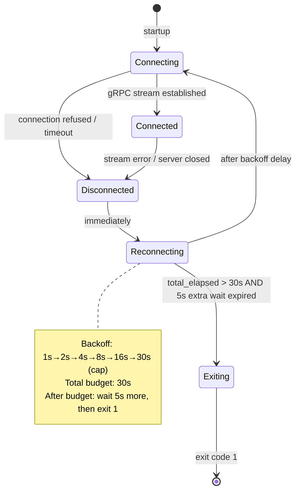

While `Reconnecting`, the TUI renders: `"Reconnecting to <addr>... (attempt <n>, next retry in <Ns>)"`. The run list and DAG remain visible with a `[STALE]` overlay on all status indicators.

On successful reconnect, the TUI calls `StreamRunEvents` with `since_sequence: <last_received_sequence>` to recover any missed events. If the server has discarded events (sequence gap), the TUI requests a full run snapshot via `GetRun`.

#### 3.2.7 TUI Edge Cases

**Edge Case TUI-EC-001: Terminal resized below 80×24 during operation.** The TUI detects the `SIGWINCH` signal (or equivalent on Windows), re-evaluates dimensions, and switches to the minimum-size error message. When the terminal is resized back above the threshold, normal rendering resumes automatically.

**Edge Case TUI-EC-002: DAG with more stages than can fit in the right pane.** The DAG pane becomes scrollable vertically. A scroll indicator `(+N more)` appears at the bottom. The user scrolls with up/down arrow keys.

**Edge Case TUI-EC-003: Log buffer reaches 10,000 lines for a running stage.** New lines continue to arrive and are displayed; oldest lines are silently evicted. The truncation indicator updates. No error is shown; this is expected behavior for long-running stages.

**Edge Case TUI-EC-004: gRPC event buffer overflow (server drops oldest events).** The TUI detects the sequence gap in `StreamRunEvents`, issues a `GetRun` for a full snapshot, and re-renders from the snapshot. No data loss occurs from the user's perspective.

**Edge Case TUI-EC-005: Server sends a terminal run event while the user is viewing the Logs tab.** The Logs tab continues to display buffered lines. The tab bar updates the Dashboard tab's run entry to show the terminal status. The user is not forced to switch tabs.

**Edge Case TUI-EC-006: TUI started when no runs exist.** The left pane of the Dashboard shows `"No runs found."`. The right pane shows `"Select a run to view details."`. The TUI does not error or exit; it waits for runs to appear via events.

#### 3.2.8 TUI Business Rules

- **[4_USER_FEATURES-TUI-BR-001]** TUI tests MUST use `ratatui::backend::TestBackend` with a 200×50 virtual terminal and `insta` text snapshots stored in `crates/devs-tui/tests/snapshots/*.txt`.
- **[4_USER_FEATURES-TUI-BR-002]** Pixel-based screenshot comparison is prohibited in tests.
- **[4_USER_FEATURES-TUI-BR-003]** TUI MUST NOT use `println!` or `eprintln!` for any output; all rendering goes through Ratatui's render pipeline.
- **[4_USER_FEATURES-TUI-BR-004]** The TUI MUST re-render in ≤50 ms after any `StreamRunEvents` message is received, measurable in tests by asserting the terminal buffer state after event injection.
- **[4_USER_FEATURES-TUI-BR-005]** Stage status abbreviations MUST exactly match the table in §3.2.2. No alternative spellings or truncations.
- **[4_USER_FEATURES-TUI-BR-006]** Keyboard controls in the Debug tab MUST function regardless of which pane has visual focus.

---

### 3.3 MCP Tool Interactions

#### 3.3.1 HTTP Transport Contract

All MCP tools are exposed via a single HTTP endpoint:

| Attribute | Value |
|---|---|
| Method | `POST` |
| Path | `/mcp/v1/call` |
| Content-Type (request) | `application/json` |
| Content-Type (response) | `application/json` |
| Max request body | 1 MiB |
| Default port | `7891` |
| Protocol | HTTP/1.1 |
| Encoding | JSON-RPC 2.0 |

HTTP status codes:

| Code | Condition |
|---|---|
| `200` | All tool responses (success and tool-level errors alike) |
| `400` | Malformed JSON or missing `method`/`params` fields |
| `404` | Path is not `/mcp/v1/call` |
| `405` | Request method is not `POST` |
| `413` | Request body exceeds 1 MiB |
| `415` | `Content-Type` is not `application/json` |
| `500` | Server panic; response body: `{"result":null,"error":"internal: server panic"}` |

Request envelope (JSON-RPC 2.0):

```json
{
  "jsonrpc": "2.0",
  "id": "any-string-or-number",
  "method": "<tool-name>",
  "params": { ... }
}
```

Response envelope:

```json
{
  "jsonrpc": "2.0",
  "id": "<same-as-request>",
  "result": { ... },
  "error": null
}
```

On tool-level failure:

```json
{
  "jsonrpc": "2.0",
  "id": "<same-as-request>",
  "result": null,
  "error": "<error-kind>: <detail>"
}
```

`"result"` and `"error"` are mutually exclusive: exactly one is non-null in every response.

#### 3.3.2 Observation Tools

**[4_USER_FEATURES-FEAT-034]** Observation tools acquire read locks only and execute fully in parallel with each other and with other observation calls.

**`list_runs` tool**

**[4_USER_FEATURES-FEAT-036]** Returns runs sorted by `created_at` descending, without embedding `stage_runs`. Default limit 100.

Request params:

| Field | Type | Required | Default | Description |
|---|---|---|---|---|
| `project_id` | string (UUID4) | no | all projects | Filter by project |
| `status` | string | no | all statuses | Filter by run status |
| `limit` | integer | no | 100 | Max results (1–1000) |
| `offset` | integer | no | 0 | Pagination offset |

Response `result` schema:

```json
{
  "runs": [
    {
      "run_id": "string (UUID4)",
      "slug": "string",
      "workflow_name": "string",
      "project_id": "string (UUID4)",
      "status": "string (lowercase)",
      "created_at": "string (RFC3339+ms+Z)",
      "started_at": "string|null",
      "completed_at": "string|null"
    }
  ],
  "total": "integer",
  "limit": "integer",
  "offset": "integer"
}
```

**`get_run` tool**

**[4_USER_FEATURES-FEAT-037]** Returns the full `WorkflowRun` including all `StageRun` records. Every field is present; unpopulated optional fields are JSON `null`, never absent.

Request params:

| Field | Type | Required | Description |
|---|---|---|---|
| `run_id` | string | yes | UUID4 or slug |

Response `result` schema: full `WorkflowRun` object as defined in §6, including `definition_snapshot` (the immutable snapshot taken at run start) and all `stage_runs`.

**`get_stage_output` tool**

**[4_USER_FEATURES-FEAT-038]** Returns `stdout` and `stderr` as UTF-8 strings. Invalid bytes replaced with U+FFFD (`\uFFFD`). Each capped at 1 MiB, truncated from the beginning.

Request params:

| Field | Type | Required | Default | Description |
|---|---|---|---|---|
| `run_id` | string | yes | — | Run UUID4 or slug |
| `stage_name` | string | yes | — | Stage name |
| `attempt` | integer | no | latest | Attempt number (1-based) |

Response `result` schema:

```json
{
  "stdout": "string (≤1MiB UTF-8)",
  "stderr": "string (≤1MiB UTF-8)",
  "structured": "object|null",
  "exit_code": "integer|null",
  "log_path": "string",
  "truncated": "boolean",
  "status": "string (lowercase stage status)",
  "attempt": "integer"
}
```

`stdout` and `stderr` are always non-null strings (empty string `""` when the stage produced no output). `exit_code` is null when the stage has not yet exited. `truncated: true` means content was truncated from the beginning (most-recent content is preserved).

**`stream_logs` tool**

**[4_USER_FEATURES-FEAT-039]** With `follow: true`, holds the HTTP connection open using chunked transfer encoding. Newline-delimited JSON chunks. Each chunk has a monotonically increasing `sequence` starting at 1 with no gaps. Each chunk is ≤32 KiB.

Request params:

| Field | Type | Required | Default | Description |
|---|---|---|---|---|
| `run_id` | string | yes | — | Run UUID4 or slug |
| `stage_name` | string | yes | — | Stage name |
| `attempt` | integer | no | latest | Attempt number (1-based) |
| `follow` | boolean | no | `false` | Hold connection for live lines |
| `from_sequence` | integer | no | 1 | Resume from sequence number |

Non-terminal chunk schema:

```json
{
  "sequence": 42,
  "stream": "stdout",
  "line": "string (≤32KiB)",
  "timestamp": "2026-03-11T10:01:05.000Z",
  "done": false
}
```

Terminal chunk (always the last chunk):

```json
{
  "done": true,
  "truncated": false,
  "total_lines": 1234
}
```

**[4_USER_FEATURES-FEAT-040]** `stream_logs` with `follow: true` on a stage in `Pending`, `Waiting`, or `Eligible` status holds the connection until the stage runs. If the stage is cancelled before running, the terminal chunk is `{"done": true, "truncated": false, "total_lines": 0}`.

**[4_USER_FEATURES-FEAT-041]** `stream_logs` with `follow: false` returns all buffered lines and closes immediately. The response is not chunked; it is a standard HTTP response with `Content-Type: application/json` and a single terminal chunk at the end.

`stream_logs` MUST NOT hold the `SchedulerState` lock; it reads from a `tokio::sync::broadcast::Receiver` per stage.

**`get_pool_state` tool**

Request params: `pool_name` (string, optional; returns all pools if absent).

Response `result` schema:

```json
{
  "pools": [
    {
      "name": "string",
      "max_concurrent": "integer",
      "active_count": "integer",
      "queued_count": "integer",
      "agents": [
        {
          "tool": "string",
          "capabilities": ["string"],
          "fallback": "boolean",
          "available": "boolean",
          "rate_limited": "boolean",
          "cooldown_remaining_secs": "integer|null"
        }
      ]
    }
  ]
}
```

**`get_workflow_definition` tool**

Request params: `workflow_name` (string, required), `project_id` (string, optional).

Response `result` schema: full `WorkflowDefinition` object as defined in §6, plus `source_path: string` (absolute path to the definition file).

**`list_checkpoints` tool**

Request params: `run_id` (string, required).

Response `result` schema:

```json
{
  "checkpoints": [
    {
      "commit_sha": "string (40-char hex)",
      "committed_at": "string (RFC3339+ms+Z)",
      "message": "string",
      "run_id": "string (UUID4)",
      "stage_name": "string|null",
      "stage_status": "string|null"
    }
  ]
}
```

#### 3.3.3 Control Tools

**[4_USER_FEATURES-FEAT-035]** Control tools acquire write locks and execute serially with respect to other control tools. Multiple concurrent control calls are serialized by the `SchedulerState` write lock, with a maximum wait of 5 seconds before returning `"error": "resource_exhausted: lock acquisition timed out after 5s"`.

**`submit_run` tool**

**[4_USER_FEATURES-FEAT-042]** Validates all inputs atomically under per-project lock before creating any run. If any validation step fails, the entire call fails with no state change.

Validation steps (in order, all errors collected before returning):

1. Project exists and is `active` (not `removing`)
2. Workflow name exists and definition is valid
3. Server is not shutting down
4. All required inputs are present
5. Input values coerce to their declared types
6. No extra input keys beyond declared inputs
7. No duplicate `run_name` for non-cancelled runs in the same project

Request params:

| Field | Type | Required | Description |
|---|---|---|---|
| `project_id` | string (UUID4) | yes | Target project |
| `workflow_name` | string | yes | Workflow to run |
| `run_name` | string | no | User-provided name; auto-generated if absent |
| `inputs` | object | no | Key-value pairs matching workflow input declarations |

Response `result` on success:

```json
{
  "run_id": "string (UUID4)",
  "slug": "string",
  "workflow_name": "string",
  "project_id": "string (UUID4)",
  "status": "pending"
}
```

Input type coercion rules:

| Declared Type | Accepted JSON Values |
|---|---|
| `string` | JSON string only |
| `path` | JSON string; normalized to forward-slash; NOT resolved at submission time |
| `integer` | JSON number or decimal string `"42"` |
| `boolean` | JSON `true`/`false` or strings `"true"`/`"false"`; strings `"1"`/`"0"` are rejected |

**`cancel_run` tool**

**[4_USER_FEATURES-FEAT-048]** Transitions all non-terminal `StageRun` records to `Cancelled` in a single atomic checkpoint write, then transitions the `WorkflowRun` to `Cancelled`.

Request params: `run_id` (string, required).

Response `result`: `{"run_id": "...", "cancelled_stage_count": <n>}`.

The cancellation sequence for running stages: write `devs:cancel\n` to agent stdin → SIGTERM after 5s → SIGKILL after 5s more → record exit code → mark stage `Cancelled`. The `cancel_run` tool returns immediately after initiating the sequence; it does not wait for agent processes to exit.

**`cancel_stage` tool**

Request params: `run_id` (string, required), `stage_name` (string, required).

Only valid for stages in `Running`, `Paused`, `Eligible`, or `Waiting` status. Stages in terminal states return `"error": "failed_precondition: stage is already terminal"`.

**`pause_run` / `resume_run` tools**

**[4_USER_FEATURES-FEAT-049]** `pause_run` sends `devs:pause\n` to all active agent processes and holds all `Eligible` and `Waiting` stages from being dispatched. `resume_run` lifts the hold and sends `devs:resume\n` to paused agent processes.

`pause_run` response `result`: `{"run_id": "...", "status": "paused", "paused_stage_count": <n>}`.

`resume_run` response `result`: `{"run_id": "...", "status": "running", "resumed_stage_count": <n>}`.

`pause_stage` / `resume_stage` operate on a single stage. Request params: `run_id` + `stage_name`.

**`write_workflow_definition` tool**

**[4_USER_FEATURES-FEAT-043]** Does not affect in-flight runs. Active runs continue using their immutable definition snapshot. The new definition is used only for subsequent `submit_run` calls.

Request params:

| Field | Type | Required | Description |
|---|---|---|---|
| `project_id` | string (UUID4) | yes | Target project |
| `workflow_name` | string | yes | Workflow name to create or overwrite |
| `format` | `"toml"` or `"yaml"` | yes | Definition format |
| `content` | string | yes | Full workflow definition text |

The definition is validated (same validation pipeline as submission) before writing. If invalid, the file on disk is NOT modified.

Response `result`: `{"workflow_name": "...", "source_path": "...", "validated": true}`.

#### 3.3.4 Testing Tools

**`inject_stage_input` tool**

**[4_USER_FEATURES-FEAT-045]** Only accepted for stages in `Waiting` or `Eligible` status. Injects synthetic output as if a prior stage produced it, making template variables available. The injected checkpoint is committed immediately.

Request params:

| Field | Type | Required | Description |
|---|---|---|---|
| `run_id` | string | yes | Run UUID4 or slug |
| `stage_name` | string | yes | Stage whose input to inject |
| `exit_code` | integer | yes | 0 = Completed; non-zero = Failed |
| `stdout` | string | no | Synthetic stdout content |
| `structured_output` | object | no | Synthetic structured output (must include `"success": bool`) |

Injected values are available via `{{stage.<stage_name>.*}}` template variables in downstream stages. Calling on a `Running` stage returns `"error": "failed_precondition: stage is running"`.

**`assert_stage_output` tool**

**[4_USER_FEATURES-FEAT-046]** Evaluates all assertions in a single request (no short-circuit). All assertion results are returned together. An invalid regex pattern causes the entire request to fail before any assertion is evaluated.

Request params:

```json
{
  "run_id": "string",
  "stage_name": "string",
  "attempt": "integer (optional, default: latest)",
  "assertions": [
    {
      "field": "stdout|stderr|exit_code|structured.<json-path>",
      "operator": "eq|ne|contains|not_contains|matches|json_path_eq|json_path_exists|json_path_not_exists",
      "expected": "any"
    }
  ]
}
```

Supported operators:

| Operator | Applies To | Description |
|---|---|---|
| `eq` | any | Exact equality |
| `ne` | any | Inequality |
| `contains` | string | Substring match |
| `not_contains` | string | Substring absence |
| `matches` | string | Rust regex match (full-string anchored) |
| `json_path_eq` | structured | JSON-path value equals expected |
| `json_path_exists` | structured | JSON-path key/element exists |
| `json_path_not_exists` | structured | JSON-path key/element absent |

Response `result` schema:

```json
{
  "all_passed": "boolean",
  "assertions": [
    {
      "field": "stdout",
      "operator": "contains",
      "expected": "hello",
      "passed": false,
      "actual_snippet": "world (first 256 chars)"
    }
  ]
}
```

`actual_snippet` is truncated to 256 characters. If a regex pattern is invalid, the entire response is `"error": "invalid_argument: invalid regex in assertion[<n>]: <detail>"` and no assertions are evaluated.

#### 3.3.5 Mid-Run Agent Tools

These tools are called by orchestrated agent processes (not by observing agents) via the `DEVS_MCP_ADDR` environment variable injected into every agent's environment.

**`report_progress` tool**

Non-blocking append of a progress message to the stage's log stream. Does not change stage status.

Request params: `run_id` (string), `stage_name` (string), `message` (string, max 4096 bytes).

Response `result`: `{"recorded": true}`.

**`signal_completion` tool**

**[4_USER_FEATURES-FEAT-044]** Idempotent only on the first call. Subsequent calls on a terminal stage return `"error": "failed_precondition: stage already completed"` with no state change.

Request params:

| Field | Type | Required | Description |
|---|---|---|---|
| `run_id` | string | yes | Run UUID4 |
| `stage_name` | string | yes | Stage name |
| `success` | boolean | yes | Whether the stage succeeded |
| `output` | object | no | Must be a JSON object if present (not array/string/null) |
| `message` | string | no | Optional human-readable status message |

Response `result`: `{"stage_status": "completed"|"failed", "run_id": "...", "stage_name": "..."}`.

**`report_rate_limit` tool**

**[4_USER_FEATURES-FEAT-047]** Triggers pool fallback. If a fallback agent is available, the stage is requeued without incrementing `attempt`. If no fallback is available, the stage is marked `Failed` and the `pool.exhausted` webhook fires.

Request params: `run_id` (string), `stage_name` (string), `reason` (string, optional).

Response `result`: `{"stage_requeued": boolean, "fallback_agent": "string|null"}`.

The 60-second rate-limit cooldown on the reporting agent starts immediately upon this call.

#### 3.3.6 MCP Concurrency Model

| Scenario | Behavior |
|---|---|
| Multiple concurrent observation calls | Fully parallel; all hold read locks simultaneously |
| Concurrent observation + control call | Observation blocks until control call releases write lock |
| Concurrent control calls | Serialized by write lock; second call waits ≤5s then returns `resource_exhausted` |
| `stream_logs` + concurrent control call | `stream_logs` does NOT hold `SchedulerState` lock; continues unblocked |
| `signal_completion` called twice concurrently | Per-run mutex ensures exactly one transition; second call returns `failed_precondition` |
| `report_progress` concurrent with state transition | Non-blocking append; no lock acquisition |

Lock acquisition order (always in this order to prevent deadlocks): `SchedulerState` → `PoolState` → `CheckpointStore`.

**[4_USER_FEATURES-FEAT-033]** Every MCP tool response is a JSON object with exactly two top-level fields: `"result"` (non-null on success) and `"error"` (non-null on failure). They are mutually exclusive.

#### 3.3.7 MCP Edge Cases

**Edge Case MCP-EC-001: Concurrent `submit_run` calls with the same `run_name`.** The per-project mutex ensures exactly one succeeds and one returns `"error": "already_exists: run name '<name>' already exists"`. Neither call creates a partial run.

**Edge Case MCP-EC-002: `get_run` called while a checkpoint write is in progress.** The read lock waits ≤50 ms for the write to complete, then returns the fully updated state. Partial states are never visible.

**Edge Case MCP-EC-003: `stream_logs(follow:true)` on a completed stage.** All buffered lines are emitted, followed immediately by the terminal chunk `{"done": true, ...}`. The connection is not held open.

**Edge Case MCP-EC-004: `write_workflow_definition` submitted while the workflow has active runs.** The write succeeds (new definition validated and saved). Active runs continue using their snapshots. Subsequent `submit_run` calls use the new definition.

**Edge Case MCP-EC-005: `cancel_run` called on an already-cancelled run.** Returns `"error": "failed_precondition: run is already in terminal state 'cancelled'"`. No state change occurs.

**Edge Case MCP-EC-006: `signal_completion` called on a stage whose run was cancelled concurrently.** The stage is already in `Cancelled` state. Returns `"error": "failed_precondition: stage is already terminal"`. No state change.

**Edge Case MCP-EC-007: MCP body exceeds 1 MiB.** HTTP 413 is returned immediately. No tool logic is invoked.

**Edge Case MCP-EC-008: `assert_stage_output` called on a stage that has not yet run.** Returns `"error": "failed_precondition: stage '<name>' has not produced output (status: waiting)"`.

**Edge Case MCP-EC-009: `inject_stage_input` called on a stage that has already completed.** Returns `"error": "failed_precondition: stage '<name>' is in terminal state 'completed'"`.

#### 3.3.8 MCP Business Rules

- **[4_USER_FEATURES-MCP-BR-T001]** Every field in every MCP response entity MUST be present. Unpopulated optional fields MUST be JSON `null`, never absent.
- **[4_USER_FEATURES-MCP-BR-T002]** `"error"` and `"result"` are mutually exclusive. Both being non-null or both being null is an invariant violation.
- **[4_USER_FEATURES-MCP-BR-T003]** All control tool calls MUST pass through `StateMachine::transition()`; illegal transitions return `"error": "failed_precondition: ..."`.
- **[4_USER_FEATURES-MCP-BR-T004]** MCP server MUST handle ≥64 concurrent connections without error.
- **[4_USER_FEATURES-MCP-BR-T005]** Observation tool responses MUST be received within 2 seconds under normal load. Exceeding 2 seconds is logged at `WARN`.
- **[4_USER_FEATURES-MCP-BR-T006]** `stream_logs` sequence numbers start at 1 and have no gaps. If `from_sequence: N` is provided, only chunks with `sequence ≥ N` are returned.
- **[4_USER_FEATURES-MCP-BR-T007]** The MCP stdio bridge (`devs-mcp-bridge`) forwards exactly one request per stdin line and writes exactly one response per stdout line. No buffering of multiple requests before responding.
- **[4_USER_FEATURES-MCP-BR-T008]** On MCP server connection loss, `devs-mcp-bridge` makes exactly one reconnect attempt after 1 second, then exits with code 1 and writes `{"result":null,"error":"internal: server connection lost","fatal":true}` to stdout.

---

### 3.4 Workflow Execution Edge Cases

#### 3.4.1 Run Lifecycle State Machine

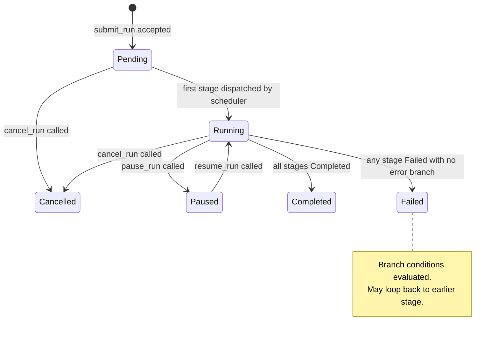

#### 3.4.2 Stage Lifecycle State Machine

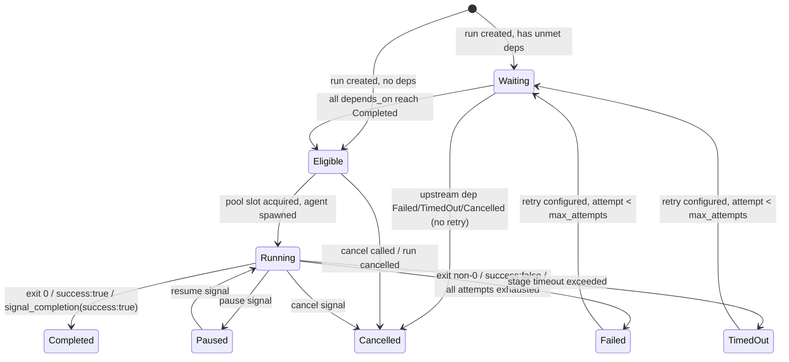

**[4_USER_FEATURES-FEAT-050]** When a stage's `depends_on` dependency reaches a terminal `Failed`, `TimedOut`, or `Cancelled` status with no retry configured, all downstream stages transition to `Cancelled` immediately. If the downstream stage is already dispatched (Running), a cancel signal is sent to the agent.

#### 3.4.3 Dependency and Template Resolution

**[4_USER_FEATURES-FEAT-052]** A template variable reference (`{{stage.<name>.*}}`) is only valid if `<name>` is in the transitive `depends_on` closure of the referencing stage. An invalid reference causes the stage to fail before the agent is spawned, with error: `"template error: stage '<name>' is not in the transitive depends_on closure"`.

**[4_USER_FEATURES-FEAT-053]** A missing template variable value causes the stage to fail immediately before agent spawn. Variables are never silently substituted with an empty string. Error format: `"template error: variable '' could not be resolved"`.

Template variable resolution order (first match wins):

| Priority | Variable Pattern | Source |
|---|---|---|
| 1 | `{{workflow.input.<name>}}` | Workflow run inputs |
| 2 | `{{run.id}}` | Run UUID4 |
| 3 | `{{run.slug}}` | Run slug |
| 4 | `{{run.name}}` | User-provided run name |
| 5 | `{{stage.<name>.exit_code}}` | Stage exit code (integer as string) |
| 6 | `{{stage.<name>.output.<field>}}` | Stage structured output field |
| 7 | `{{stage.<name>.stdout}}` | Stage stdout (truncated to 10 KiB) |
| 8 | `{{stage.<name>.stderr}}` | Stage stderr (truncated to 10 KiB) |
| 9 | `{{fan_out.index}}` | Fan-out sub-agent index (0-based) |
| 10 | `{{fan_out.item}}` | Fan-out input list item (input_list mode) |

No match at any priority → stage fails immediately with `TemplateError::UnknownVariable`.

**[4_USER_FEATURES-FEAT-054]** A missing `prompt_file` at execution time causes the stage to fail before the agent is spawned. The error is: `"prompt_file not found: <path>"`. The file path is resolved at execution time, not at workflow validation time.

#### 3.4.4 Completion Signal Processing

**[4_USER_FEATURES-FEAT-055]** A `structured_output` stage with `"success": "true"` (string, not boolean) in `.devs_output.json` is treated as `Failed`. The `success` field must be a JSON boolean. String `"true"` and string `"false"` are both parse failures.

Completion signal processing rules by mechanism:

| Mechanism | Primary Signal | Outcome Logic |
|---|---|---|
| `exit_code` | Process exit code | 0 → `Completed`; non-zero → check rate-limit patterns → `Failed` or pool fallback |
| `structured_output` | `.devs_output.json` (priority) or last JSON object on stdout | `"success": true` → `Completed`; `"success": false` → `Failed`; missing/invalid/non-boolean → `Failed` |
| `mcp_tool_call` | `signal_completion` MCP call | `success:true` → `Completed`; `success:false` → `Failed`; process exits without calling → fallback to `exit_code` mechanism |

**[4_USER_FEATURES-FEAT-056]** When `completion="mcp_tool_call"` and the agent process exits without calling `signal_completion`, the stage completion falls back to the `exit_code` mechanism using the process exit code.

`exit_code` is always recorded in `StageRun.exit_code` regardless of which completion mechanism is configured.

#### 3.4.5 Timeout Enforcement

Timeout enforcement sequence (per stage):

```
T+0:    timeout_secs elapsed since started_at
T+0:    write "devs:cancel\n" to agent stdin
T+5s:   SIGTERM to agent process
T+10s:  SIGKILL to agent process
T+10s+: record exit_code (typically -9 for SIGKILL)
T+10s+: mark stage TimedOut
```

**[4_USER_FEATURES-FEAT-058]** After `max_attempts` is exhausted, the stage is marked `Failed` and branch conditions are evaluated. The workflow graph determines next steps; the run does not halt automatically.

Workflow-level timeout is enforced independently: if `workflow.timeout_secs` elapses, ALL running stages receive the cancel sequence simultaneously, and the run transitions to `Failed`.

#### 3.4.6 Retry and Rate Limiting

**[4_USER_FEATURES-FEAT-057]** Rate-limit events do NOT increment the stage `attempt` counter. Only genuine failures (non-rate-limit process failures) increment the counter toward `max_attempts`.

Retry backoff formulas:

| Backoff Type | Delay for Attempt N (1-based) |
|---|---|
| `Fixed` | `initial_delay_secs` (constant) |
| `Exponential` | `min(initial_delay_secs ^ N, max_delay_secs.unwrap_or(300))` |
| `Linear` | `min(initial_delay_secs × N, max_delay_secs.unwrap_or(300))` |

`initial_delay_secs` MUST be ≥ 1. `max_delay_secs` defaults to 300 (5 minutes) if not specified.

#### 3.4.7 Fan-Out

**[4_USER_FEATURES-FEAT-051]** When a fan-out stage has any sub-agent fail and no custom merge handler is configured, the entire fan-out stage is marked `Failed`. The failure response includes `{"failed_indices": [0, 2, ...]}`.

Fan-out orchestration rules:

- All N sub-agents are dispatched as distinct `StageRun` records with a `fan_out_index` field.
- Sub-agents compete independently for pool slots; each runs in an isolated execution environment.
- The fan-out stage waits for ALL sub-agents to reach terminal state before merge/advance.
- `{{fan_out.index}}` is always available (0-based). `{{fan_out.item}}` is available in `input_list` mode only.
- Maximum fan-out count: 64 (either `count` or `input_list` length).

Default merge output schema:

```json
{
  "fan_out_results": [
    {
      "index": 0,
      "item": "string|null",
      "success": true,
      "exit_code": 0,
      "output": {}
    }
  ]
}
```

#### 3.4.8 Pool Dispatch Edge Cases

**[4_USER_FEATURES-FEAT-059]** When `submit_run` is called during server shutdown, the server returns `FAILED_PRECONDITION "server is shutting down"` and does not create a run.

**[4_USER_FEATURES-FEAT-060]** When a pool has no agents satisfying required capability tags, the stage fails immediately with `PoolError::UnsatisfiedCapability`. The stage is not queued. Error: `"pool '<name>' has no agents satisfying capabilities: [<cap1>, <cap2>]"`.

**[4_USER_FEATURES-FEAT-061]** When `max_concurrent` agents are all occupied, new stage dispatches queue in FIFO order on the pool semaphore. The stage status remains `Eligible` while queued. There is no timeout on the semaphore wait; stages wait until a slot is available or the run is cancelled.

**[4_USER_FEATURES-FEAT-062]** `devs project remove` on a project with active runs allows active runs to complete. The project status transitions to `removing`. No new submissions are accepted. When all active runs reach terminal state, the project is fully removed from the registry.

#### 3.4.9 State Persistence Edge Cases

Checkpoint write failures do not crash the server. Atomic write protocol: serialize → write to `.tmp` file → `fsync` → `rename()` → `git add` → `git commit`. If disk is full during the write, the `.tmp` file is deleted, the error is logged at `ERROR`, and the server continues. The checkpoint write is retried on the next state transition.

When the server recovers from a crash:

| State at Crash | Recovery Action |
|---|---|
| `Running` stage | Reset to `Eligible`; re-queued for dispatch |
| `Eligible` stage | Remains `Eligible`; re-queued |
| `Waiting` stage | Remains `Waiting`; dependencies re-evaluated |
| `Pending` run | Re-queued |
| `Completed`/`Failed`/`Cancelled` | No action; terminal state preserved |

Corrupt `checkpoint.json` (invalid JSON, unrecognized `schema_version`): the run is skipped, marked `Unrecoverable` in logs, and the server continues loading other runs. The corrupt file is not deleted; a human or AI agent must investigate.

---

### 3.5 `./do` Script Edge Cases

#### 3.5.1 Command Behavior

**[4_USER_FEATURES-FEAT-063]** `./do presubmit` kills all child processes and exits non-zero if the wall-clock time exceeds 15 minutes. The timeout is enforced by a background timer process that sends SIGTERM to the presubmit process group. The exit code is 1.

**[4_USER_FEATURES-FEAT-064]** `./do setup` is idempotent. Running it multiple times produces the same result with no errors. Tools already at the required version are skipped without reinstall. The command exits 0 if all dependencies are satisfied.

**[4_USER_FEATURES-FEAT-065]** An unknown subcommand to `./do` prints the list of valid subcommands to stderr and exits non-zero (exit code 1). Output format: `"Usage: ./do <command>\nCommands: setup build test lint format coverage presubmit ci"`.

**[4_USER_FEATURES-FEAT-066]** `./do test` generates `target/traceability.json` and exits non-zero if:
- Any requirement ID referenced in `docs/plan/specs/*.md` has zero covering tests, OR
- Any test annotation (`// Covers: <ID>`) references a non-existent requirement ID.

All cargo tests passing does not guarantee exit 0; traceability must also pass.

**[4_USER_FEATURES-FEAT-067]** `./do coverage` generates `target/coverage/report.json` containing exactly five quality gates (QG-001 through QG-005) and exits non-zero if `overall_passed` is `false`.

#### 3.5.2 Generated File Schemas

`target/traceability.json` schema:

```json
{
  "schema_version": 1,
  "generated_at": "2026-03-11T10:00:00.000Z",
  "overall_passed": true,
  "traceability_pct": 100.0,
  "requirements": [
    {
      "id": "1_PRD-REQ-001",
      "source_file": "docs/plan/specs/1_prd.md",
      "covering_tests": ["test_module::test_name"],
      "covered": true
    }
  ],
  "stale_annotations": [
    {
      "annotation": "// Covers: NONEXISTENT-001",
      "file": "crates/devs-core/src/lib.rs",
      "line": 42
    }
  ]
}
```

`target/coverage/report.json` schema:

```json
{
  "schema_version": 1,
  "generated_at": "2026-03-11T10:00:00.000Z",
  "overall_passed": true,
  "gates": [
    {
      "gate_id": "QG-001",
      "scope": "unit tests, all crates",
      "threshold_pct": 90.0,
      "actual_pct": 92.5,
      "passed": true,
      "delta_pct": 2.5,
      "uncovered_lines": 150,
      "total_lines": 2000
    },
    {"gate_id": "QG-002", "scope": "E2E aggregate", "threshold_pct": 80.0, "...": "..."},
    {"gate_id": "QG-003", "scope": "E2E CLI", "threshold_pct": 50.0, "...": "..."},
    {"gate_id": "QG-004", "scope": "E2E TUI", "threshold_pct": 50.0, "...": "..."},
    {"gate_id": "QG-005", "scope": "E2E MCP", "threshold_pct": 50.0, "...": "..."}
  ]
}
```

The `delta_pct` field is the difference between `actual_pct` and `threshold_pct` (positive = above threshold, negative = below).

`target/presubmit_timings.jsonl` format (one JSON object per line):

```json
{"step": "setup", "duration_secs": 2.1, "exit_code": 0, "timestamp": "2026-03-11T10:00:00.000Z"}
{"step": "lint", "duration_secs": 15.3, "exit_code": 0, "timestamp": "2026-03-11T10:00:02.100Z"}
```

#### 3.5.3 `./do` Script Edge Cases

**Edge Case DO-EC-001: `./do presubmit` wall-clock timeout fires while `cargo test` is running.** The timeout background process sends SIGTERM to the `./do presubmit` process group, which propagates to all child `cargo` processes. `./do presubmit` exits with code 1 and prints `"presubmit: hard timeout (15m) exceeded"` to stderr.

**Edge Case DO-EC-002: `./do setup` run in a CI environment where `protoc` is already installed at a different version.** The setup script checks the installed version against the required minimum; if satisfied, it skips reinstall and exits 0.

**Edge Case DO-EC-003: `./do ci` called when no GitLab CI token is configured.** The command exits with code 1 and prints `"ci: GITLAB_TOKEN not set; cannot trigger pipeline"`.

**Edge Case DO-EC-004: `./do test` runs successfully but `target/traceability.json` contains a stale annotation (test references a deleted requirement ID).** `./do test` exits non-zero. The stale annotation is listed in `stale_annotations`. The cargo tests themselves passed.

**Edge Case DO-EC-005: `./do coverage` is run before `./do test`.** Coverage depends on compiled test binaries. If `cargo llvm-cov` fails because no test binaries exist, `./do coverage` exits non-zero with the cargo error message.

**Edge Case DO-EC-006: `./do lint` detects an undocumented external dependency** (a crate in `Cargo.toml` not present in the authoritative dependency table in the TAS). The dependency audit step exits non-zero and lists the undocumented crate names.

#### 3.5.4 `./do` Business Rules

- **[4_USER_FEATURES-DO-BR-001]** `./do` MUST be a POSIX `sh` script with no bash-specific syntax. It MUST execute correctly under `/bin/sh` on Linux, macOS, and Windows (Git Bash).
- **[4_USER_FEATURES-DO-BR-002]** `./do presubmit` executes steps in this order: `setup → format → lint → test → coverage → ci`. Each step's exit code is checked; on failure, subsequent steps are skipped and `presubmit` exits non-zero.
- **[4_USER_FEATURES-DO-BR-003]** `./do ci` pushes a temporary branch, triggers a GitLab pipeline, polls for up to 30 minutes, then deletes the branch. It exits 0 only if all three CI jobs pass.
- **[4_USER_FEATURES-DO-BR-004]** All `./do` commands produce identical exit codes on Linux, macOS, and Windows (Git Bash).
- **[4_USER_FEATURES-DO-BR-005]** `./do format` MUST modify files in-place and exit 0 even if no files needed formatting.
- **[4_USER_FEATURES-DO-BR-006]** `./do build` MUST build all workspace crates in release mode. Exit non-zero if any crate fails to compile.

---

### 3.6 Dependencies

This section lists the components and documents that each subsection of §3 depends on, and which other sections depend on §3.

| Subsection | Depends On | Depended On By |
|---|---|---|
| §3.1 CLI Interactions | gRPC `RunService`, `LogService`, `ProjectService` (§7); Server auto-discovery (§6); `ServerState` data model (§6) | §10 Acceptance Criteria; CI/CD scripts |
| §3.2 TUI Interactions | `StreamRunEvents` gRPC streaming (§7); `devs-core` run/stage types (§6); `ratatui` rendering | §10 Acceptance Criteria |
| §3.3 MCP Tool Interactions | `ServerState` (§6); `StateMachine` trait (§8); `CheckpointStore` (§6); `TemplateResolver` (§6) | Orchestrated agent workflows (§2); §10 Acceptance Criteria |
| §3.4 Workflow Execution | `DAGScheduler` (§8); `AgentPool` (§6); `devs-executor` (§6); `RetryConfig` (§6) | §3.3 MCP tools; §2 user journeys; §10 Acceptance Criteria |
| §3.5 `./do` Script | Rust toolchain; `cargo-llvm-cov`; GitLab CI config | §10 Acceptance Criteria; CI/CD pipeline |

External runtime dependencies for §3 behaviors:

- **`tokio`** — async runtime for all gRPC and MCP I/O
- **`tonic`** — gRPC client/server for CLI and TUI connections
- **`ratatui` + `crossterm`** — TUI rendering
- **`portable-pty`** — PTY mode for agent adapters (affects stage execution in §3.4)
- **`git2`** — checkpoint persistence (affects crash recovery in §3.4.9)
- **`reqwest`** — webhook delivery (affects §3.4 event notifications)

---

### 3.7 Acceptance Criteria

The following criteria are testable assertions that an implementing agent MUST verify via automated tests. Each criterion maps to one or more requirements in this section.

#### CLI Acceptance Criteria

- **[4_USER_FEATURES-AC-3-CLI-001]** GIVEN `devs status <valid-run-id> --format json`, WHEN the run exists, THEN the response is valid JSON with `run_id`, `status`, `stage_runs` array, and all timestamp fields present (null or string, never absent).
- **[4_USER_FEATURES-AC-3-CLI-002]** GIVEN `devs status <nonexistent-id>`, WHEN the command runs, THEN exit code is 2 and `--format json` output is `{"error": "not_found: ...", "code": 2}`.
- **[4_USER_FEATURES-AC-3-CLI-003]** GIVEN the server is not running and no `--server` flag, WHEN any CLI command runs, THEN exit code is 3.
- **[4_USER_FEATURES-AC-3-CLI-004]** GIVEN `devs submit <workflow> --input required_field=value` where `required_field` type is `boolean` and value is `"1"`, WHEN the command runs, THEN exit code is 4 and the error message references `required_field`.
- **[4_USER_FEATURES-AC-3-CLI-005]** GIVEN `devs logs <run> --follow` where the run completes successfully, WHEN the run reaches `Completed`, THEN the command exits with code 0.
- **[4_USER_FEATURES-AC-3-CLI-006]** GIVEN `devs logs <run> --follow` where the run fails, WHEN the run reaches `Failed`, THEN the command exits with code 1.
- **[4_USER_FEATURES-AC-3-CLI-007]** GIVEN `devs submit` from a CWD that matches two registered projects with no `--project` flag, WHEN the command runs, THEN exit code is 4 and the error message lists both project names.
- **[4_USER_FEATURES-AC-3-CLI-008]** GIVEN `./do unknown-command`, WHEN the script runs, THEN exit code is non-zero and stderr contains the list of valid commands.
- **[4_USER_FEATURES-AC-3-CLI-009]** GIVEN `devs list --format json`, WHEN zero runs exist, THEN the response is `{"runs": [], "total": 0, "limit": 100, "offset": 0}` (not an error).

#### TUI Acceptance Criteria

- **[4_USER_FEATURES-AC-3-TUI-001]** GIVEN a TUI test with `TestBackend(200×50)` and a run with two stages in `RUN` status, WHEN the backend is rendered, THEN the snapshot contains `[ stage-name | RUN |` text for both stages.
- **[4_USER_FEATURES-AC-3-TUI-002]** GIVEN a TUI test where a `StreamRunEvents` event is injected with a stage transitioning to `DONE`, WHEN 50 ms elapses, THEN the rendered buffer shows `DONE` for that stage.
- **[4_USER_FEATURES-AC-3-TUI-003]** GIVEN a TUI with terminal width 79 columns, WHEN the TUI renders, THEN the buffer contains `"Terminal too small"` and no interactive content.
- **[4_USER_FEATURES-AC-3-TUI-004]** GIVEN a TUI that loses its gRPC connection, WHEN 30 seconds elapse and 5 additional seconds pass, THEN the TUI process exits with code 1.
- **[4_USER_FEATURES-AC-3-TUI-005]** GIVEN the Logs tab is active and a stage has 10,001 log lines, WHEN the buffer is inspected, THEN it contains exactly 10,000 lines and the status bar shows `[TRUNCATED]`.
- **[4_USER_FEATURES-AC-3-TUI-006]** GIVEN no runs exist, WHEN the Dashboard tab is rendered, THEN the left pane shows `"No runs found."` and the TUI does not exit or error.

#### MCP Acceptance Criteria

- **[4_USER_FEATURES-AC-3-MCP-001]** GIVEN a `GET /mcp/v1/call` request (wrong method), WHEN the server responds, THEN HTTP status is 405.
- **[4_USER_FEATURES-AC-3-MCP-002]** GIVEN `submit_run` with a duplicate non-cancelled `run_name` for the same project, WHEN two concurrent calls are made, THEN exactly one returns `"error": null` and one returns `"error": "already_exists: ..."`.
- **[4_USER_FEATURES-AC-3-MCP-003]** GIVEN `get_run` on any valid run, WHEN the response is received, THEN every field in the `WorkflowRun` schema is present (including optional fields as `null`).
- **[4_USER_FEATURES-AC-3-MCP-004]** GIVEN `stream_logs(follow:false)` on a completed stage, WHEN the response arrives, THEN HTTP status is 200, the final line is `{"done":true,...}`, and the connection is closed.
- **[4_USER_FEATURES-AC-3-MCP-005]** GIVEN `signal_completion` called twice on the same terminal stage, WHEN the second call is made, THEN `"error"` is non-null with `"failed_precondition"` prefix and no state change occurs.
- **[4_USER_FEATURES-AC-3-MCP-006]** GIVEN `assert_stage_output` with a `matches` operator and invalid regex `"[unclosed"`, WHEN the call is made, THEN `"error"` is non-null with `"invalid_argument"` prefix and no assertions are evaluated.
- **[4_USER_FEATURES-AC-3-MCP-007]** GIVEN `inject_stage_input` on a `Running` stage, WHEN the call is made, THEN `"error"` is non-null with `"failed_precondition"` prefix.
- **[4_USER_FEATURES-AC-3-MCP-008]** GIVEN a request body exceeding 1 MiB, WHEN the server receives it, THEN HTTP status is 413.
- **[4_USER_FEATURES-AC-3-MCP-009]** GIVEN `cancel_run` on a run with three running stages, WHEN the call completes, THEN `checkpoint.json` contains all three stages in `Cancelled` status in a single commit.
- **[4_USER_FEATURES-AC-3-MCP-010]** GIVEN 64 concurrent observation tool calls, WHEN all are issued simultaneously, THEN all complete without error (no lock contention failures).

#### Workflow Execution Acceptance Criteria

- **[4_USER_FEATURES-AC-3-WF-001]** GIVEN a stage with `{{stage.x.output.field}}` where stage `x` is not in the transitive `depends_on` closure, WHEN the stage attempts to run, THEN the stage fails before agent spawn with a template error message.
- **[4_USER_FEATURES-AC-3-WF-002]** GIVEN a `structured_output` stage whose `.devs_output.json` contains `"success": "true"` (string), WHEN the stage completes, THEN stage status is `Failed`.
- **[4_USER_FEATURES-AC-3-WF-003]** GIVEN a stage with `max_attempts: 3` that fails due to rate-limit on attempt 1, WHEN the stage is retried, THEN `attempt` counter remains at 1 after the rate-limit event.
- **[4_USER_FEATURES-AC-3-WF-004]** GIVEN two stages with no shared dependencies submitted simultaneously, WHEN both become `Eligible`, THEN both are dispatched within 100 ms of each other.
- **[4_USER_FEATURES-AC-3-WF-005]** GIVEN a fan-out stage with `count: 3` where sub-agent at index 1 fails and no merge handler is configured, WHEN all sub-agents complete, THEN the fan-out stage status is `Failed` and `"failed_indices": [1]` is in the error output.
- **[4_USER_FEATURES-AC-3-WF-006]** GIVEN a stage timeout of 10 seconds elapses, WHEN enforcement runs, THEN the sequence is: stdin `devs:cancel\n` → SIGTERM at T+5s → SIGKILL at T+10s → stage marked `TimedOut`.
- **[4_USER_FEATURES-AC-3-WF-007]** GIVEN a server crash with a stage in `Running` state, WHEN the server restarts and loads checkpoints, THEN the stage status is `Eligible` (not `Running`).
- **[4_USER_FEATURES-AC-3-WF-008]** GIVEN `cancel_run` called while stage A is Running and stage B is Waiting, WHEN cancellation completes, THEN both stages are `Cancelled` in the same checkpoint write.
- **[4_USER_FEATURES-AC-3-WF-009]** GIVEN a pool with `max_concurrent: 4` and 10 stages all becoming `Eligible` simultaneously, WHEN dispatching occurs, THEN exactly 4 stages transition to `Running` and 6 remain `Eligible`.
- **[4_USER_FEATURES-AC-3-WF-010]** GIVEN `devs project remove` called while a run is active, WHEN the command completes, THEN the project status is `removing`, the active run continues, and a subsequent `submit_run` for that project returns an error.

#### `./do` Script Acceptance Criteria

- **[4_USER_FEATURES-AC-3-DO-001]** GIVEN `./do presubmit` running for 16 minutes, WHEN the 15-minute wall-clock deadline passes, THEN all child processes are killed and `./do presubmit` exits non-zero.
- **[4_USER_FEATURES-AC-3-DO-002]** GIVEN `./do setup` run twice, WHEN the second run completes, THEN exit code is 0 and no duplicate installations occur.
- **[4_USER_FEATURES-AC-3-DO-003]** GIVEN `./do test` where one test has annotation `// Covers: NONEXISTENT-999` referencing a non-existent requirement, WHEN the command runs, THEN exit code is non-zero and `target/traceability.json` contains the stale annotation in `stale_annotations`.
- **[4_USER_FEATURES-AC-3-DO-004]** GIVEN `./do coverage` where QG-002 (E2E aggregate) is below 80%, WHEN the command runs, THEN exit code is non-zero and `target/coverage/report.json` contains `"overall_passed": false`.
- **[4_USER_FEATURES-AC-3-DO-005]** GIVEN `./do coverage` completes successfully, WHEN `target/coverage/report.json` is inspected, THEN it contains exactly 5 gate objects with `gate_id` values `QG-001` through `QG-005`.

---

## 4. Accessibility & Localization Requirements

This section defines all requirements governing terminal interface accessibility, machine-readable output contracts, localization scope, and cross-platform compatibility for `devs`. These requirements apply uniformly to the TUI (`devs-tui`), CLI (`devs-cli`), MCP server (`devs-mcp`), and the `./do` entrypoint script.

**Dependencies:** This section depends on §2 (TUI Interface), §3 (CLI Interface and `./do` Script), and the MCP design (§5 of the MCP Design Specification). It is depended upon by every component that produces user-visible output or machine-readable data.

---

### 4.1 Terminal Interface Accessibility

#### 4.1.1 ASCII Character Palette

**[4_USER_FEATURES-FEAT-068]** All TUI output uses only standard ASCII characters (codepoints U+0020–U+007E) for structural elements including box borders, DAG edges, status labels, and separator lines. No Unicode box-drawing characters (U+2500–U+257F), block elements, or emoji are used in any interface element. This ensures compatibility with the broadest range of terminal emulators including those on headless Linux servers that may not have full UTF-8 locale support.

The complete set of ASCII structural characters used in the TUI is fixed and enumerated in the following table. Any TUI rendering that uses a character outside this palette is a defect.

| Element | Characters Used | Example |
|---|---|---|
| Box top/bottom border | `-` (U+002D) | `+----------+` |
| Box left/right border | `\|` (U+007C) | `\| content \|` |
| Box corner | `+` (U+002B) | `+----------+` |
| DAG dependency arrow | `-`, `>`, `\|`, `+` | `task1 --+-> task2` |
| DAG vertical connector | `\|` (U+007C) | (vertical leg of DAG edge) |
| Tab separator | `\|` (U+007C) | `[Dashboard] \| [Logs]` |
| Active tab indicator | `*` (U+002A) | `[*Dashboard]` |
| Horizontal separator | `-` (U+002D) | `----` |
| Progress ellipsis | `.` (U+002E) | `Connecting...` |
| Stage status bracket | `[`, `]` (U+005B, U+005D) | `[ plan \| RUN \| 0:23 ]` |

**[4_USER_FEATURES-FEAT-068a]** The TUI never emits ANSI escape codes that rely on terminal-specific extensions beyond the following safe subset: SGR color codes (3x/4x/9x/10x foreground/background), SGR bold (1), SGR reset (0), cursor movement (CUP, CUU, CUD, CUF, CUB), and erase in line (EL). No xterm-specific sequences (e.g., title bar changes, alternate screen mode beyond the standard `smcup`/`rmcup`) are required for correct operation.

**[4_USER_FEATURES-FEAT-068b]** The `ratatui::backend::TestBackend` used in TUI tests renders to a `200×50` in-memory buffer. All TUI tests assert on the text content of this buffer using `insta` snapshot files (`.txt` fixtures in `crates/devs-tui/tests/snapshots/`). Pixel-based comparison is prohibited. Snapshot files are committed to the repository and must be updated explicitly when rendering changes intentionally.

#### 4.1.2 Stage Status Labels

**[4_USER_FEATURES-FEAT-069]** Stage status labels in the TUI are exactly four uppercase ASCII characters. The complete mapping from `StageStatus` enum value to TUI abbreviation is:

| `StageStatus` | TUI Label | Meaning |
|---|---|---|
| `Pending` | `PEND` | Stage exists but the run has not started |
| `Waiting` | `WAIT` | Waiting for dependency stages to complete |
| `Eligible` | `ELIG` | Dependencies met; queued for agent dispatch |
| `Running` | `RUN ` | Agent subprocess is active (note trailing space for alignment) |
| `Paused` | `PAUS` | Agent received pause signal; not yet cancelled |
| `Completed` | `DONE` | Stage finished successfully |
| `Failed` | `FAIL` | Stage exited with failure (non-zero, structured failure, or timeout-fail) |
| `TimedOut` | `TIME` | Stage exceeded its configured `timeout_secs` |
| `Cancelled` | `CANC` | Stage was explicitly cancelled or cascaded |

**[4_USER_FEATURES-FEAT-069a]** The four-letter label is the sole text indicator of stage status. The TUI also applies a color hint (see §4.1.3) as a secondary signal, but the text abbreviation MUST always be present regardless of color capability. No status is conveyed through color alone.

**[4_USER_FEATURES-FEAT-069b]** Stage boxes in the TUI DAG view use the format `[ <stage-name> | <STATUS> | <elapsed> ]`. Stage names are truncated with a trailing `~` if they exceed 20 characters within the box to preserve 80-column layout. The elapsed field uses the format `M:SS` for durations under one hour and `H:MM:SS` for one hour or more. A stage that has not started displays `--:--` in place of elapsed time.

Example stage box rendering:
```
[ plan           | DONE | 1:43 ]
[ implement-api  | RUN  | 0:23 ]
[ implement-ui~  | ELIG | --:-- ]
```

#### 4.1.3 Color as a Secondary Signal

**[4_USER_FEATURES-FEAT-070]** Color is a secondary (non-exclusive) channel for conveying state. The following color scheme is used when terminal color is detected, but the TUI remains fully usable with color disabled:

| Status | Foreground Color (ANSI) | Notes |
|---|---|---|
| `DONE` | Green (32) | |
| `FAIL` | Red (31) | Bold also applied |
| `TIME` | Red (31) | Bold also applied |
| `CANC` | Dark gray (90) | |
| `RUN ` | Yellow (33) | |
| `PAUS` | Cyan (36) | |
| `ELIG` | Blue (34) | |
| `WAIT` | Dark gray (90) | |
| `PEND` | Dark gray (90) | |

**[4_USER_FEATURES-FEAT-070a]** Color is never applied to structural elements (box borders, DAG arrows, separators). Color is applied only to status labels and log line prefixes (`stdout:`/`stderr:` in the Debug tab).

**[4_USER_FEATURES-FEAT-070b]** Terminal color capability is detected via `TERM`, `COLORTERM`, and `NO_COLOR` environment variables. If `NO_COLOR` is set (to any value, including empty string), all color output is suppressed and only plain text is emitted. This follows the `no-color.org` convention.

#### 4.1.4 Keyboard Navigation

**[4_USER_FEATURES-FEAT-071]** All TUI controls are operable via keyboard without a mouse. The complete keyboard binding table for the TUI is:

| Key | Action | Context |
|---|---|---|
| `Tab` / `Shift+Tab` | Cycle forward/backward through tabs | Global |
| `1` | Switch to Dashboard tab | Global |
| `2` | Switch to Logs tab | Global |
| `3` | Switch to Debug tab | Global |
| `4` | Switch to Pools tab | Global |
| `↑` / `k` | Move selection up in list | Dashboard run list, Logs |
| `↓` / `j` | Move selection down in list | Dashboard run list, Logs |
| `PgUp` / `Ctrl+U` | Scroll up one page | Logs tab |
| `PgDn` / `Ctrl+D` | Scroll down one page | Logs tab |
| `G` | Jump to end of log buffer | Logs tab |
| `g` | Jump to beginning of log buffer | Logs tab |
| `Enter` | Select highlighted run / expand stage | Dashboard |
| `c` | Cancel highlighted run | Dashboard, Debug |
| `p` | Pause highlighted run | Dashboard, Debug |
| `r` | Resume highlighted run or stage | Dashboard, Debug |
| `l` | Open Logs tab for selected run | Dashboard |
| `d` | Open Debug tab for selected stage | Dashboard |
| `f` | Toggle log follow mode (tail) | Logs tab |
| `q` / `Ctrl+C` | Quit TUI | Global |
| `?` | Display keybinding help overlay | Global |
| `Esc` | Close overlay / deselect | Global |

**[4_USER_FEATURES-FEAT-071a]** The keybinding help overlay (`?`) lists all active bindings for the current tab and context. It is rendered as a bordered ASCII box overlaid on the current tab content. It is dismissible with `Esc` or `?` again.

**[4_USER_FEATURES-FEAT-071b]** When a keyboard action is invalid for the current state (e.g., pressing `c` on a `Completed` run), the TUI displays a transient status bar message at the bottom of the screen for 3 seconds: `"Action unavailable: <reason>"`. The TUI never silently ignores a key press that maps to an action.

#### 4.1.5 Minimum Terminal Dimensions

**[4_USER_FEATURES-FEAT-072]** The TUI requires a minimum terminal size of 80 columns × 24 rows. At or above this size, all interactive elements, stage boxes, status labels, and the log tail are fully visible without truncation of critical information.

**[4_USER_FEATURES-FEAT-072a]** If the terminal is detected to be smaller than 80×24 at startup or after a resize event, the TUI replaces its normal layout with a single-line warning: `"Terminal too small: 80x24 minimum required (current: <W>x<H>)"`. When the terminal is resized back above the minimum, the normal layout resumes immediately on the next render cycle.

**[4_USER_FEATURES-FEAT-072b]** The TUI handles `SIGWINCH` (terminal resize) on Linux/macOS and the equivalent resize event from `crossterm` on Windows. Resize events trigger a full re-render within 50 ms. The layout reflows to use the new dimensions.

**[4_USER_FEATURES-FEAT-072c]** Stage names longer than the available column width in the run list are truncated with a trailing `~` character. The truncation point preserves the maximum number of leading characters that fit. No stage name is ever elided entirely; at least 4 characters are always shown.

#### 4.1.6 CLI Log Output Format

**[4_USER_FEATURES-FEAT-073]** Log output from `devs logs` (in default text mode) is plain UTF-8 text, one log line per output line. Lines from `stdout` and `stderr` are interleaved in chronological order with a stream prefix:

```
stdout: <log line content>
stderr: <log line content>
```

**[4_USER_FEATURES-FEAT-073a]** When `devs logs --follow` is active, the command streams lines to stdout as they arrive, with no buffering beyond a single line. This output is compatible with standard terminal pagers (`less -R`, `more`) and log aggregation tools (`grep`, `awk`, `jq` when combined with `--format json`).

**[4_USER_FEATURES-FEAT-073b]** When stdout of `devs logs` is not a TTY (i.e., output is piped), the `stdout:` / `stderr:` stream prefix is still included. Color codes are suppressed automatically when not writing to a TTY.

#### 4.1.7 Edge Cases — Terminal Interface

| Edge Case | Expected Behavior |
|---|---|
| Terminal reports 0 columns or 0 rows | TUI treats as below minimum; displays resize warning on next render |
| `NO_COLOR=1` set in environment | All ANSI color codes suppressed; text and ASCII structure intact |
| Terminal resize to exactly 80×24 | Normal layout rendered; no warning |
| Terminal resize below 80×24 mid-session | Warning displayed immediately on next render cycle (within 50 ms) |
| SSH session with no PTY allocated | TUI exits with error: `"TUI requires an interactive terminal (PTY)"`; exit code 1 |
| `TERM=dumb` set | Color disabled; TUI renders in plain-text mode; all text content preserved |
| Rapid resize events (>10 per second) | Renders coalesced; at most one re-render per 50 ms; no crash or corrupted display |
| Stage name is exactly 20 characters | Rendered without truncation |
| Stage name is 21 or more characters | Truncated to 19 characters + `~` |

---

### 4.2 Machine-Readable Output

#### 4.2.1 CLI JSON Output Mode

**[4_USER_FEATURES-FEAT-074]** All CLI commands support `--format json` as a machine-readable output mode. When `--format json` is active:

- All output (success and error) is written to **stdout** as structured JSON.
- **Nothing** is written to stderr.
- The JSON object is a single line followed by a newline character (`\n`).
- No human-readable prose, ANSI escape codes, or stream prefixes are mixed into the output.

The `--format` flag accepts exactly two values: `text` (default) and `json`. Any other value is a validation error (exit code 4).

**[4_USER_FEATURES-FEAT-074a]** When `devs logs --format json --follow` is active, each log line is emitted as a separate JSON object (newline-delimited JSON / NDJSON), one object per line:

```json
{"stream": "stdout", "line": "<content>", "timestamp": "2026-03-10T14:23:05.123Z", "sequence": 1}
{"stream": "stderr", "line": "<content>", "timestamp": "2026-03-10T14:23:05.124Z", "sequence": 2}
{"done": true, "total_lines": 2, "truncated": false}
```

The final `{"done": true, ...}` object is emitted when the run reaches a terminal state. The `sequence` field starts at 1 and increments monotonically with no gaps.

**[4_USER_FEATURES-FEAT-074b]** When `devs logs --format json` is active without `--follow`, all buffered log lines are emitted as NDJSON followed by the `{"done": true}` terminator, then the process exits.

#### 4.2.2 CLI JSON Success Response Schemas

The following tables define the JSON schemas for each CLI command's success output when `--format json` is active.

**`devs submit`:**

| Field | Type | Nullable | Description |
|---|---|---|---|
| `run_id` | string (UUID4) | No | Assigned run identifier |
| `slug` | string | No | Human-readable slug |
| `workflow_name` | string | No | Name of the submitted workflow |
| `project_id` | string (UUID4) | No | Project identifier |
| `status` | string | No | Always `"pending"` immediately after submission |

```json
{
  "run_id": "550e8400-e29b-41d4-a716-446655440000",
  "slug": "feature-20260310-a3f2",
  "workflow_name": "feature",
  "project_id": "3fa85f64-5717-4562-b3fc-2c963f66afa6",
  "status": "pending"
}
```

**`devs list`:**

| Field | Type | Nullable | Description |
|---|---|---|---|
| `runs` | array | No | List of run summary objects (no `stage_runs` embedded) |
| `runs[].run_id` | string (UUID4) | No | |
| `runs[].slug` | string | No | |
| `runs[].workflow_name` | string | No | |
| `runs[].project_id` | string (UUID4) | No | |
| `runs[].status` | string | No | Lowercase enum value |
| `runs[].created_at` | string (RFC3339) | No | |
| `runs[].started_at` | string (RFC3339) | Yes | `null` if not yet started |
| `runs[].completed_at` | string (RFC3339) | Yes | `null` if not yet complete |
| `total` | integer | No | Total count before limit applied |

**`devs status <run>`:**

| Field | Type | Nullable | Description |
|---|---|---|---|
| `run_id` | string (UUID4) | No | |
| `slug` | string | No | |
| `workflow_name` | string | No | |
| `project_id` | string (UUID4) | No | |
| `status` | string | No | |
| `created_at` | string (RFC3339) | No | |
| `started_at` | string (RFC3339) | Yes | |
| `completed_at` | string (RFC3339) | Yes | |
| `stage_runs` | array | No | Array of stage run summary objects |
| `stage_runs[].stage_name` | string | No | |
| `stage_runs[].attempt` | integer | No | 1-based |
| `stage_runs[].status` | string | No | |
| `stage_runs[].started_at` | string (RFC3339) | Yes | |
| `stage_runs[].completed_at` | string (RFC3339) | Yes | |
| `stage_runs[].elapsed_ms` | integer | Yes | Monotonic elapsed milliseconds; `null` if not started |
| `stage_runs[].exit_code` | integer | Yes | |

**`devs cancel <run>` / `devs pause <run>` / `devs resume <run>`:**

| Field | Type | Nullable | Description |
|---|---|---|---|
| `run_id` | string (UUID4) | No | |
| `status` | string | No | New status after the operation |

#### 4.2.3 CLI JSON Error Response Schema

**[4_USER_FEATURES-FEAT-075]** JSON error responses from the CLI use the following schema:

```json
{
  "error": "<machine-stable-prefix>: <human-readable detail>",
  "code": <integer>
}
```

| Field | Type | Constraint |
|---|---|---|
| `error` | string | Non-empty; begins with a machine-stable prefix token from §4.3.2 |
| `code` | integer | One of: 1 (general), 2 (not found), 3 (server unreachable), 4 (validation error) |

The `error` string and the process exit code MUST agree: if `code` is 2, the process exits with code 2.

**[4_USER_FEATURES-FEAT-075a]** When multiple validation errors exist (e.g., `devs submit` with several invalid inputs), the `error` field contains a JSON-encoded array of error strings serialized as a JSON string:

```json
{
  "error": "invalid_argument: [{\"field\":\"inputs.count\",\"message\":\"must be integer\"},{\"field\":\"workflow\",\"message\":\"not found\"}]",
  "code": 4
}
```

#### 4.2.4 MCP Response Schema

**[4_USER_FEATURES-FEAT-076]** All MCP responses use the following envelope structure. `result` and `error` are mutually exclusive: exactly one is non-null.

```json
{
  "result": { ... } | null,
  "error": "<string>" | null
}
```

| Field | Type | Rule |
|---|---|---|
| `result` | object or null | Non-null when `error` is null |
| `error` | string or null | Non-null when `result` is null; begins with machine-stable prefix |

**[4_USER_FEATURES-FEAT-076a]** Optional fields that have no current value (e.g., `completed_at` on a running stage, `exit_code` on a waiting stage) MUST be present in the response with a JSON `null` value. Absent fields are a protocol violation. This invariant applies to all MCP tool responses including `get_run`, `get_stage_output`, `get_pool_state`, and `get_workflow_definition`.

**[4_USER_FEATURES-FEAT-076b]** The complete set of fields that must be present in each MCP entity response is:

`WorkflowRun` (from `get_run`):

| Field | Type | Nullable |
|---|---|---|
| `run_id` | string (UUID4) | No |
| `slug` | string | No |
| `workflow_name` | string | No |
| `project_id` | string (UUID4) | No |
| `status` | string | No |
| `inputs` | object | No (empty object `{}` if none) |
| `definition_snapshot` | object | No |
| `created_at` | string (RFC3339) | No |
| `started_at` | string (RFC3339) | Yes |
| `completed_at` | string (RFC3339) | Yes |
| `stage_runs` | array | No |

`StageRun` (embedded in `WorkflowRun.stage_runs`):

| Field | Type | Nullable |
|---|---|---|
| `stage_run_id` | string (UUID4) | No |
| `run_id` | string (UUID4) | No |
| `stage_name` | string | No |
| `attempt` | integer | No |
| `status` | string | No |
| `agent_tool` | string | Yes |
| `pool_name` | string | No |
| `started_at` | string (RFC3339) | Yes |
| `completed_at` | string (RFC3339) | Yes |
| `exit_code` | integer | Yes |
| `output` | object | Yes |

`StageOutput` (from `get_stage_output`):

| Field | Type | Nullable |
|---|---|---|
| `stdout` | string | No (empty string `""` if none) |
| `stderr` | string | No (empty string `""` if none) |
| `structured` | object | Yes |
| `exit_code` | integer | Yes |
| `log_path` | string | No |
| `truncated` | boolean | No |

#### 4.2.5 Serialization Rules

**[4_USER_FEATURES-FEAT-077]** All timestamps in any JSON output (CLI `--format json`, MCP responses, checkpoint files, webhook payloads) use RFC 3339 format with millisecond precision and a `Z` timezone suffix.

**[4_USER_FEATURES-FEAT-078]** All status enum values in any JSON output use lowercase strings with underscore word-separators.

**[4_USER_FEATURES-FEAT-079]** All UUIDs in any JSON output use lowercase hyphenated format (8-4-4-4-12 hex groups).

The complete serialization rules table:

| Type | Encoding | Example |
|---|---|---|
| `Uuid` | Lowercase hyphenated string | `"550e8400-e29b-41d4-a716-446655440000"` |
| `DateTime<Utc>` | RFC 3339, ms precision, `Z` suffix | `"2026-03-10T14:23:05.123Z"` |
| Optional unpopulated field | JSON `null` (key MUST be present) | `"completed_at": null` |
| `RunStatus` / `StageStatus` | Lowercase underscore | `"timed_out"`, `"running"` |
| `AgentTool` | Lowercase CLI name | `"claude"`, `"opencode"` |
| Binary in `stream_logs` chunks | UTF-8 string (U+FFFD for invalid bytes) | |
| Binary in `get_stage_output` | UTF-8 string (U+FFFD for invalid bytes) | |
| `elapsed_ms` field | Integer (monotonic clock milliseconds) | `1234` |
| Boolean | JSON `true` / `false` (never `"true"` string) | |
| Integer | JSON number (never quoted string) | |
| Empty collection | JSON `[]` or `{}` (never `null`) | |

**[4_USER_FEATURES-FEAT-079a]** `elapsed_ms` is computed using a monotonic clock (not wall clock) from the moment the stage entered `Running` status. It is present in API responses where the field is defined. It is `null` for stages that have never been `Running`.

#### 4.2.6 Null vs. Absent Fields

**[4_USER_FEATURES-FEAT-076c]** The distinction between a `null` field and an absent field is semantically significant:

- **`null`**: the field is defined in the schema but has no current value (e.g., a stage that has not yet completed has `completed_at: null`).
- **Absent**: the field does not exist in the response at all. An absent field is a protocol violation and MUST be treated as an implementation defect.

Any consumer (CLI, TUI, AI agent) that encounters an absent required field MUST log a structured error describing the missing field and the tool/endpoint that returned it. It MUST NOT silently default the value.

#### 4.2.7 Edge Cases — Machine-Readable Output

| Edge Case | Expected Behavior |
|---|---|
| `devs list` with no runs in the system | Returns `{"runs": [], "total": 0}` — never `null` for the array |
| `devs status` on a run with zero stage runs | Returns `{"stage_runs": []}` — never absent |
| `--format json` and server is unreachable | `{"error": "server_unreachable: <address>", "code": 3}` to stdout; exit code 3 |
| Log stream chunk contains a NUL byte (U+0000) | Replace with U+FFFD; `truncated` field not affected |
| Stage stdout exceeds 1 MiB in `get_stage_output` | Returns last 1,048,576 bytes; `truncated: true`; no error |
| `--format json` with `devs logs` on completed stage | All lines emitted as NDJSON, then `{"done":true}`, then exit 0 |
| MCP response where `result` and `error` are both non-null | This is a server defect; consuming agent MUST treat as `internal:` error |
| RFC 3339 timestamp with sub-millisecond precision from external source | Truncated to milliseconds on ingest; always emitted at millisecond precision |

---

### 4.3 Localization

#### 4.3.1 Language Scope

**[4_USER_FEATURES-FEAT-080]** All user-facing text in `devs` — including CLI output, TUI labels, TUI help overlays, error messages, log prefixes, and server startup messages — is English only at MVP. No internationalization (i18n) framework, locale-detection logic, or message catalogue is introduced into any crate at MVP.

**[4_USER_FEATURES-FEAT-080a]** Post-MVP localization is forward-compatible with this design because:

1. All user-visible strings are defined as Rust `const` or `&'static str` literals in dedicated string modules within each crate (`devs-tui/src/strings.rs`, `devs-cli/src/strings.rs`). They are never inlined ad hoc throughout business logic.
2. Machine-stable error prefix tokens (§4.3.2) are separate from the human-readable detail suffix, making it possible to translate only the suffix in a future release without breaking agent parsers.
3. No assumption about text direction (LTR only at MVP) is baked into the TUI layout algorithm, but bidirectional text support is explicitly out of scope.

**[4_USER_FEATURES-FEAT-080b]** The `LANG`, `LC_ALL`, `LC_MESSAGES`, and `LANGUAGE` environment variables have no effect on `devs` output at MVP. `devs` does not read these variables.

#### 4.3.2 Machine-Stable Error Prefix Registry

**[4_USER_FEATURES-FEAT-081]** Error messages in MCP responses, gRPC error details, and CLI JSON error output begin with a machine-stable prefix token followed by a colon and space. The prefix token is invariant across releases; the human-readable detail that follows may change.

The complete registry of valid prefix tokens:

| Token | Meaning | CLI Exit Code | gRPC Code |
|---|---|---|---|
| `not_found` | The referenced entity does not exist | 2 | `NOT_FOUND` |
| `invalid_argument` | Input validation failed | 4 | `INVALID_ARGUMENT` |
| `already_exists` | Duplicate entity creation attempted | 1 | `ALREADY_EXISTS` |
| `failed_precondition` | Operation not valid in current state | 1 | `FAILED_PRECONDITION` |
| `resource_exhausted` | Resource limit reached (pool, lock timeout) | 1 | `RESOURCE_EXHAUSTED` |
| `server_unreachable` | Client cannot connect to gRPC or MCP port | 3 | N/A |
| `internal` | Unhandled server-side error | 1 | `INTERNAL` |
| `cancelled` | Operation was cancelled | 1 | `CANCELLED` |
| `timeout` | Operation exceeded time limit | 1 | `DEADLINE_EXCEEDED` |
| `permission_denied` | Operation refused (reserved for post-MVP auth) | 1 | `PERMISSION_DENIED` |

**[4_USER_FEATURES-FEAT-081a]** Prefix tokens are lowercase, contain only ASCII letters and underscores, and MUST NOT contain digits or hyphens. Any code path that produces an error string MUST select a prefix from this registry. Introducing a new prefix token is a breaking change that requires a protocol major version bump.

**[4_USER_FEATURES-FEAT-081b]** The gRPC error `message` field follows the format `"<prefix>: <detail>"` with a machine-stable prefix. The `details` repeated field in the gRPC `Status` proto MAY carry a `google.rpc.BadRequest` proto for `invalid_argument` errors listing individual field violations.

**[4_USER_FEATURES-FEAT-081c]** Validation errors that affect multiple fields return a JSON array embedded in the error detail string:

```
"invalid_argument: [{"field":"stages[0].pool","message":"pool 'primary' not found"},{"field":"stages[1].depends_on[0]","message":"stage 'nonexistent' not defined"}]"
```

Consuming agents MUST handle both single-error and multi-error formats.

#### 4.3.3 Time and Date Display Formats

**[4_USER_FEATURES-FEAT-082]** Time and date values in user-visible output use locale-neutral formats with no dependence on the host locale settings:

| Context | Format | Example |
|---|---|---|
| TUI elapsed time (< 1 hour) | `M:SS` | `4:07` |
| TUI elapsed time (≥ 1 hour) | `H:MM:SS` | `1:23:45` |
| TUI elapsed time (not started) | `--:--` | `--:--` |
| CLI `--format text` absolute time | ISO 8601, second precision, UTC | `2026-03-10T14:23:05Z` |
| CLI `--format json` absolute time | RFC 3339, ms precision, `Z` suffix | `"2026-03-10T14:23:05.123Z"` |
| `./do presubmit` step timing | Decimal seconds to 2 dp | `build: 12.34s` |
| `target/presubmit_timings.jsonl` | RFC 3339 start + float seconds | `{"step":"build","started_at":"...","elapsed_s":12.34}` |

**[4_USER_FEATURES-FEAT-082a]** The TUI elapsed timer increments once per second using a monotonic clock. It does not account for leap seconds. The display is updated on every TUI render cycle (triggered by gRPC `StreamRunEvents` push or a 1-second tick, whichever comes first).

**[4_USER_FEATURES-FEAT-082b]** Elapsed time in `devs status --format json` is expressed in milliseconds as an integer in the `elapsed_ms` field. It is never expressed as a human-readable string in JSON mode.

#### 4.3.4 Number Formats

**[4_USER_FEATURES-FEAT-082c]** Numeric values in user-visible text output (`--format text`) use no locale-specific thousands separators. Numbers are rendered in plain decimal notation. This applies to stage counts, line counts, byte counts, and coverage percentages.

Coverage percentages in `target/coverage/report.json` use two decimal places of precision (e.g., `90.00`, `50.00`, `80.12`). The `delta_pct` field uses the same format and is positive when coverage improved relative to the last run.

#### 4.3.5 Edge Cases — Localization

| Edge Case | Expected Behavior |
|---|---|
| `LANG=ja_JP.UTF-8` set in environment | No effect on `devs` output; all text remains English |
| `TZ=America/New_York` set in environment | No effect; all timestamps emitted in UTC (`Z` suffix) |
| Error message contains a non-ASCII character in stage name | Stage name embedded verbatim in error detail; prefix token remains ASCII |
| New error prefix introduced in minor version | Consuming agents MUST treat unknown prefix as `internal` |
| Machine-stable prefix absent from error string | Consumer MUST log defect report; treat as `internal:` error |
| `elapsed_ms` overflows `i64` (> ~292 million years) | This cannot occur in practice; `u64` is used internally, saturating at `i64::MAX` |

---

### 4.4 Cross-Platform Compatibility

#### 4.4.1 `./do` Script Portability

**[4_USER_FEATURES-FEAT-083]** All `./do` script commands produce identical exit codes on Linux, macOS, and Windows (Git Bash). Behavior — including output, exit codes, and file creation — MUST NOT diverge across platforms. The `./do` script is POSIX `sh` with no bash-specific syntax.

**[4_USER_FEATURES-FEAT-083a]** The following `./do` commands are validated on all three platforms in CI as separate GitLab pipeline jobs (`presubmit-linux`, `presubmit-macos`, `presubmit-windows`):

| Command | Linux | macOS | Windows (Git Bash) |
|---|---|---|---|
| `./do setup` | ✓ | ✓ | ✓ |
| `./do build` | ✓ | ✓ | ✓ |
| `./do test` | ✓ | ✓ | ✓ |
| `./do lint` | ✓ | ✓ | ✓ |
| `./do format` | ✓ | ✓ | ✓ |
| `./do coverage` | ✓ | ✓ | ✓ |
| `./do presubmit` | ✓ | ✓ | ✓ |

**[4_USER_FEATURES-FEAT-083b]** The `./do` script MUST NOT use the following bash-specific or platform-specific constructs: `[[` (use `[`), `$'\n'`, process substitution (`<(cmd)`), `local` in any context other than a function body, `pushd`/`popd`, or GNU-specific flags to `date`, `sed`, `awk`, or `find`. Where platform differences exist, the script uses the lowest common denominator (POSIX) or conditional blocks with explicit platform detection via `uname`.

**[4_USER_FEATURES-FEAT-083c]** The 15-minute hard wall-clock timeout in `./do presubmit` is implemented using a background timer that sends SIGTERM to the main presubmit process group. On Windows (Git Bash), the equivalent is `taskkill /F /T /PID <pid>`. The exit code on timeout is non-zero (the script exits 1 after killing its children).

#### 4.4.2 File Path Normalization

**[4_USER_FEATURES-FEAT-084]** File paths in `devs.toml`, the project registry (`~/.config/devs/projects.toml`), and all API-level path fields use forward-slash (`/`) as the path separator in stored form. The platform-native separator (`\` on Windows) is accepted on input and normalized to `/` before validation, storage, or comparison.

**[4_USER_FEATURES-FEAT-084a]** Path normalization rules:

| Rule | Input | Stored Form |
|---|---|---|
| Forward-slash passthrough | `/home/user/project` | `/home/user/project` |
| Backslash → forward-slash | `C:\Users\user\project` | `C:/Users/user/project` |
| UNC path | `\\server\share\project` | `//server/share/project` |
| Trailing separator stripped | `/home/user/project/` | `/home/user/project` |
| Home directory expansion | `~/project` | Expanded at use time, not at storage time |

**[4_USER_FEATURES-FEAT-084b]** The `~` home directory shorthand in path fields is NOT expanded at storage time. It is expanded to the server process's home directory at the moment the path is first accessed (e.g., when cloning a repo). This ensures paths remain portable across user accounts when the registry file is shared.

**[4_USER_FEATURES-FEAT-084c]** Path fields in workflow input parameters (type `path`) are stored with forward-slash normalization applied. They are NOT resolved to absolute paths at submission time. Resolution occurs at execution time within the agent's working directory.

**[4_USER_FEATURES-FEAT-084d]** All path comparison operations (e.g., determining whether a project path is already registered) are performed case-insensitively on Windows and case-sensitively on Linux and macOS. The platform is detected at runtime via `cfg!(target_os = "windows")`.

#### 4.4.3 Terminal Emulator Compatibility

**[4_USER_FEATURES-FEAT-085]** The TUI renders correctly in standard terminal emulators on all three supported platforms. The following terminals are the reference targets:

| Platform | Reference Terminal |
|---|---|
| Linux | `xterm-256color`, `tmux 3.x`, `screen 4.x`, GNOME Terminal |
| macOS | Terminal.app, iTerm2 |
| Windows | Windows Terminal (WT), Git Bash mintty |

**[4_USER_FEATURES-FEAT-085a]** The TUI does not use any terminal capability that is not supported by all reference terminals listed above. Specifically, the following are prohibited:

- Sixel or iTerm2 inline image protocols (no image rendering)
- OSC sequences beyond OSC 0 (window title)
- Mouse event reporting (no mouse input; keyboard-only per §4.1.4)
- `TIOCGWINSZ` ioctls outside of the `crossterm` abstraction layer

**[4_USER_FEATURES-FEAT-085b]** The `crossterm` crate is used exclusively for all terminal interaction in `devs-tui`. Direct writes to `stdout` using ANSI escape codes are prohibited outside of `crossterm`. This ensures the abstraction layer handles platform differences.

**[4_USER_FEATURES-FEAT-085c]** The `devs-cli` and `devs-mcp-bridge` binaries do not use `crossterm` or any terminal control library. They write plain text or JSON to stdout/stderr as appropriate. Color output in CLI text mode is gated on `stdout.is_terminal()` (using the `std::io::IsTerminal` trait, stable from Rust 1.70). If stdout is not a TTY, color is suppressed automatically.

#### 4.4.4 Process and Signal Handling

**[4_USER_FEATURES-FEAT-085d]** The `devs-server` binary handles the following signals on all platforms:

| Signal | Linux/macOS | Windows Equivalent | Behavior |
|---|---|---|---|
| `SIGTERM` | ✓ | `Ctrl+Break` / `SetConsoleCtrlHandler` | Begin graceful shutdown (§1 TAS Shutdown Sequence) |
| `SIGINT` / `Ctrl+C` | ✓ | `CTRL_C_EVENT` | Same as SIGTERM |
| `SIGHUP` | Linux/macOS only | N/A | Ignored (server continues running) |

**[4_USER_FEATURES-FEAT-085e]** On Windows, the server registers a `SetConsoleCtrlHandler` callback via the `ctrlc` crate. The handler posts a shutdown event to the Tokio runtime. The behavior is equivalent to SIGTERM on Unix.

**[4_USER_FEATURES-FEAT-085f]** Exit codes are consistent across platforms. The mapping from Rust's `std::process::exit()` codes to platform behavior is:

| Code | Meaning | CLI | TUI | Server |
|---|---|---|---|---|
| `0` | Success | ✓ | ✓ | Normal shutdown |
| `1` | General error / failure | ✓ | ✓ | Abnormal (panic) |
| `2` | Not found | ✓ | — | — |
| `3` | Server unreachable | ✓ | ✓ | — |
| `4` | Validation error | ✓ | — | — |

#### 4.4.5 Configuration Directory

**[4_USER_FEATURES-FEAT-085g]** The server's configuration directory (`~/.config/devs/`) is platform-native. The path is resolved as follows:

| Platform | Path |
|---|---|
| Linux / macOS | `$XDG_CONFIG_HOME/devs/` if set, else `~/.config/devs/` |
| Windows | `%APPDATA%\devs\` (e.g., `C:\Users\<user>\AppData\Roaming\devs\`) |

The directory is created at first use if absent. The server logs the resolved path at `INFO` level on startup.

**[4_USER_FEATURES-FEAT-085h]** The `DEVS_DISCOVERY_FILE` environment variable overrides the default discovery file path on all platforms. When set, the override path is used verbatim without platform-specific normalization. This is required for test isolation across parallel server instances.

#### 4.4.6 Edge Cases — Cross-Platform Compatibility

| Edge Case | Expected Behavior |
|---|---|
| `./do` run on macOS with GNU `coreutils` installed | Script uses POSIX-compatible flags only; `coreutils` presence does not break behavior |
| Path containing spaces registered as project | Path stored with forward-slash normalization; spaces are not escaped |
| Windows path with drive letter (`C:/...`) in `devs.toml` | Accepted, normalized, and stored as `C:/...` |
| `~` in a path field on Windows | Expanded to `%USERPROFILE%` at use time |
| Server started without `~/.config/devs/` existing | Directory created automatically; no error |
| `APPDATA` not set on Windows | Fatal startup error: `"APPDATA environment variable not set"` |
| TUI started in Windows Terminal with default profile | Renders correctly using `crossterm` Windows backend |
| Git Bash `./do` with path separator mismatch | Normalized before use; no path comparison failures |
| 15-minute presubmit timeout fires on Windows | `taskkill /F /T /PID <pid>` sent to timer process; script exits 1 |
| Two server instances on same machine (test isolation) | Each sets distinct `DEVS_DISCOVERY_FILE`; no address conflicts |

---

### 4.5 Acceptance Criteria

The following are testable acceptance criteria for Section 4. Each is an automated assertion that must pass as part of the E2E or unit test suite.

#### 4.5.1 Terminal Interface Accessibility

- **[4_USER_FEATURES-AC-4-TUI-001]** GIVEN a TUI rendered to a `TestBackend`, WHEN any stage is in `Completed` status, THEN the text `DONE` appears in the rendered buffer. No test asserts on color codes.
- **[4_USER_FEATURES-AC-4-TUI-002]** GIVEN a TUI rendered to a `TestBackend`, WHEN any stage is in `TimedOut` status, THEN the text `TIME` appears in the rendered buffer.
- **[4_USER_FEATURES-AC-4-TUI-003]** GIVEN a TUI rendered to a `TestBackend` with dimensions 80×24, WHEN a run with 3 stages is displayed, THEN no stage box is truncated and all stage names are visible.
- **[4_USER_FEATURES-AC-4-TUI-004]** GIVEN a TUI rendered to a `TestBackend` with dimensions 79×24, WHEN rendered, THEN the buffer contains the text `"Terminal too small"`.
- **[4_USER_FEATURES-AC-4-TUI-005]** GIVEN any TUI snapshot in `crates/devs-tui/tests/snapshots/`, WHEN scanned for bytes outside the range U+0020–U+007E and standard C0 control codes (newline, carriage return), THEN no such bytes are found except within actual log content lines.
- **[4_USER_FEATURES-AC-4-TUI-006]** GIVEN `NO_COLOR=1` is set in the environment, WHEN the TUI is rendered, THEN no ANSI SGR escape sequences appear in the output.
- **[4_USER_FEATURES-AC-4-TUI-007]** GIVEN a stage with a 25-character name, WHEN rendered in a stage box, THEN the name is truncated to 19 characters followed by `~`.
- **[4_USER_FEATURES-AC-4-TUI-008]** GIVEN the TUI help overlay is triggered by pressing `?`, WHEN rendered, THEN the text `"q"` and `"Quit"` appear in the buffer.

#### 4.5.2 Machine-Readable Output

- **[4_USER_FEATURES-AC-4-JSON-001]** GIVEN `devs submit --format json` succeeds, WHEN the output is parsed as JSON, THEN it contains fields `run_id`, `slug`, `workflow_name`, `project_id`, and `status` all with non-null values.
- **[4_USER_FEATURES-AC-4-JSON-002]** GIVEN `devs status <run-id> --format json` is called on a run that has not yet started, WHEN parsed, THEN `started_at` is present in the JSON with value `null`.
- **[4_USER_FEATURES-AC-4-JSON-003]** GIVEN `devs list --format json` with no runs, WHEN parsed, THEN `runs` is an empty JSON array `[]` and `total` is `0`.
- **[4_USER_FEATURES-AC-4-JSON-004]** GIVEN `devs submit --format json` is called with an invalid workflow name, WHEN the output is parsed, THEN `error` begins with `"invalid_argument:"` and `code` is `4`.
- **[4_USER_FEATURES-AC-4-JSON-005]** GIVEN `devs status --format json` is called with a run ID that does not exist, WHEN the output is parsed, THEN `error` begins with `"not_found:"` and `code` is `2`.
- **[4_USER_FEATURES-AC-4-JSON-006]** GIVEN `devs logs --format json --follow` is active and the run completes, WHEN all output lines are collected, THEN the final line is `{"done": true, "total_lines": <n>, "truncated": false}`.
- **[4_USER_FEATURES-AC-4-JSON-007]** GIVEN `devs logs --format json` is active with sequence-numbered chunks, WHEN all chunks are collected, THEN the `sequence` values form a contiguous series starting at 1 with no gaps.
- **[4_USER_FEATURES-AC-4-JSON-008]** GIVEN a MCP `get_run` response for a running stage, WHEN parsed, THEN `completed_at` is present as a JSON key with value `null` (not absent from the object).
- **[4_USER_FEATURES-AC-4-JSON-009]** GIVEN a MCP `get_run` response, WHEN parsed, THEN `status` is a lowercase string (e.g., `"running"`, not `"Running"`).
- **[4_USER_FEATURES-AC-4-JSON-010]** GIVEN a MCP `get_stage_output` response, WHEN parsed, THEN `stdout` is a non-null string (empty string `""` if no output, never `null`).
- **[4_USER_FEATURES-AC-4-JSON-011]** GIVEN a MCP tool returns an error, WHEN parsed, THEN `result` is `null` and `error` is a non-null string beginning with a registered prefix token.
- **[4_USER_FEATURES-AC-4-JSON-012]** GIVEN a MCP tool returns success, WHEN parsed, THEN `error` is `null` and `result` is a non-null object.

#### 4.5.3 Localization

- **[4_USER_FEATURES-AC-4-L10N-001]** GIVEN any MCP error response, WHEN the `error` field is parsed, THEN it begins with one of the tokens defined in the machine-stable error prefix registry (§4.3.2).
- **[4_USER_FEATURES-AC-4-L10N-002]** GIVEN `devs status <run> --format json` on a completed stage, WHEN the `completed_at` field is parsed, THEN it is a valid RFC 3339 timestamp ending with `Z` and containing millisecond precision.
- **[4_USER_FEATURES-AC-4-L10N-003]** GIVEN a TUI with a running stage of 65 seconds elapsed, WHEN rendered, THEN the elapsed display shows `1:05`.
- **[4_USER_FEATURES-AC-4-L10N-004]** GIVEN a TUI with a running stage of 3723 seconds elapsed, WHEN rendered, THEN the elapsed display shows `1:02:03`.
- **[4_USER_FEATURES-AC-4-L10N-005]** GIVEN `target/coverage/report.json` after a coverage run, WHEN parsed, THEN `actual_pct` is a floating-point number with exactly 2 decimal places.
- **[4_USER_FEATURES-AC-4-L10N-006]** GIVEN a gRPC `INVALID_ARGUMENT` error for a multi-field validation failure, WHEN the error message is parsed, THEN it begins with `"invalid_argument:"` and contains a JSON array of field violation objects.

#### 4.5.4 Cross-Platform Compatibility

- **[4_USER_FEATURES-AC-4-XPLAT-001]** GIVEN `./do build` is run on Linux, macOS, and Windows CI runners, THEN all three exit with code 0 and the `devs-server` binary is present in `target/release/`.
- **[4_USER_FEATURES-AC-4-XPLAT-002]** GIVEN `./do test` is run on all three platforms, THEN exit codes are identical (0 on success, non-zero on failure).
- **[4_USER_FEATURES-AC-4-XPLAT-003]** GIVEN a project registered with a Windows-style path (`C:\Users\user\project`), WHEN retrieved via `devs project list --format json`, THEN the `repo_path` field uses forward slashes (`C:/Users/user/project`).
- **[4_USER_FEATURES-AC-4-XPLAT-004]** GIVEN `devs-cli` is invoked with stdout redirected to a file (not a TTY), WHEN it produces text output, THEN no ANSI escape codes appear in the file.
- **[4_USER_FEATURES-AC-4-XPLAT-005]** GIVEN `DEVS_DISCOVERY_FILE=/tmp/test-1234.addr` is set, WHEN the server starts, THEN it writes the gRPC address to that exact path (not the default `~/.config/devs/server.addr`).
- **[4_USER_FEATURES-AC-4-XPLAT-006]** GIVEN `./do presubmit` is run and exceeds 15 minutes of wall-clock time, THEN the script exits non-zero and all child processes are terminated.
- **[4_USER_FEATURES-AC-4-XPLAT-007]** GIVEN two server instances started with distinct `DEVS_DISCOVERY_FILE` values, WHEN both are running, THEN neither overwrites the other's discovery file.

---

## 5. Error Handling & User Feedback

This section defines the complete error taxonomy, presentation contracts, state machines, and acceptance criteria for every failure surface in `devs`. It covers the CLI, TUI, MCP, gRPC, server internals, agent interactions, and quality-gate tooling. Every error condition has a defined category, a normative response, and at least one acceptance criterion.

**Dependencies:** This section depends on §2 (CLI interface), §3 (TUI interface), §4 (MCP/Glass-Box interface), §6 (data models), and §7 (gRPC API). It is depended upon by every other section: all user-visible operations must route errors through these contracts.

---

### 5.1 CLI Error Presentation

**[4_USER_FEATURES-FEAT-086]** When `--format text` (default), CLI errors are printed to **stderr** as human-readable messages. Nothing is written to stdout on error. The process exits with the appropriate exit code from the table below.

**[4_USER_FEATURES-FEAT-087]** When `--format json`, CLI errors are printed to **stdout** as a JSON object. Nothing is written to stderr. The process exits with code `<n>` matching the `code` field.

#### 5.1.1 Exit Code Table

| Exit Code | Constant Name | Meaning |
|---|---|---|
| `0` | `SUCCESS` | Command completed successfully |
| `1` | `ERROR` | General runtime error (server-side failure, unexpected state) |
| `2` | `NOT_FOUND` | Requested run, stage, project, or workflow does not exist |
| `3` | `SERVER_UNREACHABLE` | Cannot connect to server; discovery file stale or server not running |
| `4` | `VALIDATION_ERROR` | Input validation failed (bad arguments, schema errors) |

The CLI MUST NOT use exit codes outside this table for any error condition.

#### 5.1.2 Error Response Schemas

**Text format** (to stderr):
```
error: <human-readable message>
```

For validation errors with multiple failures:
```
error: validation failed with 3 errors:
  - stage "implement-api": pool "unknown-pool" does not exist
  - stage "review": depends_on references unknown stage "approve"
  - workflow: cycle detected: plan -> implement -> plan
```

**JSON format** (to stdout):
```json
{
  "error": "<human-readable message>",
  "code": 4,
  "details": ["<error1>", "<error2>"]
}
```

The `details` array is present and non-empty only when multiple validation errors are returned (exit code 4). For all other error codes, `details` is omitted. The `error` field is always a non-empty string. The `code` field is always a non-negative integer matching the process exit code.

#### 5.1.3 Validation Error Aggregation

**[4_USER_FEATURES-FEAT-088]** Validation errors from `devs submit` include **all** validation failures collected in a single pass, not just the first error found. The validation order is fixed (schema → uniqueness → dependency resolution → cycle detection → pool existence → handler existence → type coercion → exclusivity constraints). All errors from all steps are collected before the response is returned.

A `devs submit` call with five validation errors returns all five in a single `INVALID_ARGUMENT` response. The user or agent corrects all issues before resubmitting.

#### 5.1.4 Server Reachability vs. Server Errors

**[4_USER_FEATURES-FEAT-089]** The CLI distinguishes between a server that is unreachable (exit code 3) and a server that returned a valid gRPC error response (exit codes 1, 2, or 4).

Conditions that produce exit code 3 (`SERVER_UNREACHABLE`):
- Discovery file (`~/.config/devs/server.addr` or `DEVS_DISCOVERY_FILE`) does not exist
- Discovery file exists but the address it contains is not accepting connections (TCP refused or timeout)
- `--server <host:port>` flag provided but host is not reachable
- gRPC connection established but stream closed before first response (server crash mid-handshake)

Conditions that produce exit code 1 (`ERROR`) from a live server:
- gRPC status `INTERNAL` (unhandled server panic)
- gRPC status `FAILED_PRECONDITION` for version mismatch

The text-format message for exit code 3 always includes the attempted address:
```
error: server unreachable at 127.0.0.1:7890 (connection refused)
```

#### 5.1.5 `devs logs --follow` Termination

**[4_USER_FEATURES-FEAT-064-EXT]** `devs logs --follow` streams log lines until the run reaches a terminal state, then exits:
- Exit code `0` when run transitions to `Completed`
- Exit code `1` when run transitions to `Failed`, `Cancelled`, or `TimedOut`

If the server connection is lost while following, the CLI prints to stderr:
```
error: log stream interrupted (server unreachable); run status unknown
```
and exits with code 3.

#### 5.1.6 Edge Cases

| Edge Case | Expected Behavior |
|---|---|
| `devs status <id>` where `<id>` is a valid UUID format but no matching run exists | Exit code 2; text: `error: run not found: <id>` |
| `devs submit` with `--format json` and a network timeout | Exit code 3; JSON `{"error": "server unreachable at <addr> (i/o timeout)", "code": 3}` to stdout |
| `devs submit` with no positional arguments | Exit code 4; usage help printed to stderr (text mode) or `{"error": "missing required argument: <workflow>", "code": 4}` to stdout (JSON mode) |
| Two simultaneous `devs submit` calls with the same `--name` | Exactly one succeeds (exit 0); the other fails with exit code 4 and `"already_exists: run name '<name>' is already in use"` |
| `devs cancel <run-id>` on a run that is already `Cancelled` | Server returns `FAILED_PRECONDITION`; CLI exits code 1 with `error: run is already in a terminal state: cancelled` |
| Discovery file contains an address with an invalid format (e.g., `not-an-addr`) | CLI exits code 3 with `error: invalid address in discovery file: 'not-an-addr'` |

---

### 5.2 TUI Error Presentation

#### 5.2.1 Connection Failure on Startup

**[4_USER_FEATURES-FEAT-090]** When the TUI cannot connect to the server on startup, it displays a full-screen error panel (not a modal overlay) with:
- The attempted server address
- The reason for failure (e.g., "connection refused", "address not found in discovery file")
- A suggestion for the user (e.g., "run `devs server start` to start the server")
- The key binding to quit (`q` or `Ctrl+C`)

The error panel persists until the user quits. It does not scroll off the screen or auto-dismiss.

#### 5.2.2 Reconnection State Machine

**[4_USER_FEATURES-FEAT-091]** When the TUI loses its gRPC connection after a successful initial connection, it enters automatic reconnection mode. The reconnection backoff schedule is:

| Attempt | Wait Before Next Attempt |
|---|---|
| 1 | 1 s |
| 2 | 2 s |
| 3 | 4 s |
| 4 | 8 s |
| 5 | 16 s |
| 6+ | 30 s (cap) |

Total maximum reconnection window: 30 s. After the 30 s window is exhausted, the TUI waits an additional 5 s, then exits with code 1.

```mermaid
stateDiagram-v2
    [*] --> Connecting : startup
    Connecting --> Connected : gRPC stream established
    Connecting --> StartupFailed : connect timeout / refused
    StartupFailed --> [*] : user presses q/Ctrl+C

    Connected --> Reconnecting : stream error / server gone
    Reconnecting --> Connected : reconnect success
    Reconnecting --> GracePeriod : 30s total elapsed
    GracePeriod --> [*] : 5s additional wait; exit 1

    Connected --> [*] : user presses q/Ctrl+C
```

During reconnection, the TUI MUST display a status bar notification containing:
- "Disconnected" label with the elapsed time since disconnection
- "Reconnecting in Xs" countdown to the next attempt
- The last-known run/stage status (frozen; not updated until reconnected)

The main dashboard content remains visible in a dimmed/greyed state while disconnected so the user retains context.

**[4_USER_FEATURES-FEAT-092]** When the TUI exits due to sustained reconnection failure, it clears the alternate screen buffer, restores the terminal to its prior state, and prints to the restored terminal:
```
devs-tui: disconnected from server at <addr>; could not reconnect after 35s. Exit 1.
```
The process then exits with code 1. No raw terminal state is left behind.

#### 5.2.3 Invalid Keyboard Actions

**[4_USER_FEATURES-FEAT-093]** TUI keyboard actions that are invalid for the current state display a brief inline status message in the status bar for 3 seconds, then auto-clear. The TUI NEVER silently ignores a user action.

Status bar message format:
```
[!] Cannot cancel run: run is already completed
```

Examples of invalid-state key actions and their messages:

| Action | Invalid When | Status Bar Message |
|---|---|---|
| `c` (cancel) | Run status is `Completed`, `Failed`, or `Cancelled` | `[!] Cannot cancel: run is already in terminal state` |
| `p` (pause) | Run status is `Paused`, `Completed`, `Failed`, or `Cancelled` | `[!] Cannot pause: run is not in Running state` |
| `r` (resume) | Run status is not `Paused` | `[!] Cannot resume: run is not paused` |
| `c` (cancel stage) | Stage is `Completed`, `Failed`, `TimedOut`, or `Cancelled` | `[!] Cannot cancel stage: stage is already in terminal state` |

The status bar message area occupies the bottom row of the terminal. It is distinct from the main content area and does not cause layout reflow.

#### 5.2.4 Edge Cases

| Edge Case | Expected Behavior |
|---|---|
| TUI started with `--server` pointing to a running server but wrong major version | Full-screen error: `Server version mismatch: client expects major N, server reports major M. Upgrade devs-tui.` |
| Server crashes while the TUI is streaming run events | TUI immediately switches to `Reconnecting` state without losing the frozen dashboard view |
| Terminal resized below minimum dimensions (< 80 columns × 24 rows) | TUI renders a single-line message: `Terminal too small (NxM). Please resize to at least 80x24.` and resumes normal rendering once resized |
| `pause` action sent but server returns `FAILED_PRECONDITION` | Status bar: `[!] Server rejected pause: <reason from server error string>` |
| User presses `q` while a cancel request is in-flight | The cancel request completes in the background; the TUI exits immediately regardless |

---

### 5.3 MCP Error Presentation

#### 5.3.1 Response Envelope

Every MCP tool response conforms to the following envelope regardless of success or failure:

```json
{
  "result": { ... } | null,
  "error": null | "<prefix>: <detail>",
  "fatal": false
}
```

**Rules:**
- When `error` is `null`, `result` MUST be a non-null JSON object.
- When `error` is a non-null string, `result` MUST be `null`.
- `fatal` is `true` only in bridge connection-loss messages (see §5.5.4). For all other errors, `fatal` is `false` and MAY be omitted.
- The `error` field is always present in the response — never absent, even on success (`null` indicates success).

**[4_USER_FEATURES-FEAT-094]** MCP error strings are prefixed with a machine-stable category token. The prefix is always a lowercase identifier followed by `: `. The detail after `: ` is a human-readable string that may vary across server versions. Agents MUST match on the prefix only, never on the full string.

#### 5.3.2 Error Prefix Reference

| Prefix | gRPC Equivalent | Meaning | Normative Agent Response |
|---|---|---|---|
| `not_found:` | `NOT_FOUND` | Entity (run, stage, project, workflow) does not exist | Verify `run_id` / `stage_name` via `list_runs` before retrying |
| `invalid_argument:` | `INVALID_ARGUMENT` | Input validation failed; `result.errors[]` contains the full list | Fix all listed errors; do not resubmit until resolved |
| `already_exists:` | `ALREADY_EXISTS` | Duplicate run name in non-cancelled state | Use a distinct `run_name` or omit to get an auto-generated slug |
| `failed_precondition:` | `FAILED_PRECONDITION` | Illegal state transition, version mismatch, or shutdown | Call `get_run` to inspect current state before retrying |
| `resource_exhausted:` | `RESOURCE_EXHAUSTED` | Lock acquisition timed out (> 5 s) or pool slots exhausted | Call `get_pool_state`; wait ≥ 5 s before retrying; do NOT tight-loop |
| `internal:` | `INTERNAL` | Unhandled panic or invariant violation in the server | Read server logs; file a bug; do NOT retry automatically |

For `invalid_argument:` errors from `submit_run`, the `error` string includes all validation failures as a JSON array embedded in the detail:

```
invalid_argument: validation failed: [{"field":"stages[1].pool","message":"pool 'unknown' does not exist"},{"field":"stages[0]","message":"cycle detected: [\"a\",\"b\",\"a\"]"}]
```

Agents parsing `invalid_argument:` errors from `submit_run` MUST parse the embedded JSON array to enumerate all failures rather than treating the entire detail string as a single error message.

#### 5.3.3 Lock Timeout Behavior

**[4_USER_FEATURES-FEAT-095]** When the MCP server cannot acquire `SchedulerState` write lock within 5 seconds, it returns:
```json
{
  "result": null,
  "error": "resource_exhausted: lock acquisition timed out after 5s"
}
```

The server does not retry internally. The response is returned immediately after the 5-second wait expires. The calling agent is responsible for backing off and retrying. Recommended minimum back-off: 1 second. Recommended maximum retries: 3 before escalating to `get_pool_state` diagnosis.

Lock contention of > 5 s is an abnormal condition and MUST be logged at `WARN` level on the server with the tool name and requesting session context.

#### 5.3.4 `stream_logs` Truncation

**[4_USER_FEATURES-FEAT-096]** When `stream_logs` returns a terminal chunk with `"truncated": true`, the total output exceeded the 10,000-line in-memory buffer. Truncation is from the **beginning** of the log — the most recent lines are always retained.

The terminal chunk schema:
```json
{
  "done": true,
  "truncated": true,
  "total_lines": 12843
}
```

`total_lines` reflects the total number of lines produced by the process (including truncated lines). Agents MUST use the `total_lines` field and `truncated: true` flag to detect truncation before diagnosing failures from log content. When `truncated: true`, the last 50 lines of stdout/stderr are the primary diagnostic window.

#### 5.3.5 Running Stage Output

**[4_USER_FEATURES-FEAT-097]** When `get_stage_output` is called on a stage with status `running`, the response returns whatever partial output has been captured so far:

```json
{
  "result": {
    "stdout": "<partial stdout captured so far>",
    "stderr": "<partial stderr captured so far>",
    "structured": null,
    "exit_code": null,
    "log_path": ".devs/logs/<run-id>/<stage>/attempt_<N>/",
    "truncated": false,
    "status": "running"
  },
  "error": null
}
```

`exit_code: null` when the process has not yet exited is a defined valid value, not an error. Agents MUST NOT treat `exit_code: null` as a failure condition when `status` is `"running"`. **[4_USER_FEATURES-MCP-DBG-BR-017]** is the authoritative reference.

#### 5.3.6 Edge Cases

| Edge Case | Expected Behavior |
|---|---|
| `get_run` with a valid UUID4 that was never created | `{"result": null, "error": "not_found: run '<uuid>' does not exist"}` |
| `submit_run` called while server is in SIGTERM shutdown | `{"result": null, "error": "failed_precondition: server is shutting down"}` |
| `stream_logs` called on a stage that never ran (status `waiting`) with `follow: true` | Connection held open; final chunk `{"done":true,"truncated":false,"total_lines":0}` delivered when stage either runs-and-completes or transitions to `Cancelled` |
| `write_workflow_definition` with a cycle in the new definition | `{"result": null, "error": "invalid_argument: validation failed: [{\"message\":\"cycle detected: [\\\"a\\\",\\\"b\\\",\\\"a\\\"]\"}]"}`; file on disk unchanged |
| MCP request body exceeds 1 MiB | HTTP 413 response; no JSON body; connection closed |
| `assert_stage_output` with an invalid regex pattern | `{"result": null, "error": "invalid_argument: assertion[2].value: invalid regex pattern: <reason>"}` — returned before any assertion is evaluated |
| Concurrent `signal_completion` from two simultaneous sub-agent processes for the same stage | Exactly one succeeds; the other receives `{"result": null, "error": "failed_precondition: stage already in terminal state"}` |

---

### 5.4 Server-Side Error Handling

#### 5.4.1 Configuration Error Reporting

**[4_USER_FEATURES-FEAT-098]** All `devs.toml` configuration errors are collected in a single validation pass and reported to stderr before any port is bound. The format is:

```
devs: configuration error(s) in /path/to/devs.toml:
  - [pool.agent[0]]: field 'tool' is required
  - [server]: 'listen' and 'mcp_port' resolve to the same address (127.0.0.1:7891)
  - [pool]: pool 'primary' has max_concurrent = 0; must be ≥ 1
devs: startup aborted
```

Each error entry is prefixed with the TOML key path in brackets. The server MUST NOT start, bind any port, or write the discovery file if any configuration error is present.

**[4_USER_FEATURES-FEAT-5-CFG-BR-001]** When `--config` points to a file that does not exist, the error is:
```
devs: --config file not found: /path/to/missing.toml
devs: startup aborted
```

**[4_USER_FEATURES-FEAT-5-CFG-BR-002]** When `devs.toml` is absent and no `--config` flag is given, the server starts with built-in defaults and logs `WARN: no devs.toml found; using built-in defaults`. This is not a fatal condition.

**[4_USER_FEATURES-FEAT-5-CFG-BR-003]** If `devs.toml` contains a `[triggers]` section (reserved for post-MVP), the server logs:
```
WARN: [triggers] section found in devs.toml; automated triggers are not supported in this version and will be ignored
```
This is a warning, not a fatal error. The server starts normally.

#### 5.4.2 Checkpoint Recovery Error Handling

**[4_USER_FEATURES-FEAT-099]** During crash recovery at startup, checkpoint loading failures are classified and handled per the following table:

| Failure | Severity | Behavior |
|---|---|---|
| `checkpoint.json` missing | `WARN` | Run treated as if it never existed; not re-queued |
| `checkpoint.json` exists but JSON is invalid (parse error) | `ERROR` | Run marked `Unrecoverable`; skipped; server continues |
| `checkpoint.json` schema_version ≠ 1 | `ERROR` | Run marked `Unrecoverable`; skipped; server continues |
| `checkpoint.json` references a pool that no longer exists | `WARN` | Run recovered; stage fails at dispatch with `not_found: pool '<name>' does not exist` |
| `workflow_snapshot.json` missing or corrupt | `ERROR` | Run marked `Unrecoverable`; skipped; server continues |
| Git repository for project not readable | `ERROR` | All runs for that project skipped; server continues for other projects |

An `Unrecoverable` run is visible via `list_runs` with `status: "unrecoverable"`. No further transitions occur. The user can cancel it via `devs cancel <run-id>` to clean it up.

**[4_USER_FEATURES-FEAT-5-CHKPT-BR-001]** Per-project checkpoint recovery failures are non-fatal. A project with corrupt state does not prevent other projects from recovering normally.

#### 5.4.3 Disk-Full Handling

**[4_USER_FEATURES-FEAT-100]** When a checkpoint write fails due to disk full or any I/O error:

1. The `.tmp` file is deleted (best-effort; log `WARN` if deletion also fails)
2. The error is logged at `ERROR` level with the run ID, stage name, and OS error detail
3. The in-memory `ServerState` retains the correct post-transition state
4. The server continues operating; the missed checkpoint is retried on the next state transition
5. The server MUST NOT crash, panic, or unwind from this error

The message logged on write failure:
```
ERROR devs_persist: checkpoint write failed run_id=<uuid> stage=<name> error="No space left on device"
```

**[4_USER_FEATURES-FEAT-5-DISK-BR-001]** The server maintains an in-memory retry queue for failed checkpoint writes. When a subsequent state transition occurs for the same run, the server attempts to write the latest state (not the failed state). Intermediate states that were missed due to disk full are not separately replayed.

#### 5.4.4 Webhook Delivery Failures

**[4_USER_FEATURES-FEAT-101]** Webhook delivery failures follow this handling policy:

| Condition | Log Level | Effect on Run/Stage |
|---|---|---|
| HTTP 4xx response from target | `WARN` | None; delivery counted as failed for this attempt |
| HTTP 5xx response from target | `WARN` | None; delivery retried per `max_retries` |
| Connection refused or DNS failure | `WARN` | None; delivery retried per `max_retries` |
| Request timeout (> `timeout_secs`) | `WARN` | None; delivery retried |
| All retries exhausted | `ERROR` | None; delivery dropped and logged |

The log entry on all-retries-exhausted:
```
ERROR devs_webhook: delivery failed after <N> attempts webhook_id=<uuid> event=stage.completed run_id=<uuid>
```

Webhook delivery is always fire-and-forget from the workflow engine's perspective. No stage waits for ACK. No run waits for webhook completion. **[4_USER_FEATURES-3_PRD-BR-047]** is the authoritative reference.

#### 5.4.5 Agent Binary and Environment Failures

**[4_USER_FEATURES-FEAT-102]** When the agent binary is not found on `PATH` at stage dispatch:
- Stage transitions to `Failed` immediately
- No retry is triggered (not a rate-limit or transient condition)
- `StageOutput.stderr` contains: `devs: agent binary not found: <tool-name>. Ensure '<tool-name>' is installed and on PATH.`
- `StageOutput.exit_code` is recorded as `-1` (synthetic; no process was spawned)

**[4_USER_FEATURES-FEAT-103]** When PTY allocation fails for an agent with `pty: true`:
- Stage transitions to `Failed` immediately
- No fallback to non-PTY mode occurs (the `pty` flag is not advisory)
- `StageOutput.stderr` contains: `devs: PTY allocation failed: <OS error message>`
- `StageOutput.exit_code` is `-1`

**[4_USER_FEATURES-FEAT-104]** When `.devs_context.json` cannot be written before agent spawn:
- Stage transitions to `Failed` immediately without spawning the agent process
- `StageOutput.stderr` contains: `devs: failed to write context file: <OS error message>`
- The failure is logged at `ERROR` level
- No retry is triggered

**[4_USER_FEATURES-FEAT-105]** When `prompt_file` does not exist at stage execution time:
- Stage transitions to `Failed` immediately without spawning the agent process
- `StageOutput.stderr` contains: `devs: prompt_file not found: <absolute-resolved-path>`
- The missing path in the error message is the path after template variable resolution
- No retry is triggered

#### 5.4.6 Edge Cases

| Edge Case | Expected Behavior |
|---|---|
| Server receives SIGTERM while a disk-full checkpoint retry is pending | Checkpoint write is attempted one final time during shutdown; if it fails again, the state is lost; `ERROR` logged |
| `checkpoint.json` write fails for one project but succeeds for another in the same tick | Each project's checkpoint is written independently; one failure does not block others |
| Agent process exits before PTY is fully initialized | Stage fails with the process exit code; `SIGKILL` not sent; `TimedOut` not triggered |
| `webhook_tx` channel buffer (capacity 1024) overflows | Oldest undelivered webhook event is dropped; `WARN` logged per dropped event; run status unaffected |
| `devs.toml` contains `*_API_KEY` or `*_TOKEN` entries in plain text | Server starts with `WARN: credential found in devs.toml; prefer environment variables for security`; not fatal |
| gRPC port binds successfully but MCP port is already in use | gRPC port is released before exit; both ports are unbound on fatal startup error |

---

### 5.5 Agent-Side Error Feedback

#### 5.5.1 Orchestrated Agent `signal_completion` Idempotency

**[4_USER_FEATURES-FEAT-106]** An orchestrated agent that calls `signal_completion` on a stage already in a terminal state receives:
```json
{
  "result": null,
  "error": "failed_precondition: stage already in terminal state: completed"
}
```

The terminal state name (`completed`, `failed`, `cancelled`, `timed_out`) is included in the error detail. No state change occurs. The response is returned immediately without acquiring any write locks.

`signal_completion` is idempotent only on the **first** call per stage attempt. Subsequent calls on the same terminal stage always return the `failed_precondition` error. This is not a retry-able error; the agent should treat receipt of this error as confirmation that the stage was already signalled.

#### 5.5.2 Agent Cancellation Sequence

**[4_USER_FEATURES-FEAT-107]** When a running agent is cancelled (via `cancel_run`, `cancel_stage`, workflow timeout, or server shutdown), `devs` executes the following sequence:

```
t+0s   Write "devs:cancel\n" to agent stdin
t+5s   Send SIGTERM to agent process group
t+10s  Send SIGKILL to agent process group
t+10s  Record exit_code (or -9 if SIGKILL caused exit); transition stage to Cancelled/TimedOut
```

The agent is expected to exit within the 5-second grace period after receiving `devs:cancel\n`. Agents that do not read stdin (or that ignore it) will receive SIGTERM. Agents that survive SIGTERM will receive SIGKILL.

The cancellation sequence is the same regardless of whether the agent is running in a local tempdir, Docker container, or remote SSH session. For Docker and remote SSH, the signal is forwarded to the spawned process by the executor.

#### 5.5.3 Timeout Cancellation Sequence

For **stage timeouts** (per-stage `timeout_secs` exceeded), the sequence is identical to cancellation but the terminal state is `TimedOut` instead of `Cancelled`:

```
t+0s   Write "devs:cancel\n" to agent stdin
t+5s   Send SIGTERM
t+10s  Send SIGKILL; transition stage to TimedOut
```

For **workflow-level timeouts**, all running stages are cancelled simultaneously using the same sequence. The run transitions to `Failed` after all stages reach terminal state.

#### 5.5.4 Server Shutdown Notification to Agents

**[4_USER_FEATURES-FEAT-108]** When the server begins SIGTERM shutdown, any MCP tool call received after shutdown is initiated returns:
```json
{
  "result": null,
  "error": "failed_precondition: server is shutting down"
}
```

An observing/controlling agent receiving this error MUST:
1. Stop submitting new runs or issuing control commands
2. Write `task_state.json` to `.devs/agent-state/<session-id>/task_state.json` (see §6.15 for schema)
3. Terminate gracefully within 10 seconds

Agents that do not terminate within 10 seconds are included in the server's SIGKILL sweep.

#### 5.5.5 MCP stdio Bridge Error Contract

**[4_USER_FEATURES-FEAT-109]** The `devs-mcp-bridge` stdio proxy follows this error protocol:

**Normal operation:** One JSON-RPC request per stdin line → forwarded to `POST /mcp/v1/call` → response written to stdout as one JSON line. The bridge does not buffer or batch requests.

**Connection loss mid-session:** The bridge attempts exactly one reconnect after 1 second. If the reconnect fails, it writes to stdout:
```json
{"result": null, "error": "internal: server connection lost", "fatal": true}
```
and exits with code 1. No further output is written after this message.

**Server not found at startup:** The bridge reads the discovery file, attempts connection, and if it fails immediately:
```json
{"result": null, "error": "not_found: devs server not reachable at <addr>", "fatal": true}
```
exits with code 1.

**Malformed request on stdin:** If a stdin line is not valid JSON-RPC 2.0, the bridge writes:
```json
{"result": null, "error": "invalid_argument: malformed JSON-RPC request", "id": null, "fatal": false}
```
and continues processing the next line. A single malformed line does NOT terminate the bridge.

#### 5.5.6 `report_rate_limit` Feedback

When an orchestrated agent calls `report_rate_limit`, the response indicates what happened:

```json
{
  "result": {
    "stage_requeued": true,
    "fallback_available": true,
    "cooldown_secs": 60
  },
  "error": null
}
```

| Field | Type | Meaning |
|---|---|---|
| `stage_requeued` | `bool` | `true` if the stage was requeued to a fallback agent; `false` if no fallback was available |
| `fallback_available` | `bool` | `true` if at least one non-rate-limited agent exists in the pool |
| `cooldown_secs` | `u32` | Duration of the rate-limit cooldown applied to the current agent (always 60) |

When `stage_requeued: false` (no fallback available), the stage transitions to `Failed` and a `pool.exhausted` webhook event fires. The agent process is terminated via the cancellation sequence.

#### 5.5.7 Edge Cases

| Edge Case | Expected Behavior |
|---|---|
| Agent ignores `devs:cancel\n` and all signals; survives SIGKILL (impossible in practice but tested in simulation) | After SIGKILL, OS reclaims the process; `devs` records `exit_code: -9`; stage transitions to `Cancelled`/`TimedOut` |
| `signal_completion` called before the stage's `completion` is `mcp_tool_call` | MCP returns `"failed_precondition: signal_completion not valid for completion=exit_code"`; no state change |
| Bridge receives a valid JSON-RPC request but the method name is unknown | Bridge forwards the request to the server unchanged; server returns `{"error": "invalid_argument: unknown tool: <name>"}` |
| `report_rate_limit` called while another sub-agent in the same fan-out is also calling it | Each call is processed independently; each agent gets its own cooldown; per-run mutex serializes pool state updates |
| Orchestrated agent calls `report_progress` with a message > 1 MiB | HTTP 413; message not recorded; agent can retry with a shorter message |

---

### 5.6 Quality Gate Feedback

#### 5.6.1 Coverage Report

**[4_USER_FEATURES-FEAT-110]** `./do coverage` writes `target/coverage/report.json` after every run — including runs where some gates fail — so that an AI agent always has a complete, parseable gate report to work from.

The file schema is defined in §6.15. The five gates are always present regardless of pass/fail state:

| Gate ID | Scope | Threshold |
|---|---|---|
| `QG-001` | Unit tests, all crates | ≥ 90.0% line coverage |
| `QG-002` | E2E tests, aggregate across all crates | ≥ 80.0% line coverage |
| `QG-003` | E2E tests, CLI interface coverage only | ≥ 50.0% line coverage |
| `QG-004` | E2E tests, TUI interface coverage only | ≥ 50.0% line coverage |
| `QG-005` | E2E tests, MCP interface coverage only | ≥ 50.0% line coverage |

`./do coverage` exits non-zero when `overall_passed: false`. The exit code is `1`. Even when `overall_passed: false`, `target/coverage/report.json` is still written before exit. An agent MUST check `overall_passed` and the individual `passed` fields in `gates[]`; a non-zero exit from `./do coverage` alone does not identify which gate failed.

**[4_USER_FEATURES-FEAT-5-COV-BR-001]** Unit test coverage (QG-001) MUST NOT be counted toward QG-003, QG-004, or QG-005. E2E and unit coverage are measured independently. Coverage from calling internal Rust functions directly in tests does not satisfy QG-003/004/005.

**[4_USER_FEATURES-FEAT-5-COV-BR-002]** `delta_pct` in each gate record is the difference between `actual_pct` and `threshold_pct`: positive means above threshold, negative means below. This allows an agent to prioritize which gate is furthest from passing.

#### 5.6.2 Traceability Report

**[4_USER_FEATURES-FEAT-111]** `./do test` writes `target/traceability.json` after every test run — including partial failures — so that the requirement-coverage state is always available.

The scanning algorithm:
1. Extract all requirement IDs from `docs/plan/specs/*.md` using the regex `\[([0-9A-Z_a-z]+-[4_USER_FEATURES-A-Z]+-[4_USER_FEATURES-0-9]+)\]`
2. Scan all test source files for `// Covers: <id>` annotations
3. Each `<id>` in a `// Covers:` annotation is checked against the set of known IDs; unknown IDs are recorded in `stale_annotations[]`
4. `overall_passed` is `false` if any requirement has `covered: false` OR if `stale_annotations` is non-empty

**[4_USER_FEATURES-FEAT-5-TRACE-BR-001]** `./do test` exits non-zero when `overall_passed: false` even if all `cargo test` assertions pass. The traceability check is a separate gate, not optional.

**[4_USER_FEATURES-FEAT-5-TRACE-BR-002]** A test file with `// Covers: NONEXISTENT-REQ-999` causes `overall_passed: false`. Stale annotations are listed in `stale_annotations[]` with the annotation text and source file location.

An agent diagnosing traceability failures MUST:
1. Read `target/traceability.json` to identify `covered: false` requirements
2. Read `target/traceability.json` to identify `stale_annotations[]` entries
3. For `covered: false`: add `// Covers: <id>` annotations to the relevant test(s)
4. For stale annotations: remove or correct the annotation in the test source
5. Re-run `./do test` to verify `overall_passed: true`

#### 5.6.3 Lint Error Output

**[4_USER_FEATURES-FEAT-112]** When `./do lint` fails, each error is printed in the format:
```
<file>:<line>:<col>: error: <message>
```

This matches the GNU/rustc error format, which is parseable by standard editor tooling and by AI agents navigating to source locations.

The lint suite comprises:
1. `cargo fmt --check` — format violations: output is a diff block, not a file:line error
2. `cargo clippy --workspace --all-targets -- -D warnings` — clippy denials: standard `error[CXXX]: <message>\n --> <file>:<line>:<col>` format
3. `cargo doc --no-deps` — documentation warnings treated as errors: standard rustdoc warning format

When `cargo fmt --check` fails, the output is a `diff -u`-style diff showing the required changes. An agent fixing fmt errors should run `./do format` and re-run lint.

**[4_USER_FEATURES-FEAT-5-LINT-BR-001]** `./do lint` also performs a dependency audit: it reads `Cargo.lock` and compares all transitive dependencies against the authoritative version table in §2.2 of the TAS. Any undocumented crate (not in the table) causes lint to fail with:
```
lint: undocumented dependency: <crate-name> <version>. Add to §2.2 of 2_TAS.md.
```

#### 5.6.4 Presubmit Timeout Feedback

**[4_USER_FEATURES-FEAT-113]** When `./do presubmit` is killed by the 15-minute hard wall-clock timeout:

1. A background timer process sends SIGTERM to the `presubmit` shell and all its child processes
2. The final line written to stderr before exit is:
   ```
   presubmit: TIMEOUT after 900s; step=<current-step-name>
   ```
   where `<current-step-name>` is one of: `setup`, `lint`, `test`, `coverage`
3. All child processes (including `cargo test` subprocesses) receive SIGTERM, then SIGKILL after 5 s
4. The process exits non-zero (exit code 1)
5. `target/presubmit_timings.jsonl` is written up to the point of interruption; an incomplete final entry is written with `"status": "killed"` and the elapsed time at kill

**`target/presubmit_timings.jsonl`** — one JSON object per line, one per step:
```json
{"step": "lint", "started_at": "2026-03-10T14:00:00.000Z", "elapsed_ms": 12500, "status": "passed"}
{"step": "test", "started_at": "2026-03-10T14:00:12.500Z", "elapsed_ms": 887500, "status": "killed"}
```

`status` values: `"passed"`, `"failed"`, `"killed"`. Each step is written as soon as it completes (or is killed), not batched at the end.

#### 5.6.5 Edge Cases

| Edge Case | Expected Behavior |
|---|---|
| `target/coverage/report.json` is deleted between `./do coverage` runs | `./do coverage` always writes a fresh file; missing file is not an error |
| `./do test` completes but `cargo test` reports no tests (empty test suite) | `overall_passed: false`; all requirements marked `covered: false`; `traceability_pct: 0.0` |
| `./do presubmit` is run with no internet connection during `./do setup` | `setup` step fails with the dependency download error; remaining steps not run; `presubmit_timings.jsonl` has `"status": "failed"` for `setup` |
| Two `./do presubmit` invocations run in parallel in the same workspace | Both may corrupt `target/` outputs; this is unsupported; behavior is undefined; only one presubmit SHOULD run at a time |
| `./do lint` dep audit finds a crate version that differs from the table by patch only (e.g., `tokio 1.38.1` vs `1.38`) | Lint passes; minor/patch version differences within the same major.minor are acceptable; table versions are minimum versions |

---

### 5.7 gRPC Error Propagation

#### 5.7.1 Error Code Mapping

All server-side errors are mapped to gRPC status codes before transmission to CLI or TUI clients. The mapping is authoritative and bidirectional: a given error kind always produces the same gRPC code, and the CLI always maps a given gRPC code to the same exit code.

| Condition | gRPC Code | CLI Exit Code | TUI Behavior |
|---|---|---|---|
| Entity not found | `NOT_FOUND` | 2 | Status bar: `[!] Not found: <detail>` |
| Validation failure | `INVALID_ARGUMENT` | 4 | Status bar: `[!] Invalid: <first error>` (full list in JSON mode) |
| Duplicate / conflict | `ALREADY_EXISTS` | 4 | Status bar: `[!] Already exists: <detail>` |
| Illegal state / shutdown | `FAILED_PRECONDITION` | 1 | Status bar: `[!] <detail>` |
| Client major-version mismatch | `FAILED_PRECONDITION` | 1 | Full-screen error: version mismatch message |
| Pool / lock exhausted | `RESOURCE_EXHAUSTED` | 1 | Status bar: `[!] Resource exhausted: <detail>` |
| Unhandled server error | `INTERNAL` | 1 | Status bar: `[!] Internal server error` |
| Server unreachable | N/A (transport error) | 3 | Reconnection mode |

**[4_USER_FEATURES-FEAT-5-GRPC-BR-001]** The `INVALID_ARGUMENT` gRPC response for validation failures includes all errors as a JSON array in the status message:
```
invalid_argument: validation failed: [{"field":"...","message":"..."},...]
```

The CLI in `--format json` mode parses this array and includes it as `details[]` in the output.

#### 5.7.2 Request ID in Responses

Every unary gRPC response includes a `request_id` field (UUID4 string). This ID is generated server-side for each incoming request. When an error occurs, the `request_id` is present in the response metadata even for error responses. This allows operators and agents to correlate a client error with a server log entry.

The server logs the `request_id` at `DEBUG` level for every request processed. For `INTERNAL` errors, it is also logged at `ERROR` level with the full error chain.

#### 5.7.3 Version Mismatch Handling

When the client's `x-devs-client-version` major version differs from the server's major version, the server returns `FAILED_PRECONDITION` on ALL RPCs regardless of method:

```
failed_precondition: client major version 2 is incompatible with server major version 1; upgrade devs-cli/devs-tui to a compatible version
```

This error is returned before any business logic executes. The TUI displays a full-screen version mismatch error and exits. The CLI exits with code 1.

---

### 5.8 Acceptance Criteria

The following criteria are testable assertions that an automated test suite MUST verify to consider this section fully implemented. Each criterion references the relevant feature tag(s).

**CLI Error Presentation:**
- **[4_USER_FEATURES-AC-5-001]** GIVEN `devs status <valid-uuid>` where the run does not exist, WHEN `--format text`, THEN stderr contains `error: run not found: <uuid>` and exit code is 2. // Covers: FEAT-086, FEAT-089
- **[4_USER_FEATURES-AC-5-002]** GIVEN `devs status <valid-uuid>` where the run does not exist, WHEN `--format json`, THEN stdout is `{"error": "run not found: <uuid>", "code": 2}`, stderr is empty, and exit code is 2. // Covers: FEAT-087
- **[4_USER_FEATURES-AC-5-003]** GIVEN `devs submit` with three validation errors in the workflow definition, WHEN submitted, THEN the response (text or JSON) contains all three error messages and exit code is 4. // Covers: FEAT-088
- **[4_USER_FEATURES-AC-5-004]** GIVEN the discovery file does not exist, WHEN any CLI command is run, THEN exit code is 3 and the error message references the discovery file path. // Covers: FEAT-089
- **[4_USER_FEATURES-AC-5-005]** GIVEN `devs logs --follow` is streaming and the run transitions to `Completed`, THEN the CLI exits with code 0. // Covers: FEAT-064-EXT
- **[4_USER_FEATURES-AC-5-006]** GIVEN `devs logs --follow` is streaming and the run transitions to `Failed`, THEN the CLI exits with code 1. // Covers: FEAT-064-EXT
- **[4_USER_FEATURES-AC-5-007]** GIVEN two simultaneous `devs submit` calls with the same `--name`, THEN exactly one exits 0 and one exits 4 with `already_exists` in the error. // Covers: FEAT-088

**TUI Error Presentation:**
- **[4_USER_FEATURES-AC-5-008]** GIVEN the TUI is started with an invalid server address, THEN the TUI renders a full-screen error panel containing the attempted address and does not crash. // Covers: FEAT-090
- **[4_USER_FEATURES-AC-5-009]** GIVEN the TUI is connected and the server process is killed, THEN the TUI enters reconnection mode and displays a countdown without clearing the frozen dashboard view. // Covers: FEAT-091
- **[4_USER_FEATURES-AC-5-010]** GIVEN the TUI has been in reconnection mode for 35 s without success, THEN the TUI exits with code 1 and prints the disconnection message to the restored terminal. // Covers: FEAT-092
- **[4_USER_FEATURES-AC-5-011]** GIVEN the TUI is focused on a `Completed` run and the user presses `c` (cancel), THEN the status bar displays `[!] Cannot cancel: run is already in terminal state` for 3 s. // Covers: FEAT-093
- **[4_USER_FEATURES-AC-5-012]** GIVEN the TUI is started against a server with a different major version, THEN a full-screen version mismatch error is displayed and the TUI exits. // Covers: FEAT-5-GRPC-BR-001

**MCP Error Presentation:**
- **[4_USER_FEATURES-AC-5-013]** GIVEN `get_run` is called with a UUID that does not exist, THEN the response is `{"result": null, "error": "not_found: run '<uuid>' does not exist"}`. // Covers: FEAT-094
- **[4_USER_FEATURES-AC-5-014]** GIVEN `submit_run` is called with two validation errors, THEN the `error` string contains a JSON array with both error objects. // Covers: FEAT-094
- **[4_USER_FEATURES-AC-5-015]** GIVEN `get_stage_output` is called on a stage with status `running`, THEN `result.exit_code` is `null` and `error` is `null`. // Covers: FEAT-097
- **[4_USER_FEATURES-AC-5-016]** GIVEN `stream_logs` is called with `follow: true` on a stage that is in `waiting` status and the stage is later cancelled without running, THEN the stream eventually delivers `{"done": true, "truncated": false, "total_lines": 0}`. // Covers: FEAT-096
- **[4_USER_FEATURES-AC-5-017]** GIVEN `assert_stage_output` is called with an invalid regex pattern, THEN `error` is non-null and begins with `invalid_argument:` and no assertions are evaluated. // Covers: FEAT-094

**Server-Side Error Handling:**
- **[4_USER_FEATURES-AC-5-018]** GIVEN `devs.toml` has two configuration errors, WHEN the server is started, THEN both errors are printed to stderr, zero ports are bound, and the process exits non-zero. // Covers: FEAT-098
- **[4_USER_FEATURES-AC-5-019]** GIVEN a corrupt `checkpoint.json` exists for one project and valid checkpoints for another, WHEN the server starts, THEN the corrupt run is marked `Unrecoverable`, the valid project recovers normally, and the server accepts connections. // Covers: FEAT-099
- **[4_USER_FEATURES-AC-5-020]** GIVEN a checkpoint write fails due to a simulated disk-full error, THEN the server logs `ERROR` with the run ID, does not crash, and the next state transition triggers another write attempt. // Covers: FEAT-100
- **[4_USER_FEATURES-AC-5-021]** GIVEN a webhook target URL is unreachable and `max_retries = 3`, WHEN a `stage.completed` event fires, THEN the server logs `ERROR` after 4 total attempts and the stage status is unaffected. // Covers: FEAT-101
- **[4_USER_FEATURES-AC-5-022]** GIVEN a stage references an agent binary that does not exist on PATH, WHEN the stage is dispatched, THEN it transitions to `Failed` with `exit_code: -1` and `stderr` containing `devs: agent binary not found: <tool-name>`. // Covers: FEAT-102
- **[4_USER_FEATURES-AC-5-023]** GIVEN a stage has `pty: true` and PTY allocation fails (simulated), THEN the stage transitions to `Failed` immediately with no fallback. // Covers: FEAT-103
- **[4_USER_FEATURES-AC-5-024]** GIVEN `prompt_file` references a path that does not exist at execution time, THEN the stage transitions to `Failed` with `stderr` containing `devs: prompt_file not found: <path>`. // Covers: FEAT-105

**Agent-Side Error Feedback:**
- **[4_USER_FEATURES-AC-5-025]** GIVEN `signal_completion` is called twice on the same stage, THEN the first call returns `error: null` and the second returns `error: "failed_precondition: stage already in terminal state: ..."`. // Covers: FEAT-106
- **[4_USER_FEATURES-AC-5-026]** GIVEN a running agent receives `devs:cancel\n` on stdin and does not exit, THEN SIGTERM is sent after 5 s, SIGKILL after 10 s total, and the stage transitions to `Cancelled`. // Covers: FEAT-107
- **[4_USER_FEATURES-AC-5-027]** GIVEN the server begins shutdown and an MCP tool call arrives, THEN the response is `{"result": null, "error": "failed_precondition: server is shutting down"}`. // Covers: FEAT-108
- **[4_USER_FEATURES-AC-5-028]** GIVEN `devs-mcp-bridge` is running and the server process is killed, THEN within 2 s the bridge writes `{"result": null, "error": "internal: server connection lost", "fatal": true}` to stdout and exits with code 1. // Covers: FEAT-109

**Quality Gate Feedback:**
- **[4_USER_FEATURES-AC-5-029]** GIVEN `./do coverage` is run and QG-002 fails, THEN `target/coverage/report.json` exists, `overall_passed` is `false`, and the QG-002 gate entry has `passed: false`. // Covers: FEAT-110
- **[4_USER_FEATURES-AC-5-030]** GIVEN `./do test` is run with one requirement that has no covering test, THEN `target/traceability.json` has `overall_passed: false`, the uncovered requirement has `covered: false`, and `./do test` exits non-zero. // Covers: FEAT-111
- **[4_USER_FEATURES-AC-5-031]** GIVEN `./do lint` fails due to a `cargo clippy` denial, THEN the output includes the file path and line number in `file:line:col: error: message` format. // Covers: FEAT-112
- **[4_USER_FEATURES-AC-5-032]** GIVEN `./do presubmit` runs for more than 900 s, THEN the script exits non-zero, stderr contains `presubmit: TIMEOUT after 900s; step=<name>`, and `target/presubmit_timings.jsonl` contains an entry with `"status": "killed"`. // Covers: FEAT-113
- **[4_USER_FEATURES-AC-5-033]** GIVEN `./do test` is run with a `// Covers: STALE-REQ-999` annotation in a test file that references a non-existent requirement ID, THEN `stale_annotations` in `target/traceability.json` is non-empty and `overall_passed` is `false`. // Covers: FEAT-5-TRACE-BR-002

---

## 6. Data Models & Schemas

This section defines every entity exposed through user-facing interfaces — CLI, TUI, and MCP — with complete field definitions, types, constraints, and relationships. All schemas are normative; the Rust implementation must conform to these definitions.

### 6.1 WorkflowDefinition

A `WorkflowDefinition` is the authored description of a workflow DAG. It is loaded from file at server startup and validated atomically at submission time.

| Field | Type | Constraint | Description |
|---|---|---|---|
| `name` | `string` | `[a-z0-9_-]+`, max 128 bytes, non-empty | Unique workflow identifier within a project |
| `format` | `enum` | `Rust \| Toml \| Yaml` | Authoring format of the definition source |
| `inputs` | `WorkflowInput[]` | 0–64 entries | Declared input parameters; may be empty |
| `stages` | `StageDefinition[]` | 1–256 entries | Ordered list of stage definitions; DAG edges defined by `depends_on` fields |
| `timeout_secs` | `u64?` | Optional; if set, must be ≥1 | Total wall-clock cap on the entire run |
| `default_env` | `map<EnvKey, string>` | 0–256 entries | Environment variables inherited by all stages unless overridden |
| `artifact_collection` | `enum` | `AgentDriven \| AutoCollect` | How completed stage artifacts are persisted back to the repo |
| `source_path` | `string?` | Absolute file path | Path to the definition file on disk; set by the server at load time, not authored |

**[4_USER_FEATURES-FEAT-BR-001]** A `WorkflowDefinition` with zero stages MUST be rejected with `INVALID_ARGUMENT` during submission. A definition file on disk is not rejected at load time; rejection occurs at `submit_run`.

**[4_USER_FEATURES-FEAT-BR-002]** Stage names within a single `WorkflowDefinition` MUST be unique. Duplicate stage names cause a validation error listing all duplicates.

**[4_USER_FEATURES-FEAT-BR-003]** The DAG formed by `depends_on` references MUST be acyclic. Cycle detection uses Kahn's algorithm. The error response includes the full cycle path as an array of stage names.

### 6.2 WorkflowInput

| Field | Type | Constraint | Description |
|---|---|---|---|
| `name` | `string` | `[a-z0-9_]+`, max 64 bytes, non-empty | Parameter name; used as `{{workflow.input.<name>}}` template variable |
| `type` | `enum` | `String \| Path \| Integer \| Boolean` | Expected value type; used for coercion and validation at submission |
| `required` | `bool` | — | If `true`, submission without this input is rejected |
| `default` | `Value?` | Must be type-compatible with `type` | Used when `required = false` and input is omitted at submission |

**Type coercion rules at submission:**

| `type` | JSON string `"42"` | JSON number `42` | JSON bool `true` | JSON string `"true"` |
|---|---|---|---|---|
| `String` | ✓ accepted | ✗ rejected | ✗ rejected | ✓ accepted |
| `Path` | ✓ accepted (no resolve) | ✗ rejected | ✗ rejected | ✓ accepted |
| `Integer` | ✓ coerced | ✓ accepted | ✗ rejected | ✗ rejected |
| `Boolean` | ✗ rejected (`"1"`/`"0"` also rejected) | ✗ rejected | ✓ accepted | ✓ accepted (`"true"`/`"false"` only) |

**[4_USER_FEATURES-FEAT-BR-004]** `Path`-typed inputs are accepted as JSON strings and normalized to forward-slash separators internally. They are NOT resolved to absolute paths at submission time; resolution occurs at stage execution time.

**[4_USER_FEATURES-FEAT-BR-005]** `Boolean` type accepts only JSON `true`/`false` or string `"true"`/`"false"`. Strings `"1"` and `"0"` MUST be rejected with `INVALID_ARGUMENT`.

### 6.3 StageDefinition

A `StageDefinition` describes a single node in the workflow DAG. All fields are validated during the `submit_run` call before a `WorkflowRun` is created.

| Field | Type | Constraint | Description |
|---|---|---|---|
| `name` | `string` | max 128 bytes, unique within workflow | Stage identifier; used in `depends_on` and template vars |
| `pool` | `string` | Must reference a configured pool name | Agent pool to use for this stage |
| `prompt` | `string?` | Mutually exclusive with `prompt_file`; at least one required | Inline prompt string; may contain `{{template}}` variables |
| `prompt_file` | `string?` | Mutually exclusive with `prompt`; at least one required | Path to a file loaded at execution time as the prompt |
| `system_prompt` | `string?` | Optional | Separate system-level prompt; prepended with `[SYSTEM]\n...\n[END SYSTEM]\n` for adapters that do not natively support it |
| `depends_on` | `string[]` | Each entry must name an existing stage; no cycles | Stages that must complete successfully before this stage is eligible |
| `required_capabilities` | `string[]` | 0–N entries | Capability tags the selected agent must possess |
| `completion` | `enum` | `ExitCode \| StructuredOutput \| McpToolCall` | Mechanism by which `devs` determines stage outcome |
| `env` | `map<EnvKey, string>` | 0–256 entries; keys match `[4_USER_FEATURES-A-Z_][4_USER_FEATURES-A-Z0-9_]{0,127}` | Per-stage environment variables; override `default_env` |
| `execution_env` | `ExecutionEnv?` | Optional; inherits workflow default if absent | Filesystem and process environment configuration |
| `retry` | `RetryConfig?` | Optional | Retry policy for genuine failures |
| `timeout_secs` | `u64?` | Must not exceed `workflow.timeout_secs` if both set | Per-stage wall-clock timeout |
| `fan_out` | `FanOutConfig?` | Mutually exclusive with `branch` | Parallel sub-agent fan-out configuration |
| `branch` | `BranchConfig?` | Mutually exclusive with `fan_out` | Conditional routing configuration |

**Prohibited `env` keys** (stripped from agent environment, never injectable): `DEVS_LISTEN`, `DEVS_MCP_PORT`, `DEVS_DISCOVERY_FILE`.

**Injected `env` keys** (added automatically, cannot be overridden by stage config): `DEVS_MCP_ADDR`.

### 6.4 RetryConfig

| Field | Type | Constraint | Description |
|---|---|---|---|
| `max_attempts` | `u8` | 1–20 | Maximum total attempts (including the first); 1 means no retry |
| `backoff` | `enum` | `Fixed \| Exponential \| Linear` | Delay growth strategy between retries |
| `initial_delay_secs` | `u64` | ≥1 | Base delay in seconds for the first retry |
| `max_delay_secs` | `u64?` | Optional; must be ≥ `initial_delay_secs` if set | Cap on computed delay; defaults to 300s if absent for Exponential/Linear |

**Backoff computation per attempt N (1-indexed, where N=1 is the first retry):**

| Strategy | Delay formula |
|---|---|
| `Fixed` | `initial_delay_secs` (constant) |
| `Exponential` | `min(initial_delay_secs ^ N, max_delay_secs.unwrap_or(300))` |
| `Linear` | `min(initial_delay_secs × N, max_delay_secs.unwrap_or(300))` |

**[4_USER_FEATURES-FEAT-BR-006]** Rate-limit events do NOT increment `attempt`. Only genuine stage failures (non-rate-limit exit) advance the attempt counter toward `max_attempts`.

**[4_USER_FEATURES-FEAT-BR-007]** When `max_attempts` is exhausted, the stage transitions to `Failed` and branch conditions are evaluated. The workflow does not halt unless the branch routes to a terminal state.

### 6.5 FanOutConfig

| Field | Type | Constraint | Description |
|---|---|---|---|
| `count` | `u8?` | 1–64; mutually exclusive with `input_list` | Spawn exactly N identical sub-agents in parallel |
| `input_list` | `string[]?` | 1–64 items; mutually exclusive with `count` | Spawn one sub-agent per item; item value injected as `{{fan_out.item}}` |
| `merge_handler` | `string?` | Optional; must name a registered handler if set | Custom Rust handler to reduce parallel results; default merge used if absent |

**Template variables injected into each sub-agent:**
- `{{fan_out.index}}` — zero-based index of this sub-agent (always present)
- `{{fan_out.item}}` — the item string from `input_list` (only in `input_list` mode)

**Default merge output** (when `merge_handler` is absent):
```json
{
  "fan_out_results": [
    {
      "index": 0,
      "item": "optional string if input_list mode",
      "success": true,
      "exit_code": 0,
      "output": {}
    }
  ]
}
```

**[4_USER_FEATURES-FEAT-BR-008]** If any sub-agent fails and no `merge_handler` is configured, the entire fan-out stage is marked `Failed`. The error output includes `{ "failed_indices": [0, 2] }` listing zero-based indices of failed sub-agents.

**[4_USER_FEATURES-FEAT-BR-009]** All sub-agents must complete before the merge handler runs or the next stage is dispatched. Partial completion is never forwarded downstream.

### 6.6 BranchConfig

| Field | Type | Constraint | Description |
|---|---|---|---|
| `handler` | `string?` | Mutually exclusive with `predicates`; must reference a registered handler | Named Rust function registered at server startup; called with stage context |
| `predicates` | `BranchPredicate[]?` | Mutually exclusive with `handler`; evaluated in order | Declarative conditions evaluated against stage output |

**BranchPredicate:**

| Field | Type | Constraint | Description |
|---|---|---|---|
| `condition` | `enum` | `ExitCode \| StdoutContains \| OutputField` | What to inspect from stage output |
| `value` | `Value` | Type-appropriate to `condition` | Value to test against |
| `field` | `string?` | Required when `condition = OutputField` | JSON path into structured output |
| `next_stage` | `string` | Must name an existing stage | Stage to dispatch when this predicate matches |

Predicates are evaluated in declaration order. The first matching predicate determines the next stage. If no predicate matches, the workflow fails with `"branch: no predicate matched"`.

### 6.7 ExecutionEnv

| Field | Type | Constraint | Description |
|---|---|---|---|
| `type` | `enum` | `Tempdir \| Docker \| RemoteSsh` | Target execution environment |
| `full_clone` | `bool` | Default `false` | When `true`, performs full `git clone`; default is `--depth 1` shallow clone |
| `docker` | `DockerConfig?` | Required when `type = Docker` | Docker-specific configuration |
| `remote_ssh` | `SshConfig?` | Required when `type = RemoteSsh` | SSH-specific configuration |

**DockerConfig:**

| Field | Type | Constraint | Description |
|---|---|---|---|
| `image` | `string` | Non-empty | Docker image to run (`docker pull` if not cached) |
| `docker_host` | `string?` | Optional | Override `DOCKER_HOST`; supports local socket and TCP |

**SshConfig:**

| Field | Type | Constraint | Description |
|---|---|---|---|
| `host` | `string` | Non-empty | SSH target hostname or IP |
| `user` | `string` | Non-empty | SSH login username |
| `key_path` | `string?` | Optional | Path to SSH private key file |
| `ssh_config` | `map<string,string>` | Optional | OpenSSH config key-value overrides (e.g., `Port`, `StrictHostKeyChecking`) |

**Working directory paths by environment:**

| Environment | Working Directory |
|---|---|
| `Tempdir` | `<os-tempdir>/devs-<run-id>-<stage-name>/repo/` |
| `Docker` | `/workspace/repo/` inside container |
| `RemoteSsh` | `~/devs-runs/<run-id>-<stage-name>/repo/` on remote host |

### 6.8 WorkflowRun

A `WorkflowRun` is created by `submit_run` and transitions through a defined status lifecycle. It is the primary entity returned by `get_run` and listed by `list_runs`.

| Field | Type | Constraint | Description |
|---|---|---|---|
| `run_id` | `UUID4` | Lowercase hyphenated string | System-assigned immutable identifier |
| `slug` | `RunSlug` | `[a-z0-9-]+`, max 128 chars, format: `<workflow-name>-<YYYYMMDD>-<4 random hex>` | Human-readable identifier; auto-generated if `run_name` not supplied at submission |
| `workflow_name` | `string` | References a `WorkflowDefinition.name` | Name of the workflow that was submitted |
| `project_id` | `UUID4` | References a registered `Project.project_id` | Project this run belongs to |
| `status` | `RunStatus` | See §8.1 | Current lifecycle state of the run |
| `inputs` | `map<string, Value>` | Matches declared `WorkflowInput` names | Input parameters provided at submission, after type coercion |
| `definition_snapshot` | `WorkflowDefinition` | Immutable after `Pending → Running`; stored at `.devs/runs/<run-id>/workflow_snapshot.json` | Frozen copy of the definition at run-start time |
| `created_at` | `DateTime<Utc>` | RFC 3339 with ms + `Z` | Timestamp of run creation |
| `started_at` | `DateTime<Utc>?` | `null` until first stage dispatched | Timestamp when run transitioned to `Running` |
| `completed_at` | `DateTime<Utc>?` | `null` until run reaches terminal state | Timestamp of terminal state transition |
| `stage_runs` | `StageRun[]` | One entry per stage attempt | All stage run records for this run |

**[4_USER_FEATURES-FEAT-BR-010]** Two `WorkflowRun` records within the same project MUST NOT share the same `slug` unless one of them is in `Cancelled` status. This uniqueness check is enforced atomically under a per-project mutex.

**[4_USER_FEATURES-FEAT-BR-011]** The `definition_snapshot` is written and committed to git before the first `StageRun` transitions from `Waiting` to `Eligible`. It is immutable thereafter; `write_workflow_definition` does not modify in-flight snapshots.

### 6.9 StageRun

A `StageRun` represents one attempt to execute one stage. Multiple `StageRun` records with the same `stage_name` and incrementing `attempt` values are created when retry is configured.

| Field | Type | Constraint | Description |
|---|---|---|---|
| `stage_run_id` | `UUID4` | Lowercase hyphenated string | System-assigned immutable identifier |
| `run_id` | `UUID4` | References parent `WorkflowRun.run_id` | Parent run |
| `stage_name` | `string` | References `StageDefinition.name` | Name of the stage this record represents |
| `attempt` | `u32` | 1-based; increments only on genuine failure, not rate-limit | Current attempt number |
| `status` | `StageStatus` | See §8.2 | Current lifecycle state |
| `agent_tool` | `string?` | `null` until dispatched; one of `claude`, `gemini`, `opencode`, `qwen`, `copilot` | Which agent CLI was selected from the pool |
| `pool_name` | `string` | Set at dispatch time | Pool that serviced this stage |
| `started_at` | `DateTime<Utc>?` | `null` until agent spawned | Timestamp when agent process started |
| `completed_at` | `DateTime<Utc>?` | `null` until terminal state | Timestamp of terminal state transition |
| `exit_code` | `i32?` | `null` until process exits; `-9` for SIGKILL | Process exit code; always recorded regardless of completion mechanism |
| `output` | `StageOutput?` | `null` until stage completes | Captured output from the agent process |

**[4_USER_FEATURES-FEAT-BR-012]** `exit_code` is always recorded in `StageRun.exit_code` regardless of which `completion` mechanism is configured. If the process was killed by SIGKILL, `exit_code` is `-9`. If the process has not yet exited, `exit_code` is `null`.

**[4_USER_FEATURES-FEAT-BR-013]** When a `WorkflowRun` transitions to `Cancelled`, all non-terminal `StageRun` records MUST transition to `Cancelled` in a single atomic checkpoint write. No `StageRun` may remain in a non-terminal status after the parent run is `Cancelled`.

### 6.10 StageOutput

`StageOutput` is populated when a `StageRun` reaches a terminal state. All fields are always present; absent data is represented as empty string or `null` (never a missing key).

| Field | Type | Constraint | Description |
|---|---|---|---|
| `stdout` | `string` | UTF-8; max 1 MiB; invalid bytes replaced with U+FFFD; truncated from beginning if exceeded | Captured standard output of the agent process |
| `stderr` | `string` | UTF-8; max 1 MiB; same truncation rules | Captured standard error of the agent process |
| `structured` | `JSON object?` | `null` for `ExitCode` stages; populated from `.devs_output.json` or stdout JSON for `StructuredOutput` stages | Parsed structured output |
| `exit_code` | `i32` | Always present; `-9` for SIGKILL | Process exit code |
| `log_path` | `string` | Relative path within `.devs/logs/<run-id>/<stage>/attempt_<N>/` | Path to persistent log files in the checkpoint branch |
| `truncated` | `bool` | `true` if stdout or stderr was truncated | Indicates truncation occurred; the most recent output is preserved |

**[4_USER_FEATURES-FEAT-BR-014]** A `StructuredOutput` stage where `.devs_output.json` contains `"success": "true"` (a string, not a boolean) MUST be treated as `Failed`. The `success` field must be a JSON boolean literal.

**[4_USER_FEATURES-FEAT-BR-015]** For `StructuredOutput` completion, `.devs_output.json` in the working directory takes precedence over the last JSON object found on stdout. If `.devs_output.json` exists but contains invalid JSON, the stage fails regardless of stdout content.

### 6.11 AgentPool

| Field | Type | Constraint | Description |
|---|---|---|---|
| `name` | `string` | Non-empty; unique across all pools | Pool identifier; referenced by `StageDefinition.pool` |
| `max_concurrent` | `u32` | 1–1024 | Maximum simultaneously running agents across all projects |
| `agents` | `AgentConfig[]` | ≥1 entry | Ordered list of agent configurations; priority determined by list order |

**[4_USER_FEATURES-FEAT-BR-016]** `max_concurrent` is a hard limit enforced across all projects sharing the pool. No single project can monopolize all slots regardless of priority.

**[4_USER_FEATURES-FEAT-BR-017]** A stage that requires capability tags not satisfied by any agent in the pool fails immediately with `PoolError::UnsatisfiedCapability`. The stage is never queued; it transitions directly to `Failed`.

### 6.12 AgentConfig

| Field | Type | Constraint | Description |
|---|---|---|---|
| `tool` | `enum` | `Claude \| Gemini \| OpenCode \| Qwen \| Copilot` | Agent CLI to invoke |
| `capabilities` | `string[]` | 0–N entries; empty list (`[]`) satisfies any `required_capabilities` requirement | Tags describing what this agent can do |
| `fallback` | `bool` | Default `false` | If `true`, only selected when all non-fallback agents are rate-limited or unavailable |
| `prompt_mode` | `PromptMode` | See table below | How the prompt is passed to the agent CLI |
| `pty` | `bool` | Default per-adapter (see §6.12.1) | Whether to allocate a PTY for this agent process |
| `env` | `map<EnvKey, string>` | 0–256 entries | Additional environment variables for this specific agent |

**Default adapter configurations:**

| Adapter | `prompt_mode` | CLI flag/argument | `pty` default |
|---|---|---|---|
| `claude` | `Flag` | `--print` | `false` |
| `gemini` | `Flag` | `--prompt` | `false` |
| `opencode` | `File` | `--prompt-file` | `true` |
| `qwen` | `Flag` | `--query` | `false` |
| `copilot` | `File` | `--stdin` | `false` |

**Rate-limit passive detection** (exit code 1 AND stderr matches, case-insensitive):

| Adapter | Patterns |
|---|---|
| `claude` | `"rate limit"`, `"429"`, `"overloaded"` |
| `gemini` | `"quota"`, `"429"`, `"resource_exhausted"` |
| `opencode` | `"rate limit"`, `"429"` |
| `qwen` | `"rate limit"`, `"429"`, `"throttle"` |
| `copilot` | `"rate limit"`, `"429"` |

### 6.13 Project

| Field | Type | Constraint | Description |
|---|---|---|---|
| `project_id` | `UUID4` | Lowercase hyphenated string; system-assigned | Immutable project identifier |
| `name` | `string` | Non-empty; unique in registry | Human-readable project name |
| `repo_path` | `string` | Absolute path; must exist at registration time | Path to the project git repository on disk |
| `priority` | `u32` | Used in `strict` scheduling mode; lower value = higher priority | Project priority for strict scheduling |
| `weight` | `u32` | ≥1; used in `weighted` scheduling mode; `weight=0` rejected at registration | Project weight for weighted fair queuing |
| `checkpoint_branch` | `string` | Default `"devs/state"` | Git branch where checkpoints are committed |
| `workflow_dirs` | `string[]` | Relative paths within `repo_path` | Directories scanned for workflow definition files |
| `webhook_targets` | `WebhookTarget[]` | 0–16 entries | Outbound webhook configurations |
| `status` | `enum` | `Active \| Removing` | `Removing` set by `devs project remove`; active runs complete, no new submissions |

### 6.14 WebhookTarget

| Field | Type | Constraint | Description |
|---|---|---|---|
| `webhook_id` | `UUID4` | System-assigned at registration | Immutable webhook identifier |
| `url` | `string` | `http://` or `https://`; max 2048 chars | Delivery endpoint |
| `events` | `WebhookEvent[]` | Non-empty; see event list below | Events that trigger delivery to this target |
| `secret` | `string?` | Optional; used for HMAC-SHA256 signature | Shared secret for payload authentication |
| `timeout_secs` | `u32` | 1–30; default 10 | HTTP request timeout per delivery attempt |
| `max_retries` | `u32` | 0–10; default 3 | Maximum retry attempts after initial failure |

**WebhookEvent values:**

| Event | Description |
|---|---|
| `run.started` | WorkflowRun transitioned to `Running` |
| `run.completed` | WorkflowRun transitioned to `Completed` |
| `run.failed` | WorkflowRun transitioned to `Failed` |
| `run.cancelled` | WorkflowRun transitioned to `Cancelled` |
| `stage.started` | StageRun transitioned to `Running` |
| `stage.completed` | StageRun transitioned to `Completed` |
| `stage.failed` | StageRun transitioned to `Failed` |
| `stage.timed_out` | StageRun transitioned to `TimedOut` |
| `pool.exhausted` | All agents in a pool became unavailable simultaneously |
| `state.changed` | Superset of all above events; fires on every state transition |

**Webhook payload envelope:**
```json
{
  "event": "stage.completed",
  "timestamp": "2026-03-10T14:23:05.123Z",
  "delivery_id": "<UUID4>",
  "project_id": "<UUID4>",
  "run_id": "<UUID4>",
  "stage_name": "implement-api",
  "data": { ... },
  "truncated": false
}
```

**[4_USER_FEATURES-FEAT-BR-018]** The `pool.exhausted` event fires exactly once per exhaustion episode. An episode begins when all agents in the pool become unavailable and ends when at least one agent becomes available again. Multiple stages failing concurrently do not trigger multiple `pool.exhausted` events within a single episode.

**[4_USER_FEATURES-FEAT-BR-019]** Webhook delivery failures are logged at `WARN` level. The workflow run and all stage runs proceed regardless of webhook delivery outcome. A failing webhook never blocks or delays the workflow engine.

**[4_USER_FEATURES-FEAT-BR-020]** When `state.changed` is subscribed and a specific event (e.g., `stage.completed`) also fires, exactly one HTTP POST is delivered per state transition (not two). The `state.changed` event and the specific event are not delivered separately.

### 6.15 Checkpoint File Schemas

**`workflow_snapshot.json`** — written before the first stage transitions `Waiting → Eligible`; immutable thereafter:
```json
{
  "schema_version": 1,
  "captured_at": "2026-03-10T14:00:00.000Z",
  "run_id": "<UUID4>",
  "definition": { ... }
}
```

**`checkpoint.json`** — written atomically (write-to-tmp → `rename(2)`) after every state transition:
```json
{
  "schema_version": 1,
  "written_at": "2026-03-10T14:05:00.000Z",
  "run": { ... },
  "stage_runs": [ ... ]
}
```

**`target/coverage/report.json`** — written by `./do coverage` after every coverage run:
```json
{
  "schema_version": 1,
  "generated_at": "2026-03-10T14:30:00.000Z",
  "overall_passed": true,
  "gates": [
    {
      "gate_id": "QG-001",
      "scope": "unit tests, all crates",
      "threshold_pct": 90.0,
      "actual_pct": 92.3,
      "passed": true,
      "delta_pct": 2.3,
      "uncovered_lines": 142,
      "total_lines": 1844
    }
  ]
}
```

**`target/traceability.json`** — written by `./do test` after every test run:
```json
{
  "schema_version": 1,
  "generated_at": "2026-03-10T14:20:00.000Z",
  "overall_passed": true,
  "traceability_pct": 100.0,
  "requirements": [
    {
      "id": "1_PRD-REQ-001",
      "source_file": "docs/plan/specs/1_prd.md",
      "covering_tests": ["test_grpc_server_starts", "test_grpc_accepts_connections"],
      "covered": true
    }
  ],
  "stale_annotations": []
}
```

**`task_state.json`** — written by observing/controlling agents to `.devs/agent-state/<session-id>/task_state.json`:
```json
{
  "schema_version": 1,
  "session_id": "<UUID4>",
  "written_at": "2026-03-10T14:35:00.000Z",
  "agent_tool": "claude",
  "completed_requirements": ["1_PRD-REQ-001", "1_PRD-REQ-002"],
  "in_progress": [
    {
      "requirement": "1_PRD-REQ-003",
      "last_run_id": "<UUID4>",
      "last_stage": "tdd-green",
      "attempt": 2
    }
  ],
  "blocked": [
    {
      "requirement": "1_PRD-REQ-005",
      "reason": "depends on REQ-003",
      "depends_on": ["1_PRD-REQ-003"]
    }
  ],
  "notes": "Optional free-text notes about current session state"
}
```

---

## 7. API Contracts

### 7.1 CLI Command Reference

All CLI commands share the following global options:

| Option | Type | Default | Description |
|---|---|---|---|
| `--server <host:port>` | `string` | Auto-discovered | Override server address; takes precedence over discovery file |
| `--format <json\|text>` | `enum` | `text` | Output format; `json` writes structured JSON to stdout |
| `--project <id\|name>` | `string` | Inferred from CWD | Required when CWD maps to zero or multiple projects |

#### 7.1.1 `devs submit`

Submits a new workflow run.

```
devs submit <workflow-name> [--name <run-name>] [--input <key>=<value> ...]
```

| Parameter | Type | Description |
|---|---|---|
| `<workflow-name>` | `string` | Name of the workflow to submit (must match a `WorkflowDefinition.name`) |
| `--name <run-name>` | `string?` | Optional user-provided run name; used to form the slug; auto-generated if omitted |
| `--input <key>=<value>` | `string` repeated | Input parameters; values are parsed as JSON if possible, otherwise as string |

**Success response (`--format text`):**
```
Run submitted: feature-plan-20260310-a3f2 (run_id: 550e8400-e29b-41d4-a716-446655440000)
```

**Success response (`--format json`):**
```json
{
  "run_id": "550e8400-e29b-41d4-a716-446655440000",
  "slug": "feature-plan-20260310-a3f2",
  "workflow_name": "feature-plan",
  "project_id": "660e8400-e29b-41d4-a716-446655440001",
  "status": "pending"
}
```

**Error response (`--format json`):**
```json
{
  "error": "invalid_argument: [\"stage 'plan': pool 'primary' not found\", \"cycle detected: [\\\"a\\\",\\\"b\\\",\\\"a\\\"]\"]",
  "code": 4
}
```

**Exit codes:**

| Condition | Code |
|---|---|
| Run created successfully | `0` |
| Workflow not found | `2` |
| Validation failure (invalid inputs, cycle, etc.) | `4` |
| Duplicate run name | `4` |
| Server unreachable | `3` |
| Server shutting down | `1` |

#### 7.1.2 `devs list`

Lists workflow runs.

```
devs list [--status <status>] [--limit <n>] [--project <id|name>]
```

| Option | Type | Default | Description |
|---|---|---|---|
| `--status <status>` | `RunStatus?` | All statuses | Filter by run status |
| `--limit <n>` | `u32` | `100` | Maximum number of results |

**Success response (`--format json`):**
```json
{
  "runs": [
    {
      "run_id": "<UUID4>",
      "slug": "feature-plan-20260310-a3f2",
      "workflow_name": "feature-plan",
      "project_id": "<UUID4>",
      "status": "running",
      "created_at": "2026-03-10T14:00:00.000Z",
      "started_at": "2026-03-10T14:00:01.000Z",
      "completed_at": null
    }
  ],
  "total": 1
}
```

Runs are sorted by `created_at` descending. `stage_runs` are NOT embedded in list output.

#### 7.1.3 `devs status`

Shows detailed status of a single run including all stage runs.

```
devs status <run-id|slug>
```

**Success response (`--format json`):** Full `WorkflowRun` object as defined in §6.8, including all `StageRun` records.

**Text output includes:**
- Run slug, status, elapsed time
- One line per stage: `stage-name  STATUS  M:SS`
- Stages ordered by start time, then by definition order for pending stages

**Exit codes:** `0` success, `2` run not found, `3` server unreachable.

#### 7.1.4 `devs logs`

Streams or fetches logs for a run or specific stage.

```
devs logs <run-id|slug> [<stage-name>] [--follow] [--attempt <n>]
```

| Option | Type | Default | Description |
|---|---|---|---|
| `<stage-name>` | `string?` | All stages | Filter to a specific stage |
| `--follow` | `bool` | `false` | Hold connection open and stream live output |
| `--attempt <n>` | `u32?` | Latest | Specific attempt number to retrieve |

**`--follow` exit behavior:**
- Run reaches `Completed` → exit code `0`
- Run reaches `Failed` or `Cancelled` → exit code `1`

**Text output format:** One line per log entry. Stderr lines are not distinguished from stdout in text mode. In `--format json` mode each line is a log chunk object.

**Log chunk (`--format json`):**
```json
{
  "sequence": 42,
  "stream": "stdout",
  "line": "Building crate devs-core...",
  "timestamp": "2026-03-10T14:05:30.123Z",
  "done": false
}
```

**Terminal chunk:**
```json
{
  "done": true,
  "truncated": false,
  "total_lines": 1247
}
```

#### 7.1.5 `devs cancel`

Cancels a running or paused workflow run.

```
devs cancel <run-id|slug>
```

**Success response (`--format text`):** `Run feature-plan-20260310-a3f2 cancelled`

**Exit codes:** `0` success, `2` run not found, `1` run already in terminal state, `3` server unreachable.

#### 7.1.6 `devs pause`

Pauses a running workflow run or individual stage.

```
devs pause <run-id|slug> [--stage <stage-name>]
```

#### 7.1.7 `devs resume`

Resumes a paused workflow run or individual stage.

```
devs resume <run-id|slug> [--stage <stage-name>]
```

---

### 7.2 MCP Tool Reference

All MCP tools are invoked via HTTP POST to `/mcp/v1/call`. The request body is a JSON-RPC 2.0 object. All responses follow the envelope defined in §3.3 ([4_USER_FEATURES-FEAT-033]).

**Request format:**
```json
{
  "jsonrpc": "2.0",
  "id": "client-request-id",
  "method": "<tool-name>",
  "params": { ... }
}
```

**Response format:**
```json
{
  "jsonrpc": "2.0",
  "id": "client-request-id",
  "result": { "result": { ... }, "error": null }
}
```

**HTTP status codes:**

| Code | Condition |
|---|---|
| `200` | All tool responses (success and tool-level error) |
| `400` | Malformed JSON-RPC request body |
| `404` | Wrong path (not `/mcp/v1/call`) |
| `405` | Non-POST method |
| `413` | Request body exceeds 1 MiB |
| `415` | Wrong `Content-Type` (must be `application/json`) |
| `500` | Unhandled server panic |

#### 7.2.1 `list_runs`

**Parameters:**
```json
{
  "project_id": "<UUID4>",
  "status": "running",
  "limit": 100,
  "offset": 0
}
```

All parameters are optional. `project_id` filters to a single project. `limit` defaults to 100 and caps at 1000. Results sorted by `created_at` descending. `stage_runs` not embedded.

**Result:**
```json
{
  "runs": [ { "run_id": "...", "slug": "...", "status": "running", "created_at": "...", "started_at": "...", "completed_at": null } ],
  "total": 1
}
```

#### 7.2.2 `get_run`

**Parameters:**
```json
{ "run_id": "<UUID4>" }
```

**Result:** Full `WorkflowRun` object with all `StageRun` records embedded. Every field is present; unpopulated optionals are JSON `null`.

#### 7.2.3 `get_stage_output`

**Parameters:**
```json
{
  "run_id": "<UUID4>",
  "stage_name": "implement-api",
  "attempt": null
}
```

`attempt` defaults to the latest attempt when `null`.

**Result:**
```json
{
  "stage_run_id": "<UUID4>",
  "stage_name": "implement-api",
  "attempt": 1,
  "status": "completed",
  "stdout": "... up to 1 MiB ...",
  "stderr": "",
  "structured": { "success": true, "output": {} },
  "exit_code": 0,
  "log_path": ".devs/logs/<run-id>/implement-api/attempt_1/",
  "truncated": false
}
```

**[4_USER_FEATURES-FEAT-BR-021]** `stdout` and `stderr` are always non-null strings. An empty string, not `null`, is returned when a stage produced no output.

#### 7.2.4 `stream_logs`

**Parameters:**
```json
{
  "run_id": "<UUID4>",
  "stage_name": "implement-api",
  "attempt": null,
  "follow": true,
  "from_sequence": 1
}
```

`from_sequence` defaults to `1`. When `follow: true`, the HTTP response uses chunked transfer encoding with newline-delimited JSON.

**Stream chunk schema:** See §7.1.4. `sequence` values are monotonically increasing from `from_sequence` with no gaps.

#### 7.2.5 `get_pool_state`

**Parameters:**
```json
{ "pool_name": "primary" }
```

**Result:**
```json
{
  "name": "primary",
  "max_concurrent": 4,
  "active_count": 2,
  "queued_count": 1,
  "agents": [
    {
      "tool": "claude",
      "capabilities": ["code-gen", "review"],
      "fallback": false,
      "status": "active",
      "rate_limited_until": null
    }
  ]
}
```

`rate_limited_until` is an RFC 3339 timestamp or `null`. `status` is one of `"available"`, `"active"`, `"rate_limited"`.

#### 7.2.6 `get_workflow_definition`

**Parameters:**
```json
{
  "project_id": "<UUID4>",
  "workflow_name": "feature-plan"
}
```

**Result:** Full `WorkflowDefinition` object including `source_path`. This returns the live definition (not a run snapshot). To retrieve a run's snapshot, read `.devs/runs/<run-id>/workflow_snapshot.json` via Filesystem MCP.

#### 7.2.7 `list_checkpoints`

**Parameters:**
```json
{
  "run_id": "<UUID4>",
  "limit": 50
}
```

**Result:**
```json
{
  "checkpoints": [
    {
      "commit_sha": "abc123...",
      "committed_at": "2026-03-10T14:05:00.000Z",
      "message": "devs: checkpoint <run-id> stage=implement-api status=completed",
      "run_id": "<UUID4>",
      "stage_name": "implement-api",
      "stage_status": "completed"
    }
  ]
}
```

#### 7.2.8 `submit_run`

**Parameters:**
```json
{
  "project_id": "<UUID4>",
  "workflow_name": "feature-plan",
  "run_name": "my-feature-run",
  "inputs": {
    "task_file": "TASK.md",
    "max_iterations": "5"
  }
}
```

`run_name` is optional; a slug is auto-generated if omitted.

**Validation order (atomic, all errors collected):**
1. Project is `Active` (not `Removing`)
2. Workflow exists and passes structural validation
3. Server is not shutting down
4. All `required` inputs are present
5. Input values coerce to declared types
6. No extra keys beyond declared inputs
7. No existing non-`Cancelled` run shares the same `run_name` in this project

**Result on success:**
```json
{
  "run_id": "<UUID4>",
  "slug": "feature-plan-20260310-a3f2",
  "workflow_name": "feature-plan",
  "project_id": "<UUID4>",
  "status": "pending"
}
```

#### 7.2.9 `cancel_run`

**Parameters:**
```json
{ "run_id": "<UUID4>" }
```

Atomically transitions all non-terminal `StageRun` records to `Cancelled`, then transitions the `WorkflowRun` to `Cancelled`, in a single checkpoint write. Sends `devs:cancel\n` to all active agent processes.

**Result:**
```json
{ "run_id": "<UUID4>", "status": "cancelled" }
```

#### 7.2.10 `cancel_stage`

**Parameters:**
```json
{ "run_id": "<UUID4>", "stage_name": "implement-api" }
```

Cancels a single stage. The parent run remains running; other stages are not affected.

#### 7.2.11 `pause_run` / `resume_run`

**Parameters:** `{ "run_id": "<UUID4>" }`

`pause_run`: sends `devs:pause\n` to active agents; holds `Eligible`/`Waiting` stages.
`resume_run`: sends `devs:resume\n`; lifts holds; re-dispatches held stages.

#### 7.2.12 `pause_stage` / `resume_stage`

**Parameters:** `{ "run_id": "<UUID4>", "stage_name": "implement-api" }`

#### 7.2.13 `write_workflow_definition`

**Parameters:**
```json
{
  "project_id": "<UUID4>",
  "workflow_name": "feature-plan",
  "content": "... TOML or YAML string ...",
  "format": "toml"
}
```

Validates the workflow definition before writing. If validation fails, the file is NOT written and the error is returned. Active runs are not affected; they continue using their immutable snapshot.

**Result on success:**
```json
{
  "workflow_name": "feature-plan",
  "source_path": "/path/to/project/.devs/workflows/feature-plan.toml",
  "written_at": "2026-03-10T14:10:00.000Z"
}
```

#### 7.2.14 `inject_stage_input`

**Parameters:**
```json
{
  "run_id": "<UUID4>",
  "stage_name": "implement-api",
  "exit_code": 0,
  "stdout": "synthetic output",
  "stderr": "",
  "structured_output": { "success": true, "output": { "files_changed": 3 } }
}
```

Only accepted for stages in `Waiting` or `Eligible` status. The injected data is treated as if the stage ran and completed. A checkpoint is committed immediately.

**[4_USER_FEATURES-FEAT-BR-022]** `exit_code: 0` causes the stage to transition to `Completed`. A non-zero `exit_code` causes it to transition to `Failed`. Branch conditions are evaluated as normal.

#### 7.2.15 `assert_stage_output`

**Parameters:**
```json
{
  "run_id": "<UUID4>",
  "stage_name": "coverage",
  "assertions": [
    { "field": "structured.output.overall_passed", "operator": "eq", "value": true },
    { "field": "stdout", "operator": "contains", "value": "QG-001" },
    { "field": "structured.gates[0].actual_pct", "operator": "json_path_exists", "value": null }
  ]
}
```

**Supported operators:**

| Operator | Description | `value` type |
|---|---|---|
| `eq` | Exact equality | Any JSON value |
| `ne` | Not equal | Any JSON value |
| `contains` | Substring check on string fields | `string` |
| `not_contains` | Substring absent | `string` |
| `matches` | Rust regex match on string field | `string` (valid Rust regex) |
| `json_path_eq` | JSON path resolves to specific value | Any JSON value |
| `json_path_exists` | JSON path resolves to any value | `null` (ignored) |
| `json_path_not_exists` | JSON path does not resolve | `null` (ignored) |

**Result:**
```json
{
  "all_passed": true,
  "assertions": [
    {
      "field": "structured.output.overall_passed",
      "operator": "eq",
      "value": true,
      "passed": true,
      "actual_snippet": "true"
    }
  ]
}
```

`actual_snippet` is truncated to 256 characters. All assertions are evaluated even if some fail (no short-circuit). An invalid regex pattern causes the entire request to fail before evaluation begins.

#### 7.2.16 `report_progress`

**Parameters:**
```json
{
  "stage_run_id": "<UUID4>",
  "message": "Generating API implementation",
  "pct_complete": 45
}
```

Non-blocking; appended to the stage log stream. Does not affect stage status. `pct_complete` is 0–100 or `null`.

#### 7.2.17 `signal_completion`

**Parameters:**
```json
{
  "stage_run_id": "<UUID4>",
  "success": true,
  "output": { "files_changed": 3, "lines_added": 150 }
}
```

`output` must be a JSON object (not a scalar). Idempotent on first call only; subsequent calls on a terminal stage return `"error": "failed_precondition: stage already in terminal state"`.

#### 7.2.18 `report_rate_limit`

**Parameters:**
```json
{ "stage_run_id": "<UUID4>" }
```

Triggers pool fallback. If a fallback agent is available: stage is requeued without incrementing `attempt`. If no fallback is available: stage transitions to `Failed` and `pool.exhausted` webhook fires once.

---

### 7.3 gRPC Service Reference

All gRPC services are in proto package `devs.v1`. Every unary response includes a `string request_id` field containing a UUID4.

**Version enforcement:** Every gRPC request MUST carry `x-devs-client-version` metadata. A client major version different from the server's major version causes all RPCs to return `FAILED_PRECONDITION`.

**Service list:**

| Service | Key RPCs |
|---|---|
| `WorkflowDefinitionService` | `RegisterWorkflow`, `DeleteWorkflow`, `GetWorkflow`, `ListWorkflows` |
| `RunService` | `SubmitRun`, `GetRun`, `ListRuns`, `CancelRun`, `PauseRun`, `ResumeRun`, `StreamRunEvents` |
| `StageService` | `GetStage`, `PauseStage`, `ResumeStage`, `RetryStage`, `CancelStage`, `GetStageOutput` |
| `LogService` | `StreamLogs`, `FetchLogs` |
| `PoolService` | `GetPoolStatus`, `ListPools`, `WatchPoolState` |
| `ProjectService` | `AddProject`, `RemoveProject`, `GetProject`, `ListProjects`, `UpdateProject` |

**`StreamRunEvents` behavior:**
- First message: full run snapshot with `event_type = "run.snapshot"`
- Subsequent messages: incremental events as state transitions occur
- Terminal run: one final event then stream closes with `OK`
- Per-client event buffer: 256 messages; oldest dropped on overflow
- Re-render within 50ms of receiving event (TUI requirement)

**`StreamLogs` behavior:**
- `follow: false` → return existing buffered lines + close
- `follow: true` → return existing lines then live chunks then `{"done": true}`
- Sequence numbers: monotonically increasing from 1, no gaps
- Each chunk ≤ 32 KiB; UTF-8; invalid bytes replaced with U+FFFD
- No server-side resumption; client reconnects from `from_sequence`

**gRPC error code mapping:**

| Condition | gRPC Code |
|---|---|
| Run/stage/project not found | `NOT_FOUND` |
| Input validation failure | `INVALID_ARGUMENT` |
| Duplicate name / illegal state | `ALREADY_EXISTS` / `FAILED_PRECONDITION` |
| Client version mismatch | `FAILED_PRECONDITION` |
| Pool exhausted / lock timeout | `RESOURCE_EXHAUSTED` |
| Unhandled internal error | `INTERNAL` |

---

## 8. State Machines

### 8.1 RunStatus State Machine

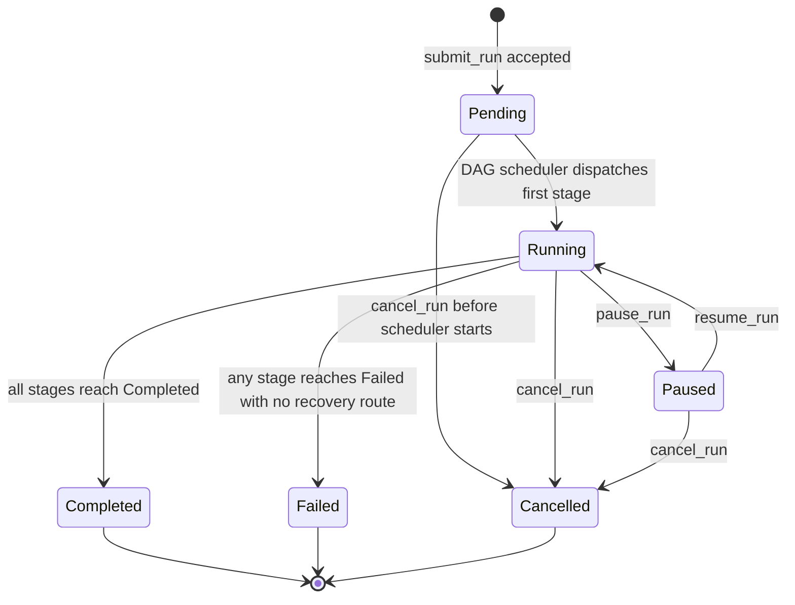

**Transition rules:**
- `Pending → Running`: triggered by the DAG scheduler when the run is dequeued and the first stage is dispatched. Occurs within the scheduler event loop, not synchronously with `submit_run`.
- `Running → Completed`: all `StageRun` records in the run have reached `Completed`. No stage may be in a non-terminal state.
- `Running → Failed`: at least one `StageRun` reached `Failed` or `TimedOut` with no retry or branch-loopback route, and no recovery is possible given the current graph state.
- `Running/Paused → Cancelled`: triggered by `cancel_run`. All non-terminal `StageRun` records are atomically set to `Cancelled` in the same checkpoint write.
- Illegal transitions are rejected by `StateMachine::transition()` with `TransitionError::IllegalTransition`. No state change occurs.

### 8.2 StageStatus State Machine

```mermaid
stateDiagram-v2
    [*] --> Pending : run created, stages initialized
    Pending --> Waiting : run transitions Running; stage has unmet deps
    Pending --> Eligible : run transitions Running; stage has no deps
    Waiting --> Eligible : all depends_on stages reach Completed
    Waiting --> Cancelled : parent run cancelled OR dependency reached Failed/Cancelled with no retry
    Eligible --> Running : pool slot acquired; agent spawned
    Eligible --> Cancelled : parent run cancelled
    Running --> Paused : pause_run or pause_stage
    Paused --> Running : resume_run or resume_stage
    Running --> Completed : agent exits successfully
    Running --> Failed : agent exits non-zero (non-rate-limit)
    Running --> TimedOut : timeout_secs exceeded
    Running --> Cancelled : cancel_run or cancel_stage
    Failed --> Pending : retry configured AND attempt < max_attempts
    TimedOut --> Pending : retry configured AND attempt < max_attempts
    Pending --> Waiting : re-queued for retry (if has deps)
    Pending --> Eligible : re-queued for retry (if no deps)
    Completed --> [*]
    Failed --> [*] : max_attempts exhausted or no retry
    TimedOut --> [*] : max_attempts exhausted or no retry
    Cancelled --> [*]
```

**Key transition constraints:**
- A stage transitions `Waiting → Eligible` within one scheduler tick after the last `depends_on` stage reaches `Completed`. The 100ms dispatch latency SLA applies from this point.
- A stage transitions to `Eligible` only if ALL `depends_on` stages are `Completed`. A single `Failed`, `TimedOut`, or `Cancelled` dependency (with no further retry available) immediately cascades `Cancelled` to all downstream stages.
- `Failed → Pending` retry: the stage's `attempt` counter increments. A new `StageRun` record is created with the incremented `attempt` number. The backoff delay is enforced via `tokio::time::sleep` before re-queueing.
- Rate-limit events do not trigger the `Running → Failed` transition. The stage is moved back to `Eligible` (fallback agent selected) without incrementing `attempt`.

### 8.3 Server Startup State Machine

```mermaid
stateDiagram-v2
    [*] --> ParseConfig : server process starts
    ParseConfig --> ConfigError : any devs.toml error
    ConfigError --> [*] : print all errors to stderr, exit non-zero; no ports bound
    ParseConfig --> BindGrpc : config valid
    BindGrpc --> BindError : EADDRINUSE
    BindError --> [*] : exit non-zero; no ports remain bound
    BindGrpc --> BindMcp : gRPC port bound
    BindMcp --> BindMcpError : EADDRINUSE
    BindMcpError --> [*] : release gRPC port; exit non-zero
    BindMcp --> InitPool : MCP port bound
    InitPool --> LoadRegistry : pool initialized
    LoadRegistry --> ScanWorkflows : project registry loaded
    ScanWorkflows --> RestoreCheckpoints : workflow files scanned
    RestoreCheckpoints --> WriteDiscovery : checkpoints restored (per-project failures non-fatal)
    WriteDiscovery --> AcceptConnections : discovery file written atomically
    AcceptConnections --> ResumeRuns : both ports accepting
    ResumeRuns --> Running : recovered runs re-queued in DAG scheduler
    Running --> [*] : SIGTERM received (shutdown sequence begins)
```

### 8.4 Server Shutdown State Machine

```mermaid
stateDiagram-v2
    [*] --> StopAccepting : SIGTERM or Ctrl+C received
    StopAccepting --> CancelAgents : stop accepting new gRPC + MCP connections
    CancelAgents --> WaitVoluntary : send devs:cancel\n to all running agents
    WaitVoluntary --> SigTerm : 10s elapsed; remaining agents still running
    WaitVoluntary --> FlushCheckpoints : all agents exited voluntarily
    SigTerm --> WaitSigTerm : SIGTERM sent to remaining agents
    WaitSigTerm --> SigKill : 5s elapsed; agents still running
    WaitSigTerm --> FlushCheckpoints : all agents exited
    SigKill --> FlushCheckpoints : SIGKILL sent; agents terminated
    FlushCheckpoints --> DeleteDiscovery : all git2 checkpoint writes flushed
    DeleteDiscovery --> [*] : discovery file deleted; exit 0

    note right of CancelAgents : Second SIGTERM during shutdown\n→ immediate SIGKILL to all agents
    note right of StopAccepting : In-flight gRPC streaming receives CANCELLED
```

### 8.5 Agent Session Lifecycle (Observing/Controlling Agent)

```mermaid
stateDiagram-v2
    [*] --> Locating : agent starts; reads discovery file
    Locating --> Connected : gRPC + MCP addresses resolved
    Locating --> Interrupted : discovery file missing or server unreachable
    Connected --> Observing : list_runs, get_run, get_pool_state
    Observing --> Submitting : submit_run called
    Submitting --> Streaming : stream_logs(follow:true) started
    Streaming --> Diagnosing : run reaches Failed or stage fails
    Streaming --> SessionComplete : run reaches Completed; all gates pass
    Diagnosing --> Editing : get_stage_output returns error:null
    Editing --> Submitting : correction applied; re-submit workflow
    Interrupted --> Persisting : write task_state.json
    Persisting --> [*] : session ends; state preserved for next session
    SessionComplete --> [*]

    note right of Diagnosing : MUST NOT transition to Editing\nuntil get_stage_output returns error:null
    note right of Submitting : MUST cancel non-terminal runs\nfor same workflow before second submit
```

---

## 9. Dependencies

This section identifies the components, crates, and external systems that this User Features Specification depends on, and lists which other specifications depend on it.

### 9.1 Inbound Dependencies (what this spec depends on)

| Dependency | Specification / Crate | How Used |
|---|---|---|
| Domain types | `devs-core` (`WorkflowRun`, `StageRun`, `StageOutput`, etc.) | All data models in §6 are implemented in `devs-core` |
| Configuration loading | `devs-config` (`devs.toml`, `projects.toml`) | Pool definitions, project registry, server settings |
| State persistence | `devs-checkpoint` / `devs-checkpoint` (`git2`) | Checkpoint files, log persistence, retention sweep |
| DAG scheduling | `devs-scheduler` / `devs-scheduler` | Stage dispatch, dependency tracking, fan-out, retry |
| Agent pool | `devs-pool` | Capability routing, fallback, concurrency limits |
| Stage execution | `devs-executor` | Tempdir/Docker/SSH environments, artifact collection |
| Agent adapters | `devs-adapters` | CLI invocation, PTY, rate-limit detection |
| gRPC transport | `devs-grpc` (`tonic`) | All CLI and TUI client-server communication |
| MCP server | `devs-mcp` | All MCP tool implementations |
| Webhook dispatch | `devs-webhook` (`reqwest`) | Outbound HTTP notifications |
| PRD | `docs/plan/specs/1_prd.md` | Source of all user requirements; business rules |
| TAS | `docs/plan/specs/2_tas.md` | Implementation contracts; crate boundaries; algorithms |
| MCP Design | `docs/plan/specs/3_mcp_design.md` | MCP tool behavioral contracts; agent session lifecycle |

### 9.2 Outbound Dependencies (what depends on this spec)

| Dependent | How It Uses This Spec |
|---|---|
| Implementation AI agents | Use this spec as the authoritative user-facing contract to implement against |
| E2E test suite (`tests/`) | Derives test scenarios from user journeys (§2) and acceptance criteria (§10) |
| TUI implementation (`devs-tui`) | Implements keyboard interactions, tab layouts, and status rendering from §3.2 |
| CLI implementation (`devs-cli`) | Implements command syntax, options, and exit codes from §7.1 |
| MCP implementation (`devs-mcp`) | Implements tool schemas and response formats from §7.2 |
| Coverage tracing | §10 acceptance criteria drive the test annotations required for 100% traceability |

### 9.3 External System Dependencies

| External System | MVP Requirement | Notes |
|---|---|---|
| `claude` CLI binary | Agent adapter | Must be on PATH of server process |
| `gemini` CLI binary | Agent adapter | Must be on PATH of server process |
| `opencode` CLI binary | Agent adapter | Must be on PATH of server process |
| `qwen` CLI binary | Agent adapter | Must be on PATH of server process |
| `copilot` CLI binary | Agent adapter | Must be on PATH of server process |
| Docker daemon | `Docker` execution env | Required only when Docker stages configured; uses `DOCKER_HOST` |
| SSH remote host | `RemoteSsh` execution env | Required only when SSH stages configured |
| Git (via `git2` crate) | Checkpoint persistence | `git2` with `ssh` + `https` features; no shell-out |
| GitLab CI | CI/CD | Three parallel jobs (Linux, macOS, Windows) |

---

## 10. Acceptance Criteria

Acceptance criteria are organized by feature category. Each criterion is a concrete, testable assertion that can be verified by an automated test. All criteria are written in the form "GIVEN [precondition] WHEN [action] THEN [expected outcome]".

### 10.1 Server Startup and Discovery

- **[4_USER_FEATURES-AC-FEAT-001]** GIVEN a `devs.toml` with any invalid field WHEN the server starts THEN all configuration errors are printed to stderr, no ports are bound, and the process exits non-zero.
- **[4_USER_FEATURES-AC-FEAT-002]** GIVEN a valid `devs.toml` WHEN the server starts THEN the gRPC port is bound before the MCP port; if the MCP port fails, the gRPC port is released and the process exits non-zero.
- **[4_USER_FEATURES-AC-FEAT-003]** GIVEN a running server WHEN startup completes THEN the discovery file at `$DEVS_DISCOVERY_FILE` (or `~/.config/devs/server.addr`) contains exactly `<host>:<grpc-port>` as plain UTF-8.
- **[4_USER_FEATURES-AC-FEAT-004]** GIVEN a running server receiving SIGTERM WHEN shutdown completes THEN the discovery file is deleted and the process exits 0.
- **[4_USER_FEATURES-AC-FEAT-005]** GIVEN a stale discovery file pointing to a stopped server WHEN a CLI client runs any command THEN the command exits with code 3.
- **[4_USER_FEATURES-AC-FEAT-006]** GIVEN `DEVS_DISCOVERY_FILE` set in the environment WHEN a client starts THEN it reads only that path for server discovery and ignores `~/.config/devs/server.addr`.
- **[4_USER_FEATURES-AC-FEAT-007]** GIVEN `--server <addr>` passed to any CLI command WHEN the command runs THEN the explicit address is used without reading the discovery file.

### 10.2 Workflow Authoring and Submission

- **[4_USER_FEATURES-AC-FEAT-010]** GIVEN a workflow with a dependency cycle `A → B → A` WHEN `submit_run` is called THEN the response is `INVALID_ARGUMENT` containing `"cycle detected"` and the array `["A", "B", "A"]`.
- **[4_USER_FEATURES-AC-FEAT-011]** GIVEN a workflow with zero stages WHEN `submit_run` is called THEN the response is `INVALID_ARGUMENT`.
- **[4_USER_FEATURES-AC-FEAT-012]** GIVEN a workflow stage referencing a non-existent pool WHEN `submit_run` is called THEN the response is `INVALID_ARGUMENT` identifying the unknown pool name.
- **[4_USER_FEATURES-AC-FEAT-013]** GIVEN a workflow with duplicate stage names WHEN `submit_run` is called THEN all duplicate names are listed in a single `INVALID_ARGUMENT` response.
- **[4_USER_FEATURES-AC-FEAT-014]** GIVEN a workflow with multiple validation errors WHEN `submit_run` is called THEN all errors are returned in a single response (not just the first error).
- **[4_USER_FEATURES-AC-FEAT-015]** GIVEN `submit_run` succeeds WHEN the run transitions `Pending → Running` THEN the `definition_snapshot` is written and committed to git before the first stage transitions `Waiting → Eligible`.
- **[4_USER_FEATURES-AC-FEAT-016]** GIVEN two concurrent `submit_run` calls with the same `run_name` for the same project WHEN both complete THEN exactly one succeeds and exactly one returns `ALREADY_EXISTS`.
- **[4_USER_FEATURES-AC-FEAT-017]** GIVEN a `Boolean`-typed workflow input WHEN submitted with value `"1"` THEN the submission is rejected with `INVALID_ARGUMENT`.
- **[4_USER_FEATURES-AC-FEAT-018]** GIVEN a workflow input with `required: true` omitted from submission WHEN `submit_run` is called THEN the response is `INVALID_ARGUMENT` identifying the missing input.
- **[4_USER_FEATURES-AC-FEAT-019]** GIVEN `write_workflow_definition` is called while a run of that workflow is active WHEN the run's stages complete THEN the run uses the snapshot captured at start time, not the newly written definition.

### 10.3 Stage Execution and Completion

- **[4_USER_FEATURES-AC-FEAT-020]** GIVEN two stages with no shared dependencies WHEN the shared dependency completes THEN both stages are dispatched within 100ms of each other.
- **[4_USER_FEATURES-AC-FEAT-021]** GIVEN a stage with `completion: StructuredOutput` WHEN `.devs_output.json` contains `"success": "true"` (string) THEN the stage transitions to `Failed`.
- **[4_USER_FEATURES-AC-FEAT-022]** GIVEN a stage with `completion: McpToolCall` WHEN the agent exits without calling `signal_completion` THEN the stage is evaluated using the process exit code as if `completion: ExitCode`.
- **[4_USER_FEATURES-AC-FEAT-023]** GIVEN a stage where `prompt_file` points to a non-existent file at execution time WHEN the stage is dispatched THEN the stage fails before the agent is spawned, with the missing path in the failure reason.
- **[4_USER_FEATURES-AC-FEAT-024]** GIVEN a template variable `{{stage.X.output.field}}` where stage X uses `completion: ExitCode` WHEN the stage referencing it is dispatched THEN it fails before agent spawn with `TemplateError::NoStructuredOutput`.
- **[4_USER_FEATURES-AC-FEAT-025]** GIVEN a template variable referencing a stage not in the transitive `depends_on` closure WHEN the stage is dispatched THEN it fails before agent spawn.
- **[4_USER_FEATURES-AC-FEAT-026]** GIVEN a missing template variable that has no value WHEN the stage is dispatched THEN it fails before agent spawn with the variable name identified; no empty-string substitution occurs.
- **[4_USER_FEATURES-AC-FEAT-027]** GIVEN `.devs_context.json` cannot be written (simulated disk full) WHEN a stage is dispatched THEN the stage fails without spawning the agent.
- **[4_USER_FEATURES-AC-FEAT-028]** GIVEN a stage timeout of N seconds WHEN the agent has not exited after N seconds THEN the server writes `devs:cancel\n`, waits 5s, sends SIGTERM, waits 5s, sends SIGKILL, then records `TimedOut`.
- **[4_USER_FEATURES-AC-FEAT-029]** GIVEN a running agent WHEN the agent binary is not found on PATH THEN the stage fails immediately with an error identifying the missing binary; no retry is attempted.
- **[4_USER_FEATURES-AC-FEAT-030]** GIVEN a PTY-mode agent WHEN PTY allocation fails THEN the stage fails immediately; no fallback to non-PTY mode occurs.

### 10.4 Agent Pools and Routing

- **[4_USER_FEATURES-AC-FEAT-031]** GIVEN a stage requires capability `["review"]` WHEN no agent in the pool has `review` capability THEN the stage immediately fails with `UnsatisfiedCapability`; it is never queued.
- **[4_USER_FEATURES-AC-FEAT-032]** GIVEN `max_concurrent = 4` and 10 stages dispatched simultaneously WHEN the pool processes them THEN exactly 4 run concurrently and the remaining 6 queue in FIFO order on the semaphore.
- **[4_USER_FEATURES-AC-FEAT-033]** GIVEN an agent reports a rate-limit event WHEN a fallback agent is available THEN the stage is requeued without incrementing `StageRun.attempt`.
- **[4_USER_FEATURES-AC-FEAT-034]** GIVEN an agent reports a rate-limit event WHEN no fallback agent is available THEN the stage transitions to `Failed` and the `pool.exhausted` webhook fires exactly once for this exhaustion episode.
- **[4_USER_FEATURES-AC-FEAT-035]** GIVEN all agents in a pool are rate-limited simultaneously WHEN any agent becomes available again THEN the `pool.exhausted` episode ends and the next `pool.exhausted` fires only on the next new episode.

### 10.5 State Persistence and Recovery

- **[4_USER_FEATURES-AC-FEAT-036]** GIVEN a server crash with stages in `Running` status WHEN the server restarts and loads checkpoints THEN those stages are reset to `Eligible` and re-dispatched.
- **[4_USER_FEATURES-AC-FEAT-037]** GIVEN a corrupt `checkpoint.json` file WHEN the server restarts THEN the affected run is marked `Unrecoverable` and skipped; the server continues loading other runs without crashing.
- **[4_USER_FEATURES-AC-FEAT-038]** GIVEN a disk-full condition during checkpoint write WHEN the write fails THEN the server logs `ERROR`, deletes the `.tmp` file, and continues running; the write is retried on the next state transition.
- **[4_USER_FEATURES-AC-FEAT-039]** GIVEN a checkpoint branch does not exist WHEN the first checkpoint is written THEN the branch is created as an orphan branch.
- **[4_USER_FEATURES-AC-FEAT-040]** GIVEN `auto_collect` artifact collection WHEN a stage completes THEN `devs` diffs the working dir, commits any changes with message `devs: auto-collect stage <name> run <id>`, and pushes to the checkpoint branch only (not the main branch).

### 10.6 CLI Interface

- **[4_USER_FEATURES-AC-FEAT-041]** GIVEN any CLI command with `--format json` WHEN an error occurs THEN the error is written to stdout as `{"error": "...", "code": <n>}` and nothing is written to stderr.
- **[4_USER_FEATURES-AC-FEAT-042]** GIVEN `devs logs <run> --follow` WHEN the run reaches `Completed` THEN the command exits with code 0.
- **[4_USER_FEATURES-AC-FEAT-043]** GIVEN `devs logs <run> --follow` WHEN the run reaches `Failed` or `Cancelled` THEN the command exits with code 1.
- **[4_USER_FEATURES-AC-FEAT-044]** GIVEN a run identifier in UUID4 format AND the same value matching a slug WHEN any CLI command uses it THEN it is resolved as a `run_id` (UUID takes precedence).
- **[4_USER_FEATURES-AC-FEAT-045]** GIVEN `devs submit` is called from a directory matching multiple registered projects WHEN `--project` is not specified THEN the command exits with code 4 indicating the ambiguity.
- **[4_USER_FEATURES-AC-FEAT-046]** GIVEN a server returning `NOT_FOUND` for a run WHEN a CLI command targets it THEN the exit code is 2.

### 10.7 TUI Interface

- **[4_USER_FEATURES-AC-FEAT-047]** GIVEN the TUI is connected to a running server WHEN a `StreamRunEvents` event arrives THEN the screen is re-rendered within 50ms.
- **[4_USER_FEATURES-AC-FEAT-048]** GIVEN the TUI is connected WHEN the server connection drops THEN the TUI displays a reconnection notice and begins exponential backoff (1s→2s→4s→8s→16s→30s).
- **[4_USER_FEATURES-AC-FEAT-049]** GIVEN the TUI has been disconnected for more than 30s total (plus 5s additional) WHEN no reconnection succeeds THEN the TUI prints a final disconnection message and exits with code 1.
- **[4_USER_FEATURES-AC-FEAT-050]** GIVEN stage statuses displayed in the TUI WHEN any status changes THEN the four-letter abbreviation and elapsed time in the stage box are updated without requiring color to distinguish states.
- **[4_USER_FEATURES-AC-FEAT-051]** GIVEN the TUI renders on an 80-column terminal WHEN stage names and statuses are displayed THEN no critical information is clipped or absent.
- **[4_USER_FEATURES-AC-FEAT-052]** GIVEN TUI tests run in CI WHEN snapshots are compared THEN comparison uses text file fixtures (not pixel screenshots); mismatches generate `.txt.new` files that must be reviewed before approval.

### 10.8 MCP Interface

- **[4_USER_FEATURES-AC-FEAT-053]** GIVEN any MCP tool call WHEN the tool succeeds THEN the response contains `"result": <non-null>` and `"error": null`; these fields are mutually exclusive.
- **[4_USER_FEATURES-AC-FEAT-054]** GIVEN any MCP tool call WHEN the tool fails THEN the response contains `"result": null` and `"error": "<prefix>: <detail>"` where `<prefix>` is one of the stable category tokens.
- **[4_USER_FEATURES-AC-FEAT-055]** GIVEN `get_run` on any run WHEN the response is returned THEN every field defined in §6.8 is present; no optional field is absent (absent vs null is a protocol violation).
- **[4_USER_FEATURES-AC-FEAT-056]** GIVEN `signal_completion` is called on a stage already in a terminal state WHEN the call is made THEN the response is `"error": "failed_precondition: ..."` and no state change occurs.
- **[4_USER_FEATURES-AC-FEAT-057]** GIVEN `inject_stage_input` is called on a `Running` stage WHEN the call is made THEN the response is `"error": "failed_precondition: ..."`.
- **[4_USER_FEATURES-AC-FEAT-058]** GIVEN `assert_stage_output` is called with an invalid regex pattern WHEN the call is made THEN the entire request fails with an error before any assertion is evaluated.
- **[4_USER_FEATURES-AC-FEAT-059]** GIVEN a request body exceeding 1 MiB WHEN it is POSTed to `/mcp/v1/call` THEN the server responds with HTTP 413.
- **[4_USER_FEATURES-AC-FEAT-060]** GIVEN 64 concurrent MCP connections WHEN all issue simultaneous observation tool calls THEN all receive responses; the server does not deadlock or reject connections.
- **[4_USER_FEATURES-AC-FEAT-061]** GIVEN `stream_logs(follow:true)` on a stage that is `Pending` WHEN the stage is subsequently cancelled without running THEN the final chunk is `{"done":true,"truncated":false,"total_lines":0}`.
- **[4_USER_FEATURES-AC-FEAT-062]** GIVEN MCP and gRPC both serve a `cancel_run` call targeting the same run WHEN the cancel is processed THEN both interfaces observe consistent state (shared `Arc<RwLock<ServerState>>`); no sleep or polling is required to observe the change.

### 10.9 Development Lifecycle (`./do`)

- **[4_USER_FEATURES-AC-FEAT-063]** GIVEN `./do presubmit` runs for more than 15 minutes WHEN the timeout fires THEN all child processes are killed and the script exits non-zero with `presubmit: TIMEOUT after 900s` on stderr.
- **[4_USER_FEATURES-AC-FEAT-064]** GIVEN `./do setup` is run twice in sequence WHEN the second run completes THEN it exits 0 and produces no errors (idempotency).
- **[4_USER_FEATURES-AC-FEAT-065]** GIVEN `./do <unknown>` is called WHEN the script runs THEN the valid subcommands are printed to stderr and the script exits non-zero.
- **[4_USER_FEATURES-AC-FEAT-066]** GIVEN `./do test` runs WHEN `target/traceability.json` is generated THEN `overall_passed` is `false` if any requirement ID in `docs/plan/specs/*.md` has zero covering tests; the process exits non-zero.
- **[4_USER_FEATURES-AC-FEAT-067]** GIVEN `./do test` runs WHEN a test annotation references a non-existent requirement ID THEN `stale_annotations` in `target/traceability.json` is non-empty and the process exits non-zero.
- **[4_USER_FEATURES-AC-FEAT-068]** GIVEN `./do coverage` runs WHEN `target/coverage/report.json` is generated THEN it contains exactly five gates with IDs `QG-001` through `QG-005`; `overall_passed` is `false` if any gate's `actual_pct` is below `threshold_pct`.
- **[4_USER_FEATURES-AC-FEAT-069]** GIVEN any `./do` command WHEN run on Linux, macOS, and Windows Git Bash THEN the exit code is identical across all three platforms for the same logical outcome.
- **[4_USER_FEATURES-AC-FEAT-070]** GIVEN `./do lint` runs WHEN a lint error occurs THEN the error message includes a file path and line number in `file:line: error: message` format that an AI agent can navigate to directly.

### 10.10 Agentic Development Behaviors

- **[4_USER_FEATURES-AC-FEAT-071]** GIVEN an observing/controlling agent submitting a second run for the same workflow WHEN a non-terminal run already exists THEN the agent cancels the existing run before submitting.
- **[4_USER_FEATURES-AC-FEAT-072]** GIVEN an orchestrated agent receiving `devs:cancel\n` on stdin WHEN the agent exits within 10s THEN no SIGTERM is sent.
- **[4_USER_FEATURES-AC-FEAT-073]** GIVEN an orchestrated agent receiving `devs:cancel\n` on stdin WHEN the agent does NOT exit within 10s + 5s THEN SIGTERM is sent; if still running after 5 more seconds, SIGKILL is sent.
- **[4_USER_FEATURES-AC-FEAT-074]** GIVEN an observing agent receiving `"failed_precondition: server is shutting down"` from any MCP tool WHEN the agent handles this response THEN `task_state.json` is written atomically to `.devs/agent-state/<session-id>/task_state.json` before the agent terminates.
- **[4_USER_FEATURES-AC-FEAT-075]** GIVEN the `devs-mcp-bridge` process WHEN the MCP server connection is lost THEN it writes `{"result":null,"error":"internal: server connection lost","fatal":true}` to stdout and exits with code 1 after one reconnection attempt after 1s.
- **[4_USER_FEATURES-AC-FEAT-076]** GIVEN an E2E test for any MCP tool WHEN the test exercises the tool THEN it calls the tool via `POST /mcp/v1/call` using `DEVS_MCP_ADDR`; calling the Rust function directly does not satisfy E2E coverage requirements.
- **[4_USER_FEATURES-AC-FEAT-077]** GIVEN nested E2E test runs (a workflow stage that itself runs `devs`) WHEN the inner server starts THEN it uses a distinct `DEVS_DISCOVERY_FILE` path; it does NOT use the outer development server instance.

---

*End of User Features Specification*
