# UI/UX Architecture: `devs`

## 1. Frontend Architecture Overview & Frameworks

`devs` has no GUI at MVP. The user-facing interfaces are:

| Interface | Crate | Framework / Library | Role |
|---|---|---|---|
| Terminal UI (TUI) | `devs-tui` | `ratatui 0.28` + `crossterm 0.28` | Interactive dashboard for monitoring and control |
| Command-Line Interface (CLI) | `devs-cli` | `clap 4.5` (`derive`, `env`) | Scripting, CI integration, headless operation |
| MCP stdio bridge | `devs-mcp-bridge` | Plain `tokio` I/O (no framework) | stdin→MCP HTTP proxy for AI agent access |

**[6_UI_UX_ARCHITECTURE-REQ-001]** A GUI is explicitly out of scope for MVP. No web framework crate (`axum`, `warp`, `actix-web`, etc.) may appear in any production dependency.

**[6_UI_UX_ARCHITECTURE-REQ-002]** All three interface crates are binary crates in the single Cargo workspace. They may depend on `devs-core` for domain types and `devs-proto` for gRPC generated types, but MUST NOT import engine-layer crates (`devs-scheduler`, `devs-pool`, `devs-executor`, etc.) directly.

**[6_UI_UX_ARCHITECTURE-REQ-003]** `devs-tui` and `devs-cli` connect to the server exclusively over gRPC (`tonic 0.12`). They hold no in-process server state. `devs-mcp-bridge` connects to the server exclusively over MCP HTTP/JSON-RPC.

**[6_UI_UX_ARCHITECTURE-REQ-004]** Each interface binary is independently deployable on Linux, macOS, and Windows Git Bash, producing identical exit codes and output formats on all three platforms.

---

### 1.1 Architectural Philosophy

All three client interfaces are strictly **view-only** with respect to server state. They contain no business logic, no scheduling decisions, and no pool management. Every action a client initiates flows through a gRPC RPC call (TUI, CLI) or an MCP HTTP JSON-RPC call (bridge); the server is the sole authority over all state transitions. This separation means the server can run headlessly without any client attached, and clients may attach or detach at any time without affecting workflow execution.

The `devs-tui` binary is designed for a human operator who needs continuous situational awareness: it maintains a long-lived gRPC streaming connection and re-renders the terminal within 50 ms of every server-pushed event. The `devs-cli` binary is designed for scripting and CI integration: each invocation is a stateless single-RPC interaction that terminates with a meaningful exit code. The `devs-mcp-bridge` binary is designed for AI agent consumption: it translates newline-delimited JSON-RPC from stdin to HTTP and back, allowing agents to use the full MCP Glass-Box interface without managing HTTP themselves.

None of the three binaries share a process or memory with the server. They communicate exclusively over the two TCP ports the server exposes: gRPC on port 7890 (default) and MCP HTTP on port 7891 (default). Remote use is fully supported; any binary may target a server on a different machine by supplying `--server <host:port>`.

---

### 1.2 Crate Dependency Constraints

The allowed dependency graph for interface crates is strictly controlled. Violating these rules causes a circular dependency or leaks engine internals into clients.

| Crate | May depend on | MUST NOT depend on |
|---|---|---|
| `devs-tui` | `devs-core`, `devs-proto`, `ratatui`, `crossterm`, `tonic`, `tokio`, `clap`, `tracing`, `anyhow`, `uuid`, `chrono`, `serde`, `serde_json` | `devs-scheduler`, `devs-pool`, `devs-executor`, `devs-adapters`, `devs-checkpoint`, `devs-checkpoint`, `devs-webhook`, `devs-grpc`, `devs-mcp`, `devs-config`, `devs-server` |
| `devs-cli` | `devs-core`, `devs-proto`, `clap`, `tonic`, `tokio`, `tracing`, `anyhow`, `uuid`, `chrono`, `serde`, `serde_json` | All engine-layer crates (same list as TUI) |
| `devs-mcp-bridge` | `devs-core`, `tokio`, `tracing`, `anyhow`, `serde_json`, `reqwest` | All engine-layer crates; `devs-proto`; `tonic` |

**[6_UI_UX_ARCHITECTURE-REQ-005]** `cargo tree -p devs-tui --edges normal` MUST NOT list any of: `devs-scheduler`, `devs-pool`, `devs-executor`, `devs-adapters`, `devs-checkpoint`, `devs-webhook`, `devs-grpc`, `devs-mcp`. Verified by `./do lint`.

**[6_UI_UX_ARCHITECTURE-REQ-006]** `cargo tree -p devs-mcp-bridge --edges normal` MUST NOT list `tonic` or `devs-proto`. The bridge communicates with the MCP HTTP port, not the gRPC port. Verified by `./do lint`.

**[6_UI_UX_ARCHITECTURE-REQ-007]** `devs-core` MUST remain free of I/O dependencies (`tokio`, `git2`, `reqwest`, `tonic`). Interface crates depend on it only for domain types and the `StateMachine` trait. Verified by `cargo tree -p devs-core --edges normal` containing none of the prohibited crates.

---

### 1.3 Server Discovery Protocol

All three client binaries must locate the running `devs` server before executing any operation. Server discovery follows a strict precedence order. Exactly one mechanism produces the server address; the first applicable mechanism in the list below is used.

**Discovery precedence for TUI and CLI (gRPC address):**

| Priority | Source | Resolution |
|---|---|---|
| 1 (highest) | `--server <host:port>` CLI flag | Used verbatim |
| 2 | `DEVS_SERVER` environment variable | Used verbatim |
| 3 | `server_addr` field in `devs.toml` | Used verbatim |
| 4 | `DEVS_DISCOVERY_FILE` environment variable | Read file, trim whitespace, use as `<host>:<port>` |
| 5 (lowest) | `~/.config/devs/server.addr` | Read file, trim whitespace, use as `<host>:<port>` |

**Discovery for `devs-mcp-bridge`:**

1. Read gRPC address using the same precedence table above (discovery file sources only — no CLI flags for the bridge).
2. Establish a gRPC channel and call `ServerService.GetInfo` to obtain `mcp_port`.
3. Construct MCP endpoint URL: `http://<host>:<mcp_port>/mcp/v1/call`.

**Discovery file schema:**

The discovery file is a plain UTF-8 text file. Its content is exactly one line of the form `<host>:<port>` where `<host>` is an IP address or hostname and `<port>` is a decimal integer in [1, 65535]. Trailing newline and surrounding whitespace are stripped before parsing. No other content is permitted.

```
# Example contents of ~/.config/devs/server.addr
127.0.0.1:7890
```

**[6_UI_UX_ARCHITECTURE-REQ-008]** The discovery file contains only the gRPC address. The MCP port is obtained exclusively via `ServerService.GetInfo`. Clients MUST NOT assume `mcp_port = grpc_port + 1`.

**[6_UI_UX_ARCHITECTURE-REQ-009]** Discovery file path resolves `~` using the platform home directory (`$HOME` on Linux/macOS; `USERPROFILE` or `HOMEDRIVE`+`HOMEPATH` on Windows). The `~` expansion is performed at use time, not stored as a literal path.

**[6_UI_UX_ARCHITECTURE-REQ-010]** When `DEVS_DISCOVERY_FILE` is set, it takes precedence over `~/.config/devs/server.addr`. This mechanism allows parallel test server instances to use isolated discovery files and MUST be respected by all client binaries without exception.

**Discovery edge cases:**

| Scenario | Behavior |
|---|---|
| Discovery file exists but is empty | Error: `"server_unreachable: discovery file is empty: <path>"`; exit code 3 |
| Discovery file exists but content is not `host:port` | Error: `"server_unreachable: malformed discovery file: <path>: expected <host>:<port>"`; exit code 3 |
| Discovery file does not exist and no other source provides an address | Error: `"server_unreachable: no server address configured and discovery file not found"`; exit code 3 |
| `--server` points to an unreachable host | gRPC channel construction succeeds; first RPC call returns `UNAVAILABLE`; client reports `"server_unreachable: <host>:<port>"`; exit code 3 |
| Discovery file contains a stale address (server has restarted on a new port) | Connection fails; same unreachable-host error; exit code 3 |
| `DEVS_DISCOVERY_FILE` is set to a path that does not exist | Error: `"server_unreachable: discovery file not found: <path>"`; exit code 3 |

**[6_UI_UX_ARCHITECTURE-REQ-011]** Discovery errors MUST produce exit code 3 in the CLI. In the TUI, discovery failure is displayed in the `StatusBar` as `"DISCONNECTED: <reason>"` and the TUI enters the reconnect loop. In `devs-mcp-bridge`, discovery failure at startup writes `{"result":null,"error":"server_unreachable: <reason>","fatal":true}` to stdout and exits with code 1.

---

### 1.4 Interface Binary Startup Sequences

Each binary follows a defined startup sequence. Deviating from this order is an implementation defect.

**`devs-tui` startup sequence:**

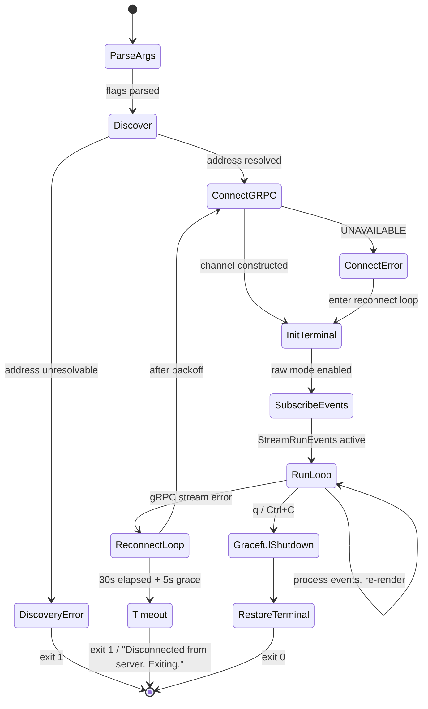
```mermaid
stateDiagram-v2
    [*] --> ParseArgs
    ParseArgs --> Discover: flags parsed
    Discover --> ConnectGRPC: address resolved
    Discover --> DiscoveryError: address unresolvable
    DiscoveryError --> [*]: exit 1
    ConnectGRPC --> InitTerminal: channel constructed
    ConnectGRPC --> ConnectError: UNAVAILABLE
    ConnectError --> InitTerminal: enter reconnect loop
    InitTerminal --> SubscribeEvents: raw mode enabled
    SubscribeEvents --> RunLoop: StreamRunEvents active
    RunLoop --> RunLoop: process events, re-render
    RunLoop --> GracefulShutdown: q / Ctrl+C
    RunLoop --> ReconnectLoop: gRPC stream error
    ReconnectLoop --> ConnectGRPC: after backoff
    ReconnectLoop --> Timeout: 30s elapsed + 5s grace
    Timeout --> [*]: exit 1 / "Disconnected from server. Exiting."
    GracefulShutdown --> RestoreTerminal
    RestoreTerminal --> [*]: exit 0
```

**`devs-cli` startup sequence (per invocation):**

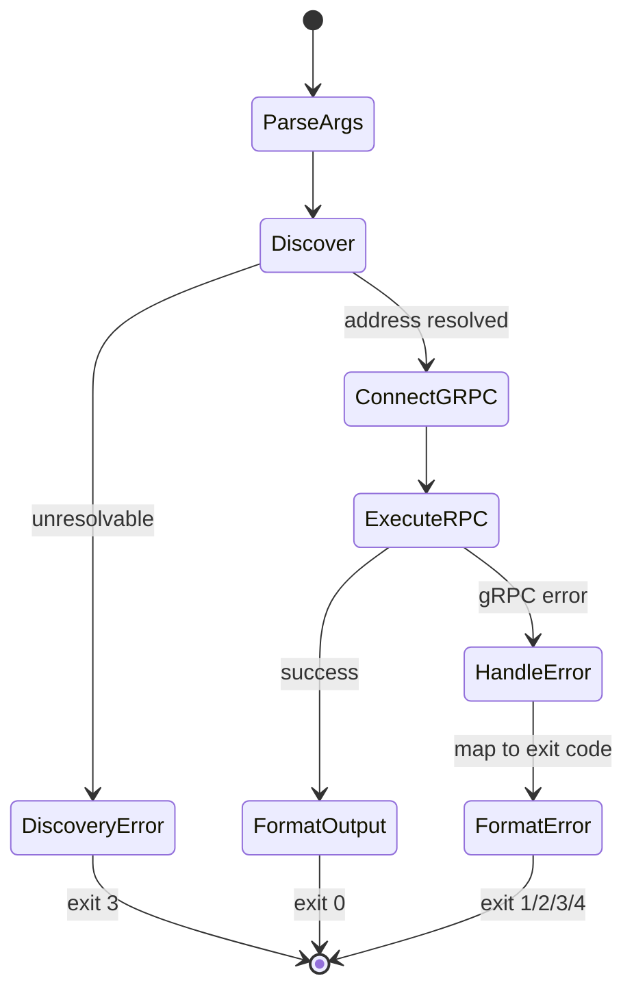
```mermaid
stateDiagram-v2
    [*] --> ParseArgs
    ParseArgs --> Discover
    Discover --> ConnectGRPC: address resolved
    Discover --> DiscoveryError: unresolvable
    DiscoveryError --> [*]: exit 3
    ConnectGRPC --> ExecuteRPC
    ExecuteRPC --> FormatOutput: success
    ExecuteRPC --> HandleError: gRPC error
    FormatOutput --> [*]: exit 0
    HandleError --> FormatError: map to exit code
    FormatError --> [*]: exit 1/2/3/4
```

**`devs-mcp-bridge` startup sequence:**

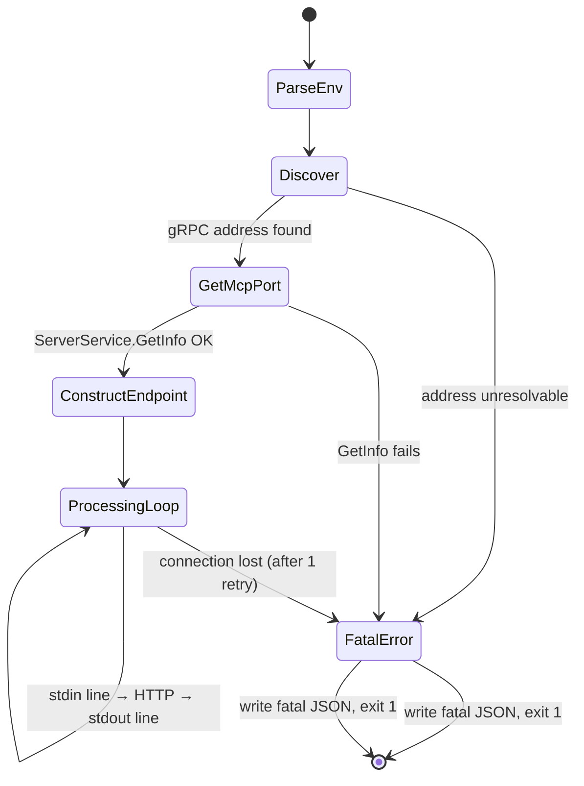
```mermaid
stateDiagram-v2
    [*] --> ParseEnv
    ParseEnv --> Discover
    Discover --> GetMcpPort: gRPC address found
    Discover --> FatalError: address unresolvable
    FatalError --> [*]: write fatal JSON, exit 1
    GetMcpPort --> ConstructEndpoint: ServerService.GetInfo OK
    GetMcpPort --> FatalError: GetInfo fails
    ConstructEndpoint --> ProcessingLoop
    ProcessingLoop --> ProcessingLoop: stdin line → HTTP → stdout line
    ProcessingLoop --> FatalError: connection lost (after 1 retry)
    FatalError --> [*]: write fatal JSON, exit 1
```

**[6_UI_UX_ARCHITECTURE-REQ-012]** `devs-tui` MUST restore the terminal to its original state (disable raw mode, show cursor, disable alternate screen) on any exit path including panics. A `scopeguard` or `Drop` impl on a terminal guard struct MUST be used to guarantee cleanup even when the process receives SIGTERM or panics.

**[6_UI_UX_ARCHITECTURE-REQ-013]** `devs-cli` connects the gRPC channel lazily: the channel is not dialed until the first RPC call. Connection timeout is 5 seconds. If the first RPC returns `UNAVAILABLE` or the dial times out, the CLI reports `"server_unreachable: <addr>"` and exits with code 3.

**[6_UI_UX_ARCHITECTURE-REQ-014]** `devs-mcp-bridge` attempts exactly one reconnect (after a 1-second delay) when the MCP HTTP connection is lost during a request. If the reconnect attempt also fails, it writes the fatal JSON error to stdout and exits 1. It MUST NOT enter an infinite reconnect loop.

---

### 1.5 Cross-Platform Behavioral Contract

`devs` targets Linux, macOS, and Windows. The following rules govern platform-specific behavior across all interface binaries.

**[6_UI_UX_ARCHITECTURE-REQ-015]** On Windows, `devs-tui` uses `crossterm`'s Windows console API backend. No UNIX-specific terminal calls (`termios`, `ioctl`) are used in authored code. `crossterm 0.28` abstracts these differences; the authored code MUST be platform-agnostic.

**[6_UI_UX_ARCHITECTURE-REQ-016]** On Windows Git Bash (MSYS2), the CLI is invoked as `devs.exe`. All path arguments use forward-slash normalization: backslashes in user-supplied paths are normalized to forward slashes before storage or transmission. This normalization occurs in `connection.rs` before constructing any gRPC message.

**[6_UI_UX_ARCHITECTURE-REQ-017]** `./do` is written in POSIX `sh` only. It is executed as `sh ./do <command>` on all platforms. No bash-specific syntax (`[[`, `(( ))`, `$BASHPID`, process substitution) is permitted. Git Bash on Windows ships a POSIX-compatible `sh`.

**[6_UI_UX_ARCHITECTURE-REQ-018]** The discovery file home directory expansion uses `dirs::home_dir()` (from the `dirs` crate) rather than reading `$HOME` directly, to ensure correct behavior on Windows where the home directory is obtained from the registry, not a single environment variable.

**[6_UI_UX_ARCHITECTURE-REQ-019]** Exit codes are identical across all three platforms: `0`=success, `1`=general error, `2`=not found, `3`=server unreachable, `4`=validation error. The `devs-tui` binary exits `0` on clean quit, `1` on disconnect timeout.

**Platform-specific behavior table:**

| Behavior | Linux/macOS | Windows Git Bash |
|---|---|---|
| Terminal raw mode | `crossterm` → POSIX termios | `crossterm` → Windows Console API |
| Signal handling (SIGTERM) | `tokio::signal::unix::signal(SIGTERM)` | `tokio::signal::windows::ctrl_c()` + `ctrl_close()` |
| Home directory resolution | `$HOME` via `dirs::home_dir()` | Registry via `dirs::home_dir()` |
| Path separator (stored) | `/` | `/` (normalized from `\`) |
| Config directory | `~/.config/devs/` | `%APPDATA%\devs\` resolved via `dirs::config_dir()` |
| Binary name | `devs-tui`, `devs-cli`, `devs-mcp-bridge` | `devs-tui.exe`, `devs-cli.exe`, `devs-mcp-bridge.exe` |

**[6_UI_UX_ARCHITECTURE-REQ-020]** The config directory is resolved via `dirs::config_dir()` on all platforms, not by hardcoding `~/.config`. On Linux/macOS this resolves to `~/.config`; on Windows to `%APPDATA%`. All references to `~/.config/devs/` in this specification are logical and map to the platform-specific config directory at runtime.

---

### 1.6 Shared Abstractions Across Interface Crates

While each interface is a separate binary crate, three cross-cutting concerns are implemented in shared modules to avoid duplication.

**Server discovery** — `devs-core::discovery` (or a dedicated utility module within each crate, since `devs-core` has zero I/O deps):

Because `devs-core` MUST NOT contain I/O dependencies, server discovery logic lives in a shared internal module duplicated per binary crate or in a small dedicated crate `devs-client-util` (a lib crate depending on `devs-core`, `tokio`, `anyhow`, `tracing`). The module exposes:

```rust
/// Resolve the gRPC server address using the precedence table in §1.3.
pub async fn discover_grpc_addr(flags: &GlobalArgs) -> Result<String, DiscoveryError>;

/// Resolve the MCP HTTP endpoint URL (bridge use only).
pub async fn discover_mcp_url(flags: &GlobalArgs) -> Result<url::Url, DiscoveryError>;

pub enum DiscoveryError {
    /// No address configured and discovery file absent.
    NotConfigured,
    /// Discovery file found but content is malformed.
    MalformedFile { path: PathBuf, reason: String },
    /// Discovery file path does not exist.
    FileNotFound { path: PathBuf },
    /// gRPC `GetInfo` call failed (bridge path only).
    GetInfoFailed { source: tonic::Status },
}
```

**[6_UI_UX_ARCHITECTURE-REQ-021]** `DiscoveryError` maps to exit code 3 for the CLI, to a `DISCONNECTED` status for the TUI, and to a fatal JSON error for the bridge. The mapping is performed in each binary's main module; `DiscoveryError` itself carries no exit code.

**gRPC channel construction** — shared `connection.rs` pattern used in both `devs-tui` and `devs-cli`:

```rust
pub async fn connect(addr: &str) -> Result<Channel, ConnectionError> {
    let endpoint = Channel::from_shared(format!("http://{}", addr))?
        .connect_timeout(Duration::from_secs(5))
        .timeout(Duration::from_secs(30));
    Ok(endpoint.connect_lazy())
}
```

The channel is constructed lazily (`connect_lazy()`). The first RPC call triggers the actual TCP dial. A 5-second connect timeout and 30-second per-RPC timeout are enforced.

**Output formatting** — `output.rs` `Formatter` trait (CLI only):

```rust
pub trait Formatter: Send + Sync {
    fn write_run_list(&self, runs: &[RunSummary], w: &mut dyn Write) -> Result<()>;
    fn write_run_detail(&self, run: &RunDetail, w: &mut dyn Write) -> Result<()>;
    fn write_stage_output(&self, output: &StageOutputDetail, w: &mut dyn Write) -> Result<()>;
    fn write_error(&self, error: &str, code: u8, w: &mut dyn Write) -> Result<()>;
    fn write_submit_result(&self, result: &SubmitResult, w: &mut dyn Write) -> Result<()>;
}

pub struct TextFormatter;
pub struct JsonFormatter;
```

Both `TextFormatter` and `JsonFormatter` implement `Formatter`. All CLI command handlers accept `&dyn Formatter` and call formatter methods for all output. No command handler uses `println!` or `eprintln!` directly.

**[6_UI_UX_ARCHITECTURE-REQ-022]** All user-visible string literals that appear in CLI output or TUI displays MUST be defined in a `strings.rs` module within the respective crate (not inline). This separates string management for future internationalisation. String keys are `const &str` values; the module contains no logic.

---

### 1.7 Version Negotiation

All gRPC requests from `devs-tui` and `devs-cli` carry a mandatory `x-devs-client-version` metadata header. The server rejects requests from clients whose major version differs from the server's major version with `FAILED_PRECONDITION`.

**[6_UI_UX_ARCHITECTURE-REQ-023]** The client version string is embedded at compile time using the `env!("CARGO_PKG_VERSION")` macro in `devs-core/src/version.rs`. Both TUI and CLI read this constant; they MUST NOT hardcode a version string.

**[6_UI_UX_ARCHITECTURE-REQ-024]** When the server returns `FAILED_PRECONDITION` due to version mismatch, the CLI MUST display: `"failed_precondition: client version <client_ver> is incompatible with server version <server_ver>"` and exit with code 1. The TUI MUST display the same message in the `StatusBar` and stop all further RPC calls.

**[6_UI_UX_ARCHITECTURE-REQ-025]** `devs-mcp-bridge` does NOT carry a version header in MCP HTTP calls. MCP tool calls are not version-gated at MVP.

**Version header injection** (implemented via a `tonic` interceptor applied to every channel):

```rust
fn version_interceptor(
    mut req: tonic::Request<()>,
) -> Result<tonic::Request<()>, tonic::Status> {
    req.metadata_mut().insert(
        "x-devs-client-version",
        MetadataValue::from_static(devs_core::version::CLIENT_VERSION),
    );
    Ok(req)
}
```

---

### 1.8 No-Auth Posture & Security Headers

At MVP, all three client interfaces connect without authentication. The server binds to `127.0.0.1` by default. The following rules govern security-adjacent behavior in the client layer.

**[6_UI_UX_ARCHITECTURE-REQ-026]** No client binary stores or transmits API keys. Credentials (e.g., `CLAUDE_API_KEY`) are environment variables on the server process. Clients never see them.

**[6_UI_UX_ARCHITECTURE-REQ-027]** `devs-mcp-bridge` MUST NOT create any TCP listener. It communicates only via stdin/stdout and outbound HTTP to the MCP port.

**[6_UI_UX_ARCHITECTURE-REQ-028]** When the CLI uses `--format json`, sensitive values (e.g., webhook secrets) that the server returns MUST appear as `"[REDACTED]"` in JSON output. The server sends `Redacted<T>` serialized values; the client writes them verbatim without attempting to decode or expand them.

**[6_UI_UX_ARCHITECTURE-REQ-029]** The TUI MUST strip ANSI escape sequences from agent log output before rendering log lines in `LogPane`. Agent stdout/stderr can contain arbitrary escape codes; rendering them unstripped could corrupt the terminal display. Stripping is performed in `log_pane.rs` using a simple state machine that removes `ESC[...m` sequences and other CSI codes. This is the only place in the codebase where ANSI stripping occurs (agent log files on disk are written verbatim).

---

### 1.9 Edge Cases & Error Handling

The following edge cases MUST be handled by all interface binaries. Test annotations `// Covers: UI-ARCH-EC-NNN` are required.

| ID | Scenario | Interface | Expected Behavior |
|---|---|---|---|
| UI-ARCH-EC-001 | Server is not running; discovery file is stale | CLI, TUI, Bridge | Discovery file is read successfully but the gRPC/HTTP connection is refused. CLI: exit 3 `"server_unreachable: connection refused: <addr>"`. TUI: enter reconnect loop. Bridge: attempt one reconnect, then write fatal JSON + exit 1. |
| UI-ARCH-EC-002 | Terminal is resized to below 80×24 during TUI operation | TUI | On next render cycle, clear the screen and display `"Terminal too small: 80x24 minimum required (current: WxH)"` centered. Do NOT crash. Resume normal rendering when the terminal is resized back to ≥ 80×24. |
| UI-ARCH-EC-003 | `devs-tui` receives SIGTERM while a run is active | TUI | Restore terminal state (disable raw mode, show cursor, exit alternate screen), then exit 0. Active runs on the server are NOT cancelled. |
| UI-ARCH-EC-004 | `devs-cli submit` is invoked concurrently with the same `--name` | CLI | The server returns `ALREADY_EXISTS`. The CLI outputs `{"error":"already_exists: run name <name> already exists","code":1}` (JSON) or human-readable equivalent (text) and exits code 1. |
| UI-ARCH-EC-005 | `devs logs --follow` is issued for a run that has already completed | CLI | The gRPC `StreamLogs` call streams the buffered log lines, then the stream closes normally. CLI prints all lines and exits 0 (if run completed) or 1 (if run failed). |
| UI-ARCH-EC-006 | `devs-mcp-bridge` receives a request line that is not valid JSON | Bridge | Write `{"result":null,"error":"invalid_argument: request is not valid JSON"}` to stdout and continue processing the next line. Do NOT exit. |
| UI-ARCH-EC-007 | gRPC stream to TUI is interrupted mid-session (network blip) | TUI | `connection.rs` detects stream termination, transitions `ConnectionStatus` to `Reconnecting`, updates `StatusBar`. Begins exponential backoff reconnect (1→2→4→8→16→30s cap). On reconnect, re-subscribes to `StreamRunEvents` with a snapshot request. |
| UI-ARCH-EC-008 | `devs-tui` is launched before any workflow runs exist | TUI | `RunList` displays `"No runs yet."`. All other panels remain in their empty/default state. No error is displayed. |
| UI-ARCH-EC-009 | `--format json` is specified but the server returns a gRPC error | CLI | The gRPC error is mapped to a JSON error object `{"error":"<prefix>: <detail>","code":<n>}` and written to stdout. Nothing to stderr. Exit code matches the mapped code. |
| UI-ARCH-EC-010 | `devs-mcp-bridge` stdin is closed (EOF) while a request is in-flight | Bridge | Complete the in-flight request if possible. After the response is written, detect stdin EOF and exit 0 cleanly. |
| UI-ARCH-EC-011 | Discovery file contains a valid address but `GetInfo` RPC fails (bridge) | Bridge | Write `{"result":null,"error":"server_unreachable: ServerService.GetInfo failed: <grpc_status>","fatal":true}` to stdout; exit 1. |
| UI-ARCH-EC-012 | `NO_COLOR` environment variable is set | TUI, CLI | Suppress all ANSI color codes in all output. Status labels and structural elements remain; only color attributes are removed. |

---

### 1.10 Dependencies

This section depends on or is depended upon by the following components:

**Depends on:**

| Component | Dependency Reason |
|---|---|
| `devs-core` | Domain type definitions (`WorkflowRun`, `StageRun`, `StageStatus`, `RunStatus`, `AgentPool`, `Project`, etc.) used in all three binaries |
| `devs-proto` | Generated gRPC client stubs and proto message types used by `devs-tui` and `devs-cli` |
| `devs-grpc` (server-side) | Defines the six gRPC services that TUI/CLI call; any service API change requires client update |
| `devs-mcp` (server-side) | Defines the MCP HTTP tool contract; any tool schema change requires bridge validation update |
| `devs-core::version` | Provides `CLIENT_VERSION` constant for `x-devs-client-version` header |
| `dirs` crate | Platform-specific home/config directory resolution |
| `crossterm 0.28` | Cross-platform terminal raw mode and event detection for TUI |
| `ratatui 0.28` | TUI widget rendering framework |
| `clap 4.5` | CLI argument parsing |
| `tonic 0.12` | gRPC client transport for TUI and CLI |
| `reqwest 0.12` | HTTP client for MCP bridge |

**Depended upon by:**

| Component | Why it depends on this section |
| `devs-server` startup | Writes discovery file; TUI/CLI/bridge cannot function until server has written this file |
| Section 2 (Component Hierarchy) | Builds on the widget/module structure defined here |
| Section 3 (State Management) | TUI state model references `ConnectionStatus` and event loop defined here |
| Section 4 (Routing Architecture) | CLI command routing references the `clap` structure defined here |
| Section 8 (Agentic Development) | Bridge startup and tool invocation depend on discovery defined here |

---

### 1.11 Acceptance Criteria

The following criteria are testable assertions that MUST each be covered by at least one automated test annotated `// Covers: UI-ARCH-AC-NNN`.

- **[6_UI_UX_ARCHITECTURE-REQ-030]** `cargo tree -p devs-tui --edges normal` output does not contain any of: `devs-scheduler`, `devs-pool`, `devs-executor`, `devs-adapters`, `devs-checkpoint`, `devs-webhook`, `devs-grpc`, `devs-mcp`. (lint gate)
- **[6_UI_UX_ARCHITECTURE-REQ-031]** `cargo tree -p devs-mcp-bridge --edges normal` output does not contain `tonic` or `devs-proto`. (lint gate)
- **[6_UI_UX_ARCHITECTURE-REQ-032]** `cargo tree -p devs-core --edges normal` output does not contain `tokio`, `git2`, `reqwest`, or `tonic`. (lint gate)
- **[6_UI_UX_ARCHITECTURE-REQ-033]** CLI with a stale/absent discovery file and no `--server` flag exits with code 3 and prints a message beginning with `"server_unreachable:"`. (CLI E2E)
- **[6_UI_UX_ARCHITECTURE-REQ-034]** CLI `--format json` with a discovery error prints `{"error":"server_unreachable:...","code":3}` to stdout and nothing to stderr. (CLI E2E)
- **[6_UI_UX_ARCHITECTURE-REQ-035]** `devs-mcp-bridge` exits with code 1 and writes `{"result":null,"error":"server_unreachable:...","fatal":true}` to stdout when no server is reachable. (MCP E2E)
- **[6_UI_UX_ARCHITECTURE-REQ-036]** `devs-mcp-bridge` does NOT exit when it receives an invalid-JSON line on stdin; it writes an error response and continues reading. (MCP E2E)
- **[6_UI_UX_ARCHITECTURE-REQ-037]** All gRPC requests from the CLI carry `x-devs-client-version` metadata; server-side test asserts the header is present. (CLI E2E)
- **[6_UI_UX_ARCHITECTURE-REQ-038]** Server returning `FAILED_PRECONDITION` for version mismatch causes CLI to exit code 1 with a message containing `"failed_precondition"`. (CLI E2E)
- **[6_UI_UX_ARCHITECTURE-REQ-039]** TUI exits code 1 with message `"Disconnected from server. Exiting."` after 30 seconds of failed reconnect + 5-second grace. (TUI E2E, TestBackend)
- **[6_UI_UX_ARCHITECTURE-REQ-040]** TUI `StatusBar` displays `"RECONNECTING"` when the gRPC stream is interrupted. (TUI E2E, TestBackend snapshot)
- **[6_UI_UX_ARCHITECTURE-REQ-041]** TUI renders `"Terminal too small: 80x24 minimum required (current: WxH)"` when terminal is resized below 80×24. (TUI E2E, TestBackend)
- **[6_UI_UX_ARCHITECTURE-REQ-042]** `NO_COLOR` environment variable suppresses all ANSI codes from CLI text output. (CLI E2E)
- **[6_UI_UX_ARCHITECTURE-REQ-043]** TUI restores terminal state on SIGTERM; post-exit terminal is not left in raw mode. (TUI E2E)
- **[6_UI_UX_ARCHITECTURE-REQ-044]** Discovery file `DEVS_DISCOVERY_FILE` is respected by all three binaries; each uses the override path instead of `~/.config/devs/server.addr`. (CLI E2E, MCP E2E, TUI E2E)
- **[6_UI_UX_ARCHITECTURE-REQ-045]** `devs-mcp-bridge` calls `ServerService.GetInfo` at startup and uses the returned `mcp_port`; hardcoded port 7891 is not used when `GetInfo` returns a different value. (MCP E2E)
- **[6_UI_UX_ARCHITECTURE-REQ-046]** On Windows, paths supplied as CLI arguments with backslashes are normalized to forward slashes in the gRPC request body. (unit test in `connection.rs`)
- **[6_UI_UX_ARCHITECTURE-REQ-047]** `Redacted<T>` values from the server appear as `"[REDACTED]"` in `--format json` CLI output and are never decoded by the client. (CLI E2E)
- **[6_UI_UX_ARCHITECTURE-REQ-048]** TUI `LogPane` strips ANSI escape sequences from agent log lines before rendering; a log line containing `\x1b[31mERROR\x1b[0m` is displayed as `ERROR` in the snapshot. (TUI E2E, TestBackend snapshot)
- **[6_UI_UX_ARCHITECTURE-REQ-049]** All user-visible strings in CLI output are defined in `strings.rs`; no string literal matching user-visible patterns appears outside `strings.rs` in `devs-cli/src/`. (lint gate via regex scan)

---

## 2. Component Hierarchy & Reusability Strategy

### 2.1 TUI Component Tree

The TUI is structured as a strict single-owner hierarchy rooted at `App`. Every component in the tree is a pure renderer: it reads from `AppState` at render time and never mutates it. All state changes flow through `App::handle_event()` before any re-render is triggered.

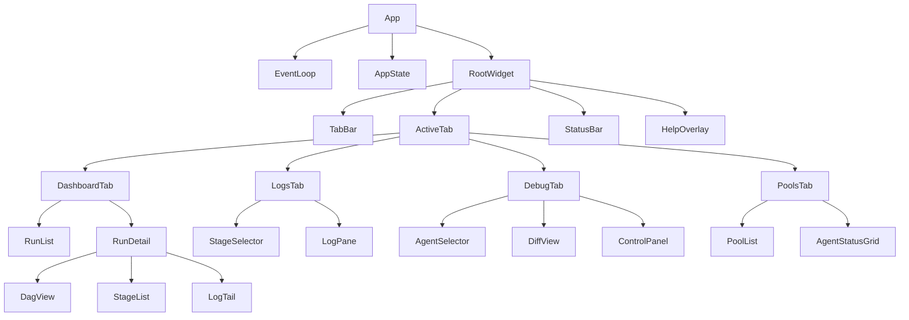
```mermaid
graph TD
    A[App] --> B[EventLoop]
    A --> C[AppState]
    A --> D[RootWidget]

    D --> E[TabBar]
    D --> F[ActiveTab]
    D --> G[StatusBar]
    D --> H[HelpOverlay]

    F --> I[DashboardTab]
    F --> J[LogsTab]
    F --> K[DebugTab]
    F --> L[PoolsTab]

    I --> M[RunList]
    I --> N[RunDetail]
    N --> O[DagView]
    N --> P[StageList]
    N --> Q[LogTail]

    J --> R[StageSelector]
    J --> S[LogPane]

    K --> T[AgentSelector]
    K --> U[DiffView]
    K --> V[ControlPanel]

    L --> W[PoolList]
    L --> X[AgentStatusGrid]
```

**[6_UI_UX_ARCHITECTURE-REQ-050]** Each tab is a distinct struct implementing `ratatui::widgets::Widget`. Tabs MUST NOT share mutable state directly; all shared state flows through `AppState`.

**[6_UI_UX_ARCHITECTURE-REQ-051]** `DagView` renders the workflow DAG using ASCII characters only (`-`, `|`, `+`, `>`, space). It MUST NOT use Unicode box-drawing characters. Stage boxes use the format `[ stage-name | STATUS | M:SS ]` where stage name is truncated to 20 characters with a trailing `~` if it exceeds that length.

**[6_UI_UX_ARCHITECTURE-REQ-052]** Stage status labels are exactly 4 uppercase ASCII characters as follows:

| `StageStatus` | Label |
|---|---|
| `Pending` | `PEND` |
| `Waiting` | `WAIT` |
| `Eligible` | `ELIG` |
| `Running` | `RUN ` (trailing space for alignment) |
| `Paused` | `PAUS` |
| `Completed` | `DONE` |
| `Failed` | `FAIL` |
| `TimedOut` | `TIME` |
| `Cancelled` | `CANC` |

**[6_UI_UX_ARCHITECTURE-REQ-053]** `DagView` renders dependency arrows as `──►` connecting stage boxes at the same horizontal tier. Stages with no shared dependencies run in the same tier (same column depth). Tier calculation uses the longest path from any root stage.

**[6_UI_UX_ARCHITECTURE-REQ-054]** `LogTail` in `DashboardTab` shows the last N lines of the currently selected stage's log stream. `LogPane` in `LogsTab` maintains a buffer of at most 10,000 lines per stage using a ring buffer (FIFO eviction of oldest lines). Full logs remain on disk.

**[6_UI_UX_ARCHITECTURE-REQ-055]** `HelpOverlay` renders a keybinding reference table when the user presses `?`. It is rendered as an overlay on top of the active tab and dismissed by any keypress. It is a stateless widget instantiated on demand.

**[6_UI_UX_ARCHITECTURE-REQ-056]** `StatusBar` occupies the bottom row of the terminal and displays: connection status (`CONNECTED`/`RECONNECTING`/`DISCONNECTED`), server address, and the active run count.

#### 2.1.1 Widget Trait Contract

All TUI rendering components implement the `ratatui::widgets::Widget` trait. Stateful widgets (those tracking scroll position or selection cursor) additionally implement `ratatui::widgets::StatefulWidget<State = T>`. The architectural invariant is that no widget struct holds mutable state internally; all state is owned by `AppState` and passed by reference into widgets at render time.

```rust
/// Canonical pattern for all reusable TUI widgets.
/// Widget structs carry only immutable rendering hints and borrows.
/// They are instantiated by the parent at render time and dropped after render.
pub struct LogPane<'a> {
    buffer: &'a LogBuffer,
    scroll_offset: usize,
    visible_rows: usize,
    show_stream_prefix: bool,
}

impl Widget for LogPane<'_> {
    fn render(self, area: Rect, buf: &mut Buffer) { /* ... */ }
}
```

**[6_UI_UX_ARCHITECTURE-REQ-057]** No widget struct contains `Arc`, `Mutex`, `RwLock`, `tokio::sync`, or any async primitive. Widget structs are either zero-sized or carry only rendering hints (e.g., scroll offsets, column width overrides). They are created by `App::render()` on every frame and dropped after rendering.

**[6_UI_UX_ARCHITECTURE-REQ-058]** Widget `render()` calls MUST complete in under 16 milliseconds (60 fps budget). Widgets MUST NOT perform I/O, syscalls, memory allocation proportional to data set size, or any blocking operation. All values are pre-computed in `AppState` before render.

**[6_UI_UX_ARCHITECTURE-REQ-059]** The `App` struct is the sole owner of `AppState`. No reference to `AppState` escapes beyond the scope of a single `handle_event()` or `render()` call. There is no shared ownership of `AppState` within the TUI binary.

#### 2.1.2 Component Data Models

Display-layer view-model types are defined in `crates/devs-tui/src/state.rs`. They are derived from gRPC proto message types received via `StreamRunEvents` and are distinct from the `devs-core` domain types. Conversion from proto types to display types happens in `crates/devs-tui/src/convert.rs`, ensuring proto types never appear in `state.rs`.

**`RunSummary`** — one row in `RunList`:

```rust
pub struct RunSummary {
    pub run_id: Uuid,
    pub slug: String,
    pub workflow_name: String,
    pub status: RunStatus,
    pub created_at: DateTime<Utc>,
    pub started_at: Option<DateTime<Utc>>,
    pub completed_at: Option<DateTime<Utc>>,
    pub stage_count: usize,
    pub completed_stage_count: usize,
    pub failed_stage_count: usize,
}
```

| Field | Type | Constraint |
|---|---|---|
| `run_id` | `Uuid` | UUID v4 |
| `slug` | `String` | `[a-z0-9-]+`, max 128 chars |
| `workflow_name` | `String` | max 128 chars |
| `status` | `RunStatus` | one of `Pending`, `Running`, `Paused`, `Completed`, `Failed`, `Cancelled` |
| `stage_count` | `usize` | ≥ 0; sum of all `StageRun` records |
| `completed_stage_count` | `usize` | ≤ `stage_count` |
| `failed_stage_count` | `usize` | ≤ `stage_count` |

**`RunDetail`** — the right-pane display for a selected run:

```rust
pub struct RunDetail {
    pub run_id: Uuid,
    pub slug: String,
    pub workflow_name: String,
    pub status: RunStatus,
    pub stage_runs: Vec<StageRunDisplay>,
    pub dag_tiers: Vec<Vec<String>>,  // precomputed tier layout: outer = tier depth, inner = stage names
    pub elapsed_ms: u64,              // monotonic wall-clock since started_at; 0 if not started
}
```

**`StageRunDisplay`** — one row in `StageList`, one box in `DagView`:

```rust
pub struct StageRunDisplay {
    pub stage_name: String,           // raw name from server
    pub stage_name_display: String,   // truncated to 20 chars with trailing ~ if needed
    pub status: StageStatus,
    pub status_label: &'static str,   // exactly 4 chars per UI-ARCH-007 table
    pub attempt: u32,                 // 1-based
    pub elapsed_ms: Option<u64>,      // None = stage not yet started
    pub elapsed_display: String,      // "M:SS" or "--:--" if not started
    pub depends_on: Vec<String>,
    pub tier: usize,                  // precomputed: longest dep path from any root
    pub fan_out_count: Option<u32>,   // Some(N) for fan-out stages; None otherwise
}
```

**`LogLine`** — one entry in `LogBuffer`:

```rust
pub struct LogLine {
    pub sequence: u64,           // monotonically increasing from 1; matches server sequence
    pub stream: LogStream,       // Stdout or Stderr
    pub content: String,         // ANSI-stripped; safe for terminal rendering
    pub raw_content: String,     // verbatim from server; preserved for future export
    pub timestamp: DateTime<Utc>,
}

pub enum LogStream { Stdout, Stderr }
```

**`LogBuffer`** — ring buffer for log lines per stage:

```rust
pub struct LogBuffer {
    pub lines: VecDeque<LogLine>,
    pub max_capacity: usize,    // always 10_000; not configurable at runtime
    pub total_received: u64,    // cumulative count including evicted lines
    pub truncated: bool,        // true when server reported server-side truncation
}
```

**`PoolSummary`** — one row in `PoolList`:

```rust
pub struct PoolSummary {
    pub name: String,
    pub max_concurrent: u32,
    pub active_count: u32,       // agents currently running; ≤ max_concurrent
    pub queued_count: u32,       // stages waiting for a pool slot
    pub agents: Vec<AgentStatus>,
}
```

**`AgentStatus`** — one cell in `AgentStatusGrid`:

```rust
pub struct AgentStatus {
    pub tool: String,                           // "claude", "gemini", "opencode", "qwen", "copilot"
    pub capabilities: Vec<String>,
    pub fallback: bool,
    pub pty: bool,
    pub rate_limited_until: Option<DateTime<Utc>>, // None = not currently rate-limited
}
```

**[6_UI_UX_ARCHITECTURE-REQ-060]** `StageRunDisplay.elapsed_display` is formatted as `M:SS` where M is total elapsed minutes (no upper bound) and SS is seconds within the current minute, zero-padded. A stage that has not started renders `--:--`. A stage running for 70 minutes 5 seconds renders `70:05`. Maximum rendered elapsed width is always 5 characters.

**[6_UI_UX_ARCHITECTURE-REQ-061]** `RunSummary.stage_count`, `completed_stage_count`, and `failed_stage_count` are derived from the `stage_runs` array in the `RunEvent` snapshot. Fan-out sub-agents are NOT counted as individual stage records in these summary counts; only the parent fan-out stage is counted.

**[6_UI_UX_ARCHITECTURE-REQ-062]** `dag_tiers` in `RunDetail` is precomputed when the `RunEvent` is processed in `App::handle_event()`, not during render. Tier assignment algorithm:
- Tier 0: all stages with an empty `depends_on` list (root stages).
- Tier N: `max(tier(dep) for dep in depends_on) + 1` for all other stages.
- Computed in O(V + E) using a topological sort (Kahn's algorithm over `StageRunDisplay.depends_on`).
- Stages within the same tier are sorted alphabetically.
- The result is stored as `Vec<Vec<String>>` where outer index = tier depth.

#### 2.1.3 DagView Rendering Contract

`DagView` renders the precomputed `dag_tiers` from `RunDetail`. Each tier is a column; each column is a vertical stack of stage boxes. Columns are separated by a fixed 5-character gutter containing `──►` arrows.

**Stage box format** (38 characters total):
```
[ <name-20-chars> | <STAT> | <M:SS> ]
```
- `[` and `]`: 1 char each
- Space padding: 1 char after `[`, 1 char before `]`
- Stage name: left-justified, exactly 20 characters; padded with spaces if shorter; last char replaced with `~` if the raw name is longer than 20 characters
- ` | `: 3 chars (two spaces + pipe)
- Status label: exactly 4 uppercase characters (see UI-ARCH-007 table)
- ` | `: 3 chars
- Elapsed: exactly 5 characters in `M:SS` or `--:--` format

Total: `1 + 1 + 20 + 3 + 4 + 3 + 5 + 1 + 1` = 39 characters per box. The arrow gutter between tiers is 5 characters: ` ──► ` (space, em-dash, em-dash, right-arrow, space). On terminals where `──►` is not available, fall back to ` --> ` (5 ASCII chars).

**[6_UI_UX_ARCHITECTURE-REQ-063]** `DagView` renders tier columns as vertical stacks. Within a tier, stages are ordered alphabetically. Dependency arrows connect each stage box to all its dependents in the adjacent tier. When a stage has multiple dependents, arrows branch from a single horizontal trunk.

**[6_UI_UX_ARCHITECTURE-REQ-064]** If the total rendered DAG width (number of tiers × 44 chars per tier-plus-gutter) exceeds the available pane width, `DagView` enables horizontal scrolling. The horizontal scroll offset is stored in `AppState::dag_scroll_offset: usize` (column index of leftmost visible tier). Arrow keys `←`/`→` update the scroll offset when Dashboard tab is active. The scroll indicator `< >` appears at the bottom of `DagView` when overflow exists.

**[6_UI_UX_ARCHITECTURE-REQ-065]** Fan-out stages are rendered as a single box in `DagView`. A sub-agent indicator `(×N)` is appended to the stage name before truncation. Example: `implement-all(×4)` truncates to `implement-all(×4)~` if over 20 chars. Fan-out sub-agents are NOT rendered as individual boxes in `DagView`; they appear in `StageList` as indented sub-rows under the parent stage.

#### 2.1.4 LogPane Reuse Pattern

`LogPane` is the single canonical log-display widget defined in `crates/devs-tui/src/widgets/log_pane.rs`. It is instantiated in two contexts with different configuration:

| Context | Widget Name | Tab | `show_stream_prefix` | `scroll_offset` source |
|---|---|---|---|---|
| Last-N lines of selected stage | `LogTail` | Dashboard | `false` | Fixed at `max(0, buffer.len() - visible_rows)` (always shows tail) |
| Full scrollable log view | `LogPane` | Logs | `true` | `AppState::log_scroll_offset[(run_id, stage_name)]` |

Both instantiations call `LogPane::new(buffer).scroll_offset(n).visible_rows(h).show_stream_prefix(b)` with different arguments. The widget is a pure renderer; the `LogTail` vs. `LogPane` distinction is entirely a matter of configuration, not separate types.

**[6_UI_UX_ARCHITECTURE-REQ-066]** `LogPane` strips ANSI escape sequences from `LogLine.content` before rendering. The stripping is performed by `render_utils::strip_ansi()`, which implements a three-state machine:
- State `Normal`: output character verbatim; on `ESC` (0x1B) transition to `Escape`.
- State `Escape`: discard character; on `[` transition to `Csi`; on any other character transition to `Normal`.
- State `Csi`: discard character; on any ASCII letter (`a-z`, `A-Z`) transition to `Normal`.
This removes all CSI sequences including SGR color codes (`\x1b[31m`), cursor movement, and erase commands.

**[6_UI_UX_ARCHITECTURE-REQ-067]** `LogLine.raw_content` preserves verbatim log content (with ANSI codes intact) for future export or copy-paste features. At MVP, only `LogLine.content` (ANSI-stripped) is rendered. `raw_content` is stored but not displayed.

---

### 2.2 CLI Command Tree

The CLI is structured as a `clap`-derived command tree. Each subcommand maps to a single async handler function in a dedicated module. All handlers share a common `GlobalArgs` struct and a `&dyn Formatter` parameter, enforcing output format agnosticism throughout.

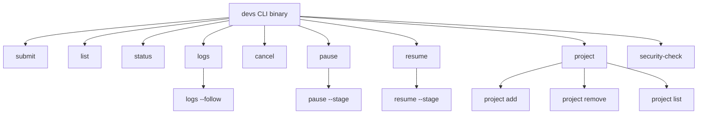
```mermaid
graph TD
    A[devs CLI binary] --> B[submit]
    A --> C[list]
    A --> D[status]
    A --> E[logs]
    A --> F[cancel]
    A --> G[pause]
    A --> H[resume]
    A --> I[project]
    A --> J[security-check]

    I --> K[project add]
    I --> L[project remove]
    I --> M[project list]

    G --> N[pause --stage]
    H --> O[resume --stage]
    E --> P[logs --follow]
```

**[6_UI_UX_ARCHITECTURE-REQ-068]** Every CLI subcommand accepts `--server <host:port>` (overrides server discovery) and `--format json|text` (default `text`). These flags are defined as global arguments in the `clap` root `Command` and inherited by all subcommands.

**[6_UI_UX_ARCHITECTURE-REQ-069]** In `--format json` mode, all output (including errors) is written to stdout as JSON. Nothing is written to stderr. Error format: `{"error": "<prefix>: <detail>", "code": <n>}`.

**[6_UI_UX_ARCHITECTURE-REQ-070]** Each CLI subcommand is implemented as a separate async function in a dedicated module under `crates/devs-cli/src/commands/`. The module structure is:

```
crates/devs-cli/src/
  main.rs
  cli.rs           # clap root Command definition, global args
  connection.rs    # server discovery, gRPC channel construction
  output.rs        # shared formatting: text tables, JSON serialization
  commands/
    submit.rs
    list.rs
    status.rs
    logs.rs
    cancel.rs
    pause.rs
    resume.rs
    project.rs
    security_check.rs
  strings.rs       # all user-visible strings (i18n preparation)
```

**[6_UI_UX_ARCHITECTURE-REQ-071]** CLI output formatting is implemented in `output.rs` as a `Formatter` trait with two implementations: `TextFormatter` and `JsonFormatter`. All subcommand handlers accept a `&dyn Formatter` parameter and are agnostic to the selected format.

#### 2.2.1 Command Schemas

**Global arguments** (inherited by all subcommands):

| Flag | Type | Default | Description |
|---|---|---|---|
| `--server <host:port>` | `String` | (from discovery) | Override server address; bypasses all discovery |
| `--format <json\|text>` | `Enum` | `text` | Output format for all output including errors |

---

**`devs submit <workflow-name>`**

| Argument / Flag | Type | Required | Description |
|---|---|---|---|
| `<workflow-name>` | `String` | Yes | Name of the workflow definition to submit |
| `--name <run-name>` | `String` | No | Human-readable run name; auto-slug generated if omitted |
| `--input <key=value>` | `Vec<String>` | No (repeatable) | Workflow input parameters; splits on first `=` only |
| `--project <name\|id>` | `String` | Conditional | Required when CWD matches 0 or ≥2 registered projects |

Text output (success): `Run submitted: <slug> [<run_id>]`

JSON output (success):
```json
{
  "run_id": "<uuid>",
  "slug": "<slug>",
  "workflow_name": "<name>",
  "project_id": "<uuid>",
  "status": "pending"
}
```

---

**`devs list`**

| Argument / Flag | Type | Required | Description |
|---|---|---|---|
| `--status <status>` | `Enum` | No | Filter: `pending`, `running`, `paused`, `completed`, `failed`, `cancelled` |
| `--project <name\|id>` | `String` | No | Filter to a single project |
| `--limit <n>` | `u32` | No | Max results; default 100; clamped to 1000; `0` is a validation error |

Text output: table with columns `SLUG`, `WORKFLOW`, `STATUS`, `CREATED`, `ELAPSED`.

JSON output:
```json
{
  "runs": [
    {
      "run_id": "<uuid>",
      "slug": "<slug>",
      "workflow_name": "<name>",
      "project_id": "<uuid>",
      "status": "<status>",
      "created_at": "<rfc3339>",
      "started_at": "<rfc3339>|null",
      "completed_at": "<rfc3339>|null",
      "elapsed_ms": "<integer>|null"
    }
  ],
  "total": "<integer>"
}
```

No `stage_runs` are embedded in `devs list` output. Use `devs status` for per-stage detail.

---

**`devs status <run-id>`**

| Argument / Flag | Type | Required | Description |
|---|---|---|---|
| `<run-id>` | `String` | Yes | Run UUID or slug |

Text output: run summary header + stage table with columns `STAGE`, `STATUS`, `ATTEMPT`, `ELAPSED`.

JSON output:
```json
{
  "run_id": "<uuid>",
  "slug": "<slug>",
  "workflow_name": "<name>",
  "project_id": "<uuid>",
  "status": "<status>",
  "created_at": "<rfc3339>",
  "started_at": "<rfc3339>|null",
  "completed_at": "<rfc3339>|null",
  "elapsed_ms": "<integer>|null",
  "stage_runs": [
    {
      "stage_name": "<name>",
      "attempt": "<integer>",
      "status": "<status>",
      "agent_tool": "<tool>|null",
      "pool_name": "<name>",
      "started_at": "<rfc3339>|null",
      "completed_at": "<rfc3339>|null",
      "exit_code": "<integer>|null",
      "elapsed_ms": "<integer>|null"
    }
  ]
}
```

---

**`devs logs <run-id> [stage-name]`**

| Argument / Flag | Type | Required | Description |
|---|---|---|---|
| `<run-id>` | `String` | Yes | Run UUID or slug |
| `[stage-name]` | `String` | No | Specific stage; if omitted, all stages are interleaved |
| `--follow` | Flag | No | Stream until run reaches a terminal state |
| `--attempt <n>` | `u32` | No | Specific attempt number; defaults to latest attempt |

Text output: one log line per line, optionally prefixed with `[stage-name:stdout]` or `[stage-name:stderr]` when multiple stages are displayed simultaneously.

JSON output (one JSON object per line, newline-delimited):
```json
{"sequence": 1, "stream": "stdout", "stage": "<name>", "line": "<content>", "timestamp": "<rfc3339>"}
```

Terminal JSON chunk (last line in `--follow` mode):
```json
{"done": true, "total_lines": "<integer>", "truncated": false}
```

---

**`devs cancel <run-id>`**

| Argument / Flag | Type | Required | Description |
|---|---|---|---|
| `<run-id>` | `String` | Yes | Run UUID or slug |

Text output (success): `Run <slug> cancellation requested.`
JSON output (success): `{"run_id": "<uuid>", "status": "cancelling"}`

---

**`devs pause <run-id>`** and **`devs resume <run-id>`**

| Argument / Flag | Type | Required | Description |
|---|---|---|---|
| `<run-id>` | `String` | Yes | Run UUID or slug |
| `--stage <stage-name>` | `String` | No | Pause/resume a specific stage only; omit for whole run |

Text output (pause success): `Run <slug> paused.`
Text output (resume success): `Run <slug> resumed.`
JSON output (pause): `{"run_id": "<uuid>", "status": "pausing"}`
JSON output (resume): `{"run_id": "<uuid>", "status": "resuming"}`

---

**`devs project add <repo-path>`**

| Argument / Flag | Type | Required | Description |
|---|---|---|---|
| `<repo-path>` | `Path` | Yes | Absolute or relative path to the project git repository |
| `--name <name>` | `String` | No | Display name; defaults to the repository directory name |
| `--weight <n>` | `u32` | No | Weighted scheduling weight (≥1); default 1 |
| `--priority <n>` | `u32` | No | Strict scheduling priority; default 100 |
| `--checkpoint-branch <name>` | `String` | No | Git branch for checkpoints; default `devs/state` |

Text output (success): `Project added: <name> [<project-id>]`
JSON output (success): `{"project_id": "<uuid>", "name": "<name>", "repo_path": "<path>", "status": "active"}`

---

**`devs project remove <project-id>`**

| Argument / Flag | Type | Required | Description |
|---|---|---|---|
| `<project-id>` | `String` | Yes | Project UUID or display name |
| `--force` | Flag | No | Queue removal even if active runs exist; active runs complete before removal takes effect |

Text output (success): `Project <name> queued for removal.`
JSON output (success): `{"project_id": "<uuid>", "status": "removing"}`

---

**`devs project list`**

No additional flags. Lists all registered projects.

Text output: table with columns `ID`, `NAME`, `REPO`, `STATUS`, `WEIGHT`.
JSON output: `{"projects": [{"project_id", "name", "repo_path", "priority", "weight", "checkpoint_branch", "status"}]}`

---

**`devs security-check`**

| Argument / Flag | Type | Required | Description |
|---|---|---|---|
| `--config <path>` | `Path` | No | Path to `devs.toml`; auto-discovered if omitted |

Reads `devs.toml` and `projects.toml` directly without a running server. Runs all 7 security checks (see Security Design §2). Exit codes: `0` = all pass, `1` = any warning, `3` = parse error.

Text output: table with columns `CHECK`, `STATUS`, `DETAIL`.
JSON output:
```json
{
  "schema_version": 1,
  "checked_at": "<rfc3339>",
  "overall_passed": true,
  "checks": [
    {
      "check_id": "SEC-BIND-ADDR",
      "description": "Server binds to loopback address",
      "status": "pass",
      "detail": "server.listen = 127.0.0.1:7890",
      "remediation": null
    }
  ]
}
```

#### 2.2.2 CLI Business Rules

**[6_UI_UX_ARCHITECTURE-REQ-072]** `devs submit --input key=value` splits on the first `=` only. A value containing `=` characters is preserved intact. `--input expr=a=b` sets key `expr` to value `a=b`.

**[6_UI_UX_ARCHITECTURE-REQ-073]** `devs submit` without `--project` when CWD resolves to exactly one registered project uses that project automatically. If CWD matches zero or two or more registered projects, the command exits with code 4 and message `"invalid_argument: --project required: CWD matches <n> registered projects"`.

**[6_UI_UX_ARCHITECTURE-REQ-074]** Run identifier resolution is performed in `connection.rs` for all commands accepting a `<run-id>`: if the argument matches UUID4 format (8-4-4-4-12 hex), it is resolved as `run_id`; otherwise it is resolved as a `slug`. UUID format takes precedence if both match a run.

**[6_UI_UX_ARCHITECTURE-REQ-075]** `devs logs --follow` exits code 0 when the run reaches `Completed`, exits code 1 when it reaches `Failed` or `Cancelled`. If the server connection drops during streaming and cannot be recovered within 5 seconds, it exits code 3.

**[6_UI_UX_ARCHITECTURE-REQ-076]** `devs list --limit <n>` where n > 1000 is silently clamped to 1000 and proceeds. `--limit 0` is a validation error (exit code 4) with message `"invalid_argument: --limit must be at least 1"`.

**[6_UI_UX_ARCHITECTURE-REQ-077]** In `--format json` mode, the `--stage` argument to `devs logs` filters output to lines from the named stage only. In text mode without `--stage`, multi-stage output lines are prefixed as `[stage-name:stdout] <content>` or `[stage-name:stderr] <content>`.

**[6_UI_UX_ARCHITECTURE-REQ-078]** `devs project add <repo-path>` resolves the path via `std::fs::canonicalize()` before sending to the server. Relative paths are resolved relative to CWD. The canonical absolute path is stored in `projects.toml`.

#### 2.2.3 CLI Edge Cases

| ID | Scenario | Expected Behavior |
|---|---|---|
| UI-CLI-EC-001 | `devs submit` with an input key not declared in the workflow | Server returns `INVALID_ARGUMENT`; CLI exits code 4 with `"invalid_argument: unknown input key: <key>"` |
| UI-CLI-EC-002 | `devs logs <run-id>` for a stage that has never started | Returns 0 lines, exits 0 in non-follow mode; in `--follow` mode holds the connection open until the run transitions to a running or terminal state |
| UI-CLI-EC-003 | `devs cancel <run-id>` on a run that is already `Cancelled` | Server returns `FAILED_PRECONDITION`; CLI exits code 1 with `"failed_precondition: run <slug> is already cancelled"` |
| UI-CLI-EC-004 | `devs submit <workflow>` where validation fails (e.g., cycle in DAG) | Server returns `INVALID_ARGUMENT` with all validation errors as a JSON array in the error detail; CLI prints all errors (one per line in text mode, JSON array in JSON mode), exits code 4 |
| UI-CLI-EC-005 | `devs pause <run-id> --stage <stage>` where stage is `Completed` | Server returns `FAILED_PRECONDITION`; CLI exits code 1 with `"failed_precondition: stage <name> is completed and cannot be paused"` |
| UI-CLI-EC-006 | `devs project add <path>` where path is not a git repository | Server returns `INVALID_ARGUMENT`; CLI exits code 4 with `"invalid_argument: <path> is not a git repository"` |
| UI-CLI-EC-007 | Any command with `--format json` when the server is unreachable | Exits code 3; prints `{"error":"server_unreachable: <addr>","code":3}` to stdout; nothing to stderr |

---

### 2.3 MCP Bridge Architecture

`devs-mcp-bridge` is a minimal stdio-to-HTTP proxy. Its sole responsibility is to translate newline-delimited JSON-RPC from stdin to HTTP POST requests against the MCP server and write responses back to stdout as newline-delimited JSON. It contains no business logic, no tool awareness, and no state beyond the MCP endpoint URL derived at startup.

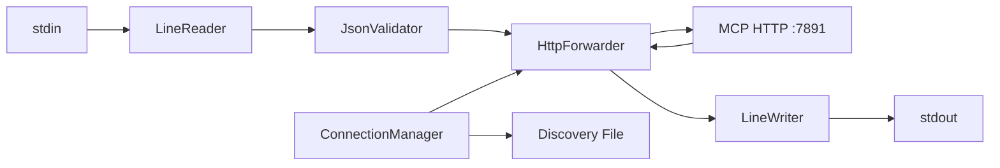
```mermaid
graph LR
    A[stdin] --> B[LineReader]
    B --> C[JsonValidator]
    C --> D[HttpForwarder]
    D --> E[MCP HTTP :7891]
    E --> D
    D --> F[LineWriter]
    F --> G[stdout]

    H[ConnectionManager] --> D
    H --> I[Discovery File]
```

**[6_UI_UX_ARCHITECTURE-REQ-079]** `devs-mcp-bridge` is a thin proxy. It reads one JSON-RPC request per line from stdin, validates the JSON, forwards via HTTP POST to `/mcp/v1/call`, writes the response as a single line to stdout. It MUST NOT buffer, transform, or interpret tool call semantics.

**[6_UI_UX_ARCHITECTURE-REQ-080]** `devs-mcp-bridge` performs server discovery once at startup. It reads `DEVS_DISCOVERY_FILE` (or `~/.config/devs/server.addr`), calls `ServerService.GetInfo` to obtain the MCP port, then constructs the `http://<host>:<mcp_port>/mcp/v1/call` endpoint URL. This URL is NOT re-derived until bridge restart.

**[6_UI_UX_ARCHITECTURE-REQ-081]** On connection loss, `devs-mcp-bridge` attempts exactly one reconnect after 1 second. If the reconnect fails, it writes `{"result":null,"error":"internal: server connection lost","fatal":true}` to stdout and exits with code 1.

#### 2.3.1 Line Protocol Schema

`devs-mcp-bridge` communicates via newline-delimited JSON on stdin/stdout. Each stdin line is a complete JSON-RPC 2.0 request object. Each stdout line is a complete JSON-RPC 2.0 response object. Lines MUST be terminated with `\n`; no other line endings are permitted.

**JSON-RPC 2.0 request envelope** (stdin, one complete object per line):

```json
{
  "jsonrpc": "2.0",
  "id": "<string | integer>",
  "method": "tools/call",
  "params": {
    "name": "<tool-name>",
    "arguments": { }
  }
}
```

**JSON-RPC 2.0 response envelope** (stdout, one complete object per line):

```json
{
  "jsonrpc": "2.0",
  "id": "<same value as request id>",
  "result": {
    "result": "<object>|null",
    "error": "<string>|null"
  }
}
```

**Error response** (used when the request cannot be parsed or HTTP fails):

```json
{
  "jsonrpc": "2.0",
  "id": "<same as request id, or null if unparseable>",
  "error": {
    "code": -32600,
    "message": "<prefix>: <detail>"
  }
}
```

JSON-RPC error codes used by the bridge:

| Code | Meaning | Condition |
|---|---|---|
| `-32700` | Parse error | stdin line is not valid JSON |
| `-32600` | Invalid request | stdin line is valid JSON but not an object |
| `-32603` | Internal error | HTTP failure, connection loss, or MCP server panic (HTTP 500) |

**[6_UI_UX_ARCHITECTURE-REQ-082]** The bridge MUST preserve the `id` field from the request in every response. If the request is not parseable JSON (no `id` available), the response uses `"id": null`. This ensures the consumer can match responses to requests.

**[6_UI_UX_ARCHITECTURE-REQ-083]** The `method` field in requests is forwarded to the HTTP endpoint without validation or transformation. The bridge does NOT enforce a list of valid method names; tool routing is entirely handled by the MCP HTTP server.

**[6_UI_UX_ARCHITECTURE-REQ-084]** `devs-mcp-bridge` validates each stdin line by attempting `serde_json::from_str::<serde_json::Value>()`. If parsing succeeds but the result is not a JSON object (e.g., a bare array `[1,2]` or a string), the bridge responds with a JSON-RPC `-32600` invalid-request error and continues reading. It MUST NOT exit on per-request errors.

#### 2.3.2 Streaming Behavior

For `stream_logs` with `follow: true`, the MCP HTTP server returns an HTTP chunked transfer-encoded response. The bridge handles this differently from non-streaming responses:

1. Issue the HTTP POST to `/mcp/v1/call` with the `stream_logs` tool request.
2. Detect chunked transfer encoding in the response `Transfer-Encoding: chunked` header.
3. Read and write each newline-delimited JSON chunk to stdout as soon as it arrives.
4. When the terminal chunk `{"done": true, ...}` is received, write it to stdout and proceed to the next stdin request line.

**[6_UI_UX_ARCHITECTURE-REQ-085]** For streaming responses the bridge MUST NOT buffer the complete response before writing to stdout. Each chunk MUST be written and flushed to stdout immediately upon receipt. Buffering defeats the purpose of streaming for consuming AI agents.

**[6_UI_UX_ARCHITECTURE-REQ-086]** Non-streaming responses (all tools except `stream_logs follow:true`) are written as a single stdout line. The bridge reads the complete HTTP response body, then writes one line to stdout and flushes.

**[6_UI_UX_ARCHITECTURE-REQ-087]** `devs-mcp-bridge` flushes stdout after every line write using `std::io::Write::flush()`. Unflushed output will cause the consuming AI agent to block indefinitely waiting for data.

#### 2.3.3 MCP Bridge Edge Cases

| ID | Scenario | Expected Behavior |
|---|---|---|
| UI-BRIDGE-EC-001 | Stdin delivers valid JSON that is an array `[1,2,3]` not an object | Write JSON-RPC `-32600` error response with `"id": null`; continue reading next stdin line |
| UI-BRIDGE-EC-002 | HTTP response body exceeds MCP server's 1 MiB limit | MCP server returns HTTP 413; bridge writes a `-32603` error response with `"message": "internal: request body too large"` to stdout; continues |
| UI-BRIDGE-EC-003 | `stream_logs follow:true` connection is interrupted mid-stream | Bridge writes `-32603` error response for that request ID; attempts one reconnect after 1 second; if reconnect fails, writes fatal JSON and exits 1 |
| UI-BRIDGE-EC-004 | MCP server is unavailable at startup (`GetInfo` fails) | Bridge writes `{"result":null,"error":"server_unreachable: ServerService.GetInfo failed: <status>","fatal":true}` to stdout and exits 1 |
| UI-BRIDGE-EC-005 | Stdin reaches EOF immediately (empty input) | Bridge detects EOF, exits 0 cleanly without writing any output |
| UI-BRIDGE-EC-006 | Two requests arrive on stdin before the first response is written | Bridge processes requests sequentially (one in-flight at a time); the second request line is buffered in the async stdin reader until the first response is written to stdout |

---

### 2.4 Widget Reusability Contract

The TUI crate defines a small inventory of reusable widget primitives. Each is defined once, composed by multiple tabs, and must not embed tab-specific assumptions. This prevents visual inconsistency and duplication.

#### 2.4.1 Reusable Widget Inventory

| Widget Struct | Module | Composed By | Purpose |
|---|---|---|---|
| `LogPane` | `widgets/log_pane.rs` | `DashboardTab` (as `LogTail`), `LogsTab` | Scrollable ANSI-stripped log display |
| `StageList` | `widgets/stage_list.rs` | `DashboardTab`, `DebugTab` | Tabular stage status rows |
| `RunList` | `widgets/run_list.rs` | `DashboardTab` | Selectable list of workflow run summaries |
| `DagView` | `widgets/dag_view.rs` | `DashboardTab` | ASCII workflow DAG with tier columns |
| `HelpOverlay` | `widgets/help_overlay.rs` | Rendered over any tab | Keybinding reference overlay |
| `StatusBar` | `widgets/status_bar.rs` | Root layout only | Connection and server status footer |

**[6_UI_UX_ARCHITECTURE-REQ-088]** All reusable widget structs are defined in `crates/devs-tui/src/widgets/`. Widget modules MUST NOT import tab modules (`tabs::*`). Tab modules MAY import widget modules. This prevents circular dependencies within the crate.

**[6_UI_UX_ARCHITECTURE-REQ-089]** All reusable widget constructors use a fluent builder pattern. Mandatory fields are constructor parameters; optional rendering hints are setter methods that return `Self` (builder chain).

```rust
// Canonical builder pattern — all reusable widgets follow this shape.
impl<'a> LogPane<'a> {
    pub fn new(buffer: &'a LogBuffer) -> Self { /* ... */ }
    pub fn scroll_offset(mut self, offset: usize) -> Self { self.scroll_offset = offset; self }
    pub fn visible_rows(mut self, rows: usize) -> Self { self.visible_rows = rows; self }
    pub fn show_stream_prefix(mut self, show: bool) -> Self { self.show_stream_prefix = show; self }
}
```

**[6_UI_UX_ARCHITECTURE-REQ-090]** `StageList` renders stage rows with fixed column widths. Row format: `<stage-name-padded-20> | <STATUS> | <ATTEMPT> | <ELAPSED>`. Column separator is ` | ` (3 chars). Alternating row background highlighting is applied when rendering with `ratatui` style modifiers. Fan-out sub-stages are indented two spaces under their parent row.

**[6_UI_UX_ARCHITECTURE-REQ-091]** `RunList` renders run rows as: `<STATUS> <slug-padded-30> <workflow-padded-20> <created-date>`. The status prefix uses the `RunStatus` label (4 chars; `RunStatus::Running` → `RUN `, `RunStatus::Completed` → `DONE`, etc., following the same 4-char pattern as `StageStatus`). The selected row is highlighted with `Style::default().add_modifier(Modifier::REVERSED)`.

#### 2.4.2 Shared Rendering Utilities

A module `crates/devs-tui/src/render_utils.rs` provides shared rendering primitives used by multiple widgets. Every widget that needs these functions MUST import from this module; no widget may reimplement them locally.

```rust
/// Format elapsed time as "M:SS". Returns "--:--" if None.
/// Examples: None → "--:--"; 0ms → "0:00"; 4_205_000ms → "70:05"
pub fn format_elapsed(elapsed_ms: Option<u64>) -> String;

/// Truncate `s` to at most `max_len` bytes.
/// If truncated, the last character of the output is replaced with '~'.
/// Truncation is on char boundaries (never splits a multi-byte char).
pub fn truncate_with_tilde(s: &str, max_len: usize) -> String;

/// Map StageStatus to its 4-character display label per UI-ARCH-007.
pub fn stage_status_label(status: StageStatus) -> &'static str;

/// Map RunStatus to its 4-character display label.
pub fn run_status_label(status: RunStatus) -> &'static str;

/// Strip ANSI escape sequences (CSI codes) from `s`.
/// Returns a new String containing only printable content.
pub fn strip_ansi(s: &str) -> String;

/// Format a UTC timestamp as "YYYY-MM-DD HH:MM" in UTC.
/// Returns "--" if None.
pub fn format_timestamp(dt: Option<&DateTime<Utc>>) -> String;
```

**[6_UI_UX_ARCHITECTURE-REQ-092]** `render_utils::strip_ansi` is the single authoritative ANSI stripping implementation in the TUI crate. It MUST be used by `LogPane` and every future widget that renders log content. Duplicate implementations of ANSI stripping in any widget module are a lint violation (enforced by a `./do lint` regex scan).

---

### 2.5 Cross-Component Data Flow

Data flows through the TUI in one direction: gRPC events arrive on a background task, are forwarded to the main event loop via an `mpsc` channel, and are applied to `AppState` in `App::handle_event()` before `App::render()` is called.

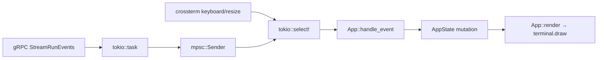
```mermaid
graph LR
    S[gRPC StreamRunEvents] --> T[tokio::task]
    T --> CH[mpsc::Sender<TuiEvent>]
    KB[crossterm keyboard/resize] --> SEL[tokio::select!]
    CH --> SEL
    SEL --> HE[App::handle_event]
    HE --> AS[AppState mutation]
    AS --> R[App::render → terminal.draw]
```

**[6_UI_UX_ARCHITECTURE-REQ-093]** Display models (`RunSummary`, `RunDetail`, `StageRunDisplay`, `LogBuffer`, `PoolSummary`, `AgentStatus`) are derived from gRPC proto message types in `crates/devs-tui/src/convert.rs`. The `convert.rs` module is the only place where proto types from `devs-proto` are referenced in the TUI crate. `state.rs` types MUST NOT reference `devs_proto` types.

**[6_UI_UX_ARCHITECTURE-REQ-094]** `LogBuffer` is keyed in `AppState::log_buffers: HashMap<(Uuid, String), LogBuffer>` by `(run_id, stage_name)`. A new `LogBuffer` with capacity 10,000 is created when a `StageRun` transitions to `Running`. When a run reaches a terminal state and remains non-selected for more than 30 minutes, its `LogBuffer` entries are evicted from `AppState::log_buffers` in `App::handle_event()` (not during render) to prevent unbounded memory growth.

**[6_UI_UX_ARCHITECTURE-REQ-095]** `RunDetail.dag_tiers` is precomputed immediately after a `RunEvent` is applied to `AppState`. The tier computation runs in `App::handle_event()` using Kahn's topological sort over the `StageRunDisplay.depends_on` adjacency list. The computation result is stored in `RunDetail.dag_tiers` and reused across all subsequent render calls until a new `RunEvent` invalidates it.

**[6_UI_UX_ARCHITECTURE-REQ-096]** When the TUI reconnects after a `StreamRunEvents` interruption, the first message received is a full snapshot (`event_type = "run.snapshot"`). On receipt, `AppState::runs` and `AppState::run_details` are fully replaced with fresh data. Stale `LogBuffer` entries are preserved (not cleared) since they represent log history that may not be re-delivered by the stream.

---

### 2.6 Component State Transitions

#### 2.6.1 Connection Status State Machine

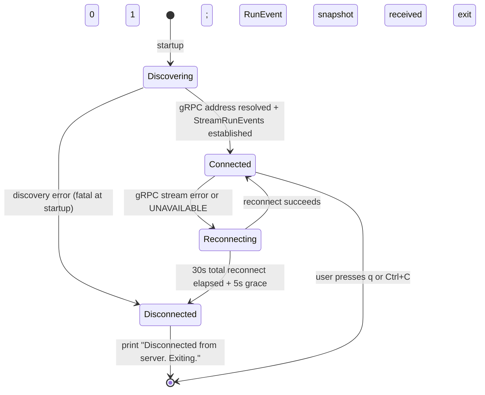
```mermaid
stateDiagram-v2
    [*] --> Discovering: startup
    Discovering --> Connected: gRPC address resolved + StreamRunEvents established
    Discovering --> Disconnected: discovery error (fatal at startup)
    Connected --> Reconnecting: gRPC stream error or UNAVAILABLE
    Reconnecting --> Connected: reconnect succeeds; RunEvent snapshot received
    Reconnecting --> Disconnected: 30s total reconnect elapsed + 5s grace
    Disconnected --> [*]: print "Disconnected from server. Exiting."; exit 1
    Connected --> [*]: user presses q or Ctrl+C; exit 0
```

**[6_UI_UX_ARCHITECTURE-REQ-097]** When `ConnectionStatus` transitions to `Reconnecting`, all widgets retain their last-known values. The `StatusBar` shows `RECONNECTING` and the elapsed time since the last successful connection. No data is cleared on entry to `Reconnecting`; stale data remains visible until fresh data arrives after reconnection.

**[6_UI_UX_ARCHITECTURE-REQ-098]** The reconnect backoff sequence is: 1s → 2s → 4s → 8s → 16s → 30s (cap). Total reconnect budget before declaring `Disconnected` is 30 seconds cumulative. After the budget is exhausted, the TUI waits an additional 5-second grace period then exits with code 1 and the message `"Disconnected from server. Exiting."` written to the terminal.

#### 2.6.2 Run Detail Loading State

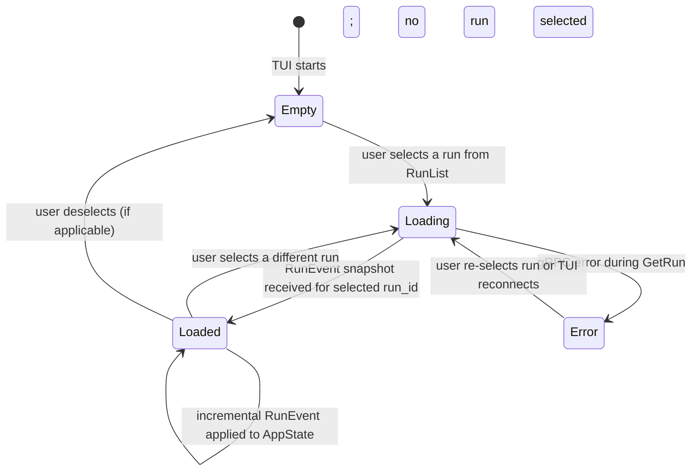
```mermaid
stateDiagram-v2
    [*] --> Empty: TUI starts; no run selected
    Empty --> Loading: user selects a run from RunList
    Loading --> Loaded: RunEvent snapshot received for selected run_id
    Loading --> Error: gRPC error during GetRun
    Loaded --> Loaded: incremental RunEvent applied to AppState
    Loaded --> Loading: user selects a different run
    Loaded --> Empty: user deselects (if applicable)
    Error --> Loading: user re-selects run or TUI reconnects
```

**[6_UI_UX_ARCHITECTURE-REQ-099]** `RunDetail` in `AppState::run_details` is populated from `StreamRunEvents` snapshot messages. The TUI does not issue separate `GetRun` gRPC calls; all run detail data arrives via the streaming channel. When a run is selected in `RunList`, if `AppState::run_details` already contains the run (from a prior snapshot), it is displayed immediately with no loading delay.

---

### 2.7 Dependencies

**Section 2 depends on:**

| Component | Nature of Dependency |
|---|---|
| `devs-core` | Provides `RunStatus`, `StageStatus`, `AgentTool`, `WorkflowRun`, `StageRun` domain types; display models in `state.rs` are derived from these |
| `devs-proto` | Provides `RunEvent`, `StageEvent`, `PoolStateEvent` proto message types; `convert.rs` maps from these into display models |
| `devs-grpc` (server-side) | Defines `RunService`, `StageService`, `LogService`, `PoolService`, `ProjectService` called by CLI and TUI |
| `devs-mcp` (server-side) | Defines the 17 MCP tool schemas; bridge forwards them without inspection |
| Section 1 (Architecture Overview) | Defines crate dependency constraints, discovery protocol, `Formatter` trait, and `connection.rs` patterns used by §2.2 |
| Section 3 (State Management) | `AppState` struct defined in §3 is the canonical owner of all display-model types specified here |
| Section 4 (Routing Architecture) | CLI command routing in §4.2 routes to the command handler modules specified in §2.2 |
| `ratatui 0.28` | Widget framework; all widget structs implement `ratatui::widgets::Widget` |
| `clap 4.5` | CLI argument parsing; command schemas map to `clap::Parser` derive structs |
| `reqwest 0.12` | HTTP client used by `devs-mcp-bridge` for forwarding to MCP HTTP port |

**Section 2 is depended upon by:**

| Component | Why |
|---|---|
| Section 3 (State Management) | `AppState` fields reference `RunSummary`, `RunDetail`, `LogBuffer`, `PoolSummary` types defined here |
| Section 5 (Styling System) | Color and ASCII rendering rules apply to all widgets and CLI output formats specified here |
| Section 7 (Testing Strategy) | Snapshot tests target the exact widget output formats and CLI JSON schemas specified here |
| `devs-tui` binary | All widget structs, display models, rendering contracts, and `render_utils` functions |
| `devs-cli` binary | All command schemas, input validation rules, output formats, and `Formatter` trait |
| `devs-mcp-bridge` binary | Line protocol, streaming behavior, error response formats |

---

### 2.8 Acceptance Criteria

The following criteria MUST each be covered by at least one automated test annotated `// Covers: UI-ARCH-COMP-AC-NNN`.

- **[6_UI_UX_ARCHITECTURE-REQ-100]** `render_utils::format_elapsed(None)` returns `"--:--"` (exactly 5 characters). (unit test in `render_utils.rs`)
- **[6_UI_UX_ARCHITECTURE-REQ-101]** `render_utils::format_elapsed(Some(4_205_000))` returns `"70:05"`. (unit test)
- **[6_UI_UX_ARCHITECTURE-REQ-102]** `render_utils::format_elapsed(Some(0))` returns `"0:00"`. (unit test)
- **[6_UI_UX_ARCHITECTURE-REQ-103]** `render_utils::truncate_with_tilde("twenty-one-char-stagename", 20)` returns a 20-character string ending with `~`. (unit test)
- **[6_UI_UX_ARCHITECTURE-REQ-104]** `render_utils::truncate_with_tilde("short", 20)` returns `"short"` unchanged (no padding, no tilde). (unit test)
- **[6_UI_UX_ARCHITECTURE-REQ-105]** `render_utils::stage_status_label(s)` returns exactly 4 characters for every variant of `StageStatus`. (unit test with exhaustive match)
- **[6_UI_UX_ARCHITECTURE-REQ-106]** `render_utils::strip_ansi("\x1b[31mRED\x1b[0m")` returns `"RED"`. (unit test)
- **[6_UI_UX_ARCHITECTURE-REQ-107]** `render_utils::strip_ansi("no ansi here")` returns `"no ansi here"` unchanged. (unit test)
- **[6_UI_UX_ARCHITECTURE-REQ-108]** `LogBuffer::new(10_000)` evicts the oldest entry when a 10,001st entry is inserted; `total_received` becomes 10,001 and `lines.len()` remains 10,000. (unit test)
- **[6_UI_UX_ARCHITECTURE-REQ-109]** `DagView` renders stage boxes with the exact format `[ <name-20-chars> | <STAT> | <M:SS> ]` (38 characters per box). (TUI E2E, `TestBackend` snapshot at 200×50)
- **[6_UI_UX_ARCHITECTURE-REQ-110]** A stage name of exactly 20 characters renders without truncation in `DagView`. A stage name of 21 characters renders as 19 original chars + `~`. (TUI E2E, `TestBackend` snapshot)
- **[6_UI_UX_ARCHITECTURE-REQ-111]** `DagView` renders `──►` arrows between stage boxes in adjacent tiers for a workflow with `depends_on` edges. (TUI E2E, `TestBackend` snapshot)
- **[6_UI_UX_ARCHITECTURE-REQ-112]** `HelpOverlay` is shown when `?` is pressed and the overlay is dismissed when any subsequent key is pressed; the underlying tab content is restored. (TUI E2E, `TestBackend` snapshot)
- **[6_UI_UX_ARCHITECTURE-REQ-113]** `StatusBar` renders `RECONNECTING` when `ConnectionStatus::Reconnecting` is set in `AppState`. (TUI E2E, `TestBackend` snapshot)
- **[6_UI_UX_ARCHITECTURE-REQ-114]** `dag_tiers` for a linear A→B→C workflow computes to `[["A"], ["B"], ["C"]]`. (unit test in `convert.rs`)
- **[6_UI_UX_ARCHITECTURE-REQ-115]** `dag_tiers` for a diamond A→{B,C}→D computes to `[["A"], ["B", "C"], ["D"]]` (inner vecs sorted alphabetically). (unit test in `convert.rs`)
- **[6_UI_UX_ARCHITECTURE-REQ-116]** `devs submit --input key=a=b` sends `key` → `"a=b"` to the server (splits on first `=` only). (CLI E2E)
- **[6_UI_UX_ARCHITECTURE-REQ-117]** `devs list --format json` returns a JSON object with a `"runs"` array field and a `"total"` integer field. (CLI E2E)
- **[6_UI_UX_ARCHITECTURE-REQ-118]** `devs status <unknown-id> --format json` exits code 2 and prints a JSON object with `"error"` beginning `"not_found:"`. (CLI E2E)
- **[6_UI_UX_ARCHITECTURE-REQ-119]** `devs logs --follow` exits code 0 when the watched run reaches `Completed` and exits code 1 when it reaches `Failed`. (CLI E2E)
- **[6_UI_UX_ARCHITECTURE-REQ-120]** `devs cancel` on an already-cancelled run exits code 1 with a message beginning `"failed_precondition:"`. (CLI E2E)
- **[6_UI_UX_ARCHITECTURE-REQ-121]** `devs list --limit 0` exits code 4 with a message beginning `"invalid_argument:"`. (CLI E2E)
- **[6_UI_UX_ARCHITECTURE-REQ-122]** `devs-mcp-bridge` writes each `stream_logs follow:true` response chunk to stdout as a separate line immediately upon receipt, before the complete stream ends. Verified by timing: first line arrives before the stream is complete. (MCP E2E)
- **[6_UI_UX_ARCHITECTURE-REQ-123]** `devs-mcp-bridge` responds with a JSON-RPC error and continues when it receives a non-object JSON line `[1,2,3]` on stdin; subsequent valid requests are still processed correctly. (MCP E2E)
- **[6_UI_UX_ARCHITECTURE-REQ-124]** `devs-mcp-bridge` preserves the `"id"` field value from the request in every response (string, integer, and null variants). (MCP E2E)
- **[6_UI_UX_ARCHITECTURE-REQ-125]** `TUI::LogPane` renders `"RED"` (not `"\x1b[31mRED\x1b[0m"`) for a log line containing ANSI color codes. (TUI E2E, `TestBackend` snapshot)
- **[6_UI_UX_ARCHITECTURE-REQ-126]** All structs in `crates/devs-tui/src/widgets/` implement `ratatui::widgets::Widget`. Verified via compile-time assertion: `fn assert_widget<W: Widget>() {}` called for each widget type in a test. (unit test)
- **[6_UI_UX_ARCHITECTURE-REQ-127]** `devs project add <path>` with a path that is not a git repository exits code 4 with a message beginning `"invalid_argument:"`. (CLI E2E)
- **[6_UI_UX_ARCHITECTURE-REQ-128]** `AppState::log_buffers` does not grow unboundedly: entries for non-selected runs older than 30 minutes are evicted; after processing 1,000 synthetic `RunEvent` messages for distinct runs, total `log_buffers` entries ≤ 100. (unit test)
- **[6_UI_UX_ARCHITECTURE-REQ-129]** `convert.rs` maps every variant of proto `StageStatus` enum to a `StageRunDisplay.status_label` without panicking. Verified by an exhaustive unit test iterating all proto enum values. (unit test)

---

## 3. State Management Paradigm

### 3.1 TUI State Architecture

**[6_UI_UX_ARCHITECTURE-REQ-130]** All mutable TUI state is owned by a single `AppState` struct defined in `crates/devs-tui/src/state.rs`. No component owns state independently; components receive shared references to `AppState` at render time.

```
crates/devs-tui/src/
  main.rs
  app.rs            # App: owns AppState + EventLoop; drives the run loop
  state.rs          # AppState: all mutable state
  event.rs          # TuiEvent enum: crossterm events + gRPC stream events
  connection.rs     # gRPC client management, auto-reconnect logic
  convert.rs        # proto → display model conversions (only place proto types appear)
  render_utils.rs   # shared rendering utilities: format_elapsed, strip_ansi, etc.
  tabs/
    mod.rs
    dashboard.rs    # DashboardTab widget
    logs.rs         # LogsTab widget
    debug.rs        # DebugTab widget
    pools.rs        # PoolsTab widget
  widgets/
    mod.rs
    dag_view.rs     # DagView widget
    log_pane.rs     # LogPane widget (ring buffer)
    stage_list.rs   # StageList widget
    run_list.rs     # RunList widget
    help_overlay.rs # HelpOverlay widget
    status_bar.rs   # StatusBar widget
  strings.rs        # all user-visible strings
```

**[6_UI_UX_ARCHITECTURE-REQ-131]** `AppState` is the canonical owner of all display-layer state. All fields are plain owned Rust types; no `Arc`, `Mutex`, `RwLock`, or any async primitives appear in `AppState` itself. `App` owns `AppState` exclusively and all access is single-threaded within the render/event loop.

The complete `AppState` definition is:

```rust
pub struct AppState {
    // --- Navigation ---
    pub active_tab: Tab,
    pub help_visible: bool,

    // --- Run data ---
    pub runs: Vec<RunSummary>,                          // sorted by created_at descending
    pub run_details: HashMap<Uuid, RunDetail>,          // keyed by run_id
    pub selected_run_id: Option<Uuid>,                  // Dashboard: selected row in RunList
    pub selected_stage_name: Option<String>,            // Logs/Debug: selected stage within run

    // --- Log buffers ---
    pub log_buffers: HashMap<(Uuid, String), LogBuffer>, // keyed by (run_id, stage_name)

    // --- Pool data ---
    pub pool_state: Vec<PoolSummary>,                   // snapshot from WatchPoolState
    pub selected_pool_name: Option<String>,             // Pools tab: selected row in PoolList

    // --- Scroll state ---
    pub dag_scroll_offset: usize,                       // DagView: leftmost visible tier index
    pub log_scroll_offset: HashMap<(Uuid, String), usize>, // LogPane: scroll position per stage

    // --- Connection state ---
    pub connection_status: ConnectionStatus,
    pub server_addr: String,                            // resolved gRPC address, e.g. "127.0.0.1:7890"
    pub reconnect_elapsed_ms: u64,                      // monotonic; reset on connect; used by reconnect budget
    pub last_event_at: Option<std::time::Instant>,      // monotonic; updated on every TuiEvent

    // --- Terminal ---
    pub terminal_size: (u16, u16),                      // (cols, rows); updated on Resize events
}
```

**[6_UI_UX_ARCHITECTURE-REQ-132]** `AppState::default()` returns a well-defined initial value. Every field has a documented initial value (see §3.2). `App::new()` calls `AppState::default()` before the first event is processed. There is no invalid initial state.

**[6_UI_UX_ARCHITECTURE-REQ-133]** State updates arrive from three sources: (a) gRPC `StreamRunEvents` push notifications, (b) gRPC `WatchPoolState` push notifications, and (c) crossterm keyboard/resize events. All three are unified into the `TuiEvent` enum and processed sequentially in `App::handle_event()`. There is no concurrent mutation of `AppState`.

**[6_UI_UX_ARCHITECTURE-REQ-134]** The event loop cycle is:
1. `tokio::select!` on crossterm events, gRPC run events channel, gRPC pool events channel, and tick interval.
2. Receive one `TuiEvent`.
3. Call `App::handle_event(event)` → mutates `AppState`.
4. Call `terminal.draw(|f| app.render(f))` → reads `AppState` immutably.

Re-render occurs on every `TuiEvent` (including `Tick`). The render-to-screen latency from event receipt MUST be ≤ 50 ms. `render()` MUST NOT mutate `AppState`.

**[6_UI_UX_ARCHITECTURE-REQ-135]** gRPC `StreamRunEvents` is consumed in a dedicated `tokio::task` that forwards `RunEvent` messages into an `mpsc::Sender<TuiEvent>`. Similarly, `WatchPoolState` is consumed in a dedicated task that forwards `PoolStateEvent` messages into the same sender. The main event loop reads from the corresponding `mpsc::Receiver<TuiEvent>`.

**[6_UI_UX_ARCHITECTURE-REQ-136]** `LogBuffer` is a fixed-capacity ring buffer with a maximum of 10,000 entries. When the buffer is at capacity and a new entry is inserted, the oldest entry is evicted. `total_received` is incremented on every insertion regardless of eviction. `LogBuffer` is keyed by `(run_id, stage_name)` in `AppState::log_buffers`.

**[6_UI_UX_ARCHITECTURE-REQ-137]** `ConnectionStatus` has three variants:

```rust
pub enum ConnectionStatus {
    Connected {
        server_addr: String,
    },
    Reconnecting {
        attempt: u32,           // 1-based; incremented on each backoff cycle
        next_retry_at: Instant, // monotonic; when the next connect attempt fires
        elapsed_ms: u64,        // cumulative time spent in Reconnecting since last Connected
    },
    Disconnected,
}
```

The `connection.rs` module drives reconnect backoff using `tokio::time::sleep_until(next_retry_at)`. The backoff sequence (in seconds) is: 1 → 2 → 4 → 8 → 16 → 30 (cap). `elapsed_ms` is accumulated across all backoff cycles. When `elapsed_ms` exceeds 30,000 ms, the TUI waits an additional 5-second grace period then transitions to `Disconnected`, prints `"Disconnected from server. Exiting."`, and exits with code 1.

**[6_UI_UX_ARCHITECTURE-REQ-138]** A `TuiEvent::Tick` is generated every 1 second from a `tokio::time::interval(Duration::from_secs(1))` task. On `Tick`, `App::handle_event()` updates `elapsed_display` in all `StageRunDisplay` records whose status is `Running` or `Paused` (by recomputing from `started_at` and `Utc::now()`). `Tick` events also drive the reconnect sleep mechanism: on each `Tick`, the elapsed reconnect time is checked against the budget. `Tick` processing MUST complete in under 1 ms.

---

### 3.2 AppState Field Specifications

The following table documents every field in `AppState`, its type, initial value, invariant, and the events that update it.

| Field | Type | Initial Value | Invariant | Updated By |
|---|---|---|---|---|
| `active_tab` | `Tab` | `Tab::Dashboard` | Always a valid `Tab` variant | `Key(Tab)`, `Key('1'–'4')` |
| `help_visible` | `bool` | `false` | — | `Key('?')`, any key while visible |
| `runs` | `Vec<RunSummary>` | `vec![]` | Sorted by `created_at` descending; no duplicate `run_id` | `RunEvent::Snapshot`, `RunEvent::Delta` |
| `run_details` | `HashMap<Uuid, RunDetail>` | `HashMap::new()` | Key ∈ `runs[*].run_id`; `dag_tiers` is always populated when entry exists | `RunEvent::Snapshot`, `RunEvent::Delta` |
| `selected_run_id` | `Option<Uuid>` | `None` | If `Some(id)`, then `id` ∈ `runs[*].run_id`; else cleared to `None` | `Key(↑↓Enter)`, reconnect snapshot |
| `selected_stage_name` | `Option<String>` | `None` | If `Some(name)`, `name` ∈ `run_details[selected_run_id].stage_runs[*].stage_name`; else `None` | `Key(↑↓Enter)` in Logs/Debug tab |
| `log_buffers` | `HashMap<(Uuid, String), LogBuffer>` | `HashMap::new()` | Entry created when stage transitions to `Running`; evicted after 30 min idle if run non-terminal or non-selected | `RunEvent::LogLine`, `LogStreamEvent`, idle eviction on `Tick` |
| `pool_state` | `Vec<PoolSummary>` | `vec![]` | Sorted by pool `name` ascending; no duplicate `name` | `PoolStateEvent::Snapshot`, `PoolStateEvent::Delta` |
| `selected_pool_name` | `Option<String>` | `None` | If `Some(name)`, `name` ∈ `pool_state[*].name`; else `None` | `Key(↑↓Enter)` in Pools tab |
| `dag_scroll_offset` | `usize` | `0` | Clamped to `[0, max(0, tier_count - visible_tiers)]`; reset to `0` when selected run changes | `Key(←→)` in Dashboard, `RunEvent` changing tier count |
| `log_scroll_offset` | `HashMap<(Uuid, String), usize>` | `HashMap::new()` | Each value clamped to `[0, max(0, buffer.len() - visible_rows)]` | `Key(↑↓PgUp PgDn)` in Logs tab; `RunEvent::LogLine` |
| `connection_status` | `ConnectionStatus` | `Reconnecting { attempt: 0, ... }` | Legal transitions only (see §3.5) | Connect success, stream error, timeout |
| `server_addr` | `String` | Resolved at startup | Non-empty; `<host>:<port>` format | Set once at startup; immutable thereafter |
| `reconnect_elapsed_ms` | `u64` | `0` | Reset to `0` on every `Connected` transition | `Tick` during `Reconnecting` |
| `last_event_at` | `Option<Instant>` | `None` | Updated on every `TuiEvent` | Every `TuiEvent` variant |
| `terminal_size` | `(u16, u16)` | `(0, 0)` before first `Resize`; populated by `crossterm::terminal::size()` at startup | Reflects current terminal dimensions | `TuiEvent::Resize` |

**[6_UI_UX_ARCHITECTURE-REQ-139]** When `selected_run_id` is `Some(id)` and a `RunEvent::Snapshot` arrives that does not contain `id`, `selected_run_id` is cleared to `None`. This prevents a dangling selection pointing at a removed run.

**[6_UI_UX_ARCHITECTURE-REQ-140]** `dag_scroll_offset` is reset to `0` whenever `selected_run_id` changes (user selects a different run). Retaining the old offset for a new run would produce an incorrect render.

**[6_UI_UX_ARCHITECTURE-REQ-141]** `log_scroll_offset` entries for a `(run_id, stage_name)` pair are removed when the corresponding `LogBuffer` is evicted from `AppState::log_buffers`. This prevents scroll offsets from consuming memory after the underlying buffer is gone.

**[6_UI_UX_ARCHITECTURE-REQ-142]** `AppState::runs` is sorted by `created_at` descending on every `RunEvent::Snapshot` or `RunEvent::Delta` mutation. The sort key is `created_at`; ties are broken by `run_id` lexicographic order. Sorting happens in `App::handle_event()` after applying the event, never during render.

**[6_UI_UX_ARCHITECTURE-REQ-143]** `selected_stage_name` is cleared to `None` on every tab switch away from `LogsTab` and `DebugTab`. Retaining a stage selection across unrelated tabs produces confusing UX.

---

### 3.3 TuiEvent Taxonomy

`TuiEvent` is the single event type processed by `App::handle_event()`. It unifies all input sources.

```rust
pub enum TuiEvent {
    // --- Keyboard / terminal input ---
    Key(crossterm::event::KeyEvent),
    Resize(u16, u16),               // new (cols, rows) from crossterm

    // --- gRPC run events (from StreamRunEvents background task) ---
    RunSnapshot(Vec<RunSummary>, HashMap<Uuid, RunDetail>),  // full state replacement on (re)connect
    RunDelta(RunSummary, Option<RunDetail>),                  // incremental update for one run
    LogLine {
        run_id: Uuid,
        stage_name: String,
        line: LogLine,
    },

    // --- gRPC pool events (from WatchPoolState background task) ---
    PoolSnapshot(Vec<PoolSummary>),   // full pool state replacement
    PoolDelta(PoolSummary),           // incremental update for one pool

    // --- Connection lifecycle ---
    Connected { server_addr: String },
    StreamError { reason: String },   // gRPC stream dropped; begin reconnect
    ReconnectAttempt {
        attempt: u32,
        backoff_secs: u64,
    },
    ReconnectBudgetExceeded,          // 30s budget + 5s grace elapsed; triggers exit

    // --- Periodic tick ---
    Tick,                             // 1-second interval; updates elapsed times
}
```

**[6_UI_UX_ARCHITECTURE-REQ-144]** `TuiEvent` variants are produced exclusively by the sources shown in the following table. No other code may push `TuiEvent` messages into the channel.

| `TuiEvent` Variant | Producer | mpsc channel buffer size |
|---|---|---|
| `Key`, `Resize` | `crossterm::event::EventStream` task | 256 |
| `RunSnapshot`, `RunDelta`, `LogLine` | `StreamRunEvents` gRPC task | 256 |
| `PoolSnapshot`, `PoolDelta` | `WatchPoolState` gRPC task | 64 |
| `Connected`, `StreamError`, `ReconnectAttempt`, `ReconnectBudgetExceeded` | `connection.rs` reconnect loop | 32 |
| `Tick` | `tokio::time::interval(1s)` task | 8 |

**[6_UI_UX_ARCHITECTURE-REQ-145]** Each background task sends events into the same `mpsc::Sender<TuiEvent>`. The `tokio::select!` in the main loop polls from the corresponding `mpsc::Receiver<TuiEvent>`. If the receiver is full (buffer overflow), the background task applies backpressure (blocks on `send().await`). The main event loop MUST drain the channel within 50 ms of each event to prevent backpressure from stalling server-side streaming.

The following table shows which `AppState` fields each `TuiEvent` variant mutates in `App::handle_event()`:

| Event | `AppState` Fields Mutated |
|---|---|
| `Key(Tab)` / `Key('1'–'4')` | `active_tab`, `selected_stage_name` (cleared) |
| `Key('?')` | `help_visible` (toggled) |
| `Key(q)` / `Key(Ctrl+C)` | Triggers graceful shutdown; no field mutation |
| `Key(↑↓)` | `selected_run_id`, `selected_stage_name`, or `selected_pool_name` (tab-dependent) |
| `Key(←→)` | `dag_scroll_offset` (Dashboard only) |
| `Key(PgUp/PgDn)` | `log_scroll_offset` entry for selected stage (Logs tab only) |
| `Key(c/p/r)` | No AppState mutation; triggers gRPC RPC call as side-effect |
| `Resize(w, h)` | `terminal_size` |
| `RunSnapshot(runs, details)` | `runs` (replaced), `run_details` (replaced), `selected_run_id` (validated/cleared), `dag_scroll_offset` (reset if run changed) |
| `RunDelta(summary, detail)` | `runs` (upsert by run_id), `run_details` (upsert if `detail` present) |
| `LogLine { run_id, stage_name, line }` | `log_buffers[(run_id, stage_name)]` (appended; evict oldest if full), `log_scroll_offset` (clamped) |
| `PoolSnapshot(pools)` | `pool_state` (replaced), `selected_pool_name` (validated/cleared) |
| `PoolDelta(pool)` | `pool_state` (upsert by name) |
| `Connected { server_addr }` | `connection_status` → `Connected`, `reconnect_elapsed_ms` → `0` |
| `StreamError { reason }` | `connection_status` → `Reconnecting { attempt: 0, ... }` |
| `ReconnectAttempt { attempt, backoff_secs }` | `connection_status` → `Reconnecting { attempt, next_retry_at }` |
| `ReconnectBudgetExceeded` | `connection_status` → `Disconnected`; triggers exit sequence |
| `Tick` | `run_details[*].stage_runs[*].elapsed_display` for `Running`/`Paused` stages; `reconnect_elapsed_ms` incremented |

---

### 3.4 AppState Mutation Rules

`App::handle_event()` is the single function where `AppState` is mutated. The following rules govern mutation behavior.

**[6_UI_UX_ARCHITECTURE-REQ-146]** Mutation is atomic per event. Either the full mutation for an event completes or none of it does. Partial mutations (e.g., updating `runs` but failing before updating `run_details`) leave `AppState` in an inconsistent state. If an event processing function returns an error, `AppState` MUST be rolled back to its pre-mutation value. In practice this means mutations are applied to local variables first, then committed to `AppState` in a single assignment block.

**[6_UI_UX_ARCHITECTURE-REQ-147]** `render()` MUST NOT mutate `AppState`. The function signature is `fn render(&self, frame: &mut Frame)` — it receives `&self`, not `&mut self`. Any value that would need to be computed during render (e.g., elapsed times, tier layouts) is precomputed in `handle_event()` and stored in `AppState`. If a render function cannot compute a value without mutation, that is a design defect, not a reason to take `&mut self`.

**[6_UI_UX_ARCHITECTURE-REQ-148]** `AppState` MUST remain internally consistent after every event. The key consistency invariants are:
1. `selected_run_id` is `None` or refers to a run in `runs`.
2. `selected_stage_name` is `None` or refers to a stage in `run_details[selected_run_id]`.
3. `selected_pool_name` is `None` or refers to a pool in `pool_state`.
4. `dag_scroll_offset` ≤ `max(0, tier_count - 1)` for the selected run (or 0 if no run selected).
5. Every key in `log_scroll_offset` has a corresponding entry in `log_buffers`.
6. Every `RunDetail` in `run_details` has a corresponding `RunSummary` in `runs`.

**[6_UI_UX_ARCHITECTURE-REQ-149]** When a `RunSnapshot` event is received (on initial connect or reconnect), `AppState::runs` and `AppState::run_details` are fully replaced with the snapshot data. `LogBuffer` entries are NOT cleared; they represent log history that may not be re-delivered by the stream. After replacement, consistency invariants (BR-010) are re-evaluated and `selected_run_id`/`selected_stage_name` are cleared if they refer to runs/stages no longer in the snapshot.

**[6_UI_UX_ARCHITECTURE-REQ-150]** Run upsert logic for `RunDelta` events:
- If `run_id` already exists in `runs`, replace that entry with the new `RunSummary` in-place (preserving list order, then re-sort by `created_at` desc).
- If `run_id` does not exist in `runs`, prepend the new `RunSummary` (it has the most-recent `created_at`), then re-sort.
- If `run_detail` is `Some`, upsert `run_details[run_id]` and recompute `dag_tiers` via Kahn's algorithm.
- If `run_detail` is `None`, the existing `run_details` entry (if any) is retained unchanged.

**[6_UI_UX_ARCHITECTURE-REQ-151]** `dag_tiers` in `RunDetail` MUST be recomputed immediately when `run_details` is mutated by a `RunDelta` or `RunSnapshot` event. It MUST NOT be deferred to render time. The `dag_tiers` value is the result of Kahn's topological sort over the updated `stage_runs` adjacency list. This computation runs synchronously in `handle_event()`; its worst-case complexity is O(V + E) where V is stage count (≤ 256) and E is dependency count.

**[6_UI_UX_ARCHITECTURE-REQ-152]** `log_scroll_offset` for a stage is initialized to `0` when the `LogBuffer` for that stage is first created. When a new `LogLine` is appended to a buffer and the Logs tab is displaying that stage with scroll offset at the tail position, the offset is incremented by 1 to follow the tail. "Tail position" means `scroll_offset + visible_rows ≥ buffer.len()` before the insertion.

---

### 3.5 ConnectionStatus State Machine

`ConnectionStatus` governs whether the TUI is actively receiving server data, attempting to reconnect, or has permanently given up.

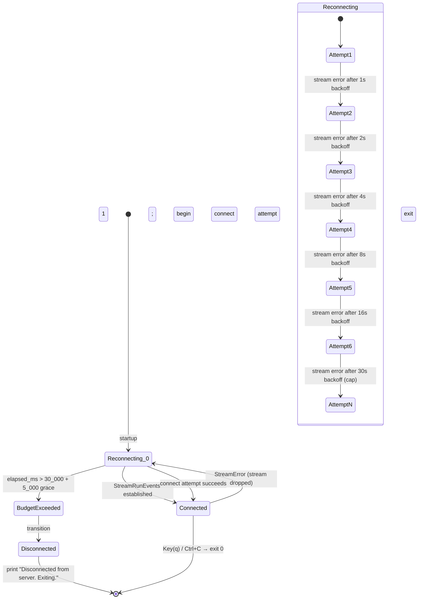
```mermaid
stateDiagram-v2
    [*] --> Reconnecting_0: startup; begin connect attempt

    state Reconnecting {
        [*] --> Attempt1
        Attempt1 --> Attempt2: stream error after 1s backoff
        Attempt2 --> Attempt3: stream error after 2s backoff
        Attempt3 --> Attempt4: stream error after 4s backoff
        Attempt4 --> Attempt5: stream error after 8s backoff
        Attempt5 --> Attempt6: stream error after 16s backoff
        Attempt6 --> AttemptN: stream error after 30s backoff (cap)
    }

    Reconnecting_0 --> Connected: StreamRunEvents established
    Connected --> Reconnecting_0: StreamError (stream dropped)
    Reconnecting_0 --> Connected: connect attempt succeeds
    Reconnecting_0 --> BudgetExceeded: elapsed_ms > 30_000 + 5_000 grace
    BudgetExceeded --> Disconnected: transition
    Disconnected --> [*]: print "Disconnected from server. Exiting."; exit 1
    Connected --> [*]: Key(q) / Ctrl+C → exit 0
```

**[6_UI_UX_ARCHITECTURE-REQ-153]** The reconnect budget is 30,000 ms cumulative, tracked in `AppState::reconnect_elapsed_ms`. This counter is incremented by 1,000 ms on every `Tick` while `connection_status` is `Reconnecting`. When `reconnect_elapsed_ms` reaches 30,000 ms, the connection module starts a final 5-second grace timer. If the connection is not re-established within the grace period, `TuiEvent::ReconnectBudgetExceeded` is sent.

**[6_UI_UX_ARCHITECTURE-REQ-154]** `reconnect_elapsed_ms` is reset to `0` whenever `TuiEvent::Connected` is received. A successful reconnect fully resets the budget; it does not carry over elapsed time from previous reconnect attempts.

**[6_UI_UX_ARCHITECTURE-REQ-155]** While `ConnectionStatus` is `Reconnecting`, all TUI widgets remain visible with stale data. The `StatusBar` displays `RECONNECTING (attempt <n>, <elapsed>s elapsed)`. No data is cleared. This allows operators to see the last-known state while the server is temporarily unreachable.

**[6_UI_UX_ARCHITECTURE-REQ-156]** While `ConnectionStatus` is `Reconnecting`, keyboard events (tab switching, scrolling, `?`, `q`) MUST still be processed. The TUI is not frozen during reconnect. Only actions that require a live server connection (cancel/pause/resume via `c`/`p`/`r`) display an error instead of issuing a gRPC call.

**[6_UI_UX_ARCHITECTURE-REQ-157]** On receipt of `TuiEvent::Connected`, the connection module immediately subscribes to `StreamRunEvents` and `WatchPoolState`. The first messages received are full snapshots (`event_type = "run.snapshot"` and the initial `WatchPoolState` response). The TUI processes `RunSnapshot` and `PoolSnapshot` events before rendering the first frame after reconnect.

**Legal `ConnectionStatus` transitions:**

| From | To | Trigger |
|---|---|---|
| `Reconnecting { attempt }` | `Connected` | gRPC connect + `StreamRunEvents` established |
| `Reconnecting { attempt }` | `Reconnecting { attempt+1 }` | `TuiEvent::ReconnectAttempt` with incremented attempt |
| `Connected` | `Reconnecting { attempt: 1 }` | `TuiEvent::StreamError` (gRPC stream dropped) |
| `Reconnecting { * }` | `Disconnected` | `TuiEvent::ReconnectBudgetExceeded` |
| `Disconnected` | — | Terminal; no further transitions |

**[6_UI_UX_ARCHITECTURE-REQ-158]** Any transition not in the table above is illegal. `App::handle_event()` MUST `assert!` or return an error if an illegal transition is attempted. In debug builds this is a `panic!`; in release builds it logs `ERROR` and retains the current state unchanged.

---

### 3.6 Log Buffer Lifecycle

`LogBuffer` is the in-memory representation of a stage's log output. Its lifecycle is tightly coupled to the stage and run lifecycles.

**Lifecycle phases:**

```mermaid
stateDiagram-v2
    [*] --> Absent: stage not yet started

    Absent --> Created: RunDelta/RunSnapshot with stage.status == Running
    Created --> Active: first LogLine event received
    Active --> Active: LogLine appended (evict oldest if at capacity)
    Active --> Quiescent: run reaches terminal status (Completed/Failed/Cancelled/TimedOut)
    Quiescent --> Evicted: run not selected AND last_event_at > 30 min ago (checked on Tick)
    Created --> Quiescent: stage reaches terminal status without any log lines
    Evicted --> [*]: entry removed from AppState::log_buffers and AppState::log_scroll_offset
```

**`LogBuffer` data model:**

```rust
pub struct LogBuffer {
    /// Ring buffer of log lines; capacity always 10_000.
    pub lines: VecDeque<LogLine>,
    /// Fixed capacity; never changes after creation.
    pub max_capacity: usize,         // always 10_000
    /// Cumulative count including evicted lines.
    pub total_received: u64,
    /// True if the server reported server-side truncation (truncated field in stream).
    pub truncated: bool,
    /// Monotonic instant of last LogLine insertion; used for idle eviction.
    pub last_appended_at: Option<std::time::Instant>,
}
```

**Creation rule ([6_UI_UX_ARCHITECTURE-REQ-159]):** A `LogBuffer` is created in `AppState::log_buffers` when a `RunDelta` or `RunSnapshot` event contains a `StageRun` with `status = Running` for a `(run_id, stage_name)` pair that does not yet have a buffer. The buffer is created with `max_capacity = 10_000`, `total_received = 0`, `truncated = false`.

**Eviction rules ([6_UI_UX_ARCHITECTURE-REQ-160]):** On every `Tick`, `App::handle_event()` scans `AppState::log_buffers` for buffers that satisfy ALL of the following conditions simultaneously:
1. The owning run has reached a terminal status (`Completed`, `Failed`, `Cancelled`, or `TimedOut`).
2. The `(run_id, stage_name)` is NOT the currently selected pair (`selected_run_id` + `selected_stage_name`).
3. `last_appended_at` is `Some(t)` and `t.elapsed() > Duration::from_secs(1800)` (30 minutes).

Buffers satisfying all three conditions are evicted (removed from `log_buffers`). The corresponding `log_scroll_offset` entry is also removed. Non-terminal runs MUST NOT have their buffers evicted regardless of idle time.

**Capacity enforcement ([6_UI_UX_ARCHITECTURE-REQ-161]):** When `LogBuffer::append(line)` is called and `lines.len() == max_capacity`, the front of the `VecDeque` is popped before the new line is pushed to the back. `total_received` is incremented regardless. The `LogBuffer` never exceeds `max_capacity` entries.

**Scroll offset clamping ([6_UI_UX_ARCHITECTURE-REQ-162]):** After appending a `LogLine`, if the Logs tab is currently displaying this buffer and the user is NOT at the tail (i.e., `scroll_offset + visible_rows < buffer.len() before insertion`), the scroll offset is left unchanged (the view stays where it was, showing earlier content). If the user IS at the tail, the scroll offset is incremented by 1 so the view follows new output. This is sometimes called "auto-scroll" or "tail follow" behavior.

**Memory budget:** At `max_capacity = 10_000` entries and assuming each `LogLine` consumes approximately 256 bytes on average (32-char content + timestamps + metadata), one `LogBuffer` consumes approximately 2.5 MiB. With a maximum of 256 stages per workflow and typical multi-project deployments, the total `log_buffers` memory budget is bounded by the 30-minute eviction policy. The implementation MUST NOT apply a global memory cap; the time-based eviction policy is sufficient.

---

### 3.7 CLI Per-Invocation State

**[6_UI_UX_ARCHITECTURE-REQ-163]** The CLI is stateless between invocations. No session files, cookies, or persistent state are written by any CLI command. Each invocation is completely independent.

Within a single invocation, the following transient state is constructed, used, and dropped:

```rust
// Transient state for one CLI invocation (lives for the duration of main())
struct InvocationState {
    global_args: GlobalArgs,           // parsed from argv; immutable throughout
    formatter: Box<dyn Formatter>,     // TextFormatter or JsonFormatter based on --format
    server_addr: String,               // resolved from discovery; immutable after resolution
    grpc_channel: Channel,             // lazily connected; dropped at process exit
}
```

**[6_UI_UX_ARCHITECTURE-REQ-164]** `GlobalArgs` is parsed exactly once at the start of `main()` using `clap`. After parsing, it is immutable. No subcommand handler mutates `GlobalArgs`.

**[6_UI_UX_ARCHITECTURE-REQ-165]** The `Formatter` is selected once based on `GlobalArgs::format` and is passed by `&dyn Formatter` reference to all subcommand handlers. It is never re-selected mid-invocation.

**[6_UI_UX_ARCHITECTURE-REQ-166]** The gRPC channel is constructed lazily in `connection::connect()` using `Channel::connect_lazy()`. It is not dialed until the first RPC call. Connection timeout is 5 seconds. Only one channel is created per invocation; all subcommand handlers share the same channel.

**Run identifier resolution state machine:**

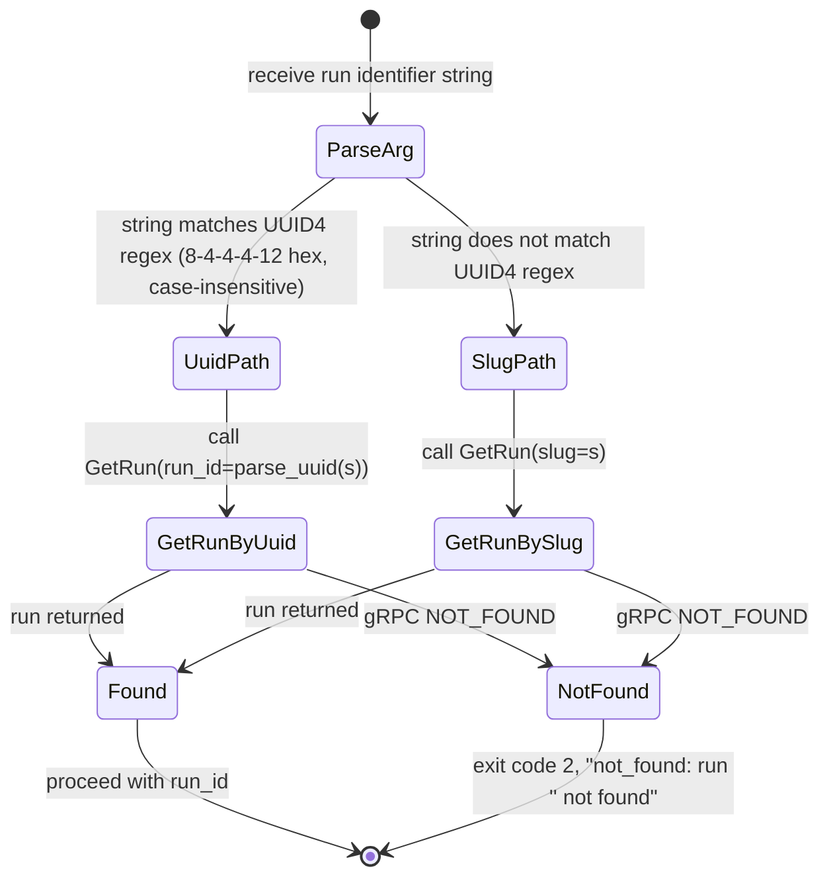
```mermaid
stateDiagram-v2
    [*] --> ParseArg: receive run identifier string

    ParseArg --> UuidPath: string matches UUID4 regex (8-4-4-4-12 hex, case-insensitive)
    ParseArg --> SlugPath: string does not match UUID4 regex

    UuidPath --> GetRunByUuid: call GetRun(run_id=parse_uuid(s))
    SlugPath --> GetRunBySlug: call GetRun(slug=s)

    GetRunByUuid --> Found: run returned
    GetRunByUuid --> NotFound: gRPC NOT_FOUND
    GetRunBySlug --> Found: run returned
    GetRunBySlug --> NotFound: gRPC NOT_FOUND

    Found --> [*]: proceed with run_id
    NotFound --> [*]: exit code 2, "not_found: run '<identifier>' not found"
```

**[6_UI_UX_ARCHITECTURE-REQ-167]** UUID format check uses the regex `^[0-9a-fA-F]{8}-[0-9a-fA-F]{4}-4[0-9a-fA-F]{3}-[89abAB][0-9a-fA-F]{3}-[0-9a-fA-F]{12}$` (strict UUID v4 format with version and variant bits). A string that looks like a UUID but fails this check (e.g., version `3` UUID) is treated as a slug. UUID resolution takes precedence: if the string is a valid UUID, the slug path is never tried.

**Streaming invocation state (`devs logs --follow`):**

`devs logs --follow` is the only long-lived CLI invocation. During streaming, the following additional transient state exists:

```rust
struct LogsStreamState {
    run_id: Uuid,
    stage_name: Option<String>,     // None = all stages interleaved
    attempt: Option<u32>,           // None = latest attempt
    follow: bool,
    last_sequence: u64,             // last sequence number received; for gap detection
    seen_done: bool,                // true after {"done": true} received
}
```

**[6_UI_UX_ARCHITECTURE-REQ-168]** `LogsStreamState.last_sequence` is checked on every received chunk. If `chunk.sequence != last_sequence + 1`, the CLI prints a warning to stderr: `"warning: log sequence gap detected: expected <n>, got <m>"`. This is informational only; the stream continues. (The server guarantees no gaps; this check is a client-side sanity assertion.)

**[6_UI_UX_ARCHITECTURE-REQ-169]** `devs logs --follow` exits when `seen_done = true`. On receipt of the terminal chunk `{"done": true, ...}`, `seen_done` is set, the terminal chunk is written to stdout, and the process exits. The exit code is determined by the run's final status (0 for `Completed`, 1 for `Failed`/`Cancelled`). If the gRPC stream closes before `seen_done`, the CLI treats it as a disconnection and exits with code 3.

---

### 3.8 MCP Bridge State Machine

`devs-mcp-bridge` has more runtime state than the CLI due to its long-lived nature and connection management requirements.

**Complete bridge runtime state:**

```rust
struct BridgeState {
    // Resolved at startup; immutable thereafter
    mcp_endpoint: Url,                  // "http://<host>:<mcp_port>/mcp/v1/call"

    // Per-request transient state (exists only during request processing)
    in_flight: Option<InFlightRequest>,

    // Connection health
    connection_healthy: bool,           // false after first HTTP failure; triggers reconnect
    reconnect_attempted: bool,          // true after first reconnect attempt
}

struct InFlightRequest {
    request_id: Value,     // the "id" field from the JSON-RPC request
    is_streaming: bool,    // true for stream_logs with follow:true
}
```

**[6_UI_UX_ARCHITECTURE-REQ-170]** `devs-mcp-bridge` maintains the MCP endpoint URL derived at startup as its sole persistent state. Per-request state (`InFlightRequest`) exists only for the duration of a single request-response cycle.

**Bridge connection state machine:**

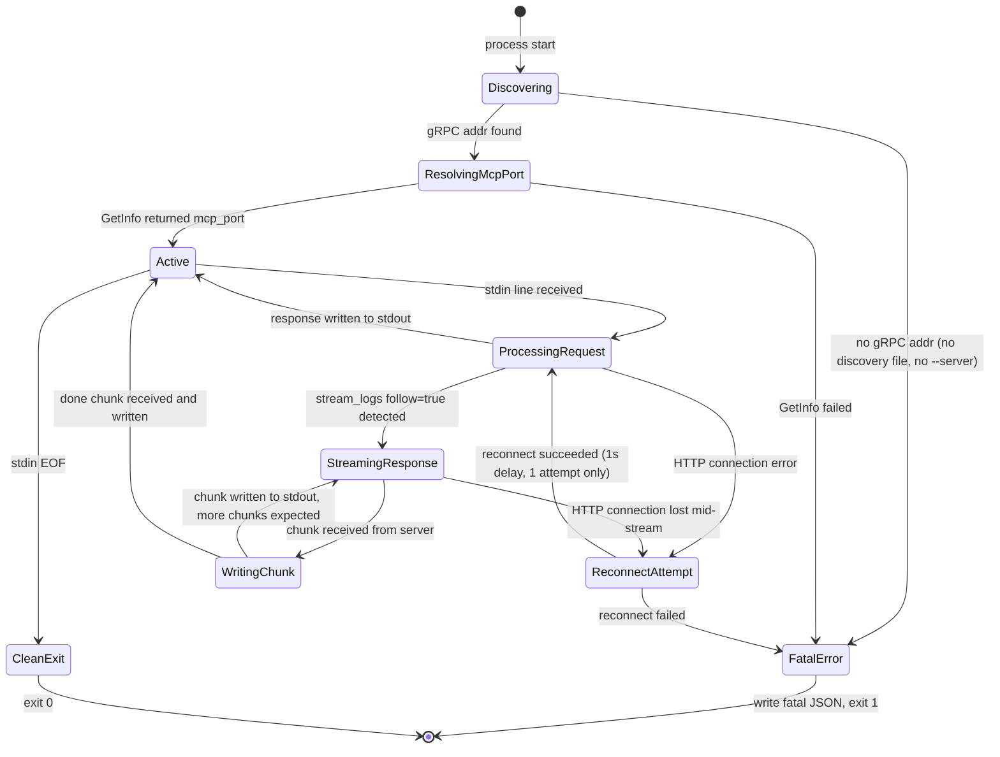
```mermaid
stateDiagram-v2
    [*] --> Discovering: process start

    Discovering --> ResolvingMcpPort: gRPC addr found
    Discovering --> FatalError: no gRPC addr (no discovery file, no --server)

    ResolvingMcpPort --> Active: GetInfo returned mcp_port
    ResolvingMcpPort --> FatalError: GetInfo failed

    Active --> ProcessingRequest: stdin line received
    ProcessingRequest --> Active: response written to stdout

    ProcessingRequest --> ReconnectAttempt: HTTP connection error
    ReconnectAttempt --> ProcessingRequest: reconnect succeeded (1s delay, 1 attempt only)
    ReconnectAttempt --> FatalError: reconnect failed

    Active --> CleanExit: stdin EOF

    FatalError --> [*]: write fatal JSON, exit 1
    CleanExit --> [*]: exit 0

    ProcessingRequest --> StreamingResponse: stream_logs follow=true detected
    StreamingResponse --> WritingChunk: chunk received from server
    WritingChunk --> StreamingResponse: chunk written to stdout, more chunks expected
    WritingChunk --> Active: done chunk received and written
    StreamingResponse --> ReconnectAttempt: HTTP connection lost mid-stream
```

**[6_UI_UX_ARCHITECTURE-REQ-171]** The bridge processes requests sequentially: exactly one `InFlightRequest` exists at any time. The async stdin reader buffers the next line while a request is in-flight; it does not begin processing the buffered line until the current request completes and a response is written to stdout. This ensures ordered request-response pairing.

**[6_UI_UX_ARCHITECTURE-REQ-172]** On HTTP connection error during a request, the bridge:
1. Sets `connection_healthy = false`.
2. If `reconnect_attempted = false`: sets `reconnect_attempted = true`, waits 1 second, attempts to reissue the in-flight request. If successful, sets `connection_healthy = true` and `reconnect_attempted = false`.
3. If `reconnect_attempted = true` (second failure): writes a `{"result":null,"error":"internal: server connection lost","fatal":true}` line to stdout and exits 1.

**[6_UI_UX_ARCHITECTURE-REQ-173]** For `stream_logs follow:true`, the bridge detects the streaming nature of the response from the HTTP `Transfer-Encoding: chunked` response header. If this header is absent on a `stream_logs follow:true` response, the bridge treats the entire response body as a single non-streaming response and writes one stdout line. This ensures the bridge degrades gracefully if the server sends a non-chunked response.

**[6_UI_UX_ARCHITECTURE-REQ-174]** stdout is flushed after every line write (`std::io::Write::flush()`). This applies to both streaming chunks and single-response lines. An unflushed write causes the consuming AI agent process to block indefinitely on its stdin reader.

**[6_UI_UX_ARCHITECTURE-REQ-175]** The bridge MUST NOT buffer or aggregate stdin lines. Each line read from stdin is processed immediately before reading the next. The stdin reader uses a `tokio::io::AsyncBufReadExt::lines()` stream; each `next()` call blocks until a complete line is available.

---

### 3.9 State Synchronization

State synchronization describes how server-authoritative state flows into the client display layer.

**TUI synchronization model:**

The TUI uses a push-based synchronization model. The server pushes `RunEvent` messages via the `StreamRunEvents` gRPC streaming RPC. The TUI never polls for state; it is always the server that initiates updates.

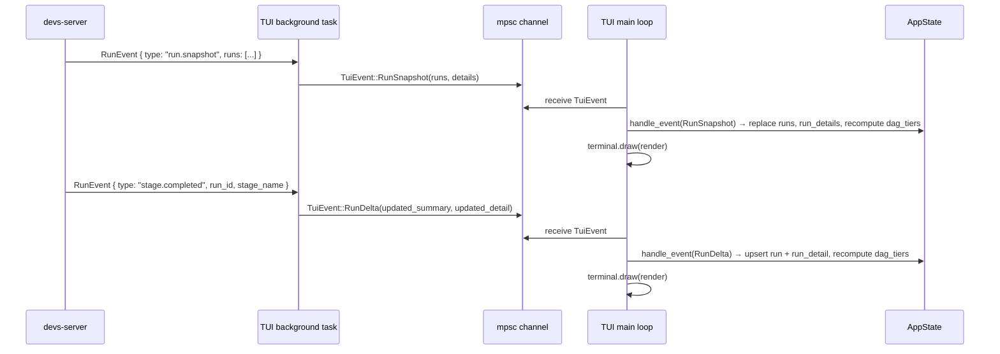
```mermaid
sequenceDiagram
    participant Server as devs-server
    participant BG as TUI background task
    participant Ch as mpsc channel
    participant Main as TUI main loop
    participant State as AppState

    Server ->> BG: RunEvent { type: "run.snapshot", runs: [...] }
    BG ->> Ch: TuiEvent::RunSnapshot(runs, details)
    Main ->> Ch: receive TuiEvent
    Main ->> State: handle_event(RunSnapshot) → replace runs, run_details, recompute dag_tiers
    Main ->> Main: terminal.draw(render)

    Server ->> BG: RunEvent { type: "stage.completed", run_id, stage_name }
    BG ->> Ch: TuiEvent::RunDelta(updated_summary, updated_detail)
    Main ->> Ch: receive TuiEvent
    Main ->> State: handle_event(RunDelta) → upsert run + run_detail, recompute dag_tiers
    Main ->> Main: terminal.draw(render)
```

**[6_UI_UX_ARCHITECTURE-REQ-176]** The first event received after establishing `StreamRunEvents` is always a full snapshot (`event_type = "run.snapshot"`). This is guaranteed by the server (per gRPC spec). The TUI MUST handle the case where the first message is NOT a snapshot (e.g., if the connection was established mid-session on an older server version) by treating any non-snapshot `RunEvent` as a delta on an empty initial state, then displaying a `StatusBar` warning: `"WARNING: missed run snapshot; data may be incomplete"`.

**[6_UI_UX_ARCHITECTURE-REQ-177]** Between receiving a `TuiEvent` and completing `App::handle_event()`, no render occurs. Between completing `handle_event()` and completing `terminal.draw()`, no new events are processed. This single-threaded linearization means `AppState` is always in a consistent state when `render()` reads it.

**[6_UI_UX_ARCHITECTURE-REQ-178]** `LogLine` events for a stage that has no `LogBuffer` (because the stage was never seen as `Running`) are silently discarded. This can happen if the TUI connects mid-stage after the `Running` transition was already emitted. The bridge, once connected, will catch up via the `LogLine` events but the `LogBuffer` creation trigger (seeing `status = Running`) may have been missed. To handle this case: if a `LogLine` arrives for `(run_id, stage_name)` with no corresponding buffer, a new buffer is created with `total_received = 0` and the line is appended. The `StreamRunEvents` snapshot always includes the current stage status, so the buffer will be populated when the next `RunDelta` or reconnect snapshot arrives.

**CLI synchronization model:**

The CLI uses a pull-based model: each command issues one gRPC call, receives one response, and exits. There is no persistent synchronization state.

**[6_UI_UX_ARCHITECTURE-REQ-179]** `devs logs --follow` is the exception: it holds a `StreamLogs` gRPC streaming RPC open for the duration of the run. Log chunks arrive in sequence-number order. If a chunk arrives with `sequence < expected`, the CLI discards it as a duplicate (this should not happen given the server guarantees, but is handled defensively). If a chunk arrives with `sequence > expected + 1`, the CLI emits a warning line on stderr and continues.

**MCP bridge synchronization model:**

The bridge is fully pass-through: it does not interpret or cache any state returned by MCP tools. Each request-response pair is independent. Synchronization between the agent and the server is the agent's responsibility.

---

### 3.10 Edge Cases & Error Handling

The following edge cases MUST be handled by the state management layer. Test annotations `// Covers: UI-STATE-EC-NNN` are required.

| ID | Scenario | Component | Expected Behavior |
|---|---|---|---|
| UI-STATE-EC-001 | `RunSnapshot` arrives containing fewer runs than the previous snapshot (runs were swept by retention) | TUI | `AppState::runs` is fully replaced with snapshot content; runs absent from the new snapshot are removed from `runs` and `run_details`; `selected_run_id` is cleared if it refers to a removed run; `dag_scroll_offset` reset if selection cleared |
| UI-STATE-EC-002 | Two `RunDelta` events for the same `run_id` arrive in rapid succession before a render cycle | TUI | Both are applied sequentially; the second upsert overwrites the first; exactly one render occurs after both are applied (events are batched between renders if they arrive in the same `select!` poll) |
| UI-STATE-EC-003 | `LogLine` event arrives for `(run_id, stage_name)` with no existing `LogBuffer` (missed `Running` transition) | TUI | A new `LogBuffer` is created; the line is appended; `total_received = 1`; `last_appended_at` is set. No error. |
| UI-STATE-EC-004 | A `LogBuffer` at capacity (10,000 entries) receives a new `LogLine` while the user is viewing that buffer in the Logs tab | TUI | Oldest entry evicted; `total_received` incremented; scroll offset adjusted if at tail; no crash; `truncated` field NOT set (server-side truncation is separate from client-side ring eviction) |
| UI-STATE-EC-005 | `Resize` event shrinks terminal to below 80×24 while user is navigating the Logs tab | TUI | `terminal_size` updated; next render cycle shows `"Terminal too small: 80x24 minimum required (current: WxH)"`; scroll state, selection state, and log buffers are preserved unchanged; resizing back restores normal display |
| UI-STATE-EC-006 | `ReconnectBudgetExceeded` arrives while user is in the middle of typing a key sequence | TUI | TuiEvent processing is linear; key events and connection events are processed in FIFO order; the budget event is processed at its turn; terminal is restored before exit; no partial key handler runs after exit |
| UI-STATE-EC-007 | `RunDelta` for `run_id` that does not exist in `AppState::runs` | TUI | The run is treated as new (same as if the delta were an insert); a new `RunSummary` is prepended to `runs` and the list is re-sorted; a new `RunDetail` is added to `run_details` if provided |
| UI-STATE-EC-008 | Bridge receives a `stream_logs follow:true` request followed immediately (before response arrives) by another request | Bridge | The second request is buffered in the async stdin reader; the bridge finishes processing the first (streaming) response, writes the final `done` chunk to stdout, then processes the second request |
| UI-STATE-EC-009 | Bridge `mcp_endpoint` URL points to a server that responds with HTTP 500 on every request | Bridge | The bridge writes `{"result":null,"error":"internal: tool handler panicked","fatal":false}` to stdout for each request; sets `connection_healthy = false`; attempts one reconnect; if the reconnect also returns HTTP 500, writes `fatal:true` JSON and exits 1 |
| UI-STATE-EC-010 | CLI `devs status <uuid>` is called with a UUID that matches both a `run_id` and (coincidentally) a `slug` of a different run | CLI | UUID path is always tried first; the run with `run_id == uuid` is returned; the run with `slug == uuid` is never queried |
| UI-STATE-EC-011 | `AppState::log_buffers` idle eviction scan (triggered by `Tick`) encounters a run that transitioned from `Running` to `Completed` between two ticks while selected | TUI | The run is terminal but selected; condition 2 of eviction (not selected) is not met; the buffer is NOT evicted; it will be evicted after the user deselects the run AND 30 minutes have passed |
| UI-STATE-EC-012 | gRPC `StreamRunEvents` sends a `RunEvent` with `event_type` not recognized by the TUI client | TUI | Unknown event types are silently ignored; no AppState mutation; no error. This handles forward-compatibility with future server versions. |

---

### 3.11 Dependencies

**Section 3 depends on:**

| Component | Dependency Reason |
|---|---|
| `devs-core::types` | `RunStatus`, `StageStatus`, `RunSummary`, `StageRun`, `AgentPool`, and other domain types referenced in `AppState` and display models |
| `devs-proto::devs::v1` | `RunEvent`, `PoolStateEvent` proto message types consumed by background tasks; `convert.rs` maps them to TUI display models |
| `devs-grpc` (server-side) | `RunService::StreamRunEvents` and `PoolService::WatchPoolState` streaming RPCs push the events that drive all `AppState` mutations |
| Section 2 (`RunSummary`, `RunDetail`, `StageRunDisplay`, `LogBuffer`, `LogLine`, `PoolSummary`) | All display-layer types defined in §2.1.2 are referenced by `AppState` field types |
| Section 4 (Tab enum, keybinding routing) | `AppState::active_tab` uses the `Tab` enum; mutation rules for key events reference specific tab context |
| `tokio::sync::mpsc` | Background tasks send `TuiEvent` into the main loop channel; channel buffer sizes are specified in §3.3 |
| `tokio::time::interval` | Drives the 1-second `TuiEvent::Tick` generation |
| `VecDeque` (`std::collections`) | `LogBuffer::lines` internal container |
| `chrono::Utc` | `last_event_at` timestamps, elapsed time computation on `Tick` |

**Section 3 is depended upon by:**

| Component | Why |
|---|---|
| Section 2 (Component Hierarchy) | All widget structs receive `&AppState` at render time; widget render contracts assume AppState consistency invariants from §3.4 |
| Section 4 (Routing Architecture) | Tab switching logic reads and writes `AppState::active_tab`; key-to-action routing depends on `AppState::selected_run_id` and `active_tab` context |
| Section 7 (Testing Strategy) | State management unit tests and snapshot tests target `AppState` mutation behavior specified here; TUI E2E tests verify AppState transitions via `TestBackend` render snapshots |
| `devs-tui` binary | `App::handle_event()` and `App::render()` implement the mutation rules and invariants specified here |
| `devs-cli` binary | `InvocationState` lifecycle and `LogsStreamState` streaming behavior are implemented per §3.7 |
| `devs-mcp-bridge` binary | `BridgeState` state machine and reconnect logic are implemented per §3.8 |

---

### 3.12 Acceptance Criteria

The following criteria MUST each be covered by at least one automated test annotated `// Covers: UI-STATE-AC-NNN`.

- **[6_UI_UX_ARCHITECTURE-REQ-180]** `AppState::default()` produces a value where `active_tab = Dashboard`, `runs = []`, `selected_run_id = None`, `connection_status = Reconnecting { attempt: 0, ... }`, `help_visible = false`. (unit test in `state.rs`)
- **[6_UI_UX_ARCHITECTURE-REQ-181]** `App::handle_event(RunSnapshot([run_A, run_B], details))` replaces `AppState::runs` with exactly `[run_A, run_B]` sorted by `created_at` descending; no other run entries remain. (unit test)
- **[6_UI_UX_ARCHITECTURE-REQ-182]** `App::handle_event(RunSnapshot([run_A], details))` when `AppState::selected_run_id = Some(run_B_id)` (not in snapshot) clears `selected_run_id` to `None`. (unit test)
- **[6_UI_UX_ARCHITECTURE-REQ-183]** `App::handle_event(RunDelta(run_A_updated, detail))` when `run_A` already exists in `AppState::runs` replaces the entry in-place and re-sorts; the resulting `runs` list has the same length as before. (unit test)
- **[6_UI_UX_ARCHITECTURE-REQ-184]** `App::handle_event(RunDelta(run_new, detail))` when `run_new.run_id` is not in `AppState::runs` inserts the run and re-sorts; `runs.len()` increases by 1. (unit test)
- **[6_UI_UX_ARCHITECTURE-REQ-185]** After `App::handle_event(RunDelta(run, detail))` with a 3-stage workflow `A → B → C`, `AppState::run_details[run_id].dag_tiers` equals `[["A"], ["B"], ["C"]]`. (unit test)
- **[6_UI_UX_ARCHITECTURE-REQ-186]** `App::handle_event(LogLine { run_id, stage_name, line })` for a `(run_id, stage_name)` with no existing buffer creates a new `LogBuffer`, appends the line, and sets `total_received = 1`. (unit test)
- **[6_UI_UX_ARCHITECTURE-REQ-187]** `LogBuffer` at capacity (10,000 entries) after one more `append()` has `lines.len() == 10_000` and `total_received == 10_001`; the front entry is the second-oldest original entry. (unit test)
- **[6_UI_UX_ARCHITECTURE-REQ-188]** Auto-scroll: after appending a `LogLine` when scroll offset is at tail position, `log_scroll_offset` is incremented by 1. After appending when scroll offset is below tail, `log_scroll_offset` is unchanged. (unit test)
- **[6_UI_UX_ARCHITECTURE-REQ-189]** Idle eviction: a terminal-run buffer with `last_appended_at > 30 minutes ago` AND `(run_id, stage_name) != (selected_run_id, selected_stage_name)` is removed from `log_buffers` on `Tick`. (unit test, using `Instant::now() - Duration::from_secs(1801)` mock)
- **[6_UI_UX_ARCHITECTURE-REQ-190]** Non-terminal-run buffer is NOT evicted regardless of `last_appended_at` age. (unit test)
- **[6_UI_UX_ARCHITECTURE-REQ-191]** `App::handle_event(Connected { server_addr })` transitions `connection_status` to `Connected` and resets `reconnect_elapsed_ms` to `0`. (unit test)
- **[6_UI_UX_ARCHITECTURE-REQ-192]** `App::handle_event(StreamError { reason })` transitions `connection_status` from `Connected` to `Reconnecting { attempt: 1, ... }`. (unit test)
- **[6_UI_UX_ARCHITECTURE-REQ-193]** `App::handle_event(ReconnectBudgetExceeded)` transitions `connection_status` to `Disconnected`. (unit test)
- **[6_UI_UX_ARCHITECTURE-REQ-194]** When `connection_status = Reconnecting`, the `StatusBar` widget renders `"RECONNECTING"` in a `TestBackend` snapshot at 200×50. (TUI E2E, `TestBackend` snapshot)
- **[6_UI_UX_ARCHITECTURE-REQ-195]** `App::handle_event(Resize(60, 20))` sets `terminal_size = (60, 20)` and the next render shows `"Terminal too small: 80x24 minimum required (current: 60x20)"`. (TUI E2E, `TestBackend` snapshot)
- **[6_UI_UX_ARCHITECTURE-REQ-196]** `App::handle_event(Key(Tab))` cycles `active_tab` through `Dashboard → Logs → Debug → Pools → Dashboard`. (unit test, 5 key events)
- **[6_UI_UX_ARCHITECTURE-REQ-197]** `App::handle_event(Key('3'))` sets `active_tab = Debug` regardless of current tab. (unit test)
- **[6_UI_UX_ARCHITECTURE-REQ-198]** `App::handle_event(Key('?'))` toggles `help_visible` from `false` to `true`; a second `Key('?')` toggles it back to `false`. (unit test)
- **[6_UI_UX_ARCHITECTURE-REQ-199]** `selected_stage_name` is cleared to `None` when `active_tab` changes from `Logs` to `Dashboard`. (unit test)
- **[6_UI_UX_ARCHITECTURE-REQ-200]** `dag_scroll_offset` is reset to `0` when `selected_run_id` changes via a `Key(↓)` event in the Dashboard run list. (unit test with AppState containing ≥2 runs)
- **[6_UI_UX_ARCHITECTURE-REQ-201]** `render()` on `App` does not mutate `AppState`; calling `app.render(frame)` twice in succession produces identical frames and leaves `AppState` unchanged. (unit test: render twice, assert state equality before and after)
- **[6_UI_UX_ARCHITECTURE-REQ-202]** CLI `devs status <uuid>` where uuid matches a `run_id` resolves via UUID path (not slug path); a mock gRPC server verifying the request uses `run_id` field, not `slug` field. (CLI E2E)
- **[6_UI_UX_ARCHITECTURE-REQ-203]** CLI `devs status <non-uuid-string>` resolves via slug path; mock gRPC server verifies the request uses `slug` field. (CLI E2E)
- **[6_UI_UX_ARCHITECTURE-REQ-204]** `devs logs --follow` exits code 0 when `{"done": true}` is received and the run status is `Completed`; exits code 1 when run status is `Failed`. (CLI E2E)
- **[6_UI_UX_ARCHITECTURE-REQ-205]** `devs-mcp-bridge` processes a second request after a streaming `stream_logs follow:true` response has completed (the streaming response wrote its `{"done":true}` chunk). (MCP E2E)
- **[6_UI_UX_ARCHITECTURE-REQ-206]** `devs-mcp-bridge` writes each `stream_logs` chunk to stdout and flushes immediately; a test consuming bridge stdout observes the first chunk before the stream terminates. (MCP E2E, timing assertion)
- **[6_UI_UX_ARCHITECTURE-REQ-207]** `devs-mcp-bridge` processes exactly one reconnect attempt on HTTP connection failure; if the reconnect also fails, it writes `fatal:true` to stdout and exits 1. (MCP E2E with simulated connection drop)
- **[6_UI_UX_ARCHITECTURE-REQ-208]** Concurrent `RunSnapshot` and `PoolSnapshot` events processed sequentially leave `AppState` consistent: both `runs` and `pool_state` are updated and `selected_run_id`/`selected_pool_name` validity is re-checked after each mutation. (unit test)
- **[6_UI_UX_ARCHITECTURE-REQ-209]** `LogBuffer` scroll offset for a non-selected stage is unaffected by `LogLine` events for a different stage. Inserting 100 lines into stage A's buffer does not change `log_scroll_offset` for stage B. (unit test)

---

## 4. Routing Architecture

The routing architecture of `devs` client interfaces describes how user input events (keystrokes, CLI arguments, JSON-RPC requests) are dispatched to the correct handler, how server connections are established and maintained, and how run identifiers are resolved across all three interfaces. This section is normative for `devs-tui`, `devs-cli`, and `devs-mcp-bridge`.

### 4.1 TUI Tab Navigation

**[6_UI_UX_ARCHITECTURE-REQ-210]** The TUI uses a tab-based navigation model. There are exactly four tabs, identified by the `Tab` enum:

```rust
pub enum Tab {
    Dashboard,
    Logs,
    Debug,
    Pools,
}
```

**[6_UI_UX_ARCHITECTURE-REQ-211]** Tab navigation keybindings (normative):

| Key | Action | Scope |
|---|---|---|
| `Tab` | Cycle to next tab (wraps: Pools → Dashboard) | Global |
| `1` | Switch to Dashboard tab | Global |
| `2` | Switch to Logs tab | Global |
| `3` | Switch to Debug tab | Global |
| `4` | Switch to Pools tab | Global |
| `c` | Cancel selected run | Dashboard tab only |
| `p` | Pause selected run or stage | Dashboard / Debug tab only |
| `r` | Resume selected run or stage | Dashboard / Debug tab only |
| `?` | Toggle help overlay | Global (suspends all other keys) |
| `q` or `Ctrl+C` | Quit TUI process | Global |
| `↑` / `↓` | Navigate the focused list widget | Per-tab (see focus model §4.4) |
| `Enter` | Select focused item in list | Per-tab |
| `PgUp` / `PgDn` | Scroll log buffer 20 lines | Logs tab, Debug tab |
| `Home` / `End` | Jump to start / end of log buffer | Logs tab, Debug tab |
| `Esc` | Dismiss help overlay; deselect current item | Global |

**[6_UI_UX_ARCHITECTURE-REQ-212]** Tab switching is handled in `App::handle_key_event()`. The active tab index is stored in `AppState::active_tab`. No network requests are issued on tab switch; all data is pre-loaded in `AppState`.

**[6_UI_UX_ARCHITECTURE-REQ-213]** When the terminal is smaller than 80 columns × 24 rows, the TUI MUST render only the message: `"Terminal too small: 80x24 minimum required (current: WxH)"` centered in the available space. No other content is rendered. This check runs at every render call.

#### 4.1.1 Navigation State Model

The complete navigation state for the TUI is captured in a single `NavigationState` struct. This struct is a sub-field of `AppState` and is serialised nowhere — it exists only in process memory for the duration of the TUI session.

```rust
/// Serialisable navigation cursor positions and focus state.
/// All indices are 0-based; None means no item selected.
pub struct NavigationState {
    /// Currently active tab.
    pub active_tab: Tab,

    /// Index of the selected run in RunList (shared across all tabs).
    pub selected_run_index: Option<usize>,

    /// Index of the selected stage in the stage list (Dashboard / Logs / Debug).
    pub selected_stage_index: Option<usize>,

    /// Log scroll offset for the currently selected stage, in the Logs tab.
    /// Number of lines from the top of the buffer currently scrolled off-screen.
    pub log_scroll_offset: usize,

    /// Horizontal DAG scroll offset in DagView, in screen columns.
    pub dag_scroll_col: usize,

    /// Whether the help overlay is currently visible.
    pub help_visible: bool,

    /// Index of the selected agent entry in the Pools tab agent table.
    pub selected_pool_agent_index: Option<usize>,

    /// Index of the selected pool in the Pools tab pool list.
    pub selected_pool_index: Option<usize>,
}
```

**[6_UI_UX_ARCHITECTURE-REQ-214]** `NavigationState` is the single source of truth for all cursor positions. Widgets MUST read their scroll and selection state exclusively from `NavigationState`; they MUST NOT maintain private cursor state.

**[6_UI_UX_ARCHITECTURE-REQ-215]** When `selected_run_index` is `Some(i)` and the run list shrinks (e.g., due to a server-pushed deletion), `selected_run_index` is clamped to `min(i, new_len - 1)`. If the list becomes empty, it is set to `None`.

**[6_UI_UX_ARCHITECTURE-REQ-216]** `selected_stage_index` is reset to `None` whenever `selected_run_index` changes. The previously selected stage is not remembered across run selection changes.

**[6_UI_UX_ARCHITECTURE-REQ-217]** `log_scroll_offset` and `dag_scroll_col` are reset to `0` whenever `selected_stage_index` or `selected_run_index` changes. Users always begin at the most recent log output when navigating to a new stage.

#### 4.1.2 Tab Context Preservation

When the user switches tabs, the `NavigationState` is preserved in full. The following invariants hold across tab switches:

| Field | Preserved on tab switch | Reset condition |
|---|---|---|
| `active_tab` | Updated to new tab | User input only |
| `selected_run_index` | YES — same run stays selected | Run list shrinks (clamped) |
| `selected_stage_index` | YES — same stage stays selected | `selected_run_index` changes |
| `log_scroll_offset` | YES — scroll position preserved | `selected_stage_index` changes |
| `dag_scroll_col` | YES | `selected_run_index` changes |
| `help_visible` | YES — overlay stays visible across tab switch | `Esc` or second `?` press |
| `selected_pool_index` | YES | Pool list changes (clamped) |
| `selected_pool_agent_index` | YES | `selected_pool_index` changes |

**[6_UI_UX_ARCHITECTURE-REQ-218]** The `c`, `p`, `r` run control keys are only dispatched to their handlers when the active tab is `Dashboard` or (for `p`/`r`) `Debug`. On all other tabs these keys are silently ignored. No error is displayed.

#### 4.1.3 Tab Navigation State Diagram

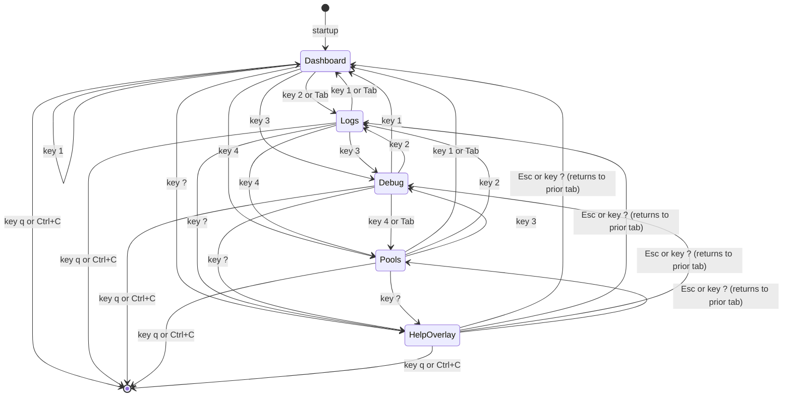
```mermaid
stateDiagram-v2
    [*] --> Dashboard : startup

    Dashboard --> Logs : key 2 or Tab
    Dashboard --> Debug : key 3
    Dashboard --> Pools : key 4
    Dashboard --> Dashboard : key 1
    Dashboard --> HelpOverlay : key ?

    Logs --> Dashboard : key 1 or Tab
    Logs --> Debug : key 3
    Logs --> Pools : key 4
    Logs --> HelpOverlay : key ?

    Debug --> Dashboard : key 1
    Debug --> Logs : key 2
    Debug --> Pools : key 4 or Tab
    Debug --> HelpOverlay : key ?

    Pools --> Dashboard : key 1 or Tab
    Pools --> Logs : key 2
    Pools --> Debug : key 3
    Pools --> HelpOverlay : key ?

    HelpOverlay --> Dashboard : Esc or key ? (returns to prior tab)
    HelpOverlay --> Logs : Esc or key ? (returns to prior tab)
    HelpOverlay --> Debug : Esc or key ? (returns to prior tab)
    HelpOverlay --> Pools : Esc or key ? (returns to prior tab)

    Dashboard --> [*] : key q or Ctrl+C
    Logs --> [*] : key q or Ctrl+C
    Debug --> [*] : key q or Ctrl+C
    Pools --> [*] : key q or Ctrl+C
    HelpOverlay --> [*] : key q or Ctrl+C
```

**[6_UI_UX_ARCHITECTURE-REQ-219]** `Tab` key cycles in order: `Dashboard → Logs → Debug → Pools → Dashboard`. It MUST wrap at `Pools` back to `Dashboard`.

**[6_UI_UX_ARCHITECTURE-REQ-220]** The help overlay is a modal layer. While `help_visible == true`, all key events except `?`, `Esc`, `q`, and `Ctrl+C` are consumed by the overlay and MUST NOT reach the tab handler beneath it.

#### 4.1.4 Tab Navigation Edge Cases

| Scenario | Expected Behavior |
|---|---|
| User presses `1` while already on Dashboard | `active_tab` remains `Dashboard`; no re-render triggered by tab logic (next scheduled render applies) |
| User presses `c` while on Logs tab with a run selected | Key is silently ignored; no gRPC call issued; no status message shown |
| Terminal resizes to below 80×24 while help overlay is open | Overlay dismissed; size-warning message shown; `help_visible` set to `false` |
| Terminal resizes back above 80×24 | Normal rendering resumes; `NavigationState` is fully preserved |
| `Tab` pressed while terminal is too small | Ignored; size-warning is re-rendered |
| Selected run is cancelled by another client while user is on Debug tab | `selected_run_index` remains valid (run stays in list with `CANC` status); no navigation change |
| Run list is empty and user presses `↓` | `selected_run_index` remains `None`; no error |

---

### 4.2 CLI Command Routing

Every invocation of the `devs` binary follows the same routing pipeline: `clap` parses the arguments, global flags are resolved, the server address is discovered, a gRPC channel is opened, and the matched command handler is called. The handler makes exactly one gRPC call (or a streaming call for `devs logs --follow`) and then terminates.

```mermaid
graph TD
    A[argv] --> B[clap: parse GlobalArgs + subcommand]
    B --> C{subcommand}

    C -->|submit| D[commands::submit::run]
    C -->|list| E[commands::list::run]
    C -->|status| F[commands::status::run]
    C -->|logs| G[commands::logs::run]
    C -->|cancel| H[commands::cancel::run]
    C -->|pause| I[commands::pause::run]
    C -->|resume| J[commands::resume::run]
    C -->|project add| K[commands::project::add]
    C -->|project remove| L[commands::project::remove]
    C -->|project list| M[commands::project::list]
    C -->|security-check| N[commands::security_check::run]

    D --> O[connection::connect_grpc]
    E --> O
    F --> O
    G --> O
    H --> O
    I --> O
    J --> O
    K --> O
    L --> O
    M --> O

    O --> P[tonic Channel]

    P --> Q[RunService / StageService / ProjectService / LogService]
    Q --> R[format_output: text | json]
    R --> S[stdout / stderr]
    R --> T[exit code]

    N --> U[read devs.toml + projects.toml directly]
    U --> R
```

#### 4.2.1 Global Flags

Every subcommand inherits the following global flags, resolved before the command handler is called:

| Flag | Environment Variable | Config Key | Default | Description |
|---|---|---|---|---|
| `--server <host:port>` | `DEVS_SERVER` | `server_addr` | (discovery file) | gRPC server address |
| `--format <text\|json>` | `DEVS_FORMAT` | — | `text` | Output format for all responses |
| `--project <name\|id>` | `DEVS_PROJECT` | — | (CWD auto-detect) | Project context for submission commands |

**[6_UI_UX_ARCHITECTURE-REQ-221]** Server discovery for CLI commands follows this precedence order (highest to lowest):
1. `--server <host:port>` flag
2. `DEVS_SERVER` environment variable
3. `server_addr` key in `devs.toml`
4. `DEVS_DISCOVERY_FILE` environment variable → read file
5. `~/.config/devs/server.addr` → read file

If no address is found or the connection fails, the command exits with code 3.

**[6_UI_UX_ARCHITECTURE-REQ-222]** `devs logs --follow` is the only CLI command that holds a long-lived gRPC streaming connection. It exits with code 0 when the run reaches `Completed` status, and code 1 when it reaches `Failed` or `Cancelled`. It exits with code 3 if the server connection drops during streaming.

#### 4.2.2 Per-Command Routing Table

Each CLI command maps to a single gRPC service call. The following table is the authoritative mapping.

| Command | gRPC Service | RPC Method | Run ID Required | Stage Required |
|---|---|---|---|---|
| `devs submit` | `RunService` | `SubmitRun` | No | No |
| `devs list` | `RunService` | `ListRuns` | No | No |
| `devs status <run>` | `RunService` | `GetRun` | YES | No |
| `devs logs <run> [stage]` | `LogService` | `FetchLogs` (non-follow) or `StreamLogs` (follow) | YES | Optional |
| `devs cancel <run>` | `RunService` | `CancelRun` | YES | No |
| `devs pause <run> [--stage <name>]` | `RunService` / `StageService` | `PauseRun` / `PauseStage` | YES | Optional |
| `devs resume <run> [--stage <name>]` | `RunService` / `StageService` | `ResumeRun` / `ResumeStage` | YES | Optional |
| `devs project add` | `ProjectService` | `AddProject` | No | No |
| `devs project remove` | `ProjectService` | `RemoveProject` | No | No |
| `devs project list` | `ProjectService` | `ListProjects` | No | No |
| `devs security-check` | (no gRPC; reads config files directly) | — | No | No |

**[6_UI_UX_ARCHITECTURE-REQ-223]** `devs security-check` MUST NOT open a gRPC channel. It reads `devs.toml` and `projects.toml` directly from disk. If no config files are found, it applies built-in defaults and reports results against those defaults.

**[6_UI_UX_ARCHITECTURE-REQ-224]** `devs pause --stage <name>` and `devs resume --stage <name>` route to `StageService.PauseStage` / `StageService.ResumeStage` respectively. When `--stage` is omitted, they route to `RunService.PauseRun` / `RunService.ResumeRun`.

#### 4.2.3 Output Format Routing

The `--format` flag controls the output serialization for all CLI commands. The format is resolved once per invocation from the global flag precedence and passed to every output formatter.

| Format | Successful output destination | Error output destination | Uses exit code? |
|---|---|---|---|
| `text` (default) | `stdout` (human-readable table or plain text) | `stderr` (prefixed error message) | YES |
| `json` | `stdout` (JSON object or array) | `stdout` (JSON error object) | YES |

**[6_UI_UX_ARCHITECTURE-REQ-225]** When `--format json` is active, ALL output (both success and error) is written to `stdout` as JSON. Nothing is written to `stderr`. The JSON error format is `{"error": "<prefix>: <detail>", "code": <n>}`.

**[6_UI_UX_ARCHITECTURE-REQ-226]** When `--format text` is active, errors are written to `stderr` with the machine-stable prefix followed by a human-readable description. The exit code is always set regardless of format.

**[6_UI_UX_ARCHITECTURE-REQ-227]** The exit code is independent of the output format. Both `text` and `json` formats produce the same exit codes for the same conditions:

| Condition | Exit Code |
|---|---|
| Success | `0` |
| General error (unclassified server error) | `1` |
| Resource not found (run, stage, project) | `2` |
| Server unreachable (connection failure, discovery failure) | `3` |
| Validation / input error | `4` |

#### 4.2.4 `devs submit` Argument Routing

```
devs submit <workflow> [--name <run-name>] [--input key=value ...] [--project <name|id>]
```

The `--input` flag may appear multiple times. Each `key=value` pair splits on the **first** `=` only; a value containing `=` characters is parsed correctly (e.g., `--input expr=a=b` sets key `expr` to value `"a=b"`).

**[6_UI_UX_ARCHITECTURE-REQ-228]** `devs submit` without `--project` when the current working directory resolves to exactly one registered project uses that project automatically. When the CWD resolves to zero or two-or-more projects, the command exits with code 4 and the error `"invalid_argument: --project required: CWD matches <N> projects"`.

**[6_UI_UX_ARCHITECTURE-REQ-229]** The `--name` flag value is passed verbatim to `SubmitRun.run_name`. If omitted, the server auto-generates a slug. Name format constraints (max 128 chars, `[a-z0-9-]+`) are enforced by the server, not the CLI; a violation produces a `INVALID_ARGUMENT` gRPC error which the CLI surfaces as exit code 4.

#### 4.2.5 `devs logs` Argument Routing

```
devs logs <run> [<stage>] [--follow] [--attempt <N>]
```

| Flag | Default | Behaviour |
|---|---|---|
| `<run>` | (required) | Run identifier (UUID or slug); resolved per §4.5 |
| `[<stage>]` | (all stages) | When specified, fetches logs for that stage only |
| `--follow` | false | Holds the gRPC stream open until run terminal state |
| `--attempt <N>` | latest | Fetch logs for a specific attempt number (1-based) |

**[6_UI_UX_ARCHITECTURE-REQ-230]** When `<stage>` is omitted and `--follow` is not set, `devs logs` fetches stdout and stderr for all stages of the run, printing them in dependency order (stages with no dependencies first, then each dependent stage in topological order). Stages at the same dependency depth are printed in the order they appear in the workflow definition.

**[6_UI_UX_ARCHITECTURE-REQ-231]** When `--follow` is active and no `<stage>` is specified, the stream tracks the entire run: log lines from any stage are printed as they arrive, prefixed with `[<stage-name>] ` (stage name padded to 20 chars, truncated with `~` if longer).

#### 4.2.6 CLI Routing Edge Cases

| Scenario | Expected Behavior |
|---|---|
| Unknown subcommand | `clap` prints usage to stderr; exit code 1 |
| `--format xyz` (invalid value) | `clap` prints `"error: invalid value 'xyz' for '--format'"` to stderr; exit code 4 |
| `devs status` with no run argument | `clap` prints missing argument error; exit code 4 |
| `devs pause` on already-paused run | gRPC returns `FAILED_PRECONDITION`; CLI prints `"failed_precondition: run is already paused"`; exit code 1 |
| `devs cancel` on already-cancelled run | gRPC returns `FAILED_PRECONDITION`; CLI prints `"failed_precondition: run is already cancelled"`; exit code 1 |
| `devs logs --follow` and server connection drops mid-stream | CLI prints `"server_unreachable: connection lost during log stream"`; exit code 3 |
| `devs submit` with duplicate run name | gRPC returns `ALREADY_EXISTS`; CLI prints `"already_exists: run name '<name>' is in use"`; exit code 1 |
| `devs submit` with missing required input | gRPC returns `INVALID_ARGUMENT`; CLI prints `"invalid_argument: missing required input: <name>"`; exit code 4 |
| `--input` flag value missing `=` separator | CLI prints `"invalid_argument: --input value must be key=value format: '<raw>'"`; exit code 4 before any gRPC call |
| `devs project add` with `--repo-path` pointing to non-git directory | gRPC returns `INVALID_ARGUMENT`; CLI prints `"invalid_argument: repo_path is not a git repository: <path>"`; exit code 4 |

---

### 4.3 MCP Bridge Routing

`devs-mcp-bridge` is a thin stdio-to-HTTP proxy. It reads newline-delimited JSON-RPC 2.0 requests from `stdin`, forwards each to `POST http://<host>:<mcp_port>/mcp/v1/call`, and writes the response as a single JSON line to `stdout`. There is no per-tool routing logic in the bridge; the tool name is embedded in the JSON-RPC `method` field and is fully opaque to the bridge.

**[6_UI_UX_ARCHITECTURE-REQ-232]** `devs-mcp-bridge` routes all requests to a single endpoint: `POST http://<host>:<mcp_port>/mcp/v1/call`. There is no per-tool routing in the bridge; the tool name is embedded in the JSON-RPC request body and is opaque to the bridge.

**[6_UI_UX_ARCHITECTURE-REQ-233]** For `stream_logs` with `follow: true`, the bridge forwards the HTTP chunked response line-by-line to stdout as each chunk arrives. It MUST NOT buffer the entire response before writing.

#### 4.3.1 Bridge Request Lifecycle

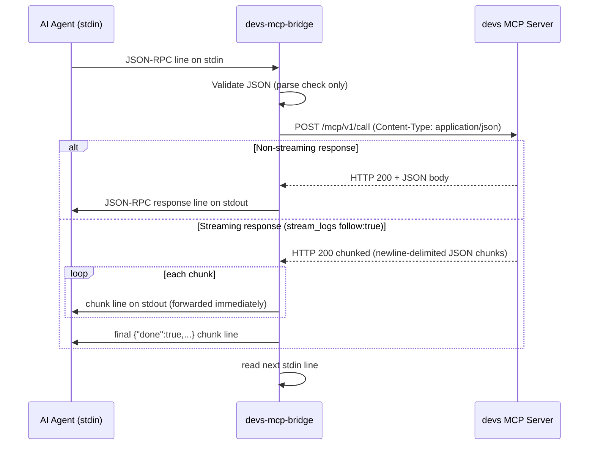
```mermaid
sequenceDiagram
    participant AI as AI Agent (stdin)
    participant BR as devs-mcp-bridge
    participant SRV as devs MCP Server

    AI->>BR: JSON-RPC line on stdin
    BR->>BR: Validate JSON (parse check only)
    BR->>SRV: POST /mcp/v1/call (Content-Type: application/json)
    alt Non-streaming response
        SRV-->>BR: HTTP 200 + JSON body
        BR->>AI: JSON-RPC response line on stdout
    else Streaming response (stream_logs follow:true)
        SRV-->>BR: HTTP 200 chunked (newline-delimited JSON chunks)
        loop each chunk
            BR->>AI: chunk line on stdout (forwarded immediately)
        end
        BR->>AI: final {"done":true,...} chunk line
    end
    BR->>BR: read next stdin line
```

**[6_UI_UX_ARCHITECTURE-REQ-234]** The bridge processes requests sequentially: it reads one line from stdin, forwards it, waits for the complete response (or all chunks for streaming), writes the output, then reads the next line. It MUST NOT issue concurrent HTTP requests.

**[6_UI_UX_ARCHITECTURE-REQ-235]** The bridge performs JSON syntax validation on each stdin line before forwarding. An unparseable line (invalid JSON) causes the bridge to write `{"result":null,"error":"invalid_argument: malformed JSON-RPC request"}` to stdout and read the next line. The bridge MUST NOT exit on a single malformed request.

**[6_UI_UX_ARCHITECTURE-REQ-236]** The bridge MUST NOT interpret or transform the `params` field of any JSON-RPC request. The `params` value is forwarded verbatim in the HTTP request body.

#### 4.3.2 Bridge Connection Lifecycle

The bridge discovers the MCP server address once at startup and holds that address for the duration of the process. It does NOT reconnect or retry across individual requests.

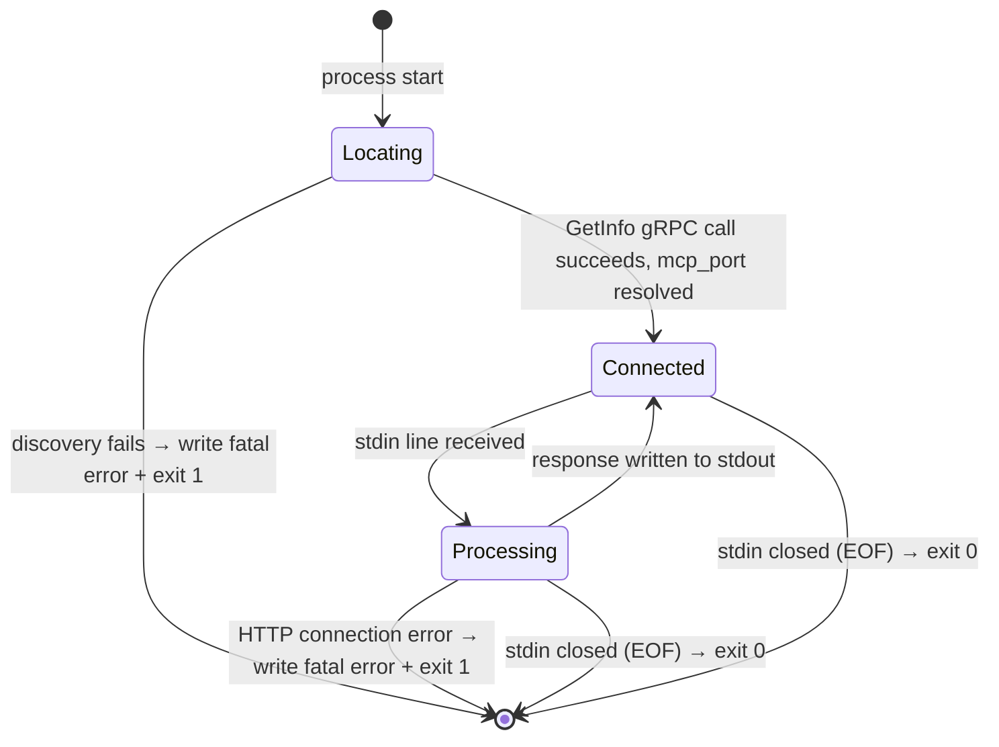
```mermaid
stateDiagram-v2
    [*] --> Locating : process start

    Locating --> Connected : GetInfo gRPC call succeeds, mcp_port resolved
    Locating --> [*] : discovery fails → write fatal error + exit 1

    Connected --> Processing : stdin line received
    Processing --> Connected : response written to stdout
    Processing --> [*] : HTTP connection error → write fatal error + exit 1
    Processing --> [*] : stdin closed (EOF) → exit 0

    Connected --> [*] : stdin closed (EOF) → exit 0
```

**[6_UI_UX_ARCHITECTURE-REQ-237]** The bridge writes a fatal error and exits with code 1 on any HTTP transport error (connection refused, connection reset, read timeout). The fatal error format is:
```json
{"result":null,"error":"server_unreachable: <detail>","fatal":true}
```

**[6_UI_UX_ARCHITECTURE-REQ-238]** The bridge does NOT attempt to reconnect after a connection error. AI agents that need reconnection must restart the bridge process.

**[6_UI_UX_ARCHITECTURE-REQ-239]** When stdin reaches EOF, the bridge exits with code 0 regardless of any in-flight request state.

#### 4.3.3 Bridge Streaming Protocol

For `stream_logs` with `follow: true`, the bridge MUST forward each HTTP chunked transfer encoding chunk to stdout as a separate newline-terminated line immediately upon receipt. The bridge may receive multiple JSON objects in a single TCP segment; it splits on `\n` and forwards each JSON object as a separate stdout line.

**[6_UI_UX_ARCHITECTURE-REQ-240]** The bridge MUST forward stream chunks in order. It MUST NOT reorder or merge chunks.

**[6_UI_UX_ARCHITECTURE-REQ-241]** The bridge reads the HTTP response as a byte stream, scanning for `\n` delimiters. It forwards each complete line (without the trailing newline) as a standalone JSON line followed by a newline on stdout.

**[6_UI_UX_ARCHITECTURE-REQ-242]** If the HTTP connection is closed by the server mid-stream (before `{"done":true}` is received), the bridge writes `{"result":null,"error":"server_unreachable: stream terminated unexpectedly","fatal":true}` to stdout and exits with code 1.

#### 4.3.4 Bridge Input Validation Rules

Before forwarding each request to the MCP server, the bridge applies the following checks:

| Check | Failure Action |
|---|---|
| Input line parses as valid UTF-8 | Write error line; read next input |
| Input line parses as valid JSON | Write error line; read next input |
| JSON body does not exceed 1 MiB | Write `"invalid_argument: request body exceeds 1 MiB"` error; read next input |
| `Content-Type: application/json` header set on outbound request | (always set by bridge; not caller-controlled) |

**[6_UI_UX_ARCHITECTURE-REQ-243]** The bridge does NOT validate the JSON-RPC `method`, `id`, or `params` fields beyond syntactic JSON validity. Semantic validation is delegated entirely to the MCP server.

#### 4.3.5 Bridge Routing Edge Cases

| Scenario | Expected Behavior |
|---|---|
| MCP server returns HTTP 413 | Bridge writes `{"result":null,"error":"invalid_argument: request body exceeds server limit"}` to stdout; continues reading stdin |
| MCP server returns HTTP 500 | Bridge writes `{"result":null,"error":"internal: server error"}` to stdout; continues reading stdin |
| MCP server returns HTTP 404 (wrong path) | Bridge writes `{"result":null,"error":"internal: unexpected 404 from MCP server"}` to stdout; continues |
| stdin line is empty (blank line) | Treated as malformed JSON; write error line; read next input |
| MCP server is restarted mid-session | Next request returns connection refused; bridge writes fatal error and exits 1 |
| stdin delivers partial JSON (line truncated before newline) | Bridge reads until `\n` regardless of length; buffers until newline received; forwards complete line |
| Stream chunk arrives containing multiple JSON objects separated by `\n` | Each object forwarded as a separate stdout line in received order |

---

### 4.4 TUI Focus Management

Focus management determines which widget within the active tab receives keyboard navigation events (`↑`, `↓`, `Enter`, `PgUp`, `PgDn`, `Home`, `End`). Focus is tracked in `NavigationState` via the `active_tab` field and implicit per-tab widget ordering — there is no explicit global focus pointer.

#### 4.4.1 Focus Model

Each tab owns a fixed, ordered set of focusable widgets. Focus cycles through them in order when the user presses `Tab` within the same-tab context (distinct from the global `Tab` key that switches tabs — the `Tab` key always switches tabs, never moves intra-tab focus). Intra-tab focus movement is instead controlled by `↑`/`↓` operating on the currently active list widget for that tab.

| Tab | Focusable Widgets (in display order) | Primary List Widget |
|---|---|---|
| Dashboard | `RunList` (left pane), `StageList` (right pane — visible when run selected), `LogTail` (scrollable) | `RunList` |
| Logs | `RunList` (for run selection), `StageList` (for stage selection), `LogBuffer` | `StageList` when run selected |
| Debug | `RunList`, `StageList`, `DiffView` | `StageList` when run selected |
| Pools | `PoolList`, `AgentTable` | `PoolList` |

**[6_UI_UX_ARCHITECTURE-REQ-244]** The "primary list widget" for each tab is the widget that receives `↑`/`↓` key events. When no run is selected, `RunList` always receives `↑`/`↓`. Once a run is selected (via `Enter` on `RunList`), the primary focus shifts to the stage list for that tab, and `↑`/`↓` operates on the stage list.

**[6_UI_UX_ARCHITECTURE-REQ-245]** `Esc` from the stage list deselects the current stage and returns focus to `RunList`. `Esc` from `RunList` deselects the current run.

**[6_UI_UX_ARCHITECTURE-REQ-246]** The `PgUp`/`PgDn`/`Home`/`End` keys always operate on the scrollable log or diff widget, regardless of focus. These keys are not consumed by list widgets.

#### 4.4.2 Key Dispatch Algorithm

All key events flow through `App::handle_key_event()` using the following dispatch algorithm:

```
fn handle_key_event(key: KeyEvent, state: &mut AppState):
    1. If help_visible == true:
       - If key in {?, Esc, q, Ctrl+C}: handle directly
       - Else: consume event, return (no-op)
    2. If terminal_size < (80, 24): consume all events, return
    3. Dispatch global keys {q, Ctrl+C, Tab, 1, 2, 3, 4}
    4. Dispatch tab-scoped keys based on active_tab:
       Dashboard:  {c, p, r, ↑, ↓, Enter, Esc, PgUp, PgDn, Home, End}
       Logs:       {↑, ↓, Enter, Esc, PgUp, PgDn, Home, End}
       Debug:      {p, r, ↑, ↓, Enter, Esc, PgUp, PgDn, Home, End}
       Pools:      {↑, ↓, Enter, Esc}
    5. All unrecognised keys: silently consumed (no-op)
```

**[6_UI_UX_ARCHITECTURE-REQ-247]** Step 5 (silent consumption) applies to all unrecognised keys in all contexts. The TUI MUST NOT write any error output for unrecognised keystrokes.

**[6_UI_UX_ARCHITECTURE-REQ-248]** The `c`, `p`, `r` keys are dispatched only when `selected_run_index` is `Some(i)`. If no run is selected (`None`), these keys are silently consumed.

#### 4.4.3 Focus Edge Cases

| Scenario | Expected Behavior |
|---|---|
| User presses `Enter` on `RunList` when it is empty | `selected_run_index` remains `None`; no-op |
| User presses `↓` when at bottom of a list | Selection stays at last item; no wrap-around |
| User presses `↑` when at top of a list | Selection stays at first item; no wrap-around |
| Stage list is empty (run has no stages) | `selected_stage_index` stays `None`; `↓` is a no-op |
| Run transitions to terminal state while stage is selected | Stage item updates to terminal status in place; selection index preserved |
| New stage is added to the run mid-execution (fan-out sub-stage) | Stage list grows; indices of existing items preserved; no selection jump |

---

### 4.5 Run Identifier Resolution

All CLI commands that accept a `<run>` argument and the TUI's run selection both use the same two-step identifier resolution algorithm to convert a user-supplied string into a `WorkflowRun`.

#### 4.5.1 Resolution Algorithm

```
fn resolve_run_id(input: &str) -> Result<Uuid, ResolutionError>:
    1. If input matches UUID v4 format (lowercase hyphenated, 36 chars):
       → Attempt gRPC GetRun(run_id = input)
       → If found: return run_id
       → If NOT_FOUND: return Err(ResolutionError::NotFound)
       → (UUID takes precedence over slug even if a slug is identical in value)

    2. Else (treat as slug):
       → Attempt gRPC ListRuns(slug_filter = input, limit = 2)
       → If exactly 1 result: return that run's run_id
       → If 0 results: return Err(ResolutionError::NotFound)
       → If 2+ results: return Err(ResolutionError::Ambiguous { count })
```

**[6_UI_UX_ARCHITECTURE-REQ-249]** UUID format detection is performed by attempting `Uuid::parse_str(input)`. Any string that parses successfully as a UUID is resolved via `GetRun(run_id)`; all other strings are resolved via `ListRuns(slug_filter)`.

**[6_UI_UX_ARCHITECTURE-REQ-250]** UUID takes precedence over slug on collision: if a slug happens to be a valid UUID string and a run exists with that exact `run_id`, the UUID path is taken. The slug path is only taken for inputs that do not parse as a UUID.

**[6_UI_UX_ARCHITECTURE-REQ-251]** In the TUI, run identifier resolution is not exposed to the user — the TUI always operates on `run_id` values taken directly from the in-memory `RunSummary` list. Resolution is only relevant for CLI commands.

#### 4.5.2 Resolution Error Handling

| Error | CLI Exit Code | CLI Error Message | TUI Behavior |
|---|---|---|---|
| `NotFound` (UUID path) | `2` | `"not_found: run <uuid> does not exist"` | N/A (TUI uses in-memory state) |
| `NotFound` (slug path) | `2` | `"not_found: no run with slug '<slug>'"` | N/A |
| `Ambiguous` (slug matches N runs) | `2` | `"not_found: slug '<slug>' matches <N> runs; use run_id to disambiguate"` | N/A |
| Invalid UUID format (not a UUID, not a valid slug) | `4` | `"invalid_argument: '<input>' is not a valid run identifier"` | N/A |

**[6_UI_UX_ARCHITECTURE-REQ-252]** The ambiguous-slug error uses exit code `2` (not found) rather than `4` (validation error) because the identifier is syntactically valid but the server cannot uniquely resolve it. The user must supply a `run_id` instead.

#### 4.5.3 Stage Identifier Resolution

For commands accepting `[<stage>]` (e.g., `devs logs <run> <stage>`, `devs pause <run> --stage <name>`), stage names are resolved by exact string match against `StageDefinition.name` within the resolved `WorkflowRun`. Stage names MUST be unique within a workflow (enforced at definition validation), so no ambiguity is possible.

| Error | CLI Exit Code | Error Message |
|---|---|---|
| Stage name not found in run | `2` | `"not_found: stage '<name>' not found in run '<run-id>'"` |
| Run resolved but has no stages | `2` | `"not_found: run '<run-id>' has no stages"` |

---

### 4.6 gRPC Connection Lifecycle

#### 4.6.1 TUI Connection Lifecycle

The TUI maintains a single long-lived gRPC channel to the server. It does not create a new channel per RPC call; all requests share the same channel for the duration of the process.

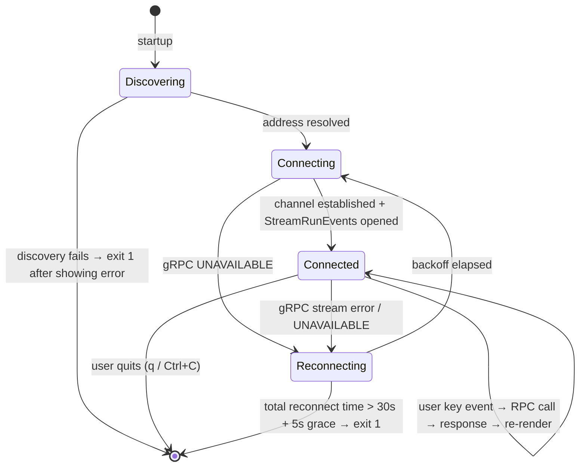
```mermaid
stateDiagram-v2
    [*] --> Discovering : startup

    Discovering --> Connecting : address resolved
    Discovering --> [*] : discovery fails → exit 1 after showing error

    Connecting --> Connected : channel established + StreamRunEvents opened
    Connecting --> Reconnecting : gRPC UNAVAILABLE

    Connected --> Reconnecting : gRPC stream error / UNAVAILABLE
    Connected --> [*] : user quits (q / Ctrl+C)

    Reconnecting --> Connecting : backoff elapsed
    Reconnecting --> [*] : total reconnect time > 30s + 5s grace → exit 1

    Connected --> Connected : event received → re-render within 50ms
    Connected --> Connected : user key event → RPC call → response → re-render
```

**[6_UI_UX_ARCHITECTURE-REQ-253]** The TUI opens the `StreamRunEvents` gRPC streaming call immediately after the channel is established. This stream is the sole source of push-based state updates. The TUI MUST NOT poll the server; all state updates are event-driven.

**[6_UI_UX_ARCHITECTURE-REQ-254]** When the TUI initiates a control action (`cancel`, `pause`, `resume`) it issues a unary gRPC RPC call on the same channel. The call is fire-and-result: the TUI waits for the response (success or error) and updates the `StatusBar` accordingly. It does NOT pre-emptively update `AppState` before the server confirms the transition.

**[6_UI_UX_ARCHITECTURE-REQ-255]** The TUI reconnect backoff sequence is: 1s → 2s → 4s → 8s → 16s → 30s (cap at 30s). After total elapsed reconnect time exceeds 30 seconds, the TUI waits an additional 5 seconds then exits with code 1.

**[6_UI_UX_ARCHITECTURE-REQ-256]** During the reconnect interval, the TUI renders the `StatusBar` as `"RECONNECTING: attempt <N> in <Xs>..."`. The rest of the UI remains frozen at the last known state. The user may still press `q` to exit during reconnect.

#### 4.6.2 CLI Connection Lifecycle

Each CLI invocation creates a new gRPC channel, makes exactly one RPC call (or opens one streaming call for `devs logs --follow`), and closes the channel on exit. There is no connection reuse between invocations.

**[6_UI_UX_ARCHITECTURE-REQ-257]** The gRPC channel is created with a 5-second connection timeout. If the channel cannot be established within 5 seconds, the command exits with code 3 and the error `"server_unreachable: connection timeout after 5s"`.

**[6_UI_UX_ARCHITECTURE-REQ-258]** For `devs logs --follow`, if the gRPC stream is interrupted by a network error after it has started delivering log lines, the CLI exits with code 3 and prints `"server_unreachable: log stream disconnected"`. It does NOT attempt to resume the stream.

#### 4.6.3 MCP Bridge Connection Lifecycle

The bridge creates a one-time HTTP client using `reqwest` during startup. The HTTP client (connection pool) is reused for all subsequent requests.

**[6_UI_UX_ARCHITECTURE-REQ-259]** The HTTP client is configured with: `timeout(10s)`, `connection_verbose(false)`, `redirect(Policy::none())`, `rustls-tls` only.

**[6_UI_UX_ARCHITECTURE-REQ-260]** Each bridge request creates a new HTTP request; the underlying `reqwest` client may reuse TCP connections from its internal pool. The bridge does not directly manage connection pooling.

---

### 4.7 Routing Architecture Acceptance Criteria

The following acceptance criteria are testable assertions covering all subsections of §4. Each MUST be covered by an automated test annotated `// Covers: <AC-ID>`.

- **[6_UI_UX_ARCHITECTURE-REQ-261]** Pressing keys `1`, `2`, `3`, `4` switches `NavigationState.active_tab` to `Dashboard`, `Logs`, `Debug`, `Pools` respectively regardless of current tab. (TUI E2E / unit)
- **[6_UI_UX_ARCHITECTURE-REQ-262]** Pressing `Tab` from `Pools` tab sets `active_tab` to `Dashboard`. (TUI unit)
- **[6_UI_UX_ARCHITECTURE-REQ-263]** Pressing `c` while `active_tab == Logs` issues no gRPC call and produces no error output. (TUI unit)
- **[6_UI_UX_ARCHITECTURE-REQ-264]** `help_visible == true` blocks all key events except `?`, `Esc`, `q`, and `Ctrl+C` from reaching the tab handler. (TUI unit)
- **[6_UI_UX_ARCHITECTURE-REQ-265]** `selected_stage_index` resets to `None` when `selected_run_index` changes value. (TUI unit)
- **[6_UI_UX_ARCHITECTURE-REQ-266]** `log_scroll_offset` resets to `0` when `selected_stage_index` changes value. (TUI unit)
- **[6_UI_UX_ARCHITECTURE-REQ-267]** Terminal smaller than 80×24 renders exactly `"Terminal too small: 80x24 minimum required (current: WxH)"` and nothing else. (TUI E2E snapshot)
- **[6_UI_UX_ARCHITECTURE-REQ-268]** `devs status <uuid>` issues `GetRun(run_id=uuid)` and never calls `ListRuns`. (CLI unit / E2E)
- **[6_UI_UX_ARCHITECTURE-REQ-269]** `devs status <slug>` issues `ListRuns(slug_filter=slug)` and never calls `GetRun` first. (CLI unit / E2E)
- **[6_UI_UX_ARCHITECTURE-REQ-270]** `devs status` on a non-existent UUID exits with code 2 and output `"not_found: run <uuid> does not exist"`. (CLI E2E)
- **[6_UI_UX_ARCHITECTURE-REQ-271]** `devs status` on an ambiguous slug (matching 2 runs) exits with code 2 and output `"not_found: slug '<slug>' matches 2 runs; use run_id to disambiguate"`. (CLI E2E)
- **[6_UI_UX_ARCHITECTURE-REQ-272]** `devs submit --input expr=a=b` passes key `expr`, value `"a=b"` to the server (splits on first `=` only). (CLI E2E)
- **[6_UI_UX_ARCHITECTURE-REQ-273]** `devs submit` with CWD matching 2 projects exits with code 4. (CLI E2E)
- **[6_UI_UX_ARCHITECTURE-REQ-274]** `--format json` routes all output (errors and success) to stdout as JSON; nothing written to stderr. (CLI E2E)
- **[6_UI_UX_ARCHITECTURE-REQ-275]** `devs logs --follow` exits with code 0 when run reaches `Completed`. (CLI E2E)
- **[6_UI_UX_ARCHITECTURE-REQ-276]** `devs logs --follow` exits with code 1 when run reaches `Failed`. (CLI E2E)
- **[6_UI_UX_ARCHITECTURE-REQ-277]** `devs logs --follow` exits with code 3 when server connection drops mid-stream. (CLI E2E)
- **[6_UI_UX_ARCHITECTURE-REQ-278]** `devs security-check` does NOT open a gRPC channel; `cargo tree -p devs-cli` shows it calls config parsing directly. (unit test of security_check module)
- **[6_UI_UX_ARCHITECTURE-REQ-279]** `devs-mcp-bridge` writes a fatal error and exits 1 when the MCP HTTP server is unreachable after startup. (MCP E2E)
- **[6_UI_UX_ARCHITECTURE-REQ-280]** `devs-mcp-bridge` writes an error line to stdout and continues reading stdin when given an invalid JSON line (does NOT exit). (MCP E2E)
- **[6_UI_UX_ARCHITECTURE-REQ-281]** `devs-mcp-bridge` forwards streaming chunks immediately (does not buffer entire response before writing). (MCP E2E: observe stdout interleaved with server sends)
- **[6_UI_UX_ARCHITECTURE-REQ-282]** `devs-mcp-bridge` exits with code 0 on stdin EOF. (MCP E2E)
- **[6_UI_UX_ARCHITECTURE-REQ-283]** TUI reconnect sequence follows the 1→2→4→8→16→30s backoff; after >30s total it exits with code 1. (TUI E2E with mock server that drops connections)
- **[6_UI_UX_ARCHITECTURE-REQ-284]** TUI StatusBar shows `"RECONNECTING: attempt <N> in <Xs>..."` during reconnect intervals. (TUI E2E snapshot)
- **[6_UI_UX_ARCHITECTURE-REQ-285]** `devs pause --stage <name>` routes to `StageService.PauseStage`; `devs pause` (no `--stage`) routes to `RunService.PauseRun`. (CLI unit)
- **[6_UI_UX_ARCHITECTURE-REQ-286]** `NavigationState.selected_run_index` is clamped to `new_len - 1` when the run list shrinks below the current selection. (TUI unit)
- **[6_UI_UX_ARCHITECTURE-REQ-287]** `↑` at top of a list does not wrap around; selection remains at index 0. (TUI unit)
- **[6_UI_UX_ARCHITECTURE-REQ-288]** `↓` at bottom of a list does not wrap around; selection remains at last index. (TUI unit)

---

## 5. Styling System & Asset Management

This section defines every rule governing visual presentation, string management, snapshot test assets, and cross-platform encoding behavior for all `devs` client interfaces: `devs-tui`, `devs-cli`, and `devs-mcp-bridge`. The styling system is intentionally minimal — no external theme files, no runtime configuration, and no assets that require shipping alongside the binary.

---

### 5.1 TUI Styling Architecture

#### 5.1.1 Theme Model

The `Theme` struct is the sole carrier of all presentational decisions. It is constructed once at TUI startup from the `ColorMode` detected in the process environment, stored in `AppState`, and passed immutably to every widget render function. No widget accesses `std::env::var("NO_COLOR")` directly; all color decisions flow exclusively through the `Theme`.

```rust
/// devs-tui/src/theme.rs

/// Controls whether ANSI color codes are emitted.
/// Determined once at startup; immutable for the lifetime of the process.
#[derive(Debug, Clone, Copy, PartialEq, Eq)]
pub enum ColorMode {
    /// ANSI color codes are permitted.
    Color,
    /// All ANSI color codes are suppressed (NO_COLOR is set).
    Monochrome,
}

/// All presentational decisions for the TUI.
/// Constructed by `Theme::from_env()` at startup.
#[derive(Debug, Clone)]
pub struct Theme {
    pub color_mode: ColorMode,

    // Status label colors (used only when color_mode == Color)
    pub color_done: ratatui::style::Color,
    pub color_fail: ratatui::style::Color,
    pub color_timeout: ratatui::style::Color,
    pub color_running: ratatui::style::Color,
    pub color_paused: ratatui::style::Color,
    pub color_cancelled: ratatui::style::Color,
    pub color_eligible: ratatui::style::Color,
    pub color_waiting: ratatui::style::Color,
    pub color_pending: ratatui::style::Color,

    // Selection highlighting
    pub color_selected_fg: ratatui::style::Color,
    pub color_selected_bg: ratatui::style::Color,

    // Error and warning text
    pub color_error: ratatui::style::Color,
    pub color_warn: ratatui::style::Color,

    // Help overlay
    pub color_help_border_fg: ratatui::style::Color,
    pub color_help_border_bg: ratatui::style::Color,
}

impl Theme {
    /// Construct theme by reading NO_COLOR from the environment.
    /// Call exactly once at TUI startup.
    pub fn from_env() -> Self { /* ... */ }

    /// Returns a `ratatui::style::Style` for the given stage status.
    /// In Monochrome mode, returns `Style::default()` for all statuses.
    pub fn stage_status_style(&self, status: StageStatus) -> ratatui::style::Style { /* ... */ }

    /// Returns a `ratatui::style::Style` for a selected list row.
    /// In Monochrome mode, returns `Style::default().add_modifier(Modifier::REVERSED)`.
    pub fn selected_row_style(&self) -> ratatui::style::Style { /* ... */ }
}
```

**[6_UI_UX_ARCHITECTURE-REQ-289]** Color is used as a secondary indicator only. Every status, state, and structural element MUST be distinguishable without color. When the `NO_COLOR` environment variable is set to any non-empty value, all ANSI color codes MUST be suppressed; `ColorMode` is set to `Monochrome`. The TUI uses `ratatui::style::Color` only when `ColorMode::Color`.

**[6_UI_UX_ARCHITECTURE-REQ-290]** `Theme::from_env()` MUST be the only call site that reads `std::env::var("NO_COLOR")`. No widget, handler, or module may read this variable directly. Violation is a lint error enforced by a test that searches for `env::var("NO_COLOR")` outside `theme.rs`.

**[6_UI_UX_ARCHITECTURE-REQ-291]** In `Monochrome` mode, the only permitted text modifier for structural UI elements is `Modifier::REVERSED` (for selected rows). `Modifier::BOLD` is permitted for the active tab label in both modes. `Modifier::ITALIC`, `Modifier::UNDERLINED`, and `Modifier::BLINK` are prohibited entirely in structural positions (log content is rendered verbatim and exempt).

#### 5.1.2 Default Color Assignments

**[6_UI_UX_ARCHITECTURE-REQ-292]** The following color assignments apply when `ColorMode::Color`. These are normative for the production build; test snapshots are generated in `Monochrome` mode via `Theme { color_mode: ColorMode::Monochrome, .. }`.

| Element | `ratatui::style::Color` Foreground | Background | Modifier |
|---|---|---|---|
| `DONE` status label | `Color::Green` | Default | None |
| `FAIL` status label | `Color::Red` | Default | None |
| `TIME` status label | `Color::Red` | Default | None |
| `RUN ` status label | `Color::Yellow` | Default | None |
| `PAUS` status label | `Color::Cyan` | Default | None |
| `CANC` status label | `Color::DarkGray` | Default | None |
| `ELIG` status label | `Color::White` | Default | None |
| `WAIT` status label | `Color::White` | Default | None |
| `PEND` status label | `Color::White` | Default | None |
| Selected list row | `Color::Black` | `Color::White` | None |
| Active tab label | Default | Default | `BOLD` |
| Inactive tab label | `Color::DarkGray` | Default | None |
| Error text (status bar) | `Color::Red` | Default | None |
| Warn text (status bar) | `Color::Yellow` | Default | None |
| Help overlay border | `Color::White` | `Color::DarkGray` | None |
| DAG arrow `-->` | `Color::DarkGray` | Default | None |
| Stage box border | Default | Default | None |
| Log line (stdout) | Default | Default | None |
| Log line (stderr) | `Color::Yellow` | Default | None |

**[6_UI_UX_ARCHITECTURE-REQ-293]** `Color::Reset` and `Color::Indexed(_)` are prohibited; only named `Color` variants or `Color::Rgb(r,g,b)` for future theme extension. This constraint is enforced by a `clippy` lint.

#### 5.1.3 Character Set Constraints

**[6_UI_UX_ARCHITECTURE-REQ-294]** All structural TUI characters are from the ASCII range U+0020–U+007E. The exhaustive list of permitted structural characters for borders, arrows, separators, and labels:

| Character | ASCII | Usage |
|---|---|---|
| `[` `]` | 0x5B 0x5D | Stage box delimiters |
| `\|` | 0x7C | Stage box field separator |
| `-` | 0x2D | Arrow body character |
| `>` | 0x3E | Arrow head character |
| `/` | 0x2F | Path separator in display |
| `:` | 0x3A | Key-value separator, elapsed-time colon |
| `~` | 0x7E | Truncation suffix |
| Space | 0x20 | Padding, separators |
| `+` | 0x2B | Table corner (ASCII table borders) |
| `-` | 0x2D | Table horizontal border |
| `\|` | 0x7C | Table vertical border |
| `#` | 0x23 | Section headings in Help overlay |
| `*` | 0x2A | Bullet points in Help overlay |
| `?` | 0x3F | Help key indicator |
| `q` | 0x71 | Quit key indicator |

Prohibited for structural use: Unicode box-drawing (U+2500–U+257F), block elements (U+2580–U+259F), braille patterns (U+2800–U+28FF), emoji (U+1F300+), any codepoint > U+007E in non-log positions.

**[6_UI_UX_ARCHITECTURE-REQ-295]** Stage log content (lines from `LogBuffer`) is rendered verbatim using `ratatui::widgets::Paragraph` with wrapping disabled. Log lines may contain any valid UTF-8, including Unicode, ANSI escape sequences (rendered as text in non-raw mode), and binary-escaped characters. ANSI sequences in log output are NOT stripped; they appear as literal text in the TUI log view.

#### 5.1.4 Focus and Selection Indicators

**[6_UI_UX_ARCHITECTURE-REQ-296]** The active (focused) pane has its border drawn with `Modifier::BOLD`. Unfocused panes use the default style. There is no color difference between focused and unfocused panes, ensuring clarity in `Monochrome` mode.

**[6_UI_UX_ARCHITECTURE-REQ-297]** Selected rows in `RunList`, `LogsTab` stage selector, and `PoolsTab` agent list use `Theme::selected_row_style()`. In `Color` mode this is black-on-white. In `Monochrome` mode this is `Modifier::REVERSED` on the entire row width.

**[6_UI_UX_ARCHITECTURE-REQ-298]** Cursor position (the `>` indicator in tables and lists) is an ASCII `>` character (U+003E) in column 0 of the selected row, followed by a space. This is used in addition to the reversed-video selection style so that selection is unambiguous in monochrome terminals and in snapshot assertions.

#### 5.1.5 Error Message Prefix Contract

**[6_UI_UX_ARCHITECTURE-REQ-299]** Machine-stable error message prefixes MUST appear verbatim in all error output (TUI status bar, CLI stderr/stdout, MCP bridge error responses):

| Prefix | Condition | HTTP Analog |
|---|---|---|
| `not_found:` | Resource does not exist | 404 |
| `invalid_argument:` | Validation failure | 400 |
| `already_exists:` | Duplicate resource | 409 |
| `failed_precondition:` | Illegal state transition | 409/412 |
| `resource_exhausted:` | Lock timeout, pool capacity | 429/503 |
| `server_unreachable:` | gRPC connection failure | 503 |
| `internal:` | Unexpected server error | 500 |
| `cancelled:` | Operation was cancelled | — |
| `timeout:` | Operation timed out | 504 |
| `permission_denied:` | Access control violation | 403 |

**[6_UI_UX_ARCHITECTURE-REQ-300]** Error strings stored in `strings.rs` MUST begin with exactly one of the prefixes in the table above, followed by a space and a human-readable detail. Example: `"not_found: run with id {run_id} does not exist"`. The prefix is machine-stable and tested; the detail is informational only.

**[6_UI_UX_ARCHITECTURE-REQ-301]** The TUI status bar MUST display the full error string including prefix. It MUST NOT strip or abbreviate the prefix. If the error string exceeds the available status bar width, truncate from the right with `~`.

---

### 5.2 TUI Layout Dimensions

#### 5.2.1 Global Layout

**[6_UI_UX_ARCHITECTURE-REQ-302]** The TUI layout is computed dynamically at every render pass based on `terminal_size()`. No fixed pixel dimensions are used. The top-level layout algorithm is:

```
Full terminal area (cols × rows)
├── TabBar          (height: 3 rows; contains 4 tab labels and border)
├── ActiveTab       (height: terminal_rows − 4)
└── StatusBar       (height: 1 row)
```

**[6_UI_UX_ARCHITECTURE-REQ-303]** If the terminal is smaller than 80 columns × 24 rows, the TUI clears the screen and renders exactly one line:

```
Terminal too small: 80x24 minimum required (current: WxH)
```

where `W` and `H` are the current terminal dimensions. No other content is rendered. The TUI does NOT exit; it polls for resize events and resumes normal rendering when the terminal is large enough.

**[6_UI_UX_ARCHITECTURE-REQ-304]** Terminal resize events (`TuiEvent::Resize`) trigger an immediate re-layout and re-render within one event loop tick. The `AppState::terminal_size` field is updated before any widget render function is called.

#### 5.2.2 Tab Layouts

**[6_UI_UX_ARCHITECTURE-REQ-305]** Within `DashboardTab`, the layout is a horizontal split:

```
DashboardTab (full ActiveTab area)
├── RunList   (width: max(30% of cols, 24), left pane)
└── RunDetail (width: remaining columns, right pane)
    ├── DagView  (height: max(40% of rows, 8))
    └── LogTail  (height: remaining rows)
```

**[6_UI_UX_ARCHITECTURE-REQ-306]** The `LogsTab` layout is a vertical split:

```
LogsTab (full ActiveTab area)
├── StageSelector (height: max(30% of rows, 6), top pane)
│   └── Scrollable list of "<run-slug> / <stage-name>" entries
└── LogView       (height: remaining rows, bottom pane)
    └── Scrollable log content (LogBuffer entries)
```

**[6_UI_UX_ARCHITECTURE-REQ-307]** The `DebugTab` layout is three vertical sections:

```
DebugTab (full ActiveTab area)
├── StageSelector (height: 5 rows; same content as LogsTab selector, non-scrollable, shows 3 entries)
├── DiffView      (height: max(50% of rows − 5, 4); ASCII diff of working directory)
└── ControlBar    (height: 3 rows; shows c/p/r control labels and current stage status)
```

**[6_UI_UX_ARCHITECTURE-REQ-308]** The `PoolsTab` layout is a single vertically-scrollable list:

```
PoolsTab (full ActiveTab area)
└── PoolList (scrollable table)
    Per pool:
      Header row:  "Pool: <name>  max_concurrent: N  active: A  queued: Q"
      Agent rows:  "  [tool]  caps: [c1,c2]  fallback: yes/no  pty: yes/no  rate_limit: <until|none>"
```

#### 5.2.3 DAG View Constraints

**[6_UI_UX_ARCHITECTURE-REQ-309]** Within `DagView`, stage boxes are laid out in tiers. Each tier is a column of stages at the same dependency depth. Tiers are separated by a fixed 5-column gutter containing the `-->` arrow. If the DAG is wider than the available columns, horizontal scrolling is enabled; scroll position is tracked in `AppState::dag_scroll_x`.

**[6_UI_UX_ARCHITECTURE-REQ-310]** Stage box fixed width: `41` columns, computed as:
- `2` for `[ `
- `20` for stage name (padded or truncated to exactly 20 chars)
- `3` for ` | `
- `4` for status label (always exactly 4 chars)
- `3` for ` | `
- `5` for elapsed time (`M:SS` padded to 5 chars; `--:--` when not started)
- `2` for ` ]`
- Total: `2 + 20 + 3 + 4 + 3 + 5 + 2 = 39`; plus the `[` and `]` = `41`

> Note: the box including both brackets and all padding is `41` columns.

**[6_UI_UX_ARCHITECTURE-REQ-311]** Elapsed time format: `M:SS` where `M` is total minutes (not bounded to single digit; `119:59` is valid). The field is right-justified in a 5-character field: values ≤ `9:59` are rendered as ` M:SS` (leading space); values ≥ `10:00` fill all 5 chars. Values ≥ `100:00` overflow to 6+ chars; in this case the elapsed field is rendered without padding and the box width expands by the overflow amount.

**[6_UI_UX_ARCHITECTURE-REQ-312]** Tier gutter is exactly 5 columns. Columns 1–2 are spaces, column 3 is `-`, column 4 is `-`, column 5 is `>`. This forms the `  -->` pattern (2 leading spaces + `-->`). The `-->` characters are drawn at the vertical midpoint row of the taller of the two adjacent tiers.

**[6_UI_UX_ARCHITECTURE-REQ-313]** If a stage depends on multiple stages from the previous tier, a single `-->` is drawn from the center of the last dependency in the prior tier to the left edge of this stage box. No multi-line arrows are drawn; fan-in and fan-out are represented by the tier position alone.

**[6_UI_UX_ARCHITECTURE-REQ-314]** Horizontal scroll is bounded: `dag_scroll_x` ∈ `[0, max(0, total_dag_width − available_cols)]`. Scrolling past either bound is a no-op.

#### 5.2.4 Minimum Pane Widths and Fallback Behavior

| Pane | Minimum Width (cols) | Minimum Height (rows) | Behavior if below minimum |
|---|---|---|---|
| `RunList` | 24 | 3 | Floor at minimum; `RunDetail` gets remaining space |
| `RunDetail` | 42 | 8 | If terminal too narrow, `RunList` hidden; full width to `RunDetail` |
| `DagView` | 42 | 8 | Floor at minimum; `LogTail` gets remaining space |
| `LogTail` | 42 | 3 | Floor at minimum; scroll still functional |
| `StageSelector` (Logs) | 40 | 4 | Floor at minimum |
| `LogView` | 40 | 4 | Floor at minimum |
| `DebugTab` total | 80 | 16 | Below this, show "too small" message within tab |
| `PoolsTab` | 60 | 8 | Floor at minimum |

**[6_UI_UX_ARCHITECTURE-REQ-315]** `RunDetail` is hidden only when `terminal_cols < 24 + 42 + 1` (pane separator). In this case `RunList` takes full width and `RunDetail` is not rendered. A status bar message `"Terminal too narrow for detail view"` is shown.

---

### 5.3 Localisation & String Management

#### 5.3.1 `strings.rs` Module Contract

**[6_UI_UX_ARCHITECTURE-REQ-316]** All user-visible strings in `devs-tui` and `devs-cli` are defined in a dedicated `strings.rs` module within each crate. No string literals for user-visible messages appear inline in widget or command handler code. This is an i18n preparation requirement; English is the only locale at MVP.

Each crate has exactly one `strings.rs` file at `crates/<crate-name>/src/strings.rs`. All constants are `pub const` items of type `&'static str`. Formatting strings (containing `{0}` or `{}` placeholders) are also `pub const &'static str` and formatted via `format!` at the call site.

**[6_UI_UX_ARCHITECTURE-REQ-317]** Naming convention for string constants:

| Category | Prefix | Example |
|---|---|---|
| Error messages (with prefix) | `ERR_` | `ERR_NOT_FOUND` |
| Status labels (4-char) | `STATUS_` | `STATUS_RUNNING` |
| Tab labels | `TAB_` | `TAB_DASHBOARD` |
| Key binding hints | `KEY_` | `KEY_QUIT` |
| Help text lines | `HELP_` | `HELP_CANCEL` |
| Column headers | `COL_` | `COL_RUN_ID` |
| Status bar messages | `STATUS_BAR_` | `STATUS_BAR_RECONNECTING` |
| CLI command descriptions | `CMD_` | `CMD_SUBMIT_ABOUT` |
| CLI argument descriptions | `ARG_` | `ARG_FORMAT_HELP` |
| Format strings | `FMT_` | `FMT_TERMINAL_TOO_SMALL` |

**[6_UI_UX_ARCHITECTURE-REQ-318]** Required string constants for `devs-tui/src/strings.rs`:

```rust
// devs-tui/src/strings.rs

// Status labels — exactly 4 ASCII chars, uppercase
pub const STATUS_PENDING:   &str = "PEND";
pub const STATUS_WAITING:   &str = "WAIT";
pub const STATUS_ELIGIBLE:  &str = "ELIG";
pub const STATUS_RUNNING:   &str = "RUN ";   // trailing space to pad to 4
pub const STATUS_PAUSED:    &str = "PAUS";
pub const STATUS_DONE:      &str = "DONE";
pub const STATUS_FAILED:    &str = "FAIL";
pub const STATUS_TIMED_OUT: &str = "TIME";
pub const STATUS_CANCELLED: &str = "CANC";

// Tab labels
pub const TAB_DASHBOARD: &str = "Dashboard";
pub const TAB_LOGS:      &str = "Logs";
pub const TAB_DEBUG:     &str = "Debug";
pub const TAB_POOLS:     &str = "Pools";

// Key binding hints (shown in help overlay and status bar)
pub const KEY_QUIT:             &str = "q";
pub const KEY_HELP:             &str = "?";
pub const KEY_CANCEL_RUN:       &str = "c";
pub const KEY_PAUSE_RUN:        &str = "p";
pub const KEY_RESUME_RUN:       &str = "r";
pub const KEY_SCROLL_UP:        &str = "Up";
pub const KEY_SCROLL_DOWN:      &str = "Down";
pub const KEY_SCROLL_LEFT:      &str = "Left";
pub const KEY_SCROLL_RIGHT:     &str = "Right";
pub const KEY_SELECT:           &str = "Enter";
pub const KEY_TAB_NEXT:         &str = "Tab";
pub const KEY_TAB_1:            &str = "1";
pub const KEY_TAB_2:            &str = "2";
pub const KEY_TAB_3:            &str = "3";
pub const KEY_TAB_4:            &str = "4";

// Format strings (use with format!())
pub const FMT_TERMINAL_TOO_SMALL: &str =
    "Terminal too small: 80x24 minimum required (current: {}x{})";
pub const FMT_LOG_TRUNCATED:      &str =
    "Showing last 10000 of {} lines";
pub const FMT_ELAPSED_NOT_STARTED: &str = "--:--";
pub const FMT_RECONNECTING:        &str =
    "Reconnecting to {} (attempt {}, next in {}s)...";
pub const FMT_DISCONNECTED:        &str =
    "Connection lost: {}. Exiting.";
pub const FMT_STAGE_BOX:           &str = "[ {:<20} | {} | {:>5} ]";
pub const FMT_NARROW_DETAIL:       &str = "Terminal too narrow for detail view";

// Column headers
pub const COL_RUN_ID:     &str = "Run ID";
pub const COL_SLUG:       &str = "Slug";
pub const COL_STATUS:     &str = "Status";
pub const COL_WORKFLOW:   &str = "Workflow";
pub const COL_STARTED:    &str = "Started";
pub const COL_ELAPSED:    &str = "Elapsed";
pub const COL_POOL:       &str = "Pool";
pub const COL_AGENT:      &str = "Agent";
pub const COL_CAPS:       &str = "Capabilities";
pub const COL_FALLBACK:   &str = "Fallback";

// Error prefixes (machine-stable; must match SEC-081 / FEAT-081 tables)
pub const ERR_NOT_FOUND:           &str = "not_found:";
pub const ERR_INVALID_ARGUMENT:    &str = "invalid_argument:";
pub const ERR_ALREADY_EXISTS:      &str = "already_exists:";
pub const ERR_FAILED_PRECONDITION: &str = "failed_precondition:";
pub const ERR_RESOURCE_EXHAUSTED:  &str = "resource_exhausted:";
pub const ERR_SERVER_UNREACHABLE:  &str = "server_unreachable:";
pub const ERR_INTERNAL:            &str = "internal:";
pub const ERR_CANCELLED:           &str = "cancelled:";
pub const ERR_TIMEOUT:             &str = "timeout:";
pub const ERR_PERMISSION_DENIED:   &str = "permission_denied:";
```

**[6_UI_UX_ARCHITECTURE-REQ-319]** Required string constants for `devs-cli/src/strings.rs`:

```rust
// devs-cli/src/strings.rs

// CLI error prefixes (same machine-stable values as TUI)
pub const ERR_NOT_FOUND:           &str = "not_found:";
pub const ERR_INVALID_ARGUMENT:    &str = "invalid_argument:";
pub const ERR_ALREADY_EXISTS:      &str = "already_exists:";
pub const ERR_FAILED_PRECONDITION: &str = "failed_precondition:";
pub const ERR_RESOURCE_EXHAUSTED:  &str = "resource_exhausted:";
pub const ERR_SERVER_UNREACHABLE:  &str = "server_unreachable:";
pub const ERR_INTERNAL:            &str = "internal:";
pub const ERR_CANCELLED:           &str = "cancelled:";
pub const ERR_TIMEOUT:             &str = "timeout:";
pub const ERR_PERMISSION_DENIED:   &str = "permission_denied:";

// Format strings
pub const FMT_JSON_ERROR:     &str = r#"{{"error": "{}", "code": {}}}"#;
pub const FMT_LOGS_FOLLOWING: &str = "Following logs for {} / {}...";

// Status display strings (text mode output)
pub const STATUS_RUNNING_TEXT:   &str = "running";
pub const STATUS_COMPLETED_TEXT: &str = "completed";
pub const STATUS_FAILED_TEXT:    &str = "failed";
pub const STATUS_CANCELLED_TEXT: &str = "cancelled";
pub const STATUS_PENDING_TEXT:   &str = "pending";
pub const STATUS_PAUSED_TEXT:    &str = "paused";
pub const STATUS_TIMED_OUT_TEXT: &str = "timed_out";
```

**[6_UI_UX_ARCHITECTURE-REQ-320]** A lint test in `devs-tui/tests/` and `devs-cli/tests/` scans all `.rs` source files for string literals matching the patterns `"(not_found|invalid_argument|already_exists|failed_precondition|resource_exhausted|server_unreachable|internal|cancelled|timeout|permission_denied):"` outside of `strings.rs`. Any match fails the test. This ensures that error prefixes are never duplicated inline.

**[6_UI_UX_ARCHITECTURE-REQ-321]** Status label constants (`STATUS_PENDING` through `STATUS_CANCELLED`) MUST each be exactly 4 bytes long. A compile-time assertion enforces this:

```rust
const _: () = {
    assert!(STATUS_PENDING.len()   == 4);
    assert!(STATUS_WAITING.len()   == 4);
    assert!(STATUS_ELIGIBLE.len()  == 4);
    assert!(STATUS_RUNNING.len()   == 4);
    assert!(STATUS_PAUSED.len()    == 4);
    assert!(STATUS_DONE.len()      == 4);
    assert!(STATUS_FAILED.len()    == 4);
    assert!(STATUS_TIMED_OUT.len() == 4);
    assert!(STATUS_CANCELLED.len() == 4);
};
```

---

### 5.4 Asset Management

#### 5.4.1 Zero Static Assets Policy

**[6_UI_UX_ARCHITECTURE-REQ-322]** `devs-tui` and `devs-cli` have no static assets (images, fonts, CSS, icons). All visual output is generated programmatically from Rust code at runtime. No `include_bytes!`, `include_str!`, or build-script-copied asset files are used in production code paths.

**[6_UI_UX_ARCHITECTURE-REQ-323]** `devs-mcp-bridge` has no assets. Its single output artefact is the JSON-RPC response written to stdout.

#### 5.4.2 Snapshot Test Fixtures

**[6_UI_UX_ARCHITECTURE-REQ-324]** TUI snapshot test fixtures are stored as plain UTF-8 text files in `crates/devs-tui/tests/snapshots/*.txt`. They are generated and reviewed using the `insta 1.40` crate with the `ratatui::backend::TestBackend` at a fixed terminal size of **200 columns × 50 rows**. Pixel comparison is prohibited; only text content is compared.

**[6_UI_UX_ARCHITECTURE-REQ-325]** Snapshot file naming convention:

```
crates/devs-tui/tests/snapshots/<test_module>__<test_name>.txt
```

Examples:
```
crates/devs-tui/tests/snapshots/
  dashboard__empty_state.txt
  dashboard__single_run_running.txt
  dashboard__dag_three_stages.txt
  dashboard__terminal_too_small.txt
  logs__buffered_lines.txt
  logs__truncated_notice.txt
  debug__working_dir_diff.txt
  pools__rate_limited_agent.txt
  help_overlay__visible.txt
  status_bar__reconnecting.txt
```

**[6_UI_UX_ARCHITECTURE-REQ-326]** All snapshot tests set `ColorMode::Monochrome` explicitly via `Theme { color_mode: ColorMode::Monochrome, .. Theme::default() }`. No ANSI color codes appear in snapshot files. This ensures snapshot comparison is not sensitive to terminal color capability.

**[6_UI_UX_ARCHITECTURE-REQ-327]** Snapshot test terminal size is fixed at 200×50. Tests that exercise minimum-size behavior use a second `TestBackend` constructed with the specific small size (e.g. 79×23 for the "too small" test, 80×24 for the minimum boundary).

**[6_UI_UX_ARCHITECTURE-REQ-328]** When a snapshot diverges, `insta` writes the new output to `<snapshot>.txt.new`. The test fails and CI reports the diff. Snapshot updates MUST be reviewed by running `cargo insta review` and explicitly approving each change. Auto-approval (`INSTA_UPDATE=always`) is prohibited in CI; the `CI` environment variable is detected and `INSTA_UPDATE` defaults to `unsaved` (fail on any divergence).

**[6_UI_UX_ARCHITECTURE-REQ-329]** Snapshot files are committed to source control and MUST be kept up-to-date with the implementation. A diverging snapshot is a test failure, not a warning. The presence of any `.txt.new` file in `crates/devs-tui/tests/snapshots/` at test completion causes `./do test` to exit non-zero.

**[6_UI_UX_ARCHITECTURE-REQ-330]** Minimum required snapshot coverage. Each of the following scenarios MUST have at least one snapshot:

| Scenario | Required Snapshot |
|---|---|
| Dashboard with no runs | `dashboard__empty_state` |
| Dashboard with one running run | `dashboard__run_running` |
| Dashboard with DAG of ≥ 3 stages | `dashboard__dag_three_stages` |
| Terminal below minimum size | `dashboard__terminal_too_small` |
| Help overlay open | `help_overlay__visible` |
| Log view with buffered content | `logs__buffered` |
| Log view at capacity (truncation notice) | `logs__truncated` |
| Pool view with rate-limited agent | `pools__rate_limited` |
| Status bar showing error | `status_bar__error` |
| Status bar showing reconnecting | `status_bar__reconnecting` |
| Debug tab with working directory diff | `debug__diff_view` |

#### 5.4.3 Snapshot Rendering Contract

Every snapshot test follows this exact structure:

```rust
#[test]
fn test_dashboard_empty_state() {
    // 1. Construct AppState with deterministic test data
    let state = AppState::test_default(); // seeded with no runs

    // 2. Construct a Monochrome theme
    let theme = Theme { color_mode: ColorMode::Monochrome, ..Theme::default() };

    // 3. Render to TestBackend at 200×50
    let backend = TestBackend::new(200, 50);
    let mut terminal = Terminal::new(backend).unwrap();
    terminal.draw(|f| render_app(f, &state, &theme)).unwrap();

    // 4. Capture and assert
    let buffer = terminal.backend().buffer().clone();
    let rendered = buffer_to_string(&buffer);
    insta::assert_snapshot!("dashboard__empty_state", rendered);
}
```

**[6_UI_UX_ARCHITECTURE-REQ-331]** `AppState::test_default()` is a test-only constructor that produces a fully-populated, deterministic `AppState` with no gRPC dependencies. All fields are populated with static test data (fixed UUIDs, fixed timestamps set to `2026-01-01T00:00:00Z`, fixed run slugs). This function MUST NOT be reachable in production builds; it is gated behind `#[cfg(test)]`.

**[6_UI_UX_ARCHITECTURE-REQ-332]** `buffer_to_string(buffer: &Buffer) -> String` converts a `ratatui::backend::TestBackend` buffer to a plain UTF-8 string, one line per row, padded to exactly `cols` characters with spaces, joined by newlines, with no trailing newline. This is the only permitted method for converting a `TestBackend` buffer to a string for assertion.

---

### 5.5 Cross-Platform Path & Encoding Handling

#### 5.5.1 Path Normalization

**[6_UI_UX_ARCHITECTURE-REQ-333]** All file paths in TUI display and CLI output are normalized to forward-slash notation regardless of the host OS. Backslash paths received from the server are normalized before display. The `~` home-directory shorthand is expanded at use time via `dirs::home_dir()`, not stored.

**[6_UI_UX_ARCHITECTURE-REQ-334]** Path normalization algorithm applied to every path string before display or storage in CLI/TUI local state:

```rust
/// devs-cli/src/path.rs and devs-tui/src/path.rs (identical)
pub fn normalize_path_display(raw: &str) -> String {
    // 1. Replace all backslashes with forward slashes
    let normalized = raw.replace('\\', "/");
    // 2. Collapse consecutive slashes to a single slash
    //    (except leading `//` on UNC paths which is preserved)
    let normalized = collapse_double_slashes(&normalized);
    // 3. Do NOT resolve `.` or `..` — display only, not filesystem access
    normalized
}

fn collapse_double_slashes(s: &str) -> String {
    // UNC prefix `//` preserved; subsequent `//` collapsed
    let prefix = if s.starts_with("//") { "//" } else { "" };
    let body = if s.starts_with("//") { &s[2..] } else { s };
    let collapsed = body.split('/').filter(|p| !p.is_empty())
                        .collect::<Vec<_>>().join("/");
    format!("{}{}", prefix, collapsed)
}
```

**[6_UI_UX_ARCHITECTURE-REQ-335]** `~` expansion rules:
- In CLI output and TUI display, paths starting with the user's home directory prefix are shortened to `~/...` for readability.
- In values stored in `AppState` or CLI parsed arguments, `~` is NOT expanded until the value is passed to a filesystem operation.
- On Windows, `%USERPROFILE%` is treated as the home directory for `~` expansion.
- Paths with `~` stored in `projects.toml` or `devs.toml` are expanded at read time by `devs-config` using `dirs::home_dir()`; the expanded form is stored in-memory.

**[6_UI_UX_ARCHITECTURE-REQ-336]** Windows-specific behavior:
- Drive letters (`C:\`, `D:\`) are preserved and displayed as `C:/`, `D:/` after normalization.
- UNC paths (`\\server\share`) are displayed as `//server/share`.
- The `/` path separator is used in all generated paths; `std::path::MAIN_SEPARATOR` is not used for path construction in display code.

#### 5.5.2 Line Ending Normalization

**[6_UI_UX_ARCHITECTURE-REQ-337]** Log content received from the server via `stream_logs` may contain `\r\n` (Windows) or `\n` (Unix) line endings. Before inserting a log line into `LogBuffer`, all `\r\n` sequences are normalized to `\n`. Bare `\r` (carriage return without newline) is preserved verbatim as it may carry terminal control semantics.

**[6_UI_UX_ARCHITECTURE-REQ-338]** CLI text-mode output (`--format text`) uses the native OS line separator (`\n` on Linux/macOS; `\r\n` on Windows Git Bash). CLI JSON-mode output (`--format json`) always uses `\n` regardless of OS, ensuring consistent pipe behavior.

**[6_UI_UX_ARCHITECTURE-REQ-339]** Snapshot test fixtures always use `\n` line endings, stored in git with `text=auto eol=lf` gitattribute. If a snapshot file contains `\r\n`, `./do test` normalizes it before comparison and emits a `WARN` log indicating the file should be re-committed with LF endings.

#### 5.5.3 `./do` Script Portability

**[6_UI_UX_ARCHITECTURE-REQ-340]** The `./do` entrypoint script is written in POSIX `sh` only. No bash-specific syntax (`[[`, `$((`, `local`, function-scoped `local` variables, process substitution `<()`, arrays `arr=()`) is permitted. This ensures identical behavior on Linux (`/bin/sh` = dash), macOS (`/bin/sh` = bash in POSIX mode), and Windows Git Bash.

**[6_UI_UX_ARCHITECTURE-REQ-341]** Prohibited `./do` patterns:

| Pattern | Reason |
|---|---|
| `[[ ... ]]` | bashism; use `[ ... ]` |
| `$(( ... ))` | bashism; use `expr` or `awk` |
| `local var=...` | not POSIX in all shells |
| `arr=(a b c)` | bash arrays |
| `${var^^}` | bash case conversion |
| `source file` | use `. file` |
| `echo -e` | non-portable; use `printf` |
| `read -r -d ''` | bash-specific flags |

**[6_UI_UX_ARCHITECTURE-REQ-342]** `./do` produces identical exit codes and output on Linux, macOS, and Windows Git Bash. This is verified in CI by the three-platform GitLab pipeline (`presubmit-linux`, `presubmit-macos`, `presubmit-windows`). Any `./do` step that exits non-zero on one platform and zero on another is a CI failure.

---

### 5.6 Edge Cases & Error Handling

#### 5.6.1 Styling Edge Cases

| Case | Behavior |
|---|---|
| `NO_COLOR` set to empty string `""` | Empty string is falsy; `ColorMode::Color` applies. Only non-empty values trigger Monochrome. |
| `NO_COLOR` set to `"0"` | Non-empty; `ColorMode::Monochrome` applies. Value is not interpreted as boolean. |
| Terminal reports zero columns or rows | Treated as "too small"; the "too small" message is rendered at 80×24 in a fallback. |
| Stage name is exactly 20 chars | Rendered without truncation. |
| Stage name is 21 chars | Truncated: first 19 chars + `~`. |
| Stage name contains non-ASCII chars | Truncated by byte count; rendered verbatim up to the truncation point. |
| Elapsed minutes ≥ 100 | Box expands; no overflow or truncation of elapsed field. |
| `status_label` field not in the 9-entry table | Render literal bytes; TUI does not panic. Logged at `WARN`. |
| `log_line` > 32 KiB | Truncated to 32 KiB by the server before delivery; `LogEntry.line` is at most 32 KiB. |
| Log line contains ANSI escape sequences | Rendered verbatim as text (not interpreted); they appear as `^[[...` literal characters. |

#### 5.6.2 Layout Edge Cases

| Case | Behavior |
|---|---|
| Terminal exactly 80×24 | Normal rendering; no "too small" message. |
| Terminal 79×24 | "Too small" message; no other content. |
| Terminal 80×23 | "Too small" message; no other content. |
| DAG with 0 stages | `DagView` renders empty box with `"No stages"` text. |
| DAG with single stage | One tier, one box, no arrows. |
| DAG with 50 stages in one tier | Vertical scroll enabled in tier column; `dag_scroll_y` added to `AppState`. |
| DAG total width > terminal width | Horizontal scroll enabled; left/right arrow keys scroll `dag_scroll_x`. |
| RunDetail loaded but DAG layout not yet computed | `DagView` renders "Loading..." placeholder; layout computed asynchronously. |
| `RunList` has 0 entries | Shows `"No runs. Submit a workflow to get started."` centered in the pane. |
| Log buffer exactly at 10,000 entries | Next push evicts entry 0; `truncated` set to `true`; truncation notice displayed. |

#### 5.6.3 String/Asset Edge Cases

| Case | Behavior |
|---|---|
| `strings.rs` constant is empty string `""` | Compile-time assertion fails for status labels (4-byte check). Non-status constants may be empty only with explicit `#[allow]`. |
| Snapshot file missing at test time | `insta` generates it; test fails (snapshot is `PENDING`). CI always fails on missing snapshots. |
| Snapshot `.txt.new` present at start of test | Treated as pre-existing divergence; test fails immediately before rendering. |
| Path with both `\\` and `/` separators | Both normalized to `/` in a single pass. |
| Path containing `..` segments in CLI output | Rendered verbatim; NOT resolved. Path display is cosmetic only. |
| Home dir returns `None` (Docker, CI) | `~` shortening is skipped; full path rendered. |

---

### 5.7 Dependencies

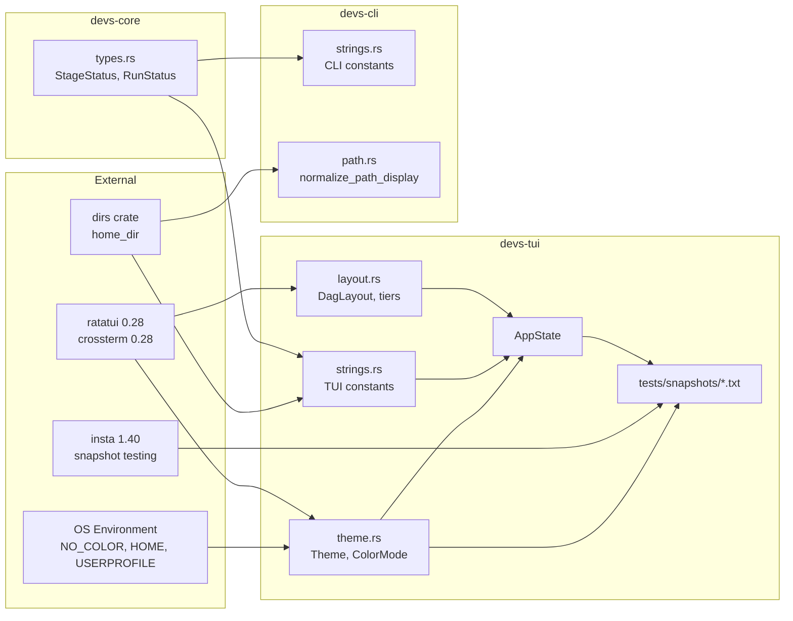
```mermaid
graph LR
    subgraph External
        ENV[OS Environment<br/>NO_COLOR, HOME, USERPROFILE]
        INSTA[insta 1.40<br/>snapshot testing]
        RATATUI[ratatui 0.28<br/>crossterm 0.28]
        DIRS[dirs crate<br/>home_dir]
    end

    subgraph devs-tui
        THEME[theme.rs<br/>Theme, ColorMode]
        STRINGS_TUI[strings.rs<br/>TUI constants]
        LAYOUT[layout.rs<br/>DagLayout, tiers]
        SNAP[tests/snapshots/*.txt]
        APPSTATE[AppState]
    end

    subgraph devs-cli
        STRINGS_CLI[strings.rs<br/>CLI constants]
        PATHUTIL[path.rs<br/>normalize_path_display]
    end

    subgraph devs-core
        TYPES[types.rs<br/>StageStatus, RunStatus]
    end

    ENV --> THEME
    THEME --> APPSTATE
    THEME --> SNAP
    INSTA --> SNAP
    RATATUI --> THEME
    RATATUI --> LAYOUT
    DIRS --> PATHUTIL
    DIRS --> STRINGS_TUI
    TYPES --> STRINGS_TUI
    TYPES --> STRINGS_CLI
    STRINGS_TUI --> APPSTATE
    LAYOUT --> APPSTATE
    APPSTATE --> SNAP
```

**Section 5 depends on:**
- §2 (TUI Component Architecture) — defines widgets that consume `Theme` and `strings.rs`
- §3 (CLI Command Interface) — defines CLI commands that use `strings.rs` and path utilities
- §4 (Navigation & Interaction Model) — defines keyboard events and focus model used by styling
- `devs-core::types` — `StageStatus`, `RunStatus` enum variants mapped to string constants

**Section 5 is depended upon by:**
- §6 (Data Models) — `DagLayout`, `LogBuffer`, `AppState` all reference constants from `strings.rs` and layout rules from §5.2
- §7 (Testing Strategy) — snapshot test infrastructure defined here
- `./do test` — snapshot divergence detection defined here (§5.4.2)

---

### 5.8 Acceptance Criteria

The following criteria are normative. Each MUST be covered by an automated test annotated `// Covers: UI-ARCH-<ID>` or `// Covers: AC-STYLE-NNN`.

- **[6_UI_UX_ARCHITECTURE-REQ-343]** When `NO_COLOR` is set to any non-empty string, `Theme::from_env()` returns `ColorMode::Monochrome`. (unit test)
- **[6_UI_UX_ARCHITECTURE-REQ-344]** When `NO_COLOR` is not set or is empty, `Theme::from_env()` returns `ColorMode::Color`. (unit test)
- **[6_UI_UX_ARCHITECTURE-REQ-345]** `Theme::stage_status_style(StageStatus::Running)` in `Monochrome` mode returns `Style::default()` (no color). (unit test)
- **[6_UI_UX_ARCHITECTURE-REQ-346]** `Theme::stage_status_style(StageStatus::Running)` in `Color` mode returns a style with `fg = Color::Yellow`. (unit test)
- **[6_UI_UX_ARCHITECTURE-REQ-347]** Every `STATUS_*` constant in `devs-tui/src/strings.rs` has exactly 4 bytes. (compile-time assert)
- **[6_UI_UX_ARCHITECTURE-REQ-348]** No file in `crates/devs-tui/src/` (except `strings.rs`) contains a string literal matching `"(not_found|invalid_argument|failed_precondition):"`; test scans source. (lint test)
- **[6_UI_UX_ARCHITECTURE-REQ-349]** No file in `crates/devs-cli/src/` (except `strings.rs`) contains a string literal matching the error prefix pattern. (lint test)
- **[6_UI_UX_ARCHITECTURE-REQ-350]** Rendering `DashboardTab` with a stage name of 21 characters produces a stage box with the name truncated to 19 chars + `~`. (TUI unit test with snapshot)
- **[6_UI_UX_ARCHITECTURE-REQ-351]** Rendering `DashboardTab` with a stage name of 20 characters produces a stage box with the name rendered without truncation. (TUI unit test with snapshot)
- **[6_UI_UX_ARCHITECTURE-REQ-352]** Stage box total width is exactly 41 columns for any stage name ≤ 20 chars and elapsed time ≤ 99 minutes. (TUI unit test, measured via `buffer_to_string`)
- **[6_UI_UX_ARCHITECTURE-REQ-353]** When terminal is 79×50, the TUI renders the "Terminal too small" message and nothing else. (TUI unit test with `TestBackend::new(79, 50)` + snapshot)
- **[6_UI_UX_ARCHITECTURE-REQ-354]** When terminal is 80×24, the TUI renders normal content (no "too small" message). (TUI unit test)
- **[6_UI_UX_ARCHITECTURE-REQ-355]** When terminal is 80×23, the TUI renders the "too small" message. (TUI unit test)
- **[6_UI_UX_ARCHITECTURE-REQ-356]** The "too small" message matches `FMT_TERMINAL_TOO_SMALL` with current terminal dimensions substituted. (TUI unit test)
- **[6_UI_UX_ARCHITECTURE-REQ-357]** `RunList` pane minimum width is 24 columns; when terminal is exactly 80 columns wide, `RunList` gets `max(24, floor(80 * 0.30)) = 24` columns. (TUI unit test)
- **[6_UI_UX_ARCHITECTURE-REQ-358]** All 11 required snapshots listed in §5.4.2 exist in `crates/devs-tui/tests/snapshots/`. (filesystem check in `./do test`)
- **[6_UI_UX_ARCHITECTURE-REQ-359]** No snapshot file contains `\r\n` line endings. (`./do test` checks and fails with WARN if present)
- **[6_UI_UX_ARCHITECTURE-REQ-360]** Running `./do test` with a diverged snapshot exits non-zero. (CI enforced; `INSTA_UPDATE` is not `always` in CI)
- **[6_UI_UX_ARCHITECTURE-REQ-361]** `normalize_path_display("C:\\Users\\dev\\project")` returns `"C:/Users/dev/project"`. (unit test)
- **[6_UI_UX_ARCHITECTURE-REQ-362]** `normalize_path_display("C:\\Users\\dev\\\\project")` returns `"C:/Users/dev/project"` (double slash collapsed). (unit test)
- **[6_UI_UX_ARCHITECTURE-REQ-363]** `normalize_path_display("//server/share")` preserves the leading `//`. (unit test)
- **[6_UI_UX_ARCHITECTURE-REQ-364]** CLI JSON-mode output always uses `\n` line endings on all platforms. (CLI E2E test, platform: Windows)
- **[6_UI_UX_ARCHITECTURE-REQ-365]** `./do` script contains no bash-specific syntax; verified by running it under `dash` or `sh --posix` in CI Linux job. (CI lint step)
- **[6_UI_UX_ARCHITECTURE-REQ-366]** `./do presubmit` exits with identical code on Linux, macOS, and Windows CI jobs for a clean repository. (GitLab CI matrix)
- **[6_UI_UX_ARCHITECTURE-REQ-367]** `buffer_to_string()` returns a string where every line is padded to exactly 200 chars with trailing spaces, and the total line count is exactly 50. (unit test)
- **[6_UI_UX_ARCHITECTURE-REQ-368]** `AppState::test_default()` is not reachable in `--release` builds; verified by `cargo build --release` completing without error after `#[cfg(test)]` gate. (CI build check)
- **[6_UI_UX_ARCHITECTURE-REQ-369]** In `Monochrome` mode, selected rows use `Modifier::REVERSED` and the cursor `>` character in column 0; no color is applied. (TUI unit test with snapshot)
- **[6_UI_UX_ARCHITECTURE-REQ-370]** The active tab label has `Modifier::BOLD` in both `Color` and `Monochrome` modes. (TUI unit test)
- **[6_UI_UX_ARCHITECTURE-REQ-371]** Log lines containing ANSI escape sequences (e.g. `\x1b[32m`) are rendered as literal text in `LogView`, not interpreted as colors. (TUI unit test with snapshot)
- **[6_UI_UX_ARCHITECTURE-REQ-372]** Elapsed time `0:05` is displayed as ` 0:05` (leading space for 5-char field). Elapsed time `10:00` is displayed as `10:00`. Elapsed time `100:00` causes the stage box to expand by 1 column. (TUI unit tests)

---

## 6. Data Models

This section defines every TUI-local and CLI-local data type. These types are projection types constructed from gRPC responses; they are defined in each interface crate and MUST NOT be imported by server-side crates.

### 6.1 TUI State Types

#### `RunSummary` — List-view projection (no `stage_runs`)

```rust
/// TUI-local projection of a WorkflowRun for list display.
/// Constructed from gRPC ListRunsResponse; stage_runs are NOT included.
pub struct RunSummary {
    pub run_id: Uuid,
    pub slug: String,                      // [a-z0-9-]+, max 128 chars
    pub workflow_name: String,
    pub project_id: Uuid,
    pub status: RunStatus,
    pub created_at: DateTime<Utc>,
    pub started_at: Option<DateTime<Utc>>,
    pub completed_at: Option<DateTime<Utc>>,
    pub active_stage_count: u32,           // stages with status Running
    pub total_stage_count: u32,
}
```

Field constraints:
- `slug` is displayed verbatim in `RunList`; truncated to 28 chars with trailing `~` if longer.
- `active_stage_count` is computed server-side before projection; the TUI never re-derives it.
- `started_at` / `completed_at` render as `M:SS` elapsed time; `None` renders as `--:--`.

**[6_UI_UX_ARCHITECTURE-REQ-373]** `RunSummary` MUST NOT embed `stage_runs`. `stage_runs` are loaded separately into `AppState::run_details` only when a run is selected.

#### `RunDetail` — Full run with stage list

```rust
/// Full run detail including all stage runs.
/// Loaded on demand when a run is selected in RunList.
pub struct RunDetail {
    pub run_id: Uuid,
    pub slug: String,
    pub workflow_name: String,
    pub project_id: Uuid,
    pub status: RunStatus,
    pub inputs: HashMap<String, serde_json::Value>,
    pub created_at: DateTime<Utc>,
    pub started_at: Option<DateTime<Utc>>,
    pub completed_at: Option<DateTime<Utc>>,
    pub stage_runs: Vec<StageSummary>,
    pub dag_layout: DagLayout,             // pre-computed at load time
}
```

**[6_UI_UX_ARCHITECTURE-REQ-374]** `dag_layout` is computed once when `RunDetail` is first loaded or when `stage_runs` changes. It is NOT recomputed on every render frame.

#### `StageSummary` — Stage display entry

```rust
pub struct StageSummary {
    pub stage_run_id: Uuid,
    pub stage_name: String,                // truncated to 20 chars with `~` in display
    pub attempt: u32,                      // 1-based
    pub status: StageStatus,
    pub agent_tool: Option<String>,
    pub pool_name: String,
    pub started_at: Option<DateTime<Utc>>,
    pub completed_at: Option<DateTime<Utc>>,
    pub exit_code: Option<i32>,
    pub depends_on: Vec<String>,           // stage names this stage depends on
}
```

#### `LogEntry` — Single buffered log line

```rust
pub struct LogEntry {
    pub sequence: u64,                     // monotonic sequence number from server, starts at 1
    pub stream: LogStream,                 // stdout or stderr
    pub line: String,                      // raw content, max 32 KiB; rendered verbatim
    pub timestamp: DateTime<Utc>,
}

pub enum LogStream {
    Stdout,
    Stderr,
}
```

#### `LogBuffer` — Fixed-capacity ring buffer

```rust
/// Ring buffer capped at 10,000 entries. Oldest entry evicted when full.
pub struct LogBuffer {
    pub entries: VecDeque<LogEntry>,       // capacity: 10_000
    pub total_received: u64,               // total lines ever received (for display of truncation)
    pub truncated: bool,                   // true once any eviction has occurred
}

impl LogBuffer {
    pub const CAPACITY: usize = 10_000;

    /// Insert a new entry. Evicts oldest if at capacity.
    pub fn push(&mut self, entry: LogEntry) { /* ... */ }
}
```

**[6_UI_UX_ARCHITECTURE-REQ-375]** `LogBuffer` is indexed in `AppState::log_buffers` by `(run_id: Uuid, stage_name: String)`. When the buffer reaches capacity, the oldest `LogEntry` (lowest sequence number) is evicted. The `total_received` counter still increments so the TUI can display `"Showing last 10000 of N lines"`.

#### `DagLayout` — Pre-computed DAG render layout

```rust
/// Pre-computed rendering layout for a workflow DAG.
pub struct DagLayout {
    pub tiers: Vec<DagTier>,               // ordered left-to-right by dependency depth
    pub max_tier_height: u16,              // tallest tier (in rows)
    pub total_width: u16,                  // total columns required (may exceed terminal)
    pub scroll_offset_x: u16,             // horizontal scroll offset (columns)
}

pub struct DagTier {
    pub depth: u32,                        // 0 = root stages; N = N hops from a root
    pub stages: Vec<DagStageBox>,
}

pub struct DagStageBox {
    pub stage_name: String,                // up to 20 chars; truncated with `~`
    pub status_label: [u8; 4],            // exactly 4 ASCII bytes, e.g. b"RUN "
    pub elapsed: Option<Duration>,         // None if not started
    pub incoming_edges: Vec<String>,       // stage names with arrows pointing into this box
}
```

**[6_UI_UX_ARCHITECTURE-REQ-376]** Tier depth is computed using longest-path-from-root algorithm:

```
fn compute_tier_depth(stages: &[StageDefinition]) -> HashMap<String, u32>:
    1. Build adjacency list: for each stage S, S.depends_on → S
    2. Compute in-degree for each stage
    3. BFS from stages with in-degree 0 (roots), setting depth = 0
    4. For each stage S in BFS order:
         depth[S] = max(depth[P] + 1 for P in S.depends_on), or 0 if no deps
    5. Stages at same depth are in the same DagTier
```

**[6_UI_UX_ARCHITECTURE-REQ-377]** Each stage box renders as: `[ stage-name | STAT | M:SS ]`

- Stage name: up to 20 chars; if longer, truncate to 19 chars and append `~`
- Status label: exactly 4 chars from the normative table in §2.1
- Elapsed time: `M:SS` where M is total minutes (may exceed 9); if not started, `--:--`
- Box width is fixed at: `4 + 20 + 3 + 4 + 3 + 5 + 2 = 41` columns: `[ ` + name(20) + ` | ` + status(4) + ` | ` + elapsed(5) + ` ]`

**[6_UI_UX_ARCHITECTURE-REQ-378]** Arrows between tiers render as `──►` (3 chars: `-->`  in ASCII: `\x2d\x2d\x3e`). The gutter between tiers is 5 columns wide. Arrows originate from the right edge of a source stage box and terminate at the left edge of the dependent stage box in the next tier.

#### `PoolSummary` — Pool state view

```rust
pub struct PoolSummary {
    pub name: String,
    pub max_concurrent: u32,
    pub active_count: u32,                 // agents currently running
    pub queued_count: u32,                 // stages waiting for a slot
    pub agents: Vec<AgentSummary>,
}

pub struct AgentSummary {
    pub tool: String,                      // "claude", "gemini", etc.
    pub capabilities: Vec<String>,
    pub fallback: bool,
    pub pty: bool,
    pub rate_limited_until: Option<DateTime<Utc>>,
    pub is_rate_limited: bool,             // true if rate_limited_until > now
}
```

#### `TuiEvent` — Unified event type

```rust
pub enum TuiEvent {
    /// Keyboard or mouse event from crossterm
    CrosstermEvent(crossterm::event::Event),
    /// Run state change pushed from gRPC StreamRunEvents
    RunEvent(RunEvent),
    /// Pool state change pushed from gRPC WatchPoolState
    PoolEvent(PoolEvent),
    /// gRPC stream disconnected; triggers reconnect logic
    StreamDisconnected { reason: String },
    /// Reconnect attempt succeeded
    ReconnectSucceeded { server_addr: String },
    /// Reconnect attempt failed (intermediate failure)
    ReconnectFailed { attempt: u32, next_retry_in: Duration },
    /// Terminal was resized
    Resize { cols: u16, rows: u16 },
}
```

**[6_UI_UX_ARCHITECTURE-REQ-379]** `TuiEvent` is the sole input to the `App::handle_event(&mut AppState, TuiEvent)` function. All state mutations go through this function. Render is called exactly once after each `handle_event` call.

#### `ConnectionStatus`

```rust
pub enum ConnectionStatus {
    /// Actively connected to the server
    Connected { server_addr: String },
    /// Lost connection; attempting to reconnect
    Reconnecting {
        server_addr: String,
        attempt: u32,
        started_at: Instant,
        next_retry_at: Instant,
    },
    /// Reconnect timed out; TUI will exit
    Disconnected { server_addr: String, reason: String },
}
```

**[6_UI_UX_ARCHITECTURE-REQ-380]** The reconnect backoff schedule for `ConnectionStatus::Reconnecting` is:

| Attempt | Delay before next attempt |
|---|---|
| 1 | 1 s |
| 2 | 2 s |
| 3 | 4 s |
| 4 | 8 s |
| 5 | 16 s |
| 6+ | 30 s (capped) |

Total reconnect time is measured from the first `StreamDisconnected` event. After 30 seconds of cumulative reconnect time, a final 5-second grace period is granted. If still disconnected after `30s + 5s = 35s` from first disconnect, the TUI transitions to `Disconnected`, renders the disconnect message, and exits with code 1.

### 6.2 CLI Output Types

All CLI output types implement both `TextFormatter` and `JsonFormatter` via the `Formatter` trait. JSON representations use the serialization rules from the project-wide data model (lowercase enum strings, RFC 3339 timestamps, `null` for absent optionals).

#### `SubmitOutput`

```rust
pub struct SubmitOutput {
    pub run_id: Uuid,
    pub slug: String,
    pub workflow_name: String,
    pub project_id: Uuid,
    pub status: String,   // always "pending" immediately after submit
}
```

Text format: `Submitted run '{slug}' (run_id: {run_id})`

#### `RunListItem`

```rust
pub struct RunListItem {
    pub run_id: Uuid,
    pub slug: String,
    pub workflow_name: String,
    pub status: String,
    pub created_at: DateTime<Utc>,
    pub started_at: Option<DateTime<Utc>>,
    pub completed_at: Option<DateTime<Utc>>,
}
```

Text format: aligned table with columns `RUN_ID`, `SLUG`, `WORKFLOW`, `STATUS`, `CREATED`, `ELAPSED`.

#### `RunStatusOutput`

```rust
pub struct RunStatusOutput {
    pub run_id: Uuid,
    pub slug: String,
    pub workflow_name: String,
    pub project_id: Uuid,
    pub status: String,
    pub inputs: HashMap<String, serde_json::Value>,
    pub created_at: DateTime<Utc>,
    pub started_at: Option<DateTime<Utc>>,
    pub completed_at: Option<DateTime<Utc>>,
    pub stage_runs: Vec<StageStatusItem>,
}

pub struct StageStatusItem {
    pub stage_name: String,
    pub attempt: u32,
    pub status: String,
    pub agent_tool: Option<String>,
    pub started_at: Option<DateTime<Utc>>,
    pub completed_at: Option<DateTime<Utc>>,
    pub exit_code: Option<i32>,
}
```

#### `ControlOutput` — cancel/pause/resume

```rust
pub struct ControlOutput {
    pub run_id: Uuid,
    pub slug: String,
    pub operation: String,    // "cancelled", "paused", "resumed"
    pub status: String,       // new RunStatus after the operation
}
```

Text format: `Run '{slug}' {operation}.`

#### `SecurityCheckOutput`

```rust
pub struct SecurityCheckOutput {
    pub schema_version: u32,              // always 1
    pub checked_at: DateTime<Utc>,
    pub overall_passed: bool,
    pub checks: Vec<SecurityCheckItem>,
}

pub struct SecurityCheckItem {
    pub check_id: String,
    pub description: String,
    pub status: String,                   // "pass" | "warn" | "error"
    pub detail: Option<String>,
    pub remediation: Option<String>,
}
```

---

## 7. CLI Command API Contracts

Each CLI command maps to one or more gRPC RPCs. This section specifies the exact RPC, required flags, optional flags, output format, and error cases for every command.

### 7.1 `devs submit`

**Purpose:** Submit a new workflow run.

**Flags:**

| Flag | Type | Required | Description |
|---|---|---|---|
| `<workflow>` | positional string | yes | Workflow name as defined in `devs.toml` or `.devs/workflows/` |
| `--name <run-name>` | string | no | User-provided run name; auto-generated slug if absent |
| `--input <key=value>` | repeatable | no | Workflow input parameters; `=` splits on first occurrence |
| `--project <name>` | string | conditional | Required when CWD matches 0 or 2+ registered projects |
| `--wait` | bool flag | no | Block until run reaches terminal status; exit 0 on Completed, 1 on Failed/Cancelled |
| `--format json\|text` | string | no | Output format; default `text` |
| `--server <host:port>` | string | no | Override server discovery |

**gRPC call:** `RunService.SubmitRun`

**Request schema:**
```json
{
  "workflow_name": "string",
  "run_name": "string | null",
  "project_id": "UUID4 | null",
  "inputs": { "key": "value" }
}
```

**Success response (text):** `Submitted run 'slug' (run_id: UUID)`

**Success response (JSON):**
```json
{
  "run_id": "UUID4",
  "slug": "workflow-name-YYYYMMDD-xxxx",
  "workflow_name": "string",
  "project_id": "UUID4",
  "status": "pending"
}
```

**Error cases and exit codes:**

| Condition | Exit Code | Error Prefix |
|---|---|---|
| Server unreachable | 3 | `server_unreachable:` |
| Workflow not found | 2 | `not_found:` |
| Missing required input | 4 | `invalid_argument:` |
| Duplicate run name (non-cancelled) | 4 | `already_exists:` |
| Server shutting down | 1 | `failed_precondition:` |
| CWD matches 0 or 2+ projects | 4 | `invalid_argument:` |
| `--project` references unknown project | 2 | `not_found:` |

**[6_UI_UX_ARCHITECTURE-REQ-381]** `--input key=value` splits on the FIRST `=` only. `--input expr=a=b` sets input `expr` to the string `"a=b"`. If `key` contains no `=`, the CLI exits with code 4.

**[6_UI_UX_ARCHITECTURE-REQ-382]** When `--wait` is specified, the CLI subscribes to `RunService.StreamRunEvents` after submission and blocks until the run reaches a terminal state (`Completed`, `Failed`, `Cancelled`). Exit code: 0 for `Completed`, 1 for `Failed`/`Cancelled`.

### 7.2 `devs list`

**Purpose:** List workflow runs.

**Flags:**

| Flag | Type | Required | Description |
|---|---|---|---|
| `--project <name>` | string | no | Filter by project name |
| `--status <status>` | string | no | Filter by status (comma-separated: `running,failed`) |
| `--limit <n>` | u32 | no | Maximum results; default 100; server cap 100 |
| `--format json\|text` | string | no | Output format |
| `--server <host:port>` | string | no | Override server discovery |

**gRPC call:** `RunService.ListRuns`

**Success response (text):** Aligned table with columns:
```
RUN_ID                               SLUG                              WORKFLOW   STATUS     CREATED              ELAPSED
550e8400-e29b-41d4-a716-446655440000 my-workflow-20260311-abc1        my-workflow running    2026-03-11 10:00:00  0:42
```

**Success response (JSON):**
```json
{
  "runs": [
    {
      "run_id": "UUID4",
      "slug": "string",
      "workflow_name": "string",
      "project_id": "UUID4",
      "status": "running",
      "created_at": "2026-03-11T10:00:00.000Z",
      "started_at": "2026-03-11T10:00:01.000Z",
      "completed_at": null
    }
  ],
  "total": 1
}
```

**[6_UI_UX_ARCHITECTURE-REQ-383]** `devs list` returns at most 100 results sorted by `created_at` descending. `stage_runs` are NOT included. `--limit` values above 100 are silently capped to 100.

### 7.3 `devs status`

**Purpose:** Show full status for a single run including all stages.

**Flags:**

| Flag | Type | Required | Description |
|---|---|---|---|
| `<run>` | positional string | yes | Run ID (UUID4) or slug |
| `--format json\|text` | string | no | Output format |
| `--server <host:port>` | string | no | Override server discovery |

**gRPC call:** `RunService.GetRun`

**Run ID resolution:** UUID4 format → resolve as `run_id`. Otherwise resolve as slug. UUID takes precedence on collision.

**Success response (text):**
```
Run: my-workflow-20260311-abc1 (550e8400-...)
Status: running
Started: 2026-03-11 10:00:01 (0:42 elapsed)

STAGE           ATTEMPT  STATUS  AGENT    STARTED              ELAPSED  EXIT
plan            1        DONE    claude   2026-03-11 10:00:02  0:15     0
implement-api   1        RUN     opencode 2026-03-11 10:00:18  0:25     -
implement-ui    1        RUN     opencode 2026-03-11 10:00:18  0:25     -
```

**Success response (JSON):** Full `RunStatusOutput` schema (see §6.2).

**Error cases:**

| Condition | Exit Code |
|---|---|
| Run not found (by ID or slug) | 2 |
| Server unreachable | 3 |
| Ambiguous slug (two runs match, non-UUID input) | 1 (returns first match, logs warning) |

### 7.4 `devs logs`

**Purpose:** Fetch or stream logs for a run or a specific stage.

**Flags:**

| Flag | Type | Required | Description |
|---|---|---|---|
| `<run>` | positional string | yes | Run ID or slug |
| `[stage]` | positional string | no | Stage name; omit for combined log of all stages |
| `--follow` | bool flag | no | Stream live; exit when run reaches terminal state |
| `--attempt <n>` | u32 | no | Stage attempt number; default is latest |
| `--from <seq>` | u64 | no | Start from sequence number N; default 1 |
| `--format json\|text` | string | no | Output format (text: raw lines; JSON: `LogEntry` array) |
| `--server <host:port>` | string | no | Override server discovery |

**gRPC call:** `LogService.FetchLogs` (without `--follow`) or `LogService.StreamLogs` (with `--follow`)

**Text output:** Raw log lines prefixed with `[stdout]` or `[stderr]` in mixed-stage mode; no prefix when a specific stage is given.

**JSON output (without `--follow`):**
```json
{
  "entries": [
    {
      "sequence": 1,
      "stream": "stdout",
      "line": "string",
      "timestamp": "2026-03-11T10:00:02.000Z"
    }
  ],
  "truncated": false,
  "total_lines": 42
}
```

**`--follow` behavior:**
- Streams chunks as HTTP chunked transfer from server
- Exits code 0 when run reaches `Completed`
- Exits code 1 when run reaches `Failed` or `Cancelled`
- Exits code 3 if server connection drops during streaming

**[6_UI_UX_ARCHITECTURE-REQ-384]** When `--follow` is used on a stage that has not yet started (status `Pending`, `Waiting`, or `Eligible`), the CLI holds the connection open until the stage starts. If the run is cancelled before the stage starts, the final output is empty and exit code is 1.

### 7.5 `devs cancel`

**Purpose:** Cancel a running or paused workflow run.

**Flags:**

| Flag | Type | Required | Description |
|---|---|---|---|
| `<run>` | positional string | yes | Run ID or slug |
| `--format json\|text` | string | no | Output format |
| `--server <host:port>` | string | no | Override server discovery |

**gRPC call:** `RunService.CancelRun`

**Success response (text):** `Run 'slug' cancelled.`

**Success response (JSON):**
```json
{ "run_id": "UUID4", "slug": "string", "operation": "cancelled", "status": "cancelled" }
```

**Error cases:**

| Condition | Exit Code |
|---|---|
| Run not found | 2 |
| Run already in terminal state | 4 (`failed_precondition:`) |
| Server unreachable | 3 |

### 7.6 `devs pause`

**Purpose:** Pause a running workflow run or individual stage.

**Flags:**

| Flag | Type | Required | Description |
|---|---|---|---|
| `<run>` | positional string | yes | Run ID or slug |
| `--stage <name>` | string | no | If given, pause only this stage |
| `--format json\|text` | string | no | Output format |
| `--server <host:port>` | string | no | Override server discovery |

**gRPC calls:** `RunService.PauseRun` (no `--stage`) or `StageService.PauseStage` (with `--stage`)

**[6_UI_UX_ARCHITECTURE-REQ-385]** Pausing a run sends `devs:pause\n` to all currently Running stages and holds all Eligible/Waiting stages from dispatch. Stages that are already Completed, Failed, or Cancelled are unaffected.

### 7.7 `devs resume`

**Purpose:** Resume a paused workflow run or individual stage.

**Flags:**

| Flag | Type | Required | Description |
|---|---|---|---|
| `<run>` | positional string | yes | Run ID or slug |
| `--stage <name>` | string | no | If given, resume only this stage |
| `--format json\|text` | string | no | Output format |
| `--server <host:port>` | string | no | Override server discovery |

**gRPC calls:** `RunService.ResumeRun` or `StageService.ResumeStage`

**[6_UI_UX_ARCHITECTURE-REQ-386]** Resuming a run sends `devs:resume\n` to all Paused stages and releases all held Eligible stages for dispatch.

### 7.8 `devs project add`

**Flags:**

| Flag | Type | Required | Description |
|---|---|---|---|
| `<path>` | positional path | yes | Filesystem path to the project git repository |
| `--name <name>` | string | no | Human name; defaults to `basename(path)` |
| `--priority <n>` | u32 | no | Scheduling priority; lower value = higher priority; default 100 |
| `--weight <n>` | u32 | no | Weighted fair queue weight; ≥ 1; default 1 |
| `--checkpoint-branch <branch>` | string | no | Git branch for checkpoints; default `devs/state` |
| `--workflow-dir <dir>` | repeatable path | no | Additional directories to scan for workflow files |
| `--format json\|text` | string | no | Output format |
| `--server <host:port>` | string | no | Override server discovery |

**gRPC call:** `ProjectService.AddProject`

**[6_UI_UX_ARCHITECTURE-REQ-387]** `devs project add` rejects `--weight 0` with exit code 4 and message `invalid_argument: weight must be at least 1`.

**[6_UI_UX_ARCHITECTURE-REQ-388]** The `<path>` argument is resolved to an absolute canonical path on the client before sending to the server. The server stores the canonical path.

### 7.9 `devs project remove`

**Flags:**

| Flag | Type | Required | Description |
|---|---|---|---|
| `<name-or-id>` | positional | yes | Project name or project UUID |
| `--force` | bool flag | no | Remove even if active runs exist; active runs complete, no new submissions accepted |
| `--format json\|text` | string | no | Output format |

**gRPC call:** `ProjectService.RemoveProject`

**[6_UI_UX_ARCHITECTURE-REQ-389]** Without `--force`, if the project has any `Running` or `Paused` runs, the command exits with code 4 and message `failed_precondition: project has N active runs; use --force to remove anyway`.

### 7.10 `devs project list`

**gRPC call:** `ProjectService.ListProjects`

**Success response (JSON):**
```json
{
  "projects": [
    {
      "project_id": "UUID4",
      "name": "string",
      "repo_path": "string",
      "priority": 100,
      "weight": 1,
      "checkpoint_branch": "devs/state",
      "status": "active"
    }
  ]
}
```

### 7.11 `devs security-check`

**Purpose:** Run security checks against `devs.toml` and `projects.toml` without requiring a live server.

**Flags:**

| Flag | Type | Required | Description |
|---|---|---|---|
| `--config <path>` | path | no | Path to `devs.toml`; default `./devs.toml` |
| `--format json\|text` | string | no | Output format |

**Exit codes:** 0 = all checks pass, 1 = any check warns, 3 = file parse error.

**[6_UI_UX_ARCHITECTURE-REQ-390]** `devs security-check` does NOT connect to the server. It reads `devs.toml` and `projects.toml` directly from disk. It MUST NOT require a running `devs` server process.

**Success response (JSON):** Full `SecurityCheckOutput` schema (see §6.2).

---

## 8. Error Handling & Edge Cases

### 8.1 TUI Edge Cases

**EC-TUI-001: Terminal resize below minimum (80×24)**

- **Trigger:** User resizes terminal to fewer than 80 columns or 24 rows at any time.
- **Behavior:** The TUI MUST render exactly one message on the first line: `"Terminal too small: 80x24 minimum required (current: WxH)"` where W and H are the actual dimensions. All other rendering is suppressed.
- **Recovery:** When the terminal is resized back above the minimum, normal rendering resumes immediately on the next `Resize` event.
- **[6_UI_UX_ARCHITECTURE-REQ-391]** This check runs at the start of every render call, before any layout computation.

**EC-TUI-002: DAG wider than available columns**

- **Trigger:** The computed `DagLayout.total_width` exceeds the available columns in `DashboardTab`.
- **Behavior:** The DAG is horizontally scrollable. The current scroll offset is stored in `AppState` as part of `RunDetail::dag_layout.scroll_offset_x`. Left/Right arrow keys adjust scroll when the DAG is focused. A scroll indicator `"< scroll >"` is shown in the status area of the DAG pane.
- **[6_UI_UX_ARCHITECTURE-REQ-392]** Scroll offset MUST NOT exceed `max(0, total_width - available_columns)`.

**EC-TUI-003: Log buffer reaches 10,000 lines**

- **Trigger:** `LogBuffer::push()` is called when `entries.len() == CAPACITY`.
- **Behavior:** The oldest entry (lowest sequence number) is evicted. `truncated` is set to `true`. `total_received` continues to increment. The bottom of the `LogPane` renders `"[Log truncated — showing last 10000 of N lines]"` when `truncated == true`.
- **[6_UI_UX_ARCHITECTURE-REQ-393]** The on-disk log file is never affected by TUI buffer eviction.

**EC-TUI-004: gRPC stream drops during active monitoring**

- **Trigger:** `StreamRunEvents` gRPC call returns an error or the connection drops.
- **Behavior:** A `TuiEvent::StreamDisconnected` is sent to the event loop. `ConnectionStatus` transitions to `Reconnecting`. `StatusBar` renders `RECONNECTING`. The run list and details remain visible with stale data. A banner `"[Reconnecting… attempt N]"` appears in the StatusBar.
- **Recovery:** On successful reconnect, the TUI re-subscribes to `StreamRunEvents` and `WatchPoolState` and requests a fresh snapshot via `RunService.GetRun` for the selected run.

**EC-TUI-005: Event received for unknown run_id**

- **Trigger:** A `RunEvent` arrives with a `run_id` not in `AppState::runs`.
- **Behavior:** The TUI adds a new `RunSummary` entry to `AppState::runs` from the event data. It does NOT discard the event. The run appears in the list as if it was submitted while the TUI was watching.

**EC-TUI-006: gRPC `StreamRunEvents` initial snapshot missing**

- **Trigger:** Reconnect completes but the first message from `StreamRunEvents` does not have `event_type == "run.snapshot"`.
- **Behavior:** The TUI treats the message as a delta event, logs a `tracing::warn!` internally, and continues. It does NOT crash or disconnect again.

**EC-TUI-007: Render with zero runs**

- **Trigger:** `AppState::runs` is empty (server has no workflow runs yet).
- **Behavior:** `RunList` renders an empty-state message: `"No runs yet. Use 'devs submit' to start a workflow."`. `RunDetail` pane renders empty (no content). `DagView` renders empty (no stage boxes). No crash or panic occurs.

### 8.2 CLI Edge Cases

**EC-CLI-001: Run identifier is ambiguous**

- **Trigger:** User supplies a string that is not UUID4 format and it matches multiple runs as a slug.
- **Behavior:** The first match (by `created_at` descending) is returned. The CLI emits a `WARN`-level message to stderr (text mode): `"Warning: slug 'x' matches multiple runs; using most recent."` In `--format json` mode, the warning is omitted; only the result is returned.

**EC-CLI-002: `--input` value contains `=`**

- **Trigger:** `--input expr=a=b`
- **Behavior:** Input key is `expr`, value is `a=b`. Splitting on the FIRST `=` only.
- **Negative case:** `--input noequals` (no `=` present) → exit code 4, error: `invalid_argument: --input value must be in 'key=value' format`.

**EC-CLI-003: `devs logs --follow` — server disconnects mid-stream**

- **Trigger:** The gRPC `StreamLogs` connection drops before the run reaches a terminal state.
- **Behavior:** The CLI prints `"Error: server_unreachable: connection lost during log streaming"` to stderr (or stdout in `--format json` mode). Exits with code 3. It does NOT automatically reconnect.

**EC-CLI-004: `devs submit` while server is shutting down**

- **Trigger:** User submits a run during the SIGTERM shutdown window.
- **gRPC response:** `FAILED_PRECONDITION` with message `"failed_precondition: server is shutting down"`.
- **CLI behavior:** Exits with code 4. Error: `failed_precondition: server is shutting down`.

**EC-CLI-005: `devs cancel` on an already-terminal run**

- **Trigger:** Run is already `Completed`, `Failed`, or `Cancelled`.
- **gRPC response:** `FAILED_PRECONDITION`.
- **CLI behavior:** Exits with code 4. Error: `failed_precondition: run is already in terminal state 'completed'`.

**EC-CLI-006: `devs status` on a run with no stages dispatched yet**

- **Trigger:** Run is in `Pending` status; no stages have started.
- **Behavior:** Exits code 0. Stage table is empty. Text output includes `"Status: pending — waiting for scheduler"`.

**EC-CLI-007: Invalid `--format` value**

- **Trigger:** `devs list --format xml`
- **Behavior:** `clap` rejects this at parse time with error `error: invalid value 'xml' for '--format <FORMAT>': must be 'json' or 'text'`. Exits with code 4. clap error messages go to stderr; `--format json` is not yet active at this point (output is not JSON).

### 8.3 MCP Bridge Edge Cases

**EC-BRIDGE-001: Malformed JSON on stdin**

- **Trigger:** A line on stdin that is not valid JSON is received.
- **Behavior:** The bridge writes to stdout: `{"result":null,"error":"invalid_argument: request is not valid JSON"}` followed by a newline. It does NOT exit; it continues reading the next line.

**EC-BRIDGE-002: Server returns HTTP 413**

- **Trigger:** The forwarded request body exceeds 1 MiB.
- **Behavior:** The bridge reads the HTTP error response and writes to stdout: `{"result":null,"error":"resource_exhausted: request body too large (max 1 MiB)"}` followed by a newline.

**EC-BRIDGE-003: Chunked stream (`stream_logs follow:true`) — server closes early**

- **Trigger:** The server closes the chunked HTTP stream before sending `{"done":true}`.
- **Behavior:** The bridge writes the final partial line it has (if any), then writes: `{"result":null,"error":"internal: stream closed before done signal"}` followed by a newline. It does NOT exit; it continues reading the next request from stdin.

**EC-BRIDGE-004: Discovery file does not exist at startup**

- **Trigger:** Neither `DEVS_DISCOVERY_FILE` nor `~/.config/devs/server.addr` exists when the bridge starts.
- **Behavior:** The bridge writes `{"result":null,"error":"server_unreachable: discovery file not found","fatal":true}` to stdout and exits with code 1.

**EC-BRIDGE-005: `ServerService.GetInfo` call fails during startup**

- **Trigger:** Discovery file exists and provides a gRPC address, but the `GetInfo` call times out or returns an error.
- **Behavior:** The bridge writes `{"result":null,"error":"server_unreachable: failed to obtain MCP port from server","fatal":true}` to stdout and exits with code 1.

**EC-BRIDGE-006: Large stdin line (> 1 MiB)**

- **Trigger:** A single stdin line exceeds 1 MiB.
- **Behavior:** The bridge reads and discards the line. Writes `{"result":null,"error":"resource_exhausted: request line too large (max 1 MiB)"}` to stdout and continues.

---

## 9. State Transitions

### 9.1 TUI Connection State Machine

```mermaid
stateDiagram-v2
    [*] --> Connecting : startup

    Connecting --> Connected : gRPC stream established
    Connecting --> Connecting : retry within 35s window
    Connecting --> Exiting : 35s timeout exceeded

    Connected --> Reconnecting : StreamDisconnected event
    Connected --> Exiting : user presses q / Ctrl+C

    Reconnecting --> Connected : reconnect succeeded
    Reconnecting --> Reconnecting : retry (backoff 1s→30s)
    Reconnecting --> Exiting : 35s cumulative timeout

    Exiting --> [*] : exit code 1 (timeout) or 0 (user quit)
```

**[6_UI_UX_ARCHITECTURE-REQ-394]** The 35-second reconnect window (30s backoff + 5s grace) is measured as a wall-clock `Instant` captured at the first `StreamDisconnected` event. Each retry attempt checks `now > timeout_deadline` before scheduling the next attempt.

**[6_UI_UX_ARCHITECTURE-REQ-395]** When transitioning `Reconnecting → Connected`, the TUI MUST:
1. Re-subscribe to `RunService.StreamRunEvents`
2. Re-subscribe to `PoolService.WatchPoolState`
3. If a run is selected (`AppState::selected_run_id` is `Some`), call `RunService.GetRun` to refresh stale data
4. Clear the `"[Reconnecting]"` banner from `StatusBar`

### 9.2 TUI Application State Machine

```mermaid
stateDiagram-v2
    [*] --> NormalView : startup complete

    NormalView --> HelpOverlay : user presses ?
    HelpOverlay --> NormalView : any key press

    NormalView --> Tab_Dashboard : key 1 or Tab cycles to it
    NormalView --> Tab_Logs : key 2 or Tab cycles to it
    NormalView --> Tab_Debug : key 3 or Tab cycles to it
    NormalView --> Tab_Pools : key 4 or Tab cycles to it

    Tab_Dashboard --> ConfirmCancel : user presses c (run selected)
    ConfirmCancel --> Tab_Dashboard : user presses Esc
    ConfirmCancel --> Tab_Dashboard : user presses Enter (issues CancelRun gRPC)

    NormalView --> TooSmall : terminal < 80x24
    TooSmall --> NormalView : terminal resized ≥ 80x24
    TooSmall --> Exiting : user presses q / Ctrl+C
    NormalView --> Exiting : user presses q / Ctrl+C
```

**[6_UI_UX_ARCHITECTURE-REQ-396]** The `ConfirmCancel` state requires explicit user confirmation before issuing a destructive gRPC call. A confirmation prompt renders in place of the normal StatusBar content: `"Cancel run 'slug'? [Enter] to confirm, [Esc] to abort"`.

**[6_UI_UX_ARCHITECTURE-REQ-397]** Pause (`p`) and resume (`r`) keys do NOT require confirmation. They issue the gRPC call immediately on keypress when a run is selected.

### 9.3 DagView Tier Calculation Algorithm

The tier calculation runs once when `RunDetail` is first loaded and again each time a new `StageRun` status update causes a structural change (new stage discovered). It does NOT re-run on every status update.

```
Algorithm: longest_path_tiers(stages: &[StageDefinition]) -> Vec<DagTier>

Input:  list of stage definitions with depends_on sets
Output: ordered list of DagTiers, left-to-right by dependency depth

1. Build adjacency list (successor map):
   predecessors[S] = { P | S in P.depends_on }

2. Compute depth[S] using topological order (Kahn's algorithm):
   a. Enqueue all stages with empty depends_on (roots); set depth[S] = 0
   b. Process queue:
      - Pop stage S
      - For each successor T of S (T.depends_on contains S):
          depth[T] = max(depth[T], depth[S] + 1)
          Decrement T.in_degree; enqueue T when in_degree == 0

3. Group stages by depth value into DagTier structs

4. Within each tier, sort stages lexicographically by stage_name

5. Return Vec<DagTier> sorted by ascending depth

Total complexity: O(V + E) where V = stages, E = total depends_on edges.
```

**[6_UI_UX_ARCHITECTURE-REQ-398]** If the workflow definition contains a cycle (which should have been rejected at submission, but may occur in a recovered malformed checkpoint), the tier calculation MUST detect the cycle (unreached stages after Kahn's traversal) and render those stages in a final tier labeled `[CYCLE DETECTED]`. The TUI MUST NOT panic.

### 9.4 CLI Streaming State Machine

```mermaid
stateDiagram-v2
    [*] --> Connecting : devs logs --follow invoked

    Connecting --> Streaming : gRPC stream opened
    Connecting --> Exited_3 : server unreachable

    Streaming --> Streaming : receive log chunk, print to stdout
    Streaming --> Exited_0 : run status = Completed
    Streaming --> Exited_1 : run status = Failed or Cancelled
    Streaming --> Exited_3 : connection dropped

    Exited_0 --> [*] : exit code 0
    Exited_1 --> [*] : exit code 1
    Exited_3 --> [*] : exit code 3
```

**[6_UI_UX_ARCHITECTURE-REQ-399]** The CLI does NOT attempt to reconnect during `devs logs --follow`. A dropped connection is a terminal error (exit code 3). The user must re-run the command to resume streaming.

### 9.5 MCP Bridge Per-Request State Machine

```mermaid
stateDiagram-v2
    [*] --> ReadingLine : stdin ready

    ReadingLine --> ValidatingJSON : line received
    ReadingLine --> Exiting : stdin EOF

    ValidatingJSON --> ForwardingHTTP : JSON valid
    ValidatingJSON --> WritingError : JSON invalid → write error, loop back

    ForwardingHTTP --> ReadingResponse : HTTP request sent
    ForwardingHTTP --> WritingError : HTTP connection error

    ReadingResponse --> WritingResponse : full response received
    ReadingResponse --> StreamingChunks : chunked response detected

    StreamingChunks --> StreamingChunks : write each chunk line to stdout
    StreamingChunks --> WritingResponse : {"done":true} received
    StreamingChunks --> WritingError : stream closed early

    WritingResponse --> ReadingLine : write response + newline to stdout
    WritingError --> ReadingLine : write error + newline to stdout

    Exiting --> [*] : exit 0
```

**[6_UI_UX_ARCHITECTURE-REQ-400]** The bridge processes requests sequentially (one at a time). It does NOT multiplex concurrent requests. A slow `stream_logs` request blocks subsequent requests until the stream completes. This is consistent with the stdio transport model.

---

## 10. Testing Strategy

### 10.1 TUI Testing

**[6_UI_UX_ARCHITECTURE-REQ-401]** All TUI tests use `ratatui::backend::TestBackend` at a fixed size of 200 columns × 50 rows. Pixel-level rendering comparison is prohibited. Tests compare the rendered text buffer character-by-character using `insta 1.40` snapshot assertions.

**[6_UI_UX_ARCHITECTURE-REQ-402]** Snapshot files are stored at `crates/devs-tui/tests/snapshots/<test_name>.txt`. Each snapshot is a plain UTF-8 file containing the exact rendered terminal output. Snapshot updates require explicit review (`cargo insta review`); auto-approval is prohibited.

**[6_UI_UX_ARCHITECTURE-REQ-403]** Each TUI test sets up an `AppState` programmatically, renders through a `TestBackend`, and asserts on the rendered output. Tests do NOT require a running server. gRPC calls are mocked via `mockall`.

**Required TUI snapshot tests:**

| Test Name | What It Asserts |
|---|---|
| `test_dashboard_empty_state` | RunList empty message; DagView empty; StatusBar connected |
| `test_dashboard_single_running_run` | RunList one entry; DagView with stages in RUN  status |
| `test_dashboard_dag_parallel_stages` | Two stages at same tier rendered side-by-side |
| `test_dashboard_dag_deep_dependency_chain` | Linear 5-stage chain at 5 tiers |
| `test_status_bar_reconnecting` | StatusBar shows RECONNECTING |
| `test_status_bar_disconnected` | StatusBar shows DISCONNECTED |
| `test_help_overlay` | Help keybinding table rendered; underlying content visible |
| `test_logs_tab_buffer_truncation` | Truncation message shown when buffer is full |
| `test_pools_tab_rate_limited_agent` | Rate-limited agent shown with `[RATE LIMITED]` annotation |
| `test_terminal_too_small_80x24` | Exactly the minimum-size message rendered |
| `test_terminal_too_small_below_minimum` | Message shows actual terminal size |
| `test_stage_name_truncation` | Stage name > 20 chars truncated with `~` |
| `test_no_color_env_suppresses_ansi` | No ANSI escape sequences in output when `NO_COLOR` set |
| `test_dag_scroll_indicator` | Scroll indicator shown when DAG is wider than terminal |
| `test_confirm_cancel_prompt` | Confirmation prompt in StatusBar when pressing `c` |

**[6_UI_UX_ARCHITECTURE-REQ-404]** TUI tests MUST assert on specific text content, not just "no panic". Every test MUST include at least one `insta::assert_snapshot!` call.

**[6_UI_UX_ARCHITECTURE-REQ-405]** Tests for `ConnectionStatus` transitions do not require snapshot tests; they use plain Rust `assert_eq!` assertions on the `AppState::connection_status` field.

### 10.2 CLI Testing

**[6_UI_UX_ARCHITECTURE-REQ-406]** CLI E2E tests use `assert_cmd 2.0` to invoke the `devs` binary as a subprocess. Tests start a real `devs` server on a random ephemeral port, set `DEVS_DISCOVERY_FILE` to a unique temp path, and exercise all CLI commands via binary invocation.

**[6_UI_UX_ARCHITECTURE-REQ-407]** Each CLI E2E test function sets a unique `DEVS_DISCOVERY_FILE` path in a temporary directory to prevent address conflicts between parallel test instances.

**Required CLI E2E tests (minimum):**

| Test Name | Covers |
|---|---|
| `test_submit_success` | `devs submit`, exit code 0, JSON output |
| `test_submit_missing_required_input` | exit code 4, `invalid_argument:` prefix |
| `test_submit_duplicate_run_name` | exit code 4, `already_exists:` prefix |
| `test_list_empty` | `devs list`, zero results, valid JSON |
| `test_list_with_runs` | `devs list`, multiple results, table format |
| `test_status_running_run` | `devs status`, stage table output |
| `test_status_not_found` | exit code 2, `not_found:` prefix |
| `test_logs_fetch_no_follow` | `devs logs`, exits 0, prints buffered lines |
| `test_logs_follow_completes` | `devs logs --follow`, exits 0 on completion |
| `test_cancel_running_run` | `devs cancel`, exits 0, run transitions to cancelled |
| `test_cancel_already_terminal` | exit code 4, `failed_precondition:` prefix |
| `test_pause_and_resume` | `devs pause` then `devs resume`, state transitions verified |
| `test_project_add_remove` | full project lifecycle |
| `test_server_unreachable` | exit code 3, `server_unreachable:` prefix |
| `test_format_json_all_commands` | `--format json` returns parseable JSON for every command |
| `test_format_json_error` | errors in `--format json` mode go to stdout, not stderr |
| `test_input_key_value_split_on_first_equals` | `--input expr=a=b` → key `expr`, value `a=b` |
| `test_security_check_no_server` | `devs security-check` works without server running |

**[6_UI_UX_ARCHITECTURE-REQ-408]** Every CLI E2E test is annotated `// Covers: <REQ-ID>` for at least one requirement in the specification. This annotation feeds `target/traceability.json`.

### 10.3 MCP Bridge Testing

**[6_UI_UX_ARCHITECTURE-REQ-409]** MCP bridge E2E tests invoke `devs-mcp-bridge` as a subprocess, write JSON-RPC requests to its stdin, and read responses from its stdout. A real `devs` server runs in the background.

**Required MCP bridge E2E tests (minimum):**

| Test Name | Covers |
|---|---|
| `test_bridge_list_runs` | Valid JSON-RPC request → valid response |
| `test_bridge_malformed_json` | Non-JSON input → structured error, bridge continues |
| `test_bridge_stream_logs_follow` | Chunked response forwarded line-by-line |
| `test_bridge_server_not_running` | Discovery file absent → `fatal:true`, exits 1 |
| `test_bridge_large_request` | >1 MiB input → `resource_exhausted:` error, bridge continues |

**[6_UI_UX_ARCHITECTURE-REQ-410]** MCP bridge tests MUST use `POST /mcp/v1/call` via the bridge binary, never via direct HTTP calls. This ensures the E2E coverage gate (QG-005) counts lines executed through the actual bridge code path.

### 10.4 Coverage Gate Attribution

**[6_UI_UX_ARCHITECTURE-REQ-411]** Coverage gate QG-003 (CLI E2E ≥ 50%) is satisfied exclusively by tests that invoke the `devs` CLI binary as a subprocess via `assert_cmd`. Unit tests of CLI helper functions do NOT count toward this gate.

**[6_UI_UX_ARCHITECTURE-REQ-412]** Coverage gate QG-004 (TUI E2E ≥ 50%) is satisfied by tests using `ratatui::backend::TestBackend` that exercise the full `App::handle_event → render` cycle. Tests that call internal TUI widget functions without going through the render cycle do NOT count toward this gate.

**[6_UI_UX_ARCHITECTURE-REQ-413]** Coverage gate QG-005 (MCP E2E ≥ 50%) is satisfied by tests that POST to `/mcp/v1/call` via the running MCP server. Tests calling MCP tool handler functions directly as Rust functions do NOT count toward this gate.

---

## 11. Dependencies

### 11.1 This Section Depends On

| Component | Reason |
|---|---|
| `devs-core` domain types | All three interface crates import `devs-core` for `WorkflowRun`, `StageRun`, `RunStatus`, `StageStatus`, and related types |
| `devs-proto` gRPC generated types | TUI and CLI use `tonic`-generated request/response types |
| gRPC server (`devs-grpc`) | TUI and CLI connect over gRPC; server must be running for all commands except `security-check` |
| MCP HTTP server (`devs-mcp`) | `devs-mcp-bridge` forwards requests; MCP server must be running |
| Server discovery file | Written by `devs-server`; read by all clients for auto-discovery |
| `ServerService.GetInfo` gRPC RPC | Used by `devs-mcp-bridge` to obtain the MCP port at startup |
| `RunService.StreamRunEvents` | TUI uses this streaming RPC for real-time updates |
| `PoolService.WatchPoolState` | TUI Pools tab uses this streaming RPC |
| `LogService.StreamLogs` | TUI LogsTab and `devs logs --follow` use this RPC |

### 11.2 Other Sections That Depend On This

| Section | Reason |
|---|---|
| MCP and AI Development Design (§3) | AI agents interact via `devs-mcp-bridge` (stdio bridge) or direct MCP HTTP |
| Security Design (§5) | File permission requirements apply to discovery file and prompt files; `NO_COLOR` and ANSI stripping requirements originate here |
| TAS §4 (`devs-tui`, `devs-cli`, `devs-mcp-bridge` crates) | Dependency graph and module structure |
| User Features (§4, §7) | User features specification cross-references TUI keybindings and CLI exit codes defined here |

---

## 12. Acceptance Criteria

All acceptance criteria below are testable by automated tests. Each MUST be annotated `// Covers: AC-UI-NNN` in the test source.

**Interface Architecture**

- **[6_UI_UX_ARCHITECTURE-REQ-414]** `cargo tree -p devs-tui --edges normal` contains no references to `devs-scheduler`, `devs-pool`, `devs-executor`, or `devs-adapters`.
- **[6_UI_UX_ARCHITECTURE-REQ-415]** `cargo tree -p devs-cli --edges normal` contains no references to `devs-scheduler`, `devs-pool`, `devs-executor`, or `devs-adapters`.
- **[6_UI_UX_ARCHITECTURE-REQ-416]** `cargo tree -p devs-mcp-bridge --edges normal` contains no references to `devs-grpc`, `devs-mcp`, `devs-scheduler`, `devs-pool`, `devs-executor`, or `devs-adapters`.

**TUI Rendering**

- **[6_UI_UX_ARCHITECTURE-REQ-417]** When `AppState::terminal_size` is `(79, 24)`, the rendered output is exactly `"Terminal too small: 80x24 minimum required (current: 79x24)"` and no other content.
- **[6_UI_UX_ARCHITECTURE-REQ-418]** When `AppState::terminal_size` is `(80, 23)`, the rendered output contains `"current: 80x23"`.
- **[6_UI_UX_ARCHITECTURE-REQ-419]** Stage name `"a-very-long-stage-name-exceeding-twenty"` renders as `"a-very-long-stage-name~"` in `DagView`.
- **[6_UI_UX_ARCHITECTURE-REQ-420]** A stage with `StageStatus::Running` renders with the label `"RUN "` (4 chars, trailing space) in `DagView`.
- **[6_UI_UX_ARCHITECTURE-REQ-421]** All 9 `StageStatus` variants render as the corresponding 4-char label from the normative table in §2.1.
- **[6_UI_UX_ARCHITECTURE-REQ-422]** `DagView` uses only ASCII characters in the range U+0020–U+007E for structural elements (arrows, borders, box characters).
- **[6_UI_UX_ARCHITECTURE-REQ-423]** When `NO_COLOR` environment variable is set to any non-empty value, no ANSI escape sequences (`\x1b[`) appear in the rendered output.
- **[6_UI_UX_ARCHITECTURE-REQ-424]** The `HelpOverlay` renders when `?` is pressed and is dismissed by any subsequent keypress.
- **[6_UI_UX_ARCHITECTURE-REQ-425]** `StatusBar` shows exactly `"CONNECTED"` when `ConnectionStatus::Connected`, `"RECONNECTING"` when `ConnectionStatus::Reconnecting`, and `"DISCONNECTED"` when `ConnectionStatus::Disconnected`.
- **[6_UI_UX_ARCHITECTURE-REQ-426]** When `AppState::runs` is empty, `RunList` renders the empty-state message.
- **[6_UI_UX_ARCHITECTURE-REQ-427]** `LogBuffer::push` on a full buffer (10,000 entries) evicts the entry with the lowest sequence number and increments `total_received`.
- **[6_UI_UX_ARCHITECTURE-REQ-428]** `LogPane` renders the truncation message `"[Log truncated"` when `LogBuffer::truncated == true`.
- **[6_UI_UX_ARCHITECTURE-REQ-429]** DAG stage boxes render with the format `[ name | STAT | M:SS ]`, and the elapsed column renders `"--:--"` when `started_at` is `None`.
- **[6_UI_UX_ARCHITECTURE-REQ-430]** Two stages at the same tier depth are rendered in the same column of the DAG.
- **[6_UI_UX_ARCHITECTURE-REQ-431]** When `DagLayout::total_width > available_columns`, a scroll indicator `"< scroll >"` is visible in the DAG pane.
- **[6_UI_UX_ARCHITECTURE-REQ-432]** TUI re-renders within 50ms of receiving a `RunEvent` from the gRPC stream (tested with a mock event injected into the channel).
- **[6_UI_UX_ARCHITECTURE-REQ-433]** All TUI snapshot tests pass with `cargo insta test` on a clean checkout with no pending snapshot updates.

**TUI Connection & Reconnect**

- **[6_UI_UX_ARCHITECTURE-REQ-434]** After `StreamDisconnected`, `ConnectionStatus` transitions to `Reconnecting`.
- **[6_UI_UX_ARCHITECTURE-REQ-435]** After 35 seconds of cumulative reconnect time without success, the TUI exits with code 1.
- **[6_UI_UX_ARCHITECTURE-REQ-436]** On successful reconnect, `ConnectionStatus` transitions to `Connected` and the `"[Reconnecting]"` banner disappears.
- **[6_UI_UX_ARCHITECTURE-REQ-437]** Reconnect backoff follows the schedule 1s→2s→4s→8s→16s→30s(cap), verifiable from `ConnectionStatus::Reconnecting::next_retry_at` values.
- **[6_UI_UX_ARCHITECTURE-REQ-438]** Pressing `q` exits the TUI with code 0 regardless of connection status.

**CLI Exit Codes**

- **[6_UI_UX_ARCHITECTURE-REQ-439]** `devs status <unknown-id>` exits with code 2.
- **[6_UI_UX_ARCHITECTURE-REQ-440]** `devs submit` with server not running exits with code 3.
- **[6_UI_UX_ARCHITECTURE-REQ-441]** `devs submit` with missing required input exits with code 4.
- **[6_UI_UX_ARCHITECTURE-REQ-442]** `devs submit` with duplicate run name exits with code 4.
- **[6_UI_UX_ARCHITECTURE-REQ-443]** `devs cancel` on a completed run exits with code 4.
- **[6_UI_UX_ARCHITECTURE-REQ-444]** A successful `devs submit` exits with code 0.
- **[6_UI_UX_ARCHITECTURE-REQ-445]** `devs logs --follow` exits code 0 when the monitored run completes.
- **[6_UI_UX_ARCHITECTURE-REQ-446]** `devs logs --follow` exits code 1 when the monitored run fails.

**CLI Output Format**

- **[6_UI_UX_ARCHITECTURE-REQ-447]** `devs list --format json` produces valid JSON parseable as `{"runs": [...], "total": n}`.
- **[6_UI_UX_ARCHITECTURE-REQ-448]** `devs status --format json` produces valid JSON parseable as `RunStatusOutput`.
- **[6_UI_UX_ARCHITECTURE-REQ-449]** `devs submit --format json` on failure produces `{"error": "<prefix>: <detail>", "code": n}` to stdout (not stderr).
- **[6_UI_UX_ARCHITECTURE-REQ-450]** In `--format json` mode, stderr is empty for all commands (errors go to stdout as JSON).
- **[6_UI_UX_ARCHITECTURE-REQ-451]** Error messages in all modes begin with one of the 10 machine-stable prefixes from §5.1.

**CLI Behaviors**

- **[6_UI_UX_ARCHITECTURE-REQ-452]** `devs submit --input expr=a=b` sets input key `expr` to value `"a=b"` (splits on first `=` only).
- **[6_UI_UX_ARCHITECTURE-REQ-453]** `devs submit --input badvalue` (no `=`) exits with code 4.
- **[6_UI_UX_ARCHITECTURE-REQ-454]** Server discovery uses `--server` flag before `DEVS_SERVER` env before discovery file.
- **[6_UI_UX_ARCHITECTURE-REQ-455]** `devs security-check` exits 0 with default config when all 7 checks pass.
- **[6_UI_UX_ARCHITECTURE-REQ-456]** `devs security-check` exits 1 when any check produces a warning.
- **[6_UI_UX_ARCHITECTURE-REQ-457]** `devs security-check` operates without a running server (does NOT connect to gRPC).
- **[6_UI_UX_ARCHITECTURE-REQ-458]** `devs project add --weight 0` exits with code 4 and error `invalid_argument: weight must be at least 1`.

**MCP Bridge**

- **[6_UI_UX_ARCHITECTURE-REQ-459]** `devs-mcp-bridge` forwards a valid `list_runs` JSON-RPC request and returns a valid JSON response on stdout.
- **[6_UI_UX_ARCHITECTURE-REQ-460]** Sending non-JSON to bridge stdin returns `{"result":null,"error":"invalid_argument: request is not valid JSON"}` and the bridge continues processing subsequent lines.
- **[6_UI_UX_ARCHITECTURE-REQ-461]** When discovery file is absent, bridge exits with code 1 and `"fatal":true` in output.
- **[6_UI_UX_ARCHITECTURE-REQ-462]** Bridge does NOT create any TCP listener (verified by checking open file descriptors after startup).
- **[6_UI_UX_ARCHITECTURE-REQ-463]** `stream_logs follow:true` chunked response is forwarded line-by-line (first chunk appears on stdout before stream ends).

**Platform Compatibility**

- **[6_UI_UX_ARCHITECTURE-REQ-464]** `devs list` produces identical exit codes on Linux, macOS, and Windows Git Bash CI runners.
- **[6_UI_UX_ARCHITECTURE-REQ-465]** `./do` script passes `sh -n` (POSIX `sh` syntax check) with no errors.
- **[6_UI_UX_ARCHITECTURE-REQ-466]** All file paths in CLI output use forward-slash notation on all platforms.

**Strings and i18n Preparation**

- **[6_UI_UX_ARCHITECTURE-REQ-467]** No string literal for a user-visible message appears outside of `strings.rs` in `devs-tui` or `devs-cli` (enforced by a `grep` in `./do lint`).

**TUI Tests**

- **[6_UI_UX_ARCHITECTURE-REQ-468]** `cargo test -p devs-tui` completes without any snapshot mismatches (no `.new` snapshot files remain after the run).
- **[6_UI_UX_ARCHITECTURE-REQ-469]** TUI test binary does not make any real network connections (verified by `mockall`-based gRPC mocking).

**Confirm Destructive Actions**

- **[6_UI_UX_ARCHITECTURE-REQ-470]** Pressing `c` in `DashboardTab` renders a confirmation prompt before issuing `CancelRun` gRPC call.
- **[6_UI_UX_ARCHITECTURE-REQ-471]** Pressing `Esc` during the confirmation prompt cancels the action and returns to normal view without issuing any gRPC call.

**Traceability**

- **[6_UI_UX_ARCHITECTURE-REQ-472]** `./do test` generates `target/traceability.json` with `overall_passed: true` when all AC-UI-NNN criteria have at least one covering test.
- **[6_UI_UX_ARCHITECTURE-REQ-473]** `./do coverage` produces a QG-003 gate with `actual_pct ≥ 50.0` computed exclusively from CLI E2E tests invoked via binary subprocess.
