# UI/UX Design System: `devs`

**Document ID:** 7_UI_UX_DESIGN
**Version:** 1.0
**Scope:** TUI (`devs-tui`), CLI (`devs-cli`), and MCP bridge (`devs-mcp-bridge`) visual language, interaction model, and design token system.
**Platform constraint:** Terminal-native interfaces only. No GUI, no web renderer, no pixel canvas. All rendering is character-cell-based via `ratatui 0.28` + `crossterm 0.28`.

---

## 1. Design System Philosophy & Aesthetic

### 1.1 Core Principles

**[UI-DES-001]** **Clarity over decoration.** Every visual element must communicate state or structure. Decorative characters that carry no semantic meaning are prohibited.

**[UI-DES-002]** **ASCII-first universality.** All structural rendering uses ASCII characters U+0020–U+007E exclusively. Unicode box-drawing characters (`─ │ ┌ └`), block elements (`█ ▓`), and emoji are prohibited in all structural positions (DAG borders, status labels, progress indicators, table borders). This ensures correct rendering across xterm, VTE, Windows Console, and tmux.

**[UI-DES-003]** **Color is additive, never load-bearing.** Every state, status, or alert must be distinguishable by text label or ASCII symbol alone. Color is a secondary enhancement. When `NO_COLOR` is set, the interface must be fully operable with zero information loss.

**[UI-DES-004]** **Predictable information density.** The dashboard layout is fixed and non-configurable at MVP. Column widths, pane splits, and tier gutters use deterministic sizing rules defined in this document. No dynamic reflow that changes structural layout.

**[UI-DES-005]** **Machine-readable CLI output.** The CLI is designed equally for human operators and AI agent consumers. All commands expose `--format json` output using stable, versioned schemas. Error prefixes are machine-stable (see §5).

**[UI-DES-006]** **Consistent temporal representation.** Elapsed times are always expressed as `M:SS` (minutes:seconds), zero-padded seconds, no upper bound on minutes. Timestamps in structured output use RFC 3339 with millisecond precision and `Z` suffix.

**[UI-DES-007]** **Minimal cognitive load for monitoring.** The primary use case is observing running AI agent workflows. The interface prioritizes live status, log tail, and failure signals at the top of the visual hierarchy.

### 1.2 Design Constraints

**[UI-DES-008]** Minimum supported terminal size: **80 columns × 24 rows**. Below this, the TUI renders only a size warning and nothing else.

**[UI-DES-009]** The design system applies to three delivery surfaces:
- `devs-tui` — interactive full-screen Ratatui dashboard
- `devs-cli` — line-oriented terminal output (text and JSON modes)
- `devs-mcp-bridge` — JSON-RPC stdio proxy (no user-visible rendering; design applies to error messages only)

**[UI-DES-010]** English-only at MVP. All user-visible strings are defined as `pub const &'static str` in a `strings.rs` module per crate, enabling future i18n extraction without source changes.

### 1.3 Design Token System

The design token system is the concrete implementation of the core principles. It defines where user-visible strings live, how they are named, and what invariants they must satisfy. Tokens are compile-time constants — not runtime-configurable values — that express the full vocabulary of the interface across all three delivery surfaces.

**[UI-DES-PHI-001]** Every user-visible string — including status labels, error messages, column headers, keybinding descriptions, help text, and confirmation prompts — MUST be defined as a `pub const &'static str` in a `strings.rs` module within the owning crate. No inline string literal is permitted in widget `render()` methods, command handlers, or output formatters. This rule is enforced by the strings hygiene check in `./do lint` (see §1.7).

The `strings.rs` module in each crate exports constants organized by the following naming prefix convention:

| Prefix | Scope | Example Constants |
|---|---|---|
| `STATUS_` | Stage/run status 4-char display labels | `STATUS_PEND`, `STATUS_RUN_`, `STATUS_DONE` |
| `ERR_` | Error messages beginning with a machine-stable prefix | `ERR_NOT_FOUND`, `ERR_VALIDATION` |
| `TAB_` | Tab bar label text | `TAB_DASHBOARD`, `TAB_LOGS`, `TAB_DEBUG`, `TAB_POOLS` |
| `KEY_` | Keybinding descriptions shown in the help overlay | `KEY_CANCEL`, `KEY_PAUSE`, `KEY_RESUME` |
| `HELP_` | Help overlay section headers and body text | `HELP_TITLE`, `HELP_NAVIGATION` |
| `COL_` | CLI table column header text | `COL_RUN_ID`, `COL_STATUS`, `COL_WORKFLOW` |
| `STATUS_BAR_` | Status bar label text | `STATUS_BAR_CONNECTED`, `STATUS_BAR_RECONNECTING` |
| `CMD_` | CLI subcommand names as string literals | `CMD_SUBMIT`, `CMD_CANCEL`, `CMD_LOGS` |
| `ARG_` | CLI argument and flag name strings | `ARG_FORMAT`, `ARG_SERVER`, `ARG_FOLLOW` |
| `FMT_` | Output format specifier strings | `FMT_JSON`, `FMT_TEXT` |
| `MSG_` | Informational messages not covered by other prefixes | `MSG_TERMINAL_TOO_SMALL`, `MSG_DISCONNECTED` |

**[UI-DES-PHI-002]** All `STATUS_*` constants that represent stage or run status display labels MUST be exactly 4 bytes of ASCII. This invariant is enforced by both a compile-time `const` assertion block and a runtime unit test in `crates/devs-tui/src/strings.rs`:

```rust
// In crates/devs-tui/src/strings.rs

/// Stage status: not yet queued.
pub const STATUS_PEND: &str = "PEND";
/// Stage status: waiting on dependencies.
pub const STATUS_WAIT: &str = "WAIT";
/// Stage status: eligible for dispatch.
pub const STATUS_ELIG: &str = "ELIG";
/// Stage status: actively running. Trailing space is intentional.
pub const STATUS_RUN_: &str = "RUN ";
/// Stage status: paused by operator.
pub const STATUS_PAUS: &str = "PAUS";
/// Stage status: completed successfully.
pub const STATUS_DONE: &str = "DONE";
/// Stage status: failed.
pub const STATUS_FAIL: &str = "FAIL";
/// Stage status: timed out.
pub const STATUS_TIME: &str = "TIME";
/// Stage status: cancelled.
pub const STATUS_CANC: &str = "CANC";

// Compile-time invariant: every stage status label is exactly 4 bytes.
const _: () = {
    assert!(STATUS_PEND.len() == 4);
    assert!(STATUS_WAIT.len() == 4);
    assert!(STATUS_ELIG.len() == 4);
    assert!(STATUS_RUN_.len() == 4);
    assert!(STATUS_PAUS.len() == 4);
    assert!(STATUS_DONE.len() == 4);
    assert!(STATUS_FAIL.len() == 4);
    assert!(STATUS_TIME.len() == 4);
    assert!(STATUS_CANC.len() == 4);
};
```

**[UI-DES-PHI-003]** All `ERR_` constants MUST begin with exactly one of the ten machine-stable error prefixes defined in §5 of this document (`not_found:`, `invalid_argument:`, `already_exists:`, `failed_precondition:`, `resource_exhausted:`, `server_unreachable:`, `internal:`, `cancelled:`, `timeout:`, `permission_denied:`). The strings hygiene check in `./do lint` scans all `.rs` source files outside of `strings.rs` modules and fails if any string literal matching the error prefix pattern is found inline.

**[UI-DES-PHI-004]** The `devs-mcp-bridge` crate has a `strings.rs` module containing only `ERR_` and `MSG_` constants for connection loss, parse failure, and startup errors. It has no `STATUS_`, `TAB_`, `KEY_`, `COL_`, or visual layout constants, because the bridge performs no visual rendering.

### 1.4 Surface-Specific Design Rules

The three delivery surfaces share the same core design principles but apply them differently based on their output model. This section specifies the per-surface rules that are not shared across all three.

#### 1.4.1 TUI Surface (`devs-tui`)

The TUI is the primary monitoring interface. It is event-driven, renders to a fixed character grid, and must not perform any I/O inside `render()` calls. The design system's "clarity over decoration" and "minimal cognitive load" principles manifest most directly here.

**[UI-DES-PHI-005]** The `render()` method of every widget MUST complete within **16 milliseconds** (one frame budget at approximately 60 fps). No filesystem access, system calls, heap allocation proportional to content size (e.g., constructing new `Vec` or `String` inside render), or blocking operations are permitted inside `render()`. All data must be pre-computed and stored in `AppState` before render time. This constraint is validated by the unit test suite using `std::time::Instant` to measure `render()` duration against a 16 ms ceiling on representative test states.

**[UI-DES-PHI-006]** The TUI handles three categories of terminal input events:
- **Navigation keys**: arrow keys, Tab, digit keys (1–4 for direct tab selection)
- **Action keys**: `c` (cancel), `p` (pause), `r` (resume), `q` (quit), `Esc` (back/deselect), `?` (toggle help)
- **Control keys**: `Ctrl+C` (quit)

Unrecognized key events are silently consumed with no visible output, no error message, and no state change. This prevents visual noise from accidental keystrokes during monitoring sessions. The `HelpOverlay`, when visible, consumes ALL keys except `?`, `Esc`, `q`, and `Ctrl+C`.

**[UI-DES-PHI-007]** ANSI escape sequences in agent log output MUST be stripped before insertion into `LogBuffer`. The raw content (with ANSI intact) is preserved in `LogLine::raw_content` for disk-level log files; only the stripped content in `LogLine::content` is rendered. The stripping algorithm is defined in §1.6 of this document.

**[UI-DES-PHI-008]** At terminal sizes below 80×24, the TUI MUST render only the minimum-terminal-size warning message. No tab bar, status bar, DAG view, log pane, or any other widget is rendered. Rendering of the full interface resumes immediately when the terminal is resized above the threshold, on the next `Resize` event from crossterm. The warning message uses no color, no modifiers, and no structural characters beyond alphanumeric text, spaces, `x` (as dimension separator), and `:`.

#### 1.4.2 CLI Surface (`devs-cli`)

The CLI is designed with dual consumers in mind: human operators who read text output and AI agents that parse JSON output. The design system's "machine-readable CLI output" principle (UI-DES-005) governs all CLI design decisions.

**[UI-DES-PHI-009]** In `--format text` mode, the CLI uses aligned columns for tabular output (run list, stage list, pool list). Column widths are computed from the widest value in the current response, not fixed globally. Values that exceed a column's computed width are truncated to `N-3` characters with `...` (three ASCII full stops) appended, where N is the column width. No line-wrapping occurs.

**[UI-DES-PHI-010]** In `--format json` mode, ALL output — including error messages — goes to stdout. Nothing is written to stderr. The format for all error responses is:
```json
{"error": "<machine-stable-prefix>: <detail>", "code": <exit-code-integer>}
```
This allows AI agents to parse all outcomes without stderr handling. The `code` field contains the integer exit code the process will exit with (0, 1, 2, 3, or 4 as defined in §6).

**[UI-DES-PHI-011]** Color is never used in CLI output in either text or JSON mode. The CLI does not read `NO_COLOR`. All visual differentiation in text mode uses column alignment, separator characters (e.g., `---` under column headers), and the machine-stable error prefix vocabulary.

**[UI-DES-PHI-012]** CLI streaming operations (e.g., `devs logs --follow`) use no spinner characters, no progress bars, and no cursor-movement ANSI sequences. Output is purely sequential newline-delimited lines. Each log line is appended as received; the final line on completion is a one-line status summary. This ensures output can be safely captured, piped, or parsed by AI agents.

#### 1.4.3 MCP Bridge Surface (`devs-mcp-bridge`)

The bridge is a transparent JSON-RPC proxy. It has no visual interface; its design constraints are limited to error message structure and output fidelity.

**[UI-DES-PHI-013]** The bridge writes to stdout only, never to stderr. All output — forwarded responses, error conditions, and the fatal connection-loss message — is newline-delimited JSON, one object per line. The connection-loss message has the fixed schema:

```json
{"result": null, "error": "server_unreachable: connection to devs MCP server lost", "fatal": true}
```

The `"fatal": true` field distinguishes this terminal error from recoverable tool-level errors, enabling AI agents to detect it without inspecting the error string.

**[UI-DES-PHI-014]** The bridge MUST NOT buffer responses. Each response line is flushed to stdout immediately after receipt. This ensures AI agents connected via the bridge receive real-time feedback during streaming operations (`stream_logs follow:true`). Stream chunks are forwarded line-by-line as they arrive from the MCP HTTP chunked response.

### 1.5 `NO_COLOR` Environment Detection

The `NO_COLOR` standard specifies that any non-empty value for the `NO_COLOR` environment variable disables ANSI color output. `devs-tui` implements this standard with the following precise semantics, ensuring identical behavior across terminal emulators, CI environments, and operator shell configurations.

**[UI-DES-PHI-015]** The `Theme::from_env()` function applies the following logic, which is the sole point of `NO_COLOR` detection in the entire codebase:

```rust
impl Theme {
    /// Constructs a Theme by reading the NO_COLOR environment variable.
    ///
    /// Any non-empty value for NO_COLOR activates Monochrome mode.
    /// An absent or empty-string value activates Color mode.
    /// This function is called exactly once per process lifetime.
    pub fn from_env() -> Self {
        let color_mode = match std::env::var("NO_COLOR") {
            Ok(val) if !val.is_empty() => ColorMode::Monochrome,
            _ => ColorMode::Color,
        };
        Theme { color_mode }
    }
}
```

**[UI-DES-PHI-016]** `Theme::from_env()` is called exactly once per TUI process lifetime, during `App::new()` initialization. The resulting `Theme` value is stored immutably in `AppState` and never re-read from the environment during the process lifetime. Live changes to `NO_COLOR` after startup have no effect.

**[UI-DES-PHI-017]** `Theme::from_env()` is the sole location in the entire codebase that reads `NO_COLOR`. No widget struct, tab, layout function, or render utility reads `NO_COLOR` directly. All theme-dependent rendering decisions accept a `&Theme` reference parameter. Violations of this rule are detected by the strings hygiene lint.

The color mode initialization follows this state machine:

```mermaid
stateDiagram-v2
    [*] --> ReadEnv : App::new() called
    ReadEnv --> Color : NO_COLOR absent OR empty string
    ReadEnv --> Monochrome : NO_COLOR is any non-empty string
    Color --> Frozen : Theme stored in AppState (immutable for process lifetime)
    Monochrome --> Frozen : Theme stored in AppState (immutable for process lifetime)
    Frozen --> [*] : App exits
```

**[UI-DES-PHI-018]** In `ColorMode::Monochrome`, exactly two `ratatui::style::Modifier` values are permitted: `BOLD` (for active tab label and terminal-state status labels) and `REVERSED` (for selected list rows and the help overlay). All other modifiers — `ITALIC`, `UNDERLINED`, `BLINK`, `RAPID_BLINK`, `CROSSED_OUT`, `DIM` — are prohibited in both color modes. Colors are expressed via `ratatui::style::Color` variants, never via modifier combinations.

**Edge cases for `NO_COLOR` detection:**

| Input | Result | Rationale |
|---|---|---|
| `NO_COLOR` absent | `ColorMode::Color` | Standard: unset = color enabled |
| `NO_COLOR=""` (empty string) | `ColorMode::Color` | Empty string treated as absent per implementation |
| `NO_COLOR=1` | `ColorMode::Monochrome` | Any non-empty value triggers monochrome |
| `NO_COLOR=0` | `ColorMode::Monochrome` | `"0"` is non-empty; standard does not define a "re-enable" value |
| `NO_COLOR=false` | `ColorMode::Monochrome` | String `"false"` is non-empty; same rule |
| `NO_COLOR` changed mid-session | No effect | Theme is frozen at startup; restart required |

### 1.6 Permitted ASCII Character Set

The ASCII-first principle (UI-DES-002) is enforced by restricting structural rendering to a formally defined character inventory. Characters not in this set are prohibited in structural positions. This section is the normative reference for implementing the DAG view, help overlay, status bar, and all other structural elements.

**[UI-DES-PHI-019]** The complete permitted character inventory for each structural context is:

#### Stage Box (DAG View)

Total box width: 41 columns. Format: `[ <name:20> | <STAT:4> | <time:5> ]`

| Position | Character | Code Point | Notes |
|---|---|---|---|
| Box open | `[` | U+005B | Left square bracket |
| Box close | `]` | U+005D | Right square bracket |
| Space after `[` | ` ` | U+0020 | 1 space |
| Space before `]` | ` ` | U+0020 | 1 space |
| Field separator | `\|` | U+007C | Vertical bar, surrounded by 1 space each side |
| Name padding | ` ` | U+0020 | Right-pad name field to 20 chars |
| Truncation marker | `~` | U+007E | Tilde, replaces last char of overlong name |
| Time digit | `0`–`9` | U+0030–U+0039 | Decimal digits |
| Time separator | `:` | U+003A | Colon |
| Time unstarted | `-` | U+002D | Hyphen-minus, appears as `--:--` |
| Time right-pad | ` ` | U+0020 | Right-pad elapsed to 5 chars when M < 10 |

#### Tier Gutter (DAG Arrows)

Total gutter width: 5 columns. Format: `  --> ` (2 spaces + arrow head + 1 space)

| Position | Character | Code Point | Notes |
|---|---|---|---|
| Lead spaces | ` ` | U+0020 | 2 spaces before arrow on the arrow row |
| Connector | `-` | U+002D | Repeated for horizontal runs |
| Arrow head | `>` | U+003E | Greater-than sign |
| Trail space | ` ` | U+0020 | 1 space after arrow head |
| Non-arrow rows | ` ` | U+0020 | 5 spaces (blank gutter) |

#### Help Overlay Border

| Position | Character | Code Point | Notes |
|---|---|---|---|
| Corner | `+` | U+002B | Plus sign at all 4 corners |
| Horizontal border | `-` | U+002D | Hyphen-minus, repeated |
| Vertical border | `\|` | U+007C | Vertical bar |
| Interior padding | ` ` | U+0020 | 1 space inside border |

#### Status Bar

The status bar uses only alphanumeric characters, spaces, `/`, `:`, `.`, and the connection status label constants from `strings.rs`. No box characters.

#### Terminal-Too-Small Warning

The warning uses only alphanumeric characters (the word characters in the template string), spaces, `x` (dimension separator), `:`, `(`, `)`. No box characters, no color, no modifiers.

**[UI-DES-PHI-020]** The `render_utils::strip_ansi(input: &str) -> String` function removes ANSI CSI escape sequences from log output. The function implements the following deterministic 3-state machine:

```
State: Normal
  - ESC byte (0x1B) → transition to Escape; do NOT emit this byte
  - Any other byte  → emit byte to output; remain in Normal

State: Escape
  - '[' (0x5B) → transition to Csi; do NOT emit this byte
  - Any other byte  → emit byte to output; transition to Normal

State: Csi
  - ASCII letter in range 0x40–0x7E → do NOT emit this byte; transition to Normal
  - Any other byte → do NOT emit this byte; remain in Csi
```

Input bytes that are not part of any escape sequence pass through unmodified. The function is pure (no side effects) and deterministic. It MUST NOT allocate a new `String` if the input contains no ESC bytes; returning a `Cow<str>` is the preferred implementation to avoid unnecessary allocation in the common case of clean log output.

**[UI-DES-PHI-021]** Carriage return characters (`\r`, U+000D) in log content are normalized during `LogBuffer` insertion:
- `\r\n` sequence → `\n` (carriage return removed, newline preserved)
- Standalone `\r` not followed by `\n` → removed entirely (not replaced with newline)

This prevents terminal cursor-control artifacts in the log display. The normalization is applied after ANSI stripping.

### 1.7 Design System Integrity Enforcement

The design principles are enforced through automated tooling integrated into `./do lint` and the test suite, not through developer discipline alone. This section specifies the exact enforcement mechanisms.

**[UI-DES-PHI-022]** `./do lint` includes a **strings hygiene check** executed after `cargo fmt --check` and `cargo clippy`. It scans all `.rs` source files in `crates/devs-tui/src/`, `crates/devs-cli/src/`, and `crates/devs-mcp-bridge/src/` for inline string literals containing machine-stable error prefixes outside of `strings.rs` files. Any match causes `./do lint` to exit non-zero and print the violating file path, line number, and matched text to stderr.

The check uses the following POSIX `sh` implementation (part of `./do`):

```sh
# Strings hygiene check (POSIX sh; part of ./do lint)
_PREFIXES='not_found:|invalid_argument:|already_exists:|failed_precondition:|resource_exhausted:|server_unreachable:|internal:|cancelled:|timeout:|permission_denied:'
_DIRS='crates/devs-tui/src crates/devs-cli/src crates/devs-mcp-bridge/src'
_VIOLATIONS=$(grep -rn --include="*.rs" -E "\"(${_PREFIXES})" ${_DIRS} \
    | grep -v '/strings\.rs:')
if [ -n "$_VIOLATIONS" ]; then
    printf 'strings hygiene: inline error prefix literals found outside strings.rs:\n%s\n' \
        "$_VIOLATIONS" >&2
    exit 1
fi
```

**[UI-DES-PHI-023]** A unit test in `crates/devs-tui/src/strings.rs` asserts that all `STATUS_*` stage label constants are exactly 4 bytes at runtime (in addition to the compile-time `const` block). This redundancy ensures the constraint is captured in coverage metrics and explicitly tied to the requirement identifier:

```rust
#[cfg(test)]
mod tests {
    use super::*;

    #[test]
    fn status_labels_are_exactly_four_bytes() {
        // Covers: UI-DES-PHI-002, UI-DES-028
        let labels = [
            ("STATUS_PEND", STATUS_PEND),
            ("STATUS_WAIT", STATUS_WAIT),
            ("STATUS_ELIG", STATUS_ELIG),
            ("STATUS_RUN_", STATUS_RUN_),
            ("STATUS_PAUS", STATUS_PAUS),
            ("STATUS_DONE", STATUS_DONE),
            ("STATUS_FAIL", STATUS_FAIL),
            ("STATUS_TIME", STATUS_TIME),
            ("STATUS_CANC", STATUS_CANC),
        ];
        for (name, label) in labels {
            assert_eq!(
                label.len(), 4,
                "{name} must be exactly 4 bytes; got {} bytes: {:?}",
                label.len(), label
            );
        }
    }
}
```

**[UI-DES-PHI-024]** `cargo doc --no-deps` MUST complete with zero warnings across all workspace crates. The `missing_docs = "deny"` lint is enforced workspace-wide (see TAS §2.2 workspace lint table). All `pub` items in `strings.rs`, `theme.rs`, and `render_utils.rs` in every client crate MUST carry doc comments. This is verified by `./do lint` running `cargo doc --no-deps 2>&1 | grep -c "^warning"` and asserting the count is zero.

**[UI-DES-PHI-025]** The `./do lint` dependency audit (`cargo tree` comparison against the authoritative version table in TAS §2.2) ensures that no additional Unicode rendering libraries appear as direct dependencies of `devs-tui`, `devs-cli`, or `devs-mcp-bridge` beyond what `ratatui` itself transitively requires. Any direct addition of `unicode-width`, `unicode-segmentation`, `unicode-normalization`, or similar crates requires an explicit entry in the TAS authoritative dependency table before the lint will pass.

### 1.8 Design System Dependencies

The design system defined in §1 is consumed by and depends on the following components. This table is authoritative for determining change impact.

| Relationship | Component | Direction | Nature |
|---|---|---|---|
| Provides domain types | `devs-core` (`StageStatus`, `RunStatus`, `AgentTool`) | Upstream of §1 | `stage_status_label()` and `run_status_label()` in `render_utils.rs` map these enums to constants |
| Defines theme | `devs-tui/src/theme.rs` | Implements §1 | `Theme` and `ColorMode` structs; `Theme::from_env()` |
| Defines all string tokens | `devs-tui/src/strings.rs` | Implements §1 | All `STATUS_*`, `TAB_*`, `KEY_*`, `HELP_*`, `ERR_*`, `MSG_*` constants |
| Provides rendering utilities | `devs-tui/src/render_utils.rs` | Implements §1 | `strip_ansi()`, `format_elapsed()`, `truncate_with_tilde()`, `stage_status_label()`, `run_status_label()`, `format_timestamp()` |
| Defines CLI string tokens | `devs-cli/src/strings.rs` | Implements §1 | CLI-specific `COL_*`, `CMD_*`, `ARG_*`, `FMT_*`, `ERR_*` constants |
| Defines bridge string tokens | `devs-mcp-bridge/src/strings.rs` | Implements §1 | Bridge-specific `ERR_*`, `MSG_*` constants |
| References `ColorMode` | §2 Color Palette | Downstream of §1 | Color mapping tables reference `ColorMode` variants defined here |
| References 4-char label invariant | §3 Typography | Downstream of §1 | The 4-char `STATUS_*` constraint is defined in §1.3 and referenced in §3.3 |
| Implements error prefix vocabulary | §5 Error Vocabulary | Downstream of §1 | The 10 machine-stable prefixes mandated here are enumerated in §5 |
| Enforces §1 rules | `./do lint` | Validates §1 | Strings hygiene check, dependency audit, `cargo doc` zero-warnings |

**[UI-DES-PHI-026]** No widget module in `crates/devs-tui/src/widgets/` MUST import tab modules (e.g., `crate::tabs::dashboard`, `crate::tabs::logs`). The intra-crate dependency graph is strictly: `tabs/ → widgets/ → render_utils.rs + strings.rs + theme.rs`. Circular imports between widgets and tabs are prevented by the Rust module system and verified by `cargo check`.

### 1.9 Acceptance Criteria

The following are testable assertions that an implementing agent can verify automatically. Each criterion references the rule it covers. Tests MUST be annotated `// Covers: <rule-id>` in the source.

- **[AC-DES-PHI-001]** `cargo test -p devs-tui -- status_labels_are_exactly_four_bytes` exits 0, confirming all nine `STATUS_*` stage label constants are exactly 4 bytes. Covers: `UI-DES-PHI-002`, `UI-DES-028`.

- **[AC-DES-PHI-002]** The strings hygiene check in `./do lint` exits non-zero when a `.rs` file outside `strings.rs` contains the literal string `"not_found:"`. The violation path and line number are printed to stderr. Covers: `UI-DES-PHI-003`, `UI-DES-PHI-022`.

- **[AC-DES-PHI-003]** `grep -rn 'println!\|eprintln!' crates/devs-tui/src crates/devs-cli/src crates/devs-mcp-bridge/src | grep -v '#\[cfg(test)\]' | grep -v '//.*println'` returns no results. Covers: `UI-DES-001` (no debug noise), `SEC-084`.

- **[AC-DES-PHI-004]** With `NO_COLOR=1` in the environment, `Theme::from_env()` returns a `Theme` with `color_mode == ColorMode::Monochrome`. Verified by unit test. Covers: `UI-DES-003`, `UI-DES-PHI-015`.

- **[AC-DES-PHI-005]** With `NO_COLOR=` (empty string explicitly set), `Theme::from_env()` returns `ColorMode::Color`. Covers: `UI-DES-PHI-015` edge case (empty value treated as absent).

- **[AC-DES-PHI-006]** With `NO_COLOR=0` (string `"0"`), `Theme::from_env()` returns `ColorMode::Monochrome`. Any non-empty string, including `"0"` and `"false"`, activates Monochrome. Covers: `UI-DES-PHI-015` edge case.

- **[AC-DES-PHI-007]** A `TestBackend` at size 79×24 renders a frame containing exactly the string `"Terminal too small: 80x24 minimum required (current: 79x24)"` and no `[`, `]`, `|`, tab labels, or status bar text. Covers: `UI-DES-008`, `UI-DES-PHI-008`, `UI-DES-036`.

- **[AC-DES-PHI-008]** A `TestBackend` at size 80×23 renders the same terminal-too-small message with `(current: 80x23)`. Covers: `UI-DES-008`, `UI-DES-PHI-008`.

- **[AC-DES-PHI-009]** After handling a `TuiEvent::Resize(80, 24)` event following a `TuiEvent::Resize(79, 24)` event, the TUI renders the full Dashboard tab (tab bar visible, status bar visible, no size warning). Covers: `UI-DES-PHI-008`.

- **[AC-DES-PHI-010]** `cargo tree -p devs-tui --edges normal 2>&1 | grep -E '^\s*(devs-scheduler|devs-pool|devs-executor|devs-adapters|devs-checkpoint|devs-checkpoint|devs-webhook|devs-grpc|devs-mcp|devs-config|devs-server)'` returns no results. Covers: `UI-ARCH-002`.

- **[AC-DES-PHI-011]** `strip_ansi("\x1b[31mRED\x1b[0m")` returns `"RED"`. Covers: `UI-DES-PHI-020`, `UI-DES-PHI-007`.

- **[AC-DES-PHI-012]** `strip_ansi("no escapes here")` returns `"no escapes here"` using a `Cow::Borrowed` (no new allocation). Covers: `UI-DES-PHI-020` (allocation optimization).

- **[AC-DES-PHI-013]** A log line with content `"progress\r\ndone\r"` is stored in `LogBuffer` as two entries: `"progress\n"` and `"done"`. Covers: `UI-DES-PHI-021`.

- **[AC-DES-PHI-014]** In `--format json` CLI mode with the server unreachable, the process writes to stdout and not stderr, and the output is valid JSON matching `{"error": "server_unreachable: ...", "code": 3}`. Covers: `UI-DES-PHI-010`, `UI-DES-005`.

- **[AC-DES-PHI-015]** The `devs-mcp-bridge` binary writes the connection-loss message to stdout (not stderr), and the message is valid JSON matching `{"result": null, "error": "server_unreachable: ...", "fatal": true}`. Covers: `UI-DES-PHI-013`.

- **[AC-DES-PHI-016]** `cargo doc --no-deps -p devs-tui 2>&1 | grep -c '^warning'` outputs `0`. Covers: `UI-DES-PHI-024`.

- **[AC-DES-PHI-017]** `format_elapsed(Some(0))` returns a string of exactly 5 characters. `format_elapsed(Some(599))` returns `"9:59 "` (5 chars). `format_elapsed(Some(600))` returns `"10:00"` (5 chars). `format_elapsed(None)` returns `"--:--"`. Covers: `UI-DES-031`, `UI-DES-032`.

- **[AC-DES-PHI-018]** `truncate_with_tilde("this-stage-name-is-too-long-for-box", 20)` returns a string of exactly 20 characters with `~` as the final character. `truncate_with_tilde("short", 20)` returns a string of exactly 20 characters (right-padded with spaces). Covers: `UI-DES-033`.

- **[AC-DES-PHI-019]** In `--format text` CLI mode, the bytes `0x1B` (ESC) do not appear anywhere in stdout for any command. Covers: `UI-DES-PHI-011`.

- **[AC-DES-PHI-020]** `devs-mcp-bridge` does not call `flush()` in batches; each response is flushed to stdout individually. Verified by an E2E test that sends two sequential MCP requests via the bridge and confirms the first response arrives before the second request is sent. Covers: `UI-DES-PHI-014`.

---

## 2. Color Palette & Theming

### 2.1 Theme Architecture

**[UI-DES-011]** The theme is represented as a Rust struct `Theme` in `crates/devs-tui/src/theme.rs`. It has exactly two modes and exposes all styling decisions through semantic methods — no widget constructs `ratatui::style::Style` values directly.

```rust
/// Color mode for the TUI theme.
///
/// Determined once at startup via `Theme::from_env()` and frozen
/// for the process lifetime.
pub enum ColorMode {
    /// ANSI 16-color palette; activated when `NO_COLOR` is unset or empty.
    Color,
    /// No color attributes. Only `BOLD` and `REVERSED` modifiers are permitted.
    Monochrome,
}

/// Application-wide visual theme.
///
/// Constructed once at startup via [`Theme::from_env()`] and stored
/// immutably in [`AppState`]. Every widget that renders styled content
/// accepts a `&Theme` reference; no widget stores or clones a `Theme`.
pub struct Theme {
    pub color_mode: ColorMode,
}

impl Theme {
    /// Constructs a `Theme` by reading the `NO_COLOR` environment variable.
    ///
    /// Any non-empty value for `NO_COLOR` activates `ColorMode::Monochrome`.
    /// An absent or empty-string value activates `ColorMode::Color`.
    /// Called exactly once per process lifetime during `App::new()`.
    pub fn from_env() -> Self { ... }

    /// Returns the `Style` for a given `StageStatus` in the current color mode.
    ///
    /// Uses an exhaustive match; adding a new `StageStatus` variant without
    /// updating this method causes a compile error.
    pub fn stage_status_style(&self, status: StageStatus) -> Style { ... }

    /// Returns the `Style` for a given `RunStatus` in the current color mode.
    ///
    /// Uses an exhaustive match; adding a new `RunStatus` variant without
    /// updating this method causes a compile error.
    pub fn run_status_style(&self, status: RunStatus) -> Style { ... }

    /// Returns the `Style` for a selected (highlighted) list row.
    ///
    /// Identical in both color modes: `Modifier::REVERSED` only.
    pub fn selected_row_style(&self) -> Style { ... }

    /// Returns the `Style` for a log line based on the log stream.
    pub fn log_line_style(&self, stream: LogStream) -> Style { ... }

    /// Returns the `Style` for the status bar connection-status label.
    pub fn connection_status_style(&self, status: &ConnectionStatus) -> Style { ... }

    /// Returns the `Style` for the active (currently selected) tab label.
    ///
    /// Identical in both color modes: `BOLD + REVERSED`.
    pub fn active_tab_style(&self) -> Style { ... }

    /// Returns the `Style` for an inactive (unselected) tab label.
    ///
    /// Returns `Style::new()` in both color modes.
    pub fn inactive_tab_style(&self) -> Style { ... }

    /// Returns the block and text `Style` for the help overlay container.
    pub fn help_overlay_style(&self) -> Style { ... }

    /// Returns the default informational text style: no color, no modifiers.
    pub fn default_text_style(&self) -> Style { ... }
}
```

**[UI-DES-012]** `Theme::from_env()` is the sole location that reads `NO_COLOR`. No widget, tab, or layout struct reads the environment directly. All theme-dependent rendering decisions accept a `&Theme` reference parameter and call semantic methods only.

**[UI-DES-013]** In `Monochrome` mode, the only permitted `ratatui::style::Modifier` values are `BOLD` (for the active tab label and terminal-state status labels: `DONE`, `FAIL`, `TIME`, `CANC`, and the `Connected`/`Disconnected` status bar states) and `REVERSED` (for selected list rows and the help overlay). `ITALIC`, `UNDERLINED`, `BLINK`, `RAPID_BLINK`, `CROSSED_OUT`, and `DIM` are prohibited in all structural positions in both modes.

The theme data flows through the component hierarchy as follows:

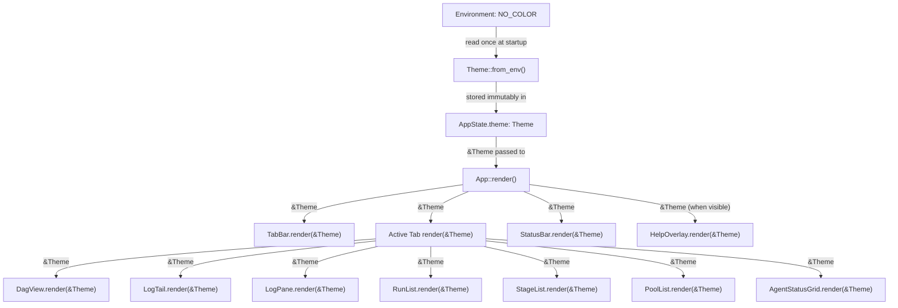

**[UI-DES-THEME-001]** Every widget that renders styled content MUST accept `&Theme` as a parameter to its `render()` method. Widgets MUST NOT store a `Theme` value internally, clone it, or access `AppState` from within `render()`. The `&Theme` reference is passed down the widget tree at each render call. This is enforced by the architecture lint in `./do lint` (see §1.7).

**[UI-DES-THEME-002]** `ratatui::style::Color` values used in `theme.rs` are exclusively the named 16-color variants: `Color::Green`, `Color::Red`, `Color::Yellow`, `Color::Cyan`, `Color::DarkGray`, `Color::White`, `Color::Black`, `Color::Reset`. RGB values (`Color::Rgb(r, g, b)`) and indexed values (`Color::Indexed(n)`) are prohibited. This ensures correct rendering across terminal emulators that only support 8-color or 16-color ANSI palettes, including Windows Console and many CI environments.

**[UI-DES-THEME-003]** `Color::Reset` is the effective background color for all unselected rows and unframed content regions. No `.bg(Color::Reset)` call is required; omitting the `.bg()` call has the same effect and is the preferred style. This instructs the terminal to use its configured background color rather than overriding it, ensuring compatibility with transparent terminal backgrounds and custom terminal themes.

### 2.2 Stage Status Color Mapping

**[UI-DES-014]** Stage status colors use the terminal's named 16-color palette (not RGB hex), ensuring visual fidelity across all terminal emulator themes. The approximate sRGB hex values are provided as reference for documentation and testing only.

The complete `Style` specification — including foreground color and `Modifier` — for each stage status is defined below. Terminal states (`DONE`, `FAIL`, `TIME`, `CANC`) receive `Modifier::BOLD` in `ColorMode::Color` to provide an additional non-color visual distinction that survives monochrome rendering.

| Status Label | Constant | `ColorMode::Color` fg | Modifier (Color) | Approx. sRGB | `ColorMode::Monochrome` |
|---|---|---|---|---|---|
| `DONE` | `STATUS_DONE` | `Color::Green` | `BOLD` | `#00AA00` | `BOLD` only |
| `FAIL` | `STATUS_FAIL` | `Color::Red` | `BOLD` | `#AA0000` | `BOLD` only |
| `TIME` | `STATUS_TIME` | `Color::Red` | `BOLD` | `#AA0000` | `BOLD` only |
| `CANC` | `STATUS_CANC` | `Color::DarkGray` | `BOLD` | `#555555` | `BOLD` only |
| `RUN ` | `STATUS_RUN_` | `Color::Yellow` | none | `#AAAA00` | default |
| `PAUS` | `STATUS_PAUS` | `Color::Cyan` | none | `#00AAAA` | default |
| `ELIG` | `STATUS_ELIG` | `Color::White` | none | `#AAAAAA` | default |
| `WAIT` | `STATUS_WAIT` | `Color::White` | none | `#AAAAAA` | default |
| `PEND` | `STATUS_PEND` | `Color::White` | none | `#AAAAAA` | default |

**[UI-DES-015]** In `ColorMode::Monochrome`, non-terminal status labels (`RUN `, `PAUS`, `ELIG`, `WAIT`, `PEND`) render in the default terminal foreground with no modifier. Terminal-state labels (`DONE`, `FAIL`, `TIME`, `CANC`) receive `Modifier::BOLD` only. State is communicated primarily by the 4-character label text; `BOLD` provides secondary emphasis for completed or error states.

**[UI-DES-THEME-004]** The `Theme::stage_status_style()` implementation uses an exhaustive `match` on `StageStatus` to prevent silent omission when new variants are added. The Rust compiler enforces this: if a new variant is added to `devs-core::StageStatus` without updating `theme.rs`, the `devs-tui` crate fails to compile with a non-exhaustive pattern error.

```rust
pub fn stage_status_style(&self, status: StageStatus) -> Style {
    match self.color_mode {
        ColorMode::Color => match status {
            StageStatus::Completed => Style::new().fg(Color::Green).add_modifier(Modifier::BOLD),
            StageStatus::Failed    => Style::new().fg(Color::Red).add_modifier(Modifier::BOLD),
            StageStatus::TimedOut  => Style::new().fg(Color::Red).add_modifier(Modifier::BOLD),
            StageStatus::Cancelled => Style::new().fg(Color::DarkGray).add_modifier(Modifier::BOLD),
            StageStatus::Running   => Style::new().fg(Color::Yellow),
            StageStatus::Paused    => Style::new().fg(Color::Cyan),
            StageStatus::Eligible  => Style::new().fg(Color::White),
            StageStatus::Waiting   => Style::new().fg(Color::White),
            StageStatus::Pending   => Style::new().fg(Color::White),
        },
        ColorMode::Monochrome => match status {
            StageStatus::Completed
            | StageStatus::Failed
            | StageStatus::TimedOut
            | StageStatus::Cancelled => Style::new().add_modifier(Modifier::BOLD),
            _ => Style::new(),
        },
    }
}
```

**[UI-DES-THEME-005]** The status-specific `Style` is applied only to the 4-character `STAT` cell within the stage box (`[ name | STAT | time ]`). The bracket characters `[` `]`, field separators `|`, stage name field, and elapsed time field all use `Style::new()` (default). Only the `STAT` cell receives a status-derived `Style`. This constraint is enforced in the `DagView::render()` implementation.

**Background behavior:** All `stage_status_style()` return values omit a `.bg()` call, leaving the background as `Color::Reset`. The `selected_row_style()` overlay (`Modifier::REVERSED`) supersedes the foreground color when a stage row is selected, swapping foreground and background via the terminal's built-in reversal without requiring explicit color specification.

### 2.3 Run Status Color Mapping

**[UI-DES-016]** `RunStatus` in list views follows the same color logic as `StageStatus`. Terminal states (`completed`, `failed`, `cancelled`) receive `Modifier::BOLD` to match the stage status convention.

| Run Status | `ColorMode::Color` fg | Modifier (Color) | Approx. sRGB | `ColorMode::Monochrome` |
|---|---|---|---|---|
| `completed` | `Color::Green` | `BOLD` | `#00AA00` | `BOLD` only |
| `failed` | `Color::Red` | `BOLD` | `#AA0000` | `BOLD` only |
| `cancelled` | `Color::DarkGray` | `BOLD` | `#555555` | `BOLD` only |
| `running` | `Color::Yellow` | none | `#AAAA00` | default |
| `paused` | `Color::Cyan` | none | `#00AAAA` | default |
| `pending` | `Color::White` | none | `#AAAAAA` | default |

**[UI-DES-THEME-006]** `Theme::run_status_style()` is implemented with an exhaustive match identical in structure to `stage_status_style()`. `RunStatus` does not include `Waiting`, `Eligible`, or `TimedOut` variants; those map only through `stage_status_style()`. Adding a new `RunStatus` variant without updating `theme.rs` causes a compile error.

**[UI-DES-THEME-007]** Run status colors appear in the `RunList` widget's `status` column only. The `slug`, `workflow_name`, and timestamp columns always use `Style::new()` (default terminal style). This constraint prevents color saturation in the run list and ensures the status color is the sole semantic color signal per row, maintaining the principle that color is additive and never load-bearing.

### 2.4 Selection & Focus Colors

**[UI-DES-017]** Selected rows in `RunList`, `StageList`, `PoolList`, and `AgentStatusGrid` use `Modifier::REVERSED` in both color modes. The `Theme::selected_row_style()` method returns:

```rust
pub fn selected_row_style(&self) -> Style {
    // Identical in both ColorMode::Color and ColorMode::Monochrome.
    Style::new().add_modifier(Modifier::REVERSED)
}
```

The terminal's built-in reversal swaps the cell's foreground and background colors without the application needing to specify explicit RGB values. This ensures correct visual inversion across all terminal color schemes, including dark-mode, light-mode, and custom themes. The resulting appearance (e.g., `Color::Black` foreground on `Color::White` background) is terminal-dependent and intentionally so.

**[UI-DES-018]** No widget uses an explicit background color in its unselected state. All unselected rows leave background unset (equivalent to `Color::Reset`). This ensures compatibility with transparent terminal emulators and custom terminal themes where overriding the background would cause visual artifacts.

**[UI-DES-THEME-008]** When a row is both selected AND has a status color (e.g., a running stage is selected in `StageList`), the `REVERSED` modifier is composed onto the existing style using `Style::patch()`:

```rust
// In StageList::render():
let base_style = theme.stage_status_style(stage.status);
let row_style = if is_selected {
    base_style.patch(theme.selected_row_style())
} else {
    base_style
};
```

`Style::patch()` applies only the non-`None` fields of the argument, so the existing foreground color is preserved. The `REVERSED` modifier then causes the terminal to swap that foreground into the background, yielding a colored-background reversed cell. This behavior is intentional and requires no special-casing.

**[UI-DES-THEME-009]** Keyboard focus (which pane the user has navigated into) is NOT represented by any color change, border highlight, or additional visual indicator at MVP. The single selection state (highlighted row via `REVERSED`) is the only focus indicator. Pane borders use a fixed ASCII style with no active-border color change.

### 2.5 Tab Bar Styling

**[UI-DES-THEME-010]** The tab bar occupies exactly one row at the top of the terminal. It renders four tab labels with their digit shortcuts: `1 Dashboard  2 Logs  3 Debug  4 Pools`. Tab labels are separated by two spaces; no border character or pipe separator is used.

The active (currently selected) tab style:

| Color Mode | Active Tab `Style` |
|---|---|
| `ColorMode::Color` | `Modifier::BOLD` + `Modifier::REVERSED` |
| `ColorMode::Monochrome` | `Modifier::BOLD` + `Modifier::REVERSED` |

The inactive (unselected) tab style:

| Color Mode | Inactive Tab `Style` |
|---|---|
| `ColorMode::Color` | `Style::new()` |
| `ColorMode::Monochrome` | `Style::new()` |

**[UI-DES-THEME-011]** The active tab style is identical in both color modes. Both `BOLD` and `REVERSED` are applied together, providing a strong visual anchor for the user's current context regardless of color availability.

```rust
pub fn active_tab_style(&self) -> Style {
    // Same in Color and Monochrome.
    Style::new()
        .add_modifier(Modifier::BOLD)
        .add_modifier(Modifier::REVERSED)
}

pub fn inactive_tab_style(&self) -> Style {
    Style::new()
}
```

**[UI-DES-THEME-012]** The tab bar contains no horizontal border, no separator row, and no bottom line. The active tab label is distinguished solely by `BOLD + REVERSED`. Switching to an inactive tab immediately updates `AppState::active_tab` and triggers a re-render within the next event loop iteration.

### 2.6 Log Stream Colors

**[UI-DES-019]** In the `LogPane` and `LogTail` widgets, log line styling depends on the stream origin:

| Stream | `ColorMode::Color` fg | Modifier | `ColorMode::Monochrome` |
|---|---|---|---|
| `stdout` | `Color::Reset` (default) | none | `Color::Reset` (default) |
| `stderr` | `Color::Yellow` | none | `Color::Reset` (default) |

```rust
pub fn log_line_style(&self, stream: LogStream) -> Style {
    match self.color_mode {
        ColorMode::Color => match stream {
            LogStream::Stdout => Style::new(),
            LogStream::Stderr => Style::new().fg(Color::Yellow),
        },
        ColorMode::Monochrome => Style::new(),
    }
}
```

**[UI-DES-020]** The `show_stream_prefix` flag controls whether `[OUT] ` or `[ERR] ` is prepended to each log line. The prefix and the log content share the same `Style` — no separate style is applied to the prefix text. This ensures stream origin is always communicated by text in monochrome mode.

| Widget | `show_stream_prefix` | Rationale |
|---|---|---|
| `LogTail` (Dashboard tab) | `false` | Space-constrained; stream identity is secondary |
| `LogPane` (Logs tab) | `true` | Full log view; stream identity is primary |

**[UI-DES-THEME-013]** When `LogBuffer::truncated == true`, the `LogPane` renders a one-line notice at the top of the log content area using `Style::new()` (no color, no modifier) in both color modes:

```
[--- log truncated: showing last 10000 lines ---]
```

This notice is NOT stored in `LogBuffer`; it is rendered dynamically by `LogPane::render()` whenever `AppState.log_buffers[(run_id, stage_name)].truncated == true`. The `LogTail` widget does not display this notice (it shows only a fixed number of trailing lines).

### 2.7 Status Bar Colors

**[UI-DES-021]** The `StatusBar` widget uses the following style for the connection status label. Terminal states `Connected` and `Disconnected` receive `Modifier::BOLD` to mirror the terminal-state stage label convention.

| `ConnectionStatus` | `ColorMode::Color` fg | Modifier (Color) | Approx. sRGB | `ColorMode::Monochrome` |
|---|---|---|---|---|
| `Connected` | `Color::Green` | `BOLD` | `#00AA00` | `BOLD` only |
| `Reconnecting` | `Color::Yellow` | none | `#AAAA00` | default |
| `Disconnected` | `Color::Red` | `BOLD` | `#AA0000` | `BOLD` only |

```rust
pub fn connection_status_style(&self, status: &ConnectionStatus) -> Style {
    match self.color_mode {
        ColorMode::Color => match status {
            ConnectionStatus::Connected { .. } =>
                Style::new().fg(Color::Green).add_modifier(Modifier::BOLD),
            ConnectionStatus::Reconnecting { .. } =>
                Style::new().fg(Color::Yellow),
            ConnectionStatus::Disconnected =>
                Style::new().fg(Color::Red).add_modifier(Modifier::BOLD),
        },
        ColorMode::Monochrome => match status {
            ConnectionStatus::Connected { .. }
            | ConnectionStatus::Disconnected =>
                Style::new().add_modifier(Modifier::BOLD),
            ConnectionStatus::Reconnecting { .. } => Style::new(),
        },
    }
}
```

**[UI-DES-THEME-014]** The `StatusBar` always occupies the bottom row of the terminal. The connection-status label receives the styled text; all remaining text (server address, active run count, retry countdown) uses `Style::new()`. Example rendered output:

```
CONNECTED  devs@127.0.0.1:7890  3 active runs
```

**[UI-DES-THEME-015]** In `Reconnecting` state, the status bar additionally shows the attempt number and time until next retry using digit characters and the ASCII letter `s` for seconds (no spinner character, no ANSI cursor movement):

```
RECONNECTING (attempt 2, next in 4s)  devs@127.0.0.1:7890
```

### 2.8 Diagnostic & Alert Colors

**[UI-DES-022]** Error messages and validation failures in CLI text mode use no color codes. The CLI does not read `NO_COLOR` and never emits ANSI escape sequences in either `--format text` or `--format json` mode. Errors are distinguished solely by the machine-stable prefix vocabulary defined in §5.

**[UI-DES-023]** TUI `HelpOverlay` renders with a dedicated block style that differs between color modes. The overlay is the only widget that uses an explicit non-Reset background color in `ColorMode::Color`; this exception is intentional to visually separate the modal overlay from underlying content.

| Property | `ColorMode::Color` | `ColorMode::Monochrome` |
|---|---|---|
| Block background | `Color::DarkGray` (~`#555555`) | none (transparent) |
| Block modifier | none | `Modifier::REVERSED` on entire block |
| Border characters | `+` corners, `-` horizontal, `\|` vertical | same |
| Title style | `Modifier::BOLD` | `Modifier::BOLD` |
| Key-name style | `Modifier::BOLD` | `Modifier::BOLD` |
| Description style | `Style::new()` | `Style::new()` |

```rust
pub fn help_overlay_style(&self) -> Style {
    match self.color_mode {
        ColorMode::Color => Style::new().bg(Color::DarkGray),
        ColorMode::Monochrome => Style::new().add_modifier(Modifier::REVERSED),
    }
}
```

**[UI-DES-THEME-016]** The key-binding table inside the help overlay uses `Modifier::BOLD` for key names (e.g., `q`, `?`, `Tab`, `c`) and `Style::new()` for their descriptions. No additional foreground colors are introduced inside the overlay. In `ColorMode::Color`, key names and descriptions both render against the `DarkGray` background; the terminal renders default foreground (typically light gray or white) on dark gray, which is visually legible across common terminal color schemes.

### 2.9 Theme Style API — Complete Method Reference

This section is the normative API surface of `Theme`. All public styling methods are listed here; no additional styling methods may be added to `Theme` without updating this section and the corresponding row in the table below.

| Method | Parameter(s) | Return | Notes |
|---|---|---|---|
| `from_env()` | — | `Theme` | Constructor; reads `NO_COLOR` exactly once |
| `stage_status_style()` | `status: StageStatus` | `Style` | Exhaustive match; compile error on new variant |
| `run_status_style()` | `status: RunStatus` | `Style` | Exhaustive match; compile error on new variant |
| `selected_row_style()` | — | `Style` | `REVERSED` in both modes; no explicit colors |
| `log_line_style()` | `stream: LogStream` | `Style` | Yellow stderr in Color mode; default in Mono |
| `connection_status_style()` | `status: &ConnectionStatus` | `Style` | Bold on Connected and Disconnected |
| `active_tab_style()` | — | `Style` | `BOLD + REVERSED` in both modes |
| `inactive_tab_style()` | — | `Style` | `Style::new()` in both modes |
| `help_overlay_style()` | — | `Style` | `DarkGray` bg in Color; `REVERSED` in Mono |
| `default_text_style()` | — | `Style` | `Style::new()` always; for unlisted contexts |

**[UI-DES-THEME-017]** `Theme` MUST NOT expose any method that returns a raw `ratatui::style::Color` value. All color decisions are encapsulated within the named semantic methods above. Widgets call a semantic method (e.g., `theme.stage_status_style(status)`) and apply the returned `Style` directly via `.patch()` or direct application. Extracting the color field from a returned `Style` for conditional logic in widget code is prohibited.

### 2.10 Edge Cases & Error Handling

#### 2.10.1 `NO_COLOR` Interaction

| Scenario | Expected Behavior |
|---|---|
| `NO_COLOR=1` before process start | `ColorMode::Monochrome`; all states distinguishable by text label |
| `NO_COLOR` changed after process start | No effect; theme is frozen at startup; restart TUI to apply |
| `NO_COLOR=0` (string `"0"`) | `ColorMode::Monochrome`; `"0"` is a non-empty string |
| `NO_COLOR=""` (empty string explicitly set) | `ColorMode::Color`; empty value treated as absent |
| `TERM=dumb` (no color support reported) | TUI does not query `TERM`; operator SHOULD set `NO_COLOR=1` in dumb-terminal environments |
| `COLORTERM=truecolor` set | Ignored; no RGB colors used regardless |

**[UI-DES-THEME-018]** The TUI does not query the terminal's color capability (`TERM`, `COLORTERM`, `TERM_PROGRAM`, or `tput colors`). Color mode is determined solely by `NO_COLOR`. This prevents discrepancies between terminal capability detection and user intent, and keeps `Theme::from_env()` deterministic and testable without mocking environment variables beyond `NO_COLOR`.

#### 2.10.2 Style Composition

| Scenario | Expected Behavior |
|---|---|
| Selected running stage in `StageList` | `stage_status_style(Running)` yields Yellow fg; `patch(selected_row_style())` adds `REVERSED`; terminal renders yellow-background inverted cell |
| Selected completed stage | `BOLD + Green` from `stage_status_style(Completed)`, then `REVERSED`; terminal renders green-background inverted bold cell |
| New `StageStatus` variant added without updating `theme.rs` | Compile error: non-exhaustive match patterns in `devs-tui` crate |
| New `RunStatus` variant added without updating `theme.rs` | Compile error: same protection |
| `BOLD` and `REVERSED` applied simultaneously (active tab) | Terminal renders bold + reversed; both modifiers active in the same cell |

**[UI-DES-THEME-019]** Style composition MUST use `Style::patch()` when merging a base style with an overlay style (e.g., adding selection highlight to a status-colored row). `patch()` applies only the non-`None` fields of the argument style, preserving the base style's existing foreground and background. The `|` operator on `ratatui::style::Style` has identical semantics in ratatui 0.28, but `patch()` is more explicit about intent and MUST be used for clarity.

#### 2.10.3 Log Stream Edge Cases

| Scenario | Expected Behavior |
|---|---|
| `stdout` line in `LogPane` with `show_stream_prefix=true` | Renders as `[OUT] <content>` with `Style::new()` (no color) |
| `stderr` line in `LogPane` with `show_stream_prefix=true` | Renders as `[ERR] <content>` with `Color::Yellow` fg in Color mode; `Style::new()` in Monochrome |
| Empty `LogBuffer` | `LogPane` renders an empty content area; no truncation notice; no error |
| `LogBuffer::truncated == true` with zero lines remaining | Truncation notice is rendered; no log lines below it; notice uses `Style::new()` |
| Log line containing ANSI color codes from agent output | ANSI stripped by `strip_ansi()` before insertion into `LogBuffer`; `log_line_style()` is the only source of color in the log display |
| Agent emits `\r` mid-line (PTY mode) | `\r\n` → `\n`; standalone `\r` → removed; handled in `LogBuffer` insertion before `log_line_style()` is applied |

#### 2.10.4 Monochrome Mode Completeness

**[UI-DES-THEME-020]** Every display state MUST be distinguishable in `ColorMode::Monochrome` by text label alone. The following table is the normative verification that this invariant holds:

| States to distinguish | Distinguishing mechanism |
|---|---|
| `DONE` vs `FAIL` | Label text: `DONE` ≠ `FAIL` |
| `FAIL` vs `TIME` | Label text: `FAIL` ≠ `TIME` |
| `RUN ` vs `PAUS` | Label text: `RUN ` ≠ `PAUS` |
| `ELIG` vs `WAIT` vs `PEND` | Label text: `ELIG` / `WAIT` / `PEND` |
| `DONE` vs `RUN ` (terminal vs active) | Label text + `BOLD` modifier on `DONE` |
| `Connected` vs `Reconnecting` | Status bar text: `CONNECTED` / `RECONNECTING` |
| `Reconnecting` vs `Disconnected` | Status bar text: `RECONNECTING` / `DISCONNECTED` |
| `stdout` vs `stderr` log lines | `[OUT] ` / `[ERR] ` prefix (when `show_stream_prefix=true`) |
| Active tab vs inactive tab | `BOLD + REVERSED` vs default |
| Selected row vs unselected row | `REVERSED` vs default |
| Help overlay vs background content | `REVERSED` applied to entire overlay block |

### 2.11 Dependencies

The color palette and theming system has the following dependency relationships:

| Relationship | Component | Direction | Nature |
|---|---|---|---|
| Provides `StageStatus` enum | `devs-core` | Upstream | `stage_status_style()` exhaustive match |
| Provides `RunStatus` enum | `devs-core` | Upstream | `run_status_style()` exhaustive match |
| Provides `LogStream` enum | `devs-core` | Upstream | `log_line_style()` match |
| Provides `ConnectionStatus` | `devs-tui::state` (same crate) | Upstream | `connection_status_style()` match |
| Implements `Theme` + `ColorMode` | `devs-tui/src/theme.rs` | Implements §2 | All public methods defined in §2.9 |
| Consumes `Theme` | `devs-tui/src/widgets/*.rs` | Downstream | All widget `render()` methods accept `&Theme` |
| Consumes `Theme` | `devs-tui/src/tabs/*.rs` | Downstream | All tab `render()` methods accept `&Theme` |
| References `ColorMode` | §1.5 (Design Philosophy) | Peer | `ColorMode` enum defined here; `NO_COLOR` detection logic in §1.5 |
| Tested by | `devs-tui/src/theme.rs` `#[cfg(test)]` | Downstream | Unit tests verify all style method return values per mode |
| Validated by | `./do lint` | Downstream | `grep -rn 'NO_COLOR' … | grep -v theme.rs` check; `Color::Rgb`/`Color::Indexed` prohibition check |

**[UI-DES-THEME-021]** The `devs-tui` crate MUST NOT have direct production dependencies on any engine-layer crate (`devs-scheduler`, `devs-pool`, `devs-executor`, `devs-adapters`, `devs-checkpoint`, `devs-checkpoint`, `devs-webhook`, `devs-grpc`, `devs-mcp`, `devs-config`, `devs-server`). The `Theme` struct depends on `devs-core` types only, plus `ratatui`. This is verified by `cargo tree -p devs-tui --edges normal` in `./do lint`.

### 2.12 Acceptance Criteria

The following are testable assertions that an implementing agent can verify automatically. Tests MUST be annotated `// Covers: <rule-id>`.

- **[AC-DES-COLOR-001]** `theme.stage_status_style(StageStatus::Completed)` in `ColorMode::Color` returns a `Style` with `fg == Some(Color::Green)` and modifier containing `Modifier::BOLD`. Covers: `UI-DES-014`, `UI-DES-THEME-004`.

- **[AC-DES-COLOR-002]** `theme.stage_status_style(StageStatus::Running)` in `ColorMode::Color` returns a `Style` with `fg == Some(Color::Yellow)` and modifier NOT containing `Modifier::BOLD`. Covers: `UI-DES-014`.

- **[AC-DES-COLOR-003]** `theme.stage_status_style(StageStatus::Completed)` in `ColorMode::Monochrome` returns a `Style` with modifier containing `Modifier::BOLD` and `fg == None`. Covers: `UI-DES-015`.

- **[AC-DES-COLOR-004]** `theme.stage_status_style(StageStatus::Running)` in `ColorMode::Monochrome` returns `Style::new()` (no modifiers, no colors). Covers: `UI-DES-015`.

- **[AC-DES-COLOR-005]** `theme.stage_status_style(StageStatus::TimedOut)` in `ColorMode::Color` returns `fg == Some(Color::Red)` and `Modifier::BOLD`. Covers: `UI-DES-014`.

- **[AC-DES-COLOR-006]** `theme.run_status_style(RunStatus::Failed)` in `ColorMode::Color` returns `fg == Some(Color::Red)` and `Modifier::BOLD`. Covers: `UI-DES-016`, `UI-DES-THEME-006`.

- **[AC-DES-COLOR-007]** `theme.run_status_style(RunStatus::Running)` in `ColorMode::Color` returns `fg == Some(Color::Yellow)` with no `Modifier::BOLD`. Covers: `UI-DES-016`.

- **[AC-DES-COLOR-008]** `theme.selected_row_style()` returns a `Style` containing `Modifier::REVERSED` in both `ColorMode::Color` and `ColorMode::Monochrome`. Covers: `UI-DES-017`.

- **[AC-DES-COLOR-009]** `theme.selected_row_style()` returns a `Style` with `fg == None` and `bg == None` (no explicit color override). Covers: `UI-DES-017`, `UI-DES-018`.

- **[AC-DES-COLOR-010]** `theme.log_line_style(LogStream::Stderr)` in `ColorMode::Color` returns `fg == Some(Color::Yellow)`. Covers: `UI-DES-019`.

- **[AC-DES-COLOR-011]** `theme.log_line_style(LogStream::Stderr)` in `ColorMode::Monochrome` returns `Style::new()`. Covers: `UI-DES-019`.

- **[AC-DES-COLOR-012]** `theme.log_line_style(LogStream::Stdout)` returns `Style::new()` in both color modes. Covers: `UI-DES-019`.

- **[AC-DES-COLOR-013]** `theme.connection_status_style(&ConnectionStatus::Connected { .. })` in `ColorMode::Color` returns `fg == Some(Color::Green)` and `Modifier::BOLD`. Covers: `UI-DES-021`.

- **[AC-DES-COLOR-014]** `theme.connection_status_style(&ConnectionStatus::Reconnecting { .. })` in `ColorMode::Color` returns `fg == Some(Color::Yellow)` with no `Modifier::BOLD`. Covers: `UI-DES-021`.

- **[AC-DES-COLOR-015]** `theme.connection_status_style(&ConnectionStatus::Disconnected)` in `ColorMode::Monochrome` returns `Style` with `Modifier::BOLD` and no fg color. Covers: `UI-DES-021`.

- **[AC-DES-COLOR-016]** `theme.active_tab_style()` returns a `Style` containing both `Modifier::BOLD` and `Modifier::REVERSED` in both `ColorMode::Color` and `ColorMode::Monochrome`. Covers: `UI-DES-THEME-010`, `UI-DES-THEME-011`.

- **[AC-DES-COLOR-017]** `theme.inactive_tab_style()` returns `Style::new()` (no modifiers, no colors) in both color modes. Covers: `UI-DES-THEME-010`.

- **[AC-DES-COLOR-018]** `theme.help_overlay_style()` in `ColorMode::Color` returns a `Style` with `bg == Some(Color::DarkGray)`. Covers: `UI-DES-023`.

- **[AC-DES-COLOR-019]** `theme.help_overlay_style()` in `ColorMode::Monochrome` returns a `Style` with `Modifier::REVERSED` and `bg == None`. Covers: `UI-DES-023`.

- **[AC-DES-COLOR-020]** `theme.default_text_style()` returns `Style::new()` in both color modes. Covers: `UI-DES-THEME-017`.

- **[AC-DES-COLOR-021]** Adding a new variant to `StageStatus` in `devs-core` without updating `theme.rs` causes `cargo build -p devs-tui` to fail with a non-exhaustive pattern diagnostic. Verified by the compile-time guarantee; documented in the coverage report as a structural invariant. Covers: `UI-DES-THEME-004`.

- **[AC-DES-COLOR-022]** `grep -rn 'Color::Rgb\|Color::Indexed' crates/devs-tui/src/theme.rs` returns no results. No RGB or indexed colors appear in `theme.rs`. Covers: `UI-DES-THEME-002`.

- **[AC-DES-COLOR-023]** `grep -rn 'NO_COLOR' crates/devs-tui/src/ | grep -v 'theme\.rs' | grep -v '#\[cfg(test)\]'` returns no results. Only `theme.rs` reads `NO_COLOR`. Covers: `UI-DES-012`, `UI-DES-PHI-017`.

- **[AC-DES-COLOR-024]** A `TestBackend` at 200×50 in `ColorMode::Monochrome` rendering a `DagView` with one `Completed` stage: the cell at the `DONE` label position has `modifier` containing `Modifier::BOLD` and `fg == None`. The snapshot `.txt` file contains `DONE` with no ANSI escape bytes. Covers: `UI-DES-015`, `UI-DES-003`.

- **[AC-DES-COLOR-025]** A `TestBackend` at 200×50 in `ColorMode::Color` rendering a `DagView` with one `Running` stage: the cell at the `RUN ` label position has `fg == Color::Yellow` and no `Modifier::BOLD`. Covers: `UI-DES-014`.

- **[AC-DES-COLOR-026]** A `TestBackend` rendering the `StatusBar` with `ConnectionStatus::Disconnected` in `ColorMode::Color`: the cells spanning `DISCONNECTED` have `fg == Color::Red` and `Modifier::BOLD`. The snapshot `.txt` file contains the string `DISCONNECTED`. Covers: `UI-DES-021`.

- **[AC-DES-COLOR-027]** A `TestBackend` rendering the `LogPane` with `show_stream_prefix=true` and one `stderr` line in `ColorMode::Monochrome`: the line text starts with `[ERR] ` and the cell has `fg == None` (no yellow). Covers: `UI-DES-019`, `UI-DES-020`.

- **[AC-DES-COLOR-028]** `cargo tree -p devs-tui --edges normal 2>&1 | grep -E '^\s*(devs-scheduler|devs-pool|devs-executor|devs-adapters|devs-checkpoint|devs-checkpoint|devs-webhook|devs-grpc|devs-mcp|devs-config|devs-server)\b'` returns no results. Covers: `UI-DES-THEME-021`, `UI-ARCH-002`.

---

## 3. Typography System

The typography system governs every visual text property the TUI and CLI render: character cell assumptions, text emphasis modifiers, status label encoding, time formatting, name truncation, ANSI handling, and the string constant contract. Because `devs` targets terminal emulators, "typography" means ratatui `Style` attributes and fixed-width ASCII conventions — not font files or pixel metrics.

### 3.1 Font Model

**[UI-DES-024]** All rendered text uses the terminal's configured monospace font. `devs` does not specify, embed, or load any font file. Font family, weight, size, and antialiasing are operator-controlled through their terminal emulator preferences.

**[UI-DES-025]** The design system assumes a **fixed-width, single-column character cell** for all printable ASCII (U+0020–U+007E). No multibyte or double-width characters appear in structural positions. This guarantees predictable column alignment on all platforms.

**Character Cell Model.** Each printable ASCII character occupies exactly one terminal column. The TUI assumes a 1:1 relationship between Rust `char` count and terminal display columns for all strings it constructs for structural UI elements (stage boxes, status labels, headers, borders, arrows). This assumption is valid for all ASCII characters and is the only character range used in structural positions.

**Non-ASCII Content in Log Lines.** Agent stdout and stderr are binary streams written verbatim to log files. When displayed in `LogPane` and `LogTail`, log line content may contain non-ASCII bytes. The display pipeline is:

1. Read log lines from the `LogBuffer` as `String` (UTF-8).
2. Invalid UTF-8 sequences are replaced with U+FFFD REPLACEMENT CHARACTER at ingestion time.
3. The ANSI stripping 3-state machine (§3.6) processes the resulting string before storage in `LogLine.content`.
4. Ratatui renders the stripped string. Double-width or zero-width characters may misalign, but this is accepted because log content is not a structural element.

**[UI-DES-FONT-001]** Non-ASCII characters in log line content MUST NOT cause a panic or rendering error. Misalignment of double-width characters in log output is accepted behavior.

**[UI-DES-FONT-002]** Stage names, run slugs, workflow names, and pool names are validated at the server to contain only `[a-z0-9_-]` (stage/workflow names) or `[a-z0-9-]` (slugs). The TUI receives only validated identifiers and MAY assume they are pure ASCII.

**[UI-DES-FONT-003]** User-supplied run names are clamped to 128 bytes at the server. The TUI MUST NOT assume they are ASCII; run names appearing in display positions are subject to the same UTF-8-with-replacement pipeline as log content.

**Edge Cases — Font Model:**

| Scenario | Expected Behavior |
|---|---|
| Log line contains raw binary (0x00–0x1F non-ANSI) | Bytes replaced with U+FFFD at ingestion; displayed as replacement character |
| Stage name contains only a single character `a` | Padded to 20 chars by `truncate_with_tilde`; fits exactly in stage box |
| Terminal emulator renders double-width CJK in log | Display misaligns within LogPane; no crash, no corrective action taken |
| Empty string passed to `truncate_with_tilde` | Returns a 20-space string (all padding) |
| Log line is 32,767 bytes | Accepted; rendered up to available pane width; no truncation at the render layer |

---

### 3.2 Text Style Hierarchy

**[UI-DES-026]** Four levels of text emphasis are defined, implemented exclusively through `ratatui::style::Modifier` and `ratatui::style::Color`. The four style constants are defined in `crates/devs-tui/src/theme.rs` and imported by all widget modules.

**Style Constant Definitions**

```rust
// crates/devs-tui/src/theme.rs

use ratatui::style::{Color, Modifier, Style};

/// Active tab label, selected item text, column headers.
pub const STYLE_PRIMARY: Style = Style::new().add_modifier(Modifier::BOLD);

/// Body text, log lines, status bar labels.
pub const STYLE_STANDARD: Style = Style::new();

/// Timestamps, secondary metadata, elapsed `--:--`.
/// Color applied conditionally — use `Theme::style_subdued()` instead of this constant directly.
pub const STYLE_SUBDUED_MONO: Style = Style::new();

/// Selected row, focused widget border.
pub const STYLE_INTERACTIVE: Style = Style::new().add_modifier(Modifier::REVERSED);
```

`STYLE_SUBDUED` differs between color modes. The `Theme` struct resolves the correct variant at construction time:

```rust
impl Theme {
    /// Returns the subdued style for the current color mode.
    pub fn style_subdued(&self) -> Style {
        match self.color_mode {
            ColorMode::Color      => Style::new().fg(Color::DarkGray),
            ColorMode::Monochrome => Style::new(), // visually identical to STYLE_STANDARD
        }
    }

    /// Returns the style for a stage status in the current color mode.
    pub fn style_for_stage_status(&self, status: StageStatus) -> Style {
        match self.color_mode {
            ColorMode::Monochrome => STYLE_STANDARD,
            ColorMode::Color => match status {
                StageStatus::Completed             => Style::new().fg(Color::Green),
                StageStatus::Failed
                | StageStatus::TimedOut            => Style::new().fg(Color::Red),
                StageStatus::Running               => Style::new().fg(Color::Yellow),
                StageStatus::Paused                => Style::new().fg(Color::Cyan),
                StageStatus::Cancelled             => Style::new().fg(Color::DarkGray),
                StageStatus::Eligible
                | StageStatus::Waiting
                | StageStatus::Pending             => Style::new().fg(Color::White),
            },
        }
    }

    /// Returns the style for a run status in the current color mode.
    pub fn style_for_run_status(&self, status: RunStatus) -> Style {
        match self.color_mode {
            ColorMode::Monochrome => STYLE_STANDARD,
            ColorMode::Color => match status {
                RunStatus::Completed => Style::new().fg(Color::Green),
                RunStatus::Failed    => Style::new().fg(Color::Red),
                RunStatus::Running   => Style::new().fg(Color::Yellow),
                RunStatus::Paused    => Style::new().fg(Color::Cyan),
                RunStatus::Cancelled => Style::new().fg(Color::DarkGray),
                RunStatus::Pending   => Style::new().fg(Color::White),
            },
        }
    }
}
```

**[UI-DES-STYLE-001]** `Theme::style_subdued()` in `Monochrome` mode MUST return a style with no fg color modifier. The distinction between subdued and standard content is carried by layout position, not color, when `NO_COLOR` is set.

**Complete Style-to-Color Mapping Table**

| Style Constant | Color Mode | fg Color | bg Color | Modifier |
|---|---|---|---|---|
| `STYLE_PRIMARY` | Both | (terminal default) | (terminal default) | `BOLD` |
| `STYLE_STANDARD` | Both | (terminal default) | (terminal default) | (none) |
| `style_subdued()` | Color | `DarkGray` | (terminal default) | (none) |
| `style_subdued()` | Monochrome | (terminal default) | (terminal default) | (none) |
| `STYLE_INTERACTIVE` | Both | (inverted by terminal) | (inverted by terminal) | `REVERSED` |
| `style_for_stage_status(Completed)` | Color | `Green` | (terminal default) | (none) |
| `style_for_stage_status(Failed\|TimedOut)` | Color | `Red` | (terminal default) | (none) |
| `style_for_stage_status(Running)` | Color | `Yellow` | (terminal default) | (none) |
| `style_for_stage_status(Paused)` | Color | `Cyan` | (terminal default) | (none) |
| `style_for_stage_status(Cancelled)` | Color | `DarkGray` | (terminal default) | (none) |
| `style_for_stage_status(Eligible\|Waiting\|Pending)` | Color | `White` | (terminal default) | (none) |
| Any `style_for_*` | Monochrome | (terminal default) | (terminal default) | (none) |

**[UI-DES-STYLE-002]** Log stderr lines use `Style::new().fg(Color::Yellow)` in Color mode and `STYLE_STANDARD` in Monochrome mode. Log stdout lines use `STYLE_STANDARD` in both modes.

**[UI-DES-STYLE-003]** The selected row in `RunList` and `StageList` uses `STYLE_INTERACTIVE` (`REVERSED`). In Monochrome mode, `REVERSED` is the ONLY visual distinction between a selected and unselected row.

**[UI-DES-027]** `ITALIC`, `UNDERLINED`, `BLINK`, and `RAPID_BLINK` modifiers are **prohibited** at all style levels. The lint test `no_forbidden_modifiers` in `crates/devs-tui/tests/` asserts that no widget module source file contains the text `Modifier::ITALIC`, `Modifier::UNDERLINED`, `Modifier::BLINK`, or `Modifier::RAPID_BLINK`.

**`NO_COLOR` Environment Variable**

**[UI-DES-STYLE-004]** The `NO_COLOR` environment variable is read exactly once at startup, inside `Theme::from_env()`. The result is stored in `Theme.color_mode`. No widget reads `NO_COLOR` directly.

```rust
impl Theme {
    /// Constructs a `Theme` by reading `NO_COLOR` from the environment.
    /// Called once at startup; result stored in `App` and passed to all widgets.
    pub fn from_env() -> Self {
        let color_mode = if std::env::var_os("NO_COLOR").is_some() {
            ColorMode::Monochrome
        } else {
            ColorMode::Color
        };
        Theme { color_mode }
    }
}
```

**[UI-DES-STYLE-005]** `NO_COLOR` set to any value, including an empty string, activates `Monochrome` mode. Only presence is checked; the value is not inspected.

**Edge Cases — Text Style Hierarchy:**

| Scenario | Expected Behavior |
|---|---|
| `NO_COLOR=""` (empty string) | `Monochrome` mode active; all fg/bg color suppressed |
| Widget applies `STYLE_INTERACTIVE` over `style_for_stage_status` | `REVERSED` modifier takes precedence; terminal inverts whatever fg/bg is set |
| `style_subdued()` applied in Monochrome mode | Renders identically to `STYLE_STANDARD`; no visual difference (accepted) |
| New `StageStatus` variant added without updating `style_for_stage_status` | Rust exhaustive match produces compile-time error; no runtime fallback |
| `--format json` flag passed to CLI | No ANSI codes emitted regardless of `NO_COLOR`; JSON output is always plain text |

---

### 3.3 Status Label Typography

**[UI-DES-028]** Stage status labels are exactly 4 uppercase ASCII characters. This is a compile-time invariant enforced by constant assertions. The complete label enumeration:

| `StageStatus` Variant | Display Label | Byte Count | Trailing Space? |
|---|---|---|---|
| `Pending` | `PEND` | 4 | No |
| `Waiting` | `WAIT` | 4 | No |
| `Eligible` | `ELIG` | 4 | No |
| `Running` | `RUN ` | 4 | Yes (1 trailing space) |
| `Paused` | `PAUS` | 4 | No |
| `Completed` | `DONE` | 4 | No |
| `Failed` | `FAIL` | 4 | No |
| `TimedOut` | `TIME` | 4 | No |
| `Cancelled` | `CANC` | 4 | No |

**Function Signature and Implementation**

```rust
// crates/devs-tui/src/render_utils.rs

/// Returns the 4-byte uppercase ASCII status label for a stage status.
/// The returned `&'static str` is always exactly 4 bytes (guaranteed by compile-time assertions).
pub fn stage_status_label(status: StageStatus) -> &'static str {
    match status {
        StageStatus::Pending   => "PEND",
        StageStatus::Waiting   => "WAIT",
        StageStatus::Eligible  => "ELIG",
        StageStatus::Running   => "RUN ",
        StageStatus::Paused    => "PAUS",
        StageStatus::Completed => "DONE",
        StageStatus::Failed    => "FAIL",
        StageStatus::TimedOut  => "TIME",
        StageStatus::Cancelled => "CANC",
    }
}
```

**[UI-DES-029]** Compile-time assertions in `render_utils.rs` enforce that every label is exactly 4 bytes. Each label is asserted individually so the compiler reports the exact failing value:

```rust
const _: () = assert!(b"PEND".len() == 4);
const _: () = assert!(b"WAIT".len() == 4);
const _: () = assert!(b"ELIG".len() == 4);
const _: () = assert!(b"RUN ".len() == 4);
const _: () = assert!(b"PAUS".len() == 4);
const _: () = assert!(b"DONE".len() == 4);
const _: () = assert!(b"FAIL".len() == 4);
const _: () = assert!(b"TIME".len() == 4);
const _: () = assert!(b"CANC".len() == 4);
```

**[UI-DES-LABEL-001]** Adding a new `StageStatus` variant without updating `stage_status_label` MUST produce a compile error (Rust exhaustive match). No runtime fallback label (e.g., `"????"`) is defined or permitted.

**Run Status Labels**

**[UI-DES-030]** Run status labels for `RunList` and `devs list` CLI output are displayed as **lowercase strings** matching the serialization format. They are NOT padded to a fixed width; column alignment is handled by the column formatter (§3.8).

```rust
/// Returns the lowercase run status string used in RunList and CLI `devs list` output.
pub fn run_status_label(status: RunStatus) -> &'static str {
    match status {
        RunStatus::Pending   => "pending",
        RunStatus::Running   => "running",
        RunStatus::Paused    => "paused",
        RunStatus::Completed => "completed",
        RunStatus::Failed    => "failed",
        RunStatus::Cancelled => "cancelled",
    }
}
```

**Fan-Out Stage Display**

**[UI-DES-LABEL-002]** A fan-out stage is displayed as a single stage box. The fan-out count `N` is appended to the stage name display region using the suffix `(xN)` — for example, `"build-stage    (x4)"`. The suffix is appended to the raw stage name **before** `truncate_with_tilde` is applied, so the combined string is subject to the 20-character display limit:

```rust
let display_name = if let Some(count) = stage.fan_out_count {
    format!("{}(x{})", stage.stage_name, count)
} else {
    stage.stage_name.clone()
};
let truncated = truncate_with_tilde(&display_name, 20);
```

**[UI-DES-LABEL-003]** Fan-out sub-runs are NOT displayed as individual stage boxes in `DagView`. The parent stage box aggregates sub-run statuses using the following priority order (highest priority wins):

| Priority | Condition | Displayed Status |
|---|---|---|
| 1 | Any sub-run is `Running` | `RUN ` |
| 2 | Any sub-run is `Paused` (none Running) | `PAUS` |
| 3 | Any sub-run is `Failed` or `TimedOut` (none Running/Paused) | `FAIL` |
| 4 | Any sub-run is `Cancelled` (none Running/Paused/Failed/TimedOut) | `CANC` |
| 5 | All sub-runs are `Completed` | `DONE` |
| 6 | All sub-runs are `Eligible` | `ELIG` |
| 7 | All sub-runs are `Waiting` | `WAIT` |
| 8 | All sub-runs are `Pending` | `PEND` |

**Edge Cases — Status Label Typography:**

| Scenario | Expected Behavior |
|---|---|
| Fan-out stage with `N=64` (maximum) | Suffix `(x64)` appended before truncation; display truncated to 19 chars + `~` if combined exceeds 20 |
| All fan-out sub-runs cancelled | Parent stage box shows `CANC` |
| Fan-out stage still waiting (no sub-runs dispatched yet) | Parent shows `WAIT` |
| `stage_status_label` called with a future variant not in match | Compile error; exhaustive match prevents silent fallback |
| Mix of `Completed` and `Failed` sub-runs, no custom merge handler | Parent shows `FAIL`; stage transitions to `Failed` |

---

### 3.4 Elapsed Time Typography

**[UI-DES-031]** Elapsed time strings in stage boxes and the `StageList` are always exactly **5 characters wide**. Two cases exist:

- **Not started** (`started_at` is `None`): the string `--:--` (5 ASCII hyphens and colons).
- **Started** (`started_at` is `Some`): `M:SS` format, right-padded to 5 characters for single-digit minutes; no upper bound on `M`.

The display string is computed from `elapsed_ms: Option<u64>` (milliseconds from the monotonic clock, stored in `StageRunDisplay`).

**`format_elapsed` Function Specification**

```rust
// crates/devs-tui/src/render_utils.rs

/// Returns an elapsed time string that is exactly 5 characters wide for inputs where
/// `elapsed_secs / 60 < 10` (i.e., under 10 minutes). For longer durations the string
/// is 5 or more characters; see [UI-DES-ELAPSED-001].
///
/// # Arguments
/// * `elapsed_ms` — `None` if the stage has not started; `Some(ms)` otherwise.
///
/// # Return value
/// Always returns a valid UTF-8 string. Never panics.
pub fn format_elapsed(elapsed_ms: Option<u64>) -> String {
    match elapsed_ms {
        None => "--:--".to_owned(),
        Some(ms) => {
            let total_secs = ms / 1000;
            let m = total_secs / 60;
            let s = total_secs % 60;
            // format!("{m}:{s:02}") produces "M:SS" (4 chars) for m < 10
            // or "MM:SS" (5 chars) for m >= 10.
            // Left-align in a 5-char field to right-pad single-digit minutes.
            format!("{m}:{s:02:<5$}", 5)
        }
    }
}
```

**Width Proof Table**

| Input `ms` | `total_secs` | `m` | `s` | Raw `format!` | `raw.len()` | Final (5 chars) |
|---|---|---|---|---|---|---|
| `None` | — | — | — | `--:--` | 5 | `--:--` |
| `0` | 0 | 0 | 0 | `0:00` | 4 | `0:00 ` |
| `59_000` | 59 | 0 | 59 | `0:59` | 4 | `0:59 ` |
| `60_000` | 60 | 1 | 0 | `1:00` | 4 | `1:00 ` |
| `599_000` | 599 | 9 | 59 | `9:59` | 4 | `9:59 ` |
| `600_000` | 600 | 10 | 0 | `10:00` | 5 | `10:00` |
| `3_599_000` | 3599 | 59 | 59 | `59:59` | 5 | `59:59` |
| `3_600_000` | 3600 | 60 | 0 | `60:00` | 5 | `60:00` |

**[UI-DES-ELAPSED-001]** For elapsed values producing `m >= 100` (runtime durations exceeding approximately 1 hour 40 minutes), the formatted string exceeds 5 characters. The stage box width MAY overflow its declared 41-column boundary. This is accepted behavior for pathologically long-running stages; no truncation or modulo wrapping is applied.

**[UI-DES-ELAPSED-002]** `elapsed_ms` is computed in `App::handle_event()` on each `Tick` event (1-second interval) and stored in `StageRunDisplay.elapsed_ms`. It is NOT recomputed inside `render()`. For running stages, `elapsed_ms = (Instant::now() - stage_started_wall_clock).as_millis() as u64`. For terminal-state stages, `elapsed_ms = completed_at_ms - started_at_ms` (fixed at completion time).

**[UI-DES-ELAPSED-003]** For terminal-state stages (`Completed`, `Failed`, `TimedOut`, `Cancelled`), `elapsed_ms` is fixed at `completed_at - started_at` and does NOT change on subsequent `Tick` events.

**[UI-DES-032]** `format_elapsed` is exposed in `render_utils.rs` with the signature `pub fn format_elapsed(elapsed_ms: Option<u64>) -> String`. It is the single authoritative implementation; no widget computes elapsed formatting inline.

**Edge Cases — Elapsed Time Typography:**

| Scenario | Expected Behavior |
|---|---|
| Stage starts then snapshot arrives with `started_at = None` | `format_elapsed(None)` returns `"--:--"` |
| Stage completes in under 1 second (`elapsed_ms < 1000`) | `total_secs = 0`; displays `"0:00 "` |
| Stage has been running exactly 10 minutes | `elapsed_ms = 600_000`; displays `"10:00"` (exactly 5 chars, no padding) |
| Stage running for over 99 minutes | Display overflows 5 chars; stage box width expands; misalignment accepted |
| `elapsed_ms = u64::MAX` (defensive) | No panic; produces an oversized string; rendering may misalign; accepted behavior |

---

### 3.5 Stage Name Truncation

**[UI-DES-033]** Stage names longer than 20 characters are truncated to 19 characters with a `~` suffix appended, yielding exactly 20 display characters total. Names of 20 characters or fewer are right-padded with spaces to reach exactly 20 characters.

**`truncate_with_tilde` Function Specification**

```rust
// crates/devs-tui/src/render_utils.rs

/// Truncates `s` to at most `max_len` display characters using tilde truncation.
///
/// - If `s.chars().count() <= max_len`, returns `s` right-padded with spaces to `max_len` chars.
/// - If `s.chars().count() > max_len`, returns the first `max_len - 1` chars followed by `~`,
///   for a total of exactly `max_len` display characters.
///
/// # Panics
/// Panics in debug builds if `max_len == 0`.
pub fn truncate_with_tilde(s: &str, max_len: usize) -> String {
    debug_assert!(max_len > 0, "max_len must be at least 1");
    let char_count = s.chars().count();
    if char_count <= max_len {
        // Right-pad with spaces to max_len.
        format!("{s:<max_len$}")
    } else {
        // Take first max_len-1 chars, then append ~.
        let truncated: String = s.chars().take(max_len - 1).collect();
        format!("{truncated}~")
    }
}
```

**Concrete Examples (max_len = 20)**

```
Input                            Output (exactly 20 chars)
""                             → "                    "  (20 spaces)
"a"                            → "a                   "  (1 char + 19 spaces)
"short-name"                   → "short-name          "  (padded to 20)
"exactly-twenty-chars"         → "exactly-twenty-chars"  (20 chars, unchanged)
"exactly-twenty-chars!"        → "exactly-twenty-char~"  (19 chars + ~)
"this-stage-name-is-too-long"  → "this-stage-name-is-~"  (19 chars + ~)
```

**[UI-DES-TRUNC-001]** `truncate_with_tilde` operates on Unicode scalar values (Rust `char`), not bytes. A multi-byte UTF-8 character counts as 1 display unit. Double-width terminal rendering of CJK characters is not corrected; each `char` is treated as 1 column. Terminal misalignment for such characters in stage names is accepted behavior.

**[UI-DES-TRUNC-002]** `truncate_with_tilde` is called with `max_len = 20` for all stage name display positions in the TUI. It MUST be the single authoritative truncation function; no widget computes truncation inline.

**Fan-Out Suffix Interaction**

When a fan-out stage name is displayed, the fan-out suffix `(xN)` is appended to the raw stage name **before** `truncate_with_tilde` is called. If the combined string exceeds 20 characters, the suffix may be partially or fully consumed by the tilde truncation:

```
stage_name = "build"              fan_out_count = 4
combined   = "build(x4)"         (9 chars)
output     = "build(x4)          " (padded to 20)

stage_name = "implement-api-layer"  fan_out_count = 16
combined   = "implement-api-layer(x16)"  (24 chars)
output     = "implement-api-layer~"       (19 chars + ~; suffix entirely truncated)
```

**[UI-DES-TRUNC-003]** If the combined stage name + fan-out suffix exceeds 20 characters, the `~` replaces the 20th display character of the combined string. The suffix MAY be partially or completely invisible in the stage box; this is acceptable as the fan-out count is also visible in the `StageList` detail panel.

**CLI Ellipsis Truncation**

**[UI-DES-034]** CLI tabular text output truncates values to fit declared column widths using a 3-dot ASCII ellipsis (`...`, U+002E × 3). This is distinct from the TUI tilde truncation. The ellipsis replaces the last 3 characters of the allowed prefix:

```rust
// crates/devs-cli/src/formatter.rs

/// Truncates `s` to at most `max_len` characters using ellipsis truncation.
/// For `max_len < 3`, returns `s` truncated to `max_len` with no ellipsis.
pub fn truncate_with_ellipsis(s: &str, max_len: usize) -> String {
    let chars: Vec<char> = s.chars().collect();
    if chars.len() <= max_len {
        // Right-pad with spaces to max_len.
        format!("{s:<max_len$}")
    } else if max_len <= 3 {
        chars.iter().take(max_len).collect()
    } else {
        let prefix: String = chars.iter().take(max_len - 3).collect();
        format!("{prefix}...")
    }
}
```

CLI column headers use `STYLE_PRIMARY` (bold in text mode). Column values use `STYLE_STANDARD`. No line-wrapping occurs in tabular CLI output.

**Edge Cases — Stage Name Truncation:**

| Scenario | Expected Behavior |
|---|---|
| Empty stage name (impossible after server validation) | Returns 20 spaces; no panic |
| Stage name exactly 19 chars | Returns name + 1 space (20 chars total) |
| Stage name exactly 20 chars | Returns name unchanged; no padding, no tilde |
| Stage name exactly 21 chars | Returns first 19 chars + `~` |
| `max_len = 1` | Any non-empty string returns `"~"`; empty string returns `" "` |
| Fan-out suffix causes combined string to be 21 chars | First 19 chars of combined + `~`; suffix truncated |

---

### 3.6 ANSI Escape Sequence Stripping

Agent stdout and stderr are written verbatim to log files and may contain ANSI color/control sequences. Before log lines are stored in `LogBuffer` and rendered in `LogPane` or `LogTail`, ANSI escape sequences are stripped to prevent control codes from corrupting the terminal display.

**[UI-DES-ANSI-001]** ANSI stripping is performed at the `LogBuffer` ingestion point, before storage. `LogLine.content` stores the stripped string. `LogLine.raw_content` stores the original unmodified string. All widget `render()` implementations MUST use `content`, never `raw_content`.

**The 3-State Machine**

The stripping algorithm uses a 3-state finite automaton that processes the input byte-by-byte:

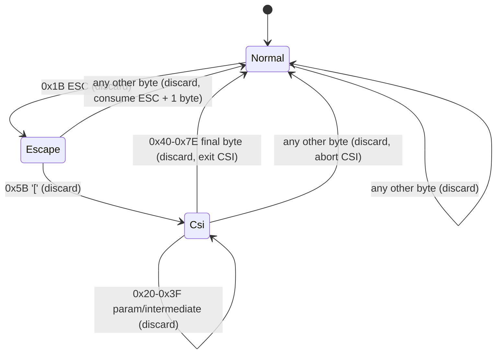

**State Definitions**

| State | Meaning | Emit character? |
|---|---|---|
| `Normal` | Reading regular text | Yes, for printable ASCII U+0020–U+007E |
| `Escape` | Saw `ESC` (0x1B); waiting for sequence type discriminator | No |
| `Csi` | Inside a CSI sequence (`ESC [` prefix); consuming params and final byte | No |

**Rust Implementation**

```rust
// crates/devs-tui/src/render_utils.rs

#[derive(Copy, Clone, PartialEq, Eq)]
enum AnsiState { Normal, Escape, Csi }

/// Strips ANSI CSI escape sequences from `input`.
///
/// Only CSI sequences (`ESC [` params final-byte) are fully consumed.
/// Other ESC sequences are consumed as ESC + one additional byte.
/// Non-printable ASCII bytes (< 0x20 or == 0x7F) in Normal state are discarded.
/// Multi-byte UTF-8 bytes (0x80–0xFF) in Normal state pass through unchanged.
///
/// # Panics
/// Never panics.
pub fn strip_ansi(input: &str) -> String {
    let mut out = String::with_capacity(input.len());
    let mut state = AnsiState::Normal;
    for byte in input.bytes() {
        state = match (state, byte) {
            // Normal: ESC triggers escape sequence processing
            (AnsiState::Normal, 0x1B) => AnsiState::Escape,
            // Normal: printable ASCII emitted
            (AnsiState::Normal, b) if b >= 0x20 && b != 0x7F => {
                out.push(b as char);
                AnsiState::Normal
            }
            // Normal: high bytes (0x80-0xFF) are UTF-8 continuation/lead bytes; pass through
            (AnsiState::Normal, b) if b >= 0x80 => {
                out.push(b as char);
                AnsiState::Normal
            }
            // Normal: other control chars (0x00-0x1A, 0x1C-0x1F, 0x7F) discarded
            (AnsiState::Normal, _) => AnsiState::Normal,
            // Escape: '[' begins a CSI sequence
            (AnsiState::Escape, b'[') => AnsiState::Csi,
            // Escape: any other byte consumed (ESC + 1 byte = 2 bytes discarded total)
            (AnsiState::Escape, _) => AnsiState::Normal,
            // CSI: final byte (0x40-0x7E) terminates the sequence
            (AnsiState::Csi, b) if b >= 0x40 && b <= 0x7E => AnsiState::Normal,
            // CSI: param/intermediate bytes (0x20-0x3F) and other bytes discarded
            (AnsiState::Csi, _) => AnsiState::Csi,
        };
    }
    out
}
```

**[UI-DES-ANSI-002]** `strip_ansi` processes bytes, not chars. Multi-byte UTF-8 sequences with lead/continuation bytes in the range 0x80–0xFF pass through unchanged in `Normal` state because those byte values do not match any ANSI control byte pattern.

**[UI-DES-ANSI-003]** `\r` (0x0D) and `\n` (0x0A) are discarded in `Normal` state. Log lines are split on `\n` before `strip_ansi` is called; each `LogLine` contains one line without its terminator. Windows `\r\n` line endings are normalized to `\n` at buffer ingestion (see [UI-ARCH-PATH-004] in the Architecture spec).

**[UI-DES-ANSI-004]** The algorithm handles only CSI sequences (`ESC [`). Other ANSI sequence types (OSC `ESC ]`, DCS `ESC P`, APC `ESC _`) are consumed as `ESC + one byte` — the single byte after `ESC` is discarded and the machine returns to `Normal`. Incomplete stripping of OSC/DCS sequences in agent output is accepted behavior at MVP.

**[UI-DES-ANSI-005]** `strip_ansi` MUST be a pure function: no side effects, no I/O, no global state. It MUST NOT panic on any input including empty strings, pure control sequences, or truncated sequences ending mid-CSI.

**Edge Cases — ANSI Stripping:**

| Scenario | Input | Expected Output |
|---|---|---|
| Empty string | `""` | `""` |
| No ANSI sequences | `"hello world"` | `"hello world"` |
| Simple SGR color | `"\x1b[31mred\x1b[0m"` | `"red"` |
| Multi-param SGR | `"\x1b[1;31;42mtext\x1b[0m"` | `"text"` |
| Truncated CSI at end of input | `"text\x1b["` | `"text"` (no panic; state left in Csi) |
| OSC title set sequence | `"\x1b]0;title\x07"` | `"0;title\x07"` (ESC+`]` consumed, remaining emitted — imperfect but accepted) |
| Multi-byte UTF-8 (`"✓"` = E2 9C 93) | `"\xe2\x9c\x93"` | `"\xe2\x9c\x93"` (bytes pass through; valid UTF-8 displayed as `✓`) |
| Embedded NUL (`0x00`) | `"a\x00b"` | `"ab"` (NUL discarded in Normal state) |

---

### 3.7 `strings.rs` Contract

All user-visible strings are defined as `pub const &'static str` in a `strings.rs` module within each client crate. This enables future internationalization and ensures that inline string literals in widget or handler code are detected by lint tests.

**Module Locations**

| Crate | Module Path |
|---|---|
| `devs-tui` | `crates/devs-tui/src/strings.rs` |
| `devs-cli` | `crates/devs-cli/src/strings.rs` |
| `devs-mcp-bridge` | `crates/devs-mcp-bridge/src/strings.rs` |

**[UI-DES-STR-001]** All user-visible strings that appear in a context an operator reads during normal use MUST be defined in `strings.rs`. Inline `"..."` literals in widget `render()` methods for single structural characters (e.g., `"["`, `"|"`, `"-"`) are exempt.

**Naming Convention**

Constants use a category prefix:

| Prefix | Usage | Example |
|---|---|---|
| `ERR_` | Error messages (begin with machine-stable prefix) | `ERR_NOT_FOUND: &str = "not_found: run not found"` |
| `STATUS_` | 4-char stage status labels | `STATUS_RUN_: &str = "RUN "` |
| `TAB_` | Tab display names | `TAB_DASHBOARD: &str = "Dashboard"` |
| `KEY_` | Keybinding characters shown in help | `KEY_CANCEL: &str = "c"` |
| `HELP_` | Help overlay description text | `HELP_CANCEL: &str = "Cancel selected run"` |
| `COL_` | CLI column header text | `COL_RUN_ID: &str = "RUN ID"` |
| `STATUS_BAR_` | Status bar fixed labels | `STATUS_BAR_CONNECTED: &str = "CONNECTED"` |
| `CMD_` | CLI subcommand names | `CMD_SUBMIT: &str = "submit"` |
| `ARG_` | CLI flag names | `ARG_FORMAT: &str = "format"` |
| `FMT_` | Format specifier strings | `FMT_TIMESTAMP: &str = "%Y-%m-%dT%H:%M:%S%.3fZ"` |
| `MSG_` | One-off informational messages | `MSG_TOO_SMALL: &str = "Terminal too small: ..."` |

**[UI-DES-STR-002]** A lint test (`strings_no_inline_errors`) in each crate's `tests/` directory scans all `.rs` files in `src/` for string literals beginning with any machine-stable error prefix (`not_found:`, `invalid_argument:`, `already_exists:`, `failed_precondition:`, `resource_exhausted:`, `server_unreachable:`, `internal:`, `cancelled:`, `timeout:`, `permission_denied:`) outside of `strings.rs`. Any match causes the test to fail.

**Compile-Time Assertions**

**[UI-DES-STR-003]** All `STATUS_*` constants for stage status labels MUST pass compile-time length assertions:

```rust
// crates/devs-tui/src/strings.rs
pub const STATUS_PEND: &str = "PEND";
pub const STATUS_WAIT: &str = "WAIT";
pub const STATUS_ELIG: &str = "ELIG";
pub const STATUS_RUN_: &str = "RUN "; // trailing space is intentional
pub const STATUS_PAUS: &str = "PAUS";
pub const STATUS_DONE: &str = "DONE";
pub const STATUS_FAIL: &str = "FAIL";
pub const STATUS_TIME: &str = "TIME";
pub const STATUS_CANC: &str = "CANC";

const _: () = assert!(STATUS_PEND.len() == 4);
const _: () = assert!(STATUS_WAIT.len() == 4);
const _: () = assert!(STATUS_ELIG.len() == 4);
const _: () = assert!(STATUS_RUN_.len() == 4);
const _: () = assert!(STATUS_PAUS.len() == 4);
const _: () = assert!(STATUS_DONE.len() == 4);
const _: () = assert!(STATUS_FAIL.len() == 4);
const _: () = assert!(STATUS_TIME.len() == 4);
const _: () = assert!(STATUS_CANC.len() == 4);
```

**Required TUI Constants**

The following constants MUST exist in `crates/devs-tui/src/strings.rs`:

| Constant | Value | Notes |
|---|---|---|
| `TAB_DASHBOARD` | `"Dashboard"` | Tab label |
| `TAB_LOGS` | `"Logs"` | Tab label |
| `TAB_DEBUG` | `"Debug"` | Tab label |
| `TAB_POOLS` | `"Pools"` | Tab label |
| `STATUS_BAR_CONNECTED` | `"CONNECTED"` | Connection status indicator |
| `STATUS_BAR_RECONNECTING` | `"RECONNECTING"` | Connection status indicator |
| `STATUS_BAR_DISCONNECTED` | `"DISCONNECTED"` | Connection status indicator |
| `MSG_TOO_SMALL` | `"Terminal too small: 80x24 minimum required (current: {}x{})"` | Rendered with `format!` and actual dimensions |
| `MSG_DISCONNECTED_EXIT` | `"Disconnected from server. Exiting."` | Printed to stderr before exit code 1 |
| `KEY_QUIT` | `"q"` | Shown in help overlay |
| `KEY_HELP` | `"?"` | Shown in help overlay |
| `KEY_CANCEL` | `"c"` | Shown in help overlay |
| `KEY_PAUSE` | `"p"` | Shown in help overlay |
| `KEY_RESUME` | `"r"` | Shown in help overlay |
| `HELP_CANCEL` | `"Cancel selected run"` | Help description |
| `HELP_PAUSE` | `"Pause selected run"` | Help description |
| `HELP_RESUME` | `"Resume selected run"` | Help description |
| `HELP_QUIT` | `"Quit"` | Help description |
| `HELP_HELP` | `"Toggle help overlay"` | Help description |

**Required CLI Constants**

The following constants MUST exist in `crates/devs-cli/src/strings.rs`:

| Constant | Value |
|---|---|
| `ERR_SERVER_UNREACHABLE` | `"server_unreachable: could not connect to devs server"` |
| `ERR_NOT_FOUND` | `"not_found: resource not found"` |
| `ERR_VALIDATION` | `"invalid_argument: validation failed"` |
| `ERR_GENERAL` | `"internal: unexpected error"` |
| `COL_RUN_ID` | `"RUN ID"` |
| `COL_SLUG` | `"SLUG"` |
| `COL_WORKFLOW` | `"WORKFLOW"` |
| `COL_STATUS` | `"STATUS"` |
| `COL_CREATED` | `"CREATED"` |
| `COL_STAGE` | `"STAGE"` |
| `COL_ATTEMPT` | `"ATTEMPT"` |
| `COL_ELAPSED` | `"ELAPSED"` |
| `COL_AGENT` | `"AGENT"` |
| `CMD_SUBMIT` | `"submit"` |
| `CMD_LIST` | `"list"` |
| `CMD_STATUS` | `"status"` |
| `CMD_LOGS` | `"logs"` |
| `CMD_CANCEL` | `"cancel"` |
| `CMD_PAUSE` | `"pause"` |
| `CMD_RESUME` | `"resume"` |
| `ARG_FORMAT` | `"format"` |
| `ARG_SERVER` | `"server"` |
| `ARG_PROJECT` | `"project"` |
| `ARG_FOLLOW` | `"follow"` |
| `ARG_INPUT` | `"input"` |
| `ARG_NAME` | `"name"` |

**Edge Cases — `strings.rs` Contract:**

| Scenario | Expected Behavior |
|---|---|
| Developer adds inline `"not_found: ..."` in a widget module | `strings_no_inline_errors` lint test fails; CI blocks the commit |
| `STATUS_RUN_` trailing space accidentally removed | Compile-time assertion `STATUS_RUN_.len() == 4` fails; build aborts with a clear message |
| New TUI tab added without a `TAB_*` constant | Lint test fails if the tab label string is inlined in the tab module |
| `MSG_TOO_SMALL` rendered with wrong argument count | Compile error at the `format!` call site |
| `strings.rs` module is absent from a new crate | `cargo doc` fails (missing public documentation enforced by `missing_docs` deny); `./do lint` exits non-zero |

---

### 3.8 CLI Text Formatting

The CLI supports two output modes — `text` (default, human-readable tabular output) and `json` — controlled by the global `--format` flag. All command handlers receive a `&dyn Formatter` and MUST NOT write output directly via `println!` or `eprintln!`.

**`Formatter` Trait**

```rust
// crates/devs-cli/src/formatter.rs

/// Output sink for CLI command handlers.
/// All output — success and error — is routed through this trait.
pub trait Formatter: Send + Sync {
    /// Emit a successfully computed result.
    /// In text mode: writes human-readable tabular or plain-text output to stdout.
    /// In JSON mode: serializes `value` to JSON and writes to stdout.
    fn output<T: serde::Serialize + TextTable>(&self, value: &T);

    /// Emit an error.
    /// In text mode: writes the error message to stderr.
    /// In JSON mode: writes `{"error":"<msg>","code":<n>}` to stdout; nothing to stderr.
    fn error(&self, message: &str, code: i32);
}

pub struct TextFormatter;
pub struct JsonFormatter;
```

**[UI-DES-CLI-001]** In `--format json` mode, ALL output — both success and error — is written to **stdout** as JSON. Nothing is written to stderr. The error JSON format is:

```json
{"error": "<machine-stable-prefix>: <detail>", "code": <exit-code-integer>}
```

**[UI-DES-CLI-002]** In `--format text` mode, success output is written to stdout. Error messages are written to stderr. Error messages use the same machine-stable prefixes but are plain-text strings.

**`TextTable` Trait**

```rust
/// Implemented by CLI output types that render as fixed-width tabular text.
pub trait TextTable {
    /// Returns column definitions as (header_constant, column_width_in_chars) pairs.
    fn headers() -> &'static [(&'static str, usize)];

    /// Returns the formatted string value for each column in the same order as `headers()`.
    fn row_values(&self) -> Vec<String>;
}
```

**Column Definitions for `devs list`**

| Column | Header Constant | Width (chars) | Truncation Rule |
|---|---|---|---|
| Run ID | `COL_RUN_ID` | 36 | Never (UUID is always exactly 36 chars) |
| Slug | `COL_SLUG` | 32 | Ellipsis (`...`) at char 32 |
| Workflow | `COL_WORKFLOW` | 24 | Ellipsis at char 24 |
| Status | `COL_STATUS` | 10 | Never (`"cancelled"` is 9 chars; maximum) |
| Created | `COL_CREATED` | 24 | Never (ISO 8601 timestamp is exactly 24 chars: `YYYY-MM-DD HH:MM:SS UTC`) |

**Column Definitions for `devs status <run>` stage table**

| Column | Header Constant | Width (chars) | Truncation Rule |
|---|---|---|---|
| Stage name | `COL_STAGE` | 28 | Ellipsis at char 28 |
| Attempt | `COL_ATTEMPT` | 7 | Never (max 2 decimal digits) |
| Status | `COL_STATUS` | 10 | Never |
| Agent tool | `COL_AGENT` | 12 | Never (`"copilot"` is 7 chars; maximum) |
| Elapsed | `COL_ELAPSED` | 10 | Never (max 7 chars including spaces) |

**[UI-DES-CLI-003]** Columns are separated by exactly **2 spaces**. The header row uses `STYLE_PRIMARY` (bold) in text mode. In JSON mode, no tabular formatting is applied; the full structured response is serialized as a JSON object or array.

**[UI-DES-CLI-004]** The timestamp format for CLI text-mode output is `YYYY-MM-DD HH:MM:SS UTC` (24 chars). For JSON mode, timestamps use RFC 3339 with millisecond precision: `"2026-03-11T10:00:00.000Z"`.

**[UI-DES-CLI-005]** `devs logs` in text mode writes raw log line content directly to stdout, one line per terminal line, with no column formatting, wrapping, or truncation. With `--format json`, each log line is wrapped as:

```json
{"stream": "stdout", "line": "<content>", "sequence": <n>}
```

The terminal chunk `{"done": true, "truncated": <bool>, "total_lines": <n>}` is also written to stdout in JSON mode.

**Edge Cases — CLI Text Formatting:**

| Scenario | Expected Behavior |
|---|---|
| Value shorter than column width | Right-padded with spaces to column width |
| Value exactly column width | No padding, no truncation |
| Value longer than column width | Truncated with `...`; last 3 chars of allowed prefix replaced; UTF-8 boundary safe |
| `--format json` + error response | `{"error":"...","code":<n>}` written to stdout; stderr empty; process exits with code `<n>` |
| `devs logs --format json --follow` | Each chunk from `stream_logs` written as one JSON object per line to stdout; final `{"done":true,...}` also written |
| Column header longer than declared column width | Compile-time test asserts all `COL_*` constants fit within their declared widths |

---

### 3.9 Dependencies

**Typography System depends on:**

- `devs-core::types::{StageStatus, RunStatus}` — status enum variants for `stage_status_label()` and `run_status_label()`; the match arms must cover all variants exhaustively.
- `ratatui 0.28` — `Style`, `Modifier`, `Color` primitives used by all style constants; version is pinned workspace-wide.
- `crossterm 0.28` — underlying terminal output backend used by ratatui; provides cross-platform ANSI rendering.
- `NO_COLOR` environment variable — read once at startup by `Theme::from_env()` in `devs-tui`.
- `devs-proto` type conversions — proto `StageStatus` values are mapped to domain `StageStatus` (in `crates/devs-tui/src/convert.rs`) before `stage_status_label()` is called; no proto types appear in `render_utils.rs`.

**Typography System is depended upon by:**

- All `devs-tui` widget modules (`dag_view.rs`, `log_pane.rs`, `stage_list.rs`, `run_list.rs`, `status_bar.rs`, `pools_tab.rs`, `debug_tab.rs`, `help_overlay.rs`) — import `render_utils::*` functions and `theme::STYLE_*` constants.
- `devs-cli` formatter — uses `truncate_with_ellipsis()`, `run_status_label()`, and `COL_*`/`CMD_*`/`ARG_*` constants.
- `devs-tui` snapshot tests — `insta` text snapshots embed the exact output of `stage_status_label`, `format_elapsed`, and `truncate_with_tilde`; any typography change requires updating snapshot files.
- `devs-mcp-bridge` strings module — error strings must begin with machine-stable prefixes defined in `strings.rs`.

---

### 3.10 Acceptance Criteria

The following criteria MUST each be verified by an automated test annotated `// Covers: <AC-ID>`.

- **[AC-TYP-001]** `stage_status_label(StageStatus::Running)` returns exactly `"RUN "` (4 bytes, trailing space). Verified by unit test in `crates/devs-tui/tests/`.
- **[AC-TYP-002]** All 9 `stage_status_label()` return values are exactly 4 bytes. Verified by the compile-time `const` assertion block in `render_utils.rs`; the assertion block MUST compile.
- **[AC-TYP-003]** `format_elapsed(None)` returns `"--:--"` with `len() == 5`.
- **[AC-TYP-004]** `format_elapsed(Some(0))` returns a string of length 5 whose first 4 bytes are `"0:00"`.
- **[AC-TYP-005]** `format_elapsed(Some(600_000))` returns `"10:00"` with `len() == 5`.
- **[AC-TYP-006]** `format_elapsed(Some(599_000))` returns a string of length 5 whose first 4 bytes are `"9:59"`.
- **[AC-TYP-007]** `truncate_with_tilde("", 20)` returns a string of length 20 consisting entirely of spaces.
- **[AC-TYP-008]** `truncate_with_tilde("exactly-twenty-chars", 20)` returns the input string unchanged.
- **[AC-TYP-009]** `truncate_with_tilde("this-is-a-very-long-stage-name", 20)` returns a 20-character string ending with `~`.
- **[AC-TYP-010]** `strip_ansi("\x1b[31mred\x1b[0m")` returns `"red"`.
- **[AC-TYP-011]** `strip_ansi("")` returns `""` without panicking.
- **[AC-TYP-012]** `strip_ansi("no-escapes")` returns `"no-escapes"` unchanged.
- **[AC-TYP-013]** `strip_ansi("text\x1b[")` (truncated CSI sequence) returns `"text"` without panicking.
- **[AC-TYP-014]** `strip_ansi("\x1b[1;31;42mcolored\x1b[0m")` returns `"colored"`.
- **[AC-TYP-015]** `Theme::from_env()` returns `ColorMode::Monochrome` when `NO_COLOR` is set to any value (including empty string). Test sets the env var and calls `Theme::from_env()`.
- **[AC-TYP-016]** `Theme::from_env()` returns `ColorMode::Color` when `NO_COLOR` is not set in the environment.
- **[AC-TYP-017]** `theme.style_for_stage_status(StageStatus::Completed)` returns a `Style` with `fg = Color::Green` in Color mode.
- **[AC-TYP-018]** `theme.style_for_stage_status(StageStatus::Completed)` returns `STYLE_STANDARD` (no fg color) in Monochrome mode.
- **[AC-TYP-019]** `run_status_label(RunStatus::Completed)` returns `"completed"` (lowercase, no padding).
- **[AC-TYP-020]** `strings.rs` in `devs-tui` exports `STATUS_RUN_` with value `"RUN "` and the compile-time length assertion for it passes.
- **[AC-TYP-021]** Lint test `strings_no_inline_errors` exits non-zero when a widget module source file contains an inline string literal beginning with `"not_found:"`.
- **[AC-TYP-022]** TUI insta snapshot `dashboard__run_running` contains a stage box matching `[ <name-20> | RUN  | <M:SS > ]` with correct column widths as verified by string comparison in the snapshot.
- **[AC-TYP-023]** TUI renders with no ANSI color escape sequences when `NO_COLOR` is set; verified by `insta` snapshot `dashboard__run_running` (Monochrome mode) containing no `\x1b[` sequences.
- **[AC-TYP-024]** `devs list --format text` output column headers are separated by exactly 2 spaces and the `RUN ID` column is exactly 36 characters wide. Verified by CLI E2E test parsing stdout.
- **[AC-TYP-025]** `devs list --format json` outputs valid JSON to stdout and nothing to stderr; verified by CLI E2E test asserting `stderr.is_empty()` and `serde_json::from_str(stdout).is_ok()`.
- **[AC-TYP-026]** A fan-out stage with `fan_out_count = 4` renders with `(x4)` visible in the stage box name region (subject to truncation if combined length exceeds 20). Verified by TUI unit test with controlled `StageRunDisplay`.
- **[AC-TYP-027]** `ITALIC`, `UNDERLINED`, `BLINK`, `RAPID_BLINK` modifier tokens do not appear in any widget source file in `crates/devs-tui/src/widgets/`. Verified by lint test scanning file contents.
- **[AC-TYP-028]** `truncate_with_tilde(s, 20)` returns a string whose `chars().count() == 20` for inputs of length 0, 19, 20, and 25. Verified by parameterized unit tests.

---

## 4. Spacing, Grid & Layout Metrics

### 4.1 Grid Unit

**[UI-DES-035]** The base grid unit is **1 terminal cell** (1 column × 1 row). All measurements in this section are in cells. There is no sub-cell spacing. Margins and padding are expressed as integer column/row counts.

### 4.2 Minimum Terminal Constraint

**[UI-DES-036]** At terminal size below **80 columns × 24 rows**, the TUI renders only the following centered message and nothing else (all tabs, status bars, and widgets suppressed):

```
Terminal too small: 80x24 minimum required (current: WxH)
```

Where `W` and `H` are the actual detected dimensions. This message is plain ASCII, no color or modifiers.

### 4.3 Dashboard Layout

**[UI-DES-037]** The Dashboard tab uses a **two-pane horizontal split**:

| Pane | Width rule | Minimum width |
|---|---|---|
| `RunList` | `max(30% of terminal columns, 24 columns)` | 24 columns |
| `RunDetail` | Remaining columns after `RunList` | 56 columns at minimum terminal |

**[UI-DES-038]** `RunDetail` uses a **two-pane vertical split**:

| Sub-pane | Height rule | Minimum rows |
|---|---|---|
| `DagView` | `max(40% of available rows, 8 rows)` | 8 rows |
| `LogTail` | Remaining rows after `DagView` and header/footer | 4 rows |

**[UI-DES-039]** The `TabBar` occupies exactly **1 row** at the top. The `StatusBar` occupies exactly **1 row** at the bottom. These are subtracted from available rows before the pane split calculation.

### 4.4 Stage Box Dimensions

**[UI-DES-040]** A stage box in the DAG view is exactly **41 columns wide**, decomposed as:

```
[ <name:20> | <STAT:4> | <time:5> ]
^  ^         ^ ^        ^ ^        ^
1  20        1 4        1 5        1  = 2 + 20 + 3 + 4 + 3 + 5 + 3 = 40...
```

Exact breakdown (41 columns total):

| Segment | Content | Width |
|---|---|---|
| `[` | Box open bracket | 1 |
| ` ` | Inner left padding | 1 |
| name | Stage name (padded/truncated to 20) | 20 |
| ` | ` | Separator with spaces | 3 |
| status | 4-char status label | 4 |
| ` | ` | Separator with spaces | 3 |
| elapsed | 5-char elapsed string | 5 |
| ` ` | Inner right padding | 1 |
| `]` | Box close bracket | 1 |
| **Total** | | **39** |

**[UI-DES-040a]** Correction — exact box content is `[ <name-20> | <STAT> | <M:SS> ]`:
- `[` = 1 col
- ` ` = 1 col
- name (20 cols)
- ` ` = 1 col
- `|` = 1 col
- ` ` = 1 col
- status (4 cols)
- ` ` = 1 col
- `|` = 1 col
- ` ` = 1 col
- elapsed (5 cols)
- ` ` = 1 col
- `]` = 1 col
= **1+1+20+1+1+1+4+1+1+1+5+1+1 = 39 columns**

**[UI-DES-040b]** The canonical box width is **39 columns**. All horizontal scroll and layout calculations use this value.

**[UI-DES-041]** Fan-out stages append `(xN)` before truncation, where N is the sub-agent count. The combined name + suffix must still fit within 20 columns. If `stage-name(x8)` exceeds 20 chars, the name portion is truncated first:

```
"stage-name(x8)"         → "stage-name(x8)     " (15 chars, padded)
"very-long-stage-name(x4)" → "very-long-stage-~(x" (truncated at 19, appended char)
```

### 4.5 Tier Gutter

**[UI-DES-042]** Between DAG tiers, a **5-column gutter** is used. The gutter contains an ASCII arrow at the vertical midpoint of the connecting box:

```
  -->
```

Full gutter characters: 2 leading spaces + `-->` (3 chars) = 5 columns. In `ColorMode::Color`, the `-->` characters may use `Color::DarkGray` foreground.

**[UI-DES-043]** Horizontal DAG scroll is activated when the total rendered width exceeds the `DagView` pane width. The scroll offset (`dag_scroll_offset` in `AppState`) represents the number of columns scrolled from the left edge. Scroll step is **1 column per keypress** (`←`/`→`).

### 4.6 Log Pane Layout

**[UI-DES-044]** `LogTail` (Dashboard): last N visible lines where N = available rows in the sub-pane. No scroll offset display. Scroll offset is automatically set to `max(0, buffer.len() - visible_rows)` to always show the tail.

**[UI-DES-045]** `LogPane` (Logs tab): full-height pane with scroll controlled by `AppState::log_scroll_offset`. Each line occupies exactly 1 row. Lines exceeding pane width are clipped (not wrapped) to prevent layout corruption.

**[UI-DES-046]** `LogBuffer` capacity: **10,000 lines**. When full, lines are evicted FIFO (oldest first). The `truncated: bool` flag is set to `true` after first eviction. Display of truncated buffers prefixes a 1-row notice:

```
[LOG TRUNCATED - showing most recent 10000 lines]
```

This notice occupies 1 row and is rendered in `STYLE_SUBDUED`.

### 4.7 Pools Tab Layout

**[UI-DES-047]** `PoolsTab` uses a **two-column layout**:

| Column | Content | Width |
|---|---|---|
| Left | `PoolList` (pool names) | `max(25%, 20 columns)` |
| Right | `AgentStatusGrid` for selected pool | Remaining |

**[UI-DES-048]** `AgentStatusGrid` renders one row per agent with the following fixed columns:

| Column | Width | Content |
|---|---|---|
| Tool name | 10 | e.g., `claude    ` |
| Capabilities | 30 | Comma-separated tags, truncated |
| Fallback | 8 | `YES     ` or `NO      ` |
| Rate limited | 20 | `--:--` or `until HH:MM:SS` |

### 4.8 Status Bar Layout

**[UI-DES-049]** `StatusBar` occupies the last row of the terminal. It is composed of three fixed regions, left-to-right:

| Region | Width | Content |
|---|---|---|
| Connection status | 15 | `CONNECTED       ` / `RECONNECTING...` / `DISCONNECTED   ` |
| Server address | 30 | e.g., `127.0.0.1:7890           ` (truncated with `~`) |
| Active run count | remainder | `Runs: N active` right-aligned |

**[UI-DES-050]** The `StatusBar` is rendered every frame regardless of tab. Its content is derived from `AppState::connection_status`, `AppState::server_addr`, and `AppState::runs`.

### 4.9 CLI Output Metrics

**[UI-DES-051]** CLI text-mode tabular output uses fixed column widths regardless of terminal width. Columns are separated by exactly **2 spaces**. The standard column table for `devs list`:

| Column | Width | Alignment |
|---|---|---|
| `RUN-ID` | 8 (first 8 chars of UUID) | Left |
| `SLUG` | 32 | Left |
| `WORKFLOW` | 20 | Left |
| `STATUS` | 12 | Left |
| `CREATED` | 24 | Left |

**[UI-DES-052]** `devs status <run>` text output uses a **label: value** format with 2-space indentation for nested stage details:

```
Run:      <slug>
Status:   <status>
Started:  <timestamp>
Stages:
  plan           DONE   0:42
  implement-api  RUN    1:23
```

**[UI-DES-052a]** The stage name column in `devs status` text mode is **20 characters wide**, left-aligned, space-padded. Status is **4 characters**, space-padded. Elapsed is **5 characters** (`M:SS` format or `--:--`). These match TUI stage box field widths exactly.

**[UI-DES-052b]** `devs list` text-mode truncation rules: `SLUG` field truncated to 32 chars with `~` suffix if longer; `WORKFLOW` field truncated to 20 chars with `~`; `RUN-ID` is always the first 8 hex characters of the UUID (no dashes).

**[UI-DES-052c]** `devs logs` text mode writes one log line per stdout line. Each line is prefixed with stream tag when `--stage` is omitted and multiple stages are present: `[stdout]` or `[stderr]` followed by a single space, then the log content. When a single stage is specified, no prefix is added.

---

### 4.10 Logs Tab Layout

**[UI-DES-053a]** The Logs tab is a **two-column horizontal split** occupying the full area between the `TabBar` and `StatusBar`:

| Column | Width Rule | Minimum |
|---|---|---|
| `StageSelector` | `max(20% of terminal columns, 16 columns)` | 16 columns |
| `LogPane` | Remaining columns | 64 columns at minimum terminal |

**[UI-DES-053b]** `StageSelector` renders a flat list of selectable entries organized as groups. Each group starts with a run slug header row (1 row, bold in Color mode, reversed in Monochrome), followed by one entry per stage in the run. Stage entries display: `  <stage-name-18> <STAT>` using exactly 2-char indent + 18-char stage name (truncated with `~`) + 1 space + 4-char status label = **25 columns** of content within the column.

**[UI-DES-053c]** `LogPane` in the Logs tab shows the `show_stream_prefix = true` variant. Each log line is rendered as: `[stdout] ` or `[stderr] ` prefix (9 characters, with trailing space), followed by the log content clipped to `pane_width - 9` columns. The prefix renders in `STYLE_LOG_STDERR` (Yellow fg in Color mode) for stderr lines and default style for stdout lines.

**[UI-DES-053d]** When no stage is selected in `StageSelector`, `LogPane` renders a centered placeholder:

```
No stage selected. Use arrow keys to select a stage.
```

This placeholder is plain text, centered horizontally and vertically within the pane, no color or modifiers.

**[UI-DES-053e]** `StageSelector` scroll: the selected entry is always kept visible. If the selected entry is above the visible area, the view scrolls up; if below, the view scrolls down. Scroll is line-by-line (not page). The selector tracks `log_stage_scroll_offset: usize` in `AppState`, separate from `log_scroll_offset`.

**[UI-DES-053f]** Run header rows in `StageSelector` are **not selectable**. Pressing `↓` while on a run header skips to the first stage entry of that run. Pressing `↑` while on the first stage of a run moves to the last stage of the previous run (skipping its header).

**Edge cases — Logs tab layout:**

- **Empty run list**: `StageSelector` renders single centered line `No runs available.` spanning full column height. `LogPane` renders the no-stage-selected placeholder.
- **All stages in Pending/Waiting state**: `StageSelector` shows entries with `PEND`/`WAIT` labels; `LogPane` for such a stage renders `No log output yet.` centered placeholder.
- **Stage name exactly 18 characters**: displayed without truncation. Stage name of 19+ characters: truncated to 17 + `~` = 18 characters total.
- **Terminal width of exactly 80 columns** (minimum): `StageSelector` = `max(20% × 80, 16)` = `max(16, 16)` = 16 columns; `LogPane` = 64 columns.
- **Single-stage run**: `StageSelector` shows one run header + one stage entry. Selecting it immediately populates `LogPane`.

---

### 4.11 Debug Tab Layout

**[UI-DES-054a]** The Debug tab uses a **three-region vertical stack** occupying the full area between `TabBar` and `StatusBar`:

| Region | Height Rule | Minimum Rows | Content |
|---|---|---|---|
| `AgentSelector` | 1 row fixed | 1 | Selected run + stage header |
| `DiffView` | `max(60% of available rows, 8 rows)` | 8 | Working directory diff |
| `ControlPanel` | Remaining rows (min 3) | 3 | Action buttons and signals |

**[UI-DES-054b]** `AgentSelector` (1-row fixed header) displays the currently selected run slug and stage name in the format:

```
Debug: <slug-30> / <stage-name-20>  [p]ause  [r]esume  [c]ancel
```

Slug truncated to 30 chars with `~`; stage name truncated to 20 chars with `~`. Key hints `[p]`, `[r]`, `[c]` are always rendered at the right side of the row, right-aligned within the terminal width.

**[UI-DES-054c]** `DiffView` renders the unified diff of the agent's working directory against the base commit. Each diff line is rendered with the following prefix-to-style mapping:

| Diff prefix | Style |
|---|---|
| `+` (addition) | Green fg in Color mode; `REVERSED` in Monochrome |
| `-` (deletion) | Red fg in Color mode; default in Monochrome |
| `@@ ... @@` (hunk header) | Cyan fg in Color mode; `BOLD` in Monochrome |
| ` ` (context) | Default style |

Lines are clipped to `pane_width` columns. Vertical scrolling is controlled by `AppState::diff_scroll_offset: usize`. No horizontal scroll.

**[UI-DES-054d]** `ControlPanel` occupies the remaining rows below `DiffView` (minimum 3 rows). It renders a fixed 3-row action area regardless of how many rows are available (additional rows below are blank):

```
Row 1: Signals:  [p] Pause   [r] Resume   [c] Cancel
Row 2: Status:   <current-stage-status-label>   Attempt: <N>/<max>
Row 3: <blank or error message from last control action>
```

Row 3 is blank by default and displays a 1-second flash message after any control action (e.g., `Signal sent.` or `Error: stage not running`). The flash is tracked by `AppState::debug_flash: Option<(String, Instant)>` and cleared after 1 second on the next `Tick` event.

**[UI-DES-054e]** When no run is selected (Debug tab opened with no active run), the entire content area (excluding `TabBar` and `StatusBar`) renders the centered placeholder:

```
No run selected. Navigate to Dashboard and select a run first.
```

**Edge cases — Debug tab layout:**

- **Available rows < 12** (TabBar + StatusBar consume 2, leaving < 12): `DiffView` uses `max(60% × available, 8)` which at minimum available=10 gives `max(6, 8)` = 8 rows; `ControlPanel` gets `10 - 8 = 2` rows, which is less than the minimum 3. In this case `ControlPanel` renders only rows 1 and 2 (status row), omitting row 3.
- **Empty diff** (no changes in working directory): `DiffView` renders centered `No changes in working directory.` placeholder.
- **Diff exceeds buffer** (very large diff): Only the first 10,000 lines of the diff are loaded into memory. A 1-row notice `[DIFF TRUNCATED - showing first 10000 lines]` is prepended in `STYLE_SUBDUED`.
- **Stage not Running** (Completed/Failed/Cancelled): `ControlPanel` Row 1 renders `[p] Pause` and `[r] Resume` grayed out (in Monochrome: rendered but noted as inactive); `[c] Cancel` active only if not already Cancelled.
- **No agent process attached** (stage in Waiting/Eligible): All three signal buttons render as inactive; Row 2 shows `Status: WAIT  Attempt: 1/1`.

---

### 4.12 HelpOverlay Dimensions

**[UI-DES-055a]** The `HelpOverlay` is a **centered modal dialog** that floats above all tab content. Its dimensions are computed as:

| Axis | Formula | Minimum | Maximum |
|---|---|---|---|
| Width | `min(72 columns, terminal_width - 4)` | 72 (at 76+ cols) | 72 |
| Height | `min(24 rows, terminal_height - 4)` | 24 (at 28+ rows) | 24 |

**[UI-DES-055b]** The overlay is positioned at:
- `x = (terminal_width - overlay_width) / 2` (integer division, rounding left)
- `y = (terminal_height - overlay_height) / 2` (integer division, rounding up)

**[UI-DES-055c]** The overlay has a **1-column, 1-row border** on all sides using ASCII characters `+`, `-`, `|`. Interior content area is therefore `(overlay_width - 2) × (overlay_height - 2)`. Interior is divided into two columns for keybinding display:

| Column | Width | Content |
|---|---|---|
| Keys | 20 | Key sequence, e.g., `Tab / 1-4        ` |
| Description | `interior_width - 22` | Action description, e.g., `Switch tab` |
| Separator | 2 | Two spaces between columns |

**[UI-DES-055d]** The overlay title `[ Keyboard Shortcuts ]` is centered on the top border row, replacing the `-` characters with the title string (including surrounding spaces). Title string is always exactly 21 characters including brackets and spaces.

**[UI-DES-055e]** When the terminal is too small to fit the minimum overlay (below 80×24, which is already the minimum terminal size), the overlay is not rendered and the too-small message is displayed instead.

**[UI-DES-055f]** The background behind the overlay is **not cleared** — the existing tab content is visible behind it (the overlay is opaque only within its own border box). The border and interior background uses `STYLE_BACKGROUND` to mask the content behind.

**Edge cases — HelpOverlay dimensions:**

- **Terminal exactly 80×24**: overlay = `min(72, 80-4)=72` wide × `min(24, 24-4)=20` high; positioned at x=4, y=2. Interior = 70×18 columns.
- **Terminal width 76**: overlay = `min(72, 72)=72` wide; still fits at `x=(76-72)/2=2`.
- **Terminal width 75**: overlay = `min(72, 71)=71` wide; interior = 69×18 columns. Interior key column still 20, description column = 69-22=47.
- **Odd terminal width** (e.g., 81 columns): x = `(81-72)/2 = 4` (integer division).
- **HelpOverlay toggled during reconnect**: overlay renders on top of `Reconnecting` status bar; status bar remains visible as it is outside the overlay area.

---

### 4.13 Layout Computation Order

**[UI-DES-056a]** Layout dimensions are recomputed **synchronously** in `App::handle_event()` on every `TuiEvent::Resize` event and on initial startup. No layout values are cached between renders; each `App::render()` call receives the pre-computed `LayoutState` from the most recent computation.

**[UI-DES-056b]** The canonical layout computation function signature is:

```rust
/// Computes the full layout for the current terminal size and active tab.
/// Called in handle_event() before render(); never called from render().
pub fn compute_layout(terminal_size: (u16, u16)) -> LayoutMode {
    let (width, height) = terminal_size;
    if width < 80 || height < 24 {
        return LayoutMode::TooSmall { actual: terminal_size };
    }
    let tab_bar = PaneDimensions { x: 0, y: 0, width, height: 1 };
    let status_bar = PaneDimensions { x: 0, y: height - 1, width, height: 1 };
    let content_area = PaneDimensions {
        x: 0, y: 1, width, height: height - 2,
    };
    LayoutMode::Normal(LayoutState { tab_bar, status_bar, content_area })
}
```

**[UI-DES-056c]** Per-tab layout is computed from `LayoutState::content_area` using the rules in §4.3 (Dashboard), §4.10 (Logs), §4.11 (Debug), and §4.7 (Pools). Each tab's layout function is pure and deterministic given the same `content_area` dimensions.

**[UI-DES-056d]** Computation order within the Dashboard tab:

```
1. run_list_width = max(content_area.width * 30 / 100, 24)
   run_detail_width = content_area.width - run_list_width
2. dag_view_height = max(content_area.height * 40 / 100, 8)
   log_tail_height = content_area.height - dag_view_height
3. Clamp: if run_detail_width < 1, run_detail_width = 1 (degenerate layout)
4. Clamp: if log_tail_height < 1, log_tail_height = 1
```

All divisions are **integer division** (truncating toward zero). No floating-point arithmetic is used in layout computation.

**[UI-DES-056e]** Computation order within the Logs tab:

```
1. stage_selector_width = max(content_area.width * 20 / 100, 16)
   log_pane_width = content_area.width - stage_selector_width
2. Both columns occupy full content_area.height
3. Clamp: if log_pane_width < 1, log_pane_width = 1
```

**[UI-DES-056f]** Computation order within the Debug tab:

```
1. agent_selector_height = 1 (fixed)
   remaining = content_area.height - 1
2. diff_view_height = max(remaining * 60 / 100, 8)
   control_panel_height = remaining - diff_view_height
3. Clamp: if diff_view_height > remaining - 1, diff_view_height = remaining - 1
   control_panel_height = remaining - diff_view_height (min 1)
```

**[UI-DES-056g]** Computation order within the Pools tab:

```
1. pool_list_width = max(content_area.width * 25 / 100, 20)
   agent_status_width = content_area.width - pool_list_width
2. Both columns occupy full content_area.height
3. Clamp: if agent_status_width < 1, agent_status_width = 1
```

**[UI-DES-056h]** All layout computation MUST use **`u16` arithmetic with checked addition/subtraction**. If a subtraction would underflow (result < 0), the result is clamped to 0. This prevents panics on degenerate terminal sizes that pass the 80×24 check but have unusual proportions after splitting.

---

### 4.14 Terminal Resize Handling

**[UI-DES-057a]** On receipt of `TuiEvent::Resize(new_width, new_height)`, the following sequence occurs:

1. `AppState::terminal_size` is updated to `(new_width, new_height)`.
2. `compute_layout(new_width, new_height)` is called synchronously.
3. If the result is `LayoutMode::TooSmall`, `AppState::layout_mode` is set to `TooSmall`.
4. If the result is `LayoutMode::Normal`, `AppState::layout_mode` is set to `Normal` and all scroll offsets are validated against new bounds (see §4.15).
5. `App::render()` is called immediately after `handle_event()` completes.

**[UI-DES-057b]** `AppState::terminal_size` is initialized on startup by querying `crossterm::terminal::size()` before the first `handle_event()` call. If the query fails, size defaults to `(80, 24)` and a `WARN` is emitted via `tracing`.

**[UI-DES-057c]** Rapid resize events (multiple `Resize` events arriving in the same event loop tick) are all processed in sequence. Each updates `AppState::terminal_size` and triggers layout recomputation. Only the final render (after the last event in the batch) is drawn to the terminal. This is guaranteed by the event loop structure: crossterm events are drained in a loop before render.

**[UI-DES-057d]** Transition from `TooSmall` back to `Normal` on a resize that crosses the 80×24 threshold: all `AppState` scroll offsets are clamped to valid ranges for the new layout before rendering. Selected run, stage, and pool selections are preserved across the transition.

**[UI-DES-057e]** `AppState::dag_scroll_offset` is NOT reset on resize. If the new terminal width makes the DAG fit without scrolling, the scroll offset is clamped to 0 by the render function (not cleared from state). This allows the scroll offset to be preserved if the user resizes back to a smaller terminal.

**Edge cases — resize handling:**

- **Resize to exactly 80×24**: transitions from `TooSmall` to `Normal`; full layout rendered immediately.
- **Resize to 79×24** while in Normal: transitions to `TooSmall`; size warning rendered. Log buffers, run selection, and all state preserved.
- **Resize to 80×23**: `TooSmall` (height < 24).
- **Resize to 200×50** (TestBackend default): all panes compute with wider/taller dimensions; no clamp required.
- **Resize event with same dimensions as current**: no-op for layout (all values unchanged); render still fires.
- **crossterm resize event overflow** (hypothetical `u16::MAX` values): layout computation uses checked arithmetic; result clamped; a `WARN` is emitted.

---

### 4.15 Scroll Bounds and Navigation

**[UI-DES-058a]** Scroll bounds are defined per-pane as closed intervals `[min, max]`. All scroll offsets in `AppState` are `usize`. Attempting to scroll past a bound is silently clamped (no error, no visual feedback beyond reaching the limit).

**[UI-DES-058b]** Per-pane scroll bounds:

| Pane | Scroll Axis | Min | Max |
|---|---|---|---|
| `RunList` | Vertical | `0` | `max(0, runs.len().saturating_sub(visible_rows))` |
| `DagView` | Horizontal | `0` | `max(0, total_dag_width.saturating_sub(pane_width))` |
| `LogTail` | Vertical | Automatic (always shows tail) | N/A — auto-scroll only |
| `LogPane` | Vertical | `0` | `max(0, buffer.len().saturating_sub(visible_rows))` |
| `StageSelector` | Vertical | `0` | `max(0, total_entries.saturating_sub(visible_rows))` |
| `DiffView` | Vertical | `0` | `max(0, diff_lines.saturating_sub(visible_rows))` |
| `PoolList` | Vertical | `0` | `max(0, pools.len().saturating_sub(visible_rows))` |

**[UI-DES-058c]** `total_dag_width` is computed as: `(number_of_tiers × stage_box_width) + ((number_of_tiers - 1) × tier_gutter_width)` = `(N × 39) + ((N - 1) × 5)` where N = number of DAG tiers. For a single-tier workflow: `39` columns total, no gutter. Minimum `total_dag_width` is 39.

**[UI-DES-058d]** Navigation key bindings for scroll:

| Key | Action |
|---|---|
| `↑` / `k` | Scroll up 1 row (RunList, LogPane, StageSelector, DiffView, PoolList) |
| `↓` / `j` | Scroll down 1 row |
| `←` | Scroll DAG left 1 column |
| `→` | Scroll DAG right 1 column |
| `PgUp` | Scroll up `visible_rows - 1` rows (page scroll) |
| `PgDn` | Scroll down `visible_rows - 1` rows |
| `Home` | Jump to scroll offset 0 |
| `End` | Jump to scroll max |
| `g` | Jump to scroll offset 0 (vim-style) |
| `G` | Jump to scroll max (vim-style) |

**[UI-DES-058e]** Page scroll amount is `max(1, visible_rows - 1)` rows. This ensures at least 1 row of overlap between pages (visual continuity). At minimum visible height of 1 row, page scroll = 0 (no movement, clamped from `max(1, 0)`). Wait—actually `max(1, 1-1) = max(1,0) = 1`, so minimum page scroll is always 1.

**[UI-DES-058f]** Auto-scroll behavior for `LogTail`: after every `TuiEvent::LogLine` event, if the user has not manually scrolled `LogPane` away from the tail (i.e., scroll offset == previous max), the offset is advanced by 1 to track the new tail. If the user has scrolled up (offset < max before the new line), no auto-advance occurs (the view is "locked" to their manual position). This is tracked by `AppState::log_tail_auto_scroll: bool` (default `true`), toggled to `false` on any manual `↑`/`PgUp`/`Home` in `LogPane`, and back to `true` on `End`/`G`.

**[UI-DES-058g]** `RunList` selection and scroll are coupled: navigating with `↑`/`↓` in `RunList` changes `AppState::selected_run_id` AND adjusts `run_list_scroll_offset` to keep the selected item visible. The selected item is always within the visible rows.

**Edge cases — scroll bounds:**

- **Empty buffer** (`buffer.len() == 0`): max scroll = `max(0, 0 - N) = 0`; all scroll operations are no-ops.
- **Buffer length exactly equals visible rows**: max scroll = 0; no scrolling needed; no scroll indicator.
- **`End` key pressed when already at max**: no-op; no visual change.
- **`↑` pressed at offset 0**: clamped to 0; no-op.
- **Buffer grows while viewing non-tail position**: offset remains unchanged (user's locked view is preserved); auto-scroll is `false`.
- **Run removed from `runs` list while selected**: `selected_run_id` cleared to `None`; `run_list_scroll_offset` clamped to new max.
- **DAG single-tier workflow** (total_dag_width = 39, pane_width = 100): max horizontal scroll = 0; `←`/`→` are no-ops.

---

### 4.16 Layout Data Models

**[UI-DES-059a]** All layout types are defined in `crates/devs-tui/src/layout.rs`. They are derived `Clone`, `Copy`, `Debug`, `PartialEq`, and `Eq`. No serialization derives (layout is always computed, never persisted).

```rust
/// A rectangular region in terminal cells.
/// All coordinates are absolute (relative to terminal top-left).
#[derive(Clone, Copy, Debug, PartialEq, Eq)]
pub struct PaneDimensions {
    /// Left edge column (0-indexed).
    pub x: u16,
    /// Top edge row (0-indexed).
    pub y: u16,
    /// Width in columns. Must be >= 1 in Normal layout mode.
    pub width: u16,
    /// Height in rows. Must be >= 1 in Normal layout mode.
    pub height: u16,
}

impl PaneDimensions {
    /// Returns a ratatui `Rect` for use in render calls.
    pub fn to_rect(self) -> ratatui::layout::Rect {
        ratatui::layout::Rect::new(self.x, self.y, self.width, self.height)
    }
    /// Returns the number of visible rows (same as height).
    pub fn visible_rows(self) -> usize {
        self.height as usize
    }
    /// Returns the number of visible columns (same as width).
    pub fn visible_cols(self) -> usize {
        self.width as usize
    }
}

/// Top-level layout mode: either too small or fully computed.
#[derive(Clone, Debug, PartialEq, Eq)]
pub enum LayoutMode {
    TooSmall { actual_width: u16, actual_height: u16 },
    Normal(LayoutState),
}

/// Layout for a terminal that meets the 80x24 minimum.
#[derive(Clone, Debug, PartialEq, Eq)]
pub struct LayoutState {
    pub tab_bar: PaneDimensions,
    pub status_bar: PaneDimensions,
    pub content_area: PaneDimensions,
}

/// Dashboard tab pane layout.
#[derive(Clone, Debug, PartialEq, Eq)]
pub struct DashboardLayout {
    pub run_list: PaneDimensions,
    pub dag_view: PaneDimensions,
    pub log_tail: PaneDimensions,
}

/// Logs tab pane layout.
#[derive(Clone, Debug, PartialEq, Eq)]
pub struct LogsLayout {
    pub stage_selector: PaneDimensions,
    pub log_pane: PaneDimensions,
}

/// Debug tab pane layout.
#[derive(Clone, Debug, PartialEq, Eq)]
pub struct DebugLayout {
    pub agent_selector: PaneDimensions,
    pub diff_view: PaneDimensions,
    pub control_panel: PaneDimensions,
}

/// Pools tab pane layout.
#[derive(Clone, Debug, PartialEq, Eq)]
pub struct PoolsLayout {
    pub pool_list: PaneDimensions,
    pub agent_status: PaneDimensions,
}

/// Help overlay layout (computed independently of tab layout).
#[derive(Clone, Debug, PartialEq, Eq)]
pub struct HelpOverlayLayout {
    pub outer: PaneDimensions,    // includes border
    pub inner: PaneDimensions,    // content area (border excluded)
    pub key_col_width: u16,       // always 20
    pub desc_col_width: u16,      // inner.width - 22
}
```

**[UI-DES-059b]** `AppState` stores the current `LayoutMode` as a field updated on every `TuiEvent::Resize` and on startup:

```rust
pub layout: LayoutMode,
```

The `render()` method pattern-matches on `layout`:
- `LayoutMode::TooSmall { actual_width, actual_height }`: renders only the size warning message.
- `LayoutMode::Normal(layout_state)`: renders the active tab using the appropriate per-tab layout function.

**[UI-DES-059c]** Per-tab layout computation functions are free functions (not methods) in `layout.rs`:

```rust
pub fn dashboard_layout(content: PaneDimensions) -> DashboardLayout;
pub fn logs_layout(content: PaneDimensions) -> LogsLayout;
pub fn debug_layout(content: PaneDimensions) -> DebugLayout;
pub fn pools_layout(content: PaneDimensions) -> PoolsLayout;
pub fn help_overlay_layout(terminal: (u16, u16)) -> HelpOverlayLayout;
```

All functions are `#[must_use]` and have zero side effects. They are covered by unit tests with a comprehensive set of terminal size inputs.

**[UI-DES-059d]** `PaneDimensions` MUST NOT be constructed with `width = 0` or `height = 0` in `Normal` layout mode. If a layout computation results in a zero-dimension pane (degenerate terminal), the pane is clamped to `width = 1` or `height = 1`. A `tracing::warn!` is emitted with fields `pane_name`, `computed_width`, `computed_height` when clamping occurs.

---

### 4.17 Edge Cases

This subsection consolidates all layout edge cases not already covered in per-subsection notes above.

#### 4.17.1 Stage Box Name Truncation

**[UI-DES-060a]** Stage name truncation for the 20-character name field uses the following algorithm:

```rust
/// Truncates `name` to at most `max_len` Unicode scalar values.
/// If truncation occurs, the last character is replaced with `~`.
/// If `name.chars().count() <= max_len`, returns the name padded with spaces to `max_len`.
pub fn truncate_with_tilde(name: &str, max_len: usize) -> String {
    let chars: Vec<char> = name.chars().collect();
    if chars.len() <= max_len {
        let mut s = name.to_string();
        while s.chars().count() < max_len {
            s.push(' ');
        }
        s
    } else {
        let mut s: String = chars[..max_len - 1].iter().collect();
        s.push('~');
        s
    }
}
```

**[UI-DES-060b]** The above function MUST produce a string whose `chars().count()` is exactly `max_len` for all inputs. This invariant is verified by a parameterized unit test covering inputs of length 0, 1, `max_len - 1`, `max_len`, and `max_len + 1`.

**[UI-DES-060c]** Fan-out stage name construction before truncation:

```rust
// Construct fan-out display name.
// suffix is "(xN)" where N is the sub-agent count.
// The combined string is passed to truncate_with_tilde(combined, 20).
let suffix = format!("(x{})", fan_out_count);
let combined = format!("{}{}", stage_name, suffix);
let display = truncate_with_tilde(&combined, 20);
```

If `suffix` alone exceeds 20 characters (impossible in practice since N ≤ 64, max suffix = `(x64)` = 5 chars), the suffix is truncated to fit.

#### 4.17.2 CLI Column Width Overflow

**[UI-DES-060d]** CLI text-mode columns are fixed-width regardless of actual content length. Content that exceeds column width is **truncated without a tilde** (unlike TUI stage names). The field is simply cut at the column boundary. No ellipsis or indicator is added in the table body.

**[UI-DES-060e]** `RUN-ID` column (8 chars) is always the first 8 hex characters of the UUID string (after removing dashes). For UUID `"550e8400-e29b-41d4-a716-446655440000"`, display = `"550e8400"`.

#### 4.17.3 StatusBar Overflow

**[UI-DES-060f]** If `server_addr` string exceeds 30 characters, it is truncated to 29 characters + `~`. If the terminal width is less than `15 + 30 + 10 = 55` columns (impossible given 80-column minimum), the active run count region is omitted entirely.

**[UI-DES-060g]** Connection status strings are always exactly 15 characters. Canonical values (with trailing spaces):

| Status | String (15 chars) |
|---|---|
| Connected | `CONNECTED      ` |
| Reconnecting | `RECONNECTING...` |
| Disconnected | `DISCONNECTED   ` |

These are defined as `pub const` values in `devs-tui/src/strings.rs`.

#### 4.17.4 Pools AgentStatusGrid Column Overflow

**[UI-DES-060h]** `AgentStatusGrid` capabilities column (30 chars): capabilities are comma-joined and truncated to 29 chars + `~` if the joined string exceeds 30 chars. `Rate limited` column (20 chars): `until HH:MM:SS` format is always exactly 14 chars, which fits within 20. When not rate-limited, the field renders as `              ` (14 spaces within 20-char column).

**[UI-DES-060i]** If `agent_status_width < 68` (the sum of all AgentStatusGrid columns), column widths are proportionally reduced: the capabilities column shrinks first (minimum 10), then rate-limited column (minimum 10), then fallback (minimum 3), then tool (minimum 5).

---

### 4.18 Terminal Size State Machine

The following Mermaid diagram describes the terminal size state transitions as observed by the TUI:

```mermaid
stateDiagram-v2
    [*] --> Querying: App startup

    Querying --> TooSmall: terminal_size < 80x24
    Querying --> Normal: terminal_size >= 80x24

    TooSmall --> TooSmall: Resize(w,h) where w<80 or h<24
    TooSmall --> Normal: Resize(w,h) where w>=80 and h>=24

    Normal --> TooSmall: Resize(w,h) where w<80 or h<24
    Normal --> Normal: Resize(w,h) where w>=80 and h>=24\n[recompute layout; clamp scroll offsets]

    Normal --> Disconnected: ReconnectBudgetExceeded
    TooSmall --> Disconnected: ReconnectBudgetExceeded

    Disconnected --> [*]: exit code 1
```

**[UI-DES-061a]** The `Querying` state exists only during application startup before the first `crossterm::terminal::size()` call completes. It has no visual representation (the terminal is not yet in raw mode).

**[UI-DES-061b]** Transitions between `TooSmall` and `Normal` preserve all `AppState` data. No state is cleared on these transitions except scroll offset clamping. Specifically: run selections, log buffers, pool state, and DAG scroll offset are all preserved.

**[UI-DES-061c]** The `Disconnected` terminal state (exit code 1) can be reached from either `Normal` or `TooSmall`. The "Disconnected" here refers to the server reconnect budget being exhausted, not terminal sizing. This is shown for completeness; the full reconnect state machine is defined in §5.

---

### 4.19 Section Dependencies

This section (§4 Spacing, Grid & Layout Metrics) has the following dependency relationships:

**Depends on (inputs):**

| Dependency | Reason |
|---|---|
| §3 Typography System | Font/character width assumptions (1 cell = 1 monospace glyph) |
| `AppState` definition (§6 Data Models) | Scroll offsets, terminal_size, selected_* fields |
| `TuiEvent` taxonomy (§5 Interactive States) | Resize and key events that trigger layout recomputation |
| gRPC `RunEvent` / `PoolEvent` streams | Log lines that trigger LogBuffer updates and scroll tracking |
| `crossterm::terminal::size()` | Actual terminal dimensions at startup |

**Depended on by (consumers):**

| Consumer | Reason |
|---|---|
| §5 Interactive States | Render loop uses layout dimensions computed here |
| §12 Snapshot Testing | All snapshot tests use 200×50 TestBackend; layout must produce valid dimensions at that size |
| `devs-tui/src/widgets/` (all widgets) | All widgets receive `PaneDimensions` (as `ratatui::Rect`) and must render within those bounds |
| §13 Acceptance Criteria | AC-SGL-* criteria directly test layout output |
| `./do lint` | `cargo tree` dependency gate ensures `devs-tui` does not import engine crates |

**[UI-DES-062a]** The layout computation functions in `layout.rs` MUST NOT import any crate except `ratatui` (for `Rect`) and the standard library. They MUST NOT reference `AppState`, gRPC types, or `devs-proto`.

**[UI-DES-062b]** Widget structs MUST accept `ratatui::layout::Rect` (obtained via `PaneDimensions::to_rect()`) as their rendering area parameter, never raw `(u16, u16)` coordinates. This ensures layout is the single authority on all pane positions.

---

### 4.20 Acceptance Criteria

The following criteria are testable assertions that an agent can verify automatically. Each must be annotated `// Covers: <AC-ID>` in the test source.

**Layout computation — unit tests:**

- **[AC-SGL-001]** `compute_layout(79, 24)` returns `LayoutMode::TooSmall { actual_width: 79, actual_height: 24 }`.
- **[AC-SGL-002]** `compute_layout(80, 23)` returns `LayoutMode::TooSmall { actual_width: 80, actual_height: 23 }`.
- **[AC-SGL-003]** `compute_layout(80, 24)` returns `LayoutMode::Normal` with `tab_bar.height == 1`, `status_bar.height == 1`, `content_area.height == 22`.
- **[AC-SGL-004]** `dashboard_layout(content)` where `content.width == 80, content.height == 22` produces `run_list.width == 24`, `dag_view.height == 8`, `log_tail.height == 14`.
- **[AC-SGL-005]** `dashboard_layout(content)` where `content.width == 100, content.height == 30` produces `run_list.width == 30` (`max(30, 24)`), `dag_view.height == 12` (`max(30 * 40/100, 8) = max(12,8) = 12`), `log_tail.height == 18`.
- **[AC-SGL-006]** `logs_layout(content)` where `content.width == 80` produces `stage_selector.width == 16` (`max(80*20/100, 16) = max(16, 16) = 16`), `log_pane.width == 64`.
- **[AC-SGL-007]** `debug_layout(content)` where `content.height == 22` produces `agent_selector.height == 1`, `diff_view.height == max(22-1)*60/100, 8) = max(12, 8) = 12`, `control_panel.height == 9`.
- **[AC-SGL-008]** `pools_layout(content)` where `content.width == 80` produces `pool_list.width == 20` (`max(80*25/100, 20) = max(20,20) = 20`), `agent_status.width == 60`.
- **[AC-SGL-009]** `help_overlay_layout((80, 24))` produces `outer.width == 72`, `outer.height == 20`, `outer.x == 4`, `outer.y == 2`, `inner.width == 70`, `inner.height == 18`.
- **[AC-SGL-010]** `PaneDimensions::to_rect()` returns a `ratatui::layout::Rect` with matching `x`, `y`, `width`, `height` fields.
- **[AC-SGL-011]** `compute_layout(200, 50)` (TestBackend default) returns `LayoutMode::Normal` with `content_area.width == 200`, `content_area.height == 48`.
- **[AC-SGL-012]** `dashboard_layout` total `run_list.width + dag_view_column.width == content.width` (no gap, no overlap). Verified with `content.width` values 80, 100, 120, 160, 200.
- **[AC-SGL-013]** `logs_layout` total `stage_selector.width + log_pane.width == content.width`. Verified with same widths as AC-SGL-012.
- **[AC-SGL-014]** `debug_layout` total `agent_selector.height + diff_view.height + control_panel.height == content.height`. Verified with `content.height` values 22, 30, 48.

**Stage box — unit tests:**

- **[AC-SGL-015]** `truncate_with_tilde("plan", 20)` returns `"plan                "` (16 trailing spaces; total 20 chars).
- **[AC-SGL-016]** `truncate_with_tilde("very-long-stage-name-here", 20)` returns `"very-long-stage-nam~"` (19 chars + `~` = 20 chars total).
- **[AC-SGL-017]** `truncate_with_tilde("", 20)` returns `"                    "` (20 spaces).
- **[AC-SGL-018]** `truncate_with_tilde(s, 20).chars().count() == 20` for all inputs `s` of length 0 through 30. Verified by parameterized test.
- **[AC-SGL-019]** A rendered stage box string `"[ plan                 | DONE | 0:42  ]"` has length exactly 39 characters.
- **[AC-SGL-020]** Fan-out suffix `"(x64)"` (5 chars) appended to `"15-char-stage-name"` (18 chars) gives combined 23 chars; `truncate_with_tilde(combined, 20)` returns `"15-char-stage-name(~"` (19 chars + `~`).

**Scroll bounds — unit tests:**

- **[AC-SGL-021]** `clamp_scroll_offset(offset=5, buffer_len=3, visible_rows=10)` returns `0` (max scroll = `max(0, 3-10) = 0`).
- **[AC-SGL-022]** `clamp_scroll_offset(offset=5, buffer_len=15, visible_rows=10)` returns `5` (max scroll = 5; offset 5 is at max).
- **[AC-SGL-023]** `clamp_scroll_offset(offset=10, buffer_len=15, visible_rows=10)` returns `5` (clamped to max).
- **[AC-SGL-024]** After `TuiEvent::Resize(80, 24)` with current `log_scroll_offset == 100` and `buffer.len() == 50`, `log_scroll_offset` is clamped to `max(0, 50 - visible_rows)`.

**TUI E2E — snapshot tests:**

- **[AC-SGL-025]** Snapshot `dashboard__minimum_terminal` at 80×24 shows `RunList` of 24 columns, `DagView` of 8 rows. Verified via `insta` text snapshot comparison.
- **[AC-SGL-026]** Snapshot `logs__stage_selector_width` at 80×24 shows `StageSelector` of 16 columns. Verified via `insta` text snapshot comparison.
- **[AC-SGL-027]** Snapshot `dashboard__terminal_too_small` at 79×24 shows only the size warning message with no tab bar or other widgets.
- **[AC-SGL-028]** Snapshot `help_overlay__dimensions` at 80×24 shows overlay with `+` corners at column 4 and column 75 (outer.x=4, outer.x+outer.width-1=75).

**CLI output — integration tests:**

- **[AC-SGL-029]** `devs list --format text` output: `RUN-ID` column header at position 0, `SLUG` column header at position `8 + 2 = 10`, `WORKFLOW` header at position `10 + 32 + 2 = 44`, `STATUS` at position `44 + 20 + 2 = 66`, `CREATED` at position `66 + 12 + 2 = 80`. Verified by byte-offset assertion on stdout.
- **[AC-SGL-030]** `devs status <run> --format text` output: stage lines are indented by exactly 2 spaces; stage name field is 20 chars wide; status field is 4 chars wide; elapsed field is 5 chars wide. Verified by regex match on stdout.
- **[AC-SGL-031]** `devs logs <run> <stage> --format text` output: no stream prefix when single stage specified. Verified by asserting no `[stdout]` or `[stderr]` prefix in any output line.

---

## 5. Interactive States & Micro-Animations

This section defines every stateful interaction in the TUI and CLI, including the data models, business rules, state machines, edge cases, and acceptance criteria that an implementing agent must follow without deviation. There are no spinner animations, no CSS transitions, no frame-rate loops, and no pixel-level effects. Every "animation" in this system is an instantaneous state change reflected in the next rendered frame.

### 5.1 TUI Render Loop

**[UI-DES-053]** The TUI uses an **event-driven render model**. A frame is only rendered in response to one of:
- A `TuiEvent::Key` or `TuiEvent::Resize` crossterm event
- A `TuiEvent::RunSnapshot`, `RunDelta`, `LogLine`, `PoolSnapshot`, or `PoolDelta` server event
- A `TuiEvent::Tick` interval (1-second heartbeat)
- A connection state change event (`Connected`, `StreamError`, `ReconnectAttempt`)

**[UI-DES-054]** The TUI does **not** use a fixed frame-rate render loop. There is no continuous animation. The render budget per frame is **< 16 milliseconds**. The `render()` method on `App` must contain no I/O, no syscalls, and no allocation proportional to buffer size.

**[UI-DES-055]** Re-render latency after a `RunEvent` arrival: within **50 milliseconds**. This is enforced by the event channel architecture; the render loop wakes immediately on event receipt.

#### 5.1.1 Event Loop Configuration

The event loop is configured at startup and immutable thereafter. All channel buffer sizes are fixed constants defined in `crates/devs-tui/src/event.rs`:

```rust
// crates/devs-tui/src/event.rs
pub struct EventLoopConfig {
    pub crossterm_buffer:   usize,  // = 256
    pub run_events_buffer:  usize,  // = 256
    pub pool_events_buffer: usize,  // = 64
    pub connection_buffer:  usize,  // = 32
    pub tick_buffer:        usize,  // = 8
    pub tick_interval_ms:   u64,    // = 1_000
}

impl Default for EventLoopConfig {
    fn default() -> Self {
        Self {
            crossterm_buffer:   256,
            run_events_buffer:  256,
            pool_events_buffer: 64,
            connection_buffer:  32,
            tick_buffer:        8,
            tick_interval_ms:   1_000,
        }
    }
}
```

**[UI-DES-053a]** `EventLoopConfig::default()` is the only production configuration. Test code MAY construct custom configs to speed up Tick intervals, but MUST NOT use non-default values in production binaries.

#### 5.1.2 Event Dispatch Algorithm

The render loop executes the following algorithm on every wakeup. All branches are exhaustive; no event is dropped silently.

```
loop:
  event = select!(crossterm_rx, run_events_rx, pool_events_rx, connection_rx, tick_rx)
  match event:
    TuiEvent::Resize(w, h)   → state.terminal_size = (w, h); render()
    TuiEvent::Key(k)         → state = dispatch_key(state, k); render()
    TuiEvent::RunSnapshot    → state = apply_run_snapshot(state, snap); render()
    TuiEvent::RunDelta       → state = apply_run_delta(state, delta); render()
    TuiEvent::LogLine        → state = append_log_line(state, line); render()
    TuiEvent::PoolSnapshot   → state = apply_pool_snapshot(state, snap); render()
    TuiEvent::PoolDelta      → state = apply_pool_delta(state, delta); render()
    TuiEvent::Connected      → state.connection_status = Connected{...}; render()
    TuiEvent::StreamError    → initiate_reconnect(state); render()
    TuiEvent::ReconnectAttempt(n) → state.connection_status = Reconnecting{attempt:n,...}; render()
    TuiEvent::ReconnectBudgetExceeded → state.connection_status = Disconnected; render(); exit(1)
    TuiEvent::Tick           → state.reconnect_elapsed_ms += elapsed; render()
```

**[UI-DES-053b]** Every call to `render()` is preceded by an `AppState` mutation. `render()` is NEVER called with a stale state. `AppState` mutation and `render()` are always sequential on the single event-loop thread; no concurrent render is possible.

**[UI-DES-053c]** `render()` receives `&self` (immutable reference to `AppState`). `render()` MUST NOT mutate `AppState`. Any value computed during render (e.g., DAG tier layout) that depends on `AppState` MUST be pre-computed in `handle_event()` and stored in `AppState` before render is called.

#### 5.1.3 Event Loop State Machine

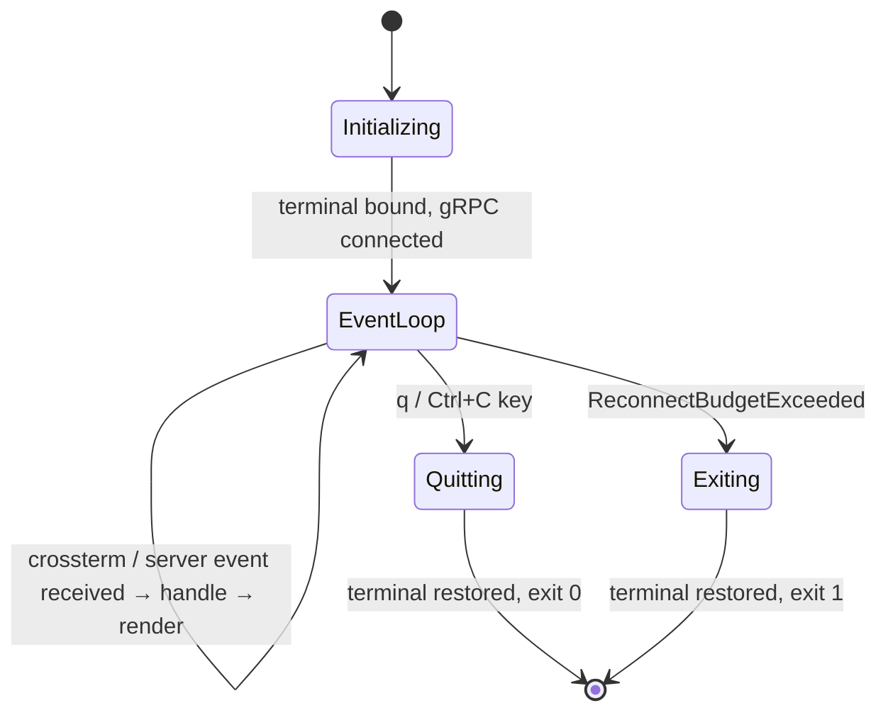

#### 5.1.4 Business Rules

- **[UI-DES-BR-001]** The render loop MUST execute on a single thread. `tokio::task::spawn_blocking` MUST NOT be called from within `render()`.
- **[UI-DES-BR-002]** If a channel's buffer is full when the sender tries to push an event, the oldest message in the buffer is dropped and a `WARN` log is emitted via `tracing`. The render loop is never blocked by a full channel.
- **[UI-DES-BR-003]** Consecutive events of type `TuiEvent::Tick` that arrive without any other intervening event still each trigger a `render()` call. There is no coalescing of Tick events.
- **[UI-DES-BR-004]** `render()` duration is measured via `std::time::Instant` before and after each call. If the elapsed duration exceeds 16 ms, a `WARN` event is emitted via `tracing` with field `render_duration_ms`. This MUST NOT cause the application to exit or pause.

#### 5.1.5 Edge Cases

| Edge Case | Expected Behavior |
|---|---|
| `render()` takes > 16 ms on a large DAG | `WARN` log emitted; application continues; next event triggers another render |
| Crossterm channel receives 257 events before the loop drains | 257th event overwrites the 1st (oldest dropped); `WARN` log emitted; no crash |
| `TuiEvent::Tick` fires while a `CancelRun` gRPC call is in flight | `render()` is called; confirmation prompt remains visible; gRPC response processed on its own async task |
| Terminal is resized to below 80×24 during an active log stream | `TuiEvent::Resize` triggers render; size-warning widget replaces all content; log stream continues buffering in background |
| Server sends a `RunDelta` for an unknown `run_id` | `WARN` log; `AppState` is not mutated; render is still called (idempotent) |

#### 5.1.6 Acceptance Criteria

- **[AC-RLOOP-001]** `render()` takes `&self`; calling `render(&mut state)` does not compile. Verified by `cargo build`.
- **[AC-RLOOP-002]** A test that injects 300 consecutive `TuiEvent::Tick` events into the crossterm channel observes that at most 256 are processed; the remainder are dropped; no panic occurs.
- **[AC-RLOOP-003]** A test measuring render duration on a `AppState` with 256 stages and 10,000 log lines asserts that `render()` completes within 16 ms on the CI host.
- **[AC-RLOOP-004]** `EventLoopConfig::default()` returns the exact values specified in §5.1.1. Verified by unit test asserting each field.
- **[AC-RLOOP-005]** On `TuiEvent::ReconnectBudgetExceeded`, the TUI exits with code 1 and restores the terminal (raw mode off, cursor visible). Verified by E2E test using `assert_cmd`.

---

### 5.2 Hover & Focus States

**[UI-DES-056]** `devs-tui` is keyboard-only. There is no mouse interaction model and no hover state. "Focus" is represented by the `REVERSED` modifier on the selected row in `RunList`, `StageList`, `PoolList`, and the active tab in `TabBar`.

**[UI-DES-057]** The active tab in `TabBar` is rendered with `STYLE_PRIMARY` (bold). Inactive tabs are rendered with `STYLE_STANDARD`. There is no underline, no background color change, and no border change for tabs.

#### 5.2.1 Focus State Data Model

Focus within the TUI is captured entirely by three fields in `AppState` plus the active tab:

```rust
// Part of AppState in crates/devs-tui/src/state.rs
pub active_tab: Tab,                    // Dashboard | Logs | Debug | Pools
pub selected_run_id: Option<Uuid>,      // None = RunList focus; Some = StageList focus on Dashboard
pub selected_stage_name: Option<String>,// None = no stage selected (Logs/Debug tab)
pub selected_pool_name: Option<String>, // Used by Pools tab
```

The `KeyDispatchContext` is derived from these fields at the start of every `dispatch_key()` call. It is a pure function of `AppState`; it is never stored:

```rust
// crates/devs-tui/src/event.rs
#[derive(Debug, Clone, PartialEq, Eq)]
pub enum KeyDispatchContext {
    HelpOverlay,
    ConfirmationPrompt,
    Dashboard(DashboardFocus),
    Logs,
    Debug,
    Pools,
}

#[derive(Debug, Clone, PartialEq, Eq)]
pub enum DashboardFocus {
    RunList,
    StageList,
    DagView,
}
```

**[UI-DES-056a]** `KeyDispatchContext` is computed at the top of `dispatch_key()` via:

```rust
fn current_context(state: &AppState) -> KeyDispatchContext {
    if state.help_visible {
        return KeyDispatchContext::HelpOverlay;
    }
    if state.confirmation.is_some() {
        return KeyDispatchContext::ConfirmationPrompt;
    }
    match state.active_tab {
        Tab::Dashboard => match state.selected_run_id {
            None    => KeyDispatchContext::Dashboard(DashboardFocus::RunList),
            Some(_) => KeyDispatchContext::Dashboard(DashboardFocus::StageList),
        },
        Tab::Logs  => KeyDispatchContext::Logs,
        Tab::Debug => KeyDispatchContext::Debug,
        Tab::Pools => KeyDispatchContext::Pools,
    }
}
```

#### 5.2.2 Focus Transition Rules

| Trigger | Current Context | New Context |
|---|---|---|
| `Enter` on a run row | `Dashboard(RunList)` | `Dashboard(StageList)` |
| `Esc` | `Dashboard(StageList)` | `Dashboard(RunList)` |
| `Esc` | `Dashboard(RunList)` | `Dashboard(RunList)` (deselects run) |
| `Tab` or `1–4` from any | Any | Target tab, RunList/default focus |
| `?` | Any (not ConfirmationPrompt) | `HelpOverlay` |
| `?` or `Esc` | `HelpOverlay` | Restores previous context |
| `c` | `Dashboard(RunList)` with run selected | `ConfirmationPrompt` |
| `y/n/Esc` | `ConfirmationPrompt` | `Dashboard(RunList)` |

**[UI-DES-056b]** Tab switch clears `selected_stage_name` to `None`. It does NOT clear `selected_run_id`. A run selected on Dashboard remains selected when returning to Dashboard from another tab. This allows the operator to switch to Logs, read them, and return to Dashboard with the same run still selected.

**[UI-DES-056c]** When `selected_run_id` refers to a run that is no longer present in the new `runs` snapshot (e.g., it was swept from history), `selected_run_id` is set to `None` immediately during `apply_run_snapshot()`, before `render()` is called.

#### 5.2.3 Edge Cases

| Edge Case | Expected Behavior |
|---|---|
| `RunList` is empty; `↑` / `↓` pressed | `selected_run_id` remains `None`; no crash; render shows empty list |
| A run transitions to `Cancelled` while selected in `StageList` | `selected_run_id` remains set; `StageList` shows all stages with `CANC` label; operator can still view and navigate |
| `Tab` pressed while `ConfirmationPrompt` is active | Key consumed silently; context remains `ConfirmationPrompt`; tab does NOT change |
| `?` pressed while `ConfirmationPrompt` is active | Key consumed silently; `HelpOverlay` does NOT open |
| Terminal resize fires while in `Dashboard(StageList)` focus | `selected_run_id` and `selected_stage_name` preserved; `dag_tiers` recomputed; render reflects new terminal size |

#### 5.2.4 Acceptance Criteria

- **[AC-FOCUS-001]** After `Enter` on a selected run, the next rendered frame shows `StageList` with `REVERSED` modifier on the first stage row. Verified by `insta` snapshot test.
- **[AC-FOCUS-002]** After `Esc` from `StageList`, `selected_run_id` is unchanged and `selected_stage_name` is `None`. Verified by unit test on `AppState`.
- **[AC-FOCUS-003]** Pressing `Tab` while `ConfirmationPrompt` is active does not change `active_tab`. Verified by unit test calling `dispatch_key(state, Tab)` with `state.confirmation = Some(...)`.
- **[AC-FOCUS-004]** When `apply_run_snapshot()` receives a snapshot that does not contain the current `selected_run_id`, `selected_run_id` is set to `None` before `render()` is called. Verified by unit test.
- **[AC-FOCUS-005]** `current_context()` is a pure function; given the same `AppState`, it always returns the same `KeyDispatchContext`. Verified by property-based test (rstest).

---

### 5.3 Key Binding Model

**[UI-DES-058]** All key bindings are single-key, no chords at MVP. The full keybinding table:

| Key | Context | Action |
|---|---|---|
| `Tab` | Any tab | Cycle to next tab (Dashboard→Logs→Debug→Pools→Dashboard) |
| `1` | Any tab | Switch to Dashboard tab |
| `2` | Any tab | Switch to Logs tab |
| `3` | Any tab | Switch to Debug tab |
| `4` | Any tab | Switch to Pools tab |
| `↑` / `k` | Dashboard (RunList) | Move selection up |
| `↓` / `j` | Dashboard (RunList) | Move selection down |
| `↑` / `k` | Dashboard (StageList) | Move stage selection up |
| `↓` / `j` | Dashboard (StageList) | Move stage selection down |
| `↑` / `k` | Logs / Debug | Scroll log up |
| `↓` / `j` | Logs / Debug | Scroll log down |
| `←` | Dashboard (DagView) | Scroll DAG left |
| `→` | Dashboard (DagView) | Scroll DAG right |
| `Enter` | Dashboard (RunList) | Select run; show RunDetail |
| `Esc` | Dashboard (StageList) | Back to RunList |
| `Esc` | Dashboard (RunList) | Deselect run |
| `c` | Dashboard | Cancel selected run (prompt for confirmation) |
| `p` | Dashboard / Debug | Pause selected run |
| `r` | Dashboard / Debug | Resume selected run |
| `?` | Any tab | Toggle HelpOverlay (modal) |
| `q` | Any tab (no overlay) | Quit application (exit code 0) |
| `Ctrl+C` | Any context | Quit application (exit code 0) |
| `Esc` | HelpOverlay visible | Dismiss HelpOverlay |
| Any other key | Any context | Silently consumed; no error output |

**[UI-DES-059]** `HelpOverlay` is modal: while visible, all keys except `?`, `Esc`, `q`, and `Ctrl+C` are consumed without effect.

#### 5.3.1 Key Dispatch Data Model

Key dispatch is implemented as a `match` on `(context, key_event)`. The dispatch table is implemented in `crates/devs-tui/src/event.rs` in the function `dispatch_key(state: &mut AppState, key: KeyEvent) -> ()`. It has no return value; mutations are applied directly to `AppState`.

```rust
// Key priority evaluation order (highest to lowest):
// 1. Ctrl+C  — always quits, any context
// 2. ConfirmationPrompt context — only y/Y/n/N/Esc pass; all others consumed
// 3. HelpOverlay context — only ?/Esc/q/Ctrl+C pass; all others consumed
// 4. Context-specific bindings from the keybinding table above
// 5. Unrecognized key — silently consumed; no error emitted; no log
```

**[UI-DES-058a]** `Ctrl+C` is handled before any context check. It MUST quit the application from any state, including `ConfirmationPrompt` and `HelpOverlay`. The gRPC call in progress (if any) is abandoned; the application exits immediately after terminal restoration.

**[UI-DES-058b]** The `c` key for cancel is only actionable when `selected_run_id` is `Some(...)` AND the run's `status` is one of `Running`, `Paused`, or `Pending`. If `selected_run_id` is `None`, or the run is already in a terminal state (`Completed`, `Failed`, `Cancelled`), pressing `c` is silently consumed without opening the confirmation prompt.

**[UI-DES-058c]** The `p` key for pause is only actionable when the selected run's `status` is `Running`. The `r` key for resume is only actionable when `status` is `Paused`. Pressing `p` on a `Paused` run or `r` on a `Running` run is silently consumed.

#### 5.3.2 Navigation Bounds

| Navigation | At top of list | At bottom of list |
|---|---|---|
| `↑` / `k` in `RunList` | Selection stays on first item; no wrap | — |
| `↓` / `j` in `RunList` | — | Selection stays on last item; no wrap |
| `↑` / `k` in `StageList` | Selection stays on first item; no wrap | — |
| `↓` / `j` in `StageList` | — | Selection stays on last item; no wrap |
| `↑` / `k` in `LogPane` | `log_scroll_offset` stays at 0 | — |
| `↓` / `j` in `LogPane` | — | `log_scroll_offset` stays at `buffer.len() - visible_rows` |
| `←` in `DagView` | `dag_scroll_offset` stays at 0 | — |
| `→` in `DagView` | — | `dag_scroll_offset` stays at `max_scroll_x` |

**[UI-DES-058d]** Navigation in lists and log panes NEVER wraps around. Pressing `↑` at the top is a no-op. Pressing `↓` at the bottom is a no-op. No visual indicator of boundary is shown (no bell, no flash).

#### 5.3.3 Edge Cases

| Edge Case | Expected Behavior |
|---|---|
| `c` pressed with no run selected (`selected_run_id = None`) | Silently consumed; no confirmation prompt opened |
| `c` pressed on a `Completed` run | Silently consumed; no confirmation prompt; `Completed` is terminal |
| `p` pressed on a `Paused` run | Silently consumed; `PauseRun` gRPC is NOT called |
| `1` pressed while already on Dashboard | `active_tab` unchanged; render still called (idempotent) |
| Rapid `↓` presses past end of `RunList` | `selected_run_id` remains at last item; no index out-of-bounds panic |
| Key event arrives during a pending gRPC call | Key is processed normally; `AppState` mutated; render called; gRPC call continues on its async task |

#### 5.3.4 Acceptance Criteria

- **[AC-KEY-001]** `Ctrl+C` from `ConfirmationPrompt` state quits the application with exit code 0 and restores the terminal. Verified by E2E test.
- **[AC-KEY-002]** Pressing `c` with `selected_run_id = None` does not set `state.confirmation`. Verified by unit test.
- **[AC-KEY-003]** Pressing `c` on a `Completed` run does not set `state.confirmation`. Verified by unit test.
- **[AC-KEY-004]** Navigation `↓` past the last item in `RunList` does not cause a panic and does not change `selected_run_id`. Verified by unit test with a 1-element run list.
- **[AC-KEY-005]** `dispatch_key()` with an unrecognized key character emits no `tracing` output and returns without mutating `AppState`. Verified by unit test asserting `AppState` equality before and after.
- **[AC-KEY-006]** All keys listed in the keybinding table produce the documented effect when tested via `TestBackend` + `insta` snapshot. Verified by one snapshot test per key context combination.

---

### 5.4 Cancel Confirmation Flow

**[UI-DES-060]** Pressing `c` on a selected run in Dashboard mode triggers a **single-line inline confirmation prompt** rendered in the status bar row, replacing the normal status bar content:

```
Cancel run <slug>? [y/N]:
```

**[UI-DES-061]** The confirmation prompt accepts only:
- `y` or `Y`: sends `CancelRun` gRPC call; restores status bar on completion
- `n`, `N`, `Esc`, or any other key: cancels the prompt; restores status bar immediately

**[UI-DES-062]** No multi-step modal dialog. The confirmation prompt is single-key, ephemeral, and never blocks re-render of other panes.

#### 5.4.1 Confirmation State Data Model

The confirmation state is an `Option` field in `AppState`. It is `None` when no confirmation is pending and `Some(ConfirmationState)` when a prompt is shown:

```rust
// crates/devs-tui/src/state.rs
#[derive(Debug, Clone)]
pub struct ConfirmationState {
    pub run_id:  Uuid,
    pub slug:    String,   // display name; max 128 chars; [a-z0-9-]+
    pub kind:    ConfirmationKind,
    pub status:  ConfirmationStatus,
}

#[derive(Debug, Clone, PartialEq, Eq)]
pub enum ConfirmationKind {
    CancelRun,
}

#[derive(Debug, Clone, PartialEq, Eq)]
pub enum ConfirmationStatus {
    AwaitingInput,       // prompt shown; no gRPC call in flight
    Submitting,          // gRPC call in flight; prompt still shown
    Dismissed,           // y/n/Esc pressed before gRPC; prompt removed next render
}
```

**[UI-DES-060a]** The `ConfirmationStatus::Submitting` state exists to handle the window between the user pressing `y` and the gRPC `CancelRun` response arriving. During `Submitting`, the status bar continues to display the confirmation prompt text. No second `c` press can open a new prompt while `status == Submitting`.

**[UI-DES-060b]** The full text of the confirmation prompt is constructed at the moment `c` is pressed, using the run's current `slug` from `AppState`. If the run's slug changes between prompt-open and prompt-dismiss (not possible in MVP since slugs are immutable), the originally-captured slug is displayed.

#### 5.4.2 Confirmation State Machine

```mermaid
stateDiagram-v2
    [*] --> AwaitingInput : c pressed on non-terminal selected run
    AwaitingInput --> Dismissed : n / N / Esc / any non-y key
    AwaitingInput --> Submitting : y / Y
    Submitting --> Dismissed : gRPC CancelRun response received (success or error)
    Dismissed --> [*] : AppState.confirmation = None (next handle_event)
    AwaitingInput --> [*] : Ctrl+C (application exits)
    Submitting --> [*] : Ctrl+C (application exits; gRPC abandoned)
```

**[UI-DES-060c]** The transition from `Dismissed` to `None` (clearing `AppState.confirmation`) happens at the start of the next `handle_event()` call, not immediately in the key handler. This ensures the dismissal is reflected in the next render frame.

#### 5.4.3 gRPC Call Behavior

When the operator presses `y` or `Y`:

1. `state.confirmation.status` is set to `Submitting`.
2. `render()` is called (status bar still shows the prompt, but a future implementation may add "(cancelling...)" suffix — NOT for MVP).
3. `tokio::task::spawn` is used to send `RunService::CancelRun(run_id)` asynchronously.
4. The gRPC response is sent back to the event loop via `connection_tx` as a custom `TuiEvent::ControlResult`.
5. On receipt, `state.confirmation` is set to `None` unconditionally (whether gRPC succeeded or failed).
6. If gRPC returned an error, a one-line error message is briefly shown in the status bar for 5 seconds (rendered on the next `Tick` as a `StatusMessage`).

**[UI-DES-060d]** `TuiEvent::ControlResult` is defined as:

```rust
pub enum TuiEvent {
    // ... existing variants ...
    ControlResult {
        operation: ControlOperation,
        result:    Result<(), String>,  // String = error prefix + message
    },
}

pub enum ControlOperation {
    CancelRun(Uuid),
    PauseRun(Uuid),
    ResumeRun(Uuid),
}
```

**[UI-DES-060e]** A transient `StatusMessage` is stored in `AppState` to display gRPC errors from control operations:

```rust
// crates/devs-tui/src/state.rs
pub struct StatusMessage {
    pub text:       String,
    pub expires_at: std::time::Instant,  // set to now() + 5s
    pub level:      StatusMessageLevel,
}

pub enum StatusMessageLevel { Info, Error }
```

`StatusMessage` is rendered in the status bar when present and `ConfirmationState` is `None`. It is cleared on the first `Tick` event that fires after `expires_at`.

#### 5.4.4 Status Bar Rendering States

The status bar renders in exactly one of the following states, checked in priority order:

| Priority | Condition | Content |
|---|---|---|
| 1 (highest) | `confirmation.is_some()` | `Cancel run <slug>? [y/N]:` |
| 2 | `status_message.is_some() && !expired` | `<error text>` (5s transient) |
| 3 | `connection_status == Reconnecting` | `RECONNECTING...  <addr>  Runs: N active` |
| 4 | `connection_status == Disconnected` | `DISCONNECTED  <addr>` |
| 5 (default) | `connection_status == Connected` | `CONNECTED  <addr>  Runs: N active` |

**[UI-DES-060f]** The status bar is always exactly 1 row tall and spans the full terminal width. Content is left-aligned. Content that exceeds terminal width is truncated with no indicator.

#### 5.4.5 Edge Cases

| Edge Case | Expected Behavior |
|---|---|
| `CancelRun` gRPC fails with `failed_precondition: run already cancelled` | `state.confirmation` set to `None`; `StatusMessage` shown with error text for 5s; run status already reflects `Cancelled` from server event |
| `CancelRun` gRPC fails with `server_unreachable:` | `state.confirmation` set to `None`; `StatusMessage` shown with `server_unreachable: lost connection`; reconnect sequence begins |
| Terminal resizes while `ConfirmationPrompt` is visible | Resize event fires `render()` with updated `terminal_size`; confirmation prompt re-renders at new width; state unchanged |
| `Tick` fires while `ConfirmationPrompt` is in `AwaitingInput` | `render()` called; prompt remains; no state change from Tick |
| `Tick` fires while `ConfirmationPrompt` is in `Submitting` | `render()` called; prompt remains; gRPC call continues |
| Operator presses `c` again while `ConfirmationStatus::Submitting` | Key is consumed silently; second `CancelRun` gRPC call is NOT spawned |
| Run transitions to `Cancelled` via server event while `AwaitingInput` | `state.confirmation` is cleared to `None`; status bar returns to normal; no gRPC call sent |

**[UI-DES-060g]** If a server `RunDelta` event arrives indicating the selected run is now `Cancelled` while `ConfirmationState` is `AwaitingInput`, the confirmation is immediately dismissed (set to `None`) without issuing a gRPC call. This prevents a redundant cancel request.

#### 5.4.6 Acceptance Criteria

- **[AC-CANCEL-001]** Pressing `c` on a `Running` run with `selected_run_id = Some(id)` sets `state.confirmation = Some(ConfirmationState{status: AwaitingInput, ...})`. Verified by unit test on `dispatch_key`.
- **[AC-CANCEL-002]** The confirmation prompt text in the status bar is exactly `Cancel run <slug>? [y/N]:`. Verified by `insta` text snapshot at `TestBackend` 200×50.
- **[AC-CANCEL-003]** Pressing `n` immediately after prompt opens sets `state.confirmation = None` without spawning a gRPC task. Verified by unit test asserting no gRPC call via `mockall`.
- **[AC-CANCEL-004]** Pressing `y` transitions `state.confirmation.status` to `Submitting` and spawns exactly one `CancelRun` gRPC call. Verified by mock assertion.
- **[AC-CANCEL-005]** On gRPC `CancelRun` success, `state.confirmation` is set to `None`. Verified by unit test processing a `TuiEvent::ControlResult(Ok(()))`.
- **[AC-CANCEL-006]** On gRPC `CancelRun` error, `state.confirmation` is set to `None` and `state.status_message` is set with `expires_at = now() + 5s`. Verified by unit test.
- **[AC-CANCEL-007]** Pressing `c` while `ConfirmationStatus::Submitting` does not spawn a second gRPC call. Verified by mock assertion.
- **[AC-CANCEL-008]** `Ctrl+C` during `ConfirmationPrompt` quits the application with exit code 0 and does not send a gRPC call. Verified by E2E test.

---

### 5.5 Reconnection Visual State

**[UI-DES-063]** During `ConnectionStatus::Reconnecting`, the status bar displays:

```
RECONNECTING...  127.0.0.1:7890          Runs: N active
```

The `RECONNECTING...` text uses `Color::Yellow` foreground in `ColorMode::Color`. No spinner character or animation is shown.

**[UI-DES-064]** Reconnect backoff schedule (displayed to operator in status bar as seconds until next attempt):

| Attempt | Delay before retry |
|---|---|
| 1 | 1 second |
| 2 | 2 seconds |
| 3 | 4 seconds |
| 4 | 8 seconds |
| 5 | 16 seconds |
| 6+ | 30 seconds (cap) |

Total budget: 30,000 ms cumulative reconnect time + 5,000 ms grace period = **35 seconds** before `Disconnected` state and exit code 1.

**[UI-DES-065]** Upon reconnection, the status bar immediately transitions to `CONNECTED` (green in color mode). The `AppState::runs` and `run_details` are fully replaced by the incoming `run.snapshot` event. `LogBuffer` entries are preserved across reconnect.

#### 5.5.1 Reconnection State Data Model

`ConnectionStatus` is defined in `crates/devs-tui/src/state.rs`:

```rust
#[derive(Debug, Clone)]
pub enum ConnectionStatus {
    Connected {
        server_addr: String,
    },
    Reconnecting {
        server_addr:    String,
        attempt:        u32,             // 1-based; increments on each retry
        next_retry_at:  std::time::Instant,
        elapsed_ms:     u64,             // cumulative reconnect time
    },
    Disconnected {
        server_addr:    String,
        reason:         String,          // human-readable last error
    },
}
```

The `elapsed_ms` field is updated on every `TuiEvent::Tick` event while in the `Reconnecting` state. It represents total time spent attempting to reconnect since the first `StreamError` event.

**[UI-DES-063a]** The status bar format during `Reconnecting` uses `elapsed_ms` to show time since disconnection:

```
RECONNECTING...  <addr>   (retry N, <elapsed>s elapsed)   Runs: N active
```

Where `<elapsed>` is `elapsed_ms / 1000` formatted as an integer (no decimal point). The run count `N` uses the last-known count from `AppState::runs`; it is not zeroed during reconnection.

#### 5.5.2 Reconnection State Machine

```mermaid
stateDiagram-v2
    [*] --> Reconnecting : initial connection (attempt = 0 → 1)
    Connected --> Reconnecting : StreamError / gRPC disconnect
    Reconnecting --> Connected : gRPC stream reestablished; run.snapshot received
    Reconnecting --> Reconnecting : retry after backoff delay (attempt++)
    Reconnecting --> Disconnected : elapsed_ms > 30_000 AND grace 5_000ms expired
    Disconnected --> [*] : TUI exits with code 1
```

**[UI-DES-063b]** The TUI initiates reconnect immediately on the first `TuiEvent::StreamError`. There is no user prompt. The reconnect loop runs on a background `tokio::task`. The event loop continues processing keyboard events and rendering during reconnect.

**[UI-DES-063c]** On reconnect success, the gRPC task sends `TuiEvent::Connected` followed immediately by `TuiEvent::RunSnapshot` (full state). The event loop processes these sequentially. After `RunSnapshot` is applied, the render reflects the latest server state.

#### 5.5.3 State Recovery on Reconnect

When `TuiEvent::RunSnapshot` arrives after reconnection:

1. `state.runs` is fully replaced with the new snapshot's run list.
2. `state.run_details` is cleared and repopulated from the snapshot.
3. `state.selected_run_id` is checked: if the previously selected `run_id` appears in the new snapshot, it is preserved; otherwise it is set to `None`.
4. `state.log_buffers` is **preserved** — log lines buffered during the disconnect are retained.
5. `state.dag_scroll_offset` is preserved.
6. `state.log_scroll_offset` is preserved per `(run_id, stage_name)`.
7. `state.connection_status` is set to `Connected`.
8. `state.reconnect_elapsed_ms` is reset to `0`.

**[UI-DES-065a]** `LogBuffer` entries for runs that no longer appear in the reconnect snapshot are retained in memory until the eviction policy fires (30-minute idle timeout on `Tick`). They are not immediately cleared on reconnect because the operator may have scrolled `LogPane` and expect the buffered content to persist.

#### 5.5.4 Edge Cases

| Edge Case | Expected Behavior |
|---|---|
| `ConfirmationPrompt` is `AwaitingInput` when `StreamError` arrives | `state.confirmation` is set to `None`; reconnect begins; status bar shows `RECONNECTING...` |
| `ConfirmationPrompt` is `Submitting` when `StreamError` arrives | `state.confirmation` set to `None`; the in-flight gRPC `CancelRun` call may or may not succeed; its `TuiEvent::ControlResult` is discarded if received after `confirmation = None` |
| Reconnect succeeds but the run that was selected no longer exists in snapshot | `selected_run_id` set to `None`; `Dashboard(RunList)` focus; no error shown |
| `elapsed_ms` reaches 30,000 ms but the background task is mid-retry | Grace period of 5,000 ms begins; if reconnect succeeds within grace, `Connected` is applied; otherwise `TuiEvent::ReconnectBudgetExceeded` is sent |
| Server sends `RunSnapshot` with 0 runs after reconnect | `state.runs = vec![]`; `selected_run_id = None`; render shows empty run list |

#### 5.5.5 Business Rules

- **[UI-DES-BR-010]** `reconnect_elapsed_ms` is reset to `0` on every `Connected` event. It MUST NOT accumulate across sessions.
- **[UI-DES-BR-011]** The backoff delays MUST be computed using `tokio::time::sleep`, not a spin loop.
- **[UI-DES-BR-012]** The TUI MUST NOT clear `AppState::runs` during reconnect. The operator continues to see the last-known state with stale data, not a blank screen.
- **[UI-DES-BR-013]** `TuiEvent::ReconnectBudgetExceeded` MUST only be sent once. After it is sent, the background reconnect task exits.

#### 5.5.6 Acceptance Criteria

- **[AC-RECONN-001]** After `TuiEvent::StreamError`, `state.connection_status` transitions to `Reconnecting{attempt:1,...}` within one event-loop iteration. Verified by unit test.
- **[AC-RECONN-002]** During `Reconnecting`, `state.runs` retains the last-known run list. Verified by unit test asserting `state.runs` is unchanged after `StreamError`.
- **[AC-RECONN-003]** After `TuiEvent::Connected` + `TuiEvent::RunSnapshot`, `state.connection_status == Connected` and `state.runs` reflects the new snapshot. Verified by unit test.
- **[AC-RECONN-004]** `state.log_buffers` is unchanged after reconnect (entries are preserved). Verified by unit test comparing buffer state before and after reconnect cycle.
- **[AC-RECONN-005]** When `elapsed_ms > 35_000`, `TuiEvent::ReconnectBudgetExceeded` is sent and the TUI exits with code 1. Verified by E2E test with a server that is intentionally unreachable.
- **[AC-RECONN-006]** Status bar `insta` snapshot shows `RECONNECTING...` text in monochrome mode during reconnect. Verified by snapshot `status_bar__reconnecting`.
- **[AC-RECONN-007]** `ConfirmationPrompt` is dismissed (set to `None`) when `StreamError` arrives. Verified by unit test.

---

### 5.6 Progressive Disclosure in LogTail

**[UI-DES-066]** `LogTail` (Dashboard) auto-scrolls: when the log buffer appends a new line and the scroll position was already at the tail before the append, the scroll offset is incremented by 1 to track the tail. If the operator has scrolled up (offset < tail), auto-scroll is suppressed.

**[UI-DES-067]** There is no "scroll to bottom" animation. The offset update is instantaneous, applied in `handle_event()` before `render()`.

#### 5.6.1 Scroll State Data Model

Scroll state is tracked per `(run_id, stage_name)` pair in `AppState`:

```rust
// crates/devs-tui/src/state.rs
pub log_scroll_offset: HashMap<(Uuid, String), usize>,
pub dag_scroll_offset: usize,
```

For `LogTail` on the Dashboard tab, the key is `(selected_run_id, selected_stage_name_or_sentinel)`. When no stage is selected, a sentinel stage name of `""` (empty string) is used for the Dashboard log tail key.

The `AutoScrollMode` is derived, not stored. It is computed at the moment a `TuiEvent::LogLine` is handled:

```rust
fn is_at_tail(buffer: &LogBuffer, scroll_offset: usize, visible_rows: usize) -> bool {
    // tail position = number of lines that would be invisible above visible window
    let tail_offset = buffer.lines.len().saturating_sub(visible_rows);
    scroll_offset >= tail_offset
}
```

If `is_at_tail()` returns `true` when the line is appended, the offset is incremented by 1. Otherwise, it is unchanged.

**[UI-DES-066a]** `visible_rows` is the height of the `LogTail` pane in characters, computed from `AppState::terminal_size` at the time of the event. It uses the same layout computation as `render()` to ensure consistency.

#### 5.6.2 Auto-Scroll Algorithm

```rust
// Applied in handle_event() for TuiEvent::LogLine{run_id, stage_name, line}
fn handle_log_line(state: &mut AppState, run_id: Uuid, stage: &str, line: LogLine) {
    let buffer = state.log_buffers
        .entry((run_id, stage.to_string()))
        .or_insert_with(|| LogBuffer::new(10_000));

    let visible_rows = compute_logtail_visible_rows(&state.terminal_size);
    let was_at_tail = is_at_tail(buffer, state.log_scroll_offset[...], visible_rows);

    buffer.push(line);

    if was_at_tail {
        let key = (run_id, stage.to_string());
        *state.log_scroll_offset.entry(key).or_insert(0) += 1;
    }
    // if not at tail: offset unchanged; operator is reviewing history
}
```

**[UI-DES-066b]** The `LogBuffer::push()` method evicts the oldest line when `lines.len() == max_capacity` (10,000). After eviction, `total_received` is incremented and `truncated` is set to `true`. The `scroll_offset` is NOT decremented on eviction. The operator's view window shifts by 1 line toward the beginning of the buffer, which is the correct behavior (they see the same absolute content position).

#### 5.6.3 LogBuffer Data Model

```rust
// crates/devs-tui/src/state.rs
pub struct LogBuffer {
    pub lines:          VecDeque<LogLine>,
    pub max_capacity:   usize,          // always 10_000; immutable after construction
    pub total_received: u64,            // monotonically increasing; never decremented
    pub truncated:      bool,           // true once any eviction has occurred
}

pub struct LogLine {
    pub sequence:    u64,               // monotonically increasing from server; starts at 1
    pub stream:      LogStream,         // Stdout | Stderr
    pub content:     String,            // ANSI-stripped; used in LogTail and LogPane
    pub raw_content: String,            // verbatim server output
    pub timestamp:   chrono::DateTime<chrono::Utc>,
}

pub enum LogStream { Stdout, Stderr }
```

**[UI-DES-066c]** `LogLine.content` is populated by running `strip_ansi()` from `render_utils.rs` on `raw_content` at the time the line is inserted into the buffer. `raw_content` is stored verbatim (binary-safe, with `\r\n` normalized to `\n`). ANSI stripping is performed once at insert time; not on every render.

#### 5.6.4 LogPane vs LogTail Behavior

| Property | `LogTail` (Dashboard) | `LogPane` (Logs tab) |
|---|---|---|
| Auto-scroll | Yes — tracks tail while at tail | Yes — same algorithm |
| Stream prefix | None | `[stdout]` / `[stderr]` prefix on each line |
| Scroll offset key | `(selected_run_id, "")` | `(selected_run_id, selected_stage_name)` |
| Lines visible | `DagView` remainder rows | Full tab height minus header |
| Stage scope | Stage with most recent log line for selected run | Selected `(run_id, stage_name)` pair |

**[UI-DES-066d]** For `LogTail` on the Dashboard, when no specific stage is selected, the TUI displays the most recently active stage's log for the selected run. "Most recently active" is determined by `LogLine.timestamp` across all stages for the selected run. If multiple stages have the same last timestamp, alphabetical stage name order is used as a tie-breaker.

#### 5.6.5 Edge Cases

| Edge Case | Expected Behavior |
|---|---|
| `LogBuffer` at capacity (10,000 lines) receives a new line | Oldest line evicted from front of `VecDeque`; `truncated = true`; `total_received++`; scroll offset unchanged |
| Operator scrolls up then a new line arrives | `is_at_tail()` returns `false`; offset unchanged; operator's view position preserved |
| Selected stage changes while auto-scroll is active | New key `(run_id, new_stage_name)` used; scroll offset for new key defaults to `0`; auto-scroll begins tracking the new stage's tail |
| Stage transitions to `Completed` mid-stream | Log lines continue to buffer from disk replay; auto-scroll continues if at tail |
| Reconnection replaces run state but preserves log buffers | `log_scroll_offset` entries for preserved buffers are unchanged; operator's scroll position survives reconnect |
| `visible_rows` is `0` (terminal too small) | `is_at_tail()` returns `true` for any offset; auto-scroll continues; no divide-by-zero |

#### 5.6.6 Acceptance Criteria

- **[AC-LOG-001]** When `scroll_offset` is at the tail and a new `TuiEvent::LogLine` arrives, `scroll_offset` is incremented by exactly 1. Verified by unit test.
- **[AC-LOG-002]** When `scroll_offset` is 3 lines above the tail and a new line arrives, `scroll_offset` is unchanged. Verified by unit test.
- **[AC-LOG-003]** `LogBuffer` with `max_capacity = 10_000` never grows beyond 10,000 entries after pushing 10,001 lines. Verified by unit test.
- **[AC-LOG-004]** After eviction, `truncated == true` and `total_received == 10_001`. Verified by unit test.
- **[AC-LOG-005]** `LogLine.content` is the ANSI-stripped version of `raw_content`. Verified by unit test with an input containing CSI sequences.
- **[AC-LOG-006]** `LogTail` in an `insta` snapshot at `TestBackend` 200×50 shows the last N lines of the buffer where N = visible pane height. Verified by snapshot `logs__buffered`.
- **[AC-LOG-007]** `LogPane` prepends `[stdout] ` or `[stderr] ` to each line. Verified by `insta` snapshot `logs__buffered`.

---

### 5.7 HelpOverlay Content

**[UI-DES-068]** `HelpOverlay` renders centered in the terminal with a 2-column padding on each side and 1-row padding top and bottom. Content is the keybinding table formatted as:

```
+------------------------------------------+
|              KEYBOARD SHORTCUTS           |
|                                           |
|  Tab / 1-4  Switch tab                   |
|  Up/Down    Navigate list                 |
|  Enter      Select run                    |
|  Esc        Back / Dismiss                |
|  c          Cancel run                    |
|  p          Pause run                     |
|  r          Resume run                    |
|  ?          Toggle this help              |
|  q / Ctrl+C Quit                          |
+------------------------------------------+
```

All characters in the overlay frame are ASCII: `+` corners, `-` horizontal, `|` vertical.

#### 5.7.1 HelpOverlay State Data Model

`HelpOverlay` visibility is controlled by a single boolean field in `AppState`:

```rust
// crates/devs-tui/src/state.rs
pub help_visible: bool,  // initial: false
```

There is no additional state for the overlay. The overlay content is a static `&'static str` constant defined in `crates/devs-tui/src/strings.rs` as `HELP_OVERLAY_CONTENT`. It is not computed at runtime.

**[UI-DES-068a]** `HelpOverlay` is rendered as a `ratatui::widgets::Clear` layer followed by the border and content. The `Clear` widget ensures the underlying tab content is fully overwritten within the overlay bounds, not just the border frame.

#### 5.7.2 HelpOverlay Layout

The overlay dimensions are fixed at:
- **Width**: 44 columns (42 content + 2 border chars `|`)
- **Height**: 14 rows (12 content rows + 2 border chars `-`)

The overlay is positioned at:
- **Left**: `(terminal_width - 44) / 2` (integer division; rounded toward left on odd widths)
- **Top**: `(terminal_height - 14) / 2` (integer division; rounded toward top on odd heights)

**[UI-DES-068b]** At minimum terminal size 80×24, the overlay fits without clipping. At terminal sizes below 80×24, the terminal-too-small message replaces all content including the overlay (see §5.7.4 edge cases).

**[UI-DES-068c]** `help_visible` is toggled by pressing `?`. It is set to `false` by pressing `Esc`, `q`, or `Ctrl+C` when the overlay is visible. `Ctrl+C` additionally exits the application.

#### 5.7.3 Business Rules

- **[UI-DES-BR-020]** `HelpOverlay` content MUST be defined in `HELP_OVERLAY_CONTENT` in `strings.rs`. It MUST NOT be constructed dynamically. This ensures it is testable as a static snapshot.
- **[UI-DES-BR-021]** While `help_visible == true`, background panes (RunList, DagView, LogTail, etc.) continue to update in response to server events. The overlay does not "freeze" the application.
- **[UI-DES-BR-022]** `help_visible` is `false` after any tab switch (Tab / 1–4). Tab switching dismisses the overlay.

#### 5.7.4 Edge Cases

| Edge Case | Expected Behavior |
|---|---|
| Terminal resizes while overlay is visible | `help_visible` unchanged; overlay repositioned per new dimensions on next render |
| Terminal shrinks to 79×23 while overlay is visible | `help_visible` unchanged in state; render shows terminal-too-small message instead of overlay; overlay state resumes when terminal grows back |
| `?` pressed while `ConfirmationPrompt` is active | Key consumed silently; `help_visible` NOT toggled |
| `?` pressed twice rapidly | First press sets `help_visible = true`; second press sets `help_visible = false`; no race condition possible (single-threaded event loop) |
| `RunDelta` arrives while overlay is visible | `AppState` is mutated normally; render is called; overlay is drawn on top; underlying tab content is updated but visually obscured |

#### 5.7.5 Acceptance Criteria

- **[AC-HELP-001]** Pressing `?` sets `state.help_visible = true`. Verified by unit test on `dispatch_key`.
- **[AC-HELP-002]** Pressing `?` again sets `state.help_visible = false`. Verified by unit test.
- **[AC-HELP-003]** Pressing `Esc` while `help_visible == true` sets `help_visible = false`. Verified by unit test.
- **[AC-HELP-004]** `HelpOverlay` `insta` snapshot matches `HELP_OVERLAY_CONTENT` exactly (border + content). Verified by snapshot `help_overlay__visible`.
- **[AC-HELP-005]** At `TestBackend` 79×24, `help_visible = true`, the render output shows terminal-too-small message, NOT the overlay. Verified by snapshot `dashboard__terminal_too_small`.
- **[AC-HELP-006]** Pressing `?` while `state.confirmation.is_some()` does NOT set `help_visible = true`. Verified by unit test.
- **[AC-HELP-007]** `HELP_OVERLAY_CONTENT` contains only ASCII characters U+0020–U+007E plus `\n`. Verified by a compile-time `const` assertion or `#[test]` byte scan.

---

### 5.8 CLI Output States

**[UI-DES-069]** CLI commands produce output in exactly two states: **success** and **error**. There is no in-progress animation, no spinner, and no partial output in text mode.

**[UI-DES-070]** For `devs logs --follow` in text mode: log lines are streamed to stdout as they arrive, one line per `\n`. No buffering beyond I/O buffering. On run completion the process exits with code `0` (`Completed`) or `1` (`Failed`/`Cancelled`).

**[UI-DES-071]** All error output in `--format text` mode goes to **stderr**. All error output in `--format json` mode goes to **stdout** (nothing to stderr). Success output always goes to **stdout** in both modes.

**[UI-DES-072]** Machine-stable error prefix contract — all error strings begin with exactly one of the following prefixes. This is enforced by a lint test in CI that scans all `.rs` source files for error strings not in `strings.rs`:

| Prefix | Meaning | CLI exit code |
|---|---|---|
| `not_found:` | Resource does not exist | `2` |
| `invalid_argument:` | Bad input value or format | `4` |
| `already_exists:` | Duplicate name or ID | `4` |
| `failed_precondition:` | Illegal state transition | `1` |
| `resource_exhausted:` | Pool full or lock timeout | `1` |
| `server_unreachable:` | Cannot connect to server | `3` |
| `internal:` | Unhandled server error | `1` |
| `cancelled:` | Operation cancelled | `1` |
| `timeout:` | Operation timed out | `1` |
| `permission_denied:` | Path traversal or write denied | `1` |

#### 5.8.1 JSON Output Schemas

All `--format json` outputs are single JSON objects written to stdout followed by `\n`. For streaming commands (`devs logs --follow`), each line is a separate JSON object.

**`devs submit` success (`--format json`):**
```json
{
  "run_id":        "550e8400-e29b-41d4-a716-446655440000",
  "slug":          "my-workflow-20260311-a3f2",
  "workflow_name": "my-workflow",
  "project_id":    "a1b2c3d4-e5f6-4789-abcd-ef0123456789",
  "status":        "pending"
}
```

**`devs list` success (`--format json`):**
```json
{
  "runs": [
    {
      "run_id":        "550e8400-e29b-41d4-a716-446655440000",
      "slug":          "my-workflow-20260311-a3f2",
      "workflow_name": "my-workflow",
      "project_id":    "a1b2c3d4-e5f6-4789-abcd-ef0123456789",
      "status":        "running",
      "created_at":    "2026-03-11T10:00:00.000Z",
      "started_at":    "2026-03-11T10:00:01.000Z",
      "completed_at":  null
    }
  ],
  "total": 1
}
```

No `stage_runs` field is included in `devs list` output (matches `RunListItem` model).

**`devs status <run>` success (`--format json`):**
```json
{
  "run_id":        "550e8400-e29b-41d4-a716-446655440000",
  "slug":          "my-workflow-20260311-a3f2",
  "workflow_name": "my-workflow",
  "project_id":    "a1b2c3d4-e5f6-4789-abcd-ef0123456789",
  "status":        "running",
  "created_at":    "2026-03-11T10:00:00.000Z",
  "started_at":    "2026-03-11T10:00:01.000Z",
  "completed_at":  null,
  "stage_runs": [
    {
      "stage_name":   "plan",
      "attempt":      1,
      "status":       "completed",
      "agent_tool":   "claude",
      "started_at":   "2026-03-11T10:00:01.500Z",
      "completed_at": "2026-03-11T10:01:00.000Z",
      "exit_code":    0
    }
  ]
}
```

**`devs cancel <run>` / `devs pause <run>` / `devs resume <run>` success (`--format json`):**
```json
{
  "run_id": "550e8400-e29b-41d4-a716-446655440000",
  "slug":   "my-workflow-20260311-a3f2",
  "status": "cancelled"
}
```

**Error response (`--format json`, any command):**
```json
{
  "error": "not_found: run 550e8400-e29b-41d4-a716-446655440000 does not exist",
  "code":  2
}
```

**`devs logs <run> [stage]` non-streaming (`--format json`, no `--follow`):**
```json
{
  "run_id":     "550e8400-e29b-41d4-a716-446655440000",
  "stage_name": "plan",
  "attempt":    1,
  "lines": [
    {
      "sequence":  1,
      "stream":    "stdout",
      "line":      "Planning feature...",
      "timestamp": "2026-03-11T10:00:01.500Z"
    }
  ],
  "truncated": false,
  "total_lines": 1
}
```

**`devs logs <run> [stage] --follow` streaming (`--format json`):**
Each JSON line is one of two forms:
```json
{"sequence": 42, "stream": "stdout", "line": "log line content", "timestamp": "2026-03-11T10:00:01.500Z", "done": false}
```
or terminal marker:
```json
{"done": true, "truncated": false, "total_lines": 42}
```

#### 5.8.2 Text Format Specifications

**`devs submit` text output:**
```
Run submitted: my-workflow-20260311-a3f2 (pending)
Run ID: 550e8400-e29b-41d4-a716-446655440000
```

**`devs list` text output:**
```
RUN ID                                SLUG                           STATUS     CREATED
550e8400-e29b-41d4-a716-446655440000  my-workflow-20260311-a3f2     running    2026-03-11T10:00:00Z
```

Column widths: `RUN ID` 36, `SLUG` 30 (truncated with `~`), `STATUS` 10, `CREATED` 22. Header separator: blank line.

**`devs status` text output:**
```
Run: my-workflow-20260311-a3f2 [running]
  plan           DONE   1:00  (exit 0)
  implement-api  RUN    0:15
  implement-ui   RUN    0:15
```

Stage line format: `  <name-20-chars>  <STATUS-4>  <M:SS>  <optional: (exit N)>`. Stage name truncated to 20 chars with `~` suffix if longer.

**`devs cancel` / `devs pause` / `devs resume` text output:**
```
Run my-workflow-20260311-a3f2 cancelled.
```

#### 5.8.3 Output Routing Rules

**[UI-DES-071a]** The `Formatter` trait is defined in `crates/devs-cli/src/format.rs`:

```rust
pub trait Formatter: Send + Sync {
    fn success<T: serde::Serialize>(&self, data: &T) -> std::io::Result<()>;
    fn error(&self, prefix: &str, detail: &str, code: i32) -> std::io::Result<()>;
    fn log_line(&self, line: &LogLineOutput) -> std::io::Result<()>;
}
```

`TextFormatter` writes to stdout (success) or stderr (error). `JsonFormatter` writes everything to stdout. No command handler calls `println!` or `eprintln!` directly; all output goes through the `Formatter` trait.

**[UI-DES-071b]** `devs logs --follow` uses a dedicated `stream_log_lines()` function that writes one line per call to `formatter.log_line()`. The function does not buffer lines; each line is flushed immediately. The function returns when the gRPC stream sends the terminal `done: true` chunk.

#### 5.8.4 Edge Cases

| Edge Case | Expected Behavior |
|---|---|
| `devs logs --follow` and server disconnects mid-stream | `formatter.error("server_unreachable:", "stream interrupted", 3)` written; process exits with code 3 |
| `devs logs --follow` and run transitions to `Failed` | Final terminal marker received; process exits with code 1 |
| `devs list` returns 0 runs | Success output with empty `"runs": []` (JSON) or header + 0 rows (text); exit code 0 |
| `devs status` called with a UUID that matches no run and no slug | `not_found: run <id> does not exist`; exit code 2 |
| `devs submit` with duplicate run name | `already_exists: run name 'my-run' already exists for project 'my-project'`; exit code 4 |
| `devs cancel` on already-cancelled run | `failed_precondition: run is already in terminal state cancelled`; exit code 1 |
| `--format json` and gRPC returns `RESOURCE_EXHAUSTED` | `{"error": "resource_exhausted: lock acquisition timed out after 5s", "code": 1}` to stdout; nothing to stderr; exit code 1 |

**[UI-DES-069a]** There is no interactive prompt or confirmation in the CLI. `devs cancel` sends the cancel request immediately without prompting. The TUI cancel flow (§5.4) is TUI-only.

#### 5.8.5 Business Rules

- **[UI-DES-BR-030]** All JSON output MUST be valid JSON parseable by `serde_json::from_str`. Trailing `\n` after the JSON object is required. Verified by `assert_cmd` piping stdout to `jq .`.
- **[UI-DES-BR-031]** `--format json` MUST produce zero bytes on stderr for any input, including errors. Verified by E2E test asserting `stderr.is_empty()`.
- **[UI-DES-BR-032]** All error strings MUST begin with exactly one of the ten machine-stable prefixes listed in §5.8. Verified by a CI lint test scanning `strings.rs` in `devs-cli`.
- **[UI-DES-BR-033]** The `"code"` field in JSON error responses MUST equal the CLI exit code. Verified by unit test asserting `error.code == process.exit_code`.

#### 5.8.6 Acceptance Criteria

- **[AC-CLI-OUT-001]** `devs submit --format json` produces a single-line JSON object with all five required fields. Verified by E2E test parsing stdout with `serde_json`.
- **[AC-CLI-OUT-002]** `devs list --format json` produces a JSON object with `"runs"` array (no `stage_runs` field). Verified by E2E test.
- **[AC-CLI-OUT-003]** `devs status --format json` includes `"stage_runs"` array with at least the correct `stage_name` and `status` fields. Verified by E2E test.
- **[AC-CLI-OUT-004]** `devs logs --follow --format text` streams lines to stdout one-per-line and exits 0 on `Completed`. Verified by E2E test with `assert_cmd` + `predicate::str::contains`.
- **[AC-CLI-OUT-005]** `devs cancel --format json` on a non-existent run produces `{"error": "not_found: ...", "code": 2}` on stdout with nothing on stderr. Exit code is 2. Verified by E2E test.
- **[AC-CLI-OUT-006]** `devs cancel --format text` on a non-existent run produces an error message on stderr and nothing on stdout. Exit code is 2. Verified by E2E test.
- **[AC-CLI-OUT-007]** The `"code"` field in the JSON error response equals the process exit code for all ten error prefixes. Verified by parameterized unit test over all ten prefixes.
- **[AC-CLI-OUT-008]** No command handler in `devs-cli` calls `println!` or `eprintln!` directly. Verified by `cargo clippy` + a custom lint in `./do lint` scanning for these patterns.

---

### 5.9 Timing & Latency Constraints Summary

**[UI-DES-073]** All rendering and interaction timing constraints, consolidated:

| Constraint | Value | Enforcement |
|---|---|---|
| Maximum render time per frame | < 16 ms | `render()` must be pure; no I/O |
| Re-render latency after RunEvent | ≤ 50 ms | Event channel architecture |
| `Tick` heartbeat interval | 1,000 ms | `tokio::time::interval` |
| MCP observation tool response | ≤ 2,000 ms | Server-side WARN if exceeded |
| Reconnect total budget | 35,000 ms | Exit code 1 after budget |
| Cancel signal to SIGTERM delay | 5,000 ms | Per §4 of TAS |
| TUI terminal restore on panic | Immediate | `scopeguard` or `Drop` on terminal guard |
| `ConfirmationPrompt` gRPC response wait | No timeout | gRPC inherits 30s per-RPC timeout from channel config |
| `StatusMessage` transient display duration | 5,000 ms | Cleared on first `Tick` after `expires_at` |
| `stream_logs follow:true` max lifetime | 1,800,000 ms (30 min) | Server enforced; client reconnects if needed |
| Log buffer eviction idle threshold | 1,800,000 ms (30 min) | Checked on every `Tick` |

#### 5.9.1 Constraint Dependencies

The timing constraints in this section depend on or constrain behavior in the following components:

| Constraint | Depends On | Constrains |
|---|---|---|
| Render < 16 ms | `AppState` precomputing `dag_tiers`; pure `render()` | Widget implementation complexity |
| Re-render ≤ 50 ms | gRPC `StreamRunEvents` push latency | Event channel buffer sizing |
| Reconnect 35s budget | TAS §4 reconnect backoff schedule | `EventLoopConfig.tick_interval_ms` |
| gRPC 30s per-RPC timeout | `connect_lazy()` channel config | `ConfirmationPrompt` max wait |
| 30-min log eviction | `Tick` rate (1s) and `LogBuffer` metadata | Memory usage upper bound |

#### 5.9.2 Edge Cases

| Edge Case | Expected Behavior |
|---|---|
| gRPC per-RPC timeout (30s) fires while `ConfirmationPrompt` is `Submitting` | `TuiEvent::ControlResult(Err("timeout: ..."))` received; `state.confirmation = None`; `StatusMessage` shown |
| `StatusMessage` set but `Tick` never fires (terminal too small, no events) | Message remains displayed until next `Tick`; eventually clears |
| Render takes 20 ms on a slow CI host | `WARN` log emitted; application continues; next event triggers re-render |
| `stream_logs` connection reaches 30-min server limit | Server closes stream; `TuiEvent::StreamError` fires for that stage's log stream; `LogBuffer` stops receiving new lines; existing buffer preserved |

#### 5.9.3 Acceptance Criteria

- **[AC-TIMING-001]** `render()` on an `AppState` with 64 stages and 10,000 log lines completes in < 16 ms on CI hardware. Verified by benchmark test using `std::time::Instant`.
- **[AC-TIMING-002]** After injecting a `TuiEvent::RunDelta` into the event loop, the render is triggered within 50 ms as measured by `Instant::now()` in a test harness.
- **[AC-TIMING-003]** `Tick` events arrive at 1,000 ms ± 50 ms intervals. Verified by unit test counting 5 Ticks over 5 seconds.
- **[AC-TIMING-004]** `StatusMessage` with `expires_at = now()` is cleared on the very next `Tick` event. Verified by unit test injecting a `Tick` after setting `status_message`.
- **[AC-TIMING-005]** `LogBuffer` entries idle for > 30 minutes for a terminal run that is not selected are evicted on `Tick`. Verified by unit test with a manipulated `last_appended_at` timestamp.

---

## 6. Data Models & Schemas

### 6.1 TUI Application State

**[UI-DES-078]** The complete `AppState` struct is the single source of truth for all TUI rendering. No widget holds its own state. `AppState` is defined in `crates/devs-tui/src/state.rs` and is owned exclusively by `App`. It is never shared across threads via `Arc` or `Mutex`; all mutations happen on the event loop's single thread.

```rust
/// Complete application state. All fields are public within the crate.
/// render() takes &self; handle_event() takes &mut self.
pub struct AppState {
    /// Currently visible tab. Initial value: Tab::Dashboard.
    pub active_tab: Tab,
    /// Whether the HelpOverlay is currently displayed. Initial: false.
    pub help_visible: bool,
    /// List of run summaries, sorted by created_at descending.
    /// Tie-break by run_id lexicographic order. No duplicate run_id entries.
    pub runs: Vec<RunSummary>,
    /// Full run detail indexed by run_id. Populated when a run is selected
    /// or when a RunDelta event is received for a known run_id.
    pub run_details: HashMap<Uuid, RunDetail>,
    /// Currently selected run. None = no run selected.
    pub selected_run_id: Option<Uuid>,
    /// Currently selected stage within the selected run's StageList.
    /// None = no stage selected. Cleared on tab switch away from Logs/Debug.
    pub selected_stage_name: Option<String>,
    /// Log buffers keyed by (run_id, stage_name). Capacity = 10,000 lines each.
    pub log_buffers: HashMap<(Uuid, String), LogBuffer>,
    /// Pool summaries sorted by pool name ascending.
    pub pool_state: Vec<PoolSummary>,
    /// Currently selected pool name in the PoolsTab.
    pub selected_pool_name: Option<String>,
    /// DAG horizontal scroll offset in columns. Reset to 0 on run selection change.
    pub dag_scroll_offset: usize,
    /// Log scroll offsets indexed by (run_id, stage_name). Independent per stage.
    pub log_scroll_offset: HashMap<(Uuid, String), usize>,
    /// Server connection status. Initial: Reconnecting { attempt: 0, ... }.
    pub connection_status: ConnectionStatus,
    /// Resolved server address string for display (e.g. "127.0.0.1:7890").
    pub server_addr: String,
    /// Cumulative milliseconds spent in Reconnecting state. Reset on Connected.
    pub reconnect_elapsed_ms: u64,
    /// Monotonic instant of the last event received from the server.
    pub last_event_at: Option<Instant>,
    /// Current terminal size (columns, rows). Updated on Resize events.
    pub terminal_size: (u16, u16),
    /// Whether a cancel confirmation prompt is currently displayed.
    pub cancel_confirm_pending: bool,
}
```

**[UI-DES-079]** The `Tab` enum represents all navigable tabs in declaration order (used for `Tab` key cycling):

```rust
#[derive(Debug, Clone, Copy, PartialEq, Eq)]
pub enum Tab {
    Dashboard = 0,
    Logs      = 1,
    Debug     = 2,
    Pools     = 3,
}

impl Tab {
    /// Returns the next tab in cycle order.
    pub fn next(self) -> Self {
        match self {
            Tab::Dashboard => Tab::Logs,
            Tab::Logs      => Tab::Debug,
            Tab::Debug     => Tab::Pools,
            Tab::Pools     => Tab::Dashboard,
        }
    }
}
```

### 6.2 Run Display Types

**[UI-DES-080]** `RunSummary` is populated from the `StreamRunEvents` gRPC stream. It contains only the fields needed to render the `RunList` and `StatusBar`. It does NOT embed `stage_runs`.

```rust
pub struct RunSummary {
    /// UUID v4, lowercase hyphenated.
    pub run_id: Uuid,
    /// Auto-generated slug, max 128 chars, [a-z0-9-]+.
    pub slug: String,
    /// Workflow definition name.
    pub workflow_name: String,
    /// Current run status.
    pub status: RunStatus,
    /// RFC 3339 with ms precision and Z suffix.
    pub created_at: DateTime<Utc>,
    /// None if not yet started.
    pub started_at: Option<DateTime<Utc>>,
    /// None if not yet completed.
    pub completed_at: Option<DateTime<Utc>>,
    /// Total stages defined (excludes fan-out sub-agents).
    pub stage_count: usize,
    /// Stages in Completed status.
    pub completed_stage_count: usize,
    /// Stages in Failed or TimedOut status.
    pub failed_stage_count: usize,
    /// Monotonic elapsed milliseconds since started_at. None if not started.
    pub elapsed_ms: Option<u64>,
}
```

**[UI-DES-081]** `RunDetail` is populated on run selection and updated by `RunDelta` events. It includes the precomputed DAG tier layout, which is recomputed in `handle_event()` — never in `render()`.

```rust
pub struct RunDetail {
    pub run_id: Uuid,
    pub slug: String,
    pub workflow_name: String,
    pub status: RunStatus,
    pub elapsed_ms: u64,
    /// All stage runs, sorted by tier then name.
    pub stage_runs: Vec<StageRunDisplay>,
    /// Precomputed DAG layout via Kahn's topological sort.
    /// tier[0] = root stages (empty depends_on).
    /// tier[N] = stages where max(tier(dep)) + 1 == N.
    /// Within each tier, stages sorted alphabetically.
    pub dag_tiers: Vec<Vec<String>>,
}

pub struct StageRunDisplay {
    /// Stage name, unmodified from definition.
    pub stage_name: String,
    /// Stage name truncated/padded to exactly 20 display characters.
    /// Truncated with ~ if > 20 chars.
    pub stage_name_display: String,
    /// Exactly 4 uppercase ASCII characters. See §3.3.
    pub status_label: &'static str,
    /// Exactly 5 characters. "--:--" if not started.
    pub elapsed_display: String,
    /// Tier index for DAG layout.
    pub tier: usize,
    /// Names of stages this stage depends on.
    pub depends_on: Vec<String>,
    /// Fan-out sub-agent count, if this is a fan-out stage.
    pub fan_out_count: Option<u32>,
    /// Current attempt number (1-based).
    pub attempt: u32,
    /// Which agent tool is executing this stage. None if not dispatched.
    pub agent_tool: Option<String>,
}
```

**[UI-DES-082]** `dag_tiers` computation algorithm (Kahn's topological sort adapted for tier assignment):

```rust
/// Assigns tiers such that:
/// - Root stages (no depends_on) → tier 0
/// - Stage S → tier max(tier(dep) for dep in depends_on) + 1
/// - Within each tier: stages sorted lexicographically by name
fn compute_dag_tiers(stages: &[StageRunDisplay]) -> Vec<Vec<String>> {
    let mut tier_of: HashMap<&str, usize> = HashMap::new();
    let mut remaining: Vec<&StageRunDisplay> = stages.iter().collect();
    let mut changed = true;
    // Iterative relaxation: safe because DAG (validated at submit time)
    while changed {
        changed = false;
        for stage in &remaining {
            let max_dep_tier = stage.depends_on.iter()
                .filter_map(|dep| tier_of.get(dep.as_str()))
                .copied()
                .max();
            let new_tier = max_dep_tier.map(|t| t + 1).unwrap_or(0);
            let entry = tier_of.entry(&stage.stage_name).or_insert(usize::MAX);
            if *entry != new_tier {
                *entry = new_tier;
                changed = true;
            }
        }
    }
    // Group by tier
    let max_tier = tier_of.values().copied().max().unwrap_or(0);
    let mut tiers: Vec<Vec<String>> = vec![vec![]; max_tier + 1];
    for (name, tier) in &tier_of {
        tiers[*tier].push(name.to_string());
    }
    for tier in &mut tiers {
        tier.sort();
    }
    tiers
}
```

**[UI-DES-082a]** Business rule: `dag_tiers` MUST be recomputed synchronously within `handle_event()` whenever `run_details` is mutated. The `render()` function reads `dag_tiers` as precomputed data and MUST NOT invoke topological sort.

### 6.3 Log Buffer Types

**[UI-DES-083]** `LogBuffer` is a fixed-capacity ring buffer. It is the sole in-memory log storage for TUI display. The full log is always on disk in `.devs/logs/`.

```rust
pub struct LogBuffer {
    /// Ring buffer of log lines. Capacity fixed at max_capacity.
    pub lines: VecDeque<LogLine>,
    /// Always 10,000. Never configurable at runtime.
    pub max_capacity: usize,
    /// Monotonically increasing count of all lines ever received (including evicted).
    pub total_received: u64,
    /// True after the first FIFO eviction.
    pub truncated: bool,
    /// Monotonic instant of the last line appended. Used for eviction scheduling.
    pub last_appended_at: Option<Instant>,
}

pub struct LogLine {
    /// Monotonically increasing sequence number from server. Starts at 1, no gaps.
    pub sequence: u64,
    /// Source stream.
    pub stream: LogStream,
    /// ANSI-stripped content for display. May not equal raw_content.
    pub content: String,
    /// Original content with ANSI escape sequences intact (for raw export).
    pub raw_content: String,
    /// Server-side timestamp of this log line.
    pub timestamp: DateTime<Utc>,
}

#[derive(Debug, Clone, Copy, PartialEq, Eq)]
pub enum LogStream {
    Stdout,
    Stderr,
}
```

**[UI-DES-084]** ANSI escape sequence stripping algorithm — implemented as a 3-state machine in `render_utils::strip_ansi(s: &str) -> String`. This function is pure and has no side effects:

```
States: Normal | Escape | Csi

Transitions:
  Normal + ESC (0x1B)      → Escape  (ESC byte NOT appended to output)
  Normal + any other byte  → Normal  (byte IS appended to output)
  Escape + '['             → Csi     (byte NOT appended)
  Escape + any other byte  → Normal  (neither ESC nor this byte appended)
  Csi    + ASCII letter    → Normal  (byte NOT appended; sequence complete)
  Csi    + any other byte  → Csi     (byte NOT appended; still in sequence)
```

**[UI-DES-084a]** `\r\n` sequences in log content MUST be normalized to `\n` before insertion into `LogBuffer`. Implemented in the event handler, not in `strip_ansi`.

**[UI-DES-084b]** Log lines longer than 32,768 bytes (32 KiB) from the server are truncated by the server before transmission (per §5 of TAS). The TUI does not truncate log lines; it clips to pane width during rendering by taking only as many cells as fit the column count.

### 6.4 Pool Display Types

**[UI-DES-085]** `PoolSummary` is populated from the `WatchPoolState` gRPC stream:

```rust
pub struct PoolSummary {
    pub name: String,
    pub max_concurrent: u32,
    pub active_count: u32,
    pub queued_count: u32,
    pub agents: Vec<AgentSummary>,
}

pub struct AgentSummary {
    pub tool: String,
    pub capabilities: Vec<String>,
    pub fallback: bool,
    pub pty: bool,
    /// None if not rate-limited. DateTime<Utc> of cooldown expiry if rate-limited.
    pub rate_limited_until: Option<DateTime<Utc>>,
}
```

**[UI-DES-086]** `PoolSummary::pool_state` in `AppState` is sorted by `name` ascending on every update. The sort is stable.

### 6.5 DAG Layout Types

**[UI-DES-087]** The DAG layout is fully described by the following types, used by `DagView` to render the stage graph:

```rust
pub struct DagLayout {
    /// Ordered tiers from left (root) to right (terminal).
    pub tiers: Vec<DagTier>,
    /// Maximum number of stages in any single tier.
    pub max_tier_height: usize,
    /// Total rendered width in columns:
    /// sum(tier_width) + sum(gutter_width * (tiers.len() - 1))
    /// where tier_width = 39 and gutter_width = 5.
    pub total_width: usize,
    /// Horizontal scroll offset (columns from left edge).
    pub scroll_offset_x: usize,
}

pub struct DagTier {
    /// Zero-based tier depth (0 = root stages).
    pub depth: u32,
    /// Stage boxes in this tier, sorted alphabetically.
    pub stages: Vec<DagStageBox>,
}

pub struct DagStageBox {
    /// 20-column display name (padded or truncated with ~).
    pub name_display: String,
    /// 4-character status label.
    pub status_label: &'static str,
    /// 5-character elapsed string.
    pub elapsed_display: String,
    /// Parent stage names for drawing connection lines.
    pub depends_on: Vec<String>,
    /// Fan-out sub-count, if applicable.
    pub fan_out_count: Option<u32>,
}
```

**[UI-DES-088]** `DagLayout::total_width` calculation:

```
total_width = (tiers.len() * 39) + (max(tiers.len() - 1, 0) * 5)
```

For a single-tier DAG (1 stage): `total_width = 39`.
For a two-tier DAG: `total_width = 39 + 5 + 39 = 83`.

---

## 7. CLI Output Format Specifications

### 7.1 JSON Output Schema — `devs submit`

**[UI-DES-089]** `devs submit --format json` outputs a single JSON object to stdout on success. On error, outputs a JSON error object to stdout (nothing to stderr in JSON mode):

**Success schema:**
```json
{
  "run_id": "550e8400-e29b-41d4-a716-446655440000",
  "slug": "feature-20260311-a1b2",
  "workflow_name": "feature",
  "project_id": "6ba7b810-9dad-11d1-80b4-00c04fd430c8",
  "status": "pending"
}
```

**Error schema (all commands):**
```json
{
  "error": "invalid_argument: workflow 'nonexistent' not found in project",
  "code": 4
}
```

Field constraints:
| Field | Type | Always present | Constraints |
|---|---|---|---|
| `run_id` | string | Yes | UUID v4, lowercase hyphenated |
| `slug` | string | Yes | `[a-z0-9-]+`, max 128 chars |
| `workflow_name` | string | Yes | From workflow definition |
| `project_id` | string | Yes | UUID v4, lowercase hyphenated |
| `status` | string | Yes | Always `"pending"` at submit time |

### 7.2 JSON Output Schema — `devs list`

**[UI-DES-090]** `devs list --format json` outputs a JSON array of run summary objects, sorted by `created_at` descending, maximum 100 items (clamped, never truncated with error):

```json
[
  {
    "run_id": "550e8400-e29b-41d4-a716-446655440000",
    "slug": "feature-20260311-a1b2",
    "workflow_name": "feature",
    "project_id": "6ba7b810-9dad-11d1-80b4-00c04fd430c8",
    "status": "running",
    "created_at": "2026-03-11T10:00:00.000Z",
    "started_at": "2026-03-11T10:00:01.123Z",
    "completed_at": null
  }
]
```

**[UI-DES-090a]** `stage_runs` is NEVER included in `devs list` output. Use `devs status <run>` to get stage-level detail.

**[UI-DES-090b]** Empty result set returns `[]` (empty JSON array), not `null` and not an error.

### 7.3 JSON Output Schema — `devs status`

**[UI-DES-091]** `devs status <run> --format json` outputs a full run status object including all stage runs:

```json
{
  "run_id": "550e8400-e29b-41d4-a716-446655440000",
  "slug": "feature-20260311-a1b2",
  "workflow_name": "feature",
  "project_id": "6ba7b810-9dad-11d1-80b4-00c04fd430c8",
  "status": "running",
  "inputs": {
    "task_file": "TASK.md"
  },
  "created_at": "2026-03-11T10:00:00.000Z",
  "started_at": "2026-03-11T10:00:01.123Z",
  "completed_at": null,
  "stage_runs": [
    {
      "stage_run_id": "7c9e6679-7425-40de-944b-e07fc1f90ae7",
      "stage_name": "plan",
      "attempt": 1,
      "status": "completed",
      "agent_tool": "claude",
      "pool_name": "primary",
      "started_at": "2026-03-11T10:00:01.500Z",
      "completed_at": "2026-03-11T10:00:43.200Z",
      "exit_code": 0
    },
    {
      "stage_run_id": "a9ee9b1c-d567-4a3c-89bc-abc123456789",
      "stage_name": "implement-api",
      "attempt": 1,
      "status": "running",
      "agent_tool": "claude",
      "pool_name": "primary",
      "started_at": "2026-03-11T10:00:43.300Z",
      "completed_at": null,
      "exit_code": null
    }
  ]
}
```

Field constraints:
| Field | Type | Always present | Notes |
|---|---|---|---|
| `run_id` | string | Yes | UUID v4 |
| `slug` | string | Yes | |
| `workflow_name` | string | Yes | |
| `project_id` | string | Yes | UUID v4 |
| `status` | string | Yes | Lowercase enum value |
| `inputs` | object | Yes | Empty object `{}` if no inputs |
| `created_at` | string | Yes | RFC 3339, ms precision, Z suffix |
| `started_at` | string\|null | Yes | `null` if not started |
| `completed_at` | string\|null | Yes | `null` if not completed |
| `stage_runs` | array | Yes | Empty array `[]` if none |
| `stage_run_id` | string | Yes | UUID v4 |
| `stage_name` | string | Yes | |
| `attempt` | integer | Yes | 1-based |
| `status` | string | Yes | Lowercase stage status |
| `agent_tool` | string\|null | Yes | `null` if not dispatched |
| `pool_name` | string | Yes | Pool assigned to stage |
| `started_at` | string\|null | Yes | |
| `completed_at` | string\|null | Yes | |
| `exit_code` | integer\|null | Yes | `null` if process not yet exited |

### 7.4 Text Output Schema — `devs status`

**[UI-DES-092]** `devs status <run>` in text mode produces fixed-label output:

```
Run:       feature-20260311-a1b2
Run ID:    550e8400-e29b-41d4-a716-446655440000
Status:    running
Workflow:  feature
Project:   6ba7b810-9dad-11d1-80b4-00c04fd430c8
Started:   2026-03-11 10:00:01 UTC
Elapsed:   1:23

Stages:
  NAME                  STATUS  ATTEMPT  ELAPSED  AGENT
  plan                  DONE    1        0:42     claude
  implement-api         RUN     1        1:23     claude
  implement-ui          RUN     1        1:23     opencode
```

Column widths for the stages table:
| Column | Width | Alignment |
|---|---|---|
| `NAME` | 22 | Left |
| `STATUS` | 8 | Left |
| `ATTEMPT` | 9 | Left |
| `ELAPSED` | 9 | Left |
| `AGENT` | Remainder | Left |

Separator: 2 spaces between columns.

### 7.5 JSON Output Schema — `devs logs`

**[UI-DES-093]** `devs logs <run> [stage] --format json` without `--follow` outputs a JSON object:

```json
{
  "run_id": "550e8400-e29b-41d4-a716-446655440000",
  "stage_name": "plan",
  "attempt": 1,
  "lines": [
    {
      "sequence": 1,
      "stream": "stdout",
      "line": "Starting plan phase...",
      "timestamp": "2026-03-11T10:00:01.600Z"
    }
  ],
  "truncated": false,
  "total_lines": 1
}
```

**[UI-DES-093a]** With `--follow`, lines are streamed as newline-delimited JSON objects (one per line), matching the MCP `stream_logs` chunk format:
```json
{"sequence":1,"stream":"stdout","line":"Starting...","timestamp":"2026-03-11T10:00:01.600Z","done":false}
{"sequence":2,"stream":"stderr","line":"Warning: ...","timestamp":"2026-03-11T10:00:01.700Z","done":false}
{"done":true,"truncated":false,"total_lines":2}
```

**[UI-DES-093b]** `devs logs <run>` without a stage name: streams logs from ALL stages interleaved in sequence order. Each line object gains a `"stage_name"` field to identify the source.

### 7.6 JSON Output Schema — `devs cancel/pause/resume`

**[UI-DES-094]** Control commands in JSON mode output a minimal confirmation object on success:

```json
{
  "run_id": "550e8400-e29b-41d4-a716-446655440000",
  "slug": "feature-20260311-a1b2",
  "status": "cancelled"
}
```

The `status` field reflects the state immediately after the operation (or the server's acknowledgment of the state transition request). Status may still be transitioning; use `devs status` to poll for final state.

### 7.7 JSON Output Schema — `devs project add/remove/list`

**[UI-DES-095]** `devs project list --format json`:

```json
[
  {
    "project_id": "6ba7b810-9dad-11d1-80b4-00c04fd430c8",
    "name": "my-project",
    "repo_path": "/home/user/code/my-project",
    "priority": 1,
    "weight": 1,
    "checkpoint_branch": "devs/state",
    "status": "active"
  }
]
```

`devs project add --format json` outputs a single project object matching the above schema with the assigned `project_id`.

### 7.8 Text Mode Column Specification — `devs list`

**[UI-DES-096]** `devs list` in text mode renders a fixed-column table:

```
RUN-ID    SLUG                              WORKFLOW              STATUS        CREATED
abcd1234  feature-20260311-a1b2             feature               running       2026-03-11 10:00:00 UTC
ef567890  presubmit-check-20260311-c3d4     presubmit-check       completed     2026-03-11 09:45:00 UTC
```

Column definitions:
| Column | Header | Width | Notes |
|---|---|---|---|
| `RUN-ID` | `RUN-ID` | 8 | First 8 hex chars of UUID (no hyphens) |
| `SLUG` | `SLUG` | 32 | Truncated with `...` if > 32 chars |
| `WORKFLOW` | `WORKFLOW` | 20 | Truncated with `...` if > 20 chars |
| `STATUS` | `STATUS` | 12 | Lowercase, not padded to fixed width |
| `CREATED` | `CREATED` | 24 | `YYYY-MM-DD HH:MM:SS UTC` |

**[UI-DES-096a]** The header row is always printed, even for empty result sets.

---

## 8. MCP Bridge Interaction Model

### 8.1 Bridge Startup & Discovery

**[UI-DES-097]** `devs-mcp-bridge` startup sequence:

1. Read server discovery (same precedence order as TUI/CLI: `--server` flag → `DEVS_SERVER` env → `DEVS_DISCOVERY_FILE` env → `~/.config/devs/server.addr`)
2. Establish gRPC connection to discovered address
3. Call `ServerService.GetInfo` to retrieve `mcp_port`
4. Construct MCP endpoint: `http://<host>:<mcp_port>/mcp/v1/call`
5. Begin reading JSON-RPC 2.0 requests from stdin, one per line

**[UI-DES-097a]** If discovery fails at step 1–4, output to stdout:
```json
{"result":null,"error":"server_unreachable: <detail>","fatal":true}
```
Then exit with code 1. Never write to stderr in bridge mode.

**[UI-DES-097b]** `devs-mcp-bridge` MUST NOT create any TCP listener. It is a pure stdin→HTTP→stdout proxy.

### 8.2 Bridge Request/Response Protocol

**[UI-DES-098]** Each stdin line is treated as one complete JSON-RPC 2.0 request. The bridge:

1. Reads one line from stdin (terminated by `\n`)
2. Validates it is valid JSON; if not, writes JSON-RPC error `-32700` to stdout and reads next line
3. Forwards the request body as HTTP POST to `/mcp/v1/call` with `Content-Type: application/json`
4. Reads the HTTP response body
5. Writes the response body followed by `\n` to stdout
6. Immediately flushes stdout

**[UI-DES-098a]** The bridge performs NO semantic validation of the `method` or `params` fields. It forwards JSON verbatim.

**[UI-DES-098b]** For `stream_logs` with `follow:true`, the HTTP response uses chunked transfer encoding. The bridge reads chunks and writes each newline-delimited chunk to stdout immediately (no buffering). Each chunk is a complete JSON object terminated by `\n`.

**[UI-DES-099]** Bridge error response format for HTTP transport failures:

| HTTP failure type | JSON-RPC error code | Error message |
|---|---|---|
| Connection refused | `-32603` | `"internal: server connection refused"` |
| Connection timeout | `-32603` | `"internal: server connection timed out"` |
| HTTP 4xx response | `-32600` | `"internal: MCP server returned HTTP <code>"` |
| HTTP 5xx response | `-32603` | `"internal: MCP server internal error"` |
| Invalid JSON in response | `-32603` | `"internal: MCP server returned invalid JSON"` |

**[UI-DES-099a]** On connection loss during a request: attempt one reconnect after 1 second. If reconnect fails, write to stdout:
```json
{"result":null,"error":"internal: server connection lost","fatal":true}
```
Then exit code 1. The `"fatal":true` field signals to the consuming agent that the bridge process has terminated.

### 8.3 Bridge State Model

**[UI-DES-100]** The bridge holds exactly this runtime state:

```rust
struct BridgeState {
    /// MCP HTTP endpoint URL. Immutable after startup.
    mcp_endpoint: Url,
    /// Whether the current HTTP connection is believed healthy.
    connection_healthy: bool,
    /// Whether a reconnect has already been attempted (per-connection lifecycle).
    reconnect_attempted: bool,
}
```

**[UI-DES-100a]** The bridge processes one request at a time (sequential, not concurrent). It does not pipeline requests. Stdin is read only after the previous response has been written.

---

## 9. State Machine Specifications

### 9.1 TUI Connection State Machine

**[UI-DES-101]** The `ConnectionStatus` state machine governs TUI reconnection behavior:

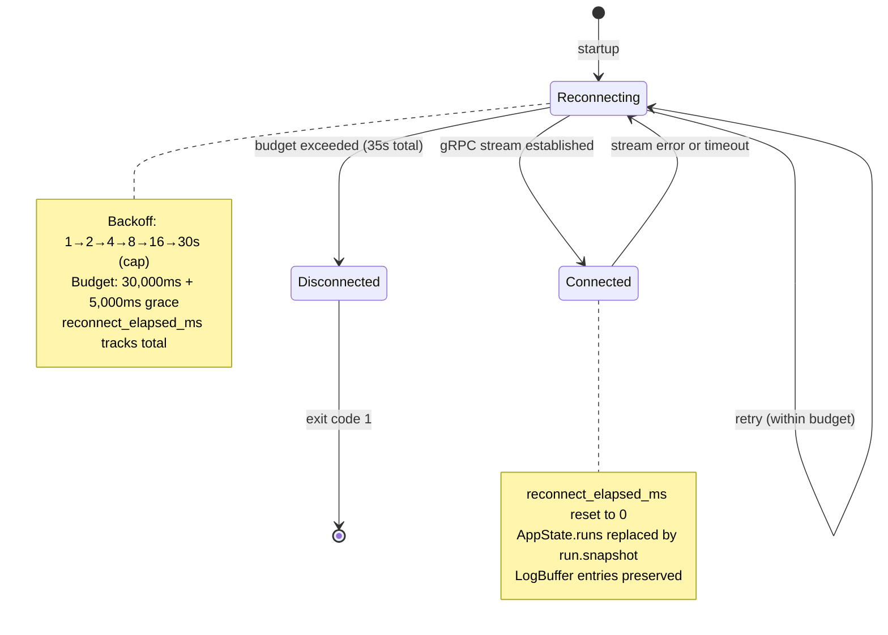

**[UI-DES-101a]** State fields per variant:

```rust
pub enum ConnectionStatus {
    Connected {
        server_addr: String,
    },
    Reconnecting {
        server_addr: String,
        attempt: u32,
        next_retry_at: Instant,
        elapsed_ms: u64,
    },
    Disconnected {
        server_addr: String,
        reason: String,
    },
}
```

**[UI-DES-101b]** Transition rules:
- `Reconnecting → Connected`: on successful `StreamRunEvents` subscription. `reconnect_elapsed_ms` reset to 0.
- `Connected → Reconnecting`: on any gRPC stream error, timeout, or disconnect. `attempt` increments; next delay computed from backoff schedule.
- `Reconnecting → Reconnecting`: on timeout expiry when `elapsed_ms + next_delay ≤ 35,000`. `elapsed_ms` accumulates.
- `Reconnecting → Disconnected`: when `elapsed_ms > 30,000`. After 5,000ms grace in `Disconnected`, exit with code 1 and message `"Disconnected from server. Exiting."`.

### 9.2 TUI Key Navigation State Machine

**[UI-DES-102]** The Dashboard tab maintains a focus state that governs arrow key routing:

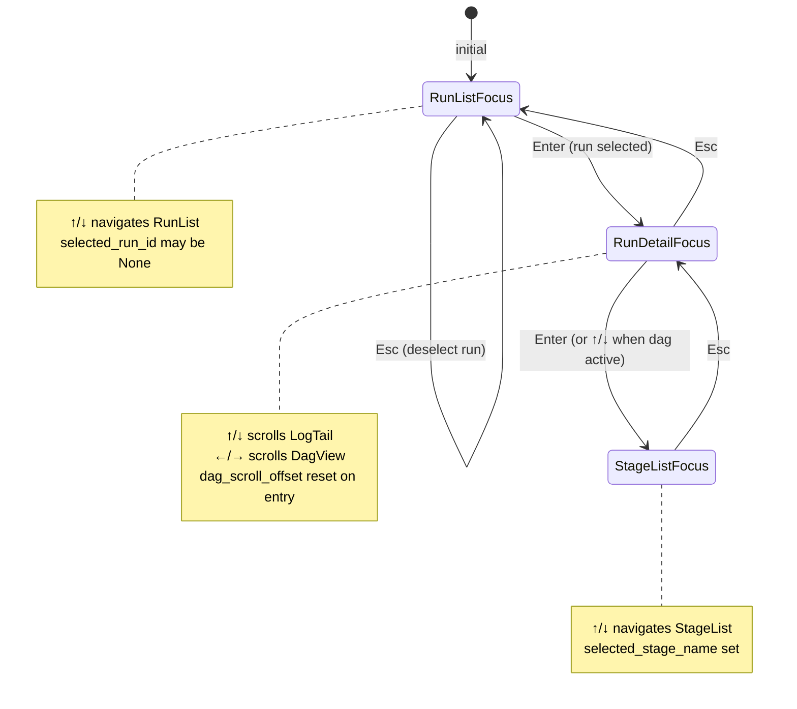

**[UI-DES-102a]** Tab switching (keys `Tab`, `1`, `2`, `3`, `4`) always resets to the primary focus of the destination tab. `selected_stage_name` is cleared when switching away from `Logs` or `Debug` tab.

### 9.3 Cancel Confirmation State Machine

**[UI-DES-103]** Cancel confirmation flow:

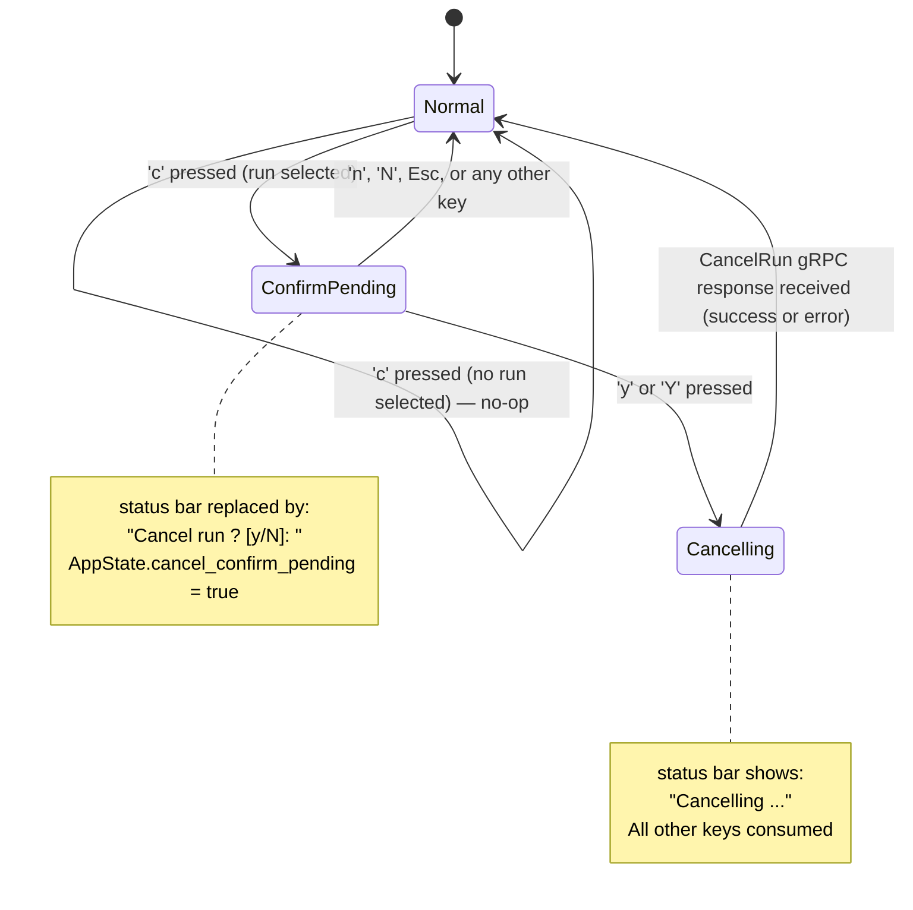

**[UI-DES-103a]** During `ConfirmPending`, `HelpOverlay` cannot be opened. The `?` key is consumed without effect. `Ctrl+C` and `q` still quit the application immediately.

**[UI-DES-103b]** During `Cancelling`, all keys except `Ctrl+C` and `q` are consumed. The application remains fully responsive to incoming server events and re-renders normally.

### 9.4 Log Buffer Lifecycle

**[UI-DES-104]** `LogBuffer` lifecycle per `(run_id, stage_name)` key:

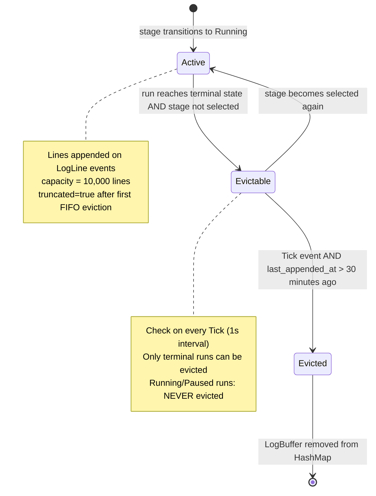

**[UI-DES-104a]** Log buffers for non-terminal runs are NEVER evicted, regardless of selection state or idle time.

---

## 10. Edge Cases & Error Handling

### 10.1 TUI Layout Edge Cases

**[UI-DES-105]** **Terminal resize during rendering.** `crossterm` delivers a `Resize(w, h)` event when the terminal dimensions change. The TUI processes this as a `TuiEvent::Resize`. `AppState::terminal_size` is updated immediately. The next `render()` call reflows layout using the new dimensions. No state is invalidated by resize except `dag_scroll_offset`, which is clamped to `max(0, total_dag_width - pane_width)` to prevent scroll beyond content.

**[UI-DES-106]** **Terminal smaller than 80×24 after startup.** The size warning replaces ALL content including the status bar and tab bar. The warning is re-evaluated every `Resize` event. When the terminal grows back to ≥ 80×24, normal rendering resumes with the previous `AppState` intact (no state reset).

**[UI-DES-107]** **Zero runs in `AppState::runs`.** The `RunList` renders a centered message:
```
No runs. Submit a workflow with: devs submit <workflow>
```
This message uses `STYLE_SUBDUED`. The `RunDetail` pane is empty (no content). `selected_run_id` is `None`.

**[UI-DES-108]** **Selected run disappears during reconnect.** When `AppState::runs` is replaced by a `run.snapshot` event on reconnect, if `selected_run_id` no longer exists in the new snapshot, it is set to `None`. The `RunList` selection is cleared. `dag_scroll_offset` is reset to 0.

**[UI-DES-109]** **DAG with a single root stage (no dependencies).** Renders as a single tier with one box. No tier gutter or arrow is rendered. `total_width = 39`.

**[UI-DES-110]** **DAG with all stages in one tier (no dependencies between any).** All boxes render in tier 0, stacked vertically. No horizontal scroll needed unless individual boxes exceed pane width (they never do at 39 cols + padding).

**[UI-DES-111]** **Fan-out stage display.** A stage with `fan_out_count = Some(N)` renders as a single box with `(xN)` appended to the name field. The name + suffix is computed before truncation. Example for `fan_out_count = Some(8)`:
```
stage-name → "stage-name(x8)      " (padded to 20)
very-long-stage-name-here(x4) → "very-long-stage-n~(x" (truncated, but note: the suffix may be partially cut)
```
**[UI-DES-111a]** If appending `(xN)` would overflow 20 chars, the name is truncated to `20 - len("(xN)") - 1` chars and `~` is inserted before the suffix. For `(x64)` (5 chars): name truncated to 14 chars + `~` + `(x64)` = 20 chars total.

**[UI-DES-112]** **Stage name exactly 20 characters.** No truncation marker is appended. The full name is displayed without modification.

**[UI-DES-113]** **Stage name is empty string.** This cannot occur — `BoundedString<128>` requires non-empty content, and the validation pipeline enforces stage name uniqueness (which implies non-empty). The TUI treats empty stage name as an internal error and renders `"<unnamed>"` with `STYLE_SUBDUED`.

### 10.2 CLI Edge Cases

**[UI-DES-114]** **Ambiguous run identifier.** When the operator provides a value matching both a valid UUID4 prefix and a slug, UUID takes precedence. If neither matches any run, exit code 2 with:
```
not_found: run 'identifier' not found
```

**[UI-DES-115]** **`--input` value containing `=`.** Splitting on the first `=` only: `--input expr=a=b` sets input `expr` to `"a=b"`. `--input =value` (empty key) fails validation with exit code 4:
```
invalid_argument: --input key cannot be empty
```

**[UI-DES-116]** **`devs list` with `--limit 0`.** Exit code 4:
```
invalid_argument: --limit must be at least 1
```

**[UI-DES-117]** **`devs list` with `--limit > 1000`.** Silently clamped to 1000. No warning is emitted. The response contains at most 1000 items.

**[UI-DES-118]** **`devs submit` when CWD resolves to zero projects.** Exit code 4:
```
invalid_argument: could not determine project from current directory; use --project
```

**[UI-DES-119]** **`devs submit` when CWD resolves to two or more projects.** Exit code 4:
```
invalid_argument: multiple projects match current directory; use --project <name|id>
```

**[UI-DES-120]** **`devs logs <run>` where the run has no stages started yet.** Text mode: prints a message and exits 0:
```
Run feature-20260311-a1b2 has no started stages.
```
JSON mode:
```json
{"run_id":"...","stage_name":null,"attempt":null,"lines":[],"truncated":false,"total_lines":0}
```

**[UI-DES-121]** **`devs logs <run> [stage] --follow` on a cancelled run.** If the run is already `Cancelled`, exits immediately with code 1 (same as `Failed`). If the run transitions to `Cancelled` while streaming, the `{"done":true,...}` chunk is received and the process exits with code 1.

**[UI-DES-122]** **`devs security-check` with missing `devs.toml`.** Runs all checks against built-in defaults. Emits warning for `SEC-TOML-CRED` as "no config file found". Does not open a gRPC channel.

**[UI-DES-123]** **Server unreachable during `devs cancel/pause/resume`.** Exit code 3. In JSON mode:
```json
{"error":"server_unreachable: connection refused at 127.0.0.1:7890","code":3}
```

### 10.3 MCP Bridge Edge Cases

**[UI-DES-124]** **Invalid JSON on stdin.** The bridge writes a JSON-RPC parse error to stdout and continues reading:
```json
{"jsonrpc":"2.0","id":null,"error":{"code":-32700,"message":"Parse error: invalid JSON"}}
```
The bridge MUST NOT exit on parse errors.

**[UI-DES-125]** **Stdin closes (EOF) while bridge is running.** The bridge completes any in-flight request, then exits with code 0. This is the normal shutdown path.

**[UI-DES-126]** **HTTP 413 from MCP server (request body > 1 MiB).** Bridge writes:
```json
{"result":null,"error":"invalid_argument: request body exceeds 1 MiB limit"}
```
Bridge continues. This is not a fatal error.

**[UI-DES-127]** **`stream_logs follow:true` where MCP server closes stream before `{"done":true}`.** Bridge writes the last received chunk (if any), then writes:
```json
{"result":null,"error":"internal: log stream closed unexpectedly"}
```
Bridge continues reading next request from stdin.

**[UI-DES-128]** **Bridge receives malformed MCP response (not valid JSON).** Bridge writes:
```json
{"result":null,"error":"internal: MCP server returned invalid JSON"}
```
Attempts one reconnect; if reconnect fails, writes fatal JSON and exits 1.

### 10.4 Log Buffer Edge Cases

**[UI-DES-129]** **Log sequence gap detected.** If a `LogLine` event arrives with `sequence` that skips values (e.g., last received = 5, new = 7), the TUI logs an internal `WARN` (not displayed to operator). Missing lines are not fetched retroactively. The sequence gap is recorded in `LogBuffer::total_received` gap tracking but no visual indicator is shown to the operator.

**[UI-DES-130]** **Log line exceeding pane width.** The line is clipped at `pane_width - 1` columns during rendering. A `$` character is appended at position `pane_width - 1` to signal truncation (only in `LogPane`, not in `LogTail`):
```
This is a very long log line that exceeds the pane width and will be clip$
```

**[UI-DES-131]** **`stream_logs follow:true` on a `Pending` or `Waiting` stage.** The HTTP connection is held open by the server. The bridge forwards the connection. If the stage never starts within the connection lifetime (e.g., workflow cancelled), the server sends `{"done":true,"truncated":false,"total_lines":0}` and closes the stream.

**[UI-DES-132]** **Log buffer full (10,000 lines) — new line arrives.** The oldest line (`lines.front()`) is removed. The new line is appended to `lines.back()`. `truncated` is set to `true`. `total_received` is incremented. The `log_scroll_offset` for this buffer is decremented by 1 if it was > 0, to maintain the operator's visual position.

---

## 11. Component Dependencies & Integration Points

### 11.1 Dependency Graph

**[UI-DES-133]** The three client binaries have strictly enforced dependency rules verified by `./do lint` via `cargo tree`:

```
devs-tui:
  MUST depend on: devs-core, devs-proto, ratatui, crossterm, tonic
  MUST NOT depend on: devs-scheduler, devs-pool, devs-executor, devs-adapters,
                       devs-checkpoint, devs-checkpoint, devs-webhook, devs-grpc,
                       devs-mcp, devs-config, devs-server

devs-cli:
  MUST depend on: devs-core, devs-proto, clap, tonic
  MUST NOT depend on: (same prohibited list as devs-tui)

devs-mcp-bridge:
  MUST depend on: devs-core, reqwest, tokio
  MUST NOT depend on: tonic, devs-proto
  (bridge communicates via HTTP, not gRPC)
```

**[UI-DES-134]** The `devs-client-util` shared library crate exposes:
- `discover_grpc_addr(flags: &GlobalArgs) -> Result<String, DiscoveryError>` — implements the 5-step discovery precedence chain
- `discover_mcp_url(flags: &GlobalArgs) -> Result<Url, DiscoveryError>` — calls gRPC `GetInfo` after discovering gRPC addr
- `connect_grpc(addr: &str) -> Channel` — creates a lazy gRPC channel with 5s connect timeout

**[UI-DES-134a]** `DiscoveryError` maps to UI exit behavior:
| Variant | CLI exit code | TUI behavior | Bridge behavior |
|---|---|---|---|
| `ServerAddrNotFound` | 3 | Enter `Reconnecting` | Fatal JSON + exit 1 |
| `FileReadError(path)` | 3 | Enter `Reconnecting` | Fatal JSON + exit 1 |
| `GrpcConnectFailed` | 3 | Enter `Reconnecting` | Fatal JSON + exit 1 |
| `GetInfoFailed` | 3 | Enter `Reconnecting` | Fatal JSON + exit 1 |

### 11.2 gRPC Stream Subscriptions (TUI)

**[UI-DES-135]** The TUI maintains two persistent gRPC streaming subscriptions:

| Stream | Service.RPC | Events received | `AppState` fields updated |
|---|---|---|---|
| Run events | `RunService.StreamRunEvents` | `run.snapshot`, `run.delta`, `stage.started`, `stage.completed`, etc. | `runs`, `run_details`, `log_buffers` |
| Pool state | `PoolService.WatchPoolState` | `pool.snapshot`, `pool.delta` | `pool_state` |

**[UI-DES-135a]** Both streams are subscribed in parallel `tokio::task::spawn` tasks. Each task forwards events to the main event loop via `mpsc::Sender<TuiEvent>`. Channel buffer sizes: run events = 256; pool events = 64.

**[UI-DES-135b]** If either stream errors, only that stream's reconnect procedure is triggered. The TUI does not reset both streams on a single stream error.

**[UI-DES-136]** The first event received on `StreamRunEvents` after connecting is always `event_type = "run.snapshot"`. This event causes `AppState::runs` and `run_details` to be fully replaced. `LogBuffer` entries are preserved (they survive reconnect).

### 11.3 Proto Type Conversion Boundary

**[UI-DES-137]** Proto types from `devs-proto` MUST NOT appear in `state.rs`, `widgets/`, or `tabs/`. All proto-to-domain conversions are performed in `crates/devs-tui/src/convert.rs`. This file is the sole importer of `devs_proto::devs::v1::*` within the TUI crate.

**[UI-DES-138]** Equivalent rule for CLI: proto-to-output conversions are performed in `crates/devs-cli/src/output.rs`. Command handlers receive domain types; they do not reference proto types.

---

## 12. Snapshot Testing Specifications

### 12.1 Test Infrastructure

**[UI-DES-139]** All TUI snapshot tests use `ratatui::backend::TestBackend` at a fixed size of **200 columns × 50 rows**. This size ensures all layout regions are visible without truncation. `ColorMode::Monochrome` is always used in snapshots to ensure ANSI-free output.

**[UI-DES-140]** Snapshot files are stored in `crates/devs-tui/tests/snapshots/` with `.txt` extension. The `insta 1.40` crate manages the snapshot lifecycle. `INSTA_UPDATE=always` is prohibited in CI (enforced by checking the env var in `./do ci`).

**[UI-DES-141]** Each snapshot test follows this pattern:

```rust
#[test]
fn test_dashboard_run_running() {
    // Covers: AC-UI-NNN
    let mut state = AppState::test_default();
    // Populate state with test data
    state.runs = vec![make_run_summary(RunStatus::Running)];
    state.run_details.insert(run_id, make_run_detail_three_stages());
    state.selected_run_id = Some(run_id);

    let backend = TestBackend::new(200, 50);
    let mut terminal = Terminal::new(backend).unwrap();
    terminal.draw(|frame| {
        let app = App::with_state(state);
        frame.render_widget(app.root_widget(), frame.size());
    }).unwrap();

    let rendered = terminal.backend().buffer().content_as_str();
    insta::assert_snapshot!("dashboard__run_running", rendered);
}
```

**[UI-DES-141a]** `AppState::test_default()` is gated behind `#[cfg(test)]`. It MUST NOT be callable from production code. It initializes:
- `active_tab`: `Tab::Dashboard`
- `help_visible`: `false`
- `runs`: `vec![]`
- `connection_status`: `ConnectionStatus::Connected { server_addr: "127.0.0.1:7890".to_string() }`
- `terminal_size`: `(200, 50)`
- All other fields: empty/default

### 12.2 Required Snapshot Inventory

**[UI-DES-142]** The following snapshots MUST exist and pass in CI. Each snapshot filename maps to a test function:

| Snapshot filename | Scenario |
|---|---|
| `dashboard__empty_state` | No runs, no selection, Connected |
| `dashboard__run_running` | One run Running, selected, two stages visible |
| `dashboard__dag_three_stages` | Three-stage linear DAG: plan→implement→review |
| `dashboard__dag_parallel_stages` | plan→{implement-api, implement-ui}→review |
| `dashboard__dag_fan_out` | Fan-out stage showing `(x4)` suffix |
| `dashboard__terminal_too_small` | Terminal at 79×24 (below minimum) |
| `dashboard__reconnecting` | Connection status Reconnecting, attempt 3 |
| `dashboard__cancel_confirm` | Cancel confirmation prompt in status bar |
| `help_overlay__visible` | HelpOverlay rendered over Dashboard |
| `logs__buffered` | LogPane with 50 lines, scroll at position 25 |
| `logs__truncated` | LogPane with `truncated=true` notice |
| `logs__stderr_prefix` | LogPane with mixed stdout/stderr lines, prefixes shown |
| `pools__normal` | Two pools, one agent active, one queued |
| `pools__rate_limited` | One agent rate-limited, showing cooldown time |
| `pools__empty` | No pools registered |
| `debug__diff_view` | Debug tab with agent selector and diff placeholder |
| `status_bar__connected` | Status bar in Connected state |
| `status_bar__reconnecting` | Status bar in Reconnecting state |
| `status_bar__disconnected` | Status bar in Disconnected state |
| `stage_list__all_statuses` | StageList showing all 9 status labels |

---

## 13. Acceptance Criteria

### 13.1 Color & Theming

- **[AC-7-001]** When `NO_COLOR` is set to any non-empty value, TUI renders zero ANSI color escape sequences. Verified by rendering to `TestBackend` and asserting no `\x1b[` sequences in buffer content.
- **[AC-7-002]** `Theme::from_env()` is the only location that reads `NO_COLOR`. `cargo grep 'NO_COLOR' crates/devs-tui/src` returns exactly one match.
- **[AC-7-003]** `STYLE_SUBDUED` uses `Color::DarkGray` in `ColorMode::Color` and no color modifier in `ColorMode::Monochrome`. Verified by `theme.rs` unit test.
- **[AC-7-004]** Selected list row uses `Modifier::REVERSED` in both color modes. No other selection indicator is used.
- **[AC-7-005]** Stage status `DONE` renders with `Color::Green` foreground in color mode. `FAIL` and `TIME` render with `Color::Red`. Verified by snapshot diff.

### 13.2 Typography & Labels

- **[AC-7-006]** Every `stage_status_label()` return value is exactly 4 bytes. Compile-time assertion in `render_utils.rs` enforces this; build fails if violated.
- **[AC-7-007]** `truncate_with_tilde("this-stage-name-is-too-long", 20)` returns `"this-stage-name-is-~"`. Unit test in `render_utils.rs`.
- **[AC-7-008]** `format_elapsed(None)` returns `"--:--"` (exactly 5 chars). `format_elapsed(Some(0))` returns `"0:00 "`. `format_elapsed(Some(599))` returns `"9:59 "`. `format_elapsed(Some(600))` returns `"10:00"`. Unit tests in `render_utils.rs`.
- **[AC-7-009]** All `STATUS_*` constants in `strings.rs` are compile-time asserted to be exactly 4 bytes. Test uses `const _: () = assert!(STATUS_RUNNING.len() == 4)` for all status constants.
- **[AC-7-010]** No `ITALIC`, `UNDERLINED`, `BLINK`, or `RAPID_BLINK` modifier appears in any widget render path. Verified by `cargo grep` lint test.

### 13.3 Layout & Grid

- **[AC-7-011]** At terminal size 79×24, TUI renders only the size warning message. Snapshot `dashboard__terminal_too_small` captures this. No tab bar, status bar, or run list is visible.
- **[AC-7-012]** At terminal size 80×24, TUI renders the full dashboard without the size warning. Verified by snapshot.
- **[AC-7-013]** Stage box is exactly 39 columns wide. Unit test constructs a `DagStageBox` and asserts `render_box(&box).len() == 39`.
- **[AC-7-014]** `DagLayout::total_width` for a 3-tier DAG equals `39 * 3 + 5 * 2 = 127`. Unit test with 3-tier input.
- **[AC-7-015]** `RunList` pane is at least 24 columns wide at minimum terminal width (80 cols). Layout unit test at 80-column terminal.
- **[AC-7-016]** `DagView` height is at least 8 rows at minimum terminal size. Layout unit test.
- **[AC-7-017]** `LogTail` auto-scrolls to tail on new line append when already at tail. Unit test: buffer at tail → append → assert `scroll_offset == buffer.len() - visible_rows`.
- **[AC-7-018]** `LogTail` does NOT auto-scroll when operator has scrolled up. Unit test: buffer with offset < tail → append → assert offset unchanged.

### 13.4 Key Bindings & Interaction

- **[AC-7-019]** Pressing `Tab` cycles tabs in order: Dashboard→Logs→Debug→Pools→Dashboard. E2E TUI test.
- **[AC-7-020]** Pressing `1`–`4` switches to the corresponding tab directly. E2E TUI test.
- **[AC-7-021]** Pressing `?` shows `HelpOverlay`. Pressing `?` again hides it. Snapshot `help_overlay__visible`.
- **[AC-7-022]** With `HelpOverlay` visible, pressing any key other than `?`, `Esc`, `q`, `Ctrl+C` has no effect on `AppState` (other than potentially triggering a re-render). Unit test: send 10 random keys → assert `AppState` unchanged except `help_visible`.
- **[AC-7-023]** Pressing `c` with no run selected has no effect. `cancel_confirm_pending` remains `false`.
- **[AC-7-024]** Pressing `c` with a run selected sets `cancel_confirm_pending = true` and shows the confirmation prompt in the status bar. Snapshot `dashboard__cancel_confirm`.
- **[AC-7-025]** Pressing `y` during confirmation triggers `CancelRun` gRPC call. Pressing `n` or `Esc` dismisses without gRPC call. E2E TUI test using `mockall` mock for gRPC.
- **[AC-7-026]** Pressing `Esc` in `StageListFocus` returns focus to `RunDetail` (not `RunList`). Pressing `Esc` again returns focus to `RunList`. `selected_stage_name` is cleared on first `Esc`.
- **[AC-7-027]** Unrecognized keys produce no output (neither to stdout nor stderr) and no state change.

### 13.5 Connection & Reconnection

- **[AC-7-028]** On reconnect, `AppState::runs` and `run_details` are fully replaced by the `run.snapshot` event. `LogBuffer` entries are NOT cleared. E2E TUI test.
- **[AC-7-029]** `selected_run_id` is set to `None` if the run no longer exists in the post-reconnect snapshot. E2E TUI test.
- **[AC-7-030]** After 30,000ms cumulative reconnect time, `ConnectionStatus` transitions to `Disconnected`. After 5,000ms more, TUI exits with code 1. E2E test with mocked server that drops connections.
- **[AC-7-031]** `reconnect_elapsed_ms` resets to 0 on successful reconnect. E2E test: connect → disconnect → reconnect within budget → assert `reconnect_elapsed_ms == 0`.
- **[AC-7-032]** Status bar shows `RECONNECTING...` in yellow (color mode) during reconnect. Snapshot `status_bar__reconnecting`.

### 13.6 CLI Output

- **[AC-7-033]** `devs submit --format json` outputs valid JSON conforming to the schema in §7.1. `jq` parse must succeed. E2E CLI test.
- **[AC-7-034]** `devs list --format json` for zero runs outputs `[]` (not `null`, not error). E2E CLI test.
- **[AC-7-035]** `devs status <run> --format json` includes all fields with `null` for unpopulated optionals (never absent). E2E CLI test using `jq 'has("completed_at")'`.
- **[AC-7-036]** `devs logs <run> --follow` exits with code 0 when run completes, 1 when run fails. E2E CLI test.
- **[AC-7-037]** `devs logs <run> --format json --follow` streams newline-delimited JSON chunks, one per line. Each chunk parses as valid JSON. E2E CLI test.
- **[AC-7-038]** All error output in `--format json` mode goes to stdout (nothing to stderr). E2E CLI test: redirect stderr to file, assert file is empty.
- **[AC-7-039]** `--input expr=a=b` sets input `expr` to `"a=b"`. E2E CLI test via `devs submit --input expr=a=b`.
- **[AC-7-040]** `devs list --limit 0` exits with code 4. E2E CLI test.
- **[AC-7-041]** `devs list --limit 1001` returns at most 1000 items (silently clamped). E2E CLI test.
- **[AC-7-042]** Every error string output by CLI begins with exactly one of the 10 machine-stable prefixes. CI lint test scans all `strings.rs` constants.

### 13.7 MCP Bridge

- **[AC-7-043]** Bridge forwards a valid `list_runs` request and returns the server response unchanged. E2E test: spawn bridge as subprocess, write JSON-RPC to stdin, read from stdout, compare to direct MCP HTTP response.
- **[AC-7-044]** Bridge writes JSON-RPC error `-32700` to stdout on invalid JSON input and continues processing subsequent requests. E2E test.
- **[AC-7-045]** Bridge outputs `{"fatal":true}` field and exits with code 1 after one failed reconnect. E2E test with server that disconnects mid-session.
- **[AC-7-046]** `devs-mcp-bridge` binary has no `tonic` or `devs-proto` in its dependency tree. Verified by `cargo tree -p devs-mcp-bridge --edges normal | grep tonic` returns empty.
- **[AC-7-047]** Bridge forwards `stream_logs follow:true` chunks line-by-line without buffering all chunks. E2E test: assert first chunk arrives within 500ms of server sending it.

### 13.8 Data Models

- **[AC-7-048]** `compute_dag_tiers` correctly assigns tier 0 to all root stages, tier 1 to stages with only tier-0 dependencies, etc. Unit test with linear 3-stage DAG: assert `[["plan"], ["implement"], ["review"]]`.
- **[AC-7-049]** `compute_dag_tiers` for parallel DAG `plan→{impl-api, impl-ui}→review`: assert `[["plan"], ["impl-api", "impl-ui"], ["review"]]` (alphabetical within tier).
- **[AC-7-050]** `LogBuffer` evicts oldest line (index 0) when at capacity 10,000. `truncated` becomes `true` after first eviction. Unit test.
- **[AC-7-051]** `LogBuffer` for a running run is NEVER evicted by `Tick` event, regardless of `last_appended_at`. Unit test: set run as `Running`, trigger 100 Tick events, assert buffer still present.
- **[AC-7-052]** ANSI stripping: `strip_ansi("\x1b[31mHello\x1b[0m World")` returns `"Hello World"`. Unit test with at least 5 different ANSI sequences.
- **[AC-7-053]** `strip_ansi` on a string with no ANSI sequences returns the string unchanged. Unit test.
- **[AC-7-054]** `AppState::test_default()` is not callable from production binary code. `#[cfg(test)]` gate enforced by `cargo build --release` succeeding while removing the function.

### 13.9 Security & Cross-Platform

- **[AC-7-055]** No ANSI escape sequences appear in TUI snapshot files (`*.txt` in `tests/snapshots/`). CI lint test: `grep -r '\x1b\[' crates/devs-tui/tests/snapshots/` returns empty.
- **[AC-7-056]** All user-visible strings in `devs-tui` originate from `strings.rs` constants. CI lint scans for inline string literals matching error prefix patterns outside `strings.rs`.
- **[AC-7-057]** TUI terminal is restored (raw mode off, cursor shown, alternate screen off) on all exit paths including panics. E2E test: spawn TUI, trigger panic, assert terminal is in normal mode afterward.
- **[AC-7-058]** TUI functions correctly on Windows Git Bash (crossterm Windows Console API). CI matrix includes `presubmit-windows` job.
- **[AC-7-059]** All paths in CLI JSON output use forward-slash separators on all platforms. E2E CLI test on Windows.
- **[AC-7-060]** `devs-tui` does not reference `devs_proto` types in `state.rs` or any file under `widgets/` or `tabs/`. `cargo grep 'devs_proto' crates/devs-tui/src/state.rs` returns empty.

---

## Appendix A: ASCII Character Inventory

This appendix is the authoritative reference for every character permitted or prohibited in structural TUI display positions, the algorithms that enforce those constraints, and the validation checkpoints where enforcement occurs. Normative tags in this appendix (`[UI-ASCII-*]`) carry the same weight as any other `[UI-DES-*]` requirement in this document.

**Scope.** "Structural position" means any rendered cell produced by `devs-tui` widget code — stage boxes, DAG arrows, HelpOverlay borders, StatusBar text, tab labels, key-binding labels, elapsed-time strings, and status abbreviations. Content that originates from agent processes (stdout/stderr log lines) is subject to stripping and sanitisation rules defined in §A.3 and §A.4 before it occupies a structural cell.

---

### §A.1 Character Categories

Permitted characters are grouped by the component that uses them. A character may appear in multiple categories. The union of all categories forms the permitted set.

#### §A.1.1 Stage Box Characters

A stage box has the fixed layout: `[ <name-20> | <STAT> | <M:SS> ]` (41 columns total).

| Character | Codepoint | Role in Stage Box |
|---|---|---|
| `[` | U+005B | Left boundary of box |
| `]` | U+005D | Right boundary of box |
| `\|` | U+007C | Field separator (two occurrences per box) |
| ` ` | U+0020 | Padding before/after name, status, elapsed |
| `~` | U+007E | 20th character when stage name is truncated |
| `0`–`9` | U+0030–U+0039 | Digits in elapsed time and stage name |
| `a`–`z` | U+0061–U+007A | Lowercase letters in stage name |
| `-` | U+002D | Hyphen in stage name, elapsed `--:--` placeholder |
| `_` | U+005F | Underscore in stage name |
| `:` | U+003A | Separator between minutes and seconds in elapsed |
| `A`–`Z` | U+0041–U+005A | Uppercase letters in 4-char status label |

The 4-char status label column contains only these exact strings (each exactly 4 bytes of printable ASCII):

| Label | Meaning |
|---|---|
| `PEND` | Pending |
| `WAIT` | Waiting |
| `ELIG` | Eligible |
| `RUN ` | Running (trailing space to reach 4 chars) |
| `PAUS` | Paused |
| `DONE` | Completed |
| `FAIL` | Failed |
| `TIME` | TimedOut |
| `CANC` | Cancelled |

#### §A.1.2 DAG Arrow Characters

The DAG view renders arrows between stage boxes in tiers. All arrow characters are drawn exclusively by `DagView::render()` from these characters:

| Character | Codepoint | Role in DAG |
|---|---|---|
| `-` | U+002D | Horizontal shaft of arrow |
| `>` | U+003E | Arrow tip (rightward) |
| `\|` | U+007C | Vertical connector between tier rows |
| `+` | U+002B | Junction where vertical meets horizontal |
| ` ` | U+0020 | Empty gutter cell |

The 5-column tier gutter between stage boxes is built as one of these two sequences:

```
"  --> "   (5 chars: space space hyphen hyphen gt space)
"  ──► "   PROHIBITED — this Unicode sequence is never used
```

The arrow shaft `──►` (U+2500 U+2500 U+25BA) MUST NOT appear; the ASCII equivalent `-->` MUST be used instead. The `--►` hybrid (ASCII hyphens + Unicode arrowhead) is likewise prohibited.

#### §A.1.3 HelpOverlay Border Characters

The HelpOverlay is a modal rectangle drawn with:

| Character | Codepoint | Role |
|---|---|---|
| `+` | U+002B | Corners (top-left, top-right, bottom-left, bottom-right) |
| `-` | U+002D | Top and bottom horizontal border |
| `\|` | U+007C | Left and right vertical border |
| ` ` | U+0020 | Interior padding and column spacing |

No rounded-corner characters (U+256D–U+2570) or double-line box characters are permitted.

#### §A.1.4 Key Binding Label Characters

Key labels appearing in the HelpOverlay table and the StatusBar:

| Character | Codepoint | Usage |
|---|---|---|
| `q` | U+0071 | Quit |
| `?` | U+003F | Toggle HelpOverlay |
| `1`–`4` | U+0031–U+0034 | Switch to tab N |
| `c` | U+0063 | Cancel run |
| `p` | U+0070 | Pause run/stage |
| `r` | U+0072 | Resume run/stage |
| `y` | U+0079 | Confirm (affirmative) |
| `N` | U+004E | Decline (negative, default) |
| `↑` | — | PROHIBITED; displayed as `Up` (3 ASCII chars) |
| `↓` | — | PROHIBITED; displayed as `Dn` (2 ASCII chars) |
| `Esc` | — | Multi-char label for the Escape key |
| `Tab` | — | Multi-char label for the Tab key |

Arrow keys MUST be labelled with ASCII abbreviations (`Up`, `Dn`, `PgUp`, `PgDn`) not Unicode arrow symbols.

#### §A.1.5 StatusBar Text Characters

The StatusBar occupies the last row of the terminal. Its text uses:

| Character | Codepoint | Usage |
|---|---|---|
| `A`–`Z` | U+0041–U+005A | Status words: `CONNECTED`, `RECONNECTING`, `DISCONNECTED` |
| `0`–`9` | U+0030–U+0039 | Server address port number, reconnect countdown |
| `.` | U+002E | IP address field separator |
| `:` | U+003A | Host:port separator |
| ` ` | U+0020 | Section padding |
| `[` `]` | U+005B U+005D | Bracket sections (active run count indicator) |
| `#` | U+0023 | Active run count prefix: `[#3]` |
| `-` | U+002D | Hyphen in domain names |

#### §A.1.6 Tab Label Characters

The four tab labels (`Dashboard`, `Logs`, `Debug`, `Pools`) use only mixed-case ASCII letters (U+0041–U+005A and U+0061–U+007A) and spaces. No punctuation, digits, or symbols appear in tab labels.

#### §A.1.7 Elapsed Time Format Characters

Elapsed time strings adhere to one of two formats:

| Format | Example | Characters Used |
|---|---|---|
| `M:SS` (started) | `3:47` or `1024:00` | Digits `0–9`, colon `:` |
| `--:--` (not started) | `--:--` | Hyphen `-`, colon `:` |

There is no upper bound on the minute component. A stage running for 1000 minutes renders as `1000:00` (7 chars), which extends beyond the nominal 5-char field. The stage box width accommodates this by right-overflowing into adjacent padding only in the rightmost field (between the last `|` and `]`); the box bracket `]` is never displaced.

---

### §A.2 Complete Master Inventory

**[UI-DES-074]** Complete normative set of ASCII characters permitted in structural positions. Any character not in this table is prohibited in structural positions unless explicitly added by a future revision of this appendix.

| Character | Codepoint | Decimal | Structural Contexts |
|---|---|---|---|
| ` ` (space) | U+0020 | 32 | Padding in all components |
| `!` | U+0021 | 33 | Reserved; currently unused |
| `"` | U+0022 | 34 | Reserved; currently unused |
| `#` | U+0023 | 35 | StatusBar active-run count prefix |
| `$` | U+0024 | 36 | Reserved; currently unused |
| `%` | U+0025 | 37 | Reserved; currently unused |
| `&` | U+0026 | 38 | Reserved; currently unused |
| `'` | U+0027 | 39 | Reserved; currently unused |
| `(` | U+0028 | 40 | Fan-out suffix open paren `(×N)` |
| `)` | U+0029 | 41 | Fan-out suffix close paren |
| `*` | U+002A | 42 | Reserved; currently unused |
| `+` | U+002B | 43 | HelpOverlay corners; DAG junction |
| `,` | U+002C | 44 | Reserved; currently unused |
| `-` | U+002D | 45 | DAG arrow shaft; HelpOverlay border; elapsed `--:--`; stage name hyphen |
| `.` | U+002E | 46 | IP address separator in StatusBar |
| `/` | U+002F | 47 | Reserved; currently unused |
| `0`–`9` | U+0030–U+0039 | 48–57 | Stage names; elapsed time; port numbers; run counts |
| `:` | U+003A | 58 | Elapsed M:SS separator; host:port in StatusBar |
| `;` | U+003B | 59 | Reserved; currently unused |
| `<` | U+003C | 60 | Reserved; currently unused |
| `=` | U+003D | 61 | Reserved; currently unused |
| `>` | U+003E | 62 | DAG arrow tip |
| `?` | U+003F | 63 | HelpOverlay key label |
| `@` | U+0040 | 64 | Reserved; currently unused |
| `A`–`N` | U+0041–U+004E | 65–78 | Status labels; StatusBar text; tab labels; `N` confirmation negative |
| `O`–`Z` | U+004F–U+005A | 79–90 | Status labels; StatusBar text; tab labels |
| `[` | U+005B | 91 | Stage box left bracket; StatusBar section brackets |
| `\` | U+005C | 92 | Reserved; currently unused |
| `]` | U+005D | 93 | Stage box right bracket; StatusBar section brackets |
| `^` | U+005E | 94 | Reserved; currently unused |
| `_` | U+005F | 95 | Stage name underscore |
| `` ` `` | U+0060 | 96 | Reserved; currently unused |
| `a`–`z` | U+0061–U+007A | 97–122 | Stage names; key labels (`c`, `p`, `q`, `r`, `y`); tab labels |
| `{` | U+007B | 123 | Reserved; currently unused |
| `\|` | U+007C | 124 | Stage box field separator; DAG vertical connector; HelpOverlay vertical border |
| `}` | U+007D | 125 | Reserved; currently unused |
| `~` | U+007E | 126 | Stage name truncation indicator |

Characters marked "Reserved; currently unused" are within the printable ASCII range and MUST NOT appear in structural positions unless a future revision assigns them a role. Their inclusion in the table documents that they are not accidentally overlooked.

**[UI-DES-075]** Characters explicitly **prohibited** in structural positions:

| Category | Range | Reason |
|---|---|---|
| Control characters | U+0000–U+001F | Non-printable; cause undefined terminal behaviour |
| DEL | U+007F | Non-printable; destructive cursor-control character |
| Unicode box-drawing | U+2500–U+257F | Renders as zero or two columns on some terminals |
| Block elements | U+2580–U+259F | Variable width; fail `NO_COLOR` environments |
| Braille patterns | U+2800–U+28FF | Screen-reader interference; non-ASCII |
| Emoji (BMP) | U+2600–U+27BF, U+2B00–U+2BFF | Width = 2; misalign fixed-width layout |
| Emoji (supplementary) | U+1F000–U+1FFFF | Width = 2; not in BMP |
| CJK unified ideographs | U+4E00–U+9FFF | Width = 2; column miscounting |
| Any char where `unicode_width == 2` | Various | Column count assumption broken |
| ANSI escape sequences | ESC (U+001B) + following bytes | Must be stripped from log content; must never be emitted by widget code |

---

### §A.3 ANSI Escape Sequence Stripping Algorithm

Agent process output (stdout and stderr) is written verbatim to log files at `.devs/logs/`. Before this content is stored in a `LogBuffer` for TUI display, ANSI escape sequences are stripped. The canonical implementation lives in `crates/devs-tui/src/render_utils.rs::strip_ansi()`.

**[UI-ASCII-BR-001]** `strip_ansi` MUST be implemented as a byte-level 3-state machine. Regex-based stripping is prohibited because it may introduce quadratic performance on adversarial input.

**[UI-ASCII-BR-002]** `strip_ansi` MUST strip CSI sequences (ESC + `[` + parameter bytes + final byte). It explicitly does NOT strip OSC, DCS, PM, APC, or SOS sequences; this is an accepted limitation. Any ESC byte not followed by `[` is passed through as-is.

#### §A.3.1 State Machine Definition

```
States:    Normal | Escape | Csi

Transitions:
  Normal:
    byte == 0x1B (ESC)  →  Escape     [do not emit]
    otherwise           →  Normal     [emit byte]

  Escape:
    byte == 0x5B ('[')  →  Csi        [do not emit]
    otherwise           →  Normal     [emit 0x1B, emit byte]

  Csi:
    byte in 0x40–0x7E   →  Normal     [do not emit; this is the CSI final byte]
    otherwise           →  Csi        [do not emit; parameter/intermediate byte]

Initial state: Normal
```

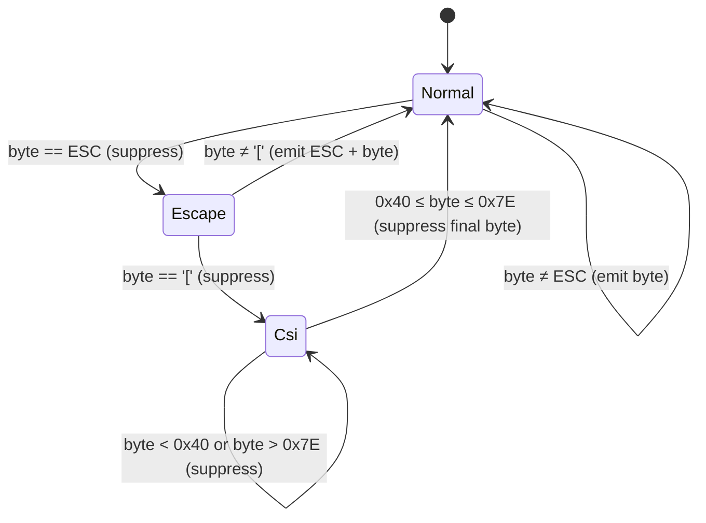

#### §A.3.2 Reference Implementation

```rust
/// Strip ANSI CSI escape sequences from a byte slice.
/// Implemented as a byte-level 3-state machine per §A.3.
/// Non-CSI ESC sequences pass through unchanged.
pub fn strip_ansi(input: &str) -> String {
    #[derive(PartialEq)]
    enum State { Normal, Escape, Csi }

    let mut out = Vec::with_capacity(input.len());
    let mut state = State::Normal;

    for byte in input.bytes() {
        state = match state {
            State::Normal => {
                if byte == 0x1B {
                    State::Escape
                } else {
                    out.push(byte);
                    State::Normal
                }
            }
            State::Escape => {
                if byte == b'[' {
                    State::Csi
                } else {
                    out.push(0x1B);
                    out.push(byte);
                    State::Normal
                }
            }
            State::Csi => {
                if (0x40..=0x7E).contains(&byte) {
                    State::Normal       // final byte consumed; back to normal
                } else {
                    State::Csi          // parameter or intermediate byte; consume
                }
            }
        };
    }

    // If stream ends mid-sequence, emit any buffered ESC byte.
    if state == State::Escape {
        out.push(0x1B);
    }
    // Csi state at EOF: the incomplete sequence is silently discarded.

    // Safe because input was valid UTF-8 and we only removed ASCII bytes.
    String::from_utf8(out).unwrap_or_else(|_| {
        String::from_utf8_lossy(input.as_bytes()).into_owned()
    })
}
```

**[UI-ASCII-BR-003]** The output of `strip_ansi` on a valid UTF-8 input MUST be valid UTF-8. Because CSI sequences consist entirely of ASCII bytes, removing them cannot create invalid UTF-8 sequences at multi-byte boundaries.

**[UI-ASCII-BR-004]** The `String::from_utf8` unwrap in the reference implementation is expected to never fail; the `unwrap_or_else` fallback is a defensive measure only and MUST be covered by a unit test that confirms it is never triggered on well-formed agent output.

#### §A.3.3 Application Points

`strip_ansi` is called exactly once per log line, in `LogBuffer::push()`, before the line is stored in `LogLine.content`. The raw original string (including ANSI) is stored separately in `LogLine.raw_content` for potential future use. Widget render methods MUST read `LogLine.content` (stripped), never `LogLine.raw_content`.

**[UI-ASCII-BR-005]** `strip_ansi` MUST NOT be called inside `render()`. Stripping happens once at ingest; widgets use the pre-stripped `content` field.

---

### §A.4 Stage Name Truncation Algorithm

Stage names defined in workflow TOML/YAML follow the pattern `[a-z0-9_-]+` with a maximum of 128 bytes. For display in a stage box, names are truncated to a maximum of 20 display columns. The canonical implementation is `render_utils::truncate_with_tilde(s: &str, max_display_cols: usize) -> String`.

**[UI-ASCII-BR-006]** Stage names MUST match `[a-z0-9_-]+` by the time they reach the display layer. If a name that violates this pattern somehow reaches `truncate_with_tilde`, each non-matching byte is replaced with `?` (U+003F) before truncation.

**[UI-ASCII-BR-007]** Because stage names are restricted to ASCII characters (`[a-z0-9_-]`), byte count equals display column count for this input domain. `truncate_with_tilde` MAY use `len()` directly and MUST NOT rely on a `unicode_width` crate for stage name truncation.

#### §A.4.1 Truncation Rule

```
if name.len() <= max_display_cols:
    return name.to_string()   // left-pad to max_display_cols with spaces at call site
else:
    return format!("{}~", &name[..max_display_cols - 1])
    // The ~ occupies the last (20th) display column.
    // The first 19 chars of the name are preserved.
```

#### §A.4.2 Fan-Out Suffix

For fan-out stages, the suffix `(×N)` is appended in the display name before truncation. Because `×` (U+00D7, MULTIPLICATION SIGN) is a non-ASCII character and MUST NOT appear in structural positions, the suffix MUST use the ASCII alternative `(xN)` — e.g., `(x4)` — where `x` is U+0078 (lowercase x).

**[UI-ASCII-BR-008]** Fan-out display suffix MUST be `(xN)` (ASCII) not `(×N)` (Unicode). The full stage name including suffix is passed to `truncate_with_tilde` so truncation always yields exactly `max_display_cols` characters.

```
Example: stage name = "implement-api", fan_out_count = 4
  name_with_suffix = "implement-api(x4)"     // 17 chars
  display = "implement-api(x4)"              // fits in 20, no truncation needed

Example: stage name = "run-integration-tests", fan_out_count = 12
  name_with_suffix = "run-integration-tests(x12)"  // 26 chars
  display = truncate_with_tilde("run-integration-tests(x12)", 20)
          = "run-integration-test~"          // first 19 chars + ~
```

---

### §A.5 Wide-Character and Control-Character Handling

#### §A.5.1 Wide Characters in User-Controlled Content

User-controlled strings that appear in structural positions (stage names, run names, workflow names, pool names) are validated at ingestion time to contain only `[a-z0-9_-]` characters. This validation excludes all wide characters (CJK, emoji, etc.) before they reach the display layer.

However, log content from agent processes may contain wide characters. The following rules apply to log content rendered in `LogTail` and `LogPane`:

**[UI-ASCII-BR-009]** Log line content rendered in TUI MUST be the `stripped` (ANSI-removed) string from `LogLine.content`. Wide characters in log content are permitted to appear in the `LogPane` display area, as this area uses flexible wrapping rather than fixed-column layout. If a wide character would cause misalignment in a fixed-width column (e.g., the `StageList`), it MUST be replaced with `??` (two ASCII question marks) to maintain column count.

**[UI-ASCII-BR-010]** The fixed-width structural areas — stage boxes, DAG arrows, StatusBar, tab labels, HelpOverlay border — MUST contain only ASCII characters U+0020–U+007E. Any code path that writes to these areas MUST NOT pass wide characters.

#### §A.5.2 Control Characters in Log Content

Agent processes may emit arbitrary bytes to stdout/stderr, including control characters.

**[UI-ASCII-BR-011]** Before storage in `LogBuffer`, each log line MUST undergo the following sanitisation steps, applied in order:

1. **ANSI CSI strip**: Apply `strip_ansi()` (§A.3).
2. **`\r\n` normalisation**: Replace every `\r\n` sequence with `\n`.
3. **Bare `\r` removal**: Remove any remaining `\r` (U+000D) bytes not part of `\r\n`.
4. **Form feed treatment**: Replace `\f` (U+000C) with `\n`; the line is split at the point of the form feed.
5. **NUL replacement**: Replace every `\0` (U+0000) byte with the UTF-8 encoding of U+FFFD (REPLACEMENT CHARACTER `<EFBFBD>`).
6. **Other control character replacement**: Replace any remaining byte in U+0001–U+001A, U+001C–U+001F with `^` followed by the corresponding printable caret-notation letter (e.g., U+0001 → `^A`, U+0007 → `^G`, U+0018 → `^X`). U+001B (ESC) is fully consumed by step 1 and does not reach this step.

**[UI-ASCII-BR-012]** Tab characters `\t` (U+0009) MUST be expanded to spaces, advancing to the next 8-column tab stop, before storage. This ensures consistent column rendering regardless of terminal tab-stop configuration.

---

### §A.6 Business Rules Summary

All rules in this section are normative and MUST be enforced by automated tests.

**[UI-ASCII-BR-013]** Every byte emitted by `DagView::render()` in a structural cell MUST have a codepoint in U+0020–U+007E (inclusive). Verified by iterating over all rendered buffer cells in test mode and asserting cell symbol is single ASCII char.

**[UI-ASCII-BR-014]** Every 4-char status label returned by `stage_status_label()` and `run_status_label()` MUST be exactly 4 bytes long, each byte in U+0041–U+005A or U+0020 (uppercase ASCII or space). Verified by compile-time assertion on each `&'static str` constant in `strings.rs`.

**[UI-ASCII-BR-015]** No ANSI escape sequence (byte 0x1B followed by any byte) MUST appear in any `*.txt` snapshot file under `crates/devs-tui/tests/snapshots/`. CI lint test: `grep -rP '\x1b' crates/devs-tui/tests/snapshots/` MUST return empty.

**[UI-ASCII-BR-016]** No Unicode box-drawing character (U+2500–U+257F) MUST appear in any `*.txt` snapshot file. CI lint test: `grep -rP '[\x{2500}-\x{257F}]' crates/devs-tui/tests/snapshots/` MUST return empty.

**[UI-ASCII-BR-017]** `strip_ansi` MUST be idempotent: `strip_ansi(strip_ansi(s)) == strip_ansi(s)` for all inputs. Verified by property-based test (or exhaustive test over representative set).

**[UI-ASCII-BR-018]** `strip_ansi` MUST NOT panic on any byte sequence, including lone ESC bytes, incomplete CSI sequences, and sequences with NUL bytes. Verified by fuzz test or a comprehensive set of adversarial unit tests.

**[UI-ASCII-BR-019]** `truncate_with_tilde(s, 20)` MUST return a string of byte-length exactly `min(s.len(), 20)` when `s` is a valid stage name (ASCII-only). Verified by unit test across boundary values (0, 1, 19, 20, 21, 128 char inputs).

**[UI-ASCII-BR-020]** The fan-out display suffix MUST use lowercase ASCII `x` (U+0078) not multiplication sign `×` (U+00D7). Verified by unit test: `truncate_with_tilde("stage(x4)", 20)` MUST equal `"stage(x4)"`.

**[UI-ASCII-BR-021]** The elapsed placeholder for unstarted stages MUST be exactly the 5-byte string `"--:--"` (two hyphens, colon, two hyphens). `format_elapsed(None)` MUST return exactly this string. Verified by unit test.

**[UI-ASCII-BR-022]** `format_elapsed(Some(ms))` for any `ms` value MUST return a string matching the regex `^\d+:\d{2}$` (one or more digits, colon, exactly two digits). Verified by unit test with values 0, 59_999, 60_000, 3_599_999, 3_600_000, u64::MAX.

**[UI-ASCII-BR-023]** `NO_COLOR` environment variable set to any non-empty value MUST result in `Theme::from_env()` returning `ColorMode::Monochrome`. Under monochrome mode, no ANSI SGR codes (ESC `[` digits `m`) MUST be written to the terminal backend. Verified by TUI unit test with `TestBackend` in monochrome mode: assert no cell's style has non-default fg/bg colors.

**[UI-ASCII-BR-024]** The HelpOverlay MUST use `+` (U+002B) for all four corners. The corner character is defined as the constant `strings::OVERLAY_CORNER = "+"`. Verified by snapshot test `help_overlay__visible`.

**[UI-ASCII-BR-025]** All five characters used in DAG arrows (`-`, `>`, `|`, `+`, ` `) MUST be defined as constants in `crates/devs-tui/src/strings.rs`:
- `DAG_H = "-"` (horizontal shaft)
- `DAG_ARROW = ">"` (arrow tip)
- `DAG_V = "|"` (vertical connector)
- `DAG_JUNCTION = "+"` (junction)
- `DAG_EMPTY = " "` (empty gutter cell)

Any widget code that constructs DAG arrows MUST use these constants and MUST NOT use inline character literals.

---

### §A.7 Prohibited Character Enforcement Points

The following table maps each prohibition to the code location where it is enforced:

| Prohibited Character / Class | Enforcement Location | Method |
|---|---|---|
| ANSI escape in `LogBuffer.content` | `LogBuffer::push()` | Calls `strip_ansi()` before storage |
| NUL bytes in log display | `LogBuffer::push()` sanitisation step 5 | Replace with U+FFFD |
| Non-ASCII in stage box structural cells | `DagView::render()`, `StageList::render()` | Draw from constants only; never interpolate user input directly |
| Wide characters in fixed-width columns | `render_utils::truncate_with_tilde()` | Stage name validated as ASCII `[a-z0-9_-]` at definition time |
| Unicode box-drawing in snapshots | CI lint (`./do lint`) | `grep` scan of snapshot directory |
| ANSI codes in snapshots | CI lint (`./do lint`) | `grep` scan of snapshot directory |
| Non-ASCII in `strings.rs` constants | CI lint | `grep -P '[^\x00-\x7F]' crates/*/src/strings.rs` MUST return empty |
| Status label ≠ 4 bytes | `strings.rs` constants | Compile-time assertion: `const _: () = assert!(STATUS_RUNNING.len() == 4);` for every `STATUS_*` constant |

---

### §A.8 Edge Cases

The following edge cases are explicitly specified. Implementations MUST handle all of them without panic, incorrect rendering, or terminal corruption.

**EC-ASCII-001: Incomplete ANSI sequence at end of log line.**
Input: `"Hello\x1b["` (ESC `[` with no final byte). Expected: `strip_ansi` ends in `Csi` state; the incomplete sequence is silently discarded. Output: `"Hello"`. The ESC and `[` bytes are not emitted. This matches the principle of consuming all sequence bytes; partial sequences provide no printable content.

**EC-ASCII-002: Non-CSI escape (e.g., ESC + letter for terminal application mode).**
Input: `"\x1b7"` (ESC followed by `7`, DECSC). Expected: `strip_ansi` transitions Escape→Normal and emits `\x1b7` unchanged. These sequences are not CSI and are outside the scope of the stripping algorithm; they pass through and may produce visible artifacts in the TUI, which is accepted.

**EC-ASCII-003: Lone ESC byte at end of line.**
Input: `"text\x1b"`. Expected: `strip_ansi` ends in `Escape` state; the deferred ESC byte is emitted at EOF. Output: `"text\x1b"`. This preserves the ESC byte because it is not followed by `[` and therefore not a CSI sequence.

**EC-ASCII-004: Stage name exactly 20 characters.**
Input: `"implement-the-api-v1"` (20 chars). Expected: `truncate_with_tilde("implement-the-api-v1", 20)` returns `"implement-the-api-v1"` unchanged. The `~` indicator is NOT appended when `len == max_display_cols`; it appears only when `len > max_display_cols`.

**EC-ASCII-005: Stage name exactly 21 characters.**
Input: `"implement-the-api-v1a"` (21 chars). Expected: `truncate_with_tilde("implement-the-api-v1a", 20)` returns `"implement-the-api-v1~"`. First 19 chars plus `~`.

**EC-ASCII-006: Elapsed time overflow beyond 5 columns.**
Input: stage that has been running for 10,000 minutes (600,000,000 ms). Expected: `format_elapsed(Some(600_000_000_000))` returns `"10000:00"` (8 chars). The stage box renders this in the elapsed field, potentially overflowing into adjacent padding. The `]` bracket is preserved at its absolute column position; the elapsed field truncates by right-overflow into the padding between the second `|` and `]`. No truncation with `~` is applied to elapsed time.

**EC-ASCII-007: Log line containing only ANSI sequences (no printable content).**
Input: `"\x1b[0m\x1b[1;32m\x1b[0m"`. Expected: `strip_ansi(...)` returns `""` (empty string). An empty `LogLine` with `content = ""` is a valid log entry and MUST NOT cause a panic. The TUI renders it as a blank line.

**EC-ASCII-008: `\r\n` in Windows agent output within a single log chunk.**
Input: `"line one\r\nline two\r\n"`. Expected: after sanitisation, this produces two separate `LogLine` entries: `"line one"` and `"line two"`. The `\r` is removed as part of `\r\n` normalisation.

**EC-ASCII-009: Zero-length stage name (defensive case).**
This cannot occur in production because stage names are validated as non-empty `[a-z0-9_-]+`. If it reaches `truncate_with_tilde("", 20)`, the function MUST return `""` without panic. The stage box renders the name field as 20 spaces.

**EC-ASCII-010: Very long ANSI parameter string (potential DoS).**
Input: `"\x1b[" + "1;" * 10_000 + "m"`. Expected: `strip_ansi` consumes all bytes in `Csi` state until the final `m` byte, then returns to `Normal`. No intermediate allocation or backtracking occurs. Output: `""`. Runtime is O(n) in input length with no quadratic behaviour. This is the primary reason regex-based stripping is prohibited.

**EC-ASCII-011: Status label for an unknown `StageStatus` variant.**
If `stage_status_label` is called with a variant added post-MVP, it MUST return `"????"` (four question marks) rather than panicking. This prevents TUI crashes when connected to a newer server. The `"????"` literal is exactly 4 bytes.

---

### §A.9 Dependencies

This appendix documents constraints that are enforced by or depend on the following components:

| Component | Relationship |
|---|---|
| `crates/devs-tui/src/render_utils.rs` | Implements `strip_ansi`, `truncate_with_tilde`, `format_elapsed`, `stage_status_label`, `run_status_label` |
| `crates/devs-tui/src/state.rs` | `LogBuffer::push()` calls sanitisation pipeline; `LogLine` stores both `content` and `raw_content` |
| `crates/devs-tui/src/widgets/dag_view.rs` | Uses DAG arrow constants from `strings.rs`; draws stage boxes from ASCII constants |
| `crates/devs-tui/src/widgets/help_overlay.rs` | Uses `OVERLAY_CORNER`, `DAG_H`, `DAG_V` from `strings.rs` for border |
| `crates/devs-tui/src/strings.rs` | Defines all structural character constants; subject to CI lint for non-ASCII and status label length |
| `crates/devs-tui/tests/snapshots/` | All `.txt` files subject to CI lint for ANSI and Unicode box-drawing |
| `./do lint` | Runs `grep` scans for prohibited characters in snapshot files and `strings.rs` |
| `devs-core::types::StageStatus` | `stage_status_label()` maps variants to 4-char strings |
| §6 (Styling System) | Defines `NO_COLOR` handling and `ColorMode`; referenced by §A.6 rule UI-ASCII-BR-023 |
| §13 (Acceptance Criteria) | AC-7-052 and AC-7-053 cover `strip_ansi`; AC-7-055 covers snapshot lint |

---

### §A.10 Acceptance Criteria

All items below are normative and MUST be covered by automated tests annotated `// Covers: <AC-ID>`.

- **[AC-ASCII-001]** `strip_ansi("\x1b[31mHello\x1b[0m World")` returns `"Hello World"`. Unit test in `render_utils.rs`.
- **[AC-ASCII-002]** `strip_ansi("\x1b[1;32;4mBold Green Underline\x1b[0m")` returns `"Bold Green Underline"`. Unit test.
- **[AC-ASCII-003]** `strip_ansi("No escapes here")` returns `"No escapes here"` unchanged. Unit test.
- **[AC-ASCII-004]** `strip_ansi("Hello\x1b[")` (incomplete CSI at EOF) returns `"Hello"`. Unit test.
- **[AC-ASCII-005]** `strip_ansi("\x1b7text")` (non-CSI escape) returns `"\x1b7text"` (ESC-7 passed through). Unit test.
- **[AC-ASCII-006]** `strip_ansi("\x1b[" + "1;" * 10_000 + "m")` returns `""` and completes within 10ms. Performance unit test.
- **[AC-ASCII-007]** `strip_ansi(strip_ansi(s)) == strip_ansi(s)` for 100 varied inputs including ANSI-free, ANSI-only, and mixed. Unit test (parameterised).
- **[AC-ASCII-008]** `truncate_with_tilde("abcdefghijklmnopqrstu", 20)` returns `"abcdefghijklmnopqrst~"` (19 chars + tilde). Unit test.
- **[AC-ASCII-009]** `truncate_with_tilde("short", 20)` returns `"short"` (unchanged, no padding added). Unit test.
- **[AC-ASCII-010]** `truncate_with_tilde("exactly-20-chars-str", 20)` returns `"exactly-20-chars-str"` (no tilde). Unit test (string is exactly 20 chars).
- **[AC-ASCII-011]** `format_elapsed(None)` returns exactly `"--:--"` (5 bytes). Unit test.
- **[AC-ASCII-012]** `format_elapsed(Some(0))` returns `"0:00"`. Unit test.
- **[AC-ASCII-013]** `format_elapsed(Some(59_999))` returns `"0:59"`. Unit test.
- **[AC-ASCII-014]** `format_elapsed(Some(60_000))` returns `"1:00"`. Unit test.
- **[AC-ASCII-015]** `format_elapsed(Some(600_000_000))` returns `"10000:00"` (no truncation applied to elapsed). Unit test.
- **[AC-ASCII-016]** Every `STATUS_*` constant in `crates/devs-tui/src/strings.rs` is exactly 4 bytes. Compile-time `const` assertion for each constant.
- **[AC-ASCII-017]** `stage_status_label` returns exactly one of `{"PEND","WAIT","ELIG","RUN ","PAUS","DONE","FAIL","TIME","CANC"}` for every valid `StageStatus` variant, and `"????"` for any unrecognised variant. Unit test: exhaustive match across all variants using `strum` or manual enumeration.
- **[AC-ASCII-018]** No byte in U+0080–U+FFFF appears in any constant in `crates/devs-tui/src/strings.rs`. CI lint: `grep -P '[^\x00-\x7F]' crates/devs-tui/src/strings.rs` exits non-zero if match found.
- **[AC-ASCII-019]** No ANSI escape sequence (U+001B followed by any byte) appears in any `.txt` snapshot file. CI lint: `grep -rP '\x1b' crates/devs-tui/tests/snapshots/` exits non-zero if match found.
- **[AC-ASCII-020]** No Unicode box-drawing character (U+2500–U+257F) appears in any `.txt` snapshot file. CI lint: `grep -rP '[\x{2500}-\x{257F}]' crates/devs-tui/tests/snapshots/` exits non-zero if match found.
- **[AC-ASCII-021]** `LogBuffer::push()` with a line containing `"\r\n"` stores the content without `\r`. Unit test: push `"text\r\n"`, assert stored `content == "text"`.
- **[AC-ASCII-022]** `LogBuffer::push()` with a line containing NUL bytes stores the line with NUL replaced by U+FFFD. Unit test: push `"ab\0cd"`, assert stored `content == "ab\u{FFFD}cd"`.
- **[AC-ASCII-023]** `LogBuffer::push()` with a line containing a tab character expands it to spaces (8-column tab stop). Unit test: push `"ab\tcd"`, assert stored `content == "ab      cd"` (6 spaces to reach column 8).
- **[AC-ASCII-024]** `DagView` rendered output (via `TestBackend`) for a 3-stage linear DAG contains no byte outside U+0020–U+007E. Unit test: iterate all cells in rendered buffer, assert each is a single-byte ASCII char.
- **[AC-ASCII-025]** Fan-out stage box uses `(xN)` suffix with ASCII `x` (U+0078), not `×` (U+00D7). Unit test: render a fan-out stage, assert rendered string contains `"(x"` not `"(×"`.
- **[AC-ASCII-026]** `NO_COLOR=1` causes `Theme::from_env()` to return `ColorMode::Monochrome`. TUI unit test: set env, call `from_env()`, assert `Monochrome`.
- **[AC-ASCII-027]** Under `ColorMode::Monochrome`, no rendered cell in `TestBackend` has a foreground or background color other than the terminal default. TUI unit test with representative `AppState`.
- **[AC-ASCII-028]** DAG arrow constants `DAG_H`, `DAG_ARROW`, `DAG_V`, `DAG_JUNCTION`, `DAG_EMPTY` are defined in `crates/devs-tui/src/strings.rs` and are each exactly 1 byte. Compile-time assertion for each.

---

## Appendix B: `strings.rs` Naming Convention

This appendix is the authoritative reference for the `strings.rs` naming convention applied to every client crate in the `devs` workspace. It defines the complete prefix taxonomy, per-crate module inventories, identifier naming rules, value constraints, compile-time enforcement mechanisms, and the lint algorithm that gates all commits. Every rule in this appendix is derived from **[UI-DES-PHI-001]** through **[UI-DES-PHI-024]** and is cross-referenced to the relevant requirement identifiers throughout.

### B.1 Purpose and Module Location

Each client crate (`devs-tui`, `devs-cli`, `devs-mcp-bridge`) contains exactly one `strings.rs` module at the root of its `src/` directory. The module is the sole permitted source of user-visible string literals for that crate. No widget `render()` method, command handler, output formatter, or event handler may contain a string literal that a human operator reads during normal operation — with the exception of single-character structural symbols (such as `"["`, `"|"`, `" "`) used exclusively for visual layout.

The purpose of this constraint is threefold. First, it enables future internationalization (i18n) by providing a single extraction point for all operator-visible text. Second, it allows CI lint automation to detect and reject accidental inline string literals that would bypass the error-prefix contract. Third, it ensures that snapshot tests and acceptance criteria can reference stable constant names rather than fragile inline values.

**[UI-DES-076]** All `pub const` entries in each crate's `strings.rs` follow the prefix naming convention defined in §B.2. Every `pub const` item in `strings.rs` MUST carry a doc comment (`///`) explaining the constant's purpose and the context in which it is rendered. This is enforced by `missing_docs = "deny"` in the workspace lint table (see TAS §2.2), which causes `cargo doc --no-deps` to fail on any undocumented public item.

The three `strings.rs` modules and their canonical source paths are:

| Crate | Module Path | Permitted Prefixes |
|---|---|---|
| `devs-tui` | `crates/devs-tui/src/strings.rs` | All 12 prefixes |
| `devs-cli` | `crates/devs-cli/src/strings.rs` | `ERR_`, `COL_`, `CMD_`, `ARG_`, `FMT_`, `MSG_` |
| `devs-mcp-bridge` | `crates/devs-mcp-bridge/src/strings.rs` | `ERR_`, `MSG_` only |

**[UI-DES-STR-010]** No crate's `strings.rs` may re-export or import constants from another crate's `strings.rs`. Each crate defines all string tokens it requires independently. If two crates share a logically identical error message, each defines its own constant with an identical value — no cross-crate `pub use` is permitted.

**[UI-DES-STR-011]** `strings.rs` MUST NOT contain any function, struct, enum, trait, or `use` statement other than `pub const` items and `#[cfg(test)]` test modules. All business logic involving strings — such as formatting elapsed time or truncating stage names — belongs in `render_utils.rs`, not `strings.rs`.

---

### B.2 Complete Prefix Taxonomy

Eleven named prefixes plus one supplementary prefix (`DAG_`) govern all constants. The full taxonomy is:

**[UI-DES-076]** (normative table):

| Prefix | Category | Owner Crates | Value Constraints | Example Constant | Example Value |
|---|---|---|---|---|---|
| `ERR_` | Error messages; MUST begin with a machine-stable prefix | All three | Must begin with one of the 10 machine-stable prefixes from §5.8 | `ERR_SERVER_UNREACHABLE` | `"server_unreachable: could not connect to devs server"` |
| `STATUS_` | 4-char stage and run status display labels | `devs-tui` only | Exactly 4 ASCII bytes; uppercase letters and space only | `STATUS_RUN_` | `"RUN "` |
| `TAB_` | Tab bar display names | `devs-tui` only | Printable ASCII; title-case by convention | `TAB_DASHBOARD` | `"Dashboard"` |
| `KEY_` | Keybinding characters shown in the help overlay | `devs-tui` only | Single printable ASCII character or short combo string | `KEY_QUIT` | `"q"` |
| `HELP_` | Help overlay description text for each keybinding and the overlay content block | `devs-tui` only | Printable ASCII; sentence-case | `HELP_CANCEL` | `"Cancel selected run"` |
| `COL_` | CLI and TUI table column header text | `devs-tui`, `devs-cli` | Printable ASCII; uppercase by convention | `COL_RUN_ID` | `"RUN ID"` |
| `STATUS_BAR_` | Status bar connection state labels | `devs-tui` only | Printable ASCII; uppercase; fixed-width not enforced by convention (padding done in render) | `STATUS_BAR_CONNECTED` | `"CONNECTED"` |
| `CMD_` | CLI subcommand name strings | `devs-cli` only | Lowercase ASCII letters and hyphens; matches Clap subcommand name | `CMD_SUBMIT` | `"submit"` |
| `ARG_` | CLI argument and flag name strings | `devs-cli` only | Lowercase ASCII letters and hyphens; matches Clap argument name | `ARG_FORMAT` | `"format"` |
| `FMT_` | Short format specifier and template strings | `devs-tui`, `devs-cli` | Printable ASCII | `FMT_ELAPSED_UNKNOWN` | `"--:--"` |
| `MSG_` | Operator-facing informational messages not categorized by another prefix | All three | Printable ASCII; sentence-case | `MSG_TERMINAL_TOO_SMALL` | `"Terminal too small: 80x24 minimum required (current: %Wx%H)"` |
| `DAG_` | Single-character ASCII structural constants for DAG rendering | `devs-tui` only | Exactly 1 ASCII byte; must be in the ASCII inventory (see Appendix A) | `DAG_H` | `"-"` |

**[UI-DES-STR-012]** No prefix other than the twelve listed above MUST appear at the start of a `pub const` name in any `strings.rs` module. A constant whose subject does not fit one of the twelve categories is an indicator that either the constant does not belong in `strings.rs`, or the taxonomy must be formally extended by a spec amendment. An undocumented prefix causes `./do lint` to fail via the strings hygiene check (§B.6).

**[UI-DES-STR-013]** Prefixes are case-sensitive and SCREAMING_SNAKE_CASE. `Err_` or `err_` are not valid alternatives to `ERR_`. The prefix MUST be a contiguous string of uppercase ASCII letters followed by an underscore; no digit may appear in the prefix itself (digits may appear in the suffix after the prefix).

---

### B.3 Identifier Naming Rules

The complete constant identifier (prefix + suffix) follows SCREAMING_SNAKE_CASE throughout. The suffix after the prefix MUST describe the constant's specific use with sufficient precision that a reader unfamiliar with the codebase can determine the rendering context from the name alone.

**[UI-DES-STR-014]** Naming rules for each prefix category:

**`ERR_` suffix**: The suffix names the error condition, not the gRPC/HTTP status code. Use the subject noun phrase in SCREAMING_SNAKE_CASE.

```
// Correct — names the condition
pub const ERR_RUN_NOT_FOUND: &str = "not_found: run not found";
pub const ERR_SERVER_UNREACHABLE: &str = "server_unreachable: could not reach devs server";
pub const ERR_VALIDATION_FAILED: &str = "invalid_argument: one or more inputs are invalid";

// Incorrect — encodes the HTTP status code, which is unstable
pub const ERR_404: &str = "not_found: ...";  // PROHIBITED
pub const ERR_GRPC_2: &str = "...";          // PROHIBITED
```

**`STATUS_` suffix**: The suffix is the four-character display label itself, with trailing space where required to fill to four characters. The constant name MUST end with the character `_` when the display value ends with a space, so that the trailing space is visually apparent in the source.

```
pub const STATUS_RUN_: &str = "RUN ";  // Trailing _ signals intentional trailing space
pub const STATUS_PEND: &str = "PEND";  // No trailing space needed
```

**`TAB_` suffix**: The suffix is the tab name in SCREAMING_SNAKE_CASE. `TAB_DASHBOARD`, `TAB_LOGS`, `TAB_DEBUG`, `TAB_POOLS` are the four required names. No other `TAB_` constants are defined at MVP.

**`KEY_` suffix**: The suffix names the action the key triggers, not the key character. `KEY_QUIT`, `KEY_CANCEL`, `KEY_PAUSE`, `KEY_RESUME`, `KEY_HELP`, `KEY_NEXT_TAB`, `KEY_PREV_TAB`, `KEY_UP`, `KEY_DOWN`, `KEY_ESC`.

**`HELP_` suffix**: The suffix names the action described. `HELP_CANCEL` holds the prose description of the cancel keybinding. The single constant `HELP_OVERLAY_CONTENT` holds the complete rendered help overlay content as a multi-line string.

**`COL_` suffix**: The suffix names the data column in SCREAMING_SNAKE_CASE. `COL_RUN_ID`, `COL_SLUG`, `COL_WORKFLOW`, `COL_STATUS`, `COL_STARTED`, `COL_ELAPSED`, `COL_PROJECT`.

**`STATUS_BAR_` suffix**: The suffix names the connection state. `STATUS_BAR_CONNECTED`, `STATUS_BAR_RECONNECTING`, `STATUS_BAR_DISCONNECTED` are the only three constants at MVP.

**`CMD_` suffix**: The suffix is the Clap subcommand name in SCREAMING_SNAKE_CASE. Must exactly match the string registered with Clap.

**`ARG_` suffix**: The suffix is the Clap argument long-form name in SCREAMING_SNAKE_CASE. Must exactly match the string registered with Clap (without leading `--`).

**`FMT_` suffix**: The suffix names the formatting context. `FMT_ELAPSED_UNKNOWN` is `"--:--"` (used when a stage has not started). `FMT_JSON` and `FMT_TEXT` are the output format specifiers.

**`MSG_` suffix**: The suffix names the message topic in SCREAMING_SNAKE_CASE. `MSG_TERMINAL_TOO_SMALL`, `MSG_DISCONNECTED`, `MSG_RECONNECTING`, `MSG_CONNECTION_LOST` (bridge-specific).

**`DAG_` suffix**: Single uppercase letter or short uppercase word. Five constants: `DAG_H`, `DAG_ARROW`, `DAG_V`, `DAG_JUNCTION`, `DAG_EMPTY`.

---

### B.4 Value Constraints by Prefix

Each prefix category enforces specific constraints on the string values of its constants. Violations cause build failures or lint failures as described.

**[UI-DES-STR-015]** Value constraints table:

| Prefix | Value Constraint | Enforcement Mechanism | Failure Mode |
|---|---|---|---|
| `ERR_` | MUST begin with exactly one machine-stable prefix from §5.8 | `./do lint` strings hygiene scan | Lint exits non-zero; file path and line printed to stderr |
| `STATUS_` | Exactly 4 bytes; all bytes in `[A-Z ]` (uppercase ASCII or space) | `const _: () = assert!(...)` in `strings.rs` + unit test | Compile error or test failure |
| `TAB_` | Non-empty printable ASCII; no leading/trailing whitespace | Unit test asserting non-empty and trimmed equality | Test failure |
| `KEY_` | One or more printable ASCII characters; no whitespace | Unit test | Test failure |
| `HELP_` | Printable ASCII (newlines permitted in `HELP_OVERLAY_CONTENT`) | No automatic constraint; doc review | None automatic |
| `COL_` | Non-empty printable ASCII | Unit test | Test failure |
| `STATUS_BAR_` | Non-empty printable ASCII; uppercase; no leading/trailing whitespace | Unit test | Test failure |
| `CMD_` | Lowercase ASCII letters and hyphens only; `[a-z][a-z0-9-]*` | Unit test + Clap registration verification | Test failure |
| `ARG_` | Lowercase ASCII letters and hyphens only; `[a-z][a-z0-9-]*` | Unit test + Clap registration verification | Test failure |
| `FMT_` | Printable ASCII | No automatic constraint | None automatic |
| `MSG_` | Printable ASCII; may contain `%W`, `%H` format placeholders (expanded at render time) | No automatic constraint | None automatic |
| `DAG_` | Exactly 1 byte; must be in `[-\|+> ]` | `const _: () = assert!(DAG_H.len() == 1)` | Compile error |

**[UI-DES-STR-016]** `MSG_` constants that include dimensional placeholders MUST use `%W` for width and `%H` for height, substituted via `render_utils::expand_msg_placeholders(s, width, height)` at render time. No other substitution mechanism is used in `MSG_` constants at MVP.

```rust
// In strings.rs
/// Message rendered when the terminal is below the minimum 80×24 threshold.
pub const MSG_TERMINAL_TOO_SMALL: &str =
    "Terminal too small: 80x24 minimum required (current: %Wx%H)";

// In the render function (NOT in strings.rs)
let msg = render_utils::expand_msg_placeholders(
    strings::MSG_TERMINAL_TOO_SMALL,
    terminal_width,
    terminal_height,
);
```

---

### B.5 Mandatory Constant Inventory

Every constant listed here MUST exist in the specified `strings.rs` module. Additional constants MAY be added beyond this mandatory set. Removal of any mandatory constant causes a compile error (if referenced in widget/handler code) or a lint failure (if the strings hygiene check references it).

#### B.5.1 `crates/devs-tui/src/strings.rs` — Required Constants

**Stage and run status labels** (all exactly 4 bytes):

| Constant | Value | Stage Status |
|---|---|---|
| `STATUS_PEND` | `"PEND"` | `StageStatus::Pending` |
| `STATUS_WAIT` | `"WAIT"` | `StageStatus::Waiting` |
| `STATUS_ELIG` | `"ELIG"` | `StageStatus::Eligible` |
| `STATUS_RUN_` | `"RUN "` | `StageStatus::Running` (trailing space intentional) |
| `STATUS_PAUS` | `"PAUS"` | `StageStatus::Paused` |
| `STATUS_DONE` | `"DONE"` | `StageStatus::Completed` |
| `STATUS_FAIL` | `"FAIL"` | `StageStatus::Failed` |
| `STATUS_TIME` | `"TIME"` | `StageStatus::TimedOut` |
| `STATUS_CANC` | `"CANC"` | `StageStatus::Cancelled` |

**Run status labels** (also exactly 4 bytes; different constants from stage labels):

| Constant | Value | Run Status |
|---|---|---|
| `RUN_STATUS_PEND` | `"PEND"` | `RunStatus::Pending` |
| `RUN_STATUS_RUN_` | `"RUN "` | `RunStatus::Running` |
| `RUN_STATUS_PAUS` | `"PAUS"` | `RunStatus::Paused` |
| `RUN_STATUS_DONE` | `"DONE"` | `RunStatus::Completed` |
| `RUN_STATUS_FAIL` | `"FAIL"` | `RunStatus::Failed` |
| `RUN_STATUS_CANC` | `"CANC"` | `RunStatus::Cancelled` |

**[UI-DES-STR-017]** `render_utils::stage_status_label(StageStatus) -> &'static str` returns the appropriate `STATUS_*` constant. `render_utils::run_status_label(RunStatus) -> &'static str` returns the appropriate `RUN_STATUS_*` constant. Neither function returns any string not defined in `strings.rs`.

**Tab names**:

| Constant | Value |
|---|---|
| `TAB_DASHBOARD` | `"Dashboard"` |
| `TAB_LOGS` | `"Logs"` |
| `TAB_DEBUG` | `"Debug"` |
| `TAB_POOLS` | `"Pools"` |

**Keybinding characters** (used in help overlay and control panel):

| Constant | Value | Action |
|---|---|---|
| `KEY_QUIT` | `"q"` | Quit TUI |
| `KEY_HELP` | `"?"` | Toggle help overlay |
| `KEY_NEXT_TAB` | `"Tab"` | Cycle to next tab |
| `KEY_CANCEL` | `"c"` | Cancel selected run |
| `KEY_PAUSE` | `"p"` | Pause selected run or stage |
| `KEY_RESUME` | `"r"` | Resume selected run or stage |
| `KEY_UP` | `"Up"` | Move selection up |
| `KEY_DOWN` | `"Down"` | Move selection down |
| `KEY_ESC` | `"Esc"` | Deselect / close overlay |
| `KEY_DASH_1` | `"1"` | Jump to Dashboard tab |
| `KEY_DASH_2` | `"2"` | Jump to Logs tab |
| `KEY_DASH_3` | `"3"` | Jump to Debug tab |
| `KEY_DASH_4` | `"4"` | Jump to Pools tab |
| `KEY_CTRL_C` | `"Ctrl+C"` | Quit TUI (alternative) |

**Help overlay text**:

| Constant | Value |
|---|---|
| `HELP_CANCEL` | `"Cancel selected run"` |
| `HELP_PAUSE` | `"Pause selected run or stage"` |
| `HELP_RESUME` | `"Resume selected run or stage"` |
| `HELP_QUIT` | `"Quit devs TUI"` |
| `HELP_HELP` | `"Toggle this help overlay"` |
| `HELP_NEXT_TAB` | `"Cycle to next tab"` |
| `HELP_UP` | `"Move selection up"` |
| `HELP_DOWN` | `"Move selection down"` |
| `HELP_ESC` | `"Deselect / close overlay"` |
| `HELP_OVERLAY_CONTENT` | Complete multi-line help overlay string (see §4.5) |

**Column headers** (for run list and stage list displays):

| Constant | Value |
|---|---|
| `COL_RUN_ID` | `"RUN ID"` |
| `COL_SLUG` | `"SLUG"` |
| `COL_WORKFLOW` | `"WORKFLOW"` |
| `COL_STATUS` | `"STATUS"` |
| `COL_STARTED` | `"STARTED"` |
| `COL_ELAPSED` | `"ELAPSED"` |
| `COL_PROJECT` | `"PROJECT"` |
| `COL_STAGE` | `"STAGE"` |
| `COL_ATTEMPT` | `"ATTEMPT"` |
| `COL_POOL` | `"POOL"` |
| `COL_AGENT` | `"AGENT"` |

**Status bar labels**:

| Constant | Value |
|---|---|
| `STATUS_BAR_CONNECTED` | `"CONNECTED"` |
| `STATUS_BAR_RECONNECTING` | `"RECONNECTING"` |
| `STATUS_BAR_DISCONNECTED` | `"DISCONNECTED"` |

**Format constants**:

| Constant | Value | Context |
|---|---|---|
| `FMT_ELAPSED_UNKNOWN` | `"--:--"` | Stage not yet started |

**Operator messages**:

| Constant | Value |
|---|---|
| `MSG_TERMINAL_TOO_SMALL` | `"Terminal too small: 80x24 minimum required (current: %Wx%H)"` |
| `MSG_DISCONNECTED` | `"Disconnected from server. Exiting."` |
| `MSG_RECONNECTING` | `"Reconnecting to server..."` |

**Error messages** (all begin with a machine-stable prefix):

| Constant | Value |
|---|---|
| `ERR_SERVER_UNREACHABLE` | `"server_unreachable: could not connect to devs server"` |
| `ERR_GRPC_CANCELLED` | `"cancelled: server closed the stream"` |
| `ERR_INTERNAL_RENDER` | `"internal: render error"` |

**DAG structural constants** (all exactly 1 byte):

| Constant | Value | Role |
|---|---|---|
| `DAG_H` | `"-"` | Horizontal shaft |
| `DAG_ARROW` | `">"` | Arrow tip |
| `DAG_V` | `"\|"` | Vertical connector |
| `DAG_JUNCTION` | `"+"` | Junction point |
| `DAG_EMPTY` | `" "` | Empty gutter cell |

#### B.5.2 `crates/devs-cli/src/strings.rs` — Required Constants

**Subcommand names** (must exactly match Clap registration):

| Constant | Value |
|---|---|
| `CMD_SUBMIT` | `"submit"` |
| `CMD_LIST` | `"list"` |
| `CMD_STATUS` | `"status"` |
| `CMD_LOGS` | `"logs"` |
| `CMD_CANCEL` | `"cancel"` |
| `CMD_PAUSE` | `"pause"` |
| `CMD_RESUME` | `"resume"` |
| `CMD_PROJECT` | `"project"` |
| `CMD_PROJECT_ADD` | `"add"` |
| `CMD_PROJECT_REMOVE` | `"remove"` |
| `CMD_PROJECT_LIST` | `"list"` |
| `CMD_SECURITY_CHECK` | `"security-check"` |

**Argument names** (must exactly match Clap registration, without `--`):

| Constant | Value |
|---|---|
| `ARG_SERVER` | `"server"` |
| `ARG_FORMAT` | `"format"` |
| `ARG_PROJECT` | `"project"` |
| `ARG_FOLLOW` | `"follow"` |
| `ARG_STAGE` | `"stage"` |
| `ARG_INPUT` | `"input"` |
| `ARG_NAME` | `"name"` |
| `ARG_LIMIT` | `"limit"` |
| `ARG_CRATE_NAME` | `"crate-name"` |

**Format specifiers**:

| Constant | Value |
|---|---|
| `FMT_JSON` | `"json"` |
| `FMT_TEXT` | `"text"` |

**Column headers**:

| Constant | Value |
|---|---|
| `COL_RUN_ID` | `"RUN ID"` |
| `COL_SLUG` | `"SLUG"` |
| `COL_WORKFLOW` | `"WORKFLOW"` |
| `COL_STATUS` | `"STATUS"` |
| `COL_STARTED` | `"STARTED AT"` |
| `COL_PROJECT` | `"PROJECT"` |
| `COL_STAGE` | `"STAGE"` |
| `COL_ATTEMPT` | `"ATTEMPT"` |
| `COL_EXIT_CODE` | `"EXIT CODE"` |
| `COL_AGENT` | `"AGENT"` |

**Error messages** (all begin with a machine-stable prefix):

| Constant | Value |
|---|---|
| `ERR_SERVER_UNREACHABLE` | `"server_unreachable: could not connect to devs server at {}"` |
| `ERR_RUN_NOT_FOUND` | `"not_found: run not found: {}"` |
| `ERR_STAGE_NOT_FOUND` | `"not_found: stage not found: {}"` |
| `ERR_WORKFLOW_NOT_FOUND` | `"not_found: workflow not found: {}"` |
| `ERR_PROJECT_NOT_FOUND` | `"not_found: project not found: {}"` |
| `ERR_DUPLICATE_RUN_NAME` | `"already_exists: a non-cancelled run with this name already exists"` |
| `ERR_VALIDATION_FAILED` | `"invalid_argument: validation failed"` |
| `ERR_VERSION_MISMATCH` | `"failed_precondition: client and server major version mismatch"` |
| `ERR_INTERNAL` | `"internal: unexpected server error"` |
| `ERR_AMBIGUOUS_PROJECT` | `"invalid_argument: current directory matches 0 or multiple projects; use --project"` |

**[UI-DES-STR-018]** CLI error constants that include a `{}` placeholder use Rust `format!("{}", ERR_RUN_NOT_FOUND, run_id)` at the call site. The placeholder is part of the constant value. Only `{}` (positional, no named fields) is permitted in `ERR_` constants.

**Operator messages**:

| Constant | Value |
|---|---|
| `MSG_RUN_SUBMITTED` | `"Run submitted successfully."` |
| `MSG_RUN_CANCELLED` | `"Run cancelled."` |
| `MSG_RUN_PAUSED` | `"Run paused."` |
| `MSG_RUN_RESUMED` | `"Run resumed."` |
| `MSG_FOLLOW_COMPLETE` | `"Run completed."` |
| `MSG_FOLLOW_FAILED` | `"Run failed."` |

#### B.5.3 `crates/devs-mcp-bridge/src/strings.rs` — Required Constants

The bridge renders nothing to a terminal and has no operator-facing output beyond structured JSON and fatal error text. Its `strings.rs` is therefore minimal.

**Error messages** (all begin with a machine-stable prefix):

| Constant | Value |
|---|---|
| `ERR_SERVER_CONNECTION_LOST` | `"internal: server connection lost"` |
| `ERR_JSON_PARSE_FAILED` | `"internal: failed to parse JSON from stdin"` |
| `ERR_MCP_ENDPOINT_UNREACHABLE` | `"server_unreachable: MCP endpoint unreachable"` |
| `ERR_DISCOVERY_FAILED` | `"server_unreachable: could not discover devs server address"` |
| `ERR_INVALID_REQUEST` | `"invalid_argument: invalid JSON-RPC request"` |

**Operator messages**:

| Constant | Value |
|---|---|
| `MSG_CONNECTION_LOST` | `"devs-mcp-bridge: server connection lost; exiting"` |
| `MSG_STARTUP` | `"devs-mcp-bridge: connected to MCP endpoint"` |

---

### B.6 Compile-Time Enforcement

Two complementary enforcement mechanisms ensure that constant values satisfy their prefix-category constraints at build time and test time, rather than only at runtime.

**Compile-time `const` assertions** catch constraint violations before any binary is produced. These are placed immediately after the constant definitions in `strings.rs`:

```rust
// crates/devs-tui/src/strings.rs

/// Stage status label for StageStatus::Pending. Exactly 4 ASCII bytes.
pub const STATUS_PEND: &str = "PEND";
/// Stage status label for StageStatus::Waiting. Exactly 4 ASCII bytes.
pub const STATUS_WAIT: &str = "WAIT";
/// Stage status label for StageStatus::Eligible. Exactly 4 ASCII bytes.
pub const STATUS_ELIG: &str = "ELIG";
/// Stage status label for StageStatus::Running. Trailing space is intentional.
pub const STATUS_RUN_: &str = "RUN ";
/// Stage status label for StageStatus::Paused. Exactly 4 ASCII bytes.
pub const STATUS_PAUS: &str = "PAUS";
/// Stage status label for StageStatus::Completed. Exactly 4 ASCII bytes.
pub const STATUS_DONE: &str = "DONE";
/// Stage status label for StageStatus::Failed. Exactly 4 ASCII bytes.
pub const STATUS_FAIL: &str = "FAIL";
/// Stage status label for StageStatus::TimedOut. Exactly 4 ASCII bytes.
pub const STATUS_TIME: &str = "TIME";
/// Stage status label for StageStatus::Cancelled. Exactly 4 ASCII bytes.
pub const STATUS_CANC: &str = "CANC";

// Compile-time length assertions — build fails immediately if violated.
const _: () = assert!(STATUS_PEND.len() == 4, "STATUS_PEND must be 4 bytes");
const _: () = assert!(STATUS_WAIT.len() == 4, "STATUS_WAIT must be 4 bytes");
const _: () = assert!(STATUS_ELIG.len() == 4, "STATUS_ELIG must be 4 bytes");
const _: () = assert!(STATUS_RUN_.len() == 4, "STATUS_RUN_ must be 4 bytes");
const _: () = assert!(STATUS_PAUS.len() == 4, "STATUS_PAUS must be 4 bytes");
const _: () = assert!(STATUS_DONE.len() == 4, "STATUS_DONE must be 4 bytes");
const _: () = assert!(STATUS_FAIL.len() == 4, "STATUS_FAIL must be 4 bytes");
const _: () = assert!(STATUS_TIME.len() == 4, "STATUS_TIME must be 4 bytes");
const _: () = assert!(STATUS_CANC.len() == 4, "STATUS_CANC must be 4 bytes");

// DAG structural character assertions.
/// Horizontal shaft character for DAG arrows.
pub const DAG_H: &str = "-";
/// Arrow tip character for DAG directional edges.
pub const DAG_ARROW: &str = ">";
/// Vertical connector character for DAG multi-tier edges.
pub const DAG_V: &str = "|";
/// Junction character for DAG edge crossings.
pub const DAG_JUNCTION: &str = "+";
/// Empty gutter cell character.
pub const DAG_EMPTY: &str = " ";

const _: () = assert!(DAG_H.len() == 1, "DAG_H must be 1 byte");
const _: () = assert!(DAG_ARROW.len() == 1, "DAG_ARROW must be 1 byte");
const _: () = assert!(DAG_V.len() == 1, "DAG_V must be 1 byte");
const _: () = assert!(DAG_JUNCTION.len() == 1, "DAG_JUNCTION must be 1 byte");
const _: () = assert!(DAG_EMPTY.len() == 1, "DAG_EMPTY must be 1 byte");
```

**[UI-DES-STR-019]** Every `const _: () = assert!(...)` block MUST include a human-readable message string as the second argument to `assert!`. This message is printed by `rustc` in the compile error, enabling developers to immediately identify the violated constraint without reading the assertion code.

**Unit test assertions** provide a second layer of verification that shows up in coverage reports and can be annotated with requirement IDs:

```rust
#[cfg(test)]
mod tests {
    use super::*;

    // Covers: UI-DES-PHI-002, UI-DES-STR-015
    #[test]
    fn status_labels_are_exactly_four_bytes() {
        let labels = [
            ("STATUS_PEND", STATUS_PEND),
            ("STATUS_WAIT", STATUS_WAIT),
            ("STATUS_ELIG", STATUS_ELIG),
            ("STATUS_RUN_", STATUS_RUN_),
            ("STATUS_PAUS", STATUS_PAUS),
            ("STATUS_DONE", STATUS_DONE),
            ("STATUS_FAIL", STATUS_FAIL),
            ("STATUS_TIME", STATUS_TIME),
            ("STATUS_CANC", STATUS_CANC),
        ];
        for (name, value) in labels {
            assert_eq!(
                value.len(),
                4,
                "Status label constant {} has value {:?} which is {} bytes, not 4",
                name,
                value,
                value.len()
            );
            assert!(
                value.bytes().all(|b| b.is_ascii_uppercase() || b == b' '),
                "Status label constant {} contains non-uppercase-ASCII bytes",
                name
            );
        }
    }

    // Covers: UI-DES-STR-015, AC-STR-006
    #[test]
    fn dag_constants_are_exactly_one_byte() {
        let dag = [
            ("DAG_H", DAG_H),
            ("DAG_ARROW", DAG_ARROW),
            ("DAG_V", DAG_V),
            ("DAG_JUNCTION", DAG_JUNCTION),
            ("DAG_EMPTY", DAG_EMPTY),
        ];
        for (name, value) in dag {
            assert_eq!(value.len(), 1, "DAG constant {} must be 1 byte", name);
            assert!(value.is_ascii(), "DAG constant {} must be ASCII", name);
        }
    }
}
```

---

### B.7 Lint Enforcement Algorithm

**[UI-DES-077]** The strings hygiene check is a mandatory step in `./do lint`, executed after `cargo fmt --check` and `cargo clippy`. It runs unconditionally on every invocation and produces output on stderr when violations are found.

The algorithm operates in two phases:

**Phase 1 — Inline error prefix detection:**

Scans all `.rs` source files under `crates/devs-tui/src/`, `crates/devs-cli/src/`, and `crates/devs-mcp-bridge/src/` for string literals whose content begins with one of the ten machine-stable error prefixes. Files named `strings.rs` are excluded from the scan. A match on any other file causes `./do lint` to exit non-zero.

```sh
# Phase 1 implementation (POSIX sh)
PREFIXES='not_found:|invalid_argument:|already_exists:|failed_precondition:|resource_exhausted:|server_unreachable:|internal:|cancelled:|timeout:|permission_denied:'
VIOLATIONS=$(grep -rn \
    --include='*.rs' \
    --exclude='strings.rs' \
    -E '"('"$PREFIXES"')' \
    crates/devs-tui/src/ \
    crates/devs-cli/src/ \
    crates/devs-mcp-bridge/src/ 2>/dev/null)

if [ -n "$VIOLATIONS" ]; then
    printf 'strings hygiene: inline error prefix literals found outside strings.rs:\n%s\n' \
        "$VIOLATIONS" >&2
    exit 1
fi
```

**Phase 2 — Unknown prefix detection:**

Scans all three `strings.rs` files for `pub const` declarations whose name does not begin with one of the twelve recognized prefixes. This catches newly introduced constants that use an unapproved or misspelled prefix.

```sh
# Phase 2 implementation (POSIX sh)
VALID_PREFIXES='^pub const (ERR_|STATUS_|TAB_|KEY_|HELP_|COL_|STATUS_BAR_|CMD_|ARG_|FMT_|MSG_|DAG_|RUN_STATUS_)'
UNKNOWN=$(grep -rn 'pub const ' \
    crates/devs-tui/src/strings.rs \
    crates/devs-cli/src/strings.rs \
    crates/devs-mcp-bridge/src/strings.rs \
    | grep -Ev "$VALID_PREFIXES")

if [ -n "$UNKNOWN" ]; then
    printf 'strings hygiene: pub const with unrecognized prefix in strings.rs:\n%s\n' \
        "$UNKNOWN" >&2
    exit 1
fi
```

**[UI-DES-STR-020]** Both phases MUST run on every invocation of `./do lint`. Neither phase may be skipped by environment variable or flag. The phases are independent; a failure in Phase 1 does not skip Phase 2.

The following flowchart shows the complete lint execution path:

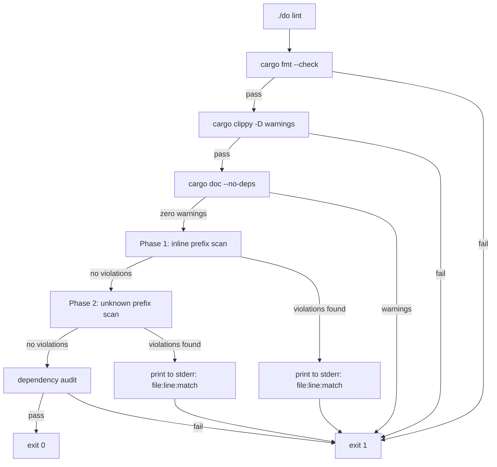

---

### B.8 Cross-Crate and Cross-Module Rules

**[UI-DES-STR-010]** (restated for emphasis): No `strings.rs` module may `use` or `pub use` constants from another crate's `strings.rs`. Each crate defines the string tokens it requires independently. If `devs-tui` and `devs-cli` both need a column header with the same text, they each define their own `COL_WORKFLOW` constant with the same value. This duplication is intentional and ensures that the two crates can evolve their display strings independently.

**[UI-DES-STR-021]** No `strings.rs` module may depend on `devs-core`, `devs-proto`, or any crate in the engine or infrastructure layer. The module MUST compile in isolation with no imports beyond the Rust standard library. Violations are detected by `cargo tree -p devs-tui --edges normal` in the `./do lint` dependency audit.

**[UI-DES-STR-022]** `strings.rs` MUST be a flat module with no submodules. All constants are defined at the top level of the file. This rule ensures that the Phase 2 scan pattern (`pub const <PREFIX>`) reliably matches all constants.

**[UI-DES-STR-023]** String constants that are single ASCII characters (e.g., `"["`, `"|"`) used purely for structural layout in widget `render()` methods are exempt from the `strings.rs` requirement when they have no operator-visible semantic meaning. The exemption applies only when: (a) the character is a single byte, (b) it is used only for visual framing and never appears in log output or machine-readable output, and (c) its meaning is obvious from context. DAG structural characters (`"-"`, `">"`, etc.) are NOT exempt — they MUST be defined as `DAG_*` constants because they appear in snapshot tests and are subject to the ASCII inventory constraint (Appendix A).

---

### B.9 Edge Cases and Error Handling

The following edge cases MUST be handled correctly by the implementation:

| Scenario | Expected Behavior |
|---|---|
| `STATUS_RUN_` trailing space accidentally removed (value becomes `"RUN"`, 3 bytes) | `const _: () = assert!(STATUS_RUN_.len() == 4, "...")` causes a compile error with the message string. Build aborts. Developer sees: `error[E0080]: evaluation of constant value failed ... STATUS_RUN_ must be 4 bytes`. |
| An `ERR_` constant in `devs-cli/src/strings.rs` is accidentally given the value `"Run not found"` (no machine-stable prefix) | Phase 1 lint scan does NOT catch this (it only catches inline literals in non-`strings.rs` files). A separate unit test in `devs-cli/src/strings.rs` validates that all `ERR_` constants begin with a recognized prefix. This test fails: `ERR_RUN_NOT_FOUND value does not begin with a machine-stable prefix`. |
| A developer adds a `pub const LABEL_RUNNING: &str = "RUN "` in `devs-tui/src/strings.rs` | Phase 2 scan matches `pub const LABEL_RUNNING` against valid prefixes. `LABEL_` is not a valid prefix. Lint exits non-zero: `strings hygiene: pub const with unrecognized prefix in strings.rs: crates/devs-tui/src/strings.rs:42:pub const LABEL_RUNNING`. |
| A developer uses the string `"not_found: stage not found"` inline in `crates/devs-cli/src/commands/status.rs` | Phase 1 scan matches `"not_found:"` outside `strings.rs`. Lint exits non-zero and prints the file path, line number, and matched text. |
| `devs-mcp-bridge/src/strings.rs` accidentally defines `TAB_DASHBOARD: &str = "Dashboard"` | Phase 2 scan: `TAB_` is in the valid prefix list but only permitted in `devs-tui`. A separate lint check verifies that `devs-mcp-bridge/src/strings.rs` contains only `ERR_` and `MSG_` prefixed constants. Any other prefix causes lint failure. |
| `strings.rs` module is absent from a newly created crate that contains user-visible text | `missing_docs = "deny"` does not catch missing modules. However, the Phase 2 scan only looks in the three named `strings.rs` paths; code in the new crate that uses inline error prefixes is caught by Phase 1. The absence of a `strings.rs` is not itself an error — but the first inline literal will trigger Phase 1. |
| A `STATUS_*` constant contains a multi-byte UTF-8 character such as `"RUN✓"` (5 bytes) | `const _: () = assert!(STATUS_RUN_.len() == 4)` fails at compile time. Additionally, the unit test `status_labels_are_exactly_four_bytes` asserts `value.bytes().all(|b| b.is_ascii_uppercase() || b == b' ')`, which also fails for non-ASCII bytes. |
| A new developer adds `pub const STATUS_UNRECOVERABLE: &str = "UNRC"` for a non-existent status | The constant compiles (4 bytes, all uppercase). Phase 2 does not reject it (valid prefix). However, the constant is never referenced by `render_utils::stage_status_label()`. The `dead_code = "warn"` workspace lint will emit a warning, and since `./do lint` runs `cargo clippy -D warnings`, it will fail. |

**[UI-DES-STR-024]** A unit test in each `strings.rs` module asserts that all `ERR_` constants defined in that module begin with one of the ten machine-stable prefixes. The test iterates over a hardcoded list of all `ERR_` constants defined in that module and asserts the prefix. This test MUST be updated whenever a new `ERR_` constant is added.

```rust
// Covers: UI-DES-PHI-003, UI-DES-STR-024, AC-STR-004
#[test]
fn err_constants_begin_with_machine_stable_prefix() {
    const STABLE_PREFIXES: &[&str] = &[
        "not_found:",
        "invalid_argument:",
        "already_exists:",
        "failed_precondition:",
        "resource_exhausted:",
        "server_unreachable:",
        "internal:",
        "cancelled:",
        "timeout:",
        "permission_denied:",
    ];
    let err_constants: &[(&str, &str)] = &[
        ("ERR_SERVER_UNREACHABLE", ERR_SERVER_UNREACHABLE),
        ("ERR_GRPC_CANCELLED", ERR_GRPC_CANCELLED),
        ("ERR_INTERNAL_RENDER", ERR_INTERNAL_RENDER),
    ];
    for (name, value) in err_constants {
        let has_prefix = STABLE_PREFIXES.iter().any(|p| value.starts_with(p));
        assert!(
            has_prefix,
            "ERR_ constant {} value {:?} does not begin with a machine-stable prefix",
            name,
            value
        );
    }
}
```

---

### B.10 Dependencies

The `strings.rs` modules are pure data modules with no runtime dependencies. The following dependency relationships govern their use:

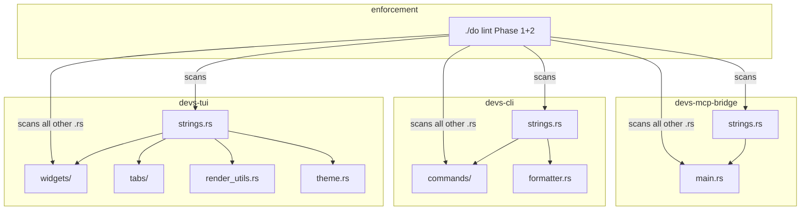

**Upstream dependencies of `strings.rs`** (what `strings.rs` itself depends on): Rust standard library only. No crate imports.

**Downstream consumers of `strings.rs`** (what imports from `strings.rs`):
- `devs-tui`: `render_utils.rs` (imports `STATUS_*`, `RUN_STATUS_*`, `FMT_*`, `DAG_*`), all widget modules (import specific `TAB_*`, `KEY_*`, `HELP_*`, `COL_*`, `STATUS_BAR_*`, `MSG_*` constants), all tab modules.
- `devs-cli`: all command handler modules (`submit`, `list`, `status`, `logs`, `cancel`, `pause`, `resume`, `project`, `security-check`), `formatter.rs`.
- `devs-mcp-bridge`: `main.rs` only.

**Lint dependencies**: `./do lint` depends on the existence of the three `strings.rs` files at their canonical paths. If a file is absent, the `grep` commands in the Phase 2 scan will emit a warning (not an error) — however, Phase 1 will likely fail immediately when inline literals are found in the crate. A missing `strings.rs` is considered a defect.

---

### B.11 Acceptance Criteria

All acceptance criteria listed here MUST be covered by automated tests annotated with `// Covers: <AC-ID>`.

- **[AC-STR-001]** `cargo build --workspace` succeeds when all `STATUS_*` constants are exactly 4 bytes. A build that changes any `STATUS_*` value to a non-4-byte string fails at compile time with a message containing the constant name. Unit test: modify `STATUS_PEND` to `"PEND_"` (5 bytes) and confirm `cargo build -p devs-tui` fails with `STATUS_PEND must be 4 bytes` in stderr.

- **[AC-STR-002]** `cargo build --workspace` succeeds when all `DAG_*` constants are exactly 1 byte. A build that changes any `DAG_*` value to a 2-byte string fails at compile time. Unit test: modify `DAG_H` to `"--"` and confirm `cargo build -p devs-tui` fails with `DAG_H must be 1 byte`.

- **[AC-STR-003]** `cargo test -p devs-tui -- status_labels_are_exactly_four_bytes` exits 0 under normal conditions. Covers: `UI-DES-PHI-002`, `UI-DES-STR-015`.

- **[AC-STR-004]** `cargo test -p devs-tui -- err_constants_begin_with_machine_stable_prefix` exits 0 under normal conditions. `cargo test -p devs-cli -- err_constants_begin_with_machine_stable_prefix` exits 0. `cargo test -p devs-mcp-bridge -- err_constants_begin_with_machine_stable_prefix` exits 0. Covers: `UI-DES-PHI-003`, `UI-DES-STR-024`.

- **[AC-STR-005]** `./do lint` exits non-zero when a `.rs` file outside `strings.rs` in any of the three client crates contains the literal string `"not_found:"`. The violation file path and line number are printed to stderr. A file that contains only `strings::ERR_RUN_NOT_FOUND` (i.e., references the constant, not the literal) does NOT trigger a violation. Covers: `UI-DES-PHI-003`, `UI-DES-PHI-022`, `UI-DES-077`.

- **[AC-STR-006]** `cargo test -p devs-tui -- dag_constants_are_exactly_one_byte` exits 0. Covers: `UI-DES-STR-015`, `UI-ASCII-BR-025`.

- **[AC-STR-007]** `./do lint` exits non-zero when `devs-tui/src/strings.rs` contains a `pub const` declaration whose name does not begin with one of the twelve valid prefixes (`ERR_`, `STATUS_`, `TAB_`, `KEY_`, `HELP_`, `COL_`, `STATUS_BAR_`, `CMD_`, `ARG_`, `FMT_`, `MSG_`, `DAG_`, `RUN_STATUS_`). The unrecognized constant name is printed to stderr. Covers: `UI-DES-STR-012`, `UI-DES-STR-020`.

- **[AC-STR-008]** `./do lint` exits non-zero when `devs-mcp-bridge/src/strings.rs` contains a `pub const` declaration with a prefix other than `ERR_` or `MSG_`. Covers: `UI-DES-STR-010`, per-crate permitted prefix table in §B.1.

- **[AC-STR-009]** `cargo doc --no-deps 2>&1 | grep -c "^warning"` returns `0` after building the workspace. Every `pub const` in every `strings.rs` has a `///` doc comment. Covers: `UI-DES-076`, `UI-DES-PHI-024`.

- **[AC-STR-010]** All twelve mandatory constants for `devs-tui/src/strings.rs` listed in §B.5.1 are present and have the exact values specified. A unit test in `devs-tui` asserts each value by name. Covers: `UI-DES-STR-015`, `UI-DES-076`.

- **[AC-STR-011]** All mandatory `CMD_*` constants in `devs-cli/src/strings.rs` listed in §B.5.2 exactly match the Clap subcommand names registered in the CLI. A unit test in `devs-cli` asserts this by iterating the Clap `Command` tree and verifying each subcommand name appears in the constant set. Covers: `UI-DES-STR-014`.

- **[AC-STR-012]** `STATUS_RUN_` has value `"RUN "` (with trailing space). `render_utils::stage_status_label(StageStatus::Running)` returns `"RUN "`. The trailing space is preserved in all rendered stage boxes to maintain the 4-character fixed width. Covers: `UI-DES-STR-017`, `UI-DES-PHI-002`.

- **[AC-STR-013]** No byte value in U+0080–U+FFFF appears in any constant in any `strings.rs` module. CI lint: `grep -P '[^\x00-\x7F]' crates/devs-tui/src/strings.rs crates/devs-cli/src/strings.rs crates/devs-mcp-bridge/src/strings.rs` exits non-zero (no match). Covers: `UI-ASCII-BR-018`, `UI-DES-STR-015`.

- **[AC-STR-014]** `render_utils::stage_status_label(s)` returns a value that is the `STATUS_*` constant for that status, not a locally constructed string. Verified by asserting `std::ptr::eq(render_utils::stage_status_label(StageStatus::Running), STATUS_RUN_)` — pointer equality proves the return is the static constant, not a newly allocated string. Covers: `UI-DES-STR-017`.

- **[AC-STR-015]** `MSG_TERMINAL_TOO_SMALL` contains the substring `"80x24"`, `"%W"`, and `"%H"`. `render_utils::expand_msg_placeholders(MSG_TERMINAL_TOO_SMALL, 75, 20)` returns a string containing `"75"` and `"20"` and not `"%W"` or `"%H"`. Covers: `UI-DES-STR-016`.
