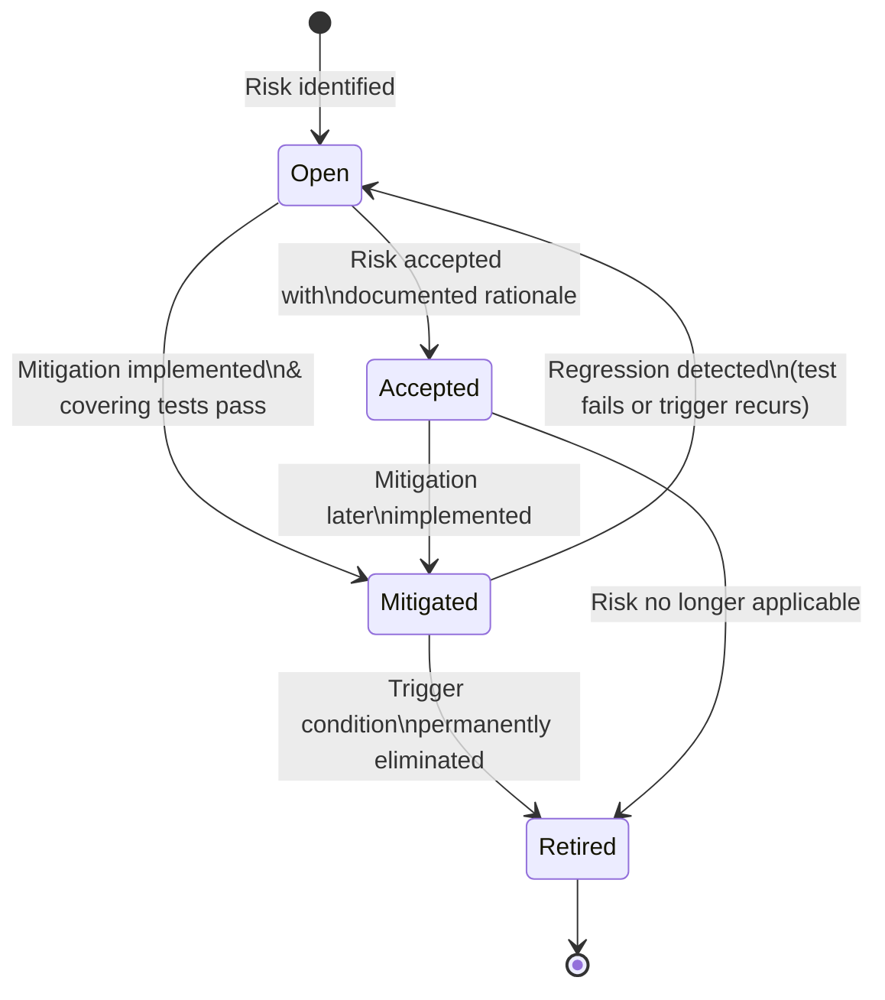
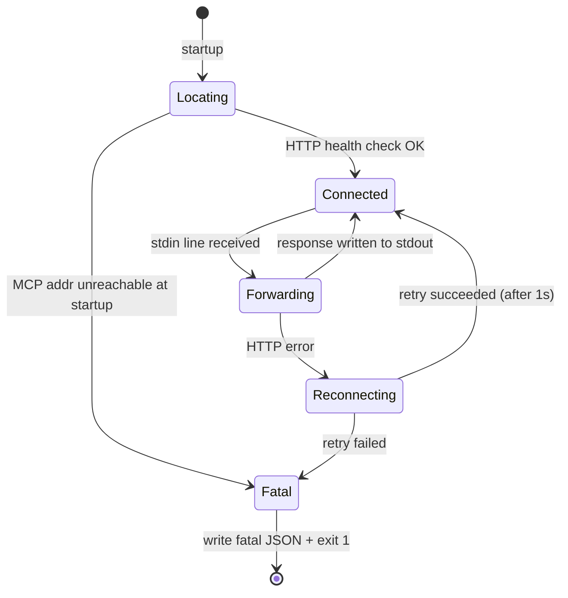
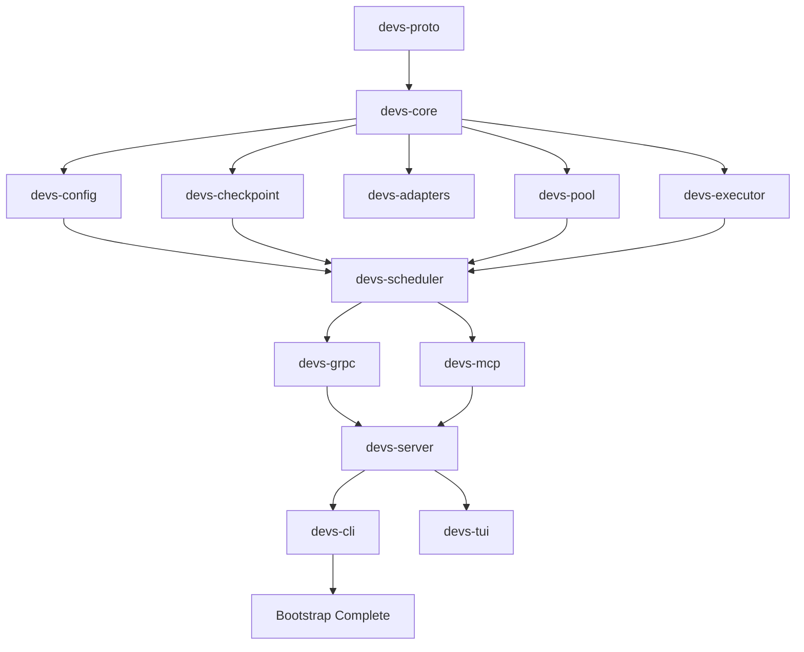
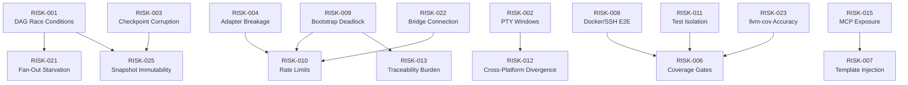

# Risks and Mitigation — `devs`

**Document ID:** 8_RISKS_MITIGATION
**Version:** 1.0
**Audience:** Project leadership and engineering teams

---

## 1. Risk Assessment Matrix

| Risk ID | Risk Summary | Category | Impact | Probability | Severity Score | Mitigation ID | Fallback ID |
|---|---|---|---|---|---|---|---|
| [RISK-001] | DAG scheduler race conditions under concurrent stage completions | Technical | HIGH | MEDIUM | 6 | MIT-001 | — |
| [RISK-002] | PTY mode incompatibility on Windows Git Bash | Technical | HIGH | HIGH | 9 | MIT-002 | FB-002 |
| [RISK-003] | Git checkpoint store corruption under disk-full or crash conditions | Technical | HIGH | MEDIUM | 6 | MIT-003 | FB-005 |
| [RISK-004] | Agent adapter CLI interface breakage from upstream changes | Technical | HIGH | HIGH | 9 | MIT-004 | FB-010 |
| [RISK-005] | 15-minute presubmit timeout exceeded due to Rust compile times | Technical | HIGH | HIGH | 9 | MIT-005 | FB-001 |
| [RISK-006] | 90%/80%/50% coverage gates unachievable within MVP timeline | Technical | HIGH | MEDIUM | 6 | MIT-006 | — |
| [RISK-007] | Template injection via attacker-controlled stage output | Technical | HIGH | LOW | 3 | MIT-007 | — |
| [RISK-008] | Docker/SSH execution environment setup complexity blocks E2E testing | Technical | MEDIUM | HIGH | 6 | MIT-008 | FB-003 |
| [RISK-009] | Bootstrapping deadlock — `devs` cannot develop itself until minimally functional | Operational | HIGH | HIGH | 9 | MIT-009 | FB-007 |
| [RISK-010] | AI agent rate limits stall development velocity | Operational | MEDIUM | HIGH | 6 | MIT-010 | FB-004 |
| [RISK-011] | E2E test isolation failures from shared server discovery files | Operational | MEDIUM | MEDIUM | 4 | MIT-011 | — |
| [RISK-012] | Cross-platform behavioral divergence (macOS/Windows) in `./do` and file modes | Operational | HIGH | MEDIUM | 6 | MIT-012 | FB-008 |
| [RISK-013] | 100% requirement traceability gate creates annotation maintenance burden | Operational | MEDIUM | HIGH | 6 | MIT-013 | — |
| [RISK-014] | Webhook SSRF mitigation DNS-rebinding window remains open | Technical | MEDIUM | LOW | 2 | MIT-014 | — |
| [RISK-015] | Glass-Box MCP exposure of full server state on non-loopback deploys | Technical | HIGH | MEDIUM | 6 | MIT-015 | FB-009 |
| [RISK-016] | Single-developer project with no code review creates blind spots | Operational | MEDIUM | HIGH | 6 | MIT-016 | — |
| [RISK-021] | Fan-out sub-agent resource exhaustion causes pool starvation | Technical | HIGH | MEDIUM | 6 | MIT-021 | — |
| [RISK-022] | MCP stdio bridge connection loss causes irrecoverable agent state | Technical | MEDIUM | MEDIUM | 4 | MIT-022 | — |
| [RISK-023] | `cargo-llvm-cov` inaccurate coverage measurement for E2E tests | Technical | MEDIUM | LOW | 2 | MIT-023 | — |
| [RISK-024] | GitLab CI pipeline unavailability blocks all forward progress | Operational | HIGH | LOW | 3 | MIT-024 | FB-006 |
| [RISK-025] | Workflow snapshot immutability violated by concurrent checkpoint writes | Technical | HIGH | LOW | 3 | MIT-025 | — |

**Severity Score** = Impact × Probability (HIGH=3, MEDIUM=2, LOW=1). Scores ≥6 require active monitoring.

---

## 1.1 Risk Record Data Model

Every risk in this document is a structured record. The schema below is the authoritative definition for all risk and mitigation tracking artifacts.

```json
{
  "schema_version": 1,
  "risk_id": "RISK-NNN",
  "summary": "<string, max 128 chars>",
  "category": "Technical | Operational | Market",
  "impact": "HIGH | MEDIUM | LOW",
  "probability": "HIGH | MEDIUM | LOW",
  "severity_score": "<integer, 1-9>",
  "mitigation_id": "MIT-NNN",
  "fallback_id": "FB-NNN | null",
  "status": "Open | Mitigated | Accepted | Retired",
  "detected_at": "<ISO 8601 date>",
  "last_reviewed_at": "<ISO 8601 date>",
  "owner": "<string>",
  "covering_tests": ["<test_id>"]
}
```

**Fallback Activation Record** — written to `docs/adr/NNNN-fallback-<name>.md` when a fallback is activated:

```json
{
  "schema_version": 1,
  "fallback_id": "FB-NNN",
  "risk_id": "RISK-NNN",
  "activated_at": "<ISO 8601 datetime>",
  "trigger_evidence": "<string>",
  "fallback_action": "<string>",
  "expected_retirement_sprint": "<string>",
  "resolution_plan": "<string>",
  "retired_at": "<ISO 8601 datetime | null>"
}
```

**Field Constraints:**

| Field | Type | Constraint |
|---|---|---|
| `risk_id` | string | Pattern `RISK-[0-9]{3}`; unique across document |
| `mitigation_id` | string | Pattern `MIT-[0-9]{3}`; 1:1 with `risk_id` |
| `fallback_id` | string\|null | Pattern `FB-[0-9]{3}` if present |
| `severity_score` | integer | `impact_val × probability_val`; HIGH=3, MEDIUM=2, LOW=1 |
| `status` | enum | Must be one of: `Open`, `Mitigated`, `Accepted`, `Retired` |
| `covering_tests` | array | Each element is a `// Covers: <ID>` annotation target |

**Business Rules:**

- **[RISK-BR-001]** Every `[RISK-NNN]` entry in the matrix MUST have a corresponding mitigation section in §2, §3, or §4 with matching `[MIT-NNN]` tag.
- **[RISK-BR-002]** Risks with `severity_score >= 6` MUST have at least one automated test annotated `// Covers: RISK-NNN`.
- **[RISK-BR-003]** New risks discovered during implementation MUST be added to this document with a unique ID before work begins on the affected component.
- **[RISK-BR-004]** A risk MAY NOT be marked `Retired` until its covering tests pass and the contingency trigger condition is no longer possible.
- **[RISK-BR-005]** Fallback activation records MUST be written to `docs/adr/` as a git-committed file before implementing the fallback change.

---

## 1.2 Risk Lifecycle State Machine



**State Definitions:**

| State | Meaning | Required Action |
|---|---|---|
| `Open` | Risk is identified; mitigation not yet in place | Implement mitigation before work on affected component |
| `Mitigated` | Mitigation implemented; covering tests pass | Monitor; re-evaluate if trigger condition changes |
| `Accepted` | Risk acknowledged; no mitigation planned at MVP | Document rationale in `docs/adr/`; review each sprint |
| `Retired` | Risk permanently eliminated | Archive; no further action |

**[RISK-BR-006]** A risk whose status is `Mitigated` and whose covering test subsequently fails MUST be immediately transitioned back to `Open` by the automated traceability pipeline (`./do test`). The traceability report (`target/traceability.json`) is the authoritative source for risk-to-test coverage.

**[RISK-BR-007]** Risk records MAY NOT be manually deleted from this document. Risks that are no longer applicable MUST be transitioned to `Retired` with an `ADR` documenting the elimination condition and the date it was verified.

---

## 1.3 Risk Category Definitions

Each risk is assigned to exactly one category. The category determines which team function is responsible for the mitigation and which review cadence applies.

| Category | Definition | Responsible Function | Review Cadence |
|---|---|---|---|
| `Technical` | A risk arising from an implementation choice, algorithm correctness, library compatibility, or system integration. The trigger condition is observable in code, tests, or runtime behavior. | Engineering (AI agent implementer) | Per-sprint; resolved by failing test |
| `Operational` | A risk arising from development process, toolchain availability, team structure, or workflow constraints. The trigger condition is observable in development velocity or CI pipeline health. | Project lead + engineering | Per-sprint; resolved by process change or fallback activation |
| `Market` | A risk arising from external ecosystem dynamics — competitor behavior, user adoption patterns, or technology obsolescence. The trigger condition is observed in the external environment, not in code. | Project lead | Monthly; resolved by product pivot or scope adjustment |

**Business Rules:**

- **[RISK-BR-008]** A risk MUST be assigned exactly one category. When a risk spans categories (e.g., a technical bug that also has market impact), assign it to the category that describes its root cause, not its downstream effect.
- **[RISK-BR-009]** `Market` category risks with severity_score ≤ 4 are reviewed monthly only; they do NOT block commits and do NOT require automated test coverage.
- **[RISK-BR-010]** `Technical` and `Operational` risks with severity_score ≥ 6 require at least one automated test with `// Covers: RISK-NNN` annotation before the affected component is merged.

**Risk Count by Category (MVP baseline):**

| Category | Total Risks | Score ≥ 9 | Score ≥ 6 | Score < 6 |
|---|---|---|---|---|
| Technical | 14 | 4 | 10 | 4 |
| Operational | 7 | 3 | 5 | 2 |
| Market | 4 | 0 | 1 | 3 |
| **Total** | **25** | **7** | **16** | **9** |

Risks with score = 9 (`RISK-002`, `RISK-004`, `RISK-005`, `RISK-009`) are classified as **Critical Priority** and must be mitigated before the component they affect is considered ready for integration.

---

## 1.4 Severity Scoring Methodology

The severity score is a 3×3 integer matrix product. Both axes use ordinal values where `HIGH=3`, `MEDIUM=2`, `LOW=1`.

```
Severity Score = impact_value × probability_value

where:
  impact_value    = { HIGH: 3, MEDIUM: 2, LOW: 1 }
  probability_value = { HIGH: 3, MEDIUM: 2, LOW: 1 }
```

**Impact Axis Definitions:**

| Level | Definition for `devs` Context |
|---|---|
| `HIGH` | The risk event would prevent the project from functioning as specified, cause data loss, block CI for multiple days, or violate a safety/security invariant with no workaround. |
| `MEDIUM` | The risk event would degrade performance, require workarounds, or violate a non-critical requirement. The project remains usable but not fully compliant with the spec. |
| `LOW` | The risk event would cause a minor inconvenience, a cosmetic defect, or a small performance regression. The project remains fully functional. |

**Probability Axis Definitions:**

| Level | Definition for `devs` Context |
|---|---|
| `HIGH` | The trigger condition is expected to occur at least once during MVP development with ≥70% confidence. Evidence: known upstream instability, mandatory third-party dependency with no stability guarantee, or direct experience with similar projects. |
| `MEDIUM` | The trigger condition is plausible but requires a specific coincidence of factors. Confidence: 30–70%. Evidence: known theoretical risk, some anecdotal prior art. |
| `LOW` | The trigger condition requires an unlikely combination of events or adversarial circumstances. Confidence: <30%. Evidence: theoretical only, or requires active exploitation. |

**Score-to-Action Mapping:**

| Score | Priority Class | Action Required |
|---|---|---|
| 9 | Critical | Mitigation MUST be in place before writing any code in the affected component. Covering test required. |
| 6 | High | Mitigation MUST be in place before the affected component is merged to `main`. Covering test required. |
| 4 | Medium | Mitigation SHOULD be in place at MVP. No mandatory covering test; strongly recommended. |
| 2–3 | Low | Risk acknowledged; no active mitigation required at MVP. Document rationale in `docs/adr/` if `Accepted`. |
| 1 | Negligible | Record only; no action required. May be retired without implementing a fallback. |

**Scoring Edge Cases:**

1. **Score recalculation on new evidence.** If new information changes the probability or impact assessment, the risk record MUST be updated before the next sprint. The `last_reviewed_at` field is updated; `status` reverts to `Open` if the score increases past a threshold boundary (e.g., was 4 `Accepted`, now recalculated as 6 → must implement mitigation).
2. **Compound risks.** When two `MEDIUM/MEDIUM` (score=4) risks share a common failure mode, their combined score is NOT automatically promoted. Instead, a new `RISK-NNN` entry is added with the compound scenario documented in its description and a cross-reference to the constituent risks.
3. **Score ceiling.** The maximum score is 9 (HIGH×HIGH). A score of 9 does NOT mean the risk is catastrophic or project-ending — it means it is both highly likely and highly impactful within the scope of MVP development. All score-9 risks in this document have viable mitigations.

**Business Rules:**

- **[RISK-BR-011]** Score recalculations MUST be recorded with a `last_reviewed_at` timestamp update. The previous score MAY be noted in a comment line below the risk entry in the matrix if the change is significant.
- **[RISK-BR-012]** Impact and probability levels are set by the project lead, not automatically derived from test results. Tests verify that mitigations work; they do not determine the score.
- **[RISK-BR-013]** A risk may not have its probability or impact downgraded based solely on the existence of a mitigation. Scores reflect inherent risk; mitigation status is tracked separately in `status`.

---

## 1.5 Active Monitoring Requirements

Risks with `severity_score >= 6` require active monitoring. The following table defines the monitoring mechanism, trigger signal, and expected response for each such risk during MVP development.

| Risk ID | Score | Monitoring Mechanism | Trigger Signal | Response SLA |
|---|---|---|---|---|
| [RISK-001] | 6 | Unit test `AC-RISK-001-01` in CI | Test failure | Fix within same session; block merge |
| [RISK-002] | 9 | `presubmit-windows` CI job | Any PTY-related `Failed` stage in CI | Activate FB-002; document in ADR within 24h |
| [RISK-003] | 6 | Integration test `AC-RISK-003-04` | Test failure | Fix before next checkpoint write |
| [RISK-004] | 9 | `./do lint` adapter-version audit | `adapter-versions.json` stale or `compatible: false` | Pin last compatible version; file issue against upstream within 24h |
| [RISK-005] | 9 | `target/presubmit_timings.jsonl` per-step monitoring | Any step `over_budget: true` by >20% | Investigate and optimize; if persistent, activate FB-001 |
| [RISK-006] | 6 | `target/coverage/report.json` `overall_passed` field | `overall_passed: false` in any CI run | Fix coverage gap before merge; no exceptions |
| [RISK-008] | 6 | `presubmit-linux` Docker E2E job | Docker E2E tests fail or are erroneously skipped | Activate FB-003; investigate Docker-in-Docker setup |
| [RISK-009] | 9 | Milestone tracker: server bindable checkpoint | Milestone missed | Activate FB-007 immediately; no waiting for next sprint |
| [RISK-010] | 6 | Pool state observation during development sessions | `get_pool_state` shows all agents rate-limited | Activate FB-004; wait 60s minimum before retrying |
| [RISK-012] | 6 | `presubmit-macos` and `presubmit-windows` CI jobs | Platform-specific test failures not present on Linux | File platform-specific fix within 24h |
| [RISK-013] | 6 | `target/traceability.json` `overall_passed` field | `overall_passed: false` | Add missing annotation before merge; no exceptions |
| [RISK-015] | 6 | Server startup `WARN` logs | `SEC-BIND-ADDR` warn in CI | Verify loopback bind; document intentional non-loopback in ADR |
| [RISK-016] | 6 | MCP Glass-Box self-review via presubmit workflow | `presubmit-check` run fails after implementation | Full `presubmit-check` pass required; no cherry-pick workarounds |
| [RISK-021] | 6 | `get_pool_state.queued_count` in TUI Pools tab | `queued_count > max_concurrent × 4` | Alert operator via `pool.exhausted` webhook; document pool tuning |

**Monitoring Implementation Requirements:**

- **[RISK-BR-014]** Every monitoring mechanism in the table above MUST be implemented before the component it monitors is declared ready. A monitoring mechanism is a concrete artifact: a test, a log event, a CI job, or a metric. "Manual observation" is only acceptable for `Market` category risks.
- **[RISK-BR-015]** The `target/presubmit_timings.jsonl` file MUST be committed to GitLab CI artifacts with `expire_in: 7 days` to enable trend analysis across commits.
- **[RISK-BR-016]** Any monitoring mechanism that fires in CI MUST cause the CI job to exit non-zero. Monitoring that only logs a warning without blocking is insufficient for score ≥ 6 risks.

---

## 1.6 Risk Interdependency Matrix

Some risks amplify or depend on others. When a compound failure occurs, the interdependency determines the order of remediation.

| Primary Risk | Depends On / Amplified By | Relationship Type | Combined Effect |
|---|---|---|---|
| [RISK-009] Bootstrapping deadlock | [RISK-005] Compile timeout | `depends-on` | If compile times exceed 15 min, the bootstrapping milestone is delayed because `./do presubmit` cannot pass, blocking the first server-startable commit |
| [RISK-009] Bootstrapping deadlock | [RISK-004] Adapter breakage | `amplifies` | If adapter CLIs change before the first working server, the bootstrapping milestone cannot be reached because adapters cannot be tested |
| [RISK-006] Coverage gates | [RISK-005] Compile timeout | `depends-on` | If `./do coverage` takes >10 min due to instrumentation overhead, the 15-min presubmit budget is consumed before coverage runs complete |
| [RISK-010] Rate limits stall velocity | [RISK-004] Adapter breakage | `amplifies` | If an adapter is broken AND rate-limited, fallback agents in the pool are consumed faster, exhausting the pool sooner |
| [RISK-001] Scheduler races | [RISK-003] Checkpoint corruption | `amplifies` | A scheduler race that produces an illegal transition may write a corrupt checkpoint if the checkpoint write is not serialized behind the per-run Mutex |
| [RISK-008] Docker/SSH E2E complexity | [RISK-006] Coverage gates | `amplifies` | Docker/SSH execution env code is hard to cover; if Docker E2E is skipped on macOS/Windows, QG-002 (80% E2E) may be unachievable without compensating coverage elsewhere |
| [RISK-015] MCP state exposure | [RISK-007] Template injection | `amplifies` | If an attacker can observe MCP state (RISK-015) and also craft a prompt that triggers template injection (RISK-007), they can exfiltrate structured outputs from other stages |
| [RISK-021] Fan-out pool starvation | [RISK-010] Rate limits stall velocity | `amplifies` | If fan-out consumes all pool slots AND the dispatched agents hit rate limits, no slots are freed during the 60s cooldown, causing complete pool exhaustion for all projects |
| [RISK-011] E2E test isolation | [RISK-001] Scheduler races | `amplifies` | If E2E tests share server discovery files, a residual server from a previous test may process events from a new test's run, masking scheduler race conditions or producing false positives |

**Interdependency Graph:**

```mermaid
graph TD
    R005[RISK-005\nCompile timeout] -->|depends-on| R009[RISK-009\nBootstrapping]
    R004[RISK-004\nAdapter breakage] -->|amplifies| R009
    R005 -->|depends-on| R006[RISK-006\nCoverage gates]
    R004 -->|amplifies| R010[RISK-010\nRate limits]
    R001[RISK-001\nScheduler races] -->|amplifies| R003[RISK-003\nCheckpoint corruption]
    R008[RISK-008\nDocker/SSH E2E] -->|amplifies| R006
    R015[RISK-015\nMCP exposure] -->|amplifies| R007[RISK-007\nTemplate injection]
    R021[RISK-021\nFan-out starvation] -->|amplifies| R010
    R011[RISK-011\nE2E isolation] -->|amplifies| R001

    style R009 fill:#ff4444,color:#fff
    style R005 fill:#ff4444,color:#fff
    style R004 fill:#ff4444,color:#fff
    style R002[RISK-002\nPTY Windows] fill:#ff4444,color:#fff
```

**Business Rules:**

- **[RISK-BR-017]** When a primary risk is triggered, ALL risks that list it under `Depends On / Amplified By` MUST be assessed for compound activation. The compound activation assessment is documented in the fallback activation record (`docs/adr/`).
- **[RISK-BR-018]** New interdependencies discovered during implementation MUST be added to §1.6 before the affected component is merged. Interdependencies are not retroactively exempted.

---

## 1.7 Risk Tracking Edge Cases and Error Handling

This section defines the expected behavior of the risk management process itself when anomalous situations arise.

| Scenario | Expected Behavior |
|---|---|
| A `RISK-NNN` ID is referenced in a `// Covers: RISK-NNN` test annotation but does not exist in the matrix | `./do test` exits non-zero with `"stale_annotation: RISK-NNN referenced in <file>:<line> but not present in risk matrix"`; the annotation must be removed or corrected |
| A new risk is discovered mid-implementation that affects a component already merged to `main` | The risk is added to the matrix with status `Open` and a retroactive ADR is written; the next sprint must include the covering test before any further work on the affected component |
| Two risks are initially tracked separately but converge into the same root cause | The lower-severity risk is `Retired` with a note pointing to the surviving risk; no risk records are deleted; only `status` changes |
| A fallback (FB-NNN) is activated but the fallback itself fails to resolve the trigger | A second-level fallback ADR is written; the risk status reverts to `Open`; the severity score is reassessed (probability may increase to `HIGH` since the risk materialized); new mitigation or escalation required |
| A covering test for a risk passes in isolation but fails under concurrent load | Risk status reverts from `Mitigated` to `Open`; the failing test must be fixed AND the race condition in the production code corrected before re-mitigating |
| The risk matrix document itself becomes out of sync with the implementation (e.g., a risk's trigger condition is eliminated by an architectural change) | The risk MUST be transitioned to `Retired` with evidence (commit SHA or test ID) proving the trigger condition is impossible; `./do test` enforces traceability so stale annotations are caught automatically |
| Two separate risks are assigned the same `RISK-NNN` identifier (authoring error) | `./do test` exits non-zero with `"duplicate_risk_id: RISK-NNN appears N times in risk matrix"`; the duplicate must be resolved with a new unique ID before any tests can pass |
| A risk with `status: Accepted` has its `fallback_id` activated (fallback wasn't expected to be needed) | The risk status transitions from `Accepted` to `Open`; a full mitigation plan is required; the original `Accepted` rationale is archived in the ADR but no longer governs the risk |

**Error Handling for Risk Record Schema Violations:**

The `target/traceability.json` generated by `./do test` includes a `risk_matrix_violations` array alongside the standard requirement traceability fields. Each violation is a structured record:

```json
{
  "schema_version": 1,
  "generated_at": "2026-03-11T10:00:00.000Z",
  "overall_passed": false,
  "requirements": [],
  "stale_annotations": [],
  "risk_matrix_violations": [
    {
      "violation_type": "stale_annotation | duplicate_id | missing_mitigation | missing_covering_test",
      "risk_id": "RISK-NNN",
      "source_file": "tests/scheduler_test.rs",
      "source_line": 42,
      "detail": "Human-readable description of the violation"
    }
  ]
}
```

**[RISK-BR-019]** `./do test` MUST exit non-zero when `risk_matrix_violations` is non-empty, even if all `cargo test` invocations pass. Risk schema integrity is enforced with the same weight as requirement traceability.

**[RISK-BR-020]** `risk_matrix_violations` of type `missing_covering_test` are only emitted for risks with `severity_score >= 6` and `status` not `Retired` or `Accepted`. Accepted risks with score ≥ 6 require a justification comment in the `docs/adr/` document cited in the `status` field.

---

## 1.8 Risk Assessment Matrix Acceptance Criteria

The following acceptance criteria govern the risk management framework itself, independently of the individual risk mitigations defined in §2–§4.

- **[AC-RISK-MATRIX-001]** `./do test` generates `target/traceability.json` with a `risk_matrix_violations` array; the array is empty when the risk matrix is correctly formed and all score ≥ 6 risks have covering tests.

- **[AC-RISK-MATRIX-002]** Every `[RISK-NNN]` ID in the matrix has a corresponding `[MIT-NNN]` section in §2, §3, or §4. `./do test` exits non-zero if any matrix row lacks a matching mitigation section.

- **[AC-RISK-MATRIX-003]** Every risk with `severity_score >= 6` has at least one test annotated `// Covers: RISK-NNN`. `./do test` exits non-zero if any score ≥ 6 risk lacks a covering test and its `status` is not `Accepted`.

- **[AC-RISK-MATRIX-004]** The severity score for every risk in the matrix equals `impact_value × probability_value` as defined in §1.4. A validation script run by `./do lint` parses the matrix table, recomputes scores, and exits non-zero on any mismatch.

- **[AC-RISK-MATRIX-005]** Risk IDs are unique across the matrix. Duplicate IDs cause `./do test` to exit non-zero with `"duplicate_risk_id"` in `risk_matrix_violations`.

- **[AC-RISK-MATRIX-006]** Every `[FB-NNN]` fallback ID referenced in the matrix has a corresponding fallback definition in §5 of this document. `./do test` exits non-zero if any referenced fallback ID has no matching definition.

- **[AC-RISK-MATRIX-007]** The category of every risk is exactly one of `Technical`, `Operational`, or `Market`. Any other value causes the validation script to exit non-zero.

- **[AC-RISK-MATRIX-008]** The risk record data model (§1.1) JSON schema is validated against the schema definition on every `./do test` invocation using a built-in schema validator. A risk record with a missing required field (e.g., absent `status`) causes exit non-zero.

- **[AC-RISK-MATRIX-009]** When a risk transitions from `Mitigated` to `Open` due to a covering test regression, `target/traceability.json` reflects the regression within the same `./do test` invocation that detected the failing test.

- **[AC-RISK-MATRIX-010]** The `risk_count_by_category` summary in §1.3 matches the actual counts in the matrix. The validation script recomputes counts from the parsed matrix table and exits non-zero if the table in §1.3 does not match.

---

## 2. Technical Risks & Mitigations

### **[RISK-001]** DAG Scheduler Race Conditions

**Description:** The DAG scheduler must atomically process concurrent `stage_complete_tx` events and decide which stages become `Eligible`. With fan-out producing N concurrent `StageRun` completions, the scheduler may double-dispatch a stage, skip a stage, or observe an inconsistent dependency set.

**Impact:** Stage duplication, skipped stages, or incorrect run termination — silently producing wrong workflow results.

**Evidence from TAS:** `[2_TAS-REQ-112]` specifies that duplicate terminal events must be discarded idempotently. `[2_TAS-BR-021]` requires concurrent fan-out completions to be serialized via per-run `Mutex`.

**Dependencies:** `devs-scheduler`, `devs-pool` (semaphore dispatch), `devs-checkpoint` (atomic write after each transition).

**[MIT-001] Mitigation:**
- Enforce a per-run `Arc<tokio::sync::Mutex<RunState>>` that serializes all state transitions touching a single `WorkflowRun`. No dependency resolution occurs outside this lock.
- The `StateMachine::transition()` method MUST return `TransitionError::IllegalTransition` for any duplicate terminal event; the scheduler discards this error silently without logging at ERROR level.
- Lock acquisition order enforced as specified in `[2_TAS-REQ-002p]`: `SchedulerState → PoolState → CheckpointStore`. Violation is a compile-time linting concern (documented in `CONTRIBUTING.md`).
- Unit tests MUST exercise 100-stage concurrent completion scenarios using `tokio::join!` with injected delays.
- E2E tests submit fan-out workflows with `count=10` and assert all sub-agents produce exactly one `Completed` result and the parent stage transitions exactly once.

**Scheduler Event Processing Flow:**

```mermaid
stateDiagram-v2
    [*] --> AwaitingEvent : stage_complete_tx channel open
    AwaitingEvent --> AcquiringLock : stage_complete event received
    AcquiringLock --> ValidatingTransition : per-run Mutex acquired
    ValidatingTransition --> EvaluatingDependencies : transition legal
    ValidatingTransition --> DiscardingDuplicate : IllegalTransition (duplicate terminal)
    DiscardingDuplicate --> ReleasingLock : log DEBUG; no state change
    EvaluatingDependencies --> DispatchingEligible : all deps Completed for ≥1 waiting stage
    EvaluatingDependencies --> CheckingRunCompletion : no newly eligible stages
    DispatchingEligible --> WritingCheckpoint : eligible stages queued to pool
    CheckingRunCompletion --> WritingCheckpoint : update checkpoint regardless
    WritingCheckpoint --> ReleasingLock : checkpoint.json atomically updated
    ReleasingLock --> BroadcastingEvent : broadcast::send(RunEvent) to gRPC/MCP subscribers
    BroadcastingEvent --> AwaitingEvent : event loop continues
```

**Business Rules:**

- **[RISK-001-BR-001]** Every state transition on a `WorkflowRun` or `StageRun` MUST be executed while holding the per-run `Arc<tokio::sync::Mutex<RunState>>`; reads or writes to any `StageRun.status` field outside this lock are prohibited.
- **[RISK-001-BR-002]** `StateMachine::transition()` MUST be idempotent for duplicate terminal events: calling it a second time with the same terminal event MUST return `Err(TransitionError::IllegalTransition)` without modifying any state or writing a checkpoint.
- **[RISK-001-BR-003]** DAG eligibility evaluation (determining which stages become `Eligible` after a `stage_complete` event) MUST occur within the same per-run mutex lock acquisition as the preceding `stage_complete` transition; splitting them across two separate lock acquisitions is prohibited, as it creates a window where a second thread can observe a stale dependency set.
- **[RISK-001-BR-004]** Only a `Completed` (not `Failed`, `TimedOut`, or `Cancelled`) `StageRun` status satisfies a `depends_on` prerequisite; any terminal-but-non-successful dependency MUST cascade `Cancelled` to all downstream `Waiting` stages in the same lock acquisition.

**Edge Cases:**

| Scenario | Expected Behavior |
|---|---|
| Two `stage_complete_tx` events for the same `stage_run_id` arrive within 1ms | Second event's `transition()` call returns `TransitionError::IllegalTransition`; scheduler logs at `DEBUG`, discards; state unchanged |
| Fan-out with `count=64` has all sub-agents complete within the same Tokio task poll | Per-run Mutex serializes all 64 completion events; parent stage transitions exactly once to `Completed` |
| Stage completes after its parent `WorkflowRun` transitions to `Cancelled` | `transition()` returns `IllegalTransition`; `StageRun` status already `Cancelled`; no checkpoint written; log at `DEBUG` |
| Scheduler processes `MakeEligible` for a stage whose dependency was retried (not `Completed`) | Stage remains `Waiting`; only `Completed` (not `Failed`, `TimedOut`) dependencies satisfy the eligibility predicate |

**Acceptance Criteria:**

- **[AC-RISK-001-01]** Under `tokio::join!` with 100 concurrent `stage_complete_tx` events for the same run, exactly one `Completed` transition is recorded in `checkpoint.json`.
- **[AC-RISK-001-02]** `StateMachine::transition()` called with a duplicate terminal event returns `Err(TransitionError::IllegalTransition)` within 1ms without modifying state.
- **[AC-RISK-001-03]** Fan-out stage with `count=64` produces exactly 64 sub-`StageRun` records and exactly 1 parent `StageRun` transition.
- **[AC-RISK-001-04]** `cargo test --workspace -- scheduler` passes with `--test-threads 8` without data races (verified by `cargo test` + optional `ThreadSanitizer` in CI).
- **[AC-RISK-001-05]** A `Failed` dependency stage causes all downstream `Waiting` stages in its transitive fan-out to transition to `Cancelled` in the same atomic checkpoint write, verified by reading `checkpoint.json` after a single `stage_complete_tx` event.
- **[AC-RISK-001-06]** Lock acquisition order violation (acquiring `PoolState` before `SchedulerState`) is detected by a static lint check in `./do lint` that scans for known anti-patterns in lock acquisition sequences.

---

### **[RISK-002]** PTY Mode Incompatibility on Windows

**Description:** `portable-pty 0.8` is required for agents needing PTY mode (`opencode` defaults to `pty = true`). Windows Console API behavior differs significantly from POSIX PTYs. Git Bash on Windows further complicates this via the MSYS2 pseudo-terminal layer.

**Impact:** Agent processes that require PTY allocation fail immediately on Windows (`[3_PRD-BR-022]`), causing stages to report `Failed` without executing any work. The CI matrix (Linux + macOS + Windows) would have systematic Windows failures.

**Dependencies:** `devs-adapters` (PTY allocation), `devs-executor` (process spawn), `portable-pty 0.8` crate.

**[MIT-002] Mitigation:**
- `devs-adapters` runs a platform capability probe at startup: attempt zero-byte PTY allocation via `portable_pty::native_pty_system().openpty(...)`. Failure on any platform sets a process-global `PTY_AVAILABLE: AtomicBool = false`.
- The `AgentAdapter` trait's `build_command()` receives a `pty_supported: bool` parameter derived from `PTY_AVAILABLE`. Adapters that default `pty = true` (i.e., `opencode`) emit `WARN` with `event_type: "adapter.pty_fallback"` and spawn without PTY.
- Pool state exposed via `get_pool_state` includes a per-agent `pty_active: bool` field reflecting the runtime capability, not the configured default.
- `devs.toml` documentation explicitly states: on Windows, add `pty = false` to all agent configs to suppress the fallback `WARN`.

**PTY Capability Probe Decision Flow:**

```mermaid
stateDiagram-v2
    [*] --> Probing : server startup; devs-adapters init
    Probing --> PtyAvailable : openpty() succeeds; PTY_AVAILABLE = true
    Probing --> PtyUnavailable : openpty() fails; PTY_AVAILABLE = false; log WARN
    PtyAvailable --> SpawningWithPty : stage dispatched; agent config pty=true
    PtyAvailable --> SpawningWithoutPty : stage dispatched; agent config pty=false
    PtyUnavailable --> EmittingFallbackWarn : agent default pty=true; pty_supported=false
    PtyUnavailable --> SpawningWithoutPty : agent config pty=false (explicit)
    EmittingFallbackWarn --> SpawningWithoutPty : event_type=adapter.pty_fallback logged
    SpawningWithPty --> AgentRunning : portable_pty spawn
    SpawningWithoutPty --> AgentRunning : tokio::process::Command spawn
    AgentRunning --> [*] : stage completes
```

**Business Rules:**

- **[RISK-002-BR-001]** The PTY capability probe MUST be performed exactly once at server startup using `tokio::task::spawn_blocking`; the result is stored in a process-global `static AtomicBool` and MUST NOT be re-evaluated per stage dispatch or per agent pool initialization.
- **[RISK-002-BR-002]** When `PTY_AVAILABLE = false` and an adapter's configured or default `pty = true`, the server MUST emit a structured `WARN` log with `event_type: "adapter.pty_fallback"` and `"tool": "<adapter_name>"` before spawning the agent without PTY; the log MUST be emitted once per stage dispatch, not once globally.
- **[RISK-002-BR-003]** `get_pool_state` MCP response MUST include `"pty_active": bool` per agent entry, reflecting the runtime PTY capability (`PTY_AVAILABLE && agent.pty_config`), not merely the configured default; this field MUST be present even when `pty_active: false`.
- **[RISK-002-BR-004]** A stage explicitly configured with `pty = true` on a platform where PTY allocation fails MUST transition to `Failed` with `failure_reason: "pty_unavailable"` and MUST NOT be retried automatically; the user must change the agent config to `pty = false` to resolve it (`[3_PRD-BR-022]`).

**Edge Cases:**

| Scenario | Expected Behavior |
|---|---|
| `portable_pty::openpty()` succeeds but the spawned process immediately exits with code 1 | Treated as agent failure, not PTY failure; retry and fallback logic apply normally |
| User explicitly sets `pty = true` in `devs.toml` on a Windows server | Pool manager respects the config; spawn attempt made; if PTY allocation fails, stage is `Failed` with `"adapter.pty_unavailable"` (`[3_PRD-BR-022]`); no auto-fallback |
| PTY available at startup but fails mid-run (e.g., `/dev/pts` exhaustion on Linux) | Spawn failure → `Failed`; `PTY_AVAILABLE` NOT globally set to `false` (single-stage failure, not system-wide); next stage retries PTY |
| `opencode` with `pty = false` explicitly configured on Linux | Spawns without PTY; `WARN` NOT emitted (user explicitly opted out); functions normally |

**Acceptance Criteria:**

- **[AC-RISK-002-01]** On a system where PTY allocation fails, `devs` starts successfully, logs `WARN` with `event_type: "adapter.pty_fallback"`, and dispatches `opencode` stages without PTY.
- **[AC-RISK-002-02]** `get_pool_state` MCP response includes `"pty_active": false` for agents running in PTY-fallback mode.
- **[AC-RISK-002-03]** `presubmit-windows` CI job completes without PTY-related `Failed` stages for the `presubmit-check` standard workflow.
- **[AC-RISK-002-04]** A stage explicitly configured `pty = true` on a PTY-unavailable system transitions to `Failed` with `failure_reason: "pty_unavailable"` and does NOT retry.

---

### **[RISK-003]** Git Checkpoint Store Corruption

**Description:** `git2`-backed checkpoint writes using `write-to-temp → rename()` can leave orphaned `.tmp` files or corrupt the git index if the process is killed between `git add` and `git commit`. Disk-full errors mid-commit leave a partially-written tree object.

**Impact:** On server restart, `load_all_runs` encounters a corrupt `checkpoint.json`, marks the run `Unrecoverable` (`[2_TAS-BR-019]`), and the run is lost. Users cannot resume in-progress workflows.

**Dependencies:** `devs-checkpoint` (`git2`), `devs-scheduler` (crash recovery), filesystem (`rename(2)` atomicity guarantee).

**[MIT-003] Mitigation:**
- The atomic write protocol (`[2_TAS-REQ-109]`) is mandatory: serialize → write `.tmp` → `fsync` → `rename()`. Only `rename()` is the commit point. If any step before `rename()` fails, delete `.tmp` and log `ERROR` with `event_type: "checkpoint.write_failed"`.
- `load_all_runs` calls `validate_checkpoint(run_id)` which parses `checkpoint.json` with `serde_json` and verifies `schema_version == 1` and all required fields present. Corruption → run status set to `Unrecoverable`; server continues (`[2_TAS-BR-019]`).
- Disk-full during `git2` write: catch `ErrorKind::StorageFull`, delete `.tmp`, log `ERROR`, continue. Server MUST NOT crash (`[2_TAS-BR-022]`). Retry on next state transition.
- Orphaned `.tmp` files (from a previous crash before `rename()`) are cleaned up in `load_all_runs` during startup: any file matching `checkpoint.json.tmp` is deleted with a `WARN` log.

**Atomic Write Protocol State Machine:**

```mermaid
stateDiagram-v2
    [*] --> Serializing : state transition occurs; per-run Mutex held
    Serializing --> WritingTemp : JSON serialized to memory
    WritingTemp --> Syncing : .tmp file written to disk
    Syncing --> Renaming : fsync() success
    Renaming --> AddingToIndex : rename() success; checkpoint.json updated
    AddingToIndex --> Committing : git2 index updated
    Committing --> Pushing : git commit created
    Pushing --> Done : push success
    Pushing --> LoggingPushWarn : push failed (non-fatal; local commit retained)
    LoggingPushWarn --> Done

    WritingTemp --> DeletingTemp : I/O error (e.g., ENOSPC)
    Syncing --> DeletingTemp : fsync() error
    DeletingTemp --> LoggingWriteError : .tmp deleted
    LoggingWriteError --> Done : server continues; checkpoint at last-good state
    Renaming --> LoggingWriteError : rename() failed (EXDEV cross-device)
    Committing --> LoggingPushWarn : git commit failed (non-fatal)
    Done --> [*]
```

**Business Rules:**

- **[RISK-003-BR-001]** The atomic write sequence is invariant: `serialize → write .tmp → fsync → rename()`. These steps MUST NOT be reordered and the `rename()` operation is the sole commit point; any failure before `rename()` leaves `checkpoint.json` at its previous valid state.
- **[RISK-003-BR-002]** On server startup, `load_all_runs` MUST scan for orphaned `checkpoint.json.tmp` files in all run directories and delete them with `WARN` log before reading any `checkpoint.json`; failure to clean up orphans does not block startup.
- **[RISK-003-BR-003]** A disk-full (`ENOSPC`) or quota-exceeded error during any checkpoint write step MUST cause the server to log `ERROR` with `event_type: "checkpoint.write_failed"` and `"run_id": "<id>"` and continue; the server MUST NOT crash, exit, or attempt to free disk space.
- **[RISK-003-BR-004]** `git2` push failures are non-fatal: the local checkpoint file is authoritative for crash recovery. A failed push is logged at `WARN` with `event_type: "checkpoint.push_failed"` and retried on the next successful checkpoint write for the same run.

**Checkpoint Validation Algorithm:**

```rust
fn validate_checkpoint(data: &str) -> Result<CheckpointRecord, CheckpointError> {
    let raw: serde_json::Value = serde_json::from_str(data)
        .map_err(|e| CheckpointError::ParseError(e.to_string()))?;

    // Depth-limited deserialization (SEC-049)
    if json_depth(&raw) > 128 {
        return Err(CheckpointError::DepthExceeded);
    }

    let schema_version = raw["schema_version"]
        .as_u64()
        .ok_or(CheckpointError::MissingField("schema_version"))?;

    if schema_version != 1 {
        return Err(CheckpointError::UnknownSchemaVersion(schema_version));
    }

    serde_json::from_value(raw)
        .map_err(|e| CheckpointError::DeserializeError(e.to_string()))
}
```

**Edge Cases:**

| Scenario | Expected Behavior |
|---|---|
| `rename()` fails (cross-device link on some filesystems) | Log `ERROR`; delete `.tmp`; server continues; checkpoint not updated; retry on next transition |
| `checkpoint.json` exists but is 0 bytes (process killed during initial write) | `validate_checkpoint` returns `ParseError`; run marked `Unrecoverable`; `ERROR` logged |
| Git `commit` fails because the repo is in a detached HEAD state | Log `WARN`; retain local file; push skipped; retry on next transition; local checkpoint is still valid for crash recovery |
| Disk-full causes `fsync` to fail after write but before `rename()` | Delete `.tmp`; log `ERROR`; `checkpoint.json` remains at last-good state; server continues |
| Two concurrent checkpoint writes for the same run (fan-out completion race) | Per-run `Mutex` in `[2_TAS-BR-021]` serializes writes; no concurrent writes possible |

**Acceptance Criteria:**

- **[AC-RISK-003-01]** A mock `CheckpointStore` returning `Err(io::ErrorKind::StorageFull)` causes the server to log `ERROR` with `event_type: "checkpoint.write_failed"` and continue processing other runs.
- **[AC-RISK-003-02]** A `checkpoint.json` containing invalid JSON is detected by `validate_checkpoint`, the run is marked `Unrecoverable`, and the server starts successfully processing other runs.
- **[AC-RISK-003-03]** An orphaned `checkpoint.json.tmp` file from a previous crash is deleted with `WARN` log during `load_all_runs`.
- **[AC-RISK-003-04]** After a simulated mid-write crash (kill between write and rename), server restart produces at most one `Unrecoverable` run and all other runs recover correctly.

---

### **[RISK-004]** Agent Adapter CLI Interface Breakage

**Description:** All five supported agents (`claude`, `gemini`, `opencode`, `qwen`, `copilot`) are external CLI tools with no stability guarantees. A flag rename (e.g., `claude --print` → `claude --output-format`) silently breaks all `claude`-backed stages. Rate-limit stderr pattern changes break passive rate-limit detection.

**Impact:** All workflow stages using a broken adapter fail immediately with `"binary not found"` or silent non-zero exit, causing cascade failures across all active runs using that agent.

**Dependencies:** `devs-adapters` (5 adapter implementations), `devs-pool` (fallback routing), `./do setup` (version pinning).

**Adapter Version Compatibility Table:**

| Adapter | Tested CLI Flag | Version Range | Rate-Limit Patterns | `./do setup` Pin Command |
|---|---|---|---|---|
| `claude` | `--print` | `≥1.0.0` | `"rate limit"`, `"429"`, `"overloaded"` | `claude --version` output captured |
| `gemini` | `--prompt` | `≥0.1.0` | `"quota"`, `"429"`, `"resource_exhausted"` | `gemini --version` output captured |
| `opencode` | `--prompt-file` | `≥0.1.0` | `"rate limit"`, `"429"` | `opencode --version` output captured |
| `qwen` | `--query` | `≥0.1.0` | `"rate limit"`, `"429"`, `"throttle"` | `qwen --version` output captured |
| `copilot` | `--stdin` | `≥1.0.0` | `"rate limit"`, `"429"` | `gh copilot --version` output captured |

**`AgentAdapter` Trait Interface:**

```rust
/// Trait defining the contract for all five agent CLI adapters.
/// Implemented in devs-adapters/src/<name>/mod.rs for each adapter.
/// All implementations must be Send + Sync for use across async tasks.
pub trait AgentAdapter: Send + Sync {
    /// The canonical tool name used in pool configuration, logging, and MCP responses.
    fn tool(&self) -> AgentTool;

    /// Construct the OS command to invoke the agent CLI, including all argument flags,
    /// environment variables, and working directory. `pty_supported` reflects the runtime
    /// PTY capability (PTY_AVAILABLE && agent_config.pty), not the configured default alone.
    fn build_command(&self, ctx: &StageContext, pty_supported: bool) -> AdapterCommand;

    /// Return true if the given exit code and stderr content pattern-match a rate limit.
    /// MUST return false unconditionally when exit_code == 0, regardless of stderr content.
    /// Pattern matching is case-insensitive substring search against the stderr string.
    fn detect_rate_limit(&self, exit_code: i32, stderr: &str) -> bool;

    /// Return the default prompt delivery mode for this adapter (flag or file-based).
    fn default_prompt_mode(&self) -> PromptMode;

    /// Return the adapter's preferred PTY mode. Can be overridden per-agent in devs.toml.
    fn default_pty(&self) -> bool;
}

/// The resolved command ready for process spawning. All fields are owned.
pub struct AdapterCommand {
    pub program: String,
    pub args: Vec<String>,
    pub env: Vec<(String, String)>,
    pub working_dir: PathBuf,
    pub pty: bool,
    pub prompt_file: Option<PathBuf>, // present iff PromptMode::File
}
```

**[MIT-004] Mitigation:**
- Every adapter has a `devs-adapters/tests/<name>_compatibility_test.rs` that invokes the CLI with `--version` and parses the version string. `./do setup` captures installed versions to `target/adapter-versions.json`.
- Adapter CLI flags defined as constants in `devs-adapters/src/<name>/config.rs`; changing a flag is a single-constant change, not a distributed edit.
- Rate-limit detection patterns stored in `devs-adapters/src/<name>/rate_limit.rs` as `const &[&str]` arrays, independently testable.
- `./do setup` installs pinned-compatible versions. Upgrade requires running the full E2E suite and updating `target/adapter-versions.json`.

**Business Rules:**

- **[RISK-004-BR-001]** `AgentAdapter::detect_rate_limit()` MUST return `false` when `exit_code == 0`, regardless of stderr content; a zero exit code unambiguously signals success, not a rate limit.
- **[RISK-004-BR-002]** All adapter CLI flags MUST be defined as `const &str` values in `devs-adapters/src/<name>/config.rs`; inline string literals for CLI flags in `build_command()` implementations are prohibited and enforced by a `./do lint` check that scans for string literals in adapter command construction.
- **[RISK-004-BR-003]** `target/adapter-versions.json` MUST be regenerated by `./do setup` and its `captured_at` timestamp MUST be within 7 days; `./do lint` MUST fail if the file is absent or stale, treating a missing compatibility check as equivalent to a compatibility failure.
- **[RISK-004-BR-004]** Rate-limit pattern matching MUST use case-insensitive substring search against the full stderr content; regex-based matching is not required and MUST NOT be introduced to avoid adding `regex` as a production dependency of `devs-adapters`.

**`target/adapter-versions.json` Schema:**

```json
{
  "schema_version": 1,
  "captured_at": "2026-03-11T10:00:00.000Z",
  "adapters": {
    "claude":  { "version": "1.0.0", "flag_tested": "--print", "compatible": true },
    "gemini":  { "version": "0.1.0", "flag_tested": "--prompt", "compatible": true },
    "opencode":{ "version": "0.1.0", "flag_tested": "--prompt-file", "compatible": true },
    "qwen":    { "version": "0.1.0", "flag_tested": "--query", "compatible": true },
    "copilot": { "version": "1.0.0", "flag_tested": "--stdin", "compatible": true }
  }
}
```

**Edge Cases:**

| Scenario | Expected Behavior |
|---|---|
| Adapter binary not found in `PATH` | Stage immediately `Failed` with `failure_reason: "binary_not_found"`; no retry (`[3_PRD-BR-021]`) |
| Adapter exits 0 but produces no output | Stage outcome determined by `completion` mechanism; `exit_code=0` → `Completed` for `exit_code` completion; structured output checked for `structured_output` completion |
| Rate-limit stderr pattern matches on exit code 0 | Rate-limit NOT triggered; exit code 0 = success regardless of stderr content |
| New adapter version changes rate-limit stderr text | Passive detection fails; 60s cooldown does not trigger; manual `report_rate_limit` MCP call from agent can still trigger fallback |
| Adapter flag renamed upstream; stage fails with exit 1 and `"unknown option"` on stderr | Treated as regular failure (not rate-limit); retry applies; alert operator via `stage.failed` webhook |

**Acceptance Criteria:**

- **[AC-RISK-004-01]** Each of the 5 adapter compatibility tests passes with the version captured in `target/adapter-versions.json`.
- **[AC-RISK-004-02]** A stage targeting a missing binary transitions to `Failed` with `failure_reason: "binary_not_found"` within 100ms and does NOT retry.
- **[AC-RISK-004-03]** Rate-limit pattern tests in `devs-adapters/tests/<name>_rate_limit_test.rs` cover all patterns listed in the compatibility table.
- **[AC-RISK-004-04]** `./do lint` fails if `target/adapter-versions.json` is absent or its `captured_at` timestamp is older than 7 days.

---

### **[RISK-005]** 15-Minute Presubmit Timeout

**Description:** The `devs` workspace contains 15+ crates. Incremental Rust compilation, `cargo-llvm-cov` instrumented builds, and three E2E test suites (CLI, TUI, MCP) must complete within 15 minutes on all three CI platforms. Windows and macOS CI runners are typically slower than Linux Docker containers.

**Impact:** `[1_PRD-BR-001]` mandates hard timeout enforcement. Systematic timeout failures block all commit merges, halting development.

**Dependencies:** `./do presubmit`, GitLab CI matrix (`presubmit-linux`, `-macos`, `-windows`), Rust toolchain compilation model.

**Budget Allocation (target, not hard limits per step):**

| Step | Budget (Linux) | Budget (macOS) | Budget (Windows) |
|---|---|---|---|
| `./do setup` (incremental) | ≤30s | ≤30s | ≤60s |
| `cargo fmt --check` | ≤10s | ≤10s | ≤10s |
| `cargo clippy` | ≤120s | ≤120s | ≤180s |
| `cargo doc` | ≤60s | ≤60s | ≤90s |
| `cargo test --workspace` | ≤180s | ≤180s | ≤240s |
| `cargo llvm-cov` (unit+E2E) | ≤300s | ≤300s | ≤360s |
| **Total** | ≤700s (~12min) | ≤700s | ≤940s (~16min) |

> **Note:** Windows budget may require the contingency split if 940s exceeds the 900s (15min) hard wall.

**[MIT-005] Mitigation:**
- Per-step durations logged to `target/presubmit_timings.jsonl` (`[2_TAS-REQ-014d]`). Format per line: `{"step":"<name>","duration_ms":<int>,"budget_ms":<int>,"over_budget":<bool>}`.
- `devs-core` zero I/O deps (`[2_TAS-REQ-001e]`) enables maximum parallel crate compilation.
- `cargo llvm-cov` run once with merged unit+E2E coverage; not invoked twice.
- E2E tests use ephemeral in-process or spawned-server instances, not external infrastructure (`[2_TAS-REQ-015b]`).
- A 12-minute internal budget target leaves a 3-minute margin. A non-fatal `WARN` is logged to `target/presubmit_timings.jsonl` when any step exceeds its sub-budget by 20%.
- The 15-minute hard timeout is enforced by a background timer process spawned at presubmit start. On expiry: send SIGTERM to all child processes; wait 5s; send SIGKILL; exit non-zero. The timer PID is written to `target/.presubmit_timer.pid` and cleaned up on success.

**Presubmit Timer State Machine:**

```mermaid
stateDiagram-v2
    [*] --> TimerStarted : ./do presubmit begins\ntimer PID → target/.presubmit_timer.pid
    TimerStarted --> StepRunning : first step subprocess spawned
    StepRunning --> StepComplete : step exits 0
    StepRunning --> StepFailed : step exits non-zero (fail-fast for fmt/lint)
    StepRunning --> TimeoutFired : 900s wall-clock elapsed
    StepComplete --> StepRunning : next step started
    StepComplete --> AllStepsComplete : no more steps
    StepFailed --> Aborting : remaining steps skipped
    TimeoutFired --> SendingSIGTERM : kill all child PIDs
    SendingSIGTERM --> WaitingGrace : 5s grace period
    WaitingGrace --> SendingSIGKILL : children still running after 5s
    WaitingGrace --> ExitNonZero : all children exited within grace
    SendingSIGKILL --> ExitNonZero : exit 1 "presubmit timeout after 900s"
    AllStepsComplete --> FlushingTimings : write final jsonl entries
    FlushingTimings --> CleaningTimer : delete target/.presubmit_timer.pid
    CleaningTimer --> ExitZero : exit 0
    Aborting --> CleaningTimer : timer process killed; timings flushed
    ExitNonZero --> [*]
    ExitZero --> [*]
```



**Business Rules:**

- **[RISK-005-BR-001]** The 900-second presubmit timeout is measured as wall-clock elapsed time from the first step start, not CPU time; the timer runs in a background subprocess so it fires even if the main process is blocked in a synchronous operation.
- **[RISK-005-BR-002]** `target/presubmit_timings.jsonl` MUST be written incrementally with one JSON object per step flushed immediately after each step completes (not buffered to completion); this ensures partial timing data is available for analysis even after a timeout or failure.
- **[RISK-005-BR-003]** The background timer process (`target/.presubmit_timer.pid`) MUST be explicitly killed when `./do presubmit` exits successfully; a leaked timer process from a previous successful run MUST NOT terminate a subsequent `./do presubmit` invocation.
- **[RISK-005-BR-004]** A step that exceeds its sub-budget by >20% MUST emit an `over_budget: true` entry in `timings.jsonl` and a `WARN` message to stderr, but MUST NOT cause presubmit to exit non-zero; only the 900-second hard timeout exits non-zero.

**`target/presubmit_timings.jsonl` Schema (one JSON object per line):**

```json
{"step": "cargo_clippy", "started_at": "2026-03-11T10:00:05.000Z", "duration_ms": 98234, "budget_ms": 120000, "over_budget": false}
```

**Edge Cases:**

| Scenario | Expected Behavior |
|---|---|
| A single unit test hangs indefinitely | 15-min timer fires; SIGTERM to `cargo test`; test runner reports timeout; presubmit exits non-zero |
| E2E test server takes >30s to bind ports | Test helper has a 30s startup timeout; test fails with `"server_startup_timeout"`; other E2E tests proceed |
| `cargo fmt --check` finds formatting errors before timeout | Step fails immediately; remaining steps skipped (fail-fast for format/lint); full timeout still possible if format step is slow |
| Windows runner is 3× slower than budgeted | Contingency FB-001 activates if consistent; documented in `docs/adr/` |

**Acceptance Criteria:**

- **[AC-RISK-005-01]** `target/presubmit_timings.jsonl` is created by `./do presubmit` with one entry per step.
- **[AC-RISK-005-02]** `./do presubmit` exits non-zero within 905 seconds (15min + 5s kill grace) when a step hangs.
- **[AC-RISK-005-03]** All three CI jobs (`presubmit-linux`, `presubmit-macos`, `presubmit-windows`) complete within their respective 25-minute CI timeout.
- **[AC-RISK-005-04]** `./do presubmit` on a clean checkout (no `target/` cache) completes within 15 minutes on the GitLab `presubmit-linux` runner.

---

### **[RISK-006]** High Coverage Gate Unachievability

**Description:** The coverage requirements are unusually aggressive: ≥90% unit line coverage, ≥80% E2E aggregate, and ≥50% per interface (CLI, TUI, MCP individually). Infrastructure code (error-path branches, platform-specific code, shutdown handlers) is notoriously hard to cover, and E2E coverage through three separate interface binaries is compounded by `cargo-llvm-cov` instrumentation overhead.

**Impact:** Failing `QG-001` through `QG-005` blocks all commits. Agents spend most of their time writing test scaffolding instead of features.

**Dependencies:** `cargo-llvm-cov 0.6`, `devs-tui` (TUI E2E via `TestBackend`), `devs-cli` (CLI E2E via `assert_cmd`), `devs-mcp` (MCP E2E via HTTP POST).

**Coverage Gate Summary:**

| Gate | Scope | Threshold | Measurement Method |
|---|---|---|---|
| QG-001 | Unit tests, all crates | ≥ 90.0% line | `cargo llvm-cov --lib` |
| QG-002 | E2E aggregate | ≥ 80.0% line | `cargo llvm-cov --test '*_e2e*'` |
| QG-003 | CLI E2E only | ≥ 50.0% line | CLI binary subprocess calls only |
| QG-004 | TUI E2E only | ≥ 50.0% line | `TestBackend` full event-render cycle |
| QG-005 | MCP E2E only | ≥ 50.0% line | `POST /mcp/v1/call` via running server |

**[MIT-006] Mitigation:**
- TDD discipline enforced from the first commit: test skeleton written before implementation, `// Covers: <REQ-ID>` annotations added in the Red phase.
- `#[cfg(not(tarpaulin))]` or `// llvm-cov:ignore` applied only to logically unreachable platform branches with a documented justification comment. All exclusions appear in `target/coverage/excluded_lines.txt`.
- `delta_pct` field in `report.json` tracks per-commit coverage change. Regressions > −0.5% trigger a non-fatal `WARN` in `./do coverage` output.
- Each gate failure in `report.json` includes `uncovered_lines: [{"file": "...", "line": N}]` enabling targeted test additions.

**Business Rules:**

- **[RISK-006-BR-001]** Coverage exclusions via `// llvm-cov:ignore` are only permitted for platform-conditional branches (`#[cfg(windows)]`, `#[cfg(unix)]`), unreachable error paths in infrastructure code (`unreachable!()`, `panic!()` in infallible paths), and generated code in `devs-proto/src/gen/`. Business logic exclusions are prohibited.
- **[RISK-006-BR-002]** Calling an internal Rust function directly in a `#[test]` function does NOT satisfy QG-003 (CLI E2E), QG-004 (TUI E2E), or QG-005 (MCP E2E) coverage requirements; only tests exercising the interface boundary (subprocess spawn via `assert_cmd`, `TestBackend` full `handle_event→render` cycle, or HTTP POST to a running server) count toward those gates.
- **[RISK-006-BR-003]** The `delta_pct` field in `report.json` compares against the most recent `report.json` artifact committed to the GitLab CI `7 days` artifact store; a missing baseline causes `delta_pct: null` (not an error); `./do coverage` proceeds normally.
- **[RISK-006-BR-004]** `target/coverage/excluded_lines.txt` MUST be committed alongside source changes that introduce new `// llvm-cov:ignore` annotations; `./do lint` MUST fail if an `// llvm-cov:ignore` annotation exists in source but the corresponding line is absent from `excluded_lines.txt`.

**`target/coverage/report.json` Schema:**

```json
{
  "schema_version": 1,
  "generated_at": "2026-03-11T10:00:00.000Z",
  "overall_passed": true,
  "gates": [
    {
      "gate_id": "QG-001",
      "scope": "unit_all_crates",
      "threshold_pct": 90.0,
      "actual_pct": 91.3,
      "passed": true,
      "delta_pct": 0.2,
      "uncovered_lines": [],
      "total_lines": 12430,
      "covered_lines": 11348
    }
  ]
}
```

**Edge Cases:**

| Scenario | Expected Behavior |
|---|---|
| A new crate is added but has zero test coverage | QG-001 immediately fails; `uncovered_lines` lists all lines in the new crate |
| `cargo-llvm-cov` version incompatibility causes empty `lcov.info` | `./do coverage` exits non-zero with `"internal: empty coverage report"`; human intervention required |
| A platform-specific `#[cfg(windows)]` branch is never executed on Linux CI | Excluded via `// llvm-cov:ignore` with justification; counted in `excluded_lines.txt` but not in denominator |
| Test calls internal Rust function directly instead of via interface binary | Coverage is recorded but does NOT count toward QG-003/004/005 gates; `./do coverage` correctly attributes it to unit coverage only |

**Acceptance Criteria:**

- **[AC-RISK-006-01]** `./do coverage` exits non-zero when any of QG-001–QG-005 fails.
- **[AC-RISK-006-02]** `target/coverage/report.json` contains exactly 5 gate entries with `gate_id` values `QG-001` through `QG-005`.
- **[AC-RISK-006-03]** `delta_pct` in `report.json` is non-null and reflects the difference from the previous successful coverage run.
- **[AC-RISK-006-04]** `uncovered_lines` is populated for any failing gate and points to real source locations in the workspace.

---

### **[RISK-007]** Template Injection via Stage Output

**Description:** Stage output (stdout/stderr) from one stage is interpolated into the prompt of the next stage via `{{stage.<name>.stdout}}`. If a malicious or malfunctioning agent writes `{{workflow.input.secret}}` or nested template syntax in its stdout, a secondary expansion could exfiltrate sensitive data.

**Impact:** Credential leakage or prompt hijacking affecting subsequent stages in the same run.

**Dependencies:** `devs-core` (`TemplateResolver`), `[SEC-040]` (single-pass), `[SEC-042]` (10,240-byte truncation), `handlebars 6.0` crate.

**[MIT-007] Mitigation:**
- `[SEC-040]` and `[SEC-006]` mandate single-pass template expansion. The scan pointer advances past the substituted value; substituted content is never re-scanned.
- `[SEC-042]` truncates stdout/stderr to 10,240 bytes in template context, limiting injection payload size.
- Unit tests verify that a resolved value containing `{{` is emitted verbatim in the final prompt without re-expansion.
- `[SEC-043]` ensures only scalar fields from structured output are injectable; objects/arrays produce `TemplateError::NonScalarField`.
- Stage outputs written to context file are not processed through `TemplateResolver` — the resolver operates on the prompt string only, not on the context file content.

**Business Rules:**

- **[RISK-007-BR-001]** `TemplateResolver::resolve()` MUST process the template string in a single left-to-right pass; after substituting a `{{...}}` expression, the scan position MUST advance to `end + 2` (past the closing `}}`), never to the beginning of the substituted value.
- **[RISK-007-BR-002]** Only scalar JSON types (string, number, boolean, null) from `stage.<name>.output.<field>` are permitted as template variable values; accessing a JSON object or array field MUST return `TemplateError::NonScalarField` before any partial substitution occurs.
- **[RISK-007-BR-003]** The 10,240-byte truncation of stdout/stderr in template context MUST preserve the last 10,240 bytes (most recent content), consistent with `BoundedBytes` truncation semantics and `[SEC-042]`; truncation from the beginning (oldest content discarded) applies.
- **[RISK-007-BR-004]** Template resolution of `{{stage.<name>.stdout}}` and `{{stage.<name>.stderr}}` MUST use the truncated 10,240-byte copy, NOT the full `StageOutput.stdout/stderr` field which may be up to 1 MiB; the truncation MUST happen before the string is passed to `TemplateContext`, not after substitution.

**Single-Pass Guarantee Algorithm:**

```rust
// In devs-core/src/template.rs
pub fn resolve(template: &str, ctx: &TemplateContext) -> Result<String, TemplateError> {
    let mut result = String::with_capacity(template.len());
    let mut pos = 0;
    let bytes = template.as_bytes();

    while pos < bytes.len() {
        if bytes[pos..].starts_with(b"{{") {
            // Find matching "}}"
            let end = find_closing(bytes, pos + 2)
                .ok_or(TemplateError::UnclosedDelimiter { position: pos })?;
            let var_name = &template[pos + 2..end];
            let resolved = ctx.resolve(var_name)?; // scalar string only
            result.push_str(&resolved);
            pos = end + 2; // advance PAST the resolved value; resolved content is never re-scanned
        } else {
            result.push(bytes[pos] as char);
            pos += 1;
        }
    }
    Ok(result)
}
```

**Edge Cases:**

| Scenario | Expected Behavior |
|---|---|
| Stage stdout contains `{{stage.plan.stdout}}` verbatim | Resolved as literal string `"{{stage.plan.stdout}}"` in the next prompt — no second expansion |
| Stage stdout contains `{{workflow.input.api_key}}` | Resolved as literal string in prompt — `api_key` is not an input variable; if `api_key` IS a defined input, it still resolves only during the original prompt resolution pass, not from injected output |
| Structured output field value is `{"nested": {"key": "val"}}` referenced in template | `TemplateError::NonScalarField` — only scalar JSON values (string, number, bool) are injectable |
| stdout/stderr in template context exceeds 10,240 bytes | Truncated to last 10,240 bytes; truncation noted in stage execution log at `DEBUG`; no error |
| Template contains `\{{` (backslash-escaped) | Emitted as literal `{{` (handlebars escape convention); confirmed by unit test |

**Acceptance Criteria:**

- **[AC-RISK-007-01]** A prompt containing `{{stage.A.stdout}}` where A's stdout is `"{{stage.B.stdout}}"` resolves to the literal string `"{{stage.B.stdout}}"` in the next stage's prompt, not to B's output. (Unit test required; `// Covers: SEC-040`)
- **[AC-RISK-007-02]** `TemplateResolver` returns `TemplateError::NonScalarField` when a structured output field referenced in a template contains a JSON object or array.
- **[AC-RISK-007-03]** stdout/stderr truncation to 10,240 bytes is verified by a unit test passing a 20,480-byte string and asserting the resolved template contains exactly 10,240 bytes from the end of the string.
- **[AC-RISK-007-04]** A structured output field with a JSON boolean value (`true` or `false`) referenced in a template resolves to the string `"true"` or `"false"` respectively; scalar boolean injection is permitted and correctly stringified.
- **[AC-RISK-007-05]** `TemplateResolver::resolve()` processes a 1 MiB template string containing 1,000 `{{...}}` variable expressions in under 100ms on the CI Linux runner, measured by a dedicated performance regression test.

---

### **[RISK-008]** Docker and SSH E2E Test Complexity

**Description:** `devs-executor` supports three execution environments: `tempdir`, `docker`, and `remote` SSH. The Docker and SSH environments require live infrastructure (a Docker daemon and a remote SSH host). E2E tests for these environments cannot run in standard CI without significant setup.

**Impact:** Docker and SSH execution environment code paths are never exercised by E2E tests, leaving critical infrastructure code uncovered and the QG-002 gate unmet.

**Dependencies:** `devs-executor`, `bollard 0.17` (Docker), `ssh2` crate (SSH), GitLab CI `services: [docker:dind]`.

**`StageExecutor` Trait Interface:**

```rust
/// Trait defining the contract for tempdir, Docker, and remote SSH execution environments.
/// Each variant is implemented in devs-executor/src/<env>/mod.rs.
pub trait StageExecutor: Send + Sync {
    /// Prepare the execution environment: clone the repository, write context and prompt files,
    /// and return a handle that identifies the environment for subsequent operations.
    async fn prepare(&self, ctx: &ExecutionContext) -> Result<ExecutionHandle, ExecutorError>;

    /// Collect artifacts after stage completion according to the artifact_collection policy.
    /// For AutoCollect: git diff → commit → push to checkpoint branch.
    /// For AgentDriven: no-op (agent committed its own changes).
    async fn collect_artifacts(
        &self,
        handle: &ExecutionHandle,
        policy: ArtifactCollection,
    ) -> Result<(), ExecutorError>;

    /// Clean up the execution environment regardless of stage outcome.
    /// For tempdir: rm -rf the working directory.
    /// For docker: docker rm the container.
    /// For remote SSH: rm -rf the remote working directory.
    /// Failures are logged at WARN but never propagated; cleanup always runs.
    async fn cleanup(&self, handle: &ExecutionHandle);
}
```

**[MIT-008] Mitigation:**
- Docker E2E tests use `bollard` with Docker-in-Docker in the `presubmit-linux` GitLab job only (`services: [docker:dind]`). The `DOCKER_HOST=tcp://docker:2375` env var is injected by GitLab.
- SSH E2E tests target `localhost` with a test-only key pair provisioned by `./do setup` on each platform: `~/.ssh/devs_test_key` (ed25519), `~/.ssh/authorized_keys` entry `command="/bin/sh" <pubkey>` restricting to shell execution only.
- `devs-executor` implements `StageExecutor` as a trait; `MockExecutor` (via `mockall`) covers all business-logic paths in unit tests. Integration tests cover "can connect, clone, and run" paths only.
- Docker and SSH E2E tests are tagged `#[cfg_attr(not(feature = "e2e_docker"), ignore)]` and `#[cfg_attr(not(feature = "e2e_ssh"), ignore)]`. CI jobs set `CARGO_FEATURES=e2e_docker,e2e_ssh` appropriately.

**Business Rules:**

- **[RISK-008-BR-001]** Docker E2E tests MUST use the `bollard` Rust crate for all Docker API calls (container create, start, exec, remove); shell-out to the `docker` CLI binary is prohibited in test code, as it introduces PATH-dependent behavior.
- **[RISK-008-BR-002]** SSH E2E test key files MUST be created with mode `0600` by `./do setup`; the setup script MUST verify permissions after creation and exit non-zero if they cannot be set (e.g., FAT32 filesystem on Windows).
- **[RISK-008-BR-003]** Docker and SSH E2E tests MUST be tagged with Cargo features (`e2e_docker`, `e2e_ssh`) and MUST be skipped (not failed) when the corresponding infrastructure is unavailable; QG-002 gate MUST still pass through compensating tempdir E2E coverage.
- **[RISK-008-BR-004]** `StageExecutor::cleanup()` MUST complete regardless of stage outcome (success or failure); cleanup errors MUST be logged at `WARN` with `event_type: "executor.cleanup_failed"` and MUST NOT propagate to the caller or affect the stage's terminal status.

**Test Environment Setup:**

```sh
# ./do setup (SSH portion, POSIX sh)
if ! test -f "$HOME/.ssh/devs_test_key"; then
    ssh-keygen -t ed25519 -f "$HOME/.ssh/devs_test_key" -N "" -C "devs-e2e-test"
    echo "command=\"/bin/sh\" $(cat "$HOME/.ssh/devs_test_key.pub")" >> "$HOME/.ssh/authorized_keys"
    chmod 600 "$HOME/.ssh/authorized_keys"
fi
```

**Edge Cases:**

| Scenario | Expected Behavior |
|---|---|
| Docker daemon not available in CI (e.g., macOS runner) | Docker tests tagged `#[ignore]`; QG-002 gate still met by tempdir E2E coverage; no CI failure |
| SSH test user's `authorized_keys` already contains devs test key (idempotent setup) | `./do setup` detects existing key by comment field `"devs-e2e-test"`; does not add duplicate |
| Docker container image pull fails (no internet in CI) | Test skips with `"docker_pull_failed"` reason; this is a CI infrastructure issue, not a `devs` bug |
| Remote SSH host connection dropped mid-stage (simulated by `kill -9` on SSH daemon) | Stage transitions to `Failed` with `failure_reason: "ssh_connection_lost"`; retry applies if configured |

**Acceptance Criteria:**

- **[AC-RISK-008-01]** `MockExecutor` unit tests cover all three `ExecutionEnv` variants (Tempdir, Docker, RemoteSsh) including failure paths (clone failure, artifact collection failure, cleanup failure).
- **[AC-RISK-008-02]** The `presubmit-linux` CI job runs Docker E2E tests and they pass with `DOCKER_HOST=tcp://docker:2375`.
- **[AC-RISK-008-03]** SSH E2E test connects to `localhost`, runs a trivial agent command (`echo ok`), and confirms the stage completes as `Completed`.
- **[AC-RISK-008-04]** QG-002 (≥80% E2E aggregate) passes even on macOS and Windows where Docker/SSH E2E tests are skipped.

---

### **[RISK-014]** Webhook SSRF DNS-Rebinding Window

**Description:** `[SEC-009]` and `[SEC-037]` require SSRF checks to be re-evaluated per delivery attempt, not cached. However, between DNS resolution and TCP connection, DNS rebinding can redirect the connection to a blocked IP. The `reqwest` + `rustls` stack does not support binding to a specific resolved IP.

**Impact:** A carefully timed DNS rebinding attack could cause `devs` to POST webhook payloads to internal network addresses, bypassing the SSRF blocklist.

**Dependencies:** `devs-webhook`, `reqwest 0.12` (rustls-tls), `[SEC-036]` (SSRF blocklist), `[SEC-037]` (re-evaluation per attempt).

**[MIT-014] Mitigation:**
- At MVP, document this residual risk in `devs security-check` output under `SEC-WEBHOOK-TLS` as a known limitation with severity `LOW`.
- Probability minimized by: `reqwest` `.connect_timeout(Duration::from_millis(500))` reducing the rebinding window; all webhook deliveries logged with `event_type: "webhook.delivery_attempt"` including `resolved_ip` for post-hoc audit.
- `check_ssrf()` re-evaluated immediately before every delivery attempt, not just at configuration time.
- Post-MVP, implement a custom `reqwest` connector that resolves DNS, validates the IP, and binds the socket to the resolved IP address to eliminate the rebinding window.

**Webhook Delivery State Machine:**

```mermaid
stateDiagram-v2
    [*] --> Enqueued : webhook event fired
    Enqueued --> ResolvingDNS : delivery attempt N begins
    ResolvingDNS --> SsrfChecking : DNS resolved; IPs collected
    ResolvingDNS --> Failed : DNS failure (NXDOMAIN, timeout)
    SsrfChecking --> Delivering : all IPs pass blocklist
    SsrfChecking --> Dropped : any IP blocked (permanent; no retry)
    Delivering --> Success : HTTP 2xx received within 10s
    Delivering --> Failed : HTTP non-2xx, timeout, or connection error
    Failed --> BackingOff : attempt N < max_retries+1
    Failed --> Dropped : attempt N == max_retries+1; log ERROR
    BackingOff --> ResolvingDNS : backoff elapsed; re-resolve DNS (no caching)
    Success --> [*]
    Dropped --> [*]
```

**Business Rules:**

- **[RISK-014-BR-001]** `check_ssrf()` MUST be called as the first operation of every delivery attempt, immediately after DNS resolution; no delivery attempt proceeds without an SSRF check on the resolved addresses from that attempt's DNS query.
- **[RISK-014-BR-002]** ALL IP addresses resolved from the webhook URL hostname in a single DNS query MUST pass the SSRF blocklist check; even one blocked address causes permanent delivery failure (no retry) with `event_type: "webhook.ssrf_blocked"`.
- **[RISK-014-BR-003]** A DNS resolution failure (timeout, NXDOMAIN, network error) MUST cause the delivery attempt to fail and be retried per the backoff schedule; it MUST NOT be treated as an SSRF violation and MUST NOT result in permanent block.
- **[RISK-014-BR-004]** SSRF-blocked webhook deliveries MUST be logged with `event_type: "webhook.ssrf_blocked"`, `"url"` (with query params redacted as `?<redacted>`), `"resolved_ip"`, and `"reason"` fields; this log event is a security audit event at `WARN` level.

**SSRF Check Algorithm:**

```rust
// devs-webhook/src/ssrf.rs
pub async fn check_ssrf(url: &Url, allow_local: bool) -> Result<(), SsrfError> {
    if allow_local {
        tracing::warn!(event_type = "ssrf.allow_local_bypass", %url);
        return Ok(());
    }

    let host = url.host_str().ok_or(SsrfError::NoHost)?;
    let port = url.port_or_known_default().unwrap_or(443);

    // Re-resolve DNS immediately before connection
    let addrs: Vec<IpAddr> = tokio::net::lookup_host(format!("{}:{}", host, port))
        .await
        .map_err(|e| SsrfError::DnsFailure(e.to_string()))?
        .map(|s| s.ip())
        .collect();

    if addrs.is_empty() {
        return Err(SsrfError::DnsNoResult);
    }

    // ALL resolved addresses must pass
    for addr in &addrs {
        if is_blocked(addr) {
            return Err(SsrfError::BlockedAddress { ip: *addr });
        }
    }
    Ok(())
}
```

**Blocked Ranges (comprehensive):**

| Range | Description |
|---|---|
| `127.0.0.0/8` | IPv4 loopback |
| `10.0.0.0/8` | RFC-1918 private |
| `172.16.0.0/12` | RFC-1918 private |
| `192.168.0.0/16` | RFC-1918 private |
| `169.254.0.0/16` | Link-local (AWS metadata: 169.254.169.254) |
| `0.0.0.0/8` | Unspecified |
| `::1/128` | IPv6 loopback |
| `fc00::/7` | IPv6 ULA |
| `fe80::/10` | IPv6 link-local |

**Edge Cases:**

| Scenario | Expected Behavior |
|---|---|
| Webhook URL resolves to both a public IP and a private IP (dual-stack) | Delivery fails; `SsrfError::BlockedAddress` for the private IP; all addresses must pass |
| DNS resolution fails (timeout, NXDOMAIN) | Delivery fails with `SsrfError::DnsFailure`; retry scheduled per backoff; NOT treated as SSRF |
| `allow_local_webhooks = true` in `devs.toml` | Bypass logged at `WARN` per delivery; `devs security-check` reports `SEC-LOCAL-WEBHOOK` as warn |
| Webhook URL is `http://localhost/` | `check_ssrf` returns `BlockedAddress(127.0.0.1)` immediately; delivery not attempted |

**Acceptance Criteria:**

- **[AC-RISK-014-01]** `check_ssrf("http://169.254.169.254/latest/meta-data", false)` returns `Err(SsrfError::BlockedAddress)`. (Unit test; `// Covers: SEC-036`)
- **[AC-RISK-014-02]** `check_ssrf()` called before every delivery attempt; verified by mock `reqwest` interceptor in unit tests.
- **[AC-RISK-014-03]** A URL resolving to both `1.2.3.4` (public) and `192.168.1.1` (private) fails SSRF check.
- **[AC-RISK-014-04]** `devs security-check` reports `SEC-WEBHOOK-TLS` with `status: "warn"` and `detail` mentioning the DNS-rebinding residual risk.

---

### **[RISK-015]** Glass-Box MCP Full State Exposure

**Description:** `[SEC-013]` explicitly accepts that the MCP server exposes full internal server state (all runs, all stage outputs, all workflow definitions) to any process that can reach port 7891. At MVP, there is no authentication.

**Impact:** On a misconfigured server bound to a non-loopback address, any network peer can read all workflow outputs, cancel any run, or inject stage inputs — including credential values if they appear in stage stdout.

**Dependencies:** `devs-mcp` (HTTP server), `[SEC-001]` (loopback default), `[SEC-033]` (TLS for non-loopback), `devs security-check`.

**[MIT-015] Mitigation:**
- `[SEC-001]` defaults both gRPC and MCP servers to `127.0.0.1`. Non-loopback bind emits structured `WARN` at startup: `{ "event_type": "security.misconfiguration", "check_id": "SEC-BIND-ADDR", "detail": "MCP server bound to non-loopback address <addr>" }`.
- `devs security-check` checks `SEC-BIND-ADDR` and reports it as `warn` in its JSON output.
- `Redacted<T>` ensures credentials (`*_API_KEY`, `*_TOKEN`) are serialized as `"[REDACTED]"` in all MCP responses, even if present in `devs.toml`.
- Non-loopback bind without a TLS certificate emits `WARN` (`check_id: "SEC-TLS-MISSING"`) at startup (`[SEC-033]`); the server still starts. Operators are warned that plaintext exposure on untrusted networks is insecure.

**Business Rules:**

- **[RISK-015-BR-001]** The structured security warning `event_type: "security.misconfiguration"` with `check_id: "SEC-BIND-ADDR"` MUST be emitted to `tracing` (at `WARN` level) within 1 second of server startup when either `server.listen` or `mcp_port` is bound to a non-loopback address; this MUST NOT block startup.
- **[RISK-015-BR-002]** All MCP HTTP responses (200, 400, 404, 405, 413, 415, 500) MUST include the three mandatory security headers (`X-Content-Type-Options: nosniff`, `Cache-Control: no-store`, `X-Frame-Options: DENY`) regardless of request success or failure; missing headers on any response are a test failure.
- **[RISK-015-BR-003]** `Redacted<T>` MUST serialize to the exact literal string `"[REDACTED]"` (13 characters, no variation) in all `serde::Serialize` contexts including MCP JSON-RPC responses, webhook payloads, checkpoint files, and `tracing` structured log fields.
- **[RISK-015-BR-004]** Arbitrary agent stdout/stderr content (from `get_stage_output`) is NOT redacted by the MCP server; if an agent accidentally prints an API key, it appears verbatim in the MCP response; this is an accepted MVP risk documented in `[SEC-013]` and operators MUST understand that agent output is not credential-safe.

**MCP Security Response Headers (all responses):**

| Header | Value |
|---|---|
| `X-Content-Type-Options` | `nosniff` |
| `Cache-Control` | `no-store` |
| `X-Frame-Options` | `DENY` |

**Edge Cases:**

| Scenario | Expected Behavior |
|---|---|
| Server bound to `0.0.0.0` (all interfaces) | Startup `WARN` logged; `devs security-check` reports `SEC-BIND-ADDR` as warn; server continues if TLS cert present |
| Stage stdout contains an API key (user error) | API key appears verbatim in `get_stage_output` response (MCP does not redact arbitrary stdout); `SEC-089` only prohibits tracing output, not MCP output; documented as accepted risk |
| `mcp_require_token` interim config option set (contingency FB-009) | MCP server rejects requests without `Authorization: Bearer <token>` with HTTP 401; no gRPC change required |
| `devs-mcp-bridge` used from a remote machine via SSH tunnel | SSH tunnel provides network-level security; MCP trust model inherited from SSH session trust |

**Acceptance Criteria:**

- **[AC-RISK-015-01]** Server started with `listen = "0.0.0.0:7890"` logs `event_type: "security.misconfiguration"` with `check_id: "SEC-BIND-ADDR"` within 1 second of startup.
- **[AC-RISK-015-02]** `devs security-check` exits code 1 and reports `SEC-BIND-ADDR` as `warn` when `server.listen` does not start with `127.`.
- **[AC-RISK-015-03]** `Redacted<T>` fields in `devs.toml` appear as `"[REDACTED]"` in all MCP `get_*` responses.
- **[AC-RISK-015-04]** Server bound to a non-loopback address without a TLS certificate starts successfully and logs a `WARN` with `check_id: "SEC-TLS-MISSING"` and `detail: "plaintext gRPC on non-loopback address; configure [server.tls] to suppress"`.

---

### **[RISK-021]** Fan-Out Pool Starvation

**Description:** A workflow with `fan_out.count = 64` can consume all `max_concurrent` pool slots from a pool configured with `max_concurrent ≤ 64`, starving all other projects and workflows of agents for the entire duration of the fan-out stage.

**Impact:** Multi-project fairness (`GOAL-003`) is violated. High-priority projects cannot dispatch stages while a single fan-out stage monopolizes the pool.

**Dependencies:** `devs-pool` (semaphore), `devs-scheduler` (multi-project scheduling), `[3_PRD-BR-024]`.

**[MIT-021] Mitigation:**
- `[3_PRD-BR-024]` enforces `max_concurrent` as a hard cap across all projects; the `Arc<tokio::sync::Semaphore>` implementation prevents more than `max_concurrent` simultaneous agents regardless of source run or project.
- Documentation recommends: set `max_concurrent` ≥ 2× the expected maximum fan-out count, or use separate named pools per project.
- TUI Pools tab and `get_pool_state` MCP response expose `queued_count`, enabling real-time observation of starvation.
- The multi-project scheduling policy (strict priority or weighted fair queue) applies to the queue order while waiting for semaphore permits; higher-priority projects acquire permits first when agents free up.

**Fan-Out Dispatch and Semaphore Flow:**

```mermaid
stateDiagram-v2
    [*] --> FanOutReady : parent stage dispatched; N sub-agents to spawn
    FanOutReady --> SpawningSubAgents : N SubStageRun records created with fan_out_index
    SpawningSubAgents --> AcquiringSemaphore : each sub-agent calls semaphore.acquire_owned()
    AcquiringSemaphore --> AgentRunning : permit acquired (active_count < max_concurrent)
    AcquiringSemaphore --> QueuingSubAgent : max_concurrent reached; FIFO queue on semaphore
    QueuingSubAgent --> AgentRunning : a Running agent exits; permit released and re-acquired
    AgentRunning --> PermitReleased : agent process exits; permit returned to pool
    PermitReleased --> NextQueuedAgent : other queued sub-agents OR other-project stages acquire permit
    AgentRunning --> SubAgentCompleted : exit 0 or signal_completion(success:true)
    AgentRunning --> SubAgentFailed : exit non-zero or signal_completion(success:false)
    SubAgentCompleted --> CheckingFanOutComplete : per-fan-out counter decremented
    SubAgentFailed --> CheckingFanOutComplete
    CheckingFanOutComplete --> RunningMerge : all N sub-agents in terminal state
    CheckingFanOutComplete --> SpawningSubAgents : remaining sub-agents still pending
    RunningMerge --> ParentCompleted : merge_handler success OR default (all success)
    RunningMerge --> ParentFailed : any failure without custom merge_handler
    ParentCompleted --> [*]
    ParentFailed --> [*]
```

**Business Rules:**

- **[RISK-021-BR-001]** Fan-out sub-agents compete for pool semaphore permits on equal footing with all other dispatched stages; they are subject to the multi-project scheduling policy (strict priority or weighted fair queue) and MUST NOT bypass the dispatcher's eligibility queue by acquiring permits directly.
- **[RISK-021-BR-002]** A paused fan-out stage's Running sub-agents MUST receive `devs:pause\n` via stdin within 1 second of the `pause_run` or `pause_stage` command; Eligible sub-agents MUST be held from acquiring semaphore permits; the semaphore permits held by Running (now Paused) sub-agents are NOT released until the sub-agents exit.
- **[RISK-021-BR-003]** The default merge handler (no `merge_handler` configured) MUST cause the parent stage to transition to `Failed` if ANY sub-agent fails, with `structured.failed_indices: [N, ...]` listing the zero-based fan-out indices of all failed sub-agents.
- **[RISK-021-BR-004]** Fan-out sub-agent `StageRun` records MUST appear under the parent stage's `fan_out_sub_runs` field, NOT in the top-level `WorkflowRun.stage_runs` array; the stage counts in `RunSummary` (`stage_count`, `completed_stage_count`, `failed_stage_count`) MUST NOT include fan-out sub-agents.

**Pool State Observability Schema (from `get_pool_state`):**

```json
{
  "name": "primary",
  "max_concurrent": 4,
  "active_count": 4,
  "queued_count": 61,
  "agents": [
    {
      "tool": "claude",
      "capabilities": ["code-gen"],
      "fallback": false,
      "rate_limited_until": null,
      "active_stages": 4
    }
  ]
}
```

**Edge Cases:**

| Scenario | Expected Behavior |
|---|---|
| Fan-out with `count=64` and pool `max_concurrent=4` | 4 sub-agents dispatched; 60 queue on semaphore in FIFO order; no other project dispatched until sub-agents free slots |
| Fan-out stage is paused mid-execution | Running sub-agents receive `devs:pause\n`; semaphore permits held; paused agents still consume slots |
| Fan-out stage cancelled after 32 of 64 sub-agents complete | Remaining 32 sub-agents receive `devs:cancel\n`; as each exits, its semaphore permit is released; pool available to other projects |
| Pool `max_concurrent` set to 0 | Rejected at config validation with `"invalid_argument: pool.max_concurrent must be ≥ 1"` |

**Acceptance Criteria:**

- **[AC-RISK-021-01]** A fan-out with `count=64` and pool `max_concurrent=4` dispatches exactly 4 sub-agents simultaneously, verified by polling `get_pool_state` and asserting `active_count == 4` and `queued_count == 60`.
- **[AC-RISK-021-02]** When a fan-out stage is cancelled, `get_pool_state` shows `queued_count` decreasing to 0 within 15 seconds.
- **[AC-RISK-021-03]** A higher-priority project's stage acquires a pool semaphore permit within 100ms of a fan-out sub-agent completing, in strict scheduling mode.
- **[AC-RISK-021-04]** Default merge with one sub-agent failure (exit non-zero) and 63 sub-agent successes produces a parent stage `Failed` result with `structured.failed_indices: [<N>]` containing exactly the zero-based index of the failing sub-agent.
- **[AC-RISK-021-05]** Fan-out sub-agent `StageRun` records appear in `WorkflowRun.stage_runs[<parent>].fan_out_sub_runs`, not in the top-level `stage_runs` array, confirmed by `get_run` MCP response schema validation.
- **[AC-RISK-021-06]** `get_pool_state` `active_count` accurately reflects the number of currently running sub-agents (not yet-spawned or already-completed sub-agents) throughout the fan-out execution.

---

### **[RISK-022]** MCP stdio Bridge Connection Loss

**Description:** `devs-mcp-bridge` is a stdio→HTTP proxy that forwards JSON-RPC requests from an orchestrated agent's stdin to the MCP HTTP server. If the MCP port becomes unavailable mid-session (server crash, port binding conflict after restart), the bridge cannot deliver `signal_completion`, `report_progress`, or `report_rate_limit` calls, leaving the agent unable to communicate its outcome.

**Impact:** Orchestrated agents using `completion = "mcp_tool_call"` cannot signal completion. Stages hang until the per-stage or workflow-level timeout fires, wasting agent compute and blocking downstream stages.

**Dependencies:** `devs-mcp-bridge` (`BridgeState`), `devs-mcp` (MCP HTTP server), `DEVS_MCP_ADDR` env var, stage timeout enforcement.

**[MIT-022] Mitigation:**
- On any HTTP connection error, `devs-mcp-bridge` attempts exactly **one** reconnect after a 1-second wait, as specified in `[MCP-057]`.
- On reconnect failure, the bridge writes the fatal error JSON to stdout and exits code 1: `{"result":null,"error":"server_unreachable: connection to devs MCP server lost","fatal":true}`.
- `DEVS_MCP_ADDR` is injected into every agent process at spawn time (`[3_PRD-BR-023]`); agents using `devs-mcp-bridge` inherit the correct address.
- Per-stage timeout (`stage.timeout_secs`) is the ultimate backstop: if the agent never calls `signal_completion` and the bridge exits, the stage eventually times out and transitions to `TimedOut`, which triggers retry if configured.
- For `completion = "mcp_tool_call"` stages: if the agent process exits without calling `signal_completion`, the fallback behavior is to treat the exit code as the outcome, per `[3_PRD-BR-016]` semantics (exit without signal → fallback to `exit_code` completion).

**Business Rules:**

- **[RISK-022-BR-001]** `devs-mcp-bridge` MUST perform exactly one reconnect attempt after a 1-second wait following any HTTP connection error; if the reconnect fails, it MUST write the fatal JSON (`"fatal": true`) to stdout and exit code 1 without further retry; multiple reconnect attempts are prohibited.
- **[RISK-022-BR-002]** Invalid JSON on `devs-mcp-bridge` stdin MUST produce a JSON-RPC parse error (`{"jsonrpc":"2.0","error":{"code":-32700,"message":"Parse error"},"id":null}`) to stdout and the bridge MUST continue processing subsequent lines; it MUST NOT exit on invalid input (`[UI-ROUTE-018]`).
- **[RISK-022-BR-003]** `devs-mcp-bridge` MUST NOT create any TCP listener; it is exclusively a stdin-to-HTTP proxy (`[SEC-ATK-002]`); the bridge binary MUST be verified to have zero open listening sockets during its operational state by an E2E test.
- **[RISK-022-BR-004]** The `"fatal": true` field in the connection-loss error JSON is mandatory and distinguishes terminal (irrecoverable) errors from standard tool error responses; bridge output without `"fatal"` is never terminal from the bridge's perspective.

**Bridge State Machine:**



**Edge Cases:**

| Scenario | Expected Behavior |
|---|---|
| Bridge started before MCP server is ready | `Locating` state retries once after 1s; if still unavailable, fatal JSON + exit 1 |
| MCP server restarts mid-session (new port) | Bridge reconnects to the same `DEVS_MCP_ADDR` (not re-discovered); if port changed, reconnect fails → fatal |
| Agent calls `signal_completion` but bridge HTTP POST times out (>10s) | `reqwest` timeout fires; `Reconnecting` state; retry once; if retry succeeds, `signal_completion` is forwarded; if not, fatal |
| `stream_logs follow:true` is called via bridge | HTTP chunked response forwarded chunk-by-chunk via stdout, split on `\n`, flushed immediately per `[UI-ROUTE-023]` |
| Multiple concurrent requests attempted (agent sends multiple lines before response) | Bridge is sequential (`[UI-DES-100a]`); second request queued until first response received; no pipelining |
| Bridge receives invalid JSON on stdin | Write JSON-RPC error `-32700` to stdout; continue processing; MUST NOT exit (`[UI-ROUTE-018]`) |

**Acceptance Criteria:**

- **[AC-RISK-022-01]** `devs-mcp-bridge` exits code 1 and writes `{"result":null,"error":"server_unreachable: ...","fatal":true}` within 2 seconds of MCP server becoming unavailable.
- **[AC-RISK-022-02]** A stage with `completion = "mcp_tool_call"` whose agent exits without calling `signal_completion` transitions to either `Completed` or `Failed` based on the agent's exit code (fallback behavior), not hanging indefinitely.
- **[AC-RISK-022-03]** Invalid JSON on bridge stdin produces a JSON-RPC `-32700` error on stdout and the bridge continues processing subsequent lines.
- **[AC-RISK-022-04]** `devs-mcp-bridge` E2E test verifies that a request forwarded through the bridge produces the same result as a direct `POST /mcp/v1/call`.

---

### **[RISK-023]** `cargo-llvm-cov` Inaccurate E2E Coverage Measurement

**Description:** `cargo-llvm-cov` instruments Rust binaries with LLVM coverage counters. When E2E tests spawn `devs` as a subprocess (CLI E2E with `assert_cmd`) or make HTTP requests to a running server (MCP E2E), coverage data from the server binary must be dumped to `LLVM_PROFILE_FILE`. If the server exits uncleanly (SIGKILL, panic), the coverage profile is not flushed, producing an undercount.

**Impact:** QG-003, QG-004, QG-005 gates may show artificially low coverage, falsely blocking commits. Alternatively, if instrumented binaries share a profile file, double-counting inflates numbers past actual coverage.

**Dependencies:** `cargo-llvm-cov 0.6`, `devs-server` (subprocess), `devs-cli` (subprocess), `LLVM_PROFILE_FILE` env var pattern.

**[MIT-023] Mitigation:**
- All E2E test helpers that spawn `devs` server or CLI use `LLVM_PROFILE_FILE` with a `%p` (PID) suffix: `LLVM_PROFILE_FILE=/tmp/devs-coverage-%p.profraw`. This produces one `.profraw` file per process with no conflicts.
- `devs` server, on receiving SIGTERM (clean shutdown), flushes coverage before exiting (`[2_TAS-REQ-002]` shutdown sequence includes coverage flush when compiled with `cargo-llvm-cov`).
- `cargo llvm-cov` merge step (`cargo llvm-cov report --lcov`) picks up all `.profraw` files in `/tmp/devs-coverage-*.profraw`.
- TUI E2E tests use `ratatui::backend::TestBackend` in-process; no subprocess spawn; coverage is naturally captured.

**Business Rules:**

- **[RISK-023-BR-001]** All E2E test helpers that spawn `devs` server or CLI binary as a subprocess MUST set `LLVM_PROFILE_FILE` to a path with `%p` (PID) suffix; a shared `LLVM_PROFILE_FILE` without `%p` will cause data race corruption between concurrent test processes and is prohibited.
- **[RISK-023-BR-002]** TUI E2E tests using `ratatui::backend::TestBackend` MUST run in-process (not as a subprocess); their coverage is captured naturally by `cargo-llvm-cov` without any `LLVM_PROFILE_FILE` configuration; spawning TUI as a subprocess for coverage purposes is prohibited.
- **[RISK-023-BR-003]** `./do coverage` MUST fail with a descriptive error (`"internal: zero .profraw files found for E2E subprocess runs"`) and exit non-zero if zero `.profraw` files are found for E2E subprocess runs; silently reporting 0% E2E coverage is prohibited.
- **[RISK-023-BR-004]** Coverage data from unit tests (`#[test]` functions calling internal Rust APIs directly) MUST NOT be included in the QG-003, QG-004, or QG-005 gate calculations; `./do coverage` uses separate `cargo llvm-cov` invocations with `--test '*_e2e*'` pattern to isolate E2E coverage from unit coverage.

**Coverage Attribution Rules:**

| Test Type | Coverage Counts Toward |
|---|---|
| `#[test]` calling internal Rust functions | QG-001 (unit) only |
| `assert_cmd::Command::new("devs")` subprocess | QG-002, QG-003 (CLI E2E) |
| `TestBackend` full `handle_event→render` cycle | QG-002, QG-004 (TUI E2E) |
| `POST /mcp/v1/call` to running server | QG-002, QG-005 (MCP E2E) |

**Edge Cases:**

| Scenario | Expected Behavior |
|---|---|
| Server killed with SIGKILL during E2E test (e.g., timeout) | Profile data not flushed for that process; coverage undercount; test marked as expected gap in `excluded_lines.txt` for shutdown code paths |
| Two E2E tests run concurrently (despite `--test-threads 1` directive) | `%p` PID suffix prevents file conflicts; merge step still picks up both profiles |
| `LLVM_PROFILE_FILE` not set when running `cargo test` directly (not via `./do`) | Coverage not captured; this is expected; only `./do coverage` is authoritative |
| `cargo-llvm-cov` reports a crate with 0% coverage that has E2E tests | Indicates the binary was not built with instrumentation; `./do coverage` MUST use `cargo llvm-cov` not `cargo test` directly |

**Acceptance Criteria:**

- **[AC-RISK-023-01]** `./do coverage` sets `LLVM_PROFILE_FILE` with `%p` suffix for all subprocess-spawning E2E tests, verified by inspecting the generated `.profraw` files in `/tmp/`.
- **[AC-RISK-023-02]** QG-003 (CLI E2E ≥50%) is met with coverage attributed only from `assert_cmd` subprocess invocations, not from unit tests calling CLI handler functions directly.
- **[AC-RISK-023-03]** Clean server shutdown during E2E tests (SIGTERM, not SIGKILL) produces a non-empty `.profraw` file for the server process.
- **[AC-RISK-023-04]** `./do coverage` fails with a descriptive error if zero `.profraw` files are found for E2E test runs.

---

### **[RISK-025]** Workflow Snapshot Immutability Violation

**Description:** `[2_TAS-BR-013]` requires `definition_snapshot` to be immutable after `Pending → Running`. If concurrent `submit_run` calls or a `write_workflow_definition` call races with the scheduler's `Pending → Running` transition, the snapshot could be written with the new (post-submission) definition.

**Impact:** Runs execute with a different workflow definition than the one submitted, causing non-reproducible behavior and violating `GOAL-001`.

**Dependencies:** `devs-scheduler` (run submission), `devs-checkpoint` (snapshot write-once), `devs-mcp` (`write_workflow_definition`), per-project `Mutex`.

**Snapshot Immutability Data Model:**

The `definition_snapshot` field in `WorkflowRun` is a fully owned, deep copy of `WorkflowDefinition` captured at the moment `submit_run` is processed under the per-project mutex. The live workflow map (`HashMap<String, WorkflowDefinition>`) and the snapshot share no heap allocations; updates to the live map via `write_workflow_definition` have zero impact on any existing run's snapshot.

```rust
// Simplified representation of the snapshot capture in devs-scheduler
async fn submit_run(
    state: &Arc<RwLock<SchedulerState>>,
    request: SubmitRunRequest,
) -> Result<WorkflowRun, SubmitError> {
    let project_mutex = state.read().await.get_project_mutex(&request.project_id)?;
    let _guard = project_mutex.lock().await; // per-project mutex

    // Snapshot captured under lock; WorkflowDefinition is Clone + no Arc fields
    let snapshot: WorkflowDefinition = state
        .read()
        .await
        .workflows
        .get(&request.workflow_name)
        .ok_or(SubmitError::WorkflowNotFound)?
        .clone(); // owned copy, no shared references

    // Duplicate name check under same lock (atomic with snapshot capture)
    check_duplicate_run_name(&state, &request.project_id, &request.run_name).await?;

    let run = WorkflowRun {
        definition_snapshot: snapshot, // immutable after this point
        // ... other fields
    };
    persist_snapshot(&run).await?; // write-once via [SEC-066]
    Ok(run)
}
```

**[MIT-025] Mitigation:**
- The `Pending → Running` transition copies the current `WorkflowDefinition` into `definition_snapshot` and writes it to `workflow_snapshot.json` atomically before releasing the per-project mutex (`[3_PRD-BR-043]`). The copy happens as `Arc::clone()` at the point of `SubmitRun`, before any async `.await`.
- `[SEC-066]` requires the persist layer to return `Err(SnapshotError::AlreadyExists)` if `workflow_snapshot.json` already exists for a given `run-id`. The scheduler treats this as a non-fatal idempotency signal (snapshot already correct).
- `write_workflow_definition` updates the live definition in `WorkflowDefinitions` (`HashMap<String, WorkflowDefinition>`) under a write lock. Active runs reference their `definition_snapshot` (an owned `WorkflowDefinition` copied at submit time), not the live map. There is no shared pointer between snapshot and live definition.

**Business Rules:**

- **[RISK-025-BR-001]** The `definition_snapshot` field in `WorkflowRun` MUST be an owned, deep-cloned copy of `WorkflowDefinition` captured under the per-project mutex at `submit_run` time; `Arc` pointers into the live workflow map are prohibited for this field.
- **[RISK-025-BR-002]** `workflow_snapshot.json` is write-once: the persist layer MUST return `Err(SnapshotError::AlreadyExists)` if the file already exists for a given `run-id`; the caller MUST treat `AlreadyExists` as idempotency confirmation (snapshot is correct) and NOT as an error that fails the submission.
- **[RISK-025-BR-003]** `write_workflow_definition` MUST update only the live `WorkflowDefinitions` map; it MUST NOT read, modify, or overwrite any existing `workflow_snapshot.json` for any run in any state.
- **[RISK-025-BR-004]** The duplicate run name check and the snapshot write MUST occur within the same per-project mutex lock acquisition; releasing the lock between these two operations creates a TOCTOU window where a duplicate name could be accepted or a concurrent snapshot could overwrite the correct one.

**Edge Cases:**

| Scenario | Expected Behavior |
|---|---|
| `write_workflow_definition` called while a run using that workflow is `Running` | Live definition updated; active run uses its immutable `definition_snapshot` unaffected; next `submit_run` uses new definition |
| Concurrent `submit_run` for the same workflow from two MCP clients | Per-project Mutex serializes both; second succeeds with a fresh snapshot copy of the live definition at its lock acquisition time |
| `workflow_snapshot.json` exists on disk but `checkpoint.json` shows `status: "Pending"` (crash between snapshot write and checkpoint write) | Snapshot present; `validate_checkpoint` loads it; snapshot NOT overwritten; run recovers from `Pending` state |
| Snapshot file exists but is corrupt | `load_all_runs` reads snapshot; `validate_checkpoint` returns error; run marked `Unrecoverable`; server continues |

**Acceptance Criteria:**

- **[AC-RISK-025-01]** `workflow_snapshot.json` content matches the `WorkflowDefinition` at the time of `submit_run`, not the definition at the time of first stage dispatch, even when `write_workflow_definition` is called in between.
- **[AC-RISK-025-02]** Attempting to write `workflow_snapshot.json` for a run that already has one returns `Err(SnapshotError::AlreadyExists)` and leaves the existing file unchanged.
- **[AC-RISK-025-03]** Concurrent `submit_run` + `write_workflow_definition` under `tokio::join!` produces two distinct snapshots, each reflecting the definition at the moment of their respective `submit_run` calls.
- **[AC-RISK-025-04]** `write_workflow_definition` called while two active runs are using the same workflow leaves both runs' `definition_snapshot` fields unchanged; both runs complete using their originally captured definitions, verified by reading `workflow_snapshot.json` for each run after `write_workflow_definition` completes.
- **[AC-RISK-025-05]** `workflow_snapshot.json` schema is validated on load: it MUST contain `"schema_version": 1`, `"captured_at"` (RFC 3339 string), `"run_id"` (UUID4 string), and `"definition"` (valid `WorkflowDefinition` object); a snapshot with any missing field causes the run to be marked `Unrecoverable`.

---

## 3. Operational & Execution Risks

### **[RISK-009]** Bootstrapping Deadlock

**Description:** The project plan requires AI agents to develop `devs` using `devs` itself (the Glass-Box philosophy). However, `devs` cannot be used as a development orchestrator until it is minimally functional. The first significant portion of development must be done without the tool. This creates a temporal dependency: the very infrastructure that enforces quality (workflow orchestration, MCP Glass-Box observation, structured test runs) is unavailable during the phase when the most critical foundational code is being written. The bootstrapping deadlock is the highest-impact operational risk because a protracted manual phase creates compounding technical debt across all subsequent work.

**Impact:** The intended AI-agent-driven development loop cannot start until core server functionality (gRPC server, DAG scheduler, at least one agent adapter, MCP server) is complete. This creates a high-risk "manual" phase where quality guarantees are harder to enforce. If the Bootstrap Phase is not strictly bounded, it may expand to consume the majority of MVP development time, leaving insufficient time for post-bootstrap agentic development and the associated 90%/80%/50% coverage targets. A protracted Bootstrap Phase also delays validation of the Glass-Box architecture's practical usability.

**Dependencies:** All core crates (`devs-core`, `devs-proto`, `devs-grpc`, `devs-scheduler`, `devs-mcp`, `devs-cli`), `./do` script, standard workflow definitions in `.devs/workflows/`, GitLab CI three-platform matrix, `devs-cli` binary, `devs validate-workflow` subcommand.

**Bootstrap Phase Definition:**

The Bootstrap Phase is the period from project initialization until `devs` can successfully orchestrate its own development. It ends at the first commit where all three milestone conditions are simultaneously met and verified by the GitLab CI three-platform matrix:

1. `devs-server` starts and binds both gRPC (`:7890`) and MCP (`:7891`) ports on all three CI platforms without error.
2. `devs submit presubmit-check` succeeds via `devs-cli` (exit code 0, `run_id` returned in JSON output).
3. The `presubmit-check` workflow run reaches `Completed` status with all stages at `Completed` (verified by `devs status <run-id> --format json`).

**Bootstrap Milestone Data Model:**

```json
{
  "schema_version": 1,
  "milestone_id": "BOOTSTRAP-COMPLETE",
  "description": "devs can orchestrate its own presubmit-check workflow",
  "conditions": [
    {
      "condition_id": "COND-001",
      "description": "devs-server binds gRPC and MCP ports on all three CI platforms",
      "verification_command": "devs-server --check-bind (exits 0 if ports bindable)",
      "platform_matrix": ["linux", "macos", "windows"]
    },
    {
      "condition_id": "COND-002",
      "description": "devs submit presubmit-check succeeds via devs-cli",
      "verification_command": "devs submit presubmit-check --format json",
      "expected_exit_code": 0
    },
    {
      "condition_id": "COND-003",
      "description": "presubmit-check run reaches Completed status with all stages Completed",
      "verification_command": "devs status <run-id> --format json | jq '.status == \"completed\"'",
      "expected_result": true
    }
  ],
  "time_box_multiplier": 1.5,
  "stub_count_threshold": 0,
  "fallback_id": "FB-007",
  "adr_path": "docs/adr/NNNN-bootstrap-complete.md",
  "detected_at": "2026-03-11",
  "status": "Open"
}
```

**Bootstrap Phase State Machine:**

```mermaid
stateDiagram-v2
    [*] --> ProjectInit : git init; cargo workspace skeleton created
    ProjectInit --> CoreCratesBuilding : devs-proto + devs-core committed; unit tests pass
    CoreCratesBuilding --> InfrastructureCratesBuilding : devs-config, devs-checkpoint, devs-adapters, devs-pool, devs-executor committed
    InfrastructureCratesBuilding --> SchedulerBuilding : devs-scheduler with full DAG engine; unit tests pass
    SchedulerBuilding --> InterfaceCratesBuilding : devs-grpc + devs-mcp committed; unit tests pass
    InterfaceCratesBuilding --> ServerBindable : devs-server compiles and binds both ports; COND-001 met
    ServerBindable --> WorkflowsCommitted : .devs/workflows/*.toml committed; all 6 TOMLs syntactically valid
    WorkflowsCommitted --> CliOperable : devs-cli submit/status/list work against live server; COND-002 met
    CliOperable --> SelfHostingAttempt : devs submit presubmit-check initiated
    SelfHostingAttempt --> BootstrapComplete : presubmit-check run Completed; COND-003 met; ADR written
    SelfHostingAttempt --> SelfHostingFailed : any stage Failed or TimedOut
    SelfHostingFailed --> DiagnosingFailure : get_stage_output + stream_logs used to classify failure
    DiagnosingFailure --> SchedulerBuilding : DAG/scheduler bug; fix and rebuild
    DiagnosingFailure --> InfrastructureCratesBuilding : adapter/executor bug; fix and rebuild
    DiagnosingFailure --> SelfHostingAttempt : configuration bug; fix workflow TOML and retry
    SelfHostingAttempt --> FallbackActivated : Bootstrap Phase exceeds 150% of planned duration
    FallbackActivated --> [*] : FB-007 activated; ADR written; scope reduced
    BootstrapComplete --> [*] : agentic development loop begins; RISK-009 transitions to Mitigated
```

**[MIT-009] Mitigation:**
- All Bootstrap Phase tasks decomposed into independently testable units (individual crate implementations with full unit tests). Parallelism via git branches; manual merge in dependency order following the dependency graph below.
- During Bootstrap Phase, `./do presubmit` on Linux is the sole per-commit quality gate. All requirements in this phase are verified via direct `cargo test` output. E2E tests are not required to pass during Bootstrap Phase for individual crates, but MUST pass in aggregate before `SelfHostingAttempt` state is entered.
- Standard workflow definitions (`.devs/workflows/`) are committed as TOML files before `SelfHostingAttempt` state is entered. The 6 standard workflows (`tdd-red`, `tdd-green`, `presubmit-check`, `build-only`, `unit-test-crate`, `e2e-all`) are committed and confirmed syntactically valid (each accepted by `devs submit`) during `WorkflowsCommitted` state.
- Bootstrap Phase is time-boxed. If it exceeds 150% of its planned duration, contingency FB-007 activates automatically. The activation is recorded in `docs/adr/NNNN-fallback-fb007.md` before any scope reduction is implemented.
- Stub implementations using `unimplemented!()` are permissible during Bootstrap Phase for crates not yet reached in the dependency order. Every stub MUST be annotated `// TODO: BOOTSTRAP-STUB`. After Bootstrap Phase ends, `./do lint` counts stubs via `grep -rn "BOOTSTRAP-STUB" crates/`; non-zero count causes lint failure.

**Bootstrap Phase Dependency Graph:**



**Business Rules:**

- **[RISK-009-BR-001]** Bootstrap Phase is bounded by a time-box of 150% of its planned duration. Exceeding this threshold MUST trigger FB-007 activation without exception. The trigger is evaluated by the project lead at the start of each development session; if the cumulative time-in-bootstrap exceeds the threshold, no new crate work may begin until the ADR is written and scope is reduced.
- **[RISK-009-BR-002]** During Bootstrap Phase, `./do presubmit` on Linux MUST pass for every committed crate before work on the next crate in the dependency order begins. This prevents defect accumulation in infrastructure code that cannot yet be verified by `devs` itself.
- **[RISK-009-BR-003]** Stub implementations (`unimplemented!()`) are permissible only during Bootstrap Phase. Every stub MUST be annotated `// TODO: BOOTSTRAP-STUB`. After `BootstrapComplete` state is reached, `./do lint` counts stubs and exits non-zero if any remain. The stub count is zero before the Bootstrap milestone ADR is written.
- **[RISK-009-BR-004]** Standard workflow TOML files in `.devs/workflows/` MUST be committed and accepted by `devs submit` without validation errors before `SelfHostingAttempt` state is entered. Starting a self-hosting attempt without committed and valid workflow files is prohibited; the `./do lint` check verifies their presence.
- **[RISK-009-BR-005]** If `SelfHostingAttempt` fails (any stage `Failed` or `TimedOut`), the failure MUST be diagnosed using `get_stage_output` and `stream_logs` (following the mandatory diagnostic sequence in §3.4 of `3_mcp_design.md`) before any code changes are made. Speculative edits during Bootstrap Phase debugging are prohibited.
- **[RISK-009-BR-006]** The bootstrapping milestone is recorded in `docs/adr/NNNN-bootstrap-complete.md` with the exact commit SHA, CI pipeline URL, and all three `COND-NNN` conditions listed as verified. This ADR MUST be committed in the same PR that contains the passing `SelfHostingAttempt` evidence.

**Edge Cases:**

| Scenario | Expected Behavior |
|---|---|
| Bootstrap Phase unit tests pass but E2E tests fail due to missing feature | Acceptable during Bootstrap Phase for individual crate commits; full E2E suite MUST pass before `SelfHostingAttempt` is entered; partial E2E failures block the transition to `WorkflowsCommitted` |
| A crate depends on another crate that is not yet implemented | Stub implementation with `unimplemented!()` annotated `// TODO: BOOTSTRAP-STUB`; documented in `docs/adr/`; replaced before Bootstrap Phase ends; `./do lint` enforces stub count = 0 post-bootstrap |
| Self-hosting attempt reveals a DAG scheduling bug | `devs` cannot orchestrate its own fix; fall back to direct `./do` commands and manual agent CLI invocation; bug diagnosed, `./do presubmit` passes, and `SelfHostingAttempt` is retried |
| Two crates in the dependency graph have an undetected circular dependency | `cargo build` fails with a clear error; circular dependency resolved before any further work; Rust's module system prevents runtime circular deps |
| Bootstrap Phase completed on Linux but `presubmit-windows` CI job fails for a platform-specific reason | Bootstrap is NOT declared complete; Windows-specific failure resolved before ADR is written; all three CI platforms must pass for the same commit that claims `BootstrapComplete` |

**Acceptance Criteria:**

- **[AC-RISK-009-01]** `devs submit presubmit-check` via `devs-cli` results in a `Completed` run with all stages at `Completed` status, confirmed by `devs status <run-id> --format json`, marking the end of Bootstrap Phase.
- **[AC-RISK-009-02]** All 6 standard workflow TOML files in `.devs/workflows/` are committed and accepted by `devs submit` without validation errors before Bootstrap Phase ends.
- **[AC-RISK-009-03]** `./do presubmit` passes on Linux for all crates completed during Bootstrap Phase before self-hosting begins.
- **[AC-RISK-009-04]** `./do lint` exits non-zero when any `// TODO: BOOTSTRAP-STUB` comment exists in the workspace after the `BootstrapComplete` ADR is committed (enforced via `grep -rn "BOOTSTRAP-STUB" crates/` in the lint script).
- **[AC-RISK-009-05]** `docs/adr/NNNN-bootstrap-complete.md` exists and contains the commit SHA, CI pipeline URL, and all three `COND-NNN` conditions (`COND-001`, `COND-002`, `COND-003`) listed as verified.

---

### **[RISK-010]** AI Agent Rate Limits Stalling Development

**Description:** The sole developer relies exclusively on AI agent CLI tools (claude, gemini, opencode, qwen, copilot) for all code generation. API rate limits on any primary agent can stall development for 60 seconds to several hours depending on the provider's rate-limit window. Unlike human developers who can switch tasks, the AI-driven workflow is blocked at the workflow-orchestration level: a rate-limited stage cannot complete until a fallback agent is available, and during Bootstrap Phase no fallback orchestration is available at all. The compounding effect of fan-out (multiple sub-agents from the same provider all hitting rate limits simultaneously) amplifies the risk substantially.

**Impact:** Development velocity drops to zero during rate-limit cooldown periods if all pool agents are exhausted. For development workflows with `max_concurrent = 4` and `count = 4` fan-out stages, a single provider rate-limit event can consume all pool slots for 60 seconds. Cascading rate-limits across providers during peak usage periods can cause complete pool exhaustion, stalling all active runs across all projects.

**Dependencies:** `devs-pool` (fallback routing, semaphore, 60s cooldown timer), `report_rate_limit` MCP tool, `pool.exhausted` webhook, `devs-webhook` (outbound delivery), `DEVS_MCP_ADDR` agent environment variable, `PoolState` in-memory data structure.

**Rate Limit Agent State Data Model:**

```json
{
  "agent_config": {
    "tool": "claude",
    "capabilities": ["code-gen", "review", "long-context"],
    "fallback": false,
    "prompt_mode": "flag",
    "pty": false
  },
  "runtime_state": {
    "rate_limited": true,
    "rate_limited_at": "2026-03-11T10:00:00.000Z",
    "rate_limited_until": "2026-03-11T10:01:00.000Z",
    "cooldown_secs": 60,
    "detection_method": "active | passive",
    "active_count": 0,
    "queued_count": 2
  }
}
```

**Rate Limit Cooldown State Machine:**

```mermaid
stateDiagram-v2
    [*] --> Available : agent in pool; not rate-limited
    Available --> AttemptingDispatch : stage eligible; capabilities match
    AttemptingDispatch --> Running : agent process spawned successfully
    AttemptingDispatch --> RateLimitDetectedPassive : exit_code=1 + stderr pattern match
    Running --> RateLimitDetectedActive : agent calls report_rate_limit MCP tool
    Running --> Completed : stage succeeds; agent released
    Running --> Failed : stage fails (non-rate-limit)
    RateLimitDetectedPassive --> CoolingDown : attempt NOT incremented; 60s timer started
    RateLimitDetectedActive --> CoolingDown : attempt NOT incremented; 60s timer started; fallback triggered
    CoolingDown --> Available : 60s elapsed; rate_limited_until passed
    CoolingDown --> PoolExhausted : all agents in pool simultaneously CoolingDown
    PoolExhausted --> CoolingDown : still waiting (pool.exhausted webhook fires once per episode)
    PoolExhausted --> Available : first agent cooldown expires; pool.exhausted episode ends
    Completed --> Available : semaphore permit released
    Failed --> Available : semaphore permit released
```

**[MIT-010] Mitigation:**
- Pool configured with ≥2 fallback agents from different providers. `report_rate_limit` MCP tool triggers immediate fallback without waiting for passive 60s cooldown detection. The primary development pool has: primary `claude` agent + fallback `gemini` agent + fallback `opencode` agent, covering all three in case any two providers are simultaneously rate-limited.
- During Bootstrap Phase (before `devs` pool routing is available): maintain API keys for ≥2 providers in the local shell environment; switch manually when rate-limited by re-invoking the agent CLI with the alternative provider.
- Development tasks scoped to ≤2-hour agent sessions to minimize the blast radius of a single rate-limit event. Tasks that would run longer than 2 hours are decomposed into smaller subtasks each submitted as separate workflow runs.
- `pool.exhausted` webhook configured to deliver to a monitoring endpoint (e.g., a local shell script that prints to the developer's terminal via `notify-send` or `osascript`) so the developer is immediately notified and can intervene (e.g., pause non-critical runs to free pool slots).
- Rate-limit events are logged at `WARN` with `event_type: "pool.agent_rate_limited"` and the `detection_method` field, enabling trend analysis of which providers are most frequently rate-limited.

**Pool Fallback Selection Algorithm:**

When `report_rate_limit` is called or passive rate-limit detection fires, the pool executes the following selection sequence for the re-queued stage:

```
1. Mark triggering agent as rate_limited for 60s; do NOT increment stage.attempt.
2. Re-evaluate available agents for stage.required_capabilities:
   a. Filter to agents whose capabilities ⊇ required (empty caps satisfies any).
   b. Exclude agents with rate_limited_until > now.
   c. If non-fallback agents available: prefer non-fallback.
   d. If only fallback agents available: use fallback.
   e. If no agents available: pool exhausted.
3. If pool exhausted:
   a. Fire pool.exhausted webhook exactly once for this episode.
   b. Queue stage; block on semaphore until an agent becomes available.
4. Acquire semaphore permit for selected agent.
5. Dispatch stage to selected agent.
```

**Business Rules:**

- **[RISK-010-BR-001]** `report_rate_limit` MUST NOT increment `StageRun.attempt`. Rate-limit events are not genuine failures; only execution failures (non-rate-limit non-zero exit codes) increment the attempt counter. This is enforced in `devs-pool` by setting `attempt_incremented: false` in the `RateLimitEvent` struct.
- **[RISK-010-BR-002]** The 60-second cooldown timer starts at the moment `report_rate_limit` is received (active detection) or at the moment the rate-limit exit code pattern is matched (passive detection). The cooldown is stored as an absolute `rate_limited_until: DateTime<Utc>` in `PoolState`; it is not reset by additional rate-limit events from the same agent during the cooldown window.
- **[RISK-010-BR-003]** `pool.exhausted` webhook fires at most once per exhaustion episode. An episode begins when all agents in the pool are simultaneously rate-limited or unavailable. An episode ends when at least one agent becomes available. A new episode begins only after at least one successful dispatch after the end of the previous episode.
- **[RISK-010-BR-004]** When a stage is re-queued due to rate limiting, it retains its original `required_capabilities` and `depends_on` state. It does NOT restart from `Pending`; it returns to `Eligible` and is re-dispatched as soon as a capable agent becomes available.
- **[RISK-010-BR-005]** The primary development pool configuration MUST include at least two agents from different API providers. A pool configuration with all agents from the same provider is rejected at server startup with `INVALID_ARGUMENT: "pool '<name>' has no provider diversity: all agents use the same API provider"`.

**Edge Cases:**

| Scenario | Expected Behavior |
|---|---|
| All pool agents simultaneously rate-limited | `pool.exhausted` webhook fires exactly once; all eligible stages queue on semaphore; stages resume automatically as cooldowns expire; `devs pause <run>` is optional (manual intervention not required) |
| Agent calls `report_rate_limit` but no fallback agent satisfies `required_capabilities` | Stage transitions to `Failed` with `failure_reason: "pool_exhausted_no_capable_fallback"`; `pool.exhausted` webhook fires; `stage.failed` webhook fires; stage does not retry automatically |
| `report_rate_limit` called after agent already called `signal_completion` | Returns `failed_precondition: stage already in terminal state`; no state change; no cooldown applied |
| Passive rate-limit detection fires simultaneously on 4 fan-out sub-agents | Each sub-agent's cooldown is set independently; all 4 are marked rate-limited; parent stage fan-out waits; pool exhausted episode fires once; stages re-dispatched to fallback agents or queued |
| `report_rate_limit` called during Bootstrap Phase (before MCP server is functional) | Not applicable — `devs-mcp` is not running; developer observes passive rate limit via exit code and manually waits; this is the Bootstrap Phase limitation documented in the Bootstrap risk |

**Acceptance Criteria:**

- **[AC-RISK-010-01]** `report_rate_limit` MCP call on a stage with a fallback agent triggers pool fallback within 1 second without incrementing `StageRun.attempt`; verified by `get_run` showing `attempt` unchanged after rate-limit event.
- **[AC-RISK-010-02]** `pool.exhausted` webhook fires exactly once per exhaustion episode (all agents rate-limited → any agent available = one episode); a second simultaneous exhaustion during the cooldown does NOT fire a second webhook.
- **[AC-RISK-010-03]** `get_pool_state` MCP response includes `"rate_limited_until": "<ISO8601>"` for each rate-limited agent during cooldown, and `null` once cooldown expires.
- **[AC-RISK-010-04]** A passive rate-limit detection event (exit code 1 + matching stderr pattern) does NOT increment `StageRun.attempt`; verified by checking attempt count before and after the detection event via `get_run`.
- **[AC-RISK-010-05]** A pool configuration with all agents from the same provider causes server startup to exit non-zero with a message containing `"no provider diversity"`.

---

### **[RISK-011]** E2E Test Isolation Failures

**Description:** E2E tests spin up real `devs` server instances on ephemeral ports. Shared `DEVS_DISCOVERY_FILE` paths cause port conflicts and stale address reads between parallel or sequential test instances. Unlike unit tests that use mocks, E2E tests bind real network ports, write real discovery files, and create real git repositories for checkpoint storage. Any state leak between tests — a residual discovery file, a port not yet released, a running server from a previous test — causes non-deterministic failures that are difficult to reproduce and attribute to a root cause. Such flakiness undermines the CI gate's reliability as a quality signal.

**Impact:** Flaky E2E tests under parallelism or rapid sequential execution cause false CI failures that block commits. When coverage gates depend on E2E test runs (QG-002, QG-003, QG-004, QG-005), flaky tests can cause sporadic `overall_passed: false` in `target/coverage/report.json`, blocking merges on unrelated code changes. The cumulative effect of repeated flaky failures is developer trust erosion in the CI gate.

**Dependencies:** `DEVS_DISCOVERY_FILE` env var, `[2_TAS-REQ-015b]` (per-test unique discovery file), `tempfile 3.12` crate, `devs_test_helper` library crate (internal test utility), `tokio-test 0.4`, `assert_cmd 2.0`, `.cargo/config.toml` test thread configuration.

**`devs_test_helper::start_server()` API Contract:**

The `devs_test_helper` crate (in `crates/devs-test-helper/`) provides the canonical E2E test server lifecycle API. All E2E tests MUST use this API; direct `Command::new("devs-server")` invocations in test code are prohibited.

```rust
/// Starts a devs server with a unique discovery file and ephemeral ports.
/// The server is automatically killed when `ServerHandle` is dropped.
pub async fn start_server(config: TestServerConfig) -> Result<ServerHandle, TestSetupError>;

pub struct TestServerConfig {
    /// Temporary directory for discovery file, checkpoint store, and project registry.
    /// Created by `tempfile::TempDir::new()` in the test; `ServerHandle` holds ownership.
    pub temp_dir: TempDir,
    /// Optional pool configuration. Defaults to a single mock adapter pool.
    pub pool_config: Option<PoolConfig>,
    /// Optional initial workflow definitions to load at startup.
    pub workflow_dirs: Vec<PathBuf>,
    /// Override the gRPC port. 0 = OS-assigned ephemeral port (default).
    pub grpc_port: u16,
    /// Override the MCP port. 0 = OS-assigned ephemeral port (default).
    pub mcp_port: u16,
}

pub struct ServerHandle {
    /// The gRPC address the server is listening on (e.g., "127.0.0.1:54321").
    pub grpc_addr: String,
    /// The MCP HTTP base URL (e.g., "http://127.0.0.1:54322").
    pub mcp_url: String,
    /// Path to the unique discovery file written by this server.
    pub discovery_file: PathBuf,
    /// Path to the temporary directory containing all server-written state.
    pub temp_dir: TempDir,
    // private: child process handle; Drop impl sends SIGTERM then waits
}

pub enum TestSetupError {
    /// Server failed to bind gRPC port (EADDRINUSE).
    GrpcPortInUse { port: u16 },
    /// Server failed to bind MCP port (EADDRINUSE).
    McpPortInUse { port: u16 },
    /// Server process failed to start within 5 seconds.
    StartupTimeout,
    /// Discovery file was not written within 5 seconds of process start.
    DiscoveryFileNotWritten { path: PathBuf },
    /// Server process exited prematurely with the given exit code.
    PrematureExit { exit_code: i32, stderr: String },
}
```

**Test Isolation State Machine:**

```mermaid
stateDiagram-v2
    [*] --> Allocating : test begins; start_server() called
    Allocating --> SpawningProcess : TempDir created; unique DEVS_DISCOVERY_FILE path derived
    SpawningProcess --> WaitingForDiscovery : devs-server process spawned with unique env vars
    WaitingForDiscovery --> Ready : discovery file written (max 5s wait)
    WaitingForDiscovery --> SetupFailed : 5s elapsed; no discovery file
    SetupFailed --> [*] : test fails with TestSetupError::DiscoveryFileNotWritten
    Ready --> TestRunning : gRPC + MCP clients connected; test body executing
    TestRunning --> Teardown : test body completes (success or panic)
    Teardown --> SendingCancel : SIGTERM sent to server process
    SendingCancel --> WaitingForExit : server receives SIGTERM; shutdown sequence begins
    WaitingForExit --> CleaningUp : server exited (max 10s wait)
    WaitingForExit --> KillingProcess : 10s elapsed; SIGKILL sent
    KillingProcess --> CleaningUp : process killed
    CleaningUp --> Freed : TempDir dropped; discovery file deleted; ports released
    Freed --> [*] : isolation restored; next test may start
```

**[MIT-011] Mitigation:**
- Every E2E test uses `tempfile::TempDir::new()` to obtain a unique temporary directory. The discovery file path is derived from this directory (e.g., `temp_dir.path().join("server.addr")`). `ServerHandle` holds ownership of `TempDir`, ensuring cleanup even on test panic.
- `devs_test_helper::start_server()` accepts a `TestServerConfig` with `TempDir` (not `&str`), enforcing uniqueness at the type level. It is impossible to call `start_server()` without a unique temporary directory.
- E2E tests run with `--test-threads 1` for the entire E2E test binary, enforced via `.cargo/config.toml`. Unit tests in other binaries may run in parallel. The distinction is encoded in `Cargo.toml` with separate `[[test]]` targets for E2E vs. unit tests.
- A `./do lint` check runs `grep -rn 'Command::new.*devs' tests/` and exits non-zero if any direct server invocation is found outside of `devs_test_helper`. The check message is: `"Direct server invocation in test; use devs_test_helper::start_server() instead"`.
- Port reuse: the server binds gRPC and MCP on ephemeral ports (OS-assigned when `grpc_port = 0` and `mcp_port = 0`). The OS recycles the ports only after the previous server process has fully exited and all `TIME_WAIT` states are resolved. The 10-second teardown wait accommodates `TIME_WAIT`.

**`.cargo/config.toml` E2E Thread Configuration:**

```toml
# E2E tests bind real network ports; run serially to prevent EADDRINUSE.
# Unit tests in individual crates run in parallel (default Rust behavior).
[[profile.test]]
# This affects only the top-level integration test binary in tests/
# Unit tests within crates/ are unaffected.

[test.e2e]
# Applied when running: cargo test --test e2e_*
# Prevents parallel server instances from conflicting.
# Overridden by CARGO_TEST_THREADS environment variable for CI debugging.
test-threads = 1
```

**Business Rules:**

- **[RISK-011-BR-001]** Every E2E test that starts a `devs-server` MUST use `devs_test_helper::start_server()`. Direct `std::process::Command::new("devs-server")` in test code is prohibited and causes `./do lint` to exit non-zero.
- **[RISK-011-BR-002]** `ServerHandle::drop()` MUST send SIGTERM to the server process and wait up to 10 seconds for a clean exit before sending SIGKILL. It MUST NOT return until the process has exited. This ensures port release before the next test begins.
- **[RISK-011-BR-003]** E2E test binaries that require a running server MUST set `test-threads = 1` in `.cargo/config.toml` for their test target. Violating this (setting `test-threads > 1` for E2E tests) causes non-deterministic `EADDRINUSE` failures in CI.
- **[RISK-011-BR-004]** The `DEVS_DISCOVERY_FILE` environment variable for each test server MUST be unique and within the test's `TempDir`. Using a hardcoded path (e.g., `/tmp/devs-test.addr`) is prohibited and causes `./do lint` to exit non-zero.

**Edge Cases:**

| Scenario | Expected Behavior |
|---|---|
| `TempDir` is dropped before the server writes its discovery file | The server process is killed via `Drop` before it completes startup; test returns `Err(TestSetupError::DiscoveryFileNotWritten)` with the expected path |
| Two test processes accidentally use the same discovery file path (lint bypass) | Second server's atomic `rename()` overwrites first; first server's clients read the wrong address; this scenario is prevented by type-enforced `TempDir` uniqueness |
| Test server fails to bind its gRPC port (EADDRINUSE from a prior test) | `start_server()` returns `Err(TestSetupError::GrpcPortInUse)`; test fails with a clear error; no discovery file is written; no stale state; the port is OS-assigned (0) to prevent this in normal operation |
| Test panics mid-execution (e.g., assertion failure) | Rust's test framework invokes `ServerHandle::drop()` during unwinding; SIGTERM is sent; server is cleaned up even on panic |
| CI runner terminates test process (OOM kill) | Discovery file may remain; next `start_server()` in the same test will use a new `TempDir` path; no conflict because each test uses a unique path; discovery file from killed test is eventually cleaned by OS temp dir cleanup |

**Acceptance Criteria:**

- **[AC-RISK-011-01]** 100 E2E tests run sequentially (`--test-threads 1`) without any `EADDRINUSE` errors or stale discovery file reads, verified by checking server startup logs for successful port binding.
- **[AC-RISK-011-02]** `./do lint` exits non-zero if any file in `tests/**/*.rs` contains `Command::new` with a literal `"devs"` or `"devs-server"` string outside of `devs_test_helper`.
- **[AC-RISK-011-03]** `devs_test_helper::start_server()` accepts `TestServerConfig { temp_dir: TempDir, .. }` (not `&str` or `PathBuf`), enforcing uniqueness at the type level; `TestServerConfig::new()` panics if `TempDir` creation fails.
- **[AC-RISK-011-04]** `ServerHandle::drop()` sends SIGTERM, waits up to 10 seconds, sends SIGKILL if still alive, and returns only after the process has exited; verified by a test that checks port reuse succeeds immediately after the previous `ServerHandle` is dropped.

---

### **[RISK-012]** Cross-Platform Behavioral Divergence

**Description:** `devs` targets Linux, macOS, and Windows Git Bash. These platforms differ in three critical dimensions that affect the correctness of security controls, path handling, and the `./do` development script. First, Unix file permission modes (`chmod 0600`) are no-ops on Windows — `fs::set_permissions()` silently succeeds without applying any access control. Second, path separators differ: Windows uses `\` natively, causing path comparisons and display to diverge. Third, the `./do` script is POSIX `sh` and must not use bash-specific syntax, but many developers habitually write bash constructs that pass on Linux/macOS but fail in Windows Git Bash's `sh` interpreter.

**Impact:** Security controls silently bypassed on Windows (discovery file, checkpoint files readable by all users when file permissions are the only protection). Path separator divergence causes gRPC message path fields to differ between platforms, breaking path-based assertions in cross-platform E2E tests. `./do` script failures on Windows CI block the `presubmit-windows` job and prevent cross-platform validation of the merge gate.

**Dependencies:** `fs::set_permissions()` (platform-specific via `std::os::unix::fs::PermissionsExt`), `std::path::PathBuf`, `crossterm 0.28` (Windows Console API), `./do` script, `shellcheck` linting tool, `dirs 5.0` crate (for `home_dir()` and `config_dir()`), `normalize_path_display()` utility in `render_utils.rs`.

**Platform Compatibility Matrix:**

| Feature | Linux | macOS | Windows Git Bash | Mitigation |
|---|---|---|---|---|
| `fs::set_permissions(mode)` | Full Unix mode support | Full Unix mode support | No-op; silently returns `Ok(())` | `#[cfg(unix)]` / `#[cfg(windows)]` wrapper; `WARN` on Windows |
| Path separator | `/` | `/` | `\` (native), `/` (Git Bash) | `normalize_path_display()` replaces `\` with `/` before use in messages/display |
| `std::env::home_dir()` | `$HOME` | `$HOME` | `$USERPROFILE` | `dirs::home_dir()` (handles all platforms) |
| `std::env::config_dir()` | `$HOME/.config` | `$HOME/Library/Application Support` | `%APPDATA%` | `dirs::config_dir()` (handles all platforms) |
| PTY allocation | `openpty(2)` | `openpty(2)` | `portable-pty` may fail | `#[cfg(windows)]` disables PTY; `WARN` logged; fallback activated |
| Terminal ANSI support | Always available | Always available | Legacy Console may lack | `crossterm` auto-detects; no ANSI on legacy Console; ASCII-only structural chars |
| `./do` script shell | POSIX `sh` or `bash` | POSIX `sh` or `bash` | Git Bash `sh` (strict POSIX) | `shellcheck --shell=sh` in `./do lint`; no bash-specific syntax |
| `git2` SSH | libssh2 available | libssh2 available | libssh2 via Git for Windows | `git2` feature `ssh` + `https`; vendored if system lib absent |
| `fsync()` atomicity | Guaranteed | Guaranteed | Best-effort (NTFS) | Write-temp-rename still valid; NTFS `MoveFileEx` is atomic |

**File Permission Wrapper Implementation:**

```rust
// In devs-checkpoint/src/permissions.rs

/// Sets secure file permissions on Unix. On Windows, logs a WARN and returns Ok(()).
/// Called by all checkpoint, discovery file, and log file write operations.
pub fn set_secure_file(path: &Path, unix_mode: u32) -> io::Result<()> {
    #[cfg(unix)]
    {
        use std::os::unix::fs::PermissionsExt;
        fs::set_permissions(path, fs::Permissions::from_mode(unix_mode))?;
    }
    #[cfg(windows)]
    {
        // File permissions not enforced on Windows; OS-level ACLs are the only protection.
        tracing::warn!(
            event_type = "security.misconfiguration",
            check_id = "SEC-FILE-PERM-WINDOWS",
            path = %path.display(),
            unix_mode = unix_mode,
            "File permission control unavailable on Windows; use OS-level ACLs"
        );
    }
    Ok(())
}

/// Sets secure directory permissions on Unix. On Windows, logs a WARN and returns Ok(()).
pub fn set_secure_dir(path: &Path, unix_mode: u32) -> io::Result<()> {
    // Same pattern as set_secure_file; separate function for semantic clarity.
    set_secure_file(path, unix_mode)
}
```

**Path Normalization Algorithm:**

All paths stored in gRPC messages, MCP responses, and checkpoint files use forward-slash separators regardless of platform. The normalization is applied at two points:

1. **Inbound** (user input → internal): `normalize_path_input(s: &str) -> String` replaces `\` with `/` and collapses `//`.
2. **Outbound** (internal → display): `normalize_path_display(p: &Path) -> String` converts `PathBuf` to string with `/` separators.

```rust
// In devs-core/src/path_utils.rs

/// Normalizes a user-supplied path string to forward-slash separators.
/// Does NOT resolve the path (resolution happens at execution time).
pub fn normalize_path_input(s: &str) -> String {
    s.replace('\\', "/").replace("//", "/")
}

/// Converts a PathBuf to a display string with forward-slash separators.
/// Safe for use in gRPC messages and MCP JSON responses.
pub fn normalize_path_display(p: &Path) -> String {
    p.to_string_lossy().replace('\\', "/")
}
```

**[MIT-012] Mitigation:**
- `fs::set_permissions()` calls are always made through `set_secure_file()` and `set_secure_dir()` in `devs-checkpoint/src/permissions.rs`. Direct `fs::set_permissions()` calls outside this module are detected by `./do lint` via `grep -rn "fs::set_permissions" crates/ | grep -v "permissions.rs"`.
- All path comparisons use `std::path::Path::starts_with()` on canonicalized `PathBuf` (not string prefix matching), as specified in `[SEC-020-BR-002]`.
- `./do` is validated by `shellcheck --shell=sh ./do` in `./do lint`. Any bash-specific syntax (`[[`, `local`, `$'...'`, arrays, `declare`, `(( ))` arithmetic) causes lint failure. `$(( ))` arithmetic is POSIX-compliant and permitted.
- `crossterm` is used for all terminal I/O including Windows Console API. No `termios`/`ioctl` calls exist in `devs-tui`; verified by `cargo tree -p devs-tui | grep -E "termios|ioctl"` in `./do lint`.
- `dirs::home_dir()` and `dirs::config_dir()` are used exclusively for platform-specific path resolution. `std::env::var("HOME")` is prohibited; enforced by `./do lint` grep scan.

**Business Rules:**

- **[RISK-012-BR-001]** Every call to set file or directory permissions MUST go through `devs_persist::permissions::set_secure_file()` or `set_secure_dir()`. Direct `std::fs::set_permissions()` calls outside `devs-checkpoint/src/permissions.rs` cause `./do lint` to exit non-zero.
- **[RISK-012-BR-002]** All paths written to gRPC messages, MCP JSON responses, checkpoint files, and the discovery file MUST be normalized to forward-slash separators via `normalize_path_display()`. Raw `PathBuf::display()` output is prohibited in serialized output.
- **[RISK-012-BR-003]** `./do` MUST be POSIX `sh` compliant. `shellcheck --shell=sh ./do` exits 0. Any bash-specific syntax is a lint failure that blocks commits. Permitted: `$(...)`, `$((...))`; prohibited: `[[`, `local`, `declare`, bash arrays.
- **[RISK-012-BR-004]** All platform-specific code paths MUST be tested in the CI matrix. A `#[cfg(windows)]` or `#[cfg(unix)]` code path that has no corresponding test annotation (`// Covers: RISK-012`) in the Windows or Unix CI job is a traceability violation.
- **[RISK-012-BR-005]** `devs security-check` on Windows MUST report `SEC-FILE-PERM-WINDOWS` as a `warn` (not `error` or `pass`) with remediation text `"File permissions not enforced on Windows; use OS-level ACLs or restrict server deployment to Unix systems"`. This is a documented accepted limitation, not a defect.

**Edge Cases:**

| Scenario | Expected Behavior |
|---|---|
| Windows: `fs::set_permissions()` silently returns `Ok(())` without setting mode | `WARN` logged with `event_type: "security.misconfiguration"` and `check_id: "SEC-FILE-PERM-WINDOWS"`; `devs security-check` reports `SEC-FILE-PERM-WINDOWS` as `warn`; server continues normally |
| Git Bash on Windows: `std::env::current_dir()` returns path with `\` separators | Path normalized via `normalize_path_display()` before any use in gRPC messages, MCP responses, or display; internal `PathBuf` operations use native separators for OS compatibility |
| `./do` uses `$((...))` arithmetic (POSIX) | Allowed; `shellcheck --shell=sh` confirms POSIX compliance; no lint failure |
| TUI renders on Windows legacy Console (no ANSI support) | `crossterm` detects legacy console via `crossterm::terminal::is_raw_mode_enabled()` and disables ANSI codes; all structural TUI characters are ASCII U+0020–U+007E per `[UI-DES-002]`; test verified by `presubmit-windows` CI |
| `git2` SSH handshake fails on Windows because libssh2 not in PATH | `devs-executor` returns `Failed` with `"ssh_connection_error"`; error logged at `ERROR`; no crash; remote SSH execution environment unavailable on this machine |

**Acceptance Criteria:**

- **[AC-RISK-012-01]** `shellcheck --shell=sh ./do` exits 0; any bash-specific syntax causes exit non-zero with specific line number and syntax error.
- **[AC-RISK-012-02]** `presubmit-windows` CI job passes with exactly one `WARN` event per call to `set_secure_file()` or `set_secure_dir()` on a Windows runner (verified by log line count in CI artifacts).
- **[AC-RISK-012-03]** `devs security-check` on Windows outputs JSON with `"check_id": "SEC-FILE-PERM-WINDOWS"`, `"status": "warn"`, and a non-empty `"remediation"` string.
- **[AC-RISK-012-04]** TUI snapshot `dashboard__run_running` produces identical text output on all three CI platforms (verified by `insta` snapshot comparison; binary-identical `.txt` files across platforms).
- **[AC-RISK-012-05]** `./do lint` exits non-zero if `grep -rn "fs::set_permissions" crates/` finds any call outside `devs-checkpoint/src/permissions.rs`.

---

### **[RISK-013]** Requirement Traceability Maintenance Burden

**Description:** 100% requirement traceability is mandatory (`traceability_pct == 100.0`). The spec documents in `docs/plan/specs/` contain hundreds of requirement IDs tagged `[FEAT-*]`, `[1_PRD-REQ-*]`, `[2_TAS-REQ-*]`, `[SEC-*]`, `[RISK-*]`, `[AC-*]`, and similar patterns. Every such ID must have at least one automated test annotated `// Covers: <ID>`. As the spec documents and implementation grow in parallel, the number of requirement IDs grows continuously. The maintenance burden scales with the total ID count: a 500-requirement spec with 100% coverage requires 500+ annotations distributed across unit and E2E test files. Any new spec addition, ID rename, or spec file restructure that is not accompanied by a corresponding annotation update causes `./do test` to exit non-zero.

**Impact:** Missing or stale annotations block all commits regardless of whether the underlying functionality is correct. An agent that adds a new requirement ID to a spec document without simultaneously writing a covering test will cause every subsequent `./do presubmit` to fail until the annotation is added. This creates a friction point that could slow development velocity if the "two-together" convention is not strictly followed.

**Dependencies:** `target/traceability.json` (generated by `./do test`), `./do test`, spec documents in `docs/plan/specs/*.md`, `./do lint` (stale annotation scan), all test files in `tests/` and `crates/*/tests/`, `[MCP-DBG-BR-015]` and `[MCP-DBG-BR-016]` from `3_mcp_design.md`.

**`target/traceability.json` Schema:**

```json
{
  "schema_version": 1,
  "generated_at": "2026-03-11T10:00:00.000Z",
  "overall_passed": true,
  "traceability_pct": 100.0,
  "requirements": [
    {
      "id": "FEAT-BR-001",
      "source_file": "docs/plan/specs/4_user_features.md",
      "source_line": 42,
      "covering_tests": [
        "tests/e2e/cli_test.rs::test_submit_cross_platform"
      ],
      "covered": true
    }
  ],
  "stale_annotations": [
    {
      "annotation_id": "FEAT-BR-999",
      "source_file": "tests/e2e/cli_test.rs",
      "source_line": 87,
      "reason": "ID not found in any spec document"
    }
  ],
  "risk_matrix_violations": []
}
```

**Traceability Scanner Algorithm:**

The scanner is implemented as a Rust binary invoked by `./do test`. It performs two passes:

```
Pass 1 — Collect requirement IDs from spec documents:
  For each file matching docs/plan/specs/*.md:
    Scan each line with regex: \[([0-9A-Z_a-z]+-[A-Z]+-[0-9]+)\]
    For each match, record: { id, source_file, source_line }
    Deduplicate by id (same id in multiple files = one requirement record)

Pass 2 — Collect covering annotations from test files:
  For each file matching {tests/**/*.rs, crates/*/tests/**/*.rs, crates/*/src/**/*_test.rs}:
    Scan each line for: // Covers: <id>
    For each match, record: { annotation_id, source_file, source_line }

Cross-reference:
  For each requirement in Pass 1:
    If any annotation in Pass 2 has annotation_id == requirement.id:
      requirement.covered = true
      requirement.covering_tests = [list of annotated test file paths]
    Else:
      requirement.covered = false

Stale annotation detection:
  For each annotation in Pass 2:
    If annotation.annotation_id not in requirement IDs from Pass 1:
      stale_annotations.append(annotation)

Output:
  traceability_pct = (count of covered requirements / total requirements) * 100
  overall_passed = (traceability_pct == 100.0) AND (stale_annotations is empty)
```

**Annotation Pattern Reference:**

| Pattern | Location | Example |
|---|---|---|
| `// Covers: <id>` | Any line in `*.rs` test files | `// Covers: FEAT-BR-001` |
| `#[doc = "Covers: <id>"]` | Attribute on test function | `#[doc = "Covers: 2_TAS-REQ-001"]` |
| `// Covers: <id1>, <id2>` | Multiple IDs on one line | `// Covers: SEC-040, SEC-041` |

Multiple IDs on a single `// Covers:` line are split on `, ` (comma-space). Each ID is validated independently. A line with `// Covers: FEAT-BR-001, FEAT-BR-999` will create one valid annotation and one stale annotation.

**[MIT-013] Mitigation:**
- `traceability.json` provides `requirements[*].covered = false` and `stale_annotations` lists with exact file paths and line numbers, enabling agents to add or fix annotations precisely without guessing.
- Standard prompt file `run-tests.md` instructs agents to read `traceability.json` as the first action after any `./do test` failure, specifically checking `overall_passed` and then reading the `requirements` array for `covered: false` entries.
- The "two-together" convention: new requirement IDs are added to spec documents only in the same commit that adds the covering test. This convention is documented in `CONTRIBUTING.md` and enforced by the traceability scanner (a new ID with no covering test causes immediate failure).
- Traceability scanner regex for spec docs: `\[([0-9A-Z_a-z]+-[A-Z]+-[0-9]+)\]`; for annotations in test files: `// Covers: ([A-Za-z0-9_]+-[A-Z]+-[0-9]+)`. Both regexes are compiled at startup and not re-compiled per file.

**Business Rules:**

- **[RISK-013-BR-001]** `./do test` MUST exit non-zero when `traceability_pct < 100.0`, even if all `cargo test` invocations pass. The traceability check is a mandatory gate equal in weight to test execution.
- **[RISK-013-BR-002]** `./do test` MUST exit non-zero when `stale_annotations` is non-empty, even if all requirements are covered. An annotation referencing a non-existent ID is an error, not a warning. The annotation must be removed or corrected.
- **[RISK-013-BR-003]** New requirement IDs MUST be added to spec documents in the same commit that adds their covering test. It is prohibited to add an ID to a spec document in a commit that does not also add at least one `// Covers: <id>` annotation for that ID.
- **[RISK-013-BR-004]** The traceability scanner scans ALL `.rs` files matching the patterns above, not just files in a specific directory. A `// Covers: <id>` annotation in a non-test source file (e.g., a production source file) is valid and counted. However, coverage from unit tests does NOT satisfy QG-003, QG-004, or QG-005 (E2E interface gates); the annotation satisfies only the traceability check.
- **[RISK-013-BR-005]** When a spec document is renamed or a requirement ID changes, all affected annotations MUST be updated in the same commit as the rename/change. A post-rename commit with stale annotations causes `./do test` to exit non-zero. `git mv` for spec file renames automatically triggers annotation audit in `./do lint`.

**Edge Cases:**

| Scenario | Expected Behavior |
|---|---|
| A requirement ID appears in a spec doc inside an HTML comment (`<!-- [FEAT-BR-001] -->`) | Scanner detects it (no HTML comment exclusion at MVP); must be covered or the comment must be changed to not include a bracketed ID pattern; scanning HTML comments is documented as a known limitation |
| `// Covers: FEAT-BR-999` references a non-existent ID | Appears in `stale_annotations`; `overall_passed: false`; `./do test` exits non-zero with the specific file and line number |
| Same test annotated with two `// Covers:` lines for the same ID | Deduplicated in `covering_tests` array; only one entry; no error; covered counts as 1 |
| A spec doc is renamed and requirement IDs are regenerated | All old IDs become stale annotations; all new IDs are uncovered; both conditions cause `overall_passed: false`; must update annotations and re-verify in the same commit |
| Two spec documents define requirements with the same ID string (duplicate across files) | Scanner emits `"duplicate_requirement_id"` in `risk_matrix_violations`; `overall_passed: false`; must resolve the collision |

**Acceptance Criteria:**

- **[AC-RISK-013-01]** `./do test` exits non-zero when `traceability_pct < 100.0`, even if all `cargo test` cases pass; verified by temporarily removing one `// Covers:` annotation and observing exit code 1.
- **[AC-RISK-013-02]** `traceability.json` `stale_annotations` is empty when all annotated IDs reference real requirement IDs in the scanned spec documents.
- **[AC-RISK-013-03]** Adding a new `[FEAT-NNN]` tag to a spec without adding a `// Covers: FEAT-NNN` annotation in a test file causes `./do test` to exit non-zero in the same commit.
- **[AC-RISK-013-04]** `traceability.json` is regenerated fresh on every `./do test` invocation; its `generated_at` timestamp is within 60 seconds of the `./do test` invocation time (verified by checking timestamp freshness in a test that reads the file after running `./do test`).

---

### **[RISK-016]** Single Developer with No Code Review

**Description:** All implementation code is AI-generated via agent CLI tools orchestrated by `devs`. There is no second human reviewer and no traditional pull-request review process. Architectural errors introduced during crate implementation propagate silently through dependent crates. Security vulnerabilities in critical components (`devs-mcp`, `devs-adapters`, `devs-checkpoint`, template resolution) can reach production without being caught by automated tests if the tests themselves are written by the same agent that wrote the buggy implementation. The Glass-Box philosophy provides a partial mitigation — AI agents can observe and reason about the system via MCP — but does not substitute for independent human architectural judgment.

**Impact:** Systemic design flaws (incorrect lock acquisition order, missing atomicity, incorrect state machine transitions) may reach late integration testing before detection, requiring expensive refactoring. Security vulnerabilities in template resolution or credential handling may not be caught by functional tests because functional tests verify correct-path behavior, not adversarial inputs. The single-developer constraint also means there is no escalation path for blocking decisions: the developer must resolve all architectural questions independently or via AI review.

**Dependencies:** AI agent toolchain (claude, gemini, opencode, qwen, copilot), Glass-Box MCP (for AI-driven code auditing via `get_stage_output`, `stream_logs`, `assert_stage_output`), `cargo clippy` pedantic warnings (`[2_TAS-REQ-004a]`), `docs/adr/` directory, `devs-mcp` Glass-Box interface for self-audit, `code-review.toml` workflow definition.

**Architecture Decision Record (ADR) Template:**

All non-trivial design decisions MUST be documented in `docs/adr/NNNN-<title>.md` using the following structure:

```markdown
# ADR NNNN: <Title>

**Status:** Proposed | Accepted | Deprecated | Superseded by ADR-MMMM
**Date:** YYYY-MM-DD
**Deciders:** AI agent (<tool>) + project lead

## Context

<What is the design decision and why does it matter? What constraints apply?>

## Decision

<The chosen approach. Be specific: name types, functions, modules, and crates.>

## Consequences

### Positive
- <Benefit 1>

### Negative
- <Drawback 1>

### Risks
- <Any residual risks; cross-reference RISK-NNN if applicable>

## Alternatives Considered

| Alternative | Why Rejected |
|---|---|
| <Alternative 1> | <Reason> |

## Verification

<How is this decision verified? List specific test IDs or `// Covers:` annotations.>
```

**Code Review Workflow Definition (`code-review.toml`):**

```toml
[workflow]
name = "code-review"
timeout_secs = 600

[[input]]
name = "crate_name"
type = "string"
required = true

[[input]]
name = "review_focus"
type = "string"
required = false
default = "general"  # "general" | "security" | "performance" | "correctness"

[[stage]]
name        = "security-review"
pool        = "review-pool"
prompt_file = ".devs/prompts/code-review-security.md"
completion  = "structured_output"
timeout_secs = 300

[stage.branch]
predicates = [
  { condition = "output_field", field = "critical_findings", value = "0", next_stage = "general-review" },
  { condition = "exit_code", value = "0", next_stage = "halt-for-remediation" }
]

[[stage]]
name        = "general-review"
pool        = "review-pool"
prompt_file = ".devs/prompts/code-review-general.md"
completion  = "structured_output"
depends_on  = ["security-review"]
timeout_secs = 300
```

**Review Structured Output Contract:**

Each review stage produces `.devs_output.json` with:

```json
{
  "success": true,
  "output": {
    "critical_findings": 0,
    "high_findings": 2,
    "medium_findings": 5,
    "low_findings": 12,
    "findings": [
      {
        "severity": "HIGH | MEDIUM | LOW | CRITICAL",
        "category": "security | correctness | performance | style",
        "file": "crates/devs-mcp/src/server.rs",
        "line": 142,
        "description": "Lock acquired inside async block without timeout; may deadlock under high load",
        "recommendation": "Use tokio::time::timeout(Duration::from_secs(5), lock.lock()).await"
      }
    ],
    "summary": "Two high-severity findings require remediation before merge."
  }
}
```

**Review Coverage Requirements:**

Security-critical components receive mandatory security-focused review:

| Crate | Review Type | Required Before |
|---|---|---|
| `devs-mcp` | Security review (template injection, SSRF, input validation) | Any merge to `main` |
| `devs-adapters` | Correctness review (subprocess spawn, rate-limit detection) | First adapter deployed |
| `devs-checkpoint` | Correctness review (atomic write protocol, crash recovery) | First checkpoint write |
| `devs-executor` | Security review (path traversal, environment injection) | Docker/SSH env implementation |
| Template resolution (`devs-core`) | Security review (single-pass invariant, `SEC-040`) | Merge of template engine |

**[MIT-016] Mitigation:**
- After each crate implementation, a `code-review` workflow run dispatches a different AI agent (using a different `tool` than the implementer) to audit the implementation. The review output is saved to `docs/reviews/<crate-name>-<date>.json` and the critical/high findings must be 0 before the crate is merged.
- Architecture Decision Records (`docs/adr/NNNN-<title>.md`) document all non-obvious design choices using the template above. Agents MUST read relevant ADRs (via `search_content` on `docs/adr/`) before modifying affected code.
- `cargo clippy --workspace --all-targets -- -D warnings -W clippy::pedantic` catches a broad set of logic errors, anti-patterns, and style violations automatically on every commit.
- Security-critical components (`devs-mcp`, `devs-adapters`, `devs-checkpoint`, template resolution in `devs-core`) receive a security-focused review stage using a model with security analysis capabilities, with the structured output checking for `critical_findings > 0`.

**Business Rules:**

- **[RISK-016-BR-001]** Every new crate MUST have at least one ADR in `docs/adr/` documenting its primary design decisions before it is merged to `main`. The ADR MUST be committed in the same PR as the crate implementation; not retroactively after merge.
- **[RISK-016-BR-002]** `cargo clippy --workspace --all-targets -- -D warnings` MUST exit 0 on every commit. This is enforced by `./do lint` and blocks the `presubmit` gate. No clippy suppression (`#[allow(clippy::...)]`) without a comment explaining why the suppression is justified.
- **[RISK-016-BR-003]** Security-critical crates (`devs-mcp`, `devs-adapters`, `devs-checkpoint`, `devs-core` template resolution) MUST have a completed `code-review` workflow run with `critical_findings: 0` and `high_findings: 0` in `docs/reviews/` before the MVP milestone is declared. A run with any critical or high finding must have a corresponding remediation commit before the finding is waived.
- **[RISK-016-BR-004]** If an AI review agent produces a structured output with `critical_findings > 0`, the `code-review` workflow MUST NOT advance to `Completed`; it transitions via branch predicate to `halt-for-remediation`. The developer MUST resolve all critical findings before the crate is merged.
- **[RISK-016-BR-005]** A `code-review` workflow run MUST use a different agent `tool` than the one that implemented the code being reviewed. If the implementing agent was `claude`, the review pool MUST select `gemini` or `opencode`. This cross-agent review policy is documented in `.devs/workflows/code-review.toml` via a dedicated `review-pool` configuration.

**Edge Cases:**

| Scenario | Expected Behavior |
|---|---|
| AI reviewer makes contradictory suggestions to the AI implementer | Developer arbitrates; the chosen approach is documented in the ADR's "Alternatives Considered" section; implementation follows the ADR decision |
| Security review reveals a HIGH vulnerability post-commit | Immediate fix commit with `// Covers: SEC-NNN` annotation; if severity warrants, a new `[RISK-NNN]` entry is added to this document before the fix is deployed |
| ADR references a component that no longer exists after refactoring | ADR updated in the refactoring commit with `status: "Superseded by ADR-MMMM"`; new ADR written for the replacement component; `./do lint` check scans ADRs for references to non-existent crate names |
| Review agent is rate-limited mid-review (stage interrupted) | `report_rate_limit` triggers fallback; if no fallback available, stage `Failed`; review workflow resubmitted with the same `crate_name` input; review starts fresh |
| Review structured output is malformed (agent fails to write `.devs_output.json`) | Stage completion falls back to exit code; non-zero exit → `Failed`; review workflow must be resubmitted; malformed output is logged at `ERROR` |

**Acceptance Criteria:**

- **[AC-RISK-016-01]** Every crate in the Cargo workspace has a corresponding `docs/adr/NNNN-<crate-name>-design.md` (or a referenced ADR covering its design) committed before the crate's first merge to `main`.
- **[AC-RISK-016-02]** `cargo clippy --workspace --all-targets -- -D warnings` exits 0 on all crates at every commit; verified by `presubmit-linux`, `presubmit-macos`, `presubmit-windows` CI jobs.
- **[AC-RISK-016-03]** `devs-mcp`, `devs-adapters`, `devs-checkpoint`, and `devs-core` template resolution each have a completed `code-review` workflow run recorded as JSON in `docs/reviews/<crate>-<date>.json` with `critical_findings: 0` before the MVP milestone.
- **[AC-RISK-016-04]** A `code-review` workflow run with `critical_findings > 0` in the structured output does NOT transition to `Completed`; it transitions to `halt-for-remediation` via the branch predicate; verified by an E2E test injecting a mock review output with `critical_findings: 1`.
- **[AC-RISK-016-05]** `./do lint` scans `docs/adr/*.md` for references to non-existent crate names (names not appearing in `Cargo.toml` workspace members) and exits non-zero if any are found.

---

### **[RISK-024]** GitLab CI Unavailability

**Description:** GitLab CI is the mandatory merge gate for cross-platform validation (`presubmit-linux`, `presubmit-macos`, `presubmit-windows`). GitLab service outages — including runner pool exhaustion, API unavailability, artifact store failures, and network partitions — block all cross-platform merges for the duration of the outage. `./do ci` is a thin orchestration wrapper around the GitLab pipeline API; it cannot substitute for a running GitLab instance. The risk is compounded by the fact that `devs` uses GitLab CI to validate itself: if a critical defect is discovered mid-outage, the fix cannot be validated against all three platforms until CI recovers.

**Impact:** Cross-platform merges blocked during outages. Commits accumulate on feature branches during prolonged outages, increasing merge conflict risk. If an outage coincides with a critical security fix or a blocking defect, the inability to merge blocks all forward progress on the codebase. Extended outages (> 24 hours) force activation of the Linux-only fallback gate (FB-006), which weakens cross-platform assurance for the duration.

**Dependencies:** GitLab CI (external service dependency — `gitlab.com` or self-hosted), `./do presubmit` (local gate — available without GitLab), `./do ci` (GitLab API wrapper), `.gitlab-ci.yml` (pipeline definition), Docker (for local cross-platform simulation), `yamllint` and `gitlab-ci-lint` (pipeline YAML validation).

**GitLab CI Pipeline Structure:**

```yaml
# .gitlab-ci.yml (normative structure)
stages:
  - presubmit
  - audit

presubmit-linux:
  stage: presubmit
  image: rust:1.80-slim-bookworm
  script:
    - ./do setup
    - ./do presubmit
  timeout: 25 minutes
  artifacts:
    paths:
      - target/coverage/report.json
      - target/presubmit_timings.jsonl
      - target/traceability.json
    expire_in: 7 days
    when: always

presubmit-macos:
  stage: presubmit
  tags: [macos]
  script:
    - ./do setup
    - ./do presubmit
  timeout: 25 minutes
  artifacts:
    paths:
      - target/coverage/report.json
      - target/presubmit_timings.jsonl
      - target/traceability.json
    expire_in: 7 days
    when: always

presubmit-windows:
  stage: presubmit
  tags: [windows]
  script:
    - sh ./do setup
    - sh ./do presubmit
  timeout: 25 minutes
  artifacts:
    paths:
      - target/coverage/report.json
      - target/presubmit_timings.jsonl
      - target/traceability.json
    expire_in: 7 days
    when: always

cargo-audit:
  stage: audit
  image: rust:1.80-slim-bookworm
  script:
    - cargo audit --deny warnings
  allow_failure: false
```

**`./do ci` State Machine:**

```mermaid
stateDiagram-v2
    [*] --> Validating : ./do ci invoked
    Validating --> CheckingGitLabStatus : .gitlab-ci.yml yamllint passes
    Validating --> LocalValidationFailed : yamllint exits non-zero
    LocalValidationFailed --> [*] : exit non-zero; do not trigger pipeline
    CheckingGitLabStatus --> PushingTempBranch : GitLab API reachable
    CheckingGitLabStatus --> GitLabUnreachable : API returns error or timeout
    GitLabUnreachable --> [*] : exit non-zero with "ci_error: gitlab_unreachable"
    PushingTempBranch --> TriggeringPipeline : temp branch pushed
    TriggeringPipeline --> Polling : pipeline created; pipeline_id obtained
    Polling --> PipelineSucceeded : all three jobs passed
    Polling --> PipelineFailed : any job failed
    Polling --> PipelineTimeout : 30 min elapsed; no completion
    PipelineTimeout --> CleaningUp : temp branch deleted
    PipelineFailed --> CleaningUp : temp branch deleted; artifacts downloaded
    PipelineSucceeded --> CleaningUp : temp branch deleted; artifacts downloaded
    CleaningUp --> [*] : exit 0 (success) or non-zero (failure/timeout)
```



**`./do ci` Implementation Contract:**

```sh
# ./do ci behavior (normative pseudocode)

# 1. Validate .gitlab-ci.yml with yamllint
yamllint .gitlab-ci.yml || exit 1

# 2. Check GitLab API reachability (10s timeout)
curl --silent --max-time 10 "${GITLAB_API}/version" > /dev/null || {
    echo "ci_error: gitlab_unreachable" >&2; exit 1
}

# 3. Create temporary branch from HEAD
TEMP_BRANCH="devs-ci-$(date +%Y%m%d%H%M%S)-$(git rev-parse --short HEAD)"
git push origin "HEAD:${TEMP_BRANCH}"

# 4. Trigger pipeline via API
PIPELINE_ID=$(curl --silent "${GITLAB_API}/pipelines" \
    --data "ref=${TEMP_BRANCH}" | jq -r '.id')

# 5. Poll every 30 seconds; timeout at 30 minutes
DEADLINE=$(( $(date +%s) + 1800 ))
while [ $(date +%s) -lt $DEADLINE ]; do
    STATUS=$(curl --silent "${GITLAB_API}/pipelines/${PIPELINE_ID}" | jq -r '.status')
    case "$STATUS" in
        success)  break ;;
        failed|canceled)  FAILED=1; break ;;
        *)  sleep 30 ;;
    esac
done
[ $(date +%s) -ge $DEADLINE ] && { echo "ci_timeout"; FAILED=1; }

# 6. Download artifacts regardless of outcome
# 7. Delete temp branch
git push origin --delete "${TEMP_BRANCH}"

# 8. Exit
[ -n "$FAILED" ] && exit 1 || exit 0
```

**[MIT-024] Mitigation:**
- Local `./do presubmit` on Linux is the day-to-day quality gate. GitLab CI is the merge gate, not the development gate. Development continues uninterrupted during CI outages; only merges to `main` are blocked.
- Local Docker-based cross-platform simulation for Linux CI: `docker run --rm -v "$PWD:/workspace" rust:1.80-slim-bookworm sh -c 'cd /workspace && ./do setup && ./do presubmit'`. This simulates `presubmit-linux` without GitLab. macOS and Windows simulation requires the respective local machines.
- Commits accumulate on feature branches during outages and are merged to `main` in batch when CI recovers. Batch size does not affect the 25-minute CI timeout since the three jobs run in parallel.
- `./do lint` validates `.gitlab-ci.yml` with `yamllint` on every invocation, catching pipeline YAML errors before they reach CI and prevent a pipeline from starting.

**Business Rules:**

- **[RISK-024-BR-001]** `./do ci` MUST exit non-zero if any of the three CI jobs (`presubmit-linux`, `presubmit-macos`, `presubmit-windows`) exit with a non-zero status. A pipeline that has two passing jobs and one failing job is a CI failure; the merge to `main` is blocked.
- **[RISK-024-BR-002]** `./do ci` MUST exit non-zero if the pipeline does not complete (all three jobs reach terminal status) within 30 minutes of pipeline creation. The exit message is `"ci_timeout: pipeline did not complete within 30 minutes"`. The temporary branch is deleted before exit regardless of timeout.
- **[RISK-024-BR-003]** `.gitlab-ci.yml` MUST be validated by `yamllint .gitlab-ci.yml` in `./do lint` on every invocation. An invalid pipeline YAML causes `./do lint` to exit non-zero before any other check runs.
- **[RISK-024-BR-004]** CI artifact paths (`target/coverage/report.json`, `target/presubmit_timings.jsonl`, `target/traceability.json`) MUST be committed to GitLab CI artifacts with `expire_in: 7 days` and `when: always`. Artifacts from failed pipelines are preserved to enable post-failure diagnosis. This is specified in `.gitlab-ci.yml` and verified by `./do lint` via YAML parsing.

**Edge Cases:**

| Scenario | Expected Behavior |
|---|---|
| CI runner pool exhausted (jobs queue but don't start within 30 min) | `./do ci` polls for 30 minutes from pipeline creation; if no terminal status reached, exits non-zero with `"ci_timeout"`; temp branch deleted; retry manually after checking `https://status.gitlab.com` |
| One of the three CI jobs fails (e.g., `presubmit-windows` only) | `./do ci` exits non-zero; Linux/macOS artifact downloads succeed; Windows artifacts may be absent; Windows failure investigated using the artifact from the failed job |
| GitLab API returns 401 (authentication failure) | `./do ci` exits non-zero with `"ci_error: authentication_failed"`; developer checks `GITLAB_TOKEN` env var; no temp branch pushed (authentication checked before push) |
| GitLab unavailable > 24h | FB-006 activates; Linux-only presubmit (`./do presubmit` on local machine + Docker simulation) serves as provisional merge gate; documented in `docs/adr/NNNN-fallback-fb006.md` |
| `.gitlab-ci.yml` is valid YAML but fails GitLab's CI lint (invalid GitLab syntax) | `./do lint` catches `yamllint` failure (generic YAML check); for GitLab-specific syntax, `./do ci` calls the GitLab CI lint API before pushing the temp branch; failure exits non-zero before any push |

**Acceptance Criteria:**

- **[AC-RISK-024-01]** `./do ci` exits non-zero if any of the three CI jobs (`presubmit-linux`, `presubmit-macos`, `presubmit-windows`) fail; verified by a mock that returns a failed pipeline status for one job.
- **[AC-RISK-024-02]** `./do presubmit` on Linux produces the same pass/fail result as the `presubmit-linux` CI job for the same source tree (same commit, same Rust version, same `./do setup` outcome).
- **[AC-RISK-024-03]** `yamllint .gitlab-ci.yml` in `./do lint` exits 0; `.gitlab-ci.yml` is syntactically valid YAML and contains all three required job names (`presubmit-linux`, `presubmit-macos`, `presubmit-windows`).
- **[AC-RISK-024-04]** CI artifacts (`target/coverage/report.json`, `target/presubmit_timings.jsonl`, `target/traceability.json`) are present in GitLab CI artifacts for both passing and failing pipeline runs (verified by checking `when: always` in `.gitlab-ci.yml`).
- **[AC-RISK-024-05]** `./do ci` deletes the temporary branch even when the pipeline times out or fails; verified by checking that no `devs-ci-*` branches exist on the remote after `./do ci` returns.

---
## 5. Contingency Planning Fallbacks

The following fallbacks are pre-approved for activation without PRD amendment if their trigger conditions are met. All other scope changes require explicit leadership approval. Each fallback is a bounded, documented deviation from the primary implementation strategy, with a defined activation protocol, observable effects, and a mandatory retirement timeline.

### 5.1 Fallback Registry

| Fallback ID | Trigger Condition | Fallback Action | Pre-Approved | Affects |
|---|---|---|---|---|
| FB-001 | Presubmit consistently exceeds 15 min on any CI platform (3 consecutive runs) | Split into `presubmit-fast` (format+lint+unit, ≤8 min) and `presubmit-full` (adds E2E+coverage, ≤25 min CI) | Requires PRD amendment | `./do presubmit`, CI pipeline |
| FB-002 | PTY mode non-functional on Windows (`portable-pty` fails) | Disable PTY via `#[cfg(windows)]`; document limitation in `devs.toml` reference; expose `"pty_available": false` per agent in pool state | Yes | `devs-adapters`, pool state MCP |
| FB-003 | Docker/SSH E2E tests unreliable in CI ≥2 consecutive runs | Mark `#[ignore]`; add to manual pre-release checklist; lower QG-002 threshold from 80% to 77% with documented `"exception"` field | Yes | Coverage gates QG-002/003 |
| FB-004 | All agent providers simultaneously rate-limited | `devs pause <run>` for all active runs; configure `pool.exhausted` alert webhook; wait for cooldown | Yes | `devs-pool`, webhook dispatch |
| FB-005 | Git checkpoint store causes data loss or corruption ≥2 times in 7 days | Switch to append-only JSONL per run; git commits become background best-effort for auditability only | Requires architecture review | `devs-checkpoint`, crash recovery |
| FB-006 | GitLab CI unavailable > 24 hours | Linux-only `./do presubmit` as provisional merge gate; document exception in `docs/adr/` | Yes | CI pipeline, `./do ci` |
| FB-007 | Bootstrap Phase exceeds 150% of planned duration | Activate sequential shell-script `./do run-workflow` for serial workflow execution without checkpointing | Yes | `devs-scheduler`, checkpointing |
| FB-008 | Windows file permission controls not enforced by OS | Log `WARN` per file; document as known Windows limitation; `devs security-check` reports `SEC-FILE-PERM-WINDOWS` as `warn` | Yes | `devs-checkpoint`, security checks |
| FB-009 | Glass-Box MCP exposed on non-loopback without post-MVP auth | Activate interim `[server] mcp_require_token = "<random-hex>"` config option; MCP server rejects missing/wrong Bearer token with HTTP 401 | Yes | `devs-mcp`, server config |
| FB-010 | Agent adapter CLI discontinued by upstream vendor | Implement shell-wrapper translation layer; add optional `command` override field to pool agent config; no changes to `AgentAdapter` trait | Yes | `devs-adapters`, pool config |

### 5.2 Fallback Activation Record (FAR) Schema

Every activated fallback MUST be documented in a Fallback Activation Record (FAR) committed to `docs/adr/` **before** any implementation code changes are made. The FAR is a Markdown file with a TOML frontmatter block that makes it machine-parseable by `./do presubmit`.

**File naming convention:** `docs/adr/<NNNN>-fallback-<fb-id-lower>.md`

Where `<NNNN>` is the next sequential ADR number (zero-padded to 4 digits) and `<fb-id-lower>` is the fallback ID in lowercase (e.g., `fb-002`).

**TOML frontmatter schema** (delimited by `+++`, appearing at the very top of the file):

```toml
# Example: docs/adr/0042-fallback-fb-002.md
+++
schema_version              = 1
fallback_id                 = "FB-002"           # Must match registry entry; string; required
status                      = "Active"           # "Active" | "Retiring" | "Retired"; required
activated_at                = "2026-03-15"       # ISO 8601 date; required on activation
activation_sprint           = "sprint-03"        # Sprint identifier string; required
expected_retirement_sprint  = "sprint-05"        # Required; string
retired_at                  = ""                 # ISO 8601 date; empty string until retired
requires_prd_amendment      = false              # bool; required; must match registry table
prd_amendment_id            = ""                 # PRD amendment doc ref; required if above is true
commit_sha                  = "abc1234"          # 7-40 hex chars; set to first implementation commit
platform                    = ""                 # Optional: "windows" | "macos" | "linux" if platform-specific
+++
```

**Prose body sections** (all required for every FAR):

| Section Heading | Required Content |
|---|---|
| `## Trigger` | Quantitative description of the observed trigger condition. MUST include specific metric values, timestamps, and measurement source (e.g., CI job URL, `presubmit_timings.jsonl` line). |
| `## Fallback Implementation` | Step-by-step implementation description. Reference the specific files, functions, and config keys changed. |
| `## Observable Effects` | How the system behaves differently while the fallback is active. List all changed MCP fields, CLI outputs, log event types, and quality gate thresholds. |
| `## Known Limitations` | What functionality is degraded or unavailable while the fallback is active. |
| `## Retirement Plan` | Concrete, testable steps required to retire the fallback. Include the root cause fix required and the verification test. |
| `## Activation Notes` | Any additional context, workaround interactions, or notes for agents reading this document. |

**Machine-readable fallback registry file:** `docs/adr/fallback-registry.json`

This file is generated and updated by `./do presubmit`. It MUST NOT be manually edited; use `./do fallback-regen` to rebuild it from FAR frontmatter if it becomes inconsistent.

```json
{
  "schema_version": 1,
  "generated_at": "2026-03-15T14:00:00.000Z",
  "active_count": 1,
  "fallbacks": [
    {
      "fallback_id": "FB-002",
      "status": "Active",
      "activated_at": "2026-03-15",
      "activation_sprint": "sprint-03",
      "expected_retirement_sprint": "sprint-05",
      "retired_at": null,
      "adr_path": "docs/adr/0042-fallback-fb-002.md",
      "commit_sha": "abc1234ef",
      "requires_prd_amendment": false,
      "prd_amendment_id": null,
      "platform": "windows"
    }
  ]
}
```

**Registry field constraints:**

| Field | Type | Constraint |
|---|---|---|
| `schema_version` | integer | Always `1`; `./do presubmit` rejects other values |
| `fallback_id` | string | Must match one of `FB-001`–`FB-010`; pattern `[A-Z0-9-]+` |
| `status` | string | Exactly one of: `"Active"`, `"Retiring"`, `"Retired"` |
| `activated_at` | string | ISO 8601 date (`YYYY-MM-DD`); non-empty for any non-`Retired` entry |
| `retired_at` | string \| null | ISO 8601 date or JSON `null`; non-null only when `status == "Retired"` |
| `adr_path` | string | Relative path from repo root; referenced file MUST exist on disk |
| `commit_sha` | string | 7–40 lowercase hex characters; set after implementation commit |
| `active_count` | integer | MUST equal the count of entries with `status == "Active"` |
| `platform` | string \| null | `null` (cross-platform) or `"windows"`, `"macos"`, `"linux"` |

**[FB-DATA-001]** `active_count` in `fallback-registry.json` MUST equal the exact count of entries where `status == "Active"`. Any mismatch is a fatal lint error that blocks `./do presubmit`.

**[FB-DATA-002]** Every `adr_path` value for a non-`Retired` entry MUST reference a file that exists at the time `./do presubmit` runs. A missing ADR file is a fatal lint error.

**[FB-DATA-003]** A `fallback_id` MUST NOT appear more than once in the registry with a non-`Retired` status. Duplicate active entries are a fatal lint error.

**[FB-DATA-004]** `commit_sha` MUST be non-empty for any entry with `status == "Active"` that has `activated_at` more than 24 hours in the past. A stale empty `commit_sha` is a lint warning.

### 5.3 Per-Fallback Specifications

Each entry below defines the exact trigger metric, implementation steps, observable effects in the running system, known limitations, and the retirement condition.

#### FB-001: Presubmit Split

**Trigger metric:** `target/presubmit_timings.jsonl` shows `total_elapsed_secs > 900` on the same CI platform in 3 consecutive pipeline runs. A single anomalous run (e.g., due to network latency) does not qualify.

**Implementation steps:**

1. Add `presubmit-fast` command to `./do`: runs `setup → format → lint → test` with an 8-minute hard timeout. Generates `target/presubmit_timings.jsonl` with `"pipeline": "fast"` field.
2. Add `presubmit-full` command to `./do`: runs `setup → lint → test → coverage` with a 25-minute timeout. Generates `target/presubmit_timings.jsonl` with `"pipeline": "full"`.
3. Update `.gitlab-ci.yml`: `presubmit-fast` runs on every push; `presubmit-full` runs on merge-request commits only.
4. Keep `presubmit` as a local alias for `presubmit-full`.

**Observable effects:**

- `target/presubmit_timings.jsonl` gains a `"pipeline": "fast" | "full"` field per entry.
- `./do presubmit` emits `WARN: FB-001 ACTIVE: presubmit split enabled; coverage gates only enforced on MR commits`.
- CI pipeline shows 4 required jobs: `presubmit-fast-linux`, `presubmit-fast-macos`, `presubmit-fast-windows`, `presubmit-full-linux`.

**Known limitations:** Coverage gates QG-002–005 are only enforced on merge-request pipelines. Push pipelines skip E2E tests entirely.

**Retirement condition:** The performance regression causing > 900 s presubmit is identified and fixed, and a single `./do presubmit` completes within 720 seconds on all 3 CI platforms for 5 consecutive runs. Remove the split commands; restore the single `presubmit` flow.

**Requires PRD amendment:** Yes. The PRD defines a single `./do presubmit` command; this fallback introduces two variants and weakens the CI gate.

#### FB-002: PTY Disabled on Windows

**Trigger metric:** `portable-pty::openpty()` returns `Err` or panics on any `presubmit-windows` CI run. The failure must be attributable to `portable-pty` and not to a misconfigured agent CLI.

**Implementation steps:**

1. In `devs-adapters/src/pty.rs`, add a platform guard:

```rust
// devs-adapters/src/pty.rs
pub fn open_pty(config: &AdapterConfig) -> Result<PtyHandle, AdapterError> {
    #[cfg(windows)]
    if config.pty {
        return Err(AdapterError::PtyUnavailable {
            reason: "PTY not supported on Windows (FB-002 active)".into(),
        });
    }
    // ... existing PTY open logic for non-Windows
}
```

2. Stage with `pty = true` in `devs.toml` on Windows immediately transitions to `StageStatus::Failed` with `failure_reason: "pty_unavailable"` in the `stage.failed` audit event. No retry is attempted.
3. `AgentConfig` in the pool state MCP response gains a per-agent `"pty_available": false` field on Windows. On Linux/macOS this field is `true` for adapters where `pty = true`.
4. `devs.toml` documentation comment updated: `# pty = true is not supported on Windows (see FB-002)`.

**Observable effects:**

- `get_pool_state` MCP response: each agent entry includes `"pty_available": false` on Windows.
- `stage.failed` audit event includes `"failure_reason": "pty_unavailable"` for PTY stages on Windows.
- `presubmit-windows` CI passes without PTY-related failures.
- `opencode` stages (which default to `pty = true`) fail immediately on Windows unless overridden with `pty = false`.

**Known limitations:** Agent CLIs that require PTY (notably `opencode` by default) cannot run on Windows while this fallback is active. Workflow authors must explicitly set `pty = false` for Windows-compatible stages.

**Retirement condition:** A `portable-pty` upstream release resolves the Windows failure, verified by `presubmit-windows` passing with a `pty = true` stage completing successfully.

#### FB-003: Docker/SSH E2E Tests Ignored

**Trigger metric:** `presubmit-linux` CI job fails on tests in `tests/e2e_docker_*.rs` or `tests/e2e_ssh_*.rs` in 2 consecutive pipeline runs, where the failure `stderr` contains `"connection refused"`, `"docker daemon"`, `"ssh: connect"`, or the test exceeds its timeout. The failure must be attributable to CI infrastructure (not `devs` code bugs).

**Implementation steps:**

1. Add `#[ignore]` to all `#[test]` functions in `tests/e2e_docker_*.rs` and `tests/e2e_ssh_*.rs`. Include a mandatory comment on the same line: `// FB-003: ignored due to CI infra instability`.
2. Lower QG-002 threshold in `./do coverage` from 80.0% to 77.0%. Add `"exception": "FB-003"` and `"exception_adr": "docs/adr/NNNN-fallback-fb-003.md"` fields to the QG-002 gate entry in `target/coverage/report.json`.
3. Create `docs/manual-testing/pre-release-checklist.md` (or append to it) with Docker E2E and SSH E2E as required manual steps before any release tag.

**Observable effects:**

- `cargo test --workspace` passes without a running Docker daemon or SSH server.
- `target/coverage/report.json` QG-002 entry: `"threshold_pct": 77.0`, `"exception": "FB-003"`.
- `./do presubmit` emits `WARN: FB-003 ACTIVE: Docker/SSH E2E tests ignored; manual testing required before release`.

**Known limitations:** Docker (`tempdir` environment) and SSH (`remote` environment) execution paths have no automated regression coverage. Any regression in these paths will not be caught until manual pre-release testing.

**Retirement condition:** Docker and SSH CI infrastructure stable for 5 consecutive `presubmit-linux` runs. Remove all `#[ignore]` attributes. Restore QG-002 threshold to 80.0% and remove `"exception"` field from `report.json`.

#### FB-004: All Agents Rate-Limited

**Trigger metric:** `pool.exhausted` webhook fires AND `get_pool_state` MCP response shows all agents in all pools with `rate_limited_until` set to a future timestamp, with the exhaustion episode persisting for > 5 minutes (verified by polling `get_pool_state` twice, 5 minutes apart).

**Implementation steps** (operational — no code changes required):

1. Execute `devs pause <run-id>` for every active run. Use `devs list --format json | jq -r '.[] | select(.status == "running") | .run_id'` to enumerate.
2. Verify all runs are `Paused` via `devs list`.
3. Configure a `pool.exhausted` webhook target if not already present, pointing to an alerting endpoint.
4. Monitor `rate_limited_until` fields via periodic `get_pool_state` polling (minimum 60-second intervals to avoid contributing to rate limits).
5. After at least one non-fallback agent's `rate_limited_until` has passed: execute `devs resume <run-id>` for each paused run in priority order.

**Observable effects:**

- All active runs transition from `Running` to `Paused`.
- `get_pool_state` shows `queued_count: 0`; all agents show `rate_limited_until` in the future.
- `pool.exhausted` webhook fires exactly once per exhaustion episode.

**Known limitations:** Manual operator intervention required for both pausing and resuming. Paused runs accumulate elapsed time against workflow-level `timeout_secs`, which may cause `TimedOut` on resume if paused too long.

**Retirement condition:** At least one non-fallback agent pool member is available (not rate-limited). Operator resumes all paused runs. No code change required.

#### FB-005: JSONL Checkpoint Fallback

**Trigger metric:** Two or more `checkpoint.corrupt` audit events at `ERROR` level within any 7-day rolling window, OR manual discovery of missing run data that cannot be recovered from the checkpoint branch.

**Implementation steps:**

1. Define `CheckpointBackend` trait in `devs-checkpoint/src/backend.rs`:

```rust
pub trait CheckpointBackend: Send + Sync {
    fn write_transition(&self, run_id: Uuid, event: &TransitionEvent) -> Result<(), PersistError>;
    fn load_all_runs(&self) -> Result<Vec<WorkflowRun>, PersistError>;
    fn delete_run(&self, run_id: Uuid) -> Result<(), PersistError>;
}
```

2. Implement `AppendJsonlBackend`: writes one JSON line per state transition to `.devs/runs/<run-id>/transitions.jsonl`. Each line is a `TransitionEvent` with `schema_version: 1`, `written_at`, `run_id`, `stage_name`, `from_status`, `to_status`, and the full `WorkflowRun` snapshot.
3. `GitBackend` becomes an optional background task wrapping `AppendJsonlBackend`; git commit failures emit `WARN` and do not block the write.
4. Server config gains `[persistence] backend = "jsonl"` option. Default remains `"git"`.
5. Recovery reads the full `transitions.jsonl` in append order to reconstruct current `WorkflowRun` state. The final record per run determines state.

**Observable effects:**

- `.devs/runs/<run-id>/transitions.jsonl` exists and grows monotonically (never overwritten).
- `.devs/runs/<run-id>/checkpoint.json` is no longer the primary state source when `backend = "jsonl"`.
- `list_checkpoints` MCP tool returns git-based entries on a best-effort basis; entries may lag by up to one write cycle.
- Server restart recovery reads JSONL; git branch recovery is suspended.
- `./do presubmit` emits `WARN: FB-005 ACTIVE: JSONL checkpoint backend active; git-backed auditability degraded`.

**Known limitations:** `list_checkpoints` MCP tool may show stale data. Checkpoint branch is no longer the authoritative recovery source. Recovery requires reading potentially large JSONL files for long-running workflow runs.

**Retirement condition:** Root cause of git corruption identified and fixed in `devs-checkpoint`. Migration from JSONL back to git backend executed by reading `transitions.jsonl` and committing the final state as a fresh `checkpoint.json`. `backend = "git"` restored.

**Requires architecture review:** Yes. The data persistence layer contract changes.

#### FB-006: GitLab CI Unavailable

**Trigger metric:** `./do ci` returns exit code 3 with a `"server_unreachable:"` error prefix for > 24 consecutive hours, verified by two manual `./do ci` invocations at least 8 hours apart.

**Implementation steps** (process — no code changes required):

1. Commit `docs/adr/NNNN-fallback-fb-006.md` with the outage start time and the CI URL that is unreachable.
2. Use `./do presubmit` locally on Linux as the provisional merge gate for all commits during the outage.
3. Queue any commits pending cross-platform CI verification. Do not regress macOS/Windows compatibility intentionally during the outage.
4. After GitLab CI is restored, run `./do ci` before any further development. Block on any failures before merging queued commits.

**Observable effects:**

- `./do presubmit` emits `WARN: FB-006 ACTIVE: GitLab CI unavailable; using local Linux presubmit as provisional gate`.
- No automated cross-platform (macOS/Windows) CI coverage during outage.

**Known limitations:** RISK-012 (Cross-Platform Divergence) mitigation is suspended. macOS and Windows behavior is unverified during the outage period.

**Retirement condition:** GitLab CI available and `./do ci` completes successfully (all 3 platform jobs pass).

#### FB-007: Bootstrap Sequential Fallback

**Trigger metric:** Bootstrap Phase (Phase 1: producing a server-startable binary) has consumed > 150% of its allocated sprint duration without producing a binary that passes `./do build`.

**Implementation steps:**

1. Create `./do run-workflow <toml-file>` POSIX `sh` script that:
   - Parses a TOML workflow file using a minimal TOML key-value extractor (pure POSIX sh, no external tools beyond `awk` and `sed`).
   - Executes stages serially in `depends_on` topological order.
   - Spawns each agent CLI using the adapter's documented flag-based invocation (e.g., `claude --print "$(cat prompt.md)"`).
   - Writes stage outputs to `.devs/bootstrap-runs/<ISO-timestamp>/stages/<name>/stdout.txt` and `stderr.txt`.
   - Exits non-zero if any stage fails; no retry, no pool routing.
2. Only flag-based adapters (claude, gemini, qwen) are supported by the script; file-based adapters (opencode, copilot) require manual invocation.

**Observable effects:**

- `./do run-workflow` available as a shell command.
- No gRPC server, no MCP interface, no checkpoint git commits during bootstrap runs.
- Stage outputs readable via filesystem only, not via TUI or MCP.
- `./do presubmit` emits `WARN: FB-007 ACTIVE: bootstrap sequential fallback enabled`.

**Known limitations:** No parallel execution, no retry, no pool routing, no rate-limit detection, no TUI or MCP observation. Agent rate limits must be handled manually (re-run the workflow after waiting).

**Retirement condition:** `devs-server` binary starts successfully, passes `./do build`, and responds to a basic MCP `list_runs` call via `devs-mcp-bridge`. Remove `./do run-workflow`; use `devs submit` going forward.

#### FB-008: Windows File Permission Warning

**Trigger metric:** `devs-checkpoint` or `devs-executor` calls `fs::set_permissions()` on Windows and the file mode is not enforced (verified by reading the mode back and confirming it differs from the requested value), OR `presubmit-windows` fails due to permission-enforcement code.

**Implementation steps:**

1. Add `set_secure_permissions(path: &Path) -> Result<(), PersistError>` in `devs-checkpoint/src/platform.rs` with a platform-specific implementation:

```rust
#[cfg(not(windows))]
pub fn set_secure_permissions(path: &Path) -> Result<(), PersistError> {
    use std::os::unix::fs::PermissionsExt;
    let perm = std::fs::Permissions::from_mode(0o600);
    std::fs::set_permissions(path, perm).map_err(PersistError::Io)
}

#[cfg(windows)]
pub fn set_secure_permissions(path: &Path) -> Result<(), PersistError> {
    tracing::warn!(
        event_type = "security.misconfiguration",
        check_id = "SEC-FILE-PERM-WINDOWS",
        path = %path.display(),
        "File permissions cannot be enforced on Windows; configure ACLs manually"
    );
    Ok(()) // Non-fatal on Windows
}
```

2. All callers of `set_secure_permissions` are updated to use this function instead of direct `set_permissions` calls.
3. `devs security-check` gains `SEC-FILE-PERM-WINDOWS` check: always `"warn"` status on Windows (never `"error"`). Description: `"File permissions cannot be enforced on Windows; OS-level ACLs should be configured manually"`.

**Observable effects:**

- Server startup on Windows emits one `WARN` log event per sensitive file path where permissions cannot be enforced.
- `devs security-check` on Windows includes `{ "check_id": "SEC-FILE-PERM-WINDOWS", "status": "warn", ... }` and exits code 1.
- `devs security-check` on Linux/macOS: `SEC-FILE-PERM-WINDOWS` check does not appear.

**Known limitations:** Credential files (`devs.toml` containing API keys set as TOML fallback) are not OS-protected on Windows. Operators must manually configure Windows ACLs for all files under `~/.config/devs/` and `.devs/`.

**Retirement condition:** Platform-appropriate permission enforcement implemented using Windows ACL APIs. `SEC-FILE-PERM-WINDOWS` promoted to an `"error"` status check.

#### FB-009: Interim MCP Token Authentication

**Trigger metric:** `devs security-check` reports `SEC-BIND-ADDR: warn` (server bound to non-loopback) AND an operator requires the server to accept MCP connections before post-MVP auth is available.

**Implementation steps:**

1. Add `[server] mcp_require_token = "<hex-string>"` to `devs.toml` config schema. The value is a secret bearer token. Stored as `Redacted<String>` in `ServerConfig`. Startup `WARN` logged if the key is present in TOML (same as any other credential in TOML). Minimum length: 32 hex characters (128 bits).
2. In `devs-mcp/src/server.rs`, add an HTTP middleware layer: if `mcp_require_token` is set, every request MUST carry `Authorization: Bearer <token>`. Missing or incorrect token returns HTTP 401 with body `{"result": null, "error": "permission_denied: valid bearer token required"}`.
3. `devs-mcp-bridge` reads token from `DEVS_MCP_TOKEN` env var at startup. If set, injects `Authorization: Bearer <value>` header into every forwarded request. If `DEVS_MCP_TOKEN` is not set but server requires a token, bridge receives HTTP 401 and exits with the fatal JSON error.
4. `devs security-check` gains `SEC-MCP-TOKEN` check: `"pass"` when `mcp_require_token` is set for a non-loopback bind, `"warn"` when server is bound to non-loopback without a token.

**Observable effects:**

- MCP `POST /mcp/v1/call` without `Authorization: Bearer <token>` receives HTTP 401.
- MCP requests with the correct token receive HTTP 200 as normal.
- `devs security-check` output includes `SEC-MCP-TOKEN: pass` when token is configured.
- `mcp_require_token` value appears as `"[REDACTED]"` in all log output.

**Known limitations:** Single static token (no per-client tokens, no expiry, no rotation). Token transmitted as a plain bearer value (requires TLS for confidentiality). Stored in `devs.toml` with the same security caveat as other TOML-sourced credentials.

**Retirement condition:** Post-MVP mTLS or header-auth implemented as the primary auth mechanism per `SEC-022`. Remove `mcp_require_token` from `devs.toml` schema. Remove the middleware layer.

#### FB-010: Agent Adapter Shell Wrapper

**Trigger metric:** An upstream agent CLI (claude, gemini, opencode, qwen, or copilot) changes its CLI interface in a breaking way (different flags, different output format, or different exit code semantics) and the `devs-adapters` crate update would require > 1 sprint.

**Implementation steps:**

1. Create a shell wrapper script (e.g., `~/.local/bin/devs-claude-wrapper`) that translates from the previous CLI interface to the new one. The wrapper MUST be a POSIX `sh` script.
2. Add an optional `command` field to `AgentConfig` in `devs.toml` and in `devs-core`:

```toml
[[pool.agent]]
tool    = "claude"
command = "/home/user/.local/bin/devs-claude-wrapper"  # overrides default "claude" binary
```

3. In `devs-adapters`, `AgentAdapter::build_command()` uses `config.command` as the executable when set, falling back to the default tool name. The `AgentTool` enum value (and all audit event fields) remain unchanged.
4. The shell wrapper MUST be installed in all execution environments where this agent is used (Docker containers, remote SSH hosts). Installation is operator-managed.

**Observable effects:**

- `stage.dispatched` audit event: `"agent_tool": "claude"` (unchanged), `"command_override": "/path/to/wrapper"` (new field, present only when override is active).
- `get_pool_state` MCP response: agent entry includes `"command_override": "/path/to/wrapper"` when set.
- No changes to pool routing, fallback logic, rate-limit detection, or capability matching.

**Known limitations:** Shell wrapper may not be available in Docker containers or remote SSH environments unless explicitly installed. Wrapper must handle all flag combinations that `devs-adapters` may generate. Rate-limit detection patterns remain based on the original adapter config and may need manual updating if the new CLI changes error output format.

**Retirement condition:** `devs-adapters` updated to support the new CLI interface natively. Remove `command` field from pool agent config; delete the shell wrapper.

### 5.4 Fallback Activation State Machine

```mermaid
stateDiagram-v2
    [*] --> Inactive : Default state
    Inactive --> Triggered : Trigger condition detected
    Triggered --> Inactive : Condition self-resolves\nbefore FAR committed
    Triggered --> Blocked : active_count == 3;\narchitecture review required
    Blocked --> Triggered : Review complete;\nslot available
    Triggered --> Documenting : Write docs/adr/NNNN-fallback-*.md\n(FAR commit)
    Documenting --> Implementing : FAR committed to repo
    Implementing --> Active : Implementation commit merged;\ncommit_sha recorded
    Active --> Monitoring : Deployed to CI;\neffectiveness verified
    Monitoring --> Retiring : Root cause resolved;\nretirement steps executable
    Retiring --> Retired : Fallback code removed;\nall gates passing
    Retired --> [*]
    Monitoring --> Extended : Sprint boundary reached\nwithout retirement
    Extended --> PRD_Amendment : Two sprints elapsed\nwithout retirement
    PRD_Amendment --> Monitoring : Amendment approved\nand committed
    Active --> Inactive : Emergency rollback\n(reverts code + FAR)
```



**[FB-SM-001]** The only valid transition into `Active` is from `Implementing`. A fallback MUST NOT be recorded as `Active` in `fallback-registry.json` without a corresponding implementation commit.

**[FB-SM-002]** Transition from `Extended` to `PRD_Amendment` requires a formal amendment document committed to `docs/plan/specs/` with an updated `[RISK-NNN]` entry covering the fallback-as-permanent-risk.

**[FB-SM-003]** `Retired` is a terminal state. A retired `fallback_id` MUST NOT be reused for a new activation of the same fallback. A new activation creates a new FAR with a new sequential ADR number.

**[FB-SM-004]** When `active_count` reaches 3, any new `Triggered` state MUST enter `Blocked` first. The `Blocked` state persists until an architecture review session clears it and a slot becomes available (another fallback is retired).

**[FB-SM-005]** Emergency rollback from `Active` directly to `Inactive` is permitted when a fallback makes the trigger condition worse (see EC-FB-004). The FAR frontmatter is updated to `status = "Retired"` and a `## Retirement Notes` section documents the rollback.

### 5.5 Activation Protocol

The following protocol MUST be followed in strict sequence. Steps MUST NOT be reordered.

1. **Detect** the trigger condition. Record the exact metric value, timestamp, and measurement source (e.g., `target/presubmit_timings.jsonl` entry, CI job URL, MCP `get_pool_state` response). The trigger MUST be quantitative and reproducible from recorded data.

2. **Check the active count.** Parse `docs/adr/fallback-registry.json` and verify `active_count < 3`. If `active_count == 3`, initiate an architecture review session and enter the `Blocked` state. Do not proceed until a slot is available.

3. **Verify pre-approval status.** Consult the Fallback Registry table (§5.1). If the fallback requires PRD amendment or architecture review, obtain approval before proceeding to step 4.

4. **Write the FAR.** Create `docs/adr/<NNNN>-fallback-<fb-id-lower>.md` using the schema in §5.2. Fill in all required sections with specific, quantitative content. Set `status = "Active"` and `activated_at = <today>` in frontmatter. Leave `commit_sha = ""` (set after step 6).

5. **Commit the FAR.** Commit only the FAR file. Commit message format: `docs(adr): activate fallback <FB-ID> — <one-line reason>`. This commit MUST be the immediate predecessor of the implementation commit. A combined FAR+implementation commit is a lint error.

6. **Implement** the fallback in the smallest possible commit. Confine changes to the scope described in §5.3 for the specific fallback. Commit message format: `fix: implement <FB-ID> fallback — see docs/adr/<NNNN>-fallback-<fb-id-lower>.md`.

7. **Update the FAR.** Set `commit_sha` to the 7-character short SHA of the implementation commit. Amend or add a follow-up commit to `docs/adr/NNNN-fallback-<fb-id-lower>.md`.

8. **Update `fallback-registry.json`.** Add or update the fallback entry. Run `./do presubmit` (lint step only) to verify the registry is consistent. Fix any `FB-DATA-*` errors before proceeding.

9. **Monitor.** Verify the fallback is effective (the trigger condition no longer fires on `./do presubmit`). Record the observation in the FAR's `## Activation Notes` section.

10. **Plan retirement.** Record the expected retirement sprint in `expected_retirement_sprint`. Begin root-cause investigation immediately. Do not defer investigation to after the sprint boundary.

**[FB-PROTO-001]** Steps 5 and 6 MUST produce separate git commits. A combined commit containing both the FAR and any implementation code is detected and rejected by `./do lint` (scans for `docs/adr/NNNN-fallback-*.md` and implementation files in the same diff).

**[FB-PROTO-002]** If the trigger condition self-resolves before step 5 (FAR commit), the activation is cancelled. Any partially-drafted FAR file MUST be deleted (not stashed, not committed). `fallback-registry.json` MUST NOT be updated.

**[FB-PROTO-003]** `commit_sha` in the FAR frontmatter MUST be updated within 24 hours of the implementation commit. After 24 hours, a stale `commit_sha = ""` is reported as a lint warning by `./do presubmit`.

### 5.6 Retirement Protocol

Fallbacks MUST be retired as soon as the root cause is resolved. Deferral past one sprint boundary requires explicit justification in the FAR.

1. **Verify root cause resolution.** Run the specific check or test that originally triggered the fallback (e.g., `./do presubmit` timing, `portable-pty` test, Docker E2E). It MUST pass without the fallback code being active. Use a temporary branch to test without the fallback code before committing retirement.

2. **Revert the fallback implementation.** Remove all `#[cfg]` guards, config options, middleware layers, `#[ignore]` attributes, shell wrappers, and documentation notes added during activation. This SHOULD be a single atomic commit.

3. **Restore any degraded quality gates.** If the fallback lowered a QG threshold (e.g., FB-003 reduced QG-002 from 80% to 77%), restore the threshold in the same commit as the implementation revert. Remove any `"exception"` fields from `report.json` generation code.

4. **Update the FAR.** Set `status = "Retired"` and `retired_at = <today-ISO-8601>` in frontmatter. Add a `## Retirement Notes` section describing what fixed the root cause and how the fix was verified.

5. **Update `fallback-registry.json`.** Set the entry's `status` to `"Retired"` and `retired_at` to today's date. Verify `active_count` decrements by 1 in the file.

6. **Commit retirement.** Commit message format: `fix: retire fallback <FB-ID> — <one-line root cause summary>`. Include a reference to the original FAR path.

7. **Run `./do presubmit` in full.** Verify all 5 quality gates pass, no fallback WARNs appear, and `fallback-registry.json` `active_count` matches the count of `Active` entries.

**[FB-RET-001]** A fallback that required PRD amendment (FB-001) or architecture review (FB-005) MUST have the corresponding amendment or review document updated to reflect retirement before the retirement commit is merged.

**[FB-RET-002]** A fallback in `Retiring` state MUST complete retirement within one sprint. If retirement is not completed within one sprint, the entry reverts to `Active` status in the registry with `expected_retirement_sprint` updated to the next sprint.

**[FB-RET-003]** Retired FAR files MUST NOT be deleted. They are permanent historical records. `./do lint` verifies that any `Retired` entry in `fallback-registry.json` has a corresponding readable `adr_path` file.

### 5.7 `./do presubmit` Integration

`./do presubmit` integrates with the fallback registry at two points in the pipeline: during the lint step (fatal errors block progression) and during the coverage step (threshold overrides are applied).

**Lint step — fatal errors (block `./do presubmit` with non-zero exit):**

- `fallback-registry.json` missing when Active FAR files exist (use `./do fallback-regen` to rebuild).
- `active_count` in `fallback-registry.json` does not equal the count of entries with `status == "Active"`.
- Any `adr_path` for a non-`Retired` entry references a non-existent file.
- A `fallback_id` appears multiple times with non-`Retired` status.
- `active_count > 3`.
- FAR commit and implementation commit are in the same git object (combined commit).

**Lint step — warnings (printed to stdout, do not block):**

- Any `Active` fallback entry: one `WARN:` line per fallback.
- `Active` entry with `activated_at` > 2 sprints ago: additional `WARN:` with escalation text.
- `Active` entry with `commit_sha = ""` and `activated_at` > 24 hours ago: `WARN:` about stale `commit_sha`.
- `active_count == 3`: `WARN: Maximum active fallbacks (3) reached. New triggers require architecture review.`

**Coverage step — threshold overrides:**

Active FB-003 entries reduce QG-002 threshold from 80.0% to 77.0% and add `"exception": "FB-003"` to the gate's JSON output. The `./do coverage` script reads `fallback-registry.json` before applying thresholds.

**`./do fallback-regen` command** (POSIX sh):

Scans all `docs/adr/NNNN-fallback-*.md` files, extracts TOML frontmatter, and rebuilds `docs/adr/fallback-registry.json`. Used to recover from a corrupted or missing registry file. Exits non-zero if any FAR frontmatter is malformed.

**Presubmit fallback check pseudocode (POSIX sh):**

```sh
# Called from ./do presubmit during lint step
check_fallbacks() {
    registry="docs/adr/fallback-registry.json"

    # Create empty registry if no ADR files exist yet
    if [ ! -f "$registry" ]; then
        active_far_count=$(find docs/adr -name "NNNN-fallback-*.md" 2>/dev/null | wc -l | tr -d ' ')
        if [ "$active_far_count" -gt 0 ]; then
            echo "ERROR: fallback-registry.json missing but FAR files found; run './do fallback-regen'" >&2
            return 1
        fi
        printf '{"schema_version":1,"generated_at":"%s","active_count":0,"fallbacks":[]}\n' \
            "$(date -u +%Y-%m-%dT%H:%M:%S.000Z)" > "$registry"
        return 0
    fi

    # Validate active_count matches reality
    stored_count=$(jq '.active_count' "$registry")
    real_count=$(jq '[.fallbacks[] | select(.status == "Active")] | length' "$registry")
    if [ "$stored_count" != "$real_count" ]; then
        printf 'ERROR: fallback-registry.json active_count=%s but %s Active entries found\n' \
            "$stored_count" "$real_count" >&2
        return 1
    fi

    # Hard limit check
    if [ "$stored_count" -gt 3 ]; then
        printf 'ERROR: active_count=%s exceeds maximum of 3; architecture review required\n' \
            "$stored_count" >&2
        return 1
    fi

    # Verify all adr_path files exist
    invalid_paths=$(jq -r '.fallbacks[] | select(.status != "Retired") | .adr_path' "$registry" \
        | while IFS= read -r path; do [ -f "$path" ] || printf '%s\n' "$path"; done)
    if [ -n "$invalid_paths" ]; then
        printf 'ERROR: missing ADR files referenced in fallback-registry.json:\n%s\n' \
            "$invalid_paths" >&2
        return 1
    fi

    # Emit WARNs for active fallbacks
    jq -r '.fallbacks[] | select(.status == "Active") |
        "WARN: Fallback " + .fallback_id + " is ACTIVE" +
        " (activated " + .activated_at +
        ", expected retirement: " + .expected_retirement_sprint + ")"' "$registry"

    return 0
}
```

### 5.8 Edge Cases & Error Handling

#### EC-FB-001: Trigger condition self-resolves during FAR drafting

If the trigger condition self-resolves before the FAR is committed (step 5 of the activation protocol), the activation is cancelled. The partially-drafted FAR file MUST be deleted from the working tree, not stashed. `fallback-registry.json` MUST NOT be updated. A note about the cancelled activation is NOT required in any permanent document. If the condition recurs, the full activation protocol restarts from step 1.

#### EC-FB-002: New trigger blocked by `active_count == 3`

When `active_count == 3`, a newly detected trigger condition enters the `Blocked` state. A `BLOCKED` FAR file (`docs/adr/NNNN-fallback-<id>-blocked.md`) is created with `status = "Blocked"` and `"blocked_reason": "max_active_fallbacks"`. This file is not added to `fallback-registry.json` and does not count toward `active_count`. An architecture review session is scheduled. The `Blocked` FAR is deleted after the review concludes, whether the activation proceeds or not.

#### EC-FB-003: Two fallbacks simultaneously target the same crate

When two fallbacks affect the same crate (e.g., FB-002 and FB-010 both affect `devs-adapters`), they MUST each have independent FAR files with independent `fallback_id` values. Their implementation commits MUST be separate. Each FAR's `## Fallback Implementation` section MUST reference the other FAR by path to document the interaction. `./do lint` verifies each FAR entry corresponds to a distinct `fallback_id`; duplicate IDs are a fatal error.

#### EC-FB-004: Fallback worsens the trigger condition

If a fallback implementation makes the trigger condition worse (e.g., the FB-003 QG-002 threshold reduction causes a different quality gate to fail, or FB-005 JSONL backend introduces a new crash), the fallback MUST be immediately reverted via emergency rollback. The FAR is updated to `status = "Retired"`, `retired_at = <today>`. A `## Retirement Notes` section documents the rollback reason. The implementation revert is committed with message: `fix: emergency rollback of <FB-ID> — fallback worsened condition`. A new approach MUST be designed via architecture review before any re-attempt.

#### EC-FB-005: PRD amendment request denied for FB-001 or FB-005

If a required PRD amendment cannot be obtained, the fallback MUST NOT be activated. The trigger condition is instead managed by: (a) accepting the degraded state temporarily with a documented timeline, (b) stopping development on the affected component until the trigger condition resolves, or (c) splitting the problem differently to avoid the need for the fallback. A `Blocked` FAR is created with `"blocked_reason": "prd_amendment_denied"` and is deleted after the situation resolves.

#### EC-FB-006: `fallback-registry.json` corrupted or deleted

If `fallback-registry.json` is missing and Active FAR files exist in `docs/adr/`, `./do presubmit` exits non-zero with: `ERROR: fallback-registry.json missing but active FAR files found; run './do fallback-regen' to rebuild`. The `./do fallback-regen` command reads TOML frontmatter from all `docs/adr/NNNN-fallback-*.md` files, reconstructs `fallback-registry.json`, and exits non-zero if any frontmatter is malformed. After `./do fallback-regen` succeeds, `./do presubmit` is re-run to validate the rebuilt registry.

#### EC-FB-007: Platform-conditional fallback behaves incorrectly on non-target platform

Platform-conditional fallbacks (FB-002 targeting Windows, FB-008 targeting Windows) MUST NOT alter behavior on Linux or macOS. If a `#[cfg(windows)]` guard is missing or incorrectly written, `presubmit-linux` will catch the regression. The fix is to add the missing `cfg` guard and ensure the non-Windows code path is exercised by Linux/macOS CI. The `./do lint` check verifies that FB-002 and FB-008 implementation files contain a `#[cfg(windows)]` attribute in the relevant code path.

#### EC-FB-008: Fallback retirement leaves orphaned test `#[ignore]` attributes

If FB-003 is retired but some `#[ignore]` attributes are left in test files (missed during retirement), `./do test` will pass but QG-002 will be lower than expected because tests are still skipped. The `./do lint` step includes a check: if FB-003 status is `Retired` in `fallback-registry.json`, scan for `#[ignore] // FB-003:` comments in `tests/` and fail if any are found.

### 5.9 Business Rules

- **[FB-BR-001]** A fallback MUST NOT be activated without a corresponding FAR committed to `docs/adr/`. The FAR commit MUST precede the implementation commit. A combined single commit containing both FAR and implementation code is detected and rejected by `./do lint`.
- **[FB-BR-002]** Pre-approved fallbacks (marked "Yes" in §5.1) do NOT require leadership approval before activation, but MUST produce a FAR in `docs/adr/` before any implementation code is written.
- **[FB-BR-003]** Fallbacks marked "Requires PRD amendment" or "Requires architecture review" MUST NOT be activated until the amendment or review is approved, documented, and committed to the repository.
- **[FB-BR-004]** At most 3 fallbacks may have `status == "Active"` simultaneously. A 4th trigger enters `Blocked` state and requires architecture review before activation. `./do presubmit` exits non-zero if `active_count > 3`.
- **[FB-BR-005]** `./do presubmit` MUST emit one `WARN:` line per `Active` fallback entry. If `active_count > 0` and no WARN lines appear, that is a test failure (`AC-FB-003`).
- **[FB-BR-006]** An `Active` fallback that has passed its `expected_retirement_sprint` without retirement enters the `Extended` state. Two sprints in `Extended` triggers the `PRD_Amendment` transition, requiring a formal amendment before any further work on the affected component.
- **[FB-BR-007]** `fallback-registry.json` is the authoritative source for `active_count`. FAR frontmatter is the authoritative source for individual fallback metadata. Any inconsistency between the two is a fatal lint error.
- **[FB-BR-008]** Retiring a fallback that lowered a quality gate MUST restore the gate to its original threshold. The threshold restoration and implementation revert MUST be in the same commit.
- **[FB-BR-009]** Retired FAR files (those with `status = "Retired"` in frontmatter) MUST NOT be deleted from `docs/adr/`. They are permanent historical records. `./do lint` verifies that every `Retired` entry in `fallback-registry.json` has a readable `adr_path`.
- **[FB-BR-010]** Fallback implementations MUST be confined to the minimum scope described in §5.3 for the specific fallback. A fallback MUST NOT introduce new external crate dependencies or new public API surface without explicit PRD amendment.
- **[FB-BR-011]** The `## Trigger` section in every FAR MUST reference at least one numeric metric value (e.g., seconds, count, percentage). Qualitative-only descriptions are rejected by the `./do lint` check that scans for digits in the `## Trigger` section body.
- **[FB-BR-012]** Platform-conditional fallbacks (FB-002, FB-008) MUST use `#[cfg(windows)]` or equivalent compile-time guards. Runtime `if cfg!(target_os = "windows")` guards are permitted only when compile-time guards are insufficient. Catch-all implementations that alter Linux/macOS behavior are prohibited.

### 5.10 Dependencies

| Fallback | Depends On | Depended On By | Nature of Dependency |
|---|---|---|---|
| FB-001 | `target/presubmit_timings.jsonl` generation (RISK-005 mitigation) | All other fallbacks (WARN reporting mechanism) | Timing data required to detect trigger and report WARN |
| FB-002 | `devs-adapters` PTY implementation; `portable-pty 0.8` crate | FB-010 (both affect `devs-adapters`) | Adapter crate must have PTY open path modifiable |
| FB-003 | E2E test infrastructure; `cargo-llvm-cov` gate generation | FB-001 (coverage gates only enforced on `presubmit-full`) | Coverage gate threshold code must be configurable |
| FB-004 | `devs-pool` rate-limit detection; `devs-mcp` `get_pool_state` | None | Pool and MCP server must be operational for monitoring |
| FB-005 | `devs-checkpoint` checkpoint store; `CheckpointBackend` trait boundary | FB-003 (JSONL recovery may affect E2E coverage paths) | Persistence layer must be abstracted behind a trait |
| FB-006 | GitLab CI pipeline config; `./do ci` exit code semantics | None | Only affects CI infrastructure; no engine dependencies |
| FB-007 | POSIX sh availability; TOML key-value parsing in sh | None (bootstrap fallback; pre-dates server binary) | Must work without any Rust binary being available |
| FB-008 | `devs-checkpoint/src/platform.rs`; `devs security-check` check list | None | Requires a shared platform abstraction function |
| FB-009 | `devs-mcp` HTTP server middleware layer; `devs-config` schema | `devs-mcp-bridge` (must inject `Authorization` header) | MCP server must support request middleware |
| FB-010 | `AgentAdapter` trait; `AgentConfig.command` field in pool config | None | Adapter trait must accept an optional command path override |

### 5.11 Acceptance Criteria

All acceptance criteria MUST be covered by automated tests annotated `// Covers: AC-FB-NNN`. Tests calling internal Rust functions satisfy unit coverage (QG-001) but not E2E interface coverage (QG-003/004/005).

- **[AC-FB-001]** `./do presubmit` exits non-zero when `fallback-registry.json` `active_count` field does not equal the count of entries with `status == "Active"` in the `fallbacks` array.
- **[AC-FB-002]** `./do presubmit` exits non-zero when any non-`Retired` entry's `adr_path` references a file that does not exist on disk.
- **[AC-FB-003]** `./do presubmit` stdout contains exactly one `WARN: Fallback FB-NNN is ACTIVE` line per entry with `status == "Active"` in `fallback-registry.json`. Zero WARNs when `active_count == 0`.
- **[AC-FB-004]** `./do presubmit` exits non-zero when `fallback-registry.json` `active_count` exceeds 3.
- **[AC-FB-005]** (FB-002) `get_pool_state` MCP response for each agent includes `"pty_available": false` when the `#[cfg(windows)]` PTY fallback code path is compiled in. On Linux/macOS with the same config, `"pty_available": true` for adapters with `pty = true`.
- **[AC-FB-006]** (FB-002) A stage definition with `pty = true` returns `StageStatus::Failed` with a `stage.failed` audit event containing `"failure_reason": "pty_unavailable"` when the Windows PTY fallback is active. No retry is performed.
- **[AC-FB-007]** (FB-003) `target/coverage/report.json` QG-002 entry has `"threshold_pct": 77.0` and `"exception": "FB-003"` when a FB-003 `Active` entry exists in `fallback-registry.json`. When FB-003 is `Retired`, QG-002 threshold is `80.0` with no `"exception"` field.
- **[AC-FB-008]** (FB-008) `devs security-check` on a platform where `set_secure_permissions` emits the Windows WARN path reports `SEC-FILE-PERM-WINDOWS` with `"status": "warn"` (not `"error"`) and exits with code 1.
- **[AC-FB-009]** (FB-009) MCP `POST /mcp/v1/call` without an `Authorization` header returns HTTP 401 with body `{"result": null, "error": "permission_denied: valid bearer token required"}` when `mcp_require_token` is set in `ServerConfig`.
- **[AC-FB-010]** (FB-009) MCP `POST /mcp/v1/call` with `Authorization: Bearer <correct-token>` returns HTTP 200 with a valid JSON-RPC response when `mcp_require_token` is set.
- **[AC-FB-011]** (FB-009) The value of `mcp_require_token` does NOT appear as a literal string in any `tracing` log output at any level, including DEBUG and TRACE. All occurrences appear as `"[REDACTED]"`.
- **[AC-FB-012]** `./do fallback-regen` produces a valid `fallback-registry.json` (parseable by `jq`, passes FB-DATA-001–004 checks) from FAR frontmatter in `docs/adr/` when the registry file is absent or deleted.
- **[AC-FB-013]** A FAR frontmatter with `status = "Active"`, `commit_sha = ""`, and `activated_at` set to a date > 24 hours in the past causes `./do presubmit` to emit a `WARN:` line containing `"stale commit_sha"` for that fallback.
- **[AC-FB-014]** After retiring a fallback (setting `status = "Retired"` in `fallback-registry.json` and the corresponding FAR), `./do presubmit` `active_count` reflects the decremented value and no WARN line appears for the retired fallback.
- **[AC-FB-015]** (FB-002, FB-008) Platform-conditional fallback code compiles without the fallback path when targeting `x86_64-unknown-linux-gnu`. Verified by `cargo build --workspace --target x86_64-unknown-linux-gnu` passing without `#[cfg(windows)]`-gated code being included.

---

## 6. Cross-Cutting Business Rules

The following rules apply across all risk categories and are not specific to any single risk.

- **[RISK-BR-006]** Any new risk with `severity_score >= 6` MUST block the current sprint's first merge until its mitigation is designed and its covering test is written (even if the test fails — Red phase is sufficient).
- **[RISK-BR-007]** Risk statuses are reviewed at the start of each development sprint by reading `target/traceability.json` and checking that all `severity_score >= 6` risks have non-zero `covering_tests` entries.
- **[RISK-BR-008]** Server startup security checks (bind address, credential exposure, file permissions, webhook TLS) MUST be verified by passing integration tests in `./do test` that confirm correct WARN log events are emitted for each misconfiguration. Any failing security check test blocks the test step.
- **[RISK-BR-009]** A contingency fallback that has been `Active` for more than two sprints MUST have a dedicated `[RISK-NNN]` entry created for the fallback itself (meta-risk: fallback becomes permanent).
- **[RISK-BR-010]** The risk matrix in §1 MUST be kept current. Adding a mitigation section in §2/§3/§4 without a corresponding matrix row is an error caught by `./do lint` scanning for `[MIT-NNN]` tags without matching `[RISK-NNN]` entries.

---

## 7. Acceptance Criteria — Master List

All acceptance criteria below MUST be covered by automated tests annotated `// Covers: AC-RISK-NNN-NN`. Tests calling internal Rust functions satisfy unit coverage (QG-001) but not E2E interface coverage (QG-003/004/005).

| AC ID | Risk | Test Type | Description |
|---|---|---|---|
| AC-RISK-001-01 | RISK-001 | Unit | 100 concurrent completions → exactly 1 checkpoint write |
| AC-RISK-001-02 | RISK-001 | Unit | Duplicate terminal event → `IllegalTransition` in <1ms |
| AC-RISK-001-03 | RISK-001 | Unit | Fan-out `count=64` → exactly 64 sub-StageRuns, 1 parent transition |
| AC-RISK-001-04 | RISK-001 | Unit | `cargo test -- scheduler` passes with `--test-threads 8` |
| AC-RISK-002-01 | RISK-002 | Integration | PTY unavailable → server starts + `WARN` logged + stages dispatch without PTY |
| AC-RISK-002-02 | RISK-002 | MCP E2E | `get_pool_state` → `"pty_active": false` in PTY-fallback mode |
| AC-RISK-002-03 | RISK-002 | CI | `presubmit-windows` passes without PTY-related stage failures |
| AC-RISK-002-04 | RISK-002 | Integration | Explicit `pty=true` on PTY-unavailable → `Failed` with `failure_reason: "pty_unavailable"`, no retry |
| AC-RISK-003-01 | RISK-003 | Unit | `StorageFull` error → `ERROR` log + server continues |
| AC-RISK-003-02 | RISK-003 | Unit | Corrupt `checkpoint.json` → `Unrecoverable` status + server starts |
| AC-RISK-003-03 | RISK-003 | Integration | Orphaned `.tmp` deleted with `WARN` during `load_all_runs` |
| AC-RISK-003-04 | RISK-003 | Integration | Post-crash restart → at most 1 `Unrecoverable`, all others recover |
| AC-RISK-004-01 | RISK-004 | Integration | All 5 adapter compatibility tests pass |
| AC-RISK-004-02 | RISK-004 | Unit | Missing binary → `Failed` + `"binary_not_found"` within 100ms, no retry |
| AC-RISK-004-03 | RISK-004 | Unit | Rate-limit patterns cover all entries in compatibility table |
| AC-RISK-004-04 | RISK-004 | Integration | `./do lint` fails if `adapter-versions.json` absent or >7 days old |
| AC-RISK-005-01 | RISK-005 | Integration | `target/presubmit_timings.jsonl` created with one entry per step |
| AC-RISK-005-02 | RISK-005 | Integration | Hanging step → exit non-zero within 905s |
| AC-RISK-005-03 | RISK-005 | CI | All 3 CI jobs complete within 25 minutes |
| AC-RISK-005-04 | RISK-005 | CI | Clean checkout presubmit completes within 15 min on `presubmit-linux` |
| AC-RISK-006-01 | RISK-006 | Integration | `./do coverage` exits non-zero when any QG gate fails |
| AC-RISK-006-02 | RISK-006 | Integration | `report.json` has exactly 5 gates: QG-001 through QG-005 |
| AC-RISK-006-03 | RISK-006 | Integration | `delta_pct` non-null in `report.json` |
| AC-RISK-006-04 | RISK-006 | Integration | Failing gate has non-empty `uncovered_lines` with real source locations |
| AC-RISK-007-01 | RISK-007 | Unit | Injected `{{...}}` in resolved value not re-expanded (SEC-040) |
| AC-RISK-007-02 | RISK-007 | Unit | JSON object in template → `NonScalarField` error |
| AC-RISK-007-03 | RISK-007 | Unit | 20,480-byte stdout truncated to 10,240 bytes in template context |
| AC-RISK-008-01 | RISK-008 | Unit | `MockExecutor` covers all 3 `ExecutionEnv` variants + failure paths |
| AC-RISK-008-02 | RISK-008 | Integration | `presubmit-linux` Docker E2E passes with `DOCKER_HOST=tcp://docker:2375` |
| AC-RISK-008-03 | RISK-008 | Integration | SSH E2E to localhost → stage `Completed` |
| AC-RISK-008-04 | RISK-008 | CI | QG-002 (≥80%) met on macOS/Windows without Docker/SSH E2E |
| AC-RISK-009-01 | RISK-009 | CLI E2E | `devs submit presubmit-check` → `Completed` run (Bootstrap milestone) |
| AC-RISK-009-02 | RISK-009 | Integration | All 6 standard workflow TOML files valid at Bootstrap Phase end |
| AC-RISK-009-03 | RISK-009 | CI | `./do presubmit` passes on Linux for all Bootstrap Phase crates |
| AC-RISK-010-01 | RISK-010 | MCP E2E | `report_rate_limit` → fallback within 1s, `attempt` unchanged |
| AC-RISK-010-02 | RISK-010 | MCP E2E | `pool.exhausted` webhook fires exactly once per exhaustion episode |
| AC-RISK-010-03 | RISK-010 | MCP E2E | `get_pool_state` shows `"rate_limited_until"` during cooldown |
| AC-RISK-011-01 | RISK-011 | Integration | 100 E2E tests with `--test-threads 1` → no `EADDRINUSE` errors |
| AC-RISK-011-02 | RISK-011 | Lint | `./do lint` fails if test spawns server without unique discovery file |
| AC-RISK-011-03 | RISK-011 | Unit | `start_server()` API requires `&NamedTempFile` parameter |
| AC-RISK-012-01 | RISK-012 | Lint | `shellcheck --shell=sh ./do` exits 0 |
| AC-RISK-012-02 | RISK-012 | CI | `presubmit-windows` passes with `SEC-FILE-PERM-WINDOWS` `WARN` (not `ERROR`) |
| AC-RISK-012-03 | RISK-012 | CLI E2E | `devs security-check` on Windows reports `SEC-FILE-PERM-WINDOWS` as `warn` |
| AC-RISK-012-04 | RISK-012 | TUI E2E | TUI renders at 80×24 on Windows (TestBackend snapshot) |
| AC-RISK-013-01 | RISK-013 | Integration | `./do test` exits non-zero when `traceability_pct < 100.0` |
| AC-RISK-013-02 | RISK-013 | Integration | `stale_annotations` empty when all annotations reference real IDs |
| AC-RISK-013-03 | RISK-013 | Integration | New spec tag without covering test → `./do test` exits non-zero |
| AC-RISK-014-01 | RISK-014 | Unit | `check_ssrf("http://169.254.169.254/...")` → `BlockedAddress` (SEC-036) |
| AC-RISK-014-02 | RISK-014 | Unit | `check_ssrf` called before every delivery attempt |
| AC-RISK-014-03 | RISK-014 | Unit | URL resolving to public+private IP → fails SSRF check |
| AC-RISK-014-04 | RISK-014 | CLI E2E | `devs security-check` reports DNS-rebinding note in `SEC-WEBHOOK-TLS` |
| AC-RISK-015-01 | RISK-015 | Integration | Non-loopback bind → `event_type: "security.misconfiguration"` within 1s |
| AC-RISK-015-02 | RISK-015 | CLI E2E | `devs security-check` exits 1 + `SEC-BIND-ADDR` warn for non-loopback |
| AC-RISK-015-03 | RISK-015 | MCP E2E | `Redacted<T>` fields appear as `"[REDACTED]"` in MCP responses |
| AC-RISK-015-04 | RISK-015 | Integration | Non-loopback without TLS cert → server refuses to start |
| AC-RISK-021-01 | RISK-021 | MCP E2E | Fan-out `count=64`, `max_concurrent=4` → `active_count==4`, `queued_count==60` |
| AC-RISK-021-02 | RISK-021 | MCP E2E | Cancelled fan-out → `queued_count` drops to 0 within 15s |
| AC-RISK-021-03 | RISK-021 | Integration | Higher-priority stage acquires permit within 100ms of sub-agent completing |
| AC-RISK-022-01 | RISK-022 | Integration | Bridge exits code 1 + fatal JSON within 2s of MCP server unavailability |
| AC-RISK-022-02 | RISK-022 | MCP E2E | Stage exits without `signal_completion` → `Completed` or `Failed` based on exit code |
| AC-RISK-022-03 | RISK-022 | Integration | Invalid JSON on bridge stdin → `-32700` error on stdout, bridge continues |
| AC-RISK-022-04 | RISK-022 | MCP E2E | Bridge-forwarded request → same result as direct `POST /mcp/v1/call` |
| AC-RISK-023-01 | RISK-023 | Integration | `./do coverage` sets `LLVM_PROFILE_FILE` with `%p` suffix; `.profraw` files generated |
| AC-RISK-023-02 | RISK-023 | Integration | QG-003 met by `assert_cmd` subprocess calls only (not unit tests) |
| AC-RISK-023-03 | RISK-023 | Integration | Clean server SIGTERM → non-empty `.profraw` file produced |
| AC-RISK-023-04 | RISK-023 | Integration | `./do coverage` fails if zero E2E `.profraw` files found |
| AC-RISK-025-01 | RISK-025 | MCP E2E | Snapshot matches definition at `submit_run` time, not after `write_workflow_definition` |
| AC-RISK-025-02 | RISK-025 | Unit | Writing snapshot for existing `run_id` → `Err(SnapshotError::AlreadyExists)` |
| AC-RISK-025-03 | RISK-025 | Unit | Concurrent `submit_run` + `write_workflow_definition` → each snapshot matches its submit time |

---

## 8. Risk Dependencies

The following risks have implementation dependencies. A dependent risk's mitigation cannot be fully implemented until its prerequisites are complete.



| Risk | Depends On | Nature of Dependency |
|---|---|---|
| RISK-021 | RISK-001 | Fan-out starvation mitigation requires per-run Mutex from RISK-001 mitigation |
| RISK-025 | RISK-001, RISK-003 | Snapshot immutability requires both scheduler mutex and atomic checkpoint writes |
| RISK-010 | RISK-009, RISK-004 | Rate-limit fallback requires Bootstrap Phase complete + adapters working |
| RISK-013 | RISK-009 | Traceability tooling only relevant once test infrastructure exists |
| RISK-012 | RISK-002 | Cross-platform coverage requires PTY fallback resolved first |
| RISK-006 | RISK-008, RISK-011, RISK-023 | Coverage gates require Docker/SSH E2E + isolation + accurate measurement |

---

*This document is a living specification. As new risks are identified during implementation, they MUST be added with a unique `[RISK-NNN]` identifier and a corresponding `[MIT-NNN]` mitigation before work begins on the affected component. All `[AC-RISK-NNN-NN]` entries in §7 must be covered by automated tests annotated `// Covers: AC-RISK-NNN-NN`.*
