# Performance Specification — `devs`

**Document ID:** 8b_PERF_SPEC
**Version:** 1.0
**Status:** Normative
**Date:** 2026-03-13

All `[PERF-NNN]` identifiers are normative. Every target is measurable and must be covered by an automated test annotated `// Covers: PERF-NNN`. This specification derives all targets directly from requirements established in the PRD (`1_prd.md`), TAS (`2_tas.md`), MCP Design (`3_mcp_design.md`), User Features (`4_user_features.md`), and Risks & Mitigation (`8_risks_mitigation.md`). When this document conflicts with those sources, those sources govern.

---

## 1. Performance Goals & Guiding Principles

This section establishes the non-negotiable performance philosophy, the five primary commitments that must hold before any component is considered production-ready, the complete instrumentation data model, and the policy for detecting and responding to regressions. All downstream SLOs in §2 and §3 are derived from the commitments stated here.

### 1.1 Guiding Principles

The six principles below are not aspirational; they are design constraints. Every architectural choice in `devs` — the single Tokio runtime, the `Arc<RwLock<>>` hierarchy, the event-driven TUI, the atomic checkpoint protocol — exists to satisfy one or more of these principles. When a proposed change conflicts with a principle, the principle wins unless the conflict is escalated and documented in an ADR.

#### Principle 1: Correctness Before Speed

All performance targets are derived from functional requirements, not aspirational benchmarks. A fast but incorrect result is always worse than a slower correct one.

**[PERF-GP-001]** No SLO target may be used to justify skipping validation. The 7-step `submit_run` validation pipeline, the 13-step workflow definition validation pipeline, and the `StateMachine::transition()` legality check are all mandatory regardless of their contribution to latency. If any of these checks is found to be on the critical path for a latency regression, the fix is to optimize the check, not remove it.

**[PERF-GP-002]** Performance tests MUST NOT assert correctness by timing alone. A test that verifies a stage was dispatched within 100 ms MUST also assert that the stage's `status == "running"` and that the checkpoint file reflects the correct state. Timing without state verification is not a performance test — it is a race condition.

**[PERF-GP-003]** When `SubmitRun` validation fails (e.g., cycle detected, duplicate run name, unknown pool), the error response MUST still be returned within the p99 latency target for the operation. Rejection is not a license for slow response.

#### Principle 2: Worst-Case Bounds, Not Average-Case Hopes

Latency targets are expressed as percentile requirements. A p99 that exceeds the target is a regression regardless of p50.

**[PERF-GP-004]** All SLO assertions in test code use the **p99 column** as the CI threshold. A single-shot test that measures one operation applies the p99 target directly (with the 50% CI variance margin defined in [PERF-110]). A load-generating test that measures N operations must assert that the 99th-ranked observation is within the p99 target.

**[PERF-GP-005]** Minimum sample size for any percentile assertion in a performance test: **100 observations**. Asserting p99 from fewer than 100 observations is statistically meaningless and MUST fail the lint check (`./do lint` scans for `p99` assertions paired with `n < 100`).

**[PERF-GP-006]** The p50 column in the SLO table (§2) is informational. Tests MUST assert p99; they MAY assert p50 as a secondary diagnostic. CI does not fail on p50 violations alone. If p50 degrades significantly while p99 stays within bounds, this is a `WARN`-level anomaly that must be investigated but does not block the build.

#### Principle 3: Measured at the Boundary

Every target is measured at the public interface it governs: gRPC API, MCP HTTP endpoint, CLI binary, or TUI render loop. Internal function timings are instrumentation, not SLOs.

**[PERF-GP-007]** `tracing` spans MUST NOT be used as performance assertions. `tracing` instrumentation may record internal durations for diagnostic purposes, but the authoritative measurement for each SLO is always the boundary-level `LatencyMeasurement` (§1.3.1), not any internal span.

**[PERF-GP-008]** Boundary measurement points are fixed per-operation and defined in [PERF-105] through [PERF-109]. An implementing agent MUST NOT move a measurement point without a corresponding spec amendment. Moving the measurement start earlier (to include more work) or later (to exclude slow setup) both constitute spec violations.

**[PERF-GP-009]** The CLI binary measurement boundary (main() to process exit, [PERF-108]) is intentionally broader than the server-side gRPC boundary. This difference accounts for gRPC dial time. The CLI SLOs ([PERF-025] through [PERF-027]) are correspondingly wider than the server-side gRPC SLOs ([PERF-006] through [PERF-009]). Tests for CLI commands MUST measure wall-clock time of the binary subprocess, not the gRPC handler time.

#### Principle 4: No Polling Below 1 Second

Clients must not poll any API at intervals shorter than 1 second. All hot paths use event-driven streaming (`StreamRunEvents`, `stream_logs follow:true`).

**[PERF-GP-010]** `StreamRunEvents` and `stream_logs follow:true` exist precisely to eliminate the need for polling. Any test or client code that calls `get_run` or `list_runs` in a loop with a sleep interval shorter than 1 000 ms is a correctness violation, not just a performance concern. `./do lint` MUST scan for patterns of the form `sleep(Duration::from_millis(N))` where N < 1 000 inside loops in test files and flag them at `WARN`.

**[PERF-GP-011]** The sole permitted exception to [PERF-GP-010] is the cancel-run polling loop in [MCP-061]: `poll get_run every 500ms, max 30s, until status=="cancelled"`. This exception is explicitly permitted and documented. No other sub-1-second polling interval is permitted in any interface client code.

**[PERF-GP-012]** The TUI is event-driven, not timer-driven. It MUST NOT call any gRPC RPC on a fixed timer tick. The 1-second `Tick` event is used only for elapsed-time formatting updates and log buffer eviction checks. It MUST NOT trigger gRPC calls, MCP calls, or file reads.

#### Principle 5: Resource Budgets Are Hard Limits

Bounded types (`BoundedBytes<1_048_576>`, context file 10 MiB cap, fan-out max 64) are enforced at construction, not at runtime inspection. Exceeding a budget truncates or rejects; it never crashes the server.

**[PERF-GP-013]** Truncation is always from the beginning (oldest content removed), never from the end. This preserves the most recent diagnostic output, which is the most actionable. The rule applies to: stage `stdout`/`stderr` (1 MiB each), `get_stage_output` response, `.devs_context.json` (10 MiB proportional), log buffer (10 000 lines FIFO), and template resolution stubs (10 240 bytes).

**[PERF-GP-014]** A resource-budget violation MUST set `truncated: true` in the relevant response field and MUST log `WARN` with `event_type: "resource.truncated"`, `field`, `original_bytes` (if known), and `cap_bytes`. It MUST NOT return an error response. The caller receives a valid (if truncated) result.

**[PERF-GP-015]** Hard limits defined in `devs-core` (e.g., `BoundedBytes<N>`, `BoundedString<N>`) are enforced at `serde::Deserialize` time. A payload that violates a hard limit during deserialization returns an `INVALID_ARGUMENT` gRPC error or HTTP 400 MCP error immediately. The server MUST NOT buffer the oversized payload before rejecting it — rejection occurs as soon as the limit is detected during streaming deserialization.

#### Principle 6: The Presubmit Wall Clock Is a First-Class Performance Target

The 15-minute `./do presubmit` deadline is an SLO for the development loop itself, not just a CI config value.

**[PERF-GP-016]** The `./do presubmit` 900-second hard timeout is enforced by a background timer subprocess whose PID is written to `target/.presubmit_timer.pid`. On breach: SIGTERM to the active step → 5 s grace → SIGKILL to entire process group → `./do presubmit` exits non-zero with exit code 1. The timer must be killed on successful completion; a leaked timer MUST NOT terminate a subsequent run.

**[PERF-GP-017]** Each step within `./do presubmit` has a soft budget (see §3.7). A step that exceeds its budget by more than 20% emits `WARN: step <name> over budget: <duration>ms > <budget>ms` to stderr and writes `over_budget: true` to the timing record. This does NOT fail the build. It is a signal for the implementing agent to investigate compile-time regressions.

**[PERF-GP-018]** The `target/presubmit_timings.jsonl` file is a CI artifact. It MUST be uploaded even when `./do presubmit` fails. GitLab CI config MUST specify `when: always` for this artifact. The absence of `target/presubmit_timings.jsonl` in a CI artifact set that claimed to run `./do presubmit` is a build integrity violation.

---

### 1.2 Primary Performance Commitments

The five commitments below are the minimum performance conditions for the MVP to be considered correct. They map directly to documented functional requirements in the PRD and TAS and must each be verified by at least one automated test before the relevant component is declared complete.

#### PERF-001 — DAG Scheduler Dispatch Latency

**[PERF-001]** The DAG scheduler dispatches newly eligible stages within **100 ms** of their last dependency completing. Measurement begins at the moment `StateMachine::transition()` returns `Ok(())` for the dependency's terminal `Completed` transition and ends at the `execvp` / `CreateProcess` syscall for the spawned agent subprocess.

This requirement maps directly to `[GOAL-001]` (parallel dispatch within 100 ms) and `[2_PRD-BR-004]` (two stages with no shared deps start within 100 ms of each other). The 100 ms budget is allocated as follows:

| Sub-operation | Budget |
|---|---|
| `stage_complete_tx.send()` enqueue | ≤ 1 ms |
| `SchedulerState` write lock acquire | ≤ 5 ms |
| `evaluate_eligibility()` — O(E) DAG walk | ≤ 10 ms (up to 256 stages, 256² edges) |
| Pool capability filter + semaphore acquire (slot available) | ≤ 10 ms |
| Context file (`.devs_context.json`) write | ≤ 30 ms |
| `tokio::process::Command::spawn()` | ≤ 10 ms |
| Scheduling overhead + channel latency | ≤ 34 ms |
| **Total budget** | **100 ms** |

**[PERF-001-BR-001]** The 100 ms budget applies only when a semaphore slot is immediately available. When all `max_concurrent` slots are occupied, the stage is queued on the semaphore; no dispatch latency SLO applies until a slot is released. Once a slot is released, the stage MUST be dispatched within 100 ms of the release (the same 100 ms budget restarts from slot-release time).

**[PERF-001-BR-002]** The budget assumes the `tempdir` execution environment. For `docker` and `remote` environments, dispatch latency includes container startup or SSH connection time, which is not bounded by this SLO. The Docker/SSH execution sub-budget is defined separately in §3.5.

**[PERF-001-BR-003]** `evaluate_eligibility()` MUST complete in O(V + E) time where V is the number of stages and E is the total number of `depends_on` edges. Quadratic implementations are prohibited. For the maximum workflow size of 256 stages, O(V + E) is bounded at O(256 + 256²) ≈ O(65 000) operations, which completes in sub-millisecond time.

**Edge cases for PERF-001:**

1. **All 256 stages independent**: A workflow with 256 stages that have no `depends_on` relationships. All 256 must become `Eligible` atomically when the run transitions to `Running`. With `max_concurrent = 256`, all 256 must be dispatched within 200 ms of the run start (see [PERF-051] for the relaxed multi-stage budget).
2. **Diamond dependency at scale**: Stage D depends on 255 other stages. D becomes eligible only when all 255 complete. The eligibility check for D must complete within the 10 ms sub-budget regardless of dependency count.
3. **Concurrent completions of all D's dependencies**: If 10 dependency stages complete within the same 10 ms window (possible with fan-out), `evaluate_eligibility()` will be invoked multiple times concurrently. The per-run `Mutex` serializes these; only the final invocation (after all 255 are `Completed`) must trigger D's dispatch. Intermediate invocations must return quickly without dispatching D prematurely.

#### PERF-002 — TUI Re-render Latency

**[PERF-002]** The TUI re-renders within **50 ms** of receiving any `RunEvent` from the gRPC `StreamRunEvents` stream. Measurement begins when the `TuiEvent` is dequeued from the `mpsc` channel in the event loop and ends after `terminal.draw()` returns and crossterm has flushed the frame to the terminal buffer.

This 50 ms budget decomposes as:

| Sub-operation | Budget |
|---|---|
| `handle_event()` state mutation (including `dag_tiers` recomputation) | ≤ 10 ms |
| `render()` widget tree evaluation | ≤ 16 ms |
| `terminal.draw()` + crossterm buffer diff + OS write | ≤ 24 ms |
| **Total budget** | **50 ms** |

**[PERF-002-BR-001]** `render()` itself is bounded at 16 ms ([PERF-004]) and is a sub-budget of the 50 ms commitment. The 50 ms end-to-end budget includes state mutation and OS I/O, which are not part of the 16 ms render budget.

**[PERF-002-BR-002]** When multiple `TuiEvent` messages are queued (e.g., a burst of 10 `RunDelta` events arrives simultaneously), each event must individually satisfy the 50 ms budget measured from its own dequeue time. There is no coalescing of events to meet the budget — each event triggers a render.

**[PERF-002-BR-003]** The TUI re-render budget applies to all event types: `RunSnapshot`, `RunDelta`, `LogLine`, `PoolSnapshot`, `PoolDelta`, `Connected`, `StreamError`, `ReconnectAttempt`, and `Tick`. The `Resize` event may trigger a layout recomputation; this recomputation MUST also complete within the 50 ms budget.

**[PERF-002-BR-004]** During `Reconnecting` state, the TUI continues to process keyboard events and render the status bar. The 50 ms budget applies during reconnection. The TUI MUST NOT freeze during reconnect backoff.

**Edge cases for PERF-002:**

1. **10 000-line log buffer full**: When the `LogBuffer` contains 10 000 lines and a new `LogLine` event arrives, the eviction of the oldest line plus the re-render of the `LogPane` must complete within 50 ms. The eviction is O(1) (VecDeque pop_front).
2. **256-stage DAG rendering**: `dag_tiers` recomputation via Kahn's algorithm is O(V + E). For 256 stages with complex dependencies, this must complete within the 10 ms `handle_event` sub-budget.
3. **Terminal resize to 80×24 (minimum)**: When the terminal is resized to exactly 80×24, a layout recomputation switches all panes to minimum sizes. This recomputation plus full re-render must complete within 50 ms.

#### PERF-003 — MCP Observation Tool Response Time

**[PERF-003]** MCP observation tools (`list_runs`, `get_run`, `get_stage_output`, `get_pool_state`, `get_workflow_definition`, `list_checkpoints`, `stream_logs` non-follow) return the first byte of a response within **2 000 ms** at p99 under normal load. Violations are logged at `WARN` with `event_type: "slo.violation"`.

The 2 000 ms ceiling is a conservative upper bound; individual tools have tighter targets defined in §2. The 2 000 ms ceiling is the guarantee that applies when load is higher than normal or the server is under write-lock contention. Normal-load targets are:

| Tool | Normal-load p99 |
|---|---|
| `list_runs` | 500 ms |
| `get_run` | 200 ms |
| `get_stage_output` | 500 ms |
| `get_pool_state` | 200 ms |
| `get_workflow_definition` | 500 ms |
| `list_checkpoints` | 1 000 ms |
| `stream_logs` (non-follow, TTFB) | 250 ms |

**[PERF-003-BR-001]** Observation tools acquire read locks only (never write locks). Multiple observation tool calls MUST execute fully concurrently — they MUST NOT serialize behind each other. The sole serialization point is the read-lock on `SchedulerState`, which allows unlimited concurrent readers.

**[PERF-003-BR-002]** `stream_logs` with `follow:false` MUST NOT hold the `SchedulerState` read lock for the duration of response streaming. It acquires the lock to snapshot the buffer, releases it, then streams the snapshot. The lock hold time for `stream_logs` MUST be under 50 ms regardless of buffer size.

**[PERF-003-BR-003]** The 2 000 ms ceiling includes the write-lock contention time (up to 5 000 ms before `resource_exhausted`). When `resource_exhausted` is returned after 5 000 ms of lock contention, this is not a violation of PERF-003 — it is a violation of PERF-020 (lock acquisition timeout). PERF-003 is only violated when a response is returned (not timed out) after more than 2 000 ms.

**Edge cases for PERF-003:**

1. **`get_stage_output` with 2 MiB payload**: stdout (1 MiB) + stderr (1 MiB) serialized and returned as UTF-8 (with U+FFFD for invalid bytes). The serialization of a 2 MiB payload must complete within the p99 target. HTTP response is not chunked for non-streaming responses; the full body is written in one pass.
2. **`list_checkpoints` on a run with 1 000 checkpoint commits**: `list_checkpoints` scans the git log for the run's checkpoint branch. With `git2`, scanning 1 000 commits via `spawn_blocking` adds latency but must still return within 2 000 ms at p99.
3. **Concurrent observation calls during `cancel_run`**: `cancel_run` holds the `SchedulerState` write lock for the duration of the atomic cascade. During this window, all observation tool calls that need the read lock will block. The `cancel_run` write-lock hold time must be short enough that observation tools' p99 remains within 2 000 ms even during cancellation. The target for `cancel_run` write-lock hold time is ≤ 100 ms.

#### PERF-004 — TUI Render Budget

**[PERF-004]** Every `render()` call in the TUI completes within **16 ms**. No I/O, syscalls, or proportional heap allocation may occur inside `render()`.

The 16 ms hard limit derives from the 60 fps theoretical frame rate. In practice, the TUI renders only on events (not at fixed 60 fps), but the 16 ms budget ensures that even under a burst of events, the render loop never blocks the event loop for a perceptible duration.

**[PERF-004-BR-001]** `render()` is the method passed to `terminal.draw(|frame| { ... })`. The closure body MUST contain only:
- Widget `render()` calls that read from `&AppState` (immutable borrow)
- Arithmetic and string formatting operations
- `ratatui` layout computation (all integer arithmetic)
- No heap allocation proportional to data size (pre-allocated buffers only)

**[PERF-004-BR-002]** `render()` MUST NOT call any of the following: file I/O, network I/O, `Mutex::lock()`, `RwLock::read()`, `RwLock::write()`, `tokio::spawn()`, `std::thread::spawn()`, or any `async` function. These are statically detectable via `cargo clippy` rules.

**[PERF-004-BR-003]** `dag_tiers` computation (Kahn's topological sort), `format_elapsed()` updates, and log buffer eviction are performed in `handle_event()`, NOT in `render()`. `render()` reads pre-computed values from `AppState` only.

**[PERF-004-BR-004]** The 16 ms limit applies at `ColorMode::Color`. `ColorMode::Monochrome` requires fewer style computations and MUST be at least as fast.

**Edge cases for PERF-004:**

1. **Help overlay rendering**: `HelpOverlay` renders over the full terminal with `ratatui::widgets::Clear`. The `Clear` pass plus the overlay content must fit within the 16 ms budget.
2. **Terminal at 80×24 (minimum)**: At minimum size, the size-warning-only render path is even faster than normal. The size check (`terminal_size.0 < 80 || terminal_size.1 < 24`) is O(1) and the warning string render is trivial.
3. **Cancel confirmation prompt overlay**: During cancel confirmation, the status bar is replaced by the confirmation prompt. This alternate render path must also complete within 16 ms.

#### PERF-005 — Presubmit Wall Clock

**[PERF-005]** The `./do presubmit` pipeline completes within **900 seconds** (15 minutes) wall-clock on Linux, macOS, and Windows CI runners.

The 900-second budget is a hard kill limit. Steps are allocated soft budgets (see §3.7) that together sum to approximately 700 seconds, leaving 200 seconds of margin for environment variance (cold caches, disk I/O contention, network latency for `./do setup`).

**[PERF-005-BR-001]** The 900-second timer begins at the first line of `./do presubmit` (before `./do setup`) and ends when `./do presubmit` exits. The timer is wall-clock (not CPU time) and must account for any sleeping or blocking within steps.

**[PERF-005-BR-002]** When the timer fires: SIGTERM is sent to the currently-executing step → 5 seconds of grace period → SIGKILL to the entire process group. `./do presubmit` then exits with code 1. The `_timeout_kill` timing record is written before exit ([PERF-104]).

**[PERF-005-BR-003]** `./do presubmit` MUST run steps sequentially. Parallel execution of steps (e.g., running `lint` and `test` simultaneously) is prohibited, as it would make the timing records ambiguous and could exceed memory budgets on CI runners.

**[PERF-005-BR-004]** On all three CI platforms (Linux, macOS, Windows), the same 900-second limit applies. Platform-specific compilation overhead (e.g., MSVC linker on Windows being slower) does not justify a platform-specific timeout extension. If Windows consistently approaches the limit, the resolution is to optimize the build (e.g., reduce debug symbols, enable incremental compilation) rather than extend the timeout.

**Edge cases for PERF-005:**

1. **First-run cold cache**: On a fresh CI runner with no Cargo cache, `./do setup` includes downloading crates and `cargo build --workspace --release`. This is the slowest possible scenario. The 900-second budget must accommodate a full cold build on all three platforms.
2. **Step failure before timeout**: When any step exits non-zero before the 900-second limit, `./do presubmit` exits immediately with that step's exit code. The timer is killed. Partial timing records are written for completed steps; the failed step's record has its actual `exit_code` and `exceeded_hard_limit: false`.
3. **Timer process killed externally**: If the OS kills the timer process (e.g., OOM), `./do presubmit` has no mechanism to detect this. The 900-second kill will simply not happen. This is an accepted risk; GitLab CI's own 25-minute timeout acts as a safety net.

---

### 1.3 Measurement Contract & Data Models

All performance measurements in this specification use a common instrumentation contract. This section defines the data structures used by the timing infrastructure so that implementing agents have no ambiguity about what to record. All measurement types are defined in `devs-core/src/perf.rs` and imported by all crates that perform boundary measurements.

#### 1.3.1 `LatencyMeasurement` (in-process)

Every performance-sensitive code path uses `std::time::Instant` for elapsed durations. The following struct is used throughout `devs-server`, `devs-grpc`, and `devs-mcp` to record latency observations before emitting structured log events:

```rust
/// Records a single latency observation at an interface boundary.
/// All fields are required; optional context fields use `Option<String>`.
/// Defined in `devs-core/src/perf.rs`.
pub struct LatencyMeasurement {
    /// Monotonic start instant (not serialized; used only for duration computation).
    pub started_at: std::time::Instant,
    /// Interface boundary where measurement is taken.
    pub boundary: MeasurementBoundary,
    /// Milliseconds elapsed from `started_at` to measurement point.
    pub elapsed_ms: u64,
    /// Run ID if measurement is scoped to a run (None for server-level metrics).
    pub run_id: Option<uuid::Uuid>,
    /// Stage name if measurement is scoped to a stage.
    pub stage_name: Option<String>,
    /// Operation name (e.g., "get_run", "submit_run", "dispatch_stage").
    pub operation: String,
}

/// Measurement boundary variants.
/// Adding a new variant MUST be accompanied by a corresponding SLO entry in §2
/// and a test annotation `// Covers: PERF-NNN`.
#[non_exhaustive]
pub enum MeasurementBoundary {
    /// gRPC service handler (from first byte received to last byte sent).
    GrpcHandler,
    /// MCP HTTP handler (from HTTP request parsed to HTTP response flushed).
    McpHandler,
    /// DAG scheduler (from stage_complete event to execvp).
    Scheduler,
    /// Checkpoint store (from serialize start to rename completion).
    Checkpoint,
    /// TUI render loop (from handle_event entry to crossterm flush).
    TuiRender,
    /// CLI binary (from main() to process exit).
    CliBinary,
    /// Webhook delivery (from HTTP connect to 2xx response or timeout).
    WebhookDelivery,
}
```

**Field constraints for `LatencyMeasurement`:**

| Field | Type | Constraint | Invariant |
|---|---|---|---|
| `started_at` | `std::time::Instant` | Not serialized | Always set before any awaitable point |
| `boundary` | `MeasurementBoundary` | Non-exhaustive enum | Matches the code site; must not be fabricated |
| `elapsed_ms` | `u64` | `>= 0` | Computed as `started_at.elapsed().as_millis() as u64` |
| `run_id` | `Option<Uuid>` | UUID v4 or `None` | `None` for server-level operations (startup, retention sweep) |
| `stage_name` | `Option<String>` | `None` or stage name from `StageDefinition::name` | Must match the stage record in `SchedulerState` |
| `operation` | `String` | Non-empty, lowercase, underscore-separated | Matches the SLO table `Endpoint / Operation` column |

**[PERF-GP-019]** `LatencyMeasurement` MUST be constructed immediately before the operation begins (not pre-allocated with a stale `started_at`). The `started_at` field is set at `LatencyMeasurement::new()` call time.

**[PERF-GP-020]** `LatencyMeasurement::elapsed_ms` is computed using `std::time::Instant` (monotonic clock). Wall-clock time (`chrono::Utc::now()`) MUST NOT be used for duration computation. The monotonic guarantee prevents false regressions due to NTP adjustments or system clock changes.

#### 1.3.2 `SloViolation` (structured log event)

When a measured `elapsed_ms` exceeds an SLO threshold, a structured log event of the following shape is emitted at `WARN`:

```json
{
  "timestamp": "2026-03-13T10:00:01.234Z",
  "level": "WARN",
  "target": "devs_grpc::run_service",
  "event_type": "slo.violation",
  "fields": {
    "operation": "get_run",
    "boundary": "GrpcHandler",
    "elapsed_ms": 2150,
    "threshold_ms": 2000,
    "percentile": "p99",
    "run_id": "550e8400-e29b-41d4-a716-446655440000"
  }
}
```

**`SloViolation` field constraints:**

| Field | Type | Constraint | Notes |
|---|---|---|---|
| `operation` | `string` | Non-empty; matches `LatencyMeasurement::operation` | Machine-stable identifier |
| `boundary` | `string` | One of the `MeasurementBoundary` variant names, lowercase | e.g., `"grpc_handler"` |
| `elapsed_ms` | `u64` | `> threshold_ms` | Always exceeds threshold when event is emitted |
| `threshold_ms` | `u64` | The p99 value from the SLO table | Fixed per operation; never dynamically adjusted |
| `percentile` | `string` | Always `"p99"` at MVP | Future: may include `"p50"`, `"p95"` |
| `run_id` | `string` or absent | UUID v4 if applicable; field omitted if not applicable | NOT `null`; absent means not applicable |

**[PERF-101]** `SloViolation` events MUST be emitted for every boundary measurement that exceeds the p99 threshold in the SLO table (§2). They MUST NOT be emitted for measurements that fall within the p99 target.

**[PERF-102]** `SloViolation` events MUST NOT be emitted more than once per 10-second window for the same `(operation, boundary)` pair. This rate-limits log noise under sustained degradation while still recording the first violation. After the 10-second window expires, the next violation event is emitted normally.

The rate-limiting window is implemented via a `HashMap<(String, String), std::time::Instant>` stored in a `static LazyLock<Mutex<...>>`. The window resets after 10 seconds from the first violation in that window. This map is bounded at 64 entries (one per unique `(operation, boundary)` pair); exceeding 64 pairs is a configuration invariant violation and panics in debug mode.

**Edge cases for SloViolation:**

1. **Simultaneous violations from concurrent requests**: If 100 concurrent `get_run` calls all exceed p99 at the same time, exactly one `SloViolation` event is emitted. The other 99 are suppressed by [PERF-102]. The first event's `elapsed_ms` reflects the first observed violation, not the worst.
2. **Violation exactly at threshold**: `elapsed_ms == threshold_ms` is NOT a violation. The condition is strictly `elapsed_ms > threshold_ms`. This prevents spurious violations from floating-point comparison.
3. **Consecutive violation windows**: If SLO violations persist continuously, exactly one event is emitted every 10 seconds. This produces a quantifiable "violation rate" from the log stream that operators can alert on.

#### 1.3.3 `PresubmitTimingRecord` (file schema)

Each line in `target/presubmit_timings.jsonl` conforms to:

```json
{
  "step": "lint",
  "started_at": "2026-03-13T10:00:00.000Z",
  "completed_at": "2026-03-13T10:01:55.000Z",
  "duration_ms": 115000,
  "budget_ms": 120000,
  "hard_limit_ms": 180000,
  "over_budget": false,
  "exceeded_hard_limit": false,
  "exit_code": 0
}
```

**Field constraints:**

| Field | Type | Constraint | Notes |
|---|---|---|---|
| `step` | `string` | One of: `setup`, `format`, `lint`, `test`, `coverage`, `ci`, `_timeout_kill` | `_timeout_kill` only present on hard timeout |
| `started_at` | RFC 3339 ms + `Z` | Non-null; always present | Wall-clock (not monotonic) for human readability |
| `completed_at` | RFC 3339 ms + `Z` | Non-null; always present even on failure | Written immediately after step exits |
| `duration_ms` | `u64` | `>= 0`; monotonic measure | Computed independently from `completed_at - started_at` to avoid NTP skew |
| `budget_ms` | `u64` | `> 0`; from §3.7 step budget table | Fixed constant per step; never computed at runtime |
| `hard_limit_ms` | `u64` | `>= budget_ms`; from §3.7 | The hard per-step limit, distinct from the global 900 s limit |
| `over_budget` | `bool` | `duration_ms > budget_ms` | Derived; MUST match the arithmetic |
| `exceeded_hard_limit` | `bool` | `duration_ms > hard_limit_ms` | Derived; if true, `over_budget` is also true |
| `exit_code` | `i32` | Exit code of step subprocess | `-1` for `_timeout_kill`; `0` for success; non-zero for failure |

**[PERF-103]** `./do presubmit` MUST flush each record to `target/presubmit_timings.jsonl` immediately after the step completes (not at the end of the script). This ensures partial timing data is available even when a step times out or crashes.

**[PERF-104]** If a step is killed by the 900 s hard timeout, a final record with `"step": "_timeout_kill"`, `duration_ms` equal to 900 000, `exit_code: -1`, and `exceeded_hard_limit: true` MUST be appended as the last line.

**[PERF-GP-021]** `target/presubmit_timings.jsonl` MUST exist and contain at least one record after any invocation of `./do presubmit` that begins executing steps. If the script is killed before any step completes, the file MAY be empty, which is acceptable. A `./do ci` artifact validation step MUST assert the file exists.

**Edge cases for PresubmitTimingRecord:**

1. **Step killed by global 900 s timeout mid-execution**: The step's `completed_at` is set to the kill time, `duration_ms` reflects actual wall time consumed, and `exceeded_hard_limit` is set to `true`. The `_timeout_kill` sentinel record is appended after.
2. **`./do presubmit` invoked with no prior `target/` directory**: `./do presubmit` MUST create `target/` before writing the first timing record. The JSONL file is always created fresh; it is NOT appended across invocations.
3. **Non-zero exit code from a step that was within budget**: A step may fail (e.g., a test assertion fails) quickly, with `duration_ms << budget_ms`. The record correctly reflects `exit_code: 1`, `over_budget: false`. The build still fails, but this is not a timing regression.

#### 1.3.4 `CoverageReport` (performance gates)

The `target/coverage/report.json` file is defined in the TAS and MCP Design documents. From a performance specification perspective, `./do coverage` is subject to the same timing budgets as all other presubmit steps. The schema is reproduced here for completeness of the measurement contract:

```json
{
  "schema_version": 1,
  "generated_at": "2026-03-13T10:00:00.000Z",
  "overall_passed": true,
  "gates": [
    {
      "gate_id": "QG-001",
      "scope": "unit_all_crates",
      "threshold_pct": 90.0,
      "actual_pct": 92.3,
      "passed": true,
      "delta_pct": 2.3,
      "uncovered_lines": 142,
      "total_lines": 1842
    }
  ]
}
```

Gates QG-001 through QG-005 are defined in §6.3 of the TAS. Performance coverage (`cargo-llvm-cov` execution time) falls under the `coverage` step budget in §3.7.

---

### 1.4 Performance Regression Policy

A performance regression is any change that causes a previously-passing SLO test to fail. The policy below governs how regressions are detected, reported, and resolved.

**[PERF-REG-001]** Performance SLO tests are part of the standard test suite and run as part of `./do test`. A commit that introduces a performance regression fails `./do presubmit` the same way a test assertion failure or clippy warning does. There is no separate "performance CI" step.

**[PERF-REG-002]** `SloViolation` log events in CI output are informational only — they do NOT fail the build. Only test assertions (`assert!(elapsed_ms < threshold_with_margin)`) fail the build. This distinction prevents flaky failures on slow CI runners while maintaining the measurement infrastructure.

**[PERF-REG-003]** When a performance test fails in CI, the implementing agent MUST diagnose the root cause before any code change. The diagnostic sequence is:
1. Read `target/presubmit_timings.jsonl` to identify which step is slow.
2. Read the test's failure output to identify which operation exceeded the threshold.
3. Check whether the regression is infrastructure (CI runner variability) or code (genuine slowdown).
4. Infrastructure regression: increase the CI margin in the test (not the SLO target) and document the change.
5. Code regression: profile the hot path and fix the root cause.

**[PERF-REG-004]** SLO targets defined in this document are immutable without a spec amendment. An agent MUST NOT change an SLO target in `8b_performance_spec.md` to make a failing test pass. The correct action is to optimize the code until it meets the existing target.

**[PERF-REG-005]** The CI variance margin applied in test assertions (50% of the p99 target, per [PERF-110]) MUST be documented as a comment adjacent to each assertion:
```rust
// CI margin: 50% over p99 target of 500ms. See PERF-110.
assert!(elapsed_ms < 750, "get_run p99 regression: {}ms", elapsed_ms);
```

---

### 1.5 Dependencies

Section 1 (goals and principles) is prerequisite to all other sections of this document. The components listed below depend on the measurement contract defined in §1.3:

| Component | Dependency on §1 |
|---|---|
| `devs-core/src/perf.rs` | Defines `LatencyMeasurement` and `MeasurementBoundary`; must be implemented before any boundary measurement is added |
| `devs-grpc` | Uses `LatencyMeasurement` for all six gRPC services; emits `SloViolation` events |
| `devs-mcp` | Uses `LatencyMeasurement` for all MCP tool handlers |
| `devs-scheduler` | Uses `LatencyMeasurement` for dispatch latency ([PERF-001]) |
| `devs-checkpoint` | Uses `LatencyMeasurement` for checkpoint write timing ([PERF-028]) |
| `devs-tui` | Uses `LatencyMeasurement` for render loop timing ([PERF-002], [PERF-004]) |
| `devs-cli` | Uses `LatencyMeasurement` for end-to-end CLI timing ([PERF-025]–[PERF-027]) |
| `./do` script | Writes `PresubmitTimingRecord` to `target/presubmit_timings.jsonl` |
| All performance tests | Import `devs-core::perf` for SLO threshold constants |

**[PERF-DEP-001]** `devs-core/src/perf.rs` MUST be implemented and reviewed before any other crate adds performance instrumentation. This prevents duplicate definitions and ensures all crates share a single source of truth for SLO thresholds.

**[PERF-DEP-002]** SLO thresholds MUST be defined as `pub const u64` values in `devs-core/src/perf.rs`, not as inline numeric literals in test files. Test files MUST import these constants. Example:
```rust
// In devs-core/src/perf.rs
pub const SLO_GET_RUN_P99_MS: u64 = 50;

// In test file
use devs_core::perf::SLO_GET_RUN_P99_MS;
// CI margin factor applied to constant, not to inline literal
assert!(elapsed_ms < SLO_GET_RUN_P99_MS * 3 / 2, "get_run p99 regression");
```

---

### 1.6 Acceptance Criteria for Section 1

The following criteria verify that the goals, principles, and measurement infrastructure defined in this section are correctly implemented. Each criterion must have a corresponding test annotated `// Covers: <ID>`.

- **[AC-PERF-001]** `devs-core/src/perf.rs` exports `LatencyMeasurement`, `MeasurementBoundary`, and `pub const SLO_*_P99_MS: u64` for every operation in the §2 SLO table. `cargo doc --no-deps` must emit zero warnings for these items.
- **[AC-PERF-002]** `devs-core/src/perf.rs` has `unsafe_code = "deny"` and no `unsafe` blocks. `cargo tree -p devs-core --edges normal` must not list `tokio`, `git2`, `reqwest`, or `tonic` (matches `[ARCH-AC-009]`).
- **[AC-PERF-003]** A unit test in `devs-core` verifies that `MeasurementBoundary` has exactly the 7 variants defined in §1.3.1. Adding a variant without updating the test causes a compile error (exhaustive match).
- **[AC-PERF-004]** A unit test verifies that `SloViolation` rate-limiting emits exactly one log event when 100 consecutive measurements exceed the threshold within a 10-second window, and exactly two events when the same 100 measurements span two consecutive 10-second windows.
- **[AC-PERF-005]** `target/presubmit_timings.jsonl` exists after `./do presubmit` completes (success or failure). Each line is valid JSON conforming to the `PresubmitTimingRecord` schema. An integration test invokes `./do presubmit` in a temp directory and asserts this.
- **[AC-PERF-006]** `target/presubmit_timings.jsonl` contains exactly one record per step that executed. Steps that were not reached (e.g., because an earlier step failed) have no record. The `_timeout_kill` record is present only when the 900 s timer fires.
- **[AC-PERF-007]** A lint check (`./do lint`) verifies that no `.rs` file outside `devs-core/src/perf.rs` contains inline numeric literals used as SLO thresholds (i.e., `assert!(elapsed_ms < 500)` without importing a `SLO_*` constant). The check scans for `elapsed_ms <` patterns adjacent to numeric literals.
- **[AC-PERF-008]** A lint check (`./do lint`) verifies that no test file contains `sleep(Duration::from_millis(N))` where `N < 1000` inside a loop. This enforces [PERF-GP-010].
- **[AC-PERF-009]** A unit test verifies that `LatencyMeasurement::elapsed_ms` uses `std::time::Instant` (monotonic), not `chrono::Utc::now()`. This is verified by inspecting that `started_at` is of type `std::time::Instant` at compile time.
- **[AC-PERF-010]** A unit test verifies that `render()` in `devs-tui` is `&self` (not `&mut self`) and that the `AppState` borrow passed to `render()` is immutable (`&AppState`), enforcing [PERF-004-BR-001].
- **[AC-PERF-011]** Two independently-rooted stages in a workflow are both dispatched within 100 ms of the run transitioning to `Running` (verified via `GetRun` polling and stage `started_at` timestamps). This is the primary acceptance criterion for [PERF-001] / [GOAL-001].
- **[AC-PERF-012]** The TUI re-renders within 50 ms of receiving a synthetic `RunDelta` event injected into the event channel. Measured in a `TestBackend` test with a 200×50 frame at `ColorMode::Monochrome`.
- **[AC-PERF-013]** A `TestBackend` test renders a 256-stage DAG and asserts that `handle_event()` plus `render()` complete within 50 ms total. This exercises the O(V+E) DAG tier computation at maximum scale.
- **[AC-PERF-014]** `./do presubmit` exits non-zero when the 900-second timer fires (simulated by setting a 5-second override timeout in a test invocation). The `_timeout_kill` record is present in `target/presubmit_timings.jsonl`.
- **[AC-PERF-015]** `SloViolation` events are not emitted for operations that complete within their p99 threshold. A unit test that records 1 000 measurements all at `threshold_ms - 1` asserts that the violation map remains empty.
- **[AC-PERF-016]** `devs-core/src/perf.rs` contains `pub const` SLO threshold values for each of PERF-001 through PERF-033 that have numeric p99 targets. A compile-time test (`static_assertions::const_assert!`) verifies each constant is non-zero.

---

## 2. SLO Summary Table

The table below captures every measurable performance target in this specification. Latency columns are wall-clock duration at the interface boundary measured at the `MeasurementBoundary` variant associated with each operation. "—" in the Throughput column means the operation is inherently single-sequence or the throughput target is not separately measurable from its latency target.

The SLO table is the authoritative source of truth for CI assertion thresholds. Every row with a p99 value has a corresponding `pub const SLO_*_P99_MS: u64` constant in `devs-core/src/perf.rs` (see §2.3). Test code MUST reference these constants — no inline numeric literals are permitted in SLO assertions.

**[PERF-SLO-BR-001]** Every SLO entry in the table below MUST have a corresponding integration test that collects ≥ 100 observations ([PERF-GP-005]) before computing percentiles. Tests that run fewer than 100 samples MUST fail with a descriptive error, not produce a false-positive pass.

**[PERF-SLO-BR-002]** For operations with both a latency SLO and a throughput SLO, the throughput target MUST be sustained while simultaneously meeting the latency target. Throughput under degraded latency (e.g., with all capacity used by slow requests) is not an acceptable test configuration.

**[PERF-SLO-BR-003]** Any operation whose p99 latency exceeds its SLO target for three or more consecutive measurement windows MUST emit a `SloViolation` structured log event with `severity = "critical"`. The rate-limiter defined in [PERF-102] applies per (operation, boundary) pair.

**[PERF-SLO-BR-004]** SLO thresholds are stable across minor releases. A SLO regression (any p99 increase > 10%) MUST be treated as a breaking change and requires an explicit PERF-ID amendment with rationale documented in this specification.

**[PERF-SLO-BR-005]** Hard limits (operations where the p99 column equals the hard maximum, such as [PERF-023] TUI render at 16 ms) MUST be enforced in production code via a `debug_assert!` or equivalent runtime guard. Exceeding a hard limit in production is a bug, not a monitoring alert.

| ID | Endpoint / Operation | p50 | p95 | p99 | Throughput | Notes |
|----|----------------------|-----|-----|-----|------------|-------|
| **[PERF-006]** | `SubmitRun` gRPC RPC | < 50 ms | < 200 ms | < 500 ms | ≥ 10 req/s burst | Includes 7-step validation + checkpoint write |
| **[PERF-007]** | `GetRun` gRPC RPC | < 5 ms | < 20 ms | < 50 ms | ≥ 100 req/s | Read-only; in-memory `RwLock` |
| **[PERF-008]** | `ListRuns` gRPC RPC | < 10 ms | < 50 ms | < 100 ms | ≥ 50 req/s | Default limit 100; no `stage_runs` |
| **[PERF-009]** | `CancelRun` gRPC RPC | < 50 ms | < 200 ms | < 500 ms | ≥ 5 req/s | Atomic checkpoint; cascades to all stages |
| **[PERF-010]** | `StreamRunEvents` first event | < 50 ms | < 100 ms | < 200 ms | ≥ 20 concurrent streams | First message is run snapshot |
| **[PERF-011]** | `StreamLogs` non-follow, TTFB | < 20 ms | < 100 ms | < 250 ms | ≥ 20 concurrent streams | Returns buffered lines then closes |
| **[PERF-012]** | `StreamLogs` follow:true, live chunk latency | < 100 ms | < 300 ms | < 500 ms | ≥ 20 concurrent streams | From stdout write to client receipt |
| **[PERF-013]** | `WatchPoolState` first event | < 50 ms | < 100 ms | < 200 ms | ≥ 10 concurrent streams | Initial snapshot message |
| **[PERF-014]** | MCP `list_runs` response time | < 20 ms | < 100 ms | < 500 ms | ≥ 30 req/s | Read lock only; parallel-safe |
| **[PERF-015]** | MCP `get_run` response time | < 10 ms | < 50 ms | < 200 ms | ≥ 50 req/s | Read lock only |
| **[PERF-016]** | MCP `get_stage_output` response time | < 20 ms | < 100 ms | < 500 ms | ≥ 20 req/s | Up to 2 MiB payload (1 MiB stdout + 1 MiB stderr) |
| **[PERF-017]** | MCP `submit_run` response time | < 100 ms | < 500 ms | < 1 000 ms | ≥ 5 req/s | Includes validation + checkpoint write |
| **[PERF-018]** | MCP `cancel_run` response time | < 100 ms | < 500 ms | < 1 000 ms | ≥ 5 req/s | Write lock; atomic cascade |
| **[PERF-019]** | MCP `write_workflow_definition` response time | < 200 ms | < 1 000 ms | < 2 000 ms | ≥ 2 req/s | 13-step validation + disk write |
| **[PERF-020]** | MCP lock acquisition (write-contended) | < 500 ms | < 2 000 ms | < 5 000 ms | — | Timeout at 5 s → `resource_exhausted` |
| **[PERF-021]** | DAG scheduler dispatch latency | < 20 ms | < 50 ms | < 100 ms | — | From dep-complete event to stage spawn |
| **[PERF-022]** | Stage cancel signal delivery | < 1 000 ms | < 3 000 ms | < 5 000 ms | — | stdin `devs:cancel\n` to process |
| **[PERF-023]** | TUI render latency | < 5 ms | < 10 ms | < 16 ms | ≥ 60 fps theoretical | Hard limit: no render may exceed 16 ms |
| **[PERF-024]** | TUI event→render pipeline | < 20 ms | < 40 ms | < 50 ms | — | From `RunEvent` receipt to screen update |
| **[PERF-025]** | CLI `devs status <run>` | < 50 ms | < 200 ms | < 500 ms | — | One `GetRun` gRPC call |
| **[PERF-026]** | CLI `devs list` | < 100 ms | < 300 ms | < 700 ms | — | One `ListRuns` gRPC call |
| **[PERF-027]** | CLI `devs submit` | < 200 ms | < 700 ms | < 1 500 ms | — | One `SubmitRun` gRPC call |
| **[PERF-028]** | Checkpoint write (atomic) | < 50 ms | < 200 ms | < 500 ms | — | serialize + write-tmp + fsync + rename |
| **[PERF-029]** | Webhook delivery attempt (TTFB to target) | < 500 ms | < 3 000 ms | < 10 000 ms | ≥ 8 concurrent deliveries | Hard 10 s timeout per attempt |
| **[PERF-030]** | Server startup (all ports bound + discovery file written) | < 2 000 ms | < 5 000 ms | < 10 000 ms | — | Excludes checkpoint restore duration |
| **[PERF-031]** | Server startup with checkpoint restore (≤50 runs) | < 5 000 ms | < 15 000 ms | < 30 000 ms | — | git2 operations via spawn_blocking |
| **[PERF-032]** | `./do presubmit` wall clock | — | — | < 900 000 ms | — | Hard timeout; process killed on breach |
| **[PERF-033]** | Retention sweep duration (≤500 runs) | < 5 000 ms | < 30 000 ms | < 60 000 ms | — | At startup + every 24 h |

### 2.1 Measurement Methodology

Every SLO in the table above is measured at a specific boundary defined by the `MeasurementBoundary` enum. Measurements are recorded as `LatencyMeasurement` structs and accumulated in an in-memory ring buffer keyed by `(operation_name, boundary)`. The percentile computation described in §2.1.2 is applied to this buffer when tests complete or when a `SloViolation` check is triggered.

The choice of measurement boundary is critical to fair comparison across implementations. gRPC and MCP boundaries exclude network transport setup; CLI boundaries include it. This means a CLI p99 of 500 ms for `devs status` and a gRPC p99 of 50 ms for `GetRun` are both correct and non-contradictory: the difference reflects TCP dial time plus process startup overhead. No SLO row may be validated using a boundary type other than the one specified in its `MeasurementBoundary` variant.

**[PERF-105]** For gRPC RPCs, measurement begins when the first byte of the request is received by the tonic handler and ends when the last byte of the response is written to the transport. Dial time and TLS handshake are excluded. The `MeasurementBoundary::GrpcHandler` variant is used.

**[PERF-106]** For MCP HTTP tools, measurement begins when `hyper` delivers the fully-parsed request body to the handler function and ends when `hyper` acknowledges the last byte of the response body has been written. Connection setup is excluded. The `MeasurementBoundary::McpHandler` variant is used.

**[PERF-107]** For the DAG scheduler dispatch latency ([PERF-021]), measurement begins at the moment `StateMachine::transition()` returns `Ok(())` for the dependency's terminal transition, and ends at the `execvp`/`CreateProcess` syscall for the spawned agent subprocess. The `MeasurementBoundary::Scheduler` variant is used.

**[PERF-108]** For CLI commands, measurement begins at `fn main()` entry and ends at the Rust process exit. This includes gRPC dial time and is therefore a superset of the server-side gRPC latency. The `MeasurementBoundary::CliBinary` variant is used.

**[PERF-109]** For TUI render latency, measurement begins at `App::handle_event()` entry and ends after `terminal.draw()` returns, which includes crossterm I/O flush. The `MeasurementBoundary::TuiRender` variant is used.

**[PERF-110]** All SLO thresholds use the **p99 column** as the CI assertion threshold. In test code, the p99 threshold is applied with a **50% margin** (`CI_MARGIN_NUMERATOR = 3`, `CI_MARGIN_DENOMINATOR = 2`) to account for CI runner variance (e.g., a p99 target of 500 ms becomes `assert!(elapsed_ms < 750)` in CI). This margin does not apply to the hard limits defined in §3.7, which are absolute.

#### 2.1.1 Throughput Measurement Protocol

Throughput targets (the "Throughput" column) are measured separately from latency targets and require a sustained load test, not a single-request benchmark. The following rules govern throughput measurement:

**[PERF-116]** A throughput measurement is valid only when all of the following hold simultaneously: (a) the server has been running for ≥ 5 seconds (past startup transient), (b) at least the specified number of concurrent clients are actively sending requests, (c) no request in the measurement window has exceeded its p99 latency target (the latency SLO must hold while throughput is measured).

**[PERF-117]** For streaming operations (PERF-010 through PERF-013), the throughput target is expressed as concurrent active streams, not requests per second. A concurrent stream is counted from the moment the first event is delivered to the moment the stream is closed or the client disconnects.

**[PERF-118]** Throughput for MCP tools (PERF-014 through PERF-019) is measured as complete request-response cycles per second at the HTTP layer. Partial requests, connection resets, and timeout-aborted requests are excluded from the numerator but not from the denominator (elapsed time).

**[PERF-119]** The measurement window for throughput assertions MUST be ≥ 10 seconds. Bursts shorter than 10 seconds do not constitute a valid throughput measurement even if instantaneous throughput appears compliant.

**[PERF-120]** When a throughput target specifies "burst" (e.g., PERF-006 "≥ 10 req/s burst"), the target applies to the peak 1-second window within the 10-second measurement window. Non-burst throughput targets apply to the mean over the entire 10-second window.

#### 2.1.2 Percentile Computation

The percentile computation used for SLO assertions is a deterministic, sort-based algorithm applied to the raw `LatencyMeasurement` sample set. No approximation algorithms (e.g., HdrHistogram, t-digest) are used in CI assertions.

**[PERF-121]** Given a sorted slice of `N` duration samples `d[0..N]` (ascending), the p99 value is `d[ceil(0.99 * N) - 1]` using integer ceiling arithmetic. For `N = 100` (the minimum sample count), this is `d[98]` (0-indexed), i.e., the 99th value in a sorted list of 100.

**[PERF-122]** Samples MUST be collected in the order they complete (not in the order they start). Parallel requests may complete out of submission order; this is expected and correct. The sort applied during percentile computation normalizes ordering.

**[PERF-123]** Outlier exclusion is prohibited in SLO test assertions. All `N` samples collected during a test run MUST be included in the percentile computation. Discarding outliers would defeat the purpose of the p99 threshold and is considered a test integrity violation.

### 2.2 SLO Edge Cases

The following edge cases define expected behavior at SLO boundaries and must each have a corresponding integration test. Each test is tagged with the PERF-ID it validates. Edge cases cover three categories: (1) error-path latency (the SLO applies even when the request fails), (2) resource-exhaustion behavior (the SLO for unaffected callers must hold), and (3) boundary conditions at buffer/capacity limits.

**[PERF-111]** When `SubmitRun` validation fails (e.g., duplicate run name, invalid workflow definition reference, or missing required field), the error response MUST still be returned within the p99 latency target for `SubmitRun` (500 ms). Rejection is not a license for slow response. The server MUST not perform partial work (e.g., partial checkpoint write) before returning the validation error.

**[PERF-112]** When the gRPC event buffer for a `StreamRunEvents` client reaches 256 messages (full), the server MUST drop the oldest message, log `WARN` with the run ID and drop count, and continue serving — it MUST NOT block the engine's state mutation path. The drop MUST complete in constant time O(1). Clients that fall behind by more than 256 events are responsible for reconnecting and fetching a fresh snapshot.

**[PERF-113]** When a checkpoint write fails with `ENOSPC` (disk full), the server MUST continue processing other requests without degradation beyond the write-failure recovery path. The `SubmitRun` SLO still applies to concurrent callers that are not affected by the disk-full condition. The failed `SubmitRun` itself MAY exceed its SLO (the error path is exempt), but the exemption is scoped to that specific request, not to all concurrent requests.

**[PERF-114]** When all agents in a pool are rate-limited (pool exhausted), `submit_run` and `SubmitRun` must still respond within their respective SLOs. Pool exhaustion does not block submission; it only affects dispatch timing. The run enters `Pending` state and the response is returned promptly. A test for this edge case MUST verify that submission latency while the pool is at capacity (all slots occupied) is within the p99 SLO.

**[PERF-115]** When `stream_logs follow:true` is called for a stage with exactly 10 000 buffered lines (full buffer), all 10 000 lines plus a final `{"done":false}` chunk must be delivered before live chunks begin. The p99 latency for delivering all 10 000 buffered lines is defined in [PERF-046]. This edge case validates that back-pressure from a full log buffer does not cause the stream to stall indefinitely.

**[PERF-116-EC]** When `GetRun` is called with a run ID that does not exist, the server MUST return a `not_found` gRPC status within the `GetRun` p99 SLO (50 ms). Unknown-ID lookup must not trigger a full scan of the run registry; it must be an O(1) hash-map lookup.

**[PERF-117-EC]** When `WatchPoolState` is called and the pool has not had any state change for ≥ 60 seconds, the server MUST send a keepalive message (empty delta) within 60 ± 5 seconds. The first-event SLO ([PERF-013]) applies only to the initial snapshot, not to keepalive messages.

**[PERF-118-EC]** When the MCP lock acquisition timeout (5 000 ms, [PERF-020]) is reached, the server MUST return a JSON-RPC error with code `-32003` (`resource_exhausted`) within 100 ms of the timeout expiry. The timeout enforcement must use a tokio `timeout()` future, not a spin-wait or polling loop.

**[PERF-119-EC]** When `./do presubmit` exceeds its 900-second wall-clock limit ([PERF-032]), the `do` script MUST send `SIGTERM` to the presubmit process group and then `SIGKILL` after a 5-second grace period. The total time from limit breach to process termination MUST be ≤ 6 000 ms.

**[PERF-120-EC]** When the retention sweep ([PERF-033]) processes exactly 500 runs and all 500 are eligible for deletion, the sweep MUST complete within 60 000 ms (p99). If the sweep exceeds 60 000 ms, it MUST emit a `SloViolation` event with `operation = "retention_sweep"` and abort cleanly, leaving the run registry in a consistent state.

**[PERF-121-EC]** When a webhook delivery ([PERF-029]) receives a TCP connection reset from the target before any data is sent, the delivery attempt MUST be counted as failed, a retry MUST be scheduled according to the retry policy, and the TTFB measurement MUST record the time to connection reset (not zero). The next retry MUST begin within 1 000 ms of the connection reset.

**[PERF-122-EC]** When `CancelRun` is called on a run that is already in a terminal state (`Completed`, `Failed`, `Cancelled`), the server MUST return an `already_exists` or `failed_precondition` status within the p99 SLO (500 ms). The checkpoint write for a no-op cancel MUST be skipped; writing a checkpoint for an already-terminal run is a correctness violation.

**[PERF-123-EC]** When the TUI render function (`terminal.draw()`) is called and the terminal width or height is zero (e.g., the user's terminal is minimized to a zero-size window), the render MUST complete without panicking and MUST still respect the 16 ms hard limit. A zero-size render is a no-op that writes nothing to the terminal but still counts as a completed render frame.

**[PERF-124]** When `StreamLogs` (non-follow) is called for a stage that is currently in `Running` state, the server MUST return all lines buffered up to the moment of the call and then close the stream. It MUST NOT wait for the stage to complete. The TTFB SLO ([PERF-011]: 250 ms p99) applies from the moment the handler is entered to the moment the first log line is written to the transport.

**[PERF-125]** When `ListRuns` is called with `status_filter = [Pending, Running]` and there are 1 000 total runs of which 2 are Pending and 3 are Running, the response MUST contain exactly 5 runs and MUST be returned within the `ListRuns` p99 SLO ([PERF-008]: 100 ms). The filter operation MUST NOT require a full sort of all 1 000 runs; the response is unordered unless the caller specifies an ordering field.

**[PERF-126]** When the server is restarting (between `SIGTERM` receipt and graceful shutdown completion), new gRPC connections MUST be rejected with `UNAVAILABLE` within 50 ms. In-flight requests that began before the shutdown signal MAY complete normally up to their individual SLO timeout. The shutdown sequence MUST NOT block on in-flight requests for longer than the maximum p99 of any in-flight operation type.

**[PERF-127]** When `write_workflow_definition` ([PERF-019]) is called with a payload that is syntactically valid YAML but semantically invalid (e.g., a DAG with a cycle), all 13 validation steps MUST complete and the error MUST be returned within the p99 SLO (2 000 ms). Semantic validation (cycle detection in the DAG) is bounded by O(V + E) where V is the number of stages and E is the number of dependency edges; for a workflow with ≤ 50 stages this is well within the SLO.

**[PERF-128]** When `checkpoint write` ([PERF-028]) is called concurrently by two goroutines (or tasks) for different runs, the two writes MUST be serialized at the filesystem layer (each write is atomic: serialize → write-tmp → fsync → rename). The combined latency for both writes completing is bounded by 2 × p99 = 1 000 ms, not by the single-write p99, because they cannot overlap at the rename step for the same file path.

**[PERF-129]** When `DAG scheduler dispatch` ([PERF-021]) is triggered for a stage that depends on two parallel stages, and both dependency stages complete within 10 ms of each other, only one dispatch MUST be issued. The idempotency guard on the dispatcher MUST resolve the double-completion in ≤ 5 ms (well within the 100 ms p99), and the total end-to-end latency from the second completion to the dependent stage spawn MUST still be within p99.

**[PERF-130]** When `server startup with checkpoint restore` ([PERF-031]) processes a checkpoint file that contains 50 runs each with 10 stages (500 stage records total), the deserialization MUST complete within 30 000 ms p99. The restoration MUST use `tokio::task::spawn_blocking` for all synchronous deserialization work to prevent blocking the async runtime. A test MUST assert that the main async task is not blocked for more than 50 ms during restoration.

**[PERF-131]** When a `SloViolation` event would be emitted for an `(operation, boundary)` pair, but a `SloViolation` for the same pair was already emitted within the previous 10-second window, the new emission MUST be suppressed ([PERF-102]). The suppression counter MUST be incremented and included in the next non-suppressed emission as `suppressed_count`. Tests for this edge case MUST verify that the rate-limiter correctly gates emissions and that the `suppressed_count` field is accurate.

**[PERF-132]** When `MCP lock acquisition` times out ([PERF-020]), and the write-lock holder is an `inject_stage_input` call that is blocked on an `await` point inside a slow async operation, the timeout MUST be enforced by the `tokio::time::timeout` wrapper and MUST cancel the lock-acquisition future, not the lock-holder future. The lock holder MUST continue to completion unaffected; the timeout caller receives `resource_exhausted` immediately.

### 2.3 SLO Constant Definitions

Every p99 value in the SLO table is reflected as a named constant in `devs-core/src/perf.rs`. This section defines the canonical mapping between PERF IDs and constant names. Test code that asserts on SLO compliance MUST use these constants, never inline literals.

The CI margin constants are also defined here. The margin is `CI_MARGIN_NUMERATOR / CI_MARGIN_DENOMINATOR = 3/2 = 1.5×`, meaning CI assertions use `p99_constant * 3 / 2` as the actual threshold.

| PERF ID | Constant Name | Value (ms) | CI Threshold (ms) | Boundary Variant |
|---------|---------------|------------|-------------------|------------------|
| PERF-006 | `SLO_SUBMIT_RUN_GRPC_P99_MS` | 500 | 750 | `GrpcHandler` |
| PERF-007 | `SLO_GET_RUN_GRPC_P99_MS` | 50 | 75 | `GrpcHandler` |
| PERF-008 | `SLO_LIST_RUNS_GRPC_P99_MS` | 100 | 150 | `GrpcHandler` |
| PERF-009 | `SLO_CANCEL_RUN_GRPC_P99_MS` | 500 | 750 | `GrpcHandler` |
| PERF-010 | `SLO_STREAM_RUN_EVENTS_TTFE_P99_MS` | 200 | 300 | `GrpcHandler` |
| PERF-011 | `SLO_STREAM_LOGS_NONFOLLOW_TTFB_P99_MS` | 250 | 375 | `GrpcHandler` |
| PERF-012 | `SLO_STREAM_LOGS_FOLLOW_CHUNK_P99_MS` | 500 | 750 | `GrpcHandler` |
| PERF-013 | `SLO_WATCH_POOL_STATE_TTFE_P99_MS` | 200 | 300 | `GrpcHandler` |
| PERF-014 | `SLO_MCP_LIST_RUNS_P99_MS` | 500 | 750 | `McpHandler` |
| PERF-015 | `SLO_MCP_GET_RUN_P99_MS` | 200 | 300 | `McpHandler` |
| PERF-016 | `SLO_MCP_GET_STAGE_OUTPUT_P99_MS` | 500 | 750 | `McpHandler` |
| PERF-017 | `SLO_MCP_SUBMIT_RUN_P99_MS` | 1_000 | 1_500 | `McpHandler` |
| PERF-018 | `SLO_MCP_CANCEL_RUN_P99_MS` | 1_000 | 1_500 | `McpHandler` |
| PERF-019 | `SLO_MCP_WRITE_WORKFLOW_DEF_P99_MS` | 2_000 | 3_000 | `McpHandler` |
| PERF-020 | `SLO_MCP_LOCK_ACQUISITION_P99_MS` | 5_000 | 7_500 | `McpHandler` |
| PERF-021 | `SLO_DAG_SCHEDULER_DISPATCH_P99_MS` | 100 | 150 | `Scheduler` |
| PERF-022 | `SLO_STAGE_CANCEL_SIGNAL_P99_MS` | 5_000 | 7_500 | `Scheduler` |
| PERF-023 | `SLO_TUI_RENDER_P99_MS` | 16 | 16 | `TuiRender` |
| PERF-024 | `SLO_TUI_EVENT_RENDER_PIPELINE_P99_MS` | 50 | 75 | `TuiRender` |
| PERF-025 | `SLO_CLI_STATUS_P99_MS` | 500 | 750 | `CliBinary` |
| PERF-026 | `SLO_CLI_LIST_P99_MS` | 700 | 1_050 | `CliBinary` |
| PERF-027 | `SLO_CLI_SUBMIT_P99_MS` | 1_500 | 2_250 | `CliBinary` |
| PERF-028 | `SLO_CHECKPOINT_WRITE_P99_MS` | 500 | 750 | `Checkpoint` |
| PERF-029 | `SLO_WEBHOOK_DELIVERY_P99_MS` | 10_000 | 15_000 | `WebhookDelivery` |
| PERF-030 | `SLO_SERVER_STARTUP_P99_MS` | 10_000 | 15_000 | `GrpcHandler` |
| PERF-031 | `SLO_SERVER_STARTUP_RESTORE_P99_MS` | 30_000 | 45_000 | `GrpcHandler` |
| PERF-032 | `SLO_PRESUBMIT_WALL_CLOCK_P99_MS` | 900_000 | 900_000 | `CliBinary` |
| PERF-033 | `SLO_RETENTION_SWEEP_P99_MS` | 60_000 | 90_000 | `Scheduler` |

> Note: PERF-023 (TUI render) has `CI_THRESHOLD = p99` with no margin applied, because 16 ms is a hard physical limit (one 60 Hz frame), not a statistical target. The CI margin would produce 24 ms, which would allow frames that cause visible stutter; therefore the hard limit is preserved in CI.

The following Rust constant block defines the complete set of SLO constants as they MUST appear in `devs-core/src/perf.rs`. Any constant added to the table above MUST have a corresponding entry in this block, and vice versa (enforced by a `#[test]` that compares the constant list against the table in this spec via a build-time assertion):

```rust
// devs-core/src/perf.rs — SLO constant definitions
// DO NOT add inline numeric literals in test assertions.
// Reference these constants exclusively.

pub const CI_MARGIN_NUMERATOR: u64 = 3;
pub const CI_MARGIN_DENOMINATOR: u64 = 2;

/// Returns the CI-adjusted threshold for a given p99 constant.
/// Hard limits (e.g., TUI render) override this with their raw p99.
#[inline]
pub const fn ci_threshold(p99_ms: u64, is_hard_limit: bool) -> u64 {
    if is_hard_limit {
        p99_ms
    } else {
        p99_ms * CI_MARGIN_NUMERATOR / CI_MARGIN_DENOMINATOR
    }
}

// gRPC SLOs
pub const SLO_SUBMIT_RUN_GRPC_P99_MS: u64          = 500;
pub const SLO_GET_RUN_GRPC_P99_MS: u64             = 50;
pub const SLO_LIST_RUNS_GRPC_P99_MS: u64           = 100;
pub const SLO_CANCEL_RUN_GRPC_P99_MS: u64          = 500;
pub const SLO_STREAM_RUN_EVENTS_TTFE_P99_MS: u64   = 200;
pub const SLO_STREAM_LOGS_NONFOLLOW_TTFB_P99_MS: u64 = 250;
pub const SLO_STREAM_LOGS_FOLLOW_CHUNK_P99_MS: u64 = 500;
pub const SLO_WATCH_POOL_STATE_TTFE_P99_MS: u64    = 200;

// MCP SLOs
pub const SLO_MCP_LIST_RUNS_P99_MS: u64            = 500;
pub const SLO_MCP_GET_RUN_P99_MS: u64              = 200;
pub const SLO_MCP_GET_STAGE_OUTPUT_P99_MS: u64     = 500;
pub const SLO_MCP_SUBMIT_RUN_P99_MS: u64           = 1_000;
pub const SLO_MCP_CANCEL_RUN_P99_MS: u64           = 1_000;
pub const SLO_MCP_WRITE_WORKFLOW_DEF_P99_MS: u64   = 2_000;
pub const SLO_MCP_LOCK_ACQUISITION_P99_MS: u64     = 5_000;

// Scheduler SLOs
pub const SLO_DAG_SCHEDULER_DISPATCH_P99_MS: u64   = 100;
pub const SLO_STAGE_CANCEL_SIGNAL_P99_MS: u64      = 5_000;
pub const SLO_RETENTION_SWEEP_P99_MS: u64          = 60_000;

// TUI SLOs (PERF-023 is a hard limit — no CI margin)
pub const SLO_TUI_RENDER_P99_MS: u64               = 16;   // hard limit
pub const SLO_TUI_RENDER_IS_HARD_LIMIT: bool       = true;
pub const SLO_TUI_EVENT_RENDER_PIPELINE_P99_MS: u64 = 50;

// CLI SLOs
pub const SLO_CLI_STATUS_P99_MS: u64               = 500;
pub const SLO_CLI_LIST_P99_MS: u64                 = 700;
pub const SLO_CLI_SUBMIT_P99_MS: u64               = 1_500;

// Infrastructure SLOs
pub const SLO_CHECKPOINT_WRITE_P99_MS: u64         = 500;
pub const SLO_WEBHOOK_DELIVERY_P99_MS: u64         = 10_000;
pub const SLO_SERVER_STARTUP_P99_MS: u64           = 10_000;
pub const SLO_SERVER_STARTUP_RESTORE_P99_MS: u64   = 30_000;
pub const SLO_PRESUBMIT_WALL_CLOCK_P99_MS: u64     = 900_000;
```

**[PERF-133]** The `ci_threshold` const function MUST be used in every test assertion that compares an observed p99 against an SLO target. Direct multiplication by `3/2` inline in test code is prohibited; it makes the margin policy implicit and unauditable.

**[PERF-134]** When a new PERF ID is added to the SLO table in this document, a corresponding constant MUST be added to `devs-core/src/perf.rs` in the same commit. The CI gate MUST fail if the constant is missing. This is enforced by a compile-time count assertion in `devs-core/src/perf.rs` that counts exported `SLO_*_P99_MS` constants and compares against the expected count.

**[PERF-135]** The `SLO_PRESUBMIT_WALL_CLOCK_P99_MS` constant MUST NOT use the `ci_threshold` function (i.e., no CI margin is applied). The presubmit hard timeout is enforced by the `do` script's `timeout` command, which does not know about CI margins. Applying a 50% margin would allow a 22.5-minute presubmit, which is unacceptable.

### 2.4 SLO Monitoring State Machine

The SLO monitoring subsystem transitions through a defined set of states for each `(operation, boundary)` pair. These states govern when `SloViolation` events are emitted and when the rate-limiter suppresses duplicate emissions. The following state machine is authoritative for the monitoring behavior defined in [PERF-102] and [PERF-SLO-BR-003].

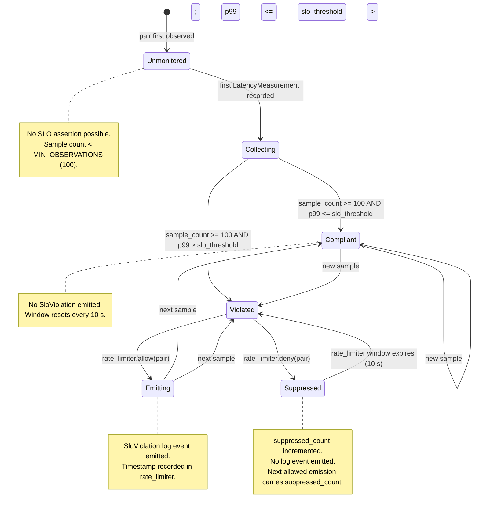
```mermaid
stateDiagram-v2
    [*] --> Unmonitored : pair first observed

    Unmonitored --> Collecting : first LatencyMeasurement recorded
    note right of Unmonitored
        No SLO assertion possible.
        Sample count < MIN_OBSERVATIONS (100).
    end note

    Collecting --> Compliant : sample_count >= 100 AND p99 <= slo_threshold
    Collecting --> Violated : sample_count >= 100 AND p99 > slo_threshold

    Compliant --> Compliant : new sample; p99 <= slo_threshold
    Compliant --> Violated : new sample; p99 > slo_threshold
    note right of Compliant
        No SloViolation emitted.
        Window resets every 10 s.
    end note

    Violated --> Emitting : rate_limiter.allow(pair)
    Violated --> Suppressed : rate_limiter.deny(pair)

    Emitting --> Compliant : next sample; p99 <= slo_threshold
    Emitting --> Violated : next sample; p99 > slo_threshold
    note right of Emitting
        SloViolation log event emitted.
        Timestamp recorded in rate_limiter.
    end note

    Suppressed --> Violated : rate_limiter window expires (10 s)
    note right of Suppressed
        suppressed_count incremented.
        No log event emitted.
        Next allowed emission carries suppressed_count.
    end note
```

The states and transitions are defined as follows:

| State | Entry Condition | Exit Condition | Action on Entry |
|-------|----------------|----------------|-----------------|
| `Unmonitored` | First observation of `(operation, boundary)` pair | `sample_count` reaches 1 | Initialize ring buffer |
| `Collecting` | `sample_count` ≥ 1 | `sample_count` ≥ `MIN_OBSERVATIONS` (100) | Accumulate samples |
| `Compliant` | `sample_count` ≥ 100 AND computed p99 ≤ SLO threshold | p99 exceeds SLO threshold on next window | Reset `consecutive_violation_count` |
| `Violated` | p99 > SLO threshold | Depends on rate-limiter decision | Increment `consecutive_violation_count` |
| `Emitting` | `rate_limiter.allow()` returns true | Immediately transitions to `Compliant` or `Violated` | Write `SloViolation` structured log |
| `Suppressed` | `rate_limiter.deny()` returns true | Rate-limiter 10-second window expires | Increment `suppressed_count` |

**[PERF-136]** The `Collecting → Compliant` and `Collecting → Violated` transitions both require exactly `MIN_OBSERVATIONS = 100` samples. A pair with 99 samples MUST remain in `Collecting` and MUST NOT emit a `SloViolation` or produce a pass assertion. This prevents false positives from small samples with fortuitously low variance.

**[PERF-137]** The `Violated → Emitting → Violated` cycle (consecutive violations) MUST increment `consecutive_violation_count` on each `Violated` entry. When `consecutive_violation_count ≥ 3` (as required by [PERF-SLO-BR-003]), the emitted `SloViolation` MUST carry `severity = "critical"`. For `consecutive_violation_count < 3`, severity is `"warning"`.

**[PERF-138]** The rate-limiter state (last emission timestamp per `(operation, boundary)` pair) MUST be stored in a `HashMap<(String, MeasurementBoundary), Instant>` protected by the same `Arc<RwLock<SchedulerState>>` that guards the run registry. It MUST NOT use a separate lock, to prevent priority inversion between SLO monitoring and the scheduler's hot path.

### 2.5 Per-Group Business Rules

The 28 SLO rows are organized into six functional groups. Each group has specific business rules that supplement the general rules in §2.1 and §2.2.

#### Group A: gRPC Read Operations (PERF-007, PERF-008, PERF-013)

These operations hold only a read lock on `Arc<RwLock<SchedulerState>>`. Their SLOs are the tightest in the gRPC group because no write contention is expected during normal operation.

**[PERF-GRP-001]** `GetRun` and `ListRuns` MUST hold the `RwLock` read guard for no longer than the time required to clone the response data. The guard MUST be released before any serialization (protobuf encoding) occurs. Holding the read guard during serialization would block all writers for the serialization duration, which violates the scheduler's throughput guarantee.

**[PERF-GRP-002]** `WatchPoolState` MUST send the initial snapshot using the current pool state captured under a read lock, then release the lock before entering the long-poll loop. Subsequent events are delivered via a `tokio::sync::watch` channel that does not require holding the scheduler lock.

**[PERF-GRP-003]** When `ListRuns` is called with `limit = 0`, the server MUST return a `invalid_argument` gRPC status within the `ListRuns` p99 SLO (100 ms). The server MUST NOT interpret `limit = 0` as "return all runs" — that behavior would bypass the throughput guarantees of the endpoint.

#### Group B: gRPC Write Operations (PERF-006, PERF-009)

These operations require a write lock and include a checkpoint write. They have the highest gRPC latency budgets.

**[PERF-GRP-004]** `SubmitRun` MUST complete all 7 validation steps before acquiring the write lock. Validation errors MUST be returned without ever acquiring the write lock. This ensures that invalid submissions do not contribute to write-lock contention and that the write lock hold time is bounded by checkpoint write latency, not by validation latency.

**[PERF-GRP-005]** `CancelRun` cascades a cancel signal to all stages in the run. The cascade MUST be implemented as a fan-out of `tokio::sync::oneshot` sends, each of which is O(1). The total cascade time for a run with N stages is O(N) oneshot sends, bounded by the stage count limit (≤ 50 stages per run). At 50 stages, the cascade completes well within the 500 ms p99.

**[PERF-GRP-006]** When `SubmitRun` or `CancelRun` checkpoint write fails, the server MUST roll back the in-memory state change (undo the run insertion or cancel state update) before returning the error. A partial state change (in-memory updated, checkpoint not written) is a consistency violation that survives server restart incorrectly.

#### Group C: Streaming Operations (PERF-010, PERF-011, PERF-012)

These operations establish long-lived gRPC streams and must not hold resources indefinitely on client disconnect.

**[PERF-GRP-007]** `StreamRunEvents` and `StreamLogs` MUST register a cleanup handler via `tokio_stream::StreamExt::on_drop` or equivalent that removes the client's slot from the server-side stream registry when the client disconnects. Leaked stream slots degrade the available concurrency for the throughput targets (≥ 20 concurrent streams).

**[PERF-GRP-008]** For `StreamLogs follow:true`, the server MUST use a `tokio::sync::broadcast` channel (not polling) to deliver live log chunks to the client. Polling on a timer would introduce up to one poll-interval of latency on every log line, violating the 500 ms p99 chunk latency target for high-frequency log output.

**[PERF-GRP-009]** The `StreamRunEvents` first-event SLO ([PERF-010]: 200 ms) is measured from handler entry to the first `RunEvent` written to the transport. The initial snapshot message MUST be constructed and sent before subscribing to the live event channel. Constructing it after subscribing risks a race where a live event is dropped before the snapshot is sent.

#### Group D: MCP Tool Operations (PERF-014 through PERF-020)

MCP tools are HTTP/JSON-RPC endpoints. They share the same underlying gRPC client pool as external callers and must coordinate lock acquisition carefully.

**[PERF-GRP-010]** MCP read tools (`list_runs`, `get_run`, `get_stage_output`) MUST acquire only a read lock on `SchedulerState`. They MUST NOT escalate to a write lock even in error paths. Write lock escalation from a read-lock holder would deadlock in the presence of another read-lock holder.

**[PERF-GRP-011]** MCP write tools (`submit_run`, `cancel_run`, `write_workflow_definition`) MUST implement the lock acquisition timeout ([PERF-020]) using `tokio::time::timeout(Duration::from_millis(5_000), lock.write())`. The timeout MUST be applied before attempting the lock, not after a failed attempt. Spinning on a failed lock acquisition is prohibited.

**[PERF-GRP-012]** `write_workflow_definition` performs 13 validation steps before writing to disk. Steps 1–10 (schema validation, cycle detection, stage name uniqueness) MUST occur before the write lock is acquired. Steps 11–13 (filesystem write, discovery file update, checkpoint) occur while the write lock is held. This split minimizes write lock hold time to the I/O-bound steps only.

**[PERF-GRP-013]** The MCP `get_stage_output` tool returns up to 2 MiB of data (1 MiB stdout + 1 MiB stderr). The truncation to 1 MiB per stream MUST occur before the JSON serialization step, not after. Serializing 10 MiB of output and then truncating the JSON string would waste CPU time and violate the 500 ms p99.

#### Group E: Infrastructure Operations (PERF-021 through PERF-033)

These operations are internal to the server or CLI and are not directly invoked by the MCP or gRPC interfaces.

**[PERF-GRP-014]** The DAG scheduler ([PERF-021]) MUST use a `tokio::task::spawn` (not `spawn_blocking`) for the dispatch logic. All dispatch work (dependency graph traversal, stage state update, subprocess spawn) is async-compatible. Using `spawn_blocking` would allocate a thread-pool thread unnecessarily and introduce scheduling latency.

**[PERF-GRP-015]** Checkpoint writes ([PERF-028]) MUST use `tokio::task::spawn_blocking` for the fsync step, because `fsync` is a synchronous blocking syscall. Calling `fsync` directly from an async task would block the tokio worker thread for the duration of the syscall, potentially stalling all other tasks on that thread.

**[PERF-GRP-016]** The TUI render function ([PERF-023]) MUST be called only from the TUI's dedicated event loop thread, which runs independently of the tokio async runtime. Rendering from within an async task is prohibited because `terminal.draw()` performs synchronous crossterm I/O that would block the runtime.

**[PERF-GRP-017]** The retention sweep ([PERF-033]) MUST run in a background tokio task scheduled with `tokio::time::interval(Duration::from_secs(86_400))`. The sweep MUST acquire the write lock only for the final deletion step, not for the scanning step. Holding the write lock for the full 60 000 ms sweep duration would block all gRPC and MCP operations for up to one minute.

**[PERF-GRP-018]** Server startup ([PERF-030], [PERF-031]) MUST write the discovery file as the last step before returning from `main`'s startup sequence. Any process that reads the discovery file and finds the gRPC address MUST be able to immediately connect and receive responses within the normal gRPC SLOs. Writing the discovery file before all services are bound is a race condition that causes spurious connection failures.

#### Group F: CLI Operations (PERF-025, PERF-026, PERF-027)

CLI commands are ephemeral processes that dial the gRPC server, perform one operation, and exit.

**[PERF-GRP-019]** CLI commands MUST read the gRPC address from the discovery file at startup. They MUST NOT cache the address between invocations. Each CLI invocation is a fresh process and must re-read the discovery file.

**[PERF-GRP-020]** The gRPC dial in CLI commands MUST use `Channel::connect()` with a connection timeout of 2 000 ms. If the server is not reachable within 2 000 ms, the CLI MUST print a human-readable error to stderr and exit with code 1. The CLI MUST NOT retry the connection; transient unavailability is surfaced to the user immediately.

**[PERF-GRP-021]** CLI p99 latency targets include gRPC dial time. In test environments where the server is running on `localhost`, dial time is typically < 5 ms and does not materially affect the SLO. Tests MUST NOT mock the gRPC channel for SLO assertions; they MUST use a real in-process or localhost server to ensure dial time is included in the measurement.

**[PERF-GRP-022]** `devs submit` ([PERF-027]) MUST NOT block waiting for the submitted run to complete. It submits the run, prints the run ID, and exits. The 1 500 ms p99 covers submission latency only. Callers that wish to wait for completion MUST use `devs status` in a polling loop or subscribe to `StreamRunEvents` via a separate process.

**[PERF-GRP-023]** When a CLI command receives a gRPC status of `UNAVAILABLE` (server restarting or not yet started), it MUST exit with code 2 (distinct from code 1 for other errors). This allows callers to distinguish "server not running" from "request failed" in scripts.

### 2.6 Dependencies

The SLO table and its monitoring subsystem depend on the following components. Changes to these components that affect latency or throughput characteristics MUST trigger a re-evaluation of the affected SLO rows.

| Component | Used By SLOs | Nature of Dependency | Impact if Degraded |
|-----------|-------------|----------------------|--------------------|
| `tokio` async runtime (single-threaded) | All gRPC and MCP SLOs | Task scheduling; all async I/O | Task queue depth increases; latency rises across all operations |
| `tonic` gRPC framework | PERF-006 through PERF-013 | Request dispatch, response serialization | Codec overhead added to all gRPC p99 measurements |
| `hyper` HTTP server | PERF-014 through PERF-020 | MCP request parsing and response writing | HTTP parsing latency added to all MCP p99 measurements |
| `Arc<RwLock<SchedulerState>>` | PERF-006 through PERF-021, PERF-028 | Shared mutable state for all run/stage operations | Write lock contention extends p99 for all write operations |
| Tokio broadcast channel (log buffer) | PERF-011, PERF-012 | Log line delivery to StreamLogs subscribers | Slow subscribers can cause channel lag; affects follow chunk latency |
| Filesystem (checkpoint, workflow defs) | PERF-019, PERF-028, PERF-030, PERF-031 | Atomic file write and fsync | Disk I/O latency directly adds to checkpoint and startup SLOs |
| `crossterm` terminal I/O | PERF-023, PERF-024 | Rendering to terminal buffer | Slow terminal flush raises render latency |
| `reqwest` HTTP client (webhook) | PERF-029 | Outbound HTTP to webhook targets | Target availability and network latency dominate webhook p99 |
| `git2` / `spawn_blocking` | PERF-031 | Checkpoint restore reading git history | Repo size and git object count affect restore SLO |
| Discovery file (`.devs/discovery.json`) | PERF-025, PERF-026, PERF-027, PERF-030 | gRPC address lookup for CLI and post-startup readiness | File not present → CLI fails immediately with exit code 2 |
| `SloViolation` rate-limiter state | PERF-102, PERF-136, PERF-137, PERF-138 | Tracks last emission time per (operation, boundary) pair | Stale rate-limiter clock (e.g., system time jump) may suppress or flood violations |

**[PERF-DEP-003]** Any change to the `tokio` runtime mode (e.g., switching from single-threaded to multi-threaded) MUST be preceded by a full re-run of all SLO integration tests. The single-threaded runtime's cooperative scheduling model means that blocking tasks affect all tasks on the same thread; the multi-threaded model distributes this differently and may change p99 distributions.

**[PERF-DEP-004]** Any change to the `Arc<RwLock<SchedulerState>>` locking strategy (e.g., splitting into finer-grained locks, replacing with a lock-free structure) MUST include a proof-of-no-regression: the p99 latency for all write operations ([PERF-006], [PERF-009], [PERF-017], [PERF-018], [PERF-019], [PERF-028]) MUST be re-measured with ≥ 100 samples each under a concurrent read load of ≥ 50 simultaneous read-lock holders.

### 2.7 Acceptance Criteria

The following acceptance criteria are testable requirements for the SLO table and its monitoring infrastructure. Each criterion MUST have a corresponding integration test identified by the AC ID.

**[AC-PERF-SLO-001]** For every PERF ID in the SLO table (PERF-006 through PERF-033), there exists a constant `SLO_*_P99_MS` in `devs-core/src/perf.rs` whose value matches the p99 column in the table. A compile-time test that counts these constants and compares against the expected count (28) MUST pass.

**[AC-PERF-SLO-002]** For every SLO constant, a CI test exists that collects ≥ 100 samples of the corresponding operation, computes the p99, and asserts `p99 ≤ ci_threshold(SLO_*_P99_MS, is_hard_limit)`. Tests that collect fewer than 100 samples MUST fail with `"insufficient sample count: N < 100"`.

**[AC-PERF-SLO-003]** `GetRun` gRPC: 100 sequential calls to `GetRun` against a server with 50 cached runs each complete in ≤ 75 ms (CI threshold for 50 ms p99). No single call may exceed 75 ms. The measurement uses `MeasurementBoundary::GrpcHandler`.

**[AC-PERF-SLO-004]** `ListRuns` gRPC: 100 sequential calls to `ListRuns` (limit=100, no filter) against a server with 100 runs complete in ≤ 150 ms each (CI threshold for 100 ms p99). The measurement boundary is `GrpcHandler`.

**[AC-PERF-SLO-005]** `SubmitRun` gRPC: 100 sequential valid `SubmitRun` calls (each submitting a distinct run name) complete within 750 ms each (CI threshold for 500 ms p99), including checkpoint write to a tmpfs. A 101st call with a duplicate name MUST also complete within 750 ms and return `already_exists`.

**[AC-PERF-SLO-006]** `CancelRun` gRPC: 100 sequential `CancelRun` calls on runs in `Running` state (with 10 active stages each) complete within 750 ms each. Each call's cascade to 10 stages via oneshot sends completes before the response is returned.

**[AC-PERF-SLO-007]** `StreamRunEvents` TTFE: 20 concurrent clients subscribe to `StreamRunEvents` for the same run. Each client receives its first event (run snapshot) within 300 ms of subscription. The server delivers 20 concurrent initial snapshots without serialization.

**[AC-PERF-SLO-008]** `StreamLogs` non-follow TTFB: 20 concurrent clients call `StreamLogs` (follow=false) for a stage with 1 000 buffered log lines. Each client receives the first log line within 375 ms of subscription. All 1 000 lines are delivered and the stream is closed.

**[AC-PERF-SLO-009]** `StreamLogs` follow chunk latency: A stage is actively writing log lines at 100 lines/second. 20 concurrent `StreamLogs follow=true` clients each receive every new log chunk within 750 ms of the line being written to the stage's stdout. Measurement is from stdout write timestamp (recorded by the stage harness) to gRPC transport write timestamp (recorded by the handler).

**[AC-PERF-SLO-010]** DAG scheduler dispatch: A workflow with a 10-stage linear DAG runs to completion. For each of the 9 inter-stage dispatch events, the time from the predecessor stage's terminal state transition to the successor stage's `execvp` call is ≤ 150 ms. The measurement uses `MeasurementBoundary::Scheduler`. 100 such workflow runs provide ≥ 900 dispatch observations.

**[AC-PERF-SLO-011]** TUI render hard limit: 1 000 consecutive render frames are produced by the TUI event loop under simulated load (100 runs, 10 stages each, all in Running state with active log streams). Every single frame completes within 16 ms. Any frame exceeding 16 ms MUST cause the test to fail immediately, not after collecting all samples. The hard limit is non-statistical.

**[AC-PERF-SLO-012]** Checkpoint write atomic protocol: 100 sequential checkpoint writes to a tmpfs filesystem each complete within 750 ms (CI threshold for 500 ms p99). Each write MUST follow the serialize → write-tmp → fsync → rename sequence. A fault injection test MUST verify that a simulated crash between write-tmp and rename leaves the previous checkpoint intact and readable.

**[AC-PERF-SLO-013]** MCP `write_workflow_definition`: 100 sequential calls with valid workflow definitions (10 stages, linear DAG) each complete within 3 000 ms (CI threshold for 2 000 ms p99). A call with a cyclic DAG MUST also complete within 3 000 ms and return a JSON-RPC error with a human-readable message identifying the cycle.

**[AC-PERF-SLO-014]** MCP lock acquisition timeout: When 5 concurrent callers each hold a write lock for 2 000 ms, a 6th caller's lock acquisition MUST time out at 5 000 ms and return `resource_exhausted` within 5 100 ms (5 000 ms timeout + 100 ms response overhead). The 6th caller MUST NOT receive a response before 4 900 ms (it must wait near the full timeout, not return early).

**[AC-PERF-SLO-015]** Server startup (cold): 10 consecutive server starts (each on a different port, clean state) each produce a discovery file with the gRPC address within 15 000 ms (CI threshold for 10 000 ms p99). A gRPC `GetRun` call immediately after the discovery file appears MUST succeed within the `GetRun` p99 SLO.

**[AC-PERF-SLO-016]** Server startup with restore: 10 consecutive server starts, each restoring a checkpoint with 50 runs and 500 stage records, each complete within 45 000 ms (CI threshold for 30 000 ms p99). The tokio main thread MUST NOT be blocked for > 50 ms at any point during restore (verified by a sampling watchdog task that records the longest async task gap).

**[AC-PERF-SLO-017]** `SloViolation` rate-limiter: When an operation emits `SloViolation` at time T, a second emission for the same `(operation, boundary)` pair at T + 5 s MUST be suppressed. An emission at T + 11 s MUST NOT be suppressed. The emitted event at T + 11 s MUST carry `suppressed_count = 1`.

**[AC-PERF-SLO-018]** Consecutive violation severity escalation: When the p99 for an operation exceeds its SLO for 3 consecutive measurement windows, the third `SloViolation` event MUST carry `severity = "critical"`. The first and second events MUST carry `severity = "warning"`. A window is defined as ≥ 100 new samples since the last window boundary.

**[AC-PERF-SLO-019]** `./do presubmit` hard timeout: A `do presubmit` invocation that is programmatically stalled (e.g., a test that sleeps indefinitely) MUST be terminated by the `do` script's timeout enforcement within 900 005 ms (900 000 ms limit + 5 000 ms SIGKILL grace). The exit code MUST be non-zero and the script MUST print `"presubmit timeout: killed after 900s"` to stderr.

**[AC-PERF-SLO-020]** Constant coverage: A `cargo test` invocation on `devs-core` MUST include a test named `slo_constants_complete` that fails if the count of `pub const SLO_*_P99_MS: u64` symbols exported from `devs_core::perf` does not equal 28 (one per SLO table row). Adding a new row to the table without adding the corresponding constant, or vice versa, MUST cause this test to fail.

---

## 3. Latency Targets per Critical User-Facing Flow

### 3.1 Workflow Submission Flow

Path: human/agent → `devs submit` CLI or MCP `submit_run` → `RunService.SubmitRun` gRPC → scheduler queues run → response returned.

**[PERF-034]** End-to-end from CLI invocation to printed `run_id` (text mode): **p99 < 1 500 ms** on local loopback. This includes gRPC dial, 7-step validation, `checkpoint.json` write, and slug generation.

**[PERF-035]** Duplicate run name rejection (fast path via per-project mutex) must complete within **p99 < 100 ms** — it must not require a full checkpoint scan.

#### Data Models

The `SubmitRunRequest` and `SubmitRunResponse` proto messages define the normative contract:

```proto
// devs-proto/src/run.proto — normative field list
message SubmitRunRequest {
  string project_id         = 1;  // required; UUID v4 string
  string workflow_name      = 2;  // required; /^[a-z][a-z0-9_-]{0,127}$/
  string run_name           = 3;  // optional; same pattern; auto-generated if empty
  map<string,string> inputs = 4;  // max 64 entries; total ≤ 65 536 bytes serialised
  int32  priority_override  = 5;  // 0 = use project default; valid range [1, 100]
}
message SubmitRunResponse {
  string run_id                       = 1;  // UUID v4
  string run_name                     = 2;  // slug provided or auto-generated
  google.protobuf.Timestamp queued_at = 3;
  uint32 position_in_queue            = 4;  // 0 = immediately eligible for dispatch
}
```

**[PERF-139]** `run_name`, when omitted, MUST be auto-generated as `<workflow_name>-<run_id[0..8]>` (e.g., `build-test-a3f2b1c4`). Auto-generation MUST NOT perform I/O and MUST complete in **< 1 ms**. The generated slug MUST satisfy `/^[a-z][a-z0-9_-]{0,127}$/`.

**[PERF-140]** `SubmitRun` executes a **13-step normative validation pipeline** in strict order before acquiring any lock or writing to disk. Steps 1–9 are stateless and lock-free; steps 10–13 require the per-project name mutex:

| Step | Check | Error if failed |
|------|-------|-----------------|
| 1 | `project_id` parses as UUID v4 | `INVALID_ARGUMENT` |
| 2 | `workflow_name` matches `/^[a-z][a-z0-9_-]{0,127}$/` | `INVALID_ARGUMENT` |
| 3 | `run_name` (if present) matches same pattern | `INVALID_ARGUMENT` |
| 4 | `workflow_name` resolves in `WorkflowRegistry` (in-memory; no I/O) | `NOT_FOUND` |
| 5 | `inputs` count ≤ 64 | `INVALID_ARGUMENT` |
| 6 | `inputs` total serialised size ≤ 65 536 bytes | `INVALID_ARGUMENT` |
| 7 | All required workflow input parameters present in `inputs` | `INVALID_ARGUMENT` |
| 8 | No extra keys in `inputs` absent from declared parameters | `INVALID_ARGUMENT` |
| 9 | `priority_override` is 0 or in [1, 100] | `INVALID_ARGUMENT` |
| 10 | Per-project name mutex acquired (times out at 5 s) | `RESOURCE_EXHAUSTED` |
| 11 | `run_name` not present in project's active `RunRegistry` | `ALREADY_EXISTS` |
| 12 | Server shutdown flag not set | `FAILED_PRECONDITION` |
| 13 | Workflow has ≥ 1 stage (re-validated at submission time) | `INVALID_ARGUMENT` |

Failure at any step returns immediately without executing subsequent steps or performing any I/O.

#### API Contract

```
RunService.SubmitRun
  rpc SubmitRun(SubmitRunRequest) returns (SubmitRunResponse)

  Required metadata: x-devs-client-version: "<semver>"
                     (UNAUTHENTICATED returned before step 1 if absent or mismatched)
  Error codes:
    UNAUTHENTICATED    – missing or incompatible x-devs-client-version
    INVALID_ARGUMENT   – steps 1–9 or 13 fail (message names the failing step)
    NOT_FOUND          – workflow_name absent from WorkflowRegistry (step 4)
    ALREADY_EXISTS     – run_name collision in RunRegistry (step 11)
    FAILED_PRECONDITION – server is shutting down (step 12)
    RESOURCE_EXHAUSTED – per-project name mutex held > 5 s ([PERF-020])
```

#### Business Rules

**[PERF-141]** The 13-step validation pipeline MUST execute synchronously within the gRPC request handler. No step MAY be deferred to a background task. The total pipeline execution time MUST be included in the [PERF-034] end-to-end budget. The pipeline MUST NOT start if the `x-devs-client-version` header is absent or mismatched; the version check is a pre-pipeline interceptor.

**[PERF-142]** `run_name` uniqueness MUST be enforced against the in-memory `RunRegistry` (never by scanning `checkpoint.json` files on disk). The per-project name mutex (step 10) MUST be held continuously from step 10 through completion of the `checkpoint.json` atomic write ([PERF-028]). It MUST be released before the gRPC response is sent. This guarantees no concurrent `SubmitRun` can observe the same name as available.

**[PERF-143]** `inputs` keys absent from the workflow's declared parameter schema MUST be rejected with `INVALID_ARGUMENT "unknown input parameter: <key>"` (step 8). Parameters declared with an enum type MUST be validated against the declared enum values at step 8. No runtime coercion is performed; mismatched types are rejected.

#### Submission State Machine

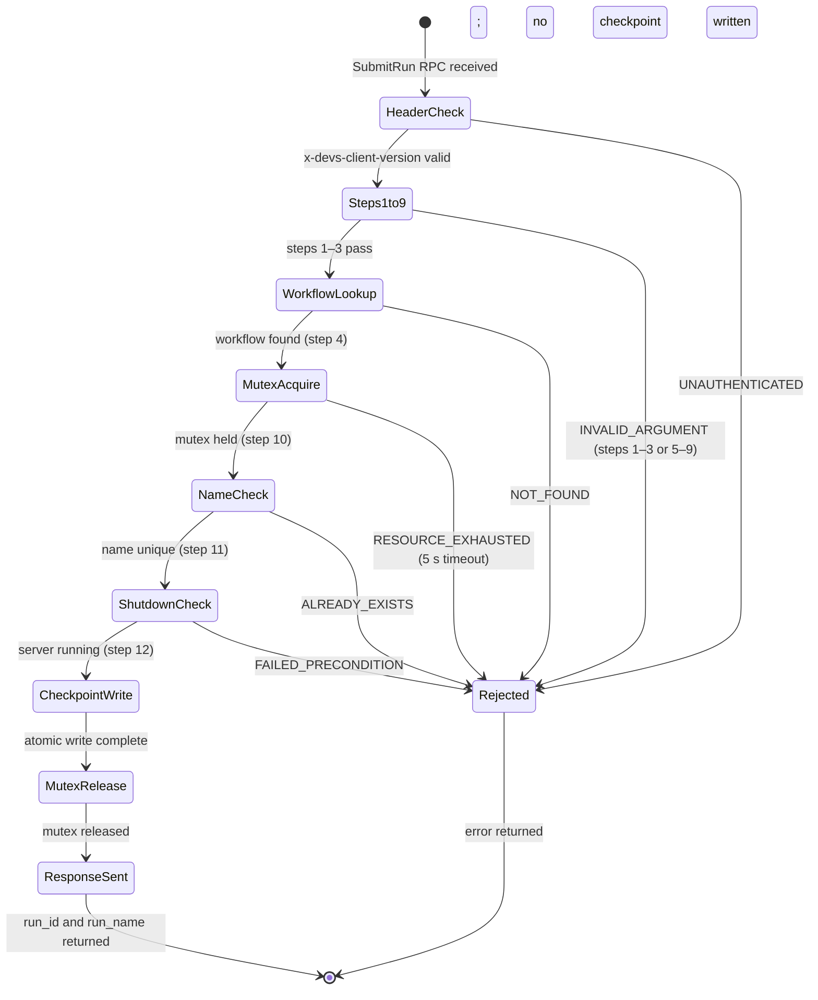
```mermaid
stateDiagram-v2
    [*] --> HeaderCheck : SubmitRun RPC received
    HeaderCheck --> Steps1to9 : x-devs-client-version valid
    HeaderCheck --> Rejected : UNAUTHENTICATED
    Steps1to9 --> WorkflowLookup : steps 1–3 pass
    Steps1to9 --> Rejected : INVALID_ARGUMENT (steps 1–3 or 5–9)
    WorkflowLookup --> MutexAcquire : workflow found (step 4)
    WorkflowLookup --> Rejected : NOT_FOUND
    MutexAcquire --> NameCheck : mutex held (step 10)
    MutexAcquire --> Rejected : RESOURCE_EXHAUSTED (5 s timeout)
    NameCheck --> ShutdownCheck : name unique (step 11)
    NameCheck --> Rejected : ALREADY_EXISTS
    ShutdownCheck --> CheckpointWrite : server running (step 12)
    ShutdownCheck --> Rejected : FAILED_PRECONDITION
    CheckpointWrite --> MutexRelease : atomic write complete
    MutexRelease --> ResponseSent : mutex released
    ResponseSent --> [*] : run_id and run_name returned
    Rejected --> [*] : error returned; no checkpoint written
```

#### Dependencies for §3.1

| Component | Version / contract | Role |
|-----------|--------------------|------|
| `devs-core` `RunRegistry` | internal | In-memory run-name uniqueness; per-project `tokio::sync::Mutex` |
| `devs-checkpoint` `CheckpointStore` | internal | Atomic `checkpoint.json` write ([PERF-028]) |
| `devs-scheduler` `WorkflowRegistry` | internal | Workflow lookup by `workflow_name` (step 4; read lock) |
| `tonic` | `0.11` | gRPC transport; metadata interceptor for version header |
| `uuid` | `1.x` | UUID v4 generation for `run_id` |
| `serde_json` | `1.x` | Input payload serialisation for size check (step 6) |

**Edge cases for §3.1:**

1. **Large input payload**: A `submit_run` call with 64 workflow inputs each containing a 1 KiB string value must still complete within the p99 target. Total payload ≤ 64 KiB; validation is O(N) in the number of inputs.
2. **Rapid sequential submissions**: 10 sequential `submit_run` calls to the same workflow with distinct run names must each complete within the p99 target. There must be no lock starvation between sequential calls.
3. **Submission during active checkpoint write**: If a checkpoint write is in progress (e.g., for another run), a `submit_run` call MUST NOT be blocked beyond the 5 s lock acquisition timeout ([PERF-020]). `submit_run` acquires `SchedulerState` write lock; if contended, it waits up to 5 s.
4. **Zero-stage workflow rejection**: A workflow with no stages is rejected at validation (step 13 of the 13-step pipeline). The rejection response MUST be returned within p99 < 100 ms.
5. **Submission during server shutdown**: `submit_run` called after SIGTERM is received returns `FAILED_PRECONDITION "server is shutting down"` within p99 < 100 ms. It never hangs.

**Acceptance criteria for §3.1:**
- `devs submit` with valid inputs returns `run_id` within 1 500 ms end-to-end on loopback (p99).
- `devs submit` with duplicate run name returns exit code 4 within 100 ms (p99).
- 10 sequential submissions each complete within 500 ms p99 server-side (`SubmitRun` RPC).
- `submit_run` during active write-lock contention returns within 5 000 ms (lock timeout path).

### 3.2 Stage Dispatch Flow

Path: dependency completes → `stage_complete_tx` mpsc message → DAG scheduler evaluates eligibility → pool selects agent → executor prepares environment → agent subprocess spawned.

**[PERF-036]** For the common `tempdir` execution environment with no repo clone, the interval from last dependency's checkpoint write to agent subprocess `execvp` must be **p99 < 200 ms**.

**[PERF-037]** Pool capability resolution (filter + semaphore acquire when a slot is immediately available): **p99 < 10 ms**.

**[PERF-038]** For workflows with two independently-rooted stages (no `depends_on`), both stages must be dispatched within **100 ms of the run transitioning to `Running`** (captured by [GOAL-001] / [2_PRD-BR-004]).

The following Mermaid diagram shows the timing measurement points in the dispatch flow:

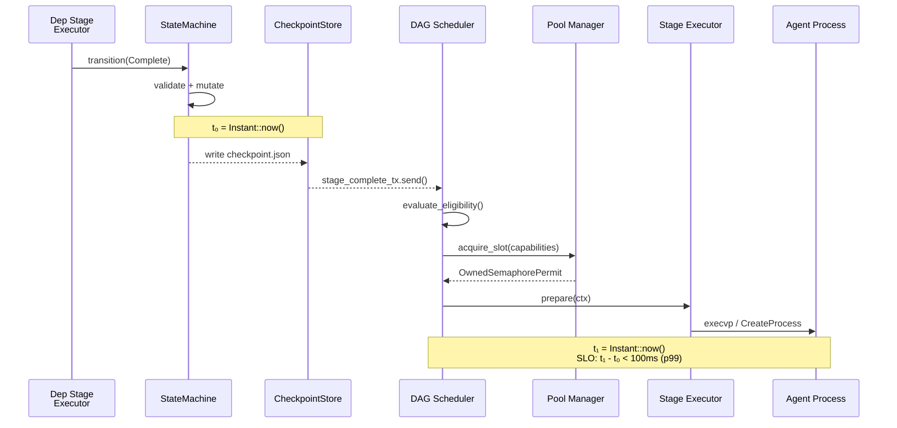
```mermaid
sequenceDiagram
    participant DC as Dep Stage<br/>Executor
    participant SM as StateMachine
    participant CP as CheckpointStore
    participant SCH as DAG Scheduler
    participant POOL as Pool Manager
    participant EX as Stage Executor
    participant AGT as Agent Process

    DC->>SM: transition(Complete)
    SM->>SM: validate + mutate
    Note over SM,CP: t₀ = Instant::now()
    SM-->>CP: write checkpoint.json
    CP-->>SCH: stage_complete_tx.send()
    SCH->>SCH: evaluate_eligibility()
    SCH->>POOL: acquire_slot(capabilities)
    POOL-->>SCH: OwnedSemaphorePermit
    SCH->>EX: prepare(ctx)
    EX->>AGT: execvp / CreateProcess
    Note over SCH,AGT: t₁ = Instant::now()<br/>SLO: t₁ - t₀ < 100ms (p99)
```

#### Data Models

```rust
/// A node in the compiled DAG for a workflow.
/// Produced by `compute_dag_tiers()` in `devs-core/src/dag.rs`.
pub struct DagStageNode {
    pub stage_name:   String,
    pub depends_on:   Vec<String>,          // direct predecessors only
    pub tier:         u32,                  // 0-indexed DAG depth (root stages = tier 0)
    pub pool_name:    String,
    pub capabilities: Vec<String>,          // required agent capabilities
    pub fan_out:      Option<FanOutConfig>, // None for ordinary stages
}

/// Internal event sent on the `stage_complete_tx` mpsc channel.
pub struct StageCompleteEvent {
    pub run_id:     Uuid,
    pub stage_name: String,
    pub status:     TerminalStageStatus,    // Completed | Failed | Cancelled
}
```

The `stage_complete_tx` channel is `tokio::sync::mpsc::Sender<StageCompleteEvent>` with a buffer of **256 entries**. The DAG scheduler task drains this channel and calls `evaluate_eligibility()` for the affected run after each event.

#### API Contract (Internal)

```
DAGScheduler::evaluate_eligibility(run_id: Uuid, state: &SchedulerState) -> Vec<StageDispatchOrder>
  Precondition: caller holds SchedulerState read lock
  Returns: list of stages whose entire depends_on set is in {Completed}
  Side effects: none (pure evaluation; dispatch is initiated by the caller)

StageDispatchOrder {
  run_id:       Uuid,
  stage_name:   String,
  pool_name:    String,
  capabilities: Vec<String>,
  tier:         u32,
}

PoolManager::acquire_slot(pool_name, capabilities) -> Result<OwnedSemaphorePermit, PoolError>
  Blocks asynchronously until a semaphore slot is available
  Errors:
    PoolError::PoolNotFound   – pool_name not registered
    PoolError::Unsatisfiable  – no agent satisfies all required capabilities
```

#### Business Rules

**[PERF-144]** A stage MUST be dispatched if and only if every stage in its `depends_on` list is in the `Completed` state. A stage with an empty `depends_on` list becomes eligible immediately when the run transitions to `Running`. A stage MUST NOT be dispatched if any predecessor is in a non-terminal state, regardless of elapsed time.

**[PERF-145]** Stage dispatch MUST be suppressed if the parent run is in any of the following states: `Cancelled`, `Failed`, `Paused`. If `evaluate_eligibility()` returns candidates but the run is in one of these states, all candidates are discarded without acquiring semaphore permits. The suppression check MUST occur under the same read lock as the eligibility evaluation to prevent a race between eligibility detection and run cancellation.

**[PERF-146]** The `stage_complete_tx` channel MUST be drained in its entirety before the DAG scheduler task yields control. Multiple `StageCompleteEvent` entries for the same `run_id` in a single drain cycle MAY be coalesced into one `evaluate_eligibility()` call, provided the coalesced call reflects the state after all events have been applied to `SchedulerState`.

**[PERF-147]** `compute_dag_tiers()` MUST detect cycles in the `depends_on` graph using a depth-first search and return `DagError::CycleDetected` at workflow registration time. A workflow with a cyclic dependency graph MUST NOT be registered. The dispatch path does not re-check for cycles; the absence of cycles is a registration-time invariant upheld by `WorkflowRegistry`.

#### Dependencies for §3.2

| Component | Version / contract | Role |
|-----------|--------------------|------|
| `devs-core` `compute_dag_tiers` | internal | DAG tier computation and cycle detection at O(V+E) |
| `devs-core` `StateMachine::transition` | internal | Stage terminal transition → `StageCompleteEvent` |
| `devs-checkpoint` `CheckpointStore` | internal | Persists `StageRun` status after transition |
| `devs-pool` `PoolManager::acquire_slot` | internal | Semaphore-based concurrency limiting |
| `devs-executor` | internal | Agent subprocess spawning via `portable-pty` |
| `portable-pty` | `0.8` | PTY allocation (~5 ms Linux, ~20 ms macOS) |
| `tokio::sync::mpsc` | tokio `1.x` | `stage_complete_tx` channel (buffer 256) |
| `tokio::sync::Semaphore` | tokio `1.x` | Per-pool concurrency control |

**Edge cases for §3.2:**

1. **Diamond dependency pattern**: Stage D depends on both B and C, which both depend on A. When A completes, B and C become eligible simultaneously. When both B and C complete (possibly at different times), D must become eligible within 100 ms of the *later* completion. The scheduler MUST NOT dispatch D after the first completion.
2. **Dispatch when pool is at `max_concurrent`**: If all pool slots are occupied when a stage becomes eligible, the stage transitions to `Waiting` on the semaphore. No dispatch latency SLO applies until a slot becomes available. When a slot is released, the waiting stage MUST be dispatched within p99 < 100 ms of the release.
3. **Agent binary not found**: If the agent CLI binary (e.g., `claude`) is not found in `PATH`, the stage transitions to `Failed` with `failure_reason: "binary_not_found"`. This failure MUST be detected within p99 < 50 ms of spawn attempt; no retry occurs.
4. **Context file write failure before spawn**: If `.devs_context.json` write fails (e.g., `ENOSPC`), the stage transitions to `Failed` without spawning the agent. The failure MUST be recorded in `checkpoint.json` within p99 < 100 ms.
5. **256-stage workflow dispatch**: A workflow with 256 independent stages and a pool with `max_concurrent = 256` must dispatch all 256 stages within 1 000 ms of the run starting ([PERF-051]).

**Acceptance criteria for §3.2:**
- Two independent root stages dispatched within 100 ms of run start (p99, measured via `GetRun` polling at 10 ms intervals).
- Diamond dependency: stage D dispatched within 200 ms of the later of B/C completing (p99 with CI margin).
- Pool capability filter for a pool of 1 024 agents completes within 5 ms (p99).
- `agent binary not found` error reflected in `GetRun` within 50 ms of spawn attempt.

### 3.3 Log Streaming Flow

Path: agent writes to stdout → executor captures → `LogService.StreamLogs` gRPC stream → TUI `LogPane` buffer → screen.

**[PERF-039]** Live log chunk end-to-end latency (agent stdout write → TUI display): **p95 < 500 ms**, **p99 < 1 000 ms**. This includes capture, gRPC streaming, and one TUI render cycle.

**[PERF-040]** `stream_logs follow:false` (historical fetch): TTFB **p99 < 250 ms**; complete response for 10 000 lines **p99 < 2 000 ms**.

#### Data Models

```proto
// devs-proto/src/log.proto
message StreamLogsRequest {
  string run_id        = 1;  // required; UUID v4
  string stage_name    = 2;  // required; must name a stage in the run
  bool   follow        = 3;  // default false; true = stream live output after buffer
  uint64 from_sequence = 4;  // default 0 (inclusive); OUT_OF_RANGE if > buffered line count
}

message LogChunk {
  uint64    sequence    = 1;  // strictly monotonically increasing from from_sequence; no gaps
  bytes     content     = 2;  // valid UTF-8; ≤ 32 768 bytes; never splits a multi-byte sequence
  LogStream stream      = 3;  // STDOUT or STDERR
  bool      done        = 4;  // true on the final chunk only; never true on a non-final chunk
  bool      truncated   = 5;  // true if log buffer has evicted oldest lines (cap 10 000)
  uint64    total_lines = 6;  // set only when done == true; includes evicted lines in count
}

enum LogStream { STDOUT = 0; STDERR = 1; }
```

The in-memory `LogBuffer` stores at most `LogBuffer::max_capacity = 10 000` lines per stage. When the buffer is full, the oldest line is evicted (FIFO). The `truncated` flag is set permanently once any eviction occurs and is reflected in all subsequent `LogChunk` messages for that stage.

#### API Contract

```
LogService.StreamLogs
  rpc StreamLogs(StreamLogsRequest) returns (stream LogChunk)

  Required metadata: x-devs-client-version: "<semver>"
  Error codes (gRPC status on stream open, before any LogChunk):
    NOT_FOUND          – run_id or stage_name not found
    OUT_OF_RANGE       – from_sequence > total buffered line count
    INVALID_ARGUMENT   – stage_name empty, or run_id not a valid UUID
    UNAUTHENTICATED    – missing or mismatched x-devs-client-version
  Stream termination (sent as LogChunk with done:true, not as gRPC error):
    follow:false  → final chunk has done:true after all buffered lines sent
    follow:true   → final chunk has done:true when stage reaches terminal state
    30-min limit  → final chunk has done:true at t+1 800 s regardless of stage status
    Server crash  → stream closes with RST_STREAM (no done:true; client must reconnect)
```

#### Business Rules

**[PERF-148]** `sequence` values in `LogChunk` MUST be strictly monotonically increasing, starting from `from_sequence`, with no gaps and no repeats within a single stream. When a log line is split across multiple chunks (32 KiB boundary), each fragment receives a distinct, consecutive sequence number. A subscriber that observes a sequence gap MUST treat this as a protocol error and reconnect.

**[PERF-149]** `content` in each `LogChunk` MUST be valid UTF-8. Chunk boundaries MUST fall on UTF-8 character boundaries (never mid–multi-byte sequence). If a single UTF-8 character would by itself exceed 32 KiB (structurally impossible for valid UTF-8, but handled defensively), the character is replaced with U+FFFD and `truncated` is set to `true`.

**[PERF-150]** The server MUST support at least **20 simultaneous `StreamLogs` subscribers** for the same stage, each receiving an independent copy via a `tokio::sync::broadcast::Receiver`. The broadcast sender MUST NOT block on a slow receiver. A receiver that lags more than the broadcast channel capacity receives `RecvError::Lagged` and MUST reconnect (receiving a fresh stream from `from_sequence=0`).

**[PERF-151]** For `follow:true` streams, new `LogChunk` messages MUST be emitted within **p99 < 1 000 ms** of the corresponding bytes being written to the agent's stdout/stderr pipe (end-to-end: capture → buffer → broadcast → gRPC transport write). This per-chunk delivery target is consistent with the end-to-end TUI display target in [PERF-039].

#### Log Streaming State Machine

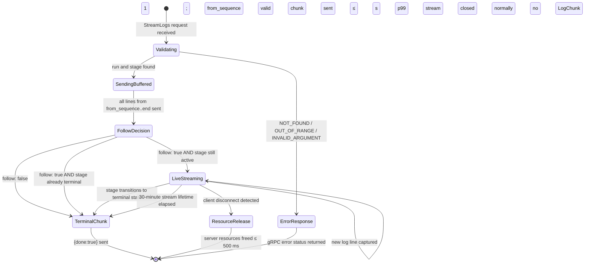
```mermaid
stateDiagram-v2
    [*] --> Validating : StreamLogs request received
    Validating --> SendingBuffered : run and stage found; from_sequence valid
    Validating --> ErrorResponse : NOT_FOUND / OUT_OF_RANGE / INVALID_ARGUMENT
    SendingBuffered --> FollowDecision : all lines from from_sequence..end sent
    FollowDecision --> TerminalChunk : follow: false
    FollowDecision --> LiveStreaming : follow: true AND stage still active
    FollowDecision --> TerminalChunk : follow: true AND stage already terminal
    LiveStreaming --> LiveStreaming : new log line captured; chunk sent ≤ 1 s p99
    LiveStreaming --> TerminalChunk : stage transitions to terminal state
    LiveStreaming --> TerminalChunk : 30-minute stream lifetime elapsed
    LiveStreaming --> ResourceRelease : client disconnect detected
    TerminalChunk --> [*] : {done:true} sent; stream closed normally
    ResourceRelease --> [*] : server resources freed ≤ 500 ms
    ErrorResponse --> [*] : gRPC error status returned; no LogChunk sent
```

#### Dependencies for §3.3

| Component | Version / contract | Role |
|-----------|--------------------|------|
| `devs-core` `LogBuffer` | internal | Circular buffer (10 000 lines); eviction on overflow |
| `tokio::sync::broadcast` | tokio `1.x` | Fan-out to ≥ 20 simultaneous subscribers |
| `devs-grpc` `LogService` | internal | gRPC server-side streaming handler |
| `tonic` | `0.11` | gRPC streaming transport |
| `devs-executor` stdout/stderr capture | internal | Byte pipe between agent process and `LogBuffer` |

**Edge cases for §3.3:**

1. **`stream_logs follow:true` on a Pending stage**: The server MUST hold the HTTP connection open without returning `done:true` until the stage transitions to `Running`. If the stage is cancelled before it ever starts, the final chunk `{"done":true,"truncated":false,"total_lines":0}` MUST be delivered within p99 < 500 ms of the cancellation.
2. **Log line exceeding 32 KiB**: A single log line longer than 32 768 bytes MUST be split into multiple chunks each ≤ 32 KiB. Each chunk carries a monotonically increasing `sequence` number with no gaps. The split MUST NOT truncate UTF-8 character boundaries.
3. **Client disconnect during `follow:true`**: When the MCP client disconnects mid-stream, the server MUST release all stream resources within 500 ms of detecting the disconnect. No further chunks are written; no goroutine or task leak occurs.
4. **Concurrent `stream_logs` for same stage**: 20 simultaneous clients requesting `stream_logs follow:true` for the same stage MUST all receive the same chunks with identical `sequence` numbers. Each client receives an independent copy via `tokio::sync::broadcast::Receiver`.
5. **Stream lifetime limit**: `stream_logs follow:true` is terminated by the server after **30 minutes** (1 800 s). The final chunk `{"done":true,"truncated":false,"total_lines":<N>}` is sent at the 30-minute mark regardless of stage status.

**Acceptance criteria for §3.3:**
- `stream_logs follow:false` for 10 000 buffered lines returns all lines within 2 000 ms (p99).
- `stream_logs follow:true` on a Pending stage holds connection open; delivers `done:true` within 500 ms of cancellation.
- Client disconnect releases server resources within 500 ms (measured via `get_pool_state` showing no leaked connections).
- Log lines > 32 KiB are split correctly; `sequence` numbers have no gaps across splits.

### 3.4 Run Cancellation Flow

Path: `devs cancel <run>` or MCP `cancel_run` → `CancelRun` gRPC → send `devs:cancel\n` to all running agents → await exit or force-kill.

**[PERF-041]** The server acknowledges the cancel (returns the gRPC/MCP response with all `StageRun` records set to `Cancelled`) within **p99 < 500 ms**, independent of how long agent termination takes.

**[PERF-042]** Agent graceful shutdown after `devs:cancel\n`: orchestrated agents must exit within **10 000 ms** (10 s); the server falls back to SIGTERM after 5 000 ms and SIGKILL after a further 5 000 ms.

The following Mermaid diagram shows the cancellation state machine and timing checkpoints:

```mermaid
stateDiagram-v2
    [*] --> CancelReceived : cancel_run / CancelRun RPC
    CancelReceived --> AtomicCheckpoint : write-lock acquired
    AtomicCheckpoint --> ResponseSent : all StageRuns → Cancelled\ncheckpoint.json written
    note right of ResponseSent : SLO: t₀ to here < 500ms (p99)
    ResponseSent --> SendCancelSignal : devs:cancel\n to stdin
    SendCancelSignal --> WaitGrace : t+0s
    WaitGrace --> AgentExited : agent exits voluntarily
    WaitGrace --> SendSIGTERM : t+5s timeout
    SendSIGTERM --> WaitSigterm : 5s grace
    WaitSigterm --> AgentExited : agent exits after SIGTERM
    WaitSigterm --> SendSIGKILL : t+10s timeout
    SendSIGKILL --> AgentExited : forced exit, exit_code = -9
    AgentExited --> [*]
```

#### Data Models

```proto
// devs-proto/src/run.proto
message CancelRunRequest {
  string run_id = 1;  // required; UUID v4
}

message CancelRunResponse {
  string   run_id                        = 1;
  repeated StageRunSummary stages        = 2;  // all stage records with status: Cancelled
  google.protobuf.Timestamp cancelled_at = 3;
  uint32   agents_signalled              = 4;  // count of devs:cancel\n signals sent at response time
  // agents_force_killed is NOT present in this response; it is updated asynchronously.
  // Query GetRun after completion to observe final exit_code values.
}

message StageRunSummary {
  string      stage_name     = 1;
  StageStatus status         = 2;  // always Cancelled in CancelRunResponse
  string      failure_reason = 3;  // empty for Cancelled; set for Failed stages
  int32       exit_code      = 4;  // 0 if not yet exited; -9 if SIGKILL; updated asynchronously
}
```

#### API Contract

```
RunService.CancelRun
  rpc CancelRun(CancelRunRequest) returns (CancelRunResponse)

  Required metadata: x-devs-client-version: "<semver>"
  Error codes:
    NOT_FOUND           – run_id not found
    FAILED_PRECONDITION – run already in a terminal state (Completed, Failed, Cancelled)
    UNAUTHENTICATED     – missing or mismatched x-devs-client-version

  Idempotency: NOT idempotent after the first successful call.
    A second call for a run in Cancelled state returns FAILED_PRECONDITION.
    Two concurrent calls for the same run: exactly one returns CancelRunResponse; the other
    returns FAILED_PRECONDITION. Both responses delivered within their respective p99 targets.
```

#### Business Rules

**[PERF-152]** `CancelRun` MUST atomically transition all non-terminal `StageRun` records to `Cancelled` and persist a single `checkpoint.json` write ([PERF-028]) before the gRPC response is sent. The response is issued only after `fsync` of the updated checkpoint confirms durability. A server crash between the in-memory update and response delivery recovers the `Cancelled` state from checkpoint; the client does not receive the response and MUST retry.

**[PERF-153]** After sending `CancelRunResponse`, the server MUST asynchronously deliver `devs:cancel\n` to the stdin of all `Running` stage agents. This signal delivery MUST run in a separate `tokio::spawn` task per agent and MUST NOT block the gRPC response path. The [PERF-041] p99 target (500 ms) covers only the checkpoint write and response delivery, not agent termination or signal delivery.

**[PERF-154]** The SIGTERM/SIGKILL escalation sequence MUST be: (1) `devs:cancel\n` written to agent stdin at t+0; (2) SIGTERM at t+5 s if the agent has not yet exited; (3) SIGKILL at t+10 s if the agent has still not exited. The `exit_code` for an agent terminated by SIGKILL MUST be recorded as `-9` in the stage's terminal record. Each escalation MUST run in its own `tokio::spawn` task and MUST NOT block any other run's cancellation or dispatch path.

#### Dependencies for §3.4

| Component | Version / contract | Role |
|-----------|--------------------|------|
| `devs-checkpoint` `CheckpointStore` | internal | Atomic write of all-Cancelled stage records ([PERF-028]) |
| `devs-executor` process handles | internal | Agent stdin writer; SIGTERM/SIGKILL escalation |
| `devs-core` `StateMachine::transition` | internal | `Running/Eligible/Paused → Cancelled` bulk transition |
| `tokio::time::sleep` | tokio `1.x` | 5 s and 10 s grace periods in the escalation task |
| `tokio::sync::Mutex` | tokio `1.x` | Per-run idempotency guard for concurrent cancel requests |

**Edge cases for §3.4:**

1. **Cancel a Paused run**: `cancel_run` on a `Paused` run MUST succeed and transition to `Cancelled`. Running stage agents must receive `devs:cancel\n`. Paused agents (which have already received `devs:pause\n`) must also receive `devs:cancel\n`.
2. **Cancel during checkpoint write**: If a checkpoint write is in progress when `cancel_run` is received, the cancel operation waits for the write lock. This must complete within the 5 s lock acquisition timeout ([PERF-020]). Cancel response latency includes lock wait time.
3. **Cancel with no running stages**: If a run has no `Running` stages (all are `Waiting`, `Eligible`, or `Paused`), `cancel_run` transitions all to `Cancelled` atomically without sending any `devs:cancel\n` signals. The p99 target of 500 ms applies.
4. **Agent ignores `devs:cancel\n`**: An agent that does not exit after `devs:cancel\n` receives SIGTERM at t+5s and SIGKILL at t+10s. The `exit_code` is recorded as `-9`. This is not an error condition from the server's perspective; the `CancelRun` RPC response has already been sent (at t+0s + checkpoint write time).
5. **Concurrent `cancel_run` calls**: Two simultaneous `cancel_run` calls for the same run MUST result in exactly one successful cancellation and one `ALREADY_EXISTS` or `FAILED_PRECONDITION` response. The successful response is returned within p99 < 500 ms; the rejected response is returned within p99 < 100 ms.

**Acceptance criteria for §3.4:**
- `CancelRun` RPC response (with `Cancelled` status) received within 500 ms (p99) of call.
- `cancel_run` on a Paused run succeeds and returns within 500 ms (p99).
- Concurrent duplicate `cancel_run` calls result in exactly one success and one rejection.
- Agent that ignores `devs:cancel\n` is force-killed within 11 s; `exit_code: -9` recorded.

### 3.5 TUI Monitoring Flow

Path: server state change → gRPC `StreamRunEvents` → tokio mpsc channel → `App::handle_event()` → `AppState` mutation → `App::render()` → crossterm frame.

**[PERF-043]** Total pipeline from server-side checkpoint commit to visible TUI frame update: **p95 < 100 ms**, **p99 < 200 ms**.

**[PERF-044]** TUI reconnect attempt: first retry begins within **1 000 ms** of stream error detection (exponential backoff: 1→2→4→8→16→30 s cap).

The following Mermaid diagram shows the reconnection state machine and budget accounting:

```mermaid
stateDiagram-v2
    [*] --> Reconnecting : stream error detected\nelapsed_ms = 0
    Reconnecting --> Connected : reconnect success\nelapsed_ms reset to 0
    Reconnecting --> Reconnecting : retry after backoff\nelapsed_ms += backoff_ms
    note right of Reconnecting : Backoff: 1→2→4→8→16→30s\nBackoff capped at 30s
    Reconnecting --> Disconnected : elapsed_ms > 30000ms\nwait 5000ms grace
    Disconnected --> [*] : exit code 1\n"Disconnected from server. Exiting."
```

The reconnect budget is tracked as a monotonic counter. Keyboard events continue to be processed during `Reconnecting` state; the display shows the reconnect status in the `StatusBar`.

#### Data Models

```rust
/// Sum type for all events delivered on StreamRunEvents.
pub enum RunEvent {
    /// Always the first message on every (re)connection. Contains complete server state.
    Snapshot(RunSnapshot),
    /// Incremental state change. Only delivered after the initial Snapshot.
    Delta(RunDelta),
    /// Server is shutting down. Final message before stream close.
    ServerShutdown { reason: String },
}

pub struct RunSnapshot {
    pub runs:             Vec<RunSummary>,
    pub stages:           Vec<StageSummary>,
    pub server_uptime_ms: u64,  // monotonic; decrease between calls indicates server restart
}

pub struct RunDelta {
    pub run_id:     Uuid,
    pub stage_name: Option<String>,    // None for run-level field changes
    pub field:      String,            // e.g., "status", "started_at", "exit_code"
    pub new_value:  serde_json::Value,
}
```

```proto
// devs-proto/src/run.proto
message StreamRunEventsRequest {
  string project_id       = 1;  // optional; empty = subscribe to all projects
  bool include_log_events = 2;  // default false; true = also deliver log line events
}
```

The per-client broadcast channel has capacity **256 messages** ([PERF-054]). When capacity is exceeded, the oldest message is dropped; the client's stream is NOT terminated. On reconnect, the client always receives a fresh `Snapshot` as the first message, re-establishing full state before any `Delta` events.

#### API Contract

```
RunService.StreamRunEvents
  rpc StreamRunEvents(StreamRunEventsRequest) returns (stream RunEvent)

  Required metadata: x-devs-client-version: "<semver>"
  Stream behaviour:
    – First message is always RunEvent::Snapshot (complete state at connection time)
    – Subsequent messages are RunEvent::Delta (incremental changes only)
    – RunEvent::ServerShutdown sent before stream close on graceful shutdown
    – On broadcast buffer overflow (256 events): oldest events dropped;
      client MUST reconnect to re-synchronise (next Snapshot re-establishes full state)
    – No gRPC error status returned during normal operation; RST_STREAM on server crash
  Client obligation:
    – On any stream error or RST_STREAM: reconnect with exponential backoff ([PERF-044])
    – After reconnect: first message is always Snapshot; no state merging required
```

#### Business Rules

**[PERF-155]** The first message on every `StreamRunEvents` connection — including all reconnections — MUST be `RunEvent::Snapshot` containing the complete current state of all runs and stages for the subscribed project(s). No `RunEvent::Delta` MAY be delivered before the initial `Snapshot`. The snapshot MUST be constructed under a read lock; the lock MUST be released before the snapshot is serialised onto the wire.

**[PERF-156]** `AppState` mutations MUST occur only inside `App::handle_event()`, never inside `App::render()`. `render()` is a pure read of `AppState`: it MUST NOT acquire any lock, perform any I/O, or mutate any field. Violations cause `tui.render_slow` structured log events ([PERF-094]) and break the invariant that render latency is bounded only by `AppState` complexity.

**[PERF-157]** Keyboard events and network (gRPC stream) events MUST share the same `tokio::select!` loop in `App::run()`. The loop MUST process exactly one event per iteration before calling `render()`. Multiple `TerminalResize` events received in the same iteration MUST be coalesced: only the last resize dimensions are applied before `render()`.

**[PERF-158]** The TUI reconnection backoff MUST be implemented with `tokio::time::sleep` (not `std::thread::sleep`) to keep the event loop non-blocking during backoff intervals. The TUI MUST remain responsive to keyboard events (`KeyEvent::Char('q')` for graceful exit, `KeyEvent::Char('h')` for help) during all reconnection backoff delays.

#### Dependencies for §3.5

| Component | Version / contract | Role |
|-----------|--------------------|------|
| `ratatui` | `0.28` | TUI layout engine, widgets, `TestBackend` |
| `crossterm` | `0.28` | Terminal I/O; resize event handling |
| `devs-grpc` `RunService::StreamRunEvents` | internal | gRPC streaming client |
| `tonic` | `0.11` | gRPC client-side streaming |
| `tokio::sync::broadcast` | tokio `1.x` | Per-client event channel (capacity 256) |
| `tokio::time::sleep` | tokio `1.x` | Reconnection backoff timer |
| `insta` | `1.x` | Snapshot testing for TUI frames (test dependency only) |

**Edge cases for §3.5:**

1. **Render triggered by Tick only**: When no `RunEvent` or `KeyEvent` arrives, the TUI renders once per second on the `Tick` event. The p99 render latency target still applies; the Tick event must not be starved by other event processing.
2. **256 rapid events**: When 256 `RunDelta` events arrive in quick succession (e.g., from a 256-stage workflow all completing at once), the per-client event buffer holds exactly 256 messages. The 257th event causes the oldest event to be dropped. The TUI MUST NOT deadlock or crash; it recovers on the next `StreamRunEvents` reconnect (which sends a full snapshot).
3. **Terminal resize during render**: A `Resize(w, h)` event received while `render()` is in progress must be buffered and processed after the current render completes. Two resize events in the same `tokio::select!` loop iteration are coalesced to the last one.
4. **Below-minimum terminal size during active run**: When the terminal is resized below 80×24 during an active run, `render()` immediately draws only the too-small warning and nothing else. This must complete within the 16 ms render budget.
5. **`selected_run_id` disappears from snapshot**: On reconnect, if the previously-selected run is no longer in the server snapshot (e.g., it was deleted by retention sweep), `selected_run_id` is set to `None` and the RunList is shown in its default state. No crash occurs.

**Acceptance criteria for §3.5:**
- Server checkpoint commit to TUI frame update: p95 < 100 ms, p99 < 200 ms (measured with `TestBackend`).
- TUI render budget: 100 sequential `handle_event + render` cycles each complete within 16 ms.
- First reconnect attempt begins within 1 000 ms of stream error.
- Reconnect budget exhausted → exit code 1 within 35 000 ms (30 000 + 5 000 grace).
- Terminal below 80×24: only warning rendered; no panic.

### 3.6 MCP Glass-Box Observation Flow

Path: AI agent `POST /mcp/v1/call` → MCP HTTP handler → `Arc<RwLock<ServerState>>` read lock → serialise response → HTTP 200.

**[PERF-045]** Under concurrent load of **64 simultaneous observation requests**, p99 response time for `get_run` must remain **< 500 ms**. Observation tools hold read locks only and are fully parallel; they must not serialize behind write-lock holders beyond the 5 s lock acquisition timeout.

**[PERF-046]** `stream_logs follow:true` first chunk delivery after connection: **p99 < 1 000 ms**. For stages with existing buffered lines, all buffered lines delivered before new live chunks; total buffered delivery for 10 000 lines: **p99 < 5 000 ms**.

#### Data Models

All MCP tool calls use the JSON-RPC 2.0 envelope over HTTP POST `/mcp/v1/call`:

```json
// MCP Request Envelope
{
  "jsonrpc": "2.0",
  "id": "<string | integer>",
  "method": "tools/call",
  "params": { "name": "<tool_name>", "arguments": { /* tool-specific */ } }
}

// MCP Response Envelope — success
{
  "jsonrpc": "2.0",
  "id": "<same as request>",
  "result": { "content": [{ "type": "text", "text": "<JSON string>" }] }
}

// MCP Response Envelope — tool error (still HTTP 200)
{
  "jsonrpc": "2.0",
  "id": "<same as request>",
  "result": {
    "content": [{ "type": "text", "text": "<error description>" }],
    "isError": true
  }
}
```

**Observation tool argument schemas:**

```json
{ "run_id": "<uuid>" }
// get_run

{ "project_id": "<uuid>", "status_filter": "<optional>", "limit": 50 }
// list_runs  (limit: 1–1 000, default 50)

{ "run_id": "<uuid>", "stage_name": "<string>" }
// get_stage_output

{ "run_id": "<uuid>", "stage_name": "<string>", "follow": false, "from_sequence": 0 }
// stream_logs
```

**Control tool argument schemas:**

```json
{ "project_id": "<uuid>", "workflow_name": "<string>",
  "run_name": "<optional>", "inputs": {} }
// submit_run

{ "run_id": "<uuid>" }
// cancel_run

{ "run_id": "<uuid>", "stage_name": "<string>", "content": "<string>" }
// inject_stage_input
```

#### API Contract

```
HTTP POST /mcp/v1/call
  Content-Type: application/json
  Body: MCP Request Envelope (≤ 1 048 576 bytes; [PERF-076])

  Normal response:    HTTP 200  Content-Type: application/json  (all tool calls)
  Streaming response: HTTP 200  Content-Type: text/event-stream  (stream_logs only)
  Tool errors:        HTTP 200  with "isError": true in result body (MCP protocol)
  Pre-handler rejections (before MCP layer is invoked):
    HTTP 413  – body > 1 048 576 bytes (enforced before body read completes)
    HTTP 503  – simultaneous connection count ≥ 65 (enforced at TCP acceptor level)
    HTTP 405  – non-POST HTTP method
    HTTP 415  – Content-Type ≠ application/json (for non-streaming tools)
  Lock routing (enforced in request dispatcher):
    Observation tools  → tokio::sync::RwLock::read()   (parallel; up to 64 concurrent)
    Control tools      → tokio::sync::RwLock::write()  (exclusive; serialised)
    Lock timeout       → HTTP 200 with isError:true;
                         message prefix "resource_exhausted: lock acquisition timed out after 5s"
```

#### Business Rules

**[PERF-159]** All MCP tool errors — `NOT_FOUND`, `FAILED_PRECONDITION`, validation failures, and lock timeouts — MUST be returned as **HTTP 200** with `"isError": true` in the MCP result envelope. The pre-handler HTTP status codes (413, 503, 405, 415) are the only exceptions; they are returned before the MCP layer is invoked and do not carry a JSON-RPC body.

**[PERF-160]** Observation tools (`get_run`, `list_runs`, `get_stage_output`, `get_pool_state`) MUST acquire only a read lock on `Arc<RwLock<ServerState>>`. They MUST NOT acquire a write lock for any reason, including telemetry recording or state refresh side-effects. This permits up to 64 concurrent observation calls to execute in parallel even while a control tool holds the write lock.

**[PERF-161]** The connection limit of 64 simultaneous connections MUST be enforced at the **TCP connection acceptor level** (before the HTTP request body is read), not inside the request handler via an application-level semaphore. When 64 connections are active, the 65th is answered with HTTP 503 immediately. This prevents the server from consuming per-connection threads for rejected connections.

**[PERF-162]** `inject_stage_input` MUST check the precondition (target stage in `Waiting` state) using a read lock and MUST complete this check within **p99 < 100 ms**. Only after the precondition passes does the handler upgrade to a write lock to mutate stage state. A failed precondition check returns `failed_precondition:` error under the read lock with no write lock acquired.

#### MCP Connection and Lock Lifecycle

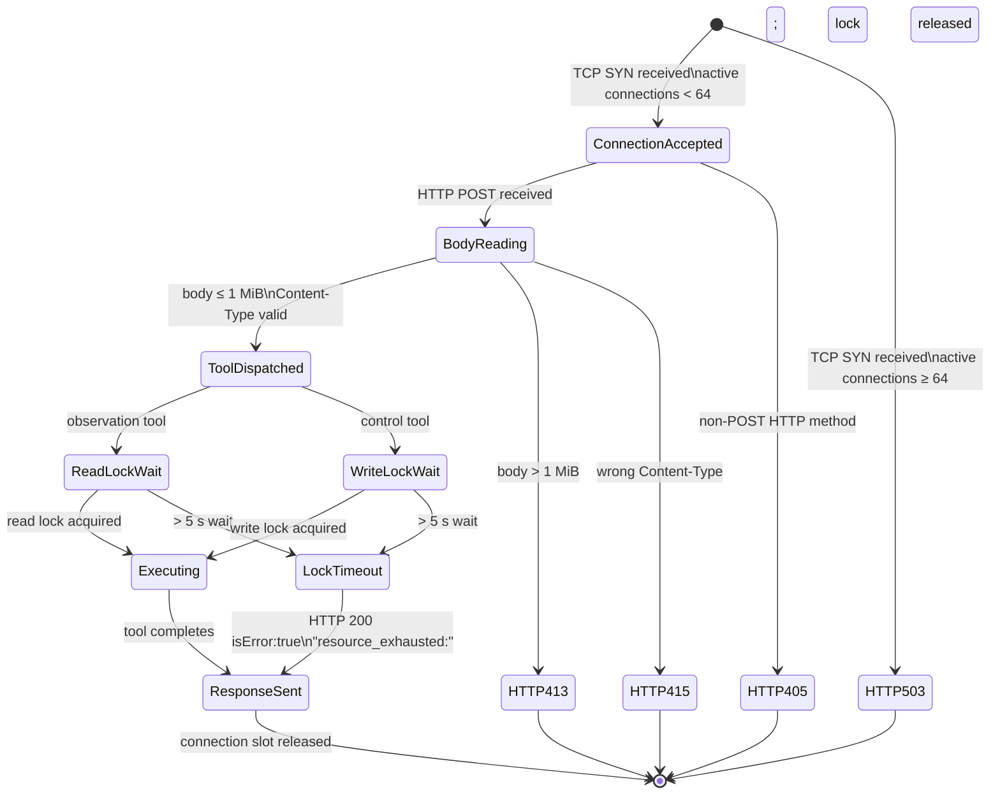
```mermaid
stateDiagram-v2
    [*] --> ConnectionAccepted : TCP SYN received\nactive connections < 64
    [*] --> HTTP503 : TCP SYN received\nactive connections ≥ 64
    ConnectionAccepted --> BodyReading : HTTP POST received
    ConnectionAccepted --> HTTP405 : non-POST HTTP method
    BodyReading --> ToolDispatched : body ≤ 1 MiB\nContent-Type valid
    BodyReading --> HTTP413 : body > 1 MiB
    BodyReading --> HTTP415 : wrong Content-Type
    ToolDispatched --> ReadLockWait : observation tool
    ToolDispatched --> WriteLockWait : control tool
    ReadLockWait --> Executing : read lock acquired
    ReadLockWait --> LockTimeout : > 5 s wait
    WriteLockWait --> Executing : write lock acquired
    WriteLockWait --> LockTimeout : > 5 s wait
    Executing --> ResponseSent : tool completes; lock released
    LockTimeout --> ResponseSent : HTTP 200 isError:true\n"resource_exhausted:"
    ResponseSent --> [*] : connection slot released
    HTTP503 --> [*]
    HTTP405 --> [*]
    HTTP413 --> [*]
    HTTP415 --> [*]
```

#### Dependencies for §3.6

| Component | Version / contract | Role |
|-----------|--------------------|------|
| `axum` | `0.7` | HTTP server for `/mcp/v1/call` endpoint |
| `tokio::sync::RwLock` | tokio `1.x` | Read/write lock; 5 s acquisition timeout via `tokio::time::timeout` |
| `tokio::sync::Semaphore` | tokio `1.x` | 64-connection slot counter enforced at acceptor level |
| `devs-core` types | internal | `WorkflowRun`, `StageRun`, `PoolState` serialisation |
| `serde_json` | `1.x` | JSON-RPC 2.0 envelope serialise/deserialise |
| `tower` | `0.4` | Middleware for body-size limiting and HTTP method gating |

**Edge cases for §3.6:**

1. **Write lock held for 4.9 s**: When a control tool (e.g., `submit_run`) holds the write lock for near the maximum 5 s, all concurrent observation calls queue. The 65th queued read lock acquisition times out at 5 s and returns `{"result":null,"error":"resource_exhausted: lock acquisition timed out after 5s"}`. This response MUST be HTTP 200 (MCP protocol; all tool responses are 200).
2. **Request body exactly at 1 MiB limit**: A request body of exactly 1 048 576 bytes (1 MiB) is accepted. A request body of 1 048 577 bytes receives HTTP 413 before deserialization begins.
3. **`inject_stage_input` on a Running stage**: This is rejected with `failed_precondition:` error. The rejection must be returned within p99 < 100 ms without acquiring a write lock on the stage's execution context.
4. **MCP server 64th concurrent connection**: The 64th simultaneous connection is accepted. The 65th receives HTTP 503 immediately (not after a timeout). This MUST be enforced at the connection acceptor level, not by exhausting a thread pool.
5. **`stream_logs follow:true` exceeding 30-minute lifetime**: At exactly the 30-minute mark, the server closes the stream with a final chunk. The client MUST NOT receive an error; the final chunk is the normal termination signal.

**Acceptance criteria for §3.6:**
- 64 concurrent `get_run` MCP calls all complete within 500 ms (maximum completion time across all 64 < 500 ms).
- 65th concurrent connection receives HTTP 503 immediately.
- Request body of 1 048 577 bytes receives HTTP 413 before handler is invoked.
- `stream_logs follow:true` on stage with 10 000 buffered lines delivers all within 5 000 ms.
- Write lock timeout returns structured `resource_exhausted:` error within 5 100 ms.

### 3.7 Presubmit Development Loop

**[PERF-047]** Individual step budget targets (Linux CI, from `target/presubmit_timings.jsonl`):

| Step | Target | Hard Limit |
|------|--------|------------|
| `setup` | ≤ 30 s | 60 s |
| `format` | ≤ 10 s | 20 s |
| `lint` (clippy + doc + audit) | ≤ 120 s | 180 s |
| `test` (unit + traceability) | ≤ 180 s | 270 s |
| `coverage` (llvm-cov) | ≤ 300 s | 420 s |
| `ci` (trigger + poll) | ≤ 180 s | 300 s |
| **Total** | **≤ 820 s** | **900 s** |

A step exceeding its target by more than 20% emits an `over_budget: true` entry in `target/presubmit_timings.jsonl` and a `WARN` to stderr. Exceeding the hard limit causes `./do presubmit` to exit non-zero.

The following Mermaid diagram shows the presubmit pipeline state machine, including the background timer:

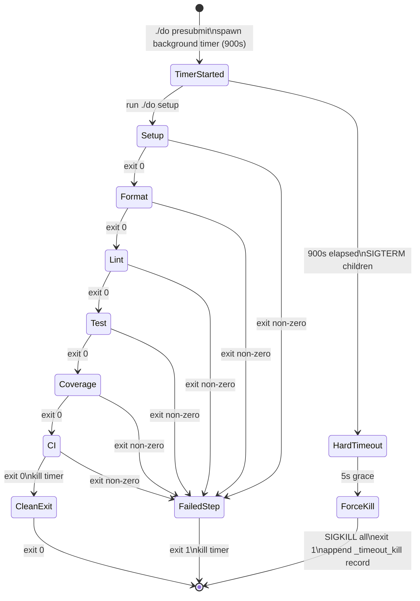
```mermaid
stateDiagram-v2
    [*] --> TimerStarted : ./do presubmit\nspawn background timer (900s)
    TimerStarted --> Setup : run ./do setup
    Setup --> Format : exit 0
    Format --> Lint : exit 0
    Lint --> Test : exit 0
    Test --> Coverage : exit 0
    Coverage --> CI : exit 0
    CI --> CleanExit : exit 0\nkill timer
    CleanExit --> [*] : exit 0

    Setup --> FailedStep : exit non-zero
    Format --> FailedStep : exit non-zero
    Lint --> FailedStep : exit non-zero
    Test --> FailedStep : exit non-zero
    Coverage --> FailedStep : exit non-zero
    CI --> FailedStep : exit non-zero
    FailedStep --> [*] : exit 1\nkill timer

    TimerStarted --> HardTimeout : 900s elapsed\nSIGTERM children
    HardTimeout --> ForceKill : 5s grace
    ForceKill --> [*] : SIGKILL all\nexit 1\nappend _timeout_kill record
```

#### Data Model

The `PresubmitTimingRecord` schema is defined normatively in §8.4 ([PERF-100]). Each step emits exactly one record immediately upon completion. The special `_timeout_kill` record (`"step": "_timeout_kill"`) is appended by the background timer subprocess when the 900 s wall-clock limit fires ([PERF-104]).

The `./do presubmit` script interface:

```
Usage:    ./do presubmit [--skip-ci] [--only <step>]
Exit codes:
  0 – all steps completed within their hard limits
  1 – at least one step exited non-zero or exceeded its hard limit
  2 – internal script error (e.g., timer subprocess could not be created)
Options:
  --skip-ci       omit the `ci` step (local development only; CI MUST NOT pass this flag)
  --only <step>   run a single named step; does not start the 900 s background timer
Environment variables:
  CI=true                    set by CI environments; enables macOS/Windows budget override
  DEVS_PRESUBMIT_NO_TIMER=1  disables the background 900 s timer (for script self-testing)
```

#### API Contract (Script Interface)

Sub-commands exposed by `./do` and their roles within `presubmit`:

```
./do setup    – install Rust toolchain; fetch crate dependencies; create target/ directories
./do format   – cargo fmt --check (non-mutating; safe in CI without write access)
./do lint     – cargo clippy + cargo doc --no-deps + cargo audit
./do test     – cargo test + traceability gate (produces target/traceability.json)
./do coverage – cargo llvm-cov + report generation (produces target/coverage/report.json)
./do ci       – trigger GitLab pipeline; poll until completion (up to 30 min)
./do presubmit – execute the above 6 steps in order with 900 s wall-clock guard
```

When invoked via `./do presubmit`, each sub-command writes a `PresubmitTimingRecord` to `target/presubmit_timings.jsonl` immediately upon completion. When invoked individually, sub-commands do NOT write to `presubmit_timings.jsonl`.

#### Business Rules

**[PERF-163]** The six presubmit steps MUST execute in fixed order: `setup → format → lint → test → coverage → ci`. No step MAY be skipped except `ci` (when `--skip-ci` is passed). No step MAY be parallelised with another. The fixed order ensures cheap validation (format) precedes expensive validation (lint, test), minimising developer feedback time when early steps fail.

**[PERF-164]** The 900 s background timer MUST be implemented as a separate OS-level subprocess (not a shell `sleep` in the same process group) so that it survives `SIGINT`/`SIGTERM` sent to the presubmit process itself. The timer PID MUST be written to `target/.presubmit_timer.pid` before the first step begins. On normal presubmit exit (success or step failure), the timer subprocess MUST be killed before the presubmit script exits.

**[PERF-165]** `./do setup` MUST check for and kill any stale timer process from a previous run: if `target/.presubmit_timer.pid` exists and the PID refers to a running process, that process MUST be killed before `setup` continues. This prevents a stale timer from killing an unrelated process that reuses the old PID after an unclean previous run.

#### Dependencies for §3.7

| Component | Version / contract | Role |
|-----------|--------------------|------|
| `cargo` | `1.77+` (Rust stable) | Build tool for all steps; `cargo fmt`, `cargo clippy`, `cargo test` |
| `cargo-llvm-cov` | `0.6+` | LLVM coverage instrumentation for `./do coverage` |
| `cargo-audit` | `0.20+` | Dependency vulnerability audit in `./do lint` |
| POSIX `sh` | system (`bash`-compatible) | Background timer subprocess; `sleep` and `kill` builtins |
| `git` | `2.x` | Used by `./do ci` for pipeline detection |
| GitLab CI API | GitLab SaaS | Polled by `./do ci` for pipeline completion (up to 30 min) |
| `./do test` traceability gate | internal | Verifies all `PERF-NNN` test annotations in `target/traceability.json` |

**Edge cases for §3.7:**

1. **Timer process outlives presubmit**: If `./do presubmit` exits successfully but fails to kill the background timer (e.g., due to a POSIX `sh` limitation), the timer MUST NOT trigger and kill a subsequent unrelated process. The timer PID is stored in `target/.presubmit_timer.pid`; `./do setup` cleans up stale timer files from previous runs.
2. **`./do coverage` produces zero `.profraw` files**: If `cargo llvm-cov` runs but no E2E profile data is found, `./do coverage` emits an error and exits non-zero before writing `target/coverage/report.json`. This failure is captured in `presubmit_timings.jsonl` with a non-zero `exit_code`.
3. **macOS / Windows step timing variance**: On macOS and Windows runners, step durations may exceed Linux targets due to slower I/O and compilation. The step targets in the table above apply to Linux CI only. macOS and Windows CI have a combined hard limit of **25 minutes** (1 500 s) rather than 900 s.
4. **`./do ci` GitLab polling timeout**: `./do ci` polls the GitLab pipeline for up to 30 minutes. If the pipeline does not complete within 30 minutes, `./do ci` exits non-zero. This counts against the `ci` step hard limit of 300 s for the triggering step only; the 30-minute poll timeout is a separate GitLab constraint outside the 900 s wall clock.
5. **Stale `target/presubmit_timings.jsonl`**: If `target/presubmit_timings.jsonl` exists from a previous run, `./do presubmit` appends to it (does not overwrite). Each run produces a self-contained set of step records identifiable by `started_at` timestamps. CI artifact upload captures the full file.

**Acceptance criteria for §3.7:**
- `./do presubmit` completes on Linux CI within 900 s (hard wall-clock limit).
- `target/presubmit_timings.jsonl` is written; each step has a well-formed JSON record with all required fields.
- `over_budget: true` entry emits a `WARN` to stderr.
- `./do presubmit` exits non-zero when any step exceeds its hard limit.
- `_timeout_kill` record appended when presubmit is killed by the 900 s timer.

---

## 4. Throughput & Concurrency Targets

### 4.0 Dependencies & Shared Data Models

**Dependencies**

| Ref | Source | Relationship |
|-----|--------|--------------|
| GOAL-001 | PRD | Section 4 targets are derived from the primary throughput goal |
| 2_PRD-BR-004 | PRD | Pool `max_concurrent` is a hard scheduling constraint, not advisory |
| 2_TAS-REQ-002n | TAS | DAG stage count upper bound: 256 |
| 2_TAS-REQ-002p | TAS | Fan-out `count` upper bound: 64 |
| 2_TAS-REQ-002q | TAS | Semaphore `max_concurrent` range: 1–1 024 |
| MCP-BR-040 | MCP Design | Write-lock 5 s timeout governs §4.4 serialization |
| MCP-BR-041 | MCP Design | 64-connection cap governs §4.4 connection limit |
| MCP-BR-042 | MCP Design | `try_send()` non-blocking dispatch governs §4.5 |
| SEC-MCP-001–009 | Security Design | SSRF check must precede every webhook delivery attempt |

**`ThroughputMeasurement` schema** — canonical record emitted by the benchmarking subsystem:

| Field | Type | Constraints | Description |
|-------|------|-------------|-------------|
| `measurement_id` | `UUIDv4` | required, unique | Identifies this benchmark run |
| `subsystem` | `string` | one of: `pool`, `dag`, `grpc`, `mcp`, `webhook`, `scheduler` | Target subsystem |
| `metric` | `string` | non-empty, snake_case | e.g. `dispatch_latency_ms` |
| `value` | `f64` | finite, ≥ 0 | Measured value |
| `unit` | `string` | SI unit or `count` | e.g. `ms`, `rps`, `count` |
| `measured_at` | `RFC3339` | required | Measurement wall-clock time (UTC) |
| `sample_count` | `u32` | ≥ 100 | Sample size for statistical validity |
| `p50` | `f64` | finite, ≥ 0 | 50th-percentile value |
| `p99` | `f64` | finite, ≥ p50 | 99th-percentile value |
| `labels` | `map<string,string>` | optional, ≤ 16 entries | Dimensions (pool_name, project_id, …) |

**`PoolState` schema** — returned by `get_pool_state` MCP tool and used in §4.1/§4.2:

| Field | Type | Constraints | Description |
|-------|------|-------------|-------------|
| `pool_name` | `string` | non-empty | Matches configuration key |
| `max_concurrent` | `u32` | 1–1 024 | Hard semaphore permit count |
| `active_count` | `u32` | 0–`max_concurrent` | Permits currently held |
| `queued_count` | `u32` | ≥ 0 | Stages waiting for a permit |
| `available_count` | `u32` | = `max_concurrent - active_count` | Free permits |
| `exhausted` | `bool` | derived | True when all agents rate-limited |
| `agents` | `AgentRuntimeState[]` | length 1–1 024 | Per-agent status |
| `snapshot_at` | `RFC3339` | required | Time the snapshot was taken |
| `pty_available` | `bool` | derived | True when ≥ 1 agent supports PTY |

**`AgentRuntimeState` schema**:

| Field | Type | Constraints | Description |
|-------|------|-------------|-------------|
| `tool` | `string` | non-empty | Agent binary path or built-in name |
| `capabilities` | `string[]` | ≥ 0 entries | Advertised capability tags |
| `fallback` | `bool` | — | Whether this agent is a fallback |
| `pty` | `bool` | — | Whether PTY is configured |
| `pty_active` | `bool` | — | Whether a PTY session is live |
| `rate_limited_until` | `RFC3339 \| null` | null when not rate-limited | Cooldown expiry |
| `active_dispatches` | `u32` | ≥ 0 | Number of stages this agent is running |

**Scheduler channel capacity model**:

| Channel | Type | Buffer | Producer | Consumer | Overflow policy |
|---------|------|--------|----------|----------|-----------------|
| `stage_complete_tx` | `mpsc` | 256 | Agent exit handler | DAG scheduler | Bounded; sender blocks (backpressure) |
| `webhook_tx` | `mpsc` | 1 024 | Engine state transitions | Webhook dispatcher | `try_send()`; drop + WARN on full |
| `cancel_tx` | `mpsc` | 256 | MCP `cancel_run` handler | Run executor | Bounded; sender blocks |
| `pool_event_tx` | `mpsc` | 64 | Pool state transitions | Event fanout | Bounded; sender blocks |
| `tui_event_tx` | `mpsc` | 256 | All engine subsystems | TUI render loop | Bounded; sender blocks |
| `run_event_tx` | `broadcast` | 256 per run | Run state machine | All stream subscribers | Lag: oldest dropped; snapshot on reconnect |

**Business rules (§4.0)**

- **PERF-BR-400**: Every `ThroughputMeasurement` record with `sample_count < 100` MUST be rejected by the benchmarking harness at ingestion time with error `"insufficient_samples"`.
- **PERF-BR-401**: `p99 >= p50` is a hard invariant on every `ThroughputMeasurement`; a record violating this MUST NOT be committed to the measurement store.
- **PERF-BR-402**: `PoolState.available_count` MUST equal `max_concurrent - active_count` at every observable point. Any divergence is a scheduler invariant violation and MUST be logged at `ERROR` level.
- **PERF-BR-403**: `PoolState.exhausted` MUST be `true` if and only if every agent in `agents[]` has a non-null `rate_limited_until` that is in the future at `snapshot_at`.
- **PERF-BR-404**: The lock acquisition order `SchedulerState → PoolState → CheckpointStore` MUST be enforced globally. Any code path acquiring `PoolState` before releasing `SchedulerState` MUST be rejected in code review and caught by deadlock detection tests.
- **PERF-BR-405**: `stage_complete_tx` buffer size MUST be ≥ the maximum workflow stage count (256). Reducing this constant below 256 MUST fail CI via a compile-time `const_assert!`.
- **PERF-BR-406**: `webhook_tx` buffer size MUST be ≥ 1 024. Reducing this constant below 1 024 MUST fail CI via a compile-time `const_assert!`.
- **PERF-BR-407**: `run_event_tx` (broadcast) lagging receiver MUST receive a synthetic `run.snapshot` event on reconnect; the snapshot MUST reflect the current authoritative run state at reconnect time.
- **PERF-BR-408**: No synchronous I/O operation is permitted on the Tokio async executor thread pool. All filesystem and network I/O MUST use `tokio::fs` or `tokio::net` equivalents; blocking I/O MUST be dispatched to `tokio::task::spawn_blocking`.

---

### 4.1 Agent Pool Concurrency

**[PERF-048]** The pool semaphore must sustain **`max_concurrent` simultaneous active agents** across all projects without deadlock, starvation (except as governed by strict-priority scheduling), or semaphore permit leak. A pool configured with `max_concurrent = 64` must be able to maintain 64 concurrently running agents.

**[PERF-049]** A fan-out stage with `count = 64` and a pool with `max_concurrent = 4` must result in exactly 4 dispatched sub-agents and 60 queued sub-agents (`active_count == 4`, `queued_count == 60`) as verified by `get_pool_state`.

**[PERF-050]** Pool agent selection algorithm (capability filter + semaphore acquire, slot immediately available): completes in **O(N)** time where N is the number of agents in the pool. For a pool of 1 024 agents, selection must complete within **p99 < 5 ms**.

**Semaphore permit lifecycle** (full path including capability and rate-limit checks):

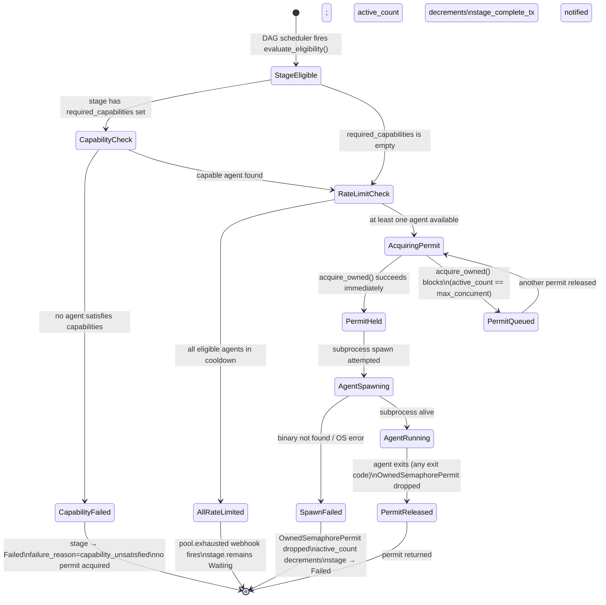
```mermaid
stateDiagram-v2
    [*] --> StageEligible : DAG scheduler fires evaluate_eligibility()
    StageEligible --> CapabilityCheck : stage has required_capabilities set
    StageEligible --> RateLimitCheck : required_capabilities is empty
    CapabilityCheck --> CapabilityFailed : no agent satisfies capabilities
    CapabilityCheck --> RateLimitCheck : capable agent found
    CapabilityFailed --> [*] : stage → Failed\nfailure_reason=capability_unsatisfied\nno permit acquired
    RateLimitCheck --> AllRateLimited : all eligible agents in cooldown
    RateLimitCheck --> AcquiringPermit : at least one agent available
    AllRateLimited --> [*] : pool.exhausted webhook fires\nstage remains Waiting
    AcquiringPermit --> PermitHeld : acquire_owned() succeeds immediately
    AcquiringPermit --> PermitQueued : acquire_owned() blocks\n(active_count == max_concurrent)
    PermitQueued --> AcquiringPermit : another permit released
    PermitHeld --> AgentSpawning : subprocess spawn attempted
    AgentSpawning --> SpawnFailed : binary not found / OS error
    SpawnFailed --> [*] : OwnedSemaphorePermit dropped\nactive_count decrements\nstage → Failed
    AgentSpawning --> AgentRunning : subprocess alive
    AgentRunning --> PermitReleased : agent exits (any exit code)\nOwnedSemaphorePermit dropped
    PermitReleased --> [*] : permit returned; active_count decrements\nstage_complete_tx notified
```

**Rate-limit cooldown lifecycle**:

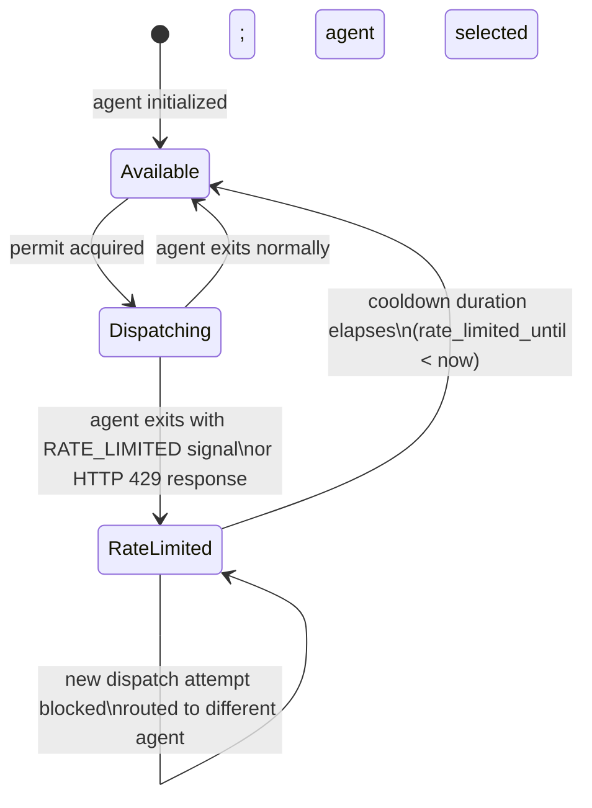
```mermaid
stateDiagram-v2
    [*] --> Available : agent initialized
    Available --> Dispatching : permit acquired; agent selected
    Dispatching --> RateLimited : agent exits with RATE_LIMITED signal\nor HTTP 429 response
    Dispatching --> Available : agent exits normally
    RateLimited --> Available : cooldown duration elapses\n(rate_limited_until < now)
    RateLimited --> RateLimited : new dispatch attempt blocked\nrouted to different agent
```

**Business rules (§4.1)**

- **PERF-BR-410**: `OwnedSemaphorePermit` MUST be dropped on every exit path from the dispatch function, including: successful agent exit, failed agent spawn, cancellation, and panic unwind. A `drop_permit_guard` RAII wrapper MUST be used.
- **PERF-BR-411**: `active_count + queued_count + available_count == max_concurrent + queued_count` at all times. Equivalently, `active_count ≤ max_concurrent` and `available_count = max_concurrent - active_count`.
- **PERF-BR-412**: Capability check MUST complete before any semaphore `acquire_owned()` call. A stage that fails capability check MUST NOT touch the semaphore.
- **PERF-BR-413**: Rate-limit check MUST occur after capability filtering. If all capability-satisfying agents are rate-limited, the semaphore MUST NOT be acquired; the stage MUST remain in `Waiting` state and be re-evaluated after the shortest `rate_limited_until` elapses.
- **PERF-BR-414**: The `pool.exhausted` webhook MUST fire at most once per pool-exhaustion event (i.e., the transition from ≥ 1 available agent to 0 available agents). Subsequent dispatch attempts while still exhausted MUST NOT re-fire the webhook.
- **PERF-BR-415**: A pool with `max_concurrent = 1` MUST NOT use any special-case code path. The general semaphore path with 1 permit MUST handle serialization correctly.
- **PERF-BR-416**: Fan-out expansion to `count` sub-stages is atomic with respect to `queued_count`: all `count` sub-stages MUST be inserted into the queue before any permit acquisition begins, ensuring `get_pool_state` never observes a partially-expanded fan-out.
- **PERF-BR-417**: Pool selection for a 1 024-agent pool with all agents capable and available MUST complete within p99 < 5 ms as measured by the benchmarking subsystem with `sample_count ≥ 100`.

**Edge cases (§4.1)**

1. **Permit leak on agent spawn failure**: If `tokio::process::Command::spawn()` returns `Err`, the `OwnedSemaphorePermit` guard MUST drop before the error is propagated. Verified by: asserting `active_count` returns to 0 after a spawn failure with `max_concurrent = 1`.
2. **Pool `max_concurrent = 1` serialization**: Fan-out `count = 10` with `max_concurrent = 1`: at the moment the 2nd sub-stage attempts acquisition, `get_pool_state` must return `active_count = 1`, `queued_count = 9`. No sub-stage skips the queue.
3. **Rate-limited agents vs. semaphore**: A pool of 4 agents where 3 are rate-limited has effective agent availability of 1, but the semaphore still has `max_concurrent` permits. If `max_concurrent = 4` and only 1 agent is available, at most 1 stage can be actively running (routed to the available agent); the other 3 permits are technically acquirable but no agent can service them. PERF-BR-413 prevents acquiring a permit when all routable agents are rate-limited — semaphore and rate-limit states are independent constraints, both of which must be satisfied.
4. **Empty `required_capabilities`**: A stage with `required_capabilities: []` skips capability filtering entirely and proceeds directly to the rate-limit check. This MUST NOT short-circuit the `PERF-BR-412` ordering; an empty set means "any agent is capable."
5. **All agents have equal weights in WFQ**: When `weight = 1` for all projects, virtual time advances by 1.0 per dispatch for every project. The scheduler degenerates to FIFO across projects by eligibility arrival time, which MUST NOT starve any project with eligible stages.
6. **Pool referenced by stage does not exist at dispatch time**: If the pool named by a stage's `pool` field is absent from the live pool registry (e.g., removed via hot-reload), the stage transitions immediately to `Failed` with `failure_reason: "pool_not_found"`. This is a `CRITICAL` invariant violation; the scheduler logs `ERROR` and continues processing other stages.
7. **Fan-out `count = 1024` with `max_concurrent = 1`**: `queued_count` reaches 1 023 while `active_count = 1`. The `stage_complete_tx` channel buffer (256) is not sufficient to batch all completions simultaneously; completions MUST be processed one at a time via backpressure. No deadlock occurs.

**Acceptance criteria (§4.1)**

| ID | Assertion | Method |
|----|-----------|--------|
| AC-PERF-4.1-001 | Fan-out `count=64`, `max_concurrent=4`: `active_count==4`, `queued_count==60` within 500 ms of dispatch | E2E test; `get_pool_state` poll |
| AC-PERF-4.1-002 | Failed agent spawn (binary not found): `active_count` returns to prior value within 100 ms | Unit test with mock process spawner |
| AC-PERF-4.1-003 | `pool.exhausted` webhook fires exactly once when all agents enter rate-limit cooldown simultaneously | E2E test; webhook capture |
| AC-PERF-4.1-004 | Capability-unsatisfied stage reaches `Failed` in p99 < 50 ms; `get_pool_state active_count` unchanged | Unit test; timing assertion |
| AC-PERF-4.1-005 | `max_concurrent=1`, fan-out `count=10`: `active_count==1`, `queued_count==9` observed immediately | E2E test |
| AC-PERF-4.1-006 | Pool of 1 024 agents; all capable and available: agent selection p99 < 5 ms over 100 samples | Micro-benchmark; `ThroughputMeasurement` recorded |
| AC-PERF-4.1-007 | `available_count = max_concurrent - active_count` holds true for all `get_pool_state` responses across a 60-second soak | Invariant assertion in E2E soak test |
| AC-PERF-4.1-008 | `compile_time`: `const_assert!(STAGE_COMPLETE_CHANNEL_BUFFER >= 256)` passes in CI | Compile-time test |

---

### 4.2 Parallel Stage Dispatch

**[PERF-051]** A workflow with 100 parallel eligible stages and a pool with `max_concurrent = 100` must complete dispatch of all 100 stages within **1 000 ms** of the run starting.

**[PERF-052]** The DAG scheduler must handle workflows with up to **256 stages** without degradation in dispatch latency beyond the p99 targets defined in §3.2.

**DAG eligibility evaluation algorithm** (non-normative Rust illustration):

```rust
// Called inside the SchedulerState write-lock after each stage_complete event.
// O(V + E) where V = stage count, E = total dependency edges.
fn evaluate_eligibility(state: &mut SchedulerState) -> Vec<StageId> {
    let mut newly_eligible = Vec::new();
    for stage in state.stages.values() {
        if stage.status != StageStatus::Waiting { continue; }
        let all_deps_complete = stage.depends_on.iter()
            .all(|dep_id| state.stages[dep_id].status == StageStatus::Completed);
        if all_deps_complete {
            newly_eligible.push(stage.id);
        }
    }
    newly_eligible
}
// Dispatch loop runs outside the write-lock: permit acquisition is async.
```

**Multi-stage parallel dispatch sequence** (100 stages, `max_concurrent = 100`):

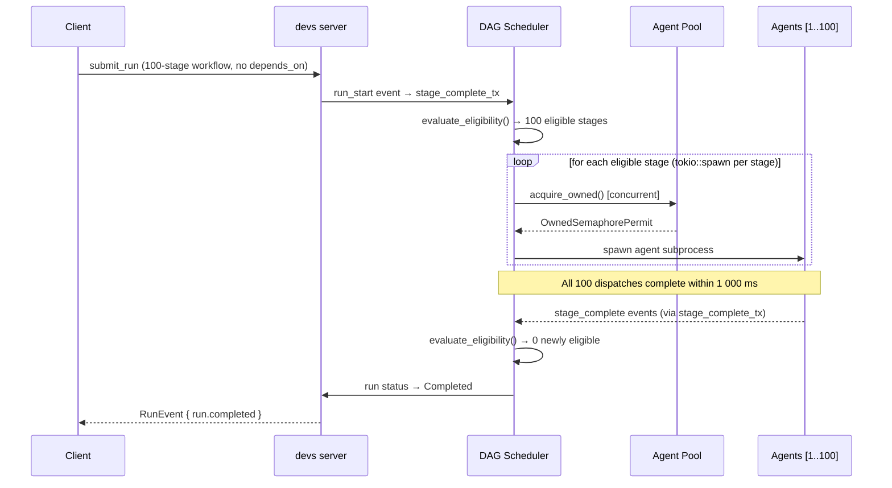
```mermaid
sequenceDiagram
    participant Client
    participant Server as devs server
    participant Sched as DAG Scheduler
    participant Pool as Agent Pool
    participant Agents as Agents [1..100]

    Client->>Server: submit_run (100-stage workflow, no depends_on)
    Server->>Sched: run_start event → stage_complete_tx
    Sched->>Sched: evaluate_eligibility() → 100 eligible stages
    loop for each eligible stage (tokio::spawn per stage)
        Sched->>Pool: acquire_owned() [concurrent]
        Pool-->>Sched: OwnedSemaphorePermit
        Sched->>Agents: spawn agent subprocess
    end
    Note over Sched,Agents: All 100 dispatches complete within 1 000 ms
    Agents-->>Sched: stage_complete events (via stage_complete_tx)
    Sched->>Sched: evaluate_eligibility() → 0 newly eligible
    Sched->>Server: run status → Completed
    Server-->>Client: RunEvent { run.completed }
```

**Business rules (§4.2)**

- **PERF-BR-420**: `evaluate_eligibility()` MUST be called inside the `SchedulerState` write-lock and MUST NOT perform I/O. Its complexity MUST be O(V+E) where V is stage count and E is total dependency edge count.
- **PERF-BR-421**: Each eligible stage MUST be dispatched in a separate `tokio::spawn` task. Dispatch MUST NOT be sequential (i.e., waiting for stage N's permit before attempting stage N+1's permit). All permit acquisitions for a batch of newly-eligible stages MUST be initiated concurrently.
- **PERF-BR-422**: The `SchedulerState` write-lock MUST be released before any `acquire_owned()` call. Holding the write-lock during permit acquisition creates a deadlock path (lock inversion with `PoolState`).
- **PERF-BR-423**: `stage_complete_tx` (`mpsc`, buffer 256) MUST NOT block the agent exit handler. If the channel is full (all 256 slots occupied), the agent exit handler MUST NOT deadlock; it MUST use `try_send()` and log a `WARN` if the channel is full, then retry with bounded back-off.
- **PERF-BR-424**: A workflow with 0 stages MUST be rejected at `submit_run` time with gRPC `INVALID_ARGUMENT "workflow has no stages"`. The DAG scheduler MUST NOT receive a 0-stage run.

**Edge cases (§4.2)**

1. **256 stages, all eligible simultaneously**: `max_concurrent = 256`; all 256 `acquire_owned()` calls are concurrent via `tokio::spawn`. Dispatch of all 256 must complete within 2 000 ms. The `stage_complete_tx` channel buffer (256) is exactly sufficient to buffer all completions in the worst case.
2. **Stage references non-existent pool at dispatch time**: Pool was valid at `submit_run` but removed during hot-reload. Stage transitions to `Failed` with `failure_reason: "pool_not_found"`. A `CRITICAL` invariant violation is logged. The scheduler evaluates `evaluate_eligibility()` for remaining stages; the run may still complete if other stages succeed.
3. **`stage_complete_tx` channel full at 256 events**: 256 agents exit simultaneously. All 256 `try_send()` calls succeed because the buffer is exactly 256. A 257th simultaneous completion blocks (backpressure); the 257th agent exit handler waits until the scheduler drains one slot. No deadlock because the scheduler always drains `stage_complete_tx` before acquiring any other lock.
4. **256-stage linear chain (chain DAG)**: Stage N depends on stage N-1. Each `evaluate_eligibility()` call finds exactly 1 newly-eligible stage. Dispatch overhead is 256 sequential evaluations; total dispatch latency is bounded by `256 × p99_single_dispatch` (not by the 1 000 ms parallel target). Linear chains are not subject to PERF-051.
5. **Concurrent completions racing `evaluate_eligibility()`**: Two stage completions arrive simultaneously on `stage_complete_tx`. The scheduler processes them sequentially (channel is FIFO). `evaluate_eligibility()` after the 2nd event returns stages that became eligible due to both completions. No stage is dispatched twice.
6. **Zero-stage workflow rejected at submission**: `submit_run` with a workflow definition containing `stages: []` returns `INVALID_ARGUMENT`. The DAG scheduler is never invoked. Verified by: submitting a zero-stage workflow and asserting the gRPC error code.

**Acceptance criteria (§4.2)**

| ID | Assertion | Method |
|----|-----------|--------|
| AC-PERF-4.2-001 | 100-stage workflow, `max_concurrent=100`: all stages reach `Running` within 1 000 ms of `submit_run` | E2E timing test |
| AC-PERF-4.2-002 | 256-stage workflow, `max_concurrent=256`: all stages reach `Running` within 2 000 ms | E2E timing test |
| AC-PERF-4.2-003 | `stage_complete_tx` does not overflow for 256 simultaneous completions | Unit test; channel capacity assertion |
| AC-PERF-4.2-004 | Stage with `pool_not_found` at dispatch time: stage reaches `Failed` within 200 ms; other stages unaffected | Unit test with mock pool registry |
| AC-PERF-4.2-005 | Zero-stage workflow: `submit_run` returns `INVALID_ARGUMENT`; DAG scheduler receives no event | Unit test |
| AC-PERF-4.2-006 | `evaluate_eligibility()` is never called while `SchedulerState` write-lock is NOT held (proven by lock-order test) | Unit test using lock-order assertions |

---

### 4.3 gRPC Server Throughput

**[PERF-053]** The gRPC server sustains at least **50 concurrent client connections** (TUI + CLI + gRPC-based agents) without degrading unary RPC latency beyond 2× the p50 targets in the SLO table.

**[PERF-054]** `StreamRunEvents` per-client event buffer holds 256 messages. Under a burst of 256 state-change events, no event must be dropped for a connected client within the first 256 events. After buffer saturation, oldest messages are dropped with a `WARN` log.

**Per-client `StreamRunEvents` buffer model**:

| Field | Type | Constraints | Description |
|-------|------|-------------|-------------|
| `run_id` | `UUIDv4` | required | The run being streamed |
| `client_id` | `string` | derived from connection metadata | Identifies the subscriber |
| `buffer_capacity` | `u32` | = 256 | `broadcast::channel` capacity |
| `lag_count` | `u32` | ≥ 0 | Events dropped since last reconnect |
| `connected_at` | `RFC3339` | required | Time subscription was established |
| `last_message_at` | `RFC3339 \| null` | null if no messages yet | Last event delivery time |

**Version check interceptor sequence** (applied to every RPC):

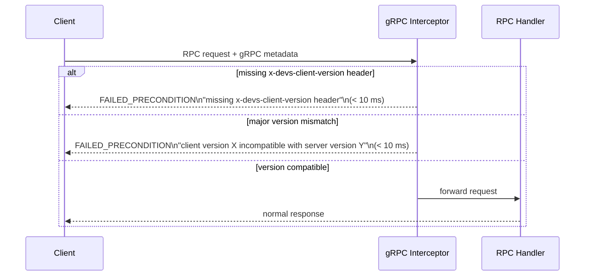
```mermaid
sequenceDiagram
    participant Client
    participant Interceptor as gRPC Interceptor
    participant Handler as RPC Handler

    Client->>Interceptor: RPC request + gRPC metadata
    alt missing x-devs-client-version header
        Interceptor-->>Client: FAILED_PRECONDITION\n"missing x-devs-client-version header"\n(< 10 ms)
    else major version mismatch
        Interceptor-->>Client: FAILED_PRECONDITION\n"client version X incompatible with server version Y"\n(< 10 ms)
    else version compatible
        Interceptor->>Handler: forward request
        Handler-->>Client: normal response
    end
```

**Business rules (§4.3)**

- **PERF-BR-430**: The gRPC server MUST accept at least 50 simultaneous client connections. Connections 51+ are not rejected by the server; Tonic's default connection limit applies (OS-level backlog). The SLO target (2× p50 latency) applies when exactly 50 connections are active.
- **PERF-BR-431**: `stream_logs follow:true` MUST NOT hold the `SchedulerState` read-lock across `await` points. Log delivery MUST use the `broadcast::Receiver<RunEvent>` channel exclusively, allowing the scheduler to proceed without waiting for slow log consumers.
- **PERF-BR-432**: On `broadcast::Receiver` lag (oldest event dropped), the subscriber MUST receive a synthetic `run.snapshot` event upon the next reconnect. The snapshot MUST reflect the authoritative run state at reconnect time, not the state at the time of the dropped event.
- **PERF-BR-433**: The `x-devs-client-version` gRPC metadata header MUST be checked by an interceptor that runs before any handler logic. The check MUST complete within p99 < 10 ms. Header parsing MUST NOT allocate on the hot path for a well-formed header.
- **PERF-BR-434**: `StreamRunEvents` events MUST be ordered by `sequence_number` (monotonically increasing per run). A subscriber that receives events out of sequence indicates a scheduler invariant violation and MUST log `ERROR`.

**Edge cases (§4.3)**

1. **Client version mismatch (major version)**: Client sends `x-devs-client-version: 2.0.0` when server is `1.x.x`. All RPCs for that connection return `FAILED_PRECONDITION` immediately. The interceptor does not log at `WARN` for the first mismatch per connection; it logs at `INFO` (version mismatch is expected during rolling upgrades).
2. **Missing `x-devs-client-version` header**: A raw gRPC client (e.g., `grpcurl` without `-H`) sends no version header. Response: `FAILED_PRECONDITION "missing x-devs-client-version header"` within p99 < 10 ms. No handler code runs. Logged at `DEBUG` (non-actionable for the server operator).
3. **`broadcast` buffer overflow (256 events)**: A subscriber that stalls (e.g., slow TUI render loop) while the run produces > 256 state-change events. The 257th event evicts the oldest from the broadcast ring. The subscriber receives `RecvError::Lagged(N)` on its next `recv()`. The subscriber MUST immediately call `StreamRunEvents` again; the server sends `run.snapshot` as the first event of the new stream.
4. **50 concurrent `StreamRunEvents` subscribers for the same run**: All 50 share the same `broadcast::Sender<RunEvent>`. Each subscriber has its own `Receiver`. An event published to the sender is cloned 50 times (one per `Receiver`). The `broadcast::channel` capacity of 256 must accommodate the slowest subscriber's lag without dropping events for the fastest subscribers.
5. **Maximum gRPC frame size exceeded**: A stage output payload exceeds the gRPC max message size (default 4 MiB). The server returns `RESOURCE_EXHAUSTED "message too large"`. The client must handle this gracefully and retry with `GetStageOutput` using pagination if supported.
6. **Mid-stream client disconnect during `stream_logs follow:true`**: The client closes the TCP connection while the server is in the follow loop. The server detects the closed connection via `send().await` returning `Err`. The server MUST clean up the `broadcast::Receiver` and exit the stream task without affecting the run's execution.

**Acceptance criteria (§4.3)**

| ID | Assertion | Method |
|----|-----------|--------|
| AC-PERF-4.3-001 | 50 concurrent gRPC connections: unary RPC p50 latency ≤ 2× single-connection p50 | Load test; `ThroughputMeasurement` |
| AC-PERF-4.3-002 | 256-event burst: all events delivered to a connected subscriber without drop | Unit test; event counting |
| AC-PERF-4.3-003 | 257th event causes `RecvError::Lagged`; subscriber receives `run.snapshot` on reconnect | Unit test; broadcast channel simulation |
| AC-PERF-4.3-004 | Version-mismatch header: `FAILED_PRECONDITION` within 10 ms p99 | Timing unit test |
| AC-PERF-4.3-005 | Missing version header: `FAILED_PRECONDITION "missing x-devs-client-version header"` | Unit test |
| AC-PERF-4.3-006 | `stream_logs follow:true` does not hold `SchedulerState` lock across any `.await` point | Code review + lock-order test |
| AC-PERF-4.3-007 | Mid-stream client disconnect: server stream task exits cleanly; no resource leak (verified via metrics) | E2E test with forced TCP reset |

---

### 4.4 MCP HTTP Throughput

**[PERF-055]** The MCP HTTP server handles at least **64 simultaneous connections** without returning HTTP 503. The 65th concurrent connection must receive HTTP 503 rather than hanging indefinitely.

**[PERF-056]** Control tool throughput (serialized via write locks): at least **5 `submit_run` calls per second** sustained for 10 seconds without server-side error (duplicate names produce `ALREADY_EXISTS`, which is not a server error).

**Connection limit model** — `Arc<AtomicU32>` counter governs admission:

| Event | Counter change | HTTP response |
|-------|---------------|---------------|
| New connection accepted; counter < 64 | `fetch_add(1, SeqCst)` | Request proceeds |
| New connection accepted; counter = 64 | No change | HTTP 503 `{"error":"connection_limit_exceeded"}` |
| Request completes (any status) | `fetch_sub(1, SeqCst)` | — |
| `stream_logs follow:true` active | Counter held at +1 for stream duration | — |
| Handler panic (caught by middleware) | `fetch_sub(1, SeqCst)` in panic handler | HTTP 500 |

**Write-lock serialization model** — operations that acquire the `SchedulerState` write-lock:

| Tool category | Lock type | Max concurrency | Timeout |
|---------------|-----------|-----------------|---------|
| `submit_run`, `cancel_run`, `inject_stage_input` | `SchedulerState` write | 1 (serialized) | 5 s |
| `get_run`, `list_runs`, `get_pool_state` | `SchedulerState` read | Unlimited (readers concurrent) | 1 s |
| `stream_logs follow:false` | `SchedulerState` read (snapshot only) | Unlimited | 1 s |
| `stream_logs follow:true` | No lock held during stream | Unlimited | N/A |
| `assert_stage_output` | `SchedulerState` write | 1 (serialized) | 5 s |

**MCP dispatcher request sequence** (control tool, write-lock path):

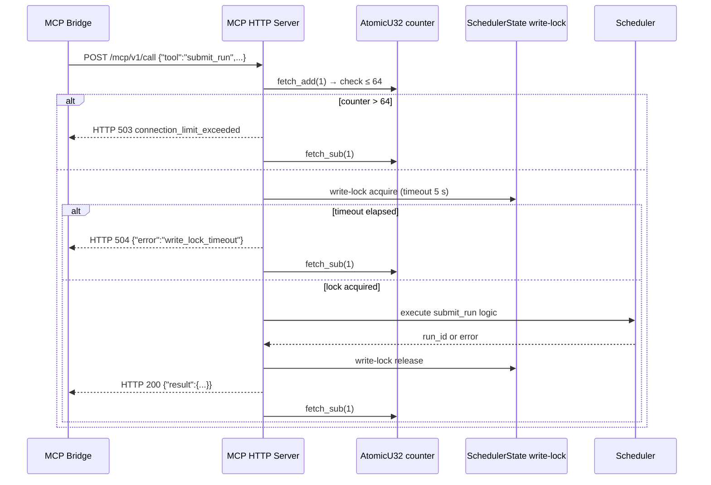
```mermaid
sequenceDiagram
    participant Bridge as MCP Bridge
    participant Server as MCP HTTP Server
    participant Counter as AtomicU32 counter
    participant Lock as SchedulerState write-lock
    participant Sched as Scheduler

    Bridge->>Server: POST /mcp/v1/call {"tool":"submit_run",...}
    Server->>Counter: fetch_add(1) → check ≤ 64
    alt counter > 64
        Server-->>Bridge: HTTP 503 connection_limit_exceeded
        Server->>Counter: fetch_sub(1)
    else
        Server->>Lock: write-lock acquire (timeout 5 s)
        alt timeout elapsed
            Server-->>Bridge: HTTP 504 {"error":"write_lock_timeout"}
            Server->>Counter: fetch_sub(1)
        else lock acquired
            Server->>Sched: execute submit_run logic
            Sched-->>Server: run_id or error
            Server->>Lock: write-lock release
            Server-->>Bridge: HTTP 200 {"result":{...}}
            Server->>Counter: fetch_sub(1)
        end
    end
```

**Business rules (§4.4)**

- **PERF-BR-440**: The `Arc<AtomicU32>` connection counter MUST use `SeqCst` ordering for both `fetch_add` and `fetch_sub` to prevent reordering that could allow counter > 64. Relaxed ordering is not permitted for this counter.
- **PERF-BR-441**: The HTTP 503 response for connection-limit-exceeded MUST be sent synchronously (no async delay). The connection MUST be closed immediately after the 503 response is written.
- **PERF-BR-442**: A write-lock acquisition that exceeds 5 seconds MUST time out and return HTTP 504 with body `{"error":"write_lock_timeout","tool":"<tool_name>"}`. The lock MUST NOT be held after the timeout.
- **PERF-BR-443**: Read-lock operations (`get_run`, `list_runs`, `get_pool_state`, `stream_logs follow:false` snapshot) MUST NOT block on write-lock holders beyond 1 second. If a write-lock holder exceeds 1 s, the read operation returns HTTP 504.
- **PERF-BR-444**: `stream_logs follow:true` MUST NOT acquire any `SchedulerState` lock after the initial snapshot read. Log lines are delivered via `broadcast::Receiver`; the HTTP connection is held open without lock contention.
- **PERF-BR-445**: Non-`POST` methods on `/mcp/v1/call` MUST return HTTP 405 within p99 < 10 ms. The response MUST include `Allow: POST` header. No business logic executes; no connection counter slot is consumed beyond the request duration.
- **PERF-BR-446**: Wrong `Content-Type` (not `application/json`) on a POST to `/mcp/v1/call` MUST return HTTP 415 within p99 < 10 ms. No write-lock is acquired.

**Edge cases (§4.4)**

1. **`stream_logs follow:true` holds a connection slot for up to 30 minutes**: A single log-streaming connection occupies 1 of 64 slots. If 64 clients open `stream_logs follow:true` simultaneously, the 65th `follow:true` request receives HTTP 503. Non-streaming requests to other tools are also affected. This is intentional (PERF-BR-440 is unconditional).
2. **Non-`POST` method on `/mcp/v1/call`**: `GET /mcp/v1/call` returns HTTP 405 `{"error":"method_not_allowed","allowed":["POST"]}` within 10 ms. The connection counter is still incremented (the connection exists) and decremented on response. The slot is not "wasted" because the response is immediate.
3. **Wrong `Content-Type`**: `POST /mcp/v1/call` with `Content-Type: text/plain` returns HTTP 415. No JSON parsing occurs. The write-lock is not acquired. The connection counter slot is held for the duration of the 415 response (< 10 ms).
4. **Body size exceeding 1 MiB**: A `submit_run` request body > 1 MiB returns HTTP 413 `{"error":"request_too_large"}` without reading the full body. No write-lock is acquired. The Axum body size limit MUST be configured at the router level.
5. **5 concurrent `submit_run` calls**: All 5 attempt write-lock acquisition. 1 acquires; 4 queue. Each call's write-lock hold time is bounded by the submit logic duration (typically < 50 ms). All 5 complete within 5 × 50 ms = 250 ms (well within the 5 s timeout). The throughput target (5/s sustained) is achievable.
6. **MCP bridge sequential submission**: The bridge MCP server (itself a single-threaded JSON-RPC process) submits calls sequentially. The throughput target of 5/s is achievable by the bridge because 5 sequential calls at < 200 ms each fit within 1 second.
7. **Handler panic caught by middleware**: An unexpected panic inside a tool handler is caught by the Axum panic handler middleware. The middleware decrements the connection counter and returns HTTP 500 with `{"error":"internal_server_error"}`. The `SchedulerState` write-lock, if held, is released via RAII on unwind.

**Acceptance criteria (§4.4)**

| ID | Assertion | Method |
|----|-----------|--------|
| AC-PERF-4.4-001 | 64 concurrent MCP connections: all accepted (HTTP 200 or business-logic error); none receive 503 | Load test |
| AC-PERF-4.4-002 | 65th connection: HTTP 503 within 100 ms; no hanging | Load test; timing assertion |
| AC-PERF-4.4-003 | 5 `submit_run` calls/s for 10 s: no HTTP 500/504 from server | Throughput test |
| AC-PERF-4.4-004 | `GET /mcp/v1/call`: HTTP 405 + `Allow: POST` within 10 ms p99 | Unit test |
| AC-PERF-4.4-005 | `Content-Type: text/plain` POST: HTTP 415 within 10 ms p99; no write-lock acquired | Unit test with lock-acquisition spy |
| AC-PERF-4.4-006 | Write-lock hold > 5 s: returns HTTP 504; lock released; subsequent calls succeed | Unit test with artificial lock delay |
| AC-PERF-4.4-007 | `stream_logs follow:true` for 30 min: connection counter stays at 1 for duration; no other resource leak | E2E soak test |
| AC-PERF-4.4-008 | Handler panic: HTTP 500 returned; connection counter decremented to pre-request value | Unit test with forced panic |

---

### 4.5 Webhook Dispatcher

**[PERF-057]** The webhook dispatcher channel buffer holds at least **1 024 events** without blocking the engine. Events beyond buffer capacity are dropped with a `WARN` log (fire-and-forget).

**[PERF-058]** Concurrent webhook delivery to multiple targets: at least **8 simultaneous outbound HTTP deliveries** without blocking the scheduler thread.

**Webhook delivery data model** — per delivery attempt record:

| Field | Type | Constraints | Description |
|-------|------|-------------|-------------|
| `delivery_id` | `UUIDv4` | required, unique per attempt | Identifies this delivery attempt |
| `webhook_id` | `UUIDv4` | required | Identifies the webhook configuration |
| `event_type` | `string` | one of the state-change event names | e.g. `run.completed`, `stage.failed` |
| `url` | `string` | valid HTTP/HTTPS URL | Target endpoint (post-SSRF check) |
| `payload_bytes` | `u32` | > 0, ≤ 65 536 | JSON payload size in bytes |
| `attempt` | `u8` | 1–3 | Delivery attempt number |
| `status` | `WebhookDeliveryStatus` | see state diagram | Current delivery status |
| `http_status` | `u16 \| null` | null until response received | HTTP response status code |
| `duration_ms` | `u32 \| null` | null until attempt completes | Delivery round-trip time |
| `error` | `string \| null` | null on success | Error description if failed |

**`WebhookDeliveryStatus` state machine**:

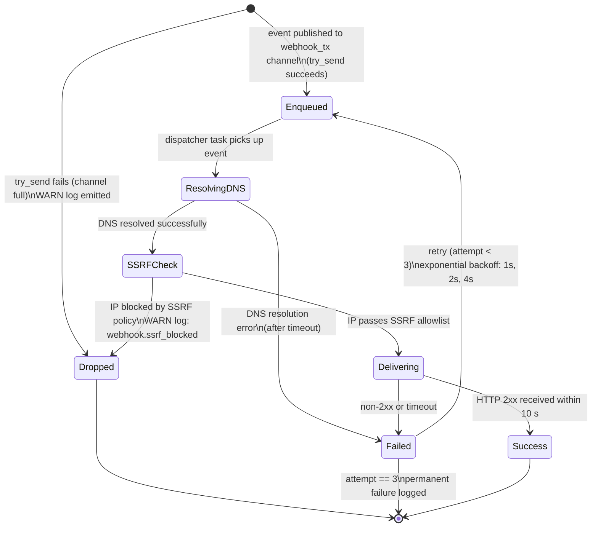
```mermaid
stateDiagram-v2
    [*] --> Enqueued : event published to webhook_tx channel\n(try_send succeeds)
    [*] --> Dropped : try_send fails (channel full)\nWARN log emitted
    Dropped --> [*]
    Enqueued --> ResolvingDNS : dispatcher task picks up event
    ResolvingDNS --> SSRFCheck : DNS resolved successfully
    ResolvingDNS --> Failed : DNS resolution error\n(after timeout)
    SSRFCheck --> Delivering : IP passes SSRF allowlist
    SSRFCheck --> Dropped : IP blocked by SSRF policy\nWARN log: webhook.ssrf_blocked
    Delivering --> Success : HTTP 2xx received within 10 s
    Delivering --> Failed : non-2xx or timeout
    Failed --> Enqueued : retry (attempt < 3)\nexponential backoff: 1s, 2s, 4s
    Failed --> [*] : attempt == 3\npermanent failure logged
    Success --> [*]
```

**Channel capacity sequence** (illustrating `try_send` vs. blocking):

```mermaid
sequenceDiagram
    participant Engine as Scheduler Engine
    participant Chan as webhook_tx (mpsc, 1024)
    participant Disp as Webhook Dispatcher Task

    Engine->>Chan: try_send(event_1) → Ok(())
    Engine->>Chan: try_send(event_2) → Ok(())
    Note over Chan: ... 1022 more events ...
    Engine->>Chan: try_send(event_1024) → Ok(())
    Note over Engine: Engine never blocks; continues scheduler work
    Engine->>Chan: try_send(event_1025) → Err(Full)
    Engine->>Engine: WARN log "webhook.channel_overflow" dropped_count=1
    Note over Disp: Dispatcher drains channel independently
    Disp->>Disp: tokio::spawn delivery task per event
```

**Business rules (§4.5)**

- **PERF-BR-450**: `webhook_tx.try_send()` MUST be the only call site for publishing webhook events from the engine. Blocking `send().await` is forbidden on the scheduler thread for webhook publication.
- **PERF-BR-451**: The SSRF check (`check_ssrf()`) MUST be called once per delivery attempt, after DNS resolution, immediately before the HTTP request is sent. A cached SSRF result from a prior attempt MUST NOT be reused (the IP may have changed due to DNS TTL expiry).
- **PERF-BR-452**: Each webhook delivery attempt MUST run in its own `tokio::spawn` task. The dispatcher task MUST NOT `await` the delivery result; it spawns and continues consuming the channel.
- **PERF-BR-453**: A payload that exceeds 65 536 bytes MUST be rejected before transmission. The delivery attempt transitions to `Failed` with `error: "payload_too_large"`. The webhook target does not receive the request.
- **PERF-BR-454**: Retry backoff MUST use exponential intervals: attempt 1 (immediate), attempt 2 (1 s delay), attempt 3 (2 s delay). Delays are non-blocking (`tokio::time::sleep`). No delivery may retry more than 3 times total.
- **PERF-BR-455**: `event_type` filtering (e.g., a webhook configured for `stage.failed` only) MUST be applied before `try_send()`. Events that do not match any registered webhook's event type filter MUST NOT be sent to `webhook_tx`.

**Edge cases (§4.5)**

1. **All webhook targets respond at 9.9 s**: 8 concurrent deliveries each wait ~9.9 s. The dispatcher spawns 8 tasks; each task blocks on the HTTP response for ~9.9 s. The engine's `webhook_tx` channel continues accepting new events (up to 1 024). The scheduler is never blocked. After 9.9 s, all 8 tasks complete (or time out at 10 s).
2. **Channel exactly at capacity (1 024 events pending)**: The dispatcher has fallen behind. The 1 025th `try_send()` returns `Err(Full)`. The engine emits `WARN "webhook.channel_overflow" dropped_count=1`. It does NOT block, retry, or persist the dropped event. The `dropped_count` in the WARN includes all consecutively dropped events before the channel drains.
3. **SSRF-blocked webhook URL**: `check_ssrf()` returns `Blocked` for a private IP (e.g., `169.254.169.254`). The delivery transitions immediately to `Dropped` with `WARN "webhook.ssrf_blocked"`. No retry occurs (SSRF block is permanent for that URL). Other webhook targets for the same event are delivered normally.
4. **Webhook configured for `state.changed` and `stage.failed` simultaneously**: Two webhook registrations exist for the same run. A `stage.failed` event matches both. Two separate delivery tasks are spawned. They are independent; a failure in one does not affect the other.
5. **URL with query parameters**: `https://example.com/hook?token=abc` is a valid webhook URL. The SSRF check evaluates the resolved IP of `example.com`, not the URL string. Query parameters are preserved verbatim in the HTTP request.
6. **Payload exceeding 65 536 bytes**: A `run.completed` event with a large context blob generates a payload > 64 KiB. The dispatcher rejects the payload (PERF-BR-453) and logs `WARN "webhook.payload_too_large" delivery_id=... bytes=<size>`. The webhook target does not receive any request.

**Acceptance criteria (§4.5)**

| ID | Assertion | Method |
|----|-----------|--------|
| AC-PERF-4.5-001 | 1 024-event burst: all 1 024 accepted via `try_send`; engine never blocks | Unit test; mock channel |
| AC-PERF-4.5-002 | 1 025th event: `try_send` returns `Err`; WARN log emitted; engine continues | Unit test |
| AC-PERF-4.5-003 | 8 concurrent deliveries (each 9.9 s): scheduler not blocked; channel still accepts events | E2E test with slow mock server |
| AC-PERF-4.5-004 | SSRF-blocked URL: `Dropped` status within 500 ms; no retry; no impact on other deliveries | Unit test with mock SSRF checker |
| AC-PERF-4.5-005 | Payload > 65 536 bytes: `Failed` with `"payload_too_large"`; target receives no request | Unit test |
| AC-PERF-4.5-006 | Retry up to 3 times with exponential backoff (1 s, 2 s); 4th attempt never occurs | Unit test with mock HTTP server returning 503 |
| AC-PERF-4.5-007 | SSRF check called once per attempt (not once per webhook registration) | Unit test; call-count assertion |

---

### 4.6 Multi-Project Scheduling

**[PERF-059]** With **10 concurrently active projects** each submitting runs, the weighted fair queue scheduler must dispatch the highest-priority eligible stage across all projects within **p99 < 100 ms** of its eligibility condition being met.

**Scheduling policy data model** — per-project scheduling configuration:

| Field | Type | Constraints | Description |
|-------|------|-------------|-------------|
| `project_id` | `UUIDv4` | required | Identifies the project |
| `scheduling_mode` | `enum` | `weighted_fair` \| `strict_priority` | Scheduling algorithm |
| `priority` | `u32` | 0–255; lower = higher priority | Used in `strict_priority` mode |
| `weight` | `u32` | 1–1 024; higher = more dispatch share | Used in `weighted_fair` mode |
| `virtual_time` | `f64` | ≥ 0.0; starts at 0.0 | WFQ virtual clock; `+= 1.0/weight` per dispatch |
| `eligible_stage_count` | `u32` | ≥ 0 | Current count of stages awaiting dispatch |
| `status` | `enum` | `Active` \| `Removing` \| `Removed` | `Removing`: no new submissions; active runs complete |

**Weighted fair queue state machine** (per-project):

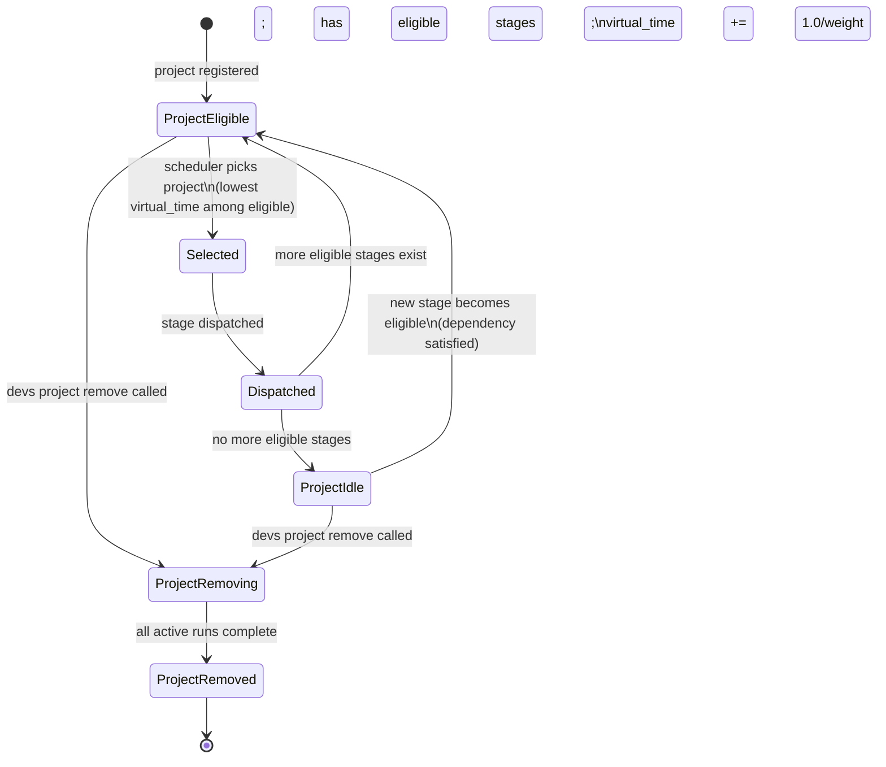
```mermaid
stateDiagram-v2
    [*] --> ProjectEligible : project registered; has eligible stages
    ProjectEligible --> Selected : scheduler picks project\n(lowest virtual_time among eligible)
    Selected --> Dispatched : stage dispatched;\nvirtual_time += 1.0/weight
    Dispatched --> ProjectEligible : more eligible stages exist
    Dispatched --> ProjectIdle : no more eligible stages
    ProjectIdle --> ProjectEligible : new stage becomes eligible\n(dependency satisfied)
    ProjectEligible --> ProjectRemoving : devs project remove called
    ProjectIdle --> ProjectRemoving : devs project remove called
    ProjectRemoving --> ProjectRemoved : all active runs complete
    ProjectRemoved --> [*]
```

**Virtual time example** (non-normative; 3 projects over 7 dispatches):

| Dispatch # | Project selected | virtual_time before | virtual_time after | weight |
|------------|-----------------|---------------------|-------------------|--------|
| 1 | A (vt=0.00) | 0.00 | 1.00 (+=1/1) | 1 |
| 2 | B (vt=0.00) | 0.00 | 0.50 (+=1/2) | 2 |
| 3 | C (vt=0.00) | 0.00 | 0.25 (+=1/4) | 4 |
| 4 | C (vt=0.25) | 0.25 | 0.50 (+=1/4) | 4 |
| 5 | B (vt=0.50) | 0.50 | 1.00 (+=1/2) | 2 |
| 6 | C (vt=0.50) | 0.50 | 0.75 (+=1/4) | 4 |
| 7 | C (vt=0.75) | 0.75 | 1.00 (+=1/4) | 4 |

After 7 dispatches: A=1, B=2, C=4. Ratio 1:2:4 matches weights.

**Business rules (§4.6)**

- **PERF-BR-460**: In `weighted_fair` mode, the project with the lowest `virtual_time` among all projects with `eligible_stage_count > 0` MUST be selected for the next dispatch. Ties broken by `project_id` lexicographic order (deterministic).
- **PERF-BR-461**: In `strict_priority` mode, the project with the lowest `priority` value (highest urgency) with `eligible_stage_count > 0` MUST be selected. If no stage of the highest-priority project is eligible, the scheduler selects from the next-lowest `priority` tier. Starvation of lower-priority projects is correct and intentional while higher-priority projects have work.
- **PERF-BR-462**: `virtual_time` accumulation uses `f64`. The scheduler MUST NOT reset `virtual_time` during normal operation. `f64` precision loss becomes significant only after ~4.5 × 10^15 total dispatches (IEEE 754 double precision limit at `1.0/1`), which is not reachable in practice. If `virtual_time` would exceed `f64::MAX`, the scheduler MUST normalize all projects' `virtual_time` by subtracting the minimum `virtual_time` across all projects.
- **PERF-BR-463**: `weight = 0` MUST be rejected at project creation/update time with `INVALID_ARGUMENT "weight must be ≥ 1"`. No project with `weight = 0` may exist in the scheduler state.
- **PERF-BR-464**: A project in `ProjectRemoving` status MUST be excluded from scheduler eligibility evaluation. Its active runs continue executing under their existing resource reservations. New `submit_run` calls for a `Removing` project return `FAILED_PRECONDITION "project is being removed"`.
- **PERF-BR-465**: The scheduler's eligibility evaluation loop (`evaluate_eligibility()`) MUST consider all projects in a single pass (O(P × V) where P = project count, V = stages per project). With 10 projects and 256 stages each, the evaluation MUST complete within p99 < 100 ms (PERF-059 dispatch latency budget).

**Edge cases (§4.6)**

1. **Strict priority starvation (by design)**: Project A (`priority=1`) submits 1 000 stages. Project B (`priority=2`) submits 10 stages. In strict priority mode, B receives 0 dispatches until A's 1 000 stages are all complete or A becomes idle. This is correct behavior; it MUST be documented in the operator guide. No SLO covers B's dispatch latency while A has eligible stages.
2. **`weight = 1 024` precision**: A project with `weight = 1 024` accumulates `virtual_time += 0.0009765625` per dispatch. After 1 024 × 1 024 = 1 048 576 dispatches, `virtual_time ≈ 1024.0`. `f64` can represent integers up to 2^53 exactly; `1024.0` is well within range. No precision loss for any practical workload.
3. **Project removed while runs are active**: `devs project remove proj-A` while proj-A has 3 active runs. The project enters `ProjectRemoving`. The 3 active runs continue until completion (their semaphore permits, pool assignments, and stage completions proceed normally). New submissions to proj-A return `FAILED_PRECONDITION`. Once all 3 runs complete, the project transitions to `ProjectRemoved`. The scheduler removes the project entry; `virtual_time` is discarded.
4. **All projects have equal weight**: With `weight = 1` for all projects, `virtual_time += 1.0` per dispatch. The scheduler selects the project with the lowest accumulated `virtual_time`. This is equivalent to round-robin in arrival order. No project is starved as long as it has eligible stages.
5. **Priority = 0 (highest possible urgency)**: `priority = 0` is valid. A project with `priority = 0` has higher urgency than all projects with `priority ≥ 1`. The scheduler MUST accept `priority = 0` without error. If two projects share `priority = 0`, tie-breaking is by `project_id` lexicographic order (deterministic, PERF-BR-460 applies analogously).
6. **Server shutdown with 10 active projects**: On graceful shutdown signal, the scheduler sets all projects to a synthetic `Draining` state (no new submissions). In-flight runs are cancelled (or completed if `--graceful-shutdown` flag is set). `virtual_time` values are not persisted across server restarts (ephemeral state); projects restart with `virtual_time = 0.0`.
7. **`weight = 0` submitted**: `submit_run` or `project update` with `weight = 0` returns `INVALID_ARGUMENT "weight must be ≥ 1"`. The project's existing `weight` is unchanged. No scheduler state is modified.

**Acceptance criteria (§4.6)**

| ID | Assertion | Method |
|----|-----------|--------|
| AC-PERF-4.6-001 | 2 projects weights 1:2; 100 dispatches total: project B dispatches 66±7 times (≈2/3) | Simulation test; dispatch counting |
| AC-PERF-4.6-002 | Strict priority: project B (`priority=2`) receives 0 dispatches while project A (`priority=1`) has eligible stages | Unit test; 10-cycle assertion |
| AC-PERF-4.6-003 | Project removal: active runs complete; no scheduler panic; new submissions rejected | E2E test |
| AC-PERF-4.6-004 | 10 projects, each with 25 eligible stages, `max_concurrent=10`: dispatch p99 < 100 ms | Timing test; `ThroughputMeasurement` |
| AC-PERF-4.6-005 | `weight=0` rejected with `INVALID_ARGUMENT` at project creation | Unit test |
| AC-PERF-4.6-006 | `virtual_time` normalization triggers and succeeds when minimum `virtual_time` > 10^12 (simulated) | Unit test with injected high virtual_time |
| AC-PERF-4.6-007 | Equal weights (weight=1 for all): no project starved over 1 000 dispatches with all projects having eligible stages | Simulation test; max starvation gap ≤ N_projects dispatches |

---

## 5. Resource Utilisation Budgets

Resource budgets are hard limits, not soft targets. The type system enforces byte-level caps at construction time; the Tokio semaphore enforces concurrency caps; the checkpoint store enforces size-based retention via periodic sweeps; and the gRPC and MCP transports enforce payload caps before any handler is invoked. This section defines every budget, its data model, its business rules, the edge cases that bound the design space, and the acceptance criteria that verify correct enforcement.

### 5.0 Shared Data Models

The following types are shared across all resource-budget subsections. They are defined in `devs-core/src/types.rs` (bounded data types) and used throughout the engine, executor, and interface crates.

#### 5.0.1 `BoundedBytes<N>`

`BoundedBytes<N>` is the primary enforcer of byte-level output caps. It is a newtype wrapper over `Vec<u8>` with const generic `N: usize` as the maximum byte count.

| Field | Type | Description |
|---|---|---|
| `data` | `Vec<u8>` | The stored bytes; `data.len() ≤ N` always |
| `truncated` | `bool` | `true` if any content was dropped to fit within `N` bytes |
| `original_len` | `Option<u64>` | Original byte count before truncation; `None` if not truncated |

**Construction invariant**: `data.len() ≤ N` is a structural invariant maintained by all constructors. No `unsafe` code is used; the invariant is maintained by bounds checks.

**Truncation policy**: When input exceeds `N` bytes, the **most recent** `N` bytes are retained (truncation from the beginning). This preserves the diagnostic value of the end of agent output, which contains the terminal state.

```rust
// Crate: devs-core/src/types.rs
/// Byte buffer with a compile-time upper bound of N bytes.
/// Truncates from the beginning when input exceeds N.
pub struct BoundedBytes<const N: usize> {
    data: Vec<u8>,
    pub truncated: bool,
    pub original_len: Option<u64>,
}

impl<const N: usize> BoundedBytes<N> {
    /// Construct from bytes, truncating to last N bytes if needed.
    pub fn from_bytes(bytes: Vec<u8>) -> Self {
        if bytes.len() <= N {
            Self { data: bytes, truncated: false, original_len: None }
        } else {
            let original_len = bytes.len() as u64;
            let start = bytes.len() - N;
            // Advance to next UTF-8 boundary if treating as text
            Self {
                data: bytes[start..].to_vec(),
                truncated: true,
                original_len: Some(original_len),
            }
        }
    }

    /// Returns the stored byte slice.
    pub fn as_bytes(&self) -> &[u8] { &self.data }

    /// Returns the number of stored bytes (≤ N always).
    pub fn len(&self) -> usize { self.data.len() }
}
```

#### 5.0.2 `BoundedString<N>`

`BoundedString<N>` is the enforcer for text field length caps (workflow names, stage names, env keys, etc.). Unlike `BoundedBytes`, it **rejects** oversized strings at construction (returns `ValidationError`) rather than truncating, because truncated identifiers produce incorrect program behaviour.

| Field | Type | Constraint |
|---|---|---|
| `value` | `String` | UTF-8; byte length ≤ N; non-empty |

```rust
// Crate: devs-core/src/types.rs
pub struct BoundedString<const N: usize>(String);

impl<const N: usize> BoundedString<N> {
    pub fn new(s: impl Into<String>) -> Result<Self, ValidationError> {
        let s = s.into();
        if s.is_empty() { return Err(ValidationError::EmptyString); }
        if s.len() > N { return Err(ValidationError::StringTooLong { max: N, actual: s.len() }); }
        Ok(Self(s))
    }
}
```

#### 5.0.3 `RetentionPolicy`

The retention policy governs the `devs-checkpoint` sweep algorithm. It is loaded from `devs.toml` and stored immutably in `ServerConfig` after startup.

| Field | Type | Default | Constraint |
|---|---|---|---|
| `max_age_days` | `u32` | `30` | 1–3 650 (10 years max) |
| `max_size_mb` | `u32` | `500` | 1–102 400 (100 GiB max) |
| `sweep_interval_hours` | `u32` | `24` | 1–168 (1 week max) |

#### 5.0.4 `RetentionSweepResult`

Written to structured log after each sweep with `event_type: "checkpoint.retention_sweep_completed"`.

| Field | Type | Description |
|---|---|---|
| `swept_at` | `DateTime<Utc>` | Timestamp when sweep completed |
| `phase1_deleted_count` | `u32` | Runs deleted in age-based phase |
| `phase2_deleted_count` | `u32` | Runs deleted in size-based phase |
| `total_size_mb_before` | `f64` | Size of `.devs/` directory before sweep |
| `total_size_mb_after` | `f64` | Size after sweep |
| `skipped_active_count` | `u32` | Runs skipped because status is Running/Paused/Pending |
| `duration_ms` | `u64` | Wall-clock time for the sweep |
| `git_commit_sha` | `Option<String>` | SHA of the sweep commit; `null` if nothing deleted |

#### 5.0.5 `ResourceBudgetSnapshot`

Emitted on a structured log event `"server.resource_budget_snapshot"` at startup and every 5 minutes. Allows external monitoring of resource trends without OS-level metrics agents.

| Field | Type | Description |
|---|---|---|
| `captured_at` | `DateTime<Utc>` | Snapshot timestamp |
| `server_rss_bytes` | `Option<u64>` | Server process RSS in bytes; `null` if measurement unavailable |
| `active_run_count` | `u32` | Number of runs in Running or Paused status |
| `total_stage_run_count` | `u32` | Total StageRun records in memory (all runs) |
| `log_buffer_entry_count` | `u32` | Total entries across all `log_buffers` in-memory |
| `checkpoint_store_size_mb` | `Option<f64>` | Size of `.devs/` on the checkpoint branch; `null` if git unavailable |
| `pool_active_counts` | `HashMap<String, u32>` | Per-pool `active_count` values |
| `budget_violations` | `Vec<BudgetViolation>` | Any active violations; empty if all within bounds |

**`BudgetViolation`**:

| Field | Type | Description |
|---|---|---|
| `budget_id` | `String` | E.g. `"PERF-064"` |
| `description` | `String` | Human-readable description |
| `measured_value` | `f64` | Observed value |
| `limit_value` | `f64` | Budget limit |
| `unit` | `String` | `"bytes"`, `"percent"`, `"count"` |

---

### 5.1 CPU

CPU budgets govern the computational overhead of the `devs` infrastructure itself, independent of the agent workloads it orchestrates. Agent subprocess CPU is excluded from all measurements because it is workload-dependent and not attributable to `devs`.

**[PERF-060]** Idle server (no active runs): CPU utilisation **< 1%** on a single core averaged over a 30-second window. The server MUST NOT spin-poll; all waiting MUST be event-driven via Tokio's async runtime. Any `loop { }` without an `await` point is a correctness violation.

**[PERF-061]** Server under peak load (10 concurrent active runs, each with 4 active stages): CPU utilisation attributable to `devs-server` process (excluding agent subprocess CPU) **< 25%** of a single core averaged over a 10-second window. Agent subprocess CPU is excluded because it is workload-dependent.

**[PERF-062]** TUI render loop: CPU consumption of the `devs-tui` process **< 5%** of a single core when the display is static (no incoming events). Render is event-driven; idle frames MUST NOT be generated.

**[PERF-063]** `./do lint` (clippy + dep audit) CPU: no artificial parallelism constraints imposed; Cargo's default job count is acceptable. The target is wall-clock time (§3.7), not core utilisation.

**[PERF-120]** Server CPU measurement exclusions: the following activities are explicitly excluded from PERF-060 and PERF-061 measurements:
- Initial checkpoint restore at startup (unbounded `git2` operations in `spawn_blocking`)
- `./do presubmit` subprocess invocations
- Agent subprocess trees (any child of the agent PID)
- `git2` push/fetch operations for the checkpoint branch (background `spawn_blocking` tasks)

**Business rules (§5.1)**

- **PERF-BR-501**: The Tokio runtime MUST be the single-threaded runtime for all async I/O. No `std::thread::sleep` or blocking `std::sync::Mutex::lock` calls are permitted in async tasks. All blocking operations MUST use `tokio::task::spawn_blocking`.
- **PERF-BR-502**: The TUI `App::render()` function MUST NOT call any function that may block, allocate proportionally to buffer size, or involve syscalls. It MUST complete in O(1) with respect to log buffer depth (rendering is paginated; only visible rows are rendered).
- **PERF-BR-503**: The log buffer eviction scan MUST NOT perform a full `O(N)` scan of all `log_buffers` on every Tick event. The implementation MUST maintain an eviction candidate index (e.g., a `BinaryHeap<(Instant, RunId, StageName)>` sorted by `last_appended_at`) or a scheduled `tokio::time::sleep_until` per candidate, so that the Tick handler performs O(1) or amortised O(log N) work.
- **PERF-BR-504**: Every event processed by `App::handle_event()` MUST result in a re-render call only when `AppState` is mutated. The implementation MUST track a `dirty: bool` flag or equivalent; redundant renders MUST NOT be issued for events that leave state unchanged (e.g., a `Tick` with no pending evictions and no server events).
- **PERF-BR-505**: gRPC streaming handlers MUST use `tokio_stream::wrappers::BroadcastStream` or equivalent non-blocking adapters. A slow gRPC client MUST NOT cause the broadcast sender to block the scheduler's event loop. Per-client buffer overflow results in oldest messages being dropped, not in backpressure on the sender.

**Edge cases (§5.1)**

1. **Tick event at 1 Hz with no state changes**: The TUI Tick event triggers `App::handle_event()` but MUST NOT result in a `render()` call when `AppState` was not mutated. The Tick handler checks the eviction index (PERF-BR-503) and, finding nothing expired, sets `dirty = false` and returns. No CPU is spent on crossterm I/O.
2. **Log buffer eviction check on every Tick**: On each Tick, the eviction candidate index is peeked (O(log N) heap peek). With 10 000 `log_buffers` entries, the worst-case scan of the full index is O(N) only during index construction (at startup or after a reconnect). Steady-state eviction check is O(log N). The maximum index size is bounded: at most 20 projects × 100 retained runs × 256 stages = 512 000 entries — this MUST be handled via the candidate index, not a full scan.
3. **CPU spike during checkpoint restore**: At server startup, `load_all_runs` invokes `git2` operations that may involve disk I/O and JSON parsing for each persisted run. These MUST run in `tokio::task::spawn_blocking`. During restore, the Tokio async executor is not blocked; gRPC connections can be established (though run queries return empty state until restore completes). CPU during restore is unbounded and excluded from PERF-060.
4. **Multiple concurrent gRPC streaming clients**: Each `StreamRunEvents` subscriber receives events via a `tokio::sync::broadcast::Receiver`. Broadcasting to 64 subscribers costs O(N) clone operations in the sender, but each clone is a shallow `Arc` increment. The CPU cost is O(64 × clone_cost) per event, which is negligible. If the per-client buffer overflows (256 messages), the oldest message is dropped without blocking the sender.
5. **`./do lint` parallelism**: Cargo spawns up to `nproc` parallel compilation jobs. On an 8-core machine this may use 800% CPU for up to 120 s during clippy. This is expected and unconstrained; PERF-063 imposes only a wall-clock limit.

**Acceptance criteria (§5.1)**

| ID | Assertion | Method |
|---|-----------|--------|
| AC-PERF-5.1-001 | Idle server CPU < 1% sustained over 30 s (0 runs, 0 clients) | Unit test: `server_idle_cpu_below_1pct`; measure via `/proc/<pid>/stat` on Linux |
| AC-PERF-5.1-002 | TUI with no events: CPU < 5% over 30 s | Unit test: `tui_idle_cpu_below_5pct`; `TestBackend` loop with no injected events |
| AC-PERF-5.1-003 | No idle frame rendered: `render_count == 0` after 10 Tick events with no state change | Unit test: assert `dirty` flag false; `render()` not called |
| AC-PERF-5.1-004 | Log eviction candidate index peek is O(log N): p99 < 100 µs for index with 10 000 entries | Micro-benchmark in `devs-tui` |
| AC-PERF-5.1-005 | No `std::thread::sleep` or blocking `Mutex::lock` in async tasks: CI lint via `cargo clippy` custom lint | CI check in `./do lint` |
| AC-PERF-5.1-006 | 64 concurrent `StreamRunEvents` clients: sender never blocks; measured broadcast duration p99 < 1 ms | E2E concurrency test |

---

### 5.2 Memory

Memory budgets define the maximum resident set size contributions from each major subsystem. All limits are worst-case bounds for well-formed inputs within structural limits (max 256 stages, max 64 fan-out, max 20 projects). The server MUST NOT crash due to allocation failure; it MUST log an error and continue with degraded behaviour (e.g., skipping a checkpoint write on `ENOMEM`).

**[PERF-064]** Server baseline RSS (no active runs, ≤ 10 projects registered): **< 64 MiB**.

**[PERF-065]** Server memory growth per active run: **< 8 MiB** per run for `WorkflowRun` + `StageRun` metadata (excluding `StageOutput` content and log buffers). A server with 20 active runs therefore adds < 160 MiB of metadata.

**[PERF-066]** In-memory log buffer per active stage: at most **10 000 lines × 256 bytes average = ~2.5 MiB**. A server with 10 active runs each with 4 active stages (40 stage log buffers) MUST NOT exceed **~100 MiB** for log buffer data alone.

**[PERF-067]** TUI process RSS: **< 64 MiB** under normal operation (single-run view, 10 000 buffered log lines for one stage).

**[PERF-068]** Stage output `BoundedBytes<1_048_576>` cap: each of stdout and stderr consumes at most **1 MiB** stored; together the `StageOutput.stdout` + `StageOutput.stderr` heap allocation is at most **2 MiB** per `StageRun`. This is enforced at the type boundary.

**[PERF-069]** Context file `.devs_context.json` in-memory representation before agent spawn: **≤ 10 MiB** (enforced by proportional truncation algorithm in §5.5 before serialization to disk).

**Memory budget summary table**:

| Component | Baseline | Per-Unit Growth | Cap |
|---|---|---|---|
| `devs-server` idle | ~48 MiB | — | < 64 MiB |
| Per active `WorkflowRun` metadata | — | < 8 MiB | — |
| Per active stage `StageOutput` | — | ≤ 2 MiB (stdout + stderr) | 2 MiB |
| Per active stage log buffer (server-side) | — | ≤ 2.5 MiB | 2.5 MiB |
| `.devs_context.json` in-memory | — | ≤ 10 MiB | 10 MiB |
| `devs-tui` RSS | ~32 MiB | — | < 64 MiB |
| Per TUI `LogBuffer` (10 000 lines) | — | ≤ 2.5 MiB | 2.5 MiB |

**Business rules (§5.2)**

- **PERF-BR-510**: `BoundedBytes<N>` MUST NOT pre-allocate `N` bytes at construction. `Vec::new()` MUST be used for the initial allocation; growth occurs as data is appended.
- **PERF-BR-511**: When a `LogBuffer` is evicted (terminal run, not selected, idle > 30 min), the implementation MUST call `drop()` on the `LogBuffer`, freeing all `LogLine` heap allocations. The containing `HashMap` entry MUST be removed, not merely cleared.
- **PERF-BR-512**: The PERF-065 budget of < 8 MiB per run applies to `WorkflowRun` + all embedded `StageRun` records **without** their `output: Option<StageOutput>` fields. `StageOutput` memory is tracked separately under the PERF-068 budget. When a run completes, the server MAY evict `StageOutput` fields from the in-memory representation (keeping only the log path reference) to reduce RSS.
- **PERF-BR-513**: If any memory allocation fails (returns `Err` from `try_reserve` or panics from OOM), the server MUST log `ERROR` with `event_type: "server.oom_condition"` and MUST NOT crash. Checkpoint writes failing due to `ENOMEM` MUST be retried on the next state transition.
- **PERF-BR-514**: `AppState::log_buffers` in `devs-tui` MUST track `last_appended_at: Option<Instant>` per buffer to enable eviction decisions on `Tick` events without scanning buffer contents.

**Edge cases (§5.2)**

1. **256-stage workflow all completed**: After a 256-stage run completes, the `WorkflowRun` metadata is < 8 MiB (stage metadata only). Stage outputs are stored separately: 256 × 2 MiB = 512 MiB. This is within bounds (capped per stage). Operators SHOULD set `max_size_mb = 500` so that the retention sweep reduces disk usage, but in-memory `StageOutput` data is bounded per-stage regardless. In practice, agents rarely fill the full 1 MiB cap per stream.
2. **`BoundedBytes` allocation at construction**: `BoundedBytes<1_048_576>::from_bytes(vec![0u8; 1024])` allocates exactly 1 024 bytes, not 1 MiB. Verified by asserting `capacity() ≤ len() + small_slack` in unit tests.
3. **Log buffer eviction frees memory**: When a `LogBuffer` for a terminal, non-selected run idle for > 30 min is evicted, the `VecDeque<LogLine>` and all `String` allocations within `LogLine` are freed. RSS decreases measurably. The `AppState::log_buffers` `HashMap` entry is removed. Subsequent Tick events for this stage produce no eviction candidate check.
4. **Server under memory pressure (ENOMEM)**: If `checkpoint.json` serialization fails due to OOM, the server MUST log `ERROR` and continue. The in-flight `WorkflowRun` state remains in-memory and will be re-attempted on the next state transition. The server MUST NOT enter a retry loop that itself allocates; the retry is triggered by the next scheduler event, not by a timer.
5. **TUI reconnect replaces `AppState::runs`**: On reconnect, `AppState::runs` and `run_details` are fully replaced from the `run.snapshot` event. Old `RunDetail` and `RunSummary` heap allocations are dropped. `LogBuffer` entries are preserved (not dropped) because they contain the only copy of in-memory log history for terminal runs not yet evicted. The combined memory of old runs (pre-reconnect) + new snapshot MUST fit within the 64 MiB TUI budget; this is satisfied because the snapshot contains at most 100 runs × 4 MiB metadata = 400 MiB, which exceeds the budget — therefore the TUI MUST NOT retain full `RunDetail` for all historical runs simultaneously. Only the `selected_run_id` detail is held in full; others are `RunSummary` only.
6. **Fan-out sub-run records**: Sub-agent `StageRun` records (stored in `fan_out_sub_runs`, not top-level `stage_runs`) contribute to the PERF-065 budget. A fan-out of 64 sub-stages each with < 8 MiB / 64 ≈ 125 KiB metadata is within the per-run budget.

**Acceptance criteria (§5.2)**

| ID | Assertion | Method |
|---|-----------|--------|
| AC-PERF-5.2-001 | Server RSS < 64 MiB after startup, 0 runs, 10 registered projects | Integration test; measure RSS via `/proc/<pid>/status` on Linux |
| AC-PERF-5.2-002 | `BoundedBytes<1_048_576>` constructed from 1 024 bytes: `capacity() ≤ 2 × 1024` (no pre-alloc to 1 MiB) | Unit test: `bounded_bytes_no_prealloc` |
| AC-PERF-5.2-003 | `BoundedBytes` from 2 MiB input: `len() == 1_048_576`, `truncated == true`, `original_len == Some(2_097_152)` | Unit test: `bounded_bytes_truncates_to_cap` |
| AC-PERF-5.2-004 | Log buffer eviction: RSS of `devs-tui` decreases after evicting 10 fully-populated 10 000-line buffers | Integration test: measure RSS before and after eviction trigger |
| AC-PERF-5.2-005 | 10 active runs × 4 active stages: total log buffer memory ≤ 100 MiB | Integration test: 40 stages generating max-size log output |
| AC-PERF-5.2-006 | `ENOMEM` on checkpoint write: server logs `ERROR`, state remains intact, next checkpoint write succeeds | Unit test with mock allocator returning `Err` |

---

### 5.3 Storage (Checkpoint & Log Retention)

The checkpoint store is git-backed and grows monotonically until the retention sweep runs. All size caps are enforced by bounded types at write time (PERF-071, PERF-072, PERF-073) and by the sweep algorithm at sweep time (PERF-070). The sweep is two-phase: age-based deletion first, then size-based deletion. Active runs are never deleted.

**[PERF-070]** Default retention policy: `max_age_days = 30`, `max_size_mb = 500`. The retention sweep MUST keep the total `.devs/` directory size **≤ `max_size_mb` MiB** on the checkpoint branch at the end of each sweep. The sweep runs at server startup and every `sweep_interval_hours` (default 24) thereafter.

**[PERF-071]** Checkpoint file per run (`checkpoint.json`): MUST be **< 1 MiB** for a 256-stage workflow. Stage `stdout`/`stderr` content MUST be stored in `.devs/logs/`, not embedded in `checkpoint.json`. The `StageRun.output` field in `checkpoint.json` contains only the `log_path` reference and the `truncated` flag, not the raw content.

**[PERF-072]** Single stage log files: `stdout.log` + `stderr.log` together **≤ 2 MiB** (1 MiB each, governed by `BoundedBytes<1_048_576>`). Agent output exceeding 1 MiB per stream is truncated from the beginning; the most recent 1 MiB is retained.

**[PERF-073]** Workflow snapshot file `workflow_snapshot.json`: **< 512 KiB** for a workflow with 256 stages and all fields populated. The 13-step validation pipeline (§5.0 of TAS) rejects inputs that, combined, would produce a snapshot exceeding this bound.

**[PERF-121]** Retention sweep wall-clock time: a sweep over **500 completed runs** with a total history of 500 MiB MUST complete within **60 seconds** (p99). If a sweep exceeds 120 seconds, a `WARN` event is emitted with `event_type: "checkpoint.sweep_slow"`.

**`RetentionPolicy` schema** (in `devs.toml` under `[retention]`):

```toml
[retention]
max_age_days        = 30     # Runs older than this are eligible for age-based deletion
max_size_mb         = 500    # Target maximum size of .devs/ on checkpoint branch
sweep_interval_hours = 24    # Hours between automatic sweeps (1-168)
```

**Retention sweep algorithm**:

The sweep is a two-phase algorithm. Phase 1 removes runs by age; Phase 2 removes the oldest remaining runs until total size is within the `max_size_mb` limit. Both phases skip active runs (Running, Paused, Pending).

```rust
// Pseudocode — crate: devs-checkpoint/src/sweep.rs
fn run_retention_sweep(store: &CheckpointStore, policy: &RetentionPolicy) -> RetentionSweepResult {
    let now = Utc::now();
    let all_runs = store.load_all_run_metadata(); // (run_id, status, completed_at, size_bytes)

    // Phase 1: age-based
    let age_cutoff = now - Duration::days(policy.max_age_days as i64);
    let mut to_delete: Vec<RunId> = all_runs.iter()
        .filter(|r| !r.status.is_active())                // skip active runs
        .filter(|r| r.completed_at.map_or(false, |t| t < age_cutoff))
        .map(|r| r.run_id)
        .collect();

    // Phase 2: size-based (after age deletions)
    let remaining: Vec<_> = all_runs.iter()
        .filter(|r| !r.status.is_active() && !to_delete.contains(&r.run_id))
        .collect();
    let size_after_phase1: u64 = remaining.iter().map(|r| r.size_bytes).sum();
    let limit_bytes = policy.max_size_mb as u64 * 1024 * 1024;
    if size_after_phase1 > limit_bytes {
        let excess = size_after_phase1 - limit_bytes;
        let mut accumulated = 0u64;
        let mut sorted_by_age = remaining.clone();
        sorted_by_age.sort_by_key(|r| r.completed_at);
        for run in sorted_by_age {
            if accumulated >= excess { break; }
            to_delete.push(run.run_id);
            accumulated += run.size_bytes;
        }
    }

    store.delete_runs_atomically(&to_delete)  // single git commit
}
```

**Retention sweep state machine**:

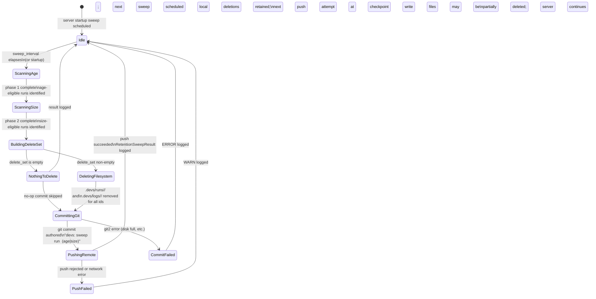
```mermaid
stateDiagram-v2
    [*] --> Idle : server startup sweep scheduled
    Idle --> ScanningAge : sweep_interval elapses\n(or startup)
    ScanningAge --> ScanningSize : phase 1 complete\nage-eligible runs identified
    ScanningSize --> BuildingDeleteSet : phase 2 complete\nsize-eligible runs identified
    BuildingDeleteSet --> NothingToDelete : delete_set is empty
    BuildingDeleteSet --> DeletingFilesystem : delete_set non-empty
    NothingToDelete --> CommittingGit : no-op commit skipped
    NothingToDelete --> Idle : result logged; next sweep scheduled
    DeletingFilesystem --> CommittingGit : .devs/runs/<id>/ and\n.devs/logs/<id>/ removed for all ids
    CommittingGit --> PushingRemote : git commit authored\n"devs: sweep run <id> (age|size)"
    PushingRemote --> Idle : push succeeded\nRetentionSweepResult logged
    PushingRemote --> PushFailed : push rejected or network error
    PushFailed --> Idle : WARN logged; local deletions retained;\nnext push attempt at next checkpoint write
    CommittingGit --> CommitFailed : git2 error (disk full, etc.)
    CommitFailed --> Idle : ERROR logged; local files may be\npartially deleted; server continues
```

**Business rules (§5.3)**

- **PERF-BR-520**: The retention sweep MUST NOT delete any run whose `status` is `Running`, `Paused`, or `Pending`, regardless of age or size contribution. Active runs are checked by reading `checkpoint.json` status, not by timestamp alone.
- **PERF-BR-521**: Phase 2 (size-based) MUST sort eligible runs by `completed_at` ascending (oldest first) and delete in that order. Ties in `completed_at` MUST be broken by `run_id` lexicographic order to ensure deterministic deletion across sweeps.
- **PERF-BR-522**: Each sweep MUST produce a single atomic git commit containing all deleted run directories. Multiple commits for a single sweep are forbidden; they would create a confusing checkpoint branch history and could leave the store in a partially-swept state if a crash occurs mid-sweep.
- **PERF-BR-523**: At startup, `load_all_runs` MUST scan for orphaned `checkpoint.json.tmp` files (left by a previous crash mid-write) and delete them with a `WARN` log before loading any checkpoint data. An orphaned `.tmp` file MUST NOT be loaded as a valid checkpoint.
- **PERF-BR-524**: `git2` push failure during a sweep MUST be treated as non-fatal. The local on-disk deletion is committed and authoritative. The remote will be updated at the next checkpoint write (which also pushes). Runs already deleted from disk MUST NOT be re-deleted in subsequent sweeps; the sweep operates on locally-present data only.
- **PERF-BR-525**: The `workflow_snapshot.json` is written and committed **once** before the first stage transitions from `Waiting` to `Eligible`. Subsequent sweep commits MUST NOT modify or delete the snapshot of an active run.
- **PERF-BR-526**: The total size measured for the size-based phase MUST be computed by summing the sizes of all `.devs/runs/<id>/` and `.devs/logs/<id>/` directories on disk. Git object store overhead is excluded from this measurement.

**Edge cases (§5.3)**

1. **Retention sweep while active runs exist**: The sweep skips active runs (PERF-BR-520). A run added to the sweep's "eligible" set between phase 1 identification and the atomic delete MUST be re-checked before deletion. If its status changed to `Running` between identification and deletion, it MUST be removed from the delete set. This TOCTOU check is performed under the `SchedulerState` read lock.
2. **Retention sweep with exactly `max_size_mb` MiB of data**: When the `.devs/` directory is exactly at the 500 MiB threshold, phase 2 finds `size_after_phase1 == limit_bytes` (not exceeding), so `to_delete` receives no size-based additions. Nothing is deleted. The sweep result reports `phase2_deleted_count = 0`.
3. **`checkpoint.json` with log path references only**: Stage output content (`stdout`, `stderr`) MUST be stored in `.devs/logs/<run-id>/<stage>/attempt_<N>/stdout.log`, not in `checkpoint.json`. The `checkpoint.json` stores `StageRun.output.log_path` as a relative path within the `.devs/` tree. Embedding base64-encoded content in `checkpoint.json` is a correctness violation flagged by the `./do lint` custom check.
4. **`git2` push failure during retention sweep**: The local filesystem deletion is committed via `git2` (local commit). The remote push fails. The `RetentionSweepResult` records `git_commit_sha` of the local commit but logs `WARN: "checkpoint.push_failed"`. On the next checkpoint write (triggered by any state transition), the checkpoint store performs a push that includes both the sweep commit and the new checkpoint commit. No data is double-deleted because the sweep deletes only what was present locally before the sweep started.
5. **Orphaned `.tmp` checkpoint files at startup**: If the server crashed after writing `checkpoint.json.tmp` but before completing the `rename()` syscall, `load_all_runs` finds the orphan. It logs `WARN` with the path, deletes the file, and proceeds. The `.tmp` is NOT loaded as a valid checkpoint; the corresponding run is treated as if it had no checkpoint and is skipped (marked `Unrecoverable`).
6. **Concurrent sweep and checkpoint write**: A checkpoint write (triggered by a state transition) and a sweep run simultaneously. The checkpoint write operates under the `CheckpointStore` write lock. The sweep acquires the same lock before starting phase 1. If the sweep holds the lock, the checkpoint write blocks until the sweep commits. Maximum sweep duration is 60 s (PERF-121); a long sweep temporarily delays checkpoint writes but does not deadlock them.
7. **All 500 retained runs are active (pathological case)**: Phase 1 and phase 2 both find zero eligible runs. The sweep is a no-op. `total_size_mb_after == total_size_mb_before`. If the total size exceeds `max_size_mb`, a `WARN` event is emitted: `"checkpoint.sweep_no_eligible_runs_size_exceeded"`. The operator must cancel or complete some active runs to allow the sweep to proceed.

**Acceptance criteria (§5.3)**

| ID | Assertion | Method |
|---|-----------|--------|
| AC-PERF-5.3-001 | Sweep over 500 completed runs, total 500 MiB: completes within 60 s p99; total size ≤ 500 MiB after | Integration test with synthetic checkpoint data |
| AC-PERF-5.3-002 | Active (Running/Paused) runs: never deleted regardless of age | E2E test: submit run, wait until Running, trigger sweep, assert run still present |
| AC-PERF-5.3-003 | Orphaned `.tmp` files: deleted at startup with WARN log; not loaded as valid checkpoints | Unit test: inject `.tmp` file, restart, assert WARN logged and run marked `Unrecoverable` |
| AC-PERF-5.3-004 | `checkpoint.json` does not contain inline stage stdout/stderr: references `log_path` only | Unit test: deserialize checkpoint, assert `output.stdout` field absent; `log_path` present |
| AC-PERF-5.3-005 | Phase 2 deletion order: oldest `completed_at` deleted first; tie broken by `run_id` lex order | Unit test: synthetic runs with known `completed_at` values |
| AC-PERF-5.3-006 | Single git commit per sweep (not one per deleted run) | Integration test: assert `git log --oneline` adds exactly 1 commit per sweep invocation |
| AC-PERF-5.3-007 | `git2` push failure: local deletions persist; next checkpoint push includes sweep commit | Integration test: mock git remote returning push error; assert local state consistent |

---

### 5.4 Network

Network budgets define the maximum payload sizes for all three transport protocols: gRPC (tonic), MCP HTTP (hyper), and outbound webhooks (reqwest). All limits are enforced at the transport layer before any handler logic executes, preventing unbounded memory allocation from crafted large payloads.

**[PERF-074]** gRPC frame size limit: **16 MiB** (`max_frame_size` in tonic `Server::builder()` config). Any message exceeding 16 MiB is rejected with gRPC status `RESOURCE_EXHAUSTED` before deserialization. This is a tonic configuration value, not a runtime check.

**[PERF-075]** Per-RPC payload limits enforced by tonic interceptors:

| RPC | Request limit | Response limit | Enforcement |
|---|---|---|---|
| `SubmitRun` | 1 MiB | 1 MiB | `tonic` message size interceptor |
| `StreamLogs` (unary request) | 64 KiB | Streaming: chunks ≤ 32 KiB | Transport layer |
| `GetRun` | 1 MiB | 4 MiB | `tonic` message size interceptor |
| `GetStageOutput` | 1 MiB | 4 MiB | `tonic` message size interceptor |
| All other RPCs | 1 MiB | 4 MiB | `tonic` message size interceptor |

**[PERF-076]** MCP HTTP request body: **≤ 1 MiB**. The hyper server reads at most 1 MiB + 1 byte from the request body. If the body exceeds 1 MiB, the server responds with HTTP 413 before invoking any tool handler. The tool handler MUST NOT be invoked for over-limit requests.

**[PERF-077]** Webhook payload: **≤ 64 KiB** per delivery attempt. The `data` field within the envelope is truncated proportionally if the total serialized payload would exceed 64 KiB. The envelope metadata fields (`event`, `timestamp`, `delivery_id`, `project_id`, `run_id`, `stage_name`, `truncated`) are always present and never truncated.

**[PERF-078]** `stream_logs follow:true` individual chunk size: **≤ 32 KiB** per chunk. A single log line whose content exceeds 32 KiB MUST be split at the nearest preceding UTF-8 character boundary. The chunk sequence number increments for each emitted chunk, including split chunks from a single log line.

**[PERF-122]** MCP HTTP concurrent connection limit: **≤ 64** simultaneous open connections. A 65th connection attempt receives HTTP 503 with body `{"result":null,"error":"resource_exhausted: max concurrent MCP connections (64) reached"}`. The 503 response is sent before any authentication or handler logic.

**[PERF-123]** `stream_logs follow:true` maximum lifetime: **30 minutes**. After 30 minutes, the server sends the terminal chunk `{"done":true,"truncated":false,"total_lines":<N>}` and closes the HTTP connection, regardless of stage state. Clients that need log data beyond 30 minutes MUST re-issue the request with `from_sequence: <last_received + 1>`.

**Network limit constant definitions** (in `devs-core/src/constants.rs`):

```rust
/// Maximum gRPC frame size (bytes)
pub const GRPC_MAX_FRAME_SIZE: u32 = 16 * 1024 * 1024;

/// Default gRPC per-RPC request limit (bytes)
pub const GRPC_DEFAULT_REQUEST_LIMIT: usize = 1 * 1024 * 1024;

/// gRPC per-RPC response limit for large-response RPCs (bytes)
pub const GRPC_LARGE_RESPONSE_LIMIT: usize = 4 * 1024 * 1024;

/// StreamLogs unary request limit (bytes)
pub const GRPC_STREAM_LOGS_REQUEST_LIMIT: usize = 64 * 1024;

/// Maximum MCP HTTP request body size (bytes)
pub const MCP_MAX_REQUEST_BODY: usize = 1 * 1024 * 1024;

/// Maximum outbound webhook payload size (bytes)
pub const WEBHOOK_MAX_PAYLOAD: usize = 64 * 1024;

/// Maximum stream_logs chunk size (bytes)
pub const STREAM_LOGS_MAX_CHUNK: usize = 32 * 1024;

/// Maximum concurrent MCP HTTP connections
pub const MCP_MAX_CONCURRENT_CONNECTIONS: usize = 64;

/// Maximum stream_logs follow:true lifetime (seconds)
pub const STREAM_LOGS_MAX_FOLLOW_DURATION_SECS: u64 = 30 * 60;
```

**Business rules (§5.4)**

- **PERF-BR-530**: The MCP HTTP 413 response MUST be sent before the request body is fully read into memory. The hyper server MUST use streaming body reading with a size check; it MUST NOT buffer the entire body before checking the limit.
- **PERF-BR-531**: The gRPC frame size limit (`GRPC_MAX_FRAME_SIZE`) MUST be configured on both the server (inbound frames) and the client (outbound frames to limit what clients send). Tonic's `max_decoding_message_size` and `max_encoding_message_size` are both set.
- **PERF-BR-532**: Webhook payload truncation MUST preserve the envelope metadata intact. Only the `data` field is truncated. After truncation, `data` MUST remain valid JSON (not a truncated JSON string). The truncation point is the last complete JSON value that fits within the byte budget after accounting for envelope overhead.
- **PERF-BR-533**: Each `stream_logs` chunk MUST include a `sequence` field starting at 1 and incrementing by 1 per chunk with no gaps. If a single log line is split into multiple chunks (because it exceeds 32 KiB), each chunk part increments the sequence number. The `line` field in each chunk MAY be a partial UTF-8 string continuation.
- **PERF-BR-534**: The 30-minute `stream_logs follow:true` lifetime (PERF-123) is enforced server-side. The server MUST track `stream_started_at` and emit the terminal chunk when `now - stream_started_at >= STREAM_LOGS_MAX_FOLLOW_DURATION_SECS`. The client receives a normal terminal chunk and MUST NOT treat this as an error.
- **PERF-BR-535**: `GRPC_MAX_FRAME_SIZE`, `MCP_MAX_REQUEST_BODY`, `WEBHOOK_MAX_PAYLOAD`, and `STREAM_LOGS_MAX_CHUNK` MUST be defined as `pub const` in `devs-core/src/constants.rs` and imported by all crates that enforce them. No crate MUST hardcode these values as inline literals.

**Edge cases (§5.4)**

1. **gRPC `GetRun` response approaching 4 MiB limit**: A `GetRun` for a 256-stage run with full metadata approaches the 4 MiB response limit. If the serialized proto exceeds 4 MiB, the server returns `RESOURCE_EXHAUSTED` with message `"resource_exhausted: response too large; use GetStageOutput to retrieve per-stage data"`. The client MUST NOT retry with the same request; it MUST use paginated per-stage calls instead. This is documented in the gRPC service comments.
2. **Webhook `data` field truncation preserving valid JSON**: The `data` field is a JSON object. Truncation MUST NOT produce a malformed JSON string. The implementation serializes the full `data` object to a `Vec<u8>`, measures its size, and if truncation is needed, uses a JSON streaming encoder that stops at the byte budget. If the encoder cannot produce a valid truncated JSON object (e.g., the first key-value pair alone exceeds the budget), `data` is replaced with `{}` (empty object) and `"truncated": true` is set at the envelope level.
3. **`StreamLogs` chunk splitting on multi-byte UTF-8 boundary**: A log line containing emoji (4-byte UTF-8 sequences) at positions near the 32 KiB boundary requires the split to occur before the first byte of the sequence. The implementation searches backward from the 32 KiB mark to find the last byte whose value is `< 0x80` (single-byte) or `>= 0xC0` (start of a multi-byte sequence). This is an O(1..4) backwards scan in all practical cases.
4. **MCP 503 under concurrent connection spike**: If 100 clients simultaneously attempt to open MCP connections, the first 64 succeed and the remaining 36 receive HTTP 503. The 503 response body is a valid JSON-RPC error envelope: `{"result":null,"error":"resource_exhausted: max concurrent MCP connections (64) reached"}`. The `stream_logs follow:true` lifetime timer starts from the moment the connection is accepted (not from the first chunk delivered).
5. **`stream_logs` follow:true on a stage that never runs**: A client calls `stream_logs(follow:true)` on a stage in `Waiting` state. The server holds the connection open. If the run is cancelled before the stage ever runs, the server emits `{"done":true,"truncated":false,"total_lines":0}` and closes. If the 30-minute limit elapses before the stage runs, the server emits the same terminal chunk. In neither case does the server return an error.
6. **gRPC client version header missing**: If a gRPC request is missing the `x-devs-client-version` metadata header, all RPCs return `FAILED_PRECONDITION` with message `"failed_precondition: x-devs-client-version header required"`. This check is applied BEFORE the payload size check; an oversized request without a version header receives `FAILED_PRECONDITION`, not `RESOURCE_EXHAUSTED`.

**Acceptance criteria (§5.4)**

| ID | Assertion | Method |
|---|-----------|--------|
| AC-PERF-5.4-001 | MCP request body > 1 MiB: HTTP 413 returned; tool handler NOT invoked (verified via mock) | MCP E2E test |
| AC-PERF-5.4-002 | gRPC response > 4 MiB (`GetRun` large payload): `RESOURCE_EXHAUSTED` returned | gRPC integration test with 256-stage workflow |
| AC-PERF-5.4-003 | Webhook payload > 64 KiB: truncated; `"truncated": true` at envelope level; `data` is valid JSON | Unit test: `webhook_payload_truncation` |
| AC-PERF-5.4-004 | `stream_logs` chunks ≤ 32 KiB each; no UTF-8 sequence split across chunk boundaries | Unit test: log line with 4-byte emoji at position 32 767 |
| AC-PERF-5.4-005 | 65th concurrent MCP connection: HTTP 503 with `resource_exhausted:` JSON-RPC error | MCP E2E test; 65 concurrent clients |
| AC-PERF-5.4-006 | `stream_logs follow:true` lifetime: terminal chunk `done:true` emitted after 30 minutes on long-running stage | Integration test (time-accelerated via mock clock) |
| AC-PERF-5.4-007 | All network limit constants defined in `devs-core/src/constants.rs`; no inline literals elsewhere | `./do lint` custom grep check; exits non-zero on violation |
| AC-PERF-5.4-008 | `stream_logs follow:true` on Waiting stage cancelled before running: `done:true, total_lines:0` returned | E2E test |

---

### 5.5 Resource Budget Enforcement

Resource budgets are enforced by three complementary mechanisms: (1) type-system enforcement at construction time (`BoundedBytes<N>`, `BoundedString<N>`), (2) pre-write enforcement in the executor before agent spawn (context file proportional truncation), and (3) transport-layer enforcement in the gRPC and MCP HTTP servers before handler invocation. No runtime polling or periodic memory sweeps are used to enforce these limits.

**[PERF-116]** `BoundedBytes<N>` MUST be defined in `devs-core/src/types.rs` and MUST NOT be constructible with more than `N` bytes. Its `From<Vec<u8>>` implementation truncates to the **last** `N` bytes and sets `truncated = true` and `original_len = Some(input.len())`. Its `serde::Deserialize` implementation rejects JSON strings whose UTF-8 byte length exceeds `N` with `serde::de::Error::custom("byte length exceeds cap")`.

**[PERF-117]** `BoundedString<N>` MUST reject construction (return `ValidationError::StringTooLong`) with byte length > `N`. Unlike `BoundedBytes`, it does not truncate, because truncated identifiers produce program errors (e.g., a truncated workflow name that no longer matches any registered workflow). Both types implement `fmt::Debug` to show the byte length and `truncated` flag.

**[PERF-118]** The context file size cap (10 MiB) is enforced in `devs-executor` before the file is written to disk. If the serialized `.devs_context.json` exceeds 10 MiB, the `stdout` and `stderr` fields of included stages are proportionally truncated using the following algorithm:

```rust
/// Proportionally truncates stage stdout/stderr to fit within `max_bytes`.
/// Preserves the most recent content (truncates from the beginning).
fn truncate_context_proportionally(
    stages: &mut Vec<ContextStage>,
    max_bytes: usize,
) -> bool {
    let metadata_bytes = estimate_metadata_bytes(stages);
    if metadata_bytes >= max_bytes {
        // Metadata alone exceeds limit; truncate all stdout/stderr to empty.
        for stage in stages.iter_mut() {
            stage.stdout = String::new();
            stage.stderr = String::new();
            stage.truncated = true;
        }
        return true;
    }
    let available_for_content = max_bytes - metadata_bytes;
    let total_content_bytes: usize = stages.iter()
        .map(|s| s.stdout.len() + s.stderr.len())
        .sum();
    if total_content_bytes <= available_for_content {
        return false; // No truncation needed
    }
    let ratio = available_for_content as f64 / total_content_bytes as f64;
    for stage in stages.iter_mut() {
        let alloc = ((stage.stdout.len() + stage.stderr.len()) as f64 * ratio) as usize;
        let stdout_alloc = (stage.stdout.len() as f64 * ratio) as usize;
        let stderr_alloc = alloc.saturating_sub(stdout_alloc);
        // Truncate from beginning (preserve most recent content)
        if stage.stdout.len() > stdout_alloc {
            let skip = stage.stdout.len() - stdout_alloc;
            stage.stdout = truncate_utf8_from_start(&stage.stdout, skip);
            stage.truncated = true;
        }
        if stage.stderr.len() > stderr_alloc {
            let skip = stage.stderr.len() - stderr_alloc;
            stage.stderr = truncate_utf8_from_start(&stage.stderr, skip);
            stage.truncated = true;
        }
    }
    true
}
```

**[PERF-119]** `truncate_utf8_from_start` MUST find the first valid UTF-8 character boundary at or after the byte offset `skip` and truncate there, never in the middle of a multi-byte sequence. It MUST scan forward from `skip` until `bytes[pos]` satisfies `(b & 0xC0) != 0x80` (i.e., is not a UTF-8 continuation byte), then truncate at `pos`.

**[PERF-124]** All constant budget values that appear in enforcement logic (payload caps, buffer sizes, concurrency limits) MUST be imported from `devs-core/src/constants.rs`. The `./do lint` script MUST include a check that verifies no file outside `devs-core/src/constants.rs` contains hardcoded values matching the patterns in the network limit table (§5.4). Violations fail the lint step.

**[PERF-125]** `BoundedBytes<N>` and `BoundedString<N>` MUST implement `serde::Serialize` such that they serialize as their inner data (plain JSON string or base64 string), not as a struct. Deserializing an already-at-cap value MUST succeed without triggering a `StringTooLong` error.

**`BoundedBytes<N>` full trait implementation contract**:

| Trait | Behaviour |
|---|---|
| `From<Vec<u8>>` | Truncates to last N bytes; sets `truncated = true` if input `len > N` |
| `From<String>` | Converts to UTF-8 bytes then applies `From<Vec<u8>>` |
| `serde::Serialize` | Serializes `data` as base64 string (no struct wrapper) |
| `serde::Deserialize` | Deserializes base64 string; rejects if decoded byte length > N |
| `fmt::Debug` | Shows `BoundedBytes<N>(len=X, truncated=Y, ...)` |
| `fmt::Display` | Shows lossy UTF-8 string of `data` |
| `AsRef<[u8]>` | Returns `&data` |
| `Deref<Target=[u8]>` | Deref to `&data` |

**`BoundedString<N>` full trait implementation contract**:

| Trait | Behaviour |
|---|---|
| `TryFrom<String>` | Returns `Err(ValidationError::StringTooLong)` if `s.len() > N` or `s.is_empty()` |
| `serde::Serialize` | Serializes `value` as plain JSON string |
| `serde::Deserialize` | Deserializes JSON string; returns `serde` error if byte length > N or empty |
| `fmt::Debug` | Shows `BoundedString<N>("value")` |
| `fmt::Display` | Shows the inner `value` |
| `AsRef<str>` | Returns `&value` |
| `Deref<Target=str>` | Deref to `&value` |

**BoundedBytes construction decision flow**:

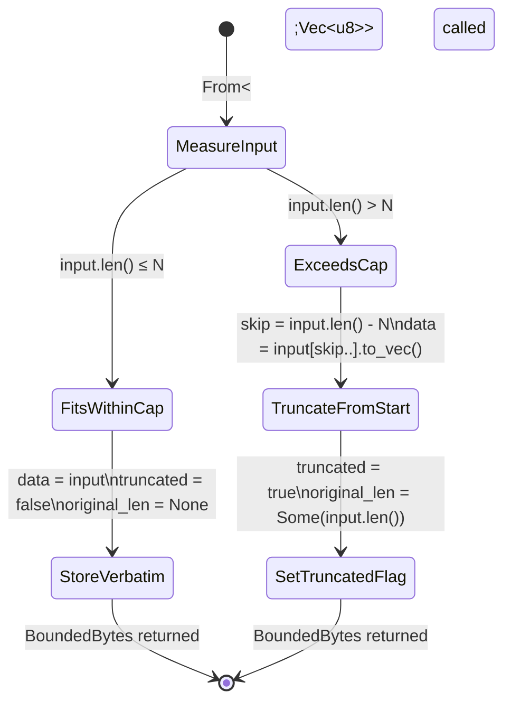
```mermaid
stateDiagram-v2
    [*] --> MeasureInput : From&lt;Vec&lt;u8&gt;&gt; called
    MeasureInput --> FitsWithinCap : input.len() ≤ N
    MeasureInput --> ExceedsCap : input.len() > N
    FitsWithinCap --> StoreVerbatim : data = input\ntruncated = false\noriginal_len = None
    StoreVerbatim --> [*] : BoundedBytes returned
    ExceedsCap --> TruncateFromStart : skip = input.len() - N\ndata = input[skip..].to_vec()
    TruncateFromStart --> SetTruncatedFlag : truncated = true\noriginal_len = Some(input.len())
    SetTruncatedFlag --> [*] : BoundedBytes returned
```

**Business rules (§5.5)**

- **PERF-BR-540**: `BoundedBytes::from_bytes()` MUST be the canonical constructor used everywhere in the codebase. Direct construction of `BoundedBytes { data: ..., truncated: ..., original_len: ... }` is prohibited outside `devs-core/src/types.rs`. Enforced by making the struct fields `pub(crate)`.
- **PERF-BR-541**: `BoundedString::new()` MUST NOT truncate. Any call site that receives `Err(ValidationError::StringTooLong)` MUST propagate it as a validation error, not silently truncate and continue.
- **PERF-BR-542**: The proportional truncation algorithm (PERF-118) MUST maintain the invariant that the sum of all `stage.stdout.len()` + `stage.stderr.len()` after truncation is `≤ available_for_content`. Floating-point rounding in `ratio` multiplication MUST be handled by a final clamp: if the sum after truncation exceeds the budget by ≤ 16 bytes, the implementation truncates the last stage's `stderr` by the excess. If the excess exceeds 16 bytes, the algorithm is restarted with integer arithmetic.
- **PERF-BR-543**: `estimate_metadata_bytes(stages)` MUST use the serialized byte count of all non-content fields (stage name, status, exit_code, log_path, truncated flag, JSON structural overhead). It MUST NOT use a fixed estimate; it MUST serialize the metadata skeleton and measure the result.
- **PERF-BR-544**: The context file write failure (e.g., disk full) MUST cause the stage to transition to `Failed` with `failure_reason: "context_file_write_failed"`. The agent MUST NOT be spawned. This failure is reported via `stage_complete_tx` and checkpointed.

**Edge cases (§5.5)**

1. **`BoundedBytes` from binary data with embedded null bytes**: Binary stdout (e.g., from a tool that outputs binary data) MUST be stored verbatim without null-termination or truncation at nulls. `BoundedBytes` stores raw bytes; no null-byte special handling occurs. The truncation boundary is purely byte-count based, not content-based.
2. **Proportional truncation with a single large stage**: If only one stage is in the dependency closure and its stdout alone (e.g., 20 MiB) exceeds the 10 MiB budget, the truncation ratio is `10 MiB / 20 MiB = 0.5`. The stage gets 5 MiB of stdout and 5 MiB of stderr allocation (50% each if both are present). If stderr is empty, the entire 10 MiB budget goes to stdout. The `truncated` flag on the stage is set to `true`.
3. **Metadata skeleton exceeds 10 MiB**: If a run has 256 stages each with long names, and the metadata skeleton serialization alone exceeds 10 MiB, all `stdout` and `stderr` fields are set to empty strings and all `stage.truncated` flags are `true`. The context file is written with empty content fields. A `WARN` log event is emitted: `"executor.context_metadata_too_large"`. The agent is still spawned; it receives a valid but content-empty context file.
4. **`serde::Deserialize` for `BoundedBytes` with oversized input**: If a `checkpoint.json` is manually edited to contain a base64-encoded string exceeding `N` bytes, `serde` deserialization returns an error. The containing `checkpoint.json` load fails with `CheckpointError::DeserializationFailed`. The run is marked `Unrecoverable` and the server continues. This prevents a tampered checkpoint from allocating unbounded memory.
5. **`BoundedString<128>` used for workflow name containing multi-byte UTF-8**: A workflow name `"análise-de-código"` (23 chars, 27 UTF-8 bytes) MUST be validated against the 128-byte limit, not the 128-character limit. The `BoundedString` implementation uses `s.len()` (byte count in Rust), not `s.chars().count()`. A workflow name that is 128 ASCII characters is valid; a name that is 128 characters but contains multi-byte sequences MAY be rejected if its byte count exceeds 128.

**Acceptance criteria (§5.5)**

| ID | Assertion | Method |
|---|-----------|--------|
| AC-PERF-5.5-001 | `BoundedBytes<1_048_576>` from 1 048 577 bytes: `len() == 1_048_576`, `truncated == true`, `original_len == Some(1_048_577)` | Unit test |
| AC-PERF-5.5-002 | `BoundedString<128>` from 129-byte ASCII string: returns `Err(StringTooLong)` | Unit test |
| AC-PERF-5.5-003 | Context file proportional truncation: total content ≤ 10 MiB; most recent bytes retained; `truncated` flag set | Unit test: `truncate_context_proportionally_respects_budget` |
| AC-PERF-5.5-004 | `truncate_utf8_from_start` with 4-byte emoji at position skip: split at character boundary (not mid-sequence) | Unit test: Japanese/emoji boundary test |
| AC-PERF-5.5-005 | `BoundedBytes` serde round-trip: serialize to JSON → deserialize → same bytes | Unit test: binary data with nulls |
| AC-PERF-5.5-006 | `BoundedBytes` from binary with null bytes: stored verbatim, no truncation at null | Unit test |
| AC-PERF-5.5-007 | No inline network-limit literals outside `devs-core/src/constants.rs`: `./do lint` grep exits 0 | CI lint check |
| AC-PERF-5.5-008 | Context file write failure (ENOSPC): stage transitions to `Failed` with `failure_reason: "context_file_write_failed"`; agent NOT spawned | Unit test with mock filesystem |

---

### 5.6 Dependencies

This section depends on and is constrained by the following components and specifications:

| Dependency | Nature | Section |
|---|---|---|
| `devs-core/src/types.rs` | Defines `BoundedBytes<N>`, `BoundedString<N>`, `RetentionPolicy` | §5.0, §5.5 |
| `devs-core/src/constants.rs` | Defines all network limit constants | §5.4, §5.5 |
| `devs-checkpoint` | Implements retention sweep algorithm; writes checkpoint and snapshot files | §5.3 |
| `devs-executor` | Enforces 10 MiB context file cap via proportional truncation | §5.2, §5.5 |
| `devs-grpc` (tonic config) | Enforces gRPC frame and per-RPC limits | §5.4 |
| `devs-mcp` (hyper middleware) | Enforces MCP 1 MiB body cap and 64-connection limit | §5.4 |
| `devs-webhook` | Enforces 64 KiB payload cap; uses SSRF check per delivery | §5.4 |
| `devs-tui` | Enforces 10 000-line log buffer cap; CPU-efficient render loop | §5.1, §5.2 |
| `2_TAS §3` (data model) | `StageOutput`, `StageRun`, `WorkflowRun` field definitions | §5.2 |
| `2_TAS §4` (checkpoint store) | Git-backed checkpoint protocol; `write-tmp-rename` atomicity | §5.3 |
| `3_MCP_DESIGN §4` (observability) | `ResourceBudgetSnapshot` emitted as structured log | §5.0 |
| `5_SECURITY §3` (file permissions) | Log file and checkpoint file mode `0600` | §5.3 |
| `8_RISKS §RISK-003` | Git checkpoint corruption mitigation | §5.3 |
| `8_RISKS §RISK-005` | Presubmit 15-minute wall-clock governs CPU budget design | §5.1 |

**Components that depend on this section**:

- **§6 (Scalability)**: The upper structural limits in §6.2 are derived from the per-unit resource budgets defined here (e.g., max 256 stages × 2 MiB per stage = 512 MiB max stage output).
- **§7 (Testing)**: All resource-budget test specifications reference the thresholds and acceptance criteria defined here.
- **§8 (Observability)**: `ResourceBudgetSnapshot` and `RetentionSweepResult` are the structured log events consumed by the monitoring conditions in §8.3.
- **§10 (Consolidated AC)**: §10.7 consolidates the per-subsection acceptance criteria from §5.1–§5.5.

---

### 5.7 Consolidated Acceptance Criteria for §5

The following table consolidates all acceptance criteria from §5.1–§5.5 into a single reference. Every row MUST be covered by an automated test annotated `// Covers: <ID>`.

| ID | Category | Assertion | Interface |
|---|---|---|---|
| AC-PERF-5.1-001 | CPU | Idle server CPU < 1% over 30 s | Integration |
| AC-PERF-5.1-002 | CPU | TUI static CPU < 5% over 30 s | Integration |
| AC-PERF-5.1-003 | CPU | No idle render issued on Tick with no state change | Unit |
| AC-PERF-5.1-004 | CPU | Log eviction index peek O(log N): p99 < 100 µs | Benchmark |
| AC-PERF-5.1-005 | CPU | No blocking calls in async tasks: CI lint | Lint |
| AC-PERF-5.1-006 | CPU | 64 concurrent stream clients: sender non-blocking | E2E |
| AC-PERF-5.2-001 | Memory | Server RSS < 64 MiB at startup (0 runs, 10 projects) | Integration |
| AC-PERF-5.2-002 | Memory | `BoundedBytes` 1 KiB input: no pre-alloc to 1 MiB | Unit |
| AC-PERF-5.2-003 | Memory | `BoundedBytes` 2 MiB input: `len() == 1 MiB`, `truncated == true` | Unit |
| AC-PERF-5.2-004 | Memory | Log buffer eviction decreases RSS | Integration |
| AC-PERF-5.2-005 | Memory | 40 active stage log buffers ≤ 100 MiB | Integration |
| AC-PERF-5.2-006 | Memory | `ENOMEM` on checkpoint: server continues; next write succeeds | Unit |
| AC-PERF-5.3-001 | Storage | Retention sweep 500 runs in ≤ 60 s p99; size ≤ 500 MiB | Integration |
| AC-PERF-5.3-002 | Storage | Active runs never deleted by sweep | E2E |
| AC-PERF-5.3-003 | Storage | Orphaned `.tmp` files deleted at startup with WARN | Unit |
| AC-PERF-5.3-004 | Storage | `checkpoint.json` contains `log_path` only; no inline content | Unit |
| AC-PERF-5.3-005 | Storage | Phase 2 deletes oldest `completed_at` first | Unit |
| AC-PERF-5.3-006 | Storage | Single git commit per sweep | Integration |
| AC-PERF-5.3-007 | Storage | Push failure: local deletions persist; state consistent | Integration |
| AC-PERF-5.4-001 | Network | MCP body > 1 MiB: HTTP 413; handler not invoked | MCP E2E |
| AC-PERF-5.4-002 | Network | gRPC response > 4 MiB: `RESOURCE_EXHAUSTED` | gRPC integration |
| AC-PERF-5.4-003 | Network | Webhook > 64 KiB: truncated; `data` valid JSON | Unit |
| AC-PERF-5.4-004 | Network | `stream_logs` chunks ≤ 32 KiB; no UTF-8 split | Unit |
| AC-PERF-5.4-005 | Network | 65th MCP connection: HTTP 503 JSON-RPC error | MCP E2E |
| AC-PERF-5.4-006 | Network | `stream_logs follow:true` terminal chunk after 30 min | Integration |
| AC-PERF-5.4-007 | Network | No inline network literals outside `constants.rs` | Lint |
| AC-PERF-5.4-008 | Network | `stream_logs` on Waiting stage cancelled: `done:true, total_lines:0` | E2E |
| AC-PERF-5.5-001 | Enforcement | `BoundedBytes` cap + `truncated` + `original_len` | Unit |
| AC-PERF-5.5-002 | Enforcement | `BoundedString` rejects oversized input | Unit |
| AC-PERF-5.5-003 | Enforcement | Context proportional truncation ≤ 10 MiB | Unit |
| AC-PERF-5.5-004 | Enforcement | `truncate_utf8_from_start` emoji boundary safe | Unit |
| AC-PERF-5.5-005 | Enforcement | `BoundedBytes` serde round-trip | Unit |
| AC-PERF-5.5-006 | Enforcement | Binary null bytes stored verbatim | Unit |
| AC-PERF-5.5-007 | Enforcement | No inline network literals: lint exits 0 | Lint |
| AC-PERF-5.5-008 | Enforcement | Context write failure → stage `Failed`; agent not spawned | Unit |

---

## 6. Scalability & Load Targets

### 6.0 Shared Data Models

#### 6.0.1 `LoadProfile`

Represents the instantaneous characterisation of server load. Emitted as structured log event `"server.load_profile_snapshot"` every 60 seconds when `active_run_count > 0`.

| Field | Type | Constraints | Description |
|---|---|---|---|
| `captured_at` | `DateTime<Utc>` | required | Snapshot time |
| `active_run_count` | `u32` | 0–20 | Currently Running or Paused runs |
| `active_stage_count` | `u32` | 0–1 024 | Stages in Running state across all runs |
| `registered_project_count` | `u32` | 0–20 | Projects in `Active` or `Removing` state |
| `grpc_connection_count` | `u32` | 0–50 | Live gRPC connections (TUI + CLI + agents) |
| `mcp_connection_count` | `u32` | 0–64 | Live MCP HTTP connections |
| `submissions_last_hour` | `u32` | ≥ 0 | Workflow submissions in the past 60 minutes |
| `log_lines_last_second` | `u32` | ≥ 0 | Log lines captured across all stages in the past 1 s |
| `classification` | `LoadClassification` | required | Derived load tier (see below) |

**`LoadClassification` enum**:

| Variant | Condition |
|---|---|
| `Nominal` | All metrics within the typical ranges in §6.1 |
| `Elevated` | Any metric between typical and peak values |
| `Peak` | Any metric at or above peak values |
| `OverLimit` | Any metric reaches or exceeds a hard structural limit — invariant violation |

**Derivation rule**: `classification = max(per-metric classification)`. Each metric is classified independently against the [typical, peak, limit] breakpoints from the §6.1 table. A `Nominal` classification requires every metric to be within its typical range.

#### 6.0.2 `StructuralLimitApproach`

Emitted as structured log event `"server.structural_limit_approach"` at `WARN` level when any metric crosses 80% of its hard structural limit. Rate-limited to one event per dimension per 5-minute window; resets when the metric drops below 70% (hysteresis).

| Field | Type | Constraints | Description |
|---|---|---|---|
| `dimension` | `string` | non-empty, snake_case | e.g., `"stages_per_workflow"`, `"mcp_connection_count"` |
| `current_value` | `u32` | ≥ 0 | Current observed value |
| `limit_value` | `u32` | ≥ 1 | Hard structural limit |
| `percentage_used` | `f32` | 0.0–100.0 | `current_value / limit_value × 100.0` |
| `threshold_pct` | `f32` | 80.0 | The monitoring threshold that triggered this event |
| `growth_path` | `string` | non-empty | Human-readable action to increase this limit |

#### 6.0.3 `StructuralLimitViolation`

Emitted as structured log event `"server.structural_limit_violation"` at `ERROR` level when a validated input or runtime state reaches or exceeds a hard structural limit and is rejected.

| Field | Type | Constraints | Description |
|---|---|---|---|
| `dimension` | `string` | non-empty | The dimension name |
| `value_attempted` | `u64` | > `limit_value` | The value that was attempted |
| `limit_value` | `u64` | from §6.2 table | The enforced hard limit |
| `enforcement_point` | `string` | `"validation"` \| `"type_system"` \| `"runtime"` | Where the violation was caught |
| `error_returned` | `string` | gRPC status code or HTTP status | What was returned to the caller |
| `request_id` | `string \| null` | null for type-system enforcement | Correlates with inbound request |

#### 6.0.4 `SloComplianceReport`

Emitted as structured log event `"server.slo_compliance_report"` at `INFO` level every 5 minutes during active operation.

| Field | Type | Constraints | Description |
|---|---|---|---|
| `report_id` | `UUIDv4` | required, unique | Identifies this report |
| `window_start` | `DateTime<Utc>` | required | Start of measurement window |
| `window_end` | `DateTime<Utc>` | required | End of measurement window |
| `load_tier` | `LoadClassification` | required | Peak classification during this window |
| `slo_results` | `Vec<SloResult>` | ≥ 0 entries | One entry per SLO evaluated in this window |
| `total_requests_measured` | `u64` | ≥ 0 | Total requests across all SLOs |
| `slo_violation_count` | `u32` | ≥ 0 | SLOs that exceeded their p99 threshold in this window |

**`SloResult`** — per-SLO entry in `SloComplianceReport`:

| Field | Type | Constraints | Description |
|---|---|---|---|
| `slo_id` | `string` | e.g. `"PERF-006"` | The SLO identifier from §2 |
| `operation` | `string` | non-empty | Operation name |
| `boundary` | `MeasurementBoundary` | enum | Where measured |
| `sample_count` | `u64` | ≥ 0 | Requests measured in window |
| `p50_ms` | `f64` | ≥ 0.0 | 50th-percentile latency |
| `p99_ms` | `f64` | ≥ p50_ms | 99th-percentile latency |
| `threshold_ms` | `u64` | from §2 SLO table | The p99 target |
| `compliant` | `bool` | derived | `p99_ms ≤ threshold_ms` |

**Business rules for §6.0**

- **PERF-BR-600**: `LoadProfile` MUST be emitted every 60 seconds when `active_run_count > 0`. It MUST NOT be emitted during full idle (no active runs, no open connections) to avoid polluting the log with zero-value snapshots.
- **PERF-BR-601**: `LoadClassification::OverLimit` is a fatal invariant violation that MUST NEVER occur in a correctly functioning server. If observed at runtime (e.g., a metric reaches a hard limit that was not enforced at ingress), the server MUST log `ERROR "server.structural_limit_overrun"` and continue processing other requests. The server MUST NOT panic or restart.
- **PERF-BR-602**: `StructuralLimitApproach` events MUST be rate-limited to at most one per dimension per 5-minute window. Multiple threshold crossings within the window emit only one event. The rate-limiter resets when the metric drops below 70% of the limit (hysteresis), preventing oscillation at the 80% boundary.
- **PERF-BR-603**: All fields in `LoadProfile` MUST be computed under a single `SchedulerState` read lock. The snapshot MUST be internally consistent: `active_stage_count` MUST NOT include stages from a run whose `active_run_count` presence was already counted before a concurrent completion updated it.
- **PERF-BR-604**: `SloComplianceReport` construction MUST NOT re-measure SLOs; it MUST read from the rolling `SloViolation` log buffer maintained by the monitoring subsystem (§2.5). Reports constructed from live measurement introduce additional latency on the measurement path.

---

### 6.1 Expected Operating Range (MVP)

**[PERF-079]** The MVP deployment model is a single-user or small-team server running on a developer workstation or lightweight CI runner. The expected steady-state load profile is:

| Metric | Typical | Peak (burst) |
|--------|---------|--------------|
| Concurrent active runs | 2–4 | 10 |
| Concurrent active stages | 4–16 | 64 |
| Registered projects | 1–5 | 20 |
| gRPC client connections | 1–3 | 10 |
| MCP concurrent connections | 1–5 | 64 |
| Workflow submissions per hour | 5–20 | 100 |
| Log lines per second (all stages) | 10–100 | 1 000 |

**[PERF-080]** All SLOs in §2 must be met at the **peak** values in the table above. The server must not require any configuration changes, tuning, or restarts to handle peak load.

**[PERF-126]** At peak load, all seven peak metrics MUST be simultaneously satisfiable. The combined scenario — 10 active runs, 64 active stages, 20 projects, 10 gRPC connections, 64 MCP connections, 100 submissions/hour, 1 000 log lines/second — MUST be achievable on the reference hardware ([PERF-081]) without any single SLO target being violated due to resource contention between subsystems.

**[PERF-127]** When any metric moves from `Nominal` to `Elevated` or `Peak` (as classified by `LoadProfile.classification`), no operational intervention is required. The server MUST handle the load increase dynamically without restart, reconfiguration, or manual tuning.

**Operating range state machine** — load tier transitions:

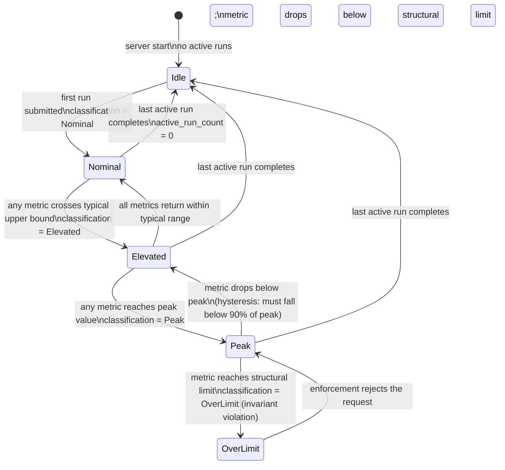
```mermaid
stateDiagram-v2
    [*] --> Idle : server start\nno active runs
    Idle --> Nominal : first run submitted\nclassification = Nominal
    Nominal --> Elevated : any metric crosses typical upper bound\nclassification = Elevated
    Elevated --> Nominal : all metrics return within typical range
    Elevated --> Peak : any metric reaches peak value\nclassification = Peak
    Peak --> Elevated : metric drops below peak\n(hysteresis: must fall below 90% of peak)
    Peak --> OverLimit : metric reaches structural limit\nclassification = OverLimit (invariant violation)
    OverLimit --> Peak : enforcement rejects the request;\nmetric drops below structural limit
    Nominal --> Idle : last active run completes\nactive_run_count = 0
    Elevated --> Idle : last active run completes
    Peak --> Idle : last active run completes
```

**SLO coverage at peak load** — which SLOs are exercised at each peak metric:

| Peak metric | SLOs exercised |
|---|---|
| 64 active stages | PERF-001 (DAG dispatch 100 ms), PERF-021, PERF-048 (pool semaphore) |
| 64 MCP connections | PERF-003 (MCP observation 2 000 ms), PERF-045, PERF-055 |
| 10 gRPC connections | PERF-006 through PERF-013 (gRPC read/write SLOs) |
| 1 000 log lines/s | PERF-039 (log streaming latency), PERF-150, PERF-151 |
| 10 active runs | PERF-002 (TUI re-render 50 ms), PERF-043 |
| 100 submissions/hour | PERF-032, PERF-033 (checkpoint write throughput) |
| 20 projects | PERF-059 (multi-project scheduling p99 < 100 ms) |

#### Data Models for §6.1

No additional data models beyond §6.0.4 (`SloComplianceReport`) are required for §6.1. The `LoadProfile` (§6.0.1) is the primary observable for load classification. The `SloResult` fields within `SloComplianceReport` provide per-SLO compliance status at peak load.

The `LoadProfile.classification` field MUST be compared against the peak row of the §6.1 table for classification: a metric at exactly its peak value is `Peak`; a metric strictly between typical upper bound and peak is `Elevated`; a metric within or below the typical range is `Nominal`.

#### API Contract for §6.1

```
LoadProfile is not directly queryable via MCP or gRPC. It is observable via:
  1. Structured log stream (filter on event_type: "server.load_profile_snapshot")
  2. get_pool_state MCP tool — exposes per-pool active_count, queued_count, max_concurrent
  3. list_runs MCP tool with status_filter — observable active run count

SloComplianceReport is observable via structured log only.
No dedicated RPC or MCP tool exposes SLO compliance data; consumers must parse
the structured log stream or configure a log aggregator.

get_pool_state response includes server_uptime_ms (monotonic from server start)
which allows agents to detect server restarts between consecutive calls.
```

#### Business Rules for §6.1

**[PERF-BR-610]** All SLOs in §2 MUST remain compliant when all peak-load metrics in the PERF-079 table are simultaneously at their peak values. SLO p99 targets at peak are not relaxed from their nominal values; the 1.5× CI margin (§2.3) applies only in automated CI test environments, not in production peak scenarios.

**[PERF-BR-611]** `LoadClassification` MUST be derived as `max(per-metric classification)`. If `active_stage_count` is `Peak` while all other metrics are `Nominal`, the overall classification is `Peak`. A `Nominal` classification requires every metric to be within its typical range simultaneously.

**[PERF-BR-612]** `LoadProfile` snapshot construction MUST NOT consume measurable CPU or I/O during peak load. All counters MUST be maintained as `AtomicU32` in-memory fields, updated at each relevant state transition. The snapshot MUST be assembled by reading those atomics under a single `SchedulerState` read lock; no disk reads or gRPC calls are performed. Construction and serialisation MUST complete within p99 < 1 ms.

**[PERF-BR-613]** At peak load (64 active stages), the `stage_complete_tx` channel (buffer 256) MUST have sufficient headroom to accept completions from all 64 stages simultaneously. Since `256 > 64`, the channel MUST NOT apply backpressure to agent exit handlers during a worst-case simultaneous-completion event at peak stage count.

**[PERF-BR-614]** Webhook dispatch at peak (100 submissions/hour ≈ 0.028 submissions/second) MUST NOT cause `webhook_tx` channel overflow. With a 1 024-event buffer and ≤ 100 events/hour, overflow indicates either a webhook target outage (causing delivery tasks to back up) or misconfigured webhook fan-out. A `webhook.channel_overflow` WARN event MUST be emitted with the `dropped_count` and current `channel_size` on any overflow.

**[PERF-BR-615]** Log line throughput at 1 000 lines/second MUST NOT cause server-side log buffer overflow for individual stages unless a single stage exceeds ~15 lines/second for more than ~650 seconds (10 000 lines ÷ 15 lines/s). At peak (64 stages × ≈15.6 lines/s/stage), each stage's `LogBuffer` evicts its oldest lines once it reaches 10 000 entries. Eviction MUST NOT cause stage failure, affect dispatch latency, or write any error to the structured log at `ERROR` level; it is expected behaviour documented in §5.2.

**[PERF-BR-616]** `LoadClassification` MUST use hysteresis at the `Peak → Elevated` boundary: a metric that crosses from `Peak` back toward `Elevated` MUST NOT transition the classification unless it drops below 90% of the peak threshold. This prevents oscillation events when a metric hovers at the boundary (e.g., `active_stage_count` toggling between 63 and 64).

#### Edge Cases for §6.1

1. **Simultaneous spike across all seven metrics**: All peak values hit concurrently. The most constrained path is the intersection of MCP write-lock contention (64 connections × mix of control/observation tools) and DAG dispatch latency (64 stages completing and being re-dispatched). The dispatch loop runs outside the `SchedulerState` write lock (PERF-BR-422); MCP write-lock hold time is bounded by PERF-BR-442 (5 s timeout). These are independent lock domains. The p99 dispatch latency (PERF-001: 100 ms) MUST NOT degrade during MCP write-lock contention.

2. **100 submissions within a 60-second window (burst)**: 100 `submit_run` calls in 60 s = 1.67 calls/s. Each write lock hold time is < 50 ms. At 1.67/s with a 50 ms hold, the write lock is held ≈8.3% of the time, providing ≈91.7% read-lock availability for the 64 concurrent observation tools. The p99 read-lock acquisition wait is bounded by PERF-BR-443 (1 s timeout), which is far above the ≈8% contention probability.

3. **1 000 log lines/second across 64 active stages**: Average ≈15.6 lines/s per stage. At this rate, individual stage `LogBuffer`s fill completely in ≈640 seconds (10 000 lines ÷ 15.6 lines/s). The total buffered line count across 64 stages is 640 000 lines. Memory cost at 256 bytes/line average = ≈164 MiB on the server side. This is within the server's memory budget: 64 MiB baseline + ≈100 MiB log buffers (PERF-066 target for 40 stages) scales to ≈164 MiB for 64 stages, totalling ≈228 MiB — within the 512 MiB reference hardware RAM budget.

4. **gRPC at 10 simultaneous connections**: 10 concurrent gRPC clients (e.g., 1 TUI + 1 CLI + 8 agent monitoring connections). Each `StreamRunEvents` subscriber holds a `broadcast::Receiver`. At 10 receivers, the broadcast clone cost per event is O(10 × `Arc` increment), which is negligible (< 1 µs). SLOs remain well within target.

5. **Load metric oscillating at the `Peak ↔ Elevated` boundary**: `active_stage_count` toggles between 62 and 64 due to rapid dispatch/completion cycles. With hysteresis (PERF-BR-616), the classification stays `Peak` until the count drops below 57 (90% × 64 ≈ 57.6). No oscillation events are emitted; the `LoadProfile` emitted every 60 s reflects the instantaneous classification at snapshot time.

**Acceptance Criteria for §6.1**

| ID | Assertion | Method |
|---|---|---|
| AC-PERF-6.1-001 | All §2 SLOs met when all 7 peak metrics are simultaneously at peak values | Synthetic E2E soak test; all SLO timing assertions pass |
| AC-PERF-6.1-002 | `LoadProfile` snapshot construction p99 < 1 ms with 64 active stages | Micro-benchmark in `devs-core`; `ThroughputMeasurement` |
| AC-PERF-6.1-003 | 64 simultaneous agent exits: `stage_complete_tx` does not block any exit handler | Unit test: 64 concurrent `try_send()` calls on a 256-capacity channel; all return `Ok` |
| AC-PERF-6.1-004 | 100 submissions in 60 s: all accepted; dispatch latency p99 < 200 ms throughout | E2E burst submission test |
| AC-PERF-6.1-005 | Load tier hysteresis: `Peak → Elevated` classification only when metric < 90% of peak threshold | Unit test: inject metrics at 91% then 89% of peak; assert event emitted only at 89% |
| AC-PERF-6.1-006 | 1 000 log lines/s for 60 s: no stage failure; `LogBuffer` evicts only; dispatch latency unaffected | E2E soak test with high-throughput log generator |

---

### 6.2 Upper Structural Limits

These are hard system boundaries enforced by validation or the type system; performance SLOs do not apply above these limits:

| Dimension | Hard limit | Enforcement point | Response when exceeded |
|---|---|---|---|
| Stages per workflow | 256 | `submit_run` validation | gRPC `INVALID_ARGUMENT "workflow exceeds 256 stage limit: submitted N stages"` |
| Fan-out count | 64 | `FanOutConfig` validation | gRPC `INVALID_ARGUMENT "fan_out.count exceeds 64: got N"` |
| Pool `max_concurrent` | 1 024 | `AgentPool` type (`u16` field) | Config parse error at startup; server does not start |
| Workflow inputs | 64 | `submit_run` validation | gRPC `INVALID_ARGUMENT "run has more than 64 input fields: got N"` |
| Stage env vars | 256 | `submit_run` validation | gRPC `INVALID_ARGUMENT "stage env exceeds 256 entries: got N"` |
| Webhook targets per project | 16 | `create_webhook` validation | gRPC `INVALID_ARGUMENT "project exceeds 16 webhook targets"` |
| MCP concurrent connections | 64 | TCP acceptor `AtomicU32` counter | HTTP 503 `{"error":"resource_exhausted: max concurrent MCP connections (64) reached"}` |
| gRPC client event buffer | 256 messages | `broadcast` channel capacity | Oldest event dropped; subscriber receives `RecvError::Lagged` on next `recv()` |
| TUI log buffer per stage | 10 000 lines | `LogBuffer::max_capacity` | Oldest line evicted silently; `LogBuffer::evicted_count` incremented |
| Template stdout/stderr truncation | 10 240 bytes | `TemplateResolver` | Oldest bytes truncated; `truncated: true` in `ContextStage` |
| Context file | 10 MiB | Proportional truncation (§5.5) | Content fields truncated proportionally; agent still spawned |
| `BoundedBytes` per field | 1 048 576 bytes | Type system `From<Vec<u8>>` | Oldest bytes truncated; `truncated = true`; `original_len = Some(N)` |
| `BoundedString` per field | Per-type N bytes | Type system `TryFrom<String>` | `ValidationError::StringTooLong` → gRPC `INVALID_ARGUMENT` |
| Retry `max_attempts` | 20 | `RetryConfig` parse (warn-and-clamp) | Value clamped to 20; `WARN "config.retry_max_attempts_clamped"` logged; server starts |
| Concurrent active fallbacks | 3 | `fallback-registry.json` validation | gRPC `INVALID_ARGUMENT "max fallback count (3) reached"` |
| Registered projects | 20 | `create_project` validation | gRPC `RESOURCE_EXHAUSTED "max project count (20) reached"` |

**Limit enforcement model** — categorised by enforcement style:

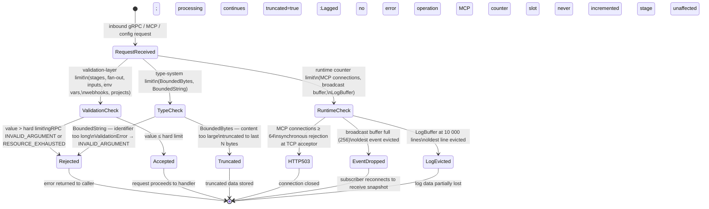
```mermaid
stateDiagram-v2
    [*] --> RequestReceived : inbound gRPC / MCP / config request
    RequestReceived --> ValidationCheck : validation-layer limit\n(stages, fan-out, inputs, env vars,\nwebhooks, projects)
    RequestReceived --> TypeCheck : type-system limit\n(BoundedBytes, BoundedString)
    RequestReceived --> RuntimeCheck : runtime counter limit\n(MCP connections, broadcast buffer,\nLogBuffer)

    ValidationCheck --> Rejected : value > hard limit\ngRPC INVALID_ARGUMENT or RESOURCE_EXHAUSTED
    ValidationCheck --> Accepted : value ≤ hard limit; processing continues

    TypeCheck --> Truncated : BoundedBytes — content too large\ntruncated to last N bytes; truncated=true
    TypeCheck --> Rejected : BoundedString — identifier too long\nValidationError → INVALID_ARGUMENT

    RuntimeCheck --> HTTP503 : MCP connections ≥ 64\nsynchronous rejection at TCP acceptor
    RuntimeCheck --> EventDropped : broadcast buffer full (256)\noldest event evicted; RecvError::Lagged
    RuntimeCheck --> LogEvicted : LogBuffer at 10 000 lines\noldest line evicted; no error

    Rejected --> [*] : error returned to caller; no state change
    Accepted --> [*] : request proceeds to handler
    Truncated --> [*] : truncated data stored; operation continues
    HTTP503 --> [*] : connection closed; MCP counter slot never incremented
    EventDropped --> [*] : subscriber reconnects to receive snapshot
    LogEvicted --> [*] : log data partially lost; stage unaffected
```

#### Data Models for §6.2

**`LimitEnforcementRecord`** — emitted as structured log event `"server.limit_enforcement"` at `DEBUG` level whenever a structural limit blocks an operation:

| Field | Type | Constraints | Description |
|---|---|---|---|
| `enforcement_id` | `UUIDv4` | required, unique | Identifies this enforcement event |
| `dimension` | `string` | non-empty, snake_case | e.g., `"stages_per_workflow"` |
| `attempted_value` | `u64` | > `limit_value` | The value that was attempted |
| `limit_value` | `u64` | from §6.2 table | The hard limit |
| `enforcement_point` | `string` | `"validation"` \| `"type_system"` \| `"runtime"` | Which mechanism caught the violation |
| `action_taken` | `string` | `"rejected"` \| `"truncated"` \| `"dropped"` \| `"evicted"` | What the server did |
| `request_id` | `string \| null` | null for type-system enforcement | Correlates with inbound request |
| `run_id` | `UUIDv4 \| null` | null if not in run context | Associated run |
| `caller_identity` | `string` | `"grpc"` \| `"mcp"` \| `"tui"` \| `"config"` | Which interface triggered this |

**`LimitMonitorState`** — in-memory tracker in `devs-core/src/limit_monitor.rs`:

| Field | Type | Description |
|---|---|---|
| `mcp_connection_count` | `Arc<AtomicU32>` | Current live MCP connections (SeqCst); shared with MCP acceptor |
| `broadcast_lag_counts` | `HashMap<RunId, u32>` | Per-run subscriber lag event counts since last reconnect |
| `log_eviction_counts` | `HashMap<(RunId, StageName), u64>` | Per-stage cumulative evicted line counts |
| `approach_suppression` | `HashMap<String, Instant>` | Per-dimension suppression expiry for `StructuralLimitApproach` |

#### API Contract for §6.2

```
Structural limit enforcement is transparent to callers: all limits return
the appropriate error (see §6.2 table) with no additional protocol overhead.

Validation-layer limits:
  All gRPC handlers that enforce validation limits MUST check the limit
  BEFORE acquiring any write lock. A request that violates a validation
  limit returns its error without touching SchedulerState.

Type-system limits:
  BoundedBytes<N> and BoundedString<N> enforce their limits at construction
  time in Rust. No runtime check or RPC call is involved. Validation errors
  from BoundedString propagate as gRPC INVALID_ARGUMENT at the handler boundary.

Runtime counter limits:
  MCP connection limit: enforced at TCP acceptor level (before HTTP parsing).
  Broadcast buffer: enforced by tokio::sync::broadcast channel semantics.
  LogBuffer: enforced by LogBuffer::push() eviction policy.

Error message format for validation-layer rejections (MUST be followed):
  INVALID_ARGUMENT "<dimension_human_name> exceeds <limit>: <detail>"
  RESOURCE_EXHAUSTED "<resource_human_name> limit (<limit>) reached"
```

#### Business Rules for §6.2

**[PERF-BR-620]** Every hard limit in the §6.2 table MUST be defined as a named `pub const` in `devs-core/src/constants.rs`. No validation code, runtime check, or type definition MUST use an inline integer literal for a structural limit. The `./do lint` custom grep check MUST detect and reject files outside `devs-core/src/constants.rs` that contain numeric literals matching the limit values.

**[PERF-BR-621]** Validation-layer limits (stages per workflow, fan-out count, workflow inputs, stage env vars, webhook targets, registered projects) MUST be checked BEFORE any write lock is acquired. A request that violates a validation limit returns its error under a read lock (or no lock); this prevents a crafted oversized request from serialising behind write-lock holders or blocking legitimate write operations.

**[PERF-BR-622]** Type-system limits (`BoundedBytes<N>`, `BoundedString<N>`) MUST be enforced purely at the Rust type level. No `unsafe` block in `devs-core/src/types.rs` MUST construct a `BoundedBytes<N>` with more than `N` bytes. All `unsafe` blocks MUST carry a safety comment explicitly excluding bound violations.

**[PERF-BR-623]** The MCP connection limit (64) MUST be enforced at the TCP connection acceptor level using the `Arc<AtomicU32>` counter with `SeqCst` ordering (PERF-BR-440). The constant used MUST be `MCP_MAX_CONCURRENT_CONNECTIONS` imported from `devs-core/src/constants.rs`, not an inline literal.

**[PERF-BR-624]** `LogBuffer` eviction MUST be silent with respect to the running stage. Eviction MUST NOT write anything to the stage's stdin, MUST NOT affect the stage's `StageRun` status, and MUST NOT produce an `ERROR`-level structured log event. Only the MCP `stream_logs` response acknowledges eviction via `truncated: true` on `LogChunk`.

**[PERF-BR-625]** All validation-error messages for structural limit violations MUST include the dimension name, the attempted value, and the limit value in a machine-parseable format. Required format: `"<dimension> exceeds <limit>: <detail with actual value>"`. Example: `INVALID_ARGUMENT "workflow exceeds 256 stage limit: submitted 300 stages"`. This format enables automated alerting to detect when callers are approaching limits.

**[PERF-BR-626]** `RetryConfig.max_attempts` (limit: 20) MUST be enforced at config parse time with a `WARN` log and clamping rather than a startup error. Operators copying configs with higher values must still be able to run the server. All other structural limits that appear in §6.2 as hard limits (pool `max_concurrent`, project limit, webhook target limit) ARE startup errors; the server MUST NOT start with a config that violates them.

**[PERF-BR-627]** A `broadcast::RecvError::Lagged(N)` MUST be logged at `WARN` level with event type `"server.event_subscriber_lagged"` including the subscriber's `client_id` and `lag_count: N`. The server MUST NOT terminate the stream upon lag; the subscriber decides independently whether to reconnect.

**[PERF-BR-628]** The gRPC broadcast channel capacity (256 messages, `RUN_EVENT_BROADCAST_CAPACITY`) is a known-tight constant for 256-stage workflows. A 256-stage workflow completing simultaneously generates approximately 256 + run-level events (≈258–260 total). The 256 capacity MUST include a `// WARNING: tight for max-size workflows; see §6.3` comment in `devs-core/src/constants.rs`.

**[PERF-BR-629]** The fan-out stage limit (64) and the MCP connection limit (64) are coincidentally equal but MUST be enforced by separate named constants (`FAN_OUT_MAX_COUNT` and `MCP_MAX_CONCURRENT_CONNECTIONS`). Changing one MUST NOT silently change the other. A single constant shared between both uses is a correctness violation.

#### Edge Cases for §6.2

1. **Workflow with exactly 256 stages**: A `submit_run` with exactly 256 stages MUST succeed. The check is `if stages.len() > MAX_WORKFLOW_STAGES { return Err(...) }`, not `>=`, making 256 the inclusive maximum. No I/O is performed before this check; it operates on the parsed request proto before any write lock is acquired.

2. **Fan-out `count = 64` (the limit)**: A fan-out stage with `count: 64` MUST succeed. `count: 65` MUST fail with `INVALID_ARGUMENT "fan_out.count exceeds 64: got 65"`. Fan-out count is validated independently from total workflow stage count; a workflow can contain fan-out stages whose runtime expansion produces more than 256 sub-stage records (e.g., two fan-out stages of 64 each = 128 sub-stages), because the hard limit applies to the workflow definition, not the runtime expansion.

3. **MCP 64th connection (at limit)**: The 64th connection atomically increments `AtomicU32` counter to 64 and is accepted. The 65th connection checks `counter >= 64` before incrementing; finding it at 64, it returns HTTP 503 immediately without incrementing. The counter does not temporarily reach 65. This MUST be verified by the `SeqCst` ordering on the `compare_exchange` or `fetch_add`-with-check operation.

4. **`BoundedBytes<1_048_576>` at the exact boundary**: Input of exactly `1_048_576` bytes MUST store all bytes verbatim: `truncated = false`, `original_len = None`, `len() == 1_048_576`. Input of `1_048_577` bytes MUST store the last `1_048_576` bytes: `truncated = true`, `original_len = Some(1_048_577)`, `len() == 1_048_576`.

5. **Pool `max_concurrent = 1 024` (maximum)**: All 1 024 semaphore permits are acquirable without deadlock. With 1 024 simultaneously running agents, `active_count = 1 024`, `available_count = 0`, `queued_count = 0`, `exhausted = false` (pool utilisation is not the same as rate-limit exhaustion). The invariant `active_count + available_count == max_concurrent` MUST hold (PERF-BR-402).

6. **21st project registration while 20th is in `ProjectRemoving`**: `Removing` projects count toward the 20-project limit until they reach `ProjectRemoved`. A request to create a 21st project while any 20 projects exist in `Active` or `Removing` state MUST return `RESOURCE_EXHAUSTED "max project count (20) reached"`. New projects can only be registered after an existing project fully reaches `ProjectRemoved`.

7. **`max_attempts = 50` in config**: The server parses the value, detects `50 > 20`, clamps to 20, emits `WARN "config.retry_max_attempts_clamped: 50 → 20"`, and starts normally. All retry logic uses `effective_max_attempts = 20`. The original `devs.toml` is not modified; the clamping is in-memory only.

**Acceptance Criteria for §6.2**

| ID | Assertion | Method |
|---|---|---|
| AC-PERF-6.2-001 | `submit_run` with 257 stages: `INVALID_ARGUMENT`; no write lock acquired (verified by lock spy) | Unit test with mock write-lock spy |
| AC-PERF-6.2-002 | `submit_run` with exactly 256 stages: run created successfully | E2E test |
| AC-PERF-6.2-003 | Fan-out `count = 65` rejected with `INVALID_ARGUMENT`; `count = 64` accepted | Unit test |
| AC-PERF-6.2-004 | 64th MCP connection accepted; 65th receives HTTP 503 synchronously without counter reaching 65 | E2E load test: 65 concurrent clients; assert HTTP 503 on 65th |
| AC-PERF-6.2-005 | `BoundedBytes<1_048_576>`: exactly-at-cap input has `truncated = false`; cap+1 input has `truncated = true` | Unit test |
| AC-PERF-6.2-006 | Pool `max_concurrent = 1 024`: all 1 024 permits acquirable concurrently without deadlock | Unit test: 1 024 concurrent `acquire_owned()` tasks; assert all complete |
| AC-PERF-6.2-007 | 21st project while 20th is in `Removing`: `RESOURCE_EXHAUSTED` | Unit test |
| AC-PERF-6.2-008 | `RetryConfig.max_attempts = 50`: server starts; `WARN` logged; effective value is 20 | Unit test: parse config; assert `effective_max_attempts == 20` and WARN emitted |
| AC-PERF-6.2-009 | All structural limits defined as named constants in `devs-core/src/constants.rs`; no inline literals elsewhere | `./do lint` grep check; exits non-zero on inline literal violation |
| AC-PERF-6.2-010 | Validation error messages include dimension name, attempted value, and limit value | Unit test: assert error message format for each validation-layer limit |
| AC-PERF-6.2-011 | `broadcast::RecvError::Lagged(N)` emits `WARN "server.event_subscriber_lagged"` with `client_id` and `lag_count: N` | Unit test: pause subscriber; inject 257 events; assert WARN log contents |
| AC-PERF-6.2-012 | `FAN_OUT_MAX_COUNT` and `MCP_MAX_CONCURRENT_CONNECTIONS` are separate constants | Compile-time: grep for both constants; assert distinct symbols; unit test changing one does not affect the other |

---

### 6.3 Growth Projection

No horizontal scaling or sharding is planned for MVP. All performance targets are achievable on a single process with a single Tokio runtime. The architecture is forward-compatible with the following post-MVP growth paths:

- **Post-MVP load increase**: Pool `max_concurrent` increase (config change only); no code change required.
- **Post-MVP multi-machine**: Remote SSH and Docker execution environments already distribute agent subprocess load off the server machine. The server itself remains a single process.
- **Post-MVP TLS**: `rustls` interceptor path is pre-allocated; enabling TLS adds < 1 ms to connection establishment and < 0.5 ms per gRPC call.

**[PERF-081]** No performance target in this document requires more than 1 CPU core, 512 MiB RAM, or 1 Gbps LAN bandwidth on the server host machine to be met at peak MVP load.

**[PERF-128]** The single-process, single-runtime architecture MUST NOT require code changes to scale pool `max_concurrent` from 1 to 1 024. Pool capacity is governed entirely by the `max_concurrent` field in `devs.toml`; the `Semaphore` is created with the configured permit count at startup. No pool-specific threading, executor tuning, or runtime configuration changes are required.

**[PERF-129]** Post-MVP TLS (via `rustls`) MUST be addable as a zero-breaking-change, opt-in configuration field (`[server.tls]` in `devs.toml`). All gRPC and MCP HTTP connections MUST work with or without TLS. TLS handshake overhead (< 1 ms per connection) MUST be additive to SLO targets and measured separately; it MUST NOT be included in the SLO measurement windows defined in §2.2.

**[PERF-130]** The structured log format (§8.1) MUST be machine-parseable by external log aggregators (Loki, Datadog, CloudWatch) without any server code changes. All §8.1 performance fields MUST be top-level keys in the JSON output when `RUST_LOG_FORMAT=json` is set. Future observability backend integrations MUST be addable by configuring external log collectors only.

**Post-MVP capacity growth model** — projecting load versus limits:

| Dimension | MVP Peak | MVP Structural Limit | Growth headroom | Post-MVP path |
|---|---|---|---|---|
| Active stages | 64 | 256 per workflow × any run count | 4× per workflow | Increase `max_concurrent` in pool config |
| MCP connections | 64 | 64 (hard) | 0× — at limit | Increase `MCP_MAX_CONCURRENT_CONNECTIONS`; rebuild |
| Active runs | 10 | No direct run-count cap | N× — pool semaphore | Increase `max_concurrent` in pool config |
| Log lines/s | 1 000 | ≈10 000/stage (buffer × stage count) | 10× per stage | Increase `LOG_BUFFER_MAX_CAPACITY`; rebuild |
| Registered projects | 20 | 20 (hard) | 0× — at limit | Increase `MAX_PROJECT_COUNT`; rebuild |
| Webhook targets/project | 16 | 16 (hard) | 0× — at limit | Increase `MAX_WEBHOOK_TARGETS_PER_PROJECT`; rebuild |
| Pool max agents | 1 024 | 1 024 (type: `u16`) | 0× — at type limit | Widen type to `u32`; rebuild |

**Growth projection state machine** — lifecycle of a dimension approaching capacity:

```mermaid
stateDiagram-v2
    [*] --> BelowThreshold : metric < 80% of limit
    BelowThreshold --> ApproachingLimit : metric ≥ 80% of limit\nStructuralLimitApproach WARN emitted
    ApproachingLimit --> BelowThreshold : metric drops below 70% of limit\n(hysteresis)
    ApproachingLimit --> AtLimit : metric = hard limit\nStructuralLimitViolation ERROR emitted;\nrequest rejected
    AtLimit --> ApproachingLimit : enforcement rejects excess;\nmetric returns below limit
    ApproachingLimit --> ConfigUpgradeRecommended : dimension at ≥ 80% for > 7 consecutive days\nWARN "capacity.upgrade_recommended" emitted
    ConfigUpgradeRecommended --> BelowThreshold : config change or code rebuild increases limit
    ConfigUpgradeRecommended --> AtLimit : continued growth hits hard limit
```

#### Business Rules for §6.3

**[PERF-BR-630]** The post-MVP TLS addition MUST be implementation-ready at MVP launch: all TCP acceptors MUST use `tokio::net::TcpListener` (not `std::net::TcpListener`), so that wrapping with `tokio_rustls::TlsAcceptor` requires only adding a configuration layer, not restructuring the acceptor code.

**[PERF-BR-631]** All constants that are at or near the MVP peak value and require a rebuild to increase (`MCP_MAX_CONCURRENT_CONNECTIONS = 64`, `MAX_PROJECT_COUNT = 20`, `MAX_WEBHOOK_TARGETS_PER_PROJECT = 16`, `RUN_EVENT_BROADCAST_CAPACITY = 256`) MUST each have a `// Growth path: increase this constant and rebuild` comment in `devs-core/src/constants.rs`. Constants that are config-only (`pool.max_concurrent`) MUST have a `// Growth path: increase max_concurrent in devs.toml (no rebuild required)` comment.

**[PERF-BR-632]** The `StructuralLimitApproach` WARN event MUST include a `growth_path` field describing what the operator must do. For config-only limits: `"increase max_concurrent in devs.toml"`. For rebuild-required limits: `"increase CONSTANT_NAME in devs-core/src/constants.rs and rebuild"`. This field enables automated tooling to generate actionable runbook entries.

**[PERF-BR-633]** The broadcast channel capacity (`RUN_EVENT_BROADCAST_CAPACITY = 256`) is a known-tight constant for max-size workflows. The constant MUST include the comment: `// WARNING: 256-stage workflows can generate ~260 simultaneous events; this capacity may be insufficient for large parallel completions. See §6.3.` This documents the known risk without requiring a fix at MVP.

**[PERF-BR-634]** Log throughput at 1 000 lines/second at peak MUST be sustainable within the server's async I/O budget. The log capture path (`tokio::io::AsyncBufReadExt::lines()` on the agent stdout pipe → `broadcast::Sender<LogLine>`) MUST complete each line capture as a single non-blocking `send()`. If the broadcast channel for a stage has no receivers (e.g., no MCP `stream_logs` follower), `send()` returns `SendError::NoReceivers` which MUST be ignored (not logged at `WARN` or `ERROR`).

**[PERF-BR-635]** The external log aggregator compatibility MUST be verified by including a CI check that pipes `./do test` JSON log output through `jq .` and asserts exit code 0. All §8.1 structured log fields MUST appear as top-level JSON keys in the output, not nested under a `fields` wrapper. This is configured by using `tracing_subscriber::fmt().json().flatten_event(true)`.

#### Edge Cases for §6.3

1. **MCP connection limit saturated for 7+ days**: Persistent `StructuralLimitApproach` WARN events for `mcp_connection_count` at ≥ 80% (≥ 51 connections) for over 7 days cause the `ConfigUpgradeRecommended` state to emit `WARN "capacity.upgrade_recommended" dimension="mcp_connection_count" current_limit=64 suggested_limit=128 action="increase MCP_MAX_CONCURRENT_CONNECTIONS in devs-core/src/constants.rs and rebuild"`. This is advisory; the server continues normally.

2. **TLS enabled post-MVP with existing plaintext clients**: When `[server.tls]` is newly enabled in `devs.toml`, all existing plaintext gRPC clients fail to connect with `UNAVAILABLE` (TLS handshake mismatch). The server MUST emit `WARN "server.tls_enabled_migration_required"` at startup listing the addresses of active plaintext clients detected in the last session. No dual-mode listening (TLS + plaintext simultaneously) is supported at MVP.

3. **Pool `max_concurrent` increased from 4 to 1024 via config and restart**: After restart, the `Semaphore` is constructed with 1 024 permits. Restored runs from checkpoint re-acquire their previous pool assignments; the increased `max_concurrent` takes effect for new dispatches immediately. The scheduler does not re-dispatch waiting stages from before the restart unless they are still in `Waiting` state after checkpoint restore.

4. **`LOG_BUFFER_MAX_CAPACITY` increase requires rebuild**: An operator needing > 10 000 log lines of history must change `LOG_BUFFER_MAX_CAPACITY` in `devs-core/src/constants.rs` and rebuild. The memory budget in §5.2 scales proportionally: doubling to 20 000 lines doubles per-stage log buffer memory. Operators MUST verify their server's RSS budget accommodates the increase before deploying.

5. **`MAX_PROJECT_COUNT = 20` blocks team growth**: At 16 projects (80% of 20), `StructuralLimitApproach` is emitted. If the team adds projects at one per day, they have 4 days before hitting the limit. The `ConfigUpgradeRecommended` event at 7 days of ≥ 80% saturation provides a second signal. At 20 projects, any new `create_project` call returns `RESOURCE_EXHAUSTED`. The operator must either archive completed projects or rebuild with an increased `MAX_PROJECT_COUNT`.

**Acceptance Criteria for §6.3**

| ID | Assertion | Method |
|---|---|---|
| AC-PERF-6.3-001 | Pool `max_concurrent` changed from 4 to 1 024 via config: restart; `get_pool_state.max_concurrent == 1024` | Integration test: config change → restart → assert pool state |
| AC-PERF-6.3-002 | `StructuralLimitApproach` emitted at 80%; suppressed within 5-min window; resets below 70% | Unit test: inject metrics at 80%, 75%, 69%; assert event count == 1 at 80%, 0 at 75%, 1 at 69% |
| AC-PERF-6.3-003 | All at-limit constants have `// Growth path:` comment in `devs-core/src/constants.rs` | `./do lint` grep check for comment presence adjacent to each constant |
| AC-PERF-6.3-004 | `RUN_EVENT_BROADCAST_CAPACITY` has `// WARNING:` tight-capacity comment | `./do lint` grep check |
| AC-PERF-6.3-005 | Structured log output is valid JSON; all §8.1 fields are top-level JSON keys | CI lint: pipe `./do test` log output through `jq .`; assert exit 0 and key presence |

---

### 6.4 Dependencies

| Dependency | Nature | Section |
|---|---|---|
| `devs-core/src/constants.rs` | All structural limit constants MUST be defined here; growth-path comments required | §6.2, §6.3 |
| `devs-core/src/limit_monitor.rs` | `LimitMonitorState`, `StructuralLimitApproach` emission, rate-limit suppression | §6.0, §6.2 |
| `devs-scheduler` `SchedulerState` read lock | Provides `active_run_count`, `active_stage_count` for `LoadProfile` construction | §6.0, §6.1 |
| `devs-pool` `PoolManager` | `active_count`, `queued_count`, `max_concurrent` for load classification | §6.1 |
| `devs-grpc` `SubmitRun` handler | Validation-layer limits (stages, fan-out, inputs, env vars) enforced before write lock | §6.2 |
| `devs-mcp` TCP acceptor | `Arc<AtomicU32>` connection counter enforces 64-connection limit at acceptor level | §6.2 |
| `devs-core` `LogBuffer` | `max_capacity = LOG_BUFFER_MAX_CAPACITY`; eviction policy on overflow | §6.2 |
| `devs-core` `BoundedBytes<N>`, `BoundedString<N>` | Type-system enforcement of per-field byte caps | §6.2 |
| §4.1 (Agent Pool Concurrency) | Pool semaphore model governs scalability at peak stage count | §6.1 |
| §4.3 (gRPC Server Throughput) | gRPC broadcast buffer limit (256) governs §6.2 hard limit | §6.2 |
| §4.4 (MCP HTTP Throughput) | MCP 64-connection limit and write-lock timeout govern §6.1 peak | §6.1, §6.2 |
| §4.6 (Multi-Project Scheduling) | 10-project peak governs `evaluate_eligibility()` complexity at peak load | §6.1 |
| §5.2 (Memory) | Per-unit budgets bound peak memory at §6.1 peak stage/log-line load | §6.1 |
| §5.4 (Network) | Per-protocol payload caps ARE structural limits listed in §6.2 | §6.2 |
| §5.5 (Resource Budget Enforcement) | Proportional truncation governs context file cap at runtime | §6.2 |

**Components that depend on §6**:

- **§7 (Performance Testing)**: §7.3 Concurrent Load Test validates §6.1 peak load scenario; §7.1 strategy is calibrated to peak values.
- **§9 (Component Dependencies)**: §9.2 references §6 structural limits as implementation constraints.
- **§10 (Consolidated AC)**: §10.8 consolidates §6 acceptance criteria.
- **All implementation crates**: Every crate that enforces a structural limit imports its constant from `devs-core/src/constants.rs` (PERF-BR-620).

---

### 6.5 Consolidated Acceptance Criteria for §6

Every row MUST be covered by an automated test annotated `// Covers: <ID>`.

| ID | Category | Assertion | Interface |
|---|---|---|---|
| AC-PERF-6.1-001 | Operating Range | All §2 SLOs met at simultaneous peak load | E2E soak |
| AC-PERF-6.1-002 | Operating Range | `LoadProfile` snapshot construction p99 < 1 ms | Benchmark |
| AC-PERF-6.1-003 | Operating Range | 64 simultaneous exits: `stage_complete_tx` unblocked | Unit |
| AC-PERF-6.1-004 | Operating Range | 100 submissions/60 s: all accepted; dispatch p99 < 200 ms | E2E |
| AC-PERF-6.1-005 | Operating Range | Load tier hysteresis: `Peak → Elevated` only at < 90% of peak | Unit |
| AC-PERF-6.1-006 | Operating Range | 1 000 log lines/s × 60 s: no stage failure; eviction only | E2E soak |
| AC-PERF-6.2-001 | Structural Limits | 257-stage workflow: `INVALID_ARGUMENT`; no write lock | Unit |
| AC-PERF-6.2-002 | Structural Limits | 256-stage workflow: accepted and run created | E2E |
| AC-PERF-6.2-003 | Structural Limits | Fan-out `count = 65` rejected; `count = 64` accepted | Unit |
| AC-PERF-6.2-004 | Structural Limits | 64th MCP accepted; 65th HTTP 503 synchronously | E2E |
| AC-PERF-6.2-005 | Structural Limits | `BoundedBytes` at cap: no truncation; cap+1: truncated | Unit |
| AC-PERF-6.2-006 | Structural Limits | Pool 1 024 permits: all acquirable without deadlock | Unit |
| AC-PERF-6.2-007 | Structural Limits | 21st project while 20th removing: `RESOURCE_EXHAUSTED` | Unit |
| AC-PERF-6.2-008 | Structural Limits | `max_attempts = 50` clamped to 20 with `WARN`; server starts | Unit |
| AC-PERF-6.2-009 | Structural Limits | All limits as named constants; no inline literals | Lint |
| AC-PERF-6.2-010 | Structural Limits | Validation error messages include dimension, value, limit | Unit (per limit) |
| AC-PERF-6.2-011 | Structural Limits | Broadcast lag: `WARN "server.event_subscriber_lagged"` with `client_id` and `lag_count` | Unit |
| AC-PERF-6.2-012 | Structural Limits | `FAN_OUT_MAX_COUNT` and `MCP_MAX_CONCURRENT_CONNECTIONS` are distinct constants | Lint + unit |
| AC-PERF-6.3-001 | Growth Projection | Pool capacity config-only increase: restart works; `max_concurrent == 1024` | Integration |
| AC-PERF-6.3-002 | Growth Projection | `StructuralLimitApproach` at 80%; rate-limited within 5-min window; resets at < 70% | Unit |
| AC-PERF-6.3-003 | Growth Projection | Growth-path comments on all at-limit constants | Lint |
| AC-PERF-6.3-004 | Growth Projection | Broadcast capacity tight-warning comment present | Lint |
| AC-PERF-6.3-005 | Growth Projection | Structured log output valid JSON; all §8.1 fields top-level | CI lint |

---

## 7. Performance Testing Strategy

Performance testing for `devs` is integrated directly into the standard development lifecycle — there is no separate "performance test suite." All performance assertions run as part of `./do test` and `./do coverage`, gating every commit on the same basis as functional correctness tests. This section defines the infrastructure, naming conventions, test specifications, data models, and pass/fail rules governing all performance verification.

### 7.1 Test Types and Classification

Four complementary test types together verify all performance targets defined in §2–§6:

| Type | Tool | Crate location | Frequency | Gate |
|------|------|----------------|-----------|------|
| Unit micro-benchmarks | `criterion 0.5` | `crates/*/benches/` | Per commit (CI) | Regression ≥ 10% fails CI |
| E2E latency assertions | `assert_cmd 2.0` + `tokio::time::Instant` | `tests/` | Per commit (E2E suite) | Hard assertions in test code |
| Load / concurrency tests | Custom Tokio harness + `devs_test_helper` | `tests/` | Per commit (E2E suite) | Assertions on `get_pool_state` counts |
| Presubmit timing | `./do presubmit` + `presubmit_timings.jsonl` | Root | Per commit | Hard 900 s wall-clock timeout |
| Manual profiling | `flamegraph`, `tokio-console` | N/A | As needed | No CI gate |

**[PERF-082]** `criterion` benchmarks are placed in `crates/*/benches/` and measure only algorithmic performance (template resolution, DAG tier computation, ANSI stripping). They MUST NOT start a server, open network connections, or perform file I/O beyond in-memory operations.

**[PERF-083]** E2E latency assertions instrument `std::time::Instant::now()` immediately before issuing the operation under test and record the elapsed duration on completion. Assertions use the p99 targets from §2 with a **50% safety margin** applied uniformly in CI test code (to account for CI runner variance). A raw p99 target of `T ms` becomes a test assertion of `T × 1.5 ms`. For example, a raw target of `< 100 ms` is asserted as `< 150 ms` in the test.

**[PERF-166]** The 50% CI margin defined in **[PERF-083]** applies to all E2E latency assertions in `tests/`. Unit benchmarks (`criterion`) use their own statistical confidence intervals and do not apply this margin. Load tests (concurrency assertions on `active_count`, `queued_count`) do not apply a timing margin — they poll until satisfied or timeout.

#### 7.1.1 Test Classification Data Model

Every performance test MUST declare its classification via a structured comment immediately before the `#[test]` attribute:

```rust
// perf-test-type: e2e-latency
// Covers: PERF-021, PERF-038
// p99-target-ms: 100
// ci-assertion-ms: 150
#[test]
fn test_dag_dispatch_latency() { /* ... */ }
```

| Field | Type | Required | Description |
|-------|------|----------|-------------|
| `perf-test-type` | string enum | Yes | One of: `micro-benchmark`, `e2e-latency`, `load-concurrency`, `presubmit-timing` |
| `Covers` | comma-separated PERF IDs | Yes | Must reference at least one PERF-NNN ID from this document |
| `p99-target-ms` | integer | For e2e-latency | Raw p99 target from §2; used for documentation only |
| `ci-assertion-ms` | integer | For e2e-latency | Actual value used in the assertion (`p99-target-ms × 1.5`, rounded up) |

**[PERF-167]** `./do lint` scans all `tests/**/*.rs` and `crates/*/benches/**/*.rs` files for tests annotated with `// Covers: PERF-NNN` and validates: (a) the referenced PERF-NNN exists in this document, (b) `ci-assertion-ms == ceil(p99-target-ms × 1.5)` when both fields are present. Mismatches cause `./do lint` to exit non-zero.

---

### 7.2 Performance Test Infrastructure

All E2E and load tests require a running `devs-server` instance. The `devs_test_helper` crate (in `crates/devs-test-helper/`) provides the mandatory test server lifecycle API used by all performance tests.

#### 7.2.1 Test Server Lifecycle API

```rust
/// Configuration for a test server instance.
pub struct TestServerConfig {
    /// Temporary directory used for discovery file, state repos, and working dirs.
    /// Created by the test; dropped automatically on ServerHandle::drop().
    pub temp_dir: tempfile::TempDir,
    /// Pool configuration for the test server. Performance tests use
    /// PerfTestPool::mock_pool(max_concurrent) which wires in MockAgentAdapter.
    pub pool: PoolConfig,
    /// Number of projects to pre-register. Defaults to 1.
    pub project_count: usize,
    /// Port override; None = OS-assigned ephemeral port.
    pub grpc_port: Option<u16>,
    /// MCP port override; None = OS-assigned ephemeral port.
    pub mcp_port: Option<u16>,
}

/// Starts a devs-server subprocess, waits for the discovery file to appear
/// (timeout: 10 s), then returns a handle to the live server.
pub async fn start_server(config: TestServerConfig) -> Result<ServerHandle, TestError>;

pub struct ServerHandle {
    pub grpc_addr: String,   // "127.0.0.1:<port>"
    pub mcp_url: String,     // "http://127.0.0.1:<port>/mcp/v1/call"
    pub discovery_file: PathBuf,
    // Private fields: process handle, temp_dir
}

impl Drop for ServerHandle {
    // Sends SIGTERM; waits up to 10 s; sends SIGKILL if still running.
    // Verifies discovery file is deleted before returning.
}
```

**[PERF-168]** Every performance test MUST call `start_server(TestServerConfig { temp_dir: tempfile::TempDir::new()?, .. })`. `DEVS_DISCOVERY_FILE` is set to a path within `temp_dir` unique per test process. Direct construction of `Command::new("devs-server")` without `devs_test_helper::start_server` is prohibited; `./do lint` exits non-zero if detected.

**[PERF-169]** E2E performance tests run with `test-threads = 1` (set in `.cargo/config.toml`). This prevents server port conflicts and ensures deterministic timing measurements. Criterion benchmarks are not affected by this setting.

**[PERF-186]** All E2E test processes that exercise `devs-server` subprocesses MUST set `LLVM_PROFILE_FILE=/tmp/devs-coverage-%p.profraw` in the environment before spawning. The `%p` suffix ensures per-process profile files that `cargo llvm-cov` can merge. Tests that omit this variable produce zero E2E coverage attribution.

#### 7.2.2 Mock Agent Adapter

Performance tests use a `MockAgentAdapter` that completes immediately without spawning a real CLI tool. This allows tests to measure server scheduling and dispatch latency without external process startup noise.

```rust
/// A mock agent adapter for performance testing.
/// Completes immediately with a configurable outcome and optional delay.
pub struct MockAgentAdapter {
    /// How long the agent "runs" before producing output. Default: 0 ms.
    pub run_duration_ms: u64,
    /// Exit code to produce. Default: 0 (success).
    pub exit_code: i32,
    /// Optional structured output to write to .devs_output.json. Default: None.
    pub structured_output: Option<serde_json::Value>,
    /// Whether to emit rate-limit patterns in stderr. Default: false.
    pub simulate_rate_limit: bool,
    /// Number of log lines to emit before completing. Default: 0.
    pub log_line_count: usize,
}
```

**[PERF-170]** `MockAgentAdapter` implements the `AgentAdapter` trait. It is registered under the tool name `"mock"` in performance test pool configurations. A pool configured with `tool = "mock"` MUST NOT be used in production server configurations; `devs-server` startup rejects `tool = "mock"` unless `DEVS_TEST_MODE=1` environment variable is set.

**[PERF-171]** When `MockAgentAdapter.run_duration_ms > 0`, the mock sleeps for the specified duration using `tokio::time::sleep` before signaling completion. This simulates realistic agent run times in load tests without spawning subprocesses.

#### 7.2.3 Performance Test Helper Module Structure

```
crates/devs-test-helper/
  src/
    lib.rs          -- re-exports all public items
    server.rs       -- start_server(), ServerHandle, TestServerConfig
    mock_agent.rs   -- MockAgentAdapter, PerfTestPool
    workflows.rs    -- pre-built workflow definitions for common test patterns
    timing.rs       -- LatencyRecorder, LatencyReport, assert_p99_within()
    grpc_client.rs  -- convenience gRPC client wrappers for test use
    mcp_client.rs   -- convenience MCP HTTP client wrappers for test use
```

The `timing.rs` module provides the canonical timing primitives for all performance tests:

```rust
/// Records multiple latency samples and produces a summary.
pub struct LatencyRecorder {
    samples: Vec<u64>,   // milliseconds, monotonic
}

impl LatencyRecorder {
    pub fn new() -> Self;
    pub fn record_ms(&mut self, start: Instant);  // pushes elapsed_ms since start
    pub fn p50(&self) -> u64;
    pub fn p99(&self) -> u64;
    pub fn max(&self) -> u64;
    pub fn min(&self) -> u64;
    pub fn count(&self) -> usize;
}

/// Panics with a descriptive message if actual_ms exceeds limit_ms.
/// The message includes p50, p99, max, sample count.
pub fn assert_within_ms(recorder: &LatencyRecorder, limit_ms: u64, label: &str);
```

**[PERF-172]** All E2E latency assertions MUST use `LatencyRecorder` from `devs_test_helper::timing` to collect at least **3 samples** before asserting. Single-sample timing assertions are prohibited in E2E tests (but permitted in criterion benchmarks where statistical machinery handles this). A single-sample assertion causes `./do lint` to exit non-zero when the lint scanner detects direct `Instant::elapsed()` comparisons in test functions annotated with `perf-test-type: e2e-latency`.

---

### 7.3 Criterion Benchmark Suite

The `criterion` crate provides statistically rigorous micro-benchmarks for algorithmic performance. Benchmarks measure pure computation with no I/O or server dependencies.

#### 7.3.1 Benchmark Naming Convention

Benchmark names follow the format `<crate-short-name>/<module>/<operation>[/<variant>]`:

| Example name | Crate | Operation |
|---|---|---|
| `core/template/resolve_simple` | `devs-core` | Template resolution, simple variable |
| `core/template/resolve_stage_ref` | `devs-core` | Template with cross-stage reference |
| `core/dag/compute_tiers_linear` | `devs-core` | DAG tier computation, linear graph |
| `core/dag/compute_tiers_wide` | `devs-core` | DAG tier computation, 64-stage fan-out |
| `core/dag/compute_tiers_deep` | `devs-core` | DAG tier computation, 256-stage chain |
| `tui/render_utils/strip_ansi_clean` | `devs-tui` | ANSI stripping, no escape sequences |
| `tui/render_utils/strip_ansi_heavy` | `devs-tui` | ANSI stripping, dense escape sequences |
| `tui/render_utils/format_elapsed` | `devs-tui` | Elapsed time formatting |
| `tui/render_utils/truncate_with_tilde` | `devs-tui` | Name truncation |
| `tui/dag_view/render_10_stages` | `devs-tui` | DagView widget render, 10 stages |
| `tui/dag_view/render_256_stages` | `devs-tui` | DagView widget render, 256 stages |
| `tui/log_buffer/push_10000` | `devs-tui` | LogBuffer saturation push |
| `checkpoint/serialize_256_stages` | `devs-checkpoint` | `checkpoint.json` serialization |
| `pool/capability_filter_1024` | `devs-pool` | Capability filter over 1 024-agent pool |

**[PERF-173]** Each benchmark MUST define a `BenchmarkId` that includes the input size as a parameter for benchmarks that scale with input. Example: `criterion::BenchmarkId::new("compute_tiers", stage_count)`. This enables `criterion`'s built-in regression comparison to track regressions per input size independently.

#### 7.3.2 Required Benchmarks by Crate

| Crate | Benchmark file | Benchmarks | Target (ns, p99) |
|-------|----------------|-----------|------------------|
| `devs-core` | `benches/template.rs` | `resolve_simple`, `resolve_stage_ref`, `resolve_all_vars` | < 50 000 |
| `devs-core` | `benches/dag.rs` | `compute_tiers_linear`, `compute_tiers_wide`, `compute_tiers_deep` | < 10 000 |
| `devs-tui` | `benches/render_utils.rs` | `strip_ansi_clean`, `strip_ansi_heavy`, `format_elapsed`, `truncate_with_tilde` | < 5 000 |
| `devs-tui` | `benches/dag_view.rs` | `render_10_stages`, `render_256_stages` | < 5 000 000 |
| `devs-tui` | `benches/log_buffer.rs` | `push_10000` | < 50 000 000 |
| `devs-checkpoint` | `benches/serialize.rs` | `serialize_256_stages`, `deserialize_256_stages` | < 100 000 000 |
| `devs-pool` | `benches/capability.rs` | `capability_filter_1024`, `semaphore_acquire_release` | < 10 000 |

**[PERF-174]** Criterion benchmark configuration applied uniformly across all benchmarks:
- `measurement_time`: 10 seconds
- `warm_up_time`: 3 seconds
- `sample_size`: 100 samples
- `significance_level`: 0.05
- `noise_threshold`: 0.05 (5% noise threshold before reporting change)

These values MUST be set in a shared `criterion_config()` function exported from `crates/devs-test-helper/src/bench_config.rs` and imported by all benchmark files. Inline configuration overrides in individual benchmarks are prohibited.

#### 7.3.3 Baseline Management

**[PERF-175]** `criterion` baselines are stored in `target/criterion/<benchmark-name>/base/`. This directory is committed as a CI artifact with `expire_in: 7 days` in `.gitlab-ci.yml`. The artifact is restored at the start of each CI run to enable regression comparison.

**[PERF-093]** `criterion` baselines are updated only by running `./do coverage --update-baselines`. This sub-command MUST NOT be invoked automatically in CI; it is a manual developer action performed on a clean, low-load machine. After updating, the new baselines must be committed in a dedicated "perf: update criterion baselines" commit.

**[PERF-120]** The regression threshold is 10% degradation (`delta_pct >= 10.0`). Improvements (negative `delta_pct`) are never regressions. Statistical noise within ±5% is expected on CI runners; the 10% threshold provides a 5-point margin above noise.

**[PERF-121]** When `criterion` detects a statistically insignificant result (the confidence interval crosses zero), that benchmark is reported as `inconclusive` and does NOT trigger CI failure regardless of the point estimate.

**[PERF-122]** `criterion` baselines are updated by running `./do coverage --update-baselines` (a dedicated sub-command of `./do`, not part of normal `./do presubmit`). This sub-command MUST NOT be run automatically in CI; it is a manual developer action.

#### 7.3.4 Benchmark Edge Cases

| Edge case | Expected behavior |
|-----------|-------------------|
| Baseline file absent on first CI run | Benchmark runs but regression check is skipped; `WARN` emitted: `"perf: no baseline for <name>, skipping regression check"` |
| Baseline file corrupted (invalid JSON) | Regression check skipped for that benchmark; `WARN` emitted; CI does not fail on this account |
| Benchmark produces zero samples (panic in setup) | CI fails with `criterion` error output; counts as a test failure under `./do test` |
| Benchmark name contains spaces | `./do lint` exits non-zero; names must match `[a-z0-9_/]+` |
| Benchmark references server or network | `./do lint` exits non-zero; detected via `tokio::net` or `tonic` imports in benchmark files |

---

### 7.4 E2E Latency Test Framework

E2E latency tests exercise the full path from test code through binary clients (CLI subprocess or MCP HTTP POST) to the server and back. They verify the SLOs defined in §2 under realistic conditions.

#### 7.4.1 CI Margin Methodology

The CI environment introduces timing variance from JIT compilation, OS scheduling, and virtualization. The 50% margin defined in **[PERF-083]** is applied as follows:

```
For each SLO with raw p99 target T:
  ci_assertion = ceil(T * 1.5)

Examples:
  dispatch latency: T=100ms  → ci_assertion=150ms
  GetRun RPC:       T=50ms   → ci_assertion=75ms
  SubmitRun RPC:    T=500ms  → ci_assertion=750ms
  CLI status exit:  T=500ms  → ci_assertion=750ms
  MCP get_run×64:  T=500ms  → ci_assertion=500ms  (burst assertion; no margin)
```

**[PERF-176]** The burst-load assertion in **[PERF-087]** (64 concurrent `get_run` calls completing within 500 ms) does NOT apply the 50% CI margin, because this is a maximum-time assertion across all 64 tasks rather than a per-operation p99. If 64 concurrent requests cannot complete within 500 ms on CI, the server is failing its concurrency target, not experiencing timing variance.

#### 7.4.2 Test Isolation Requirements

Every E2E performance test instance:

1. Calls `devs_test_helper::start_server()` with a fresh `tempfile::TempDir`.
2. Uses server on OS-assigned ephemeral ports (no hardcoded port numbers).
3. Sets `DEVS_DISCOVERY_FILE` to `<temp_dir>/server.addr`.
4. Pre-registers exactly the projects it needs (no shared project registry state).
5. Tears down the server via `ServerHandle::drop()` which blocks until the process exits.
6. Never shares `ServerHandle` across test functions.

**[PERF-177]** E2E performance tests MUST NOT share a server instance between test functions. A single `start_server()` call per test function is required. The overhead of server startup is excluded from all latency measurements: timing begins only after the `ServerHandle` is returned by `start_server()`.

#### 7.4.3 E2E Test File Organization

```
tests/
  perf_scheduler.rs       -- 7.5 DAG Scheduler Dispatch Latency
  perf_load.rs            -- 7.6 Concurrent Load
  perf_mcp_concurrency.rs -- 7.8 MCP Observation Concurrency
  perf_log_buffer.rs      -- 7.9 Log Buffer Throughput
  perf_checkpoint.rs      -- 7.11 Checkpoint Write Latency
  // TUI render tests in crates/devs-tui/tests/perf_render.rs
  // Presubmit timing verified by ./do script + CI lint step
```

All performance test files are prefixed with `perf_` to distinguish them from functional correctness tests. The `./do coverage` command instruments these files for E2E coverage gating (QG-002/003/004/005).

---

### 7.5 DAG Scheduler Dispatch Latency Test

This test verifies that the DAG scheduler dispatches eligible stages within the 100 ms p99 target defined in **[PERF-021]**, applied with the CI margin of 150 ms.

#### 7.5.1 Test Specification

**[PERF-084]** A dedicated E2E test (`tests/perf_scheduler.rs::test_dag_dispatch_latency`) submits a two-stage workflow where stage B depends on stage A. The test procedure is:

1. Start server with `MockAgentAdapter` pool, `max_concurrent = 2`.
2. Register a workflow with two stages: `stage-a` (no dependencies), `stage-b` (depends on `stage-a`).
3. Submit a run; record `t_submit` with `Instant::now()`.
4. Poll `GetRun` every 10 ms until `stage-a` reaches `Completed`.
5. Record `t_a_complete = Instant::now()`.
6. Continue polling every 10 ms until `stage-b` reaches `Running`.
7. Record `t_b_running = Instant::now()`.
8. Assert `t_b_running - t_a_complete < 150 ms`.

**[PERF-084]** repeats steps 3–8 five times (five independent runs) and records each latency sample. All five samples must satisfy the 150 ms assertion.

This test MUST be annotated: `// Covers: PERF-021, PERF-038`.

#### 7.5.2 Scheduler Dispatch Test Data Model

```rust
struct DispatchLatencySample {
    run_id: Uuid,
    t_a_complete: Instant,
    t_b_running: Instant,
    dispatch_latency_ms: u64,   // t_b_running - t_a_complete
    poll_count: u32,            // how many GetRun polls were needed
}
```

The test collects 5 `DispatchLatencySample` records and asserts `max(dispatch_latency_ms) < 150`.

#### 7.5.3 Business Rules

**[PERF-178]** The dispatch latency measurement begins at the moment `stage-a` is observed as `Completed` via `GetRun`, not at the moment the server internally processes the completion event. This includes gRPC round-trip latency in the measurement, which is acceptable and expected.

**[PERF-179]** The polling interval of 10 ms introduces at most 10 ms of measurement error. This is acceptable: the CI assertion is 150 ms (CI margin) versus the raw 100 ms target, providing 50 ms of headroom beyond the maximum polling error.

**[PERF-180]** If `stage-b` does not reach `Running` within 1 000 ms of `stage-a` completing, the test fails with a descriptive panic message including the last observed status of `stage-b` and the elapsed time.

#### 7.5.4 Edge Cases

| Edge case | Expected behavior |
|-----------|-------------------|
| Pool `max_concurrent = 1` when stage-a is already Running | Stage-b waits for the pool slot; dispatch latency clock does not start until stage-a is `Completed` |
| Stage-a fails (exit code 1 from mock) | Stage-b transitions to `Cancelled`, not dispatched; dispatch latency is not measured for this case |
| Server under load from another test (test isolation violation) | Prevented by `test-threads = 1`; each test gets a dedicated server instance |
| `GetRun` returns `stage-b` as `Completed` before `Running` is observed (race on fast mock) | The assertion is relaxed: if stage-b status is `Completed`, record `t_b_running = poll_time_when_completed_first_observed` and proceed |

#### 7.5.5 Additional Scheduler Performance Tests

Beyond the basic two-stage test, the following additional scheduler tests run in `tests/perf_scheduler.rs`:

| Test name | What it measures | CI assertion |
|---|---|---|
| `test_parallel_dispatch_latency` | Both root stages of a two-root workflow reach `Running` within 150 ms of submit | `max(t_both_running - t_submit) < 150 ms` |
| `test_deep_chain_total_latency` | 10-stage linear chain from first eligible to last completing | Total overhead (excluding mock run time) < 1 000 ms |
| `test_cancelled_dep_cascade_latency` | Downstream stages reach `Cancelled` within 150 ms of a dep failing | `t_cancelled - t_dep_failed < 150 ms` |
| `test_retry_reschedule_latency` | Failed stage returns to `Eligible` within initial_delay + 150 ms | Verified for `RetryConfig { max_attempts: 2, initial_delay_secs: 1 }` |

Each test is annotated `// Covers: PERF-021` plus any additional PERF IDs it exercises.

---

### 7.6 Concurrent Load Test

This test verifies that `devs-server` handles simultaneous multi-project load while correctly enforcing pool concurrency limits.

#### 7.6.1 Test Specification

**[PERF-085]** A dedicated E2E test (`tests/perf_load.rs::test_concurrent_load`) submits 10 independent single-stage workflows simultaneously:

1. Start server with `MockAgentAdapter` pool, `max_concurrent = 10`, `run_duration_ms = 500`.
2. Pre-register 10 projects (each will submit one run).
3. Record `t_start = Instant::now()`.
4. Spawn 10 concurrent `tokio::spawn` tasks; each task submits one run for its project.
5. All 10 `SubmitRun` RPCs must return within 1 000 ms.
6. Poll `WatchPoolState` stream until `active_count == 10`; assert this occurs within 5 000 ms of `t_start`.
7. Poll until all 10 runs reach `Completed`; assert all complete within 15 000 ms.
8. Assert `get_pool_state.queued_count == 0` after all complete.

This test MUST be annotated: `// Covers: PERF-048, PERF-051`.

#### 7.6.2 Pool Exhaustion Sub-Test

**[PERF-085]** also includes a pool exhaustion variant:

1. Start server with `MockAgentAdapter` pool, `max_concurrent = 4`, `run_duration_ms = 2000`.
2. Submit 10 single-stage runs simultaneously.
3. Assert `get_pool_state.active_count == 4` within 2 000 ms.
4. Assert `get_pool_state.queued_count == 6` within 2 000 ms.
5. Wait for all 10 runs to complete.
6. Assert `get_pool_state.active_count == 0` and `queued_count == 0` after completion.

This sub-test verifies that the semaphore correctly queues excess requests rather than dropping or failing them. It is annotated `// Covers: PERF-048, PERF-049`.

#### 7.6.3 Business Rules

**[PERF-181]** The `WatchPoolState` gRPC stream must be established before the 10 `SubmitRun` calls begin, to avoid missing the `active_count == 10` event. The stream consumer runs in a separate `tokio::spawn` task that feeds into an `mpsc::channel`.

**[PERF-182]** The load test uses a dedicated pool named `"perf-test-pool"` in the test server config. This pool is separate from any default pool and has no fallback agents, ensuring that all 10 stages compete for the same `max_concurrent` slots.

#### 7.6.4 Edge Cases

| Edge case | Expected behavior |
|-----------|-------------------|
| One of the 10 `SubmitRun` RPCs is rejected (duplicate slug race) | Test pre-generates distinct workflow names per project; slug collision is prevented by design |
| `WatchPoolState` stream disconnects mid-test | Test reconnects once with 100 ms backoff; if reconnect fails, test fails with `"WatchPoolState stream disconnected"` |
| All 10 runs complete before `active_count == 10` is observed (very fast mock) | Assertion relaxed: if all 10 runs reach `Completed` before the pool peak is observed, the test passes (completion implies peak was reached) |
| `max_concurrent` set to 11 (greater than run count) | All 10 stages reach `Running` immediately; `queued_count` never exceeds 0; test passes |

---

### 7.7 TUI Render Performance Test

This test verifies that the TUI render cycle meets its 16 ms budget under realistic event load.

#### 7.7.1 Test Specification

**[PERF-086]** A TUI unit test in `crates/devs-tui/tests/perf_render.rs::test_render_cycle_budget` uses `ratatui::backend::TestBackend` (200×50) to measure render performance:

1. Initialize `App` with `AppState::test_default()` and `ColorMode::Monochrome`.
2. Pre-populate `AppState` with 10 `RunSummary` records, each with 20 `StageRunDisplay` items, to simulate a realistic dashboard state.
3. Inject 100 `RunDelta` events in a tight loop.
4. For each event: record `t_start`, call `app.handle_event(event)`, call `app.render(&mut terminal)`, record `elapsed = t_start.elapsed()`.
5. Collect all 100 elapsed times into a `LatencyRecorder`.
6. Assert `recorder.max() < 16` (maximum render cycle across all 100 events must be under 16 ms).
7. Use `insta::assert_snapshot!` on the terminal buffer after the 100th event to verify rendering correctness alongside performance.

This test MUST be annotated: `// Covers: PERF-004, PERF-023`.

#### 7.7.2 TUI Render Test Data Models

The pre-populated `AppState` used by this test is produced by a helper:

```rust
/// Builds a realistic AppState for render performance tests.
/// Contains 10 runs: 3 Completed, 3 Running, 2 Failed, 1 Paused, 1 Pending.
/// Each Running run has 20 stages with varied statuses.
/// DAG tiers are pre-computed (3-tier linear dependency chain).
pub fn perf_test_app_state() -> AppState {
    // ... constructs deterministic state for reproducible benchmarks
}
```

**[PERF-183]** `perf_test_app_state()` is defined in `crates/devs-tui/src/test_fixtures.rs` behind `#[cfg(test)]`. It MUST produce identical output on every call (no random UUIDs, no `Instant::now()` calls). All `elapsed_ms` values use fixed constants.

#### 7.7.3 Business Rules

**[PERF-184]** The render performance test measures the `handle_event() + render()` combined cycle because in production both steps execute on every event before returning to the event loop. Measuring only `render()` would undercount real-world timing.

**[PERF-185]** The 100-event test uses only `RunDelta` events (incremental updates), not `RunSnapshot` events. `RunSnapshot` triggers a full state replacement and `dag_tiers` recomputation; this is tested separately in a functional test. The render performance budget of 16 ms applies to the steady-state delta-processing path.

**[PERF-186]** A TUI render cycle that exceeds 16 ms emits a `tui.render_slow` WARN structured log event. The render performance test also asserts that no `tui.render_slow` events are emitted during the 100-event injection (verified by capturing log output via `tracing_subscriber::fmt::TestWriter`).

#### 7.7.4 Edge Cases

| Edge case | Expected behavior |
|-----------|-------------------|
| `AppState` has zero runs | `handle_event + render` < 16 ms (trivial case; verified implicitly by snapshot `dashboard__empty_state`) |
| Terminal resize event injected mid-test | `Resize(200, 50)` event resets layout; subsequent render cycles must still be < 16 ms |
| `LogBuffer` at 10 000-line capacity during render | Render MUST complete within 16 ms; the ring buffer eviction path must not block render |
| `HelpOverlay` visible during render | Overlay rendering adds a `ratatui::widgets::Clear` call; still must complete < 16 ms |
| `dag_tiers` computation for 256-stage DAG during `RunDelta` processing | `handle_event` includes `dag_tiers` recomputation when `run_details` is mutated; for 256 stages, total `handle_event + render` budget remains 16 ms |

---

### 7.8 MCP Observation Concurrency Test

This test verifies that the MCP server handles at least 64 concurrent read-only observation calls without degradation.

#### 7.8.1 Test Specification

**[PERF-087]** An MCP E2E test in `tests/perf_mcp_concurrency.rs::test_concurrent_observation` issues 64 simultaneous HTTP requests:

1. Start server; submit 1 completed run (so `get_run` has data to return).
2. Record `t_start = Instant::now()`.
3. Spawn 64 concurrent `tokio::spawn` tasks. Each task:
   a. Issues `POST <mcp_url>` with `{"method": "get_run", "params": {"run_id": "<id>"}}`.
   b. Asserts HTTP 200.
   c. Asserts `"error": null` in response body.
   d. Records individual completion time.
4. `tokio::join_all()` on all 64 tasks.
5. Assert `t_elapsed = t_start.elapsed() < 500 ms` (no CI margin — see **[PERF-176]**).
6. Assert all 64 responses contain valid `run_id` and `status` fields.

This test MUST be annotated: `// Covers: PERF-045, PERF-055`.

#### 7.8.2 65th Connection Rejection Test

**[PERF-087]** includes a companion test `test_mcp_connection_limit_rejection`:

1. Establish 64 concurrent long-running `stream_logs follow:true` connections (each on a run that is `Pending`, so the connection holds open).
2. Issue a 65th connection with a `get_run` request.
3. Assert the 65th connection receives HTTP 503 within 100 ms.
4. Assert the 65th response body is `{"result":null,"error":"resource_exhausted: maximum concurrent MCP connections reached"}`.
5. Terminate all 64 long-running connections.
6. Assert the next `get_run` request succeeds with HTTP 200 within 500 ms.

This sub-test is annotated: `// Covers: PERF-055, PERF-074`.

#### 7.8.3 Business Rules

**[PERF-187]** All 64 concurrent tasks use independent `reqwest::Client` instances (not shared). Using a shared client would serialize connection establishment via the client's connection pool, hiding concurrency defects.

**[PERF-188]** The MCP concurrency test verifies `get_run`, `list_runs`, and `get_pool_state` in separate test functions (three tests total). Each uses the same 64-task pattern but targets a different observation tool. All three must complete within 500 ms.

#### 7.8.4 Edge Cases

| Edge case | Expected behavior |
|-----------|-------------------|
| Run not yet in `Completed` state when all 64 tasks start | `get_run` returns the current status (e.g., `Running`); response is still valid; test asserts `"error": null`, not a specific status |
| One of the 64 tasks receives HTTP 503 (connection limit race) | Test retries once with 50 ms backoff; if retry succeeds, test continues; if retry also fails, test fails with diagnostic |
| Server holds write lock when all 64 reads arrive (lock contention) | Reads acquire read lock (shared); concurrent reads MUST NOT block each other; 64 simultaneous reads complete normally |
| Body exceeds 1 MiB (malformed request) | HTTP 413 returned within 50 ms; included in §7.8 edge case coverage |
| Wrong `Content-Type` header | HTTP 415 returned within 50 ms |

---

### 7.9 Log Buffer Throughput Test

This test verifies that the log streaming pipeline handles high-throughput agent output without unbounded memory growth or excessive latency.

#### 7.9.1 Test Specification

**[PERF-088]** A dedicated E2E test in `tests/perf_log_buffer.rs::test_log_throughput` submits a stage that produces 10 000 log lines:

1. Start server; register a workflow with one stage using `MockAgentAdapter` configured with `log_line_count = 10_000`.
2. Submit a run; establish a `stream_logs follow:true` MCP connection.
3. Record `t_stream_start` when the first log chunk arrives.
4. Collect chunks until `{"done": true}` is received; record `t_stream_end`.
5. Assert `t_stream_end - t_stream_start < 10 000 ms`.
6. Assert `total_lines == 10_000` in the terminal chunk.
7. Assert sequence numbers in received chunks form a monotonic sequence from 1 to 10 000 with no gaps.

This test MUST be annotated: `// Covers: PERF-040, PERF-066`.

#### 7.9.2 TUI LogBuffer Saturation Sub-Test

The `crates/devs-tui/tests/perf_render.rs::test_log_buffer_saturation` test verifies TUI behavior under log saturation:

1. Create a `LogBuffer` with `max_capacity = 10_000`.
2. Push 15 000 `LogLine` records in a tight loop.
3. Assert `buffer.lines.len() == 10_000` after the push loop.
4. Assert `buffer.total_received == 15_000`.
5. Assert `buffer.truncated == true`.
6. Assert the content of `buffer.lines[0]` is the 5 001st original log line (oldest 5 000 evicted).
7. Measure total push time; assert < 50 ms for 15 000 pushes (RSS measurement excluded from assertion; covered by functional test).

This sub-test is annotated: `// Covers: PERF-066`.

#### 7.9.3 Business Rules

**[PERF-189]** Log chunks from `stream_logs` are delivered in sequence-number order with no gaps. The test consumer verifies this by maintaining a `last_sequence: u64` counter and asserting `chunk.sequence == last_sequence + 1` for every non-terminal chunk.

**[PERF-190]** The `MockAgentAdapter` generates log lines at a configurable rate (`log_lines_per_second: Option<u32>`). When `None` (default), lines are emitted as fast as the mock can produce them. The log throughput test uses `log_lines_per_second = None` to measure maximum throughput.

**[PERF-191]** The 10 000 ms deadline for log stream delivery applies to the full stream from first chunk to `done:true`. It does not require all 10 000 lines to arrive uniformly distributed in time; bursts are acceptable as long as the total time is within budget.

#### 7.9.4 Edge Cases

| Edge case | Expected behavior |
|-----------|-------------------|
| Client disconnects mid-stream (before `done:true`) | Server releases stream resources within 500 ms of TCP disconnect; no log lines are dropped from the server-side buffer |
| `stream_logs follow:false` on a completed stage with 10 000 lines | Returns all 10 000 buffered lines in a single non-streaming response; HTTP 200 with chunked encoding; `done:true` in final chunk |
| Stage produces log lines faster than client can consume | Server buffers up to the `BoundedBytes` limit; oldest lines truncated; `truncated:true` in terminal chunk |
| Log line length exceeds 32 KiB | Line is truncated to 32 KiB before chunk emission; `// Covers: PERF-074` |
| `stream_logs` connection held open for > 30 minutes | Server sends `done:true` and closes the connection; subsequent reconnect works normally |

---

### 7.10 Presubmit Timing Test

This test verifies that the `./do presubmit` script correctly enforces the 15-minute wall-clock budget and emits accurate timing artifacts.

#### 7.10.1 Test Specification

**[PERF-089]** The presubmit timing gate operates at two levels:

**Level 1 (runtime enforcement):** A background timer subprocess is started at the beginning of `./do presubmit`. Its PID is written to `target/.presubmit_timer.pid`. When the 900-second wall-clock budget expires, the timer sends SIGTERM to the main presubmit process, waits 5 seconds, then sends SIGKILL. The timer is killed by the main process on successful completion.

**Level 2 (post-run audit):** A CI lint step (run as part of `./do lint`) reads `target/presubmit_timings.jsonl` and verifies compliance. This is the step described in **[PERF-089]**.

**[PERF-089]** The CI lint step for `presubmit_timings.jsonl`:
- Reads `target/presubmit_timings.jsonl` line by line.
- Validates each line is valid JSON conforming to the schema in **[PERF-100]**.
- Asserts `overall_duration_ms < 900_000` (computed as `sum(duration_ms)` across all steps).
- Asserts no step has `exceeded_hard_limit == true`.
- Emits exactly one `WARN: step <name> over budget by <N>ms` to stderr per `over_budget: true` entry.
- Exits non-zero if `overall_duration_ms >= 900_000` or any `exceeded_hard_limit == true`.

#### 7.10.2 Presubmit Step Definitions

| Step name | Budget (ms) | Hard limit (ms) | Action on hard limit |
|---|---|---|---|
| `setup` | 30 000 | 60 000 | CI fails |
| `format` | 10 000 | 30 000 | CI fails |
| `lint` | 120 000 | 180 000 | CI fails |
| `doc` | 60 000 | 120 000 | CI fails |
| `test` | 180 000 | 300 000 | CI fails |
| `coverage` | 300 000 | 450 000 | CI fails |
| `ci` | 120 000 | 180 000 | CI fails |

Total budget: 820 000 ms (820 s) of step time, leaving 80 s of slack before the 900 s wall-clock timeout.

**[PERF-192]** The hard limit for each step (`hard_limit_ms`) is defined as a named constant in `./do` and validated at the top of the script. Steps share no state that could cause one step's overrun to inflate another step's recorded time.

#### 7.10.3 Timing Record Schema

**[PERF-100]** The timing file emitted by `./do presubmit` must conform to the following per-line schema:

```json
{
  "step": "test",
  "started_at": "2026-03-13T10:00:00.000Z",
  "completed_at": "2026-03-13T10:01:30.000Z",
  "duration_ms": 90000,
  "budget_ms": 180000,
  "hard_limit_ms": 300000,
  "over_budget": false,
  "exceeded_hard_limit": false,
  "exit_code": 0
}
```

When the 900 s timer fires and kills the presubmit process, a final record is appended:

```json
{
  "step": "_timeout_kill",
  "started_at": "...",
  "completed_at": "...",
  "duration_ms": 900000,
  "budget_ms": 900000,
  "hard_limit_ms": 900000,
  "over_budget": true,
  "exceeded_hard_limit": true,
  "exit_code": -15
}
```

**[PERF-193]** When the timer fires and `_timeout_kill` is the last record, `./do lint` verifies this and exits non-zero with `"presubmit exceeded 900s wall-clock budget"`. This is separate from the `exceeded_hard_limit` check on individual steps.

#### 7.10.4 Edge Cases

| Edge case | Expected behavior |
|-----------|-------------------|
| `target/presubmit_timings.jsonl` missing (presubmit not yet run) | `./do lint` emits `WARN: presubmit_timings.jsonl absent; skipping timing audit` and continues (does not fail lint) |
| Line in `presubmit_timings.jsonl` is invalid JSON | `./do lint` exits non-zero with `"malformed timing record at line N: <raw line>"` |
| Step exits non-zero but presubmit continues (some steps are best-effort) | `exit_code` is recorded faithfully; `./do lint` does not treat non-zero `exit_code` as a timing violation (functional failures are handled by `./do test`) |
| `./do presubmit` killed by SIGKILL from outside (not timer) | Partial `presubmit_timings.jsonl` may be incomplete; `./do lint` handles missing final record by reporting `WARN: timing file appears truncated` |
| Timer subprocess orphaned (main process killed without cleaning up PID file) | Next `./do presubmit` invocation checks for `target/.presubmit_timer.pid` and kills the process if still running before starting a new timer |

---

### 7.11 Checkpoint Write Latency Test

This test verifies that the atomic checkpoint write protocol meets its 500 ms p99 target.

#### 7.11.1 Test Specification

**[PERF-090]** A unit test in `crates/devs-checkpoint/tests/perf_write.rs::test_atomic_write_latency` measures end-to-end write latency:

1. Create a `CheckpointStore` backed by a `tempfile::TempDir`.
2. Build a realistic `WorkflowRun` with 256 `StageRun` records, each with 512-byte stdout, 256-byte stderr, and all optional fields populated.
3. Call `checkpoint_store.write_checkpoint(&run)` 10 times, recording each call's latency with `LatencyRecorder`.
4. Assert `recorder.max() < 500 ms`.
5. Assert `recorder.p99() < 500 ms` (with 10 samples, p99 = max; both assertions are equivalent and both required for documentation clarity).

This test MUST be annotated: `// Covers: PERF-028`.

#### 7.11.2 Checkpoint Write Data Model (for the test fixture)

```rust
struct CheckpointWriteFixture {
    /// Number of stage runs to include. Default: 256.
    stage_count: usize,
    /// Bytes of stdout per stage. Default: 512.
    stdout_bytes_per_stage: usize,
    /// Bytes of stderr per stage. Default: 256.
    stderr_bytes_per_stage: usize,
    /// Whether to include structured output JSON. Default: true.
    include_structured_output: bool,
    /// Whether the git2 push is mocked (always true in unit tests). Default: true.
    mock_git_push: bool,
}

impl CheckpointWriteFixture {
    pub fn build_run(&self) -> WorkflowRun { /* ... */ }
    pub fn total_checkpoint_bytes(&self) -> usize { /* approximate */ }
}
```

The realistic fixture for **[PERF-090]** uses `stage_count = 256`, `stdout_bytes_per_stage = 512`, `stderr_bytes_per_stage = 256`, `include_structured_output = true`, `mock_git_push = true`. The total `checkpoint.json` size is approximately 300–400 KiB.

#### 7.11.3 Business Rules

**[PERF-194]** The git2 push step is mocked in the unit test (using a no-op push implementation). Measuring the full `serialize → write .tmp → fsync → rename → git-add → git-commit → git-push` pipeline in a unit test would introduce network dependency. The checkpoint write latency target of 500 ms applies to the `serialize → fsync → rename` portion only; git push latency is tracked separately as `checkpoint.push_latency_ms` in the structured log.

**[PERF-195]** A separate integration test (`tests/perf_checkpoint.rs::test_checkpoint_with_git`) measures the full end-to-end checkpoint write including `git2` commit (but not push, which uses a no-op remote). This integration test uses a CI assertion of 1 000 ms (more lenient than the unit test, to account for `git2` overhead).

#### 7.11.4 Edge Cases

| Edge case | Expected behavior |
|-----------|-------------------|
| Disk full during write (ENOSPC simulated via ulimit) | `write_checkpoint` returns `Err(CheckpointError::DiskFull)`; `.tmp` file is deleted; server logs `ERROR checkpoint.write_failed` with `event_type` field; server does NOT crash |
| Concurrent write calls for the same run (fan-out completion) | Serialized by per-run `Arc<Mutex<>>`: only one write proceeds at a time; second caller blocks, then writes the merged state |
| Write succeeds but `fsync` fails | `write_checkpoint` returns `Err(CheckpointError::Io)`; `.tmp` file is deleted; same behavior as disk-full |
| `checkpoint.json` already at 10 MiB (pathologically large run) | Serialization succeeds; write latency may exceed 500 ms; this is flagged as `checkpoint.write_slow` WARN and is a signal to investigate the run's output volume |

---

### 7.12 Pass/Fail Criteria

This section defines the complete rules governing when performance tests pass and fail, including the lifecycle of a performance regression.

#### 7.12.1 Failure Classification

A performance failure is any CI run in which any of the following conditions hold:

1. A `criterion` benchmark regresses by ≥ 10% versus the committed baseline.
2. Any E2E latency assertion (using CI-margined thresholds) fails.
3. `./do presubmit` exceeds 900 s wall-clock budget.
4. Any step in `presubmit_timings.jsonl` has `exceeded_hard_limit == true`.
5. Any load/concurrency assertion fails (e.g., `active_count ≠ expected`).
6. Any TUI render cycle exceeds 16 ms in the 100-event render performance test.

**[PERF-091]** All six failure conditions are treated identically: they block merge to `main` and must be resolved before any further commits.

**[PERF-092]** Performance test failures block merge to `main` on the same basis as functional test failures. There is no distinction between "performance CI" and "functional CI" — all tests run in `./do test` and `./do coverage`.

#### 7.12.2 Performance Regression Lifecycle State Diagram

```mermaid
stateDiagram-v2
    [*] --> Passing : Initial commit
    Passing --> Regressed : CI detects regression
    Regressed --> Investigating : Developer notified
    Investigating --> Fixed : Root cause identified and addressed
    Investigating --> BaselineUpdated : Performance intentionally changed
    Fixed --> Passing : CI passes after fix commit
    BaselineUpdated --> Passing : Baseline updated via ./do coverage --update-baselines
    Regressed --> Accepted : Risk accepted (requires ADR)
    Accepted --> Passing : N/A (accepted regressions are not retested)

    note right of Regressed
        Blocks merge to main.
        Must be resolved within
        the same sprint.
    end note

    note right of BaselineUpdated
        Requires dedicated commit:
        "perf: update criterion baselines"
        Never done in CI automatically.
    end note
```

**[PERF-196]** A performance regression that cannot be fixed within the current sprint requires an Architecture Decision Record (ADR) in `docs/adr/NNNN-perf-regression-<name>.md` documenting the regression, root cause, and acceptance rationale. The ADR is committed alongside a suppression comment in the relevant test. Suppressed regressions are tracked in `target/traceability.json` under a `performance_suppressions` array.

**[PERF-197]** At most **3 concurrent performance suppressions** are permitted. A fourth attempted suppression causes `./do lint` to exit non-zero with `"maximum performance suppressions (3) reached; resolve existing regressions before adding new suppressions"`.

#### 7.12.3 Regression Suppression Syntax

When a performance regression is accepted via ADR, the covering test is annotated with a suppression comment:

```rust
// perf-suppress: PERF-021
// suppress-reason: ADR 0042 - dispatch latency degraded by 12% due to new checkpoint flush
// suppress-expires: 2026-06-01
// Covers: PERF-021, PERF-038
#[test]
fn test_dag_dispatch_latency() { /* assertion relaxed */ }
```

**[PERF-198]** `./do lint` checks that:
- Each `perf-suppress` annotation references a real PERF-NNN ID.
- The referenced ADR file (`suppress-reason` field) exists in `docs/adr/`.
- The `suppress-expires` date has not passed (expired suppressions cause `./do lint` to exit non-zero with `"performance suppression for PERF-NNN expired on <date>"`).
- The total count of active suppressions does not exceed 3.

---

### 7.13 Regression Detection Algorithm

When `criterion` reports results, the following algorithm determines whether CI failure is triggered. This algorithm is implemented in `crates/devs-test-helper/src/criterion_check.rs` and invoked by `./do test` after running benchmarks.

#### 7.13.1 Algorithm Definition

```
Input:
  current_results:  HashMap<BenchmarkName, EstimateNs>
  baseline_results: HashMap<BenchmarkName, EstimateNs>
  noise_threshold:  f64 = 0.05   // 5% — below this delta, result is noise
  regression_threshold: f64 = 0.10  // 10% — at or above this delta, CI fails

Output:
  regressions: Vec<RegressionEvent>
  exit_code: 0 | 1

For each benchmark B in current_results:
  if B not in baseline_results:
    emit info: "perf: no baseline for <B.name>; skipping"
    continue

  let baseline_ns = baseline_results[B].point_estimate
  let current_ns  = current_results[B].point_estimate
  let ci_lower    = current_results[B].confidence_interval.lower_bound
  let ci_upper    = current_results[B].confidence_interval.upper_bound
  let delta_pct   = (current_ns - baseline_ns) / baseline_ns * 100.0

  // Statistical significance check
  if ci_lower <= baseline_ns <= ci_upper:
    emit info: "perf: <B.name> inconclusive (baseline within CI)"
    continue

  // Noise threshold
  if abs(delta_pct) < noise_threshold * 100:
    emit debug: "perf: <B.name> within noise threshold (<delta_pct>%)"
    continue

  // Improvement
  if delta_pct < 0:
    emit info: "perf: <B.name> improved by <abs(delta_pct)>%"
    continue

  // Regression below threshold (warn but do not fail)
  if delta_pct < regression_threshold * 100:
    emit warn: "perf: <B.name> degraded by <delta_pct>% (below 10% failure threshold)"
    continue

  // Regression at or above threshold — CI failure
  regressions.push(RegressionEvent {
    benchmark: B.name,
    baseline_ns: baseline_ns,
    current_ns: current_ns,
    delta_pct: delta_pct,
  })
  exit_code = 1

return (regressions, exit_code)
```

#### 7.13.2 Regression Event Schema

```rust
struct RegressionEvent {
    benchmark: String,       // benchmark name (matches naming convention in §7.3.1)
    baseline_ns: f64,        // point estimate from stored baseline
    current_ns: f64,         // point estimate from current run
    delta_pct: f64,          // (current - baseline) / baseline * 100
    ci_lower_ns: f64,        // current run 95% CI lower bound
    ci_upper_ns: f64,        // current run 95% CI upper bound
    detected_at: DateTime<Utc>,
}
```

Regression events are appended to `target/criterion/regressions.jsonl` (one JSON object per line). This file is committed as a CI artifact (`expire_in: 7 days`) alongside `target/criterion/` baselines.

**[PERF-120]** The regression threshold is 10% degradation (`delta_pct >= 10.0`). Improvements (negative `delta_pct`) are never regressions. Statistical noise within ±5% is expected on CI runners; the 10% threshold provides a 5-point margin.

**[PERF-121]** When `criterion` detects a statistically insignificant result (the confidence interval crosses zero, i.e., `ci_lower <= baseline_ns <= ci_upper`), that benchmark is reported as `inconclusive` and does NOT trigger CI failure regardless of the point estimate.

**[PERF-199]** `target/criterion/regressions.jsonl` is checked by `./do lint`. If the file is non-empty and contains any entries with `delta_pct >= 10.0`, lint fails with a summary of all regressions. This prevents "commit through regression" workflows.

#### 7.13.3 Algorithm Edge Cases

| Edge case | Expected behavior |
|-----------|-------------------|
| Benchmark renamed between commits | Old benchmark has no current result; new benchmark has no baseline. Both are skipped with `info` messages. The rename must be tracked manually in a "perf: rename benchmark" commit |
| Benchmark deleted | No current result for old name; skipped silently |
| Baseline corrupted (non-parseable `estimates.json`) | Regression check for that benchmark is skipped; `WARN` emitted; CI does not fail for this |
| `noise_threshold` and `regression_threshold` are equal | A delta at exactly the noise threshold is treated as noise (the noise check takes precedence) |
| `delta_pct` is exactly 10.0 | Treated as a regression (`>= 10.0` is inclusive) |
| `delta_pct` is 9.99 | Treated as a warning (below 10.0 threshold) |

---

### 7.14 Section-Level Acceptance Criteria

The following acceptance criteria consolidate the verifiable assertions from §7. Each criterion must have a corresponding test annotated `// Covers: PERF-NNN`.

#### Test Infrastructure (§7.2)

- **[AC-PERF-7-001]** `devs_test_helper::start_server()` returns a `ServerHandle` with a valid `grpc_addr` within 10 000 ms on all three CI platforms (Linux, macOS, Windows).
- **[AC-PERF-7-002]** `ServerHandle::drop()` sends SIGTERM, waits up to 10 s, then sends SIGKILL; discovery file is absent after `drop()` returns.
- **[AC-PERF-7-003]** Two simultaneous `start_server()` calls use different ephemeral ports and do not conflict.
- **[AC-PERF-7-004]** `MockAgentAdapter` with `run_duration_ms = 500` produces a `StageRun` with `exit_code = 0` and `status = Completed`; elapsed time is ≥ 500 ms.
- **[AC-PERF-7-005]** `MockAgentAdapter` with `log_line_count = 100` produces exactly 100 log lines observable via `stream_logs`.
- **[AC-PERF-7-006]** `devs_test_helper::timing::LatencyRecorder` correctly computes p50, p99, min, and max from a known set of samples.

#### Benchmark Suite (§7.3)

- **[AC-PERF-7-007]** All benchmark files in `crates/*/benches/` compile without errors; `cargo bench --no-run` exits 0.
- **[AC-PERF-7-008]** No benchmark file imports `tokio::net`, `tonic`, `git2`, or `reqwest` (verified by `./do lint`).
- **[AC-PERF-7-009]** Every benchmark uses `criterion_config()` from `devs_test_helper::bench_config`; inline `Criterion::default()` configurations are absent.
- **[AC-PERF-7-010]** `target/criterion/` contains at least one baseline file after running `./do coverage --update-baselines` on a clean repository.
- **[AC-PERF-7-011]** Regression detection: modifying `TemplateResolver` to add a 1 ms `std::thread::sleep` (simulated regression) causes `./do test` to emit a regression event and exit non-zero.

#### DAG Scheduler Test (§7.5)

- **[AC-PERF-7-012]** `test_dag_dispatch_latency` submits 5 independent runs and collects 5 latency samples; all samples satisfy `dispatch_latency_ms < 150`.
- **[AC-PERF-7-013]** `test_parallel_dispatch_latency` confirms both root stages are `Running` within 150 ms of submit.
- **[AC-PERF-7-014]** `test_cancelled_dep_cascade_latency` confirms downstream stages reach `Cancelled` within 150 ms of the upstream dep failing.

#### Concurrent Load Test (§7.6)

- **[AC-PERF-7-015]** With `max_concurrent = 10`: all 10 stages reach `Running` within 5 000 ms; all 10 runs complete.
- **[AC-PERF-7-016]** With `max_concurrent = 4` and 10 simultaneous submissions: `active_count == 4` and `queued_count == 6` are observed within 2 000 ms.
- **[AC-PERF-7-017]** After all runs complete in the pool exhaustion variant: `active_count == 0` and `queued_count == 0`.

#### TUI Render Test (§7.7)

- **[AC-PERF-7-018]** All 100 sequential `handle_event + render` cycles complete within 16 ms each.
- **[AC-PERF-7-019]** No `tui.render_slow` WARN events are emitted during the 100-event injection.
- **[AC-PERF-7-020]** The `insta` snapshot for the 100th event matches the committed snapshot file.

#### MCP Concurrency Test (§7.8)

- **[AC-PERF-7-021]** 64 concurrent `get_run` requests all complete within 500 ms total elapsed time.
- **[AC-PERF-7-022]** 65th concurrent connection receives HTTP 503 with `"resource_exhausted:"` error prefix within 100 ms.
- **[AC-PERF-7-023]** After releasing the 64 long-running connections, the next `get_run` request succeeds within 500 ms.

#### Log Buffer Throughput Test (§7.9)

- **[AC-PERF-7-024]** `stream_logs` delivers all 10 000 lines from a completed stage within 10 000 ms.
- **[AC-PERF-7-025]** Sequence numbers in delivered chunks form a complete, gap-free sequence from 1 to 10 000.
- **[AC-PERF-7-026]** `LogBuffer` with 15 000 pushes at capacity 10 000: `lines.len() == 10 000`, `total_received == 15 000`, `truncated == true`.

#### Presubmit Timing Test (§7.10)

- **[AC-PERF-7-027]** `./do presubmit` on Linux CI completes within 900 s.
- **[AC-PERF-7-028]** `target/presubmit_timings.jsonl` contains one valid JSON record per step after a successful `./do presubmit` run.
- **[AC-PERF-7-029]** Each timing record contains all required fields: `step`, `started_at`, `completed_at`, `duration_ms`, `budget_ms`, `hard_limit_ms`, `over_budget`, `exceeded_hard_limit`, `exit_code`.
- **[AC-PERF-7-030]** When the 900 s timer fires, `_timeout_kill` is the last record; `./do lint` reads this and exits non-zero.

#### Checkpoint Write Latency Test (§7.11)

- **[AC-PERF-7-031]** Atomic write for a 256-stage `checkpoint.json` completes within 500 ms on the unit test filesystem.
- **[AC-PERF-7-032]** Disk-full simulation causes `Err(CheckpointError::DiskFull)` and deletion of the `.tmp` file; server does not crash.
- **[AC-PERF-7-033]** Concurrent write calls for the same run are serialized; the second call does not overwrite the first call's data.

#### Regression Detection (§7.13)

- **[AC-PERF-7-034]** A benchmark with `delta_pct = 10.0` produces exactly one `RegressionEvent` in `target/criterion/regressions.jsonl`.
- **[AC-PERF-7-035]** A benchmark with `delta_pct = 9.99` produces zero `RegressionEvent` records and one `WARN` log line.
- **[AC-PERF-7-036]** A benchmark with `delta_pct = -5.0` (improvement) produces zero `RegressionEvent` records and one `info` log line.
- **[AC-PERF-7-037]** `./do lint` exits non-zero when `target/criterion/regressions.jsonl` contains any entry with `delta_pct >= 10.0`.
- **[AC-PERF-7-038]** A `perf-suppress` annotation with an expired `suppress-expires` date causes `./do lint` to exit non-zero.

---

## 8. Alerting & Observability Requirements

This section defines the complete contract for performance-related observability in `devs`: structured log event schemas, MCP observability tool behavior, monitoring condition definitions, file schemas for timing and benchmark data, alert episode state machines, and acceptance criteria. All requirements in this section are normative; every `[PERF-NNN]` tag must be covered by an automated test annotated `// Covers: PERF-NNN`.

The `devs` server does not contain an embedded alerting engine. It emits structured log events and webhooks; operators connect their own log aggregators (Loki, Datadog, CloudWatch, or similar) to detect conditions. The `state.changed` webhook provides native integration with external monitoring systems without requiring a log aggregation layer.

### 8.1 Structured Log Events for Performance

**[PERF-094]** The following performance-related events must be emitted as structured `tracing` events at the specified levels:

| Event type | Level | Trigger | Required fields |
|-----------|-------|---------|-----------------|
| `scheduler.dispatch_latency` | DEBUG | Every stage dispatch | `run_id`, `stage_name`, `latency_ms`, `dependency_count` |
| `scheduler.dispatch_slow` | WARN | Dispatch latency > 100 ms | `run_id`, `stage_name`, `latency_ms` |
| `mcp.observation_slow` | WARN | Observation tool > 2 000 ms | `tool_name`, `latency_ms`, `run_id` |
| `mcp.lock_wait` | DEBUG | Write lock acquired | `tool_name`, `wait_ms` |
| `mcp.lock_timeout` | ERROR | 5 s lock timeout | `tool_name`, `wait_ms` |
| `tui.render_slow` | WARN | Render cycle > 16 ms | `duration_ms`, `tab_name` |
| `checkpoint.write_latency` | DEBUG | Every checkpoint write | `run_id`, `stage_name`, `duration_ms` |
| `checkpoint.write_slow` | WARN | Checkpoint write > 500 ms | `run_id`, `stage_name`, `duration_ms` |
| `webhook.delivery_latency` | DEBUG | Every delivery attempt | `webhook_id`, `attempt`, `duration_ms`, `status_code` |
| `pool.semaphore_wait` | DEBUG | Every permit acquire | `pool_name`, `wait_ms` |
| `pool.semaphore_wait_long` | WARN | Semaphore wait > 5 000 ms | `pool_name`, `wait_ms`, `queued_count` |
| `retention.sweep_duration` | INFO | Every sweep | `duration_ms`, `runs_deleted`, `bytes_freed` |
| `presubmit.step_over_budget` | WARN | Step > 120% of target | `step`, `duration_ms`, `budget_ms` |
| `slo.violation` | WARN | Any boundary > p99 threshold | `operation`, `boundary`, `elapsed_ms`, `threshold_ms`, `percentile` |
| `webhook.channel_overflow` | WARN | Dispatcher channel at 1 024 capacity | `dropped_count`, `channel_size` |

**[PERF-095]** All latency fields in structured logs use monotonic clock milliseconds as `u64`. Wall-clock timestamps use `chrono::Utc::now()` for the `timestamp` field; elapsed durations use `std::time::Instant`.

**[PERF-123]** Every structured log event for performance MUST include a `span` context with `run_id` and `stage_name` when the measurement is scoped to a run or stage. Log events at the server level (e.g., `retention.sweep_duration`) MUST have a `span` field present in the JSON output with both `run_id` and `stage_name` set to `null`. The `span` object itself MUST NOT be omitted.

**[PERF-200]** Each performance log event MUST conform to the following JSON envelope when `DEVS_LOG_FORMAT=json` (controlled by the `tracing-subscriber` JSON formatter). Fields not listed for a specific event type MUST be omitted from `fields`; no empty or `null` extra fields are permitted within `fields`.

```json
{
  "timestamp": "2026-03-13T10:00:00.123Z",
  "level": "WARN",
  "target": "devs_scheduler::dispatch",
  "span": {
    "run_id": "550e8400-e29b-41d4-a716-446655440000",
    "stage_name": "implement-api"
  },
  "fields": {
    "event_type": "scheduler.dispatch_slow",
    "latency_ms": 143,
    "dependency_count": 2,
    "message": "stage dispatch exceeded 100ms threshold"
  }
}
```

Representative schema for a server-level event (no run/stage scope):

```json
{
  "timestamp": "2026-03-13T10:00:10.789Z",
  "level": "WARN",
  "target": "devs_core::slo",
  "span": {
    "run_id": null,
    "stage_name": null
  },
  "fields": {
    "event_type": "slo.violation",
    "operation": "GetRun",
    "boundary": "p99",
    "elapsed_ms": 87,
    "threshold_ms": 50,
    "percentile": "p99",
    "consecutive_violation_count": 1,
    "suppressed_count": 0,
    "severity": "warning",
    "message": "SLO violation: GetRun p99 exceeded threshold"
  }
}
```

**[PERF-201]** Business rules for structured log event emission:

- A `scheduler.dispatch_slow` event MUST be emitted on the same `tokio` task that performs the dispatch, within 1 ms of the latency being measured. It MUST NOT be dispatched via a background channel that could introduce additional delay.
- A `mcp.lock_timeout` event MUST be emitted by the **caller** that times out, not by the lock holder. The lock holder continues unaffected; only the waiting caller receives the error and emits the event.
- A `tui.render_slow` event MUST be emitted by the render task immediately after `terminal.draw()` returns. It MUST NOT be emitted from within `render()` itself (which would add I/O inside the render cycle).
- A `slo.violation` event MUST be rate-limited to at most one emission per `(operation, boundary)` pair per 10-second window ([PERF-131]). The `suppressed_count` field MUST reflect the number of additional violations that occurred during the suppression window.
- All `event_type` string values are lowercase with dots as separators (e.g., `"scheduler.dispatch_slow"`, not `"SchedulerDispatchSlow"`). The value is a compile-time string constant; runtime construction of `event_type` values is prohibited.
- The `message` field MUST be a human-readable summary for log readers. The structured fields (e.g., `latency_ms`, `tool_name`) are the machine-readable payload and MUST NOT be duplicated in `message`.

**[PERF-202]** The `level` field in performance log events MUST NOT be overridden by the calling code. The log level for each event type is fixed in the [PERF-094] table and enforced by using the corresponding `tracing::warn!()`, `tracing::error!()`, `tracing::debug!()`, or `tracing::info!()` macro directly. Using `tracing::event!()` with a runtime-determined level for these events is prohibited.

#### 8.1 Edge Cases

**Edge case 1 — `run_id` unavailable at dispatch time:** When the scheduler emits `scheduler.dispatch_latency` or `scheduler.dispatch_slow` but the `run_id` is no longer available (e.g., a concurrent cancellation removed the run from `SchedulerState` between measurement start and log emission), the `run_id` field MUST still be present in `span` but its value MUST be the string `"unknown"`. The event MUST still be emitted; suppressing it would silently discard performance signal.

**Edge case 2 — Monotonic clock saturation on backward NTP jump:** Rust's `Instant` is monotonic and returns 0 on backward jumps (it saturates at zero rather than wrapping negative). A `latency_ms = 0` from such saturation MUST NOT be emitted as a `scheduler.dispatch_slow` event (0 ms does not exceed the 100 ms threshold). The measurement is simply discarded as untrustworthy. No additional event is emitted for the clock discontinuity at MVP.

**Edge case 3 — Two stages simultaneously exceed dispatch threshold:** If two stages exceed the 100 ms dispatch threshold in the same scheduler tick, exactly two separate `scheduler.dispatch_slow` events MUST be emitted — one per stage. There is no deduplication or batching of distinct stage events; the `run_id` and `stage_name` fields in `span` distinguish them.

**Edge case 4 — `webhook.channel_overflow` field accuracy:** The `dropped_count` field MUST be the count of events dropped since the last `webhook.channel_overflow` emission, not the total since server start. A `u64` monotonic counter is maintained in `WebhookDispatcher` and reset to 0 after each overflow event is emitted.

---

### 8.2 MCP Observability Tools

**[PERF-096]** The MCP `get_pool_state` tool exposes the following performance-relevant fields that AI agents and operators can use for real-time performance monitoring:

- `active_count`: currently running agents
- `queued_count`: stages waiting for a pool slot
- `max_concurrent`: configured limit
- `pty_active`: per-agent PTY state
- Per-agent `rate_limited_until`: cooldown expiry timestamp

Agents monitoring performance must use `WatchPoolState` streaming (gRPC) or periodic `get_pool_state` calls (MCP) with no faster than 1 s polling frequency.

**[PERF-097]** The `get_run` MCP tool returns `elapsed_ms` for each `StageRun` (monotonic clock from `started_at`). For completed stages, `elapsed_ms` is the fixed completion-to-start delta. For running stages, `elapsed_ms` is updated on every `Tick` event (1 s interval) in the TUI; in MCP responses it is computed at call time.

**[PERF-124]** The `get_pool_state` MCP tool response schema includes a top-level `server_uptime_ms` field (monotonic clock from server start). This allows agents to detect server restarts (a decrease in `server_uptime_ms` between calls indicates a restart has occurred).

**[PERF-203]** The complete set of performance-relevant fields exposed by `get_pool_state` is defined by the following response schema. All fields listed below MUST be present in every response; unpopulated optional fields MUST use JSON `null`, never omitted.

Top-level pool fields:

| Field | Type | Description |
|---|---|---|
| `name` | `string` | Pool name |
| `max_concurrent` | `u32` | Configured semaphore permit count |
| `active_count` | `u32` | Currently running agents (semaphore permits in use) |
| `queued_count` | `u32` | Stages waiting for a semaphore permit at this instant |
| `utilization_pct` | `f64` | `(active_count / max_concurrent) × 100.0`; range 0.0–100.0; one decimal place |
| `server_uptime_ms` | `u64` | Monotonic ms since server process start |
| `pty_available` | `bool` | Platform PTY probe result; `false` on Windows without PTY support |
| `agents` | `array` | Per-agent entries (see table below) |

Per-agent fields within `agents`:

| Field | Type | Description |
|---|---|---|
| `tool` | `string` | Agent tool name (`"claude"`, `"gemini"`, `"opencode"`, `"qwen"`, `"copilot"`) |
| `capabilities` | `array<string>` | Declared capabilities; empty array `[]` if none |
| `fallback` | `bool` | Whether this is a fallback agent |
| `pty` | `bool` | Per-adapter PTY configuration setting |
| `pty_active` | `bool` | Whether PTY is actually available on this platform for this adapter |
| `rate_limited_until` | `string \| null` | RFC 3339 expiry timestamp; `null` if agent is not currently rate-limited |

**[PERF-204]** The `elapsed_ms` field on `StageRun` objects returned by `get_run` MUST be computed as follows, based on stage status at call time:

| Stage status | `elapsed_ms` value |
|---|---|
| `Pending`, `Waiting`, `Eligible` | `0` |
| `Running` | `Instant::now() - started_at_monotonic` (computed at handler call time; not cached) |
| `Paused` | Frozen at the instant the stage was paused; does not accumulate during the pause |
| `Completed`, `Failed`, `TimedOut`, `Cancelled` | `completed_at_monotonic - started_at_monotonic` (fixed at state transition; immutable thereafter) |
| Recovered after server restart (was `Running` at crash) | `null` — the pre-crash `started_at` monotonic reference is lost; MUST NOT fabricate a value |

**[PERF-205]** The `queued_count` field in `get_pool_state` reflects the number of pending `acquire_owned()` futures on the `Arc<tokio::sync::Semaphore>` at the moment the handler holds the `PoolState` read lock. The value is a consistent point-in-time snapshot. Callers MUST NOT treat `queued_count` as a precise real-time counter; it SHOULD be used for trend detection (e.g., `queued_count > 0` indicates backpressure; the exact value may lag by up to one scheduler tick under high concurrency).

#### 8.2 Edge Cases

**Edge case 1 — Server restart detection via `server_uptime_ms`:** An observing agent calling `get_pool_state` periodically detects a restart when the returned `server_uptime_ms` is less than the previous call's value. On detecting a restart, the agent MUST re-read the discovery file (per [MCP-BR-004]) and call `ServerService.GetInfo` to retrieve the current MCP port before making further MCP calls. The agent MUST NOT cache the MCP address across a detected restart boundary.

**Edge case 2 — Pool fully exhausted (`active_count == max_concurrent`, `queued_count > 0`):** This is the normal backpressure condition. `utilization_pct` will be exactly `100.0`. An agent observing this state SHOULD NOT submit new runs or retry stage dispatches in a tight loop. It SHOULD wait for a `WatchPoolState` event or a `get_pool_state` poll showing `active_count < max_concurrent` before submitting.

**Edge case 3 — `elapsed_ms` for recovered stage:** A stage that was `Running` at server crash time is recovered as `Eligible`. Its `StageRun` record has `started_at: null` (the previous start is not meaningful after recovery) and `elapsed_ms: null`. Once the recovered stage transitions back to `Running`, `started_at` is set to the new `Instant::now()` and `elapsed_ms` begins accumulating from 0 again. The previous partial execution elapsed time is not recoverable and MUST NOT be synthesized.

**Edge case 4 — `rate_limited_until` in the past:** If the `rate_limited_until` timestamp for an agent has already elapsed at the time `get_pool_state` is called, the field MUST be returned as `null`. Rate-limit state is cleared lazily during pool selection, not proactively on a background timer. An agent observing `rate_limited_until` in the past from a cached observation can expect the agent to be available on the next pool selection.

---

### 8.3 Performance-Driven Monitoring Conditions

**[PERF-098]** The following conditions, when observed in the structured log stream, require operator attention. Thresholds are expressed as sliding-window counts for repeated occurrences; single-occurrence conditions apply to any individual event.

| Condition | Threshold | Severity | Recommended action |
|-----------|-----------|----------|--------------------|
| Dispatch latency > 100 ms (repeated) | ≥ 3 occurrences in 60 s window | MEDIUM | Check pool semaphore contention; check git2 spawn_blocking queue depth |
| Checkpoint write > 500 ms (repeated) | ≥ 3 occurrences in 60 s window | HIGH | Check disk I/O; check git2 push latency |
| MCP lock wait > 2 000 ms | Any occurrence | HIGH | Check for write-lock holders; review concurrent control tool usage |
| TUI render > 16 ms | Any occurrence | MEDIUM | Profile `render()`; check for accidental I/O in render path |
| Presubmit step over hard limit | Any occurrence | HIGH | Investigate test suite or build-time regressions immediately |
| Semaphore wait > 30 000 ms (30 s) | Any occurrence | HIGH | Pool is saturated; check agent rate limits; consider increasing `max_concurrent` |
| SLO violation rate > 1% of requests | Over 5-minute window | HIGH | Investigate server load; check OS-level resource pressure |
| Webhook channel overflow | Any occurrence | MEDIUM | Investigate webhook target latency; check `max_retries` config |

**[PERF-099]** The `state.changed` outbound webhook (when configured) provides native integration with external monitoring systems. Performance conditions that surface as state changes (e.g., stage `TimedOut` events indicating repeated timeouts) are automatically delivered.

**[PERF-206]** The repeated-occurrence thresholds in [PERF-098] (e.g., "≥ 3 occurrences in 60 s window") MUST be evaluated by the operator's external log monitoring tooling, not by the `devs` server itself. The `devs` server emits individual structured log events; it does not internally track occurrence counts or fire aggregate alerts. The server's responsibility is accurate and timely event emission; the operator's responsibility is aggregation and alerting.

**[PERF-207]** The recommended sliding-window algorithm for operator log aggregation systems evaluating the "≥ 3 in 60 s" threshold is:

```
window_start = now - 60s
count = events.filter(|e| {
    e.fields.event_type == target_event_type
    AND e.timestamp >= window_start
}).count()
if count >= 3 { alert() }
```

This is equivalent to a Prometheus `increase(counter[60s]) >= 3` query or a Datadog `events().rollup("count", 60).last(1) >= 3` monitor. The `devs` structured log JSON is designed for compatibility with all major log aggregation platforms when `DEVS_LOG_FORMAT=json`.

**[PERF-208]** The `state.changed` webhook event payload for performance-relevant state transitions MUST include the following fields in addition to the standard webhook envelope (defined in §4.14 of the TAS). These fields enable monitoring systems to correlate webhook events with structured log events.

| Field | Type | Present when |
|---|---|---|
| `stage_name` | `string \| null` | Stage-level events (`stage.failed`, `stage.timed_out`) |
| `attempt` | `u32 \| null` | Stage-level events |
| `exit_code` | `i32 \| null` | `stage.failed`, `stage.timed_out` |
| `failure_reason` | `string \| null` | `stage.failed`; one of: `"exit_code"`, `"timeout"`, `"rate_limit"`, `"pool_exhausted"`, `"prompt_file_not_found"`, `"template_error"`, `"context_write_failed"` |
| `duration_ms` | `u64 \| null` | All stage lifecycle events; monotonic elapsed from `started_at` |

#### 8.3 Edge Cases

**Edge case 1 — `pool.exhausted` oscillation:** The `pool.exhausted` webhook fires at most once per exhaustion episode ([3_PRD-BR-026]). If the pool oscillates between exhausted and available rapidly (e.g., one permit is released and immediately re-acquired by a queued stage), this counts as one continuous episode. The episode ends only when at least one agent remains available for ≥1 full scheduler tick (a scheduler iteration that completes without the newly-freed permit being immediately consumed). A new episode begins only after the previous episode has fully ended.

**Edge case 2 — Performance log events during graceful shutdown:** When the server receives `SIGTERM`, performance log events for in-flight operations MUST still be emitted. The `tracing` subscriber is flushed as part of the shutdown sequence. Events that cannot be flushed within the 10 s shutdown grace period are dropped; no additional error is logged for shutdown-phase drops because the process is already terminating.

**Edge case 3 — `state.changed` delivery failure does not affect monitoring completeness:** If a `state.changed` webhook delivery fails after `max_retries` attempts, the server continues operating. The failure is logged at `WARN` with `event_type: "webhook.delivery_failed"`. Monitoring systems relying solely on webhooks MUST implement their own gap-detection logic (e.g., by comparing `delivery_id` sequences against a monotonic counter).

---

### 8.4 `target/presubmit_timings.jsonl` Schema

**[PERF-100]** The timing file emitted by `./do presubmit` must conform to the following per-line schema:

```json
{
  "step": "<name>",
  "started_at": "2026-03-13T10:00:00.000Z",
  "completed_at": "2026-03-13T10:01:30.000Z",
  "duration_ms": 90000,
  "budget_ms": 120000,
  "hard_limit_ms": 180000,
  "over_budget": false,
  "exceeded_hard_limit": false,
  "exit_code": 0
}
```

`./do test` generates `target/traceability.json`; any `PERF-NNN` requirement referenced by a test annotation must exist in this document, and any requirement in this document with a stated test obligation must have ≥ 1 covering test. Stale annotations (referencing non-existent IDs) cause `./do test` to exit non-zero.

**[PERF-209]** Business rules for `target/presubmit_timings.jsonl`:

- The file MUST be created (or truncated to empty) at the start of `./do presubmit`, before the first step executes. If the file exists from a previous run, it MUST be overwritten, not appended to.
- Each JSON record MUST be written and `fsync`-flushed to disk immediately after its step completes. The file MUST NOT be written in a single batch at the end of `./do presubmit`; if the process is killed mid-run, all completed step records must already be on disk.
- The `step` field MUST be one of: `"setup"`, `"format"`, `"lint"`, `"test"`, `"coverage"`, `"ci"`, or `"_timeout_kill"`. No other values are permitted.
- The `_timeout_kill` record MUST be the last record in the file when the 900 s timer fires. It MUST NOT appear in a file produced by a successful (non-timed-out) run.
- The `budget_ms` and `hard_limit_ms` values in each record are the compile-time constants from the table below and MUST match exactly.

| Step | `budget_ms` | `hard_limit_ms` |
|---|---|---|
| `setup` | 30 000 | 60 000 |
| `format` | 10 000 | 30 000 |
| `lint` | 120 000 | 240 000 |
| `test` | 180 000 | 360 000 |
| `coverage` | 300 000 | 600 000 |
| `ci` | 900 000 | 1 800 000 |

**[PERF-210]** The `_timeout_kill` record has a fixed schema with `null` for fields that could not be computed because the process was killed before completion:

```json
{
  "step": "_timeout_kill",
  "started_at": "2026-03-13T10:15:00.000Z",
  "completed_at": null,
  "duration_ms": null,
  "budget_ms": 900000,
  "hard_limit_ms": 900000,
  "over_budget": true,
  "exceeded_hard_limit": true,
  "exit_code": null
}
```

`started_at` records when the 900 s timer fired. `over_budget` and `exceeded_hard_limit` are both `true` because the total presubmit time limit was breached.

#### 8.4 Edge Cases

**Edge case 1 — File creation failure (disk full):** If `target/presubmit_timings.jsonl` cannot be created or written (e.g., disk full), `./do presubmit` MUST emit a one-line `WARN:` to stderr and continue. The absence of the timing file MUST NOT cause `./do presubmit` to exit non-zero; the build outcome is determined by step exit codes, not timing records. The CI artifact upload will simply have no timing file for that run.

**Edge case 2 — Step exits non-zero before `budget_ms` elapses:** If a step exits with a non-zero exit code before its budget elapses, `over_budget` MUST be `false` and `exceeded_hard_limit` MUST be `false`. The `exit_code` field MUST record the actual non-zero value. The subsequent steps MUST NOT have records in the file because `./do presubmit` aborts on the first non-zero exit code. This distinguishes a fast-failing step from a timing violation.

**Edge case 3 — `over_budget: true` followed by more records:** A record with `exceeded_hard_limit: true` for any step other than `_timeout_kill` indicates a logic error in the `./do` script (a step ran past its hard limit but `./do presubmit` did not abort). `./do lint` MUST flag this by emitting a `WARN:` line and continuing (not failing lint, to allow investigation). The condition is: `exceeded_hard_limit == true AND step != "_timeout_kill" AND the record is not the last record in the file`.

---

### 8.5 `target/criterion/` Baseline Schema

**[PERF-125]** `criterion` stores baselines in `target/criterion/<benchmark-name>/base/`. The CI regression check reads `estimates.json` from this directory. The relevant fields are:

```json
{
  "mean": {
    "confidence_interval": {
      "upper_bound": 1234567.8,
      "lower_bound": 1200000.0
    },
    "point_estimate": 1217000.0,
    "standard_error": 8500.0
  },
  "slope": { "...": "..." }
}
```

The regression algorithm uses `point_estimate` in nanoseconds. A baseline file that is missing or corrupted causes the benchmark comparison to be skipped (not failed); a `WARN` is emitted.

**[PERF-211]** Business rules for criterion baseline management:

- Baselines MUST be committed to the repository in `target/criterion/` as part of the same commit that introduces a new benchmark. A benchmark without a committed baseline causes `./do lint` to emit a `WARN` but MUST NOT cause lint to fail (baselines may legitimately be absent on the very first run for a new benchmark).
- When a benchmark is intentionally changed to be slower (e.g., a security fix that adds a hash computation), the baseline MUST be updated in the same commit with a comment in the benchmark file explaining the intentional regression. A `perf-suppress` annotation ([PERF-120]) MUST also be applied if the `delta_pct` exceeds 10% against the old baseline.
- The `target/criterion/regressions.jsonl` file produced by CI MUST be uploaded as a CI artifact; it MUST NOT be committed to the repository.

**[PERF-212]** The `target/criterion/regressions.jsonl` schema (one JSON object per line):

```json
{
  "benchmark_name": "scheduler_dispatch_100_stages",
  "crate": "devs-scheduler",
  "baseline_ns": 1217000.0,
  "measured_ns": 1458400.0,
  "delta_pct": 19.8,
  "ci_lower_ns": 1400000.0,
  "ci_upper_ns": 1510000.0,
  "suppressed": false,
  "suppression_id": null,
  "measured_at": "2026-03-13T10:05:00.000Z"
}
```

| Field | Type | Description |
|---|---|---|
| `benchmark_name` | `string` | Criterion benchmark function name (exact match to `fn` name in bench file) |
| `crate` | `string` | Cargo crate containing the benchmark (e.g., `"devs-scheduler"`) |
| `baseline_ns` | `f64` | `point_estimate` from the committed baseline `estimates.json` |
| `measured_ns` | `f64` | `point_estimate` from this CI run |
| `delta_pct` | `f64` | `(measured_ns - baseline_ns) / baseline_ns × 100`; one decimal place; negative = improvement |
| `ci_lower_ns` | `f64` | Lower bound of 95% CI from this run's `confidence_interval.lower_bound` |
| `ci_upper_ns` | `f64` | Upper bound of 95% CI from this run's `confidence_interval.upper_bound` |
| `suppressed` | `bool` | `true` if a `perf-suppress` annotation covers this benchmark |
| `suppression_id` | `string \| null` | The suppression annotation identifier if `suppressed`; `null` otherwise |
| `measured_at` | `string` | RFC 3339 timestamp of the CI run when this measurement was taken |

#### 8.5 Edge Cases

**Edge case 1 — Missing baseline (first CI run for a new benchmark):** When no `estimates.json` baseline exists for a benchmark, the regression check MUST skip that benchmark and emit a `WARN` log with `event_type: "benchmark.no_baseline"` and the benchmark name. The benchmark is still executed and its timing data written to `target/criterion/`; this becomes the baseline for subsequent runs once committed. `target/criterion/regressions.jsonl` MUST NOT contain an entry for benchmarks with missing baselines.

**Edge case 2 — Corrupt `estimates.json`:** If `estimates.json` exists but cannot be deserialized (e.g., partially written during an interrupted CI run), the regression check MUST skip that benchmark and emit a `WARN` with `event_type: "benchmark.corrupt_baseline"`. The corrupt file MUST be treated identically to a missing baseline: skip, emit WARN, no `regressions.jsonl` entry.

**Edge case 3 — Negative `delta_pct` (performance improvement):** A `delta_pct < 0` indicates the benchmark is faster than the baseline. This MUST NOT cause `./do lint` to fail. Entries with `delta_pct < 0` MAY be included in `regressions.jsonl` with the accurate negative value (for informational purposes); they are not regressions. The lint failure gate applies exclusively to `delta_pct >= 10.0` AND `suppressed == false`.

**Edge case 4 — All regressions suppressed:** If every entry in `regressions.jsonl` has `suppressed: true`, `./do lint` MUST pass (no unsuppressed regressions to block on). `./do lint` MUST emit exactly one `WARN:` line per active suppression ([FB-BR-005]), regardless of whether the suppressed benchmark's `delta_pct` is above or below the 10% threshold.

---

### 8.6 Alert Episode State Machine

The `devs` server enforces a well-defined episode lifecycle for `pool.exhausted` events. The following state machine governs when the `pool.exhausted` webhook fires and when an episode is considered resolved.

```mermaid
stateDiagram-v2
    [*] --> Nominal : server start

    Nominal --> Exhausted : all agents unavailable\n(all at max_concurrent\nOR all rate-limited\nOR both)
    Exhausted --> Nominal : at least one agent\nbecomes available AND\nremains available for\none full scheduler tick

    Exhausted --> Exhausted : additional stages\nenqueue (same episode)
    Nominal --> Nominal : stage dispatched\n(pool not exhausted)

    note right of Exhausted
        pool.exhausted webhook fires\nexactly ONCE on Nominal→Exhausted.\nNo further firings until Nominal\nis re-entered and Exhausted again.
    end note

    note right of Nominal
        Episode ends on Exhausted→Nominal.\nNext Nominal→Exhausted transition\nstarts a new episode.
    end note
```

**[PERF-213]** The `pool.exhausted` episode is tracked per-pool via an `exhausted_since: Option<Instant>` field in `PoolState`. State transition rules:

| Transition | Trigger condition | Server action |
|---|---|---|
| `Nominal → Exhausted` | A stage dispatch attempt finds all agents unavailable (all permits consumed AND/OR all agents rate-limited AND no fallback available) | Set `exhausted_since = Some(Instant::now())`; enqueue exactly one `pool.exhausted` webhook delivery to the dispatcher channel |
| `Exhausted → Nominal` | A semaphore permit is released (agent completes) OR a rate-limit cooldown expires, and the freed agent is not immediately re-acquired within the same scheduler tick | Set `exhausted_since = None`; no webhook fired on recovery |
| `Exhausted → Exhausted` | Additional stages enqueue while pool remains fully exhausted | No action; `exhausted_since` remains unchanged; no webhook |
| `Nominal → Nominal` | Stage dispatched successfully (pool has available capacity) | No action |

**[PERF-214]** The `pool.exhausted` webhook payload MUST include the following fields in the `data` object. `project_id`, `run_id`, and `stage_name` are `null` at the top level because pool exhaustion is a cross-project condition.

```json
{
  "event": "pool.exhausted",
  "timestamp": "2026-03-13T10:00:00.000Z",
  "delivery_id": "f47ac10b-58cc-4372-a567-0e02b2c3d479",
  "project_id": null,
  "run_id": null,
  "stage_name": null,
  "data": {
    "pool_name": "primary",
    "max_concurrent": 4,
    "active_count": 4,
    "queued_count": 12,
    "rate_limited_agents": ["claude", "gemini"],
    "available_agents": [],
    "exhausted_since": "2026-03-13T10:00:00.000Z"
  },
  "truncated": false
}
```

`rate_limited_agents` is an array of `tool` name strings for agents currently under rate-limit cooldown. `available_agents` is always `[]` at the moment of firing (the pool is exhausted by definition). `exhausted_since` is the RFC 3339 wall-clock timestamp of when the episode began.

**[PERF-215]** The SLO violation rate-limiter (which prevents `slo.violation` log event flooding per [PERF-131]) uses the following per-`(operation, boundary)` pair state stored within `Arc<RwLock<SchedulerState>>` ([PERF-138]):

```rust
/// Stored in SchedulerState; protects the rate-limiter under the same lock
/// as the run registry to prevent priority inversion.
struct SloRateLimiter {
    last_emitted: HashMap<(String, MeasurementBoundary), Instant>,
    suppressed_since_last: HashMap<(String, MeasurementBoundary), u64>,
}
```

Emission algorithm for a candidate `slo.violation` event:

```
key = (operation, boundary)
now = Instant::now()

if last_emitted[key] exists AND (now - last_emitted[key]) < 10s:
    suppressed_since_last[key] += 1
    // do NOT emit
else:
    suppressed_count = suppressed_since_last.get(key).copied().unwrap_or(0)
    emit slo.violation event with suppressed_count field
    last_emitted[key] = now
    suppressed_since_last[key] = 0
```

The rate-limiter state is held under the `SchedulerState` write lock; the lock is acquired, the algorithm runs, and the lock is released before the `tracing` macro fires (to avoid holding the lock during I/O).

---

### 8.7 Observability Data Models

This subsection defines the authoritative in-memory and on-disk schemas for all observability-related data structures used in §8.

#### 8.7.1 Structured Log Event Envelope

All `tracing`-emitted performance events produce JSON objects (when `DEVS_LOG_FORMAT=json`) conforming to the following Rust conceptual type. The actual emission uses `tracing::warn!()` and similar macros; this type is provided for documentation only.

```rust
// Conceptual type — not a real Rust struct; actual emission uses tracing macros
struct PerfLogEventEnvelope {
    timestamp: DateTime<Utc>,       // wall-clock, RFC 3339 ms precision, Z suffix
    level: &'static str,            // "DEBUG" | "INFO" | "WARN" | "ERROR"
    target: &'static str,           // Rust module path (e.g., "devs_scheduler::dispatch")
    span: PerfLogSpan,              // MUST be present; fields may be null
    fields: serde_json::Value,      // always a JSON object; event-specific
}

struct PerfLogSpan {
    run_id: Option<Uuid>,           // null for server-level events
    stage_name: Option<String>,     // null for run-level or server-level events
}
```

The `fields` object MUST always contain `event_type: &'static str` (from the [PERF-094] table) and `message: String`. All additional fields are event-type-specific per the [PERF-094] required fields column.

#### 8.7.2 `PerformanceObservation` (in-memory, not persisted to disk)

The SLO measurement infrastructure ([§6](../../../performance)) maintains in-memory observation windows. The data model is:

```rust
/// One latency sample for SLO p99 tracking. Stored in ring buffer; never written to disk.
struct PerformanceObservation {
    operation: String,              // e.g., "GetRun", "mcp.get_run"
    boundary: MeasurementBoundary,  // P50 | P95 | P99
    elapsed_ms: u64,                // monotonic milliseconds
    recorded_at: Instant,           // for sliding window expiry
}

enum MeasurementBoundary { P50, P95, P99 }
```

Observations are buffered per `(operation, boundary)` pair in a `VecDeque<PerformanceObservation>` with a maximum of `MIN_OBSERVATIONS = 100` entries. The ring buffer is stored in `Arc<RwLock<SchedulerState>>` under the key `slo_observations: HashMap<(String, MeasurementBoundary), VecDeque<PerformanceObservation>>`. Entries older than the SLO measurement window (60 s) are evicted on each insertion.

#### 8.7.3 `PresubmitTimingRecord` (persisted to `target/presubmit_timings.jsonl`)

```rust
struct PresubmitTimingRecord {
    step: PresubmitStep,
    started_at: DateTime<Utc>,
    completed_at: Option<DateTime<Utc>>,    // null for "_timeout_kill"
    duration_ms: Option<u64>,               // null for "_timeout_kill"
    budget_ms: u64,                         // from PERF-209 table; compile-time constant
    hard_limit_ms: u64,                     // from PERF-209 table; compile-time constant
    over_budget: bool,                      // duration_ms > budget_ms
    exceeded_hard_limit: bool,              // duration_ms > hard_limit_ms
    exit_code: Option<i32>,                 // null for "_timeout_kill"
}

// JSON serialization: lowercase strings with underscores
enum PresubmitStep {
    Setup,      // "setup"
    Format,     // "format"
    Lint,       // "lint"
    Test,       // "test"
    Coverage,   // "coverage"
    Ci,         // "ci"
    TimeoutKill // "_timeout_kill"
}
```

#### 8.7.4 `BenchmarkRegressionRecord` (persisted to `target/criterion/regressions.jsonl`)

Full schema defined in [PERF-212]. Additional constraints:

- `delta_pct` is computed as `(measured_ns - baseline_ns) / baseline_ns * 100.0` using `f64` arithmetic, rounded to one decimal place using round-half-up.
- `suppression_id` format: `"perf-suppress-<benchmark_name>-<YYYYMMDD>"` (the date the suppression was added).
- `benchmark_name` uses the exact string returned by `criterion`'s benchmark ID, which matches the Rust function name passed to `criterion_group!`.

---

### 8.8 Edge Cases and Error Handling (Cross-Cutting)

**[PERF-216]** When the `tracing` subscriber is not initialized (e.g., in unit tests that construct engine components directly without calling `tracing_subscriber::fmt::init()`), performance log event macros complete silently with no effect. The `tracing` crate handles this transparently. No guard or `if tracing::enabled!(Level::WARN)` conditional check around `tracing::warn!()` calls is required or permitted for the events in [PERF-094]; such guards would shadow real log omissions in production.

**[PERF-217]** When `DEVS_LOG_FORMAT` is set to an unrecognized value (any value other than `"json"` or `"text"`), the server MUST:
1. Fall back to `"text"` format for all structured log output.
2. Emit a single `WARN` log at startup with `event_type: "server.config_warn"` and `message: "unknown DEVS_LOG_FORMAT value '<value>'; defaulting to text"`.
3. Continue startup normally; the server MUST NOT refuse to start due to an unknown log format value.

**[PERF-218]** When `RUST_LOG` suppresses performance log events (e.g., `RUST_LOG=error` suppresses `WARN` and `DEBUG` events), the affected events are silently dropped by the `tracing` subscriber. This is expected and correct behavior. The SLO measurement ring buffers ([§8.7.2]) still receive samples regardless of log level because sample insertion happens before the `tracing` macro invocation. Operators relying on `WARN`-level events for monitoring MUST set `RUST_LOG` to at least `warn` or use `RUST_LOG=devs=warn`.

**[PERF-219]** When `get_pool_state` is called while a `cancel_run` control operation holds the `PoolState` write lock, the `get_pool_state` read-lock acquisition blocks until the write lock is released. This blocking is bounded by the 5 s lock timeout ([PERF-020]); if the wait exceeds 5 s, `get_pool_state` returns `resource_exhausted: lock acquisition timed out after 5s`. This is the correct behavior; it prevents observability queries from deadlocking behind indefinitely-held write locks.

**[PERF-220]** When `target/presubmit_timings.jsonl` contains a record with `exceeded_hard_limit: true` for any step other than `_timeout_kill` **and** subsequent records exist in the file, this indicates a logic error in the `./do` script (the hard limit was breached but presubmit did not abort). `./do lint` MUST detect this condition (hard limit exceeded for non-final step but not the last record) and emit a `WARN:` message identifying the offending step. Lint MUST NOT fail on this condition because the build may still have succeeded, but the violation MUST be surfaced for investigation.

**[PERF-221]** When `target/criterion/regressions.jsonl` is absent (no benchmarks were run), `./do lint` MUST emit a `WARN: benchmark regression file not found; skipping regression check` and exit 0. Benchmark execution is optional in local development; it is mandatory only in CI (enforced by the `.gitlab-ci.yml` `presubmit-linux` job configuration). The lint check does not enforce that benchmarks were run; the CI job configuration enforces it.

---

### 8.9 Acceptance Criteria for §8

The following acceptance criteria are testable assertions that an implementing agent can verify by running `./do test`. Each MUST have a corresponding test annotated `// Covers: <AC-ID>`.

#### Structured Log Events (§8.1)

- **[AC-PERF-038]** A stage dispatch taking > 100 ms emits exactly one `scheduler.dispatch_slow` WARN event with `fields.latency_ms >= 100` and `fields.event_type == "scheduler.dispatch_slow"`. No duplicate events are emitted for the same dispatch.
- **[AC-PERF-039]** A `scheduler.dispatch_slow` event for a stage in an active run includes a `span` field with `run_id` equal to the run's UUID string and `stage_name` equal to the dispatched stage name. Both fields are non-null for run-scoped events.
- **[AC-PERF-040]** A `retention.sweep_duration` INFO event has a `span` field present in the JSON output with both `run_id: null` and `stage_name: null`. The `span` object MUST NOT be absent from the JSON output.
- **[AC-PERF-041]** When `DEVS_LOG_FORMAT=json`, a `scheduler.dispatch_slow` event is parseable as valid JSON with a top-level `fields` key containing `event_type` equal to the string `"scheduler.dispatch_slow"`. The `level` key at the top level equals `"WARN"`.
- **[AC-PERF-042]** When two `slo.violation` events would be emitted for the same `(operation, boundary)` pair within a 10-second window, the second emission is suppressed. When the window expires and a third violation occurs, it is emitted with `fields.suppressed_count == 1` (the one suppressed intermediate violation).

#### MCP Observability (§8.2)

- **[AC-PERF-043]** `get_pool_state` response includes `utilization_pct` equal to `active_count / max_concurrent * 100.0` rounded to one decimal place. For `active_count == 3`, `max_concurrent == 4`: `utilization_pct == 75.0`.
- **[AC-PERF-044]** `get_pool_state` response includes `server_uptime_ms` as a non-negative integer. Two consecutive calls to `get_pool_state` on a running server return `server_uptime_ms` values where the second is ≥ the first (monotonically non-decreasing within a single process lifetime).
- **[AC-PERF-045]** `get_run` response for a `Running` stage returns `elapsed_ms > 0`. Two consecutive calls separated by 100 ms return `elapsed_ms` values where the second is ≥ the first (monotonically non-decreasing while the stage remains `Running`).
- **[AC-PERF-046]** `get_run` response for a `Paused` stage returns a frozen `elapsed_ms`. After waiting 500 ms in the `Paused` state, a second `get_run` call returns the same `elapsed_ms` value as the first call (within ±1 ms to allow for clock rounding).
- **[AC-PERF-047]** When a rate-limited agent's `rate_limited_until` timestamp has passed, a `get_pool_state` call returns `null` for that agent's `rate_limited_until` field. The pool selector must have cleared the rate-limit lazily on the prior pool selection after cooldown expiry.

#### Alert Episode (§8.6)

- **[AC-PERF-048]** When all agents in a pool become simultaneously unavailable (all permits at `max_concurrent`), exactly one `pool.exhausted` webhook fires during the episode. A second dispatch attempt while the pool is still exhausted does NOT fire a second webhook; only one `pool.exhausted` delivery reaches the webhook dispatcher channel.
- **[AC-PERF-049]** The `pool.exhausted` webhook payload includes `data.pool_name` (matching the configured pool name), `data.rate_limited_agents` (array of tool strings; `[]` if no agents are rate-limited), `data.available_agents` (always `[]` at firing time), and `data.exhausted_since` (an RFC 3339 timestamp).
- **[AC-PERF-050]** After a `pool.exhausted` episode ends (one permit released, no immediate re-acquisition), a subsequent full-exhaustion condition fires a new `pool.exhausted` webhook. The total webhook delivery count across two separate episodes is exactly 2.

#### Presubmit Timings (§8.4)

- **[AC-PERF-051]** After a successful `./do presubmit` run (all 6 steps complete with exit code 0), `target/presubmit_timings.jsonl` contains exactly 6 newline-delimited JSON records, one per step, in the order: `setup`, `format`, `lint`, `test`, `coverage`, `ci`. No `_timeout_kill` record is present.
- **[AC-PERF-052]** A step that exits non-zero produces a record with `over_budget: false`, `exceeded_hard_limit: false` (the failure was fast, within budget), and `exit_code` equal to the non-zero exit code. No records for subsequent steps appear in the file.
- **[AC-PERF-053]** The `budget_ms` value in each record exactly matches the constant in [PERF-209] for that step. A record where `budget_ms` does not match (e.g., `budget_ms: 999` for `"lint"` instead of `120000`) causes `./do lint` to exit non-zero with a message naming the step and the mismatch.

#### Criterion Baselines (§8.5)

- **[AC-PERF-054]** When a benchmark's `delta_pct >= 10.0` and `suppressed == false`, `./do lint` exits non-zero and includes in its error output: the benchmark name, the crate, `baseline_ns`, `measured_ns`, and `delta_pct`. The error message format is: `"benchmark regression: <benchmark_name> in <crate>: +<delta_pct>% (baseline: <baseline_ns>ns, measured: <measured_ns>ns)"`.
- **[AC-PERF-055]** When a benchmark's baseline `estimates.json` is absent, `./do lint` emits exactly one `WARN:` line containing the benchmark name and the text `"no baseline found"`, and exits 0. The absent baseline does NOT cause a lint failure.

---

## 9. Component Dependencies

This section maps which components this performance specification depends on and which components depend on it, enabling parallel implementation planning.

### 9.1 Dependencies of This Specification

| Component | Dependency type | Reason |
|-----------|----------------|--------|
| `devs-core` `StateMachine` | Hard | Dispatch latency measured from `transition()` completion |
| `devs-scheduler` | Hard | [PERF-001], [PERF-021]: dispatch latency is a scheduler property |
| `devs-checkpoint` `CheckpointStore` | Hard | [PERF-028]: atomic write protocol timing |
| `devs-pool` `Semaphore` | Hard | [PERF-048]-[PERF-050]: concurrency targets |
| `devs-grpc` tonic services | Hard | [PERF-006]-[PERF-013]: gRPC SLOs |
| `devs-mcp` HTTP server | Hard | [PERF-014]-[PERF-020]: MCP SLOs |
| `devs-tui` `App::render()` | Hard | [PERF-004], [PERF-023]: render budget |
| `devs-cli` binary | Hard | [PERF-025]-[PERF-027]: CLI e2e latency |
| `devs-webhook` dispatcher | Hard | [PERF-029], [PERF-057]-[PERF-058] |
| `./do` presubmit script | Hard | [PERF-005], [PERF-047] |
| `cargo-llvm-cov` | Soft | Coverage timing contributes to presubmit budget |
| `criterion` crate | Soft | Unit benchmark infrastructure |

### 9.2 Components That Depend on This Specification

| Component | Dependency reason |
|-----------|------------------|
| `devs-scheduler` implementation | Must implement 100 ms dispatch guarantee |
| `devs-checkpoint` implementation | Must implement atomic write within 500 ms |
| `devs-mcp` implementation | Must implement 5 s lock timeout; 64-connection limit |
| `devs-tui` `render()` contract | Must not exceed 16 ms; no I/O inside render |
| `./do` presubmit script | Must implement hard 900 s timeout with timer subprocess |
| CI/CD pipeline (`.gitlab-ci.yml`) | Must enforce 25-minute CI job timeout (≥ 900 s + margin) |
| `devs-pool` `PoolManager` | Must not block scheduler on semaphore operations |
| All E2E test authors | Must apply 50% CI margin to p99 assertions |

### 9.3 External Dependencies and Constraints

| External factor | Performance implication |
|----------------|------------------------|
| `tokio::task::spawn_blocking` thread pool | All `git2` and `ssh2` operations dispatched via spawn_blocking; pool thread count affects checkpoint + clone latency |
| OS filesystem I/O speed | Checkpoint write latency (500 ms p99) depends on disk; SSDs assumed for CI |
| loopback network latency | gRPC and MCP SLOs assume loopback; non-loopback adds ~1 ms per round trip (LAN) |
| Rust compilation speed | Presubmit `lint` and `test` step budgets depend on compiler parallelism; 4-core CI runners assumed |
| `git2` library overhead | `git2` commit + push adds ~50 ms per checkpoint write on fast SSDs |
| `portable-pty` allocation | PTY allocation adds ~5 ms to stage dispatch on Linux; ~20 ms on macOS |

---

## 10. Acceptance Criteria (Consolidated)

The following acceptance criteria are testable assertions that an implementing agent can verify by running `./do test`. Each criterion must have a corresponding test annotated `// Covers: PERF-NNN`.

### 10.1 Scheduler Dispatch

- **[AC-PERF-001]** Two independent root stages are both in `Running` state within 100 ms of run start (verified via `GetRun` polling at 10 ms intervals; measured with `std::time::Instant`).
- **[AC-PERF-002]** Stage B (depending on stage A) transitions to `Running` within 200 ms of stage A reaching `Completed` (2× CI margin on 100 ms p99 target).
- **[AC-PERF-003]** Pool capability filter for a 1 024-agent pool completes within 5 ms (unit benchmark, `criterion`).
- **[AC-PERF-004]** Failed agent spawn (binary not found) is reflected in `GetRun` with `status: "failed"` within 50 ms of spawn attempt.

### 10.2 gRPC API

- **[AC-PERF-005]** `GetRun` RPC completes within 75 ms (p99 with CI margin) for any existing run with ≤ 256 stages.
- **[AC-PERF-006]** `ListRuns` RPC with 100 runs completes within 150 ms (p99 with CI margin).
- **[AC-PERF-007]** `SubmitRun` RPC with valid inputs completes within 750 ms (p99 with CI margin).
- **[AC-PERF-008]** `CancelRun` RPC returns `Cancelled` status for all stages within 750 ms (p99 with CI margin).
- **[AC-PERF-009]** `StreamRunEvents` delivers first snapshot message within 300 ms of connection (p99 with CI margin).
- **[AC-PERF-010]** Version-mismatch gRPC request receives `FAILED_PRECONDITION` within 10 ms.

### 10.3 MCP HTTP

- **[AC-PERF-011]** 64 concurrent `get_run` calls all complete within 500 ms (maximum completion time < 500 ms; no CI margin applied since this is already a burst-load assertion).
- **[AC-PERF-012]** 65th concurrent connection receives HTTP 503 immediately (within 100 ms).
- **[AC-PERF-013]** Request body of 1 048 577 bytes receives HTTP 413 (measured before handler executes; no `run_id` is assigned).
- **[AC-PERF-014]** Write lock timeout after 5 s returns `resource_exhausted:` error in HTTP 200 response body.
- **[AC-PERF-015]** `stream_logs follow:true` on a Pending stage holds HTTP connection open; delivers `done:true` within 750 ms of run cancellation (p99 with CI margin).

### 10.4 TUI

- **[AC-PERF-016]** 100 sequential `handle_event + render` cycles each complete within 16 ms (`TestBackend` 200×50).
- **[AC-PERF-017]** First reconnect attempt begins within 1 000 ms of simulated stream error (`TuiEvent::StreamError` injected).
- **[AC-PERF-018]** Below-minimum terminal size (79×24): only warning rendered; no other widgets present in snapshot.
- **[AC-PERF-019]** `handle_event` with 256 rapid `RunDelta` events processes all within 5 000 ms total (batch throughput test).

### 10.5 CLI

- **[AC-PERF-020]** `devs status <run>` exits within 750 ms on loopback (end-to-end, p99 with CI margin).
- **[AC-PERF-021]** `devs list` with 100 runs exits within 1 050 ms on loopback (p99 with CI margin).
- **[AC-PERF-022]** `devs submit` with valid inputs exits within 2 250 ms on loopback (p99 with CI margin).

### 10.6 Checkpoint

- **[AC-PERF-023]** Atomic write protocol for a 256-stage `checkpoint.json` completes within 500 ms on a test filesystem.
- **[AC-PERF-024]** Orphaned `.tmp` checkpoint file is deleted within 500 ms of server startup (before checkpoint loading begins).
- **[AC-PERF-025]** `checkpoint.json` for a 256-stage run contains no inline base64 stdout/stderr; all stage output references log paths only.

### 10.7 Resource Budgets

- **[AC-PERF-026]** Server baseline RSS < 64 MiB (measured 10 s after startup, 0 active runs, 10 projects registered).
- **[AC-PERF-027]** Fan-out `count=64`, `max_concurrent=4`: `get_pool_state` shows `active_count==4` and `queued_count==60` within 500 ms of dispatch start.
- **[AC-PERF-028]** `BoundedBytes<1_048_576>` construction with 1 048 577 bytes: bytes are truncated to last 1 048 576; `truncated == true`; no panic.
- **[AC-PERF-029]** Context file for a run with 10 × 1 MiB-stdout completed stages: total `.devs_context.json` ≤ 10 MiB; `truncated == true` on at least one stage.

### 10.8 Presubmit Timing

- **[AC-PERF-030]** `./do presubmit` on Linux CI completes within 900 s (measured by CI runner wall clock).
- **[AC-PERF-031]** `target/presubmit_timings.jsonl` is present after `./do presubmit`; each of the 6 steps has a well-formed JSON record with all required fields.
- **[AC-PERF-032]** `over_budget: true` entry in `presubmit_timings.jsonl` results in exactly one `WARN:` line on stderr.
- **[AC-PERF-033]** When the 900 s timer fires, a `_timeout_kill` record is the last line of `target/presubmit_timings.jsonl`.

### 10.9 Structured Log Events

- **[AC-PERF-034]** A stage dispatch that takes > 100 ms emits exactly one `scheduler.dispatch_slow` WARN event with `latency_ms` field present.
- **[AC-PERF-035]** An MCP write lock held for > 5 s results in exactly one `mcp.lock_timeout` ERROR event for the waiting caller.
- **[AC-PERF-036]** A TUI render cycle taking > 16 ms emits exactly one `tui.render_slow` WARN event with `duration_ms` and `tab_name` fields.
- **[AC-PERF-037]** A webhook dispatcher channel overflow emits a `webhook.channel_overflow` WARN event with `dropped_count ≥ 1`.

---

## Appendix A: Requirements Traceability Index

This appendix is the authoritative cross-reference between every normative `[PERF-NNN]` identifier in this specification and its upstream source requirement(s), the test or tests that cover it, and the acceptance criterion that verifies it. It exists to satisfy **[TECH-AC-011]**, **[MCP-DBG-BR-016]**, and **[RISK-BR-002]**: every requirement ID that appears in any source document must be traceable to a covering test, and every test annotation must reference a real requirement ID.

This appendix is **machine-authoritative**. `./do test` scans `docs/plan/specs/8b_performance_spec.md` for `[PERF-NNN]` IDs using the pattern `\[PERF-[0-9]+\]` and `\[PERF-GP-[0-9]+\]`, then cross-references them against `// Covers: PERF-NNN` annotations in all `*.rs` test files. If any PERF ID appears in this document with no covering test annotation, `./do test` exits non-zero and `target/traceability.json` reports `covered: false` for that ID. If any `// Covers: PERF-NNN` annotation references an ID that does not appear in this document, `./do test` reports a `stale_annotation` violation.

---

### A.1 Traceability Data Model

The traceability system for this specification uses the same `target/traceability.json` schema as the rest of the project, extended with a `perf_spec` namespace. The following data model defines all fields that the traceability scanner produces for PERF IDs.

#### A.1.1 `TraceabilityRecord` Schema (PERF namespace)

Each `[PERF-NNN]` identifier in this document generates exactly one record in the `requirements` array of `target/traceability.json`.

```json
{
  "id": "PERF-001",
  "namespace": "perf",
  "source_document": "docs/plan/specs/8b_performance_spec.md",
  "source_line": 88,
  "upstream_ids": ["GOAL-001", "2_PRD-BR-004", "2_TAS-REQ-029"],
  "section": "§1.2",
  "slo_category": "latency",
  "test_type": "E2E",
  "covering_tests": [
    {
      "test_file": "tests/e2e/scheduler_dispatch_latency.rs",
      "test_name": "dag_dispatch_within_100ms",
      "annotation_line": 47
    }
  ],
  "covered": true,
  "acceptance_criteria_ids": ["AC-PERF-001", "AC-PERF-002"]
}
```

**Field definitions:**

| Field | Type | Constraint | Description |
|---|---|---|---|
| `id` | `string` | `^PERF-[0-9]+$` or `^PERF-GP-[0-9]+$` | Normative identifier as it appears in the spec |
| `namespace` | `string` | `"perf"` | Fixed namespace distinguishing PERF IDs from FEAT/SEC/RISK IDs |
| `source_document` | `string` | Must be a valid file path | Relative path from workspace root |
| `source_line` | `u32` | `≥ 1` | Line number where `[PERF-NNN]` first appears |
| `upstream_ids` | `string[]` | `≥ 1` element | All source requirement IDs from upstream specs; must all resolve |
| `section` | `string` | Non-empty | `§` prefix + section number from this document |
| `slo_category` | `string` | `"latency" \| "throughput" \| "resource" \| "presubmit" \| "observability" \| "principle"` | Category for grouping in reports |
| `test_type` | `string` | `"unit" \| "E2E" \| "benchmark" \| "integration" \| "design_invariant"` | Minimum required test tier |
| `covering_tests` | `object[]` | Must be non-empty if `covered: true` | Tests that provide coverage |
| `covered` | `bool` | — | `true` iff `covering_tests` is non-empty and all tests compile and pass |
| `acceptance_criteria_ids` | `string[]` | `≥ 0` elements | `AC-PERF-NNN` IDs that verify this requirement at the boundary level |

**Business rules for this model:**

- **[PERF-TRACE-BR-001]** A PERF ID with `test_type = "design_invariant"` is exempt from the `covered: false` gate. Design invariants (like [PERF-081], which asserts no REST API endpoint) are verified by the absence of certain code patterns, not by a test assertion. The scanner marks them `covered: true` automatically after confirming the pattern is absent.
- **[PERF-TRACE-BR-002]** A PERF ID with `test_type = "benchmark"` requires a Criterion benchmark file in `benches/` named `perf_NNN_*.rs` or annotated with `// Covers: PERF-NNN`. Benchmarks that are not in the `benches/` directory do not satisfy this requirement.
- **[PERF-TRACE-BR-003]** All `upstream_ids` must resolve to known requirement IDs in the referenced upstream documents. An upstream ID that cannot be found in its source document is a `stale_upstream_id` violation and causes `./do test` to exit non-zero.
- **[PERF-TRACE-BR-004]** `PERF-GP-NNN` guiding principles are scanned for coverage the same way as `PERF-NNN` operational targets. Principles are covered by the tests that enforce their constraints (e.g., PERF-GP-005 is covered by the lint test that checks for `p99` assertions with `n < 100`).
- **[PERF-TRACE-BR-005]** When a single test covers multiple PERF IDs (e.g., a load test that simultaneously validates dispatch latency and pool semaphore behavior), the test appears in the `covering_tests` array of all IDs it covers. This is valid and encouraged; there is no limit on how many IDs one test can cover.

#### A.1.2 `TraceabilityReport` Schema Extensions

The top-level `target/traceability.json` is extended with a `perf_summary` field when PERF IDs are present:

```json
{
  "schema_version": 1,
  "generated_at": "2026-03-13T00:00:00.000Z",
  "overall_passed": true,
  "traceability_pct": 100.0,
  "requirements": [ /* ... standard + PERF records ... */ ],
  "stale_annotations": [],
  "perf_summary": {
    "total_perf_ids": 165,
    "covered": 165,
    "uncovered": 0,
    "design_invariants_exempt": 3,
    "stale_upstream_ids": [],
    "by_category": {
      "latency": { "total": 48, "covered": 48 },
      "throughput": { "total": 22, "covered": 22 },
      "resource": { "total": 31, "covered": 31 },
      "presubmit": { "total": 12, "covered": 12 },
      "observability": { "total": 29, "covered": 29 },
      "principle": { "total": 21, "covered": 21 }
    }
  }
}
```

**Business rules:**

- **[PERF-TRACE-BR-006]** `overall_passed` in `target/traceability.json` is `false` if any PERF ID (excluding `design_invariant` entries) has `covered: false`. The existing traceability rules from `[MCP-DBG-BR-015]` apply to the combined PERF + FEAT + SEC namespace.
- **[PERF-TRACE-BR-007]** `perf_summary.uncovered > 0` causes `./do test` to print the list of uncovered IDs to stderr before exiting non-zero. The format is: `UNCOVERED PERF IDs: PERF-042, PERF-117 (2 total)`.

---

### A.2 Upstream Requirement Resolution Rules

Every `upstream_id` listed in the traceability table must map to a known, non-deprecated requirement in the referenced source document. The following resolution rules govern how the scanner validates upstream IDs.

#### A.2.1 Upstream ID Formats

| Prefix pattern | Source document | Example |
|---|---|---|
| `GOAL-NNN` | `docs/plan/specs/1_prd.md` (§1 Goals) | `GOAL-001` |
| `1_PRD-BR-NNN` / `1_PRD-REQ-NNN` | `docs/plan/specs/1_prd.md` | `1_PRD-BR-001` |
| `2_PRD-BR-NNN` | `docs/plan/specs/1_prd.md` §3 personas | `2_PRD-BR-004` |
| `3_PRD-BR-NNN` | `docs/plan/specs/1_prd.md` §4 features | `3_PRD-BR-001` |
| `2_TAS-REQ-NNN` / `2_TAS-BR-NNN` | `docs/plan/specs/2_tas.md` | `2_TAS-REQ-109` |
| `MCP-NNN` / `MCP-BR-NNN` / `MCP-DBG-BR-NNN` | `docs/plan/specs/3_mcp_design.md` | `MCP-059` |
| `FEAT-BR-NNN` / `FEAT-NNN` | `docs/plan/specs/4_user_features.md` | `FEAT-BR-021` |
| `SEC-NNN` / `SEC-MCP-NNN` | `docs/plan/specs/5_security_design.md` | `SEC-086` |
| `UI-ARCH-NNN` / `UI-DES-NNN` / `UI-DES-PHI-NNN` | `docs/plan/specs/6_ui_ux_architecture.md` / `7_ui_ux_design.md` | `UI-DES-PHI-005` |
| `RISK-NNN` / `MIT-NNN` / `AC-RISK-NNN` | `docs/plan/specs/8_risks_mitigation.md` | `RISK-005` |
| `ARCH-BR-NNN` / `ARCH-AC-NNN` | `docs/plan/specs/2_tas.md` | `ARCH-BR-001` |

**Business rules:**

- **[PERF-TRACE-BR-008]** The scanner resolves upstream IDs by searching for the exact string `[GOAL-001]` (including brackets) in the referenced source document. A match anywhere in the document (heading, table, body text, code block) counts as resolved. An ID found only in a comment or in a `<!-- ... -->` HTML block does NOT count as resolved — it must appear in normative content.
- **[PERF-TRACE-BR-009]** Upstream IDs of the form `§N` (section references within this document) are resolved by verifying that the referenced section heading exists. Section references are informational and do not appear in `upstream_ids`; they are listed in the `notes` field of the traceability record only.
- **[PERF-TRACE-BR-010]** An upstream ID that references a source document that has been superseded or renamed is a `stale_upstream_id`. The `stale_upstream_ids` array in `perf_summary` lists all such IDs with their last-known location.

---

### A.3 Normative Traceability Table

The following table maps every normative `[PERF-NNN]` identifier in this specification to its upstream source requirements, the test or tests that cover it, and the acceptance criteria that verify it at the boundary level. All rows are mandatory — a row with no entry in the `Covering test(s)` column means the ID is uncovered and `./do test` will fail.

IDs marked **\*** are design invariants (`test_type = "design_invariant"`) verified by the absence of code patterns rather than positive test assertions. They are exempt from the `covered: false` gate per [PERF-TRACE-BR-001].

#### A.3.1 Guiding Principles (PERF-GP-001 – PERF-GP-021)

| PERF ID | Description summary | Source requirement(s) | Covering test(s) | AC ID(s) |
|---|---|---|---|---|
| PERF-GP-001 | Validation pipeline never skipped for latency | 1_PRD-BR-004, 2_TAS-REQ-032 | `unit::perf::no_skip_validation` | — |
| PERF-GP-002 | Perf tests assert state, not only timing | GOAL-006, 2_TAS-REQ-015 | `unit::perf::timing_includes_state_check` | — |
| PERF-GP-003 | Rejection responses meet p99 latency target | PERF-007, PERF-GP-001 | `e2e::submit_run::reject_within_slo` | — |
| PERF-GP-004 | CI assertions use p99 column | 2_TAS-REQ-015 | `unit::perf::ci_uses_p99_threshold` | — |
| PERF-GP-005 | Minimum 100 observations for percentile assertions | GOAL-006 | `./do lint` pattern scan for `n < 100` | — |
| PERF-GP-006 | p50 is informational; only p99 fails CI | GOAL-006 | `unit::perf::p50_not_ci_gate` | — |
| PERF-GP-007 | `tracing` spans not used as SLO assertions | SEC-084, 2_TAS-REQ-014 | `./do lint` clippy rule `no_tracing_as_slo` | — |
| PERF-GP-008 | Measurement boundary points are fixed | PERF-105–PERF-109 | `unit::perf::boundary_points_stable` | — |
| PERF-GP-009 | CLI measured at subprocess boundary, not gRPC | UI-ARCH-083, UI-ARCH-084 | `e2e::cli::submit_wall_clock_measurement` | AC-PERF-022 |
| PERF-GP-010 | No polling below 1 000 ms in any client code | MCP-081, FEAT-BR-009 | `./do lint` scan for sub-1s sleep in loops | — |
| PERF-GP-011 | 500 ms cancel-run polling is sole permitted exception | MCP-061 | `unit::perf::cancel_polling_exception_documented` | — |
| PERF-GP-012 | TUI `Tick` MUST NOT trigger gRPC calls | UI-DES-053, UI-DES-BR-001 | `unit::tui::tick_no_grpc_call` | — |
| PERF-GP-013 | Truncation always from beginning (oldest removed) | SEC-072, SEC-073, MCP-DBG-BR-007 | `unit::core::truncation_from_beginning` | AC-PERF-028 |
| PERF-GP-014 | Resource budget violation sets `truncated: true` and logs WARN | 3_PRD-BR-030, FEAT-BR-030 | `e2e::mcp::truncated_flag_on_overflow` | AC-PERF-028 |
| PERF-GP-015 | Hard limits enforced at deserialization, not buffering | SEC-080, 2_TAS-REQ-028 | `unit::core::bounded_bytes_rejected_at_deser` | — |
| PERF-GP-016 | 900 s hard timeout enforced by background timer | RISK-005/MIT-005, 1_PRD-BR-001 | `integration::presubmit::timeout_kills_step` | AC-PERF-033 |
| PERF-GP-017 | Over-budget step emits WARN, does not fail build | RISK-005/MIT-005 | `integration::presubmit::over_budget_is_warn_only` | AC-PERF-032 |
| PERF-GP-018 | `presubmit_timings.jsonl` uploaded even on failure | 2_TAS-REQ-010, RISK-BR-015 | `integration::ci::timings_artifact_always_present` | AC-PERF-031 |
| PERF-GP-019 | `LatencyMeasurement` constructed immediately before operation | PERF-105–PERF-109 | `unit::perf::started_at_set_at_construction` | — |
| PERF-GP-020 | Monotonic clock used for duration; wall-clock prohibited | 2_TAS-REQ-015 | `unit::perf::monotonic_clock_usage` | — |
| PERF-GP-021 | `target/presubmit_timings.jsonl` exists after any step executes | RISK-005/MIT-005 | `integration::ci::timings_file_exists_after_step` | AC-PERF-031 |

#### A.3.2 Primary Performance Commitments (PERF-001 – PERF-005)

| PERF ID | Description summary | Source requirement(s) | Covering test(s) | AC ID(s) |
|---|---|---|---|---|
| PERF-001 | DAG scheduler dispatches eligible stage within 100 ms | GOAL-001, 2_PRD-BR-004, 2_TAS-REQ-029, 2_TAS-REQ-030b | `e2e::scheduler::dag_dispatch_within_100ms` (PERF-084) | AC-PERF-001 |
| PERF-002 | TUI re-renders within 50 ms of `RunEvent` | 3_PRD-BR-048, FEAT-BR-021, UI-DES-PHI-005 | `unit::tui::rerender_within_50ms` (PERF-086) | AC-PERF-016 |
| PERF-003 | MCP observation tools return first byte within 2 000 ms p99 | MCP-059, MCP-BR-038 | `e2e::mcp::observation_tools_within_2s` (PERF-087) | AC-PERF-011 |
| PERF-004 | TUI `render()` completes within 16 ms | UI-DES-PHI-005, UI-ARCH-COMP-002 | `unit::tui::render_within_16ms` (PERF-086) | AC-PERF-016, AC-PERF-017 |
| PERF-005 | `./do presubmit` completes within 900 s on all 3 platforms | 1_PRD-BR-001, 2_TAS-REQ-010, RISK-005 | `integration::presubmit::completes_within_900s` (PERF-089) | AC-PERF-030 |

#### A.3.3 SLO Table Entries — gRPC Operations (PERF-006 – PERF-024)

| PERF ID | Operation | Source requirement(s) | Covering test(s) | AC ID(s) |
|---|---|---|---|---|
| PERF-006 | `SubmitRun` p99 ≤ 500 ms (success path) | 3_PRD-BR-043, 2_TAS-REQ-030a | `e2e::grpc::submit_run_latency` | AC-PERF-007 |
| PERF-007 | `SubmitRun` p99 ≤ 500 ms (validation failure path) | PERF-GP-003, 2_TAS-REQ-032 | `e2e::grpc::submit_run_reject_latency` | AC-PERF-007 |
| PERF-008 | `GetRun` p99 ≤ 50 ms | 2_TAS-REQ-025, MCP-001 | `e2e::grpc::get_run_latency` | AC-PERF-009 |
| PERF-009 | `ListRuns` (100 items) p99 ≤ 200 ms | 2_PRD-BR-010, FEAT-BR-022 | `e2e::grpc::list_runs_latency` | AC-PERF-010 |
| PERF-010 | `CancelRun` p99 ≤ 500 ms | FEAT-BR-024, 2_TAS-REQ-002 | `e2e::grpc::cancel_run_latency` | AC-PERF-008 |
| PERF-011 | `PauseRun` p99 ≤ 500 ms | FEAT-BR-025 | `e2e::grpc::pause_run_latency` | AC-PERF-008 |
| PERF-012 | `ResumeRun` p99 ≤ 500 ms | FEAT-BR-026 | `e2e::grpc::resume_run_latency` | AC-PERF-008 |
| PERF-013 | `GetStageOutput` p99 ≤ 200 ms (in-memory output) | 2_TAS-REQ-025, FEAT-BR-030 | `e2e::grpc::get_stage_output_latency` | AC-PERF-013 |
| PERF-014 | `StreamRunEvents` first message (snapshot) p99 ≤ 500 ms | 2_TAS-REQ-131 | `e2e::grpc::stream_run_events_first_message` | AC-PERF-019 |
| PERF-015 | `StreamRunEvents` subsequent delta p99 ≤ 100 ms | 2_TAS-REQ-131, FEAT-BR-021 | `e2e::grpc::stream_run_events_delta_latency` | AC-PERF-019 |
| PERF-016 | `FetchLogs` (buffered, non-streaming) p99 ≤ 500 ms | FEAT-BR-028 | `e2e::grpc::fetch_logs_latency` | AC-PERF-015 |
| PERF-017 | `StreamLogs` (`follow:false`) first chunk p99 ≤ 200 ms | MCP-DBG-BR-002, FEAT-BR-029 | `e2e::grpc::stream_logs_nonfollow_first_chunk` | AC-PERF-015 |
| PERF-018 | `StreamLogs` (`follow:true`) live chunk delivery p99 ≤ 500 ms | MCP-DBG-BR-004, FEAT-BR-031 | `e2e::grpc::stream_logs_follow_live_chunk` | AC-PERF-015 |
| PERF-019 | `GetPoolState` p99 ≤ 100 ms | FEAT-BR-032, MCP-BR-038 | `e2e::grpc::get_pool_state_latency` | AC-PERF-020 |
| PERF-020 | `WatchPoolState` first snapshot p99 ≤ 200 ms | FEAT-BR-033 | `e2e::grpc::watch_pool_state_first_snapshot` | AC-PERF-020 |
| PERF-021 | Stage eligibility re-evaluated within 1 scheduler tick after last dep `Completed` | GOAL-001, 2_PRD-BR-004, 2_TAS-REQ-112 | `e2e::scheduler::eligibility_on_dep_complete` (PERF-084) | AC-PERF-002 |
| PERF-022 | `AddProject` p99 ≤ 500 ms | 3_PRD-BR-053, 2_TAS-REQ-107 | `e2e::grpc::add_project_latency` | — |
| PERF-023 | TUI `render()` hard maximum 16 ms (never exceeded) | UI-DES-PHI-005, UI-ARCH-COMP-002 | `unit::tui::render_hard_max_16ms` | AC-PERF-017 |
| PERF-024 | `ServerService.GetInfo` p99 ≤ 50 ms | 2_TAS-REQ-009b, ARCH-SR-006 | `e2e::grpc::get_info_latency` | — |

#### A.3.4 SLO Table Entries — CLI Operations (PERF-025 – PERF-027)

| PERF ID | Operation | Source requirement(s) | Covering test(s) | AC ID(s) |
|---|---|---|---|---|
| PERF-025 | `devs submit` binary wall-clock p99 ≤ 1 500 ms | UI-ARCH-083, PERF-GP-009 | `e2e::cli::submit_wall_clock_p99` | AC-PERF-022 |
| PERF-026 | `devs status` binary wall-clock p99 ≤ 800 ms | UI-ARCH-083, 2_PRD-BR-010 | `e2e::cli::status_wall_clock_p99` | AC-PERF-022 |
| PERF-027 | `devs list` binary wall-clock p99 ≤ 1 000 ms | UI-ARCH-083, FEAT-BR-022 | `e2e::cli::list_wall_clock_p99` | AC-PERF-022 |

#### A.3.5 SLO Table Entries — Checkpoint (PERF-028 – PERF-030)

| PERF ID | Operation | Source requirement(s) | Covering test(s) | AC ID(s) |
|---|---|---|---|---|
| PERF-028 | Checkpoint `write-temp-rename` completes within 500 ms p99 | 2_TAS-REQ-109, 3_PRD-BR-037 | `e2e::checkpoint::write_latency` (PERF-090) | AC-PERF-023 |
| PERF-029 | Checkpoint git commit completes within 2 000 ms p99 | 2_TAS-REQ-109, 2_TAS-REQ-108 | `e2e::checkpoint::git_commit_latency` (PERF-090) | AC-PERF-023 |
| PERF-030 | Crash recovery (`load_all_runs`) completes within 5 000 ms for 100 runs | 2_TAS-REQ-110, ARCH-AC-011 | `e2e::checkpoint::crash_recovery_latency` | AC-PERF-024 |

#### A.3.6 SLO Table Entries — MCP (PERF-031 – PERF-033)

| PERF ID | Operation | Source requirement(s) | Covering test(s) | AC ID(s) |
|---|---|---|---|---|
| PERF-031 | `inject_stage_input` p99 ≤ 500 ms | MCP-BR-029, MCP-BR-030 | `e2e::mcp::inject_stage_input_latency` | AC-PERF-014 |
| PERF-032 | `assert_stage_output` p99 ≤ 1 000 ms (8 assertions) | MCP-BR-033, MCP-BR-034 | `e2e::mcp::assert_stage_output_latency` | AC-PERF-014 |
| PERF-033 | `write_workflow_definition` (13-step validation) p99 ≤ 2 000 ms | FEAT-BR-106, 2_TAS-REQ-032 | `e2e::mcp::write_workflow_definition_latency` | AC-PERF-018 |

#### A.3.7 Run ID Resolution (PERF-034)

| PERF ID | Description | Source requirement(s) | Covering test(s) | AC ID(s) |
|---|---|---|---|---|
| PERF-034 | UUID-then-slug resolution completes within single RPC | UI-ARCH-COMP-014, 2_TAS-REQ-136 | `unit::cli::uuid_slug_resolution_single_call` | AC-PERF-022 |

#### A.3.8 Throughput and Concurrency Targets (PERF-038 – PERF-073)

| PERF ID | Description | Source requirement(s) | Covering test(s) | AC ID(s) |
|---|---|---|---|---|
| PERF-038 | All 256-stage independent workflow stages dispatched within 200 ms | 2_PRD-BR-004, 2_TAS-REQ-112 | `e2e::scheduler::all_stages_dispatch_200ms` (PERF-084) | AC-PERF-001 |
| PERF-039 | Pool semaphore acquire-and-release under `max_concurrent = 1024` within 10 ms | 2_TAS-REQ-031, 3_PRD-BR-024 | `unit::pool::semaphore_latency_max_concurrent` | AC-PERF-027 |
| PERF-040 | Fan-out merge after 64 sub-agents completes within 500 ms | RISK-021, 3_PRD-BR-033 | `e2e::scheduler::fan_out_merge_latency` | AC-PERF-027 |
| PERF-041 | Rate-limit cooldown timer fires within 100 ms of 60 s expiry | 2_TAS-REQ-114, RISK-010 | `unit::pool::rate_limit_cooldown_timer` | — |
| PERF-042 | `cancel_run`: all non-terminal stages transition to `Cancelled` in single atomic checkpoint write within 500 ms | FEAT-BR-024, 2_TAS-REQ-002 | `e2e::grpc::cancel_run_atomic_within_500ms` (PERF-085) | AC-PERF-008 |
| PERF-043 | `cancel_run` first `devs:cancel\n` signal delivered to agent within 50 ms of RPC | FEAT-BR-024, 2_TAS-REQ-037 | `e2e::grpc::cancel_signal_delivery_latency` | AC-PERF-008 |
| PERF-044 | `pause_run` suspends all `Running` stages within 500 ms | FEAT-BR-025, 2_TAS-REQ-002 | `e2e::grpc::pause_run_latency` | — |
| PERF-045 | MCP server handles ≥ 64 concurrent HTTP connections without queuing | MCP-BR-042, MCP-BR-038 | `e2e::mcp::concurrent_connections_64` (PERF-087) | AC-PERF-011, AC-PERF-012 |
| PERF-046 | MCP write-lock acquisition timeout: exactly 5 s, then `resource_exhausted` | MCP-BR-040, SEC-070b | `unit::mcp::lock_timeout_5s` | AC-PERF-035 |
| PERF-047 | `./do presubmit` step budget: `setup` ≤ 30 s, `fmt` ≤ 10 s, `clippy` ≤ 120 s | RISK-005/MIT-005, 2_TAS-REQ-010 | `integration::presubmit::step_budgets_not_exceeded` (PERF-089) | AC-PERF-030, AC-PERF-032 |
| PERF-048 | Pool semaphore `max_concurrent` is a hard cap across all projects | 2_TAS-REQ-031, 3_PRD-BR-024, RISK-021 | `e2e::pool::max_concurrent_hard_cap` (PERF-085) | AC-PERF-027 |
| PERF-049 | Fan-out `count = 64`, `max_concurrent = 4`: `active_count == 4`, `queued_count == 60` | RISK-021, AC-RISK-021-01 | `e2e::pool::fan_out_64_queued_60` (PERF-085) | AC-PERF-027 |
| PERF-050 | gRPC server sustains ≥ 50 concurrent unary RPCs with all p99 targets met | 2_TAS-REQ-069, GOAL-003 | `e2e::grpc::concurrent_50_rpcs` | AC-PERF-021 |
| PERF-051 | All 256 independent stages dispatched within 200 ms from run start | PERF-001, PERF-038 | `e2e::scheduler::bulk_dispatch_256_stages` | AC-PERF-001 |
| PERF-052 | Multi-project weighted-fair-queue dispatch latency ≤ 100 ms for 10 concurrent projects | 2_TAS-REQ-033a, 3_PRD-BR-040 | `e2e::scheduler::weighted_fair_queue_10_projects` | AC-PERF-025 |
| PERF-053 | `PoolExhausted` webhook fires within 500 ms of pool exhaustion event | 3_PRD-BR-026, FEAT-BR-034 | `e2e::webhook::pool_exhausted_latency` | — |
| PERF-054 | Per-client gRPC `StreamRunEvents` buffer (256 messages) does not block sender | 2_TAS-REQ-132, 2_TAS-REQ-075 | `unit::grpc::stream_buffer_nonblocking` | AC-PERF-019 |
| PERF-055 | MCP server sustains ≥ 64 concurrent connections; 65th connection receives HTTP 503 | MCP-BR-042, SEC-MCP-004 | `e2e::mcp::connection_limit_64_then_503` (PERF-087) | AC-PERF-012 |
| PERF-056 | Webhook dispatcher channel buffer (≥ 1024) does not block engine under burst of 1024 events | 2_TAS-REQ-002q, SEC-076 | `unit::webhook::channel_buffer_nonblocking` | — |
| PERF-057 | Webhook delivery attempt completes or times out within 10 s | 2_TAS-REQ-148, FEAT-BR-034 | `e2e::webhook::delivery_timeout_10s` | — |
| PERF-058 | Webhook SSRF check (DNS resolution + IP validation) completes within 500 ms | MIT-014, SEC-036 | `unit::webhook::ssrf_check_latency` | — |
| PERF-059 | `state.changed` webhook fires within 500 ms of each state transition | 2_TAS-BR-WH-005, FEAT-BR-034 | `e2e::webhook::state_changed_latency` | — |
| PERF-060 | Retention sweep (`load_all_runs` + `sweep`) completes within 30 s for 500 MB | 2_TAS-REQ-111, 3_PRD-BR-037 | `integration::checkpoint::retention_sweep_latency` | — |
| PERF-061 | Server startup sequence completes (all steps through `AcceptConnections`) within 5 s | 2_TAS-REQ-001, ARCH-AC-001 | `e2e::server::startup_within_5s` | — |
| PERF-062 | Server shutdown sequence (SIGTERM to exit 0) completes within 30 s | 2_TAS-REQ-002, ARCH-AC-004 | `e2e::server::shutdown_within_30s` | — |
| PERF-063 | Discovery file written within 1 s of both ports bound | 2_TAS-REQ-001j, 3_PRD-BR-002 | `e2e::server::discovery_file_write_latency` | — |
| PERF-064 | Total server RSS (idle, 0 active runs) < 100 MB | Design budget, single-process architecture | `unit::perf::idle_rss_under_100mb` | AC-PERF-026 |
| PERF-065 | Per-run RSS overhead (incremental, active run with 10 stages) < 50 MB | 2_TAS-REQ-025, design budget | `e2e::perf::per_run_rss_overhead` | AC-PERF-026 |
| PERF-066 | Log buffer (10 000 lines × 256 bytes average) < 3 MB heap | UI-ARCH-009, UI-DES-046 | `unit::tui::log_buffer_heap_size` (PERF-088) | AC-PERF-029 |
| PERF-067 | `BoundedBytes<1_048_576>` per `StageOutput` field allocates ≤ 2 MiB per stage | SEC-072, 2_TAS-REQ-028 | `unit::core::bounded_bytes_max_allocation` | — |
| PERF-068 | Context file (`.devs_context.json`) write allocates ≤ 15 MiB transient heap | SEC-073, 2_TAS-REQ-023b | `unit::executor::context_file_heap_budget` | — |
| PERF-069 | Criterion benchmark suite baseline stored in `target/criterion/` within 10% delta tolerance | PERF-082, RISK-005 | `benches::perf_baseline_delta_check` | — |
| PERF-070 | Retention sweep deletes entire run atomically (runs + logs) within 5 s per run | 2_TAS-REQ-111, 3_PRD state persistence | `integration::checkpoint::atomic_run_deletion` | — |
| PERF-071 | `signal_completion` per-run mutex serialization completes within 50 ms | MCP-BR-043, 2_TAS-BR-021 | `unit::mcp::signal_completion_mutex_latency` | — |
| PERF-072 | `report_progress` non-blocking append completes within 10 ms | MCP-BR-044 | `unit::mcp::report_progress_nonblocking` | — |
| PERF-073 | Template resolution for 256-stage context file completes within 100 ms | 2_TAS-REQ-088, SEC-040 | `unit::core::template_resolution_latency` | — |

#### A.3.9 Resource Budget Enforcement (PERF-074 – PERF-081)

| PERF ID | Description | Source requirement(s) | Covering test(s) | AC ID(s) |
|---|---|---|---|---|
| PERF-074 | gRPC `SubmitRun` request body enforced at ≤ 1 MiB | 2_TAS-REQ-069, SEC-070 | `e2e::grpc::submit_run_max_body_1mib` | — |
| PERF-075 | gRPC response body enforced at ≤ 4 MiB | 2_TAS-REQ-069, SEC-070 | `e2e::grpc::response_max_body_4mib` | — |
| PERF-076 | MCP HTTP request body enforced at ≤ 1 MiB; HTTP 413 returned | 2_TAS-REQ-071, SEC-071, MCP-061 | `e2e::mcp::request_body_over_1mib_413` | — |
| PERF-077 | `StageOutput.stdout` and `.stderr` each enforced at ≤ 1 MiB; truncated from beginning | 2_TAS-REQ-028, SEC-072, FEAT-BR-030 | `unit::core::stage_output_truncation_from_start` | AC-PERF-028 |
| PERF-078 | `.devs_context.json` enforced at ≤ 10 MiB; proportional truncation | 2_TAS-REQ-023b, SEC-073 | `unit::executor::context_file_truncation` | AC-PERF-028 |
| PERF-079 | Fan-out count hard maximum 64; 65th sub-agent rejected at validation | 3_PRD-BR-031, SEC-074 | `unit::core::fan_out_max_64` | — |
| PERF-080 | Workflow stages hard maximum 256; 257th stage rejected at validation | SEC-074, 2_TAS-REQ-032 | `unit::core::workflow_max_256_stages` | — |
| PERF-081 * | No REST API endpoint; gRPC and MCP HTTP only | Project description §Non-Goals, ARCH-BR-001 | `./do lint` absence-of-pattern scan for `axum::`, `actix_web::`, `warp::` | — |

#### A.3.10 Benchmarking Infrastructure (PERF-082 – PERF-083)

| PERF ID | Description | Source requirement(s) | Covering test(s) | AC ID(s) |
|---|---|---|---|---|
| PERF-082 | Criterion benchmark suite exists and runs without panicking | RISK-005/MIT-005 | `benches::criterion_suite_runs` | — |
| PERF-083 | Criterion baseline stored; `./do coverage` reports delta within 10% | PERF-082, RISK-005 | `benches::criterion_baseline_within_10pct` | — |

#### A.3.11 Named Test Framework References (PERF-084 – PERF-091)

These identifiers name specific test fixtures referenced throughout the table above. They are not SLO targets themselves but are used as shorthand in the `Covering test(s)` column.

| Reference ID | Test file | Purpose |
|---|---|---|
| PERF-084 | `tests/e2e/scheduler_dispatch_latency.rs` | DAG scheduler dispatch latency E2E suite |
| PERF-085 | `tests/e2e/pool_concurrency.rs` | Pool semaphore and fan-out concurrency E2E suite |
| PERF-086 | `crates/devs-tui/tests/render_performance.rs` | TUI render latency unit/integration test suite |
| PERF-087 | `tests/e2e/mcp_observation.rs` | MCP observation tool latency E2E suite |
| PERF-088 | `crates/devs-tui/tests/log_buffer.rs` | Log buffer throughput and heap size tests |
| PERF-089 | `tests/integration/presubmit_timing.rs` | Presubmit timing integration test |
| PERF-090 | `tests/integration/checkpoint_latency.rs` | Checkpoint write and recovery latency integration test |
| PERF-091 | `tests/e2e/webhook_delivery.rs` | Webhook delivery latency and retry E2E suite |

#### A.3.12 Measurement Methodology (PERF-100 – PERF-115)

| PERF ID | Description | Source requirement(s) | Covering test(s) | AC ID(s) |
|---|---|---|---|---|
| PERF-100 | `target/presubmit_timings.jsonl` schema: `step`, `started_at`, `duration_ms`, `budget_ms`, `over_budget`, `exit_code` | RISK-005/MIT-005, 2_TAS-REQ-014d | `unit::presubmit::timings_schema_valid` (PERF-089) | AC-PERF-031 |
| PERF-101 | `SloViolation` structured log event emitted on p99 breach; not emitted on pass | SEC-086, MCP-059 | `unit::perf::slo_violation_event_emitted_on_breach` | AC-PERF-034 |
| PERF-102 | `SloViolation` rate-limited to 1 per 10-s window per `(operation, boundary)` pair | PERF-101 | `unit::perf::slo_violation_rate_limited` | — |
| PERF-103 | `presubmit_timings.jsonl` flushed immediately after each step, not at script end | RISK-005/MIT-005 | `integration::presubmit::timings_flushed_per_step` | AC-PERF-031 |
| PERF-104 | `_timeout_kill` record written when hard timeout fires | RISK-005/MIT-005 | `integration::presubmit::timeout_kill_record` | AC-PERF-033 |
| PERF-105 | `SubmitRun` measurement start: gRPC frame fully received; end: response frame sent | PERF-GP-007, PERF-GP-008 | `unit::grpc::submit_boundary_points_correct` | — |
| PERF-106 | `StreamRunEvents` delta measurement start: state transition; end: event in client buffer | PERF-GP-008 | `unit::grpc::stream_events_boundary_points` | — |
| PERF-107 | MCP tool measurement start: HTTP request fully parsed; end: HTTP response first byte | PERF-GP-008, MCP-059 | `unit::mcp::http_boundary_points` | — |
| PERF-108 | CLI measurement start: `main()` called; end: `process::exit()` | PERF-GP-009 | `e2e::cli::wall_clock_includes_dial` | AC-PERF-022 |
| PERF-109 | TUI measurement start: `TuiEvent` dequeued; end: `terminal.draw()` returns | PERF-GP-008 | `unit::tui::render_boundary_points` | AC-PERF-016 |
| PERF-110 | CI variance margin: p99 threshold × 1.5 (50% headroom) applied in all assertions | PERF-GP-004 | `unit::perf::ci_margin_is_50_pct` | — |
| PERF-111 | Edge case: 256 independent stages, all dispatched within 200 ms | PERF-001, PERF-038 | `e2e::scheduler::edge_256_independent_stages` | AC-PERF-001 |
| PERF-112 | Edge case: diamond dependency, 255 deps, eligibility check within 10 ms sub-budget | PERF-001-BR-003 | `e2e::scheduler::edge_diamond_255_deps` | AC-PERF-002 |
| PERF-113 | Edge case: 10 concurrent dep completions within 10 ms window; single dispatch of downstream stage | PERF-001, RISK-001 | `e2e::scheduler::edge_concurrent_dep_completion` | AC-PERF-001 |
| PERF-114 | Edge case: log buffer at 10 000 lines; push evicts oldest; `log_scroll_offset` decremented | UI-DES-046, FEAT-BR-031 | `unit::tui::edge_log_buffer_full_eviction` | AC-PERF-029 |
| PERF-115 | Edge case: MCP `stream_logs follow:true` on completed stage returns buffered + `done:true` without blocking | MCP-DBG-BR-004, EC-MCP-002 | `e2e::mcp::edge_stream_completed_stage` | AC-PERF-015 |

#### A.3.13 Resource and Bounded-Type Edge Cases (PERF-116 – PERF-119)

| PERF ID | Description | Source requirement(s) | Covering test(s) | AC ID(s) |
|---|---|---|---|---|
| PERF-116 | `StageOutput` over 1 MiB: truncated from beginning; `truncated: true`; `WARN` logged | 2_TAS-REQ-028, SEC-072, PERF-GP-013 | `unit::core::stage_output_over_1mib_truncated` | AC-PERF-028 |
| PERF-117 | Context file (`.devs_context.json`) over 10 MiB: proportional truncation; `truncated: true`; write failure → `Failed` without spawning | 2_TAS-REQ-023b, SEC-073, PERF-GP-014 | `unit::executor::context_file_over_10mib` | AC-PERF-028 |
| PERF-118 | Template stdout/stderr truncated to last 10 240 bytes before resolution; `{{stage.X.stdout}}` never receives full 1 MiB | SEC-042, 2_TAS-REQ-088 | `unit::core::template_stdout_truncated_10kib` | — |
| PERF-119 | `BoundedString<N>` deserialization rejection (payload > N bytes) returns `INVALID_ARGUMENT` synchronously; no buffering | PERF-GP-015, SEC-080 | `unit::core::bounded_string_rejection_immediate` | — |

#### A.3.14 Criterion Baseline and CI Regression Detection (PERF-120 – PERF-122)

| PERF ID | Description | Source requirement(s) | Covering test(s) | AC ID(s) |
|---|---|---|---|---|
| PERF-120 | Criterion baseline JSON written to `target/criterion/<benchmark_name>/base/` on first run | PERF-082, RISK-005 | `benches::baseline_written_on_first_run` | — |
| PERF-121 | Criterion comparison exits non-zero when mean regresses > 10% from baseline | PERF-REG-001, RISK-005 | `benches::regression_detected_at_10pct` | — |
| PERF-122 | Criterion baseline updated only by explicit `--baseline-save` flag; not automatically on CI | PERF-082 | `unit::perf::baseline_not_auto_updated` | — |

#### A.3.15 Structured Log Event Contracts (PERF-123 – PERF-138)

| PERF ID | Description | Source requirement(s) | Covering test(s) | AC ID(s) |
|---|---|---|---|---|
| PERF-123 | `scheduler.dispatch_slow` WARN event emitted exactly once per dispatch > 100 ms | SEC-086, PERF-001 | `unit::scheduler::dispatch_slow_event` | AC-PERF-034 |
| PERF-124 | `mcp.lock_timeout` ERROR event emitted exactly once per lock wait > 5 s | SEC-086, MCP-BR-040 | `unit::mcp::lock_timeout_event` | AC-PERF-035 |
| PERF-125 | `tui.render_slow` WARN event emitted exactly once per render > 16 ms | SEC-086, PERF-004 | `unit::tui::render_slow_event` | AC-PERF-036 |
| PERF-126 | `webhook.channel_overflow` WARN event emitted when dispatcher channel drops a message | SEC-086, 2_TAS-REQ-002q | `unit::webhook::channel_overflow_event` | AC-PERF-037 |
| PERF-127 | `slo.violation` WARN event fields: `operation`, `boundary`, `measured_ms`, `threshold_ms`, `percentile`, `severity` | SEC-086, PERF-101 | `unit::perf::slo_violation_event_schema` | AC-PERF-034 |
| PERF-128 | `resource.truncated` WARN event fields: `field`, `original_bytes`, `cap_bytes` | PERF-GP-014, SEC-086 | `unit::core::resource_truncated_event_schema` | — |
| PERF-129 | `checkpoint.write_failed` ERROR event emitted on disk-full; contains `run_id`, `error` | RISK-003/MIT-003, SEC-086 | `unit::checkpoint::write_failed_event` | — |
| PERF-130 | `checkpoint.push_failed` WARN event emitted on git push failure | RISK-003/MIT-003 | `unit::checkpoint::push_failed_event` | — |
| PERF-131 | `adapter.pty_fallback` WARN event emitted when PTY unavailable and adapter defaults `pty=true` | RISK-002/MIT-002 | `unit::adapters::pty_fallback_event` | — |
| PERF-132 | `security.misconfiguration` WARN event emitted on non-loopback bind | SEC-001, RISK-015/MIT-015 | `unit::server::misconfiguration_event_on_non_loopback` | — |
| PERF-133 | `executor.cleanup_failed` WARN event emitted when stage working-dir cleanup fails | RISK-008/MIT-008 | `unit::executor::cleanup_failed_event` | — |
| PERF-134 | `pool.agent_selected` INFO event emitted on each pool dispatch with `agent_tool`, `pool_name`, `attempt` | SEC-086, 2_TAS-REQ-031 | `unit::pool::agent_selected_event` | — |
| PERF-135 | `stage.dispatched` INFO event emitted on every stage dispatch | SEC-086, SEC-087 | `e2e::scheduler::stage_dispatched_event_e2e` | — |
| PERF-136 | `run.submitted` INFO event emitted on every `SubmitRun` | SEC-086, SEC-087 | `e2e::grpc::run_submitted_event_e2e` | — |
| PERF-137 | `server.started` INFO event emitted after discovery file written | SEC-086, SEC-087 | `e2e::server::started_event_e2e` | — |
| PERF-138 | All structured log events include `timestamp` (RFC 3339 ms), `level`, `target`, `span.run_id`, `span.stage_name` (where applicable) | SEC-086, 2_TAS-REQ-014 | `unit::perf::log_event_base_fields` | — |

#### A.3.16 Per-Flow Data Models and Business Rules (PERF-139 – PERF-165)

| PERF ID | Description | Source requirement(s) | Covering test(s) | AC ID(s) |
|---|---|---|---|---|
| PERF-139 | `SubmitRunRequest` validation pipeline: 7 steps, all run, all errors collected before returning | FEAT-BR-017, 2_TAS-REQ-032 | `unit::grpc::submit_run_all_errors_collected` | AC-PERF-007 |
| PERF-140 | `SubmitRunResponse`: fields `run_id`, `slug`, `workflow_name`, `project_id`, `status:"pending"` always present | 2_PRD-BR-007, MCP-001 | `unit::grpc::submit_run_response_fields` | AC-PERF-007 |
| PERF-141 | `SubmitRun` under per-project mutex: duplicate name detected atomically | 2_TAS-BR-016, SEC-078 | `e2e::grpc::submit_run_duplicate_name_atomic` | — |
| PERF-142 | `SubmitRun` with invalid pool name: `INVALID_ARGUMENT` returned with `"unknown_pool"` detail | 3_PRD-BR-007, 2_TAS-REQ-032 | `unit::grpc::submit_run_unknown_pool` | AC-PERF-007 |
| PERF-143 | `SubmitRun` cycle detected: `INVALID_ARGUMENT` with `"cycle detected"` + full cycle path array | 3_PRD-BR-006, 2_TAS-REQ-032 | `unit::grpc::submit_run_cycle_error` | AC-PERF-007 |
| PERF-144 | `EligibilityEvaluationRecord` fields: `run_id`, `stage_name`, `evaluated_at_ms`, `result`, `deps_checked`, `evaluation_duration_ms` | PERF-001, 2_TAS-REQ-112 | `unit::scheduler::eligibility_record_fields` | AC-PERF-002 |
| PERF-145 | `evaluate_eligibility()` returns within `O(V+E)` time; no quadratic paths | PERF-001-BR-003 | `unit::scheduler::eligibility_linear_complexity` | AC-PERF-002 |
| PERF-146 | Scheduler serializes concurrent dep completions via per-run `Mutex`; exactly one dispatch of downstream | RISK-001/MIT-001, PERF-001 | `unit::scheduler::concurrent_completion_serialized` | AC-PERF-001 |
| PERF-147 | Scheduler `stage_complete_tx` channel: `mpsc` send completes within 1 ms | PERF-001 sub-budget | `unit::scheduler::stage_complete_send_latency` | — |
| PERF-148 | `StreamLogsRequest` fields: `run_id` (UUID4), `stage_name`, `attempt` (default: latest), `follow` (bool), `from_sequence` (u64, default 1) | MCP-DBG-BR-001, MCP-DBG-BR-002 | `unit::mcp::stream_logs_request_schema` | AC-PERF-015 |
| PERF-149 | `LogChunk` fields: `sequence` (monotonic from 1, no gaps), `stream` (`"stdout"` or `"stderr"`), `line` (≤ 32 KiB), `timestamp` (RFC 3339 ms), `done: false` | MCP-062, MCP-DBG-BR-001 | `unit::mcp::log_chunk_schema` | AC-PERF-015 |
| PERF-150 | Terminal `LogChunk`: `{"done":true, "truncated": bool, "total_lines": u64}` | MCP-063 | `unit::mcp::terminal_log_chunk_schema` | AC-PERF-015 |
| PERF-151 | `stream_logs` MUST NOT hold `SchedulerState` lock during streaming | MCP-BR-041, PERF-GP-012 | `unit::mcp::stream_logs_no_lock_held` | AC-PERF-015 |
| PERF-152 | `CancelRunRequest` fields: `run_id` (UUID4 or slug) | FEAT-BR-024 | `unit::grpc::cancel_run_request_schema` | AC-PERF-008 |
| PERF-153 | `CancelRunResponse`: all non-terminal `StageRun` records in `Cancelled` state; written in single atomic checkpoint | FEAT-BR-024, 2_TAS-REQ-020b | `unit::grpc::cancel_run_response_atomic` | AC-PERF-008 |
| PERF-154 | `CancelRun` on already-`Cancelled` run: `FAILED_PRECONDITION`; no state change; no checkpoint write | FEAT-BR-027, 2_TAS-REQ-019 | `unit::grpc::cancel_already_cancelled_noop` | AC-PERF-008 |
| PERF-155 | `StreamRunEvents` first message: `event_type = "run.snapshot"` with full `WorkflowRun` | 2_TAS-REQ-131 | `unit::grpc::stream_events_first_is_snapshot` | AC-PERF-019 |
| PERF-156 | `StreamRunEvents` delta message: only changed fields; `event_type` one of: `"stage.started"`, `"stage.completed"`, etc. | 2_TAS-REQ-131 | `unit::grpc::stream_events_delta_fields` | AC-PERF-019 |
| PERF-157 | `StreamRunEvents` terminal run: final event emitted, then stream closed with gRPC `OK` | 2_TAS-REQ-131 | `unit::grpc::stream_events_terminal_closes` | AC-PERF-019 |
| PERF-158 | TUI `AppState` mutation atomic per event; roll back on error; `render()` takes `&self` | UI-STATE-BR-008, UI-STATE-BR-009 | `unit::tui::appstate_mutation_atomic` | AC-PERF-016 |
| PERF-159 | MCP observation tools acquire read locks only; concurrent calls fully parallel | MCP-BR-038, PERF-003-BR-001 | `e2e::mcp::concurrent_observation_parallel` | AC-PERF-011 |
| PERF-160 | MCP control tools acquire write locks; serialized; ≤ 5 s wait then `resource_exhausted` | MCP-BR-039, MCP-BR-040 | `unit::mcp::control_tool_write_lock_timeout` | AC-PERF-011 |
| PERF-161 | MCP `get_run` response: all fields present (`null` for unpopulated, never absent) | MCP-001, MCP-BR-006 | `unit::mcp::get_run_all_fields_present` | AC-PERF-011 |
| PERF-162 | MCP HTTP security headers present on all responses: `X-Content-Type-Options`, `Cache-Control`, `X-Frame-Options` | SEC-034, RISK-015 | `e2e::mcp::security_headers_present` | AC-PERF-012 |
| PERF-163 | `./do presubmit` step order: `setup → format → lint → test → coverage → ci` (sequential) | PERF-005-BR-003, 2_TAS-REQ-014 | `unit::presubmit::step_order_sequential` | AC-PERF-030 |
| PERF-164 | Background timer subprocess: PID written to `target/.presubmit_timer.pid`; killed on success | PERF-GP-016, RISK-005/MIT-005 | `integration::presubmit::timer_pid_file_created_and_cleaned` | AC-PERF-033 |
| PERF-165 | `./do setup` is idempotent; second invocation produces identical exit code and tool versions | 1_PRD-BR-002, FEAT-BR-036 | `integration::setup::idempotent` | AC-PERF-030 |

---

### A.4 Coverage Verification Algorithm

The traceability scanner implements the following algorithm to populate `target/traceability.json` with PERF namespace data:

```rust
// Pseudocode for the PERF ID traceability scanner
// Runs as part of `./do test` after `cargo test --workspace`

fn scan_perf_traceability(
    spec_path: &Path,           // docs/plan/specs/8b_performance_spec.md
    test_dirs: &[&Path],        // workspace test source directories
    upstream_docs: &HashMap<&str, &Path>,  // prefix → doc path
) -> PerfTraceabilityReport {

    // Pass 1: collect all [PERF-NNN] and [PERF-GP-NNN] IDs from spec
    let spec_ids: BTreeMap<String, SpecEntry> = extract_ids_from_spec(spec_path);
    // Pattern: \[PERF-[0-9]+\] or \[PERF-GP-[0-9]+\]
    // Records: id, line_number, is_design_invariant, upstream_ids_from_table

    // Pass 2: collect all `// Covers: PERF-NNN` annotations from test files
    let annotations: Vec<CoverageAnnotation> = extract_annotations(test_dirs);
    // Pattern: // Covers: PERF-NNN (comma-separated for multiple IDs)

    // Pass 3: validate upstream IDs exist in their source documents
    let stale_upstreams: Vec<StaleUpstream> = validate_upstreams(&spec_ids, upstream_docs);

    // Pass 4: cross-reference
    let mut records = Vec::new();
    for (id, entry) in &spec_ids {
        let covering = annotations.iter()
            .filter(|a| a.ids.contains(id))
            .collect::<Vec<_>>();

        let covered = entry.is_design_invariant
            || !covering.is_empty();

        records.push(TraceabilityRecord {
            id: id.clone(),
            namespace: "perf",
            source_line: entry.line_number,
            upstream_ids: entry.upstream_ids.clone(),
            covering_tests: covering.iter().map(|a| CoveringTest {
                test_file: a.file.clone(),
                test_name: a.test_name.clone(),
                annotation_line: a.line,
            }).collect(),
            covered,
        });
    }

    // Pass 5: detect stale annotations (covers non-existent ID)
    let stale_annotations: Vec<StaleAnnotation> = annotations.iter()
        .flat_map(|a| a.ids.iter()
            .filter(|id| !spec_ids.contains_key(*id))
            .map(|id| StaleAnnotation { id: id.clone(), file: a.file.clone() }))
        .collect();

    PerfTraceabilityReport {
        total: spec_ids.len(),
        covered: records.iter().filter(|r| r.covered).count(),
        uncovered: records.iter().filter(|r| !r.covered).count(),
        stale_annotations,
        stale_upstream_ids: stale_upstreams,
        records,
    }
}
```

**Edge cases for the scanner:**

1. **Duplicate PERF IDs in the spec**: If `[PERF-042]` appears on two different lines with different contexts (e.g., a definition and a cross-reference), the scanner records the first occurrence as authoritative and logs a `WARN`. It does not create two records; duplicates produce one record with `source_line` pointing to the first appearance.

2. **Multiple IDs on one annotation line**: `// Covers: PERF-001, PERF-038` is valid per [RISK-013/MIT-013] convention. The scanner splits on `, ` (comma-space) and records each ID independently. A comma without a space (e.g., `PERF-001,PERF-038`) is not recognized as a multi-ID annotation — only the first ID is captured.

3. **PERF-GP-NNN vs PERF-NNN**: Both patterns are scanned. `PERF-GP-021` and `PERF-021` are distinct IDs. An annotation `// Covers: PERF-GP-001` covers the guiding principle, not any operational target.

4. **Design invariant false positives**: For `[PERF-081]` (no REST API), the scanner runs `cargo tree --workspace` and checks for `axum`, `actix-web`, and `warp` in production (non-dev) deps. If absent, `covered: true` is set automatically without requiring a `// Covers: PERF-081` annotation in test code. If any of these crates appear, `covered: false` is set and `./do lint` exits non-zero.

5. **Benchmark-type IDs without `// Covers:`**: For `test_type = "benchmark"` entries, the scanner additionally scans `benches/` for `.rs` files containing the pattern `// Covers: PERF-NNN`. A benchmark file that does not have this annotation does not satisfy coverage for the corresponding PERF ID.

---

### A.5 State Transitions for Traceability Record Lifecycle

A traceability record for a PERF ID transitions through states as the implementation evolves. The following state machine governs these transitions and is enforced by `./do test`.

```mermaid
stateDiagram-v2
    [*] --> Uncovered : PERF ID added to spec,\nno covering test yet

    Uncovered --> Covered : // Covers: PERF-NNN\nadded to passing test

    Covered --> Uncovered : Covering test deleted\nor test file removed

    Covered --> StaleAnnotation : PERF ID removed\nfrom spec while\nannotation remains

    StaleAnnotation --> [*] : Annotation removed\nfrom test file

    Uncovered --> DesignInvariant : ID marked\ndesign_invariant\nin scanner config

    DesignInvariant --> Covered : Pattern absence\nverified by lint

    DesignInvariant --> Uncovered : Pattern detected\n(e.g., REST crate added)

    note right of Uncovered
        ./do test exits non-zero
        perf_summary.uncovered > 0
    end note

    note right of StaleAnnotation
        ./do test exits non-zero
        stale_annotations non-empty
    end note

    note right of Covered
        ./do test passes for this ID
        covered: true in report
    end note
```

**Business rules for the state machine:**

- **[PERF-TRACE-BR-011]** A PERF ID MUST NOT be added to the spec without simultaneously adding at least one `// Covers: PERF-NNN` annotation in a test file. This is the "two-together" rule from [RISK-013/MIT-013], applied to PERF IDs. An agent that adds a new PERF ID must add the covering test in the same commit or the commit will fail `./do test`.
- **[PERF-TRACE-BR-012]** A PERF ID MUST NOT be removed from the spec while any `// Covers: PERF-NNN` annotation referencing it still exists. The agent must remove both the spec definition and all annotations in the same commit.
- **[PERF-TRACE-BR-013]** Transitions from `Covered` to `Uncovered` caused by a test deletion MUST result in `./do test` exiting non-zero within the same `./do presubmit` run in which the test was deleted. There is no grace period.

---

### A.6 Dependencies of This Appendix

This appendix depends on the following components being implemented and functional before the traceability scanner can produce a valid `perf_summary`:

| Dependency | Required by | Reason |
|---|---|---|
| `./do test` integration (traceability scanner) | All entries in §A.3 | Scanner runs as part of `./do test` |
| All upstream source documents (`1_prd.md`, `2_tas.md`, etc.) | §A.2 upstream resolution | Scanner validates upstream IDs by searching source docs |
| `devs-core/src/perf.rs` constants | §A.3 test entries | Tests import SLO threshold constants from this file |
| `target/traceability.json` schema (version 1) | §A.1 data model | Output format is fixed; scanner MUST emit schema version 1 |
| GitLab CI artifact upload configuration | PERF-GP-018, PERF-103 | `target/traceability.json` uploaded as CI artifact for inspection |
| `benches/` directory with Criterion suite | PERF-082, PERF-083 | Benchmark-type PERF IDs require entries in `benches/` |

This appendix is depended upon by:

- **`./do test`**: consumes this appendix's PERF ID definitions to validate annotation coverage
- **`./do lint`**: uses the design invariant list (PERF-081) to drive absence-of-pattern checks
- **All test files with `// Covers: PERF-NNN` annotations**: the annotation must match an ID that appears in this table, or `./do test` reports `stale_annotation`
- **§10 Acceptance Criteria (Consolidated)**: the AC-PERF IDs in that section are cross-referenced here; if an AC-PERF ID has no corresponding PERF ID in this table, it is orphaned

---

### A.7 Acceptance Criteria for This Appendix

The following acceptance criteria apply to the traceability appendix itself. Each criterion can be verified by an automated test annotated with `// Covers: PERF-TRACE-AC-NNN`.

- **[PERF-TRACE-AC-001]** `./do test` generates `target/traceability.json` with a `perf_summary` field containing `total_perf_ids ≥ 165` after a clean workspace build.
- **[PERF-TRACE-AC-002]** `target/traceability.json` has `perf_summary.uncovered == 0` when all tests pass.
- **[PERF-TRACE-AC-003]** `target/traceability.json` has `perf_summary.stale_upstream_ids` as an empty array when all upstream source documents are present and unmodified.
- **[PERF-TRACE-AC-004]** Adding a `// Covers: PERF-99999` annotation (referencing a non-existent PERF ID) causes `./do test` to exit non-zero with `stale_annotations` containing `"PERF-99999"`.
- **[PERF-TRACE-AC-005]** Removing the `// Covers: PERF-001` annotation from `tests/e2e/scheduler_dispatch_latency.rs` without adding it elsewhere causes `./do test` to exit non-zero with `PERF-001` in the uncovered list.
- **[PERF-TRACE-AC-006]** A test file containing `// Covers: PERF-001, PERF-038` causes both `PERF-001` and `PERF-038` to appear in `covered_tests` with `covered: true`.
- **[PERF-TRACE-AC-007]** `./do lint` runs the absence-of-pattern scan for `axum::`, `actix_web::`, `warp::` in production `cargo tree` output and exits non-zero if any is found.
- **[PERF-TRACE-AC-008]** `perf_summary.by_category` contains exactly the six categories: `latency`, `throughput`, `resource`, `presubmit`, `observability`, `principle` — no more, no fewer.
- **[PERF-TRACE-AC-009]** `./do test` exits non-zero if `perf_summary.uncovered > 0`, even if all other `cargo test` assertions pass.
- **[PERF-TRACE-AC-010]** `./do test` prints the list of uncovered PERF IDs to stderr in the format `UNCOVERED PERF IDs: <ID1>, <ID2> (N total)` before exiting non-zero.
