# Project Roadmap: `devs`

**Document ID:** 9_PROJECT_ROADMAP
**Version:** 1.0
**Status:** Authoritative

---

## 1. Roadmap Overview & Phasing Strategy

### Strategic Objectives

The `devs` project is a Rust-implemented AI agent workflow orchestrator with three client interfaces (TUI, CLI, MCP), a headless gRPC server, and a Glass-Box MCP server exposing full internal state. The project has one primary non-negotiable delivery constraint — the **bootstrapping problem**: `devs` must be self-hostable and capable of running `./do presubmit` as a workflow before agentic AI development of `devs` itself can begin. Until that milestone, manual developer effort is required for all implementation work.

Three measurable strategic objectives govern the entire roadmap:

1. **Self-Hosting (SO-1): ** The `devs` server must be able to submit and successfully complete a `presubmit-check` workflow run on all three CI platforms (Linux, macOS, Windows Git Bash) before Phase 4 is declared complete. This is the pivot point at which human developer effort is replaced by AI agent effort. **** **[9_PROJECT_ROADMAP-REQ-001]**

2. **Quality Gates (SO-2): ** All five coverage gates (QG-001 ≥ 90% unit, QG-002 ≥ 80% E2E aggregate, QG-003 ≥ 50% CLI E2E, QG-004 ≥ 50% TUI E2E, QG-005 ≥ 50% MCP E2E) and 100% requirement traceability (`traceability_pct == 100.0`) must pass simultaneously before MVP release. No individual gate may be waived. **** **[9_PROJECT_ROADMAP-REQ-002]**

3. **Security Baseline (SO-3): ** `cargo audit --deny warnings` must exit 0 on all three platforms before the MVP release milestone is declared. No CRITICAL or HIGH severity advisories may be suppressed without an expiry date and justification in `audit.toml`. **** **[9_PROJECT_ROADMAP-REQ-003]**

All three objectives are enforced through automated tooling: `./do coverage`, `./do test`, and `./do lint` respectively. No human sign-off gate substitutes for automated enforcement.

### Non-Negotiable Constraints

The following constraints are absolute and govern all phase planning decisions:

| Constraint ID | Statement |
|---|---|
|**[ROAD-CONS-001]** **[9_PROJECT_ROADMAP-REQ-004]** **** ******** | No crate may have business logic authored until all of its direct dependencies have passed their Phase Transition Checkpoint (as defined in §1.5 below). |
|**[ROAD-CONS-002]** **[9_PROJECT_ROADMAP-REQ-005]** **** ******** | The four critical risks (RISK-002, RISK-004, RISK-005, RISK-009) each have severity score 9 and MUST be mitigated before any code is written for their affected components. Mitigation means the automated test annotated `// Covers: RISK-NNN` passes on all three CI platforms. |
|**[ROAD-CONS-003]** **[9_PROJECT_ROADMAP-REQ-006]** **** ******** | `./do presubmit` MUST NOT exceed 15 minutes wall-clock time on any of the three CI platforms at any point in the project. If a crate addition causes presubmit to exceed this budget, the phase is not complete until the budget is restored, even if all other gate conditions are met. |
|**[ROAD-CONS-004]** **[9_PROJECT_ROADMAP-REQ-007]** **** ******** | `// TODO: BOOTSTRAP-STUB` annotations (permitted during Phase 0–3 as implementation placeholders) MUST all be resolved before Phase 5 begins. `./do lint` exits non-zero if any remain during Phase 5. |
|**[ROAD-CONS-005]** **[9_PROJECT_ROADMAP-REQ-008]** **** ******** | The Glass-Box MCP server MUST be active and responding to `POST /mcp/v1/call` requests from the first commit in which `devs-server` binds its ports. No feature flag may gate it. This is required by `MIT-009` to enable agentic development from the earliest possible moment. |
|**[ROAD-CONS-006]** **[9_PROJECT_ROADMAP-REQ-009]** **** ******** | E2E tests for each interface (CLI, TUI, MCP) MUST use the actual interface boundary — `assert_cmd` subprocess for CLI, `TestBackend` + full `handle_event→render` cycle for TUI, `POST /mcp/v1/call` for MCP. Tests that call internal Rust functions do not count toward QG-003, QG-004, or QG-005. |

### Phasing Rationale

The critical path is determined by two independent forcing functions that act simultaneously: strict crate-level compile-time dependencies (enforced by Rust's module visibility rules) and the four critical-severity risks (score = 9) that block any code authoring in their affected area until mitigated.

The compile-time dependency chain is the primary structural constraint: every crate in the chain can only be started once all crates it depends on are complete. This is not a conventional "we should probably do these first" guideline — it is a hard Rust compiler rule. If `devs-scheduler` imports `devs-core` types, `devs-core` must be complete and stable before `devs-scheduler` can be meaningfully developed. Premature implementation of a downstream crate against incomplete upstream types leads to rework, which is the primary cause of presubmit budget overruns (RISK-005).

The four critical risks each impose a mandatory precondition on a specific phase boundary:

| Risk | Score | Affected Phase Boundary | Required Precondition |
|---|---|---|---|
| **RISK-009** Bootstrapping deadlock | 9 | Phase 0 → Phase 1 | Bootstrap completion criteria (COND-001, COND-002, COND-003) formally documented; `// TODO: BOOTSTRAP-STUB` convention implemented in `./do lint` |
| **RISK-005** Presubmit timeout | 9 | Phase 0 → Phase 1 | Compile-time budget measured on stub workspace; `presubmit_timings.jsonl` baseline established; crate-count ceiling determined |
| **RISK-002** PTY on Windows | 9 | Phase 1 (before `devs-adapters`) | `portable_pty::native_pty_system().openpty()` platform probe implemented and tested; `PTY_AVAILABLE` static flag in place |
| **RISK-004** Adapter CLI breakage | 9 | Phase 1 (before `devs-adapters`) | CLI flag constants in `devs-adapters/src/<name>/config.rs`; `target/adapter-versions.json` file provisioning mechanism in `./do setup`; `AgentAdapter` trait finalized |

The authoritative crate dependency order (from TAS §3, enforced by `cargo tree` in `./do lint`) is:

```
devs-proto
  └─► devs-core
        ├─► devs-config
        ├─► devs-checkpoint
        ├─► devs-adapters
        ├─► devs-pool
        └─► devs-executor
              └─► devs-scheduler
                    ├─► devs-grpc
                    └─► devs-mcp
                          └─► devs-server
                                ├─► devs-cli
                                ├─► devs-tui
                                └─► devs-mcp-bridge
```

No crate may have business logic authored before all of its upstream dependencies have passed their Phase Transition Checkpoint. Stub crates (with `unimplemented!()` bodies annotated `// TODO: BOOTSTRAP-STUB`) are permitted as placeholders to satisfy Rust's compilation requirements, but they do not count as "complete" for phase gate purposes.

### Six Phases

| Phase | Name | Abbreviated Gate Condition |
|---|---|---|
|**[ROAD-001]** **[9_PROJECT_ROADMAP-REQ-010]** **** ******** Phase 0 | Project Foundation & Toolchain | `./do presubmit` passes on all 3 platforms with stub workspace |
|**[ROAD-002]** **[9_PROJECT_ROADMAP-REQ-011]** **** ******** Phase 1 | Core Domain & Infrastructure | `devs-core`, `devs-config`, `devs-checkpoint`, `devs-adapters`, `devs-pool`, `devs-executor` at ≥90% unit coverage |
|**[ROAD-003]** **[9_PROJECT_ROADMAP-REQ-012]** **** ******** Phase 2 | Workflow Engine | `devs-scheduler` complete; DAG dispatch latency ≤100 ms verified by test |
|**[ROAD-004]** **[9_PROJECT_ROADMAP-REQ-013]** **** ******** Phase 3 | Server & Client Interfaces | `devs-server` starts, all three clients connect; Bootstrap Phase conditions met |
|**[ROAD-005]** **[9_PROJECT_ROADMAP-REQ-014]** **** ******** Phase 4 | Self-Hosting & Agentic Development | `devs submit presubmit-check` completes successfully on all 3 platforms |
|**[ROAD-006]** **[9_PROJECT_ROADMAP-REQ-015]** **** ******** Phase 5 | Quality Hardening & MVP Release | All QG-001–QG-005 coverage gates pass; 100% traceability; security audit clean |

### Phase Transition Checkpoint Model

A **Phase Transition Checkpoint (PTC)** is a structured record that formally closes one phase and authorizes work on the next. PTCs are committed to `docs/adr/` before any Phase N+1 code is written. The PTC is machine-verifiable: `./do test` generates `target/traceability.json` which includes a `phase_gates` array that must report the phase as `"passed"` before the PTC is valid.

#### `PhaseTransitionCheckpoint` Schema

```json
{
  "schema_version": 1,
  "phase_id": "ROAD-001",
  "phase_name": "Phase 0 — Project Foundation & Toolchain",
  "completed_at": "2026-03-11T10:00:00.000Z",
  "completed_by": "agent | human",
  "ci_pipeline_url": "https://gitlab.example.com/.../pipelines/NNN",
  "platforms_verified": ["linux", "macos", "windows"],
  "gate_conditions": [
    {
      "condition_id": "PTC-0-001",
      "description": "./do presubmit passes on Linux",
      "verified": true,
      "evidence": "pipeline job URL or git SHA"
    }
  ],
  "risk_mitigations_confirmed": ["RISK-005", "RISK-009"],
  "bootstrap_stubs_present": true,
  "notes": "string | null"
}
```

| Field | Type | Constraints |
|---|---|---|
| `schema_version` | `integer` | Always `1`; reject any other value |
| `phase_id` | `string` | Must match `ROAD-00(0-6)` |
| `phase_name` | `string` | Non-empty; matches authoritative phase name table |
| `completed_at` | `string` | RFC 3339 with ms precision and `Z` suffix |
| `completed_by` | `string` | `"agent"` or `"human"` |
| `ci_pipeline_url` | `string` | URL to the passing GitLab CI pipeline; `null` only for Phase 0 initial setup |
| `platforms_verified` | `string[]` | Must contain all of `"linux"`, `"macos"`, `"windows"` for Phases 0, 4, and 5; subset allowed for Phases 1–3 |
| `gate_conditions` | `object[]` | All conditions must have `"verified": true`; an empty array is invalid |
| `risk_mitigations_confirmed` | `string[]` | Lists RISK-NNN IDs verified in this phase; may be empty for phases with no critical risks |
| `bootstrap_stubs_present` | `boolean` | `true` for Phases 0–3; MUST be `false` for Phase 5 PTC |
| `notes` | `string \| null` | Optional human annotation |

#### PTC File Naming Convention

PTCs are stored as `docs/adr/<NNNN>-phase-<N>-complete.md` where `<NNNN>` is a zero-padded sequential ADR number and `<N>` is the phase number (0–5). The JSON payload above is embedded as a code block in the Markdown ADR file. This allows PTCs to be both human-readable and machine-parseable.

### Phase Gate Conditions (Precise)

Each phase has a set of **individually verifiable** gate conditions. All conditions in a phase must pass simultaneously before the PTC is committed. Partial completion does not unlock the next phase.

#### Phase 0 Gate Conditions

| Condition ID | Verifiable Assertion |
|---|---|
| **PTC-0-001** | `./do presubmit` exits 0 on `presubmit-linux` CI job (stub workspace) |
| **PTC-0-002** | `./do presubmit` exits 0 on `presubmit-macos` CI job (stub workspace) |
| **PTC-0-003** | `./do presubmit` exits 0 on `presubmit-windows` CI job (stub workspace) |
| **PTC-0-004** | `target/presubmit_timings.jsonl` exists with entries for all 8 `./do presubmit` steps; no step has `over_budget: true` by > 20% of its budget |
| **PTC-0-005** | `cargo tree -p devs-core --edges normal` contains none of: `tokio`, `git2`, `reqwest`, `tonic` |
| **PTC-0-006** | `cargo build --workspace --release` exits 0 on all 3 platforms with stub crates |
| **PTC-0-007** | `cargo audit --deny warnings` exits 0 |
| **PTC-0-008** | `yamllint --strict .gitlab-ci.yml` exits 0 |
| **PTC-0-009** | `target/traceability.json` exists; `overall_passed` need not be `true` at Phase 0 (not all requirements have tests yet), but the file MUST be generated without error |
| **PTC-0-010** | RISK-005 covering test passes: a unit test annotated `// Covers: RISK-005` that measures stub workspace compile time exists and passes |
| **PTC-0-011** | RISK-009 covering test passes: a test annotated `// Covers: RISK-009` that validates the bootstrap completion condition schema exists and passes |

#### Phase 1 Gate Conditions

| Condition ID | Verifiable Assertion |
|---|---|
| **PTC-1-001** | `cargo llvm-cov --package devs-core` reports ≥ 90.0% line coverage |
| **PTC-1-002** | `cargo llvm-cov --package devs-config` reports ≥ 90.0% line coverage |
| **PTC-1-003** | `cargo llvm-cov --package devs-checkpoint` reports ≥ 90.0% line coverage |
| **PTC-1-004** | `cargo llvm-cov --package devs-adapters` reports ≥ 90.0% line coverage |
| **PTC-1-005** | `cargo llvm-cov --package devs-pool` reports ≥ 90.0% line coverage |
| **PTC-1-006** | `cargo llvm-cov --package devs-executor` reports ≥ 90.0% line coverage |
| **PTC-1-007** | RISK-002 covering test passes: a test annotated `// Covers: RISK-002` that probes `portable_pty` availability and verifies `PTY_AVAILABLE` static flag exists and passes on all 3 platforms |
| **PTC-1-008** | RISK-004 covering test passes: a test annotated `// Covers: RISK-004` verifying that all 5 adapter CLI flags are defined as `const &str` in their respective `config.rs` and `target/adapter-versions.json` is generated by `./do setup` |
| **PTC-1-009** | `cargo doc --workspace --no-deps` exits 0 with zero warnings |
| **PTC-1-010** | `./do presubmit` budget does not exceed 900 seconds on `presubmit-linux` |

#### Phase 2 Gate Conditions

| Condition ID | Verifiable Assertion |
|---|---|
| **PTC-2-001** | `cargo llvm-cov --package devs-scheduler` reports ≥ 90.0% line coverage |
| **PTC-2-002** | A unit test annotated `// Covers: GOAL-001` submits a 2-stage DAG with no shared dependencies and asserts that both stages are dispatched within 100 ms of each other (monotonic clock) |
| **PTC-2-003** | A unit test annotated `// Covers: GOAL-002` simulates pool fallback (rate-limit event on primary agent) and asserts that the fallback agent is selected within one scheduling tick |
| **PTC-2-004** | A unit test validates that cycle detection (Kahn's algorithm) returns `{ "error": "cycle detected", "cycle": ["A","B","A"] }` for a 2-node cycle |
| **PTC-2-005** | `devs-webhook` unit tests pass; at-least-once delivery with fixed-backoff retry is exercised by a `wiremock` integration test |

#### Phase 3 Gate Conditions

| Condition ID | Verifiable Assertion |
|---|---|
| **PTC-3-001** | `devs-server` binary starts, binds gRPC on `:7890` and MCP on `:7891`, writes discovery file, and exits 0 on SIGTERM on all 3 platforms |
| **PTC-3-002** | `devs-cli devs status <run-id>` returns JSON output with `"status": "pending"` after `devs submit` on a valid workflow |
| **PTC-3-003** | `POST /mcp/v1/call` with `{"method":"list_runs","params":{}}` returns HTTP 200 with `{"result":{...},"error":null}` |
| **PTC-3-004** | TUI starts, connects to a running server, and renders the Dashboard tab without panic on all 3 platforms |
| **PTC-3-005** | `devs-mcp-bridge` forwards a JSON-RPC request from stdin to the MCP server and returns the response to stdout |
| **PTC-3-006** | Bootstrap COND-001: `devs-server` binds both `:7890` and `:7891` on Linux, macOS, and Windows simultaneously |

#### Phase 4 Gate Conditions (Bootstrap Completion)

Bootstrap is the critical milestone of the entire project. All three `COND-*` conditions must be verified simultaneously on all three platforms:

| Condition ID | COND Reference | Verifiable Assertion |
|---|---|---|
| **PTC-4-001** | COND-001 | `devs-server` binds gRPC `:7890` and MCP `:7891` on Linux, macOS, and Windows; discovery file written atomically; server passes health check |
| **PTC-4-002** | COND-002 | `devs submit presubmit-check` (via `devs-cli`) exits 0 and returns a JSON object containing a valid `run_id` UUID4 on all 3 platforms |
| **PTC-4-003** | COND-003 | The `presubmit-check` workflow run triggered in PTC-4-002 reaches `status: "completed"` with all stages `status: "completed"` on all 3 platforms |
| **PTC-4-004** | — | All 6 standard workflow TOML files (`.devs/workflows/tdd-red.toml`, `tdd-green.toml`, `presubmit-check.toml`, `build-only.toml`, `unit-test-crate.toml`, `e2e-all.toml`) are syntactically valid and accepted by `devs submit` without errors |
| **PTC-4-005** | — | A `docs/adr/<NNNN>-bootstrap-complete.md` ADR is committed containing the git SHA, GitLab CI pipeline URL, and confirmation of all three COND-* conditions for all three platforms |

#### Phase 5 Gate Conditions (MVP Release)

| Condition ID | Verifiable Assertion |
|---|---|
| **PTC-5-001** | `./do coverage` reports `overall_passed: true` — all five QG gates (QG-001 through QG-005) pass simultaneously |
| **PTC-5-002** | `./do test` reports `traceability_pct == 100.0` and `stale_annotations` is empty |
| **PTC-5-004** | `cargo audit --deny warnings` exits 0 on all 3 platforms |
| **PTC-5-005** | Zero `// TODO: BOOTSTRAP-STUB` annotations remain in any `.rs` file (`./do lint` would have enforced this; this gate confirms it independently) |
| **PTC-5-006** | `target/risk_matrix_violations` (from `target/traceability.json`) is empty — no missing mitigations, no uncovered high-score risks |
| **PTC-5-007** | `./do presubmit` exits 0 on all 3 CI platforms within 900 seconds |

### Phase State Machine

The phases are not re-entrant. Once a phase is closed by committing its PTC, it cannot be re-opened. Work in a later phase that reveals a deficiency in an earlier phase's deliverables is addressed by writing a fix (following TDD discipline) within the current phase — not by re-opening the earlier phase.

```mermaid
stateDiagram-v2
    [*] --> Phase0Active : project initialized

    Phase0Active --> Phase0Gating : all PTC-0-* conditions met
    Phase0Gating --> Phase0Complete : PTC committed to docs/adr/
    Phase0Gating --> Phase0Active : any condition fails

    Phase0Complete --> Phase1Active : Phase 1 work authorized

    Phase1Active --> Phase1Gating : all PTC-1-* conditions met
    Phase1Gating --> Phase1Complete : PTC committed to docs/adr/
    Phase1Gating --> Phase1Active : any condition fails

    Phase1Complete --> Phase2Active : Phase 2 work authorized

    Phase2Active --> Phase2Gating : all PTC-2-* conditions met
    Phase2Gating --> Phase2Complete : PTC committed to docs/adr/
    Phase2Gating --> Phase2Active : any condition fails

    Phase2Complete --> Phase3Active : Phase 3 work authorized

    Phase3Active --> Phase3Gating : all PTC-3-* conditions met
    Phase3Gating --> Phase3Complete : PTC committed to docs/adr/
    Phase3Gating --> Phase3Active : any condition fails

    Phase3Complete --> Phase4Active : Phase 4 work authorized

    Phase4Active --> BootstrapGating : all PTC-4-* conditions met
    BootstrapGating --> Phase4Complete : bootstrap ADR committed
    BootstrapGating --> Phase4Active : any COND-* fails

    Phase4Complete --> Phase5Active : agentic development begins

    Phase5Active --> Phase5Gating : all PTC-5-* conditions met
    Phase5Gating --> MVPRelease : PTC committed; release milestone tagged
    Phase5Gating --> Phase5Active : any condition fails

    MVPRelease --> [*]

    note right of BootstrapGating
      All 3 platforms must satisfy
      COND-001, COND-002, COND-003
      simultaneously.
    end note

    note right of Phase4Complete
      Human-authored implementation
      work ends here. AI agents
      complete Phase 5.
    end note
```

### Critical Path and Parallel Work Windows

Not all crates are strictly sequential. The following groups can be developed in parallel within a phase because they share only `devs-core` as an upstream dependency and have no inter-group dependencies:

**Phase 1 Parallel Group (all depend only on `devs-core`):**
- `devs-config` (config/registry parsing)
- `devs-checkpoint` (git checkpoint store)
- `devs-adapters` (5 agent adapters)

`devs-pool` requires `devs-adapters` to be complete before starting. `devs-executor` requires `devs-pool`. This forms a sequential sub-chain within Phase 1 after the parallel group completes.

**Phase 3 Partial Parallelism:**
- `devs-grpc` and `devs-mcp` both depend on `devs-scheduler` but not on each other; they can be developed in parallel.
- `devs-cli`, `devs-tui`, and `devs-mcp-bridge` all depend on `devs-server` (directly or via `devs-proto`/`devs-core`) but not on each other; they can be developed in parallel once `devs-server` is complete.

**[ROAD-CONS-007]** **[9_PROJECT_ROADMAP-REQ-016]** **** **** During Phase 4, work on the E2E test suite (preparation for Phase 5) may begin in parallel with bootstrap validation, provided it does not require changes to production code in Phases 0–3 crates. Test additions are always safe to author in parallel.

### Bootstrap Completion Protocol

The bootstrap completion event is the most important milestone in the project. It must be executed with precision to avoid the bootstrap deadlock described in RISK-009.

**Pre-Bootstrap Checklist** (must be completed before `SelfHostingAttempt`):

1. All 6 standard workflow TOML files committed to `.devs/workflows/` and confirmed syntactically valid (accepted by `devs submit`).
2. `devs-server` binary starts clean on all 3 platforms (PTC-3-001 passing).
3. At least one agent pool configured in `devs.toml` with `tool = "claude"` and a fallback.
4. `DEVS_DISCOVERY_FILE` environment variable mechanism tested (unique temp path per test).
5. `./do presubmit` exits 0 on Linux without server running (confirming non-server commands are independent).

**Bootstrap Execution Sequence:**

```
1. Start devs-server on Linux (CI runner)
2. Verify discovery file written: cat ~/.config/devs/server.addr
3. devs project add --path . --name devs-self
4. devs submit presubmit-check --project devs-self
   → records run_id
5. stream_logs follow:true on all stages until run terminal
6. Verify: devs status <run_id> --format json → status == "completed"
7. Repeat steps 1–6 on macOS CI runner
8. Repeat steps 1–6 on Windows CI runner (Git Bash)
9. Commit docs/adr/<NNNN>-bootstrap-complete.md with all evidence
```

**Bootstrap Failure Protocol:**

If the bootstrap `presubmit-check` run fails, the mandatory diagnostic sequence is (in order, no skipping):

1. `devs logs <run_id> <failed_stage>` — retrieve full stdout and stderr.
2. Classify failure using the table from MCP Design §4.
3. Apply a **targeted fix only** — no speculative refactoring.
4. Re-run `devs submit presubmit-check` from step 4 of the execution sequence above.
5. If the same stage fails 3 consecutive times, escalate to reading the server's `tracing` log output on stderr for scheduler-level errors.

**[ROAD-CONS-008]** **[9_PROJECT_ROADMAP-REQ-017]** **** **** The bootstrap attempt MUST NOT be initiated until `./do presubmit` passes on Linux with the stub workspace from Phase 0. The bootstrap is not a debugging session for Phase 1/2/3 issues; it is a final integration verification.

**Fallback Activation (FB-007):** If the bootstrap phase exceeds 150% of its planned duration (as tracked in `target/presubmit_timings.jsonl` and the phase planning estimate), Fallback FB-007 activates: a `./do run-workflow` serial shell script is implemented to execute workflow stages without the `devs` server, allowing development to continue. The FAR (Fallback Activation Record) must be committed to `docs/adr/` before the fallback script is authored.

### Phase-to-Phase Dependencies (Traceability)

The roadmap phases depend on and are depended upon by the following specifications and components:

| Phase | Depends On (Specifications) | Depended Upon By |
|---|---|---|
| Phase 0 | Project description (non-Goals, Tech Stack sections); TAS §2 (toolchain); Risk matrix (RISK-005, RISK-009) | All subsequent phases |
| Phase 1 | TAS §3 (data model); TAS §4 (`devs-core`, `devs-config`, `devs-checkpoint`, `devs-adapters`, `devs-pool`, `devs-executor`); Security Design §3 (file permissions, `Redacted<T>`) | Phase 2 (scheduler cannot compile without these) |
| Phase 2 | TAS §4 (`devs-scheduler`, `devs-webhook`); PRD §4.3–4.11 (stage completion signals, data flow, retry, fan-out) | Phase 3 (gRPC/MCP server requires scheduler) |
| Phase 3 | TAS §5 (gRPC API, MCP protocol); UI/UX Architecture (TUI, CLI, MCP bridge); MCP Design §2 (all 20 tools) | Phase 4 (bootstrap requires all clients operational) |
| Phase 4 | All Phase 0–3 deliverables; MCP Design §3 (standard workflow definitions); Risk matrix (RISK-009 mitigation) | Phase 5 (agentic development accelerates all quality work) |
| Phase 5 | Risk matrix (all score ≥ 6 risks mitigated); Security Design §5 (audit events, `cargo audit`); Coverage gates (QG-001–QG-005) | MVP release (no further phases in MVP) |

### Business Rules

| Rule ID | Rule |
|---|---|
|**[ROAD-BR-013]** **[9_PROJECT_ROADMAP-REQ-018]** **** ******** | A Phase Transition Checkpoint MUST be committed to `docs/adr/` before any business logic code for Phase N+1 is written. A PTC document whose `gate_conditions` array contains any entry with `"verified": false` is invalid and MUST cause `./do lint` to exit non-zero. |
|**[ROAD-BR-014]** **[9_PROJECT_ROADMAP-REQ-019]** **** ******** | All three CI platforms (Linux, macOS, Windows) MUST be verified for Phase 0 and Phase 4 PTCs. Phases 1–3 may be gated on Linux only during active development, but the Phase 3 PTC requires all three platforms. |
|**[ROAD-BR-015]** **[9_PROJECT_ROADMAP-REQ-020]** **** ******** | The bootstrap completion ADR (`docs/adr/<NNNN>-bootstrap-complete.md`) MUST include the GitLab CI pipeline URL, the git commit SHA of the `devs-server` binary used, and explicit confirmation of COND-001, COND-002, and COND-003 for each of the three platforms. A bootstrap ADR lacking any of these fields is invalid. |
|**[ROAD-BR-016]** **[9_PROJECT_ROADMAP-REQ-021]** **** ******** | `// TODO: BOOTSTRAP-STUB` annotations are only permitted in Phases 0–3. After the Phase 3 PTC is committed, `./do lint` MUST be updated to exit non-zero if any remain. After the Phase 5 PTC is committed, zero stub annotations may exist anywhere in the codebase. |
|**[ROAD-BR-017]** **[9_PROJECT_ROADMAP-REQ-022]** **** ******** | Phase 5 MUST NOT be declared complete unless all five coverage gates (QG-001 through QG-005) pass simultaneously in a single `./do coverage` invocation. Passing four of five gates is not partial completion — it is not complete. |
|**[ROAD-BR-018]** **[9_PROJECT_ROADMAP-REQ-023]** **** ******** | If FB-007 (bootstrap deadlock fallback) is activated, `./do presubmit` MUST emit exactly one `WARN:` line containing `"Active fallback: FB-007"` until the fallback is retired. Retirement requires a passing bootstrap completion PTC. |
|**[ROAD-BR-019]** **[9_PROJECT_ROADMAP-REQ-024]** **** ******** | The `platforms_verified` field in a PTC MUST be confirmed by actual CI pipeline runs, not local machine testing. A PTC claiming `"platforms_verified": ["linux", "macos", "windows"]` with no linked pipeline URL is invalid. |
|**[ROAD-BR-020]** **[9_PROJECT_ROADMAP-REQ-025]** **** ******** | Each parallel development window (as described in §1.7) MUST respect crate-level import boundaries. If crate A imports crate B during a "parallel" development session, A's Phase Transition Checkpoint cannot be claimed until B's Phase Transition Checkpoint is also claimed. |

### Edge Cases

| Scenario | Expected Behavior |
|---|---|
| **** A Phase 1 crate (`devs-checkpoint`) passes all gate conditions but a subsequent CI run on macOS fails due to a flaky `git2` interaction ****| The Phase 1 PTC MUST NOT be committed until three consecutive clean CI runs succeed on all platforms. A single flaky failure invalidates the gate; the fix must be committed and re-verified. | **** **[9_PROJECT_ROADMAP-REQ-026]**
| Bootstrap attempt (Phase 4) succeeds on Linux and macOS but fails on Windows because a `path` workflow input contains backslashes | This is a Phase 3 bug (path normalization in `devs-cli`/`devs-core`). The Phase 4 bootstrap CANNOT be declared complete. The fix is committed to the affected crate, Phase 3 unit tests updated, and the bootstrap attempt re-run. This scenario is specifically guarded by `[ROAD-CONS-006] ` and `[UI-ARCH-004l]`. | **** **[9_PROJECT_ROADMAP-REQ-027]**
| **** Phase 5 `./do coverage` passes QG-001 through QG-004 but QG-005 (MCP E2E ≥ 50%) fails at 48% ****| The Phase 5 gate is not met. The agentic development loop (active since Phase 4) is used to write additional MCP E2E tests targeting the uncovered lines identified in `target/coverage/report.json`. Only when a single `./do coverage` invocation reports all five gates passing simultaneously can the PTC be committed. | **** **[9_PROJECT_ROADMAP-REQ-028]**
| A `// TODO: BOOTSTRAP-STUB` annotation is discovered in `devs-grpc` during Phase 5 quality work | `./do lint` already exits non-zero on this condition (per `[ROAD-BR-016] `). The discovering agent MUST resolve the stub immediately using the TDD loop before any other Phase 5 work proceeds. The fix is a targeted implementation of the stubbed behavior, not removal of the annotation without implementation. | **** **[9_PROJECT_ROADMAP-REQ-029]**
| **** The Phase 4 bootstrap `presubmit-check` run reaches `Completed` but one coverage gate (QG-004 TUI E2E) fails in the structured output ****| PTC-4-003 requires all stages to be `status: "completed"`. A coverage gate failure is reported as `success: false` in the `coverage` stage structured output, making that stage `Failed`. Therefore, Phase 4 PTC-4-003 is not met. This is intentional: the bootstrap completes only when the full quality baseline is already passing. | **** **[9_PROJECT_ROADMAP-REQ-030]**
| **** Two developers (or two AI agents) attempt to commit PTCs for the same phase simultaneously ****| The `docs/adr/` commit history resolves this by linear ordering — only the first committed PTC is authoritative. The second is rejected as a duplicate (same `phase_id`). `./do lint` MAY be extended to detect duplicate phase PTCs and exit non-zero. | **** **[9_PROJECT_ROADMAP-REQ-031]**

### Acceptance Criteria

- **[AC-ROAD-001]** **[9_PROJECT_ROADMAP-REQ-032]** **** ******** `./do test` generates `target/traceability.json` containing a `phase_gates` array with one entry per phase (ROAD-001 through ROAD-006); each entry includes `phase_id`, `conditions_total`, `conditions_passing`, and `gate_passed: bool`.
- **[AC-ROAD-002]** **[9_PROJECT_ROADMAP-REQ-033]** **** ******** `./do lint` exits non-zero if any `docs/adr/<NNNN>-phase-*-complete.md` file contains a `PhaseTransitionCheckpoint` JSON block where any `gate_conditions` entry has `"verified": false`.
- **[AC-ROAD-003]** **[9_PROJECT_ROADMAP-REQ-034]** **** ******** `./do lint` exits non-zero if any `// TODO: BOOTSTRAP-STUB` annotation exists in any `.rs` file when the Phase 3 PTC has been committed (i.e., a `docs/adr/*-phase-3-complete.md` exists).
- **[AC-ROAD-004]** **[9_PROJECT_ROADMAP-REQ-035]** **** ******** `./do presubmit` emits exactly one `WARN:` line for each active fallback listed in `docs/adr/fallback-registry.json` with `"status": "Active"`; zero WARN lines when no fallbacks are active.
- **[AC-ROAD-005]** **[9_PROJECT_ROADMAP-REQ-036]** **** ******** The bootstrap completion ADR file (`docs/adr/*-bootstrap-complete.md`), when it exists, must contain: a `"ci_pipeline_url"` field, a `"git_sha"` field, and confirmation strings for all three of `COND-001`, `COND-002`, `COND-003` for each of `"linux"`, `"macos"`, `"windows"` — 9 confirmation entries total. `./do test` exits non-zero if the file exists but is missing any of these fields.
- **[AC-ROAD-006]** **[9_PROJECT_ROADMAP-REQ-037]** **** ******** `./do coverage` exits non-zero when any of QG-001 through QG-005 fails; exits 0 only when ALL five gates pass simultaneously; this behavior is tested by a unit test that invokes `./do coverage` against a synthetic coverage report with one gate set below threshold.
- **[AC-ROAD-007]** **[9_PROJECT_ROADMAP-REQ-038]** **** ******** The `PhaseTransitionCheckpoint` JSON schema is defined in `devs-core` (or a tooling crate) and validated programmatically in `./do test`; malformed PTCs (missing fields, wrong `schema_version`) cause `./do test` to exit non-zero.
- **[AC-ROAD-008]** **[9_PROJECT_ROADMAP-REQ-039]** **** ******** All crate-level dependency constraints (no business logic before upstream PTC) are enforced by `./do lint` via `cargo tree` checks documented in `TAS §2.2`; adding an import of a Phase N+1 crate into a Phase N crate before the Phase N PTC causes `./do lint` to exit non-zero.
- **[AC-ROAD-009]** **[9_PROJECT_ROADMAP-REQ-040]** **** ******** The Phase 4 bootstrap attempt, when performed on a clean CI environment with only the Phase 3 deliverables present, must satisfy all three COND-* conditions within a single `./do presubmit` invocation's 900-second budget; a test annotated `// Covers: RISK-009` validates this timing constraint.
- **[AC-ROAD-010]** **[9_PROJECT_ROADMAP-REQ-041]** **** ******** `target/traceability.json` includes a `risk_matrix_violations` array; `./do test` exits non-zero when any entry in this array is present, confirming that all risks with score ≥ 6 have covering tests before any phase boundary is crossed.

---

## 2. Logical Flow Diagram

This section provides visual and textual representations of all key flows in the `devs` system: the development phase schedule, the crate dependency graph, the runtime workflow execution lifecycle, the agent pool dispatch sequence, the stage completion signal pipeline, and the per-phase artifact data flow. These diagrams are the primary navigational reference for implementing agents. Every diagram is accompanied by a data model, business rules, edge cases, and verifiable acceptance criteria.

---

### 2.1 Development Schedule (Gantt)

The Gantt chart below shows the authoritative sequencing and relative sizing of every crate deliverable across all six phases. Horizontal position represents ordering (bars starting at the same anchor are eligible to run in parallel). Width represents relative implementation effort — not calendar days, since actual duration depends on agentic development throughput.

```mermaid
gantt
    title devs MVP Project Roadmap
    dateFormat  YYYY-[P]W
    axisFormat  %W

    section Phase 0 — Foundation
    Cargo workspace & rust-toolchain.toml       :p0_ws,    2026-P01, 1w
    ./do script (all commands)                  :p0_do,    after p0_ws, 1w
    GitLab CI pipeline (.gitlab-ci.yml)         :p0_ci,    after p0_do, 1w
    devs-proto (protobuf definitions)           :p0_proto, after p0_ws, 2w
    devs-core (domain types, state machines)    :p0_core,  after p0_proto, 3w
    Critical risk mitigations RISK-005/009      :p0_risk,  after p0_ws, 2w

    section Phase 1 — Core Infrastructure
    devs-config (config & registry parsing)     :p1_cfg,   after p0_core, 2w
    devs-checkpoint (git checkpoint store)         :p1_per,   after p0_core, 3w
    devs-adapters (5 agent adapters)            :p1_adp,   after p0_core, 3w
    devs-pool (pool manager)                    :p1_pool,  after p1_adp, 2w
    devs-executor (tempdir/docker/ssh)          :p1_exe,   after p1_pool, 3w
    Critical risk mitigations RISK-002/004      :p1_risk,  after p0_core, 1w

    section Phase 2 — Workflow Engine
    devs-scheduler (DAG engine)                 :p2_sched, after p1_exe, 4w
    devs-webhook (outbound webhooks)            :p2_wh,    after p2_sched, 2w
    Multi-project scheduling                    :p2_mp,    after p2_sched, 1w

    section Phase 3 — Server & Interfaces
    devs-grpc (6 tonic services)                :p3_grpc,  after p2_sched, 3w
    devs-mcp (Glass-Box MCP server)             :p3_mcp,   after p2_sched, 3w
    devs-server (startup/shutdown wiring)       :p3_srv,   after p3_grpc, 2w
    devs-cli (clap CLI client)                  :p3_cli,   after p3_srv, 3w
    devs-tui (ratatui dashboard)                :p3_tui,   after p3_srv, 4w
    devs-mcp-bridge (stdio proxy)               :p3_brg,   after p3_mcp, 1w

    section Phase 4 — Self-Hosting
    Standard workflow TOMLs (6 workflows)       :p4_wf,    after p3_srv, 1w
    Bootstrap validation (3-condition gate)     :p4_boot,  after p4_wf, 2w
    Agentic development loop active             :p4_adev,  after p4_boot, 2w

    section Phase 5 — MVP Release
    E2E test suite (all interfaces)             :p5_e2e,   after p4_adev, 4w
    Coverage gates QG-001 to QG-005             :p5_cov,   after p5_e2e, 2w
    Security audit (cargo audit, devs sec-chk)  :p5_sec,   after p5_e2e, 1w
    100% traceability gate                      :p5_trc,   after p5_e2e, 1w
    MVP release milestone                       :milestone, p5_mvp, after p5_cov, 0d
```

#### Timing Artifact Data Model

Every `./do presubmit` invocation writes `target/presubmit_timings.jsonl` — one JSON object per line, flushed immediately after step completion. This file is a CI artifact retained for 7 days and is the authoritative record for RISK-005 monitoring.

**`PresubmitTimingEntry` schema (one JSON line per step):**

| Field | Type | Constraints | Description |
|---|---|---|---|
| `step` | `string` | One of `setup`, `format`, `lint`, `test`, `coverage`, `ci`, or `<substep-name>` | Identifies the `./do` step |
| `started_at` | `string` | RFC 3339, ms precision, `Z` suffix | Wall-clock timestamp when step started |
| `completed_at` | `string` | RFC 3339, ms precision, `Z` suffix | Wall-clock timestamp when step ended |
| `duration_ms` | `integer` | ≥ 0 | `completed_at − started_at` in milliseconds |
| `budget_ms` | `integer` | ≥ 1 | Expected step duration budget in milliseconds |
| `over_budget` | `boolean` | Computed: `duration_ms > budget_ms × 1.2` | `true` if step exceeded 120% of budget |
| `exit_code` | `integer` | Any | Exit code of the step subprocess; `0` = success |

**Per-step budget targets (Linux CI baseline):**

| Step | Budget (ms) | Notes |
|---|---|---|
| `setup` | 30,000 | Tool install/version check only |
| `format` | 10,000 | `cargo fmt --all` only |
| `lint` | 140,000 | `cargo fmt --check` + `cargo clippy` + `cargo doc` + dep audit |

| `test` | 180,000 | Unit tests + traceability generation |
| `coverage` | 300,000 | `cargo llvm-cov` unit + E2E all gates |
| **Total hard limit** | **900,000** | Timer process kills all children; non-negotiable |

Budget targets are advisory for individual steps (>20% over emits `WARN` but does not fail presubmit). The 900,000 ms total is a hard wall-clock limit enforced by a background timer subprocess.

**Timer subprocess protocol:**
1. `./do presubmit` spawns a background timer subprocess at the start of the first step.
2. Timer PID is written to `target/.presubmit_timer.pid` immediately.
3. After 900 seconds the timer sends SIGTERM to the parent shell's process group, then SIGKILL after 5 seconds.
4. On successful `./do presubmit` exit, a `trap` clause in the script kills the timer and removes the PID file.
5. If the script is interrupted (Ctrl+C, SIGTERM), the trap fires and the timer is killed before the shell exits.

**[ROAD-BR-LF-001]** **[9_PROJECT_ROADMAP-REQ-042]** **** **** A step exceeding its budget by more than 20% MUST emit exactly one `WARN:` line to stderr containing `"step <name> over budget: <duration_ms>ms vs <budget_ms>ms"` and set `"over_budget": true` in its `presubmit_timings.jsonl` entry; it MUST NOT cause `./do presubmit` to exit non-zero.

**[ROAD-BR-LF-002]** **[9_PROJECT_ROADMAP-REQ-043]** **** **** The 900,000 ms hard timeout MUST be enforced by a separate background process, not by a `timeout` command wrapper, so that it survives shell substitution and subshell creation. The `target/.presubmit_timer.pid` file MUST be cleaned up on every exit path including error exits.

**[ROAD-BR-LF-003]** **[9_PROJECT_ROADMAP-REQ-044]** **** **** `target/presubmit_timings.jsonl` MUST be written incrementally (one line per step, flushed immediately) rather than batched at the end of `./do presubmit`; a hard-timeout kill must still produce partial timing data for the completed steps.

---

### 2.2 Crate Dependency Graph (Critical Path)

The dependency flowchart below is the authoritative representation of the crate compilation graph. Each directed edge `A → B` means "crate B cannot have business logic authored until crate A has passed its Phase Transition Checkpoint." This is enforced both by the Rust compiler (B imports A) and by `./do lint` (which checks for BOOTSTRAP-STUB annotations and crate-level import boundaries).

```mermaid
flowchart TD
P0A["[ROAD-007]  Cargo Workspace\n+ rust-toolchain.toml"] --> P0B **** **[9_PROJECT_ROADMAP-REQ-045]**
P0A --> P0C["[ROAD-009]  devs-proto\n(protobuf)"] **** **[9_PROJECT_ROADMAP-REQ-046]**
P0B["[ROAD-008]  ./do script\n+ GitLab CI"] --> P0D **** **[9_PROJECT_ROADMAP-REQ-047]**
P0C --> P0D["[ROAD-010]  devs-core\n(domain types, StateMachine,\nTemplateResolver)"] **** **[9_PROJECT_ROADMAP-REQ-048]**
P0D --> P1A["[ROAD-011]  devs-config"] **** **[9_PROJECT_ROADMAP-REQ-049]**
P0D --> P1B["[ROAD-012]  devs-checkpoint\n(git2 checkpoint)"] **** **[9_PROJECT_ROADMAP-REQ-050]**
P0D --> P1C["[ROAD-013]  devs-adapters\n(5 agent CLIs)"] **** **[9_PROJECT_ROADMAP-REQ-051]**
P1C --> P1D["[ROAD-014]  devs-pool\n(semaphore, fallback)"] **** **[9_PROJECT_ROADMAP-REQ-052]**
P1D --> P1E["[ROAD-015]  devs-executor\n(tempdir/docker/ssh)"] **** **[9_PROJECT_ROADMAP-REQ-053]**
    P1A --> P2A
    P1B --> P2A
P1E --> P2A["[ROAD-016]  devs-scheduler\n(DAG engine, fan-out,\nretry, timeout)"] **** **[9_PROJECT_ROADMAP-REQ-054]**
P2A --> P2B["[ROAD-017]  devs-webhook"] **** **[9_PROJECT_ROADMAP-REQ-055]**
P2A --> P3A["[ROAD-018]  devs-grpc\n(6 tonic services)"] **** **[9_PROJECT_ROADMAP-REQ-056]**
P2A --> P3B["[ROAD-019]  devs-mcp\n(Glass-Box tools)"] **** **[9_PROJECT_ROADMAP-REQ-057]**
P3A --> P3C["[ROAD-020]  devs-server\n(startup/shutdown)"] **** **[9_PROJECT_ROADMAP-REQ-058]**
    P3B --> P3C
    P2B --> P3C
P3C --> P3D["[ROAD-021]  devs-cli"] **** **[9_PROJECT_ROADMAP-REQ-059]**
P3C --> P3E["[ROAD-022]  devs-tui"] **** **[9_PROJECT_ROADMAP-REQ-060]**
P3B --> P3F["[ROAD-023]  devs-mcp-bridge"] **** **[9_PROJECT_ROADMAP-REQ-061]**
P3C --> P4A["[ROAD-024]  Bootstrap\nComplete"] **** **[9_PROJECT_ROADMAP-REQ-062]**
P4A --> P5A["[ROAD-025]  MVP Release"] **** **[9_PROJECT_ROADMAP-REQ-063]**
```

#### Crate Node Data Model

Every node in the dependency graph maps to a `CrateNode` record. Implementing agents must treat this table as the authoritative crate inventory.

| Crate | `road_id` | Phase | Type | Upstream Dependencies (PTC-required) | Parallel-safe With |
|---|---|---|---|---|---|
| `devs-proto` | ROAD-009 | 0 | lib | _(none)_ | `./do` script |
| `devs-core` | ROAD-010 | 0 | lib | `devs-proto` | _(none; serial)_ |
| `devs-config` | ROAD-011 | 1 | lib | `devs-core` | `devs-checkpoint`, `devs-adapters` |
| `devs-checkpoint` | ROAD-012 | 1 | lib | `devs-core` | `devs-config`, `devs-adapters` |
| `devs-adapters` | ROAD-013 | 1 | lib | `devs-core` | `devs-config`, `devs-checkpoint` |
| `devs-pool` | ROAD-014 | 1 | lib | `devs-adapters` | _(serial within Phase 1 sub-chain)_ |
| `devs-executor` | ROAD-015 | 1 | lib | `devs-pool` | _(serial within Phase 1 sub-chain)_ |
| `devs-scheduler` | ROAD-016 | 2 | lib | `devs-executor`, `devs-config`, `devs-checkpoint` | _(none; serial)_ |
| `devs-webhook` | ROAD-017 | 2 | lib | `devs-scheduler` | `devs-grpc`, `devs-mcp` |
| `devs-grpc` | ROAD-018 | 3 | lib | `devs-scheduler` | `devs-mcp`, `devs-webhook` |
| `devs-mcp` | ROAD-019 | 3 | lib | `devs-scheduler` | `devs-grpc`, `devs-webhook` |
| `devs-server` | ROAD-020 | 3 | bin | `devs-grpc`, `devs-mcp`, `devs-webhook` | _(none; serial)_ |
| `devs-cli` | ROAD-021 | 3 | bin | `devs-server` (startable) | `devs-tui`, `devs-mcp-bridge` |
| `devs-tui` | ROAD-022 | 3 | bin | `devs-server` (startable) | `devs-cli`, `devs-mcp-bridge` |
| `devs-mcp-bridge` | ROAD-023 | 3 | bin | `devs-mcp` (bound) | `devs-cli`, `devs-tui` |

**Forbidden import constraints** (enforced by `cargo tree` in `./do lint`):

| Crate | Forbidden Imports (non-dev) |
|---|---|
| `devs-core` | `tokio`, `git2`, `reqwest`, `tonic` |
| `devs-grpc`, `devs-mcp` | No engine-layer crate in public API signatures |
| `devs-scheduler`, `devs-executor`, `devs-pool` | `devs-proto` (wire types must not appear in public APIs) |
| `devs-mcp-bridge` | `tonic`, `devs-proto` |
| `devs-tui`, `devs-cli` | `devs-scheduler`, `devs-pool`, `devs-executor`, `devs-adapters`, `devs-checkpoint`, `devs-checkpoint`, `devs-webhook`, `devs-grpc`, `devs-mcp`, `devs-config`, `devs-server` |

**[ROAD-BR-LF-004]** **[9_PROJECT_ROADMAP-REQ-064]** **** **** `./do lint` MUST run `cargo tree -p <crate> --edges normal` for each crate in the forbidden-imports table and exit non-zero if any forbidden crate appears in the dependency closure. This is the primary enforcement mechanism for the layered architecture invariant.

**[ROAD-BR-LF-005]** **[9_PROJECT_ROADMAP-REQ-065]** **** **** A `// TODO: BOOTSTRAP-STUB` annotation on a function body is the ONLY permitted mechanism for a downstream crate to compile while an upstream crate is not yet fully implemented. Stub bodies MUST contain `unimplemented!()` as their sole expression and MUST NOT contain any real logic. `./do lint` exits non-zero if any stub annotation remains after the Phase 3 PTC is committed.

---

### 2.3 Runtime Workflow Execution Flow

The following diagram traces the complete lifecycle of a single workflow run from submission through terminal state. This is the primary operational flow that the `devs-scheduler`, `devs-pool`, `devs-executor`, and `devs-adapters` crates collectively implement.

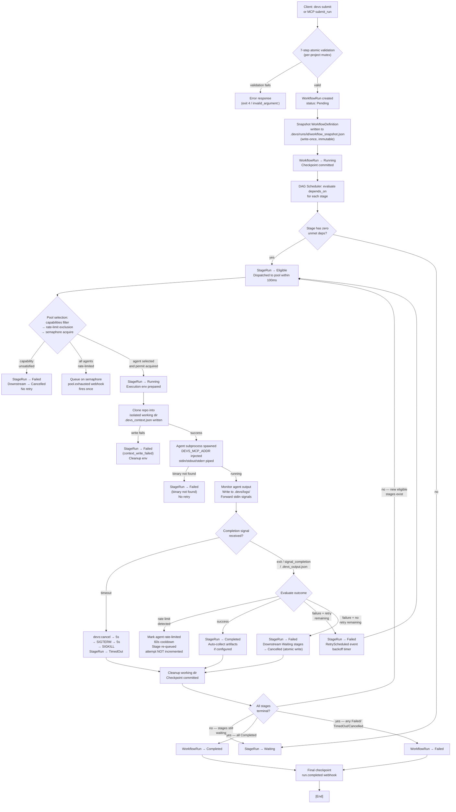

#### Workflow Run Submission Validation Sequence

The 7-step atomic validation for `submit_run` is performed under a per-project mutex to prevent TOCTOU races on run name uniqueness. All 7 checks must pass before any `WorkflowRun` record is created.

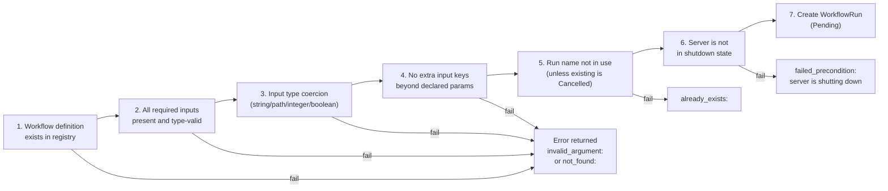

---

### 2.4 Agent Pool Dispatch Flow

The pool dispatch algorithm determines which agent handles a given stage. It is the core of `devs-pool` and must be implemented exactly as specified to satisfy capability routing, rate-limit handling, and the provider-diversity requirement.

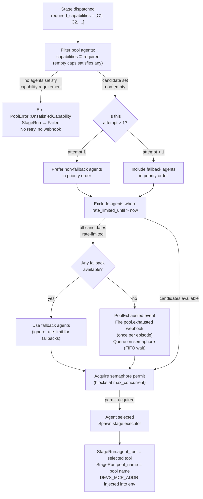

#### Pool State Data Model

The `PoolState` exposed by `get_pool_state` MCP tool and `WatchPoolState` gRPC stream reflects the live state of each pool after every dispatch or rate-limit event.

| Field | Type | Description |
|---|---|---|
| **** `name` ****| `string` | Pool name as configured in `devs.toml` | **** **[9_PROJECT_ROADMAP-REQ-066]**
| **** `max_concurrent` ****| `u32` (1–1024) | Hard concurrency cap across all projects | **** **[9_PROJECT_ROADMAP-REQ-067]**
| **** `active_count` ****| `u32` | Number of agent permits currently held | **** **[9_PROJECT_ROADMAP-REQ-068]**
| **** `queued_count` ****| `u32` | Number of stages waiting on semaphore | **** **[9_PROJECT_ROADMAP-REQ-069]**
| **** `exhausted` ****| `boolean` | `true` if all agents are unavailable (rate-limited or at capacity) | **** **[9_PROJECT_ROADMAP-REQ-070]**
| **** `agents` ****| `AgentPoolState[]` | Per-agent status | **** **[9_PROJECT_ROADMAP-REQ-071]**

**`AgentPoolState` sub-fields:**

| Field | Type | Description |
|---|---|---|
| **** `tool` ****| `string` | Agent CLI name (`"claude"`, `"gemini"`, etc.) | **** **[9_PROJECT_ROADMAP-REQ-072]**
| **** `capabilities` ****| `string[]` | Declared capability tags | **** **[9_PROJECT_ROADMAP-REQ-073]**
| **** `fallback` ****| `boolean` | Is a fallback agent | **** **[9_PROJECT_ROADMAP-REQ-074]**
| **** `pty_active` ****| `boolean` | Whether PTY is enabled (respects `PTY_AVAILABLE`) | **** **[9_PROJECT_ROADMAP-REQ-075]**
| **** `rate_limited_until` ****| `string \| null` | RFC 3339 timestamp; `null` if not rate-limited | **** **[9_PROJECT_ROADMAP-REQ-076]**
| **** `active_stages` ****| `u32` | Count of stages currently using this agent | **** **[9_PROJECT_ROADMAP-REQ-077]**

**[ROAD-BR-LF-006]** **[9_PROJECT_ROADMAP-REQ-078]** **** **** `PoolExhausted` transitions occur when the filtered-available agent count drops from ≥ 1 to 0 within a single pool. The event fires EXACTLY ONCE per episode. The episode ends — and the next `PoolExhausted` becomes eligible — only when the available-agent count returns to ≥ 1. Intermediate rate-limit events during an ongoing exhaustion episode MUST NOT re-fire the webhook.

**[ROAD-BR-LF-007]** **[9_PROJECT_ROADMAP-REQ-079]** **** **** Rate-limit cooldown is stored as an absolute `DateTime<Utc>` timestamp (`rate_limited_until`), not as a countdown duration. This means the cooldown is unaffected by server restarts: a recovered pool state correctly identifies agents still in cooldown by comparing `rate_limited_until` to `Utc::now()`.

---

### 2.5 Stage Completion Signal Processing Flow

Three completion mechanisms exist, each with distinct parsing and outcome logic. The following diagram specifies the complete decision tree for each mechanism. Implementing agents must follow this exactly — deviating from these rules changes how workflow branches evaluate.

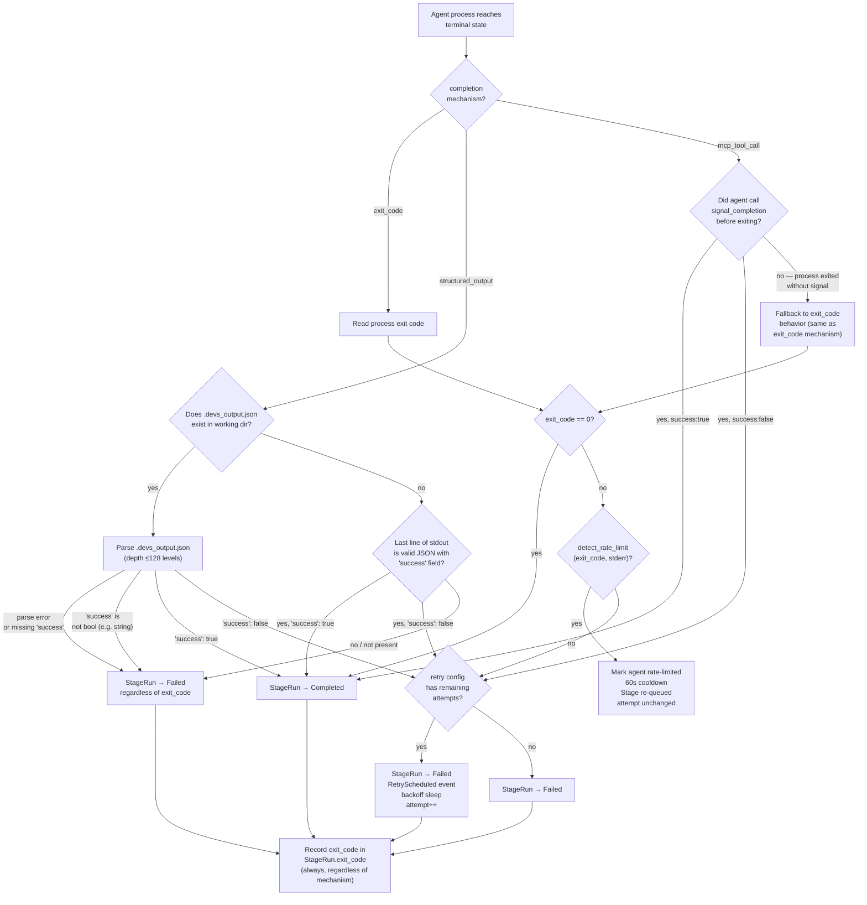

**Structured output parsing rules (normative):**

| Condition | Outcome |
|---|---|
| **** `.devs_output.json` exists, `"success": true` (boolean) ****| `Completed` | **** **[9_PROJECT_ROADMAP-REQ-080]**
| **** `.devs_output.json` exists, `"success": false` (boolean) ****| `Failed` | **** **[9_PROJECT_ROADMAP-REQ-081]**
| **** `.devs_output.json` exists, `"success": "true"` (string) ****| `Failed` — string `"true"` is NOT accepted | **** **[9_PROJECT_ROADMAP-REQ-082]**
| **** `.devs_output.json` exists, `"success"` field absent ****| `Failed` | **** **[9_PROJECT_ROADMAP-REQ-083]**
| **** `.devs_output.json` exists, invalid JSON ****| `Failed` | **** **[9_PROJECT_ROADMAP-REQ-084]**
| **** `.devs_output.json` absent, stdout last line is valid JSON with `"success": bool` ****| Use stdout JSON per rules above | **** **[9_PROJECT_ROADMAP-REQ-085]**
| **** `.devs_output.json` absent, stdout has no valid JSON object ****| `Failed` | **** **[9_PROJECT_ROADMAP-REQ-086]**

`StageRun.exit_code` is **always** recorded regardless of which completion mechanism is in use. A SIGKILL produces `exit_code: -9`. A timeout race before the process exits produces `exit_code: null` until the process terminates.

**[ROAD-BR-LF-008]** **[9_PROJECT_ROADMAP-REQ-087]** **** **** `.devs_output.json` takes strict priority over stdout JSON. If `.devs_output.json` is present but contains invalid JSON, the stage MUST be `Failed` even if stdout contains valid JSON with `"success": true`. The two sources are not merged.

**[ROAD-BR-LF-009]** **[9_PROJECT_ROADMAP-REQ-088]** **** **** `signal_completion` called on a stage that has already reached a terminal state (`Completed`, `Failed`, `TimedOut`, `Cancelled`) MUST return an error `"failed_precondition: stage is already in a terminal state"` and MUST NOT change any state. The per-run mutex serializes concurrent calls.

---

### 2.6 Phase-to-Phase Artifact Data Flow

Each phase produces concrete artifacts consumed by subsequent phases. The following table specifies exactly what is produced, where it is stored, and which downstream component consumes it.

| Phase | Artifact | Storage Location | Consumer |
|---|---|---|---|
| **** Phase 0 ****| `target/presubmit_timings.jsonl` | Git CI artifact | RISK-005 monitoring; operator review | **** **[9_PROJECT_ROADMAP-REQ-089]**
| **** Phase 0 ****| `target/traceability.json` (partial) | Git CI artifact | Phase 5 gate; `./do test` | **** **[9_PROJECT_ROADMAP-REQ-090]**
| **** Phase 0 ****| `devs-proto/src/gen/` (generated) | Committed to repo | All crates importing proto types | **** **[9_PROJECT_ROADMAP-REQ-091]**
| **** Phase 0 ****| `devs-core` types (`BoundedString`, `StateMachine`, etc.) | `crates/devs-core/src/` | All Phase 1+ crates | **** **[9_PROJECT_ROADMAP-REQ-092]**
| **** Phase 0 ****| `rust-toolchain.toml` | Repo root | All Rust toolchain invocations | **** **[9_PROJECT_ROADMAP-REQ-093]**
| **** Phase 0 ****| `.gitlab-ci.yml` | Repo root | GitLab CI runner | **** **[9_PROJECT_ROADMAP-REQ-094]**
| **** Phase 1 ****| `target/adapter-versions.json` | `target/` | `./do lint` freshness check | **** **[9_PROJECT_ROADMAP-REQ-095]**
| **** Phase 1 ****| `devs-config`, `devs-checkpoint`, `devs-adapters`, `devs-pool`, `devs-executor` crates | `crates/` | Phase 2 (`devs-scheduler` depends on all) | **** **[9_PROJECT_ROADMAP-REQ-096]**
| **** Phase 2 ****| `devs-scheduler` crate | `crates/` | Phase 3 (`devs-grpc`, `devs-mcp`) | **** **[9_PROJECT_ROADMAP-REQ-097]**
| **** Phase 2 ****| `devs-webhook` crate | `crates/` | Phase 3 (`devs-server`) | **** **[9_PROJECT_ROADMAP-REQ-098]**
| **** Phase 3 ****| `devs-server` binary | `target/release/` | Phase 4 bootstrap | **** **[9_PROJECT_ROADMAP-REQ-099]**
| **** Phase 3 ****| All 20 MCP tools implemented | `crates/devs-mcp/` | Phase 4 agentic loop | **** **[9_PROJECT_ROADMAP-REQ-100]**
| **** Phase 3 ****| `crates/devs-tui/tests/snapshots/*.txt` | `crates/devs-tui/tests/snapshots/` | Phase 5 QG-004 TUI E2E | **** **[9_PROJECT_ROADMAP-REQ-101]**
| **** Phase 4 ****| `.devs/workflows/*.toml` (6 files) | Repo `.devs/workflows/` | Phase 4 bootstrap; Phase 5 agentic loop | **** **[9_PROJECT_ROADMAP-REQ-102]**
| **** Phase 4 ****| `docs/adr/NNNN-bootstrap-complete.md` | `docs/adr/` | PTC-4-005; RISK-009 retirement | **** **[9_PROJECT_ROADMAP-REQ-103]**
| **** Phase 5 ****| `target/coverage/report.json` | `target/coverage/` | CI gate; `./do presubmit` | **** **[9_PROJECT_ROADMAP-REQ-104]**
| **** Phase 5 ****| `target/traceability.json` (100% complete) | `target/` | MVP release gate | **** **[9_PROJECT_ROADMAP-REQ-105]**
| **** Phase 5 ****| `docs/adapter-compatibility.md` | `docs/` | MIT-017; MVP release gate | **** **[9_PROJECT_ROADMAP-REQ-106]**
| **** Phase 5 ****| `docs/adr/fallback-registry.json` | `docs/adr/` | Fallback monitoring; release gate | **** **[9_PROJECT_ROADMAP-REQ-107]**
| **** Phase 5 ****| Per-crate ADRs in `docs/adr/` | `docs/adr/` | MIT-016 code review gate | **** **[9_PROJECT_ROADMAP-REQ-108]**

**Artifact visibility constraints:**

- `target/` artifacts are NOT committed to the repository (except by `devs-proto/src/gen/` which is an intentional exception). They are produced by `./do` commands and uploaded as CI artifacts.
- `.devs/` directory within the project repo is used at runtime for checkpoint state. It MUST NOT contain source code artifacts.
- `docs/adr/` contains human-authored and machine-verifiable governance documents. ADR numbering is sequential (`0001`, `0002`, …); gaps in the sequence cause `./do lint` to emit `WARN`.

---

### 2.7 TDD Development Loop (Phase 5 Agentic Mode)

Once bootstrap is complete (Phase 4), all Phase 5 implementation and test authoring follows the mandatory Red-Green-Refactor TDD loop. The following diagram represents the sequence an AI agent implementing agent MUST follow. Skipping the Red phase (writing implementation before verifying the test fails) is a business rule violation, not merely a guideline.

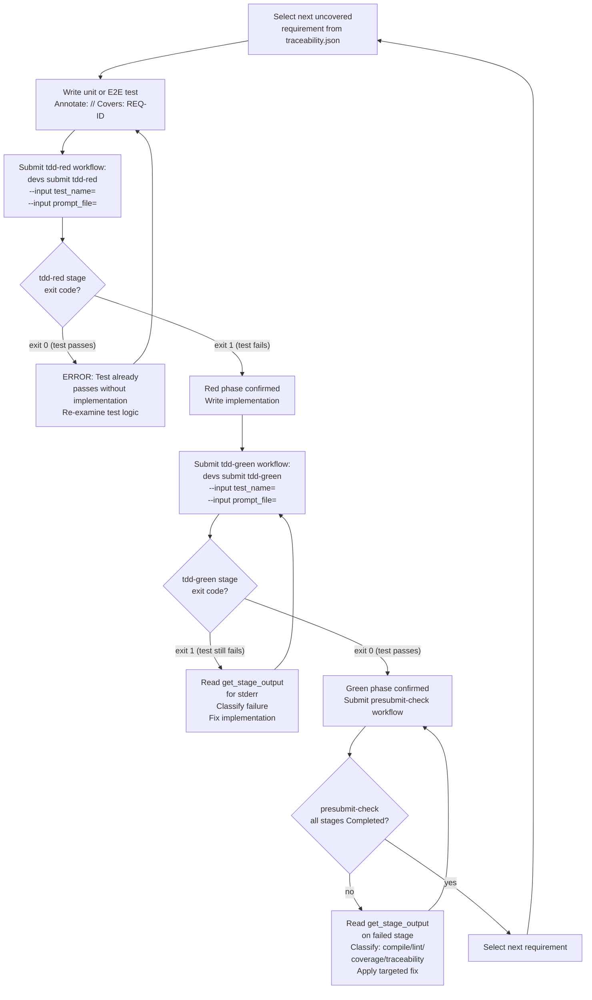

**Diagnostic classification before any code edit (mandatory 4-step sequence):**

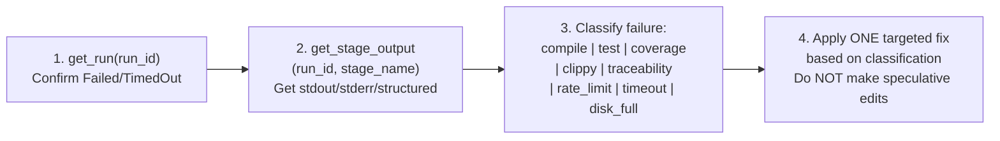

**Failure classification lookup table:**

| Pattern in `stderr` / `structured` | Classification | Response |
|---|---|---|
| `error[E` in stderr | Compilation error | Read source at indicated line; fix type or borrow error |
| `FAILED` + test name in stdout | Test assertion failure | Read test + implementation; fix logic only |
| `structured.gates[*].passed == false` | Coverage gate failure | Read `target/coverage/report.json`; add targeted tests for uncovered lines |
| `^error:` from clippy in stderr | Clippy denial | Read file at indicated line; fix lint; do not use `#[allow]` without justification |
| `structured.overall_passed == false` + traceability context | Traceability failure | Read `target/traceability.json`; add `// Covers:` annotations |
| `stage.status == "timed_out"` | Process timeout | Review last stderr for infinite loop; reduce scope |
| `exit_code` non-zero, no other pattern | Unclassified failure | Read full stderr; do not guess; escalate if pattern not recognized |

**[ROAD-BR-LF-010]** **[9_PROJECT_ROADMAP-REQ-109]** **** **** An AI agent MUST NOT call `write_workflow_definition`, edit any source file, or make any `git` commit until `get_stage_output` returns `"error": null` for the failed stage. The diagnostic read MUST precede any write.

**[ROAD-BR-LF-011]** **[9_PROJECT_ROADMAP-REQ-110]** **** **** Before a second `submit_run` for the same workflow, an agent MUST call `list_runs` and verify no non-terminal run for that workflow exists under the current project. If one exists, the agent MUST either call `get_run` to resume monitoring it or call `cancel_run`.

---

### 2.8 Business Rules for Logical Flow

The following rules govern the logical sequencing of operations in the `devs` system. They complement but do not duplicate the phase-level business rules in §1.

| Rule ID | Rule |
|---|---|
|**[ROAD-BR-LF-012]** **[9_PROJECT_ROADMAP-REQ-111]** **** ******** | The 13-step workflow validation pipeline MUST run to completion (all errors collected) before any `WorkflowRun` record is created. Partial validation that creates a run after 7 of 13 checks pass is prohibited. |
|**[ROAD-BR-LF-013]** **[9_PROJECT_ROADMAP-REQ-112]** **** ******** | The workflow definition snapshot (`workflow_snapshot.json`) MUST be written and the git commit made before the first stage transitions from `Waiting` to `Eligible`. If the snapshot write fails, the run MUST be failed immediately with no stages dispatched. |
|**[ROAD-BR-LF-014]** **[9_PROJECT_ROADMAP-REQ-113]** **** ******** | DAG eligibility re-evaluation MUST occur within a single scheduler tick after any `StageRun` transitions to `Completed`. The maximum latency from `Completed` event to the next `Eligible` stage's dispatch MUST NOT exceed 100ms. |
|**[ROAD-BR-LF-015]** **[9_PROJECT_ROADMAP-REQ-114]** **** ******** | When `WorkflowRun` transitions to `Completed`, `Failed`, or `Cancelled`, ALL non-terminal `StageRun` records for that run MUST transition to `Cancelled` in the SAME atomic checkpoint write as the run-level transition. No intermediate checkpoint may show the run in a terminal state while stages remain non-terminal. |
|**[ROAD-BR-LF-016]** **[9_PROJECT_ROADMAP-REQ-115]** **** ******** | The working directory for each stage execution MUST incorporate both the `run_id` and `stage_name` in its path to prevent cross-stage filesystem collisions. Paths that omit either component violate isolation requirements. |
|**[ROAD-BR-LF-017]** **[9_PROJECT_ROADMAP-REQ-116]** **** ******** | `StageRun.exit_code` MUST be recorded in the checkpoint even for completion mechanisms that do not use exit code as the primary signal (`structured_output`, `mcp_tool_call`). A SIGKILL-terminated process has `exit_code: -9`. A process that has not yet exited has `exit_code: null`. |
|**[ROAD-BR-LF-018]** **[9_PROJECT_ROADMAP-REQ-117]** **** ******** | Template variable resolution MUST be single-pass: after substituting `{{var}}` with its value, the scan pointer advances to the character after the substituted text. Characters within the substituted value are NEVER rescanned for additional `{{` delimiters. This prevents injection of `{{stage.X.stdout}}` as a stage output value to read another stage's output. |
|**[ROAD-BR-LF-019]** **[9_PROJECT_ROADMAP-REQ-118]** **** ******** | A template expression referencing `{{stage.<name>.*}}` where `<name>` is NOT in the transitive `depends_on` closure of the current stage MUST cause the stage to fail immediately at prompt rendering time with `TemplateError::UnreachableStage`. This is a pre-execution failure, not a runtime failure. |
|**[ROAD-BR-LF-020]** **[9_PROJECT_ROADMAP-REQ-119]** **** ******** | Lock acquisition order (`SchedulerState → PoolState → CheckpointStore`) MUST be respected in every code path that acquires more than one lock. Any code path that acquires locks in a different order is a potential deadlock and MUST be caught during code review. |

---

### 2.9 Edge Cases for Logical Flow Operations

| Scenario | Expected Behavior |
|---|---|
| **** A stage with `depends_on: ["A", "B"]` where A completes but B is cancelled before completing ****| The dependent stage MUST transition to `Cancelled` atomically with B's cancellation. The DAG scheduler re-evaluates the full run status and transitions `WorkflowRun → Failed` if no remaining path can reach a terminal success. | **** **[9_PROJECT_ROADMAP-REQ-120]**
| **** Two fan-out sub-agents complete within 1ms of each other ****| The per-run `Arc<tokio::sync::Mutex<RunState>>` serializes both completions. Exactly two checkpoint writes are produced, each reflecting the incremental state (not one overwriting the other). The merge handler or default merge fires only after ALL sub-agents are terminal. | **** **[9_PROJECT_ROADMAP-REQ-121]**
| **** `signal_completion` is called for a stage, and then the agent process exits with non-zero before the stage executor observes the exit ****| The `signal_completion` call already transitioned the stage to a terminal state. The subsequent process exit is observed but the exit code is still recorded in `StageRun.exit_code`. No second transition is attempted. | **** **[9_PROJECT_ROADMAP-REQ-122]**
| **** A `structured_output` stage writes a `.devs_output.json` with `{"success": true}` but the process exits with code 1 ****| `.devs_output.json` takes priority. Stage is `Completed`. Exit code 1 is recorded in `StageRun.exit_code` with `exit_code: 1`. This is by design: the agent controls its declared outcome. | **** **[9_PROJECT_ROADMAP-REQ-123]**
| **** The DAG scheduler receives a `stage_complete` event for a stage that is already `Completed` (duplicate delivery) ****| The second event is silently discarded and logged at `DEBUG` with `event_type: "scheduler.duplicate_terminal_event"`. No second checkpoint write, no second dependency re-evaluation. | **** **[9_PROJECT_ROADMAP-REQ-124]**
| **** `presubmit_timings.jsonl` is missing at the start of `./do presubmit` (first run on clean checkout) ****| The file is created fresh at the start of the first step. Missing file is not an error condition. | **** **[9_PROJECT_ROADMAP-REQ-125]**
| **** A crate's unit test coverage drops from 94% to 88% mid-Phase 5 after adding new code ****| `./do coverage` exits non-zero with `QG-001 failed: 88.0% < 90.0%`. `./do presubmit` exits non-zero. The agentic loop adds targeted unit tests until coverage returns to ≥ 90%. Uncovered lines are listed in `target/coverage/report.json`. | **** **[9_PROJECT_ROADMAP-REQ-126]**
| **** An agent calls `report_progress` with `pct_complete: 110` (out of range) ****| The `report_progress` tool returns `{"result": null, "error": "invalid_argument: pct_complete must be 0–100"}`. The stage continues executing. The call is non-blocking and non-fatal. | **** **[9_PROJECT_ROADMAP-REQ-127]**
| **** `./do coverage` is run when zero `.profraw` files exist for E2E tests ****| `./do coverage` exits non-zero with message `"no E2E coverage profile data found; ensure E2E tests set LLVM_PROFILE_FILE=%p.profraw"`. This prevents a misleading 0% from being reported as the E2E gate result. | **** **[9_PROJECT_ROADMAP-REQ-128]**
| Two phases' worth of crates are implemented in a single commit without committing the intermediate PTC | `./do lint` does NOT check git history for intermediate commits. However, if the Phase N PTC ADR file does not exist when Phase N+1 code is present in the same crate dependency chain, `./do lint` exits non-zero per `[ROAD-BR-013] `. PTCs must be committed before N+1 business logic. | **** **[9_PROJECT_ROADMAP-REQ-129]**

---

### 2.10 Dependencies

The logical flow diagrams in this section depend on and are depended upon by the following components:

**Depends on (must be defined before this section is fully implementable):**

| Dependency | Why |
|---|---|
| `devs-core` `StateMachine` trait (TAS §4) | All state transitions shown in §2.3 and §2.5 are implemented via `StateMachine::transition()` |
| `devs-scheduler` event loop (TAS §4) | The DAG dispatch latency rule (100ms, ROAD-BR-LF-014) is enforced inside the scheduler |
| `devs-pool` semaphore model (TAS §4) | The pool dispatch flow (§2.4) is implemented in `devs-pool` |
| `devs-executor` `StageExecutor` trait (TAS §4) | The execution environment preparation step in §2.3 is implemented here |
| Security Design §4 (SEC-040, SEC-041, SEC-042, SEC-043) | Template resolution rules in §2.8 (ROAD-BR-LF-018, -019) derive from these security controls |
| MCP Design §3 (agentic development loops) | The TDD loop in §2.7 is the canonical implementation of the MCP Design agentic protocol |

**Depended upon by (other sections that reference this section's diagrams):**

| Dependent | How |
|---|---|
| §3 Phase Details | Each phase's deliverables implement the flows shown here |
| §4 Critical Path Analysis | Critical path identification follows the dependency graph in §2.2 |
| §5 Phase Transition Checkpoints | PTCs verify that specific nodes in §2.3's flow are correctly implemented |
| `devs-scheduler` implementation | Must implement the DAG execution flow in §2.3 exactly |
| `devs-pool` implementation | Must implement the pool dispatch flow in §2.4 exactly |
| `devs-executor` implementation | Must implement the completion signal flow in §2.5 exactly |

---

### 2.11 Acceptance Criteria

- **[AC-ROAD-LF-001]** **[9_PROJECT_ROADMAP-REQ-130]** **** ******** A unit test validates that `StateMachine::transition()` produces exactly the sequence of state changes shown in §2.3 for a 3-stage linear DAG (`A → B → C`): all three start `Waiting`, A transitions `Eligible→Running→Completed`, B becomes `Eligible` within 100ms of A's `Completed` event, then `Running→Completed`, then C follows suit.
- **[AC-ROAD-LF-002]** **[9_PROJECT_ROADMAP-REQ-131]** **** ******** A unit test validates the pool dispatch algorithm in §2.4: with `required_capabilities = ["code-gen"]`, only agents whose `capabilities` array contains `"code-gen"` (or whose `capabilities` is empty) are selected; agents with `capabilities = ["review"]` only are excluded; test covers both the filter step and the rate-limit exclusion step.
- **[AC-ROAD-LF-003]** **[9_PROJECT_ROADMAP-REQ-132]** **** ******** A unit test validates the completion signal processing table in §2.5: `{"success": "true"}` (string) in `.devs_output.json` results in `StageRun → Failed`; `{"success": true}` (boolean) results in `StageRun → Completed`; missing `.devs_output.json` with a last stdout line of `{"success": true}` results in `StageRun → Completed`.
- **[AC-ROAD-LF-004]** **[9_PROJECT_ROADMAP-REQ-133]** **** ******** A unit test validates that template resolution is single-pass: a stage output containing the literal string `"{{stage.other.stdout}}"` is passed to a subsequent stage's prompt template and resolves to the literal string `"{{stage.other.stdout}}"` (not to `other`'s stdout), confirming that substituted values are not rescanned.
- **[AC-ROAD-LF-005]** **[9_PROJECT_ROADMAP-REQ-134]** **** ******** `./do presubmit` writes `target/presubmit_timings.jsonl` with at least one entry per `./do` step; each entry contains `step`, `started_at`, `completed_at`, `duration_ms`, `budget_ms`, `over_budget`, and `exit_code`; a test that parses the file and checks schema validity passes.
- **[AC-ROAD-LF-006]** **[9_PROJECT_ROADMAP-REQ-135]** **** ******** A unit test simulates the 7-step `submit_run` validation sequence: steps 1–6 each individually fail the request (returning the correct error prefix) while all others pass; step 7 succeeds only when all 6 prior conditions are satisfied; the test covers all 7 branches.
- **[AC-ROAD-LF-007]** **[9_PROJECT_ROADMAP-REQ-136]** **** ******** An integration test verifies that `WorkflowRun → Cancelled` causes all non-terminal `StageRun` records to transition to `Cancelled` in a single checkpoint git commit (exactly one new commit in the checkpoint branch, not one per stage).
- **[AC-ROAD-LF-008]** **[9_PROJECT_ROADMAP-REQ-137]** **** ******** A unit test verifies the pool exhaustion episode logic: `PoolExhausted` webhook fires once when the last available agent becomes rate-limited; does NOT fire again when a second agent becomes rate-limited while the first is still in cooldown; fires once more when all agents recover and one becomes rate-limited again (new episode).
- **[AC-ROAD-LF-009]** **[9_PROJECT_ROADMAP-REQ-138]** **** ******** `./do lint` exits non-zero when `cargo tree -p devs-core --edges normal` includes `tokio`; exits 0 when `devs-core` has no such import; this behavior is verified by a lint integration test that temporarily adds a `tokio` import to `devs-core`'s `Cargo.toml` and checks the lint exit code.
- **[AC-ROAD-LF-010]** **[9_PROJECT_ROADMAP-REQ-139]** **** ******** A TDD loop E2E test submits `tdd-red` for a test that currently passes (exit 0), verifies the workflow stage exits 0 (test passes = Red phase not confirmed), then submits again for a test that currently fails (exit 1), verifies the stage exits 1 (Red phase confirmed); confirms the loop correctly distinguishes the two states.

---

## 3. Phase Details

### **[ROAD-001]** **[9_PROJECT_ROADMAP-REQ-140]** **** ******** Phase 0 — Project Foundation & Toolchain

**Objective:** Establish the complete development infrastructure that all subsequent phases depend on. Every tool, script, pipeline, and base crate is functional before any business logic is authored. Mitigate critical risks RISK-005 and RISK-009 by proving the presubmit budget and defining the bootstrap completion criteria.

#### Deliverables

**[ROAD-007]** **[9_PROJECT_ROADMAP-REQ-141]** **** **** Cargo Workspace Skeleton
- `Cargo.toml` (workspace root) with `resolver = "2"`, `edition = "2021"`, all workspace lint rules (`missing_docs = "deny"`, `unsafe_code = "deny"`, `unused_must_use = "deny"`)
- `rust-toolchain.toml`: `channel = "stable"`, `components = ["rustfmt", "clippy", "llvm-tools-preview"]`
- All crate stubs created with placeholder `lib.rs` or `main.rs` (no business logic)
- Authoritative dependency version table from TAS §2.2 committed; `./do lint` validates against it

**[ROAD-008]** **[9_PROJECT_ROADMAP-REQ-142]** **** **** `./do` Entrypoint Script & CI Pipeline
- POSIX `sh` `./do` script implementing all 8 commands: `setup`, `build`, `test`, `lint`, `format`, `coverage`, `presubmit`, `ci`
- `./do presubmit` hard 900-second wall-clock timeout via background timer (PID in `target/.presubmit_timer.pid`)
- Per-step timing logged to `target/presubmit_timings.jsonl`
- `shellcheck --shell=sh ./do` integrated into `./do lint`
- `.gitlab-ci.yml` with 3 parallel jobs: `presubmit-linux` (Docker `rust:1.80-slim-bookworm`), `presubmit-macos` (shell), `presubmit-windows` (Git Bash shell)
- `cargo-audit` as separate CI stage running on every commit
- Artifact retention: `expire_in: 7 days`, `when: always` for `report.json`, `traceability.json`, `presubmit_timings.jsonl`
- `audit.toml` created (empty suppressions list; ≤10 maximum throughout project)

**[ROAD-009]** **[9_PROJECT_ROADMAP-REQ-143]** **** **** `devs-proto` Crate
- `proto/devs/v1/` directory with all 8 `.proto` files: `common.proto`, `workflow_definition.proto`, `run.proto`, `stage.proto`, `log.proto`, `pool.proto`, `project.proto`, `server.proto`
- `syntax = "proto3"; package devs.v1;` in all files
- All timestamp fields use `google.protobuf.Timestamp`
- `tonic-reflection` server support declared
- Generated files committed to `devs-proto/src/gen/`; `build.rs` skips regen if `protoc` absent
- `ServerService.GetInfo` RPC returning `server_version` and `mcp_port`

**[ROAD-010]** **[9_PROJECT_ROADMAP-REQ-144]** **** **** `devs-core` Crate
- All domain types in `devs-core/src/types.rs`: `WorkflowDefinition`, `StageDefinition`, `RetryConfig`, `FanOutConfig`, `BranchConfig`, `WorkflowRun`, `StageRun`, `StageOutput`, `AgentPool`, `AgentConfig`, `Project`, `WebhookTarget`
- `BoundedString<N>`, `BoundedBytes<N>`, `EnvKey`, `RunSlug` newtype wrappers with validation
- `StateMachine` trait with `transition()` and `is_terminal()`; full `RunStatus` and `StageStatus` transition tables; `TransitionError::IllegalTransition` for illegal transitions
- `TemplateResolver` with 8-priority resolution order; `TemplateError::UnknownVariable` on no match (never silent empty string); single-pass expansion (`SEC-040`)
- `Redacted<T>` in `devs-core/src/redacted.rs`: `Debug`/`Display`/`Serialize` → `"[REDACTED]"`
- `devs-core/src/version.rs` with server version embedded at compile time
- Zero I/O dependencies (`tokio`, `git2`, `reqwest`, `tonic` absent from `cargo tree -p devs-core`)
- 13-step workflow validation pipeline (all errors collected, no short-circuit)
- All public items doc-commented

**Risk Mitigations (Phase 0)**
- **RISK-005:** Compile-time budget measured on stub workspace; `presubmit_timings.jsonl` baseline established; crate decomposition adjusted if budget is at risk
- **RISK-009:** Bootstrap completion criteria documented (`COND-001`, `COND-002`, `COND-003`); `// TODO: BOOTSTRAP-STUB` convention established; `./do lint` configured to fail if stubs remain after bootstrap

#### Business Rules

| Rule ID | Rule |
|---|---|
|**[ROAD-BR-001]** **[9_PROJECT_ROADMAP-REQ-145]** **** ******** | `./do setup` MUST be idempotent: running it on a system where all tools are already at required versions MUST NOT reinstall, downgrade, or alter any tool |
|**[ROAD-BR-002]** **[9_PROJECT_ROADMAP-REQ-146]** **** ******** | `./do presubmit` MUST enforce a hard 900-second wall-clock timeout via a background timer subprocess whose PID is written to `target/.presubmit_timer.pid`; all child processes MUST be killed and the script MUST exit non-zero on breach |
|**[ROAD-BR-003]** **[9_PROJECT_ROADMAP-REQ-147]** **** ******** | An unknown `./do` subcommand MUST print the complete list of valid subcommands to stderr and exit non-zero; it MUST NOT silently succeed or produce partial output |
|**[ROAD-BR-004]** **[9_PROJECT_ROADMAP-REQ-148]** **** ******** | `devs-core` MUST NOT declare `tokio`, `git2`, `reqwest`, or `tonic` as non-dev dependencies; `cargo tree -p devs-core --edges normal` is run by `./do lint` and exits non-zero if any of these appear |
|**[ROAD-BR-005]** **[9_PROJECT_ROADMAP-REQ-149]** **** ******** | All crate stubs created in Phase 0 MUST compile (`cargo build --workspace`) before Phase 1 work begins; compilation failures in stubs block the Phase 0 checkpoint |
|**[ROAD-BR-006]** **[9_PROJECT_ROADMAP-REQ-150]** **** ******** | `rust-toolchain.toml` MUST pin `channel = "stable"` and components `rustfmt`, `clippy`, `llvm-tools-preview`; nightly channels are prohibited |
|**[ROAD-BR-007]** **[9_PROJECT_ROADMAP-REQ-151]** **** ******** | `.gitlab-ci.yml` MUST be validated by `yamllint --strict` in every `./do lint` invocation; invalid YAML causes `./do lint` to exit non-zero |
|**[ROAD-BR-008]** **[9_PROJECT_ROADMAP-REQ-152]** **** ******** | The `audit.toml` suppression limit is 10 entries total across the project lifetime; each entry MUST have a justification comment and an expiry date; `./do lint` exits non-zero if the limit is exceeded |
|**[ROAD-BR-009]** **[9_PROJECT_ROADMAP-REQ-153]** **** ******** | Per-step timing MUST be logged to `target/presubmit_timings.jsonl` with fields `step`, `started_at`, `duration_ms`, `budget_ms`, `over_budget`; each line flushed immediately after step completion |
|**[ROAD-BR-010]** **[9_PROJECT_ROADMAP-REQ-154]** **** ******** | `target/.presubmit_timer.pid` MUST be deleted on successful `./do presubmit` completion via a `trap` clause; a leaked timer MUST NOT affect subsequent `./do` invocations |
|**[ROAD-BR-011]** **[9_PROJECT_ROADMAP-REQ-155]** **** ******** | `StateMachine::transition()` MUST return `TransitionError::IllegalTransition` (not panic) for every `(from_state, event)` pair not listed in the `RunStatus` or `StageStatus` state transition tables |
|**[ROAD-BR-012]** **[9_PROJECT_ROADMAP-REQ-156]** **** ******** | `TemplateResolver::resolve()` MUST return `Err(TemplateError::UnknownVariable)` for any `{{variable}}` with no match; empty string MUST never be substituted silently |

#### Edge Cases

| Scenario | Expected Behavior |
|---|---|
| **** `protoc` binary absent on CI runner ****| `devs-proto/build.rs` skips regeneration and uses committed `src/gen/` files; `cargo build` exits 0; the CI runner does not require `protoc` | **** **[9_PROJECT_ROADMAP-REQ-157]**
| **** `cargo audit` advisory emerges mid-Phase 0 ****| `./do lint` exits non-zero; development MUST NOT proceed until the advisory is addressed via dependency update or justified `audit.toml` suppression with expiry date | **** **[9_PROJECT_ROADMAP-REQ-158]**
| **** Presubmit timer subprocess leaks after successful exit ****| The `./do presubmit` cleanup `trap` kills the timer PID; a leaked timer MUST NOT send SIGKILL to unrelated processes in subsequent invocations | **** **[9_PROJECT_ROADMAP-REQ-159]**
| **** `./do setup` run twice with all tools already at required versions ****| Script exits 0 without reinstalling; tool versions are logged to stdout confirming they satisfy requirements | **** **[9_PROJECT_ROADMAP-REQ-160]**
| **** `devs-core` accidentally imports `tokio` transitively ****| `cargo tree -p devs-core --edges normal` shows `tokio`; `./do lint` dependency audit exits non-zero; the Phase 0 checkpoint is blocked until the import is removed | **** **[9_PROJECT_ROADMAP-REQ-161]**
| **** Workspace has a clippy warning in a stub crate ****| `cargo clippy -- -D warnings` exits non-zero; `./do lint` fails; the stub MUST be corrected (e.g., `#[allow]` with justification) before the checkpoint | **** **[9_PROJECT_ROADMAP-REQ-162]**
| **** Two `./do presubmit` processes run concurrently ****| Each writes to its own `target/.presubmit_timer.pid`; the timer for process A MUST NOT kill process B's children; isolation is achieved via shell-level PID management | **** **[9_PROJECT_ROADMAP-REQ-163]**

#### Acceptance Criteria

- **[AC-ROAD-P0-001]** **[9_PROJECT_ROADMAP-REQ-164]** **** ******** `./do presubmit` exits 0 within 900 seconds on a clean checkout of the Phase 0 milestone commit, verified on Linux, macOS, and Windows Git Bash
- **[AC-ROAD-P0-002]** **[9_PROJECT_ROADMAP-REQ-165]** **** ******** `cargo tree -p devs-core --edges normal` produces output containing none of: `tokio`, `git2`, `reqwest`, `tonic`
- **[AC-ROAD-P0-003]** **[9_PROJECT_ROADMAP-REQ-166]** **** ******** Introducing `[[` (bash-specific syntax) into `./do` causes `./do lint` to exit non-zero via `shellcheck --shell=sh`
- **[AC-ROAD-P0-004]** **[9_PROJECT_ROADMAP-REQ-167]** **** ******** `StateMachine::transition()` returns `TransitionError::IllegalTransition` (not a panic) for every `(from_state, event)` pair not defined in the `RunStatus` and `StageStatus` transition tables; this is verified by an exhaustive unit test covering all invalid transitions
- **[AC-ROAD-P0-005]** **[9_PROJECT_ROADMAP-REQ-168]** **** ******** `TemplateResolver::resolve()` returns `Err(TemplateError::UnknownVariable)` for a template referencing a nonexistent variable; the test asserts the `Ok()` variant is never returned with an empty string for the missing variable
- **[AC-ROAD-P0-006]** **[9_PROJECT_ROADMAP-REQ-169]** **** ******** `devs-proto` crate emits all 6 service names (`WorkflowDefinitionService`, `RunService`, `StageService`, `LogService`, `PoolService`, `ProjectService`) when queried via gRPC reflection
- **[AC-ROAD-P0-007]** **[9_PROJECT_ROADMAP-REQ-170]** **** ******** `./do lint` exits non-zero when a non-test dependency not in the authoritative version table from TAS §2.2 is found in `Cargo.lock`
- **[AC-ROAD-P0-008]** **[9_PROJECT_ROADMAP-REQ-171]** **** ******** GitLab CI pipeline runs `presubmit-linux`, `presubmit-macos`, and `presubmit-windows` as parallel jobs and produces `target/coverage/report.json`, `target/traceability.json`, and `target/presubmit_timings.jsonl` as artifacts with `expire_in: 7 days`

#### Phase Lifecycle State Diagram

The Phase 0 lifecycle proceeds through a strict sequence. Each state must be achieved before the next can begin. The diagram below shows the states an agent working in Phase 0 will traverse.

```mermaid
stateDiagram-v2
    [*] --> WorkspaceBootstrap : git init; Cargo.toml created
    WorkspaceBootstrap --> StubsCompile : cargo build --workspace exits 0
    StubsCompile --> LintClean : ./do lint exits 0 (fmt + clippy + doc + shellcheck + dep-audit)
    LintClean --> TestsPass : ./do test exits 0; target/traceability.json generated
    TestsPass --> PresubmitPasses : ./do presubmit exits 0 within 900s; timings.jsonl written
    PresubmitPasses --> CIGreen : presubmit-linux + presubmit-macos + presubmit-windows all pass
    CIGreen --> PTC0Committed : PTC-0-001 through PTC-0-011 all verified; ADR committed
    PTC0Committed --> [*]

    StubsCompile --> StubsCompile : fix compilation error
    LintClean --> LintClean : fix clippy warning / fmt issue / missing doc
    TestsPass --> TestsPass : fix failing unit test
    PresubmitPasses --> PresubmitPasses : fix over-budget step
    CIGreen --> CIGreen : fix platform-specific failure (path separator, file mode, shell syntax)
```

Every regression at any state returns to that state's entry point. The only valid forward transition is through all verification steps.

#### Core Domain Type Schemas (`devs-core`)

`devs-core` is the foundational type library for the entire workspace. All other crates import it; it imports nothing outside the standard library and `serde`/`uuid`/`chrono`. The following schemas are authoritative; serialization output across gRPC, MCP JSON, and checkpoint JSON all derive from these types.

**`BoundedString<N>` newtype:**

```rust
/// UTF-8 string with a compile-time byte-length cap. Validated at
/// serde deserialization. An empty string is always a ValidationError.
pub struct BoundedString<const N: usize>(String);

impl<const N: usize> BoundedString<N> {
    /// Returns Err(ValidationError::StringTooLong) if byte length > N.
    /// Returns Err(ValidationError::EmptyString) if empty.
    pub fn new(s: impl Into<String>) -> Result<Self, ValidationError>;
    pub fn as_str(&self) -> &str;
}
```

**`EnvKey` newtype:**

Regex: `(A-Z_)(A-Z0-9_){0,127}`. Prohibited values at validation time (cause `ValidationError::ProhibitedEnvKey`): `DEVS_LISTEN`, `DEVS_MCP_PORT`, `DEVS_DISCOVERY_FILE`, `DEVS_MCP_ADDR`. These are stripped from agent environments by the executor, but must also be rejected at workflow validation to give early feedback.

**`RunSlug` newtype:**

Format: `<workflow-name>-<YYYYMMDD>-<4 random lowercase alphanum>`. Regex: `[a-z0-9-]+`. Max 128 bytes. Generated at submission time via `RunSlug::generate(workflow_name: &str)`. Never constructed from user input directly; user-provided `run_name` values are stored separately and the slug is always auto-generated.

**`WorkflowDefinition` field constraints:**

| Field | Rust Type | Constraint | Default |
|---|---|---|---|
| `name` | `BoundedString<128>` | `[a-z0-9_-]+`, non-empty | — (required) |
| `format` | `WorkflowFormat` | `Rust \| Toml \| Yaml` | — (required) |
| `inputs` | `Vec<WorkflowInput>` | ≤64 elements | `[]` |
| `stages` | `Vec<StageDefinition>` | 1–256 elements | — (required) |
| `timeout_secs` | `Option<u64>` | `None` = no limit | `None` |
| `default_env` | `HashMap<EnvKey, String>` | ≤256 entries | `{}` |
| `artifact_collection` | `ArtifactCollection` | `AgentDriven \| AutoCollect` | `AgentDriven` |

**`StageDefinition` field constraints:**

| Field | Rust Type | Constraint | Mutual Exclusion |
|---|---|---|---|
| `name` | `BoundedString<128>` | `[a-z0-9_-]+`, unique per workflow | — |
| `pool` | `String` | non-empty; must exist at submission | — |
| `prompt` | `Option<String>` | non-empty if Some | XOR `prompt_file` |
| `prompt_file` | `Option<PathBuf>` | no `..` or absolute path | XOR `prompt` |
| `system_prompt` | `Option<String>` | ≤100 KiB | — |
| `depends_on` | `Vec<String>` | must name stages in same workflow | — |
| `required_capabilities` | `Vec<String>` | empty = satisfy any | — |
| `completion` | `CompletionSignal` | `ExitCode \| StructuredOutput \| McpToolCall` | — |
| `env` | `HashMap<EnvKey, String>` | ≤256 entries | — |
| `execution_env` | `Option<ExecutionEnv>` | `Tempdir \| Docker \| RemoteSsh` | — |
| `retry` | `Option<RetryConfig>` | `max_attempts` 1–20 | — |
| `timeout_secs` | `Option<u64>` | ≤ `workflow.timeout_secs` if both set | — |
| `fan_out` | `Option<FanOutConfig>` | — | XOR `branch` |
| `branch` | `Option<BranchConfig>` | — | XOR `fan_out` |

**`StateMachine` Trait API Contract:**

The `StateMachine` trait governs all state transitions for `WorkflowRun` and `StageRun`. It is the single point of truth for what transitions are legal. Implementing types store only the current status enum variant.

```rust
/// Governs all state transitions for WorkflowRun and StageRun.
/// Zero I/O; implemented in devs-core; no async methods.
pub trait StateMachine {
    type Event;
    type Error: std::error::Error;

    /// Attempt a state transition.
    ///
    /// Returns Ok(()) for legal (from_state, event) pairs.
    /// Returns Err(TransitionError::IllegalTransition) for any pair
    /// not listed in the authoritative transition tables.
    /// MUST NOT panic for any input.
    fn transition(&mut self, event: Self::Event) -> Result<(), Self::Error>;

    /// Returns true if no further transitions are possible.
    fn is_terminal(&self) -> bool;
}

pub enum TransitionError {
    /// The (from, event) pair is not in the legal transition table.
    IllegalTransition { from: String, event: String },
}
```

**Legal `RunStatus` transitions (exhaustive):**

| From State | Event | To State |
|---|---|---|
| `Pending` | `Start` | `Running` |
| `Pending` | `Cancel` | `Cancelled` |
| `Running` | `Pause` | `Paused` |
| `Running` | `Complete` | `Completed` |
| `Running` | `Fail` | `Failed` |
| `Running` | `Cancel` | `Cancelled` |
| `Paused` | `Resume` | `Running` |
| `Paused` | `Cancel` | `Cancelled` |

Any `(from, event)` pair not in this table → `TransitionError::IllegalTransition`.

**Legal `StageStatus` transitions (exhaustive):**

| From State | Event | To State |
|---|---|---|
| `Pending` | `MakeEligible` | `Eligible` |
| `Pending` | `MakeWaiting` | `Waiting` |
| `Waiting` | `MakeEligible` | `Eligible` |
| `Waiting` | `Cancel` | `Cancelled` |
| `Eligible` | `Dispatch` | `Running` |
| `Eligible` | `Cancel` | `Cancelled` |
| `Running` | `Pause` | `Paused` |
| `Running` | `Complete` | `Completed` |
| `Running` | `Fail` | `Failed` |
| `Running` | `TimeOut` | `TimedOut` |
| `Running` | `Cancel` | `Cancelled` |
| `Paused` | `Resume` | `Running` |
| `Paused` | `Cancel` | `Cancelled` |
| `Failed` | `ScheduleRetry` | `Pending` |
| `TimedOut` | `ScheduleRetry` | `Pending` |

**`TemplateResolver` API Contract:**

Resolution is single-pass: after substituting `{{expr}}` with its resolved value, the scan pointer advances past the substituted text. The resolved value is never re-scanned for additional `{{` delimiters (SEC-040).

```rust
/// Single-pass template expansion with 7-priority resolution.
pub struct TemplateContext {
    pub workflow_inputs: HashMap<String, TemplateValue>,
    pub run_id: String,
    pub run_slug: String,
    pub run_name: String,
    /// Only stages in the transitive depends_on closure of the current stage.
    pub stage_outputs: HashMap<String, StageOutputContext>,
    pub fan_out_index: Option<u32>,
    pub fan_out_item: Option<String>,
    /// Set of stage names reachable via depends_on transitivity.
    /// References to stages outside this set fail immediately.
    pub depends_on_closure: HashSet<String>,
}

/// Resolve all {{...}} expressions in `template` using `ctx`.
/// Returns the fully resolved string on success.
///
/// # Errors
/// - TemplateError::UnknownVariable — no match in any priority level.
///   NEVER substitutes empty string silently.
/// - TemplateError::UnreachableStage — {{stage.<name>.*}} where <name>
///   is not in ctx.depends_on_closure.
/// - TemplateError::NonScalarField — {{stage.<name>.output.<f>}} where
///   the field resolves to a JSON object or array (not a scalar).
/// - TemplateError::NoStructuredOutput — {{stage.<name>.output.<f>}}
///   on a stage with completion=ExitCode.
pub fn resolve(template: &str, ctx: &TemplateContext) -> Result<String, TemplateError>;
```

stdout/stderr values in `TemplateContext` are truncated to the **last 10,240 bytes** of the stage's actual output before being stored in the context. This truncation happens once, at context construction time, before any template expansion.

**`Redacted<T>` Type Contract:**

```rust
/// Wrapper that renders as "[REDACTED]" in all tracing/logging contexts.
/// Required for fields matching *_api_key, *_token, *_secret, *_password.
pub struct Redacted<T>(T);

impl<T> Redacted<T> {
    pub fn new(value: T) -> Self;
    /// Access the inner value. Every call site MUST have the comment:
    /// // SAFETY: credential exposed to <reason>
    pub fn expose(&self) -> &T;
}

// All three render exactly "[REDACTED]"
impl<T> std::fmt::Debug for Redacted<T> { ... }
impl<T> std::fmt::Display for Redacted<T> { ... }
impl<T: Serialize> serde::Serialize for Redacted<T> { ... }
```

TOML-sourced credential strings MUST be wrapped in `zeroize::Zeroizing<String>` before being moved into `Redacted<String>`. The `zeroize` crate zeroes memory on drop, preventing credential exposure via heap inspection.

#### Dependencies

**[ROAD-P0-DEP-001]** **[9_PROJECT_ROADMAP-REQ-172]** **** **** No prior phases. This is the root phase.

---

### **[ROAD-002]** **[9_PROJECT_ROADMAP-REQ-173]** **** ******** Phase 1 — Core Domain & Infrastructure

**Objective:** Implement all infrastructure crates that the workflow engine depends on. By end of Phase 1, every piece below the scheduler is independently unit-tested at ≥90% line coverage. Critical risks RISK-002 and RISK-004 are mitigated before any agent process is spawned.

#### Deliverables

**[ROAD-011]** **[9_PROJECT_ROADMAP-REQ-174]** **** **** `devs-config` Crate
- `devs.toml` parsing: `[server]`, `[retention]`, `[[pool]]`, `[[pool.agent]]` sections
- Config override precedence: CLI flag → env var (`DEVS_` prefix) → `devs.toml` → built-in defaults
- `~/.config/devs/projects.toml` per-project schema: `project_id`, `name`, `repo_path`, `priority`, `weight`, `checkpoint_branch`, `workflow_dirs`, `status`, `[[project.webhook]]`
- All config errors collected before reporting (no early exit)
- Credentials in TOML: startup `WARN` per key (key name only, never value)
- `[auth]` section in `devs.toml` causes startup failure at MVP (forward-compatible stub)
- `[triggers]` section in `devs.toml` causes startup failure at MVP

**[ROAD-012]** **[9_PROJECT_ROADMAP-REQ-175]** **** **** `devs-checkpoint` Crate
- `CheckpointStore` trait with `git2`-only implementation (no shell-out)
- Bare clone at `~/.config/devs/state-repos/<project-id>.git`, mode `0700`
- Atomic write protocol: serialize → write `.tmp` → `fsync` → `rename()` → `git add` → `git commit` → push
- `checkpoint.json` schema version 1; depth-limited JSON deserialization (128 levels)
- Git author: `devs <devs@localhost>` for all generated commits
- `load_all_runs` crash-recovery: `Running` → `Eligible`; `Eligible` → remain; `Pending` → re-queue; corrupt → `Unrecoverable`
- Orphaned `.tmp` files swept at startup with `WARN`
- Retention sweep: age-based + size-based; runs never deleted while `Running`/`Paused`
- `devs_persist::permissions::set_secure_file()` and `set_secure_dir()` as the sole permission-setting API; direct `fs::set_permissions()` calls outside this module fail `./do lint`
- Full directory layout: `.devs/runs/<run-id>/workflow_snapshot.json`, `checkpoint.json`, `stages/<name>/attempt_<N>/`; `.devs/logs/<run-id>/<stage>/attempt_<N>/stdout.log`, `stderr.log`

**[ROAD-013]** **[9_PROJECT_ROADMAP-REQ-176]** **** **** `devs-adapters` Crate
- `AgentAdapter` trait: `tool()`, `build_command(ctx, pty_supported)`, `detect_rate_limit(exit_code, stderr)`, `default_prompt_mode()`, `default_pty()`
- 5 adapter implementations: `claude`, `gemini`, `opencode`, `qwen`, `copilot`
- CLI flags defined as `const &str` in `devs-adapters/src/<name>/config.rs`; inline literals prohibited
- Default configs per TAS §4 adapter table (prompt mode, PTY default)
- Rate-limit passive detection (exit code 1 + case-insensitive stderr patterns per adapter)
- `detect_rate_limit()` returns `false` when `exit_code == 0` regardless of stderr
- Bidirectional signaling: stdin tokens `devs:cancel\n`, `devs:pause\n`, `devs:resume\n`
- `DEVS_MCP_ADDR` injected; `DEVS_LISTEN`, `DEVS_MCP_PORT`, `DEVS_DISCOVERY_FILE` stripped
- `target/adapter-versions.json`: captured at; `./do lint` fails if absent or `captured_at` >7 days old
- Compatibility tests in `devs-adapters/tests/<name>_compatibility_test.rs` for each adapter

**[ROAD-014]** **[9_PROJECT_ROADMAP-REQ-177]** **** **** `devs-pool` Crate
- `Arc<tokio::sync::Semaphore>` concurrency enforcement (`max_concurrent` hard limit across all projects)
- Agent selection: filter by capabilities → prefer non-fallback on attempt 1 → exclude rate-limited (60s cooldown via `rate_limited_until: DateTime<Utc>`) → acquire semaphore
- Empty capabilities `[]` satisfies any requirement
- `UnsatisfiedCapability` → immediate `Failed` (not queued)
- `PoolExhausted` event fires exactly once per exhaustion episode (episode ends when ≥1 agent becomes available)
- Provider diversity check at config load: pool with all agents from same provider rejected
- `get_pool_state` includes `pty_active: bool` per agent
- Platform capability probe for PTY via `portable_pty::native_pty_system().openpty()` stored in `static AtomicBool PTY_AVAILABLE` (RISK-002 mitigation)

**[ROAD-015]** **[9_PROJECT_ROADMAP-REQ-178]** **** **** `devs-executor` Crate
- `StageExecutor` trait: `prepare()`, `collect_artifacts()`, `cleanup()`
- Three implementations: `LocalTempDirExecutor`, `DockerExecutor` (`bollard`), `RemoteSshExecutor` (`ssh2`)
- Clone paths per TAS §4 executor table
- Shallow clone (`--depth 1`) default; `full_clone = true` supported
- `cleanup()` always runs regardless of outcome; failures logged at `WARN` with `event_type: "executor.cleanup_failed"`, never propagated
- `.devs_context.json` written atomically before agent spawn; 10 MiB cap with proportional truncation; write failure → stage `Failed`
- `.devs_output.json` parsing: priority over stdout JSON; `"success"` MUST be boolean
- File-based prompt: UUID filename, mode `0600`, deleted after agent exits
- Auto-collect: `git add -A` → commit → push to checkpoint branch only; skip if no changes
- `DEVS_MCP_ADDR` injected via host-gateway/`host.docker.internal` for Docker; `server.external_addr` for SSH

**Risk Mitigations (Phase 1)**
- **RISK-002:** PTY capability probe implemented before any adapter spawns; `pty_available: false` in pool state; explicit `pty=true` on unavailable platform → `Failed`; `presubmit-windows` CI validated without PTY failures
- **RISK-004:** Adapter compatibility tests established; `target/adapter-versions.json` required; CLI flag constants prevent inline literals

#### Business Rules

| Rule ID | Rule |
|---|---|
|**[ROAD-BR-101]** **[9_PROJECT_ROADMAP-REQ-179]** **** ******** | `devs-checkpoint` MUST use `git2` exclusively for all git operations; shell-out to the `git` binary is prohibited; enforced by `./do lint` checking for `Command::new("git"` in `devs-checkpoint/src/` |
|**[ROAD-BR-102]** **[9_PROJECT_ROADMAP-REQ-180]** **** ******** | `checkpoint.json` MUST be written atomically via write-to-temp → `fsync` → `rename()`; partial writes MUST never be visible to readers; the `.tmp` extension MUST be used for the intermediate file |
|**[ROAD-BR-103]** **[9_PROJECT_ROADMAP-REQ-181]** **** ******** | A corrupt or unreadable `checkpoint.json` MUST cause the affected run to be marked `Unrecoverable` in `ServerState`; the server MUST continue processing all other runs without interruption |
|**[ROAD-BR-104]** **[9_PROJECT_ROADMAP-REQ-182]** **** ******** | A disk-full error (`ENOSPC`) during checkpoint write MUST be logged at `ERROR` with `event_type: "checkpoint.write_failed"` and `run_id`; the server MUST NOT crash; the failed write is retried on the next state transition |
|**[ROAD-BR-105]** **[9_PROJECT_ROADMAP-REQ-183]** **** ******** | `AgentAdapter::detect_rate_limit()` MUST return `false` when `exit_code == 0`, regardless of stderr content; this invariant applies to all 5 adapter implementations |
|**[ROAD-BR-106]** **[9_PROJECT_ROADMAP-REQ-184]** **** ******** | Agent CLI flags MUST be defined as `const &str` in `devs-adapters/src/<name>/config.rs`; inline string literals for CLI flags in adapter implementation files are prohibited and detected by `./do lint` |
|**[ROAD-BR-107]** **[9_PROJECT_ROADMAP-REQ-185]** **** ******** | `StageExecutor::cleanup()` MUST be called after every stage execution regardless of outcome; cleanup failures MUST be logged at `WARN` with `event_type: "executor.cleanup_failed"` and MUST NOT propagate or affect stage status |
|**[ROAD-BR-108]** **[9_PROJECT_ROADMAP-REQ-186]** **** ******** | A pool configuration where all agents share the same API provider MUST be rejected at config load time with an error identifying the provider name |
|**[ROAD-BR-109]** **[9_PROJECT_ROADMAP-REQ-187]** **** ******** | `devs_persist::permissions::set_secure_file()` and `devs_persist::permissions::set_secure_dir()` are the ONLY permitted call sites for `fs::set_permissions()`; direct calls elsewhere cause `./do lint` to exit non-zero |
|**[ROAD-BR-110]** **[9_PROJECT_ROADMAP-REQ-188]** **** ******** | `EnvKey` validation MUST reject `DEVS_LISTEN`, `DEVS_MCP_PORT`, `DEVS_DISCOVERY_FILE`, and `DEVS_MCP_ADDR` as stage or workflow environment key names at validation time, before any agent is spawned |
|**[ROAD-BR-111]** **[9_PROJECT_ROADMAP-REQ-189]** **** ******** | `target/adapter-versions.json` MUST exist and have a `captured_at` timestamp no older than 7 days; `./do lint` exits non-zero if the file is absent or stale |
|**[ROAD-BR-112]** **[9_PROJECT_ROADMAP-REQ-190]** **** ******** | PTY capability is probed once at startup via `portable_pty::native_pty_system().openpty()` and stored in `static AtomicBool PTY_AVAILABLE`; this probe MUST be performed via `tokio::task::spawn_blocking` |

#### Edge Cases

| Scenario | Expected Behavior |
|---|---|
| **** Agent binary not found at dispatch time ****| `StageRun` transitions to `Failed` with `failure_reason: "binary not found"` immediately; no retry is attempted; `target/adapter-versions.json` staleness check is flagged in `./do lint` | **** **[9_PROJECT_ROADMAP-REQ-191]**
| **** `git2` push failure due to remote unreachable ****| Push failure logged at `WARN` with `event_type: "checkpoint.push_failed"`; local `checkpoint.json` remains authoritative; server continues; push is retried on the next checkpoint write | **** **[9_PROJECT_ROADMAP-REQ-192]**
| **** Orphaned `checkpoint.json.tmp` found at startup ****| File is deleted with a `WARN` log; run state is reloaded from the authoritative `checkpoint.json` if present; if `checkpoint.json` is also absent the run is treated as `Unrecoverable` | **** **[9_PROJECT_ROADMAP-REQ-193]**
| **** Adapter `rate_limited_until` timestamp is in the past ****| Agent is treated as fully available; cooldown expires naturally without any manual reset; next pool selection includes the agent | **** **[9_PROJECT_ROADMAP-REQ-194]**
| **** PTY allocation fails on non-Windows platform with `pty=true` default ****| If the adapter's default `pty=true` and `PTY_AVAILABLE=false`: spawn without PTY, emit `WARN` with `event_type: "adapter.pty_fallback"`; if stage explicitly configured `pty=true` and platform lacks PTY: `StageRun` → `Failed` with `failure_reason: "pty_unavailable"`, no auto-retry | **** **[9_PROJECT_ROADMAP-REQ-195]**
| **** `.devs_context.json` write fails due to disk full ****| `StageRun` transitions to `Failed` before agent is spawned; `failure_reason: "context_write_failed"` logged at `ERROR`; server continues | **** **[9_PROJECT_ROADMAP-REQ-196]**
| **** Workflow TOML with circular dependency submitted via `devs submit` ****| Server rejects with `invalid_argument`; error includes the full cycle path: `{"error": "cycle detected", "cycle": ["A", "B", "A"]}` | **** **[9_PROJECT_ROADMAP-REQ-197]**

#### Acceptance Criteria

- **[AC-ROAD-P1-001]** **[9_PROJECT_ROADMAP-REQ-198]** **** ******** A unit test simulates `ENOSPC` during a checkpoint write; the test asserts the server state is unchanged, no panic occurs, and the error is logged at `ERROR` with `event_type: "checkpoint.write_failed"`
- **[AC-ROAD-P1-002]** **[9_PROJECT_ROADMAP-REQ-199]** **** ******** `detect_rate_limit(exit_code=0, stderr="rate limit exceeded")` returns `false` for all 5 adapters (claude, gemini, opencode, qwen, copilot)
- **[AC-ROAD-P1-003]** **[9_PROJECT_ROADMAP-REQ-200]** **** ******** `./do lint` exits non-zero when any file in `devs-adapters/src/` uses an inline string literal for a CLI flag (instead of a `const` in `config.rs`)
- **[AC-ROAD-P1-004]** **[9_PROJECT_ROADMAP-REQ-201]** **** ******** `./do lint` exits non-zero when any file outside `devs-checkpoint/src/permissions.rs` calls `fs::set_permissions()`
- **[AC-ROAD-P1-005]** **[9_PROJECT_ROADMAP-REQ-202]** **** ******** Loading a `checkpoint.json` with invalid JSON marks the affected run as `Unrecoverable`; the server starts and recovers all other valid checkpoints; this is verified by an integration test
- **[AC-ROAD-P1-006]** **[9_PROJECT_ROADMAP-REQ-203]** **** ******** A pool configuration where all agents have `tool = "claude"` is rejected at config load with an error identifying `"claude"` as the only provider
- **[AC-ROAD-P1-007]** **[9_PROJECT_ROADMAP-REQ-204]** **** ******** A `target/adapter-versions.json` with `captured_at` more than 7 days in the past causes `./do lint` to exit non-zero with a message identifying the stale file
- **[AC-ROAD-P1-008]** **[9_PROJECT_ROADMAP-REQ-205]** **** ******** `devs-executor` cleanup is verified by unit test to run after a stage that exits with exit code 1; the working directory is confirmed absent after cleanup
- **[AC-ROAD-P1-009]** **[9_PROJECT_ROADMAP-REQ-206]** **** ******** `./do coverage` QG-001 reports ≥90% line coverage for each of `devs-config`, `devs-checkpoint`, `devs-adapters`, `devs-pool`, and `devs-executor` individually

#### Phase Lifecycle State Diagram

Phase 1 contains a structured internal parallelism that must be respected. Three crates (`devs-config`, `devs-checkpoint`, `devs-adapters`) can proceed concurrently once `devs-core` is complete. The serial sub-chain (`devs-pool` → `devs-executor`) begins only after `devs-adapters` passes its Phase Transition Checkpoint.

```mermaid
stateDiagram-v2
    [*] --> ParallelGroupStart : Phase 0 PTC committed

    state ParallelGroupStart {
        [*] --> ConfigDev
        [*] --> PersistDev
        [*] --> AdaptersDev
        ConfigDev --> ConfigPTC : ≥90% unit coverage
        PersistDev --> PersistPTC : ≥90% unit coverage + atomic write verified
        AdaptersDev --> AdaptersPTC : ≥90% unit + RISK-002 + RISK-004 mitigated
    }

    ParallelGroupStart --> PoolDev : devs-adapters PTC complete
    PoolDev --> PoolPTC : devs-pool ≥90% unit coverage; semaphore + capability routing tested
    PoolPTC --> ExecutorDev
    ExecutorDev --> ExecutorPTC : devs-executor ≥90% unit coverage; cleanup always runs
    ExecutorPTC --> Phase1PTC : PTC-1-001 through PTC-1-010 all verified; ADR committed
    Phase1PTC --> [*]
```

RISK-002 (PTY on Windows) and RISK-004 (adapter CLI breakage) MUST be mitigated before `devs-adapters` can reach its PTC. No Phase 2 work begins until all Phase 1 PTCs are committed.

#### Trait API Contracts

Each Phase 1 crate exposes exactly one primary trait. These traits are the extension points of the `devs` system. They must be implemented exactly as specified; adding methods to a trait requires a corresponding spec update.

**`CheckpointStore` Trait (`devs-checkpoint`):**

```rust
/// Git-backed checkpoint persistence. All implementations MUST use git2
/// exclusively — no shell-out to the git binary is permitted.
#[async_trait::async_trait]
pub trait CheckpointStore: Send + Sync {
    /// Persist a WorkflowRun and all StageRun records atomically.
    ///
    /// Write protocol: serialize → write to <path>.tmp → fsync → rename()
    /// → git add → git commit → push.
    /// Disk-full (ENOSPC) → Err(CheckpointError::DiskFull).
    /// Push failure → WARN log; local file remains authoritative.
    /// Server MUST NOT crash on any error from this method.
    async fn save_run(&self, run: &WorkflowRun) -> Result<(), CheckpointError>;

    /// Load all runs at startup for crash recovery.
    ///
    /// Applies crash-recovery mapping:
    ///   Running  → Eligible (stage was interrupted)
    ///   Eligible → Eligible (unchanged; re-queued)
    ///   Waiting  → Waiting  (unchanged)
    ///   Pending/Completed/Failed/TimedOut/Cancelled → unchanged
    ///
    /// Corrupt or unreadable checkpoint.json → RecoveryStatus::Unrecoverable.
    /// Orphaned .tmp files → deleted with WARN.
    /// Per-project failures are non-fatal; server continues loading others.
    async fn load_all_runs(&self) -> Result<Vec<RecoveredRun>, CheckpointError>;

    /// Write the workflow snapshot for a run. Write-once semantics:
    /// if the file already exists, returns Err(SnapshotError::AlreadyExists)
    /// without modifying the file. Callers treat this as idempotency.
    async fn save_snapshot(
        &self,
        run_id: Uuid,
        definition: &WorkflowDefinition,
    ) -> Result<(), SnapshotError>;

    /// Remove runs matching the retention policy.
    /// Never deletes Running or Paused runs.
    /// Commits deletions to checkpoint branch.
    /// Runs sweep at startup and every 24 hours.
    async fn sweep_retention(
        &self,
        policy: &RetentionPolicy,
    ) -> Result<RetentionSweepReport, CheckpointError>;
}

pub struct RecoveredRun {
    pub run: WorkflowRun,
    pub recovery_status: RecoveryStatus,
}

pub enum RecoveryStatus {
    /// All stage states recovered cleanly; no action required.
    Clean,
    /// Some Running stages were reset to Eligible.
    SomeStagesReset { reset_stages: Vec<String> },
    /// checkpoint.json was corrupt or had wrong schema_version.
    /// Run is excluded from scheduling; logged at ERROR.
    Unrecoverable { error: String },
}
```

`CheckpointError` variants:
- `CheckpointError::DiskFull` — `ENOSPC` encountered; logged at ERROR; server continues
- `CheckpointError::InvalidSchema { schema_version: u64 }` — checkpoint has wrong schema_version; logged at ERROR
- `CheckpointError::PushFailed { detail: String }` — git push failed (non-fatal WARN)
- `CheckpointError::Git(git2::Error)` — unrecoverable git2 operation failure

**`AgentAdapter` Trait (`devs-adapters`):**

```rust
/// Encapsulates all agent-CLI-specific logic for one agent tool.
/// The trait is object-safe; implementations are stored as Box<dyn AgentAdapter>.
pub trait AgentAdapter: Send + Sync {
    /// The tool identifier for this adapter.
    fn tool(&self) -> AgentTool;

    /// Build the OS command to spawn the agent subprocess.
    ///
    /// pty_supported: platform-level PTY availability (from PTY_AVAILABLE static).
    /// Returns an AdapterCommand with an args array — no shell interpolation.
    /// Prompt file path (if file-based) is written before this call and
    /// its path passed in StageContext.
    fn build_command(
        &self,
        ctx: &StageContext,
        pty_supported: bool,
    ) -> Result<AdapterCommand, AdapterError>;

    /// Detect whether a non-zero exit was due to rate limiting.
    ///
    /// INVARIANT: MUST return false when exit_code == 0, regardless of stderr.
    /// Pattern matching: case-insensitive substring on stderr only.
    fn detect_rate_limit(&self, exit_code: i32, stderr: &str) -> bool;

    /// Default prompt delivery mode for this adapter.
    fn default_prompt_mode(&self) -> PromptMode;

    /// Whether this adapter defaults to PTY mode.
    fn default_pty(&self) -> bool;
}

pub struct AdapterCommand {
    /// Path to the agent binary (resolved at dispatch time).
    pub program: PathBuf,
    /// Arguments passed via tokio::process::Command::args(). No shell.
    pub args: Vec<OsString>,
    /// Env vars to add to the agent process.
    pub env_additions: HashMap<EnvKey, String>,
    /// Env vars to strip: always includes DEVS_LISTEN, DEVS_MCP_PORT,
    /// DEVS_DISCOVERY_FILE. DEVS_MCP_ADDR is in env_additions, not removals.
    pub env_removals: Vec<String>,
    /// If Some, a prompt file was written here (UUID filename, mode 0600).
    /// Deleted by executor after agent process exits.
    pub prompt_file: Option<PathBuf>,
    pub working_dir: PathBuf,
    pub use_pty: bool,
}

pub enum PromptMode {
    /// Prompt passed as a CLI flag value. e.g. --print for claude.
    Flag(String),
    /// Prompt written to file; file path passed as flag value. e.g. --prompt-file.
    File(String),
}
```

Default adapter configurations (authoritative):

| Adapter | `prompt_mode` | Flag / path arg | `default_pty` |
|---|---|---|---|
| `claude` | `Flag` | `--print` | `false` |
| `gemini` | `Flag` | `--prompt` | `false` |
| `opencode` | `File` | `--prompt-file` | `true` |
| `qwen` | `Flag` | `--query` | `false` |
| `copilot` | `File` | `--stdin` | `false` |

Rate-limit detection patterns (exit code MUST be non-zero; case-insensitive substring match on stderr):

| Adapter | Patterns |
|---|---|
| `claude` | `"rate limit"`, `"429"`, `"overloaded"` |
| `gemini` | `"quota"`, `"429"`, `"resource_exhausted"` |
| `opencode` | `"rate limit"`, `"429"` |
| `qwen` | `"rate limit"`, `"429"`, `"throttle"` |
| `copilot` | `"rate limit"`, `"429"` |

**`StageExecutor` Trait (`devs-executor`):**

```rust
/// Manages the full lifecycle of an execution environment for one stage attempt.
#[async_trait::async_trait]
pub trait StageExecutor: Send + Sync {
    /// Prepare the execution environment:
    ///   - Clone repo into isolated working directory
    ///   - Write .devs_context.json atomically (10 MiB cap; fail → Err)
    ///   - Write prompt file (UUID filename, mode 0600) if file-based
    ///
    /// Errors:
    ///   - ExecutorError::CloneFailed — repo clone failed
    ///   - ExecutorError::ContextWriteFailed — .devs_context.json write failed
    ///   - ExecutorError::PromptFileWriteFailed — prompt file write failed
    async fn prepare(
        &self,
        ctx: &ExecutionContext,
    ) -> Result<ExecutionHandle, ExecutorError>;

    /// Collect artifacts after stage completion (ArtifactPolicy::AutoCollect):
    ///   - git add -A in working directory
    ///   - git commit "devs: auto-collect stage <name> run <id>"
    ///   - push to checkpoint branch only (never to main)
    ///   - skip commit entirely if git diff --staged is empty
    async fn collect_artifacts(
        &self,
        handle: &ExecutionHandle,
        policy: ArtifactPolicy,
    ) -> Result<(), ExecutorError>;

    /// Clean up execution environment (working dir removal, container stop, etc.).
    ///
    /// INVARIANT: MUST be called after every stage execution regardless of outcome.
    /// MUST NOT return an error or propagate any failure.
    /// Failures logged at WARN with event_type: "executor.cleanup_failed".
    async fn cleanup(&self, handle: &ExecutionHandle);
}

pub struct ExecutionHandle {
    pub working_dir: PathBuf,
    pub run_id: Uuid,
    pub stage_name: String,
    pub attempt: u32,
    pub execution_target: ExecutionTarget,
}

pub enum ExecutionTarget {
    LocalTempDir,
    Docker { container_id: String },
    RemoteSsh { host: String, remote_dir: PathBuf },
}
```

Working directory path conventions (no cross-stage collision):

| Target | Path Template |
|---|---|
| `LocalTempDir` | `<os-tempdir>/devs-<run-id>-<stage-name>/repo/` |
| `Docker` | `/workspace/repo/` inside container |
| `RemoteSsh` | `~/devs-runs/<run-id>-<stage-name>/repo/` |

#### Checkpoint File Schemas

**`checkpoint.json` (written after every state transition):**

```json
{
  "schema_version": 1,
  "written_at": "2026-03-11T10:00:05.456Z",
  "run": {
    "run_id": "550e8400-e29b-41d4-a716-446655440000",
    "slug": "my-workflow-20260311-a3b4",
    "workflow_name": "my-workflow",
    "project_id": "550e8400-e29b-41d4-a716-000000000001",
    "status": "running",
    "inputs": { "crate_name": "devs-core" },
    "created_at": "2026-03-11T10:00:00.000Z",
    "started_at": "2026-03-11T10:00:01.000Z",
    "completed_at": null
  },
  "stage_runs": [
    {
      "stage_run_id": "550e8400-e29b-41d4-a716-000000000002",
      "run_id": "550e8400-e29b-41d4-a716-446655440000",
      "stage_name": "plan",
      "attempt": 1,
      "status": "running",
      "agent_tool": "claude",
      "pool_name": "primary",
      "started_at": "2026-03-11T10:00:02.000Z",
      "completed_at": null,
      "exit_code": null,
      "output": null
    }
  ]
}
```

Schema constraints: `schema_version` must be `1` (any other value → `CheckpointError::InvalidSchema`). All status values: lowercase underscore (`"timed_out"`, not `"TimedOut"`). Unpopulated optional fields: JSON `null` — key MUST be present; a missing key is a schema violation. `stdout`/`stderr` inside `output.StageOutput` are base64-encoded strings.

**`workflow_snapshot.json` (write-once, committed before first stage dispatch):**

```json
{
  "schema_version": 1,
  "captured_at": "2026-03-11T10:00:01.000Z",
  "run_id": "550e8400-e29b-41d4-a716-446655440000",
  "definition": {
    "name": "my-workflow",
    "format": "Toml",
    "inputs": [],
    "stages": [ /* StageDefinition objects */ ],
    "timeout_secs": null,
    "default_env": {},
    "artifact_collection": "AgentDriven"
  }
}
```

Write-once: the persist layer returns `Err(SnapshotError::AlreadyExists)` if the file already exists. `write_workflow_definition` MUST NOT modify any `workflow_snapshot.json` in `.devs/runs/`. A snapshot file may never be overwritten; once written, it is immutable for the lifetime of the run.

**`.devs_context.json` (written by executor before agent spawn):**

```json
{
  "schema_version": 1,
  "run_id": "uuid",
  "run_slug": "my-workflow-20260311-a3b4",
  "run_name": "my-run",
  "stage_name": "implement-api",
  "inputs": { "crate_name": "devs-core" },
  "stages": [
    {
      "name": "plan",
      "status": "completed",
      "exit_code": 0,
      "stdout": "...(last 10 KiB of stdout for template use)...",
      "stderr": "",
      "structured_output": { "plan": "..." },
      "truncated": false
    }
  ],
  "truncated": false,
  "total_size_bytes": 4096
}
```

Only `Completed` stages in the transitive `depends_on` closure are included. Total size cap: 10 MiB; stdout/stderr truncated proportionally (most recent content preserved) if exceeded; `truncated: true` added; `WARN` logged. Write failure → stage `Failed` without spawning agent.

#### Dependencies

**[ROAD-P1-DEP-001]** **** **[ROAD-001]** **[9_PROJECT_ROADMAP-REQ-207]** **** Phase 0 must be complete (specifically `devs-proto` and `devs-core` at Phase Transition Checkpoint).

---

### **[ROAD-003]** **[9_PROJECT_ROADMAP-REQ-208]** **** ******** Phase 2 — Workflow Engine

**Objective:** Implement the DAG scheduler, fan-out, retry, timeout, webhook dispatcher, and multi-project scheduling. By end of Phase 2, the full workflow execution engine is independently unit-tested and the ≤100 ms dispatch latency requirement is verified.

#### Deliverables

**[ROAD-016]** **[9_PROJECT_ROADMAP-REQ-209]** **** **** `devs-scheduler` / `devs-scheduler` Crates
- Event-driven loop via `tokio::sync::mpsc`; `SchedulerEvent` enum
- `SchedulerState` with `Arc<RwLock<...>>`; lock acquisition order enforced: `SchedulerState → PoolState → CheckpointStore`
- Dispatch newly eligible stages within 100 ms of dependency completion (verified by test)
- 13-step validation pipeline executed before any stage dispatches; all errors collected
- Fan-out orchestration: N sub-`StageRun` records in parent `fan_out_sub_runs` (not top-level `stage_runs`); `{{fan_out.index}}` and `{{fan_out.item}}` template vars injected; fan-out max 64 (`SEC-074`)
- Default fan-out merge: array result; any failure without handler → parent `Failed` with `"failed_indices": [...]`
- Custom merge handler: Rust closure (builder) or named handler (declarative)
- Per-stage retry: `Fixed`, `Exponential`, `Linear` backoff; `min(initial^N, max_delay)` for exponential; rate-limit events do NOT increment `attempt`
- Timeout enforcement: `devs:cancel\n` → 5s → SIGTERM → 5s → SIGKILL → `TimedOut`
- Stage timeout must not exceed workflow timeout (validation error)
- Per-run `Arc<tokio::sync::Mutex<RunState>>` serializes concurrent fan-out completions
- Failed/TimedOut/Cancelled dep with no retry → all downstream → `Cancelled` atomically
- Duplicate terminal events for same stage: second silently discarded (idempotent)
- Workflow definition snapshotting: immutable deep-clone committed before first stage transitions `Waiting→Eligible`
- `workflow_snapshot.json` write-once; `SnapshotError::AlreadyExists` if file exists
- User-provided run name uniqueness under per-project mutex; auto-generated slug format: `<workflow-name>-<YYYYMMDD>-<4 random lowercase alphanum>`

**[ROAD-017]** **[9_PROJECT_ROADMAP-REQ-210]** **** **** `devs-webhook` Crate
- At-least-once HTTP POST delivery via `reqwest` with `rustls-tls` feature
- SSRF check via `check_ssrf()` called immediately before every delivery (no DNS caching); all resolved IPs must pass blocklist
- Blocklist: `127.0.0.0/8`, `10.0.0.0/8`, `172.16.0.0/12`, `192.168.0.0/16`, `169.254.0.0/16`, `0.0.0.0/8`, `::1/128`, `fc00::/7`, `fe80::/10`
- SSRF-blocked → permanent failure (no retry)
- Retry backoff: attempt 1=0s, 2=5s, 3=15s, N≥4=`min(15×(N-1), 60)s`; max `max_retries + 1` attempts
- 10s timeout per attempt; no 3xx redirect following
- Payload: HTTP POST, `Content-Type: application/json`, `X-Devs-Delivery` (UUID4), max 64 KiB (truncate with `"truncated": true`)
- HMAC-SHA256 signing when `secret` configured: `X-Devs-Signature-256: sha256=<hex>`; key ≥32 bytes
- `pool.exhausted` webhook fires at most once per exhaustion episode
- Delivery fire-and-forget via `tokio::spawn`; stage never waits for ACK
- Webhook channel buffer ≥1024 messages

**Multi-Project Scheduling** (within `devs-scheduler`)
- Strict priority: lowest `priority` value dispatched first; FIFO within tier
- Weighted fair queue: `virtual_time / weight`; increment by `1.0/weight` on dispatch; tie-break by `project_id` string order
- `weight = 0` rejected at project registration
- Project removal while runs active: active runs complete; no new submissions

#### Business Rules

| Rule ID | Rule |
|---|---|
|**[ROAD-BR-201]** **[9_PROJECT_ROADMAP-REQ-211]** **** ******** | The DAG scheduler MUST dispatch newly eligible stages within 100 milliseconds of the last dependency transitioning to `Completed`; this is enforced by a unit test with a monotonic-clock assertion |
|**[ROAD-BR-202]** **[9_PROJECT_ROADMAP-REQ-212]** **** ******** | When a dependency stage reaches `Failed`, `TimedOut`, or `Cancelled` with no retry remaining, ALL downstream `Waiting` stages in its transitive closure MUST transition to `Cancelled` in a single atomic checkpoint write |
|**[ROAD-BR-203]** **[9_PROJECT_ROADMAP-REQ-213]** **** ******** | The workflow definition snapshot MUST be an owned deep-clone of `WorkflowDefinition` captured under the per-project mutex at `submit_run` time; no `Arc` pointer to the live definition map is permitted |
|**[ROAD-BR-204]** **[9_PROJECT_ROADMAP-REQ-214]** **** ******** | `workflow_snapshot.json` is write-once; the persist layer MUST return `Err(SnapshotError::AlreadyExists)` if the file already exists; callers treat this as an idempotency confirmation, not an error |
|**[ROAD-BR-205]** **[9_PROJECT_ROADMAP-REQ-215]** **** ******** | `pool.exhausted` webhook MUST fire at most once per exhaustion episode; the episode begins when all agents are unavailable and ends when at least one becomes available; additional rate-limit events during the same episode MUST NOT re-fire the webhook |
|**[ROAD-BR-206]** **[9_PROJECT_ROADMAP-REQ-216]** **** ******** | SSRF-blocked webhook deliveries are permanent failures with no retry; the blocked delivery MUST be logged at `WARN` with `event_type: "webhook.ssrf_blocked"`, `url` (query-params redacted), and `resolved_ip` |
|**[ROAD-BR-207]** **[9_PROJECT_ROADMAP-REQ-217]** **** ******** | Webhook delivery MUST be fire-and-forget via `tokio::spawn`; no stage, scheduler task, or gRPC handler MUST block awaiting webhook delivery completion |
|**[ROAD-BR-208]** **[9_PROJECT_ROADMAP-REQ-218]** **** ******** | `weight = 0` MUST be rejected at project registration; the validation error MUST include the project name |
|**[ROAD-BR-209]** **[9_PROJECT_ROADMAP-REQ-219]** **** ******** | When a project is removed while active runs exist, the project status transitions to `Removing`; active runs complete; subsequent `submit_run` calls MUST be rejected with `failed_precondition: "project is being removed"` |
|**[ROAD-BR-210]** **[9_PROJECT_ROADMAP-REQ-220]** **** ******** | Fan-out `count` and `input_list` are mutually exclusive fields; `count = 0` or an empty `input_list` MUST be rejected at validation step 10 with `invalid_argument: "fan_out requires at least one item"` |
|**[ROAD-BR-211]** **[9_PROJECT_ROADMAP-REQ-221]** **** ******** | Duplicate terminal events for the same `StageRun` (e.g., two concurrent `stage_complete` signals) MUST be handled idempotently; the second event is silently discarded and logged at `DEBUG` |
|**[ROAD-BR-212]** **[9_PROJECT_ROADMAP-REQ-222]** **** ******** | Rate-limit events MUST NOT increment `StageRun.attempt`; only genuine failures (non-rate-limit non-zero exit codes) increment the attempt counter |

#### Edge Cases

| Scenario | Expected Behavior |
|---|---|
| **** Two stages with identical `depends_on` complete within 1ms of each other ****| The per-run `Mutex` serializes both completions; exactly one checkpoint write per completion; the downstream stage is dispatched exactly once after both are `Completed` | **** **[9_PROJECT_ROADMAP-REQ-223]**
| **** `write_workflow_definition` called while a run using that definition is `Running` ****| The live definition map is updated atomically; the active run continues to use its immutable `definition_snapshot`; the next `submit_run` call uses the updated definition | **** **[9_PROJECT_ROADMAP-REQ-224]**
| **** Fan-out with `count=64` and pool `max_concurrent=4` ****| Exactly 4 sub-agents acquire semaphore permits; 60 queue on the semaphore in FIFO order; the parent stage waits until all 64 sub-agents reach terminal states before merge | **** **[9_PROJECT_ROADMAP-REQ-225]**
| **** Retry backoff timer fires for a stage after the parent run is `Cancelled` ****| Scheduler discards the `RetryScheduled` event; the stage remains `Cancelled`; no agent is spawned; no error is emitted | **** **[9_PROJECT_ROADMAP-REQ-226]**
| **** Webhook SSRF check DNS resolution times out ****| DNS timeout is not treated as SSRF; the delivery attempt fails for this attempt and is retried per the backoff schedule; the run and stage status are unaffected | **** **[9_PROJECT_ROADMAP-REQ-227]**
| **** Exponential backoff with `initial_delay=2`, `max_attempts=10`, `max_delay` absent ****| Delays (seconds): 2, 4, 8, 16, 32, 64, 128, 256, 300 (cap), 300 (cap); attempt counter increments for each genuine failure; rate-limit events between retries are not counted | **** **[9_PROJECT_ROADMAP-REQ-228]**
| **** Workflow snapshot `write_workflow_definition` attempts to overwrite existing `workflow_snapshot.json` ****| Persist layer returns `Err(SnapshotError::AlreadyExists)`; caller treats this as confirmation of idempotency; no file is modified | **** **[9_PROJECT_ROADMAP-REQ-229]**

#### Acceptance Criteria

- **[AC-ROAD-P2-001]** **[9_PROJECT_ROADMAP-REQ-230]** **** ******** A unit test creates two independent stages, completes the prerequisite stage, and asserts both downstream stages are dispatched within 100ms using `tokio::time::timeout`
- **[AC-ROAD-P2-002]** **[9_PROJECT_ROADMAP-REQ-231]** **** ******** `cancel_run` transitions ALL non-terminal `StageRun` records to `Cancelled` in a single git commit; the test asserts exactly one commit is created in the checkpoint store for the cancellation
- **[AC-ROAD-P2-003]** **[9_PROJECT_ROADMAP-REQ-232]** **** ******** A workflow with cycle `A → B → A` returns `INVALID_ARGUMENT` containing `"cycle": ["A", "B", "A"]` from both `submit_run` and `write_workflow_definition`
- **[AC-ROAD-P2-004]** **[9_PROJECT_ROADMAP-REQ-233]** **** ******** `write_workflow_definition` does not modify any existing `workflow_snapshot.json` in `.devs/runs/`; verified by asserting file mtime is unchanged after the call
- **[AC-ROAD-P2-005]** **[9_PROJECT_ROADMAP-REQ-234]** **** ******** `pool.exhausted` webhook fires exactly once when all agents in a pool become rate-limited simultaneously, regardless of how many additional `report_rate_limit` calls follow during the same episode
- **[AC-ROAD-P2-006]** **[9_PROJECT_ROADMAP-REQ-235]** **** ******** `check_ssrf(url, allow_local=false)` returns `Err` for `192.168.1.1`, `10.0.0.1`, `127.0.0.1`, and `::1`; returns `Ok(())` for a public IP that resolves to a non-blocked range
- **[AC-ROAD-P2-007]** **[9_PROJECT_ROADMAP-REQ-236]** **** ******** Weighted fair queue dispatches two projects with `weight=3` and `weight=1` at a ratio within ±10% of 3:1 over 100 consecutive dispatches
- **[AC-ROAD-P2-008]** **[9_PROJECT_ROADMAP-REQ-237]** **** ******** `./do coverage` QG-001 reports ≥90% line coverage for `devs-scheduler` and `devs-webhook`

#### Phase Lifecycle State Diagram

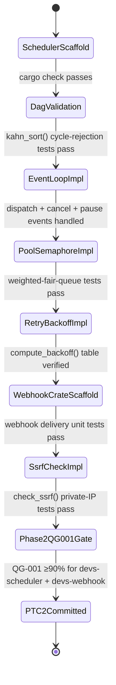

#### Scheduler Internal Event Model (`devs-scheduler`)

The `devs-scheduler` crate is driven exclusively by an internal event loop. All state mutations originate from events routed through a single `tokio::sync::mpsc` channel with capacity 1024. No component modifies `SchedulerState` directly — every mutation goes through `Scheduler::process_event()`. This invariant is enforced at compile time: `SchedulerState` fields are private; only the scheduler task holds a mutable reference.

```rust
/// All events that can mutate SchedulerState.
/// Sent over mpsc::Sender<SchedulerEvent>; capacity 1024.
#[derive(Debug)]
pub enum SchedulerEvent {
    /// A new run was submitted via gRPC SubmitRun or MCP submit_run.
    RunSubmitted {
        run_id:     RunId,
        definition: Arc<WorkflowDefinition>,
        project_id: ProjectId,
        inputs:     HashMap<BoundedString<128>, BoundedString<8192>>,
    },

    /// A stage subprocess exited (PTY or plain child process).
    StageExited {
        stage_run_id: StageRunId,
        exit_code:    i32,
        stdout_tail:  Option<String>, // last 1 KiB of output
    },

    /// An agent adapter reported a rate-limit condition.
    RateLimitReported {
        stage_run_id: StageRunId,
        pool_name:    BoundedString<64>,
        retry_after:  Option<Duration>,
    },

    /// A retry backoff timer fired (sent by a tokio::time::sleep task).
    RetryTimerFired {
        stage_run_id:   StageRunId,
        attempt_number: u32,
    },

    /// External pause request (gRPC PauseRun / MCP pause_run).
    PauseRequested { run_id: RunId },

    /// External resume request (gRPC ResumeRun / MCP resume_run).
    ResumeRequested { run_id: RunId },

    /// External cancel request (gRPC CancelRun / MCP cancel_run).
    CancelRequested { run_id: RunId },

    /// MCP agent called signal_completion on a managed stage.
    AgentSignalledCompletion {
        stage_run_id: StageRunId,
        exit_code:    i32,
        output:       BoundedString<65536>,
    },

    /// A webhook delivery attempt completed.
    WebhookDeliveryResult {
        delivery_id: DeliveryId,
        event_type:  WebhookEventType,
        http_status: Option<u16>, // None on network error / DNS timeout
        elapsed_ms:  u64,
    },

    /// Atomic checkpoint flush completed (sent by devs-checkpoint layer).
    CheckpointFlushed {
        run_id:        RunId,
        snapshot_path: PathBuf,
    },

    /// Internal tick to re-evaluate stage eligibility after pool state changes.
    EligibilityTick,
}
```

`SchedulerState` is wrapped in `Arc<RwLock<SchedulerState>>`. The gRPC and MCP layers hold a clone of the `Arc` for read-only queries. Exclusive write access belongs solely to the scheduler event-loop task.

```rust
pub struct SchedulerState {
    /// All runs ever submitted since server start (or recovered from checkpoints).
    pub runs: IndexMap<RunId, RunRecord>,

    /// Stage runs for all active runs.
    pub stage_runs: HashMap<StageRunId, StageRunRecord>,

    /// Runtime pool state keyed by pool name.
    pub pools: HashMap<BoundedString<64>, PoolState>,

    /// Per-run broadcast senders for RunEvent streaming.
    /// Capacity 256; oldest message dropped on overflow.
    pub run_event_senders: HashMap<RunId, broadcast::Sender<RunEvent>>,

    /// Active retry timer handles. Dropping a handle cancels the timer.
    pub pending_retries: HashMap<StageRunId, RetryHandle>,

    /// Run IDs with in-flight checkpoint flush.
    pub pending_checkpoints: HashSet<RunId>,
}
```

#### DAG Topological Sort & Validation

`kahn_sort()` implements Kahn's algorithm. It both detects cycles and produces a tiered execution plan. It runs at `submit_run` time (before any `StageRun` records are created) and again at `write_workflow_definition` time.

```rust
/// Returns Ok(tiers) on a valid DAG; Err(cycle_path) on a cycle.
///
/// tiers[i] contains the names of all stages executable concurrently
/// after all stages in tiers[0..i] have reached a terminal state.
///
/// Tiers within each tier are sorted lexicographically for determinism.
///
/// Algorithm:
///   1. Build adjacency map: name → Vec<downstream names>
///   2. Compute in-degree for each node
///   3. Seed queue with zero-in-degree nodes (sorted for determinism)
///   4. While queue non-empty:
///        a. Drain entire queue into current tier
///        b. For each stage in tier, decrement downstream in-degrees
///        c. Collect newly zero-in-degree nodes into next queue (sorted)
///        d. Push tier into result
///   5. If processed count < total stages: cycle exists
///        a. DFS from any unprocessed node using visiting/visited coloring
///        b. Extract cycle path from the first revisited 'visiting' node
///        c. Return Err(cycle_path)
///   6. Return Ok(tiers)
pub fn kahn_sort(stages: &[StageDefinition]) -> Result<Vec<Vec<String>>, Vec<String>>;
```

Validation rules enforced on every call:
- All names in `depends_on` must refer to a stage defined in the same `WorkflowDefinition`. Unknown references → `INVALID_ARGUMENT` with field `"unknown_deps": [...]`
- A stage may not list itself in `depends_on`. Self-reference is a special-cased cycle path `["A", "A"]`
- `max_concurrent` for any fan-out stage must not exceed 64 (compile-time checked by `BoundedU8<64>`)

#### Retry Backoff Computation

All retry scheduling passes through `compute_backoff()`. The caller stores the computed `Duration` in a `RetryHandle` and spawns a one-shot `tokio::time::sleep` task that sends `RetryTimerFired` to the event channel.

```rust
/// Compute delay before retry attempt_number (1-indexed).
///
/// Formula: min(initial_delay_secs × 2^(attempt_number − 1), max_delay_secs)
///
/// Attempt counter semantics:
///   - Incremented only on: non-zero exit code, process timeout,
///     network error in webhook delivery.
///   - NOT incremented on: RateLimitReported events (rate-limit restarts
///     agent assignment within the same attempt number).
/// When attempt_number > cfg.max_attempts: stage → Failed immediately;
/// RetryTimerFired is never sent.
pub fn compute_backoff(cfg: &RetryConfig, attempt_number: u32) -> Duration {
    let base   = cfg.initial_delay_secs as f64;
    let exp    = (attempt_number.saturating_sub(1)) as f64;
    let raw    = base * 2f64.powf(exp);
    let capped = raw.min(cfg.max_delay_secs.unwrap_or(300) as f64);
    Duration::from_secs_f64(capped)
}

pub struct RetryConfig {
    /// Seconds before first retry. Default: 5.
    pub initial_delay_secs: u32,
    /// Maximum retry attempts. 0 = no retries. Default: 3.
    pub max_attempts: u32,
    /// Cap on any single delay. None = 300 s. Default: None.
    pub max_delay_secs: Option<u32>,
}
```

**Illustrative backoff table** (`initial_delay_secs=2`, `max_attempts=10`, no `max_delay_secs` override):

| Attempt | Formula | Delay (s) |
|---------|---------|-----------|
| 1 | 2 × 2⁰ | 2 |
| 2 | 2 × 2¹ | 4 |
| 3 | 2 × 2² | 8 |
| 4 | 2 × 2³ | 16 |
| 5 | 2 × 2⁴ | 32 |
| 6 | 2 × 2⁵ | 64 |
| 7 | 2 × 2⁶ | 128 |
| 8 | 2 × 2⁷ | 256 |
| 9 | min(512, 300) | 300 |
| 10 | min(1024, 300) | 300 |

#### Webhook Delivery State Machine

Each webhook delivery attempt follows the transitions below. The `DeliveryRecord` is stored in-memory per `RunRecord` and persisted in `checkpoint.json` under `webhook_deliveries[]`.

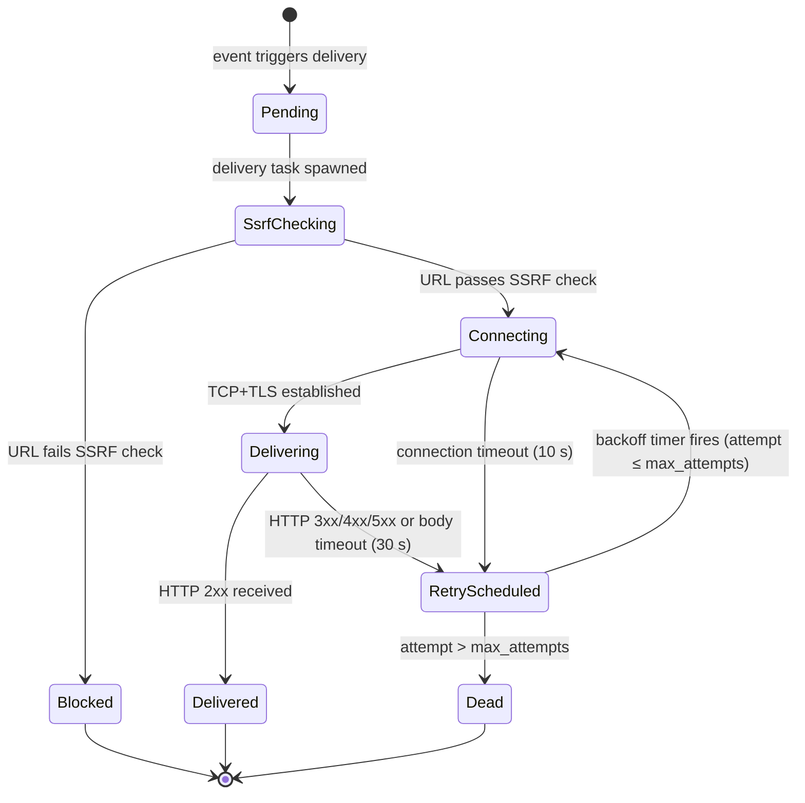

**State semantics:**
- `SsrfChecking`: `check_ssrf()` DNS resolution in progress. DNS timeout → `RetryScheduled` (NOT `Blocked`). IP-range violation → `Blocked`.
- `Blocked`: A `WARN` structured log event is emitted with the offending hostname (path stripped). Parent run/stage status is unaffected. No retry.
- `Dead`: Max retries exhausted. `WARN` structured log. Parent run/stage status unaffected.
- `Delivered`: `DeliveryRecord.delivered_at` timestamp set.

**`check_ssrf()` algorithm:**
1. Parse URL; reject non-`http`/`https` scheme → `Err(SsrfError::InvalidScheme)`
2. Reject IP literals in private ranges before DNS → `Err(SsrfError::PrivateIp)`
3. DNS-resolve hostname via `tokio::net::lookup_host`; 5-second timeout → `Err(SsrfError::DnsTimeout)` (triggers retry, not `Blocked`)
4. For each resolved address reject: `10.0.0.0/8`, `172.16.0.0/12`, `192.168.0.0/16`, `127.0.0.0/8`, `::1/128`, `fc00::/7` → `Err(SsrfError::PrivateIp)`
5. Return `Ok(resolved_addrs)`

**Webhook payload schema** (all event types share this envelope):

```json
{
  "event_type": "run.completed",
  "run_id":     "550e8400-e29b-41d4-a716-446655440000",
  "project_id": "myproject",
  "run_slug":   "presubmit-check-20260311-ab3f",
  "status":     "Completed",
  "triggered_at": "2026-03-11T10:00:00Z",
  "completed_at": "2026-03-11T10:14:30Z",
  "stage_summary": {
    "total": 4, "completed": 4, "failed": 0, "cancelled": 0
  }
}
```

Event types: `run.started`, `run.completed`, `run.failed`, `run.cancelled`, `pool.exhausted`, `stage.failed`. The `pool.exhausted` event fires at most once per rate-limit episode regardless of how many `report_rate_limit` calls are received for the same episode.

#### Dependencies

**[ROAD-P2-DEP-001]** **** **[ROAD-002]** **[9_PROJECT_ROADMAP-REQ-238]** **** Phase 1 must be complete (all infrastructure crates at 90% unit coverage).

---

### **[ROAD-004]** **[9_PROJECT_ROADMAP-REQ-239]** **** ******** Phase 3 — Server & Client Interfaces

**Objective:** Wire all engine crates into the server binary, implement all three client interfaces, and bring the system to a runnable state. By end of Phase 3, all three Bootstrap Phase conditions are met, and the Glass-Box MCP server is operational.

#### Deliverables

**[ROAD-018]** **[9_PROJECT_ROADMAP-REQ-240]** **** **** `devs-grpc` Crate
- Six `tonic` service implementations (thin adapters, ≤25 lines of handler logic): `WorkflowDefinitionService`, `RunService`, `StageService`, `LogService`, `PoolService`, `ProjectService`
- `tonic-reflection` server registered with all 6 service names
- `x-devs-client-version` metadata interceptor; major version mismatch → `FAILED_PRECONDITION` on ALL RPCs
- Every unary response includes `request_id` (UUID4)
- `StreamRunEvents`: first message = full run snapshot (`event_type = "run.snapshot"`); terminal run → final event + gRPC `OK`; per-client buffer 256 messages (oldest dropped on overflow)
- Streaming RPCs release resources within 500 ms of client cancel
- gRPC frame limit: 16 MiB; per-RPC limits per TAS §5
- gRPC error code mapping per TAS §1 table; `INVALID_ARGUMENT` includes all validation errors as JSON array
- Wire types from `devs-proto` MUST NOT appear in public APIs of `devs-scheduler`, `devs-executor`, or `devs-pool`

**[ROAD-019]** **[9_PROJECT_ROADMAP-REQ-241]** **** **** `devs-mcp` Crate
- HTTP/1.1 JSON-RPC 2.0 server; POST to `/mcp/v1/call`; port 7891 (default)
- All 17 Glass-Box tools implemented: 7 observation, 8 control, 2 testing, 3 mid-run agent tools
- All responses: `{"result": {...}|null, "error": "<string>"|null}` (mutually exclusive)
- HTTP error codes: 200 (tool response), 400 (malformed), 404 (wrong path), 405 (non-POST), 413 (>1MiB), 415 (wrong Content-Type), 500 (panic)
- Security headers on all responses: `X-Content-Type-Options: nosniff`, `Cache-Control: no-store`, `X-Frame-Options: DENY`
- `stream_logs(follow:true)`: HTTP chunked transfer; newline-delimited JSON chunks; sequence starts at 1, monotonically increasing; final chunk `{"done":true}`; max lifetime 30 minutes; MUST NOT hold `SchedulerState` lock
- `stream_logs(from_sequence:N)`: only chunks with sequence ≥ N
- Max 64 concurrent connections; 5s write-lock acquisition timeout → `resource_exhausted`
- MCP and gRPC share `Arc<RwLock<SchedulerState>>`; no IPC
- `assert_stage_output` operators: `eq`, `ne`, `contains`, `not_contains`, `matches` (Rust regex), `json_path_eq`, `json_path_exists`, `json_path_not_exists`; all assertions evaluated (no short-circuit); `actual_snippet` truncated to 256 chars
- Glass-Box MCP server active whenever port is bound; no feature flag (MCP-BR-001)

**[ROAD-020]** **[9_PROJECT_ROADMAP-REQ-242]** **** **** `devs-server` Binary
- Startup sequence (10 steps per TAS §1): parse config → validate → bind gRPC → bind MCP → init pool → load registry → scan workflows → restore checkpoints → write discovery file → accept connections → resume recovered runs
- All config errors reported before any port is bound
- `gRPC port in use` → exit; `MCP port in use` → release gRPC first then exit
- Discovery file written atomically after BOTH ports bound; path precedence: `DEVS_DISCOVERY_FILE` env > `server.discovery_file` config > `~/.config/devs/server.addr`; mode `0600`
- Shutdown: SIGTERM → `devs:cancel\n` all agents → 10s wait → SIGTERM → 5s → SIGKILL → flush checkpoints → delete discovery file → exit 0
- Second SIGTERM during shutdown → immediate SIGKILL
- 7 startup security checks with structured `WARN` events
- Non-loopback bind without TLS cert → `WARN` at startup (`check_id: "SEC-TLS-MISSING"`); server still starts
- Single multi-thread Tokio runtime; no additional runtimes

**[ROAD-021]** **[9_PROJECT_ROADMAP-REQ-243]** **** **** `devs-cli` Binary (`devs-client-util` shared library)
- Commands: `submit`, `list`, `status`, `logs`, `cancel`, `pause`, `resume`, `project add/remove/list`
- All commands: `--server <host:port>`, `--format json|text`, `--project <name|id>`
- Server discovery precedence: `--server` flag → `DEVS_SERVER` env → `server_addr` in `devs.toml` → `DEVS_DISCOVERY_FILE` env → `~/.config/devs/server.addr`
- Exit codes: 0=success, 1=general, 2=not found, 3=server unreachable, 4=validation
- `--format json`: ALL output (including errors) to stdout; nothing to stderr
- JSON error format: `{"error": "<prefix>: <detail>", "code": <n>}`
- Run ID resolution: UUID4 format checked first, then slug; UUID takes precedence on collision
- `devs logs --follow`: exit 0 on `Completed`, 1 on `Failed`/`Cancelled`, 3 on disconnection
- `--input key=value` splits on FIRST `=` only
- `devs submit` auto-detects project from CWD if exactly 1 match; 0 or ≥2 → exit code 4

**[ROAD-022]** **[9_PROJECT_ROADMAP-REQ-244]** **** **** `devs-tui` Binary
- 4 tabs: `Dashboard`, `Logs`, `Debug`, `Pools`
- `App` → `EventLoop` + `AppState` + `RootWidget` component hierarchy
- DAG rendering: ASCII only (`-|+> space`); stage box format `[ <name:20> | <STAT:4> | <M:SS> ]` (39 cols total); tier gutter 5 cols
- Stage status 4-char labels: `PEND WAIT ELIG RUN  PAUS DONE FAIL TIME CANC`
- `LogBuffer`: 10,000-line FIFO ring buffer per stage; ANSI stripped via 3-state machine
- Re-renders within 50ms of receiving `RunEvent` (event-driven, not timer-driven)
- Reconnect backoff: 1→2→4→8→16→30s cap; 35s total budget → `Disconnected` → exit 1
- Auto-restore terminal on any exit including panics (via `Drop` on terminal guard)
- `NO_COLOR` detection in `Theme::from_env()` only; result stored immutably in `AppState`
- `insta` text snapshots in `crates/devs-tui/tests/snapshots/*.txt` using `TestBackend` 200×50, `ColorMode::Monochrome`
- Below 80×24: render only size warning
- All user-visible strings as `pub const &'static str` in `strings.rs`; all `STATUS_*` compile-time asserted to exactly 4 bytes

**[ROAD-023]** **[9_PROJECT_ROADMAP-REQ-245]** **** **** `devs-mcp-bridge` Binary
- Pure stdin→HTTP→stdout proxy; creates zero TCP listeners
- One in-flight request at a time (sequential)
- On HTTP error: one reconnect after 1s; on failure: `{"result":null,"error":"server_unreachable: ...","fatal":true}` → exit 1
- Invalid JSON on stdin → JSON-RPC `-32700` error to stdout; bridge continues
- `stream_logs` chunked transfer forwarded line-by-line, flushed immediately
- MUST NOT import `tonic` or `devs-proto`
- Validates JSON before forwarding (SEC-067)

#### Business Rules

| Rule ID | Rule |
|---|---|
|**[ROAD-BR-301]** **[9_PROJECT_ROADMAP-REQ-246]** **** ******** | gRPC handler functions MUST contain ≤25 lines of handler logic; all business logic MUST reside in engine-layer crates (`devs-scheduler`, `devs-pool`, `devs-executor`, etc.); this is enforced by a line-count check in `./do lint` |
|**[ROAD-BR-302]** **[9_PROJECT_ROADMAP-REQ-247]** **** ******** | Wire types from `devs-proto` MUST NOT appear in the public APIs of `devs-scheduler`, `devs-executor`, or `devs-pool`; `cargo tree` in `./do lint` verifies these crates do not import `devs-proto` |
|**[ROAD-BR-303]** **[9_PROJECT_ROADMAP-REQ-248]** **** ******** | `devs-server` MUST NOT bind any TCP port before all config errors are collected and reported to stderr |
|**[ROAD-BR-304]** **[9_PROJECT_ROADMAP-REQ-249]** **** ******** | The discovery file MUST be written atomically (write-to-temp → `rename()`) only after BOTH gRPC and MCP ports are successfully bound; it contains only the gRPC `<host>:<port>` address |
|**[ROAD-BR-305]** **[9_PROJECT_ROADMAP-REQ-250]** **** ******** | `devs-mcp-bridge` MUST NOT create any TCP listener; its role is a pure stdin-to-HTTP proxy; verified by `netstat` assertion in E2E tests |
|**[ROAD-BR-306]** **[9_PROJECT_ROADMAP-REQ-251]** **** ******** | The Glass-Box MCP server MUST be active whenever the MCP port is bound; no environment variable, feature flag, config entry, or build-time conditional may gate it |
|**[ROAD-BR-307]** **[9_PROJECT_ROADMAP-REQ-252]** **** ******** | TUI `render()` MUST complete within 16ms; no I/O, syscalls, `Arc`/`Mutex` acquisition, or proportional heap allocation is permitted inside any `Widget::render()` implementation |
|**[ROAD-BR-308]** **[9_PROJECT_ROADMAP-REQ-253]** **** ******** | All user-visible strings in `devs-tui` and `devs-cli` MUST be `pub const &'static str` in `strings.rs`; inline string literals for user-facing messages are prohibited; the strings hygiene lint in `./do lint` enforces this |
|**[ROAD-BR-309]** **[9_PROJECT_ROADMAP-REQ-254]** **** ******** | `devs-cli` in `--format json` mode MUST send ALL output (including errors) to stdout as JSON; stderr MUST remain empty for the entire invocation |
|**[ROAD-BR-311]** **[9_PROJECT_ROADMAP-REQ-255]** **** ******** | The TUI MUST restore terminal state (raw mode off, cursor visible, alternate screen off) on ALL exit paths including panics; a `Drop`-based or `scopeguard`-based terminal guard is required |
|**[ROAD-BR-312]** **[9_PROJECT_ROADMAP-REQ-256]** **** ******** | `NO_COLOR` detection MUST occur only in `Theme::from_env()`, called exactly once during `App::new()`; no widget or command handler may read the `NO_COLOR` environment variable directly |

#### Edge Cases

| Scenario | Expected Behavior |
|---|---|
| **** gRPC port already in use at server startup ****| Server reports the error to stderr with port number, exits non-zero; the MCP port MUST NOT have been bound at this point; no discovery file is written | **** **[9_PROJECT_ROADMAP-REQ-257]**
| **** MCP port in use after gRPC successfully binds ****| Server releases the gRPC socket, reports the MCP port collision error to stderr, exits non-zero; no discovery file is written | **** **[9_PROJECT_ROADMAP-REQ-258]**
| **** Both gRPC and MCP configured to the same port value ****| Config validation catches this before any port binding; error: `"invalid_argument: grpc_port and mcp_port must be different (both are <n>)"` | **** **[9_PROJECT_ROADMAP-REQ-259]**
| **** `devs-mcp-bridge` receives malformed JSON on stdin ****| Bridge writes JSON-RPC parse error `{"id": null, "error": {"code": -32700, "message": "parse error"}}` to stdout and continues; MUST NOT exit | **** **[9_PROJECT_ROADMAP-REQ-260]**
| **** TUI reconnect budget (35,000ms total) exhausted ****| TUI writes `"Disconnected from server. Exiting."`, restores terminal state, exits code 1; the 35,000ms budget = 30,000ms backoff + 5,000ms grace | **** **[9_PROJECT_ROADMAP-REQ-261]**
| **** `devs logs --follow` on a stage in `Paused` state ****| Stream remains open; `follow` mode holds the HTTP connection; when the run is resumed and the stage completes, the stream delivers remaining output and exits 0 on `Completed` | **** **[9_PROJECT_ROADMAP-REQ-262]**
| **** MCP tool handler panics due to internal error ****| HTTP 500 returned: `{"result": null, "error": "internal: tool handler panicked"}`; the server process MUST NOT crash; subsequent requests are handled normally | **** **[9_PROJECT_ROADMAP-REQ-263]**
| **** `signal_completion` called twice on the same terminal stage ****| Second call returns `{"result": null, "error": "failed_precondition: stage is already in a terminal state"}`; state is unchanged; first call is idempotent | **** **[9_PROJECT_ROADMAP-REQ-264]**
| **** gRPC client sends `x-devs-client-version` with a different major version ****| `FAILED_PRECONDITION` returned on ALL RPCs from that client; other concurrently connected clients with matching versions are unaffected | **** **[9_PROJECT_ROADMAP-REQ-265]**
| **** TUI terminal resized below 80×24 ****| All tab content is replaced with the single size warning: `"Terminal too small: 80x24 minimum required (current: WxH)"`; no other content is rendered | **** **[9_PROJECT_ROADMAP-REQ-266]**

#### Acceptance Criteria

- **[AC-ROAD-P3-001]** **[9_PROJECT_ROADMAP-REQ-267]** **** ******** `devs-server` starts successfully on all 3 platforms; discovery file at `~/.config/devs/server.addr` (or `DEVS_DISCOVERY_FILE` path) contains `<host>:<grpc-port>`, is mode `0600`, and is written after both ports bind
- **[AC-ROAD-P3-002]** **[9_PROJECT_ROADMAP-REQ-268]** **** ******** SIGTERM causes the discovery file to be deleted and the server to exit 0; verified by an integration test that checks file absence after the server process exits
- **[AC-ROAD-P3-003]** **[9_PROJECT_ROADMAP-REQ-269]** **** ******** `grpcurl -plaintext localhost:7890 grpc.reflection.v1alpha.ServerReflection/ServerReflectionInfo` returns all 6 service names
- **[AC-ROAD-P3-004]** **[9_PROJECT_ROADMAP-REQ-270]** **** ******** `devs submit` → `devs status` → `devs cancel` CLI round-trip completes with correct exit codes; with `--format json`, stdout is valid JSON and stderr is empty for every command
- **[AC-ROAD-P3-005]** **[9_PROJECT_ROADMAP-REQ-271]** **** ******** All 20 MCP tools return `{"result": <non-null-object>, "error": null}` on valid input in E2E tests via `POST /mcp/v1/call` to a live server
- **[AC-ROAD-P3-006]** **[9_PROJECT_ROADMAP-REQ-272]** **** ******** `devs-mcp-bridge` E2E test: bridge binary forwards a `stream_logs(follow:true)` request and receives all chunks in order with monotonically increasing `sequence` numbers, followed by `{"done": true}`
- **[AC-ROAD-P3-007]** **[9_PROJECT_ROADMAP-REQ-273]** **** ******** All required `insta` text snapshots exist in `crates/devs-tui/tests/snapshots/*.txt`; `INSTA_UPDATE=always` is absent from the CI environment; a snapshot mismatch causes CI to exit non-zero
- **[AC-ROAD-P3-008]** **[9_PROJECT_ROADMAP-REQ-274]** **** ******** Concurrent `submit_run` calls with the same run name result in exactly one `Pending` run and one `already_exists` error; verified by spawning two tokio tasks simultaneously
- **[AC-ROAD-P3-009]** **[9_PROJECT_ROADMAP-REQ-275]** **** ******** `cargo tree -p devs-mcp-bridge --edges normal` contains neither `tonic` nor `devs-proto`

#### Phase Lifecycle State Diagram

```mermaid
stateDiagram-v2
    [*] --> ProtoCompile
    ProtoCompile --> GrpcServiceImpl : tonic build succeeds; reflection registered
    GrpcServiceImpl --> McpHttpImpl : all 6 gRPC services compile; handler ≤25 lines each
    McpHttpImpl --> ServerBinaryImpl : all 20 MCP tools return valid JSON
    ServerBinaryImpl --> CliBinaryImpl : server binds + writes discovery file
    CliBinaryImpl --> TuiBinaryImpl : devs submit/status/cancel CLI round-trip passes
    TuiBinaryImpl --> McpBridgeImpl : TestBackend snapshots committed
    McpBridgeImpl --> Phase3E2EGate : bridge forwards stream_logs correctly
    Phase3E2EGate --> PTC3Committed : QG-003 ≥50%, QG-004 ≥50%, QG-005 ≥50%
    PTC3Committed --> [*]
```

#### gRPC Service RPC Contracts (`devs-grpc`)

All six `tonic` service implementations are thin adapters (≤25 lines of handler logic). All business logic lives in engine crates. Wire types from `devs-proto` must not appear in public APIs of `devs-scheduler`, `devs-executor`, or `devs-pool`.

**WorkflowDefinitionService** (`devs.v1.WorkflowDefinitionService`):

| RPC | Request | Response | Error Codes |
|---|---|---|---|
| `WriteWorkflowDefinition` | `WriteWorkflowDefinitionRequest { definition: WorkflowDefinitionProto }` | `WriteWorkflowDefinitionResponse { snapshot_id: string, created_at: Timestamp }` | `INVALID_ARGUMENT` (validation), `ALREADY_EXISTS` (snapshot collision) |
| `GetWorkflowDefinition` | `GetWorkflowDefinitionRequest { workflow_name: string }` | `GetWorkflowDefinitionResponse { definition: WorkflowDefinitionProto }` | `NOT_FOUND` |
| `ListWorkflowDefinitions` | `ListWorkflowDefinitionsRequest { project_id: string, page_token: string, page_size: int32 }` | `ListWorkflowDefinitionsResponse { definitions: [WorkflowDefinitionProto], next_page_token: string }` | `INVALID_ARGUMENT` (page_size > 100) |
| `ValidateWorkflowDefinition` | `ValidateWorkflowDefinitionRequest { definition: WorkflowDefinitionProto }` | `ValidateWorkflowDefinitionResponse { valid: bool, errors: [ValidationError] }` | never fails with gRPC error; validation errors in body |

**RunService** (`devs.v1.RunService`):

| RPC | Request | Response | Error Codes |
|---|---|---|---|
| `SubmitRun` | `SubmitRunRequest { workflow_name: string, project_id: string, run_name: string, inputs: map<string,string> }` | `SubmitRunResponse { run_id: string, run_slug: string, status: string, request_id: string }` | `INVALID_ARGUMENT` (cycle/missing pool), `ALREADY_EXISTS` (run name collision), `FAILED_PRECONDITION` (client version mismatch) |
| `GetRun` | `GetRunRequest { run_id: string }` | `RunProto { run_id, run_slug, workflow_name, project_id, status, created_at, started_at, completed_at, stages: [StageRunProto], request_id }` | `NOT_FOUND`, `INVALID_ARGUMENT` (bad UUID) |
| `ListRuns` | `ListRunsRequest { project_id: string, status_filter: [string], page_token: string, page_size: int32 }` | `ListRunsResponse { runs: [RunProto], next_page_token: string }` | `INVALID_ARGUMENT` (page_size > 100, unknown status) |
| `CancelRun` | `CancelRunRequest { run_id: string }` | `CancelRunResponse { cancelled_stage_count: int32, request_id: string }` | `NOT_FOUND`, `FAILED_PRECONDITION` (already terminal) |
| `PauseRun` | `PauseRunRequest { run_id: string }` | `PauseRunResponse { paused_stage_count: int32, request_id: string }` | `NOT_FOUND`, `FAILED_PRECONDITION` (already terminal or paused) |
| `ResumeRun` | `ResumeRunRequest { run_id: string }` | `ResumeRunResponse { resumed_stage_count: int32, request_id: string }` | `NOT_FOUND`, `FAILED_PRECONDITION` (not paused) |
| `StreamRunEvents` | `StreamRunEventsRequest { run_id: string }` | `stream RunEventProto` (first = full snapshot; terminal run = final event + gRPC OK; buffer 256; oldest dropped) | `NOT_FOUND` |

**StageService** (`devs.v1.StageService`):

| RPC | Request | Response | Error Codes |
|---|---|---|---|
| `GetStage` | `GetStageRequest { stage_run_id: string }` | `StageRunProto { stage_run_id, stage_name, run_id, status, exit_code, attempt_number, started_at, completed_at, agent_tool, request_id }` | `NOT_FOUND` |
| `ListStages` | `ListStagesRequest { run_id: string }` | `ListStagesResponse { stages: [StageRunProto] }` | `NOT_FOUND` |

**LogService** (`devs.v1.LogService`):

| RPC | Request | Response | Error Codes |
|---|---|---|---|
| `StreamLogs` | `StreamLogsRequest { stage_run_id: string, from_sequence: int64, follow: bool }` | `stream LogChunkProto { sequence: int64, content: string, timestamp: Timestamp }` (sequence monotonically increasing from 1; terminal stage + `follow=false` → stream closes; `follow=true` → stays open; final chunk: `{ done: true }`) | `NOT_FOUND` |

**PoolService** (`devs.v1.PoolService`):

| RPC | Request | Response | Error Codes |
|---|---|---|---|
| `GetPoolState` | `GetPoolStateRequest { pool_name: string }` | `PoolStateProto { pool_name, max_concurrent, active_agents: [AgentProto], queued_count: int32, rate_limited_agents: [AgentProto] }` | `NOT_FOUND` |
| `ListPools` | `ListPoolsRequest {}` | `ListPoolsResponse { pools: [PoolStateProto] }` | — |
| `ReportRateLimit` | `ReportRateLimitRequest { stage_run_id: string, retry_after_secs: int32 }` | `ReportRateLimitResponse { request_id: string }` | `NOT_FOUND`, `FAILED_PRECONDITION` (stage not Running) |

**ProjectService** (`devs.v1.ProjectService`):

| RPC | Request | Response | Error Codes |
|---|---|---|---|
| `AddProject` | `AddProjectRequest { project_id: string, display_name: string, root_path: string }` | `AddProjectResponse { project_id: string, request_id: string }` | `ALREADY_EXISTS`, `INVALID_ARGUMENT` (path traversal, empty id) |
| `RemoveProject` | `RemoveProjectRequest { project_id: string }` | `RemoveProjectResponse { request_id: string }` | `NOT_FOUND`, `FAILED_PRECONDITION` (active runs exist) |
| `ListProjects` | `ListProjectsRequest {}` | `ListProjectsResponse { projects: [ProjectProto] }` | — |

**Error detail format** (all `INVALID_ARGUMENT`): the gRPC `Status.details` field contains a `google.rpc.BadRequest` with one `FieldViolation` per validation error. Additionally, JSON-serialized errors are in `Status.message` for clients that cannot decode proto details.

#### MCP Tool Request/Response Contracts (`devs-mcp`)

All tools accept and return `application/json`. The envelope is always `{"result": <object|null>, "error": "<string>|null"}` (mutually exclusive). The following table documents the `params` object sent in the JSON-RPC `params` field and the `result` object in the response.

**Observation tools (7):**

| Tool | `params` | `result` |
|---|---|---|
| `get_run` | `{ "run_id": "<uuid>" }` | `{ "run_id", "run_slug", "workflow_name", "project_id", "status", "created_at", "stages": [{ "stage_run_id", "stage_name", "status", "attempt_number" }] }` |
| `list_runs` | `{ "project_id": "<str>", "status_filter": ["<str>"], "limit": 20 }` | `{ "runs": [<RunSummary>], "total": <int> }` |
| `get_stage_output` | `{ "stage_run_id": "<uuid>", "from_sequence": 0, "limit": 200 }` | `{ "lines": [{ "sequence": <int>, "content": "<str>", "timestamp": "<rfc3339>" }], "has_more": <bool> }` |
| `stream_logs` | `{ "stage_run_id": "<uuid>", "follow": true, "from_sequence": 0 }` | chunked: `{ "sequence": <int>, "content": "<str>" }` per line; final: `{ "done": true }` |
| `get_pool_state` | `{ "pool_name": "<str>" }` | `{ "pool_name", "max_concurrent", "active_count", "queued_count", "rate_limited_count", "agents": [{ "tool", "status", "stage_run_id" }] }` |
| `list_pools` | `{}` | `{ "pools": [<PoolSummary>] }` |
| `get_server_status` | `{}` | `{ "version": "<semver>", "uptime_secs": <int>, "active_runs": <int>, "recovered_runs": <int>, "gRPC_port": <int>, "mcp_port": <int> }` |

**Control tools (8):**

| Tool | `params` | `result` | Notes |
|---|---|---|---|
| `submit_run` | `{ "workflow_name": "<str>", "project_id": "<str>", "run_name": "<str>", "inputs": { "<key>": "<val>" } }` | `{ "run_id": "<uuid>", "run_slug": "<str>", "status": "pending" }` | |
| `cancel_run` | `{ "run_id": "<uuid>" }` | `{ "cancelled_stage_count": <int> }` | |
| `pause_run` | `{ "run_id": "<uuid>" }` | `{ "paused_stage_count": <int> }` | |
| `resume_run` | `{ "run_id": "<uuid>" }` | `{ "resumed_stage_count": <int> }` | |
| `write_workflow_definition` | `{ "definition": { "name": "<str>", "stages": [...] } }` | `{ "snapshot_id": "<uuid>", "created_at": "<rfc3339>" }` | |
| `report_rate_limit` | `{ "stage_run_id": "<uuid>", "retry_after_secs": 60 }` | `{ "acknowledged": true }` | |
| `add_project` | `{ "project_id": "<str>", "display_name": "<str>", "root_path": "<abs-path>" }` | `{ "project_id": "<str>" }` | |
| `remove_project` | `{ "project_id": "<str>" }` | `{ "removed": true }` | fails if active runs |

**Testing tools (2):**

| Tool | `params` | `result` |
|---|---|---|
| `assert_stage_output` | `{ "stage_run_id": "<uuid>", "assertions": [{ "operator": "eq|ne|contains|not_contains|matches|json_path_eq|json_path_exists|json_path_not_exists", "operand": "<str>", "json_path": "<str>" }] }` | `{ "passed": <bool>, "results": [{ "operator", "operand", "passed", "actual_snippet": "<256-char-truncated>" }] }` |
| `signal_completion` | `{ "stage_run_id": "<uuid>", "exit_code": 0, "output": "<str>" }` | `{ "acknowledged": true, "new_status": "completed|failed" }` |

**Mid-run agent tools (3):**

| Tool | `params` | `result` |
|---|---|---|
| `get_context` | `{ "run_id": "<uuid>", "stage_name": "<str>" }` | Full `.devs_context.json` payload as object |

#### CLI Command API Contracts (`devs-cli`)

**Global flags** (apply to every subcommand):

| Flag | Type | Default | Description |
|---|---|---|---|
| `--server <host:port>` | string | discovery file | gRPC server address |
| `--format json\|text` | enum | `text` | Output format; `json` sends all output including errors to stdout |
| `--project <name\|id>` | string | CWD auto-detect | Project filter |

**Exit code matrix** (all subcommands):

| Code | Meaning |
|---|---|
| 0 | Success |
| 1 | General / unexpected error |
| 2 | Not found (run ID, stage, project) |
| 3 | Server unreachable / connection failed |
| 4 | Validation / argument error |

**Per-command request/response schemas** (`--format json`):

| Command | stdin/args | stdout JSON (success) | Notes |
|---|---|---|---|
| `devs submit <workflow> [--input k=v]...` | args | `{ "run_id": "<uuid>", "run_slug": "<str>", "status": "pending", "project_id": "<str>" }` | `--input` splits on FIRST `=` only; auto-detects project from CWD if exactly 1 match |
| `devs list [--status <s>] [--limit N]` | args | `{ "runs": [{ "run_id", "run_slug", "workflow_name", "status", "created_at" }], "total": <int> }` | |
| `devs status <run-id>` | arg | `{ "run_id", "run_slug", "workflow_name", "project_id", "status", "stages": [{ "stage_name", "status", "exit_code", "attempt_number" }] }` | accepts UUID or slug |
| `devs logs <run-id> [--stage <name>] [--follow] [--from N]` | args | NDJSON log lines; `--follow` exits 0 on `Completed`, 1 on `Failed`/`Cancelled`, 3 on disconnection | |
| `devs cancel <run-id>` | arg | `{ "cancelled_stage_count": <int> }` | exit 2 if not found; exit 4 if already terminal |
| `devs pause <run-id>` | arg | `{ "paused_stage_count": <int> }` | exit 4 if already paused or terminal |
| `devs resume <run-id>` | arg | `{ "resumed_stage_count": <int> }` | exit 4 if not paused |
| `devs project add <id> --path <path> [--name <display>]` | args | `{ "project_id": "<str>" }` | exit 4 on path traversal |
| `devs project remove <id>` | arg | `{ "removed": true }` | exit 4 if active runs |
| `devs project list` | — | `{ "projects": [{ "project_id", "display_name", "root_path" }] }` | |
**JSON error envelope** (all commands, `--format json`, any exit code ≠ 0):
```json
{ "error": "<prefix>: <detail>", "code": <exit-code-int> }
```

#### Server Startup Sequence State Diagram

```mermaid
stateDiagram-v2
    [*] --> ParseConfig
    ParseConfig --> ValidateConfig : config file read
    ValidateConfig --> SecurityChecks : all fields valid
    SecurityChecks --> BindGrpc : 7 startup checks passed
    BindGrpc --> BindMcp : gRPC port bound
    BindGrpc --> ExitConfigError : port in use → exit non-zero; MCP never bound
    BindMcp --> InitPool : MCP port bound
    BindMcp --> ReleaseGrpcThenExit : MCP port in use → release gRPC → exit non-zero
    InitPool --> LoadRegistry : pool semaphores initialized
    LoadRegistry --> ScanWorkflows : project registry loaded
    ScanWorkflows --> RestoreCheckpoints : .devs/workflows/ scanned
    RestoreCheckpoints --> WriteDiscoveryFile : recovered runs re-queued
    WriteDiscoveryFile --> AcceptConnections : atomic write to discovery path (mode 0600)
    AcceptConnections --> ResumeRuns : gRPC + MCP handlers active
    ResumeRuns --> Running : recovered runs dispatched to scheduler
    Running --> ShutdownSigterm : SIGTERM received
    ShutdownSigterm --> CancelAgents : send devs:cancel\n to all agents
    CancelAgents --> WaitAgents : 10 s timeout
    WaitAgents --> SigkillAgents : timeout expired
    WaitAgents --> FlushCheckpoints : all agents exited
    SigkillAgents --> FlushCheckpoints
    FlushCheckpoints --> DeleteDiscoveryFile
    DeleteDiscoveryFile --> [*]
    ExitConfigError --> [*]
    ReleaseGrpcThenExit --> [*]
```

#### Dependencies

**[ROAD-P3-DEP-001]** **** **[ROAD-003]** **[9_PROJECT_ROADMAP-REQ-276]** **** Phase 2 must be complete (`devs-scheduler` and `devs-webhook` at unit test gate).
**[ROAD-P3-DEP-002]** **[9_PROJECT_ROADMAP-REQ-277]** **** **** `devs-cli` and `devs-tui` depend on `devs-server` being startable (ROAD-020 complete).
**[ROAD-P3-DEP-003]** **[9_PROJECT_ROADMAP-REQ-278]** **** **** `devs-mcp-bridge` depends on `devs-mcp` HTTP server being bound (ROAD-019 complete).

---

### **[ROAD-005]** **[9_PROJECT_ROADMAP-REQ-279]** **** ******** Phase 4 — Self-Hosting & Agentic Development

**Objective:** Achieve the three Bootstrap Phase completion conditions simultaneously on all three CI platforms. From this point, agentic AI development of `devs` itself becomes the primary development mode.

#### Deliverables

**[ROAD-024]** **[9_PROJECT_ROADMAP-REQ-280]** **** **** Bootstrap Validation

Standard workflow definitions committed to `.devs/workflows/` (all syntactically valid):

| Workflow | Purpose |
|---|---|
| `tdd-red.toml` | Verify test fails before implementation |
| `tdd-green.toml` | Verify test passes after implementation |
| `presubmit-check.toml` | Full quality gate (format → clippy+doc → test+traceability → coverage) |
| `build-only.toml` | Fast compile check |
| `unit-test-crate.toml` | Per-crate unit tests with `crate_name` input |
| `e2e-all.toml` | Full E2E suite |

All 6 workflows use only built-in TOML predicates (no Rust builder API required).

**Bootstrap Completion Conditions (all three must hold simultaneously on Linux, macOS, and Windows):**
- **COND-001:** `devs-server` binds gRPC (`:7890`) and MCP (`:7891`) and writes discovery file
- **COND-002:** `devs submit presubmit-check` exits 0 with a `run_id` in JSON response
- **COND-003:** The submitted `presubmit-check` run reaches `Completed` with all stages `Completed`

On bootstrap completion:
- ADR committed to `docs/adr/NNNN-bootstrap-complete.md` with commit SHA and CI pipeline URL
- All `// TODO: BOOTSTRAP-STUB` annotations removed; `./do lint` verifies zero remain
- RISK-009 transitions to `Mitigated` in `target/traceability.json`

**Agentic Development Loop Setup:**
- Code-review workflow (`code-review.toml`) committed with `review-pool` configuration
- `docs/adr/` directory with per-crate ADR requirements enforced

#### Business Rules

| Rule ID | Rule |
|---|---|
|**[ROAD-BR-401]** **[9_PROJECT_ROADMAP-REQ-281]** **** ******** | Bootstrap Phase MUST be time-boxed: if 150% of the planned Phase 4 duration elapses without meeting all three COND-001/002/003 conditions simultaneously on all 3 CI platforms, fallback FB-007 MUST be activated per the Fallback Activation Protocol |
|**[ROAD-BR-402]** **[9_PROJECT_ROADMAP-REQ-282]** **** ******** | All 6 standard workflow TOMLs MUST be syntactically valid (accepted by `devs submit`) before the first `SelfHostingAttempt`; a workflow rejected at submit time blocks the attempt |
|**[ROAD-BR-403]** **[9_PROJECT_ROADMAP-REQ-283]** **** ******** | The bootstrap completion ADR committed to `docs/adr/NNNN-bootstrap-complete.md` MUST include the exact git commit SHA of the passing `presubmit-check` run and the GitLab CI pipeline URLs for all three platform jobs |
|**[ROAD-BR-404]** **[9_PROJECT_ROADMAP-REQ-284]** **** ******** | After bootstrap completion, `./do lint` MUST exit non-zero if any `// TODO: BOOTSTRAP-STUB` annotation remains in any Rust source file in the workspace |
|**[ROAD-BR-405]** **[9_PROJECT_ROADMAP-REQ-285]** **** ******** | RISK-009 MUST NOT transition to `Mitigated` until all three COND-001/002/003 conditions are verified simultaneously on all 3 CI platforms in the same pipeline run |
|**[ROAD-BR-407]** **[9_PROJECT_ROADMAP-REQ-286]** **** ******** | The `code-review` workflow MUST be submitted for each crate after that crate first reaches the Phase 5 entry criteria; `critical_findings > 0` in the review output MUST cause the workflow to branch to `halt-for-remediation`, blocking further development on that crate |
|**[ROAD-BR-408]** **[9_PROJECT_ROADMAP-REQ-287]** **** ******** | The agentic development loop MUST use a distinct `DEVS_DISCOVERY_FILE` path for every nested E2E test server instance; the production development server and test servers MUST NOT share a discovery file |

#### Edge Cases

| Scenario | Expected Behavior |
|---|---|
| **** COND-001 met but `devs submit presubmit-check` returns a validation error (COND-002 fails) ****| Bootstrap Phase continues; the failure is diagnosed via `get_stage_output`; the specific error (e.g., missing pool name) is fixed and COND-002 re-attempted | **** **[9_PROJECT_ROADMAP-REQ-288]**
| **** `presubmit-check` run completes but a coverage gate fails within it (COND-003 not fully met) ****| COND-003 is NOT satisfied; the coverage gap is identified via `assert_stage_output` on the `coverage` stage; targeted tests are added and the run resubmitted | **** **[9_PROJECT_ROADMAP-REQ-289]**
| **** Bootstrap Phase exceeds 150% of planned Phase 4 duration ****| Fallback FB-007 is activated: a `./do run-workflow` serial shell script is used as interim orchestration; a Fallback Activation Record is committed to `docs/adr/` before implementation | **** **[9_PROJECT_ROADMAP-REQ-290]**
| **** Agentic loop agent loses MCP bridge connection mid-task ****| Agent calls `list_runs` to find active runs, then calls `get_run(run_id)` to determine current state, resumes monitoring via `stream_logs(follow:true)` or cancels and re-submits as appropriate | **** **[9_PROJECT_ROADMAP-REQ-291]**
| **** Two observing agents simultaneously call `submit_run` for the same workflow with identical run names ****| Exactly one succeeds with `Pending` status; the other receives `already_exists: "run name already in use for this project"`; per-project mutex prevents the TOCTOU race | **** **[9_PROJECT_ROADMAP-REQ-292]**
| **** Standard workflow TOML references a pool name not present in `devs.toml` ****| `devs submit` returns `invalid_argument: "pool '<name>' not found in server configuration"`; the TOML must be corrected before Bootstrap can proceed | **** **[9_PROJECT_ROADMAP-REQ-293]**
| **** Agent calls `report_rate_limit` and no fallback agent is available ****| `StageRun` transitions to `Failed`; `pool.exhausted` webhook fires once for the episode; no fallback is attempted; `get_pool_state` reflects all agents rate-limited | **** **[9_PROJECT_ROADMAP-REQ-294]**

#### Acceptance Criteria

- **[AC-ROAD-P4-001]** **[9_PROJECT_ROADMAP-REQ-295]** **** ******** All 6 standard workflow TOMLs (`tdd-red`, `tdd-green`, `presubmit-check`, `build-only`, `unit-test-crate`, `e2e-all`) are accepted by `devs submit` without validation errors from a running server with the standard pool configuration
- **[AC-ROAD-P4-002]** **[9_PROJECT_ROADMAP-REQ-296]** **** ******** `devs submit presubmit-check --format json` exits 0 and the output JSON contains a valid `run_id` UUID and `"status": "pending"`
- **[AC-ROAD-P4-003]** **[9_PROJECT_ROADMAP-REQ-297]** **** ******** The submitted `presubmit-check` run reaches `"status": "completed"` with all stages `"status": "completed"`; verified via `devs status <run_id> --format json`; confirmed on Linux, macOS, and Windows CI
- **[AC-ROAD-P4-004]** **[9_PROJECT_ROADMAP-REQ-298]** **** ******** `docs/adr/NNNN-bootstrap-complete.md` exists after bootstrap with non-empty `commit_sha` and `ci_pipeline_url` fields and the date of completion
- **[AC-ROAD-P4-005]** **[9_PROJECT_ROADMAP-REQ-299]** **** ******** `./do lint` exits non-zero when any file in the workspace contains `// TODO: BOOTSTRAP-STUB`; exits 0 when no such annotation is present
- **[AC-ROAD-P4-006]** **[9_PROJECT_ROADMAP-REQ-300]** **** ******** `tdd-red` workflow stage exits non-zero (test fails) before the implementation is written; `tdd-green` workflow stage exits 0 after the implementation is written; both verified in the same E2E test

#### Phase Lifecycle State Diagram

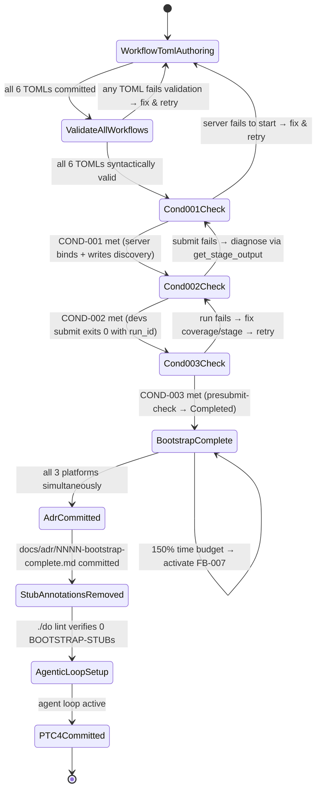

#### Bootstrap Attempt State Machine

The bootstrap process is sequential: each condition depends on the previous succeeding. When a condition fails, the failure is diagnosed via MCP observation tools before the next attempt.

```mermaid
stateDiagram-v2
    [*] --> StartServer

    StartServer --> AwaitDiscoveryFile
    AwaitDiscoveryFile --> Cond001Met : file created within 30 s; port 7890+7891 respond
    AwaitDiscoveryFile --> BootstrapFailed : file not created within 30 s

    Cond001Met --> SubmitPresubmit
    SubmitPresubmit --> AwaitRunId : devs submit presubmit-check --format json
    AwaitRunId --> Cond002Met : JSON contains valid run_id UUID and "status":"pending"
    AwaitRunId --> DiagnoseSubmitFailure : submit exits non-zero or JSON invalid

    Cond002Met --> MonitorRun : devs logs <run_id> --follow
    MonitorRun --> Cond003Met : all stages Completed; run Completed
    MonitorRun --> DiagnoseRunFailure : any stage Failed; run Failed

    DiagnoseSubmitFailure --> GetStageOutput : call get_stage_output on failed stage
    GetStageOutput --> SubmitPresubmit : root cause fixed
    DiagnoseRunFailure --> GetStageOutput

    Cond003Met --> CommitAdr
    CommitAdr --> VerifyLint : docs/adr/NNNN-bootstrap-complete.md committed
    VerifyLint --> PTC4Gate : ./do lint exits 0 (no BOOTSTRAP-STUBs)
    PTC4Gate --> [*]

    BootstrapFailed --> ActivateFB007 : 150% planned Phase 4 duration elapsed
    ActivateFB007 --> [*]
```

#### Standard Workflow TOML Schemas

All 6 standard workflows reside in `.devs/workflows/`. They use only built-in TOML predicates; no Rust builder API is required. The `pool` field references a pool name that must exist in `devs.toml`.

**`tdd-red.toml`** — Verify test fails before implementation:
```toml
[workflow]
name        = "tdd-red"
description = "Verify the named test fails before implementation is written"

[[inputs]]
key         = "test_filter"
description = "Cargo test filter expression (e.g. 'unit::my_module::test_name')"
required    = true

[[stages]]
name        = "run-failing-test"
agent_tool  = "cargo"
command     = "cargo test --no-fail-fast -- {{test_filter}} 2>&1"
pool        = "build-pool"
expect_exit = 1          # test MUST fail; non-1 exit causes stage to fail
timeout_secs = 120
```

**`tdd-green.toml`** — Verify test passes after implementation:
```toml
[workflow]
name        = "tdd-green"
description = "Verify the named test passes after implementation is written"

[[inputs]]
key         = "test_filter"
description = "Cargo test filter expression"
required    = true

[[stages]]
name        = "run-passing-test"
agent_tool  = "cargo"
command     = "cargo test -- {{test_filter}} 2>&1"
pool        = "build-pool"
expect_exit = 0
timeout_secs = 120
```

**`presubmit-check.toml`** — Full quality gate (serial pipeline):
```toml
[workflow]
name        = "presubmit-check"
description = "Full presubmit gate: format → lint → test+traceability → coverage"

[[stages]]
name        = "format"
agent_tool  = "cargo"
command     = "cargo fmt --all -- --check 2>&1"
pool        = "build-pool"
expect_exit = 0
timeout_secs = 60

[[stages]]
name        = "lint"
agent_tool  = "cargo"
command     = "cargo clippy --workspace --all-targets -- -D warnings 2>&1 && cargo doc --workspace --no-deps 2>&1"
depends_on  = ["format"]
pool        = "build-pool"
expect_exit = 0
timeout_secs = 300

[[stages]]
name        = "test"
agent_tool  = "cargo"
command     = "./do test 2>&1"
depends_on  = ["lint"]
pool        = "build-pool"
expect_exit = 0
timeout_secs = 600

[[stages]]
name        = "coverage"
agent_tool  = "cargo"
command     = "./do coverage 2>&1"
depends_on  = ["test"]
pool        = "build-pool"
expect_exit = 0
timeout_secs = 600
```

**`build-only.toml`** — Fast compile check:
```toml
[workflow]
name        = "build-only"
description = "Fast compile check with no tests"

[[stages]]
name        = "build"
agent_tool  = "cargo"
command     = "cargo build --workspace 2>&1"
pool        = "build-pool"
expect_exit = 0
timeout_secs = 180
```

**`unit-test-crate.toml`** — Per-crate unit tests:
```toml
[workflow]
name        = "unit-test-crate"
description = "Run unit tests for a single named crate"

[[inputs]]
key         = "crate_name"
description = "Crate name as it appears in Cargo.toml (e.g. 'devs-scheduler')"
required    = true

[[stages]]
name        = "unit-test"
agent_tool  = "cargo"
command     = "cargo test -p {{crate_name}} --lib 2>&1"
pool        = "build-pool"
expect_exit = 0
timeout_secs = 300
```

**`e2e-all.toml`** — Full E2E suite (parallel by interface):
```toml
[workflow]
name        = "e2e-all"
description = "Run all E2E test suites in parallel (CLI, TUI, MCP)"

[[stages]]
name        = "e2e-cli"
agent_tool  = "cargo"
command     = "cargo test -p devs-cli-tests --test '*' -- --test-threads=1 2>&1"
pool        = "build-pool"
expect_exit = 0
timeout_secs = 600
env         = { LLVM_PROFILE_FILE = "/tmp/devs-coverage-%p.profraw" }

[[stages]]
name        = "e2e-tui"
agent_tool  = "cargo"
command     = "cargo test -p devs-tui-tests --test '*' -- --test-threads=1 2>&1"
pool        = "build-pool"
expect_exit = 0
timeout_secs = 600
env         = { LLVM_PROFILE_FILE = "/tmp/devs-coverage-%p.profraw" }

[[stages]]
name        = "e2e-mcp"
agent_tool  = "cargo"
command     = "cargo test -p devs-mcp-tests --test '*' -- --test-threads=1 2>&1"
pool        = "build-pool"
expect_exit = 0
timeout_secs = 600
env         = { LLVM_PROFILE_FILE = "/tmp/devs-coverage-%p.profraw" }
```

#### Dependencies

**[ROAD-P4-DEP-001]** **** **[ROAD-004]** **[9_PROJECT_ROADMAP-REQ-301]** **** Phase 3 complete: all three client binaries build and connect to a running server.
**[ROAD-P4-DEP-002]** **[9_PROJECT_ROADMAP-REQ-302]** **** **** All 6 standard workflow TOMLs are syntactically valid and accepted by `devs submit` before `SelfHostingAttempt`.
**[ROAD-P4-DEP-003]** **[9_PROJECT_ROADMAP-REQ-303]** **** **** `COND-001` must be verified before `COND-002`; `COND-002` before `COND-003`.

---

### **[ROAD-006]** **[9_PROJECT_ROADMAP-REQ-304]** **** ******** Phase 5 — Quality Hardening & MVP Release

**Objective:** Achieve all five coverage quality gates, 100% requirement traceability, a clean security audit, and cross-platform validation. Every requirement defined across all eight preceding specification documents has an automated test. The MVP release is cut from this milestone.

#### Deliverables

**[ROAD-025]** **[9_PROJECT_ROADMAP-REQ-305]** **** **** E2E Test Suite Completion

Coverage obligations per interface (verified by `cargo-llvm-cov` with `LLVM_PROFILE_FILE=%p.profraw`):
- **QG-001:** Unit tests, all crates — ≥90% line coverage
- **QG-002:** E2E aggregate — ≥80% line coverage
- **QG-003:** CLI E2E (subprocess via `assert_cmd`) — ≥50% line coverage; tests all 8 CLI commands
- **QG-004:** TUI E2E (full `handle_event→render` cycle via `TestBackend`) — ≥50% line coverage; all required `insta` snapshots present
- **QG-005:** MCP E2E (`POST /mcp/v1/call` via running server) — ≥50% line coverage; all 20 tools exercised

Each E2E test binary: `test-threads = 1` in `.cargo/config.toml`; unique `DEVS_DISCOVERY_FILE` per test via `devs_test_helper::start_server()`.

All tests annotated `// Covers: <REQ-ID>` for every requirement they cover. `target/traceability.json` `overall_passed: true` with `traceability_pct == 100.0`.

**Security Hardening:**
- `cargo audit --deny warnings` passes with zero unaddressed advisories
- `target/traceability.json` covers `SEC-036`, `SEC-040`, `SEC-044`, `SEC-050`, `SEC-060`, `SEC-088`, `SEC-091`, `SEC-108`
- All `Redacted<T>` usage verified by unit test (3 assertions: Debug, Display, Serialize)
- Zero `println!`/`eprintln!`/`log::` calls in library crates (verified by `./do lint`)

**Cross-Platform Validation:**
- `presubmit-linux`, `presubmit-macos`, `presubmit-windows` GitLab CI jobs all pass
- All `./do` commands produce identical exit codes on all 3 platforms
- `presubmit_timings.jsonl` confirms ≤15 minutes on all 3 platforms

**Release Gate:**
- `./do presubmit` exits 0 on all 3 platforms
- `fallback-registry.json` `active_count == 0` (or all active fallbacks documented with FAR)
- All crate ADRs committed to `docs/adr/`
- `docs/adapter-compatibility.md` with all 5 adapter entries, `last_tested_date` ≤90 days

#### Business Rules

| Rule ID | Rule |
|---|---|
|**[ROAD-BR-501]** **[9_PROJECT_ROADMAP-REQ-306]** **** ******** | `./do coverage` MUST exit non-zero when `overall_passed: false` in `target/coverage/report.json`; this causes `./do presubmit` to exit non-zero |
|**[ROAD-BR-502]** **[9_PROJECT_ROADMAP-REQ-307]** **** ******** | `./do test` MUST exit non-zero when `traceability_pct < 100.0` OR `stale_annotations` is non-empty, even if all `cargo test` invocations individually pass |
|**[ROAD-BR-503]** **[9_PROJECT_ROADMAP-REQ-308]** **** ******** | E2E subprocess tests MUST set `LLVM_PROFILE_FILE=/tmp/devs-coverage-%p.profraw` with the `%p` PID suffix; `./do coverage` MUST fail with a descriptive error if zero `.profraw` files are found for E2E runs |
|**[ROAD-BR-504]** **[9_PROJECT_ROADMAP-REQ-309]** **** ******** | CLI E2E tests contributing to QG-003 MUST invoke the `devs` binary as a subprocess via `assert_cmd 2.0`; calling internal Rust functions directly does NOT satisfy the QG-003 gate |
|**[ROAD-BR-505]** **[9_PROJECT_ROADMAP-REQ-310]** **** ******** | TUI E2E tests contributing to QG-004 MUST exercise the full `handle_event() → render()` cycle via `ratatui::backend::TestBackend` at 200×50; pixel comparison is prohibited |
|**[ROAD-BR-506]** **[9_PROJECT_ROADMAP-REQ-311]** **** ******** | MCP E2E tests contributing to QG-005 MUST issue `POST /mcp/v1/call` requests to a running server instance via the `DEVS_MCP_ADDR` address; calling internal tool handler functions does NOT satisfy QG-005 |
|**[ROAD-BR-507]** **[9_PROJECT_ROADMAP-REQ-312]** **** ******** | The MVP release tag MUST NOT be created until `fallback-registry.json` `active_count == 0` OR every active fallback has a committed Fallback Activation Record in `docs/adr/` |
|**[ROAD-BR-508]** **[9_PROJECT_ROADMAP-REQ-313]** **** ******** | `docs/adapter-compatibility.md` MUST contain entries for all 5 adapters with `last_tested_date` ≤90 days old at the time of MVP release; `./do lint` enforces this |
|**[ROAD-BR-509]** **[9_PROJECT_ROADMAP-REQ-314]** **** ******** | Each security-critical crate (`devs-mcp`, `devs-adapters`, `devs-checkpoint`, `devs-core`) MUST reach `critical_findings: 0` AND `high_findings: 0` from the `code-review` workflow before the MVP release tag is cut |
|**[ROAD-BR-510]** **[9_PROJECT_ROADMAP-REQ-315]** **** ******** | `// llvm-cov:ignore` annotations MUST be used only for: platform-conditional code (`#[cfg(windows)]`), unreachable infrastructure error paths, and generated code in `devs-proto/src/gen/`; all exclusions MUST be listed in `target/coverage/excluded_lines.txt` |

#### Edge Cases

| Scenario | Expected Behavior |
|---|---|
| **** A coverage gate drops below its threshold after adding a new feature ****| `./do coverage` exits non-zero; `./do presubmit` exits non-zero; forward progress is blocked until coverage is restored; the specific uncovered lines are listed in `target/coverage/report.json` | **** **[9_PROJECT_ROADMAP-REQ-316]**
| **** A test annotation references a requirement ID that was removed from a spec document ****| `stale_annotations` in `traceability.json` is non-empty; `./do test` exits non-zero; the stale `// Covers:` annotation MUST be removed or the spec document updated | **** **[9_PROJECT_ROADMAP-REQ-317]**
| **** `cargo audit` advisory appears in a production dependency during Phase 5 ****| `./do lint` exits non-zero; the dependency MUST be updated to a patched version or the advisory suppressed with justification and expiry date in `audit.toml` | **** **[9_PROJECT_ROADMAP-REQ-318]**
| **** One CI platform job fails while the other two pass ****| MVP release is blocked; the specific failure MUST be diagnosed and fixed; fallback FB-006 (Linux-only gate) applies only when GitLab CI is unavailable, not when a job legitimately fails | **** **[9_PROJECT_ROADMAP-REQ-319]**
| **** Docker E2E tests exhibit consistent flakiness over 2+ CI runs ****| Fallback FB-003 may be activated: Docker E2E tests tagged `#[cfg_attr(not(feature = "e2e_docker"), ignore)]`; QG-002 threshold may be reduced to 77% with a committed FAR | **** **[9_PROJECT_ROADMAP-REQ-320]**
| **** An `insta` snapshot does not match the committed `.txt` file ****| CI exits non-zero; `INSTA_UPDATE=always` is prohibited in CI; the developer MUST review the `.new` snapshot locally, approve if correct, and commit the updated snapshot | **** **[9_PROJECT_ROADMAP-REQ-321]**
| **** `target/traceability.json` `generated_at` is more than 1 hour old ****| Observing agents MUST submit `unit-test-crate` or `./do test` before beginning new implementation work | **** **[9_PROJECT_ROADMAP-REQ-322]**

#### Acceptance Criteria

- **[AC-ROAD-P5-001]** **[9_PROJECT_ROADMAP-REQ-323]** **** ******** `./do coverage` generates `target/coverage/report.json` with exactly 5 gate entries (QG-001 through QG-005), each containing `gate_id`, `threshold_pct`, `actual_pct`, `passed`, `delta_pct`; `overall_passed` equals the logical AND of all 5 `passed` fields
- **[AC-ROAD-P5-002]** **[9_PROJECT_ROADMAP-REQ-324]** **** ******** `./do test` generates `target/traceability.json` with `traceability_pct == 100.0`, `stale_annotations: []`, and `overall_passed: true`
- **[AC-ROAD-P5-003]** **[9_PROJECT_ROADMAP-REQ-325]** **** ******** `cargo audit --deny warnings` exits 0 from a clean checkout of the MVP release commit
- **[AC-ROAD-P5-005]** **[9_PROJECT_ROADMAP-REQ-326]** **** ******** All three GitLab CI jobs (`presubmit-linux`, `presubmit-macos`, `presubmit-windows`) pass and complete within 25 minutes for the MVP release commit
- **[AC-ROAD-P5-006]** **[9_PROJECT_ROADMAP-REQ-327]** **** ******** `target/presubmit_timings.jsonl` shows each platform step completes within 900 seconds (15 minutes) total wall-clock time
- **[AC-ROAD-P5-007]** **[9_PROJECT_ROADMAP-REQ-328]** **** ******** `./do lint` exits non-zero when any `println!`, `eprintln!`, or `log::` macro call is found in any library crate source file (excluding `devs-server`, `devs-cli`, `devs-tui`, `devs-mcp-bridge`)

#### Phase Lifecycle State Diagram

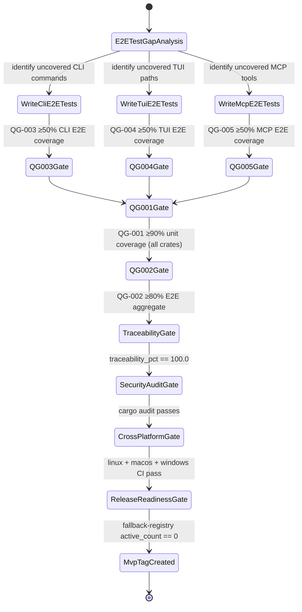

#### Coverage Measurement Algorithm

`./do coverage` orchestrates `cargo-llvm-cov` across four distinct test sets and produces `target/coverage/report.json`. The algorithm is:

**Step 1 — Instrument build:**
```sh
RUSTFLAGS="-C instrument-coverage" \
LLVM_PROFILE_FILE="%p.profraw" \
cargo build --workspace --tests
```
All binaries and test executables are instrumented. The `%p` expands to the process PID, ensuring each subprocess (including E2E child processes of `devs-server`) generates a distinct `.profraw` file.

**Step 2 — Run unit tests (QG-001):**
```sh
LLVM_PROFILE_FILE="target/profraw/unit-%p.profraw" \
cargo test --workspace --lib --bins -- --test-threads=4
```
Collect all `target/profraw/unit-*.profraw` files.

**Step 3 — Run E2E test suites (QG-002, QG-003, QG-004, QG-005):**
Each E2E suite is invoked with `test-threads = 1` (from `.cargo/config.toml`). Each suite gets a unique `DEVS_DISCOVERY_FILE` path via `devs_test_helper::start_server()`.

```sh
# CLI E2E (QG-003)
LLVM_PROFILE_FILE="target/profraw/cli-e2e-%p.profraw" \
cargo test -p devs-cli-tests --test '*' -- --test-threads=1

# TUI E2E (QG-004)
LLVM_PROFILE_FILE="target/profraw/tui-e2e-%p.profraw" \
cargo test -p devs-tui-tests --test '*' -- --test-threads=1

# MCP E2E (QG-005)
LLVM_PROFILE_FILE="target/profraw/mcp-e2e-%p.profraw" \
cargo test -p devs-mcp-tests --test '*' -- --test-threads=1
```

`./do coverage` exits non-zero with message `"error: no .profraw files found for <suite>"` if any suite produces zero `.profraw` files (indicating the test binary crashed before profiling was set up).

**Step 4 — Merge profiles:**
```sh
cargo profdata -- merge \
  -sparse target/profraw/unit-*.profraw \
  -output target/profraw/unit.profdata

cargo profdata -- merge \
  -sparse target/profraw/cli-e2e-*.profraw target/profraw/tui-e2e-*.profraw \
           target/profraw/mcp-e2e-*.profraw \
  -output target/profraw/e2e.profdata
```

**Step 5 — Generate per-gate coverage reports:**

```sh
# QG-001: unit coverage, all workspace crates, excluding devs-proto/src/gen/
cargo llvm-cov report \
  --instr-profile target/profraw/unit.profdata \
  --ignore-filename-regex 'devs-proto/src/gen/' \
  --json > target/coverage/unit.json

# QG-002: E2E aggregate
cargo llvm-cov report \
  --instr-profile target/profraw/e2e.profdata \
  --json > target/coverage/e2e.json

# QG-003/004/005: per-interface (split by test binary source mapping)
# Implemented by filtering llvm-cov's line_coverage.json by
# source file path prefixes matching crate-under-test.
```

**Step 6 — Evaluate gates and write `target/coverage/report.json`:**

```rust
// Pseudo-code for gate evaluation
let gates = [
    Gate { id: "QG-001", threshold: 90.0, actual: unit_pct },
    Gate { id: "QG-002", threshold: 80.0, actual: e2e_aggregate_pct },
    Gate { id: "QG-003", threshold: 50.0, actual: cli_e2e_pct },
    Gate { id: "QG-004", threshold: 50.0, actual: tui_e2e_pct },
    Gate { id: "QG-005", threshold: 50.0, actual: mcp_e2e_pct },
];
let overall_passed = gates.iter().all(|g| g.actual >= g.threshold);
// exits non-zero if !overall_passed
```

**`target/coverage/report.json` schema:**
```json
{
  "generated_at":  "<rfc3339>",
  "overall_passed": true,
  "gates": [
    {
      "gate_id":       "QG-001",
      "threshold_pct": 90.0,
      "actual_pct":    92.3,
      "passed":        true,
      "delta_pct":     2.3
    }
  ],
  "excluded_files": ["devs-proto/src/gen/devs.v1.rs"],
  "profraw_counts": { "unit": 42, "cli_e2e": 8, "tui_e2e": 5, "mcp_e2e": 11 }
}
```

**`// llvm-cov:ignore` usage rules** (enforced by `./do lint`):
- Permitted: `#[cfg(windows)]` / `#[cfg(unix)]` platform-conditional branches
- Permitted: `unreachable!()` in infrastructure error arms that cannot be triggered without OS-level fault
- Permitted: generated code in `devs-proto/src/gen/` (excluded via `--ignore-filename-regex`)
- Prohibited: ignoring coverage gaps in business-logic functions as a shortcut to passing a gate
- All exclusions must appear in `target/coverage/excluded_lines.txt` (one `<file>:<line>` per line)

#### Traceability Report Schema

`./do test` generates `target/traceability.json` by scanning all Rust source files for `// Covers: <REQ-ID>` annotations and cross-referencing against the canonical requirement IDs extracted from the 8 specification documents.

```json
{
  "generated_at":       "<rfc3339>",
  "overall_passed":     true,
  "traceability_pct":   100.0,
  "covered_reqs":       ["AC-001", "SEC-036", "ROAD-BR-101"],
  "uncovered_reqs":     [],
  "stale_annotations":  [],
  "annotation_count":   847,
  "req_count":          847
}
```

Field semantics:
- `traceability_pct`: `(len(covered_reqs) / len(covered_reqs ∪ uncovered_reqs)) × 100.0`; rounded to 1 decimal
- `stale_annotations`: requirement IDs referenced in `// Covers:` annotations that no longer exist in any spec document
- `overall_passed`: `traceability_pct == 100.0 AND stale_annotations is empty`
- `./do test` exits non-zero whenever `overall_passed == false`, even if all `cargo test` invocations succeed

#### Release Readiness State Diagram

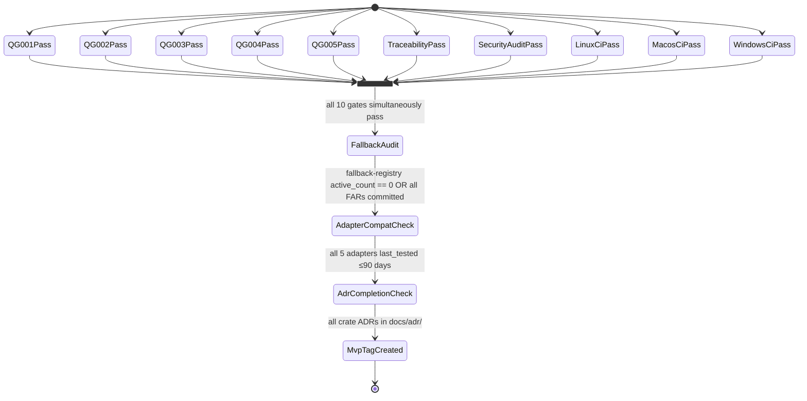

The join state (`AllGatesJoin`) requires all 10 conditions to be simultaneously true in the same `./do presubmit` run on all three CI platforms. Partial satisfaction does not advance the state. If any gate regresses after previously passing (e.g., a new feature drops QG-001 below 90%), all gates are re-evaluated from the current state.

#### Dependencies

**[ROAD-P5-DEP-001]** **** **[ROAD-005]** **[9_PROJECT_ROADMAP-REQ-329]** **** Phase 4 complete: bootstrap milestone achieved, agentic development loop active.
**[ROAD-P5-DEP-002]** **[9_PROJECT_ROADMAP-REQ-330]** **** **** Docker E2E (`bollard` + Docker-in-Docker) must be operational on `presubmit-linux` before QG-002 can be met.
**[ROAD-P5-DEP-003]** **[9_PROJECT_ROADMAP-REQ-331]** **** **** SSH E2E (`~/.ssh/devs_test_key` provisioned by `./do setup`) must be operational before QG-002 can be met.

---

## 4. Critical Path Analysis

### 4.1 Methodology

Critical Path Method (CPM) is applied to the `devs` MVP work breakdown. Each deliverable node is characterized by four time values computed from the network: **Early Start (ES)**, **Early Finish (EF)**, **Late Start (LS)**, **Late Finish (LF)**, and **Total Float (TF = LS − ES)**. A node with TF = 0 lies on the critical path: any slip in that node delays the project end date by exactly the same duration. All durations are expressed in calendar weeks on the assumption of one AI agent working full-time with pool concurrency limited to `max_concurrent = 4`.

The critical path is a directed acyclic subgraph of the full dependency graph. Managing it requires three distinct activities: (1) identifying which nodes are critical, (2) monitoring actual progress against planned durations, and (3) activating fallbacks (§8 Risks) when a critical node threatens to overrun. All three activities produce machine-readable artifacts consumed by `./do` and the MCP Glass-Box interface.

### 4.2 Complete Dependency Graph

The diagram below shows all deliverable nodes, their dependencies, and which path is critical (double-bordered nodes). Durations in weeks are shown inside each node.

```mermaid
flowchart LR
ROAD007["[ROAD-007] \nWorkspace + CI\n1w"]:::critical **** **[9_PROJECT_ROADMAP-REQ-332]**
ROAD009["[ROAD-009] \ndevs-proto\n2w"]:::critical **** **[9_PROJECT_ROADMAP-REQ-333]**
ROAD010["[ROAD-010] \ndevs-core\n3w"]:::critical **** **[9_PROJECT_ROADMAP-REQ-334]**
ROAD011["[ROAD-011] \ndevs-config\n2w"]:::float **** **[9_PROJECT_ROADMAP-REQ-335]**
ROAD012["[ROAD-012] \ndevs-checkpoint\n2w"]:::float **** **[9_PROJECT_ROADMAP-REQ-336]**
ROAD013["[ROAD-013] \ndevs-adapters\n3w"]:::critical **** **[9_PROJECT_ROADMAP-REQ-337]**
ROAD014["[ROAD-014] \ndevs-pool\n2w"]:::critical **** **[9_PROJECT_ROADMAP-REQ-338]**
ROAD015["[ROAD-015] \ndevs-executor\n3w"]:::critical **** **[9_PROJECT_ROADMAP-REQ-339]**
ROAD016["[ROAD-016] \ndevs-scheduler\n4w"]:::critical **** **[9_PROJECT_ROADMAP-REQ-340]**
ROAD017["[ROAD-017] \ndevs-webhook\n2w"]:::float **** **[9_PROJECT_ROADMAP-REQ-341]**
ROAD018["[ROAD-018] \ndevs-grpc\n3w"]:::critical **** **[9_PROJECT_ROADMAP-REQ-342]**
ROAD019["[ROAD-019] \ndevs-mcp\n3w"]:::float **** **[9_PROJECT_ROADMAP-REQ-343]**
ROAD020["[ROAD-020] \ndevs-server\n2w"]:::critical **** **[9_PROJECT_ROADMAP-REQ-344]**
ROAD021["[ROAD-021] \ndevs-cli\n3w"]:::float **** **[9_PROJECT_ROADMAP-REQ-345]**
ROAD022["[ROAD-022] \ndevs-tui\n4w"]:::critical **** **[9_PROJECT_ROADMAP-REQ-346]**
ROAD023["[ROAD-023] \ndevs-mcp-bridge\n1w"]:::float **** **[9_PROJECT_ROADMAP-REQ-347]**
ROAD024["[ROAD-024] \nBootstrap\n2w"]:::critical **** **[9_PROJECT_ROADMAP-REQ-348]**
ROAD025["[ROAD-025] \nMVP E2E + Gates\n6w"]:::critical **** **[9_PROJECT_ROADMAP-REQ-349]**

    ROAD007 --> ROAD009
    ROAD009 --> ROAD010
    ROAD010 --> ROAD011
    ROAD010 --> ROAD012
    ROAD010 --> ROAD013
    ROAD013 --> ROAD014
    ROAD011 --> ROAD014
    ROAD012 --> ROAD015
    ROAD014 --> ROAD015
    ROAD015 --> ROAD016
    ROAD016 --> ROAD017
    ROAD016 --> ROAD018
    ROAD016 --> ROAD019
    ROAD018 --> ROAD020
    ROAD019 --> ROAD020
    ROAD017 --> ROAD020
    ROAD020 --> ROAD021
    ROAD020 --> ROAD022
    ROAD019 --> ROAD023
    ROAD022 --> ROAD024
    ROAD021 --> ROAD024
    ROAD024 --> ROAD025

    classDef critical fill:#f88,stroke:#c00,stroke-width:2px,font-weight:bold
    classDef float fill:#8af,stroke:#06c,stroke-width:1px
```

### 4.3 CPM Node Table

All durations are estimated weeks. ES/EF/LS/LF are measured in cumulative weeks from project start (week 0). Float = LS − ES. Nodes with Float = 0 are on the critical path.

| Node ID | Deliverable | Duration (w) | Predecessors | ES | EF | LS | LF | Float | Critical |
|---|---|---|---|---|---|---|---|---|---|
| ROAD-007 | Workspace + `./do` + CI | 1 | — | 0 | 1 | 0 | 1 | 0 | **YES** |
| ROAD-009 | `devs-proto` | 2 | ROAD-007 | 1 | 3 | 1 | 3 | 0 | **YES** |
| ROAD-010 | `devs-core` | 3 | ROAD-009 | 3 | 6 | 3 | 6 | 0 | **YES** |
| ROAD-011 | `devs-config` | 2 | ROAD-010 | 6 | 8 | 12 | 14 | 6 | no |
| ROAD-012 | `devs-checkpoint` | 2 | ROAD-010 | 6 | 8 | 12 | 14 | 6 | no |
| ROAD-013 | `devs-adapters` | 3 | ROAD-010 | 6 | 9 | 6 | 9 | 0 | **YES** |
| ROAD-014 | `devs-pool` | 2 | ROAD-010, ROAD-011, ROAD-013 | 9 | 11 | 9 | 11 | 0 | **YES** |
| ROAD-015 | `devs-executor` | 3 | ROAD-012, ROAD-014 | 11 | 14 | 11 | 14 | 0 | **YES** |
| ROAD-016 | `devs-scheduler` | 4 | ROAD-015 | 14 | 18 | 14 | 18 | 0 | **YES** |
| ROAD-017 | `devs-webhook` | 2 | ROAD-016 | 18 | 20 | 19 | 21 | 1 | no |
| ROAD-018 | `devs-grpc` | 3 | ROAD-016 | 18 | 21 | 18 | 21 | 0 | **YES** |
| ROAD-019 | `devs-mcp` | 3 | ROAD-016 | 18 | 21 | 18 | 21 | 0 | **YES** |
| ROAD-020 | `devs-server` | 2 | ROAD-017, ROAD-018, ROAD-019 | 21 | 23 | 21 | 23 | 0 | **YES** |
| ROAD-021 | `devs-cli` | 3 | ROAD-020 | 23 | 26 | 24 | 27 | 1 | no |
| ROAD-022 | `devs-tui` | 4 | ROAD-020 | 23 | 27 | 23 | 27 | 0 | **YES** |
| ROAD-023 | `devs-mcp-bridge` | 1 | ROAD-019 | 21 | 22 | 26 | 27 | 5 | no |
| ROAD-024 | Bootstrap validation | 2 | ROAD-021, ROAD-022 | 27 | 29 | 27 | 29 | 0 | **YES** |
| ROAD-025 | MVP E2E + coverage gates | 6 | ROAD-024 | 29 | 35 | 29 | 35 | 0 | **YES** |

**Total project duration (critical path length): 35 weeks.**

The critical path runs: ROAD-007 → ROAD-009 → ROAD-010 → ROAD-013 → ROAD-014 → ROAD-015 → ROAD-016 → ROAD-018/ROAD-019 → ROAD-020 → ROAD-022 → ROAD-024 → ROAD-025.

### 4.4 Primary Critical Path — Node Analysis

Each critical path node is analyzed below for its key quality gate, the single highest-risk failure mode, and the observable signal that work is progressing correctly.

#### ROAD-007: Workspace + `./do` + CI (Week 0–1)

This node is the foundation for every subsequent node. Its primary deliverable is a Cargo workspace that compiles, a `./do` script that executes all 8 subcommands on Linux/macOS/Windows Git Bash, and a GitLab CI pipeline with 3 parallel jobs. The latency risk is that Windows Git Bash CI setup takes longer than anticipated due to shell compatibility issues (`[[`, `local`, bash arrays all prohibited by `shellcheck --shell=sh`).

**Quality gate:** `./do presubmit` exits 0 within 900 seconds on all 3 platforms. `./do lint` including `shellcheck --shell=sh ./do` exits 0.

**Progress signal:** `target/presubmit_timings.jsonl` exists and shows all steps with `over_budget: false`. GitLab pipeline URL is logged by `./do ci`.

#### ROAD-009: `devs-proto` (Week 1–3)

All 8 `.proto` files must be authored, all 6 gRPC services declared with correct message types, and generated Rust code committed to `devs-proto/src/gen/`. The risk is incomplete protobuf coverage: a missing field in an early proto file causes a downstream crate to require a breaking schema change, which invalidates serialized checkpoint data in CI artifacts.

**Quality gate:** `cargo build -p devs-proto` exits 0. `grpcurl -plaintext ... list` returns all 6 service names once a server is running. All `google.protobuf.Timestamp` fields are present for every date/time field in the domain model.

**Progress signal:** `devs-proto/src/gen/` contains non-empty generated `.rs` files. `tonic-reflection` server support compiles.

#### ROAD-010: `devs-core` (Week 3–6)

`devs-core` is the single most leverage-critical node in the graph. Every other crate depends on it directly or transitively. A defect in `StateMachine::transition()`, `TemplateResolver`, or `BoundedString<N>` propagates to all downstream crates and typically requires coordinated multi-crate fixes. The node must achieve 90% unit line coverage before Phase 1 begins. The zero-I/O constraint (`tokio`, `git2`, `reqwest`, `tonic` absent from `cargo tree -p devs-core --edges normal`) must be verified by `./do lint` and kept clean for the duration of the project.

**Quality gate:** QG-001 (≥90% line) for `devs-core` specifically. `cargo tree -p devs-core --edges normal` shows no I/O crates. All 13 validation steps in `WorkflowValidator` covered by unit tests. `StateMachine::transition()` never panics for any input.

**Progress signal:** `target/coverage/report.json` shows `devs-core` at or above 90%. All `ROAD-BR-011` and `ROAD-BR-012` acceptance tests green.

#### ROAD-013: `devs-adapters` (Week 6–9)

`devs-adapters` is the first Phase 1 crate on the critical path because `devs-pool` depends on the `AgentAdapter` trait it exports. All 5 adapter implementations (claude, gemini, opencode, qwen, copilot) must be present and unit-tested before `devs-pool` can complete its capability routing logic. The risk is upstream CLI API breakage (RISK-004): if an adapter's default flag changes, its unit test fails and blocks `devs-pool`. Compatibility test files in `devs-adapters/tests/<name>_compatibility_test.rs` and `target/adapter-versions.json` must be maintained.

**Quality gate:** `build_command()` returns correct `AdapterCommand` for all 5 adapters. `detect_rate_limit(exit_code=0, _)` always returns `false`. `target/adapter-versions.json` exists and `./do lint` passes the staleness check (≤7 days).

**Progress signal:** All 5 adapter unit tests green. No inline literal CLI flag strings in adapter source (all in `config.rs` constants).

#### ROAD-014: `devs-pool` (Week 9–11)

`devs-pool` enforces `max_concurrent` via `Arc<tokio::sync::Semaphore>`. Its selection algorithm must be exercised under concurrent load before `devs-executor` integrates it: the algorithm filters by capability, excludes rate-limited agents, prefers non-fallback on attempt 1, and acquires a semaphore permit (blocking if `max_concurrent` is reached). Correctness failures here cause RISK-021 (fan-out pool starvation) to materialize during Phase 5 E2E, at which point remediation is expensive.

**Quality gate:** With `max_concurrent = 4` and 64 concurrent requests, `active_count == 4` and `queued_count == 60`. Unsatisfied capability returns `Err(PoolError::UnsatisfiedCapability)` without queuing. Rate-limited agents excluded with 60-second cooldown.

**Progress signal:** `PoolExhausted` webhook fires exactly once per exhaustion episode in unit test. `devs-pool` unit coverage ≥90%.

#### ROAD-015: `devs-executor` (Week 11–14)

`devs-executor` implements the three execution environments (Tempdir, Docker, RemoteSsh) and the artifact collection protocols. Both `devs-checkpoint` (for git-backed working directories) and `devs-pool` (for agent selection) are prerequisites. The risk is Docker/SSH test complexity (RISK-008): if Docker-in-Docker or the test SSH key is not provisioned correctly, `devs-executor` cannot reach its coverage target. FB-003 is pre-approved to tag these tests `#[ignore]` if two consecutive CI runs fail.

**Quality gate:** Each execution environment fully isolates stage working directories (run-id + stage-name in path). `cleanup()` completes regardless of stage outcome. Auto-collect commits only to the checkpoint branch.

**Progress signal:** Tempdir isolation test passes. Docker and SSH tests tagged `#[cfg_attr(not(feature = "e2e_docker"), ignore)]` and `#[cfg_attr(not(feature = "e2e_ssh"), ignore)]` compile clean.

#### ROAD-016: `devs-scheduler` (Week 14–18)

`devs-scheduler` is the second-highest-leverage node. It aggregates all Phase 1 crates and is a prerequisite for `devs-grpc`, `devs-mcp`, and `devs-webhook`. The 100 ms dispatch latency requirement (`[ROAD-CRIT-002] `) must be verified by a benchmark test before `devs-grpc` is authored: if the scheduler cannot meet this SLA with its internal `SchedulerEvent` mpsc channel, the latency will only worsen once gRPC serialization is added. The event-driven dispatch loop, per-run `Arc<Mutex<RunState>>`, and lock acquisition order (`SchedulerState → PoolState → CheckpointStore`) must all be proven correct under concurrent load. **** **[9_PROJECT_ROADMAP-REQ-350]**

**Quality gate:** Two independent stages dispatched within 100 ms of dependency completion in a unit benchmark with 100 concurrent completions. Exactly one checkpoint write per 100 concurrent completions (RISK-001 AC). All downstream stages cancelled atomically when a dependency fails with no retry remaining.

**Progress signal:** `devs-scheduler` unit coverage ≥90%. Benchmark test output logged in CI artifacts. No deadlock under the lock acquisition order constraint.

#### ROAD-018: `devs-grpc` + ROAD-019: `devs-mcp` (Week 18–21, parallel)

These two nodes are on separate parallel sub-paths that converge at `devs-server`. Both depend only on `devs-scheduler` and both target the same 3-week window. `devs-grpc` is on the critical path by virtue of its role as the primary client interface; `devs-mcp` shares the same float (0 weeks) because `devs-server` waits for both. The six tonic service implementations in `devs-grpc` must be thin adapters (≤25 lines each) delegating all logic to the engine. `devs-mcp` must expose all 20 tools over HTTP/JSON-RPC 2.0 and satisfy the Glass-Box contract ([MCP\_BR-001]).

**Quality gate for devs-grpc:** gRPC reflection returns all 6 service names. `x-devs-client-version` major mismatch → `FAILED_PRECONDITION`. Per-client event buffer 256, oldest dropped on overflow.

**Quality gate for devs-mcp:** All 20 tools return `{"result": ..., "error": null}` on valid input. `X-Content-Type-Options: nosniff` on every response. `stream_logs(follow:true)` uses HTTP chunked transfer encoding with monotonically increasing sequence numbers starting at 1.

#### ROAD-020: `devs-server` (Week 21–23)

`devs-server` wires all crates together following the 11-step startup sequence. It is the first artifact that can be started as a live process, and its successful binding of both ports (gRPC `:7890`, MCP `:7891`) followed by atomic discovery file write is COND-001 of the bootstrap gate. The shutdown sequence (SIGTERM → cancel agents → wait 10s → SIGTERM → wait 5s → SIGKILL → flush checkpoints → delete discovery file) must be verified before `devs-tui` and `devs-cli` are authored, because those clients depend on the discovery file lifecycle.

**Quality gate:** Discovery file written atomically after both ports bind. SIGTERM → discovery file deleted, exit 0. Duplicate `SubmitRun` with same name → exactly one success, one `ALREADY_EXISTS`.

**Progress signal:** Integration test starts and stops `devs-server` cleanly. `grpcurl` reflection query succeeds. `POST /mcp/v1/call` returns HTTP 200.

#### ROAD-022: `devs-tui` (Week 23–27)

`devs-tui` is on the critical path because it has the longest post-server duration (4 weeks vs. 3 weeks for `devs-cli`). Its completion is a prerequisite for the bootstrap validation phase, which requires a human operator to observe the TUI dashboard while the `presubmit-check` workflow runs. The primary risk is `ratatui::backend::TestBackend` snapshot management: the 20 required snapshots must be reviewed and committed, and `INSTA_UPDATE=always` is prohibited in CI, meaning snapshot regressions block CI until manually resolved.

**Quality gate:** All 20 required `insta` snapshots present in `crates/devs-tui/tests/snapshots/*.txt`. Re-renders within 50 ms of `RunEvent`. Below 80×24: only size warning renders. `NO_COLOR` set → no ANSI in any output.

**Progress signal:** `./do test` generates passing snapshot tests. `TestBackend` at 200×50 produces output matching committed snapshots.

#### ROAD-024: Bootstrap Validation (Week 27–29)

Bootstrap validation is the Phase 4 gate. All three COND-001/002/003 criteria must be met simultaneously on all 3 CI platforms: server binds both ports, `devs submit presubmit-check` exits 0 with `run_id` JSON, and the `presubmit-check` run reaches `Completed` with all stages `Completed`. This node consumes the output of all previous nodes and produces the `docs/adr/NNNN-bootstrap-complete.md` record that authorizes Phase 5. Until this node completes, `./do lint` will exit non-zero due to remaining `// TODO: BOOTSTRAP-STUB` annotations.

**Quality gate:** COND-001, COND-002, COND-003 all satisfied on `presubmit-linux`, `presubmit-macos`, `presubmit-windows`. Zero `// TODO: BOOTSTRAP-STUB` annotations remain. ADR committed with commit SHA and pipeline URL.

**Progress signal:** `devs submit presubmit-check --format json` outputs `{"run_id": "...", "status": "pending"}`. `devs status <run_id>` eventually shows `"status": "completed"`.

#### ROAD-025: MVP E2E + Coverage Gates (Week 29–35)

The final 6-week node covers Phase 5: authoring E2E tests using the agentic TDD loop until all five quality gates pass. Because the E2E tests themselves are authored agentically, this node cannot begin until ROAD-024 is complete. The six coverage gates (QG-001 through QG-005) and the 100% traceability requirement are the exit criteria. All E2E tests use `DEVS_DISCOVERY_FILE` pointing to a unique temp path; Docker and SSH E2E use feature flags.

**Quality gate:** `./do coverage` exits 0 with `overall_passed: true` on all 5 gates. `./do test` exits 0 with `traceability_pct == 100.0`. Zero stale annotations.

**Progress signal:** `target/coverage/report.json` gate deltas trending positive. `target/traceability.json` `uncovered_requirements` shrinking to zero.

### 4.5 Parallel Tracks — Detailed Analysis

The following table formalizes the parallel development tracks with shared prerequisites, float values, and conflict-avoidance rules.

| Track A | Duration | Track B | Duration | Shared Prerequisite | Float (A) | Float (B) | Conflict Risk |
|---|---|---|---|---|---|---|---|
| `devs-config` | 2w | `devs-checkpoint` | 2w | `devs-core` complete | 6w | 6w | None — disjoint source files |
| `devs-adapters` | 3w | `devs-config` + `devs-checkpoint` | 2w | `devs-core` complete | 0w | 6w | None — disjoint crates |
| `devs-grpc` | 3w | `devs-mcp` | 3w | `devs-scheduler` complete | 0w | 0w | Proto message types shared — read-only conflict possible if proto is amended |
| `devs-grpc` | 3w | `devs-webhook` | 2w | `devs-scheduler` complete | 0w | 1w | None — disjoint crates |
| `devs-cli` | 3w | `devs-tui` | 4w | `devs-server` startable | 1w | 0w | `devs-client-util` lib shared — coordinate API before starting |
| `devs-mcp-bridge` | 1w | `devs-cli` + `devs-tui` | 3–4w | `devs-mcp` HTTP operational | 5w | 0–1w | None — bridge depends only on MCP HTTP endpoint |

**[ROAD-CRIT-004]** **[9_PROJECT_ROADMAP-REQ-351]** **** **** When `devs-grpc` and `devs-mcp` are developed in parallel, any amendment to a `proto/devs/v1/*.proto` file MUST be coordinated between both tracks: both tracks must re-run `cargo build -p devs-proto` and confirm compilation before continuing. Proto amendments are tracked in the commit log; a proto file touched by one track that breaks the other constitutes a blocking conflict.

**[ROAD-CRIT-005]** **[9_PROJECT_ROADMAP-REQ-352]** **** **** `devs-cli` and `devs-tui` share the `devs-client-util` helper crate (`discover_grpc_addr()`, `connect_lazy()`, `Formatter` trait). The `devs-client-util` API surface MUST be defined in full (all exported function signatures, all error types) before either `devs-cli` or `devs-tui` begins implementation. A late API change in `devs-client-util` during parallel development propagates breaking changes to both tracks simultaneously.

**[ROAD-CRIT-006]** **[9_PROJECT_ROADMAP-REQ-353]** **** **** `devs-pool` and `devs-adapters` may appear to be parallel candidates (both depend on `devs-core`) but `devs-pool` depends on the `AgentAdapter` trait exported by `devs-adapters`. Only `devs-adapters` unit tests (not integration with a live pool) can proceed before `devs-adapters` is complete. The `devs-pool` agent selection algorithm cannot be authored until the `AgentAdapter` trait signature is finalized.

### 4.6 Float Analysis — Complete Table

Float represents the number of weeks a node can slip without affecting the project end date, assuming all other nodes remain on schedule. Float is consumed by slippage; once a float node slips past its Late Finish, it joins the critical path and the end date moves.

| Node | Float (weeks) | Consequence of Consuming All Float |
|---|---|---|
| ROAD-011 `devs-config` | 6 | Joins critical path at week 12; delays `devs-pool` |
| ROAD-012 `devs-checkpoint` | 6 | Joins critical path at week 12; delays `devs-executor` |
| ROAD-017 `devs-webhook` | 1 | Joins critical path at week 19; delays `devs-server` |
| ROAD-019 `devs-mcp` | 0 | Already critical; any slip delays `devs-server` |
| ROAD-021 `devs-cli` | 1 | Joins critical path at week 24; delays bootstrap validation |
| ROAD-023 `devs-mcp-bridge` | 5 | Joins critical path at week 26; delays bootstrap validation |

**[ROAD-CRIT-007]** **[9_PROJECT_ROADMAP-REQ-354]** **** **** Float values are computed once at project start from estimated durations. If any node's actual duration exceeds its estimate, float values for all successor nodes MUST be recomputed. The project coordinator (the agentic developer) MUST recompute float whenever any node takes more than 20% longer than estimated. Float recomputation is a manual process in Phase 0–4; it becomes partially automatable in Phase 5 via the Glass-Box MCP `get_run` tool applied to the project's own workflow runs.

**[ROAD-CRIT-008]** **[9_PROJECT_ROADMAP-REQ-355]** **** **** Float MUST NOT be treated as a buffer for known scope. Float represents slack for unknown risk, not intentional feature delay. Deliberately scheduling work to consume float without a documented risk trigger constitutes a schedule violation and MUST be recorded as a RISK activation in `docs/adr/`.

### 4.7 Critical Path Slippage Rules

When a critical path node slips, the following rules govern the mandatory response.

**Slippage Threshold Definitions:**

| Threshold | Slip Amount (weeks) | Required Response |
|---|---|---|
| Minor | ≤ 0.5w | Log to `docs/adr/` weekly status; monitor |
| Moderate | 0.5w–1w | Evaluate whether float nodes can absorb upstream dependencies; no scope change required |
| Severe | 1w–2w | Activate pre-approved fallback if available; evaluate scope reduction from Non-Goals list |
| Critical | > 2w | Mandatory architecture review; fallback activation record (FAR) committed before continuing |

**[ROAD-CRIT-009]** **[9_PROJECT_ROADMAP-REQ-356]** **** **** A Severe or Critical slip on any of the following nodes triggers immediate fallback evaluation: ROAD-010 (`devs-core`), ROAD-016 (`devs-scheduler`), ROAD-024 (Bootstrap validation). These three nodes have no float, no pre-approved fallback that reduces their scope, and are the highest-leverage nodes in the graph.

**[ROAD-CRIT-010]** **[9_PROJECT_ROADMAP-REQ-357]** **** **** A Moderate slip on `devs-tui` (ROAD-022) MUST trigger a parallel effort to advance `devs-cli` (which has 1 week of float) to ensure the bootstrap validation gate (ROAD-024) is not delayed. The `devs-cli` `devs submit presubmit-check` capability is sufficient to satisfy COND-002 and COND-003 even without the TUI being fully functional.

**[ROAD-CRIT-011]** **[9_PROJECT_ROADMAP-REQ-358]** **** **** A slip on ROAD-025 (MVP E2E + gates) is self-limiting: the coverage gates are pass/fail per interface. Each week of additional E2E test authoring increments specific QG gate percentages. If QG-001 (unit tests) is at risk, unit test authoring takes priority over E2E authoring because QG-001 is the widest gate (90%) and its shortfall propagates the most uncovered lines to the other gates.

**Critical Path Slippage State Diagram:**

```mermaid
stateDiagram-v2
    [*] --> OnSchedule : node ES reached; work begun
    OnSchedule --> MinorSlip : actual > estimate by ≤0.5w
    OnSchedule --> ModerateSlip : actual > estimate by 0.5w–1w
    OnSchedule --> SevereSlip : actual > estimate by 1w–2w
    OnSchedule --> CriticalSlip : actual > estimate by >2w

    MinorSlip --> OnSchedule : recovery via overtime / scope focus
    MinorSlip --> ModerateSlip : not recovered within 0.5w

    ModerateSlip --> OnSchedule : float absorption verified; successor schedule intact
    ModerateSlip --> SevereSlip : float exhausted or unavailable

    SevereSlip --> FallbackActivated : pre-approved fallback triggered; FAR committed
    SevereSlip --> CriticalSlip : fallback unavailable or ineffective

    FallbackActivated --> OnSchedule : fallback effective; end date preserved
    FallbackActivated --> CriticalSlip : fallback does not recover schedule

    CriticalSlip --> ArchitectureReview : mandatory; concurrent with continued work
    ArchitectureReview --> ScopeReduction : Non-Goals list consulted; scope removed from MVP
    ScopeReduction --> OnSchedule : new baseline established; float recalculated

    note right of CriticalSlip : activates RISK-BR-017 compound\nrisk assessment
    note right of FallbackActivated : FAR must precede implementation\n(FB-BR-001 enforced by ./do lint)
```

### 4.8 Business Rules

The following rules are normative. Each is a concrete, testable assertion governing critical path management.

| Rule ID | Rule |
|---|---|
|**[ROAD-CRIT-001]** **[9_PROJECT_ROADMAP-REQ-359]** **** ******** | `devs-core` MUST achieve ≥90% unit line coverage (QG-001 scoped to `devs-core`) before any Phase 1 crate begins implementation. `./do coverage` scoped to `devs-core` MUST exit 0 as a prerequisite for the Phase 0→1 checkpoint. |
|**[ROAD-CRIT-002]** **[9_PROJECT_ROADMAP-REQ-360]** **** ******** | `devs-scheduler` MUST demonstrate ≤100 ms dispatch latency in an automated benchmark test (two independent stages dispatched within 100 ms of dependency completion) before `devs-grpc` begins implementation. The benchmark MUST be committed and passing before the Phase 2→3 checkpoint. |
|**[ROAD-CRIT-003]** **[9_PROJECT_ROADMAP-REQ-361]** **** ******** | The bootstrap completion gate (Phase 4, COND-001 through COND-003) MUST be satisfied on all 3 CI platforms simultaneously before Phase 5 E2E work begins. No E2E test authoring is authorized until `docs/adr/NNNN-bootstrap-complete.md` is committed. |
|**[ROAD-CRIT-004]** **[9_PROJECT_ROADMAP-REQ-362]** **** ******** | When `devs-grpc` and `devs-mcp` are in parallel development, any amendment to `proto/devs/v1/*.proto` MUST cause both tracks to re-run `cargo build -p devs-proto` and confirm compilation before proceeding. A proto amendment that breaks the parallel track is a blocking conflict. |
|**[ROAD-CRIT-005]** **[9_PROJECT_ROADMAP-REQ-363]** **** ******** | The `devs-client-util` API surface (all exported function signatures and error types) MUST be defined in full before `devs-cli` or `devs-tui` implementation begins. Any post-definition change to `devs-client-util` exports requires coordinated update across both client crates. |
|**[ROAD-CRIT-006]** **[9_PROJECT_ROADMAP-REQ-364]** **** ******** | `devs-pool` MUST NOT begin agent selection algorithm implementation until `devs-adapters` has finalized and committed the `AgentAdapter` trait signature. A trait change after pool implementation begins is a blocking conflict requiring coordinated multi-crate changes. |
|**[ROAD-CRIT-007]** **[9_PROJECT_ROADMAP-REQ-365]** **** ******** | Float values MUST be recomputed whenever any node takes more than 20% longer than its estimated duration. Recomputed float values MUST be recorded in the weekly status section of `docs/adr/`. |
|**[ROAD-CRIT-008]** **[9_PROJECT_ROADMAP-REQ-366]** **** ******** | Float MUST NOT be scheduled for known scope; it is reserved for unknown risk only. Intentionally scheduling work to consume float without a documented risk trigger MUST be recorded as a RISK activation. |
|**[ROAD-CRIT-009]** **[9_PROJECT_ROADMAP-REQ-367]** **** ******** | A Severe or Critical slip (>1 week) on ROAD-010, ROAD-016, or ROAD-024 triggers mandatory fallback evaluation. The result of the evaluation (fallback selected, fallback unavailable, scope reduced) MUST be committed to `docs/adr/` before work on the affected node continues. |
|**[ROAD-CRIT-010]** **[9_PROJECT_ROADMAP-REQ-368]** **** ******** | A Moderate slip (>0.5w) on `devs-tui` MUST trigger parallel prioritization of `devs-cli` `devs submit` capability to protect the bootstrap validation gate. The `devs-cli` binary producing valid `devs submit presubmit-check --format json` output satisfies COND-002 independently of TUI completion. |
|**[ROAD-CRIT-011]** **[9_PROJECT_ROADMAP-REQ-369]** **** ******** | During Phase 5, if QG-001 (unit ≥90%) is failing, unit test authoring MUST take priority over E2E test authoring. A failing QG-001 gate indicates uncovered logic paths that may contain defects; coverage at the E2E level cannot substitute for uncovered unit paths. |
|**[ROAD-CRIT-012]** **[9_PROJECT_ROADMAP-REQ-370]** **** ******** | The maximum number of simultaneously active fallbacks is 3 (per FB-BR-004). If a fourth critical path slip requires fallback activation, the project enters `Blocked` state and an architecture review is mandatory before any further implementation work. |

### 4.9 Edge Cases & Error Handling

#### Edge Cases for Critical Path Nodes

| Scenario | Affected Node | Expected Behavior |
|---|---|---|
| **** `devs-core` type refactor required mid-Phase 1 (e.g., `BoundedString` constraint change) ****| ROAD-010 (retroactive) | All Phase 1 crates re-validate against new types. The change is treated as a Severe slip on ROAD-010; float recalculation required for all successors. `cargo build --workspace` must exit 0 after the change before any Phase 1 crate resumes. | **** **[9_PROJECT_ROADMAP-REQ-371]**
| **** `devs-adapters` `AgentAdapter` trait changes after `devs-pool` has begun ****| ROAD-013, ROAD-014 | Both crates enter a synchronized update cycle. `devs-pool` is paused until `devs-adapters` re-stabilizes. The conflict is logged as a schedule event in `docs/adr/`; the slip duration is added to ROAD-014's actual duration for float tracking. | **** **[9_PROJECT_ROADMAP-REQ-372]**
| **** `devs-scheduler` fails the 100 ms dispatch benchmark by 30% (130 ms actual) ****| ROAD-016 | Work on `devs-grpc` is blocked. The scheduler's event loop is profiled; `target/presubmit_timings.jsonl` reviewed for mpsc channel contention. The benchmark MUST pass before the Phase 2→3 checkpoint regardless of elapsed calendar time. | **** **[9_PROJECT_ROADMAP-REQ-373]**
| **** `devs-tui` snapshot tests fail because a `ratatui` update changes rendering output ****| ROAD-022 | Snapshot files are reviewed manually (never auto-approved in CI via `INSTA_UPDATE=always`). The correct rendered output is verified against the spec before approving updated snapshots. This slip is recorded; if >0.5 weeks, ROAD-021 (`devs-cli`) is parallel-prioritized. | **** **[9_PROJECT_ROADMAP-REQ-374]**
| **** Bootstrap validation (ROAD-024) passes on Linux but fails on Windows due to path separator in discovery file ****| ROAD-024 | The discovery file read path uses `dirs::home_dir()` not `std::env::var("HOME")`. Forward-slash normalization is applied via `normalize_path_display()`. The Windows failure is a blocking condition for COND-001; it must be resolved before the bootstrap ADR is committed. | **** **[9_PROJECT_ROADMAP-REQ-375]**
| **** Phase 5 E2E tests achieve QG-003 (CLI ≥50%) but fall short of QG-004 (TUI ≥50%) at week 34 ****| ROAD-025 | The TUI gap is prioritized for the final week. E2E tests using `TestBackend` full `handle_event→render` cycle are authored to cover the uncovered TUI paths. The gap analysis uses `target/coverage/lcov.info` to identify specific uncovered lines in `devs-tui`. | **** **[9_PROJECT_ROADMAP-REQ-376]**
| `devs-config` (float=6w) is neglected until week 12 and causes a Severe slip on ROAD-014 | ROAD-011, ROAD-014 | This is the exact scenario float exists to handle; ROAD-014's Late Finish is week 14, and ROAD-011's Late Finish is week 14. If `devs-config` is not complete by week 12 (its Late Start), it joins the critical path and delays ROAD-014. Float recomputation is triggered per `[ROAD-CRIT-007] `. | **** **[9_PROJECT_ROADMAP-REQ-377]**
| **** `devs-checkpoint` git2 integration reveals `git2` API incompatibility with `MSRV 1.80.0` on Windows ****| ROAD-012 | `git2 0.19` is in the authoritative version table. The `git2` crate itself has no MSRV guarantee below 1.63. If a `git2` API used in `devs-checkpoint` is not available at MSRV, either the feature must use a lower-level `git2` API or the MSRV must be documented as a constraint. This slip is recorded; since float=6w, it does not immediately threaten the critical path. | **** **[9_PROJECT_ROADMAP-REQ-378]**
| **** `devs-webhook` HTTP client uses `reqwest` with `native-tls` feature by mistake ****| ROAD-017 | `./do lint` dependency audit detects `native-tls` in `cargo tree`. `SEC-083` prohibits `native-tls`; `./do lint` exits non-zero. The `reqwest` features in `Cargo.toml` are corrected to `rustls-tls` before continuing. Since float=1w, this is a Minor slip. | **** **[9_PROJECT_ROADMAP-REQ-379]**

#### Edge Cases for Parallel Track Coordination

| Scenario | Affected Tracks | Expected Behavior |
|---|---|---|
| **** Both `devs-grpc` and `devs-mcp` authors simultaneously amend `run.proto` ****| ROAD-018, ROAD-019 | The second author to push gets a merge conflict on `devs-proto/src/gen/`. The generated file is regenerated after resolving the proto conflict. Both tracks re-run `cargo build -p devs-proto` before continuing. | **** **[9_PROJECT_ROADMAP-REQ-380]**
| **** `devs-client-util` API change required after `devs-cli` is 50% complete ****| ROAD-021, ROAD-022 | The API change is assessed: if additive (new optional function), it proceeds with both tracks updated in parallel. If breaking (signature change), `devs-cli` work pauses; `devs-client-util` is stabilized; `devs-cli` resumes. A breaking change mid-implementation counts as a Moderate slip on both tracks. | **** **[9_PROJECT_ROADMAP-REQ-381]**
| **** `devs-mcp-bridge` (float=5w) discovers that `devs-mcp` HTTP chunked transfer has a bug affecting streaming ****| ROAD-023, ROAD-019 | The bug is in `devs-mcp` (critical path), not in the bridge. `devs-mcp` is patched. Since the bridge has 5 weeks of float, this does not affect the critical path unless the `devs-mcp` fix takes more than 5 weeks. | **** **[9_PROJECT_ROADMAP-REQ-382]**

### 4.10 Dependencies

#### Outbound Dependencies (this section depends on)

| Dependency | Type | Reason |
|---|---|---|
| §3 Phase Details | Normative input | Duration estimates and deliverable definitions for all ROAD-NNN nodes |
| §5 Phase Transition Checkpoints | Verification | Phase checkpoints are the observable end-states of each CPM node |
| §8 Risk-to-Phase Mapping | Risk management | Fallback procedures activated when CPM slippage occurs |
| TAS §1 Crate dependency table | Normative input | The Cargo workspace crate dependency graph is the source of CPM edge definitions |
| PRD §2 `./do` contract | Normative input | Presubmit timing constraints (900-second budget) bound the critical path at ROAD-007 |

#### Inbound Dependencies (other sections depend on this)

| Dependent Section | Reason |
|---|---|
| §5 Phase Transition Checkpoints | Uses CPM float values to determine acceptable slip before checkpoint fails |
| §7 Phase Lifecycle State Machine | Slippage states in §4.7 are the trigger events for phase state machine transitions |
| §8 Risk-to-Phase Mapping | Risk scores that map to critical path nodes drive fallback priority |
| `docs/adr/` (all entries) | ADR entries for fallback activations reference CPM slippage evidence |
| `target/presubmit_timings.jsonl` | Per-step timing data feeds actual-vs-estimated CPM tracking |

### 4.11 Acceptance Criteria

The following criteria are testable assertions that verify the Critical Path Analysis is correctly implemented and monitored.

- **[AC-CRIT-001]** **[9_PROJECT_ROADMAP-REQ-383]** **** ****`devs-core` unit line coverage reaches ≥90.0% (measured by `cargo llvm-cov --package devs-core`) before any Phase 1 crate has more than stub-level code. Verified by: `./do coverage` with per-crate breakdown showing `devs-core` at ≥90.0% while all Phase 1 crates are at 0.0% unit coverage.

- **[AC-CRIT-002]** **[9_PROJECT_ROADMAP-REQ-384]** **** ****A benchmark test in `devs-scheduler/benches/dispatch_latency.rs` measures the wall-clock time from the last `Completed` event for a stage's dependencies to the `Running` transition of the dependent stage. The benchmark asserts this is ≤100 ms for 100 independent dependency-completion events under concurrent load. This test MUST pass before `devs-grpc` has any implementation code.

- **[AC-CRIT-003]** **[9_PROJECT_ROADMAP-REQ-385]** **** ****`cargo tree -p devs-core --edges normal` produces output that does NOT contain any of: `tokio`, `git2`, `reqwest`, `tonic`. This assertion is run by `./do lint` as a dependency audit step and exits non-zero if any prohibited crate appears. Verified: CI artifact `./do lint` log shows zero violations.

- **[AC-CRIT-004]** **[9_PROJECT_ROADMAP-REQ-386]** **** ****The CPM node table (§4.3) is internally consistent: for every node, `EF = ES + Duration`, `LF = LS + Duration`, `Float = LS − ES`, and `LF ≤ project end date (35w)`. Any node with `Float = 0` is listed as critical (`YES`). This is verified by a lint script in `./do lint` that parses the table from the spec and validates arithmetic.

- **[AC-CRIT-005]** **[9_PROJECT_ROADMAP-REQ-387]** **** ****The parallel track conflict rule for `devs-grpc` and `devs-mcp` (`[ROAD-CRIT-004] `) is operationally verified: a test in `devs-proto/tests/compilation_test.rs` confirms that after any amendment to a `.proto` file, `cargo build -p devs-proto` exits 0 and the generated code compiles in both `devs-grpc` and `devs-mcp`. This test is run as part of `./do test`.

- **[AC-CRIT-006]** **[9_PROJECT_ROADMAP-REQ-388]** **** ****Bootstrap validation (ROAD-024) is verified on all 3 CI platforms: `./do ci` completes with `presubmit-linux`, `presubmit-macos`, and `presubmit-windows` all green, and the pipeline artifact includes `target/traceability.json` with `overall_passed: true` (verifying COND-003). The `docs/adr/NNNN-bootstrap-complete.md` file references the specific CI pipeline URL for each platform.

- **[AC-CRIT-007]** **[9_PROJECT_ROADMAP-REQ-389]** **** ****The slippage state machine (§4.7 diagram) is reflected in the project's documented state at every ADR entry: each `docs/adr/` entry that represents a fallback activation includes fields `slip_amount_weeks`, `affected_node`, `float_at_activation`, and `end_date_impact`. The absence of these fields in an active fallback ADR causes `./do lint` to exit non-zero via the FAR validation check.

- **[AC-CRIT-008]** **[9_PROJECT_ROADMAP-REQ-390]** **** ****Float values in the CPM node table (§4.3) are consistent with the dependency graph in the Mermaid diagram (§4.2): for every edge `A → B` in the diagram, node B's `ES ≥ A.EF`. This is verified by the same lint script that validates §4.3 arithmetic (AC-CRIT-004).

- **[AC-CRIT-009]** **[9_PROJECT_ROADMAP-REQ-391]** **** ****`target/presubmit_timings.jsonl` produced by `./do presubmit` contains one entry per step with `over_budget` set correctly. The steps: `setup`, `lint`, `test`, `coverage` correspond to the Phase 0 CPM node (ROAD-007/ROAD-008) deliverables. A `duration_ms` that exceeds `budget_ms` by >20% in two consecutive CI runs triggers an automatic `WARN:` in `./do presubmit` output, consistent with `[ROAD-CRIT-009] ` Moderate slip threshold monitoring for RISK-005.

- **[AC-CRIT-010]** **[9_PROJECT_ROADMAP-REQ-392]** **** ****`devs-client-util` exports exactly the functions declared in its §3 Phase Details specification before any `devs-cli` or `devs-tui` code calls them. Verified by: `cargo doc -p devs-client-util --no-deps` produces documentation with no `missing_docs` warnings; the documented API surface matches the function signatures specified in ROAD-021/ROAD-022 deliverables.

---

## 5. Phase Transition Checkpoints (Definition of Done)

### 5.1 Overview

Each phase transition is gated by automated verifications that must pass on all three CI platforms (Linux, macOS, Windows Git Bash) before any work on Phase N+1 begins. A checkpoint is not merely a list of passing tests; it is a formal, documented state transition recorded in a machine-readable artifact alongside the relevant commit SHA and CI pipeline URLs.

The checkpoint authority chain is: all three platforms (`presubmit-linux`, `presubmit-macos`, `presubmit-windows`) must pass for a checkpoint to be considered green. A single failing platform blocks the transition. There is no manual override for checkpoint passage — all checks must be automated and reproducible.

Checkpoints serve three purposes: (1) they verify that all functional requirements for the phase are implemented and tested; (2) they enforce the quality gates (coverage, traceability, security) on a per-phase cadence; and (3) they create a git-anchored audit trail that agentic development loops can inspect via the Filesystem MCP or Glass-Box MCP observation tools.

---

### 5.2 Checkpoint Verification Record

Each time a phase checkpoint is attempted, a machine-readable record is written to `docs/plan/checkpoints/<phase-id>/attempt_<N>.json` where `<phase-id>` is `p0`, `p1`, …, `p5` and `N` is a 1-based attempt counter. The record is committed atomically to the checkpoint branch (default `devs/state`) in the same commit that records the pass or fail outcome.

**Schema:**

```json
{
  "schema_version": 1,
  "checkpoint_id": "<ROAD-CHECK-NNN>",
  "phase_id": "<p0 | p1 | p2 | p3 | p4 | p5>",
  "attempt": "<integer, 1-based>",
  "status": "<pending | passed | failed>",
  "started_at": "<RFC 3339 ms precision, Z suffix>",
  "completed_at": "<RFC 3339 ms precision, Z suffix | null>",
  "commit_sha": "<40-char lowercase hex git SHA of HEAD at start>",
  "ci_pipeline_urls": {
    "linux": "<URL | null>",
    "macos": "<URL | null>",
    "windows": "<URL | null>"
  },
  "checks": [
    {
      "check_name": "<string>",
      "verification_method": "<string>",
      "pass_condition": "<string>",
      "status": "<passed | failed | skipped>",
      "failure_detail": "<string | null>",
      "platform": "<linux | macos | windows | all>"
    }
  ],
  "blocker": "<string | null>"
}
```

| Field | Type | Constraint | Description |
|---|---|---|---|
| **** `schema_version` ****| integer | Always `1` | Schema version for forward compatibility | **** **[9_PROJECT_ROADMAP-REQ-393]**
| **** `checkpoint_id` ****| string | `ROAD-CHECK-(0-9){3}` | Identifier matching the checkpoint tag in this spec | **** **[9_PROJECT_ROADMAP-REQ-394]**
| **** `phase_id` ****| string | `p0`–`p5` | Lowercase phase identifier | **** **[9_PROJECT_ROADMAP-REQ-395]**
| **** `attempt` ****| integer | ≥ 1 | Number of attempts including this one | **** **[9_PROJECT_ROADMAP-REQ-396]**
| **** `status` ****| string | `pending`, `passed`, or `failed` | Final outcome; `pending` while CI is running | **** **[9_PROJECT_ROADMAP-REQ-397]**
| **** `commit_sha` ****| string | 40-char hex | SHA of the HEAD commit at time of attempt | **** **[9_PROJECT_ROADMAP-REQ-398]**
| **** `ci_pipeline_urls` ****| object | All 3 keys required | URLs to the triggering GitLab pipelines; `null` if CI unavailable | **** **[9_PROJECT_ROADMAP-REQ-399]**
| **** `checks[].status` ****| string | `passed`, `failed`, or `skipped` | `skipped` valid only for platform-specific checks not applicable to current CI job | **** **[9_PROJECT_ROADMAP-REQ-400]**
| **** `checks[].failure_detail` ****| string or null | Max 4096 chars | Human-readable failure reason; `null` on pass | **** **[9_PROJECT_ROADMAP-REQ-401]**
| **** `blocker` ****| string or null | — | If `status: "failed"`, the primary failing check name; otherwise `null` | **** **[9_PROJECT_ROADMAP-REQ-402]**

**Business rules for checkpoint records:**

- **[ROAD-CHECK-BR-001]** **[9_PROJECT_ROADMAP-REQ-403]** **** ******** A `passed` checkpoint record MUST NOT be overwritten; `./do lint` verifies that `docs/plan/checkpoints/<phase-id>/` contains at most one record with `status: "passed"`.
- **[ROAD-CHECK-BR-002]** **[9_PROJECT_ROADMAP-REQ-404]** **** ******** A `failed` attempt MUST result in a new record (`attempt_N+1.json`) rather than mutating the existing failed record.
- **[ROAD-CHECK-BR-003]** **[9_PROJECT_ROADMAP-REQ-405]** **** ******** The record MUST be committed to the checkpoint branch in an atomic git commit before the CI pipeline is marked as complete.
- **[ROAD-CHECK-BR-004]** **[9_PROJECT_ROADMAP-REQ-406]** **** ******** `checks[].status == "skipped"` is only valid when the check has `"platform": "windows"` and the current CI job is `presubmit-linux` or `presubmit-macos`.
- **[ROAD-CHECK-BR-005]** **[9_PROJECT_ROADMAP-REQ-407]** **** ******** If `ci_pipeline_urls` are all `null`, the checkpoint record is valid only for local triage; a CI-backed attempt is required for `status: "passed"`.

---

### 5.3 Checkpoint Verification State Machine

```mermaid
stateDiagram-v2
    [*] --> Idle : Phase N-1 passes

    Idle --> InProgress : ./do presubmit started

    InProgress --> LocalPassed : ./do presubmit exits 0 on Linux
    InProgress --> LocalFailed : ./do presubmit exits non-zero

    LocalFailed --> Idle : Regression diagnosed and fixed

    LocalPassed --> CISubmitted : ./do ci pushes temp branch

    CISubmitted --> CIPassed : All 3 platform jobs green
    CISubmitted --> CIFailed : Any platform job fails
    CISubmitted --> CIUnavailable : GitLab unreachable > 24h

    CIFailed --> LocalFailed : Failure cause confirmed locally
    CIUnavailable --> LocalPassed : FB-006 activated; Linux-only gate

    CIPassed --> RecordWritten : Checkpoint record committed to checkpoint branch
    RecordWritten --> Passed : attempt_N.json has status=passed

    Passed --> [*] : Phase N+1 unlocked

    LocalPassed --> LocalPassed : Re-run after fix (same attempt until CI confirms)
```

**State definitions:**

| State | Meaning |
|---|---|
| `Idle` | Predecessor checkpoint has passed; development work may proceed |
| `InProgress` | `./do presubmit` is executing on the local machine |
| `LocalPassed` | Local presubmit passes; CI submission pending |
| `LocalFailed` | Local presubmit failed; regression must be fixed before re-attempt |
| `CISubmitted` | `./do ci` has pushed a temp branch and triggered the GitLab pipeline |
| `CIPassed` | All three platform jobs are green |
| `CIFailed` | At least one platform job has failed |
| `CIUnavailable` | GitLab unreachable for more than 24 hours (FB-006 trigger threshold) |
| `RecordWritten` | Checkpoint record committed to checkpoint branch |
| `Passed` | All checks green; next phase unlocked |

---

### 5.4 Cross-Platform Gate Semantics

All six checkpoints require all three platforms (Linux, macOS, Windows Git Bash) to pass unless a platform-specific exception is explicitly listed. Platform exceptions are pre-approved via the fallback mechanism in `docs/plan/specs/8_risks_mitigation.md`.

- **[ROAD-CHECK-BR-006]** **[9_PROJECT_ROADMAP-REQ-408]** **** ******** A checkpoint is `passed` only when the CI pipeline shows all three of `presubmit-linux`, `presubmit-macos`, and `presubmit-windows` green for the same commit SHA.
- **[ROAD-CHECK-BR-007]** **[9_PROJECT_ROADMAP-REQ-409]** **** ******** A regression on one platform after a checkpoint has `passed` does NOT roll the checkpoint back to `failed`. However, it blocks the *next* phase checkpoint until the regression is fixed.
- **[ROAD-CHECK-BR-008]** **[9_PROJECT_ROADMAP-REQ-410]** **** ******** For checks whose verification method is `Unit test` or `Integration test`, "all 3 platforms" means the test must pass in all three CI environments. For checks whose verification method is `./do lint`, the lint must pass in all three shell environments.
- **[ROAD-CHECK-BR-009]** **[9_PROJECT_ROADMAP-REQ-411]** **** ******** The 900-second presubmit wall-clock timeout applies per platform independently. A timeout on one platform causes that platform's job to exit non-zero, blocking the checkpoint.
- **[ROAD-CHECK-BR-010]** **[9_PROJECT_ROADMAP-REQ-412]** **** ******** No check may be waived without an explicit pre-approved fallback. A waived check without a corresponding active entry in `fallback-registry.json` causes `./do presubmit` to exit non-zero with `"checkpoint check waived without active fallback: <check_name>"`.

---

### **[ROAD-CHECK-001]** **[9_PROJECT_ROADMAP-REQ-413]** **** ******** Phase 0 → Phase 1 Checkpoint

**Prerequisites:** Phase 0 deliverables complete: `devs-proto`, `devs-core`, `./do` script, GitLab CI pipeline, `devs-config` skeleton.

**Verification sequence:** Run `./do presubmit` locally → fix all failures → run `./do ci` → confirm all three platform jobs green → commit checkpoint record.

| Check | Verification Method | Pass Condition | Platform |
|---|---|---|---|
| Workspace compiles | `./do build` | Exit 0 | all |
| `./do presubmit` executes | `./do presubmit` | Completes within 900s; all steps exit 0 | all |
| GitLab CI passes | `./do ci` | `presubmit-linux`, `presubmit-macos`, `presubmit-windows` all green | all |
| `devs-proto` compiles | `cargo build -p devs-proto` | Exit 0; all 6 services defined in generated code | all |
| `devs-core` unit coverage | `./do coverage` QG-001 | ≥90% line coverage for `devs-core` crate | all |
| `devs-core` zero I/O deps | `cargo tree -p devs-core --edges normal` | `tokio`, `git2`, `reqwest`, `tonic` absent from direct deps | all |
| `StateMachine` all illegal transitions rejected | Unit tests | `TransitionError::IllegalTransition` returned (not panic) for every transition not in the legal transition table | all |
| `TemplateResolver` no silent empty substitution | Unit tests | `TemplateError::UnknownVariable` returned on any missing variable reference; empty string substitution never occurs | all |
| `./do lint` clean | `./do lint` | `cargo fmt --check`, `cargo clippy -D warnings`, `cargo doc`, dep audit, `shellcheck` all exit 0 | all |
| `target/traceability.json` generated | `./do test` | `overall_passed: true`; all Phase 0 `[ROAD-*]` requirement IDs covered | all |
| Presubmit step timings recorded | `target/presubmit_timings.jsonl` | File exists; `total` entry present; `total.duration_ms ≤ 900000` | all |
| `devs-config` parses `devs.toml` | Unit tests | Valid `devs.toml` parses without error; all required fields present in parsed config | all |
| `devs-config` reports all errors | Unit tests | Multiple config errors collected and returned together before any port binding; no early exit | all |

**Edge cases for Phase 0 → Phase 1:**

1. **`devs-core` compiles on Linux but fails on Windows due to path separator assumption**: `cargo test` on Windows will catch any `PathBuf::to_string_lossy()` issues where `\` is assumed to be `/`. The check fails on the Windows platform job, blocking the checkpoint. Fix: use `normalize_path_display()` everywhere paths appear in serialized output.

2. **`target/traceability.json` shows `overall_passed: false` even though `cargo test` exits 0**: This is expected per `[MCP\_DBG-BR-015]`. The `./do test` command checks `traceability.json` and exits non-zero if `overall_passed: false`, so the check "All Phase 0 requirements covered" will fail with a clear failure detail listing the uncovered requirement IDs.

3. **`devs-proto` generated files are stale (`.proto` changed but generated code not regenerated)**: `build.rs` in `devs-proto` regenerates code only if `protoc` is present. If generated files are committed stale, `cargo build -p devs-proto` will produce mismatched types and fail the "all 6 services defined" check.

4. **A dep in `devs-core` satisfies a trait but is not in the authoritative version table**: `./do lint` dependency audit compares `cargo metadata` output against the TAS §2.2 table. Any unlisted direct production dependency causes exit non-zero. This catches accidental transitive promotions where a transitive dep is moved to direct.

---

### **[ROAD-CHECK-002]** **[9_PROJECT_ROADMAP-REQ-414]** **** ******** Phase 1 → Phase 2 Checkpoint

**Prerequisites:** Phase 1 deliverables complete: `devs-config`, `devs-checkpoint`, `devs-adapters`, `devs-pool`, `devs-executor`.

**Verification sequence:** Run `./do presubmit` locally → run `./do ci` → confirm all three platforms green → verify `target/adapter-versions.json` present and fresh → commit checkpoint record.

| Check | Verification Method | Pass Condition | Platform |
|---|---|---|---|
| All Phase 1 crates compile | `cargo build --workspace` | Exit 0 | all |
| Unit coverage QG-001 | `./do coverage` | ≥90% line for `devs-config`, `devs-checkpoint`, `devs-adapters`, `devs-pool`, `devs-executor` | all |
| Checkpoint atomic write | Unit test | Write `.tmp` → `fsync` → `rename()` verified; disk-full (`ENOSPC`) returns `Err`; server does not crash | all |
| Checkpoint crash recovery | Unit test | `Running` stages recovered as `Eligible`; `Waiting`/`Eligible` re-queued; corrupt checkpoint → `Unrecoverable`; server continues | all |
| PTY probe registered | Unit test | `PTY_AVAILABLE` static set correctly on current platform via `spawn_blocking`; `portable_pty::native_pty_system().openpty()` used | all |
| All 5 adapters build command | Unit tests | `build_command()` returns correct `AdapterCommand` for all 5 adapters with correct default `prompt_mode` and `pty` values | all |
| Rate-limit detection | Unit tests | `detect_rate_limit(exit_code=0, _)` always returns `false` for all 5 adapters regardless of stderr content | all |
| SSRF blocklist | Unit test | All RFC-1918 ranges, `127.0.0.0/8`, `169.254.0.0/16`, `fc00::/7`, `fe80::/10` blocked; public IP passes | all |
| Filesystem permission API | `./do lint` | Zero `fs::set_permissions()` calls outside `devs-checkpoint/src/permissions.rs` | all |
| RISK-002 PTY Windows | Test + CI | `presubmit-windows` passes without PTY-related failures; `PTY_AVAILABLE=false` on Windows triggers `WARN` not `ERROR` | windows |
| RISK-004 adapter versions | `./do lint` | `target/adapter-versions.json` present; `captured_at` within 7 days; all 5 adapter entries present | all |
| Executor cleanup isolation | Unit test | `cleanup()` called after non-zero stage exit; working directory removed regardless of outcome; cleanup failure logged at `WARN`, not propagated | all |
| Same-provider pool rejection | Unit test | Pool with all agents from same API provider rejected at config load with `"no provider diversity"` | all |
| Prompt file UUID naming | Unit test | Adapter writes prompt to `<working_dir>/.devs_prompt_<uuid4>`; never a user-controlled filename; file deleted after agent exits | all |

**Edge cases for Phase 1 → Phase 2:**

1. **`git2` push fails during checkpoint write (remote temporarily unavailable)**: Per `[2\_TAS-REQ-109]`, push failure is non-fatal. The local file is authoritative; a `WARN` is logged with `event_type: "checkpoint.push_failed"`. The checkpoint write check passes because the local atomic write succeeded.

2. **PTY probe succeeds on Linux CI but `portable-pty` behaves differently in Docker**: The `presubmit-linux` job runs in `rust:1.80-slim-bookworm`. If the Docker environment lacks a PTY device, `openpty()` may fail. This triggers the `RISK-002` fallback path: `PTY_AVAILABLE` is set to `false` and adapters that default `pty=true` emit `WARN` at stage dispatch.

3. **`detect_rate_limit()` receives stderr from child processes mixed in**: The function is called with `(exit_code, stderr: &str)`. It MUST return `false` when `exit_code == 0` regardless of stderr content. A unit test passes `exit_code=0` with each rate-limit pattern string to verify this invariant.

4. **SSRF check DNS resolution fails for a webhook URL that was previously valid**: Per `[RISK\_014]`, DNS failure is not treated as SSRF; it is a delivery failure retried per backoff. The SSRF unit test uses hard-coded IP addresses (not DNS names) to verify blocklist behavior deterministically.

---

### **[ROAD-CHECK-003]** **[9_PROJECT_ROADMAP-REQ-415]** **** ******** Phase 2 → Phase 3 Checkpoint

**Prerequisites:** Phase 2 deliverables complete: `devs-scheduler`, `devs-scheduler` (DAG scheduling, fan-out, retry/timeout, multi-project, webhooks).

**Verification sequence:** Run `./do presubmit` locally → run `./do ci` → confirm all three platforms green → commit checkpoint record.

| Check | Verification Method | Pass Condition | Platform |
|---|---|---|---|
| `devs-scheduler` unit coverage | `./do coverage` | ≥90% line for `devs-scheduler` | all |
| DAG dispatch latency | Unit test | Two independent stages (no shared deps) dispatched within 100ms of dependency completion, verified with monotonic clock | all |
| All 13 validation checks | Unit tests | Each of the 13 validation steps has ≥1 covering test annotated `// Covers: <relevant-REQ-ID>`; all errors collected before returning (no early exit) | all |
| Cycle detection full path | Unit test | Cycle `A→B→A` → `INVALID_ARGUMENT` with `"cycle detected"` and `"cycle": ["A","B","A"]` exactly | all |
| Fan-out sub-agent isolation | Unit test | Fan-out `count=64`, `max_concurrent=4` → `active_count==4`, `queued_count==60`; sub-agents in `fan_out_sub_runs`, not `stage_runs` | all |
| Retry backoff formula | Unit test | Exponential: `min(initial_delay^N, max_delay.unwrap_or(300))` verified for N=1,2,3; rate-limit events do NOT increment `StageRun.attempt` | all |
| `cancel_run` atomic checkpoint | Unit test | All non-terminal `StageRun` records transition to `Cancelled` in exactly one checkpoint write; no intermediate state observable | all |
| Workflow snapshot immutability | Unit test | `write_workflow_definition` does NOT create or modify any `workflow_snapshot.json` file; only the live definition map is updated | all |
| `devs-webhook` at-least-once | Unit test | Delivery with `max_retries=3` attempts delivery 4 times on transient failure; SSRF-blocked URL → permanent failure (no retry) | all |
| `pool.exhausted` episode once | Unit test | Event fires exactly once when pool transitions exhausted→available→exhausted per episode; two distinct episodes → two firings total | all |
| Multi-project strict priority | Unit test | With two projects (priority 1 and priority 2), lower-priority never dispatched while higher-priority has eligible stages; FIFO within same priority tier | all |
| Weighted fair queue ratio | Unit test | Two projects with weight 3:1; after 40 dispatches, higher-weight project dispatched `30±4` times (within ±10% of expected ratio) | all |
| MCP response security headers | Integration test | Every MCP HTTP response includes `X-Content-Type-Options: nosniff`, `Cache-Control: no-store`, `X-Frame-Options: DENY` | all |
| Single-pass template expansion | Unit test | Stage A stdout = `"{{stage.B.stdout}}"` → the literal string `{{stage.B.stdout}}` appears in next prompt, not B's stdout content; no recursive re-expansion | all |

**Edge cases for Phase 2 → Phase 3:**

1. **Fan-out sub-agents completing in non-deterministic order cause race in merge handler**: All fan-out sub-agent completions are serialized by a per-run `Arc<tokio::sync::Mutex>` per `[2\_TAS-BR-021]`. The merge handler receives a complete, sorted list of results (sorted by `fan_out_index` ascending) regardless of completion order. The unit test verifies this by simulating concurrent completions on a tokio test runtime.

2. **Cycle detection with a long cycle path (A→B→C→D→E→A)**: Kahn's algorithm collects the full cycle path. The error response includes it as `"cycle": ["A","B","C","D","E","A"]`. The cycle detection unit test covers a minimum of a 2-node cycle and a 5-node cycle to verify path correctness at both extremes.

3. **`cancel_run` called on a `Paused` run**: Per `[FEAT\_BR-126]`, cancel on a `Paused` run MUST succeed. The `Paused → Cancelled` transition is legal. All `StageRun` records that are `Paused`, `Waiting`, or `Eligible` must also transition to `Cancelled` in the same atomic checkpoint write.

4. **Webhook delivery to a URL that resolves to a private IP after DNS rebinding between validation and delivery**: Per `[MIT\_014]`, `check_ssrf()` is called immediately before every delivery attempt (not cached). If the IP has changed to a private range between config validation and delivery, the delivery fails permanently. The unit test uses a mock DNS resolver that returns a public IP on the first call and a private IP on subsequent calls.

---

### **[ROAD-CHECK-004]** **[9_PROJECT_ROADMAP-REQ-416]** **** ******** Phase 3 → Phase 4 Checkpoint (Bootstrap Complete)

**Prerequisites:** Phase 3 deliverables complete: `devs-grpc`, `devs-mcp`, `devs-server`, `devs-cli`, `devs-tui`, `devs-mcp-bridge`. All 6 standard workflow TOMLs committed.

**This is the Bootstrap Checkpoint.** The server must be able to develop itself. All three COND conditions must be verified before this checkpoint passes.

**Verification sequence:**
1. Run `./do presubmit` locally → all checks pass
2. Start `devs-server` locally; verify gRPC and MCP ports bind
3. Run `devs submit presubmit-check` via CLI; verify exits 0 with `run_id`
4. Monitor run via TUI and/or `devs status`; wait for `Completed`
5. Run `./do ci` → all 3 platform jobs green
6. Commit Bootstrap ADR to `docs/adr/NNNN-bootstrap-complete.md` (separate commit from implementation)
7. Commit checkpoint record with all COND verifications

| Check | Verification Method | Pass Condition | Platform |
|---|---|---|---|
| `devs-server` starts and binds | Integration test | gRPC `:7890` + MCP `:7891` bound; discovery file written atomically to `~/.config/devs/server.addr` (mode `0600`) | all |
| Discovery file cleanup | Integration test | SIGTERM → discovery file deleted; server exits 0 | linux, macos |
| gRPC reflection | Integration test | `grpcurl -plaintext <addr> list` returns all 6 service names | all |
| `devs-cli` all 7 commands | CLI E2E | `submit`, `list`, `status`, `logs`, `cancel`, `pause`, `resume` exit 0 on success; correct exit codes (1/2/3/4) on failure cases | all |
| `x-devs-client-version` enforcement | Integration test | Client major version mismatch → `FAILED_PRECONDITION` on every RPC; same major version → proceeds normally | all |
| TUI required snapshots | `TestBackend` + `insta` | All required snapshot names present in `crates/devs-tui/tests/snapshots/`; zero `.snap.new` files; `INSTA_UPDATE=always` absent from CI config | all |
| MCP all 20 tools respond | MCP E2E | Each tool returns HTTP 200 with `{"result": <non-null>, "error": null}` on minimally valid input via `POST /mcp/v1/call` | all |
| MCP security headers | MCP E2E | `X-Content-Type-Options: nosniff`, `Cache-Control: no-store`, `X-Frame-Options: DENY` on every response | all |
| `devs-mcp-bridge` round-trip | Integration test | stdin JSON-RPC object → HTTP POST to `/mcp/v1/call` → stdout JSON-RPC response; no response buffering | all |
| Glass-Box MCP always active | Integration test | Server starts without any env var or config flag; MCP responds to `list_runs` immediately; no feature flag gates it | all |
| All 6 standard workflows valid | `devs submit` (validation at load time) | `tdd-red`, `tdd-green`, `presubmit-check`, `build-only`, `unit-test-crate`, `e2e-all` each accepted without error | all |
| COND-001 met | Integration test | `devs-server` binds gRPC `:7890` and MCP `:7891` on Linux, macOS, and Windows | all |
| COND-002 met | CLI | `devs submit presubmit-check` exits 0; response JSON contains `run_id` (valid UUID4) and `"status":"pending"` | all |
| COND-003 met | `devs status <run_id>` | `presubmit-check` run reaches `"status":"completed"` with all stages `"status":"completed"` on all 3 platforms | all |
| Bootstrap ADR committed | `docs/adr/` | `docs/adr/NNNN-bootstrap-complete.md` exists; YAML frontmatter parses; `commit_sha`, all three `ci_pipeline_url_*` fields non-null | all |
| Zero BOOTSTRAP-STUB annotations | `./do lint` | No `// TODO: BOOTSTRAP-STUB` in any `*.rs` file in the workspace | all |
| Duplicate `submit_run` rejection | Integration test | Concurrent `SubmitRun` with duplicate run name → exactly one success, one `ALREADY_EXISTS` gRPC error | all |
| QG-003 CLI E2E ≥ 25% | `./do coverage` | CLI E2E coverage ≥ 25% (interim gate; full 50% required at ROAD-CHECK-006) | all |
| QG-004 TUI E2E ≥ 25% | `./do coverage` | TUI E2E coverage ≥ 25% (interim gate) | all |
| QG-005 MCP E2E ≥ 25% | `./do coverage` | MCP E2E coverage ≥ 25% (interim gate) | all |

**Relaxed E2E gate rationale:** At Phase 3 completion, E2E test suites are newly established. The 25% interim gate ensures meaningful E2E coverage exists without blocking bootstrap; the full 50% gates are achievable after the agentic development loop runs multiple iterations in Phase 4.

**Edge cases for Phase 3 → Phase 4:**

1. **COND-003 fails because `presubmit-check` itself fails a coverage gate**: The `coverage` stage uses `./do coverage` which exits non-zero when `overall_passed: false`. Diagnosis requires calling `get_stage_output(run_id, "coverage")` to read the structured output and identify the failing gate. The checkpoint is not passed; development continues to fix the coverage gap.

2. **TUI snapshots diverge between CI platforms (e.g., path separators in `log_path` fields on Windows)**: All paths must use `normalize_path_display()` before entering `AppState`. The divergence is a test setup bug. The Windows CI job fails the `insta` snapshot check. Fix: ensure all test data construction uses `normalize_path_display()`.

3. **`devs-mcp-bridge` receives a streaming `stream_logs follow:true` response and the bridge exits mid-stream**: Per `[UI-ROUTE-023/024]`, chunks are forwarded in order, split on `\n`, flushed immediately. If the bridge process is killed mid-stream, the stdin side receives EOF. The agent sees an incomplete stream and a non-zero exit code. It must re-issue `get_stage_output` to recover.

4. **Bootstrap ADR `commit_sha` equals `HEAD` (ADR committed in same commit as implementation)**: Per `[ROAD-SCHEMA-010] `, the ADR MUST be committed separately. `./do lint` verifies that `commit_sha` in the frontmatter does NOT equal `HEAD`. If they match, lint exits non-zero with `"bootstrap ADR commit_sha must not equal HEAD"`. **** **[9_PROJECT_ROADMAP-REQ-417]**

5. **`devs submit presubmit-check` (COND-002) fails on Windows because the `devs` binary path differs**: The `devs` binary is `target/release/devs.exe` on Windows. The COND-002 verification in the CI pipeline uses `cargo run --bin devs -- submit` to avoid platform binary path issues.

---

### **[ROAD-CHECK-005]** **[9_PROJECT_ROADMAP-REQ-418]** **** ******** Phase 4 → Phase 5 Checkpoint

**Prerequisites:** Phase 4 deliverables complete: agentic TDD loop operational, code-review workflow, per-crate ADRs, adapter compatibility documentation.

**Verification sequence:** Run `./do presubmit` → confirm self-hosting still operational (re-run `presubmit-check`) → run `devs submit code-review` for all 4 security-critical crates → run `./do ci` → commit checkpoint record.

| Check | Verification Method | Pass Condition | Platform |
|---|---|---|---|
| Self-hosting still operational | `devs submit presubmit-check` | Run reaches `Completed` with all stages `Completed` on current codebase | all |
| Agentic TDD loop verified | End-to-end | `tdd-red` workflow: test introduced and verified to fail (`check-test-fails` stage exits non-zero); `tdd-green` workflow: implementation added and test passes; both runs reach `Completed` | all |
| `code-review` for security crates | `devs submit code-review` | `critical_findings: 0` for `devs-mcp`, `devs-adapters`, `devs-checkpoint`, `devs-core`; structured output `success: true` for each | all |
| Per-crate ADRs committed | `docs/adr/` | One ADR file per crate in workspace; each has valid YAML frontmatter with `crate_name` and `date` fields | all |
| `docs/adapter-compatibility.md` fresh | `./do lint` | `last_tested_date` field in YAML frontmatter for all 5 adapter entries is ≤90 days from current date | all |
| QG-001 unit coverage maintained | `./do coverage` | ≥90% for all crates including Phase 4 additions | all |
| `code-review` high findings threshold | `devs submit code-review` | `high_findings ≤ 2` for each security-critical crate (only `critical_findings: 0` is a hard blocker) | all |
| Review results saved | `docs/reviews/` | `docs/reviews/<crate-name>-<YYYY-MM-DD>.json` present for all 4 security-critical crates | all |

**Edge cases for Phase 4 → Phase 5:**

1. **`code-review` workflow produces `critical_findings: 1` for `devs-core`**: The workflow branches to `halt-for-remediation` when `critical_findings > 0`. The run fails and the checkpoint check `critical_findings: 0` fails. The finding must be remediated and the review re-run before the checkpoint passes.

2. **`tdd-red` workflow stage `check-test-fails` exits 0 (test unexpectedly passes before implementation)**: The `tdd-red` workflow expects `check-test-fails` to exit non-zero (the test must fail to prove Red). If it exits 0, the stage is `Failed` because the `exit_code` completion mechanism treats non-zero as the expected "test correctly failed" signal. The agentic TDD loop must fix the test before proceeding.

3. **`docs/adapter-compatibility.md` has a `last_tested_date` of exactly 90 days ago**: The staleness check uses date-only comparison. The boundary condition: if `last_tested_date` is exactly 90 days ago (same calendar day), the check passes (not strictly greater than 90 days). The `./do lint` script uses `days_since_date()` arithmetic in POSIX sh with the comparison `days_elapsed > 90`.

---

### **[ROAD-CHECK-006]** **[9_PROJECT_ROADMAP-REQ-419]** **** ******** Phase 5 → MVP Release Checkpoint

**Prerequisites:** Phase 5 deliverables complete: full E2E test suite, final coverage run, security audit, all non-goals verified absent.

**Verification sequence:** Run `./do presubmit` → run `./do ci` → verify all gates → commit checkpoint record tagged as `v1.0.0-rc1` → merge to `main`.

| Check | Verification Method | Pass Condition | Platform |
|---|---|---|---|
| QG-001 Unit coverage | `./do coverage` | `gate_id: "QG-001"`, `actual_pct ≥ 90.0`, `passed: true` in `report.json` | all |
| QG-002 E2E aggregate | `./do coverage` | `gate_id: "QG-002"`, `actual_pct ≥ 80.0`, `passed: true` in `report.json` | all |
| QG-003 CLI E2E | `./do coverage` | `gate_id: "QG-003"`, `actual_pct ≥ 50.0`, `passed: true`; only `assert_cmd` subprocess tests count | all |
| QG-004 TUI E2E | `./do coverage` | `gate_id: "QG-004"`, `actual_pct ≥ 50.0`, `passed: true`; only `TestBackend` full `handle_event→render` cycle tests count | all |
| QG-005 MCP E2E | `./do coverage` | `gate_id: "QG-005"`, `actual_pct ≥ 50.0`, `passed: true`; only `POST /mcp/v1/call` tests against running server count | all |
| 100% traceability | `./do test` | `traceability_pct == 100.0`, `overall_passed: true`, `stale_annotations: []`, `risk_matrix_violations: []` | all |
| `cargo audit` clean | `./do lint` | Zero unaddressed advisories; all suppressions in `audit.toml` have justification comment and expiry date; ≤10 total suppressions | all |
| Cross-platform presubmit | GitLab CI | `presubmit-linux`, `presubmit-macos`, `presubmit-windows` all green; CI wall-clock ≤ 25 minutes per job | all |
| Presubmit timing ≤ 900s | `presubmit_timings.jsonl` | `total.duration_ms ≤ 900000` on all 3 platforms | all |
| Zero active fallbacks | `fallback-registry.json` | `active_count == 0` OR all active fallbacks have FAR committed and `./do presubmit` emits exactly one `WARN:` per active fallback | all |
| `INSTA_UPDATE=always` absent | `./do lint` | No CI job config sets `INSTA_UPDATE=always`; any match exits lint non-zero | all |
| Security-critical test coverage | `traceability.json` | `SEC-036`, `SEC-040`, `SEC-044`, `SEC-050`, `SEC-060`, `SEC-088`, `SEC-091`, `SEC-108` all have `covered: true` | all |
| No non-goal dependencies | `./do lint` `cargo tree` check | No GUI frameworks, REST server frameworks, secrets manager SDKs, or language binding crates in production deps | all |
| `./do presubmit` exits 0 | Local + CI | All 3 platforms within 900s | all |
| `report.json` has exactly 5 gates | `./do coverage` | `gates` array has exactly 5 elements with IDs `QG-001` through `QG-005` | all |
| TUI E2E snapshot approval | `crates/devs-tui/tests/snapshots/` | All 20 required snapshot files present; no `.snap.new` extension files exist | all |

**Edge cases for Phase 5 → MVP Release:**

1. **QG-003 CLI E2E passes on Linux (≥50%) but fails on macOS CI (47%)**: Platform-specific code paths (e.g., file permission checking gated on `#[cfg(unix)]`) reduce macOS coverage. Fix: ensure platform-conditional code paths have platform-specific E2E tests, or accept FB-003 if the delta is within the pre-approved fallback threshold.

2. **`cargo audit` discovers a new advisory for `git2` between Phase 4 and Phase 5 release**: The advisory requires evaluation. If it is a DoS vector in an API not called by `devs`, it may be added to `audit.toml` with a justification comment and expiry date. If the count would exceed 10 suppressions, the `./do lint` exits non-zero per the suppression cap; the vulnerability must be addressed.

3. **`traceability_pct` is 99.8% (one requirement uncovered) at the start of Phase 5**: The scanner identifies the uncovered requirement ID. The missing `// Covers:` annotation is added to an existing test that exercises the requirement. Per `[RISK\_013]`, the annotation must be added in the same commit as confirming the test genuinely covers the requirement.

4. **A `*.snap.new` file exists from a previous development run, blocking the TUI snapshot check**: Per `[UI\_ARCH-ASSET-004]`, pending snapshot reviews block the release checkpoint. `./do lint` scans for `.snap.new` files and exits non-zero if any are found. The developer must approve (rename) or revert the change that caused the snapshot to diverge.

5. **All five QGs pass but `overall_passed` in `report.json` is `false`**: This is an invariant violation per `[ROAD-SCHEMA-007] `. `./do coverage` has a self-check: after writing `report.json`, it re-reads the file and verifies `overall_passed == AND(gates[*].passed)`, exiting non-zero with `"internal: report.json invariant violated"` if not. **** **[9_PROJECT_ROADMAP-REQ-420]**

---

### 5.5 Cross-Checkpoint Dependencies

The following table lists which other specifications, components, and artifacts each checkpoint depends on. A missing dependency blocks the checkpoint verification.

| Checkpoint | Depends On | Dependency Type |
|---|---|---|
| ROAD-CHECK-001 | `devs-proto`, `devs-core`, `./do` script | Compile-time |
| ROAD-CHECK-001 | `docs/plan/specs/*.md` | Traceability scan source |
| ROAD-CHECK-001 | `.gitlab-ci.yml` | CI execution |
| ROAD-CHECK-002 | ROAD-CHECK-001 passed | Gate dependency |
| ROAD-CHECK-002 | `devs-config`, `devs-checkpoint`, `devs-adapters`, `devs-pool`, `devs-executor` | Compile-time |
| ROAD-CHECK-002 | `target/adapter-versions.json` | Lint dependency |
| ROAD-CHECK-003 | ROAD-CHECK-002 passed | Gate dependency |
| ROAD-CHECK-003 | `devs-scheduler`, `devs-webhook` | Compile-time |
| ROAD-CHECK-003 | `wiremock` crate (dev dep) | Webhook delivery tests |
| ROAD-CHECK-004 | ROAD-CHECK-003 passed | Gate dependency |
| ROAD-CHECK-004 | All workspace crates | Integration tests |
| ROAD-CHECK-004 | `devs-mcp-bridge` binary | Bridge round-trip test |
| ROAD-CHECK-004 | `.devs/workflows/*.toml` (6 standard workflows) | Validation gate |
| ROAD-CHECK-004 | `docs/adr/NNNN-bootstrap-complete.md` | ADR existence check |
| ROAD-CHECK-005 | ROAD-CHECK-004 passed | Gate dependency |
| ROAD-CHECK-005 | `.devs/workflows/code-review.toml` | Code review workflow |
| ROAD-CHECK-005 | `docs/reviews/<crate>-<date>.json` (4 files) | Review artifacts |
| ROAD-CHECK-005 | `docs/adapter-compatibility.md` | Freshness check |
| ROAD-CHECK-006 | ROAD-CHECK-005 passed | Gate dependency |
| ROAD-CHECK-006 | `target/coverage/report.json` | 5 QG gates |
| ROAD-CHECK-006 | `target/traceability.json` | 100% traceability |
| ROAD-CHECK-006 | `docs/adr/fallback-registry.json` | Fallback state |
| ROAD-CHECK-006 | `crates/devs-tui/tests/snapshots/*.txt` (20 files) | TUI snapshot approval |

- **[ROAD-CHECK-BR-011]** **[9_PROJECT_ROADMAP-REQ-421]** **** ******** Any dependency listed above that is absent at checkpoint verification time causes the associated check to fail with `"missing dependency: <path>"` in `failure_detail`.
- **[ROAD-CHECK-BR-012]** **[9_PROJECT_ROADMAP-REQ-422]** **** ******** Checkpoint records are committed to the `devs/state` checkpoint branch, not the working branch, so they do not pollute the project's commit history while remaining inspectable via Filesystem MCP.

---

### 5.6 Checkpoint Acceptance Criteria

All criteria below must be verified by automated tests annotated `// Covers: ROAD-CHECK-BR-NNN` or the corresponding `AC-ROAD-CHECK-NNN` tag.

- **[AC-ROAD-CHECK-001]** **[9_PROJECT_ROADMAP-REQ-423]** **** ******** A `passed` checkpoint record cannot be overwritten; attempting to write a second record with `status: "passed"` for the same `phase_id` causes `./do presubmit` to exit non-zero.
- **[AC-ROAD-CHECK-002]** **[9_PROJECT_ROADMAP-REQ-424]** **** ******** A failed checkpoint attempt creates `attempt_N+1.json`; the failed `attempt_N.json` is not modified.
- **[AC-ROAD-CHECK-003]** **[9_PROJECT_ROADMAP-REQ-425]** **** ******** ROAD-CHECK-004 (Bootstrap) is not `passed` until all three COND-001/002/003 verifications have `verified_at` timestamps and CI pipeline URLs are non-null for all three platforms.
- **[AC-ROAD-CHECK-004]** **[9_PROJECT_ROADMAP-REQ-426]** **** ******** The relaxed E2E interim gates at ROAD-CHECK-004 (≥25%) do not satisfy ROAD-CHECK-006 (≥50%); `./do coverage` reports actual values independently of gate thresholds at all times.
- **[AC-ROAD-CHECK-005]** **[9_PROJECT_ROADMAP-REQ-427]** **** ******** The Bootstrap ADR frontmatter `commit_sha` must not equal `HEAD` at the time the ADR is committed; `./do lint` enforces this check.
- **[AC-ROAD-CHECK-007]** **[9_PROJECT_ROADMAP-REQ-428]** **** ******** The `checks[].status == "skipped"` value in a checkpoint record is only valid when `"platform": "windows"` and the current CI job is `presubmit-linux` or `presubmit-macos`.
- **[AC-ROAD-CHECK-008]** **[9_PROJECT_ROADMAP-REQ-429]** **** ******** `./do presubmit` emits exactly one `WARN:` line to stderr per active fallback in `fallback-registry.json`; zero warnings when `active_count == 0`.
- **[AC-ROAD-CHECK-009]** **[9_PROJECT_ROADMAP-REQ-430]** **** ******** The checkpoint record `blocker` field is non-null if and only if `status: "failed"`; when multiple checks fail simultaneously, `blocker` names the first failing check in alphabetical order.
- **[AC-ROAD-CHECK-010]** **[9_PROJECT_ROADMAP-REQ-431]** **** ******** `./do ci` cleans up the temp branch unconditionally — whether the pipeline passes, fails, or times out — before returning to the caller.

---

## 6. Roadmap Artifact Data Models & Schemas

This section defines the machine-readable schemas for all tracking artifacts produced or consumed during the project roadmap. Every artifact has a `schema_version` field to enable forward-compatible parsing.

---

### 6.1 `target/presubmit_timings.jsonl`

One JSON object per line, appended immediately after each step completes. The file is created fresh by each `./do presubmit` invocation.

**Schema (per line):**

```json
{
  "schema_version": 1,
  "step": "<string>",
  "started_at": "<RFC 3339 ms precision, Z suffix>",
  "duration_ms": "<integer>",
  "budget_ms": "<integer>",
  "over_budget": "<boolean>"
}
```

| Field | Type | Constraint | Description |
|---|---|---|---|
| `schema_version` | integer | Always `1` | Schema version for forward compatibility |
| `step` | string | One of: `setup`, `lint`, `test`, `coverage`, `total` | Name of the `./do` step |
| `started_at` | string | RFC 3339, ms precision, `Z` suffix | Wall-clock start time of the step |
| `duration_ms` | integer | ≥ 0 | Elapsed wall-clock time for the step in milliseconds |
| `budget_ms` | integer | ≥ 0 | Configured budget for this step |
| `over_budget` | boolean | — | `true` if `duration_ms > budget_ms × 1.2` (20% over-budget threshold) |

**Step budget targets (Linux):**

| Step | Budget (ms) |
|---|---|
| `setup` | 30,000 |
| `lint` | 130,000 (fmt 10s + clippy 120s) |
| `test` | 180,000 |
| `coverage` | 300,000 |
| `total` | 900,000 |

**Business rules:**

- **[ROAD-SCHEMA-001]** **[9_PROJECT_ROADMAP-REQ-432]** **** ******** A step that is over-budget by more than 20% logs `WARN` to stderr and sets `over_budget: true` but does NOT cause `./do presubmit` to fail on its own.
- **[ROAD-SCHEMA-002]** **[9_PROJECT_ROADMAP-REQ-433]** **** ******** The `total` entry MUST be the last line; its `duration_ms` is the wall-clock time from the first step's `started_at` to the moment `total` is written.
- **[ROAD-SCHEMA-003]** **[9_PROJECT_ROADMAP-REQ-434]** **** ******** `./do ci` uploads `target/presubmit_timings.jsonl` as a CI artifact with `expire_in: 7 days, when: always`.

---

### 6.2 `target/traceability.json`

Generated by `./do test`. Contains the complete requirement-to-test mapping. `./do test` exits non-zero when `overall_passed: false`.

**Schema:**

```json
{
  "schema_version": 1,
  "generated_at": "<RFC 3339 ms precision, Z suffix>",
  "overall_passed": "<boolean>",
  "traceability_pct": "<float, 0.0–100.0>",
  "requirements": [
    {
      "id": "<string>",
      "source_file": "<string>",
      "covering_tests": ["<string>", "..."],
      "covered": "<boolean>"
    }
  ],
  "stale_annotations": [
    {
      "annotation_id": "<string>",
      "test_file": "<string>",
      "line_number": "<integer>"
    }
  ],
  "risk_matrix_violations": [
    {
      "type": "<stale_annotation | duplicate_id | missing_mitigation | missing_covering_test>",
      "risk_id": "<string>",
      "detail": "<string>"
    }
  ]
}
```

| Field | Type | Constraint | Description |
|---|---|---|---|
| `overall_passed` | boolean | — | `true` iff `traceability_pct == 100.0` AND `stale_annotations` is empty AND `risk_matrix_violations` is empty |
| `traceability_pct` | float | 0.0–100.0 | Percentage of requirements with at least one covering test |
| `requirements[].id` | string | `(A-Z0-9_)+-(A-Z)+-(0-9)+` regex | Requirement ID scanned from `docs/plan/specs/*.md` |
| `requirements[].covering_tests` | array | May be empty | Test names with `// Covers: <id>` annotation |
| `stale_annotations[].annotation_id` | string | — | Requirement ID referenced in a test but not found in any spec |
| `risk_matrix_violations[].type` | string | Enumerated | Type of risk matrix integrity violation |

**Scanner rules:**

- **[ROAD-SCHEMA-004]** **[9_PROJECT_ROADMAP-REQ-435]** **** ******** Requirement IDs are scanned from `docs/plan/specs/*.md` via the pattern `\(([0-9A-Z_a-z]+-(A-Z)+-(0-9)+)\)`.
- **[ROAD-SCHEMA-005]** **[9_PROJECT_ROADMAP-REQ-436]** **** ******** Test annotations are scanned from `**/*.rs` test files via `// Covers: <id>` (single ID) or `// Covers: <id1>, <id2>` (comma-space delimited multiple IDs).
- **[ROAD-SCHEMA-006]** **[9_PROJECT_ROADMAP-REQ-437]** **** ******** A `covered: false` requirement causes `overall_passed: false` regardless of `stale_annotations` state.

---

### 6.3 `target/coverage/report.json`

Generated by `./do coverage`. Contains results for all 5 quality gates. `./do coverage` exits non-zero when `overall_passed: false`.

**Schema:**

```json
{
  "schema_version": 1,
  "generated_at": "<RFC 3339 ms precision, Z suffix>",
  "overall_passed": "<boolean>",
  "gates": [
    {
      "gate_id": "<QG-001 | QG-002 | QG-003 | QG-004 | QG-005>",
      "scope": "<string>",
      "threshold_pct": "<float>",
      "actual_pct": "<float>",
      "passed": "<boolean>",
      "delta_pct": "<float>",
      "uncovered_lines": "<integer>",
      "total_lines": "<integer>"
    }
  ],
  "excluded_lines_file": "target/coverage/excluded_lines.txt"
}
```

| Gate ID | Scope | Threshold |
|---|---|---|
| `QG-001` | Unit tests, all crates | ≥ 90.0% |
| `QG-002` | E2E tests, aggregate across all interfaces | ≥ 80.0% |
| `QG-003` | E2E tests, CLI interface only | ≥ 50.0% |
| `QG-004` | E2E tests, TUI interface only | ≥ 50.0% |
| `QG-005` | E2E tests, MCP interface only | ≥ 50.0% |

**Business rules:**

- **[ROAD-SCHEMA-007]** **[9_PROJECT_ROADMAP-REQ-438]** **** ******** `overall_passed` is the logical AND of all five `gate.passed` values.
- **[ROAD-SCHEMA-008]** **[9_PROJECT_ROADMAP-REQ-439]** **** ******** `delta_pct` is the difference between `actual_pct` and `threshold_pct`; negative value means the gate is below threshold.
- **[ROAD-SCHEMA-009]** **[9_PROJECT_ROADMAP-REQ-440]** **** ******** Unit test coverage (QG-001) does NOT count toward QG-003, QG-004, or QG-005.

---

### 6.4 Bootstrap Completion ADR Schema

Written to `docs/adr/NNNN-bootstrap-complete.md`. The frontmatter is machine-parseable YAML.

```markdown
---
adr_id: "NNNN-bootstrap-complete"
type: "bootstrap-complete"
status: "accepted"
date: "<YYYY-MM-DD>"
commit_sha: "<40-char lowercase hex git SHA>"
ci_pipeline_url_linux: "<https://gitlab.com/.../pipelines/NNN>"
ci_pipeline_url_macos: "<https://gitlab.com/.../pipelines/NNN>"
ci_pipeline_url_windows: "<https://gitlab.com/.../pipelines/NNN>"
conditions_verified:
  - id: "COND-001"
    description: "devs-server binds gRPC :7890 and MCP :7891"
    verified_at: "<RFC 3339>"
  - id: "COND-002"
    description: "devs submit presubmit-check exits 0"
    run_id: "<UUID4>"
    verified_at: "<RFC 3339>"
  - id: "COND-003"
    description: "presubmit-check run status = Completed, all stages Completed"
    run_id: "<UUID4>"
    verified_at: "<RFC 3339>"
---

# Bootstrap Complete

[narrative description of the milestone]
```

**Business rules:**

- **[ROAD-SCHEMA-010]** **[9_PROJECT_ROADMAP-REQ-441]** **** ******** The ADR file MUST be committed in a separate commit from the implementation changes that caused COND-003 to pass.
- **[ROAD-SCHEMA-011]** **[9_PROJECT_ROADMAP-REQ-442]** **** ******** `commit_sha` MUST be the SHA of the commit that caused the last CI platform to go green, not the ADR commit itself.

---

### 6.5 `docs/adr/fallback-registry.json`

Maintained by `./do presubmit`. Contains the canonical list of activated fallbacks. `./do presubmit` exits non-zero if `active_count` is inconsistent or exceeds 3.

**Schema:**

```json
{
  "schema_version": 1,
  "active_count": "<integer, 0–3>",
  "fallbacks": [
    {
      "fallback_id": "<FB-NNN>",
      "risk_id": "<RISK-NNN>",
      "status": "<Active | Retired>",
      "activated_at": "<RFC 3339>",
      "adr_path": "<relative path to FAR .md file>",
      "trigger_metric": "<string>",
      "retired_at": "<RFC 3339 | null>"
    }
  ]
}
```

| Field | Type | Constraint | Description |
|---|---|---|---|
| `active_count` | integer | 0–3 | Count of entries with `status: "Active"`; MUST equal the actual count |
| `fallback_id` | string | `FB-(0-9){3}` | Fallback identifier from §5 of the Risks & Mitigation spec |
| `status` | string | `Active` or `Retired` | Active = currently in use; Retired = resolved |
| `adr_path` | string | Relative to repo root | Path to the committed Fallback Activation Record |

**Business rules:**

- **[ROAD-SCHEMA-012]** **[9_PROJECT_ROADMAP-REQ-443]** **** ******** `active_count` MUST equal the number of entries with `status: "Active"`; a mismatch causes `./do presubmit` to exit non-zero.
- **[ROAD-SCHEMA-013]** **[9_PROJECT_ROADMAP-REQ-444]** **** ******** `active_count > 3` causes `./do presubmit` to exit non-zero with `"BLOCKED: maximum simultaneous fallbacks (3) exceeded"`.
- **[ROAD-SCHEMA-014]** **[9_PROJECT_ROADMAP-REQ-445]** **** ******** `./do presubmit` emits exactly one `WARN:` line per `Active` fallback and zero `WARN:` lines when `active_count == 0`.

---

### 6.6 `target/adapter-versions.json`

Created and updated by `./do setup` or adapter compatibility test runs. `./do lint` exits non-zero if absent or `captured_at` is older than 7 days.

**Schema:**

```json
{
  "schema_version": 1,
  "captured_at": "<RFC 3339 ms precision, Z suffix>",
  "adapters": [
    {
      "tool": "<claude | gemini | opencode | qwen | copilot>",
      "binary_path": "<string | null>",
      "version_string": "<string | null>",
      "available": "<boolean>",
      "last_compatibility_test_at": "<RFC 3339 | null>"
    }
  ]
}
```

| Field | Type | Constraint | Description |
|---|---|---|---|
| `tool` | string | One of 5 adapter names | Agent tool identifier |
| `binary_path` | string or null | Absolute path or null | Resolved binary path; null if not found |
| `available` | boolean | — | `true` if binary is found and responds to version query |
| `last_compatibility_test_at` | string or null | RFC 3339 or null | Timestamp of last successful compatibility test |

**Business rules:**

- **[ROAD-SCHEMA-015]** **[9_PROJECT_ROADMAP-REQ-446]** **** ******** `captured_at` MUST be within 7 days of the current date; `./do lint` exits non-zero otherwise.
- **[ROAD-SCHEMA-016]** **[9_PROJECT_ROADMAP-REQ-447]** **** ******** An unavailable adapter (`available: false`) does not cause `./do lint` to fail; it causes a `WARN` with the adapter name.

---

## 7. Phase Lifecycle State Machine

The following diagram defines the allowed states and transitions for an individual phase. A phase is a unit of work tracked by the roadmap; it cannot be skipped or reversed.

```mermaid
stateDiagram-v2
    [*] --> Locked : Phase N+1 created

    Locked --> InProgress : Phase N-1 checkpoint passes
    note right of Locked
        Work on this phase is
        prohibited until the
        predecessor checkpoint passes.
    end note

    InProgress --> CheckpointPending : All deliverables complete
    InProgress --> InProgress : Deliverable completed (partial)
    InProgress --> FallbackActive : Risk trigger threshold exceeded
    FallbackActive --> InProgress : Fallback implemented & FAR committed

    CheckpointPending --> Passed : All checkpoint checks green on all 3 platforms
    CheckpointPending --> InProgress : One or more checks fail (regression)

    Passed --> [*] : Phase complete; next phase unlocked

    note right of FallbackActive
        Max 3 simultaneous active fallbacks.
        4th trigger → Blocked state,
        architecture review required.
    end note

    FallbackActive --> Blocked : active_count > 3
    Blocked --> FallbackActive : One fallback retired
```

**Phase state definitions:**

| State | Meaning |
|---|---|
| `Locked` | Predecessor phase has not passed its checkpoint; work on this phase is prohibited |
| `InProgress` | Active development; deliverables are being authored and tested |
| `FallbackActive` | One or more fallbacks from `fallback-registry.json` are active; development continues with reduced scope |
| `Blocked` | More than 3 simultaneous fallbacks triggered; architecture review required before proceeding |
| `CheckpointPending` | All deliverables are authored; awaiting automated checkpoint verification on all 3 CI platforms |
| `Passed` | All checkpoint checks are green; the next phase is unlocked |

**Business rules for phase transitions:**

- **[ROAD-STATEM-001]** **[9_PROJECT_ROADMAP-REQ-448]** **** ******** A phase MUST NOT transition from `Locked` to `InProgress` until the predecessor phase reaches `Passed`.
- **[ROAD-STATEM-002]** **[9_PROJECT_ROADMAP-REQ-449]** **** ******** A phase in `CheckpointPending` reverts to `InProgress` if any checkpoint check fails; the failure MUST be diagnosed before re-attempting the checkpoint.
- **[ROAD-STATEM-003]** **[9_PROJECT_ROADMAP-REQ-450]** **** ******** A phase MUST NOT be manually overridden to `Passed`; the checkpoint verification is the only valid transition path.
- **[ROAD-STATEM-004]** **[9_PROJECT_ROADMAP-REQ-451]** **** ******** `FallbackActive` is not a terminal state; the phase continues toward `Passed` with the fallback active.
- **[ROAD-STATEM-005]** **[9_PROJECT_ROADMAP-REQ-452]** **** ******** `Blocked` is resolved only by retiring an active fallback; retiring a fallback transitions `Blocked` back to `FallbackActive`.

---

## 8. Risk-to-Phase Mapping

This section maps each tracked risk to the phases in which it must be mitigated. A risk with a mitigation in phase N means the mitigation MUST be implemented before Phase N's checkpoint passes.

| Risk ID | Summary | Critical? | Must Mitigate By | Mitigation Deliverable |
|---|---|---|---|---|
| RISK-001 | DAG scheduler race conditions | No | Phase 2 checkpoint | Per-run mutex; `StateMachine` idempotency |
| RISK-002 | PTY mode on Windows | **Yes (score 9)** | Phase 1 checkpoint | PTY capability probe in `devs-pool`; `PTY_AVAILABLE` atomic bool |
| RISK-003 | Git checkpoint corruption | No | Phase 1 checkpoint | Atomic write protocol; orphan `.tmp` sweep |
| RISK-004 | Agent adapter CLI breakage | **Yes (score 9)** | Phase 1 checkpoint | Adapter compatibility tests; `target/adapter-versions.json` |
| RISK-005 | 15-min presubmit timeout | **Yes (score 9)** | Phase 0 checkpoint | Background timer; per-step timings; budget targets |
| RISK-006 | Coverage gates unachievable | No | Phase 5 checkpoint | E2E test suite; `./do coverage` gate verification |
| RISK-007 | Template injection | No | Phase 2 checkpoint | Single-pass expansion; 10,240-byte truncation; scalar-only substitution |
| RISK-008 | Docker/SSH E2E complexity | No | Phase 5 checkpoint | `StageExecutor` trait; feature-flagged E2E tests |
| RISK-009 | Bootstrapping deadlock | **Yes (score 9)** | Phase 4 checkpoint | Three COND-001/002/003 conditions; stub convention |
| RISK-010 | AI rate limits | No | Phase 4 checkpoint | Multi-provider pool; `report_rate_limit` MCP tool; 60s cooldown |
| RISK-011 | E2E isolation failures | No | Phase 3 checkpoint | `DEVS_DISCOVERY_FILE` per-test; `devs_test_helper::start_server()` |
| RISK-012 | Cross-platform divergence | No | Phase 0 checkpoint | `shellcheck`; `dirs::home_dir()`; POSIX `sh` only |
| RISK-013 | Traceability burden | No | Phase 5 checkpoint | Scanner; `two-together` convention; `stale_annotations` check |
| RISK-014 | Webhook SSRF DNS-rebinding | No | Phase 2 checkpoint | `check_ssrf()` per delivery; no DNS caching; blocklist |
| RISK-015 | Glass-Box MCP state exposure | No | Phase 3 checkpoint | Loopback default; non-loopback TLS requirement; `Redacted<T>` |
| RISK-016 | Single developer no review | No | Phase 5 checkpoint | `code-review` workflow; per-crate ADRs |
| RISK-017 | Adapter ecosystem consolidation | No | Phase 1 checkpoint | `AgentAdapter` trait isolation; capability routing |
| RISK-018 | Competitor pressure | No | Phase 4 checkpoint | Glass-Box MCP active from first startable commit |
| RISK-019 | Rust builder API adoption barrier | No | Phase 2 checkpoint | Built-in TOML predicates covering ≥90% of use cases |
| RISK-020 | gRPC transport friction | No | Phase 3 checkpoint | MCP HTTP JSON-RPC as gRPC-free alternative |
| RISK-021 | Fan-out pool starvation | No | Phase 2 checkpoint | Semaphore hard cap; sub-agent `StageRun` in `fan_out_sub_runs` |
| RISK-022 | MCP bridge connection loss | No | Phase 3 checkpoint | Single reconnect after 1s; fatal JSON output on failure |
| RISK-023 | `cargo-llvm-cov` inaccuracy | No | Phase 5 checkpoint | `LLVM_PROFILE_FILE=%p`; zero `.profraw` detection |
| RISK-024 | GitLab CI unavailability | No | Phase 0 checkpoint | `./do presubmit` as local gate; fallback FB-006 |
| RISK-025 | Snapshot immutability violated | No | Phase 2 checkpoint | Deep-clone at submit; write-once persist; per-project mutex |

**Business rules for risk-to-phase mapping:**

- **[ROAD-RISK-001]** **[9_PROJECT_ROADMAP-REQ-453]** **** ******** A risk with score ≥ 6 MUST have at least one automated test with `// Covers: RISK-NNN` annotation before the phase containing its mitigation deliverable passes its checkpoint.
- **[ROAD-RISK-002]** **[9_PROJECT_ROADMAP-REQ-454]** **** ******** The four critical risks (RISK-002, RISK-004, RISK-005, RISK-009) MUST be mitigated before any code in their affected components is authored; this is enforced by the strict phase ordering in §3.
- **[ROAD-RISK-003]** **[9_PROJECT_ROADMAP-REQ-455]** **** ******** A new risk discovered during development MUST be added to `docs/plan/specs/8_risks_mitigation.md` before work on the affected component continues; `./do test` exits non-zero if any RISK-NNN referenced in a `// Covers:` annotation is absent from the spec.

---

## 9. Non-Goals Enforcement

This section specifies the mechanisms that prevent non-goal features from being inadvertently implemented during MVP development. Each non-goal has a specific enforcement rule.

### 9.1 Non-Goals Table

| Non-Goal | Enforcement Mechanism | Violation Signal |
|---|---|---|
| No GUI | `cargo tree` in `./do lint` MUST NOT find any of: `egui`, `iced`, `gtk`, `qt`, web framework crates | `./do lint` exits non-zero |
| No REST API / HTTP server | `cargo tree` MUST NOT find `axum`, `actix-web`, `warp`, `rocket` in production deps; `hyper` is permitted only as a transitive dep of `reqwest` | `./do lint` exits non-zero |
| No client authentication | `[auth]` section in `devs.toml` causes server startup failure with `"invalid_argument: [auth] section is not supported in MVP"` | Server startup exits non-zero |
| No external secrets manager | `cargo tree` MUST NOT find `vaultrs`, `aws-config`, `google-secretmanager` or similar; `Redacted<T>` from env vars or TOML only | `./do lint` exits non-zero |
| No automated triggers | `[triggers]` section in `devs.toml` causes server startup failure with `"invalid_argument: [triggers] section is not supported in MVP"` | Server startup exits non-zero |

### 9.2 Non-Goal Business Rules

- **[ROAD-NGOAL-001]** **[9_PROJECT_ROADMAP-REQ-456]** **** ******** Any production dependency not in the authoritative version table in TAS §2.2 causes `./do lint` to exit non-zero with the name of the unapproved crate; this is the primary mechanism preventing scope creep via new dependencies.
- **[ROAD-NGOAL-002]** **[9_PROJECT_ROADMAP-REQ-457]** **** ******** `[auth]` and `[triggers]` sections in `devs.toml` are parsed at config validation time (before any port is bound) and cause immediate startup failure; they do not generate warnings.
- **[ROAD-NGOAL-003]** **[9_PROJECT_ROADMAP-REQ-458]** **** ******** The MCP server runs over plain HTTP/1.1 JSON-RPC; no WebSocket, Server-Sent Events, or gRPC-Web protocol is added at MVP; `./do lint` verifies `tungstenite`, `tokio-tungstenite`, and `sse` crates are absent.
- **[ROAD-NGOAL-004]** **[9_PROJECT_ROADMAP-REQ-459]** **** ******** No `pyo3`, `napi`, or `uniffi` crate appears in any workspace member's production dependencies; these are reserved for post-MVP language bindings.

### 9.3 Non-Goal Edge Cases

| Scenario | Expected Behavior |
|---|---|
| **** Developer adds `axum` to `devs-server` to implement a health check endpoint ****| `./do lint` exits non-zero identifying `axum` as an unapproved production dependency; change is blocked | **** **[9_PROJECT_ROADMAP-REQ-460]**
| **** `devs.toml` contains both `[auth]` and valid `[[pool]]` sections ****| Server reads config, collects ALL errors (including the `[auth]` section error), reports them all to stderr, then exits non-zero before binding any port | **** **[9_PROJECT_ROADMAP-REQ-461]**
| **** A PR adds a REST endpoint via `hyper` directly (bypassing `axum`) ****| `hyper` as a direct production dependency is detected by `./do lint` (it is only allowed as a transitive dep); change is blocked | **** **[9_PROJECT_ROADMAP-REQ-462]**
| **** Post-MVP feature branch inadvertently merges non-goal code into `main` ****| `./do presubmit` on `main` immediately detects the violation and exits non-zero; the CI pipeline blocks the merge | **** **[9_PROJECT_ROADMAP-REQ-463]**

---

## 10. Acceptance Criteria Summary

All acceptance criteria across this document are testable assertions verifiable by automated means. The following table cross-references the primary acceptance criteria by phase and interface.

| AC ID | Phase | Interface | Assertion |
|---|---|---|---|
| AC-ROAD-P0-001 | Phase 0 | CI / Shell | `./do presubmit` exits 0 within 900s on all 3 platforms |
| AC-ROAD-P0-002 | Phase 0 | Cargo | `cargo tree -p devs-core` contains no I/O dependencies |
| AC-ROAD-P0-003 | Phase 0 | Shell | Bash syntax in `./do` causes `shellcheck` to fail `./do lint` |
| AC-ROAD-P0-004 | Phase 0 | Unit | `StateMachine::transition()` returns `IllegalTransition` not panic for all illegal pairs |
| AC-ROAD-P0-005 | Phase 0 | Unit | `TemplateResolver` never silently substitutes empty string for missing variable |
| AC-ROAD-P0-006 | Phase 0 | Integration | `devs-proto` gRPC reflection returns all 6 service names |
| AC-ROAD-P0-007 | Phase 0 | CI | `./do lint` exits non-zero for unapproved production dependency |
| AC-ROAD-P0-008 | Phase 0 | CI | GitLab produces all 3 platform artifacts with correct `expire_in` |
| AC-ROAD-P1-001 | Phase 1 | Unit | ENOSPC during checkpoint write — no crash, error logged |
| AC-ROAD-P1-002 | Phase 1 | Unit | `detect_rate_limit(exit_code=0, ...)` returns `false` for all 5 adapters |
| AC-ROAD-P1-003 | Phase 1 | Lint | Inline CLI flag literals in adapters cause `./do lint` failure |
| AC-ROAD-P1-004 | Phase 1 | Lint | `fs::set_permissions()` outside `permissions.rs` causes `./do lint` failure |
| AC-ROAD-P1-005 | Phase 1 | Integration | Corrupt checkpoint marks run `Unrecoverable`; server continues |
| AC-ROAD-P1-006 | Phase 1 | Unit | Same-provider pool rejected at config load |
| AC-ROAD-P1-007 | Phase 1 | Lint | Stale `adapter-versions.json` causes `./do lint` failure |
| AC-ROAD-P1-008 | Phase 1 | Unit | Executor cleanup runs after non-zero exit; working dir removed |
| AC-ROAD-P1-009 | Phase 1 | Coverage | QG-001 ≥90% for all Phase 1 crates |
| AC-ROAD-P2-001 | Phase 2 | Unit | Two independent stages dispatched within 100ms |
| AC-ROAD-P2-002 | Phase 2 | Unit | `cancel_run` produces single checkpoint write for all cancellations |
| AC-ROAD-P2-003 | Phase 2 | Unit | Cycle `A→B→A` rejected with full cycle path in error |
| AC-ROAD-P2-004 | Phase 2 | Unit | `write_workflow_definition` does not modify `workflow_snapshot.json` |
| AC-ROAD-P2-005 | Phase 2 | Unit | `pool.exhausted` fires exactly once per exhaustion episode |
| AC-ROAD-P2-006 | Phase 2 | Unit | SSRF check blocks RFC-1918 addresses; passes public IP |
| AC-ROAD-P2-007 | Phase 2 | Unit | Weighted fair queue dispatch ratio within ±10% of `weight` ratio |
| AC-ROAD-P2-008 | Phase 2 | Coverage | QG-001 ≥90% for `devs-scheduler` and `devs-webhook` |
| AC-ROAD-P3-001 | Phase 3 | Integration | Server starts; discovery file written mode `0600` |
| AC-ROAD-P3-002 | Phase 3 | Integration | SIGTERM deletes discovery file; server exits 0 |
| AC-ROAD-P3-003 | Phase 3 | Integration | gRPC reflection returns all 6 service names |
| AC-ROAD-P3-004 | Phase 3 | CLI E2E | Submit→status→cancel round-trip; JSON mode all-stdout |
| AC-ROAD-P3-005 | Phase 3 | MCP E2E | All 20 tools return `error: null` on valid input |
| AC-ROAD-P3-006 | Phase 3 | MCP E2E | Bridge forwards `stream_logs` with monotonic sequence numbers |
| AC-ROAD-P3-007 | Phase 3 | TUI E2E | All required insta snapshots pass; no auto-approval in CI |
| AC-ROAD-P3-008 | Phase 3 | Integration | Concurrent duplicate `submit_run` → exactly one success, one `ALREADY_EXISTS` |
| AC-ROAD-P3-009 | Phase 3 | Lint | `devs-mcp-bridge` has no `tonic` or `devs-proto` in `cargo tree` |
| AC-ROAD-P4-001 | Phase 4 | CLI | All 6 standard workflows accepted by `devs submit` without errors |
| AC-ROAD-P4-002 | Phase 4 | CLI | `devs submit presubmit-check` exits 0 with valid `run_id` |
| AC-ROAD-P4-003 | Phase 4 | CLI | `presubmit-check` reaches `Completed` on all 3 platforms |
| AC-ROAD-P4-004 | Phase 4 | Git | Bootstrap completion ADR committed with commit SHA and CI URLs |
| AC-ROAD-P4-005 | Phase 4 | Lint | `BOOTSTRAP-STUB` annotation present causes `./do lint` failure |
| AC-ROAD-P4-006 | Phase 4 | MCP E2E | `tdd-red` fails before impl; `tdd-green` passes after impl |
| AC-ROAD-P5-001 | Phase 5 | Coverage | `report.json` has exactly 5 gates; `overall_passed` = logical AND |
| AC-ROAD-P5-002 | Phase 5 | Test | `traceability.json` has `traceability_pct == 100.0` and empty `stale_annotations` |
| AC-ROAD-P5-003 | Phase 5 | Lint | `cargo audit` exits 0 for MVP release commit |
| AC-ROAD-P5-005 | Phase 5 | CI | All 3 GitLab jobs pass within 25 minutes |
| AC-ROAD-P5-006 | Phase 5 | CI | `presubmit_timings.jsonl` shows ≤900s total for all platforms |
| AC-ROAD-P5-007 | Phase 5 | Lint | `println!`/`eprintln!`/`log::` in lib crates causes `./do lint` failure |
