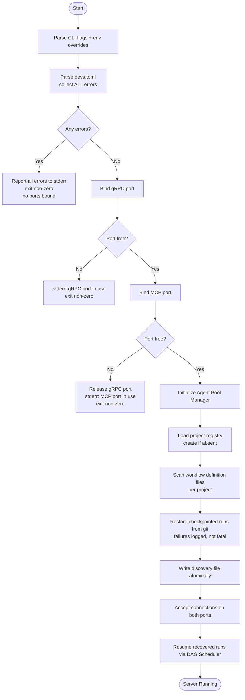
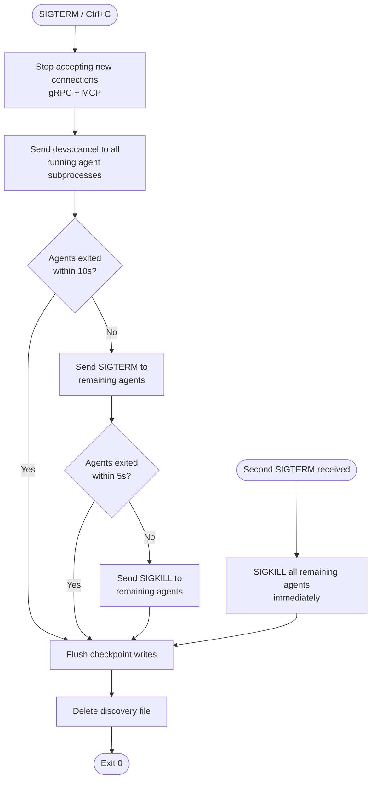

# Ordered Requirements

> This document lists all active requirements from `requirements.md` in topological dependency order,
> ensuring all dependencies are satisfied before the requirements that depend on them.

---

## Detected Dependency Cycles

None detected. All dependencies in the 1_PRD-REQ-* section form a clean DAG. All other sections
(2_TAS-REQ-*, 3_MCP_DESIGN-REQ-*, 4_USER_FEATURES-*, 5_SECURITY_DESIGN-REQ-*,
6_UI_UX_ARCHITECTURE-REQ-*, 7_UI_UX_DESIGN-REQ-*, PERF-*, 9_PROJECT_ROADMAP-*) declare
no formal dependencies.

---

## Layer 0 — Technical Infrastructure

> **Rationale:** The Technical Architecture Specification defines workspace structure,
> language toolchain, CI/CD pipelines, protobuf API definitions, core domain types,
> state machines, and data models. All requirements in this layer have no formal
> dependencies and form the technical foundation on which all other layers build.

---

## Technical Architecture & System Requirements

### **[2_TAS-REQ-001]** The server startup sequence MUST follow this exact order, aborting with a non...
- **Type:** Technical
- **Description:** The server startup sequence MUST follow this exact order, aborting with a non-zero exit code at the first unrecoverable error:

1. Parse CLI flags and environment variable overrides.
2. Locate and parse `devs.toml` — collect ALL validation errors in a single pass and report them together to stderr. Exit non-zero if any errors exist. No port is bound before this step completes successfully.
3. Bind gRPC port — fail immediately if already in use (`EADDRINUSE`). No cleanup required.
4. Bind MCP port — fail immediately if already in use; release the already-bound gRPC port before exiting.
5. Initialize the Agent Pool Manager from the validated pool configurations.
6. Load and validate the project registry (`~/.config/devs/projects.toml`). Create the file if absent (an empty registry is valid).
7. For each registered project, scan for workflow definition files in the configured `workflow_paths`.
8. **[2_TAS-REQ-206]** Restore checkpointed runs from git: for each project's checkpoint branch, read all `checkpoint.json` files. Reset stages in `Running` state to `Eligible`; re-queue stages in `Waiting`/`Eligible` state; re-queue `Pending` runs. A failure to restore one project's checkpoints MUST NOT abort startup — log at `ERROR` level and continue with remaining projects.
9. Write the discovery file atomically to `~/.config/devs/server.addr` (or the path in `DEVS_DISCOVERY_FILE` if set).
10. Begin accepting connections on both ports.
11. Resume recovered runs by triggering the DAG Scheduler for each restored `WorkflowRun`.


- **Source:** TAS (Technical Architecture Specification) (docs/plan/specs/2_tas.md)
- **Dependencies:** None


### **[2_TAS-REQ-001A]** The Interface Layer MUST NOT contain business logic
- **Type:** Technical
- **Description:** The Interface Layer MUST NOT contain business logic. All validation, routing, and state mutation MUST be delegated to Engine Layer components. Interface Layer handlers are limited to: deserializing the wire request, calling one Engine Layer method, serializing the response.
- **Source:** TAS (Technical Architecture Specification) (docs/plan/specs/2_tas.md)
- **Dependencies:** None


### **[2_TAS-REQ-001B]** Infrastructure Layer components MUST NOT hold mutable shared state beyond the...
- **Type:** Technical
- **Description:** Infrastructure Layer components MUST NOT hold mutable shared state beyond their own internal caches. They are invoked from Engine Layer components and return results without retaining references to caller state.
- **Source:** TAS (Technical Architecture Specification) (docs/plan/specs/2_tas.md)
- **Dependencies:** None


### **[2_TAS-REQ-001C]** The MCP server and gRPC server MUST share the same in-process state
- **Type:** Technical
- **Description:** The MCP server and gRPC server MUST share the same in-process state. A change made through the MCP interface MUST be immediately visible through the gRPC interface and vice versa, within the same Tokio scheduler cycle, without any inter-process communication.
- **Source:** TAS (Technical Architecture Specification) (docs/plan/specs/2_tas.md)
- **Dependencies:** None


### **[2_TAS-REQ-001D]** The repository root contains a single `Cargo.toml` workspace manifest
- **Type:** Technical
- **Description:** The repository root contains a single `Cargo.toml` workspace manifest. All crates are members of this workspace. No library crate depends on a crate outside the workspace in its non-dev dependencies, except for third-party crates specified in §2.2.

The workspace is organized into the following crates:

| Crate | Type | Binary | Description |
|---|---|---|---|
| `devs-proto` | lib | — | Generated protobuf/gRPC types and client stubs. Contains `build.rs` invoking `tonic-build`. Generated files committed in `src/gen/` so downstream crates do not require `protoc`. |
| `devs-core` | lib | — | Shared domain types (`WorkflowDefinition`, `WorkflowRun`, `StageRun`, validation, error types) and the Template Engine. Zero network or filesystem I/O in non-dev dependencies. |
| `devs-config` | lib | — | Config file parsing (`devs.toml`, `projects.toml`), config precedence resolution (CLI flag > env var > file > built-in default), project registry management. Depends on `devs-core`. |
| `devs-checkpoint` | lib | — | Git-backed persistence via `git2`. Atomic JSON checkpoint reads/writes, log file management, retention sweep. Depends on `devs-core`. No knowledge of gRPC or scheduling. |
| `devs-adapters` | lib | — | `AgentAdapter` trait and five concrete implementations (claude, gemini, opencode, qwen, copilot). PTY spawning via `portable-pty`. Subprocess lifecycle, bidirectional signal handling, rate-limit detection. Depends on `devs-core`. |
| `devs-pool` | lib | — | Agent Pool Manager: semaphore-based concurrency enforcement, capability-based routing, fallback ordering, rate-limit cooldown tracking, `PoolExhausted` event emission. Depends on `devs-core`, `devs-adapters`. |
| `devs-executor` | lib | — | Stage Executor: execution environment management (tempdir, Docker via `DOCKER_HOST`, remote SSH), repo cloning, artifact collection, context file writing. Depends on `devs-core`, `devs-adapters`, `devs-pool`, `devs-checkpoint`. |
| `devs-scheduler` | lib | — | DAG Scheduler: dependency graph evaluation, stage lifecycle state machine, fan-out management, retry/timeout enforcement, multi-project priority scheduling. Depends on `devs-core`, `devs-executor`, `devs-checkpoint`. |
| `devs-webhook` | lib | — | Webhook Dispatcher: at-least-once HTTP delivery via `reqwest`, per-event retry backoff, payload size enforcement. Depends on `devs-core`. |
| `devs-grpc` | lib | — | gRPC service implementations (`tonic` server traits): thin adapters translating proto messages to `devs-core` types and calling `devs-scheduler`/`devs-pool`. Depends on `devs-proto`, `devs-core`, `devs-scheduler`, `devs-pool`. |
| `devs-mcp` | lib | — | MCP server implementation (HTTP/JSON-RPC). All Glass-Box tools: observation, control, testing interfaces. Depends on `devs-core`, `devs-scheduler`, `devs-pool`, `devs-checkpoint`. |
| `devs-server` | bin | `devs` | Server binary. Composes all engine crates, manages startup/shutdown sequence, binds gRPC and MCP ports. Depends on `devs-grpc`, `devs-mcp`, `devs-config`, `devs-webhook`, `devs-scheduler`. |
| `devs-tui` | bin | `devs-tui` | TUI client. Connects to server over gRPC, renders dashboard using Ratatui. Depends on `devs-proto`, `devs-core`. |
| `devs-cli` | bin | `devs` (subcommands) | CLI client. Clap-based argument parsing, gRPC calls, JSON/human-readable output. Depends on `devs-proto`, `devs-core`. |
| `devs-mcp-bridge` | bin | `devs-mcp-bridge` | MCP stdio bridge. Reads JSON-RPC from stdin, forwards over HTTP to MCP port, writes responses to stdout. Depends on `devs-core` only. |
- **Source:** TAS (Technical Architecture Specification) (docs/plan/specs/2_tas.md)
- **Dependencies:** None


### **[2_TAS-REQ-001E]** `devs-core` MUST NOT have `tokio`, `git2`, `reqwest`, or `tonic` in its non-d...
- **Type:** Technical
- **Description:** `devs-core` MUST NOT have `tokio`, `git2`, `reqwest`, or `tonic` in its non-dev `[dependencies]`. This is verified as part of `./do lint` by a dependency audit step.
- **Source:** TAS (Technical Architecture Specification) (docs/plan/specs/2_tas.md)
- **Dependencies:** None


### **[2_TAS-REQ-001F]** `devs-proto` generated files (`src/gen/*.rs`) MUST be committed to the reposi...
- **Type:** Technical
- **Description:** `devs-proto` generated files (`src/gen/*.rs`) MUST be committed to the repository. The `build.rs` regenerates them when `.proto` source files change, detected via `cargo:rerun-if-changed` directives.
- **Source:** TAS (Technical Architecture Specification) (docs/plan/specs/2_tas.md)
- **Dependencies:** None


### **[2_TAS-REQ-001G]** Wire types from `devs-proto` MUST NOT appear in the public API of `devs-sched...
- **Type:** Technical
- **Description:** Wire types from `devs-proto` MUST NOT appear in the public API of `devs-scheduler`, `devs-executor`, or `devs-pool`. All cross-crate communication within the engine uses types from `devs-core`.
- **Source:** TAS (Technical Architecture Specification) (docs/plan/specs/2_tas.md)
- **Dependencies:** None


### **[2_TAS-REQ-001H]** Config validation (step 2) MUST collect ALL errors in a single pass and repor...
- **Type:** Technical
- **Description:** Config validation (step 2) MUST collect ALL errors in a single pass and report them together. The error output format is one error per line on stderr, each prefixed with `ERROR:`. The process MUST NOT bind any port if any config error exists.
- **Source:** TAS (Technical Architecture Specification) (docs/plan/specs/2_tas.md)
- **Dependencies:** None


### **[2_TAS-REQ-001I]** If the MCP port is unavailable (step 4), the server MUST release the already-...
- **Type:** Technical
- **Description:** If the MCP port is unavailable (step 4), the server MUST release the already-bound gRPC port before exiting, leaving no lingering port bindings in any exit path.
- **Source:** TAS (Technical Architecture Specification) (docs/plan/specs/2_tas.md)
- **Dependencies:** None


### **[2_TAS-REQ-001J]** Discovery file write (step 9) MUST be atomic: write to a `.tmp` suffixed file...
- **Type:** Technical
- **Description:** Discovery file write (step 9) MUST be atomic: write to a `.tmp` suffixed file in the same directory, then rename to the final path. On Linux/macOS this is guaranteed atomic by `rename(2)`. On Windows, the implementation MUST use a rename approach equivalent to `MoveFileExW` with `MOVEFILE_REPLACE_EXISTING`.
- **Source:** TAS (Technical Architecture Specification) (docs/plan/specs/2_tas.md)
- **Dependencies:** None


### **[2_TAS-REQ-001K]** Checkpoint restoration (step 8) MUST NOT fail startup if a single project's c...
- **Type:** Technical
- **Description:** Checkpoint restoration (step 8) MUST NOT fail startup if a single project's checkpoint branch is inaccessible (e.g., corrupt git repo, missing branch). The server MUST log an `ERROR`-level message for that project and continue restoring the remaining projects.
- **Source:** TAS (Technical Architecture Specification) (docs/plan/specs/2_tas.md)
- **Dependencies:** None


### **[2_TAS-REQ-001L]** If the `devs.toml` does not exist at the default search path and `--config` i...
- **Type:** Technical
- **Description:** If the `devs.toml` does not exist at the default search path and `--config` is not supplied, the server MUST start with all built-in defaults and emit a `WARN`-level log: `"No devs.toml found at <path>; using built-in defaults."` This is not an error.
- **Source:** TAS (Technical Architecture Specification) (docs/plan/specs/2_tas.md)
- **Dependencies:** None


### **[2_TAS-REQ-001M]** If `--config` is supplied and the file does not exist, the server MUST exit i...
- **Type:** Technical
- **Description:** If `--config` is supplied and the file does not exist, the server MUST exit immediately with a descriptive error before any port binding: `"Error: config file not found: <path>"`.
- **Source:** TAS (Technical Architecture Specification) (docs/plan/specs/2_tas.md)
- **Dependencies:** None


### **[2_TAS-REQ-001N]** If the discovery file directory does not exist, the server MUST create it (in...
- **Type:** Technical
- **Description:** If the discovery file directory does not exist, the server MUST create it (including all missing parent directories) before writing the discovery file. Failure to create the directory is a fatal error at step 9.
- **Source:** TAS (Technical Architecture Specification) (docs/plan/specs/2_tas.md)
- **Dependencies:** None


### **[2_TAS-REQ-002]** On receiving `SIGTERM` (Linux/macOS) or `Ctrl+C` / `CTRL_BREAK_EVENT` (Window...
- **Type:** Technical
- **Description:** On receiving `SIGTERM` (Linux/macOS) or `Ctrl+C` / `CTRL_BREAK_EVENT` (Windows), the server MUST perform a graceful shutdown in this exact order:

1. Stop accepting new gRPC connections.
2. Stop accepting new MCP connections.
3. Send `devs:cancel\n` via stdin to all actively running agent subprocesses.
4. Wait up to 10 seconds for agent subprocesses to terminate voluntarily.
5. Send `SIGTERM` to any still-running agent subprocesses.
6. Wait up to 5 more seconds; send `SIGKILL` to any subprocesses still running.
7. Flush all in-flight checkpoint writes (wait for all `spawn_blocking` git2 tasks to complete).
8. Delete the discovery file.
9. Exit with code 0.


- **Source:** TAS (Technical Architecture Specification) (docs/plan/specs/2_tas.md)
- **Dependencies:** None


### **[2_TAS-REQ-002A]** The discovery file MUST be deleted before the process exits
- **Type:** Technical
- **Description:** The discovery file MUST be deleted before the process exits. If deletion fails (e.g., permissions error), the failure MUST be logged at `ERROR` level. The process MUST still exit with code 0.
- **Source:** TAS (Technical Architecture Specification) (docs/plan/specs/2_tas.md)
- **Dependencies:** None


### **[2_TAS-REQ-002B]** In-flight gRPC streaming calls (e.g., `StreamRunEvents`, `StreamLogs`) that a...
- **Type:** Technical
- **Description:** In-flight gRPC streaming calls (e.g., `StreamRunEvents`, `StreamLogs`) that are active at shutdown MUST receive a `CANCELLED` status code before their connections are closed.
- **Source:** TAS (Technical Architecture Specification) (docs/plan/specs/2_tas.md)
- **Dependencies:** None


### **[2_TAS-REQ-002C]** All `WorkflowRun` and `StageRun` state that was `Running` at shutdown MUST be...
- **Type:** Technical
- **Description:** All `WorkflowRun` and `StageRun` state that was `Running` at shutdown MUST be persisted to git before exit, with those stages' status set in the checkpoint such that recovery on restart (§1.3 step 8) correctly resets them to `Eligible`.
- **Source:** TAS (Technical Architecture Specification) (docs/plan/specs/2_tas.md)
- **Dependencies:** None


### **[2_TAS-REQ-002D]** If a second `SIGTERM` is received during an in-progress shutdown, the server ...
- **Type:** Technical
- **Description:** If a second `SIGTERM` is received during an in-progress shutdown, the server MUST immediately send `SIGKILL` to all remaining agent subprocesses without waiting for the grace period, then proceed to checkpoint flush and exit.
- **Source:** TAS (Technical Architecture Specification) (docs/plan/specs/2_tas.md)
- **Dependencies:** None


### **[2_TAS-REQ-002E]** The discovery file path is resolved in this priority order:
- **Type:** Technical
- **Description:** The discovery file path is resolved in this priority order:
1. The `DEVS_DISCOVERY_FILE` environment variable, if set and non-empty.
2. The `server.discovery_file` key in `devs.toml`, if present.
3. The default path: `~/.config/devs/server.addr` (where `~` resolves via `HOME` on Linux/macOS and `USERPROFILE` on Windows).
- **Source:** TAS (Technical Architecture Specification) (docs/plan/specs/2_tas.md)
- **Dependencies:** None


### **[2_TAS-REQ-002F]** The discovery file MUST contain exactly one line of plain UTF-8 text in the f...
- **Type:** Technical
- **Description:** The discovery file MUST contain exactly one line of plain UTF-8 text in the format `<host>:<port>`, where `<host>` is an IPv4 address, an IPv6 address in brackets (e.g., `[::1]`), or a DNS hostname, and `<port>` is a decimal integer in the range `1`–`65535`. Clients MUST strip all surrounding whitespace before parsing.
- **Source:** TAS (Technical Architecture Specification) (docs/plan/specs/2_tas.md)
- **Dependencies:** None


### **[2_TAS-REQ-002G]** The discovery file encodes the gRPC listen port
- **Type:** Technical
- **Description:** The discovery file encodes the gRPC listen port. The MCP port is retrieved via the `ServerService.GetInfo` gRPC RPC after connecting. Client binaries that need the MCP port (e.g., `devs-mcp-bridge`) MUST call `GetInfo` first rather than hardcoding or computing the MCP port.
- **Source:** TAS (Technical Architecture Specification) (docs/plan/specs/2_tas.md)
- **Dependencies:** None


### **[2_TAS-REQ-002H]** If a client reads the discovery file and the address is stale (server not lis...
- **Type:** Technical
- **Description:** If a client reads the discovery file and the address is stale (server not listening), the gRPC connection attempt fails. The client MUST report this condition as exit code `3` and print a human-readable error to stderr: `"Server at <addr> is not reachable. Is it running?"`.
- **Source:** TAS (Technical Architecture Specification) (docs/plan/specs/2_tas.md)
- **Dependencies:** None


### **[2_TAS-REQ-002I]** For E2E test isolation, every test that starts a server instance MUST set `DE...
- **Type:** Technical
- **Description:** For E2E test isolation, every test that starts a server instance MUST set `DEVS_DISCOVERY_FILE` to a unique temporary path (e.g., a path under the test's temp directory). This prevents discovery file conflicts between parallel server instances in the same test run.
- **Source:** TAS (Technical Architecture Specification) (docs/plan/specs/2_tas.md)
- **Dependencies:** None


### **[2_TAS-REQ-002J]** When `--server <host:port>` is passed to any client binary, the client MUST u...
- **Type:** Technical
- **Description:** When `--server <host:port>` is passed to any client binary, the client MUST use the explicit address unconditionally and MUST NOT read the discovery file.
- **Source:** TAS (Technical Architecture Specification) (docs/plan/specs/2_tas.md)
- **Dependencies:** None


### **[2_TAS-REQ-002K]** The server binary initializes a single multi-threaded Tokio runtime using `#[...
- **Type:** Technical
- **Description:** The server binary initializes a single multi-threaded Tokio runtime using `#[tokio::main]` with the default thread pool (worker thread count = number of logical CPUs). All async tasks run on this shared runtime. Creating additional Tokio runtimes inside the server process is prohibited.
- **Source:** TAS (Technical Architecture Specification) (docs/plan/specs/2_tas.md)
- **Dependencies:** None


### **[2_TAS-REQ-002L]** Blocking operations that cannot be made async — specifically all `git2` files...
- **Type:** Technical
- **Description:** Blocking operations that cannot be made async — specifically all `git2` filesystem operations, subprocess `wait()` calls, and synchronous SSH operations — MUST be dispatched with `tokio::task::spawn_blocking`. These operations MUST NOT be called directly on a Tokio worker thread.
- **Source:** TAS (Technical Architecture Specification) (docs/plan/specs/2_tas.md)
- **Dependencies:** None


### **[2_TAS-REQ-002M]** Shared mutable state between async tasks MUST use `Arc<tokio::sync::RwLock<T>...
- **Type:** Technical
- **Description:** Shared mutable state between async tasks MUST use `Arc<tokio::sync::RwLock<T>>` for read-heavy state (e.g., `SchedulerState` reads during event broadcasts) or `Arc<tokio::sync::Mutex<T>>` for write-heavy or fine-grained state. `std::sync::RwLock` and `std::sync::Mutex` MUST NOT be held across `.await` points.
- **Source:** TAS (Technical Architecture Specification) (docs/plan/specs/2_tas.md)
- **Dependencies:** None


### **[2_TAS-REQ-002N]** The concurrency semaphore for each agent pool is `Arc<tokio::sync::Semaphore>...
- **Type:** Technical
- **Description:** The concurrency semaphore for each agent pool is `Arc<tokio::sync::Semaphore>` with `max_concurrent` permits. Permits are acquired via `.acquire_owned()` so they can be sent across task boundaries. Permit release MUST occur when the `OwnedSemaphorePermit` is dropped by the stage executor, regardless of stage success or failure.
- **Source:** TAS (Technical Architecture Specification) (docs/plan/specs/2_tas.md)
- **Dependencies:** None


### **[2_TAS-REQ-002O]** The DAG Scheduler maintains all `WorkflowRun` and `StageRun` instances in a s...
- **Type:** Technical
- **Description:** The DAG Scheduler maintains all `WorkflowRun` and `StageRun` instances in a single `Arc<RwLock<SchedulerState>>`. This is the canonical source of truth for runtime state. The git checkpoint is the source of truth for persisted state. On startup, git checkpoint data is loaded into `SchedulerState` before any connections are accepted.
- **Source:** TAS (Technical Architecture Specification) (docs/plan/specs/2_tas.md)
- **Dependencies:** None


### **[2_TAS-REQ-002P]** Lock acquisition order MUST be consistent across all code paths to prevent de...
- **Type:** Technical
- **Description:** Lock acquisition order MUST be consistent across all code paths to prevent deadlock. The defined global order is: `SchedulerState` → `PoolState` → `CheckpointStore` internal lock (if any). Any code path that must acquire multiple locks MUST acquire them in this order.
- **Source:** TAS (Technical Architecture Specification) (docs/plan/specs/2_tas.md)
- **Dependencies:** None


### **[2_TAS-REQ-002Q]** The Webhook Dispatcher operates on a dedicated `tokio::sync::mpsc` channel wi...
- **Type:** Technical
- **Description:** The Webhook Dispatcher operates on a dedicated `tokio::sync::mpsc` channel with a buffer of at least 1024 events. Engine components send `WebhookEvent` messages and immediately return without awaiting delivery. The dispatcher task consumes events independently and retries HTTP delivery without blocking any Scheduler operation.
- **Source:** TAS (Technical Architecture Specification) (docs/plan/specs/2_tas.md)
- **Dependencies:** None


### **[2_TAS-REQ-002R]** All gRPC service methods MUST return `tonic::Status` errors with the appropri...
- **Type:** Technical
- **Description:** All gRPC service methods MUST return `tonic::Status` errors with the appropriate `tonic::Code`. The mapping between domain errors and gRPC status codes is:

| Domain Error Condition | gRPC Code |
|---|---|
| Entity not found (run, stage, project, pool) | `NOT_FOUND` |
| Validation error on input parameters | `INVALID_ARGUMENT` |
| Duplicate name or state conflict | `ALREADY_EXISTS` |
| Client API version mismatch | `FAILED_PRECONDITION` |
| Server resource exhausted (e.g., too many queued runs) | `RESOURCE_EXHAUSTED` |
| Operation not permitted in current entity state | `FAILED_PRECONDITION` |
| Internal server error (unhandled) | `INTERNAL` |
| Client cancelled an in-flight streaming RPC | `CANCELLED` |
- **Source:** TAS (Technical Architecture Specification) (docs/plan/specs/2_tas.md)
- **Dependencies:** None


### **[2_TAS-REQ-002S]** Every gRPC unary response message MUST include a `string request_id` field co...
- **Type:** Technical
- **Description:** Every gRPC unary response message MUST include a `string request_id` field containing a server-generated UUID4 for correlation with server-side logs.
- **Source:** TAS (Technical Architecture Specification) (docs/plan/specs/2_tas.md)
- **Dependencies:** None


### **[2_TAS-REQ-002T]** All gRPC streaming RPCs MUST respect Tokio context cancellation
- **Type:** Technical
- **Description:** All gRPC streaming RPCs MUST respect Tokio context cancellation. When a client cancels a stream, the server MUST stop sending messages and release all associated resources within 500 ms.
- **Source:** TAS (Technical Architecture Specification) (docs/plan/specs/2_tas.md)
- **Dependencies:** None


### **[2_TAS-REQ-002U]** The server MUST implement gRPC reflection via `tonic-reflection` so that tool...
- **Type:** Technical
- **Description:** The server MUST implement gRPC reflection via `tonic-reflection` so that tools such as `grpcurl` can discover the full service schema at runtime without a local `.proto` file.
- **Source:** TAS (Technical Architecture Specification) (docs/plan/specs/2_tas.md)
- **Dependencies:** None


### **[2_TAS-REQ-003]** All code MUST be written in Rust stable with a minimum version of 1.80.0
- **Type:** Technical
- **Description:** All code MUST be written in Rust stable with a minimum version of 1.80.0. No nightly features, nightly-only attributes, or nightly-only crate features are permitted in any workspace crate's non-dev code paths.
- **Source:** TAS (Technical Architecture Specification) (docs/plan/specs/2_tas.md)
- **Dependencies:** None


### **[2_TAS-REQ-004]** The repository root MUST contain a `rust-toolchain.toml` file that pins the t...
- **Type:** Technical
- **Description:** The repository root MUST contain a `rust-toolchain.toml` file that pins the toolchain channel to `"stable"` with a minimum version of `"1.80.0"`. This file ensures that all developers and CI runners use a consistent toolchain regardless of their locally installed Rust version.

```toml
# rust-toolchain.toml (authoritative)
[toolchain]
channel = "stable"
components = ["rustfmt", "clippy", "llvm-tools-preview"]
```

The `llvm-tools-preview` component is required by `cargo-llvm-cov` for coverage instrumentation (§2.7). Including it in `rust-toolchain.toml` ensures it is installed automatically by `rustup` on every machine and CI runner.
- **Source:** TAS (Technical Architecture Specification) (docs/plan/specs/2_tas.md)
- **Dependencies:** None


### **[2_TAS-REQ-004A]** The workspace `[workspace.lints]` table MUST contain the following configurat...
- **Type:** Technical
- **Description:** The workspace `[workspace.lints]` table MUST contain the following configuration, enforced on all member crates via `[lints] workspace = true` in each crate's `Cargo.toml`:

```toml
# Cargo.toml (workspace root) — authoritative lint table
[workspace.lints.rust]
missing_docs       = "deny"
unsafe_code        = "deny"
unused_must_use    = "deny"
dead_code          = "warn"

[workspace.lints.clippy]
all                = { level = "deny", priority = -1 }
pedantic           = { level = "warn", priority = -1 }
# Allow exceptions that produce excessive noise in idiomatic Rust
module_name_repetitions = "allow"
must_use_candidate      = "allow"
```
- **Source:** TAS (Technical Architecture Specification) (docs/plan/specs/2_tas.md)
- **Dependencies:** None


### **[2_TAS-REQ-004B]** `unsafe_code = "deny"` applies workspace-wide
- **Type:** Technical
- **Description:** `unsafe_code = "deny"` applies workspace-wide. No `unsafe` block is permitted in any crate. If a dependency transitively requires unsafe code inside its own implementation (e.g., `git2`, `portable-pty`), that is acceptable — the prohibition applies only to code authored within this workspace.
- **Source:** TAS (Technical Architecture Specification) (docs/plan/specs/2_tas.md)
- **Dependencies:** None


### **[2_TAS-REQ-004C]** The workspace MUST define the following Cargo profiles:
- **Type:** Technical
- **Description:** The workspace MUST define the following Cargo profiles:

```toml
# Cargo.toml (workspace root) — authoritative profile table
[profile.dev]
opt-level = 0
debug     = true
# Speed up incremental builds in development
incremental = true

[profile.release]
opt-level     = 3
lto           = "thin"
codegen-units = 1
strip         = "debuginfo"
panic         = "abort"

[profile.test]
# Inherits from dev; ensure test binaries have debug info for coverage
inherits = "dev"
debug    = true
```

The `panic = "abort"` in the release profile eliminates stack-unwinding overhead. All `Result` types are propagated explicitly; panics in production code are defects.
- **Source:** TAS (Technical Architecture Specification) (docs/plan/specs/2_tas.md)
- **Dependencies:** None


### **[2_TAS-REQ-004D]** The root `Cargo.toml` MUST declare `resolver = "2"` to use the v2 feature res...
- **Type:** Technical
- **Description:** The root `Cargo.toml` MUST declare `resolver = "2"` to use the v2 feature resolver, which correctly handles feature unification across workspace crates with optional features.
- **Source:** TAS (Technical Architecture Specification) (docs/plan/specs/2_tas.md)
- **Dependencies:** None


### **[2_TAS-REQ-004E]** No workspace crate may declare optional `[features]` that enable or disable c...
- **Type:** Technical
- **Description:** No workspace crate may declare optional `[features]` that enable or disable core business logic. Feature flags are permitted only for TLS backend selection in `reqwest` (always `rustls-tls`, never `native-tls`) and for test-only utilities gated with `#[cfg(test)]`. This constraint prevents partial-feature builds from silently omitting required functionality.
- **Source:** TAS (Technical Architecture Specification) (docs/plan/specs/2_tas.md)
- **Dependencies:** None


### **[2_TAS-REQ-004F]** All CI jobs MUST build and test with `--all-features` to ensure no feature co...
- **Type:** Technical
- **Description:** All CI jobs MUST build and test with `--all-features` to ensure no feature combination is silently broken. The explicit invocation is `cargo build --workspace --all-features` and `cargo test --workspace --all-features`.
- **Source:** TAS (Technical Architecture Specification) (docs/plan/specs/2_tas.md)
- **Dependencies:** None


### **[2_TAS-REQ-004G]** The `unsafe_code = "deny"` lint MUST be active
- **Type:** Technical
- **Description:** The `unsafe_code = "deny"` lint MUST be active. Any `#[allow(unsafe_code)]` or `unsafe` block in workspace source files MUST cause `./do lint` to fail with a `clippy` error. If a third-party crate's API requires calling an `unsafe fn`, the workspace crate MUST wrap it in a safe abstraction within a dedicated module with a `SAFETY:` comment, but the `unsafe` keyword itself in workspace source remains prohibited — such patterns indicate the wrong abstraction and MUST be resolved by using a safe alternative API.
- **Source:** TAS (Technical Architecture Specification) (docs/plan/specs/2_tas.md)
- **Dependencies:** None


### **[2_TAS-REQ-005]** The following crate versions and enabled feature flags are authoritative for ...
- **Type:** Security
- **Description:** The following crate versions and enabled feature flags are authoritative for all workspace members' `[dependencies]`. Features not listed are disabled unless noted otherwise.

| Crate | Version | Required Features | Purpose |
|---|---|---|---|
| `tokio` | 1.38 | `full` | Async runtime: task spawning, channels, timers, I/O, `spawn_blocking`. `full` enables all tokio sub-features including `rt-multi-thread`, `macros`, `time`, `sync`, `net`. |
| `tonic` | 0.12 | `transport`, `codegen` | gRPC server and client. `transport` provides the `Server` and `Channel` types. `codegen` provides `async_trait` re-exports used by generated service traits. |
| `prost` | 0.13 | `derive` | Protobuf message encoding/decoding. `derive` enables `#[derive(Message)]`. **[2_TAS-REQ-603]** Must match the version used by `tonic-build`. |
| `tonic-build` | 0.12 | _(build dependency)_ | `build.rs` code generator for `.proto` files. Invoked via `tonic_build::compile_protos`. |
| `tonic-reflection` | 0.12 | `server` | gRPC server reflection for `grpcurl` compatibility. Registered alongside service routes at server startup. |
| `ratatui` | 0.28 | `crossterm` | TUI widget library. The `crossterm` feature activates the `CrosstermBackend` used on all three platforms. |
| `crossterm` | 0.28 | _(default)_ | Cross-platform terminal I/O. Provides raw mode, event polling, and ANSI escape sequences on Linux, macOS, and Windows. |
| `clap` | 4.5 | `derive`, `env` | CLI argument parsing. `derive` enables `#[derive(Parser, Args, Subcommand)]`. `env` allows env-var binding for each argument. |
| `serde` | 1.0 | `derive` | Serialization framework. `derive` enables `#[derive(Serialize, Deserialize)]`. Used by every data type in `devs-core`. |
| `serde_json` | 1.0 | _(default)_ | JSON serialization for checkpoint files, context files, MCP responses, and webhook payloads. |
| `toml` | 0.8 | `serde` | TOML config parsing. `serde` feature enables `toml::from_str::<T>()`. Used exclusively in `devs-config`. |
| `serde_yaml` | 0.9 | _(default)_ | YAML workflow definition parsing. Used in `devs-config` for `.yaml`/`.yml` workflow files. |
| `uuid` | 1.10 | `v4`, `serde` | UUID v4 generation for `run_id`, `stage_run_id`, and request correlation IDs. `serde` enables transparent JSON serialization as strings. |
| `git2` | 0.19 | `ssh`, `https` | Git operations for the checkpoint store. `ssh` enables libssh2 for remote SSH execution environment repo cloning. `https` enables OpenSSL/Schannel for HTTPS clone. |
| `reqwest` | 0.12 | `json`, `rustls-tls` | Outbound HTTP client for webhook delivery. `json` enables `.json()` body serialization. `rustls-tls` is the mandatory TLS backend. |
| `tracing` | 0.1 | _(default)_ | Structured logging instrumentation. All log statements in library crates use `tracing::info!`, `tracing::warn!`, `tracing::error!`, `tracing::debug!`. |
| `tracing-subscriber` | 0.3 | `env-filter`, `json` | Log subscriber configuration. `env-filter` enables `RUST_LOG` filtering. `json` enables JSON-formatted log output for CI environments. |
| `portable-pty` | 0.8 | _(default)_ | PTY allocation for agent adapters that require an interactive terminal. Provides a cross-platform API over `openpty` (Linux/macOS) and `ConPTY` (Windows). |
| `tokio-stream` | 0.1 | `sync` | Async stream utilities. `sync` enables `BroadcastStream` and `ReceiverStream` wrappers over Tokio channels, used in gRPC streaming RPCs. |
| `handlebars` | 6.0 | _(default)_ | Template variable resolution for `{{template}}` syntax in stage prompts, system prompts, and context files. Used exclusively in `devs-core`'s Template Engine. |
| `chrono` | 0.4 | `serde` | Timestamps (`DateTime<Utc>`) stored as ISO 8601 strings in checkpoints and API responses. `serde` feature serializes to/from RFC 3339 strings. |
| `tempfile` | 3.12 | _(default)_ | Temporary directory creation for `tempdir` execution environments and prompt file writing. Directories are automatically cleaned up when the `TempDir` handle is dropped. |
| `bytes` | 1.7 | _(default)_ | Byte buffer management for gRPC streaming (prost message encoding) and log streaming. |
| `thiserror` | 1.0 | _(default)_ | Ergonomic `#[derive(Error)]` for library crate error types. Used in every `devs-*` library crate's `error.rs`. |
**[2_TAS-REQ-234]** | `anyhow` | 1.0 | _(default)_ | Opaque error propagation in binary crates (`devs-server`, `devs-tui`, `devs-cli`, `devs-mcp-bridge`). MUST NOT appear in library crates' `[dependencies]`. |
- **Source:** TAS (Technical Architecture Specification) (docs/plan/specs/2_tas.md)
- **Dependencies:** None


### **[2_TAS-REQ-005A]** The dependency on `anyhow` is restricted to binary crates only
- **Type:** Functional
- **Description:** The dependency on `anyhow` is restricted to binary crates only. Library crates (`devs-core`, `devs-config`, `devs-checkpoint`, `devs-adapters`, `devs-pool`, `devs-executor`, `devs-scheduler`, `devs-webhook`, `devs-grpc`, `devs-mcp`, `devs-proto`) MUST use `thiserror` for their error types and return `Result<T, MyError>` where `MyError` is a domain-specific type. This allows downstream callers to pattern-match on specific error variants.
- **Source:** TAS (Technical Architecture Specification) (docs/plan/specs/2_tas.md)
- **Dependencies:** None


### **[2_TAS-REQ-006]** `reqwest` MUST use the `rustls-tls` feature exclusively
- **Type:** Security
- **Description:** `reqwest` MUST use the `rustls-tls` feature exclusively. The `native-tls` and `native-tls-alpn` features MUST NOT be enabled on any workspace crate. This guarantees that webhook TLS behavior is identical on Linux, macOS, and Windows without requiring OpenSSL to be installed on the host system.
- **Source:** TAS (Technical Architecture Specification) (docs/plan/specs/2_tas.md)
- **Dependencies:** None


### **[2_TAS-REQ-007]** Dev-only dependencies — declared in `[dev-dependencies]` of workspace members...
- **Type:** Security
- **Description:** Dev-only dependencies — declared in `[dev-dependencies]` of workspace members or in `[workspace.dev-dependencies]` — are not subject to the "no nightly" restriction but MUST NOT appear in any crate's `[dependencies]`. The authoritative dev-dependency versions are:

| Crate | Version | Purpose |
|---|---|---|
| `cargo-llvm-cov` | 0.6 | Line coverage instrumentation via LLVM instrumentation profiles. Invoked by `./do coverage`. |
| `insta` | 1.40 | Snapshot testing for TUI text output. Snapshots stored as `.txt` fixture files under `src/snapshots/`. |
| `mockall` | 0.13 | Mock generation (`#[automock]`) for the `AgentAdapter` and `CheckpointStore` traits in unit tests. |
| `bollard` | 0.17 | Docker API client. Used in integration test helpers to start/stop Docker containers for the `docker` execution environment E2E tests. |
| `wiremock` | 0.6 | HTTP mock server. Used in webhook delivery tests to assert payload format and retry behavior without sending real HTTP requests. |
| `assert_cmd` | 2.0 | CLI binary integration testing. Runs `devs-cli` and `devs-mcp-bridge` as subprocesses and asserts exit codes and stdout/stderr patterns. |
| `predicates` | 3.1 | Composable predicates for use with `assert_cmd` output assertions. |
| `tokio-test` | 0.4 | Helpers for testing async code: `block_on`, mock time, mock I/O. |
| `rstest` | 0.22 | Parameterised test cases with `#[rstest]` and `#[case]` attributes. |
- **Source:** TAS (Technical Architecture Specification) (docs/plan/specs/2_tas.md)
- **Dependencies:** None


### **[2_TAS-REQ-007A]** `./do lint` MUST include a step that verifies no workspace crate's `Cargo.loc...
- **Type:** Security
- **Description:** `./do lint` MUST include a step that verifies no workspace crate's `Cargo.lock`-resolved dependency list contains a crate not present in the authoritative tables above (§2.2 for non-dev, §2.2 dev table for dev). The check is implemented as a script that compares `cargo metadata --format-version 1` output against the documented set and exits non-zero on any undocumented crate. This prevents accidental transitive dependency promotion.
- **Source:** TAS (Technical Architecture Specification) (docs/plan/specs/2_tas.md)
- **Dependencies:** None


### **[2_TAS-REQ-007B]** When a new dependency is required, the implementing agent MUST:
- **Type:** Security
- **Description:** When a new dependency is required, the implementing agent MUST:
1. Add it to the authoritative table in this document with version, features, and purpose.
2. Add it to the relevant crate's `Cargo.toml`.
3. Verify `./do lint` passes, including the dependency audit step.

Submitting code that uses an undocumented crate without updating this table is a blocking defect.
- **Source:** TAS (Technical Architecture Specification) (docs/plan/specs/2_tas.md)
- **Dependencies:** None


### **[2_TAS-REQ-008]** All `.proto` files reside under `proto/devs/v1/`
- **Type:** Technical
- **Description:** All `.proto` files reside under `proto/devs/v1/`. Each gRPC service has its own file. The layout is:

```
proto/
  devs/
    v1/
      common.proto               # Shared message types (Timestamp, RunStatus, StageStatus, etc.)
      workflow_definition.proto  # WorkflowDefinitionService + all workflow/stage definition messages
      run.proto                  # RunService + WorkflowRun, StageRun, RunStatus messages
      stage.proto                # StageService + StageOutput, StageRun detail messages
      log.proto                  # LogService + log streaming messages
      pool.proto                 # PoolService + AgentPool, PoolUtilization messages
      project.proto              # ProjectService + Project, ProjectConfig messages
      server.proto               # ServerService + ServerInfo (version, MCP port)
```
- **Source:** TAS (Technical Architecture Specification) (docs/plan/specs/2_tas.md)
- **Dependencies:** None


### **[2_TAS-REQ-008A]** Every `.proto` file MUST begin with the following header block:
- **Type:** Functional
- **Description:** Every `.proto` file MUST begin with the following header block:

```proto
syntax = "proto3";
package devs.v1;

import "google/protobuf/timestamp.proto";
// Additional imports as required
```
- **Source:** TAS (Technical Architecture Specification) (docs/plan/specs/2_tas.md)
- **Dependencies:** None


### **[2_TAS-REQ-008B]** The `devs-proto` crate contains a `build.rs` that compiles `.proto` files int...
- **Type:** Functional
- **Description:** The `devs-proto` crate contains a `build.rs` that compiles `.proto` files into Rust source. Generated files are written into `devs-proto/src/gen/`. This directory and all its contents MUST be committed to the repository so that `cargo build` succeeds without `protoc` installed.
- **Source:** TAS (Technical Architecture Specification) (docs/plan/specs/2_tas.md)
- **Dependencies:** None


### **[2_TAS-REQ-008C]** The `devs-proto/src/gen/` directory MUST contain an `mod.rs` (or equivalent `...
- **Type:** Functional
- **Description:** The `devs-proto/src/gen/` directory MUST contain an `mod.rs` (or equivalent `lib.rs` re-exports) that re-exports all generated modules under a clean public API. Downstream crates import types as `devs_proto::devs::v1::WorkflowRun`, not by reaching into `gen::` submodules directly.
- **Source:** TAS (Technical Architecture Specification) (docs/plan/specs/2_tas.md)
- **Dependencies:** None


### **[2_TAS-REQ-008D]** If `protoc` is not installed on the build machine, `build.rs` MUST detect thi...
- **Type:** Functional
- **Description:** If `protoc` is not installed on the build machine, `build.rs` MUST detect this and skip re-generation, using the committed generated files. It MUST NOT fail the build. The detection is: attempt to invoke `protoc --version`; if it fails, print `cargo:warning=protoc not found; using committed generated files.` and return `Ok(())` immediately.
- **Source:** TAS (Technical Architecture Specification) (docs/plan/specs/2_tas.md)
- **Dependencies:** None


### **[2_TAS-REQ-009]** The proto package name is `devs.v1`
- **Type:** Technical
- **Description:** The proto package name is `devs.v1`. Message and service names use `PascalCase`. Field names use `snake_case`. Enum value names use `SCREAMING_SNAKE_CASE` prefixed with the enum name (e.g., `RUN_STATUS_PENDING`, `RUN_STATUS_RUNNING`).
- **Source:** TAS (Technical Architecture Specification) (docs/plan/specs/2_tas.md)
- **Dependencies:** None


### **[2_TAS-REQ-009A]** Field numbers in all messages MUST be assigned sequentially starting from 1 a...
- **Type:** Security
- **Description:** Field numbers in all messages MUST be assigned sequentially starting from 1 and MUST NOT be reused after removal. If a field is removed from a message, its number is reserved with a `reserved` statement. This preserves backward compatibility with clients running older binaries.

```proto
// Example of correct field reservation (authoritative pattern)
message WorkflowRun {
  reserved 5;  // formerly `workflow_version`, removed in v1.2
  reserved "workflow_version";

  string run_id      = 1;
  string slug        = 2;
  string workflow_name = 3;
  // ... remaining fields
}
```
- **Source:** TAS (Technical Architecture Specification) (docs/plan/specs/2_tas.md)
- **Dependencies:** None


### **[2_TAS-REQ-009B]** The `ServerService` MUST include a `GetInfo` RPC that returns the server vers...
- **Type:** UX
- **Description:** The `ServerService` MUST include a `GetInfo` RPC that returns the server version and MCP port:

```proto
service ServerService {
  rpc GetInfo(GetInfoRequest) returns (GetInfoResponse);
}

message GetInfoRequest {}

message GetInfoResponse {
  string server_version = 1;  // semver string, e.g. "0.1.0"
  uint32 mcp_port       = 2;  // MCP HTTP listen port
  string request_id     = 3;  // server-generated UUID4 for log correlation
}
```

This is the mechanism clients use to discover the MCP port after connecting to the gRPC port via the discovery file (§1.5).
- **Source:** TAS (Technical Architecture Specification) (docs/plan/specs/2_tas.md)
- **Dependencies:** None


### **[2_TAS-REQ-010]** The GitLab CI pipeline defines three parallel jobs: `presubmit-linux`, `presu...
- **Type:** Security
- **Description:** The GitLab CI pipeline defines three parallel jobs: `presubmit-linux`, `presubmit-macos`, `presubmit-windows`. Each job runs on the respective OS runner and invokes `./do presubmit`. All three jobs MUST pass for a merge request to be mergeable.

```yaml
# gitlab-ci.yml (authoritative structure)
stages:
  - presubmit

variables:
  CARGO_HOME: "$CI_PROJECT_DIR/.cargo-cache"
  RUST_BACKTRACE: "1"
  RUST_LOG: "info"

.presubmit_template: &presubmit_template
  stage: presubmit
  timeout: 25m
  script:
    - ./do setup
    - ./do presubmit
  artifacts:
    when: always
    paths:
      - target/coverage/report.json
      - target/presubmit_timings.jsonl
      - target/traceability.json
    expire_in: 7 days
  cache:
    key: "$CI_JOB_NAME-$CI_COMMIT_REF_SLUG"
    paths:
      - .cargo-cache/registry
      - target/

presubmit-linux:
  <<: *presubmit_template
  tags: [linux, docker]
  image: rust:1.80-slim-bookworm

presubmit-macos:
  <<: *presubmit_template
  tags: [macos, shell]

presubmit-windows:
  <<: *presubmit_template
  tags: [windows, shell]
```
- **Source:** TAS (Technical Architecture Specification) (docs/plan/specs/2_tas.md)
- **Dependencies:** None


### **[2_TAS-REQ-010A]** The GitLab CI job timeout is set to **25 minutes** to provide a 10-minute buf...
- **Type:** Technical
- **Description:** The GitLab CI job timeout is set to **25 minutes** to provide a 10-minute buffer beyond the 15-minute `./do presubmit` hard timeout. If `./do presubmit` exceeds 15 minutes, it kills all child processes and exits non-zero, causing the CI job to fail cleanly within the 25-minute CI timeout. This two-tier timeout prevents hung CI jobs from consuming runner resources indefinitely.
- **Source:** TAS (Technical Architecture Specification) (docs/plan/specs/2_tas.md)
- **Dependencies:** None


### **[2_TAS-REQ-010B]** CI artifacts MUST include `target/coverage/report.json`, `target/presubmit_ti...
- **Type:** Functional
- **Description:** CI artifacts MUST include `target/coverage/report.json`, `target/presubmit_timings.jsonl`, and `target/traceability.json` with `expire_in: 7 days`. These files are uploaded even on job failure (`when: always`) to aid post-failure debugging.
- **Source:** TAS (Technical Architecture Specification) (docs/plan/specs/2_tas.md)
- **Dependencies:** None


### **[2_TAS-REQ-010C]** The Cargo registry cache (`$CARGO_HOME/registry`) and the `target/` directory...
- **Type:** Functional
- **Description:** The Cargo registry cache (`$CARGO_HOME/registry`) and the `target/` directory MUST be cached per job name per branch (`CI_JOB_NAME-$CI_COMMIT_REF_SLUG`). This avoids redownloading all crates on every run. Cache restoration failures MUST NOT cause the job to fail — `./do setup` will re-fetch any missing artifacts.
- **Source:** TAS (Technical Architecture Specification) (docs/plan/specs/2_tas.md)
- **Dependencies:** None


### **[2_TAS-REQ-010D]** The `./do` script MUST be POSIX `sh`-compatible
- **Type:** Functional
- **Description:** The `./do` script MUST be POSIX `sh`-compatible. Bash-specific syntax (arrays, `[[ ]]`, `$'...'`, process substitution `<(...)`) MUST NOT appear. On Windows the script runs under Git Bash, which provides a POSIX `sh`. The shebang line MUST be `#!/bin/sh`.
- **Source:** TAS (Technical Architecture Specification) (docs/plan/specs/2_tas.md)
- **Dependencies:** None


### **[2_TAS-REQ-010E]** The `DEVS_DISCOVERY_FILE` environment variable MUST be set to a unique tempor...
- **Type:** Functional
- **Description:** The `DEVS_DISCOVERY_FILE` environment variable MUST be set to a unique temporary path for every E2E test invocation within CI to prevent discovery file conflicts between parallel test processes running within the same job.
- **Source:** TAS (Technical Architecture Specification) (docs/plan/specs/2_tas.md)
- **Dependencies:** None


### **[2_TAS-REQ-010F]** `./do ci` copies the working directory to a temporary git commit (without mod...
- **Type:** Technical
- **Description:** `./do ci` copies the working directory to a temporary git commit (without modifying the actual branch) and submits it to the GitLab CI API to trigger a pipeline run. The command:
1. Creates a temporary branch named `ci/local-<timestamp>-<6-hex-chars>`.
2. Commits all staged and unstaged changes to that branch (no-edit, no-hooks).
3. Pushes the temporary branch to the `origin` remote.
4. Polls the GitLab CI API until the pipeline completes or 30 minutes elapse.
5. Prints a per-job summary (pass/fail with timing) to stdout.
6. Deletes the temporary branch from `origin`.
7. Exits with code 0 if all jobs passed, non-zero otherwise.

The GitLab API token is read from the `GITLAB_TOKEN` environment variable. If absent, `./do ci` exits non-zero with `"Error: GITLAB_TOKEN environment variable not set"`.
- **Source:** TAS (Technical Architecture Specification) (docs/plan/specs/2_tas.md)
- **Dependencies:** None


### **[2_TAS-REQ-012]** `./do lint` runs the following commands in order; any non-zero exit code fail...
- **Type:** Technical
- **Description:** `./do lint` runs the following commands in order; any non-zero exit code fails the entire lint step:

1. `cargo fmt --check --all`
2. `cargo clippy --workspace --all-targets --all-features -- -D warnings`
3. `cargo doc --no-deps --workspace 2>&1 | grep -E "^warning|^error" && exit 1 || exit 0`

Step 3 catches `missing_docs` violations and broken intra-doc links that `clippy` does not catch. The grep pattern matches rustdoc warnings/errors on stdout and causes the step to fail if any are found.
- **Source:** TAS (Technical Architecture Specification) (docs/plan/specs/2_tas.md)
- **Dependencies:** None


### **[2_TAS-REQ-012A]** A `rustfmt.toml` file at the repository root controls formatting
- **Type:** Technical
- **Description:** A `rustfmt.toml` file at the repository root controls formatting. Its authoritative content is:

```toml
# rustfmt.toml (authoritative)
edition          = "2021"
max_width        = 100
tab_spaces       = 4
use_small_heuristics = "Default"
imports_granularity = "Crate"
group_imports    = "StdExternalCrate"
```

`max_width = 100` provides slightly more horizontal space than the default 80 to accommodate long Rust identifiers (trait bounds, type parameters) common in async Rust without forcing awkward line breaks. `imports_granularity = "Crate"` groups all imports from the same crate into a single `use` statement tree.
- **Source:** TAS (Technical Architecture Specification) (docs/plan/specs/2_tas.md)
- **Dependencies:** None

### **[2_TAS-REQ-012B]** Formatting vs Linting separation
- **Type:** Technical
- **Description:** `./do format` runs `cargo fmt --all` to apply formatting in place. `./do lint` runs `cargo fmt --check --all`; any formatting divergence is a lint failure. These are separate commands: `format` mutates, `lint` only checks.
- **Source:** TAS (Technical Architecture Specification) (docs/plan/specs/2_tas.md)
- **Dependencies:** None


### **[2_TAS-REQ-012C]** Clippy configuration
- **Type:** Technical
- **Description:** `./do lint` runs clippy as: `cargo clippy --workspace --all-targets --all-features -- -D warnings`. `--all-targets` includes `tests`, `benches`, and `examples` in addition to `lib` and `bin` targets. `--all-features` ensures all optional feature combinations are checked. `-D warnings` promotes all clippy warnings to errors.
- **Source:** TAS (Technical Architecture Specification) (docs/plan/specs/2_tas.md)
- **Dependencies:** None


### **[2_TAS-REQ-012D]** Clippy suppression policy
- **Type:** Technical
- **Description:** The workspace `[workspace.lints.clippy]` table (§2.1.1) configures lint levels. Individual `#[allow(clippy::...)]` suppressions are permitted in source code only when the suppression includes a `// REASON:` comment explaining why the lint is inapplicable. Suppressions without `REASON:` comments are rejected by a custom `./do lint` check that `grep`s for `#[allow(clippy::` without a trailing comment.
- **Source:** TAS (Technical Architecture Specification) (docs/plan/specs/2_tas.md)
- **Dependencies:** None


### **[2_TAS-REQ-013]** Mandatory documentation
- **Type:** Technical
- **Description:** Every public Rust item (struct, enum, trait, function, method, constant, type alias, module) MUST have a doc comment (`///` or `//!` for module-level). This is enforced by `missing_docs = "deny"` in the workspace lint table. Items in `pub(crate)` visibility may have doc comments but are not required to.
- **Source:** TAS (Technical Architecture Specification) (docs/plan/specs/2_tas.md)
- **Dependencies:** None


### **[2_TAS-REQ-013A]** Dependency audit lint
- **Type:** Technical
- **Description:** `./do lint` includes a dependency audit step implemented as a shell script that:
  1. Runs `cargo metadata --format-version 1 --no-deps` to list all direct dependencies of all workspace crates.
  2. Compares the output against the authoritative dependency tables in §2.2.
  3. Exits non-zero if any dependency is present in `Cargo.toml` but absent from the §2.2 tables, or if any dependency in §2.2 specifies a version range that does not match what is in `Cargo.toml`.
- **Source:** TAS (Technical Architecture Specification) (docs/plan/specs/2_tas.md)
- **Dependencies:** None


### **[2_TAS-REQ-014]** Standardized subcommands
- **Type:** Technical
- **Description:** Each `./do` subcommand MUST implement the exact behavior described in the command definitions table. (setup, build, test, lint, format, coverage, presubmit, ci).
- **Source:** TAS (Technical Architecture Specification) (docs/plan/specs/2_tas.md)
- **Dependencies:** None


### **[2_TAS-REQ-014A]** Idempotent setup
- **Type:** Technical
- **Description:** `./do setup` MUST be idempotent. Running it on a machine that already has all dependencies installed MUST produce the same outcome (zero exit) as running it on a fresh machine. It MUST NOT modify already-correct installations.
- **Source:** TAS (Technical Architecture Specification) (docs/plan/specs/2_tas.md)
- **Dependencies:** None


### **[2_TAS-REQ-014B]** Required developer tools
- **Type:** Technical
- **Description:** `./do setup` MUST install the following tools, each verified by running `<tool> --version` after installation:
  - `rustup`: System package manager or `https://sh.rustup.rs`
  - `Rust stable ≥ 1.80.0`: `rustup toolchain install stable --component rustfmt clippy llvm-tools-preview`
  - `cargo-llvm-cov`: `cargo install cargo-llvm-cov --version 0.6 --locked`
  - `protoc`: Linux: `apt-get install -y protobuf-compiler`; macOS: `brew install protobuf`; Windows: `choco install protobuf` or `winget install protobuf`
  - `git`: System package manager
- **Source:** TAS (Technical Architecture Specification) (docs/plan/specs/2_tas.md)
- **Dependencies:** None


### **[2_TAS-REQ-014C]** Presubmit timeout enforcement
- **Type:** Technical
- **Description:** `./do presubmit` enforces a hard 15-minute wall-clock timeout using an algorithm that starts a background timer to kill the process group if the limit is exceeded.
- **Source:** TAS (Technical Architecture Specification) (docs/plan/specs/2_tas.md)
- **Dependencies:** None


### **[2_TAS-REQ-014D]** Presubmit timing telemetry
- **Type:** Technical
- **Description:** `./do presubmit` logs each step's start time, end time, and exit code to `target/presubmit_timings.jsonl`. Each line is a JSON object.
- **Source:** TAS (Technical Architecture Specification) (docs/plan/specs/2_tas.md)
- **Dependencies:** None


### **[2_TAS-REQ-014E]** Unknown command handling
- **Type:** Technical
- **Description:** `./do <unknown-command>` MUST print the following to stderr and exit non-zero:
  ```
  Unknown command: '<unknown-command>'
  Valid commands: setup build test lint format coverage presubmit ci
  ```
- **Source:** TAS (Technical Architecture Specification) (docs/plan/specs/2_tas.md)
- **Dependencies:** None


### **[2_TAS-REQ-014F]** Traceability check
- **Type:** Technical
- **Description:** `./do test` generates `target/traceability.json` after all tests complete. The generation algorithm scans source files for `Covers:` tags, scans spec files for requirement IDs, computes coverage, and exits non-zero if `traceability_pct < 100.0` or if any test references a non-existent requirement ID.
- **Source:** TAS (Technical Architecture Specification) (docs/plan/specs/2_tas.md)
- **Dependencies:** None


### **[2_TAS-REQ-015]** Coverage measurement sequence
- **Type:** Technical
- **Description:** `./do coverage` MUST run the following invocations in sequence:
  1. Unit test coverage (all workspace crates, tests tagged `#[test]` in `src/`).
  2. E2E test coverage (tests in `tests/` directories, external interface tests).
  3. Per-interface E2E coverage (CLI, TUI, MCP individually).
- **Source:** TAS (Technical Architecture Specification) (docs/plan/specs/2_tas.md)
- **Dependencies:** None


### **[2_TAS-REQ-015A]** Unit vs E2E test definition
- **Type:** Technical
- **Description:** Unit tests are defined as tests using `#[test]` or `#[tokio::test]` attributes located inside `src/` files. E2E tests are defined as tests in `tests/` directories that exercise the system through external interfaces (CLI binary invocation, TUI terminal emulation, MCP JSON-RPC calls). The test binary path convention identifies E2E tests by the prefix `e2e::` in their test name.
- **Source:** TAS (Technical Architecture Specification) (docs/plan/specs/2_tas.md)
- **Dependencies:** None


### **[2_TAS-REQ-015B]** E2E test serialization
- **Type:** Technical
- **Description:** E2E tests MUST run with `--test-threads 1` to prevent multiple `devs` server instances from conflicting on port numbers or the discovery file. Each E2E test that starts a server instance MUST set `DEVS_DISCOVERY_FILE` to a unique temporary path.
- **Source:** TAS (Technical Architecture Specification) (docs/plan/specs/2_tas.md)
- **Dependencies:** None


### **[2_TAS-REQ-015C]** Coverage report schema
- **Type:** Technical
- **Description:** `./do coverage` MUST write `target/coverage/report.json` with a specific schema including `generated_at`, `overall_passed`, and a `gates` array containing gate IDs QG-001 through QG-005 with their scope, threshold, and actual results.
- **Source:** TAS (Technical Architecture Specification) (docs/plan/specs/2_tas.md)
- **Dependencies:** None


### **[2_TAS-REQ-015D]** Coverage quality gate enforcement
- **Type:** Technical
- **Description:** `./do coverage` exits with code 0 only if `overall_passed` is `true` in the generated report. If any gate fails, `./do coverage` prints a summary table to stderr listing each failing gate with its `actual_pct` and `threshold_pct`, then exits non-zero.
- **Source:** TAS (Technical Architecture Specification) (docs/plan/specs/2_tas.md)
- **Dependencies:** None


### **[2_TAS-REQ-015E]** Interface coverage scope
- **Type:** Technical
- **Description:** The per-interface E2E coverage (QG-003, QG-004, QG-005) is computed as the line coverage of the lines executed by the CLI, TUI, and MCP test suites respectively, measured against the **total lines in all workspace crates**. It is not a ratio against interface-only files.
- **Source:** TAS (Technical Architecture Specification) (docs/plan/specs/2_tas.md)
- **Dependencies:** None


### **[2_TAS-REQ-015F]** TUI test strategy
- **Type:** Technical
- **Description:** TUI tests MUST use a headless terminal emulator approach:
  1. Render the TUI widget tree to an in-memory `ratatui::backend::TestBackend`.
  2. Assert on the text content of specific cells using `backend.buffer().get(x, y).symbol()`.
  3. Save and compare full terminal snapshots as `.txt` files using `insta::assert_snapshot!`.
  Pixel-level or screenshot-based comparison is prohibited.
- **Source:** TAS (Technical Architecture Specification) (docs/plan/specs/2_tas.md)
- **Dependencies:** None


### **[2_TAS-REQ-016]** Canonical file layout
- **Type:** Technical
- **Description:** The canonical file layout under `.devs/` is:
  ```
  .devs/
    runs/<run-id>/
      workflow_snapshot.json        # immutable
      checkpoint.json               # mutable; written atomically
      stages/<stage-name>/attempt_<N>/
        structured_output.json
        context.json
    logs/<run-id>/<stage-name>/attempt_<N>/
      stdout.log
      stderr.log
  ```
- **Source:** TAS (Technical Architecture Specification) (docs/plan/specs/2_tas.md)
- **Dependencies:** None


### **[2_TAS-REQ-017]** Checkpoint file contents
- **Type:** Technical
- **Description:** `checkpoint.json` MUST contain:
  - Schema version field `"schema_version": 1`
  - Full `WorkflowRun` object including all `StageRun` records
  Written via write-to-temp-file then `rename()` for atomicity.
- **Source:** TAS (Technical Architecture Specification) (docs/plan/specs/2_tas.md)
- **Dependencies:** None


### **[2_TAS-REQ-018]** Workflow snapshot persistence
- **Type:** Technical
- **Description:** `workflow_snapshot.json` is written and committed to git before the first stage transitions from `Waiting` to `Eligible`. It is never modified after that point.
- **Source:** TAS (Technical Architecture Specification) (docs/plan/specs/2_tas.md)
- **Dependencies:** None


### **[2_TAS-REQ-019]** RunStatus state machine
- **Type:** Technical
- **Description:** `RunStatus` legal transitions:
  ```
  Pending → Running → Paused ↔ Running → Completed
                              → Failed
                              → Cancelled
  Pending → Cancelled
  ```
- **Source:** TAS (Technical Architecture Specification) (docs/plan/specs/2_tas.md)
- **Dependencies:** None


### **[2_TAS-REQ-020]** StageStatus state machine
- **Type:** Technical
- **Description:** `StageStatus` legal transitions:
  ```
  Pending → Waiting → Eligible → Running → Paused ↔ Running → Completed
                                                   → Failed
                                                   → TimedOut
                                                   → Cancelled
  Failed  → Pending  (retry)
  TimedOut → Pending (retry)
  Waiting → Cancelled
  Eligible → Cancelled
  ```
- **Source:** TAS (Technical Architecture Specification) (docs/plan/specs/2_tas.md)
- **Dependencies:** None


### **[2_TAS-REQ-020A]** State transition validation
- **Type:** Technical
- **Description:** The `StateMachine` trait MUST reject any transition not listed above with `TransitionError::IllegalTransition { from, to }`. The transition is not applied and the current state is preserved. All state transitions MUST be persisted to `checkpoint.json` before any event is emitted to gRPC streaming subscribers.
- **Source:** TAS (Technical Architecture Specification) (docs/plan/specs/2_tas.md)
- **Dependencies:** None


### **[2_TAS-REQ-020B]** Cascade cancellation
- **Type:** Technical
- **Description:** When a `WorkflowRun` transitions to `Failed` or `Cancelled`, all non-terminal `StageRun` records MUST be transitioned to `Cancelled` in the same atomic checkpoint write. A stage is terminal if its status is one of: `Completed`, `Failed`, `TimedOut`, `Cancelled`.
- **Source:** TAS (Technical Architecture Specification) (docs/plan/specs/2_tas.md)
- **Dependencies:** None


### **[2_TAS-REQ-021]** Cargo workspace structure
- **Type:** Technical
- **Description:** The Cargo workspace MUST be organized into the following crates: `devs-proto`, `devs-core`, `devs-config`, `devs-checkpoint`, `devs-scheduler`, `devs-pool`, `devs-adapters`, `devs-executor`, `devs-webhook`, `devs-mcp`, `devs-grpc`, `devs-server`, `devs-tui`, `devs-cli`, and `devs-mcp-bridge`.
- **Source:** TAS (Technical Architecture Specification) (docs/plan/specs/2_tas.md)
- **Dependencies:** None


### **[2_TAS-REQ-021A]** Checkpoint write atomicity
- **Type:** Technical
- **Description:** `checkpoint.json` MUST conform exactly to the specified schema. The file is written atomically by writing to a sibling `.checkpoint.json.tmp` and then calling `rename()`. Any reader that encounters a file ending in `.tmp` MUST treat it as a partial write and ignore it.
- **Source:** TAS (Technical Architecture Specification) (docs/plan/specs/2_tas.md)
- **Dependencies:** None


### **[2_TAS-REQ-021B]** Optional field serialization
- **Type:** Technical
- **Description:** A `null` value for any optional timestamp field MUST be serialized as JSON `null`, never as an absent key. Deserializing a checkpoint where an optional field is absent MUST be treated as `null` for forward compatibility.
- **Source:** TAS (Technical Architecture Specification) (docs/plan/specs/2_tas.md)
- **Dependencies:** None


### **[2_TAS-REQ-021C]** Checkpoint write error handling
- **Type:** Technical
- **Description:** If a disk-full error occurs during the atomic write, `devs` MUST log the error at `ERROR` level, leave the previous checkpoint file unchanged, and continue running. The server MUST NOT crash on checkpoint write failure.
- **Source:** TAS (Technical Architecture Specification) (docs/plan/specs/2_tas.md)
- **Dependencies:** None


### **[2_TAS-REQ-022]** devs-proto responsibilities
- **Type:** Technical
- **Description:** This crate contains no runtime logic. Its sole responsibility is: 1. Invoking `tonic-build` in `build.rs` to compile `.proto` → Rust. 2. Re-exporting all generated types under `devs_proto::devs::v1`.
- **Source:** TAS (Technical Architecture Specification) (docs/plan/specs/2_tas.md)
- **Dependencies:** None


### **[2_TAS-REQ-022A]** Workflow snapshot creation
- **Type:** Technical
- **Description:** `workflow_snapshot.json` is a verbatim serialization of the `WorkflowDefinition` struct at the moment the run transitions from `Pending` to `Running`. It is written atomically and committed to the checkpoint branch before the first stage becomes `Eligible`.
- **Source:** TAS (Technical Architecture Specification) (docs/plan/specs/2_tas.md)
- **Dependencies:** None


### **[2_TAS-REQ-022B]** Snapshot immutability
- **Type:** Technical
- **Description:** Once written, `workflow_snapshot.json` is never modified. Any code path that would overwrite an existing snapshot MUST panic in debug builds and return an `ImmutableSnapshotError` in release builds.
- **Source:** TAS (Technical Architecture Specification) (docs/plan/specs/2_tas.md)
- **Dependencies:** None


### **[2_TAS-REQ-022C]** Snapshot commit metadata
- **Type:** Technical
- **Description:** The git commit message for the snapshot commit is: `devs: snapshot <run-id>`. The git author for all generated commits is `devs <devs@localhost>`.
- **Source:** TAS (Technical Architecture Specification) (docs/plan/specs/2_tas.md)
- **Dependencies:** None


### **[2_TAS-REQ-023]** devs-core responsibilities
- **Type:** Technical
- **Description:** Contains: All domain types, `StateMachine` trait, `TemplateResolver`, and `ValidationError` with collected multi-error reporting.
- **Source:** TAS (Technical Architecture Specification) (docs/plan/specs/2_tas.md)
- **Dependencies:** None


### **[2_TAS-REQ-023A]** Agent context file
- **Type:** Technical
- **Description:** Before spawning each agent, `devs` writes `.devs_context.json` into the agent's working directory. This file contains the outputs of all stages in the transitive `depends_on` closure of the current stage (terminal-state stages only).
- **Source:** TAS (Technical Architecture Specification) (docs/plan/specs/2_tas.md)
- **Dependencies:** None


### **[2_TAS-REQ-023B]** Context file size limits
- **Type:** Technical
- **Description:** The total serialized size of `.devs_context.json` MUST NOT exceed 10 MiB. If exceeded, `stdout` and `stderr` fields are truncated proportionally, the `truncated` flag is set to `true`, and a `WARN` log is emitted.
- **Source:** TAS (Technical Architecture Specification) (docs/plan/specs/2_tas.md)
- **Dependencies:** None


### **[2_TAS-REQ-023C]** Context file write atomicity
- **Type:** Technical
- **Description:** `.devs_context.json` is written atomically (write-to-temp-rename). A failure to write this file MUST cause the stage to transition to `Failed` immediately.
- **Source:** TAS (Technical Architecture Specification) (docs/plan/specs/2_tas.md)
- **Dependencies:** None


### **[2_TAS-REQ-023D]** Context file dependency scope
- **Type:** Technical
- **Description:** Only stages in the **transitive** `depends_on` closure of the current stage are included. Stages not reachable through the dependency graph are excluded.
- **Source:** TAS (Technical Architecture Specification) (docs/plan/specs/2_tas.md)
- **Dependencies:** None


### **[2_TAS-REQ-024]** devs-config responsibilities
- **Type:** Technical
- **Description:** Parses `devs.toml` into a `ServerConfig` struct. Parses `~/.config/devs/projects.toml` into `ProjectRegistry`. Validation errors are collected and returned as `Vec<ConfigError>` before any side effects.
- **Source:** TAS (Technical Architecture Specification) (docs/plan/specs/2_tas.md)
- **Dependencies:** None


### **[2_TAS-REQ-024A]** Agent structured output
- **Type:** Technical
- **Description:** When `completion = StructuredOutput`, the agent is expected to write `.devs_output.json`. `devs` reads this file after the process exits. If it exists, it takes absolute precedence over stdout JSON parsing.
- **Source:** TAS (Technical Architecture Specification) (docs/plan/specs/2_tas.md)
- **Dependencies:** None


### **[2_TAS-REQ-024B]** Structured output parsing rules
- **Type:** Technical
- **Description:** Defines a table of rules for determining `StageStatus` based on the presence of `.devs_output.json`, its validity, and the presence of trailing JSON in stdout.
- **Source:** TAS (Technical Architecture Specification) (docs/plan/specs/2_tas.md)
- **Dependencies:** None


### **[2_TAS-REQ-024C]** Structured output success field
- **Type:** Technical
- **Description:** The `"success"` key MUST be a JSON boolean. A string value such as `"true"` is invalid and causes `Stage → Failed`.
- **Source:** TAS (Technical Architecture Specification) (docs/plan/specs/2_tas.md)
- **Dependencies:** None


### **[2_TAS-REQ-025]** Shared server state
- **Type:** Technical
- **Description:** The `ServerState` structure MUST be defined in `devs-core/src/state.rs`, containing `runs`, `pools`, `projects`, `run_events`, and global `config`.
- **Source:** TAS (Technical Architecture Specification) (docs/plan/specs/2_tas.md)
- **Dependencies:** None


### **[2_TAS-REQ-026]** Server state recovery
- **Type:** Technical
- **Description:** On startup, `ServerState` is populated by reading projects, deserializing checkpoints, applying crash-recovery rules, and initializing pool semaphores.
- **Source:** TAS (Technical Architecture Specification) (docs/plan/specs/2_tas.md)
- **Dependencies:** None


### **[2_TAS-REQ-027]** Shared state mutation
- **Type:** Technical
- **Description:** Mutations to `ServerState.runs` MUST: 1. Acquire write guard, 2. Apply transition via `StateMachine`, 3. Release guard, 4. Persist checkpoint, 5. Broadcast `RunEvent`.
- **Source:** TAS (Technical Architecture Specification) (docs/plan/specs/2_tas.md)
- **Dependencies:** None


### **[2_TAS-REQ-028]** BoundedString constraints
- **Type:** Technical
- **Description:** `BoundedString<N>` wraps a `String` and enforces: Length ≤ N bytes (UTF-8 byte count). Empty strings are rejected with `ValidationError::EmptyString`.
- **Source:** TAS (Technical Architecture Specification) (docs/plan/specs/2_tas.md)
- **Dependencies:** None


### **[2_TAS-REQ-029]** EnvKey constraints
- **Type:** Technical
- **Description:** `EnvKey` wraps a `String` and enforces the regex pattern: `[A-Z_][A-Z0-9_]{0,127}`. Invalid keys return `ValidationError::InvalidEnvKey`.
- **Source:** TAS (Technical Architecture Specification) (docs/plan/specs/2_tas.md)
- **Dependencies:** None


### **[2_TAS-REQ-030]** RunSlug algorithm
- **Type:** Technical
- **Description:** Generated at run creation: `{workflow_name}-{YYYYMMDD}-{4 random lowercase alphanum}`. Truncated to 128 bytes. Collisions result in `DuplicateRunName` error.
- **Source:** TAS (Technical Architecture Specification) (docs/plan/specs/2_tas.md)
- **Dependencies:** None


### **[2_TAS-REQ-030A]** Workflow validation order
- **Type:** Technical
- **Description:** Workflow validation runs 13 checks in a fixed order (Schema, Stage uniqueness, Dependency existence, Cycle detection, Pool existence, Handler existence, Input type coercion, Prompt exclusivity, Fan-out/branch exclusivity, Fan-out completion compatibility, Timeout hierarchy, and Empty workflow check).
- **Source:** TAS (Technical Architecture Specification) (docs/plan/specs/2_tas.md)
- **Dependencies:** None


### **[2_TAS-REQ-030B]** Scheduler dispatch latency
- **Type:** Technical
- **Description:** The DAG scheduler MUST dispatch newly eligible stages within 100 ms of receiving a dependency-completion event.
- **Source:** TAS (Technical Architecture Specification) (docs/plan/specs/2_tas.md)
- **Dependencies:** None


### **[2_TAS-REQ-030C]** Fan-out expansion
- **Type:** Technical
- **Description:** When a fan-out stage is dispatched, the scheduler expands it into N sub-executions. Each is a distinct `StageRun`. Parent completes when all sub-executions reach a terminal state.
- **Source:** TAS (Technical Architecture Specification) (docs/plan/specs/2_tas.md)
- **Dependencies:** None


### **[2_TAS-REQ-031]** UUID format
- **Type:** Technical
- **Description:** All UUID fields use UUID v4, serialized as lowercase hyphenated strings. Non-UUID strings cause deserialization errors.
- **Source:** TAS (Technical Architecture Specification) (docs/plan/specs/2_tas.md)
- **Dependencies:** None


### **[2_TAS-REQ-032]** Validation error collection
- **Type:** Technical
- **Description:** Workflow definition validation is performed in a fixed order, collecting ALL errors before returning. A partial-success validation is not permitted.
- **Source:** TAS (Technical Architecture Specification) (docs/plan/specs/2_tas.md)
- **Dependencies:** None


### **[2_TAS-REQ-033]** Pool exhaustion episode
- **Type:** Technical
- **Description:** When all agents in a pool are simultaneously unavailable (rate-limited or cooldown), emit `PoolExhausted` webhook event exactly once per exhaustion episode.
- **Source:** TAS (Technical Architecture Specification) (docs/plan/specs/2_tas.md)
- **Dependencies:** None


### **[2_TAS-REQ-033A]** Multi-project scheduling
- **Type:** Technical
- **Description:** Defines Strict priority mode and Weighted fair queuing mode for selecting the next stage to dispatch from the global queue.
- **Source:** TAS (Technical Architecture Specification) (docs/plan/specs/2_tas.md)
- **Dependencies:** None


### **[2_TAS-REQ-033B]** Retry delay computation
- **Type:** Technical
- **Description:** Delay is computed as: Fixed (initial_delay), Exponential (min(initial^attempt, max)), or Linear (initial * attempt, capped at max).
- **Source:** TAS (Technical Architecture Specification) (docs/plan/specs/2_tas.md)
- **Dependencies:** None


### **[2_TAS-REQ-034]** AgentAdapter trait
- **Type:** Technical
- **Description:** The `AgentAdapter` trait MUST provide: `tool()`, `build_command()`, and `detect_rate_limit()`.
- **Source:** TAS (Technical Architecture Specification) (docs/plan/specs/2_tas.md)
- **Dependencies:** None


### **[2_TAS-REQ-035]** Agent defaults
- **Type:** Technical
- **Description:** Defines `prompt_mode`, flag/file arg, and `pty` default for claude, gemini, opencode, qwen, and copilot.
- **Source:** TAS (Technical Architecture Specification) (docs/plan/specs/2_tas.md)
- **Dependencies:** None


### **[2_TAS-REQ-036]** Passive rate-limit detection
- **Type:** Technical
- **Description:** Defines exit code and stderr patterns for each adapter (e.g., claude matches "rate limit", "429", "overloaded").
- **Source:** TAS (Technical Architecture Specification) (docs/plan/specs/2_tas.md)
- **Dependencies:** None


### **[2_TAS-REQ-037]** Environment variable injection
- **Type:** Technical
- **Description:** `DEVS_MCP_ADDR` MUST be injected into every agent subprocess. Server internal env vars (`DEVS_LISTEN`, etc.) MUST be stripped.
- **Source:** TAS (Technical Architecture Specification) (docs/plan/specs/2_tas.md)
- **Dependencies:** None


### **[2_TAS-REQ-038]** Stdin signal protocol
- **Type:** Technical
- **Description:** Agent → devs: MCP calls. devs → agent: stdin tokens (`devs:cancel\n`, etc.). SIGTERM sent after grace period.
- **Source:** TAS (Technical Architecture Specification) (docs/plan/specs/2_tas.md)
- **Dependencies:** None


### **[2_TAS-REQ-039]** Adapter fatal errors
- **Type:** Technical
- **Description:** Binary-not-found results in immediate stage `Failed` with no retry. PTY allocation failure results in immediate stage `Failed` with no retry.
- **Source:** TAS (Technical Architecture Specification) (docs/plan/specs/2_tas.md)
- **Dependencies:** None


### **[2_TAS-REQ-040]** StageExecutor trait
- **Type:** Technical
- **Description:** The `StageExecutor` trait MUST provide: `prepare()`, `collect_artifacts()`, and `cleanup()`.
- **Source:** TAS (Technical Architecture Specification) (docs/plan/specs/2_tas.md)
- **Dependencies:** None


### **[2_TAS-REQ-041]** Executor clone paths
- **Type:** Technical
- **Description:** Defines clone paths for `LocalTempDirExecutor`, `DockerExecutor`, and `RemoteSshExecutor`.
- **Source:** TAS (Technical Architecture Specification) (docs/plan/specs/2_tas.md)
- **Dependencies:** None


### **[2_TAS-REQ-042]** Clone depth
- **Type:** Technical
- **Description:** Git clone is shallow (`--depth 1`) by default. `full_clone = true` performs a full clone.
- **Source:** TAS (Technical Architecture Specification) (docs/plan/specs/2_tas.md)
- **Dependencies:** None


### **[2_TAS-REQ-043]** Working directory cleanup
- **Type:** Technical
- **Description:** Working directories MUST be cleaned up after every stage regardless of outcome.
- **Source:** TAS (Technical Architecture Specification) (docs/plan/specs/2_tas.md)
- **Dependencies:** None


### **[2_TAS-REQ-044]** Auto-collect logic
- **Type:** Technical
- **Description:** After stage completion, runs `git diff`, `git add -A`, `git commit`, and `git push` targeting the checkpoint branch ONLY.
- **Source:** TAS (Technical Architecture Specification) (docs/plan/specs/2_tas.md)
- **Dependencies:** None


### **[2_TAS-REQ-044A]** DockerExecutor requirements
- **Type:** Technical
- **Description:** Uses `DOCKER_HOST`, pulls images, clones via `docker exec`, and injects `DEVS_MCP_ADDR`. Container run with `--rm`.
- **Source:** TAS (Technical Architecture Specification) (docs/plan/specs/2_tas.md)
- **Dependencies:** None


### **[2_TAS-REQ-044B]** RemoteSshExecutor requirements
- **Type:** Technical
- **Description:** Uses `ssh2` crate, establishes session, clones over SSH exec channel, and SCPs context file.
- **Source:** TAS (Technical Architecture Specification) (docs/plan/specs/2_tas.md)
- **Dependencies:** None


### **[2_TAS-REQ-044C]** Execution environment schema
- **Type:** Technical
- **Description:** Defines `ExecutionEnv` enum schema for `Tempdir`, `Docker`, and `Remote` configurations in `StageDefinition`.
- **Source:** TAS (Technical Architecture Specification) (docs/plan/specs/2_tas.md)
- **Dependencies:** None

### **[2_TAS-REQ-045]** WebhookDispatcher Maintenance and Retry
- **Type:** Technical
- **Description:** `WebhookDispatcher` maintains a Tokio task per registered webhook target. Delivery is at-least-once: it retries on non-2xx responses using fixed backoff with 10-second timeout per attempt. Delivery failures are logged at `WARN` and do not affect run or stage status.
- **Source:** TAS (Technical Architecture Specification) (docs/plan/specs/2_tas.md)
- **Dependencies:** None


### **[2_TAS-REQ-046]** Webhook Payload Schema
- **Type:** Technical
- **Description:** Webhook payload schema includes event, timestamp, project_id, run_id, stage_name, data, and truncated fields. Maximum payload size: 64 KiB. If the serialized payload exceeds this, the `data` field is truncated and `"truncated": true` is set.
- **Source:** TAS (Technical Architecture Specification) (docs/plan/specs/2_tas.md)
- **Dependencies:** None


### **[2_TAS-REQ-047]** PoolExhausted Webhook Firing Condition
- **Type:** Functional
- **Description:** `PoolExhausted` webhook fires at most once per exhaustion episode (defined as the period between all agents becoming unavailable and any agent becoming available again).
- **Source:** TAS (Technical Architecture Specification) (docs/plan/specs/2_tas.md)
- **Dependencies:** None


### **[2_TAS-REQ-048]** MCP Server Protocol and Bridge
- **Type:** Technical
- **Description:** The MCP server listens on a dedicated TCP port (default 7891). It speaks JSON-RPC 2.0 over HTTP (not WebSocket). The MCP stdio bridge (`devs-mcp-bridge`) is a separate binary that reads JSON-RPC from stdin and writes to stdout, forwarding bidirectionally to the MCP HTTP port. It reports a structured error on connection loss and exits non-zero.
- **Source:** TAS (Technical Architecture Specification) (docs/plan/specs/2_tas.md)
- **Dependencies:** None


### **[2_TAS-REQ-049]** MCP Tool Response Conformance
- **Type:** Technical
- **Description:** All MCP tool responses MUST conform to a structure containing either a `result` object or an `error` string. No plain-text-only responses are permitted.
- **Source:** TAS (Technical Architecture Specification) (docs/plan/specs/2_tas.md)
- **Dependencies:** None


### **[2_TAS-REQ-050]** MCP Tools Categorization
- **Type:** Functional
- **Description:** MCP tools are organized into Observation tools (list_runs, get_run, etc.), Control tools (submit_run, cancel_run, etc.), Testing tools (inject_stage_input, etc.), and Mid-run agent tools (report_progress, etc.).
- **Source:** TAS (Technical Architecture Specification) (docs/plan/specs/2_tas.md)
- **Dependencies:** None


### **[2_TAS-REQ-051]** Data Model Reachability via MCP
- **Type:** Technical
- **Description:** Every entity in the data model MUST be reachable via at least one MCP observation tool with no field omitted. Optional fields that are not yet populated return typed null (JSON `null`), never absent from the response object.
- **Source:** TAS (Technical Architecture Specification) (docs/plan/specs/2_tas.md)
- **Dependencies:** None


### **[2_TAS-REQ-051A]** MCP Tool Request/Response Schemas
- **Type:** Technical
- **Description:** Provides complete MCP tool request/response schemas for tools like `list_runs`, `get_run`, `get_stage_output`, `stream_logs`, `get_pool_state`, `get_workflow_definition`, `list_checkpoints`, `submit_run`, `cancel_run`, `pause_run`, `resume_run`, `cancel_stage`, `pause_stage`, `resume_stage`, `write_workflow_definition`, `inject_stage_input`, `assert_stage_output`, `report_progress`, `signal_completion`, and `report_rate_limit`.
- **Source:** TAS (Technical Architecture Specification) (docs/plan/specs/2_tas.md)
- **Dependencies:** None


### **[2_TAS-REQ-052]** gRPC Services Implementation
- **Type:** Technical
- **Description:** Implements six tonic services: `WorkflowService`, `RunService`, `StageService`, `LogService`, `PoolService`, and `ProjectService`.
- **Source:** TAS (Technical Architecture Specification) (docs/plan/specs/2_tas.md)
- **Dependencies:** None


### **[2_TAS-REQ-053]** gRPC Client Version Check
- **Type:** Technical
- **Description:** All gRPC RPC methods include a `client_version` field in request metadata. If the client major version does not match the server, the server returns `FAILED_PRECONDITION` with message `"client version mismatch"`.
- **Source:** TAS (Technical Architecture Specification) (docs/plan/specs/2_tas.md)
- **Dependencies:** None


### **[2_TAS-REQ-054]** StreamRunEvents Server-Streaming RPC
- **Type:** Technical
- **Description:** `StreamRunEvents` is a server-streaming RPC. The server pushes `RunEvent` messages to the client immediately on any state transition. The TUI MUST re-render within 50 ms of receiving an event.
- **Source:** TAS (Technical Architecture Specification) (docs/plan/specs/2_tas.md)
- **Dependencies:** None


### **[2_TAS-REQ-055]** TUI Technology Stack and Connectivity
- **Type:** Technical
- **Description:** Built with `ratatui` 0.28 and `crossterm` 0.28. Connects to the server via tonic gRPC. Subscribes to `StreamRunEvents` and `WatchPoolState` for live updates.
- **Source:** TAS (Technical Architecture Specification) (docs/plan/specs/2_tas.md)
- **Dependencies:** None


### **[2_TAS-REQ-056]** TUI Tab Layout
- **Type:** UX
- **Description:** TUI features a tab layout including Dashboard (project/run list + selected run detail), Logs (full log stream), Debug (specific agent status and controls), and Pools (real-time pool utilization).
- **Source:** TAS (Technical Architecture Specification) (docs/plan/specs/2_tas.md)
- **Dependencies:** None


### **[2_TAS-REQ-057]** TUI DAG Rendering
- **Type:** UX
- **Description:** DAG rendering uses ASCII box-drawing characters. Stage nodes show: name, status (abbreviated), elapsed time. Edges show dependency direction with `→`.
- **Source:** TAS (Technical Architecture Specification) (docs/plan/specs/2_tas.md)
- **Dependencies:** None


### **[2_TAS-REQ-058]** TUI Testing Strategy
- **Type:** Technical
- **Description:** TUI tests use `insta` snapshot testing on rendered terminal text output. Headless terminal emulation is used (a fixed-size `TestBackend`). Pixel-comparison screenshots are prohibited.
- **Source:** TAS (Technical Architecture Specification) (docs/plan/specs/2_tas.md)
- **Dependencies:** None


### **[2_TAS-REQ-059]** TUI Auto-Reconnect Logic
- **Type:** UX
- **Description:** Auto-reconnect: on connection loss, the TUI retries with exponential backoff up to 30 seconds total, then waits 5 more seconds, then exits with a non-zero exit code.
- **Source:** TAS (Technical Architecture Specification) (docs/plan/specs/2_tas.md)
- **Dependencies:** None


### **[2_TAS-REQ-060]** CLI Technology Stack and Global Flags
- **Type:** Technical
- **Description:** Built with `clap` 4.5 derive macros. All subcommands support `--server <host:port>` (overrides discovery) and `--format json|text` (default: `text`).
- **Source:** TAS (Technical Architecture Specification) (docs/plan/specs/2_tas.md)
- **Dependencies:** None


### **[2_TAS-REQ-061]** CLI Subcommand Specification
- **Type:** Functional
- **Description:** Specifies CLI subcommands including `submit`, `list`, `status`, `logs`, `cancel`, `pause`, `resume`, `project add`, `project remove`, and `project list`, along with their corresponding gRPC calls.
- **Source:** TAS (Technical Architecture Specification) (docs/plan/specs/2_tas.md)
- **Dependencies:** None


### **[2_TAS-REQ-062]** CLI Exit Codes
- **Type:** Technical
- **Description:** Defines CLI exit codes: 0 (Success), 1 (General error), 2 (Not found), 3 (Server unreachable), and 4 (Validation error).
- **Source:** TAS (Technical Architecture Specification) (docs/plan/specs/2_tas.md)
- **Dependencies:** None


### **[2_TAS-REQ-063]** CLI JSON Error Format
- **Type:** Technical
- **Description:** JSON error output format to stdout: `{ "error": "<message>", "code": <n> }`. UUID and slug are both accepted as run identifiers; UUID takes precedence on collision.
- **Source:** TAS (Technical Architecture Specification) (docs/plan/specs/2_tas.md)
- **Dependencies:** None


### **[2_TAS-REQ-064]** devs logs --follow Behavior
- **Type:** Functional
- **Description:** `devs logs --follow` streams until the run reaches a terminal state, then exits 0 if `Completed`, 1 if `Failed` or `Cancelled`.
- **Source:** TAS (Technical Architecture Specification) (docs/plan/specs/2_tas.md)
- **Dependencies:** None


### **[2_TAS-REQ-065]** Server Binary Components Ownership
- **Type:** Technical
- **Description:** The server binary wires all crates together and owns a multi-thread Tokio runtime, shared scheduler, pool manager, checkpoint store, gRPC services, MCP server task, webhook dispatcher task, and retention sweep task.
- **Source:** TAS (Technical Architecture Specification) (docs/plan/specs/2_tas.md)
- **Dependencies:** None


### **[2_TAS-REQ-066]** Server Signal Handling
- **Type:** Technical
- **Description:** SIGTERM triggers graceful shutdown — stops accepting new runs, waits for in-flight stages to complete or reach a checkpoint, deletes the discovery file, then exits 0.
- **Source:** TAS (Technical Architecture Specification) (docs/plan/specs/2_tas.md)
- **Dependencies:** None


### **[2_TAS-REQ-067]** Proto File Structure
- **Type:** Technical
- **Description:** Proto files are organized in `proto/devs/v1/` into `common.proto`, `workflow.proto`, `run.proto`, `stage.proto`, `log.proto`, `pool.proto`, and `project.proto`.
- **Source:** TAS (Technical Architecture Specification) (docs/plan/specs/2_tas.md)
- **Dependencies:** None


### **[2_TAS-REQ-068]** Representative Proto Definitions
- **Type:** Technical
- **Description:** Defines representative proto messages for `RunStatusMessage`, `StageStatusMessage`, `WorkflowRun`, `StageRun`, `RunEvent`, and the `RunService` including `SubmitRunRequest`.
- **Source:** TAS (Technical Architecture Specification) (docs/plan/specs/2_tas.md)
- **Dependencies:** None


### **[2_TAS-REQ-069]** Default gRPC and MCP Ports
- **Type:** Technical
- **Description:** Default gRPC listen address is `127.0.0.1:7890`. Default MCP HTTP port is `7891`. Both are configurable in `devs.toml` and overridable via environment variables `DEVS_LISTEN` and `DEVS_MCP_PORT`.
- **Source:** TAS (Technical Architecture Specification) (docs/plan/specs/2_tas.md)
- **Dependencies:** None


### **[2_TAS-REQ-070]** gRPC Frame and Message Size Limits
- **Type:** Technical
- **Description:** The tonic server MUST have `max_frame_size` set to 16 MiB. Individual RPCs have request and response size limits (e.g., `SubmitRun` is 1 MiB, `StreamLogs` is 64 KiB request / unlimited response).
- **Source:** TAS (Technical Architecture Specification) (docs/plan/specs/2_tas.md)
- **Dependencies:** None


### **[2_TAS-REQ-071]** MCP HTTP JSON-RPC Format
- **Type:** Technical
- **Description:** The MCP server accepts HTTP POST to `/mcp/v1/call` with Content-Type `application/json`. The request body follows the JSON-RPC 2.0 format.
- **Source:** TAS (Technical Architecture Specification) (docs/plan/specs/2_tas.md)
- **Dependencies:** None


### **[2_TAS-REQ-072]** stream_logs Chunked Transfer Encoding
- **Type:** Technical
- **Description:** `stream_logs` with `follow: true` uses HTTP chunked transfer encoding (not WebSocket). Each chunk is a newline-delimited JSON `LogChunk` object.
- **Source:** TAS (Technical Architecture Specification) (docs/plan/specs/2_tas.md)
- **Dependencies:** None


### **[2_TAS-REQ-073]** Template Variable Resolution Order
- **Type:** Technical
- **Description:** Defines the priority order for template variable resolution, ranging from `workflow.input` (highest) to `fan_out.item` (lowest).
- **Source:** TAS (Technical Architecture Specification) (docs/plan/specs/2_tas.md)
- **Dependencies:** None


### **[2_TAS-REQ-074]** Cross-Stage Template Reference Validation
- **Type:** Technical
- **Description:** Cross-stage template references (`{{stage.<name>.*}}`) are only valid if the referenced stage is in the transitive `depends_on` closure of the current stage. Referencing a non-dependent stage causes an immediate `StageStatus::Failed`.
- **Source:** TAS (Technical Architecture Specification) (docs/plan/specs/2_tas.md)
- **Dependencies:** None


### **[2_TAS-REQ-075]** Missing Template Variable Failure
- **Type:** Technical
- **Description:** A missing variable (no match in any resolution order) causes immediate `StageStatus::Failed` with error: `"unresolved template variable: "`. It MUST NOT silently resolve to an empty string.
- **Source:** TAS (Technical Architecture Specification) (docs/plan/specs/2_tas.md)
- **Dependencies:** None


### **[2_TAS-REQ-076]** Auto-Generated Run Slug Format
- **Type:** Technical
- **Description:** Auto-generated run slugs follow the pattern: `<workflow-name>-<YYYYMMDD>-<4 random hex chars>`. Maximum length: 128 characters. Character set: `[a-z0-9-]+`. Non-alphanumeric characters are handled by replacement or collapse.
- **Source:** TAS (Technical Architecture Specification) (docs/plan/specs/2_tas.md)
- **Dependencies:** None


### **[2_TAS-REQ-077]** Discovery File Content and Protocol
- **Type:** Technical
- **Description:** Discovery file contains a single line of plain UTF-8 in the format `<host>:<port>`. It is written atomically via write-to-temp then rename. Default path is `~/.config/devs/server.addr`, overridable via `DEVS_DISCOVERY_FILE`.
- **Source:** TAS (Technical Architecture Specification) (docs/plan/specs/2_tas.md)
- **Dependencies:** None


### **[2_TAS-REQ-078]** Client Discovery Precedence
- **Type:** Technical
- **Description:** Client discovery precedence follows: 1. `--server` CLI flag, 2. `server_addr` in client config, 3. Discovery file content.
- **Source:** TAS (Technical Architecture Specification) (docs/plan/specs/2_tas.md)
- **Dependencies:** None


### **[2_TAS-REQ-079]** ./do test Traceability Schema
- **Type:** Technical
- **Description:** `./do test` generates `target/traceability.json` mapping requirements to covering tests and reporting overall coverage and status.
- **Source:** TAS (Technical Architecture Specification) (docs/plan/specs/2_tas.md)
- **Dependencies:** None


### **[2_TAS-REQ-080]** Test Annotation Convention
- **Type:** Technical
- **Description:** Traceability tool parses annotations like `// Covers: 1_PRD-REQ-NNN` or `#[doc = "Covers: 1_PRD-REQ-NNN"]`. Stale annotations cause `./do test` to fail.
- **Source:** TAS (Technical Architecture Specification) (docs/plan/specs/2_tas.md)
- **Dependencies:** None


### **[2_TAS-REQ-081]** ./do coverage Report Schema
- **Type:** Technical
- **Description:** `./do coverage` generates `target/coverage/report.json` with quality gate results (scope, threshold, actual, status) using `cargo-llvm-cov`.
- **Source:** TAS (Technical Architecture Specification) (docs/plan/specs/2_tas.md)
- **Dependencies:** None


### **[2_TAS-REQ-082]** E2E Test Definition and Constraints
- **Type:** Technical
- **Description:** E2E tests in `tests/e2e/` directories MUST start a real server subprocess and connect via appropriate interfaces only. No direct function calls into server internals are permitted.
- **Source:** TAS (Technical Architecture Specification) (docs/plan/specs/2_tas.md)
- **Dependencies:** None


### **[2_TAS-REQ-083]** ./do Script Subcommands Behavior
- **Type:** Functional
- **Description:** Specifies the behavior of the `./do` script subcommands: `setup`, `build`, `test`, `lint`, `format`, `coverage`, `presubmit`, and `ci`.
- **Source:** TAS (Technical Architecture Specification) (docs/plan/specs/2_tas.md)
- **Dependencies:** None


### **[2_TAS-REQ-084]** Unknown Subcommand Handling for ./do
- **Type:** Functional
- **Description:** Unknown subcommands for `./do` must print the valid subcommand list to stderr and exit with code 1.
- **Source:** TAS (Technical Architecture Specification) (docs/plan/specs/2_tas.md)
- **Dependencies:** None


### **[2_TAS-REQ-085]** ./do presubmit Timeout
- **Type:** Technical
- **Description:** `./do presubmit` has a hard 15-minute wall-clock timeout. If exceeded, child processes are killed and the script exits non-zero.
- **Source:** TAS (Technical Architecture Specification) (docs/plan/specs/2_tas.md)
- **Dependencies:** None


### **[2_TAS-REQ-086]** Retention Sweep Execution and Constraints
- **Type:** Technical
- **Description:** Retention sweep runs at server startup and every 24 hours via a Tokio task. It MUST NOT delete runs in `Running` or `Paused` status.
- **Source:** TAS (Technical Architecture Specification) (docs/plan/specs/2_tas.md)
- **Dependencies:** None


### **[2_TAS-REQ-086A]** Normative Proto Definitions
- **Type:** Technical
- **Description:** The provided proto definitions for `workflow.proto`, `stage.proto`, `log.proto`, `pool.proto`, `project.proto`, and `common.proto` are normative. All belong to package `devs.v1`.
- **Source:** TAS (Technical Architecture Specification) (docs/plan/specs/2_tas.md)
- **Dependencies:** None


### **[2_TAS-REQ-086B]** gRPC Status Code Mapping
- **Type:** Technical
- **Description:** The server returns specific gRPC status codes (OK, CANCELLED, INVALID_ARGUMENT, NOT_FOUND, etc.) based on defined trigger conditions. Generic `INTERNAL` is reserved for unexpected failures.
- **Source:** TAS (Technical Architecture Specification) (docs/plan/specs/2_tas.md)
- **Dependencies:** None


### **[2_TAS-REQ-086C]** gRPC Error Message Format
- **Type:** Technical
- **Description:** Every non-OK response MUST include a human-readable message in the format `"<error-kind>: <detail>"` where `<error-kind>` is machine-stable.
- **Source:** TAS (Technical Architecture Specification) (docs/plan/specs/2_tas.md)
- **Dependencies:** None


### **[2_TAS-REQ-086D]** INVALID_ARGUMENT Error Details
- **Type:** Technical
- **Description:** `INVALID_ARGUMENT` errors for workflow validation collect all errors and return them as a JSON array serialized in the message detail.
- **Source:** TAS (Technical Architecture Specification) (docs/plan/specs/2_tas.md)
- **Dependencies:** None


### **[2_TAS-REQ-086E]** Protocol State Machines
- **Type:** Technical
- **Description:** Normative state machines for Run Status and Stage Status are defined. Illegal transitions MUST return `FAILED_PRECONDITION`.
- **Source:** TAS (Technical Architecture Specification) (docs/plan/specs/2_tas.md)
- **Dependencies:** None


### **[2_TAS-REQ-086F]** Webhook HTTP POST Delivery
- **Type:** Technical
- **Description:** Webhook deliveries are HTTP POST requests with specific headers (`Content-Type`, `X-Devs-Event`, `X-Devs-Delivery`, etc.) and a standardized JSON payload envelope.
- **Source:** TAS (Technical Architecture Specification) (docs/plan/specs/2_tas.md)
- **Dependencies:** None


### **[2_TAS-REQ-086G]** CLI --format json Output Schemas
- **Type:** Technical
- **Description:** Standardized JSON output schemas for CLI commands like `submit`, `list`, `status`, `logs`, `cancel`, `pause`, `resume`, and `project` management.
- **Source:** TAS (Technical Architecture Specification) (docs/plan/specs/2_tas.md)
- **Dependencies:** None


### **[2_TAS-REQ-086H]** Semantic Versioning and Protocol Compatibility
- **Type:** Technical
- **Description:** Protocol compatibility follows Semantic Versioning rules, defining which changes require MAJOR or MINOR version bumps and the resulting compatibility guarantees.
- **Source:** TAS (Technical Architecture Specification) (docs/plan/specs/2_tas.md)
- **Dependencies:** None


### **[2_TAS-REQ-086I]** Version Compatibility Enforcement
- **Type:** Technical
- **Description:** Every gRPC request MUST carry `x-devs-client-version`. The server enforces major version parity, returning `FAILED_PRECONDITION` on mismatch or absence.
- **Source:** TAS (Technical Architecture Specification) (docs/plan/specs/2_tas.md)
- **Dependencies:** None


### **[2_TAS-REQ-086J]** Data Serialization Rules for JSON
- **Type:** Technical
- **Description:** Standardizes JSON encoding for types like `Uuid` (lowercase hyphenated), `DateTime` (ISO 8601), nullables (explicit `null`), enums (lowercase string), and binary data (base64 or UTF-8 with replacement).
- **Source:** TAS (Technical Architecture Specification) (docs/plan/specs/2_tas.md)
- **Dependencies:** None


### **[2_TAS-REQ-086K]** Proto3 Wrapper Type Mapping to JSON
- **Type:** Technical
- **Description:** Proto3 well-known wrapper types map to `null` in JSON representation when absent. Absence is equivalent to `null`, not a default value like `0`.
- **Source:** TAS (Technical Architecture Specification) (docs/plan/specs/2_tas.md)
- **Dependencies:** None


### **[2_TAS-REQ-086L]** Timestamp Generation Rules
- **Type:** Technical
- **Description:** All server-generated timestamps use `chrono::Utc::now()`. Monotonic clocks are restricted to elapsed-time measurements. Stored timestamps use wall-clock UTC.
- **Source:** TAS (Technical Architecture Specification) (docs/plan/specs/2_tas.md)
- **Dependencies:** None


### **[2_TAS-REQ-086M]** Server-Streaming gRPC Behavior
- **Type:** Technical
- **Description:** Specifies behavior for `StreamRunEvents` (initial snapshot + event flow + backpressure), `StreamLogs` (follow vs. non-follow modes), and `WatchPoolState`.
- **Source:** TAS (Technical Architecture Specification) (docs/plan/specs/2_tas.md)
- **Dependencies:** None


### **[2_TAS-REQ-086N]** Protocol-Level Edge Cases
- **Type:** Technical
- **Description:** Defines handling for protocol edge cases like over-sized requests, unknown proto fields, malformed JSON inputs, concurrent submissions, and stream interruptions.
- **Source:** TAS (Technical Architecture Specification) (docs/plan/specs/2_tas.md)
- **Dependencies:** None


### **[2_TAS-REQ-087]** store.delete_run() Implementation
- **Type:** Technical
- **Description:** `store.delete_run()` removes the run's directory tree and records a deletion commit on the checkpoint branch. Git history is not automatically pruned.
- **Source:** TAS (Technical Architecture Specification) (docs/plan/specs/2_tas.md)
- **Dependencies:** None


### **[2_TAS-REQ-088]** TemplateResolver Implementation and Context
- **Type:** Technical
- **Description:** Template resolution uses a `ResolutionContext` containing inputs, outputs, run metadata, and transitive dependency closure. Resolution is performed in a single-pass with specific validation rules.
- **Source:** TAS (Technical Architecture Specification) (docs/plan/specs/2_tas.md)
- **Dependencies:** None


### **[2_TAS-REQ-089]** .devs_context.json Content
- **Type:** Technical
- **Description:** Specifies the schema for `.devs_context.json` provided to agents, including run metadata, inputs, and state of dependency stages. Includes proportional truncation if over 10 MiB.
- **Source:** TAS (Technical Architecture Specification) (docs/plan/specs/2_tas.md)
- **Dependencies:** None


### **[2_TAS-REQ-090]** Context File Write Protocol
- **Type:** Technical
- **Description:** Context file is written atomically via write-to-temp-then-rename immediately before agent spawn. Write failure results in immediate stage failure.
- **Source:** TAS (Technical Architecture Specification) (docs/plan/specs/2_tas.md)
- **Dependencies:** None


### **[2_TAS-REQ-091]** Completion Signal Dispatch Logic
- **Type:** Technical
- **Description:** Defines logic for processing agent exit or `signal_completion` based on the configured completion signal type (`ExitCode`, `StructuredOutput`, or `McpToolCall`).
- **Source:** TAS (Technical Architecture Specification) (docs/plan/specs/2_tas.md)
- **Dependencies:** None


### **[2_TAS-REQ-092]** Timeout Enforcement Sequence
- **Type:** Technical
- **Description:** Timeout sequence: write `devs:cancel\n` to stdin → 5s grace → SIGTERM → 5s grace → SIGKILL. Stage transitions to `TimedOut` regardless of final process exit code.
- **Source:** TAS (Technical Architecture Specification) (docs/plan/specs/2_tas.md)
- **Dependencies:** None


### **[2_TAS-REQ-093]** Webhook Retry Policy
- **Type:** Technical
- **Description:** Webhook delivery uses fixed-interval retry (30s delay) up to 5 total attempts. Truncates payload to 64 KiB if necessary. Failures do not block the scheduler.
- **Source:** TAS (Technical Architecture Specification) (docs/plan/specs/2_tas.md)
- **Dependencies:** None


### **[2_TAS-REQ-100]** Dependency Graph Acyclic Constraint
- **Type:** Technical
- **Description:** The dependency graph MUST be acyclic. `cargo build` MUST fail if any circular dependency is introduced. `devs-core` and `devs-proto` MUST have zero internal workspace dependencies.
- **Source:** TAS (Technical Architecture Specification) (docs/plan/specs/2_tas.md)
- **Dependencies:** None


### **[2_TAS-REQ-101]** Binary vs Library Crate Constraints
- **Type:** Technical
- **Description:** Binary crates MUST NOT be depended upon by any other crate. Library crates MUST NOT contain `main` functions. All logic lives in library crates; binary crates contain only entry points and wiring.
- **Source:** TAS (Technical Architecture Specification) (docs/plan/specs/2_tas.md)
- **Dependencies:** None


### **[2_TAS-REQ-102]** StateMachine Trait and Transitions
- **Type:** Technical
- **Description:** `StateMachine` trait and its implementations for `WorkflowRun` and `StageRun` encode all valid status transitions as exhaustive match arms. Illegal transitions return `Err(TransitionError)` with diagnostic details.
- **Source:** TAS (Technical Architecture Specification) (docs/plan/specs/2_tas.md)
- **Dependencies:** None


### **[2_TAS-REQ-103]** TemplateResolver Priority Order (Detailed)
- **Type:** Technical
- **Description:** `TemplateResolver` processes expressions in exact priority order from `workflow.input` to `fan_out.item`, including run metadata, stage exit codes, structured outputs, and log streams.
- **Source:** TAS (Technical Architecture Specification) (docs/plan/specs/2_tas.md)
- **Dependencies:** None


### **[2_TAS-REQ-104]** ValidationError Multi-Error Reporting
- **Type:** Technical
- **Description:** `ValidationError` accumulates all validation errors in a single pass and returns them as a `Vec<ValidationError>`. Each entry carries a code, message, and optional field path.
- **Source:** TAS (Technical Architecture Specification) (docs/plan/specs/2_tas.md)
- **Dependencies:** None


### **[2_TAS-REQ-105]** ServerConfig Struct Schema
- **Type:** Technical
- **Description:** Defines the complete `ServerConfig` struct schema including types, defaults, and constraints for server listen address, MCP port, scheduling mode, retention policy, and agent pools.
- **Source:** TAS (Technical Architecture Specification) (docs/plan/specs/2_tas.md)
- **Dependencies:** None


### **[2_TAS-REQ-106]** Config Override Precedence
- **Type:** Technical
- **Description:** Config override precedence is: 1. CLI flag, 2. Environment variable, 3. `devs.toml` value, 4. Built-in default. Environment variables follow a standard `DEVS_` prefix and dotted-path conversion rule.
- **Source:** TAS (Technical Architecture Specification) (docs/plan/specs/2_tas.md)
- **Dependencies:** None

### **[2_TAS-REQ-107]** Project Registry Schema
- **Type:** Technical
- **Description:** `ProjectRegistry` (`~/.config/devs/projects.toml`) schema per project entry:
```toml
[[project]]
project_id        = "550e8400-e29b-41d4-a716-446655440000"  # UUID4; assigned by devs at registration
name              = "my-project"       # human label, max 128 chars
repo_path         = "/path/to/repo"   # absolute path; validated to exist at registration
priority          = 10                 # u32; used in strict scheduling (lower = higher priority)
weight            = 1                  # u32 ≥ 1; used in weighted scheduling
checkpoint_branch = "devs/state"      # default "devs/state"; created as orphan if absent
workflow_dirs     = ["./workflows"]   # relative to repo_path; searched for TOML/YAML workflow files
status            = "active"          # "active" | "removing"; managed by devs, not user-editable

  [[project.webhook]]
  webhook_id      = "a1b2c3d4-e5f6-7890-abcd-ef1234567890"  # UUID4; assigned by devs at add time
  url             = "https://hooks.example.com/devs"        # must be http or https
  events          = ["run.started", "run.completed", "run.failed"]  # see §4.4.2 for full event list
  secret          = "s3cr3t-hmac-key"  # optional; omit to disable HMAC-SHA256 signing
  timeout_secs    = 10                 # default 10; range 1–30
  max_retries     = 3                  # default 3; range 0–10
```
- **Source:** TAS (Technical Architecture Specification) (docs/plan/specs/2_tas.md)
- **Dependencies:** None


### **[2_TAS-REQ-108]** Git Checkpoint Store Implementation
- **Type:** Technical
- **Description:** `GitCheckpointStore` uses the `git2` crate exclusively for all git operations; it MUST NOT shell out to the `git` binary. All commits use author and committer identity `devs <devs@localhost>`. The store operates on a separate checkout of the checkpoint branch to avoid conflicting with the project's working tree; it uses a bare repository clone kept at `~/.config/devs/state-repos/<project-id>.git` for this purpose.
- **Source:** TAS (Technical Architecture Specification) (docs/plan/specs/2_tas.md)
- **Dependencies:** None


### **[2_TAS-REQ-109]** Atomic Checkpoint Write Protocol
- **Type:** Technical
- **Description:** Atomic write protocol for `checkpoint.json`:
1. Serialize WorkflowRun to JSON bytes.
2. Write bytes to <target_path>.tmp (in the same directory).
3. fsync the temp file.
4. Rename (atomic on POSIX; MoveFileEx on Windows) .tmp → checkpoint.json.
5. Stage checkpoint.json + any new stage output files for git add.
6. Commit with message: "devs: checkpoint <run-id> stage=<name> status=<status>".
7. Push to checkpoint branch.
If any step fails after step 2, the `.tmp` file is cleaned up. If push fails (network error), the commit is retained locally and retried on the next checkpoint write. A failed push is logged at `WARN` but does not affect the stage or run status.
- **Source:** TAS (Technical Architecture Specification) (docs/plan/specs/2_tas.md)
- **Dependencies:** None


### **[2_TAS-REQ-110]** Crash-Recovery Semantics
- **Type:** Technical
- **Description:** Crash-recovery semantics applied at server startup by `load_all_runs`:
- Stages with status `Running` → reset to `Eligible`
- Stages with status `Eligible` → remain `Eligible` (re-queued immediately)
- Runs with status `Running` but all stages terminal → transition run to `Completed` or `Failed`
- Runs with status `Pending` (never started) → remain `Pending`; re-queued on submission channel
- **Source:** TAS (Technical Architecture Specification) (docs/plan/specs/2_tas.md)
- **Dependencies:** None


### **[2_TAS-REQ-111]** Retention Sweep Algorithm
- **Type:** Technical
- **Description:** Retention sweep algorithm: executed at startup and every 24 hours thereafter.
1. List all run directories under `.devs/runs/`.
2. For each run: if `completed_at` is older than `max_age_days`, mark for deletion.
3. Sort remaining runs by `completed_at` descending. Compute cumulative size. Mark runs for deletion once cumulative size exceeds `max_size_mb`.
4. Delete marked runs atomically: remove `.devs/runs/<run-id>/` and `.devs/logs/<run-id>/` then commit.
5. Active (non-terminal) runs are never deleted regardless of age or size.
- **Source:** TAS (Technical Architecture Specification) (docs/plan/specs/2_tas.md)
- **Dependencies:** None


### **[2_TAS-REQ-112]** Scheduler Event Loop Invariants
- **Type:** Technical
- **Description:** Scheduler event loop invariants:
1. A `StageRun` in `Waiting` state MUST transition to `Eligible` within one scheduler tick after its last dependency enters a terminal state. No stage remains `Waiting` when all its dependencies are `Completed`.
2. A `StageRun` MUST NOT be dispatched (transition to `Running`) unless all entries in its `depends_on` list are in `Completed` state. `Failed`, `Cancelled`, or `TimedOut` dependency stages do NOT make a dependent stage `Eligible`.
3. When a dependency stage reaches `Failed`/`TimedOut`/`Cancelled` and no retry is possible, all downstream dependent stages transition to `Cancelled` immediately.
4. The scheduler MUST process at most one terminal-state event per stage per tick; duplicate events from the same stage (e.g. two `StageCompleted` signals) are idempotent — the second is discarded without state change.
- **Source:** TAS (Technical Architecture Specification) (docs/plan/specs/2_tas.md)
- **Dependencies:** None


### **[2_TAS-REQ-113]** Pool Selection Flow
- **Type:** Technical
- **Description:** The pool selection flow is executed for every stage dispatch attempt:
1. Stage dispatch request with required_capabilities.
2. Filter agents by capabilities superset. If no matching agents, fail stage immediately (PoolError::UnsatisfiedCapability).
3. If matching agents found, exclude rate-limited agents in cooldown.
4. If all matching agents are rate-limited, check if any agent exists. If no, fire PoolExhausted event (if episode start). If yes, wait for cooldown expiry then retry.
5. If available agents, check if it's attempt 1. If yes, prefer non-fallback agents first. If no, use any available agent in priority order.
6. Acquire semaphore permit (blocks if at max_concurrent).
7. Return AgentConfig to scheduler.
- **Source:** TAS (Technical Architecture Specification) (docs/plan/specs/2_tas.md)
- **Dependencies:** None


### **[2_TAS-REQ-114]** Rate-Limit Cooldown State
- **Type:** Technical
- **Description:** Rate-limit cooldown state per agent is stored as `Option<Instant>` (the earliest time the agent becomes available again). The cooldown duration is exactly 60 seconds from the rate-limit detection event. A `report_rate_limit` MCP call from an agent is treated identically to passive detection: both set the cooldown timer.
- **Source:** TAS (Technical Architecture Specification) (docs/plan/specs/2_tas.md)
- **Dependencies:** None


### **[2_TAS-REQ-115]** Pool Exhaustion Episode Tracking
- **Type:** Technical
- **Description:** Pool exhaustion episode tracking: The `AgentPool` maintains a boolean `is_exhausted`. It transitions to `true` when all agents are simultaneously rate-limited and a `PoolExhausted` webhook is fired. It transitions back to `false` when any agent's cooldown expires. The webhook fires at most once per `false→true` transition.
- **Source:** TAS (Technical Architecture Specification) (docs/plan/specs/2_tas.md)
- **Dependencies:** None


### **[2_TAS-REQ-116]** Stage Context Definition
- **Type:** Technical
- **Description:** `StageContext` passed to `build_command` contains all information needed to construct the agent invocation:
```rust
pub struct StageContext {
    pub run_id:        Uuid,
    pub stage_name:    String,
    pub attempt:       u32,
    pub prompt:        String,         // fully resolved (all template vars substituted)
    pub system_prompt: Option<String>,
    pub env:           HashMap<String, String>, // merged: server + workflow + stage
    pub working_dir:   PathBuf,        // the clone path inside the execution env
    pub mcp_addr:      String,         // host:port for DEVS_MCP_ADDR injection
    pub prompt_file:   Option<PathBuf>, // Some(_) if file-based prompt mode
}
```
- **Source:** TAS (Technical Architecture Specification) (docs/plan/specs/2_tas.md)
- **Dependencies:** None


### **[2_TAS-REQ-117]** Adapter Build Command Requirements
- **Type:** Technical
- **Description:** The adapter's `build_command` must produce an `AdapterCommand` with `DEVS_MCP_ADDR` in its `env` map. The server's own environment variables `DEVS_LISTEN`, `DEVS_MCP_PORT`, and `DEVS_DISCOVERY_FILE` are stripped from the inherited environment inside `devs-executor` before the command is spawned; they are never present in the adapter's `env` map output.
- **Source:** TAS (Technical Architecture Specification) (docs/plan/specs/2_tas.md)
- **Dependencies:** None


### **[2_TAS-REQ-118]** PTY Allocation
- **Type:** Technical
- **Description:** PTY allocation uses the `portable-pty` crate (cross-platform). PTY size is set to 220 columns × 50 rows. If `use_pty = true` and PTY allocation fails (e.g. OS limit), the stage transitions to `Failed` with error `"PTY allocation failed: <os error>"` and is NOT retried. The stage executor MUST NOT fall back to non-PTY mode automatically.
- **Source:** TAS (Technical Architecture Specification) (docs/plan/specs/2_tas.md)
- **Dependencies:** None


### **[2_TAS-REQ-119]** File-Based Prompt Mode
- **Type:** Technical
- **Description:** File-based prompt mode: the resolved prompt string is written to a temporary file at `<working_dir>/.devs_prompt_<uuid>` before the agent is spawned. The file is deleted after the agent exits regardless of outcome. If writing the prompt file fails, the stage transitions to `Failed` with error `"failed to write prompt file: <io error>"`.
- **Source:** TAS (Technical Architecture Specification) (docs/plan/specs/2_tas.md)
- **Dependencies:** None


### **[2_TAS-REQ-120]** Execution Handle Definition
- **Type:** Technical
- **Description:** The `ExecutionHandle` carries all state needed for artifact collection and cleanup:
```rust
pub struct ExecutionHandle {
    pub env_kind:    ExecutionEnvKind,  // Tempdir | Docker | Remote
    pub working_dir: PathBuf,           // clone root inside the execution env
    pub run_id:      Uuid,
    pub stage_name:  String,
    pub attempt:       u32,
    // Executor-specific handles:
    pub docker_container_id: Option<String>, // Docker only
    pub ssh_session:         Option<Arc<ssh2::Session>>, // Remote only
}

pub enum ExecutionEnvKind { Tempdir, Docker, Remote }
```
- **Source:** TAS (Technical Architecture Specification) (docs/plan/specs/2_tas.md)
- **Dependencies:** None


### **[2_TAS-REQ-121]** Executor Preparation Sequence
- **Type:** Technical
- **Description:** `prepare()` execution sequence per executor type:
**`LocalTempDirExecutor`:**
1. Create directory `<os-tempdir>/devs-<run-id>-<stage-name>/repo/`.
2. Run `git clone --depth 1 <repo_url> repo/` (or full clone if `full_clone = true`).
3. Write `.devs_context.json` to the working dir (atomic write).
4. Return `ExecutionHandle`.
**`DockerExecutor`:**
1. Pull image if not present (using Docker API via `DOCKER_HOST`).
2. Create container with `--rm`, `--env DEVS_MCP_ADDR=<host-gateway>:<mcp_port>`, and all stage env vars.
3. Start container.
4. Run `git clone` inside container via `docker exec`.
5. Copy `.devs_context.json` into container at `/workspace/repo/`.
6. Return `ExecutionHandle` with `docker_container_id`.
**`RemoteSshExecutor`:**
1. Establish SSH session using `ssh2` crate with parameters from `ssh_config`.
2. Create remote directory `~/devs-runs/<run-id>-<stage-name>/repo/`.
3. Execute `git clone` over SSH exec channel.
4. SCP `.devs_context.json` to remote working dir.
5. Return `ExecutionHandle` with `ssh_session`.
- **Source:** TAS (Technical Architecture Specification) (docs/plan/specs/2_tas.md)
- **Dependencies:** None


### **[2_TAS-REQ-122]** Artifact Collection Requirements
- **Type:** Technical
- **Description:** `collect_artifacts()` is only called when the stage completes (not on failure, timeout, or cancel — unless `auto_collect` is configured). Under `ArtifactCollection::AutoCollect`:
1. Run `git -C <working_dir> add -A`.
2. Run `git -C <working_dir> diff --cached --quiet`; if exit code 0 (no changes), skip commit.
3. If changes present: `git commit -m "devs: auto-collect stage <name> run <run-id>"` with author `devs <devs@localhost>`.
4. Push to the checkpoint branch only. MUST NOT push to any other branch.
- **Source:** TAS (Technical Architecture Specification) (docs/plan/specs/2_tas.md)
- **Dependencies:** None


### **[2_TAS-REQ-123]** Webhook Delivery Lifecycle
- **Type:** Technical
- **Description:** Webhook delivery lifecycle per event:
1. Internal event emitted.
2. Check if project has webhook targets.
3. Check if event type is in subscription.
4. Serialize payload to JSON.
5. Check if payload > 64 KiB; if yes, truncate data field and set truncated=true.
6. POST to target URL with 10s timeout.
7. If HTTP 2xx, log INFO: delivered.
8. If not HTTP 2xx, log WARN: failed, schedule retry after 5s fixed backoff.
- **Source:** TAS (Technical Architecture Specification) (docs/plan/specs/2_tas.md)
- **Dependencies:** None


### **[2_TAS-REQ-124]** Webhook Event Types and Payloads
- **Type:** Technical
- **Description:** Webhook event type enumeration and data payloads:
- `run.started`: `{ "workflow_name": "str", "slug": "str" }`
- `run.completed`: `{ "elapsed_ms": N }`
- `run.failed`: `{ "failed_stage": "str", "error": "str" }`
- `run.cancelled`: `{}`
- `stage.started`: `{ "attempt": N, "agent_tool": "str", "pool_name": "str" }`
- `stage.completed`: `{ "attempt": N, "elapsed_ms": N, "exit_code": N }`
- `stage.failed`: `{ "attempt": N, "exit_code": N, "error": "str" }`
- `stage.timed_out`: `{ "attempt": N, "timeout_secs": N }`
- `pool.exhausted`: `{ "pool_name": "str" }`
- `state.changed`: `{ "entity": "run|stage", "from": "str", "to": "str" }`
- **Source:** TAS (Technical Architecture Specification) (docs/plan/specs/2_tas.md)
- **Dependencies:** None


### **[2_TAS-REQ-125]** Webhook Retry Policy
- **Type:** Technical
- **Description:** Webhook retry policy: fixed 5-second backoff; maximum 10 retry attempts per delivery. After 10 failed attempts, the delivery is dropped and logged at `ERROR`. Retry state is in-memory only; a server restart drops pending retries (delivery is at-least-once with best-effort retry, not guaranteed-delivery).
- **Source:** TAS (Technical Architecture Specification) (docs/plan/specs/2_tas.md)
- **Dependencies:** None


### **[2_TAS-REQ-126]** MCP Server HTTP/JSON-RPC Specification
- **Type:** Technical
- **Description:** The MCP server is an HTTP/1.1 server accepting JSON-RPC 2.0 POST requests at path `/rpc`. Each request body is a single JSON-RPC request object; batch requests (JSON array) are not supported. The Content-Type MUST be `application/json`; any other Content-Type returns HTTP 415 Unsupported Media Type.
- **Source:** TAS (Technical Architecture Specification) (docs/plan/specs/2_tas.md)
- **Dependencies:** None


### **[2_TAS-REQ-127]** MCP Method Naming Convention
- **Type:** Technical
- **Description:** JSON-RPC method naming convention: all tool names are used as the JSON-RPC `method` field directly (e.g. `"method": "list_runs"`). The `id` field MUST be present and non-null for all tool calls (notifications are not used). The server returns JSON-RPC 2.0 response objects with the tool result embedded in the `result` field.
- **Source:** TAS (Technical Architecture Specification) (docs/plan/specs/2_tas.md)
- **Dependencies:** None


### **[2_TAS-REQ-128]** MCP stream_logs Tool Semantics
- **Type:** Technical
- **Description:** `stream_logs` is the only tool that returns a streaming response. When `follow: true`, the HTTP response uses chunked transfer encoding; each chunk is a newline-delimited JSON object. The connection remains open until the stage reaches a terminal state, after which a final `{"done": true}` chunk is sent and the connection closed. When `follow: false`, the full log snapshot is returned as a single JSON response.
- **Source:** TAS (Technical Architecture Specification) (docs/plan/specs/2_tas.md)
- **Dependencies:** None


### **[2_TAS-REQ-129]** MCP Stdio Bridge Behavior
- **Type:** Technical
- **Description:** The MCP stdio bridge (`devs-mcp-bridge`) reads one JSON-RPC request per line from stdin, forwards it to the MCP HTTP server, and writes the response to stdout followed by a newline. It does not buffer or batch. On connection loss to the MCP server, it writes `{"jsonrpc":"2.0","id":null,"error":{"code":-32000,"message":"MCP server connection lost"}}` to stdout and exits with code 1. It MUST NOT silently discard responses.
- **Source:** TAS (Technical Architecture Specification) (docs/plan/specs/2_tas.md)
- **Dependencies:** None


### **[2_TAS-REQ-130]** gRPC Version Compatibility
- **Type:** Technical
- **Description:** Version compatibility is enforced via gRPC metadata. Every request from any client MUST include a metadata key `x-devs-client-version` with value `"<major>.<minor>.<patch>"`. The server extracts the major version component and compares it to its own. If the client major version differs from the server major version, the server returns status `FAILED_PRECONDITION` with message `"client version mismatch: client=<client_ver> server=<server_ver>"` for ALL RPC methods without processing the request.
- **Source:** TAS (Technical Architecture Specification) (docs/plan/specs/2_tas.md)
- **Dependencies:** None


### **[2_TAS-REQ-131]** gRPC StreamRunEvents Semantics
- **Type:** Technical
- **Description:** `StreamRunEvents` semantics:
- Client sends `StreamRunEventsRequest { run_id: string }`.
- Server sends the current full `WorkflowRun` state as the first message immediately.
- Server sends subsequent `RunEvent` messages on every state transition for that run.
- When the run reaches a terminal state (`Completed`, `Failed`, `Cancelled`), the server sends one final event then closes the stream with `OK` status.
- If the `run_id` does not exist, the server returns `NOT_FOUND` immediately.
- If the client disconnects mid-stream, the server cleans up the subscription silently.
- **Source:** TAS (Technical Architecture Specification) (docs/plan/specs/2_tas.md)
- **Dependencies:** None


### **[2_TAS-REQ-132]** gRPC Streaming Resource Management
- **Type:** Technical
- **Description:** All streaming RPCs (`StreamRunEvents`, `LogService.StreamLogs`, `PoolService.WatchPoolState`) MUST handle client disconnection without leaking goroutines or channel resources. Each subscription is tracked in a registry; disconnection triggers immediate deregistration.
- **Source:** TAS (Technical Architecture Specification) (docs/plan/specs/2_tas.md)
- **Dependencies:** None


### **[2_TAS-REQ-133]** TUI Keyboard Navigation
- **Type:** UX
- **Description:** Keyboard navigation specification:
- `Tab` / `Shift+Tab`: Cycle forward / backward through tabs
- `1` `2` `3` `4`: Jump directly to Dashboard / Logs / Debug / Pools tab
- `↑` `↓` (Run list): Move selection up / down
- `Enter` (Run list): Select run; populate right pane
- `p`: Pause/resume selected run (toggle)
- `c`: Cancel selected run (prompts confirmation)
- `y`: Confirm destructive action
- `n` / `Esc`: Cancel destructive action
- `↑` `↓` `PgUp` `PgDn` (Logs): Scroll log buffer
- `f` (Logs): Toggle `--follow` mode (auto-scroll to bottom)
- `g` / `G` (Logs): Jump to top / bottom
- `q` / `Ctrl+C`: Quit TUI
- **Source:** TAS (Technical Architecture Specification) (docs/plan/specs/2_tas.md)
- **Dependencies:** None


### **[2_TAS-REQ-134]** TUI ASCII DAG Rendering
- **Type:** UX
- **Description:** Dashboard tab ASCII DAG rendering rules:
- Each stage is rendered as a box: `[ stage-name | STATUS | 0:05 ]` where the third field is elapsed time in `M:SS` format.
- Stage status abbreviations: `WAIT` (Waiting), `ELIG` (Eligible), `RUN` (Running), `DONE` (Completed), `FAIL` (Failed), `TIME` (TimedOut), `CANC` (Cancelled), `PAUS` (Paused).
- Dependency edges are drawn as ASCII lines connecting stage boxes from left to right, top to bottom. For workflows with >20 stages, the DAG view shows only the immediate predecessors and successors of the selected stage.
- The DAG view scrolls horizontally and vertically when the content exceeds the pane size.
- **Source:** TAS (Technical Architecture Specification) (docs/plan/specs/2_tas.md)
- **Dependencies:** None


### **[2_TAS-REQ-135]** TUI Test Infrastructure
- **Type:** Technical
- **Description:** TUI test infrastructure requirements:
- Tests use `ratatui::backend::TestBackend` with a fixed terminal size of 200×50.
- Snapshot files are stored in `crates/devs-tui/tests/snapshots/` with `.txt` extension.
- Snapshot files contain the raw rendered text of the terminal buffer, one line per row, with trailing spaces trimmed.
- `insta` crate is used for snapshot comparison. `INSTA_UPDATE=unseen` updates only new snapshots; existing snapshots require explicit `INSTA_UPDATE=always` to change.
- State assertions (e.g. "selected run ID matches expected UUID") are tested alongside visual snapshots in the same test function.
- **Source:** TAS (Technical Architecture Specification) (docs/plan/specs/2_tas.md)
- **Dependencies:** None


### **[2_TAS-REQ-136]** CLI Run Identifier Resolution
- **Type:** UX
- **Description:** Run identifier resolution: every CLI command accepting `<run-id-or-slug>` applies this resolution order:
1. If the argument matches the UUID4 format, look up by UUID first.
2. If UUID lookup returns not-found, look up by slug.
3. If slug lookup returns not-found, print JSON error `{"error": "run not found: <arg>", "code": 2}` to stdout and exit 2.
4. If the argument is not a UUID and matches multiple runs by slug, exit 2 with `{"error": "ambiguous slug: <arg> matches <n> runs", "code": 2}`.
- **Source:** TAS (Technical Architecture Specification) (docs/plan/specs/2_tas.md)
- **Dependencies:** None


### **[2_TAS-REQ-137]** CLI submit Input Parameter Parsing
- **Type:** UX
- **Description:** `devs submit` input parameter parsing: `--input key=value` pairs are split on the first `=` character. A key with no `=` is rejected with exit code 4. Values are passed as strings; the server performs type coercion per the declared `InputKind`. Multiple `--input` flags are permitted; duplicate keys are rejected with exit code 4.
- **Source:** TAS (Technical Architecture Specification) (docs/plan/specs/2_tas.md)
- **Dependencies:** None


### **[2_TAS-REQ-138]** CLI Text-Format Output Rules
- **Type:** UX
- **Description:** Text-format output rules (when `--format text`):
- `devs list` outputs a table: columns `RUN-ID (short)`, `SLUG`, `WORKFLOW`, `STATUS`, `CREATED`.
- `devs status <run>` outputs the run header followed by a stage table: `STAGE`, `STATUS`, `ATTEMPT`, `STARTED`, `ELAPSED`.
- `devs logs` streams raw log lines prefixed with `[stdout]` or `[stderr]` per line.
- **Source:** TAS (Technical Architecture Specification) (docs/plan/specs/2_tas.md)
- **Dependencies:** None


### **[2_TAS-REQ-139]** Server Startup Sequence
- **Type:** Technical
- **Description:** The complete server startup sequence must execute in this exact order, with each step gating the next:
1. Parse CLI flags.
2. Load devs.toml, apply env overrides.
3. Validate config; if invalid, report all errors and exit.
4. Bind gRPC port; if unavailable, exit.
5. Bind MCP HTTP port; if unavailable, release gRPC port and exit.
6. Initialize AgentPoolManager from config.
7. Initialize GitCheckpointStore for each registered project.
8. `load_all_runs` to recover checkpoints.
9. Write discovery file atomically.
10. Start accepting gRPC connections.
11. Start accepting MCP HTTP connections.
12. Re-queue recovered runs to scheduler.
13. Start retention sweep task.
14. Server ready.
- **Source:** TAS (Technical Architecture Specification) (docs/plan/specs/2_tas.md)
- **Dependencies:** None


### **[2_TAS-REQ-140]** Discovery File Write Protocol
- **Type:** Technical
- **Description:** Discovery file write protocol:
1. Serialize server address as plain UTF-8 `<host>:<port>` string.
2. Write to `<discovery_path>.tmp`.
3. Atomic rename to final path (`~/.config/devs/server.addr` or `$DEVS_DISCOVERY_FILE`).
4. Discovery file is written ONLY after both gRPC and MCP ports are successfully bound.
5. On SIGTERM, the discovery file is deleted before the process exits.
6. If the discovery file already exists at startup (stale from a previous run), it is overwritten atomically.
- **Source:** TAS (Technical Architecture Specification) (docs/plan/specs/2_tas.md)
- **Dependencies:** None


### **[2_TAS-REQ-141]** Server Shared State Wiring
- **Type:** Technical
- **Description:** Shared state wiring: the server instantiates these shared `Arc`-wrapped objects and passes them by clone to each component that needs them:
```rust
pub struct ServerState {
    pub config:         Arc<ServerConfig>,
    pub scheduler:      Arc<DagScheduler>,
    pub pool_manager:   Arc<AgentPoolManager>,
    pub checkpoint:     Arc<dyn CheckpointStore>,
    pub webhook:        Arc<WebhookDispatcher>,
    pub mcp_server:     Arc<McpServer>,
}
```
The `DagScheduler` holds a weak reference to `AgentPoolManager` to avoid reference cycles. The `McpServer` holds a weak reference to `DagScheduler` for the same reason.
- **Source:** TAS (Technical Architecture Specification) (docs/plan/specs/2_tas.md)
- **Dependencies:** None


### **[2_TAS-REQ-142]** Server Graceful Shutdown Sequence
- **Type:** Technical
- **Description:** Graceful shutdown sequence on SIGTERM:
1. Set a global `shutdown` flag (atomic bool).
2. Stop accepting new `SubmitRun` requests (return `UNAVAILABLE`).
3. Send `devs:cancel\n` to all Running stages.
4. Wait up to 30 seconds for all in-flight stages to reach a terminal or `Paused` state.
5. If timeout exceeded: send SIGKILL to remaining agent processes.
6. Write final checkpoints for all runs.
7. Close gRPC and MCP listeners.
8. Delete discovery file.
9. Exit 0.
- **Source:** TAS (Technical Architecture Specification) (docs/plan/specs/2_tas.md)
- **Dependencies:** None


### **[2_TAS-REQ-143]** Library Crate Unit Testing and Mocking
- **Type:** Technical
- **Description:** Each library crate MUST expose a `#[cfg(test)]` module with unit tests that mock all external dependencies using trait objects. Crates that depend on `devs-scheduler` MUST use a mock `DagScheduler` in unit tests. Crates that depend on `devs-checkpoint` MUST use a mock `CheckpointStore` in unit tests (backed by an in-memory `HashMap`). No unit test may start a real gRPC server, real git repository, or real Docker daemon.
- **Source:** TAS (Technical Architecture Specification) (docs/plan/specs/2_tas.md)
- **Dependencies:** None


### **[2_TAS-REQ-144]** Project Webhook Targets Limit
- **Type:** Technical
- **Description:** Each project registry entry MAY contain zero or more `[[project.webhook]]` sub-tables. Each sub-table defines one webhook target. Multiple targets for a single project are all delivered independently and concurrently for each matching event. The maximum number of webhook targets per project is 16.
- **Source:** TAS (Technical Architecture Specification) (docs/plan/specs/2_tas.md)
- **Dependencies:** None


### **[2_TAS-REQ-145]** Webhook Target Schema
- **Type:** Technical
- **Description:** The complete `WebhookTarget` struct schema, with all fields, types, defaults, and constraints:
- `webhook_id`: `Uuid` (system-assigned)
- `url`: `String` (http or https only, max 2048 chars)
- `events`: `Vec<WebhookEvent>` (non-empty)
- `secret`: `Option<String>` (HMAC-SHA256 signing key, max 512 chars)
- `timeout_secs`: `u32` (1–30, default 10)
- `max_retries`: `u32` (0–10, default 3)
- **Source:** TAS (Technical Architecture Specification) (docs/plan/specs/2_tas.md)
- **Dependencies:** None


### **[2_TAS-REQ-146]** Supported Webhook Events
- **Type:** Technical
- **Description:** All supported event strings and their trigger conditions:
- `run.started`: A `WorkflowRun` transitions `Pending` → `Running`
- `run.completed`: A `WorkflowRun` transitions to `Completed`
- `run.failed`: A `WorkflowRun` transitions to `Failed`
- `run.cancelled`: A `WorkflowRun` transitions to `Cancelled`
- `stage.started`: A `StageRun` transitions to `Running`
- `stage.completed`: A `StageRun` transitions to `Completed`
- `stage.failed`: A `StageRun` transitions to `Failed`
- `stage.timed_out`: A `StageRun` transitions to `TimedOut`
- `pool.exhausted`: All agents in a pool are unavailable at the moment a stage needs dispatching
- `state.changed`: Any internal state transition for this project's runs or stages (superset)
- **Source:** TAS (Technical Architecture Specification) (docs/plan/specs/2_tas.md)
- **Dependencies:** None


### **[2_TAS-REQ-147]** Webhook Payload Schema
- **Type:** Technical
- **Description:** Every delivery sends an HTTP POST with `Content-Type: application/json`. The `X-Devs-Delivery` header is set to a per-delivery UUID4. The JSON payload schema includes: `event`, `project_id`, `project_name`, `occurred_at`, `run` (run_id, slug, workflow_name, status, started_at, completed_at), `stage` (for stage.* events), `pool` (for pool.exhausted events), and `truncated` (if payload > 64 KiB).
- **Source:** TAS (Technical Architecture Specification) (docs/plan/specs/2_tas.md)
- **Dependencies:** None


### **[2_TAS-REQ-148]** Webhook HMAC-SHA256 Signing
- **Type:** Security
- **Description:** When `secret` is set on a webhook target, every delivery MUST include the following additional request header: `X-Devs-Signature-256: sha256=<lowercase-hex-encoded-digest>`. The digest is computed as `HMAC-SHA256(key=secret_bytes, message=raw_request_body_bytes)`. The `secret` string is UTF-8 encoded to obtain the key bytes.
- **Source:** TAS (Technical Architecture Specification) (docs/plan/specs/2_tas.md)
- **Dependencies:** None


### **[2_TAS-REQ-149]** Webhook Delivery Semantics
- **Type:** Technical
- **Description:** Webhook delivery follows an at-least-once model. Delivery success requires an HTTP 2xx response received within `timeout_secs`. Any other outcome is a delivery failure and triggers a retry. Retry backoff schedule: 1st: Immediate; 2nd: 5s delay; 3rd: 15s delay; N (N ≥ 4): min(15 × (N−1), 60) seconds delay.
- **Source:** TAS (Technical Architecture Specification) (docs/plan/specs/2_tas.md)
- **Dependencies:** None


### **[2_TAS-REQ-150]** Webhook Dispatcher Task Behavior
- **Type:** Technical
- **Description:** The `WebhookDispatcher` per project is a Tokio task that reads from an unbounded channel. The scheduler posts `WebhookNotification` values to this channel on every state transition; posting is non-blocking. Each notification is fanned out to matching targets. A runtime cap of 1024 undelivered notifications is enforced to prevent unbounded memory growth. Webhook delivery state is in-memory only.
- **Source:** TAS (Technical Architecture Specification) (docs/plan/specs/2_tas.md)
- **Dependencies:** None


### **[2_TAS-REQ-151]** CLI Project Webhook Management
- **Type:** UX
- **Description:** Three `devs project webhook` subcommands manage webhook targets:
- `add <project> --url <url> --events <e1,e2,...> [--secret <s>] [--timeout <n>] [--retries <n>]`
- `list <project> [--format json|table]`
- `remove <project> <webhook-id>`
All three commands rewrite `projects.toml` atomically and require the server to be running to reload state via gRPC.
- **Source:** TAS (Technical Architecture Specification) (docs/plan/specs/2_tas.md)
- **Dependencies:** None


### **[2_TAS-REQ-152]** Persistence Strategy
- **Type:** Technical
- **Description:** There is no relational database. All persistent state is stored as JSON files committed to the project's git repository under `.devs/`. In-process state is held in Tokio-synchronized data structures (`Arc<RwLock<...>>`). On server restart, state is reconstructed by reading the git-backed checkpoint files.
- **Source:** TAS (Technical Architecture Specification) (docs/plan/specs/2_tas.md)
- **Dependencies:** None


### **[2_TAS-REQ-153]** String Field Length Limits
- **Type:** Technical
- **Description:** String field length limits are enforced at construction time via newtype wrappers; invalid values return `ValidationError`.
- **Source:** TAS (Technical Architecture Specification) (docs/plan/specs/2_tas.md)
- **Dependencies:** None


### **[2_TAS-REQ-154]** devs.toml Top-Level Sections
- **Type:** Technical
- **Description:** `devs.toml` top-level sections:
- `[server]`: listen address, mcp_port, scheduling mode
- `[retention]`: max_age_days, max_size_mb
- `[[pool]]`: name, max_concurrent, and nested `[[pool.agent]]` entries
- `[webhooks]`: (per-project webhooks are defined in projects.toml)
- **Source:** TAS (Technical Architecture Specification) (docs/plan/specs/2_tas.md)
- **Dependencies:** None


### **[2_TAS-REQ-155]** Checkpoint Store Trait
- **Type:** Technical
- **Description:** Exposes a `CheckpointStore` trait with the following methods:
```rust
pub trait CheckpointStore: Send + Sync {
    fn save_snapshot(&self, run: &WorkflowRun) -> Result<()>;
    fn save_checkpoint(&self, run: &WorkflowRun) -> Result<()>;
    fn load_all_runs(&self) -> Result<Vec<WorkflowRun>>;
    fn save_log_chunk(&self, run_id: Uuid, stage: &str, attempt: u32,
                      stream: LogStream, data: &[u8]) -> Result<()>;
    fn sweep_retention(&self, policy: &RetentionPolicy) -> Result<SweepReport>;
}
```
- **Source:** TAS (Technical Architecture Specification) (docs/plan/specs/2_tas.md)
- **Dependencies:** None


### **[2_TAS-REQ-156]** Checkpoint Branch Creation
- **Type:** Technical
- **Description:** The checkpoint branch is created as a git orphan branch if it does not yet exist. All checkpoint commits are pushed to this branch only; the project's main branch is never written by `devs-checkpoint` unless artifact collection is configured as `AutoCollect`.
- **Source:** TAS (Technical Architecture Specification) (docs/plan/specs/2_tas.md)
- **Dependencies:** None


### **[2_TAS-REQ-157]** DAG Scheduler Internal Loop
- **Type:** Technical
- **Description:** The DAG scheduler is the central orchestration engine. It is a Tokio task that owns the in-memory run state and drives all stage transitions. Its internal loop:
1. On run submission: validate, create WorkflowRun, snapshot, commit, set initial stages to Eligible.
2. On pool slot available: select project and stage, transition to Running, spawn StageExecutor.
3. On stage result: apply transition, checkpoint, evaluate dependencies/branching, set new eligible stages.
4. On control signals (pause/cancel/resume): apply to run and stages, checkpoint, emit events.
- **Source:** TAS (Technical Architecture Specification) (docs/plan/specs/2_tas.md)
- **Dependencies:** None


### **[2_TAS-REQ-158]** Scheduler Dispatch Latency
- **Type:** Technical
- **Description:** The scheduler dispatches eligible stages with independent dependencies within 100 ms of their dependency completing (measured from the dependency's `completed_at` timestamp to the dependent's `started_at` timestamp). This is enforced by the event-driven loop with no polling delay.
- **Source:** TAS (Technical Architecture Specification) (docs/plan/specs/2_tas.md)
- **Dependencies:** None


### **[2_TAS-REQ-159]** DAG Cycle Detection
- **Type:** Technical
- **Description:** Cycle detection uses Kahn's algorithm on the `depends_on` graph. On detection, the error includes the full cycle path: `["a", "b", "c", "a"]`. Zero-stage workflows are rejected. Unknown pool names are rejected. All validation errors are collected before rejection.
- **Source:** TAS (Technical Architecture Specification) (docs/plan/specs/2_tas.md)
- **Dependencies:** None


### **[2_TAS-REQ-160]** Agent Pool Manager State
- **Type:** Technical
- **Description:** `AgentPoolManager` holds one `AgentPool` state per named pool. Each pool maintains:
- A `tokio::sync::Semaphore` with `max_concurrent` permits.
- A per-agent rate-limit cooldown tracker (60-second cooldown after rate-limit event).
- An ordered agent list (non-fallback agents first within priority, then fallback agents).
- **Source:** TAS (Technical Architecture Specification) (docs/plan/specs/2_tas.md)
- **Dependencies:** None


### **[2_TAS-REQ-161]** Agent Selection Algorithm
- **Type:** Technical
- **Description:** Agent selection algorithm for a stage with `required_capabilities = [C1, C2, ...]`:
1. Filter agents to those whose capability set is a superset of required capabilities.
2. If no agents satisfy, return `Err(PoolError::UnsatisfiedCapability)`.
3. Exclude agents in rate-limit cooldown.
4. On attempt 1: prefer non-fallback agents; use fallback if all non-fallback are rate-limited.
5. Acquire semaphore permit (blocks if at `max_concurrent`).
6. Return selected agent config.
- **Source:** TAS (Technical Architecture Specification) (docs/plan/specs/2_tas.md)
- **Dependencies:** None


### **[2_TAS-REQ-206]** Restore checkpointed runs from git
- **Type:** Technical
- **Description:** Restore checkpointed runs from git: for each project's checkpoint branch, read all `checkpoint.json` files. Reset stages in `Running` state to `Eligible`; re-queue stages in `Waiting`/`Eligible` state; re-queue `Pending` runs. A failure to restore one project's checkpoints MUST NOT abort startup — log at `ERROR` level and continue with remaining projects.
- **Source:** TAS (Technical Architecture Specification) (docs/plan/specs/2_tas.md)
- **Dependencies:** None
- **Type:** Technical
- **Description:** Restore checkpointed runs from git: for each project's checkpoint branch, read all `checkpoint.json` files. Reset stages in `Running` state to `Eligible`; re-queue stages in `Waiting`/`Eligible` state; re-queue `Pending` runs. A failure to restore one project's checkpoints MUST NOT abort startup — log at `ERROR` level and continue with remaining projects.
- **Source:** TAS (Technical Architecture Specification) (docs/plan/specs/2_tas.md)
- **Dependencies:** None


### **[2_TAS-REQ-230]** Technology stack authoritative binding
- **Type:** Technical
- **Description:** This section specifies the complete technology stack, dependency versions, build system configuration, CI/CD pipeline, and developer toolchain for `devs`. Every agent implementing `devs` MUST treat this section as a binding constraint: deviations require an explicit requirement change, not ad-hoc choices.
- **Source:** TAS (Technical Architecture Specification) (docs/plan/specs/2_tas.md)
- **Dependencies:** None


### **[2_TAS-REQ-234]** anyhow crate restriction
- **Type:** Technical
- **Description:** `anyhow` | 1.0 | _(default)_ | Opaque error propagation in binary crates (`devs-server`, `devs-tui`, `devs-cli`, `devs-mcp-bridge`). MUST NOT appear in library crates' `[dependencies]`.
- **Source:** TAS (Technical Architecture Specification) (docs/plan/specs/2_tas.md)
- **Dependencies:** None


### **[2_TAS-REQ-237]** Proto3 syntax and Go package omission
- **Type:** Technical
- **Description:** All `.proto` files MUST declare `syntax = "proto3";` and `option go_package` is OMITTED (Go is not a target language). The `java_package` option is also omitted. Only the Rust targets are relevant.
- **Source:** TAS (Technical Architecture Specification) (docs/plan/specs/2_tas.md)
- **Dependencies:** None


### **[2_TAS-REQ-238]** Google Protocol Buffers Timestamp usage
- **Type:** Technical
- **Description:** All timestamp fields MUST use `google.protobuf.Timestamp` (imported from `google/protobuf/timestamp.proto`), never a raw `string` or `int64`. `tonic-build` maps these to `prost_types::Timestamp` in generated Rust code.
- **Source:** TAS (Technical Architecture Specification) (docs/plan/specs/2_tas.md)
- **Dependencies:** None


### **[2_TAS-REQ-240]** build.rs rerun-if-changed directives
- **Type:** Technical
- **Description:** The `build.rs` MUST emit `cargo:rerun-if-changed` directives for every `.proto` file, ensuring the generator re-runs on any proto change but not on unrelated source changes.
- **Source:** TAS (Technical Architecture Specification) (docs/plan/specs/2_tas.md)
- **Dependencies:** None


### **[2_TAS-REQ-244]** protoc absence detection in lint
- **Type:** Technical
- **Description:** A `.proto` file is modified but `protoc` is not installed | `build.rs` detects `protoc` absence, skips regeneration, emits a `cargo:warning`. The committed generated files are now stale. `./do lint` MUST detect this by checking whether `src/gen/` files are newer than all `.proto` files and fail if they are stale without matching the proto source.
- **Source:** TAS (Technical Architecture Specification) (docs/plan/specs/2_tas.md)
- **Dependencies:** None


### **[2_TAS-REQ-245]** Proto field removal protocol
- **Type:** Technical
- **Description:** A proto message field is removed | The field number MUST be added to a `reserved` statement in the `.proto` file. Removing a field without reserving its number causes `./do lint` to fail via a proto lint step (`buf lint` or equivalent).
- **Source:** TAS (Technical Architecture Specification) (docs/plan/specs/2_tas.md)
- **Dependencies:** None


### **[2_TAS-REQ-246]** clippy skip src/gen
- **Type:** Technical
- **Description:** Generated Rust file from `tonic-build` contains a `#[allow(clippy::...)]` suppression | This is expected for machine-generated code. The workspace lint table applies `#[expect(...)]` style; however, `build.rs` output is exempt because it is generated. The `clippy` invocation in `./do lint` MUST exclude `src/gen/` from linting via `--skip src/gen`.
- **Source:** TAS (Technical Architecture Specification) (docs/plan/specs/2_tas.md)
- **Dependencies:** None


### **[2_TAS-REQ-251]** ./do script single entrypoint
- **Type:** Technical
- **Description:** The `./do` script is the single entrypoint for all developer and CI operations. It MUST exist at the repository root from the first commit and MUST be executable (`chmod +x`). Every command below is callable as `./do <command>`.
- **Source:** TAS (Technical Architecture Specification) (docs/plan/specs/2_tas.md)
- **Dependencies:** None


### **[2_TAS-REQ-254]** LF line endings for ./do
- **Type:** Technical
- **Description:** Windows CI runner: line endings in `./do` script are CRLF | Git must be configured with `core.autocrlf = false` for the repository. The `.gitattributes` file MUST include `./do text eol=lf` to force LF line endings.
- **Source:** TAS (Technical Architecture Specification) (docs/plan/specs/2_tas.md)
- **Dependencies:** None


### **[2_TAS-REQ-255]** hanging test termination
- **Type:** Technical
- **Description:** `cargo test` hangs because an E2E test starts a server but fails to clean it up | `./do presubmit`'s 15-minute timeout terminates the hanging test. Post-mortem: E2E test frameworks MUST use `std::process::Command`'s `kill_on_drop`-equivalent (via `assert_cmd`) or explicit cleanup in `Drop` impls for any spawned server processes.
- **Source:** TAS (Technical Architecture Specification) (docs/plan/specs/2_tas.md)
- **Dependencies:** None


### **[2_TAS-REQ-256]** random port for E2E tests
- **Type:** Technical
- **Description:** An E2E test starts a server on a port that is already in use | The server exits non-zero; the test framework detects this as a startup failure and fails the test with a clear error. The test MUST use a random available port (OS-assigned by binding to port 0) to avoid collisions.
- **Source:** TAS (Technical Architecture Specification) (docs/plan/specs/2_tas.md)
- **Dependencies:** None


### **[2_TAS-REQ-259]** UTF-8 JSON format
- **Type:** Technical
- **Description:** All persistent files use UTF-8 encoded JSON. The exact on-disk format is normative; any deviation is a bug. Field ordering within objects is not guaranteed by serialization but MUST be accepted by deserialization regardless of order.
- **Source:** TAS (Technical Architecture Specification) (docs/plan/specs/2_tas.md)
- **Dependencies:** None


### **[2_TAS-REQ-261]** schema_version constraint
- **Type:** Technical
- **Description:** `schema_version` | integer | Always `1`; reader MUST reject any other value with a schema migration error
- **Source:** TAS (Technical Architecture Specification) (docs/plan/specs/2_tas.md)
- **Dependencies:** None


### **[2_TAS-REQ-268]** Persistence before event broadcast
- **Type:** Technical
- **Description:** Mutation → Persist → Broadcast sequence MUST happen in that order. A subscriber MUST NOT receive an event for a state that has not yet been persisted to disk.
- **Source:** TAS (Technical Architecture Specification) (docs/plan/specs/2_tas.md)
- **Dependencies:** None


### **[2_TAS-REQ-269]** Prohibited environment keys
- **Type:** Technical
- **Description:** The following keys are prohibited and MUST be rejected at stage definition parse time: `DEVS_LISTEN`, `DEVS_MCP_PORT`, `DEVS_DISCOVERY_FILE`. These are stripped from agent environments even if present in the server environment.
- **Source:** TAS (Technical Architecture Specification) (docs/plan/specs/2_tas.md)
- **Dependencies:** None


### **[2_TAS-REQ-270]** Corrupt checkpoint isolation
- **Type:** Technical
- **Description:** A single corrupt checkpoint file MUST NOT prevent the server from starting.
- **Source:** TAS (Technical Architecture Specification) (docs/plan/specs/2_tas.md)
- **Dependencies:** None


### **[2_TAS-REQ-271]** Server survival of checkpoint write failure
- **Type:** Technical
- **Description:** The server MUST NOT crash, terminate the run, or revert the in-memory state change (if a checkpoint write fails).
- **Source:** TAS (Technical Architecture Specification) (docs/plan/specs/2_tas.md)
- **Dependencies:** None


### **[2_TAS-REQ-272]** Template error fail-fast
- **Type:** Technical
- **Description:** All template resolution errors MUST be captured before agent spawn and MUST cause the stage to fail immediately (i.e., no agent process is ever spawned for a stage with unresolvable templates).
- **Source:** TAS (Technical Architecture Specification) (docs/plan/specs/2_tas.md)
- **Dependencies:** None


### **[2_TAS-REQ-273]** Atomic slug collision check
- **Type:** Technical
- **Description:** The check and the run creation MUST be performed under the same per-project mutex to prevent TOCTOU races (for slug collisions).
- **Source:** TAS (Technical Architecture Specification) (docs/plan/specs/2_tas.md)
- **Dependencies:** None


### **[2_TAS-REQ-274]** Unknown variable error
- **Type:** Technical
- **Description:** If a `{{variable}}` expression does not match any of the patterns, `TemplateResolver` returns `Err(TemplateError::UnknownVariable { expr: String })`. The stage is immediately transitioned to `Failed` with the error message embedded in `StageRun.output.stderr`. The resolver MUST NOT silently substitute an empty string for any unresolved variable.
- **Source:** TAS (Technical Architecture Specification) (docs/plan/specs/2_tas.md)
- **Dependencies:** None


### **[2_TAS-REQ-275]** Atomic registry updates
- **Type:** Technical
- **Description:** The registry file is written atomically (write temp + rename). `devs project add` appends a new entry; `devs project remove` removes the entry for the given project ID. Removing a project while it has active runs MUST leave the project record with `status = "removing"` until all active runs complete, after which the record is deleted.
- **Source:** TAS (Technical Architecture Specification) (docs/plan/specs/2_tas.md)
- **Dependencies:** None


### **[2_TAS-REQ-276]** Fan-out completion compatibility
- **Type:** Technical
- **Description:** Fan-out completion compatibility: fan-out stages MUST use `completion = exit_code` or `completion = structured_output`; `mcp_tool_call` is not supported with fan-out.
- **Source:** TAS (Technical Architecture Specification) (docs/plan/specs/2_tas.md)
- **Dependencies:** None


### **[2_TAS-REQ-278]** Waiting to Eligible transition
- **Type:** Technical
- **Description:** A `StageRun` in `Waiting` state MUST transition to `Eligible` within one scheduler tick after its last dependency enters a terminal state. No stage remains `Waiting` when all its dependencies are `Completed`.
- **Source:** TAS (Technical Architecture Specification) (docs/plan/specs/2_tas.md)
- **Dependencies:** None


### **[2_TAS-REQ-279]** Dependency completion requirement
- **Type:** Technical
- **Description:** A `StageRun` MUST NOT be dispatched (transition to `Running`) unless all entries in its `depends_on` list are in `Completed` state. `Failed`, `Cancelled`, or `TimedOut` dependency stages do NOT make a dependent stage `Eligible`.
- **Source:** TAS (Technical Architecture Specification) (docs/plan/specs/2_tas.md)
- **Dependencies:** None


### **[2_TAS-REQ-280]** Idempotent terminal events
- **Type:** Technical
- **Description:** The scheduler MUST process at most one terminal-state event per stage per tick; duplicate events from the same stage (e.g. two `StageCompleted` signals) are idempotent — the second is discarded without state change.
- **Source:** TAS (Technical Architecture Specification) (docs/plan/specs/2_tas.md)
- **Dependencies:** None


### **[2_TAS-REQ-281]** Docker image requirement
- **Type:** Technical
- **Description:** Container image MUST be specified in the stage's `execution_env.docker.image` field.
- **Source:** TAS (Technical Architecture Specification) (docs/plan/specs/2_tas.md)
- **Dependencies:** None


### **[2_TAS-REQ-282]** Agent binaries in Docker images
- **Type:** Technical
- **Description:** Agent CLI binaries MUST be present in the container image; `devs` does not install them at runtime.
- **Source:** TAS (Technical Architecture Specification) (docs/plan/specs/2_tas.md)
- **Dependencies:** None


### **[2_TAS-REQ-283]** Auto-collect push restriction
- **Type:** Technical
- **Description:** Push to the checkpoint branch only (under `ArtifactCollection::AutoCollect`). MUST NOT push to any other branch.
- **Source:** TAS (Technical Architecture Specification) (docs/plan/specs/2_tas.md)
- **Dependencies:** None


### **[2_TAS-REQ-286]** x-devs-client-version metadata
- **Type:** Technical
- **Description:** Every gRPC request MUST carry the `x-devs-client-version` metadata key. Its value is the client binary's `MAJOR.MINOR.PATCH` version string.
- **Source:** TAS (Technical Architecture Specification) (docs/plan/specs/2_tas.md)
- **Dependencies:** None


### **[2_TAS-REQ-287]** JSON null for optional fields
- **Type:** Technical
- **Description:** Optional field not yet populated | JSON `null` — key MUST be present in the object | `"started_at": null`.
- **Source:** TAS (Technical Architecture Specification) (docs/plan/specs/2_tas.md)
- **Dependencies:** None


### **[2_TAS-REQ-288]** StreamRunEvents reconnect semantics
- **Type:** Technical
- **Description:** **Reconnect semantics**: the client may reconnect after a disconnect by opening a new `StreamRunEvents` call. The initial snapshot message makes the stream self-healing. Clients MUST NOT assume they received all intermediate events.
- **Source:** TAS (Technical Architecture Specification) (docs/plan/specs/2_tas.md)
- **Dependencies:** None


### **[2_TAS-REQ-289]** Log chunk sequence numbers
- **Type:** Technical
- **Description:** **Sequence numbers**: per-stage, monotonically increasing from 1. Gaps in sequence numbers indicate dropped chunks (due to buffer limits). Clients SHOULD detect gaps and surface a warning.
- **Source:** TAS (Technical Architecture Specification) (docs/plan/specs/2_tas.md)
- **Dependencies:** None


### **[2_TAS-REQ-400]** No port bound before all config errors are collected and reported
- **Type:** Technical
- **Description:** No port is bound before all config errors are collected and reported.
- **Source:** TAS (Technical Architecture Specification) (docs/plan/specs/2_tas.md)
- **Dependencies:** None


### **[2_TAS-REQ-401]** Discovery file path resolution
- **Type:** Technical
- **Description:** The discovery file path resolves as: `DEVS_DISCOVERY_FILE` env var → `server.discovery_file` in `devs.toml` → `~/.config/devs/server.addr`
- **Source:** TAS (Technical Architecture Specification) (docs/plan/specs/2_tas.md)
- **Dependencies:** None


### **[2_TAS-REQ-402]** Discovery file format
- **Type:** Technical
- **Description:** The discovery file contains exactly `<host>:<port>` as plain UTF-8; no trailing newline is required but clients MUST strip whitespace.
- **Source:** TAS (Technical Architecture Specification) (docs/plan/specs/2_tas.md)
- **Dependencies:** None


### **[2_TAS-REQ-403]** Checkpoint restoration failure for one project does not prevent other projects from recovering
- **Type:** Technical
- **Description:** Checkpoint restoration failure for one project does not prevent other projects from recovering.
- **Source:** TAS (Technical Architecture Specification) (docs/plan/specs/2_tas.md)
- **Dependencies:** None


### **[2_TAS-REQ-404]** Clients MUST NOT be accepted on either port before the discovery file is written
- **Type:** Technical
- **Description:** Clients MUST NOT be accepted on either port before the discovery file is written.
- **Source:** TAS (Technical Architecture Specification) (docs/plan/specs/2_tas.md)
- **Dependencies:** None


### **[2_TAS-REQ-405]** Discovery file encodes gRPC port only
- **Type:** Technical
- **Description:** The discovery file encodes the gRPC port only; MCP port is obtained via `ServerService.GetInfo` gRPC call.
- **Source:** TAS (Technical Architecture Specification) (docs/plan/specs/2_tas.md)
- **Dependencies:** None


### **[2_TAS-REQ-406]** Server process TCP ports limit
- **Type:** Technical
- **Description:** The server process exposes exactly two TCP ports: one gRPC port and one MCP port. No HTTP REST endpoint or Unix domain socket listener is exposed.
- **Source:** TAS (Technical Architecture Specification) (docs/plan/specs/2_tas.md)
- **Dependencies:** None


### **[2_TAS-REQ-407]** Client-server communication channels
- **Type:** Technical
- **Description:** All client-to-server communication goes through either the gRPC port or the MCP port. No shared memory, Unix domain sockets, or named pipes are used for client-server IPC.
- **Source:** TAS (Technical Architecture Specification) (docs/plan/specs/2_tas.md)
- **Dependencies:** None


### **[2_TAS-REQ-408]** Agent-to-server MCP communication
- **Type:** Technical
- **Description:** Agent subprocesses communicate with `devs` exclusively via the MCP port, using the address injected in `DEVS_MCP_ADDR`. Agents do not communicate with client binaries directly.
- **Source:** TAS (Technical Architecture Specification) (docs/plan/specs/2_tas.md)
- **Dependencies:** None


### **[2_TAS-REQ-409]** Concurrent request handling
- **Type:** Technical
- **Description:** The server handles concurrent requests from TUI, CLI, and MCP bridge clients simultaneously without data races. All shared mutable state is protected by Tokio synchronization primitives.
- **Source:** TAS (Technical Architecture Specification) (docs/plan/specs/2_tas.md)
- **Dependencies:** None


### **[2_TAS-REQ-410]** Non-blocking I/O
- **Type:** Technical
- **Description:** No Tokio worker thread is blocked by synchronous I/O. All blocking I/O (`git2`, subprocess `wait()`, SSH) runs inside `tokio::task::spawn_blocking`.
- **Source:** TAS (Technical Architecture Specification) (docs/plan/specs/2_tas.md)
- **Dependencies:** None


### **[2_TAS-REQ-411]** Single Tokio runtime
- **Type:** Technical
- **Description:** Exactly one Tokio runtime is created in the server process. Creating additional runtimes is prohibited.
- **Source:** TAS (Technical Architecture Specification) (docs/plan/specs/2_tas.md)
- **Dependencies:** None


### **[2_TAS-REQ-412]** Immutable server configuration
- **Type:** Technical
- **Description:** Server configuration is immutable after startup. `devs.toml` is not reloaded while the server is running. Project registry changes (`devs project add/remove`) are the only live-update exception and take effect immediately.
- **Source:** TAS (Technical Architecture Specification) (docs/plan/specs/2_tas.md)
- **Dependencies:** None


### **[2_TAS-REQ-413]** Structured tracing logs
- **Type:** Technical
- **Description:** All log output from server and library crates uses the `tracing` crate with structured fields. `println!`, `eprintln!`, and `log::` macros are prohibited in library crates.
- **Source:** TAS (Technical Architecture Specification) (docs/plan/specs/2_tas.md)
- **Dependencies:** None


### **[2_TAS-REQ-414]** devs-core I/O prohibition
- **Type:** Technical
- **Description:** `devs-core` compiles with zero I/O crates (`tokio`, `git2`, `reqwest`, `tonic`) in its non-dev `[dependencies]`. Verified by `./do lint`.
- **Source:** TAS (Technical Architecture Specification) (docs/plan/specs/2_tas.md)
- **Dependencies:** None


### **[2_TAS-REQ-415]** devs-core type boundary
- **Type:** Technical
- **Description:** Every public API boundary between crates uses types from `devs-core`. Wire types from `devs-proto` do not appear in the public APIs of `devs-scheduler`, `devs-executor`, or `devs-pool`.
- **Source:** TAS (Technical Architecture Specification) (docs/plan/specs/2_tas.md)
- **Dependencies:** None


### **[2_TAS-REQ-416]** Lock guard release before await
- **Type:** Technical
- **Description:** All `Arc<RwLock<...>>` and `Arc<Mutex<...>>` guards are released before any `.await` point. Holding a synchronous lock guard across an await is a compile-error or a deadlock; both are prohibited.
- **Source:** TAS (Technical Architecture Specification) (docs/plan/specs/2_tas.md)
- **Dependencies:** None


### **[2_TAS-REQ-417]** Shared SchedulerState
- **Type:** Technical
- **Description:** The MCP server and gRPC server share the same `Arc<RwLock<SchedulerState>>`. There is no separate copy of run/stage state for MCP.
- **Source:** TAS (Technical Architecture Specification) (docs/plan/specs/2_tas.md)
- **Dependencies:** None


### **[2_TAS-REQ-418]** Invalid config exit behavior
- **Type:** Technical
- **Description:** Starting the server with an invalid `devs.toml` (unknown field, wrong type) causes all validation errors to appear on stderr and the process to exit non-zero with no ports bound. Verified by checking `ss -tlnp` or equivalent shows no bound ports on the configured addresses after the failed start.
- **Source:** TAS (Technical Architecture Specification) (docs/plan/specs/2_tas.md)
- **Dependencies:** None


### **[2_TAS-REQ-419]** EADDRINUSE exit behavior
- **Type:** Technical
- **Description:** Starting a second server instance on the same gRPC port while a first instance is running causes the second to exit non-zero with an `EADDRINUSE` error message in stderr.
- **Source:** TAS (Technical Architecture Specification) (docs/plan/specs/2_tas.md)
- **Dependencies:** None


### **[2_TAS-REQ-420]** Discovery-based CLI connection
- **Type:** Technical
- **Description:** A CLI client started without `--server`, when a server is running and has written its discovery file, successfully connects and completes a `devs list` command (exit 0).
- **Source:** TAS (Technical Architecture Specification) (docs/plan/specs/2_tas.md)
- **Dependencies:** None


### **[2_TAS-REQ-421]** Discovery file deletion on SIGTERM
- **Type:** Technical
- **Description:** Sending `SIGTERM` to a running server causes the discovery file to be deleted and the server to exit with code 0, verified by checking the file is absent after exit.
- **Source:** TAS (Technical Architecture Specification) (docs/plan/specs/2_tas.md)
- **Dependencies:** None


### **[2_TAS-REQ-422]** Exit code 3 for unreachable server
- **Type:** Technical
- **Description:** A CLI client invoked after the server has shut down exits with code 3 and prints a message containing "not reachable" or "not found" (because the discovery file is gone or the address is stale).
- **Source:** TAS (Technical Architecture Specification) (docs/plan/specs/2_tas.md)
- **Dependencies:** None


### **[2_TAS-REQ-423]** Simultaneous SubmitRun Duplicate Handling
- **Type:** Technical
- **Description:** Two simultaneous `SubmitRun` gRPC calls with identical run names for the same project: exactly one returns success and the other returns `ALREADY_EXISTS`, with no duplicate runs in `ListRuns`.
- **Source:** TAS (Technical Architecture Specification) (docs/plan/specs/2_tas.md)
- **Dependencies:** None


### **[2_TAS-REQ-424]** E2E Test Isolation
- **Type:** Technical
- **Description:** Two parallel E2E test server instances started with distinct `DEVS_DISCOVERY_FILE` paths operate independently; neither test's discovery file contains the other test's server address.
- **Source:** TAS (Technical Architecture Specification) (docs/plan/specs/2_tas.md)
- **Dependencies:** None

### **[2_TAS-REQ-425]** Documentation Completeness
- **Type:** Technical
- **Description:** `cargo check --workspace` produces zero warnings with `#![deny(missing_docs)]` active in all library crates.
- **Source:** TAS (Technical Architecture Specification) (docs/plan/specs/2_tas.md)
- **Dependencies:** None


### **[2_TAS-REQ-426]** Core Crate Dependency Isolation
- **Type:** Technical
- **Description:** A `cargo tree -p devs-core --edges normal` output contains no entries for `tokio`, `git2`, `reqwest`, or `tonic`.
- **Source:** TAS (Technical Architecture Specification) (docs/plan/specs/2_tas.md)
- **Dependencies:** None


### **[2_TAS-REQ-427]** Robust Project Loading
- **Type:** Functional
- **Description:** A server started with one registered project whose `repo_path` does not exist logs an `ERROR` for that project and completes startup normally; a `devs list` for an unaffected project succeeds.
- **Source:** TAS (Technical Architecture Specification) (docs/plan/specs/2_tas.md)
- **Dependencies:** None


### **[2_TAS-REQ-428]** Crash Recovery Persistence
- **Type:** Functional
- **Description:** A server restart after a crash (simulated by `SIGKILL`) with a stage previously in `Running` state: after restart the stage transitions to `Eligible` and eventually to `Running` again.
- **Source:** TAS (Technical Architecture Specification) (docs/plan/specs/2_tas.md)
- **Dependencies:** None


### **[2_TAS-REQ-429]** gRPC Reflection Support
- **Type:** Technical
- **Description:** `grpcurl list <server>` (using gRPC reflection) returns all six service names: `devs.v1.WorkflowDefinitionService`, `devs.v1.RunService`, `devs.v1.StageService`, `devs.v1.LogService`, `devs.v1.PoolService`, `devs.v1.ProjectService`.
- **Source:** TAS (Technical Architecture Specification) (docs/plan/specs/2_tas.md)
- **Dependencies:** None


### **[2_TAS-REQ-430]** Unified State Consistency
- **Type:** Technical
- **Description:** A state change applied through the MCP API (e.g., `cancel_run`) is reflected in the subsequent gRPC `GetRun` response with no intermediate sleep or polling required — the same in-process `SchedulerState` serves both interfaces.
- **Source:** TAS (Technical Architecture Specification) (docs/plan/specs/2_tas.md)
- **Dependencies:** None


### **[2_TAS-REQ-431]** MCP Bridge Error Handling
- **Type:** UX
- **Description:** `devs-mcp-bridge`, when the server is not running, prints `{"error": "connection refused", "code": 3}` to stdout and exits with code 3.
- **Source:** TAS (Technical Architecture Specification) (docs/plan/specs/2_tas.md)
- **Dependencies:** None


### **[2_TAS-REQ-432]** Config Path Validation
- **Type:** Functional
- **Description:** Starting the server with `--config` pointing to a non-existent file causes it to exit non-zero with `"config file not found"` in stderr and zero port bindings.
- **Source:** TAS (Technical Architecture Specification) (docs/plan/specs/2_tas.md)
- **Dependencies:** None


### **[2_TAS-REQ-433]** Toolchain Pinning
- **Type:** Technical
- **Description:** `rust-toolchain.toml` is present at the repository root from the first commit.
- **Source:** TAS (Technical Architecture Specification) (docs/plan/specs/2_tas.md)
- **Dependencies:** None


### **[2_TAS-REQ-434]** Rust Edition Enforcement
- **Type:** Technical
- **Description:** No crate in the workspace uses `edition` other than `"2021"`.
- **Source:** TAS (Technical Architecture Specification) (docs/plan/specs/2_tas.md)
- **Dependencies:** None


### **[2_TAS-REQ-435]** Dependency Version Documentation
- **Type:** Technical
- **Description:** Adding a new crate dependency to any workspace member requires updating the authoritative version table in §2.2. Undocumented dependencies are a lint failure.
- **Source:** TAS (Technical Architecture Specification) (docs/plan/specs/2_tas.md)
- **Dependencies:** None


### **[2_TAS-REQ-436]** Clippy Policy
- **Type:** Technical
- **Description:** The `clippy::pedantic` group is set to `warn`, not `deny`, to allow iterative refinement. The `clippy::all` group is `deny`.
- **Source:** TAS (Technical Architecture Specification) (docs/plan/specs/2_tas.md)
- **Dependencies:** None


### **[2_TAS-REQ-437]** Missing Documentation Deny
- **Type:** Technical
- **Description:** `#![deny(missing_docs)]` is enforced in every `lib.rs` and `main.rs` via the workspace lint table, not per-crate annotations.
- **Source:** TAS (Technical Architecture Specification) (docs/plan/specs/2_tas.md)
- **Dependencies:** None


### **[2_TAS-REQ-438]** Stable Rust Enforcement
- **Type:** Technical
- **Description:** No nightly compiler feature gate (e.g., `#![feature(...)]`) appears in any source file in the workspace.
- **Source:** TAS (Technical Architecture Specification) (docs/plan/specs/2_tas.md)
- **Dependencies:** None


### **[2_TAS-REQ-439]** Formatting Lint
- **Type:** Technical
- **Description:** `cargo fmt --check` failure is a blocking lint error, not a warning.
- **Source:** TAS (Technical Architecture Specification) (docs/plan/specs/2_tas.md)
- **Dependencies:** None


### **[2_TAS-REQ-440]** Clippy Lint Enforcement
- **Type:** Technical
- **Description:** `clippy -D warnings` failure is a blocking lint error.
- **Source:** TAS (Technical Architecture Specification) (docs/plan/specs/2_tas.md)
- **Dependencies:** None


### **[2_TAS-REQ-441]** Doc Lint Enforcement
- **Type:** Technical
- **Description:** `cargo doc` output containing the string `warning` or `error` is a blocking lint error.
- **Source:** TAS (Technical Architecture Specification) (docs/plan/specs/2_tas.md)
- **Dependencies:** None


### **[2_TAS-REQ-442]** Clippy Suppressed Reason Requirement
- **Type:** Technical
- **Description:** A `#[allow(clippy::...)]` without an adjacent `// REASON:` comment is a blocking lint error detected by `./do lint`.
- **Source:** TAS (Technical Architecture Specification) (docs/plan/specs/2_tas.md)
- **Dependencies:** None


### **[2_TAS-REQ-443]** Unsafe Code Prohibition
- **Type:** Security
- **Description:** `unsafe` code in workspace sources is a blocking lint error (`unsafe_code = "deny"`).
- **Source:** TAS (Technical Architecture Specification) (docs/plan/specs/2_tas.md)
- **Dependencies:** None


### **[2_TAS-REQ-444]** Sequential Lint Execution
- **Type:** Technical
- **Description:** All lint steps run in sequence. `./do lint` does not stop at the first failure — it collects all failures and reports them together. Exit code is the logical OR of all step exit codes.
- **Source:** TAS (Technical Architecture Specification) (docs/plan/specs/2_tas.md)
- **Dependencies:** None


### **[2_TAS-REQ-445]** Toolchain Config Validation
- **Type:** Technical
- **Description:** `rust-toolchain.toml` is present at the repository root, pins `channel = "stable"` with components `rustfmt`, `clippy`, `llvm-tools-preview`. Verified by `cat rust-toolchain.toml | grep 'channel = "stable"'`.
- **Source:** TAS (Technical Architecture Specification) (docs/plan/specs/2_tas.md)
- **Dependencies:** None


### **[2_TAS-REQ-446]** Multi-Platform Build Success
- **Type:** Technical
- **Description:** `cargo build --workspace --all-features` exits 0 on Linux, macOS, and Windows after `./do setup`. Verified by CI `presubmit-linux`, `presubmit-macos`, `presubmit-windows` jobs.
- **Source:** TAS (Technical Architecture Specification) (docs/plan/specs/2_tas.md)
- **Dependencies:** None


### **[2_TAS-REQ-447]** Repository Formatting Consistency
- **Type:** Technical
- **Description:** `cargo fmt --check --all` exits 0 on the committed codebase without any manual formatting interventions. Verified by `./do lint` step 1.
- **Source:** TAS (Technical Architecture Specification) (docs/plan/specs/2_tas.md)
- **Dependencies:** None


### **[2_TAS-REQ-448]** Workspace Clippy Cleanliness
- **Type:** Technical
- **Description:** `cargo clippy --workspace --all-targets --all-features -- -D warnings` exits 0. Verified by `./do lint` step 2.
- **Source:** TAS (Technical Architecture Specification) (docs/plan/specs/2_tas.md)
- **Dependencies:** None


### **[2_TAS-REQ-449]** Clean Documentation Generation
- **Type:** Technical
- **Description:** `cargo doc --no-deps --workspace` produces zero `warning` or `error` lines. Verified by `./do lint` step 3.
- **Source:** TAS (Technical Architecture Specification) (docs/plan/specs/2_tas.md)
- **Dependencies:** None


### **[2_TAS-REQ-450]** Dependency Isolation Verification
- **Type:** Technical
- **Description:** `cargo tree -p devs-core --edges normal` contains no entries for `tokio`, `git2`, `reqwest`, or `tonic`. Verified by the dependency audit in `./do lint`.
- **Source:** TAS (Technical Architecture Specification) (docs/plan/specs/2_tas.md)
- **Dependencies:** None


### **[2_TAS-REQ-451]** Library Error Handling Standard
- **Type:** Technical
- **Description:** `anyhow` does not appear in the `[dependencies]` of any library crate (`devs-core`, `devs-config`, `devs-checkpoint`, `devs-adapters`, `devs-pool`, `devs-executor`, `devs-scheduler`, `devs-webhook`, `devs-grpc`, `devs-mcp`, `devs-proto`). Verified by the dependency audit.
- **Source:** TAS (Technical Architecture Specification) (docs/plan/specs/2_tas.md)
- **Dependencies:** None


### **[2_TAS-REQ-452]** Workspace Unsafe Code Prohibition
- **Type:** Security
- **Description:** `unsafe` does not appear in any Rust source file in the workspace. Verified by `grep -r 'unsafe' src/` returning zero matches in all workspace crates, and by `cargo clippy` with `unsafe_code = "deny"`.
- **Source:** TAS (Technical Architecture Specification) (docs/plan/specs/2_tas.md)
- **Dependencies:** None


### **[2_TAS-REQ-453]** Minimal Setup Success
- **Type:** Technical
- **Description:** `./do setup` exits 0 on a fresh environment (Docker container with only `git` pre-installed) and leaves all required tools (`rustc`, `cargo`, `cargo-llvm-cov`, `protoc`) on `$PATH`. Verified by a CI job that starts from a minimal container image.
- **Source:** TAS (Technical Architecture Specification) (docs/plan/specs/2_tas.md)
- **Dependencies:** None


### **[2_TAS-REQ-454]** Setup Idempotence
- **Type:** Technical
- **Description:** `./do setup` exits 0 when run a second time on an already-configured machine (idempotence). Verified by running `./do setup && ./do setup` and asserting the second invocation also exits 0.
- **Source:** TAS (Technical Architecture Specification) (docs/plan/specs/2_tas.md)
- **Dependencies:** None


### **[2_TAS-REQ-455]** Traceability Generation
- **Type:** Technical
- **Description:** `./do test` generates `target/traceability.json` and the file's `overall_passed` field is `true` when all requirements have covering tests. Verified by checking the file exists and is valid JSON after `./do test`.
- **Source:** TAS (Technical Architecture Specification) (docs/plan/specs/2_tas.md)
- **Dependencies:** None


### **[2_TAS-REQ-456]** Stale Requirement Detection
- **Type:** Technical
- **Description:** `./do test` exits non-zero and `target/traceability.json` contains the missing requirement ID in `uncovered_ids` when a test annotation references a non-existent requirement ID. Verified by injecting a stale ID in a test comment and confirming the failure.
- **Source:** TAS (Technical Architecture Specification) (docs/plan/specs/2_tas.md)
- **Dependencies:** None


### **[2_TAS-REQ-457]** Coverage Report Schema
- **Type:** Technical
- **Description:** `./do coverage` generates `target/coverage/report.json` containing exactly five gate entries (QG-001 through QG-005) with all required fields. Verified by reading and schema-validating the file after `./do coverage`.
- **Source:** TAS (Technical Architecture Specification) (docs/plan/specs/2_tas.md)
- **Dependencies:** None


### **[2_TAS-REQ-458]** Coverage Quality Gate Enforcement
- **Type:** Technical
- **Description:** `./do coverage` exits non-zero when a gate threshold is not met. Verified by temporarily modifying the threshold for QG-001 to `99.9%` (artificially high) and confirming `./do coverage` fails.
- **Source:** TAS (Technical Architecture Specification) (docs/plan/specs/2_tas.md)
- **Dependencies:** None


### **[2_TAS-REQ-459]** Presubmit Timeout Enforcement
- **Type:** Technical
- **Description:** `./do presubmit` exits non-zero and kills child processes when the 15-minute wall-clock timeout is exceeded. Verified by a test that replaces `./do test` with an infinite-sleep command and asserts `./do presubmit` exits within 16 minutes.
- **Source:** TAS (Technical Architecture Specification) (docs/plan/specs/2_tas.md)
- **Dependencies:** None


### **[2_TAS-REQ-460]** Script Argument Validation
- **Type:** UX
- **Description:** `./do <unknown>` exits non-zero and prints a list of valid commands to stderr. Verified by `./do foobar 2>&1 | grep "Valid commands"` and checking exit code is non-zero.
- **Source:** TAS (Technical Architecture Specification) (docs/plan/specs/2_tas.md)
- **Dependencies:** None


### **[2_TAS-REQ-461]** Proto Sync Verification
- **Type:** Technical
- **Description:** `devs-proto/src/gen/` contains committed `.rs` files that match what `tonic-build` would generate from the current `.proto` files. Verified by running `./do build` with `protoc` installed and checking `git diff` shows no changes to `src/gen/`.
- **Source:** TAS (Technical Architecture Specification) (docs/plan/specs/2_tas.md)
- **Dependencies:** None


### **[2_TAS-REQ-462]** gRPC Service Presence
- **Type:** Technical
- **Description:** All six gRPC services are present in the `devs-proto` generated code. Verified by checking that the generated `src/gen/` directory contains types for `WorkflowDefinitionService`, `RunService`, `StageService`, `LogService`, `PoolService`, `ProjectService`.
- **Source:** TAS (Technical Architecture Specification) (docs/plan/specs/2_tas.md)
- **Dependencies:** None


### **[2_TAS-REQ-463]** Headless TUI Testing
- **Type:** Technical
- **Description:** TUI tests run headlessly using `ratatui::backend::TestBackend` and produce `insta` snapshot fixtures. Verified by `cargo test -p devs-tui` succeeding in a CI environment with no attached TTY.
- **Source:** TAS (Technical Architecture Specification) (docs/plan/specs/2_tas.md)
- **Dependencies:** None


### **[2_TAS-REQ-464]** Serialized E2E Testing
- **Type:** Technical
- **Description:** E2E tests run with `--test-threads 1`. Verified by checking that the `./do coverage` invocation for E2E includes `--test-threads 1` in the cargo invocation, and that no port-conflict failures occur in CI when E2E tests are run.
- **Source:** TAS (Technical Architecture Specification) (docs/plan/specs/2_tas.md)
- **Dependencies:** None


### **[2_TAS-REQ-465]** Workflow Name Validation
- **Type:** Technical
- **Description:** A `WorkflowDefinition.name` that does not match `[a-z0-9_-]+` or exceeds 128 bytes MUST be rejected with `ValidationError::InvalidName` before any other validation runs.
- **Source:** TAS (Technical Architecture Specification) (docs/plan/specs/2_tas.md)
- **Dependencies:** None


### **[2_TAS-REQ-466]** Stage Count Limits
- **Type:** Technical
- **Description:** A `WorkflowDefinition` with zero stages MUST be rejected with `ValidationError::EmptyWorkflow`. A workflow MAY have up to 256 stages; exceeding 256 stages MUST be rejected with `ValidationError::TooManyStages`.
- **Source:** TAS (Technical Architecture Specification) (docs/plan/specs/2_tas.md)
- **Dependencies:** None


### **[2_TAS-REQ-467]** Input Count Limits
- **Type:** Technical
- **Description:** A `WorkflowDefinition` with more than 64 inputs MUST be rejected with `ValidationError::TooManyInputs`.
- **Source:** TAS (Technical Architecture Specification) (docs/plan/specs/2_tas.md)
- **Dependencies:** None


### **[2_TAS-REQ-468]** Optional Input Resolution
- **Type:** Functional
- **Description:** A `WorkflowInput` with `required: false` and no `default` value is valid. The resolved value at runtime is `null` for optional inputs not provided at submission time.
- **Source:** TAS (Technical Architecture Specification) (docs/plan/specs/2_tas.md)
- **Dependencies:** None


### **[2_TAS-REQ-469]** Prompt Mutually Exclusive
- **Type:** Technical
- **Description:** A `StageDefinition` MUST have exactly one of `prompt` or `prompt_file` set. Both set or neither set MUST be rejected at validation time.
- **Source:** TAS (Technical Architecture Specification) (docs/plan/specs/2_tas.md)
- **Dependencies:** None


### **[2_TAS-REQ-470]** Control Flow Mutually Exclusive
- **Type:** Technical
- **Description:** A `StageDefinition` MUST NOT have both `fan_out` and `branch` set simultaneously.
- **Source:** TAS (Technical Architecture Specification) (docs/plan/specs/2_tas.md)
- **Dependencies:** None


### **[2_TAS-REQ-471]** Fan-Out Parameter Limits
- **Type:** Technical
- **Description:** A `FanOutConfig` MUST have exactly one of `count` or `input_list` set. `count` MUST be in the range 1–64 inclusive. An `input_list` MUST have 1–64 elements inclusive. Zero-length `input_list` MUST be rejected.
- **Source:** TAS (Technical Architecture Specification) (docs/plan/specs/2_tas.md)
- **Dependencies:** None


### **[2_TAS-REQ-472]** Retry Attempt Limits
- **Type:** Technical
- **Description:** A `RetryConfig.max_attempts` MUST be in the range 1–20 inclusive. A value of 0 is rejected. A value > 20 is rejected.
- **Source:** TAS (Technical Architecture Specification) (docs/plan/specs/2_tas.md)
- **Dependencies:** None


### **[2_TAS-REQ-473]** Exponential Backoff Cap
- **Type:** Technical
- **Description:** A `RetryConfig` with `backoff = Exponential` and no `max_delay` uses a computed cap of 300 seconds. `initial_delay` MUST be ≥ 1 second.
- **Source:** TAS (Technical Architecture Specification) (docs/plan/specs/2_tas.md)
- **Dependencies:** None


### **[2_TAS-REQ-474]** Agent Pool Limits
- **Type:** Technical
- **Description:** An `AgentPool.max_concurrent` MUST be in the range 1–1024 inclusive. An `AgentPool` MUST have at least one `AgentConfig`.
- **Source:** TAS (Technical Architecture Specification) (docs/plan/specs/2_tas.md)
- **Dependencies:** None


### **[2_TAS-REQ-475]** Project Weight Minimum
- **Type:** Technical
- **Description:** A `Project.weight` MUST be ≥ 1. A weight of 0 MUST be rejected at project registration time with `ValidationError::InvalidWeight`.
- **Source:** TAS (Technical Architecture Specification) (docs/plan/specs/2_tas.md)
- **Dependencies:** None


### **[2_TAS-REQ-476]** Webhook Scheme Validation
- **Type:** Security
- **Description:** A `WebhookTarget.url` MUST use the `https` or `http` scheme. Any other scheme (e.g. `ftp`, `file`) MUST be rejected with `ValidationError::InvalidWebhookUrl`.
- **Source:** TAS (Technical Architecture Specification) (docs/plan/specs/2_tas.md)
- **Dependencies:** None


### **[2_TAS-REQ-477]** Snapshot Immutability
- **Type:** Technical
- **Description:** The `WorkflowRun.definition_snapshot` field is set exactly once, when the run transitions from `Pending` to `Running`. Any code path that would overwrite a non-null snapshot MUST return `ImmutableSnapshotError`.
- **Source:** TAS (Technical Architecture Specification) (docs/plan/specs/2_tas.md)
- **Dependencies:** None


### **[2_TAS-REQ-478]** Attempt Counter Semantic
- **Type:** Technical
- **Description:** `StageRun.attempt` starts at 1 for the first execution. Each retry increments `attempt` by 1. A rate-limit event that causes pool fallback MUST NOT increment `attempt`; only genuine failures (non-zero exit with no rate-limit pattern match) increment the counter.
- **Source:** TAS (Technical Architecture Specification) (docs/plan/specs/2_tas.md)
- **Dependencies:** None


### **[2_TAS-REQ-479]** Exit Code Persistence
- **Type:** Technical
- **Description:** `StageRun.exit_code` MUST be recorded for every stage execution regardless of the `completion` signal type. A stage that is killed by `SIGKILL` records exit code `-9` (or the platform equivalent). A stage that times out records `null` for `exit_code` if the process does not exit before the checkpoint is written, and then records the actual exit code when the process exits.
- **Source:** TAS (Technical Architecture Specification) (docs/plan/specs/2_tas.md)
- **Dependencies:** None


### **[2_TAS-REQ-480]** Slug Uniqueness Constraint
- **Type:** Technical
- **Description:** Two `WorkflowRun` records in the same project MUST NOT have the same `slug` unless one of them has `status = Cancelled`. The uniqueness check is performed atomically under a per-project mutex at submission time.
- **Source:** TAS (Technical Architecture Specification) (docs/plan/specs/2_tas.md)
- **Dependencies:** None


### **[2_TAS-REQ-481]** Cross-Stage Variable Visibility
- **Type:** Technical
- **Description:** A template variable reference `{{stage.<name>.<field>}}` is only valid if `<name>` is in the transitive `depends_on` closure of the referencing stage. A reference to a stage outside this closure MUST cause the stage to transition to `Failed` at execution start, not at validation time.
- **Source:** TAS (Technical Architecture Specification) (docs/plan/specs/2_tas.md)
- **Dependencies:** None


### **[2_TAS-REQ-482]** Environment Variable Sanitation
- **Type:** Security
- **Description:** The `EnvKey` values `DEVS_LISTEN`, `DEVS_MCP_PORT`, and `DEVS_DISCOVERY_FILE` MUST be stripped from the agent's environment even if they appear in the server's own environment. `DEVS_MCP_ADDR` MUST be injected into every agent process, set to the MCP server's listen address.
- **Source:** TAS (Technical Architecture Specification) (docs/plan/specs/2_tas.md)
- **Dependencies:** None


### **[2_TAS-REQ-483]** Resilient Checkpoint Loading
- **Type:** Functional
- **Description:** If a `checkpoint.json` file exists but fails to parse (malformed JSON, unknown `schema_version`, missing required fields), `devs` MUST:
1. Log the error at `ERROR` level with the full file path and parse error message.
2. Skip that run (do not attempt recovery).
3. Continue loading all other runs.
4. After startup completes, expose the unrecoverable run IDs via the `list_runs` MCP tool with `status = "Unrecoverable"` and an `error` field describing the parse failure.
- **Source:** TAS (Technical Architecture Specification) (docs/plan/specs/2_tas.md)
- **Dependencies:** None


### **[2_TAS-REQ-484]** Missing Snapshot Handling
- **Type:** Functional
- **Description:** If the `workflow_snapshot.json` for a run is missing or corrupt, but the `checkpoint.json` is valid, the run is still recovered but any stage that would require reading the snapshot (e.g. re-resolving templates) transitions immediately to `Failed` with error `MissingSnapshot`.
- **Source:** TAS (Technical Architecture Specification) (docs/plan/specs/2_tas.md)
- **Dependencies:** None


### **[2_TAS-REQ-485]** Concurrent Write Safety
- **Type:** Technical
- **Description:** Multiple stage completions may occur concurrently for fan-out stages. Each concurrent completion acquires the `runs` `RwLock` write guard, applies its transition, releases the lock, and then writes `checkpoint.json`. Because lock acquisition is sequential, checkpoint writes are also sequential. A write that loses the lock race MUST re-read the current state from the in-memory map (not from disk) before writing, so the final file reflects all concurrent transitions.
- **Source:** TAS (Technical Architecture Specification) (docs/plan/specs/2_tas.md)
- **Dependencies:** None


### **[2_TAS-REQ-486]** Atomic Write Failure Handling
- **Type:** Technical
- **Description:** If the `rename()` syscall fails (e.g. because the target filesystem is full or the temp file and target are on different filesystems), `devs` MUST:
1. Log at `ERROR` level: `"checkpoint write failed: <OS error>"`.
2. Attempt to delete the `.tmp` file.
3. Continue running with in-memory state authoritative.
4. Retry the checkpoint write on the next state transition.
- **Source:** TAS (Technical Architecture Specification) (docs/plan/specs/2_tas.md)
- **Dependencies:** None


### **[2_TAS-REQ-487]** Output Truncation Logic
- **Type:** Technical
- **Description:** If a stage's combined `stdout` + `stderr` exceeds 2 MiB total (1 MiB each), the excess is truncated before storing in `StageOutput`. The truncation algorithm:
1. Measure `stdout_len` and `stderr_len`.
2. If `stdout_len > 1_048_576`: truncate `stdout` to last 1,048,576 bytes (keeping the most recent output, which is most relevant for completion detection).
3. If `stderr_len > 1_048_576`: truncate `stderr` to last 1,048,576 bytes.
4. Set `StageOutput.truncated = true`.
5. Log at `WARN` level: `"stage <name> output truncated: stdout=<original_len> stderr=<original_len>"`.
- **Source:** TAS (Technical Architecture Specification) (docs/plan/specs/2_tas.md)
- **Dependencies:** None


### **[2_TAS-REQ-488]** Template Resolution Failure Modes
- **Type:** Functional
- **Description:** Template variable resolution failures are categorized as follows:
- `{{stage.X.field}}` where `X` is not in `depends_on` transitive closure → Stage → `Failed`; error: `TemplateError::InvalidStageRef { stage: "X" }`
- `{{stage.X.output.field}}` where stage X used `exit_code` completion (no structured output) → Stage → `Failed`; error: `TemplateError::NoStructuredOutput { stage: "X" }`
- `{{workflow.input.Y}}` where `Y` is not declared in the workflow definition → Stage → `Failed`; error: `TemplateError::UnknownInput { name: "Y" }`
- `{{workflow.input.Y}}` where `Y` is declared but not provided and has no default → Stage → `Failed`; error: `TemplateError::MissingRequiredInput { name: "Y" }`
- `{{stage.X.output.field}}` where `field` does not exist in structured output → Stage → `Failed`; error: `TemplateError::UnknownOutputField { stage: "X", field: "field" }`
- **Source:** TAS (Technical Architecture Specification) (docs/plan/specs/2_tas.md)
- **Dependencies:** None


### **[2_TAS-REQ-489]** Submission Race Protection
- **Type:** Technical
- **Description:** If a user-supplied run name produces a slug that collides with an active (non-cancelled) run in the same project, the submission MUST be rejected atomically with: `{ "error": "duplicate_run_name", "slug": "<colliding_slug>", "existing_run_id": "<uuid>" }`.
- **Source:** TAS (Technical Architecture Specification) (docs/plan/specs/2_tas.md)
- **Dependencies:** None


### **[2_TAS-REQ-490]** Forward-Compatible Versioning
- **Type:** Technical
- **Description:** If `checkpoint.json` contains `"schema_version": N` where N ≠ 1 (the only currently supported version), the server MUST:
1. Log at `ERROR` level: `"unsupported checkpoint schema version <N> in <path>"`.
2. Mark that run as `Unrecoverable`.
3. NOT attempt to interpret the file's other fields.
- **Source:** TAS (Technical Architecture Specification) (docs/plan/specs/2_tas.md)
- **Dependencies:** None


### **[2_TAS-REQ-491]** Lazy Prompt File Resolution
- **Type:** Technical
- **Description:** `prompt_file` paths are resolved at stage execution time, not at workflow definition validation time. If the file does not exist when the stage is about to run, the stage MUST transition to `Failed` with error `PromptFileNotFound { path: "<path>" }`. No agent process is spawned.
- **Source:** TAS (Technical Architecture Specification) (docs/plan/specs/2_tas.md)
- **Dependencies:** None


### **[2_TAS-REQ-492]** Checkpoint Version Error Acceptance
- **Type:** Functional
- **Description:** Given a `checkpoint.json` with `"schema_version": 2`, the server startup MUST log an `ERROR` containing `"unsupported checkpoint schema version"` and skip that run. The server MUST still start and load all other runs.
- **Source:** TAS (Technical Architecture Specification) (docs/plan/specs/2_tas.md)
- **Dependencies:** None


### **[2_TAS-REQ-493]** Cycle Detection Acceptance
- **Type:** Functional
- **Description:** Given a workflow definition with a stage cycle `A → B → A`, `submit_run` MUST return a `INVALID_ARGUMENT` gRPC status whose error detail contains `"cycle detected"` and the array `["A", "B", "A"]`.
- **Source:** TAS (Technical Architecture Specification) (docs/plan/specs/2_tas.md)
- **Dependencies:** None


### **[2_TAS-REQ-494]** Illegal Transition Guard Acceptance
- **Type:** Functional
- **Description:** Given a `StageRun` in `Running` status, calling `transition(Running → Completed)` MUST succeed and subsequently calling `transition(Completed → Running)` MUST return `TransitionError::IllegalTransition { from: Completed, to: Running }` and leave the status as `Completed`.
- **Source:** TAS (Technical Architecture Specification) (docs/plan/specs/2_tas.md)
- **Dependencies:** None


### **[2_TAS-REQ-495]** Atomic Cancellation Acceptance
- **Type:** Functional
- **Description:** Given a `WorkflowRun` that transitions to `Cancelled`, all `StageRun` records with status `Waiting`, `Eligible`, or `Running` MUST have status `Cancelled` in the same `checkpoint.json` write. No intermediate checkpoint with partial cancellation is written.
- **Source:** TAS (Technical Architecture Specification) (docs/plan/specs/2_tas.md)
- **Dependencies:** None


### **[2_TAS-REQ-496]** Output Truncation Acceptance
- **Type:** Functional
- **Description:** Given a stage producing 2 MiB of stdout, `StageOutput.stdout` MUST be truncated to the last 1,048,576 bytes and `StageOutput.truncated` MUST be `true`. The `WARN` log entry MUST mention the original stdout length.
- **Source:** TAS (Technical Architecture Specification) (docs/plan/specs/2_tas.md)
- **Dependencies:** None


### **[2_TAS-REQ-497]** Disk Full Resilience Acceptance
- **Type:** Functional
- **Description:** Given a `checkpoint.json` write that fails with `ENOSPC` (disk full), the server MUST continue running with in-memory state intact. The next state transition MUST attempt another checkpoint write. The server MUST NOT exit or crash.
- **Source:** TAS (Technical Architecture Specification) (docs/plan/specs/2_tas.md)
- **Dependencies:** None


### **[2_TAS-REQ-498]** Duplicate Submission Rejection Acceptance
- **Type:** Functional
- **Description:** Given a `WorkflowRun` submitted with a run name that collides with an active run in the same project, `submit_run` MUST return an error containing `"duplicate_run_name"` and the `existing_run_id`. The new run MUST NOT be created.
- **Source:** TAS (Technical Architecture Specification) (docs/plan/specs/2_tas.md)
- **Dependencies:** None


### **[2_TAS-REQ-499]** Missing Prompt File Acceptance
- **Type:** Functional
- **Description:** Given a stage with `prompt_file = "outputs/plan.md"` and no such file exists at execution time, the stage MUST transition to `Failed` with error `PromptFileNotFound`. No agent process MUST have been spawned.
- **Source:** TAS (Technical Architecture Specification) (docs/plan/specs/2_tas.md)
- **Dependencies:** None


### **[2_TAS-REQ-500]** Missing Snapshot Recovery Acceptance
- **Type:** Functional
- **Description:** Given a `workflow_snapshot.json` is missing for a recovered run, stages requiring template resolution MUST transition to `Failed` with `MissingSnapshot`. Other stages without template references MUST still execute.
- **Source:** TAS (Technical Architecture Specification) (docs/plan/specs/2_tas.md)
- **Dependencies:** None


### **[2_TAS-REQ-501]** Prompt Mutually Exclusive Acceptance
- **Type:** Functional
- **Description:** Given a `StageDefinition` with both `prompt` and `prompt_file` set, validation MUST return a `ValidationError::MutuallyExclusive` for that stage. The error MUST be included in the full error list alongside any other validation errors from other stages.
- **Source:** TAS (Technical Architecture Specification) (docs/plan/specs/2_tas.md)
- **Dependencies:** None


### **[2_TAS-REQ-502]** Context File Limits Acceptance
- **Type:** Functional
- **Description:** Given a context file that would exceed 10 MiB, the server MUST truncate `stdout`/`stderr` fields proportionally across all stages, set `truncated: true` for affected stages, and emit a `WARN` log. The file as written MUST be ≤ 10 MiB.
- **Source:** TAS (Technical Architecture Specification) (docs/plan/specs/2_tas.md)
- **Dependencies:** None


### **[2_TAS-REQ-503]** Prohibited EnvKey Acceptance
- **Type:** Functional
- **Description:** Given an `EnvKey` value of `"DEVS_LISTEN"` in a stage's `env` map, validation MUST reject it with `ValidationError::ProhibitedEnvKey`.
- **Source:** TAS (Technical Architecture Specification) (docs/plan/specs/2_tas.md)
- **Dependencies:** None


### **[2_TAS-REQ-504]** Snapshot Immutable Acceptance
- **Type:** Functional
- **Description:** Given a `WorkflowRun` whose `definition_snapshot` is already set, attempting to overwrite it MUST return `ImmutableSnapshotError` and leave the existing snapshot unchanged.
- **Source:** TAS (Technical Architecture Specification) (docs/plan/specs/2_tas.md)
- **Dependencies:** None


### **[2_TAS-REQ-505]** Incompatible Template Completion Acceptance
- **Type:** Functional
- **Description:** Given a template reference `{{stage.X.output.field}}` where stage X used `exit_code` completion, the stage MUST fail immediately before agent spawn with `TemplateError::NoStructuredOutput`.
- **Source:** TAS (Technical Architecture Specification) (docs/plan/specs/2_tas.md)
- **Dependencies:** None


### **[2_TAS-REQ-506]** Boolean Success Enforcement Acceptance
- **Type:** Functional
- **Description:** Given a `.devs_output.json` containing `"success": "true"` (string, not boolean), the stage MUST transition to `Failed`.
- **Source:** TAS (Technical Architecture Specification) (docs/plan/specs/2_tas.md)
- **Dependencies:** None


### **[2_TAS-REQ-507]** Fan-Out Count Limit Acceptance
- **Type:** Functional
- **Description:** Given a `FanOutConfig` with `count = 0`, workflow validation MUST return `ValidationError::FanOutLimitError`.
- **Source:** TAS (Technical Architecture Specification) (docs/plan/specs/2_tas.md)
- **Dependencies:** None


### **[2_TAS-REQ-508]** Retry Count Limit Acceptance
- **Type:** Functional
- **Description:** Given a `RetryConfig` with `max_attempts = 21`, workflow validation MUST return `ValidationError::InvalidRetryCount`.
- **Source:** TAS (Technical Architecture Specification) (docs/plan/specs/2_tas.md)
- **Dependencies:** None


### **[2_TAS-REQ-509]** Project Weight Minimum Acceptance
- **Type:** Functional
- **Description:** Given a `Project` registered with `weight = 0`, the registration MUST be rejected with `ValidationError::InvalidWeight`.
- **Source:** TAS (Technical Architecture Specification) (docs/plan/specs/2_tas.md)
- **Dependencies:** None


### **[2_TAS-REQ-510]** Slug Format Acceptance
- **Type:** Functional
- **Description:** Given a `RunSlug` generated from a workflow named `"my-workflow"` on date `2024-01-15`, the slug MUST match `my-workflow-20240115-[a-z0-9]{4}` and be ≤ 128 characters.
- **Source:** TAS (Technical Architecture Specification) (docs/plan/specs/2_tas.md)
- **Dependencies:** None


### **[2_TAS-REQ-511]** Partial Checkpoint Recovery Acceptance
- **Type:** Functional
- **Description:** Given a corrupt `checkpoint.json` for run A and a valid `checkpoint.json` for run B in the same project, the server MUST start successfully, recover run B, mark run A as `Unrecoverable`, and expose both via `list_runs`.
- **Source:** TAS (Technical Architecture Specification) (docs/plan/specs/2_tas.md)
- **Dependencies:** None


### **[2_TAS-REQ-512]** Max Webhook Limit
- **Type:** Technical
- **Description:** A project MUST NOT have more than 16 webhook targets. `devs project webhook add` MUST reject the request with exit code 4 and the message: `"project '<name>' already has 16 webhook targets (maximum)"`.
- **Source:** TAS (Technical Architecture Specification) (docs/plan/specs/2_tas.md)
- **Dependencies:** None


### **[2_TAS-REQ-513]** Non-Empty Webhook Events
- **Type:** Technical
- **Description:** The `events` array MUST NOT be empty. A webhook target with `events = []` MUST be rejected at `devs project webhook add` time (exit code 4) and at server startup (startup aborts with a diagnostic to stderr).
- **Source:** TAS (Technical Architecture Specification) (docs/plan/specs/2_tas.md)
- **Dependencies:** None


### **[2_TAS-REQ-514]** Exhaustion Episode Logic
- **Type:** Technical
- **Description:** The `pool.exhausted` event fires at most once per exhaustion episode. An exhaustion episode begins when all agents in a pool transition to unavailable and ends when at least one agent becomes available. The `WebhookDispatcher` tracks per-pool episode state in memory; episode state is not persisted across restarts.
- **Source:** TAS (Technical Architecture Specification) (docs/plan/specs/2_tas.md)
- **Dependencies:** None


### **[2_TAS-REQ-515]** Non-Blocking Webhook Delivery
- **Type:** Technical
- **Description:** Delivery of a webhook event MUST NOT block the scheduler. The scheduler posts the event to the dispatcher's channel and returns immediately. If the in-flight queue exceeds 1024 items, the notification is dropped and `WARN` is logged; run/stage execution is unaffected.
- **Source:** TAS (Technical Architecture Specification) (docs/plan/specs/2_tas.md)
- **Dependencies:** None


### **[2_TAS-REQ-516]** Deduplicated Change Notification
- **Type:** Technical
- **Description:** When `state.changed` is in the `events` list alongside specific event strings (e.g. `["state.changed", "run.failed"]`), the dispatcher MUST deliver exactly one POST per state transition to that target. Duplicate delivery for the same transition is prohibited.
- **Source:** TAS (Technical Architecture Specification) (docs/plan/specs/2_tas.md)
- **Dependencies:** None


### **[2_TAS-REQ-517]** Webhook Config Validation
- **Type:** Security
- **Description:** The server MUST validate all `[[project.webhook]]` entries in `projects.toml` at startup. Invalid entries (bad URL scheme, unknown event string, empty `events`, out-of-range `timeout_secs` or `max_retries`) MUST cause startup to abort with all errors reported to stderr, before any port binding.
- **Source:** TAS (Technical Architecture Specification) (docs/plan/specs/2_tas.md)
- **Dependencies:** None


### **[2_TAS-REQ-600]** Architecture Acceptance Criteria
- **Type:** Technical
- **Description:** All of the following assertions MUST be verified by automated tests to consider the Architecture section implemented:
- **[2_TAS-REQ-418]** Starting the server with an invalid `devs.toml` (unknown field, wrong type) causes all validation errors to appear on stderr and the process to exit non-zero with no ports bound. Verified by checking `ss -tlnp` or equivalent shows no bound ports on the configured addresses after the failed start.
- **[2_TAS-REQ-419]** Starting a second server instance on the same gRPC port while a first instance is running causes the second to exit non-zero with an `EADDRINUSE` error message in stderr.
- **[2_TAS-REQ-420]** A CLI client started without `--server`, when a server is running and has written its discovery file, successfully connects and completes a `devs list` command (exit 0).
- **[2_TAS-REQ-421]** Sending `SIGTERM` to a running server causes the discovery file to be deleted and the server to exit with code 0, verified by checking the file is absent after exit.
- **[2_TAS-REQ-422]** A CLI client invoked after the server has shut down exits with code 3 and prints a message containing "not reachable" or "not found" (because the discovery file is gone or the address is stale).
- **[2_TAS-REQ-423]** Two simultaneous `SubmitRun` gRPC calls with identical run names for the same project: exactly one returns success and the other returns `ALREADY_EXISTS`, with no duplicate runs in `ListRuns`.
- **[2_TAS-REQ-424]** Two parallel E2E test server instances started with distinct `DEVS_DISCOVERY_FILE` paths operate independently; neither test's discovery file contains the other test's server address.
- **[2_TAS-REQ-425]** `cargo check --workspace` produces zero warnings with `#![deny(missing_docs)]` active in all library crates.
- **[2_TAS-REQ-426]** A `cargo tree -p devs-core --edges normal` output contains no entries for `tokio`, `git2`, `reqwest`, or `tonic`.
- **[2_TAS-REQ-427]** A server started with one registered project whose `repo_path` does not exist logs an `ERROR` for that project and completes startup normally; a `devs list` for an unaffected project succeeds.
- **[2_TAS-REQ-428]** A server restart after a crash (simulated by `SIGKILL`) with a stage previously in `Running` state: after restart the stage transitions to `Eligible` and eventually to `Running` again.
- **[2_TAS-REQ-429]** `grpcurl list <server>` (using gRPC reflection) returns all six service names: `devs.v1.WorkflowDefinitionService`, `devs.v1.RunService`, `devs.v1.StageService`, `devs.v1.LogService`, `devs.v1.PoolService`, `devs.v1.ProjectService`.
- **[2_TAS-REQ-430]** A state change applied through the MCP API (e.g., `cancel_run`) is reflected in the subsequent gRPC `GetRun` response with no intermediate sleep or polling required — the same in-process `SchedulerState` serves both interfaces.
- **[2_TAS-REQ-431]** `devs-mcp-bridge`, when the server is not running, prints `{"error": "connection refused", "code": 3}` to stdout and exits with code 3.
- **[2_TAS-REQ-432]** Starting the server with `--config` pointing to a non-existent file causes it to exit non-zero with `"config file not found"` in stderr and zero port bindings.
- **Source:** TAS (Technical Architecture Specification) (docs/plan/specs/2_tas.md)
- **Dependencies:** None


### **[2_TAS-REQ-601]** Technology Stack Acceptance Criteria
- **Type:** Technical
- **Description:** All of the following assertions MUST be verified by automated tests or `./do` script invocations to consider the Technology Stack section implemented:
- **[2_TAS-REQ-445]** `rust-toolchain.toml` is present at the repository root, pins `channel = "stable"` with components `rustfmt`, `clippy`, `llvm-tools-preview`. Verified by `cat rust-toolchain.toml | grep 'channel = "stable"'`.
- **[2_TAS-REQ-446]** `cargo build --workspace --all-features` exits 0 on Linux, macOS, and Windows after `./do setup`. Verified by CI `presubmit-linux`, `presubmit-macos`, `presubmit-windows` jobs.
- **[2_TAS-REQ-447]** `cargo fmt --check --all` exits 0 on the committed codebase without any manual formatting interventions. Verified by `./do lint` step 1.
- **[2_TAS-REQ-448]** `cargo clippy --workspace --all-targets --all-features -- -D warnings` exits 0. Verified by `./do lint` step 2.
- **[2_TAS-REQ-449]** `cargo doc --no-deps --workspace` produces zero `warning` or `error` lines. Verified by `./do lint` step 3.
- **[2_TAS-REQ-450]** `cargo tree -p devs-core --edges normal` contains no entries for `tokio`, `git2`, `reqwest`, or `tonic`. Verified by the dependency audit in `./do lint`.
- **[2_TAS-REQ-451]** `anyhow` does not appear in the `[dependencies]` of any library crate (`devs-core`, `devs-config`, `devs-checkpoint`, `devs-adapters`, `devs-pool`, `devs-executor`, `devs-scheduler`, `devs-webhook`, `devs-grpc`, `devs-mcp`, `devs-proto`). Verified by the dependency audit.
- **[2_TAS-REQ-452]** `unsafe` does not appear in any Rust source file in the workspace. Verified by `grep -r 'unsafe' src/` returning zero matches in all workspace crates, and by `cargo clippy` with `unsafe_code = "deny"`.
- **[2_TAS-REQ-453]** `./do setup` exits 0 on a fresh environment (Docker container with only `git` pre-installed) and leaves all required tools (`rustc`, `cargo`, `cargo-llvm-cov`, `protoc`) on `$PATH`. Verified by a CI job that starts from a minimal container image.
- **[2_TAS-REQ-454]** `./do setup` exits 0 when run a second time on an already-configured machine (idempotence). Verified by running `./do setup && ./do setup` and asserting the second invocation also exits 0.
- **[2_TAS-REQ-455]** `./do test` generates `target/traceability.json` and the file's `overall_passed` field is `true` when all requirements have covering tests. Verified by checking the file exists and is valid JSON after `./do test`.
- **[2_TAS-REQ-456]** `./do test` exits non-zero and `target/traceability.json` contains the missing requirement ID in `uncovered_ids` when a test annotation references a non-existent requirement ID. Verified by injecting a stale ID in a test comment and confirming the failure.
- **[2_TAS-REQ-457]** `./do coverage` generates `target/coverage/report.json` containing exactly five gate entries (QG-001 through QG-005) with all required fields. Verified by reading and schema-validating the file after `./do coverage`.
- **[2_TAS-REQ-458]** `./do coverage` exits non-zero when a gate threshold is not met. Verified by temporarily modifying the threshold for QG-001 to `99.9%` (artificially high) and confirming `./do coverage` fails.
- **[2_TAS-REQ-459]** `./do presubmit` exits non-zero and kills child processes when the 15-minute wall-clock timeout is exceeded. Verified by a test that replaces `./do test` with an infinite-sleep command and asserts `./do presubmit` exits within 16 minutes.
- **[2_TAS-REQ-460]** `./do <unknown>` exits non-zero and prints a list of valid commands to stderr. Verified by `./do foobar 2>&1 | grep "Valid commands"` and checking exit code is non-zero.
- **[2_TAS-REQ-461]** `devs-proto/src/gen/` contains committed `.rs` files that match what `tonic-build` would generate from the current `.proto` files. Verified by running `./do build` with `protoc` installed and checking `git diff` shows no changes to `src/gen/`.
- **[2_TAS-REQ-462]** All six gRPC services are present in the `devs-proto` generated code. Verified by checking that the generated `src/gen/` directory contains types for `WorkflowDefinitionService`, `RunService`, `StageService`, `LogService`, `PoolService`, `ProjectService`.
- **[2_TAS-REQ-463]** TUI tests run headlessly using `ratatui::backend::TestBackend` and produce `insta` snapshot fixtures. Verified by `cargo test -p devs-tui` succeeding in a CI environment with no attached TTY.
- **[2_TAS-REQ-464]** E2E tests run with `--test-threads 1`. Verified by checking that the `./do coverage` invocation for E2E includes `--test-threads 1` in the cargo invocation, and that no port-conflict failures occur in CI when E2E tests are run.
- **Source:** TAS (Technical Architecture Specification) (docs/plan/specs/2_tas.md)
- **Dependencies:** None


### **[2_TAS-REQ-602]** Distinct Port and Discovery Path Configuration
- **Type:** Technical
- **Description:** Two server instances start concurrently on the same machine with the same discovery file path: Last writer wins (atomic rename); clients connecting to the stale address receive exit code 3; users must configure distinct ports or discovery file paths.
- **Source:** TAS (Technical Architecture Specification) (docs/plan/specs/2_tas.md)
- **Dependencies:** None


### **[2_TAS-REQ-603]** Prost and Tonic-Build Version Matching
- **Type:** Technical
- **Description:** The version of the `prost` crate (0.13) must match the version used by `tonic-build` (0.12) for Protobuf message encoding/decoding.
- **Source:** TAS (Technical Architecture Specification) (docs/plan/specs/2_tas.md)
- **Dependencies:** None


### **[2_TAS-REQ-604]** OpenSSL Development Headers Requirement
- **Type:** Technical
- **Description:** On Linux and macOS CI runners, OpenSSL development headers must be available; the `./do setup` command installs them (§2.6.1).
- **Source:** TAS (Technical Architecture Specification) (docs/plan/specs/2_tas.md)
- **Dependencies:** None


### **[2_TAS-REQ-605]** E2E Test Requirement for New Server-Side Code
- **Type:** Technical
- **Description:** Unit test coverage is above 90% but E2E aggregate is below 80% due to new server-side code added without E2E tests: QG-002 fails; QG-001 passes. `./do coverage` exits non-zero. The developer must add E2E tests covering the new code paths.
- **Source:** TAS (Technical Architecture Specification) (docs/plan/specs/2_tas.md)
- **Dependencies:** None

---


---

## Layer 1 — Product Requirements (Topologically Ordered)

> **Rationale:** Product requirements with their explicit dependency structure.
> Requirements with no dependencies are listed first (ordered by fan-out),
> followed by requirements in topological order based on `depends_on` declarations.

---

### **[1_PRD-REQ-002]** Single Rust Cargo Workspace
- **Type:** Technical
- **Description:** The server, TUI client, CLI client, and MCP server are all implemented in Rust and ship as a single Cargo workspace. There is no separate runtime dependency on a database, message broker, or external service.
- **Source:** PRD (Product Requirements Document) (docs/plan/specs/1_prd.md)
- **Dependencies:** None


### **[1_PRD-REQ-042]** TOML-Based Server Configuration
- **Type:** Technical
- **Description:** The server is configured via a single TOML file (`devs.toml`) split into two parts: the main config file (server settings including listen address, MCP port, default pool, scheduling policy, webhook targets, credential entries, and pool definitions) and the project registry (projects registered via `devs project add`, stored in a separate registry file with repo path, priority/weight, checkpoint branch, and workflow search paths).
- **Source:** PRD (Product Requirements Document) (docs/plan/specs/1_prd.md)
- **Dependencies:** None


### **[1_PRD-REQ-045]** `./do` Developer Entrypoint Script
- **Type:** Functional
- **Description:** A `./do` shell script is present at the repository root from the first commit. It supports the following subcommands: `setup` (install all dev dependencies, idempotent), `build` (cargo build --release --workspace), `test` (cargo test --workspace), `lint` (cargo clippy -D warnings), `format` (cargo fmt --workspace), `coverage` (run cargo-llvm-cov and enforce coverage gates), `presubmit` (run setup, format, lint, test, coverage, then ci; 15-minute wall-clock timeout), and `ci` (copy working directory to a temporary commit and run all presubmit checks on CI runners).
- **Source:** PRD (Product Requirements Document) (docs/plan/specs/1_prd.md)
- **Dependencies:** None


### **[1_PRD-REQ-054]** MVP Non-Goals Explicitly Out of Scope
- **Type:** Non-Functional
- **Description:** The following features are explicitly out of scope for the MVP and must not be implemented: GUI, web API / REST interface, client authentication, external secrets manager integration, and automated workflow triggers (cron, inbound webhook, file-watch). Any pull request introducing code for these features must be rejected by CI.
- **Source:** PRD (Product Requirements Document) (docs/plan/specs/1_prd.md)
- **Dependencies:** None


### **[1_PRD-REQ-001]** Headless gRPC Server with Remote Client Support
- **Type:** Technical
- **Description:** `devs` runs as a headless background process (the "server") exposing a gRPC API. All client interfaces (TUI, CLI, MCP) connect to the server over gRPC, enabling remote access from clients on other machines.
- **Source:** PRD (Product Requirements Document) (docs/plan/specs/1_prd.md)
- **Dependencies:** None


### **[1_PRD-REQ-003]** Server Auto-Discovery via Well-Known File
- **Type:** Technical
- **Description:** On startup, the server writes its listen address to `~/.config/devs/server.addr` to enable client auto-discovery. Clients given an explicit `--server` flag or `server_addr` config key use that address and skip auto-discovery. For test isolation, auto-discovery uses the `DEVS_DISCOVERY_FILE` environment variable to avoid address conflicts between parallel server instances.
- **Source:** PRD (Product Requirements Document) (docs/plan/specs/1_prd.md)
- **Dependencies:** None


### **[1_PRD-REQ-004]** Workflow DAG Scheduling
- **Type:** Functional
- **Description:** Workflows are modeled as directed acyclic graphs (DAGs) of stages. Each stage declares a `depends_on` list of other stage names within the same workflow. A stage becomes eligible to run as soon as all declared dependencies have successfully completed.
- **Source:** PRD (Product Requirements Document) (docs/plan/specs/1_prd.md)
- **Dependencies:** None


### **[1_PRD-REQ-013]** Supported Agent CLI Tools at MVP
- **Type:** Functional
- **Description:** `devs` spawns agents by invoking CLI tools as subprocesses. The following agent CLIs are supported at MVP: `claude` (Claude Code), `gemini` (Gemini CLI), `opencode` (OpenCode), `qwen` (Qwen CLI), and `copilot` (GitHub Copilot CLI).
- **Source:** PRD (Product Requirements Document) (docs/plan/specs/1_prd.md)
- **Dependencies:** None


### **[1_PRD-REQ-019]** Agent Pools
- **Type:** Functional
- **Description:** An Agent Pool is a named, ordered collection of agent configurations used to route work, enforce concurrency, and provide fallback. Pools are shared across all projects managed by the server. Pool configuration is defined in `devs.toml`.
- **Source:** PRD (Product Requirements Document) (docs/plan/specs/1_prd.md)
- **Dependencies:** None


### **[1_PRD-REQ-029]** Git-Backed Checkpoint Persistence
- **Type:** Functional
- **Description:** Workflow execution state (checkpoints) and workflow definition snapshots are committed to the project's git repository inside a `.devs/` directory. The checkpoint file is written atomically and committed after each significant state transition.
- **Source:** PRD (Product Requirements Document) (docs/plan/specs/1_prd.md)
- **Dependencies:** None


### **[1_PRD-REQ-035]** Manual-Only Workflow Triggers at MVP
- **Type:** Functional
- **Description:** At MVP, workflow runs are triggered manually only, via two mechanisms: CLI (`devs submit <workflow> [--name <run-name>] [--input key=value ...]`) and MCP tool call (an AI agent submits a run via the `devs` MCP interface using the `submit_run` tool). Scheduled, inbound webhook, and file-watch triggers are post-MVP.
- **Source:** PRD (Product Requirements Document) (docs/plan/specs/1_prd.md)
- **Dependencies:** None


### **[1_PRD-REQ-036]** Outbound Webhook Notifications for Configurable Event Types
- **Type:** Functional
- **Description:** `devs` delivers outbound webhook notifications for four configurable event classes: run lifecycle (workflow run started, completed, or failed), stage lifecycle (individual stage started, completed, or failed), pool exhaustion (all agents in a pool are unavailable), and all state changes (fires on every internal state transition).
- **Source:** PRD (Product Requirements Document) (docs/plan/specs/1_prd.md)
- **Dependencies:** None


### **[1_PRD-REQ-043]** Config Override via CLI Flags and Environment Variables
- **Type:** Technical
- **Description:** CLI flags and environment variables can override any config file value. The precedence order is: CLI flags > environment variables > `devs.toml` values > built-in defaults.
- **Source:** PRD (Product Requirements Document) (docs/plan/specs/1_prd.md)
- **Dependencies:** [1_PRD-REQ-042]


### **[1_PRD-REQ-044]** Agent Credential Supply via Environment or Config
- **Type:** Security
- **Description:** Agent CLI API keys can be supplied via environment variables on the server process (preferred) or via TOML config entries (supported with a documented security caveat about plaintext storage). No external secrets manager is integrated at MVP.
- **Source:** PRD (Product Requirements Document) (docs/plan/specs/1_prd.md)
- **Dependencies:** [1_PRD-REQ-042]


### **[1_PRD-REQ-071]** Reserved `[secrets]` Config Section
- **Type:** Technical
- **Description:** The `devs.toml` config schema MUST reserve a `[secrets]` section that is parsed but ignored at MVP, to facilitate post-MVP secrets manager integration without a breaking config change.
- **Source:** PRD (Product Requirements Document) (docs/plan/specs/1_prd.md)
- **Dependencies:** [1_PRD-REQ-042]


### **[1_PRD-REQ-076]** Reserved `[triggers]` Config Section with Rejection
- **Type:** Technical
- **Description:** The `devs.toml` config schema MUST reserve a `[triggers]` section that is parsed and rejected with a clear error at MVP, informing the user that triggers are a post-MVP feature.
- **Source:** PRD (Product Requirements Document) (docs/plan/specs/1_prd.md)
- **Dependencies:** [1_PRD-REQ-042]


### **[1_PRD-REQ-046]** Presubmit Checks Gate All Commits
- **Type:** Non-Functional
- **Description:** Successful presubmit checks (`./do presubmit`) gate all commits and forward progress. No commit may be accepted by the CI pipeline unless all presubmit steps pass.
- **Source:** PRD (Product Requirements Document) (docs/plan/specs/1_prd.md)
- **Dependencies:** [1_PRD-REQ-045]


### **[1_PRD-REQ-047]** GitLab CI/CD on Linux, macOS, and Windows
- **Type:** Non-Functional
- **Description:** GitLab CI/CD pipelines run all presubmit checks. The pipeline is validated on Windows, macOS, and Linux runners. All three platform jobs must be green for a pipeline to pass.
- **Source:** PRD (Product Requirements Document) (docs/plan/specs/1_prd.md)
- **Dependencies:** [1_PRD-REQ-045]


### **[1_PRD-REQ-048]** Automated Code Formatting and Linting
- **Type:** Non-Functional
- **Description:** All code is auto-formatted using `cargo fmt` and linted using `cargo clippy --workspace --all-targets -- -D warnings`. Both checks must pass before any commit is accepted by presubmit.
- **Source:** PRD (Product Requirements Document) (docs/plan/specs/1_prd.md)
- **Dependencies:** [1_PRD-REQ-045]


### **[1_PRD-REQ-049]** Doc Comments for All Public Rust Items
- **Type:** Non-Functional
- **Description:** All public Rust items (structs, enums, traits, free functions, methods, and modules) in all workspace crates must have doc comments. This is enforced by `cargo doc --no-deps` run as part of `./do lint`.
- **Source:** PRD (Product Requirements Document) (docs/plan/specs/1_prd.md)
- **Dependencies:** [1_PRD-REQ-045]


### **[1_PRD-REQ-050]** Unit Test Line Coverage ≥ 90%
- **Type:** Non-Functional
- **Description:** All Rust source in the workspace achieves ≥ 90% line coverage from unit tests, measured using `cargo-llvm-cov`. This gate is enforced by `./do coverage` and the GitLab CI pipeline.
- **Source:** PRD (Product Requirements Document) (docs/plan/specs/1_prd.md)
- **Dependencies:** [1_PRD-REQ-045]


### **[1_PRD-REQ-051]** E2E Test Coverage Requirements
- **Type:** Non-Functional
- **Description:** All Rust source achieves ≥ 80% line coverage through E2E tests, measured separately from unit test coverage. E2E tests are defined as tests that exercise the system exclusively through external user interfaces (CLI, TUI, or MCP). Each interface individually must achieve ≥ 50% line coverage through E2E tests targeting only that interface.
- **Source:** PRD (Product Requirements Document) (docs/plan/specs/1_prd.md)
- **Dependencies:** [1_PRD-REQ-045]


### **[1_PRD-REQ-053]** Requirement Traceability via Automated Tests
- **Type:** Non-Functional
- **Description:** Every requirement stated in the PRD must have at least one automated test (unit or E2E) that verifies it, identifiable by requirement ID in the test suite. A requirement without a corresponding automated test is considered unimplemented regardless of whether the code appears functionally correct.
- **Source:** PRD (Product Requirements Document) (docs/plan/specs/1_prd.md)
- **Dependencies:** [1_PRD-REQ-045]


### **[1_PRD-REQ-055]** No HTTP Listener in MVP Server Binary
- **Type:** Technical
- **Description:** The `devs` server binary MUST NOT start any HTTP listener at any port under any configuration flag at MVP. The gRPC API is the sole programmatic interface.
- **Source:** PRD (Product Requirements Document) (docs/plan/specs/1_prd.md)
- **Dependencies:** [1_PRD-REQ-054]


### **[1_PRD-REQ-056]** No Web Application Framework Dependency
- **Type:** Technical
- **Description:** The Cargo workspace MUST NOT include any dependency that transitively provides a web application framework (e.g., axum, warp, actix-web) in MVP build targets.
- **Source:** PRD (Product Requirements Document) (docs/plan/specs/1_prd.md)
- **Dependencies:** [1_PRD-REQ-054]


### **[1_PRD-REQ-057]** No Web Assets in MVP Binary
- **Type:** Technical
- **Description:** No HTML, CSS, JavaScript, or WebAssembly assets must be embedded in or distributed alongside the MVP binary.
- **Source:** PRD (Product Requirements Document) (docs/plan/specs/1_prd.md)
- **Dependencies:** [1_PRD-REQ-054]


### **[1_PRD-REQ-060]** No OpenAPI or HTTP Endpoint Description Files
- **Type:** Technical
- **Description:** No OpenAPI, Swagger, or JSON Schema file describing HTTP endpoints must be generated or included in the repository at MVP. The gRPC `.proto` files are the sole authoritative API description.
- **Source:** PRD (Product Requirements Document) (docs/plan/specs/1_prd.md)
- **Dependencies:** [1_PRD-REQ-054]


### **[1_PRD-REQ-063]** No gRPC Authentication Middleware at MVP
- **Type:** Security
- **Description:** The gRPC server MUST NOT implement any authentication interceptor or middleware at MVP. The server is designed for local or trusted-network deployment only.
- **Source:** PRD (Product Requirements Document) (docs/plan/specs/1_prd.md)
- **Dependencies:** [1_PRD-REQ-054]


### **[1_PRD-REQ-064]** No MCP Authentication at MVP
- **Type:** Security
- **Description:** The MCP server MUST NOT require authentication tokens in the MVP protocol handshake. Any MCP client on the network can connect without credentials.
- **Source:** PRD (Product Requirements Document) (docs/plan/specs/1_prd.md)
- **Dependencies:** [1_PRD-REQ-054]


### **[1_PRD-REQ-065]** TLS Not Required for Client Connections at MVP
- **Type:** Security
- **Description:** TLS MUST NOT be required for client connections at MVP. All gRPC and MCP connections operate over plaintext on the configured listen address.
- **Source:** PRD (Product Requirements Document) (docs/plan/specs/1_prd.md)
- **Dependencies:** [1_PRD-REQ-054]


### **[1_PRD-REQ-066]** Trusted-Network Deployment Documentation
- **Type:** Security
- **Description:** Server documentation MUST clearly state that the server is designed for local or trusted-network deployment, and that it provides no authentication or encryption of transport in MVP.
- **Source:** PRD (Product Requirements Document) (docs/plan/specs/1_prd.md)
- **Dependencies:** [1_PRD-REQ-054]


### **[1_PRD-REQ-068]** No Outbound Connections to Secrets Manager
- **Type:** Security
- **Description:** The server MUST NOT make any outbound network connection to a secrets manager endpoint at startup, during credential resolution, or at any other time during MVP operation.
- **Source:** PRD (Product Requirements Document) (docs/plan/specs/1_prd.md)
- **Dependencies:** [1_PRD-REQ-054]


### **[1_PRD-REQ-072]** No Secrets Manager SDK Dependency
- **Type:** Technical
- **Description:** The Cargo workspace MUST NOT include any SDK crate for a secrets manager (e.g., AWS Secrets Manager, HashiCorp Vault) in MVP build targets.
- **Source:** PRD (Product Requirements Document) (docs/plan/specs/1_prd.md)
- **Dependencies:** [1_PRD-REQ-054]


### **[1_PRD-REQ-073]** No Autonomous Workflow Trigger Background Tasks
- **Type:** Functional
- **Description:** The server MUST NOT start any background task, timer, or event loop that initiates workflow runs autonomously at MVP. All run creation must originate from an explicit CLI or MCP submission.
- **Source:** PRD (Product Requirements Document) (docs/plan/specs/1_prd.md)
- **Dependencies:** [1_PRD-REQ-054]


### **[1_PRD-REQ-075]** No File-Watch API Usage for Trigger Purposes
- **Type:** Technical
- **Description:** The server MUST NOT use `inotify`, `kqueue`, `ReadDirectoryChangesW`, or any OS-level file-watch API for trigger purposes at MVP.
- **Source:** PRD (Product Requirements Document) (docs/plan/specs/1_prd.md)
- **Dependencies:** [1_PRD-REQ-054]


### **[1_PRD-REQ-078]** CI Rejects Pull Requests Introducing Non-Goal Code
- **Type:** Non-Functional
- **Description:** Any pull request that introduces code belonging to a non-goal category (GUI, REST API, client auth, secrets manager, automated triggers) MUST be rejected by the CI pipeline.
- **Source:** PRD (Product Requirements Document) (docs/plan/specs/1_prd.md)
- **Dependencies:** [1_PRD-REQ-054]


### **[1_PRD-REQ-079]** Changelog Explicitly Lists Non-Goals
- **Type:** Non-Functional
- **Description:** The `CHANGELOG.md` and release notes for the MVP release must explicitly list all non-goals so that users have clear expectations about what is not included.
- **Source:** PRD (Product Requirements Document) (docs/plan/specs/1_prd.md)
- **Dependencies:** [1_PRD-REQ-054]


### **[1_PRD-REQ-080]** Post-MVP Tracking Issues for Each Non-Goal
- **Type:** Non-Functional
- **Description:** Post-MVP tracking issues must be created in the project issue tracker for each non-goal (GUI, REST API, client auth, secrets manager, automated triggers) to track planned future work.
- **Source:** PRD (Product Requirements Document) (docs/plan/specs/1_prd.md)
- **Dependencies:** [1_PRD-REQ-054]


### **[1_PRD-REQ-081]** Architecture Validation Against Non-Goals at Design Checkpoint
- **Type:** Technical
- **Description:** The architecture must be validated against each non-goal during the post-MVP design checkpoint to confirm that the MVP structure does not inadvertently implement or preclude any post-MVP feature.
- **Source:** PRD (Product Requirements Document) (docs/plan/specs/1_prd.md)
- **Dependencies:** [1_PRD-REQ-054]

---

## Business Rules — §1: Developer Entrypoint and Quality (`1_PRD-BR-*`)


### **[1_PRD-REQ-005]** Automatic Parallel Stage Scheduling
- **Type:** Functional
- **Description:** Stages with no unmet dependencies are scheduled to run in parallel automatically. The scheduler does not require explicit parallelism declarations beyond the `depends_on` structure.
- **Source:** PRD (Product Requirements Document) (docs/plan/specs/1_prd.md)
- **Dependencies:** [1_PRD-REQ-004]


### **[1_PRD-REQ-006]** Dual Workflow Authoring Formats
- **Type:** Functional
- **Description:** `devs` supports two workflow authoring formats: a typed Rust Builder API (compiled against the `devs` library crate, with conditional branching expressed as Rust closures) and a Declarative Config format (TOML or YAML, loaded at runtime without Rust compilation, with branching via built-in predicates or named Rust handlers registered at startup).
- **Source:** PRD (Product Requirements Document) (docs/plan/specs/1_prd.md)
- **Dependencies:** [1_PRD-REQ-004]


### **[1_PRD-REQ-007]** Typed Workflow Input Parameters with Template Variables
- **Type:** Functional
- **Description:** Workflows accept typed input parameters (strings, paths, integers) declared in the workflow definition and validated on submission. Stages reference parameter values and prior stage outputs in prompts using `{{template}}` variable syntax (e.g., `{{stage.<name>.<field>}}`).
- **Source:** PRD (Product Requirements Document) (docs/plan/specs/1_prd.md)
- **Dependencies:** [1_PRD-REQ-004]


### **[1_PRD-REQ-008]** Run Identification with Slug Deduplication
- **Type:** Functional
- **Description:** Each workflow run is identified by a user-provided name combined with a UUID or human-readable slug. If no name is supplied at submit time, a slug is auto-generated from the workflow name and a timestamp. Duplicate run names within the same project are rejected.
- **Source:** PRD (Product Requirements Document) (docs/plan/specs/1_prd.md)
- **Dependencies:** [1_PRD-REQ-004]


### **[1_PRD-REQ-009]** Workflow Definition Snapshotting
- **Type:** Functional
- **Description:** When a run starts, `devs` snapshots the workflow definition and stores it alongside the checkpoint state. Active runs continue using the snapshotted definition even if the live definition changes during execution, ensuring reproducibility.
- **Source:** PRD (Product Requirements Document) (docs/plan/specs/1_prd.md)
- **Dependencies:** [1_PRD-REQ-004]


### **[1_PRD-REQ-010]** Stage Inputs
- **Type:** Functional
- **Description:** Each stage can supply the following inputs to the spawned agent: a prompt string (inline text, optionally containing template variables), a prompt file (a path to a file loaded at runtime), a system-level prompt (where supported by the agent), and per-stage environment variables injected into the agent process.
- **Source:** PRD (Product Requirements Document) (docs/plan/specs/1_prd.md)
- **Dependencies:** [1_PRD-REQ-004]


### **[1_PRD-REQ-011]** Configurable Stage Completion Signals
- **Type:** Functional
- **Description:** Each stage has a configurable completion signal mechanism. Three mechanisms are supported: `exit_code` (zero = success, non-zero = failure), `structured_output` (agent writes JSON to stdout or `.devs_output.json`), and `mcp_tool_call` (agent signals completion by invoking a `devs` MCP tool, enabling mid-run progress updates).
- **Source:** PRD (Product Requirements Document) (docs/plan/specs/1_prd.md)
- **Dependencies:** [1_PRD-REQ-004]


### **[1_PRD-REQ-012]** Inter-Stage Data Flow Mechanisms
- **Type:** Functional
- **Description:** Stage outputs flow to downstream stages via three complementary mechanisms, all supported and combinable: template variables (`{{stage.<name>.<field>}}` syntax), a context file written to the working directory before the next agent is spawned, and a shared directory convention where agents write outputs to a known location for the next agent to read.
- **Source:** PRD (Product Requirements Document) (docs/plan/specs/1_prd.md)
- **Dependencies:** [1_PRD-REQ-004]


### **[1_PRD-REQ-022]** Configurable Stage Execution Environments
- **Type:** Functional
- **Description:** The filesystem and process environment for an agent stage is configurable per-stage (or inherited from a workflow-level default). Three execution targets are supported at MVP: `tempdir` (temporary directory on the local machine; repo cloned before stage runs), `docker` (Docker container with full `DOCKER_HOST` configuration support), and `remote` (remote machine via SSH with full `ssh_config` support; repo cloned there before stage runs).
- **Source:** PRD (Product Requirements Document) (docs/plan/specs/1_prd.md)
- **Dependencies:** [1_PRD-REQ-004]


### **[1_PRD-REQ-024]** Fan-Out: Parallel Agent Execution within a Stage
- **Type:** Functional
- **Description:** A stage can fan out across multiple agents running in parallel. `devs` manages spawning, monitoring, and collecting results from all parallel agents before advancing to the next stage. Fan-out can be driven by a count or an explicit input list.
- **Source:** PRD (Product Requirements Document) (docs/plan/specs/1_prd.md)
- **Dependencies:** [1_PRD-REQ-004]


### **[1_PRD-REQ-027]** Stage Retry Mechanisms
- **Type:** Functional
- **Description:** Stage failure can trigger retry through two complementary mechanisms, which may be used together: per-stage retry config (a stage declares a max retry count and backoff strategy; `devs` automatically retries before triggering the error branch) and branch loopback (the workflow graph's error branch routes back to the failed stage).
- **Source:** PRD (Product Requirements Document) (docs/plan/specs/1_prd.md)
- **Dependencies:** [1_PRD-REQ-004]


### **[1_PRD-REQ-028]** Configurable Stage and Workflow Timeouts
- **Type:** Functional
- **Description:** Timeouts are configurable at two levels: per-stage (if the agent does not complete within the configured duration, `devs` sends a cancel signal and marks the stage as failed) and workflow-level (a global cap on the total run duration).
- **Source:** PRD (Product Requirements Document) (docs/plan/specs/1_prd.md)
- **Dependencies:** [1_PRD-REQ-004]


### **[1_PRD-REQ-014]** Extensible Agent Adapter Layer
- **Type:** Technical
- **Description:** The adapter layer is designed for extensibility so that new CLI agent tools can be added without restructuring the core. Each adapter encapsulates prompt-passing mode, PTY configuration, and rate-limit detection patterns specific to that tool.
- **Source:** PRD (Product Requirements Document) (docs/plan/specs/1_prd.md)
- **Dependencies:** [1_PRD-REQ-013]


### **[1_PRD-REQ-015]** Agent Prompt Passing Modes
- **Type:** Functional
- **Description:** Each agent adapter supports one of two prompt-passing modes: flag-based (the prompt is passed as a command-line flag, e.g., `claude -p "..."`) or file-based (the prompt is written to a temporary file and its path is passed to the agent).
- **Source:** PRD (Product Requirements Document) (docs/plan/specs/1_prd.md)
- **Dependencies:** [1_PRD-REQ-013]


### **[1_PRD-REQ-016]** PTY Mode for Agent CLIs
- **Type:** Functional
- **Description:** Each agent adapter can be configured to run the agent inside a PTY (pseudo-terminal) so the process believes it is operating in an interactive terminal. This is required for agent CLIs that behave differently in non-interactive environments.
- **Source:** PRD (Product Requirements Document) (docs/plan/specs/1_prd.md)
- **Dependencies:** [1_PRD-REQ-013]


### **[1_PRD-REQ-017]** Bidirectional Mid-Run Agent Interaction
- **Type:** Functional
- **Description:** `devs` supports two-way communication with running agents: agent-to-devs (agents call `devs` MCP tools to report progress, request context, or signal partial completion) and devs-to-agent (devs pushes cancel signals or updated instructions to a running agent via stdin or MCP push notifications, depending on the adapter).
- **Source:** PRD (Product Requirements Document) (docs/plan/specs/1_prd.md)
- **Dependencies:** [1_PRD-REQ-013]


### **[1_PRD-REQ-018]** Agent Rate Limit Detection
- **Type:** Functional
- **Description:** `devs` detects agent rate limits through two complementary mechanisms: passive detection (the adapter watches agent exit codes and stderr output for known rate-limit error patterns) and active reporting (agents call a `devs` MCP tool to proactively report a rate-limit condition, triggering an immediate pool fallback).
- **Source:** PRD (Product Requirements Document) (docs/plan/specs/1_prd.md)
- **Dependencies:** [1_PRD-REQ-013]


### **[1_PRD-REQ-020]** Pool Routing: Fallback Order and Capability Tags
- **Type:** Functional
- **Description:** Pools support two complementary routing mechanisms: fallback order (agents are tried in priority order; the next agent is tried if the current one fails due to error, rate-limit, or service outage) and capability tags (agents are tagged with capabilities such as `code-gen`, `review`, `long-context`; stages may require one or more tags and the pool selects only agents that satisfy them in priority order).
- **Source:** PRD (Product Requirements Document) (docs/plan/specs/1_prd.md)
- **Dependencies:** [1_PRD-REQ-019]


### **[1_PRD-REQ-021]** Pool Concurrency Limit
- **Type:** Functional
- **Description:** Each pool has a configurable `max_concurrent` value limiting the number of concurrently running agent processes, independent of pool size. This applies globally across all projects sharing the pool.
- **Source:** PRD (Product Requirements Document) (docs/plan/specs/1_prd.md)
- **Dependencies:** [1_PRD-REQ-019]


### **[1_PRD-REQ-033]** Multi-Project Support with Shared Agent Pool
- **Type:** Functional
- **Description:** A single `devs` server instance manages multiple projects simultaneously. The shared agent pool services all projects. Projects are registered via `devs project add` and stored in a separate registry file.
- **Source:** PRD (Product Requirements Document) (docs/plan/specs/1_prd.md)
- **Dependencies:** [1_PRD-REQ-019]


### **[1_PRD-REQ-030]** Configurable Checkpoint Branch
- **Type:** Functional
- **Description:** The checkpoint target branch is configurable per-project: working branch (checkpoints committed directly alongside project code) or dedicated state branch (checkpoints committed to a configurable branch, e.g., `devs/state`, to keep them isolated from project history).
- **Source:** PRD (Product Requirements Document) (docs/plan/specs/1_prd.md)
- **Dependencies:** [1_PRD-REQ-029]


### **[1_PRD-REQ-031]** Crash Recovery and State Inspectability via Git
- **Type:** Non-Functional
- **Description:** Git-backed state persistence ensures three properties: in-flight workflow runs survive a server crash or restart (checkpoints are restored on startup), state is version-controlled and inspectable by AI agents working on the project, and workflow runs are reproducible (the definition snapshot is stored alongside the checkpoint).
- **Source:** PRD (Product Requirements Document) (docs/plan/specs/1_prd.md)
- **Dependencies:** [1_PRD-REQ-029]


### **[1_PRD-REQ-032]** Configurable Log Retention Policy
- **Type:** Functional
- **Description:** Log retention is configurable via a policy specifying maximum age and/or maximum size. Logs are persisted alongside checkpoints in the project repo under the `.devs/` directory.
- **Source:** PRD (Product Requirements Document) (docs/plan/specs/1_prd.md)
- **Dependencies:** [1_PRD-REQ-029]


### **[1_PRD-REQ-037]** Per-Project Webhook Configuration
- **Type:** Functional
- **Description:** Notification targets (URLs) and subscribed event types are configured per-project in the server config (`devs.toml`). Different projects can subscribe to different event types and send to different endpoints.
- **Source:** PRD (Product Requirements Document) (docs/plan/specs/1_prd.md)
- **Dependencies:** [1_PRD-REQ-036]


### **[1_PRD-REQ-058]** gRPC API Designed for Future GUI Compatibility
- **Type:** Technical
- **Description:** The gRPC API defined in the `.proto` files is the sole programmatic interface for all client interactions. This API must be designed so that a future GUI client can connect to it without requiring server modifications.
- **Source:** PRD (Product Requirements Document) (docs/plan/specs/1_prd.md)
- **Dependencies:** [1_PRD-REQ-001]


### **[1_PRD-REQ-061]** gRPC Proto Files as Versioned API Source of Truth
- **Type:** Technical
- **Description:** The gRPC `.proto` files are the sole authoritative API description. They must be versioned in the repository and updated whenever the API surface changes.
- **Source:** PRD (Product Requirements Document) (docs/plan/specs/1_prd.md)
- **Dependencies:** [1_PRD-REQ-001]


### **[1_PRD-REQ-062]** gRPC Service Layer as Thin Adapter
- **Type:** Technical
- **Description:** The gRPC service layer must be implemented as a thin adapter over pure Rust service objects that are not tied to any transport. Business logic must not be embedded in gRPC handler methods.
- **Source:** PRD (Product Requirements Document) (docs/plan/specs/1_prd.md)
- **Dependencies:** [1_PRD-REQ-001]


### **[1_PRD-REQ-038]** TUI Client Interface
- **Type:** UX
- **Description:** The TUI is an interactive terminal dashboard that connects to the server over gRPC (local or remote). It provides four tabbed views: Dashboard (split pane with project/run list on the left and selected run detail — stage graph, per-stage status, elapsed time, live log tail — on the right), Logs (full log stream for a selected stage or run), Debug (follow a specific agent's progress, inspect a working directory diff, send cancel/pause/resume signals), and Pools (real-time view of pool utilization, agent availability, and fallback events).
- **Source:** PRD (Product Requirements Document) (docs/plan/specs/1_prd.md)
- **Dependencies:** [1_PRD-REQ-001]


### **[1_PRD-REQ-039]** CLI Client Interface with MVP Commands
- **Type:** Functional
- **Description:** The CLI client provides the following commands at MVP: `devs submit` (submit a workflow run with optional name and input parameters), `devs list` (list active and historical workflow runs), `devs status <run>` (show the current status of a run and its stages), `devs logs <run> [stage]` (stream or fetch logs), `devs cancel <run>` (cancel a running workflow), `devs pause <run/stage>` (pause a run or individual stage), and `devs resume <run/stage>` (resume a paused run or stage).
- **Source:** PRD (Product Requirements Document) (docs/plan/specs/1_prd.md)
- **Dependencies:** [1_PRD-REQ-001]


### **[1_PRD-REQ-040]** Dedicated MCP Server and Stdio Bridge
- **Type:** Functional
- **Description:** `devs` exposes a dedicated MCP server on a separate port from the gRPC API. An MCP stdio bridge client is also provided, allowing AI agents to connect via stdio (the bridge forwards all messages faithfully to the MCP port). This is the primary interface for agentic development of `devs` itself.
- **Source:** PRD (Product Requirements Document) (docs/plan/specs/1_prd.md)
- **Dependencies:** [1_PRD-REQ-001]


### **[1_PRD-REQ-023]** Configurable Artifact Collection
- **Type:** Functional
- **Description:** After a stage completes, how the agent's work is persisted back to the project repo is configurable per-workflow via two modes: agent-driven (agents are instructed via prompt to commit and push their own changes using git) or auto-collect (`devs` diffs the working directory after stage completion, commits any changes, and pushes them to the checkpoint branch).
- **Source:** PRD (Product Requirements Document) (docs/plan/specs/1_prd.md)
- **Dependencies:** [1_PRD-REQ-022]


### **[1_PRD-REQ-025]** Fan-Out in Both Authoring Formats
- **Type:** Functional
- **Description:** Fan-out is available in both authoring formats: in the Rust builder API (a closure returns an iterator of agent configurations) and in the declarative format (a `fan_out` count or an explicit `input_list`).
- **Source:** PRD (Product Requirements Document) (docs/plan/specs/1_prd.md)
- **Dependencies:** [1_PRD-REQ-024]


### **[1_PRD-REQ-026]** Fan-Out Result Merge
- **Type:** Functional
- **Description:** After all parallel agents in a fan-out stage complete, results are merged before advancing. Two merge modes are supported: default (results collected into an array and passed as structured input to the next stage) and custom merge handler (a Rust closure in the builder API, or a named handler in the declarative format, reduces the parallel results).
- **Source:** PRD (Product Requirements Document) (docs/plan/specs/1_prd.md)
- **Dependencies:** [1_PRD-REQ-024]


### **[1_PRD-REQ-034]** Configurable Multi-Project Scheduling Policy
- **Type:** Functional
- **Description:** When multiple projects compete for agent slots, the scheduling policy is configurable per server: strict priority queue (higher-priority projects always get first access to available agents) or weighted fair queuing (agent slots are allocated proportionally to per-project weights). Users assign priority or weight to each registered project.
- **Source:** PRD (Product Requirements Document) (docs/plan/specs/1_prd.md)
- **Dependencies:** [1_PRD-REQ-033]


### **[1_PRD-REQ-041]** Glass-Box MCP Capabilities at MVP
- **Type:** Functional
- **Description:** The MCP server exposes the following capabilities at MVP: observe agent state, stage outputs, and logs (`list_runs`, `get_run`, `get_stage_output`, `stream_logs`, `get_pool_state`, `get_workflow_definition`, `list_checkpoints`); control execution (`submit_run`, `cancel_run`, `cancel_stage`, `pause_run`, `pause_stage`, `resume_run`, `resume_stage`); read and write workflow definitions (`write_workflow_definition`); inject test inputs and assert on stage outputs (`inject_stage_input`, `assert_stage_output`); and receive mid-run agent callbacks (`report_progress`, `signal_completion`, `report_rate_limit`).
- **Source:** PRD (Product Requirements Document) (docs/plan/specs/1_prd.md)
- **Dependencies:** [1_PRD-REQ-040]


### **[1_PRD-REQ-052]** TUI Verification via Text-Snapshot and State Assertions
- **Type:** Non-Functional
- **Description:** TUI verification uses interaction automation, state assertions, and UI text-snapshots (comparing rendered terminal output as a 2D character grid). Pixel-level screenshot comparison is explicitly prohibited.
- **Source:** PRD (Product Requirements Document) (docs/plan/specs/1_prd.md)
- **Dependencies:** [1_PRD-REQ-038]


### **[1_PRD-REQ-059]** No HTTP Handler or Middleware in MVP
- **Type:** Technical
- **Description:** The server MUST NOT implement any HTTP handler or middleware at MVP. All server-side request processing is exclusively via the gRPC service layer.
- **Source:** PRD (Product Requirements Document) (docs/plan/specs/1_prd.md)
- **Dependencies:** [1_PRD-REQ-055]


### **[1_PRD-REQ-067]** No User-Identity Concepts in Domain Types
- **Type:** Technical
- **Description:** The gRPC service layer MUST NOT embed any user-identity concept (user ID, session token, owner field) in its domain types at MVP. All entities are unowned.
- **Source:** PRD (Product Requirements Document) (docs/plan/specs/1_prd.md)
- **Dependencies:** [1_PRD-REQ-063]


### **[1_PRD-REQ-069]** Credentials Resolved Once at Server Startup
- **Type:** Security
- **Description:** Credentials (agent API keys) must be resolved exactly once at server startup from environment variables and/or the config file. They are not re-read during operation.
- **Source:** PRD (Product Requirements Document) (docs/plan/specs/1_prd.md)
- **Dependencies:** [1_PRD-REQ-044]


### **[1_PRD-REQ-074]** No Inbound Webhook HTTP Listener
- **Type:** Technical
- **Description:** The server MUST NOT open any inbound HTTP listener for webhook reception at MVP. Webhook functionality in MVP is outbound only.
- **Source:** PRD (Product Requirements Document) (docs/plan/specs/1_prd.md)
- **Dependencies:** [1_PRD-REQ-055]


### **[1_PRD-REQ-077]** `SubmitRun` as Sole Run Creation Code Path
- **Type:** Technical
- **Description:** The `SubmitRun` gRPC method (and the MCP `submit_run` tool) are the sole code paths that create a new `WorkflowRun` entity. No other path may instantiate a run.
- **Source:** PRD (Product Requirements Document) (docs/plan/specs/1_prd.md)
- **Dependencies:** [1_PRD-REQ-073]


### **[1_PRD-REQ-070]** Missing Credential Causes Startup Failure
- **Type:** Security
- **Description:** If a required credential is absent (neither in the environment nor in the config file), the server MUST log a clear error message naming the missing credential and refuse to start.
- **Source:** PRD (Product Requirements Document) (docs/plan/specs/1_prd.md)
- **Dependencies:** [1_PRD-REQ-069]


---

## Layer 2 — Business Rules

> **Rationale:** Business rules refine, constrain, and operationalize the product
> requirements. They depend on the product requirements they constrain and clarify.
> Sub-sections: §1 Developer Entrypoint Quality, §2 Persona and User Needs,
> §3 Key Features, and KPI Business Rules.

---

### Business Rules — §1: Developer Entrypoint and Quality


### **[1_PRD-BR-001]** Presubmit 15-Minute Wall-Clock Timeout
- **Type:** Non-Functional
- **Description:** `./do presubmit` MUST enforce a hard 15-minute wall-clock timeout. If the total elapsed time from the start of `./do presubmit` exceeds 15 minutes, the script MUST terminate all child processes and exit non-zero. The timeout is measured from the moment `./do presubmit` is invoked; no individual step's elapsed time is separately excluded.
- **Source:** PRD (Product Requirements Document) (docs/plan/specs/1_prd.md)
- **Dependencies:** [1_PRD-REQ-045]


### **[1_PRD-BR-002]** `./do setup` Idempotency
- **Type:** Non-Functional
- **Description:** `./do setup` MUST be idempotent. Invoking it multiple times on the same machine MUST NOT produce errors, warnings, or unintended side effects on any invocation after the first.
- **Source:** PRD (Product Requirements Document) (docs/plan/specs/1_prd.md)
- **Dependencies:** [1_PRD-REQ-045]


### **[1_PRD-BR-003]** Unrecognised Subcommand Exits Non-Zero
- **Type:** Non-Functional
- **Description:** If `./do` is invoked with a subcommand not listed in the command specification, the script MUST print the list of valid subcommands to stderr and exit with a non-zero status. It MUST NOT silently succeed or no-op.
- **Source:** PRD (Product Requirements Document) (docs/plan/specs/1_prd.md)
- **Dependencies:** [1_PRD-REQ-045]


### **[1_PRD-BR-004]** Every PRD Requirement Has an Automated Test
- **Type:** Non-Functional
- **Description:** Every requirement stated in this PRD MUST have at least one automated test (unit or E2E) that verifies it. A requirement without a corresponding automated test is considered unimplemented regardless of whether the code compiles or appears functionally correct.
- **Source:** PRD (Product Requirements Document) (docs/plan/specs/1_prd.md)
- **Dependencies:** [1_PRD-REQ-053]


### **[1_PRD-BR-005]** TUI Tests Use Text-Snapshot Verification
- **Type:** Non-Functional
- **Description:** TUI verification MUST use interaction automation, state assertions, and UI text-snapshots. Pixel-level screenshot comparison is explicitly prohibited.
- **Source:** PRD (Product Requirements Document) (docs/plan/specs/1_prd.md)
- **Dependencies:** [1_PRD-REQ-052]


### **[1_PRD-BR-006]** Doc Comments Enforced by `cargo doc`
- **Type:** Non-Functional
- **Description:** All public Rust items (structs, enums, traits, free functions, methods, and modules) in all workspace crates MUST have doc comments. This is enforced by `cargo doc --no-deps` as part of `./do lint`.
- **Source:** PRD (Product Requirements Document) (docs/plan/specs/1_prd.md)
- **Dependencies:** [1_PRD-REQ-049]


### **[1_PRD-BR-007]** Code Passes `cargo fmt` and `cargo clippy` Before Commit
- **Type:** Non-Functional
- **Description:** All code MUST pass `cargo fmt --check` and `cargo clippy --workspace --all-targets -- -D warnings` before any commit is accepted by presubmit.
- **Source:** PRD (Product Requirements Document) (docs/plan/specs/1_prd.md)
- **Dependencies:** [1_PRD-REQ-048]

---

## Business Rules — §2: Persona and User Needs (`2_PRD-BR-*`)

### Business Rules — §2: Persona and User Needs


### **[2_PRD-BR-001]** MCP Exposes All Internal Entities with No Omissions
- **Type:** Functional
- **Description:** The MCP server MUST expose every `WorkflowRun`, `StageRun`, pool state, log line, and checkpoint entity with no field omitted. An entity that exists internally but is absent from the MCP response is a bug.
- **Source:** PRD (Product Requirements Document) (docs/plan/specs/1_prd.md)
- **Dependencies:** [1_PRD-REQ-041]


### **[2_PRD-BR-002]** Unpopulated MCP Fields Represented as Typed Null
- **Type:** Functional
- **Description:** All MCP-exposed fields that are not yet populated (e.g., `completed_at` on a running stage) MUST be represented as a typed null rather than being absent from the response schema. Fields are never silently absent.
- **Source:** PRD (Product Requirements Document) (docs/plan/specs/1_prd.md)
- **Dependencies:** [2_PRD-BR-001]


### **[2_PRD-BR-003]** Stage Not Complete Without Passing Automated Test
- **Type:** Non-Functional
- **Description:** A workflow stage MUST NOT be considered complete if any automated test that exercises its behaviour is failing or absent.
- **Source:** PRD (Product Requirements Document) (docs/plan/specs/1_prd.md)
- **Dependencies:** [1_PRD-BR-004]


### **[2_PRD-BR-004]** Parallel Stages Scheduled Within 100 ms
- **Type:** Non-Functional
- **Description:** Two stages with no shared unresolved dependencies MUST be scheduled to start within 100 ms of each other once their preceding dependencies complete.
- **Source:** PRD (Product Requirements Document) (docs/plan/specs/1_prd.md)
- **Dependencies:** [1_PRD-REQ-005]


### **[2_PRD-BR-005]** Concurrent Stages Must Not Share Filesystem Namespace
- **Type:** Non-Functional
- **Description:** Stages executing in `tempdir`, `docker`, or `remote` execution targets MUST NOT share a filesystem namespace with any other concurrently running stage in the same workflow run.
- **Source:** PRD (Product Requirements Document) (docs/plan/specs/1_prd.md)
- **Dependencies:** [1_PRD-REQ-022]


### **[2_PRD-BR-006]** `./do` Produces Identical Results Across Platforms
- **Type:** Non-Functional
- **Description:** The `./do` script MUST produce identical exit codes and identical test results on Linux, macOS, and Windows for any given commit, assuming `./do setup` has been run to completion on each platform.
- **Source:** PRD (Product Requirements Document) (docs/plan/specs/1_prd.md)
- **Dependencies:** [1_PRD-REQ-047]


### **[2_PRD-BR-007]** MCP Tools Return Structured JSON Only
- **Type:** Technical
- **Description:** Every MCP tool exposed by `devs` MUST return a structured JSON response. No MCP tool MAY return unstructured plain text as its primary response payload.
- **Source:** PRD (Product Requirements Document) (docs/plan/specs/1_prd.md)
- **Dependencies:** [1_PRD-REQ-041]


### **[2_PRD-BR-008]** MCP Responses Include an `error` Field
- **Type:** Technical
- **Description:** All MCP tool responses MUST include an `error` field of type `Option<String>`. When an operation fails, the `error` field MUST be non-null and contain a human-readable description of the failure. On success, `error` MUST be null.
- **Source:** PRD (Product Requirements Document) (docs/plan/specs/1_prd.md)
- **Dependencies:** [2_PRD-BR-007]


### **[2_PRD-BR-009]** `submit_run` MCP Tool Validates Input Parameters
- **Type:** Functional
- **Description:** The `submit_run` MCP tool MUST validate all workflow input parameters against their declared types before creating a run. A submission with a missing required parameter or a parameter value that fails type validation MUST be rejected with a structured error response and no run created.
- **Source:** PRD (Product Requirements Document) (docs/plan/specs/1_prd.md)
- **Dependencies:** [1_PRD-REQ-041]


### **[2_PRD-BR-010]** CLI Commands Support `--format json` Flag
- **Type:** Functional
- **Description:** All `devs` CLI commands MUST support a `--format json` flag. When specified, the command MUST write a single JSON object (or a newline-delimited stream of JSON objects for streaming commands) to stdout and write no other output to stdout. Human-readable formatting MAY appear on stderr only.
- **Source:** PRD (Product Requirements Document) (docs/plan/specs/1_prd.md)
- **Dependencies:** [1_PRD-REQ-039]


### **[2_PRD-BR-011]** CLI Exit Codes
- **Type:** Functional
- **Description:** All `devs` CLI commands MUST exit with code `0` on success and a specific non-zero code on error: `1` (general error), `2` (run or stage not found), `3` (server unreachable), `4` (workflow validation error — cycle, missing stage, invalid parameter).
- **Source:** PRD (Product Requirements Document) (docs/plan/specs/1_prd.md)
- **Dependencies:** [1_PRD-REQ-039]


### **[2_PRD-BR-012]** JSON Error Format When `--format json` Active
- **Type:** Functional
- **Description:** When `--format json` is active, error conditions MUST produce a JSON object with at least `{ "error": "<message>", "code": <exit_code> }` written to stdout, and the process MUST exit non-zero.
- **Source:** PRD (Product Requirements Document) (docs/plan/specs/1_prd.md)
- **Dependencies:** [2_PRD-BR-010]

---

## Business Rules — §3: Key Features (`3_PRD-BR-*`)

### Business Rules — §3: Key Features


### **[3_PRD-BR-001]** Server Refuses to Start on Port Conflict
- **Type:** Technical
- **Description:** The server MUST NOT start if the gRPC listen address is already in use. It MUST log the conflict including the address and exit non-zero.
- **Source:** PRD (Product Requirements Document) (docs/plan/specs/1_prd.md)
- **Dependencies:** [1_PRD-REQ-001]


### **[3_PRD-BR-002]** Discovery File Written Only After Both Ports Are Bound
- **Type:** Technical
- **Description:** The server MUST write the discovery file only after both the gRPC and MCP ports are bound and accepting connections. A partially-started server MUST NOT write the discovery file.
- **Source:** PRD (Product Requirements Document) (docs/plan/specs/1_prd.md)
- **Dependencies:** [1_PRD-REQ-003]


### **[3_PRD-BR-003]** Config Validated Before Any Port Binding
- **Type:** Technical
- **Description:** The server MUST validate `devs.toml` before binding any port. Configuration errors MUST be reported to stderr with the offending field name and value, and the server MUST exit non-zero without binding.
- **Source:** PRD (Product Requirements Document) (docs/plan/specs/1_prd.md)
- **Dependencies:** [1_PRD-REQ-042]


### **[3_PRD-BR-004]** Client Major Version Must Match Server
- **Type:** Technical
- **Description:** If a client sends a gRPC request with a `devs-client-version` header, the server MUST reject the request with gRPC status `FAILED_PRECONDITION` and a structured error if the client's major version does not match the server's major version.
- **Source:** PRD (Product Requirements Document) (docs/plan/specs/1_prd.md)
- **Dependencies:** [1_PRD-REQ-001]


### **[3_PRD-BR-005]** Discovery File Cleaned Up on Clean Shutdown
- **Type:** Technical
- **Description:** The server MUST clean up the discovery file (`~/.config/devs/server.addr` or `DEVS_DISCOVERY_FILE`) on clean shutdown (SIGTERM). On unclean shutdown (SIGKILL, crash), the stale file may persist; clients MUST handle connection failure gracefully (exit code 3).
- **Source:** PRD (Product Requirements Document) (docs/plan/specs/1_prd.md)
- **Dependencies:** [1_PRD-REQ-003]


### **[3_PRD-BR-006]** DAG Cycle Detection at Submission Time
- **Type:** Functional
- **Description:** A workflow definition MUST be rejected at submission time if cycle detection finds any cycle. The error response MUST include the full cycle path as an ordered list of stage names.
- **Source:** PRD (Product Requirements Document) (docs/plan/specs/1_prd.md)
- **Dependencies:** [1_PRD-REQ-004]


### **[3_PRD-BR-007]** Unknown Pool Reference Rejected at Submission
- **Type:** Functional
- **Description:** A workflow definition MUST be rejected if any stage references a pool name not declared in `devs.toml`. This check is performed at submission time, not at stage execution time.
- **Source:** PRD (Product Requirements Document) (docs/plan/specs/1_prd.md)
- **Dependencies:** [1_PRD-REQ-019]


### **[3_PRD-BR-008]** Duplicate Run Names Rejected Atomically
- **Type:** Functional
- **Description:** Duplicate run names (same `name` field, non-cancelled) within the same project MUST be rejected. The rejection MUST be atomic: concurrent submissions with the same name result in exactly one run created and one rejection.
- **Source:** PRD (Product Requirements Document) (docs/plan/specs/1_prd.md)
- **Dependencies:** [1_PRD-REQ-008]


### **[3_PRD-BR-009]** Workflow Snapshot Immutable After Run Starts
- **Type:** Technical
- **Description:** The workflow snapshot stored at `.devs/runs/<run-id>/workflow_snapshot.json` MUST NOT be modified after the run transitions from `Pending` to `Running`. Any attempt to write the snapshot after this transition is a server-side bug.
- **Source:** PRD (Product Requirements Document) (docs/plan/specs/1_prd.md)
- **Dependencies:** [1_PRD-REQ-009]


### **[3_PRD-BR-010]** Empty Workflow Rejected at Load Time
- **Type:** Functional
- **Description:** A workflow with zero stages MUST be rejected at load time with a validation error. An empty workflow is not a valid workflow definition.
- **Source:** PRD (Product Requirements Document) (docs/plan/specs/1_prd.md)
- **Dependencies:** [1_PRD-REQ-004]


### **[3_PRD-BR-011]** Every Stage Requires a Prompt or Prompt File
- **Type:** Functional
- **Description:** At least one of `prompt` or `prompt_file` MUST be set on every stage. A stage with neither is rejected at validation time.
- **Source:** PRD (Product Requirements Document) (docs/plan/specs/1_prd.md)
- **Dependencies:** [1_PRD-REQ-010]


### **[3_PRD-BR-012]** `prompt` and `prompt_file` Are Mutually Exclusive
- **Type:** Functional
- **Description:** `prompt` and `prompt_file` MUST NOT both be set on the same stage. This mutual exclusion is enforced at validation time.
- **Source:** PRD (Product Requirements Document) (docs/plan/specs/1_prd.md)
- **Dependencies:** [1_PRD-REQ-010]


### **[3_PRD-BR-013]** Environment Variable Key Pattern Enforcement
- **Type:** Functional
- **Description:** Environment variable keys MUST match the pattern `[A-Z_][A-Z0-9_]{0,127}`. Keys that do not match are rejected at validation time with a structured error identifying the offending key.
- **Source:** PRD (Product Requirements Document) (docs/plan/specs/1_prd.md)
- **Dependencies:** [1_PRD-REQ-010]


### **[3_PRD-BR-014]** Template Variables in `prompt_file` Resolved at Execution Time
- **Type:** Functional
- **Description:** Template variables in `prompt_file` content are resolved at stage execution time (when the file is read), not at workflow load time. If the file does not exist at execution time, the stage fails immediately with a structured error.
- **Source:** PRD (Product Requirements Document) (docs/plan/specs/1_prd.md)
- **Dependencies:** [1_PRD-REQ-010]


### **[3_PRD-BR-015]** `.devs_output.json` Takes Precedence Over Stdout for Structured Output
- **Type:** Functional
- **Description:** When `completion = structured_output`, the file `.devs_output.json` takes precedence over stdout. If the file exists but contains invalid JSON, the stage MUST be marked `Failed` regardless of exit code.
- **Source:** PRD (Product Requirements Document) (docs/plan/specs/1_prd.md)
- **Dependencies:** [1_PRD-REQ-011]


### **[3_PRD-BR-016]** `signal_completion` MCP Tool Is Idempotent
- **Type:** Functional
- **Description:** The `signal_completion` MCP tool MUST be idempotent with respect to the first call: the first call transitions the stage to a terminal state. Subsequent calls while the stage is in a terminal state MUST return a structured error and MUST NOT alter the stage state.
- **Source:** PRD (Product Requirements Document) (docs/plan/specs/1_prd.md)
- **Dependencies:** [1_PRD-REQ-011]


### **[3_PRD-BR-017]** Exit Code Always Recorded in `StageRun.exit_code`
- **Type:** Functional
- **Description:** Exit code is always recorded in `StageRun.exit_code` regardless of the completion mechanism. This field is never null for a stage that has exited; it may be null only for a stage in `Running` or `Waiting` state.
- **Source:** PRD (Product Requirements Document) (docs/plan/specs/1_prd.md)
- **Dependencies:** [1_PRD-REQ-011]


### **[3_PRD-BR-018]** Template Variables Only Resolve Within `depends_on` Closure
- **Type:** Functional
- **Description:** Template variable references to upstream stages MUST only resolve against stages that are in the transitive `depends_on` closure of the referencing stage. References to stages outside this closure are validation errors at submission time.
- **Source:** PRD (Product Requirements Document) (docs/plan/specs/1_prd.md)
- **Dependencies:** [1_PRD-REQ-012]


### **[3_PRD-BR-019]** Structured Output Reference to `exit_code` Stage Fails Immediately
- **Type:** Functional
- **Description:** If a template variable references `{{stage.<name>.output.<field>}}` and the upstream stage succeeded with `exit_code` completion (no structured output), the stage execution MUST fail immediately with a structured error. The reference is not silently substituted with an empty string.
- **Source:** PRD (Product Requirements Document) (docs/plan/specs/1_prd.md)
- **Dependencies:** [1_PRD-REQ-012]


### **[3_PRD-BR-020]** Context File Written Atomically Before Agent Spawned
- **Type:** Technical
- **Description:** The context file MUST be written atomically (write-then-rename) to the working directory before the agent process is spawned. If the context file cannot be written (e.g., disk full), the stage MUST fail with a structured error rather than starting the agent without the context.
- **Source:** PRD (Product Requirements Document) (docs/plan/specs/1_prd.md)
- **Dependencies:** [1_PRD-REQ-012]


### **[3_PRD-BR-021]** Missing Agent Binary Causes Immediate Stage Failure (No Retry)
- **Type:** Functional
- **Description:** When the agent binary is not found on PATH (or at `binary_path`), the stage MUST immediately fail with a structured error including the tool name and binary path. The retry policy MUST NOT be applied for a missing binary, as the error is permanent until configuration changes.
- **Source:** PRD (Product Requirements Document) (docs/plan/specs/1_prd.md)
- **Dependencies:** [1_PRD-REQ-013]


### **[3_PRD-BR-022]** PTY Allocation Failure Causes Immediate Stage Failure
- **Type:** Functional
- **Description:** PTY allocation failures (when `pty = true`) MUST cause the stage to fail immediately with a structured error. The retry policy MUST NOT retry PTY failures as they indicate a system-level incapability.
- **Source:** PRD (Product Requirements Document) (docs/plan/specs/1_prd.md)
- **Dependencies:** [1_PRD-REQ-016]


### **[3_PRD-BR-023]** `DEVS_MCP_ADDR` Injected Into Every Agent Process
- **Type:** Functional
- **Description:** The `DEVS_MCP_ADDR` environment variable MUST be injected into every agent process environment, regardless of adapter type or prompt mode. Agents that do not support MCP may ignore it.
- **Source:** PRD (Product Requirements Document) (docs/plan/specs/1_prd.md)
- **Dependencies:** [1_PRD-REQ-013]


### **[3_PRD-BR-024]** `max_concurrent` Is a Hard Limit
- **Type:** Functional
- **Description:** `max_concurrent` MUST be enforced as a hard limit. At no point may the number of concurrently running agent processes in a pool exceed `max_concurrent`, regardless of how many projects or stages are competing for slots.
- **Source:** PRD (Product Requirements Document) (docs/plan/specs/1_prd.md)
- **Dependencies:** [1_PRD-REQ-021]


### **[3_PRD-BR-025]** Unsatisfied Capability Tags Cause Immediate Stage Failure
- **Type:** Functional
- **Description:** When required capability tags cannot be satisfied by any agent in the pool, the stage MUST be immediately marked `Failed` (not queued). The error message MUST list the unsatisfied tags and the available capabilities.
- **Source:** PRD (Product Requirements Document) (docs/plan/specs/1_prd.md)
- **Dependencies:** [1_PRD-REQ-020]


### **[3_PRD-BR-026]** Pool Exhaustion Fires One Webhook Event per Episode
- **Type:** Functional
- **Description:** The pool MUST fire a `PoolExhausted` webhook event whenever the pool transitions from "has available agent" to "all agents rate-limited." It MUST NOT fire repeatedly while the pool remains exhausted; it fires again only after the pool recovers and becomes exhausted again.
- **Source:** PRD (Product Requirements Document) (docs/plan/specs/1_prd.md)
- **Dependencies:** [1_PRD-REQ-036]


### **[3_PRD-BR-027]** Stage Execution Environments Are Isolated
- **Type:** Non-Functional
- **Description:** Each stage execution environment MUST be isolated: no two concurrently running stages in the same run (or across runs) may share a working directory, container, or remote session. Isolation is enforced by including `<run-id>` and `<stage-name>` in the working directory path.
- **Source:** PRD (Product Requirements Document) (docs/plan/specs/1_prd.md)
- **Dependencies:** [1_PRD-REQ-022]


### **[3_PRD-BR-028]** Working Directory Cleaned Up After Every Stage
- **Type:** Functional
- **Description:** The working directory MUST be cleaned up after every stage, regardless of success or failure. Cleanup failures MUST be logged but MUST NOT cause the stage or run to fail.
- **Source:** PRD (Product Requirements Document) (docs/plan/specs/1_prd.md)
- **Dependencies:** [1_PRD-REQ-022]


### **[3_PRD-BR-029]** Auto-Collect Commits Go to Checkpoint Branch, Not Main
- **Type:** Functional
- **Description:** Auto-collect artifact commits MUST be pushed to the checkpoint branch, not to the project's main branch. Pushing to main is the agent's responsibility in agent-driven mode only.
- **Source:** PRD (Product Requirements Document) (docs/plan/specs/1_prd.md)
- **Dependencies:** [1_PRD-REQ-023]


### **[3_PRD-BR-030]** `fan_out.count` and `fan_out.input_list` Are Mutually Exclusive
- **Type:** Functional
- **Description:** `fan_out.count` and `fan_out.input_list` MUST be mutually exclusive. A stage with both set is rejected at validation time.
- **Source:** PRD (Product Requirements Document) (docs/plan/specs/1_prd.md)
- **Dependencies:** [1_PRD-REQ-025]


### **[3_PRD-BR-031]** Fan-Out with Zero Items Rejected at Validation
- **Type:** Functional
- **Description:** A fan-out stage with `count = 0` or an empty `input_list` MUST be rejected at validation time with a structured error indicating that fan-out requires at least one item.
- **Source:** PRD (Product Requirements Document) (docs/plan/specs/1_prd.md)
- **Dependencies:** [1_PRD-REQ-024]


### **[3_PRD-BR-032]** Fan-Out Fails if Any Sub-Agent Fails Without Custom Handler
- **Type:** Functional
- **Description:** If any sub-agent in a fan-out stage fails and there is no custom merge handler that handles partial failure, the fan-out stage as a whole MUST be marked `Failed` after all sub-agents complete. The error message MUST include the indices of all failed sub-agents.
- **Source:** PRD (Product Requirements Document) (docs/plan/specs/1_prd.md)
- **Dependencies:** [1_PRD-REQ-026]


### **[3_PRD-BR-033]** Fan-Out Waits for All Sub-Agents Before Advancing
- **Type:** Functional
- **Description:** The fan-out stage MUST wait for ALL sub-agents to reach a terminal state before invoking the merge handler or advancing to the next stage. A fan-out stage MUST NOT advance partially.
- **Source:** PRD (Product Requirements Document) (docs/plan/specs/1_prd.md)
- **Dependencies:** [1_PRD-REQ-024]


### **[3_PRD-BR-034]** Stage Timeout Must Not Exceed Workflow Timeout
- **Type:** Functional
- **Description:** A stage's `timeout_secs` MUST NOT exceed the workflow-level `timeout_secs` if both are set. This is enforced at validation time. If `stage.timeout_secs > workflow.timeout_secs`, the workflow is rejected.
- **Source:** PRD (Product Requirements Document) (docs/plan/specs/1_prd.md)
- **Dependencies:** [1_PRD-REQ-028]


### **[3_PRD-BR-035]** Rate-Limit Events Do Not Increment Retry Counter
- **Type:** Functional
- **Description:** Rate-limit events MUST NOT increment the per-stage retry counter. The `StageRun.attempt` field increments only on genuine failure retries, not on rate-limit pool fallback events.
- **Source:** PRD (Product Requirements Document) (docs/plan/specs/1_prd.md)
- **Dependencies:** [1_PRD-REQ-027]


### **[3_PRD-BR-036]** Exhausted Retries Transition Stage to Failed
- **Type:** Functional
- **Description:** When `max_attempts` is exhausted (all retry attempts have failed), the stage transitions to `Failed` terminal state and the workflow's branch conditions are evaluated. If no branch handles the failure, the run transitions to `Failed`.
- **Source:** PRD (Product Requirements Document) (docs/plan/specs/1_prd.md)
- **Dependencies:** [1_PRD-REQ-027]


### **[3_PRD-BR-037]** Checkpoint Written Atomically
- **Type:** Technical
- **Description:** `checkpoint.json` MUST be written atomically (write to temp file, then `rename(2)`). If the atomic write fails (e.g., disk full), the server MUST log an error with the run ID and stage name and continue in-memory; it MUST NOT crash.
- **Source:** PRD (Product Requirements Document) (docs/plan/specs/1_prd.md)
- **Dependencies:** [1_PRD-REQ-029]


### **[3_PRD-BR-038]** Checkpoint Branch Created If Absent
- **Type:** Functional
- **Description:** The checkpoint branch for a project MUST be created if it does not exist. The server creates it as an orphan branch (no history) if the branch is not present. The server MUST NOT fail a run because the checkpoint branch is missing.
- **Source:** PRD (Product Requirements Document) (docs/plan/specs/1_prd.md)
- **Dependencies:** [1_PRD-REQ-030]


### **[3_PRD-BR-039]** Workflow Snapshot Committed Before First Stage Becomes Eligible
- **Type:** Functional
- **Description:** `workflow_snapshot.json` MUST be written and committed before the first stage transitions from `Waiting` to `Eligible`. If the snapshot write fails, the run MUST NOT start.
- **Source:** PRD (Product Requirements Document) (docs/plan/specs/1_prd.md)
- **Dependencies:** [1_PRD-REQ-009]


### **[3_PRD-BR-040]** Strict Priority Blocks Lower-Priority Projects
- **Type:** Functional
- **Description:** In strict priority mode, a lower-priority project's eligible stages MUST NOT be dispatched while any higher-priority project has eligible stages and pool slots are available. Starvation of lower-priority projects is acceptable in strict mode.
- **Source:** PRD (Product Requirements Document) (docs/plan/specs/1_prd.md)
- **Dependencies:** [1_PRD-REQ-034]


### **[3_PRD-BR-041]** Zero-Weight Project Rejected at Registration
- **Type:** Functional
- **Description:** `weight = 0` MUST be rejected at project registration time. A project with zero weight could never receive agent slots and this is treated as a configuration error.
- **Source:** PRD (Product Requirements Document) (docs/plan/specs/1_prd.md)
- **Dependencies:** [1_PRD-REQ-034]


### **[3_PRD-BR-042]** Active Runs Complete After Project Removal
- **Type:** Functional
- **Description:** When a project is removed from the registry (via `devs project remove`) while it has active runs, those runs MUST be allowed to complete. The project is removed from scheduling consideration for new runs immediately, but existing runs continue to completion.
- **Source:** PRD (Product Requirements Document) (docs/plan/specs/1_prd.md)
- **Dependencies:** [1_PRD-REQ-033]


### **[3_PRD-BR-043]** Run Creation Validation Is Atomic
- **Type:** Technical
- **Description:** Validation steps for run creation MUST be atomic with respect to run creation. Two concurrent submissions with the same name MUST result in exactly one created run and one rejection, with no window where both could pass validation simultaneously. This is enforced via a per-project lock held during validation and creation.
- **Source:** PRD (Product Requirements Document) (docs/plan/specs/1_prd.md)
- **Dependencies:** [3_PRD-BR-008]


### **[3_PRD-BR-044]** `--project` Flag Required When Project Is Ambiguous
- **Type:** Functional
- **Description:** The `--project` flag is required on CLI `submit` when more than one project is registered and the current working directory does not resolve to exactly one registered project's `repo_path`. If neither condition resolves the project, the command MUST fail with a structured error.
- **Source:** PRD (Product Requirements Document) (docs/plan/specs/1_prd.md)
- **Dependencies:** [1_PRD-REQ-033]


### **[3_PRD-BR-045]** Webhook Delivery Failures Logged at WARN Level
- **Type:** Non-Functional
- **Description:** Webhook delivery failures (all retries exhausted) MUST be logged at WARN level with the event type, target URL, and the last HTTP status code or connection error. A delivery failure MUST NOT cause the run or stage to fail.
- **Source:** PRD (Product Requirements Document) (docs/plan/specs/1_prd.md)
- **Dependencies:** [1_PRD-REQ-036]


### **[3_PRD-BR-046]** Pool Exhaustion Event Fires at Most Once per Episode
- **Type:** Functional
- **Description:** The `pool.exhausted` event MUST be fired at most once per pool-exhaustion episode. It MUST NOT fire again while the pool remains exhausted. It fires again only after the pool recovers and then becomes exhausted again.
- **Source:** PRD (Product Requirements Document) (docs/plan/specs/1_prd.md)
- **Dependencies:** [3_PRD-BR-026]


### **[3_PRD-BR-047]** Webhook Delivery Is Fire-and-Forget
- **Type:** Functional
- **Description:** Webhook delivery is fire-and-forget from the perspective of the stage execution pipeline. The stage MUST NOT wait for webhook delivery acknowledgment before transitioning to the next state.
- **Source:** PRD (Product Requirements Document) (docs/plan/specs/1_prd.md)
- **Dependencies:** [1_PRD-REQ-036]


### **[3_PRD-BR-048]** TUI Auto-Reconnects After Transient Disconnection
- **Type:** UX
- **Description:** The TUI MUST reconnect automatically to the gRPC server after a transient disconnection (up to 30 seconds of retry with exponential backoff). If reconnection is not achieved within 30 seconds, the TUI displays an error overlay and exits non-zero after 5 more seconds.
- **Source:** PRD (Product Requirements Document) (docs/plan/specs/1_prd.md)
- **Dependencies:** [1_PRD-REQ-038]


### **[3_PRD-BR-049]** CLI Accepts Both UUID and Slug for Run Identification
- **Type:** Functional
- **Description:** All CLI commands that accept `<run-id-or-slug>` MUST accept both UUID format and slug format. If both a UUID and a slug match different runs, UUID takes precedence. If neither matches, exit code 2.
- **Source:** PRD (Product Requirements Document) (docs/plan/specs/1_prd.md)
- **Dependencies:** [1_PRD-REQ-039]


### **[3_PRD-BR-050]** MCP Stdio Bridge Forwards Faithfully Without Buffering
- **Type:** Technical
- **Description:** The MCP stdio bridge MUST forward all messages faithfully (no content modification) and MUST NOT buffer messages. It MUST write each response line to stdout as soon as it is received from the MCP server.
- **Source:** PRD (Product Requirements Document) (docs/plan/specs/1_prd.md)
- **Dependencies:** [1_PRD-REQ-040]


### **[3_PRD-BR-051]** Config Fully Validated Before Port Binding
- **Type:** Technical
- **Description:** The server MUST reject `devs.toml` if any required field is missing or any field value fails schema validation. All validation errors MUST be reported before the server binds any port.
- **Source:** PRD (Product Requirements Document) (docs/plan/specs/1_prd.md)
- **Dependencies:** [1_PRD-REQ-042]


### **[3_PRD-BR-052]** Config Precedence Order
- **Type:** Technical
- **Description:** CLI flags MUST take precedence over environment variables, which MUST take precedence over `devs.toml` values, which MUST take precedence over built-in defaults. No other precedence ordering is acceptable.
- **Source:** PRD (Product Requirements Document) (docs/plan/specs/1_prd.md)
- **Dependencies:** [1_PRD-REQ-043]


### **[3_PRD-BR-053]** Registry File Written Atomically
- **Type:** Technical
- **Description:** The registry file MUST be written atomically (temp file then rename) by `devs project add` and `devs project remove`. A partially-written registry file is not acceptable.
- **Source:** PRD (Product Requirements Document) (docs/plan/specs/1_prd.md)
- **Dependencies:** [1_PRD-REQ-042]

---

## KPI Business Rules (`1_PRD-KPI-BR-*`)

### KPI Business Rules


### **[1_PRD-KPI-BR-001]** Zero Coverage Output Treated as Instrumentation Failure
- **Type:** Non-Functional
- **Description:** A coverage measurement that completes without error but produces an `actual_pct` of exactly `0.0` for any gate MUST be treated as an instrumentation failure. `./do coverage` MUST exit non-zero and report that instrumentation produced no data for that gate.
- **Source:** PRD (Product Requirements Document) (docs/plan/specs/1_prd.md)
- **Dependencies:** [1_PRD-REQ-050]


### **[1_PRD-KPI-BR-002]** Unit Test Suite Crash Reported as Unmeasured
- **Type:** Non-Functional
- **Description:** Coverage gates are evaluated after both the unit and E2E test suites complete. If the unit test suite crashes before completion, the unit coverage gate is reported as unmeasured (not as 0%), and `./do coverage` exits non-zero with an instrumentation failure message.
- **Source:** PRD (Product Requirements Document) (docs/plan/specs/1_prd.md)
- **Dependencies:** [1_PRD-REQ-050]


### **[1_PRD-KPI-BR-003]** Internal Import in E2E Test Invalidates E2E Coverage
- **Type:** Non-Functional
- **Description:** An E2E test that directly imports an internal crate type (other than the public surface of the `devs` library crate re-exported for testing) invalidates the E2E coverage count and causes `./do coverage` to exit non-zero with a boundary violation error identifying the offending test file and import.
- **Source:** PRD (Product Requirements Document) (docs/plan/specs/1_prd.md)
- **Dependencies:** [1_PRD-REQ-051]


### **[1_PRD-KPI-BR-004]** Coverage Thresholds Are Fixed Constants in `./do`
- **Type:** Non-Functional
- **Description:** Coverage thresholds are fixed constants in the `./do` script. They MUST NOT be read from any configuration file at runtime. Changing thresholds requires editing the `./do` script source and committing the change.
- **Source:** PRD (Product Requirements Document) (docs/plan/specs/1_prd.md)
- **Dependencies:** [1_PRD-REQ-045]


### **[1_PRD-KPI-BR-005]** Presubmit Timeout Kills All Children and Exits Non-Zero
- **Type:** Non-Functional
- **Description:** If elapsed seconds during `./do presubmit` reach 900 (15 minutes), `./do presubmit` MUST kill all child processes atomically, set `timed_out: true`, write the timing record with `completed_at: null`, and exit with code `1`. Partial test results MUST NOT be interpreted as pass.
- **Source:** PRD (Product Requirements Document) (docs/plan/specs/1_prd.md)
- **Dependencies:** [1_PRD-BR-001]


### **[1_PRD-KPI-BR-006]** 15-Minute Threshold Applies to Wall Clock, Not CPU Time
- **Type:** Non-Functional
- **Description:** The 15-minute threshold applies to the wall clock, not CPU time. Build parallelism (e.g., `cargo build -j N`) is expected to keep wall-clock time within threshold on standard developer hardware (multi-core laptop or CI runner with ≥ 4 cores).
- **Source:** PRD (Product Requirements Document) (docs/plan/specs/1_prd.md)
- **Dependencies:** [1_PRD-BR-001]


### **[1_PRD-KPI-BR-007]** Presubmit Duration Measured on All Three CI Platforms
- **Type:** Non-Functional
- **Description:** The 15-minute wall-clock cap is measured in CI on all three platforms (Windows, macOS, Linux). If the cap is exceeded on any single platform, the KPI fails for that commit.
- **Source:** PRD (Product Requirements Document) (docs/plan/specs/1_prd.md)
- **Dependencies:** [1_PRD-REQ-047]


### **[1_PRD-KPI-BR-008]** All Three CI Platform Jobs Must Be Green
- **Type:** Non-Functional
- **Description:** A pipeline that passes on Linux and macOS but fails on Windows (or any other two-of-three combination) is a failing pipeline. All three platform jobs MUST be green for the CI platform coverage KPI to pass.
- **Source:** PRD (Product Requirements Document) (docs/plan/specs/1_prd.md)
- **Dependencies:** [1_PRD-REQ-047]


### **[1_PRD-KPI-BR-009]** Platform-Specific Code Must Be Tested on That Platform
- **Type:** Non-Functional
- **Description:** Platform-specific conditional compilation (`#[cfg(target_os = "windows")]`) is permitted where necessary. However, platform-specific code paths MUST be exercised by tests on that platform and counted toward coverage gates on that platform.
- **Source:** PRD (Product Requirements Document) (docs/plan/specs/1_prd.md)
- **Dependencies:** [1_PRD-REQ-047]


### **[1_PRD-KPI-BR-010]** Adapter Without E2E Test Does Not Count Toward Completeness
- **Type:** Non-Functional
- **Description:** An agent adapter that compiles but is not covered by a passing E2E integration test does NOT count toward the agent adapter completeness KPI (all five MVP adapters must be covered).
- **Source:** PRD (Product Requirements Document) (docs/plan/specs/1_prd.md)
- **Dependencies:** [1_PRD-REQ-013]


### **[1_PRD-KPI-BR-011]** `./do test` Fails if Any PRD Requirement Has No Covering Test
- **Type:** Non-Functional
- **Description:** `./do test` MUST run the traceability scanner after the test suite completes. If any `1_PRD-REQ-*` tag in the PRD has zero covering tests, `./do test` MUST exit non-zero, print all uncovered requirement IDs, and set `passed: false` in `target/traceability.json`.
- **Source:** PRD (Product Requirements Document) (docs/plan/specs/1_prd.md)
- **Dependencies:** [1_PRD-REQ-053]


### **[1_PRD-KPI-BR-012]** Stale Requirement Reference in Test Causes `./do test` Failure
- **Type:** Non-Functional
- **Description:** A test that references a non-existent requirement tag (i.e., a `req_id` not present in the PRD source) MUST cause `./do test` to exit non-zero with an error identifying the stale reference and the file where it appears.
- **Source:** PRD (Product Requirements Document) (docs/plan/specs/1_prd.md)
- **Dependencies:** [1_PRD-REQ-053]


### **[1_PRD-KPI-BR-013]** Traceability Scanner Parses PRD Source for Authoritative Tag List
- **Type:** Non-Functional
- **Description:** The traceability scanner MUST parse the canonical PRD source file (`docs/plan/specs/1_prd.md`) to extract the authoritative list of `1_PRD-REQ-*` tags. It MUST NOT rely on a manually maintained list.
- **Source:** PRD (Product Requirements Document) (docs/plan/specs/1_prd.md)
- **Dependencies:** [1_PRD-REQ-053]


### **[1_PRD-KPI-BR-014]** `./do lint` Reports All Lint Failures with Tool Output
- **Type:** Non-Functional
- **Description:** `./do lint` exits with code `0` if and only if all three checks (clippy, fmt, doc) produce no failures. It exits with code `1` if any check fails, printing each failure with the check name and exact tool output.
- **Source:** PRD (Product Requirements Document) (docs/plan/specs/1_prd.md)
- **Dependencies:** [1_PRD-REQ-048]

---

## Regex Pattern References (Source Document Artifacts)

---

## Layer 3 — MCP Interface Design

> **Rationale:** The MCP Glass-Box interface design depends on the gRPC server
> infrastructure (Layer 0 TAS) and the core domain model. It defines how AI agents
> interact with devs for development, testing, and orchestration.

---

## MCP Interface Requirements

### **[3_MCP_DESIGN-REQ-001]** The MCP interface MUST expose every entity in the devs data model
- **Type:** Functional
- **Description:** The MCP interface MUST expose every entity in the `devs` data model. No internal field may be withheld from `get_run`, `get_stage_output`, or `get_pool_state` responses. Unpopulated optional fields are returned as JSON `null`; they are never absent from the response envelope.
- **Source:** MCP and AI Development Design (docs/plan/specs/3_mcp_design.md)
- **Dependencies:** None


### **[3_MCP_DESIGN-REQ-002]** The MCP interface MUST remain operational during any workflow run
- **Type:** Functional
- **Description:** The MCP interface MUST remain operational during any workflow run. An agent observing a run via MCP MUST be able to receive live log streams and state transitions without polling delays greater than 500 ms.
- **Source:** MCP and AI Development Design (docs/plan/specs/3_mcp_design.md)
- **Dependencies:** None


### **[3_MCP_DESIGN-REQ-003]** The MCP interface MUST NOT require authentication at MVP
- **Type:** Functional
- **Description:** The MCP interface MUST NOT require authentication at MVP. It is designed for trusted-network and local-machine use by development agents only.
- **Source:** MCP and AI Development Design (docs/plan/specs/3_mcp_design.md)
- **Dependencies:** None


### **[3_MCP_DESIGN-REQ-004]** All MCP tool responses MUST include an "error": null
- **Type:** Functional
- **Description:** All MCP tool responses MUST include an `"error": null
- **Source:** MCP and AI Development Design (docs/plan/specs/3_mcp_design.md)
- **Dependencies:** None


### **[3_MCP_DESIGN-REQ-005]** No MCP tool call may mutate state and return "error": null simultaneously if the mutation was not applied
- **Type:** Functional
- **Description:** No MCP tool call may mutate state and return `"error": null` simultaneously if the mutation was not applied. Partial mutations are not allowed; each tool call is atomic with respect to the state it modifies.
- **Source:** MCP and AI Development Design (docs/plan/specs/3_mcp_design.md)
- **Dependencies:** None


### **[3_MCP_DESIGN-REQ-006]** An orchestrating agent MUST connect to both MCP servers
- **Type:** Functional
- **Description:** An orchestrating agent MUST connect to both MCP servers. Filesystem access is required to write code; Glass-Box access is required to verify correctness.
- **Source:** MCP and AI Development Design (docs/plan/specs/3_mcp_design.md)
- **Dependencies:** None


### **[3_MCP_DESIGN-REQ-007]** The devs-mcp-bridge binary MUST be used when the agent's MCP client supports only stdio transport
- **Type:** Functional
- **Description:** The `devs-mcp-bridge` binary MUST be used when the agent's MCP client supports only stdio transport. The bridge forwards JSON-RPC lines from stdin to the HTTP MCP port and writes responses to stdout. On connection loss, it MUST write a structured error object to stdout and exit with code 1.
- **Source:** MCP and AI Development Design (docs/plan/specs/3_mcp_design.md)
- **Dependencies:** None


### **[3_MCP_DESIGN-REQ-008]** list_runs — Returns all workflow runs for a project (or all projects)
- **Type:** Functional
- **Description:** `list_runs` — Returns all workflow runs for a project (or all projects). Supports filtering by `status`, `workflow_name`, and `project_id`.
- **Source:** MCP and AI Development Design (docs/plan/specs/3_mcp_design.md)
- **Dependencies:** None


### **[3_MCP_DESIGN-REQ-009]** get_run — Returns the full WorkflowRun record including all StageRun records with their current statuses, elapsed times, and outputs.
- **Type:** Functional
- **Description:** `get_run` — Returns the full `WorkflowRun` record including all `StageRun` records with their current statuses, elapsed times, and outputs.
- **Source:** MCP and AI Development Design (docs/plan/specs/3_mcp_design.md)
- **Dependencies:** None


### **[3_MCP_DESIGN-REQ-010]** get_stage_output — Returns the complete StageOutput for a specific stage attempt: stdout (UTF-8, ≤1 MiB), stderr (UTF-8, ≤1 MiB), structured (parsed JSON or null), exit_code, log_path, truncated.
- **Type:** Functional
- **Description:** `get_stage_output` — Returns the complete `StageOutput` for a specific stage attempt: `stdout` (UTF-8, ≤1 MiB), `stderr` (UTF-8, ≤1 MiB), `structured` (parsed JSON or null), `exit_code`, `log_path`, `truncated`.
- **Source:** MCP and AI Development Design (docs/plan/specs/3_mcp_design.md)
- **Dependencies:** None


### **[3_MCP_DESIGN-REQ-011]** stream_logs — Returns log lines for a stage
- **Type:** Functional
- **Description:** `stream_logs` — Returns log lines for a stage. When `follow: true`, uses HTTP chunked transfer; each chunk is newline-delimited JSON with a `sequence` field; the final chunk is `{"done": true}`. An agent MUST consume this stream to obtain real-time build/test output.
- **Source:** MCP and AI Development Design (docs/plan/specs/3_mcp_design.md)
- **Dependencies:** None


### **[3_MCP_DESIGN-REQ-012]** get_pool_state — Returns current pool utilisation: number of active agents per pool, rate-limited agents, queued stages, and semaphore availability.
- **Type:** Functional
- **Description:** `get_pool_state` — Returns current pool utilisation: number of active agents per pool, rate-limited agents, queued stages, and semaphore availability.
- **Source:** MCP and AI Development Design (docs/plan/specs/3_mcp_design.md)
- **Dependencies:** None


### **[3_MCP_DESIGN-REQ-013]** get_workflow_definition — Returns the parsed workflow definition for a named workflow in a project
- **Type:** Functional
- **Description:** `get_workflow_definition` — Returns the parsed workflow definition for a named workflow in a project. Agents use this to verify that a definition was parsed correctly before submitting a run.
- **Source:** MCP and AI Development Design (docs/plan/specs/3_mcp_design.md)
- **Dependencies:** None


### **[3_MCP_DESIGN-REQ-014]** list_checkpoints — Returns the list of checkpoint commits in the git state branch for a project run
- **Type:** Functional
- **Description:** `list_checkpoints` — Returns the list of checkpoint commits in the git state branch for a project run. Agents use this to inspect historical state or recover artefacts from past attempts.
- **Source:** MCP and AI Development Design (docs/plan/specs/3_mcp_design.md)
- **Dependencies:** None


### **[3_MCP_DESIGN-REQ-015]** submit_run — Submits a workflow for execution
- **Type:** Functional
- **Description:** `submit_run` — Submits a workflow for execution. Validates all inputs before creating the run. Returns the new `run_id` and `slug`. An agent MUST use this (not the CLI) when programmatic submission is required within another workflow.
- **Source:** MCP and AI Development Design (docs/plan/specs/3_mcp_design.md)
- **Dependencies:** None


### **[3_MCP_DESIGN-REQ-016]** cancel_run / cancel_stage — Cancels a run or individual stage
- **Type:** Functional
- **Description:** `cancel_run` / `cancel_stage` — Cancels a run or individual stage. The agent MUST call this when a run is no longer useful (e.g., a code change supersedes an in-flight build). Wasted pool slots impede other work.
- **Source:** MCP and AI Development Design (docs/plan/specs/3_mcp_design.md)
- **Dependencies:** None


### **[3_MCP_DESIGN-REQ-017]** pause_run / pause_stage — Pauses execution
- **Type:** Functional
- **Description:** `pause_run` / `pause_stage` — Pauses execution. Used by debugging agents to freeze state before inspecting it.
- **Source:** MCP and AI Development Design (docs/plan/specs/3_mcp_design.md)
- **Dependencies:** None


### **[3_MCP_DESIGN-REQ-018]** resume_run / resume_stage — Resumes a paused run or stage.
- **Type:** Functional
- **Description:** `resume_run` / `resume_stage` — Resumes a paused run or stage.
- **Source:** MCP and AI Development Design (docs/plan/specs/3_mcp_design.md)
- **Dependencies:** None


### **[3_MCP_DESIGN-REQ-019]** write_workflow_definition — Writes or updates a workflow definition file at runtime
- **Type:** Functional
- **Description:** `write_workflow_definition` — Writes or updates a workflow definition file at runtime. An agent MAY use this to modify the workflow used to build itself (self-modification of the development pipeline).
- **Source:** MCP and AI Development Design (docs/plan/specs/3_mcp_design.md)
- **Dependencies:** None


### **[3_MCP_DESIGN-REQ-020]** inject_stage_input — Injects a synthetic StageOutput for a stage that has not yet run (status must be Waiting or Eligible)
- **Type:** Functional
- **Description:** `inject_stage_input` — Injects a synthetic `StageOutput` for a stage that has not yet run (status must be `Waiting` or `Eligible`). Used to test downstream stages in isolation without running their dependencies. MUST be rejected if the stage is `Running`.
- **Source:** MCP and AI Development Design (docs/plan/specs/3_mcp_design.md)
- **Dependencies:** None


### **[3_MCP_DESIGN-REQ-021]** assert_stage_output — Asserts that a completed stage's output matches a provided predicate
- **Type:** Functional
- **Description:** `assert_stage_output` — Asserts that a completed stage's output matches a provided predicate. Returns `{"passed": bool, "failures": [...]}`. An agent MUST call this after each stage of an automated test run to confirm correctness programmatically.
- **Source:** MCP and AI Development Design (docs/plan/specs/3_mcp_design.md)
- **Dependencies:** None


### **[3_MCP_DESIGN-REQ-022]** report_progress — Called by a running stage agent to report an intermediate progress update
- **Type:** Functional
- **Description:** `report_progress` — Called by a running stage agent to report an intermediate progress update. The update appears in `stream_logs` output and in the TUI Debug tab. Does not affect stage status.
- **Source:** MCP and AI Development Design (docs/plan/specs/3_mcp_design.md)
- **Dependencies:** None


### **[3_MCP_DESIGN-REQ-023]** signal_completion — Called by a stage agent to signal completion when completion = "mcp_tool_call"
- **Type:** Functional
- **Description:** `signal_completion` — Called by a stage agent to signal completion when `completion = "mcp_tool_call"`. Accepts optional `output` data. MUST be idempotent: first call drives the outcome; subsequent calls on a terminal stage return an error without changing state.
- **Source:** MCP and AI Development Design (docs/plan/specs/3_mcp_design.md)
- **Dependencies:** None


### **[3_MCP_DESIGN-REQ-024]** report_rate_limit — Called by a stage agent to proactively signal a rate-limit condition
- **Type:** Functional
- **Description:** `report_rate_limit` — Called by a stage agent to proactively signal a rate-limit condition. Triggers immediate pool fallback without incrementing the retry counter.
- **Source:** MCP and AI Development Design (docs/plan/specs/3_mcp_design.md)
- **Dependencies:** None


### **[3_MCP_DESIGN-REQ-025]** The filesystem MCP server MUST support at minimum: read_file, write_file, list_directory, create_directory, delete_file, move_file, search_files (glob pattern), search_content (regex in files).
- **Type:** Functional
- **Description:** The filesystem MCP server MUST support at minimum: `read_file`, `write_file`, `list_directory`, `create_directory`, `delete_file`, `move_file`, `search_files` (glob pattern), `search_content` (regex in files).
- **Source:** MCP and AI Development Design (docs/plan/specs/3_mcp_design.md)
- **Dependencies:** None


### **[3_MCP_DESIGN-REQ-026]** The filesystem MCP server MUST be scoped to the devs workspace root
- **Type:** Functional
- **Description:** The filesystem MCP server MUST be scoped to the `devs` workspace root. Access outside the workspace root MUST be denied. The agent MUST NOT have write access to the `target/` directory via this MCP server; build artefacts are produced by the toolchain.
- **Source:** MCP and AI Development Design (docs/plan/specs/3_mcp_design.md)
- **Dependencies:** None


### **[3_MCP_DESIGN-REQ-027]** An agent MUST use the filesystem MCP server (not shell execution) to read source files, write edits, and verify file existence
- **Type:** Functional
- **Description:** An agent MUST use the filesystem MCP server (not shell execution) to read source files, write edits, and verify file existence. Shell execution is reserved for `./do` commands submitted as workflow stages.
- **Source:** MCP and AI Development Design (docs/plan/specs/3_mcp_design.md)
- **Dependencies:** None


### **[3_MCP_DESIGN-REQ-028]** Every test MUST be annotated // Covers: <REQ-ID> before the Red stage
- **Type:** Functional
- **Description:** Every test MUST be annotated `// Covers: <REQ-ID>` before the Red stage. An agent MUST NOT proceed to the Green stage if `./do test` produces a traceability failure for the target requirement.
- **Source:** MCP and AI Development Design (docs/plan/specs/3_mcp_design.md)
- **Dependencies:** None


### **[3_MCP_DESIGN-REQ-029]** An agent MUST verify the test is genuinely failing (exit code 1 from cargo test) before writing implementation
- **Type:** Functional
- **Description:** An agent MUST verify the test is genuinely failing (exit code 1 from `cargo test`) before writing implementation. A test that passes without implementation is a defective test; the agent MUST fix it before proceeding.
- **Source:** MCP and AI Development Design (docs/plan/specs/3_mcp_design.md)
- **Dependencies:** None


### **[3_MCP_DESIGN-REQ-030]** An agent MUST run the full presubmit check (submit_run: presubmit-check) after every Green stage
- **Type:** Functional
- **Description:** An agent MUST run the full presubmit check (`submit_run: presubmit-check`) after every Green stage. Partial passes are not acceptable.
- **Source:** MCP and AI Development Design (docs/plan/specs/3_mcp_design.md)
- **Dependencies:** None


### **[3_MCP_DESIGN-REQ-031]** An agent MUST submit presubmit-check and wait for all stages to reach a terminal status before declaring a task complete
- **Type:** Functional
- **Description:** An agent MUST submit `presubmit-check` and wait for all stages to reach a terminal status before declaring a task complete. The agent MUST call `assert_stage_output` on each stage to confirm correctness, not merely check that the run reached `Completed` status.
- **Source:** MCP and AI Development Design (docs/plan/specs/3_mcp_design.md)
- **Dependencies:** None


### **[3_MCP_DESIGN-REQ-032]** When submitting parallel implementation tasks, each MUST be submitted as a separate devs workflow run targeting an isolated git worktree or branch
- **Type:** Functional
- **Description:** When submitting parallel implementation tasks, each MUST be submitted as a separate `devs` workflow run targeting an isolated git worktree or branch. The `devs` server itself provides scheduling and pool management; the development agent MUST NOT attempt to manage parallelism manually.
- **Source:** MCP and AI Development Design (docs/plan/specs/3_mcp_design.md)
- **Dependencies:** None


### **[3_MCP_DESIGN-REQ-033]** The development agent MUST monitor all in-flight runs via list_runs and get_pool_state
- **Type:** Functional
- **Description:** The development agent MUST monitor all in-flight runs via `list_runs` and `get_pool_state`. If pool exhaustion is detected (`get_pool_state` shows all agents rate-limited or unavailable), the agent MUST wait for `report_rate_limit` events to clear rather than submitting additional runs.
- **Source:** MCP and AI Development Design (docs/plan/specs/3_mcp_design.md)
- **Dependencies:** None


### **[3_MCP_DESIGN-REQ-034]** On any stage failure, the agent MUST execute the following sequence before attempting a fix:
- **Type:** Functional
- **Description:** On any stage failure, the agent MUST execute the following sequence before attempting a fix:
- **Source:** MCP and AI Development Design (docs/plan/specs/3_mcp_design.md)
- **Dependencies:** None


### **[3_MCP_DESIGN-REQ-035]** An agent MUST NOT make speculative code changes based on partial failure information
- **Type:** Functional
- **Description:** An agent MUST NOT make speculative code changes based on partial failure information. It MUST read the full `stderr` and `stdout` before writing any edit.
- **Source:** MCP and AI Development Design (docs/plan/specs/3_mcp_design.md)
- **Dependencies:** None


### **[3_MCP_DESIGN-REQ-036]** An agent MUST use stream_logs with follow: true rather than polling get_stage_output for active stages
- **Type:** Functional
- **Description:** An agent MUST use `stream_logs` with `follow: true` rather than polling `get_stage_output` for active stages. Polling wastes context window and pool bandwidth; streaming delivers updates as the toolchain produces them.
- **Source:** MCP and AI Development Design (docs/plan/specs/3_mcp_design.md)
- **Dependencies:** None


### **[3_MCP_DESIGN-REQ-037]** The agent MUST record the sequence number of the first error line during streaming
- **Type:** Functional
- **Description:** The agent MUST record the sequence number of the first error line during streaming. When calling `get_stage_output` after the run, the agent uses the sequence number to locate the error in the buffered output without re-scanning from the start.
- **Source:** MCP and AI Development Design (docs/plan/specs/3_mcp_design.md)
- **Dependencies:** None


### **[3_MCP_DESIGN-REQ-038]** When diagnosing a runtime logic failure (not a build failure), the development agent MUST use the following Glass-Box inspection sequence:
- **Type:** Functional
- **Description:** When diagnosing a runtime logic failure (not a build failure), the development agent MUST use the following Glass-Box inspection sequence:
- **Source:** MCP and AI Development Design (docs/plan/specs/3_mcp_design.md)
- **Dependencies:** None


### **[3_MCP_DESIGN-REQ-039]** For failures involving the devs-scheduler or devs-pool crates, the agent MUST call get_pool_state to inspect semaphore availability, rate-limit cooldowns, and queued stage counts
- **Type:** Functional
- **Description:** For failures involving the `devs-scheduler` or `devs-pool` crates, the agent MUST call `get_pool_state` to inspect semaphore availability, rate-limit cooldowns, and queued stage counts. Pool state changes may explain unexpected stage ordering or delays.
- **Source:** MCP and AI Development Design (docs/plan/specs/3_mcp_design.md)
- **Dependencies:** None


### **[3_MCP_DESIGN-REQ-040]** Each E2E test sets DEVS_DISCOVERY_FILE to a unique temporary path to ensure process isolation
- **Type:** Functional
- **Description:** Each E2E test sets `DEVS_DISCOVERY_FILE` to a unique temporary path to ensure process isolation. A test that fails to write this file indicates a server startup failure; the agent MUST check `stderr` for config validation errors using `get_stage_output`.
- **Source:** MCP and AI Development Design (docs/plan/specs/3_mcp_design.md)
- **Dependencies:** None


### **[3_MCP_DESIGN-REQ-041]** E2E test failures that involve unexpected state transitions MUST be diagnosed by reading the checkpoint files committed to the test's state branch
- **Type:** Functional
- **Description:** E2E test failures that involve unexpected state transitions MUST be diagnosed by reading the checkpoint files committed to the test's state branch. The agent reads `.devs/runs/<run-id>/checkpoint.json` via the filesystem MCP to inspect the exact `WorkflowRun` + `StageRun` records at the point of failure.
- **Source:** MCP and AI Development Design (docs/plan/specs/3_mcp_design.md)
- **Dependencies:** None


### **[3_MCP_DESIGN-REQ-042]** TUI E2E failures produce insta snapshot diffs
- **Type:** Functional
- **Description:** TUI E2E failures produce `insta` snapshot diffs. The agent MUST read the failed snapshot file at `crates/devs-tui/tests/snapshots/<test_name>.txt.new` and compare it to the accepted snapshot at `<test_name>.txt` using the filesystem MCP. The agent MUST NOT approve a snapshot update without first verifying that the TUI text output change is intentional.
- **Source:** MCP and AI Development Design (docs/plan/specs/3_mcp_design.md)
- **Dependencies:** None


### **[3_MCP_DESIGN-REQ-043]** When a coverage gate fails, the development agent MUST execute the following analysis before writing new tests:
- **Type:** Functional
- **Description:** When a coverage gate fails, the development agent MUST execute the following analysis before writing new tests:
- **Source:** MCP and AI Development Design (docs/plan/specs/3_mcp_design.md)
- **Dependencies:** None


### **[3_MCP_DESIGN-REQ-044]** An agent MUST NOT add tests that cover code through private helper functions or internal paths not reachable from the declared external interfaces (CLI, TUI, MCP)
- **Type:** Functional
- **Description:** An agent MUST NOT add tests that cover code through private helper functions or internal paths not reachable from the declared external interfaces (CLI, TUI, MCP). E2E coverage gates require code to be exercised through the actual client interface boundaries.
- **Source:** MCP and AI Development Design (docs/plan/specs/3_mcp_design.md)
- **Dependencies:** None


### **[3_MCP_DESIGN-REQ-045]** All devs MCP tool calls that return "error": "<string>" produce structured errors with a machine-stable prefix
- **Type:** Functional
- **Description:** All `devs` MCP tool calls that return `"error": "<string>"` produce structured errors with a machine-stable prefix. An agent MUST parse this prefix to determine automated response, rather than pattern-matching against the full error string.
- **Source:** MCP and AI Development Design (docs/plan/specs/3_mcp_design.md)
- **Dependencies:** None


### **[3_MCP_DESIGN-REQ-046]** An agent MUST NOT load entire crate source files into context when a targeted search suffices
- **Type:** Functional
- **Description:** An agent MUST NOT load entire crate source files into context when a targeted search suffices. Before reading any file, the agent MUST use `search_files` (glob) or `search_content` (regex) via the filesystem MCP to locate the specific function, type, or test that requires modification.
- **Source:** MCP and AI Development Design (docs/plan/specs/3_mcp_design.md)
- **Dependencies:** None


### **[3_MCP_DESIGN-REQ-047]** An agent MUST truncate stage output consumed from get_stage_output to the minimum necessary for diagnosis
- **Type:** Functional
- **Description:** An agent MUST truncate stage output consumed from `get_stage_output` to the minimum necessary for diagnosis. For compilation errors, only the first 50 diagnostic lines are typically required. The full output is available in the checkpoint store for archival; the agent need not hold it in context.
- **Source:** MCP and AI Development Design (docs/plan/specs/3_mcp_design.md)
- **Dependencies:** None


### **[3_MCP_DESIGN-REQ-048]** When operating across multiple workflow runs (e.g., a parallel implementation session), an agent MUST maintain a local summary of each run's status rather than re-fetching get_run for all runs at each iteration
- **Type:** Functional
- **Description:** When operating across multiple workflow runs (e.g., a parallel implementation session), an agent MUST maintain a local summary of each run's status rather than re-fetching `get_run` for all runs at each iteration. `list_runs` with status filtering provides efficient bulk status.
- **Source:** MCP and AI Development Design (docs/plan/specs/3_mcp_design.md)
- **Dependencies:** None


### **[3_MCP_DESIGN-REQ-049]** If an agent's context is cleared mid-task (e.g., session restart), it MUST reconstruct task state from durable sources in the following priority order:
- **Type:** Functional
- **Description:** If an agent's context is cleared mid-task (e.g., session restart), it MUST reconstruct task state from durable sources in the following priority order:
- **Source:** MCP and AI Development Design (docs/plan/specs/3_mcp_design.md)
- **Dependencies:** None


### **[3_MCP_DESIGN-REQ-050]** An agent MUST NOT re-attempt a task from scratch if in-flight runs exist
- **Type:** Functional
- **Description:** An agent MUST NOT re-attempt a task from scratch if in-flight runs exist. It MUST first call `cancel_run` for any run that it cannot safely resume, then inspect the last committed state before beginning new work.
- **Source:** MCP and AI Development Design (docs/plan/specs/3_mcp_design.md)
- **Dependencies:** None


### **[3_MCP_DESIGN-REQ-051]** When debugging a workflow run, the agent MUST read the workflow_snapshot.json committed at run start rather than the current live workflow definition
- **Type:** Functional
- **Description:** When debugging a workflow run, the agent MUST read the `workflow_snapshot.json` committed at run start rather than the current live workflow definition. The snapshot is immutable after `Pending → Running`; the live definition may have changed. Reading the wrong version produces incorrect assumptions about stage behaviour.
- **Source:** MCP and AI Development Design (docs/plan/specs/3_mcp_design.md)
- **Dependencies:** None


### **[3_MCP_DESIGN-REQ-052]** A development agent MUST write a task_state.json file to .devs/agent-state/<session-id>/ at the end of each session (and after any significant state change, such as completing a requirement)
- **Type:** Functional
- **Description:** A development agent MUST write a `task_state.json` file to `.devs/agent-state/<session-id>/` at the end of each session (and after any significant state change, such as completing a requirement). The write MUST be atomic (write-to-tmp then rename). The file MUST contain all fields defined in §5.4.1.
- **Source:** MCP and AI Development Design (docs/plan/specs/3_mcp_design.md)
- **Dependencies:** None


### **[3_MCP_DESIGN-REQ-053]** At the start of a new session, a development agent MUST read all files under .devs/agent-state/ and merge their completed_requirements lists with the target/traceability.json output to determine which requirements remain unimplemented
- **Type:** Functional
- **Description:** At the start of a new session, a development agent MUST read all files under `.devs/agent-state/` and merge their `completed_requirements` lists with the `target/traceability.json` output to determine which requirements remain unimplemented. The agent MUST NOT rely solely on traceability output, as a passing traceability check indicates test coverage but does not guarantee a correct implementation. The agent MUST NOT rely solely on session files, as a session file may be stale.
- **Source:** MCP and AI Development Design (docs/plan/specs/3_mcp_design.md)
- **Dependencies:** None


### **[3_MCP_DESIGN-REQ-054]** The .devs_context.json file written before each orchestrated agent spawn contains the outputs of all completed dependency stages
- **Type:** Functional
- **Description:** The `.devs_context.json` file written before each orchestrated agent spawn contains the outputs of all completed dependency stages. Orchestrated agents (spawned as workflow stages) MUST read this file at startup to obtain prior stage outputs rather than re-querying the MCP server, as the MCP server address (`DEVS_MCP_ADDR`) may not always be reachable from within sandboxed execution environments.
- **Source:** MCP and AI Development Design (docs/plan/specs/3_mcp_design.md)
- **Dependencies:** None


### **[3_MCP_DESIGN-REQ-055]** The target/traceability.json file produced by ./do test is the authoritative record of which requirements have passing test coverage
- **Type:** Functional
- **Description:** The `target/traceability.json` file produced by `./do test` is the authoritative record of which requirements have passing test coverage. A development agent MUST treat this file as the canonical task completion checklist. Any requirement with `"covered": false` in this file is incomplete regardless of subjective assessment.
- **Source:** MCP and AI Development Design (docs/plan/specs/3_mcp_design.md)
- **Dependencies:** None


### **[3_MCP_DESIGN-REQ-056]** A development agent MUST fail any task completion assertion if traceability_pct < 100.0 in target/traceability.json
- **Type:** Functional
- **Description:** A development agent MUST fail any task completion assertion if `traceability_pct < 100.0` in `target/traceability.json`. Partial requirement coverage is not acceptable for any commit that is intended to be merged.
- **Source:** MCP and AI Development Design (docs/plan/specs/3_mcp_design.md)
- **Dependencies:** None


### **[3_MCP_DESIGN-REQ-057]** When the devs-mcp-bridge binary detects a connection loss to the MCP HTTP port, it MUST attempt one reconnection after 1 second
- **Type:** Functional
- **Description:** When the `devs-mcp-bridge` binary detects a connection loss to the MCP HTTP port, it MUST attempt one reconnection after 1 second. If that reconnection fails, it MUST write `{"result": null, "error": "internal: server connection lost", "fatal": true}` to stdout and exit with code 1. It MUST NOT silently drop any in-flight request or response data.
- **Source:** MCP and AI Development Design (docs/plan/specs/3_mcp_design.md)
- **Dependencies:** None


### **[3_MCP_DESIGN-REQ-058]** An observing agent that receives "error": "failed_precondition: server is shutting down" from any MCP tool call MUST write its current task_state.json to .devs/agent-state/<session-id>/task_state.json using the filesystem MCP before allowing the session to terminate
- **Type:** Functional
- **Description:** An observing agent that receives `"error": "failed_precondition: server is shutting down"` from any MCP tool call MUST write its current `task_state.json` to `.devs/agent-state/<session-id>/task_state.json` using the filesystem MCP before allowing the session to terminate. Incomplete state is better than lost state.
- **Source:** MCP and AI Development Design (docs/plan/specs/3_mcp_design.md)
- **Dependencies:** None


### **[3_MCP_DESIGN-REQ-059]** The MCP server MUST respond to all observation tool calls (list_runs, get_run, get_stage_output, get_pool_state, get_workflow_definition, list_checkpoints) within 2 seconds under normal load
- **Type:** Functional
- **Description:** The MCP server MUST respond to all observation tool calls (`list_runs`, `get_run`, `get_stage_output`, `get_pool_state`, `get_workflow_definition`, `list_checkpoints`) within 2 seconds under normal load. Response latency above 2 seconds MUST be logged at `WARN` level. This threshold does not apply to streaming tools (`stream_logs`).
- **Source:** MCP and AI Development Design (docs/plan/specs/3_mcp_design.md)
- **Dependencies:** None


### **[3_MCP_DESIGN-REQ-060]** A response with "error": null MUST have "result" as a non-null object
- **Type:** Functional
- **Description:** A response with `"error": null` MUST have `"result"` as a non-null object. A response with `"error": "<string>"` MUST have `"result": null`. These two fields are mutually exclusive in their non-null state.
- **Source:** MCP and AI Development Design (docs/plan/specs/3_mcp_design.md)
- **Dependencies:** None


### **[3_MCP_DESIGN-REQ-061]** HTTP status codes used by the MCP server:
- **Type:** Functional
- **Description:** HTTP status codes used by the MCP server:
- **Source:** MCP and AI Development Design (docs/plan/specs/3_mcp_design.md)
- **Dependencies:** None


### **[3_MCP_DESIGN-REQ-062]** Sequence numbers MUST be monotonically increasing integers starting at 1 with no gaps
- **Type:** Functional
- **Description:** Sequence numbers MUST be monotonically increasing integers starting at 1 with no gaps. Each chunk is a self-contained JSON object terminated by a single `\n`. Clients MUST NOT treat HTTP chunk boundaries as line boundaries.
- **Source:** MCP and AI Development Design (docs/plan/specs/3_mcp_design.md)
- **Dependencies:** None


### **[3_MCP_DESIGN-REQ-063]** The follow: false mode returns the complete log in a single non-chunked JSON response body with "lines" as an array (see §2.5.3).
- **Type:** Functional
- **Description:** The `follow: false` mode returns the complete log in a single non-chunked JSON response body with `"lines"` as an array (see §2.5.3).
- **Source:** MCP and AI Development Design (docs/plan/specs/3_mcp_design.md)
- **Dependencies:** None


### **[3_MCP_DESIGN-REQ-064]** Stdin lines MUST be complete JSON objects terminated by \n
- **Type:** Functional
- **Description:** Stdin lines MUST be complete JSON objects terminated by `\n`. The bridge buffers partial lines until `\n` arrives before forwarding. Maximum line length: 1 MiB. Lines exceeding this limit are rejected with `{"jsonrpc":"2.0","id":null,"result":null,"error":"invalid_argument: request line exceeds 1 MiB"}` written to stdout; the bridge continues processing subsequent lines.
- **Source:** MCP and AI Development Design (docs/plan/specs/3_mcp_design.md)
- **Dependencies:** None


### **[3_MCP_DESIGN-REQ-065]** For stream_logs with follow: true through the bridge: the bridge accumulates chunked HTTP response data and emits one JSON object per line to stdout as each chunk arrives
- **Type:** Functional
- **Description:** For `stream_logs` with `follow: true` through the bridge: the bridge accumulates chunked HTTP response data and emits one JSON object per line to stdout as each chunk arrives. The final `{"done": true}` chunk is forwarded and the bridge returns to listening for the next stdin request.
- **Source:** MCP and AI Development Design (docs/plan/specs/3_mcp_design.md)
- **Dependencies:** None


### **[3_MCP_DESIGN-REQ-066]** If stage_name references a stage not present in the run's workflow definition, stream_logs returns {"result": null, "error": "not_found: stage '<name>' not in run '<run_id>'"}.
- **Type:** Functional
- **Description:** If `stage_name` references a stage not present in the run's workflow definition, `stream_logs` returns `{"result": null, "error": "not_found: stage '<name>' not in run '<run_id>'"}`.
- **Source:** MCP and AI Development Design (docs/plan/specs/3_mcp_design.md)
- **Dependencies:** None


### **[3_MCP_DESIGN-REQ-067]** cancel_run cancels all non-terminal stages atomically in a single checkpoint write
- **Type:** Functional
- **Description:** `cancel_run` cancels all non-terminal stages atomically in a single checkpoint write. The HTTP response is returned only after `checkpoint.json` reflects `"cancelled"` status for the run and all affected stages.
- **Source:** MCP and AI Development Design (docs/plan/specs/3_mcp_design.md)
- **Dependencies:** None


### **[3_MCP_DESIGN-REQ-068]** cancel_stage on a stage in Waiting or Eligible status transitions it directly to Cancelled without spawning an agent process
- **Type:** Functional
- **Description:** `cancel_stage` on a stage in `Waiting` or `Eligible` status transitions it directly to `Cancelled` without spawning an agent process. On a `Running` stage, `devs:cancel\n` is written to the agent's stdin; the stage transitions to `Cancelled` after the agent process exits.
- **Source:** MCP and AI Development Design (docs/plan/specs/3_mcp_design.md)
- **Dependencies:** None


### **[3_MCP_DESIGN-REQ-069]** pause_run pauses all Running stages by writing devs:pause\n to each active agent's stdin
- **Type:** Functional
- **Description:** `pause_run` pauses all `Running` stages by writing `devs:pause\n` to each active agent's stdin. Stages in `Eligible` or `Waiting` status are not dispatched until the run is resumed. `pause_run` on an already-`Paused` run returns `"error": "failed_precondition: run is already paused"`.
- **Source:** MCP and AI Development Design (docs/plan/specs/3_mcp_design.md)
- **Dependencies:** None


### **[3_MCP_DESIGN-REQ-070]** resume_run transitions the run from Paused to Running and sends devs:resume\n to all paused agent processes
- **Type:** Functional
- **Description:** `resume_run` transitions the run from `Paused` to `Running` and sends `devs:resume\n` to all paused agent processes. Previously-`Eligible` stages are re-queued for dispatch.
- **Source:** MCP and AI Development Design (docs/plan/specs/3_mcp_design.md)
- **Dependencies:** None


### **[3_MCP_DESIGN-REQ-071]** write_workflow_definition validates the definition content before writing to disk
- **Type:** Functional
- **Description:** `write_workflow_definition` validates the definition content before writing to disk. If validation fails, the existing file is unchanged and the error field contains the full validation error list serialised as a JSON array string. The write is atomic: new content is written to a `.tmp` path and renamed on success.
- **Source:** MCP and AI Development Design (docs/plan/specs/3_mcp_design.md)
- **Dependencies:** None


### **[3_MCP_DESIGN-REQ-072]** write_workflow_definition for format: "rust" is not supported at runtime (Rust builder workflows require compilation)
- **Type:** Functional
- **Description:** `write_workflow_definition` for `format: "rust"` is not supported at runtime (Rust builder workflows require compilation). Returns `"error": "invalid_argument: rust format workflows cannot be written at runtime"`.
- **Source:** MCP and AI Development Design (docs/plan/specs/3_mcp_design.md)
- **Dependencies:** None


### **[3_MCP_DESIGN-REQ-073]** percent_complete is an optional integer 0–100
- **Type:** Functional
- **Description:** `percent_complete` is an optional integer 0–100. When supplied, it is reflected in the TUI Debug tab as a progress bar. It does not affect stage status.
- **Source:** MCP and AI Development Design (docs/plan/specs/3_mcp_design.md)
- **Dependencies:** None


### **[3_MCP_DESIGN-REQ-074]** report_progress called on a stage that is not in Running status returns "error": "failed_precondition: stage '<name>' is not running".
- **Type:** Functional
- **Description:** `report_progress` called on a stage that is not in `Running` status returns `"error": "failed_precondition: stage '<name>' is not running"`.
- **Source:** MCP and AI Development Design (docs/plan/specs/3_mcp_design.md)
- **Dependencies:** None


### **[3_MCP_DESIGN-REQ-075]** signal_completion is idempotent only on the first call: it drives the stage to Completed (success: true) or Failed (success: false)
- **Type:** Functional
- **Description:** `signal_completion` is idempotent only on the first call: it drives the stage to `Completed` (`success: true`) or `Failed` (`success: false`). Any subsequent call on a terminal stage returns `{"result": null, "error": "failed_precondition: stage already terminal"}` with no state change.
- **Source:** MCP and AI Development Design (docs/plan/specs/3_mcp_design.md)
- **Dependencies:** None


### **[3_MCP_DESIGN-REQ-076]** The output field is stored as the stage's structured output and becomes available via get_stage_output and template variables {{stage.<name>.output.<field>}} for downstream stages
- **Type:** Functional
- **Description:** The `output` field is stored as the stage's `structured` output and becomes available via `get_stage_output` and template variables `{{stage.<name>.output.<field>}}` for downstream stages. `output` MUST be a JSON object; non-object values return `"error": "invalid_argument: output must be a JSON object"`.
- **Source:** MCP and AI Development Design (docs/plan/specs/3_mcp_design.md)
- **Dependencies:** None


### **[3_MCP_DESIGN-REQ-077]** report_rate_limit places the reporting agent into a 60-second cooldown and immediately requeues the stage for dispatch to the next available agent in the pool
- **Type:** Functional
- **Description:** `report_rate_limit` places the reporting agent into a 60-second cooldown and immediately requeues the stage for dispatch to the next available agent in the pool. `StageRun.attempt` is NOT incremented. `fallback_agent` names the next agent that will be tried, or `null` if no fallback is available.
- **Source:** MCP and AI Development Design (docs/plan/specs/3_mcp_design.md)
- **Dependencies:** None


### **[3_MCP_DESIGN-REQ-078]** report_rate_limit when no fallback agent is available: returns {"result": {"cooldown_secs": 60, "fallback_agent": null, "stage_requeued": false}, "error": null}
- **Type:** Functional
- **Description:** `report_rate_limit` when no fallback agent is available: returns `{"result": {"cooldown_secs": 60, "fallback_agent": null, "stage_requeued": false}, "error": null}`. The stage transitions to `Failed` with message `"pool exhausted: all agents rate-limited"`. A `pool.exhausted` webhook event fires.
- **Source:** MCP and AI Development Design (docs/plan/specs/3_mcp_design.md)
- **Dependencies:** None


### **[3_MCP_DESIGN-REQ-079]** Prompt files MUST include a <!-- devs-prompt: <name> --> comment as the first line
- **Type:** Functional
- **Description:** Prompt files MUST include a `<!-- devs-prompt: <name> -->` comment as the first line. Prompt files missing this header cause `./do lint` to emit a `WARN` line to stderr but do not cause lint to exit non-zero.
- **Source:** MCP and AI Development Design (docs/plan/specs/3_mcp_design.md)
- **Dependencies:** None


### **[3_MCP_DESIGN-REQ-080]** An agent MUST record the run_id returned by submit_run before calling stream_logs
- **Type:** Functional
- **Description:** An agent MUST record the `run_id` returned by `submit_run` before calling `stream_logs`. If `stream_logs` is interrupted (connection loss), the agent MUST use the stored `run_id` with `get_run` to recover run status without resubmitting. Each `submit_run` call creates a distinct run record; a second call with the same inputs creates a second run, not an idempotent replay.
- **Source:** MCP and AI Development Design (docs/plan/specs/3_mcp_design.md)
- **Dependencies:** None


### **[3_MCP_DESIGN-REQ-081]** An agent MUST NOT transition from a waiting phase to a verifying phase by polling get_run in a tight loop
- **Type:** Functional
- **Description:** An agent MUST NOT transition from a waiting phase to a verifying phase by polling `get_run` in a tight loop. The agent MUST use `stream_logs` with `follow:true` to block on stage completion. `get_run` polling is only permitted as a fallback after a connection loss, with a minimum 1-second interval between polls and a maximum of 120 consecutive polls before escalating to a timeout failure.
- **Source:** MCP and AI Development Design (docs/plan/specs/3_mcp_design.md)
- **Dependencies:** None


### **[3_MCP_DESIGN-REQ-082]** An agent MUST call assert_stage_output on every stage of presubmit-check individually
- **Type:** Functional
- **Description:** An agent MUST call `assert_stage_output` on every stage of `presubmit-check` individually. A run `status` of `"completed"` is necessary but not sufficient — structured-output stages report `"completed"` when the agent process exits cleanly, regardless of whether individual coverage gates passed. Gate results are only accessible via `assert_stage_output` or `get_stage_output`.
- **Source:** MCP and AI Development Design (docs/plan/specs/3_mcp_design.md)
- **Dependencies:** None


### **[3_MCP_DESIGN-REQ-083]** An agent MUST NOT submit a task as parallel if its source_files intersects with any other task's source_files
- **Type:** Functional
- **Description:** An agent MUST NOT submit a task as parallel if its `source_files` intersects with any other task's `source_files`. The check runs over all pairs in the session. The serialisation creates an explicit `depends_on` relationship in the `devs` workflow DAG for the integration stage.
- **Source:** MCP and AI Development Design (docs/plan/specs/3_mcp_design.md)
- **Dependencies:** None


### **[3_MCP_DESIGN-REQ-084]** The number of simultaneously Running tasks in a single parallel session MUST NOT exceed the pool's max_concurrent value
- **Type:** Functional
- **Description:** The number of simultaneously `Running` tasks in a single parallel session MUST NOT exceed the pool's `max_concurrent` value. The agent reads `get_pool_state` before each batch of submissions to verify available slots. If fewer slots are available than tasks to submit, the agent submits only as many tasks as there are free slots and holds the remainder.
- **Source:** MCP and AI Development Design (docs/plan/specs/3_mcp_design.md)
- **Dependencies:** None


### **[3_MCP_DESIGN-REQ-085]** An agent MUST call get_pool_state before submitting the first task in any batch submission
- **Type:** Functional
- **Description:** An agent MUST call `get_pool_state` before submitting the first task in any batch submission. An agent MUST NOT submit a task if all agents in the target pool are rate-limited.
- **Source:** MCP and AI Development Design (docs/plan/specs/3_mcp_design.md)
- **Dependencies:** None


### **[3_MCP_DESIGN-REQ-086]** An agent making changes to any server-binary crate (devs-server, devs-mcp, devs-grpc, devs-scheduler, devs-pool, devs-executor, devs-adapters, devs-checkpoint) MUST complete the full build-only → unit-test-crate → e2e-all → presubmit-check sequence before instructing the operator to restart the server
- **Type:** Functional
- **Description:** An agent making changes to any server-binary crate (`devs-server`, `devs-mcp`, `devs-grpc`, `devs-scheduler`, `devs-pool`, `devs-executor`, `devs-adapters`, `devs-checkpoint`) MUST complete the full `build-only → unit-test-crate → e2e-all → presubmit-check` sequence before instructing the operator to restart the server. An agent MUST NOT instruct a server restart until `presubmit-check` has passed.
- **Source:** MCP and AI Development Design (docs/plan/specs/3_mcp_design.md)
- **Dependencies:** None


### **[3_MCP_DESIGN-REQ-087]** An agent MUST NOT restart the devs server while any workflow run is in {Running, Paused} status
- **Type:** Functional
- **Description:** An agent MUST NOT restart the `devs` server while any workflow run is in `{Running, Paused}` status. The agent calls `list_runs` and waits for all active runs to reach a terminal status, or calls `cancel_run` on non-essential runs, before initiating a restart.
- **Source:** MCP and AI Development Design (docs/plan/specs/3_mcp_design.md)
- **Dependencies:** None


### **[3_MCP_DESIGN-REQ-088]** The E2E test for a new MCP tool MUST call the tool via the HTTP JSON-RPC interface (POST /mcp/v1/call) using DEVS_MCP_ADDR injected into the stage environment
- **Type:** Functional
- **Description:** The E2E test for a new MCP tool MUST call the tool via the HTTP JSON-RPC interface (`POST /mcp/v1/call`) using `DEVS_MCP_ADDR` injected into the stage environment. The test MUST NOT call the tool's internal Rust function directly — that is a unit test, not an E2E test.
- **Source:** MCP and AI Development Design (docs/plan/specs/3_mcp_design.md)
- **Dependencies:** None


### **[3_MCP_DESIGN-REQ-089]** When the E2E test submits a nested devs workflow run (a run that creates another run), the nested run MUST use a distinct DEVS_DISCOVERY_FILE path (set by the outer stage's environment) to avoid port conflicts with the outer server
- **Type:** Functional
- **Description:** When the E2E test submits a nested `devs` workflow run (a run that creates another run), the nested run MUST use a distinct `DEVS_DISCOVERY_FILE` path (set by the outer stage's environment) to avoid port conflicts with the outer server. The test scaffolding MUST start a dedicated `devs` server instance for E2E purposes; it MUST NOT reuse the development server instance.
- **Source:** MCP and AI Development Design (docs/plan/specs/3_mcp_design.md)
- **Dependencies:** None


### **[3_MCP_DESIGN-REQ-090]** An agent adding a new workflow MUST create the corresponding prompt file(s) in .devs/prompts/ before submitting the workflow's first run
- **Type:** Functional
- **Description:** An agent adding a new workflow MUST create the corresponding prompt file(s) in `.devs/prompts/` before submitting the workflow's first run. A missing prompt file causes the stage to transition to `Failed` with error `"prompt_file not found"` without spawning an agent process.
- **Source:** MCP and AI Development Design (docs/plan/specs/3_mcp_design.md)
- **Dependencies:** None


### **[3_MCP_DESIGN-REQ-091]** An orchestrated agent in a multi-stage development workflow MUST read .devs_context.json at startup to retrieve the outputs of completed upstream stages
- **Type:** Functional
- **Description:** An orchestrated agent in a multi-stage development workflow MUST read `.devs_context.json` at startup to retrieve the outputs of completed upstream stages. The agent MUST NOT call back to the `devs` MCP server to retrieve upstream outputs — the context file is the authoritative source for this data within a stage execution.
- **Source:** MCP and AI Development Design (docs/plan/specs/3_mcp_design.md)
- **Dependencies:** None


### **[3_MCP_DESIGN-REQ-092]** path-type inputs are NOT validated for existence at submit_run time
- **Type:** Functional
- **Description:** `path`-type inputs are NOT validated for existence at `submit_run` time. A path that does not exist causes the stage to fail at execution time with error `"prompt_file not found"`, not at submission time. This preserves the invariant that submission validation is synchronous and fast.
- **Source:** MCP and AI Development Design (docs/plan/specs/3_mcp_design.md)
- **Dependencies:** None


### **[3_MCP_DESIGN-REQ-AC-1.01]** Requirement 3_MCP_DESIGN-REQ-AC-1.01
- **Type:** Functional
- **Description:** Requirement description from source
- **Source:** MCP and AI Development Design (docs/plan/specs/3_mcp_design.md)
- **Dependencies:** None


### **[3_MCP_DESIGN-REQ-AC-1.02]** Requirement 3_MCP_DESIGN-REQ-AC-1.02
- **Type:** Functional
- **Description:** Requirement description from source
- **Source:** MCP and AI Development Design (docs/plan/specs/3_mcp_design.md)
- **Dependencies:** None


### **[3_MCP_DESIGN-REQ-AC-1.03]** Requirement 3_MCP_DESIGN-REQ-AC-1.03
- **Type:** Functional
- **Description:** Requirement description from source
- **Source:** MCP and AI Development Design (docs/plan/specs/3_mcp_design.md)
- **Dependencies:** None


### **[3_MCP_DESIGN-REQ-AC-1.04]** Requirement 3_MCP_DESIGN-REQ-AC-1.04
- **Type:** Functional
- **Description:** Requirement description from source
- **Source:** MCP and AI Development Design (docs/plan/specs/3_mcp_design.md)
- **Dependencies:** None


### **[3_MCP_DESIGN-REQ-AC-1.05]** Requirement 3_MCP_DESIGN-REQ-AC-1.05
- **Type:** Functional
- **Description:** Requirement description from source
- **Source:** MCP and AI Development Design (docs/plan/specs/3_mcp_design.md)
- **Dependencies:** None


### **[3_MCP_DESIGN-REQ-AC-1.06]** Requirement 3_MCP_DESIGN-REQ-AC-1.06
- **Type:** Functional
- **Description:** Requirement description from source
- **Source:** MCP and AI Development Design (docs/plan/specs/3_mcp_design.md)
- **Dependencies:** None


### **[3_MCP_DESIGN-REQ-AC-1.07]** Requirement 3_MCP_DESIGN-REQ-AC-1.07
- **Type:** Functional
- **Description:** Requirement description from source
- **Source:** MCP and AI Development Design (docs/plan/specs/3_mcp_design.md)
- **Dependencies:** None


### **[3_MCP_DESIGN-REQ-AC-1.08]** Requirement 3_MCP_DESIGN-REQ-AC-1.08
- **Type:** Functional
- **Description:** Requirement description from source
- **Source:** MCP and AI Development Design (docs/plan/specs/3_mcp_design.md)
- **Dependencies:** None


### **[3_MCP_DESIGN-REQ-AC-1.09]** Requirement 3_MCP_DESIGN-REQ-AC-1.09
- **Type:** Functional
- **Description:** Requirement description from source
- **Source:** MCP and AI Development Design (docs/plan/specs/3_mcp_design.md)
- **Dependencies:** None


### **[3_MCP_DESIGN-REQ-AC-1.10]** Requirement 3_MCP_DESIGN-REQ-AC-1.10
- **Type:** Functional
- **Description:** Requirement description from source
- **Source:** MCP and AI Development Design (docs/plan/specs/3_mcp_design.md)
- **Dependencies:** None


### **[3_MCP_DESIGN-REQ-AC-1.11]** Requirement 3_MCP_DESIGN-REQ-AC-1.11
- **Type:** Functional
- **Description:** Requirement description from source
- **Source:** MCP and AI Development Design (docs/plan/specs/3_mcp_design.md)
- **Dependencies:** None


### **[3_MCP_DESIGN-REQ-AC-1.12]** Requirement 3_MCP_DESIGN-REQ-AC-1.12
- **Type:** Functional
- **Description:** Requirement description from source
- **Source:** MCP and AI Development Design (docs/plan/specs/3_mcp_design.md)
- **Dependencies:** None


### **[3_MCP_DESIGN-REQ-AC-1.13]** Requirement 3_MCP_DESIGN-REQ-AC-1.13
- **Type:** Functional
- **Description:** Requirement description from source
- **Source:** MCP and AI Development Design (docs/plan/specs/3_mcp_design.md)
- **Dependencies:** None


### **[3_MCP_DESIGN-REQ-AC-1.14]** Requirement 3_MCP_DESIGN-REQ-AC-1.14
- **Type:** Functional
- **Description:** Requirement description from source
- **Source:** MCP and AI Development Design (docs/plan/specs/3_mcp_design.md)
- **Dependencies:** None


### **[3_MCP_DESIGN-REQ-AC-1.15]** Requirement 3_MCP_DESIGN-REQ-AC-1.15
- **Type:** Functional
- **Description:** Requirement description from source
- **Source:** MCP and AI Development Design (docs/plan/specs/3_mcp_design.md)
- **Dependencies:** None


### **[3_MCP_DESIGN-REQ-AC-1.16]** Requirement 3_MCP_DESIGN-REQ-AC-1.16
- **Type:** Functional
- **Description:** Requirement description from source
- **Source:** MCP and AI Development Design (docs/plan/specs/3_mcp_design.md)
- **Dependencies:** None


### **[3_MCP_DESIGN-REQ-AC-1.17]** Requirement 3_MCP_DESIGN-REQ-AC-1.17
- **Type:** Functional
- **Description:** Requirement description from source
- **Source:** MCP and AI Development Design (docs/plan/specs/3_mcp_design.md)
- **Dependencies:** None


### **[3_MCP_DESIGN-REQ-AC-1.18]** Requirement 3_MCP_DESIGN-REQ-AC-1.18
- **Type:** Functional
- **Description:** Requirement description from source
- **Source:** MCP and AI Development Design (docs/plan/specs/3_mcp_design.md)
- **Dependencies:** None


### **[3_MCP_DESIGN-REQ-AC-1.19]** [3_MCP_DESIGN-REQ-BR-012]: An agent that recovers from an Interrupted state and reads task_state.json with a non-null active_run_id calls get_run as its first MCP action and does not call submit_run until the existing run's status is determined to be terminal or cancelled.
- **Type:** Functional
- **Description:** `[3_MCP_DESIGN-REQ-BR-012]`: An agent that recovers from an `Interrupted` state and reads `task_state.json` with a non-null `active_run_id` calls `get_run` as its first MCP action and does not call `submit_run` until the existing run's status is determined to be terminal or cancelled.
- **Source:** MCP and AI Development Design (docs/plan/specs/3_mcp_design.md)
- **Dependencies:** None


### **[3_MCP_DESIGN-REQ-AC-2.01]** Requirement 3_MCP_DESIGN-REQ-AC-2.01
- **Type:** Functional
- **Description:** Requirement description from source
- **Source:** MCP and AI Development Design (docs/plan/specs/3_mcp_design.md)
- **Dependencies:** None


### **[3_MCP_DESIGN-REQ-AC-2.02]** Requirement 3_MCP_DESIGN-REQ-AC-2.02
- **Type:** Functional
- **Description:** Requirement description from source
- **Source:** MCP and AI Development Design (docs/plan/specs/3_mcp_design.md)
- **Dependencies:** None


### **[3_MCP_DESIGN-REQ-AC-2.03]** Requirement 3_MCP_DESIGN-REQ-AC-2.03
- **Type:** Functional
- **Description:** Requirement description from source
- **Source:** MCP and AI Development Design (docs/plan/specs/3_mcp_design.md)
- **Dependencies:** None


### **[3_MCP_DESIGN-REQ-AC-2.04]** Requirement 3_MCP_DESIGN-REQ-AC-2.04
- **Type:** Functional
- **Description:** Requirement description from source
- **Source:** MCP and AI Development Design (docs/plan/specs/3_mcp_design.md)
- **Dependencies:** None


### **[3_MCP_DESIGN-REQ-AC-2.05]** Requirement 3_MCP_DESIGN-REQ-AC-2.05
- **Type:** Functional
- **Description:** Requirement description from source
- **Source:** MCP and AI Development Design (docs/plan/specs/3_mcp_design.md)
- **Dependencies:** None


### **[3_MCP_DESIGN-REQ-AC-2.06]** Requirement 3_MCP_DESIGN-REQ-AC-2.06
- **Type:** Functional
- **Description:** Requirement description from source
- **Source:** MCP and AI Development Design (docs/plan/specs/3_mcp_design.md)
- **Dependencies:** None


### **[3_MCP_DESIGN-REQ-AC-2.07]** Requirement 3_MCP_DESIGN-REQ-AC-2.07
- **Type:** Functional
- **Description:** Requirement description from source
- **Source:** MCP and AI Development Design (docs/plan/specs/3_mcp_design.md)
- **Dependencies:** None


### **[3_MCP_DESIGN-REQ-AC-2.08]** Requirement 3_MCP_DESIGN-REQ-AC-2.08
- **Type:** Functional
- **Description:** Requirement description from source
- **Source:** MCP and AI Development Design (docs/plan/specs/3_mcp_design.md)
- **Dependencies:** None


### **[3_MCP_DESIGN-REQ-AC-2.09]** Requirement 3_MCP_DESIGN-REQ-AC-2.09
- **Type:** Functional
- **Description:** Requirement description from source
- **Source:** MCP and AI Development Design (docs/plan/specs/3_mcp_design.md)
- **Dependencies:** None


### **[3_MCP_DESIGN-REQ-AC-2.10]** Requirement 3_MCP_DESIGN-REQ-AC-2.10
- **Type:** Functional
- **Description:** Requirement description from source
- **Source:** MCP and AI Development Design (docs/plan/specs/3_mcp_design.md)
- **Dependencies:** None


### **[3_MCP_DESIGN-REQ-AC-2.11]** Requirement 3_MCP_DESIGN-REQ-AC-2.11
- **Type:** Functional
- **Description:** Requirement description from source
- **Source:** MCP and AI Development Design (docs/plan/specs/3_mcp_design.md)
- **Dependencies:** None


### **[3_MCP_DESIGN-REQ-AC-2.12]** Requirement 3_MCP_DESIGN-REQ-AC-2.12
- **Type:** Functional
- **Description:** Requirement description from source
- **Source:** MCP and AI Development Design (docs/plan/specs/3_mcp_design.md)
- **Dependencies:** None


### **[3_MCP_DESIGN-REQ-AC-2.13]** Requirement 3_MCP_DESIGN-REQ-AC-2.13
- **Type:** Functional
- **Description:** Requirement description from source
- **Source:** MCP and AI Development Design (docs/plan/specs/3_mcp_design.md)
- **Dependencies:** None


### **[3_MCP_DESIGN-REQ-AC-2.14]** Requirement 3_MCP_DESIGN-REQ-AC-2.14
- **Type:** Functional
- **Description:** Requirement description from source
- **Source:** MCP and AI Development Design (docs/plan/specs/3_mcp_design.md)
- **Dependencies:** None


### **[3_MCP_DESIGN-REQ-AC-2.15]** Requirement 3_MCP_DESIGN-REQ-AC-2.15
- **Type:** Functional
- **Description:** Requirement description from source
- **Source:** MCP and AI Development Design (docs/plan/specs/3_mcp_design.md)
- **Dependencies:** None


### **[3_MCP_DESIGN-REQ-AC-2.16]** Requirement 3_MCP_DESIGN-REQ-AC-2.16
- **Type:** Functional
- **Description:** Requirement description from source
- **Source:** MCP and AI Development Design (docs/plan/specs/3_mcp_design.md)
- **Dependencies:** None


### **[3_MCP_DESIGN-REQ-AC-2.17]** Requirement 3_MCP_DESIGN-REQ-AC-2.17
- **Type:** Functional
- **Description:** Requirement description from source
- **Source:** MCP and AI Development Design (docs/plan/specs/3_mcp_design.md)
- **Dependencies:** None


### **[3_MCP_DESIGN-REQ-AC-2.18]** Requirement 3_MCP_DESIGN-REQ-AC-2.18
- **Type:** Functional
- **Description:** Requirement description from source
- **Source:** MCP and AI Development Design (docs/plan/specs/3_mcp_design.md)
- **Dependencies:** None


### **[3_MCP_DESIGN-REQ-AC-2.19]** Requirement 3_MCP_DESIGN-REQ-AC-2.19
- **Type:** Functional
- **Description:** Requirement description from source
- **Source:** MCP and AI Development Design (docs/plan/specs/3_mcp_design.md)
- **Dependencies:** None


### **[3_MCP_DESIGN-REQ-AC-2.20]** Requirement 3_MCP_DESIGN-REQ-AC-2.20
- **Type:** Functional
- **Description:** Requirement description from source
- **Source:** MCP and AI Development Design (docs/plan/specs/3_mcp_design.md)
- **Dependencies:** None


### **[3_MCP_DESIGN-REQ-AC-2.21]** Requirement 3_MCP_DESIGN-REQ-AC-2.21
- **Type:** Functional
- **Description:** Requirement description from source
- **Source:** MCP and AI Development Design (docs/plan/specs/3_mcp_design.md)
- **Dependencies:** None


### **[3_MCP_DESIGN-REQ-AC-2.22]** Requirement 3_MCP_DESIGN-REQ-AC-2.22
- **Type:** Functional
- **Description:** Requirement description from source
- **Source:** MCP and AI Development Design (docs/plan/specs/3_mcp_design.md)
- **Dependencies:** None


### **[3_MCP_DESIGN-REQ-AC-2.23]** Requirement 3_MCP_DESIGN-REQ-AC-2.23
- **Type:** Functional
- **Description:** Requirement description from source
- **Source:** MCP and AI Development Design (docs/plan/specs/3_mcp_design.md)
- **Dependencies:** None


### **[3_MCP_DESIGN-REQ-AC-2.24]** Requirement 3_MCP_DESIGN-REQ-AC-2.24
- **Type:** Functional
- **Description:** Requirement description from source
- **Source:** MCP and AI Development Design (docs/plan/specs/3_mcp_design.md)
- **Dependencies:** None


### **[3_MCP_DESIGN-REQ-AC-2.25]** list_runs with no params returns results sorted by created_at descending; the first entry in "runs" has a created_at timestamp ≥ the second entry's created_at.
- **Type:** Functional
- **Description:** `list_runs` with no params returns results sorted by `created_at` descending; the first entry in `"runs"` has a `created_at` timestamp ≥ the second entry's `created_at`.
- **Source:** MCP and AI Development Design (docs/plan/specs/3_mcp_design.md)
- **Dependencies:** None


### **[3_MCP_DESIGN-REQ-AC-3.01]** Requirement 3_MCP_DESIGN-REQ-AC-3.01
- **Type:** Functional
- **Description:** Requirement description from source
- **Source:** MCP and AI Development Design (docs/plan/specs/3_mcp_design.md)
- **Dependencies:** None


### **[3_MCP_DESIGN-REQ-AC-3.02]** Requirement 3_MCP_DESIGN-REQ-AC-3.02
- **Type:** Functional
- **Description:** Requirement description from source
- **Source:** MCP and AI Development Design (docs/plan/specs/3_mcp_design.md)
- **Dependencies:** None


### **[3_MCP_DESIGN-REQ-AC-3.03]** Requirement 3_MCP_DESIGN-REQ-AC-3.03
- **Type:** Functional
- **Description:** Requirement description from source
- **Source:** MCP and AI Development Design (docs/plan/specs/3_mcp_design.md)
- **Dependencies:** None


### **[3_MCP_DESIGN-REQ-AC-3.04]** Requirement 3_MCP_DESIGN-REQ-AC-3.04
- **Type:** Functional
- **Description:** Requirement description from source
- **Source:** MCP and AI Development Design (docs/plan/specs/3_mcp_design.md)
- **Dependencies:** None


### **[3_MCP_DESIGN-REQ-AC-3.05]** Requirement 3_MCP_DESIGN-REQ-AC-3.05
- **Type:** Functional
- **Description:** Requirement description from source
- **Source:** MCP and AI Development Design (docs/plan/specs/3_mcp_design.md)
- **Dependencies:** None


### **[3_MCP_DESIGN-REQ-AC-3.06]** Requirement 3_MCP_DESIGN-REQ-AC-3.06
- **Type:** Functional
- **Description:** Requirement description from source
- **Source:** MCP and AI Development Design (docs/plan/specs/3_mcp_design.md)
- **Dependencies:** None


### **[3_MCP_DESIGN-REQ-AC-3.07]** Requirement 3_MCP_DESIGN-REQ-AC-3.07
- **Type:** Functional
- **Description:** Requirement description from source
- **Source:** MCP and AI Development Design (docs/plan/specs/3_mcp_design.md)
- **Dependencies:** None


### **[3_MCP_DESIGN-REQ-AC-3.08]** Requirement 3_MCP_DESIGN-REQ-AC-3.08
- **Type:** Functional
- **Description:** Requirement description from source
- **Source:** MCP and AI Development Design (docs/plan/specs/3_mcp_design.md)
- **Dependencies:** None


### **[3_MCP_DESIGN-REQ-AC-3.09]** Requirement 3_MCP_DESIGN-REQ-AC-3.09
- **Type:** Functional
- **Description:** Requirement description from source
- **Source:** MCP and AI Development Design (docs/plan/specs/3_mcp_design.md)
- **Dependencies:** None


### **[3_MCP_DESIGN-REQ-AC-3.10]** Requirement 3_MCP_DESIGN-REQ-AC-3.10
- **Type:** Functional
- **Description:** Requirement description from source
- **Source:** MCP and AI Development Design (docs/plan/specs/3_mcp_design.md)
- **Dependencies:** None


### **[3_MCP_DESIGN-REQ-AC-3.11]** Requirement 3_MCP_DESIGN-REQ-AC-3.11
- **Type:** Functional
- **Description:** Requirement description from source
- **Source:** MCP and AI Development Design (docs/plan/specs/3_mcp_design.md)
- **Dependencies:** None


### **[3_MCP_DESIGN-REQ-AC-3.12]** Requirement 3_MCP_DESIGN-REQ-AC-3.12
- **Type:** Functional
- **Description:** Requirement description from source
- **Source:** MCP and AI Development Design (docs/plan/specs/3_mcp_design.md)
- **Dependencies:** None


### **[3_MCP_DESIGN-REQ-AC-3.13]** Requirement 3_MCP_DESIGN-REQ-AC-3.13
- **Type:** Functional
- **Description:** Requirement description from source
- **Source:** MCP and AI Development Design (docs/plan/specs/3_mcp_design.md)
- **Dependencies:** None


### **[3_MCP_DESIGN-REQ-AC-3.14]** Requirement 3_MCP_DESIGN-REQ-AC-3.14
- **Type:** Functional
- **Description:** Requirement description from source
- **Source:** MCP and AI Development Design (docs/plan/specs/3_mcp_design.md)
- **Dependencies:** None


### **[3_MCP_DESIGN-REQ-AC-3.15]** Requirement 3_MCP_DESIGN-REQ-AC-3.15
- **Type:** Functional
- **Description:** Requirement description from source
- **Source:** MCP and AI Development Design (docs/plan/specs/3_mcp_design.md)
- **Dependencies:** None


### **[3_MCP_DESIGN-REQ-AC-3.16]** Requirement 3_MCP_DESIGN-REQ-AC-3.16
- **Type:** Functional
- **Description:** Requirement description from source
- **Source:** MCP and AI Development Design (docs/plan/specs/3_mcp_design.md)
- **Dependencies:** None


### **[3_MCP_DESIGN-REQ-AC-3.17]** Requirement 3_MCP_DESIGN-REQ-AC-3.17
- **Type:** Functional
- **Description:** Requirement description from source
- **Source:** MCP and AI Development Design (docs/plan/specs/3_mcp_design.md)
- **Dependencies:** None


### **[3_MCP_DESIGN-REQ-AC-3.18]** Requirement 3_MCP_DESIGN-REQ-AC-3.18
- **Type:** Functional
- **Description:** Requirement description from source
- **Source:** MCP and AI Development Design (docs/plan/specs/3_mcp_design.md)
- **Dependencies:** None


### **[3_MCP_DESIGN-REQ-AC-3.19]** Requirement 3_MCP_DESIGN-REQ-AC-3.19
- **Type:** Functional
- **Description:** Requirement description from source
- **Source:** MCP and AI Development Design (docs/plan/specs/3_mcp_design.md)
- **Dependencies:** None


### **[3_MCP_DESIGN-REQ-AC-3.20]** [3_MCP_DESIGN-REQ-EC-TDD-006]: ./do test generates target/traceability.json with overall_passed: false and the unknown requirement ID listed in uncovered_requirements when a test file contains // Covers: NONEXISTENT-REQ-999.
- **Type:** Functional
- **Description:** `[3_MCP_DESIGN-REQ-EC-TDD-006]`: `./do test` generates `target/traceability.json` with `overall_passed: false` and the unknown requirement ID listed in `uncovered_requirements` when a test file contains `// Covers: NONEXISTENT-REQ-999`.
- **Source:** MCP and AI Development Design (docs/plan/specs/3_mcp_design.md)
- **Dependencies:** None


### **[3_MCP_DESIGN-REQ-AC-4.01]** Requirement 3_MCP_DESIGN-REQ-AC-4.01
- **Type:** Functional
- **Description:** Requirement description from source
- **Source:** MCP and AI Development Design (docs/plan/specs/3_mcp_design.md)
- **Dependencies:** None


### **[3_MCP_DESIGN-REQ-AC-4.02]** Requirement 3_MCP_DESIGN-REQ-AC-4.02
- **Type:** Functional
- **Description:** Requirement description from source
- **Source:** MCP and AI Development Design (docs/plan/specs/3_mcp_design.md)
- **Dependencies:** None


### **[3_MCP_DESIGN-REQ-AC-4.03]** Requirement 3_MCP_DESIGN-REQ-AC-4.03
- **Type:** Functional
- **Description:** Requirement description from source
- **Source:** MCP and AI Development Design (docs/plan/specs/3_mcp_design.md)
- **Dependencies:** None


### **[3_MCP_DESIGN-REQ-AC-4.04]** Requirement 3_MCP_DESIGN-REQ-AC-4.04
- **Type:** Functional
- **Description:** Requirement description from source
- **Source:** MCP and AI Development Design (docs/plan/specs/3_mcp_design.md)
- **Dependencies:** None


### **[3_MCP_DESIGN-REQ-AC-4.05]** Requirement 3_MCP_DESIGN-REQ-AC-4.05
- **Type:** Functional
- **Description:** Requirement description from source
- **Source:** MCP and AI Development Design (docs/plan/specs/3_mcp_design.md)
- **Dependencies:** None


### **[3_MCP_DESIGN-REQ-AC-4.06]** Requirement 3_MCP_DESIGN-REQ-AC-4.06
- **Type:** Functional
- **Description:** Requirement description from source
- **Source:** MCP and AI Development Design (docs/plan/specs/3_mcp_design.md)
- **Dependencies:** None


### **[3_MCP_DESIGN-REQ-AC-4.07]** Requirement 3_MCP_DESIGN-REQ-AC-4.07
- **Type:** Functional
- **Description:** Requirement description from source
- **Source:** MCP and AI Development Design (docs/plan/specs/3_mcp_design.md)
- **Dependencies:** None


### **[3_MCP_DESIGN-REQ-AC-4.08]** Requirement 3_MCP_DESIGN-REQ-AC-4.08
- **Type:** Functional
- **Description:** Requirement description from source
- **Source:** MCP and AI Development Design (docs/plan/specs/3_mcp_design.md)
- **Dependencies:** None


### **[3_MCP_DESIGN-REQ-AC-4.09]** Requirement 3_MCP_DESIGN-REQ-AC-4.09
- **Type:** Functional
- **Description:** Requirement description from source
- **Source:** MCP and AI Development Design (docs/plan/specs/3_mcp_design.md)
- **Dependencies:** None


### **[3_MCP_DESIGN-REQ-AC-4.10]** Requirement 3_MCP_DESIGN-REQ-AC-4.10
- **Type:** Functional
- **Description:** Requirement description from source
- **Source:** MCP and AI Development Design (docs/plan/specs/3_mcp_design.md)
- **Dependencies:** None


### **[3_MCP_DESIGN-REQ-AC-4.11]** Requirement 3_MCP_DESIGN-REQ-AC-4.11
- **Type:** Functional
- **Description:** Requirement description from source
- **Source:** MCP and AI Development Design (docs/plan/specs/3_mcp_design.md)
- **Dependencies:** None


### **[3_MCP_DESIGN-REQ-AC-4.12]** Requirement 3_MCP_DESIGN-REQ-AC-4.12
- **Type:** Functional
- **Description:** Requirement description from source
- **Source:** MCP and AI Development Design (docs/plan/specs/3_mcp_design.md)
- **Dependencies:** None


### **[3_MCP_DESIGN-REQ-AC-4.13]** Requirement 3_MCP_DESIGN-REQ-AC-4.13
- **Type:** Functional
- **Description:** Requirement description from source
- **Source:** MCP and AI Development Design (docs/plan/specs/3_mcp_design.md)
- **Dependencies:** None


### **[3_MCP_DESIGN-REQ-AC-4.14]** Requirement 3_MCP_DESIGN-REQ-AC-4.14
- **Type:** Functional
- **Description:** Requirement description from source
- **Source:** MCP and AI Development Design (docs/plan/specs/3_mcp_design.md)
- **Dependencies:** None


### **[3_MCP_DESIGN-REQ-AC-4.15]** Requirement 3_MCP_DESIGN-REQ-AC-4.15
- **Type:** Functional
- **Description:** Requirement description from source
- **Source:** MCP and AI Development Design (docs/plan/specs/3_mcp_design.md)
- **Dependencies:** None


### **[3_MCP_DESIGN-REQ-AC-4.16]** Requirement 3_MCP_DESIGN-REQ-AC-4.16
- **Type:** Functional
- **Description:** Requirement description from source
- **Source:** MCP and AI Development Design (docs/plan/specs/3_mcp_design.md)
- **Dependencies:** None


### **[3_MCP_DESIGN-REQ-AC-4.17]** §4.9.4 / [3_MCP_DESIGN-REQ-DBG-BR-012]: A list_checkpoints call for a project whose checkpoint branch has never been written returns {"checkpoints": [], "has_more": false, "next_before_sha": null} with "error": null, not an error response.
- **Type:** Functional
- **Description:** `§4.9.4` / `[3_MCP_DESIGN-REQ-DBG-BR-012]`: A `list_checkpoints` call for a project whose checkpoint branch has never been written returns `{"checkpoints": [], "has_more": false, "next_before_sha": null}` with `"error": null`, not an error response.
- **Source:** MCP and AI Development Design (docs/plan/specs/3_mcp_design.md)
- **Dependencies:** None


### **[3_MCP_DESIGN-REQ-AC-5.01]** Requirement 3_MCP_DESIGN-REQ-AC-5.01
- **Type:** Functional
- **Description:** Requirement description from source
- **Source:** MCP and AI Development Design (docs/plan/specs/3_mcp_design.md)
- **Dependencies:** None


### **[3_MCP_DESIGN-REQ-AC-5.02]** Requirement 3_MCP_DESIGN-REQ-AC-5.02
- **Type:** Functional
- **Description:** Requirement description from source
- **Source:** MCP and AI Development Design (docs/plan/specs/3_mcp_design.md)
- **Dependencies:** None


### **[3_MCP_DESIGN-REQ-AC-5.03]** Requirement 3_MCP_DESIGN-REQ-AC-5.03
- **Type:** Functional
- **Description:** Requirement description from source
- **Source:** MCP and AI Development Design (docs/plan/specs/3_mcp_design.md)
- **Dependencies:** None


### **[3_MCP_DESIGN-REQ-AC-5.04]** Requirement 3_MCP_DESIGN-REQ-AC-5.04
- **Type:** Functional
- **Description:** Requirement description from source
- **Source:** MCP and AI Development Design (docs/plan/specs/3_mcp_design.md)
- **Dependencies:** None


### **[3_MCP_DESIGN-REQ-AC-5.05]** Requirement 3_MCP_DESIGN-REQ-AC-5.05
- **Type:** Functional
- **Description:** Requirement description from source
- **Source:** MCP and AI Development Design (docs/plan/specs/3_mcp_design.md)
- **Dependencies:** None


### **[3_MCP_DESIGN-REQ-AC-5.06]** Requirement 3_MCP_DESIGN-REQ-AC-5.06
- **Type:** Functional
- **Description:** Requirement description from source
- **Source:** MCP and AI Development Design (docs/plan/specs/3_mcp_design.md)
- **Dependencies:** None


### **[3_MCP_DESIGN-REQ-AC-5.07]** Requirement 3_MCP_DESIGN-REQ-AC-5.07
- **Type:** Functional
- **Description:** Requirement description from source
- **Source:** MCP and AI Development Design (docs/plan/specs/3_mcp_design.md)
- **Dependencies:** None


### **[3_MCP_DESIGN-REQ-AC-5.08]** Requirement 3_MCP_DESIGN-REQ-AC-5.08
- **Type:** Functional
- **Description:** Requirement description from source
- **Source:** MCP and AI Development Design (docs/plan/specs/3_mcp_design.md)
- **Dependencies:** None


### **[3_MCP_DESIGN-REQ-AC-5.09]** Requirement 3_MCP_DESIGN-REQ-AC-5.09
- **Type:** Functional
- **Description:** Requirement description from source
- **Source:** MCP and AI Development Design (docs/plan/specs/3_mcp_design.md)
- **Dependencies:** None


### **[3_MCP_DESIGN-REQ-AC-5.10]** [3_MCP_DESIGN-REQ-065]: Simulating power-loss after writing task_state.json.tmp but before the rename (by sending SIGKILL to the writing process) leaves the previous task_state.json intact and valid; a subsequent cat task_state.json
- **Type:** Functional
- **Description:** `[3_MCP_DESIGN-REQ-065]`: Simulating power-loss after writing `task_state.json.tmp` but before the rename (by sending SIGKILL to the writing process) leaves the previous `task_state.json` intact and valid; a subsequent `cat task_state.json
- **Source:** MCP and AI Development Design (docs/plan/specs/3_mcp_design.md)
- **Dependencies:** None


### **[3_MCP_DESIGN-REQ-AC-5.11]** Requirement 3_MCP_DESIGN-REQ-AC-5.11
- **Type:** Functional
- **Description:** Requirement description from source
- **Source:** MCP and AI Development Design (docs/plan/specs/3_mcp_design.md)
- **Dependencies:** None


### **[3_MCP_DESIGN-REQ-AC-5.12]** Requirement 3_MCP_DESIGN-REQ-AC-5.12
- **Type:** Functional
- **Description:** Requirement description from source
- **Source:** MCP and AI Development Design (docs/plan/specs/3_mcp_design.md)
- **Dependencies:** None


### **[3_MCP_DESIGN-REQ-AC-5.13]** Requirement 3_MCP_DESIGN-REQ-AC-5.13
- **Type:** Functional
- **Description:** Requirement description from source
- **Source:** MCP and AI Development Design (docs/plan/specs/3_mcp_design.md)
- **Dependencies:** None


### **[3_MCP_DESIGN-REQ-AC-5.14]** Requirement 3_MCP_DESIGN-REQ-AC-5.14
- **Type:** Functional
- **Description:** Requirement description from source
- **Source:** MCP and AI Development Design (docs/plan/specs/3_mcp_design.md)
- **Dependencies:** None


### **[3_MCP_DESIGN-REQ-AC-5.15]** [3_MCP_DESIGN-REQ-072]: A development agent started when target/traceability.json has a generated_at more than 1 hour in the past submits a ./do test workflow run and waits for its completion before performing any implementation work; it does not read the stale file to determine task status.
- **Type:** Functional
- **Description:** `[3_MCP_DESIGN-REQ-072]`: A development agent started when `target/traceability.json` has a `generated_at` more than 1 hour in the past submits a `./do test` workflow run and waits for its completion before performing any implementation work; it does not read the stale file to determine task status.
- **Source:** MCP and AI Development Design (docs/plan/specs/3_mcp_design.md)
- **Dependencies:** None


### **[3_MCP_DESIGN-REQ-BR-001]** The Glass-Box interface MUST NOT be gated behind any feature flag
- **Type:** Functional
- **Description:** The Glass-Box interface MUST NOT be gated behind any feature flag. It is a core part of the server binary and is always active when the MCP port is bound. There is no "debug mode" that enables additional MCP tools; all tools are available at all times in all environments.
- **Source:** MCP and AI Development Design (docs/plan/specs/3_mcp_design.md)
- **Dependencies:** None


### **[3_MCP_DESIGN-REQ-BR-002]** The Glass-Box interface exposes the same in-memory ServerState that the gRPC interface uses
- **Type:** Functional
- **Description:** The Glass-Box interface exposes the same in-memory `ServerState` that the gRPC interface uses. There is no separate "MCP view" of the data — MCP and gRPC share `Arc<RwLock<ServerState>>`. A mutation applied via MCP (e.g., `cancel_run`) is immediately visible to the gRPC `GetRun` endpoint and vice versa, without any synchronization delay beyond one lock acquisition.
- **Source:** MCP and AI Development Design (docs/plan/specs/3_mcp_design.md)
- **Dependencies:** None


### **[3_MCP_DESIGN-REQ-BR-003]** An agent MUST use DEVS_DISCOVERY_FILE when set
- **Type:** Functional
- **Description:** An agent MUST use `DEVS_DISCOVERY_FILE` when set. Ignoring this variable and reading the default path causes address conflicts when parallel server instances are running in test isolation environments.
- **Source:** MCP and AI Development Design (docs/plan/specs/3_mcp_design.md)
- **Dependencies:** None


### **[3_MCP_DESIGN-REQ-BR-004]** An agent MUST NOT cache the resolved MCP address across process restarts
- **Type:** Functional
- **Description:** An agent MUST NOT cache the resolved MCP address across process restarts. On each new session start the agent MUST re-execute the discovery protocol. The server address may change if the server is restarted between sessions.
- **Source:** MCP and AI Development Design (docs/plan/specs/3_mcp_design.md)
- **Dependencies:** None


### **[3_MCP_DESIGN-REQ-BR-005]** The devs-mcp-bridge binary executes the discovery protocol once at startup and maintains the resulting HTTP connection for its lifetime
- **Type:** Functional
- **Description:** The `devs-mcp-bridge` binary executes the discovery protocol once at startup and maintains the resulting HTTP connection for its lifetime. It does NOT re-discover on each forwarded request. On connection loss it exits with code 1 as specified in **[3_MCP_DESIGN-REQ-057]**.
- **Source:** MCP and AI Development Design (docs/plan/specs/3_mcp_design.md)
- **Dependencies:** None


### **[3_MCP_DESIGN-REQ-BR-006]** Any field listed in the table above that is absent from a tool response (as opposed to present with a null value) constitutes a Glass-Box invariant violation
- **Type:** Functional
- **Description:** Any field listed in the table above that is absent from a tool response (as opposed to present with a `null` value) constitutes a Glass-Box invariant violation. The E2E MCP test suite MUST assert field presence for every entity type using response schema validation.
- **Source:** MCP and AI Development Design (docs/plan/specs/3_mcp_design.md)
- **Dependencies:** None


### **[3_MCP_DESIGN-REQ-BR-007]** The definition_snapshot field in WorkflowRun returned by get_run MUST equal the snapshot committed to .devs/runs/<run-id>/workflow_snapshot.json at run start
- **Type:** Functional
- **Description:** The `definition_snapshot` field in `WorkflowRun` returned by `get_run` MUST equal the snapshot committed to `.devs/runs/<run-id>/workflow_snapshot.json` at run start. It MUST NOT reflect live edits to the workflow definition made after the run started (see **[2_TAS-BR-013]**).
- **Source:** MCP and AI Development Design (docs/plan/specs/3_mcp_design.md)
- **Dependencies:** None


### **[3_MCP_DESIGN-REQ-BR-008]** An agent MUST generate a unique session ID (UUIDv4) at startup
- **Type:** Functional
- **Description:** An agent MUST generate a unique session ID (UUIDv4) at startup. This ID is used as the directory name under `.devs/agent-state/<session-id>/` and MUST remain stable across `Interrupted → re-Locating` transitions within the same process lifetime.
- **Source:** MCP and AI Development Design (docs/plan/specs/3_mcp_design.md)
- **Dependencies:** None


### **[3_MCP_DESIGN-REQ-BR-009]** An agent MUST NOT transition from Diagnosing to Editing until get_stage_output has returned with "error": null
- **Type:** Functional
- **Description:** An agent MUST NOT transition from `Diagnosing` to `Editing` until `get_stage_output` has returned with `"error": null`. Editing source code based on incomplete failure information is a protocol violation that risks introducing regressions.
- **Source:** MCP and AI Development Design (docs/plan/specs/3_mcp_design.md)
- **Dependencies:** None


### **[3_MCP_DESIGN-REQ-BR-010]** Before entering Submitting state for a second or subsequent run, the agent MUST call cancel_run for any previously submitted run for the same workflow that is in a non-terminal state (Pending, Running, or Paused)
- **Type:** Functional
- **Description:** Before entering `Submitting` state for a second or subsequent run, the agent MUST call `cancel_run` for any previously submitted run for the same workflow that is in a non-terminal state (`Pending`, `Running`, or `Paused`). At most one active run per workflow per agent session is the expected invariant under normal operation.
- **Source:** MCP and AI Development Design (docs/plan/specs/3_mcp_design.md)
- **Dependencies:** None


### **[3_MCP_DESIGN-REQ-BR-011]** An agent MUST write task_state.json before submitting any run and after each run reaches a terminal state
- **Type:** Functional
- **Description:** An agent MUST write `task_state.json` before submitting any run and after each run reaches a terminal state. This ensures that if the session is interrupted, a recovering agent can resume without re-running already-completed work.
- **Source:** MCP and AI Development Design (docs/plan/specs/3_mcp_design.md)
- **Dependencies:** None


### **[3_MCP_DESIGN-REQ-BR-012]** A recovering agent that reads task_state.json with "completed": false and a non-null active_run_id MUST call get_run with that run_id as the first action
- **Type:** Functional
- **Description:** A recovering agent that reads `task_state.json` with `"completed": false` and a non-null `active_run_id` MUST call `get_run` with that `run_id` as the first action. If the run is still active, the agent resumes monitoring. If the run has completed with `Failed`, the agent enters `Diagnosing`. If the run is `Completed`, the agent proceeds to evaluate whether all acceptance criteria are met.
- **Source:** MCP and AI Development Design (docs/plan/specs/3_mcp_design.md)
- **Dependencies:** None


### **[3_MCP_DESIGN-REQ-BR-013]** All filesystem MCP path parameters are resolved relative to the workspace root
- **Type:** Functional
- **Description:** All filesystem MCP path parameters are resolved relative to the workspace root. Absolute paths are permitted only if they canonicalize to a location within the workspace root boundary; otherwise they are rejected with `access_denied`.
- **Source:** MCP and AI Development Design (docs/plan/specs/3_mcp_design.md)
- **Dependencies:** None


### **[3_MCP_DESIGN-REQ-BR-014]** The filesystem MCP server MUST deny all write operations to target/ and its subdirectories
- **Type:** Functional
- **Description:** The filesystem MCP server MUST deny all write operations to `target/` and its subdirectories. A `write_file` call to any path matching `target/**` returns `{"error": "access_denied: target/ is read-only (build artefacts are toolchain-managed)"}` without performing any write.
- **Source:** MCP and AI Development Design (docs/plan/specs/3_mcp_design.md)
- **Dependencies:** None


### **[3_MCP_DESIGN-REQ-BR-015]** Path traversal attempts that resolve outside the workspace root (e.g., ../../etc/passwd, absolute paths outside the workspace) MUST return {"error": "access_denied: path resolves outside workspace root"} without performing any I/O.
- **Type:** Functional
- **Description:** Path traversal attempts that resolve outside the workspace root (e.g., `../../etc/passwd`, absolute paths outside the workspace) MUST return `{"error": "access_denied: path resolves outside workspace root"}` without performing any I/O.
- **Source:** MCP and AI Development Design (docs/plan/specs/3_mcp_design.md)
- **Dependencies:** None


### **[3_MCP_DESIGN-REQ-BR-016]** search_content regex patterns MUST be compiled using the Rust regex crate syntax
- **Type:** Functional
- **Description:** `search_content` regex patterns MUST be compiled using the Rust `regex` crate syntax. PCRE-specific extensions (`(?P<name>...)`, `\K`, lookahead/lookbehind) are not guaranteed to be supported. An invalid pattern returns an error before any file is read.
- **Source:** MCP and AI Development Design (docs/plan/specs/3_mcp_design.md)
- **Dependencies:** None


### **[3_MCP_DESIGN-REQ-BR-017]** The .devs/runs/ and .devs/logs/ directories are managed exclusively by the devs server process
- **Type:** Functional
- **Description:** The `.devs/runs/` and `.devs/logs/` directories are managed exclusively by the `devs` server process. Direct writes by development agents to these directories via filesystem MCP are prohibited and return `access_denied`. The `.devs/workflows/`, `.devs/prompts/`, and `.devs/agent-state/` directories are agent-readable and agent-writable.
- **Source:** MCP and AI Development Design (docs/plan/specs/3_mcp_design.md)
- **Dependencies:** None


### **[3_MCP_DESIGN-REQ-BR-018]** Development agents MUST use workspace-relative paths in all filesystem MCP calls
- **Type:** Functional
- **Description:** Development agents MUST use workspace-relative paths in all filesystem MCP calls. Using absolute paths that happen to fall within the workspace root is permitted but discouraged; canonical path resolution handles both forms consistently.
- **Source:** MCP and AI Development Design (docs/plan/specs/3_mcp_design.md)
- **Dependencies:** None


### **[3_MCP_DESIGN-REQ-BR-019]** MCP control tools MUST NOT bypass the StateMachine::transition() gate defined in devs-core
- **Type:** Functional
- **Description:** MCP control tools MUST NOT bypass the `StateMachine::transition()` gate defined in `devs-core`. An MCP call that would result in an illegal state transition MUST return an error with prefix `"failed_precondition:"`. The state MUST NOT be mutated on error.
- **Source:** MCP and AI Development Design (docs/plan/specs/3_mcp_design.md)
- **Dependencies:** None


### **[3_MCP_DESIGN-REQ-BR-020]** When cancel_run is called, all non-terminal StageRun records are transitioned to Cancelled in the same atomic checkpoint write as the WorkflowRun status transition
- **Type:** Functional
- **Description:** When `cancel_run` is called, all non-terminal `StageRun` records are transitioned to `Cancelled` in the same atomic checkpoint write as the `WorkflowRun` status transition. Partial cancellation (some stages cancelled, others not) is not permitted under any circumstance.
- **Source:** MCP and AI Development Design (docs/plan/specs/3_mcp_design.md)
- **Dependencies:** None


### **[3_MCP_DESIGN-REQ-BR-021]** A pause_stage call on a stage in Eligible status (not yet dispatched) MUST prevent dispatch until resume_stage is called
- **Type:** Functional
- **Description:** A `pause_stage` call on a stage in `Eligible` status (not yet dispatched) MUST prevent dispatch until `resume_stage` is called. The stage MUST NOT transition to `Running` while paused even if a pool slot becomes available. The pool semaphore permit is NOT consumed by a paused-eligible stage.
- **Source:** MCP and AI Development Design (docs/plan/specs/3_mcp_design.md)
- **Dependencies:** None


### **[3_MCP_DESIGN-REQ-BR-022]** list_runs results are sorted by created_at descending (newest first)
- **Type:** Functional
- **Description:** `list_runs` results are sorted by `created_at` descending (newest first). This ordering is not configurable at MVP.
- **Source:** MCP and AI Development Design (docs/plan/specs/3_mcp_design.md)
- **Dependencies:** None


### **[3_MCP_DESIGN-REQ-BR-023]** list_runs with no filter parameters returns all runs across all projects up to the default limit of 100
- **Type:** Functional
- **Description:** `list_runs` with no filter parameters returns all runs across all projects up to the default `limit` of 100. Development agents MUST use `project_id` and `status` filters when monitoring a specific project to avoid processing historical data unnecessarily.
- **Source:** MCP and AI Development Design (docs/plan/specs/3_mcp_design.md)
- **Dependencies:** None


### **[3_MCP_DESIGN-REQ-BR-024]** An offset value beyond total returns {"result": {"runs": [], "total": N, "limit": L, "offset": O}, "error": null}
- **Type:** Functional
- **Description:** An `offset` value beyond `total` returns `{"result": {"runs": [], "total": N, "limit": L, "offset": O}, "error": null}`. An empty `runs` array with `"total": N > 0` indicates the offset is past the end of the result set; this is not an error.
- **Source:** MCP and AI Development Design (docs/plan/specs/3_mcp_design.md)
- **Dependencies:** None


### **[3_MCP_DESIGN-REQ-BR-025]** After successful run creation, submit_run immediately notifies the DAG scheduler via the SchedulerEvent::RunCreated channel
- **Type:** Functional
- **Description:** After successful run creation, `submit_run` immediately notifies the DAG scheduler via the `SchedulerEvent::RunCreated` channel. The scheduler transitions the run to `Running` and dispatches all initially-eligible stages (those with empty `depends_on`) within 100 ms, as required by `GOAL-001`.
- **Source:** MCP and AI Development Design (docs/plan/specs/3_mcp_design.md)
- **Dependencies:** None


### **[3_MCP_DESIGN-REQ-BR-026]** If run_name is not provided, the slug is auto-generated as <workflow-name>-<YYYYMMDD>-<4 random lowercase alphanum> (per 2_TAS-REQ-030)
- **Type:** Functional
- **Description:** If `run_name` is not provided, the slug is auto-generated as `<workflow-name>-<YYYYMMDD>-<4 random lowercase alphanum>` (per `2_TAS-REQ-030`). The `run_id` is always a newly generated UUID v4 regardless of `run_name`.
- **Source:** MCP and AI Development Design (docs/plan/specs/3_mcp_design.md)
- **Dependencies:** None


### **[3_MCP_DESIGN-REQ-BR-027]** inputs keys that are not declared in the workflow definition MUST be rejected with "invalid_argument: unknown input key '<key>'"
- **Type:** Functional
- **Description:** `inputs` keys that are not declared in the workflow definition MUST be rejected with `"invalid_argument: unknown input key '<key>'"`. Undeclared inputs are never silently ignored; agents must only provide declared keys.
- **Source:** MCP and AI Development Design (docs/plan/specs/3_mcp_design.md)
- **Dependencies:** None


### **[3_MCP_DESIGN-REQ-BR-028]** inject_stage_input requires the target stage to be in Waiting or Eligible status
- **Type:** Functional
- **Description:** `inject_stage_input` requires the target stage to be in `Waiting` or `Eligible` status. All other statuses return a `failed_precondition` error without modifying state:
- **Source:** MCP and AI Development Design (docs/plan/specs/3_mcp_design.md)
- **Dependencies:** None


### **[3_MCP_DESIGN-REQ-BR-029]** After injection, a checkpoint commit is written immediately with the synthetic StageOutput
- **Type:** Functional
- **Description:** After injection, a checkpoint commit is written immediately with the synthetic `StageOutput`. The DAG scheduler is notified of the `StageRunEvent::Complete` event within one scheduler tick. Downstream stages whose `depends_on` includes this stage are transitioned to `Eligible` by the scheduler if all other dependencies are also `Completed`.
- **Source:** MCP and AI Development Design (docs/plan/specs/3_mcp_design.md)
- **Dependencies:** None


### **[3_MCP_DESIGN-REQ-BR-030]** Injected structured output is available via template variable {{stage.<name>.output.<field>}} for downstream stages, exactly as if the stage had written .devs_output.json
- **Type:** Functional
- **Description:** Injected `structured` output is available via template variable `{{stage.<name>.output.<field>}}` for downstream stages, exactly as if the stage had written `.devs_output.json`. The field resolution follows the standard `TemplateResolver` priority order from `devs-core`.
- **Source:** MCP and AI Development Design (docs/plan/specs/3_mcp_design.md)
- **Dependencies:** None


### **[3_MCP_DESIGN-REQ-BR-031]** inject_stage_input on a stage with completion = "exit_code" accepts and stores any structured field for traceability, but template references to {{stage.<name>.output.*}} against that stage still return TemplateError::NoStructuredOutput
- **Type:** Functional
- **Description:** `inject_stage_input` on a stage with `completion = "exit_code"` accepts and stores any `structured` field for traceability, but template references to `{{stage.<name>.output.*}}` against that stage still return `TemplateError::NoStructuredOutput`. The `structured` field is not logically populated by `exit_code`-mode stages regardless of how the output was produced.
- **Source:** MCP and AI Development Design (docs/plan/specs/3_mcp_design.md)
- **Dependencies:** None


### **[3_MCP_DESIGN-REQ-BR-032]** assert_stage_output MUST only be called on stages in a terminal status (Completed, Failed, Cancelled, TimedOut)
- **Type:** Functional
- **Description:** `assert_stage_output` MUST only be called on stages in a terminal status (`Completed`, `Failed`, `Cancelled`, `TimedOut`). Calling it on a non-terminal stage returns `{"result": null, "error": "failed_precondition: stage '<name>' is not yet terminal (status: '<status>')"}` with no assertions evaluated.
- **Source:** MCP and AI Development Design (docs/plan/specs/3_mcp_design.md)
- **Dependencies:** None


### **[3_MCP_DESIGN-REQ-BR-033]** All assertions in the assertions array are evaluated regardless of intermediate failures
- **Type:** Functional
- **Description:** All assertions in the `assertions` array are evaluated regardless of intermediate failures. The `failures` array contains one entry for every failing assertion. `passed` is `true` only when `failures` is empty (all assertions pass).
- **Source:** MCP and AI Development Design (docs/plan/specs/3_mcp_design.md)
- **Dependencies:** None


### **[3_MCP_DESIGN-REQ-BR-034]** An invalid regex pattern in a matches assertion returns {"result": null, "error": "invalid_argument: assertion[N] has invalid regex: <description>"} before any assertions are evaluated
- **Type:** Functional
- **Description:** An invalid regex pattern in a `matches` assertion returns `{"result": null, "error": "invalid_argument: assertion[N] has invalid regex: <description>"}` before any assertions are evaluated. This is a request validation error, not an assertion failure; `passed` is not returned.
- **Source:** MCP and AI Development Design (docs/plan/specs/3_mcp_design.md)
- **Dependencies:** None


### **[3_MCP_DESIGN-REQ-BR-035]** JSONPath expressions are evaluated against the structured field of StageOutput
- **Type:** Functional
- **Description:** JSONPath expressions are evaluated against the `structured` field of `StageOutput`. If `structured` is `null` and a `json_path_*` assertion is requested, the assertion fails with `"reason": "structured output is null; stage used exit_code completion mode"`. This is an assertion failure (not a request error); `passed` returns `false`.
- **Source:** MCP and AI Development Design (docs/plan/specs/3_mcp_design.md)
- **Dependencies:** None


### **[3_MCP_DESIGN-REQ-BR-036]** The actual_snippet in failure records is truncated to 256 characters
- **Type:** Functional
- **Description:** The `actual_snippet` in failure records is truncated to 256 characters. The full field value is always available via `get_stage_output`. Development agents MUST call `get_stage_output` for complete failure analysis rather than relying solely on `actual_snippet`.
- **Source:** MCP and AI Development Design (docs/plan/specs/3_mcp_design.md)
- **Dependencies:** None


### **[3_MCP_DESIGN-REQ-BR-037]** No MCP handler may acquire a lower-precedence lock while holding a higher-precedence lock in any other order than the sequence above
- **Type:** Functional
- **Description:** No MCP handler may acquire a lower-precedence lock while holding a higher-precedence lock in any other order than the sequence above. The `devs-mcp` crate must be verified for lock ordering correctness before merging any change that adds new lock acquisitions.
- **Source:** MCP and AI Development Design (docs/plan/specs/3_mcp_design.md)
- **Dependencies:** None


### **[3_MCP_DESIGN-REQ-BR-038]** Observation tools (list_runs, get_run, get_stage_output, get_pool_state, get_workflow_definition, list_checkpoints) acquire read locks only
- **Type:** Functional
- **Description:** Observation tools (`list_runs`, `get_run`, `get_stage_output`, `get_pool_state`, `get_workflow_definition`, `list_checkpoints`) acquire read locks only. Multiple concurrent observation calls from different clients execute fully in parallel without blocking each other.
- **Source:** MCP and AI Development Design (docs/plan/specs/3_mcp_design.md)
- **Dependencies:** None


### **[3_MCP_DESIGN-REQ-BR-039]** Control tools (cancel_run, pause_run, resume_run, cancel_stage, pause_stage, resume_stage, write_workflow_definition, submit_run) acquire write locks
- **Type:** Functional
- **Description:** Control tools (`cancel_run`, `pause_run`, `resume_run`, `cancel_stage`, `pause_stage`, `resume_stage`, `write_workflow_definition`, `submit_run`) acquire write locks. A write lock blocks all concurrent read and write operations on the same lock until the mutation is complete and the checkpoint is persisted.
- **Source:** MCP and AI Development Design (docs/plan/specs/3_mcp_design.md)
- **Dependencies:** None


### **[3_MCP_DESIGN-REQ-BR-040]** The maximum tolerated lock wait time for any MCP tool call is 5 seconds
- **Type:** Functional
- **Description:** The maximum tolerated lock wait time for any MCP tool call is 5 seconds. If the `Arc<RwLock<...>>` write lock is not acquired within 5 seconds, the MCP server returns `{"result": null, "error": "resource_exhausted: lock acquisition timed out after 5s"}` without performing any mutation. Clients may retry after a brief backoff; the server does not retry internally.
- **Source:** MCP and AI Development Design (docs/plan/specs/3_mcp_design.md)
- **Dependencies:** None


### **[3_MCP_DESIGN-REQ-BR-041]** stream_logs with follow: true MUST NOT hold any SchedulerState lock for the duration of the stream
- **Type:** Functional
- **Description:** `stream_logs` with `follow: true` MUST NOT hold any `SchedulerState` lock for the duration of the stream. Log delivery is implemented via a `tokio::sync::broadcast::Receiver` that receives log events without blocking the scheduler write path. This ensures long-lived log streams do not prevent concurrent state mutations.
- **Source:** MCP and AI Development Design (docs/plan/specs/3_mcp_design.md)
- **Dependencies:** None


### **[3_MCP_DESIGN-REQ-BR-042]** The MCP HTTP server MUST handle at least 64 concurrent connections
- **Type:** Functional
- **Description:** The MCP HTTP server MUST handle at least 64 concurrent connections. Each connection is served by a Tokio async task on the default multi-thread runtime. No external connection pool or semaphore is applied to the MCP server itself at MVP.
- **Source:** MCP and AI Development Design (docs/plan/specs/3_mcp_design.md)
- **Dependencies:** None


### **[3_MCP_DESIGN-REQ-BR-043]** Fan-out sub-agents completing concurrently each call signal_completion independently
- **Type:** Functional
- **Description:** Fan-out sub-agents completing concurrently each call `signal_completion` independently. The per-run mutex serialises these calls. Each sub-agent's completion is processed atomically. The parent stage's merge handler is invoked only after all `N` sub-agent completions have been recorded (per **[2_TAS-BR-021]**).
- **Source:** MCP and AI Development Design (docs/plan/specs/3_mcp_design.md)
- **Dependencies:** None


### **[3_MCP_DESIGN-REQ-BR-044]** report_progress does not acquire a SchedulerState write lock
- **Type:** Functional
- **Description:** `report_progress` does not acquire a `SchedulerState` write lock. It appends to a per-stage log buffer using a non-blocking append operation. Concurrent `report_progress` calls from the same stage are serialised by the log buffer's internal mutex, which is separate from the scheduler lock.
- **Source:** MCP and AI Development Design (docs/plan/specs/3_mcp_design.md)
- **Dependencies:** None


### **[3_MCP_DESIGN-REQ-DBG-BR-000]** The failure classification table above is exhaustive for MVP
- **Type:** Functional
- **Description:** The failure classification table above is exhaustive for MVP. Any stage failure that does not match a row in the table MUST be treated as a generic internal error: the agent reads `stderr` in full, calls `get_pool_state` to rule out infrastructure causes, and files a bug report as a comment in the relevant issue tracker file before attempting any code change.
- **Source:** MCP and AI Development Design (docs/plan/specs/3_mcp_design.md)
- **Dependencies:** None


### **[3_MCP_DESIGN-REQ-DBG-BR-001]** Requirement 3_MCP_DESIGN-REQ-DBG-BR-001
- **Type:** Functional
- **Description:** Requirement description from source
- **Source:** MCP and AI Development Design (docs/plan/specs/3_mcp_design.md)
- **Dependencies:** None


### **[3_MCP_DESIGN-REQ-DBG-BR-002]** Requirement 3_MCP_DESIGN-REQ-DBG-BR-002
- **Type:** Functional
- **Description:** Requirement description from source
- **Source:** MCP and AI Development Design (docs/plan/specs/3_mcp_design.md)
- **Dependencies:** None


### **[3_MCP_DESIGN-REQ-DBG-BR-003]** Requirement 3_MCP_DESIGN-REQ-DBG-BR-003
- **Type:** Functional
- **Description:** Requirement description from source
- **Source:** MCP and AI Development Design (docs/plan/specs/3_mcp_design.md)
- **Dependencies:** None


### **[3_MCP_DESIGN-REQ-DBG-BR-004]** Requirement 3_MCP_DESIGN-REQ-DBG-BR-004
- **Type:** Functional
- **Description:** Requirement description from source
- **Source:** MCP and AI Development Design (docs/plan/specs/3_mcp_design.md)
- **Dependencies:** None


### **[3_MCP_DESIGN-REQ-DBG-BR-005]** Requirement 3_MCP_DESIGN-REQ-DBG-BR-005
- **Type:** Functional
- **Description:** Requirement description from source
- **Source:** MCP and AI Development Design (docs/plan/specs/3_mcp_design.md)
- **Dependencies:** None


### **[3_MCP_DESIGN-REQ-DBG-BR-006]** Lines longer than 32,768 bytes are split at byte boundary 32,768
- **Type:** Functional
- **Description:** Lines longer than 32,768 bytes are split at byte boundary 32,768. Each split segment is emitted as a separate chunk with its own `sequence` number. A `line` field will therefore never exceed 32,768 bytes in any single chunk.
- **Source:** MCP and AI Development Design (docs/plan/specs/3_mcp_design.md)
- **Dependencies:** None


### **[3_MCP_DESIGN-REQ-DBG-BR-007]** stdout and stderr response fields MUST always be present and MUST NOT be null, even for stages that produced no output
- **Type:** Functional
- **Description:** `stdout` and `stderr` response fields MUST always be present and MUST NOT be `null`, even for stages that produced no output. An empty string `""` indicates no output was captured.
- **Source:** MCP and AI Development Design (docs/plan/specs/3_mcp_design.md)
- **Dependencies:** None


### **[3_MCP_DESIGN-REQ-DBG-BR-008]** When fan_out_index is provided in the request, the top-level stdout, stderr, exit_code, structured, and truncated fields reflect only that sub-agent's output
- **Type:** Functional
- **Description:** When `fan_out_index` is provided in the request, the top-level `stdout`, `stderr`, `exit_code`, `structured`, and `truncated` fields reflect only that sub-agent's output. The `fan_out_results` array is omitted from the response in this case.
- **Source:** MCP and AI Development Design (docs/plan/specs/3_mcp_design.md)
- **Dependencies:** None


### **[3_MCP_DESIGN-REQ-DBG-BR-009]** get_pool_state reads pool state under a short-lived RwLock read guard
- **Type:** Functional
- **Description:** `get_pool_state` reads pool state under a short-lived `RwLock` read guard. The response reflects the instantaneous state at the moment the lock was acquired. A subsequent call may return different `active_count`, `queued_count`, or `rate_limited` values. The tool provides a point-in-time snapshot, not a consistent view across multiple fields.
- **Source:** MCP and AI Development Design (docs/plan/specs/3_mcp_design.md)
- **Dependencies:** None


### **[3_MCP_DESIGN-REQ-DBG-BR-010]** available_slots is always max_concurrent - active_count and is provided as a convenience to avoid client-side arithmetic
- **Type:** Functional
- **Description:** `available_slots` is always `max_concurrent - active_count` and is provided as a convenience to avoid client-side arithmetic. It is not independently tracked; it is computed at serialization time.
- **Source:** MCP and AI Development Design (docs/plan/specs/3_mcp_design.md)
- **Dependencies:** None


### **[3_MCP_DESIGN-REQ-DBG-BR-011]** list_checkpoints executes its git log query inside tokio::task::spawn_blocking to avoid blocking the async runtime
- **Type:** Functional
- **Description:** `list_checkpoints` executes its git log query inside `tokio::task::spawn_blocking` to avoid blocking the async runtime. It MUST NOT hold any write lock during the query. Concurrent checkpoint writes that occur while `list_checkpoints` is executing may or may not appear in the result, depending on timing.
- **Source:** MCP and AI Development Design (docs/plan/specs/3_mcp_design.md)
- **Dependencies:** None


### **[3_MCP_DESIGN-REQ-DBG-BR-012]** When limit is omitted, the server returns at most 100 entries
- **Type:** Functional
- **Description:** When `limit` is omitted, the server returns at most 100 entries. Clients that require complete checkpoint history MUST paginate using `before_sha` / `next_before_sha`.
- **Source:** MCP and AI Development Design (docs/plan/specs/3_mcp_design.md)
- **Dependencies:** None


### **[3_MCP_DESIGN-REQ-DBG-BR-013]** ./do coverage MUST exit non-zero when overall_passed is false
- **Type:** Functional
- **Description:** `./do coverage` MUST exit non-zero when `overall_passed` is `false`. The report file is written in both pass and fail cases. An agent diagnosing a coverage failure reads `delta_pct` to determine how many percentage points of coverage must be added, then uses `uncovered_lines` and `total_lines` to estimate how many tests are needed.
- **Source:** MCP and AI Development Design (docs/plan/specs/3_mcp_design.md)
- **Dependencies:** None


### **[3_MCP_DESIGN-REQ-DBG-BR-014]** Gate measurements are collected independently: code exercised by unit tests contributes only to QG-001; code exercised by CLI E2E tests contributes to both QG-002 (aggregate) and QG-003
- **Type:** Functional
- **Description:** Gate measurements are collected independently: code exercised by unit tests contributes only to QG-001; code exercised by CLI E2E tests contributes to both QG-002 (aggregate) and QG-003. A function reachable only through private internal paths that is covered by a unit test does NOT count toward QG-003, QG-004, or QG-005.
- **Source:** MCP and AI Development Design (docs/plan/specs/3_mcp_design.md)
- **Dependencies:** None


### **[3_MCP_DESIGN-REQ-DBG-BR-015]** ./do test MUST exit non-zero when overall_passed is false, even if all Rust test binaries exit 0
- **Type:** Functional
- **Description:** `./do test` MUST exit non-zero when `overall_passed` is `false`, even if all Rust test binaries exit 0. Both conditions — all `cargo test` invocations succeed AND `traceability_pct == 100.0` AND `stale_annotations` is empty — are required for `./do test` to exit 0.
- **Source:** MCP and AI Development Design (docs/plan/specs/3_mcp_design.md)
- **Dependencies:** None


### **[3_MCP_DESIGN-REQ-DBG-BR-016]** Requirement IDs are discovered by scanning spec files for patterns matching \[([0-9A-Z_a-z]+-[A-Z]+-[0-9]+)\] (square-bracket-delimited identifiers)
- **Type:** Functional
- **Description:** Requirement IDs are discovered by scanning spec files for patterns matching `\[([0-9A-Z_a-z]+-[A-Z]+-[0-9]+)\]` (square-bracket-delimited identifiers). Test annotations are discovered by scanning `*.rs` files for `// Covers: <id>` comments. Both scans are performed at the workspace root with recursive descent.
- **Source:** MCP and AI Development Design (docs/plan/specs/3_mcp_design.md)
- **Dependencies:** None


### **[3_MCP_DESIGN-REQ-DBG-BR-017]** For a Running stage, get_stage_output returns a partial snapshot of stdout and stderr captured to date
- **Type:** Functional
- **Description:** For a `Running` stage, `get_stage_output` returns a partial snapshot of stdout and stderr captured to date. The `status` field is `"running"`. The `exit_code` field is `null`. A subsequent call will return updated output. This behaviour is intentional and MUST NOT return an error for running stages.
- **Source:** MCP and AI Development Design (docs/plan/specs/3_mcp_design.md)
- **Dependencies:** None


### **[3_MCP_DESIGN-REQ-DBG-BR-018]** When pool_name is omitted, get_pool_state returns ALL configured pools
- **Type:** Functional
- **Description:** When `pool_name` is omitted, `get_pool_state` returns ALL configured pools. There is no pagination; the maximum number of pools is bounded by the `devs.toml` configuration, which the server validates at startup.
- **Source:** MCP and AI Development Design (docs/plan/specs/3_mcp_design.md)
- **Dependencies:** None


### **[3_MCP_DESIGN-REQ-EC-AGENT-001]** | signal_completion
- **Type:** Technical
- **Description:** Agent calls `signal_completion(success: true)` then process exits with non-zero
- **Source:** MCP and AI Development Design (docs/plan/specs/3_mcp_design.md)
- **Dependencies:** None


### **[3_MCP_DESIGN-REQ-EC-AGENT-002]** | report_progress
- **Type:** Technical
- **Description:** `percent_complete` is outside [0, 100]
- **Source:** MCP and AI Development Design (docs/plan/specs/3_mcp_design.md)
- **Dependencies:** None


### **[3_MCP_DESIGN-REQ-EC-AGENT-003]** | report_rate_limit
- **Type:** Technical
- **Description:** Called for a stage whose `completion = "exit_code"` (not `mcp_tool_call`)
- **Source:** MCP and AI Development Design (docs/plan/specs/3_mcp_design.md)
- **Dependencies:** None


### **[3_MCP_DESIGN-REQ-EC-AGENT-004]** | signal_completion
- **Type:** Technical
- **Description:** `output` field is a JSON array, not an object
- **Source:** MCP and AI Development Design (docs/plan/specs/3_mcp_design.md)
- **Dependencies:** None


### **[3_MCP_DESIGN-REQ-EC-CTL-001]** | cancel_run
- **Type:** Technical
- **Description:** Run is already `Completed`
- **Source:** MCP and AI Development Design (docs/plan/specs/3_mcp_design.md)
- **Dependencies:** None


### **[3_MCP_DESIGN-REQ-EC-CTL-002]** | pause_stage
- **Type:** Technical
- **Description:** Stage is in `Waiting` status (dependencies not yet met)
- **Source:** MCP and AI Development Design (docs/plan/specs/3_mcp_design.md)
- **Dependencies:** None


### **[3_MCP_DESIGN-REQ-EC-CTL-003]** | cancel_stage
- **Type:** Technical
- **Description:** Cancelled stage is the only non-terminal stage in the run
- **Source:** MCP and AI Development Design (docs/plan/specs/3_mcp_design.md)
- **Dependencies:** None


### **[3_MCP_DESIGN-REQ-EC-CTL-004]** | resume_run
- **Type:** Technical
- **Description:** Run is `Running` (not paused)
- **Source:** MCP and AI Development Design (docs/plan/specs/3_mcp_design.md)
- **Dependencies:** None


### **[3_MCP_DESIGN-REQ-EC-CTL-005]** | write_workflow_definition
- **Type:** Technical
- **Description:** `workflow_name` in params does not match `name` field in content
- **Source:** MCP and AI Development Design (docs/plan/specs/3_mcp_design.md)
- **Dependencies:** None


### **[3_MCP_DESIGN-REQ-EC-CTL-006]** | submit_run
- **Type:** Technical
- **Description:** `project_id` references a project in `removing` status
- **Source:** MCP and AI Development Design (docs/plan/specs/3_mcp_design.md)
- **Dependencies:** None


### **[3_MCP_DESIGN-REQ-EC-CTX-001]** | Agent's context is cleared mid-TDD loop (after writing the test file, before submitting tdd-red)
- **Type:** Technical
- **Description:** Agent restarts, reads `task_state.json`, finds the requirement in `in_progress` with `last_stage: null`. Agent uses `search_content` via filesystem MCP to confirm the test file was written, then submits `tdd-red` without rewriting the test.
- **Source:** MCP and AI Development Design (docs/plan/specs/3_mcp_design.md)
- **Dependencies:** None


### **[3_MCP_DESIGN-REQ-EC-CTX-002]** | list_runs returns multiple Running runs from a previous crashed session
- **Type:** Technical
- **Description:** Agent calls `get_run` for each. Runs with all stages in `Eligible`/`Waiting` are safe to resume (`resume_run`). Runs with stages in `Running` status are cross-checked against `get_pool_state`; if no active pool slot exists for the stage, the run is cancelled and resubmitted.
- **Source:** MCP and AI Development Design (docs/plan/specs/3_mcp_design.md)
- **Dependencies:** None


### **[3_MCP_DESIGN-REQ-EC-CTX-003]** | .devs/agent-state/<session-id>/task_state.json is corrupt (truncated JSON)
- **Type:** Technical
- **Description:** Agent logs `ERROR: corrupt session file at .devs/agent-state/<id>/task_state.json, skipping`. It continues loading other session files. It DOES NOT abort the session or treat all requirements as uncovered.
- **Source:** MCP and AI Development Design (docs/plan/specs/3_mcp_design.md)
- **Dependencies:** None


### **[3_MCP_DESIGN-REQ-EC-CTX-004]** | target/traceability.json does not exist (tests have not been run yet in this session)
- **Type:** Technical
- **Description:** Agent submits a `./do test` workflow run, waits for completion, then reads the generated file before making any implementation decisions.
- **Source:** MCP and AI Development Design (docs/plan/specs/3_mcp_design.md)
- **Dependencies:** None


### **[3_MCP_DESIGN-REQ-EC-CTX-005]** | Two concurrent development sessions write task_state.json for overlapping requirements
- **Type:** Technical
- **Description:** Each session writes to its own `<session-id>` subdirectory; no file conflict occurs. The §5.4.3 merge algorithm takes the union of `completed_requirements` and the most recently timestamped `in_progress` entry for any given requirement.
- **Source:** MCP and AI Development Design (docs/plan/specs/3_mcp_design.md)
- **Dependencies:** None


### **[3_MCP_DESIGN-REQ-EC-CTX-006]** | workflow_snapshot.json is absent for a non-terminal run (storage corruption)
- **Type:** Technical
- **Description:** Agent calls `list_checkpoints`. If zero commits exist for the run, agent calls `cancel_run` and resubmits. The agent DOES NOT reconstruct a snapshot from the current live definition, which may differ from the original.
- **Source:** MCP and AI Development Design (docs/plan/specs/3_mcp_design.md)
- **Dependencies:** None


### **[3_MCP_DESIGN-REQ-EC-CTX-007]** | .devs_context.json total size exceeds 10 MiB due to large prior stage outputs
- **Type:** Technical
- **Description:** The server truncates stdout/stderr proportionally across included stages to fit within 10 MiB, sets `truncated: true` at both stage and top levels. Agent checks `context.truncated` at startup and, if the truncated stage is a critical dependency, fetches full output via `get_stage_output` instead of using the truncated context.
- **Source:** MCP and AI Development Design (docs/plan/specs/3_mcp_design.md)
- **Dependencies:** None


### **[3_MCP_DESIGN-REQ-EC-CTX-008]** | task_state.json references a last_run_id that no longer exists (deleted by retention sweep)
- **Type:** Technical
- **Description:** Agent calls `get_run` for the ID and receives a `NOT_FOUND` error (`error` field non-null). Agent treats the corresponding requirement as `in_progress` with `last_run_id: null` and begins a new run. Session startup is not aborted.
- **Source:** MCP and AI Development Design (docs/plan/specs/3_mcp_design.md)
- **Dependencies:** None


### **[3_MCP_DESIGN-REQ-EC-CTX-009]** | A development agent writes task_state.json but the git push to checkpoint branch fails
- **Type:** Technical
- **Description:** The file is written to the local `.devs/agent-state/` directory. The session continues. On the next successful checkpoint write by the server, all files in `.devs/agent-state/` are staged via `git add -A` and included in the commit to the checkpoint branch. The agent does not retry the push itself.
- **Source:** MCP and AI Development Design (docs/plan/specs/3_mcp_design.md)
- **Dependencies:** None


### **[3_MCP_DESIGN-REQ-EC-CTX-010]** | target/traceability.json has schema_version other than 1
- **Type:** Technical
- **Description:** Agent logs `ERROR: unrecognised traceability schema version <N> in target/traceability.json` and submits `./do test` to regenerate the file. The agent DOES NOT attempt to parse the file with the unknown schema.
- **Source:** MCP and AI Development Design (docs/plan/specs/3_mcp_design.md)
- **Dependencies:** None


### **[3_MCP_DESIGN-REQ-EC-FS-001]** | read_file called on a directory path
- **Type:** Technical
- **Description:** Returns `{"error": "invalid_argument: path is a directory, not a file"}`. No data returned.
- **Source:** MCP and AI Development Design (docs/plan/specs/3_mcp_design.md)
- **Dependencies:** None


### **[3_MCP_DESIGN-REQ-EC-FS-002]** | write_file with a path containing .. that resolves within workspace root
- **Type:** Technical
- **Description:** Write proceeds normally. Path traversal that stays within bounds is permitted; only out-of-bounds traversal is blocked.
- **Source:** MCP and AI Development Design (docs/plan/specs/3_mcp_design.md)
- **Dependencies:** None


### **[3_MCP_DESIGN-REQ-EC-FS-003]** | write_file when disk is full
- **Type:** Technical
- **Description:** Returns `{"error": "internal: disk write failed: no space left on device"}`. No partial file is left on disk (atomic write-to-temp-then-rename).
- **Source:** MCP and AI Development Design (docs/plan/specs/3_mcp_design.md)
- **Dependencies:** None


### **[3_MCP_DESIGN-REQ-EC-FS-004]** | search_content pattern matches more than max_results results
- **Type:** Technical
- **Description:** Returns first `max_results` matches (default 100) plus `"truncated": true` in the response. Agent must refine the query to get remaining results.
- **Source:** MCP and AI Development Design (docs/plan/specs/3_mcp_design.md)
- **Dependencies:** None


### **[3_MCP_DESIGN-REQ-EC-FS-005]** | list_directory on a path that does not exist
- **Type:** Technical
- **Description:** Returns `{"error": "not_found: directory not found: <path>"}`.
- **Source:** MCP and AI Development Design (docs/plan/specs/3_mcp_design.md)
- **Dependencies:** None


### **[3_MCP_DESIGN-REQ-EC-FS-006]** | write_file to a path under .devs/runs/
- **Type:** Technical
- **Description:** Returns `{"error": "access_denied: .devs/runs/ is managed by the devs server"}`. No file is written.
- **Source:** MCP and AI Development Design (docs/plan/specs/3_mcp_design.md)
- **Dependencies:** None


### **[3_MCP_DESIGN-REQ-EC-MCP-001]** | get_run called while run is mid-transition (write lock held by scheduler)
- **Type:** Technical
- **Description:** MCP handler acquires read lock after write lock is released. Response reflects the just-committed state. No partial state is ever returned. Maximum added latency equals one checkpoint write (typically <50 ms).
- **Source:** MCP and AI Development Design (docs/plan/specs/3_mcp_design.md)
- **Dependencies:** None


### **[3_MCP_DESIGN-REQ-EC-MCP-002]** | stream_logs with follow: true called for a stage that has already completed
- **Type:** Technical
- **Description:** Server returns all buffered log lines (up to 10,000) sequentially with monotonic sequence numbers, then immediately emits `{"done": true}`. No blocking wait.
- **Source:** MCP and AI Development Design (docs/plan/specs/3_mcp_design.md)
- **Dependencies:** None


### **[3_MCP_DESIGN-REQ-EC-MCP-003]** | get_stage_output called for a stage in Waiting status (never run)
- **Type:** Technical
- **Description:** Returns `{"result": {"stdout": null, "stderr": null, "structured": null, "exit_code": null, "log_path": null, "truncated": false}, "error": null}`. All output fields are `null`; the response is not an error.
- **Source:** MCP and AI Development Design (docs/plan/specs/3_mcp_design.md)
- **Dependencies:** None


### **[3_MCP_DESIGN-REQ-EC-MCP-004]** | Two agents concurrently call signal_completion for the same stage
- **Type:** Technical
- **Description:** First call acquires the per-run mutex, drives state transition, persists checkpoint. Second call finds stage already terminal and returns `{"result": null, "error": "failed_precondition: stage already in terminal state"}`. Exactly one transition occurs.
- **Source:** MCP and AI Development Design (docs/plan/specs/3_mcp_design.md)
- **Dependencies:** None


### **[3_MCP_DESIGN-REQ-EC-MCP-005]** | MCP server receives a JSON-RPC request body larger than 1 MiB
- **Type:** Technical
- **Description:** Server returns HTTP 413 with body `{"result": null, "error": "invalid_argument: request body exceeds 1 MiB limit"}` without processing the request.
- **Source:** MCP and AI Development Design (docs/plan/specs/3_mcp_design.md)
- **Dependencies:** None


### **[3_MCP_DESIGN-REQ-EC-MCP-006]** | get_pool_state called when all agents in the pool are rate-limited
- **Type:** Technical
- **Description:** Returns full pool state including each agent's `rate_limited: true` and `cooldown_remaining_secs` fields. Not an error condition. Development agent uses this to determine wait duration.
- **Source:** MCP and AI Development Design (docs/plan/specs/3_mcp_design.md)
- **Dependencies:** None


### **[3_MCP_DESIGN-REQ-EC-MCP-007]** | devs server is restarted while devs-mcp-bridge has an active connection
- **Type:** Technical
- **Description:** Bridge detects TCP reset or `ECONNREFUSED`, writes the structured error to stdout, exits 1. Development agent detects bridge exit, re-reads `DEVS_DISCOVERY_FILE` for new server address, spawns new bridge.
- **Source:** MCP and AI Development Design (docs/plan/specs/3_mcp_design.md)
- **Dependencies:** None


### **[3_MCP_DESIGN-REQ-EC-MCP-008]** | list_runs called with project_id that does not exist in the registry
- **Type:** Technical
- **Description:** Returns `{"result": null, "error": "not_found: project <uuid> not registered"}`. Does not return an empty list.
- **Source:** MCP and AI Development Design (docs/plan/specs/3_mcp_design.md)
- **Dependencies:** None


### **[3_MCP_DESIGN-REQ-EC-MCP-009]** | write_workflow_definition writes TOML with a validation error (e.g., cycle)
- **Type:** Technical
- **Description:** Returns `{"result": null, "error": "invalid_argument: [\"cycle detected: [\\\"a\\\",\\\"b\\\",\\\"a\\\"]\"]"}`. The file on disk is NOT written. The existing definition is unchanged.
- **Source:** MCP and AI Development Design (docs/plan/specs/3_mcp_design.md)
- **Dependencies:** None


### **[3_MCP_DESIGN-REQ-EC-MCP-010]** | Agent calls submit_run during server shutdown (SIGTERM received, shutdown in progress)
- **Type:** Technical
- **Description:** Returns `{"result": null, "error": "failed_precondition: server is shutting down"}`. No run is created. The agent MUST treat this as the `Interrupted` transition and write `task_state.json`.
- **Source:** MCP and AI Development Design (docs/plan/specs/3_mcp_design.md)
- **Dependencies:** None


### **[3_MCP_DESIGN-REQ-EC-MCP-011]** | Agent calls stream_logs with a syntactically valid UUID that does not match any run
- **Type:** Technical
- **Description:** Returns `{"result": null, "error": "not_found: run <uuid> not found"}` immediately. No chunked connection is established. The HTTP response is not `200`; it is `404` per the HTTP status mapping in §2.4.2.
- **Source:** MCP and AI Development Design (docs/plan/specs/3_mcp_design.md)
- **Dependencies:** None


### **[3_MCP_DESIGN-REQ-EC-MCP-012]** | Agent calls assert_stage_output on a stage whose status is Running (not yet terminal)
- **Type:** Technical
- **Description:** Returns `{"result": null, "error": "failed_precondition: stage <name> is not in a terminal state"}`. No assertion is evaluated. The agent must wait for terminal state before asserting.
- **Source:** MCP and AI Development Design (docs/plan/specs/3_mcp_design.md)
- **Dependencies:** None


### **[3_MCP_DESIGN-REQ-EC-MCP-013]** | report_progress is called by an orchestrated agent for a stage that has been externally cancelled (e.g., via cancel_run)
- **Type:** Technical
- **Description:** Returns `{"result": null, "error": "failed_precondition: stage <name> is cancelled"}`. The agent also receives `devs:cancel\n` on stdin before or shortly after this response.
- **Source:** MCP and AI Development Design (docs/plan/specs/3_mcp_design.md)
- **Dependencies:** None


### **[3_MCP_DESIGN-REQ-EC-MCP-014]** | Observing agent reads a discovery file where the server has been replaced by a new process on the same port (same address, new server_version with same major)
- **Type:** Technical
- **Description:** `ServerService.GetInfo` succeeds; same-major version is compatible; agent proceeds normally. There is no session identity mechanism; the MCP server does not track client session IDs.
- **Source:** MCP and AI Development Design (docs/plan/specs/3_mcp_design.md)
- **Dependencies:** None


### **[3_MCP_DESIGN-REQ-EC-MCP-015]** | write_workflow_definition is called while a run using that workflow definition is actively executing
- **Type:** Technical
- **Description:** The definition file is updated atomically on disk. The active run continues using its immutable `definition_snapshot` stored at run start. The `get_workflow_definition` response reflects the new definition immediately. The active run's `get_run` response still returns the original snapshot in `definition_snapshot`.
- **Source:** MCP and AI Development Design (docs/plan/specs/3_mcp_design.md)
- **Dependencies:** None


### **[3_MCP_DESIGN-REQ-EC-MCP-016]** | Agent calls inject_stage_input on a stage whose status is Running
- **Type:** Technical
- **Description:** Returns `{"result": null, "error": "failed_precondition: cannot inject input into a Running stage"}`. State is unchanged.
- **Source:** MCP and AI Development Design (docs/plan/specs/3_mcp_design.md)
- **Dependencies:** None


### **[3_MCP_DESIGN-REQ-EC-MCP-017]** | get_run is called with a run_id that is valid UUID format but belongs to a different project than the authenticated project context
- **Type:** Technical
- **Description:** Returns the run if the server can find it regardless of project (there is no per-project access control at MVP per [3_MCP_DESIGN-REQ-003]). Returns `not_found` only if the run does not exist at all.
- **Source:** MCP and AI Development Design (docs/plan/specs/3_mcp_design.md)
- **Dependencies:** None


### **[3_MCP_DESIGN-REQ-EC-MCP-018]** | Agent is in Streaming state consuming follow: true log chunks when the stage transitions from Running to Paused
- **Type:** Technical
- **Description:** The server continues holding the chunked HTTP connection open. No `{"done": true}` is sent while the stage is paused. Log lines already buffered are flushed. The stream resumes delivering lines when the stage is resumed.
- **Source:** MCP and AI Development Design (docs/plan/specs/3_mcp_design.md)
- **Dependencies:** None


### **[3_MCP_DESIGN-REQ-EC-OBS-001]** | list_runs
- **Type:** Technical
- **Description:** `status` filter omitted
- **Source:** MCP and AI Development Design (docs/plan/specs/3_mcp_design.md)
- **Dependencies:** None


### **[3_MCP_DESIGN-REQ-EC-OBS-002]** | get_run
- **Type:** Technical
- **Description:** `run_id` references a run deleted by the retention sweep
- **Source:** MCP and AI Development Design (docs/plan/specs/3_mcp_design.md)
- **Dependencies:** None


### **[3_MCP_DESIGN-REQ-EC-OBS-003]** | get_stage_output
- **Type:** Technical
- **Description:** Stage has been retried; `attempt` not specified
- **Source:** MCP and AI Development Design (docs/plan/specs/3_mcp_design.md)
- **Dependencies:** None


### **[3_MCP_DESIGN-REQ-EC-OBS-004]** | stream_logs
- **Type:** Technical
- **Description:** Client disconnects mid-stream (`follow: true`)
- **Source:** MCP and AI Development Design (docs/plan/specs/3_mcp_design.md)
- **Dependencies:** None


### **[3_MCP_DESIGN-REQ-EC-OBS-005]** | get_pool_state
- **Type:** Technical
- **Description:** Pool has never dispatched a stage
- **Source:** MCP and AI Development Design (docs/plan/specs/3_mcp_design.md)
- **Dependencies:** None


### **[3_MCP_DESIGN-REQ-EC-OBS-006]** | list_checkpoints
- **Type:** Technical
- **Description:** Run has no checkpoint commits yet (`Pending` status)
- **Source:** MCP and AI Development Design (docs/plan/specs/3_mcp_design.md)
- **Dependencies:** None


### **[3_MCP_DESIGN-REQ-EC-OBS-DBG-001]** | Agent calls stream_logs with follow: true before the stage has started running
- **Type:** Technical
- **Description:** Server accepts the connection. When the stage starts and produces output, chunks arrive without requiring a reconnect. If the stage never starts (cancelled before dispatch), the server sends `{"done": true, "truncated": false, "total_lines": 0}` when the stage reaches a terminal state.
- **Source:** MCP and AI Development Design (docs/plan/specs/3_mcp_design.md)
- **Dependencies:** None


### **[3_MCP_DESIGN-REQ-EC-OBS-DBG-002]** | Log buffer for a stage exceeds 10,000 lines
- **Type:** Technical
- **Description:** In-memory buffer retains the most recent 10,000 lines. `stream_logs` with `follow: false` returns exactly 10,000 lines with `"truncated": true` in the terminal chunk. The full log remains readable from `.devs/logs/<run-id>/<stage>/attempt_N/stdout.log` via the filesystem MCP.
- **Source:** MCP and AI Development Design (docs/plan/specs/3_mcp_design.md)
- **Dependencies:** None


### **[3_MCP_DESIGN-REQ-EC-OBS-DBG-003]** | get_stage_output called for a fan-out parent stage without fan_out_index
- **Type:** Technical
- **Description:** Returns the merged output produced by the merge handler (or the default merged JSON array). Individual sub-agent outputs are accessible by specifying a `fan_out_index` parameter (0-based) on a subsequent `get_stage_output` call.
- **Source:** MCP and AI Development Design (docs/plan/specs/3_mcp_design.md)
- **Dependencies:** None


### **[3_MCP_DESIGN-REQ-EC-OBS-DBG-004]** | E2E test server starts but never writes the discovery file due to a config validation error
- **Type:** Technical
- **Description:** The test harness polls `DEVS_DISCOVERY_FILE` for up to 5 seconds. If the file never appears, the test fails immediately with the message `"server did not write discovery file within 5 s; check stderr for config errors"`. The test harness then reads the server process stderr directly (not via MCP, since the server is not running) for diagnostics.
- **Source:** MCP and AI Development Design (docs/plan/specs/3_mcp_design.md)
- **Dependencies:** None


### **[3_MCP_DESIGN-REQ-EC-OBS-DBG-005]** | Coverage gate QG-003 (CLI E2E) fails while QG-001 (unit) passes
- **Type:** Technical
- **Description:** `target/coverage/report.json` shows `QG-003.passed = false` with `delta_pct < 0`. Agent reads the per-file coverage data, identifies CLI subcommand handler functions not exercised by E2E tests, and adds targeted E2E tests that invoke the `devs` CLI binary directly via `assert_cmd`. Unit-test-only coverage for these paths does NOT count toward QG-003.
- **Source:** MCP and AI Development Design (docs/plan/specs/3_mcp_design.md)
- **Dependencies:** None


### **[3_MCP_DESIGN-REQ-EC-OBS-DBG-006]** | TUI snapshot test fails because terminal layout changed
- **Type:** Technical
- **Description:** `insta` produces a `<test_name>.txt.new` file alongside the accepted `<test_name>.txt` snapshot. The agent reads both files via the filesystem MCP and diffs them. If the change is a regression (incorrect layout), the agent fixes the TUI rendering code and deletes the `.txt.new` file. If the change is intentional, the agent replaces the `.txt` file with the `.txt.new` content, thereby accepting the new snapshot.
- **Source:** MCP and AI Development Design (docs/plan/specs/3_mcp_design.md)
- **Dependencies:** None


### **[3_MCP_DESIGN-REQ-EC-OBS-DBG-007]** | get_pool_state shows queued_count > 0 for a pool with available_slots > 0
- **Type:** Technical
- **Description:** The queued stages have `required_capabilities` that no current non-rate-limited agent can satisfy (i.e., the capability filter eliminated all eligible agents before the semaphore was consulted). The agent calls `get_run` for the queued stage runs to inspect their `required_capabilities`, then reconciles against the `capabilities` arrays in `get_pool_state` to identify the mismatch.
- **Source:** MCP and AI Development Design (docs/plan/specs/3_mcp_design.md)
- **Dependencies:** None


### **[3_MCP_DESIGN-REQ-EC-OBS-DBG-008]** | stream_logs called with from_sequence greater than the highest buffered sequence number for a completed stage
- **Type:** Technical
- **Description:** The server responds with only the terminal chunk `{"done": true, "truncated": false, "total_lines": N}`. No non-terminal chunks are emitted. This is not an error; the agent's recorded `from_sequence` simply exceeds what was buffered.
- **Source:** MCP and AI Development Design (docs/plan/specs/3_mcp_design.md)
- **Dependencies:** None


### **[3_MCP_DESIGN-REQ-EC-OBS-DBG-009]** | Agent calls get_stage_output for a stage in Waiting or Eligible status
- **Type:** Technical
- **Description:** The MCP server returns `"error": "failed_precondition: stage has not yet started; no output available"`. The agent MUST NOT treat this as a fatal failure; it should either wait (streaming via `stream_logs` with `follow: true`) or poll `get_run` until the stage reaches `Running`.
- **Source:** MCP and AI Development Design (docs/plan/specs/3_mcp_design.md)
- **Dependencies:** None


### **[3_MCP_DESIGN-REQ-EC-OBS-DBG-010]** | list_checkpoints is called for a project whose checkpoint branch has never been written
- **Type:** Technical
- **Description:** The checkpoint branch does not yet exist in the bare git repository. The server returns `{"checkpoints": [], "has_more": false, "next_before_sha": null}` rather than an error. The branch is created lazily on the first checkpoint write.
- **Source:** MCP and AI Development Design (docs/plan/specs/3_mcp_design.md)
- **Dependencies:** None


### **[3_MCP_DESIGN-REQ-EC-OBS-DBG-011]** | get_stage_output returns truncated: true and the agent needs the full stderr
- **Type:** Technical
- **Description:** The agent reads `.devs/logs/<run-id>/<stage-name>/attempt_<N>/stderr.log` directly from the checkpoint store using the filesystem MCP. This file always contains the complete unbounded stderr regardless of the 1 MiB field truncation applied to the `stderr` field in the MCP response.
- **Source:** MCP and AI Development Design (docs/plan/specs/3_mcp_design.md)
- **Dependencies:** None


### **[3_MCP_DESIGN-REQ-EC-PAR-001]** | Task A and Task B both modify the same source file
- **Type:** Technical
- **Description:** Development agent detects this during planning via `search_content` on the filesystem MCP. It serialises the tasks (B `depends_on` A in the `devs` workflow) rather than running them in parallel.
- **Source:** MCP and AI Development Design (docs/plan/specs/3_mcp_design.md)
- **Dependencies:** None


### **[3_MCP_DESIGN-REQ-EC-PAR-002]** | Integration stage fails to merge Task A and Task B branches (git conflict)
- **Type:** Technical
- **Description:** Integration stage exits non-zero; `stderr` contains git conflict markers. Development agent reads the conflict via `get_stage_output`, resolves it through targeted filesystem MCP edits, and retries the integration stage (`resume_stage` after fix, or re-`submit_run`).
- **Source:** MCP and AI Development Design (docs/plan/specs/3_mcp_design.md)
- **Dependencies:** None


### **[3_MCP_DESIGN-REQ-EC-PAR-003]** | Task C is submitted before Tasks A and B complete and later creates a dependency conflict
- **Type:** Technical
- **Description:** Task C runs independently and may succeed or fail. If a conflict is discovered during integration, the agent calls `cancel_run` on any superseded runs, resolves the conflict, and resubmits.
- **Source:** MCP and AI Development Design (docs/plan/specs/3_mcp_design.md)
- **Dependencies:** None


### **[3_MCP_DESIGN-REQ-EC-PAR-004]** | One task in a parallel session exceeds its stage timeout and transitions to TimedOut
- **Type:** Technical
- **Description:** The `ParallelTask.status` is set to `Failed`. The agent does not cancel the other in-flight tasks. The agent calls `get_stage_output` on the timed-out stage to recover partial output, fixes the hanging operation, and resubmits only the failed task on its branch before re-attempting integration.
- **Source:** MCP and AI Development Design (docs/plan/specs/3_mcp_design.md)
- **Dependencies:** None


### **[3_MCP_DESIGN-REQ-EC-PAR-005]** | Pool max_concurrent drops to 0 due to all agents entering rate-limit cooldown simultaneously
- **Type:** Technical
- **Description:** The `get_pool_state` call returns all agents with `cooldown_remaining_secs > 0`. All in-flight tasks continue to run (they already hold pool permits via the semaphore). No new tasks are dispatched. The agent waits for the longest `cooldown_remaining_secs` and then re-checks before submitting held tasks.
- **Source:** MCP and AI Development Design (docs/plan/specs/3_mcp_design.md)
- **Dependencies:** None


### **[3_MCP_DESIGN-REQ-EC-PAR-006]** | The parallel session's integration_branch does not exist when the integration stage runs
- **Type:** Technical
- **Description:** The orchestrated integration agent finds no branch at the expected name `devs-integrate/<session_id>`. This indicates a race condition in branch creation. The development agent verifies branch names via filesystem MCP, re-creates the integration branch from the first task branch, and repeats the merge sequence.
- **Source:** MCP and AI Development Design (docs/plan/specs/3_mcp_design.md)
- **Dependencies:** None


### **[3_MCP_DESIGN-REQ-EC-SELF-001]** | Agent modifies devs-mcp/src/tools.rs while the server is running
- **Type:** Technical
- **Description:** The running server is unaffected; it holds the old compiled binary. New code is only active after the server is restarted. The development agent completes all tests on the new code before instructing the operator to restart.
- **Source:** MCP and AI Development Design (docs/plan/specs/3_mcp_design.md)
- **Dependencies:** None


### **[3_MCP_DESIGN-REQ-EC-SELF-002]** | write_workflow_definition updates presubmit-check while a presubmit-check run is in flight
- **Type:** Technical
- **Description:** The running run uses the immutable snapshot taken at run start. The updated definition applies to the next `submit_run` call only. No conflict or state corruption occurs.
- **Source:** MCP and AI Development Design (docs/plan/specs/3_mcp_design.md)
- **Dependencies:** None


### **[3_MCP_DESIGN-REQ-EC-SELF-003]** | Build stage fails because a Cargo.toml dependency version constraint is incompatible with another crate in the workspace
- **Type:** Technical
- **Description:** Stage exits non-zero; `stderr` contains `error: failed to select a version`. Agent reads `Cargo.toml` via filesystem MCP, identifies the conflicting constraint, updates the version, and resubmits.
- **Source:** MCP and AI Development Design (docs/plan/specs/3_mcp_design.md)
- **Dependencies:** None


### **[3_MCP_DESIGN-REQ-EC-SELF-004]** | E2E test starts a devs server but the port is already in use (another server left from a previous failed test)
- **Type:** Technical
- **Description:** The E2E test runner detects the `EADDRINUSE` error in the server's `stderr` via `get_stage_output`. The stage fails with a clear diagnostic. The agent identifies the stale server process via `get_pool_state` (if it is the current server) or via filesystem MCP process inspection, terminates it, and retries the E2E stage.
- **Source:** MCP and AI Development Design (docs/plan/specs/3_mcp_design.md)
- **Dependencies:** None


### **[3_MCP_DESIGN-REQ-EC-SELF-005]** | presubmit-check passes, operator restarts the server, but the restarted server fails to bind the MCP port
- **Type:** Technical
- **Description:** The development agent reads the server's `stderr` from the restart attempt, identifies the port conflict or config error, fixes `devs.toml` via filesystem MCP, and instructs another restart. The glass-box MCP server MUST bind successfully before the agent declares the self-modification complete.
- **Source:** MCP and AI Development Design (docs/plan/specs/3_mcp_design.md)
- **Dependencies:** None


### **[3_MCP_DESIGN-REQ-EC-SELF-006]** | A new MCP tool added to devs-mcp/src/tools.rs is not registered in the MCP router, so calling it returns "method not found"
- **Type:** Technical
- **Description:** The E2E test for the new tool fails with `error: "method not found"`. Agent reads the router registration code (e.g., `devs-mcp/src/router.rs`) via filesystem MCP, adds the missing registration, rebuilds, and re-runs E2E. Registration is a compile-time requirement — the E2E failure is the detection mechanism.
- **Source:** MCP and AI Development Design (docs/plan/specs/3_mcp_design.md)
- **Dependencies:** None


### **[3_MCP_DESIGN-REQ-EC-TDD-001]** | tdd-red stage exits 0 (test unexpectedly passes before implementation)
- **Type:** Technical
- **Description:** Development agent detects via `assert_stage_output exit_code ne 0` assertion failure. Agent reads `stdout` to determine if test was skipped or is non-deterministic. Agent fixes the test before writing any implementation code.
- **Source:** MCP and AI Development Design (docs/plan/specs/3_mcp_design.md)
- **Dependencies:** None


### **[3_MCP_DESIGN-REQ-EC-TDD-002]** | Pool is exhausted when tdd-green is submitted
- **Type:** Technical
- **Description:** `submit_run` succeeds and returns a `run_id`. The first stage transitions to `Eligible` but waits in the pool queue. Agent monitors via `get_pool_state`; does not re-submit or cancel the waiting run.
- **Source:** MCP and AI Development Design (docs/plan/specs/3_mcp_design.md)
- **Dependencies:** None


### **[3_MCP_DESIGN-REQ-EC-TDD-003]** | Compilation error during tdd-green (implementation has a syntax error)
- **Type:** Technical
- **Description:** Stage exits non-zero; `stderr` contains Rust `error[E...]` diagnostic. Agent calls `get_stage_output`, reads `stderr`, locates the exact file and line via `search_content` on the filesystem MCP, applies a targeted edit, resubmits.
- **Source:** MCP and AI Development Design (docs/plan/specs/3_mcp_design.md)
- **Dependencies:** None


### **[3_MCP_DESIGN-REQ-EC-TDD-004]** | presubmit-check times out (a stage exceeds 900 s workflow timeout)
- **Type:** Technical
- **Description:** Run transitions to `Failed`; timed-out stage shows `"timed_out"` status. Agent calls `get_stage_output` on the timed-out stage, reads the last output to identify the hanging subprocess, fixes it, and resubmits.
- **Source:** MCP and AI Development Design (docs/plan/specs/3_mcp_design.md)
- **Dependencies:** None


### **[3_MCP_DESIGN-REQ-EC-TDD-005]** | Two requirements being implemented concurrently share the same pool slot
- **Type:** Technical
- **Description:** Both runs queue correctly via the pool semaphore. Whichever reaches `Eligible` first dispatches first. The second waits. Agent does not serialise submissions or cancel queued runs.
- **Source:** MCP and AI Development Design (docs/plan/specs/3_mcp_design.md)
- **Dependencies:** None


### **[3_MCP_DESIGN-REQ-EC-TDD-006]** | Test annotation // Covers: <id> references a non-existent requirement ID
- **Type:** Technical
- **Description:** `./do test` exits non-zero with a traceability error listing the unknown ID. Agent reads the spec documents in `docs/plan/specs/` via filesystem MCP to find the correct ID, updates the annotation, and resubmits.
- **Source:** MCP and AI Development Design (docs/plan/specs/3_mcp_design.md)
- **Dependencies:** None


### **[3_MCP_DESIGN-REQ-EC-TDD-007]** | stream_logs connection drops while waiting for tdd-green stage completion
- **Type:** Technical
- **Description:** Agent reads stored `green_run_id`, calls `get_run` to determine current status. If the stage has already reached a terminal status, the agent proceeds to `assert_stage_output`. If still `Running`, the agent resumes `stream_logs` with the same `run_id`.
- **Source:** MCP and AI Development Design (docs/plan/specs/3_mcp_design.md)
- **Dependencies:** None


### **[3_MCP_DESIGN-REQ-EC-TDD-008]** | presubmit-check coverage gate QG-002 (E2E aggregate) fails while unit coverage (QG-001) passes
- **Type:** Technical
- **Description:** Agent calls `get_stage_output` on the `coverage` stage and reads the `gates` array to identify which gate failed. Agent adds E2E test coverage for the uncovered code paths rather than modifying unit tests. The gap analysis protocol in §4.5 applies.
- **Source:** MCP and AI Development Design (docs/plan/specs/3_mcp_design.md)
- **Dependencies:** None


### **[3_MCP_DESIGN-REQ-EC-TDD-009]** | An agent attempts the DiagnosingPresubmit → SubmittingPresubmit retry a second time for the same stage failure
- **Type:** Technical
- **Description:** The agent MUST NOT perform a blind second retry. After the first retry fails at the same stage, the agent reads `get_stage_output` for that stage and applies §4 diagnosis before making any additional submission. Repeated identical failures indicate a systematic issue, not a transient one.
- **Source:** MCP and AI Development Design (docs/plan/specs/3_mcp_design.md)
- **Dependencies:** None


### **[3_MCP_DESIGN-REQ-EC-TEST-001]** | inject_stage_input
- **Type:** Technical
- **Description:** Stage is `Running`
- **Source:** MCP and AI Development Design (docs/plan/specs/3_mcp_design.md)
- **Dependencies:** None


### **[3_MCP_DESIGN-REQ-EC-TEST-002]** | inject_stage_input
- **Type:** Technical
- **Description:** `synthetic_output` is missing `exit_code` field
- **Source:** MCP and AI Development Design (docs/plan/specs/3_mcp_design.md)
- **Dependencies:** None


### **[3_MCP_DESIGN-REQ-EC-TEST-003]** | assert_stage_output
- **Type:** Technical
- **Description:** Stage has not yet completed
- **Source:** MCP and AI Development Design (docs/plan/specs/3_mcp_design.md)
- **Dependencies:** None


### **[3_MCP_DESIGN-REQ-EC-TEST-004]** | assert_stage_output
- **Type:** Technical
- **Description:** `op: "json_path_eq"` references a path not present in `structured`
- **Source:** MCP and AI Development Design (docs/plan/specs/3_mcp_design.md)
- **Dependencies:** None


### **[3_MCP_DESIGN-REQ-EC-TEST-005]** | inject_stage_input
- **Type:** Technical
- **Description:** Stage is already `Completed`
- **Source:** MCP and AI Development Design (docs/plan/specs/3_mcp_design.md)
- **Dependencies:** None


### **[3_MCP_DESIGN-REQ-NEW-001]** The following table enumerates every data model entity that the Glass-Box interface MUST fully expose
- **Type:** Functional
- **Description:** The following table enumerates every data model entity that the Glass-Box interface MUST fully expose. Absence of any listed field from a response (rather than presence as JSON `null`) constitutes an invariant violation detectable by the E2E test suite.
- **Source:** MCP and AI Development Design (docs/plan/specs/3_mcp_design.md)
- **Dependencies:** None


### **[3_MCP_DESIGN-REQ-NEW-002]** signal_completion timing constraint: devs MUST acknowledge signal_completion within 500 ms
- **Type:** Functional
- **Description:** **`signal_completion` timing constraint:** `devs` MUST acknowledge `signal_completion` within 500 ms. If no acknowledgement arrives within 500 ms, the agent SHOULD retry once, then exit; `devs` will apply exit-code fallback semantics.
- **Source:** MCP and AI Development Design (docs/plan/specs/3_mcp_design.md)
- **Dependencies:** None


### **[3_MCP_DESIGN-REQ-NEW-003]** The following table defines the complete set of filesystem operations required by the development agent
- **Type:** Functional
- **Description:** The following table defines the complete set of filesystem operations required by the development agent. All must be supported by the configured filesystem MCP server implementation. Tools not in this table are not required and MUST NOT be depended upon.
- **Source:** MCP and AI Development Design (docs/plan/specs/3_mcp_design.md)
- **Dependencies:** None


### **[3_MCP_DESIGN-REQ-NEW-004]** Clients MUST supply a unique "id" per in-flight request to correlate responses
- **Type:** Functional
- **Description:** Clients MUST supply a unique `"id"` per in-flight request to correlate responses. `"params"` MUST be a JSON object (not an array).
- **Source:** MCP and AI Development Design (docs/plan/specs/3_mcp_design.md)
- **Dependencies:** None


### **[3_MCP_DESIGN-REQ-NEW-005]** Key-value pairs; all required: true workflow inputs MUST be present; extra keys not declared in the workflow are rejected
- **Type:** Functional
- **Description:** Key-value pairs; all `required: true` workflow inputs MUST be present; extra keys not declared in the workflow are rejected
- **Source:** MCP and AI Development Design (docs/plan/specs/3_mcp_design.md)
- **Dependencies:** None


### **[3_MCP_DESIGN-REQ-NEW-006]** An AI agent executing the TDD loop MUST track the following state between MCP calls
- **Type:** Functional
- **Description:** An AI agent executing the TDD loop MUST track the following state between MCP calls. This state lives in the agent's working memory for the duration of a single requirement implementation session; `devs` does not persist it.
- **Source:** MCP and AI Development Design (docs/plan/specs/3_mcp_design.md)
- **Dependencies:** None


### **[3_MCP_DESIGN-REQ-NEW-007]** Requirement 3_MCP_DESIGN-REQ-NEW-007
- **Type:** Functional
- **Description:** Requirement description from source
- **Source:** MCP and AI Development Design (docs/plan/specs/3_mcp_design.md)
- **Dependencies:** None


### **[3_MCP_DESIGN-REQ-NEW-008]** Requirement 3_MCP_DESIGN-REQ-NEW-008
- **Type:** Functional
- **Description:** Requirement description from source
- **Source:** MCP and AI Development Design (docs/plan/specs/3_mcp_design.md)
- **Dependencies:** None


### **[3_MCP_DESIGN-REQ-NEW-009]** Requirement 3_MCP_DESIGN-REQ-NEW-009
- **Type:** Functional
- **Description:** Requirement description from source
- **Source:** MCP and AI Development Design (docs/plan/specs/3_mcp_design.md)
- **Dependencies:** None


### **[3_MCP_DESIGN-REQ-NEW-010]** The development agent MUST follow this protocol when monitoring a parallel session to avoid submitting work that will be queued indefinitely or wasting pool capacity.
- **Type:** Functional
- **Description:** The development agent MUST follow this protocol when monitoring a parallel session to avoid submitting work that will be queued indefinitely or wasting pool capacity.
- **Source:** MCP and AI Development Design (docs/plan/specs/3_mcp_design.md)
- **Dependencies:** None


### **[3_MCP_DESIGN-REQ-NEW-011]** 3
- **Type:** Functional
- **Description:** 3. **On pool exhaustion**: `get_pool_state` returns all agents with `status == "rate_limited"` and `cooldown_remaining_secs > 0`. The agent MUST NOT submit additional tasks. The agent waits until at least one agent has `cooldown_remaining_secs == 0` before submitting the next held task. Maximum wait is `max(cooldown_remaining_secs)` plus 5 seconds buffer.
- **Source:** MCP and AI Development Design (docs/plan/specs/3_mcp_design.md)
- **Dependencies:** None


### **[3_MCP_DESIGN-REQ-NEW-012]** Branch cleanup: After the integration presubmit-check passes, all task branches and the integration branch are deleted
- **Type:** Functional
- **Description:** **Branch cleanup:** After the integration `presubmit-check` passes, all task branches and the integration branch are deleted. Branch deletion is performed by the development agent via the filesystem MCP `run_command` tool (if available) or by the orchestrated agent in a dedicated `cleanup` stage. Task branches MUST NOT be deleted before the integration stage completes successfully.
- **Source:** MCP and AI Development Design (docs/plan/specs/3_mcp_design.md)
- **Dependencies:** None


### **[3_MCP_DESIGN-REQ-NEW-013]** All development workflow stages use prompt_file pointing to Markdown files under .devs/prompts/
- **Type:** Functional
- **Description:** All development workflow stages use `prompt_file` pointing to Markdown files under `.devs/prompts/`. Each prompt file MUST begin with a structured comment header:
- **Source:** MCP and AI Development Design (docs/plan/specs/3_mcp_design.md)
- **Dependencies:** None


### **[3_MCP_DESIGN-REQ-NEW-014]** [3_MCP_DESIGN-REQ-NEW-015] Each stage in the presubmit-check workflow uses completion = "structured_output"
- **Type:** Functional
- **Description:** **[3_MCP_DESIGN-REQ-NEW-015]** Each stage in the `presubmit-check` workflow uses `completion = "structured_output"`. The orchestrated agent MUST write `.devs_output.json` in the following format before exiting:
- **Source:** MCP and AI Development Design (docs/plan/specs/3_mcp_design.md)
- **Dependencies:** None


### **[3_MCP_DESIGN-REQ-NEW-015]** Each stage in the presubmit-check workflow uses completion = "structured_output"
- **Type:** Functional
- **Description:** Each stage in the `presubmit-check` workflow uses `completion = "structured_output"`. The orchestrated agent MUST write `.devs_output.json` in the following format before exiting:
- **Source:** MCP and AI Development Design (docs/plan/specs/3_mcp_design.md)
- **Dependencies:** None


### **[3_MCP_DESIGN-REQ-NEW-016]** For the test-and-traceability stage, output MUST include a traceability sub-object:
- **Type:** Functional
- **Description:** For the `test-and-traceability` stage, `output` MUST include a `traceability` sub-object:
- **Source:** MCP and AI Development Design (docs/plan/specs/3_mcp_design.md)
- **Dependencies:** None


### **[3_MCP_DESIGN-REQ-NEW-017]** For the coverage stage, output MUST include all five gate entries:
- **Type:** Functional
- **Description:** For the `coverage` stage, `output` MUST include all five gate entries:
- **Source:** MCP and AI Development Design (docs/plan/specs/3_mcp_design.md)
- **Dependencies:** None


### **[3_MCP_DESIGN-REQ-NEW-018]** All standard development workflows reference prompt files under .devs/prompts/
- **Type:** Functional
- **Description:** All standard development workflows reference prompt files under `.devs/prompts/`. The following files MUST be present in the `devs` project repository. Each file MUST conform to the header convention in §3.5.2.
- **Source:** MCP and AI Development Design (docs/plan/specs/3_mcp_design.md)
- **Dependencies:** None


### **[3_MCP_DESIGN-REQ-NEW-019]** Every prompt file MUST contain the following sections in order:
- **Type:** Functional
- **Description:** Every prompt file MUST contain the following sections in order:
- **Source:** MCP and AI Development Design (docs/plan/specs/3_mcp_design.md)
- **Dependencies:** None


### **[3_MCP_DESIGN-REQ-NEW-020]** When a workflow stage fails, the development agent MUST follow a structured investigation protocol before writing any code changes.
- **Type:** Functional
- **Description:** When a workflow stage fails, the development agent MUST follow a structured investigation protocol before writing any code changes.
- **Source:** MCP and AI Development Design (docs/plan/specs/3_mcp_design.md)
- **Dependencies:** None


### **[3_MCP_DESIGN-REQ-NEW-021]** The following decision diagram formalises the mandatory investigation protocol as a navigable flow
- **Type:** Functional
- **Description:** The following decision diagram formalises the mandatory investigation protocol as a navigable flow. An agent MUST NOT skip any node:
- **Source:** MCP and AI Development Design (docs/plan/specs/3_mcp_design.md)
- **Dependencies:** None


### **[3_MCP_DESIGN-REQ-NEW-022]** This file is generated by ./do coverage via cargo-llvm-cov
- **Type:** Functional
- **Description:** This file is generated by `./do coverage` via `cargo-llvm-cov`. It MUST be present at `target/coverage/report.json` after every `./do coverage` invocation, regardless of whether gates passed. Its schema is machine-readable for automated diagnosis by development agents.
- **Source:** MCP and AI Development Design (docs/plan/specs/3_mcp_design.md)
- **Dependencies:** None


### **[3_MCP_DESIGN-REQ-NEW-023]** The debugging and observability capabilities in §4 depend on the following components
- **Type:** Functional
- **Description:** The debugging and observability capabilities in §4 depend on the following components. An implementing agent MUST ensure all listed dependencies are satisfied before the §4 acceptance criteria can be verified.
- **Source:** MCP and AI Development Design (docs/plan/specs/3_mcp_design.md)
- **Dependencies:** None


### **[3_MCP_DESIGN-REQ-NEW-024]** The following hard limits govern what an agent may load into context from any single MCP call
- **Type:** Functional
- **Description:** The following hard limits govern what an agent may load into context from any single MCP call. Server-side limits are enforced by protocol contract (truncation with `truncated: true`). Agent operating limits are behavioural rules that an agent MUST follow even when the server would deliver more data.
- **Source:** MCP and AI Development Design (docs/plan/specs/3_mcp_design.md)
- **Dependencies:** None


### **[3_MCP_DESIGN-REQ-NEW-025]** Before reading any source file or large output, a development agent MUST follow this narrowing sequence
- **Type:** Functional
- **Description:** Before reading any source file or large output, a development agent MUST follow this narrowing sequence. The sequence is designed to minimise unnecessary context consumption while ensuring the agent locates the relevant code:
- **Source:** MCP and AI Development Design (docs/plan/specs/3_mcp_design.md)
- **Dependencies:** None


### **[3_MCP_DESIGN-REQ-NEW-026]** When an agent's context is cleared mid-task — due to session restart, token budget exhaustion, or process termination — it MUST reconstruct task state exclusively from durable sources
- **Type:** Functional
- **Description:** When an agent's context is cleared mid-task — due to session restart, token budget exhaustion, or process termination — it MUST reconstruct task state exclusively from durable sources. The `devs` server and git-backed checkpoint store are the authoritative sources; the agent's own memory is not.
- **Source:** MCP and AI Development Design (docs/plan/specs/3_mcp_design.md)
- **Dependencies:** None


### **[3_MCP_DESIGN-REQ-NEW-027]** The recovery sequence uses the following MCP tools in order
- **Type:** Functional
- **Description:** The recovery sequence uses the following MCP tools in order. Each call MUST succeed before the next is attempted; if any call returns an error, the agent logs the error and moves to the next run in the list.
- **Source:** MCP and AI Development Design (docs/plan/specs/3_mcp_design.md)
- **Dependencies:** None


### **[3_MCP_DESIGN-REQ-NEW-028]** workflow_snapshot.json is a JSON serialization of WorkflowDefinition as defined in devs-core/src/types.rs, augmented with capture metadata
- **Type:** Functional
- **Description:** `workflow_snapshot.json` is a JSON serialization of `WorkflowDefinition` as defined in `devs-core/src/types.rs`, augmented with capture metadata. The schema is reproduced here for agent consumption. All fields MUST be present; optional fields use JSON `null`.
- **Source:** MCP and AI Development Design (docs/plan/specs/3_mcp_design.md)
- **Dependencies:** None


### **[3_MCP_DESIGN-REQ-NEW-029]** [3_MCP_DESIGN-REQ-NEW-035] [3_MCP_DESIGN-REQ-NEW-036]
- **Type:** Functional
- **Description:** **[3_MCP_DESIGN-REQ-NEW-035]** **[3_MCP_DESIGN-REQ-NEW-036]**
- **Source:** MCP and AI Development Design (docs/plan/specs/3_mcp_design.md)
- **Dependencies:** None


### **[3_MCP_DESIGN-REQ-NEW-030]** Development agents that operate across multiple sessions MUST persist inter-session state in a machine-readable format under .devs/agent-state/
- **Type:** Functional
- **Description:** Development agents that operate across multiple sessions MUST persist inter-session state in a machine-readable format under `.devs/agent-state/`. This directory is committed to the checkpoint branch alongside run state, making it durable across server restarts and accessible to all agents with access to the checkpoint branch.
- **Source:** MCP and AI Development Design (docs/plan/specs/3_mcp_design.md)
- **Dependencies:** None


### **[3_MCP_DESIGN-REQ-NEW-031]** The task_state.json file encodes the state of a development agent's progress on implementation tasks
- **Type:** Functional
- **Description:** The `task_state.json` file encodes the state of a development agent's progress on implementation tasks. Every field tagged Required MUST be present; optional fields use JSON `null` when unpopulated.
- **Source:** MCP and AI Development Design (docs/plan/specs/3_mcp_design.md)
- **Dependencies:** None


### **[3_MCP_DESIGN-REQ-NEW-032]** 
- **Type:** Functional
- **Description:** 
- **Source:** MCP and AI Development Design (docs/plan/specs/3_mcp_design.md)
- **Dependencies:** None


### **[3_MCP_DESIGN-REQ-NEW-033]** When a new development agent session begins, it MUST merge all readable session files using the following algorithm
- **Type:** Functional
- **Description:** When a new development agent session begins, it MUST merge all readable session files using the following algorithm. The algorithm is deterministic and produces the same result regardless of session file ordering.
- **Source:** MCP and AI Development Design (docs/plan/specs/3_mcp_design.md)
- **Dependencies:** None


### **[3_MCP_DESIGN-REQ-NEW-034]** The context file is written to the agent's working directory at <working_dir>/.devs_context.json
- **Type:** Functional
- **Description:** The context file is written to the agent's working directory at `<working_dir>/.devs_context.json`. Its content is a JSON object with the following structure. All fields MUST be present; optional values use JSON `null`.
- **Source:** MCP and AI Development Design (docs/plan/specs/3_mcp_design.md)
- **Dependencies:** None


### **[3_MCP_DESIGN-REQ-NEW-035]** [3_MCP_DESIGN-REQ-NEW-036]
- **Type:** Functional
- **Description:** **[3_MCP_DESIGN-REQ-NEW-036]**
- **Source:** MCP and AI Development Design (docs/plan/specs/3_mcp_design.md)
- **Dependencies:** None


### **[3_MCP_DESIGN-REQ-NEW-036]** 
- **Type:** Functional
- **Description:** 
- **Source:** MCP and AI Development Design (docs/plan/specs/3_mcp_design.md)
- **Dependencies:** None


### **[3_MCP_DESIGN-REQ-NNN]** Requirement 3_MCP_DESIGN-REQ-NNN
- **Type:** Functional
- **Description:** Requirement description from source
- **Source:** MCP and AI Development Design (docs/plan/specs/3_mcp_design.md)
- **Dependencies:** None


### **[3_MCP_DESIGN-REQ-OBS-001]** 
- **Type:** Functional
- **Description:** 
- **Source:** MCP and AI Development Design (docs/plan/specs/3_mcp_design.md)
- **Dependencies:** None


### **[3_MCP_DESIGN-REQ-OBS-002]** 
- **Type:** Functional
- **Description:** 
- **Source:** MCP and AI Development Design (docs/plan/specs/3_mcp_design.md)
- **Dependencies:** None


### **[3_MCP_DESIGN-REQ-OBS-003]** 
- **Type:** Functional
- **Description:** 
- **Source:** MCP and AI Development Design (docs/plan/specs/3_mcp_design.md)
- **Dependencies:** None


### **[3_MCP_DESIGN-REQ-OBS-004]** 
- **Type:** Functional
- **Description:** 
- **Source:** MCP and AI Development Design (docs/plan/specs/3_mcp_design.md)
- **Dependencies:** None


### **[3_MCP_DESIGN-REQ-OBS-005]** 
- **Type:** Functional
- **Description:** 
- **Source:** MCP and AI Development Design (docs/plan/specs/3_mcp_design.md)
- **Dependencies:** None


### **[3_MCP_DESIGN-REQ-OBS-006]** 
- **Type:** Functional
- **Description:** 
- **Source:** MCP and AI Development Design (docs/plan/specs/3_mcp_design.md)
- **Dependencies:** None


### **[3_MCP_DESIGN-REQ-OBS-007]** 
- **Type:** Functional
- **Description:** 
- **Source:** MCP and AI Development Design (docs/plan/specs/3_mcp_design.md)
- **Dependencies:** None


### **[3_MCP_DESIGN-REQ-OBS-008]** 
- **Type:** Functional
- **Description:** 
- **Source:** MCP and AI Development Design (docs/plan/specs/3_mcp_design.md)
- **Dependencies:** None


### **[3_MCP_DESIGN-REQ-ORK-001]** 
- **Type:** Functional
- **Description:** 
- **Source:** MCP and AI Development Design (docs/plan/specs/3_mcp_design.md)
- **Dependencies:** None


### **[3_MCP_DESIGN-REQ-ORK-002]** 
- **Type:** Functional
- **Description:** 
- **Source:** MCP and AI Development Design (docs/plan/specs/3_mcp_design.md)
- **Dependencies:** None


### **[3_MCP_DESIGN-REQ-ORK-003]** 
- **Type:** Functional
- **Description:** 
- **Source:** MCP and AI Development Design (docs/plan/specs/3_mcp_design.md)
- **Dependencies:** None


### **[3_MCP_DESIGN-REQ-ORK-004]** 
- **Type:** Functional
- **Description:** 
- **Source:** MCP and AI Development Design (docs/plan/specs/3_mcp_design.md)
- **Dependencies:** None


### **[3_MCP_DESIGN-REQ-ORK-005]** 
- **Type:** Functional
- **Description:** 
- **Source:** MCP and AI Development Design (docs/plan/specs/3_mcp_design.md)
- **Dependencies:** None


### **[3_MCP_DESIGN-REQ-ORK-006]** 
- **Type:** Functional
- **Description:** 
- **Source:** MCP and AI Development Design (docs/plan/specs/3_mcp_design.md)
- **Dependencies:** None


### **[3_MCP_DESIGN-REQ-ORK-007]** 
- **Type:** Functional
- **Description:** 
- **Source:** MCP and AI Development Design (docs/plan/specs/3_mcp_design.md)
- **Dependencies:** None


### **[3_MCP_DESIGN-REQ-SRV-001]** | devs Glass-Box MCP
- **Type:** Functional
- **Description:** HTTP/JSON-RPC on `:7891` (or via `devs-mcp-bridge` stdio)
- **Source:** MCP and AI Development Design (docs/plan/specs/3_mcp_design.md)
- **Dependencies:** None


### **[3_MCP_DESIGN-REQ-SRV-002]** | Filesystem MCP server
- **Type:** Functional
- **Description:** stdio (standard `mcp-filesystem` or equivalent)
- **Source:** MCP and AI Development Design (docs/plan/specs/3_mcp_design.md)
- **Dependencies:** None


### **[2_TAS-BR-016]** Snapshot update prohibition
- **Type:** Technical
- **Description:** The definition_snapshot returned by get_run MUST NOT be updated after the run starts, even if the workflow definition file on disk is modified.
- **Source:** Technical Architecture Specification (docs/plan/specs/2_tas.md)
- **Dependencies:** None

---

## User Feature Requirements

---

## Layer 4 — User Feature Requirements

> **Rationale:** User feature requirements build on all lower layers. They define
> the complete set of user-facing behaviors and acceptance criteria for the system.

---

## User Feature Requirements

### **[4_USER_FEATURES-TOC-BR-001]** Every `[4_USER_FEATURES-FEAT-*]` tag in this document is a normative requirement
- **Type:** UX
- **Description:** Every `[4_USER_FEATURES-FEAT-*]` tag in this document is a normative requirement. Implementation
is not complete until all tagged requirements are covered by automated tests.
- **Source:** User Features (docs/plan/specs/4_user_features.md)
- **Dependencies:** None


### **[4_USER_FEATURES-TOC-BR-002]** Every `[4_USER_FEATURES-FEAT-BR-*]` tag denotes a business rule stated as a concrete, testable
- **Type:** Technical
- **Description:** Every `[4_USER_FEATURES-FEAT-BR-*]` tag denotes a business rule stated as a concrete, testable
assertion. Business rules in subsections override any contradicting descriptive prose.
- **Source:** User Features (docs/plan/specs/4_user_features.md)
- **Dependencies:** None


### **[4_USER_FEATURES-TOC-BR-003]** The Quick-Reference tables in this ToC are informational summaries
- **Type:** UX
- **Description:** The Quick-Reference tables in this ToC are informational summaries. The normative
definitions are in §6 (Data Models) and §7 (API Contracts). On conflict, §6/§7 govern.
- **Source:** User Features (docs/plan/specs/4_user_features.md)
- **Dependencies:** None


### **[4_USER_FEATURES-TOC-BR-004]** All schemas in §6 and §7 define the complete set of fields
- **Type:** Functional
- **Description:** All schemas in §6 and §7 define the complete set of fields. No field may be added
to a response without a corresponding update to the schema and a new `[4_USER_FEATURES-FEAT-*]` tag.
- **Source:** User Features (docs/plan/specs/4_user_features.md)
- **Dependencies:** None


### **[4_USER_FEATURES-TOC-BR-005]** All acceptance criteria in §10 must have a corresponding automated test reachable
- **Type:** UX
- **Description:** All acceptance criteria in §10 must have a corresponding automated test reachable
through at least one external interface (CLI, TUI, or MCP). Tests that exercise internal Rust
functions directly do not satisfy acceptance criteria for E2E coverage gates QG-003, QG-004, QG-005.
- **Source:** User Features (docs/plan/specs/4_user_features.md)
- **Dependencies:** None


### **[4_USER_FEATURES-TOC-BR-006]** The state machine diagrams in §8 are normative
- **Type:** Functional
- **Description:** The state machine diagrams in §8 are normative. Every arrow represents a legal
transition; any transition not shown is illegal and MUST be rejected by `StateMachine::transition()`
returning `TransitionError::IllegalTransition`.
- **Source:** User Features (docs/plan/specs/4_user_features.md)
- **Dependencies:** None


### **[4_USER_FEATURES-TOC-BR-007]** This document tracks all user-facing requirements
- **Type:** UX
- **Description:** This document tracks all user-facing requirements. Implementation-internal
constraints (crate boundaries, lock ordering, concurrency model) are specified in `2_TAS.md`.
When this document and `2_TAS.md` conflict on a user-observable behavior, this document governs.
- **Source:** User Features (docs/plan/specs/4_user_features.md)
- **Dependencies:** None


### **[4_USER_FEATURES-FEAT-001]** The system serves two distinct user personas whose interaction patterns and trust
- **Type:** UX
- **Description:** The system serves two distinct user personas whose interaction patterns and trust
levels differ fundamentally:
- **Source:** User Features (docs/plan/specs/4_user_features.md)
- **Dependencies:** None


### **[4_USER_FEATURES-FEAT-BR-001]** The Human Developer's experience MUST be identical on Linux, macOS, and Windows
- **Type:** UX
- **Description:** The Human Developer's experience MUST be identical on Linux, macOS, and Windows
(Git Bash). All `./do` script commands MUST produce identical exit codes and output formats on all
three platforms. Platform-specific behavior that alters exit codes or output schemas is a defect.
- **Source:** User Features (docs/plan/specs/4_user_features.md)
- **Dependencies:** None


### **[4_USER_FEATURES-FEAT-BR-002]** The TUI MUST operate correctly in any terminal that supports ANSI escape codes at
- **Type:** UX
- **Description:** The TUI MUST operate correctly in any terminal that supports ANSI escape codes at
a minimum size of 80 columns × 24 rows. Rendering MUST NOT depend on Unicode-only box characters;
all stage boxes and DAG connectors MUST use ASCII characters only.
- **Source:** User Features (docs/plan/specs/4_user_features.md)
- **Dependencies:** None


### **[4_USER_FEATURES-FEAT-BR-003]** The Human Developer MUST NOT be required to have any agent CLI binary (claude,
- **Type:** UX
- **Description:** The Human Developer MUST NOT be required to have any agent CLI binary (claude,
gemini, opencode, qwen, copilot) installed on their local machine when they are using `devs` only
as a scheduler connected to remote execution environments. Agent binaries are required only on the
machine where stages execute.
- **Source:** User Features (docs/plan/specs/4_user_features.md)
- **Dependencies:** None


### **[4_USER_FEATURES-FEAT-002]** AI Agent Clients are software processes — not humans — that interact with `devs`
- **Type:** UX
- **Description:** AI Agent Clients are software processes — not humans — that interact with `devs`
programmatically. All communication is machine-to-machine via MCP JSON-RPC or CLI. AI Agent Clients
have two sub-roles that are distinguished by their execution context and have strictly separated
tool access:
- **Source:** User Features (docs/plan/specs/4_user_features.md)
- **Dependencies:** None


### **[4_USER_FEATURES-FEAT-BR-004]** An Orchestrated Agent MUST call `signal_completion` before exiting if the
- **Type:** Technical
- **Description:** An Orchestrated Agent MUST call `signal_completion` before exiting if the
stage's `completion` field is `mcp_tool_call`. Exiting without this call causes the stage to be
evaluated by exit code fallback, which may produce an incorrect outcome.
- **Source:** User Features (docs/plan/specs/4_user_features.md)
- **Dependencies:** None


### **[4_USER_FEATURES-FEAT-BR-005]** An Orchestrated Agent MUST write `
- **Type:** Functional
- **Description:** An Orchestrated Agent MUST write `.devs_output.json` with `{"success": <bool>}`
before exiting if the stage's `completion` field is `structured_output`. Writing a file that omits
the `"success"` key or uses a non-boolean value (e.g., `"true"` as a string) causes the stage to
transition to `Failed`.
- **Source:** User Features (docs/plan/specs/4_user_features.md)
- **Dependencies:** None


### **[4_USER_FEATURES-FEAT-BR-006]** An Orchestrated Agent MUST exit within 10 seconds of receiving `devs:cancel\n`
- **Type:** Functional
- **Description:** An Orchestrated Agent MUST exit within 10 seconds of receiving `devs:cancel\n`
on stdin. Failure to exit within this window triggers SIGTERM followed by SIGKILL.
- **Source:** User Features (docs/plan/specs/4_user_features.md)
- **Dependencies:** None


### **[4_USER_FEATURES-FEAT-BR-007]** An Orchestrated Agent MUST NOT use `submit_run`, `cancel_run`, `pause_run`,
- **Type:** Technical
- **Description:** An Orchestrated Agent MUST NOT use `submit_run`, `cancel_run`, `pause_run`,
`resume_run`, `write_workflow_definition`, `inject_stage_input`, or `assert_stage_output`. These
tools are reserved for Observing/Controlling Agents. Calling them from within a stage subprocess is
a usage error; the MCP server does not enforce this restriction at the transport layer, but the
calling agent must not rely on this.
- **Source:** User Features (docs/plan/specs/4_user_features.md)
- **Dependencies:** None


### **[4_USER_FEATURES-FEAT-BR-008]** An Observing/Controlling Agent MUST check `list_runs` for existing non-terminal
- **Type:** UX
- **Description:** An Observing/Controlling Agent MUST check `list_runs` for existing non-terminal
runs before calling `submit_run` for the same workflow. Submitting a duplicate run name returns
`already_exists:` and the agent MUST handle this error without creating ambiguity about which run
is active.
- **Source:** User Features (docs/plan/specs/4_user_features.md)
- **Dependencies:** None


### **[4_USER_FEATURES-FEAT-BR-009]** An Observing/Controlling Agent MUST use `stream_logs` with `follow: true` to
- **Type:** Functional
- **Description:** An Observing/Controlling Agent MUST use `stream_logs` with `follow: true` to
monitor active stages. Polling `get_run` in a loop with intervals shorter than 1 second is
prohibited. If `stream_logs` fails, the agent MAY fall back to polling `get_run` with a minimum
1-second interval and a maximum of 120 polls before treating the stage as unresolvable.
- **Source:** User Features (docs/plan/specs/4_user_features.md)
- **Dependencies:** None


### **[4_USER_FEATURES-FEAT-BR-011]** The MCP server MUST NOT enforce tool-level restrictions based on agent role at
- **Type:** Technical
- **Description:** The MCP server MUST NOT enforce tool-level restrictions based on agent role at
MVP. Role enforcement is a behavioral contract for implementing agents, not a server-side access
control mechanism. Post-MVP authentication may introduce enforcement.
- **Source:** User Features (docs/plan/specs/4_user_features.md)
- **Dependencies:** None


### **[4_USER_FEATURES-FEAT-003]** Features are grouped into nine categories
- **Type:** UX
- **Description:** Features are grouped into nine categories. Each category is delivered through
specific interfaces and has bounded scope. The table below is the authoritative mapping; no feature
may span categories without an explicit cross-reference in both.
- **Source:** User Features (docs/plan/specs/4_user_features.md)
- **Dependencies:** None


### **[4_USER_FEATURES-FEAT-BR-012]** Category 9 (Server Configuration) is a prerequisite for all other categories
- **Type:** UX
- **Description:** Category 9 (Server Configuration) is a prerequisite for all other categories.
The server MUST NOT accept connections until configuration parsing and port binding complete
successfully. If configuration is invalid, no other category is accessible.
- **Source:** User Features (docs/plan/specs/4_user_features.md)
- **Dependencies:** None


### **[4_USER_FEATURES-FEAT-BR-013]** Category 7 (Development Lifecycle) operates independently of the running server
- **Type:** UX
- **Description:** Category 7 (Development Lifecycle) operates independently of the running server
for `./do build`, `./do lint`, and `./do format`. Only `./do test` (E2E tests) and `./do coverage`
require a running server instance. The `./do` script MUST manage its own server lifecycle for E2E
test execution.
- **Source:** User Features (docs/plan/specs/4_user_features.md)
- **Dependencies:** None


### **[4_USER_FEATURES-FEAT-BR-014]** TOML and YAML workflow definitions MUST be functionally equivalent; every field
- **Type:** UX
- **Description:** TOML and YAML workflow definitions MUST be functionally equivalent; every field
available in TOML is available in YAML with identical semantics. No feature is exclusive to one
declarative format.
- **Source:** User Features (docs/plan/specs/4_user_features.md)
- **Dependencies:** None


### **[4_USER_FEATURES-FEAT-BR-015]** The Rust builder API produces a `WorkflowDefinition` value identical in schema
- **Type:** UX
- **Description:** The Rust builder API produces a `WorkflowDefinition` value identical in schema
to one parsed from TOML/YAML. There is no builder-exclusive field or behavior.
- **Source:** User Features (docs/plan/specs/4_user_features.md)
- **Dependencies:** None


### **[4_USER_FEATURES-FEAT-BR-016]** A workflow definition file MUST be validated in full before any stage in that
- **Type:** Functional
- **Description:** A workflow definition file MUST be validated in full before any stage in that
workflow is dispatched. Validation runs all 13 checks listed in §6.1 in a single pass, collecting
all errors before returning. Partial validation (stopping at first error) is prohibited.
- **Source:** User Features (docs/plan/specs/4_user_features.md)
- **Dependencies:** None


### **[4_USER_FEATURES-FEAT-BR-017]** Submission validation is atomic and all-or-nothing: all 7 validation steps
- **Type:** UX
- **Description:** Submission validation is atomic and all-or-nothing: all 7 validation steps
(workflow exists, inputs valid, no active duplicate name, inputs type-coerced, no extra input keys,
required inputs present, server not shutting down) complete before any run record is created. A
failure in any step produces no side effects.
- **Source:** User Features (docs/plan/specs/4_user_features.md)
- **Dependencies:** None


### **[4_USER_FEATURES-FEAT-BR-018]** Run name uniqueness is scoped to a project
- **Type:** Functional
- **Description:** Run name uniqueness is scoped to a project. Two runs with the same name in
different projects are permitted. Two runs with the same name in the same project are rejected
unless the existing run is in `Cancelled` status.
- **Source:** User Features (docs/plan/specs/4_user_features.md)
- **Dependencies:** None


### **[4_USER_FEATURES-FEAT-BR-019]** If `--name` is not provided at submission, the server generates a slug in the
- **Type:** Functional
- **Description:** If `--name` is not provided at submission, the server generates a slug in the
format `<workflow-name>-<YYYYMMDD>-<4 random lowercase alphanum>`, maximum 128 characters, matching
`[a-z0-9-]+`. The slug is auto-generated once and is included in the successful submission response.
- **Source:** User Features (docs/plan/specs/4_user_features.md)
- **Dependencies:** None


### **[4_USER_FEATURES-FEAT-BR-020]** Every field in the monitoring data hierarchy MUST be present in every API
- **Type:** Functional
- **Description:** Every field in the monitoring data hierarchy MUST be present in every API
response. Fields that are not yet populated (e.g., `completed_at` for a running stage) MUST be
JSON `null`, not absent from the response object.
- **Source:** User Features (docs/plan/specs/4_user_features.md)
- **Dependencies:** None


### **[4_USER_FEATURES-FEAT-BR-021]** The TUI Dashboard MUST re-render within 50 milliseconds of receiving a
- **Type:** UX
- **Description:** The TUI Dashboard MUST re-render within 50 milliseconds of receiving a
`RunEvent` from the server's `StreamRunEvents` gRPC stream. Rendering is event-driven, not
timer-driven.
- **Source:** User Features (docs/plan/specs/4_user_features.md)
- **Dependencies:** None


### **[4_USER_FEATURES-FEAT-BR-022]** `devs list` without filters returns the 100 most-recently-created runs across
- **Type:** Functional
- **Description:** `devs list` without filters returns the 100 most-recently-created runs across
all projects, sorted by `created_at` descending. The response does NOT embed `stage_runs`; use
`devs status <run-id>` to retrieve stage detail.
- **Source:** User Features (docs/plan/specs/4_user_features.md)
- **Dependencies:** None


### **[4_USER_FEATURES-FEAT-BR-023]** Stage boxes MUST be connected by ASCII arrows (`──►`) that reflect the
- **Type:** Functional
- **Description:** Stage boxes MUST be connected by ASCII arrows (`──►`) that reflect the
`depends_on` relationships. A stage with no `depends_on` is drawn at the leftmost column. Stages
that share a common dependency are drawn on the same column tier.
- **Source:** User Features (docs/plan/specs/4_user_features.md)
- **Dependencies:** None


### **[4_USER_FEATURES-FEAT-BR-024]** `cancel_run` MUST transition all non-terminal `StageRun` records to `Cancelled`
- **Type:** UX
- **Description:** `cancel_run` MUST transition all non-terminal `StageRun` records to `Cancelled`
in a single atomic checkpoint write. It is not permissible to transition stages one-by-one across
multiple checkpoint writes.
- **Source:** User Features (docs/plan/specs/4_user_features.md)
- **Dependencies:** None


### **[4_USER_FEATURES-FEAT-BR-025]** `pause_run` sends `devs:pause\n` to all currently `Running` stage processes via
- **Type:** Functional
- **Description:** `pause_run` sends `devs:pause\n` to all currently `Running` stage processes via
stdin. Stages in `Eligible` or `Waiting` state are held (not dispatched) until the run is resumed.
The run status transitions to `Paused`.
- **Source:** User Features (docs/plan/specs/4_user_features.md)
- **Dependencies:** None


### **[4_USER_FEATURES-FEAT-BR-026]** `resume_run` sends `devs:resume\n` to all `Paused` stage processes and resumes
- **Type:** Functional
- **Description:** `resume_run` sends `devs:resume\n` to all `Paused` stage processes and resumes
dispatching for all `Eligible` stages that were held. The run status transitions back to `Running`.
- **Source:** User Features (docs/plan/specs/4_user_features.md)
- **Dependencies:** None


### **[4_USER_FEATURES-FEAT-BR-027]** Control tools MUST reject illegal state transitions with
- **Type:** Functional
- **Description:** Control tools MUST reject illegal state transitions with
`failed_precondition: <current-state> cannot transition to <target-state>`. The state is not
modified on rejection.
- **Source:** User Features (docs/plan/specs/4_user_features.md)
- **Dependencies:** None


### **[4_USER_FEATURES-FEAT-BR-028]** `devs logs <run> [<stage>]` without `--follow` prints all available log lines
- **Type:** Functional
- **Description:** `devs logs <run> [<stage>]` without `--follow` prints all available log lines
for the run or stage to stdout, then exits with code 0.
- **Source:** User Features (docs/plan/specs/4_user_features.md)
- **Dependencies:** None


### **[4_USER_FEATURES-FEAT-BR-029]** `devs logs <run> [<stage>] --follow` streams log lines as they are produced
- **Type:** UX
- **Description:** `devs logs <run> [<stage>] --follow` streams log lines as they are produced.
When the run (or stage) reaches a terminal state, the stream is closed. Exit code is 0 if the run
`Completed`, 1 if the run `Failed` or `Cancelled`.
- **Source:** User Features (docs/plan/specs/4_user_features.md)
- **Dependencies:** None


### **[4_USER_FEATURES-FEAT-BR-030]** `get_stage_output` returns `stdout` and `stderr` as UTF-8 strings, each capped
- **Type:** Functional
- **Description:** `get_stage_output` returns `stdout` and `stderr` as UTF-8 strings, each capped
at 1 MiB (1,048,576 bytes). If truncated, `truncated: true` is set. Truncation removes the
beginning of the stream (oldest output), preserving the most recent content.
- **Source:** User Features (docs/plan/specs/4_user_features.md)
- **Dependencies:** None


### **[4_USER_FEATURES-FEAT-BR-031]** `stream_logs` with `follow: true` on a stage in `Pending`, `Waiting`, or
- **Type:** Functional
- **Description:** `stream_logs` with `follow: true` on a stage in `Pending`, `Waiting`, or
`Eligible` state holds the HTTP connection open until the stage starts running. If the stage never
starts (e.g., cancelled before dispatch), the server returns `{"done": true, "truncated": false,
"total_lines": 0}`.
- **Source:** User Features (docs/plan/specs/4_user_features.md)
- **Dependencies:** None


### **[4_USER_FEATURES-FEAT-BR-032]** `get_pool_state` returns a snapshot of pool state at the instant of the call
- **Type:** Functional
- **Description:** `get_pool_state` returns a snapshot of pool state at the instant of the call.
The snapshot includes, for each pool: `name`, `max_concurrent`, `active_count`, `queued_count`,
and for each agent: `tool`, `capabilities`, `fallback`, `pty`, `rate_limited_until` (RFC 3339 or
null).
- **Source:** User Features (docs/plan/specs/4_user_features.md)
- **Dependencies:** None


### **[4_USER_FEATURES-FEAT-BR-033]** The TUI Pools tab MUST display pool utilization as a live view, updated on each
- **Type:** UX
- **Description:** The TUI Pools tab MUST display pool utilization as a live view, updated on each
`WatchPoolState` gRPC event. At minimum, it shows: pool name, active/max ratio, queued count, and
per-agent availability.
- **Source:** User Features (docs/plan/specs/4_user_features.md)
- **Dependencies:** None


### **[4_USER_FEATURES-FEAT-BR-034]** A `pool
- **Type:** Functional
- **Description:** A `pool.exhausted` webhook event fires at most once per exhaustion episode.
An exhaustion episode begins when the last available agent becomes unavailable (rate-limited or
failed). The episode ends when at least one agent becomes available. Only one `pool.exhausted`
event is fired per episode regardless of how many stages are queued.
- **Source:** User Features (docs/plan/specs/4_user_features.md)
- **Dependencies:** None


### **[4_USER_FEATURES-FEAT-BR-035]** `
- **Type:** Technical
- **Description:** `./do presubmit` enforces a hard 15-minute wall-clock timeout. If any step does
not complete within 15 minutes total, all child processes are killed and the script exits with
code 1. The timeout is measured from the first step starting, not from when the script is invoked.
- **Source:** User Features (docs/plan/specs/4_user_features.md)
- **Dependencies:** None


### **[4_USER_FEATURES-FEAT-BR-036]** `
- **Type:** UX
- **Description:** `./do setup` is idempotent. Running it multiple times MUST produce the same
result as running it once. It MUST NOT fail if the required tools are already at the correct
version.
- **Source:** User Features (docs/plan/specs/4_user_features.md)
- **Dependencies:** None


### **[4_USER_FEATURES-FEAT-BR-037]** `
- **Type:** UX
- **Description:** `./do test` generates `target/traceability.json` and exits non-zero if
`overall_passed` is false, even when all `cargo test` tests pass. Requirement coverage failures
are reported as test failures.
- **Source:** User Features (docs/plan/specs/4_user_features.md)
- **Dependencies:** None


### **[4_USER_FEATURES-FEAT-BR-038]** `
- **Type:** Functional
- **Description:** `./do coverage` generates `target/coverage/report.json` with exactly five gates
(QG-001 through QG-005). The file's `overall_passed` field is the logical AND of all five
individual gate `passed` fields.
- **Source:** User Features (docs/plan/specs/4_user_features.md)
- **Dependencies:** None


### **[4_USER_FEATURES-FEAT-BR-039]** `
- **Type:** Functional
- **Description:** `./do lint` includes a dependency audit that verifies all crates in the
workspace match the authoritative version table in §2 of the TAS. An undocumented crate dependency
causes `./do lint` to exit non-zero.
- **Source:** User Features (docs/plan/specs/4_user_features.md)
- **Dependencies:** None


### **[4_USER_FEATURES-FEAT-BR-040]** The Glass-Box MCP server MUST be operational from the first commit at which the
- **Type:** Technical
- **Description:** The Glass-Box MCP server MUST be operational from the first commit at which the
server binary can start. No feature flag controls MCP availability; it is always active when the
server is running with a bound MCP port.
- **Source:** User Features (docs/plan/specs/4_user_features.md)
- **Dependencies:** None


### **[4_USER_FEATURES-FEAT-BR-041]** Every internal entity (runs, stages, pools, workflow definitions, checkpoints)
- **Type:** Technical
- **Description:** Every internal entity (runs, stages, pools, workflow definitions, checkpoints)
MUST be fully observable via MCP tools with no field omitted or summarized. The MCP view is
identical to the in-process `Arc<RwLock<ServerState>>`; there is no separate representation.
- **Source:** User Features (docs/plan/specs/4_user_features.md)
- **Dependencies:** None


### **[4_USER_FEATURES-FEAT-BR-042]** AI agents implementing `devs` MUST follow the Red-Green-Refactor TDD loop:
- **Type:** Functional
- **Description:** AI agents implementing `devs` MUST follow the Red-Green-Refactor TDD loop:
(1) write a failing test with a `// Covers: <REQ-ID>` annotation, (2) verify the test fails
(exit code 1), (3) implement the minimum code to make it pass, (4) run `presubmit-check` workflow,
(5) proceed only after all gates pass.
- **Source:** User Features (docs/plan/specs/4_user_features.md)
- **Dependencies:** None


### **[4_USER_FEATURES-FEAT-BR-043]** Standard workflow definitions for agentic development (`tdd-red`, `tdd-green`,
- **Type:** UX
- **Description:** Standard workflow definitions for agentic development (`tdd-red`, `tdd-green`,
`presubmit-check`, `build-only`, `unit-test-crate`, `e2e-all`) MUST be stored in
`.devs/workflows/` and MUST be usable from the first server-startable commit.
- **Source:** User Features (docs/plan/specs/4_user_features.md)
- **Dependencies:** None


### **[4_USER_FEATURES-FEAT-BR-044]** E2E tests for MCP tools MUST call the MCP server via `POST /mcp/v1/call` using
- **Type:** UX
- **Description:** E2E tests for MCP tools MUST call the MCP server via `POST /mcp/v1/call` using
the `DEVS_MCP_ADDR` environment variable. Direct invocation of Rust functions implementing MCP
tool logic does not satisfy the E2E coverage requirement for QG-005.
- **Source:** User Features (docs/plan/specs/4_user_features.md)
- **Dependencies:** None


### **[4_USER_FEATURES-FEAT-BR-045]** `devs
- **Type:** Functional
- **Description:** `devs.toml` is parsed once at startup. Changes to `devs.toml` while the server
is running have no effect until restart. The only live-update exception is the project registry
(`projects.toml`), which is updated atomically by `devs project add/remove`.
- **Source:** User Features (docs/plan/specs/4_user_features.md)
- **Dependencies:** None


### **[4_USER_FEATURES-FEAT-BR-046]** Configuration override precedence is strictly: CLI flag > environment variable
- **Type:** UX
- **Description:** Configuration override precedence is strictly: CLI flag > environment variable
(`DEVS_` prefix) > `devs.toml` > built-in default. A CLI flag that sets a value MUST always win
over the environment variable for the same key.
- **Source:** User Features (docs/plan/specs/4_user_features.md)
- **Dependencies:** None


### **[4_USER_FEATURES-FEAT-BR-047]** API keys and tokens in `devs
- **Type:** Functional
- **Description:** API keys and tokens in `devs.toml` trigger a startup `WARN` log entry: `WARNING:
credentials found in config file; prefer environment variables`. No startup failure is triggered by
this condition, but the warning MUST appear.
- **Source:** User Features (docs/plan/specs/4_user_features.md)
- **Dependencies:** None


### **[4_USER_FEATURES-FEAT-BR-048]** `devs project add` validates that the `repo_path` is an existing git repository
- **Type:** Functional
- **Description:** `devs project add` validates that the `repo_path` is an existing git repository
before writing to the project registry. A `repo_path` that does not contain a `.git` directory (or
is not a bare repository) is rejected.
- **Source:** User Features (docs/plan/specs/4_user_features.md)
- **Dependencies:** None


### **[4_USER_FEATURES-FEAT-BR-049]** When a project is removed with `devs project remove` while active runs exist,
- **Type:** UX
- **Description:** When a project is removed with `devs project remove` while active runs exist,
the project's status is set to `"removing"` in the registry. Active runs continue to completion.
No new submissions are accepted for a project in `"removing"` status. The project entry is
physically deleted from the registry only after all runs reach terminal state.
- **Source:** User Features (docs/plan/specs/4_user_features.md)
- **Dependencies:** None


### **[4_USER_FEATURES-FEAT-BR-050]** Every cell marked `✓` in the matrix above MUST have at least one E2E test that
- **Type:** UX
- **Description:** Every cell marked `✓` in the matrix above MUST have at least one E2E test that
exercises the feature through that interface boundary. Tests that call internal Rust functions
directly do not count toward the interface-specific coverage gates.
- **Source:** User Features (docs/plan/specs/4_user_features.md)
- **Dependencies:** None


### **[4_USER_FEATURES-AC-FEAT-1-001]** GIVEN a running server, WHEN an Orchestrated Agent calls `signal_completion`
- **Type:** Functional
- **Description:** GIVEN a running server, WHEN an Orchestrated Agent calls `signal_completion`
  twice for the same stage, THEN the first call succeeds and the second returns a
  `failed_precondition` error with no state change.
- **Source:** User Features (docs/plan/specs/4_user_features.md)
- **Dependencies:** None


### **[4_USER_FEATURES-AC-FEAT-1-002]** GIVEN a running server, WHEN two concurrent `submit_run` calls use the same
- **Type:** Functional
- **Description:** GIVEN a running server, WHEN two concurrent `submit_run` calls use the same
  `run_name` for the same project, THEN exactly one returns a successful `run_id` and the other
  returns `already_exists`.
- **Source:** User Features (docs/plan/specs/4_user_features.md)
- **Dependencies:** None


### **[4_USER_FEATURES-AC-FEAT-1-003]** GIVEN a workflow with a cycle (A→B→A), WHEN the workflow definition is
- **Type:** Functional
- **Description:** GIVEN a workflow with a cycle (A→B→A), WHEN the workflow definition is
  submitted, THEN the server returns `invalid_argument: cycle detected` with `"cycle": ["A","B","A"]`
  and no run is created.
- **Source:** User Features (docs/plan/specs/4_user_features.md)
- **Dependencies:** None


### **[4_USER_FEATURES-AC-FEAT-1-004]** GIVEN a Human Developer running `
- **Type:** Technical
- **Description:** GIVEN a Human Developer running `./do presubmit` that takes more than 15
  minutes, WHEN the timeout fires, THEN all child processes are killed and the script exits with
  code 1 within 5 seconds of the timeout.
- **Source:** User Features (docs/plan/specs/4_user_features.md)
- **Dependencies:** None


### **[4_USER_FEATURES-AC-FEAT-1-005]** GIVEN a running server with an active run, WHEN `cancel_run` is called,
- **Type:** UX
- **Description:** GIVEN a running server with an active run, WHEN `cancel_run` is called,
  THEN all non-terminal stages transition to `Cancelled` in a single checkpoint commit and a
  subsequent `get_run` returns all stages as `cancelled`.
- **Source:** User Features (docs/plan/specs/4_user_features.md)
- **Dependencies:** None


### **[4_USER_FEATURES-AC-FEAT-1-006]** GIVEN a stage producing more than 1 MiB of stdout, WHEN `get_stage_output`
- **Type:** Functional
- **Description:** GIVEN a stage producing more than 1 MiB of stdout, WHEN `get_stage_output`
  is called, THEN `stdout` is exactly 1,048,576 bytes, `truncated` is `true`, and the content is
  the last (most recent) 1,048,576 bytes.
- **Source:** User Features (docs/plan/specs/4_user_features.md)
- **Dependencies:** None


### **[4_USER_FEATURES-AC-FEAT-1-007]** GIVEN `devs
- **Type:** Technical
- **Description:** GIVEN `devs.toml` with `server.listen` and `server.mcp_port` set to the
  same value, WHEN the server starts, THEN it exits with a config validation error before binding
  any port.
- **Source:** User Features (docs/plan/specs/4_user_features.md)
- **Dependencies:** None


### **[4_USER_FEATURES-AC-FEAT-1-008]** GIVEN a project in `"removing"` status, WHEN `devs submit` is called for
- **Type:** Functional
- **Description:** GIVEN a project in `"removing"` status, WHEN `devs submit` is called for
  that project, THEN the server returns `failed_precondition: project is being removed` and no run
  is created.
- **Source:** User Features (docs/plan/specs/4_user_features.md)
- **Dependencies:** None


### **[4_USER_FEATURES-AC-FEAT-1-009]** GIVEN a TUI connected to a server, WHEN a `RunEvent` is emitted by the
- **Type:** UX
- **Description:** GIVEN a TUI connected to a server, WHEN a `RunEvent` is emitted by the
  server, THEN the TUI re-renders within 50 milliseconds.
- **Source:** User Features (docs/plan/specs/4_user_features.md)
- **Dependencies:** None


### **[4_USER_FEATURES-AC-FEAT-1-010]** GIVEN `
- **Type:** Functional
- **Description:** GIVEN `./do test` with a `// Covers: FEAT-BR-999` annotation in a test file
  where `FEAT-BR-999` does not exist in any spec document, WHEN `./do test` runs, THEN
  `target/traceability.json` contains `FEAT-BR-999` in `stale_annotations` and `./do test` exits
  with code 1.
- **Source:** User Features (docs/plan/specs/4_user_features.md)
- **Dependencies:** None


### **[4_USER_FEATURES-FEAT-BR-1NN]** rules are tagged `[4_USER_FEATURES-FEAT-BR-1NN]` and acceptance criteria are tagged `[4_USER_FEATURE...
- **Type:** UX
- **Description:** rules are tagged `[4_USER_FEATURES-FEAT-BR-1NN]` and acceptance criteria are tagged `[4_USER_FEATURES-AC-FEAT-2-NNN]`. All
acceptance criteria require an automated test annotated `// Covers: AC-FEAT-2-NNN`.
- **Source:** User Features (docs/plan/specs/4_user_features.md)
- **Dependencies:** None


### **[4_USER_FEATURES-AC-FEAT-2-NNN]** rules are tagged `[4_USER_FEATURES-FEAT-BR-1NN]` and acceptance criteria are tagged `[4_USER_FEATURE...
- **Type:** UX
- **Description:** rules are tagged `[4_USER_FEATURES-FEAT-BR-1NN]` and acceptance criteria are tagged `[4_USER_FEATURES-AC-FEAT-2-NNN]`. All
acceptance criteria require an automated test annotated `// Covers: AC-FEAT-2-NNN`.
- **Source:** User Features (docs/plan/specs/4_user_features.md)
- **Dependencies:** None


### **[4_USER_FEATURES-FEAT-004]** A user starts the `devs` server and a client locates it automatically
- **Type:** Functional
- **Description:** A user starts the `devs` server and a client locates it automatically.
- **Source:** User Features (docs/plan/specs/4_user_features.md)
- **Dependencies:** None


### **[4_USER_FEATURES-FEAT-005]** A client (TUI, CLI, or MCP bridge) locates the server:
- **Type:** UX
- **Description:** A client (TUI, CLI, or MCP bridge) locates the server:
- **Source:** User Features (docs/plan/specs/4_user_features.md)
- **Dependencies:** None


### **[4_USER_FEATURES-FEAT-BR-100]** The server MUST collect ALL `devs
- **Type:** Functional
- **Description:** The server MUST collect ALL `devs.toml` validation errors and report them to
stderr before exiting. Stopping at the first error and omitting subsequent errors is a defect. Zero
ports are bound when any configuration error is present.
- **Source:** User Features (docs/plan/specs/4_user_features.md)
- **Dependencies:** None


### **[4_USER_FEATURES-FEAT-BR-101]** If the gRPC port is already in use (`EADDRINUSE`), the server MUST exit
- **Type:** Technical
- **Description:** If the gRPC port is already in use (`EADDRINUSE`), the server MUST exit
immediately without binding any port and without writing the discovery file.
- **Source:** User Features (docs/plan/specs/4_user_features.md)
- **Dependencies:** None


### **[4_USER_FEATURES-FEAT-BR-102]** If the MCP port is already in use after the gRPC port has been bound, the server
- **Type:** Technical
- **Description:** If the MCP port is already in use after the gRPC port has been bound, the server
MUST release the gRPC port before exiting. No discovery file is written. The server exits non-zero.
- **Source:** User Features (docs/plan/specs/4_user_features.md)
- **Dependencies:** None


### **[4_USER_FEATURES-FEAT-BR-103]** The discovery file MUST be written atomically: content is written to a `
- **Type:** Functional
- **Description:** The discovery file MUST be written atomically: content is written to a `.tmp`
sibling file, then `rename(2)` is called to replace the target path. A partially written discovery
file MUST NOT be visible to clients at any point.
- **Source:** User Features (docs/plan/specs/4_user_features.md)
- **Dependencies:** None


### **[4_USER_FEATURES-FEAT-BR-104]** On `SIGTERM` (or `Ctrl+C`), the server MUST delete the discovery file before
- **Type:** Functional
- **Description:** On `SIGTERM` (or `Ctrl+C`), the server MUST delete the discovery file before
exiting. Clients that read a stale discovery file after server exit receive connection refusal and
MUST exit with code 3.
- **Source:** User Features (docs/plan/specs/4_user_features.md)
- **Dependencies:** None


### **[4_USER_FEATURES-FEAT-BR-105]** Per-project checkpoint recovery failures are non-fatal: the server logs `ERROR`
- **Type:** Functional
- **Description:** Per-project checkpoint recovery failures are non-fatal: the server logs `ERROR`
for the failing project and continues startup. A project whose checkpoints cannot be loaded is
marked `Unrecoverable`; its runs are not resumed.
- **Source:** User Features (docs/plan/specs/4_user_features.md)
- **Dependencies:** None


### **[4_USER_FEATURES-AC-FEAT-2-001]** GIVEN `devs
- **Type:** Functional
- **Description:** GIVEN `devs.toml` with two distinct validation errors, WHEN the server
  starts, THEN both errors appear on stderr before exit, zero ports are bound, and the process
  exits non-zero.
- **Source:** User Features (docs/plan/specs/4_user_features.md)
- **Dependencies:** None


### **[4_USER_FEATURES-AC-FEAT-2-002]** GIVEN a running server, WHEN SIGTERM is sent, THEN the discovery file is
- **Type:** Functional
- **Description:** GIVEN a running server, WHEN SIGTERM is sent, THEN the discovery file is
  deleted before the process exits and the exit code is 0.
- **Source:** User Features (docs/plan/specs/4_user_features.md)
- **Dependencies:** None


### **[4_USER_FEATURES-AC-FEAT-2-003]** GIVEN gRPC port already in use, WHEN the server starts, THEN it exits
- **Type:** Technical
- **Description:** GIVEN gRPC port already in use, WHEN the server starts, THEN it exits
  non-zero, the MCP port is never bound, and no discovery file is written.
- **Source:** User Features (docs/plan/specs/4_user_features.md)
- **Dependencies:** None


### **[4_USER_FEATURES-AC-FEAT-2-004]** GIVEN a client with `DEVS_DISCOVERY_FILE` set to a custom path, WHEN the
- **Type:** Technical
- **Description:** GIVEN a client with `DEVS_DISCOVERY_FILE` set to a custom path, WHEN the
  server writes its discovery file to that path, THEN the client connects to the gRPC address in
  that file and operates normally.
- **Source:** User Features (docs/plan/specs/4_user_features.md)
- **Dependencies:** None


### **[4_USER_FEATURES-AC-FEAT-2-005]** GIVEN a checkpoint with a `Running` stage, WHEN the server restarts and
- **Type:** Functional
- **Description:** GIVEN a checkpoint with a `Running` stage, WHEN the server restarts and
  recovers that checkpoint, THEN `get_run` shows the stage as `eligible` (or `running` once
  re-dispatched), not `running` with a stale process reference.
- **Source:** User Features (docs/plan/specs/4_user_features.md)
- **Dependencies:** None


### **[4_USER_FEATURES-FEAT-006]** A developer authors a new workflow in TOML format
- **Type:** Functional
- **Description:** A developer authors a new workflow in TOML format.
- **Source:** User Features (docs/plan/specs/4_user_features.md)
- **Dependencies:** None


### **[4_USER_FEATURES-FEAT-BR-106]** `write_workflow_definition` MUST validate the incoming definition through all 13
- **Type:** Functional
- **Description:** `write_workflow_definition` MUST validate the incoming definition through all 13
checks before writing any file. On validation failure, the definition file on disk MUST remain
unchanged.
- **Source:** User Features (docs/plan/specs/4_user_features.md)
- **Dependencies:** None


### **[4_USER_FEATURES-FEAT-BR-107]** A workflow updated via `write_workflow_definition` while a run is active takes
- **Type:** Functional
- **Description:** A workflow updated via `write_workflow_definition` while a run is active takes
effect only for new submissions. Active runs continue using their immutable `definition_snapshot`.
- **Source:** User Features (docs/plan/specs/4_user_features.md)
- **Dependencies:** None


### **[4_USER_FEATURES-AC-FEAT-2-006]** GIVEN a TOML definition with a cycle `A→B→A`, WHEN `write_workflow_definition`
- **Type:** Functional
- **Description:** GIVEN a TOML definition with a cycle `A→B→A`, WHEN `write_workflow_definition`
  is called, THEN the response contains `"error"` with `"cycle detected"` and the `"cycle"` array
  `["A","B","A"]`, and the file on disk is unmodified.
- **Source:** User Features (docs/plan/specs/4_user_features.md)
- **Dependencies:** None


### **[4_USER_FEATURES-AC-FEAT-2-007]** GIVEN a TOML definition with two simultaneous errors (duplicate stage name
- **Type:** Functional
- **Description:** GIVEN a TOML definition with two simultaneous errors (duplicate stage name
  and missing depends_on target), WHEN validation runs, THEN BOTH errors appear in the response
  before any file write.
- **Source:** User Features (docs/plan/specs/4_user_features.md)
- **Dependencies:** None


### **[4_USER_FEATURES-AC-FEAT-2-008]** GIVEN a workflow with `workflow
- **Type:** Functional
- **Description:** GIVEN a workflow with `workflow.timeout_secs = 60` and a stage with
  `timeout_secs = 61`, WHEN the definition is submitted, THEN validation returns
  `invalid_argument` and no run is created.
- **Source:** User Features (docs/plan/specs/4_user_features.md)
- **Dependencies:** None


### **[4_USER_FEATURES-AC-FEAT-2-009]** GIVEN a workflow definition updated via `write_workflow_definition` while
- **Type:** Functional
- **Description:** GIVEN a workflow definition updated via `write_workflow_definition` while
  a run is active, WHEN `get_run` is called on the active run, THEN `definition_snapshot` reflects
  the definition at the time the run was submitted, not the updated definition.
- **Source:** User Features (docs/plan/specs/4_user_features.md)
- **Dependencies:** None


### **[4_USER_FEATURES-FEAT-007]** A developer submits a workflow run via the CLI
- **Type:** Functional
- **Description:** A developer submits a workflow run via the CLI.
- **Source:** User Features (docs/plan/specs/4_user_features.md)
- **Dependencies:** None


### **[4_USER_FEATURES-FEAT-BR-108]** `devs submit` with `--project` absent and the current working directory
- **Type:** UX
- **Description:** `devs submit` with `--project` absent and the current working directory
resolving to zero or more than one registered project MUST exit with code 4 and print
`invalid_argument: --project required; cwd matches N projects`.
- **Source:** User Features (docs/plan/specs/4_user_features.md)
- **Dependencies:** None


### **[4_USER_FEATURES-FEAT-BR-109]** The auto-generated slug format is `<workflow-name>-<YYYYMMDD>-<4 random
- **Type:** Functional
- **Description:** The auto-generated slug format is `<workflow-name>-<YYYYMMDD>-<4 random
lowercase alphanum>`, maximum 128 characters, matching `[a-z0-9-]+`. If the workflow name portion
would cause the slug to exceed 128 characters, the workflow name is truncated from the right to fit.
- **Source:** User Features (docs/plan/specs/4_user_features.md)
- **Dependencies:** None


### **[4_USER_FEATURES-FEAT-BR-110]** Input values on the CLI are provided as `key=value` strings
- **Type:** Functional
- **Description:** Input values on the CLI are provided as `key=value` strings. The `=` character
splits on the first occurrence; a value containing `=` is permitted (e.g., `--input expr=a=b`
sets `expr` to `"a=b"`).
- **Source:** User Features (docs/plan/specs/4_user_features.md)
- **Dependencies:** None


### **[4_USER_FEATURES-AC-FEAT-2-010]** GIVEN a valid workflow with one required input, WHEN `devs submit` is called
- **Type:** UX
- **Description:** GIVEN a valid workflow with one required input, WHEN `devs submit` is called
  without that input, THEN the CLI exits with code 4 and stderr contains
  `invalid_argument: input '<name>' is required`.
- **Source:** User Features (docs/plan/specs/4_user_features.md)
- **Dependencies:** None


### **[4_USER_FEATURES-AC-FEAT-2-011]** GIVEN a successful `devs submit`, WHEN `devs status <slug>` is called
- **Type:** Functional
- **Description:** GIVEN a successful `devs submit`, WHEN `devs status <slug>` is called
  immediately after, THEN the run status is `pending` or `running` and the `run_id` matches the
  submission response.
- **Source:** User Features (docs/plan/specs/4_user_features.md)
- **Dependencies:** None


### **[4_USER_FEATURES-AC-FEAT-2-012]** GIVEN `devs submit --format json` is called, WHEN validation fails, THEN
- **Type:** Functional
- **Description:** GIVEN `devs submit --format json` is called, WHEN validation fails, THEN
  stdout contains a JSON object with `"error"` and `"code"` fields, and stderr is empty.
- **Source:** User Features (docs/plan/specs/4_user_features.md)
- **Dependencies:** None


### **[4_USER_FEATURES-FEAT-008]** An observing/controlling AI agent submits a workflow run via MCP
- **Type:** Technical
- **Description:** An observing/controlling AI agent submits a workflow run via MCP.
- **Source:** User Features (docs/plan/specs/4_user_features.md)
- **Dependencies:** None


### **[4_USER_FEATURES-FEAT-BR-111]** Input type coercion runs during validation step 4 (before duplicate name check
- **Type:** Functional
- **Description:** Input type coercion runs during validation step 4 (before duplicate name check
in step 5). All coercion errors are collected and returned together with other validation errors.
- **Source:** User Features (docs/plan/specs/4_user_features.md)
- **Dependencies:** None


### **[4_USER_FEATURES-FEAT-BR-112]** `path`-typed inputs are stored as-is (not resolved to absolute paths at
- **Type:** Functional
- **Description:** `path`-typed inputs are stored as-is (not resolved to absolute paths at
submission time). Resolution is deferred to execution time when the prompt template is expanded.
- **Source:** User Features (docs/plan/specs/4_user_features.md)
- **Dependencies:** None


### **[4_USER_FEATURES-AC-FEAT-2-013]** GIVEN two concurrent `submit_run` calls with the same `run_name` for the
- **Type:** Functional
- **Description:** GIVEN two concurrent `submit_run` calls with the same `run_name` for the
  same project, WHEN both complete, THEN exactly one returns a `run_id` and the other returns
  `already_exists`; `list_runs` shows exactly one run with that name.
- **Source:** User Features (docs/plan/specs/4_user_features.md)
- **Dependencies:** None


### **[4_USER_FEATURES-AC-FEAT-2-014]** GIVEN `inputs` with `"flag": "true"` for a `boolean`-typed input, WHEN
- **Type:** Functional
- **Description:** GIVEN `inputs` with `"flag": "true"` for a `boolean`-typed input, WHEN
  `submit_run` is called, THEN the input is coerced to `true` and the run is created successfully.
- **Source:** User Features (docs/plan/specs/4_user_features.md)
- **Dependencies:** None


### **[4_USER_FEATURES-AC-FEAT-2-015]** GIVEN `inputs` with `"flag": "yes"` for a `boolean`-typed input, WHEN
- **Type:** Functional
- **Description:** GIVEN `inputs` with `"flag": "yes"` for a `boolean`-typed input, WHEN
  `submit_run` is called, THEN the response contains `"error"` with `invalid_argument` and no run
  is created.
- **Source:** User Features (docs/plan/specs/4_user_features.md)
- **Dependencies:** None


### **[4_USER_FEATURES-FEAT-009]** A developer opens the TUI to monitor an active workflow run
- **Type:** UX
- **Description:** A developer opens the TUI to monitor an active workflow run.
- **Source:** User Features (docs/plan/specs/4_user_features.md)
- **Dependencies:** None


### **[4_USER_FEATURES-FEAT-BR-113]** The TUI MUST re-render within 50 milliseconds of receiving any gRPC `RunEvent`
- **Type:** UX
- **Description:** The TUI MUST re-render within 50 milliseconds of receiving any gRPC `RunEvent`
push. Rendering is event-driven; no polling timer is used for the normal update path.
- **Source:** User Features (docs/plan/specs/4_user_features.md)
- **Dependencies:** None


### **[4_USER_FEATURES-FEAT-BR-114]** The TUI log buffer holds a maximum of 10,000 lines per stage
- **Type:** UX
- **Description:** The TUI log buffer holds a maximum of 10,000 lines per stage. Lines beyond this
limit cause the oldest lines to be evicted from the in-memory buffer. The full log is always
available on disk via `get_stage_output`.
- **Source:** User Features (docs/plan/specs/4_user_features.md)
- **Dependencies:** None


### **[4_USER_FEATURES-FEAT-BR-115]** The TUI MUST operate correctly in any terminal at minimum 80 columns × 24 rows
- **Type:** UX
- **Description:** The TUI MUST operate correctly in any terminal at minimum 80 columns × 24 rows.
All stage boxes and DAG connectors use ASCII characters only (`-`, `|`, `>`, `[`, `]`). No
Unicode box-drawing characters (`│`, `┌`, `─`) are used in the DAG renderer.
- **Source:** User Features (docs/plan/specs/4_user_features.md)
- **Dependencies:** None


### **[4_USER_FEATURES-FEAT-BR-116]** TUI auto-reconnect uses exponential backoff: 1→2→4→8→16→30 seconds
- **Type:** UX
- **Description:** TUI auto-reconnect uses exponential backoff: 1→2→4→8→16→30 seconds. After the
total reconnect time reaches 30 seconds, the TUI waits an additional 5 seconds, then exits with
code 1 and prints `ERROR: lost connection to server; could not reconnect within 35s`.
- **Source:** User Features (docs/plan/specs/4_user_features.md)
- **Dependencies:** None


### **[4_USER_FEATURES-AC-FEAT-2-016]** GIVEN a running server with an active run, WHEN the TUI is launched and
- **Type:** UX
- **Description:** GIVEN a running server with an active run, WHEN the TUI is launched and
  `StreamRunEvents` delivers a stage status change, THEN the TUI re-renders within 50ms and the
  stage box shows the updated `STATUS` abbreviation.
- **Source:** User Features (docs/plan/specs/4_user_features.md)
- **Dependencies:** None


### **[4_USER_FEATURES-AC-FEAT-2-017]** GIVEN the TUI connected to a server, WHEN the server process is killed,
- **Type:** UX
- **Description:** GIVEN the TUI connected to a server, WHEN the server process is killed,
  THEN the TUI displays a reconnect notice and exits with code 1 after failing to reconnect within
  35 seconds total.
- **Source:** User Features (docs/plan/specs/4_user_features.md)
- **Dependencies:** None


### **[4_USER_FEATURES-AC-FEAT-2-018]** GIVEN a workflow with 5 stages in a `plan→[impl-api, impl-ui]→review→merge`
- **Type:** UX
- **Description:** GIVEN a workflow with 5 stages in a `plan→[impl-api, impl-ui]→review→merge`
  DAG, WHEN the TUI Dashboard renders the run, THEN `impl-api` and `impl-ui` appear on the same
  column tier in the ASCII DAG, connected by arrows from `plan` and to `review`.
- **Source:** User Features (docs/plan/specs/4_user_features.md)
- **Dependencies:** None


### **[4_USER_FEATURES-FEAT-010]** A developer follows live log output for a running stage
- **Type:** Functional
- **Description:** A developer follows live log output for a running stage.
- **Source:** User Features (docs/plan/specs/4_user_features.md)
- **Dependencies:** None


### **[4_USER_FEATURES-FEAT-BR-117]** Sequence numbers in `stream_logs` MUST start at 1 and MUST be monotonically
- **Type:** Functional
- **Description:** Sequence numbers in `stream_logs` MUST start at 1 and MUST be monotonically
increasing with no gaps. A client receiving a gap (e.g., sequence jumps from 5 to 7) MUST treat
this as an internal error.
- **Source:** User Features (docs/plan/specs/4_user_features.md)
- **Dependencies:** None


### **[4_USER_FEATURES-FEAT-BR-118]** `stream_logs` with `follow: true` on a stage in `Pending`, `Waiting`, or
- **Type:** UX
- **Description:** `stream_logs` with `follow: true` on a stage in `Pending`, `Waiting`, or
`Eligible` state MUST hold the HTTP connection open until the stage starts executing. If the stage
transitions to `Cancelled` without ever running, the server sends the terminal chunk with
`total_lines: 0`.
- **Source:** User Features (docs/plan/specs/4_user_features.md)
- **Dependencies:** None


### **[4_USER_FEATURES-FEAT-BR-119]** `devs logs --follow` exits with code 0 when the run reaches `Completed` and
- **Type:** UX
- **Description:** `devs logs --follow` exits with code 0 when the run reaches `Completed` and
with code 1 when the run reaches `Failed` or `Cancelled`. The exit code reflects the run's terminal
state, not the individual stage's state (if a stage name was specified).
- **Source:** User Features (docs/plan/specs/4_user_features.md)
- **Dependencies:** None


### **[4_USER_FEATURES-AC-FEAT-2-019]** GIVEN `devs logs <run> --follow` and the run reaches `Completed`, WHEN the
- **Type:** UX
- **Description:** GIVEN `devs logs <run> --follow` and the run reaches `Completed`, WHEN the
  final terminal chunk is delivered, THEN the CLI exits with code 0.
- **Source:** User Features (docs/plan/specs/4_user_features.md)
- **Dependencies:** None


### **[4_USER_FEATURES-AC-FEAT-2-020]** GIVEN `devs logs <run> --follow` and the run reaches `Failed`, WHEN the
- **Type:** UX
- **Description:** GIVEN `devs logs <run> --follow` and the run reaches `Failed`, WHEN the
  final terminal chunk is delivered, THEN the CLI exits with code 1.
- **Source:** User Features (docs/plan/specs/4_user_features.md)
- **Dependencies:** None


### **[4_USER_FEATURES-AC-FEAT-2-021]** GIVEN `stream_logs` with `follow: true` on a stage in `Eligible` state,
- **Type:** Functional
- **Description:** GIVEN `stream_logs` with `follow: true` on a stage in `Eligible` state,
  WHEN the stage is later cancelled without running, THEN the server delivers
  `{"done":true,"truncated":false,"total_lines":0}` and closes the stream.
- **Source:** User Features (docs/plan/specs/4_user_features.md)
- **Dependencies:** None


### **[4_USER_FEATURES-FEAT-011]** A developer cancels a running workflow
- **Type:** Functional
- **Description:** A developer cancels a running workflow.
- **Source:** User Features (docs/plan/specs/4_user_features.md)
- **Dependencies:** None


### **[4_USER_FEATURES-FEAT-BR-120]** `cancel_run` on a run already in a terminal state (`Completed`, `Failed`,
- **Type:** UX
- **Description:** `cancel_run` on a run already in a terminal state (`Completed`, `Failed`,
`Cancelled`) MUST return `failed_precondition: run '<id>' is already <status>` and MUST NOT
modify any state or write any checkpoint.
- **Source:** User Features (docs/plan/specs/4_user_features.md)
- **Dependencies:** None


### **[4_USER_FEATURES-FEAT-BR-121]** `cancel_stage` cancels one stage without cancelling the run
- **Type:** Functional
- **Description:** `cancel_stage` cancels one stage without cancelling the run. The run continues;
downstream stages that `depends_on` the cancelled stage are immediately transitioned to `Cancelled`
(because the cancelled stage will never complete).
- **Source:** User Features (docs/plan/specs/4_user_features.md)
- **Dependencies:** None


### **[4_USER_FEATURES-FEAT-BR-122]** When a fan-out stage is cancelled via `cancel_stage`, all active sub-agent
- **Type:** Functional
- **Description:** When a fan-out stage is cancelled via `cancel_stage`, all active sub-agent
processes receive `devs:cancel\n`. All sub-runs transition to `Cancelled`. The parent stage
transitions to `Cancelled`.
- **Source:** User Features (docs/plan/specs/4_user_features.md)
- **Dependencies:** None


### **[4_USER_FEATURES-AC-FEAT-2-022]** GIVEN a run with 3 stages (one `Running`, one `Eligible`, one `Waiting`),
- **Type:** Functional
- **Description:** GIVEN a run with 3 stages (one `Running`, one `Eligible`, one `Waiting`),
  WHEN `cancel_run` is called, THEN a single subsequent `get_run` shows all three stages as
  `cancelled` and the run as `cancelled`.
- **Source:** User Features (docs/plan/specs/4_user_features.md)
- **Dependencies:** None


### **[4_USER_FEATURES-AC-FEAT-2-023]** GIVEN `cancel_run` on a `Completed` run, WHEN the MCP tool returns, THEN
- **Type:** Technical
- **Description:** GIVEN `cancel_run` on a `Completed` run, WHEN the MCP tool returns, THEN
  the response contains `"error": "failed_precondition: run '<id>' is already completed"` and
  `get_run` still shows status `completed`.
- **Source:** User Features (docs/plan/specs/4_user_features.md)
- **Dependencies:** None


### **[4_USER_FEATURES-AC-FEAT-2-024]** GIVEN a running agent that ignores `devs:cancel\n`, WHEN the 10-second
- **Type:** Functional
- **Description:** GIVEN a running agent that ignores `devs:cancel\n`, WHEN the 10-second
  grace period expires, THEN the agent process is killed and `get_stage_output` shows a non-zero
  `exit_code`.
- **Source:** User Features (docs/plan/specs/4_user_features.md)
- **Dependencies:** None


### **[4_USER_FEATURES-FEAT-012]** A developer pauses a run to inspect state, then resumes it
- **Type:** Functional
- **Description:** A developer pauses a run to inspect state, then resumes it.
- **Source:** User Features (docs/plan/specs/4_user_features.md)
- **Dependencies:** None


### **[4_USER_FEATURES-FEAT-BR-123]** `pause_run` on a run not in `Running` state MUST return
- **Type:** Functional
- **Description:** `pause_run` on a run not in `Running` state MUST return
`failed_precondition: run '<id>' is not running (current state: <state>)`. No state change occurs.
- **Source:** User Features (docs/plan/specs/4_user_features.md)
- **Dependencies:** None


### **[4_USER_FEATURES-FEAT-BR-124]** `resume_run` on a run not in `Paused` state MUST return
- **Type:** Functional
- **Description:** `resume_run` on a run not in `Paused` state MUST return
`failed_precondition: run '<id>' is not paused (current state: <state>)`. No state change occurs.
- **Source:** User Features (docs/plan/specs/4_user_features.md)
- **Dependencies:** None


### **[4_USER_FEATURES-FEAT-BR-125]** When a run is paused at the run level, the DAG Scheduler MUST NOT dispatch
- **Type:** Functional
- **Description:** When a run is paused at the run level, the DAG Scheduler MUST NOT dispatch
any new stages until `resume_run` is called. Stages that become `Eligible` during the pause
(because a dependency completes) transition to `Eligible` but are not dispatched; they are
dispatched immediately upon `resume_run`.
- **Source:** User Features (docs/plan/specs/4_user_features.md)
- **Dependencies:** None


### **[4_USER_FEATURES-FEAT-BR-126]** `cancel_run` on a `Paused` run MUST succeed
- **Type:** UX
- **Description:** `cancel_run` on a `Paused` run MUST succeed. The cancel signal is sent to any
agents that are still running (in `Paused` sub-state). All non-terminal stages transition to
`Cancelled` atomically.
- **Source:** User Features (docs/plan/specs/4_user_features.md)
- **Dependencies:** None


### **[4_USER_FEATURES-AC-FEAT-2-025]** GIVEN a running run with two stages (`Running` and `Eligible`), WHEN
- **Type:** Functional
- **Description:** GIVEN a running run with two stages (`Running` and `Eligible`), WHEN
  `pause_run` is called, THEN `get_run` shows the run as `paused` and the `Eligible` stage
  remains `eligible` (not dispatched).
- **Source:** User Features (docs/plan/specs/4_user_features.md)
- **Dependencies:** None


### **[4_USER_FEATURES-AC-FEAT-2-026]** GIVEN a paused run with an `Eligible` stage, WHEN `resume_run` is called,
- **Type:** Functional
- **Description:** GIVEN a paused run with an `Eligible` stage, WHEN `resume_run` is called,
  THEN the `Eligible` stage is dispatched within 100ms and `get_run` shows the run as `running`.
- **Source:** User Features (docs/plan/specs/4_user_features.md)
- **Dependencies:** None


### **[4_USER_FEATURES-AC-FEAT-2-027]** GIVEN `pause_run` on a run in `Completed` state, WHEN the CLI returns,
- **Type:** Functional
- **Description:** GIVEN `pause_run` on a run in `Completed` state, WHEN the CLI returns,
  THEN the exit code is 1 and the error contains `failed_precondition`.
- **Source:** User Features (docs/plan/specs/4_user_features.md)
- **Dependencies:** None


### **[4_USER_FEATURES-FEAT-013]** An AI agent spawned as a workflow stage signals completion via MCP
- **Type:** Technical
- **Description:** An AI agent spawned as a workflow stage signals completion via MCP.
- **Source:** User Features (docs/plan/specs/4_user_features.md)
- **Dependencies:** None


### **[4_USER_FEATURES-FEAT-BR-127]** `
- **Type:** Functional
- **Description:** `.devs_context.json` write failure (e.g., disk full) causes the stage to
transition to `Failed` immediately without spawning the agent process. The error is logged at
`ERROR` level and recorded in the stage's `stderr` field.
- **Source:** User Features (docs/plan/specs/4_user_features.md)
- **Dependencies:** None


### **[4_USER_FEATURES-FEAT-BR-128]** `signal_completion` is idempotent only for the first call
- **Type:** UX
- **Description:** `signal_completion` is idempotent only for the first call. A second call on a
stage in a terminal state returns `failed_precondition: stage already in terminal state` and
MUST NOT modify any state.
- **Source:** User Features (docs/plan/specs/4_user_features.md)
- **Dependencies:** None


### **[4_USER_FEATURES-FEAT-BR-129]** An Orchestrated Agent that exits without calling `signal_completion` when
- **Type:** Technical
- **Description:** An Orchestrated Agent that exits without calling `signal_completion` when
`completion = "mcp_tool_call"` causes the server to fall back to exit code evaluation: exit
code 0 → `Completed`, non-zero → `Failed`. This fallback is not an error; it is a defined behavior.
- **Source:** User Features (docs/plan/specs/4_user_features.md)
- **Dependencies:** None


### **[4_USER_FEATURES-FEAT-BR-130]** The working directory is cleaned up after every stage completion regardless of
- **Type:** Functional
- **Description:** The working directory is cleaned up after every stage completion regardless of
outcome (success, failure, timeout, cancellation). Cleanup failures are logged at `WARN` level
and do not affect stage outcome.
- **Source:** User Features (docs/plan/specs/4_user_features.md)
- **Dependencies:** None


### **[4_USER_FEATURES-AC-FEAT-2-028]** GIVEN a stage with `completion="structured_output"` and `
- **Type:** Functional
- **Description:** GIVEN a stage with `completion="structured_output"` and `.devs_output.json`
  containing `{"success": true}`, WHEN the agent exits, THEN `get_stage_output` shows
  `structured.success = true` and the stage status is `completed`.
- **Source:** User Features (docs/plan/specs/4_user_features.md)
- **Dependencies:** None


### **[4_USER_FEATURES-AC-FEAT-2-029]** GIVEN a stage with `completion="structured_output"` and `
- **Type:** Functional
- **Description:** GIVEN a stage with `completion="structured_output"` and `.devs_output.json`
  containing `{"success": "true"}` (string), WHEN the agent exits, THEN the stage transitions to
  `failed`.
- **Source:** User Features (docs/plan/specs/4_user_features.md)
- **Dependencies:** None


### **[4_USER_FEATURES-AC-FEAT-2-030]** GIVEN an agent calling `signal_completion` twice for the same stage, WHEN
- **Type:** UX
- **Description:** GIVEN an agent calling `signal_completion` twice for the same stage, WHEN
  the second call is made, THEN the response contains `"error": "failed_precondition: stage already
  in terminal state"` and `get_run` shows the stage status unchanged from after the first call.
- **Source:** User Features (docs/plan/specs/4_user_features.md)
- **Dependencies:** None


### **[4_USER_FEATURES-AC-FEAT-2-031]** GIVEN a stage with `completion="exit_code"`, WHEN the agent exits with code
- **Type:** Functional
- **Description:** GIVEN a stage with `completion="exit_code"`, WHEN the agent exits with code
  0, THEN the stage transitions to `completed` and `StageRun.exit_code = 0`.
- **Source:** User Features (docs/plan/specs/4_user_features.md)
- **Dependencies:** None


### **[4_USER_FEATURES-FEAT-014]** A developer (or AI agent) runs the development presubmit workflow
- **Type:** Functional
- **Description:** A developer (or AI agent) runs the development presubmit workflow.
- **Source:** User Features (docs/plan/specs/4_user_features.md)
- **Dependencies:** None


### **[4_USER_FEATURES-A-Z]** Requirements are discovered by scanning `docs/plan/specs/` for `\[([0-9A-Z_a-z]+-[4_USER_FEATURES-A-...
- **Type:** UX
- **Description:** Requirements are discovered by scanning `docs/plan/specs/` for `\[([0-9A-Z_a-z]+-[4_USER_FEATURES-A-Z]+-[4_USER_FEATURES-0-9]+)\]`
patterns. Covering tests are discovered by scanning `tests/` and `crates/*/tests/` for
`// Covers: <id>` comments.
- **Source:** User Features (docs/plan/specs/4_user_features.md)
- **Dependencies:** None


### **[4_USER_FEATURES-0-9]** Requirements are discovered by scanning `docs/plan/specs/` for `\[([0-9A-Z_a-z]+-[4_USER_FEATURES-A-...
- **Type:** UX
- **Description:** Requirements are discovered by scanning `docs/plan/specs/` for `\[([0-9A-Z_a-z]+-[4_USER_FEATURES-A-Z]+-[4_USER_FEATURES-0-9]+)\]`
patterns. Covering tests are discovered by scanning `tests/` and `crates/*/tests/` for
`// Covers: <id>` comments.
- **Source:** User Features (docs/plan/specs/4_user_features.md)
- **Dependencies:** None


### **[4_USER_FEATURES-FEAT-BR-131]** The 15-minute timeout in `
- **Type:** Technical
- **Description:** The 15-minute timeout in `./do presubmit` is measured from the moment the
first step (setup) begins, not from when the script is invoked. The timer runs in the background
as a separate process or timer construct in POSIX sh.
- **Source:** User Features (docs/plan/specs/4_user_features.md)
- **Dependencies:** None


### **[4_USER_FEATURES-FEAT-BR-132]** `
- **Type:** UX
- **Description:** `./do setup` is idempotent. Running it N times produces the same result as
running it once. Tools already at the required version are NOT reinstalled or downgraded.
- **Source:** User Features (docs/plan/specs/4_user_features.md)
- **Dependencies:** None


### **[4_USER_FEATURES-FEAT-BR-133]** `
- **Type:** Functional
- **Description:** `./do lint` includes a dependency audit step that verifies all crates in the
Cargo workspace match the authoritative version table in `2_TAS.md` §2.2. Any workspace crate
with a dependency version not matching the table causes `./do lint` to exit non-zero.
- **Source:** User Features (docs/plan/specs/4_user_features.md)
- **Dependencies:** None


### **[4_USER_FEATURES-FEAT-BR-134]** `
- **Type:** Functional
- **Description:** `./do test` exits non-zero if `traceability.json` `overall_passed` is `false`,
even when all `cargo test` tests pass individually. Traceability failures are test failures.
- **Source:** User Features (docs/plan/specs/4_user_features.md)
- **Dependencies:** None


### **[4_USER_FEATURES-AC-FEAT-2-032]** GIVEN a test file with `// Covers: AC-FEAT-2-999` where `AC-FEAT-2-999`
- **Type:** Functional
- **Description:** GIVEN a test file with `// Covers: AC-FEAT-2-999` where `AC-FEAT-2-999`
  does not exist in any spec, WHEN `./do test` runs, THEN `target/traceability.json` contains
  `AC-FEAT-2-999` in `stale_annotations` and the process exits non-zero.
- **Source:** User Features (docs/plan/specs/4_user_features.md)
- **Dependencies:** None


### **[4_USER_FEATURES-AC-FEAT-2-033]** GIVEN `
- **Type:** Functional
- **Description:** GIVEN `./do presubmit` that runs for 16 minutes, WHEN the timeout fires
  at 15 minutes, THEN all child processes are killed and the process exits non-zero within 5
  seconds of the timeout firing.
- **Source:** User Features (docs/plan/specs/4_user_features.md)
- **Dependencies:** None


### **[4_USER_FEATURES-AC-FEAT-2-034]** GIVEN `
- **Type:** Functional
- **Description:** GIVEN `./do coverage` with all 5 quality gates passing, WHEN the command
  completes, THEN `target/coverage/report.json` exists with `overall_passed: true` and exactly
  5 entries in `gates` (QG-001 through QG-005).
- **Source:** User Features (docs/plan/specs/4_user_features.md)
- **Dependencies:** None


### **[4_USER_FEATURES-AC-FEAT-2-035]** GIVEN `
- **Type:** Functional
- **Description:** GIVEN `./do setup` run twice in sequence, WHEN the second invocation
  completes, THEN it exits with code 0 and does not reinstall already-present tools.
- **Source:** User Features (docs/plan/specs/4_user_features.md)
- **Dependencies:** None


### **[4_USER_FEATURES-FEAT-015]** An observing/controlling AI agent implements a requirement using TDD
- **Type:** UX
- **Description:** An observing/controlling AI agent implements a requirement using TDD.
- **Source:** User Features (docs/plan/specs/4_user_features.md)
- **Dependencies:** None


### **[4_USER_FEATURES-FEAT-BR-135]** An agent MUST NOT make code changes before verifying that the test fails
- **Type:** Functional
- **Description:** An agent MUST NOT make code changes before verifying that the test fails
(Red phase). Implementing first and testing second invalidates the TDD discipline and may produce
false-positive tests.
- **Source:** User Features (docs/plan/specs/4_user_features.md)
- **Dependencies:** None


### **[4_USER_FEATURES-FEAT-BR-136]** An agent MUST check `list_runs` for active `presubmit-check` runs before
- **Type:** Functional
- **Description:** An agent MUST check `list_runs` for active `presubmit-check` runs before
submitting a new one. If an active `presubmit-check` run exists, the agent MUST monitor it via
`stream_logs` rather than submitting a duplicate.
- **Source:** User Features (docs/plan/specs/4_user_features.md)
- **Dependencies:** None


### **[4_USER_FEATURES-FEAT-BR-137]** An agent MUST write `task_state
- **Type:** UX
- **Description:** An agent MUST write `task_state.json` before calling `submit_run` and again
after each run reaches a terminal state. This enables crash recovery without losing progress.
- **Source:** User Features (docs/plan/specs/4_user_features.md)
- **Dependencies:** None


### **[4_USER_FEATURES-FEAT-BR-138]** An agent MUST NOT restart the `devs` server while any run is in `Running` or
- **Type:** UX
- **Description:** An agent MUST NOT restart the `devs` server while any run is in `Running` or
`Paused` state. Restart is only permitted after all runs reach terminal state or are cancelled.
- **Source:** User Features (docs/plan/specs/4_user_features.md)
- **Dependencies:** None


### **[4_USER_FEATURES-AC-FEAT-2-036]** GIVEN an agent submitting `tdd-red` for a test that does not yet have
- **Type:** Functional
- **Description:** GIVEN an agent submitting `tdd-red` for a test that does not yet have
  implementation, WHEN `assert_stage_output` checks `exit_code ne 0`, THEN the assertion passes
  (confirming the test fails).
- **Source:** User Features (docs/plan/specs/4_user_features.md)
- **Dependencies:** None


### **[4_USER_FEATURES-AC-FEAT-2-037]** GIVEN an agent with an active `presubmit-check` run already running, WHEN
- **Type:** Functional
- **Description:** GIVEN an agent with an active `presubmit-check` run already running, WHEN
  the agent calls `list_runs {workflow_name:"presubmit-check", status:"running"}`, THEN the
  response contains the active run and the agent MUST NOT submit a duplicate.
- **Source:** User Features (docs/plan/specs/4_user_features.md)
- **Dependencies:** None


### **[4_USER_FEATURES-AC-FEAT-2-038]** GIVEN `task_state
- **Type:** Functional
- **Description:** GIVEN `task_state.json` with `last_run_id` set to a run in `Failed` state,
  WHEN the agent restarts and reads this file, THEN the agent calls `get_run(last_run_id)` and
  processes the failure before attempting any new implementation.
- **Source:** User Features (docs/plan/specs/4_user_features.md)
- **Dependencies:** None


### **[4_USER_FEATURES-FEAT-016]** An AI agent diagnoses and resolves a failed presubmit stage
- **Type:** Functional
- **Description:** An AI agent diagnoses and resolves a failed presubmit stage.
- **Source:** User Features (docs/plan/specs/4_user_features.md)
- **Dependencies:** None


### **[4_USER_FEATURES-FEAT-BR-139]** An agent MUST NOT transition from diagnosing to editing until `get_stage_output`
- **Type:** Functional
- **Description:** An agent MUST NOT transition from diagnosing to editing until `get_stage_output`
returns `"error": null`. If `get_stage_output` returns an error (e.g., stage output not yet
persisted), the agent MUST retry once before treating it as an internal error.
- **Source:** User Features (docs/plan/specs/4_user_features.md)
- **Dependencies:** None


### **[4_USER_FEATURES-FEAT-BR-140]** An agent MUST NOT make speculative code changes without first reading the
- **Type:** Technical
- **Description:** An agent MUST NOT make speculative code changes without first reading the
specific stderr/stdout output that identifies the failure. Reading only the run status (`failed`)
and immediately editing files is a protocol violation.
- **Source:** User Features (docs/plan/specs/4_user_features.md)
- **Dependencies:** None


### **[4_USER_FEATURES-FEAT-BR-141]** For coverage gate failures, the agent MUST read `target/coverage/report
- **Type:** Functional
- **Description:** For coverage gate failures, the agent MUST read `target/coverage/report.json`
to identify the specific gate (QG-001 through QG-005) and the specific lines that lack coverage.
Adding tests that do not target the uncovered lines does not satisfy the gate.
- **Source:** User Features (docs/plan/specs/4_user_features.md)
- **Dependencies:** None


### **[4_USER_FEATURES-FEAT-BR-142]** For traceability failures, the agent MUST NOT add `// Covers: <id>` annotations
- **Type:** UX
- **Description:** For traceability failures, the agent MUST NOT add `// Covers: <id>` annotations
to tests that do not actually test the specified requirement. Annotation must correspond to genuine
behavioral coverage.
- **Source:** User Features (docs/plan/specs/4_user_features.md)
- **Dependencies:** None


### **[4_USER_FEATURES-AC-FEAT-2-039]** GIVEN a failed stage with `stderr` containing `error[E0308]`, WHEN the
- **Type:** Functional
- **Description:** GIVEN a failed stage with `stderr` containing `error[E0308]`, WHEN the
  agent calls `get_stage_output`, THEN `stderr` is non-null and the agent MUST call
  `search_content` on the indicated source file before making any edit.
- **Source:** User Features (docs/plan/specs/4_user_features.md)
- **Dependencies:** None


### **[4_USER_FEATURES-AC-FEAT-2-040]** GIVEN `presubmit-check` where coverage gate QG-003 (CLI E2E) fails at
- **Type:** Technical
- **Description:** GIVEN `presubmit-check` where coverage gate QG-003 (CLI E2E) fails at
  45%, WHEN the agent reads `target/coverage/report.json`, THEN it identifies QG-003 as the
  failing gate and adds tests that exercise CLI commands through the `devs-cli` binary, not
  through internal Rust functions.
- **Source:** User Features (docs/plan/specs/4_user_features.md)
- **Dependencies:** None


### **[4_USER_FEATURES-AC-FEAT-2-041]** GIVEN a `TimedOut` stage, WHEN `get_stage_output` is called, THEN
- **Type:** Functional
- **Description:** GIVEN a `TimedOut` stage, WHEN `get_stage_output` is called, THEN
  `stage.exit_code` is null (process killed before clean exit) and `stage.status` is
  `"timed_out"`, not `"failed"`.
- **Source:** User Features (docs/plan/specs/4_user_features.md)
- **Dependencies:** None


### **[4_USER_FEATURES-AC-FEAT-2-042]** GIVEN `assert_stage_output` called with a `matches` operator and an
- **Type:** Technical
- **Description:** GIVEN `assert_stage_output` called with a `matches` operator and an
  invalid Rust regex `"[unclosed"`, WHEN the MCP tool responds, THEN `"error"` is non-null with
  `invalid_argument` prefix and no assertions are evaluated.
- **Source:** User Features (docs/plan/specs/4_user_features.md)
- **Dependencies:** None


### **[4_USER_FEATURES-FEAT-017]** Every CLI command supports `--format json` to emit machine-readable output
- **Type:** Functional
- **Description:** Every CLI command supports `--format json` to emit machine-readable output. When `--format json` is used, all output (including errors) is written to stdout as JSON. Nothing is written to stderr when `--format json` is active.
- **Source:** User Features (docs/plan/specs/4_user_features.md)
- **Dependencies:** None


### **[4_USER_FEATURES-FEAT-018]** Every CLI command supports `--server <host:port>` to override server auto-discovery
- **Type:** Functional
- **Description:** Every CLI command supports `--server <host:port>` to override server auto-discovery. Explicit `--server` takes precedence over the discovery file. The format is `<hostname-or-ip>:<port>` (no scheme prefix).
- **Source:** User Features (docs/plan/specs/4_user_features.md)
- **Dependencies:** None


### **[4_USER_FEATURES-FEAT-019]** CLI run identifier resolution: if the identifier string matches UUID4 format (`[0-9a-f]{8}-[0-9a-f]{4}-4[0-9a-f]{3}-[...
- **Type:** UX
- **Description:** CLI run identifier resolution: if the identifier string matches UUID4 format (`[0-9a-f]{8}-[0-9a-f]{4}-4[0-9a-f]{3}-[89ab][0-9a-f]{3}-[0-9a-f]{12}`), it is treated as a `run_id` and looked up by UUID. Otherwise it is treated as a `slug`. When the same value is both a valid UUID and a valid slug (a theoretical collision), the UUID lookup takes precedence.
- **Source:** User Features (docs/plan/specs/4_user_features.md)
- **Dependencies:** None


### **[4_USER_FEATURES-FEAT-020]** `devs submit` requires `--project <name-or-id>` when the current working directory does not resolve to exactly one re...
- **Type:** UX
- **Description:** `devs submit` requires `--project <name-or-id>` when the current working directory does not resolve to exactly one registered project. If the CWD resolves to zero or two-or-more projects, the CLI exits with code 4 and lists the ambiguous or missing candidates.
- **Source:** User Features (docs/plan/specs/4_user_features.md)
- **Dependencies:** None


### **[4_USER_FEATURES-FEAT-021]** `devs list` output includes active and historical runs
- **Type:** Functional
- **Description:** `devs list` output includes active and historical runs. Runs are sorted by `created_at` descending. The command does not embed per-stage detail. Default limit is 100. `--limit <n>` overrides. `--status <status>` filters by run status.
- **Source:** User Features (docs/plan/specs/4_user_features.md)
- **Dependencies:** None


### **[4_USER_FEATURES-FEAT-022]** `devs status <run>` shows the current `WorkflowRun` status including all `StageRun` records with their current status...
- **Type:** Functional
- **Description:** `devs status <run>` shows the current `WorkflowRun` status including all `StageRun` records with their current statuses and elapsed times.
- **Source:** User Features (docs/plan/specs/4_user_features.md)
- **Dependencies:** None


### **[4_USER_FEATURES-FEAT-023]** `devs logs <run> [stage] --follow` streams log lines to stdout until the run (or selected stage) reaches a terminal s...
- **Type:** UX
- **Description:** `devs logs <run> [stage] --follow` streams log lines to stdout until the run (or selected stage) reaches a terminal state. Exit code 0 on `Completed`, exit code 1 on `Failed` or `Cancelled`.
- **Source:** User Features (docs/plan/specs/4_user_features.md)
- **Dependencies:** None


### **[4_USER_FEATURES-FEAT-024]** All CLI commands produce one of the following exit codes:
- **Type:** Functional
- **Description:** All CLI commands produce one of the following exit codes:
- **Source:** User Features (docs/plan/specs/4_user_features.md)
- **Dependencies:** None


### **[4_USER_FEATURES-CLI-BR-001]** `--format json` and `--format text` are mutually exclusive flags
- **Type:** UX
- **Description:** `--format json` and `--format text` are mutually exclusive flags. Specifying both causes exit code 4.
- **[4_USER_FEATURES-CLI-BR-002]** All timestamps in `--format json` output use RFC 3339 with millisecond precision and `Z` suffix.
- **[4_USER_FEATURES-CLI-BR-003]** All status enum values in JSON output are lowercase underscore-separated strings (`"timed_out"`, not `"TimedOut"`).
- **[4_USER_FEATURES-CLI-BR-004]** All UUID values in JSON output are lowercase hyphenated strings.
- **[4_USER_FEATURES-CLI-BR-005]** JSON error output format is always `{"error": "<string>", "code": <int>}` — never an array or nested object at the top level.
- **[4_USER_FEATURES-CLI-BR-006]** When a run identifier resolves to both a UUID and a slug (theoretical collision), UUID lookup MUST take precedence without error.
- **[4_USER_FEATURES-CLI-BR-007]** `devs logs` without `--follow` MUST exit 0 regardless of run status.
- **Source:** User Features (docs/plan/specs/4_user_features.md)
- **Dependencies:** None


### **[4_USER_FEATURES-CLI-BR-002]** All timestamps in `--format json` output use RFC 3339 with millisecond precision and `Z` suffix
- **Type:** UX
- **Description:** All timestamps in `--format json` output use RFC 3339 with millisecond precision and `Z` suffix.
- **[4_USER_FEATURES-CLI-BR-003]** All status enum values in JSON output are lowercase underscore-separated strings (`"timed_out"`, not `"TimedOut"`).
- **[4_USER_FEATURES-CLI-BR-004]** All UUID values in JSON output are lowercase hyphenated strings.
- **[4_USER_FEATURES-CLI-BR-005]** JSON error output format is always `{"error": "<string>", "code": <int>}` — never an array or nested object at the top level.
- **[4_USER_FEATURES-CLI-BR-006]** When a run identifier resolves to both a UUID and a slug (theoretical collision), UUID lookup MUST take precedence without error.
- **[4_USER_FEATURES-CLI-BR-007]** `devs logs` without `--follow` MUST exit 0 regardless of run status.
- **Source:** User Features (docs/plan/specs/4_user_features.md)
- **Dependencies:** None


### **[4_USER_FEATURES-CLI-BR-003]** All status enum values in JSON output are lowercase underscore-separated strings (`"timed_out"`, not `"TimedOut"`)
- **Type:** UX
- **Description:** All status enum values in JSON output are lowercase underscore-separated strings (`"timed_out"`, not `"TimedOut"`).
- **[4_USER_FEATURES-CLI-BR-004]** All UUID values in JSON output are lowercase hyphenated strings.
- **[4_USER_FEATURES-CLI-BR-005]** JSON error output format is always `{"error": "<string>", "code": <int>}` — never an array or nested object at the top level.
- **[4_USER_FEATURES-CLI-BR-006]** When a run identifier resolves to both a UUID and a slug (theoretical collision), UUID lookup MUST take precedence without error.
- **[4_USER_FEATURES-CLI-BR-007]** `devs logs` without `--follow` MUST exit 0 regardless of run status.
- **Source:** User Features (docs/plan/specs/4_user_features.md)
- **Dependencies:** None


### **[4_USER_FEATURES-CLI-BR-004]** All UUID values in JSON output are lowercase hyphenated strings
- **Type:** UX
- **Description:** All UUID values in JSON output are lowercase hyphenated strings.
- **[4_USER_FEATURES-CLI-BR-005]** JSON error output format is always `{"error": "<string>", "code": <int>}` — never an array or nested object at the top level.
- **[4_USER_FEATURES-CLI-BR-006]** When a run identifier resolves to both a UUID and a slug (theoretical collision), UUID lookup MUST take precedence without error.
- **[4_USER_FEATURES-CLI-BR-007]** `devs logs` without `--follow` MUST exit 0 regardless of run status.
- **Source:** User Features (docs/plan/specs/4_user_features.md)
- **Dependencies:** None


### **[4_USER_FEATURES-CLI-BR-005]** JSON error output format is always `{"error": "<string>", "code": <int>}` — never an array or nested object at the to...
- **Type:** UX
- **Description:** JSON error output format is always `{"error": "<string>", "code": <int>}` — never an array or nested object at the top level.
- **[4_USER_FEATURES-CLI-BR-006]** When a run identifier resolves to both a UUID and a slug (theoretical collision), UUID lookup MUST take precedence without error.
- **[4_USER_FEATURES-CLI-BR-007]** `devs logs` without `--follow` MUST exit 0 regardless of run status.
- **Source:** User Features (docs/plan/specs/4_user_features.md)
- **Dependencies:** None


### **[4_USER_FEATURES-CLI-BR-006]** When a run identifier resolves to both a UUID and a slug (theoretical collision), UUID lookup MUST take precedence wi...
- **Type:** UX
- **Description:** When a run identifier resolves to both a UUID and a slug (theoretical collision), UUID lookup MUST take precedence without error.
- **[4_USER_FEATURES-CLI-BR-007]** `devs logs` without `--follow` MUST exit 0 regardless of run status.
- **Source:** User Features (docs/plan/specs/4_user_features.md)
- **Dependencies:** None


### **[4_USER_FEATURES-CLI-BR-007]** `devs logs` without `--follow` MUST exit 0 regardless of run status
- **Type:** Functional
- **Description:** `devs logs` without `--follow` MUST exit 0 regardless of run status.
- **Source:** User Features (docs/plan/specs/4_user_features.md)
- **Dependencies:** None


### **[4_USER_FEATURES-FEAT-025]** The TUI displays four tabs navigable by keyboard: **Dashboard**, **Logs**, **Debug**, and **Pools**
- **Type:** UX
- **Description:** The TUI displays four tabs navigable by keyboard: **Dashboard**, **Logs**, **Debug**, and **Pools**. Tab switching is available via the number keys `1`–`4` or left/right arrow keys. The active tab is visually highlighted in the tab bar.
- **Source:** User Features (docs/plan/specs/4_user_features.md)
- **Dependencies:** None


### **[4_USER_FEATURES-FEAT-026]** The Dashboard tab is split into two panes: a project/run list on the left, and the selected run detail on the right
- **Type:** Functional
- **Description:** The Dashboard tab is split into two panes: a project/run list on the left, and the selected run detail on the right. The right pane shows the ASCII DAG with stage boxes, a per-stage status indicator, elapsed time, and a live log tail.
- **Source:** User Features (docs/plan/specs/4_user_features.md)
- **Dependencies:** None


### **[4_USER_FEATURES-FEAT-027]** Stage boxes in the ASCII DAG render as: `[ stage-name | STATUS | M:SS ]`
- **Type:** Functional
- **Description:** Stage boxes in the ASCII DAG render as: `[ stage-name | STATUS | M:SS ]`
- **Source:** User Features (docs/plan/specs/4_user_features.md)
- **Dependencies:** None


### **[4_USER_FEATURES-FEAT-028]** The TUI re-renders within 50 ms of receiving a `StreamRunEvents` gRPC push event
- **Type:** UX
- **Description:** The TUI re-renders within 50 ms of receiving a `StreamRunEvents` gRPC push event. The screen is not updated on a fixed timer; updates are event-driven. The TUI MUST NOT poll the server for state; all state updates come via the `StreamRunEvents` streaming RPC.
- **Source:** User Features (docs/plan/specs/4_user_features.md)
- **Dependencies:** None


### **[4_USER_FEATURES-FEAT-029]** The Logs tab displays up to 10,000 log lines in memory per stage
- **Type:** Functional
- **Description:** The Logs tab displays up to 10,000 log lines in memory per stage. When the buffer reaches 10,000 lines, the oldest lines are evicted (FIFO). A status line at the top of the Logs pane reads `"Lines: <n>/10000 [TRUNCATED]"` when the buffer is at capacity.
- **Source:** User Features (docs/plan/specs/4_user_features.md)
- **Dependencies:** None


### **[4_USER_FEATURES-FEAT-030]** The Debug tab shows the selected agent's live progress, a diff of its working directory, and keyboard controls to sen...
- **Type:** Technical
- **Description:** The Debug tab shows the selected agent's live progress, a diff of its working directory, and keyboard controls to send cancel, pause, or resume signals. The working-directory diff is fetched on demand via a gRPC call when the user selects a running stage; it is not streamed continuously.
- **Source:** User Features (docs/plan/specs/4_user_features.md)
- **Dependencies:** None


### **[4_USER_FEATURES-FEAT-031]** The Pools tab shows real-time pool utilization: pool name, `max_concurrent`, active count, queued count, per-agent av...
- **Type:** Functional
- **Description:** The Pools tab shows real-time pool utilization: pool name, `max_concurrent`, active count, queued count, per-agent availability, and recent fallback events.
- **Source:** User Features (docs/plan/specs/4_user_features.md)
- **Dependencies:** None


### **[4_USER_FEATURES-FEAT-032]** When the TUI loses server connectivity, it displays a reconnection notice and attempts reconnect with exponential bac...
- **Type:** UX
- **Description:** When the TUI loses server connectivity, it displays a reconnection notice and attempts reconnect with exponential backoff.
- **Source:** User Features (docs/plan/specs/4_user_features.md)
- **Dependencies:** None


### **[4_USER_FEATURES-TUI-BR-001]** TUI tests MUST use `ratatui::backend::TestBackend` with a 200×50 virtual terminal and `insta` text snapshots stored i...
- **Type:** UX
- **Description:** TUI tests MUST use `ratatui::backend::TestBackend` with a 200×50 virtual terminal and `insta` text snapshots stored in `crates/devs-tui/tests/snapshots/*.txt`.
- **[4_USER_FEATURES-TUI-BR-002]** Pixel-based screenshot comparison is prohibited in tests.
- **[4_USER_FEATURES-TUI-BR-003]** TUI MUST NOT use `println!` or `eprintln!` for any output; all rendering goes through Ratatui's render pipeline.
- **[4_USER_FEATURES-TUI-BR-004]** The TUI MUST re-render in ≤50 ms after any `StreamRunEvents` message is received, measurable in tests by asserting the terminal buffer state after event injection.
- **[4_USER_FEATURES-TUI-BR-005]** Stage status abbreviations MUST exactly match the table in §3.2.2. No alternative spellings or truncations.
- **[4_USER_FEATURES-TUI-BR-006]** Keyboard controls in the Debug tab MUST function regardless of which pane has visual focus.
- **Source:** User Features (docs/plan/specs/4_user_features.md)
- **Dependencies:** None


### **[4_USER_FEATURES-TUI-BR-002]** Pixel-based screenshot comparison is prohibited in tests
- **Type:** UX
- **Description:** Pixel-based screenshot comparison is prohibited in tests.
- **[4_USER_FEATURES-TUI-BR-003]** TUI MUST NOT use `println!` or `eprintln!` for any output; all rendering goes through Ratatui's render pipeline.
- **[4_USER_FEATURES-TUI-BR-004]** The TUI MUST re-render in ≤50 ms after any `StreamRunEvents` message is received, measurable in tests by asserting the terminal buffer state after event injection.
- **[4_USER_FEATURES-TUI-BR-005]** Stage status abbreviations MUST exactly match the table in §3.2.2. No alternative spellings or truncations.
- **[4_USER_FEATURES-TUI-BR-006]** Keyboard controls in the Debug tab MUST function regardless of which pane has visual focus.
- **Source:** User Features (docs/plan/specs/4_user_features.md)
- **Dependencies:** None


### **[4_USER_FEATURES-TUI-BR-003]** TUI MUST NOT use `println!` or `eprintln!` for any output; all rendering goes through Ratatui's render pipeline
- **Type:** UX
- **Description:** TUI MUST NOT use `println!` or `eprintln!` for any output; all rendering goes through Ratatui's render pipeline.
- **[4_USER_FEATURES-TUI-BR-004]** The TUI MUST re-render in ≤50 ms after any `StreamRunEvents` message is received, measurable in tests by asserting the terminal buffer state after event injection.
- **[4_USER_FEATURES-TUI-BR-005]** Stage status abbreviations MUST exactly match the table in §3.2.2. No alternative spellings or truncations.
- **[4_USER_FEATURES-TUI-BR-006]** Keyboard controls in the Debug tab MUST function regardless of which pane has visual focus.
- **Source:** User Features (docs/plan/specs/4_user_features.md)
- **Dependencies:** None


### **[4_USER_FEATURES-TUI-BR-004]** The TUI MUST re-render in ≤50 ms after any `StreamRunEvents` message is received, measurable in tests by asserting th...
- **Type:** UX
- **Description:** The TUI MUST re-render in ≤50 ms after any `StreamRunEvents` message is received, measurable in tests by asserting the terminal buffer state after event injection.
- **[4_USER_FEATURES-TUI-BR-005]** Stage status abbreviations MUST exactly match the table in §3.2.2. No alternative spellings or truncations.
- **[4_USER_FEATURES-TUI-BR-006]** Keyboard controls in the Debug tab MUST function regardless of which pane has visual focus.
- **Source:** User Features (docs/plan/specs/4_user_features.md)
- **Dependencies:** None


### **[4_USER_FEATURES-TUI-BR-005]** Stage status abbreviations MUST exactly match the table in §3
- **Type:** UX
- **Description:** Stage status abbreviations MUST exactly match the table in §3.2.2. No alternative spellings or truncations.
- **[4_USER_FEATURES-TUI-BR-006]** Keyboard controls in the Debug tab MUST function regardless of which pane has visual focus.
- **Source:** User Features (docs/plan/specs/4_user_features.md)
- **Dependencies:** None


### **[4_USER_FEATURES-TUI-BR-006]** Keyboard controls in the Debug tab MUST function regardless of which pane has visual focus
- **Type:** Functional
- **Description:** Keyboard controls in the Debug tab MUST function regardless of which pane has visual focus.
- **Source:** User Features (docs/plan/specs/4_user_features.md)
- **Dependencies:** None


### **[4_USER_FEATURES-FEAT-034]** Observation tools acquire read locks only and execute fully in parallel with each other and with other observation calls
- **Type:** UX
- **Description:** Observation tools acquire read locks only and execute fully in parallel with each other and with other observation calls.
- **Source:** User Features (docs/plan/specs/4_user_features.md)
- **Dependencies:** None


### **[4_USER_FEATURES-FEAT-036]** Returns runs sorted by `created_at` descending, without embedding `stage_runs`
- **Type:** Functional
- **Description:** Returns runs sorted by `created_at` descending, without embedding `stage_runs`. Default limit 100.
- **Source:** User Features (docs/plan/specs/4_user_features.md)
- **Dependencies:** None


### **[4_USER_FEATURES-FEAT-037]** Returns the full `WorkflowRun` including all `StageRun` records
- **Type:** Functional
- **Description:** Returns the full `WorkflowRun` including all `StageRun` records. Every field is present; unpopulated optional fields are JSON `null`, never absent.
- **Source:** User Features (docs/plan/specs/4_user_features.md)
- **Dependencies:** None


### **[4_USER_FEATURES-FEAT-038]** Returns `stdout` and `stderr` as UTF-8 strings
- **Type:** Functional
- **Description:** Returns `stdout` and `stderr` as UTF-8 strings. Invalid bytes replaced with U+FFFD (`\uFFFD`). Each capped at 1 MiB, truncated from the beginning.
- **Source:** User Features (docs/plan/specs/4_user_features.md)
- **Dependencies:** None


### **[4_USER_FEATURES-FEAT-039]** With `follow: true`, holds the HTTP connection open using chunked transfer encoding
- **Type:** Functional
- **Description:** With `follow: true`, holds the HTTP connection open using chunked transfer encoding. Newline-delimited JSON chunks. Each chunk has a monotonically increasing `sequence` starting at 1 with no gaps. Each chunk is ≤32 KiB.
- **Source:** User Features (docs/plan/specs/4_user_features.md)
- **Dependencies:** None


### **[4_USER_FEATURES-FEAT-040]** `stream_logs` with `follow: true` on a stage in `Pending`, `Waiting`, or `Eligible` status holds the connection until...
- **Type:** UX
- **Description:** `stream_logs` with `follow: true` on a stage in `Pending`, `Waiting`, or `Eligible` status holds the connection until the stage runs. If the stage is cancelled before running, the terminal chunk is `{"done": true, "truncated": false, "total_lines": 0}`.
- **Source:** User Features (docs/plan/specs/4_user_features.md)
- **Dependencies:** None


### **[4_USER_FEATURES-FEAT-041]** `stream_logs` with `follow: false` returns all buffered lines and closes immediately
- **Type:** UX
- **Description:** `stream_logs` with `follow: false` returns all buffered lines and closes immediately. The response is not chunked; it is a standard HTTP response with `Content-Type: application/json` and a single terminal chunk at the end.
- **Source:** User Features (docs/plan/specs/4_user_features.md)
- **Dependencies:** None


### **[4_USER_FEATURES-FEAT-035]** Control tools acquire write locks and execute serially with respect to other control tools
- **Type:** UX
- **Description:** Control tools acquire write locks and execute serially with respect to other control tools. Multiple concurrent control calls are serialized by the `SchedulerState` write lock, with a maximum wait of 5 seconds before returning `"error": "resource_exhausted: lock acquisition timed out after 5s"`.
- **Source:** User Features (docs/plan/specs/4_user_features.md)
- **Dependencies:** None


### **[4_USER_FEATURES-FEAT-042]** Validates all inputs atomically under per-project lock before creating any run
- **Type:** Functional
- **Description:** Validates all inputs atomically under per-project lock before creating any run. If any validation step fails, the entire call fails with no state change.
- **Source:** User Features (docs/plan/specs/4_user_features.md)
- **Dependencies:** None


### **[4_USER_FEATURES-FEAT-048]** Transitions all non-terminal `StageRun` records to `Cancelled` in a single atomic checkpoint write, then transitions ...
- **Type:** UX
- **Description:** Transitions all non-terminal `StageRun` records to `Cancelled` in a single atomic checkpoint write, then transitions the `WorkflowRun` to `Cancelled`.
- **Source:** User Features (docs/plan/specs/4_user_features.md)
- **Dependencies:** None


### **[4_USER_FEATURES-FEAT-049]** `pause_run` sends `devs:pause\n` to all active agent processes and holds all `Eligible` and `Waiting` stages from bei...
- **Type:** Functional
- **Description:** `pause_run` sends `devs:pause\n` to all active agent processes and holds all `Eligible` and `Waiting` stages from being dispatched. `resume_run` lifts the hold and sends `devs:resume\n` to paused agent processes.
- **Source:** User Features (docs/plan/specs/4_user_features.md)
- **Dependencies:** None


### **[4_USER_FEATURES-FEAT-043]** Does not affect in-flight runs
- **Type:** Functional
- **Description:** Does not affect in-flight runs. Active runs continue using their immutable definition snapshot. The new definition is used only for subsequent `submit_run` calls.
- **Source:** User Features (docs/plan/specs/4_user_features.md)
- **Dependencies:** None


### **[4_USER_FEATURES-FEAT-045]** Only accepted for stages in `Waiting` or `Eligible` status
- **Type:** Functional
- **Description:** Only accepted for stages in `Waiting` or `Eligible` status. Injects synthetic output as if a prior stage produced it, making template variables available. The injected checkpoint is committed immediately.
- **Source:** User Features (docs/plan/specs/4_user_features.md)
- **Dependencies:** None


### **[4_USER_FEATURES-FEAT-046]** Evaluates all assertions in a single request (no short-circuit)
- **Type:** UX
- **Description:** Evaluates all assertions in a single request (no short-circuit). All assertion results are returned together. An invalid regex pattern causes the entire request to fail before any assertion is evaluated.
- **Source:** User Features (docs/plan/specs/4_user_features.md)
- **Dependencies:** None


### **[4_USER_FEATURES-FEAT-044]** Idempotent only on the first call
- **Type:** UX
- **Description:** Idempotent only on the first call. Subsequent calls on a terminal stage return `"error": "failed_precondition: stage already completed"` with no state change.
- **Source:** User Features (docs/plan/specs/4_user_features.md)
- **Dependencies:** None


### **[4_USER_FEATURES-FEAT-047]** Triggers pool fallback
- **Type:** Functional
- **Description:** Triggers pool fallback. If a fallback agent is available, the stage is requeued without incrementing `attempt`. If no fallback is available, the stage is marked `Failed` and the `pool.exhausted` webhook fires.
- **Source:** User Features (docs/plan/specs/4_user_features.md)
- **Dependencies:** None


### **[4_USER_FEATURES-FEAT-033]** Every MCP tool response is a JSON object with exactly two top-level fields: `"result"` (non-null on success) and `"er...
- **Type:** Technical
- **Description:** Every MCP tool response is a JSON object with exactly two top-level fields: `"result"` (non-null on success) and `"error"` (non-null on failure). They are mutually exclusive.
- **Source:** User Features (docs/plan/specs/4_user_features.md)
- **Dependencies:** None


### **[4_USER_FEATURES-MCP-BR-T001]** Every field in every MCP response entity MUST be present
- **Type:** Technical
- **Description:** Every field in every MCP response entity MUST be present. Unpopulated optional fields MUST be JSON `null`, never absent.
- **[4_USER_FEATURES-MCP-BR-T002]** `"error"` and `"result"` are mutually exclusive. Both being non-null or both being null is an invariant violation.
- **[4_USER_FEATURES-MCP-BR-T003]** All control tool calls MUST pass through `StateMachine::transition()`; illegal transitions return `"error": "failed_precondition: ..."`.
- **[4_USER_FEATURES-MCP-BR-T004]** MCP server MUST handle ≥64 concurrent connections without error.
- **[4_USER_FEATURES-MCP-BR-T005]** Observation tool responses MUST be received within 2 seconds under normal load. Exceeding 2 seconds is logged at `WARN`.
- **[4_USER_FEATURES-MCP-BR-T006]** `stream_logs` sequence numbers start at 1 and have no gaps. If `from_sequence: N` is provided, only chunks with `sequence ≥ N` are returned.
- **[4_USER_FEATURES-MCP-BR-T007]** The MCP stdio bridge (`devs-mcp-bridge`) forwards exactly one request per stdin line and writes exactly one response per stdout line. No buffering of multiple requests before responding.
- **[4_USER_FEATURES-MCP-BR-T008]** On MCP server connection loss, `devs-mcp-bridge` makes exactly one reconnect attempt after 1 second, then exits with code 1 and writes `{"result":null,"error":"internal: server connection lost","fatal":true}` to stdout.
- **Source:** User Features (docs/plan/specs/4_user_features.md)
- **Dependencies:** None


### **[4_USER_FEATURES-MCP-BR-T002]** `"error"` and `"result"` are mutually exclusive
- **Type:** Technical
- **Description:** `"error"` and `"result"` are mutually exclusive. Both being non-null or both being null is an invariant violation.
- **[4_USER_FEATURES-MCP-BR-T003]** All control tool calls MUST pass through `StateMachine::transition()`; illegal transitions return `"error": "failed_precondition: ..."`.
- **[4_USER_FEATURES-MCP-BR-T004]** MCP server MUST handle ≥64 concurrent connections without error.
- **[4_USER_FEATURES-MCP-BR-T005]** Observation tool responses MUST be received within 2 seconds under normal load. Exceeding 2 seconds is logged at `WARN`.
- **[4_USER_FEATURES-MCP-BR-T006]** `stream_logs` sequence numbers start at 1 and have no gaps. If `from_sequence: N` is provided, only chunks with `sequence ≥ N` are returned.
- **[4_USER_FEATURES-MCP-BR-T007]** The MCP stdio bridge (`devs-mcp-bridge`) forwards exactly one request per stdin line and writes exactly one response per stdout line. No buffering of multiple requests before responding.
- **[4_USER_FEATURES-MCP-BR-T008]** On MCP server connection loss, `devs-mcp-bridge` makes exactly one reconnect attempt after 1 second, then exits with code 1 and writes `{"result":null,"error":"internal: server connection lost","fatal":true}` to stdout.
- **Source:** User Features (docs/plan/specs/4_user_features.md)
- **Dependencies:** None


### **[4_USER_FEATURES-MCP-BR-T003]** All control tool calls MUST pass through `StateMachine::transition()`; illegal transitions return `"error": "failed_p...
- **Type:** Technical
- **Description:** All control tool calls MUST pass through `StateMachine::transition()`; illegal transitions return `"error": "failed_precondition: ..."`.
- **[4_USER_FEATURES-MCP-BR-T004]** MCP server MUST handle ≥64 concurrent connections without error.
- **[4_USER_FEATURES-MCP-BR-T005]** Observation tool responses MUST be received within 2 seconds under normal load. Exceeding 2 seconds is logged at `WARN`.
- **[4_USER_FEATURES-MCP-BR-T006]** `stream_logs` sequence numbers start at 1 and have no gaps. If `from_sequence: N` is provided, only chunks with `sequence ≥ N` are returned.
- **[4_USER_FEATURES-MCP-BR-T007]** The MCP stdio bridge (`devs-mcp-bridge`) forwards exactly one request per stdin line and writes exactly one response per stdout line. No buffering of multiple requests before responding.
- **[4_USER_FEATURES-MCP-BR-T008]** On MCP server connection loss, `devs-mcp-bridge` makes exactly one reconnect attempt after 1 second, then exits with code 1 and writes `{"result":null,"error":"internal: server connection lost","fatal":true}` to stdout.
- **Source:** User Features (docs/plan/specs/4_user_features.md)
- **Dependencies:** None


### **[4_USER_FEATURES-MCP-BR-T004]** MCP server MUST handle ≥64 concurrent connections without error
- **Type:** Technical
- **Description:** MCP server MUST handle ≥64 concurrent connections without error.
- **[4_USER_FEATURES-MCP-BR-T005]** Observation tool responses MUST be received within 2 seconds under normal load. Exceeding 2 seconds is logged at `WARN`.
- **[4_USER_FEATURES-MCP-BR-T006]** `stream_logs` sequence numbers start at 1 and have no gaps. If `from_sequence: N` is provided, only chunks with `sequence ≥ N` are returned.
- **[4_USER_FEATURES-MCP-BR-T007]** The MCP stdio bridge (`devs-mcp-bridge`) forwards exactly one request per stdin line and writes exactly one response per stdout line. No buffering of multiple requests before responding.
- **[4_USER_FEATURES-MCP-BR-T008]** On MCP server connection loss, `devs-mcp-bridge` makes exactly one reconnect attempt after 1 second, then exits with code 1 and writes `{"result":null,"error":"internal: server connection lost","fatal":true}` to stdout.
- **Source:** User Features (docs/plan/specs/4_user_features.md)
- **Dependencies:** None


### **[4_USER_FEATURES-MCP-BR-T005]** Observation tool responses MUST be received within 2 seconds under normal load
- **Type:** Technical
- **Description:** Observation tool responses MUST be received within 2 seconds under normal load. Exceeding 2 seconds is logged at `WARN`.
- **[4_USER_FEATURES-MCP-BR-T006]** `stream_logs` sequence numbers start at 1 and have no gaps. If `from_sequence: N` is provided, only chunks with `sequence ≥ N` are returned.
- **[4_USER_FEATURES-MCP-BR-T007]** The MCP stdio bridge (`devs-mcp-bridge`) forwards exactly one request per stdin line and writes exactly one response per stdout line. No buffering of multiple requests before responding.
- **[4_USER_FEATURES-MCP-BR-T008]** On MCP server connection loss, `devs-mcp-bridge` makes exactly one reconnect attempt after 1 second, then exits with code 1 and writes `{"result":null,"error":"internal: server connection lost","fatal":true}` to stdout.
- **Source:** User Features (docs/plan/specs/4_user_features.md)
- **Dependencies:** None


### **[4_USER_FEATURES-MCP-BR-T006]** `stream_logs` sequence numbers start at 1 and have no gaps
- **Type:** Technical
- **Description:** `stream_logs` sequence numbers start at 1 and have no gaps. If `from_sequence: N` is provided, only chunks with `sequence ≥ N` are returned.
- **[4_USER_FEATURES-MCP-BR-T007]** The MCP stdio bridge (`devs-mcp-bridge`) forwards exactly one request per stdin line and writes exactly one response per stdout line. No buffering of multiple requests before responding.
- **[4_USER_FEATURES-MCP-BR-T008]** On MCP server connection loss, `devs-mcp-bridge` makes exactly one reconnect attempt after 1 second, then exits with code 1 and writes `{"result":null,"error":"internal: server connection lost","fatal":true}` to stdout.
- **Source:** User Features (docs/plan/specs/4_user_features.md)
- **Dependencies:** None


### **[4_USER_FEATURES-MCP-BR-T007]** The MCP stdio bridge (`devs-mcp-bridge`) forwards exactly one request per stdin line and writes exactly one response ...
- **Type:** Technical
- **Description:** The MCP stdio bridge (`devs-mcp-bridge`) forwards exactly one request per stdin line and writes exactly one response per stdout line. No buffering of multiple requests before responding.
- **[4_USER_FEATURES-MCP-BR-T008]** On MCP server connection loss, `devs-mcp-bridge` makes exactly one reconnect attempt after 1 second, then exits with code 1 and writes `{"result":null,"error":"internal: server connection lost","fatal":true}` to stdout.
- **Source:** User Features (docs/plan/specs/4_user_features.md)
- **Dependencies:** None


### **[4_USER_FEATURES-MCP-BR-T008]** On MCP server connection loss, `devs-mcp-bridge` makes exactly one reconnect attempt after 1 second, then exits with ...
- **Type:** Technical
- **Description:** On MCP server connection loss, `devs-mcp-bridge` makes exactly one reconnect attempt after 1 second, then exits with code 1 and writes `{"result":null,"error":"internal: server connection lost","fatal":true}` to stdout.
- **Source:** User Features (docs/plan/specs/4_user_features.md)
- **Dependencies:** None


### **[4_USER_FEATURES-FEAT-050]** When a stage's `depends_on` dependency reaches a terminal `Failed`, `TimedOut`, or `Cancelled` status with no retry c...
- **Type:** UX
- **Description:** When a stage's `depends_on` dependency reaches a terminal `Failed`, `TimedOut`, or `Cancelled` status with no retry configured, all downstream stages transition to `Cancelled` immediately. If the downstream stage is already dispatched (Running), a cancel signal is sent to the agent.
- **Source:** User Features (docs/plan/specs/4_user_features.md)
- **Dependencies:** None


### **[4_USER_FEATURES-FEAT-052]** A template variable reference (`{{stage
- **Type:** Functional
- **Description:** A template variable reference (`{{stage.<name>.*}}`) is only valid if `<name>` is in the transitive `depends_on` closure of the referencing stage. An invalid reference causes the stage to fail before the agent is spawned, with error: `"template error: stage '<name>' is not in the transitive depends_on closure"`.
- **Source:** User Features (docs/plan/specs/4_user_features.md)
- **Dependencies:** None


### **[4_USER_FEATURES-FEAT-053]** A missing template variable value causes the stage to fail immediately before agent spawn
- **Type:** Functional
- **Description:** A missing template variable value causes the stage to fail immediately before agent spawn. Variables are never silently substituted with an empty string. Error format: `"template error: variable '' could not be resolved"`.
- **Source:** User Features (docs/plan/specs/4_user_features.md)
- **Dependencies:** None


### **[4_USER_FEATURES-FEAT-054]** A missing `prompt_file` at execution time causes the stage to fail before the agent is spawned
- **Type:** Functional
- **Description:** A missing `prompt_file` at execution time causes the stage to fail before the agent is spawned. The error is: `"prompt_file not found: <path>"`. The file path is resolved at execution time, not at workflow validation time.
- **Source:** User Features (docs/plan/specs/4_user_features.md)
- **Dependencies:** None


### **[4_USER_FEATURES-FEAT-055]** A `structured_output` stage with `"success": "true"` (string, not boolean) in `
- **Type:** Functional
- **Description:** A `structured_output` stage with `"success": "true"` (string, not boolean) in `.devs_output.json` is treated as `Failed`. The `success` field must be a JSON boolean. String `"true"` and string `"false"` are both parse failures.
- **Source:** User Features (docs/plan/specs/4_user_features.md)
- **Dependencies:** None


### **[4_USER_FEATURES-FEAT-056]** When `completion="mcp_tool_call"` and the agent process exits without calling `signal_completion`, the stage completi...
- **Type:** Technical
- **Description:** When `completion="mcp_tool_call"` and the agent process exits without calling `signal_completion`, the stage completion falls back to the `exit_code` mechanism using the process exit code.
- **Source:** User Features (docs/plan/specs/4_user_features.md)
- **Dependencies:** None


### **[4_USER_FEATURES-FEAT-058]** After `max_attempts` is exhausted, the stage is marked `Failed` and branch conditions are evaluated
- **Type:** Functional
- **Description:** After `max_attempts` is exhausted, the stage is marked `Failed` and branch conditions are evaluated. The workflow graph determines next steps; the run does not halt automatically.
- **Source:** User Features (docs/plan/specs/4_user_features.md)
- **Dependencies:** None


### **[4_USER_FEATURES-FEAT-057]** Rate-limit events do NOT increment the stage `attempt` counter
- **Type:** UX
- **Description:** Rate-limit events do NOT increment the stage `attempt` counter. Only genuine failures (non-rate-limit process failures) increment the counter toward `max_attempts`.
- **Source:** User Features (docs/plan/specs/4_user_features.md)
- **Dependencies:** None


### **[4_USER_FEATURES-FEAT-051]** When a fan-out stage has any sub-agent fail and no custom merge handler is configured, the entire fan-out stage is ma...
- **Type:** Functional
- **Description:** When a fan-out stage has any sub-agent fail and no custom merge handler is configured, the entire fan-out stage is marked `Failed`. The failure response includes `{"failed_indices": [0, 2, ...]}`.
- **Source:** User Features (docs/plan/specs/4_user_features.md)
- **Dependencies:** None


### **[4_USER_FEATURES-FEAT-059]** When `submit_run` is called during server shutdown, the server returns `FAILED_PRECONDITION "server is shutting down"...
- **Type:** Functional
- **Description:** When `submit_run` is called during server shutdown, the server returns `FAILED_PRECONDITION "server is shutting down"` and does not create a run.
- **Source:** User Features (docs/plan/specs/4_user_features.md)
- **Dependencies:** None


### **[4_USER_FEATURES-FEAT-060]** When a pool has no agents satisfying required capability tags, the stage fails immediately with `PoolError::Unsatisfi...
- **Type:** UX
- **Description:** When a pool has no agents satisfying required capability tags, the stage fails immediately with `PoolError::UnsatisfiedCapability`. The stage is not queued. Error: `"pool '<name>' has no agents satisfying capabilities: [<cap1>, <cap2>]"`.
- **Source:** User Features (docs/plan/specs/4_user_features.md)
- **Dependencies:** None


### **[4_USER_FEATURES-FEAT-061]** When `max_concurrent` agents are all occupied, new stage dispatches queue in FIFO order on the pool semaphore
- **Type:** Functional
- **Description:** When `max_concurrent` agents are all occupied, new stage dispatches queue in FIFO order on the pool semaphore. The stage status remains `Eligible` while queued. There is no timeout on the semaphore wait; stages wait until a slot is available or the run is cancelled.
- **Source:** User Features (docs/plan/specs/4_user_features.md)
- **Dependencies:** None


### **[4_USER_FEATURES-FEAT-062]** `devs project remove` on a project with active runs allows active runs to complete
- **Type:** UX
- **Description:** `devs project remove` on a project with active runs allows active runs to complete. The project status transitions to `removing`. No new submissions are accepted. When all active runs reach terminal state, the project is fully removed from the registry.
- **Source:** User Features (docs/plan/specs/4_user_features.md)
- **Dependencies:** None


### **[4_USER_FEATURES-FEAT-063]** `
- **Type:** Functional
- **Description:** `./do presubmit` kills all child processes and exits non-zero if the wall-clock time exceeds 15 minutes. The timeout is enforced by a background timer process that sends SIGTERM to the presubmit process group. The exit code is 1.
- **Source:** User Features (docs/plan/specs/4_user_features.md)
- **Dependencies:** None


### **[4_USER_FEATURES-FEAT-064]** `
- **Type:** UX
- **Description:** `./do setup` is idempotent. Running it multiple times produces the same result with no errors. Tools already at the required version are skipped without reinstall. The command exits 0 if all dependencies are satisfied.
- **Source:** User Features (docs/plan/specs/4_user_features.md)
- **Dependencies:** None


### **[4_USER_FEATURES-FEAT-065]** An unknown subcommand to `
- **Type:** UX
- **Description:** An unknown subcommand to `./do` prints the list of valid subcommands to stderr and exits non-zero (exit code 1). Output format: `"Usage: ./do <command>\nCommands: setup build test lint format coverage presubmit ci"`.
- **Source:** User Features (docs/plan/specs/4_user_features.md)
- **Dependencies:** None


### **[4_USER_FEATURES-FEAT-066]** `
- **Type:** UX
- **Description:** `./do test` generates `target/traceability.json` and exits non-zero if:
- Any requirement ID referenced in `docs/plan/specs/*.md` has zero covering tests, OR
- Any test annotation (`// Covers: <ID>`) references a non-existent requirement ID.
- **Source:** User Features (docs/plan/specs/4_user_features.md)
- **Dependencies:** None


### **[4_USER_FEATURES-FEAT-067]** `
- **Type:** Functional
- **Description:** `./do coverage` generates `target/coverage/report.json` containing exactly five quality gates (QG-001 through QG-005) and exits non-zero if `overall_passed` is `false`.
- **Source:** User Features (docs/plan/specs/4_user_features.md)
- **Dependencies:** None


### **[4_USER_FEATURES-DO-BR-001]** `
- **Type:** UX
- **Description:** `./do` MUST be a POSIX `sh` script with no bash-specific syntax. It MUST execute correctly under `/bin/sh` on Linux, macOS, and Windows (Git Bash).
- **[4_USER_FEATURES-DO-BR-002]** `./do presubmit` executes steps in this order: `setup → format → lint → test → coverage → ci`. Each step's exit code is checked; on failure, subsequent steps are skipped and `presubmit` exits non-zero.
- **[4_USER_FEATURES-DO-BR-003]** `./do ci` pushes a temporary branch, triggers a GitLab pipeline, polls for up to 30 minutes, then deletes the branch. It exits 0 only if all three CI jobs pass.
- **[4_USER_FEATURES-DO-BR-004]** All `./do` commands produce identical exit codes on Linux, macOS, and Windows (Git Bash).
- **[4_USER_FEATURES-DO-BR-005]** `./do format` MUST modify files in-place and exit 0 even if no files needed formatting.
- **[4_USER_FEATURES-DO-BR-006]** `./do build` MUST build all workspace crates in release mode. Exit non-zero if any crate fails to compile.
- **Source:** User Features (docs/plan/specs/4_user_features.md)
- **Dependencies:** None


### **[4_USER_FEATURES-DO-BR-002]** `
- **Type:** UX
- **Description:** `./do presubmit` executes steps in this order: `setup → format → lint → test → coverage → ci`. Each step's exit code is checked; on failure, subsequent steps are skipped and `presubmit` exits non-zero.
- **[4_USER_FEATURES-DO-BR-003]** `./do ci` pushes a temporary branch, triggers a GitLab pipeline, polls for up to 30 minutes, then deletes the branch. It exits 0 only if all three CI jobs pass.
- **[4_USER_FEATURES-DO-BR-004]** All `./do` commands produce identical exit codes on Linux, macOS, and Windows (Git Bash).
- **[4_USER_FEATURES-DO-BR-005]** `./do format` MUST modify files in-place and exit 0 even if no files needed formatting.
- **[4_USER_FEATURES-DO-BR-006]** `./do build` MUST build all workspace crates in release mode. Exit non-zero if any crate fails to compile.
- **Source:** User Features (docs/plan/specs/4_user_features.md)
- **Dependencies:** None


### **[4_USER_FEATURES-DO-BR-003]** `
- **Type:** UX
- **Description:** `./do ci` pushes a temporary branch, triggers a GitLab pipeline, polls for up to 30 minutes, then deletes the branch. It exits 0 only if all three CI jobs pass.
- **[4_USER_FEATURES-DO-BR-004]** All `./do` commands produce identical exit codes on Linux, macOS, and Windows (Git Bash).
- **[4_USER_FEATURES-DO-BR-005]** `./do format` MUST modify files in-place and exit 0 even if no files needed formatting.
- **[4_USER_FEATURES-DO-BR-006]** `./do build` MUST build all workspace crates in release mode. Exit non-zero if any crate fails to compile.
- **Source:** User Features (docs/plan/specs/4_user_features.md)
- **Dependencies:** None


### **[4_USER_FEATURES-DO-BR-004]** All `
- **Type:** UX
- **Description:** All `./do` commands produce identical exit codes on Linux, macOS, and Windows (Git Bash).
- **[4_USER_FEATURES-DO-BR-005]** `./do format` MUST modify files in-place and exit 0 even if no files needed formatting.
- **[4_USER_FEATURES-DO-BR-006]** `./do build` MUST build all workspace crates in release mode. Exit non-zero if any crate fails to compile.
- **Source:** User Features (docs/plan/specs/4_user_features.md)
- **Dependencies:** None


### **[4_USER_FEATURES-DO-BR-005]** `
- **Type:** UX
- **Description:** `./do format` MUST modify files in-place and exit 0 even if no files needed formatting.
- **[4_USER_FEATURES-DO-BR-006]** `./do build` MUST build all workspace crates in release mode. Exit non-zero if any crate fails to compile.
- **Source:** User Features (docs/plan/specs/4_user_features.md)
- **Dependencies:** None


### **[4_USER_FEATURES-DO-BR-006]** `
- **Type:** UX
- **Description:** `./do build` MUST build all workspace crates in release mode. Exit non-zero if any crate fails to compile.
- **Source:** User Features (docs/plan/specs/4_user_features.md)
- **Dependencies:** None


### **[4_USER_FEATURES-AC-3-CLI-001]** GIVEN `devs status <valid-run-id> --format json`, WHEN the run exists, THEN the response is valid JSON with `run_id`,...
- **Type:** UX
- **Description:** GIVEN `devs status <valid-run-id> --format json`, WHEN the run exists, THEN the response is valid JSON with `run_id`, `status`, `stage_runs` array, and all timestamp fields present (null or string, never absent).
- **[4_USER_FEATURES-AC-3-CLI-002]** GIVEN `devs status <nonexistent-id>`, WHEN the command runs, THEN exit code is 2 and `--format json` output is `{"error": "not_found: ...", "code": 2}`.
- **[4_USER_FEATURES-AC-3-CLI-003]** GIVEN the server is not running and no `--server` flag, WHEN any CLI command runs, THEN exit code is 3.
- **[4_USER_FEATURES-AC-3-CLI-004]** GIVEN `devs submit <workflow> --input required_field=value` where `required_field` type is `boolean` and value is `"1"`, WHEN the command runs, THEN exit code is 4 and the error message references `required_field`.
- **[4_USER_FEATURES-AC-3-CLI-005]** GIVEN `devs logs <run> --follow` where the run completes successfully, WHEN the run reaches `Completed`, THEN the command exits with code 0.
- **[4_USER_FEATURES-AC-3-CLI-006]** GIVEN `devs logs <run> --follow` where the run fails, WHEN the run reaches `Failed`, THEN the command exits with code 1.
- **[4_USER_FEATURES-AC-3-CLI-007]** GIVEN `devs submit` from a CWD that matches two registered projects with no `--project` flag, WHEN the command runs, THEN exit code is 4 and the error message lists both project names.
- **[4_USER_FEATURES-AC-3-CLI-008]** GIVEN `./do unknown-command`, WHEN the script runs, THEN exit code is non-zero and stderr contains the list of valid commands.
- **[4_USER_FEATURES-AC-3-CLI-009]** GIVEN `devs list --format json`, WHEN zero runs exist, THEN the response is `{"runs": [], "total": 0, "limit": 100, "offset": 0}` (not an error).
- **Source:** User Features (docs/plan/specs/4_user_features.md)
- **Dependencies:** None


### **[4_USER_FEATURES-AC-3-CLI-002]** GIVEN `devs status <nonexistent-id>`, WHEN the command runs, THEN exit code is 2 and `--format json` output is `{"err...
- **Type:** UX
- **Description:** GIVEN `devs status <nonexistent-id>`, WHEN the command runs, THEN exit code is 2 and `--format json` output is `{"error": "not_found: ...", "code": 2}`.
- **[4_USER_FEATURES-AC-3-CLI-003]** GIVEN the server is not running and no `--server` flag, WHEN any CLI command runs, THEN exit code is 3.
- **[4_USER_FEATURES-AC-3-CLI-004]** GIVEN `devs submit <workflow> --input required_field=value` where `required_field` type is `boolean` and value is `"1"`, WHEN the command runs, THEN exit code is 4 and the error message references `required_field`.
- **[4_USER_FEATURES-AC-3-CLI-005]** GIVEN `devs logs <run> --follow` where the run completes successfully, WHEN the run reaches `Completed`, THEN the command exits with code 0.
- **[4_USER_FEATURES-AC-3-CLI-006]** GIVEN `devs logs <run> --follow` where the run fails, WHEN the run reaches `Failed`, THEN the command exits with code 1.
- **[4_USER_FEATURES-AC-3-CLI-007]** GIVEN `devs submit` from a CWD that matches two registered projects with no `--project` flag, WHEN the command runs, THEN exit code is 4 and the error message lists both project names.
- **[4_USER_FEATURES-AC-3-CLI-008]** GIVEN `./do unknown-command`, WHEN the script runs, THEN exit code is non-zero and stderr contains the list of valid commands.
- **[4_USER_FEATURES-AC-3-CLI-009]** GIVEN `devs list --format json`, WHEN zero runs exist, THEN the response is `{"runs": [], "total": 0, "limit": 100, "offset": 0}` (not an error).
- **Source:** User Features (docs/plan/specs/4_user_features.md)
- **Dependencies:** None


### **[4_USER_FEATURES-AC-3-CLI-003]** GIVEN the server is not running and no `--server` flag, WHEN any CLI command runs, THEN exit code is 3
- **Type:** UX
- **Description:** GIVEN the server is not running and no `--server` flag, WHEN any CLI command runs, THEN exit code is 3.
- **[4_USER_FEATURES-AC-3-CLI-004]** GIVEN `devs submit <workflow> --input required_field=value` where `required_field` type is `boolean` and value is `"1"`, WHEN the command runs, THEN exit code is 4 and the error message references `required_field`.
- **[4_USER_FEATURES-AC-3-CLI-005]** GIVEN `devs logs <run> --follow` where the run completes successfully, WHEN the run reaches `Completed`, THEN the command exits with code 0.
- **[4_USER_FEATURES-AC-3-CLI-006]** GIVEN `devs logs <run> --follow` where the run fails, WHEN the run reaches `Failed`, THEN the command exits with code 1.
- **[4_USER_FEATURES-AC-3-CLI-007]** GIVEN `devs submit` from a CWD that matches two registered projects with no `--project` flag, WHEN the command runs, THEN exit code is 4 and the error message lists both project names.
- **[4_USER_FEATURES-AC-3-CLI-008]** GIVEN `./do unknown-command`, WHEN the script runs, THEN exit code is non-zero and stderr contains the list of valid commands.
- **[4_USER_FEATURES-AC-3-CLI-009]** GIVEN `devs list --format json`, WHEN zero runs exist, THEN the response is `{"runs": [], "total": 0, "limit": 100, "offset": 0}` (not an error).
- **Source:** User Features (docs/plan/specs/4_user_features.md)
- **Dependencies:** None


### **[4_USER_FEATURES-AC-3-CLI-004]** GIVEN `devs submit <workflow> --input required_field=value` where `required_field` type is `boolean` and value is `"1...
- **Type:** UX
- **Description:** GIVEN `devs submit <workflow> --input required_field=value` where `required_field` type is `boolean` and value is `"1"`, WHEN the command runs, THEN exit code is 4 and the error message references `required_field`.
- **[4_USER_FEATURES-AC-3-CLI-005]** GIVEN `devs logs <run> --follow` where the run completes successfully, WHEN the run reaches `Completed`, THEN the command exits with code 0.
- **[4_USER_FEATURES-AC-3-CLI-006]** GIVEN `devs logs <run> --follow` where the run fails, WHEN the run reaches `Failed`, THEN the command exits with code 1.
- **[4_USER_FEATURES-AC-3-CLI-007]** GIVEN `devs submit` from a CWD that matches two registered projects with no `--project` flag, WHEN the command runs, THEN exit code is 4 and the error message lists both project names.
- **[4_USER_FEATURES-AC-3-CLI-008]** GIVEN `./do unknown-command`, WHEN the script runs, THEN exit code is non-zero and stderr contains the list of valid commands.
- **[4_USER_FEATURES-AC-3-CLI-009]** GIVEN `devs list --format json`, WHEN zero runs exist, THEN the response is `{"runs": [], "total": 0, "limit": 100, "offset": 0}` (not an error).
- **Source:** User Features (docs/plan/specs/4_user_features.md)
- **Dependencies:** None


### **[4_USER_FEATURES-AC-3-CLI-005]** GIVEN `devs logs <run> --follow` where the run completes successfully, WHEN the run reaches `Completed`, THEN the com...
- **Type:** Technical
- **Description:** GIVEN `devs logs <run> --follow` where the run completes successfully, WHEN the run reaches `Completed`, THEN the command exits with code 0.
- **[4_USER_FEATURES-AC-3-CLI-006]** GIVEN `devs logs <run> --follow` where the run fails, WHEN the run reaches `Failed`, THEN the command exits with code 1.
- **[4_USER_FEATURES-AC-3-CLI-007]** GIVEN `devs submit` from a CWD that matches two registered projects with no `--project` flag, WHEN the command runs, THEN exit code is 4 and the error message lists both project names.
- **[4_USER_FEATURES-AC-3-CLI-008]** GIVEN `./do unknown-command`, WHEN the script runs, THEN exit code is non-zero and stderr contains the list of valid commands.
- **[4_USER_FEATURES-AC-3-CLI-009]** GIVEN `devs list --format json`, WHEN zero runs exist, THEN the response is `{"runs": [], "total": 0, "limit": 100, "offset": 0}` (not an error).
- **Source:** User Features (docs/plan/specs/4_user_features.md)
- **Dependencies:** None


### **[4_USER_FEATURES-AC-3-CLI-006]** GIVEN `devs logs <run> --follow` where the run fails, WHEN the run reaches `Failed`, THEN the command exits with code 1
- **Type:** Technical
- **Description:** GIVEN `devs logs <run> --follow` where the run fails, WHEN the run reaches `Failed`, THEN the command exits with code 1.
- **[4_USER_FEATURES-AC-3-CLI-007]** GIVEN `devs submit` from a CWD that matches two registered projects with no `--project` flag, WHEN the command runs, THEN exit code is 4 and the error message lists both project names.
- **[4_USER_FEATURES-AC-3-CLI-008]** GIVEN `./do unknown-command`, WHEN the script runs, THEN exit code is non-zero and stderr contains the list of valid commands.
- **[4_USER_FEATURES-AC-3-CLI-009]** GIVEN `devs list --format json`, WHEN zero runs exist, THEN the response is `{"runs": [], "total": 0, "limit": 100, "offset": 0}` (not an error).
- **Source:** User Features (docs/plan/specs/4_user_features.md)
- **Dependencies:** None


### **[4_USER_FEATURES-AC-3-CLI-007]** GIVEN `devs submit` from a CWD that matches two registered projects with no `--project` flag, WHEN the command runs, ...
- **Type:** Technical
- **Description:** GIVEN `devs submit` from a CWD that matches two registered projects with no `--project` flag, WHEN the command runs, THEN exit code is 4 and the error message lists both project names.
- **[4_USER_FEATURES-AC-3-CLI-008]** GIVEN `./do unknown-command`, WHEN the script runs, THEN exit code is non-zero and stderr contains the list of valid commands.
- **[4_USER_FEATURES-AC-3-CLI-009]** GIVEN `devs list --format json`, WHEN zero runs exist, THEN the response is `{"runs": [], "total": 0, "limit": 100, "offset": 0}` (not an error).
- **Source:** User Features (docs/plan/specs/4_user_features.md)
- **Dependencies:** None


### **[4_USER_FEATURES-AC-3-CLI-008]** GIVEN `
- **Type:** Technical
- **Description:** GIVEN `./do unknown-command`, WHEN the script runs, THEN exit code is non-zero and stderr contains the list of valid commands.
- **[4_USER_FEATURES-AC-3-CLI-009]** GIVEN `devs list --format json`, WHEN zero runs exist, THEN the response is `{"runs": [], "total": 0, "limit": 100, "offset": 0}` (not an error).
- **Source:** User Features (docs/plan/specs/4_user_features.md)
- **Dependencies:** None


### **[4_USER_FEATURES-AC-3-CLI-009]** GIVEN `devs list --format json`, WHEN zero runs exist, THEN the response is `{"runs": [], "total": 0, "limit": 100, "...
- **Type:** Functional
- **Description:** GIVEN `devs list --format json`, WHEN zero runs exist, THEN the response is `{"runs": [], "total": 0, "limit": 100, "offset": 0}` (not an error).
- **Source:** User Features (docs/plan/specs/4_user_features.md)
- **Dependencies:** None


### **[4_USER_FEATURES-AC-3-TUI-001]** GIVEN a TUI test with `TestBackend(200×50)` and a run with two stages in `RUN` status, WHEN the backend is rendered, ...
- **Type:** UX
- **Description:** GIVEN a TUI test with `TestBackend(200×50)` and a run with two stages in `RUN` status, WHEN the backend is rendered, THEN the snapshot contains `[ stage-name | RUN |` text for both stages.
- **[4_USER_FEATURES-AC-3-TUI-002]** GIVEN a TUI test where a `StreamRunEvents` event is injected with a stage transitioning to `DONE`, WHEN 50 ms elapses, THEN the rendered buffer shows `DONE` for that stage.
- **[4_USER_FEATURES-AC-3-TUI-003]** GIVEN a TUI with terminal width 79 columns, WHEN the TUI renders, THEN the buffer contains `"Terminal too small"` and no interactive content.
- **[4_USER_FEATURES-AC-3-TUI-004]** GIVEN a TUI that loses its gRPC connection, WHEN 30 seconds elapse and 5 additional seconds pass, THEN the TUI process exits with code 1.
- **[4_USER_FEATURES-AC-3-TUI-005]** GIVEN the Logs tab is active and a stage has 10,001 log lines, WHEN the buffer is inspected, THEN it contains exactly 10,000 lines and the status bar shows `[TRUNCATED]`.
- **[4_USER_FEATURES-AC-3-TUI-006]** GIVEN no runs exist, WHEN the Dashboard tab is rendered, THEN the left pane shows `"No runs found."` and the TUI does not exit or error.
- **Source:** User Features (docs/plan/specs/4_user_features.md)
- **Dependencies:** None


### **[4_USER_FEATURES-AC-3-TUI-002]** GIVEN a TUI test where a `StreamRunEvents` event is injected with a stage transitioning to `DONE`, WHEN 50 ms elapses...
- **Type:** UX
- **Description:** GIVEN a TUI test where a `StreamRunEvents` event is injected with a stage transitioning to `DONE`, WHEN 50 ms elapses, THEN the rendered buffer shows `DONE` for that stage.
- **[4_USER_FEATURES-AC-3-TUI-003]** GIVEN a TUI with terminal width 79 columns, WHEN the TUI renders, THEN the buffer contains `"Terminal too small"` and no interactive content.
- **[4_USER_FEATURES-AC-3-TUI-004]** GIVEN a TUI that loses its gRPC connection, WHEN 30 seconds elapse and 5 additional seconds pass, THEN the TUI process exits with code 1.
- **[4_USER_FEATURES-AC-3-TUI-005]** GIVEN the Logs tab is active and a stage has 10,001 log lines, WHEN the buffer is inspected, THEN it contains exactly 10,000 lines and the status bar shows `[TRUNCATED]`.
- **[4_USER_FEATURES-AC-3-TUI-006]** GIVEN no runs exist, WHEN the Dashboard tab is rendered, THEN the left pane shows `"No runs found."` and the TUI does not exit or error.
- **Source:** User Features (docs/plan/specs/4_user_features.md)
- **Dependencies:** None


### **[4_USER_FEATURES-AC-3-TUI-003]** GIVEN a TUI with terminal width 79 columns, WHEN the TUI renders, THEN the buffer contains `"Terminal too small"` and...
- **Type:** UX
- **Description:** GIVEN a TUI with terminal width 79 columns, WHEN the TUI renders, THEN the buffer contains `"Terminal too small"` and no interactive content.
- **[4_USER_FEATURES-AC-3-TUI-004]** GIVEN a TUI that loses its gRPC connection, WHEN 30 seconds elapse and 5 additional seconds pass, THEN the TUI process exits with code 1.
- **[4_USER_FEATURES-AC-3-TUI-005]** GIVEN the Logs tab is active and a stage has 10,001 log lines, WHEN the buffer is inspected, THEN it contains exactly 10,000 lines and the status bar shows `[TRUNCATED]`.
- **[4_USER_FEATURES-AC-3-TUI-006]** GIVEN no runs exist, WHEN the Dashboard tab is rendered, THEN the left pane shows `"No runs found."` and the TUI does not exit or error.
- **Source:** User Features (docs/plan/specs/4_user_features.md)
- **Dependencies:** None


### **[4_USER_FEATURES-AC-3-TUI-004]** GIVEN a TUI that loses its gRPC connection, WHEN 30 seconds elapse and 5 additional seconds pass, THEN the TUI proces...
- **Type:** UX
- **Description:** GIVEN a TUI that loses its gRPC connection, WHEN 30 seconds elapse and 5 additional seconds pass, THEN the TUI process exits with code 1.
- **[4_USER_FEATURES-AC-3-TUI-005]** GIVEN the Logs tab is active and a stage has 10,001 log lines, WHEN the buffer is inspected, THEN it contains exactly 10,000 lines and the status bar shows `[TRUNCATED]`.
- **[4_USER_FEATURES-AC-3-TUI-006]** GIVEN no runs exist, WHEN the Dashboard tab is rendered, THEN the left pane shows `"No runs found."` and the TUI does not exit or error.
- **Source:** User Features (docs/plan/specs/4_user_features.md)
- **Dependencies:** None


### **[4_USER_FEATURES-AC-3-TUI-005]** GIVEN the Logs tab is active and a stage has 10,001 log lines, WHEN the buffer is inspected, THEN it contains exactly...
- **Type:** UX
- **Description:** GIVEN the Logs tab is active and a stage has 10,001 log lines, WHEN the buffer is inspected, THEN it contains exactly 10,000 lines and the status bar shows `[TRUNCATED]`.
- **[4_USER_FEATURES-AC-3-TUI-006]** GIVEN no runs exist, WHEN the Dashboard tab is rendered, THEN the left pane shows `"No runs found."` and the TUI does not exit or error.
- **Source:** User Features (docs/plan/specs/4_user_features.md)
- **Dependencies:** None


### **[4_USER_FEATURES-AC-3-TUI-006]** GIVEN no runs exist, WHEN the Dashboard tab is rendered, THEN the left pane shows `"No runs found
- **Type:** UX
- **Description:** GIVEN no runs exist, WHEN the Dashboard tab is rendered, THEN the left pane shows `"No runs found."` and the TUI does not exit or error.
- **Source:** User Features (docs/plan/specs/4_user_features.md)
- **Dependencies:** None


### **[4_USER_FEATURES-AC-3-MCP-001]** GIVEN a `GET /mcp/v1/call` request (wrong method), WHEN the server responds, THEN HTTP status is 405
- **Type:** UX
- **Description:** GIVEN a `GET /mcp/v1/call` request (wrong method), WHEN the server responds, THEN HTTP status is 405.
- **[4_USER_FEATURES-AC-3-MCP-002]** GIVEN `submit_run` with a duplicate non-cancelled `run_name` for the same project, WHEN two concurrent calls are made, THEN exactly one returns `"error": null` and one returns `"error": "already_exists: ..."`.
- **[4_USER_FEATURES-AC-3-MCP-003]** GIVEN `get_run` on any valid run, WHEN the response is received, THEN every field in the `WorkflowRun` schema is present (including optional fields as `null`).
- **[4_USER_FEATURES-AC-3-MCP-004]** GIVEN `stream_logs(follow:false)` on a completed stage, WHEN the response arrives, THEN HTTP status is 200, the final line is `{"done":true,...}`, and the connection is closed.
- **[4_USER_FEATURES-AC-3-MCP-005]** GIVEN `signal_completion` called twice on the same terminal stage, WHEN the second call is made, THEN `"error"` is non-null with `"failed_precondition"` prefix and no state change occurs.
- **[4_USER_FEATURES-AC-3-MCP-006]** GIVEN `assert_stage_output` with a `matches` operator and invalid regex `"[unclosed"`, WHEN the call is made, THEN `"error"` is non-null with `"invalid_argument"` prefix and no assertions are evaluated.
- **[4_USER_FEATURES-AC-3-MCP-007]** GIVEN `inject_stage_input` on a `Running` stage, WHEN the call is made, THEN `"error"` is non-null with `"failed_precondition"` prefix.
- **[4_USER_FEATURES-AC-3-MCP-008]** GIVEN a request body exceeding 1 MiB, WHEN the server receives it, THEN HTTP status is 413.
- **[4_USER_FEATURES-AC-3-MCP-009]** GIVEN `cancel_run` on a run with three running stages, WHEN the call completes, THEN `checkpoint.json` contains all three stages in `Cancelled` status in a single commit.
- **[4_USER_FEATURES-AC-3-MCP-010]** GIVEN 64 concurrent observation tool calls, WHEN all are issued simultaneously, THEN all complete without error (no lock contention failures).
- **Source:** User Features (docs/plan/specs/4_user_features.md)
- **Dependencies:** None


### **[4_USER_FEATURES-AC-3-MCP-002]** GIVEN `submit_run` with a duplicate non-cancelled `run_name` for the same project, WHEN two concurrent calls are made...
- **Type:** UX
- **Description:** GIVEN `submit_run` with a duplicate non-cancelled `run_name` for the same project, WHEN two concurrent calls are made, THEN exactly one returns `"error": null` and one returns `"error": "already_exists: ..."`.
- **[4_USER_FEATURES-AC-3-MCP-003]** GIVEN `get_run` on any valid run, WHEN the response is received, THEN every field in the `WorkflowRun` schema is present (including optional fields as `null`).
- **[4_USER_FEATURES-AC-3-MCP-004]** GIVEN `stream_logs(follow:false)` on a completed stage, WHEN the response arrives, THEN HTTP status is 200, the final line is `{"done":true,...}`, and the connection is closed.
- **[4_USER_FEATURES-AC-3-MCP-005]** GIVEN `signal_completion` called twice on the same terminal stage, WHEN the second call is made, THEN `"error"` is non-null with `"failed_precondition"` prefix and no state change occurs.
- **[4_USER_FEATURES-AC-3-MCP-006]** GIVEN `assert_stage_output` with a `matches` operator and invalid regex `"[unclosed"`, WHEN the call is made, THEN `"error"` is non-null with `"invalid_argument"` prefix and no assertions are evaluated.
- **[4_USER_FEATURES-AC-3-MCP-007]** GIVEN `inject_stage_input` on a `Running` stage, WHEN the call is made, THEN `"error"` is non-null with `"failed_precondition"` prefix.
- **[4_USER_FEATURES-AC-3-MCP-008]** GIVEN a request body exceeding 1 MiB, WHEN the server receives it, THEN HTTP status is 413.
- **[4_USER_FEATURES-AC-3-MCP-009]** GIVEN `cancel_run` on a run with three running stages, WHEN the call completes, THEN `checkpoint.json` contains all three stages in `Cancelled` status in a single commit.
- **[4_USER_FEATURES-AC-3-MCP-010]** GIVEN 64 concurrent observation tool calls, WHEN all are issued simultaneously, THEN all complete without error (no lock contention failures).
- **Source:** User Features (docs/plan/specs/4_user_features.md)
- **Dependencies:** None


### **[4_USER_FEATURES-AC-3-MCP-003]** GIVEN `get_run` on any valid run, WHEN the response is received, THEN every field in the `WorkflowRun` schema is pres...
- **Type:** UX
- **Description:** GIVEN `get_run` on any valid run, WHEN the response is received, THEN every field in the `WorkflowRun` schema is present (including optional fields as `null`).
- **[4_USER_FEATURES-AC-3-MCP-004]** GIVEN `stream_logs(follow:false)` on a completed stage, WHEN the response arrives, THEN HTTP status is 200, the final line is `{"done":true,...}`, and the connection is closed.
- **[4_USER_FEATURES-AC-3-MCP-005]** GIVEN `signal_completion` called twice on the same terminal stage, WHEN the second call is made, THEN `"error"` is non-null with `"failed_precondition"` prefix and no state change occurs.
- **[4_USER_FEATURES-AC-3-MCP-006]** GIVEN `assert_stage_output` with a `matches` operator and invalid regex `"[unclosed"`, WHEN the call is made, THEN `"error"` is non-null with `"invalid_argument"` prefix and no assertions are evaluated.
- **[4_USER_FEATURES-AC-3-MCP-007]** GIVEN `inject_stage_input` on a `Running` stage, WHEN the call is made, THEN `"error"` is non-null with `"failed_precondition"` prefix.
- **[4_USER_FEATURES-AC-3-MCP-008]** GIVEN a request body exceeding 1 MiB, WHEN the server receives it, THEN HTTP status is 413.
- **[4_USER_FEATURES-AC-3-MCP-009]** GIVEN `cancel_run` on a run with three running stages, WHEN the call completes, THEN `checkpoint.json` contains all three stages in `Cancelled` status in a single commit.
- **[4_USER_FEATURES-AC-3-MCP-010]** GIVEN 64 concurrent observation tool calls, WHEN all are issued simultaneously, THEN all complete without error (no lock contention failures).
- **Source:** User Features (docs/plan/specs/4_user_features.md)
- **Dependencies:** None


### **[4_USER_FEATURES-AC-3-MCP-004]** GIVEN `stream_logs(follow:false)` on a completed stage, WHEN the response arrives, THEN HTTP status is 200, the final...
- **Type:** UX
- **Description:** GIVEN `stream_logs(follow:false)` on a completed stage, WHEN the response arrives, THEN HTTP status is 200, the final line is `{"done":true,...}`, and the connection is closed.
- **[4_USER_FEATURES-AC-3-MCP-005]** GIVEN `signal_completion` called twice on the same terminal stage, WHEN the second call is made, THEN `"error"` is non-null with `"failed_precondition"` prefix and no state change occurs.
- **[4_USER_FEATURES-AC-3-MCP-006]** GIVEN `assert_stage_output` with a `matches` operator and invalid regex `"[unclosed"`, WHEN the call is made, THEN `"error"` is non-null with `"invalid_argument"` prefix and no assertions are evaluated.
- **[4_USER_FEATURES-AC-3-MCP-007]** GIVEN `inject_stage_input` on a `Running` stage, WHEN the call is made, THEN `"error"` is non-null with `"failed_precondition"` prefix.
- **[4_USER_FEATURES-AC-3-MCP-008]** GIVEN a request body exceeding 1 MiB, WHEN the server receives it, THEN HTTP status is 413.
- **[4_USER_FEATURES-AC-3-MCP-009]** GIVEN `cancel_run` on a run with three running stages, WHEN the call completes, THEN `checkpoint.json` contains all three stages in `Cancelled` status in a single commit.
- **[4_USER_FEATURES-AC-3-MCP-010]** GIVEN 64 concurrent observation tool calls, WHEN all are issued simultaneously, THEN all complete without error (no lock contention failures).
- **Source:** User Features (docs/plan/specs/4_user_features.md)
- **Dependencies:** None


### **[4_USER_FEATURES-AC-3-MCP-005]** GIVEN `signal_completion` called twice on the same terminal stage, WHEN the second call is made, THEN `"error"` is no...
- **Type:** UX
- **Description:** GIVEN `signal_completion` called twice on the same terminal stage, WHEN the second call is made, THEN `"error"` is non-null with `"failed_precondition"` prefix and no state change occurs.
- **[4_USER_FEATURES-AC-3-MCP-006]** GIVEN `assert_stage_output` with a `matches` operator and invalid regex `"[unclosed"`, WHEN the call is made, THEN `"error"` is non-null with `"invalid_argument"` prefix and no assertions are evaluated.
- **[4_USER_FEATURES-AC-3-MCP-007]** GIVEN `inject_stage_input` on a `Running` stage, WHEN the call is made, THEN `"error"` is non-null with `"failed_precondition"` prefix.
- **[4_USER_FEATURES-AC-3-MCP-008]** GIVEN a request body exceeding 1 MiB, WHEN the server receives it, THEN HTTP status is 413.
- **[4_USER_FEATURES-AC-3-MCP-009]** GIVEN `cancel_run` on a run with three running stages, WHEN the call completes, THEN `checkpoint.json` contains all three stages in `Cancelled` status in a single commit.
- **[4_USER_FEATURES-AC-3-MCP-010]** GIVEN 64 concurrent observation tool calls, WHEN all are issued simultaneously, THEN all complete without error (no lock contention failures).
- **Source:** User Features (docs/plan/specs/4_user_features.md)
- **Dependencies:** None


### **[4_USER_FEATURES-AC-3-MCP-006]** GIVEN `assert_stage_output` with a `matches` operator and invalid regex `"[unclosed"`, WHEN the call is made, THEN `"...
- **Type:** Technical
- **Description:** GIVEN `assert_stage_output` with a `matches` operator and invalid regex `"[unclosed"`, WHEN the call is made, THEN `"error"` is non-null with `"invalid_argument"` prefix and no assertions are evaluated.
- **[4_USER_FEATURES-AC-3-MCP-007]** GIVEN `inject_stage_input` on a `Running` stage, WHEN the call is made, THEN `"error"` is non-null with `"failed_precondition"` prefix.
- **[4_USER_FEATURES-AC-3-MCP-008]** GIVEN a request body exceeding 1 MiB, WHEN the server receives it, THEN HTTP status is 413.
- **[4_USER_FEATURES-AC-3-MCP-009]** GIVEN `cancel_run` on a run with three running stages, WHEN the call completes, THEN `checkpoint.json` contains all three stages in `Cancelled` status in a single commit.
- **[4_USER_FEATURES-AC-3-MCP-010]** GIVEN 64 concurrent observation tool calls, WHEN all are issued simultaneously, THEN all complete without error (no lock contention failures).
- **Source:** User Features (docs/plan/specs/4_user_features.md)
- **Dependencies:** None


### **[4_USER_FEATURES-AC-3-MCP-007]** GIVEN `inject_stage_input` on a `Running` stage, WHEN the call is made, THEN `"error"` is non-null with `"failed_prec...
- **Type:** Technical
- **Description:** GIVEN `inject_stage_input` on a `Running` stage, WHEN the call is made, THEN `"error"` is non-null with `"failed_precondition"` prefix.
- **[4_USER_FEATURES-AC-3-MCP-008]** GIVEN a request body exceeding 1 MiB, WHEN the server receives it, THEN HTTP status is 413.
- **[4_USER_FEATURES-AC-3-MCP-009]** GIVEN `cancel_run` on a run with three running stages, WHEN the call completes, THEN `checkpoint.json` contains all three stages in `Cancelled` status in a single commit.
- **[4_USER_FEATURES-AC-3-MCP-010]** GIVEN 64 concurrent observation tool calls, WHEN all are issued simultaneously, THEN all complete without error (no lock contention failures).
- **Source:** User Features (docs/plan/specs/4_user_features.md)
- **Dependencies:** None


### **[4_USER_FEATURES-AC-3-MCP-008]** GIVEN a request body exceeding 1 MiB, WHEN the server receives it, THEN HTTP status is 413
- **Type:** Technical
- **Description:** GIVEN a request body exceeding 1 MiB, WHEN the server receives it, THEN HTTP status is 413.
- **[4_USER_FEATURES-AC-3-MCP-009]** GIVEN `cancel_run` on a run with three running stages, WHEN the call completes, THEN `checkpoint.json` contains all three stages in `Cancelled` status in a single commit.
- **[4_USER_FEATURES-AC-3-MCP-010]** GIVEN 64 concurrent observation tool calls, WHEN all are issued simultaneously, THEN all complete without error (no lock contention failures).
- **Source:** User Features (docs/plan/specs/4_user_features.md)
- **Dependencies:** None


### **[4_USER_FEATURES-AC-3-MCP-009]** GIVEN `cancel_run` on a run with three running stages, WHEN the call completes, THEN `checkpoint
- **Type:** Technical
- **Description:** GIVEN `cancel_run` on a run with three running stages, WHEN the call completes, THEN `checkpoint.json` contains all three stages in `Cancelled` status in a single commit.
- **[4_USER_FEATURES-AC-3-MCP-010]** GIVEN 64 concurrent observation tool calls, WHEN all are issued simultaneously, THEN all complete without error (no lock contention failures).
- **Source:** User Features (docs/plan/specs/4_user_features.md)
- **Dependencies:** None


### **[4_USER_FEATURES-AC-3-MCP-010]** GIVEN 64 concurrent observation tool calls, WHEN all are issued simultaneously, THEN all complete without error (no l...
- **Type:** Functional
- **Description:** GIVEN 64 concurrent observation tool calls, WHEN all are issued simultaneously, THEN all complete without error (no lock contention failures).
- **Source:** User Features (docs/plan/specs/4_user_features.md)
- **Dependencies:** None


### **[4_USER_FEATURES-AC-3-WF-001]** GIVEN a stage with `{{stage
- **Type:** Functional
- **Description:** GIVEN a stage with `{{stage.x.output.field}}` where stage `x` is not in the transitive `depends_on` closure, WHEN the stage attempts to run, THEN the stage fails before agent spawn with a template error message.
- **[4_USER_FEATURES-AC-3-WF-002]** GIVEN a `structured_output` stage whose `.devs_output.json` contains `"success": "true"` (string), WHEN the stage completes, THEN stage status is `Failed`.
- **[4_USER_FEATURES-AC-3-WF-003]** GIVEN a stage with `max_attempts: 3` that fails due to rate-limit on attempt 1, WHEN the stage is retried, THEN `attempt` counter remains at 1 after the rate-limit event.
- **[4_USER_FEATURES-AC-3-WF-004]** GIVEN two stages with no shared dependencies submitted simultaneously, WHEN both become `Eligible`, THEN both are dispatched within 100 ms of each other.
- **[4_USER_FEATURES-AC-3-WF-005]** GIVEN a fan-out stage with `count: 3` where sub-agent at index 1 fails and no merge handler is configured, WHEN all sub-agents complete, THEN the fan-out stage status is `Failed` and `"failed_indices": [1]` is in the error output.
- **[4_USER_FEATURES-AC-3-WF-006]** GIVEN a stage timeout of 10 seconds elapses, WHEN enforcement runs, THEN the sequence is: stdin `devs:cancel\n` → SIGTERM at T+5s → SIGKILL at T+10s → stage marked `TimedOut`.
- **[4_USER_FEATURES-AC-3-WF-007]** GIVEN a server crash with a stage in `Running` state, WHEN the server restarts and loads checkpoints, THEN the stage status is `Eligible` (not `Running`).
- **[4_USER_FEATURES-AC-3-WF-008]** GIVEN `cancel_run` called while stage A is Running and stage B is Waiting, WHEN cancellation completes, THEN both stages are `Cancelled` in the same checkpoint write.
- **[4_USER_FEATURES-AC-3-WF-009]** GIVEN a pool with `max_concurrent: 4` and 10 stages all becoming `Eligible` simultaneously, WHEN dispatching occurs, THEN exactly 4 stages transition to `Running` and 6 remain `Eligible`.
- **[4_USER_FEATURES-AC-3-WF-010]** GIVEN `devs project remove` called while a run is active, WHEN the command completes, THEN the project status is `removing`, the active run continues, and a subsequent `submit_run` for that project returns an error.
- **Source:** User Features (docs/plan/specs/4_user_features.md)
- **Dependencies:** None


### **[4_USER_FEATURES-AC-3-WF-002]** GIVEN a `structured_output` stage whose `
- **Type:** Functional
- **Description:** GIVEN a `structured_output` stage whose `.devs_output.json` contains `"success": "true"` (string), WHEN the stage completes, THEN stage status is `Failed`.
- **[4_USER_FEATURES-AC-3-WF-003]** GIVEN a stage with `max_attempts: 3` that fails due to rate-limit on attempt 1, WHEN the stage is retried, THEN `attempt` counter remains at 1 after the rate-limit event.
- **[4_USER_FEATURES-AC-3-WF-004]** GIVEN two stages with no shared dependencies submitted simultaneously, WHEN both become `Eligible`, THEN both are dispatched within 100 ms of each other.
- **[4_USER_FEATURES-AC-3-WF-005]** GIVEN a fan-out stage with `count: 3` where sub-agent at index 1 fails and no merge handler is configured, WHEN all sub-agents complete, THEN the fan-out stage status is `Failed` and `"failed_indices": [1]` is in the error output.
- **[4_USER_FEATURES-AC-3-WF-006]** GIVEN a stage timeout of 10 seconds elapses, WHEN enforcement runs, THEN the sequence is: stdin `devs:cancel\n` → SIGTERM at T+5s → SIGKILL at T+10s → stage marked `TimedOut`.
- **[4_USER_FEATURES-AC-3-WF-007]** GIVEN a server crash with a stage in `Running` state, WHEN the server restarts and loads checkpoints, THEN the stage status is `Eligible` (not `Running`).
- **[4_USER_FEATURES-AC-3-WF-008]** GIVEN `cancel_run` called while stage A is Running and stage B is Waiting, WHEN cancellation completes, THEN both stages are `Cancelled` in the same checkpoint write.
- **[4_USER_FEATURES-AC-3-WF-009]** GIVEN a pool with `max_concurrent: 4` and 10 stages all becoming `Eligible` simultaneously, WHEN dispatching occurs, THEN exactly 4 stages transition to `Running` and 6 remain `Eligible`.
- **[4_USER_FEATURES-AC-3-WF-010]** GIVEN `devs project remove` called while a run is active, WHEN the command completes, THEN the project status is `removing`, the active run continues, and a subsequent `submit_run` for that project returns an error.
- **Source:** User Features (docs/plan/specs/4_user_features.md)
- **Dependencies:** None


### **[4_USER_FEATURES-AC-3-WF-003]** GIVEN a stage with `max_attempts: 3` that fails due to rate-limit on attempt 1, WHEN the stage is retried, THEN `atte...
- **Type:** Functional
- **Description:** GIVEN a stage with `max_attempts: 3` that fails due to rate-limit on attempt 1, WHEN the stage is retried, THEN `attempt` counter remains at 1 after the rate-limit event.
- **[4_USER_FEATURES-AC-3-WF-004]** GIVEN two stages with no shared dependencies submitted simultaneously, WHEN both become `Eligible`, THEN both are dispatched within 100 ms of each other.
- **[4_USER_FEATURES-AC-3-WF-005]** GIVEN a fan-out stage with `count: 3` where sub-agent at index 1 fails and no merge handler is configured, WHEN all sub-agents complete, THEN the fan-out stage status is `Failed` and `"failed_indices": [1]` is in the error output.
- **[4_USER_FEATURES-AC-3-WF-006]** GIVEN a stage timeout of 10 seconds elapses, WHEN enforcement runs, THEN the sequence is: stdin `devs:cancel\n` → SIGTERM at T+5s → SIGKILL at T+10s → stage marked `TimedOut`.
- **[4_USER_FEATURES-AC-3-WF-007]** GIVEN a server crash with a stage in `Running` state, WHEN the server restarts and loads checkpoints, THEN the stage status is `Eligible` (not `Running`).
- **[4_USER_FEATURES-AC-3-WF-008]** GIVEN `cancel_run` called while stage A is Running and stage B is Waiting, WHEN cancellation completes, THEN both stages are `Cancelled` in the same checkpoint write.
- **[4_USER_FEATURES-AC-3-WF-009]** GIVEN a pool with `max_concurrent: 4` and 10 stages all becoming `Eligible` simultaneously, WHEN dispatching occurs, THEN exactly 4 stages transition to `Running` and 6 remain `Eligible`.
- **[4_USER_FEATURES-AC-3-WF-010]** GIVEN `devs project remove` called while a run is active, WHEN the command completes, THEN the project status is `removing`, the active run continues, and a subsequent `submit_run` for that project returns an error.
- **Source:** User Features (docs/plan/specs/4_user_features.md)
- **Dependencies:** None


### **[4_USER_FEATURES-AC-3-WF-004]** GIVEN two stages with no shared dependencies submitted simultaneously, WHEN both become `Eligible`, THEN both are dis...
- **Type:** Functional
- **Description:** GIVEN two stages with no shared dependencies submitted simultaneously, WHEN both become `Eligible`, THEN both are dispatched within 100 ms of each other.
- **[4_USER_FEATURES-AC-3-WF-005]** GIVEN a fan-out stage with `count: 3` where sub-agent at index 1 fails and no merge handler is configured, WHEN all sub-agents complete, THEN the fan-out stage status is `Failed` and `"failed_indices": [1]` is in the error output.
- **[4_USER_FEATURES-AC-3-WF-006]** GIVEN a stage timeout of 10 seconds elapses, WHEN enforcement runs, THEN the sequence is: stdin `devs:cancel\n` → SIGTERM at T+5s → SIGKILL at T+10s → stage marked `TimedOut`.
- **[4_USER_FEATURES-AC-3-WF-007]** GIVEN a server crash with a stage in `Running` state, WHEN the server restarts and loads checkpoints, THEN the stage status is `Eligible` (not `Running`).
- **[4_USER_FEATURES-AC-3-WF-008]** GIVEN `cancel_run` called while stage A is Running and stage B is Waiting, WHEN cancellation completes, THEN both stages are `Cancelled` in the same checkpoint write.
- **[4_USER_FEATURES-AC-3-WF-009]** GIVEN a pool with `max_concurrent: 4` and 10 stages all becoming `Eligible` simultaneously, WHEN dispatching occurs, THEN exactly 4 stages transition to `Running` and 6 remain `Eligible`.
- **[4_USER_FEATURES-AC-3-WF-010]** GIVEN `devs project remove` called while a run is active, WHEN the command completes, THEN the project status is `removing`, the active run continues, and a subsequent `submit_run` for that project returns an error.
- **Source:** User Features (docs/plan/specs/4_user_features.md)
- **Dependencies:** None


### **[4_USER_FEATURES-AC-3-WF-005]** GIVEN a fan-out stage with `count: 3` where sub-agent at index 1 fails and no merge handler is configured, WHEN all s...
- **Type:** Functional
- **Description:** GIVEN a fan-out stage with `count: 3` where sub-agent at index 1 fails and no merge handler is configured, WHEN all sub-agents complete, THEN the fan-out stage status is `Failed` and `"failed_indices": [1]` is in the error output.
- **[4_USER_FEATURES-AC-3-WF-006]** GIVEN a stage timeout of 10 seconds elapses, WHEN enforcement runs, THEN the sequence is: stdin `devs:cancel\n` → SIGTERM at T+5s → SIGKILL at T+10s → stage marked `TimedOut`.
- **[4_USER_FEATURES-AC-3-WF-007]** GIVEN a server crash with a stage in `Running` state, WHEN the server restarts and loads checkpoints, THEN the stage status is `Eligible` (not `Running`).
- **[4_USER_FEATURES-AC-3-WF-008]** GIVEN `cancel_run` called while stage A is Running and stage B is Waiting, WHEN cancellation completes, THEN both stages are `Cancelled` in the same checkpoint write.
- **[4_USER_FEATURES-AC-3-WF-009]** GIVEN a pool with `max_concurrent: 4` and 10 stages all becoming `Eligible` simultaneously, WHEN dispatching occurs, THEN exactly 4 stages transition to `Running` and 6 remain `Eligible`.
- **[4_USER_FEATURES-AC-3-WF-010]** GIVEN `devs project remove` called while a run is active, WHEN the command completes, THEN the project status is `removing`, the active run continues, and a subsequent `submit_run` for that project returns an error.
- **Source:** User Features (docs/plan/specs/4_user_features.md)
- **Dependencies:** None


### **[4_USER_FEATURES-AC-3-WF-006]** GIVEN a stage timeout of 10 seconds elapses, WHEN enforcement runs, THEN the sequence is: stdin `devs:cancel\n` → SIG...
- **Type:** Functional
- **Description:** GIVEN a stage timeout of 10 seconds elapses, WHEN enforcement runs, THEN the sequence is: stdin `devs:cancel\n` → SIGTERM at T+5s → SIGKILL at T+10s → stage marked `TimedOut`.
- **[4_USER_FEATURES-AC-3-WF-007]** GIVEN a server crash with a stage in `Running` state, WHEN the server restarts and loads checkpoints, THEN the stage status is `Eligible` (not `Running`).
- **[4_USER_FEATURES-AC-3-WF-008]** GIVEN `cancel_run` called while stage A is Running and stage B is Waiting, WHEN cancellation completes, THEN both stages are `Cancelled` in the same checkpoint write.
- **[4_USER_FEATURES-AC-3-WF-009]** GIVEN a pool with `max_concurrent: 4` and 10 stages all becoming `Eligible` simultaneously, WHEN dispatching occurs, THEN exactly 4 stages transition to `Running` and 6 remain `Eligible`.
- **[4_USER_FEATURES-AC-3-WF-010]** GIVEN `devs project remove` called while a run is active, WHEN the command completes, THEN the project status is `removing`, the active run continues, and a subsequent `submit_run` for that project returns an error.
- **Source:** User Features (docs/plan/specs/4_user_features.md)
- **Dependencies:** None


### **[4_USER_FEATURES-AC-3-WF-007]** GIVEN a server crash with a stage in `Running` state, WHEN the server restarts and loads checkpoints, THEN the stage ...
- **Type:** Functional
- **Description:** GIVEN a server crash with a stage in `Running` state, WHEN the server restarts and loads checkpoints, THEN the stage status is `Eligible` (not `Running`).
- **[4_USER_FEATURES-AC-3-WF-008]** GIVEN `cancel_run` called while stage A is Running and stage B is Waiting, WHEN cancellation completes, THEN both stages are `Cancelled` in the same checkpoint write.
- **[4_USER_FEATURES-AC-3-WF-009]** GIVEN a pool with `max_concurrent: 4` and 10 stages all becoming `Eligible` simultaneously, WHEN dispatching occurs, THEN exactly 4 stages transition to `Running` and 6 remain `Eligible`.
- **[4_USER_FEATURES-AC-3-WF-010]** GIVEN `devs project remove` called while a run is active, WHEN the command completes, THEN the project status is `removing`, the active run continues, and a subsequent `submit_run` for that project returns an error.
- **Source:** User Features (docs/plan/specs/4_user_features.md)
- **Dependencies:** None


### **[4_USER_FEATURES-AC-3-WF-008]** GIVEN `cancel_run` called while stage A is Running and stage B is Waiting, WHEN cancellation completes, THEN both sta...
- **Type:** Functional
- **Description:** GIVEN `cancel_run` called while stage A is Running and stage B is Waiting, WHEN cancellation completes, THEN both stages are `Cancelled` in the same checkpoint write.
- **[4_USER_FEATURES-AC-3-WF-009]** GIVEN a pool with `max_concurrent: 4` and 10 stages all becoming `Eligible` simultaneously, WHEN dispatching occurs, THEN exactly 4 stages transition to `Running` and 6 remain `Eligible`.
- **[4_USER_FEATURES-AC-3-WF-010]** GIVEN `devs project remove` called while a run is active, WHEN the command completes, THEN the project status is `removing`, the active run continues, and a subsequent `submit_run` for that project returns an error.
- **Source:** User Features (docs/plan/specs/4_user_features.md)
- **Dependencies:** None


### **[4_USER_FEATURES-AC-3-WF-009]** GIVEN a pool with `max_concurrent: 4` and 10 stages all becoming `Eligible` simultaneously, WHEN dispatching occurs, ...
- **Type:** Functional
- **Description:** GIVEN a pool with `max_concurrent: 4` and 10 stages all becoming `Eligible` simultaneously, WHEN dispatching occurs, THEN exactly 4 stages transition to `Running` and 6 remain `Eligible`.
- **[4_USER_FEATURES-AC-3-WF-010]** GIVEN `devs project remove` called while a run is active, WHEN the command completes, THEN the project status is `removing`, the active run continues, and a subsequent `submit_run` for that project returns an error.
- **Source:** User Features (docs/plan/specs/4_user_features.md)
- **Dependencies:** None


### **[4_USER_FEATURES-AC-3-WF-010]** GIVEN `devs project remove` called while a run is active, WHEN the command completes, THEN the project status is `rem...
- **Type:** Functional
- **Description:** GIVEN `devs project remove` called while a run is active, WHEN the command completes, THEN the project status is `removing`, the active run continues, and a subsequent `submit_run` for that project returns an error.
- **Source:** User Features (docs/plan/specs/4_user_features.md)
- **Dependencies:** None


### **[4_USER_FEATURES-AC-3-DO-001]** GIVEN `
- **Type:** UX
- **Description:** GIVEN `./do presubmit` running for 16 minutes, WHEN the 15-minute wall-clock deadline passes, THEN all child processes are killed and `./do presubmit` exits non-zero.
- **[4_USER_FEATURES-AC-3-DO-002]** GIVEN `./do setup` run twice, WHEN the second run completes, THEN exit code is 0 and no duplicate installations occur.
- **[4_USER_FEATURES-AC-3-DO-003]** GIVEN `./do test` where one test has annotation `// Covers: NONEXISTENT-999` referencing a non-existent requirement, WHEN the command runs, THEN exit code is non-zero and `target/traceability.json` contains the stale annotation in `stale_annotations`.
- **[4_USER_FEATURES-AC-3-DO-004]** GIVEN `./do coverage` where QG-002 (E2E aggregate) is below 80%, WHEN the command runs, THEN exit code is non-zero and `target/coverage/report.json` contains `"overall_passed": false`.
- **[4_USER_FEATURES-AC-3-DO-005]** GIVEN `./do coverage` completes successfully, WHEN `target/coverage/report.json` is inspected, THEN it contains exactly 5 gate objects with `gate_id` values `QG-001` through `QG-005`.
- **Source:** User Features (docs/plan/specs/4_user_features.md)
- **Dependencies:** None


### **[4_USER_FEATURES-AC-3-DO-002]** GIVEN `
- **Type:** UX
- **Description:** GIVEN `./do setup` run twice, WHEN the second run completes, THEN exit code is 0 and no duplicate installations occur.
- **[4_USER_FEATURES-AC-3-DO-003]** GIVEN `./do test` where one test has annotation `// Covers: NONEXISTENT-999` referencing a non-existent requirement, WHEN the command runs, THEN exit code is non-zero and `target/traceability.json` contains the stale annotation in `stale_annotations`.
- **[4_USER_FEATURES-AC-3-DO-004]** GIVEN `./do coverage` where QG-002 (E2E aggregate) is below 80%, WHEN the command runs, THEN exit code is non-zero and `target/coverage/report.json` contains `"overall_passed": false`.
- **[4_USER_FEATURES-AC-3-DO-005]** GIVEN `./do coverage` completes successfully, WHEN `target/coverage/report.json` is inspected, THEN it contains exactly 5 gate objects with `gate_id` values `QG-001` through `QG-005`.
- **Source:** User Features (docs/plan/specs/4_user_features.md)
- **Dependencies:** None


### **[4_USER_FEATURES-AC-3-DO-003]** GIVEN `
- **Type:** UX
- **Description:** GIVEN `./do test` where one test has annotation `// Covers: NONEXISTENT-999` referencing a non-existent requirement, WHEN the command runs, THEN exit code is non-zero and `target/traceability.json` contains the stale annotation in `stale_annotations`.
- **[4_USER_FEATURES-AC-3-DO-004]** GIVEN `./do coverage` where QG-002 (E2E aggregate) is below 80%, WHEN the command runs, THEN exit code is non-zero and `target/coverage/report.json` contains `"overall_passed": false`.
- **[4_USER_FEATURES-AC-3-DO-005]** GIVEN `./do coverage` completes successfully, WHEN `target/coverage/report.json` is inspected, THEN it contains exactly 5 gate objects with `gate_id` values `QG-001` through `QG-005`.
- **Source:** User Features (docs/plan/specs/4_user_features.md)
- **Dependencies:** None


### **[4_USER_FEATURES-AC-3-DO-004]** GIVEN `
- **Type:** Functional
- **Description:** GIVEN `./do coverage` where QG-002 (E2E aggregate) is below 80%, WHEN the command runs, THEN exit code is non-zero and `target/coverage/report.json` contains `"overall_passed": false`.
- **[4_USER_FEATURES-AC-3-DO-005]** GIVEN `./do coverage` completes successfully, WHEN `target/coverage/report.json` is inspected, THEN it contains exactly 5 gate objects with `gate_id` values `QG-001` through `QG-005`.
- **Source:** User Features (docs/plan/specs/4_user_features.md)
- **Dependencies:** None


### **[4_USER_FEATURES-AC-3-DO-005]** GIVEN `
- **Type:** Functional
- **Description:** GIVEN `./do coverage` completes successfully, WHEN `target/coverage/report.json` is inspected, THEN it contains exactly 5 gate objects with `gate_id` values `QG-001` through `QG-005`.
- **Source:** User Features (docs/plan/specs/4_user_features.md)
- **Dependencies:** None


### **[4_USER_FEATURES-FEAT-068]** All TUI output uses only standard ASCII characters (codepoints U+0020–U+007E) for structural elements including box b...
- **Type:** UX
- **Description:** All TUI output uses only standard ASCII characters (codepoints U+0020–U+007E) for structural elements including box borders, DAG edges, status labels, and separator lines. No Unicode box-drawing characters (U+2500–U+257F), block elements, or emoji are used in any interface element. This ensures compatibility with the broadest range of terminal emulators including those on headless Linux servers that may not have full UTF-8 locale support.
- **Source:** User Features (docs/plan/specs/4_user_features.md)
- **Dependencies:** None


### **[4_USER_FEATURES-FEAT-069]** Stage status labels in the TUI are exactly four uppercase ASCII characters
- **Type:** UX
- **Description:** Stage status labels in the TUI are exactly four uppercase ASCII characters. The complete mapping from `StageStatus` enum value to TUI abbreviation is:
- **Source:** User Features (docs/plan/specs/4_user_features.md)
- **Dependencies:** None


### **[4_USER_FEATURES-FEAT-070]** Color is a secondary (non-exclusive) channel for conveying state
- **Type:** UX
- **Description:** Color is a secondary (non-exclusive) channel for conveying state. The following color scheme is used when terminal color is detected, but the TUI remains fully usable with color disabled:
- **Source:** User Features (docs/plan/specs/4_user_features.md)
- **Dependencies:** None


### **[4_USER_FEATURES-FEAT-071]** All TUI controls are operable via keyboard without a mouse
- **Type:** UX
- **Description:** All TUI controls are operable via keyboard without a mouse. The complete keyboard binding table for the TUI is:
- **Source:** User Features (docs/plan/specs/4_user_features.md)
- **Dependencies:** None


### **[4_USER_FEATURES-FEAT-072]** The TUI requires a minimum terminal size of 80 columns × 24 rows
- **Type:** UX
- **Description:** The TUI requires a minimum terminal size of 80 columns × 24 rows. At or above this size, all interactive elements, stage boxes, status labels, and the log tail are fully visible without truncation of critical information.
- **Source:** User Features (docs/plan/specs/4_user_features.md)
- **Dependencies:** None


### **[4_USER_FEATURES-FEAT-073]** Log output from `devs logs` (in default text mode) is plain UTF-8 text, one log line per output line
- **Type:** Functional
- **Description:** Log output from `devs logs` (in default text mode) is plain UTF-8 text, one log line per output line. Lines from `stdout` and `stderr` are interleaved in chronological order with a stream prefix:
- **Source:** User Features (docs/plan/specs/4_user_features.md)
- **Dependencies:** None


### **[4_USER_FEATURES-FEAT-074]** All CLI commands support `--format json` as a machine-readable output mode
- **Type:** Functional
- **Description:** All CLI commands support `--format json` as a machine-readable output mode. When `--format json` is active:
- **Source:** User Features (docs/plan/specs/4_user_features.md)
- **Dependencies:** None


### **[4_USER_FEATURES-FEAT-075]** JSON error responses from the CLI use the following schema:
- **Type:** Functional
- **Description:** JSON error responses from the CLI use the following schema:
- **Source:** User Features (docs/plan/specs/4_user_features.md)
- **Dependencies:** None


### **[4_USER_FEATURES-FEAT-076]** All MCP responses use the following envelope structure
- **Type:** Technical
- **Description:** All MCP responses use the following envelope structure. `result` and `error` are mutually exclusive: exactly one is non-null.
- **Source:** User Features (docs/plan/specs/4_user_features.md)
- **Dependencies:** None


### **[4_USER_FEATURES-FEAT-077]** All timestamps in any JSON output (CLI `--format json`, MCP responses, checkpoint files, webhook payloads) use RFC 33...
- **Type:** Technical
- **Description:** All timestamps in any JSON output (CLI `--format json`, MCP responses, checkpoint files, webhook payloads) use RFC 3339 format with millisecond precision and a `Z` timezone suffix.
- **Source:** User Features (docs/plan/specs/4_user_features.md)
- **Dependencies:** None


### **[4_USER_FEATURES-FEAT-078]** All status enum values in any JSON output use lowercase strings with underscore word-separators
- **Type:** Functional
- **Description:** All status enum values in any JSON output use lowercase strings with underscore word-separators.
- **Source:** User Features (docs/plan/specs/4_user_features.md)
- **Dependencies:** None


### **[4_USER_FEATURES-FEAT-079]** All UUIDs in any JSON output use lowercase hyphenated format (8-4-4-4-12 hex groups)
- **Type:** UX
- **Description:** All UUIDs in any JSON output use lowercase hyphenated format (8-4-4-4-12 hex groups).
- **Source:** User Features (docs/plan/specs/4_user_features.md)
- **Dependencies:** None


### **[4_USER_FEATURES-FEAT-080]** All user-facing text in `devs` — including CLI output, TUI labels, TUI help overlays, error messages, log prefixes, a...
- **Type:** UX
- **Description:** All user-facing text in `devs` — including CLI output, TUI labels, TUI help overlays, error messages, log prefixes, and server startup messages — is English only at MVP. No internationalization (i18n) framework, locale-detection logic, or message catalogue is introduced into any crate at MVP.
- **Source:** User Features (docs/plan/specs/4_user_features.md)
- **Dependencies:** None


### **[4_USER_FEATURES-FEAT-081]** Error messages in MCP responses, gRPC error details, and CLI JSON error output begin with a machine-stable prefix tok...
- **Type:** Technical
- **Description:** Error messages in MCP responses, gRPC error details, and CLI JSON error output begin with a machine-stable prefix token followed by a colon and space. The prefix token is invariant across releases; the human-readable detail that follows may change.
- **Source:** User Features (docs/plan/specs/4_user_features.md)
- **Dependencies:** None


### **[4_USER_FEATURES-FEAT-082]** Time and date values in user-visible output use locale-neutral formats with no dependence on the hos
- **Type:** Functional
- **Description:** Time and date values in user-visible output use locale-neutral formats with no dependence on the host locale settings:
- **Source:** User Features (docs/plan/specs/4_user_features.md)
- **Dependencies:** None


### **[4_USER_FEATURES-FEAT-083]** All `
- **Type:** UX
- **Description:** All `./do` script commands produce identical exit codes on Linux, macOS, and Windows (Git Bash). Behavior — including output, exit codes, and file creation — MUST NOT diverge across platforms. The `./do` script is POSIX `sh` with no bash-specific syntax.
- **Source:** User Features (docs/plan/specs/4_user_features.md)
- **Dependencies:** None


### **[4_USER_FEATURES-FEAT-084]** File paths in `devs
- **Type:** Functional
- **Description:** File paths in `devs.toml`, the project registry (`~/.config/devs/projects.toml`), and all API-level path fields use forward-slash (`/`) as the path separator in stored form. The platform-native separator (`\` on Windows) is accepted on input and normalized to `/` before validation, storage, or comparison.
- **Source:** User Features (docs/plan/specs/4_user_features.md)
- **Dependencies:** None


### **[4_USER_FEATURES-FEAT-085]** The TUI renders correctly in standard terminal emulators on all three supported platforms
- **Type:** UX
- **Description:** The TUI renders correctly in standard terminal emulators on all three supported platforms. The following terminals are the reference targets:
- **Source:** User Features (docs/plan/specs/4_user_features.md)
- **Dependencies:** None


### **[4_USER_FEATURES-AC-4-TUI-001]** GIVEN a TUI rendered to a `TestBackend`, WHEN any stage is in `Completed` status, THEN the text `DONE` appears in the...
- **Type:** UX
- **Description:** GIVEN a TUI rendered to a `TestBackend`, WHEN any stage is in `Completed` status, THEN the text `DONE` appears in the rendered buffer. No test asserts on color codes.
- **[4_USER_FEATURES-AC-4-TUI-002]** GIVEN a TUI rendered to a `TestBackend`, WHEN any stage is in `TimedOut` status, THEN the text `TIME` appears in the rendered buffer.
- **[4_USER_FEATURES-AC-4-TUI-003]** GIVEN a TUI rendered to a `TestBackend` with dimensions 80×24, WHEN a run with 3 stages is displayed, THEN no stage box is truncated and all stage names are visible.
- **[4_USER_FEATURES-AC-4-TUI-004]** GIVEN a TUI rendered to a `TestBackend` with dimensions 79×24, WHEN rendered, THEN the buffer contains the text `"Terminal too small"`.
- **[4_USER_FEATURES-AC-4-TUI-005]** GIVEN any TUI snapshot in `crates/devs-tui/tests/snapshots/`, WHEN scanned for bytes outside the range U+0020–U+007E and standard C0 control codes (newline, carriage return), THEN no such bytes are found except within actual log content lines.
- **[4_USER_FEATURES-AC-4-TUI-006]** GIVEN `NO_COLOR=1` is set in the environment, WHEN the TUI is rendered, THEN no ANSI SGR escape sequences appear in the output.
- **[4_USER_FEATURES-AC-4-TUI-007]** GIVEN a stage with a 25-character name, WHEN rendered in a stage box, THEN the name is truncated to 19 characters followed by `~`.
- **[4_USER_FEATURES-AC-4-TUI-008]** GIVEN the TUI help overlay is triggered by pressing `?`, WHEN rendered, THEN the text `"q"` and `"Quit"` appear in the buffer.
- **Source:** User Features (docs/plan/specs/4_user_features.md)
- **Dependencies:** None


### **[4_USER_FEATURES-AC-4-TUI-002]** GIVEN a TUI rendered to a `TestBackend`, WHEN any stage is in `TimedOut` status, THEN the text `TIME` appears in the ...
- **Type:** UX
- **Description:** GIVEN a TUI rendered to a `TestBackend`, WHEN any stage is in `TimedOut` status, THEN the text `TIME` appears in the rendered buffer.
- **[4_USER_FEATURES-AC-4-TUI-003]** GIVEN a TUI rendered to a `TestBackend` with dimensions 80×24, WHEN a run with 3 stages is displayed, THEN no stage box is truncated and all stage names are visible.
- **[4_USER_FEATURES-AC-4-TUI-004]** GIVEN a TUI rendered to a `TestBackend` with dimensions 79×24, WHEN rendered, THEN the buffer contains the text `"Terminal too small"`.
- **[4_USER_FEATURES-AC-4-TUI-005]** GIVEN any TUI snapshot in `crates/devs-tui/tests/snapshots/`, WHEN scanned for bytes outside the range U+0020–U+007E and standard C0 control codes (newline, carriage return), THEN no such bytes are found except within actual log content lines.
- **[4_USER_FEATURES-AC-4-TUI-006]** GIVEN `NO_COLOR=1` is set in the environment, WHEN the TUI is rendered, THEN no ANSI SGR escape sequences appear in the output.
- **[4_USER_FEATURES-AC-4-TUI-007]** GIVEN a stage with a 25-character name, WHEN rendered in a stage box, THEN the name is truncated to 19 characters followed by `~`.
- **[4_USER_FEATURES-AC-4-TUI-008]** GIVEN the TUI help overlay is triggered by pressing `?`, WHEN rendered, THEN the text `"q"` and `"Quit"` appear in the buffer.
- **Source:** User Features (docs/plan/specs/4_user_features.md)
- **Dependencies:** None


### **[4_USER_FEATURES-AC-4-TUI-003]** GIVEN a TUI rendered to a `TestBackend` with dimensions 80×24, WHEN a run with 3 stages is displayed, THEN no stage b...
- **Type:** UX
- **Description:** GIVEN a TUI rendered to a `TestBackend` with dimensions 80×24, WHEN a run with 3 stages is displayed, THEN no stage box is truncated and all stage names are visible.
- **[4_USER_FEATURES-AC-4-TUI-004]** GIVEN a TUI rendered to a `TestBackend` with dimensions 79×24, WHEN rendered, THEN the buffer contains the text `"Terminal too small"`.
- **[4_USER_FEATURES-AC-4-TUI-005]** GIVEN any TUI snapshot in `crates/devs-tui/tests/snapshots/`, WHEN scanned for bytes outside the range U+0020–U+007E and standard C0 control codes (newline, carriage return), THEN no such bytes are found except within actual log content lines.
- **[4_USER_FEATURES-AC-4-TUI-006]** GIVEN `NO_COLOR=1` is set in the environment, WHEN the TUI is rendered, THEN no ANSI SGR escape sequences appear in the output.
- **[4_USER_FEATURES-AC-4-TUI-007]** GIVEN a stage with a 25-character name, WHEN rendered in a stage box, THEN the name is truncated to 19 characters followed by `~`.
- **[4_USER_FEATURES-AC-4-TUI-008]** GIVEN the TUI help overlay is triggered by pressing `?`, WHEN rendered, THEN the text `"q"` and `"Quit"` appear in the buffer.
- **Source:** User Features (docs/plan/specs/4_user_features.md)
- **Dependencies:** None


### **[4_USER_FEATURES-AC-4-TUI-004]** GIVEN a TUI rendered to a `TestBackend` with dimensions 79×24, WHEN rendered, THEN the buffer contains the text `"Ter...
- **Type:** UX
- **Description:** GIVEN a TUI rendered to a `TestBackend` with dimensions 79×24, WHEN rendered, THEN the buffer contains the text `"Terminal too small"`.
- **[4_USER_FEATURES-AC-4-TUI-005]** GIVEN any TUI snapshot in `crates/devs-tui/tests/snapshots/`, WHEN scanned for bytes outside the range U+0020–U+007E and standard C0 control codes (newline, carriage return), THEN no such bytes are found except within actual log content lines.
- **[4_USER_FEATURES-AC-4-TUI-006]** GIVEN `NO_COLOR=1` is set in the environment, WHEN the TUI is rendered, THEN no ANSI SGR escape sequences appear in the output.
- **[4_USER_FEATURES-AC-4-TUI-007]** GIVEN a stage with a 25-character name, WHEN rendered in a stage box, THEN the name is truncated to 19 characters followed by `~`.
- **[4_USER_FEATURES-AC-4-TUI-008]** GIVEN the TUI help overlay is triggered by pressing `?`, WHEN rendered, THEN the text `"q"` and `"Quit"` appear in the buffer.
- **Source:** User Features (docs/plan/specs/4_user_features.md)
- **Dependencies:** None


### **[4_USER_FEATURES-AC-4-TUI-005]** GIVEN any TUI snapshot in `crates/devs-tui/tests/snapshots/`, WHEN scanned for bytes outside the range U+0020–U+007E ...
- **Type:** UX
- **Description:** GIVEN any TUI snapshot in `crates/devs-tui/tests/snapshots/`, WHEN scanned for bytes outside the range U+0020–U+007E and standard C0 control codes (newline, carriage return), THEN no such bytes are found except within actual log content lines.
- **[4_USER_FEATURES-AC-4-TUI-006]** GIVEN `NO_COLOR=1` is set in the environment, WHEN the TUI is rendered, THEN no ANSI SGR escape sequences appear in the output.
- **[4_USER_FEATURES-AC-4-TUI-007]** GIVEN a stage with a 25-character name, WHEN rendered in a stage box, THEN the name is truncated to 19 characters followed by `~`.
- **[4_USER_FEATURES-AC-4-TUI-008]** GIVEN the TUI help overlay is triggered by pressing `?`, WHEN rendered, THEN the text `"q"` and `"Quit"` appear in the buffer.
- **Source:** User Features (docs/plan/specs/4_user_features.md)
- **Dependencies:** None


### **[4_USER_FEATURES-AC-4-TUI-006]** GIVEN `NO_COLOR=1` is set in the environment, WHEN the TUI is rendered, THEN no ANSI SGR escape sequences appear in t...
- **Type:** UX
- **Description:** GIVEN `NO_COLOR=1` is set in the environment, WHEN the TUI is rendered, THEN no ANSI SGR escape sequences appear in the output.
- **[4_USER_FEATURES-AC-4-TUI-007]** GIVEN a stage with a 25-character name, WHEN rendered in a stage box, THEN the name is truncated to 19 characters followed by `~`.
- **[4_USER_FEATURES-AC-4-TUI-008]** GIVEN the TUI help overlay is triggered by pressing `?`, WHEN rendered, THEN the text `"q"` and `"Quit"` appear in the buffer.
- **Source:** User Features (docs/plan/specs/4_user_features.md)
- **Dependencies:** None


### **[4_USER_FEATURES-AC-4-TUI-007]** GIVEN a stage with a 25-character name, WHEN rendered in a stage box, THEN the name is truncated to 19 characters fol...
- **Type:** UX
- **Description:** GIVEN a stage with a 25-character name, WHEN rendered in a stage box, THEN the name is truncated to 19 characters followed by `~`.
- **[4_USER_FEATURES-AC-4-TUI-008]** GIVEN the TUI help overlay is triggered by pressing `?`, WHEN rendered, THEN the text `"q"` and `"Quit"` appear in the buffer.
- **Source:** User Features (docs/plan/specs/4_user_features.md)
- **Dependencies:** None


### **[4_USER_FEATURES-AC-4-TUI-008]** GIVEN the TUI help overlay is triggered by pressing `?`, WHEN rendered, THEN the text `"q"` and `"Quit"` appear in th...
- **Type:** UX
- **Description:** GIVEN the TUI help overlay is triggered by pressing `?`, WHEN rendered, THEN the text `"q"` and `"Quit"` appear in the buffer.
- **Source:** User Features (docs/plan/specs/4_user_features.md)
- **Dependencies:** None


### **[4_USER_FEATURES-AC-4-JSON-001]** GIVEN `devs submit --format json` succeeds, WHEN the output is parsed as JSON, THEN it contains fields `run_id`, `slu...
- **Type:** Technical
- **Description:** GIVEN `devs submit --format json` succeeds, WHEN the output is parsed as JSON, THEN it contains fields `run_id`, `slug`, `workflow_name`, `project_id`, and `status` all with non-null values.
- **[4_USER_FEATURES-AC-4-JSON-002]** GIVEN `devs status <run-id> --format json` is called on a run that has not yet started, WHEN parsed, THEN `started_at` is present in the JSON with value `null`.
- **[4_USER_FEATURES-AC-4-JSON-003]** GIVEN `devs list --format json` with no runs, WHEN parsed, THEN `runs` is an empty JSON array `[]` and `total` is `0`.
- **[4_USER_FEATURES-AC-4-JSON-004]** GIVEN `devs submit --format json` is called with an invalid workflow name, WHEN the output is parsed, THEN `error` begins with `"invalid_argument:"` and `code` is `4`.
- **[4_USER_FEATURES-AC-4-JSON-005]** GIVEN `devs status --format json` is called with a run ID that does not exist, WHEN the output is parsed, THEN `error` begins with `"not_found:"` and `code` is `2`.
- **[4_USER_FEATURES-AC-4-JSON-006]** GIVEN `devs logs --format json --follow` is active and the run completes, WHEN all output lines are collected, THEN the final line is `{"done": true, "total_lines": <n>, "truncated": false}`.
- **[4_USER_FEATURES-AC-4-JSON-007]** GIVEN `devs logs --format json` is active with sequence-numbered chunks, WHEN all chunks are collected, THEN the `sequence` values form a contiguous series starting at 1 with no gaps.
- **[4_USER_FEATURES-AC-4-JSON-008]** GIVEN a MCP `get_run` response for a running stage, WHEN parsed, THEN `completed_at` is present as a JSON key with value `null` (not absent from the object).
- **[4_USER_FEATURES-AC-4-JSON-009]** GIVEN a MCP `get_run` response, WHEN parsed, THEN `status` is a lowercase string (e.g., `"running"`, not `"Running"`).
- **[4_USER_FEATURES-AC-4-JSON-010]** GIVEN a MCP `get_stage_output` response, WHEN parsed, THEN `stdout` is a non-null string (empty string `""` if no output, never `null`).
- **[4_USER_FEATURES-AC-4-JSON-011]** GIVEN a MCP tool returns an error, WHEN parsed, THEN `result` is `null` and `error` is a non-null string beginning with a registered prefix token.
- **[4_USER_FEATURES-AC-4-JSON-012]** GIVEN a MCP tool returns success, WHEN parsed, THEN `error` is `null` and `result` is a non-null object.
- **Source:** User Features (docs/plan/specs/4_user_features.md)
- **Dependencies:** None


### **[4_USER_FEATURES-AC-4-JSON-002]** GIVEN `devs status <run-id> --format json` is called on a run that has not yet started, WHEN parsed, THEN `started_at...
- **Type:** Technical
- **Description:** GIVEN `devs status <run-id> --format json` is called on a run that has not yet started, WHEN parsed, THEN `started_at` is present in the JSON with value `null`.
- **[4_USER_FEATURES-AC-4-JSON-003]** GIVEN `devs list --format json` with no runs, WHEN parsed, THEN `runs` is an empty JSON array `[]` and `total` is `0`.
- **[4_USER_FEATURES-AC-4-JSON-004]** GIVEN `devs submit --format json` is called with an invalid workflow name, WHEN the output is parsed, THEN `error` begins with `"invalid_argument:"` and `code` is `4`.
- **[4_USER_FEATURES-AC-4-JSON-005]** GIVEN `devs status --format json` is called with a run ID that does not exist, WHEN the output is parsed, THEN `error` begins with `"not_found:"` and `code` is `2`.
- **[4_USER_FEATURES-AC-4-JSON-006]** GIVEN `devs logs --format json --follow` is active and the run completes, WHEN all output lines are collected, THEN the final line is `{"done": true, "total_lines": <n>, "truncated": false}`.
- **[4_USER_FEATURES-AC-4-JSON-007]** GIVEN `devs logs --format json` is active with sequence-numbered chunks, WHEN all chunks are collected, THEN the `sequence` values form a contiguous series starting at 1 with no gaps.
- **[4_USER_FEATURES-AC-4-JSON-008]** GIVEN a MCP `get_run` response for a running stage, WHEN parsed, THEN `completed_at` is present as a JSON key with value `null` (not absent from the object).
- **[4_USER_FEATURES-AC-4-JSON-009]** GIVEN a MCP `get_run` response, WHEN parsed, THEN `status` is a lowercase string (e.g., `"running"`, not `"Running"`).
- **[4_USER_FEATURES-AC-4-JSON-010]** GIVEN a MCP `get_stage_output` response, WHEN parsed, THEN `stdout` is a non-null string (empty string `""` if no output, never `null`).
- **[4_USER_FEATURES-AC-4-JSON-011]** GIVEN a MCP tool returns an error, WHEN parsed, THEN `result` is `null` and `error` is a non-null string beginning with a registered prefix token.
- **[4_USER_FEATURES-AC-4-JSON-012]** GIVEN a MCP tool returns success, WHEN parsed, THEN `error` is `null` and `result` is a non-null object.
- **Source:** User Features (docs/plan/specs/4_user_features.md)
- **Dependencies:** None


### **[4_USER_FEATURES-AC-4-JSON-003]** GIVEN `devs list --format json` with no runs, WHEN parsed, THEN `runs` is an empty JSON array `[]` and `total` is `0`
- **Type:** Technical
- **Description:** GIVEN `devs list --format json` with no runs, WHEN parsed, THEN `runs` is an empty JSON array `[]` and `total` is `0`.
- **[4_USER_FEATURES-AC-4-JSON-004]** GIVEN `devs submit --format json` is called with an invalid workflow name, WHEN the output is parsed, THEN `error` begins with `"invalid_argument:"` and `code` is `4`.
- **[4_USER_FEATURES-AC-4-JSON-005]** GIVEN `devs status --format json` is called with a run ID that does not exist, WHEN the output is parsed, THEN `error` begins with `"not_found:"` and `code` is `2`.
- **[4_USER_FEATURES-AC-4-JSON-006]** GIVEN `devs logs --format json --follow` is active and the run completes, WHEN all output lines are collected, THEN the final line is `{"done": true, "total_lines": <n>, "truncated": false}`.
- **[4_USER_FEATURES-AC-4-JSON-007]** GIVEN `devs logs --format json` is active with sequence-numbered chunks, WHEN all chunks are collected, THEN the `sequence` values form a contiguous series starting at 1 with no gaps.
- **[4_USER_FEATURES-AC-4-JSON-008]** GIVEN a MCP `get_run` response for a running stage, WHEN parsed, THEN `completed_at` is present as a JSON key with value `null` (not absent from the object).
- **[4_USER_FEATURES-AC-4-JSON-009]** GIVEN a MCP `get_run` response, WHEN parsed, THEN `status` is a lowercase string (e.g., `"running"`, not `"Running"`).
- **[4_USER_FEATURES-AC-4-JSON-010]** GIVEN a MCP `get_stage_output` response, WHEN parsed, THEN `stdout` is a non-null string (empty string `""` if no output, never `null`).
- **[4_USER_FEATURES-AC-4-JSON-011]** GIVEN a MCP tool returns an error, WHEN parsed, THEN `result` is `null` and `error` is a non-null string beginning with a registered prefix token.
- **[4_USER_FEATURES-AC-4-JSON-012]** GIVEN a MCP tool returns success, WHEN parsed, THEN `error` is `null` and `result` is a non-null object.
- **Source:** User Features (docs/plan/specs/4_user_features.md)
- **Dependencies:** None


### **[4_USER_FEATURES-AC-4-JSON-004]** GIVEN `devs submit --format json` is called with an invalid workflow name, WHEN the output is parsed, THEN `error` be...
- **Type:** Technical
- **Description:** GIVEN `devs submit --format json` is called with an invalid workflow name, WHEN the output is parsed, THEN `error` begins with `"invalid_argument:"` and `code` is `4`.
- **[4_USER_FEATURES-AC-4-JSON-005]** GIVEN `devs status --format json` is called with a run ID that does not exist, WHEN the output is parsed, THEN `error` begins with `"not_found:"` and `code` is `2`.
- **[4_USER_FEATURES-AC-4-JSON-006]** GIVEN `devs logs --format json --follow` is active and the run completes, WHEN all output lines are collected, THEN the final line is `{"done": true, "total_lines": <n>, "truncated": false}`.
- **[4_USER_FEATURES-AC-4-JSON-007]** GIVEN `devs logs --format json` is active with sequence-numbered chunks, WHEN all chunks are collected, THEN the `sequence` values form a contiguous series starting at 1 with no gaps.
- **[4_USER_FEATURES-AC-4-JSON-008]** GIVEN a MCP `get_run` response for a running stage, WHEN parsed, THEN `completed_at` is present as a JSON key with value `null` (not absent from the object).
- **[4_USER_FEATURES-AC-4-JSON-009]** GIVEN a MCP `get_run` response, WHEN parsed, THEN `status` is a lowercase string (e.g., `"running"`, not `"Running"`).
- **[4_USER_FEATURES-AC-4-JSON-010]** GIVEN a MCP `get_stage_output` response, WHEN parsed, THEN `stdout` is a non-null string (empty string `""` if no output, never `null`).
- **[4_USER_FEATURES-AC-4-JSON-011]** GIVEN a MCP tool returns an error, WHEN parsed, THEN `result` is `null` and `error` is a non-null string beginning with a registered prefix token.
- **[4_USER_FEATURES-AC-4-JSON-012]** GIVEN a MCP tool returns success, WHEN parsed, THEN `error` is `null` and `result` is a non-null object.
- **Source:** User Features (docs/plan/specs/4_user_features.md)
- **Dependencies:** None


### **[4_USER_FEATURES-AC-4-JSON-005]** GIVEN `devs status --format json` is called with a run ID that does not exist, WHEN the output is parsed, THEN `error...
- **Type:** Technical
- **Description:** GIVEN `devs status --format json` is called with a run ID that does not exist, WHEN the output is parsed, THEN `error` begins with `"not_found:"` and `code` is `2`.
- **[4_USER_FEATURES-AC-4-JSON-006]** GIVEN `devs logs --format json --follow` is active and the run completes, WHEN all output lines are collected, THEN the final line is `{"done": true, "total_lines": <n>, "truncated": false}`.
- **[4_USER_FEATURES-AC-4-JSON-007]** GIVEN `devs logs --format json` is active with sequence-numbered chunks, WHEN all chunks are collected, THEN the `sequence` values form a contiguous series starting at 1 with no gaps.
- **[4_USER_FEATURES-AC-4-JSON-008]** GIVEN a MCP `get_run` response for a running stage, WHEN parsed, THEN `completed_at` is present as a JSON key with value `null` (not absent from the object).
- **[4_USER_FEATURES-AC-4-JSON-009]** GIVEN a MCP `get_run` response, WHEN parsed, THEN `status` is a lowercase string (e.g., `"running"`, not `"Running"`).
- **[4_USER_FEATURES-AC-4-JSON-010]** GIVEN a MCP `get_stage_output` response, WHEN parsed, THEN `stdout` is a non-null string (empty string `""` if no output, never `null`).
- **[4_USER_FEATURES-AC-4-JSON-011]** GIVEN a MCP tool returns an error, WHEN parsed, THEN `result` is `null` and `error` is a non-null string beginning with a registered prefix token.
- **[4_USER_FEATURES-AC-4-JSON-012]** GIVEN a MCP tool returns success, WHEN parsed, THEN `error` is `null` and `result` is a non-null object.
- **Source:** User Features (docs/plan/specs/4_user_features.md)
- **Dependencies:** None


### **[4_USER_FEATURES-AC-4-JSON-006]** GIVEN `devs logs --format json --follow` is active and the run completes, WHEN all output lines are collected, THEN t...
- **Type:** Technical
- **Description:** GIVEN `devs logs --format json --follow` is active and the run completes, WHEN all output lines are collected, THEN the final line is `{"done": true, "total_lines": <n>, "truncated": false}`.
- **[4_USER_FEATURES-AC-4-JSON-007]** GIVEN `devs logs --format json` is active with sequence-numbered chunks, WHEN all chunks are collected, THEN the `sequence` values form a contiguous series starting at 1 with no gaps.
- **[4_USER_FEATURES-AC-4-JSON-008]** GIVEN a MCP `get_run` response for a running stage, WHEN parsed, THEN `completed_at` is present as a JSON key with value `null` (not absent from the object).
- **[4_USER_FEATURES-AC-4-JSON-009]** GIVEN a MCP `get_run` response, WHEN parsed, THEN `status` is a lowercase string (e.g., `"running"`, not `"Running"`).
- **[4_USER_FEATURES-AC-4-JSON-010]** GIVEN a MCP `get_stage_output` response, WHEN parsed, THEN `stdout` is a non-null string (empty string `""` if no output, never `null`).
- **[4_USER_FEATURES-AC-4-JSON-011]** GIVEN a MCP tool returns an error, WHEN parsed, THEN `result` is `null` and `error` is a non-null string beginning with a registered prefix token.
- **[4_USER_FEATURES-AC-4-JSON-012]** GIVEN a MCP tool returns success, WHEN parsed, THEN `error` is `null` and `result` is a non-null object.
- **Source:** User Features (docs/plan/specs/4_user_features.md)
- **Dependencies:** None


### **[4_USER_FEATURES-AC-4-JSON-007]** GIVEN `devs logs --format json` is active with sequence-numbered chunks, WHEN all chunks are collected, THEN the `seq...
- **Type:** Technical
- **Description:** GIVEN `devs logs --format json` is active with sequence-numbered chunks, WHEN all chunks are collected, THEN the `sequence` values form a contiguous series starting at 1 with no gaps.
- **[4_USER_FEATURES-AC-4-JSON-008]** GIVEN a MCP `get_run` response for a running stage, WHEN parsed, THEN `completed_at` is present as a JSON key with value `null` (not absent from the object).
- **[4_USER_FEATURES-AC-4-JSON-009]** GIVEN a MCP `get_run` response, WHEN parsed, THEN `status` is a lowercase string (e.g., `"running"`, not `"Running"`).
- **[4_USER_FEATURES-AC-4-JSON-010]** GIVEN a MCP `get_stage_output` response, WHEN parsed, THEN `stdout` is a non-null string (empty string `""` if no output, never `null`).
- **[4_USER_FEATURES-AC-4-JSON-011]** GIVEN a MCP tool returns an error, WHEN parsed, THEN `result` is `null` and `error` is a non-null string beginning with a registered prefix token.
- **[4_USER_FEATURES-AC-4-JSON-012]** GIVEN a MCP tool returns success, WHEN parsed, THEN `error` is `null` and `result` is a non-null object.
- **Source:** User Features (docs/plan/specs/4_user_features.md)
- **Dependencies:** None


### **[4_USER_FEATURES-AC-4-JSON-008]** GIVEN a MCP `get_run` response for a running stage, WHEN parsed, THEN `completed_at` is present as a JSON key with va...
- **Type:** Technical
- **Description:** GIVEN a MCP `get_run` response for a running stage, WHEN parsed, THEN `completed_at` is present as a JSON key with value `null` (not absent from the object).
- **[4_USER_FEATURES-AC-4-JSON-009]** GIVEN a MCP `get_run` response, WHEN parsed, THEN `status` is a lowercase string (e.g., `"running"`, not `"Running"`).
- **[4_USER_FEATURES-AC-4-JSON-010]** GIVEN a MCP `get_stage_output` response, WHEN parsed, THEN `stdout` is a non-null string (empty string `""` if no output, never `null`).
- **[4_USER_FEATURES-AC-4-JSON-011]** GIVEN a MCP tool returns an error, WHEN parsed, THEN `result` is `null` and `error` is a non-null string beginning with a registered prefix token.
- **[4_USER_FEATURES-AC-4-JSON-012]** GIVEN a MCP tool returns success, WHEN parsed, THEN `error` is `null` and `result` is a non-null object.
- **Source:** User Features (docs/plan/specs/4_user_features.md)
- **Dependencies:** None


### **[4_USER_FEATURES-AC-4-JSON-009]** GIVEN a MCP `get_run` response, WHEN parsed, THEN `status` is a lowercase string (e
- **Type:** Technical
- **Description:** GIVEN a MCP `get_run` response, WHEN parsed, THEN `status` is a lowercase string (e.g., `"running"`, not `"Running"`).
- **[4_USER_FEATURES-AC-4-JSON-010]** GIVEN a MCP `get_stage_output` response, WHEN parsed, THEN `stdout` is a non-null string (empty string `""` if no output, never `null`).
- **[4_USER_FEATURES-AC-4-JSON-011]** GIVEN a MCP tool returns an error, WHEN parsed, THEN `result` is `null` and `error` is a non-null string beginning with a registered prefix token.
- **[4_USER_FEATURES-AC-4-JSON-012]** GIVEN a MCP tool returns success, WHEN parsed, THEN `error` is `null` and `result` is a non-null object.
- **Source:** User Features (docs/plan/specs/4_user_features.md)
- **Dependencies:** None


### **[4_USER_FEATURES-AC-4-JSON-010]** GIVEN a MCP `get_stage_output` response, WHEN parsed, THEN `stdout` is a non-null string (empty string `""` if no out...
- **Type:** Technical
- **Description:** GIVEN a MCP `get_stage_output` response, WHEN parsed, THEN `stdout` is a non-null string (empty string `""` if no output, never `null`).
- **[4_USER_FEATURES-AC-4-JSON-011]** GIVEN a MCP tool returns an error, WHEN parsed, THEN `result` is `null` and `error` is a non-null string beginning with a registered prefix token.
- **[4_USER_FEATURES-AC-4-JSON-012]** GIVEN a MCP tool returns success, WHEN parsed, THEN `error` is `null` and `result` is a non-null object.
- **Source:** User Features (docs/plan/specs/4_user_features.md)
- **Dependencies:** None


### **[4_USER_FEATURES-AC-4-JSON-011]** GIVEN a MCP tool returns an error, WHEN parsed, THEN `result` is `null` and `error` is a non-null string beginning wi...
- **Type:** Technical
- **Description:** GIVEN a MCP tool returns an error, WHEN parsed, THEN `result` is `null` and `error` is a non-null string beginning with a registered prefix token.
- **[4_USER_FEATURES-AC-4-JSON-012]** GIVEN a MCP tool returns success, WHEN parsed, THEN `error` is `null` and `result` is a non-null object.
- **Source:** User Features (docs/plan/specs/4_user_features.md)
- **Dependencies:** None


### **[4_USER_FEATURES-AC-4-JSON-012]** GIVEN a MCP tool returns success, WHEN parsed, THEN `error` is `null` and `result` is a non-null object
- **Type:** Technical
- **Description:** GIVEN a MCP tool returns success, WHEN parsed, THEN `error` is `null` and `result` is a non-null object.
- **Source:** User Features (docs/plan/specs/4_user_features.md)
- **Dependencies:** None


### **[4_USER_FEATURES-AC-4-L10N-001]** GIVEN any MCP error response, WHEN the `error` field is parsed, THEN it begins with one of the tokens defined in the ...
- **Type:** UX
- **Description:** GIVEN any MCP error response, WHEN the `error` field is parsed, THEN it begins with one of the tokens defined in the machine-stable error prefix registry (§4.3.2).
- **[4_USER_FEATURES-AC-4-L10N-002]** GIVEN `devs status <run> --format json` on a completed stage, WHEN the `completed_at` field is parsed, THEN it is a valid RFC 3339 timestamp ending with `Z` and containing millisecond precision.
- **[4_USER_FEATURES-AC-4-L10N-003]** GIVEN a TUI with a running stage of 65 seconds elapsed, WHEN rendered, THEN the elapsed display shows `1:05`.
- **[4_USER_FEATURES-AC-4-L10N-004]** GIVEN a TUI with a running stage of 3723 seconds elapsed, WHEN rendered, THEN the elapsed display shows `1:02:03`.
- **[4_USER_FEATURES-AC-4-L10N-005]** GIVEN `target/coverage/report.json` after a coverage run, WHEN parsed, THEN `actual_pct` is a floating-point number with exactly 2 decimal places.
- **[4_USER_FEATURES-AC-4-L10N-006]** GIVEN a gRPC `INVALID_ARGUMENT` error for a multi-field validation failure, WHEN the error message is parsed, THEN it begins with `"invalid_argument:"` and contains a JSON array of field violation objects.
- **Source:** User Features (docs/plan/specs/4_user_features.md)
- **Dependencies:** None


### **[4_USER_FEATURES-AC-4-L10N-002]** GIVEN `devs status <run> --format json` on a completed stage, WHEN the `completed_at` field is parsed, THEN it is a v...
- **Type:** UX
- **Description:** GIVEN `devs status <run> --format json` on a completed stage, WHEN the `completed_at` field is parsed, THEN it is a valid RFC 3339 timestamp ending with `Z` and containing millisecond precision.
- **[4_USER_FEATURES-AC-4-L10N-003]** GIVEN a TUI with a running stage of 65 seconds elapsed, WHEN rendered, THEN the elapsed display shows `1:05`.
- **[4_USER_FEATURES-AC-4-L10N-004]** GIVEN a TUI with a running stage of 3723 seconds elapsed, WHEN rendered, THEN the elapsed display shows `1:02:03`.
- **[4_USER_FEATURES-AC-4-L10N-005]** GIVEN `target/coverage/report.json` after a coverage run, WHEN parsed, THEN `actual_pct` is a floating-point number with exactly 2 decimal places.
- **[4_USER_FEATURES-AC-4-L10N-006]** GIVEN a gRPC `INVALID_ARGUMENT` error for a multi-field validation failure, WHEN the error message is parsed, THEN it begins with `"invalid_argument:"` and contains a JSON array of field violation objects.
- **Source:** User Features (docs/plan/specs/4_user_features.md)
- **Dependencies:** None


### **[4_USER_FEATURES-AC-4-L10N-003]** GIVEN a TUI with a running stage of 65 seconds elapsed, WHEN rendered, THEN the elapsed display shows `1:05`
- **Type:** UX
- **Description:** GIVEN a TUI with a running stage of 65 seconds elapsed, WHEN rendered, THEN the elapsed display shows `1:05`.
- **[4_USER_FEATURES-AC-4-L10N-004]** GIVEN a TUI with a running stage of 3723 seconds elapsed, WHEN rendered, THEN the elapsed display shows `1:02:03`.
- **[4_USER_FEATURES-AC-4-L10N-005]** GIVEN `target/coverage/report.json` after a coverage run, WHEN parsed, THEN `actual_pct` is a floating-point number with exactly 2 decimal places.
- **[4_USER_FEATURES-AC-4-L10N-006]** GIVEN a gRPC `INVALID_ARGUMENT` error for a multi-field validation failure, WHEN the error message is parsed, THEN it begins with `"invalid_argument:"` and contains a JSON array of field violation objects.
- **Source:** User Features (docs/plan/specs/4_user_features.md)
- **Dependencies:** None


### **[4_USER_FEATURES-AC-4-L10N-004]** GIVEN a TUI with a running stage of 3723 seconds elapsed, WHEN rendered, THEN the elapsed display shows `1:02:03`
- **Type:** UX
- **Description:** GIVEN a TUI with a running stage of 3723 seconds elapsed, WHEN rendered, THEN the elapsed display shows `1:02:03`.
- **[4_USER_FEATURES-AC-4-L10N-005]** GIVEN `target/coverage/report.json` after a coverage run, WHEN parsed, THEN `actual_pct` is a floating-point number with exactly 2 decimal places.
- **[4_USER_FEATURES-AC-4-L10N-006]** GIVEN a gRPC `INVALID_ARGUMENT` error for a multi-field validation failure, WHEN the error message is parsed, THEN it begins with `"invalid_argument:"` and contains a JSON array of field violation objects.
- **Source:** User Features (docs/plan/specs/4_user_features.md)
- **Dependencies:** None


### **[4_USER_FEATURES-AC-4-L10N-005]** GIVEN `target/coverage/report
- **Type:** Technical
- **Description:** GIVEN `target/coverage/report.json` after a coverage run, WHEN parsed, THEN `actual_pct` is a floating-point number with exactly 2 decimal places.
- **[4_USER_FEATURES-AC-4-L10N-006]** GIVEN a gRPC `INVALID_ARGUMENT` error for a multi-field validation failure, WHEN the error message is parsed, THEN it begins with `"invalid_argument:"` and contains a JSON array of field violation objects.
- **Source:** User Features (docs/plan/specs/4_user_features.md)
- **Dependencies:** None


### **[4_USER_FEATURES-AC-4-L10N-006]** GIVEN a gRPC `INVALID_ARGUMENT` error for a multi-field validation failure, WHEN the error message is parsed, THEN it...
- **Type:** Technical
- **Description:** GIVEN a gRPC `INVALID_ARGUMENT` error for a multi-field validation failure, WHEN the error message is parsed, THEN it begins with `"invalid_argument:"` and contains a JSON array of field violation objects.
- **Source:** User Features (docs/plan/specs/4_user_features.md)
- **Dependencies:** None


### **[4_USER_FEATURES-AC-4-XPLAT-001]** GIVEN `
- **Type:** UX
- **Description:** GIVEN `./do build` is run on Linux, macOS, and Windows CI runners, THEN all three exit with code 0 and the `devs-server` binary is present in `target/release/`.
- **[4_USER_FEATURES-AC-4-XPLAT-002]** GIVEN `./do test` is run on all three platforms, THEN exit codes are identical (0 on success, non-zero on failure).
- **[4_USER_FEATURES-AC-4-XPLAT-003]** GIVEN a project registered with a Windows-style path (`C:\Users\user\project`), WHEN retrieved via `devs project list --format json`, THEN the `repo_path` field uses forward slashes (`C:/Users/user/project`).
- **[4_USER_FEATURES-AC-4-XPLAT-004]** GIVEN `devs-cli` is invoked with stdout redirected to a file (not a TTY), WHEN it produces text output, THEN no ANSI escape codes appear in the file.
- **[4_USER_FEATURES-AC-4-XPLAT-005]** GIVEN `DEVS_DISCOVERY_FILE=/tmp/test-1234.addr` is set, WHEN the server starts, THEN it writes the gRPC address to that exact path (not the default `~/.config/devs/server.addr`).
- **[4_USER_FEATURES-AC-4-XPLAT-006]** GIVEN `./do presubmit` is run and exceeds 15 minutes of wall-clock time, THEN the script exits non-zero and all child processes are terminated.
- **[4_USER_FEATURES-AC-4-XPLAT-007]** GIVEN two server instances started with distinct `DEVS_DISCOVERY_FILE` values, WHEN both are running, THEN neither overwrites the other's discovery file.
- **Source:** User Features (docs/plan/specs/4_user_features.md)
- **Dependencies:** None


### **[4_USER_FEATURES-AC-4-XPLAT-002]** GIVEN `
- **Type:** Technical
- **Description:** GIVEN `./do test` is run on all three platforms, THEN exit codes are identical (0 on success, non-zero on failure).
- **[4_USER_FEATURES-AC-4-XPLAT-003]** GIVEN a project registered with a Windows-style path (`C:\Users\user\project`), WHEN retrieved via `devs project list --format json`, THEN the `repo_path` field uses forward slashes (`C:/Users/user/project`).
- **[4_USER_FEATURES-AC-4-XPLAT-004]** GIVEN `devs-cli` is invoked with stdout redirected to a file (not a TTY), WHEN it produces text output, THEN no ANSI escape codes appear in the file.
- **[4_USER_FEATURES-AC-4-XPLAT-005]** GIVEN `DEVS_DISCOVERY_FILE=/tmp/test-1234.addr` is set, WHEN the server starts, THEN it writes the gRPC address to that exact path (not the default `~/.config/devs/server.addr`).
- **[4_USER_FEATURES-AC-4-XPLAT-006]** GIVEN `./do presubmit` is run and exceeds 15 minutes of wall-clock time, THEN the script exits non-zero and all child processes are terminated.
- **[4_USER_FEATURES-AC-4-XPLAT-007]** GIVEN two server instances started with distinct `DEVS_DISCOVERY_FILE` values, WHEN both are running, THEN neither overwrites the other's discovery file.
- **Source:** User Features (docs/plan/specs/4_user_features.md)
- **Dependencies:** None


### **[4_USER_FEATURES-AC-4-XPLAT-003]** GIVEN a project registered with a Windows-style path (`C:\Users\user\project`), WHEN retrieved via `devs project list...
- **Type:** Technical
- **Description:** GIVEN a project registered with a Windows-style path (`C:\Users\user\project`), WHEN retrieved via `devs project list --format json`, THEN the `repo_path` field uses forward slashes (`C:/Users/user/project`).
- **[4_USER_FEATURES-AC-4-XPLAT-004]** GIVEN `devs-cli` is invoked with stdout redirected to a file (not a TTY), WHEN it produces text output, THEN no ANSI escape codes appear in the file.
- **[4_USER_FEATURES-AC-4-XPLAT-005]** GIVEN `DEVS_DISCOVERY_FILE=/tmp/test-1234.addr` is set, WHEN the server starts, THEN it writes the gRPC address to that exact path (not the default `~/.config/devs/server.addr`).
- **[4_USER_FEATURES-AC-4-XPLAT-006]** GIVEN `./do presubmit` is run and exceeds 15 minutes of wall-clock time, THEN the script exits non-zero and all child processes are terminated.
- **[4_USER_FEATURES-AC-4-XPLAT-007]** GIVEN two server instances started with distinct `DEVS_DISCOVERY_FILE` values, WHEN both are running, THEN neither overwrites the other's discovery file.
- **Source:** User Features (docs/plan/specs/4_user_features.md)
- **Dependencies:** None


### **[4_USER_FEATURES-AC-4-XPLAT-004]** GIVEN `devs-cli` is invoked with stdout redirected to a file (not a TTY), WHEN it produces text output, THEN no ANSI ...
- **Type:** Technical
- **Description:** GIVEN `devs-cli` is invoked with stdout redirected to a file (not a TTY), WHEN it produces text output, THEN no ANSI escape codes appear in the file.
- **[4_USER_FEATURES-AC-4-XPLAT-005]** GIVEN `DEVS_DISCOVERY_FILE=/tmp/test-1234.addr` is set, WHEN the server starts, THEN it writes the gRPC address to that exact path (not the default `~/.config/devs/server.addr`).
- **[4_USER_FEATURES-AC-4-XPLAT-006]** GIVEN `./do presubmit` is run and exceeds 15 minutes of wall-clock time, THEN the script exits non-zero and all child processes are terminated.
- **[4_USER_FEATURES-AC-4-XPLAT-007]** GIVEN two server instances started with distinct `DEVS_DISCOVERY_FILE` values, WHEN both are running, THEN neither overwrites the other's discovery file.
- **Source:** User Features (docs/plan/specs/4_user_features.md)
- **Dependencies:** None


### **[4_USER_FEATURES-AC-4-XPLAT-005]** GIVEN `DEVS_DISCOVERY_FILE=/tmp/test-1234
- **Type:** Technical
- **Description:** GIVEN `DEVS_DISCOVERY_FILE=/tmp/test-1234.addr` is set, WHEN the server starts, THEN it writes the gRPC address to that exact path (not the default `~/.config/devs/server.addr`).
- **[4_USER_FEATURES-AC-4-XPLAT-006]** GIVEN `./do presubmit` is run and exceeds 15 minutes of wall-clock time, THEN the script exits non-zero and all child processes are terminated.
- **[4_USER_FEATURES-AC-4-XPLAT-007]** GIVEN two server instances started with distinct `DEVS_DISCOVERY_FILE` values, WHEN both are running, THEN neither overwrites the other's discovery file.
- **Source:** User Features (docs/plan/specs/4_user_features.md)
- **Dependencies:** None


### **[4_USER_FEATURES-AC-4-XPLAT-006]** GIVEN `
- **Type:** Technical
- **Description:** GIVEN `./do presubmit` is run and exceeds 15 minutes of wall-clock time, THEN the script exits non-zero and all child processes are terminated.
- **[4_USER_FEATURES-AC-4-XPLAT-007]** GIVEN two server instances started with distinct `DEVS_DISCOVERY_FILE` values, WHEN both are running, THEN neither overwrites the other's discovery file.
- **Source:** User Features (docs/plan/specs/4_user_features.md)
- **Dependencies:** None


### **[4_USER_FEATURES-AC-4-XPLAT-007]** GIVEN two server instances started with distinct `DEVS_DISCOVERY_FILE` values, WHEN both are running, THEN neither ov...
- **Type:** Functional
- **Description:** GIVEN two server instances started with distinct `DEVS_DISCOVERY_FILE` values, WHEN both are running, THEN neither overwrites the other's discovery file.
- **Source:** User Features (docs/plan/specs/4_user_features.md)
- **Dependencies:** None


### **[4_USER_FEATURES-FEAT-086]** When `--format text` (default), CLI errors are printed to **stderr** as human-readable messages
- **Type:** Functional
- **Description:** When `--format text` (default), CLI errors are printed to **stderr** as human-readable messages. Nothing is written to stdout on error. The process exits with the appropriate exit code from the table below.
- **Source:** User Features (docs/plan/specs/4_user_features.md)
- **Dependencies:** None


### **[4_USER_FEATURES-FEAT-087]** When `--format json`, CLI errors are printed to **stdout** as a JSON object
- **Type:** Functional
- **Description:** When `--format json`, CLI errors are printed to **stdout** as a JSON object. Nothing is written to stderr. The process exits with code `<n>` matching the `code` field.
- **Source:** User Features (docs/plan/specs/4_user_features.md)
- **Dependencies:** None


### **[4_USER_FEATURES-FEAT-088]** Validation errors from `devs submit` include **all** validation failures collected in a single pass, not just the fir...
- **Type:** Functional
- **Description:** Validation errors from `devs submit` include **all** validation failures collected in a single pass, not just the first error found. The validation order is fixed (schema → uniqueness → dependency resolution → cycle detection → pool existence → handler existence → type coercion → exclusivity constraints). All errors from all steps are collected before the response is returned.
- **Source:** User Features (docs/plan/specs/4_user_features.md)
- **Dependencies:** None


### **[4_USER_FEATURES-FEAT-089]** The CLI distinguishes between a server that is unreachable (exit code 3) and a server that returned a valid gRPC erro...
- **Type:** UX
- **Description:** The CLI distinguishes between a server that is unreachable (exit code 3) and a server that returned a valid gRPC error response (exit codes 1, 2, or 4).
- **Source:** User Features (docs/plan/specs/4_user_features.md)
- **Dependencies:** None


### **[4_USER_FEATURES-FEAT-064-EXT]** `devs logs --follow` streams log lines until the run reaches a terminal state, then exits:
- **Type:** UX
- **Description:** `devs logs --follow` streams log lines until the run reaches a terminal state, then exits:
- Exit code `0` when run transitions to `Completed`
- Exit code `1` when run transitions to `Failed`, `Cancelled`, or `TimedOut`
- **Source:** User Features (docs/plan/specs/4_user_features.md)
- **Dependencies:** None


### **[4_USER_FEATURES-FEAT-090]** When the TUI cannot connect to the server on startup, it displays a full-screen error panel (not a modal overlay) with:
- **Type:** UX
- **Description:** When the TUI cannot connect to the server on startup, it displays a full-screen error panel (not a modal overlay) with:
- The attempted server address
- The reason for failure (e.g., "connection refused", "address not found in discovery file")
- A suggestion for the user (e.g., "run `devs server start` to start the server")
- The key binding to quit (`q` or `Ctrl+C`)
- **Source:** User Features (docs/plan/specs/4_user_features.md)
- **Dependencies:** None


### **[4_USER_FEATURES-FEAT-091]** When the TUI loses its gRPC connection after a successful initial connection, it enters automatic reconnection mode
- **Type:** UX
- **Description:** When the TUI loses its gRPC connection after a successful initial connection, it enters automatic reconnection mode. The reconnection backoff schedule is:
- **Source:** User Features (docs/plan/specs/4_user_features.md)
- **Dependencies:** None


### **[4_USER_FEATURES-FEAT-092]** When the TUI exits due to sustained reconnection failure, it clears the alternate screen buffer, restores the termina...
- **Type:** UX
- **Description:** When the TUI exits due to sustained reconnection failure, it clears the alternate screen buffer, restores the terminal to its prior state, and prints to the restored terminal:
```
devs-tui: disconnected from server at <addr>; could not reconnect after 35s. Exit 1.
```
The process then exits with code 1. No raw terminal state is left behind.
- **Source:** User Features (docs/plan/specs/4_user_features.md)
- **Dependencies:** None


### **[4_USER_FEATURES-FEAT-093]** TUI keyboard actions that are invalid for the current state display a brief inline status message in the status bar f...
- **Type:** UX
- **Description:** TUI keyboard actions that are invalid for the current state display a brief inline status message in the status bar for 3 seconds, then auto-clear. The TUI NEVER silently ignores a user action.
- **Source:** User Features (docs/plan/specs/4_user_features.md)
- **Dependencies:** None


### **[4_USER_FEATURES-FEAT-094]** MCP error strings are prefixed with a machine-stable category token
- **Type:** Technical
- **Description:** MCP error strings are prefixed with a machine-stable category token. The prefix is always a lowercase identifier followed by `: `. The detail after `: ` is a human-readable string that may vary across server versions. Agents MUST match on the prefix only, never on the full string.
- **Source:** User Features (docs/plan/specs/4_user_features.md)
- **Dependencies:** None


### **[4_USER_FEATURES-FEAT-095]** When the MCP server cannot acquire `SchedulerState` write lock within 5 seconds, it returns:
- **Type:** UX
- **Description:** When the MCP server cannot acquire `SchedulerState` write lock within 5 seconds, it returns:
```json
{
  "result": null,
  "error": "resource_exhausted: lock acquisition timed out after 5s"
}
```
- **Source:** User Features (docs/plan/specs/4_user_features.md)
- **Dependencies:** None


### **[4_USER_FEATURES-FEAT-096]** When `stream_logs` returns a terminal chunk with `"truncated": true`, the total output exceeded the 10,000-line in-me...
- **Type:** UX
- **Description:** When `stream_logs` returns a terminal chunk with `"truncated": true`, the total output exceeded the 10,000-line in-memory buffer. Truncation is from the **beginning** of the log — the most recent lines are always retained.
- **Source:** User Features (docs/plan/specs/4_user_features.md)
- **Dependencies:** None


### **[4_USER_FEATURES-FEAT-097]** When `get_stage_output` is called on a stage with status `running`, the response returns whatever pa
- **Type:** Functional
- **Description:** When `get_stage_output` is called on a stage with status `running`, the response returns whatever partial output has been captured so far:
- **Source:** User Features (docs/plan/specs/4_user_features.md)
- **Dependencies:** None


### **[4_USER_FEATURES-MCP-DBG-BR-017]** `exit_code: null` when the process has not yet exited is a defined valid value, not an error. Agents...
- **Type:** Technical
- **Description:** `exit_code: null` when the process has not yet exited is a defined valid value, not an error. Agents MUST NOT treat `exit_code: null` as a failure condition when `status` is `"running"`. **[4_USER_FEATURES-MCP-DBG-BR-017]** is the authoritative reference.
- **Source:** User Features (docs/plan/specs/4_user_features.md)
- **Dependencies:** None


### **[4_USER_FEATURES-FEAT-098]** All `devs
- **Type:** Functional
- **Description:** All `devs.toml` configuration errors are collected in a single validation pass and reported to stderr before any port is bound. The format is:
- **Source:** User Features (docs/plan/specs/4_user_features.md)
- **Dependencies:** None


### **[4_USER_FEATURES-FEAT-5-CFG-BR-001]** When `--config` points to a file that does not exist, the error is:
- **Type:** Functional
- **Description:** When `--config` points to a file that does not exist, the error is:
```
devs: --config file not found: /path/to/missing.toml
devs: startup aborted
```
- **Source:** User Features (docs/plan/specs/4_user_features.md)
- **Dependencies:** None


### **[4_USER_FEATURES-FEAT-5-CFG-BR-002]** When `devs
- **Type:** UX
- **Description:** When `devs.toml` is absent and no `--config` flag is given, the server starts with built-in defaults and logs `WARN: no devs.toml found; using built-in defaults`. This is not a fatal condition.
- **Source:** User Features (docs/plan/specs/4_user_features.md)
- **Dependencies:** None


### **[4_USER_FEATURES-FEAT-5-CFG-BR-003]** If `devs
- **Type:** Functional
- **Description:** If `devs.toml` contains a `[triggers]` section (reserved for post-MVP), the server logs:
```
WARN: [triggers] section found in devs.toml; automated triggers are not supported in this version and will be ignored
```
This is a warning, not a fatal error. The server starts normally.
- **Source:** User Features (docs/plan/specs/4_user_features.md)
- **Dependencies:** None


### **[4_USER_FEATURES-FEAT-099]** During crash recovery at startup, checkpoint loading failures are classified and handled per the fol
- **Type:** Functional
- **Description:** During crash recovery at startup, checkpoint loading failures are classified and handled per the following table:
- **Source:** User Features (docs/plan/specs/4_user_features.md)
- **Dependencies:** None


### **[4_USER_FEATURES-FEAT-5-CHKPT-BR-001]** Per-project checkpoint recovery failures are non-fatal
- **Type:** Functional
- **Description:** Per-project checkpoint recovery failures are non-fatal. A project with corrupt state does not prevent other projects from recovering normally.
- **Source:** User Features (docs/plan/specs/4_user_features.md)
- **Dependencies:** None


### **[4_USER_FEATURES-FEAT-100]** When a checkpoint write fails due to disk full or any I/O error:
- **Type:** Functional
- **Description:** When a checkpoint write fails due to disk full or any I/O error:
- **Source:** User Features (docs/plan/specs/4_user_features.md)
- **Dependencies:** None


### **[4_USER_FEATURES-FEAT-5-DISK-BR-001]** The server maintains an in-memory retry queue for failed checkpoint writes
- **Type:** Functional
- **Description:** The server maintains an in-memory retry queue for failed checkpoint writes. When a subsequent state transition occurs for the same run, the server attempts to write the latest state (not the failed state). Intermediate states that were missed due to disk full are not separately replayed.
- **Source:** User Features (docs/plan/specs/4_user_features.md)
- **Dependencies:** None


### **[4_USER_FEATURES-FEAT-101]** Webhook delivery failures follow this handling policy:
- **Type:** Functional
- **Description:** Webhook delivery failures follow this handling policy:
- **Source:** User Features (docs/plan/specs/4_user_features.md)
- **Dependencies:** None


### **[4_USER_FEATURES-3_PRD-BR-047]** Webhook delivery is always fire-and-forget from the workflow engine's perspective. No stage waits fo...
- **Type:** Functional
- **Description:** Webhook delivery is always fire-and-forget from the workflow engine's perspective. No stage waits for ACK. No run waits for webhook completion. **[4_USER_FEATURES-3_PRD-BR-047]** is the authoritative reference.
- **Source:** User Features (docs/plan/specs/4_user_features.md)
- **Dependencies:** None


### **[4_USER_FEATURES-FEAT-102]** When the agent binary is not found on `PATH` at stage dispatch:
- **Type:** Technical
- **Description:** When the agent binary is not found on `PATH` at stage dispatch:
- Stage transitions to `Failed` immediately
- No retry is triggered (not a rate-limit or transient condition)
- `StageOutput.stderr` contains: `devs: agent binary not found: <tool-name>. Ensure '<tool-name>' is installed and on PATH.`
- `StageOutput.exit_code` is recorded as `-1` (synthetic; no process was spawned)
- **Source:** User Features (docs/plan/specs/4_user_features.md)
- **Dependencies:** None


### **[4_USER_FEATURES-FEAT-103]** When PTY allocation fails for an agent with `pty: true`:
- **Type:** Functional
- **Description:** When PTY allocation fails for an agent with `pty: true`:
- Stage transitions to `Failed` immediately
- No fallback to non-PTY mode occurs (the `pty` flag is not advisory)
- `StageOutput.stderr` contains: `devs: PTY allocation failed: <OS error message>`
- `StageOutput.exit_code` is `-1`
- **Source:** User Features (docs/plan/specs/4_user_features.md)
- **Dependencies:** None


### **[4_USER_FEATURES-FEAT-104]** When `
- **Type:** Functional
- **Description:** When `.devs_context.json` cannot be written before agent spawn:
- Stage transitions to `Failed` immediately without spawning the agent process
- `StageOutput.stderr` contains: `devs: failed to write context file: <OS error message>`
- The failure is logged at `ERROR` level
- No retry is triggered
- **Source:** User Features (docs/plan/specs/4_user_features.md)
- **Dependencies:** None


### **[4_USER_FEATURES-FEAT-105]** When `prompt_file` does not exist at stage execution time:
- **Type:** Functional
- **Description:** When `prompt_file` does not exist at stage execution time:
- Stage transitions to `Failed` immediately without spawning the agent process
- `StageOutput.stderr` contains: `devs: prompt_file not found: <absolute-resolved-path>`
- The missing path in the error message is the path after template variable resolution
- No retry is triggered
- **Source:** User Features (docs/plan/specs/4_user_features.md)
- **Dependencies:** None


### **[4_USER_FEATURES-FEAT-106]** An orchestrated agent that calls `signal_completion` on a stage already in a terminal state receives:
- **Type:** UX
- **Description:** An orchestrated agent that calls `signal_completion` on a stage already in a terminal state receives:
```json
{
  "result": null,
  "error": "failed_precondition: stage already in terminal state: completed"
}
```
- **Source:** User Features (docs/plan/specs/4_user_features.md)
- **Dependencies:** None


### **[4_USER_FEATURES-FEAT-107]** When a running agent is cancelled (via `cancel_run`, `cancel_stage`, workflow timeout, or server shu
- **Type:** Functional
- **Description:** When a running agent is cancelled (via `cancel_run`, `cancel_stage`, workflow timeout, or server shutdown), `devs` executes the following sequence:
- **Source:** User Features (docs/plan/specs/4_user_features.md)
- **Dependencies:** None


### **[4_USER_FEATURES-FEAT-108]** When the server begins SIGTERM shutdown, any MCP tool call received after shutdown is initiated returns:
- **Type:** Technical
- **Description:** When the server begins SIGTERM shutdown, any MCP tool call received after shutdown is initiated returns:
```json
{
  "result": null,
  "error": "failed_precondition: server is shutting down"
}
```
- **Source:** User Features (docs/plan/specs/4_user_features.md)
- **Dependencies:** None


### **[4_USER_FEATURES-FEAT-109]** The `devs-mcp-bridge` stdio proxy follows this error protocol:
- **Type:** Technical
- **Description:** The `devs-mcp-bridge` stdio proxy follows this error protocol:
- **Source:** User Features (docs/plan/specs/4_user_features.md)
- **Dependencies:** None


### **[4_USER_FEATURES-FEAT-110]** `
- **Type:** Functional
- **Description:** `./do coverage` writes `target/coverage/report.json` after every run — including runs where some gates fail — so that an AI agent always has a complete, parseable gate report to work from.
- **Source:** User Features (docs/plan/specs/4_user_features.md)
- **Dependencies:** None


### **[4_USER_FEATURES-FEAT-5-COV-BR-001]** Unit test coverage (QG-001) MUST NOT be counted toward QG-003, QG-004, or QG-005
- **Type:** Technical
- **Description:** Unit test coverage (QG-001) MUST NOT be counted toward QG-003, QG-004, or QG-005. E2E and unit coverage are measured independently. Coverage from calling internal Rust functions directly in tests does not satisfy QG-003/004/005.
- **Source:** User Features (docs/plan/specs/4_user_features.md)
- **Dependencies:** None


### **[4_USER_FEATURES-FEAT-5-COV-BR-002]** `delta_pct` in each gate record is the difference between `actual_pct` and `threshold_pct`: positive means above thre...
- **Type:** Functional
- **Description:** `delta_pct` in each gate record is the difference between `actual_pct` and `threshold_pct`: positive means above threshold, negative means below. This allows an agent to prioritize which gate is furthest from passing.
- **Source:** User Features (docs/plan/specs/4_user_features.md)
- **Dependencies:** None


### **[4_USER_FEATURES-FEAT-111]** `
- **Type:** UX
- **Description:** `./do test` writes `target/traceability.json` after every test run — including partial failures — so that the requirement-coverage state is always available.
- **Source:** User Features (docs/plan/specs/4_user_features.md)
- **Dependencies:** None


### **[4_USER_FEATURES-FEAT-5-TRACE-BR-001]** `
- **Type:** Functional
- **Description:** `./do test` exits non-zero when `overall_passed: false` even if all `cargo test` assertions pass. The traceability check is a separate gate, not optional.
- **Source:** User Features (docs/plan/specs/4_user_features.md)
- **Dependencies:** None


### **[4_USER_FEATURES-FEAT-5-TRACE-BR-002]** A test file with `// Covers: NONEXISTENT-REQ-999` causes `overall_passed: false`
- **Type:** Functional
- **Description:** A test file with `// Covers: NONEXISTENT-REQ-999` causes `overall_passed: false`. Stale annotations are listed in `stale_annotations[]` with the annotation text and source file location.
- **Source:** User Features (docs/plan/specs/4_user_features.md)
- **Dependencies:** None


### **[4_USER_FEATURES-FEAT-112]** When `
- **Type:** Functional
- **Description:** When `./do lint` fails, each error is printed in the format:
```
<file>:<line>:<col>: error: <message>
```
- **Source:** User Features (docs/plan/specs/4_user_features.md)
- **Dependencies:** None


### **[4_USER_FEATURES-FEAT-5-LINT-BR-001]** `
- **Type:** Functional
- **Description:** `./do lint` also performs a dependency audit: it reads `Cargo.lock` and compares all transitive dependencies against the authoritative version table in §2.2 of the TAS. Any undocumented crate (not in the table) causes lint to fail with:
```
lint: undocumented dependency: <crate-name> <version>. Add to §2.2 of 2_TAS.md.
```
- **Source:** User Features (docs/plan/specs/4_user_features.md)
- **Dependencies:** None


### **[4_USER_FEATURES-FEAT-113]** When `
- **Type:** Functional
- **Description:** When `./do presubmit` is killed by the 15-minute hard wall-clock timeout:
- **Source:** User Features (docs/plan/specs/4_user_features.md)
- **Dependencies:** None


### **[4_USER_FEATURES-FEAT-5-GRPC-BR-001]** The `INVALID_ARGUMENT` gRPC response for validation failures includes all errors as a JSON array in the status message:
- **Type:** Technical
- **Description:** The `INVALID_ARGUMENT` gRPC response for validation failures includes all errors as a JSON array in the status message:
```
invalid_argument: validation failed: [{"field":"...","message":"..."},...]
```
- **Source:** User Features (docs/plan/specs/4_user_features.md)
- **Dependencies:** None


### **[4_USER_FEATURES-AC-5-001]** GIVEN `devs status <valid-uuid>` where the run does not exist, WHEN `--format text`, THEN stderr contains `error: run...
- **Type:** UX
- **Description:** GIVEN `devs status <valid-uuid>` where the run does not exist, WHEN `--format text`, THEN stderr contains `error: run not found: <uuid>` and exit code is 2. // Covers: FEAT-086, FEAT-089
- **[4_USER_FEATURES-AC-5-002]** GIVEN `devs status <valid-uuid>` where the run does not exist, WHEN `--format json`, THEN stdout is `{"error": "run not found: <uuid>", "code": 2}`, stderr is empty, and exit code is 2. // Covers: FEAT-087
- **[4_USER_FEATURES-AC-5-003]** GIVEN `devs submit` with three validation errors in the workflow definition, WHEN submitted, THEN the response (text or JSON) contains all three error messages and exit code is 4. // Covers: FEAT-088
- **[4_USER_FEATURES-AC-5-004]** GIVEN the discovery file does not exist, WHEN any CLI command is run, THEN exit code is 3 and the error message references the discovery file path. // Covers: FEAT-089
- **[4_USER_FEATURES-AC-5-005]** GIVEN `devs logs --follow` is streaming and the run transitions to `Completed`, THEN the CLI exits with code 0. // Covers: FEAT-064-EXT
- **[4_USER_FEATURES-AC-5-006]** GIVEN `devs logs --follow` is streaming and the run transitions to `Failed`, THEN the CLI exits with code 1. // Covers: FEAT-064-EXT
- **[4_USER_FEATURES-AC-5-007]** GIVEN two simultaneous `devs submit` calls with the same `--name`, THEN exactly one exits 0 and one exits 4 with `already_exists` in the error. // Covers: FEAT-088
- **Source:** User Features (docs/plan/specs/4_user_features.md)
- **Dependencies:** None


### **[4_USER_FEATURES-AC-5-002]** GIVEN `devs status <valid-uuid>` where the run does not exist, WHEN `--format json`, THEN stdout is `{"error": "run n...
- **Type:** UX
- **Description:** GIVEN `devs status <valid-uuid>` where the run does not exist, WHEN `--format json`, THEN stdout is `{"error": "run not found: <uuid>", "code": 2}`, stderr is empty, and exit code is 2. // Covers: FEAT-087
- **[4_USER_FEATURES-AC-5-003]** GIVEN `devs submit` with three validation errors in the workflow definition, WHEN submitted, THEN the response (text or JSON) contains all three error messages and exit code is 4. // Covers: FEAT-088
- **[4_USER_FEATURES-AC-5-004]** GIVEN the discovery file does not exist, WHEN any CLI command is run, THEN exit code is 3 and the error message references the discovery file path. // Covers: FEAT-089
- **[4_USER_FEATURES-AC-5-005]** GIVEN `devs logs --follow` is streaming and the run transitions to `Completed`, THEN the CLI exits with code 0. // Covers: FEAT-064-EXT
- **[4_USER_FEATURES-AC-5-006]** GIVEN `devs logs --follow` is streaming and the run transitions to `Failed`, THEN the CLI exits with code 1. // Covers: FEAT-064-EXT
- **[4_USER_FEATURES-AC-5-007]** GIVEN two simultaneous `devs submit` calls with the same `--name`, THEN exactly one exits 0 and one exits 4 with `already_exists` in the error. // Covers: FEAT-088
- **Source:** User Features (docs/plan/specs/4_user_features.md)
- **Dependencies:** None


### **[4_USER_FEATURES-AC-5-003]** GIVEN `devs submit` with three validation errors in the workflow definition, WHEN submitted, THEN the response (text ...
- **Type:** Functional
- **Description:** GIVEN `devs submit` with three validation errors in the workflow definition, WHEN submitted, THEN the response (text or JSON) contains all three error messages and exit code is 4. // Covers: FEAT-088
- **[4_USER_FEATURES-AC-5-004]** GIVEN the discovery file does not exist, WHEN any CLI command is run, THEN exit code is 3 and the error message references the discovery file path. // Covers: FEAT-089
- **[4_USER_FEATURES-AC-5-005]** GIVEN `devs logs --follow` is streaming and the run transitions to `Completed`, THEN the CLI exits with code 0. // Covers: FEAT-064-EXT
- **[4_USER_FEATURES-AC-5-006]** GIVEN `devs logs --follow` is streaming and the run transitions to `Failed`, THEN the CLI exits with code 1. // Covers: FEAT-064-EXT
- **[4_USER_FEATURES-AC-5-007]** GIVEN two simultaneous `devs submit` calls with the same `--name`, THEN exactly one exits 0 and one exits 4 with `already_exists` in the error. // Covers: FEAT-088
- **Source:** User Features (docs/plan/specs/4_user_features.md)
- **Dependencies:** None


### **[4_USER_FEATURES-AC-5-004]** GIVEN the discovery file does not exist, WHEN any CLI command is run, THEN exit code is 3 and the error message refer...
- **Type:** Functional
- **Description:** GIVEN the discovery file does not exist, WHEN any CLI command is run, THEN exit code is 3 and the error message references the discovery file path. // Covers: FEAT-089
- **[4_USER_FEATURES-AC-5-005]** GIVEN `devs logs --follow` is streaming and the run transitions to `Completed`, THEN the CLI exits with code 0. // Covers: FEAT-064-EXT
- **[4_USER_FEATURES-AC-5-006]** GIVEN `devs logs --follow` is streaming and the run transitions to `Failed`, THEN the CLI exits with code 1. // Covers: FEAT-064-EXT
- **[4_USER_FEATURES-AC-5-007]** GIVEN two simultaneous `devs submit` calls with the same `--name`, THEN exactly one exits 0 and one exits 4 with `already_exists` in the error. // Covers: FEAT-088
- **Source:** User Features (docs/plan/specs/4_user_features.md)
- **Dependencies:** None


### **[4_USER_FEATURES-AC-5-005]** GIVEN `devs logs --follow` is streaming and the run transitions to `Completed`, THEN the CLI exits with code 0
- **Type:** Functional
- **Description:** GIVEN `devs logs --follow` is streaming and the run transitions to `Completed`, THEN the CLI exits with code 0. // Covers: FEAT-064-EXT
- **[4_USER_FEATURES-AC-5-006]** GIVEN `devs logs --follow` is streaming and the run transitions to `Failed`, THEN the CLI exits with code 1. // Covers: FEAT-064-EXT
- **[4_USER_FEATURES-AC-5-007]** GIVEN two simultaneous `devs submit` calls with the same `--name`, THEN exactly one exits 0 and one exits 4 with `already_exists` in the error. // Covers: FEAT-088
- **Source:** User Features (docs/plan/specs/4_user_features.md)
- **Dependencies:** None


### **[4_USER_FEATURES-AC-5-006]** GIVEN `devs logs --follow` is streaming and the run transitions to `Failed`, THEN the CLI exits with code 1
- **Type:** Functional
- **Description:** GIVEN `devs logs --follow` is streaming and the run transitions to `Failed`, THEN the CLI exits with code 1. // Covers: FEAT-064-EXT
- **[4_USER_FEATURES-AC-5-007]** GIVEN two simultaneous `devs submit` calls with the same `--name`, THEN exactly one exits 0 and one exits 4 with `already_exists` in the error. // Covers: FEAT-088
- **Source:** User Features (docs/plan/specs/4_user_features.md)
- **Dependencies:** None


### **[4_USER_FEATURES-AC-5-007]** GIVEN two simultaneous `devs submit` calls with the same `--name`, THEN exactly one exits 0 and one exits 4 with `alr...
- **Type:** Functional
- **Description:** GIVEN two simultaneous `devs submit` calls with the same `--name`, THEN exactly one exits 0 and one exits 4 with `already_exists` in the error. // Covers: FEAT-088
- **Source:** User Features (docs/plan/specs/4_user_features.md)
- **Dependencies:** None


### **[4_USER_FEATURES-AC-5-008]** GIVEN the TUI is started with an invalid server address, THEN the TUI renders a full-screen error panel containing th...
- **Type:** UX
- **Description:** GIVEN the TUI is started with an invalid server address, THEN the TUI renders a full-screen error panel containing the attempted address and does not crash. // Covers: FEAT-090
- **[4_USER_FEATURES-AC-5-009]** GIVEN the TUI is connected and the server process is killed, THEN the TUI enters reconnection mode and displays a countdown without clearing the frozen dashboard view. // Covers: FEAT-091
- **[4_USER_FEATURES-AC-5-010]** GIVEN the TUI has been in reconnection mode for 35 s without success, THEN the TUI exits with code 1 and prints the disconnection message to the restored terminal. // Covers: FEAT-092
- **[4_USER_FEATURES-AC-5-011]** GIVEN the TUI is focused on a `Completed` run and the user presses `c` (cancel), THEN the status bar displays `[!] Cannot cancel: run is already in terminal state` for 3 s. // Covers: FEAT-093
- **[4_USER_FEATURES-AC-5-012]** GIVEN the TUI is started against a server with a different major version, THEN a full-screen version mismatch error is displayed and the TUI exits. // Covers: FEAT-5-GRPC-BR-001
- **Source:** User Features (docs/plan/specs/4_user_features.md)
- **Dependencies:** None


### **[4_USER_FEATURES-AC-5-009]** GIVEN the TUI is connected and the server process is killed, THEN the TUI enters reconnection mode and displays a cou...
- **Type:** UX
- **Description:** GIVEN the TUI is connected and the server process is killed, THEN the TUI enters reconnection mode and displays a countdown without clearing the frozen dashboard view. // Covers: FEAT-091
- **[4_USER_FEATURES-AC-5-010]** GIVEN the TUI has been in reconnection mode for 35 s without success, THEN the TUI exits with code 1 and prints the disconnection message to the restored terminal. // Covers: FEAT-092
- **[4_USER_FEATURES-AC-5-011]** GIVEN the TUI is focused on a `Completed` run and the user presses `c` (cancel), THEN the status bar displays `[!] Cannot cancel: run is already in terminal state` for 3 s. // Covers: FEAT-093
- **[4_USER_FEATURES-AC-5-012]** GIVEN the TUI is started against a server with a different major version, THEN a full-screen version mismatch error is displayed and the TUI exits. // Covers: FEAT-5-GRPC-BR-001
- **Source:** User Features (docs/plan/specs/4_user_features.md)
- **Dependencies:** None


### **[4_USER_FEATURES-AC-5-010]** GIVEN the TUI has been in reconnection mode for 35 s without success, THEN the TUI exits with code 1 and prints the d...
- **Type:** UX
- **Description:** GIVEN the TUI has been in reconnection mode for 35 s without success, THEN the TUI exits with code 1 and prints the disconnection message to the restored terminal. // Covers: FEAT-092
- **[4_USER_FEATURES-AC-5-011]** GIVEN the TUI is focused on a `Completed` run and the user presses `c` (cancel), THEN the status bar displays `[!] Cannot cancel: run is already in terminal state` for 3 s. // Covers: FEAT-093
- **[4_USER_FEATURES-AC-5-012]** GIVEN the TUI is started against a server with a different major version, THEN a full-screen version mismatch error is displayed and the TUI exits. // Covers: FEAT-5-GRPC-BR-001
- **Source:** User Features (docs/plan/specs/4_user_features.md)
- **Dependencies:** None


### **[4_USER_FEATURES-AC-5-011]** GIVEN the TUI is focused on a `Completed` run and the user presses `c` (cancel), THEN the status bar displays `[!] Ca...
- **Type:** UX
- **Description:** GIVEN the TUI is focused on a `Completed` run and the user presses `c` (cancel), THEN the status bar displays `[!] Cannot cancel: run is already in terminal state` for 3 s. // Covers: FEAT-093
- **[4_USER_FEATURES-AC-5-012]** GIVEN the TUI is started against a server with a different major version, THEN a full-screen version mismatch error is displayed and the TUI exits. // Covers: FEAT-5-GRPC-BR-001
- **Source:** User Features (docs/plan/specs/4_user_features.md)
- **Dependencies:** None


### **[4_USER_FEATURES-AC-5-012]** GIVEN the TUI is started against a server with a different major version, THEN a full-screen version mismatch error i...
- **Type:** UX
- **Description:** GIVEN the TUI is started against a server with a different major version, THEN a full-screen version mismatch error is displayed and the TUI exits. // Covers: FEAT-5-GRPC-BR-001
- **Source:** User Features (docs/plan/specs/4_user_features.md)
- **Dependencies:** None


### **[4_USER_FEATURES-AC-5-013]** GIVEN `get_run` is called with a UUID that does not exist, THEN the response is `{"result": null, "error": "not_found...
- **Type:** UX
- **Description:** GIVEN `get_run` is called with a UUID that does not exist, THEN the response is `{"result": null, "error": "not_found: run '<uuid>' does not exist"}`. // Covers: FEAT-094
- **[4_USER_FEATURES-AC-5-014]** GIVEN `submit_run` is called with two validation errors, THEN the `error` string contains a JSON array with both error objects. // Covers: FEAT-094
- **[4_USER_FEATURES-AC-5-015]** GIVEN `get_stage_output` is called on a stage with status `running`, THEN `result.exit_code` is `null` and `error` is `null`. // Covers: FEAT-097
- **[4_USER_FEATURES-AC-5-016]** GIVEN `stream_logs` is called with `follow: true` on a stage that is in `waiting` status and the stage is later cancelled without running, THEN the stream eventually delivers `{"done": true, "truncated": false, "total_lines": 0}`. // Covers: FEAT-096
- **[4_USER_FEATURES-AC-5-017]** GIVEN `assert_stage_output` is called with an invalid regex pattern, THEN `error` is non-null and begins with `invalid_argument:` and no assertions are evaluated. // Covers: FEAT-094
- **Source:** User Features (docs/plan/specs/4_user_features.md)
- **Dependencies:** None


### **[4_USER_FEATURES-AC-5-014]** GIVEN `submit_run` is called with two validation errors, THEN the `error` string contains a JSON array with both erro...
- **Type:** Functional
- **Description:** GIVEN `submit_run` is called with two validation errors, THEN the `error` string contains a JSON array with both error objects. // Covers: FEAT-094
- **[4_USER_FEATURES-AC-5-015]** GIVEN `get_stage_output` is called on a stage with status `running`, THEN `result.exit_code` is `null` and `error` is `null`. // Covers: FEAT-097
- **[4_USER_FEATURES-AC-5-016]** GIVEN `stream_logs` is called with `follow: true` on a stage that is in `waiting` status and the stage is later cancelled without running, THEN the stream eventually delivers `{"done": true, "truncated": false, "total_lines": 0}`. // Covers: FEAT-096
- **[4_USER_FEATURES-AC-5-017]** GIVEN `assert_stage_output` is called with an invalid regex pattern, THEN `error` is non-null and begins with `invalid_argument:` and no assertions are evaluated. // Covers: FEAT-094
- **Source:** User Features (docs/plan/specs/4_user_features.md)
- **Dependencies:** None


### **[4_USER_FEATURES-AC-5-015]** GIVEN `get_stage_output` is called on a stage with status `running`, THEN `result
- **Type:** Functional
- **Description:** GIVEN `get_stage_output` is called on a stage with status `running`, THEN `result.exit_code` is `null` and `error` is `null`. // Covers: FEAT-097
- **[4_USER_FEATURES-AC-5-016]** GIVEN `stream_logs` is called with `follow: true` on a stage that is in `waiting` status and the stage is later cancelled without running, THEN the stream eventually delivers `{"done": true, "truncated": false, "total_lines": 0}`. // Covers: FEAT-096
- **[4_USER_FEATURES-AC-5-017]** GIVEN `assert_stage_output` is called with an invalid regex pattern, THEN `error` is non-null and begins with `invalid_argument:` and no assertions are evaluated. // Covers: FEAT-094
- **Source:** User Features (docs/plan/specs/4_user_features.md)
- **Dependencies:** None


### **[4_USER_FEATURES-AC-5-016]** GIVEN `stream_logs` is called with `follow: true` on a stage that is in `waiting` status and the stage is later cance...
- **Type:** Functional
- **Description:** GIVEN `stream_logs` is called with `follow: true` on a stage that is in `waiting` status and the stage is later cancelled without running, THEN the stream eventually delivers `{"done": true, "truncated": false, "total_lines": 0}`. // Covers: FEAT-096
- **[4_USER_FEATURES-AC-5-017]** GIVEN `assert_stage_output` is called with an invalid regex pattern, THEN `error` is non-null and begins with `invalid_argument:` and no assertions are evaluated. // Covers: FEAT-094
- **Source:** User Features (docs/plan/specs/4_user_features.md)
- **Dependencies:** None


### **[4_USER_FEATURES-AC-5-017]** GIVEN `assert_stage_output` is called with an invalid regex pattern, THEN `error` is non-null and begins with `invali...
- **Type:** Functional
- **Description:** GIVEN `assert_stage_output` is called with an invalid regex pattern, THEN `error` is non-null and begins with `invalid_argument:` and no assertions are evaluated. // Covers: FEAT-094
- **Source:** User Features (docs/plan/specs/4_user_features.md)
- **Dependencies:** None


### **[4_USER_FEATURES-AC-5-018]** GIVEN `devs
- **Type:** Technical
- **Description:** GIVEN `devs.toml` has two configuration errors, WHEN the server is started, THEN both errors are printed to stderr, zero ports are bound, and the process exits non-zero. // Covers: FEAT-098
- **[4_USER_FEATURES-AC-5-019]** GIVEN a corrupt `checkpoint.json` exists for one project and valid checkpoints for another, WHEN the server starts, THEN the corrupt run is marked `Unrecoverable`, the valid project recovers normally, and the server accepts connections. // Covers: FEAT-099
- **[4_USER_FEATURES-AC-5-020]** GIVEN a checkpoint write fails due to a simulated disk-full error, THEN the server logs `ERROR` with the run ID, does not crash, and the next state transition triggers another write attempt. // Covers: FEAT-100
- **[4_USER_FEATURES-AC-5-021]** GIVEN a webhook target URL is unreachable and `max_retries = 3`, WHEN a `stage.completed` event fires, THEN the server logs `ERROR` after 4 total attempts and the stage status is unaffected. // Covers: FEAT-101
- **[4_USER_FEATURES-AC-5-022]** GIVEN a stage references an agent binary that does not exist on PATH, WHEN the stage is dispatched, THEN it transitions to `Failed` with `exit_code: -1` and `stderr` containing `devs: agent binary not found: <tool-name>`. // Covers: FEAT-102
- **[4_USER_FEATURES-AC-5-023]** GIVEN a stage has `pty: true` and PTY allocation fails (simulated), THEN the stage transitions to `Failed` immediately with no fallback. // Covers: FEAT-103
- **[4_USER_FEATURES-AC-5-024]** GIVEN `prompt_file` references a path that does not exist at execution time, THEN the stage transitions to `Failed` with `stderr` containing `devs: prompt_file not found: <path>`. // Covers: FEAT-105
- **Source:** User Features (docs/plan/specs/4_user_features.md)
- **Dependencies:** None


### **[4_USER_FEATURES-AC-5-019]** GIVEN a corrupt `checkpoint
- **Type:** Technical
- **Description:** GIVEN a corrupt `checkpoint.json` exists for one project and valid checkpoints for another, WHEN the server starts, THEN the corrupt run is marked `Unrecoverable`, the valid project recovers normally, and the server accepts connections. // Covers: FEAT-099
- **[4_USER_FEATURES-AC-5-020]** GIVEN a checkpoint write fails due to a simulated disk-full error, THEN the server logs `ERROR` with the run ID, does not crash, and the next state transition triggers another write attempt. // Covers: FEAT-100
- **[4_USER_FEATURES-AC-5-021]** GIVEN a webhook target URL is unreachable and `max_retries = 3`, WHEN a `stage.completed` event fires, THEN the server logs `ERROR` after 4 total attempts and the stage status is unaffected. // Covers: FEAT-101
- **[4_USER_FEATURES-AC-5-022]** GIVEN a stage references an agent binary that does not exist on PATH, WHEN the stage is dispatched, THEN it transitions to `Failed` with `exit_code: -1` and `stderr` containing `devs: agent binary not found: <tool-name>`. // Covers: FEAT-102
- **[4_USER_FEATURES-AC-5-023]** GIVEN a stage has `pty: true` and PTY allocation fails (simulated), THEN the stage transitions to `Failed` immediately with no fallback. // Covers: FEAT-103
- **[4_USER_FEATURES-AC-5-024]** GIVEN `prompt_file` references a path that does not exist at execution time, THEN the stage transitions to `Failed` with `stderr` containing `devs: prompt_file not found: <path>`. // Covers: FEAT-105
- **Source:** User Features (docs/plan/specs/4_user_features.md)
- **Dependencies:** None


### **[4_USER_FEATURES-AC-5-020]** GIVEN a checkpoint write fails due to a simulated disk-full error, THEN the server logs `ERROR` with the run ID, does...
- **Type:** Technical
- **Description:** GIVEN a checkpoint write fails due to a simulated disk-full error, THEN the server logs `ERROR` with the run ID, does not crash, and the next state transition triggers another write attempt. // Covers: FEAT-100
- **[4_USER_FEATURES-AC-5-021]** GIVEN a webhook target URL is unreachable and `max_retries = 3`, WHEN a `stage.completed` event fires, THEN the server logs `ERROR` after 4 total attempts and the stage status is unaffected. // Covers: FEAT-101
- **[4_USER_FEATURES-AC-5-022]** GIVEN a stage references an agent binary that does not exist on PATH, WHEN the stage is dispatched, THEN it transitions to `Failed` with `exit_code: -1` and `stderr` containing `devs: agent binary not found: <tool-name>`. // Covers: FEAT-102
- **[4_USER_FEATURES-AC-5-023]** GIVEN a stage has `pty: true` and PTY allocation fails (simulated), THEN the stage transitions to `Failed` immediately with no fallback. // Covers: FEAT-103
- **[4_USER_FEATURES-AC-5-024]** GIVEN `prompt_file` references a path that does not exist at execution time, THEN the stage transitions to `Failed` with `stderr` containing `devs: prompt_file not found: <path>`. // Covers: FEAT-105
- **Source:** User Features (docs/plan/specs/4_user_features.md)
- **Dependencies:** None


### **[4_USER_FEATURES-AC-5-021]** GIVEN a webhook target URL is unreachable and `max_retries = 3`, WHEN a `stage
- **Type:** Technical
- **Description:** GIVEN a webhook target URL is unreachable and `max_retries = 3`, WHEN a `stage.completed` event fires, THEN the server logs `ERROR` after 4 total attempts and the stage status is unaffected. // Covers: FEAT-101
- **[4_USER_FEATURES-AC-5-022]** GIVEN a stage references an agent binary that does not exist on PATH, WHEN the stage is dispatched, THEN it transitions to `Failed` with `exit_code: -1` and `stderr` containing `devs: agent binary not found: <tool-name>`. // Covers: FEAT-102
- **[4_USER_FEATURES-AC-5-023]** GIVEN a stage has `pty: true` and PTY allocation fails (simulated), THEN the stage transitions to `Failed` immediately with no fallback. // Covers: FEAT-103
- **[4_USER_FEATURES-AC-5-024]** GIVEN `prompt_file` references a path that does not exist at execution time, THEN the stage transitions to `Failed` with `stderr` containing `devs: prompt_file not found: <path>`. // Covers: FEAT-105
- **Source:** User Features (docs/plan/specs/4_user_features.md)
- **Dependencies:** None


### **[4_USER_FEATURES-AC-5-022]** GIVEN a stage references an agent binary that does not exist on PATH, WHEN the stage is dispatched, THEN it transitio...
- **Type:** Technical
- **Description:** GIVEN a stage references an agent binary that does not exist on PATH, WHEN the stage is dispatched, THEN it transitions to `Failed` with `exit_code: -1` and `stderr` containing `devs: agent binary not found: <tool-name>`. // Covers: FEAT-102
- **[4_USER_FEATURES-AC-5-023]** GIVEN a stage has `pty: true` and PTY allocation fails (simulated), THEN the stage transitions to `Failed` immediately with no fallback. // Covers: FEAT-103
- **[4_USER_FEATURES-AC-5-024]** GIVEN `prompt_file` references a path that does not exist at execution time, THEN the stage transitions to `Failed` with `stderr` containing `devs: prompt_file not found: <path>`. // Covers: FEAT-105
- **Source:** User Features (docs/plan/specs/4_user_features.md)
- **Dependencies:** None


### **[4_USER_FEATURES-AC-5-023]** GIVEN a stage has `pty: true` and PTY allocation fails (simulated), THEN the stage transitions to `Failed` immediatel...
- **Type:** Functional
- **Description:** GIVEN a stage has `pty: true` and PTY allocation fails (simulated), THEN the stage transitions to `Failed` immediately with no fallback. // Covers: FEAT-103
- **[4_USER_FEATURES-AC-5-024]** GIVEN `prompt_file` references a path that does not exist at execution time, THEN the stage transitions to `Failed` with `stderr` containing `devs: prompt_file not found: <path>`. // Covers: FEAT-105
- **Source:** User Features (docs/plan/specs/4_user_features.md)
- **Dependencies:** None


### **[4_USER_FEATURES-AC-5-024]** GIVEN `prompt_file` references a path that does not exist at execution time, THEN the stage transitions to `Failed` w...
- **Type:** Functional
- **Description:** GIVEN `prompt_file` references a path that does not exist at execution time, THEN the stage transitions to `Failed` with `stderr` containing `devs: prompt_file not found: <path>`. // Covers: FEAT-105
- **Source:** User Features (docs/plan/specs/4_user_features.md)
- **Dependencies:** None


### **[4_USER_FEATURES-AC-5-025]** GIVEN `signal_completion` is called twice on the same stage, THEN the first call returns `error: null` and the second...
- **Type:** UX
- **Description:** GIVEN `signal_completion` is called twice on the same stage, THEN the first call returns `error: null` and the second returns `error: "failed_precondition: stage already in terminal state: ..."`. // Covers: FEAT-106
- **[4_USER_FEATURES-AC-5-026]** GIVEN a running agent receives `devs:cancel\n` on stdin and does not exit, THEN SIGTERM is sent after 5 s, SIGKILL after 10 s total, and the stage transitions to `Cancelled`. // Covers: FEAT-107
- **[4_USER_FEATURES-AC-5-027]** GIVEN the server begins shutdown and an MCP tool call arrives, THEN the response is `{"result": null, "error": "failed_precondition: server is shutting down"}`. // Covers: FEAT-108
- **[4_USER_FEATURES-AC-5-028]** GIVEN `devs-mcp-bridge` is running and the server process is killed, THEN within 2 s the bridge writes `{"result": null, "error": "internal: server connection lost", "fatal": true}` to stdout and exits with code 1. // Covers: FEAT-109
- **Source:** User Features (docs/plan/specs/4_user_features.md)
- **Dependencies:** None


### **[4_USER_FEATURES-AC-5-026]** GIVEN a running agent receives `devs:cancel\n` on stdin and does not exit, THEN SIGTERM is sent after 5 s, SIGKILL af...
- **Type:** Technical
- **Description:** GIVEN a running agent receives `devs:cancel\n` on stdin and does not exit, THEN SIGTERM is sent after 5 s, SIGKILL after 10 s total, and the stage transitions to `Cancelled`. // Covers: FEAT-107
- **[4_USER_FEATURES-AC-5-027]** GIVEN the server begins shutdown and an MCP tool call arrives, THEN the response is `{"result": null, "error": "failed_precondition: server is shutting down"}`. // Covers: FEAT-108
- **[4_USER_FEATURES-AC-5-028]** GIVEN `devs-mcp-bridge` is running and the server process is killed, THEN within 2 s the bridge writes `{"result": null, "error": "internal: server connection lost", "fatal": true}` to stdout and exits with code 1. // Covers: FEAT-109
- **Source:** User Features (docs/plan/specs/4_user_features.md)
- **Dependencies:** None


### **[4_USER_FEATURES-AC-5-027]** GIVEN the server begins shutdown and an MCP tool call arrives, THEN the response is `{"result": null, "error": "faile...
- **Type:** Technical
- **Description:** GIVEN the server begins shutdown and an MCP tool call arrives, THEN the response is `{"result": null, "error": "failed_precondition: server is shutting down"}`. // Covers: FEAT-108
- **[4_USER_FEATURES-AC-5-028]** GIVEN `devs-mcp-bridge` is running and the server process is killed, THEN within 2 s the bridge writes `{"result": null, "error": "internal: server connection lost", "fatal": true}` to stdout and exits with code 1. // Covers: FEAT-109
- **Source:** User Features (docs/plan/specs/4_user_features.md)
- **Dependencies:** None


### **[4_USER_FEATURES-AC-5-028]** GIVEN `devs-mcp-bridge` is running and the server process is killed, THEN within 2 s the bridge writes `{"result": nu...
- **Type:** Technical
- **Description:** GIVEN `devs-mcp-bridge` is running and the server process is killed, THEN within 2 s the bridge writes `{"result": null, "error": "internal: server connection lost", "fatal": true}` to stdout and exits with code 1. // Covers: FEAT-109
- **Source:** User Features (docs/plan/specs/4_user_features.md)
- **Dependencies:** None


### **[4_USER_FEATURES-AC-5-029]** GIVEN `
- **Type:** UX
- **Description:** GIVEN `./do coverage` is run and QG-002 fails, THEN `target/coverage/report.json` exists, `overall_passed` is `false`, and the QG-002 gate entry has `passed: false`. // Covers: FEAT-110
- **[4_USER_FEATURES-AC-5-030]** GIVEN `./do test` is run with one requirement that has no covering test, THEN `target/traceability.json` has `overall_passed: false`, the uncovered requirement has `covered: false`, and `./do test` exits non-zero. // Covers: FEAT-111
- **[4_USER_FEATURES-AC-5-031]** GIVEN `./do lint` fails due to a `cargo clippy` denial, THEN the output includes the file path and line number in `file:line:col: error: message` format. // Covers: FEAT-112
- **[4_USER_FEATURES-AC-5-032]** GIVEN `./do presubmit` runs for more than 900 s, THEN the script exits non-zero, stderr contains `presubmit: TIMEOUT after 900s; step=<name>`, and `target/presubmit_timings.jsonl` contains an entry with `"status": "killed"`. // Covers: FEAT-113
- **[4_USER_FEATURES-AC-5-033]** GIVEN `./do test` is run with a `// Covers: STALE-REQ-999` annotation in a test file that references a non-existent requirement ID, THEN `stale_annotations` in `target/traceability.json` is non-empty and `overall_passed` is `false`. // Covers: FEAT-5-TRACE-BR-002
- **Source:** User Features (docs/plan/specs/4_user_features.md)
- **Dependencies:** None


### **[4_USER_FEATURES-AC-5-030]** GIVEN `
- **Type:** UX
- **Description:** GIVEN `./do test` is run with one requirement that has no covering test, THEN `target/traceability.json` has `overall_passed: false`, the uncovered requirement has `covered: false`, and `./do test` exits non-zero. // Covers: FEAT-111
- **[4_USER_FEATURES-AC-5-031]** GIVEN `./do lint` fails due to a `cargo clippy` denial, THEN the output includes the file path and line number in `file:line:col: error: message` format. // Covers: FEAT-112
- **[4_USER_FEATURES-AC-5-032]** GIVEN `./do presubmit` runs for more than 900 s, THEN the script exits non-zero, stderr contains `presubmit: TIMEOUT after 900s; step=<name>`, and `target/presubmit_timings.jsonl` contains an entry with `"status": "killed"`. // Covers: FEAT-113
- **[4_USER_FEATURES-AC-5-033]** GIVEN `./do test` is run with a `// Covers: STALE-REQ-999` annotation in a test file that references a non-existent requirement ID, THEN `stale_annotations` in `target/traceability.json` is non-empty and `overall_passed` is `false`. // Covers: FEAT-5-TRACE-BR-002
- **Source:** User Features (docs/plan/specs/4_user_features.md)
- **Dependencies:** None


### **[4_USER_FEATURES-AC-5-031]** GIVEN `
- **Type:** UX
- **Description:** GIVEN `./do lint` fails due to a `cargo clippy` denial, THEN the output includes the file path and line number in `file:line:col: error: message` format. // Covers: FEAT-112
- **[4_USER_FEATURES-AC-5-032]** GIVEN `./do presubmit` runs for more than 900 s, THEN the script exits non-zero, stderr contains `presubmit: TIMEOUT after 900s; step=<name>`, and `target/presubmit_timings.jsonl` contains an entry with `"status": "killed"`. // Covers: FEAT-113
- **[4_USER_FEATURES-AC-5-033]** GIVEN `./do test` is run with a `// Covers: STALE-REQ-999` annotation in a test file that references a non-existent requirement ID, THEN `stale_annotations` in `target/traceability.json` is non-empty and `overall_passed` is `false`. // Covers: FEAT-5-TRACE-BR-002
- **Source:** User Features (docs/plan/specs/4_user_features.md)
- **Dependencies:** None


### **[4_USER_FEATURES-AC-5-032]** GIVEN `
- **Type:** UX
- **Description:** GIVEN `./do presubmit` runs for more than 900 s, THEN the script exits non-zero, stderr contains `presubmit: TIMEOUT after 900s; step=<name>`, and `target/presubmit_timings.jsonl` contains an entry with `"status": "killed"`. // Covers: FEAT-113
- **[4_USER_FEATURES-AC-5-033]** GIVEN `./do test` is run with a `// Covers: STALE-REQ-999` annotation in a test file that references a non-existent requirement ID, THEN `stale_annotations` in `target/traceability.json` is non-empty and `overall_passed` is `false`. // Covers: FEAT-5-TRACE-BR-002
- **Source:** User Features (docs/plan/specs/4_user_features.md)
- **Dependencies:** None


### **[4_USER_FEATURES-AC-5-033]** GIVEN `
- **Type:** UX
- **Description:** GIVEN `./do test` is run with a `// Covers: STALE-REQ-999` annotation in a test file that references a non-existent requirement ID, THEN `stale_annotations` in `target/traceability.json` is non-empty and `overall_passed` is `false`. // Covers: FEAT-5-TRACE-BR-002
- **Source:** User Features (docs/plan/specs/4_user_features.md)
- **Dependencies:** None


### **[4_USER_FEATURES-A-Z_]** | `env` | `map<EnvKey, string>` | 0–256 entries; keys match `[4_USER_FEATURES-A-Z_][4_USER_FEATURES-...
- **Type:** UX
- **Description:** | `env` | `map<EnvKey, string>` | 0–256 entries; keys match `[4_USER_FEATURES-A-Z_][4_USER_FEATURES-A-Z0-9_]{0,127}` | Per-stage environment variables; override `default_env` |
| `execution_env` | `ExecutionEnv?` | Optional; inherits workflow default if absent | Filesystem and process environment configuration |
| `retry` | `RetryConfig?` | Optional | Retry policy for genuine failures |
| `timeout_secs` | `u64?` | Must not exceed `workflow.timeout_secs` if both set | Per-stage wall-clock timeout |
| `fan_out` | `FanOutConfig?` | Mutually exclusive with `branch` | Parallel sub-agent fan-out configuration |
| `branch` | `BranchConfig?` | Mutually exclusive with `fan_out` | Conditional routing configuration |
- **Source:** User Features (docs/plan/specs/4_user_features.md)
- **Dependencies:** None


### **[4_USER_FEATURES-A-Z0-9_]** | `env` | `map<EnvKey, string>` | 0–256 entries; keys match `[4_USER_FEATURES-A-Z_][4_USER_FEATURES-...
- **Type:** UX
- **Description:** | `env` | `map<EnvKey, string>` | 0–256 entries; keys match `[4_USER_FEATURES-A-Z_][4_USER_FEATURES-A-Z0-9_]{0,127}` | Per-stage environment variables; override `default_env` |
| `execution_env` | `ExecutionEnv?` | Optional; inherits workflow default if absent | Filesystem and process environment configuration |
| `retry` | `RetryConfig?` | Optional | Retry policy for genuine failures |
| `timeout_secs` | `u64?` | Must not exceed `workflow.timeout_secs` if both set | Per-stage wall-clock timeout |
| `fan_out` | `FanOutConfig?` | Mutually exclusive with `branch` | Parallel sub-agent fan-out configuration |
| `branch` | `BranchConfig?` | Mutually exclusive with `fan_out` | Conditional routing configuration |
- **Source:** User Features (docs/plan/specs/4_user_features.md)
- **Dependencies:** None


### **[4_USER_FEATURES-FEAT-BR-010]** Two `WorkflowRun` records within the same project MUST NOT share the same `slug` unless one of them is in `Cancelled`...
- **Type:** Functional
- **Description:** Two `WorkflowRun` records within the same project MUST NOT share the same `slug` unless one of them is in `Cancelled` status. This uniqueness check is enforced atomically under a per-project mutex.
- **Source:** User Features (docs/plan/specs/4_user_features.md)
- **Dependencies:** None


### **[4_USER_FEATURES-AC-FEAT-001]** GIVEN a `devs
- **Type:** Technical
- **Description:** GIVEN a `devs.toml` with any invalid field WHEN the server starts THEN all configuration errors are printed to stderr, no ports are bound, and the process exits non-zero.
- **[4_USER_FEATURES-AC-FEAT-002]** GIVEN a valid `devs.toml` WHEN the server starts THEN the gRPC port is bound before the MCP port; if the MCP port fails, the gRPC port is released and the process exits non-zero.
- **[4_USER_FEATURES-AC-FEAT-003]** GIVEN a running server WHEN startup completes THEN the discovery file at `$DEVS_DISCOVERY_FILE` (or `~/.config/devs/server.addr`) contains exactly `<host>:<grpc-port>` as plain UTF-8.
- **[4_USER_FEATURES-AC-FEAT-004]** GIVEN a running server receiving SIGTERM WHEN shutdown completes THEN the discovery file is deleted and the process exits 0.
- **[4_USER_FEATURES-AC-FEAT-005]** GIVEN a stale discovery file pointing to a stopped server WHEN a CLI client runs any command THEN the command exits with code 3.
- **[4_USER_FEATURES-AC-FEAT-006]** GIVEN `DEVS_DISCOVERY_FILE` set in the environment WHEN a client starts THEN it reads only that path for server discovery and ignores `~/.config/devs/server.addr`.
- **[4_USER_FEATURES-AC-FEAT-007]** GIVEN `--server <addr>` passed to any CLI command WHEN the command runs THEN the explicit address is used without reading the discovery file.
- **Source:** User Features (docs/plan/specs/4_user_features.md)
- **Dependencies:** None


### **[4_USER_FEATURES-AC-FEAT-002]** GIVEN a valid `devs
- **Type:** Technical
- **Description:** GIVEN a valid `devs.toml` WHEN the server starts THEN the gRPC port is bound before the MCP port; if the MCP port fails, the gRPC port is released and the process exits non-zero.
- **[4_USER_FEATURES-AC-FEAT-003]** GIVEN a running server WHEN startup completes THEN the discovery file at `$DEVS_DISCOVERY_FILE` (or `~/.config/devs/server.addr`) contains exactly `<host>:<grpc-port>` as plain UTF-8.
- **[4_USER_FEATURES-AC-FEAT-004]** GIVEN a running server receiving SIGTERM WHEN shutdown completes THEN the discovery file is deleted and the process exits 0.
- **[4_USER_FEATURES-AC-FEAT-005]** GIVEN a stale discovery file pointing to a stopped server WHEN a CLI client runs any command THEN the command exits with code 3.
- **[4_USER_FEATURES-AC-FEAT-006]** GIVEN `DEVS_DISCOVERY_FILE` set in the environment WHEN a client starts THEN it reads only that path for server discovery and ignores `~/.config/devs/server.addr`.
- **[4_USER_FEATURES-AC-FEAT-007]** GIVEN `--server <addr>` passed to any CLI command WHEN the command runs THEN the explicit address is used without reading the discovery file.
- **Source:** User Features (docs/plan/specs/4_user_features.md)
- **Dependencies:** None


### **[4_USER_FEATURES-AC-FEAT-003]** GIVEN a running server WHEN startup completes THEN the discovery file at `$DEVS_DISCOVERY_FILE` (or `~/
- **Type:** Technical
- **Description:** GIVEN a running server WHEN startup completes THEN the discovery file at `$DEVS_DISCOVERY_FILE` (or `~/.config/devs/server.addr`) contains exactly `<host>:<grpc-port>` as plain UTF-8.
- **[4_USER_FEATURES-AC-FEAT-004]** GIVEN a running server receiving SIGTERM WHEN shutdown completes THEN the discovery file is deleted and the process exits 0.
- **[4_USER_FEATURES-AC-FEAT-005]** GIVEN a stale discovery file pointing to a stopped server WHEN a CLI client runs any command THEN the command exits with code 3.
- **[4_USER_FEATURES-AC-FEAT-006]** GIVEN `DEVS_DISCOVERY_FILE` set in the environment WHEN a client starts THEN it reads only that path for server discovery and ignores `~/.config/devs/server.addr`.
- **[4_USER_FEATURES-AC-FEAT-007]** GIVEN `--server <addr>` passed to any CLI command WHEN the command runs THEN the explicit address is used without reading the discovery file.
- **Source:** User Features (docs/plan/specs/4_user_features.md)
- **Dependencies:** None


### **[4_USER_FEATURES-AC-FEAT-004]** GIVEN a running server receiving SIGTERM WHEN shutdown completes THEN the discovery file is deleted and the process e...
- **Type:** Functional
- **Description:** GIVEN a running server receiving SIGTERM WHEN shutdown completes THEN the discovery file is deleted and the process exits 0.
- **[4_USER_FEATURES-AC-FEAT-005]** GIVEN a stale discovery file pointing to a stopped server WHEN a CLI client runs any command THEN the command exits with code 3.
- **[4_USER_FEATURES-AC-FEAT-006]** GIVEN `DEVS_DISCOVERY_FILE` set in the environment WHEN a client starts THEN it reads only that path for server discovery and ignores `~/.config/devs/server.addr`.
- **[4_USER_FEATURES-AC-FEAT-007]** GIVEN `--server <addr>` passed to any CLI command WHEN the command runs THEN the explicit address is used without reading the discovery file.
- **Source:** User Features (docs/plan/specs/4_user_features.md)
- **Dependencies:** None


### **[4_USER_FEATURES-AC-FEAT-005]** GIVEN a stale discovery file pointing to a stopped server WHEN a CLI client runs any command THEN the command exits w...
- **Type:** Functional
- **Description:** GIVEN a stale discovery file pointing to a stopped server WHEN a CLI client runs any command THEN the command exits with code 3.
- **[4_USER_FEATURES-AC-FEAT-006]** GIVEN `DEVS_DISCOVERY_FILE` set in the environment WHEN a client starts THEN it reads only that path for server discovery and ignores `~/.config/devs/server.addr`.
- **[4_USER_FEATURES-AC-FEAT-007]** GIVEN `--server <addr>` passed to any CLI command WHEN the command runs THEN the explicit address is used without reading the discovery file.
- **Source:** User Features (docs/plan/specs/4_user_features.md)
- **Dependencies:** None


### **[4_USER_FEATURES-AC-FEAT-006]** GIVEN `DEVS_DISCOVERY_FILE` set in the environment WHEN a client starts THEN it reads only that path for server disco...
- **Type:** Functional
- **Description:** GIVEN `DEVS_DISCOVERY_FILE` set in the environment WHEN a client starts THEN it reads only that path for server discovery and ignores `~/.config/devs/server.addr`.
- **[4_USER_FEATURES-AC-FEAT-007]** GIVEN `--server <addr>` passed to any CLI command WHEN the command runs THEN the explicit address is used without reading the discovery file.
- **Source:** User Features (docs/plan/specs/4_user_features.md)
- **Dependencies:** None


### **[4_USER_FEATURES-AC-FEAT-007]** GIVEN `--server <addr>` passed to any CLI command WHEN the command runs THEN the explicit address is used without rea...
- **Type:** Functional
- **Description:** GIVEN `--server <addr>` passed to any CLI command WHEN the command runs THEN the explicit address is used without reading the discovery file.
- **Source:** User Features (docs/plan/specs/4_user_features.md)
- **Dependencies:** None


### **[4_USER_FEATURES-AC-FEAT-010]** GIVEN a workflow with a dependency cycle `A → B → A` WHEN `submit_run` is called THEN the response is `INVALID_ARGUME...
- **Type:** UX
- **Description:** GIVEN a workflow with a dependency cycle `A → B → A` WHEN `submit_run` is called THEN the response is `INVALID_ARGUMENT` containing `"cycle detected"` and the array `["A", "B", "A"]`.
- **[4_USER_FEATURES-AC-FEAT-011]** GIVEN a workflow with zero stages WHEN `submit_run` is called THEN the response is `INVALID_ARGUMENT`.
- **[4_USER_FEATURES-AC-FEAT-012]** GIVEN a workflow stage referencing a non-existent pool WHEN `submit_run` is called THEN the response is `INVALID_ARGUMENT` identifying the unknown pool name.
- **[4_USER_FEATURES-AC-FEAT-013]** GIVEN a workflow with duplicate stage names WHEN `submit_run` is called THEN all duplicate names are listed in a single `INVALID_ARGUMENT` response.
- **[4_USER_FEATURES-AC-FEAT-014]** GIVEN a workflow with multiple validation errors WHEN `submit_run` is called THEN all errors are returned in a single response (not just the first error).
- **[4_USER_FEATURES-AC-FEAT-015]** GIVEN `submit_run` succeeds WHEN the run transitions `Pending → Running` THEN the `definition_snapshot` is written and committed to git before the first stage transitions `Waiting → Eligible`.
- **[4_USER_FEATURES-AC-FEAT-016]** GIVEN two concurrent `submit_run` calls with the same `run_name` for the same project WHEN both complete THEN exactly one succeeds and exactly one returns `ALREADY_EXISTS`.
- **[4_USER_FEATURES-AC-FEAT-017]** GIVEN a `Boolean`-typed workflow input WHEN submitted with value `"1"` THEN the submission is rejected with `INVALID_ARGUMENT`.
- **[4_USER_FEATURES-AC-FEAT-018]** GIVEN a workflow input with `required: true` omitted from submission WHEN `submit_run` is called THEN the response is `INVALID_ARGUMENT` identifying the missing input.
- **[4_USER_FEATURES-AC-FEAT-019]** GIVEN `write_workflow_definition` is called while a run of that workflow is active WHEN the run's stages complete THEN the run uses the snapshot captured at start time, not the newly written definition.
- **Source:** User Features (docs/plan/specs/4_user_features.md)
- **Dependencies:** None


### **[4_USER_FEATURES-AC-FEAT-011]** GIVEN a workflow with zero stages WHEN `submit_run` is called THEN the response is `INVALID_ARGUMENT`
- **Type:** UX
- **Description:** GIVEN a workflow with zero stages WHEN `submit_run` is called THEN the response is `INVALID_ARGUMENT`.
- **[4_USER_FEATURES-AC-FEAT-012]** GIVEN a workflow stage referencing a non-existent pool WHEN `submit_run` is called THEN the response is `INVALID_ARGUMENT` identifying the unknown pool name.
- **[4_USER_FEATURES-AC-FEAT-013]** GIVEN a workflow with duplicate stage names WHEN `submit_run` is called THEN all duplicate names are listed in a single `INVALID_ARGUMENT` response.
- **[4_USER_FEATURES-AC-FEAT-014]** GIVEN a workflow with multiple validation errors WHEN `submit_run` is called THEN all errors are returned in a single response (not just the first error).
- **[4_USER_FEATURES-AC-FEAT-015]** GIVEN `submit_run` succeeds WHEN the run transitions `Pending → Running` THEN the `definition_snapshot` is written and committed to git before the first stage transitions `Waiting → Eligible`.
- **[4_USER_FEATURES-AC-FEAT-016]** GIVEN two concurrent `submit_run` calls with the same `run_name` for the same project WHEN both complete THEN exactly one succeeds and exactly one returns `ALREADY_EXISTS`.
- **[4_USER_FEATURES-AC-FEAT-017]** GIVEN a `Boolean`-typed workflow input WHEN submitted with value `"1"` THEN the submission is rejected with `INVALID_ARGUMENT`.
- **[4_USER_FEATURES-AC-FEAT-018]** GIVEN a workflow input with `required: true` omitted from submission WHEN `submit_run` is called THEN the response is `INVALID_ARGUMENT` identifying the missing input.
- **[4_USER_FEATURES-AC-FEAT-019]** GIVEN `write_workflow_definition` is called while a run of that workflow is active WHEN the run's stages complete THEN the run uses the snapshot captured at start time, not the newly written definition.
- **Source:** User Features (docs/plan/specs/4_user_features.md)
- **Dependencies:** None


### **[4_USER_FEATURES-AC-FEAT-012]** GIVEN a workflow stage referencing a non-existent pool WHEN `submit_run` is called THEN the response is `INVALID_ARGU...
- **Type:** UX
- **Description:** GIVEN a workflow stage referencing a non-existent pool WHEN `submit_run` is called THEN the response is `INVALID_ARGUMENT` identifying the unknown pool name.
- **[4_USER_FEATURES-AC-FEAT-013]** GIVEN a workflow with duplicate stage names WHEN `submit_run` is called THEN all duplicate names are listed in a single `INVALID_ARGUMENT` response.
- **[4_USER_FEATURES-AC-FEAT-014]** GIVEN a workflow with multiple validation errors WHEN `submit_run` is called THEN all errors are returned in a single response (not just the first error).
- **[4_USER_FEATURES-AC-FEAT-015]** GIVEN `submit_run` succeeds WHEN the run transitions `Pending → Running` THEN the `definition_snapshot` is written and committed to git before the first stage transitions `Waiting → Eligible`.
- **[4_USER_FEATURES-AC-FEAT-016]** GIVEN two concurrent `submit_run` calls with the same `run_name` for the same project WHEN both complete THEN exactly one succeeds and exactly one returns `ALREADY_EXISTS`.
- **[4_USER_FEATURES-AC-FEAT-017]** GIVEN a `Boolean`-typed workflow input WHEN submitted with value `"1"` THEN the submission is rejected with `INVALID_ARGUMENT`.
- **[4_USER_FEATURES-AC-FEAT-018]** GIVEN a workflow input with `required: true` omitted from submission WHEN `submit_run` is called THEN the response is `INVALID_ARGUMENT` identifying the missing input.
- **[4_USER_FEATURES-AC-FEAT-019]** GIVEN `write_workflow_definition` is called while a run of that workflow is active WHEN the run's stages complete THEN the run uses the snapshot captured at start time, not the newly written definition.
- **Source:** User Features (docs/plan/specs/4_user_features.md)
- **Dependencies:** None


### **[4_USER_FEATURES-AC-FEAT-013]** GIVEN a workflow with duplicate stage names WHEN `submit_run` is called THEN all duplicate names are listed in a sing...
- **Type:** UX
- **Description:** GIVEN a workflow with duplicate stage names WHEN `submit_run` is called THEN all duplicate names are listed in a single `INVALID_ARGUMENT` response.
- **[4_USER_FEATURES-AC-FEAT-014]** GIVEN a workflow with multiple validation errors WHEN `submit_run` is called THEN all errors are returned in a single response (not just the first error).
- **[4_USER_FEATURES-AC-FEAT-015]** GIVEN `submit_run` succeeds WHEN the run transitions `Pending → Running` THEN the `definition_snapshot` is written and committed to git before the first stage transitions `Waiting → Eligible`.
- **[4_USER_FEATURES-AC-FEAT-016]** GIVEN two concurrent `submit_run` calls with the same `run_name` for the same project WHEN both complete THEN exactly one succeeds and exactly one returns `ALREADY_EXISTS`.
- **[4_USER_FEATURES-AC-FEAT-017]** GIVEN a `Boolean`-typed workflow input WHEN submitted with value `"1"` THEN the submission is rejected with `INVALID_ARGUMENT`.
- **[4_USER_FEATURES-AC-FEAT-018]** GIVEN a workflow input with `required: true` omitted from submission WHEN `submit_run` is called THEN the response is `INVALID_ARGUMENT` identifying the missing input.
- **[4_USER_FEATURES-AC-FEAT-019]** GIVEN `write_workflow_definition` is called while a run of that workflow is active WHEN the run's stages complete THEN the run uses the snapshot captured at start time, not the newly written definition.
- **Source:** User Features (docs/plan/specs/4_user_features.md)
- **Dependencies:** None


### **[4_USER_FEATURES-AC-FEAT-014]** GIVEN a workflow with multiple validation errors WHEN `submit_run` is called THEN all errors are returned in a single...
- **Type:** UX
- **Description:** GIVEN a workflow with multiple validation errors WHEN `submit_run` is called THEN all errors are returned in a single response (not just the first error).
- **[4_USER_FEATURES-AC-FEAT-015]** GIVEN `submit_run` succeeds WHEN the run transitions `Pending → Running` THEN the `definition_snapshot` is written and committed to git before the first stage transitions `Waiting → Eligible`.
- **[4_USER_FEATURES-AC-FEAT-016]** GIVEN two concurrent `submit_run` calls with the same `run_name` for the same project WHEN both complete THEN exactly one succeeds and exactly one returns `ALREADY_EXISTS`.
- **[4_USER_FEATURES-AC-FEAT-017]** GIVEN a `Boolean`-typed workflow input WHEN submitted with value `"1"` THEN the submission is rejected with `INVALID_ARGUMENT`.
- **[4_USER_FEATURES-AC-FEAT-018]** GIVEN a workflow input with `required: true` omitted from submission WHEN `submit_run` is called THEN the response is `INVALID_ARGUMENT` identifying the missing input.
- **[4_USER_FEATURES-AC-FEAT-019]** GIVEN `write_workflow_definition` is called while a run of that workflow is active WHEN the run's stages complete THEN the run uses the snapshot captured at start time, not the newly written definition.
- **Source:** User Features (docs/plan/specs/4_user_features.md)
- **Dependencies:** None


### **[4_USER_FEATURES-AC-FEAT-015]** GIVEN `submit_run` succeeds WHEN the run transitions `Pending → Running` THEN the `definition_snapshot` is written an...
- **Type:** UX
- **Description:** GIVEN `submit_run` succeeds WHEN the run transitions `Pending → Running` THEN the `definition_snapshot` is written and committed to git before the first stage transitions `Waiting → Eligible`.
- **[4_USER_FEATURES-AC-FEAT-016]** GIVEN two concurrent `submit_run` calls with the same `run_name` for the same project WHEN both complete THEN exactly one succeeds and exactly one returns `ALREADY_EXISTS`.
- **[4_USER_FEATURES-AC-FEAT-017]** GIVEN a `Boolean`-typed workflow input WHEN submitted with value `"1"` THEN the submission is rejected with `INVALID_ARGUMENT`.
- **[4_USER_FEATURES-AC-FEAT-018]** GIVEN a workflow input with `required: true` omitted from submission WHEN `submit_run` is called THEN the response is `INVALID_ARGUMENT` identifying the missing input.
- **[4_USER_FEATURES-AC-FEAT-019]** GIVEN `write_workflow_definition` is called while a run of that workflow is active WHEN the run's stages complete THEN the run uses the snapshot captured at start time, not the newly written definition.
- **Source:** User Features (docs/plan/specs/4_user_features.md)
- **Dependencies:** None


### **[4_USER_FEATURES-AC-FEAT-016]** GIVEN two concurrent `submit_run` calls with the same `run_name` for the same project WHEN both complete THEN exactly...
- **Type:** UX
- **Description:** GIVEN two concurrent `submit_run` calls with the same `run_name` for the same project WHEN both complete THEN exactly one succeeds and exactly one returns `ALREADY_EXISTS`.
- **[4_USER_FEATURES-AC-FEAT-017]** GIVEN a `Boolean`-typed workflow input WHEN submitted with value `"1"` THEN the submission is rejected with `INVALID_ARGUMENT`.
- **[4_USER_FEATURES-AC-FEAT-018]** GIVEN a workflow input with `required: true` omitted from submission WHEN `submit_run` is called THEN the response is `INVALID_ARGUMENT` identifying the missing input.
- **[4_USER_FEATURES-AC-FEAT-019]** GIVEN `write_workflow_definition` is called while a run of that workflow is active WHEN the run's stages complete THEN the run uses the snapshot captured at start time, not the newly written definition.
- **Source:** User Features (docs/plan/specs/4_user_features.md)
- **Dependencies:** None


### **[4_USER_FEATURES-AC-FEAT-017]** GIVEN a `Boolean`-typed workflow input WHEN submitted with value `"1"` THEN the submission is rejected with `INVALID_...
- **Type:** UX
- **Description:** GIVEN a `Boolean`-typed workflow input WHEN submitted with value `"1"` THEN the submission is rejected with `INVALID_ARGUMENT`.
- **[4_USER_FEATURES-AC-FEAT-018]** GIVEN a workflow input with `required: true` omitted from submission WHEN `submit_run` is called THEN the response is `INVALID_ARGUMENT` identifying the missing input.
- **[4_USER_FEATURES-AC-FEAT-019]** GIVEN `write_workflow_definition` is called while a run of that workflow is active WHEN the run's stages complete THEN the run uses the snapshot captured at start time, not the newly written definition.
- **Source:** User Features (docs/plan/specs/4_user_features.md)
- **Dependencies:** None


### **[4_USER_FEATURES-AC-FEAT-018]** GIVEN a workflow input with `required: true` omitted from submission WHEN `submit_run` is called THEN the response is...
- **Type:** UX
- **Description:** GIVEN a workflow input with `required: true` omitted from submission WHEN `submit_run` is called THEN the response is `INVALID_ARGUMENT` identifying the missing input.
- **[4_USER_FEATURES-AC-FEAT-019]** GIVEN `write_workflow_definition` is called while a run of that workflow is active WHEN the run's stages complete THEN the run uses the snapshot captured at start time, not the newly written definition.
- **Source:** User Features (docs/plan/specs/4_user_features.md)
- **Dependencies:** None


### **[4_USER_FEATURES-AC-FEAT-019]** GIVEN `write_workflow_definition` is called while a run of that workflow is active WHEN the run's stages complete THE...
- **Type:** Functional
- **Description:** GIVEN `write_workflow_definition` is called while a run of that workflow is active WHEN the run's stages complete THEN the run uses the snapshot captured at start time, not the newly written definition.
- **Source:** User Features (docs/plan/specs/4_user_features.md)
- **Dependencies:** None


### **[4_USER_FEATURES-AC-FEAT-020]** GIVEN two stages with no shared dependencies WHEN the shared dependency completes THEN both stages are dispatched wit...
- **Type:** Technical
- **Description:** GIVEN two stages with no shared dependencies WHEN the shared dependency completes THEN both stages are dispatched within 100ms of each other.
- **[4_USER_FEATURES-AC-FEAT-021]** GIVEN a stage with `completion: StructuredOutput` WHEN `.devs_output.json` contains `"success": "true"` (string) THEN the stage transitions to `Failed`.
- **[4_USER_FEATURES-AC-FEAT-022]** GIVEN a stage with `completion: McpToolCall` WHEN the agent exits without calling `signal_completion` THEN the stage is evaluated using the process exit code as if `completion: ExitCode`.
- **[4_USER_FEATURES-AC-FEAT-023]** GIVEN a stage where `prompt_file` points to a non-existent file at execution time WHEN the stage is dispatched THEN the stage fails before the agent is spawned, with the missing path in the failure reason.
- **[4_USER_FEATURES-AC-FEAT-024]** GIVEN a template variable `{{stage.X.output.field}}` where stage X uses `completion: ExitCode` WHEN the stage referencing it is dispatched THEN it fails before agent spawn with `TemplateError::NoStructuredOutput`.
- **[4_USER_FEATURES-AC-FEAT-025]** GIVEN a template variable referencing a stage not in the transitive `depends_on` closure WHEN the stage is dispatched THEN it fails before agent spawn.
- **[4_USER_FEATURES-AC-FEAT-026]** GIVEN a missing template variable that has no value WHEN the stage is dispatched THEN it fails before agent spawn with the variable name identified; no empty-string substitution occurs.
- **[4_USER_FEATURES-AC-FEAT-027]** GIVEN `.devs_context.json` cannot be written (simulated disk full) WHEN a stage is dispatched THEN the stage fails without spawning the agent.
- **[4_USER_FEATURES-AC-FEAT-028]** GIVEN a stage timeout of N seconds WHEN the agent has not exited after N seconds THEN the server writes `devs:cancel\n`, waits 5s, sends SIGTERM, waits 5s, sends SIGKILL, then records `TimedOut`.
- **[4_USER_FEATURES-AC-FEAT-029]** GIVEN a running agent WHEN the agent binary is not found on PATH THEN the stage fails immediately with an error identifying the missing binary; no retry is attempted.
- **[4_USER_FEATURES-AC-FEAT-030]** GIVEN a PTY-mode agent WHEN PTY allocation fails THEN the stage fails immediately; no fallback to non-PTY mode occurs.
- **Source:** User Features (docs/plan/specs/4_user_features.md)
- **Dependencies:** None


### **[4_USER_FEATURES-AC-FEAT-021]** GIVEN a stage with `completion: StructuredOutput` WHEN `
- **Type:** Technical
- **Description:** GIVEN a stage with `completion: StructuredOutput` WHEN `.devs_output.json` contains `"success": "true"` (string) THEN the stage transitions to `Failed`.
- **[4_USER_FEATURES-AC-FEAT-022]** GIVEN a stage with `completion: McpToolCall` WHEN the agent exits without calling `signal_completion` THEN the stage is evaluated using the process exit code as if `completion: ExitCode`.
- **[4_USER_FEATURES-AC-FEAT-023]** GIVEN a stage where `prompt_file` points to a non-existent file at execution time WHEN the stage is dispatched THEN the stage fails before the agent is spawned, with the missing path in the failure reason.
- **[4_USER_FEATURES-AC-FEAT-024]** GIVEN a template variable `{{stage.X.output.field}}` where stage X uses `completion: ExitCode` WHEN the stage referencing it is dispatched THEN it fails before agent spawn with `TemplateError::NoStructuredOutput`.
- **[4_USER_FEATURES-AC-FEAT-025]** GIVEN a template variable referencing a stage not in the transitive `depends_on` closure WHEN the stage is dispatched THEN it fails before agent spawn.
- **[4_USER_FEATURES-AC-FEAT-026]** GIVEN a missing template variable that has no value WHEN the stage is dispatched THEN it fails before agent spawn with the variable name identified; no empty-string substitution occurs.
- **[4_USER_FEATURES-AC-FEAT-027]** GIVEN `.devs_context.json` cannot be written (simulated disk full) WHEN a stage is dispatched THEN the stage fails without spawning the agent.
- **[4_USER_FEATURES-AC-FEAT-028]** GIVEN a stage timeout of N seconds WHEN the agent has not exited after N seconds THEN the server writes `devs:cancel\n`, waits 5s, sends SIGTERM, waits 5s, sends SIGKILL, then records `TimedOut`.
- **[4_USER_FEATURES-AC-FEAT-029]** GIVEN a running agent WHEN the agent binary is not found on PATH THEN the stage fails immediately with an error identifying the missing binary; no retry is attempted.
- **[4_USER_FEATURES-AC-FEAT-030]** GIVEN a PTY-mode agent WHEN PTY allocation fails THEN the stage fails immediately; no fallback to non-PTY mode occurs.
- **Source:** User Features (docs/plan/specs/4_user_features.md)
- **Dependencies:** None


### **[4_USER_FEATURES-AC-FEAT-022]** GIVEN a stage with `completion: McpToolCall` WHEN the agent exits without calling `signal_completion` THEN the stage ...
- **Type:** Technical
- **Description:** GIVEN a stage with `completion: McpToolCall` WHEN the agent exits without calling `signal_completion` THEN the stage is evaluated using the process exit code as if `completion: ExitCode`.
- **[4_USER_FEATURES-AC-FEAT-023]** GIVEN a stage where `prompt_file` points to a non-existent file at execution time WHEN the stage is dispatched THEN the stage fails before the agent is spawned, with the missing path in the failure reason.
- **[4_USER_FEATURES-AC-FEAT-024]** GIVEN a template variable `{{stage.X.output.field}}` where stage X uses `completion: ExitCode` WHEN the stage referencing it is dispatched THEN it fails before agent spawn with `TemplateError::NoStructuredOutput`.
- **[4_USER_FEATURES-AC-FEAT-025]** GIVEN a template variable referencing a stage not in the transitive `depends_on` closure WHEN the stage is dispatched THEN it fails before agent spawn.
- **[4_USER_FEATURES-AC-FEAT-026]** GIVEN a missing template variable that has no value WHEN the stage is dispatched THEN it fails before agent spawn with the variable name identified; no empty-string substitution occurs.
- **[4_USER_FEATURES-AC-FEAT-027]** GIVEN `.devs_context.json` cannot be written (simulated disk full) WHEN a stage is dispatched THEN the stage fails without spawning the agent.
- **[4_USER_FEATURES-AC-FEAT-028]** GIVEN a stage timeout of N seconds WHEN the agent has not exited after N seconds THEN the server writes `devs:cancel\n`, waits 5s, sends SIGTERM, waits 5s, sends SIGKILL, then records `TimedOut`.
- **[4_USER_FEATURES-AC-FEAT-029]** GIVEN a running agent WHEN the agent binary is not found on PATH THEN the stage fails immediately with an error identifying the missing binary; no retry is attempted.
- **[4_USER_FEATURES-AC-FEAT-030]** GIVEN a PTY-mode agent WHEN PTY allocation fails THEN the stage fails immediately; no fallback to non-PTY mode occurs.
- **Source:** User Features (docs/plan/specs/4_user_features.md)
- **Dependencies:** None


### **[4_USER_FEATURES-AC-FEAT-023]** GIVEN a stage where `prompt_file` points to a non-existent file at execution time WHEN the stage is dispatched THEN t...
- **Type:** Technical
- **Description:** GIVEN a stage where `prompt_file` points to a non-existent file at execution time WHEN the stage is dispatched THEN the stage fails before the agent is spawned, with the missing path in the failure reason.
- **[4_USER_FEATURES-AC-FEAT-024]** GIVEN a template variable `{{stage.X.output.field}}` where stage X uses `completion: ExitCode` WHEN the stage referencing it is dispatched THEN it fails before agent spawn with `TemplateError::NoStructuredOutput`.
- **[4_USER_FEATURES-AC-FEAT-025]** GIVEN a template variable referencing a stage not in the transitive `depends_on` closure WHEN the stage is dispatched THEN it fails before agent spawn.
- **[4_USER_FEATURES-AC-FEAT-026]** GIVEN a missing template variable that has no value WHEN the stage is dispatched THEN it fails before agent spawn with the variable name identified; no empty-string substitution occurs.
- **[4_USER_FEATURES-AC-FEAT-027]** GIVEN `.devs_context.json` cannot be written (simulated disk full) WHEN a stage is dispatched THEN the stage fails without spawning the agent.
- **[4_USER_FEATURES-AC-FEAT-028]** GIVEN a stage timeout of N seconds WHEN the agent has not exited after N seconds THEN the server writes `devs:cancel\n`, waits 5s, sends SIGTERM, waits 5s, sends SIGKILL, then records `TimedOut`.
- **[4_USER_FEATURES-AC-FEAT-029]** GIVEN a running agent WHEN the agent binary is not found on PATH THEN the stage fails immediately with an error identifying the missing binary; no retry is attempted.
- **[4_USER_FEATURES-AC-FEAT-030]** GIVEN a PTY-mode agent WHEN PTY allocation fails THEN the stage fails immediately; no fallback to non-PTY mode occurs.
- **Source:** User Features (docs/plan/specs/4_user_features.md)
- **Dependencies:** None


### **[4_USER_FEATURES-AC-FEAT-024]** GIVEN a template variable `{{stage
- **Type:** Technical
- **Description:** GIVEN a template variable `{{stage.X.output.field}}` where stage X uses `completion: ExitCode` WHEN the stage referencing it is dispatched THEN it fails before agent spawn with `TemplateError::NoStructuredOutput`.
- **[4_USER_FEATURES-AC-FEAT-025]** GIVEN a template variable referencing a stage not in the transitive `depends_on` closure WHEN the stage is dispatched THEN it fails before agent spawn.
- **[4_USER_FEATURES-AC-FEAT-026]** GIVEN a missing template variable that has no value WHEN the stage is dispatched THEN it fails before agent spawn with the variable name identified; no empty-string substitution occurs.
- **[4_USER_FEATURES-AC-FEAT-027]** GIVEN `.devs_context.json` cannot be written (simulated disk full) WHEN a stage is dispatched THEN the stage fails without spawning the agent.
- **[4_USER_FEATURES-AC-FEAT-028]** GIVEN a stage timeout of N seconds WHEN the agent has not exited after N seconds THEN the server writes `devs:cancel\n`, waits 5s, sends SIGTERM, waits 5s, sends SIGKILL, then records `TimedOut`.
- **[4_USER_FEATURES-AC-FEAT-029]** GIVEN a running agent WHEN the agent binary is not found on PATH THEN the stage fails immediately with an error identifying the missing binary; no retry is attempted.
- **[4_USER_FEATURES-AC-FEAT-030]** GIVEN a PTY-mode agent WHEN PTY allocation fails THEN the stage fails immediately; no fallback to non-PTY mode occurs.
- **Source:** User Features (docs/plan/specs/4_user_features.md)
- **Dependencies:** None


### **[4_USER_FEATURES-AC-FEAT-025]** GIVEN a template variable referencing a stage not in the transitive `depends_on` closure WHEN the stage is dispatched...
- **Type:** Technical
- **Description:** GIVEN a template variable referencing a stage not in the transitive `depends_on` closure WHEN the stage is dispatched THEN it fails before agent spawn.
- **[4_USER_FEATURES-AC-FEAT-026]** GIVEN a missing template variable that has no value WHEN the stage is dispatched THEN it fails before agent spawn with the variable name identified; no empty-string substitution occurs.
- **[4_USER_FEATURES-AC-FEAT-027]** GIVEN `.devs_context.json` cannot be written (simulated disk full) WHEN a stage is dispatched THEN the stage fails without spawning the agent.
- **[4_USER_FEATURES-AC-FEAT-028]** GIVEN a stage timeout of N seconds WHEN the agent has not exited after N seconds THEN the server writes `devs:cancel\n`, waits 5s, sends SIGTERM, waits 5s, sends SIGKILL, then records `TimedOut`.
- **[4_USER_FEATURES-AC-FEAT-029]** GIVEN a running agent WHEN the agent binary is not found on PATH THEN the stage fails immediately with an error identifying the missing binary; no retry is attempted.
- **[4_USER_FEATURES-AC-FEAT-030]** GIVEN a PTY-mode agent WHEN PTY allocation fails THEN the stage fails immediately; no fallback to non-PTY mode occurs.
- **Source:** User Features (docs/plan/specs/4_user_features.md)
- **Dependencies:** None


### **[4_USER_FEATURES-AC-FEAT-026]** GIVEN a missing template variable that has no value WHEN the stage is dispatched THEN it fails before agent spawn wit...
- **Type:** Technical
- **Description:** GIVEN a missing template variable that has no value WHEN the stage is dispatched THEN it fails before agent spawn with the variable name identified; no empty-string substitution occurs.
- **[4_USER_FEATURES-AC-FEAT-027]** GIVEN `.devs_context.json` cannot be written (simulated disk full) WHEN a stage is dispatched THEN the stage fails without spawning the agent.
- **[4_USER_FEATURES-AC-FEAT-028]** GIVEN a stage timeout of N seconds WHEN the agent has not exited after N seconds THEN the server writes `devs:cancel\n`, waits 5s, sends SIGTERM, waits 5s, sends SIGKILL, then records `TimedOut`.
- **[4_USER_FEATURES-AC-FEAT-029]** GIVEN a running agent WHEN the agent binary is not found on PATH THEN the stage fails immediately with an error identifying the missing binary; no retry is attempted.
- **[4_USER_FEATURES-AC-FEAT-030]** GIVEN a PTY-mode agent WHEN PTY allocation fails THEN the stage fails immediately; no fallback to non-PTY mode occurs.
- **Source:** User Features (docs/plan/specs/4_user_features.md)
- **Dependencies:** None


### **[4_USER_FEATURES-AC-FEAT-027]** GIVEN `
- **Type:** Technical
- **Description:** GIVEN `.devs_context.json` cannot be written (simulated disk full) WHEN a stage is dispatched THEN the stage fails without spawning the agent.
- **[4_USER_FEATURES-AC-FEAT-028]** GIVEN a stage timeout of N seconds WHEN the agent has not exited after N seconds THEN the server writes `devs:cancel\n`, waits 5s, sends SIGTERM, waits 5s, sends SIGKILL, then records `TimedOut`.
- **[4_USER_FEATURES-AC-FEAT-029]** GIVEN a running agent WHEN the agent binary is not found on PATH THEN the stage fails immediately with an error identifying the missing binary; no retry is attempted.
- **[4_USER_FEATURES-AC-FEAT-030]** GIVEN a PTY-mode agent WHEN PTY allocation fails THEN the stage fails immediately; no fallback to non-PTY mode occurs.
- **Source:** User Features (docs/plan/specs/4_user_features.md)
- **Dependencies:** None


### **[4_USER_FEATURES-AC-FEAT-028]** GIVEN a stage timeout of N seconds WHEN the agent has not exited after N seconds THEN the server writes `devs:cancel\...
- **Type:** Technical
- **Description:** GIVEN a stage timeout of N seconds WHEN the agent has not exited after N seconds THEN the server writes `devs:cancel\n`, waits 5s, sends SIGTERM, waits 5s, sends SIGKILL, then records `TimedOut`.
- **[4_USER_FEATURES-AC-FEAT-029]** GIVEN a running agent WHEN the agent binary is not found on PATH THEN the stage fails immediately with an error identifying the missing binary; no retry is attempted.
- **[4_USER_FEATURES-AC-FEAT-030]** GIVEN a PTY-mode agent WHEN PTY allocation fails THEN the stage fails immediately; no fallback to non-PTY mode occurs.
- **Source:** User Features (docs/plan/specs/4_user_features.md)
- **Dependencies:** None


### **[4_USER_FEATURES-AC-FEAT-029]** GIVEN a running agent WHEN the agent binary is not found on PATH THEN the stage fails immediately with an error ident...
- **Type:** Technical
- **Description:** GIVEN a running agent WHEN the agent binary is not found on PATH THEN the stage fails immediately with an error identifying the missing binary; no retry is attempted.
- **[4_USER_FEATURES-AC-FEAT-030]** GIVEN a PTY-mode agent WHEN PTY allocation fails THEN the stage fails immediately; no fallback to non-PTY mode occurs.
- **Source:** User Features (docs/plan/specs/4_user_features.md)
- **Dependencies:** None


### **[4_USER_FEATURES-AC-FEAT-030]** GIVEN a PTY-mode agent WHEN PTY allocation fails THEN the stage fails immediately; no fallback to non-PTY mode occurs
- **Type:** Functional
- **Description:** GIVEN a PTY-mode agent WHEN PTY allocation fails THEN the stage fails immediately; no fallback to non-PTY mode occurs.
- **Source:** User Features (docs/plan/specs/4_user_features.md)
- **Dependencies:** None


### **[4_USER_FEATURES-AC-FEAT-031]** GIVEN a stage requires capability `["review"]` WHEN no agent in the pool has `review` capability THEN the stage immed...
- **Type:** UX
- **Description:** GIVEN a stage requires capability `["review"]` WHEN no agent in the pool has `review` capability THEN the stage immediately fails with `UnsatisfiedCapability`; it is never queued.
- **[4_USER_FEATURES-AC-FEAT-032]** GIVEN `max_concurrent = 4` and 10 stages dispatched simultaneously WHEN the pool processes them THEN exactly 4 run concurrently and the remaining 6 queue in FIFO order on the semaphore.
- **[4_USER_FEATURES-AC-FEAT-033]** GIVEN an agent reports a rate-limit event WHEN a fallback agent is available THEN the stage is requeued without incrementing `StageRun.attempt`.
- **[4_USER_FEATURES-AC-FEAT-034]** GIVEN an agent reports a rate-limit event WHEN no fallback agent is available THEN the stage transitions to `Failed` and the `pool.exhausted` webhook fires exactly once for this exhaustion episode.
- **[4_USER_FEATURES-AC-FEAT-035]** GIVEN all agents in a pool are rate-limited simultaneously WHEN any agent becomes available again THEN the `pool.exhausted` episode ends and the next `pool.exhausted` fires only on the next new episode.
- **Source:** User Features (docs/plan/specs/4_user_features.md)
- **Dependencies:** None


### **[4_USER_FEATURES-AC-FEAT-032]** GIVEN `max_concurrent = 4` and 10 stages dispatched simultaneously WHEN the pool processes them THEN exactly 4 run co...
- **Type:** Functional
- **Description:** GIVEN `max_concurrent = 4` and 10 stages dispatched simultaneously WHEN the pool processes them THEN exactly 4 run concurrently and the remaining 6 queue in FIFO order on the semaphore.
- **[4_USER_FEATURES-AC-FEAT-033]** GIVEN an agent reports a rate-limit event WHEN a fallback agent is available THEN the stage is requeued without incrementing `StageRun.attempt`.
- **[4_USER_FEATURES-AC-FEAT-034]** GIVEN an agent reports a rate-limit event WHEN no fallback agent is available THEN the stage transitions to `Failed` and the `pool.exhausted` webhook fires exactly once for this exhaustion episode.
- **[4_USER_FEATURES-AC-FEAT-035]** GIVEN all agents in a pool are rate-limited simultaneously WHEN any agent becomes available again THEN the `pool.exhausted` episode ends and the next `pool.exhausted` fires only on the next new episode.
- **Source:** User Features (docs/plan/specs/4_user_features.md)
- **Dependencies:** None


### **[4_USER_FEATURES-AC-FEAT-033]** GIVEN an agent reports a rate-limit event WHEN a fallback agent is available THEN the stage is requeued without incre...
- **Type:** Functional
- **Description:** GIVEN an agent reports a rate-limit event WHEN a fallback agent is available THEN the stage is requeued without incrementing `StageRun.attempt`.
- **[4_USER_FEATURES-AC-FEAT-034]** GIVEN an agent reports a rate-limit event WHEN no fallback agent is available THEN the stage transitions to `Failed` and the `pool.exhausted` webhook fires exactly once for this exhaustion episode.
- **[4_USER_FEATURES-AC-FEAT-035]** GIVEN all agents in a pool are rate-limited simultaneously WHEN any agent becomes available again THEN the `pool.exhausted` episode ends and the next `pool.exhausted` fires only on the next new episode.
- **Source:** User Features (docs/plan/specs/4_user_features.md)
- **Dependencies:** None


### **[4_USER_FEATURES-AC-FEAT-034]** GIVEN an agent reports a rate-limit event WHEN no fallback agent is available THEN the stage transitions to `Failed` ...
- **Type:** Functional
- **Description:** GIVEN an agent reports a rate-limit event WHEN no fallback agent is available THEN the stage transitions to `Failed` and the `pool.exhausted` webhook fires exactly once for this exhaustion episode.
- **[4_USER_FEATURES-AC-FEAT-035]** GIVEN all agents in a pool are rate-limited simultaneously WHEN any agent becomes available again THEN the `pool.exhausted` episode ends and the next `pool.exhausted` fires only on the next new episode.
- **Source:** User Features (docs/plan/specs/4_user_features.md)
- **Dependencies:** None


### **[4_USER_FEATURES-AC-FEAT-035]** GIVEN all agents in a pool are rate-limited simultaneously WHEN any agent becomes available again THEN the `pool
- **Type:** Functional
- **Description:** GIVEN all agents in a pool are rate-limited simultaneously WHEN any agent becomes available again THEN the `pool.exhausted` episode ends and the next `pool.exhausted` fires only on the next new episode.
- **Source:** User Features (docs/plan/specs/4_user_features.md)
- **Dependencies:** None


### **[4_USER_FEATURES-AC-FEAT-036]** GIVEN a server crash with stages in `Running` status WHEN the server restarts and loads checkpoints THEN those stages...
- **Type:** Functional
- **Description:** GIVEN a server crash with stages in `Running` status WHEN the server restarts and loads checkpoints THEN those stages are reset to `Eligible` and re-dispatched.
- **[4_USER_FEATURES-AC-FEAT-037]** GIVEN a corrupt `checkpoint.json` file WHEN the server restarts THEN the affected run is marked `Unrecoverable` and skipped; the server continues loading other runs without crashing.
- **[4_USER_FEATURES-AC-FEAT-038]** GIVEN a disk-full condition during checkpoint write WHEN the write fails THEN the server logs `ERROR`, deletes the `.tmp` file, and continues running; the write is retried on the next state transition.
- **[4_USER_FEATURES-AC-FEAT-039]** GIVEN a checkpoint branch does not exist WHEN the first checkpoint is written THEN the branch is created as an orphan branch.
- **[4_USER_FEATURES-AC-FEAT-040]** GIVEN `auto_collect` artifact collection WHEN a stage completes THEN `devs` diffs the working dir, commits any changes with message `devs: auto-collect stage <name> run <id>`, and pushes to the checkpoint branch only (not the main branch).
- **Source:** User Features (docs/plan/specs/4_user_features.md)
- **Dependencies:** None


### **[4_USER_FEATURES-AC-FEAT-037]** GIVEN a corrupt `checkpoint
- **Type:** Functional
- **Description:** GIVEN a corrupt `checkpoint.json` file WHEN the server restarts THEN the affected run is marked `Unrecoverable` and skipped; the server continues loading other runs without crashing.
- **[4_USER_FEATURES-AC-FEAT-038]** GIVEN a disk-full condition during checkpoint write WHEN the write fails THEN the server logs `ERROR`, deletes the `.tmp` file, and continues running; the write is retried on the next state transition.
- **[4_USER_FEATURES-AC-FEAT-039]** GIVEN a checkpoint branch does not exist WHEN the first checkpoint is written THEN the branch is created as an orphan branch.
- **[4_USER_FEATURES-AC-FEAT-040]** GIVEN `auto_collect` artifact collection WHEN a stage completes THEN `devs` diffs the working dir, commits any changes with message `devs: auto-collect stage <name> run <id>`, and pushes to the checkpoint branch only (not the main branch).
- **Source:** User Features (docs/plan/specs/4_user_features.md)
- **Dependencies:** None


### **[4_USER_FEATURES-AC-FEAT-038]** GIVEN a disk-full condition during checkpoint write WHEN the write fails THEN the server logs `ERROR`, deletes the `
- **Type:** Functional
- **Description:** GIVEN a disk-full condition during checkpoint write WHEN the write fails THEN the server logs `ERROR`, deletes the `.tmp` file, and continues running; the write is retried on the next state transition.
- **[4_USER_FEATURES-AC-FEAT-039]** GIVEN a checkpoint branch does not exist WHEN the first checkpoint is written THEN the branch is created as an orphan branch.
- **[4_USER_FEATURES-AC-FEAT-040]** GIVEN `auto_collect` artifact collection WHEN a stage completes THEN `devs` diffs the working dir, commits any changes with message `devs: auto-collect stage <name> run <id>`, and pushes to the checkpoint branch only (not the main branch).
- **Source:** User Features (docs/plan/specs/4_user_features.md)
- **Dependencies:** None


### **[4_USER_FEATURES-AC-FEAT-039]** GIVEN a checkpoint branch does not exist WHEN the first checkpoint is written THEN the branch is created as an orphan...
- **Type:** Functional
- **Description:** GIVEN a checkpoint branch does not exist WHEN the first checkpoint is written THEN the branch is created as an orphan branch.
- **[4_USER_FEATURES-AC-FEAT-040]** GIVEN `auto_collect` artifact collection WHEN a stage completes THEN `devs` diffs the working dir, commits any changes with message `devs: auto-collect stage <name> run <id>`, and pushes to the checkpoint branch only (not the main branch).
- **Source:** User Features (docs/plan/specs/4_user_features.md)
- **Dependencies:** None


### **[4_USER_FEATURES-AC-FEAT-040]** GIVEN `auto_collect` artifact collection WHEN a stage completes THEN `devs` diffs the working dir, commits any change...
- **Type:** Functional
- **Description:** GIVEN `auto_collect` artifact collection WHEN a stage completes THEN `devs` diffs the working dir, commits any changes with message `devs: auto-collect stage <name> run <id>`, and pushes to the checkpoint branch only (not the main branch).
- **Source:** User Features (docs/plan/specs/4_user_features.md)
- **Dependencies:** None


### **[4_USER_FEATURES-AC-FEAT-041]** GIVEN any CLI command with `--format json` WHEN an error occurs THEN the error is written to stdout as `{"error": "
- **Type:** UX
- **Description:** GIVEN any CLI command with `--format json` WHEN an error occurs THEN the error is written to stdout as `{"error": "...", "code": <n>}` and nothing is written to stderr.
- **[4_USER_FEATURES-AC-FEAT-042]** GIVEN `devs logs <run> --follow` WHEN the run reaches `Completed` THEN the command exits with code 0.
- **[4_USER_FEATURES-AC-FEAT-043]** GIVEN `devs logs <run> --follow` WHEN the run reaches `Failed` or `Cancelled` THEN the command exits with code 1.
- **[4_USER_FEATURES-AC-FEAT-044]** GIVEN a run identifier in UUID4 format AND the same value matching a slug WHEN any CLI command uses it THEN it is resolved as a `run_id` (UUID takes precedence).
- **[4_USER_FEATURES-AC-FEAT-045]** GIVEN `devs submit` is called from a directory matching multiple registered projects WHEN `--project` is not specified THEN the command exits with code 4 indicating the ambiguity.
- **[4_USER_FEATURES-AC-FEAT-046]** GIVEN a server returning `NOT_FOUND` for a run WHEN a CLI command targets it THEN the exit code is 2.
- **Source:** User Features (docs/plan/specs/4_user_features.md)
- **Dependencies:** None


### **[4_USER_FEATURES-AC-FEAT-042]** GIVEN `devs logs <run> --follow` WHEN the run reaches `Completed` THEN the command exits with code 0
- **Type:** UX
- **Description:** GIVEN `devs logs <run> --follow` WHEN the run reaches `Completed` THEN the command exits with code 0.
- **[4_USER_FEATURES-AC-FEAT-043]** GIVEN `devs logs <run> --follow` WHEN the run reaches `Failed` or `Cancelled` THEN the command exits with code 1.
- **[4_USER_FEATURES-AC-FEAT-044]** GIVEN a run identifier in UUID4 format AND the same value matching a slug WHEN any CLI command uses it THEN it is resolved as a `run_id` (UUID takes precedence).
- **[4_USER_FEATURES-AC-FEAT-045]** GIVEN `devs submit` is called from a directory matching multiple registered projects WHEN `--project` is not specified THEN the command exits with code 4 indicating the ambiguity.
- **[4_USER_FEATURES-AC-FEAT-046]** GIVEN a server returning `NOT_FOUND` for a run WHEN a CLI command targets it THEN the exit code is 2.
- **Source:** User Features (docs/plan/specs/4_user_features.md)
- **Dependencies:** None


### **[4_USER_FEATURES-AC-FEAT-043]** GIVEN `devs logs <run> --follow` WHEN the run reaches `Failed` or `Cancelled` THEN the command exits with code 1
- **Type:** UX
- **Description:** GIVEN `devs logs <run> --follow` WHEN the run reaches `Failed` or `Cancelled` THEN the command exits with code 1.
- **[4_USER_FEATURES-AC-FEAT-044]** GIVEN a run identifier in UUID4 format AND the same value matching a slug WHEN any CLI command uses it THEN it is resolved as a `run_id` (UUID takes precedence).
- **[4_USER_FEATURES-AC-FEAT-045]** GIVEN `devs submit` is called from a directory matching multiple registered projects WHEN `--project` is not specified THEN the command exits with code 4 indicating the ambiguity.
- **[4_USER_FEATURES-AC-FEAT-046]** GIVEN a server returning `NOT_FOUND` for a run WHEN a CLI command targets it THEN the exit code is 2.
- **Source:** User Features (docs/plan/specs/4_user_features.md)
- **Dependencies:** None


### **[4_USER_FEATURES-AC-FEAT-044]** GIVEN a run identifier in UUID4 format AND the same value matching a slug WHEN any CLI command uses it THEN it is res...
- **Type:** UX
- **Description:** GIVEN a run identifier in UUID4 format AND the same value matching a slug WHEN any CLI command uses it THEN it is resolved as a `run_id` (UUID takes precedence).
- **[4_USER_FEATURES-AC-FEAT-045]** GIVEN `devs submit` is called from a directory matching multiple registered projects WHEN `--project` is not specified THEN the command exits with code 4 indicating the ambiguity.
- **[4_USER_FEATURES-AC-FEAT-046]** GIVEN a server returning `NOT_FOUND` for a run WHEN a CLI command targets it THEN the exit code is 2.
- **Source:** User Features (docs/plan/specs/4_user_features.md)
- **Dependencies:** None


### **[4_USER_FEATURES-AC-FEAT-045]** GIVEN `devs submit` is called from a directory matching multiple registered projects WHEN `--project` is not specifie...
- **Type:** UX
- **Description:** GIVEN `devs submit` is called from a directory matching multiple registered projects WHEN `--project` is not specified THEN the command exits with code 4 indicating the ambiguity.
- **[4_USER_FEATURES-AC-FEAT-046]** GIVEN a server returning `NOT_FOUND` for a run WHEN a CLI command targets it THEN the exit code is 2.
- **Source:** User Features (docs/plan/specs/4_user_features.md)
- **Dependencies:** None


### **[4_USER_FEATURES-AC-FEAT-046]** GIVEN a server returning `NOT_FOUND` for a run WHEN a CLI command targets it THEN the exit code is 2
- **Type:** Functional
- **Description:** GIVEN a server returning `NOT_FOUND` for a run WHEN a CLI command targets it THEN the exit code is 2.
- **Source:** User Features (docs/plan/specs/4_user_features.md)
- **Dependencies:** None


### **[4_USER_FEATURES-AC-FEAT-047]** GIVEN the TUI is connected to a running server WHEN a `StreamRunEvents` event arrives THEN the screen is re-rendered ...
- **Type:** UX
- **Description:** GIVEN the TUI is connected to a running server WHEN a `StreamRunEvents` event arrives THEN the screen is re-rendered within 50ms.
- **[4_USER_FEATURES-AC-FEAT-048]** GIVEN the TUI is connected WHEN the server connection drops THEN the TUI displays a reconnection notice and begins exponential backoff (1s→2s→4s→8s→16s→30s).
- **[4_USER_FEATURES-AC-FEAT-049]** GIVEN the TUI has been disconnected for more than 30s total (plus 5s additional) WHEN no reconnection succeeds THEN the TUI prints a final disconnection message and exits with code 1.
- **[4_USER_FEATURES-AC-FEAT-050]** GIVEN stage statuses displayed in the TUI WHEN any status changes THEN the four-letter abbreviation and elapsed time in the stage box are updated without requiring color to distinguish states.
- **[4_USER_FEATURES-AC-FEAT-051]** GIVEN the TUI renders on an 80-column terminal WHEN stage names and statuses are displayed THEN no critical information is clipped or absent.
- **[4_USER_FEATURES-AC-FEAT-052]** GIVEN TUI tests run in CI WHEN snapshots are compared THEN comparison uses text file fixtures (not pixel screenshots); mismatches generate `.txt.new` files that must be reviewed before approval.
- **Source:** User Features (docs/plan/specs/4_user_features.md)
- **Dependencies:** None


### **[4_USER_FEATURES-AC-FEAT-048]** GIVEN the TUI is connected WHEN the server connection drops THEN the TUI displays a reconnection notice and begins ex...
- **Type:** UX
- **Description:** GIVEN the TUI is connected WHEN the server connection drops THEN the TUI displays a reconnection notice and begins exponential backoff (1s→2s→4s→8s→16s→30s).
- **[4_USER_FEATURES-AC-FEAT-049]** GIVEN the TUI has been disconnected for more than 30s total (plus 5s additional) WHEN no reconnection succeeds THEN the TUI prints a final disconnection message and exits with code 1.
- **[4_USER_FEATURES-AC-FEAT-050]** GIVEN stage statuses displayed in the TUI WHEN any status changes THEN the four-letter abbreviation and elapsed time in the stage box are updated without requiring color to distinguish states.
- **[4_USER_FEATURES-AC-FEAT-051]** GIVEN the TUI renders on an 80-column terminal WHEN stage names and statuses are displayed THEN no critical information is clipped or absent.
- **[4_USER_FEATURES-AC-FEAT-052]** GIVEN TUI tests run in CI WHEN snapshots are compared THEN comparison uses text file fixtures (not pixel screenshots); mismatches generate `.txt.new` files that must be reviewed before approval.
- **Source:** User Features (docs/plan/specs/4_user_features.md)
- **Dependencies:** None


### **[4_USER_FEATURES-AC-FEAT-049]** GIVEN the TUI has been disconnected for more than 30s total (plus 5s additional) WHEN no reconnection succeeds THEN t...
- **Type:** UX
- **Description:** GIVEN the TUI has been disconnected for more than 30s total (plus 5s additional) WHEN no reconnection succeeds THEN the TUI prints a final disconnection message and exits with code 1.
- **[4_USER_FEATURES-AC-FEAT-050]** GIVEN stage statuses displayed in the TUI WHEN any status changes THEN the four-letter abbreviation and elapsed time in the stage box are updated without requiring color to distinguish states.
- **[4_USER_FEATURES-AC-FEAT-051]** GIVEN the TUI renders on an 80-column terminal WHEN stage names and statuses are displayed THEN no critical information is clipped or absent.
- **[4_USER_FEATURES-AC-FEAT-052]** GIVEN TUI tests run in CI WHEN snapshots are compared THEN comparison uses text file fixtures (not pixel screenshots); mismatches generate `.txt.new` files that must be reviewed before approval.
- **Source:** User Features (docs/plan/specs/4_user_features.md)
- **Dependencies:** None


### **[4_USER_FEATURES-AC-FEAT-050]** GIVEN stage statuses displayed in the TUI WHEN any status changes THEN the four-letter abbreviation and elapsed time ...
- **Type:** UX
- **Description:** GIVEN stage statuses displayed in the TUI WHEN any status changes THEN the four-letter abbreviation and elapsed time in the stage box are updated without requiring color to distinguish states.
- **[4_USER_FEATURES-AC-FEAT-051]** GIVEN the TUI renders on an 80-column terminal WHEN stage names and statuses are displayed THEN no critical information is clipped or absent.
- **[4_USER_FEATURES-AC-FEAT-052]** GIVEN TUI tests run in CI WHEN snapshots are compared THEN comparison uses text file fixtures (not pixel screenshots); mismatches generate `.txt.new` files that must be reviewed before approval.
- **Source:** User Features (docs/plan/specs/4_user_features.md)
- **Dependencies:** None


### **[4_USER_FEATURES-AC-FEAT-051]** GIVEN the TUI renders on an 80-column terminal WHEN stage names and statuses are displayed THEN no critical informati...
- **Type:** UX
- **Description:** GIVEN the TUI renders on an 80-column terminal WHEN stage names and statuses are displayed THEN no critical information is clipped or absent.
- **[4_USER_FEATURES-AC-FEAT-052]** GIVEN TUI tests run in CI WHEN snapshots are compared THEN comparison uses text file fixtures (not pixel screenshots); mismatches generate `.txt.new` files that must be reviewed before approval.
- **Source:** User Features (docs/plan/specs/4_user_features.md)
- **Dependencies:** None


### **[4_USER_FEATURES-AC-FEAT-052]** GIVEN TUI tests run in CI WHEN snapshots are compared THEN comparison uses text file fixtures (not pixel screenshots)...
- **Type:** UX
- **Description:** GIVEN TUI tests run in CI WHEN snapshots are compared THEN comparison uses text file fixtures (not pixel screenshots); mismatches generate `.txt.new` files that must be reviewed before approval.
- **Source:** User Features (docs/plan/specs/4_user_features.md)
- **Dependencies:** None


### **[4_USER_FEATURES-AC-FEAT-053]** GIVEN any MCP tool call WHEN the tool succeeds THEN the response contains `"result": <non-null>` and `"error": null`;...
- **Type:** UX
- **Description:** GIVEN any MCP tool call WHEN the tool succeeds THEN the response contains `"result": <non-null>` and `"error": null`; these fields are mutually exclusive.
- **[4_USER_FEATURES-AC-FEAT-054]** GIVEN any MCP tool call WHEN the tool fails THEN the response contains `"result": null` and `"error": "<prefix>: <detail>"` where `<prefix>` is one of the stable category tokens.
- **[4_USER_FEATURES-AC-FEAT-055]** GIVEN `get_run` on any run WHEN the response is returned THEN every field defined in §6.8 is present; no optional field is absent (absent vs null is a protocol violation).
- **[4_USER_FEATURES-AC-FEAT-056]** GIVEN `signal_completion` is called on a stage already in a terminal state WHEN the call is made THEN the response is `"error": "failed_precondition: ..."` and no state change occurs.
- **[4_USER_FEATURES-AC-FEAT-057]** GIVEN `inject_stage_input` is called on a `Running` stage WHEN the call is made THEN the response is `"error": "failed_precondition: ..."`.
- **[4_USER_FEATURES-AC-FEAT-058]** GIVEN `assert_stage_output` is called with an invalid regex pattern WHEN the call is made THEN the entire request fails with an error before any assertion is evaluated.
- **[4_USER_FEATURES-AC-FEAT-059]** GIVEN a request body exceeding 1 MiB WHEN it is POSTed to `/mcp/v1/call` THEN the server responds with HTTP 413.
- **[4_USER_FEATURES-AC-FEAT-060]** GIVEN 64 concurrent MCP connections WHEN all issue simultaneous observation tool calls THEN all receive responses; the server does not deadlock or reject connections.
- **[4_USER_FEATURES-AC-FEAT-061]** GIVEN `stream_logs(follow:true)` on a stage that is `Pending` WHEN the stage is subsequently cancelled without running THEN the final chunk is `{"done":true,"truncated":false,"total_lines":0}`.
- **[4_USER_FEATURES-AC-FEAT-062]** GIVEN MCP and gRPC both serve a `cancel_run` call targeting the same run WHEN the cancel is processed THEN both interfaces observe consistent state (shared `Arc<RwLock<ServerState>>`); no sleep or polling is required to observe the change.
- **Source:** User Features (docs/plan/specs/4_user_features.md)
- **Dependencies:** None


### **[4_USER_FEATURES-AC-FEAT-054]** GIVEN any MCP tool call WHEN the tool fails THEN the response contains `"result": null` and `"error": "<prefix>: <det...
- **Type:** UX
- **Description:** GIVEN any MCP tool call WHEN the tool fails THEN the response contains `"result": null` and `"error": "<prefix>: <detail>"` where `<prefix>` is one of the stable category tokens.
- **[4_USER_FEATURES-AC-FEAT-055]** GIVEN `get_run` on any run WHEN the response is returned THEN every field defined in §6.8 is present; no optional field is absent (absent vs null is a protocol violation).
- **[4_USER_FEATURES-AC-FEAT-056]** GIVEN `signal_completion` is called on a stage already in a terminal state WHEN the call is made THEN the response is `"error": "failed_precondition: ..."` and no state change occurs.
- **[4_USER_FEATURES-AC-FEAT-057]** GIVEN `inject_stage_input` is called on a `Running` stage WHEN the call is made THEN the response is `"error": "failed_precondition: ..."`.
- **[4_USER_FEATURES-AC-FEAT-058]** GIVEN `assert_stage_output` is called with an invalid regex pattern WHEN the call is made THEN the entire request fails with an error before any assertion is evaluated.
- **[4_USER_FEATURES-AC-FEAT-059]** GIVEN a request body exceeding 1 MiB WHEN it is POSTed to `/mcp/v1/call` THEN the server responds with HTTP 413.
- **[4_USER_FEATURES-AC-FEAT-060]** GIVEN 64 concurrent MCP connections WHEN all issue simultaneous observation tool calls THEN all receive responses; the server does not deadlock or reject connections.
- **[4_USER_FEATURES-AC-FEAT-061]** GIVEN `stream_logs(follow:true)` on a stage that is `Pending` WHEN the stage is subsequently cancelled without running THEN the final chunk is `{"done":true,"truncated":false,"total_lines":0}`.
- **[4_USER_FEATURES-AC-FEAT-062]** GIVEN MCP and gRPC both serve a `cancel_run` call targeting the same run WHEN the cancel is processed THEN both interfaces observe consistent state (shared `Arc<RwLock<ServerState>>`); no sleep or polling is required to observe the change.
- **Source:** User Features (docs/plan/specs/4_user_features.md)
- **Dependencies:** None


### **[4_USER_FEATURES-AC-FEAT-055]** GIVEN `get_run` on any run WHEN the response is returned THEN every field defined in §6
- **Type:** UX
- **Description:** GIVEN `get_run` on any run WHEN the response is returned THEN every field defined in §6.8 is present; no optional field is absent (absent vs null is a protocol violation).
- **[4_USER_FEATURES-AC-FEAT-056]** GIVEN `signal_completion` is called on a stage already in a terminal state WHEN the call is made THEN the response is `"error": "failed_precondition: ..."` and no state change occurs.
- **[4_USER_FEATURES-AC-FEAT-057]** GIVEN `inject_stage_input` is called on a `Running` stage WHEN the call is made THEN the response is `"error": "failed_precondition: ..."`.
- **[4_USER_FEATURES-AC-FEAT-058]** GIVEN `assert_stage_output` is called with an invalid regex pattern WHEN the call is made THEN the entire request fails with an error before any assertion is evaluated.
- **[4_USER_FEATURES-AC-FEAT-059]** GIVEN a request body exceeding 1 MiB WHEN it is POSTed to `/mcp/v1/call` THEN the server responds with HTTP 413.
- **[4_USER_FEATURES-AC-FEAT-060]** GIVEN 64 concurrent MCP connections WHEN all issue simultaneous observation tool calls THEN all receive responses; the server does not deadlock or reject connections.
- **[4_USER_FEATURES-AC-FEAT-061]** GIVEN `stream_logs(follow:true)` on a stage that is `Pending` WHEN the stage is subsequently cancelled without running THEN the final chunk is `{"done":true,"truncated":false,"total_lines":0}`.
- **[4_USER_FEATURES-AC-FEAT-062]** GIVEN MCP and gRPC both serve a `cancel_run` call targeting the same run WHEN the cancel is processed THEN both interfaces observe consistent state (shared `Arc<RwLock<ServerState>>`); no sleep or polling is required to observe the change.
- **Source:** User Features (docs/plan/specs/4_user_features.md)
- **Dependencies:** None


### **[4_USER_FEATURES-AC-FEAT-056]** GIVEN `signal_completion` is called on a stage already in a terminal state WHEN the call is made THEN the response is...
- **Type:** UX
- **Description:** GIVEN `signal_completion` is called on a stage already in a terminal state WHEN the call is made THEN the response is `"error": "failed_precondition: ..."` and no state change occurs.
- **[4_USER_FEATURES-AC-FEAT-057]** GIVEN `inject_stage_input` is called on a `Running` stage WHEN the call is made THEN the response is `"error": "failed_precondition: ..."`.
- **[4_USER_FEATURES-AC-FEAT-058]** GIVEN `assert_stage_output` is called with an invalid regex pattern WHEN the call is made THEN the entire request fails with an error before any assertion is evaluated.
- **[4_USER_FEATURES-AC-FEAT-059]** GIVEN a request body exceeding 1 MiB WHEN it is POSTed to `/mcp/v1/call` THEN the server responds with HTTP 413.
- **[4_USER_FEATURES-AC-FEAT-060]** GIVEN 64 concurrent MCP connections WHEN all issue simultaneous observation tool calls THEN all receive responses; the server does not deadlock or reject connections.
- **[4_USER_FEATURES-AC-FEAT-061]** GIVEN `stream_logs(follow:true)` on a stage that is `Pending` WHEN the stage is subsequently cancelled without running THEN the final chunk is `{"done":true,"truncated":false,"total_lines":0}`.
- **[4_USER_FEATURES-AC-FEAT-062]** GIVEN MCP and gRPC both serve a `cancel_run` call targeting the same run WHEN the cancel is processed THEN both interfaces observe consistent state (shared `Arc<RwLock<ServerState>>`); no sleep or polling is required to observe the change.
- **Source:** User Features (docs/plan/specs/4_user_features.md)
- **Dependencies:** None


### **[4_USER_FEATURES-AC-FEAT-057]** GIVEN `inject_stage_input` is called on a `Running` stage WHEN the call is made THEN the response is `"error": "faile...
- **Type:** UX
- **Description:** GIVEN `inject_stage_input` is called on a `Running` stage WHEN the call is made THEN the response is `"error": "failed_precondition: ..."`.
- **[4_USER_FEATURES-AC-FEAT-058]** GIVEN `assert_stage_output` is called with an invalid regex pattern WHEN the call is made THEN the entire request fails with an error before any assertion is evaluated.
- **[4_USER_FEATURES-AC-FEAT-059]** GIVEN a request body exceeding 1 MiB WHEN it is POSTed to `/mcp/v1/call` THEN the server responds with HTTP 413.
- **[4_USER_FEATURES-AC-FEAT-060]** GIVEN 64 concurrent MCP connections WHEN all issue simultaneous observation tool calls THEN all receive responses; the server does not deadlock or reject connections.
- **[4_USER_FEATURES-AC-FEAT-061]** GIVEN `stream_logs(follow:true)` on a stage that is `Pending` WHEN the stage is subsequently cancelled without running THEN the final chunk is `{"done":true,"truncated":false,"total_lines":0}`.
- **[4_USER_FEATURES-AC-FEAT-062]** GIVEN MCP and gRPC both serve a `cancel_run` call targeting the same run WHEN the cancel is processed THEN both interfaces observe consistent state (shared `Arc<RwLock<ServerState>>`); no sleep or polling is required to observe the change.
- **Source:** User Features (docs/plan/specs/4_user_features.md)
- **Dependencies:** None


### **[4_USER_FEATURES-AC-FEAT-058]** GIVEN `assert_stage_output` is called with an invalid regex pattern WHEN the call is made THEN the entire request fai...
- **Type:** UX
- **Description:** GIVEN `assert_stage_output` is called with an invalid regex pattern WHEN the call is made THEN the entire request fails with an error before any assertion is evaluated.
- **[4_USER_FEATURES-AC-FEAT-059]** GIVEN a request body exceeding 1 MiB WHEN it is POSTed to `/mcp/v1/call` THEN the server responds with HTTP 413.
- **[4_USER_FEATURES-AC-FEAT-060]** GIVEN 64 concurrent MCP connections WHEN all issue simultaneous observation tool calls THEN all receive responses; the server does not deadlock or reject connections.
- **[4_USER_FEATURES-AC-FEAT-061]** GIVEN `stream_logs(follow:true)` on a stage that is `Pending` WHEN the stage is subsequently cancelled without running THEN the final chunk is `{"done":true,"truncated":false,"total_lines":0}`.
- **[4_USER_FEATURES-AC-FEAT-062]** GIVEN MCP and gRPC both serve a `cancel_run` call targeting the same run WHEN the cancel is processed THEN both interfaces observe consistent state (shared `Arc<RwLock<ServerState>>`); no sleep or polling is required to observe the change.
- **Source:** User Features (docs/plan/specs/4_user_features.md)
- **Dependencies:** None


### **[4_USER_FEATURES-AC-FEAT-059]** GIVEN a request body exceeding 1 MiB WHEN it is POSTed to `/mcp/v1/call` THEN the server responds with HTTP 413
- **Type:** UX
- **Description:** GIVEN a request body exceeding 1 MiB WHEN it is POSTed to `/mcp/v1/call` THEN the server responds with HTTP 413.
- **[4_USER_FEATURES-AC-FEAT-060]** GIVEN 64 concurrent MCP connections WHEN all issue simultaneous observation tool calls THEN all receive responses; the server does not deadlock or reject connections.
- **[4_USER_FEATURES-AC-FEAT-061]** GIVEN `stream_logs(follow:true)` on a stage that is `Pending` WHEN the stage is subsequently cancelled without running THEN the final chunk is `{"done":true,"truncated":false,"total_lines":0}`.
- **[4_USER_FEATURES-AC-FEAT-062]** GIVEN MCP and gRPC both serve a `cancel_run` call targeting the same run WHEN the cancel is processed THEN both interfaces observe consistent state (shared `Arc<RwLock<ServerState>>`); no sleep or polling is required to observe the change.
- **Source:** User Features (docs/plan/specs/4_user_features.md)
- **Dependencies:** None


### **[4_USER_FEATURES-AC-FEAT-060]** GIVEN 64 concurrent MCP connections WHEN all issue simultaneous observation tool calls THEN all receive responses; th...
- **Type:** UX
- **Description:** GIVEN 64 concurrent MCP connections WHEN all issue simultaneous observation tool calls THEN all receive responses; the server does not deadlock or reject connections.
- **[4_USER_FEATURES-AC-FEAT-061]** GIVEN `stream_logs(follow:true)` on a stage that is `Pending` WHEN the stage is subsequently cancelled without running THEN the final chunk is `{"done":true,"truncated":false,"total_lines":0}`.
- **[4_USER_FEATURES-AC-FEAT-062]** GIVEN MCP and gRPC both serve a `cancel_run` call targeting the same run WHEN the cancel is processed THEN both interfaces observe consistent state (shared `Arc<RwLock<ServerState>>`); no sleep or polling is required to observe the change.
- **Source:** User Features (docs/plan/specs/4_user_features.md)
- **Dependencies:** None


### **[4_USER_FEATURES-AC-FEAT-061]** GIVEN `stream_logs(follow:true)` on a stage that is `Pending` WHEN the stage is subsequently cancelled without runnin...
- **Type:** UX
- **Description:** GIVEN `stream_logs(follow:true)` on a stage that is `Pending` WHEN the stage is subsequently cancelled without running THEN the final chunk is `{"done":true,"truncated":false,"total_lines":0}`.
- **[4_USER_FEATURES-AC-FEAT-062]** GIVEN MCP and gRPC both serve a `cancel_run` call targeting the same run WHEN the cancel is processed THEN both interfaces observe consistent state (shared `Arc<RwLock<ServerState>>`); no sleep or polling is required to observe the change.
- **Source:** User Features (docs/plan/specs/4_user_features.md)
- **Dependencies:** None


### **[4_USER_FEATURES-AC-FEAT-062]** GIVEN MCP and gRPC both serve a `cancel_run` call targeting the same run WHEN the cancel is processed THEN both inter...
- **Type:** UX
- **Description:** GIVEN MCP and gRPC both serve a `cancel_run` call targeting the same run WHEN the cancel is processed THEN both interfaces observe consistent state (shared `Arc<RwLock<ServerState>>`); no sleep or polling is required to observe the change.
- **Source:** User Features (docs/plan/specs/4_user_features.md)
- **Dependencies:** None


### **[4_USER_FEATURES-AC-FEAT-063]** GIVEN `
- **Type:** UX
- **Description:** GIVEN `./do presubmit` runs for more than 15 minutes WHEN the timeout fires THEN all child processes are killed and the script exits non-zero with `presubmit: TIMEOUT after 900s` on stderr.
- **[4_USER_FEATURES-AC-FEAT-064]** GIVEN `./do setup` is run twice in sequence WHEN the second run completes THEN it exits 0 and produces no errors (idempotency).
- **[4_USER_FEATURES-AC-FEAT-065]** GIVEN `./do <unknown>` is called WHEN the script runs THEN the valid subcommands are printed to stderr and the script exits non-zero.
- **[4_USER_FEATURES-AC-FEAT-066]** GIVEN `./do test` runs WHEN `target/traceability.json` is generated THEN `overall_passed` is `false` if any requirement ID in `docs/plan/specs/*.md` has zero covering tests; the process exits non-zero.
- **[4_USER_FEATURES-AC-FEAT-067]** GIVEN `./do test` runs WHEN a test annotation references a non-existent requirement ID THEN `stale_annotations` in `target/traceability.json` is non-empty and the process exits non-zero.
- **[4_USER_FEATURES-AC-FEAT-068]** GIVEN `./do coverage` runs WHEN `target/coverage/report.json` is generated THEN it contains exactly five gates with IDs `QG-001` through `QG-005`; `overall_passed` is `false` if any gate's `actual_pct` is below `threshold_pct`.
- **[4_USER_FEATURES-AC-FEAT-069]** GIVEN any `./do` command WHEN run on Linux, macOS, and Windows Git Bash THEN the exit code is identical across all three platforms for the same logical outcome.
- **[4_USER_FEATURES-AC-FEAT-070]** GIVEN `./do lint` runs WHEN a lint error occurs THEN the error message includes a file path and line number in `file:line: error: message` format that an AI agent can navigate to directly.
- **Source:** User Features (docs/plan/specs/4_user_features.md)
- **Dependencies:** None


### **[4_USER_FEATURES-AC-FEAT-064]** GIVEN `
- **Type:** UX
- **Description:** GIVEN `./do setup` is run twice in sequence WHEN the second run completes THEN it exits 0 and produces no errors (idempotency).
- **[4_USER_FEATURES-AC-FEAT-065]** GIVEN `./do <unknown>` is called WHEN the script runs THEN the valid subcommands are printed to stderr and the script exits non-zero.
- **[4_USER_FEATURES-AC-FEAT-066]** GIVEN `./do test` runs WHEN `target/traceability.json` is generated THEN `overall_passed` is `false` if any requirement ID in `docs/plan/specs/*.md` has zero covering tests; the process exits non-zero.
- **[4_USER_FEATURES-AC-FEAT-067]** GIVEN `./do test` runs WHEN a test annotation references a non-existent requirement ID THEN `stale_annotations` in `target/traceability.json` is non-empty and the process exits non-zero.
- **[4_USER_FEATURES-AC-FEAT-068]** GIVEN `./do coverage` runs WHEN `target/coverage/report.json` is generated THEN it contains exactly five gates with IDs `QG-001` through `QG-005`; `overall_passed` is `false` if any gate's `actual_pct` is below `threshold_pct`.
- **[4_USER_FEATURES-AC-FEAT-069]** GIVEN any `./do` command WHEN run on Linux, macOS, and Windows Git Bash THEN the exit code is identical across all three platforms for the same logical outcome.
- **[4_USER_FEATURES-AC-FEAT-070]** GIVEN `./do lint` runs WHEN a lint error occurs THEN the error message includes a file path and line number in `file:line: error: message` format that an AI agent can navigate to directly.
- **Source:** User Features (docs/plan/specs/4_user_features.md)
- **Dependencies:** None


### **[4_USER_FEATURES-AC-FEAT-065]** GIVEN `
- **Type:** UX
- **Description:** GIVEN `./do <unknown>` is called WHEN the script runs THEN the valid subcommands are printed to stderr and the script exits non-zero.
- **[4_USER_FEATURES-AC-FEAT-066]** GIVEN `./do test` runs WHEN `target/traceability.json` is generated THEN `overall_passed` is `false` if any requirement ID in `docs/plan/specs/*.md` has zero covering tests; the process exits non-zero.
- **[4_USER_FEATURES-AC-FEAT-067]** GIVEN `./do test` runs WHEN a test annotation references a non-existent requirement ID THEN `stale_annotations` in `target/traceability.json` is non-empty and the process exits non-zero.
- **[4_USER_FEATURES-AC-FEAT-068]** GIVEN `./do coverage` runs WHEN `target/coverage/report.json` is generated THEN it contains exactly five gates with IDs `QG-001` through `QG-005`; `overall_passed` is `false` if any gate's `actual_pct` is below `threshold_pct`.
- **[4_USER_FEATURES-AC-FEAT-069]** GIVEN any `./do` command WHEN run on Linux, macOS, and Windows Git Bash THEN the exit code is identical across all three platforms for the same logical outcome.
- **[4_USER_FEATURES-AC-FEAT-070]** GIVEN `./do lint` runs WHEN a lint error occurs THEN the error message includes a file path and line number in `file:line: error: message` format that an AI agent can navigate to directly.
- **Source:** User Features (docs/plan/specs/4_user_features.md)
- **Dependencies:** None


### **[4_USER_FEATURES-AC-FEAT-066]** GIVEN `
- **Type:** UX
- **Description:** GIVEN `./do test` runs WHEN `target/traceability.json` is generated THEN `overall_passed` is `false` if any requirement ID in `docs/plan/specs/*.md` has zero covering tests; the process exits non-zero.
- **[4_USER_FEATURES-AC-FEAT-067]** GIVEN `./do test` runs WHEN a test annotation references a non-existent requirement ID THEN `stale_annotations` in `target/traceability.json` is non-empty and the process exits non-zero.
- **[4_USER_FEATURES-AC-FEAT-068]** GIVEN `./do coverage` runs WHEN `target/coverage/report.json` is generated THEN it contains exactly five gates with IDs `QG-001` through `QG-005`; `overall_passed` is `false` if any gate's `actual_pct` is below `threshold_pct`.
- **[4_USER_FEATURES-AC-FEAT-069]** GIVEN any `./do` command WHEN run on Linux, macOS, and Windows Git Bash THEN the exit code is identical across all three platforms for the same logical outcome.
- **[4_USER_FEATURES-AC-FEAT-070]** GIVEN `./do lint` runs WHEN a lint error occurs THEN the error message includes a file path and line number in `file:line: error: message` format that an AI agent can navigate to directly.
- **Source:** User Features (docs/plan/specs/4_user_features.md)
- **Dependencies:** None


### **[4_USER_FEATURES-AC-FEAT-067]** GIVEN `
- **Type:** UX
- **Description:** GIVEN `./do test` runs WHEN a test annotation references a non-existent requirement ID THEN `stale_annotations` in `target/traceability.json` is non-empty and the process exits non-zero.
- **[4_USER_FEATURES-AC-FEAT-068]** GIVEN `./do coverage` runs WHEN `target/coverage/report.json` is generated THEN it contains exactly five gates with IDs `QG-001` through `QG-005`; `overall_passed` is `false` if any gate's `actual_pct` is below `threshold_pct`.
- **[4_USER_FEATURES-AC-FEAT-069]** GIVEN any `./do` command WHEN run on Linux, macOS, and Windows Git Bash THEN the exit code is identical across all three platforms for the same logical outcome.
- **[4_USER_FEATURES-AC-FEAT-070]** GIVEN `./do lint` runs WHEN a lint error occurs THEN the error message includes a file path and line number in `file:line: error: message` format that an AI agent can navigate to directly.
- **Source:** User Features (docs/plan/specs/4_user_features.md)
- **Dependencies:** None


### **[4_USER_FEATURES-AC-FEAT-068]** GIVEN `
- **Type:** UX
- **Description:** GIVEN `./do coverage` runs WHEN `target/coverage/report.json` is generated THEN it contains exactly five gates with IDs `QG-001` through `QG-005`; `overall_passed` is `false` if any gate's `actual_pct` is below `threshold_pct`.
- **[4_USER_FEATURES-AC-FEAT-069]** GIVEN any `./do` command WHEN run on Linux, macOS, and Windows Git Bash THEN the exit code is identical across all three platforms for the same logical outcome.
- **[4_USER_FEATURES-AC-FEAT-070]** GIVEN `./do lint` runs WHEN a lint error occurs THEN the error message includes a file path and line number in `file:line: error: message` format that an AI agent can navigate to directly.
- **Source:** User Features (docs/plan/specs/4_user_features.md)
- **Dependencies:** None


### **[4_USER_FEATURES-AC-FEAT-069]** GIVEN any `
- **Type:** UX
- **Description:** GIVEN any `./do` command WHEN run on Linux, macOS, and Windows Git Bash THEN the exit code is identical across all three platforms for the same logical outcome.
- **[4_USER_FEATURES-AC-FEAT-070]** GIVEN `./do lint` runs WHEN a lint error occurs THEN the error message includes a file path and line number in `file:line: error: message` format that an AI agent can navigate to directly.
- **Source:** User Features (docs/plan/specs/4_user_features.md)
- **Dependencies:** None


### **[4_USER_FEATURES-AC-FEAT-070]** GIVEN `
- **Type:** Functional
- **Description:** GIVEN `./do lint` runs WHEN a lint error occurs THEN the error message includes a file path and line number in `file:line: error: message` format that an AI agent can navigate to directly.
- **Source:** User Features (docs/plan/specs/4_user_features.md)
- **Dependencies:** None


### **[4_USER_FEATURES-AC-FEAT-071]** GIVEN an observing/controlling agent submitting a second run for the same workflow WHEN a non-terminal run already ex...
- **Type:** UX
- **Description:** GIVEN an observing/controlling agent submitting a second run for the same workflow WHEN a non-terminal run already exists THEN the agent cancels the existing run before submitting.
- **[4_USER_FEATURES-AC-FEAT-072]** GIVEN an orchestrated agent receiving `devs:cancel\n` on stdin WHEN the agent exits within 10s THEN no SIGTERM is sent.
- **[4_USER_FEATURES-AC-FEAT-073]** GIVEN an orchestrated agent receiving `devs:cancel\n` on stdin WHEN the agent does NOT exit within 10s + 5s THEN SIGTERM is sent; if still running after 5 more seconds, SIGKILL is sent.
- **[4_USER_FEATURES-AC-FEAT-074]** GIVEN an observing agent receiving `"failed_precondition: server is shutting down"` from any MCP tool WHEN the agent handles this response THEN `task_state.json` is written atomically to `.devs/agent-state/<session-id>/task_state.json` before the agent terminates.
- **[4_USER_FEATURES-AC-FEAT-075]** GIVEN the `devs-mcp-bridge` process WHEN the MCP server connection is lost THEN it writes `{"result":null,"error":"internal: server connection lost","fatal":true}` to stdout and exits with code 1 after one reconnection attempt after 1s.
- **[4_USER_FEATURES-AC-FEAT-076]** GIVEN an E2E test for any MCP tool WHEN the test exercises the tool THEN it calls the tool via `POST /mcp/v1/call` using `DEVS_MCP_ADDR`; calling the Rust function directly does not satisfy E2E coverage requirements.
- **[4_USER_FEATURES-AC-FEAT-077]** GIVEN nested E2E test runs (a workflow stage that itself runs `devs`) WHEN the inner server starts THEN it uses a distinct `DEVS_DISCOVERY_FILE` path; it does NOT use the outer development server instance.
- **Source:** User Features (docs/plan/specs/4_user_features.md)
- **Dependencies:** None


### **[4_USER_FEATURES-AC-FEAT-072]** GIVEN an orchestrated agent receiving `devs:cancel\n` on stdin WHEN the agent exits within 10s THEN no SIGTERM is sent
- **Type:** UX
- **Description:** GIVEN an orchestrated agent receiving `devs:cancel\n` on stdin WHEN the agent exits within 10s THEN no SIGTERM is sent.
- **[4_USER_FEATURES-AC-FEAT-073]** GIVEN an orchestrated agent receiving `devs:cancel\n` on stdin WHEN the agent does NOT exit within 10s + 5s THEN SIGTERM is sent; if still running after 5 more seconds, SIGKILL is sent.
- **[4_USER_FEATURES-AC-FEAT-074]** GIVEN an observing agent receiving `"failed_precondition: server is shutting down"` from any MCP tool WHEN the agent handles this response THEN `task_state.json` is written atomically to `.devs/agent-state/<session-id>/task_state.json` before the agent terminates.
- **[4_USER_FEATURES-AC-FEAT-075]** GIVEN the `devs-mcp-bridge` process WHEN the MCP server connection is lost THEN it writes `{"result":null,"error":"internal: server connection lost","fatal":true}` to stdout and exits with code 1 after one reconnection attempt after 1s.
- **[4_USER_FEATURES-AC-FEAT-076]** GIVEN an E2E test for any MCP tool WHEN the test exercises the tool THEN it calls the tool via `POST /mcp/v1/call` using `DEVS_MCP_ADDR`; calling the Rust function directly does not satisfy E2E coverage requirements.
- **[4_USER_FEATURES-AC-FEAT-077]** GIVEN nested E2E test runs (a workflow stage that itself runs `devs`) WHEN the inner server starts THEN it uses a distinct `DEVS_DISCOVERY_FILE` path; it does NOT use the outer development server instance.
- **Source:** User Features (docs/plan/specs/4_user_features.md)
- **Dependencies:** None


### **[4_USER_FEATURES-AC-FEAT-073]** GIVEN an orchestrated agent receiving `devs:cancel\n` on stdin WHEN the agent does NOT exit within 10s + 5s THEN SIGT...
- **Type:** UX
- **Description:** GIVEN an orchestrated agent receiving `devs:cancel\n` on stdin WHEN the agent does NOT exit within 10s + 5s THEN SIGTERM is sent; if still running after 5 more seconds, SIGKILL is sent.
- **[4_USER_FEATURES-AC-FEAT-074]** GIVEN an observing agent receiving `"failed_precondition: server is shutting down"` from any MCP tool WHEN the agent handles this response THEN `task_state.json` is written atomically to `.devs/agent-state/<session-id>/task_state.json` before the agent terminates.
- **[4_USER_FEATURES-AC-FEAT-075]** GIVEN the `devs-mcp-bridge` process WHEN the MCP server connection is lost THEN it writes `{"result":null,"error":"internal: server connection lost","fatal":true}` to stdout and exits with code 1 after one reconnection attempt after 1s.
- **[4_USER_FEATURES-AC-FEAT-076]** GIVEN an E2E test for any MCP tool WHEN the test exercises the tool THEN it calls the tool via `POST /mcp/v1/call` using `DEVS_MCP_ADDR`; calling the Rust function directly does not satisfy E2E coverage requirements.
- **[4_USER_FEATURES-AC-FEAT-077]** GIVEN nested E2E test runs (a workflow stage that itself runs `devs`) WHEN the inner server starts THEN it uses a distinct `DEVS_DISCOVERY_FILE` path; it does NOT use the outer development server instance.
- **Source:** User Features (docs/plan/specs/4_user_features.md)
- **Dependencies:** None


### **[4_USER_FEATURES-AC-FEAT-074]** GIVEN an observing agent receiving `"failed_precondition: server is shutting down"` from any MCP tool WHEN the agent ...
- **Type:** UX
- **Description:** GIVEN an observing agent receiving `"failed_precondition: server is shutting down"` from any MCP tool WHEN the agent handles this response THEN `task_state.json` is written atomically to `.devs/agent-state/<session-id>/task_state.json` before the agent terminates.
- **[4_USER_FEATURES-AC-FEAT-075]** GIVEN the `devs-mcp-bridge` process WHEN the MCP server connection is lost THEN it writes `{"result":null,"error":"internal: server connection lost","fatal":true}` to stdout and exits with code 1 after one reconnection attempt after 1s.
- **[4_USER_FEATURES-AC-FEAT-076]** GIVEN an E2E test for any MCP tool WHEN the test exercises the tool THEN it calls the tool via `POST /mcp/v1/call` using `DEVS_MCP_ADDR`; calling the Rust function directly does not satisfy E2E coverage requirements.
- **[4_USER_FEATURES-AC-FEAT-077]** GIVEN nested E2E test runs (a workflow stage that itself runs `devs`) WHEN the inner server starts THEN it uses a distinct `DEVS_DISCOVERY_FILE` path; it does NOT use the outer development server instance.
- **Source:** User Features (docs/plan/specs/4_user_features.md)
- **Dependencies:** None


### **[4_USER_FEATURES-AC-FEAT-075]** GIVEN the `devs-mcp-bridge` process WHEN the MCP server connection is lost THEN it writes `{"result":null,"error":"in...
- **Type:** UX
- **Description:** GIVEN the `devs-mcp-bridge` process WHEN the MCP server connection is lost THEN it writes `{"result":null,"error":"internal: server connection lost","fatal":true}` to stdout and exits with code 1 after one reconnection attempt after 1s.
- **[4_USER_FEATURES-AC-FEAT-076]** GIVEN an E2E test for any MCP tool WHEN the test exercises the tool THEN it calls the tool via `POST /mcp/v1/call` using `DEVS_MCP_ADDR`; calling the Rust function directly does not satisfy E2E coverage requirements.
- **[4_USER_FEATURES-AC-FEAT-077]** GIVEN nested E2E test runs (a workflow stage that itself runs `devs`) WHEN the inner server starts THEN it uses a distinct `DEVS_DISCOVERY_FILE` path; it does NOT use the outer development server instance.
- **Source:** User Features (docs/plan/specs/4_user_features.md)
- **Dependencies:** None


### **[4_USER_FEATURES-AC-FEAT-076]** GIVEN an E2E test for any MCP tool WHEN the test exercises the tool THEN it calls the tool via `POST /mcp/v1/call` us...
- **Type:** UX
- **Description:** GIVEN an E2E test for any MCP tool WHEN the test exercises the tool THEN it calls the tool via `POST /mcp/v1/call` using `DEVS_MCP_ADDR`; calling the Rust function directly does not satisfy E2E coverage requirements.
- **[4_USER_FEATURES-AC-FEAT-077]** GIVEN nested E2E test runs (a workflow stage that itself runs `devs`) WHEN the inner server starts THEN it uses a distinct `DEVS_DISCOVERY_FILE` path; it does NOT use the outer development server instance.
- **Source:** User Features (docs/plan/specs/4_user_features.md)
- **Dependencies:** None


### **[4_USER_FEATURES-AC-FEAT-077]** GIVEN nested E2E test runs (a workflow stage that itself runs `devs`) WHEN the inner server starts THEN it uses a dis...
- **Type:** Functional
- **Description:** GIVEN nested E2E test runs (a workflow stage that itself runs `devs`) WHEN the inner server starts THEN it uses a distinct `DEVS_DISCOVERY_FILE` path; it does NOT use the outer development server instance.
- **Source:** User Features (docs/plan/specs/4_user_features.md)
- **Dependencies:** None


---

## Security Requirements

---

## Layer 5 — Security Requirements

> **Rationale:** Security requirements cross-cut all layers and constrain implementation
> choices across the entire system. They are placed after functional requirements to
> clarify which specific behaviors they secure.

---

## Security Requirements

### **[5_SECURITY_DESIGN-REQ-001]** The `devs` server is explicitly designed for **local or trusted-network deployment only** at MVP. ([SEC-001])
- **Type:** Security
- **Description:** The `devs` server is explicitly designed for **local or trusted-network deployment only** at MVP. No client authentication is enforced on the gRPC or MCP interfaces. Any process that can reach the gRPC port (`:7890`) or MCP port (`:7891`) can read and control all workflow runs and internal state. Operators MUST restrict network access to these ports via OS firewall rules or network segmentation. Binding to `127.0.0.1` (loopback) is the default and MUST NOT be changed to `0.0.0.0` in untrusted network environments.
- **Source:** Security Design (docs/plan/specs/5_security_design.md)
- **Dependencies:** None


### **[5_SECURITY_DESIGN-REQ-002]** Post-MVP client authentication will be implemented as a gRPC interceptor using mutual TLS (mTLS) or bearer tokens without requiring changes to service logic. ([SEC-002])
- **Type:** Security
- **Description:** Post-MVP client authentication will be implemented as a gRPC interceptor using mutual TLS (mTLS) or bearer tokens without requiring changes to service logic. The current design is forward-compatible with this addition.
- **Source:** Security Design (docs/plan/specs/5_security_design.md)
- **Dependencies:** None


### **[5_SECURITY_DESIGN-REQ-003]** The highest-severity attack vector. ([SEC-003])
- **Type:** Security
- **Description:** The highest-severity attack vector. Stage prompts accept `{{template}}` variables resolved from prior stage outputs (stdout, stderr, structured JSON fields). A malicious or compromised upstream stage can inject instructions into a downstream agent's prompt, causing it to exfiltrate secrets, modify source code, or call unintended MCP tools. This is an inherent risk of chaining AI agent outputs.
- **Source:** Security Design (docs/plan/specs/5_security_design.md)
- **Dependencies:** None


### **[5_SECURITY_DESIGN-REQ-004]** Agent CLI API keys (`CLAUDE_API_KEY`, `GEMINI_API_KEY`, etc. ([SEC-004])
- **Type:** Security
- **Description:** Agent CLI API keys (`CLAUDE_API_KEY`, `GEMINI_API_KEY`, etc.) are high-value secrets stored in the server process environment or in `devs.toml`. Attack paths include: log scraping (keys inadvertently logged), checkpoint file inclusion (keys written to `.devs/`), environment inheritance to agent subprocesses (intentional but must be controlled), and TOML file exfiltration.
- **Source:** Security Design (docs/plan/specs/5_security_design.md)
- **Dependencies:** None


### **[5_SECURITY_DESIGN-REQ-005]** Spawned agent subprocesses execute with the same OS user privileges as the `devs` server. ([SEC-005])
- **Type:** Security
- **Description:** Spawned agent subprocesses execute with the same OS user privileges as the `devs` server. A compromised agent process (e.g., via a malicious model response directing the CLI tool to execute shell commands) can access the full filesystem and network available to the server process. The execution environment (`tempdir`, `docker`, `remote`) provides the primary isolation layer.
- **Source:** Security Design (docs/plan/specs/5_security_design.md)
- **Dependencies:** None


### **[5_SECURITY_DESIGN-REQ-006]** The `{{stage. ([SEC-006])
- **Type:** Security
- **Description:** The `{{stage.<name>.output.<field>}}` template resolution reads JSON fields from agent-produced `.devs_output.json`. A malicious agent could craft structured output containing `{{...}}` sequences that are then re-expanded in a subsequent stage's prompt resolution, creating a second-order injection. Template expansion MUST be single-pass with no recursive re-expansion.
- **Source:** Security Design (docs/plan/specs/5_security_design.md)
- **Dependencies:** None


### **[5_SECURITY_DESIGN-REQ-007]** The `prompt_file` stage field accepts a filesystem path resolved at execution time. ([SEC-007])
- **Type:** Security
- **Description:** The `prompt_file` stage field accepts a filesystem path resolved at execution time. If user-provided paths (via workflow inputs) are interpolated into `prompt_file` values without validation, an attacker-controlled input could read arbitrary files on the server (e.g., `../../.ssh/id_rsa`, `devs.toml`).
- **Source:** Security Design (docs/plan/specs/5_security_design.md)
- **Dependencies:** None


### **[5_SECURITY_DESIGN-REQ-008]** Checkpoint data written to the project's git repository (`. ([SEC-008])
- **Type:** Security
- **Description:** Checkpoint data written to the project's git repository (`.devs/` directory, checkpoint branch) is under partial control of agent subprocesses (via auto-collect commits). A malicious agent could write crafted checkpoint files that corrupt state on recovery, trigger arbitrary state transitions, or smuggle data into the repository.
- **Source:** Security Design (docs/plan/specs/5_security_design.md)
- **Dependencies:** None


### **[5_SECURITY_DESIGN-REQ-009]** Outbound webhook URLs are configured per-project. ([SEC-009])
- **Type:** Security
- **Description:** Outbound webhook URLs are configured per-project. An attacker who can register or modify project configuration can direct `devs` to send POST requests to internal network addresses (`http://169.254.169.254/`, `http://localhost/`, RFC-1918 ranges), potentially accessing internal services or cloud metadata endpoints.
- **Source:** Security Design (docs/plan/specs/5_security_design.md)
- **Dependencies:** None


### **[5_SECURITY_DESIGN-REQ-010]** Storing API keys directly in `devs. ([SEC-010])
- **Type:** Security
- **Description:** Storing API keys directly in `devs.toml` under `[credentials]` is a documented anti-pattern. The file may be committed to source control, accessible to all local users, or readable by agent processes with filesystem MCP access. The Filesystem MCP explicitly permits read access to configuration files in the workspace unless restricted.
- **Source:** Security Design (docs/plan/specs/5_security_design.md)
- **Dependencies:** None


### **[5_SECURITY_DESIGN-REQ-011]** Agent stdout and stderr are stored verbatim in `. ([SEC-011])
- **Type:** Security
- **Description:** Agent stdout and stderr are stored verbatim in `.devs/logs/`. Malformed ANSI escape sequences or newline injection in log content can corrupt log display in the TUI or downstream log consumers. Structured log injection (crafted JSON log lines) can confuse log aggregation tools.
- **Source:** Security Design (docs/plan/specs/5_security_design.md)
- **Dependencies:** None


### **[5_SECURITY_DESIGN-REQ-012]** The `docker` execution environment respects the `DOCKER_HOST` environment variable, and the `remote` environment uses `ssh2` for connections. ([SEC-012])
- **Type:** Security
- **Description:** The `docker` execution environment respects the `DOCKER_HOST` environment variable, and the `remote` environment uses `ssh2` for connections. A misconfigured `DOCKER_HOST` pointing to a remote daemon, or SSH credentials to a shared host, expands the blast radius of a compromised stage to that external system.
- **Source:** Security Design (docs/plan/specs/5_security_design.md)
- **Dependencies:** None


### **[5_SECURITY_DESIGN-REQ-013]** The MCP server exposes full internal state including stage outputs, structured data, workflow definitions, pool configurations, and checkpoint records. ([SEC-013])
- **Type:** Security
- **Description:** The MCP server exposes full internal state including stage outputs, structured data, workflow definitions, pool configurations, and checkpoint records. Any process reaching `:7891` can read all secrets that flow through stage outputs (e.g., an agent printing an API key to stdout for debugging). This is an accepted MVP risk; operators must ensure network isolation.
- **Source:** Security Design (docs/plan/specs/5_security_design.md)
- **Dependencies:** None


### **[5_SECURITY_DESIGN-REQ-014]** `devs` is developer tooling, not a consumer-facing service. ([SEC-014])
- **Type:** Security
- **Description:** `devs` is developer tooling, not a consumer-facing service. At MVP, no PII is processed by `devs` itself (PII may flow through agent outputs depending on user workloads — outside scope). The primary compliance obligations are:
- **Source:** Security Design (docs/plan/specs/5_security_design.md)
- **Dependencies:** None


### **[5_SECURITY_DESIGN-REQ-015]** At MVP, neither the gRPC service nor the MCP HTTP server performs client authentication. ([SEC-015])
- **Type:** Security
- **Description:** At MVP, neither the gRPC service nor the MCP HTTP server performs client authentication. The access control model is network-perimeter-based:
- **Source:** Security Design (docs/plan/specs/5_security_design.md)
- **Dependencies:** None


### **[5_SECURITY_DESIGN-REQ-016]** The `devs-mcp-bridge` (stdio→MCP proxy) inherits the trust level of the process that spawns it. ([SEC-016])
- **Type:** Security
- **Description:** The `devs-mcp-bridge` (stdio→MCP proxy) inherits the trust level of the process that spawns it. When spawned by an orchestrated agent via `DEVS_MCP_ADDR`, the bridge MUST NOT require additional authentication beyond network reachability. This is an accepted design constraint of the Glass-Box architecture.
- **Source:** Security Design (docs/plan/specs/5_security_design.md)
- **Dependencies:** None


### **[5_SECURITY_DESIGN-REQ-017]** ) | MEDIUM — not enforced cryptographically at MVP | ([SEC-017])
- **Type:** Security
- **Description:** ) | MEDIUM — not enforced cryptographically at MVP |
- **Source:** Security Design (docs/plan/specs/5_security_design.md)
- **Dependencies:** None


### **[5_SECURITY_DESIGN-REQ-018]** The MCP server MUST NOT enforce tool-level restrictions based on caller identity at MVP (documented in `[FEAT-BR-011]`). ([SEC-018])
- **Type:** Security
- **Description:** The MCP server MUST NOT enforce tool-level restrictions based on caller identity at MVP (documented in `[FEAT-BR-011]`). Tool-level authorization is a post-MVP capability. Any process that reaches `:7891` over the network can invoke all control tools. Operators must ensure network isolation is in place.
- **Source:** Security Design (docs/plan/specs/5_security_design.md)
- **Dependencies:** None


### **[5_SECURITY_DESIGN-REQ-019]** ); `devs. ([SEC-019])
- **Type:** Security
- **Description:** ); `devs.toml` outside workspace root | LOW — workspace boundary blocks access |
- **Source:** Security Design (docs/plan/specs/5_security_design.md)
- **Dependencies:** None


### **[5_SECURITY_DESIGN-REQ-020]** ) | LOW — enforced at multiple layers | ([SEC-020])
- **Type:** Security
- **Description:** ) | LOW — enforced at multiple layers |
- **Source:** Security Design (docs/plan/specs/5_security_design.md)
- **Dependencies:** None


### **[5_SECURITY_DESIGN-REQ-021]** Outbound webhooks carrying a configured `secret` MUST be signed using HMAC-SHA256. ([SEC-021])
- **Type:** Security
- **Description:** Outbound webhooks carrying a configured `secret` MUST be signed using HMAC-SHA256. The signature is computed over the raw request body bytes (UTF-8 encoded JSON payload) using the secret as the key. The signature header format is:
- **Source:** Security Design (docs/plan/specs/5_security_design.md)
- **Dependencies:** None


### **[5_SECURITY_DESIGN-REQ-022]** The following authentication architecture is reserved for post-MVP implementation. ([SEC-022])
- **Type:** Security
- **Description:** The following authentication architecture is reserved for post-MVP implementation. The MVP codebase is designed to be forward-compatible with these additions: no service handler signatures change, no wire format changes are required, and the additions are isolated to interceptor/middleware layers.
- **Source:** Security Design (docs/plan/specs/5_security_design.md)
- **Dependencies:** None


### **[5_SECURITY_DESIGN-REQ-023]** API keys and tokens MUST be supplied to the server via OS environment variables. ([SEC-023])
- **Type:** Security
- **Description:** API keys and tokens MUST be supplied to the server via OS environment variables. This is the **mandatory preferred mechanism**. Environment variables are not persisted to disk by the Rust process and are not inherited by child processes beyond what is explicitly configured.
- **Source:** Security Design (docs/plan/specs/5_security_design.md)
- **Dependencies:** None


### **[5_SECURITY_DESIGN-REQ-024]** When credentials are stored in `devs. ([SEC-024])
- **Type:** Security
- **Description:** When credentials are stored in `devs.toml` (fallback mechanism), the following controls apply:
- **Source:** Security Design (docs/plan/specs/5_security_design.md)
- **Dependencies:** None


### **[5_SECURITY_DESIGN-REQ-025]** Credentials MUST NEVER appear in: ([SEC-025])
- **Type:** Security
- **Description:** Credentials MUST NEVER appear in:
- **Source:** Security Design (docs/plan/specs/5_security_design.md)
- **Dependencies:** None


### **[5_SECURITY_DESIGN-REQ-026]** The environment variable inheritance chain for agent subprocesses is: server env → workflow default_env → stage env (later overrides earlier). ([SEC-026])
- **Type:** Security
- **Description:** The environment variable inheritance chain for agent subprocesses is: server env → workflow default_env → stage env (later overrides earlier). The following variables are explicitly **stripped** from the agent environment before subprocess spawn, regardless of the inheritance chain: `DEVS_LISTEN`, `DEVS_MCP_PORT`, `DEVS_DISCOVERY_FILE`. Credential variables (`*_API_KEY`, `*_TOKEN`) are inherited by agents unless explicitly overridden — this is intentional, as agents require their own API keys.
- **Source:** Security Design (docs/plan/specs/5_security_design.md)
- **Dependencies:** None


### **[5_SECURITY_DESIGN-REQ-027]** The git checkpoint store at `~/. ([SEC-027])
- **Type:** Security
- **Description:** The git checkpoint store at `~/.config/devs/state-repos/<project-id>.git` (bare clone) and project `.devs/` directory are not encrypted at rest. Stage outputs (stdout/stderr) committed to the checkpoint branch may contain sensitive data printed by agent processes. Operators requiring encryption at rest MUST use full-disk encryption (e.g., LUKS, FileVault, BitLocker) at the OS level.
- **Source:** Security Design (docs/plan/specs/5_security_design.md)
- **Dependencies:** None


### **[5_SECURITY_DESIGN-REQ-028]** The checkpoint branch (default: `devs/state`) SHOULD be a separate, dedicated branch isolated from the main project branch to reduce the risk of sensitive checkpoint data appearing in normal code review workflows. ([SEC-028])
- **Type:** Security
- **Description:** The checkpoint branch (default: `devs/state`) SHOULD be a separate, dedicated branch isolated from the main project branch to reduce the risk of sensitive checkpoint data appearing in normal code review workflows. The `devs project add` command MUST default to `devs/state` and document this rationale.
- **Source:** Security Design (docs/plan/specs/5_security_design.md)
- **Dependencies:** None


### **[5_SECURITY_DESIGN-REQ-029]** Prompt files written to disk for file-based agent adapters are stored at `<working_dir>/. ([SEC-029])
- **Type:** Security
- **Description:** Prompt files written to disk for file-based agent adapters are stored at `<working_dir>/.devs_prompt_<uuid>`. These files MUST be:
- **Source:** Security Design (docs/plan/specs/5_security_design.md)
- **Dependencies:** None


### **[5_SECURITY_DESIGN-REQ-030]** The server address discovery file at `~/. ([SEC-030])
- **Type:** Security
- **Description:** The server address discovery file at `~/.config/devs/server.addr` (or `DEVS_DISCOVERY_FILE`) contains the gRPC listen address in plaintext. This file MUST be created with mode `0600` on Unix systems and deleted on clean shutdown (`SIGTERM`) per **[2_TAS-REQ-002a]**.
- **Source:** Security Design (docs/plan/specs/5_security_design.md)
- **Dependencies:** None


### **[5_SECURITY_DESIGN-REQ-031]** ). ([SEC-031])
- **Type:** Security
- **Description:** ).
- **Source:** Security Design (docs/plan/specs/5_security_design.md)
- **Dependencies:** None


### **[5_SECURITY_DESIGN-REQ-032]** Cipher suite restrictions (rustls enforced defaults, no configuration override allowed): ([SEC-032])
- **Type:** Security
- **Description:** Cipher suite restrictions (rustls enforced defaults, no configuration override allowed):
- **Source:** Security Design (docs/plan/specs/5_security_design.md)
- **Dependencies:** None


### **[5_SECURITY_DESIGN-REQ-033]** ) | ([SEC-033])
- **Type:** Security
- **Description:** ) |
- **Source:** Security Design (docs/plan/specs/5_security_design.md)
- **Dependencies:** None


### **[5_SECURITY_DESIGN-REQ-034]** The MCP HTTP server MUST apply the same TLS configuration as the gRPC server when operating over non-loopback interfaces. ([SEC-034])
- **Type:** Security
- **Description:** The MCP HTTP server MUST apply the same TLS configuration as the gRPC server when operating over non-loopback interfaces. Specifically:
- **Source:** Security Design (docs/plan/specs/5_security_design.md)
- **Dependencies:** None


### **[5_SECURITY_DESIGN-REQ-035]** Outbound webhook delivery MUST use HTTPS for all non-loopback URLs. ([SEC-035])
- **Type:** Security
- **Description:** Outbound webhook delivery MUST use HTTPS for all non-loopback URLs. HTTP (non-TLS) webhook targets MUST log a `WARN` on every delivery attempt: `"SECURITY WARNING: Delivering webhook to non-TLS URL '<url>'. Payload may be intercepted."`. HTTP webhook targets are permitted at MVP to support local testing (e.g., `http://localhost:8080/hook`).
- **Source:** Security Design (docs/plan/specs/5_security_design.md)
- **Dependencies:** None


### **[5_SECURITY_DESIGN-REQ-036]** Webhook SSRF mitigation: Before delivering any webhook, the resolved IP addresses of the target URL's hostname MUST be checked against a blocklist. ([SEC-036])
- **Type:** Security
- **Description:** Webhook SSRF mitigation: Before delivering any webhook, the resolved IP addresses of the target URL's hostname MUST be checked against a blocklist. The following IP ranges MUST be rejected with a `WARN` log and no delivery attempt:
- **Source:** Security Design (docs/plan/specs/5_security_design.md)
- **Dependencies:** None


### **[5_SECURITY_DESIGN-REQ-037]** Webhook URL length MUST NOT exceed 2048 characters. ([SEC-037])
- **Type:** Security
- **Description:** Webhook URL length MUST NOT exceed 2048 characters. URLs with non-`http`/`https` schemes (e.g., `file://`, `ftp://`, `gopher://`) MUST be rejected at configuration validation time before any delivery.
- **Source:** Security Design (docs/plan/specs/5_security_design.md)
- **Dependencies:** None


### **[5_SECURITY_DESIGN-REQ-038]** SSH remote execution (via `ssh2` crate) MUST: ([SEC-038])
- **Type:** Security
- **Description:** SSH remote execution (via `ssh2` crate) MUST:
- **Source:** Security Design (docs/plan/specs/5_security_design.md)
- **Dependencies:** None


### **[5_SECURITY_DESIGN-REQ-039]** Docker remote execution MUST validate the `DOCKER_HOST` TLS certificate when using a TCP-based Docker daemon (`tcp://` or `https://` scheme). ([SEC-039])
- **Type:** Security
- **Description:** Docker remote execution MUST validate the `DOCKER_HOST` TLS certificate when using a TCP-based Docker daemon (`tcp://` or `https://` scheme). Unix socket connections (`unix://`) are permitted for local Docker daemons without TLS. Unverified TLS connections to remote Docker daemons (`DOCKER_TLS_VERIFY=0`) MUST log a `WARN` and are not permitted in production configurations.
- **Source:** Security Design (docs/plan/specs/5_security_design.md)
- **Dependencies:** None


### **[5_SECURITY_DESIGN-REQ-040]** (template sanitization) and **[SEC-042]** (output size limits). ([SEC-040])
- **Type:** Security
- **Description:** (template sanitization) and **[SEC-042]** (output size limits).
- **Source:** Security Design (docs/plan/specs/5_security_design.md)
- **Dependencies:** None


### **[5_SECURITY_DESIGN-REQ-041]** Template variable names that reference stages not in the current stage's transitive `depends_on` closure MUST cause an immediate stage failure with `TemplateError::UnreachableStage` before any agent spawn. ([SEC-041])
- **Type:** Security
- **Description:** Template variable names that reference stages not in the current stage's transitive `depends_on` closure MUST cause an immediate stage failure with `TemplateError::UnreachableStage` before any agent spawn. This prevents lateral movement across the DAG via template references.
- **Source:** Security Design (docs/plan/specs/5_security_design.md)
- **Dependencies:** None


### **[5_SECURITY_DESIGN-REQ-042]** (output size limits). ([SEC-042])
- **Type:** Security
- **Description:** (output size limits).
- **Source:** Security Design (docs/plan/specs/5_security_design.md)
- **Dependencies:** None


### **[5_SECURITY_DESIGN-REQ-043]** ); 10KiB truncation (**[SEC-042]**) | MEDIUM — inherent to AI chaining; human review recommended | ([SEC-043])
- **Type:** Security
- **Description:** ); 10KiB truncation (**[SEC-042]**) | MEDIUM — inherent to AI chaining; human review recommended |
- **Source:** Security Design (docs/plan/specs/5_security_design.md)
- **Dependencies:** None


### **[5_SECURITY_DESIGN-REQ-044]** Agent subprocess invocation MUST use `tokio::process::Command` with separate argument arrays — never shell string interpolation. ([SEC-044])
- **Type:** Security
- **Description:** Agent subprocess invocation MUST use `tokio::process::Command` with separate argument arrays — never shell string interpolation. The prompt string, prompt file path, and all flags MUST be passed as discrete `arg()` entries, not concatenated into a single shell command string. This prevents shell metacharacter injection (`; rm -rf`, `$(...)`, backtick execution) from appearing in prompts or file paths.
- **Source:** Security Design (docs/plan/specs/5_security_design.md)
- **Dependencies:** None


### **[5_SECURITY_DESIGN-REQ-045]** Prompt files written to disk for file-based adapters (opencode, copilot) MUST use a generated UUID filename (`<working_dir>/. ([SEC-045])
- **Type:** Security
- **Description:** Prompt files written to disk for file-based adapters (opencode, copilot) MUST use a generated UUID filename (`<working_dir>/.devs_prompt_<uuid4>`) — not any user-provided or stage-derived filename. The path passed to the agent adapter is the generated path, never a user-controlled value.
- **Source:** Security Design (docs/plan/specs/5_security_design.md)
- **Dependencies:** None


### **[5_SECURITY_DESIGN-REQ-046]** Environment variable keys injected into agent processes MUST match the regex `[A-Z_][A-Z0-9_]{0,127}` (enforced by the `EnvKey` type in `devs-core`). ([SEC-046])
- **Type:** Security
- **Description:** Environment variable keys injected into agent processes MUST match the regex `[A-Z_][A-Z0-9_]{0,127}` (enforced by the `EnvKey` type in `devs-core`). This prevents injection of keys with shell-special characters. Environment variable values are passed verbatim with no escaping; implementors must ensure no shell interpolation occurs in the subprocess spawn path.
- **Source:** Security Design (docs/plan/specs/5_security_design.md)
- **Dependencies:** None


### **[5_SECURITY_DESIGN-REQ-047]** , **[SEC-020]**) | LOW — enforced at multiple layers | ([SEC-047])
- **Type:** Security
- **Description:** , **[SEC-020]**) | LOW — enforced at multiple layers |
- **Source:** Security Design (docs/plan/specs/5_security_design.md)
- **Dependencies:** None


### **[5_SECURITY_DESIGN-REQ-048]** The `prompt_file` field in stage definitions is resolved at execution time relative to the project's workflow search directories. ([SEC-048])
- **Type:** Security
- **Description:** The `prompt_file` field in stage definitions is resolved at execution time relative to the project's workflow search directories. Path components that are absolute (begin with `/` or a drive letter on Windows) or contain `..` segments MUST be rejected at workflow validation time, not only at execution time.
- **Source:** Security Design (docs/plan/specs/5_security_design.md)
- **Dependencies:** None


### **[5_SECURITY_DESIGN-REQ-049]** Structured output parsing (`. ([SEC-049])
- **Type:** Security
- **Description:** Structured output parsing (`.devs_output.json` and stdout JSON) MUST use `serde_json`'s safe deserialization with a depth limit of 128 nested levels. JSON with deeper nesting MUST cause stage failure with `structured_output_parse_error`. This prevents stack overflow attacks via deeply nested JSON.
- **Source:** Security Design (docs/plan/specs/5_security_design.md)
- **Dependencies:** None


### **[5_SECURITY_DESIGN-REQ-050]** The `"success"` field in `. ([SEC-050])
- **Type:** Security
- **Description:** The `"success"` field in `.devs_output.json` MUST be a JSON boolean literal. String values (`"true"`, `"false"`, `"1"`, `"0"`) and numeric values (`1`, `0`) MUST cause stage failure with `Failed` status and log message `"structured_output: 'success' must be a boolean; got <actual_type>"`. This prevents type confusion attacks.
- **Source:** Security Design (docs/plan/specs/5_security_design.md)
- **Dependencies:** None


### **[5_SECURITY_DESIGN-REQ-051]** MVP access control is network-perimeter-based (see §2. ([SEC-051])
- **Type:** Security
- **Description:** MVP access control is network-perimeter-based (see §2.1). Within the network perimeter, all authenticated connections have equivalent access. There is no role-based or resource-based access control on gRPC or MCP endpoints at MVP. This is a documented and accepted risk. Operators MUST restrict network access.
- **Source:** Security Design (docs/plan/specs/5_security_design.md)
- **Dependencies:** None


### **[5_SECURITY_DESIGN-REQ-052]** The Filesystem MCP enforces workspace-boundary access control (see **[SEC-019]** and **[SEC-020]**). ([SEC-052])
- **Type:** Security
- **Description:** The Filesystem MCP enforces workspace-boundary access control (see **[SEC-019]** and **[SEC-020]**). This is the only enforced access control policy at MVP.
- **Source:** Security Design (docs/plan/specs/5_security_design.md)
- **Dependencies:** None


### **[5_SECURITY_DESIGN-REQ-053]** The following cryptographic primitives are **prohibited** in all `devs` crates: ([SEC-053])
- **Type:** Security
- **Description:** The following cryptographic primitives are **prohibited** in all `devs` crates:
- **Source:** Security Design (docs/plan/specs/5_security_design.md)
- **Dependencies:** None


### **[5_SECURITY_DESIGN-REQ-054]** ). ([SEC-054])
- **Type:** Security
- **Description:** ).
- **Source:** Security Design (docs/plan/specs/5_security_design.md)
- **Dependencies:** None


### **[5_SECURITY_DESIGN-REQ-055]** UUID generation (run IDs, delivery IDs, session IDs) MUST use UUID v4 (random). ([SEC-055])
- **Type:** Security
- **Description:** UUID generation (run IDs, delivery IDs, session IDs) MUST use UUID v4 (random). The UUID `v4` feature of the `uuid` crate uses the `getrandom` crate, which sources entropy from the OS CSPRNG. No UUID generation in security-relevant contexts (session IDs, delivery IDs) may use sequential or timestamp-based UUIDs (v1, v7).
- **Source:** Security Design (docs/plan/specs/5_security_design.md)
- **Dependencies:** None


### **[5_SECURITY_DESIGN-REQ-056]** All injection controls are defined in §4. ([SEC-056])
- **Type:** Security
- **Description:** All injection controls are defined in §4.1 above. Key summary:
- **Source:** Security Design (docs/plan/specs/5_security_design.md)
- **Dependencies:** None


### **[5_SECURITY_DESIGN-REQ-057]** The Glass-Box MCP architecture is a deliberate design choice that trades confidentiality for observability. ([SEC-057])
- **Type:** Security
- **Description:** The Glass-Box MCP architecture is a deliberate design choice that trades confidentiality for observability. This is acceptable for the primary persona (sole developer using trusted AI agents on a local machine). Operators hosting `devs` for multiple users or in shared environments must treat this as a high-risk configuration at MVP and defer deployment until post-MVP authentication is available.
- **Source:** Security Design (docs/plan/specs/5_security_design.md)
- **Dependencies:** None


### **[5_SECURITY_DESIGN-REQ-058]** The `devs` server MUST perform the following security checks on startup and log `WARN` for each viol ([SEC-058])
- **Type:** Security
- **Description:** The `devs` server MUST perform the following security checks on startup and log `WARN` for each violated condition:
- **Source:** Security Design (docs/plan/specs/5_security_design.md)
- **Dependencies:** None


### **[5_SECURITY_DESIGN-REQ-060]** The `. ([SEC-060])
- **Type:** Security
- **Description:** The `./do lint` script MUST include execution of `cargo audit --deny warnings` against the RustSec Advisory Database. Any `cargo audit` finding at `WARN` or higher severity MUST cause `./do lint` to exit non-zero, blocking `./do presubmit`. The `cargo audit` tool MUST be installed by `./do setup` (pinned to a specific version in the authoritative dependency table).
- **Source:** Security Design (docs/plan/specs/5_security_design.md)
- **Dependencies:** None


### **[5_SECURITY_DESIGN-REQ-061]** The GitLab CI pipeline MUST run `cargo audit` as a separate job that runs on every commit, independent of the main `presubmit` job. ([SEC-061])
- **Type:** Security
- **Description:** The GitLab CI pipeline MUST run `cargo audit` as a separate job that runs on every commit, independent of the main `presubmit` job. This job MUST fail the pipeline on any new advisory, even if `./do presubmit` would otherwise pass.
- **Source:** Security Design (docs/plan/specs/5_security_design.md)
- **Dependencies:** None


### **[5_SECURITY_DESIGN-REQ-062]** Known false-positive or acceptable advisories MAY be suppressed via an `audit. ([SEC-062])
- **Type:** Security
- **Description:** Known false-positive or acceptable advisories MAY be suppressed via an `audit.toml` file at the repository root. Each suppressed advisory MUST include a comment documenting the justification and an expiry date. Suppression entries with expired dates MUST cause `cargo audit` to fail.
- **Source:** Security Design (docs/plan/specs/5_security_design.md)
- **Dependencies:** None


### **[5_SECURITY_DESIGN-REQ-063]** At MVP, there are no authentication credentials to protect (no client accounts, no session tokens). ([SEC-063])
- **Type:** Security
- **Description:** At MVP, there are no authentication credentials to protect (no client accounts, no session tokens). The API keys stored in server environment are credentials for upstream AI provider services, not for `devs` itself. Authentication failure handling is therefore not applicable to MVP client interactions.
- **Source:** Security Design (docs/plan/specs/5_security_design.md)
- **Dependencies:** None


### **[5_SECURITY_DESIGN-REQ-064]** Webhook `secret` values used for HMAC-SHA256 signing MUST be treated as credentials: subject to the same logging prohibition (**[SEC-025]**), stored as `Option<String>` in the `WebhookTarget` struct, and NEVER serialized into checkpoint files or log output. ([SEC-064])
- **Type:** Security
- **Description:** Webhook `secret` values used for HMAC-SHA256 signing MUST be treated as credentials: subject to the same logging prohibition (**[SEC-025]**), stored as `Option<String>` in the `WebhookTarget` struct, and NEVER serialized into checkpoint files or log output.
- **Source:** Security Design (docs/plan/specs/5_security_design.md)
- **Dependencies:** None


### **[5_SECURITY_DESIGN-REQ-065]** Checkpoint files (`checkpoint. ([SEC-065])
- **Type:** Security
- **Description:** Checkpoint files (`checkpoint.json`, `workflow_snapshot.json`) are committed to git with SHA-1 content-addressed history. While SHA-1 is deprecated for cryptographic purposes, git's use of it for content addressing (with collision resistance improvements in modern git) is an acceptable integrity mechanism for checkpoint data. No additional integrity signing of checkpoint files is required at MVP.
- **Source:** Security Design (docs/plan/specs/5_security_design.md)
- **Dependencies:** None


### **[5_SECURITY_DESIGN-REQ-066]** ) | LOW — file mode `0600`; git history provides evidence | ([SEC-066])
- **Type:** Security
- **Description:** ) | LOW — file mode `0600`; git history provides evidence |
- **Source:** Security Design (docs/plan/specs/5_security_design.md)
- **Dependencies:** None


### **[5_SECURITY_DESIGN-REQ-067]** The `devs-mcp-bridge` stdin-to-HTTP forwarding proxy MUST validate that every forwarded request body is valid JSON before transmitting to the MCP server. ([SEC-067])
- **Type:** Security
- **Description:** The `devs-mcp-bridge` stdin-to-HTTP forwarding proxy MUST validate that every forwarded request body is valid JSON before transmitting to the MCP server. Malformed JSON on stdin MUST produce a structured error to stdout (`{"result":null,"error":"invalid_argument: malformed JSON input","fatal":false}`) and discard the request, rather than forwarding garbage to the MCP server.
- **Source:** Security Design (docs/plan/specs/5_security_design.md)
- **Dependencies:** None


### **[5_SECURITY_DESIGN-REQ-068]** SSRF mitigations for outbound webhooks are defined in **[SEC-036]** and **[SEC-037]**. ([SEC-068])
- **Type:** Security
- **Description:** SSRF mitigations for outbound webhooks are defined in **[SEC-036]** and **[SEC-037]**. The blocklist check MUST be performed after DNS resolution (to catch DNS rebinding attacks) and MUST be re-evaluated on each delivery attempt (not cached). This is implemented by resolving the hostname to IP addresses immediately before the HTTP connection is established, not at configuration validation time.
- **Source:** Security Design (docs/plan/specs/5_security_design.md)
- **Dependencies:** None


### **[5_SECURITY_DESIGN-REQ-069]** The `ssh2`-based remote execution does not perform outbound HTTP requests to user-controlled addresses. ([SEC-069])
- **Type:** Security
- **Description:** The `ssh2`-based remote execution does not perform outbound HTTP requests to user-controlled addresses. SSH connection targets are configured in `devs.toml` and are operator-controlled, not user-controlled (users submit workflow runs, not SSH connection parameters). No additional SSRF mitigation is required for the SSH execution environment.
- **Source:** Security Design (docs/plan/specs/5_security_design.md)
- **Dependencies:** None


### **[5_SECURITY_DESIGN-REQ-070]** gRPC request size limits are enforced at the `tonic` layer: ([SEC-070])
- **Type:** Security
- **Description:** gRPC request size limits are enforced at the `tonic` layer:
- **Source:** Security Design (docs/plan/specs/5_security_design.md)
- **Dependencies:** None


### **[5_SECURITY_DESIGN-REQ-071]** MCP HTTP server enforces a 1 MiB maximum request body size (`Content-Length` or chunked transfer). ([SEC-071])
- **Type:** Security
- **Description:** MCP HTTP server enforces a 1 MiB maximum request body size (`Content-Length` or chunked transfer). Requests exceeding this limit MUST receive HTTP 413 with body `{"result":null,"error":"invalid_argument: request body exceeds 1 MiB limit"}`.
- **Source:** Security Design (docs/plan/specs/5_security_design.md)
- **Dependencies:** None


### **[5_SECURITY_DESIGN-REQ-072]** ) | LOW — hard limit enforced at type level | ([SEC-072])
- **Type:** Security
- **Description:** ) | LOW — hard limit enforced at type level |
- **Source:** Security Design (docs/plan/specs/5_security_design.md)
- **Dependencies:** None


### **[5_SECURITY_DESIGN-REQ-073]** The context file (`. ([SEC-073])
- **Type:** Security
- **Description:** The context file (`.devs_context.json`) has a maximum size of 10 MiB. If the accumulated stage outputs exceed this limit, stdout/stderr of each included stage are truncated proportionally. This limits the total size of data passed between stages.
- **Source:** Security Design (docs/plan/specs/5_security_design.md)
- **Dependencies:** None


### **[5_SECURITY_DESIGN-REQ-074]** ); max 256 stages per workflow | LOW — validation-time rejection | ([SEC-074])
- **Type:** Security
- **Description:** ); max 256 stages per workflow | LOW — validation-time rejection |
- **Source:** Security Design (docs/plan/specs/5_security_design.md)
- **Dependencies:** None


### **[5_SECURITY_DESIGN-REQ-075]** The gRPC per-client event buffer is capped at 256 messages. ([SEC-075])
- **Type:** Security
- **Description:** The gRPC per-client event buffer is capped at 256 messages. On overflow, the oldest message is dropped (not the client connection). This prevents a slow or unresponsive client from blocking the scheduler's event dispatch.
- **Source:** Security Design (docs/plan/specs/5_security_design.md)
- **Dependencies:** None


### **[5_SECURITY_DESIGN-REQ-076]** ) | LOW — isolated async task | ([SEC-076])
- **Type:** Security
- **Description:** ) | LOW — isolated async task |
- **Source:** Security Design (docs/plan/specs/5_security_design.md)
- **Dependencies:** None


### **[5_SECURITY_DESIGN-REQ-077]** All workflow definition inputs (TOML, YAML, Rust builder API) MUST be validated through the 13-step validation pipeline (as defined in `[FEAT-BR-016]`) before any stage is dispatched. ([SEC-077])
- **Type:** Security
- **Description:** All workflow definition inputs (TOML, YAML, Rust builder API) MUST be validated through the 13-step validation pipeline (as defined in `[FEAT-BR-016]`) before any stage is dispatched. Validation collects all errors before returning; no short-circuit. Invalid definitions are rejected entirely.
- **Source:** Security Design (docs/plan/specs/5_security_design.md)
- **Dependencies:** None


### **[5_SECURITY_DESIGN-REQ-078]** Run name and slug uniqueness is enforced under a per-project mutex (**[2_TAS-BR-016]**, **[2_TAS-BR-025]**) to prevent time-of-check/time-of-use (TOCTOU) races in duplicate name detection. ([SEC-078])
- **Type:** Security
- **Description:** Run name and slug uniqueness is enforced under a per-project mutex (**[2_TAS-BR-016]**, **[2_TAS-BR-025]**) to prevent time-of-check/time-of-use (TOCTOU) races in duplicate name detection.
- **Source:** Security Design (docs/plan/specs/5_security_design.md)
- **Dependencies:** None


### **[5_SECURITY_DESIGN-REQ-079]** Workflow input parameters of type `Path` MUST NOT be resolved to absolute filesystem paths at submission time. ([SEC-079])
- **Type:** Security
- **Description:** Workflow input parameters of type `Path` MUST NOT be resolved to absolute filesystem paths at submission time. Resolution occurs at execution time within the stage's isolated working directory. This prevents path-based SSRF or local file inclusion via submitted inputs.
- **Source:** Security Design (docs/plan/specs/5_security_design.md)
- **Dependencies:** None


### **[5_SECURITY_DESIGN-REQ-080]** `BoundedString<N>` type constraints MUST be enforced at deserialization time using `serde` custom deserializers, not only at explicit validation call sites. ([SEC-080])
- **Type:** Security
- **Description:** `BoundedString<N>` type constraints MUST be enforced at deserialization time using `serde` custom deserializers, not only at explicit validation call sites. This ensures constraints are applied to all code paths that accept user input, including MCP tool calls and gRPC requests.
- **Source:** Security Design (docs/plan/specs/5_security_design.md)
- **Dependencies:** None


### **[5_SECURITY_DESIGN-REQ-081]** The authoritative dependency version table in the TAS (§2. ([SEC-081])
- **Type:** Security
- **Description:** The authoritative dependency version table in the TAS (§2.2) is enforced by `./do lint`. Any dependency not in the authoritative table, or at a different version, MUST cause lint failure. This prevents silent introduction of unreviewed transitive dependencies.
- **Source:** Security Design (docs/plan/specs/5_security_design.md)
- **Dependencies:** None


### **[5_SECURITY_DESIGN-REQ-082]** `unsafe_code = "deny"` is enforced workspace-wide via the workspace lint table (**[2_TAS-REQ-004b]**). ([SEC-082])
- **Type:** Security
- **Description:** `unsafe_code = "deny"` is enforced workspace-wide via the workspace lint table (**[2_TAS-REQ-004b]**). No `unsafe` blocks are permitted in authored code. This eliminates a large class of memory safety vulnerabilities (buffer overflows, use-after-free, data races) inherent to unsafe Rust.
- **Source:** Security Design (docs/plan/specs/5_security_design.md)
- **Dependencies:** None


### **[5_SECURITY_DESIGN-REQ-083]** The `reqwest` crate MUST be compiled with the `rustls-tls` feature only. ([SEC-083])
- **Type:** Security
- **Description:** The `reqwest` crate MUST be compiled with the `rustls-tls` feature only. The `native-tls` or `openssl` features MUST NOT be enabled. This ensures all outbound HTTP (webhooks, any future HTTP clients) uses the audited `rustls` stack, not platform-specific TLS implementations with varying security postures.
- **Source:** Security Design (docs/plan/specs/5_security_design.md)
- **Dependencies:** None


### **[5_SECURITY_DESIGN-REQ-084]** All logging MUST use the `tracing` crate with structured key-value fields. ([SEC-084])
- **Type:** Security
- **Description:** All logging MUST use the `tracing` crate with structured key-value fields. `println!`, `eprintln!`, and `log::` macros are prohibited in library crates (**[ARCH-BR-008]**). Log output is formatted as newline-delimited JSON (`tracing-subscriber` with `json` format) for machine consumption, or human-readable text for interactive use. The output format is controlled by the `DEVS_LOG_FORMAT` environment variable (`json` or `text`; default `text`).
- **Source:** Security Design (docs/plan/specs/5_security_design.md)
- **Dependencies:** None


### **[5_SECURITY_DESIGN-REQ-085]** Log verbosity is controlled by `RUST_LOG` environment variable using `tracing-subscriber`'s `env-filter`. ([SEC-085])
- **Type:** Security
- **Description:** Log verbosity is controlled by `RUST_LOG` environment variable using `tracing-subscriber`'s `env-filter`. Default production log level: `INFO`. The `DEBUG` and `TRACE` levels MUST NOT produce output in release builds by default, as they may include sensitive data (template variable values, stage outputs) for debugging purposes.
- **Source:** Security Design (docs/plan/specs/5_security_design.md)
- **Dependencies:** None


### **[5_SECURITY_DESIGN-REQ-086]** ) | LOW — structured audit trail persisted | ([SEC-086])
- **Type:** Security
- **Description:** ) | LOW — structured audit trail persisted |
- **Source:** Security Design (docs/plan/specs/5_security_design.md)
- **Dependencies:** None


### **[5_SECURITY_DESIGN-REQ-087]** Webhook URLs logged in audit events MUST have query parameters redacted. ([SEC-087])
- **Type:** Security
- **Description:** Webhook URLs logged in audit events MUST have query parameters redacted. The URL is logged as `<scheme>://<host><path>?<redacted>`. This prevents logging of API keys or tokens accidentally placed in webhook query strings by operators. If the URL has no query parameters, it is logged as-is.
- **Source:** Security Design (docs/plan/specs/5_security_design.md)
- **Dependencies:** None


### **[5_SECURITY_DESIGN-REQ-088]** Log fields containing credential values MUST be redacted. ([SEC-088])
- **Type:** Security
- **Description:** Log fields containing credential values MUST be redacted. Implementors MUST use a custom `tracing` field type `Redacted<T>` (defined in `devs-core/src/redacted.rs`) that implements `fmt::Debug` and `fmt::Display` as `"[REDACTED]"`. This type MUST be applied to:
- **Source:** Security Design (docs/plan/specs/5_security_design.md)
- **Dependencies:** None


### **[5_SECURITY_DESIGN-REQ-089]** ) | HIGH — operator must rotate exposed keys | ([SEC-089])
- **Type:** Security
- **Description:** ) | HIGH — operator must rotate exposed keys |
- **Source:** Security Design (docs/plan/specs/5_security_design.md)
- **Dependencies:** None


### **[5_SECURITY_DESIGN-REQ-090]** When writing stage stdout/stderr to log files, content MUST be written verbatim (binary-safe) to the log file without any parsing or interpretation. ([SEC-090])
- **Type:** Security
- **Description:** When writing stage stdout/stderr to log files, content MUST be written verbatim (binary-safe) to the log file without any parsing or interpretation. ANSI escape sequences are NOT stripped from raw log files; stripping occurs only in the TUI display layer. This preserves full forensic fidelity while preventing log injection from interfering with the log pipeline.
- **Source:** Security Design (docs/plan/specs/5_security_design.md)
- **Dependencies:** None


### **[5_SECURITY_DESIGN-REQ-091]** JSON-formatted structured logs from `tracing-subscriber` inherently prevent log injection by serializing all field values as JSON strings with proper escaping of `"`, `\n`, `\r`, and control characters. ([SEC-091])
- **Type:** Security
- **Description:** JSON-formatted structured logs from `tracing-subscriber` inherently prevent log injection by serializing all field values as JSON strings with proper escaping of `"`, `\n`, `\r`, and control characters. Newlines within a single log event MUST be escaped as `\n` in the JSON output, never emitted as literal newlines that would split a log record. This is guaranteed by the `tracing-subscriber` JSON formatter without additional intervention.
- **Source:** Security Design (docs/plan/specs/5_security_design.md)
- **Dependencies:** None


### **[5_SECURITY_DESIGN-REQ-092]** Stage log files in `. ([SEC-092])
- **Type:** Security
- **Description:** Stage log files in `.devs/logs/` are subject to the same retention policy as checkpoint data: `max_age_days` (default 30) and `max_size_mb` (default 500). Retention sweeps occur at startup (after checkpoint recovery) and on a 24-hour periodic timer. Logs of active (`Running` or `Paused`) runs MUST NOT be deleted during a sweep.
- **Source:** Security Design (docs/plan/specs/5_security_design.md)
- **Dependencies:** None


### **[5_SECURITY_DESIGN-REQ-093]** ); MUST NOT appear in `tracing` logs (**[SEC-089]**) | HIGH — operator must rotate exposed keys | ([SEC-093])
- **Type:** Security
- **Description:** ); MUST NOT appear in `tracing` logs (**[SEC-089]**) | HIGH — operator must rotate exposed keys |
- **Source:** Security Design (docs/plan/specs/5_security_design.md)
- **Dependencies:** None


### **[5_SECURITY_DESIGN-REQ-094]** The `tracing` process-level log output (server operational logs) is written to `stderr` by default. ([SEC-094])
- **Type:** Security
- **Description:** The `tracing` process-level log output (server operational logs) is written to `stderr` by default. Operators SHOULD redirect `stderr` to a log aggregation system in production. Log rotation of stage output files is handled by the retention sweep; process-level log rotation is the operator's responsibility.
- **Source:** Security Design (docs/plan/specs/5_security_design.md)
- **Dependencies:** None


### **[5_SECURITY_DESIGN-REQ-095]** The following conditions MUST be detectable from the structured log stream and SHOULD trigger operator alerts in production environments. ([SEC-095])
- **Type:** Security
- **Description:** The following conditions MUST be detectable from the structured log stream and SHOULD trigger operator alerts in production environments. The `devs` server does not implement a built-in alerting engine; operators use external log aggregation systems (Grafana Loki, Elasticsearch, Datadog, etc.) that consume the structured JSON log stream.
- **Source:** Security Design (docs/plan/specs/5_security_design.md)
- **Dependencies:** None


### **[5_SECURITY_DESIGN-REQ-096]** The outbound webhook system provides a native monitoring integration: operators MAY configure a `state. ([SEC-096])
- **Type:** Security
- **Description:** The outbound webhook system provides a native monitoring integration: operators MAY configure a `state.changed` webhook target pointing to their alerting system to receive all state transitions in real time. The webhook payload is signed with HMAC-SHA256 (**[SEC-021]**) allowing the receiver to verify event origin. This approach delivers events with lower latency than polling a log aggregation system and is the recommended production monitoring integration.
- **Source:** Security Design (docs/plan/specs/5_security_design.md)
- **Dependencies:** None


### **[5_SECURITY_DESIGN-REQ-097]** Every security control in this document that is enforced in code MUST have at least one automated test annotated `// Covers: SEC-NNN`. ([SEC-097])
- **Type:** Security
- **Description:** Every security control in this document that is enforced in code MUST have at least one automated test annotated `// Covers: SEC-NNN`. The following controls MUST have dedicated E2E tests (not unit tests) to satisfy QG-003/004/005.
- **Source:** Security Design (docs/plan/specs/5_security_design.md)
- **Dependencies:** None


### **[5_SECURITY_DESIGN-REQ-098]** The `tracing-subscriber` is initialized exactly once at server startup and MUST NOT be re-initialized at runtime. ([SEC-098])
- **Type:** Security
- **Description:** The `tracing-subscriber` is initialized exactly once at server startup and MUST NOT be re-initialized at runtime. Log level and format changes require a server restart. The subscriber MUST be configured with: `env-filter` driven by `RUST_LOG` (default: `info`), the formatter selected by `DEVS_LOG_FORMAT`, all output directed to `stderr`, and timestamps in RFC 3339 format with millisecond precision.
- **Source:** Security Design (docs/plan/specs/5_security_design.md)
- **Dependencies:** None


### **[5_SECURITY_DESIGN-REQ-099]** Log output is written to `stderr` exclusively. ([SEC-099])
- **Type:** Security
- **Description:** Log output is written to `stderr` exclusively. The server MUST NOT write operational log output to any file path. Stage output (agent stdout/stderr) is written to dedicated log files at `.devs/logs/`. These are distinct streams that MUST NOT be mixed.
- **Source:** Security Design (docs/plan/specs/5_security_design.md)
- **Dependencies:** None


### **[5_SECURITY_DESIGN-REQ-100]** ). ([SEC-100])
- **Type:** Security
- **Description:** ).
- **Source:** Security Design (docs/plan/specs/5_security_design.md)
- **Dependencies:** None


### **[5_SECURITY_DESIGN-REQ-101]** The `event_type` field MUST use only the values from the registry table above. ([SEC-101])
- **Type:** Security
- **Description:** The `event_type` field MUST use only the values from the registry table above. Custom `event_type` values are prohibited in `devs` production code. Internal diagnostic `tracing` events not in the registry MUST use `level: "DEBUG"` or `level: "TRACE"` so they are suppressed in production by default.
- **Source:** Security Design (docs/plan/specs/5_security_design.md)
- **Dependencies:** None


### **[5_SECURITY_DESIGN-REQ-102]** `Redacted<T>` MUST implement `serde::Serialize` as the literal string `"[REDACTED]"`. ([SEC-102])
- **Type:** Security
- **Description:** `Redacted<T>` MUST implement `serde::Serialize` as the literal string `"[REDACTED]"`. This ensures that if a `Redacted<T>` value is accidentally included in a JSON-serialized response (webhook payload, MCP result, checkpoint JSON), it produces `"[REDACTED]"` instead of the underlying value. The inner value MUST NOT be reachable through the `Serialize` implementation.
- **Source:** Security Design (docs/plan/specs/5_security_design.md)
- **Dependencies:** None


### **[5_SECURITY_DESIGN-REQ-103]** Log field values that exceed 64 KiB in a single `tracing` event field are truncated to 64 KiB with `" . ([SEC-103])
- **Type:** Security
- **Description:** Log field values that exceed 64 KiB in a single `tracing` event field are truncated to 64 KiB with `" ...[TRUNCATED: N bytes]"` appended. Stage output is always referenced via a `log_path` field (never inlined), so this limit primarily constrains error message strings and validation error arrays.
- **Source:** Security Design (docs/plan/specs/5_security_design.md)
- **Dependencies:** None


### **[5_SECURITY_DESIGN-REQ-104]** Tracing span context MUST NOT include any user-controlled string that has not been validated against a known-safe character set. ([SEC-104])
- **Type:** Security
- **Description:** Tracing span context MUST NOT include any user-controlled string that has not been validated against a known-safe character set. Fields used in span context and their validated character sets:
- **Source:** Security Design (docs/plan/specs/5_security_design.md)
- **Dependencies:** None


### **[5_SECURITY_DESIGN-REQ-105]** On server startup, if `. ([SEC-105])
- **Type:** Security
- **Description:** On server startup, if `.devs/` exists with a mode that does not include `0700`, `devs` MUST attempt `chmod 0700` before proceeding. If `chmod` fails (e.g., owned by a different user), the server logs `WARN` with `event_type: "security.misconfiguration"` and `check_id: "SEC-FILE-PERM"` and proceeds anyway (to allow crash recovery of in-flight runs).
- **Source:** Security Design (docs/plan/specs/5_security_design.md)
- **Dependencies:** None


### **[5_SECURITY_DESIGN-REQ-106]** The disk write MUST NOT be blocked by the in-memory buffer write and vice versa. ([SEC-106])
- **Type:** Security
- **Description:** The disk write MUST NOT be blocked by the in-memory buffer write and vice versa. If the disk write fails (disk full), the in-memory buffer continues; the stage does not fail solely due to a log write error. If the in-memory buffer is full (1 MiB exceeded), only the buffer evicts data; the disk file continues receiving all output.
- **Source:** Security Design (docs/plan/specs/5_security_design.md)
- **Dependencies:** None


### **[5_SECURITY_DESIGN-REQ-107]** On retry (attempt N > 1), a new `attempt_<N>/` directory is created with new empty log files. ([SEC-107])
- **Type:** Security
- **Description:** On retry (attempt N > 1), a new `attempt_<N>/` directory is created with new empty log files. The previous attempt's log files MUST NOT be overwritten. Both remain independently accessible via `get_stage_output(run_id, stage_name, attempt=N)`.
- **Source:** Security Design (docs/plan/specs/5_security_design.md)
- **Dependencies:** None


### **[5_SECURITY_DESIGN-REQ-108]** Every gRPC unary response MUST include a `request_id` field (UUID4, lowercase-hyphenated) in its response proto message. ([SEC-108])
- **Type:** Security
- **Description:** Every gRPC unary response MUST include a `request_id` field (UUID4, lowercase-hyphenated) in its response proto message. Every MCP tool call response MUST include `"request_id": "<uuid>"` in the `result` JSON object. All `tracing` log events emitted within the scope of that request handler carry this `request_id` in the enclosing `grpc_request` or `mcp_request` span.
- **Source:** Security Design (docs/plan/specs/5_security_design.md)
- **Dependencies:** None


### **[5_SECURITY_DESIGN-REQ-109]** Log events emitted outside any run span (startup, retention sweep, responses to `list_runs`) have an empty `span` object `{}`. ([SEC-109])
- **Type:** Security
- **Description:** Log events emitted outside any run span (startup, retention sweep, responses to `list_runs`) have an empty `span` object `{}`. This is not an error; these events are identifiable by their `event_type` prefix (`server.*`, `retention.*`, `project.*`).
- **Source:** Security Design (docs/plan/specs/5_security_design.md)
- **Dependencies:** None


### **[5_SECURITY_DESIGN-REQ-110]** The `list_checkpoints` MCP tool returns `commit_sha` values for each checkpoint commit. ([SEC-110])
- **Type:** Security
- **Description:** The `list_checkpoints` MCP tool returns `commit_sha` values for each checkpoint commit. These SHAs can be used with the Filesystem MCP `read_file` to read the exact `checkpoint.json` state at any historical point, providing a time-series view of state transitions that complements the structured log stream.
- **Source:** Security Design (docs/plan/specs/5_security_design.md)
- **Dependencies:** None


### **[5_SECURITY_DESIGN-REQ-111]** The `pool. ([SEC-111])
- **Type:** Security
- **Description:** The `pool.exhausted` event fires at most once per exhaustion episode (**[3_PRD-BR-026]**, **[2_TAS-BR-WH-003]**). An exhaustion episode begins when all agents in a pool are simultaneously unavailable and ends when at least one becomes available again (signalled by `pool.recovered`). This prevents alert floods during prolonged pool unavailability. Operators SHOULD use `pool.recovered` to auto-resolve pool exhaustion alerts.
- **Source:** Security Design (docs/plan/specs/5_security_design.md)
- **Dependencies:** None


### **[5_SECURITY_DESIGN-REQ-112]** Test annotations MUST correspond to genuine behavioral coverage. ([SEC-112])
- **Type:** Security
- **Description:** Test annotations MUST correspond to genuine behavioral coverage. A test that calls `Redacted::new()` and asserts `Debug` output covers **[SEC-088]**. A test that merely imports `Redacted` without asserting behavior at an interface boundary does NOT satisfy the coverage requirement.
- **Source:** Security Design (docs/plan/specs/5_security_design.md)
- **Dependencies:** None


### **[5_SECURITY_DESIGN-REQ-113]** File permission tests (**[SEC-093]**) MUST run on all three CI platforms. ([SEC-113])
- **Type:** Security
- **Description:** File permission tests (**[SEC-093]**) MUST run on all three CI platforms. On Windows, the test asserts that the file is created and the test documents that mode `0o600` is not enforced, emitting a `WARN` log: `"file permission enforcement not supported on Windows; .devs/ directory security relies on OS-level ACLs"`.
- **Source:** Security Design (docs/plan/specs/5_security_design.md)
- **Dependencies:** None


### **[5_SECURITY_DESIGN-REQ-201]** Server logs `WARN` with `event_type: "security. ([AC-SEC-1-001])
- **Type:** Security
- **Description:** Server logs `WARN` with `event_type: "security.misconfiguration"`, `check_id: "SEC-BIND-ADDR"`, and `check_id: "SEC-TLS-MISSING"` on startup when `server.listen` binds to a non-loopback address without TLS configured. The server MUST still start (not abort).
- **Source:** Security Design (docs/plan/specs/5_security_design.md)
- **Dependencies:** None


### **[5_SECURITY_DESIGN-REQ-202]** A process connecting to `:7890` on the loopback interface can call `SubmitRun` without providing any credentials; the call succeeds (not rejected with an auth error). ([AC-SEC-1-002])
- **Type:** Security
- **Description:** A process connecting to `:7890` on the loopback interface can call `SubmitRun` without providing any credentials; the call succeeds (not rejected with an auth error).
- **Source:** Security Design (docs/plan/specs/5_security_design.md)
- **Dependencies:** None


### **[5_SECURITY_DESIGN-REQ-203]** A process connecting to `:7891` on the loopback interface can call `get_run` without authentication; the call succeeds with the expected JSON response. ([AC-SEC-1-003])
- **Type:** Security
- **Description:** A process connecting to `:7891` on the loopback interface can call `get_run` without authentication; the call succeeds with the expected JSON response.
- **Source:** Security Design (docs/plan/specs/5_security_design.md)
- **Dependencies:** None


### **[5_SECURITY_DESIGN-REQ-204]** Stage output containing the literal string `{{stage. ([AC-SEC-1-004])
- **Type:** Security
- **Description:** Stage output containing the literal string `{{stage.other.stdout}}` passed as a template variable to a downstream stage does NOT trigger recursive template expansion; the literal string is emitted verbatim in the generated prompt without modification.
- **Source:** Security Design (docs/plan/specs/5_security_design.md)
- **Dependencies:** None


### **[5_SECURITY_DESIGN-REQ-205]** `CLAUDE_API_KEY` value does NOT appear in any `tracing`-generated log line (stdout or stderr of the server process) at any log level during a complete workflow run that includes agent subprocess invocation. ([AC-SEC-1-005])
- **Type:** Security
- **Description:** `CLAUDE_API_KEY` value does NOT appear in any `tracing`-generated log line (stdout or stderr of the server process) at any log level during a complete workflow run that includes agent subprocess invocation.
- **Source:** Security Design (docs/plan/specs/5_security_design.md)
- **Dependencies:** None


### **[5_SECURITY_DESIGN-REQ-206]** A webhook URL that resolves to `169. ([AC-SEC-1-006])
- **Type:** Security
- **Description:** A webhook URL that resolves to `169.254.169.254` at delivery time (simulated via a test DNS stub) is blocked. A `WARN` log entry with `event_type: "security.ssrf_blocked"` is emitted. Zero HTTP requests are made to that address.
- **Source:** Security Design (docs/plan/specs/5_security_design.md)
- **Dependencies:** None


### **[5_SECURITY_DESIGN-REQ-207]** An unconfigured server (no `devs. ([AC-SEC-1-007])
- **Type:** Security
- **Description:** An unconfigured server (no `devs.toml`, no `DEVS_LISTEN` env var) binds only to `127.0.0.1:7890` for gRPC and `127.0.0.1:7891` for MCP. Verified by `netstat`/`ss` or equivalent in the test environment.
- **Source:** Security Design (docs/plan/specs/5_security_design.md)
- **Dependencies:** None


### **[5_SECURITY_DESIGN-REQ-208]** The discovery file written by the server contains exactly one line in `<host>:<port>` format. ([AC-SEC-1-008])
- **Type:** Security
- **Description:** The discovery file written by the server contains exactly one line in `<host>:<port>` format. The file MUST NOT contain the MCP port number or any other content.
- **Source:** Security Design (docs/plan/specs/5_security_design.md)
- **Dependencies:** None


### **[5_SECURITY_DESIGN-REQ-209]** The discovery file is written atomically (write-to-tmp → `rename(2)`). ([AC-SEC-1-009])
- **Type:** Security
- **Description:** The discovery file is written atomically (write-to-tmp → `rename(2)`). A test that reads the discovery file concurrently with server startup MUST never observe a partial write (empty file or partial address).
- **Source:** Security Design (docs/plan/specs/5_security_design.md)
- **Dependencies:** None


### **[5_SECURITY_DESIGN-REQ-210]** The discovery file has Unix mode `0600` immediately after creation. ([AC-SEC-1-010])
- **Type:** Security
- **Description:** The discovery file has Unix mode `0600` immediately after creation. Verified by `fs::metadata().permissions()` in the test.
- **Source:** Security Design (docs/plan/specs/5_security_design.md)
- **Dependencies:** None


### **[5_SECURITY_DESIGN-REQ-211]** A structured output field containing `{{workflow. ([AC-SEC-1-011])
- **Type:** Security
- **Description:** A structured output field containing `{{workflow.input.secret}}` is extracted as a plain string and placed verbatim in the downstream prompt. The downstream prompt MUST NOT contain the expanded value of `workflow.input.secret`.
- **Source:** Security Design (docs/plan/specs/5_security_design.md)
- **Dependencies:** None


### **[5_SECURITY_DESIGN-REQ-212]** A fan-out item value containing `}}{{` boundary sequences is placed verbatim into the generated prompt. ([AC-SEC-1-012])
- **Type:** Security
- **Description:** A fan-out item value containing `}}{{` boundary sequences is placed verbatim into the generated prompt. No partial template token from the boundary sequence is evaluated.
- **Source:** Security Design (docs/plan/specs/5_security_design.md)
- **Dependencies:** None


### **[5_SECURITY_DESIGN-REQ-213]** A workflow `default_env` key that matches the pattern `*_API_KEY` triggers a `WARN` log event with `event_type: "security. ([AC-SEC-1-013])
- **Type:** Security
- **Description:** A workflow `default_env` key that matches the pattern `*_API_KEY` triggers a `WARN` log event with `event_type: "security.credential_in_config"` at workflow load time. The key NAME is logged; the key VALUE is NOT logged.
- **Source:** Security Design (docs/plan/specs/5_security_design.md)
- **Dependencies:** None


### **[5_SECURITY_DESIGN-REQ-214]** `devs. ([AC-SEC-1-014])
- **Type:** Security
- **Description:** `devs.toml` with a credential key under `[credentials]` causes a `WARN` log event with `event_type: "security.credential_in_config"` and `key_name: "<KEYNAME>"` at startup. The credential value MUST NOT appear in the log event.
- **Source:** Security Design (docs/plan/specs/5_security_design.md)
- **Dependencies:** None


### **[5_SECURITY_DESIGN-REQ-215]** Two parallel fan-out sub-agents (fan_out. ([AC-SEC-1-015])
- **Type:** Security
- **Description:** Two parallel fan-out sub-agents (fan_out.count = 2) write to paths within their respective working directories. The path `<os-tempdir>/devs-<run-id>-<stage>-0/repo/` and `<os-tempdir>/devs-<run-id>-<stage>-1/repo/` are distinct directories. Neither sub-agent's writes appear in the other's working directory.
- **Source:** Security Design (docs/plan/specs/5_security_design.md)
- **Dependencies:** None


### **[5_SECURITY_DESIGN-REQ-216]** After a stage completes (success or failure), the working directory `<os-tempdir>/devs-<run-id>-<stage>/` is deleted. ([AC-SEC-1-016])
- **Type:** Security
- **Description:** After a stage completes (success or failure), the working directory `<os-tempdir>/devs-<run-id>-<stage>/` is deleted. Verified by asserting the path does not exist on disk after the stage transitions to a terminal state.
- **Source:** Security Design (docs/plan/specs/5_security_design.md)
- **Dependencies:** None


### **[5_SECURITY_DESIGN-REQ-217]** A workflow definition with `prompt_file = ". ([AC-SEC-1-017])
- **Type:** Security
- **Description:** A workflow definition with `prompt_file = "../../etc/passwd"` is rejected at validation time with `INVALID_ARGUMENT` containing `"invalid_argument: path traversal"`. No file read is attempted.
- **Source:** Security Design (docs/plan/specs/5_security_design.md)
- **Dependencies:** None


### **[5_SECURITY_DESIGN-REQ-218]** A `prompt_file` that is a symlink resolving to a path outside the workflow directory is rejected at execution time with `"invalid_argument: path traversal detected"`. ([AC-SEC-1-018])
- **Type:** Security
- **Description:** A `prompt_file` that is a symlink resolving to a path outside the workflow directory is rejected at execution time with `"invalid_argument: path traversal detected"`. The stage transitions to `Failed` without spawning the agent subprocess.
- **Source:** Security Design (docs/plan/specs/5_security_design.md)
- **Dependencies:** None


### **[5_SECURITY_DESIGN-REQ-219]** A `checkpoint. ([AC-SEC-1-019])
- **Type:** Security
- **Description:** A `checkpoint.json` with schema version other than `1` found on recovery is skipped; the corresponding run is marked `Unrecoverable` in the in-memory state; the server continues processing other projects normally.
- **Source:** Security Design (docs/plan/specs/5_security_design.md)
- **Dependencies:** None


### **[5_SECURITY_DESIGN-REQ-220]** A `workflow_snapshot. ([AC-SEC-1-020])
- **Type:** Security
- **Description:** A `workflow_snapshot.json` file that already exists for a run MUST NOT be overwritten by a second write attempt. The persist layer returns an error that is logged at `ERROR` level; the server does not crash.
- **Source:** Security Design (docs/plan/specs/5_security_design.md)
- **Dependencies:** None


### **[5_SECURITY_DESIGN-REQ-221]** A webhook URL using the literal IPv6 loopback address `http://[::1]:9999/hook` is blocked with `event_type: "security. ([AC-SEC-1-021])
- **Type:** Security
- **Description:** A webhook URL using the literal IPv6 loopback address `http://[::1]:9999/hook` is blocked with `event_type: "security.ssrf_blocked"` without making any network connection.
- **Source:** Security Design (docs/plan/specs/5_security_design.md)
- **Dependencies:** None


### **[5_SECURITY_DESIGN-REQ-222]** A webhook URL using a private RFC-1918 address (e. ([AC-SEC-1-022])
- **Type:** Security
- **Description:** A webhook URL using a private RFC-1918 address (e.g., `http://10.0.0.1/hook`) is blocked with `event_type: "security.ssrf_blocked"`. The check is performed after DNS resolution so that DNS rebinding attacks (where a hostname resolves to a private IP) are also blocked.
- **Source:** Security Design (docs/plan/specs/5_security_design.md)
- **Dependencies:** None


### **[5_SECURITY_DESIGN-REQ-223]** `get_stage_output` called on a stage with `status: "running"` returns a response with `"error": null`, `"exit_code": null`, and partial stdout/stderr content collected up to that point. ([AC-SEC-1-023])
- **Type:** Security
- **Description:** `get_stage_output` called on a stage with `status: "running"` returns a response with `"error": null`, `"exit_code": null`, and partial stdout/stderr content collected up to that point. The call MUST NOT return an error.
- **Source:** Security Design (docs/plan/specs/5_security_design.md)
- **Dependencies:** None


### **[5_SECURITY_DESIGN-REQ-224]** `stream_logs(follow: true)` called after a stage has already completed returns all buffered log lines followed by a terminal chunk `{"done": true}`. ([AC-SEC-1-024])
- **Type:** Security
- **Description:** `stream_logs(follow: true)` called after a stage has already completed returns all buffered log lines followed by a terminal chunk `{"done": true}`. The connection closes with HTTP 200; no error is returned.
- **Source:** Security Design (docs/plan/specs/5_security_design.md)
- **Dependencies:** None


### **[5_SECURITY_DESIGN-REQ-225]** `cargo audit --deny warnings` exits with code 0 when run against the unmodified repository. ([AC-SEC-1-025])
- **Type:** Security
- **Description:** `cargo audit --deny warnings` exits with code 0 when run against the unmodified repository. This criterion MUST remain passing on every commit to main.
- **Source:** Security Design (docs/plan/specs/5_security_design.md)
- **Dependencies:** None


### **[5_SECURITY_DESIGN-REQ-226]** Every `SubmitRun` call (via CLI `devs submit` or MCP `submit_run`) produces a structured log event at `INFO` level containing `event_type: "run. ([AC-SEC-1-026])
- **Type:** Security
- **Description:** Every `SubmitRun` call (via CLI `devs submit` or MCP `submit_run`) produces a structured log event at `INFO` level containing `event_type: "run.submitted"`, `run_id`, `workflow_name`, and `project_id`. Verified by scanning the server's structured log output in an E2E test.
- **Source:** Security Design (docs/plan/specs/5_security_design.md)
- **Dependencies:** None


### **[5_SECURITY_DESIGN-REQ-227]** A `write_file` request to the Filesystem MCP targeting `. ([AC-SEC-2-003])
- **Type:** Security
- **Description:** A `write_file` request to the Filesystem MCP targeting `.devs/runs/<uuid>/checkpoint.json` returns HTTP 200 with `{"result": null, "error": "permission_denied: writes to .devs/runs/ are not permitted"}`.
- **Source:** Security Design (docs/plan/specs/5_security_design.md)
- **Dependencies:** None


### **[5_SECURITY_DESIGN-REQ-228]** A webhook with a `secret` of 31 bytes is rejected at `devs project add` with exit code 4 and error message containing `"webhook secret must be at least 32 bytes"`. ([AC-SEC-2-004])
- **Type:** Security
- **Description:** A webhook with a `secret` of 31 bytes is rejected at `devs project add` with exit code 4 and error message containing `"webhook secret must be at least 32 bytes"`.
- **Source:** Security Design (docs/plan/specs/5_security_design.md)
- **Dependencies:** None


### **[5_SECURITY_DESIGN-REQ-229]** Server startup with `server. ([AC-SEC-2-005])
- **Type:** Security
- **Description:** Server startup with `server.listen = "0.0.0.0:7890"` logs a `WARN` entry containing `event_type: "security.misconfiguration"` and `check_id: "SEC-BIND-ADDR"`.
- **Source:** Security Design (docs/plan/specs/5_security_design.md)
- **Dependencies:** None


### **[5_SECURITY_DESIGN-REQ-230]** `DEVS_MCP_ADDR` is present in the environment of every agent subprocess spawned by `devs-executor`, regardless of adapter type (verified for claude, gemini, opencode, qwen, and copilot adapters individually). ([AC-SEC-2-007])
- **Type:** Security
- **Description:** `DEVS_MCP_ADDR` is present in the environment of every agent subprocess spawned by `devs-executor`, regardless of adapter type (verified for claude, gemini, opencode, qwen, and copilot adapters individually).
- **Source:** Security Design (docs/plan/specs/5_security_design.md)
- **Dependencies:** None


### **[5_SECURITY_DESIGN-REQ-231]** `DEVS_LISTEN`, `DEVS_MCP_PORT`, and `DEVS_DISCOVERY_FILE` are absent from the environment of every agent subprocess even when all three variables are set in the server process environment before startup. ([AC-SEC-2-008])
- **Type:** Security
- **Description:** `DEVS_LISTEN`, `DEVS_MCP_PORT`, and `DEVS_DISCOVERY_FILE` are absent from the environment of every agent subprocess even when all three variables are set in the server process environment before startup.
- **Source:** Security Design (docs/plan/specs/5_security_design.md)
- **Dependencies:** None


### **[5_SECURITY_DESIGN-REQ-232]** A Filesystem MCP `read_file` request with path `. ([AC-SEC-2-009])
- **Type:** Security
- **Description:** A Filesystem MCP `read_file` request with path `../../etc/passwd` returns HTTP 200 with `{"result": null, "error": "permission_denied: path traversal detected: path resolves outside workspace root"}`.
- **Source:** Security Design (docs/plan/specs/5_security_design.md)
- **Dependencies:** None


### **[5_SECURITY_DESIGN-REQ-233]** A Filesystem MCP `read_file` request with a path containing a null byte returns HTTP 200 with `{"result": null, "error": "invalid_argument: path contains null byte"}`. ([AC-SEC-2-010])
- **Type:** Security
- **Description:** A Filesystem MCP `read_file` request with a path containing a null byte returns HTTP 200 with `{"result": null, "error": "invalid_argument: path contains null byte"}`.
- **Source:** Security Design (docs/plan/specs/5_security_design.md)
- **Dependencies:** None


### **[5_SECURITY_DESIGN-REQ-234]** A symlink inside the workspace that resolves to a path outside the workspace root is rejected by Filesystem MCP `read_file` with `"permission_denied: path traversal detected"` (rejection occurs after `canonicalize()`, not on the raw path string). ([AC-SEC-2-011])
- **Type:** Security
- **Description:** A symlink inside the workspace that resolves to a path outside the workspace root is rejected by Filesystem MCP `read_file` with `"permission_denied: path traversal detected"` (rejection occurs after `canonicalize()`, not on the raw path string).
- **Source:** Security Design (docs/plan/specs/5_security_design.md)
- **Dependencies:** None


### **[5_SECURITY_DESIGN-REQ-235]** A webhook HTTP POST includes `X-Devs-Signature-256: sha256=<hex>` when `secret` is configured; the header is completely absent when no `secret` is configured on the webhook target. ([AC-SEC-2-012])
- **Type:** Security
- **Description:** A webhook HTTP POST includes `X-Devs-Signature-256: sha256=<hex>` when `secret` is configured; the header is completely absent when no `secret` is configured on the webhook target.
- **Source:** Security Design (docs/plan/specs/5_security_design.md)
- **Dependencies:** None


### **[5_SECURITY_DESIGN-REQ-236]** The HMAC signature on a webhook delivery is computed over the exact bytes of the HTTP request body; a test receiver computing `HMAC-SHA256(secret, body)` over those same bytes produces an identical digest, confirming correct signing. ([AC-SEC-2-013])
- **Type:** Security
- **Description:** The HMAC signature on a webhook delivery is computed over the exact bytes of the HTTP request body; a test receiver computing `HMAC-SHA256(secret, body)` over those same bytes produces an identical digest, confirming correct signing.
- **Source:** Security Design (docs/plan/specs/5_security_design.md)
- **Dependencies:** None


### **[5_SECURITY_DESIGN-REQ-237]** Two concurrent `signal_completion` calls for the same `stage_run_id` result in exactly one successful state transition; the second caller receives `{"result": null, "error": "failed_precondition: signal_completion already called for this stage"}`. ([AC-SEC-2-015])
- **Type:** Security
- **Description:** Two concurrent `signal_completion` calls for the same `stage_run_id` result in exactly one successful state transition; the second caller receives `{"result": null, "error": "failed_precondition: signal_completion already called for this stage"}`.
- **Source:** Security Design (docs/plan/specs/5_security_design.md)
- **Dependencies:** None


### **[5_SECURITY_DESIGN-REQ-238]** A stage definition with `env = { DEVS_LISTEN = "127. ([AC-SEC-2-016])
- **Type:** Security
- **Description:** A stage definition with `env = { DEVS_LISTEN = "127.0.0.1:9999" }` is rejected at workflow validation with `"invalid_argument: env key 'DEVS_LISTEN' is reserved and may not be set in workflow definitions"`.
- **Source:** Security Design (docs/plan/specs/5_security_design.md)
- **Dependencies:** None


### **[5_SECURITY_DESIGN-REQ-239]** A stage definition with `env = { DEVS_MCP_ADDR = "http://evil. ([AC-SEC-2-017])
- **Type:** Security
- **Description:** A stage definition with `env = { DEVS_MCP_ADDR = "http://evil.com" }` is rejected at workflow validation with `"invalid_argument: env key 'DEVS_MCP_ADDR' is reserved and may not be set in workflow definitions"`.
- **Source:** Security Design (docs/plan/specs/5_security_design.md)
- **Dependencies:** None


### **[5_SECURITY_DESIGN-REQ-240]** Server startup with an `[auth]` section present in `devs. ([AC-SEC-2-018])
- **Type:** Security
- **Description:** Server startup with an `[auth]` section present in `devs.toml` fails before port binding with `"invalid_argument: [auth] section is not supported at MVP; remove it from devs.toml"`.
- **Source:** Security Design (docs/plan/specs/5_security_design.md)
- **Dependencies:** None


### **[5_SECURITY_DESIGN-REQ-241]** Every accepted TCP connection on the gRPC and MCP ports produces a `ConnectionContext` record; the `connection_id` (UUID4) appears in both the connection-open and connection-close audit log entries, enabling log correlation. ([AC-SEC-2-020])
- **Type:** Security
- **Description:** Every accepted TCP connection on the gRPC and MCP ports produces a `ConnectionContext` record; the `connection_id` (UUID4) appears in both the connection-open and connection-close audit log entries, enabling log correlation.
- **Source:** Security Design (docs/plan/specs/5_security_design.md)
- **Dependencies:** None


### **[5_SECURITY_DESIGN-REQ-242]** Server configured with `server. ([AC-SEC-2-021])
- **Type:** Security
- **Description:** Server configured with `server.listen` port equal to `mcp_port` (both set to 7890) fails at config validation before any port binding with `"invalid_argument: server.listen and server.mcp_port must be different"`.
- **Source:** Security Design (docs/plan/specs/5_security_design.md)
- **Dependencies:** None


### **[5_SECURITY_DESIGN-REQ-243]** A remote SSH stage with no `server. ([AC-SEC-2-023])
- **Type:** Security
- **Description:** A remote SSH stage with no `server.external_addr` configured fails before subprocess spawn with `"invalid_argument: server.external_addr required for remote SSH execution but not configured"`; the stage transitions to `Failed` without spawning any process.
- **Source:** Security Design (docs/plan/specs/5_security_design.md)
- **Dependencies:** None


### **[5_SECURITY_DESIGN-REQ-244]** A `devs-mcp-bridge` process that loses its HTTP connection to the MCP server writes `{"result":null,"error":"internal: server connection lost","fatal":true}` to stdout and exits with code 1 without hanging. ([AC-SEC-2-024])
- **Type:** Security
- **Description:** A `devs-mcp-bridge` process that loses its HTTP connection to the MCP server writes `{"result":null,"error":"internal: server connection lost","fatal":true}` to stdout and exits with code 1 without hanging.
- **Source:** Security Design (docs/plan/specs/5_security_design.md)
- **Dependencies:** None


### **[5_SECURITY_DESIGN-REQ-245]** Starting the server with `server. ([AC-SEC-3-001])
- **Type:** Security
- **Description:** Starting the server with `server.listen = "0.0.0.0:7890"` and no `[server.tls]` section in `devs.toml` causes the server to log a `WARN` with `check_id: "SEC-TLS-MISSING"` and `detail: "plaintext gRPC on non-loopback address; configure [server.tls] to suppress"`, and the server MUST still start successfully (exit 0 when subsequently shut down cleanly).
- **Source:** Security Design (docs/plan/specs/5_security_design.md)
- **Dependencies:** None


### **[5_SECURITY_DESIGN-REQ-246]** A prompt file for a file-based adapter is created with mode `0600` on Linux and is absent after the agent process exits (path no longer exists). ([AC-SEC-3-002])
- **Type:** Security
- **Description:** A prompt file for a file-based adapter is created with mode `0600` on Linux and is absent after the agent process exits (path no longer exists).
- **Source:** Security Design (docs/plan/specs/5_security_design.md)
- **Dependencies:** None


### **[5_SECURITY_DESIGN-REQ-247]** Configuring a webhook target with URL `http://169. ([AC-SEC-3-003])
- **Type:** Security
- **Description:** Configuring a webhook target with URL `http://169.254.169.254/metadata` and triggering a `run.started` event results in: no HTTP request to that URL, and a `WARN` log entry with `event_type: "security.ssrf_blocked"`.
- **Source:** Security Design (docs/plan/specs/5_security_design.md)
- **Dependencies:** None


### **[5_SECURITY_DESIGN-REQ-248]** Configuring a webhook target with a `secret` shorter than 32 bytes is rejected at `devs project add` time with exit code 4. ([AC-SEC-3-004])
- **Type:** Security
- **Description:** Configuring a webhook target with a `secret` shorter than 32 bytes is rejected at `devs project add` time with exit code 4.
- **Source:** Security Design (docs/plan/specs/5_security_design.md)
- **Dependencies:** None


### **[5_SECURITY_DESIGN-REQ-249]** The `devs. ([AC-SEC-3-005])
- **Type:** Security
- **Description:** The `devs.toml` file is checked for world-readable permissions at server startup; if world-readable, a `WARN` log entry with `check_id: "SEC-FILE-PERM-TOML"` is emitted.
- **Source:** Security Design (docs/plan/specs/5_security_design.md)
- **Dependencies:** None


### **[5_SECURITY_DESIGN-REQ-250]** A webhook redirect (HTTP 301) to a private IP address does NOT result in an HTTP request to the private IP; the delivery is treated as failed. ([AC-SEC-3-006])
- **Type:** Security
- **Description:** A webhook redirect (HTTP 301) to a private IP address does NOT result in an HTTP request to the private IP; the delivery is treated as failed.
- **Source:** Security Design (docs/plan/specs/5_security_design.md)
- **Dependencies:** None


### **[5_SECURITY_DESIGN-REQ-251]** A `WorkflowRun`'s `definition_snapshot` field returned by the `get_run` MCP tool MUST NOT contain any raw `*_API_KEY` or `*_TOKEN` string values; such values appear as `"[REDACTED]"`. ([AC-SEC-3-020])
- **Type:** Security
- **Description:** A `WorkflowRun`'s `definition_snapshot` field returned by the `get_run` MCP tool MUST NOT contain any raw `*_API_KEY` or `*_TOKEN` string values; such values appear as `"[REDACTED]"`.
- **Source:** Security Design (docs/plan/specs/5_security_design.md)
- **Dependencies:** None


### **[5_SECURITY_DESIGN-REQ-252]** A `checkpoint. ([AC-SEC-3-021])
- **Type:** Security
- **Description:** A `checkpoint.json` file written to disk MUST NOT contain any string matching the pattern `sk-[a-zA-Z0-9]{10,}`. Verified by running a stage that prints `$CLAUDE_API_KEY` to stdout and asserting the checkpoint file does not contain the value.
- **Source:** Security Design (docs/plan/specs/5_security_design.md)
- **Dependencies:** None


### **[5_SECURITY_DESIGN-REQ-253]** The file `. ([AC-SEC-3-022])
- **Type:** Security
- **Description:** The file `.devs/logs/<run-id>/<stage>/attempt_1/stdout.log` is created with mode `0600` on Linux (verified by `fs::metadata(path)?.permissions().mode() & 0o777 == 0o600`).
- **Source:** Security Design (docs/plan/specs/5_security_design.md)
- **Dependencies:** None


### **[5_SECURITY_DESIGN-REQ-254]** When `devs. ([AC-SEC-3-023])
- **Type:** Security
- **Description:** When `devs.toml` contains `claude_api_key = "sk-test-xxx"`, the server logs a WARN matching `"Credential 'claude_api_key' found in devs.toml"` and the log message does NOT contain `"sk-test-xxx"`.
- **Source:** Security Design (docs/plan/specs/5_security_design.md)
- **Dependencies:** None


### **[5_SECURITY_DESIGN-REQ-255]** When `devs. ([AC-SEC-3-024])
- **Type:** Security
- **Description:** When `devs.toml` is world-readable (`chmod o+r`), the server logs a WARN matching `"devs.toml is world-readable"` at startup.
- **Source:** Security Design (docs/plan/specs/5_security_design.md)
- **Dependencies:** None


### **[5_SECURITY_DESIGN-REQ-256]** `Redacted<String>::serialize()` via `serde_json::to_string()` produces the literal `"[REDACTED]"` regardless of the inner value. ([AC-SEC-3-025])
- **Type:** Security
- **Description:** `Redacted<String>::serialize()` via `serde_json::to_string()` produces the literal `"[REDACTED]"` regardless of the inner value.
- **Source:** Security Design (docs/plan/specs/5_security_design.md)
- **Dependencies:** None


### **[5_SECURITY_DESIGN-REQ-257]** `format!("{:?}", Redacted::new("secret"))` produces `"[REDACTED]"`. ([AC-SEC-3-026])
- **Type:** Security
- **Description:** `format!("{:?}", Redacted::new("secret"))` produces `"[REDACTED]"`.
- **Source:** Security Design (docs/plan/specs/5_security_design.md)
- **Dependencies:** None


### **[5_SECURITY_DESIGN-REQ-258]** The `~/. ([AC-SEC-3-027])
- **Type:** Security
- **Description:** The `~/.config/devs/state-repos/` directory is created with mode `0700` on Linux.
- **Source:** Security Design (docs/plan/specs/5_security_design.md)
- **Dependencies:** None


### **[5_SECURITY_DESIGN-REQ-259]** The `checkpoint. ([AC-SEC-3-028])
- **Type:** Security
- **Description:** The `checkpoint.json` file within `.devs/runs/<run-id>/` is created with mode `0600` on Linux.
- **Source:** Security Design (docs/plan/specs/5_security_design.md)
- **Dependencies:** None


### **[5_SECURITY_DESIGN-REQ-260]** The discovery file is created with mode `0600` on Linux; verified by `fs::metadata(path)?. ([AC-SEC-3-029])
- **Type:** Security
- **Description:** The discovery file is created with mode `0600` on Linux; verified by `fs::metadata(path)?.permissions().mode() & 0o777 == 0o600`.
- **Source:** Security Design (docs/plan/specs/5_security_design.md)
- **Dependencies:** None


### **[5_SECURITY_DESIGN-REQ-261]** The discovery file is absent after a clean server shutdown triggered by SIGTERM. ([AC-SEC-3-030])
- **Type:** Security
- **Description:** The discovery file is absent after a clean server shutdown triggered by SIGTERM.
- **Source:** Security Design (docs/plan/specs/5_security_design.md)
- **Dependencies:** None


### **[5_SECURITY_DESIGN-REQ-262]** The `. ([AC-SEC-3-031])
- **Type:** Security
- **Description:** The `.devs_context.json` file is created with mode `0600` before the agent is spawned; it is absent after the stage working directory is cleaned up.
- **Source:** Security Design (docs/plan/specs/5_security_design.md)
- **Dependencies:** None


### **[5_SECURITY_DESIGN-REQ-263]** A `. ([AC-SEC-3-032])
- **Type:** Security
- **Description:** A `.devs_output.json` file exceeding 4 MiB causes the stage to transition to `Failed` with an error message containing `"structured_output: file exceeds 4 MiB limit"`.
- **Source:** Security Design (docs/plan/specs/5_security_design.md)
- **Dependencies:** None


### **[5_SECURITY_DESIGN-REQ-264]** A TLS certificate that has already expired at server startup causes the server to exit non-zero with an error containing `"TLS cert expired"`. ([AC-SEC-3-033])
- **Type:** Security
- **Description:** A TLS certificate that has already expired at server startup causes the server to exit non-zero with an error containing `"TLS cert expired"`.
- **Source:** Security Design (docs/plan/specs/5_security_design.md)
- **Dependencies:** None


### **[5_SECURITY_DESIGN-REQ-265]** A TLS certificate expiring within 30 days causes a `WARN` log at startup containing `"TLS certificate expires in"` but does NOT prevent the server from starting. ([AC-SEC-3-034])
- **Type:** Security
- **Description:** A TLS certificate expiring within 30 days causes a `WARN` log at startup containing `"TLS certificate expires in"` but does NOT prevent the server from starting.
- **Source:** Security Design (docs/plan/specs/5_security_design.md)
- **Dependencies:** None


### **[5_SECURITY_DESIGN-REQ-266]** A TLS private key with RSA < 3072 bits is rejected at config validation with an error containing `"TLS key is too weak"`. ([AC-SEC-3-035])
- **Type:** Security
- **Description:** A TLS private key with RSA < 3072 bits is rejected at config validation with an error containing `"TLS key is too weak"`.
- **Source:** Security Design (docs/plan/specs/5_security_design.md)
- **Dependencies:** None


### **[5_SECURITY_DESIGN-REQ-267]** A TLS private key that does not match the certificate is rejected at config validation with an error containing `"TLS key does not match certificate"`. ([AC-SEC-3-036])
- **Type:** Security
- **Description:** A TLS private key that does not match the certificate is rejected at config validation with an error containing `"TLS key does not match certificate"`.
- **Source:** Security Design (docs/plan/specs/5_security_design.md)
- **Dependencies:** None


### **[5_SECURITY_DESIGN-REQ-268]** A client connecting with TLS 1. ([AC-SEC-3-037])
- **Type:** Security
- **Description:** A client connecting with TLS 1.1 is rejected by the server; the server does not crash; the client receives a TLS protocol alert.
- **Source:** Security Design (docs/plan/specs/5_security_design.md)
- **Dependencies:** None


### **[5_SECURITY_DESIGN-REQ-269]** A POST to `/mcp/v1/call` with `Content-Type: text/plain` returns HTTP 415 with body `{"result": null, "error": "Content-Type must be application/json"}`. ([AC-SEC-3-038])
- **Type:** Security
- **Description:** A POST to `/mcp/v1/call` with `Content-Type: text/plain` returns HTTP 415 with body `{"result": null, "error": "Content-Type must be application/json"}`.
- **Source:** Security Design (docs/plan/specs/5_security_design.md)
- **Dependencies:** None


### **[5_SECURITY_DESIGN-REQ-270]** A POST to `/mcp/v1/call` with a body of exactly 1,048,577 bytes returns HTTP 413. ([AC-SEC-3-039])
- **Type:** Security
- **Description:** A POST to `/mcp/v1/call` with a body of exactly 1,048,577 bytes returns HTTP 413.
- **Source:** Security Design (docs/plan/specs/5_security_design.md)
- **Dependencies:** None


### **[5_SECURITY_DESIGN-REQ-271]** A GET request to `/mcp/v1/call` returns HTTP 405 with an `Allow: POST` header. ([AC-SEC-3-040])
- **Type:** Security
- **Description:** A GET request to `/mcp/v1/call` returns HTTP 405 with an `Allow: POST` header.
- **Source:** Security Design (docs/plan/specs/5_security_design.md)
- **Dependencies:** None


### **[5_SECURITY_DESIGN-REQ-272]** A POST to an unknown path (e. ([AC-SEC-3-041])
- **Type:** Security
- **Description:** A POST to an unknown path (e.g., `/wrong/path`) returns HTTP 404 with body `{"result": null, "error": "not_found: ..."}`.
- **Source:** Security Design (docs/plan/specs/5_security_design.md)
- **Dependencies:** None


### **[5_SECURITY_DESIGN-REQ-273]** MCP HTTP responses include `X-Content-Type-Options: nosniff` and `Cache-Control: no-store` headers on ALL response codes (200, 400, 404, 405, 413, 415, 500). ([AC-SEC-3-042])
- **Type:** Security
- **Description:** MCP HTTP responses include `X-Content-Type-Options: nosniff` and `Cache-Control: no-store` headers on ALL response codes (200, 400, 404, 405, 413, 415, 500).
- **Source:** Security Design (docs/plan/specs/5_security_design.md)
- **Dependencies:** None


### **[5_SECURITY_DESIGN-REQ-274]** A tool handler that panics returns HTTP 500 with body `{"result": null, "error": "internal: tool handler panicked"}` and the server continues to serve subsequent requests normally. ([AC-SEC-3-043])
- **Type:** Security
- **Description:** A tool handler that panics returns HTTP 500 with body `{"result": null, "error": "internal: tool handler panicked"}` and the server continues to serve subsequent requests normally.
- **Source:** Security Design (docs/plan/specs/5_security_design.md)
- **Dependencies:** None


### **[5_SECURITY_DESIGN-REQ-275]** A webhook URL `http://10. ([AC-SEC-3-044])
- **Type:** Security
- **Description:** A webhook URL `http://10.0.0.1/hook` is blocked; `WARN` logged; no HTTP request made.
- **Source:** Security Design (docs/plan/specs/5_security_design.md)
- **Dependencies:** None


### **[5_SECURITY_DESIGN-REQ-276]** A webhook URL `http://[::1]/hook` (IPv6 loopback) is blocked. ([AC-SEC-3-045])
- **Type:** Security
- **Description:** A webhook URL `http://[::1]/hook` (IPv6 loopback) is blocked.
- **Source:** Security Design (docs/plan/specs/5_security_design.md)
- **Dependencies:** None


### **[5_SECURITY_DESIGN-REQ-277]** A webhook URL `file:///etc/passwd` is rejected at `devs project add` configuration validation time with exit code 4. ([AC-SEC-3-046])
- **Type:** Security
- **Description:** A webhook URL `file:///etc/passwd` is rejected at `devs project add` configuration validation time with exit code 4.
- **Source:** Security Design (docs/plan/specs/5_security_design.md)
- **Dependencies:** None


### **[5_SECURITY_DESIGN-REQ-278]** A webhook hostname resolving to both `8. ([AC-SEC-3-047])
- **Type:** Security
- **Description:** A webhook hostname resolving to both `8.8.8.8` (public) and `192.168.1.1` (private) results in delivery being blocked (any private IP in the resolved set triggers the block).
- **Source:** Security Design (docs/plan/specs/5_security_design.md)
- **Dependencies:** None


### **[5_SECURITY_DESIGN-REQ-279]** An SSH connection attempt to a host not in known_hosts (with `StrictHostKeyChecking` not disabled) causes the stage to fail with an error containing `"SSH host key"`. ([AC-SEC-3-048])
- **Type:** Security
- **Description:** An SSH connection attempt to a host not in known_hosts (with `StrictHostKeyChecking` not disabled) causes the stage to fail with an error containing `"SSH host key"`.
- **Source:** Security Design (docs/plan/specs/5_security_design.md)
- **Dependencies:** None


### **[5_SECURITY_DESIGN-REQ-280]** An SSH RSA key with fewer than 2048 bits is rejected with an error containing `"SSH key too weak"`. ([AC-SEC-3-049])
- **Type:** Security
- **Description:** An SSH RSA key with fewer than 2048 bits is rejected with an error containing `"SSH key too weak"`.
- **Source:** Security Design (docs/plan/specs/5_security_design.md)
- **Dependencies:** None


### **[5_SECURITY_DESIGN-REQ-281]** When `devs-mcp-bridge` cannot locate the devs server (discovery file absent), it exits with code 1 and writes `{"result": null, "error": "server_unreachable: . ([AC-SEC-3-050])
- **Type:** Security
- **Description:** When `devs-mcp-bridge` cannot locate the devs server (discovery file absent), it exits with code 1 and writes `{"result": null, "error": "server_unreachable: ...", "fatal": true}` to stdout.
- **Source:** Security Design (docs/plan/specs/5_security_design.md)
- **Dependencies:** None


### **[5_SECURITY_DESIGN-REQ-282]** When the MCP server returns HTTP 413 for an oversized request forwarded by the bridge, the bridge writes `{"result": null, "error": "request body exceeds 1 MiB limit"}` to stdout and continues operating (does not exit). ([AC-SEC-3-051])
- **Type:** Security
- **Description:** When the MCP server returns HTTP 413 for an oversized request forwarded by the bridge, the bridge writes `{"result": null, "error": "request body exceeds 1 MiB limit"}` to stdout and continues operating (does not exit).
- **Source:** Security Design (docs/plan/specs/5_security_design.md)
- **Dependencies:** None


### **[5_SECURITY_DESIGN-REQ-283]** `devs-server` attempts `setrlimit(RLIMIT_CORE, 0)` on Linux at startup; if the call fails, a `WARN` log is emitted but startup continues normally. ([AC-SEC-3-052])
- **Type:** Security
- **Description:** `devs-server` attempts `setrlimit(RLIMIT_CORE, 0)` on Linux at startup; if the call fails, a `WARN` log is emitted but startup continues normally.
- **Source:** Security Design (docs/plan/specs/5_security_design.md)
- **Dependencies:** None


### **[5_SECURITY_DESIGN-REQ-284]** A `Redacted<String>` serialized to JSON via `serde_json::to_string()` produces `"\"[REDACTED]\""` and NOT the actual credential value. ([AC-SEC-3-053])
- **Type:** Security
- **Description:** A `Redacted<String>` serialized to JSON via `serde_json::to_string()` produces `"\"[REDACTED]\""` and NOT the actual credential value.
- **Source:** Security Design (docs/plan/specs/5_security_design.md)
- **Dependencies:** None


### **[5_SECURITY_DESIGN-REQ-285]** A stage prompt containing `{{stage. ([AC-SEC-4-001])
- **Type:** Security
- **Description:** A stage prompt containing `{{stage.upstream.stdout}}` where `upstream` produces output with the literal string `{{workflow.input.secret}}`: the downstream agent receives `{{workflow.input.secret}}` verbatim, not the value of `workflow.input.secret`. Single-pass expansion verified by inspecting the prompt file or `--print` argument passed to the agent.
- **Source:** Security Design (docs/plan/specs/5_security_design.md)
- **Dependencies:** None


### **[5_SECURITY_DESIGN-REQ-286]** An agent subprocess spawned by the `claude` adapter with a prompt containing `; cat /etc/passwd` receives the full string as the value of the `--print` argument; no shell execution occurs. ([AC-SEC-4-002])
- **Type:** Security
- **Description:** An agent subprocess spawned by the `claude` adapter with a prompt containing `; cat /etc/passwd` receives the full string as the value of the `--print` argument; no shell execution occurs. Verified by asserting the `tokio::process::Command` `args` list contains the exact prompt string as a single element.
- **Source:** Security Design (docs/plan/specs/5_security_design.md)
- **Dependencies:** None


### **[5_SECURITY_DESIGN-REQ-287]** A template variable referencing `{{stage. ([AC-SEC-4-003])
- **Type:** Security
- **Description:** A template variable referencing `{{stage.X.stdout}}` where stage X is not in the current stage's transitive `depends_on` closure causes the stage to transition to `Failed` with `TemplateError::UnreachableStage`; no agent subprocess is spawned.
- **Source:** Security Design (docs/plan/specs/5_security_design.md)
- **Dependencies:** None


### **[5_SECURITY_DESIGN-REQ-288]** A template variable referencing `{{stage. ([AC-SEC-4-004])
- **Type:** Security
- **Description:** A template variable referencing `{{stage.X.output.nested_field}}` where `nested_field` is a JSON object (not a scalar) causes the stage to transition to `Failed` with `TemplateError::NonScalarField`.
- **Source:** Security Design (docs/plan/specs/5_security_design.md)
- **Dependencies:** None


### **[5_SECURITY_DESIGN-REQ-289]** A `prompt_file` value of `". ([AC-SEC-4-005])
- **Type:** Security
- **Description:** A `prompt_file` value of `"../../etc/hosts"` is rejected at workflow validation with `invalid_argument: prompt_file path contains '..' segment`; no file read occurs.
- **Source:** Security Design (docs/plan/specs/5_security_design.md)
- **Dependencies:** None


### **[5_SECURITY_DESIGN-REQ-290]** A prompt containing `{{stage. ([AC-SEC-4-006])
- **Type:** Security
- **Description:** A prompt containing `{{stage.X.stdout}}` where X's stdout is 20,000 bytes results in the downstream prompt containing only the last 10,240 bytes of X's stdout; a `WARN` log event with `event_type: "template.truncated"` is emitted.
- **Source:** Security Design (docs/plan/specs/5_security_design.md)
- **Dependencies:** None


### **[5_SECURITY_DESIGN-REQ-291]** `. ([AC-SEC-4-007])
- **Type:** Security
- **Description:** `.devs_output.json` with `{"success": "true"}` (string, not boolean) causes the stage to transition to `Failed`; `get_stage_output` returns `structured` containing the parsed object and `exit_code` from the process.
- **Source:** Security Design (docs/plan/specs/5_security_design.md)
- **Dependencies:** None


### **[5_SECURITY_DESIGN-REQ-292]** `. ([AC-SEC-4-008])
- **Type:** Security
- **Description:** `.devs_output.json` with 129 levels of JSON nesting causes `structured_output_parse_error: nesting depth limit exceeded`; stage transitions to `Failed`.
- **Source:** Security Design (docs/plan/specs/5_security_design.md)
- **Dependencies:** None


### **[5_SECURITY_DESIGN-REQ-293]** A stage env key of `DEVS_LISTEN` is rejected at workflow validation with `invalid_argument: env key 'DEVS_LISTEN' is reserved`. ([AC-SEC-4-009])
- **Type:** Security
- **Description:** A stage env key of `DEVS_LISTEN` is rejected at workflow validation with `invalid_argument: env key 'DEVS_LISTEN' is reserved`. A stage env key of `FOO=BAR` is rejected with `invalid_argument: env key 'FOO=BAR' contains invalid characters`.
- **Source:** Security Design (docs/plan/specs/5_security_design.md)
- **Dependencies:** None


### **[5_SECURITY_DESIGN-REQ-294]** On server startup with `server. ([AC-SEC-4-010])
- **Type:** Security
- **Description:** On server startup with `server.listen = "0.0.0.0:7890"`, a `WARN` log event is emitted with message containing `"server.listen"` and `"non-loopback"`. The server starts normally; the warning does not abort startup.
- **Source:** Security Design (docs/plan/specs/5_security_design.md)
- **Dependencies:** None


### **[5_SECURITY_DESIGN-REQ-295]** On server startup with a `devs. ([AC-SEC-4-011])
- **Type:** Security
- **Description:** On server startup with a `devs.toml` containing `MY_API_KEY = "sk-..."`, a `WARN` log event is emitted with message containing `"API key"` or `"token"`. The key value itself is NOT present in the log output.
- **Source:** Security Design (docs/plan/specs/5_security_design.md)
- **Dependencies:** None


### **[5_SECURITY_DESIGN-REQ-296]** `cargo audit --deny warnings` exits 0 on the unmodified repository (no known advisories in current dependency set at build time). ([AC-SEC-4-013])
- **Type:** Security
- **Description:** `cargo audit --deny warnings` exits 0 on the unmodified repository (no known advisories in current dependency set at build time).
- **Source:** Security Design (docs/plan/specs/5_security_design.md)
- **Dependencies:** None


### **[5_SECURITY_DESIGN-REQ-297]** `. ([AC-SEC-4-014])
- **Type:** Security
- **Description:** `./do lint` exits non-zero when `cargo audit` reports any advisory at `WARN` or higher severity. When `audit.toml` contains a suppression entry with an expired `expires` date, `cargo audit` exits non-zero.
- **Source:** Security Design (docs/plan/specs/5_security_design.md)
- **Dependencies:** None


### **[5_SECURITY_DESIGN-REQ-298]** `cargo tree -p devs-core --edges normal` output does not contain `tokio`, `git2`, `reqwest`, or `tonic` — verifying the zero-I/O-dependency invariant of `devs-core` (**[ARCH-AC-009]**). ([AC-SEC-4-015])
- **Type:** Security
- **Description:** `cargo tree -p devs-core --edges normal` output does not contain `tokio`, `git2`, `reqwest`, or `tonic` — verifying the zero-I/O-dependency invariant of `devs-core` (**[ARCH-AC-009]**).
- **Source:** Security Design (docs/plan/specs/5_security_design.md)
- **Dependencies:** None


### **[5_SECURITY_DESIGN-REQ-299]** `cargo tree` output for a production build does not contain `openssl`, `openssl-sys`, or `native-tls` as crate names. ([AC-SEC-4-016])
- **Type:** Security
- **Description:** `cargo tree` output for a production build does not contain `openssl`, `openssl-sys`, or `native-tls` as crate names.
- **Source:** Security Design (docs/plan/specs/5_security_design.md)
- **Dependencies:** None


### **[5_SECURITY_DESIGN-REQ-300]** `workflow_snapshot. ([AC-SEC-4-017])
- **Type:** Security
- **Description:** `workflow_snapshot.json` is written exactly once per run (before first stage transition). Attempting to write it again (e.g., via a second concurrent `submit_run` with the same `run_id`) returns an error from `devs-checkpoint`; the original file is not overwritten.
- **Source:** Security Design (docs/plan/specs/5_security_design.md)
- **Dependencies:** None


### **[5_SECURITY_DESIGN-REQ-301]** An MCP HTTP request with `Content-Length: 1048577` (1 MiB + 1 byte) receives HTTP 413 with body `{"result":null,"error":"invalid_argument: request body exceeds 1 MiB limit"}`. ([AC-SEC-4-018])
- **Type:** Security
- **Description:** An MCP HTTP request with `Content-Length: 1048577` (1 MiB + 1 byte) receives HTTP 413 with body `{"result":null,"error":"invalid_argument: request body exceeds 1 MiB limit"}`.
- **Source:** Security Design (docs/plan/specs/5_security_design.md)
- **Dependencies:** None


### **[5_SECURITY_DESIGN-REQ-302]** A workflow submitted with 257 stages is rejected with `invalid_argument` before any run is created; `list_runs` shows no new run. ([AC-SEC-4-019])
- **Type:** Security
- **Description:** A workflow submitted with 257 stages is rejected with `invalid_argument` before any run is created; `list_runs` shows no new run.
- **Source:** Security Design (docs/plan/specs/5_security_design.md)
- **Dependencies:** None


### **[5_SECURITY_DESIGN-REQ-303]** A fan-out stage with `count = 65` is rejected at validation with `invalid_argument: fan_out. ([AC-SEC-4-020])
- **Type:** Security
- **Description:** A fan-out stage with `count = 65` is rejected at validation with `invalid_argument: fan_out.count must be between 1 and 64; got 65`.
- **Source:** Security Design (docs/plan/specs/5_security_design.md)
- **Dependencies:** None


### **[5_SECURITY_DESIGN-REQ-304]** When 64 concurrent MCP HTTP requests are active simultaneously, a 65th request is accepted (not refused); it may block on lock acquisition for up to 5 seconds before returning a response. ([AC-SEC-4-021])
- **Type:** Security
- **Description:** When 64 concurrent MCP HTTP requests are active simultaneously, a 65th request is accepted (not refused); it may block on lock acquisition for up to 5 seconds before returning a response.
- **Source:** Security Design (docs/plan/specs/5_security_design.md)
- **Dependencies:** None


### **[5_SECURITY_DESIGN-REQ-305]** A `StreamRunEvents` gRPC stream that is not consuming events (slow client) does not block the DAG scheduler from advancing; the oldest buffered event is silently dropped when the 257th event is enqueued for that client. ([AC-SEC-4-022])
- **Type:** Security
- **Description:** A `StreamRunEvents` gRPC stream that is not consuming events (slow client) does not block the DAG scheduler from advancing; the oldest buffered event is silently dropped when the 257th event is enqueued for that client.
- **Source:** Security Design (docs/plan/specs/5_security_design.md)
- **Dependencies:** None


### **[5_SECURITY_DESIGN-REQ-306]** A `BoundedString<128>` field submitted with 129 UTF-8 bytes is rejected at MCP `submit_run` with HTTP 200 and `"error": "invalid_argument: . ([AC-SEC-4-023])
- **Type:** Security
- **Description:** A `BoundedString<128>` field submitted with 129 UTF-8 bytes is rejected at MCP `submit_run` with HTTP 200 and `"error": "invalid_argument: ..."` before any run is created; `list_runs` shows no new run.
- **Source:** Security Design (docs/plan/specs/5_security_design.md)
- **Dependencies:** None


### **[5_SECURITY_DESIGN-REQ-307]** `submit_run` with an extra input key not declared in the workflow returns `invalid_argument: unknown input key '<name>'`; no run is created. ([AC-SEC-4-024])
- **Type:** Security
- **Description:** `submit_run` with an extra input key not declared in the workflow returns `invalid_argument: unknown input key '<name>'`; no run is created.
- **Source:** Security Design (docs/plan/specs/5_security_design.md)
- **Dependencies:** None


### **[5_SECURITY_DESIGN-REQ-308]** `submit_run` with a `boolean` input value of the string `"1"` returns `invalid_argument: cannot coerce '1' to boolean`; values `"true"` and `"false"` (lowercase strings) are accepted. ([AC-SEC-4-025])
- **Type:** Security
- **Description:** `submit_run` with a `boolean` input value of the string `"1"` returns `invalid_argument: cannot coerce '1' to boolean`; values `"true"` and `"false"` (lowercase strings) are accepted.
- **Source:** Security Design (docs/plan/specs/5_security_design.md)
- **Dependencies:** None


### **[5_SECURITY_DESIGN-REQ-309]** A webhook `secret` shorter than 32 bytes is rejected at project registration with `invalid_argument: webhook secret must be at least 32 bytes`. ([AC-SEC-4-026])
- **Type:** Security
- **Description:** A webhook `secret` shorter than 32 bytes is rejected at project registration with `invalid_argument: webhook secret must be at least 32 bytes`.
- **Source:** Security Design (docs/plan/specs/5_security_design.md)
- **Dependencies:** None


### **[5_SECURITY_DESIGN-REQ-310]** A project registered with `weight = 0` is rejected with `invalid_argument: project weight must be at least 1`. ([AC-SEC-4-027])
- **Type:** Security
- **Description:** A project registered with `weight = 0` is rejected with `invalid_argument: project weight must be at least 1`.
- **Source:** Security Design (docs/plan/specs/5_security_design.md)
- **Dependencies:** None


### **[5_SECURITY_DESIGN-REQ-311]** An `AgentPool` configured with `max_concurrent = 1025` is rejected at server startup config validation with a clear error before any port is bound. ([AC-SEC-4-028])
- **Type:** Security
- **Description:** An `AgentPool` configured with `max_concurrent = 1025` is rejected at server startup config validation with a clear error before any port is bound.
- **Source:** Security Design (docs/plan/specs/5_security_design.md)
- **Dependencies:** None


### **[5_SECURITY_DESIGN-REQ-312]** `. ([AC-SEC-4-029])
- **Type:** Security
- **Description:** `./do lint` exits non-zero when a `Cargo.toml` in the workspace declares a dependency not present in the TAS authoritative version table; the error message names the specific crate and version.
- **Source:** Security Design (docs/plan/specs/5_security_design.md)
- **Dependencies:** None


### **[5_SECURITY_DESIGN-REQ-313]** `. ([AC-SEC-4-030])
- **Type:** Security
- **Description:** `./do lint` exits non-zero when `reqwest` is found with `native-tls` feature enabled; exits 0 when `reqwest` is `rustls-tls` only.
- **Source:** Security Design (docs/plan/specs/5_security_design.md)
- **Dependencies:** None


### **[5_SECURITY_DESIGN-REQ-314]** `audit. ([AC-SEC-4-031])
- **Type:** Security
- **Description:** `audit.toml` with an `expires` date in the past causes `./do lint` to exit non-zero with a message referencing the specific advisory ID and the expired date.
- **Source:** Security Design (docs/plan/specs/5_security_design.md)
- **Dependencies:** None


### **[5_SECURITY_DESIGN-REQ-315]** `cargo grep unsafe` (or equivalent) across all workspace `. ([AC-SEC-4-032])
- **Type:** Security
- **Description:** `cargo grep unsafe` (or equivalent) across all workspace `.rs` files returns zero matches (no `unsafe` blocks in authored code).
- **Source:** Security Design (docs/plan/specs/5_security_design.md)
- **Dependencies:** None


### **[5_SECURITY_DESIGN-REQ-316]** `Redacted<String>` formats as `"[REDACTED]"` in both `{:?}` (Debug) and `{}` (Display) format specifiers. ([AC-SEC-4-033])
- **Type:** Security
- **Description:** `Redacted<String>` formats as `"[REDACTED]"` in both `{:?}` (Debug) and `{}` (Display) format specifiers. Unit test: `assert_eq!(format!("{:?}", Redacted("secret")), "[REDACTED]")`.
- **Source:** Security Design (docs/plan/specs/5_security_design.md)
- **Dependencies:** None


### **[5_SECURITY_DESIGN-REQ-317]** When a webhook delivery event is logged at `WARN` with the `secret` field, the JSON log output contains `"secret": "[REDACTED]"`, not the actual secret value. ([AC-SEC-4-034])
- **Type:** Security
- **Description:** When a webhook delivery event is logged at `WARN` with the `secret` field, the JSON log output contains `"secret": "[REDACTED]"`, not the actual secret value.
- **Source:** Security Design (docs/plan/specs/5_security_design.md)
- **Dependencies:** None


### **[5_SECURITY_DESIGN-REQ-318]** When the server starts with an `ANTHROPIC_API_KEY` environment variable set, that value does NOT appear in any log line at any level, including `DEBUG` and `TRACE`. ([AC-SEC-4-035])
- **Type:** Security
- **Description:** When the server starts with an `ANTHROPIC_API_KEY` environment variable set, that value does NOT appear in any log line at any level, including `DEBUG` and `TRACE`.
- **Source:** Security Design (docs/plan/specs/5_security_design.md)
- **Dependencies:** None


### **[5_SECURITY_DESIGN-REQ-319]** A webhook configured with URL `http://192. ([AC-SEC-4-036])
- **Type:** Security
- **Description:** A webhook configured with URL `http://192.168.1.1/hook` is NOT delivered; `WARN` log event is emitted with `"ssrf"` in the message and reason `"private network (RFC 1918)"`; no retry is attempted (blocked at SSRF check, not delivery failure).
- **Source:** Security Design (docs/plan/specs/5_security_design.md)
- **Dependencies:** None


### **[5_SECURITY_DESIGN-REQ-320]** A webhook configured with URL `http://localhost/hook` is NOT delivered; blocked with reason `"loopback (127. ([AC-SEC-4-037])
- **Type:** Security
- **Description:** A webhook configured with URL `http://localhost/hook` is NOT delivered; blocked with reason `"loopback (127.0.0.0/8)"`. With `server.allow_local_webhooks = true`, delivery IS attempted and a `WARN` log is emitted indicating the SSRF check was bypassed.
- **Source:** Security Design (docs/plan/specs/5_security_design.md)
- **Dependencies:** None


### **[5_SECURITY_DESIGN-REQ-321]** Each webhook delivery attempt performs a fresh DNS resolution; a hostname that resolves to different IPs on successive calls is re-checked on each retry. ([AC-SEC-4-038])
- **Type:** Security
- **Description:** Each webhook delivery attempt performs a fresh DNS resolution; a hostname that resolves to different IPs on successive calls is re-checked on each retry. (Verified by mocking DNS to return a private IP on the second resolution; second delivery attempt is blocked.)
- **Source:** Security Design (docs/plan/specs/5_security_design.md)
- **Dependencies:** None


### **[5_SECURITY_DESIGN-REQ-322]** A webhook URL whose hostname resolves to both a public IP and `10. ([AC-SEC-4-039])
- **Type:** Security
- **Description:** A webhook URL whose hostname resolves to both a public IP and `10.0.0.1` is blocked; the `SsrfError::BlockedAddress` error identifies the specific blocked IP and its range classification.
- **Source:** Security Design (docs/plan/specs/5_security_design.md)
- **Dependencies:** None


### **[5_SECURITY_DESIGN-REQ-323]** Every `tracing` log event in JSON format (`DEVS_LOG_FORMAT=json`) contains top-level fields `timestamp`, `level`, `target`, `span`, and `fields`. ([AC-SEC-5-001])
- **Type:** Security
- **Description:** Every `tracing` log event in JSON format (`DEVS_LOG_FORMAT=json`) contains top-level fields `timestamp`, `level`, `target`, `span`, and `fields`. The `fields` object contains `event_type` (non-null string) and `message` (non-null string). Verified by running a standard workflow run and parsing every line of server `stderr` output as JSON with no parse errors.
- **Source:** Security Design (docs/plan/specs/5_security_design.md)
- **Dependencies:** None


### **[5_SECURITY_DESIGN-REQ-324]** When `devs. ([AC-SEC-5-002])
- **Type:** Security
- **Description:** When `devs.toml` contains `CLAUDE_API_KEY = "test"`, server startup emits a `WARN` log entry with `event_type: "security.misconfiguration"` and `check_id: "SEC-TOML-CRED"`. The string `"test"` does NOT appear anywhere in the server's `stderr` output. Verified by grep on captured stderr after startup.
- **Source:** Security Design (docs/plan/specs/5_security_design.md)
- **Dependencies:** None


### **[5_SECURITY_DESIGN-REQ-325]** Stage `stdout. ([AC-SEC-5-003])
- **Type:** Security
- **Description:** Stage `stdout.log` and `stderr.log` files are created with Unix permissions `0o600`. Verified by `fs::metadata(path).permissions().mode() & 0o777 == 0o600` in an integration test after a stage completes.
- **Source:** Security Design (docs/plan/specs/5_security_design.md)
- **Dependencies:** None


### **[5_SECURITY_DESIGN-REQ-326]** The parent directory `. ([AC-SEC-5-004])
- **Type:** Security
- **Description:** The parent directory `.devs/logs/` and all intermediate directories up to `attempt_<N>/` are created with Unix permissions `0o700`. Verified by the same mechanism as AC-SEC-5-003.
- **Source:** Security Design (docs/plan/specs/5_security_design.md)
- **Dependencies:** None


### **[5_SECURITY_DESIGN-REQ-327]** An agent that prints `CLAUDE_API_KEY=sk-ant-secret` to stdout: the string `sk-ant-secret` appears in `. ([AC-SEC-5-005])
- **Type:** Security
- **Description:** An agent that prints `CLAUDE_API_KEY=sk-ant-secret` to stdout: the string `sk-ant-secret` appears in `.devs/logs/<run-id>/<stage>/attempt_1/stdout.log` AND does NOT appear in any line of the server's `tracing` log output. Verified by grep on both the log file and captured server `stderr`.
- **Source:** Security Design (docs/plan/specs/5_security_design.md)
- **Dependencies:** None


### **[5_SECURITY_DESIGN-REQ-328]** After running `. ([AC-SEC-5-006])
- **Type:** Security
- **Description:** After running `./do test`, `target/traceability.json` contains `covered: true` entries for `SEC-036`, `SEC-040`, `SEC-044`, `SEC-050`, `SEC-060`, `SEC-088`, `SEC-091`, `SEC-108`. Verified by parsing `target/traceability.json`.
- **Source:** Security Design (docs/plan/specs/5_security_design.md)
- **Dependencies:** None


### **[5_SECURITY_DESIGN-REQ-329]** A webhook URL `https://example. ([AC-SEC-5-007])
- **Type:** Security
- **Description:** A webhook URL `https://example.com/hook?token=secret` is logged in all audit events referencing that webhook as `https://example.com/hook?<redacted>`. The string `"secret"` does NOT appear in any log line. Verified by configuring such a webhook, triggering a delivery, and grepping server `stderr` output.
- **Source:** Security Design (docs/plan/specs/5_security_design.md)
- **Dependencies:** None


### **[5_SECURITY_DESIGN-REQ-330]** Retention sweep at startup deletes all runs whose `completed_at` is older than `max_age_days` but does NOT delete any run currently in `Running` or `Paused` status. ([AC-SEC-5-008])
- **Type:** Security
- **Description:** Retention sweep at startup deletes all runs whose `completed_at` is older than `max_age_days` but does NOT delete any run currently in `Running` or `Paused` status. Verified by a test that: (a) starts a run, (b) stops the server, (c) manually ages `completed_at` in checkpoint JSON for other terminal runs, (d) restarts the server, (e) confirms only the aged runs are absent.
- **Source:** Security Design (docs/plan/specs/5_security_design.md)
- **Dependencies:** None


### **[5_SECURITY_DESIGN-REQ-331]** `format!("{:?}", Redacted("test"))` returns `"[REDACTED]"`. ([AC-SEC-5-009])
- **Type:** Security
- **Description:** `format!("{:?}", Redacted("test"))` returns `"[REDACTED]"`. `format!("{}", Redacted("test"))` returns `"[REDACTED]"`. `serde_json::to_string(&Redacted("test")).unwrap()` returns `"\"[REDACTED]\""`. All three assertions pass in a dedicated unit test annotated `// Covers: SEC-088`.
- **Source:** Security Design (docs/plan/specs/5_security_design.md)
- **Dependencies:** None


### **[5_SECURITY_DESIGN-REQ-332]** Every gRPC unary response proto contains a non-null `request_id` field in UUID4 lowercase-hyphenated format. ([AC-SEC-5-010])
- **Type:** Security
- **Description:** Every gRPC unary response proto contains a non-null `request_id` field in UUID4 lowercase-hyphenated format. `devs submit --format json` output contains `"request_id"` matching the regex `[0-9a-f]{8}-[0-9a-f]{4}-4[0-9a-f]{3}-[89ab][0-9a-f]{3}-[0-9a-f]{12}`. Verified in a CLI E2E test annotated `// Covers: SEC-108`.
- **Source:** Security Design (docs/plan/specs/5_security_design.md)
- **Dependencies:** None


### **[5_SECURITY_DESIGN-REQ-333]** A workflow with two stages dispatched concurrently produces log events where (a) both `stage. ([AC-SEC-5-011])
- **Type:** Security
- **Description:** A workflow with two stages dispatched concurrently produces log events where (a) both `stage.dispatched` events carry the same `run_id` in their `span` object, (b) each carries a distinct `stage_name`, and (c) each carries `attempt: 1`. Verified by parsing JSON log output from a parallel-stage workflow E2E test.
- **Source:** Security Design (docs/plan/specs/5_security_design.md)
- **Dependencies:** None


### **[5_SECURITY_DESIGN-REQ-334]** `DEVS_LOG_FORMAT=invalid` causes the server to write an error to `stderr` and exit non-zero before binding any TCP ports. ([AC-SEC-5-012])
- **Type:** Security
- **Description:** `DEVS_LOG_FORMAT=invalid` causes the server to write an error to `stderr` and exit non-zero before binding any TCP ports. Verified by spawning the server binary with this env var and asserting: exit code is non-zero AND the `~/.config/devs/server.addr` discovery file does NOT exist.
- **Source:** Security Design (docs/plan/specs/5_security_design.md)
- **Dependencies:** None


### **[5_SECURITY_DESIGN-REQ-335]** A stage that produces 1,048,577 bytes of stdout output has `StageOutput. ([AC-SEC-5-013])
- **Type:** Security
- **Description:** A stage that produces 1,048,577 bytes of stdout output has `StageOutput.truncated == true` and `StageOutput.stdout.len() == 1_048_576` (in-memory cap), while the on-disk `stdout.log` file has size ≥ 1,048,577 bytes. Verified in an integration test using a mock agent binary that writes a controlled byte count.
- **Source:** Security Design (docs/plan/specs/5_security_design.md)
- **Dependencies:** None


### **[5_SECURITY_DESIGN-REQ-336]** After a `cancel_run`, no `stage. ([AC-SEC-5-014])
- **Type:** Security
- **Description:** After a `cancel_run`, no `stage.dispatched`, `stage.completed`, or `stage.failed` audit events appear in the log for stages that were in `Waiting` or `Eligible` state at the time of cancellation. Verified by parsing the complete JSON log stream in a CLI E2E test that cancels a multi-stage run mid-flight.
- **Source:** Security Design (docs/plan/specs/5_security_design.md)
- **Dependencies:** None


### **[5_SECURITY_DESIGN-REQ-337]** `. ([AC-SEC-5-015])
- **Type:** Security
- **Description:** `./do lint` exits non-zero if any source file in `crates/devs-{core,config,checkpoint,adapters,pool,executor,scheduler,webhook,grpc,mcp}/src/` contains an invocation of `println!` or `eprintln!`. Verified by injecting `println!("test");` into `devs-core/src/lib.rs`, running `./do lint`, and asserting exit code is non-zero with the offending file and line reported on `stderr`.
- **Source:** Security Design (docs/plan/specs/5_security_design.md)
- **Dependencies:** None


### **[5_SECURITY_DESIGN-REQ-338]** A `stream_logs(follow: true)` HTTP client that disconnects mid-stream causes the server to release all associated resources (`broadcast::Receiver`, log file read handle) within 500ms of disconnect detection. ([AC-SEC-5-016])
- **Type:** Security
- **Description:** A `stream_logs(follow: true)` HTTP client that disconnects mid-stream causes the server to release all associated resources (`broadcast::Receiver`, log file read handle) within 500ms of disconnect detection. Verified by an integration test that connects, reads one line, drops the connection, and then asserts that a per-connection resource counter decrements within the 500ms window.
- **Source:** Security Design (docs/plan/specs/5_security_design.md)
- **Dependencies:** None


### **[5_SECURITY_DESIGN-REQ-339]** When `server. ([SEC-001-BR-001])
- **Type:** Security
- **Description:** When `server.listen` binds to any address other than `127.0.0.1` or `::1`, the server MUST emit a `WARN`-level structured log event with `event_type: "security.misconfiguration"` and `check_id: "SEC-BIND-ADDR"` before accepting any connection. The server continues starting — this is a warning, not a fatal error.
- **Source:** Security Design (docs/plan/specs/5_security_design.md)
- **Dependencies:** None


### **[5_SECURITY_DESIGN-REQ-340]** The built-in default for `server. ([SEC-001-BR-002])
- **Type:** Security
- **Description:** The built-in default for `server.listen` MUST resolve to `"127.0.0.1:7890"` when no configuration file and no `DEVS_LISTEN` environment variable are present. An unconfigured server MUST bind only to loopback.
- **Source:** Security Design (docs/plan/specs/5_security_design.md)
- **Dependencies:** None


### **[5_SECURITY_DESIGN-REQ-341]** The MCP HTTP server MUST bind to the same IP address as `server. ([SEC-001-BR-003])
- **Type:** Security
- **Description:** The MCP HTTP server MUST bind to the same IP address as `server.listen`. If `server.listen = "0.0.0.0:7890"`, the MCP server MUST also bind `0.0.0.0:7891`. The MCP port MUST NOT bind to a more permissive network scope than the gRPC port.
- **Source:** Security Design (docs/plan/specs/5_security_design.md)
- **Dependencies:** None


### **[5_SECURITY_DESIGN-REQ-342]** The discovery file MUST contain only the gRPC listen address in `<host>:<port>` plain UTF-8 format. ([SEC-001-BR-004])
- **Type:** Security
- **Description:** The discovery file MUST contain only the gRPC listen address in `<host>:<port>` plain UTF-8 format. The MCP port MUST NOT appear in the discovery file. Clients obtain the MCP port exclusively via the `ServerService.GetInfo` RPC. This ensures that locating the gRPC service does not automatically expose the MCP attack surface.
- **Source:** Security Design (docs/plan/specs/5_security_design.md)
- **Dependencies:** None


### **[5_SECURITY_DESIGN-REQ-343]** Both gRPC and MCP ports MUST be fully bound before the discovery file is written. ([SEC-001-BR-005])
- **Type:** Security
- **Description:** Both gRPC and MCP ports MUST be fully bound before the discovery file is written. Clients that read the discovery file and successfully connect to the gRPC port MUST be guaranteed that the MCP port is also accepting connections.
- **Source:** Security Design (docs/plan/specs/5_security_design.md)
- **Dependencies:** None


### **[5_SECURITY_DESIGN-REQ-344]** No authentication call sites MUST exist inside any gRPC service handler module (`WorkflowServiceImpl`, `RunServiceImpl`, `StageServiceImpl`, `LogServiceImpl`, `PoolServiceImpl`, `ProjectServiceImpl`) at MVP. ([SEC-002-BR-001])
- **Type:** Security
- **Description:** No authentication call sites MUST exist inside any gRPC service handler module (`WorkflowServiceImpl`, `RunServiceImpl`, `StageServiceImpl`, `LogServiceImpl`, `PoolServiceImpl`, `ProjectServiceImpl`) at MVP. Post-MVP authentication MUST be implementable as a standalone `tonic` `Layer` (interceptor) applied at the router level, without modifying any service handler code.
- **Source:** Security Design (docs/plan/specs/5_security_design.md)
- **Dependencies:** None


### **[5_SECURITY_DESIGN-REQ-345]** The audit trail MUST be complete: every `SubmitRun`, `CancelRun`, `PauseRun`, `ResumeRun`, `write_workflow_definition`, and stage terminal transition MUST produce a structured log event at `INFO` level or higher with the mandatory fields defined in §5. ([SEC-014-BR-001])
- **Type:** Security
- **Description:** The audit trail MUST be complete: every `SubmitRun`, `CancelRun`, `PauseRun`, `ResumeRun`, `write_workflow_definition`, and stage terminal transition MUST produce a structured log event at `INFO` level or higher with the mandatory fields defined in §5.3 (`timestamp`, `level`, `target`, `fields.event_type`).
- **Source:** Security Design (docs/plan/specs/5_security_design.md)
- **Dependencies:** None


### **[5_SECURITY_DESIGN-REQ-346]** `cargo audit --deny warnings` MUST exit with code 0 on the unmodified repository at any point in the development lifecycle. ([SEC-014-BR-002])
- **Type:** Security
- **Description:** `cargo audit --deny warnings` MUST exit with code 0 on the unmodified repository at any point in the development lifecycle. Any advisory that cannot be immediately resolved MUST have a corresponding `audit.toml` suppression entry with a human-readable justification comment and an ISO 8601 expiry date (see SEC-062).
- **Source:** Security Design (docs/plan/specs/5_security_design.md)
- **Dependencies:** None


### **[5_SECURITY_DESIGN-REQ-347]** `devs` MUST NOT introduce any dependency that initiates outbound network connections to third-party telemetry, analytics, license validation, or crash-reporting endpoints. ([SEC-014-BR-003])
- **Type:** Security
- **Description:** `devs` MUST NOT introduce any dependency that initiates outbound network connections to third-party telemetry, analytics, license validation, or crash-reporting endpoints. All outbound network I/O from the `devs-server` process MUST be one of: agent subprocess invocation (to AI provider APIs), webhook delivery (to operator-configured URLs), or git push/fetch (to the project repository). This MUST be verifiable by a `cargo tree` audit of all non-dev dependencies.
- **Source:** Security Design (docs/plan/specs/5_security_design.md)
- **Dependencies:** None


### **[5_SECURITY_DESIGN-REQ-348]** The default gRPC bind address is `127. ([SEC-015-BR-001])
- **Type:** Security
- **Description:** The default gRPC bind address is `127.0.0.1:7890`. The default MCP bind address is `127.0.0.1:7891`. Both defaults appear in the built-in default configuration and MUST NOT require any `devs.toml` entry to take effect.
- **Source:** Security Design (docs/plan/specs/5_security_design.md)
- **Dependencies:** None


### **[5_SECURITY_DESIGN-REQ-349]** When `server. ([SEC-015-BR-002])
- **Type:** Security
- **Description:** When `server.listen` is changed to any non-loopback address (any address where the leading octet is not `127`), the startup security check `SEC-BIND-ADDR` MUST emit a `WARN`-level log. This warning is non-fatal; the server proceeds to bind.
- **Source:** Security Design (docs/plan/specs/5_security_design.md)
- **Dependencies:** None


### **[5_SECURITY_DESIGN-REQ-350]** When `server. ([SEC-015-BR-003])
- **Type:** Security
- **Description:** When `server.listen` is changed to `0.0.0.0` (all interfaces), the `WARN` log MUST include the machine's resolved non-loopback IP addresses so the operator is fully aware of the network exposure surface.
- **Source:** Security Design (docs/plan/specs/5_security_design.md)
- **Dependencies:** None


### **[5_SECURITY_DESIGN-REQ-351]** Both gRPC and MCP ports MUST always be bound simultaneously. ([SEC-015-BR-004])
- **Type:** Security
- **Description:** Both gRPC and MCP ports MUST always be bound simultaneously. There is no configuration option to disable either port individually at MVP.
- **Source:** Security Design (docs/plan/specs/5_security_design.md)
- **Dependencies:** None


### **[5_SECURITY_DESIGN-REQ-352]** If gRPC and MCP are configured to the same port number, startup MUST fail during config validation — before any port binding — with error: `"invalid_argument: server. ([SEC-015-BR-005])
- **Type:** Security
- **Description:** If gRPC and MCP are configured to the same port number, startup MUST fail during config validation — before any port binding — with error: `"invalid_argument: server.listen and server.mcp_port must be different"`.
- **Source:** Security Design (docs/plan/specs/5_security_design.md)
- **Dependencies:** None


### **[5_SECURITY_DESIGN-REQ-353]** The server MUST NOT bind to port 0 (OS-assigned ephemeral port) except in test contexts identified by the presence of the `DEVS_TEST_MODE=1` environment variable paired with an isolated `DEVS_DISCOVERY_FILE` path. ([SEC-015-BR-006])
- **Type:** Security
- **Description:** The server MUST NOT bind to port 0 (OS-assigned ephemeral port) except in test contexts identified by the presence of the `DEVS_TEST_MODE=1` environment variable paired with an isolated `DEVS_DISCOVERY_FILE` path. Ephemeral-port binding outside test contexts is rejected at config validation.
- **Source:** Security Design (docs/plan/specs/5_security_design.md)
- **Dependencies:** None


### **[5_SECURITY_DESIGN-REQ-354]** `devs-mcp-bridge` MUST forward the remote socket identity of its spawning process via the `X-Forwarded-For` HTTP header on every proxied request, enabling the MCP server's audit log to record the originating client. ([SEC-016-BR-001])
- **Type:** Security
- **Description:** `devs-mcp-bridge` MUST forward the remote socket identity of its spawning process via the `X-Forwarded-For` HTTP header on every proxied request, enabling the MCP server's audit log to record the originating client.
- **Source:** Security Design (docs/plan/specs/5_security_design.md)
- **Dependencies:** None


### **[5_SECURITY_DESIGN-REQ-355]** If `devs-mcp-bridge` starts and the MCP address from the discovery file is not reachable (connection refused), it MUST exit with code 1 immediately and write `{"result":null,"error":"server_unreachable: MCP server not reachable at <addr>","fatal":true}` to stdout before attempting to forward any requests. ([SEC-016-BR-002])
- **Type:** Security
- **Description:** If `devs-mcp-bridge` starts and the MCP address from the discovery file is not reachable (connection refused), it MUST exit with code 1 immediately and write `{"result":null,"error":"server_unreachable: MCP server not reachable at <addr>","fatal":true}` to stdout before attempting to forward any requests.
- **Source:** Security Design (docs/plan/specs/5_security_design.md)
- **Dependencies:** None


### **[5_SECURITY_DESIGN-REQ-356]** /// [SEC-017-BR-001]: DEVS_MCP_ADDR MUST be injected into every stage. ([SEC-017-BR-001])
- **Type:** Security
- **Description:** /// [SEC-017-BR-001]: DEVS_MCP_ADDR MUST be injected into every stage.
- **Source:** Security Design (docs/plan/specs/5_security_design.md)
- **Dependencies:** None


### **[5_SECURITY_DESIGN-REQ-357]** The value injected for `DEVS_MCP_ADDR` MUST be a valid HTTP URL in the format `http://<host>:<port>`. ([SEC-017-BR-002])
- **Type:** Security
- **Description:** The value injected for `DEVS_MCP_ADDR` MUST be a valid HTTP URL in the format `http://<host>:<port>`. The host component depends on the execution environment: loopback for local, `host-gateway` or `host.docker.internal` for Docker, and `server.external_addr` for SSH remote stages. If `server.external_addr` is required but not configured, the stage MUST fail before subprocess spawn with `"invalid_argument: server.external_addr required for remote SSH execution but not configured"`.
- **Source:** Security Design (docs/plan/specs/5_security_design.md)
- **Dependencies:** None


### **[5_SECURITY_DESIGN-REQ-358]** /// [SEC-017-BR-003]: DEVS_LISTEN, DEVS_MCP_PORT, DEVS_DISCOVERY_FILE MUST be stripped. ([SEC-017-BR-003])
- **Type:** Security
- **Description:** /// [SEC-017-BR-003]: DEVS_LISTEN, DEVS_MCP_PORT, DEVS_DISCOVERY_FILE MUST be stripped.
- **Source:** Security Design (docs/plan/specs/5_security_design.md)
- **Dependencies:** None


### **[5_SECURITY_DESIGN-REQ-359]** /// [SEC-017-BR-004]: Stage env MUST NOT reintroduce stripped variables. ([SEC-017-BR-004])
- **Type:** Security
- **Description:** /// [SEC-017-BR-004]: Stage env MUST NOT reintroduce stripped variables.
- **Source:** Security Design (docs/plan/specs/5_security_design.md)
- **Dependencies:** None


### **[5_SECURITY_DESIGN-REQ-360]** At MVP, the MCP server processes all 17 tool calls identically regardless of which process invokes them. ([SEC-018-BR-001])
- **Type:** Security
- **Description:** At MVP, the MCP server processes all 17 tool calls identically regardless of which process invokes them. No `ConnectionContext` attribute is checked against a tool allowlist. This is a documented known limitation contingent on network-perimeter isolation.
- **Source:** Security Design (docs/plan/specs/5_security_design.md)
- **Dependencies:** None


### **[5_SECURITY_DESIGN-REQ-361]** The `report_progress`, `signal_completion`, and `report_rate_limit` tools require a `stage_run_id` parameter matching an active `StageRun`. ([SEC-018-BR-002])
- **Type:** Security
- **Description:** The `report_progress`, `signal_completion`, and `report_rate_limit` tools require a `stage_run_id` parameter matching an active `StageRun`. While this is not an authentication mechanism, it functions as implicit scoping: an agent can only signal completion for a stage whose `stage_run_id` it obtained from `.devs_context.json`, which is written exclusively by `devs-executor`.
- **Source:** Security Design (docs/plan/specs/5_security_design.md)
- **Dependencies:** None


### **[5_SECURITY_DESIGN-REQ-362]** `stage_run_id` is a UUID4 generated by `devs` at stage dispatch time. ([SEC-018-BR-003])
- **Type:** Security
- **Description:** `stage_run_id` is a UUID4 generated by `devs` at stage dispatch time. It is included in `.devs_context.json` and in audit log events and is visible via `get_run`. It is not treated as a secret, but it is not publicly guessable for a newly dispatched stage.
- **Source:** Security Design (docs/plan/specs/5_security_design.md)
- **Dependencies:** None


### **[5_SECURITY_DESIGN-REQ-363]** /// [SEC-020-BR-001]: uses std::fs::canonicalize(); no manual string manipulation. ([SEC-020-BR-001])
- **Type:** Security
- **Description:** /// [SEC-020-BR-001]: uses std::fs::canonicalize(); no manual string manipulation.
- **Source:** Security Design (docs/plan/specs/5_security_design.md)
- **Dependencies:** None


### **[5_SECURITY_DESIGN-REQ-364]** /// [SEC-020-BR-002]: uses Path::starts_with(); no string prefix matching. ([SEC-020-BR-002])
- **Type:** Security
- **Description:** /// [SEC-020-BR-002]: uses Path::starts_with(); no string prefix matching.
- **Source:** Security Design (docs/plan/specs/5_security_design.md)
- **Dependencies:** None


### **[5_SECURITY_DESIGN-REQ-365]** On Windows, path separators are normalized: both `\` and `/` are accepted as input and normalized to forward-slash for policy evaluation. ([SEC-020-BR-003])
- **Type:** Security
- **Description:** On Windows, path separators are normalized: both `\` and `/` are accepted as input and normalized to forward-slash for policy evaluation. Drive letter prefixes (e.g., `C:\`) are preserved during canonicalization. The workspace boundary check uses case-insensitive comparison on Windows because NTFS is case-insensitive by default.
- **Source:** Security Design (docs/plan/specs/5_security_design.md)
- **Dependencies:** None


### **[5_SECURITY_DESIGN-REQ-366]** Glob patterns used in `search_files` MUST be evaluated within the workspace boundary. ([SEC-020-BR-004])
- **Type:** Security
- **Description:** Glob patterns used in `search_files` MUST be evaluated within the workspace boundary. The glob expansion engine MUST NOT follow symlinks that would resolve outside the workspace root. Any glob match that — after resolution — falls outside the workspace root is silently excluded from results (not an error).
- **Source:** Security Design (docs/plan/specs/5_security_design.md)
- **Dependencies:** None


### **[5_SECURITY_DESIGN-REQ-367]** The regex engine used in `search_content` MUST be the `regex` crate (or an equivalent with guaranteed linear-time complexity). ([SEC-020-BR-005])
- **Type:** Security
- **Description:** The regex engine used in `search_content` MUST be the `regex` crate (or an equivalent with guaranteed linear-time complexity). Backtracking regex engines that allow catastrophic backtracking (e.g., `"(?s).{10000000}"`) are PROHIBITED. A per-query timeout of 5 seconds MUST be enforced regardless of the engine's complexity guarantees.
- **Source:** Security Design (docs/plan/specs/5_security_design.md)
- **Dependencies:** None


### **[5_SECURITY_DESIGN-REQ-368]** /// [SEC-021-BR-001]: No KDF applied; secret used directly as HMAC key. ([SEC-021-BR-001])
- **Type:** Security
- **Description:** /// [SEC-021-BR-001]: No KDF applied; secret used directly as HMAC key.
- **Source:** Security Design (docs/plan/specs/5_security_design.md)
- **Dependencies:** None


### **[5_SECURITY_DESIGN-REQ-369]** /// [SEC-021-BR-002]: Signature computed over the exact bytes sent as the HTTP body. ([SEC-021-BR-002])
- **Type:** Security
- **Description:** /// [SEC-021-BR-002]: Signature computed over the exact bytes sent as the HTTP body.
- **Source:** Security Design (docs/plan/specs/5_security_design.md)
- **Dependencies:** None


### **[5_SECURITY_DESIGN-REQ-370]** The `X-Devs-Signature-256` header MUST be present in every POST request when a `secret` is configured. ([SEC-021-BR-003])
- **Type:** Security
- **Description:** The `X-Devs-Signature-256` header MUST be present in every POST request when a `secret` is configured. It MUST be absent entirely when no `secret` is configured. Receivers MUST NOT receive an empty or zero-value signature header.
- **Source:** Security Design (docs/plan/specs/5_security_design.md)
- **Dependencies:** None


### **[5_SECURITY_DESIGN-REQ-371]** /// [SEC-021-BR-004]: Constant-time comparison is mandatory. ([SEC-021-BR-004])
- **Type:** Security
- **Description:** /// [SEC-021-BR-004]: Constant-time comparison is mandatory.
- **Source:** Security Design (docs/plan/specs/5_security_design.md)
- **Dependencies:** None


### **[5_SECURITY_DESIGN-REQ-372]** The `secret` value MUST NOT appear in any log entry, audit event, checkpoint file, webhook payload, or error message. ([SEC-021-BR-005])
- **Type:** Security
- **Description:** The `secret` value MUST NOT appear in any log entry, audit event, checkpoint file, webhook payload, or error message. Only the boolean outcome of HMAC computation (the resulting hex digest) is ever emitted externally.
- **Source:** Security Design (docs/plan/specs/5_security_design.md)
- **Dependencies:** None


### **[5_SECURITY_DESIGN-REQ-373]** All gRPC service handler methods receive a `tonic::Request<T>` which carries request metadata. ([SEC-022-BR-001])
- **Type:** Security
- **Description:** All gRPC service handler methods receive a `tonic::Request<T>` which carries request metadata. A future auth interceptor can examine `request.metadata().get("authorization")` without modifying handler signatures. No handler inspects the `authorization` metadata field at MVP.
- **Source:** Security Design (docs/plan/specs/5_security_design.md)
- **Dependencies:** None


### **[5_SECURITY_DESIGN-REQ-374]** The `ConnectionContext` struct (§2. ([SEC-022-BR-002])
- **Type:** Security
- **Description:** The `ConnectionContext` struct (§2.1.1) includes the `authenticated_as: Option<String>` field, which is always `None` at MVP but emitted as `null` in audit log entries. Post-MVP authentication layers populate this field; all existing log consumers treat `null` as anonymous access.
- **Source:** Security Design (docs/plan/specs/5_security_design.md)
- **Dependencies:** None


### **[5_SECURITY_DESIGN-REQ-375]** The MCP HTTP handler is implemented as a composable `tower::Service`. ([SEC-022-BR-003])
- **Type:** Security
- **Description:** The MCP HTTP handler is implemented as a composable `tower::Service`. A post-MVP auth middleware can wrap the service at the server builder level without modifying any MCP tool dispatch logic.
- **Source:** Security Design (docs/plan/specs/5_security_design.md)
- **Dependencies:** None


### **[5_SECURITY_DESIGN-REQ-376]** No auth-related configuration keys are valid in `devs. ([SEC-022-BR-004])
- **Type:** Security
- **Description:** No auth-related configuration keys are valid in `devs.toml` at MVP. If an `[auth]` section appears in `devs.toml`, startup MUST fail before port binding with `"invalid_argument: [auth] section is not supported at MVP; remove it from devs.toml"`.
- **Source:** Security Design (docs/plan/specs/5_security_design.md)
- **Dependencies:** None


### **[5_SECURITY_DESIGN-REQ-377]** The gRPC and MCP ports MUST be the only two TCP listening sockets created by the `devs-server` process. ([SEC-ATK-001])
- **Type:** Security
- **Description:** The gRPC and MCP ports MUST be the only two TCP listening sockets created by the `devs-server` process. No additional listening sockets are permitted. This is structurally enforced by `[ARCH-BR-001]`.
- **Source:** Security Design (docs/plan/specs/5_security_design.md)
- **Dependencies:** None


### **[5_SECURITY_DESIGN-REQ-378]** The `devs-mcp-bridge` binary MUST NOT create any TCP listening socket. ([SEC-ATK-002])
- **Type:** Security
- **Description:** The `devs-mcp-bridge` binary MUST NOT create any TCP listening socket. It operates exclusively via stdin/stdout OS pipes and outbound HTTP to the configured MCP port.
- **Source:** Security Design (docs/plan/specs/5_security_design.md)
- **Dependencies:** None


### **[5_SECURITY_DESIGN-REQ-379]** On Unix systems, the following file permission modes MUST be applied at creation time: discovery file `0600`; `projects. ([SEC-ATK-003])
- **Type:** Security
- **Description:** On Unix systems, the following file permission modes MUST be applied at creation time: discovery file `0600`; `projects.toml` `0600`; `~/.config/devs/` directory `0700`; `.devs/logs/` directory `0700`; individual log files `0600`. On Windows, equivalent ACLs restricted to the server process owner apply per `[FEAT-BR-001]`.
- **Source:** Security Design (docs/plan/specs/5_security_design.md)
- **Dependencies:** None


### **[5_SECURITY_DESIGN-REQ-380]** Any addition to the above entry-point table requires updating this document section before the change is merged to main. ([SEC-ATK-004])
- **Type:** Security
- **Description:** Any addition to the above entry-point table requires updating this document section before the change is merged to main.
- **Source:** Security Design (docs/plan/specs/5_security_design.md)
- **Dependencies:** None


### **[5_SECURITY_DESIGN-REQ-381]** The `devs-mcp-bridge` discovers the MCP server address by reading the discovery file (via `DEVS_DISCOVERY_FILE` or `~/. ([SEC-BRIDGE-001])
- **Type:** Security
- **Description:** The `devs-mcp-bridge` discovers the MCP server address by reading the discovery file (via `DEVS_DISCOVERY_FILE` or `~/.config/devs/server.addr`) to obtain the gRPC address, then calling `ServerService.GetInfo` to retrieve the MCP port. This discovery MUST happen at bridge startup. If discovery fails, the bridge exits with code 1 and writes `{"result": null, "error": "server_unreachable: could not locate devs MCP server", "fatal": true}` to stdout.
- **Source:** Security Design (docs/plan/specs/5_security_design.md)
- **Dependencies:** None


### **[5_SECURITY_DESIGN-REQ-382]** The bridge connects to the MCP HTTP endpoint at `http://<host>:<mcp_port>/mcp/v1/call`. ([SEC-BRIDGE-002])
- **Type:** Security
- **Description:** The bridge connects to the MCP HTTP endpoint at `http://<host>:<mcp_port>/mcp/v1/call`. If the discovered gRPC host is non-loopback, the bridge MUST use `https://` instead of `http://`. The bridge uses `rustls` for HTTPS connections (same library as the main server) and validates the server's TLS certificate against the system trust store. Self-signed certificates require explicit configuration via `DEVS_BRIDGE_CA_CERT` environment variable (path to a PEM CA cert bundle).
- **Source:** Security Design (docs/plan/specs/5_security_design.md)
- **Dependencies:** None


### **[5_SECURITY_DESIGN-REQ-383]** The `devs-mcp-bridge` MUST NOT buffer requests. ([SEC-BRIDGE-003])
- **Type:** Security
- **Description:** The `devs-mcp-bridge` MUST NOT buffer requests. Each JSON-RPC request received on stdin (one per line) is forwarded immediately to the MCP HTTP server. The response from the server is written to stdout immediately (one JSON object per line) with no buffering. This prevents request pipelining and reduces the window for in-memory sensitive data accumulation.
- **Source:** Security Design (docs/plan/specs/5_security_design.md)
- **Dependencies:** None


### **[5_SECURITY_DESIGN-REQ-384]** The bridge MUST NOT log stdin or stdout content (which may contain workflow definitions, tool outputs, or sensitive data). ([SEC-BRIDGE-004])
- **Type:** Security
- **Description:** The bridge MUST NOT log stdin or stdout content (which may contain workflow definitions, tool outputs, or sensitive data). Only connection lifecycle events are logged: `"devs-mcp-bridge: connected to <host>:<port>"`, `"devs-mcp-bridge: server connection lost; exiting"`.
- **Source:** Security Design (docs/plan/specs/5_security_design.md)
- **Dependencies:** None


### **[5_SECURITY_DESIGN-REQ-385]** After one failed reconnect attempt (1-second delay), the bridge exits with code 1 and emits: `{"result": null, "error": "internal: server connection lost", "fatal": true}`. ([SEC-BRIDGE-005])
- **Type:** Security
- **Description:** After one failed reconnect attempt (1-second delay), the bridge exits with code 1 and emits: `{"result": null, "error": "internal: server connection lost", "fatal": true}`. The bridge does NOT attempt indefinite reconnection, as this would cause the AI agent using it to block indefinitely. Per **[MCP-057]**, the agent MUST handle this fatal error and write `task_state.json` before terminating.
- **Source:** Security Design (docs/plan/specs/5_security_design.md)
- **Dependencies:** None


### **[5_SECURITY_DESIGN-REQ-386]** Every file written by `devs` to a stage working directory MUST be created before the agent subprocess is spawned and cleaned up after the subprocess exits, regardless of exit code. ([SEC-DAT-001])
- **Type:** Security
- **Description:** Every file written by `devs` to a stage working directory MUST be created before the agent subprocess is spawned and cleaned up after the subprocess exits, regardless of exit code.
- **Source:** Security Design (docs/plan/specs/5_security_design.md)
- **Dependencies:** None


### **[5_SECURITY_DESIGN-REQ-387]** Sensitive in-memory values (API keys loaded from TOML, TLS private key bytes) MUST NOT be copied into any string that is logged via `tracing` at any level, serialized into a checkpoint file, or transmitted in any gRPC or MCP response. ([SEC-DAT-002])
- **Type:** Security
- **Description:** Sensitive in-memory values (API keys loaded from TOML, TLS private key bytes) MUST NOT be copied into any string that is logged via `tracing` at any level, serialized into a checkpoint file, or transmitted in any gRPC or MCP response.
- **Source:** Security Design (docs/plan/specs/5_security_design.md)
- **Dependencies:** None


### **[5_SECURITY_DESIGN-REQ-388]** The `Redacted<T>` wrapper type (defined in `devs-core/src/redacted. ([SEC-DAT-003])
- **Type:** Security
- **Description:** The `Redacted<T>` wrapper type (defined in `devs-core/src/redacted.rs`) MUST be used for all fields in config structs that hold credential values, ensuring they are `Debug`-printed as `[REDACTED]` and serialized to JSON as the literal string `"[REDACTED]"`. The actual value is accessible only through the `.expose()` method.
- **Source:** Security Design (docs/plan/specs/5_security_design.md)
- **Dependencies:** None


### **[5_SECURITY_DESIGN-REQ-389]** The `Redacted<T>` type MUST implement `serde::Serialize` to emit the literal string `"[REDACTED]"` when serialized to JSON or TOML. ([SEC-DAT-004])
- **Type:** Security
- **Description:** The `Redacted<T>` type MUST implement `serde::Serialize` to emit the literal string `"[REDACTED]"` when serialized to JSON or TOML. It MUST implement `std::fmt::Debug` to emit `[REDACTED]` in debug output. The actual value is accessible only through the `.expose()` method, which is `#[must_use]`. This is defined in `devs-core/src/redacted.rs`.
- **Source:** Security Design (docs/plan/specs/5_security_design.md)
- **Dependencies:** None


### **[5_SECURITY_DESIGN-REQ-390]** At startup, after loading `devs. ([SEC-DAT-005])
- **Type:** Security
- **Description:** At startup, after loading `devs.toml`, the server MUST zeroize all TOML-sourced credential strings from the intermediate parsed TOML representation before the buffer goes out of scope. This is achieved by using the `zeroize` crate's `Zeroizing<String>` wrapper on the raw string buffer after extraction into `Redacted<String>` fields.
- **Source:** Security Design (docs/plan/specs/5_security_design.md)
- **Dependencies:** None


### **[5_SECURITY_DESIGN-REQ-391]** The bare clone directory `~/. ([SEC-DAT-006])
- **Type:** Security
- **Description:** The bare clone directory `~/.config/devs/state-repos/<project-id>.git` MUST be created with mode `0700` (owner only). The parent `~/.config/devs/` directory MUST be created with mode `0700` if it does not already exist.
- **Source:** Security Design (docs/plan/specs/5_security_design.md)
- **Dependencies:** None


### **[5_SECURITY_DESIGN-REQ-392]** Git commit objects in the checkpoint branch contain stage stdout and stderr (up to 1 MiB each). ([SEC-DAT-007])
- **Type:** Security
- **Description:** Git commit objects in the checkpoint branch contain stage stdout and stderr (up to 1 MiB each). If an agent prints a credential to stdout, it will appear in the checkpoint git history. The `devs project add` command MUST emit: `"NOTE: Stage stdout/stderr is committed to the git checkpoint branch. Avoid printing credentials in agent outputs."`.
- **Source:** Security Design (docs/plan/specs/5_security_design.md)
- **Dependencies:** None


### **[5_SECURITY_DESIGN-REQ-393]** The `devs-checkpoint` crate MUST NOT expose the `git2::Repository` handle outside the crate. ([SEC-DAT-008])
- **Type:** Security
- **Description:** The `devs-checkpoint` crate MUST NOT expose the `git2::Repository` handle outside the crate. All interactions with the checkpoint store go through the `CheckpointStore` trait interface to prevent callers from bypassing security controls.
- **Source:** Security Design (docs/plan/specs/5_security_design.md)
- **Dependencies:** None


### **[5_SECURITY_DESIGN-REQ-394]** On Unix systems, the server MUST verify after writing the discovery file that the resulting file mode is `0600`. ([SEC-DAT-009])
- **Type:** Security
- **Description:** On Unix systems, the server MUST verify after writing the discovery file that the resulting file mode is `0600`. If the process `umask` causes a different mode, the server MUST call `fs::set_permissions()` explicitly. If `set_permissions` fails, the server MUST log `ERROR` and exit non-zero — a world-readable discovery file exposes the gRPC address to all local users.
- **Source:** Security Design (docs/plan/specs/5_security_design.md)
- **Dependencies:** None


### **[5_SECURITY_DESIGN-REQ-395]** On Windows, the discovery file is written to `%APPDATA%\devs\server. ([SEC-DAT-010])
- **Type:** Security
- **Description:** On Windows, the discovery file is written to `%APPDATA%\devs\server.addr`. Windows ACL-level restrictions are not programmatically enforced at MVP (the directory is user-owned by default). A `WARN` is logged at startup: `"Discovery file Windows ACL enforcement is not implemented; ensure %APPDATA%\\devs is not shared."`.
- **Source:** Security Design (docs/plan/specs/5_security_design.md)
- **Dependencies:** None


### **[5_SECURITY_DESIGN-REQ-396]** The `. ([SEC-DAT-011])
- **Type:** Security
- **Description:** The `.devs_context.json` file written by `devs-executor` before agent spawn MUST be created with mode `0600`. Its content includes `stdout` and `stderr` from all completed dependent stages (up to the 10 MiB total cap), which may contain sensitive information printed by prior agents.
- **Source:** Security Design (docs/plan/specs/5_security_design.md)
- **Dependencies:** None


### **[5_SECURITY_DESIGN-REQ-397]** The `. ([SEC-DAT-012])
- **Type:** Security
- **Description:** The `.devs_output.json` file written by the agent (in `structured_output` completion mode) is read by `devs-executor` after the agent exits. The executor MUST validate that the file size does not exceed **4 MiB** before reading. Files exceeding this limit are rejected; the stage transitions to `Failed` with `"structured_output: file exceeds 4 MiB limit"`.
- **Source:** Security Design (docs/plan/specs/5_security_design.md)
- **Dependencies:** None


### **[5_SECURITY_DESIGN-REQ-398]** Neither `. ([SEC-DAT-013])
- **Type:** Security
- **Description:** Neither `.devs_context.json` nor `.devs_output.json` are persisted to the checkpoint git store as raw files. They exist only in the stage's isolated working directory and are deleted during cleanup. The executor copies the parsed structured output value into the in-memory `StageOutput.structured` field and the git-committed `stages/<name>/attempt_<N>/structured_output.json` before deleting the working directory.
- **Source:** Security Design (docs/plan/specs/5_security_design.md)
- **Dependencies:** None


### **[5_SECURITY_DESIGN-REQ-399]** Working directory paths are: ([SEC-DAT-014])
- **Type:** Security
- **Description:** Working directory paths are:
- **Source:** Security Design (docs/plan/specs/5_security_design.md)
- **Dependencies:** None


### **[5_SECURITY_DESIGN-REQ-400]** The stage working directory MUST be deleted recursively after the stage completes, regardless of success or failure. ([SEC-DAT-015])
- **Type:** Security
- **Description:** The stage working directory MUST be deleted recursively after the stage completes, regardless of success or failure. If deletion fails (e.g., the agent left locked files on Windows), the failure MUST be logged at `WARN` and execution continues. The failed deletion does not affect the stage's `StageStatus`.
- **Source:** Security Design (docs/plan/specs/5_security_design.md)
- **Dependencies:** None


### **[5_SECURITY_DESIGN-REQ-401]** For tempdir execution, the project repository is cloned into `<os-tempdir>/devs-<run-id>-<stage-name>/repo/` (a subdirectory of the working dir). ([SEC-DAT-016])
- **Type:** Security
- **Description:** For tempdir execution, the project repository is cloned into `<os-tempdir>/devs-<run-id>-<stage-name>/repo/` (a subdirectory of the working dir). Git clone credentials (SSH key or HTTPS token) MUST NOT be written to the working directory; they are passed via `git2` in-memory configuration only.
- **Source:** Security Design (docs/plan/specs/5_security_design.md)
- **Dependencies:** None


### **[5_SECURITY_DESIGN-REQ-402]** The working directory MUST NOT be created inside the project's own repository tree. ([SEC-DAT-017])
- **Type:** Security
- **Description:** The working directory MUST NOT be created inside the project's own repository tree. Creating the working directory within the repo would risk the agent committing working files as project changes. The executor MUST verify that the resolved absolute path of the working directory does not share a prefix with the project `repo_path`.
- **Source:** Security Design (docs/plan/specs/5_security_design.md)
- **Dependencies:** None


### **[5_SECURITY_DESIGN-REQ-403]** Log files written to `. ([SEC-DAT-018])
- **Type:** Security
- **Description:** Log files written to `.devs/logs/<run-id>/<stage-name>/attempt_<N>/stdout.log` and `stderr.log` MUST be created with mode `0600`. Parent directories MUST be created with mode `0700`.
- **Source:** Security Design (docs/plan/specs/5_security_design.md)
- **Dependencies:** None


### **[5_SECURITY_DESIGN-REQ-404]** Log files are written incrementally as the agent produces output (streaming write). ([SEC-DAT-019])
- **Type:** Security
- **Description:** Log files are written incrementally as the agent produces output (streaming write). If a single log line exceeds **32 KiB**, the line is truncated at 32 KiB and the truncation is appended as `[TRUNCATED]`. This prevents a pathological agent from consuming unbounded disk space with a single output line.
- **Source:** Security Design (docs/plan/specs/5_security_design.md)
- **Dependencies:** None


### **[5_SECURITY_DESIGN-REQ-405]** Log retention is controlled by `retention. ([SEC-DAT-020])
- **Type:** Security
- **Description:** Log retention is controlled by `retention.max_age_days` (default 30) and `retention.max_size_mb` (default 500). The retention sweep deletes entire run directories atomically; partial deletion within a run is not permitted.
- **Source:** Security Design (docs/plan/specs/5_security_design.md)
- **Dependencies:** None


### **[5_SECURITY_DESIGN-REQ-406]** Log files MUST NOT be served via the gRPC `StreamLogs` or MCP `stream_logs` APIs with more than **1 MiB** of content per request. ([SEC-DAT-021])
- **Type:** Security
- **Description:** Log files MUST NOT be served via the gRPC `StreamLogs` or MCP `stream_logs` APIs with more than **1 MiB** of content per request. Clients requesting full logs for stages with > 1 MiB of output receive the most recent 1 MiB with `"truncated": true`. The full content remains on disk and in the git checkpoint.
- **Source:** Security Design (docs/plan/specs/5_security_design.md)
- **Dependencies:** None


### **[5_SECURITY_DESIGN-REQ-407]** On Unix, after creating any file or directory in the above table, `devs` MUST call `fs::set_permissions()` explicitly rather than relying on the process `umask`. ([SEC-DAT-022])
- **Type:** Security
- **Description:** On Unix, after creating any file or directory in the above table, `devs` MUST call `fs::set_permissions()` explicitly rather than relying on the process `umask`. This ensures the intended mode is always applied regardless of the operator's shell environment.
- **Source:** Security Design (docs/plan/specs/5_security_design.md)
- **Dependencies:** None


### **[5_SECURITY_DESIGN-REQ-408]** On Windows, `devs` MUST create files using `OpenOptions::new(). ([SEC-DAT-023])
- **Type:** Security
- **Description:** On Windows, `devs` MUST create files using `OpenOptions::new().create_new(true)` where atomic creation is required. Windows ACL manipulation is not implemented at MVP. A startup `INFO` log is emitted on Windows: `"File permission enforcement limited to creation flags on Windows; use NTFS ACLs for additional isolation."`.
- **Source:** Security Design (docs/plan/specs/5_security_design.md)
- **Dependencies:** None


### **[5_SECURITY_DESIGN-REQ-409]** All MCP HTTP responses MUST include the following security headers regardless of whether TLS is in u ([SEC-MCP-001])
- **Type:** Security
- **Description:** All MCP HTTP responses MUST include the following security headers regardless of whether TLS is in use:
- **Source:** Security Design (docs/plan/specs/5_security_design.md)
- **Dependencies:** None


### **[5_SECURITY_DESIGN-REQ-410]** The MCP server MUST enforce a maximum request body size of **1 MiB** (1,048,576 bytes). ([SEC-MCP-002])
- **Type:** Security
- **Description:** The MCP server MUST enforce a maximum request body size of **1 MiB** (1,048,576 bytes). Requests exceeding this limit MUST be rejected without reading the full body with HTTP 413 `{"result": null, "error": "request body exceeds 1 MiB limit"}`. The `Content-Length` header is checked first; if absent, the body is read up to 1 MiB + 1 byte; if the extra byte is present, the request is rejected.
- **Source:** Security Design (docs/plan/specs/5_security_design.md)
- **Dependencies:** None


### **[5_SECURITY_DESIGN-REQ-411]** The MCP server MUST reject requests with `Content-Type` other than `application/json` with HTTP 415 `{"result": null, "error": "Content-Type must be application/json"}`. ([SEC-MCP-003])
- **Type:** Security
- **Description:** The MCP server MUST reject requests with `Content-Type` other than `application/json` with HTTP 415 `{"result": null, "error": "Content-Type must be application/json"}`.
- **Source:** Security Design (docs/plan/specs/5_security_design.md)
- **Dependencies:** None


### **[5_SECURITY_DESIGN-REQ-412]** The MCP server MUST NOT handle `GET`, `PUT`, `DELETE`, `PATCH`, or `HEAD` methods. ([SEC-MCP-004])
- **Type:** Security
- **Description:** The MCP server MUST NOT handle `GET`, `PUT`, `DELETE`, `PATCH`, or `HEAD` methods. Only `POST` is accepted at `/mcp/v1/call`. Other methods return HTTP 405 with `Allow: POST` header and `{"result": null, "error": "method not allowed; use POST"}`.
- **Source:** Security Design (docs/plan/specs/5_security_design.md)
- **Dependencies:** None


### **[5_SECURITY_DESIGN-REQ-413]** The MCP port MUST be different from the gRPC port. ([SEC-MCP-005])
- **Type:** Security
- **Description:** The MCP port MUST be different from the gRPC port. If they are configured to be equal, config validation MUST report `invalid_argument: gRPC port and MCP port must be different` before any binding attempt.
- **Source:** Security Design (docs/plan/specs/5_security_design.md)
- **Dependencies:** None


### **[5_SECURITY_DESIGN-REQ-414]** The MCP server MUST handle panics in tool handler functions without crashing the server. ([SEC-MCP-006])
- **Type:** Security
- **Description:** The MCP server MUST handle panics in tool handler functions without crashing the server. A panic in any tool handler MUST be caught by a `catch_unwind` boundary in the HTTP request dispatcher and returned as HTTP 500 `{"result": null, "error": "internal: tool handler panicked"}`. The panic backtrace is logged at `ERROR` but NOT included in the HTTP response.
- **Source:** Security Design (docs/plan/specs/5_security_design.md)
- **Dependencies:** None


### **[5_SECURITY_DESIGN-REQ-415]** The MCP server MUST limit concurrent connections to **64** per **[MCP-BR-042]**. ([SEC-MCP-007])
- **Type:** Security
- **Description:** The MCP server MUST limit concurrent connections to **64** per **[MCP-BR-042]**. New connections beyond this limit receive HTTP 503 `{"result": null, "error": "resource_exhausted: max concurrent connections reached"}` and are immediately closed.
- **Source:** Security Design (docs/plan/specs/5_security_design.md)
- **Dependencies:** None


### **[5_SECURITY_DESIGN-REQ-416]** For `stream_logs` with `follow: true`, the HTTP response uses chunked transfer encoding. ([SEC-MCP-008])
- **Type:** Security
- **Description:** For `stream_logs` with `follow: true`, the HTTP response uses chunked transfer encoding. The streaming connection is subject to a **30-minute maximum lifetime** per stream. After 30 minutes, the server sends the terminal chunk `{"done": true, "truncated": false, "total_lines": <N>}` and closes the connection. Clients requiring a longer stream MUST reconnect using `from_sequence` to resume.
- **Source:** Security Design (docs/plan/specs/5_security_design.md)
- **Dependencies:** None


### **[5_SECURITY_DESIGN-REQ-417]** The MCP server MUST NOT log request bodies (which may contain workflow definitions, stage outputs, or sensitive data). ([SEC-MCP-009])
- **Type:** Security
- **Description:** The MCP server MUST NOT log request bodies (which may contain workflow definitions, stage outputs, or sensitive data). Only the JSON-RPC `method` name and request `id` fields are logged at `DEBUG` level.
- **Source:** Security Design (docs/plan/specs/5_security_design.md)
- **Dependencies:** None


### **[5_SECURITY_DESIGN-REQ-418]** API key strings loaded from `devs. ([SEC-MEM-001])
- **Type:** Security
- **Description:** API key strings loaded from `devs.toml` MUST be zeroized (overwritten with zeros) when the intermediate TOML parse buffer goes out of scope. This is implemented by wrapping the raw TOML credential string in a `Zeroizing<String>` buffer (from the `zeroize` crate) before the value is moved into a `Redacted<String>`.
- **Source:** Security Design (docs/plan/specs/5_security_design.md)
- **Dependencies:** None


### **[5_SECURITY_DESIGN-REQ-419]** TLS private key bytes MUST be held in `zeroize::Zeroizing<Vec<u8>>` until they are consumed by `rustls::PrivateKey::from()`. ([SEC-MEM-002])
- **Type:** Security
- **Description:** TLS private key bytes MUST be held in `zeroize::Zeroizing<Vec<u8>>` until they are consumed by `rustls::PrivateKey::from()`. After the `rustls` key object is constructed, the raw bytes buffer is dropped and zeroed. The constructed `rustls::PrivateKey` is held in a `Redacted<rustls::PrivateKey>` wrapper for the lifetime of the server.
- **Source:** Security Design (docs/plan/specs/5_security_design.md)
- **Dependencies:** None


### **[5_SECURITY_DESIGN-REQ-420]** Webhook secret strings (HMAC-SHA256 keys) MUST be stored as `Redacted<String>` in `WebhookTarget. ([SEC-MEM-003])
- **Type:** Security
- **Description:** Webhook secret strings (HMAC-SHA256 keys) MUST be stored as `Redacted<String>` in `WebhookTarget.secret`. The HMAC computation reads the key via `.expose()` only for the duration of the hash computation and does not retain a reference after the result is produced.
- **Source:** Security Design (docs/plan/specs/5_security_design.md)
- **Dependencies:** None


### **[5_SECURITY_DESIGN-REQ-421]** On Linux, the server MUST attempt to disable core dumps at startup by calling `setrlimit(RLIMIT_CORE, {rlim_cur: 0, rlim_max: 0})` via `libc`. ([SEC-MEM-004])
- **Type:** Security
- **Description:** On Linux, the server MUST attempt to disable core dumps at startup by calling `setrlimit(RLIMIT_CORE, {rlim_cur: 0, rlim_max: 0})` via `libc`. If this call fails (e.g., running in a container without `CAP_SYS_RESOURCE`), a `WARN` is logged but the server continues: `"WARN: Could not disable core dumps; process credentials may be exposed in crash dumps."`.
- **Source:** Security Design (docs/plan/specs/5_security_design.md)
- **Dependencies:** None


### **[5_SECURITY_DESIGN-REQ-422]** On macOS, `ptrace(PT_DENY_ATTACH, 0, 0, 0)` is attempted to prevent debugger attachment to the server process. ([SEC-MEM-005])
- **Type:** Security
- **Description:** On macOS, `ptrace(PT_DENY_ATTACH, 0, 0, 0)` is attempted to prevent debugger attachment to the server process. Failure (common in containerized environments) is logged at `DEBUG` and does not prevent startup.
- **Source:** Security Design (docs/plan/specs/5_security_design.md)
- **Dependencies:** None


### **[5_SECURITY_DESIGN-REQ-423]** On Windows, core dump prevention is not implemented at MVP. ([SEC-MEM-006])
- **Type:** Security
- **Description:** On Windows, core dump prevention is not implemented at MVP. The server logs a startup `INFO`: `"Core dump prevention not implemented on Windows; use Windows Error Reporting settings to restrict dump capture."`.
- **Source:** Security Design (docs/plan/specs/5_security_design.md)
- **Dependencies:** None


### **[5_SECURITY_DESIGN-REQ-424]** The server MUST call `mlockall(MCL_CURRENT | MCL_FUTURE)` on Linux if and only if running as root or with `CAP_IPC_LOCK`. ([SEC-MEM-007])
- **Type:** Security
- **Description:** The server MUST call `mlockall(MCL_CURRENT | MCL_FUTURE)` on Linux if and only if running as root or with `CAP_IPC_LOCK`. If the call succeeds, a startup `INFO` is logged: `"Memory locked; credentials will not be swapped to disk."`. If the call fails for a non-privileged process, no `WARN` is emitted (non-root operation is the common case).
- **Source:** Security Design (docs/plan/specs/5_security_design.md)
- **Dependencies:** None


### **[5_SECURITY_DESIGN-REQ-425]** Agent subprocesses MUST NOT inherit the server process's file descriptors beyond `stdin`, `stdout`, and `stderr`. ([SEC-MEM-008])
- **Type:** Security
- **Description:** Agent subprocesses MUST NOT inherit the server process's file descriptors beyond `stdin`, `stdout`, and `stderr`. All other file descriptors (gRPC server sockets, MCP server socket, git2 handles, log file handles) MUST be closed in the child process before `exec`. This is achieved by setting `O_CLOEXEC` on all file descriptors opened by the server.
- **Source:** Security Design (docs/plan/specs/5_security_design.md)
- **Dependencies:** None


### **[5_SECURITY_DESIGN-REQ-426]** On Unix, the server MUST set `O_CLOEXEC` (`FD_CLOEXEC`) on every file descriptor it opens (server sockets, log files, git repo handles). ([SEC-MEM-009])
- **Type:** Security
- **Description:** On Unix, the server MUST set `O_CLOEXEC` (`FD_CLOEXEC`) on every file descriptor it opens (server sockets, log files, git repo handles). In Rust, `std::fs::File` and `std::net::TcpListener` set `O_CLOEXEC` by default on Linux 2.6.23+ and macOS 10.12+; this default MUST NOT be overridden.
- **Source:** Security Design (docs/plan/specs/5_security_design.md)
- **Dependencies:** None


### **[5_SECURITY_DESIGN-REQ-427]** The `portable-pty` crate used for PTY allocation MUST be configured to not leak non-PTY file descriptors to child processes. ([SEC-MEM-010])
- **Type:** Security
- **Description:** The `portable-pty` crate used for PTY allocation MUST be configured to not leak non-PTY file descriptors to child processes. Verify that the `portable-pty` version in use does not inadvertently clear `O_CLOEXEC` on the pty master fd before forking.
- **Source:** Security Design (docs/plan/specs/5_security_design.md)
- **Dependencies:** None


### **[5_SECURITY_DESIGN-REQ-428]** No threat in the MVP STRIDE analysis is rated **CRITICAL**. ([SEC-RISK-001])
- **Type:** Security
- **Description:** No threat in the MVP STRIDE analysis is rated **CRITICAL**. The implementation MUST NOT introduce any new residual risk rated **HIGH** or **CRITICAL** without updating §1.4 in this document and obtaining explicit design approval. Approval MUST be recorded as a commit to this specification file, not as a code comment.
- **Source:** Security Design (docs/plan/specs/5_security_design.md)
- **Dependencies:** None


### **[5_SECURITY_DESIGN-REQ-429]** The STRIDE analysis in §1. ([SEC-RISK-002])
- **Type:** Security
- **Description:** The STRIDE analysis in §1.4 MUST be reviewed and updated whenever any of the following changes are made to the implementation:
- **Source:** Security Design (docs/plan/specs/5_security_design.md)
- **Dependencies:** None


### **[5_SECURITY_DESIGN-REQ-430]** Each threat rated **HIGH** with "accepted MVP risk" MUST have a corresponding audit log event emitted when the threat condition is triggered or detected. ([SEC-RISK-003])
- **Type:** Security
- **Description:** Each threat rated **HIGH** with "accepted MVP risk" MUST have a corresponding audit log event emitted when the threat condition is triggered or detected. The `event_type` values for these events are defined in §5.2 and include `security.misconfiguration`, `security.ssrf_blocked`, and `security.credential_in_config`.
- **Source:** Security Design (docs/plan/specs/5_security_design.md)
- **Dependencies:** None


### **[5_SECURITY_DESIGN-REQ-431]** The SSH known-hosts file path used by `devs-executor` is resolved in this order: ([SEC-SSH-001])
- **Type:** Security
- **Description:** The SSH known-hosts file path used by `devs-executor` is resolved in this order:
- **Source:** Security Design (docs/plan/specs/5_security_design.md)
- **Dependencies:** None


### **[5_SECURITY_DESIGN-REQ-432]** SSH private key files used for `RemoteSshExecutor` connections MUST have mode `0600` (owner read only) on Unix. ([SEC-SSH-002])
- **Type:** Security
- **Description:** SSH private key files used for `RemoteSshExecutor` connections MUST have mode `0600` (owner read only) on Unix. If the key file is more permissive (e.g., `0644`), the `ssh2` crate will typically reject the key. `devs-executor` additionally checks permissions before attempting connection and logs `WARN` if the file is group- or world-readable.
- **Source:** Security Design (docs/plan/specs/5_security_design.md)
- **Dependencies:** None


### **[5_SECURITY_DESIGN-REQ-433]** The `x-devs-client-version` gRPC metadata header MUST be verified on every RPC call after TLS establishment. ([SEC-TLS-001])
- **Type:** Security
- **Description:** The `x-devs-client-version` gRPC metadata header MUST be verified on every RPC call after TLS establishment. A missing header returns `FAILED_PRECONDITION: "x-devs-client-version header is required"`. A major version mismatch returns `FAILED_PRECONDITION: "client major version <N> is incompatible with server major version <M>"`.
- **Source:** Security Design (docs/plan/specs/5_security_design.md)
- **Dependencies:** None


### **[5_SECURITY_DESIGN-REQ-434]** The TLS private key file MUST be read only once at startup during config validation. ([SEC-TLS-002])
- **Type:** Security
- **Description:** The TLS private key file MUST be read only once at startup during config validation. The parsed key bytes are held in memory for the server's lifetime. The file path MUST be wrapped in `Redacted<PathBuf>` in `TlsConfig` to prevent path leakage in debug output.
- **Source:** Security Design (docs/plan/specs/5_security_design.md)
- **Dependencies:** None


### **[5_SECURITY_DESIGN-REQ-435]** Both gRPC (default port 7890) and MCP HTTP (default port 7891) MUST use the same `[server. ([SEC-TLS-003])
- **Type:** Security
- **Description:** Both gRPC (default port 7890) and MCP HTTP (default port 7891) MUST use the same `[server.tls]` configuration when TLS is enabled. There is no separate TLS config per port. The same certificate and key are used for both listeners.
- **Source:** Security Design (docs/plan/specs/5_security_design.md)
- **Dependencies:** None


### **[5_SECURITY_DESIGN-REQ-436]** Webhook delivery MUST use `reqwest` with the `rustls-tls` feature. ([SEC-WH-001])
- **Type:** Security
- **Description:** Webhook delivery MUST use `reqwest` with the `rustls-tls` feature. The `reqwest::Client` used for webhook delivery MUST be constructed with:
- **Source:** Security Design (docs/plan/specs/5_security_design.md)
- **Dependencies:** None

## Referenced and Placeholder Tags

---

## Layer 6 — UI/UX Architecture Requirements

> **Rationale:** UI/UX architecture requirements build on the gRPC server and core
> domain model to define how the TUI and CLI interfaces are structured.

---

## UI/UX Architecture Requirements

### **[6_UI_UX_ARCHITECTURE-REQ-001]** A GUI is explicitly out of scope for MVP. No web framework crate (`axum`, `warp`, `actix-web`, etc.) may appear in any production dependency.
- **Type:** Technical
- **Description:** A GUI is explicitly out of scope for MVP. No web framework crate (`axum`, `warp`, `actix-web`, etc.) may appear in any production dependency.
- **Source:** UI/UX Architecture (docs/plan/specs/6_ui_ux_architecture.md)
- **Dependencies:** None


### **[6_UI_UX_ARCHITECTURE-REQ-002]** All three interface crates are binary crates in the single Cargo workspace. They may depend on `devs-core` for domain types and `devs-proto` for gRPC generated types, but MUST NOT import engine-layer crates (`devs-scheduler`, `devs-pool`, `devs-executor`, etc.) directly.
- **Type:** Technical
- **Description:** All three interface crates are binary crates in the single Cargo workspace. They may depend on `devs-core` for domain types and `devs-proto` for gRPC generated types, but MUST NOT import engine-layer crates (`devs-scheduler`, `devs-pool`, `devs-executor`, etc.) directly.
- **Source:** UI/UX Architecture (docs/plan/specs/6_ui_ux_architecture.md)
- **Dependencies:** None


### **[6_UI_UX_ARCHITECTURE-REQ-003]** `devs-tui` and `devs-cli` connect to the server exclusively over gRPC (`tonic 0.12`). They hold no in-process server state. `devs-mcp-bridge` connects to the server exclusively over MCP HTTP/JSON-RPC.
- **Type:** Technical
- **Description:** `devs-tui` and `devs-cli` connect to the server exclusively over gRPC (`tonic 0.12`). They hold no in-process server state. `devs-mcp-bridge` connects to the server exclusively over MCP HTTP/JSON-RPC.
- **Source:** UI/UX Architecture (docs/plan/specs/6_ui_ux_architecture.md)
- **Dependencies:** None


### **[6_UI_UX_ARCHITECTURE-REQ-004]** Each interface binary is independently deployable on Linux, macOS, and Windows Git Bash, producing identical exit codes and output formats on all three platforms.
- **Type:** Technical
- **Description:** Each interface binary is independently deployable on Linux, macOS, and Windows Git Bash, producing identical exit codes and output formats on all three platforms.
- **Source:** UI/UX Architecture (docs/plan/specs/6_ui_ux_architecture.md)
- **Dependencies:** None


### **[6_UI_UX_ARCHITECTURE-REQ-005]** `cargo tree -p devs-tui --edges normal` MUST NOT list any of: `devs-scheduler`, `devs-pool`, `devs-executor`, `devs-adapters`, `devs-checkpoint`, `devs-webhook`, `devs-grpc`, `devs-mcp`. Verified by `./do lint`.
- **Type:** Technical
- **Description:** `cargo tree -p devs-tui --edges normal` MUST NOT list any of: `devs-scheduler`, `devs-pool`, `devs-executor`, `devs-adapters`, `devs-checkpoint`, `devs-webhook`, `devs-grpc`, `devs-mcp`. Verified by `./do lint`.
- **Source:** UI/UX Architecture (docs/plan/specs/6_ui_ux_architecture.md)
- **Dependencies:** None


### **[6_UI_UX_ARCHITECTURE-REQ-006]** `cargo tree -p devs-mcp-bridge --edges normal` MUST NOT list `tonic` or `devs-proto`. The bridge communicates with the MCP HTTP port, not the gRPC port. Verified by `./do lint`.
- **Type:** Technical
- **Description:** `cargo tree -p devs-mcp-bridge --edges normal` MUST NOT list `tonic` or `devs-proto`. The bridge communicates with the MCP HTTP port, not the gRPC port. Verified by `./do lint`.
- **Source:** UI/UX Architecture (docs/plan/specs/6_ui_ux_architecture.md)
- **Dependencies:** None


### **[6_UI_UX_ARCHITECTURE-REQ-007]** `devs-core` MUST remain free of I/O dependencies (`tokio`, `git2`, `reqwest`, `tonic`). Interface crates depend on it only for domain types and the `StateMachine` trait. Verified by `cargo tree -p devs-core --edges normal` containing none of the prohibited crates.
- **Type:** Technical
- **Description:** `devs-core` MUST remain free of I/O dependencies (`tokio`, `git2`, `reqwest`, `tonic`). Interface crates depend on it only for domain types and the `StateMachine` trait. Verified by `cargo tree -p devs-core --edges normal` containing none of the prohibited crates.
- **Source:** UI/UX Architecture (docs/plan/specs/6_ui_ux_architecture.md)
- **Dependencies:** None


### **[6_UI_UX_ARCHITECTURE-REQ-008]** The discovery file contains only the gRPC address. The MCP port is obtained exclusively via `ServerService.GetInfo`. Clients MUST NOT assume `mcp_port = grpc_port + 1`.
- **Type:** Technical
- **Description:** The discovery file contains only the gRPC address. The MCP port is obtained exclusively via `ServerService.GetInfo`. Clients MUST NOT assume `mcp_port = grpc_port + 1`.
- **Source:** UI/UX Architecture (docs/plan/specs/6_ui_ux_architecture.md)
- **Dependencies:** None


### **[6_UI_UX_ARCHITECTURE-REQ-009]** Discovery file path resolves `~` using the platform home directory (`$HOME` on Linux/macOS; `USERPROFILE` or `HOMEDRIVE`+`HOMEPATH` on Windows). The `~` expansion is performed at use time, not stored as a literal path.
- **Type:** Technical
- **Description:** Discovery file path resolves `~` using the platform home directory (`$HOME` on Linux/macOS; `USERPROFILE` or `HOMEDRIVE`+`HOMEPATH` on Windows). The `~` expansion is performed at use time, not stored as a literal path.
- **Source:** UI/UX Architecture (docs/plan/specs/6_ui_ux_architecture.md)
- **Dependencies:** None


### **[6_UI_UX_ARCHITECTURE-REQ-010]** When `DEVS_DISCOVERY_FILE` is set, it takes precedence over `~/.config/devs/server.addr`. This mechanism allows parallel test server instances to use isolated discovery files and MUST be respected by all client binaries without exception.
- **Type:** Technical
- **Description:** When `DEVS_DISCOVERY_FILE` is set, it takes precedence over `~/.config/devs/server.addr`. This mechanism allows parallel test server instances to use isolated discovery files and MUST be respected by all client binaries without exception.
- **Source:** UI/UX Architecture (docs/plan/specs/6_ui_ux_architecture.md)
- **Dependencies:** None


### **[6_UI_UX_ARCHITECTURE-REQ-011]** Discovery errors MUST produce exit code 3 in the CLI. In the TUI, discovery failure is displayed in the `StatusBar` as `"DISCONNECTED: <reason>"` and the TUI enters the reconnect loop. In `devs-mcp-bridge`, discovery failure at startup writes `{"result":null,"error":"server_unreachable: <reason>","fatal":true}` to stdout and exits with code 1.
- **Type:** Technical
- **Description:** Discovery errors MUST produce exit code 3 in the CLI. In the TUI, discovery failure is displayed in the `StatusBar` as `"DISCONNECTED: <reason>"` and the TUI enters the reconnect loop. In `devs-mcp-bridge`, discovery failure at startup writes `{"result":null,"error":"server_unreachable: <reason>","fatal":true}` to stdout and exits with code 1.
- **Source:** UI/UX Architecture (docs/plan/specs/6_ui_ux_architecture.md)
- **Dependencies:** None


### **[6_UI_UX_ARCHITECTURE-REQ-012]** `devs-tui` MUST restore the terminal to its original state (disable raw mode, show cursor, disable alternate screen) on any exit path including panics. A `scopeguard` or `Drop` impl on a terminal guard struct MUST be used to guarantee cleanup even when the process receives SIGTERM or panics.
- **Type:** Technical
- **Description:** `devs-tui` MUST restore the terminal to its original state (disable raw mode, show cursor, disable alternate screen) on any exit path including panics. A `scopeguard` or `Drop` impl on a terminal guard struct MUST be used to guarantee cleanup even when the process receives SIGTERM or panics.
- **Source:** UI/UX Architecture (docs/plan/specs/6_ui_ux_architecture.md)
- **Dependencies:** None


### **[6_UI_UX_ARCHITECTURE-REQ-013]** `devs-cli` connects the gRPC channel lazily: the channel is not dialed until the first RPC call. Connection timeout is 5 seconds. If the first RPC returns `UNAVAILABLE` or the dial times out, the CLI reports `"server_unreachable: <addr>"` and exits with code 3.
- **Type:** Technical
- **Description:** `devs-cli` connects the gRPC channel lazily: the channel is not dialed until the first RPC call. Connection timeout is 5 seconds. If the first RPC returns `UNAVAILABLE` or the dial times out, the CLI reports `"server_unreachable: <addr>"` and exits with code 3.
- **Source:** UI/UX Architecture (docs/plan/specs/6_ui_ux_architecture.md)
- **Dependencies:** None


### **[6_UI_UX_ARCHITECTURE-REQ-014]** `devs-mcp-bridge` attempts exactly one reconnect (after a 1-second delay) when the MCP HTTP connection is lost during a request. If the reconnect attempt also fails, it writes the fatal JSON error to stdout and exits 1. It MUST NOT enter an infinite reconnect loop.
- **Type:** Technical
- **Description:** `devs-mcp-bridge` attempts exactly one reconnect (after a 1-second delay) when the MCP HTTP connection is lost during a request. If the reconnect attempt also fails, it writes the fatal JSON error to stdout and exits 1. It MUST NOT enter an infinite reconnect loop.
- **Source:** UI/UX Architecture (docs/plan/specs/6_ui_ux_architecture.md)
- **Dependencies:** None


### **[6_UI_UX_ARCHITECTURE-REQ-015]** On Windows, `devs-tui` uses `crossterm`'s Windows console API backend. No UNIX-specific terminal calls (`termios`, `ioctl`) are used in authored code. `crossterm 0.28` abstracts these differences; the authored code MUST be platform-agnostic.
- **Type:** Technical
- **Description:** On Windows, `devs-tui` uses `crossterm`'s Windows console API backend. No UNIX-specific terminal calls (`termios`, `ioctl`) are used in authored code. `crossterm 0.28` abstracts these differences; the authored code MUST be platform-agnostic.
- **Source:** UI/UX Architecture (docs/plan/specs/6_ui_ux_architecture.md)
- **Dependencies:** None


### **[6_UI_UX_ARCHITECTURE-REQ-016]** On Windows Git Bash (MSYS2), the CLI is invoked as `devs.exe`. All path arguments use forward-slash normalization: backslashes in user-supplied paths are normalized to forward slashes before storage or transmission. This normalization occurs in `connection.rs` before constructing any gRPC message.
- **Type:** Technical
- **Description:** On Windows Git Bash (MSYS2), the CLI is invoked as `devs.exe`. All path arguments use forward-slash normalization: backslashes in user-supplied paths are normalized to forward slashes before storage or transmission. This normalization occurs in `connection.rs` before constructing any gRPC message.
- **Source:** UI/UX Architecture (docs/plan/specs/6_ui_ux_architecture.md)
- **Dependencies:** None


### **[6_UI_UX_ARCHITECTURE-REQ-017]** `./do` is written in POSIX `sh` only. It is executed as `sh ./do <command>` on all platforms. No bash-specific syntax (`[[`, `(( ))`, `$BASHPID`, process substitution) is permitted. Git Bash on Windows ships a POSIX-compatible `sh`.
- **Type:** Technical
- **Description:** `./do` is written in POSIX `sh` only. It is executed as `sh ./do <command>` on all platforms. No bash-specific syntax (`[[`, `(( ))`, `$BASHPID`, process substitution) is permitted. Git Bash on Windows ships a POSIX-compatible `sh`.
- **Source:** UI/UX Architecture (docs/plan/specs/6_ui_ux_architecture.md)
- **Dependencies:** None


### **[6_UI_UX_ARCHITECTURE-REQ-018]** The discovery file home directory expansion uses `dirs::home_dir()` (from the `dirs` crate) rather than reading `$HOME` directly, to ensure correct behavior on Windows where the home directory is obtained from the registry, not a single environment variable.
- **Type:** Technical
- **Description:** The discovery file home directory expansion uses `dirs::home_dir()` (from the `dirs` crate) rather than reading `$HOME` directly, to ensure correct behavior on Windows where the home directory is obtained from the registry, not a single environment variable.
- **Source:** UI/UX Architecture (docs/plan/specs/6_ui_ux_architecture.md)
- **Dependencies:** None


### **[6_UI_UX_ARCHITECTURE-REQ-019]** Exit codes are identical across all three platforms: `0`=success, `1`=general error, `2`=not found, `3`=server unreachable, `4`=validation error. The `devs-tui` binary exits `0` on clean quit, `1` on disconnect timeout.
- **Type:** Technical
- **Description:** Exit codes are identical across all three platforms: `0`=success, `1`=general error, `2`=not found, `3`=server unreachable, `4`=validation error. The `devs-tui` binary exits `0` on clean quit, `1` on disconnect timeout.
- **Source:** UI/UX Architecture (docs/plan/specs/6_ui_ux_architecture.md)
- **Dependencies:** None


### **[6_UI_UX_ARCHITECTURE-REQ-020]** The config directory is resolved via `dirs::config_dir()` on all platforms, not by hardcoding `~/.config`. On Linux/macOS this resolves to `~/.config`; on Windows to `%APPDATA%`. All references to `~/.config/devs/` in this specification are logical and map to the platform-specific config directory at runtime.
- **Type:** Technical
- **Description:** The config directory is resolved via `dirs::config_dir()` on all platforms, not by hardcoding `~/.config`. On Linux/macOS this resolves to `~/.config`; on Windows to `%APPDATA%`. All references to `~/.config/devs/` in this specification are logical and map to the platform-specific config directory at runtime.
- **Source:** UI/UX Architecture (docs/plan/specs/6_ui_ux_architecture.md)
- **Dependencies:** None


### **[6_UI_UX_ARCHITECTURE-REQ-021]** `DiscoveryError` maps to exit code 3 for the CLI, to a `DISCONNECTED` status for the TUI, and to a fatal JSON error for the bridge. The mapping is performed in each binary's main module; `DiscoveryError` itself carries no exit code.
- **Type:** Technical
- **Description:** `DiscoveryError` maps to exit code 3 for the CLI, to a `DISCONNECTED` status for the TUI, and to a fatal JSON error for the bridge. The mapping is performed in each binary's main module; `DiscoveryError` itself carries no exit code.
- **Source:** UI/UX Architecture (docs/plan/specs/6_ui_ux_architecture.md)
- **Dependencies:** None


### **[6_UI_UX_ARCHITECTURE-REQ-022]** All user-visible string literals that appear in CLI output or TUI displays MUST be defined in a `strings.rs` module within the respective crate (not inline). This separates string management for future internationalisation. String keys are `const &str` values; the module contains no logic.
- **Type:** Technical
- **Description:** All user-visible string literals that appear in CLI output or TUI displays MUST be defined in a `strings.rs` module within the respective crate (not inline). This separates string management for future internationalisation. String keys are `const &str` values; the module contains no logic.
- **Source:** UI/UX Architecture (docs/plan/specs/6_ui_ux_architecture.md)
- **Dependencies:** None


### **[6_UI_UX_ARCHITECTURE-REQ-023]** The client version string is embedded at compile time using the `env!("CARGO_PKG_VERSION")` macro in `devs-core/src/version.rs`. Both TUI and CLI read this constant; they MUST NOT hardcode a version string.
- **Type:** Technical
- **Description:** The client version string is embedded at compile time using the `env!("CARGO_PKG_VERSION")` macro in `devs-core/src/version.rs`. Both TUI and CLI read this constant; they MUST NOT hardcode a version string.
- **Source:** UI/UX Architecture (docs/plan/specs/6_ui_ux_architecture.md)
- **Dependencies:** None


### **[6_UI_UX_ARCHITECTURE-REQ-024]** When the server returns `FAILED_PRECONDITION` due to version mismatch, the CLI MUST display: `"failed_precondition: client version <client_ver> is incompatible with server version <server_ver>"` and exit with code 1. The TUI MUST display the same message in the `StatusBar` and stop all further RPC calls.
- **Type:** Technical
- **Description:** When the server returns `FAILED_PRECONDITION` due to version mismatch, the CLI MUST display: `"failed_precondition: client version <client_ver> is incompatible with server version <server_ver>"` and exit with code 1. The TUI MUST display the same message in the `StatusBar` and stop all further RPC calls.
- **Source:** UI/UX Architecture (docs/plan/specs/6_ui_ux_architecture.md)
- **Dependencies:** None


### **[6_UI_UX_ARCHITECTURE-REQ-025]** `devs-mcp-bridge` does NOT carry a version header in MCP HTTP calls. MCP tool calls are not version-gated at MVP.
- **Type:** Technical
- **Description:** `devs-mcp-bridge` does NOT carry a version header in MCP HTTP calls. MCP tool calls are not version-gated at MVP.
- **Source:** UI/UX Architecture (docs/plan/specs/6_ui_ux_architecture.md)
- **Dependencies:** None


### **[6_UI_UX_ARCHITECTURE-REQ-026]** No client binary stores or transmits API keys. Credentials (e.g., `CLAUDE_API_KEY`) are environment variables on the server process. Clients never see them.
- **Type:** Technical
- **Description:** No client binary stores or transmits API keys. Credentials (e.g., `CLAUDE_API_KEY`) are environment variables on the server process. Clients never see them.
- **Source:** UI/UX Architecture (docs/plan/specs/6_ui_ux_architecture.md)
- **Dependencies:** None


### **[6_UI_UX_ARCHITECTURE-REQ-027]** `devs-mcp-bridge` MUST NOT create any TCP listener. It communicates only via stdin/stdout and outbound HTTP to the MCP port.
- **Type:** Technical
- **Description:** `devs-mcp-bridge` MUST NOT create any TCP listener. It communicates only via stdin/stdout and outbound HTTP to the MCP port.
- **Source:** UI/UX Architecture (docs/plan/specs/6_ui_ux_architecture.md)
- **Dependencies:** None


### **[6_UI_UX_ARCHITECTURE-REQ-028]** When the CLI uses `--format json`, sensitive values (e.g., webhook secrets) that the server returns MUST appear as `"[REDACTED]"` in JSON output. The server sends `Redacted<T>` serialized values; the client writes them verbatim without attempting to decode or expand them.
- **Type:** Technical
- **Description:** When the CLI uses `--format json`, sensitive values (e.g., webhook secrets) that the server returns MUST appear as `"[REDACTED]"` in JSON output. The server sends `Redacted<T>` serialized values; the client writes them verbatim without attempting to decode or expand them.
- **Source:** UI/UX Architecture (docs/plan/specs/6_ui_ux_architecture.md)
- **Dependencies:** None


### **[6_UI_UX_ARCHITECTURE-REQ-029]** The TUI MUST strip ANSI escape sequences from agent log output before rendering log lines in `LogPane`. Agent stdout/stderr can contain arbitrary escape codes; rendering them unstripped could corrupt the terminal display. Stripping is performed in `log_pane.rs` using a simple state machine that removes `ESC[...m` sequences and other CSI codes. This is the only place in the codebase where ANSI stripping occurs (agent log files on disk are written verbatim).
- **Type:** Technical
- **Description:** The TUI MUST strip ANSI escape sequences from agent log output before rendering log lines in `LogPane`. Agent stdout/stderr can contain arbitrary escape codes; rendering them unstripped could corrupt the terminal display. Stripping is performed in `log_pane.rs` using a simple state machine that removes `ESC[...m` sequences and other CSI codes. This is the only place in the codebase where ANSI stripping occurs (agent log files on disk are written verbatim).
- **Source:** UI/UX Architecture (docs/plan/specs/6_ui_ux_architecture.md)
- **Dependencies:** None


### **[6_UI_UX_ARCHITECTURE-REQ-030]** -  `cargo tree -p devs-tui --edges normal` output does not contain any of: `devs-scheduler`, `devs-pool`, `devs-executor`, `devs-adapters`, `devs-checkpoint`, `devs-webhook`, `devs-grpc`, `devs-mcp`. (lint gate)
- **Type:** Technical
- **Description:** - **[6_UI_UX_ARCHITECTURE-REQ-030]** `cargo tree -p devs-tui --edges normal` output does not contain any of: `devs-scheduler`, `devs-pool`, `devs-executor`, `devs-adapters`, `devs-checkpoint`, `devs-webhook`, `devs-grpc`, `devs-mcp`. (lint gate)
- **Source:** UI/UX Architecture (docs/plan/specs/6_ui_ux_architecture.md)
- **Dependencies:** None


### **[6_UI_UX_ARCHITECTURE-REQ-031]** -  `cargo tree -p devs-mcp-bridge --edges normal` output does not contain `tonic` or `devs-proto`. (lint gate)
- **Type:** Technical
- **Description:** - **[6_UI_UX_ARCHITECTURE-REQ-031]** `cargo tree -p devs-mcp-bridge --edges normal` output does not contain `tonic` or `devs-proto`. (lint gate)
- **Source:** UI/UX Architecture (docs/plan/specs/6_ui_ux_architecture.md)
- **Dependencies:** None


### **[6_UI_UX_ARCHITECTURE-REQ-032]** -  `cargo tree -p devs-core --edges normal` output does not contain `tokio`, `git2`, `reqwest`, or `tonic`. (lint gate)
- **Type:** Technical
- **Description:** - **[6_UI_UX_ARCHITECTURE-REQ-032]** `cargo tree -p devs-core --edges normal` output does not contain `tokio`, `git2`, `reqwest`, or `tonic`. (lint gate)
- **Source:** UI/UX Architecture (docs/plan/specs/6_ui_ux_architecture.md)
- **Dependencies:** None


### **[6_UI_UX_ARCHITECTURE-REQ-033]** -  CLI with a stale/absent discovery file and no `--server` flag exits with code 3 and prints a message beginning with `"server_unreachable:"`. (CLI E2E)
- **Type:** Technical
- **Description:** - **[6_UI_UX_ARCHITECTURE-REQ-033]** CLI with a stale/absent discovery file and no `--server` flag exits with code 3 and prints a message beginning with `"server_unreachable:"`. (CLI E2E)
- **Source:** UI/UX Architecture (docs/plan/specs/6_ui_ux_architecture.md)
- **Dependencies:** None


### **[6_UI_UX_ARCHITECTURE-REQ-034]** -  CLI `--format json` with a discovery error prints `{"error":"server_unreachable:...","code":3}` to stdout and nothing to stderr. (CLI E2E)
- **Type:** Technical
- **Description:** - **[6_UI_UX_ARCHITECTURE-REQ-034]** CLI `--format json` with a discovery error prints `{"error":"server_unreachable:...","code":3}` to stdout and nothing to stderr. (CLI E2E)
- **Source:** UI/UX Architecture (docs/plan/specs/6_ui_ux_architecture.md)
- **Dependencies:** None


### **[6_UI_UX_ARCHITECTURE-REQ-035]** -  `devs-mcp-bridge` exits with code 1 and writes `{"result":null,"error":"server_unreachable:...","fatal":true}` to stdout when no server is reachable. (MCP E2E)
- **Type:** Technical
- **Description:** - **[6_UI_UX_ARCHITECTURE-REQ-035]** `devs-mcp-bridge` exits with code 1 and writes `{"result":null,"error":"server_unreachable:...","fatal":true}` to stdout when no server is reachable. (MCP E2E)
- **Source:** UI/UX Architecture (docs/plan/specs/6_ui_ux_architecture.md)
- **Dependencies:** None


### **[6_UI_UX_ARCHITECTURE-REQ-036]** -  `devs-mcp-bridge` does NOT exit when it receives an invalid-JSON line on stdin; it writes an error response and continues reading. (MCP E2E)
- **Type:** Technical
- **Description:** - **[6_UI_UX_ARCHITECTURE-REQ-036]** `devs-mcp-bridge` does NOT exit when it receives an invalid-JSON line on stdin; it writes an error response and continues reading. (MCP E2E)
- **Source:** UI/UX Architecture (docs/plan/specs/6_ui_ux_architecture.md)
- **Dependencies:** None


### **[6_UI_UX_ARCHITECTURE-REQ-037]** -  All gRPC requests from the CLI carry `x-devs-client-version` metadata; server-side test asserts the header is present. (CLI E2E)
- **Type:** Technical
- **Description:** - **[6_UI_UX_ARCHITECTURE-REQ-037]** All gRPC requests from the CLI carry `x-devs-client-version` metadata; server-side test asserts the header is present. (CLI E2E)
- **Source:** UI/UX Architecture (docs/plan/specs/6_ui_ux_architecture.md)
- **Dependencies:** None


### **[6_UI_UX_ARCHITECTURE-REQ-038]** -  Server returning `FAILED_PRECONDITION` for version mismatch causes CLI to exit code 1 with a message containing `"failed_precondition"`. (CLI E2E)
- **Type:** Technical
- **Description:** - **[6_UI_UX_ARCHITECTURE-REQ-038]** Server returning `FAILED_PRECONDITION` for version mismatch causes CLI to exit code 1 with a message containing `"failed_precondition"`. (CLI E2E)
- **Source:** UI/UX Architecture (docs/plan/specs/6_ui_ux_architecture.md)
- **Dependencies:** None


### **[6_UI_UX_ARCHITECTURE-REQ-039]** -  TUI exits code 1 with message `"Disconnected from server. Exiting."` after 30 seconds of failed reconnect + 5-second grace. (TUI E2E, TestBackend)
- **Type:** Technical
- **Description:** - **[6_UI_UX_ARCHITECTURE-REQ-039]** TUI exits code 1 with message `"Disconnected from server. Exiting."` after 30 seconds of failed reconnect + 5-second grace. (TUI E2E, TestBackend)
- **Source:** UI/UX Architecture (docs/plan/specs/6_ui_ux_architecture.md)
- **Dependencies:** None


### **[6_UI_UX_ARCHITECTURE-REQ-040]** -  TUI `StatusBar` displays `"RECONNECTING"` when the gRPC stream is interrupted. (TUI E2E, TestBackend snapshot)
- **Type:** Technical
- **Description:** - **[6_UI_UX_ARCHITECTURE-REQ-040]** TUI `StatusBar` displays `"RECONNECTING"` when the gRPC stream is interrupted. (TUI E2E, TestBackend snapshot)
- **Source:** UI/UX Architecture (docs/plan/specs/6_ui_ux_architecture.md)
- **Dependencies:** None


### **[6_UI_UX_ARCHITECTURE-REQ-041]** -  TUI renders `"Terminal too small: 80x24 minimum required (current: WxH)"` when terminal is resized below 80×24. (TUI E2E, TestBackend)
- **Type:** Technical
- **Description:** - **[6_UI_UX_ARCHITECTURE-REQ-041]** TUI renders `"Terminal too small: 80x24 minimum required (current: WxH)"` when terminal is resized below 80×24. (TUI E2E, TestBackend)
- **Source:** UI/UX Architecture (docs/plan/specs/6_ui_ux_architecture.md)
- **Dependencies:** None


### **[6_UI_UX_ARCHITECTURE-REQ-042]** -  `NO_COLOR` environment variable suppresses all ANSI codes from CLI text output. (CLI E2E)
- **Type:** Technical
- **Description:** - **[6_UI_UX_ARCHITECTURE-REQ-042]** `NO_COLOR` environment variable suppresses all ANSI codes from CLI text output. (CLI E2E)
- **Source:** UI/UX Architecture (docs/plan/specs/6_ui_ux_architecture.md)
- **Dependencies:** None


### **[6_UI_UX_ARCHITECTURE-REQ-043]** -  TUI restores terminal state on SIGTERM; post-exit terminal is not left in raw mode. (TUI E2E)
- **Type:** Technical
- **Description:** - **[6_UI_UX_ARCHITECTURE-REQ-043]** TUI restores terminal state on SIGTERM; post-exit terminal is not left in raw mode. (TUI E2E)
- **Source:** UI/UX Architecture (docs/plan/specs/6_ui_ux_architecture.md)
- **Dependencies:** None


### **[6_UI_UX_ARCHITECTURE-REQ-044]** -  Discovery file `DEVS_DISCOVERY_FILE` is respected by all three binaries; each uses the override path instead of `~/.config/devs/server.addr`. (CLI E2E, MCP E2E, TUI E2E)
- **Type:** Technical
- **Description:** - **[6_UI_UX_ARCHITECTURE-REQ-044]** Discovery file `DEVS_DISCOVERY_FILE` is respected by all three binaries; each uses the override path instead of `~/.config/devs/server.addr`. (CLI E2E, MCP E2E, TUI E2E)
- **Source:** UI/UX Architecture (docs/plan/specs/6_ui_ux_architecture.md)
- **Dependencies:** None


### **[6_UI_UX_ARCHITECTURE-REQ-045]** -  `devs-mcp-bridge` calls `ServerService.GetInfo` at startup and uses the returned `mcp_port`; hardcoded port 7891 is not used when `GetInfo` returns a different value. (MCP E2E)
- **Type:** Technical
- **Description:** - **[6_UI_UX_ARCHITECTURE-REQ-045]** `devs-mcp-bridge` calls `ServerService.GetInfo` at startup and uses the returned `mcp_port`; hardcoded port 7891 is not used when `GetInfo` returns a different value. (MCP E2E)
- **Source:** UI/UX Architecture (docs/plan/specs/6_ui_ux_architecture.md)
- **Dependencies:** None


### **[6_UI_UX_ARCHITECTURE-REQ-046]** -  On Windows, paths supplied as CLI arguments with backslashes are normalized to forward slashes in the gRPC request body. (unit test in `connection.rs`)
- **Type:** Technical
- **Description:** - **[6_UI_UX_ARCHITECTURE-REQ-046]** On Windows, paths supplied as CLI arguments with backslashes are normalized to forward slashes in the gRPC request body. (unit test in `connection.rs`)
- **Source:** UI/UX Architecture (docs/plan/specs/6_ui_ux_architecture.md)
- **Dependencies:** None


### **[6_UI_UX_ARCHITECTURE-REQ-047]** -  `Redacted<T>` values from the server appear as `"[REDACTED]"` in `--format json` CLI output and are never decoded by the client. (CLI E2E)
- **Type:** Technical
- **Description:** - **[6_UI_UX_ARCHITECTURE-REQ-047]** `Redacted<T>` values from the server appear as `"[REDACTED]"` in `--format json` CLI output and are never decoded by the client. (CLI E2E)
- **Source:** UI/UX Architecture (docs/plan/specs/6_ui_ux_architecture.md)
- **Dependencies:** None


### **[6_UI_UX_ARCHITECTURE-REQ-048]** -  TUI `LogPane` strips ANSI escape sequences from agent log lines before rendering; a log line containing `\x1b[31mERROR\x1b[0m` is displayed as `ERROR` in the snapshot. (TUI E2E, TestBackend snapshot)
- **Type:** Technical
- **Description:** - **[6_UI_UX_ARCHITECTURE-REQ-048]** TUI `LogPane` strips ANSI escape sequences from agent log lines before rendering; a log line containing `\x1b[31mERROR\x1b[0m` is displayed as `ERROR` in the snapshot. (TUI E2E, TestBackend snapshot)
- **Source:** UI/UX Architecture (docs/plan/specs/6_ui_ux_architecture.md)
- **Dependencies:** None


### **[6_UI_UX_ARCHITECTURE-REQ-049]** -  All user-visible strings in CLI output are defined in `strings.rs`; no string literal matching user-visible patterns appears outside `strings.rs` in `devs-cli/src/`. (lint gate via regex scan)
- **Type:** Technical
- **Description:** - **[6_UI_UX_ARCHITECTURE-REQ-049]** All user-visible strings in CLI output are defined in `strings.rs`; no string literal matching user-visible patterns appears outside `strings.rs` in `devs-cli/src/`. (lint gate via regex scan)
- **Source:** UI/UX Architecture (docs/plan/specs/6_ui_ux_architecture.md)
- **Dependencies:** None


### **[6_UI_UX_ARCHITECTURE-REQ-050]** Each tab is a distinct struct implementing `ratatui::widgets::Widget`. Tabs MUST NOT share mutable state directly; all shared state flows through `AppState`.
- **Type:** Technical
- **Description:** Each tab is a distinct struct implementing `ratatui::widgets::Widget`. Tabs MUST NOT share mutable state directly; all shared state flows through `AppState`.
- **Source:** UI/UX Architecture (docs/plan/specs/6_ui_ux_architecture.md)
- **Dependencies:** None


### **[6_UI_UX_ARCHITECTURE-REQ-051]** `DagView` renders the workflow DAG using ASCII characters only (`-`, `|`, `+`, `>`, space). It MUST NOT use Unicode box-drawing characters. Stage boxes use the format `[ stage-name | STATUS | M:SS ]` where stage name is truncated to 20 characters with a trailing `~` if it exceeds that length.
- **Type:** Technical
- **Description:** `DagView` renders the workflow DAG using ASCII characters only (`-`, `|`, `+`, `>`, space). It MUST NOT use Unicode box-drawing characters. Stage boxes use the format `[ stage-name | STATUS | M:SS ]` where stage name is truncated to 20 characters with a trailing `~` if it exceeds that length.
- **Source:** UI/UX Architecture (docs/plan/specs/6_ui_ux_architecture.md)
- **Dependencies:** None


### **[6_UI_UX_ARCHITECTURE-REQ-052]** Stage status labels are exactly 4 uppercase ASCII characters as follows:
- **Type:** Technical
- **Description:** Stage status labels are exactly 4 uppercase ASCII characters as follows:
- **Source:** UI/UX Architecture (docs/plan/specs/6_ui_ux_architecture.md)
- **Dependencies:** None


### **[6_UI_UX_ARCHITECTURE-REQ-053]** `DagView` renders dependency arrows as `──►` connecting stage boxes at the same horizontal tier. Stages with no shared dependencies run in the same tier (same column depth). Tier calculation uses the longest path from any root stage.
- **Type:** Technical
- **Description:** `DagView` renders dependency arrows as `──►` connecting stage boxes at the same horizontal tier. Stages with no shared dependencies run in the same tier (same column depth). Tier calculation uses the longest path from any root stage.
- **Source:** UI/UX Architecture (docs/plan/specs/6_ui_ux_architecture.md)
- **Dependencies:** None


### **[6_UI_UX_ARCHITECTURE-REQ-054]** `LogTail` in `DashboardTab` shows the last N lines of the currently selected stage's log stream. `LogPane` in `LogsTab` maintains a buffer of at most 10,000 lines per stage using a ring buffer (FIFO eviction of oldest lines). Full logs remain on disk.
- **Type:** Technical
- **Description:** `LogTail` in `DashboardTab` shows the last N lines of the currently selected stage's log stream. `LogPane` in `LogsTab` maintains a buffer of at most 10,000 lines per stage using a ring buffer (FIFO eviction of oldest lines). Full logs remain on disk.
- **Source:** UI/UX Architecture (docs/plan/specs/6_ui_ux_architecture.md)
- **Dependencies:** None


### **[6_UI_UX_ARCHITECTURE-REQ-055]** `HelpOverlay` renders a keybinding reference table when the user presses `?`. It is rendered as an overlay on top of the active tab and dismissed by any keypress. It is a stateless widget instantiated on demand.
- **Type:** Technical
- **Description:** `HelpOverlay` renders a keybinding reference table when the user presses `?`. It is rendered as an overlay on top of the active tab and dismissed by any keypress. It is a stateless widget instantiated on demand.
- **Source:** UI/UX Architecture (docs/plan/specs/6_ui_ux_architecture.md)
- **Dependencies:** None


### **[6_UI_UX_ARCHITECTURE-REQ-056]** `StatusBar` occupies the bottom row of the terminal and displays: connection status (`CONNECTED`/`RECONNECTING`/`DISCONNECTED`), server address, and the active run count.
- **Type:** Technical
- **Description:** `StatusBar` occupies the bottom row of the terminal and displays: connection status (`CONNECTED`/`RECONNECTING`/`DISCONNECTED`), server address, and the active run count.
- **Source:** UI/UX Architecture (docs/plan/specs/6_ui_ux_architecture.md)
- **Dependencies:** None


### **[6_UI_UX_ARCHITECTURE-REQ-057]** No widget struct contains `Arc`, `Mutex`, `RwLock`, `tokio::sync`, or any async primitive. Widget structs are either zero-sized or carry only rendering hints (e.g., scroll offsets, column width overrides). They are created by `App::render()` on every frame and dropped after rendering.
- **Type:** Technical
- **Description:** No widget struct contains `Arc`, `Mutex`, `RwLock`, `tokio::sync`, or any async primitive. Widget structs are either zero-sized or carry only rendering hints (e.g., scroll offsets, column width overrides). They are created by `App::render()` on every frame and dropped after rendering.
- **Source:** UI/UX Architecture (docs/plan/specs/6_ui_ux_architecture.md)
- **Dependencies:** None


### **[6_UI_UX_ARCHITECTURE-REQ-058]** Widget `render()` calls MUST complete in under 16 milliseconds (60 fps budget). Widgets MUST NOT perform I/O, syscalls, memory allocation proportional to data set size, or any blocking operation. All values are pre-computed in `AppState` before render.
- **Type:** Technical
- **Description:** Widget `render()` calls MUST complete in under 16 milliseconds (60 fps budget). Widgets MUST NOT perform I/O, syscalls, memory allocation proportional to data set size, or any blocking operation. All values are pre-computed in `AppState` before render.
- **Source:** UI/UX Architecture (docs/plan/specs/6_ui_ux_architecture.md)
- **Dependencies:** None


### **[6_UI_UX_ARCHITECTURE-REQ-059]** The `App` struct is the sole owner of `AppState`. No reference to `AppState` escapes beyond the scope of a single `handle_event()` or `render()` call. There is no shared ownership of `AppState` within the TUI binary.
- **Type:** Technical
- **Description:** The `App` struct is the sole owner of `AppState`. No reference to `AppState` escapes beyond the scope of a single `handle_event()` or `render()` call. There is no shared ownership of `AppState` within the TUI binary.
- **Source:** UI/UX Architecture (docs/plan/specs/6_ui_ux_architecture.md)
- **Dependencies:** None


### **[6_UI_UX_ARCHITECTURE-REQ-060]** `StageRunDisplay.elapsed_display` is formatted as `M:SS` where M is total elapsed minutes (no upper bound) and SS is seconds within the current minute, zero-padded. A stage that has not started renders `--:--`. A stage running for 70 minutes 5 seconds renders `70:05`. Maximum rendered elapsed width is always 5 characters.
- **Type:** Technical
- **Description:** `StageRunDisplay.elapsed_display` is formatted as `M:SS` where M is total elapsed minutes (no upper bound) and SS is seconds within the current minute, zero-padded. A stage that has not started renders `--:--`. A stage running for 70 minutes 5 seconds renders `70:05`. Maximum rendered elapsed width is always 5 characters.
- **Source:** UI/UX Architecture (docs/plan/specs/6_ui_ux_architecture.md)
- **Dependencies:** None


### **[6_UI_UX_ARCHITECTURE-REQ-061]** `RunSummary.stage_count`, `completed_stage_count`, and `failed_stage_count` are derived from the `stage_runs` array in the `RunEvent` snapshot. Fan-out sub-agents are NOT counted as individual stage records in these summary counts; only the parent fan-out stage is counted.
- **Type:** Technical
- **Description:** `RunSummary.stage_count`, `completed_stage_count`, and `failed_stage_count` are derived from the `stage_runs` array in the `RunEvent` snapshot. Fan-out sub-agents are NOT counted as individual stage records in these summary counts; only the parent fan-out stage is counted.
- **Source:** UI/UX Architecture (docs/plan/specs/6_ui_ux_architecture.md)
- **Dependencies:** None


### **[6_UI_UX_ARCHITECTURE-REQ-062]** `dag_tiers` in `RunDetail` is precomputed when the `RunEvent` is processed in `App::handle_event()`, not during render. Tier assignment algorithm:
- **Type:** Technical
- **Description:** `dag_tiers` in `RunDetail` is precomputed when the `RunEvent` is processed in `App::handle_event()`, not during render. Tier assignment algorithm:
- **Source:** UI/UX Architecture (docs/plan/specs/6_ui_ux_architecture.md)
- **Dependencies:** None


### **[6_UI_UX_ARCHITECTURE-REQ-063]** `DagView` renders tier columns as vertical stacks. Within a tier, stages are ordered alphabetically. Dependency arrows connect each stage box to all its dependents in the adjacent tier. When a stage has multiple dependents, arrows branch from a single horizontal trunk.
- **Type:** Technical
- **Description:** `DagView` renders tier columns as vertical stacks. Within a tier, stages are ordered alphabetically. Dependency arrows connect each stage box to all its dependents in the adjacent tier. When a stage has multiple dependents, arrows branch from a single horizontal trunk.
- **Source:** UI/UX Architecture (docs/plan/specs/6_ui_ux_architecture.md)
- **Dependencies:** None


### **[6_UI_UX_ARCHITECTURE-REQ-064]** If the total rendered DAG width (number of tiers × 44 chars per tier-plus-gutter) exceeds the available pane width, `DagView` enables horizontal scrolling. The horizontal scroll offset is stored in `AppState::dag_scroll_offset: usize` (column index of leftmost visible tier). Arrow keys `←`/`→` update the scroll offset when Dashboard tab is active. The scroll indicator `< >` appears at the bottom of `DagView` when overflow exists.
- **Type:** Technical
- **Description:** If the total rendered DAG width (number of tiers × 44 chars per tier-plus-gutter) exceeds the available pane width, `DagView` enables horizontal scrolling. The horizontal scroll offset is stored in `AppState::dag_scroll_offset: usize` (column index of leftmost visible tier). Arrow keys `←`/`→` update the scroll offset when Dashboard tab is active. The scroll indicator `< >` appears at the bottom of `DagView` when overflow exists.
- **Source:** UI/UX Architecture (docs/plan/specs/6_ui_ux_architecture.md)
- **Dependencies:** None


### **[6_UI_UX_ARCHITECTURE-REQ-065]** Fan-out stages are rendered as a single box in `DagView`. A sub-agent indicator `(×N)` is appended to the stage name before truncation. Example: `implement-all(×4)` truncates to `implement-all(×4)~` if over 20 chars. Fan-out sub-agents are NOT rendered as individual boxes in `DagView`; they appear in `StageList` as indented sub-rows under the parent stage.
- **Type:** Technical
- **Description:** Fan-out stages are rendered as a single box in `DagView`. A sub-agent indicator `(×N)` is appended to the stage name before truncation. Example: `implement-all(×4)` truncates to `implement-all(×4)~` if over 20 chars. Fan-out sub-agents are NOT rendered as individual boxes in `DagView`; they appear in `StageList` as indented sub-rows under the parent stage.
- **Source:** UI/UX Architecture (docs/plan/specs/6_ui_ux_architecture.md)
- **Dependencies:** None


### **[6_UI_UX_ARCHITECTURE-REQ-066]** `LogPane` strips ANSI escape sequences from `LogLine.content` before rendering. The stripping is performed by `render_utils::strip_ansi()`, which implements a three-state machine:
- **Type:** Technical
- **Description:** `LogPane` strips ANSI escape sequences from `LogLine.content` before rendering. The stripping is performed by `render_utils::strip_ansi()`, which implements a three-state machine:
- **Source:** UI/UX Architecture (docs/plan/specs/6_ui_ux_architecture.md)
- **Dependencies:** None


### **[6_UI_UX_ARCHITECTURE-REQ-067]** `LogLine.raw_content` preserves verbatim log content (with ANSI codes intact) for future export or copy-paste features. At MVP, only `LogLine.content` (ANSI-stripped) is rendered. `raw_content` is stored but not displayed.
- **Type:** Technical
- **Description:** `LogLine.raw_content` preserves verbatim log content (with ANSI codes intact) for future export or copy-paste features. At MVP, only `LogLine.content` (ANSI-stripped) is rendered. `raw_content` is stored but not displayed.
- **Source:** UI/UX Architecture (docs/plan/specs/6_ui_ux_architecture.md)
- **Dependencies:** None


### **[6_UI_UX_ARCHITECTURE-REQ-068]** Every CLI subcommand accepts `--server <host:port>` (overrides server discovery) and `--format json|text` (default `text`). These flags are defined as global arguments in the `clap` root `Command` and inherited by all subcommands.
- **Type:** Technical
- **Description:** Every CLI subcommand accepts `--server <host:port>` (overrides server discovery) and `--format json|text` (default `text`). These flags are defined as global arguments in the `clap` root `Command` and inherited by all subcommands.
- **Source:** UI/UX Architecture (docs/plan/specs/6_ui_ux_architecture.md)
- **Dependencies:** None


### **[6_UI_UX_ARCHITECTURE-REQ-069]** In `--format json` mode, all output (including errors) is written to stdout as JSON. Nothing is written to stderr. Error format: `{"error": "<prefix>: <detail>", "code": <n>}`.
- **Type:** Technical
- **Description:** In `--format json` mode, all output (including errors) is written to stdout as JSON. Nothing is written to stderr. Error format: `{"error": "<prefix>: <detail>", "code": <n>}`.
- **Source:** UI/UX Architecture (docs/plan/specs/6_ui_ux_architecture.md)
- **Dependencies:** None


### **[6_UI_UX_ARCHITECTURE-REQ-070]** Each CLI subcommand is implemented as a separate async function in a dedicated module under `crates/devs-cli/src/commands/`. The module structure is:
- **Type:** Technical
- **Description:** Each CLI subcommand is implemented as a separate async function in a dedicated module under `crates/devs-cli/src/commands/`. The module structure is:
- **Source:** UI/UX Architecture (docs/plan/specs/6_ui_ux_architecture.md)
- **Dependencies:** None


### **[6_UI_UX_ARCHITECTURE-REQ-071]** CLI output formatting is implemented in `output.rs` as a `Formatter` trait with two implementations: `TextFormatter` and `JsonFormatter`. All subcommand handlers accept a `&dyn Formatter` parameter and are agnostic to the selected format.
- **Type:** Technical
- **Description:** CLI output formatting is implemented in `output.rs` as a `Formatter` trait with two implementations: `TextFormatter` and `JsonFormatter`. All subcommand handlers accept a `&dyn Formatter` parameter and are agnostic to the selected format.
- **Source:** UI/UX Architecture (docs/plan/specs/6_ui_ux_architecture.md)
- **Dependencies:** None


### **[6_UI_UX_ARCHITECTURE-REQ-072]** `devs submit --input key=value` splits on the first `=` only. A value containing `=` characters is preserved intact. `--input expr=a=b` sets key `expr` to value `a=b`.
- **Type:** Technical
- **Description:** `devs submit --input key=value` splits on the first `=` only. A value containing `=` characters is preserved intact. `--input expr=a=b` sets key `expr` to value `a=b`.
- **Source:** UI/UX Architecture (docs/plan/specs/6_ui_ux_architecture.md)
- **Dependencies:** None


### **[6_UI_UX_ARCHITECTURE-REQ-073]** `devs submit` without `--project` when CWD resolves to exactly one registered project uses that project automatically. If CWD matches zero or two or more registered projects, the command exits with code 4 and message `"invalid_argument: --project required: CWD matches <n> registered projects"`.
- **Type:** Technical
- **Description:** `devs submit` without `--project` when CWD resolves to exactly one registered project uses that project automatically. If CWD matches zero or two or more registered projects, the command exits with code 4 and message `"invalid_argument: --project required: CWD matches <n> registered projects"`.
- **Source:** UI/UX Architecture (docs/plan/specs/6_ui_ux_architecture.md)
- **Dependencies:** None


### **[6_UI_UX_ARCHITECTURE-REQ-074]** Run identifier resolution is performed in `connection.rs` for all commands accepting a `<run-id>`: if the argument matches UUID4 format (8-4-4-4-12 hex), it is resolved as `run_id`; otherwise it is resolved as a `slug`. UUID format takes precedence if both match a run.
- **Type:** Technical
- **Description:** Run identifier resolution is performed in `connection.rs` for all commands accepting a `<run-id>`: if the argument matches UUID4 format (8-4-4-4-12 hex), it is resolved as `run_id`; otherwise it is resolved as a `slug`. UUID format takes precedence if both match a run.
- **Source:** UI/UX Architecture (docs/plan/specs/6_ui_ux_architecture.md)
- **Dependencies:** None


### **[6_UI_UX_ARCHITECTURE-REQ-075]** `devs logs --follow` exits code 0 when the run reaches `Completed`, exits code 1 when it reaches `Failed` or `Cancelled`. If the server connection drops during streaming and cannot be recovered within 5 seconds, it exits code 3.
- **Type:** Technical
- **Description:** `devs logs --follow` exits code 0 when the run reaches `Completed`, exits code 1 when it reaches `Failed` or `Cancelled`. If the server connection drops during streaming and cannot be recovered within 5 seconds, it exits code 3.
- **Source:** UI/UX Architecture (docs/plan/specs/6_ui_ux_architecture.md)
- **Dependencies:** None


### **[6_UI_UX_ARCHITECTURE-REQ-076]** `devs list --limit <n>` where n > 1000 is silently clamped to 1000 and proceeds. `--limit 0` is a validation error (exit code 4) with message `"invalid_argument: --limit must be at least 1"`.
- **Type:** Technical
- **Description:** `devs list --limit <n>` where n > 1000 is silently clamped to 1000 and proceeds. `--limit 0` is a validation error (exit code 4) with message `"invalid_argument: --limit must be at least 1"`.
- **Source:** UI/UX Architecture (docs/plan/specs/6_ui_ux_architecture.md)
- **Dependencies:** None


### **[6_UI_UX_ARCHITECTURE-REQ-077]** In `--format json` mode, the `--stage` argument to `devs logs` filters output to lines from the named stage only. In text mode without `--stage`, multi-stage output lines are prefixed as `[stage-name:stdout] <content>` or `[stage-name:stderr] <content>`.
- **Type:** Technical
- **Description:** In `--format json` mode, the `--stage` argument to `devs logs` filters output to lines from the named stage only. In text mode without `--stage`, multi-stage output lines are prefixed as `[stage-name:stdout] <content>` or `[stage-name:stderr] <content>`.
- **Source:** UI/UX Architecture (docs/plan/specs/6_ui_ux_architecture.md)
- **Dependencies:** None


### **[6_UI_UX_ARCHITECTURE-REQ-078]** `devs project add <repo-path>` resolves the path via `std::fs::canonicalize()` before sending to the server. Relative paths are resolved relative to CWD. The canonical absolute path is stored in `projects.toml`.
- **Type:** Technical
- **Description:** `devs project add <repo-path>` resolves the path via `std::fs::canonicalize()` before sending to the server. Relative paths are resolved relative to CWD. The canonical absolute path is stored in `projects.toml`.
- **Source:** UI/UX Architecture (docs/plan/specs/6_ui_ux_architecture.md)
- **Dependencies:** None


### **[6_UI_UX_ARCHITECTURE-REQ-079]** `devs-mcp-bridge` is a thin proxy. It reads one JSON-RPC request per line from stdin, validates the JSON, forwards via HTTP POST to `/mcp/v1/call`, writes the response as a single line to stdout. It MUST NOT buffer, transform, or interpret tool call semantics.
- **Type:** Technical
- **Description:** `devs-mcp-bridge` is a thin proxy. It reads one JSON-RPC request per line from stdin, validates the JSON, forwards via HTTP POST to `/mcp/v1/call`, writes the response as a single line to stdout. It MUST NOT buffer, transform, or interpret tool call semantics.
- **Source:** UI/UX Architecture (docs/plan/specs/6_ui_ux_architecture.md)
- **Dependencies:** None


### **[6_UI_UX_ARCHITECTURE-REQ-080]** `devs-mcp-bridge` performs server discovery once at startup. It reads `DEVS_DISCOVERY_FILE` (or `~/.config/devs/server.addr`), calls `ServerService.GetInfo` to obtain the MCP port, then constructs the `http://<host>:<mcp_port>/mcp/v1/call` endpoint URL. This URL is NOT re-derived until bridge restart.
- **Type:** Technical
- **Description:** `devs-mcp-bridge` performs server discovery once at startup. It reads `DEVS_DISCOVERY_FILE` (or `~/.config/devs/server.addr`), calls `ServerService.GetInfo` to obtain the MCP port, then constructs the `http://<host>:<mcp_port>/mcp/v1/call` endpoint URL. This URL is NOT re-derived until bridge restart.
- **Source:** UI/UX Architecture (docs/plan/specs/6_ui_ux_architecture.md)
- **Dependencies:** None


### **[6_UI_UX_ARCHITECTURE-REQ-081]** On connection loss, `devs-mcp-bridge` attempts exactly one reconnect after 1 second. If the reconnect fails, it writes `{"result":null,"error":"internal: server connection lost","fatal":true}` to stdout and exits with code 1.
- **Type:** Technical
- **Description:** On connection loss, `devs-mcp-bridge` attempts exactly one reconnect after 1 second. If the reconnect fails, it writes `{"result":null,"error":"internal: server connection lost","fatal":true}` to stdout and exits with code 1.
- **Source:** UI/UX Architecture (docs/plan/specs/6_ui_ux_architecture.md)
- **Dependencies:** None


### **[6_UI_UX_ARCHITECTURE-REQ-082]** The bridge MUST preserve the `id` field from the request in every response. If the request is not parseable JSON (no `id` available), the response uses `"id": null`. This ensures the consumer can match responses to requests.
- **Type:** Technical
- **Description:** The bridge MUST preserve the `id` field from the request in every response. If the request is not parseable JSON (no `id` available), the response uses `"id": null`. This ensures the consumer can match responses to requests.
- **Source:** UI/UX Architecture (docs/plan/specs/6_ui_ux_architecture.md)
- **Dependencies:** None


### **[6_UI_UX_ARCHITECTURE-REQ-083]** The `method` field in requests is forwarded to the HTTP endpoint without validation or transformation. The bridge does NOT enforce a list of valid method names; tool routing is entirely handled by the MCP HTTP server.
- **Type:** Technical
- **Description:** The `method` field in requests is forwarded to the HTTP endpoint without validation or transformation. The bridge does NOT enforce a list of valid method names; tool routing is entirely handled by the MCP HTTP server.
- **Source:** UI/UX Architecture (docs/plan/specs/6_ui_ux_architecture.md)
- **Dependencies:** None


### **[6_UI_UX_ARCHITECTURE-REQ-084]** `devs-mcp-bridge` validates each stdin line by attempting `serde_json::from_str::<serde_json::Value>()`. If parsing succeeds but the result is not a JSON object (e.g., a bare array `[1,2]` or a string), the bridge responds with a JSON-RPC `-32600` invalid-request error and continues reading. It MUST NOT exit on per-request errors.
- **Type:** Technical
- **Description:** `devs-mcp-bridge` validates each stdin line by attempting `serde_json::from_str::<serde_json::Value>()`. If parsing succeeds but the result is not a JSON object (e.g., a bare array `[1,2]` or a string), the bridge responds with a JSON-RPC `-32600` invalid-request error and continues reading. It MUST NOT exit on per-request errors.
- **Source:** UI/UX Architecture (docs/plan/specs/6_ui_ux_architecture.md)
- **Dependencies:** None


### **[6_UI_UX_ARCHITECTURE-REQ-085]** For streaming responses the bridge MUST NOT buffer the complete response before writing to stdout. Each chunk MUST be written and flushed to stdout immediately upon receipt. Buffering defeats the purpose of streaming for consuming AI agents.
- **Type:** Technical
- **Description:** For streaming responses the bridge MUST NOT buffer the complete response before writing to stdout. Each chunk MUST be written and flushed to stdout immediately upon receipt. Buffering defeats the purpose of streaming for consuming AI agents.
- **Source:** UI/UX Architecture (docs/plan/specs/6_ui_ux_architecture.md)
- **Dependencies:** None


### **[6_UI_UX_ARCHITECTURE-REQ-086]** Non-streaming responses (all tools except `stream_logs follow:true`) are written as a single stdout line. The bridge reads the complete HTTP response body, then writes one line to stdout and flushes.
- **Type:** Technical
- **Description:** Non-streaming responses (all tools except `stream_logs follow:true`) are written as a single stdout line. The bridge reads the complete HTTP response body, then writes one line to stdout and flushes.
- **Source:** UI/UX Architecture (docs/plan/specs/6_ui_ux_architecture.md)
- **Dependencies:** None


### **[6_UI_UX_ARCHITECTURE-REQ-087]** `devs-mcp-bridge` flushes stdout after every line write using `std::io::Write::flush()`. Unflushed output will cause the consuming AI agent to block indefinitely waiting for data.
- **Type:** Technical
- **Description:** `devs-mcp-bridge` flushes stdout after every line write using `std::io::Write::flush()`. Unflushed output will cause the consuming AI agent to block indefinitely waiting for data.
- **Source:** UI/UX Architecture (docs/plan/specs/6_ui_ux_architecture.md)
- **Dependencies:** None


### **[6_UI_UX_ARCHITECTURE-REQ-088]** All reusable widget structs are defined in `crates/devs-tui/src/widgets/`. Widget modules MUST NOT import tab modules (`tabs::*`). Tab modules MAY import widget modules. This prevents circular dependencies within the crate.
- **Type:** Technical
- **Description:** All reusable widget structs are defined in `crates/devs-tui/src/widgets/`. Widget modules MUST NOT import tab modules (`tabs::*`). Tab modules MAY import widget modules. This prevents circular dependencies within the crate.
- **Source:** UI/UX Architecture (docs/plan/specs/6_ui_ux_architecture.md)
- **Dependencies:** None


### **[6_UI_UX_ARCHITECTURE-REQ-089]** All reusable widget constructors use a fluent builder pattern. Mandatory fields are constructor parameters; optional rendering hints are setter methods that return `Self` (builder chain).
- **Type:** Technical
- **Description:** All reusable widget constructors use a fluent builder pattern. Mandatory fields are constructor parameters; optional rendering hints are setter methods that return `Self` (builder chain).
- **Source:** UI/UX Architecture (docs/plan/specs/6_ui_ux_architecture.md)
- **Dependencies:** None


### **[6_UI_UX_ARCHITECTURE-REQ-090]** `StageList` renders stage rows with fixed column widths. Row format: `<stage-name-padded-20> | <STATUS> | <ATTEMPT> | <ELAPSED>`. Column separator is ` | ` (3 chars). Alternating row background highlighting is applied when rendering with `ratatui` style modifiers. Fan-out sub-stages are indented two spaces under their parent row.
- **Type:** Technical
- **Description:** `StageList` renders stage rows with fixed column widths. Row format: `<stage-name-padded-20> | <STATUS> | <ATTEMPT> | <ELAPSED>`. Column separator is ` | ` (3 chars). Alternating row background highlighting is applied when rendering with `ratatui` style modifiers. Fan-out sub-stages are indented two spaces under their parent row.
- **Source:** UI/UX Architecture (docs/plan/specs/6_ui_ux_architecture.md)
- **Dependencies:** None


### **[6_UI_UX_ARCHITECTURE-REQ-091]** `RunList` renders run rows as: `<STATUS> <slug-padded-30> <workflow-padded-20> <created-date>`. The status prefix uses the `RunStatus` label (4 chars; `RunStatus::Running` → `RUN `, `RunStatus::Completed` → `DONE`, etc., following the same 4-char pattern as `StageStatus`). The selected row is highlighted with `Style::default().add_modifier(Modifier::REVERSED)`.
- **Type:** Technical
- **Description:** `RunList` renders run rows as: `<STATUS> <slug-padded-30> <workflow-padded-20> <created-date>`. The status prefix uses the `RunStatus` label (4 chars; `RunStatus::Running` → `RUN `, `RunStatus::Completed` → `DONE`, etc., following the same 4-char pattern as `StageStatus`). The selected row is highlighted with `Style::default().add_modifier(Modifier::REVERSED)`.
- **Source:** UI/UX Architecture (docs/plan/specs/6_ui_ux_architecture.md)
- **Dependencies:** None


### **[6_UI_UX_ARCHITECTURE-REQ-092]** `render_utils::strip_ansi` is the single authoritative ANSI stripping implementation in the TUI crate. It MUST be used by `LogPane` and every future widget that renders log content. Duplicate implementations of ANSI stripping in any widget module are a lint violation (enforced by a `./do lint` regex scan).
- **Type:** Technical
- **Description:** `render_utils::strip_ansi` is the single authoritative ANSI stripping implementation in the TUI crate. It MUST be used by `LogPane` and every future widget that renders log content. Duplicate implementations of ANSI stripping in any widget module are a lint violation (enforced by a `./do lint` regex scan).
- **Source:** UI/UX Architecture (docs/plan/specs/6_ui_ux_architecture.md)
- **Dependencies:** None


### **[6_UI_UX_ARCHITECTURE-REQ-093]** Display models (`RunSummary`, `RunDetail`, `StageRunDisplay`, `LogBuffer`, `PoolSummary`, `AgentStatus`) are derived from gRPC proto message types in `crates/devs-tui/src/convert.rs`. The `convert.rs` module is the only place where proto types from `devs-proto` are referenced in the TUI crate. `state.rs` types MUST NOT reference `devs_proto` types.
- **Type:** Technical
- **Description:** Display models (`RunSummary`, `RunDetail`, `StageRunDisplay`, `LogBuffer`, `PoolSummary`, `AgentStatus`) are derived from gRPC proto message types in `crates/devs-tui/src/convert.rs`. The `convert.rs` module is the only place where proto types from `devs-proto` are referenced in the TUI crate. `state.rs` types MUST NOT reference `devs_proto` types.
- **Source:** UI/UX Architecture (docs/plan/specs/6_ui_ux_architecture.md)
- **Dependencies:** None


### **[6_UI_UX_ARCHITECTURE-REQ-094]** `LogBuffer` is keyed in `AppState::log_buffers: HashMap<(Uuid, String), LogBuffer>` by `(run_id, stage_name)`. A new `LogBuffer` with capacity 10,000 is created when a `StageRun` transitions to `Running`. When a run reaches a terminal state and remains non-selected for more than 30 minutes, its `LogBuffer` entries are evicted from `AppState::log_buffers` in `App::handle_event()` (not during render) to prevent unbounded memory growth.
- **Type:** Technical
- **Description:** `LogBuffer` is keyed in `AppState::log_buffers: HashMap<(Uuid, String), LogBuffer>` by `(run_id, stage_name)`. A new `LogBuffer` with capacity 10,000 is created when a `StageRun` transitions to `Running`. When a run reaches a terminal state and remains non-selected for more than 30 minutes, its `LogBuffer` entries are evicted from `AppState::log_buffers` in `App::handle_event()` (not during render) to prevent unbounded memory growth.
- **Source:** UI/UX Architecture (docs/plan/specs/6_ui_ux_architecture.md)
- **Dependencies:** None


### **[6_UI_UX_ARCHITECTURE-REQ-095]** `RunDetail.dag_tiers` is precomputed immediately after a `RunEvent` is applied to `AppState`. The tier computation runs in `App::handle_event()` using Kahn's topological sort over the `StageRunDisplay.depends_on` adjacency list. The computation result is stored in `RunDetail.dag_tiers` and reused across all subsequent render calls until a new `RunEvent` invalidates it.
- **Type:** Technical
- **Description:** `RunDetail.dag_tiers` is precomputed immediately after a `RunEvent` is applied to `AppState`. The tier computation runs in `App::handle_event()` using Kahn's topological sort over the `StageRunDisplay.depends_on` adjacency list. The computation result is stored in `RunDetail.dag_tiers` and reused across all subsequent render calls until a new `RunEvent` invalidates it.
- **Source:** UI/UX Architecture (docs/plan/specs/6_ui_ux_architecture.md)
- **Dependencies:** None


### **[6_UI_UX_ARCHITECTURE-REQ-096]** When the TUI reconnects after a `StreamRunEvents` interruption, the first message received is a full snapshot (`event_type = "run.snapshot"`). On receipt, `AppState::runs` and `AppState::run_details` are fully replaced with fresh data. Stale `LogBuffer` entries are preserved (not cleared) since they represent log history that may not be re-delivered by the stream.
- **Type:** Technical
- **Description:** When the TUI reconnects after a `StreamRunEvents` interruption, the first message received is a full snapshot (`event_type = "run.snapshot"`). On receipt, `AppState::runs` and `AppState::run_details` are fully replaced with fresh data. Stale `LogBuffer` entries are preserved (not cleared) since they represent log history that may not be re-delivered by the stream.
- **Source:** UI/UX Architecture (docs/plan/specs/6_ui_ux_architecture.md)
- **Dependencies:** None


### **[6_UI_UX_ARCHITECTURE-REQ-097]** When `ConnectionStatus` transitions to `Reconnecting`, all widgets retain their last-known values. The `StatusBar` shows `RECONNECTING` and the elapsed time since the last successful connection. No data is cleared on entry to `Reconnecting`; stale data remains visible until fresh data arrives after reconnection.
- **Type:** Technical
- **Description:** When `ConnectionStatus` transitions to `Reconnecting`, all widgets retain their last-known values. The `StatusBar` shows `RECONNECTING` and the elapsed time since the last successful connection. No data is cleared on entry to `Reconnecting`; stale data remains visible until fresh data arrives after reconnection.
- **Source:** UI/UX Architecture (docs/plan/specs/6_ui_ux_architecture.md)
- **Dependencies:** None


### **[6_UI_UX_ARCHITECTURE-REQ-098]** The reconnect backoff sequence is: 1s → 2s → 4s → 8s → 16s → 30s (cap). Total reconnect budget before declaring `Disconnected` is 30 seconds cumulative. After the budget is exhausted, the TUI waits an additional 5-second grace period then exits with code 1 and the message `"Disconnected from server. Exiting."` written to the terminal.
- **Type:** Technical
- **Description:** The reconnect backoff sequence is: 1s → 2s → 4s → 8s → 16s → 30s (cap). Total reconnect budget before declaring `Disconnected` is 30 seconds cumulative. After the budget is exhausted, the TUI waits an additional 5-second grace period then exits with code 1 and the message `"Disconnected from server. Exiting."` written to the terminal.
- **Source:** UI/UX Architecture (docs/plan/specs/6_ui_ux_architecture.md)
- **Dependencies:** None


### **[6_UI_UX_ARCHITECTURE-REQ-099]** `RunDetail` in `AppState::run_details` is populated from `StreamRunEvents` snapshot messages. The TUI does not issue separate `GetRun` gRPC calls; all run detail data arrives via the streaming channel. When a run is selected in `RunList`, if `AppState::run_details` already contains the run (from a prior snapshot), it is displayed immediately with no loading delay.
- **Type:** Technical
- **Description:** `RunDetail` in `AppState::run_details` is populated from `StreamRunEvents` snapshot messages. The TUI does not issue separate `GetRun` gRPC calls; all run detail data arrives via the streaming channel. When a run is selected in `RunList`, if `AppState::run_details` already contains the run (from a prior snapshot), it is displayed immediately with no loading delay.
- **Source:** UI/UX Architecture (docs/plan/specs/6_ui_ux_architecture.md)
- **Dependencies:** None


### **[6_UI_UX_ARCHITECTURE-REQ-100]** -  `render_utils::format_elapsed(None)` returns `"--:--"` (exactly 5 characters). (unit test in `render_utils.rs`)
- **Type:** Technical
- **Description:** - **[6_UI_UX_ARCHITECTURE-REQ-100]** `render_utils::format_elapsed(None)` returns `"--:--"` (exactly 5 characters). (unit test in `render_utils.rs`)
- **Source:** UI/UX Architecture (docs/plan/specs/6_ui_ux_architecture.md)
- **Dependencies:** None


### **[6_UI_UX_ARCHITECTURE-REQ-101]** -  `render_utils::format_elapsed(Some(4_205_000))` returns `"70:05"`. (unit test)
- **Type:** Technical
- **Description:** - **[6_UI_UX_ARCHITECTURE-REQ-101]** `render_utils::format_elapsed(Some(4_205_000))` returns `"70:05"`. (unit test)
- **Source:** UI/UX Architecture (docs/plan/specs/6_ui_ux_architecture.md)
- **Dependencies:** None


### **[6_UI_UX_ARCHITECTURE-REQ-102]** -  `render_utils::format_elapsed(Some(0))` returns `"0:00"`. (unit test)
- **Type:** Technical
- **Description:** - **[6_UI_UX_ARCHITECTURE-REQ-102]** `render_utils::format_elapsed(Some(0))` returns `"0:00"`. (unit test)
- **Source:** UI/UX Architecture (docs/plan/specs/6_ui_ux_architecture.md)
- **Dependencies:** None


### **[6_UI_UX_ARCHITECTURE-REQ-103]** -  `render_utils::truncate_with_tilde("twenty-one-char-stagename", 20)` returns a 20-character string ending with `~`. (unit test)
- **Type:** Technical
- **Description:** - **[6_UI_UX_ARCHITECTURE-REQ-103]** `render_utils::truncate_with_tilde("twenty-one-char-stagename", 20)` returns a 20-character string ending with `~`. (unit test)
- **Source:** UI/UX Architecture (docs/plan/specs/6_ui_ux_architecture.md)
- **Dependencies:** None


### **[6_UI_UX_ARCHITECTURE-REQ-104]** -  `render_utils::truncate_with_tilde("short", 20)` returns `"short"` unchanged (no padding, no tilde). (unit test)
- **Type:** Technical
- **Description:** - **[6_UI_UX_ARCHITECTURE-REQ-104]** `render_utils::truncate_with_tilde("short", 20)` returns `"short"` unchanged (no padding, no tilde). (unit test)
- **Source:** UI/UX Architecture (docs/plan/specs/6_ui_ux_architecture.md)
- **Dependencies:** None


### **[6_UI_UX_ARCHITECTURE-REQ-105]** -  `render_utils::stage_status_label(s)` returns exactly 4 characters for every variant of `StageStatus`. (unit test with exhaustive match)
- **Type:** Technical
- **Description:** - **[6_UI_UX_ARCHITECTURE-REQ-105]** `render_utils::stage_status_label(s)` returns exactly 4 characters for every variant of `StageStatus`. (unit test with exhaustive match)
- **Source:** UI/UX Architecture (docs/plan/specs/6_ui_ux_architecture.md)
- **Dependencies:** None


### **[6_UI_UX_ARCHITECTURE-REQ-106]** -  `render_utils::strip_ansi("\x1b[31mRED\x1b[0m")` returns `"RED"`. (unit test)
- **Type:** Technical
- **Description:** - **[6_UI_UX_ARCHITECTURE-REQ-106]** `render_utils::strip_ansi("\x1b[31mRED\x1b[0m")` returns `"RED"`. (unit test)
- **Source:** UI/UX Architecture (docs/plan/specs/6_ui_ux_architecture.md)
- **Dependencies:** None


### **[6_UI_UX_ARCHITECTURE-REQ-107]** -  `render_utils::strip_ansi("no ansi here")` returns `"no ansi here"` unchanged. (unit test)
- **Type:** Technical
- **Description:** - **[6_UI_UX_ARCHITECTURE-REQ-107]** `render_utils::strip_ansi("no ansi here")` returns `"no ansi here"` unchanged. (unit test)
- **Source:** UI/UX Architecture (docs/plan/specs/6_ui_ux_architecture.md)
- **Dependencies:** None


### **[6_UI_UX_ARCHITECTURE-REQ-108]** -  `LogBuffer::new(10_000)` evicts the oldest entry when a 10,001st entry is inserted; `total_received` becomes 10,001 and `lines.len()` remains 10,000. (unit test)
- **Type:** Technical
- **Description:** - **[6_UI_UX_ARCHITECTURE-REQ-108]** `LogBuffer::new(10_000)` evicts the oldest entry when a 10,001st entry is inserted; `total_received` becomes 10,001 and `lines.len()` remains 10,000. (unit test)
- **Source:** UI/UX Architecture (docs/plan/specs/6_ui_ux_architecture.md)
- **Dependencies:** None


### **[6_UI_UX_ARCHITECTURE-REQ-109]** -  `DagView` renders stage boxes with the exact format `[ <name-20-chars> | <STAT> | <M:SS> ]` (38 characters per box). (TUI E2E, `TestBackend` snapshot at 200×50)
- **Type:** Technical
- **Description:** - **[6_UI_UX_ARCHITECTURE-REQ-109]** `DagView` renders stage boxes with the exact format `[ <name-20-chars> | <STAT> | <M:SS> ]` (38 characters per box). (TUI E2E, `TestBackend` snapshot at 200×50)
- **Source:** UI/UX Architecture (docs/plan/specs/6_ui_ux_architecture.md)
- **Dependencies:** None


### **[6_UI_UX_ARCHITECTURE-REQ-110]** -  A stage name of exactly 20 characters renders without truncation in `DagView`. A stage name of 21 characters renders as 19 original chars + `~`. (TUI E2E, `TestBackend` snapshot)
- **Type:** Technical
- **Description:** - **[6_UI_UX_ARCHITECTURE-REQ-110]** A stage name of exactly 20 characters renders without truncation in `DagView`. A stage name of 21 characters renders as 19 original chars + `~`. (TUI E2E, `TestBackend` snapshot)
- **Source:** UI/UX Architecture (docs/plan/specs/6_ui_ux_architecture.md)
- **Dependencies:** None


### **[6_UI_UX_ARCHITECTURE-REQ-111]** -  `DagView` renders `──►` arrows between stage boxes in adjacent tiers for a workflow with `depends_on` edges. (TUI E2E, `TestBackend` snapshot)
- **Type:** Technical
- **Description:** - **[6_UI_UX_ARCHITECTURE-REQ-111]** `DagView` renders `──►` arrows between stage boxes in adjacent tiers for a workflow with `depends_on` edges. (TUI E2E, `TestBackend` snapshot)
- **Source:** UI/UX Architecture (docs/plan/specs/6_ui_ux_architecture.md)
- **Dependencies:** None


### **[6_UI_UX_ARCHITECTURE-REQ-112]** -  `HelpOverlay` is shown when `?` is pressed and the overlay is dismissed when any subsequent key is pressed; the underlying tab content is restored. (TUI E2E, `TestBackend` snapshot)
- **Type:** Technical
- **Description:** - **[6_UI_UX_ARCHITECTURE-REQ-112]** `HelpOverlay` is shown when `?` is pressed and the overlay is dismissed when any subsequent key is pressed; the underlying tab content is restored. (TUI E2E, `TestBackend` snapshot)
- **Source:** UI/UX Architecture (docs/plan/specs/6_ui_ux_architecture.md)
- **Dependencies:** None


### **[6_UI_UX_ARCHITECTURE-REQ-113]** -  `StatusBar` renders `RECONNECTING` when `ConnectionStatus::Reconnecting` is set in `AppState`. (TUI E2E, `TestBackend` snapshot)
- **Type:** Technical
- **Description:** - **[6_UI_UX_ARCHITECTURE-REQ-113]** `StatusBar` renders `RECONNECTING` when `ConnectionStatus::Reconnecting` is set in `AppState`. (TUI E2E, `TestBackend` snapshot)
- **Source:** UI/UX Architecture (docs/plan/specs/6_ui_ux_architecture.md)
- **Dependencies:** None


### **[6_UI_UX_ARCHITECTURE-REQ-114]** -  `dag_tiers` for a linear A→B→C workflow computes to `[["A"], ["B"], ["C"]]`. (unit test in `convert.rs`)
- **Type:** Technical
- **Description:** - **[6_UI_UX_ARCHITECTURE-REQ-114]** `dag_tiers` for a linear A→B→C workflow computes to `[["A"], ["B"], ["C"]]`. (unit test in `convert.rs`)
- **Source:** UI/UX Architecture (docs/plan/specs/6_ui_ux_architecture.md)
- **Dependencies:** None


### **[6_UI_UX_ARCHITECTURE-REQ-115]** -  `dag_tiers` for a diamond A→{B,C}→D computes to `[["A"], ["B", "C"], ["D"]]` (inner vecs sorted alphabetically). (unit test in `convert.rs`)
- **Type:** Technical
- **Description:** - **[6_UI_UX_ARCHITECTURE-REQ-115]** `dag_tiers` for a diamond A→{B,C}→D computes to `[["A"], ["B", "C"], ["D"]]` (inner vecs sorted alphabetically). (unit test in `convert.rs`)
- **Source:** UI/UX Architecture (docs/plan/specs/6_ui_ux_architecture.md)
- **Dependencies:** None


### **[6_UI_UX_ARCHITECTURE-REQ-116]** -  `devs submit --input key=a=b` sends `key` → `"a=b"` to the server (splits on first `=` only). (CLI E2E)
- **Type:** Technical
- **Description:** - **[6_UI_UX_ARCHITECTURE-REQ-116]** `devs submit --input key=a=b` sends `key` → `"a=b"` to the server (splits on first `=` only). (CLI E2E)
- **Source:** UI/UX Architecture (docs/plan/specs/6_ui_ux_architecture.md)
- **Dependencies:** None


### **[6_UI_UX_ARCHITECTURE-REQ-117]** -  `devs list --format json` returns a JSON object with a `"runs"` array field and a `"total"` integer field. (CLI E2E)
- **Type:** Technical
- **Description:** - **[6_UI_UX_ARCHITECTURE-REQ-117]** `devs list --format json` returns a JSON object with a `"runs"` array field and a `"total"` integer field. (CLI E2E)
- **Source:** UI/UX Architecture (docs/plan/specs/6_ui_ux_architecture.md)
- **Dependencies:** None


### **[6_UI_UX_ARCHITECTURE-REQ-118]** -  `devs status <unknown-id> --format json` exits code 2 and prints a JSON object with `"error"` beginning `"not_found:"`. (CLI E2E)
- **Type:** Technical
- **Description:** - **[6_UI_UX_ARCHITECTURE-REQ-118]** `devs status <unknown-id> --format json` exits code 2 and prints a JSON object with `"error"` beginning `"not_found:"`. (CLI E2E)
- **Source:** UI/UX Architecture (docs/plan/specs/6_ui_ux_architecture.md)
- **Dependencies:** None


### **[6_UI_UX_ARCHITECTURE-REQ-119]** -  `devs logs --follow` exits code 0 when the watched run reaches `Completed` and exits code 1 when it reaches `Failed`. (CLI E2E)
- **Type:** Technical
- **Description:** - **[6_UI_UX_ARCHITECTURE-REQ-119]** `devs logs --follow` exits code 0 when the watched run reaches `Completed` and exits code 1 when it reaches `Failed`. (CLI E2E)
- **Source:** UI/UX Architecture (docs/plan/specs/6_ui_ux_architecture.md)
- **Dependencies:** None


### **[6_UI_UX_ARCHITECTURE-REQ-120]** -  `devs cancel` on an already-cancelled run exits code 1 with a message beginning `"failed_precondition:"`. (CLI E2E)
- **Type:** Technical
- **Description:** - **[6_UI_UX_ARCHITECTURE-REQ-120]** `devs cancel` on an already-cancelled run exits code 1 with a message beginning `"failed_precondition:"`. (CLI E2E)
- **Source:** UI/UX Architecture (docs/plan/specs/6_ui_ux_architecture.md)
- **Dependencies:** None


### **[6_UI_UX_ARCHITECTURE-REQ-121]** -  `devs list --limit 0` exits code 4 with a message beginning `"invalid_argument:"`. (CLI E2E)
- **Type:** Technical
- **Description:** - **[6_UI_UX_ARCHITECTURE-REQ-121]** `devs list --limit 0` exits code 4 with a message beginning `"invalid_argument:"`. (CLI E2E)
- **Source:** UI/UX Architecture (docs/plan/specs/6_ui_ux_architecture.md)
- **Dependencies:** None


### **[6_UI_UX_ARCHITECTURE-REQ-122]** -  `devs-mcp-bridge` writes each `stream_logs follow:true` response chunk to stdout as a separate line immediately upon receipt, before the complete stream ends. Verified by timing: first line arrives before the stream is complete. (MCP E2E)
- **Type:** Technical
- **Description:** - **[6_UI_UX_ARCHITECTURE-REQ-122]** `devs-mcp-bridge` writes each `stream_logs follow:true` response chunk to stdout as a separate line immediately upon receipt, before the complete stream ends. Verified by timing: first line arrives before the stream is complete. (MCP E2E)
- **Source:** UI/UX Architecture (docs/plan/specs/6_ui_ux_architecture.md)
- **Dependencies:** None


### **[6_UI_UX_ARCHITECTURE-REQ-123]** -  `devs-mcp-bridge` responds with a JSON-RPC error and continues when it receives a non-object JSON line `[1,2,3]` on stdin; subsequent valid requests are still processed correctly. (MCP E2E)
- **Type:** Technical
- **Description:** - **[6_UI_UX_ARCHITECTURE-REQ-123]** `devs-mcp-bridge` responds with a JSON-RPC error and continues when it receives a non-object JSON line `[1,2,3]` on stdin; subsequent valid requests are still processed correctly. (MCP E2E)
- **Source:** UI/UX Architecture (docs/plan/specs/6_ui_ux_architecture.md)
- **Dependencies:** None


### **[6_UI_UX_ARCHITECTURE-REQ-124]** -  `devs-mcp-bridge` preserves the `"id"` field value from the request in every response (string, integer, and null variants). (MCP E2E)
- **Type:** Technical
- **Description:** - **[6_UI_UX_ARCHITECTURE-REQ-124]** `devs-mcp-bridge` preserves the `"id"` field value from the request in every response (string, integer, and null variants). (MCP E2E)
- **Source:** UI/UX Architecture (docs/plan/specs/6_ui_ux_architecture.md)
- **Dependencies:** None


### **[6_UI_UX_ARCHITECTURE-REQ-125]** -  `TUI::LogPane` renders `"RED"` (not `"\x1b[31mRED\x1b[0m"`) for a log line containing ANSI color codes. (TUI E2E, `TestBackend` snapshot)
- **Type:** Technical
- **Description:** - **[6_UI_UX_ARCHITECTURE-REQ-125]** `TUI::LogPane` renders `"RED"` (not `"\x1b[31mRED\x1b[0m"`) for a log line containing ANSI color codes. (TUI E2E, `TestBackend` snapshot)
- **Source:** UI/UX Architecture (docs/plan/specs/6_ui_ux_architecture.md)
- **Dependencies:** None


### **[6_UI_UX_ARCHITECTURE-REQ-126]** -  All structs in `crates/devs-tui/src/widgets/` implement `ratatui::widgets::Widget`. Verified via compile-time assertion: `fn assert_widget<W: Widget>() {}` called for each widget type in a test. (unit test)
- **Type:** Technical
- **Description:** - **[6_UI_UX_ARCHITECTURE-REQ-126]** All structs in `crates/devs-tui/src/widgets/` implement `ratatui::widgets::Widget`. Verified via compile-time assertion: `fn assert_widget<W: Widget>() {}` called for each widget type in a test. (unit test)
- **Source:** UI/UX Architecture (docs/plan/specs/6_ui_ux_architecture.md)
- **Dependencies:** None


### **[6_UI_UX_ARCHITECTURE-REQ-127]** -  `devs project add <path>` with a path that is not a git repository exits code 4 with a message beginning `"invalid_argument:"`. (CLI E2E)
- **Type:** Technical
- **Description:** - **[6_UI_UX_ARCHITECTURE-REQ-127]** `devs project add <path>` with a path that is not a git repository exits code 4 with a message beginning `"invalid_argument:"`. (CLI E2E)
- **Source:** UI/UX Architecture (docs/plan/specs/6_ui_ux_architecture.md)
- **Dependencies:** None


### **[6_UI_UX_ARCHITECTURE-REQ-128]** -  `AppState::log_buffers` does not grow unboundedly: entries for non-selected runs older than 30 minutes are evicted; after processing 1,000 synthetic `RunEvent` messages for distinct runs, total `log_buffers` entries ≤ 100. (unit test)
- **Type:** Technical
- **Description:** - **[6_UI_UX_ARCHITECTURE-REQ-128]** `AppState::log_buffers` does not grow unboundedly: entries for non-selected runs older than 30 minutes are evicted; after processing 1,000 synthetic `RunEvent` messages for distinct runs, total `log_buffers` entries ≤ 100. (unit test)
- **Source:** UI/UX Architecture (docs/plan/specs/6_ui_ux_architecture.md)
- **Dependencies:** None


### **[6_UI_UX_ARCHITECTURE-REQ-129]** -  `convert.rs` maps every variant of proto `StageStatus` enum to a `StageRunDisplay.status_label` without panicking. Verified by an exhaustive unit test iterating all proto enum values. (unit test)
- **Type:** Technical
- **Description:** - **[6_UI_UX_ARCHITECTURE-REQ-129]** `convert.rs` maps every variant of proto `StageStatus` enum to a `StageRunDisplay.status_label` without panicking. Verified by an exhaustive unit test iterating all proto enum values. (unit test)
- **Source:** UI/UX Architecture (docs/plan/specs/6_ui_ux_architecture.md)
- **Dependencies:** None


### **[6_UI_UX_ARCHITECTURE-REQ-130]** All mutable TUI state is owned by a single `AppState` struct defined in `crates/devs-tui/src/state.rs`. No component owns state independently; components receive shared references to `AppState` at render time.
- **Type:** Technical
- **Description:** All mutable TUI state is owned by a single `AppState` struct defined in `crates/devs-tui/src/state.rs`. No component owns state independently; components receive shared references to `AppState` at render time.
- **Source:** UI/UX Architecture (docs/plan/specs/6_ui_ux_architecture.md)
- **Dependencies:** None


### **[6_UI_UX_ARCHITECTURE-REQ-131]** `AppState` is the canonical owner of all display-layer state. All fields are plain owned Rust types; no `Arc`, `Mutex`, `RwLock`, or any async primitives appear in `AppState` itself. `App` owns `AppState` exclusively and all access is single-threaded within the render/event loop.
- **Type:** Technical
- **Description:** `AppState` is the canonical owner of all display-layer state. All fields are plain owned Rust types; no `Arc`, `Mutex`, `RwLock`, or any async primitives appear in `AppState` itself. `App` owns `AppState` exclusively and all access is single-threaded within the render/event loop.
- **Source:** UI/UX Architecture (docs/plan/specs/6_ui_ux_architecture.md)
- **Dependencies:** None


### **[6_UI_UX_ARCHITECTURE-REQ-132]** `AppState::default()` returns a well-defined initial value. Every field has a documented initial value (see §3.2). `App::new()` calls `AppState::default()` before the first event is processed. There is no invalid initial state.
- **Type:** Technical
- **Description:** `AppState::default()` returns a well-defined initial value. Every field has a documented initial value (see §3.2). `App::new()` calls `AppState::default()` before the first event is processed. There is no invalid initial state.
- **Source:** UI/UX Architecture (docs/plan/specs/6_ui_ux_architecture.md)
- **Dependencies:** None


### **[6_UI_UX_ARCHITECTURE-REQ-133]** State updates arrive from three sources: (a) gRPC `StreamRunEvents` push notifications, (b) gRPC `WatchPoolState` push notifications, and (c) crossterm keyboard/resize events. All three are unified into the `TuiEvent` enum and processed sequentially in `App::handle_event()`. There is no concurrent mutation of `AppState`.
- **Type:** Technical
- **Description:** State updates arrive from three sources: (a) gRPC `StreamRunEvents` push notifications, (b) gRPC `WatchPoolState` push notifications, and (c) crossterm keyboard/resize events. All three are unified into the `TuiEvent` enum and processed sequentially in `App::handle_event()`. There is no concurrent mutation of `AppState`.
- **Source:** UI/UX Architecture (docs/plan/specs/6_ui_ux_architecture.md)
- **Dependencies:** None


### **[6_UI_UX_ARCHITECTURE-REQ-134]** The event loop cycle is:
- **Type:** Technical
- **Description:** The event loop cycle is:
- **Source:** UI/UX Architecture (docs/plan/specs/6_ui_ux_architecture.md)
- **Dependencies:** None


### **[6_UI_UX_ARCHITECTURE-REQ-135]** gRPC `StreamRunEvents` is consumed in a dedicated `tokio::task` that forwards `RunEvent` messages into an `mpsc::Sender<TuiEvent>`. Similarly, `WatchPoolState` is consumed in a dedicated task that forwards `PoolStateEvent` messages into the same sender. The main event loop reads from the corresponding `mpsc::Receiver<TuiEvent>`.
- **Type:** Technical
- **Description:** gRPC `StreamRunEvents` is consumed in a dedicated `tokio::task` that forwards `RunEvent` messages into an `mpsc::Sender<TuiEvent>`. Similarly, `WatchPoolState` is consumed in a dedicated task that forwards `PoolStateEvent` messages into the same sender. The main event loop reads from the corresponding `mpsc::Receiver<TuiEvent>`.
- **Source:** UI/UX Architecture (docs/plan/specs/6_ui_ux_architecture.md)
- **Dependencies:** None


### **[6_UI_UX_ARCHITECTURE-REQ-136]** `LogBuffer` is a fixed-capacity ring buffer with a maximum of 10,000 entries. When the buffer is at capacity and a new entry is inserted, the oldest entry is evicted. `total_received` is incremented on every insertion regardless of eviction. `LogBuffer` is keyed by `(run_id, stage_name)` in `AppState::log_buffers`.
- **Type:** Technical
- **Description:** `LogBuffer` is a fixed-capacity ring buffer with a maximum of 10,000 entries. When the buffer is at capacity and a new entry is inserted, the oldest entry is evicted. `total_received` is incremented on every insertion regardless of eviction. `LogBuffer` is keyed by `(run_id, stage_name)` in `AppState::log_buffers`.
- **Source:** UI/UX Architecture (docs/plan/specs/6_ui_ux_architecture.md)
- **Dependencies:** None


### **[6_UI_UX_ARCHITECTURE-REQ-137]** `ConnectionStatus` has three variants:
- **Type:** Technical
- **Description:** `ConnectionStatus` has three variants:
- **Source:** UI/UX Architecture (docs/plan/specs/6_ui_ux_architecture.md)
- **Dependencies:** None


### **[6_UI_UX_ARCHITECTURE-REQ-138]** A `TuiEvent::Tick` is generated every 1 second from a `tokio::time::interval(Duration::from_secs(1))` task. On `Tick`, `App::handle_event()` updates `elapsed_display` in all `StageRunDisplay` records whose status is `Running` or `Paused` (by recomputing from `started_at` and `Utc::now()`). `Tick` events also drive the reconnect sleep mechanism: on each `Tick`, the elapsed reconnect time is checked against the budget. `Tick` processing MUST complete in under 1 ms.
- **Type:** Technical
- **Description:** A `TuiEvent::Tick` is generated every 1 second from a `tokio::time::interval(Duration::from_secs(1))` task. On `Tick`, `App::handle_event()` updates `elapsed_display` in all `StageRunDisplay` records whose status is `Running` or `Paused` (by recomputing from `started_at` and `Utc::now()`). `Tick` events also drive the reconnect sleep mechanism: on each `Tick`, the elapsed reconnect time is checked against the budget. `Tick` processing MUST complete in under 1 ms.
- **Source:** UI/UX Architecture (docs/plan/specs/6_ui_ux_architecture.md)
- **Dependencies:** None


### **[6_UI_UX_ARCHITECTURE-REQ-139]** When `selected_run_id` is `Some(id)` and a `RunEvent::Snapshot` arrives that does not contain `id`, `selected_run_id` is cleared to `None`. This prevents a dangling selection pointing at a removed run.
- **Type:** Technical
- **Description:** When `selected_run_id` is `Some(id)` and a `RunEvent::Snapshot` arrives that does not contain `id`, `selected_run_id` is cleared to `None`. This prevents a dangling selection pointing at a removed run.
- **Source:** UI/UX Architecture (docs/plan/specs/6_ui_ux_architecture.md)
- **Dependencies:** None


### **[6_UI_UX_ARCHITECTURE-REQ-140]** `dag_scroll_offset` is reset to `0` whenever `selected_run_id` changes (user selects a different run). Retaining the old offset for a new run would produce an incorrect render.
- **Type:** Technical
- **Description:** `dag_scroll_offset` is reset to `0` whenever `selected_run_id` changes (user selects a different run). Retaining the old offset for a new run would produce an incorrect render.
- **Source:** UI/UX Architecture (docs/plan/specs/6_ui_ux_architecture.md)
- **Dependencies:** None


### **[6_UI_UX_ARCHITECTURE-REQ-141]** `log_scroll_offset` entries for a `(run_id, stage_name)` pair are removed when the corresponding `LogBuffer` is evicted from `AppState::log_buffers`. This prevents scroll offsets from consuming memory after the underlying buffer is gone.
- **Type:** Technical
- **Description:** `log_scroll_offset` entries for a `(run_id, stage_name)` pair are removed when the corresponding `LogBuffer` is evicted from `AppState::log_buffers`. This prevents scroll offsets from consuming memory after the underlying buffer is gone.
- **Source:** UI/UX Architecture (docs/plan/specs/6_ui_ux_architecture.md)
- **Dependencies:** None


### **[6_UI_UX_ARCHITECTURE-REQ-142]** `AppState::runs` is sorted by `created_at` descending on every `RunEvent::Snapshot` or `RunEvent::Delta` mutation. The sort key is `created_at`; ties are broken by `run_id` lexicographic order. Sorting happens in `App::handle_event()` after applying the event, never during render.
- **Type:** Technical
- **Description:** `AppState::runs` is sorted by `created_at` descending on every `RunEvent::Snapshot` or `RunEvent::Delta` mutation. The sort key is `created_at`; ties are broken by `run_id` lexicographic order. Sorting happens in `App::handle_event()` after applying the event, never during render.
- **Source:** UI/UX Architecture (docs/plan/specs/6_ui_ux_architecture.md)
- **Dependencies:** None


### **[6_UI_UX_ARCHITECTURE-REQ-143]** `selected_stage_name` is cleared to `None` on every tab switch away from `LogsTab` and `DebugTab`. Retaining a stage selection across unrelated tabs produces confusing UX.
- **Type:** Technical
- **Description:** `selected_stage_name` is cleared to `None` on every tab switch away from `LogsTab` and `DebugTab`. Retaining a stage selection across unrelated tabs produces confusing UX.
- **Source:** UI/UX Architecture (docs/plan/specs/6_ui_ux_architecture.md)
- **Dependencies:** None


### **[6_UI_UX_ARCHITECTURE-REQ-144]** `TuiEvent` variants are produced exclusively by the sources shown in the following table. No other code may push `TuiEvent` messages into the channel.
- **Type:** Technical
- **Description:** `TuiEvent` variants are produced exclusively by the sources shown in the following table. No other code may push `TuiEvent` messages into the channel.
- **Source:** UI/UX Architecture (docs/plan/specs/6_ui_ux_architecture.md)
- **Dependencies:** None


### **[6_UI_UX_ARCHITECTURE-REQ-145]** Each background task sends events into the same `mpsc::Sender<TuiEvent>`. The `tokio::select!` in the main loop polls from the corresponding `mpsc::Receiver<TuiEvent>`. If the receiver is full (buffer overflow), the background task applies backpressure (blocks on `send().await`). The main event loop MUST drain the channel within 50 ms of each event to prevent backpressure from stalling server-side streaming.
- **Type:** Technical
- **Description:** Each background task sends events into the same `mpsc::Sender<TuiEvent>`. The `tokio::select!` in the main loop polls from the corresponding `mpsc::Receiver<TuiEvent>`. If the receiver is full (buffer overflow), the background task applies backpressure (blocks on `send().await`). The main event loop MUST drain the channel within 50 ms of each event to prevent backpressure from stalling server-side streaming.
- **Source:** UI/UX Architecture (docs/plan/specs/6_ui_ux_architecture.md)
- **Dependencies:** None


### **[6_UI_UX_ARCHITECTURE-REQ-146]** Mutation is atomic per event. Either the full mutation for an event completes or none of it does. Partial mutations (e.g., updating `runs` but failing before updating `run_details`) leave `AppState` in an inconsistent state. If an event processing function returns an error, `AppState` MUST be rolled back to its pre-mutation value. In practice this means mutations are applied to local variables first, then committed to `AppState` in a single assignment block.
- **Type:** Technical
- **Description:** Mutation is atomic per event. Either the full mutation for an event completes or none of it does. Partial mutations (e.g., updating `runs` but failing before updating `run_details`) leave `AppState` in an inconsistent state. If an event processing function returns an error, `AppState` MUST be rolled back to its pre-mutation value. In practice this means mutations are applied to local variables first, then committed to `AppState` in a single assignment block.
- **Source:** UI/UX Architecture (docs/plan/specs/6_ui_ux_architecture.md)
- **Dependencies:** None


### **[6_UI_UX_ARCHITECTURE-REQ-147]** `render()` MUST NOT mutate `AppState`. The function signature is `fn render(&self, frame: &mut Frame)` — it receives `&self`, not `&mut self`. Any value that would need to be computed during render (e.g., elapsed times, tier layouts) is precomputed in `handle_event()` and stored in `AppState`. If a render function cannot compute a value without mutation, that is a design defect, not a reason to take `&mut self`.
- **Type:** Technical
- **Description:** `render()` MUST NOT mutate `AppState`. The function signature is `fn render(&self, frame: &mut Frame)` — it receives `&self`, not `&mut self`. Any value that would need to be computed during render (e.g., elapsed times, tier layouts) is precomputed in `handle_event()` and stored in `AppState`. If a render function cannot compute a value without mutation, that is a design defect, not a reason to take `&mut self`.
- **Source:** UI/UX Architecture (docs/plan/specs/6_ui_ux_architecture.md)
- **Dependencies:** None


### **[6_UI_UX_ARCHITECTURE-REQ-148]** `AppState` MUST remain internally consistent after every event. The key consistency invariants are:
- **Type:** Technical
- **Description:** `AppState` MUST remain internally consistent after every event. The key consistency invariants are:
- **Source:** UI/UX Architecture (docs/plan/specs/6_ui_ux_architecture.md)
- **Dependencies:** None


### **[6_UI_UX_ARCHITECTURE-REQ-149]** When a `RunSnapshot` event is received (on initial connect or reconnect), `AppState::runs` and `AppState::run_details` are fully replaced with the snapshot data. `LogBuffer` entries are NOT cleared; they represent log history that may not be re-delivered by the stream. After replacement, consistency invariants (BR-010) are re-evaluated and `selected_run_id`/`selected_stage_name` are cleared if they refer to runs/stages no longer in the snapshot.
- **Type:** Technical
- **Description:** When a `RunSnapshot` event is received (on initial connect or reconnect), `AppState::runs` and `AppState::run_details` are fully replaced with the snapshot data. `LogBuffer` entries are NOT cleared; they represent log history that may not be re-delivered by the stream. After replacement, consistency invariants (BR-010) are re-evaluated and `selected_run_id`/`selected_stage_name` are cleared if they refer to runs/stages no longer in the snapshot.
- **Source:** UI/UX Architecture (docs/plan/specs/6_ui_ux_architecture.md)
- **Dependencies:** None


### **[6_UI_UX_ARCHITECTURE-REQ-150]** Run upsert logic for `RunDelta` events:
- **Type:** Technical
- **Description:** Run upsert logic for `RunDelta` events:
- **Source:** UI/UX Architecture (docs/plan/specs/6_ui_ux_architecture.md)
- **Dependencies:** None


### **[6_UI_UX_ARCHITECTURE-REQ-151]** `dag_tiers` in `RunDetail` MUST be recomputed immediately when `run_details` is mutated by a `RunDelta` or `RunSnapshot` event. It MUST NOT be deferred to render time. The `dag_tiers` value is the result of Kahn's topological sort over the updated `stage_runs` adjacency list. This computation runs synchronously in `handle_event()`; its worst-case complexity is O(V + E) where V is stage count (≤ 256) and E is dependency count.
- **Type:** Technical
- **Description:** `dag_tiers` in `RunDetail` MUST be recomputed immediately when `run_details` is mutated by a `RunDelta` or `RunSnapshot` event. It MUST NOT be deferred to render time. The `dag_tiers` value is the result of Kahn's topological sort over the updated `stage_runs` adjacency list. This computation runs synchronously in `handle_event()`; its worst-case complexity is O(V + E) where V is stage count (≤ 256) and E is dependency count.
- **Source:** UI/UX Architecture (docs/plan/specs/6_ui_ux_architecture.md)
- **Dependencies:** None


### **[6_UI_UX_ARCHITECTURE-REQ-152]** `log_scroll_offset` for a stage is initialized to `0` when the `LogBuffer` for that stage is first created. When a new `LogLine` is appended to a buffer and the Logs tab is displaying that stage with scroll offset at the tail position, the offset is incremented by 1 to follow the tail. "Tail position" means `scroll_offset + visible_rows ≥ buffer.len()` before the insertion.
- **Type:** Technical
- **Description:** `log_scroll_offset` for a stage is initialized to `0` when the `LogBuffer` for that stage is first created. When a new `LogLine` is appended to a buffer and the Logs tab is displaying that stage with scroll offset at the tail position, the offset is incremented by 1 to follow the tail. "Tail position" means `scroll_offset + visible_rows ≥ buffer.len()` before the insertion.
- **Source:** UI/UX Architecture (docs/plan/specs/6_ui_ux_architecture.md)
- **Dependencies:** None


### **[6_UI_UX_ARCHITECTURE-REQ-153]** The reconnect budget is 30,000 ms cumulative, tracked in `AppState::reconnect_elapsed_ms`. This counter is incremented by 1,000 ms on every `Tick` while `connection_status` is `Reconnecting`. When `reconnect_elapsed_ms` reaches 30,000 ms, the connection module starts a final 5-second grace timer. If the connection is not re-established within the grace period, `TuiEvent::ReconnectBudgetExceeded` is sent.
- **Type:** Technical
- **Description:** The reconnect budget is 30,000 ms cumulative, tracked in `AppState::reconnect_elapsed_ms`. This counter is incremented by 1,000 ms on every `Tick` while `connection_status` is `Reconnecting`. When `reconnect_elapsed_ms` reaches 30,000 ms, the connection module starts a final 5-second grace timer. If the connection is not re-established within the grace period, `TuiEvent::ReconnectBudgetExceeded` is sent.
- **Source:** UI/UX Architecture (docs/plan/specs/6_ui_ux_architecture.md)
- **Dependencies:** None


### **[6_UI_UX_ARCHITECTURE-REQ-154]** `reconnect_elapsed_ms` is reset to `0` whenever `TuiEvent::Connected` is received. A successful reconnect fully resets the budget; it does not carry over elapsed time from previous reconnect attempts.
- **Type:** Technical
- **Description:** `reconnect_elapsed_ms` is reset to `0` whenever `TuiEvent::Connected` is received. A successful reconnect fully resets the budget; it does not carry over elapsed time from previous reconnect attempts.
- **Source:** UI/UX Architecture (docs/plan/specs/6_ui_ux_architecture.md)
- **Dependencies:** None


### **[6_UI_UX_ARCHITECTURE-REQ-155]** While `ConnectionStatus` is `Reconnecting`, all TUI widgets remain visible with stale data. The `StatusBar` displays `RECONNECTING (attempt <n>, <elapsed>s elapsed)`. No data is cleared. This allows operators to see the last-known state while the server is temporarily unreachable.
- **Type:** Technical
- **Description:** While `ConnectionStatus` is `Reconnecting`, all TUI widgets remain visible with stale data. The `StatusBar` displays `RECONNECTING (attempt <n>, <elapsed>s elapsed)`. No data is cleared. This allows operators to see the last-known state while the server is temporarily unreachable.
- **Source:** UI/UX Architecture (docs/plan/specs/6_ui_ux_architecture.md)
- **Dependencies:** None


### **[6_UI_UX_ARCHITECTURE-REQ-156]** While `ConnectionStatus` is `Reconnecting`, keyboard events (tab switching, scrolling, `?`, `q`) MUST still be processed. The TUI is not frozen during reconnect. Only actions that require a live server connection (cancel/pause/resume via `c`/`p`/`r`) display an error instead of issuing a gRPC call.
- **Type:** Technical
- **Description:** While `ConnectionStatus` is `Reconnecting`, keyboard events (tab switching, scrolling, `?`, `q`) MUST still be processed. The TUI is not frozen during reconnect. Only actions that require a live server connection (cancel/pause/resume via `c`/`p`/`r`) display an error instead of issuing a gRPC call.
- **Source:** UI/UX Architecture (docs/plan/specs/6_ui_ux_architecture.md)
- **Dependencies:** None


### **[6_UI_UX_ARCHITECTURE-REQ-157]** On receipt of `TuiEvent::Connected`, the connection module immediately subscribes to `StreamRunEvents` and `WatchPoolState`. The first messages received are full snapshots (`event_type = "run.snapshot"` and the initial `WatchPoolState` response). The TUI processes `RunSnapshot` and `PoolSnapshot` events before rendering the first frame after reconnect.
- **Type:** Technical
- **Description:** On receipt of `TuiEvent::Connected`, the connection module immediately subscribes to `StreamRunEvents` and `WatchPoolState`. The first messages received are full snapshots (`event_type = "run.snapshot"` and the initial `WatchPoolState` response). The TUI processes `RunSnapshot` and `PoolSnapshot` events before rendering the first frame after reconnect.
- **Source:** UI/UX Architecture (docs/plan/specs/6_ui_ux_architecture.md)
- **Dependencies:** None


### **[6_UI_UX_ARCHITECTURE-REQ-158]** Any transition not in the table above is illegal. `App::handle_event()` MUST `assert!` or return an error if an illegal transition is attempted. In debug builds this is a `panic!`; in release builds it logs `ERROR` and retains the current state unchanged.
- **Type:** Technical
- **Description:** Any transition not in the table above is illegal. `App::handle_event()` MUST `assert!` or return an error if an illegal transition is attempted. In debug builds this is a `panic!`; in release builds it logs `ERROR` and retains the current state unchanged.
- **Source:** UI/UX Architecture (docs/plan/specs/6_ui_ux_architecture.md)
- **Dependencies:** None


### **[6_UI_UX_ARCHITECTURE-REQ-159]** Creation rule (): A `LogBuffer` is created in `AppState::log_buffers` when a `RunDelta` or `RunSnapshot` event contains a `StageRun` with `status = Running` for a `(run_id, stage_name)` pair that does not yet have a buffer. The buffer is created with `max_capacity = 10_000`, `total_received = 0`, `truncated = false`.
- **Type:** Technical
- **Description:** **Creation rule ([6_UI_UX_ARCHITECTURE-REQ-159]):** A `LogBuffer` is created in `AppState::log_buffers` when a `RunDelta` or `RunSnapshot` event contains a `StageRun` with `status = Running` for a `(run_id, stage_name)` pair that does not yet have a buffer. The buffer is created with `max_capacity = 10_000`, `total_received = 0`, `truncated = false`.
- **Source:** UI/UX Architecture (docs/plan/specs/6_ui_ux_architecture.md)
- **Dependencies:** None


### **[6_UI_UX_ARCHITECTURE-REQ-160]** Eviction rules (): On every `Tick`, `App::handle_event()` scans `AppState::log_buffers` for buffers that satisfy ALL of the following conditions simultaneously:
- **Type:** Technical
- **Description:** **Eviction rules ([6_UI_UX_ARCHITECTURE-REQ-160]):** On every `Tick`, `App::handle_event()` scans `AppState::log_buffers` for buffers that satisfy ALL of the following conditions simultaneously:
- **Source:** UI/UX Architecture (docs/plan/specs/6_ui_ux_architecture.md)
- **Dependencies:** None


### **[6_UI_UX_ARCHITECTURE-REQ-161]** Capacity enforcement (): When `LogBuffer::append(line)` is called and `lines.len() == max_capacity`, the front of the `VecDeque` is popped before the new line is pushed to the back. `total_received` is incremented regardless. The `LogBuffer` never exceeds `max_capacity` entries.
- **Type:** Technical
- **Description:** **Capacity enforcement ([6_UI_UX_ARCHITECTURE-REQ-161]):** When `LogBuffer::append(line)` is called and `lines.len() == max_capacity`, the front of the `VecDeque` is popped before the new line is pushed to the back. `total_received` is incremented regardless. The `LogBuffer` never exceeds `max_capacity` entries.
- **Source:** UI/UX Architecture (docs/plan/specs/6_ui_ux_architecture.md)
- **Dependencies:** None


### **[6_UI_UX_ARCHITECTURE-REQ-162]** Scroll offset clamping (): After appending a `LogLine`, if the Logs tab is currently displaying this buffer and the user is NOT at the tail (i.e., `scroll_offset + visible_rows < buffer.len() before insertion`), the scroll offset is left unchanged (the view stays where it was, showing earlier content). If the user IS at the tail, the scroll offset is incremented by 1 so the view follows new output. This is sometimes called "auto-scroll" or "tail follow" behavior.
- **Type:** Technical
- **Description:** **Scroll offset clamping ([6_UI_UX_ARCHITECTURE-REQ-162]):** After appending a `LogLine`, if the Logs tab is currently displaying this buffer and the user is NOT at the tail (i.e., `scroll_offset + visible_rows < buffer.len() before insertion`), the scroll offset is left unchanged (the view stays where it was, showing earlier content). If the user IS at the tail, the scroll offset is incremented by 1 so the view follows new output. This is sometimes called "auto-scroll" or "tail follow" behavior.
- **Source:** UI/UX Architecture (docs/plan/specs/6_ui_ux_architecture.md)
- **Dependencies:** None


### **[6_UI_UX_ARCHITECTURE-REQ-163]** The CLI is stateless between invocations. No session files, cookies, or persistent state are written by any CLI command. Each invocation is completely independent.
- **Type:** Technical
- **Description:** The CLI is stateless between invocations. No session files, cookies, or persistent state are written by any CLI command. Each invocation is completely independent.
- **Source:** UI/UX Architecture (docs/plan/specs/6_ui_ux_architecture.md)
- **Dependencies:** None


### **[6_UI_UX_ARCHITECTURE-REQ-164]** `GlobalArgs` is parsed exactly once at the start of `main()` using `clap`. After parsing, it is immutable. No subcommand handler mutates `GlobalArgs`.
- **Type:** Technical
- **Description:** `GlobalArgs` is parsed exactly once at the start of `main()` using `clap`. After parsing, it is immutable. No subcommand handler mutates `GlobalArgs`.
- **Source:** UI/UX Architecture (docs/plan/specs/6_ui_ux_architecture.md)
- **Dependencies:** None


### **[6_UI_UX_ARCHITECTURE-REQ-165]** The `Formatter` is selected once based on `GlobalArgs::format` and is passed by `&dyn Formatter` reference to all subcommand handlers. It is never re-selected mid-invocation.
- **Type:** Technical
- **Description:** The `Formatter` is selected once based on `GlobalArgs::format` and is passed by `&dyn Formatter` reference to all subcommand handlers. It is never re-selected mid-invocation.
- **Source:** UI/UX Architecture (docs/plan/specs/6_ui_ux_architecture.md)
- **Dependencies:** None


### **[6_UI_UX_ARCHITECTURE-REQ-166]** The gRPC channel is constructed lazily in `connection::connect()` using `Channel::connect_lazy()`. It is not dialed until the first RPC call. Connection timeout is 5 seconds. Only one channel is created per invocation; all subcommand handlers share the same channel.
- **Type:** Technical
- **Description:** The gRPC channel is constructed lazily in `connection::connect()` using `Channel::connect_lazy()`. It is not dialed until the first RPC call. Connection timeout is 5 seconds. Only one channel is created per invocation; all subcommand handlers share the same channel.
- **Source:** UI/UX Architecture (docs/plan/specs/6_ui_ux_architecture.md)
- **Dependencies:** None


### **[6_UI_UX_ARCHITECTURE-REQ-167]** UUID format check uses the regex `^[0-9a-fA-F]{8}-[0-9a-fA-F]{4}-4[0-9a-fA-F]{3}-[89abAB][0-9a-fA-F]{3}-[0-9a-fA-F]{12}$` (strict UUID v4 format with version and variant bits). A string that looks like a UUID but fails this check (e.g., version `3` UUID) is treated as a slug. UUID resolution takes precedence: if the string is a valid UUID, the slug path is never tried.
- **Type:** Technical
- **Description:** UUID format check uses the regex `^[0-9a-fA-F]{8}-[0-9a-fA-F]{4}-4[0-9a-fA-F]{3}-[89abAB][0-9a-fA-F]{3}-[0-9a-fA-F]{12}$` (strict UUID v4 format with version and variant bits). A string that looks like a UUID but fails this check (e.g., version `3` UUID) is treated as a slug. UUID resolution takes precedence: if the string is a valid UUID, the slug path is never tried.
- **Source:** UI/UX Architecture (docs/plan/specs/6_ui_ux_architecture.md)
- **Dependencies:** None


### **[6_UI_UX_ARCHITECTURE-REQ-168]** `LogsStreamState.last_sequence` is checked on every received chunk. If `chunk.sequence != last_sequence + 1`, the CLI prints a warning to stderr: `"warning: log sequence gap detected: expected <n>, got <m>"`. This is informational only; the stream continues. (The server guarantees no gaps; this check is a client-side sanity assertion.)
- **Type:** Technical
- **Description:** `LogsStreamState.last_sequence` is checked on every received chunk. If `chunk.sequence != last_sequence + 1`, the CLI prints a warning to stderr: `"warning: log sequence gap detected: expected <n>, got <m>"`. This is informational only; the stream continues. (The server guarantees no gaps; this check is a client-side sanity assertion.)
- **Source:** UI/UX Architecture (docs/plan/specs/6_ui_ux_architecture.md)
- **Dependencies:** None


### **[6_UI_UX_ARCHITECTURE-REQ-169]** `devs logs --follow` exits when `seen_done = true`. On receipt of the terminal chunk `{"done": true, ...}`, `seen_done` is set, the terminal chunk is written to stdout, and the process exits. The exit code is determined by the run's final status (0 for `Completed`, 1 for `Failed`/`Cancelled`). If the gRPC stream closes before `seen_done`, the CLI treats it as a disconnection and exits with code 3.
- **Type:** Technical
- **Description:** `devs logs --follow` exits when `seen_done = true`. On receipt of the terminal chunk `{"done": true, ...}`, `seen_done` is set, the terminal chunk is written to stdout, and the process exits. The exit code is determined by the run's final status (0 for `Completed`, 1 for `Failed`/`Cancelled`). If the gRPC stream closes before `seen_done`, the CLI treats it as a disconnection and exits with code 3.
- **Source:** UI/UX Architecture (docs/plan/specs/6_ui_ux_architecture.md)
- **Dependencies:** None


### **[6_UI_UX_ARCHITECTURE-REQ-170]** `devs-mcp-bridge` maintains the MCP endpoint URL derived at startup as its sole persistent state. Per-request state (`InFlightRequest`) exists only for the duration of a single request-response cycle.
- **Type:** Technical
- **Description:** `devs-mcp-bridge` maintains the MCP endpoint URL derived at startup as its sole persistent state. Per-request state (`InFlightRequest`) exists only for the duration of a single request-response cycle.
- **Source:** UI/UX Architecture (docs/plan/specs/6_ui_ux_architecture.md)
- **Dependencies:** None


### **[6_UI_UX_ARCHITECTURE-REQ-171]** The bridge processes requests sequentially: exactly one `InFlightRequest` exists at any time. The async stdin reader buffers the next line while a request is in-flight; it does not begin processing the buffered line until the current request completes and a response is written to stdout. This ensures ordered request-response pairing.
- **Type:** Technical
- **Description:** The bridge processes requests sequentially: exactly one `InFlightRequest` exists at any time. The async stdin reader buffers the next line while a request is in-flight; it does not begin processing the buffered line until the current request completes and a response is written to stdout. This ensures ordered request-response pairing.
- **Source:** UI/UX Architecture (docs/plan/specs/6_ui_ux_architecture.md)
- **Dependencies:** None


### **[6_UI_UX_ARCHITECTURE-REQ-172]** On HTTP connection error during a request, the bridge:
- **Type:** Technical
- **Description:** On HTTP connection error during a request, the bridge:
- **Source:** UI/UX Architecture (docs/plan/specs/6_ui_ux_architecture.md)
- **Dependencies:** None


### **[6_UI_UX_ARCHITECTURE-REQ-173]** For `stream_logs follow:true`, the bridge detects the streaming nature of the response from the HTTP `Transfer-Encoding: chunked` response header. If this header is absent on a `stream_logs follow:true` response, the bridge treats the entire response body as a single non-streaming response and writes one stdout line. This ensures the bridge degrades gracefully if the server sends a non-chunked response.
- **Type:** Technical
- **Description:** For `stream_logs follow:true`, the bridge detects the streaming nature of the response from the HTTP `Transfer-Encoding: chunked` response header. If this header is absent on a `stream_logs follow:true` response, the bridge treats the entire response body as a single non-streaming response and writes one stdout line. This ensures the bridge degrades gracefully if the server sends a non-chunked response.
- **Source:** UI/UX Architecture (docs/plan/specs/6_ui_ux_architecture.md)
- **Dependencies:** None


### **[6_UI_UX_ARCHITECTURE-REQ-174]** stdout is flushed after every line write (`std::io::Write::flush()`). This applies to both streaming chunks and single-response lines. An unflushed write causes the consuming AI agent process to block indefinitely on its stdin reader.
- **Type:** Technical
- **Description:** stdout is flushed after every line write (`std::io::Write::flush()`). This applies to both streaming chunks and single-response lines. An unflushed write causes the consuming AI agent process to block indefinitely on its stdin reader.
- **Source:** UI/UX Architecture (docs/plan/specs/6_ui_ux_architecture.md)
- **Dependencies:** None


### **[6_UI_UX_ARCHITECTURE-REQ-175]** The bridge MUST NOT buffer or aggregate stdin lines. Each line read from stdin is processed immediately before reading the next. The stdin reader uses a `tokio::io::AsyncBufReadExt::lines()` stream; each `next()` call blocks until a complete line is available.
- **Type:** Technical
- **Description:** The bridge MUST NOT buffer or aggregate stdin lines. Each line read from stdin is processed immediately before reading the next. The stdin reader uses a `tokio::io::AsyncBufReadExt::lines()` stream; each `next()` call blocks until a complete line is available.
- **Source:** UI/UX Architecture (docs/plan/specs/6_ui_ux_architecture.md)
- **Dependencies:** None


### **[6_UI_UX_ARCHITECTURE-REQ-176]** The first event received after establishing `StreamRunEvents` is always a full snapshot (`event_type = "run.snapshot"`). This is guaranteed by the server (per gRPC spec). The TUI MUST handle the case where the first message is NOT a snapshot (e.g., if the connection was established mid-session on an older server version) by treating any non-snapshot `RunEvent` as a delta on an empty initial state, then displaying a `StatusBar` warning: `"WARNING: missed run snapshot; data may be incomplete"`.
- **Type:** Technical
- **Description:** The first event received after establishing `StreamRunEvents` is always a full snapshot (`event_type = "run.snapshot"`). This is guaranteed by the server (per gRPC spec). The TUI MUST handle the case where the first message is NOT a snapshot (e.g., if the connection was established mid-session on an older server version) by treating any non-snapshot `RunEvent` as a delta on an empty initial state, then displaying a `StatusBar` warning: `"WARNING: missed run snapshot; data may be incomplete"`.
- **Source:** UI/UX Architecture (docs/plan/specs/6_ui_ux_architecture.md)
- **Dependencies:** None


### **[6_UI_UX_ARCHITECTURE-REQ-177]** Between receiving a `TuiEvent` and completing `App::handle_event()`, no render occurs. Between completing `handle_event()` and completing `terminal.draw()`, no new events are processed. This single-threaded linearization means `AppState` is always in a consistent state when `render()` reads it.
- **Type:** Technical
- **Description:** Between receiving a `TuiEvent` and completing `App::handle_event()`, no render occurs. Between completing `handle_event()` and completing `terminal.draw()`, no new events are processed. This single-threaded linearization means `AppState` is always in a consistent state when `render()` reads it.
- **Source:** UI/UX Architecture (docs/plan/specs/6_ui_ux_architecture.md)
- **Dependencies:** None


### **[6_UI_UX_ARCHITECTURE-REQ-178]** `LogLine` events for a stage that has no `LogBuffer` (because the stage was never seen as `Running`) are silently discarded. This can happen if the TUI connects mid-stage after the `Running` transition was already emitted. The bridge, once connected, will catch up via the `LogLine` events but the `LogBuffer` creation trigger (seeing `status = Running`) may have been missed. To handle this case: if a `LogLine` arrives for `(run_id, stage_name)` with no corresponding buffer, a new buffer is created with `total_received = 0` and the line is appended. The `StreamRunEvents` snapshot always includes the current stage status, so the buffer will be populated when the next `RunDelta` or reconnect snapshot arrives.
- **Type:** Technical
- **Description:** `LogLine` events for a stage that has no `LogBuffer` (because the stage was never seen as `Running`) are silently discarded. This can happen if the TUI connects mid-stage after the `Running` transition was already emitted. The bridge, once connected, will catch up via the `LogLine` events but the `LogBuffer` creation trigger (seeing `status = Running`) may have been missed. To handle this case: if a `LogLine` arrives for `(run_id, stage_name)` with no corresponding buffer, a new buffer is created with `total_received = 0` and the line is appended. The `StreamRunEvents` snapshot always includes the current stage status, so the buffer will be populated when the next `RunDelta` or reconnect snapshot arrives.
- **Source:** UI/UX Architecture (docs/plan/specs/6_ui_ux_architecture.md)
- **Dependencies:** None


### **[6_UI_UX_ARCHITECTURE-REQ-179]** `devs logs --follow` is the exception: it holds a `StreamLogs` gRPC streaming RPC open for the duration of the run. Log chunks arrive in sequence-number order. If a chunk arrives with `sequence < expected`, the CLI discards it as a duplicate (this should not happen given the server guarantees, but is handled defensively). If a chunk arrives with `sequence > expected + 1`, the CLI emits a warning line on stderr and continues.
- **Type:** Technical
- **Description:** `devs logs --follow` is the exception: it holds a `StreamLogs` gRPC streaming RPC open for the duration of the run. Log chunks arrive in sequence-number order. If a chunk arrives with `sequence < expected`, the CLI discards it as a duplicate (this should not happen given the server guarantees, but is handled defensively). If a chunk arrives with `sequence > expected + 1`, the CLI emits a warning line on stderr and continues.
- **Source:** UI/UX Architecture (docs/plan/specs/6_ui_ux_architecture.md)
- **Dependencies:** None


### **[6_UI_UX_ARCHITECTURE-REQ-180]** -  `AppState::default()` produces a value where `active_tab = Dashboard`, `runs = []`, `selected_run_id = None`, `connection_status = Reconnecting { attempt: 0, ... }`, `help_visible = false`. (unit test in `state.rs`)
- **Type:** Technical
- **Description:** - **[6_UI_UX_ARCHITECTURE-REQ-180]** `AppState::default()` produces a value where `active_tab = Dashboard`, `runs = []`, `selected_run_id = None`, `connection_status = Reconnecting { attempt: 0, ... }`, `help_visible = false`. (unit test in `state.rs`)
- **Source:** UI/UX Architecture (docs/plan/specs/6_ui_ux_architecture.md)
- **Dependencies:** None


### **[6_UI_UX_ARCHITECTURE-REQ-181]** -  `App::handle_event(RunSnapshot([run_A, run_B], details))` replaces `AppState::runs` with exactly `[run_A, run_B]` sorted by `created_at` descending; no other run entries remain. (unit test)
- **Type:** Technical
- **Description:** - **[6_UI_UX_ARCHITECTURE-REQ-181]** `App::handle_event(RunSnapshot([run_A, run_B], details))` replaces `AppState::runs` with exactly `[run_A, run_B]` sorted by `created_at` descending; no other run entries remain. (unit test)
- **Source:** UI/UX Architecture (docs/plan/specs/6_ui_ux_architecture.md)
- **Dependencies:** None


### **[6_UI_UX_ARCHITECTURE-REQ-182]** -  `App::handle_event(RunSnapshot([run_A], details))` when `AppState::selected_run_id = Some(run_B_id)` (not in snapshot) clears `selected_run_id` to `None`. (unit test)
- **Type:** Technical
- **Description:** - **[6_UI_UX_ARCHITECTURE-REQ-182]** `App::handle_event(RunSnapshot([run_A], details))` when `AppState::selected_run_id = Some(run_B_id)` (not in snapshot) clears `selected_run_id` to `None`. (unit test)
- **Source:** UI/UX Architecture (docs/plan/specs/6_ui_ux_architecture.md)
- **Dependencies:** None


### **[6_UI_UX_ARCHITECTURE-REQ-183]** -  `App::handle_event(RunDelta(run_A_updated, detail))` when `run_A` already exists in `AppState::runs` replaces the entry in-place and re-sorts; the resulting `runs` list has the same length as before. (unit test)
- **Type:** Technical
- **Description:** - **[6_UI_UX_ARCHITECTURE-REQ-183]** `App::handle_event(RunDelta(run_A_updated, detail))` when `run_A` already exists in `AppState::runs` replaces the entry in-place and re-sorts; the resulting `runs` list has the same length as before. (unit test)
- **Source:** UI/UX Architecture (docs/plan/specs/6_ui_ux_architecture.md)
- **Dependencies:** None


### **[6_UI_UX_ARCHITECTURE-REQ-184]** -  `App::handle_event(RunDelta(run_new, detail))` when `run_new.run_id` is not in `AppState::runs` inserts the run and re-sorts; `runs.len()` increases by 1. (unit test)
- **Type:** Technical
- **Description:** - **[6_UI_UX_ARCHITECTURE-REQ-184]** `App::handle_event(RunDelta(run_new, detail))` when `run_new.run_id` is not in `AppState::runs` inserts the run and re-sorts; `runs.len()` increases by 1. (unit test)
- **Source:** UI/UX Architecture (docs/plan/specs/6_ui_ux_architecture.md)
- **Dependencies:** None


### **[6_UI_UX_ARCHITECTURE-REQ-185]** -  After `App::handle_event(RunDelta(run, detail))` with a 3-stage workflow `A → B → C`, `AppState::run_details[run_id].dag_tiers` equals `[["A"], ["B"], ["C"]]`. (unit test)
- **Type:** Technical
- **Description:** - **[6_UI_UX_ARCHITECTURE-REQ-185]** After `App::handle_event(RunDelta(run, detail))` with a 3-stage workflow `A → B → C`, `AppState::run_details[run_id].dag_tiers` equals `[["A"], ["B"], ["C"]]`. (unit test)
- **Source:** UI/UX Architecture (docs/plan/specs/6_ui_ux_architecture.md)
- **Dependencies:** None


### **[6_UI_UX_ARCHITECTURE-REQ-186]** -  `App::handle_event(LogLine { run_id, stage_name, line })` for a `(run_id, stage_name)` with no existing buffer creates a new `LogBuffer`, appends the line, and sets `total_received = 1`. (unit test)
- **Type:** Technical
- **Description:** - **[6_UI_UX_ARCHITECTURE-REQ-186]** `App::handle_event(LogLine { run_id, stage_name, line })` for a `(run_id, stage_name)` with no existing buffer creates a new `LogBuffer`, appends the line, and sets `total_received = 1`. (unit test)
- **Source:** UI/UX Architecture (docs/plan/specs/6_ui_ux_architecture.md)
- **Dependencies:** None


### **[6_UI_UX_ARCHITECTURE-REQ-187]** -  `LogBuffer` at capacity (10,000 entries) after one more `append()` has `lines.len() == 10_000` and `total_received == 10_001`; the front entry is the second-oldest original entry. (unit test)
- **Type:** Technical
- **Description:** - **[6_UI_UX_ARCHITECTURE-REQ-187]** `LogBuffer` at capacity (10,000 entries) after one more `append()` has `lines.len() == 10_000` and `total_received == 10_001`; the front entry is the second-oldest original entry. (unit test)
- **Source:** UI/UX Architecture (docs/plan/specs/6_ui_ux_architecture.md)
- **Dependencies:** None


### **[6_UI_UX_ARCHITECTURE-REQ-188]** -  Auto-scroll: after appending a `LogLine` when scroll offset is at tail position, `log_scroll_offset` is incremented by 1. After appending when scroll offset is below tail, `log_scroll_offset` is unchanged. (unit test)
- **Type:** Technical
- **Description:** - **[6_UI_UX_ARCHITECTURE-REQ-188]** Auto-scroll: after appending a `LogLine` when scroll offset is at tail position, `log_scroll_offset` is incremented by 1. After appending when scroll offset is below tail, `log_scroll_offset` is unchanged. (unit test)
- **Source:** UI/UX Architecture (docs/plan/specs/6_ui_ux_architecture.md)
- **Dependencies:** None


### **[6_UI_UX_ARCHITECTURE-REQ-189]** -  Idle eviction: a terminal-run buffer with `last_appended_at > 30 minutes ago` AND `(run_id, stage_name) != (selected_run_id, selected_stage_name)` is removed from `log_buffers` on `Tick`. (unit test, using `Instant::now() - Duration::from_secs(1801)` mock)
- **Type:** Technical
- **Description:** - **[6_UI_UX_ARCHITECTURE-REQ-189]** Idle eviction: a terminal-run buffer with `last_appended_at > 30 minutes ago` AND `(run_id, stage_name) != (selected_run_id, selected_stage_name)` is removed from `log_buffers` on `Tick`. (unit test, using `Instant::now() - Duration::from_secs(1801)` mock)
- **Source:** UI/UX Architecture (docs/plan/specs/6_ui_ux_architecture.md)
- **Dependencies:** None


### **[6_UI_UX_ARCHITECTURE-REQ-190]** -  Non-terminal-run buffer is NOT evicted regardless of `last_appended_at` age. (unit test)
- **Type:** Technical
- **Description:** - **[6_UI_UX_ARCHITECTURE-REQ-190]** Non-terminal-run buffer is NOT evicted regardless of `last_appended_at` age. (unit test)
- **Source:** UI/UX Architecture (docs/plan/specs/6_ui_ux_architecture.md)
- **Dependencies:** None


### **[6_UI_UX_ARCHITECTURE-REQ-191]** -  `App::handle_event(Connected { server_addr })` transitions `connection_status` to `Connected` and resets `reconnect_elapsed_ms` to `0`. (unit test)
- **Type:** Technical
- **Description:** - **[6_UI_UX_ARCHITECTURE-REQ-191]** `App::handle_event(Connected { server_addr })` transitions `connection_status` to `Connected` and resets `reconnect_elapsed_ms` to `0`. (unit test)
- **Source:** UI/UX Architecture (docs/plan/specs/6_ui_ux_architecture.md)
- **Dependencies:** None


### **[6_UI_UX_ARCHITECTURE-REQ-192]** -  `App::handle_event(StreamError { reason })` transitions `connection_status` from `Connected` to `Reconnecting { attempt: 1, ... }`. (unit test)
- **Type:** Technical
- **Description:** - **[6_UI_UX_ARCHITECTURE-REQ-192]** `App::handle_event(StreamError { reason })` transitions `connection_status` from `Connected` to `Reconnecting { attempt: 1, ... }`. (unit test)
- **Source:** UI/UX Architecture (docs/plan/specs/6_ui_ux_architecture.md)
- **Dependencies:** None


### **[6_UI_UX_ARCHITECTURE-REQ-193]** -  `App::handle_event(ReconnectBudgetExceeded)` transitions `connection_status` to `Disconnected`. (unit test)
- **Type:** Technical
- **Description:** - **[6_UI_UX_ARCHITECTURE-REQ-193]** `App::handle_event(ReconnectBudgetExceeded)` transitions `connection_status` to `Disconnected`. (unit test)
- **Source:** UI/UX Architecture (docs/plan/specs/6_ui_ux_architecture.md)
- **Dependencies:** None


### **[6_UI_UX_ARCHITECTURE-REQ-194]** -  When `connection_status = Reconnecting`, the `StatusBar` widget renders `"RECONNECTING"` in a `TestBackend` snapshot at 200×50. (TUI E2E, `TestBackend` snapshot)
- **Type:** Technical
- **Description:** - **[6_UI_UX_ARCHITECTURE-REQ-194]** When `connection_status = Reconnecting`, the `StatusBar` widget renders `"RECONNECTING"` in a `TestBackend` snapshot at 200×50. (TUI E2E, `TestBackend` snapshot)
- **Source:** UI/UX Architecture (docs/plan/specs/6_ui_ux_architecture.md)
- **Dependencies:** None


### **[6_UI_UX_ARCHITECTURE-REQ-195]** -  `App::handle_event(Resize(60, 20))` sets `terminal_size = (60, 20)` and the next render shows `"Terminal too small: 80x24 minimum required (current: 60x20)"`. (TUI E2E, `TestBackend` snapshot)
- **Type:** Technical
- **Description:** - **[6_UI_UX_ARCHITECTURE-REQ-195]** `App::handle_event(Resize(60, 20))` sets `terminal_size = (60, 20)` and the next render shows `"Terminal too small: 80x24 minimum required (current: 60x20)"`. (TUI E2E, `TestBackend` snapshot)
- **Source:** UI/UX Architecture (docs/plan/specs/6_ui_ux_architecture.md)
- **Dependencies:** None


### **[6_UI_UX_ARCHITECTURE-REQ-196]** -  `App::handle_event(Key(Tab))` cycles `active_tab` through `Dashboard → Logs → Debug → Pools → Dashboard`. (unit test, 5 key events)
- **Type:** Technical
- **Description:** - **[6_UI_UX_ARCHITECTURE-REQ-196]** `App::handle_event(Key(Tab))` cycles `active_tab` through `Dashboard → Logs → Debug → Pools → Dashboard`. (unit test, 5 key events)
- **Source:** UI/UX Architecture (docs/plan/specs/6_ui_ux_architecture.md)
- **Dependencies:** None


### **[6_UI_UX_ARCHITECTURE-REQ-197]** -  `App::handle_event(Key('3'))` sets `active_tab = Debug` regardless of current tab. (unit test)
- **Type:** Technical
- **Description:** - **[6_UI_UX_ARCHITECTURE-REQ-197]** `App::handle_event(Key('3'))` sets `active_tab = Debug` regardless of current tab. (unit test)
- **Source:** UI/UX Architecture (docs/plan/specs/6_ui_ux_architecture.md)
- **Dependencies:** None


### **[6_UI_UX_ARCHITECTURE-REQ-198]** -  `App::handle_event(Key('?'))` toggles `help_visible` from `false` to `true`; a second `Key('?')` toggles it back to `false`. (unit test)
- **Type:** Technical
- **Description:** - **[6_UI_UX_ARCHITECTURE-REQ-198]** `App::handle_event(Key('?'))` toggles `help_visible` from `false` to `true`; a second `Key('?')` toggles it back to `false`. (unit test)
- **Source:** UI/UX Architecture (docs/plan/specs/6_ui_ux_architecture.md)
- **Dependencies:** None


### **[6_UI_UX_ARCHITECTURE-REQ-199]** -  `selected_stage_name` is cleared to `None` when `active_tab` changes from `Logs` to `Dashboard`. (unit test)
- **Type:** Technical
- **Description:** - **[6_UI_UX_ARCHITECTURE-REQ-199]** `selected_stage_name` is cleared to `None` when `active_tab` changes from `Logs` to `Dashboard`. (unit test)
- **Source:** UI/UX Architecture (docs/plan/specs/6_ui_ux_architecture.md)
- **Dependencies:** None


### **[6_UI_UX_ARCHITECTURE-REQ-200]** -  `dag_scroll_offset` is reset to `0` when `selected_run_id` changes via a `Key(↓)` event in the Dashboard run list. (unit test with AppState containing ≥2 runs)
- **Type:** Technical
- **Description:** - **[6_UI_UX_ARCHITECTURE-REQ-200]** `dag_scroll_offset` is reset to `0` when `selected_run_id` changes via a `Key(↓)` event in the Dashboard run list. (unit test with AppState containing ≥2 runs)
- **Source:** UI/UX Architecture (docs/plan/specs/6_ui_ux_architecture.md)
- **Dependencies:** None


### **[6_UI_UX_ARCHITECTURE-REQ-201]** -  `render()` on `App` does not mutate `AppState`; calling `app.render(frame)` twice in succession produces identical frames and leaves `AppState` unchanged. (unit test: render twice, assert state equality before and after)
- **Type:** Technical
- **Description:** - **[6_UI_UX_ARCHITECTURE-REQ-201]** `render()` on `App` does not mutate `AppState`; calling `app.render(frame)` twice in succession produces identical frames and leaves `AppState` unchanged. (unit test: render twice, assert state equality before and after)
- **Source:** UI/UX Architecture (docs/plan/specs/6_ui_ux_architecture.md)
- **Dependencies:** None


### **[6_UI_UX_ARCHITECTURE-REQ-202]** -  CLI `devs status <uuid>` where uuid matches a `run_id` resolves via UUID path (not slug path); a mock gRPC server verifying the request uses `run_id` field, not `slug` field. (CLI E2E)
- **Type:** Technical
- **Description:** - **[6_UI_UX_ARCHITECTURE-REQ-202]** CLI `devs status <uuid>` where uuid matches a `run_id` resolves via UUID path (not slug path); a mock gRPC server verifying the request uses `run_id` field, not `slug` field. (CLI E2E)
- **Source:** UI/UX Architecture (docs/plan/specs/6_ui_ux_architecture.md)
- **Dependencies:** None


### **[6_UI_UX_ARCHITECTURE-REQ-203]** -  CLI `devs status <non-uuid-string>` resolves via slug path; mock gRPC server verifies the request uses `slug` field. (CLI E2E)
- **Type:** Technical
- **Description:** - **[6_UI_UX_ARCHITECTURE-REQ-203]** CLI `devs status <non-uuid-string>` resolves via slug path; mock gRPC server verifies the request uses `slug` field. (CLI E2E)
- **Source:** UI/UX Architecture (docs/plan/specs/6_ui_ux_architecture.md)
- **Dependencies:** None


### **[6_UI_UX_ARCHITECTURE-REQ-204]** -  `devs logs --follow` exits code 0 when `{"done": true}` is received and the run status is `Completed`; exits code 1 when run status is `Failed`. (CLI E2E)
- **Type:** Technical
- **Description:** - **[6_UI_UX_ARCHITECTURE-REQ-204]** `devs logs --follow` exits code 0 when `{"done": true}` is received and the run status is `Completed`; exits code 1 when run status is `Failed`. (CLI E2E)
- **Source:** UI/UX Architecture (docs/plan/specs/6_ui_ux_architecture.md)
- **Dependencies:** None


### **[6_UI_UX_ARCHITECTURE-REQ-205]** -  `devs-mcp-bridge` processes a second request after a streaming `stream_logs follow:true` response has completed (the streaming response wrote its `{"done":true}` chunk). (MCP E2E)
- **Type:** Technical
- **Description:** - **[6_UI_UX_ARCHITECTURE-REQ-205]** `devs-mcp-bridge` processes a second request after a streaming `stream_logs follow:true` response has completed (the streaming response wrote its `{"done":true}` chunk). (MCP E2E)
- **Source:** UI/UX Architecture (docs/plan/specs/6_ui_ux_architecture.md)
- **Dependencies:** None


### **[6_UI_UX_ARCHITECTURE-REQ-206]** -  `devs-mcp-bridge` writes each `stream_logs` chunk to stdout and flushes immediately; a test consuming bridge stdout observes the first chunk before the stream terminates. (MCP E2E, timing assertion)
- **Type:** Technical
- **Description:** - **[6_UI_UX_ARCHITECTURE-REQ-206]** `devs-mcp-bridge` writes each `stream_logs` chunk to stdout and flushes immediately; a test consuming bridge stdout observes the first chunk before the stream terminates. (MCP E2E, timing assertion)
- **Source:** UI/UX Architecture (docs/plan/specs/6_ui_ux_architecture.md)
- **Dependencies:** None


### **[6_UI_UX_ARCHITECTURE-REQ-207]** -  `devs-mcp-bridge` processes exactly one reconnect attempt on HTTP connection failure; if the reconnect also fails, it writes `fatal:true` to stdout and exits 1. (MCP E2E with simulated connection drop)
- **Type:** Technical
- **Description:** - **[6_UI_UX_ARCHITECTURE-REQ-207]** `devs-mcp-bridge` processes exactly one reconnect attempt on HTTP connection failure; if the reconnect also fails, it writes `fatal:true` to stdout and exits 1. (MCP E2E with simulated connection drop)
- **Source:** UI/UX Architecture (docs/plan/specs/6_ui_ux_architecture.md)
- **Dependencies:** None


### **[6_UI_UX_ARCHITECTURE-REQ-208]** -  Concurrent `RunSnapshot` and `PoolSnapshot` events processed sequentially leave `AppState` consistent: both `runs` and `pool_state` are updated and `selected_run_id`/`selected_pool_name` validity is re-checked after each mutation. (unit test)
- **Type:** Technical
- **Description:** - **[6_UI_UX_ARCHITECTURE-REQ-208]** Concurrent `RunSnapshot` and `PoolSnapshot` events processed sequentially leave `AppState` consistent: both `runs` and `pool_state` are updated and `selected_run_id`/`selected_pool_name` validity is re-checked after each mutation. (unit test)
- **Source:** UI/UX Architecture (docs/plan/specs/6_ui_ux_architecture.md)
- **Dependencies:** None


### **[6_UI_UX_ARCHITECTURE-REQ-209]** -  `LogBuffer` scroll offset for a non-selected stage is unaffected by `LogLine` events for a different stage. Inserting 100 lines into stage A's buffer does not change `log_scroll_offset` for stage B. (unit test)
- **Type:** Technical
- **Description:** - **[6_UI_UX_ARCHITECTURE-REQ-209]** `LogBuffer` scroll offset for a non-selected stage is unaffected by `LogLine` events for a different stage. Inserting 100 lines into stage A's buffer does not change `log_scroll_offset` for stage B. (unit test)
- **Source:** UI/UX Architecture (docs/plan/specs/6_ui_ux_architecture.md)
- **Dependencies:** None


### **[6_UI_UX_ARCHITECTURE-REQ-210]** The TUI uses a tab-based navigation model. There are exactly four tabs, identified by the `Tab` enum:
- **Type:** Technical
- **Description:** The TUI uses a tab-based navigation model. There are exactly four tabs, identified by the `Tab` enum:
- **Source:** UI/UX Architecture (docs/plan/specs/6_ui_ux_architecture.md)
- **Dependencies:** None


### **[6_UI_UX_ARCHITECTURE-REQ-211]** Tab navigation keybindings (normative):
- **Type:** Technical
- **Description:** Tab navigation keybindings (normative):
- **Source:** UI/UX Architecture (docs/plan/specs/6_ui_ux_architecture.md)
- **Dependencies:** None


### **[6_UI_UX_ARCHITECTURE-REQ-212]** Tab switching is handled in `App::handle_key_event()`. The active tab index is stored in `AppState::active_tab`. No network requests are issued on tab switch; all data is pre-loaded in `AppState`.
- **Type:** Technical
- **Description:** Tab switching is handled in `App::handle_key_event()`. The active tab index is stored in `AppState::active_tab`. No network requests are issued on tab switch; all data is pre-loaded in `AppState`.
- **Source:** UI/UX Architecture (docs/plan/specs/6_ui_ux_architecture.md)
- **Dependencies:** None


### **[6_UI_UX_ARCHITECTURE-REQ-213]** When the terminal is smaller than 80 columns × 24 rows, the TUI MUST render only the message: `"Terminal too small: 80x24 minimum required (current: WxH)"` centered in the available space. No other content is rendered. This check runs at every render call.
- **Type:** Technical
- **Description:** When the terminal is smaller than 80 columns × 24 rows, the TUI MUST render only the message: `"Terminal too small: 80x24 minimum required (current: WxH)"` centered in the available space. No other content is rendered. This check runs at every render call.
- **Source:** UI/UX Architecture (docs/plan/specs/6_ui_ux_architecture.md)
- **Dependencies:** None


### **[6_UI_UX_ARCHITECTURE-REQ-214]** `NavigationState` is the single source of truth for all cursor positions. Widgets MUST read their scroll and selection state exclusively from `NavigationState`; they MUST NOT maintain private cursor state.
- **Type:** Technical
- **Description:** `NavigationState` is the single source of truth for all cursor positions. Widgets MUST read their scroll and selection state exclusively from `NavigationState`; they MUST NOT maintain private cursor state.
- **Source:** UI/UX Architecture (docs/plan/specs/6_ui_ux_architecture.md)
- **Dependencies:** None


### **[6_UI_UX_ARCHITECTURE-REQ-215]** When `selected_run_index` is `Some(i)` and the run list shrinks (e.g., due to a server-pushed deletion), `selected_run_index` is clamped to `min(i, new_len - 1)`. If the list becomes empty, it is set to `None`.
- **Type:** Technical
- **Description:** When `selected_run_index` is `Some(i)` and the run list shrinks (e.g., due to a server-pushed deletion), `selected_run_index` is clamped to `min(i, new_len - 1)`. If the list becomes empty, it is set to `None`.
- **Source:** UI/UX Architecture (docs/plan/specs/6_ui_ux_architecture.md)
- **Dependencies:** None


### **[6_UI_UX_ARCHITECTURE-REQ-216]** `selected_stage_index` is reset to `None` whenever `selected_run_index` changes. The previously selected stage is not remembered across run selection changes.
- **Type:** Technical
- **Description:** `selected_stage_index` is reset to `None` whenever `selected_run_index` changes. The previously selected stage is not remembered across run selection changes.
- **Source:** UI/UX Architecture (docs/plan/specs/6_ui_ux_architecture.md)
- **Dependencies:** None


### **[6_UI_UX_ARCHITECTURE-REQ-217]** `log_scroll_offset` and `dag_scroll_col` are reset to `0` whenever `selected_stage_index` or `selected_run_index` changes. Users always begin at the most recent log output when navigating to a new stage.
- **Type:** Technical
- **Description:** `log_scroll_offset` and `dag_scroll_col` are reset to `0` whenever `selected_stage_index` or `selected_run_index` changes. Users always begin at the most recent log output when navigating to a new stage.
- **Source:** UI/UX Architecture (docs/plan/specs/6_ui_ux_architecture.md)
- **Dependencies:** None


### **[6_UI_UX_ARCHITECTURE-REQ-218]** The `c`, `p`, `r` run control keys are only dispatched to their handlers when the active tab is `Dashboard` or (for `p`/`r`) `Debug`. On all other tabs these keys are silently ignored. No error is displayed.
- **Type:** Technical
- **Description:** The `c`, `p`, `r` run control keys are only dispatched to their handlers when the active tab is `Dashboard` or (for `p`/`r`) `Debug`. On all other tabs these keys are silently ignored. No error is displayed.
- **Source:** UI/UX Architecture (docs/plan/specs/6_ui_ux_architecture.md)
- **Dependencies:** None


### **[6_UI_UX_ARCHITECTURE-REQ-219]** `Tab` key cycles in order: `Dashboard → Logs → Debug → Pools → Dashboard`. It MUST wrap at `Pools` back to `Dashboard`.
- **Type:** Technical
- **Description:** `Tab` key cycles in order: `Dashboard → Logs → Debug → Pools → Dashboard`. It MUST wrap at `Pools` back to `Dashboard`.
- **Source:** UI/UX Architecture (docs/plan/specs/6_ui_ux_architecture.md)
- **Dependencies:** None


### **[6_UI_UX_ARCHITECTURE-REQ-220]** The help overlay is a modal layer. While `help_visible == true`, all key events except `?`, `Esc`, `q`, and `Ctrl+C` are consumed by the overlay and MUST NOT reach the tab handler beneath it.
- **Type:** Technical
- **Description:** The help overlay is a modal layer. While `help_visible == true`, all key events except `?`, `Esc`, `q`, and `Ctrl+C` are consumed by the overlay and MUST NOT reach the tab handler beneath it.
- **Source:** UI/UX Architecture (docs/plan/specs/6_ui_ux_architecture.md)
- **Dependencies:** None


### **[6_UI_UX_ARCHITECTURE-REQ-221]** Server discovery for CLI commands follows this precedence order (highest to lowest):
- **Type:** Technical
- **Description:** Server discovery for CLI commands follows this precedence order (highest to lowest):
- **Source:** UI/UX Architecture (docs/plan/specs/6_ui_ux_architecture.md)
- **Dependencies:** None


### **[6_UI_UX_ARCHITECTURE-REQ-222]** `devs logs --follow` is the only CLI command that holds a long-lived gRPC streaming connection. It exits with code 0 when the run reaches `Completed` status, and code 1 when it reaches `Failed` or `Cancelled`. It exits with code 3 if the server connection drops during streaming.
- **Type:** Technical
- **Description:** `devs logs --follow` is the only CLI command that holds a long-lived gRPC streaming connection. It exits with code 0 when the run reaches `Completed` status, and code 1 when it reaches `Failed` or `Cancelled`. It exits with code 3 if the server connection drops during streaming.
- **Source:** UI/UX Architecture (docs/plan/specs/6_ui_ux_architecture.md)
- **Dependencies:** None


### **[6_UI_UX_ARCHITECTURE-REQ-223]** `devs security-check` MUST NOT open a gRPC channel. It reads `devs.toml` and `projects.toml` directly from disk. If no config files are found, it applies built-in defaults and reports results against those defaults.
- **Type:** Technical
- **Description:** `devs security-check` MUST NOT open a gRPC channel. It reads `devs.toml` and `projects.toml` directly from disk. If no config files are found, it applies built-in defaults and reports results against those defaults.
- **Source:** UI/UX Architecture (docs/plan/specs/6_ui_ux_architecture.md)
- **Dependencies:** None


### **[6_UI_UX_ARCHITECTURE-REQ-224]** `devs pause --stage <name>` and `devs resume --stage <name>` route to `StageService.PauseStage` / `StageService.ResumeStage` respectively. When `--stage` is omitted, they route to `RunService.PauseRun` / `RunService.ResumeRun`.
- **Type:** Technical
- **Description:** `devs pause --stage <name>` and `devs resume --stage <name>` route to `StageService.PauseStage` / `StageService.ResumeStage` respectively. When `--stage` is omitted, they route to `RunService.PauseRun` / `RunService.ResumeRun`.
- **Source:** UI/UX Architecture (docs/plan/specs/6_ui_ux_architecture.md)
- **Dependencies:** None


### **[6_UI_UX_ARCHITECTURE-REQ-225]** When `--format json` is active, ALL output (both success and error) is written to `stdout` as JSON. Nothing is written to `stderr`. The JSON error format is `{"error": "<prefix>: <detail>", "code": <n>}`.
- **Type:** Technical
- **Description:** When `--format json` is active, ALL output (both success and error) is written to `stdout` as JSON. Nothing is written to `stderr`. The JSON error format is `{"error": "<prefix>: <detail>", "code": <n>}`.
- **Source:** UI/UX Architecture (docs/plan/specs/6_ui_ux_architecture.md)
- **Dependencies:** None


### **[6_UI_UX_ARCHITECTURE-REQ-226]** When `--format text` is active, errors are written to `stderr` with the machine-stable prefix followed by a human-readable description. The exit code is always set regardless of format.
- **Type:** Technical
- **Description:** When `--format text` is active, errors are written to `stderr` with the machine-stable prefix followed by a human-readable description. The exit code is always set regardless of format.
- **Source:** UI/UX Architecture (docs/plan/specs/6_ui_ux_architecture.md)
- **Dependencies:** None


### **[6_UI_UX_ARCHITECTURE-REQ-227]** The exit code is independent of the output format. Both `text` and `json` formats produce the same exit codes for the same conditions:
- **Type:** Technical
- **Description:** The exit code is independent of the output format. Both `text` and `json` formats produce the same exit codes for the same conditions:
- **Source:** UI/UX Architecture (docs/plan/specs/6_ui_ux_architecture.md)
- **Dependencies:** None


### **[6_UI_UX_ARCHITECTURE-REQ-228]** `devs submit` without `--project` when the current working directory resolves to exactly one registered project uses that project automatically. When the CWD resolves to zero or two-or-more projects, the command exits with code 4 and the error `"invalid_argument: --project required: CWD matches <N> projects"`.
- **Type:** Technical
- **Description:** `devs submit` without `--project` when the current working directory resolves to exactly one registered project uses that project automatically. When the CWD resolves to zero or two-or-more projects, the command exits with code 4 and the error `"invalid_argument: --project required: CWD matches <N> projects"`.
- **Source:** UI/UX Architecture (docs/plan/specs/6_ui_ux_architecture.md)
- **Dependencies:** None


### **[6_UI_UX_ARCHITECTURE-REQ-229]** The `--name` flag value is passed verbatim to `SubmitRun.run_name`. If omitted, the server auto-generates a slug. Name format constraints (max 128 chars, `[a-z0-9-]+`) are enforced by the server, not the CLI; a violation produces a `INVALID_ARGUMENT` gRPC error which the CLI surfaces as exit code 4.
- **Type:** Technical
- **Description:** The `--name` flag value is passed verbatim to `SubmitRun.run_name`. If omitted, the server auto-generates a slug. Name format constraints (max 128 chars, `[a-z0-9-]+`) are enforced by the server, not the CLI; a violation produces a `INVALID_ARGUMENT` gRPC error which the CLI surfaces as exit code 4.
- **Source:** UI/UX Architecture (docs/plan/specs/6_ui_ux_architecture.md)
- **Dependencies:** None


### **[6_UI_UX_ARCHITECTURE-REQ-230]** When `<stage>` is omitted and `--follow` is not set, `devs logs` fetches stdout and stderr for all stages of the run, printing them in dependency order (stages with no dependencies first, then each dependent stage in topological order). Stages at the same dependency depth are printed in the order they appear in the workflow definition.
- **Type:** Technical
- **Description:** When `<stage>` is omitted and `--follow` is not set, `devs logs` fetches stdout and stderr for all stages of the run, printing them in dependency order (stages with no dependencies first, then each dependent stage in topological order). Stages at the same dependency depth are printed in the order they appear in the workflow definition.
- **Source:** UI/UX Architecture (docs/plan/specs/6_ui_ux_architecture.md)
- **Dependencies:** None


### **[6_UI_UX_ARCHITECTURE-REQ-231]** When `--follow` is active and no `<stage>` is specified, the stream tracks the entire run: log lines from any stage are printed as they arrive, prefixed with `[<stage-name>] ` (stage name padded to 20 chars, truncated with `~` if longer).
- **Type:** Technical
- **Description:** When `--follow` is active and no `<stage>` is specified, the stream tracks the entire run: log lines from any stage are printed as they arrive, prefixed with `[<stage-name>] ` (stage name padded to 20 chars, truncated with `~` if longer).
- **Source:** UI/UX Architecture (docs/plan/specs/6_ui_ux_architecture.md)
- **Dependencies:** None


### **[6_UI_UX_ARCHITECTURE-REQ-232]** `devs-mcp-bridge` routes all requests to a single endpoint: `POST http://<host>:<mcp_port>/mcp/v1/call`. There is no per-tool routing in the bridge; the tool name is embedded in the JSON-RPC request body and is opaque to the bridge.
- **Type:** Technical
- **Description:** `devs-mcp-bridge` routes all requests to a single endpoint: `POST http://<host>:<mcp_port>/mcp/v1/call`. There is no per-tool routing in the bridge; the tool name is embedded in the JSON-RPC request body and is opaque to the bridge.
- **Source:** UI/UX Architecture (docs/plan/specs/6_ui_ux_architecture.md)
- **Dependencies:** None


### **[6_UI_UX_ARCHITECTURE-REQ-233]** For `stream_logs` with `follow: true`, the bridge forwards the HTTP chunked response line-by-line to stdout as each chunk arrives. It MUST NOT buffer the entire response before writing.
- **Type:** Technical
- **Description:** For `stream_logs` with `follow: true`, the bridge forwards the HTTP chunked response line-by-line to stdout as each chunk arrives. It MUST NOT buffer the entire response before writing.
- **Source:** UI/UX Architecture (docs/plan/specs/6_ui_ux_architecture.md)
- **Dependencies:** None


### **[6_UI_UX_ARCHITECTURE-REQ-234]** The bridge processes requests sequentially: it reads one line from stdin, forwards it, waits for the complete response (or all chunks for streaming), writes the output, then reads the next line. It MUST NOT issue concurrent HTTP requests.
- **Type:** Technical
- **Description:** The bridge processes requests sequentially: it reads one line from stdin, forwards it, waits for the complete response (or all chunks for streaming), writes the output, then reads the next line. It MUST NOT issue concurrent HTTP requests.
- **Source:** UI/UX Architecture (docs/plan/specs/6_ui_ux_architecture.md)
- **Dependencies:** None


### **[6_UI_UX_ARCHITECTURE-REQ-235]** The bridge performs JSON syntax validation on each stdin line before forwarding. An unparseable line (invalid JSON) causes the bridge to write `{"result":null,"error":"invalid_argument: malformed JSON-RPC request"}` to stdout and read the next line. The bridge MUST NOT exit on a single malformed request.
- **Type:** Technical
- **Description:** The bridge performs JSON syntax validation on each stdin line before forwarding. An unparseable line (invalid JSON) causes the bridge to write `{"result":null,"error":"invalid_argument: malformed JSON-RPC request"}` to stdout and read the next line. The bridge MUST NOT exit on a single malformed request.
- **Source:** UI/UX Architecture (docs/plan/specs/6_ui_ux_architecture.md)
- **Dependencies:** None


### **[6_UI_UX_ARCHITECTURE-REQ-236]** The bridge MUST NOT interpret or transform the `params` field of any JSON-RPC request. The `params` value is forwarded verbatim in the HTTP request body.
- **Type:** Technical
- **Description:** The bridge MUST NOT interpret or transform the `params` field of any JSON-RPC request. The `params` value is forwarded verbatim in the HTTP request body.
- **Source:** UI/UX Architecture (docs/plan/specs/6_ui_ux_architecture.md)
- **Dependencies:** None


### **[6_UI_UX_ARCHITECTURE-REQ-237]** The bridge writes a fatal error and exits with code 1 on any HTTP transport error (connection refused, connection reset, read timeout). The fatal error format is:
- **Type:** Technical
- **Description:** The bridge writes a fatal error and exits with code 1 on any HTTP transport error (connection refused, connection reset, read timeout). The fatal error format is:
- **Source:** UI/UX Architecture (docs/plan/specs/6_ui_ux_architecture.md)
- **Dependencies:** None


### **[6_UI_UX_ARCHITECTURE-REQ-238]** The bridge does NOT attempt to reconnect after a connection error. AI agents that need reconnection must restart the bridge process.
- **Type:** Technical
- **Description:** The bridge does NOT attempt to reconnect after a connection error. AI agents that need reconnection must restart the bridge process.
- **Source:** UI/UX Architecture (docs/plan/specs/6_ui_ux_architecture.md)
- **Dependencies:** None


### **[6_UI_UX_ARCHITECTURE-REQ-239]** When stdin reaches EOF, the bridge exits with code 0 regardless of any in-flight request state.
- **Type:** Technical
- **Description:** When stdin reaches EOF, the bridge exits with code 0 regardless of any in-flight request state.
- **Source:** UI/UX Architecture (docs/plan/specs/6_ui_ux_architecture.md)
- **Dependencies:** None


### **[6_UI_UX_ARCHITECTURE-REQ-240]** The bridge MUST forward stream chunks in order. It MUST NOT reorder or merge chunks.
- **Type:** Technical
- **Description:** The bridge MUST forward stream chunks in order. It MUST NOT reorder or merge chunks.
- **Source:** UI/UX Architecture (docs/plan/specs/6_ui_ux_architecture.md)
- **Dependencies:** None


### **[6_UI_UX_ARCHITECTURE-REQ-241]** The bridge reads the HTTP response as a byte stream, scanning for `\n` delimiters. It forwards each complete line (without the trailing newline) as a standalone JSON line followed by a newline on stdout.
- **Type:** Technical
- **Description:** The bridge reads the HTTP response as a byte stream, scanning for `\n` delimiters. It forwards each complete line (without the trailing newline) as a standalone JSON line followed by a newline on stdout.
- **Source:** UI/UX Architecture (docs/plan/specs/6_ui_ux_architecture.md)
- **Dependencies:** None


### **[6_UI_UX_ARCHITECTURE-REQ-242]** If the HTTP connection is closed by the server mid-stream (before `{"done":true}` is received), the bridge writes `{"result":null,"error":"server_unreachable: stream terminated unexpectedly","fatal":true}` to stdout and exits with code 1.
- **Type:** Technical
- **Description:** If the HTTP connection is closed by the server mid-stream (before `{"done":true}` is received), the bridge writes `{"result":null,"error":"server_unreachable: stream terminated unexpectedly","fatal":true}` to stdout and exits with code 1.
- **Source:** UI/UX Architecture (docs/plan/specs/6_ui_ux_architecture.md)
- **Dependencies:** None


### **[6_UI_UX_ARCHITECTURE-REQ-243]** The bridge does NOT validate the JSON-RPC `method`, `id`, or `params` fields beyond syntactic JSON validity. Semantic validation is delegated entirely to the MCP server.
- **Type:** Technical
- **Description:** The bridge does NOT validate the JSON-RPC `method`, `id`, or `params` fields beyond syntactic JSON validity. Semantic validation is delegated entirely to the MCP server.
- **Source:** UI/UX Architecture (docs/plan/specs/6_ui_ux_architecture.md)
- **Dependencies:** None


### **[6_UI_UX_ARCHITECTURE-REQ-244]** The "primary list widget" for each tab is the widget that receives `↑`/`↓` key events. When no run is selected, `RunList` always receives `↑`/`↓`. Once a run is selected (via `Enter` on `RunList`), the primary focus shifts to the stage list for that tab, and `↑`/`↓` operates on the stage list.
- **Type:** Technical
- **Description:** The "primary list widget" for each tab is the widget that receives `↑`/`↓` key events. When no run is selected, `RunList` always receives `↑`/`↓`. Once a run is selected (via `Enter` on `RunList`), the primary focus shifts to the stage list for that tab, and `↑`/`↓` operates on the stage list.
- **Source:** UI/UX Architecture (docs/plan/specs/6_ui_ux_architecture.md)
- **Dependencies:** None


### **[6_UI_UX_ARCHITECTURE-REQ-245]** `Esc` from the stage list deselects the current stage and returns focus to `RunList`. `Esc` from `RunList` deselects the current run.
- **Type:** Technical
- **Description:** `Esc` from the stage list deselects the current stage and returns focus to `RunList`. `Esc` from `RunList` deselects the current run.
- **Source:** UI/UX Architecture (docs/plan/specs/6_ui_ux_architecture.md)
- **Dependencies:** None


### **[6_UI_UX_ARCHITECTURE-REQ-246]** The `PgUp`/`PgDn`/`Home`/`End` keys always operate on the scrollable log or diff widget, regardless of focus. These keys are not consumed by list widgets.
- **Type:** Technical
- **Description:** The `PgUp`/`PgDn`/`Home`/`End` keys always operate on the scrollable log or diff widget, regardless of focus. These keys are not consumed by list widgets.
- **Source:** UI/UX Architecture (docs/plan/specs/6_ui_ux_architecture.md)
- **Dependencies:** None


### **[6_UI_UX_ARCHITECTURE-REQ-247]** Step 5 (silent consumption) applies to all unrecognised keys in all contexts. The TUI MUST NOT write any error output for unrecognised keystrokes.
- **Type:** Technical
- **Description:** Step 5 (silent consumption) applies to all unrecognised keys in all contexts. The TUI MUST NOT write any error output for unrecognised keystrokes.
- **Source:** UI/UX Architecture (docs/plan/specs/6_ui_ux_architecture.md)
- **Dependencies:** None


### **[6_UI_UX_ARCHITECTURE-REQ-248]** The `c`, `p`, `r` keys are dispatched only when `selected_run_index` is `Some(i)`. If no run is selected (`None`), these keys are silently consumed.
- **Type:** Technical
- **Description:** The `c`, `p`, `r` keys are dispatched only when `selected_run_index` is `Some(i)`. If no run is selected (`None`), these keys are silently consumed.
- **Source:** UI/UX Architecture (docs/plan/specs/6_ui_ux_architecture.md)
- **Dependencies:** None


### **[6_UI_UX_ARCHITECTURE-REQ-249]** UUID format detection is performed by attempting `Uuid::parse_str(input)`. Any string that parses successfully as a UUID is resolved via `GetRun(run_id)`; all other strings are resolved via `ListRuns(slug_filter)`.
- **Type:** Technical
- **Description:** UUID format detection is performed by attempting `Uuid::parse_str(input)`. Any string that parses successfully as a UUID is resolved via `GetRun(run_id)`; all other strings are resolved via `ListRuns(slug_filter)`.
- **Source:** UI/UX Architecture (docs/plan/specs/6_ui_ux_architecture.md)
- **Dependencies:** None


### **[6_UI_UX_ARCHITECTURE-REQ-250]** UUID takes precedence over slug on collision: if a slug happens to be a valid UUID string and a run exists with that exact `run_id`, the UUID path is taken. The slug path is only taken for inputs that do not parse as a UUID.
- **Type:** Technical
- **Description:** UUID takes precedence over slug on collision: if a slug happens to be a valid UUID string and a run exists with that exact `run_id`, the UUID path is taken. The slug path is only taken for inputs that do not parse as a UUID.
- **Source:** UI/UX Architecture (docs/plan/specs/6_ui_ux_architecture.md)
- **Dependencies:** None


### **[6_UI_UX_ARCHITECTURE-REQ-251]** In the TUI, run identifier resolution is not exposed to the user — the TUI always operates on `run_id` values taken directly from the in-memory `RunSummary` list. Resolution is only relevant for CLI commands.
- **Type:** Technical
- **Description:** In the TUI, run identifier resolution is not exposed to the user — the TUI always operates on `run_id` values taken directly from the in-memory `RunSummary` list. Resolution is only relevant for CLI commands.
- **Source:** UI/UX Architecture (docs/plan/specs/6_ui_ux_architecture.md)
- **Dependencies:** None


### **[6_UI_UX_ARCHITECTURE-REQ-252]** The ambiguous-slug error uses exit code `2` (not found) rather than `4` (validation error) because the identifier is syntactically valid but the server cannot uniquely resolve it. The user must supply a `run_id` instead.
- **Type:** Technical
- **Description:** The ambiguous-slug error uses exit code `2` (not found) rather than `4` (validation error) because the identifier is syntactically valid but the server cannot uniquely resolve it. The user must supply a `run_id` instead.
- **Source:** UI/UX Architecture (docs/plan/specs/6_ui_ux_architecture.md)
- **Dependencies:** None


### **[6_UI_UX_ARCHITECTURE-REQ-253]** The TUI opens the `StreamRunEvents` gRPC streaming call immediately after the channel is established. This stream is the sole source of push-based state updates. The TUI MUST NOT poll the server; all state updates are event-driven.
- **Type:** Technical
- **Description:** The TUI opens the `StreamRunEvents` gRPC streaming call immediately after the channel is established. This stream is the sole source of push-based state updates. The TUI MUST NOT poll the server; all state updates are event-driven.
- **Source:** UI/UX Architecture (docs/plan/specs/6_ui_ux_architecture.md)
- **Dependencies:** None


### **[6_UI_UX_ARCHITECTURE-REQ-254]** When the TUI initiates a control action (`cancel`, `pause`, `resume`) it issues a unary gRPC RPC call on the same channel. The call is fire-and-result: the TUI waits for the response (success or error) and updates the `StatusBar` accordingly. It does NOT pre-emptively update `AppState` before the server confirms the transition.
- **Type:** Technical
- **Description:** When the TUI initiates a control action (`cancel`, `pause`, `resume`) it issues a unary gRPC RPC call on the same channel. The call is fire-and-result: the TUI waits for the response (success or error) and updates the `StatusBar` accordingly. It does NOT pre-emptively update `AppState` before the server confirms the transition.
- **Source:** UI/UX Architecture (docs/plan/specs/6_ui_ux_architecture.md)
- **Dependencies:** None


### **[6_UI_UX_ARCHITECTURE-REQ-255]** The TUI reconnect backoff sequence is: 1s → 2s → 4s → 8s → 16s → 30s (cap at 30s). After total elapsed reconnect time exceeds 30 seconds, the TUI waits an additional 5 seconds then exits with code 1.
- **Type:** Technical
- **Description:** The TUI reconnect backoff sequence is: 1s → 2s → 4s → 8s → 16s → 30s (cap at 30s). After total elapsed reconnect time exceeds 30 seconds, the TUI waits an additional 5 seconds then exits with code 1.
- **Source:** UI/UX Architecture (docs/plan/specs/6_ui_ux_architecture.md)
- **Dependencies:** None


### **[6_UI_UX_ARCHITECTURE-REQ-256]** During the reconnect interval, the TUI renders the `StatusBar` as `"RECONNECTING: attempt <N> in <Xs>..."`. The rest of the UI remains frozen at the last known state. The user may still press `q` to exit during reconnect.
- **Type:** Technical
- **Description:** During the reconnect interval, the TUI renders the `StatusBar` as `"RECONNECTING: attempt <N> in <Xs>..."`. The rest of the UI remains frozen at the last known state. The user may still press `q` to exit during reconnect.
- **Source:** UI/UX Architecture (docs/plan/specs/6_ui_ux_architecture.md)
- **Dependencies:** None


### **[6_UI_UX_ARCHITECTURE-REQ-257]** The gRPC channel is created with a 5-second connection timeout. If the channel cannot be established within 5 seconds, the command exits with code 3 and the error `"server_unreachable: connection timeout after 5s"`.
- **Type:** Technical
- **Description:** The gRPC channel is created with a 5-second connection timeout. If the channel cannot be established within 5 seconds, the command exits with code 3 and the error `"server_unreachable: connection timeout after 5s"`.
- **Source:** UI/UX Architecture (docs/plan/specs/6_ui_ux_architecture.md)
- **Dependencies:** None


### **[6_UI_UX_ARCHITECTURE-REQ-258]** For `devs logs --follow`, if the gRPC stream is interrupted by a network error after it has started delivering log lines, the CLI exits with code 3 and prints `"server_unreachable: log stream disconnected"`. It does NOT attempt to resume the stream.
- **Type:** Technical
- **Description:** For `devs logs --follow`, if the gRPC stream is interrupted by a network error after it has started delivering log lines, the CLI exits with code 3 and prints `"server_unreachable: log stream disconnected"`. It does NOT attempt to resume the stream.
- **Source:** UI/UX Architecture (docs/plan/specs/6_ui_ux_architecture.md)
- **Dependencies:** None


### **[6_UI_UX_ARCHITECTURE-REQ-259]** The HTTP client is configured with: `timeout(10s)`, `connection_verbose(false)`, `redirect(Policy::none())`, `rustls-tls` only.
- **Type:** Technical
- **Description:** The HTTP client is configured with: `timeout(10s)`, `connection_verbose(false)`, `redirect(Policy::none())`, `rustls-tls` only.
- **Source:** UI/UX Architecture (docs/plan/specs/6_ui_ux_architecture.md)
- **Dependencies:** None


### **[6_UI_UX_ARCHITECTURE-REQ-260]** Each bridge request creates a new HTTP request; the underlying `reqwest` client may reuse TCP connections from its internal pool. The bridge does not directly manage connection pooling.
- **Type:** Technical
- **Description:** Each bridge request creates a new HTTP request; the underlying `reqwest` client may reuse TCP connections from its internal pool. The bridge does not directly manage connection pooling.
- **Source:** UI/UX Architecture (docs/plan/specs/6_ui_ux_architecture.md)
- **Dependencies:** None


### **[6_UI_UX_ARCHITECTURE-REQ-261]** -  Pressing keys `1`, `2`, `3`, `4` switches `NavigationState.active_tab` to `Dashboard`, `Logs`, `Debug`, `Pools` respectively regardless of current tab. (TUI E2E / unit)
- **Type:** Technical
- **Description:** - **[6_UI_UX_ARCHITECTURE-REQ-261]** Pressing keys `1`, `2`, `3`, `4` switches `NavigationState.active_tab` to `Dashboard`, `Logs`, `Debug`, `Pools` respectively regardless of current tab. (TUI E2E / unit)
- **Source:** UI/UX Architecture (docs/plan/specs/6_ui_ux_architecture.md)
- **Dependencies:** None


### **[6_UI_UX_ARCHITECTURE-REQ-262]** -  Pressing `Tab` from `Pools` tab sets `active_tab` to `Dashboard`. (TUI unit)
- **Type:** Technical
- **Description:** - **[6_UI_UX_ARCHITECTURE-REQ-262]** Pressing `Tab` from `Pools` tab sets `active_tab` to `Dashboard`. (TUI unit)
- **Source:** UI/UX Architecture (docs/plan/specs/6_ui_ux_architecture.md)
- **Dependencies:** None


### **[6_UI_UX_ARCHITECTURE-REQ-263]** -  Pressing `c` while `active_tab == Logs` issues no gRPC call and produces no error output. (TUI unit)
- **Type:** Technical
- **Description:** - **[6_UI_UX_ARCHITECTURE-REQ-263]** Pressing `c` while `active_tab == Logs` issues no gRPC call and produces no error output. (TUI unit)
- **Source:** UI/UX Architecture (docs/plan/specs/6_ui_ux_architecture.md)
- **Dependencies:** None


### **[6_UI_UX_ARCHITECTURE-REQ-264]** -  `help_visible == true` blocks all key events except `?`, `Esc`, `q`, and `Ctrl+C` from reaching the tab handler. (TUI unit)
- **Type:** Technical
- **Description:** - **[6_UI_UX_ARCHITECTURE-REQ-264]** `help_visible == true` blocks all key events except `?`, `Esc`, `q`, and `Ctrl+C` from reaching the tab handler. (TUI unit)
- **Source:** UI/UX Architecture (docs/plan/specs/6_ui_ux_architecture.md)
- **Dependencies:** None


### **[6_UI_UX_ARCHITECTURE-REQ-265]** -  `selected_stage_index` resets to `None` when `selected_run_index` changes value. (TUI unit)
- **Type:** Technical
- **Description:** - **[6_UI_UX_ARCHITECTURE-REQ-265]** `selected_stage_index` resets to `None` when `selected_run_index` changes value. (TUI unit)
- **Source:** UI/UX Architecture (docs/plan/specs/6_ui_ux_architecture.md)
- **Dependencies:** None


### **[6_UI_UX_ARCHITECTURE-REQ-266]** -  `log_scroll_offset` resets to `0` when `selected_stage_index` changes value. (TUI unit)
- **Type:** Technical
- **Description:** - **[6_UI_UX_ARCHITECTURE-REQ-266]** `log_scroll_offset` resets to `0` when `selected_stage_index` changes value. (TUI unit)
- **Source:** UI/UX Architecture (docs/plan/specs/6_ui_ux_architecture.md)
- **Dependencies:** None


### **[6_UI_UX_ARCHITECTURE-REQ-267]** -  Terminal smaller than 80×24 renders exactly `"Terminal too small: 80x24 minimum required (current: WxH)"` and nothing else. (TUI E2E snapshot)
- **Type:** Technical
- **Description:** - **[6_UI_UX_ARCHITECTURE-REQ-267]** Terminal smaller than 80×24 renders exactly `"Terminal too small: 80x24 minimum required (current: WxH)"` and nothing else. (TUI E2E snapshot)
- **Source:** UI/UX Architecture (docs/plan/specs/6_ui_ux_architecture.md)
- **Dependencies:** None


### **[6_UI_UX_ARCHITECTURE-REQ-268]** -  `devs status <uuid>` issues `GetRun(run_id=uuid)` and never calls `ListRuns`. (CLI unit / E2E)
- **Type:** Technical
- **Description:** - **[6_UI_UX_ARCHITECTURE-REQ-268]** `devs status <uuid>` issues `GetRun(run_id=uuid)` and never calls `ListRuns`. (CLI unit / E2E)
- **Source:** UI/UX Architecture (docs/plan/specs/6_ui_ux_architecture.md)
- **Dependencies:** None


### **[6_UI_UX_ARCHITECTURE-REQ-269]** -  `devs status <slug>` issues `ListRuns(slug_filter=slug)` and never calls `GetRun` first. (CLI unit / E2E)
- **Type:** Technical
- **Description:** - **[6_UI_UX_ARCHITECTURE-REQ-269]** `devs status <slug>` issues `ListRuns(slug_filter=slug)` and never calls `GetRun` first. (CLI unit / E2E)
- **Source:** UI/UX Architecture (docs/plan/specs/6_ui_ux_architecture.md)
- **Dependencies:** None


### **[6_UI_UX_ARCHITECTURE-REQ-270]** -  `devs status` on a non-existent UUID exits with code 2 and output `"not_found: run <uuid> does not exist"`. (CLI E2E)
- **Type:** Technical
- **Description:** - **[6_UI_UX_ARCHITECTURE-REQ-270]** `devs status` on a non-existent UUID exits with code 2 and output `"not_found: run <uuid> does not exist"`. (CLI E2E)
- **Source:** UI/UX Architecture (docs/plan/specs/6_ui_ux_architecture.md)
- **Dependencies:** None


### **[6_UI_UX_ARCHITECTURE-REQ-271]** -  `devs status` on an ambiguous slug (matching 2 runs) exits with code 2 and output `"not_found: slug '<slug>' matches 2 runs; use run_id to disambiguate"`. (CLI E2E)
- **Type:** Technical
- **Description:** - **[6_UI_UX_ARCHITECTURE-REQ-271]** `devs status` on an ambiguous slug (matching 2 runs) exits with code 2 and output `"not_found: slug '<slug>' matches 2 runs; use run_id to disambiguate"`. (CLI E2E)
- **Source:** UI/UX Architecture (docs/plan/specs/6_ui_ux_architecture.md)
- **Dependencies:** None


### **[6_UI_UX_ARCHITECTURE-REQ-272]** -  `devs submit --input expr=a=b` passes key `expr`, value `"a=b"` to the server (splits on first `=` only). (CLI E2E)
- **Type:** Technical
- **Description:** - **[6_UI_UX_ARCHITECTURE-REQ-272]** `devs submit --input expr=a=b` passes key `expr`, value `"a=b"` to the server (splits on first `=` only). (CLI E2E)
- **Source:** UI/UX Architecture (docs/plan/specs/6_ui_ux_architecture.md)
- **Dependencies:** None


### **[6_UI_UX_ARCHITECTURE-REQ-273]** -  `devs submit` with CWD matching 2 projects exits with code 4. (CLI E2E)
- **Type:** Technical
- **Description:** - **[6_UI_UX_ARCHITECTURE-REQ-273]** `devs submit` with CWD matching 2 projects exits with code 4. (CLI E2E)
- **Source:** UI/UX Architecture (docs/plan/specs/6_ui_ux_architecture.md)
- **Dependencies:** None


### **[6_UI_UX_ARCHITECTURE-REQ-274]** -  `--format json` routes all output (errors and success) to stdout as JSON; nothing written to stderr. (CLI E2E)
- **Type:** Technical
- **Description:** - **[6_UI_UX_ARCHITECTURE-REQ-274]** `--format json` routes all output (errors and success) to stdout as JSON; nothing written to stderr. (CLI E2E)
- **Source:** UI/UX Architecture (docs/plan/specs/6_ui_ux_architecture.md)
- **Dependencies:** None


### **[6_UI_UX_ARCHITECTURE-REQ-275]** -  `devs logs --follow` exits with code 0 when run reaches `Completed`. (CLI E2E)
- **Type:** Technical
- **Description:** - **[6_UI_UX_ARCHITECTURE-REQ-275]** `devs logs --follow` exits with code 0 when run reaches `Completed`. (CLI E2E)
- **Source:** UI/UX Architecture (docs/plan/specs/6_ui_ux_architecture.md)
- **Dependencies:** None


### **[6_UI_UX_ARCHITECTURE-REQ-276]** -  `devs logs --follow` exits with code 1 when run reaches `Failed`. (CLI E2E)
- **Type:** Technical
- **Description:** - **[6_UI_UX_ARCHITECTURE-REQ-276]** `devs logs --follow` exits with code 1 when run reaches `Failed`. (CLI E2E)
- **Source:** UI/UX Architecture (docs/plan/specs/6_ui_ux_architecture.md)
- **Dependencies:** None


### **[6_UI_UX_ARCHITECTURE-REQ-277]** -  `devs logs --follow` exits with code 3 when server connection drops mid-stream. (CLI E2E)
- **Type:** Technical
- **Description:** - **[6_UI_UX_ARCHITECTURE-REQ-277]** `devs logs --follow` exits with code 3 when server connection drops mid-stream. (CLI E2E)
- **Source:** UI/UX Architecture (docs/plan/specs/6_ui_ux_architecture.md)
- **Dependencies:** None


### **[6_UI_UX_ARCHITECTURE-REQ-278]** -  `devs security-check` does NOT open a gRPC channel; `cargo tree -p devs-cli` shows it calls config parsing directly. (unit test of security_check module)
- **Type:** Technical
- **Description:** - **[6_UI_UX_ARCHITECTURE-REQ-278]** `devs security-check` does NOT open a gRPC channel; `cargo tree -p devs-cli` shows it calls config parsing directly. (unit test of security_check module)
- **Source:** UI/UX Architecture (docs/plan/specs/6_ui_ux_architecture.md)
- **Dependencies:** None


### **[6_UI_UX_ARCHITECTURE-REQ-279]** -  `devs-mcp-bridge` writes a fatal error and exits 1 when the MCP HTTP server is unreachable after startup. (MCP E2E)
- **Type:** Technical
- **Description:** - **[6_UI_UX_ARCHITECTURE-REQ-279]** `devs-mcp-bridge` writes a fatal error and exits 1 when the MCP HTTP server is unreachable after startup. (MCP E2E)
- **Source:** UI/UX Architecture (docs/plan/specs/6_ui_ux_architecture.md)
- **Dependencies:** None


### **[6_UI_UX_ARCHITECTURE-REQ-280]** -  `devs-mcp-bridge` writes an error line to stdout and continues reading stdin when given an invalid JSON line (does NOT exit). (MCP E2E)
- **Type:** Technical
- **Description:** - **[6_UI_UX_ARCHITECTURE-REQ-280]** `devs-mcp-bridge` writes an error line to stdout and continues reading stdin when given an invalid JSON line (does NOT exit). (MCP E2E)
- **Source:** UI/UX Architecture (docs/plan/specs/6_ui_ux_architecture.md)
- **Dependencies:** None


### **[6_UI_UX_ARCHITECTURE-REQ-281]** -  `devs-mcp-bridge` forwards streaming chunks immediately (does not buffer entire response before writing). (MCP E2E: observe stdout interleaved with server sends)
- **Type:** Technical
- **Description:** - **[6_UI_UX_ARCHITECTURE-REQ-281]** `devs-mcp-bridge` forwards streaming chunks immediately (does not buffer entire response before writing). (MCP E2E: observe stdout interleaved with server sends)
- **Source:** UI/UX Architecture (docs/plan/specs/6_ui_ux_architecture.md)
- **Dependencies:** None


### **[6_UI_UX_ARCHITECTURE-REQ-282]** -  `devs-mcp-bridge` exits with code 0 on stdin EOF. (MCP E2E)
- **Type:** Technical
- **Description:** - **[6_UI_UX_ARCHITECTURE-REQ-282]** `devs-mcp-bridge` exits with code 0 on stdin EOF. (MCP E2E)
- **Source:** UI/UX Architecture (docs/plan/specs/6_ui_ux_architecture.md)
- **Dependencies:** None


### **[6_UI_UX_ARCHITECTURE-REQ-283]** -  TUI reconnect sequence follows the 1→2→4→8→16→30s backoff; after >30s total it exits with code 1. (TUI E2E with mock server that drops connections)
- **Type:** Technical
- **Description:** - **[6_UI_UX_ARCHITECTURE-REQ-283]** TUI reconnect sequence follows the 1→2→4→8→16→30s backoff; after >30s total it exits with code 1. (TUI E2E with mock server that drops connections)
- **Source:** UI/UX Architecture (docs/plan/specs/6_ui_ux_architecture.md)
- **Dependencies:** None


### **[6_UI_UX_ARCHITECTURE-REQ-284]** -  TUI StatusBar shows `"RECONNECTING: attempt <N> in <Xs>..."` during reconnect intervals. (TUI E2E snapshot)
- **Type:** Technical
- **Description:** - **[6_UI_UX_ARCHITECTURE-REQ-284]** TUI StatusBar shows `"RECONNECTING: attempt <N> in <Xs>..."` during reconnect intervals. (TUI E2E snapshot)
- **Source:** UI/UX Architecture (docs/plan/specs/6_ui_ux_architecture.md)
- **Dependencies:** None


### **[6_UI_UX_ARCHITECTURE-REQ-285]** -  `devs pause --stage <name>` routes to `StageService.PauseStage`; `devs pause` (no `--stage`) routes to `RunService.PauseRun`. (CLI unit)
- **Type:** Technical
- **Description:** - **[6_UI_UX_ARCHITECTURE-REQ-285]** `devs pause --stage <name>` routes to `StageService.PauseStage`; `devs pause` (no `--stage`) routes to `RunService.PauseRun`. (CLI unit)
- **Source:** UI/UX Architecture (docs/plan/specs/6_ui_ux_architecture.md)
- **Dependencies:** None


### **[6_UI_UX_ARCHITECTURE-REQ-286]** -  `NavigationState.selected_run_index` is clamped to `new_len - 1` when the run list shrinks below the current selection. (TUI unit)
- **Type:** Technical
- **Description:** - **[6_UI_UX_ARCHITECTURE-REQ-286]** `NavigationState.selected_run_index` is clamped to `new_len - 1` when the run list shrinks below the current selection. (TUI unit)
- **Source:** UI/UX Architecture (docs/plan/specs/6_ui_ux_architecture.md)
- **Dependencies:** None


### **[6_UI_UX_ARCHITECTURE-REQ-287]** -  `↑` at top of a list does not wrap around; selection remains at index 0. (TUI unit)
- **Type:** Technical
- **Description:** - **[6_UI_UX_ARCHITECTURE-REQ-287]** `↑` at top of a list does not wrap around; selection remains at index 0. (TUI unit)
- **Source:** UI/UX Architecture (docs/plan/specs/6_ui_ux_architecture.md)
- **Dependencies:** None


### **[6_UI_UX_ARCHITECTURE-REQ-288]** -  `↓` at bottom of a list does not wrap around; selection remains at last index. (TUI unit)
- **Type:** Technical
- **Description:** - **[6_UI_UX_ARCHITECTURE-REQ-288]** `↓` at bottom of a list does not wrap around; selection remains at last index. (TUI unit)
- **Source:** UI/UX Architecture (docs/plan/specs/6_ui_ux_architecture.md)
- **Dependencies:** None


### **[6_UI_UX_ARCHITECTURE-REQ-289]** Color is used as a secondary indicator only. Every status, state, and structural element MUST be distinguishable without color. When the `NO_COLOR` environment variable is set to any non-empty value, all ANSI color codes MUST be suppressed; `ColorMode` is set to `Monochrome`. The TUI uses `ratatui::style::Color` only when `ColorMode::Color`.
- **Type:** Technical
- **Description:** Color is used as a secondary indicator only. Every status, state, and structural element MUST be distinguishable without color. When the `NO_COLOR` environment variable is set to any non-empty value, all ANSI color codes MUST be suppressed; `ColorMode` is set to `Monochrome`. The TUI uses `ratatui::style::Color` only when `ColorMode::Color`.
- **Source:** UI/UX Architecture (docs/plan/specs/6_ui_ux_architecture.md)
- **Dependencies:** None


### **[6_UI_UX_ARCHITECTURE-REQ-290]** `Theme::from_env()` MUST be the only call site that reads `std::env::var("NO_COLOR")`. No widget, handler, or module may read this variable directly. Violation is a lint error enforced by a test that searches for `env::var("NO_COLOR")` outside `theme.rs`.
- **Type:** Technical
- **Description:** `Theme::from_env()` MUST be the only call site that reads `std::env::var("NO_COLOR")`. No widget, handler, or module may read this variable directly. Violation is a lint error enforced by a test that searches for `env::var("NO_COLOR")` outside `theme.rs`.
- **Source:** UI/UX Architecture (docs/plan/specs/6_ui_ux_architecture.md)
- **Dependencies:** None


### **[6_UI_UX_ARCHITECTURE-REQ-291]** In `Monochrome` mode, the only permitted text modifier for structural UI elements is `Modifier::REVERSED` (for selected rows). `Modifier::BOLD` is permitted for the active tab label in both modes. `Modifier::ITALIC`, `Modifier::UNDERLINED`, and `Modifier::BLINK` are prohibited entirely in structural positions (log content is rendered verbatim and exempt).
- **Type:** Technical
- **Description:** In `Monochrome` mode, the only permitted text modifier for structural UI elements is `Modifier::REVERSED` (for selected rows). `Modifier::BOLD` is permitted for the active tab label in both modes. `Modifier::ITALIC`, `Modifier::UNDERLINED`, and `Modifier::BLINK` are prohibited entirely in structural positions (log content is rendered verbatim and exempt).
- **Source:** UI/UX Architecture (docs/plan/specs/6_ui_ux_architecture.md)
- **Dependencies:** None


### **[6_UI_UX_ARCHITECTURE-REQ-292]** The following color assignments apply when `ColorMode::Color`. These are normative for the production build; test snapshots are generated in `Monochrome` mode via `Theme { color_mode: ColorMode::Monochrome, .. }`.
- **Type:** Technical
- **Description:** The following color assignments apply when `ColorMode::Color`. These are normative for the production build; test snapshots are generated in `Monochrome` mode via `Theme { color_mode: ColorMode::Monochrome, .. }`.
- **Source:** UI/UX Architecture (docs/plan/specs/6_ui_ux_architecture.md)
- **Dependencies:** None


### **[6_UI_UX_ARCHITECTURE-REQ-293]** `Color::Reset` and `Color::Indexed(_)` are prohibited; only named `Color` variants or `Color::Rgb(r,g,b)` for future theme extension. This constraint is enforced by a `clippy` lint.
- **Type:** Technical
- **Description:** `Color::Reset` and `Color::Indexed(_)` are prohibited; only named `Color` variants or `Color::Rgb(r,g,b)` for future theme extension. This constraint is enforced by a `clippy` lint.
- **Source:** UI/UX Architecture (docs/plan/specs/6_ui_ux_architecture.md)
- **Dependencies:** None


### **[6_UI_UX_ARCHITECTURE-REQ-294]** All structural TUI characters are from the ASCII range U+0020–U+007E. The exhaustive list of permitted structural characters for borders, arrows, separators, and labels:
- **Type:** Technical
- **Description:** All structural TUI characters are from the ASCII range U+0020–U+007E. The exhaustive list of permitted structural characters for borders, arrows, separators, and labels:
- **Source:** UI/UX Architecture (docs/plan/specs/6_ui_ux_architecture.md)
- **Dependencies:** None


### **[6_UI_UX_ARCHITECTURE-REQ-295]** Stage log content (lines from `LogBuffer`) is rendered verbatim using `ratatui::widgets::Paragraph` with wrapping disabled. Log lines may contain any valid UTF-8, including Unicode, ANSI escape sequences (rendered as text in non-raw mode), and binary-escaped characters. ANSI sequences in log output are NOT stripped; they appear as literal text in the TUI log view.
- **Type:** Technical
- **Description:** Stage log content (lines from `LogBuffer`) is rendered verbatim using `ratatui::widgets::Paragraph` with wrapping disabled. Log lines may contain any valid UTF-8, including Unicode, ANSI escape sequences (rendered as text in non-raw mode), and binary-escaped characters. ANSI sequences in log output are NOT stripped; they appear as literal text in the TUI log view.
- **Source:** UI/UX Architecture (docs/plan/specs/6_ui_ux_architecture.md)
- **Dependencies:** None


### **[6_UI_UX_ARCHITECTURE-REQ-296]** The active (focused) pane has its border drawn with `Modifier::BOLD`. Unfocused panes use the default style. There is no color difference between focused and unfocused panes, ensuring clarity in `Monochrome` mode.
- **Type:** Technical
- **Description:** The active (focused) pane has its border drawn with `Modifier::BOLD`. Unfocused panes use the default style. There is no color difference between focused and unfocused panes, ensuring clarity in `Monochrome` mode.
- **Source:** UI/UX Architecture (docs/plan/specs/6_ui_ux_architecture.md)
- **Dependencies:** None


### **[6_UI_UX_ARCHITECTURE-REQ-297]** Selected rows in `RunList`, `LogsTab` stage selector, and `PoolsTab` agent list use `Theme::selected_row_style()`. In `Color` mode this is black-on-white. In `Monochrome` mode this is `Modifier::REVERSED` on the entire row width.
- **Type:** Technical
- **Description:** Selected rows in `RunList`, `LogsTab` stage selector, and `PoolsTab` agent list use `Theme::selected_row_style()`. In `Color` mode this is black-on-white. In `Monochrome` mode this is `Modifier::REVERSED` on the entire row width.
- **Source:** UI/UX Architecture (docs/plan/specs/6_ui_ux_architecture.md)
- **Dependencies:** None


### **[6_UI_UX_ARCHITECTURE-REQ-298]** Cursor position (the `>` indicator in tables and lists) is an ASCII `>` character (U+003E) in column 0 of the selected row, followed by a space. This is used in addition to the reversed-video selection style so that selection is unambiguous in monochrome terminals and in snapshot assertions.
- **Type:** Technical
- **Description:** Cursor position (the `>` indicator in tables and lists) is an ASCII `>` character (U+003E) in column 0 of the selected row, followed by a space. This is used in addition to the reversed-video selection style so that selection is unambiguous in monochrome terminals and in snapshot assertions.
- **Source:** UI/UX Architecture (docs/plan/specs/6_ui_ux_architecture.md)
- **Dependencies:** None


### **[6_UI_UX_ARCHITECTURE-REQ-299]** Machine-stable error message prefixes MUST appear verbatim in all error output (TUI status bar, CLI stderr/stdout, MCP bridge error responses):
- **Type:** Technical
- **Description:** Machine-stable error message prefixes MUST appear verbatim in all error output (TUI status bar, CLI stderr/stdout, MCP bridge error responses):
- **Source:** UI/UX Architecture (docs/plan/specs/6_ui_ux_architecture.md)
- **Dependencies:** None


### **[6_UI_UX_ARCHITECTURE-REQ-300]** Error strings stored in `strings.rs` MUST begin with exactly one of the prefixes in the table above, followed by a space and a human-readable detail. Example: `"not_found: run with id {run_id} does not exist"`. The prefix is machine-stable and tested; the detail is informational only.
- **Type:** Technical
- **Description:** Error strings stored in `strings.rs` MUST begin with exactly one of the prefixes in the table above, followed by a space and a human-readable detail. Example: `"not_found: run with id {run_id} does not exist"`. The prefix is machine-stable and tested; the detail is informational only.
- **Source:** UI/UX Architecture (docs/plan/specs/6_ui_ux_architecture.md)
- **Dependencies:** None


### **[6_UI_UX_ARCHITECTURE-REQ-301]** The TUI status bar MUST display the full error string including prefix. It MUST NOT strip or abbreviate the prefix. If the error string exceeds the available status bar width, truncate from the right with `~`.
- **Type:** Technical
- **Description:** The TUI status bar MUST display the full error string including prefix. It MUST NOT strip or abbreviate the prefix. If the error string exceeds the available status bar width, truncate from the right with `~`.
- **Source:** UI/UX Architecture (docs/plan/specs/6_ui_ux_architecture.md)
- **Dependencies:** None


### **[6_UI_UX_ARCHITECTURE-REQ-302]** The TUI layout is computed dynamically at every render pass based on `terminal_size()`. No fixed pixel dimensions are used. The top-level layout algorithm is:
- **Type:** Technical
- **Description:** The TUI layout is computed dynamically at every render pass based on `terminal_size()`. No fixed pixel dimensions are used. The top-level layout algorithm is:
- **Source:** UI/UX Architecture (docs/plan/specs/6_ui_ux_architecture.md)
- **Dependencies:** None


### **[6_UI_UX_ARCHITECTURE-REQ-303]** If the terminal is smaller than 80 columns × 24 rows, the TUI clears the screen and renders exactly one line:
- **Type:** Technical
- **Description:** If the terminal is smaller than 80 columns × 24 rows, the TUI clears the screen and renders exactly one line:
- **Source:** UI/UX Architecture (docs/plan/specs/6_ui_ux_architecture.md)
- **Dependencies:** None


### **[6_UI_UX_ARCHITECTURE-REQ-304]** Terminal resize events (`TuiEvent::Resize`) trigger an immediate re-layout and re-render within one event loop tick. The `AppState::terminal_size` field is updated before any widget render function is called.
- **Type:** Technical
- **Description:** Terminal resize events (`TuiEvent::Resize`) trigger an immediate re-layout and re-render within one event loop tick. The `AppState::terminal_size` field is updated before any widget render function is called.
- **Source:** UI/UX Architecture (docs/plan/specs/6_ui_ux_architecture.md)
- **Dependencies:** None


### **[6_UI_UX_ARCHITECTURE-REQ-305]** Within `DashboardTab`, the layout is a horizontal split:
- **Type:** Technical
- **Description:** Within `DashboardTab`, the layout is a horizontal split:
- **Source:** UI/UX Architecture (docs/plan/specs/6_ui_ux_architecture.md)
- **Dependencies:** None


### **[6_UI_UX_ARCHITECTURE-REQ-306]** The `LogsTab` layout is a vertical split:
- **Type:** Technical
- **Description:** The `LogsTab` layout is a vertical split:
- **Source:** UI/UX Architecture (docs/plan/specs/6_ui_ux_architecture.md)
- **Dependencies:** None


### **[6_UI_UX_ARCHITECTURE-REQ-307]** The `DebugTab` layout is three vertical sections:
- **Type:** Technical
- **Description:** The `DebugTab` layout is three vertical sections:
- **Source:** UI/UX Architecture (docs/plan/specs/6_ui_ux_architecture.md)
- **Dependencies:** None


### **[6_UI_UX_ARCHITECTURE-REQ-308]** The `PoolsTab` layout is a single vertically-scrollable list:
- **Type:** Technical
- **Description:** The `PoolsTab` layout is a single vertically-scrollable list:
- **Source:** UI/UX Architecture (docs/plan/specs/6_ui_ux_architecture.md)
- **Dependencies:** None


### **[6_UI_UX_ARCHITECTURE-REQ-309]** Within `DagView`, stage boxes are laid out in tiers. Each tier is a column of stages at the same dependency depth. Tiers are separated by a fixed 5-column gutter containing the `-->` arrow. If the DAG is wider than the available columns, horizontal scrolling is enabled; scroll position is tracked in `AppState::dag_scroll_x`.
- **Type:** Technical
- **Description:** Within `DagView`, stage boxes are laid out in tiers. Each tier is a column of stages at the same dependency depth. Tiers are separated by a fixed 5-column gutter containing the `-->` arrow. If the DAG is wider than the available columns, horizontal scrolling is enabled; scroll position is tracked in `AppState::dag_scroll_x`.
- **Source:** UI/UX Architecture (docs/plan/specs/6_ui_ux_architecture.md)
- **Dependencies:** None


### **[6_UI_UX_ARCHITECTURE-REQ-310]** Stage box fixed width: `41` columns, computed as:
- **Type:** Technical
- **Description:** Stage box fixed width: `41` columns, computed as:
- **Source:** UI/UX Architecture (docs/plan/specs/6_ui_ux_architecture.md)
- **Dependencies:** None


### **[6_UI_UX_ARCHITECTURE-REQ-311]** Elapsed time format: `M:SS` where `M` is total minutes (not bounded to single digit; `119:59` is valid). The field is right-justified in a 5-character field: values ≤ `9:59` are rendered as ` M:SS` (leading space); values ≥ `10:00` fill all 5 chars. Values ≥ `100:00` overflow to 6+ chars; in this case the elapsed field is rendered without padding and the box width expands by the overflow amount.
- **Type:** Technical
- **Description:** Elapsed time format: `M:SS` where `M` is total minutes (not bounded to single digit; `119:59` is valid). The field is right-justified in a 5-character field: values ≤ `9:59` are rendered as ` M:SS` (leading space); values ≥ `10:00` fill all 5 chars. Values ≥ `100:00` overflow to 6+ chars; in this case the elapsed field is rendered without padding and the box width expands by the overflow amount.
- **Source:** UI/UX Architecture (docs/plan/specs/6_ui_ux_architecture.md)
- **Dependencies:** None


### **[6_UI_UX_ARCHITECTURE-REQ-312]** Tier gutter is exactly 5 columns. Columns 1–2 are spaces, column 3 is `-`, column 4 is `-`, column 5 is `>`. This forms the `  -->` pattern (2 leading spaces + `-->`). The `-->` characters are drawn at the vertical midpoint row of the taller of the two adjacent tiers.
- **Type:** Technical
- **Description:** Tier gutter is exactly 5 columns. Columns 1–2 are spaces, column 3 is `-`, column 4 is `-`, column 5 is `>`. This forms the `  -->` pattern (2 leading spaces + `-->`). The `-->` characters are drawn at the vertical midpoint row of the taller of the two adjacent tiers.
- **Source:** UI/UX Architecture (docs/plan/specs/6_ui_ux_architecture.md)
- **Dependencies:** None


### **[6_UI_UX_ARCHITECTURE-REQ-313]** If a stage depends on multiple stages from the previous tier, a single `-->` is drawn from the center of the last dependency in the prior tier to the left edge of this stage box. No multi-line arrows are drawn; fan-in and fan-out are represented by the tier position alone.
- **Type:** Technical
- **Description:** If a stage depends on multiple stages from the previous tier, a single `-->` is drawn from the center of the last dependency in the prior tier to the left edge of this stage box. No multi-line arrows are drawn; fan-in and fan-out are represented by the tier position alone.
- **Source:** UI/UX Architecture (docs/plan/specs/6_ui_ux_architecture.md)
- **Dependencies:** None


### **[6_UI_UX_ARCHITECTURE-REQ-314]** Horizontal scroll is bounded: `dag_scroll_x` ∈ `[0, max(0, total_dag_width − available_cols)]`. Scrolling past either bound is a no-op.
- **Type:** Technical
- **Description:** Horizontal scroll is bounded: `dag_scroll_x` ∈ `[0, max(0, total_dag_width − available_cols)]`. Scrolling past either bound is a no-op.
- **Source:** UI/UX Architecture (docs/plan/specs/6_ui_ux_architecture.md)
- **Dependencies:** None


### **[6_UI_UX_ARCHITECTURE-REQ-315]** `RunDetail` is hidden only when `terminal_cols < 24 + 42 + 1` (pane separator). In this case `RunList` takes full width and `RunDetail` is not rendered. A status bar message `"Terminal too narrow for detail view"` is shown.
- **Type:** Technical
- **Description:** `RunDetail` is hidden only when `terminal_cols < 24 + 42 + 1` (pane separator). In this case `RunList` takes full width and `RunDetail` is not rendered. A status bar message `"Terminal too narrow for detail view"` is shown.
- **Source:** UI/UX Architecture (docs/plan/specs/6_ui_ux_architecture.md)
- **Dependencies:** None


### **[6_UI_UX_ARCHITECTURE-REQ-316]** All user-visible strings in `devs-tui` and `devs-cli` are defined in a dedicated `strings.rs` module within each crate. No string literals for user-visible messages appear inline in widget or command handler code. This is an i18n preparation requirement; English is the only locale at MVP.
- **Type:** Technical
- **Description:** All user-visible strings in `devs-tui` and `devs-cli` are defined in a dedicated `strings.rs` module within each crate. No string literals for user-visible messages appear inline in widget or command handler code. This is an i18n preparation requirement; English is the only locale at MVP.
- **Source:** UI/UX Architecture (docs/plan/specs/6_ui_ux_architecture.md)
- **Dependencies:** None


### **[6_UI_UX_ARCHITECTURE-REQ-317]** Naming convention for string constants:
- **Type:** Technical
- **Description:** Naming convention for string constants:
- **Source:** UI/UX Architecture (docs/plan/specs/6_ui_ux_architecture.md)
- **Dependencies:** None


### **[6_UI_UX_ARCHITECTURE-REQ-318]** Required string constants for `devs-tui/src/strings.rs`:
- **Type:** Technical
- **Description:** Required string constants for `devs-tui/src/strings.rs`:
- **Source:** UI/UX Architecture (docs/plan/specs/6_ui_ux_architecture.md)
- **Dependencies:** None


### **[6_UI_UX_ARCHITECTURE-REQ-319]** Required string constants for `devs-cli/src/strings.rs`:
- **Type:** Technical
- **Description:** Required string constants for `devs-cli/src/strings.rs`:
- **Source:** UI/UX Architecture (docs/plan/specs/6_ui_ux_architecture.md)
- **Dependencies:** None


### **[6_UI_UX_ARCHITECTURE-REQ-320]** A lint test in `devs-tui/tests/` and `devs-cli/tests/` scans all `.rs` source files for string literals matching the patterns `"(not_found|invalid_argument|already_exists|failed_precondition|resource_exhausted|server_unreachable|internal|cancelled|timeout|permission_denied):"` outside of `strings.rs`. Any match fails the test. This ensures that error prefixes are never duplicated inline.
- **Type:** Technical
- **Description:** A lint test in `devs-tui/tests/` and `devs-cli/tests/` scans all `.rs` source files for string literals matching the patterns `"(not_found|invalid_argument|already_exists|failed_precondition|resource_exhausted|server_unreachable|internal|cancelled|timeout|permission_denied):"` outside of `strings.rs`. Any match fails the test. This ensures that error prefixes are never duplicated inline.
- **Source:** UI/UX Architecture (docs/plan/specs/6_ui_ux_architecture.md)
- **Dependencies:** None


### **[6_UI_UX_ARCHITECTURE-REQ-321]** Status label constants (`STATUS_PENDING` through `STATUS_CANCELLED`) MUST each be exactly 4 bytes long. A compile-time assertion enforces this:
- **Type:** Technical
- **Description:** Status label constants (`STATUS_PENDING` through `STATUS_CANCELLED`) MUST each be exactly 4 bytes long. A compile-time assertion enforces this:
- **Source:** UI/UX Architecture (docs/plan/specs/6_ui_ux_architecture.md)
- **Dependencies:** None


### **[6_UI_UX_ARCHITECTURE-REQ-322]** `devs-tui` and `devs-cli` have no static assets (images, fonts, CSS, icons). All visual output is generated programmatically from Rust code at runtime. No `include_bytes!`, `include_str!`, or build-script-copied asset files are used in production code paths.
- **Type:** Technical
- **Description:** `devs-tui` and `devs-cli` have no static assets (images, fonts, CSS, icons). All visual output is generated programmatically from Rust code at runtime. No `include_bytes!`, `include_str!`, or build-script-copied asset files are used in production code paths.
- **Source:** UI/UX Architecture (docs/plan/specs/6_ui_ux_architecture.md)
- **Dependencies:** None


### **[6_UI_UX_ARCHITECTURE-REQ-323]** `devs-mcp-bridge` has no assets. Its single output artefact is the JSON-RPC response written to stdout.
- **Type:** Technical
- **Description:** `devs-mcp-bridge` has no assets. Its single output artefact is the JSON-RPC response written to stdout.
- **Source:** UI/UX Architecture (docs/plan/specs/6_ui_ux_architecture.md)
- **Dependencies:** None


### **[6_UI_UX_ARCHITECTURE-REQ-324]** TUI snapshot test fixtures are stored as plain UTF-8 text files in `crates/devs-tui/tests/snapshots/*.txt`. They are generated and reviewed using the `insta 1.40` crate with the `ratatui::backend::TestBackend` at a fixed terminal size of 200 columns × 50 rows. Pixel comparison is prohibited; only text content is compared.
- **Type:** Technical
- **Description:** TUI snapshot test fixtures are stored as plain UTF-8 text files in `crates/devs-tui/tests/snapshots/*.txt`. They are generated and reviewed using the `insta 1.40` crate with the `ratatui::backend::TestBackend` at a fixed terminal size of **200 columns × 50 rows**. Pixel comparison is prohibited; only text content is compared.
- **Source:** UI/UX Architecture (docs/plan/specs/6_ui_ux_architecture.md)
- **Dependencies:** None


### **[6_UI_UX_ARCHITECTURE-REQ-325]** Snapshot file naming convention:
- **Type:** Technical
- **Description:** Snapshot file naming convention:
- **Source:** UI/UX Architecture (docs/plan/specs/6_ui_ux_architecture.md)
- **Dependencies:** None


### **[6_UI_UX_ARCHITECTURE-REQ-326]** All snapshot tests set `ColorMode::Monochrome` explicitly via `Theme { color_mode: ColorMode::Monochrome, .. Theme::default() }`. No ANSI color codes appear in snapshot files. This ensures snapshot comparison is not sensitive to terminal color capability.
- **Type:** Technical
- **Description:** All snapshot tests set `ColorMode::Monochrome` explicitly via `Theme { color_mode: ColorMode::Monochrome, .. Theme::default() }`. No ANSI color codes appear in snapshot files. This ensures snapshot comparison is not sensitive to terminal color capability.
- **Source:** UI/UX Architecture (docs/plan/specs/6_ui_ux_architecture.md)
- **Dependencies:** None


### **[6_UI_UX_ARCHITECTURE-REQ-327]** Snapshot test terminal size is fixed at 200×50. Tests that exercise minimum-size behavior use a second `TestBackend` constructed with the specific small size (e.g. 79×23 for the "too small" test, 80×24 for the minimum boundary).
- **Type:** Technical
- **Description:** Snapshot test terminal size is fixed at 200×50. Tests that exercise minimum-size behavior use a second `TestBackend` constructed with the specific small size (e.g. 79×23 for the "too small" test, 80×24 for the minimum boundary).
- **Source:** UI/UX Architecture (docs/plan/specs/6_ui_ux_architecture.md)
- **Dependencies:** None


### **[6_UI_UX_ARCHITECTURE-REQ-328]** When a snapshot diverges, `insta` writes the new output to `<snapshot>.txt.new`. The test fails and CI reports the diff. Snapshot updates MUST be reviewed by running `cargo insta review` and explicitly approving each change. Auto-approval (`INSTA_UPDATE=always`) is prohibited in CI; the `CI` environment variable is detected and `INSTA_UPDATE` defaults to `unsaved` (fail on any divergence).
- **Type:** Technical
- **Description:** When a snapshot diverges, `insta` writes the new output to `<snapshot>.txt.new`. The test fails and CI reports the diff. Snapshot updates MUST be reviewed by running `cargo insta review` and explicitly approving each change. Auto-approval (`INSTA_UPDATE=always`) is prohibited in CI; the `CI` environment variable is detected and `INSTA_UPDATE` defaults to `unsaved` (fail on any divergence).
- **Source:** UI/UX Architecture (docs/plan/specs/6_ui_ux_architecture.md)
- **Dependencies:** None


### **[6_UI_UX_ARCHITECTURE-REQ-329]** Snapshot files are committed to source control and MUST be kept up-to-date with the implementation. A diverging snapshot is a test failure, not a warning. The presence of any `.txt.new` file in `crates/devs-tui/tests/snapshots/` at test completion causes `./do test` to exit non-zero.
- **Type:** Technical
- **Description:** Snapshot files are committed to source control and MUST be kept up-to-date with the implementation. A diverging snapshot is a test failure, not a warning. The presence of any `.txt.new` file in `crates/devs-tui/tests/snapshots/` at test completion causes `./do test` to exit non-zero.
- **Source:** UI/UX Architecture (docs/plan/specs/6_ui_ux_architecture.md)
- **Dependencies:** None


### **[6_UI_UX_ARCHITECTURE-REQ-330]** Minimum required snapshot coverage. Each of the following scenarios MUST have at least one snapshot:
- **Type:** Technical
- **Description:** Minimum required snapshot coverage. Each of the following scenarios MUST have at least one snapshot:
- **Source:** UI/UX Architecture (docs/plan/specs/6_ui_ux_architecture.md)
- **Dependencies:** None


### **[6_UI_UX_ARCHITECTURE-REQ-331]** `AppState::test_default()` is a test-only constructor that produces a fully-populated, deterministic `AppState` with no gRPC dependencies. All fields are populated with static test data (fixed UUIDs, fixed timestamps set to `2026-01-01T00:00:00Z`, fixed run slugs). This function MUST NOT be reachable in production builds; it is gated behind `#[cfg(test)]`.
- **Type:** Technical
- **Description:** `AppState::test_default()` is a test-only constructor that produces a fully-populated, deterministic `AppState` with no gRPC dependencies. All fields are populated with static test data (fixed UUIDs, fixed timestamps set to `2026-01-01T00:00:00Z`, fixed run slugs). This function MUST NOT be reachable in production builds; it is gated behind `#[cfg(test)]`.
- **Source:** UI/UX Architecture (docs/plan/specs/6_ui_ux_architecture.md)
- **Dependencies:** None


### **[6_UI_UX_ARCHITECTURE-REQ-332]** `buffer_to_string(buffer: &Buffer) -> String` converts a `ratatui::backend::TestBackend` buffer to a plain UTF-8 string, one line per row, padded to exactly `cols` characters with spaces, joined by newlines, with no trailing newline. This is the only permitted method for converting a `TestBackend` buffer to a string for assertion.
- **Type:** Technical
- **Description:** `buffer_to_string(buffer: &Buffer) -> String` converts a `ratatui::backend::TestBackend` buffer to a plain UTF-8 string, one line per row, padded to exactly `cols` characters with spaces, joined by newlines, with no trailing newline. This is the only permitted method for converting a `TestBackend` buffer to a string for assertion.
- **Source:** UI/UX Architecture (docs/plan/specs/6_ui_ux_architecture.md)
- **Dependencies:** None


### **[6_UI_UX_ARCHITECTURE-REQ-333]** All file paths in TUI display and CLI output are normalized to forward-slash notation regardless of the host OS. Backslash paths received from the server are normalized before display. The `~` home-directory shorthand is expanded at use time via `dirs::home_dir()`, not stored.
- **Type:** Technical
- **Description:** All file paths in TUI display and CLI output are normalized to forward-slash notation regardless of the host OS. Backslash paths received from the server are normalized before display. The `~` home-directory shorthand is expanded at use time via `dirs::home_dir()`, not stored.
- **Source:** UI/UX Architecture (docs/plan/specs/6_ui_ux_architecture.md)
- **Dependencies:** None


### **[6_UI_UX_ARCHITECTURE-REQ-334]** Path normalization algorithm applied to every path string before display or storage in CLI/TUI local state:
- **Type:** Technical
- **Description:** Path normalization algorithm applied to every path string before display or storage in CLI/TUI local state:
- **Source:** UI/UX Architecture (docs/plan/specs/6_ui_ux_architecture.md)
- **Dependencies:** None


### **[6_UI_UX_ARCHITECTURE-REQ-335]** `~` expansion rules:
- **Type:** Technical
- **Description:** `~` expansion rules:
- **Source:** UI/UX Architecture (docs/plan/specs/6_ui_ux_architecture.md)
- **Dependencies:** None


### **[6_UI_UX_ARCHITECTURE-REQ-336]** Windows-specific behavior:
- **Type:** Technical
- **Description:** Windows-specific behavior:
- **Source:** UI/UX Architecture (docs/plan/specs/6_ui_ux_architecture.md)
- **Dependencies:** None


### **[6_UI_UX_ARCHITECTURE-REQ-337]** Log content received from the server via `stream_logs` may contain `\r\n` (Windows) or `\n` (Unix) line endings. Before inserting a log line into `LogBuffer`, all `\r\n` sequences are normalized to `\n`. Bare `\r` (carriage return without newline) is preserved verbatim as it may carry terminal control semantics.
- **Type:** Technical
- **Description:** Log content received from the server via `stream_logs` may contain `\r\n` (Windows) or `\n` (Unix) line endings. Before inserting a log line into `LogBuffer`, all `\r\n` sequences are normalized to `\n`. Bare `\r` (carriage return without newline) is preserved verbatim as it may carry terminal control semantics.
- **Source:** UI/UX Architecture (docs/plan/specs/6_ui_ux_architecture.md)
- **Dependencies:** None


### **[6_UI_UX_ARCHITECTURE-REQ-338]** CLI text-mode output (`--format text`) uses the native OS line separator (`\n` on Linux/macOS; `\r\n` on Windows Git Bash). CLI JSON-mode output (`--format json`) always uses `\n` regardless of OS, ensuring consistent pipe behavior.
- **Type:** Technical
- **Description:** CLI text-mode output (`--format text`) uses the native OS line separator (`\n` on Linux/macOS; `\r\n` on Windows Git Bash). CLI JSON-mode output (`--format json`) always uses `\n` regardless of OS, ensuring consistent pipe behavior.
- **Source:** UI/UX Architecture (docs/plan/specs/6_ui_ux_architecture.md)
- **Dependencies:** None


### **[6_UI_UX_ARCHITECTURE-REQ-339]** Snapshot test fixtures always use `\n` line endings, stored in git with `text=auto eol=lf` gitattribute. If a snapshot file contains `\r\n`, `./do test` normalizes it before comparison and emits a `WARN` log indicating the file should be re-committed with LF endings.
- **Type:** Technical
- **Description:** Snapshot test fixtures always use `\n` line endings, stored in git with `text=auto eol=lf` gitattribute. If a snapshot file contains `\r\n`, `./do test` normalizes it before comparison and emits a `WARN` log indicating the file should be re-committed with LF endings.
- **Source:** UI/UX Architecture (docs/plan/specs/6_ui_ux_architecture.md)
- **Dependencies:** None


### **[6_UI_UX_ARCHITECTURE-REQ-340]** The `./do` entrypoint script is written in POSIX `sh` only. No bash-specific syntax (`[[`, `$((`, `local`, function-scoped `local` variables, process substitution `<()`, arrays `arr=()`) is permitted. This ensures identical behavior on Linux (`/bin/sh` = dash), macOS (`/bin/sh` = bash in POSIX mode), and Windows Git Bash.
- **Type:** Technical
- **Description:** The `./do` entrypoint script is written in POSIX `sh` only. No bash-specific syntax (`[[`, `$((`, `local`, function-scoped `local` variables, process substitution `<()`, arrays `arr=()`) is permitted. This ensures identical behavior on Linux (`/bin/sh` = dash), macOS (`/bin/sh` = bash in POSIX mode), and Windows Git Bash.
- **Source:** UI/UX Architecture (docs/plan/specs/6_ui_ux_architecture.md)
- **Dependencies:** None


### **[6_UI_UX_ARCHITECTURE-REQ-341]** Prohibited `./do` patterns:
- **Type:** Technical
- **Description:** Prohibited `./do` patterns:
- **Source:** UI/UX Architecture (docs/plan/specs/6_ui_ux_architecture.md)
- **Dependencies:** None


### **[6_UI_UX_ARCHITECTURE-REQ-342]** `./do` produces identical exit codes and output on Linux, macOS, and Windows Git Bash. This is verified in CI by the three-platform GitLab pipeline (`presubmit-linux`, `presubmit-macos`, `presubmit-windows`). Any `./do` step that exits non-zero on one platform and zero on another is a CI failure.
- **Type:** Technical
- **Description:** `./do` produces identical exit codes and output on Linux, macOS, and Windows Git Bash. This is verified in CI by the three-platform GitLab pipeline (`presubmit-linux`, `presubmit-macos`, `presubmit-windows`). Any `./do` step that exits non-zero on one platform and zero on another is a CI failure.
- **Source:** UI/UX Architecture (docs/plan/specs/6_ui_ux_architecture.md)
- **Dependencies:** None


### **[6_UI_UX_ARCHITECTURE-REQ-343]** -  When `NO_COLOR` is set to any non-empty string, `Theme::from_env()` returns `ColorMode::Monochrome`. (unit test)
- **Type:** Technical
- **Description:** - **[6_UI_UX_ARCHITECTURE-REQ-343]** When `NO_COLOR` is set to any non-empty string, `Theme::from_env()` returns `ColorMode::Monochrome`. (unit test)
- **Source:** UI/UX Architecture (docs/plan/specs/6_ui_ux_architecture.md)
- **Dependencies:** None


### **[6_UI_UX_ARCHITECTURE-REQ-344]** -  When `NO_COLOR` is not set or is empty, `Theme::from_env()` returns `ColorMode::Color`. (unit test)
- **Type:** Technical
- **Description:** - **[6_UI_UX_ARCHITECTURE-REQ-344]** When `NO_COLOR` is not set or is empty, `Theme::from_env()` returns `ColorMode::Color`. (unit test)
- **Source:** UI/UX Architecture (docs/plan/specs/6_ui_ux_architecture.md)
- **Dependencies:** None


### **[6_UI_UX_ARCHITECTURE-REQ-345]** -  `Theme::stage_status_style(StageStatus::Running)` in `Monochrome` mode returns `Style::default()` (no color). (unit test)
- **Type:** Technical
- **Description:** - **[6_UI_UX_ARCHITECTURE-REQ-345]** `Theme::stage_status_style(StageStatus::Running)` in `Monochrome` mode returns `Style::default()` (no color). (unit test)
- **Source:** UI/UX Architecture (docs/plan/specs/6_ui_ux_architecture.md)
- **Dependencies:** None


### **[6_UI_UX_ARCHITECTURE-REQ-346]** -  `Theme::stage_status_style(StageStatus::Running)` in `Color` mode returns a style with `fg = Color::Yellow`. (unit test)
- **Type:** Technical
- **Description:** - **[6_UI_UX_ARCHITECTURE-REQ-346]** `Theme::stage_status_style(StageStatus::Running)` in `Color` mode returns a style with `fg = Color::Yellow`. (unit test)
- **Source:** UI/UX Architecture (docs/plan/specs/6_ui_ux_architecture.md)
- **Dependencies:** None


### **[6_UI_UX_ARCHITECTURE-REQ-347]** -  Every `STATUS_*` constant in `devs-tui/src/strings.rs` has exactly 4 bytes. (compile-time assert)
- **Type:** Technical
- **Description:** - **[6_UI_UX_ARCHITECTURE-REQ-347]** Every `STATUS_*` constant in `devs-tui/src/strings.rs` has exactly 4 bytes. (compile-time assert)
- **Source:** UI/UX Architecture (docs/plan/specs/6_ui_ux_architecture.md)
- **Dependencies:** None


### **[6_UI_UX_ARCHITECTURE-REQ-348]** -  No file in `crates/devs-tui/src/` (except `strings.rs`) contains a string literal matching `"(not_found|invalid_argument|failed_precondition):"`; test scans source. (lint test)
- **Type:** Technical
- **Description:** - **[6_UI_UX_ARCHITECTURE-REQ-348]** No file in `crates/devs-tui/src/` (except `strings.rs`) contains a string literal matching `"(not_found|invalid_argument|failed_precondition):"`; test scans source. (lint test)
- **Source:** UI/UX Architecture (docs/plan/specs/6_ui_ux_architecture.md)
- **Dependencies:** None


### **[6_UI_UX_ARCHITECTURE-REQ-349]** -  No file in `crates/devs-cli/src/` (except `strings.rs`) contains a string literal matching the error prefix pattern. (lint test)
- **Type:** Technical
- **Description:** - **[6_UI_UX_ARCHITECTURE-REQ-349]** No file in `crates/devs-cli/src/` (except `strings.rs`) contains a string literal matching the error prefix pattern. (lint test)
- **Source:** UI/UX Architecture (docs/plan/specs/6_ui_ux_architecture.md)
- **Dependencies:** None


### **[6_UI_UX_ARCHITECTURE-REQ-350]** -  Rendering `DashboardTab` with a stage name of 21 characters produces a stage box with the name truncated to 19 chars + `~`. (TUI unit test with snapshot)
- **Type:** Technical
- **Description:** - **[6_UI_UX_ARCHITECTURE-REQ-350]** Rendering `DashboardTab` with a stage name of 21 characters produces a stage box with the name truncated to 19 chars + `~`. (TUI unit test with snapshot)
- **Source:** UI/UX Architecture (docs/plan/specs/6_ui_ux_architecture.md)
- **Dependencies:** None


### **[6_UI_UX_ARCHITECTURE-REQ-351]** -  Rendering `DashboardTab` with a stage name of 20 characters produces a stage box with the name rendered without truncation. (TUI unit test with snapshot)
- **Type:** Technical
- **Description:** - **[6_UI_UX_ARCHITECTURE-REQ-351]** Rendering `DashboardTab` with a stage name of 20 characters produces a stage box with the name rendered without truncation. (TUI unit test with snapshot)
- **Source:** UI/UX Architecture (docs/plan/specs/6_ui_ux_architecture.md)
- **Dependencies:** None


### **[6_UI_UX_ARCHITECTURE-REQ-352]** -  Stage box total width is exactly 41 columns for any stage name ≤ 20 chars and elapsed time ≤ 99 minutes. (TUI unit test, measured via `buffer_to_string`)
- **Type:** Technical
- **Description:** - **[6_UI_UX_ARCHITECTURE-REQ-352]** Stage box total width is exactly 41 columns for any stage name ≤ 20 chars and elapsed time ≤ 99 minutes. (TUI unit test, measured via `buffer_to_string`)
- **Source:** UI/UX Architecture (docs/plan/specs/6_ui_ux_architecture.md)
- **Dependencies:** None


### **[6_UI_UX_ARCHITECTURE-REQ-353]** -  When terminal is 79×50, the TUI renders the "Terminal too small" message and nothing else. (TUI unit test with `TestBackend::new(79, 50)` + snapshot)
- **Type:** Technical
- **Description:** - **[6_UI_UX_ARCHITECTURE-REQ-353]** When terminal is 79×50, the TUI renders the "Terminal too small" message and nothing else. (TUI unit test with `TestBackend::new(79, 50)` + snapshot)
- **Source:** UI/UX Architecture (docs/plan/specs/6_ui_ux_architecture.md)
- **Dependencies:** None


### **[6_UI_UX_ARCHITECTURE-REQ-354]** -  When terminal is 80×24, the TUI renders normal content (no "too small" message). (TUI unit test)
- **Type:** Technical
- **Description:** - **[6_UI_UX_ARCHITECTURE-REQ-354]** When terminal is 80×24, the TUI renders normal content (no "too small" message). (TUI unit test)
- **Source:** UI/UX Architecture (docs/plan/specs/6_ui_ux_architecture.md)
- **Dependencies:** None


### **[6_UI_UX_ARCHITECTURE-REQ-355]** -  When terminal is 80×23, the TUI renders the "too small" message. (TUI unit test)
- **Type:** Technical
- **Description:** - **[6_UI_UX_ARCHITECTURE-REQ-355]** When terminal is 80×23, the TUI renders the "too small" message. (TUI unit test)
- **Source:** UI/UX Architecture (docs/plan/specs/6_ui_ux_architecture.md)
- **Dependencies:** None


### **[6_UI_UX_ARCHITECTURE-REQ-356]** -  The "too small" message matches `FMT_TERMINAL_TOO_SMALL` with current terminal dimensions substituted. (TUI unit test)
- **Type:** Technical
- **Description:** - **[6_UI_UX_ARCHITECTURE-REQ-356]** The "too small" message matches `FMT_TERMINAL_TOO_SMALL` with current terminal dimensions substituted. (TUI unit test)
- **Source:** UI/UX Architecture (docs/plan/specs/6_ui_ux_architecture.md)
- **Dependencies:** None


### **[6_UI_UX_ARCHITECTURE-REQ-357]** -  `RunList` pane minimum width is 24 columns; when terminal is exactly 80 columns wide, `RunList` gets `max(24, floor(80 * 0.30)) = 24` columns. (TUI unit test)
- **Type:** Technical
- **Description:** - **[6_UI_UX_ARCHITECTURE-REQ-357]** `RunList` pane minimum width is 24 columns; when terminal is exactly 80 columns wide, `RunList` gets `max(24, floor(80 * 0.30)) = 24` columns. (TUI unit test)
- **Source:** UI/UX Architecture (docs/plan/specs/6_ui_ux_architecture.md)
- **Dependencies:** None


### **[6_UI_UX_ARCHITECTURE-REQ-358]** -  All 11 required snapshots listed in §5.4.2 exist in `crates/devs-tui/tests/snapshots/`. (filesystem check in `./do test`)
- **Type:** Technical
- **Description:** - **[6_UI_UX_ARCHITECTURE-REQ-358]** All 11 required snapshots listed in §5.4.2 exist in `crates/devs-tui/tests/snapshots/`. (filesystem check in `./do test`)
- **Source:** UI/UX Architecture (docs/plan/specs/6_ui_ux_architecture.md)
- **Dependencies:** None


### **[6_UI_UX_ARCHITECTURE-REQ-359]** -  No snapshot file contains `\r\n` line endings. (`./do test` checks and fails with WARN if present)
- **Type:** Technical
- **Description:** - **[6_UI_UX_ARCHITECTURE-REQ-359]** No snapshot file contains `\r\n` line endings. (`./do test` checks and fails with WARN if present)
- **Source:** UI/UX Architecture (docs/plan/specs/6_ui_ux_architecture.md)
- **Dependencies:** None


### **[6_UI_UX_ARCHITECTURE-REQ-360]** -  Running `./do test` with a diverged snapshot exits non-zero. (CI enforced; `INSTA_UPDATE` is not `always` in CI)
- **Type:** Technical
- **Description:** - **[6_UI_UX_ARCHITECTURE-REQ-360]** Running `./do test` with a diverged snapshot exits non-zero. (CI enforced; `INSTA_UPDATE` is not `always` in CI)
- **Source:** UI/UX Architecture (docs/plan/specs/6_ui_ux_architecture.md)
- **Dependencies:** None


### **[6_UI_UX_ARCHITECTURE-REQ-361]** -  `normalize_path_display("C:\\Users\\dev\\project")` returns `"C:/Users/dev/project"`. (unit test)
- **Type:** Technical
- **Description:** - **[6_UI_UX_ARCHITECTURE-REQ-361]** `normalize_path_display("C:\\Users\\dev\\project")` returns `"C:/Users/dev/project"`. (unit test)
- **Source:** UI/UX Architecture (docs/plan/specs/6_ui_ux_architecture.md)
- **Dependencies:** None


### **[6_UI_UX_ARCHITECTURE-REQ-362]** -  `normalize_path_display("C:\\Users\\dev\\\\project")` returns `"C:/Users/dev/project"` (double slash collapsed). (unit test)
- **Type:** Technical
- **Description:** - **[6_UI_UX_ARCHITECTURE-REQ-362]** `normalize_path_display("C:\\Users\\dev\\\\project")` returns `"C:/Users/dev/project"` (double slash collapsed). (unit test)
- **Source:** UI/UX Architecture (docs/plan/specs/6_ui_ux_architecture.md)
- **Dependencies:** None


### **[6_UI_UX_ARCHITECTURE-REQ-363]** -  `normalize_path_display("//server/share")` preserves the leading `//`. (unit test)
- **Type:** Technical
- **Description:** - **[6_UI_UX_ARCHITECTURE-REQ-363]** `normalize_path_display("//server/share")` preserves the leading `//`. (unit test)
- **Source:** UI/UX Architecture (docs/plan/specs/6_ui_ux_architecture.md)
- **Dependencies:** None


### **[6_UI_UX_ARCHITECTURE-REQ-364]** -  CLI JSON-mode output always uses `\n` line endings on all platforms. (CLI E2E test, platform: Windows)
- **Type:** Technical
- **Description:** - **[6_UI_UX_ARCHITECTURE-REQ-364]** CLI JSON-mode output always uses `\n` line endings on all platforms. (CLI E2E test, platform: Windows)
- **Source:** UI/UX Architecture (docs/plan/specs/6_ui_ux_architecture.md)
- **Dependencies:** None


### **[6_UI_UX_ARCHITECTURE-REQ-365]** -  `./do` script contains no bash-specific syntax; verified by running it under `dash` or `sh --posix` in CI Linux job. (CI lint step)
- **Type:** Technical
- **Description:** - **[6_UI_UX_ARCHITECTURE-REQ-365]** `./do` script contains no bash-specific syntax; verified by running it under `dash` or `sh --posix` in CI Linux job. (CI lint step)
- **Source:** UI/UX Architecture (docs/plan/specs/6_ui_ux_architecture.md)
- **Dependencies:** None


### **[6_UI_UX_ARCHITECTURE-REQ-366]** -  `./do presubmit` exits with identical code on Linux, macOS, and Windows CI jobs for a clean repository. (GitLab CI matrix)
- **Type:** Technical
- **Description:** - **[6_UI_UX_ARCHITECTURE-REQ-366]** `./do presubmit` exits with identical code on Linux, macOS, and Windows CI jobs for a clean repository. (GitLab CI matrix)
- **Source:** UI/UX Architecture (docs/plan/specs/6_ui_ux_architecture.md)
- **Dependencies:** None


### **[6_UI_UX_ARCHITECTURE-REQ-367]** -  `buffer_to_string()` returns a string where every line is padded to exactly 200 chars with trailing spaces, and the total line count is exactly 50. (unit test)
- **Type:** Technical
- **Description:** - **[6_UI_UX_ARCHITECTURE-REQ-367]** `buffer_to_string()` returns a string where every line is padded to exactly 200 chars with trailing spaces, and the total line count is exactly 50. (unit test)
- **Source:** UI/UX Architecture (docs/plan/specs/6_ui_ux_architecture.md)
- **Dependencies:** None


### **[6_UI_UX_ARCHITECTURE-REQ-368]** -  `AppState::test_default()` is not reachable in `--release` builds; verified by `cargo build --release` completing without error after `#[cfg(test)]` gate. (CI build check)
- **Type:** Technical
- **Description:** - **[6_UI_UX_ARCHITECTURE-REQ-368]** `AppState::test_default()` is not reachable in `--release` builds; verified by `cargo build --release` completing without error after `#[cfg(test)]` gate. (CI build check)
- **Source:** UI/UX Architecture (docs/plan/specs/6_ui_ux_architecture.md)
- **Dependencies:** None


### **[6_UI_UX_ARCHITECTURE-REQ-369]** -  In `Monochrome` mode, selected rows use `Modifier::REVERSED` and the cursor `>` character in column 0; no color is applied. (TUI unit test with snapshot)
- **Type:** Technical
- **Description:** - **[6_UI_UX_ARCHITECTURE-REQ-369]** In `Monochrome` mode, selected rows use `Modifier::REVERSED` and the cursor `>` character in column 0; no color is applied. (TUI unit test with snapshot)
- **Source:** UI/UX Architecture (docs/plan/specs/6_ui_ux_architecture.md)
- **Dependencies:** None


### **[6_UI_UX_ARCHITECTURE-REQ-370]** -  The active tab label has `Modifier::BOLD` in both `Color` and `Monochrome` modes. (TUI unit test)
- **Type:** Technical
- **Description:** - **[6_UI_UX_ARCHITECTURE-REQ-370]** The active tab label has `Modifier::BOLD` in both `Color` and `Monochrome` modes. (TUI unit test)
- **Source:** UI/UX Architecture (docs/plan/specs/6_ui_ux_architecture.md)
- **Dependencies:** None


### **[6_UI_UX_ARCHITECTURE-REQ-371]** -  Log lines containing ANSI escape sequences (e.g. `\x1b[32m`) are rendered as literal text in `LogView`, not interpreted as colors. (TUI unit test with snapshot)
- **Type:** Technical
- **Description:** - **[6_UI_UX_ARCHITECTURE-REQ-371]** Log lines containing ANSI escape sequences (e.g. `\x1b[32m`) are rendered as literal text in `LogView`, not interpreted as colors. (TUI unit test with snapshot)
- **Source:** UI/UX Architecture (docs/plan/specs/6_ui_ux_architecture.md)
- **Dependencies:** None


### **[6_UI_UX_ARCHITECTURE-REQ-372]** -  Elapsed time `0:05` is displayed as ` 0:05` (leading space for 5-char field). Elapsed time `10:00` is displayed as `10:00`. Elapsed time `100:00` causes the stage box to expand by 1 column. (TUI unit tests)
- **Type:** Technical
- **Description:** - **[6_UI_UX_ARCHITECTURE-REQ-372]** Elapsed time `0:05` is displayed as ` 0:05` (leading space for 5-char field). Elapsed time `10:00` is displayed as `10:00`. Elapsed time `100:00` causes the stage box to expand by 1 column. (TUI unit tests)
- **Source:** UI/UX Architecture (docs/plan/specs/6_ui_ux_architecture.md)
- **Dependencies:** None


### **[6_UI_UX_ARCHITECTURE-REQ-373]** `RunSummary` MUST NOT embed `stage_runs`. `stage_runs` are loaded separately into `AppState::run_details` only when a run is selected.
- **Type:** Technical
- **Description:** `RunSummary` MUST NOT embed `stage_runs`. `stage_runs` are loaded separately into `AppState::run_details` only when a run is selected.
- **Source:** UI/UX Architecture (docs/plan/specs/6_ui_ux_architecture.md)
- **Dependencies:** None


### **[6_UI_UX_ARCHITECTURE-REQ-374]** `dag_layout` is computed once when `RunDetail` is first loaded or when `stage_runs` changes. It is NOT recomputed on every render frame.
- **Type:** Technical
- **Description:** `dag_layout` is computed once when `RunDetail` is first loaded or when `stage_runs` changes. It is NOT recomputed on every render frame.
- **Source:** UI/UX Architecture (docs/plan/specs/6_ui_ux_architecture.md)
- **Dependencies:** None


### **[6_UI_UX_ARCHITECTURE-REQ-375]** `LogBuffer` is indexed in `AppState::log_buffers` by `(run_id: Uuid, stage_name: String)`. When the buffer reaches capacity, the oldest `LogEntry` (lowest sequence number) is evicted. The `total_received` counter still increments so the TUI can display `"Showing last 10000 of N lines"`.
- **Type:** Technical
- **Description:** `LogBuffer` is indexed in `AppState::log_buffers` by `(run_id: Uuid, stage_name: String)`. When the buffer reaches capacity, the oldest `LogEntry` (lowest sequence number) is evicted. The `total_received` counter still increments so the TUI can display `"Showing last 10000 of N lines"`.
- **Source:** UI/UX Architecture (docs/plan/specs/6_ui_ux_architecture.md)
- **Dependencies:** None


### **[6_UI_UX_ARCHITECTURE-REQ-376]** Tier depth is computed using longest-path-from-root algorithm:
- **Type:** Technical
- **Description:** Tier depth is computed using longest-path-from-root algorithm:
- **Source:** UI/UX Architecture (docs/plan/specs/6_ui_ux_architecture.md)
- **Dependencies:** None


### **[6_UI_UX_ARCHITECTURE-REQ-377]** Each stage box renders as: `[ stage-name | STAT | M:SS ]`
- **Type:** Technical
- **Description:** Each stage box renders as: `[ stage-name | STAT | M:SS ]`
- **Source:** UI/UX Architecture (docs/plan/specs/6_ui_ux_architecture.md)
- **Dependencies:** None


### **[6_UI_UX_ARCHITECTURE-REQ-378]** Arrows between tiers render as `──►` (3 chars: `-->`  in ASCII: `\x2d\x2d\x3e`). The gutter between tiers is 5 columns wide. Arrows originate from the right edge of a source stage box and terminate at the left edge of the dependent stage box in the next tier.
- **Type:** Technical
- **Description:** Arrows between tiers render as `──►` (3 chars: `-->`  in ASCII: `\x2d\x2d\x3e`). The gutter between tiers is 5 columns wide. Arrows originate from the right edge of a source stage box and terminate at the left edge of the dependent stage box in the next tier.
- **Source:** UI/UX Architecture (docs/plan/specs/6_ui_ux_architecture.md)
- **Dependencies:** None


### **[6_UI_UX_ARCHITECTURE-REQ-379]** `TuiEvent` is the sole input to the `App::handle_event(&mut AppState, TuiEvent)` function. All state mutations go through this function. Render is called exactly once after each `handle_event` call.
- **Type:** Technical
- **Description:** `TuiEvent` is the sole input to the `App::handle_event(&mut AppState, TuiEvent)` function. All state mutations go through this function. Render is called exactly once after each `handle_event` call.
- **Source:** UI/UX Architecture (docs/plan/specs/6_ui_ux_architecture.md)
- **Dependencies:** None


### **[6_UI_UX_ARCHITECTURE-REQ-380]** The reconnect backoff schedule for `ConnectionStatus::Reconnecting` is:
- **Type:** Technical
- **Description:** The reconnect backoff schedule for `ConnectionStatus::Reconnecting` is:
- **Source:** UI/UX Architecture (docs/plan/specs/6_ui_ux_architecture.md)
- **Dependencies:** None


### **[6_UI_UX_ARCHITECTURE-REQ-381]** `--input key=value` splits on the FIRST `=` only. `--input expr=a=b` sets input `expr` to the string `"a=b"`. If `key` contains no `=`, the CLI exits with code 4.
- **Type:** Technical
- **Description:** `--input key=value` splits on the FIRST `=` only. `--input expr=a=b` sets input `expr` to the string `"a=b"`. If `key` contains no `=`, the CLI exits with code 4.
- **Source:** UI/UX Architecture (docs/plan/specs/6_ui_ux_architecture.md)
- **Dependencies:** None


### **[6_UI_UX_ARCHITECTURE-REQ-382]** When `--wait` is specified, the CLI subscribes to `RunService.StreamRunEvents` after submission and blocks until the run reaches a terminal state (`Completed`, `Failed`, `Cancelled`). Exit code: 0 for `Completed`, 1 for `Failed`/`Cancelled`.
- **Type:** Technical
- **Description:** When `--wait` is specified, the CLI subscribes to `RunService.StreamRunEvents` after submission and blocks until the run reaches a terminal state (`Completed`, `Failed`, `Cancelled`). Exit code: 0 for `Completed`, 1 for `Failed`/`Cancelled`.
- **Source:** UI/UX Architecture (docs/plan/specs/6_ui_ux_architecture.md)
- **Dependencies:** None


### **[6_UI_UX_ARCHITECTURE-REQ-383]** `devs list` returns at most 100 results sorted by `created_at` descending. `stage_runs` are NOT included. `--limit` values above 100 are silently capped to 100.
- **Type:** Technical
- **Description:** `devs list` returns at most 100 results sorted by `created_at` descending. `stage_runs` are NOT included. `--limit` values above 100 are silently capped to 100.
- **Source:** UI/UX Architecture (docs/plan/specs/6_ui_ux_architecture.md)
- **Dependencies:** None


### **[6_UI_UX_ARCHITECTURE-REQ-384]** When `--follow` is used on a stage that has not yet started (status `Pending`, `Waiting`, or `Eligible`), the CLI holds the connection open until the stage starts. If the run is cancelled before the stage starts, the final output is empty and exit code is 1.
- **Type:** Technical
- **Description:** When `--follow` is used on a stage that has not yet started (status `Pending`, `Waiting`, or `Eligible`), the CLI holds the connection open until the stage starts. If the run is cancelled before the stage starts, the final output is empty and exit code is 1.
- **Source:** UI/UX Architecture (docs/plan/specs/6_ui_ux_architecture.md)
- **Dependencies:** None


### **[6_UI_UX_ARCHITECTURE-REQ-385]** Pausing a run sends `devs:pause\n` to all currently Running stages and holds all Eligible/Waiting stages from dispatch. Stages that are already Completed, Failed, or Cancelled are unaffected.
- **Type:** Technical
- **Description:** Pausing a run sends `devs:pause\n` to all currently Running stages and holds all Eligible/Waiting stages from dispatch. Stages that are already Completed, Failed, or Cancelled are unaffected.
- **Source:** UI/UX Architecture (docs/plan/specs/6_ui_ux_architecture.md)
- **Dependencies:** None


### **[6_UI_UX_ARCHITECTURE-REQ-386]** Resuming a run sends `devs:resume\n` to all Paused stages and releases all held Eligible stages for dispatch.
- **Type:** Technical
- **Description:** Resuming a run sends `devs:resume\n` to all Paused stages and releases all held Eligible stages for dispatch.
- **Source:** UI/UX Architecture (docs/plan/specs/6_ui_ux_architecture.md)
- **Dependencies:** None


### **[6_UI_UX_ARCHITECTURE-REQ-387]** `devs project add` rejects `--weight 0` with exit code 4 and message `invalid_argument: weight must be at least 1`.
- **Type:** Technical
- **Description:** `devs project add` rejects `--weight 0` with exit code 4 and message `invalid_argument: weight must be at least 1`.
- **Source:** UI/UX Architecture (docs/plan/specs/6_ui_ux_architecture.md)
- **Dependencies:** None


### **[6_UI_UX_ARCHITECTURE-REQ-388]** The `<path>` argument is resolved to an absolute canonical path on the client before sending to the server. The server stores the canonical path.
- **Type:** Technical
- **Description:** The `<path>` argument is resolved to an absolute canonical path on the client before sending to the server. The server stores the canonical path.
- **Source:** UI/UX Architecture (docs/plan/specs/6_ui_ux_architecture.md)
- **Dependencies:** None


### **[6_UI_UX_ARCHITECTURE-REQ-389]** Without `--force`, if the project has any `Running` or `Paused` runs, the command exits with code 4 and message `failed_precondition: project has N active runs; use --force to remove anyway`.
- **Type:** Technical
- **Description:** Without `--force`, if the project has any `Running` or `Paused` runs, the command exits with code 4 and message `failed_precondition: project has N active runs; use --force to remove anyway`.
- **Source:** UI/UX Architecture (docs/plan/specs/6_ui_ux_architecture.md)
- **Dependencies:** None


### **[6_UI_UX_ARCHITECTURE-REQ-390]** `devs security-check` does NOT connect to the server. It reads `devs.toml` and `projects.toml` directly from disk. It MUST NOT require a running `devs` server process.
- **Type:** Technical
- **Description:** `devs security-check` does NOT connect to the server. It reads `devs.toml` and `projects.toml` directly from disk. It MUST NOT require a running `devs` server process.
- **Source:** UI/UX Architecture (docs/plan/specs/6_ui_ux_architecture.md)
- **Dependencies:** None


### **[6_UI_UX_ARCHITECTURE-REQ-391]** -  This check runs at the start of every render call, before any layout computation.
- **Type:** Technical
- **Description:** - **[6_UI_UX_ARCHITECTURE-REQ-391]** This check runs at the start of every render call, before any layout computation.
- **Source:** UI/UX Architecture (docs/plan/specs/6_ui_ux_architecture.md)
- **Dependencies:** None


### **[6_UI_UX_ARCHITECTURE-REQ-392]** -  Scroll offset MUST NOT exceed `max(0, total_width - available_columns)`.
- **Type:** Technical
- **Description:** - **[6_UI_UX_ARCHITECTURE-REQ-392]** Scroll offset MUST NOT exceed `max(0, total_width - available_columns)`.
- **Source:** UI/UX Architecture (docs/plan/specs/6_ui_ux_architecture.md)
- **Dependencies:** None


### **[6_UI_UX_ARCHITECTURE-REQ-393]** -  The on-disk log file is never affected by TUI buffer eviction.
- **Type:** Technical
- **Description:** - **[6_UI_UX_ARCHITECTURE-REQ-393]** The on-disk log file is never affected by TUI buffer eviction.
- **Source:** UI/UX Architecture (docs/plan/specs/6_ui_ux_architecture.md)
- **Dependencies:** None


### **[6_UI_UX_ARCHITECTURE-REQ-394]** The 35-second reconnect window (30s backoff + 5s grace) is measured as a wall-clock `Instant` captured at the first `StreamDisconnected` event. Each retry attempt checks `now > timeout_deadline` before scheduling the next attempt.
- **Type:** Technical
- **Description:** The 35-second reconnect window (30s backoff + 5s grace) is measured as a wall-clock `Instant` captured at the first `StreamDisconnected` event. Each retry attempt checks `now > timeout_deadline` before scheduling the next attempt.
- **Source:** UI/UX Architecture (docs/plan/specs/6_ui_ux_architecture.md)
- **Dependencies:** None


### **[6_UI_UX_ARCHITECTURE-REQ-395]** When transitioning `Reconnecting → Connected`, the TUI MUST:
- **Type:** Technical
- **Description:** When transitioning `Reconnecting → Connected`, the TUI MUST:
- **Source:** UI/UX Architecture (docs/plan/specs/6_ui_ux_architecture.md)
- **Dependencies:** None


### **[6_UI_UX_ARCHITECTURE-REQ-396]** The `ConfirmCancel` state requires explicit user confirmation before issuing a destructive gRPC call. A confirmation prompt renders in place of the normal StatusBar content: `"Cancel run 'slug'? [Enter] to confirm, [Esc] to abort"`.
- **Type:** Technical
- **Description:** The `ConfirmCancel` state requires explicit user confirmation before issuing a destructive gRPC call. A confirmation prompt renders in place of the normal StatusBar content: `"Cancel run 'slug'? [Enter] to confirm, [Esc] to abort"`.
- **Source:** UI/UX Architecture (docs/plan/specs/6_ui_ux_architecture.md)
- **Dependencies:** None


### **[6_UI_UX_ARCHITECTURE-REQ-397]** Pause (`p`) and resume (`r`) keys do NOT require confirmation. They issue the gRPC call immediately on keypress when a run is selected.
- **Type:** Technical
- **Description:** Pause (`p`) and resume (`r`) keys do NOT require confirmation. They issue the gRPC call immediately on keypress when a run is selected.
- **Source:** UI/UX Architecture (docs/plan/specs/6_ui_ux_architecture.md)
- **Dependencies:** None


### **[6_UI_UX_ARCHITECTURE-REQ-398]** If the workflow definition contains a cycle (which should have been rejected at submission, but may occur in a recovered malformed checkpoint), the tier calculation MUST detect the cycle (unreached stages after Kahn's traversal) and render those stages in a final tier labeled `[CYCLE DETECTED]`. The TUI MUST NOT panic.
- **Type:** Technical
- **Description:** If the workflow definition contains a cycle (which should have been rejected at submission, but may occur in a recovered malformed checkpoint), the tier calculation MUST detect the cycle (unreached stages after Kahn's traversal) and render those stages in a final tier labeled `[CYCLE DETECTED]`. The TUI MUST NOT panic.
- **Source:** UI/UX Architecture (docs/plan/specs/6_ui_ux_architecture.md)
- **Dependencies:** None


### **[6_UI_UX_ARCHITECTURE-REQ-399]** The CLI does NOT attempt to reconnect during `devs logs --follow`. A dropped connection is a terminal error (exit code 3). The user must re-run the command to resume streaming.
- **Type:** Technical
- **Description:** The CLI does NOT attempt to reconnect during `devs logs --follow`. A dropped connection is a terminal error (exit code 3). The user must re-run the command to resume streaming.
- **Source:** UI/UX Architecture (docs/plan/specs/6_ui_ux_architecture.md)
- **Dependencies:** None


### **[6_UI_UX_ARCHITECTURE-REQ-400]** The bridge processes requests sequentially (one at a time). It does NOT multiplex concurrent requests. A slow `stream_logs` request blocks subsequent requests until the stream completes. This is consistent with the stdio transport model.
- **Type:** Technical
- **Description:** The bridge processes requests sequentially (one at a time). It does NOT multiplex concurrent requests. A slow `stream_logs` request blocks subsequent requests until the stream completes. This is consistent with the stdio transport model.
- **Source:** UI/UX Architecture (docs/plan/specs/6_ui_ux_architecture.md)
- **Dependencies:** None


### **[6_UI_UX_ARCHITECTURE-REQ-401]** All TUI tests use `ratatui::backend::TestBackend` at a fixed size of 200 columns × 50 rows. Pixel-level rendering comparison is prohibited. Tests compare the rendered text buffer character-by-character using `insta 1.40` snapshot assertions.
- **Type:** Technical
- **Description:** All TUI tests use `ratatui::backend::TestBackend` at a fixed size of 200 columns × 50 rows. Pixel-level rendering comparison is prohibited. Tests compare the rendered text buffer character-by-character using `insta 1.40` snapshot assertions.
- **Source:** UI/UX Architecture (docs/plan/specs/6_ui_ux_architecture.md)
- **Dependencies:** None


### **[6_UI_UX_ARCHITECTURE-REQ-402]** Snapshot files are stored at `crates/devs-tui/tests/snapshots/<test_name>.txt`. Each snapshot is a plain UTF-8 file containing the exact rendered terminal output. Snapshot updates require explicit review (`cargo insta review`); auto-approval is prohibited.
- **Type:** Technical
- **Description:** Snapshot files are stored at `crates/devs-tui/tests/snapshots/<test_name>.txt`. Each snapshot is a plain UTF-8 file containing the exact rendered terminal output. Snapshot updates require explicit review (`cargo insta review`); auto-approval is prohibited.
- **Source:** UI/UX Architecture (docs/plan/specs/6_ui_ux_architecture.md)
- **Dependencies:** None


### **[6_UI_UX_ARCHITECTURE-REQ-403]** Each TUI test sets up an `AppState` programmatically, renders through a `TestBackend`, and asserts on the rendered output. Tests do NOT require a running server. gRPC calls are mocked via `mockall`.
- **Type:** Technical
- **Description:** Each TUI test sets up an `AppState` programmatically, renders through a `TestBackend`, and asserts on the rendered output. Tests do NOT require a running server. gRPC calls are mocked via `mockall`.
- **Source:** UI/UX Architecture (docs/plan/specs/6_ui_ux_architecture.md)
- **Dependencies:** None


### **[6_UI_UX_ARCHITECTURE-REQ-404]** TUI tests MUST assert on specific text content, not just "no panic". Every test MUST include at least one `insta::assert_snapshot!` call.
- **Type:** Technical
- **Description:** TUI tests MUST assert on specific text content, not just "no panic". Every test MUST include at least one `insta::assert_snapshot!` call.
- **Source:** UI/UX Architecture (docs/plan/specs/6_ui_ux_architecture.md)
- **Dependencies:** None


### **[6_UI_UX_ARCHITECTURE-REQ-405]** Tests for `ConnectionStatus` transitions do not require snapshot tests; they use plain Rust `assert_eq!` assertions on the `AppState::connection_status` field.
- **Type:** Technical
- **Description:** Tests for `ConnectionStatus` transitions do not require snapshot tests; they use plain Rust `assert_eq!` assertions on the `AppState::connection_status` field.
- **Source:** UI/UX Architecture (docs/plan/specs/6_ui_ux_architecture.md)
- **Dependencies:** None


### **[6_UI_UX_ARCHITECTURE-REQ-406]** CLI E2E tests use `assert_cmd 2.0` to invoke the `devs` binary as a subprocess. Tests start a real `devs` server on a random ephemeral port, set `DEVS_DISCOVERY_FILE` to a unique temp path, and exercise all CLI commands via binary invocation.
- **Type:** Technical
- **Description:** CLI E2E tests use `assert_cmd 2.0` to invoke the `devs` binary as a subprocess. Tests start a real `devs` server on a random ephemeral port, set `DEVS_DISCOVERY_FILE` to a unique temp path, and exercise all CLI commands via binary invocation.
- **Source:** UI/UX Architecture (docs/plan/specs/6_ui_ux_architecture.md)
- **Dependencies:** None


### **[6_UI_UX_ARCHITECTURE-REQ-407]** Each CLI E2E test function sets a unique `DEVS_DISCOVERY_FILE` path in a temporary directory to prevent address conflicts between parallel test instances.
- **Type:** Technical
- **Description:** Each CLI E2E test function sets a unique `DEVS_DISCOVERY_FILE` path in a temporary directory to prevent address conflicts between parallel test instances.
- **Source:** UI/UX Architecture (docs/plan/specs/6_ui_ux_architecture.md)
- **Dependencies:** None


### **[6_UI_UX_ARCHITECTURE-REQ-408]** Every CLI E2E test is annotated `// Covers: <REQ-ID>` for at least one requirement in the specification. This annotation feeds `target/traceability.json`.
- **Type:** Technical
- **Description:** Every CLI E2E test is annotated `// Covers: <REQ-ID>` for at least one requirement in the specification. This annotation feeds `target/traceability.json`.
- **Source:** UI/UX Architecture (docs/plan/specs/6_ui_ux_architecture.md)
- **Dependencies:** None


### **[6_UI_UX_ARCHITECTURE-REQ-409]** MCP bridge E2E tests invoke `devs-mcp-bridge` as a subprocess, write JSON-RPC requests to its stdin, and read responses from its stdout. A real `devs` server runs in the background.
- **Type:** Technical
- **Description:** MCP bridge E2E tests invoke `devs-mcp-bridge` as a subprocess, write JSON-RPC requests to its stdin, and read responses from its stdout. A real `devs` server runs in the background.
- **Source:** UI/UX Architecture (docs/plan/specs/6_ui_ux_architecture.md)
- **Dependencies:** None


### **[6_UI_UX_ARCHITECTURE-REQ-410]** MCP bridge tests MUST use `POST /mcp/v1/call` via the bridge binary, never via direct HTTP calls. This ensures the E2E coverage gate (QG-005) counts lines executed through the actual bridge code path.
- **Type:** Technical
- **Description:** MCP bridge tests MUST use `POST /mcp/v1/call` via the bridge binary, never via direct HTTP calls. This ensures the E2E coverage gate (QG-005) counts lines executed through the actual bridge code path.
- **Source:** UI/UX Architecture (docs/plan/specs/6_ui_ux_architecture.md)
- **Dependencies:** None


### **[6_UI_UX_ARCHITECTURE-REQ-411]** Coverage gate QG-003 (CLI E2E ≥ 50%) is satisfied exclusively by tests that invoke the `devs` CLI binary as a subprocess via `assert_cmd`. Unit tests of CLI helper functions do NOT count toward this gate.
- **Type:** Technical
- **Description:** Coverage gate QG-003 (CLI E2E ≥ 50%) is satisfied exclusively by tests that invoke the `devs` CLI binary as a subprocess via `assert_cmd`. Unit tests of CLI helper functions do NOT count toward this gate.
- **Source:** UI/UX Architecture (docs/plan/specs/6_ui_ux_architecture.md)
- **Dependencies:** None


### **[6_UI_UX_ARCHITECTURE-REQ-412]** Coverage gate QG-004 (TUI E2E ≥ 50%) is satisfied by tests using `ratatui::backend::TestBackend` that exercise the full `App::handle_event → render` cycle. Tests that call internal TUI widget functions without going through the render cycle do NOT count toward this gate.
- **Type:** Technical
- **Description:** Coverage gate QG-004 (TUI E2E ≥ 50%) is satisfied by tests using `ratatui::backend::TestBackend` that exercise the full `App::handle_event → render` cycle. Tests that call internal TUI widget functions without going through the render cycle do NOT count toward this gate.
- **Source:** UI/UX Architecture (docs/plan/specs/6_ui_ux_architecture.md)
- **Dependencies:** None


### **[6_UI_UX_ARCHITECTURE-REQ-413]** Coverage gate QG-005 (MCP E2E ≥ 50%) is satisfied by tests that POST to `/mcp/v1/call` via the running MCP server. Tests calling MCP tool handler functions directly as Rust functions do NOT count toward this gate.
- **Type:** Technical
- **Description:** Coverage gate QG-005 (MCP E2E ≥ 50%) is satisfied by tests that POST to `/mcp/v1/call` via the running MCP server. Tests calling MCP tool handler functions directly as Rust functions do NOT count toward this gate.
- **Source:** UI/UX Architecture (docs/plan/specs/6_ui_ux_architecture.md)
- **Dependencies:** None


### **[6_UI_UX_ARCHITECTURE-REQ-414]** -  `cargo tree -p devs-tui --edges normal` contains no references to `devs-scheduler`, `devs-pool`, `devs-executor`, or `devs-adapters`.
- **Type:** Technical
- **Description:** - **[6_UI_UX_ARCHITECTURE-REQ-414]** `cargo tree -p devs-tui --edges normal` contains no references to `devs-scheduler`, `devs-pool`, `devs-executor`, or `devs-adapters`.
- **Source:** UI/UX Architecture (docs/plan/specs/6_ui_ux_architecture.md)
- **Dependencies:** None


### **[6_UI_UX_ARCHITECTURE-REQ-415]** -  `cargo tree -p devs-cli --edges normal` contains no references to `devs-scheduler`, `devs-pool`, `devs-executor`, or `devs-adapters`.
- **Type:** Technical
- **Description:** - **[6_UI_UX_ARCHITECTURE-REQ-415]** `cargo tree -p devs-cli --edges normal` contains no references to `devs-scheduler`, `devs-pool`, `devs-executor`, or `devs-adapters`.
- **Source:** UI/UX Architecture (docs/plan/specs/6_ui_ux_architecture.md)
- **Dependencies:** None


### **[6_UI_UX_ARCHITECTURE-REQ-416]** -  `cargo tree -p devs-mcp-bridge --edges normal` contains no references to `devs-grpc`, `devs-mcp`, `devs-scheduler`, `devs-pool`, `devs-executor`, or `devs-adapters`.
- **Type:** Technical
- **Description:** - **[6_UI_UX_ARCHITECTURE-REQ-416]** `cargo tree -p devs-mcp-bridge --edges normal` contains no references to `devs-grpc`, `devs-mcp`, `devs-scheduler`, `devs-pool`, `devs-executor`, or `devs-adapters`.
- **Source:** UI/UX Architecture (docs/plan/specs/6_ui_ux_architecture.md)
- **Dependencies:** None


### **[6_UI_UX_ARCHITECTURE-REQ-417]** -  When `AppState::terminal_size` is `(79, 24)`, the rendered output is exactly `"Terminal too small: 80x24 minimum required (current: 79x24)"` and no other content.
- **Type:** Technical
- **Description:** - **[6_UI_UX_ARCHITECTURE-REQ-417]** When `AppState::terminal_size` is `(79, 24)`, the rendered output is exactly `"Terminal too small: 80x24 minimum required (current: 79x24)"` and no other content.
- **Source:** UI/UX Architecture (docs/plan/specs/6_ui_ux_architecture.md)
- **Dependencies:** None


### **[6_UI_UX_ARCHITECTURE-REQ-418]** -  When `AppState::terminal_size` is `(80, 23)`, the rendered output contains `"current: 80x23"`.
- **Type:** Technical
- **Description:** - **[6_UI_UX_ARCHITECTURE-REQ-418]** When `AppState::terminal_size` is `(80, 23)`, the rendered output contains `"current: 80x23"`.
- **Source:** UI/UX Architecture (docs/plan/specs/6_ui_ux_architecture.md)
- **Dependencies:** None


### **[6_UI_UX_ARCHITECTURE-REQ-419]** -  Stage name `"a-very-long-stage-name-exceeding-twenty"` renders as `"a-very-long-stage-name~"` in `DagView`.
- **Type:** Technical
- **Description:** - **[6_UI_UX_ARCHITECTURE-REQ-419]** Stage name `"a-very-long-stage-name-exceeding-twenty"` renders as `"a-very-long-stage-name~"` in `DagView`.
- **Source:** UI/UX Architecture (docs/plan/specs/6_ui_ux_architecture.md)
- **Dependencies:** None


### **[6_UI_UX_ARCHITECTURE-REQ-420]** -  A stage with `StageStatus::Running` renders with the label `"RUN "` (4 chars, trailing space) in `DagView`.
- **Type:** Technical
- **Description:** - **[6_UI_UX_ARCHITECTURE-REQ-420]** A stage with `StageStatus::Running` renders with the label `"RUN "` (4 chars, trailing space) in `DagView`.
- **Source:** UI/UX Architecture (docs/plan/specs/6_ui_ux_architecture.md)
- **Dependencies:** None


### **[6_UI_UX_ARCHITECTURE-REQ-421]** -  All 9 `StageStatus` variants render as the corresponding 4-char label from the normative table in §2.1.
- **Type:** Technical
- **Description:** - **[6_UI_UX_ARCHITECTURE-REQ-421]** All 9 `StageStatus` variants render as the corresponding 4-char label from the normative table in §2.1.
- **Source:** UI/UX Architecture (docs/plan/specs/6_ui_ux_architecture.md)
- **Dependencies:** None


### **[6_UI_UX_ARCHITECTURE-REQ-422]** -  `DagView` uses only ASCII characters in the range U+0020–U+007E for structural elements (arrows, borders, box characters).
- **Type:** Technical
- **Description:** - **[6_UI_UX_ARCHITECTURE-REQ-422]** `DagView` uses only ASCII characters in the range U+0020–U+007E for structural elements (arrows, borders, box characters).
- **Source:** UI/UX Architecture (docs/plan/specs/6_ui_ux_architecture.md)
- **Dependencies:** None


### **[6_UI_UX_ARCHITECTURE-REQ-423]** -  When `NO_COLOR` environment variable is set to any non-empty value, no ANSI escape sequences (`\x1b[`) appear in the rendered output.
- **Type:** Technical
- **Description:** - **[6_UI_UX_ARCHITECTURE-REQ-423]** When `NO_COLOR` environment variable is set to any non-empty value, no ANSI escape sequences (`\x1b[`) appear in the rendered output.
- **Source:** UI/UX Architecture (docs/plan/specs/6_ui_ux_architecture.md)
- **Dependencies:** None


### **[6_UI_UX_ARCHITECTURE-REQ-424]** -  The `HelpOverlay` renders when `?` is pressed and is dismissed by any subsequent keypress.
- **Type:** Technical
- **Description:** - **[6_UI_UX_ARCHITECTURE-REQ-424]** The `HelpOverlay` renders when `?` is pressed and is dismissed by any subsequent keypress.
- **Source:** UI/UX Architecture (docs/plan/specs/6_ui_ux_architecture.md)
- **Dependencies:** None


### **[6_UI_UX_ARCHITECTURE-REQ-425]** -  `StatusBar` shows exactly `"CONNECTED"` when `ConnectionStatus::Connected`, `"RECONNECTING"` when `ConnectionStatus::Reconnecting`, and `"DISCONNECTED"` when `ConnectionStatus::Disconnected`.
- **Type:** Technical
- **Description:** - **[6_UI_UX_ARCHITECTURE-REQ-425]** `StatusBar` shows exactly `"CONNECTED"` when `ConnectionStatus::Connected`, `"RECONNECTING"` when `ConnectionStatus::Reconnecting`, and `"DISCONNECTED"` when `ConnectionStatus::Disconnected`.
- **Source:** UI/UX Architecture (docs/plan/specs/6_ui_ux_architecture.md)
- **Dependencies:** None


### **[6_UI_UX_ARCHITECTURE-REQ-426]** -  When `AppState::runs` is empty, `RunList` renders the empty-state message.
- **Type:** Technical
- **Description:** - **[6_UI_UX_ARCHITECTURE-REQ-426]** When `AppState::runs` is empty, `RunList` renders the empty-state message.
- **Source:** UI/UX Architecture (docs/plan/specs/6_ui_ux_architecture.md)
- **Dependencies:** None


### **[6_UI_UX_ARCHITECTURE-REQ-427]** -  `LogBuffer::push` on a full buffer (10,000 entries) evicts the entry with the lowest sequence number and increments `total_received`.
- **Type:** Technical
- **Description:** - **[6_UI_UX_ARCHITECTURE-REQ-427]** `LogBuffer::push` on a full buffer (10,000 entries) evicts the entry with the lowest sequence number and increments `total_received`.
- **Source:** UI/UX Architecture (docs/plan/specs/6_ui_ux_architecture.md)
- **Dependencies:** None


### **[6_UI_UX_ARCHITECTURE-REQ-428]** -  `LogPane` renders the truncation message `"[Log truncated"` when `LogBuffer::truncated == true`.
- **Type:** Technical
- **Description:** - **[6_UI_UX_ARCHITECTURE-REQ-428]** `LogPane` renders the truncation message `"[Log truncated"` when `LogBuffer::truncated == true`.
- **Source:** UI/UX Architecture (docs/plan/specs/6_ui_ux_architecture.md)
- **Dependencies:** None


### **[6_UI_UX_ARCHITECTURE-REQ-429]** -  DAG stage boxes render with the format `[ name | STAT | M:SS ]`, and the elapsed column renders `"--:--"` when `started_at` is `None`.
- **Type:** Technical
- **Description:** - **[6_UI_UX_ARCHITECTURE-REQ-429]** DAG stage boxes render with the format `[ name | STAT | M:SS ]`, and the elapsed column renders `"--:--"` when `started_at` is `None`.
- **Source:** UI/UX Architecture (docs/plan/specs/6_ui_ux_architecture.md)
- **Dependencies:** None


### **[6_UI_UX_ARCHITECTURE-REQ-430]** -  Two stages at the same tier depth are rendered in the same column of the DAG.
- **Type:** Technical
- **Description:** - **[6_UI_UX_ARCHITECTURE-REQ-430]** Two stages at the same tier depth are rendered in the same column of the DAG.
- **Source:** UI/UX Architecture (docs/plan/specs/6_ui_ux_architecture.md)
- **Dependencies:** None


### **[6_UI_UX_ARCHITECTURE-REQ-431]** -  When `DagLayout::total_width > available_columns`, a scroll indicator `"< scroll >"` is visible in the DAG pane.
- **Type:** Technical
- **Description:** - **[6_UI_UX_ARCHITECTURE-REQ-431]** When `DagLayout::total_width > available_columns`, a scroll indicator `"< scroll >"` is visible in the DAG pane.
- **Source:** UI/UX Architecture (docs/plan/specs/6_ui_ux_architecture.md)
- **Dependencies:** None


### **[6_UI_UX_ARCHITECTURE-REQ-432]** -  TUI re-renders within 50ms of receiving a `RunEvent` from the gRPC stream (tested with a mock event injected into the channel).
- **Type:** Technical
- **Description:** - **[6_UI_UX_ARCHITECTURE-REQ-432]** TUI re-renders within 50ms of receiving a `RunEvent` from the gRPC stream (tested with a mock event injected into the channel).
- **Source:** UI/UX Architecture (docs/plan/specs/6_ui_ux_architecture.md)
- **Dependencies:** None


### **[6_UI_UX_ARCHITECTURE-REQ-433]** -  All TUI snapshot tests pass with `cargo insta test` on a clean checkout with no pending snapshot updates.
- **Type:** Technical
- **Description:** - **[6_UI_UX_ARCHITECTURE-REQ-433]** All TUI snapshot tests pass with `cargo insta test` on a clean checkout with no pending snapshot updates.
- **Source:** UI/UX Architecture (docs/plan/specs/6_ui_ux_architecture.md)
- **Dependencies:** None


### **[6_UI_UX_ARCHITECTURE-REQ-434]** -  After `StreamDisconnected`, `ConnectionStatus` transitions to `Reconnecting`.
- **Type:** Technical
- **Description:** - **[6_UI_UX_ARCHITECTURE-REQ-434]** After `StreamDisconnected`, `ConnectionStatus` transitions to `Reconnecting`.
- **Source:** UI/UX Architecture (docs/plan/specs/6_ui_ux_architecture.md)
- **Dependencies:** None


### **[6_UI_UX_ARCHITECTURE-REQ-435]** -  After 35 seconds of cumulative reconnect time without success, the TUI exits with code 1.
- **Type:** Technical
- **Description:** - **[6_UI_UX_ARCHITECTURE-REQ-435]** After 35 seconds of cumulative reconnect time without success, the TUI exits with code 1.
- **Source:** UI/UX Architecture (docs/plan/specs/6_ui_ux_architecture.md)
- **Dependencies:** None


### **[6_UI_UX_ARCHITECTURE-REQ-436]** -  On successful reconnect, `ConnectionStatus` transitions to `Connected` and the `"[Reconnecting]"` banner disappears.
- **Type:** Technical
- **Description:** - **[6_UI_UX_ARCHITECTURE-REQ-436]** On successful reconnect, `ConnectionStatus` transitions to `Connected` and the `"[Reconnecting]"` banner disappears.
- **Source:** UI/UX Architecture (docs/plan/specs/6_ui_ux_architecture.md)
- **Dependencies:** None


### **[6_UI_UX_ARCHITECTURE-REQ-437]** -  Reconnect backoff follows the schedule 1s→2s→4s→8s→16s→30s(cap), verifiable from `ConnectionStatus::Reconnecting::next_retry_at` values.
- **Type:** Technical
- **Description:** - **[6_UI_UX_ARCHITECTURE-REQ-437]** Reconnect backoff follows the schedule 1s→2s→4s→8s→16s→30s(cap), verifiable from `ConnectionStatus::Reconnecting::next_retry_at` values.
- **Source:** UI/UX Architecture (docs/plan/specs/6_ui_ux_architecture.md)
- **Dependencies:** None


### **[6_UI_UX_ARCHITECTURE-REQ-438]** -  Pressing `q` exits the TUI with code 0 regardless of connection status.
- **Type:** Technical
- **Description:** - **[6_UI_UX_ARCHITECTURE-REQ-438]** Pressing `q` exits the TUI with code 0 regardless of connection status.
- **Source:** UI/UX Architecture (docs/plan/specs/6_ui_ux_architecture.md)
- **Dependencies:** None


### **[6_UI_UX_ARCHITECTURE-REQ-439]** -  `devs status <unknown-id>` exits with code 2.
- **Type:** Technical
- **Description:** - **[6_UI_UX_ARCHITECTURE-REQ-439]** `devs status <unknown-id>` exits with code 2.
- **Source:** UI/UX Architecture (docs/plan/specs/6_ui_ux_architecture.md)
- **Dependencies:** None


### **[6_UI_UX_ARCHITECTURE-REQ-440]** -  `devs submit` with server not running exits with code 3.
- **Type:** Technical
- **Description:** - **[6_UI_UX_ARCHITECTURE-REQ-440]** `devs submit` with server not running exits with code 3.
- **Source:** UI/UX Architecture (docs/plan/specs/6_ui_ux_architecture.md)
- **Dependencies:** None


### **[6_UI_UX_ARCHITECTURE-REQ-441]** -  `devs submit` with missing required input exits with code 4.
- **Type:** Technical
- **Description:** - **[6_UI_UX_ARCHITECTURE-REQ-441]** `devs submit` with missing required input exits with code 4.
- **Source:** UI/UX Architecture (docs/plan/specs/6_ui_ux_architecture.md)
- **Dependencies:** None


### **[6_UI_UX_ARCHITECTURE-REQ-442]** -  `devs submit` with duplicate run name exits with code 4.
- **Type:** Technical
- **Description:** - **[6_UI_UX_ARCHITECTURE-REQ-442]** `devs submit` with duplicate run name exits with code 4.
- **Source:** UI/UX Architecture (docs/plan/specs/6_ui_ux_architecture.md)
- **Dependencies:** None


### **[6_UI_UX_ARCHITECTURE-REQ-443]** -  `devs cancel` on a completed run exits with code 4.
- **Type:** Technical
- **Description:** - **[6_UI_UX_ARCHITECTURE-REQ-443]** `devs cancel` on a completed run exits with code 4.
- **Source:** UI/UX Architecture (docs/plan/specs/6_ui_ux_architecture.md)
- **Dependencies:** None


### **[6_UI_UX_ARCHITECTURE-REQ-444]** -  A successful `devs submit` exits with code 0.
- **Type:** Technical
- **Description:** - **[6_UI_UX_ARCHITECTURE-REQ-444]** A successful `devs submit` exits with code 0.
- **Source:** UI/UX Architecture (docs/plan/specs/6_ui_ux_architecture.md)
- **Dependencies:** None


### **[6_UI_UX_ARCHITECTURE-REQ-445]** -  `devs logs --follow` exits code 0 when the monitored run completes.
- **Type:** Technical
- **Description:** - **[6_UI_UX_ARCHITECTURE-REQ-445]** `devs logs --follow` exits code 0 when the monitored run completes.
- **Source:** UI/UX Architecture (docs/plan/specs/6_ui_ux_architecture.md)
- **Dependencies:** None


### **[6_UI_UX_ARCHITECTURE-REQ-446]** -  `devs logs --follow` exits code 1 when the monitored run fails.
- **Type:** Technical
- **Description:** - **[6_UI_UX_ARCHITECTURE-REQ-446]** `devs logs --follow` exits code 1 when the monitored run fails.
- **Source:** UI/UX Architecture (docs/plan/specs/6_ui_ux_architecture.md)
- **Dependencies:** None


### **[6_UI_UX_ARCHITECTURE-REQ-447]** -  `devs list --format json` produces valid JSON parseable as `{"runs": [...], "total": n}`.
- **Type:** Technical
- **Description:** - **[6_UI_UX_ARCHITECTURE-REQ-447]** `devs list --format json` produces valid JSON parseable as `{"runs": [...], "total": n}`.
- **Source:** UI/UX Architecture (docs/plan/specs/6_ui_ux_architecture.md)
- **Dependencies:** None


### **[6_UI_UX_ARCHITECTURE-REQ-448]** -  `devs status --format json` produces valid JSON parseable as `RunStatusOutput`.
- **Type:** Technical
- **Description:** - **[6_UI_UX_ARCHITECTURE-REQ-448]** `devs status --format json` produces valid JSON parseable as `RunStatusOutput`.
- **Source:** UI/UX Architecture (docs/plan/specs/6_ui_ux_architecture.md)
- **Dependencies:** None


### **[6_UI_UX_ARCHITECTURE-REQ-449]** -  `devs submit --format json` on failure produces `{"error": "<prefix>: <detail>", "code": n}` to stdout (not stderr).
- **Type:** Technical
- **Description:** - **[6_UI_UX_ARCHITECTURE-REQ-449]** `devs submit --format json` on failure produces `{"error": "<prefix>: <detail>", "code": n}` to stdout (not stderr).
- **Source:** UI/UX Architecture (docs/plan/specs/6_ui_ux_architecture.md)
- **Dependencies:** None


### **[6_UI_UX_ARCHITECTURE-REQ-450]** -  In `--format json` mode, stderr is empty for all commands (errors go to stdout as JSON).
- **Type:** Technical
- **Description:** - **[6_UI_UX_ARCHITECTURE-REQ-450]** In `--format json` mode, stderr is empty for all commands (errors go to stdout as JSON).
- **Source:** UI/UX Architecture (docs/plan/specs/6_ui_ux_architecture.md)
- **Dependencies:** None


### **[6_UI_UX_ARCHITECTURE-REQ-451]** -  Error messages in all modes begin with one of the 10 machine-stable prefixes from §5.1.
- **Type:** Technical
- **Description:** - **[6_UI_UX_ARCHITECTURE-REQ-451]** Error messages in all modes begin with one of the 10 machine-stable prefixes from §5.1.
- **Source:** UI/UX Architecture (docs/plan/specs/6_ui_ux_architecture.md)
- **Dependencies:** None


### **[6_UI_UX_ARCHITECTURE-REQ-452]** -  `devs submit --input expr=a=b` sets input key `expr` to value `"a=b"` (splits on first `=` only).
- **Type:** Technical
- **Description:** - **[6_UI_UX_ARCHITECTURE-REQ-452]** `devs submit --input expr=a=b` sets input key `expr` to value `"a=b"` (splits on first `=` only).
- **Source:** UI/UX Architecture (docs/plan/specs/6_ui_ux_architecture.md)
- **Dependencies:** None


### **[6_UI_UX_ARCHITECTURE-REQ-453]** -  `devs submit --input badvalue` (no `=`) exits with code 4.
- **Type:** Technical
- **Description:** - **[6_UI_UX_ARCHITECTURE-REQ-453]** `devs submit --input badvalue` (no `=`) exits with code 4.
- **Source:** UI/UX Architecture (docs/plan/specs/6_ui_ux_architecture.md)
- **Dependencies:** None


### **[6_UI_UX_ARCHITECTURE-REQ-454]** -  Server discovery uses `--server` flag before `DEVS_SERVER` env before discovery file.
- **Type:** Technical
- **Description:** - **[6_UI_UX_ARCHITECTURE-REQ-454]** Server discovery uses `--server` flag before `DEVS_SERVER` env before discovery file.
- **Source:** UI/UX Architecture (docs/plan/specs/6_ui_ux_architecture.md)
- **Dependencies:** None


### **[6_UI_UX_ARCHITECTURE-REQ-455]** -  `devs security-check` exits 0 with default config when all 7 checks pass.
- **Type:** Technical
- **Description:** - **[6_UI_UX_ARCHITECTURE-REQ-455]** `devs security-check` exits 0 with default config when all 7 checks pass.
- **Source:** UI/UX Architecture (docs/plan/specs/6_ui_ux_architecture.md)
- **Dependencies:** None


### **[6_UI_UX_ARCHITECTURE-REQ-456]** -  `devs security-check` exits 1 when any check produces a warning.
- **Type:** Technical
- **Description:** - **[6_UI_UX_ARCHITECTURE-REQ-456]** `devs security-check` exits 1 when any check produces a warning.
- **Source:** UI/UX Architecture (docs/plan/specs/6_ui_ux_architecture.md)
- **Dependencies:** None


### **[6_UI_UX_ARCHITECTURE-REQ-457]** -  `devs security-check` operates without a running server (does NOT connect to gRPC).
- **Type:** Technical
- **Description:** - **[6_UI_UX_ARCHITECTURE-REQ-457]** `devs security-check` operates without a running server (does NOT connect to gRPC).
- **Source:** UI/UX Architecture (docs/plan/specs/6_ui_ux_architecture.md)
- **Dependencies:** None


### **[6_UI_UX_ARCHITECTURE-REQ-458]** -  `devs project add --weight 0` exits with code 4 and error `invalid_argument: weight must be at least 1`.
- **Type:** Technical
- **Description:** - **[6_UI_UX_ARCHITECTURE-REQ-458]** `devs project add --weight 0` exits with code 4 and error `invalid_argument: weight must be at least 1`.
- **Source:** UI/UX Architecture (docs/plan/specs/6_ui_ux_architecture.md)
- **Dependencies:** None


### **[6_UI_UX_ARCHITECTURE-REQ-459]** -  `devs-mcp-bridge` forwards a valid `list_runs` JSON-RPC request and returns a valid JSON response on stdout.
- **Type:** Technical
- **Description:** - **[6_UI_UX_ARCHITECTURE-REQ-459]** `devs-mcp-bridge` forwards a valid `list_runs` JSON-RPC request and returns a valid JSON response on stdout.
- **Source:** UI/UX Architecture (docs/plan/specs/6_ui_ux_architecture.md)
- **Dependencies:** None


### **[6_UI_UX_ARCHITECTURE-REQ-460]** -  Sending non-JSON to bridge stdin returns `{"result":null,"error":"invalid_argument: request is not valid JSON"}` and the bridge continues processing subsequent lines.
- **Type:** Technical
- **Description:** - **[6_UI_UX_ARCHITECTURE-REQ-460]** Sending non-JSON to bridge stdin returns `{"result":null,"error":"invalid_argument: request is not valid JSON"}` and the bridge continues processing subsequent lines.
- **Source:** UI/UX Architecture (docs/plan/specs/6_ui_ux_architecture.md)
- **Dependencies:** None


### **[6_UI_UX_ARCHITECTURE-REQ-461]** -  When discovery file is absent, bridge exits with code 1 and `"fatal":true` in output.
- **Type:** Technical
- **Description:** - **[6_UI_UX_ARCHITECTURE-REQ-461]** When discovery file is absent, bridge exits with code 1 and `"fatal":true` in output.
- **Source:** UI/UX Architecture (docs/plan/specs/6_ui_ux_architecture.md)
- **Dependencies:** None


### **[6_UI_UX_ARCHITECTURE-REQ-462]** -  Bridge does NOT create any TCP listener (verified by checking open file descriptors after startup).
- **Type:** Technical
- **Description:** - **[6_UI_UX_ARCHITECTURE-REQ-462]** Bridge does NOT create any TCP listener (verified by checking open file descriptors after startup).
- **Source:** UI/UX Architecture (docs/plan/specs/6_ui_ux_architecture.md)
- **Dependencies:** None


### **[6_UI_UX_ARCHITECTURE-REQ-463]** -  `stream_logs follow:true` chunked response is forwarded line-by-line (first chunk appears on stdout before stream ends).
- **Type:** Technical
- **Description:** - **[6_UI_UX_ARCHITECTURE-REQ-463]** `stream_logs follow:true` chunked response is forwarded line-by-line (first chunk appears on stdout before stream ends).
- **Source:** UI/UX Architecture (docs/plan/specs/6_ui_ux_architecture.md)
- **Dependencies:** None


### **[6_UI_UX_ARCHITECTURE-REQ-464]** -  `devs list` produces identical exit codes on Linux, macOS, and Windows Git Bash CI runners.
- **Type:** Technical
- **Description:** - **[6_UI_UX_ARCHITECTURE-REQ-464]** `devs list` produces identical exit codes on Linux, macOS, and Windows Git Bash CI runners.
- **Source:** UI/UX Architecture (docs/plan/specs/6_ui_ux_architecture.md)
- **Dependencies:** None


### **[6_UI_UX_ARCHITECTURE-REQ-465]** -  `./do` script passes `sh -n` (POSIX `sh` syntax check) with no errors.
- **Type:** Technical
- **Description:** - **[6_UI_UX_ARCHITECTURE-REQ-465]** `./do` script passes `sh -n` (POSIX `sh` syntax check) with no errors.
- **Source:** UI/UX Architecture (docs/plan/specs/6_ui_ux_architecture.md)
- **Dependencies:** None


### **[6_UI_UX_ARCHITECTURE-REQ-466]** -  All file paths in CLI output use forward-slash notation on all platforms.
- **Type:** Technical
- **Description:** - **[6_UI_UX_ARCHITECTURE-REQ-466]** All file paths in CLI output use forward-slash notation on all platforms.
- **Source:** UI/UX Architecture (docs/plan/specs/6_ui_ux_architecture.md)
- **Dependencies:** None


### **[6_UI_UX_ARCHITECTURE-REQ-467]** -  No string literal for a user-visible message appears outside of `strings.rs` in `devs-tui` or `devs-cli` (enforced by a `grep` in `./do lint`).
- **Type:** Technical
- **Description:** - **[6_UI_UX_ARCHITECTURE-REQ-467]** No string literal for a user-visible message appears outside of `strings.rs` in `devs-tui` or `devs-cli` (enforced by a `grep` in `./do lint`).
- **Source:** UI/UX Architecture (docs/plan/specs/6_ui_ux_architecture.md)
- **Dependencies:** None


### **[6_UI_UX_ARCHITECTURE-REQ-468]** -  `cargo test -p devs-tui` completes without any snapshot mismatches (no `.new` snapshot files remain after the run).
- **Type:** Technical
- **Description:** - **[6_UI_UX_ARCHITECTURE-REQ-468]** `cargo test -p devs-tui` completes without any snapshot mismatches (no `.new` snapshot files remain after the run).
- **Source:** UI/UX Architecture (docs/plan/specs/6_ui_ux_architecture.md)
- **Dependencies:** None


### **[6_UI_UX_ARCHITECTURE-REQ-469]** -  TUI test binary does not make any real network connections (verified by `mockall`-based gRPC mocking).
- **Type:** Technical
- **Description:** - **[6_UI_UX_ARCHITECTURE-REQ-469]** TUI test binary does not make any real network connections (verified by `mockall`-based gRPC mocking).
- **Source:** UI/UX Architecture (docs/plan/specs/6_ui_ux_architecture.md)
- **Dependencies:** None


### **[6_UI_UX_ARCHITECTURE-REQ-470]** -  Pressing `c` in `DashboardTab` renders a confirmation prompt before issuing `CancelRun` gRPC call.
- **Type:** Technical
- **Description:** - **[6_UI_UX_ARCHITECTURE-REQ-470]** Pressing `c` in `DashboardTab` renders a confirmation prompt before issuing `CancelRun` gRPC call.
- **Source:** UI/UX Architecture (docs/plan/specs/6_ui_ux_architecture.md)
- **Dependencies:** None


### **[6_UI_UX_ARCHITECTURE-REQ-471]** -  Pressing `Esc` during the confirmation prompt cancels the action and returns to normal view without issuing any gRPC call.
- **Type:** Technical
- **Description:** - **[6_UI_UX_ARCHITECTURE-REQ-471]** Pressing `Esc` during the confirmation prompt cancels the action and returns to normal view without issuing any gRPC call.
- **Source:** UI/UX Architecture (docs/plan/specs/6_ui_ux_architecture.md)
- **Dependencies:** None


### **[6_UI_UX_ARCHITECTURE-REQ-472]** -  `./do test` generates `target/traceability.json` with `overall_passed: true` when all AC-UI-NNN criteria have at least one covering test.
- **Type:** Technical
- **Description:** - **[6_UI_UX_ARCHITECTURE-REQ-472]** `./do test` generates `target/traceability.json` with `overall_passed: true` when all AC-UI-NNN criteria have at least one covering test.
- **Source:** UI/UX Architecture (docs/plan/specs/6_ui_ux_architecture.md)
- **Dependencies:** None


### **[6_UI_UX_ARCHITECTURE-REQ-473]** -  `./do coverage` produces a QG-003 gate with `actual_pct ≥ 50.0` computed exclusively from CLI E2E tests invoked via binary subprocess.
- **Type:** Technical
- **Description:** - **[6_UI_UX_ARCHITECTURE-REQ-473]** `./do coverage` produces a QG-003 gate with `actual_pct ≥ 50.0` computed exclusively from CLI E2E tests invoked via binary subprocess.
- **Source:** UI/UX Architecture (docs/plan/specs/6_ui_ux_architecture.md)
- **Dependencies:** None


---

## UI/UX Design Requirements

---

## Layer 7 — UI/UX Design Requirements

> **Rationale:** UI/UX design requirements depend on UI/UX architecture (Layer 6)
> and define the visual design, interaction patterns, and user experience details.

---

## UI/UX Design Requirements

### **[UI-DES-001] [7_UI_UX_DESIGN-REQ-001]** Clarity over decoration
- **Type:** Functional
- **Description:** Every visual element must communicate state or structure. Decorative characters that carry no semantic meaning are prohibited
- **Source:** UI/UX Design (docs/plan/specs/7_ui_ux_design.md)
- **Dependencies:** None


### **[UI-DES-002] [7_UI_UX_DESIGN-REQ-002]** ASCII-first universality
- **Type:** Functional
- **Description:** All structural rendering uses ASCII characters U+0020–U+007E exclusively. Unicode box-drawing characters (`─ │ ┌ └`), block elements (`█ ▓`), and emoji are prohibited in all structural positions (DAG borders, status labels, progress indicators, table borders). This ensures correct rendering across xterm, VTE, Windows Console, and tmux
- **Source:** UI/UX Design (docs/plan/specs/7_ui_ux_design.md)
- **Dependencies:** None


### **[UI-DES-003] [7_UI_UX_DESIGN-REQ-003]** Color is additive, never load-bearing
- **Type:** Functional
- **Description:** Every state, status, or alert must be distinguishable by text label or ASCII symbol alone. Color is a secondary enhancement. When `NO_COLOR` is set, the interface must be fully operable with zero information loss
- **Source:** UI/UX Design (docs/plan/specs/7_ui_ux_design.md)
- **Dependencies:** None


### **[UI-DES-004] [7_UI_UX_DESIGN-REQ-004]** Predictable information density
- **Type:** Functional
- **Description:** The dashboard layout is fixed and non-configurable at MVP. Column widths, pane splits, and tier gutters use deterministic sizing rules defined in this document. No dynamic reflow that changes structural layout
- **Source:** UI/UX Design (docs/plan/specs/7_ui_ux_design.md)
- **Dependencies:** None


### **[UI-DES-005] [7_UI_UX_DESIGN-REQ-005]** Machine-readable CLI output
- **Type:** Functional
- **Description:** The CLI is designed equally for human operators and AI agent consumers. All commands expose `--format json` output using stable, versioned schemas. Error prefixes are machine-stable (see §5)
- **Source:** UI/UX Design (docs/plan/specs/7_ui_ux_design.md)
- **Dependencies:** None


### **[UI-DES-006] [7_UI_UX_DESIGN-REQ-006]** Consistent temporal representation
- **Type:** Functional
- **Description:** Elapsed times are always expressed as `M:SS` (minutes:seconds), zero-padded seconds, no upper bound on minutes. Timestamps in structured output use RFC 3339 with millisecond precision and `Z` suffix
- **Source:** UI/UX Design (docs/plan/specs/7_ui_ux_design.md)
- **Dependencies:** None


### **[UI-DES-007] [7_UI_UX_DESIGN-REQ-007]** Minimal cognitive load for monitoring
- **Type:** Functional
- **Description:** The primary use case is observing running AI agent workflows. The interface prioritizes live status, log tail, and failure signals at the top of the visual hierarchy
- **Source:** UI/UX Design (docs/plan/specs/7_ui_ux_design.md)
- **Dependencies:** None


### **[UI-DES-008] [7_UI_UX_DESIGN-REQ-008]** Minimum supported terminal size:
- **Type:** Functional
- **Description:** 80 columns × 24 rows**. Below this, the TUI renders only a size warning and nothing else
- **Source:** UI/UX Design (docs/plan/specs/7_ui_ux_design.md)
- **Dependencies:** None


### **[UI-DES-009] [7_UI_UX_DESIGN-REQ-009]** The design system applies to three delivery surfaces:
- **Type:** Functional
- **Description:** The design system applies to three delivery surfaces:
- **Source:** UI/UX Design (docs/plan/specs/7_ui_ux_design.md)
- **Dependencies:** None


### **[UI-DES-010] [7_UI_UX_DESIGN-REQ-010]** English-only at MVP
- **Type:** Functional
- **Description:** All user-visible strings are defined as `pub const &'static str` in a `strings.rs` module per crate, enabling future i18n extraction without source changes
- **Source:** UI/UX Design (docs/plan/specs/7_ui_ux_design.md)
- **Dependencies:** None


### **[UI-DES-PHI-001] [7_UI_UX_DESIGN-REQ-011]** Every user-visible string — including status labels, error messages, column h...
- **Type:** Functional
- **Description:** No inline string literal is permitted in widget `render()` methods, command handlers, or output formatters. This rule is enforced by the strings hygiene check in `./do lint` (see §1.7)
- **Source:** UI/UX Design (docs/plan/specs/7_ui_ux_design.md)
- **Dependencies:** None


### **[UI-DES-PHI-002] [7_UI_UX_DESIGN-REQ-012]** All `STATUS_*` constants that represent stage or run status display labels MU...
- **Type:** Functional
- **Description:** This invariant is enforced by both a compile-time `const` assertion block and a runtime unit test in `crates/devs-tui/src/strings.rs`:
- **Source:** UI/UX Design (docs/plan/specs/7_ui_ux_design.md)
- **Dependencies:** None


### **[UI-DES-PHI-003] [7_UI_UX_DESIGN-REQ-013]** All `ERR_` constants MUST begin with exactly one of the ten machine-stable er...
- **Type:** Functional
- **Description:** The strings hygiene check in `./do lint` scans all `.rs` source files outside of `strings.rs` modules and fails if any string literal matching the error prefix pattern is found inline
- **Source:** UI/UX Design (docs/plan/specs/7_ui_ux_design.md)
- **Dependencies:** None


### **[UI-DES-PHI-004] [7_UI_UX_DESIGN-REQ-014]** The `devs-mcp-bridge` crate has a `strings.rs` module containing only `ERR_` ...
- **Type:** Functional
- **Description:** It has no `STATUS_`, `TAB_`, `KEY_`, `COL_`, or visual layout constants, because the bridge performs no visual rendering
- **Source:** UI/UX Design (docs/plan/specs/7_ui_ux_design.md)
- **Dependencies:** None


### **[UI-DES-PHI-005] [7_UI_UX_DESIGN-REQ-015]** The `render()` method of every widget MUST complete within
- **Type:** Functional
- **Description:** 16 milliseconds** (one frame budget at approximately 60 fps). No filesystem access, system calls, heap allocation proportional to content size (e.g., constructing new `Vec` or `String` inside render), or blocking operations are permitted inside `render()`. All data must be pre-computed and stored in `AppState` before render time. This constraint is validated by the unit test suite using `std::time::Instant` to measure `render()` duration against a 16 ms ceiling on representative test states
- **Source:** UI/UX Design (docs/plan/specs/7_ui_ux_design.md)
- **Dependencies:** None


### **[UI-DES-PHI-006] [7_UI_UX_DESIGN-REQ-016]** The TUI handles three categories of terminal input events:
- **Type:** Functional
- **Description:** The TUI handles three categories of terminal input events:
- **Source:** UI/UX Design (docs/plan/specs/7_ui_ux_design.md)
- **Dependencies:** None


### **[UI-DES-PHI-007] [7_UI_UX_DESIGN-REQ-017]** ANSI escape sequences in agent log output MUST be stripped before insertion i...
- **Type:** Functional
- **Description:** The raw content (with ANSI intact) is preserved in `LogLine::raw_content` for disk-level log files; only the stripped content in `LogLine::content` is rendered. The stripping algorithm is defined in §1.6 of this document
- **Source:** UI/UX Design (docs/plan/specs/7_ui_ux_design.md)
- **Dependencies:** None


### **[UI-DES-PHI-008] [7_UI_UX_DESIGN-REQ-018]** At terminal sizes below 80×24, the TUI MUST render only the minimum-terminal-...
- **Type:** Functional
- **Description:** No tab bar, status bar, DAG view, log pane, or any other widget is rendered. Rendering of the full interface resumes immediately when the terminal is resized above the threshold, on the next `Resize` event from crossterm. The warning message uses no color, no modifiers, and no structural characters beyond alphanumeric text, spaces, `x` (as dimension separator), and `:`
- **Source:** UI/UX Design (docs/plan/specs/7_ui_ux_design.md)
- **Dependencies:** None


### **[UI-DES-PHI-009] [7_UI_UX_DESIGN-REQ-019]** In `--format text` mode, the CLI uses aligned columns for tabular output (run...
- **Type:** Functional
- **Description:** Column widths are computed from the widest value in the current response, not fixed globally. Values that exceed a column's computed width are truncated to `N-3` characters with `...` (three ASCII full stops) appended, where N is the column width. No line-wrapping occurs
- **Source:** UI/UX Design (docs/plan/specs/7_ui_ux_design.md)
- **Dependencies:** None


### **[UI-DES-PHI-010] [7_UI_UX_DESIGN-REQ-020]** In `--format json` mode, ALL output — including error messages — goes to stdout
- **Type:** Functional
- **Description:** Nothing is written to stderr. The format for all error responses is:
- **Source:** UI/UX Design (docs/plan/specs/7_ui_ux_design.md)
- **Dependencies:** None


### **[UI-DES-PHI-011] [7_UI_UX_DESIGN-REQ-021]** Color is never used in CLI output in either text or JSON mode
- **Type:** Functional
- **Description:** The CLI does not read `NO_COLOR`. All visual differentiation in text mode uses column alignment, separator characters (e.g., `---` under column headers), and the machine-stable error prefix vocabulary
- **Source:** UI/UX Design (docs/plan/specs/7_ui_ux_design.md)
- **Dependencies:** None


### **[UI-DES-PHI-012] [7_UI_UX_DESIGN-REQ-022]** CLI streaming operations (e.g., `devs logs --follow`) use no spinner characte...
- **Type:** Functional
- **Description:** Output is purely sequential newline-delimited lines. Each log line is appended as received; the final line on completion is a one-line status summary. This ensures output can be safely captured, piped, or parsed by AI agents
- **Source:** UI/UX Design (docs/plan/specs/7_ui_ux_design.md)
- **Dependencies:** None


### **[UI-DES-PHI-013] [7_UI_UX_DESIGN-REQ-023]** The bridge writes to stdout only, never to stderr
- **Type:** Functional
- **Description:** All output — forwarded responses, error conditions, and the fatal connection-loss message — is newline-delimited JSON, one object per line. The connection-loss message has the fixed schema:
- **Source:** UI/UX Design (docs/plan/specs/7_ui_ux_design.md)
- **Dependencies:** None


### **[UI-DES-PHI-014] [7_UI_UX_DESIGN-REQ-024]** The bridge MUST NOT buffer responses
- **Type:** Functional
- **Description:** Each response line is flushed to stdout immediately after receipt. This ensures AI agents connected via the bridge receive real-time feedback during streaming operations (`stream_logs follow:true`). Stream chunks are forwarded line-by-line as they arrive from the MCP HTTP chunked response
- **Source:** UI/UX Design (docs/plan/specs/7_ui_ux_design.md)
- **Dependencies:** None


### **[UI-DES-PHI-015] [7_UI_UX_DESIGN-REQ-025]** The `Theme::from_env()` function applies the following logic, which is the so...
- **Type:** Functional
- **Description:** The `Theme::from_env()` function applies the following logic, which is the sole point of `NO_COLOR` detection in the entire codebase:
- **Source:** UI/UX Design (docs/plan/specs/7_ui_ux_design.md)
- **Dependencies:** None


### **[UI-DES-PHI-016] [7_UI_UX_DESIGN-REQ-026]** `Theme::from_env()` is called exactly once per TUI process lifetime, during `...
- **Type:** Functional
- **Description:** The resulting `Theme` value is stored immutably in `AppState` and never re-read from the environment during the process lifetime. Live changes to `NO_COLOR` after startup have no effect
- **Source:** UI/UX Design (docs/plan/specs/7_ui_ux_design.md)
- **Dependencies:** None


### **[UI-DES-PHI-017] [7_UI_UX_DESIGN-REQ-027]** `Theme::from_env()` is the sole location in the entire codebase that reads `N...
- **Type:** Functional
- **Description:** No widget struct, tab, layout function, or render utility reads `NO_COLOR` directly. All theme-dependent rendering decisions accept a `&Theme` reference parameter. Violations of this rule are detected by the strings hygiene lint
- **Source:** UI/UX Design (docs/plan/specs/7_ui_ux_design.md)
- **Dependencies:** None


### **[UI-DES-PHI-018] [7_UI_UX_DESIGN-REQ-028]** In `ColorMode::Monochrome`, exactly two `ratatui::style::Modifier` values are...
- **Type:** Functional
- **Description:** All other modifiers — `ITALIC`, `UNDERLINED`, `BLINK`, `RAPID_BLINK`, `CROSSED_OUT`, `DIM` — are prohibited in both color modes. Colors are expressed via `ratatui::style::Color` variants, never via modifier combinations
- **Source:** UI/UX Design (docs/plan/specs/7_ui_ux_design.md)
- **Dependencies:** None


### **[UI-DES-PHI-019] [7_UI_UX_DESIGN-REQ-029]** The complete permitted character inventory for each structural context is:
- **Type:** Functional
- **Description:** The complete permitted character inventory for each structural context is:
- **Source:** UI/UX Design (docs/plan/specs/7_ui_ux_design.md)
- **Dependencies:** None


### **[UI-DES-PHI-020] [7_UI_UX_DESIGN-REQ-030]** The `render_utils::strip_ansi(input: &str) -> String` function removes ANSI C...
- **Type:** Functional
- **Description:** The function implements the following deterministic 3-state machine:
- **Source:** UI/UX Design (docs/plan/specs/7_ui_ux_design.md)
- **Dependencies:** None


### **[UI-DES-PHI-021] [7_UI_UX_DESIGN-REQ-031]** Carriage return characters (`\r`, U+000D) in log content are normalized durin...
- **Type:** Functional
- **Description:** Carriage return characters (`\r`, U+000D) in log content are normalized during `LogBuffer` insertion:
- **Source:** UI/UX Design (docs/plan/specs/7_ui_ux_design.md)
- **Dependencies:** None


### **[UI-DES-PHI-022] [7_UI_UX_DESIGN-REQ-032]** `./do lint` includes a
- **Type:** Functional
- **Description:** strings hygiene check** executed after `cargo fmt --check` and `cargo clippy`. It scans all `.rs` source files in `crates/devs-tui/src/`, `crates/devs-cli/src/`, and `crates/devs-mcp-bridge/src/` for inline string literals containing machine-stable error prefixes outside of `strings.rs` files. Any match causes `./do lint` to exit non-zero and print the violating file path, line number, and matched text to stderr
- **Source:** UI/UX Design (docs/plan/specs/7_ui_ux_design.md)
- **Dependencies:** None


### **[UI-DES-PHI-023] [7_UI_UX_DESIGN-REQ-033]** A unit test in `crates/devs-tui/src/strings.rs` asserts that all `STATUS_*` s...
- **Type:** Functional
- **Description:** This redundancy ensures the constraint is captured in coverage metrics and explicitly tied to the requirement identifier:
- **Source:** UI/UX Design (docs/plan/specs/7_ui_ux_design.md)
- **Dependencies:** None


### **[UI-DES-PHI-024] [7_UI_UX_DESIGN-REQ-034]** `cargo doc --no-deps` MUST complete with zero warnings across all workspace c...
- **Type:** Functional
- **Description:** The `missing_docs = "deny"` lint is enforced workspace-wide (see TAS §2.2 workspace lint table). All `pub` items in `strings.rs`, `theme.rs`, and `render_utils.rs` in every client crate MUST carry doc comments. This is verified by `./do lint` running `cargo doc --no-deps 2>&1 | grep -c "^warning"` and asserting the count is zero
- **Source:** UI/UX Design (docs/plan/specs/7_ui_ux_design.md)
- **Dependencies:** None


### **[UI-DES-PHI-025] [7_UI_UX_DESIGN-REQ-035]** The `./do lint` dependency audit (`cargo tree` comparison against the authori...
- **Type:** Functional
- **Description:** Any direct addition of `unicode-width`, `unicode-segmentation`, `unicode-normalization`, or similar crates requires an explicit entry in the TAS authoritative dependency table before the lint will pass
- **Source:** UI/UX Design (docs/plan/specs/7_ui_ux_design.md)
- **Dependencies:** None


### **[UI-DES-PHI-026] [7_UI_UX_DESIGN-REQ-036]** No widget module in `crates/devs-tui/src/widgets/` MUST import tab modules (e...
- **Type:** Functional
- **Description:** The intra-crate dependency graph is strictly: `tabs/ → widgets/ → render_utils.rs + strings.rs + theme.rs`. Circular imports between widgets and tabs are prevented by the Rust module system and verified by `cargo check`
- **Source:** UI/UX Design (docs/plan/specs/7_ui_ux_design.md)
- **Dependencies:** None


### **[AC-DES-PHI-001] [7_UI_UX_DESIGN-REQ-001]** `cargo test -p devs-tui -- status_labels_are_exactly_four_bytes` exits 0, con...
- **Type:** Functional
- **Description:** Covers: `UI-DES-PHI-002`, `UI-DES-028`
- **Source:** UI/UX Design (docs/plan/specs/7_ui_ux_design.md)
- **Dependencies:** None


### **[AC-DES-PHI-002] [7_UI_UX_DESIGN-REQ-002]** The strings hygiene check in `./do lint` exits non-zero when a `.rs` file out...
- **Type:** Functional
- **Description:** The violation path and line number are printed to stderr. Covers: `UI-DES-PHI-003`, `UI-DES-PHI-022`
- **Source:** UI/UX Design (docs/plan/specs/7_ui_ux_design.md)
- **Dependencies:** None


### **[AC-DES-PHI-003] [7_UI_UX_DESIGN-REQ-003]** `grep -rn 'println!\|eprintln!' crates/devs-tui/src crates/devs-cli/src crate...
- **Type:** Functional
- **Description:** Covers: `UI-DES-001` (no debug noise), `SEC-084`
- **Source:** UI/UX Design (docs/plan/specs/7_ui_ux_design.md)
- **Dependencies:** None


### **[AC-DES-PHI-004] [7_UI_UX_DESIGN-REQ-004]** With `NO_COLOR=1` in the environment, `Theme::from_env()` returns a `Theme` w...
- **Type:** Functional
- **Description:** Verified by unit test. Covers: `UI-DES-003`, `UI-DES-PHI-015`
- **Source:** UI/UX Design (docs/plan/specs/7_ui_ux_design.md)
- **Dependencies:** None


### **[AC-DES-PHI-005] [7_UI_UX_DESIGN-REQ-005]** With `NO_COLOR=` (empty string explicitly set), `Theme::from_env()` returns `...
- **Type:** Functional
- **Description:** Covers: `UI-DES-PHI-015` edge case (empty value treated as absent)
- **Source:** UI/UX Design (docs/plan/specs/7_ui_ux_design.md)
- **Dependencies:** None


### **[AC-DES-PHI-006] [7_UI_UX_DESIGN-REQ-006]** With `NO_COLOR=0` (string `"0"`), `Theme::from_env()` returns `ColorMode::Mon...
- **Type:** Functional
- **Description:** Any non-empty string, including `"0"` and `"false"`, activates Monochrome. Covers: `UI-DES-PHI-015` edge case
- **Source:** UI/UX Design (docs/plan/specs/7_ui_ux_design.md)
- **Dependencies:** None


### **[AC-DES-PHI-007] [7_UI_UX_DESIGN-REQ-007]** A `TestBackend` at size 79×24 renders a frame containing exactly the string `...
- **Type:** Functional
- **Description:** Covers: `UI-DES-008`, `UI-DES-PHI-008`, `UI-DES-036`
- **Source:** UI/UX Design (docs/plan/specs/7_ui_ux_design.md)
- **Dependencies:** None


### **[AC-DES-PHI-008] [7_UI_UX_DESIGN-REQ-008]** A `TestBackend` at size 80×23 renders the same terminal-too-small message wit...
- **Type:** Functional
- **Description:** Covers: `UI-DES-008`, `UI-DES-PHI-008`
- **Source:** UI/UX Design (docs/plan/specs/7_ui_ux_design.md)
- **Dependencies:** None


### **[AC-DES-PHI-009] [7_UI_UX_DESIGN-REQ-009]** After handling a `TuiEvent::Resize(80, 24)` event following a `TuiEvent::Resi...
- **Type:** Functional
- **Description:** Covers: `UI-DES-PHI-008`
- **Source:** UI/UX Design (docs/plan/specs/7_ui_ux_design.md)
- **Dependencies:** None


### **[AC-DES-PHI-010] [7_UI_UX_DESIGN-REQ-010]** `cargo tree -p devs-tui --edges normal 2>&1 | grep -E '^\s*(devs-scheduler|de...
- **Type:** Functional
- **Description:** Covers: `UI-ARCH-002`
- **Source:** UI/UX Design (docs/plan/specs/7_ui_ux_design.md)
- **Dependencies:** None


### **[AC-DES-PHI-011] [7_UI_UX_DESIGN-REQ-011]** `strip_ansi("\x1b[31mRED\x1b[0m")` returns `"RED"`
- **Type:** Functional
- **Description:** Covers: `UI-DES-PHI-020`, `UI-DES-PHI-007`
- **Source:** UI/UX Design (docs/plan/specs/7_ui_ux_design.md)
- **Dependencies:** None


### **[AC-DES-PHI-012] [7_UI_UX_DESIGN-REQ-012]** `strip_ansi("no escapes here")` returns `"no escapes here"` using a `Cow::Bor...
- **Type:** Functional
- **Description:** Covers: `UI-DES-PHI-020` (allocation optimization)
- **Source:** UI/UX Design (docs/plan/specs/7_ui_ux_design.md)
- **Dependencies:** None


### **[AC-DES-PHI-013] [7_UI_UX_DESIGN-REQ-013]** A log line with content `"progress\r\ndone\r"` is stored in `LogBuffer` as tw...
- **Type:** Functional
- **Description:** Covers: `UI-DES-PHI-021`
- **Source:** UI/UX Design (docs/plan/specs/7_ui_ux_design.md)
- **Dependencies:** None


### **[AC-DES-PHI-014] [7_UI_UX_DESIGN-REQ-014]** In `--format json` CLI mode with the server unreachable, the process writes t...
- **Type:** Functional
- **Description:** Covers: `UI-DES-PHI-010`, `UI-DES-005`
- **Source:** UI/UX Design (docs/plan/specs/7_ui_ux_design.md)
- **Dependencies:** None


### **[AC-DES-PHI-015] [7_UI_UX_DESIGN-REQ-015]** The `devs-mcp-bridge` binary writes the connection-loss message to stdout (no...
- **Type:** Functional
- **Description:** Covers: `UI-DES-PHI-013`
- **Source:** UI/UX Design (docs/plan/specs/7_ui_ux_design.md)
- **Dependencies:** None


### **[AC-DES-PHI-016] [7_UI_UX_DESIGN-REQ-016]** `cargo doc --no-deps -p devs-tui 2>&1 | grep -c '^warning'` outputs `0`
- **Type:** Functional
- **Description:** Covers: `UI-DES-PHI-024`
- **Source:** UI/UX Design (docs/plan/specs/7_ui_ux_design.md)
- **Dependencies:** None


### **[AC-DES-PHI-017] [7_UI_UX_DESIGN-REQ-017]** `format_elapsed(Some(0))` returns a string of exactly 5 characters
- **Type:** Functional
- **Description:** `format_elapsed(Some(599))` returns `"9:59 "` (5 chars). `format_elapsed(Some(600))` returns `"10:00"` (5 chars). `format_elapsed(None)` returns `"--:--"`. Covers: `UI-DES-031`, `UI-DES-032`
- **Source:** UI/UX Design (docs/plan/specs/7_ui_ux_design.md)
- **Dependencies:** None


### **[AC-DES-PHI-018] [7_UI_UX_DESIGN-REQ-018]** `truncate_with_tilde("this-stage-name-is-too-long-for-box", 20)` returns a st...
- **Type:** Functional
- **Description:** `truncate_with_tilde("short", 20)` returns a string of exactly 20 characters (right-padded with spaces). Covers: `UI-DES-033`
- **Source:** UI/UX Design (docs/plan/specs/7_ui_ux_design.md)
- **Dependencies:** None


### **[AC-DES-PHI-019] [7_UI_UX_DESIGN-REQ-019]** In `--format text` CLI mode, the bytes `0x1B` (ESC) do not appear anywhere in...
- **Type:** Functional
- **Description:** Covers: `UI-DES-PHI-011`
- **Source:** UI/UX Design (docs/plan/specs/7_ui_ux_design.md)
- **Dependencies:** None


### **[AC-DES-PHI-020] [7_UI_UX_DESIGN-REQ-020]** `devs-mcp-bridge` does not call `flush()` in batches; each response is flushe...
- **Type:** Functional
- **Description:** Verified by an E2E test that sends two sequential MCP requests via the bridge and confirms the first response arrives before the second request is sent. Covers: `UI-DES-PHI-014`
- **Source:** UI/UX Design (docs/plan/specs/7_ui_ux_design.md)
- **Dependencies:** None


### **[UI-DES-011] [7_UI_UX_DESIGN-REQ-037]** The theme is represented as a Rust struct `Theme` in `crates/devs-tui/src/the...
- **Type:** Functional
- **Description:** It has exactly two modes and exposes all styling decisions through semantic methods — no widget constructs `ratatui::style::Style` values directly
- **Source:** UI/UX Design (docs/plan/specs/7_ui_ux_design.md)
- **Dependencies:** None


### **[UI-DES-012] [7_UI_UX_DESIGN-REQ-038]** `Theme::from_env()` is the sole location that reads `NO_COLOR`
- **Type:** Functional
- **Description:** No widget, tab, or layout struct reads the environment directly. All theme-dependent rendering decisions accept a `&Theme` reference parameter and call semantic methods only
- **Source:** UI/UX Design (docs/plan/specs/7_ui_ux_design.md)
- **Dependencies:** None


### **[UI-DES-013] [7_UI_UX_DESIGN-REQ-039]** In `Monochrome` mode, the only permitted `ratatui::style::Modifier` values ar...
- **Type:** Functional
- **Description:** `ITALIC`, `UNDERLINED`, `BLINK`, `RAPID_BLINK`, `CROSSED_OUT`, and `DIM` are prohibited in all structural positions in both modes
- **Source:** UI/UX Design (docs/plan/specs/7_ui_ux_design.md)
- **Dependencies:** None


### **[UI-DES-THEME-001] [7_UI_UX_DESIGN-REQ-040]** Every widget that renders styled content MUST accept `&Theme` as a parameter ...
- **Type:** Functional
- **Description:** Widgets MUST NOT store a `Theme` value internally, clone it, or access `AppState` from within `render()`. The `&Theme` reference is passed down the widget tree at each render call. This is enforced by the architecture lint in `./do lint` (see §1.7)
- **Source:** UI/UX Design (docs/plan/specs/7_ui_ux_design.md)
- **Dependencies:** None


### **[UI-DES-THEME-002] [7_UI_UX_DESIGN-REQ-041]** `ratatui::style::Color` values used in `theme.rs` are exclusively the named 1...
- **Type:** Functional
- **Description:** RGB values (`Color::Rgb(r, g, b)`) and indexed values (`Color::Indexed(n)`) are prohibited. This ensures correct rendering across terminal emulators that only support 8-color or 16-color ANSI palettes, including Windows Console and many CI environments
- **Source:** UI/UX Design (docs/plan/specs/7_ui_ux_design.md)
- **Dependencies:** None


### **[UI-DES-THEME-003] [7_UI_UX_DESIGN-REQ-042]** `Color::Reset` is the effective background color for all unselected rows and ...
- **Type:** Functional
- **Description:** No `.bg(Color::Reset)` call is required; omitting the `.bg()` call has the same effect and is the preferred style. This instructs the terminal to use its configured background color rather than overriding it, ensuring compatibility with transparent terminal backgrounds and custom terminal themes
- **Source:** UI/UX Design (docs/plan/specs/7_ui_ux_design.md)
- **Dependencies:** None


### **[UI-DES-014] [7_UI_UX_DESIGN-REQ-043]** Stage status colors use the terminal's named 16-color palette (not RGB hex), ...
- **Type:** Functional
- **Description:** The approximate sRGB hex values are provided as reference for documentation and testing only
- **Source:** UI/UX Design (docs/plan/specs/7_ui_ux_design.md)
- **Dependencies:** None


### **[UI-DES-015] [7_UI_UX_DESIGN-REQ-044]** In `ColorMode::Monochrome`, non-terminal status labels (`RUN `, `PAUS`, `ELIG...
- **Type:** Functional
- **Description:** Terminal-state labels (`DONE`, `FAIL`, `TIME`, `CANC`) receive `Modifier::BOLD` only. State is communicated primarily by the 4-character label text; `BOLD` provides secondary emphasis for completed or error states
- **Source:** UI/UX Design (docs/plan/specs/7_ui_ux_design.md)
- **Dependencies:** None


### **[UI-DES-THEME-004] [7_UI_UX_DESIGN-REQ-045]** The `Theme::stage_status_style()` implementation uses an exhaustive `match` o...
- **Type:** Functional
- **Description:** The Rust compiler enforces this: if a new variant is added to `devs-core::StageStatus` without updating `theme.rs`, the `devs-tui` crate fails to compile with a non-exhaustive pattern error
- **Source:** UI/UX Design (docs/plan/specs/7_ui_ux_design.md)
- **Dependencies:** None


### **[UI-DES-THEME-005] [7_UI_UX_DESIGN-REQ-046]** The status-specific `Style` is applied only to the 4-character `STAT` cell wi...
- **Type:** Functional
- **Description:** The bracket characters `[` `]`, field separators `|`, stage name field, and elapsed time field all use `Style::new()` (default). Only the `STAT` cell receives a status-derived `Style`. This constraint is enforced in the `DagView::render()` implementation
- **Source:** UI/UX Design (docs/plan/specs/7_ui_ux_design.md)
- **Dependencies:** None


### **[UI-DES-016] [7_UI_UX_DESIGN-REQ-047]** `RunStatus` in list views follows the same color logic as `StageStatus`
- **Type:** Functional
- **Description:** Terminal states (`completed`, `failed`, `cancelled`) receive `Modifier::BOLD` to match the stage status convention
- **Source:** UI/UX Design (docs/plan/specs/7_ui_ux_design.md)
- **Dependencies:** None


### **[UI-DES-THEME-006] [7_UI_UX_DESIGN-REQ-048]** `Theme::run_status_style()` is implemented with an exhaustive match identical...
- **Type:** Functional
- **Description:** `RunStatus` does not include `Waiting`, `Eligible`, or `TimedOut` variants; those map only through `stage_status_style()`. Adding a new `RunStatus` variant without updating `theme.rs` causes a compile error
- **Source:** UI/UX Design (docs/plan/specs/7_ui_ux_design.md)
- **Dependencies:** None


### **[UI-DES-THEME-007] [7_UI_UX_DESIGN-REQ-049]** Run status colors appear in the `RunList` widget's `status` column only
- **Type:** Functional
- **Description:** The `slug`, `workflow_name`, and timestamp columns always use `Style::new()` (default terminal style). This constraint prevents color saturation in the run list and ensures the status color is the sole semantic color signal per row, maintaining the principle that color is additive and never load-bearing
- **Source:** UI/UX Design (docs/plan/specs/7_ui_ux_design.md)
- **Dependencies:** None


### **[UI-DES-017] [7_UI_UX_DESIGN-REQ-050]** Selected rows in `RunList`, `StageList`, `PoolList`, and `AgentStatusGrid` us...
- **Type:** Functional
- **Description:** The `Theme::selected_row_style()` method returns:
- **Source:** UI/UX Design (docs/plan/specs/7_ui_ux_design.md)
- **Dependencies:** None


### **[UI-DES-018] [7_UI_UX_DESIGN-REQ-051]** No widget uses an explicit background color in its unselected state
- **Type:** Functional
- **Description:** All unselected rows leave background unset (equivalent to `Color::Reset`). This ensures compatibility with transparent terminal emulators and custom terminal themes where overriding the background would cause visual artifacts
- **Source:** UI/UX Design (docs/plan/specs/7_ui_ux_design.md)
- **Dependencies:** None


### **[UI-DES-THEME-008] [7_UI_UX_DESIGN-REQ-052]** When a row is both selected AND has a status color (e.g., a running stage is ...
- **Type:** Functional
- **Description:** When a row is both selected AND has a status color (e.g., a running stage is selected in `StageList`), the `REVERSED` modifier is composed onto the existing style using `Style::patch()`:
- **Source:** UI/UX Design (docs/plan/specs/7_ui_ux_design.md)
- **Dependencies:** None


### **[UI-DES-THEME-009] [7_UI_UX_DESIGN-REQ-053]** Keyboard focus (which pane the user has navigated into) is NOT represented by...
- **Type:** Functional
- **Description:** The single selection state (highlighted row via `REVERSED`) is the only focus indicator. Pane borders use a fixed ASCII style with no active-border color change
- **Source:** UI/UX Design (docs/plan/specs/7_ui_ux_design.md)
- **Dependencies:** None


### **[UI-DES-THEME-010] [7_UI_UX_DESIGN-REQ-054]** The tab bar occupies exactly one row at the top of the terminal
- **Type:** Functional
- **Description:** It renders four tab labels with their digit shortcuts: `1 Dashboard  2 Logs  3 Debug  4 Pools`. Tab labels are separated by two spaces; no border character or pipe separator is used
- **Source:** UI/UX Design (docs/plan/specs/7_ui_ux_design.md)
- **Dependencies:** None


### **[UI-DES-THEME-011] [7_UI_UX_DESIGN-REQ-055]** The active tab style is identical in both color modes
- **Type:** Functional
- **Description:** Both `BOLD` and `REVERSED` are applied together, providing a strong visual anchor for the user's current context regardless of color availability
- **Source:** UI/UX Design (docs/plan/specs/7_ui_ux_design.md)
- **Dependencies:** None


### **[UI-DES-THEME-012] [7_UI_UX_DESIGN-REQ-056]** The tab bar contains no horizontal border, no separator row, and no bottom line
- **Type:** Functional
- **Description:** The active tab label is distinguished solely by `BOLD + REVERSED`. Switching to an inactive tab immediately updates `AppState::active_tab` and triggers a re-render within the next event loop iteration
- **Source:** UI/UX Design (docs/plan/specs/7_ui_ux_design.md)
- **Dependencies:** None


### **[UI-DES-019] [7_UI_UX_DESIGN-REQ-057]** In the `LogPane` and `LogTail` widgets, log line styling depends on the strea...
- **Type:** Functional
- **Description:** In the `LogPane` and `LogTail` widgets, log line styling depends on the stream origin:
- **Source:** UI/UX Design (docs/plan/specs/7_ui_ux_design.md)
- **Dependencies:** None


### **[UI-DES-020] [7_UI_UX_DESIGN-REQ-058]** The `show_stream_prefix` flag controls whether `[OUT] ` or `[ERR] ` is prepen...
- **Type:** Functional
- **Description:** The prefix and the log content share the same `Style` — no separate style is applied to the prefix text. This ensures stream origin is always communicated by text in monochrome mode
- **Source:** UI/UX Design (docs/plan/specs/7_ui_ux_design.md)
- **Dependencies:** None


### **[UI-DES-THEME-013] [7_UI_UX_DESIGN-REQ-059]** When `LogBuffer::truncated == true`, the `LogPane` renders a one-line notice ...
- **Type:** Functional
- **Description:** When `LogBuffer::truncated == true`, the `LogPane` renders a one-line notice at the top of the log content area using `Style::new()` (no color, no modifier) in both color modes:
- **Source:** UI/UX Design (docs/plan/specs/7_ui_ux_design.md)
- **Dependencies:** None


### **[UI-DES-021] [7_UI_UX_DESIGN-REQ-060]** The `StatusBar` widget uses the following style for the connection status label
- **Type:** Functional
- **Description:** Terminal states `Connected` and `Disconnected` receive `Modifier::BOLD` to mirror the terminal-state stage label convention
- **Source:** UI/UX Design (docs/plan/specs/7_ui_ux_design.md)
- **Dependencies:** None


### **[UI-DES-THEME-014] [7_UI_UX_DESIGN-REQ-061]** The `StatusBar` always occupies the bottom row of the terminal
- **Type:** Functional
- **Description:** The connection-status label receives the styled text; all remaining text (server address, active run count, retry countdown) uses `Style::new()`. Example rendered output:
- **Source:** UI/UX Design (docs/plan/specs/7_ui_ux_design.md)
- **Dependencies:** None


### **[UI-DES-THEME-015] [7_UI_UX_DESIGN-REQ-062]** In `Reconnecting` state, the status bar additionally shows the attempt number...
- **Type:** Functional
- **Description:** In `Reconnecting` state, the status bar additionally shows the attempt number and time until next retry using digit characters and the ASCII letter `s` for seconds (no spinner character, no ANSI cursor movement):
- **Source:** UI/UX Design (docs/plan/specs/7_ui_ux_design.md)
- **Dependencies:** None


### **[UI-DES-022] [7_UI_UX_DESIGN-REQ-063]** Error messages and validation failures in CLI text mode use no color codes
- **Type:** Functional
- **Description:** The CLI does not read `NO_COLOR` and never emits ANSI escape sequences in either `--format text` or `--format json` mode. Errors are distinguished solely by the machine-stable prefix vocabulary defined in §5
- **Source:** UI/UX Design (docs/plan/specs/7_ui_ux_design.md)
- **Dependencies:** None


### **[UI-DES-023] [7_UI_UX_DESIGN-REQ-064]** TUI `HelpOverlay` renders with a dedicated block style that differs between c...
- **Type:** Functional
- **Description:** The overlay is the only widget that uses an explicit non-Reset background color in `ColorMode::Color`; this exception is intentional to visually separate the modal overlay from underlying content
- **Source:** UI/UX Design (docs/plan/specs/7_ui_ux_design.md)
- **Dependencies:** None


### **[UI-DES-THEME-016] [7_UI_UX_DESIGN-REQ-065]** The key-binding table inside the help overlay uses `Modifier::BOLD` for key n...
- **Type:** Functional
- **Description:** No additional foreground colors are introduced inside the overlay. In `ColorMode::Color`, key names and descriptions both render against the `DarkGray` background; the terminal renders default foreground (typically light gray or white) on dark gray, which is visually legible across common terminal color schemes
- **Source:** UI/UX Design (docs/plan/specs/7_ui_ux_design.md)
- **Dependencies:** None


### **[UI-DES-THEME-017] [7_UI_UX_DESIGN-REQ-066]** `Theme` MUST NOT expose any method that returns a raw `ratatui::style::Color`...
- **Type:** Functional
- **Description:** All color decisions are encapsulated within the named semantic methods above. Widgets call a semantic method (e.g., `theme.stage_status_style(status)`) and apply the returned `Style` directly via `.patch()` or direct application. Extracting the color field from a returned `Style` for conditional logic in widget code is prohibited
- **Source:** UI/UX Design (docs/plan/specs/7_ui_ux_design.md)
- **Dependencies:** None


### **[UI-DES-THEME-018] [7_UI_UX_DESIGN-REQ-067]** The TUI does not query the terminal's color capability (`TERM`, `COLORTERM`, ...
- **Type:** Functional
- **Description:** Color mode is determined solely by `NO_COLOR`. This prevents discrepancies between terminal capability detection and user intent, and keeps `Theme::from_env()` deterministic and testable without mocking environment variables beyond `NO_COLOR`
- **Source:** UI/UX Design (docs/plan/specs/7_ui_ux_design.md)
- **Dependencies:** None


### **[UI-DES-THEME-019] [7_UI_UX_DESIGN-REQ-068]** Style composition MUST use `Style::patch()` when merging a base style with an...
- **Type:** Functional
- **Description:** `patch()` applies only the non-`None` fields of the argument style, preserving the base style's existing foreground and background. The `|` operator on `ratatui::style::Style` has identical semantics in ratatui 0.28, but `patch()` is more explicit about intent and MUST be used for clarity
- **Source:** UI/UX Design (docs/plan/specs/7_ui_ux_design.md)
- **Dependencies:** None


### **[UI-DES-THEME-020] [7_UI_UX_DESIGN-REQ-069]** Every display state MUST be distinguishable in `ColorMode::Monochrome` by tex...
- **Type:** Functional
- **Description:** The following table is the normative verification that this invariant holds:
- **Source:** UI/UX Design (docs/plan/specs/7_ui_ux_design.md)
- **Dependencies:** None


### **[UI-DES-THEME-021] [7_UI_UX_DESIGN-REQ-070]** The `devs-tui` crate MUST NOT have direct production dependencies on any engi...
- **Type:** Functional
- **Description:** The `Theme` struct depends on `devs-core` types only, plus `ratatui`. This is verified by `cargo tree -p devs-tui --edges normal` in `./do lint`
- **Source:** UI/UX Design (docs/plan/specs/7_ui_ux_design.md)
- **Dependencies:** None


### **[AC-DES-COLOR-001] [7_UI_UX_DESIGN-REQ-021]** `theme.stage_status_style(StageStatus::Completed)` in `ColorMode::Color` retu...
- **Type:** Functional
- **Description:** Covers: `UI-DES-014`, `UI-DES-THEME-004`
- **Source:** UI/UX Design (docs/plan/specs/7_ui_ux_design.md)
- **Dependencies:** None


### **[AC-DES-COLOR-002] [7_UI_UX_DESIGN-REQ-022]** `theme.stage_status_style(StageStatus::Running)` in `ColorMode::Color` return...
- **Type:** Functional
- **Description:** Covers: `UI-DES-014`
- **Source:** UI/UX Design (docs/plan/specs/7_ui_ux_design.md)
- **Dependencies:** None


### **[AC-DES-COLOR-003] [7_UI_UX_DESIGN-REQ-023]** `theme.stage_status_style(StageStatus::Completed)` in `ColorMode::Monochrome`...
- **Type:** Functional
- **Description:** Covers: `UI-DES-015`
- **Source:** UI/UX Design (docs/plan/specs/7_ui_ux_design.md)
- **Dependencies:** None


### **[AC-DES-COLOR-004] [7_UI_UX_DESIGN-REQ-024]** `theme.stage_status_style(StageStatus::Running)` in `ColorMode::Monochrome` r...
- **Type:** Functional
- **Description:** Covers: `UI-DES-015`
- **Source:** UI/UX Design (docs/plan/specs/7_ui_ux_design.md)
- **Dependencies:** None


### **[AC-DES-COLOR-005] [7_UI_UX_DESIGN-REQ-025]** `theme.stage_status_style(StageStatus::TimedOut)` in `ColorMode::Color` retur...
- **Type:** Functional
- **Description:** Covers: `UI-DES-014`
- **Source:** UI/UX Design (docs/plan/specs/7_ui_ux_design.md)
- **Dependencies:** None


### **[AC-DES-COLOR-006] [7_UI_UX_DESIGN-REQ-026]** `theme.run_status_style(RunStatus::Failed)` in `ColorMode::Color` returns `fg...
- **Type:** Functional
- **Description:** Covers: `UI-DES-016`, `UI-DES-THEME-006`
- **Source:** UI/UX Design (docs/plan/specs/7_ui_ux_design.md)
- **Dependencies:** None


### **[AC-DES-COLOR-007] [7_UI_UX_DESIGN-REQ-027]** `theme.run_status_style(RunStatus::Running)` in `ColorMode::Color` returns `f...
- **Type:** Functional
- **Description:** Covers: `UI-DES-016`
- **Source:** UI/UX Design (docs/plan/specs/7_ui_ux_design.md)
- **Dependencies:** None


### **[AC-DES-COLOR-008] [7_UI_UX_DESIGN-REQ-028]** `theme.selected_row_style()` returns a `Style` containing `Modifier::REVERSED...
- **Type:** Functional
- **Description:** Covers: `UI-DES-017`
- **Source:** UI/UX Design (docs/plan/specs/7_ui_ux_design.md)
- **Dependencies:** None


### **[AC-DES-COLOR-009] [7_UI_UX_DESIGN-REQ-029]** `theme.selected_row_style()` returns a `Style` with `fg == None` and `bg == N...
- **Type:** Functional
- **Description:** Covers: `UI-DES-017`, `UI-DES-018`
- **Source:** UI/UX Design (docs/plan/specs/7_ui_ux_design.md)
- **Dependencies:** None


### **[AC-DES-COLOR-010] [7_UI_UX_DESIGN-REQ-030]** `theme.log_line_style(LogStream::Stderr)` in `ColorMode::Color` returns `fg =...
- **Type:** Functional
- **Description:** Covers: `UI-DES-019`
- **Source:** UI/UX Design (docs/plan/specs/7_ui_ux_design.md)
- **Dependencies:** None


### **[AC-DES-COLOR-011] [7_UI_UX_DESIGN-REQ-031]** `theme.log_line_style(LogStream::Stderr)` in `ColorMode::Monochrome` returns ...
- **Type:** Functional
- **Description:** Covers: `UI-DES-019`
- **Source:** UI/UX Design (docs/plan/specs/7_ui_ux_design.md)
- **Dependencies:** None


### **[AC-DES-COLOR-012] [7_UI_UX_DESIGN-REQ-032]** `theme.log_line_style(LogStream::Stdout)` returns `Style::new()` in both colo...
- **Type:** Functional
- **Description:** Covers: `UI-DES-019`
- **Source:** UI/UX Design (docs/plan/specs/7_ui_ux_design.md)
- **Dependencies:** None


### **[AC-DES-COLOR-013] [7_UI_UX_DESIGN-REQ-033]** `theme.connection_status_style(&ConnectionStatus::Connected {
- **Type:** Functional
- **Description:** })` in `ColorMode::Color` returns `fg == Some(Color::Green)` and `Modifier::BOLD`. Covers: `UI-DES-021`
- **Source:** UI/UX Design (docs/plan/specs/7_ui_ux_design.md)
- **Dependencies:** None


### **[AC-DES-COLOR-014] [7_UI_UX_DESIGN-REQ-034]** `theme.connection_status_style(&ConnectionStatus::Reconnecting {
- **Type:** Functional
- **Description:** })` in `ColorMode::Color` returns `fg == Some(Color::Yellow)` with no `Modifier::BOLD`. Covers: `UI-DES-021`
- **Source:** UI/UX Design (docs/plan/specs/7_ui_ux_design.md)
- **Dependencies:** None


### **[AC-DES-COLOR-015] [7_UI_UX_DESIGN-REQ-035]** `theme.connection_status_style(&ConnectionStatus::Disconnected)` in `ColorMod...
- **Type:** Functional
- **Description:** Covers: `UI-DES-021`
- **Source:** UI/UX Design (docs/plan/specs/7_ui_ux_design.md)
- **Dependencies:** None


### **[AC-DES-COLOR-016] [7_UI_UX_DESIGN-REQ-036]** `theme.active_tab_style()` returns a `Style` containing both `Modifier::BOLD`...
- **Type:** Functional
- **Description:** Covers: `UI-DES-THEME-010`, `UI-DES-THEME-011`
- **Source:** UI/UX Design (docs/plan/specs/7_ui_ux_design.md)
- **Dependencies:** None


### **[AC-DES-COLOR-017] [7_UI_UX_DESIGN-REQ-037]** `theme.inactive_tab_style()` returns `Style::new()` (no modifiers, no colors)...
- **Type:** Functional
- **Description:** Covers: `UI-DES-THEME-010`
- **Source:** UI/UX Design (docs/plan/specs/7_ui_ux_design.md)
- **Dependencies:** None


### **[AC-DES-COLOR-018] [7_UI_UX_DESIGN-REQ-038]** `theme.help_overlay_style()` in `ColorMode::Color` returns a `Style` with `bg...
- **Type:** Functional
- **Description:** Covers: `UI-DES-023`
- **Source:** UI/UX Design (docs/plan/specs/7_ui_ux_design.md)
- **Dependencies:** None


### **[AC-DES-COLOR-019] [7_UI_UX_DESIGN-REQ-039]** `theme.help_overlay_style()` in `ColorMode::Monochrome` returns a `Style` wit...
- **Type:** Functional
- **Description:** Covers: `UI-DES-023`
- **Source:** UI/UX Design (docs/plan/specs/7_ui_ux_design.md)
- **Dependencies:** None


### **[AC-DES-COLOR-020] [7_UI_UX_DESIGN-REQ-040]** `theme.default_text_style()` returns `Style::new()` in both color modes
- **Type:** Functional
- **Description:** Covers: `UI-DES-THEME-017`
- **Source:** UI/UX Design (docs/plan/specs/7_ui_ux_design.md)
- **Dependencies:** None


### **[AC-DES-COLOR-021] [7_UI_UX_DESIGN-REQ-041]** Adding a new variant to `StageStatus` in `devs-core` without updating `theme....
- **Type:** Functional
- **Description:** Verified by the compile-time guarantee; documented in the coverage report as a structural invariant. Covers: `UI-DES-THEME-004`
- **Source:** UI/UX Design (docs/plan/specs/7_ui_ux_design.md)
- **Dependencies:** None


### **[AC-DES-COLOR-022] [7_UI_UX_DESIGN-REQ-042]** `grep -rn 'Color::Rgb\|Color::Indexed' crates/devs-tui/src/theme.rs` returns ...
- **Type:** Functional
- **Description:** No RGB or indexed colors appear in `theme.rs`. Covers: `UI-DES-THEME-002`
- **Source:** UI/UX Design (docs/plan/specs/7_ui_ux_design.md)
- **Dependencies:** None


### **[AC-DES-COLOR-023] [7_UI_UX_DESIGN-REQ-043]** `grep -rn 'NO_COLOR' crates/devs-tui/src/ | grep -v 'theme\.rs' | grep -v '#\...
- **Type:** Functional
- **Description:** Only `theme.rs` reads `NO_COLOR`. Covers: `UI-DES-012`, `UI-DES-PHI-017`
- **Source:** UI/UX Design (docs/plan/specs/7_ui_ux_design.md)
- **Dependencies:** None


### **[AC-DES-COLOR-024] [7_UI_UX_DESIGN-REQ-044]** A `TestBackend` at 200×50 in `ColorMode::Monochrome` rendering a `DagView` wi...
- **Type:** Functional
- **Description:** The snapshot `.txt` file contains `DONE` with no ANSI escape bytes. Covers: `UI-DES-015`, `UI-DES-003`
- **Source:** UI/UX Design (docs/plan/specs/7_ui_ux_design.md)
- **Dependencies:** None


### **[AC-DES-COLOR-025] [7_UI_UX_DESIGN-REQ-045]** A `TestBackend` at 200×50 in `ColorMode::Color` rendering a `DagView` with on...
- **Type:** Functional
- **Description:** Covers: `UI-DES-014`
- **Source:** UI/UX Design (docs/plan/specs/7_ui_ux_design.md)
- **Dependencies:** None


### **[AC-DES-COLOR-026] [7_UI_UX_DESIGN-REQ-046]** A `TestBackend` rendering the `StatusBar` with `ConnectionStatus::Disconnecte...
- **Type:** Functional
- **Description:** The snapshot `.txt` file contains the string `DISCONNECTED`. Covers: `UI-DES-021`
- **Source:** UI/UX Design (docs/plan/specs/7_ui_ux_design.md)
- **Dependencies:** None


### **[AC-DES-COLOR-027] [7_UI_UX_DESIGN-REQ-047]** A `TestBackend` rendering the `LogPane` with `show_stream_prefix=true` and on...
- **Type:** Functional
- **Description:** Covers: `UI-DES-019`, `UI-DES-020`
- **Source:** UI/UX Design (docs/plan/specs/7_ui_ux_design.md)
- **Dependencies:** None


### **[AC-DES-COLOR-028] [7_UI_UX_DESIGN-REQ-048]** `cargo tree -p devs-tui --edges normal 2>&1 | grep -E '^\s*(devs-scheduler|de...
- **Type:** Functional
- **Description:** Covers: `UI-DES-THEME-021`, `UI-ARCH-002`
- **Source:** UI/UX Design (docs/plan/specs/7_ui_ux_design.md)
- **Dependencies:** None


### **[UI-DES-024] [7_UI_UX_DESIGN-REQ-071]** All rendered text uses the terminal's configured monospace font
- **Type:** Functional
- **Description:** `devs` does not specify, embed, or load any font file. Font family, weight, size, and antialiasing are operator-controlled through their terminal emulator preferences
- **Source:** UI/UX Design (docs/plan/specs/7_ui_ux_design.md)
- **Dependencies:** None


### **[UI-DES-025] [7_UI_UX_DESIGN-REQ-072]** The design system assumes a
- **Type:** Functional
- **Description:** fixed-width, single-column character cell** for all printable ASCII (U+0020–U+007E). No multibyte or double-width characters appear in structural positions. This guarantees predictable column alignment on all platforms
- **Source:** UI/UX Design (docs/plan/specs/7_ui_ux_design.md)
- **Dependencies:** None


### **[UI-DES-FONT-001] [7_UI_UX_DESIGN-REQ-073]** Non-ASCII characters in log line content MUST NOT cause a panic or rendering ...
- **Type:** Functional
- **Description:** Misalignment of double-width characters in log output is accepted behavior
- **Source:** UI/UX Design (docs/plan/specs/7_ui_ux_design.md)
- **Dependencies:** None


### **[UI-DES-FONT-002] [a-z0-9_-] [a-z0-9-] [7_UI_UX_DESIGN-REQ-074]** ` (slugs)
- **Type:** Functional
- **Description:** The TUI receives only validated identifiers and MAY assume they are pure ASCII
- **Source:** UI/UX Design (docs/plan/specs/7_ui_ux_design.md)
- **Dependencies:** None


### **[UI-DES-FONT-003] [7_UI_UX_DESIGN-REQ-075]** User-supplied run names are clamped to 128 bytes at the server
- **Type:** Functional
- **Description:** The TUI MUST NOT assume they are ASCII; run names appearing in display positions are subject to the same UTF-8-with-replacement pipeline as log content
- **Source:** UI/UX Design (docs/plan/specs/7_ui_ux_design.md)
- **Dependencies:** None


### **[UI-DES-026] [7_UI_UX_DESIGN-REQ-076]** Four levels of text emphasis are defined, implemented exclusively through `ra...
- **Type:** Functional
- **Description:** The four style constants are defined in `crates/devs-tui/src/theme.rs` and imported by all widget modules
- **Source:** UI/UX Design (docs/plan/specs/7_ui_ux_design.md)
- **Dependencies:** None


### **[UI-DES-STYLE-001] [7_UI_UX_DESIGN-REQ-077]** `Theme::style_subdued()` in `Monochrome` mode MUST return a style with no fg ...
- **Type:** Functional
- **Description:** The distinction between subdued and standard content is carried by layout position, not color, when `NO_COLOR` is set
- **Source:** UI/UX Design (docs/plan/specs/7_ui_ux_design.md)
- **Dependencies:** None


### **[UI-DES-STYLE-002] [7_UI_UX_DESIGN-REQ-078]** Log stderr lines use `Style::new().fg(Color::Yellow)` in Color mode and `STYL...
- **Type:** Functional
- **Description:** Log stdout lines use `STYLE_STANDARD` in both modes
- **Source:** UI/UX Design (docs/plan/specs/7_ui_ux_design.md)
- **Dependencies:** None


### **[UI-DES-STYLE-003] [7_UI_UX_DESIGN-REQ-079]** The selected row in `RunList` and `StageList` uses `STYLE_INTERACTIVE` (`REVE...
- **Type:** Functional
- **Description:** In Monochrome mode, `REVERSED` is the ONLY visual distinction between a selected and unselected row
- **Source:** UI/UX Design (docs/plan/specs/7_ui_ux_design.md)
- **Dependencies:** None


### **[UI-DES-027] [7_UI_UX_DESIGN-REQ-080]** `ITALIC`, `UNDERLINED`, `BLINK`, and `RAPID_BLINK` modifiers are
- **Type:** Functional
- **Description:** prohibited** at all style levels. The lint test `no_forbidden_modifiers` in `crates/devs-tui/tests/` asserts that no widget module source file contains the text `Modifier::ITALIC`, `Modifier::UNDERLINED`, `Modifier::BLINK`, or `Modifier::RAPID_BLINK`
- **Source:** UI/UX Design (docs/plan/specs/7_ui_ux_design.md)
- **Dependencies:** None


### **[UI-DES-STYLE-004] [7_UI_UX_DESIGN-REQ-081]** The `NO_COLOR` environment variable is read exactly once at startup, inside `...
- **Type:** Functional
- **Description:** The result is stored in `Theme.color_mode`. No widget reads `NO_COLOR` directly
- **Source:** UI/UX Design (docs/plan/specs/7_ui_ux_design.md)
- **Dependencies:** None


### **[UI-DES-STYLE-005] [7_UI_UX_DESIGN-REQ-082]** `NO_COLOR` set to any value, including an empty string, activates `Monochrome...
- **Type:** Functional
- **Description:** Only presence is checked; the value is not inspected
- **Source:** UI/UX Design (docs/plan/specs/7_ui_ux_design.md)
- **Dependencies:** None


### **[UI-DES-028] [7_UI_UX_DESIGN-REQ-083]** Stage status labels are exactly 4 uppercase ASCII characters
- **Type:** Functional
- **Description:** This is a compile-time invariant enforced by constant assertions. The complete label enumeration:
- **Source:** UI/UX Design (docs/plan/specs/7_ui_ux_design.md)
- **Dependencies:** None


### **[UI-DES-029] [7_UI_UX_DESIGN-REQ-084]** Compile-time assertions in `render_utils.rs` enforce that every label is exac...
- **Type:** Functional
- **Description:** Each label is asserted individually so the compiler reports the exact failing value:
- **Source:** UI/UX Design (docs/plan/specs/7_ui_ux_design.md)
- **Dependencies:** None


### **[UI-DES-LABEL-001] [7_UI_UX_DESIGN-REQ-085]** Adding a new `StageStatus` variant without updating `stage_status_label` MUST...
- **Type:** Functional
- **Description:** No runtime fallback label (e.g., `"????"`) is defined or permitted
- **Source:** UI/UX Design (docs/plan/specs/7_ui_ux_design.md)
- **Dependencies:** None


### **[UI-DES-030] [7_UI_UX_DESIGN-REQ-086]** Run status labels for `RunList` and `devs list` CLI output are displayed as
- **Type:** Functional
- **Description:** lowercase strings** matching the serialization format. They are NOT padded to a fixed width; column alignment is handled by the column formatter (§3.8)
- **Source:** UI/UX Design (docs/plan/specs/7_ui_ux_design.md)
- **Dependencies:** None


### **[UI-DES-LABEL-002] [7_UI_UX_DESIGN-REQ-087]** A fan-out stage is displayed as a single stage box. The fan-out count `N` is ...
- **Type:** Functional
- **Description:** before** `truncate_with_tilde` is applied, so the combined string is subject to the 20-character display limit:
- **Source:** UI/UX Design (docs/plan/specs/7_ui_ux_design.md)
- **Dependencies:** None


### **[UI-DES-LABEL-003] [7_UI_UX_DESIGN-REQ-088]** Fan-out sub-runs are NOT displayed as individual stage boxes in `DagView`
- **Type:** Functional
- **Description:** The parent stage box aggregates sub-run statuses using the following priority order (highest priority wins):
- **Source:** UI/UX Design (docs/plan/specs/7_ui_ux_design.md)
- **Dependencies:** None


### **[UI-DES-031] [7_UI_UX_DESIGN-REQ-089]** Elapsed time strings in stage boxes and the `StageList` are always exactly
- **Type:** Functional
- **Description:** 5 characters wide**. Two cases exist:
- **Source:** UI/UX Design (docs/plan/specs/7_ui_ux_design.md)
- **Dependencies:** None


### **[UI-DES-ELAPSED-001] [7_UI_UX_DESIGN-REQ-090]** 3.4 Elapsed Time Typography
- **Type:** Functional
- **Description:** 3.4 Elapsed Time Typography
- **Source:** UI/UX Design (docs/plan/specs/7_ui_ux_design.md)
- **Dependencies:** None


### **[UI-DES-ELAPSED-001] [7_UI_UX_DESIGN-REQ-091]** For elapsed values producing `m >= 100` (runtime durations exceeding approxim...
- **Type:** Functional
- **Description:** The stage box width MAY overflow its declared 41-column boundary. This is accepted behavior for pathologically long-running stages; no truncation or modulo wrapping is applied
- **Source:** UI/UX Design (docs/plan/specs/7_ui_ux_design.md)
- **Dependencies:** None


### **[UI-DES-ELAPSED-002] [7_UI_UX_DESIGN-REQ-092]** `elapsed_ms` is computed in `App::handle_event()` on each `Tick` event (1-sec...
- **Type:** Functional
- **Description:** It is NOT recomputed inside `render()`. For running stages, `elapsed_ms = (Instant::now() - stage_started_wall_clock).as_millis() as u64`. For terminal-state stages, `elapsed_ms = completed_at_ms - started_at_ms` (fixed at completion time)
- **Source:** UI/UX Design (docs/plan/specs/7_ui_ux_design.md)
- **Dependencies:** None


### **[UI-DES-ELAPSED-003] [7_UI_UX_DESIGN-REQ-093]** For terminal-state stages (`Completed`, `Failed`, `TimedOut`, `Cancelled`), `...
- **Type:** Functional
- **Description:** For terminal-state stages (`Completed`, `Failed`, `TimedOut`, `Cancelled`), `elapsed_ms` is fixed at `completed_at - started_at` and does NOT change on subsequent `Tick` events
- **Source:** UI/UX Design (docs/plan/specs/7_ui_ux_design.md)
- **Dependencies:** None


### **[UI-DES-032] [7_UI_UX_DESIGN-REQ-094]** `format_elapsed` is exposed in `render_utils.rs` with the signature `pub fn f...
- **Type:** Functional
- **Description:** It is the single authoritative implementation; no widget computes elapsed formatting inline
- **Source:** UI/UX Design (docs/plan/specs/7_ui_ux_design.md)
- **Dependencies:** None


### **[UI-DES-033] [7_UI_UX_DESIGN-REQ-095]** Stage names longer than 20 characters are truncated to 19 characters with a `...
- **Type:** Functional
- **Description:** Names of 20 characters or fewer are right-padded with spaces to reach exactly 20 characters
- **Source:** UI/UX Design (docs/plan/specs/7_ui_ux_design.md)
- **Dependencies:** None


### **[UI-DES-TRUNC-001] [7_UI_UX_DESIGN-REQ-096]** `truncate_with_tilde` operates on Unicode scalar values (Rust `char`), not bytes
- **Type:** Functional
- **Description:** A multi-byte UTF-8 character counts as 1 display unit. Double-width terminal rendering of CJK characters is not corrected; each `char` is treated as 1 column. Terminal misalignment for such characters in stage names is accepted behavior
- **Source:** UI/UX Design (docs/plan/specs/7_ui_ux_design.md)
- **Dependencies:** None


### **[UI-DES-TRUNC-002] [7_UI_UX_DESIGN-REQ-097]** `truncate_with_tilde` is called with `max_len = 20` for all stage name displa...
- **Type:** Functional
- **Description:** It MUST be the single authoritative truncation function; no widget computes truncation inline
- **Source:** UI/UX Design (docs/plan/specs/7_ui_ux_design.md)
- **Dependencies:** None


### **[UI-DES-TRUNC-003] [7_UI_UX_DESIGN-REQ-098]** If the combined stage name + fan-out suffix exceeds 20 characters, the `~` re...
- **Type:** Functional
- **Description:** The suffix MAY be partially or completely invisible in the stage box; this is acceptable as the fan-out count is also visible in the `StageList` detail panel
- **Source:** UI/UX Design (docs/plan/specs/7_ui_ux_design.md)
- **Dependencies:** None


### **[UI-DES-034] [7_UI_UX_DESIGN-REQ-099]** CLI tabular text output truncates values to fit declared column widths using ...
- **Type:** Functional
- **Description:** This is distinct from the TUI tilde truncation. The ellipsis replaces the last 3 characters of the allowed prefix:
- **Source:** UI/UX Design (docs/plan/specs/7_ui_ux_design.md)
- **Dependencies:** None


### **[UI-DES-ANSI-001] [7_UI_UX_DESIGN-REQ-100]** ANSI stripping is performed at the `LogBuffer` ingestion point, before storage
- **Type:** Functional
- **Description:** `LogLine.content` stores the stripped string. `LogLine.raw_content` stores the original unmodified string. All widget `render()` implementations MUST use `content`, never `raw_content`
- **Source:** UI/UX Design (docs/plan/specs/7_ui_ux_design.md)
- **Dependencies:** None


### **[UI-DES-ANSI-002] [7_UI_UX_DESIGN-REQ-101]** `strip_ansi` processes bytes, not chars
- **Type:** Functional
- **Description:** Multi-byte UTF-8 sequences with lead/continuation bytes in the range 0x80–0xFF pass through unchanged in `Normal` state because those byte values do not match any ANSI control byte pattern
- **Source:** UI/UX Design (docs/plan/specs/7_ui_ux_design.md)
- **Dependencies:** None


### **[UI-DES-ANSI-003] [UI-ARCH-PATH-004] [7_UI_UX_DESIGN-REQ-102]** in the Architecture spec)
- **Type:** Functional
- **Description:** in the Architecture spec)
- **Source:** UI/UX Design (docs/plan/specs/7_ui_ux_design.md)
- **Dependencies:** None


### **[UI-DES-ANSI-004] [7_UI_UX_DESIGN-REQ-103]** The algorithm handles only CSI sequences (`ESC [`)
- **Type:** Functional
- **Description:** Other ANSI sequence types (OSC `ESC ]`, DCS `ESC P`, APC `ESC _`) are consumed as `ESC + one byte` — the single byte after `ESC` is discarded and the machine returns to `Normal`. Incomplete stripping of OSC/DCS sequences in agent output is accepted behavior at MVP
- **Source:** UI/UX Design (docs/plan/specs/7_ui_ux_design.md)
- **Dependencies:** None


### **[UI-DES-ANSI-005] [7_UI_UX_DESIGN-REQ-104]** `strip_ansi` MUST be a pure function: no side effects, no I/O, no global state
- **Type:** Functional
- **Description:** It MUST NOT panic on any input including empty strings, pure control sequences, or truncated sequences ending mid-CSI
- **Source:** UI/UX Design (docs/plan/specs/7_ui_ux_design.md)
- **Dependencies:** None


### **[UI-DES-STR-001] [7_UI_UX_DESIGN-REQ-105]** All user-visible strings that appear in a context an operator reads during no...
- **Type:** Functional
- **Description:** Inline `"..."` literals in widget `render()` methods for single structural characters (e.g., `"["`, `"|"`, `"-"`) are exempt
- **Source:** UI/UX Design (docs/plan/specs/7_ui_ux_design.md)
- **Dependencies:** None


### **[UI-DES-STR-002] [7_UI_UX_DESIGN-REQ-106]** A lint test (`strings_no_inline_errors`) in each crate's `tests/` directory s...
- **Type:** Functional
- **Description:** Any match causes the test to fail
- **Source:** UI/UX Design (docs/plan/specs/7_ui_ux_design.md)
- **Dependencies:** None


### **[UI-DES-STR-003] [7_UI_UX_DESIGN-REQ-107]** All `STATUS_*` constants for stage status labels MUST pass compile-time lengt...
- **Type:** Functional
- **Description:** All `STATUS_*` constants for stage status labels MUST pass compile-time length assertions:
- **Source:** UI/UX Design (docs/plan/specs/7_ui_ux_design.md)
- **Dependencies:** None


### **[UI-DES-CLI-001] [7_UI_UX_DESIGN-REQ-108]** In `--format json` mode, ALL output — both success and error — is written to
- **Type:** Functional
- **Description:** stdout** as JSON. Nothing is written to stderr. The error JSON format is:
- **Source:** UI/UX Design (docs/plan/specs/7_ui_ux_design.md)
- **Dependencies:** None


### **[UI-DES-CLI-002] [7_UI_UX_DESIGN-REQ-109]** In `--format text` mode, success output is written to stdout
- **Type:** Functional
- **Description:** Error messages are written to stderr. Error messages use the same machine-stable prefixes but are plain-text strings
- **Source:** UI/UX Design (docs/plan/specs/7_ui_ux_design.md)
- **Dependencies:** None


### **[UI-DES-CLI-003] [7_UI_UX_DESIGN-REQ-110]** Columns are separated by exactly
- **Type:** Functional
- **Description:** 2 spaces**. The header row uses `STYLE_PRIMARY` (bold) in text mode. In JSON mode, no tabular formatting is applied; the full structured response is serialized as a JSON object or array
- **Source:** UI/UX Design (docs/plan/specs/7_ui_ux_design.md)
- **Dependencies:** None


### **[UI-DES-CLI-004] [7_UI_UX_DESIGN-REQ-111]** The timestamp format for CLI text-mode output is `YYYY-MM-DD HH:MM:SS UTC` (2...
- **Type:** Functional
- **Description:** For JSON mode, timestamps use RFC 3339 with millisecond precision: `"2026-03-11T10:00:00.000Z"`
- **Source:** UI/UX Design (docs/plan/specs/7_ui_ux_design.md)
- **Dependencies:** None


### **[UI-DES-CLI-005] [7_UI_UX_DESIGN-REQ-112]** `devs logs` in text mode writes raw log line content directly to stdout, one ...
- **Type:** Functional
- **Description:** With `--format json`, each log line is wrapped as:
- **Source:** UI/UX Design (docs/plan/specs/7_ui_ux_design.md)
- **Dependencies:** None


### **[AC-TYP-001] [7_UI_UX_DESIGN-REQ-049]** `stage_status_label(StageStatus::Running)` returns exactly `"RUN "` (4 bytes,...
- **Type:** Functional
- **Description:** Verified by unit test in `crates/devs-tui/tests/`
- **Source:** UI/UX Design (docs/plan/specs/7_ui_ux_design.md)
- **Dependencies:** None


### **[AC-TYP-002] [7_UI_UX_DESIGN-REQ-050]** All 9 `stage_status_label()` return values are exactly 4 bytes
- **Type:** Functional
- **Description:** Verified by the compile-time `const` assertion block in `render_utils.rs`; the assertion block MUST compile
- **Source:** UI/UX Design (docs/plan/specs/7_ui_ux_design.md)
- **Dependencies:** None


### **[AC-TYP-003] [7_UI_UX_DESIGN-REQ-051]** `format_elapsed(None)` returns `"--:--"` with `len() == 5`
- **Type:** Functional
- **Description:** `format_elapsed(None)` returns `"--:--"` with `len() == 5`
- **Source:** UI/UX Design (docs/plan/specs/7_ui_ux_design.md)
- **Dependencies:** None


### **[AC-TYP-004] [7_UI_UX_DESIGN-REQ-052]** `format_elapsed(Some(0))` returns a string of length 5 whose first 4 bytes ar...
- **Type:** Functional
- **Description:** `format_elapsed(Some(0))` returns a string of length 5 whose first 4 bytes are `"0:00"`
- **Source:** UI/UX Design (docs/plan/specs/7_ui_ux_design.md)
- **Dependencies:** None


### **[AC-TYP-005] [7_UI_UX_DESIGN-REQ-053]** `format_elapsed(Some(600_000))` returns `"10:00"` with `len() == 5`
- **Type:** Functional
- **Description:** `format_elapsed(Some(600_000))` returns `"10:00"` with `len() == 5`
- **Source:** UI/UX Design (docs/plan/specs/7_ui_ux_design.md)
- **Dependencies:** None


### **[AC-TYP-006] [7_UI_UX_DESIGN-REQ-054]** `format_elapsed(Some(599_000))` returns a string of length 5 whose first 4 by...
- **Type:** Functional
- **Description:** `format_elapsed(Some(599_000))` returns a string of length 5 whose first 4 bytes are `"9:59"`
- **Source:** UI/UX Design (docs/plan/specs/7_ui_ux_design.md)
- **Dependencies:** None


### **[AC-TYP-007] [7_UI_UX_DESIGN-REQ-055]** `truncate_with_tilde("", 20)` returns a string of length 20 consisting entire...
- **Type:** Functional
- **Description:** `truncate_with_tilde("", 20)` returns a string of length 20 consisting entirely of spaces
- **Source:** UI/UX Design (docs/plan/specs/7_ui_ux_design.md)
- **Dependencies:** None


### **[AC-TYP-008] [7_UI_UX_DESIGN-REQ-056]** `truncate_with_tilde("exactly-twenty-chars", 20)` returns the input string un...
- **Type:** Functional
- **Description:** `truncate_with_tilde("exactly-twenty-chars", 20)` returns the input string unchanged
- **Source:** UI/UX Design (docs/plan/specs/7_ui_ux_design.md)
- **Dependencies:** None


### **[AC-TYP-009] [7_UI_UX_DESIGN-REQ-057]** `truncate_with_tilde("this-is-a-very-long-stage-name", 20)` returns a 20-char...
- **Type:** Functional
- **Description:** `truncate_with_tilde("this-is-a-very-long-stage-name", 20)` returns a 20-character string ending with `~`
- **Source:** UI/UX Design (docs/plan/specs/7_ui_ux_design.md)
- **Dependencies:** None


### **[AC-TYP-010] [7_UI_UX_DESIGN-REQ-058]** `strip_ansi("\x1b[31mred\x1b[0m")` returns `"red"`
- **Type:** Functional
- **Description:** `strip_ansi("\x1b[31mred\x1b[0m")` returns `"red"`
- **Source:** UI/UX Design (docs/plan/specs/7_ui_ux_design.md)
- **Dependencies:** None


### **[AC-TYP-011] [7_UI_UX_DESIGN-REQ-059]** `strip_ansi("")` returns `""` without panicking
- **Type:** Functional
- **Description:** `strip_ansi("")` returns `""` without panicking
- **Source:** UI/UX Design (docs/plan/specs/7_ui_ux_design.md)
- **Dependencies:** None


### **[AC-TYP-012] [7_UI_UX_DESIGN-REQ-060]** `strip_ansi("no-escapes")` returns `"no-escapes"` unchanged
- **Type:** Functional
- **Description:** `strip_ansi("no-escapes")` returns `"no-escapes"` unchanged
- **Source:** UI/UX Design (docs/plan/specs/7_ui_ux_design.md)
- **Dependencies:** None


### **[AC-TYP-013] [7_UI_UX_DESIGN-REQ-061]** `strip_ansi("text\x1b[")` (truncated CSI sequence) returns `"text"` without p...
- **Type:** Functional
- **Description:** `strip_ansi("text\x1b[")` (truncated CSI sequence) returns `"text"` without panicking
- **Source:** UI/UX Design (docs/plan/specs/7_ui_ux_design.md)
- **Dependencies:** None


### **[AC-TYP-014] [7_UI_UX_DESIGN-REQ-062]** `strip_ansi("\x1b[1;31;42mcolored\x1b[0m")` returns `"colored"`
- **Type:** Functional
- **Description:** `strip_ansi("\x1b[1;31;42mcolored\x1b[0m")` returns `"colored"`
- **Source:** UI/UX Design (docs/plan/specs/7_ui_ux_design.md)
- **Dependencies:** None


### **[AC-TYP-015] [7_UI_UX_DESIGN-REQ-063]** `Theme::from_env()` returns `ColorMode::Monochrome` when `NO_COLOR` is set to...
- **Type:** Functional
- **Description:** Test sets the env var and calls `Theme::from_env()`
- **Source:** UI/UX Design (docs/plan/specs/7_ui_ux_design.md)
- **Dependencies:** None


### **[AC-TYP-016] [7_UI_UX_DESIGN-REQ-064]** `Theme::from_env()` returns `ColorMode::Color` when `NO_COLOR` is not set in ...
- **Type:** Functional
- **Description:** `Theme::from_env()` returns `ColorMode::Color` when `NO_COLOR` is not set in the environment
- **Source:** UI/UX Design (docs/plan/specs/7_ui_ux_design.md)
- **Dependencies:** None


### **[AC-TYP-017] [7_UI_UX_DESIGN-REQ-065]** `theme.style_for_stage_status(StageStatus::Completed)` returns a `Style` with...
- **Type:** Functional
- **Description:** `theme.style_for_stage_status(StageStatus::Completed)` returns a `Style` with `fg = Color::Green` in Color mode
- **Source:** UI/UX Design (docs/plan/specs/7_ui_ux_design.md)
- **Dependencies:** None


### **[AC-TYP-018] [7_UI_UX_DESIGN-REQ-066]** `theme.style_for_stage_status(StageStatus::Completed)` returns `STYLE_STANDAR...
- **Type:** Functional
- **Description:** `theme.style_for_stage_status(StageStatus::Completed)` returns `STYLE_STANDARD` (no fg color) in Monochrome mode
- **Source:** UI/UX Design (docs/plan/specs/7_ui_ux_design.md)
- **Dependencies:** None


### **[AC-TYP-019] [7_UI_UX_DESIGN-REQ-067]** `run_status_label(RunStatus::Completed)` returns `"completed"` (lowercase, no...
- **Type:** Functional
- **Description:** `run_status_label(RunStatus::Completed)` returns `"completed"` (lowercase, no padding)
- **Source:** UI/UX Design (docs/plan/specs/7_ui_ux_design.md)
- **Dependencies:** None


### **[AC-TYP-020] [7_UI_UX_DESIGN-REQ-068]** `strings.rs` in `devs-tui` exports `STATUS_RUN_` with value `"RUN "` and the ...
- **Type:** Functional
- **Description:** `strings.rs` in `devs-tui` exports `STATUS_RUN_` with value `"RUN "` and the compile-time length assertion for it passes
- **Source:** UI/UX Design (docs/plan/specs/7_ui_ux_design.md)
- **Dependencies:** None


### **[AC-TYP-021] [7_UI_UX_DESIGN-REQ-069]** Lint test `strings_no_inline_errors` exits non-zero when a widget module sour...
- **Type:** Functional
- **Description:** Lint test `strings_no_inline_errors` exits non-zero when a widget module source file contains an inline string literal beginning with `"not_found:"`
- **Source:** UI/UX Design (docs/plan/specs/7_ui_ux_design.md)
- **Dependencies:** None


### **[AC-TYP-022] [7_UI_UX_DESIGN-REQ-070]** TUI insta snapshot `dashboard__run_running` contains a stage box matching `[ ...
- **Type:** Functional
- **Description:** TUI insta snapshot `dashboard__run_running` contains a stage box matching `[ <name-20> | RUN  | <M:SS > ]` with correct column widths as verified by string comparison in the snapshot
- **Source:** UI/UX Design (docs/plan/specs/7_ui_ux_design.md)
- **Dependencies:** None


### **[AC-TYP-023] [7_UI_UX_DESIGN-REQ-071]** TUI renders with no ANSI color escape sequences when `NO_COLOR` is set; verif...
- **Type:** Functional
- **Description:** TUI renders with no ANSI color escape sequences when `NO_COLOR` is set; verified by `insta` snapshot `dashboard__run_running` (Monochrome mode) containing no `\x1b[` sequences
- **Source:** UI/UX Design (docs/plan/specs/7_ui_ux_design.md)
- **Dependencies:** None


### **[AC-TYP-024] [7_UI_UX_DESIGN-REQ-072]** `devs list --format text` output column headers are separated by exactly 2 sp...
- **Type:** Functional
- **Description:** Verified by CLI E2E test parsing stdout
- **Source:** UI/UX Design (docs/plan/specs/7_ui_ux_design.md)
- **Dependencies:** None


### **[AC-TYP-025] [7_UI_UX_DESIGN-REQ-073]** `devs list --format json` outputs valid JSON to stdout and nothing to stderr;...
- **Type:** Functional
- **Description:** `devs list --format json` outputs valid JSON to stdout and nothing to stderr; verified by CLI E2E test asserting `stderr.is_empty()` and `serde_json::from_str(stdout).is_ok()`
- **Source:** UI/UX Design (docs/plan/specs/7_ui_ux_design.md)
- **Dependencies:** None


### **[AC-TYP-026] [7_UI_UX_DESIGN-REQ-074]** A fan-out stage with `fan_out_count = 4` renders with `(x4)` visible in the s...
- **Type:** Functional
- **Description:** Verified by TUI unit test with controlled `StageRunDisplay`
- **Source:** UI/UX Design (docs/plan/specs/7_ui_ux_design.md)
- **Dependencies:** None


### **[AC-TYP-027] [7_UI_UX_DESIGN-REQ-075]** `ITALIC`, `UNDERLINED`, `BLINK`, `RAPID_BLINK` modifier tokens do not appear ...
- **Type:** Functional
- **Description:** Verified by lint test scanning file contents
- **Source:** UI/UX Design (docs/plan/specs/7_ui_ux_design.md)
- **Dependencies:** None


### **[AC-TYP-028] [7_UI_UX_DESIGN-REQ-076]** `truncate_with_tilde(s, 20)` returns a string whose `chars().count() == 20` f...
- **Type:** Functional
- **Description:** Verified by parameterized unit tests
- **Source:** UI/UX Design (docs/plan/specs/7_ui_ux_design.md)
- **Dependencies:** None


### **[UI-DES-035] [7_UI_UX_DESIGN-REQ-113]** The base grid unit is
- **Type:** Functional
- **Description:** 1 terminal cell** (1 column × 1 row). All measurements in this section are in cells. There is no sub-cell spacing. Margins and padding are expressed as integer column/row counts
- **Source:** UI/UX Design (docs/plan/specs/7_ui_ux_design.md)
- **Dependencies:** None


### **[UI-DES-036] [7_UI_UX_DESIGN-REQ-114]** At terminal size below
- **Type:** Functional
- **Description:** 80 columns × 24 rows**, the TUI renders only the following centered message and nothing else (all tabs, status bars, and widgets suppressed):
- **Source:** UI/UX Design (docs/plan/specs/7_ui_ux_design.md)
- **Dependencies:** None


### **[UI-DES-037] [7_UI_UX_DESIGN-REQ-115]** The Dashboard tab uses a
- **Type:** Functional
- **Description:** two-pane horizontal split**:
- **Source:** UI/UX Design (docs/plan/specs/7_ui_ux_design.md)
- **Dependencies:** None


### **[UI-DES-038] [7_UI_UX_DESIGN-REQ-116]** `RunDetail` uses a
- **Type:** Functional
- **Description:** two-pane vertical split**:
- **Source:** UI/UX Design (docs/plan/specs/7_ui_ux_design.md)
- **Dependencies:** None


### **[UI-DES-039] [7_UI_UX_DESIGN-REQ-117]** The `TabBar` occupies exactly
- **Type:** Functional
- **Description:** 1 row** at the top. The `StatusBar` occupies exactly **1 row** at the bottom. These are subtracted from available rows before the pane split calculation
- **Source:** UI/UX Design (docs/plan/specs/7_ui_ux_design.md)
- **Dependencies:** None


### **[UI-DES-040] [7_UI_UX_DESIGN-REQ-118]** A stage box in the DAG view is exactly
- **Type:** Functional
- **Description:** 41 columns wide**, decomposed as:
- **Source:** UI/UX Design (docs/plan/specs/7_ui_ux_design.md)
- **Dependencies:** None


### **[UI-DES-040a] [7_UI_UX_DESIGN-REQ-119]** Correction — exact box content is `[ <name-20> | <STAT> | <M:SS> ]`:
- **Type:** Functional
- **Description:** Correction — exact box content is `[ <name-20> | <STAT> | <M:SS> ]`:
- **Source:** UI/UX Design (docs/plan/specs/7_ui_ux_design.md)
- **Dependencies:** None


### **[UI-DES-040b] [7_UI_UX_DESIGN-REQ-120]** The canonical box width is
- **Type:** Functional
- **Description:** 39 columns**. All horizontal scroll and layout calculations use this value
- **Source:** UI/UX Design (docs/plan/specs/7_ui_ux_design.md)
- **Dependencies:** None


### **[UI-DES-041] [7_UI_UX_DESIGN-REQ-121]** Fan-out stages append `(xN)` before truncation, where N is the sub-agent count
- **Type:** Functional
- **Description:** The combined name + suffix must still fit within 20 columns. If `stage-name(x8)` exceeds 20 chars, the name portion is truncated first:
- **Source:** UI/UX Design (docs/plan/specs/7_ui_ux_design.md)
- **Dependencies:** None


### **[UI-DES-042] [7_UI_UX_DESIGN-REQ-122]** Between DAG tiers, a
- **Type:** Functional
- **Description:** 5-column gutter** is used. The gutter contains an ASCII arrow at the vertical midpoint of the connecting box:
- **Source:** UI/UX Design (docs/plan/specs/7_ui_ux_design.md)
- **Dependencies:** None


### **[UI-DES-043] [7_UI_UX_DESIGN-REQ-123]** Horizontal DAG scroll is activated when the total rendered width exceeds the ...
- **Type:** Functional
- **Description:** 1 column per keypress** (`←`/`→`)
- **Source:** UI/UX Design (docs/plan/specs/7_ui_ux_design.md)
- **Dependencies:** None


### **[UI-DES-044] [7_UI_UX_DESIGN-REQ-124]** `LogTail` (Dashboard): last N visible lines where N = available rows in the s...
- **Type:** Functional
- **Description:** No scroll offset display. Scroll offset is automatically set to `max(0, buffer.len() - visible_rows)` to always show the tail
- **Source:** UI/UX Design (docs/plan/specs/7_ui_ux_design.md)
- **Dependencies:** None


### **[UI-DES-045] [7_UI_UX_DESIGN-REQ-125]** `LogPane` (Logs tab): full-height pane with scroll controlled by `AppState::l...
- **Type:** Functional
- **Description:** Each line occupies exactly 1 row. Lines exceeding pane width are clipped (not wrapped) to prevent layout corruption
- **Source:** UI/UX Design (docs/plan/specs/7_ui_ux_design.md)
- **Dependencies:** None


### **[UI-DES-046] [7_UI_UX_DESIGN-REQ-126]** `LogBuffer` capacity:
- **Type:** Functional
- **Description:** 10,000 lines**. When full, lines are evicted FIFO (oldest first). The `truncated: bool` flag is set to `true` after first eviction. Display of truncated buffers prefixes a 1-row notice:
- **Source:** UI/UX Design (docs/plan/specs/7_ui_ux_design.md)
- **Dependencies:** None


### **[UI-DES-047] [7_UI_UX_DESIGN-REQ-127]** `PoolsTab` uses a
- **Type:** Functional
- **Description:** two-column layout**:
- **Source:** UI/UX Design (docs/plan/specs/7_ui_ux_design.md)
- **Dependencies:** None


### **[UI-DES-048] [7_UI_UX_DESIGN-REQ-128]** `AgentStatusGrid` renders one row per agent with the following fixed columns:
- **Type:** Functional
- **Description:** `AgentStatusGrid` renders one row per agent with the following fixed columns:
- **Source:** UI/UX Design (docs/plan/specs/7_ui_ux_design.md)
- **Dependencies:** None


### **[UI-DES-049] [7_UI_UX_DESIGN-REQ-129]** `StatusBar` occupies the last row of the terminal
- **Type:** Functional
- **Description:** It is composed of three fixed regions, left-to-right:
- **Source:** UI/UX Design (docs/plan/specs/7_ui_ux_design.md)
- **Dependencies:** None


### **[UI-DES-050] [7_UI_UX_DESIGN-REQ-130]** The `StatusBar` is rendered every frame regardless of tab
- **Type:** Functional
- **Description:** Its content is derived from `AppState::connection_status`, `AppState::server_addr`, and `AppState::runs`
- **Source:** UI/UX Design (docs/plan/specs/7_ui_ux_design.md)
- **Dependencies:** None


### **[UI-DES-051] [7_UI_UX_DESIGN-REQ-131]** CLI text-mode tabular output uses fixed column widths regardless of terminal ...
- **Type:** Functional
- **Description:** 2 spaces**. The standard column table for `devs list`:
- **Source:** UI/UX Design (docs/plan/specs/7_ui_ux_design.md)
- **Dependencies:** None


### **[UI-DES-052] [7_UI_UX_DESIGN-REQ-132]** `devs status <run>` text output uses a
- **Type:** Functional
- **Description:** label: value** format with 2-space indentation for nested stage details:
- **Source:** UI/UX Design (docs/plan/specs/7_ui_ux_design.md)
- **Dependencies:** None


### **[UI-DES-052a] [7_UI_UX_DESIGN-REQ-133]** The stage name column in `devs status` text mode is
- **Type:** Functional
- **Description:** 20 characters wide**, left-aligned, space-padded. Status is **4 characters**, space-padded. Elapsed is **5 characters** (`M:SS` format or `--:--`). These match TUI stage box field widths exactly
- **Source:** UI/UX Design (docs/plan/specs/7_ui_ux_design.md)
- **Dependencies:** None


### **[UI-DES-052b] [7_UI_UX_DESIGN-REQ-134]** `devs list` text-mode truncation rules: `SLUG` field truncated to 32 chars wi...
- **Type:** Functional
- **Description:** `devs list` text-mode truncation rules: `SLUG` field truncated to 32 chars with `~` suffix if longer; `WORKFLOW` field truncated to 20 chars with `~`; `RUN-ID` is always the first 8 hex characters of the UUID (no dashes)
- **Source:** UI/UX Design (docs/plan/specs/7_ui_ux_design.md)
- **Dependencies:** None


### **[UI-DES-052c] [7_UI_UX_DESIGN-REQ-135]** `devs logs` text mode writes one log line per stdout line
- **Type:** Functional
- **Description:** Each line is prefixed with stream tag when `--stage` is omitted and multiple stages are present: `[stdout]` or `[stderr]` followed by a single space, then the log content. When a single stage is specified, no prefix is added
- **Source:** UI/UX Design (docs/plan/specs/7_ui_ux_design.md)
- **Dependencies:** None


### **[UI-DES-053a] [7_UI_UX_DESIGN-REQ-136]** The Logs tab is a
- **Type:** Functional
- **Description:** two-column horizontal split** occupying the full area between the `TabBar` and `StatusBar`:
- **Source:** UI/UX Design (docs/plan/specs/7_ui_ux_design.md)
- **Dependencies:** None


### **[UI-DES-053b] [7_UI_UX_DESIGN-REQ-137]** `StageSelector` renders a flat list of selectable entries organized as groups...
- **Type:** Functional
- **Description:** 25 columns** of content within the column
- **Source:** UI/UX Design (docs/plan/specs/7_ui_ux_design.md)
- **Dependencies:** None


### **[UI-DES-053c] [7_UI_UX_DESIGN-REQ-138]** `LogPane` in the Logs tab shows the `show_stream_prefix = true` variant
- **Type:** Functional
- **Description:** Each log line is rendered as: `[stdout] ` or `[stderr] ` prefix (9 characters, with trailing space), followed by the log content clipped to `pane_width - 9` columns. The prefix renders in `STYLE_LOG_STDERR` (Yellow fg in Color mode) for stderr lines and default style for stdout lines
- **Source:** UI/UX Design (docs/plan/specs/7_ui_ux_design.md)
- **Dependencies:** None


### **[UI-DES-053d] [7_UI_UX_DESIGN-REQ-139]** When no stage is selected in `StageSelector`, `LogPane` renders a centered pl...
- **Type:** Functional
- **Description:** When no stage is selected in `StageSelector`, `LogPane` renders a centered placeholder:
- **Source:** UI/UX Design (docs/plan/specs/7_ui_ux_design.md)
- **Dependencies:** None


### **[UI-DES-053e] [7_UI_UX_DESIGN-REQ-140]** `StageSelector` scroll: the selected entry is always kept visible
- **Type:** Functional
- **Description:** If the selected entry is above the visible area, the view scrolls up; if below, the view scrolls down. Scroll is line-by-line (not page). The selector tracks `log_stage_scroll_offset: usize` in `AppState`, separate from `log_scroll_offset`
- **Source:** UI/UX Design (docs/plan/specs/7_ui_ux_design.md)
- **Dependencies:** None


### **[UI-DES-053f] [7_UI_UX_DESIGN-REQ-141]** Run header rows in `StageSelector` are
- **Type:** Functional
- **Description:** not selectable**. Pressing `↓` while on a run header skips to the first stage entry of that run. Pressing `↑` while on the first stage of a run moves to the last stage of the previous run (skipping its header)
- **Source:** UI/UX Design (docs/plan/specs/7_ui_ux_design.md)
- **Dependencies:** None


### **[UI-DES-054a] [7_UI_UX_DESIGN-REQ-142]** The Debug tab uses a
- **Type:** Functional
- **Description:** three-region vertical stack** occupying the full area between `TabBar` and `StatusBar`:
- **Source:** UI/UX Design (docs/plan/specs/7_ui_ux_design.md)
- **Dependencies:** None


### **[UI-DES-054b] [7_UI_UX_DESIGN-REQ-143]** `AgentSelector` (1-row fixed header) displays the currently selected run slug...
- **Type:** Functional
- **Description:** `AgentSelector` (1-row fixed header) displays the currently selected run slug and stage name in the format:
- **Source:** UI/UX Design (docs/plan/specs/7_ui_ux_design.md)
- **Dependencies:** None


### **[UI-DES-054c] [7_UI_UX_DESIGN-REQ-144]** `DiffView` renders the unified diff of the agent's working directory against ...
- **Type:** Functional
- **Description:** Each diff line is rendered with the following prefix-to-style mapping:
- **Source:** UI/UX Design (docs/plan/specs/7_ui_ux_design.md)
- **Dependencies:** None


### **[UI-DES-054d] [7_UI_UX_DESIGN-REQ-145]** `ControlPanel` occupies the remaining rows below `DiffView` (minimum 3 rows)
- **Type:** Functional
- **Description:** It renders a fixed 3-row action area regardless of how many rows are available (additional rows below are blank):
- **Source:** UI/UX Design (docs/plan/specs/7_ui_ux_design.md)
- **Dependencies:** None


### **[UI-DES-054e] [7_UI_UX_DESIGN-REQ-146]** When no run is selected (Debug tab opened with no active run), the entire con...
- **Type:** Functional
- **Description:** When no run is selected (Debug tab opened with no active run), the entire content area (excluding `TabBar` and `StatusBar`) renders the centered placeholder:
- **Source:** UI/UX Design (docs/plan/specs/7_ui_ux_design.md)
- **Dependencies:** None


### **[UI-DES-055a] [7_UI_UX_DESIGN-REQ-147]** The `HelpOverlay` is a
- **Type:** Functional
- **Description:** centered modal dialog** that floats above all tab content. Its dimensions are computed as:
- **Source:** UI/UX Design (docs/plan/specs/7_ui_ux_design.md)
- **Dependencies:** None


### **[UI-DES-055b] [7_UI_UX_DESIGN-REQ-148]** The overlay is positioned at:
- **Type:** Functional
- **Description:** The overlay is positioned at:
- **Source:** UI/UX Design (docs/plan/specs/7_ui_ux_design.md)
- **Dependencies:** None


### **[UI-DES-055c] [7_UI_UX_DESIGN-REQ-149]** The overlay has a
- **Type:** Functional
- **Description:** 1-column, 1-row border** on all sides using ASCII characters `+`, `-`, `|`. Interior content area is therefore `(overlay_width - 2) × (overlay_height - 2)`. Interior is divided into two columns for keybinding display:
- **Source:** UI/UX Design (docs/plan/specs/7_ui_ux_design.md)
- **Dependencies:** None


### **[UI-DES-055d] [7_UI_UX_DESIGN-REQ-150]** The overlay title `[ Keyboard Shortcuts ]` is centered on the top border row,...
- **Type:** Functional
- **Description:** Title string is always exactly 21 characters including brackets and spaces
- **Source:** UI/UX Design (docs/plan/specs/7_ui_ux_design.md)
- **Dependencies:** None


### **[UI-DES-055e] [7_UI_UX_DESIGN-REQ-151]** When the terminal is too small to fit the minimum overlay (below 80×24, which...
- **Type:** Functional
- **Description:** When the terminal is too small to fit the minimum overlay (below 80×24, which is already the minimum terminal size), the overlay is not rendered and the too-small message is displayed instead
- **Source:** UI/UX Design (docs/plan/specs/7_ui_ux_design.md)
- **Dependencies:** None


### **[UI-DES-055f] [7_UI_UX_DESIGN-REQ-152]** The background behind the overlay is
- **Type:** Functional
- **Description:** not cleared** — the existing tab content is visible behind it (the overlay is opaque only within its own border box). The border and interior background uses `STYLE_BACKGROUND` to mask the content behind
- **Source:** UI/UX Design (docs/plan/specs/7_ui_ux_design.md)
- **Dependencies:** None


### **[UI-DES-056a] [7_UI_UX_DESIGN-REQ-153]** Layout dimensions are recomputed
- **Type:** Functional
- **Description:** synchronously** in `App::handle_event()` on every `TuiEvent::Resize` event and on initial startup. No layout values are cached between renders; each `App::render()` call receives the pre-computed `LayoutState` from the most recent computation
- **Source:** UI/UX Design (docs/plan/specs/7_ui_ux_design.md)
- **Dependencies:** None


### **[UI-DES-056b] [7_UI_UX_DESIGN-REQ-154]** The canonical layout computation function signature is:
- **Type:** Functional
- **Description:** The canonical layout computation function signature is:
- **Source:** UI/UX Design (docs/plan/specs/7_ui_ux_design.md)
- **Dependencies:** None


### **[UI-DES-056c] [7_UI_UX_DESIGN-REQ-155]** Per-tab layout is computed from `LayoutState::content_area` using the rules i...
- **Type:** Functional
- **Description:** Each tab's layout function is pure and deterministic given the same `content_area` dimensions
- **Source:** UI/UX Design (docs/plan/specs/7_ui_ux_design.md)
- **Dependencies:** None


### **[UI-DES-056d] [7_UI_UX_DESIGN-REQ-156]** Computation order within the Dashboard tab:
- **Type:** Functional
- **Description:** Computation order within the Dashboard tab:
- **Source:** UI/UX Design (docs/plan/specs/7_ui_ux_design.md)
- **Dependencies:** None


### **[UI-DES-056e] [7_UI_UX_DESIGN-REQ-157]** Computation order within the Logs tab:
- **Type:** Functional
- **Description:** Computation order within the Logs tab:
- **Source:** UI/UX Design (docs/plan/specs/7_ui_ux_design.md)
- **Dependencies:** None


### **[UI-DES-056f] [7_UI_UX_DESIGN-REQ-158]** Computation order within the Debug tab:
- **Type:** Functional
- **Description:** Computation order within the Debug tab:
- **Source:** UI/UX Design (docs/plan/specs/7_ui_ux_design.md)
- **Dependencies:** None


### **[UI-DES-056g] [7_UI_UX_DESIGN-REQ-159]** Computation order within the Pools tab:
- **Type:** Functional
- **Description:** Computation order within the Pools tab:
- **Source:** UI/UX Design (docs/plan/specs/7_ui_ux_design.md)
- **Dependencies:** None


### **[UI-DES-056h] [7_UI_UX_DESIGN-REQ-160]** All layout computation MUST use
- **Type:** Functional
- **Description:** `u16` arithmetic with checked addition/subtraction**. If a subtraction would underflow (result < 0), the result is clamped to 0. This prevents panics on degenerate terminal sizes that pass the 80×24 check but have unusual proportions after splitting
- **Source:** UI/UX Design (docs/plan/specs/7_ui_ux_design.md)
- **Dependencies:** None


### **[UI-DES-057a] [7_UI_UX_DESIGN-REQ-161]** On receipt of `TuiEvent::Resize(new_width, new_height)`, the following sequen...
- **Type:** Functional
- **Description:** On receipt of `TuiEvent::Resize(new_width, new_height)`, the following sequence occurs:
- **Source:** UI/UX Design (docs/plan/specs/7_ui_ux_design.md)
- **Dependencies:** None


### **[UI-DES-057b] [7_UI_UX_DESIGN-REQ-162]** `AppState::terminal_size` is initialized on startup by querying `crossterm::t...
- **Type:** Functional
- **Description:** If the query fails, size defaults to `(80, 24)` and a `WARN` is emitted via `tracing`
- **Source:** UI/UX Design (docs/plan/specs/7_ui_ux_design.md)
- **Dependencies:** None


### **[UI-DES-057c] [7_UI_UX_DESIGN-REQ-163]** Rapid resize events (multiple `Resize` events arriving in the same event loop...
- **Type:** Functional
- **Description:** Each updates `AppState::terminal_size` and triggers layout recomputation. Only the final render (after the last event in the batch) is drawn to the terminal. This is guaranteed by the event loop structure: crossterm events are drained in a loop before render
- **Source:** UI/UX Design (docs/plan/specs/7_ui_ux_design.md)
- **Dependencies:** None


### **[UI-DES-057d] [7_UI_UX_DESIGN-REQ-164]** Transition from `TooSmall` back to `Normal` on a resize that crosses the 80×2...
- **Type:** Functional
- **Description:** Selected run, stage, and pool selections are preserved across the transition
- **Source:** UI/UX Design (docs/plan/specs/7_ui_ux_design.md)
- **Dependencies:** None


### **[UI-DES-057e] [7_UI_UX_DESIGN-REQ-165]** `AppState::dag_scroll_offset` is NOT reset on resize
- **Type:** Functional
- **Description:** If the new terminal width makes the DAG fit without scrolling, the scroll offset is clamped to 0 by the render function (not cleared from state). This allows the scroll offset to be preserved if the user resizes back to a smaller terminal
- **Source:** UI/UX Design (docs/plan/specs/7_ui_ux_design.md)
- **Dependencies:** None


### **[UI-DES-058a] [7_UI_UX_DESIGN-REQ-166]** Scroll bounds are defined per-pane as closed intervals `[min, max]`
- **Type:** Functional
- **Description:** All scroll offsets in `AppState` are `usize`. Attempting to scroll past a bound is silently clamped (no error, no visual feedback beyond reaching the limit)
- **Source:** UI/UX Design (docs/plan/specs/7_ui_ux_design.md)
- **Dependencies:** None


### **[UI-DES-058b] [7_UI_UX_DESIGN-REQ-167]** Per-pane scroll bounds:
- **Type:** Functional
- **Description:** Per-pane scroll bounds:
- **Source:** UI/UX Design (docs/plan/specs/7_ui_ux_design.md)
- **Dependencies:** None


### **[UI-DES-058c] [7_UI_UX_DESIGN-REQ-168]** `total_dag_width` is computed as: `(number_of_tiers × stage_box_width) + ((nu...
- **Type:** Functional
- **Description:** For a single-tier workflow: `39` columns total, no gutter. Minimum `total_dag_width` is 39
- **Source:** UI/UX Design (docs/plan/specs/7_ui_ux_design.md)
- **Dependencies:** None


### **[UI-DES-058d] [7_UI_UX_DESIGN-REQ-169]** Navigation key bindings for scroll:
- **Type:** Functional
- **Description:** Navigation key bindings for scroll:
- **Source:** UI/UX Design (docs/plan/specs/7_ui_ux_design.md)
- **Dependencies:** None


### **[UI-DES-058e] [7_UI_UX_DESIGN-REQ-170]** Page scroll amount is `max(1, visible_rows - 1)` rows
- **Type:** Functional
- **Description:** This ensures at least 1 row of overlap between pages (visual continuity). At minimum visible height of 1 row, page scroll = 0 (no movement, clamped from `max(1, 0)`). Wait—actually `max(1, 1-1) = max(1,0) = 1`, so minimum page scroll is always 1
- **Source:** UI/UX Design (docs/plan/specs/7_ui_ux_design.md)
- **Dependencies:** None


### **[UI-DES-058f] [7_UI_UX_DESIGN-REQ-171]** Auto-scroll behavior for `LogTail`: after every `TuiEvent::LogLine` event, if...
- **Type:** Functional
- **Description:** If the user has scrolled up (offset < max before the new line), no auto-advance occurs (the view is "locked" to their manual position). This is tracked by `AppState::log_tail_auto_scroll: bool` (default `true`), toggled to `false` on any manual `↑`/`PgUp`/`Home` in `LogPane`, and back to `true` on `End`/`G`
- **Source:** UI/UX Design (docs/plan/specs/7_ui_ux_design.md)
- **Dependencies:** None


### **[UI-DES-058g] [7_UI_UX_DESIGN-REQ-172]** `RunList` selection and scroll are coupled: navigating with `↑`/`↓` in `RunLi...
- **Type:** Functional
- **Description:** The selected item is always within the visible rows
- **Source:** UI/UX Design (docs/plan/specs/7_ui_ux_design.md)
- **Dependencies:** None


### **[UI-DES-059a] [7_UI_UX_DESIGN-REQ-173]** All layout types are defined in `crates/devs-tui/src/layout.rs`
- **Type:** Functional
- **Description:** They are derived `Clone`, `Copy`, `Debug`, `PartialEq`, and `Eq`. No serialization derives (layout is always computed, never persisted)
- **Source:** UI/UX Design (docs/plan/specs/7_ui_ux_design.md)
- **Dependencies:** None


### **[UI-DES-059b] [7_UI_UX_DESIGN-REQ-174]** `AppState` stores the current `LayoutMode` as a field updated on every `TuiEv...
- **Type:** Functional
- **Description:** `AppState` stores the current `LayoutMode` as a field updated on every `TuiEvent::Resize` and on startup:
- **Source:** UI/UX Design (docs/plan/specs/7_ui_ux_design.md)
- **Dependencies:** None


### **[UI-DES-059c] [7_UI_UX_DESIGN-REQ-175]** Per-tab layout computation functions are free functions (not methods) in `lay...
- **Type:** Functional
- **Description:** Per-tab layout computation functions are free functions (not methods) in `layout.rs`:
- **Source:** UI/UX Design (docs/plan/specs/7_ui_ux_design.md)
- **Dependencies:** None


### **[UI-DES-059d] [7_UI_UX_DESIGN-REQ-176]** `PaneDimensions` MUST NOT be constructed with `width = 0` or `height = 0` in ...
- **Type:** Functional
- **Description:** If a layout computation results in a zero-dimension pane (degenerate terminal), the pane is clamped to `width = 1` or `height = 1`. A `tracing::warn!` is emitted with fields `pane_name`, `computed_width`, `computed_height` when clamping occurs
- **Source:** UI/UX Design (docs/plan/specs/7_ui_ux_design.md)
- **Dependencies:** None


### **[UI-DES-060a] [7_UI_UX_DESIGN-REQ-177]** Stage name truncation for the 20-character name field uses the following algo...
- **Type:** Functional
- **Description:** Stage name truncation for the 20-character name field uses the following algorithm:
- **Source:** UI/UX Design (docs/plan/specs/7_ui_ux_design.md)
- **Dependencies:** None


### **[UI-DES-060b] [7_UI_UX_DESIGN-REQ-178]** The above function MUST produce a string whose `chars().count()` is exactly `...
- **Type:** Functional
- **Description:** This invariant is verified by a parameterized unit test covering inputs of length 0, 1, `max_len - 1`, `max_len`, and `max_len + 1`
- **Source:** UI/UX Design (docs/plan/specs/7_ui_ux_design.md)
- **Dependencies:** None


### **[UI-DES-060c] [7_UI_UX_DESIGN-REQ-179]** Fan-out stage name construction before truncation:
- **Type:** Functional
- **Description:** Fan-out stage name construction before truncation:
- **Source:** UI/UX Design (docs/plan/specs/7_ui_ux_design.md)
- **Dependencies:** None


### **[UI-DES-060d] [7_UI_UX_DESIGN-REQ-180]** CLI text-mode columns are fixed-width regardless of actual content length. Co...
- **Type:** Functional
- **Description:** truncated without a tilde** (unlike TUI stage names). The field is simply cut at the column boundary. No ellipsis or indicator is added in the table body
- **Source:** UI/UX Design (docs/plan/specs/7_ui_ux_design.md)
- **Dependencies:** None


### **[UI-DES-060e] [7_UI_UX_DESIGN-REQ-181]** `RUN-ID` column (8 chars) is always the first 8 hex characters of the UUID st...
- **Type:** Functional
- **Description:** For UUID `"550e8400-e29b-41d4-a716-446655440000"`, display = `"550e8400"`
- **Source:** UI/UX Design (docs/plan/specs/7_ui_ux_design.md)
- **Dependencies:** None


### **[UI-DES-060f] [7_UI_UX_DESIGN-REQ-182]** If `server_addr` string exceeds 30 characters, it is truncated to 29 characte...
- **Type:** Functional
- **Description:** If the terminal width is less than `15 + 30 + 10 = 55` columns (impossible given 80-column minimum), the active run count region is omitted entirely
- **Source:** UI/UX Design (docs/plan/specs/7_ui_ux_design.md)
- **Dependencies:** None


### **[UI-DES-060g] [7_UI_UX_DESIGN-REQ-183]** Connection status strings are always exactly 15 characters
- **Type:** Functional
- **Description:** Canonical values (with trailing spaces):
- **Source:** UI/UX Design (docs/plan/specs/7_ui_ux_design.md)
- **Dependencies:** None


### **[UI-DES-060h] [7_UI_UX_DESIGN-REQ-184]** `AgentStatusGrid` capabilities column (30 chars): capabilities are comma-join...
- **Type:** Functional
- **Description:** `Rate limited` column (20 chars): `until HH:MM:SS` format is always exactly 14 chars, which fits within 20. When not rate-limited, the field renders as `              ` (14 spaces within 20-char column)
- **Source:** UI/UX Design (docs/plan/specs/7_ui_ux_design.md)
- **Dependencies:** None


### **[UI-DES-060i] [7_UI_UX_DESIGN-REQ-185]** If `agent_status_width < 68` (the sum of all AgentStatusGrid columns), column...
- **Type:** Functional
- **Description:** If `agent_status_width < 68` (the sum of all AgentStatusGrid columns), column widths are proportionally reduced: the capabilities column shrinks first (minimum 10), then rate-limited column (minimum 10), then fallback (minimum 3), then tool (minimum 5)
- **Source:** UI/UX Design (docs/plan/specs/7_ui_ux_design.md)
- **Dependencies:** None


### **[UI-DES-061a] [7_UI_UX_DESIGN-REQ-186]** The `Querying` state exists only during application startup before the first ...
- **Type:** Functional
- **Description:** It has no visual representation (the terminal is not yet in raw mode)
- **Source:** UI/UX Design (docs/plan/specs/7_ui_ux_design.md)
- **Dependencies:** None


### **[UI-DES-061b] [7_UI_UX_DESIGN-REQ-187]** Transitions between `TooSmall` and `Normal` preserve all `AppState` data
- **Type:** Functional
- **Description:** No state is cleared on these transitions except scroll offset clamping. Specifically: run selections, log buffers, pool state, and DAG scroll offset are all preserved
- **Source:** UI/UX Design (docs/plan/specs/7_ui_ux_design.md)
- **Dependencies:** None


### **[UI-DES-061c] [7_UI_UX_DESIGN-REQ-188]** The `Disconnected` terminal state (exit code 1) can be reached from either `N...
- **Type:** Functional
- **Description:** The "Disconnected" here refers to the server reconnect budget being exhausted, not terminal sizing. This is shown for completeness; the full reconnect state machine is defined in §5
- **Source:** UI/UX Design (docs/plan/specs/7_ui_ux_design.md)
- **Dependencies:** None


### **[UI-DES-062a] [7_UI_UX_DESIGN-REQ-189]** The layout computation functions in `layout.rs` MUST NOT import any crate exc...
- **Type:** Functional
- **Description:** They MUST NOT reference `AppState`, gRPC types, or `devs-proto`
- **Source:** UI/UX Design (docs/plan/specs/7_ui_ux_design.md)
- **Dependencies:** None


### **[UI-DES-062b] [7_UI_UX_DESIGN-REQ-190]** Widget structs MUST accept `ratatui::layout::Rect` (obtained via `PaneDimensi...
- **Type:** Functional
- **Description:** This ensures layout is the single authority on all pane positions
- **Source:** UI/UX Design (docs/plan/specs/7_ui_ux_design.md)
- **Dependencies:** None


### **[AC-SGL-001] [7_UI_UX_DESIGN-REQ-077]** `compute_layout(79, 24)` returns `LayoutMode::TooSmall { actual_width: 79, ac...
- **Type:** Functional
- **Description:** `compute_layout(79, 24)` returns `LayoutMode::TooSmall { actual_width: 79, actual_height: 24 }`
- **Source:** UI/UX Design (docs/plan/specs/7_ui_ux_design.md)
- **Dependencies:** None


### **[AC-SGL-002] [7_UI_UX_DESIGN-REQ-078]** `compute_layout(80, 23)` returns `LayoutMode::TooSmall { actual_width: 80, ac...
- **Type:** Functional
- **Description:** `compute_layout(80, 23)` returns `LayoutMode::TooSmall { actual_width: 80, actual_height: 23 }`
- **Source:** UI/UX Design (docs/plan/specs/7_ui_ux_design.md)
- **Dependencies:** None


### **[AC-SGL-003] [7_UI_UX_DESIGN-REQ-079]** `compute_layout(80, 24)` returns `LayoutMode::Normal` with `tab_bar.height ==...
- **Type:** Functional
- **Description:** `compute_layout(80, 24)` returns `LayoutMode::Normal` with `tab_bar.height == 1`, `status_bar.height == 1`, `content_area.height == 22`
- **Source:** UI/UX Design (docs/plan/specs/7_ui_ux_design.md)
- **Dependencies:** None


### **[AC-SGL-004] [7_UI_UX_DESIGN-REQ-080]** `dashboard_layout(content)` where `content.width == 80, content.height == 22`...
- **Type:** Functional
- **Description:** `dashboard_layout(content)` where `content.width == 80, content.height == 22` produces `run_list.width == 24`, `dag_view.height == 8`, `log_tail.height == 14`
- **Source:** UI/UX Design (docs/plan/specs/7_ui_ux_design.md)
- **Dependencies:** None


### **[AC-SGL-005] [7_UI_UX_DESIGN-REQ-081]** `dashboard_layout(content)` where `content.width == 100, content.height == 30...
- **Type:** Functional
- **Description:** `dashboard_layout(content)` where `content.width == 100, content.height == 30` produces `run_list.width == 30` (`max(30, 24)`), `dag_view.height == 12` (`max(30 * 40/100, 8) = max(12,8) = 12`), `log_tail.height == 18`
- **Source:** UI/UX Design (docs/plan/specs/7_ui_ux_design.md)
- **Dependencies:** None


### **[AC-SGL-006] [7_UI_UX_DESIGN-REQ-082]** `logs_layout(content)` where `content.width == 80` produces `stage_selector.w...
- **Type:** Functional
- **Description:** `logs_layout(content)` where `content.width == 80` produces `stage_selector.width == 16` (`max(80*20/100, 16) = max(16, 16) = 16`), `log_pane.width == 64`
- **Source:** UI/UX Design (docs/plan/specs/7_ui_ux_design.md)
- **Dependencies:** None


### **[AC-SGL-007] [7_UI_UX_DESIGN-REQ-083]** `debug_layout(content)` where `content.height == 22` produces `agent_selector...
- **Type:** Functional
- **Description:** `debug_layout(content)` where `content.height == 22` produces `agent_selector.height == 1`, `diff_view.height == max(22-1)*60/100, 8) = max(12, 8) = 12`, `control_panel.height == 9`
- **Source:** UI/UX Design (docs/plan/specs/7_ui_ux_design.md)
- **Dependencies:** None


### **[AC-SGL-008] [7_UI_UX_DESIGN-REQ-084]** `pools_layout(content)` where `content.width == 80` produces `pool_list.width...
- **Type:** Functional
- **Description:** `pools_layout(content)` where `content.width == 80` produces `pool_list.width == 20` (`max(80*25/100, 20) = max(20,20) = 20`), `agent_status.width == 60`
- **Source:** UI/UX Design (docs/plan/specs/7_ui_ux_design.md)
- **Dependencies:** None


### **[AC-SGL-009] [7_UI_UX_DESIGN-REQ-085]** `help_overlay_layout((80, 24))` produces `outer.width == 72`, `outer.height =...
- **Type:** Functional
- **Description:** `help_overlay_layout((80, 24))` produces `outer.width == 72`, `outer.height == 20`, `outer.x == 4`, `outer.y == 2`, `inner.width == 70`, `inner.height == 18`
- **Source:** UI/UX Design (docs/plan/specs/7_ui_ux_design.md)
- **Dependencies:** None


### **[AC-SGL-010] [7_UI_UX_DESIGN-REQ-086]** `PaneDimensions::to_rect()` returns a `ratatui::layout::Rect` with matching `...
- **Type:** Functional
- **Description:** `PaneDimensions::to_rect()` returns a `ratatui::layout::Rect` with matching `x`, `y`, `width`, `height` fields
- **Source:** UI/UX Design (docs/plan/specs/7_ui_ux_design.md)
- **Dependencies:** None


### **[AC-SGL-011] [7_UI_UX_DESIGN-REQ-087]** `compute_layout(200, 50)` (TestBackend default) returns `LayoutMode::Normal` ...
- **Type:** Functional
- **Description:** `compute_layout(200, 50)` (TestBackend default) returns `LayoutMode::Normal` with `content_area.width == 200`, `content_area.height == 48`
- **Source:** UI/UX Design (docs/plan/specs/7_ui_ux_design.md)
- **Dependencies:** None


### **[AC-SGL-012] [7_UI_UX_DESIGN-REQ-088]** `dashboard_layout` total `run_list.width + dag_view_column.width == content.w...
- **Type:** Functional
- **Description:** Verified with `content.width` values 80, 100, 120, 160, 200
- **Source:** UI/UX Design (docs/plan/specs/7_ui_ux_design.md)
- **Dependencies:** None


### **[AC-SGL-013] [7_UI_UX_DESIGN-REQ-089]** `logs_layout` total `stage_selector.width + log_pane.width == content.width`
- **Type:** Functional
- **Description:** Verified with same widths as AC-SGL-012
- **Source:** UI/UX Design (docs/plan/specs/7_ui_ux_design.md)
- **Dependencies:** None


### **[AC-SGL-014] [7_UI_UX_DESIGN-REQ-090]** `debug_layout` total `agent_selector.height + diff_view.height + control_pane...
- **Type:** Functional
- **Description:** Verified with `content.height` values 22, 30, 48
- **Source:** UI/UX Design (docs/plan/specs/7_ui_ux_design.md)
- **Dependencies:** None


### **[AC-SGL-015] [7_UI_UX_DESIGN-REQ-091]** `truncate_with_tilde("plan", 20)` returns `"plan                "` (16 traili...
- **Type:** Functional
- **Description:** `truncate_with_tilde("plan", 20)` returns `"plan                "` (16 trailing spaces; total 20 chars)
- **Source:** UI/UX Design (docs/plan/specs/7_ui_ux_design.md)
- **Dependencies:** None


### **[AC-SGL-016] [7_UI_UX_DESIGN-REQ-092]** `truncate_with_tilde("very-long-stage-name-here", 20)` returns `"very-long-st...
- **Type:** Functional
- **Description:** `truncate_with_tilde("very-long-stage-name-here", 20)` returns `"very-long-stage-nam~"` (19 chars + `~` = 20 chars total)
- **Source:** UI/UX Design (docs/plan/specs/7_ui_ux_design.md)
- **Dependencies:** None


### **[AC-SGL-017] [7_UI_UX_DESIGN-REQ-093]** `truncate_with_tilde("", 20)` returns `"                    "` (20 spaces)
- **Type:** Functional
- **Description:** `truncate_with_tilde("", 20)` returns `"                    "` (20 spaces)
- **Source:** UI/UX Design (docs/plan/specs/7_ui_ux_design.md)
- **Dependencies:** None


### **[AC-SGL-018] [7_UI_UX_DESIGN-REQ-094]** `truncate_with_tilde(s, 20).chars().count() == 20` for all inputs `s` of leng...
- **Type:** Functional
- **Description:** Verified by parameterized test
- **Source:** UI/UX Design (docs/plan/specs/7_ui_ux_design.md)
- **Dependencies:** None


### **[AC-SGL-019] [7_UI_UX_DESIGN-REQ-095]** A rendered stage box string `"[ plan                 | DONE | 0:42  ]"` has l...
- **Type:** Functional
- **Description:** A rendered stage box string `"[ plan                 | DONE | 0:42  ]"` has length exactly 39 characters
- **Source:** UI/UX Design (docs/plan/specs/7_ui_ux_design.md)
- **Dependencies:** None


### **[AC-SGL-020] [7_UI_UX_DESIGN-REQ-096]** Fan-out suffix `"(x64)"` (5 chars) appended to `"15-char-stage-name"` (18 cha...
- **Type:** Functional
- **Description:** Fan-out suffix `"(x64)"` (5 chars) appended to `"15-char-stage-name"` (18 chars) gives combined 23 chars; `truncate_with_tilde(combined, 20)` returns `"15-char-stage-name(~"` (19 chars + `~`)
- **Source:** UI/UX Design (docs/plan/specs/7_ui_ux_design.md)
- **Dependencies:** None


### **[AC-SGL-021] [7_UI_UX_DESIGN-REQ-097]** `clamp_scroll_offset(offset=5, buffer_len=3, visible_rows=10)` returns `0` (m...
- **Type:** Functional
- **Description:** `clamp_scroll_offset(offset=5, buffer_len=3, visible_rows=10)` returns `0` (max scroll = `max(0, 3-10) = 0`)
- **Source:** UI/UX Design (docs/plan/specs/7_ui_ux_design.md)
- **Dependencies:** None


### **[AC-SGL-022] [7_UI_UX_DESIGN-REQ-098]** `clamp_scroll_offset(offset=5, buffer_len=15, visible_rows=10)` returns `5` (...
- **Type:** Functional
- **Description:** `clamp_scroll_offset(offset=5, buffer_len=15, visible_rows=10)` returns `5` (max scroll = 5; offset 5 is at max)
- **Source:** UI/UX Design (docs/plan/specs/7_ui_ux_design.md)
- **Dependencies:** None


### **[AC-SGL-023] [7_UI_UX_DESIGN-REQ-099]** `clamp_scroll_offset(offset=10, buffer_len=15, visible_rows=10)` returns `5` ...
- **Type:** Functional
- **Description:** `clamp_scroll_offset(offset=10, buffer_len=15, visible_rows=10)` returns `5` (clamped to max)
- **Source:** UI/UX Design (docs/plan/specs/7_ui_ux_design.md)
- **Dependencies:** None


### **[AC-SGL-024] [7_UI_UX_DESIGN-REQ-100]** After `TuiEvent::Resize(80, 24)` with current `log_scroll_offset == 100` and ...
- **Type:** Functional
- **Description:** After `TuiEvent::Resize(80, 24)` with current `log_scroll_offset == 100` and `buffer.len() == 50`, `log_scroll_offset` is clamped to `max(0, 50 - visible_rows)`
- **Source:** UI/UX Design (docs/plan/specs/7_ui_ux_design.md)
- **Dependencies:** None


### **[AC-SGL-025] [7_UI_UX_DESIGN-REQ-101]** Snapshot `dashboard__minimum_terminal` at 80×24 shows `RunList` of 24 columns...
- **Type:** Functional
- **Description:** Verified via `insta` text snapshot comparison
- **Source:** UI/UX Design (docs/plan/specs/7_ui_ux_design.md)
- **Dependencies:** None


### **[AC-SGL-026] [7_UI_UX_DESIGN-REQ-102]** Snapshot `logs__stage_selector_width` at 80×24 shows `StageSelector` of 16 co...
- **Type:** Functional
- **Description:** Verified via `insta` text snapshot comparison
- **Source:** UI/UX Design (docs/plan/specs/7_ui_ux_design.md)
- **Dependencies:** None


### **[AC-SGL-027] [7_UI_UX_DESIGN-REQ-103]** Snapshot `dashboard__terminal_too_small` at 79×24 shows only the size warning...
- **Type:** Functional
- **Description:** Snapshot `dashboard__terminal_too_small` at 79×24 shows only the size warning message with no tab bar or other widgets
- **Source:** UI/UX Design (docs/plan/specs/7_ui_ux_design.md)
- **Dependencies:** None


### **[AC-SGL-028] [7_UI_UX_DESIGN-REQ-104]** Snapshot `help_overlay__dimensions` at 80×24 shows overlay with `+` corners a...
- **Type:** Functional
- **Description:** Snapshot `help_overlay__dimensions` at 80×24 shows overlay with `+` corners at column 4 and column 75 (outer.x=4, outer.x+outer.width-1=75)
- **Source:** UI/UX Design (docs/plan/specs/7_ui_ux_design.md)
- **Dependencies:** None


### **[AC-SGL-029] [7_UI_UX_DESIGN-REQ-105]** `devs list --format text` output: `RUN-ID` column header at position 0, `SLUG...
- **Type:** Functional
- **Description:** Verified by byte-offset assertion on stdout
- **Source:** UI/UX Design (docs/plan/specs/7_ui_ux_design.md)
- **Dependencies:** None


### **[AC-SGL-030] [7_UI_UX_DESIGN-REQ-106]** `devs status <run> --format text` output: stage lines are indented by exactly...
- **Type:** Functional
- **Description:** Verified by regex match on stdout
- **Source:** UI/UX Design (docs/plan/specs/7_ui_ux_design.md)
- **Dependencies:** None


### **[AC-SGL-031] [7_UI_UX_DESIGN-REQ-107]** `devs logs <run> <stage> --format text` output: no stream prefix when single ...
- **Type:** Functional
- **Description:** Verified by asserting no `[stdout]` or `[stderr]` prefix in any output line
- **Source:** UI/UX Design (docs/plan/specs/7_ui_ux_design.md)
- **Dependencies:** None


### **[UI-DES-053] [7_UI_UX_DESIGN-REQ-191]** The TUI uses an
- **Type:** Functional
- **Description:** event-driven render model**. A frame is only rendered in response to one of:
- **Source:** UI/UX Design (docs/plan/specs/7_ui_ux_design.md)
- **Dependencies:** None


### **[UI-DES-054] [7_UI_UX_DESIGN-REQ-192]** The TUI does
- **Type:** Functional
- **Description:** not** use a fixed frame-rate render loop. There is no continuous animation. The render budget per frame is **< 16 milliseconds**. The `render()` method on `App` must contain no I/O, no syscalls, and no allocation proportional to buffer size
- **Source:** UI/UX Design (docs/plan/specs/7_ui_ux_design.md)
- **Dependencies:** None


### **[UI-DES-055] [7_UI_UX_DESIGN-REQ-193]** Re-render latency after a `RunEvent` arrival: within
- **Type:** Functional
- **Description:** 50 milliseconds**. This is enforced by the event channel architecture; the render loop wakes immediately on event receipt
- **Source:** UI/UX Design (docs/plan/specs/7_ui_ux_design.md)
- **Dependencies:** None


### **[UI-DES-053a] [7_UI_UX_DESIGN-REQ-194]** `EventLoopConfig::default()` is the only production configuration
- **Type:** Functional
- **Description:** Test code MAY construct custom configs to speed up Tick intervals, but MUST NOT use non-default values in production binaries
- **Source:** UI/UX Design (docs/plan/specs/7_ui_ux_design.md)
- **Dependencies:** None


### **[UI-DES-053b] [7_UI_UX_DESIGN-REQ-195]** Every call to `render()` is preceded by an `AppState` mutation
- **Type:** Functional
- **Description:** `render()` is NEVER called with a stale state. `AppState` mutation and `render()` are always sequential on the single event-loop thread; no concurrent render is possible
- **Source:** UI/UX Design (docs/plan/specs/7_ui_ux_design.md)
- **Dependencies:** None


### **[UI-DES-053c] [7_UI_UX_DESIGN-REQ-196]** `render()` receives `&self` (immutable reference to `AppState`)
- **Type:** Functional
- **Description:** `render()` MUST NOT mutate `AppState`. Any value computed during render (e.g., DAG tier layout) that depends on `AppState` MUST be pre-computed in `handle_event()` and stored in `AppState` before render is called
- **Source:** UI/UX Design (docs/plan/specs/7_ui_ux_design.md)
- **Dependencies:** None


### **[UI-DES-BR-001] [7_UI_UX_DESIGN-REQ-197]** The render loop MUST execute on a single thread
- **Type:** Functional
- **Description:** `tokio::task::spawn_blocking` MUST NOT be called from within `render()`
- **Source:** UI/UX Design (docs/plan/specs/7_ui_ux_design.md)
- **Dependencies:** None


### **[UI-DES-BR-002] [7_UI_UX_DESIGN-REQ-198]** If a channel's buffer is full when the sender tries to push an event, the old...
- **Type:** Functional
- **Description:** The render loop is never blocked by a full channel
- **Source:** UI/UX Design (docs/plan/specs/7_ui_ux_design.md)
- **Dependencies:** None


### **[UI-DES-BR-003] [7_UI_UX_DESIGN-REQ-199]** Consecutive events of type `TuiEvent::Tick` that arrive without any other int...
- **Type:** Functional
- **Description:** There is no coalescing of Tick events
- **Source:** UI/UX Design (docs/plan/specs/7_ui_ux_design.md)
- **Dependencies:** None


### **[UI-DES-BR-004] [7_UI_UX_DESIGN-REQ-200]** `render()` duration is measured via `std::time::Instant` before and after eac...
- **Type:** Functional
- **Description:** If the elapsed duration exceeds 16 ms, a `WARN` event is emitted via `tracing` with field `render_duration_ms`. This MUST NOT cause the application to exit or pause
- **Source:** UI/UX Design (docs/plan/specs/7_ui_ux_design.md)
- **Dependencies:** None


### **[AC-RLOOP-001] [7_UI_UX_DESIGN-REQ-108]** `render()` takes `&self`; calling `render(&mut state)` does not compile
- **Type:** Functional
- **Description:** Verified by `cargo build`
- **Source:** UI/UX Design (docs/plan/specs/7_ui_ux_design.md)
- **Dependencies:** None


### **[AC-RLOOP-002] [7_UI_UX_DESIGN-REQ-109]** A test that injects 300 consecutive `TuiEvent::Tick` events into the crosster...
- **Type:** Functional
- **Description:** A test that injects 300 consecutive `TuiEvent::Tick` events into the crossterm channel observes that at most 256 are processed; the remainder are dropped; no panic occurs
- **Source:** UI/UX Design (docs/plan/specs/7_ui_ux_design.md)
- **Dependencies:** None


### **[AC-RLOOP-003] [7_UI_UX_DESIGN-REQ-110]** A test measuring render duration on a `AppState` with 256 stages and 10,000 l...
- **Type:** Functional
- **Description:** A test measuring render duration on a `AppState` with 256 stages and 10,000 log lines asserts that `render()` completes within 16 ms on the CI host
- **Source:** UI/UX Design (docs/plan/specs/7_ui_ux_design.md)
- **Dependencies:** None


### **[AC-RLOOP-004] [7_UI_UX_DESIGN-REQ-111]** `EventLoopConfig::default()` returns the exact values specified in §5.1.1
- **Type:** Functional
- **Description:** Verified by unit test asserting each field
- **Source:** UI/UX Design (docs/plan/specs/7_ui_ux_design.md)
- **Dependencies:** None


### **[AC-RLOOP-005] [7_UI_UX_DESIGN-REQ-112]** On `TuiEvent::ReconnectBudgetExceeded`, the TUI exits with code 1 and restore...
- **Type:** Functional
- **Description:** Verified by E2E test using `assert_cmd`
- **Source:** UI/UX Design (docs/plan/specs/7_ui_ux_design.md)
- **Dependencies:** None


### **[UI-DES-056] [7_UI_UX_DESIGN-REQ-201]** `devs-tui` is keyboard-only
- **Type:** Functional
- **Description:** There is no mouse interaction model and no hover state. "Focus" is represented by the `REVERSED` modifier on the selected row in `RunList`, `StageList`, `PoolList`, and the active tab in `TabBar`
- **Source:** UI/UX Design (docs/plan/specs/7_ui_ux_design.md)
- **Dependencies:** None


### **[UI-DES-057] [7_UI_UX_DESIGN-REQ-202]** The active tab in `TabBar` is rendered with `STYLE_PRIMARY` (bold)
- **Type:** Functional
- **Description:** Inactive tabs are rendered with `STYLE_STANDARD`. There is no underline, no background color change, and no border change for tabs
- **Source:** UI/UX Design (docs/plan/specs/7_ui_ux_design.md)
- **Dependencies:** None


### **[UI-DES-056a] [7_UI_UX_DESIGN-REQ-203]** `KeyDispatchContext` is computed at the top of `dispatch_key()` via:
- **Type:** Functional
- **Description:** `KeyDispatchContext` is computed at the top of `dispatch_key()` via:
- **Source:** UI/UX Design (docs/plan/specs/7_ui_ux_design.md)
- **Dependencies:** None


### **[UI-DES-056b] [7_UI_UX_DESIGN-REQ-204]** Tab switch clears `selected_stage_name` to `None`
- **Type:** Functional
- **Description:** It does NOT clear `selected_run_id`. A run selected on Dashboard remains selected when returning to Dashboard from another tab. This allows the operator to switch to Logs, read them, and return to Dashboard with the same run still selected
- **Source:** UI/UX Design (docs/plan/specs/7_ui_ux_design.md)
- **Dependencies:** None


### **[UI-DES-056c] [7_UI_UX_DESIGN-REQ-205]** When `selected_run_id` refers to a run that is no longer present in the new `...
- **Type:** Functional
- **Description:** When `selected_run_id` refers to a run that is no longer present in the new `runs` snapshot (e.g., it was swept from history), `selected_run_id` is set to `None` immediately during `apply_run_snapshot()`, before `render()` is called
- **Source:** UI/UX Design (docs/plan/specs/7_ui_ux_design.md)
- **Dependencies:** None


### **[AC-FOCUS-001] [7_UI_UX_DESIGN-REQ-113]** After `Enter` on a selected run, the next rendered frame shows `StageList` wi...
- **Type:** Functional
- **Description:** Verified by `insta` snapshot test
- **Source:** UI/UX Design (docs/plan/specs/7_ui_ux_design.md)
- **Dependencies:** None


### **[AC-FOCUS-002] [7_UI_UX_DESIGN-REQ-114]** After `Esc` from `StageList`, `selected_run_id` is unchanged and `selected_st...
- **Type:** Functional
- **Description:** Verified by unit test on `AppState`
- **Source:** UI/UX Design (docs/plan/specs/7_ui_ux_design.md)
- **Dependencies:** None


### **[AC-FOCUS-003] [7_UI_UX_DESIGN-REQ-115]** Pressing `Tab` while `ConfirmationPrompt` is active does not change `active_tab`
- **Type:** Functional
- **Description:** Verified by unit test calling `dispatch_key(state, Tab)` with `state.confirmation = Some(...)`
- **Source:** UI/UX Design (docs/plan/specs/7_ui_ux_design.md)
- **Dependencies:** None


### **[AC-FOCUS-004] [7_UI_UX_DESIGN-REQ-116]** When `apply_run_snapshot()` receives a snapshot that does not contain the cur...
- **Type:** Functional
- **Description:** Verified by unit test
- **Source:** UI/UX Design (docs/plan/specs/7_ui_ux_design.md)
- **Dependencies:** None


### **[AC-FOCUS-005] [7_UI_UX_DESIGN-REQ-117]** `current_context()` is a pure function; given the same `AppState`, it always ...
- **Type:** Functional
- **Description:** Verified by property-based test (rstest)
- **Source:** UI/UX Design (docs/plan/specs/7_ui_ux_design.md)
- **Dependencies:** None


### **[UI-DES-058] [7_UI_UX_DESIGN-REQ-206]** All key bindings are single-key, no chords at MVP
- **Type:** Functional
- **Description:** The full keybinding table:
- **Source:** UI/UX Design (docs/plan/specs/7_ui_ux_design.md)
- **Dependencies:** None


### **[UI-DES-059] [7_UI_UX_DESIGN-REQ-207]** `HelpOverlay` is modal: while visible, all keys except `?`, `Esc`, `q`, and `...
- **Type:** Functional
- **Description:** `HelpOverlay` is modal: while visible, all keys except `?`, `Esc`, `q`, and `Ctrl+C` are consumed without effect
- **Source:** UI/UX Design (docs/plan/specs/7_ui_ux_design.md)
- **Dependencies:** None


### **[UI-DES-058a] [7_UI_UX_DESIGN-REQ-208]** `Ctrl+C` is handled before any context check
- **Type:** Functional
- **Description:** It MUST quit the application from any state, including `ConfirmationPrompt` and `HelpOverlay`. The gRPC call in progress (if any) is abandoned; the application exits immediately after terminal restoration
- **Source:** UI/UX Design (docs/plan/specs/7_ui_ux_design.md)
- **Dependencies:** None


### **[UI-DES-058b] [7_UI_UX_DESIGN-REQ-209]** The `c` key for cancel is only actionable when `selected_run_id` is `Some(......
- **Type:** Functional
- **Description:** If `selected_run_id` is `None`, or the run is already in a terminal state (`Completed`, `Failed`, `Cancelled`), pressing `c` is silently consumed without opening the confirmation prompt
- **Source:** UI/UX Design (docs/plan/specs/7_ui_ux_design.md)
- **Dependencies:** None


### **[UI-DES-058c] [7_UI_UX_DESIGN-REQ-210]** The `p` key for pause is only actionable when the selected run's `status` is ...
- **Type:** Functional
- **Description:** The `r` key for resume is only actionable when `status` is `Paused`. Pressing `p` on a `Paused` run or `r` on a `Running` run is silently consumed
- **Source:** UI/UX Design (docs/plan/specs/7_ui_ux_design.md)
- **Dependencies:** None


### **[UI-DES-058d] [7_UI_UX_DESIGN-REQ-211]** Navigation in lists and log panes NEVER wraps around
- **Type:** Functional
- **Description:** Pressing `↑` at the top is a no-op. Pressing `↓` at the bottom is a no-op. No visual indicator of boundary is shown (no bell, no flash)
- **Source:** UI/UX Design (docs/plan/specs/7_ui_ux_design.md)
- **Dependencies:** None


### **[AC-KEY-001] [7_UI_UX_DESIGN-REQ-118]** `Ctrl+C` from `ConfirmationPrompt` state quits the application with exit code...
- **Type:** Functional
- **Description:** Verified by E2E test
- **Source:** UI/UX Design (docs/plan/specs/7_ui_ux_design.md)
- **Dependencies:** None


### **[AC-KEY-002] [7_UI_UX_DESIGN-REQ-119]** Pressing `c` with `selected_run_id = None` does not set `state.confirmation`
- **Type:** Functional
- **Description:** Verified by unit test
- **Source:** UI/UX Design (docs/plan/specs/7_ui_ux_design.md)
- **Dependencies:** None


### **[AC-KEY-003] [7_UI_UX_DESIGN-REQ-120]** Pressing `c` on a `Completed` run does not set `state.confirmation`
- **Type:** Functional
- **Description:** Verified by unit test
- **Source:** UI/UX Design (docs/plan/specs/7_ui_ux_design.md)
- **Dependencies:** None


### **[AC-KEY-004] [7_UI_UX_DESIGN-REQ-121]** Navigation `↓` past the last item in `RunList` does not cause a panic and doe...
- **Type:** Functional
- **Description:** Verified by unit test with a 1-element run list
- **Source:** UI/UX Design (docs/plan/specs/7_ui_ux_design.md)
- **Dependencies:** None


### **[AC-KEY-005] [7_UI_UX_DESIGN-REQ-122]** `dispatch_key()` with an unrecognized key character emits no `tracing` output...
- **Type:** Functional
- **Description:** Verified by unit test asserting `AppState` equality before and after
- **Source:** UI/UX Design (docs/plan/specs/7_ui_ux_design.md)
- **Dependencies:** None


### **[AC-KEY-006] [7_UI_UX_DESIGN-REQ-123]** All keys listed in the keybinding table produce the documented effect when te...
- **Type:** Functional
- **Description:** Verified by one snapshot test per key context combination
- **Source:** UI/UX Design (docs/plan/specs/7_ui_ux_design.md)
- **Dependencies:** None


### **[UI-DES-060] [7_UI_UX_DESIGN-REQ-212]** Pressing `c` on a selected run in Dashboard mode triggers a
- **Type:** Functional
- **Description:** single-line inline confirmation prompt** rendered in the status bar row, replacing the normal status bar content:
- **Source:** UI/UX Design (docs/plan/specs/7_ui_ux_design.md)
- **Dependencies:** None


### **[UI-DES-061] [7_UI_UX_DESIGN-REQ-213]** The confirmation prompt accepts only:
- **Type:** Functional
- **Description:** The confirmation prompt accepts only:
- **Source:** UI/UX Design (docs/plan/specs/7_ui_ux_design.md)
- **Dependencies:** None


### **[UI-DES-062] [7_UI_UX_DESIGN-REQ-214]** No multi-step modal dialog
- **Type:** Functional
- **Description:** The confirmation prompt is single-key, ephemeral, and never blocks re-render of other panes
- **Source:** UI/UX Design (docs/plan/specs/7_ui_ux_design.md)
- **Dependencies:** None


### **[a-z0-9-] [7_UI_UX_DESIGN-REQ-001]** +
- **Type:** Functional
- **Description:** +
- **Source:** UI/UX Design (docs/plan/specs/7_ui_ux_design.md)
- **Dependencies:** None


### **[UI-DES-060a] [7_UI_UX_DESIGN-REQ-215]** The `ConfirmationStatus::Submitting` state exists to handle the window betwee...
- **Type:** Functional
- **Description:** During `Submitting`, the status bar continues to display the confirmation prompt text. No second `c` press can open a new prompt while `status == Submitting`
- **Source:** UI/UX Design (docs/plan/specs/7_ui_ux_design.md)
- **Dependencies:** None


### **[UI-DES-060b] [7_UI_UX_DESIGN-REQ-216]** The full text of the confirmation prompt is constructed at the moment `c` is ...
- **Type:** Functional
- **Description:** If the run's slug changes between prompt-open and prompt-dismiss (not possible in MVP since slugs are immutable), the originally-captured slug is displayed
- **Source:** UI/UX Design (docs/plan/specs/7_ui_ux_design.md)
- **Dependencies:** None


### **[UI-DES-060c] [7_UI_UX_DESIGN-REQ-217]** The transition from `Dismissed` to `None` (clearing `AppState.confirmation`) ...
- **Type:** Functional
- **Description:** This ensures the dismissal is reflected in the next render frame
- **Source:** UI/UX Design (docs/plan/specs/7_ui_ux_design.md)
- **Dependencies:** None


### **[UI-DES-060d] [7_UI_UX_DESIGN-REQ-218]** `TuiEvent::ControlResult` is defined as:
- **Type:** Functional
- **Description:** `TuiEvent::ControlResult` is defined as:
- **Source:** UI/UX Design (docs/plan/specs/7_ui_ux_design.md)
- **Dependencies:** None


### **[UI-DES-060e] [7_UI_UX_DESIGN-REQ-219]** A transient `StatusMessage` is stored in `AppState` to display gRPC errors fr...
- **Type:** Functional
- **Description:** A transient `StatusMessage` is stored in `AppState` to display gRPC errors from control operations:
- **Source:** UI/UX Design (docs/plan/specs/7_ui_ux_design.md)
- **Dependencies:** None


### **[UI-DES-060f] [7_UI_UX_DESIGN-REQ-220]** The status bar is always exactly 1 row tall and spans the full terminal width
- **Type:** Functional
- **Description:** Content is left-aligned. Content that exceeds terminal width is truncated with no indicator
- **Source:** UI/UX Design (docs/plan/specs/7_ui_ux_design.md)
- **Dependencies:** None


### **[UI-DES-060g] [7_UI_UX_DESIGN-REQ-221]** If a server `RunDelta` event arrives indicating the selected run is now `Canc...
- **Type:** Functional
- **Description:** This prevents a redundant cancel request
- **Source:** UI/UX Design (docs/plan/specs/7_ui_ux_design.md)
- **Dependencies:** None


### **[AC-CANCEL-001] [7_UI_UX_DESIGN-REQ-124]** Pressing `c` on a `Running` run with `selected_run_id = Some(id)` sets `state...
- **Type:** Functional
- **Description:** Verified by unit test on `dispatch_key`
- **Source:** UI/UX Design (docs/plan/specs/7_ui_ux_design.md)
- **Dependencies:** None


### **[AC-CANCEL-002] [7_UI_UX_DESIGN-REQ-125]** The confirmation prompt text in the status bar is exactly `Cancel run <slug>?...
- **Type:** Functional
- **Description:** Verified by `insta` text snapshot at `TestBackend` 200×50
- **Source:** UI/UX Design (docs/plan/specs/7_ui_ux_design.md)
- **Dependencies:** None


### **[AC-CANCEL-003] [7_UI_UX_DESIGN-REQ-126]** Pressing `n` immediately after prompt opens sets `state.confirmation = None` ...
- **Type:** Functional
- **Description:** Verified by unit test asserting no gRPC call via `mockall`
- **Source:** UI/UX Design (docs/plan/specs/7_ui_ux_design.md)
- **Dependencies:** None


### **[AC-CANCEL-004] [7_UI_UX_DESIGN-REQ-127]** Pressing `y` transitions `state.confirmation.status` to `Submitting` and spaw...
- **Type:** Functional
- **Description:** Verified by mock assertion
- **Source:** UI/UX Design (docs/plan/specs/7_ui_ux_design.md)
- **Dependencies:** None


### **[AC-CANCEL-005] [7_UI_UX_DESIGN-REQ-128]** On gRPC `CancelRun` success, `state.confirmation` is set to `None`
- **Type:** Functional
- **Description:** Verified by unit test processing a `TuiEvent::ControlResult(Ok(()))`
- **Source:** UI/UX Design (docs/plan/specs/7_ui_ux_design.md)
- **Dependencies:** None


### **[AC-CANCEL-006] [7_UI_UX_DESIGN-REQ-129]** On gRPC `CancelRun` error, `state.confirmation` is set to `None` and `state.s...
- **Type:** Functional
- **Description:** Verified by unit test
- **Source:** UI/UX Design (docs/plan/specs/7_ui_ux_design.md)
- **Dependencies:** None


### **[AC-CANCEL-007] [7_UI_UX_DESIGN-REQ-130]** Pressing `c` while `ConfirmationStatus::Submitting` does not spawn a second g...
- **Type:** Functional
- **Description:** Verified by mock assertion
- **Source:** UI/UX Design (docs/plan/specs/7_ui_ux_design.md)
- **Dependencies:** None


### **[AC-CANCEL-008] [7_UI_UX_DESIGN-REQ-131]** `Ctrl+C` during `ConfirmationPrompt` quits the application with exit code 0 a...
- **Type:** Functional
- **Description:** Verified by E2E test
- **Source:** UI/UX Design (docs/plan/specs/7_ui_ux_design.md)
- **Dependencies:** None


### **[UI-DES-063] [7_UI_UX_DESIGN-REQ-222]** During `ConnectionStatus::Reconnecting`, the status bar displays:
- **Type:** Functional
- **Description:** During `ConnectionStatus::Reconnecting`, the status bar displays:
- **Source:** UI/UX Design (docs/plan/specs/7_ui_ux_design.md)
- **Dependencies:** None


### **[UI-DES-064] [7_UI_UX_DESIGN-REQ-223]** Reconnect backoff schedule (displayed to operator in status bar as seconds un...
- **Type:** Functional
- **Description:** Reconnect backoff schedule (displayed to operator in status bar as seconds until next attempt):
- **Source:** UI/UX Design (docs/plan/specs/7_ui_ux_design.md)
- **Dependencies:** None


### **[UI-DES-065] [7_UI_UX_DESIGN-REQ-224]** Upon reconnection, the status bar immediately transitions to `CONNECTED` (gre...
- **Type:** Functional
- **Description:** The `AppState::runs` and `run_details` are fully replaced by the incoming `run.snapshot` event. `LogBuffer` entries are preserved across reconnect
- **Source:** UI/UX Design (docs/plan/specs/7_ui_ux_design.md)
- **Dependencies:** None


### **[UI-DES-063a] [7_UI_UX_DESIGN-REQ-225]** The status bar format during `Reconnecting` uses `elapsed_ms` to show time si...
- **Type:** Functional
- **Description:** The status bar format during `Reconnecting` uses `elapsed_ms` to show time since disconnection:
- **Source:** UI/UX Design (docs/plan/specs/7_ui_ux_design.md)
- **Dependencies:** None


### **[UI-DES-063b] [7_UI_UX_DESIGN-REQ-226]** The TUI initiates reconnect immediately on the first `TuiEvent::StreamError`
- **Type:** Functional
- **Description:** There is no user prompt. The reconnect loop runs on a background `tokio::task`. The event loop continues processing keyboard events and rendering during reconnect
- **Source:** UI/UX Design (docs/plan/specs/7_ui_ux_design.md)
- **Dependencies:** None


### **[UI-DES-063c] [7_UI_UX_DESIGN-REQ-227]** On reconnect success, the gRPC task sends `TuiEvent::Connected` followed imme...
- **Type:** Functional
- **Description:** The event loop processes these sequentially. After `RunSnapshot` is applied, the render reflects the latest server state
- **Source:** UI/UX Design (docs/plan/specs/7_ui_ux_design.md)
- **Dependencies:** None


### **[UI-DES-065a] [7_UI_UX_DESIGN-REQ-228]** `LogBuffer` entries for runs that no longer appear in the reconnect snapshot ...
- **Type:** Functional
- **Description:** They are not immediately cleared on reconnect because the operator may have scrolled `LogPane` and expect the buffered content to persist
- **Source:** UI/UX Design (docs/plan/specs/7_ui_ux_design.md)
- **Dependencies:** None


### **[UI-DES-BR-010] [7_UI_UX_DESIGN-REQ-229]** `reconnect_elapsed_ms` is reset to `0` on every `Connected` event
- **Type:** Functional
- **Description:** It MUST NOT accumulate across sessions
- **Source:** UI/UX Design (docs/plan/specs/7_ui_ux_design.md)
- **Dependencies:** None


### **[UI-DES-BR-011] [7_UI_UX_DESIGN-REQ-230]** The backoff delays MUST be computed using `tokio::time::sleep`, not a spin loop
- **Type:** Functional
- **Description:** The backoff delays MUST be computed using `tokio::time::sleep`, not a spin loop
- **Source:** UI/UX Design (docs/plan/specs/7_ui_ux_design.md)
- **Dependencies:** None


### **[UI-DES-BR-012] [7_UI_UX_DESIGN-REQ-231]** The TUI MUST NOT clear `AppState::runs` during reconnect
- **Type:** Functional
- **Description:** The operator continues to see the last-known state with stale data, not a blank screen
- **Source:** UI/UX Design (docs/plan/specs/7_ui_ux_design.md)
- **Dependencies:** None


### **[UI-DES-BR-013] [7_UI_UX_DESIGN-REQ-232]** `TuiEvent::ReconnectBudgetExceeded` MUST only be sent once
- **Type:** Functional
- **Description:** After it is sent, the background reconnect task exits
- **Source:** UI/UX Design (docs/plan/specs/7_ui_ux_design.md)
- **Dependencies:** None


### **[AC-RECONN-001] [7_UI_UX_DESIGN-REQ-132]** After `TuiEvent::StreamError`, `state.connection_status` transitions to `Reco...
- **Type:** Functional
- **Description:** Verified by unit test
- **Source:** UI/UX Design (docs/plan/specs/7_ui_ux_design.md)
- **Dependencies:** None


### **[AC-RECONN-002] [7_UI_UX_DESIGN-REQ-133]** During `Reconnecting`, `state.runs` retains the last-known run list
- **Type:** Functional
- **Description:** Verified by unit test asserting `state.runs` is unchanged after `StreamError`
- **Source:** UI/UX Design (docs/plan/specs/7_ui_ux_design.md)
- **Dependencies:** None


### **[AC-RECONN-003] [7_UI_UX_DESIGN-REQ-134]** After `TuiEvent::Connected` + `TuiEvent::RunSnapshot`, `state.connection_stat...
- **Type:** Functional
- **Description:** Verified by unit test
- **Source:** UI/UX Design (docs/plan/specs/7_ui_ux_design.md)
- **Dependencies:** None


### **[AC-RECONN-004] [7_UI_UX_DESIGN-REQ-135]** `state.log_buffers` is unchanged after reconnect (entries are preserved)
- **Type:** Functional
- **Description:** Verified by unit test comparing buffer state before and after reconnect cycle
- **Source:** UI/UX Design (docs/plan/specs/7_ui_ux_design.md)
- **Dependencies:** None


### **[AC-RECONN-005] [7_UI_UX_DESIGN-REQ-136]** When `elapsed_ms > 35_000`, `TuiEvent::ReconnectBudgetExceeded` is sent and t...
- **Type:** Functional
- **Description:** Verified by E2E test with a server that is intentionally unreachable
- **Source:** UI/UX Design (docs/plan/specs/7_ui_ux_design.md)
- **Dependencies:** None


### **[AC-RECONN-006] [7_UI_UX_DESIGN-REQ-137]** Status bar `insta` snapshot shows `RECONNECTING...` text in monochrome mode d...
- **Type:** Functional
- **Description:** Verified by snapshot `status_bar__reconnecting`
- **Source:** UI/UX Design (docs/plan/specs/7_ui_ux_design.md)
- **Dependencies:** None


### **[AC-RECONN-007] [7_UI_UX_DESIGN-REQ-138]** `ConfirmationPrompt` is dismissed (set to `None`) when `StreamError` arrives
- **Type:** Functional
- **Description:** Verified by unit test
- **Source:** UI/UX Design (docs/plan/specs/7_ui_ux_design.md)
- **Dependencies:** None


### **[UI-DES-066] [7_UI_UX_DESIGN-REQ-233]** `LogTail` (Dashboard) auto-scrolls: when the log buffer appends a new line an...
- **Type:** Functional
- **Description:** If the operator has scrolled up (offset < tail), auto-scroll is suppressed
- **Source:** UI/UX Design (docs/plan/specs/7_ui_ux_design.md)
- **Dependencies:** None


### **[UI-DES-067] [7_UI_UX_DESIGN-REQ-234]** There is no "scroll to bottom" animation
- **Type:** Functional
- **Description:** The offset update is instantaneous, applied in `handle_event()` before `render()`
- **Source:** UI/UX Design (docs/plan/specs/7_ui_ux_design.md)
- **Dependencies:** None


### **[UI-DES-066a] [7_UI_UX_DESIGN-REQ-235]** `visible_rows` is the height of the `LogTail` pane in characters, computed fr...
- **Type:** Functional
- **Description:** It uses the same layout computation as `render()` to ensure consistency
- **Source:** UI/UX Design (docs/plan/specs/7_ui_ux_design.md)
- **Dependencies:** None


### **[UI-DES-066b] [7_UI_UX_DESIGN-REQ-236]** The `LogBuffer::push()` method evicts the oldest line when `lines.len() == ma...
- **Type:** Functional
- **Description:** After eviction, `total_received` is incremented and `truncated` is set to `true`. The `scroll_offset` is NOT decremented on eviction. The operator's view window shifts by 1 line toward the beginning of the buffer, which is the correct behavior (they see the same absolute content position)
- **Source:** UI/UX Design (docs/plan/specs/7_ui_ux_design.md)
- **Dependencies:** None


### **[UI-DES-066c] [7_UI_UX_DESIGN-REQ-237]** `LogLine.content` is populated by running `strip_ansi()` from `render_utils.r...
- **Type:** Functional
- **Description:** `raw_content` is stored verbatim (binary-safe, with `\r\n` normalized to `\n`). ANSI stripping is performed once at insert time; not on every render
- **Source:** UI/UX Design (docs/plan/specs/7_ui_ux_design.md)
- **Dependencies:** None


### **[UI-DES-066d] [7_UI_UX_DESIGN-REQ-238]** For `LogTail` on the Dashboard, when no specific stage is selected, the TUI d...
- **Type:** Functional
- **Description:** "Most recently active" is determined by `LogLine.timestamp` across all stages for the selected run. If multiple stages have the same last timestamp, alphabetical stage name order is used as a tie-breaker
- **Source:** UI/UX Design (docs/plan/specs/7_ui_ux_design.md)
- **Dependencies:** None


### **[AC-LOG-001] [7_UI_UX_DESIGN-REQ-139]** When `scroll_offset` is at the tail and a new `TuiEvent::LogLine` arrives, `s...
- **Type:** Functional
- **Description:** Verified by unit test
- **Source:** UI/UX Design (docs/plan/specs/7_ui_ux_design.md)
- **Dependencies:** None


### **[AC-LOG-002] [7_UI_UX_DESIGN-REQ-140]** When `scroll_offset` is 3 lines above the tail and a new line arrives, `scrol...
- **Type:** Functional
- **Description:** Verified by unit test
- **Source:** UI/UX Design (docs/plan/specs/7_ui_ux_design.md)
- **Dependencies:** None


### **[AC-LOG-003] [7_UI_UX_DESIGN-REQ-141]** `LogBuffer` with `max_capacity = 10_000` never grows beyond 10,000 entries af...
- **Type:** Functional
- **Description:** Verified by unit test
- **Source:** UI/UX Design (docs/plan/specs/7_ui_ux_design.md)
- **Dependencies:** None


### **[AC-LOG-004] [7_UI_UX_DESIGN-REQ-142]** After eviction, `truncated == true` and `total_received == 10_001`
- **Type:** Functional
- **Description:** Verified by unit test
- **Source:** UI/UX Design (docs/plan/specs/7_ui_ux_design.md)
- **Dependencies:** None


### **[AC-LOG-005] [7_UI_UX_DESIGN-REQ-143]** `LogLine.content` is the ANSI-stripped version of `raw_content`
- **Type:** Functional
- **Description:** Verified by unit test with an input containing CSI sequences
- **Source:** UI/UX Design (docs/plan/specs/7_ui_ux_design.md)
- **Dependencies:** None


### **[AC-LOG-006] [7_UI_UX_DESIGN-REQ-144]** `LogTail` in an `insta` snapshot at `TestBackend` 200×50 shows the last N lin...
- **Type:** Functional
- **Description:** Verified by snapshot `logs__buffered`
- **Source:** UI/UX Design (docs/plan/specs/7_ui_ux_design.md)
- **Dependencies:** None


### **[AC-LOG-007] [7_UI_UX_DESIGN-REQ-145]** `LogPane` prepends `[stdout] ` or `[stderr] ` to each line
- **Type:** Functional
- **Description:** Verified by `insta` snapshot `logs__buffered`
- **Source:** UI/UX Design (docs/plan/specs/7_ui_ux_design.md)
- **Dependencies:** None


### **[UI-DES-068] [7_UI_UX_DESIGN-REQ-239]** `HelpOverlay` renders centered in the terminal with a 2-column padding on eac...
- **Type:** Functional
- **Description:** Content is the keybinding table formatted as:
- **Source:** UI/UX Design (docs/plan/specs/7_ui_ux_design.md)
- **Dependencies:** None


### **[UI-DES-068a] [7_UI_UX_DESIGN-REQ-240]** `HelpOverlay` is rendered as a `ratatui::widgets::Clear` layer followed by th...
- **Type:** Functional
- **Description:** The `Clear` widget ensures the underlying tab content is fully overwritten within the overlay bounds, not just the border frame
- **Source:** UI/UX Design (docs/plan/specs/7_ui_ux_design.md)
- **Dependencies:** None


### **[UI-DES-068b] [7_UI_UX_DESIGN-REQ-241]** At minimum terminal size 80×24, the overlay fits without clipping
- **Type:** Functional
- **Description:** At terminal sizes below 80×24, the terminal-too-small message replaces all content including the overlay (see §5.7.4 edge cases)
- **Source:** UI/UX Design (docs/plan/specs/7_ui_ux_design.md)
- **Dependencies:** None


### **[UI-DES-068c] [7_UI_UX_DESIGN-REQ-242]** `help_visible` is toggled by pressing `?`
- **Type:** Functional
- **Description:** It is set to `false` by pressing `Esc`, `q`, or `Ctrl+C` when the overlay is visible. `Ctrl+C` additionally exits the application
- **Source:** UI/UX Design (docs/plan/specs/7_ui_ux_design.md)
- **Dependencies:** None


### **[UI-DES-BR-020] [7_UI_UX_DESIGN-REQ-243]** `HelpOverlay` content MUST be defined in `HELP_OVERLAY_CONTENT` in `strings.rs`
- **Type:** Functional
- **Description:** It MUST NOT be constructed dynamically. This ensures it is testable as a static snapshot
- **Source:** UI/UX Design (docs/plan/specs/7_ui_ux_design.md)
- **Dependencies:** None


### **[UI-DES-BR-021] [7_UI_UX_DESIGN-REQ-244]** While `help_visible == true`, background panes (RunList, DagView, LogTail, et...
- **Type:** Functional
- **Description:** The overlay does not "freeze" the application
- **Source:** UI/UX Design (docs/plan/specs/7_ui_ux_design.md)
- **Dependencies:** None


### **[UI-DES-BR-022] [7_UI_UX_DESIGN-REQ-245]** `help_visible` is `false` after any tab switch (Tab / 1–4)
- **Type:** Functional
- **Description:** Tab switching dismisses the overlay
- **Source:** UI/UX Design (docs/plan/specs/7_ui_ux_design.md)
- **Dependencies:** None


### **[AC-HELP-001] [7_UI_UX_DESIGN-REQ-146]** Pressing `?` sets `state.help_visible = true`
- **Type:** Functional
- **Description:** Verified by unit test on `dispatch_key`
- **Source:** UI/UX Design (docs/plan/specs/7_ui_ux_design.md)
- **Dependencies:** None


### **[AC-HELP-002] [7_UI_UX_DESIGN-REQ-147]** Pressing `?` again sets `state.help_visible = false`
- **Type:** Functional
- **Description:** Verified by unit test
- **Source:** UI/UX Design (docs/plan/specs/7_ui_ux_design.md)
- **Dependencies:** None


### **[AC-HELP-003] [7_UI_UX_DESIGN-REQ-148]** Pressing `Esc` while `help_visible == true` sets `help_visible = false`
- **Type:** Functional
- **Description:** Verified by unit test
- **Source:** UI/UX Design (docs/plan/specs/7_ui_ux_design.md)
- **Dependencies:** None


### **[AC-HELP-004] [7_UI_UX_DESIGN-REQ-149]** `HelpOverlay` `insta` snapshot matches `HELP_OVERLAY_CONTENT` exactly (border...
- **Type:** Functional
- **Description:** Verified by snapshot `help_overlay__visible`
- **Source:** UI/UX Design (docs/plan/specs/7_ui_ux_design.md)
- **Dependencies:** None


### **[AC-HELP-005] [7_UI_UX_DESIGN-REQ-150]** At `TestBackend` 79×24, `help_visible = true`, the render output shows termin...
- **Type:** Functional
- **Description:** Verified by snapshot `dashboard__terminal_too_small`
- **Source:** UI/UX Design (docs/plan/specs/7_ui_ux_design.md)
- **Dependencies:** None


### **[AC-HELP-006] [7_UI_UX_DESIGN-REQ-151]** Pressing `?` while `state.confirmation.is_some()` does NOT set `help_visible ...
- **Type:** Functional
- **Description:** Verified by unit test
- **Source:** UI/UX Design (docs/plan/specs/7_ui_ux_design.md)
- **Dependencies:** None


### **[AC-HELP-007] [7_UI_UX_DESIGN-REQ-152]** `HELP_OVERLAY_CONTENT` contains only ASCII characters U+0020–U+007E plus `\n`
- **Type:** Functional
- **Description:** Verified by a compile-time `const` assertion or `#[test]` byte scan
- **Source:** UI/UX Design (docs/plan/specs/7_ui_ux_design.md)
- **Dependencies:** None


### **[UI-DES-069] [7_UI_UX_DESIGN-REQ-246]** CLI commands produce output in exactly two states:
- **Type:** Functional
- **Description:** success** and **error**. There is no in-progress animation, no spinner, and no partial output in text mode
- **Source:** UI/UX Design (docs/plan/specs/7_ui_ux_design.md)
- **Dependencies:** None


### **[UI-DES-070] [7_UI_UX_DESIGN-REQ-247]** For `devs logs --follow` in text mode: log lines are streamed to stdout as th...
- **Type:** Functional
- **Description:** No buffering beyond I/O buffering. On run completion the process exits with code `0` (`Completed`) or `1` (`Failed`/`Cancelled`)
- **Source:** UI/UX Design (docs/plan/specs/7_ui_ux_design.md)
- **Dependencies:** None


### **[UI-DES-071] [7_UI_UX_DESIGN-REQ-248]** All error output in `--format text` mode goes to
- **Type:** Functional
- **Description:** stderr**. All error output in `--format json` mode goes to **stdout** (nothing to stderr). Success output always goes to **stdout** in both modes
- **Source:** UI/UX Design (docs/plan/specs/7_ui_ux_design.md)
- **Dependencies:** None


### **[UI-DES-072] [7_UI_UX_DESIGN-REQ-249]** Machine-stable error prefix contract — all error strings begin with exactly o...
- **Type:** Functional
- **Description:** This is enforced by a lint test in CI that scans all `.rs` source files for error strings not in `strings.rs`:
- **Source:** UI/UX Design (docs/plan/specs/7_ui_ux_design.md)
- **Dependencies:** None


### **[UI-DES-071a] [7_UI_UX_DESIGN-REQ-250]** The `Formatter` trait is defined in `crates/devs-cli/src/format.rs`:
- **Type:** Functional
- **Description:** The `Formatter` trait is defined in `crates/devs-cli/src/format.rs`:
- **Source:** UI/UX Design (docs/plan/specs/7_ui_ux_design.md)
- **Dependencies:** None


### **[UI-DES-071b] [7_UI_UX_DESIGN-REQ-251]** `devs logs --follow` uses a dedicated `stream_log_lines()` function that writ...
- **Type:** Functional
- **Description:** The function does not buffer lines; each line is flushed immediately. The function returns when the gRPC stream sends the terminal `done: true` chunk
- **Source:** UI/UX Design (docs/plan/specs/7_ui_ux_design.md)
- **Dependencies:** None


### **[UI-DES-069a] [7_UI_UX_DESIGN-REQ-252]** There is no interactive prompt or confirmation in the CLI
- **Type:** Functional
- **Description:** `devs cancel` sends the cancel request immediately without prompting. The TUI cancel flow (§5.4) is TUI-only
- **Source:** UI/UX Design (docs/plan/specs/7_ui_ux_design.md)
- **Dependencies:** None


### **[UI-DES-BR-030] [7_UI_UX_DESIGN-REQ-253]** All JSON output MUST be valid JSON parseable by `serde_json::from_str`
- **Type:** Functional
- **Description:** Trailing `\n` after the JSON object is required. Verified by `assert_cmd` piping stdout to `jq .`
- **Source:** UI/UX Design (docs/plan/specs/7_ui_ux_design.md)
- **Dependencies:** None


### **[UI-DES-BR-031] [7_UI_UX_DESIGN-REQ-254]** `--format json` MUST produce zero bytes on stderr for any input, including er...
- **Type:** Functional
- **Description:** Verified by E2E test asserting `stderr.is_empty()`
- **Source:** UI/UX Design (docs/plan/specs/7_ui_ux_design.md)
- **Dependencies:** None


### **[UI-DES-BR-032] [7_UI_UX_DESIGN-REQ-255]** All error strings MUST begin with exactly one of the ten machine-stable prefi...
- **Type:** Functional
- **Description:** Verified by a CI lint test scanning `strings.rs` in `devs-cli`
- **Source:** UI/UX Design (docs/plan/specs/7_ui_ux_design.md)
- **Dependencies:** None


### **[UI-DES-BR-033] [7_UI_UX_DESIGN-REQ-256]** The `"code"` field in JSON error responses MUST equal the CLI exit code
- **Type:** Functional
- **Description:** Verified by unit test asserting `error.code == process.exit_code`
- **Source:** UI/UX Design (docs/plan/specs/7_ui_ux_design.md)
- **Dependencies:** None


### **[AC-CLI-OUT-001] [7_UI_UX_DESIGN-REQ-153]** `devs submit --format json` produces a single-line JSON object with all five ...
- **Type:** Functional
- **Description:** Verified by E2E test parsing stdout with `serde_json`
- **Source:** UI/UX Design (docs/plan/specs/7_ui_ux_design.md)
- **Dependencies:** None


### **[AC-CLI-OUT-002] [7_UI_UX_DESIGN-REQ-154]** `devs list --format json` produces a JSON object with `"runs"` array (no `sta...
- **Type:** Functional
- **Description:** Verified by E2E test
- **Source:** UI/UX Design (docs/plan/specs/7_ui_ux_design.md)
- **Dependencies:** None


### **[AC-CLI-OUT-003] [7_UI_UX_DESIGN-REQ-155]** `devs status --format json` includes `"stage_runs"` array with at least the c...
- **Type:** Functional
- **Description:** Verified by E2E test
- **Source:** UI/UX Design (docs/plan/specs/7_ui_ux_design.md)
- **Dependencies:** None


### **[AC-CLI-OUT-004] [7_UI_UX_DESIGN-REQ-156]** `devs logs --follow --format text` streams lines to stdout one-per-line and e...
- **Type:** Functional
- **Description:** Verified by E2E test with `assert_cmd` + `predicate::str::contains`
- **Source:** UI/UX Design (docs/plan/specs/7_ui_ux_design.md)
- **Dependencies:** None


### **[AC-CLI-OUT-005] [7_UI_UX_DESIGN-REQ-157]** `devs cancel --format json` on a non-existent run produces `{"error": "not_fo...
- **Type:** Functional
- **Description:** Exit code is 2. Verified by E2E test
- **Source:** UI/UX Design (docs/plan/specs/7_ui_ux_design.md)
- **Dependencies:** None


### **[AC-CLI-OUT-006] [7_UI_UX_DESIGN-REQ-158]** `devs cancel --format text` on a non-existent run produces an error message o...
- **Type:** Functional
- **Description:** Exit code is 2. Verified by E2E test
- **Source:** UI/UX Design (docs/plan/specs/7_ui_ux_design.md)
- **Dependencies:** None


### **[AC-CLI-OUT-007] [7_UI_UX_DESIGN-REQ-159]** The `"code"` field in the JSON error response equals the process exit code fo...
- **Type:** Functional
- **Description:** Verified by parameterized unit test over all ten prefixes
- **Source:** UI/UX Design (docs/plan/specs/7_ui_ux_design.md)
- **Dependencies:** None


### **[AC-CLI-OUT-008] [7_UI_UX_DESIGN-REQ-160]** No command handler in `devs-cli` calls `println!` or `eprintln!` directly
- **Type:** Functional
- **Description:** Verified by `cargo clippy` + a custom lint in `./do lint` scanning for these patterns
- **Source:** UI/UX Design (docs/plan/specs/7_ui_ux_design.md)
- **Dependencies:** None


### **[UI-DES-073] [7_UI_UX_DESIGN-REQ-257]** All rendering and interaction timing constraints, consolidated:
- **Type:** Functional
- **Description:** All rendering and interaction timing constraints, consolidated:
- **Source:** UI/UX Design (docs/plan/specs/7_ui_ux_design.md)
- **Dependencies:** None


### **[AC-TIMING-001] [7_UI_UX_DESIGN-REQ-161]** `render()` on an `AppState` with 64 stages and 10,000 log lines completes in ...
- **Type:** Functional
- **Description:** Verified by benchmark test using `std::time::Instant`
- **Source:** UI/UX Design (docs/plan/specs/7_ui_ux_design.md)
- **Dependencies:** None


### **[AC-TIMING-002] [7_UI_UX_DESIGN-REQ-162]** After injecting a `TuiEvent::RunDelta` into the event loop, the render is tri...
- **Type:** Functional
- **Description:** After injecting a `TuiEvent::RunDelta` into the event loop, the render is triggered within 50 ms as measured by `Instant::now()` in a test harness
- **Source:** UI/UX Design (docs/plan/specs/7_ui_ux_design.md)
- **Dependencies:** None


### **[AC-TIMING-003] [7_UI_UX_DESIGN-REQ-163]** `Tick` events arrive at 1,000 ms ± 50 ms intervals
- **Type:** Functional
- **Description:** Verified by unit test counting 5 Ticks over 5 seconds
- **Source:** UI/UX Design (docs/plan/specs/7_ui_ux_design.md)
- **Dependencies:** None


### **[AC-TIMING-004] [7_UI_UX_DESIGN-REQ-164]** `StatusMessage` with `expires_at = now()` is cleared on the very next `Tick` ...
- **Type:** Functional
- **Description:** Verified by unit test injecting a `Tick` after setting `status_message`
- **Source:** UI/UX Design (docs/plan/specs/7_ui_ux_design.md)
- **Dependencies:** None


### **[AC-TIMING-005] [7_UI_UX_DESIGN-REQ-165]** `LogBuffer` entries idle for > 30 minutes for a terminal run that is not sele...
- **Type:** Functional
- **Description:** Verified by unit test with a manipulated `last_appended_at` timestamp
- **Source:** UI/UX Design (docs/plan/specs/7_ui_ux_design.md)
- **Dependencies:** None


### **[UI-DES-078] [7_UI_UX_DESIGN-REQ-258]** The complete `AppState` struct is the single source of truth for all TUI rend...
- **Type:** Functional
- **Description:** No widget holds its own state. `AppState` is defined in `crates/devs-tui/src/state.rs` and is owned exclusively by `App`. It is never shared across threads via `Arc` or `Mutex`; all mutations happen on the event loop's single thread
- **Source:** UI/UX Design (docs/plan/specs/7_ui_ux_design.md)
- **Dependencies:** None


### **[UI-DES-079] [7_UI_UX_DESIGN-REQ-259]** The `Tab` enum represents all navigable tabs in declaration order (used for `...
- **Type:** Functional
- **Description:** The `Tab` enum represents all navigable tabs in declaration order (used for `Tab` key cycling):
- **Source:** UI/UX Design (docs/plan/specs/7_ui_ux_design.md)
- **Dependencies:** None


### **[UI-DES-080] [7_UI_UX_DESIGN-REQ-260]** `RunSummary` is populated from the `StreamRunEvents` gRPC stream
- **Type:** Functional
- **Description:** It contains only the fields needed to render the `RunList` and `StatusBar`. It does NOT embed `stage_runs`
- **Source:** UI/UX Design (docs/plan/specs/7_ui_ux_design.md)
- **Dependencies:** None


### **[a-z0-9-] [7_UI_UX_DESIGN-REQ-002]** +
- **Type:** Functional
- **Description:** +
- **Source:** UI/UX Design (docs/plan/specs/7_ui_ux_design.md)
- **Dependencies:** None


### **[UI-DES-081] [7_UI_UX_DESIGN-REQ-261]** `RunDetail` is populated on run selection and updated by `RunDelta` events
- **Type:** Functional
- **Description:** It includes the precomputed DAG tier layout, which is recomputed in `handle_event()` — never in `render()`
- **Source:** UI/UX Design (docs/plan/specs/7_ui_ux_design.md)
- **Dependencies:** None


### **[UI-DES-082] [7_UI_UX_DESIGN-REQ-262]** `dag_tiers` computation algorithm (Kahn's topological sort adapted for tier a...
- **Type:** Functional
- **Description:** `dag_tiers` computation algorithm (Kahn's topological sort adapted for tier assignment):
- **Source:** UI/UX Design (docs/plan/specs/7_ui_ux_design.md)
- **Dependencies:** None


### **[UI-DES-082a] [7_UI_UX_DESIGN-REQ-263]** Business rule: `dag_tiers` MUST be recomputed synchronously within `handle_ev...
- **Type:** Functional
- **Description:** The `render()` function reads `dag_tiers` as precomputed data and MUST NOT invoke topological sort
- **Source:** UI/UX Design (docs/plan/specs/7_ui_ux_design.md)
- **Dependencies:** None


### **[UI-DES-083] [7_UI_UX_DESIGN-REQ-264]** `LogBuffer` is a fixed-capacity ring buffer
- **Type:** Functional
- **Description:** It is the sole in-memory log storage for TUI display. The full log is always on disk in `.devs/logs/`
- **Source:** UI/UX Design (docs/plan/specs/7_ui_ux_design.md)
- **Dependencies:** None


### **[UI-DES-084] [7_UI_UX_DESIGN-REQ-265]** ANSI escape sequence stripping algorithm — implemented as a 3-state machine i...
- **Type:** Functional
- **Description:** This function is pure and has no side effects:
- **Source:** UI/UX Design (docs/plan/specs/7_ui_ux_design.md)
- **Dependencies:** None


### **[UI-DES-084a] [7_UI_UX_DESIGN-REQ-266]** `\r\n` sequences in log content MUST be normalized to `\n` before insertion i...
- **Type:** Functional
- **Description:** Implemented in the event handler, not in `strip_ansi`
- **Source:** UI/UX Design (docs/plan/specs/7_ui_ux_design.md)
- **Dependencies:** None


### **[UI-DES-084b] [7_UI_UX_DESIGN-REQ-267]** Log lines longer than 32,768 bytes (32 KiB) from the server are truncated by ...
- **Type:** Functional
- **Description:** The TUI does not truncate log lines; it clips to pane width during rendering by taking only as many cells as fit the column count
- **Source:** UI/UX Design (docs/plan/specs/7_ui_ux_design.md)
- **Dependencies:** None


### **[UI-DES-085] [7_UI_UX_DESIGN-REQ-268]** `PoolSummary` is populated from the `WatchPoolState` gRPC stream:
- **Type:** Functional
- **Description:** `PoolSummary` is populated from the `WatchPoolState` gRPC stream:
- **Source:** UI/UX Design (docs/plan/specs/7_ui_ux_design.md)
- **Dependencies:** None


### **[UI-DES-086] [7_UI_UX_DESIGN-REQ-269]** `PoolSummary::pool_state` in `AppState` is sorted by `name` ascending on ever...
- **Type:** Functional
- **Description:** The sort is stable
- **Source:** UI/UX Design (docs/plan/specs/7_ui_ux_design.md)
- **Dependencies:** None


### **[UI-DES-087] [7_UI_UX_DESIGN-REQ-270]** The DAG layout is fully described by the following types, used by `DagView` t...
- **Type:** Functional
- **Description:** The DAG layout is fully described by the following types, used by `DagView` to render the stage graph:
- **Source:** UI/UX Design (docs/plan/specs/7_ui_ux_design.md)
- **Dependencies:** None


### **[UI-DES-088] [7_UI_UX_DESIGN-REQ-271]** `DagLayout::total_width` calculation:
- **Type:** Functional
- **Description:** `DagLayout::total_width` calculation:
- **Source:** UI/UX Design (docs/plan/specs/7_ui_ux_design.md)
- **Dependencies:** None


### **[UI-DES-089] [7_UI_UX_DESIGN-REQ-272]** `devs submit --format json` outputs a single JSON object to stdout on success
- **Type:** Functional
- **Description:** On error, outputs a JSON error object to stdout (nothing to stderr in JSON mode):
- **Source:** UI/UX Design (docs/plan/specs/7_ui_ux_design.md)
- **Dependencies:** None


### **[a-z0-9-] [7_UI_UX_DESIGN-REQ-003]** +`, max 128 chars |
- **Type:** Functional
- **Description:** +`, max 128 chars |
- **Source:** UI/UX Design (docs/plan/specs/7_ui_ux_design.md)
- **Dependencies:** None


### **[UI-DES-090] [7_UI_UX_DESIGN-REQ-273]** `devs list --format json` outputs a JSON array of run summary objects, sorted...
- **Type:** Functional
- **Description:** `devs list --format json` outputs a JSON array of run summary objects, sorted by `created_at` descending, maximum 100 items (clamped, never truncated with error):
- **Source:** UI/UX Design (docs/plan/specs/7_ui_ux_design.md)
- **Dependencies:** None


### **[UI-DES-090a] [7_UI_UX_DESIGN-REQ-274]** `stage_runs` is NEVER included in `devs list` output
- **Type:** Functional
- **Description:** Use `devs status <run>` to get stage-level detail
- **Source:** UI/UX Design (docs/plan/specs/7_ui_ux_design.md)
- **Dependencies:** None


### **[UI-DES-090b] [7_UI_UX_DESIGN-REQ-275]** Empty result set returns `[]` (empty JSON array), not `null` and not an error
- **Type:** Functional
- **Description:** Empty result set returns `[]` (empty JSON array), not `null` and not an error
- **Source:** UI/UX Design (docs/plan/specs/7_ui_ux_design.md)
- **Dependencies:** None


### **[UI-DES-091] [7_UI_UX_DESIGN-REQ-276]** `devs status <run> --format json` outputs a full run status object including ...
- **Type:** Functional
- **Description:** `devs status <run> --format json` outputs a full run status object including all stage runs:
- **Source:** UI/UX Design (docs/plan/specs/7_ui_ux_design.md)
- **Dependencies:** None


### **[UI-DES-092] [7_UI_UX_DESIGN-REQ-277]** `devs status <run>` in text mode produces fixed-label output:
- **Type:** Functional
- **Description:** `devs status <run>` in text mode produces fixed-label output:
- **Source:** UI/UX Design (docs/plan/specs/7_ui_ux_design.md)
- **Dependencies:** None


### **[UI-DES-093] [7_UI_UX_DESIGN-REQ-278]** `devs logs <run> [stage] --format json` without `--follow` outputs a JSON obj...
- **Type:** Functional
- **Description:** `devs logs <run> [stage] --format json` without `--follow` outputs a JSON object:
- **Source:** UI/UX Design (docs/plan/specs/7_ui_ux_design.md)
- **Dependencies:** None


### **[UI-DES-093a] [7_UI_UX_DESIGN-REQ-279]** With `--follow`, lines are streamed as newline-delimited JSON objects (one pe...
- **Type:** Functional
- **Description:** With `--follow`, lines are streamed as newline-delimited JSON objects (one per line), matching the MCP `stream_logs` chunk format:
- **Source:** UI/UX Design (docs/plan/specs/7_ui_ux_design.md)
- **Dependencies:** None


### **[UI-DES-093b] [7_UI_UX_DESIGN-REQ-280]** `devs logs <run>` without a stage name: streams logs from ALL stages interlea...
- **Type:** Functional
- **Description:** Each line object gains a `"stage_name"` field to identify the source
- **Source:** UI/UX Design (docs/plan/specs/7_ui_ux_design.md)
- **Dependencies:** None


### **[UI-DES-094] [7_UI_UX_DESIGN-REQ-281]** Control commands in JSON mode output a minimal confirmation object on success:
- **Type:** Functional
- **Description:** Control commands in JSON mode output a minimal confirmation object on success:
- **Source:** UI/UX Design (docs/plan/specs/7_ui_ux_design.md)
- **Dependencies:** None


### **[UI-DES-095] [7_UI_UX_DESIGN-REQ-282]** `devs project list --format json`:
- **Type:** Functional
- **Description:** `devs project list --format json`:
- **Source:** UI/UX Design (docs/plan/specs/7_ui_ux_design.md)
- **Dependencies:** None


### **[UI-DES-096] [7_UI_UX_DESIGN-REQ-283]** `devs list` in text mode renders a fixed-column table:
- **Type:** Functional
- **Description:** `devs list` in text mode renders a fixed-column table:
- **Source:** UI/UX Design (docs/plan/specs/7_ui_ux_design.md)
- **Dependencies:** None


### **[UI-DES-096a] [7_UI_UX_DESIGN-REQ-284]** The header row is always printed, even for empty result sets
- **Type:** Functional
- **Description:** The header row is always printed, even for empty result sets
- **Source:** UI/UX Design (docs/plan/specs/7_ui_ux_design.md)
- **Dependencies:** None


### **[UI-DES-097] [7_UI_UX_DESIGN-REQ-285]** `devs-mcp-bridge` startup sequence:
- **Type:** Functional
- **Description:** `devs-mcp-bridge` startup sequence:
- **Source:** UI/UX Design (docs/plan/specs/7_ui_ux_design.md)
- **Dependencies:** None


### **[UI-DES-097a] [7_UI_UX_DESIGN-REQ-286]** If discovery fails at step 1–4, output to stdout:
- **Type:** Functional
- **Description:** If discovery fails at step 1–4, output to stdout:
- **Source:** UI/UX Design (docs/plan/specs/7_ui_ux_design.md)
- **Dependencies:** None


### **[UI-DES-097b] [7_UI_UX_DESIGN-REQ-287]** `devs-mcp-bridge` MUST NOT create any TCP listener
- **Type:** Functional
- **Description:** It is a pure stdin→HTTP→stdout proxy
- **Source:** UI/UX Design (docs/plan/specs/7_ui_ux_design.md)
- **Dependencies:** None


### **[UI-DES-098] [7_UI_UX_DESIGN-REQ-288]** Each stdin line is treated as one complete JSON-RPC 2.0 request
- **Type:** Functional
- **Description:** The bridge:
- **Source:** UI/UX Design (docs/plan/specs/7_ui_ux_design.md)
- **Dependencies:** None


### **[UI-DES-098a] [7_UI_UX_DESIGN-REQ-289]** The bridge performs NO semantic validation of the `method` or `params` fields
- **Type:** Functional
- **Description:** It forwards JSON verbatim
- **Source:** UI/UX Design (docs/plan/specs/7_ui_ux_design.md)
- **Dependencies:** None


### **[UI-DES-098b] [7_UI_UX_DESIGN-REQ-290]** For `stream_logs` with `follow:true`, the HTTP response uses chunked transfer...
- **Type:** Functional
- **Description:** The bridge reads chunks and writes each newline-delimited chunk to stdout immediately (no buffering). Each chunk is a complete JSON object terminated by `\n`
- **Source:** UI/UX Design (docs/plan/specs/7_ui_ux_design.md)
- **Dependencies:** None


### **[UI-DES-099] [7_UI_UX_DESIGN-REQ-291]** Bridge error response format for HTTP transport failures:
- **Type:** Functional
- **Description:** Bridge error response format for HTTP transport failures:
- **Source:** UI/UX Design (docs/plan/specs/7_ui_ux_design.md)
- **Dependencies:** None


### **[UI-DES-099a] [7_UI_UX_DESIGN-REQ-292]** On connection loss during a request: attempt one reconnect after 1 second
- **Type:** Functional
- **Description:** If reconnect fails, write to stdout:
- **Source:** UI/UX Design (docs/plan/specs/7_ui_ux_design.md)
- **Dependencies:** None


### **[UI-DES-100] [7_UI_UX_DESIGN-REQ-293]** The bridge holds exactly this runtime state:
- **Type:** Functional
- **Description:** The bridge holds exactly this runtime state:
- **Source:** UI/UX Design (docs/plan/specs/7_ui_ux_design.md)
- **Dependencies:** None


### **[UI-DES-100a] [7_UI_UX_DESIGN-REQ-294]** The bridge processes one request at a time (sequential, not concurrent)
- **Type:** Functional
- **Description:** It does not pipeline requests. Stdin is read only after the previous response has been written
- **Source:** UI/UX Design (docs/plan/specs/7_ui_ux_design.md)
- **Dependencies:** None


### **[UI-DES-101] [7_UI_UX_DESIGN-REQ-295]** The `ConnectionStatus` state machine governs TUI reconnection behavior:
- **Type:** Functional
- **Description:** The `ConnectionStatus` state machine governs TUI reconnection behavior:
- **Source:** UI/UX Design (docs/plan/specs/7_ui_ux_design.md)
- **Dependencies:** None


### **[UI-DES-101a] [7_UI_UX_DESIGN-REQ-296]** State fields per variant:
- **Type:** Functional
- **Description:** State fields per variant:
- **Source:** UI/UX Design (docs/plan/specs/7_ui_ux_design.md)
- **Dependencies:** None


### **[UI-DES-101b] [7_UI_UX_DESIGN-REQ-297]** Transition rules:
- **Type:** Functional
- **Description:** Transition rules:
- **Source:** UI/UX Design (docs/plan/specs/7_ui_ux_design.md)
- **Dependencies:** None


### **[UI-DES-102] [7_UI_UX_DESIGN-REQ-298]** The Dashboard tab maintains a focus state that governs arrow key routing:
- **Type:** Functional
- **Description:** The Dashboard tab maintains a focus state that governs arrow key routing:
- **Source:** UI/UX Design (docs/plan/specs/7_ui_ux_design.md)
- **Dependencies:** None


### **[UI-DES-102a] [7_UI_UX_DESIGN-REQ-299]** Tab switching (keys `Tab`, `1`, `2`, `3`, `4`) always resets to the primary f...
- **Type:** Functional
- **Description:** `selected_stage_name` is cleared when switching away from `Logs` or `Debug` tab
- **Source:** UI/UX Design (docs/plan/specs/7_ui_ux_design.md)
- **Dependencies:** None


### **[UI-DES-103] [7_UI_UX_DESIGN-REQ-300]** Cancel confirmation flow:
- **Type:** Functional
- **Description:** Cancel confirmation flow:
- **Source:** UI/UX Design (docs/plan/specs/7_ui_ux_design.md)
- **Dependencies:** None


### **[UI-DES-103a] [7_UI_UX_DESIGN-REQ-301]** During `ConfirmPending`, `HelpOverlay` cannot be opened
- **Type:** Functional
- **Description:** The `?` key is consumed without effect. `Ctrl+C` and `q` still quit the application immediately
- **Source:** UI/UX Design (docs/plan/specs/7_ui_ux_design.md)
- **Dependencies:** None


### **[UI-DES-103b] [7_UI_UX_DESIGN-REQ-302]** During `Cancelling`, all keys except `Ctrl+C` and `q` are consumed
- **Type:** Functional
- **Description:** The application remains fully responsive to incoming server events and re-renders normally
- **Source:** UI/UX Design (docs/plan/specs/7_ui_ux_design.md)
- **Dependencies:** None


### **[UI-DES-104] [7_UI_UX_DESIGN-REQ-303]** `LogBuffer` lifecycle per `(run_id, stage_name)` key:
- **Type:** Functional
- **Description:** `LogBuffer` lifecycle per `(run_id, stage_name)` key:
- **Source:** UI/UX Design (docs/plan/specs/7_ui_ux_design.md)
- **Dependencies:** None


### **[UI-DES-104a] [7_UI_UX_DESIGN-REQ-304]** Log buffers for non-terminal runs are NEVER evicted, regardless of selection ...
- **Type:** Functional
- **Description:** Log buffers for non-terminal runs are NEVER evicted, regardless of selection state or idle time
- **Source:** UI/UX Design (docs/plan/specs/7_ui_ux_design.md)
- **Dependencies:** None


### **[UI-DES-105] [7_UI_UX_DESIGN-REQ-305]** Terminal resize during rendering
- **Type:** Functional
- **Description:** `crossterm` delivers a `Resize(w, h)` event when the terminal dimensions change. The TUI processes this as a `TuiEvent::Resize`. `AppState::terminal_size` is updated immediately. The next `render()` call reflows layout using the new dimensions. No state is invalidated by resize except `dag_scroll_offset`, which is clamped to `max(0, total_dag_width - pane_width)` to prevent scroll beyond content
- **Source:** UI/UX Design (docs/plan/specs/7_ui_ux_design.md)
- **Dependencies:** None


### **[UI-DES-106] [7_UI_UX_DESIGN-REQ-306]** Terminal smaller than 80×24 after startup
- **Type:** Functional
- **Description:** The size warning replaces ALL content including the status bar and tab bar. The warning is re-evaluated every `Resize` event. When the terminal grows back to ≥ 80×24, normal rendering resumes with the previous `AppState` intact (no state reset)
- **Source:** UI/UX Design (docs/plan/specs/7_ui_ux_design.md)
- **Dependencies:** None


### **[UI-DES-107] [7_UI_UX_DESIGN-REQ-307]** Zero runs in `AppState::runs`
- **Type:** Functional
- **Description:** The `RunList` renders a centered message:
- **Source:** UI/UX Design (docs/plan/specs/7_ui_ux_design.md)
- **Dependencies:** None


### **[UI-DES-108] [7_UI_UX_DESIGN-REQ-308]** Selected run disappears during reconnect
- **Type:** Functional
- **Description:** When `AppState::runs` is replaced by a `run.snapshot` event on reconnect, if `selected_run_id` no longer exists in the new snapshot, it is set to `None`. The `RunList` selection is cleared. `dag_scroll_offset` is reset to 0
- **Source:** UI/UX Design (docs/plan/specs/7_ui_ux_design.md)
- **Dependencies:** None


### **[UI-DES-109] [7_UI_UX_DESIGN-REQ-309]** DAG with a single root stage (no dependencies)
- **Type:** Functional
- **Description:** Renders as a single tier with one box. No tier gutter or arrow is rendered. `total_width = 39`
- **Source:** UI/UX Design (docs/plan/specs/7_ui_ux_design.md)
- **Dependencies:** None


### **[UI-DES-110] [7_UI_UX_DESIGN-REQ-310]** DAG with all stages in one tier (no dependencies between any)
- **Type:** Functional
- **Description:** All boxes render in tier 0, stacked vertically. No horizontal scroll needed unless individual boxes exceed pane width (they never do at 39 cols + padding)
- **Source:** UI/UX Design (docs/plan/specs/7_ui_ux_design.md)
- **Dependencies:** None


### **[UI-DES-111] [7_UI_UX_DESIGN-REQ-311]** Fan-out stage display
- **Type:** Functional
- **Description:** A stage with `fan_out_count = Some(N)` renders as a single box with `(xN)` appended to the name field. The name + suffix is computed before truncation. Example for `fan_out_count = Some(8)`:
- **Source:** UI/UX Design (docs/plan/specs/7_ui_ux_design.md)
- **Dependencies:** None


### **[UI-DES-111a] [7_UI_UX_DESIGN-REQ-312]** If appending `(xN)` would overflow 20 chars, the name is truncated to `20 - l...
- **Type:** Functional
- **Description:** For `(x64)` (5 chars): name truncated to 14 chars + `~` + `(x64)` = 20 chars total
- **Source:** UI/UX Design (docs/plan/specs/7_ui_ux_design.md)
- **Dependencies:** None


### **[UI-DES-112] [7_UI_UX_DESIGN-REQ-313]** Stage name exactly 20 characters
- **Type:** Functional
- **Description:** No truncation marker is appended. The full name is displayed without modification
- **Source:** UI/UX Design (docs/plan/specs/7_ui_ux_design.md)
- **Dependencies:** None


### **[UI-DES-113] [7_UI_UX_DESIGN-REQ-314]** Stage name is empty string
- **Type:** Functional
- **Description:** This cannot occur — `BoundedString<128>` requires non-empty content, and the validation pipeline enforces stage name uniqueness (which implies non-empty). The TUI treats empty stage name as an internal error and renders `"<unnamed>"` with `STYLE_SUBDUED`
- **Source:** UI/UX Design (docs/plan/specs/7_ui_ux_design.md)
- **Dependencies:** None


### **[UI-DES-114] [7_UI_UX_DESIGN-REQ-315]** Ambiguous run identifier
- **Type:** Functional
- **Description:** When the operator provides a value matching both a valid UUID4 prefix and a slug, UUID takes precedence. If neither matches any run, exit code 2 with:
- **Source:** UI/UX Design (docs/plan/specs/7_ui_ux_design.md)
- **Dependencies:** None


### **[UI-DES-115] [7_UI_UX_DESIGN-REQ-316]** `--input` value containing `=`
- **Type:** Functional
- **Description:** Splitting on the first `=` only: `--input expr=a=b` sets input `expr` to `"a=b"`. `--input =value` (empty key) fails validation with exit code 4:
- **Source:** UI/UX Design (docs/plan/specs/7_ui_ux_design.md)
- **Dependencies:** None


### **[UI-DES-116] [7_UI_UX_DESIGN-REQ-317]** `devs list` with `--limit 0`
- **Type:** Functional
- **Description:** Exit code 4:
- **Source:** UI/UX Design (docs/plan/specs/7_ui_ux_design.md)
- **Dependencies:** None


### **[UI-DES-117] [7_UI_UX_DESIGN-REQ-318]** `devs list` with `--limit > 1000`
- **Type:** Functional
- **Description:** Silently clamped to 1000. No warning is emitted. The response contains at most 1000 items
- **Source:** UI/UX Design (docs/plan/specs/7_ui_ux_design.md)
- **Dependencies:** None


### **[UI-DES-118] [7_UI_UX_DESIGN-REQ-319]** `devs submit` when CWD resolves to zero projects
- **Type:** Functional
- **Description:** Exit code 4:
- **Source:** UI/UX Design (docs/plan/specs/7_ui_ux_design.md)
- **Dependencies:** None


### **[UI-DES-119] [7_UI_UX_DESIGN-REQ-320]** `devs submit` when CWD resolves to two or more projects
- **Type:** Functional
- **Description:** Exit code 4:
- **Source:** UI/UX Design (docs/plan/specs/7_ui_ux_design.md)
- **Dependencies:** None


### **[UI-DES-120] [7_UI_UX_DESIGN-REQ-321]** `devs logs <run>` where the run has no stages started yet
- **Type:** Functional
- **Description:** Text mode: prints a message and exits 0:
- **Source:** UI/UX Design (docs/plan/specs/7_ui_ux_design.md)
- **Dependencies:** None


### **[UI-DES-121] [7_UI_UX_DESIGN-REQ-322]** `devs logs <run> [stage] --follow` on a cancelled run
- **Type:** Functional
- **Description:** If the run is already `Cancelled`, exits immediately with code 1 (same as `Failed`). If the run transitions to `Cancelled` while streaming, the `{"done":true,...}` chunk is received and the process exits with code 1
- **Source:** UI/UX Design (docs/plan/specs/7_ui_ux_design.md)
- **Dependencies:** None


### **[UI-DES-122] [7_UI_UX_DESIGN-REQ-323]** `devs security-check` with missing `devs.toml`
- **Type:** Functional
- **Description:** Runs all checks against built-in defaults. Emits warning for `SEC-TOML-CRED` as "no config file found". Does not open a gRPC channel
- **Source:** UI/UX Design (docs/plan/specs/7_ui_ux_design.md)
- **Dependencies:** None


### **[UI-DES-123] [7_UI_UX_DESIGN-REQ-324]** Server unreachable during `devs cancel/pause/resume`
- **Type:** Functional
- **Description:** Exit code 3. In JSON mode:
- **Source:** UI/UX Design (docs/plan/specs/7_ui_ux_design.md)
- **Dependencies:** None


### **[UI-DES-124] [7_UI_UX_DESIGN-REQ-325]** Invalid JSON on stdin
- **Type:** Functional
- **Description:** The bridge writes a JSON-RPC parse error to stdout and continues reading:
- **Source:** UI/UX Design (docs/plan/specs/7_ui_ux_design.md)
- **Dependencies:** None


### **[UI-DES-125] [7_UI_UX_DESIGN-REQ-326]** Stdin closes (EOF) while bridge is running
- **Type:** Functional
- **Description:** The bridge completes any in-flight request, then exits with code 0. This is the normal shutdown path
- **Source:** UI/UX Design (docs/plan/specs/7_ui_ux_design.md)
- **Dependencies:** None


### **[UI-DES-126] [7_UI_UX_DESIGN-REQ-327]** HTTP 413 from MCP server (request body > 1 MiB)
- **Type:** Functional
- **Description:** Bridge writes:
- **Source:** UI/UX Design (docs/plan/specs/7_ui_ux_design.md)
- **Dependencies:** None


### **[UI-DES-127] [7_UI_UX_DESIGN-REQ-328]** `stream_logs follow:true` where MCP server closes stream before `{"done":true}`
- **Type:** Functional
- **Description:** Bridge writes the last received chunk (if any), then writes:
- **Source:** UI/UX Design (docs/plan/specs/7_ui_ux_design.md)
- **Dependencies:** None


### **[UI-DES-128] [7_UI_UX_DESIGN-REQ-329]** Bridge receives malformed MCP response (not valid JSON)
- **Type:** Functional
- **Description:** Bridge writes:
- **Source:** UI/UX Design (docs/plan/specs/7_ui_ux_design.md)
- **Dependencies:** None


### **[UI-DES-129] [7_UI_UX_DESIGN-REQ-330]** Log sequence gap detected
- **Type:** Functional
- **Description:** If a `LogLine` event arrives with `sequence` that skips values (e.g., last received = 5, new = 7), the TUI logs an internal `WARN` (not displayed to operator). Missing lines are not fetched retroactively. The sequence gap is recorded in `LogBuffer::total_received` gap tracking but no visual indicator is shown to the operator
- **Source:** UI/UX Design (docs/plan/specs/7_ui_ux_design.md)
- **Dependencies:** None


### **[UI-DES-130] [7_UI_UX_DESIGN-REQ-331]** Log line exceeding pane width
- **Type:** Functional
- **Description:** The line is clipped at `pane_width - 1` columns during rendering. A `$` character is appended at position `pane_width - 1` to signal truncation (only in `LogPane`, not in `LogTail`):
- **Source:** UI/UX Design (docs/plan/specs/7_ui_ux_design.md)
- **Dependencies:** None


### **[UI-DES-131] [7_UI_UX_DESIGN-REQ-332]** `stream_logs follow:true` on a `Pending` or `Waiting` stage
- **Type:** Functional
- **Description:** The HTTP connection is held open by the server. The bridge forwards the connection. If the stage never starts within the connection lifetime (e.g., workflow cancelled), the server sends `{"done":true,"truncated":false,"total_lines":0}` and closes the stream
- **Source:** UI/UX Design (docs/plan/specs/7_ui_ux_design.md)
- **Dependencies:** None


### **[UI-DES-132] [7_UI_UX_DESIGN-REQ-333]** Log buffer full (10,000 lines) — new line arrives
- **Type:** Functional
- **Description:** The oldest line (`lines.front()`) is removed. The new line is appended to `lines.back()`. `truncated` is set to `true`. `total_received` is incremented. The `log_scroll_offset` for this buffer is decremented by 1 if it was > 0, to maintain the operator's visual position
- **Source:** UI/UX Design (docs/plan/specs/7_ui_ux_design.md)
- **Dependencies:** None


### **[UI-DES-133] [7_UI_UX_DESIGN-REQ-334]** The three client binaries have strictly enforced dependency rules verified by...
- **Type:** Functional
- **Description:** The three client binaries have strictly enforced dependency rules verified by `./do lint` via `cargo tree`:
- **Source:** UI/UX Design (docs/plan/specs/7_ui_ux_design.md)
- **Dependencies:** None


### **[UI-DES-134] [7_UI_UX_DESIGN-REQ-335]** The `devs-client-util` shared library crate exposes:
- **Type:** Functional
- **Description:** The `devs-client-util` shared library crate exposes:
- **Source:** UI/UX Design (docs/plan/specs/7_ui_ux_design.md)
- **Dependencies:** None


### **[UI-DES-134a] [7_UI_UX_DESIGN-REQ-336]** `DiscoveryError` maps to UI exit behavior:
- **Type:** Functional
- **Description:** `DiscoveryError` maps to UI exit behavior:
- **Source:** UI/UX Design (docs/plan/specs/7_ui_ux_design.md)
- **Dependencies:** None


### **[UI-DES-135] [7_UI_UX_DESIGN-REQ-337]** The TUI maintains two persistent gRPC streaming subscriptions:
- **Type:** Functional
- **Description:** The TUI maintains two persistent gRPC streaming subscriptions:
- **Source:** UI/UX Design (docs/plan/specs/7_ui_ux_design.md)
- **Dependencies:** None


### **[UI-DES-135a] [7_UI_UX_DESIGN-REQ-338]** Both streams are subscribed in parallel `tokio::task::spawn` tasks
- **Type:** Functional
- **Description:** Each task forwards events to the main event loop via `mpsc::Sender<TuiEvent>`. Channel buffer sizes: run events = 256; pool events = 64
- **Source:** UI/UX Design (docs/plan/specs/7_ui_ux_design.md)
- **Dependencies:** None


### **[UI-DES-135b] [7_UI_UX_DESIGN-REQ-339]** If either stream errors, only that stream's reconnect procedure is triggered
- **Type:** Functional
- **Description:** The TUI does not reset both streams on a single stream error
- **Source:** UI/UX Design (docs/plan/specs/7_ui_ux_design.md)
- **Dependencies:** None


### **[UI-DES-136] [7_UI_UX_DESIGN-REQ-340]** The first event received on `StreamRunEvents` after connecting is always `eve...
- **Type:** Functional
- **Description:** This event causes `AppState::runs` and `run_details` to be fully replaced. `LogBuffer` entries are preserved (they survive reconnect)
- **Source:** UI/UX Design (docs/plan/specs/7_ui_ux_design.md)
- **Dependencies:** None


### **[UI-DES-137] [7_UI_UX_DESIGN-REQ-341]** Proto types from `devs-proto` MUST NOT appear in `state.rs`, `widgets/`, or `...
- **Type:** Functional
- **Description:** All proto-to-domain conversions are performed in `crates/devs-tui/src/convert.rs`. This file is the sole importer of `devs_proto::devs::v1::*` within the TUI crate
- **Source:** UI/UX Design (docs/plan/specs/7_ui_ux_design.md)
- **Dependencies:** None


### **[UI-DES-138] [7_UI_UX_DESIGN-REQ-342]** Equivalent rule for CLI: proto-to-output conversions are performed in `crates...
- **Type:** Functional
- **Description:** Command handlers receive domain types; they do not reference proto types
- **Source:** UI/UX Design (docs/plan/specs/7_ui_ux_design.md)
- **Dependencies:** None


### **[UI-DES-139] [7_UI_UX_DESIGN-REQ-343]** All TUI snapshot tests use `ratatui::backend::TestBackend` at a fixed size of
- **Type:** Functional
- **Description:** 200 columns × 50 rows**. This size ensures all layout regions are visible without truncation. `ColorMode::Monochrome` is always used in snapshots to ensure ANSI-free output
- **Source:** UI/UX Design (docs/plan/specs/7_ui_ux_design.md)
- **Dependencies:** None


### **[UI-DES-140] [7_UI_UX_DESIGN-REQ-344]** Snapshot files are stored in `crates/devs-tui/tests/snapshots/` with `.txt` e...
- **Type:** Functional
- **Description:** The `insta 1.40` crate manages the snapshot lifecycle. `INSTA_UPDATE=always` is prohibited in CI (enforced by checking the env var in `./do ci`)
- **Source:** UI/UX Design (docs/plan/specs/7_ui_ux_design.md)
- **Dependencies:** None


### **[UI-DES-141] [7_UI_UX_DESIGN-REQ-345]** Each snapshot test follows this pattern:
- **Type:** Functional
- **Description:** Each snapshot test follows this pattern:
- **Source:** UI/UX Design (docs/plan/specs/7_ui_ux_design.md)
- **Dependencies:** None


### **[UI-DES-141a] [7_UI_UX_DESIGN-REQ-346]** `AppState::test_default()` is gated behind `#[cfg(test)]`
- **Type:** Functional
- **Description:** It MUST NOT be callable from production code. It initializes:
- **Source:** UI/UX Design (docs/plan/specs/7_ui_ux_design.md)
- **Dependencies:** None


### **[UI-DES-142] [7_UI_UX_DESIGN-REQ-347]** The following snapshots MUST exist and pass in CI
- **Type:** Functional
- **Description:** Each snapshot filename maps to a test function:
- **Source:** UI/UX Design (docs/plan/specs/7_ui_ux_design.md)
- **Dependencies:** None


### **[AC-7-001] [7_UI_UX_DESIGN-REQ-348]** When `NO_COLOR` is set to any non-empty value, TUI renders zero ANSI color es...
- **Type:** Functional
- **Description:** Verified by rendering to `TestBackend` and asserting no `\x1b[` sequences in buffer content
- **Source:** UI/UX Design (docs/plan/specs/7_ui_ux_design.md)
- **Dependencies:** None


### **[AC-7-002] [7_UI_UX_DESIGN-REQ-349]** `Theme::from_env()` is the only location that reads `NO_COLOR`
- **Type:** Functional
- **Description:** `cargo grep 'NO_COLOR' crates/devs-tui/src` returns exactly one match
- **Source:** UI/UX Design (docs/plan/specs/7_ui_ux_design.md)
- **Dependencies:** None


### **[AC-7-003] [7_UI_UX_DESIGN-REQ-350]** `STYLE_SUBDUED` uses `Color::DarkGray` in `ColorMode::Color` and no color mod...
- **Type:** Functional
- **Description:** Verified by `theme.rs` unit test
- **Source:** UI/UX Design (docs/plan/specs/7_ui_ux_design.md)
- **Dependencies:** None


### **[AC-7-004] [7_UI_UX_DESIGN-REQ-351]** Selected list row uses `Modifier::REVERSED` in both color modes
- **Type:** Functional
- **Description:** No other selection indicator is used
- **Source:** UI/UX Design (docs/plan/specs/7_ui_ux_design.md)
- **Dependencies:** None


### **[AC-7-005] [7_UI_UX_DESIGN-REQ-352]** Stage status `DONE` renders with `Color::Green` foreground in color mode
- **Type:** Functional
- **Description:** `FAIL` and `TIME` render with `Color::Red`. Verified by snapshot diff
- **Source:** UI/UX Design (docs/plan/specs/7_ui_ux_design.md)
- **Dependencies:** None


### **[AC-7-006] [7_UI_UX_DESIGN-REQ-353]** Every `stage_status_label()` return value is exactly 4 bytes
- **Type:** Functional
- **Description:** Compile-time assertion in `render_utils.rs` enforces this; build fails if violated
- **Source:** UI/UX Design (docs/plan/specs/7_ui_ux_design.md)
- **Dependencies:** None


### **[AC-7-007] [7_UI_UX_DESIGN-REQ-354]** `truncate_with_tilde("this-stage-name-is-too-long", 20)` returns `"this-stage...
- **Type:** Functional
- **Description:** Unit test in `render_utils.rs`
- **Source:** UI/UX Design (docs/plan/specs/7_ui_ux_design.md)
- **Dependencies:** None


### **[AC-7-008] [7_UI_UX_DESIGN-REQ-355]** `format_elapsed(None)` returns `"--:--"` (exactly 5 chars)
- **Type:** Functional
- **Description:** `format_elapsed(Some(0))` returns `"0:00 "`. `format_elapsed(Some(599))` returns `"9:59 "`. `format_elapsed(Some(600))` returns `"10:00"`. Unit tests in `render_utils.rs`
- **Source:** UI/UX Design (docs/plan/specs/7_ui_ux_design.md)
- **Dependencies:** None


### **[AC-7-009] [7_UI_UX_DESIGN-REQ-356]** All `STATUS_*` constants in `strings.rs` are compile-time asserted to be exac...
- **Type:** Functional
- **Description:** Test uses `const _: () = assert!(STATUS_RUNNING.len() == 4)` for all status constants
- **Source:** UI/UX Design (docs/plan/specs/7_ui_ux_design.md)
- **Dependencies:** None


### **[AC-7-010] [7_UI_UX_DESIGN-REQ-357]** No `ITALIC`, `UNDERLINED`, `BLINK`, or `RAPID_BLINK` modifier appears in any ...
- **Type:** Functional
- **Description:** Verified by `cargo grep` lint test
- **Source:** UI/UX Design (docs/plan/specs/7_ui_ux_design.md)
- **Dependencies:** None


### **[AC-7-011] [7_UI_UX_DESIGN-REQ-358]** At terminal size 79×24, TUI renders only the size warning message
- **Type:** Functional
- **Description:** Snapshot `dashboard__terminal_too_small` captures this. No tab bar, status bar, or run list is visible
- **Source:** UI/UX Design (docs/plan/specs/7_ui_ux_design.md)
- **Dependencies:** None


### **[AC-7-012] [7_UI_UX_DESIGN-REQ-359]** At terminal size 80×24, TUI renders the full dashboard without the size warning
- **Type:** Functional
- **Description:** Verified by snapshot
- **Source:** UI/UX Design (docs/plan/specs/7_ui_ux_design.md)
- **Dependencies:** None


### **[AC-7-013] [7_UI_UX_DESIGN-REQ-360]** Stage box is exactly 39 columns wide
- **Type:** Functional
- **Description:** Unit test constructs a `DagStageBox` and asserts `render_box(&box).len() == 39`
- **Source:** UI/UX Design (docs/plan/specs/7_ui_ux_design.md)
- **Dependencies:** None


### **[AC-7-014] [7_UI_UX_DESIGN-REQ-361]** `DagLayout::total_width` for a 3-tier DAG equals `39 * 3 + 5 * 2 = 127`
- **Type:** Functional
- **Description:** Unit test with 3-tier input
- **Source:** UI/UX Design (docs/plan/specs/7_ui_ux_design.md)
- **Dependencies:** None


### **[AC-7-015] [7_UI_UX_DESIGN-REQ-362]** `RunList` pane is at least 24 columns wide at minimum terminal width (80 cols)
- **Type:** Functional
- **Description:** Layout unit test at 80-column terminal
- **Source:** UI/UX Design (docs/plan/specs/7_ui_ux_design.md)
- **Dependencies:** None


### **[AC-7-016] [7_UI_UX_DESIGN-REQ-363]** `DagView` height is at least 8 rows at minimum terminal size
- **Type:** Functional
- **Description:** Layout unit test
- **Source:** UI/UX Design (docs/plan/specs/7_ui_ux_design.md)
- **Dependencies:** None


### **[AC-7-017] [7_UI_UX_DESIGN-REQ-364]** `LogTail` auto-scrolls to tail on new line append when already at tail
- **Type:** Functional
- **Description:** Unit test: buffer at tail → append → assert `scroll_offset == buffer.len() - visible_rows`
- **Source:** UI/UX Design (docs/plan/specs/7_ui_ux_design.md)
- **Dependencies:** None


### **[AC-7-018] [7_UI_UX_DESIGN-REQ-365]** `LogTail` does NOT auto-scroll when operator has scrolled up
- **Type:** Functional
- **Description:** Unit test: buffer with offset < tail → append → assert offset unchanged
- **Source:** UI/UX Design (docs/plan/specs/7_ui_ux_design.md)
- **Dependencies:** None


### **[AC-7-019] [7_UI_UX_DESIGN-REQ-366]** Pressing `Tab` cycles tabs in order: Dashboard→Logs→Debug→Pools→Dashboard
- **Type:** Functional
- **Description:** E2E TUI test
- **Source:** UI/UX Design (docs/plan/specs/7_ui_ux_design.md)
- **Dependencies:** None


### **[AC-7-020] [7_UI_UX_DESIGN-REQ-367]** Pressing `1`–`4` switches to the corresponding tab directly
- **Type:** Functional
- **Description:** E2E TUI test
- **Source:** UI/UX Design (docs/plan/specs/7_ui_ux_design.md)
- **Dependencies:** None


### **[AC-7-021] [7_UI_UX_DESIGN-REQ-368]** Pressing `?` shows `HelpOverlay`
- **Type:** Functional
- **Description:** Pressing `?` again hides it. Snapshot `help_overlay__visible`
- **Source:** UI/UX Design (docs/plan/specs/7_ui_ux_design.md)
- **Dependencies:** None


### **[AC-7-022] [7_UI_UX_DESIGN-REQ-369]** With `HelpOverlay` visible, pressing any key other than `?`, `Esc`, `q`, `Ctr...
- **Type:** Functional
- **Description:** Unit test: send 10 random keys → assert `AppState` unchanged except `help_visible`
- **Source:** UI/UX Design (docs/plan/specs/7_ui_ux_design.md)
- **Dependencies:** None


### **[AC-7-023] [7_UI_UX_DESIGN-REQ-370]** Pressing `c` with no run selected has no effect
- **Type:** Functional
- **Description:** `cancel_confirm_pending` remains `false`
- **Source:** UI/UX Design (docs/plan/specs/7_ui_ux_design.md)
- **Dependencies:** None


### **[AC-7-024] [7_UI_UX_DESIGN-REQ-371]** Pressing `c` with a run selected sets `cancel_confirm_pending = true` and sho...
- **Type:** Functional
- **Description:** Snapshot `dashboard__cancel_confirm`
- **Source:** UI/UX Design (docs/plan/specs/7_ui_ux_design.md)
- **Dependencies:** None


### **[AC-7-025] [7_UI_UX_DESIGN-REQ-372]** Pressing `y` during confirmation triggers `CancelRun` gRPC call
- **Type:** Functional
- **Description:** Pressing `n` or `Esc` dismisses without gRPC call. E2E TUI test using `mockall` mock for gRPC
- **Source:** UI/UX Design (docs/plan/specs/7_ui_ux_design.md)
- **Dependencies:** None


### **[AC-7-026] [7_UI_UX_DESIGN-REQ-373]** Pressing `Esc` in `StageListFocus` returns focus to `RunDetail` (not `RunList`)
- **Type:** Functional
- **Description:** Pressing `Esc` again returns focus to `RunList`. `selected_stage_name` is cleared on first `Esc`
- **Source:** UI/UX Design (docs/plan/specs/7_ui_ux_design.md)
- **Dependencies:** None


### **[AC-7-027] [7_UI_UX_DESIGN-REQ-374]** Unrecognized keys produce no output (neither to stdout nor stderr) and no sta...
- **Type:** Functional
- **Description:** Unrecognized keys produce no output (neither to stdout nor stderr) and no state change
- **Source:** UI/UX Design (docs/plan/specs/7_ui_ux_design.md)
- **Dependencies:** None


### **[AC-7-028] [7_UI_UX_DESIGN-REQ-375]** On reconnect, `AppState::runs` and `run_details` are fully replaced by the `r...
- **Type:** Functional
- **Description:** `LogBuffer` entries are NOT cleared. E2E TUI test
- **Source:** UI/UX Design (docs/plan/specs/7_ui_ux_design.md)
- **Dependencies:** None


### **[AC-7-029] [7_UI_UX_DESIGN-REQ-376]** `selected_run_id` is set to `None` if the run no longer exists in the post-re...
- **Type:** Functional
- **Description:** E2E TUI test
- **Source:** UI/UX Design (docs/plan/specs/7_ui_ux_design.md)
- **Dependencies:** None


### **[AC-7-030] [7_UI_UX_DESIGN-REQ-377]** After 30,000ms cumulative reconnect time, `ConnectionStatus` transitions to `...
- **Type:** Functional
- **Description:** After 5,000ms more, TUI exits with code 1. E2E test with mocked server that drops connections
- **Source:** UI/UX Design (docs/plan/specs/7_ui_ux_design.md)
- **Dependencies:** None


### **[AC-7-031] [7_UI_UX_DESIGN-REQ-378]** `reconnect_elapsed_ms` resets to 0 on successful reconnect
- **Type:** Functional
- **Description:** E2E test: connect → disconnect → reconnect within budget → assert `reconnect_elapsed_ms == 0`
- **Source:** UI/UX Design (docs/plan/specs/7_ui_ux_design.md)
- **Dependencies:** None


### **[AC-7-032] [7_UI_UX_DESIGN-REQ-379]** Status bar shows `RECONNECTING...` in yellow (color mode) during reconnect
- **Type:** Functional
- **Description:** Snapshot `status_bar__reconnecting`
- **Source:** UI/UX Design (docs/plan/specs/7_ui_ux_design.md)
- **Dependencies:** None


### **[AC-7-033] [7_UI_UX_DESIGN-REQ-380]** `devs submit --format json` outputs valid JSON conforming to the schema in §7.1
- **Type:** Functional
- **Description:** `jq` parse must succeed. E2E CLI test
- **Source:** UI/UX Design (docs/plan/specs/7_ui_ux_design.md)
- **Dependencies:** None


### **[AC-7-034] [7_UI_UX_DESIGN-REQ-381]** `devs list --format json` for zero runs outputs `[]` (not `null`, not error)
- **Type:** Functional
- **Description:** E2E CLI test
- **Source:** UI/UX Design (docs/plan/specs/7_ui_ux_design.md)
- **Dependencies:** None


### **[AC-7-035] [7_UI_UX_DESIGN-REQ-382]** `devs status <run> --format json` includes all fields with `null` for unpopul...
- **Type:** Functional
- **Description:** E2E CLI test using `jq 'has("completed_at")'`
- **Source:** UI/UX Design (docs/plan/specs/7_ui_ux_design.md)
- **Dependencies:** None


### **[AC-7-036] [7_UI_UX_DESIGN-REQ-383]** `devs logs <run> --follow` exits with code 0 when run completes, 1 when run f...
- **Type:** Functional
- **Description:** E2E CLI test
- **Source:** UI/UX Design (docs/plan/specs/7_ui_ux_design.md)
- **Dependencies:** None


### **[AC-7-037] [7_UI_UX_DESIGN-REQ-384]** `devs logs <run> --format json --follow` streams newline-delimited JSON chunk...
- **Type:** Functional
- **Description:** Each chunk parses as valid JSON. E2E CLI test
- **Source:** UI/UX Design (docs/plan/specs/7_ui_ux_design.md)
- **Dependencies:** None


### **[AC-7-038] [7_UI_UX_DESIGN-REQ-385]** All error output in `--format json` mode goes to stdout (nothing to stderr)
- **Type:** Functional
- **Description:** E2E CLI test: redirect stderr to file, assert file is empty
- **Source:** UI/UX Design (docs/plan/specs/7_ui_ux_design.md)
- **Dependencies:** None


### **[AC-7-039] [7_UI_UX_DESIGN-REQ-386]** `--input expr=a=b` sets input `expr` to `"a=b"`
- **Type:** Functional
- **Description:** E2E CLI test via `devs submit --input expr=a=b`
- **Source:** UI/UX Design (docs/plan/specs/7_ui_ux_design.md)
- **Dependencies:** None


### **[AC-7-040] [7_UI_UX_DESIGN-REQ-387]** `devs list --limit 0` exits with code 4
- **Type:** Functional
- **Description:** E2E CLI test
- **Source:** UI/UX Design (docs/plan/specs/7_ui_ux_design.md)
- **Dependencies:** None


### **[AC-7-041] [7_UI_UX_DESIGN-REQ-388]** `devs list --limit 1001` returns at most 1000 items (silently clamped)
- **Type:** Functional
- **Description:** E2E CLI test
- **Source:** UI/UX Design (docs/plan/specs/7_ui_ux_design.md)
- **Dependencies:** None


### **[AC-7-042] [7_UI_UX_DESIGN-REQ-389]** Every error string output by CLI begins with exactly one of the 10 machine-st...
- **Type:** Functional
- **Description:** CI lint test scans all `strings.rs` constants
- **Source:** UI/UX Design (docs/plan/specs/7_ui_ux_design.md)
- **Dependencies:** None


### **[AC-7-043] [7_UI_UX_DESIGN-REQ-390]** Bridge forwards a valid `list_runs` request and returns the server response u...
- **Type:** Functional
- **Description:** E2E test: spawn bridge as subprocess, write JSON-RPC to stdin, read from stdout, compare to direct MCP HTTP response
- **Source:** UI/UX Design (docs/plan/specs/7_ui_ux_design.md)
- **Dependencies:** None


### **[AC-7-044] [7_UI_UX_DESIGN-REQ-391]** Bridge writes JSON-RPC error `-32700` to stdout on invalid JSON input and con...
- **Type:** Functional
- **Description:** E2E test
- **Source:** UI/UX Design (docs/plan/specs/7_ui_ux_design.md)
- **Dependencies:** None


### **[AC-7-045] [7_UI_UX_DESIGN-REQ-392]** Bridge outputs `{"fatal":true}` field and exits with code 1 after one failed ...
- **Type:** Functional
- **Description:** E2E test with server that disconnects mid-session
- **Source:** UI/UX Design (docs/plan/specs/7_ui_ux_design.md)
- **Dependencies:** None


### **[AC-7-046] [7_UI_UX_DESIGN-REQ-393]** `devs-mcp-bridge` binary has no `tonic` or `devs-proto` in its dependency tree
- **Type:** Functional
- **Description:** Verified by `cargo tree -p devs-mcp-bridge --edges normal | grep tonic` returns empty
- **Source:** UI/UX Design (docs/plan/specs/7_ui_ux_design.md)
- **Dependencies:** None


### **[AC-7-047] [7_UI_UX_DESIGN-REQ-394]** Bridge forwards `stream_logs follow:true` chunks line-by-line without bufferi...
- **Type:** Functional
- **Description:** E2E test: assert first chunk arrives within 500ms of server sending it
- **Source:** UI/UX Design (docs/plan/specs/7_ui_ux_design.md)
- **Dependencies:** None


### **[AC-7-048] [7_UI_UX_DESIGN-REQ-395]** `compute_dag_tiers` correctly assigns tier 0 to all root stages, tier 1 to st...
- **Type:** Functional
- **Description:** Unit test with linear 3-stage DAG: assert `[["plan"], ["implement"], ["review"]]`
- **Source:** UI/UX Design (docs/plan/specs/7_ui_ux_design.md)
- **Dependencies:** None


### **[AC-7-049] [7_UI_UX_DESIGN-REQ-396]** `compute_dag_tiers` for parallel DAG `plan→{impl-api, impl-ui}→review`: asser...
- **Type:** Functional
- **Description:** `compute_dag_tiers` for parallel DAG `plan→{impl-api, impl-ui}→review`: assert `[["plan"], ["impl-api", "impl-ui"], ["review"]]` (alphabetical within tier)
- **Source:** UI/UX Design (docs/plan/specs/7_ui_ux_design.md)
- **Dependencies:** None


### **[AC-7-050] [7_UI_UX_DESIGN-REQ-397]** `LogBuffer` evicts oldest line (index 0) when at capacity 10,000
- **Type:** Functional
- **Description:** `truncated` becomes `true` after first eviction. Unit test
- **Source:** UI/UX Design (docs/plan/specs/7_ui_ux_design.md)
- **Dependencies:** None


### **[AC-7-051] [7_UI_UX_DESIGN-REQ-398]** `LogBuffer` for a running run is NEVER evicted by `Tick` event, regardless of...
- **Type:** Functional
- **Description:** Unit test: set run as `Running`, trigger 100 Tick events, assert buffer still present
- **Source:** UI/UX Design (docs/plan/specs/7_ui_ux_design.md)
- **Dependencies:** None


### **[AC-7-052] [7_UI_UX_DESIGN-REQ-399]** ANSI stripping: `strip_ansi("\x1b[31mHello\x1b[0m World")` returns `"Hello Wo...
- **Type:** Functional
- **Description:** Unit test with at least 5 different ANSI sequences
- **Source:** UI/UX Design (docs/plan/specs/7_ui_ux_design.md)
- **Dependencies:** None


### **[AC-7-053] [7_UI_UX_DESIGN-REQ-400]** `strip_ansi` on a string with no ANSI sequences returns the string unchanged
- **Type:** Functional
- **Description:** Unit test
- **Source:** UI/UX Design (docs/plan/specs/7_ui_ux_design.md)
- **Dependencies:** None


### **[AC-7-054] [7_UI_UX_DESIGN-REQ-401]** `AppState::test_default()` is not callable from production binary code
- **Type:** Functional
- **Description:** `#[cfg(test)]` gate enforced by `cargo build --release` succeeding while removing the function
- **Source:** UI/UX Design (docs/plan/specs/7_ui_ux_design.md)
- **Dependencies:** None


### **[AC-7-055] [7_UI_UX_DESIGN-REQ-402]** No ANSI escape sequences appear in TUI snapshot files (`*.txt` in `tests/snap...
- **Type:** Functional
- **Description:** CI lint test: `grep -r '\x1b\[' crates/devs-tui/tests/snapshots/` returns empty
- **Source:** UI/UX Design (docs/plan/specs/7_ui_ux_design.md)
- **Dependencies:** None


### **[AC-7-056] [7_UI_UX_DESIGN-REQ-403]** All user-visible strings in `devs-tui` originate from `strings.rs` constants
- **Type:** Functional
- **Description:** CI lint scans for inline string literals matching error prefix patterns outside `strings.rs`
- **Source:** UI/UX Design (docs/plan/specs/7_ui_ux_design.md)
- **Dependencies:** None


### **[AC-7-057] [7_UI_UX_DESIGN-REQ-404]** TUI terminal is restored (raw mode off, cursor shown, alternate screen off) o...
- **Type:** Functional
- **Description:** E2E test: spawn TUI, trigger panic, assert terminal is in normal mode afterward
- **Source:** UI/UX Design (docs/plan/specs/7_ui_ux_design.md)
- **Dependencies:** None


### **[AC-7-058] [7_UI_UX_DESIGN-REQ-405]** TUI functions correctly on Windows Git Bash (crossterm Windows Console API)
- **Type:** Functional
- **Description:** CI matrix includes `presubmit-windows` job
- **Source:** UI/UX Design (docs/plan/specs/7_ui_ux_design.md)
- **Dependencies:** None


### **[AC-7-059] [7_UI_UX_DESIGN-REQ-406]** All paths in CLI JSON output use forward-slash separators on all platforms
- **Type:** Functional
- **Description:** E2E CLI test on Windows
- **Source:** UI/UX Design (docs/plan/specs/7_ui_ux_design.md)
- **Dependencies:** None


### **[AC-7-060] [7_UI_UX_DESIGN-REQ-407]** `devs-tui` does not reference `devs_proto` types in `state.rs` or any file un...
- **Type:** Functional
- **Description:** `cargo grep 'devs_proto' crates/devs-tui/src/state.rs` returns empty
- **Source:** UI/UX Design (docs/plan/specs/7_ui_ux_design.md)
- **Dependencies:** None

### ** [7_UI_UX_DESIGN-REQ-408]** `) carry the same weight as any other `[UI-DES-*]` requirement in this document
- **Type:** Functional
- **Description:** `) carry the same weight as any other `[UI-DES-*]` requirement in this document
- **Source:** UI/UX Design (docs/plan/specs/7_ui_ux_design.md)
- **Dependencies:** None


### **[UI-DES-074] [7_UI_UX_DESIGN-REQ-409]** Complete normative set of ASCII characters permitted in structural positions
- **Type:** Functional
- **Description:** Any character not in this table is prohibited in structural positions unless explicitly added by a future revision of this appendix
- **Source:** UI/UX Design (docs/plan/specs/7_ui_ux_design.md)
- **Dependencies:** None


### **[UI-DES-075] [7_UI_UX_DESIGN-REQ-410]** Characters explicitly
- **Type:** Functional
- **Description:** prohibited** in structural positions:
- **Source:** UI/UX Design (docs/plan/specs/7_ui_ux_design.md)
- **Dependencies:** None


### **[UI-ASCII-BR-001] [7_UI_UX_DESIGN-REQ-411]** `strip_ansi` MUST be implemented as a byte-level 3-state machine
- **Type:** Functional
- **Description:** Regex-based stripping is prohibited because it may introduce quadratic performance on adversarial input
- **Source:** UI/UX Design (docs/plan/specs/7_ui_ux_design.md)
- **Dependencies:** None


### **[UI-ASCII-BR-002] [7_UI_UX_DESIGN-REQ-412]** `strip_ansi` MUST strip CSI sequences (ESC + `[` + parameter bytes + final byte)
- **Type:** Functional
- **Description:** It explicitly does NOT strip OSC, DCS, PM, APC, or SOS sequences; this is an accepted limitation. Any ESC byte not followed by `[` is passed through as-is
- **Source:** UI/UX Design (docs/plan/specs/7_ui_ux_design.md)
- **Dependencies:** None


### **[UI-ASCII-BR-003] [7_UI_UX_DESIGN-REQ-413]** The output of `strip_ansi` on a valid UTF-8 input MUST be valid UTF-8
- **Type:** Functional
- **Description:** Because CSI sequences consist entirely of ASCII bytes, removing them cannot create invalid UTF-8 sequences at multi-byte boundaries
- **Source:** UI/UX Design (docs/plan/specs/7_ui_ux_design.md)
- **Dependencies:** None


### **[UI-ASCII-BR-004] [7_UI_UX_DESIGN-REQ-414]** The `String::from_utf8` unwrap in the reference implementation is expected to...
- **Type:** Functional
- **Description:** The `String::from_utf8` unwrap in the reference implementation is expected to never fail; the `unwrap_or_else` fallback is a defensive measure only and MUST be covered by a unit test that confirms it is never triggered on well-formed agent output
- **Source:** UI/UX Design (docs/plan/specs/7_ui_ux_design.md)
- **Dependencies:** None


### **[UI-ASCII-BR-005] [7_UI_UX_DESIGN-REQ-415]** `strip_ansi` MUST NOT be called inside `render()`
- **Type:** Functional
- **Description:** Stripping happens once at ingest; widgets use the pre-stripped `content` field
- **Source:** UI/UX Design (docs/plan/specs/7_ui_ux_design.md)
- **Dependencies:** None


### **[a-z0-9_-] [7_UI_UX_DESIGN-REQ-004]** +` with a maximum of 128 bytes
- **Type:** Functional
- **Description:** For display in a stage box, names are truncated to a maximum of 20 display columns. The canonical implementation is `render_utils::truncate_with_tilde(s: &str, max_display_cols: usize) -> String`
- **Source:** UI/UX Design (docs/plan/specs/7_ui_ux_design.md)
- **Dependencies:** None


### **[UI-ASCII-BR-006] [a-z0-9_-] [7_UI_UX_DESIGN-REQ-416]** +` by the time they reach the display layer
- **Type:** Functional
- **Description:** If a name that violates this pattern somehow reaches `truncate_with_tilde`, each non-matching byte is replaced with `?` (U+003F) before truncation
- **Source:** UI/UX Design (docs/plan/specs/7_ui_ux_design.md)
- **Dependencies:** None


### **[UI-ASCII-BR-007] [a-z0-9_-] [7_UI_UX_DESIGN-REQ-417]** `), byte count equals display column count for this input domain
- **Type:** Functional
- **Description:** `truncate_with_tilde` MAY use `len()` directly and MUST NOT rely on a `unicode_width` crate for stage name truncation
- **Source:** UI/UX Design (docs/plan/specs/7_ui_ux_design.md)
- **Dependencies:** None


### **[UI-ASCII-BR-008] [7_UI_UX_DESIGN-REQ-418]** Fan-out display suffix MUST be `(xN)` (ASCII) not `(×N)` (Unicode)
- **Type:** Functional
- **Description:** The full stage name including suffix is passed to `truncate_with_tilde` so truncation always yields exactly `max_display_cols` characters
- **Source:** UI/UX Design (docs/plan/specs/7_ui_ux_design.md)
- **Dependencies:** None


### **[a-z0-9_-] [7_UI_UX_DESIGN-REQ-005]** ` characters
- **Type:** Functional
- **Description:** This validation excludes all wide characters (CJK, emoji, etc.) before they reach the display layer
- **Source:** UI/UX Design (docs/plan/specs/7_ui_ux_design.md)
- **Dependencies:** None


### **[UI-ASCII-BR-009] [7_UI_UX_DESIGN-REQ-419]** Log line content rendered in TUI MUST be the `stripped` (ANSI-removed) string...
- **Type:** Functional
- **Description:** Wide characters in log content are permitted to appear in the `LogPane` display area, as this area uses flexible wrapping rather than fixed-column layout. If a wide character would cause misalignment in a fixed-width column (e.g., the `StageList`), it MUST be replaced with `??` (two ASCII question marks) to maintain column count
- **Source:** UI/UX Design (docs/plan/specs/7_ui_ux_design.md)
- **Dependencies:** None


### **[UI-ASCII-BR-010] [7_UI_UX_DESIGN-REQ-420]** The fixed-width structural areas — stage boxes, DAG arrows, StatusBar, tab la...
- **Type:** Functional
- **Description:** Any code path that writes to these areas MUST NOT pass wide characters
- **Source:** UI/UX Design (docs/plan/specs/7_ui_ux_design.md)
- **Dependencies:** None


### **[UI-ASCII-BR-011] [7_UI_UX_DESIGN-REQ-421]** Before storage in `LogBuffer`, each log line MUST undergo the following sanit...
- **Type:** Functional
- **Description:** Before storage in `LogBuffer`, each log line MUST undergo the following sanitisation steps, applied in order:
- **Source:** UI/UX Design (docs/plan/specs/7_ui_ux_design.md)
- **Dependencies:** None


### **[UI-ASCII-BR-012] [7_UI_UX_DESIGN-REQ-422]** Tab characters `\t` (U+0009) MUST be expanded to spaces, advancing to the nex...
- **Type:** Functional
- **Description:** This ensures consistent column rendering regardless of terminal tab-stop configuration
- **Source:** UI/UX Design (docs/plan/specs/7_ui_ux_design.md)
- **Dependencies:** None


### **[UI-ASCII-BR-013] [7_UI_UX_DESIGN-REQ-423]** Every byte emitted by `DagView::render()` in a structural cell MUST have a co...
- **Type:** Functional
- **Description:** Verified by iterating over all rendered buffer cells in test mode and asserting cell symbol is single ASCII char
- **Source:** UI/UX Design (docs/plan/specs/7_ui_ux_design.md)
- **Dependencies:** None


### **[UI-ASCII-BR-014] [7_UI_UX_DESIGN-REQ-424]** Every 4-char status label returned by `stage_status_label()` and `run_status_...
- **Type:** Functional
- **Description:** Verified by compile-time assertion on each `&'static str` constant in `strings.rs`
- **Source:** UI/UX Design (docs/plan/specs/7_ui_ux_design.md)
- **Dependencies:** None


### **[UI-ASCII-BR-015] [7_UI_UX_DESIGN-REQ-425]** No ANSI escape sequence (byte 0x1B followed by any byte) MUST appear in any `...
- **Type:** Functional
- **Description:** CI lint test: `grep -rP '\x1b' crates/devs-tui/tests/snapshots/` MUST return empty
- **Source:** UI/UX Design (docs/plan/specs/7_ui_ux_design.md)
- **Dependencies:** None


### **[UI-ASCII-BR-016] [7_UI_UX_DESIGN-REQ-426]** No Unicode box-drawing character (U+2500–U+257F) MUST appear in any `*.txt` s...
- **Type:** Functional
- **Description:** CI lint test: `grep -rP '[\x{2500}-\x{257F}]' crates/devs-tui/tests/snapshots/` MUST return empty
- **Source:** UI/UX Design (docs/plan/specs/7_ui_ux_design.md)
- **Dependencies:** None


### **[UI-ASCII-BR-017] [7_UI_UX_DESIGN-REQ-427]** `strip_ansi` MUST be idempotent: `strip_ansi(strip_ansi(s)) == strip_ansi(s)`...
- **Type:** Functional
- **Description:** Verified by property-based test (or exhaustive test over representative set)
- **Source:** UI/UX Design (docs/plan/specs/7_ui_ux_design.md)
- **Dependencies:** None


### **[UI-ASCII-BR-018] [7_UI_UX_DESIGN-REQ-428]** `strip_ansi` MUST NOT panic on any byte sequence, including lone ESC bytes, i...
- **Type:** Functional
- **Description:** Verified by fuzz test or a comprehensive set of adversarial unit tests
- **Source:** UI/UX Design (docs/plan/specs/7_ui_ux_design.md)
- **Dependencies:** None


### **[UI-ASCII-BR-019] [7_UI_UX_DESIGN-REQ-429]** `truncate_with_tilde(s, 20)` MUST return a string of byte-length exactly `min...
- **Type:** Functional
- **Description:** Verified by unit test across boundary values (0, 1, 19, 20, 21, 128 char inputs)
- **Source:** UI/UX Design (docs/plan/specs/7_ui_ux_design.md)
- **Dependencies:** None


### **[UI-ASCII-BR-020] [7_UI_UX_DESIGN-REQ-430]** The fan-out display suffix MUST use lowercase ASCII `x` (U+0078) not multipli...
- **Type:** Functional
- **Description:** Verified by unit test: `truncate_with_tilde("stage(x4)", 20)` MUST equal `"stage(x4)"`
- **Source:** UI/UX Design (docs/plan/specs/7_ui_ux_design.md)
- **Dependencies:** None


### **[UI-ASCII-BR-021] [7_UI_UX_DESIGN-REQ-431]** The elapsed placeholder for unstarted stages MUST be exactly the 5-byte strin...
- **Type:** Functional
- **Description:** `format_elapsed(None)` MUST return exactly this string. Verified by unit test
- **Source:** UI/UX Design (docs/plan/specs/7_ui_ux_design.md)
- **Dependencies:** None


### **[UI-ASCII-BR-022] [7_UI_UX_DESIGN-REQ-432]** `format_elapsed(Some(ms))` for any `ms` value MUST return a string matching t...
- **Type:** Functional
- **Description:** Verified by unit test with values 0, 59_999, 60_000, 3_599_999, 3_600_000, u64::MAX
- **Source:** UI/UX Design (docs/plan/specs/7_ui_ux_design.md)
- **Dependencies:** None


### **[UI-ASCII-BR-023] [7_UI_UX_DESIGN-REQ-433]** `NO_COLOR` environment variable set to any non-empty value MUST result in `Th...
- **Type:** Functional
- **Description:** Under monochrome mode, no ANSI SGR codes (ESC `[` digits `m`) MUST be written to the terminal backend. Verified by TUI unit test with `TestBackend` in monochrome mode: assert no cell's style has non-default fg/bg colors
- **Source:** UI/UX Design (docs/plan/specs/7_ui_ux_design.md)
- **Dependencies:** None


### **[UI-ASCII-BR-024] [7_UI_UX_DESIGN-REQ-434]** The HelpOverlay MUST use `+` (U+002B) for all four corners
- **Type:** Functional
- **Description:** The corner character is defined as the constant `strings::OVERLAY_CORNER = "+"`. Verified by snapshot test `help_overlay__visible`
- **Source:** UI/UX Design (docs/plan/specs/7_ui_ux_design.md)
- **Dependencies:** None


### **[UI-ASCII-BR-025] [7_UI_UX_DESIGN-REQ-435]** All five characters used in DAG arrows (`-`, `>`, `|`, `+`, ` `) MUST be defi...
- **Type:** Functional
- **Description:** All five characters used in DAG arrows (`-`, `>`, `|`, `+`, ` `) MUST be defined as constants in `crates/devs-tui/src/strings.rs`:
- **Source:** UI/UX Design (docs/plan/specs/7_ui_ux_design.md)
- **Dependencies:** None


### **[a-z0-9_-] [7_UI_UX_DESIGN-REQ-006]** ` at definition time |
- **Type:** Functional
- **Description:** ` at definition time |
- **Source:** UI/UX Design (docs/plan/specs/7_ui_ux_design.md)
- **Dependencies:** None


### **[a-z0-9_-] [7_UI_UX_DESIGN-REQ-007]** +`
- **Type:** Functional
- **Description:** If it reaches `truncate_with_tilde("", 20)`, the function MUST return `""` without panic. The stage box renders the name field as 20 spaces
- **Source:** UI/UX Design (docs/plan/specs/7_ui_ux_design.md)
- **Dependencies:** None


### **[AC-ASCII-001] [7_UI_UX_DESIGN-REQ-166]** `strip_ansi("\x1b[31mHello\x1b[0m World")` returns `"Hello World"`
- **Type:** Functional
- **Description:** Unit test in `render_utils.rs`
- **Source:** UI/UX Design (docs/plan/specs/7_ui_ux_design.md)
- **Dependencies:** None


### **[AC-ASCII-002] [7_UI_UX_DESIGN-REQ-167]** `strip_ansi("\x1b[1;32;4mBold Green Underline\x1b[0m")` returns `"Bold Green ...
- **Type:** Functional
- **Description:** Unit test
- **Source:** UI/UX Design (docs/plan/specs/7_ui_ux_design.md)
- **Dependencies:** None


### **[AC-ASCII-003] [7_UI_UX_DESIGN-REQ-168]** `strip_ansi("No escapes here")` returns `"No escapes here"` unchanged
- **Type:** Functional
- **Description:** Unit test
- **Source:** UI/UX Design (docs/plan/specs/7_ui_ux_design.md)
- **Dependencies:** None


### **[AC-ASCII-004] [7_UI_UX_DESIGN-REQ-169]** `strip_ansi("Hello\x1b[")` (incomplete CSI at EOF) returns `"Hello"`
- **Type:** Functional
- **Description:** Unit test
- **Source:** UI/UX Design (docs/plan/specs/7_ui_ux_design.md)
- **Dependencies:** None


### **[AC-ASCII-005] [7_UI_UX_DESIGN-REQ-170]** `strip_ansi("\x1b7text")` (non-CSI escape) returns `"\x1b7text"` (ESC-7 passe...
- **Type:** Functional
- **Description:** Unit test
- **Source:** UI/UX Design (docs/plan/specs/7_ui_ux_design.md)
- **Dependencies:** None


### **[AC-ASCII-006] [7_UI_UX_DESIGN-REQ-171]** `strip_ansi("\x1b[" + "1;" * 10_000 + "m")` returns `""` and completes within...
- **Type:** Functional
- **Description:** Performance unit test
- **Source:** UI/UX Design (docs/plan/specs/7_ui_ux_design.md)
- **Dependencies:** None


### **[AC-ASCII-007] [7_UI_UX_DESIGN-REQ-172]** `strip_ansi(strip_ansi(s)) == strip_ansi(s)` for 100 varied inputs including ...
- **Type:** Functional
- **Description:** Unit test (parameterised)
- **Source:** UI/UX Design (docs/plan/specs/7_ui_ux_design.md)
- **Dependencies:** None


### **[AC-ASCII-008] [7_UI_UX_DESIGN-REQ-173]** `truncate_with_tilde("abcdefghijklmnopqrstu", 20)` returns `"abcdefghijklmnop...
- **Type:** Functional
- **Description:** Unit test
- **Source:** UI/UX Design (docs/plan/specs/7_ui_ux_design.md)
- **Dependencies:** None


### **[AC-ASCII-009] [7_UI_UX_DESIGN-REQ-174]** `truncate_with_tilde("short", 20)` returns `"short"` (unchanged, no padding a...
- **Type:** Functional
- **Description:** Unit test
- **Source:** UI/UX Design (docs/plan/specs/7_ui_ux_design.md)
- **Dependencies:** None


### **[AC-ASCII-010] [7_UI_UX_DESIGN-REQ-175]** `truncate_with_tilde("exactly-20-chars-str", 20)` returns `"exactly-20-chars-...
- **Type:** Functional
- **Description:** Unit test (string is exactly 20 chars)
- **Source:** UI/UX Design (docs/plan/specs/7_ui_ux_design.md)
- **Dependencies:** None


### **[AC-ASCII-011] [7_UI_UX_DESIGN-REQ-176]** `format_elapsed(None)` returns exactly `"--:--"` (5 bytes)
- **Type:** Functional
- **Description:** Unit test
- **Source:** UI/UX Design (docs/plan/specs/7_ui_ux_design.md)
- **Dependencies:** None


### **[AC-ASCII-012] [7_UI_UX_DESIGN-REQ-177]** `format_elapsed(Some(0))` returns `"0:00"`
- **Type:** Functional
- **Description:** Unit test
- **Source:** UI/UX Design (docs/plan/specs/7_ui_ux_design.md)
- **Dependencies:** None


### **[AC-ASCII-013] [7_UI_UX_DESIGN-REQ-178]** `format_elapsed(Some(59_999))` returns `"0:59"`
- **Type:** Functional
- **Description:** Unit test
- **Source:** UI/UX Design (docs/plan/specs/7_ui_ux_design.md)
- **Dependencies:** None


### **[AC-ASCII-014] [7_UI_UX_DESIGN-REQ-179]** `format_elapsed(Some(60_000))` returns `"1:00"`
- **Type:** Functional
- **Description:** Unit test
- **Source:** UI/UX Design (docs/plan/specs/7_ui_ux_design.md)
- **Dependencies:** None


### **[AC-ASCII-015] [7_UI_UX_DESIGN-REQ-180]** `format_elapsed(Some(600_000_000))` returns `"10000:00"` (no truncation appli...
- **Type:** Functional
- **Description:** Unit test
- **Source:** UI/UX Design (docs/plan/specs/7_ui_ux_design.md)
- **Dependencies:** None


### **[AC-ASCII-016] [7_UI_UX_DESIGN-REQ-181]** Every `STATUS_*` constant in `crates/devs-tui/src/strings.rs` is exactly 4 bytes
- **Type:** Functional
- **Description:** Compile-time `const` assertion for each constant
- **Source:** UI/UX Design (docs/plan/specs/7_ui_ux_design.md)
- **Dependencies:** None


### **[AC-ASCII-017] [7_UI_UX_DESIGN-REQ-182]** `stage_status_label` returns exactly one of `{"PEND","WAIT","ELIG","RUN ","PA...
- **Type:** Functional
- **Description:** Unit test: exhaustive match across all variants using `strum` or manual enumeration
- **Source:** UI/UX Design (docs/plan/specs/7_ui_ux_design.md)
- **Dependencies:** None


### **[AC-ASCII-018] [7_UI_UX_DESIGN-REQ-183]** No byte in U+0080–U+FFFF appears in any constant in `crates/devs-tui/src/stri...
- **Type:** Functional
- **Description:** CI lint: `grep -P '[^\x00-\x7F]' crates/devs-tui/src/strings.rs` exits non-zero if match found
- **Source:** UI/UX Design (docs/plan/specs/7_ui_ux_design.md)
- **Dependencies:** None


### **[AC-ASCII-019] [7_UI_UX_DESIGN-REQ-184]** No ANSI escape sequence (U+001B followed by any byte) appears in any `.txt` s...
- **Type:** Functional
- **Description:** CI lint: `grep -rP '\x1b' crates/devs-tui/tests/snapshots/` exits non-zero if match found
- **Source:** UI/UX Design (docs/plan/specs/7_ui_ux_design.md)
- **Dependencies:** None


### **[AC-ASCII-020] [7_UI_UX_DESIGN-REQ-185]** No Unicode box-drawing character (U+2500–U+257F) appears in any `.txt` snapsh...
- **Type:** Functional
- **Description:** CI lint: `grep -rP '[\x{2500}-\x{257F}]' crates/devs-tui/tests/snapshots/` exits non-zero if match found
- **Source:** UI/UX Design (docs/plan/specs/7_ui_ux_design.md)
- **Dependencies:** None


### **[AC-ASCII-021] [7_UI_UX_DESIGN-REQ-186]** `LogBuffer::push()` with a line containing `"\r\n"` stores the content withou...
- **Type:** Functional
- **Description:** Unit test: push `"text\r\n"`, assert stored `content == "text"`
- **Source:** UI/UX Design (docs/plan/specs/7_ui_ux_design.md)
- **Dependencies:** None


### **[AC-ASCII-022] [7_UI_UX_DESIGN-REQ-187]** `LogBuffer::push()` with a line containing NUL bytes stores the line with NUL...
- **Type:** Functional
- **Description:** Unit test: push `"ab\0cd"`, assert stored `content == "ab\u{FFFD}cd"`
- **Source:** UI/UX Design (docs/plan/specs/7_ui_ux_design.md)
- **Dependencies:** None


### **[AC-ASCII-023] [7_UI_UX_DESIGN-REQ-188]** `LogBuffer::push()` with a line containing a tab character expands it to spac...
- **Type:** Functional
- **Description:** Unit test: push `"ab\tcd"`, assert stored `content == "ab      cd"` (6 spaces to reach column 8)
- **Source:** UI/UX Design (docs/plan/specs/7_ui_ux_design.md)
- **Dependencies:** None


### **[AC-ASCII-024] [7_UI_UX_DESIGN-REQ-189]** `DagView` rendered output (via `TestBackend`) for a 3-stage linear DAG contai...
- **Type:** Functional
- **Description:** Unit test: iterate all cells in rendered buffer, assert each is a single-byte ASCII char
- **Source:** UI/UX Design (docs/plan/specs/7_ui_ux_design.md)
- **Dependencies:** None


### **[AC-ASCII-025] [7_UI_UX_DESIGN-REQ-190]** Fan-out stage box uses `(xN)` suffix with ASCII `x` (U+0078), not `×` (U+00D7)
- **Type:** Functional
- **Description:** Unit test: render a fan-out stage, assert rendered string contains `"(x"` not `"(×"`
- **Source:** UI/UX Design (docs/plan/specs/7_ui_ux_design.md)
- **Dependencies:** None


### **[AC-ASCII-026] [7_UI_UX_DESIGN-REQ-191]** `NO_COLOR=1` causes `Theme::from_env()` to return `ColorMode::Monochrome`
- **Type:** Functional
- **Description:** TUI unit test: set env, call `from_env()`, assert `Monochrome`
- **Source:** UI/UX Design (docs/plan/specs/7_ui_ux_design.md)
- **Dependencies:** None


### **[AC-ASCII-027] [7_UI_UX_DESIGN-REQ-192]** Under `ColorMode::Monochrome`, no rendered cell in `TestBackend` has a foregr...
- **Type:** Functional
- **Description:** TUI unit test with representative `AppState`
- **Source:** UI/UX Design (docs/plan/specs/7_ui_ux_design.md)
- **Dependencies:** None


### **[AC-ASCII-028] [7_UI_UX_DESIGN-REQ-193]** DAG arrow constants `DAG_H`, `DAG_ARROW`, `DAG_V`, `DAG_JUNCTION`, `DAG_EMPTY...
- **Type:** Functional
- **Description:** Compile-time assertion for each
- **Source:** UI/UX Design (docs/plan/specs/7_ui_ux_design.md)
- **Dependencies:** None


### **[UI-DES-PHI-001] [UI-DES-PHI-024] [7_UI_UX_DESIGN-REQ-436]** and is cross-referenced to the relevant requirement identifiers throughout
- **Type:** Functional
- **Description:** and is cross-referenced to the relevant requirement identifiers throughout
- **Source:** UI/UX Design (docs/plan/specs/7_ui_ux_design.md)
- **Dependencies:** None


### **[UI-DES-076] [7_UI_UX_DESIGN-REQ-437]** All `pub const` entries in each crate's `strings.rs` follow the prefix naming...
- **Type:** Functional
- **Description:** Every `pub const` item in `strings.rs` MUST carry a doc comment (`///`) explaining the constant's purpose and the context in which it is rendered. This is enforced by `missing_docs = "deny"` in the workspace lint table (see TAS §2.2), which causes `cargo doc --no-deps` to fail on any undocumented public item
- **Source:** UI/UX Design (docs/plan/specs/7_ui_ux_design.md)
- **Dependencies:** None


### **[UI-DES-STR-010] [7_UI_UX_DESIGN-REQ-438]** No crate's `strings.rs` may re-export or import constants from another crate'...
- **Type:** Functional
- **Description:** Each crate defines all string tokens it requires independently. If two crates share a logically identical error message, each defines its own constant with an identical value — no cross-crate `pub use` is permitted
- **Source:** UI/UX Design (docs/plan/specs/7_ui_ux_design.md)
- **Dependencies:** None


### **[UI-DES-STR-011] [7_UI_UX_DESIGN-REQ-439]** `strings.rs` MUST NOT contain any function, struct, enum, trait, or `use` sta...
- **Type:** Functional
- **Description:** All business logic involving strings — such as formatting elapsed time or truncating stage names — belongs in `render_utils.rs`, not `strings.rs`
- **Source:** UI/UX Design (docs/plan/specs/7_ui_ux_design.md)
- **Dependencies:** None


### **[UI-DES-076] [7_UI_UX_DESIGN-REQ-440]** (normative table):
- **Type:** Functional
- **Description:** (normative table):
- **Source:** UI/UX Design (docs/plan/specs/7_ui_ux_design.md)
- **Dependencies:** None


### **[UI-DES-STR-012] [7_UI_UX_DESIGN-REQ-441]** No prefix other than the twelve listed above MUST appear at the start of a `p...
- **Type:** Functional
- **Description:** A constant whose subject does not fit one of the twelve categories is an indicator that either the constant does not belong in `strings.rs`, or the taxonomy must be formally extended by a spec amendment. An undocumented prefix causes `./do lint` to fail via the strings hygiene check (§B.6)
- **Source:** UI/UX Design (docs/plan/specs/7_ui_ux_design.md)
- **Dependencies:** None


### **[UI-DES-STR-013] [7_UI_UX_DESIGN-REQ-442]** Prefixes are case-sensitive and SCREAMING_SNAKE_CASE
- **Type:** Functional
- **Description:** `Err_` or `err_` are not valid alternatives to `ERR_`. The prefix MUST be a contiguous string of uppercase ASCII letters followed by an underscore; no digit may appear in the prefix itself (digits may appear in the suffix after the prefix)
- **Source:** UI/UX Design (docs/plan/specs/7_ui_ux_design.md)
- **Dependencies:** None


### **[UI-DES-STR-014] [7_UI_UX_DESIGN-REQ-443]** Naming rules for each prefix category:
- **Type:** Functional
- **Description:** Naming rules for each prefix category:
- **Source:** UI/UX Design (docs/plan/specs/7_ui_ux_design.md)
- **Dependencies:** None


### **[UI-DES-STR-015] [7_UI_UX_DESIGN-REQ-444]** Value constraints table:
- **Type:** Functional
- **Description:** Value constraints table:
- **Source:** UI/UX Design (docs/plan/specs/7_ui_ux_design.md)
- **Dependencies:** None


### **[a-z] [a-z0-9-] [7_UI_UX_DESIGN-REQ-008]** ` | Unit test + Clap registration verification | Test failure |
- **Type:** Functional
- **Description:** ` | Unit test + Clap registration verification | Test failure |
- **Source:** UI/UX Design (docs/plan/specs/7_ui_ux_design.md)
- **Dependencies:** None


### **[a-z] [a-z0-9-] [7_UI_UX_DESIGN-REQ-009]** ` | Unit test + Clap registration verification | Test failure |
- **Type:** Functional
- **Description:** ` | Unit test + Clap registration verification | Test failure |
- **Source:** UI/UX Design (docs/plan/specs/7_ui_ux_design.md)
- **Dependencies:** None


### **[UI-DES-STR-016] [7_UI_UX_DESIGN-REQ-445]** `MSG_` constants that include dimensional placeholders MUST use `%W` for widt...
- **Type:** Functional
- **Description:** No other substitution mechanism is used in `MSG_` constants at MVP
- **Source:** UI/UX Design (docs/plan/specs/7_ui_ux_design.md)
- **Dependencies:** None


### **[UI-DES-STR-017] [7_UI_UX_DESIGN-REQ-446]** `render_utils::stage_status_label(StageStatus) -> &'static str` returns the a...
- **Type:** Functional
- **Description:** `render_utils::run_status_label(RunStatus) -> &'static str` returns the appropriate `RUN_STATUS_*` constant. Neither function returns any string not defined in `strings.rs`
- **Source:** UI/UX Design (docs/plan/specs/7_ui_ux_design.md)
- **Dependencies:** None


### **[UI-DES-STR-018] [7_UI_UX_DESIGN-REQ-447]** CLI error constants that include a `{}` placeholder use Rust `format!("{}", E...
- **Type:** Functional
- **Description:** The placeholder is part of the constant value. Only `{}` (positional, no named fields) is permitted in `ERR_` constants
- **Source:** UI/UX Design (docs/plan/specs/7_ui_ux_design.md)
- **Dependencies:** None


### **[UI-DES-STR-019] [7_UI_UX_DESIGN-REQ-448]** Every `const _: () = assert!(...)` block MUST include a human-readable messag...
- **Type:** Functional
- **Description:** This message is printed by `rustc` in the compile error, enabling developers to immediately identify the violated constraint without reading the assertion code
- **Source:** UI/UX Design (docs/plan/specs/7_ui_ux_design.md)
- **Dependencies:** None


### **[UI-DES-077] [7_UI_UX_DESIGN-REQ-449]** The strings hygiene check is a mandatory step in `./do lint`, executed after ...
- **Type:** Functional
- **Description:** It runs unconditionally on every invocation and produces output on stderr when violations are found
- **Source:** UI/UX Design (docs/plan/specs/7_ui_ux_design.md)
- **Dependencies:** None


### **[UI-DES-STR-020] [7_UI_UX_DESIGN-REQ-450]** Both phases MUST run on every invocation of `./do lint`
- **Type:** Functional
- **Description:** Neither phase may be skipped by environment variable or flag. The phases are independent; a failure in Phase 1 does not skip Phase 2
- **Source:** UI/UX Design (docs/plan/specs/7_ui_ux_design.md)
- **Dependencies:** None


### **[UI-DES-STR-010] [7_UI_UX_DESIGN-REQ-451]** (restated for emphasis): No `strings.rs` module may `use` or `pub use` consta...
- **Type:** Functional
- **Description:** Each crate defines the string tokens it requires independently. If `devs-tui` and `devs-cli` both need a column header with the same text, they each define their own `COL_WORKFLOW` constant with the same value. This duplication is intentional and ensures that the two crates can evolve their display strings independently
- **Source:** UI/UX Design (docs/plan/specs/7_ui_ux_design.md)
- **Dependencies:** None


### **[UI-DES-STR-021] [7_UI_UX_DESIGN-REQ-452]** No `strings.rs` module may depend on `devs-core`, `devs-proto`, or any crate ...
- **Type:** Functional
- **Description:** The module MUST compile in isolation with no imports beyond the Rust standard library. Violations are detected by `cargo tree -p devs-tui --edges normal` in the `./do lint` dependency audit
- **Source:** UI/UX Design (docs/plan/specs/7_ui_ux_design.md)
- **Dependencies:** None


### **[UI-DES-STR-022] [7_UI_UX_DESIGN-REQ-453]** `strings.rs` MUST be a flat module with no submodules
- **Type:** Functional
- **Description:** All constants are defined at the top level of the file. This rule ensures that the Phase 2 scan pattern (`pub const <PREFIX>`) reliably matches all constants
- **Source:** UI/UX Design (docs/plan/specs/7_ui_ux_design.md)
- **Dependencies:** None


### **[UI-DES-STR-023] [7_UI_UX_DESIGN-REQ-454]** String constants that are single ASCII characters (e.g., `"["`, `"|"`) used p...
- **Type:** Functional
- **Description:** The exemption applies only when: (a) the character is a single byte, (b) it is used only for visual framing and never appears in log output or machine-readable output, and (c) its meaning is obvious from context. DAG structural characters (`"-"`, `">"`, etc.) are NOT exempt — they MUST be defined as `DAG_*` constants because they appear in snapshot tests and are subject to the ASCII inventory constraint (Appendix A)
- **Source:** UI/UX Design (docs/plan/specs/7_ui_ux_design.md)
- **Dependencies:** None


### **[UI-DES-STR-024] [7_UI_UX_DESIGN-REQ-455]** A unit test in each `strings.rs` module asserts that all `ERR_` constants def...
- **Type:** Functional
- **Description:** The test iterates over a hardcoded list of all `ERR_` constants defined in that module and asserts the prefix. This test MUST be updated whenever a new `ERR_` constant is added
- **Source:** UI/UX Design (docs/plan/specs/7_ui_ux_design.md)
- **Dependencies:** None


### **[AC-STR-001] [7_UI_UX_DESIGN-REQ-456]** `cargo build --workspace` succeeds when all `STATUS_*` constants are exactly ...
- **Type:** Functional
- **Description:** A build that changes any `STATUS_*` value to a non-4-byte string fails at compile time with a message containing the constant name. Unit test: modify `STATUS_PEND` to `"PEND_"` (5 bytes) and confirm `cargo build -p devs-tui` fails with `STATUS_PEND must be 4 bytes` in stderr
- **Source:** UI/UX Design (docs/plan/specs/7_ui_ux_design.md)
- **Dependencies:** None


### **[AC-STR-002] [7_UI_UX_DESIGN-REQ-457]** `cargo build --workspace` succeeds when all `DAG_*` constants are exactly 1 byte
- **Type:** Functional
- **Description:** A build that changes any `DAG_*` value to a 2-byte string fails at compile time. Unit test: modify `DAG_H` to `"--"` and confirm `cargo build -p devs-tui` fails with `DAG_H must be 1 byte`
- **Source:** UI/UX Design (docs/plan/specs/7_ui_ux_design.md)
- **Dependencies:** None


### **[AC-STR-003] [7_UI_UX_DESIGN-REQ-458]** `cargo test -p devs-tui -- status_labels_are_exactly_four_bytes` exits 0 unde...
- **Type:** Functional
- **Description:** Covers: `UI-DES-PHI-002`, `UI-DES-STR-015`
- **Source:** UI/UX Design (docs/plan/specs/7_ui_ux_design.md)
- **Dependencies:** None


### **[AC-STR-004] [7_UI_UX_DESIGN-REQ-459]** `cargo test -p devs-tui -- err_constants_begin_with_machine_stable_prefix` ex...
- **Type:** Functional
- **Description:** `cargo test -p devs-cli -- err_constants_begin_with_machine_stable_prefix` exits 0. `cargo test -p devs-mcp-bridge -- err_constants_begin_with_machine_stable_prefix` exits 0. Covers: `UI-DES-PHI-003`, `UI-DES-STR-024`
- **Source:** UI/UX Design (docs/plan/specs/7_ui_ux_design.md)
- **Dependencies:** None


### **[AC-STR-005] [7_UI_UX_DESIGN-REQ-460]** `./do lint` exits non-zero when a `.rs` file outside `strings.rs` in any of t...
- **Type:** Functional
- **Description:** The violation file path and line number are printed to stderr. A file that contains only `strings::ERR_RUN_NOT_FOUND` (i.e., references the constant, not the literal) does NOT trigger a violation. Covers: `UI-DES-PHI-003`, `UI-DES-PHI-022`, `UI-DES-077`
- **Source:** UI/UX Design (docs/plan/specs/7_ui_ux_design.md)
- **Dependencies:** None


### **[AC-STR-006] [7_UI_UX_DESIGN-REQ-461]** `cargo test -p devs-tui -- dag_constants_are_exactly_one_byte` exits 0
- **Type:** Functional
- **Description:** Covers: `UI-DES-STR-015`, `UI-ASCII-BR-025`
- **Source:** UI/UX Design (docs/plan/specs/7_ui_ux_design.md)
- **Dependencies:** None


### **[AC-STR-007] [7_UI_UX_DESIGN-REQ-462]** `./do lint` exits non-zero when `devs-tui/src/strings.rs` contains a `pub con...
- **Type:** Functional
- **Description:** The unrecognized constant name is printed to stderr. Covers: `UI-DES-STR-012`, `UI-DES-STR-020`
- **Source:** UI/UX Design (docs/plan/specs/7_ui_ux_design.md)
- **Dependencies:** None


### **[AC-STR-008] [7_UI_UX_DESIGN-REQ-463]** `./do lint` exits non-zero when `devs-mcp-bridge/src/strings.rs` contains a `...
- **Type:** Functional
- **Description:** Covers: `UI-DES-STR-010`, per-crate permitted prefix table in §B.1
- **Source:** UI/UX Design (docs/plan/specs/7_ui_ux_design.md)
- **Dependencies:** None


### **[AC-STR-009] [7_UI_UX_DESIGN-REQ-464]** `cargo doc --no-deps 2>&1 | grep -c "^warning"` returns `0` after building th...
- **Type:** Functional
- **Description:** Every `pub const` in every `strings.rs` has a `///` doc comment. Covers: `UI-DES-076`, `UI-DES-PHI-024`
- **Source:** UI/UX Design (docs/plan/specs/7_ui_ux_design.md)
- **Dependencies:** None


### **[AC-STR-010] [7_UI_UX_DESIGN-REQ-465]** All twelve mandatory constants for `devs-tui/src/strings.rs` listed in §B.5.1...
- **Type:** Functional
- **Description:** A unit test in `devs-tui` asserts each value by name. Covers: `UI-DES-STR-015`, `UI-DES-076`
- **Source:** UI/UX Design (docs/plan/specs/7_ui_ux_design.md)
- **Dependencies:** None


### **[AC-STR-011] [7_UI_UX_DESIGN-REQ-466]** All mandatory `CMD_*` constants in `devs-cli/src/strings.rs` listed in §B.5.2...
- **Type:** Functional
- **Description:** A unit test in `devs-cli` asserts this by iterating the Clap `Command` tree and verifying each subcommand name appears in the constant set. Covers: `UI-DES-STR-014`
- **Source:** UI/UX Design (docs/plan/specs/7_ui_ux_design.md)
- **Dependencies:** None


### **[AC-STR-012] [7_UI_UX_DESIGN-REQ-467]** `STATUS_RUN_` has value `"RUN "` (with trailing space)
- **Type:** Functional
- **Description:** `render_utils::stage_status_label(StageStatus::Running)` returns `"RUN "`. The trailing space is preserved in all rendered stage boxes to maintain the 4-character fixed width. Covers: `UI-DES-STR-017`, `UI-DES-PHI-002`
- **Source:** UI/UX Design (docs/plan/specs/7_ui_ux_design.md)
- **Dependencies:** None


### **[AC-STR-013] [7_UI_UX_DESIGN-REQ-468]** No byte value in U+0080–U+FFFF appears in any constant in any `strings.rs` mo...
- **Type:** Functional
- **Description:** CI lint: `grep -P '[^\x00-\x7F]' crates/devs-tui/src/strings.rs crates/devs-cli/src/strings.rs crates/devs-mcp-bridge/src/strings.rs` exits non-zero (no match). Covers: `UI-ASCII-BR-018`, `UI-DES-STR-015`
- **Source:** UI/UX Design (docs/plan/specs/7_ui_ux_design.md)
- **Dependencies:** None


### **[AC-STR-014] [7_UI_UX_DESIGN-REQ-469]** `render_utils::stage_status_label(s)` returns a value that is the `STATUS_*` ...
- **Type:** Functional
- **Description:** Verified by asserting `std::ptr::eq(render_utils::stage_status_label(StageStatus::Running), STATUS_RUN_)` — pointer equality proves the return is the static constant, not a newly allocated string. Covers: `UI-DES-STR-017`
- **Source:** UI/UX Design (docs/plan/specs/7_ui_ux_design.md)
- **Dependencies:** None


### **[AC-STR-015] [7_UI_UX_DESIGN-REQ-470]** `MSG_TERMINAL_TOO_SMALL` contains the substring `"80x24"`, `"%W"`, and `"%H"`
- **Type:** Functional
- **Description:** `render_utils::expand_msg_placeholders(MSG_TERMINAL_TOO_SMALL, 75, 20)` returns a string containing `"75"` and `"20"` and not `"%W"` or `"%H"`. Covers: `UI-DES-STR-016`
- **Source:** UI/UX Design (docs/plan/specs/7_ui_ux_design.md)
- **Dependencies:** None


---

## Performance Requirements

---

## Layer 8 — Performance Requirements

> **Rationale:** Performance requirements are placed after functional requirements
> since they optimize and constrain the performance characteristics of already-defined
> functional behaviors.

---

## Performance Requirements

### **[PERF-NNN] [8b_PERF_SPEC-REQ-001]** Requirement PERF-NNN
- **Type:** Performance
- **Description:** All `[PERF-NNN]` identifiers are normative. Every target is measurable and must be covered by an automated test annotated `// Covers: PERF-NNN`. This specification derives all targets directly from re...
- **Source:** Performance Specification (docs/plan/specs/8b_performance_spec.md)
- **Dependencies:** None

### **[PERF-GP-001] [8b_PERF_SPEC-REQ-002]** Requirement PERF-GP-001
- **Type:** Performance
- **Description:** **[PERF-GP-001]** No SLO target may be used to justify skipping validation. The 7-step `submit_run` validation pipeline, the 13-step workflow definition validation pipeline, and the `StateMachine::tra...
- **Source:** Performance Specification (docs/plan/specs/8b_performance_spec.md)
- **Dependencies:** None

### **[PERF-GP-002] [8b_PERF_SPEC-REQ-003]** Requirement PERF-GP-002
- **Type:** Performance
- **Description:** **[PERF-GP-002]** Performance tests MUST NOT assert correctness by timing alone. A test that verifies a stage was dispatched within 100 ms MUST also assert that the stage's `status == "running"` and t...
- **Source:** Performance Specification (docs/plan/specs/8b_performance_spec.md)
- **Dependencies:** None

### **[PERF-GP-003] [8b_PERF_SPEC-REQ-004]** Requirement PERF-GP-003
- **Type:** Performance
- **Description:** **[PERF-GP-003]** When `SubmitRun` validation fails (e.g., cycle detected, duplicate run name, unknown pool), the error response MUST still be returned within the p99 latency target for the operation....
- **Source:** Performance Specification (docs/plan/specs/8b_performance_spec.md)
- **Dependencies:** None

### **[PERF-GP-004] [8b_PERF_SPEC-REQ-005]** Requirement PERF-GP-004
- **Type:** Performance
- **Description:** **[PERF-GP-004]** All SLO assertions in test code use the **p99 column** as the CI threshold. A single-shot test that measures one operation applies the p99 target directly (with the 50% CI variance m...
- **Source:** Performance Specification (docs/plan/specs/8b_performance_spec.md)
- **Dependencies:** None

### **[PERF-110] [8b_PERF_SPEC-REQ-006]** Requirement PERF-110
- **Type:** Performance
- **Description:** **[PERF-GP-004]** All SLO assertions in test code use the **p99 column** as the CI threshold. A single-shot test that measures one operation applies the p99 target directly (with the 50% CI variance m...
- **Source:** Performance Specification (docs/plan/specs/8b_performance_spec.md)
- **Dependencies:** None

### **[PERF-GP-005] [8b_PERF_SPEC-REQ-007]** Requirement PERF-GP-005
- **Type:** Performance
- **Description:** **[PERF-GP-005]** Minimum sample size for any percentile assertion in a performance test: **100 observations**. Asserting p99 from fewer than 100 observations is statistically meaningless and MUST fai...
- **Source:** Performance Specification (docs/plan/specs/8b_performance_spec.md)
- **Dependencies:** None

### **[PERF-GP-006] [8b_PERF_SPEC-REQ-008]** Requirement PERF-GP-006
- **Type:** Performance
- **Description:** **[PERF-GP-006]** The p50 column in the SLO table (§2) is informational. Tests MUST assert p99; they MAY assert p50 as a secondary diagnostic. CI does not fail on p50 violations alone. If p50 degrades...
- **Source:** Performance Specification (docs/plan/specs/8b_performance_spec.md)
- **Dependencies:** None

### **[PERF-GP-007] [8b_PERF_SPEC-REQ-009]** Requirement PERF-GP-007
- **Type:** Performance
- **Description:** **[PERF-GP-007]** `tracing` spans MUST NOT be used as performance assertions. `tracing` instrumentation may record internal durations for diagnostic purposes, but the authoritative measurement for eac...
- **Source:** Performance Specification (docs/plan/specs/8b_performance_spec.md)
- **Dependencies:** None

### **[PERF-GP-008] [8b_PERF_SPEC-REQ-010]** Requirement PERF-GP-008
- **Type:** Performance
- **Description:** **[PERF-GP-008]** Boundary measurement points are fixed per-operation and defined in [PERF-105] through [PERF-109]. An implementing agent MUST NOT move a measurement point without a corresponding spec...
- **Source:** Performance Specification (docs/plan/specs/8b_performance_spec.md)
- **Dependencies:** None

### **[PERF-105] [8b_PERF_SPEC-REQ-011]** Requirement PERF-105
- **Type:** Performance
- **Description:** **[PERF-GP-008]** Boundary measurement points are fixed per-operation and defined in [PERF-105] through [PERF-109]. An implementing agent MUST NOT move a measurement point without a corresponding spec...
- **Source:** Performance Specification (docs/plan/specs/8b_performance_spec.md)
- **Dependencies:** None

### **[PERF-109] [8b_PERF_SPEC-REQ-012]** Requirement PERF-109
- **Type:** Performance
- **Description:** **[PERF-GP-008]** Boundary measurement points are fixed per-operation and defined in [PERF-105] through [PERF-109]. An implementing agent MUST NOT move a measurement point without a corresponding spec...
- **Source:** Performance Specification (docs/plan/specs/8b_performance_spec.md)
- **Dependencies:** None

### **[PERF-GP-009] [8b_PERF_SPEC-REQ-013]** Requirement PERF-GP-009
- **Type:** Performance
- **Description:** **[PERF-GP-009]** The CLI binary measurement boundary (main() to process exit, [PERF-108]) is intentionally broader than the server-side gRPC boundary. This difference accounts for gRPC dial time. The...
- **Source:** Performance Specification (docs/plan/specs/8b_performance_spec.md)
- **Dependencies:** None

### **[PERF-108] [8b_PERF_SPEC-REQ-014]** Requirement PERF-108
- **Type:** Performance
- **Description:** **[PERF-GP-009]** The CLI binary measurement boundary (main() to process exit, [PERF-108]) is intentionally broader than the server-side gRPC boundary. This difference accounts for gRPC dial time. The...
- **Source:** Performance Specification (docs/plan/specs/8b_performance_spec.md)
- **Dependencies:** None

### **[PERF-025] [8b_PERF_SPEC-REQ-015]** Requirement PERF-025
- **Type:** Performance
- **Description:** **[PERF-GP-009]** The CLI binary measurement boundary (main() to process exit, [PERF-108]) is intentionally broader than the server-side gRPC boundary. This difference accounts for gRPC dial time. The...
- **Source:** Performance Specification (docs/plan/specs/8b_performance_spec.md)
- **Dependencies:** None

### **[PERF-027] [8b_PERF_SPEC-REQ-016]** Requirement PERF-027
- **Type:** Performance
- **Description:** **[PERF-GP-009]** The CLI binary measurement boundary (main() to process exit, [PERF-108]) is intentionally broader than the server-side gRPC boundary. This difference accounts for gRPC dial time. The...
- **Source:** Performance Specification (docs/plan/specs/8b_performance_spec.md)
- **Dependencies:** None

### **[PERF-006] [8b_PERF_SPEC-REQ-017]** Requirement PERF-006
- **Type:** Performance
- **Description:** **[PERF-GP-009]** The CLI binary measurement boundary (main() to process exit, [PERF-108]) is intentionally broader than the server-side gRPC boundary. This difference accounts for gRPC dial time. The...
- **Source:** Performance Specification (docs/plan/specs/8b_performance_spec.md)
- **Dependencies:** None

### **[PERF-009] [8b_PERF_SPEC-REQ-018]** Requirement PERF-009
- **Type:** Performance
- **Description:** **[PERF-GP-009]** The CLI binary measurement boundary (main() to process exit, [PERF-108]) is intentionally broader than the server-side gRPC boundary. This difference accounts for gRPC dial time. The...
- **Source:** Performance Specification (docs/plan/specs/8b_performance_spec.md)
- **Dependencies:** None

### **[PERF-GP-010] [8b_PERF_SPEC-REQ-019]** Requirement PERF-GP-010
- **Type:** Performance
- **Description:** **[PERF-GP-010]** `StreamRunEvents` and `stream_logs follow:true` exist precisely to eliminate the need for polling. Any test or client code that calls `get_run` or `list_runs` in a loop with a sleep ...
- **Source:** Performance Specification (docs/plan/specs/8b_performance_spec.md)
- **Dependencies:** None

### **[PERF-GP-011] [8b_PERF_SPEC-REQ-020]** Requirement PERF-GP-011
- **Type:** Performance
- **Description:** **[PERF-GP-011]** The sole permitted exception to [PERF-GP-010] is the cancel-run polling loop in [MCP-061]: `poll get_run every 500ms, max 30s, until status=="cancelled"`. This exception is explicitl...
- **Source:** Performance Specification (docs/plan/specs/8b_performance_spec.md)
- **Dependencies:** None

### **[PERF-GP-012] [8b_PERF_SPEC-REQ-021]** Requirement PERF-GP-012
- **Type:** Performance
- **Description:** **[PERF-GP-012]** The TUI is event-driven, not timer-driven. It MUST NOT call any gRPC RPC on a fixed timer tick. The 1-second `Tick` event is used only for elapsed-time formatting updates and log buf...
- **Source:** Performance Specification (docs/plan/specs/8b_performance_spec.md)
- **Dependencies:** None

### **[PERF-GP-013] [8b_PERF_SPEC-REQ-022]** Requirement PERF-GP-013
- **Type:** Performance
- **Description:** **[PERF-GP-013]** Truncation is always from the beginning (oldest content removed), never from the end. This preserves the most recent diagnostic output, which is the most actionable. The rule applies...
- **Source:** Performance Specification (docs/plan/specs/8b_performance_spec.md)
- **Dependencies:** None

### **[PERF-GP-014] [8b_PERF_SPEC-REQ-023]** Requirement PERF-GP-014
- **Type:** Performance
- **Description:** **[PERF-GP-014]** A resource-budget violation MUST set `truncated: true` in the relevant response field and MUST log `WARN` with `event_type: "resource.truncated"`, `field`, `original_bytes` (if known...
- **Source:** Performance Specification (docs/plan/specs/8b_performance_spec.md)
- **Dependencies:** None

### **[PERF-GP-015] [8b_PERF_SPEC-REQ-024]** Requirement PERF-GP-015
- **Type:** Performance
- **Description:** **[PERF-GP-015]** Hard limits defined in `devs-core` (e.g., `BoundedBytes<N>`, `BoundedString<N>`) are enforced at `serde::Deserialize` time. A payload that violates a hard limit during deserializatio...
- **Source:** Performance Specification (docs/plan/specs/8b_performance_spec.md)
- **Dependencies:** None

### **[PERF-GP-016] [8b_PERF_SPEC-REQ-025]** Requirement PERF-GP-016
- **Type:** Performance
- **Description:** **[PERF-GP-016]** The `./do presubmit` 900-second hard timeout is enforced by a background timer subprocess whose PID is written to `target/.presubmit_timer.pid`. On breach: SIGTERM to the active step...
- **Source:** Performance Specification (docs/plan/specs/8b_performance_spec.md)
- **Dependencies:** None

### **[PERF-GP-017] [8b_PERF_SPEC-REQ-026]** Requirement PERF-GP-017
- **Type:** Performance
- **Description:** **[PERF-GP-017]** Each step within `./do presubmit` has a soft budget (see §3.7). A step that exceeds its budget by more than 20% emits `WARN: step <name> over budget: <duration>ms > <budget>ms` to st...
- **Source:** Performance Specification (docs/plan/specs/8b_performance_spec.md)
- **Dependencies:** None

### **[PERF-GP-018] [8b_PERF_SPEC-REQ-027]** Requirement PERF-GP-018
- **Type:** Performance
- **Description:** **[PERF-GP-018]** The `target/presubmit_timings.jsonl` file is a CI artifact. It MUST be uploaded even when `./do presubmit` fails. GitLab CI config MUST specify `when: always` for this artifact. The ...
- **Source:** Performance Specification (docs/plan/specs/8b_performance_spec.md)
- **Dependencies:** None

### **[PERF-001] [8b_PERF_SPEC-REQ-028]** Requirement PERF-001
- **Type:** Performance
- **Description:** **[PERF-001]** The DAG scheduler dispatches newly eligible stages within **100 ms** of their last dependency completing. Measurement begins at the moment `StateMachine::transition()` returns `Ok(())` ...
- **Source:** Performance Specification (docs/plan/specs/8b_performance_spec.md)
- **Dependencies:** None

### **[PERF-001-BR-001] [8b_PERF_SPEC-REQ-029]** Requirement PERF-001-BR-001
- **Type:** Performance
- **Description:** **[PERF-001-BR-001]** The 100 ms budget applies only when a semaphore slot is immediately available. When all `max_concurrent` slots are occupied, the stage is queued on the semaphore; no dispatch lat...
- **Source:** Performance Specification (docs/plan/specs/8b_performance_spec.md)
- **Dependencies:** None

### **[PERF-001-BR-002] [8b_PERF_SPEC-REQ-030]** Requirement PERF-001-BR-002
- **Type:** Performance
- **Description:** **[PERF-001-BR-002]** The budget assumes the `tempdir` execution environment. For `docker` and `remote` environments, dispatch latency includes container startup or SSH connection time, which is not b...
- **Source:** Performance Specification (docs/plan/specs/8b_performance_spec.md)
- **Dependencies:** None

### **[PERF-001-BR-003] [8b_PERF_SPEC-REQ-031]** Requirement PERF-001-BR-003
- **Type:** Performance
- **Description:** **[PERF-001-BR-003]** `evaluate_eligibility()` MUST complete in O(V + E) time where V is the number of stages and E is the total number of `depends_on` edges. Quadratic implementations are prohibited....
- **Source:** Performance Specification (docs/plan/specs/8b_performance_spec.md)
- **Dependencies:** None

### **[PERF-051] [8b_PERF_SPEC-REQ-032]** Requirement PERF-051
- **Type:** Performance
- **Description:** 1. **All 256 stages independent**: A workflow with 256 stages that have no `depends_on` relationships. All 256 must become `Eligible` atomically when the run transitions to `Running`. With `max_concur...
- **Source:** Performance Specification (docs/plan/specs/8b_performance_spec.md)
- **Dependencies:** None

### **[PERF-002] [8b_PERF_SPEC-REQ-033]** Requirement PERF-002
- **Type:** Performance
- **Description:** **[PERF-002]** The TUI re-renders within **50 ms** of receiving any `RunEvent` from the gRPC `StreamRunEvents` stream. Measurement begins when the `TuiEvent` is dequeued from the `mpsc` channel in the...
- **Source:** Performance Specification (docs/plan/specs/8b_performance_spec.md)
- **Dependencies:** None

### **[PERF-002-BR-001] [8b_PERF_SPEC-REQ-034]** Requirement PERF-002-BR-001
- **Type:** Performance
- **Description:** **[PERF-002-BR-001]** `render()` itself is bounded at 16 ms ([PERF-004]) and is a sub-budget of the 50 ms commitment. The 50 ms end-to-end budget includes state mutation and OS I/O, which are not part...
- **Source:** Performance Specification (docs/plan/specs/8b_performance_spec.md)
- **Dependencies:** None

### **[PERF-004] [8b_PERF_SPEC-REQ-035]** Requirement PERF-004
- **Type:** Performance
- **Description:** **[PERF-002-BR-001]** `render()` itself is bounded at 16 ms ([PERF-004]) and is a sub-budget of the 50 ms commitment. The 50 ms end-to-end budget includes state mutation and OS I/O, which are not part...
- **Source:** Performance Specification (docs/plan/specs/8b_performance_spec.md)
- **Dependencies:** None

### **[PERF-002-BR-002] [8b_PERF_SPEC-REQ-036]** Requirement PERF-002-BR-002
- **Type:** Performance
- **Description:** **[PERF-002-BR-002]** When multiple `TuiEvent` messages are queued (e.g., a burst of 10 `RunDelta` events arrives simultaneously), each event must individually satisfy the 50 ms budget measured from i...
- **Source:** Performance Specification (docs/plan/specs/8b_performance_spec.md)
- **Dependencies:** None

### **[PERF-002-BR-003] [8b_PERF_SPEC-REQ-037]** Requirement PERF-002-BR-003
- **Type:** Performance
- **Description:** **[PERF-002-BR-003]** The TUI re-render budget applies to all event types: `RunSnapshot`, `RunDelta`, `LogLine`, `PoolSnapshot`, `PoolDelta`, `Connected`, `StreamError`, `ReconnectAttempt`, and `Tick`...
- **Source:** Performance Specification (docs/plan/specs/8b_performance_spec.md)
- **Dependencies:** None

### **[PERF-002-BR-004] [8b_PERF_SPEC-REQ-038]** Requirement PERF-002-BR-004
- **Type:** Performance
- **Description:** **[PERF-002-BR-004]** During `Reconnecting` state, the TUI continues to process keyboard events and render the status bar. The 50 ms budget applies during reconnection. The TUI MUST NOT freeze during ...
- **Source:** Performance Specification (docs/plan/specs/8b_performance_spec.md)
- **Dependencies:** None

### **[PERF-003] [8b_PERF_SPEC-REQ-039]** Requirement PERF-003
- **Type:** Performance
- **Description:** **[PERF-003]** MCP observation tools (`list_runs`, `get_run`, `get_stage_output`, `get_pool_state`, `get_workflow_definition`, `list_checkpoints`, `stream_logs` non-follow) return the first byte of a ...
- **Source:** Performance Specification (docs/plan/specs/8b_performance_spec.md)
- **Dependencies:** None

### **[PERF-003-BR-001] [8b_PERF_SPEC-REQ-040]** Requirement PERF-003-BR-001
- **Type:** Performance
- **Description:** **[PERF-003-BR-001]** Observation tools acquire read locks only (never write locks). Multiple observation tool calls MUST execute fully concurrently — they MUST NOT serialize behind each other. The so...
- **Source:** Performance Specification (docs/plan/specs/8b_performance_spec.md)
- **Dependencies:** None

### **[PERF-003-BR-002] [8b_PERF_SPEC-REQ-041]** Requirement PERF-003-BR-002
- **Type:** Performance
- **Description:** **[PERF-003-BR-002]** `stream_logs` with `follow:false` MUST NOT hold the `SchedulerState` read lock for the duration of response streaming. It acquires the lock to snapshot the buffer, releases it, t...
- **Source:** Performance Specification (docs/plan/specs/8b_performance_spec.md)
- **Dependencies:** None

### **[PERF-003-BR-003] [8b_PERF_SPEC-REQ-042]** Requirement PERF-003-BR-003
- **Type:** Performance
- **Description:** **[PERF-003-BR-003]** The 2 000 ms ceiling includes the write-lock contention time (up to 5 000 ms before `resource_exhausted`). When `resource_exhausted` is returned after 5 000 ms of lock contention...
- **Source:** Performance Specification (docs/plan/specs/8b_performance_spec.md)
- **Dependencies:** None

### **[PERF-004-BR-001] [8b_PERF_SPEC-REQ-043]** Requirement PERF-004-BR-001
- **Type:** Performance
- **Description:** **[PERF-004-BR-001]** `render()` is the method passed to `terminal.draw(|frame| { ... })`. The closure body MUST contain only:
- **Source:** Performance Specification (docs/plan/specs/8b_performance_spec.md)
- **Dependencies:** None

### **[PERF-004-BR-002] [8b_PERF_SPEC-REQ-044]** Requirement PERF-004-BR-002
- **Type:** Performance
- **Description:** **[PERF-004-BR-002]** `render()` MUST NOT call any of the following: file I/O, network I/O, `Mutex::lock()`, `RwLock::read()`, `RwLock::write()`, `tokio::spawn()`, `std::thread::spawn()`, or any `asyn...
- **Source:** Performance Specification (docs/plan/specs/8b_performance_spec.md)
- **Dependencies:** None

### **[PERF-004-BR-003] [8b_PERF_SPEC-REQ-045]** Requirement PERF-004-BR-003
- **Type:** Performance
- **Description:** **[PERF-004-BR-003]** `dag_tiers` computation (Kahn's topological sort), `format_elapsed()` updates, and log buffer eviction are performed in `handle_event()`, NOT in `render()`. `render()` reads pre-...
- **Source:** Performance Specification (docs/plan/specs/8b_performance_spec.md)
- **Dependencies:** None

### **[PERF-004-BR-004] [8b_PERF_SPEC-REQ-046]** Requirement PERF-004-BR-004
- **Type:** Performance
- **Description:** **[PERF-004-BR-004]** The 16 ms limit applies at `ColorMode::Color`. `ColorMode::Monochrome` requires fewer style computations and MUST be at least as fast.
- **Source:** Performance Specification (docs/plan/specs/8b_performance_spec.md)
- **Dependencies:** None

### **[PERF-005] [8b_PERF_SPEC-REQ-047]** Requirement PERF-005
- **Type:** Performance
- **Description:** **[PERF-005]** The `./do presubmit` pipeline completes within **900 seconds** (15 minutes) wall-clock on Linux, macOS, and Windows CI runners.
- **Source:** Performance Specification (docs/plan/specs/8b_performance_spec.md)
- **Dependencies:** None

### **[PERF-005-BR-001] [8b_PERF_SPEC-REQ-048]** Requirement PERF-005-BR-001
- **Type:** Performance
- **Description:** **[PERF-005-BR-001]** The 900-second timer begins at the first line of `./do presubmit` (before `./do setup`) and ends when `./do presubmit` exits. The timer is wall-clock (not CPU time) and must acco...
- **Source:** Performance Specification (docs/plan/specs/8b_performance_spec.md)
- **Dependencies:** None

### **[PERF-005-BR-002] [8b_PERF_SPEC-REQ-049]** Requirement PERF-005-BR-002
- **Type:** Performance
- **Description:** **[PERF-005-BR-002]** When the timer fires: SIGTERM is sent to the currently-executing step → 5 seconds of grace period → SIGKILL to the entire process group. `./do presubmit` then exits with code 1. ...
- **Source:** Performance Specification (docs/plan/specs/8b_performance_spec.md)
- **Dependencies:** None

### **[PERF-104] [8b_PERF_SPEC-REQ-050]** Requirement PERF-104
- **Type:** Performance
- **Description:** **[PERF-005-BR-002]** When the timer fires: SIGTERM is sent to the currently-executing step → 5 seconds of grace period → SIGKILL to the entire process group. `./do presubmit` then exits with code 1. ...
- **Source:** Performance Specification (docs/plan/specs/8b_performance_spec.md)
- **Dependencies:** None

### **[PERF-005-BR-003] [8b_PERF_SPEC-REQ-051]** Requirement PERF-005-BR-003
- **Type:** Performance
- **Description:** **[PERF-005-BR-003]** `./do presubmit` MUST run steps sequentially. Parallel execution of steps (e.g., running `lint` and `test` simultaneously) is prohibited, as it would make the timing records ambi...
- **Source:** Performance Specification (docs/plan/specs/8b_performance_spec.md)
- **Dependencies:** None

### **[PERF-005-BR-004] [8b_PERF_SPEC-REQ-052]** Requirement PERF-005-BR-004
- **Type:** Performance
- **Description:** **[PERF-005-BR-004]** On all three CI platforms (Linux, macOS, Windows), the same 900-second limit applies. Platform-specific compilation overhead (e.g., MSVC linker on Windows being slower) does not ...
- **Source:** Performance Specification (docs/plan/specs/8b_performance_spec.md)
- **Dependencies:** None

### **[PERF-GP-019] [8b_PERF_SPEC-REQ-053]** Requirement PERF-GP-019
- **Type:** Performance
- **Description:** **[PERF-GP-019]** `LatencyMeasurement` MUST be constructed immediately before the operation begins (not pre-allocated with a stale `started_at`). The `started_at` field is set at `LatencyMeasurement::...
- **Source:** Performance Specification (docs/plan/specs/8b_performance_spec.md)
- **Dependencies:** None

### **[PERF-GP-020] [8b_PERF_SPEC-REQ-054]** Requirement PERF-GP-020
- **Type:** Performance
- **Description:** **[PERF-GP-020]** `LatencyMeasurement::elapsed_ms` is computed using `std::time::Instant` (monotonic clock). Wall-clock time (`chrono::Utc::now()`) MUST NOT be used for duration computation. The monot...
- **Source:** Performance Specification (docs/plan/specs/8b_performance_spec.md)
- **Dependencies:** None

### **[PERF-101] [8b_PERF_SPEC-REQ-055]** Requirement PERF-101
- **Type:** Performance
- **Description:** **[PERF-101]** `SloViolation` events MUST be emitted for every boundary measurement that exceeds the p99 threshold in the SLO table (§2). They MUST NOT be emitted for measurements that fall within the...
- **Source:** Performance Specification (docs/plan/specs/8b_performance_spec.md)
- **Dependencies:** None

### **[PERF-102] [8b_PERF_SPEC-REQ-056]** Requirement PERF-102
- **Type:** Performance
- **Description:** **[PERF-102]** `SloViolation` events MUST NOT be emitted more than once per 10-second window for the same `(operation, boundary)` pair. This rate-limits log noise under sustained degradation while sti...
- **Source:** Performance Specification (docs/plan/specs/8b_performance_spec.md)
- **Dependencies:** None

### **[PERF-103] [8b_PERF_SPEC-REQ-057]** Requirement PERF-103
- **Type:** Performance
- **Description:** **[PERF-103]** `./do presubmit` MUST flush each record to `target/presubmit_timings.jsonl` immediately after the step completes (not at the end of the script). This ensures partial timing data is avai...
- **Source:** Performance Specification (docs/plan/specs/8b_performance_spec.md)
- **Dependencies:** None

### **[PERF-GP-021] [8b_PERF_SPEC-REQ-058]** Requirement PERF-GP-021
- **Type:** Performance
- **Description:** **[PERF-GP-021]** `target/presubmit_timings.jsonl` MUST exist and contain at least one record after any invocation of `./do presubmit` that begins executing steps. If the script is killed before any s...
- **Source:** Performance Specification (docs/plan/specs/8b_performance_spec.md)
- **Dependencies:** None

### **[PERF-REG-001] [8b_PERF_SPEC-REQ-059]** Requirement PERF-REG-001
- **Type:** Performance
- **Description:** **[PERF-REG-001]** Performance SLO tests are part of the standard test suite and run as part of `./do test`. A commit that introduces a performance regression fails `./do presubmit` the same way a tes...
- **Source:** Performance Specification (docs/plan/specs/8b_performance_spec.md)
- **Dependencies:** None

### **[PERF-REG-002] [8b_PERF_SPEC-REQ-060]** Requirement PERF-REG-002
- **Type:** Performance
- **Description:** **[PERF-REG-002]** `SloViolation` log events in CI output are informational only — they do NOT fail the build. Only test assertions (`assert!(elapsed_ms < threshold_with_margin)`) fail the build. This...
- **Source:** Performance Specification (docs/plan/specs/8b_performance_spec.md)
- **Dependencies:** None

### **[PERF-REG-003] [8b_PERF_SPEC-REQ-061]** Requirement PERF-REG-003
- **Type:** Performance
- **Description:** **[PERF-REG-003]** When a performance test fails in CI, the implementing agent MUST diagnose the root cause before any code change. The diagnostic sequence is:
- **Source:** Performance Specification (docs/plan/specs/8b_performance_spec.md)
- **Dependencies:** None

### **[PERF-REG-004] [8b_PERF_SPEC-REQ-062]** Requirement PERF-REG-004
- **Type:** Performance
- **Description:** **[PERF-REG-004]** SLO targets defined in this document are immutable without a spec amendment. An agent MUST NOT change an SLO target in `8b_performance_spec.md` to make a failing test pass. The corr...
- **Source:** Performance Specification (docs/plan/specs/8b_performance_spec.md)
- **Dependencies:** None

### **[PERF-REG-005] [8b_PERF_SPEC-REQ-063]** Requirement PERF-REG-005
- **Type:** Performance
- **Description:** **[PERF-REG-005]** The CI variance margin applied in test assertions (50% of the p99 target, per [PERF-110]) MUST be documented as a comment adjacent to each assertion:
- **Source:** Performance Specification (docs/plan/specs/8b_performance_spec.md)
- **Dependencies:** None

### **[PERF-028] [8b_PERF_SPEC-REQ-064]** Requirement PERF-028
- **Type:** Performance
- **Description:** | `devs-checkpoint` | Uses `LatencyMeasurement` for checkpoint write timing ([PERF-028]) |
- **Source:** Performance Specification (docs/plan/specs/8b_performance_spec.md)
- **Dependencies:** None

### **[PERF-DEP-001] [8b_PERF_SPEC-REQ-065]** Requirement PERF-DEP-001
- **Type:** Performance
- **Description:** **[PERF-DEP-001]** `devs-core/src/perf.rs` MUST be implemented and reviewed before any other crate adds performance instrumentation. This prevents duplicate definitions and ensures all crates share a ...
- **Source:** Performance Specification (docs/plan/specs/8b_performance_spec.md)
- **Dependencies:** None

### **[PERF-DEP-002] [8b_PERF_SPEC-REQ-066]** Requirement PERF-DEP-002
- **Type:** Performance
- **Description:** **[PERF-DEP-002]** SLO thresholds MUST be defined as `pub const u64` values in `devs-core/src/perf.rs`, not as inline numeric literals in test files. Test files MUST import these constants. Example:
- **Source:** Performance Specification (docs/plan/specs/8b_performance_spec.md)
- **Dependencies:** None

### **[AC-PERF-001] [8b_PERF_SPEC-REQ-067]** Requirement AC-PERF-001
- **Type:** Performance
- **Description:** - **[AC-PERF-001]** `devs-core/src/perf.rs` exports `LatencyMeasurement`, `MeasurementBoundary`, and `pub const SLO_*_P99_MS: u64` for every operation in the §2 SLO table. `cargo doc --no-deps` must e...
- **Source:** Performance Specification (docs/plan/specs/8b_performance_spec.md)
- **Dependencies:** None

### **[AC-PERF-002] [8b_PERF_SPEC-REQ-068]** Requirement AC-PERF-002
- **Type:** Performance
- **Description:** - **[AC-PERF-002]** `devs-core/src/perf.rs` has `unsafe_code = "deny"` and no `unsafe` blocks. `cargo tree -p devs-core --edges normal` must not list `tokio`, `git2`, `reqwest`, or `tonic` (matches `[...
- **Source:** Performance Specification (docs/plan/specs/8b_performance_spec.md)
- **Dependencies:** None

### **[AC-PERF-003] [8b_PERF_SPEC-REQ-069]** Requirement AC-PERF-003
- **Type:** Performance
- **Description:** - **[AC-PERF-003]** A unit test in `devs-core` verifies that `MeasurementBoundary` has exactly the 7 variants defined in §1.3.1. Adding a variant without updating the test causes a compile error (exha...
- **Source:** Performance Specification (docs/plan/specs/8b_performance_spec.md)
- **Dependencies:** None

### **[AC-PERF-004] [8b_PERF_SPEC-REQ-070]** Requirement AC-PERF-004
- **Type:** Performance
- **Description:** - **[AC-PERF-004]** A unit test verifies that `SloViolation` rate-limiting emits exactly one log event when 100 consecutive measurements exceed the threshold within a 10-second window, and exactly two...
- **Source:** Performance Specification (docs/plan/specs/8b_performance_spec.md)
- **Dependencies:** None

### **[AC-PERF-005] [8b_PERF_SPEC-REQ-071]** Requirement AC-PERF-005
- **Type:** Performance
- **Description:** - **[AC-PERF-005]** `target/presubmit_timings.jsonl` exists after `./do presubmit` completes (success or failure). Each line is valid JSON conforming to the `PresubmitTimingRecord` schema. An integrat...
- **Source:** Performance Specification (docs/plan/specs/8b_performance_spec.md)
- **Dependencies:** None

### **[AC-PERF-006] [8b_PERF_SPEC-REQ-072]** Requirement AC-PERF-006
- **Type:** Performance
- **Description:** - **[AC-PERF-006]** `target/presubmit_timings.jsonl` contains exactly one record per step that executed. Steps that were not reached (e.g., because an earlier step failed) have no record. The `_timeou...
- **Source:** Performance Specification (docs/plan/specs/8b_performance_spec.md)
- **Dependencies:** None

### **[AC-PERF-007] [8b_PERF_SPEC-REQ-073]** Requirement AC-PERF-007
- **Type:** Performance
- **Description:** - **[AC-PERF-007]** A lint check (`./do lint`) verifies that no `.rs` file outside `devs-core/src/perf.rs` contains inline numeric literals used as SLO thresholds (i.e., `assert!(elapsed_ms < 500)` wi...
- **Source:** Performance Specification (docs/plan/specs/8b_performance_spec.md)
- **Dependencies:** None

### **[AC-PERF-008] [8b_PERF_SPEC-REQ-074]** Requirement AC-PERF-008
- **Type:** Performance
- **Description:** - **[AC-PERF-008]** A lint check (`./do lint`) verifies that no test file contains `sleep(Duration::from_millis(N))` where `N < 1000` inside a loop. This enforces [PERF-GP-010].
- **Source:** Performance Specification (docs/plan/specs/8b_performance_spec.md)
- **Dependencies:** None

### **[AC-PERF-009] [8b_PERF_SPEC-REQ-075]** Requirement AC-PERF-009
- **Type:** Performance
- **Description:** - **[AC-PERF-009]** A unit test verifies that `LatencyMeasurement::elapsed_ms` uses `std::time::Instant` (monotonic), not `chrono::Utc::now()`. This is verified by inspecting that `started_at` is of t...
- **Source:** Performance Specification (docs/plan/specs/8b_performance_spec.md)
- **Dependencies:** None

### **[AC-PERF-010] [8b_PERF_SPEC-REQ-076]** Requirement AC-PERF-010
- **Type:** Performance
- **Description:** - **[AC-PERF-010]** A unit test verifies that `render()` in `devs-tui` is `&self` (not `&mut self`) and that the `AppState` borrow passed to `render()` is immutable (`&AppState`), enforcing [PERF-004-...
- **Source:** Performance Specification (docs/plan/specs/8b_performance_spec.md)
- **Dependencies:** None

### **[AC-PERF-011] [8b_PERF_SPEC-REQ-077]** Requirement AC-PERF-011
- **Type:** Performance
- **Description:** - **[AC-PERF-011]** Two independently-rooted stages in a workflow are both dispatched within 100 ms of the run transitioning to `Running` (verified via `GetRun` polling and stage `started_at` timestam...
- **Source:** Performance Specification (docs/plan/specs/8b_performance_spec.md)
- **Dependencies:** None

### **[AC-PERF-012] [8b_PERF_SPEC-REQ-078]** Requirement AC-PERF-012
- **Type:** Performance
- **Description:** - **[AC-PERF-012]** The TUI re-renders within 50 ms of receiving a synthetic `RunDelta` event injected into the event channel. Measured in a `TestBackend` test with a 200×50 frame at `ColorMode::Monoc...
- **Source:** Performance Specification (docs/plan/specs/8b_performance_spec.md)
- **Dependencies:** None

### **[AC-PERF-013] [8b_PERF_SPEC-REQ-079]** Requirement AC-PERF-013
- **Type:** Performance
- **Description:** - **[AC-PERF-013]** A `TestBackend` test renders a 256-stage DAG and asserts that `handle_event()` plus `render()` complete within 50 ms total. This exercises the O(V+E) DAG tier computation at maximu...
- **Source:** Performance Specification (docs/plan/specs/8b_performance_spec.md)
- **Dependencies:** None

### **[AC-PERF-014] [8b_PERF_SPEC-REQ-080]** Requirement AC-PERF-014
- **Type:** Performance
- **Description:** - **[AC-PERF-014]** `./do presubmit` exits non-zero when the 900-second timer fires (simulated by setting a 5-second override timeout in a test invocation). The `_timeout_kill` record is present in `t...
- **Source:** Performance Specification (docs/plan/specs/8b_performance_spec.md)
- **Dependencies:** None

### **[AC-PERF-015] [8b_PERF_SPEC-REQ-081]** Requirement AC-PERF-015
- **Type:** Performance
- **Description:** - **[AC-PERF-015]** `SloViolation` events are not emitted for operations that complete within their p99 threshold. A unit test that records 1 000 measurements all at `threshold_ms - 1` asserts that th...
- **Source:** Performance Specification (docs/plan/specs/8b_performance_spec.md)
- **Dependencies:** None

### **[AC-PERF-016] [8b_PERF_SPEC-REQ-082]** Requirement AC-PERF-016
- **Type:** Performance
- **Description:** - **[AC-PERF-016]** `devs-core/src/perf.rs` contains `pub const` SLO threshold values for each of PERF-001 through PERF-033 that have numeric p99 targets. A compile-time test (`static_assertions::cons...
- **Source:** Performance Specification (docs/plan/specs/8b_performance_spec.md)
- **Dependencies:** None

### **[PERF-SLO-BR-001] [8b_PERF_SPEC-REQ-083]** Requirement PERF-SLO-BR-001
- **Type:** Performance
- **Description:** **[PERF-SLO-BR-001]** Every SLO entry in the table below MUST have a corresponding integration test that collects ≥ 100 observations ([PERF-GP-005]) before computing percentiles. Tests that run fewer ...
- **Source:** Performance Specification (docs/plan/specs/8b_performance_spec.md)
- **Dependencies:** None

### **[PERF-SLO-BR-002] [8b_PERF_SPEC-REQ-084]** Requirement PERF-SLO-BR-002
- **Type:** Performance
- **Description:** **[PERF-SLO-BR-002]** For operations with both a latency SLO and a throughput SLO, the throughput target MUST be sustained while simultaneously meeting the latency target. Throughput under degraded la...
- **Source:** Performance Specification (docs/plan/specs/8b_performance_spec.md)
- **Dependencies:** None

### **[PERF-SLO-BR-003] [8b_PERF_SPEC-REQ-085]** Requirement PERF-SLO-BR-003
- **Type:** Performance
- **Description:** **[PERF-SLO-BR-003]** Any operation whose p99 latency exceeds its SLO target for three or more consecutive measurement windows MUST emit a `SloViolation` structured log event with `severity = "critica...
- **Source:** Performance Specification (docs/plan/specs/8b_performance_spec.md)
- **Dependencies:** None

### **[PERF-SLO-BR-004] [8b_PERF_SPEC-REQ-086]** Requirement PERF-SLO-BR-004
- **Type:** Performance
- **Description:** **[PERF-SLO-BR-004]** SLO thresholds are stable across minor releases. A SLO regression (any p99 increase > 10%) MUST be treated as a breaking change and requires an explicit PERF-ID amendment with ra...
- **Source:** Performance Specification (docs/plan/specs/8b_performance_spec.md)
- **Dependencies:** None

### **[PERF-SLO-BR-005] [8b_PERF_SPEC-REQ-087]** Requirement PERF-SLO-BR-005
- **Type:** Performance
- **Description:** **[PERF-SLO-BR-005]** Hard limits (operations where the p99 column equals the hard maximum, such as [PERF-023] TUI render at 16 ms) MUST be enforced in production code via a `debug_assert!` or equival...
- **Source:** Performance Specification (docs/plan/specs/8b_performance_spec.md)
- **Dependencies:** None

### **[PERF-023] [8b_PERF_SPEC-REQ-088]** Requirement PERF-023
- **Type:** Performance
- **Description:** **[PERF-SLO-BR-005]** Hard limits (operations where the p99 column equals the hard maximum, such as [PERF-023] TUI render at 16 ms) MUST be enforced in production code via a `debug_assert!` or equival...
- **Source:** Performance Specification (docs/plan/specs/8b_performance_spec.md)
- **Dependencies:** None

### **[PERF-007] [8b_PERF_SPEC-REQ-089]** Requirement PERF-007
- **Type:** Performance
- **Description:** | **[PERF-007]** | `GetRun` gRPC RPC | < 5 ms | < 20 ms | < 50 ms | ≥ 100 req/s | Read-only; in-memory `RwLock` |
- **Source:** Performance Specification (docs/plan/specs/8b_performance_spec.md)
- **Dependencies:** None

### **[PERF-008] [8b_PERF_SPEC-REQ-090]** Requirement PERF-008
- **Type:** Performance
- **Description:** | **[PERF-008]** | `ListRuns` gRPC RPC | < 10 ms | < 50 ms | < 100 ms | ≥ 50 req/s | Default limit 100; no `stage_runs` |
- **Source:** Performance Specification (docs/plan/specs/8b_performance_spec.md)
- **Dependencies:** None

### **[PERF-010] [8b_PERF_SPEC-REQ-091]** Requirement PERF-010
- **Type:** Performance
- **Description:** | **[PERF-010]** | `StreamRunEvents` first event | < 50 ms | < 100 ms | < 200 ms | ≥ 20 concurrent streams | First message is run snapshot |
- **Source:** Performance Specification (docs/plan/specs/8b_performance_spec.md)
- **Dependencies:** None

### **[PERF-011] [8b_PERF_SPEC-REQ-092]** Requirement PERF-011
- **Type:** Performance
- **Description:** | **[PERF-011]** | `StreamLogs` non-follow, TTFB | < 20 ms | < 100 ms | < 250 ms | ≥ 20 concurrent streams | Returns buffered lines then closes |
- **Source:** Performance Specification (docs/plan/specs/8b_performance_spec.md)
- **Dependencies:** None

### **[PERF-012] [8b_PERF_SPEC-REQ-093]** Requirement PERF-012
- **Type:** Performance
- **Description:** | **[PERF-012]** | `StreamLogs` follow:true, live chunk latency | < 100 ms | < 300 ms | < 500 ms | ≥ 20 concurrent streams | From stdout write to client receipt |
- **Source:** Performance Specification (docs/plan/specs/8b_performance_spec.md)
- **Dependencies:** None

### **[PERF-013] [8b_PERF_SPEC-REQ-094]** Requirement PERF-013
- **Type:** Performance
- **Description:** | **[PERF-013]** | `WatchPoolState` first event | < 50 ms | < 100 ms | < 200 ms | ≥ 10 concurrent streams | Initial snapshot message |
- **Source:** Performance Specification (docs/plan/specs/8b_performance_spec.md)
- **Dependencies:** None

### **[PERF-014] [8b_PERF_SPEC-REQ-095]** Requirement PERF-014
- **Type:** Performance
- **Description:** | **[PERF-014]** | MCP `list_runs` response time | < 20 ms | < 100 ms | < 500 ms | ≥ 30 req/s | Read lock only; parallel-safe |
- **Source:** Performance Specification (docs/plan/specs/8b_performance_spec.md)
- **Dependencies:** None

### **[PERF-015] [8b_PERF_SPEC-REQ-096]** Requirement PERF-015
- **Type:** Performance
- **Description:** | **[PERF-015]** | MCP `get_run` response time | < 10 ms | < 50 ms | < 200 ms | ≥ 50 req/s | Read lock only |
- **Source:** Performance Specification (docs/plan/specs/8b_performance_spec.md)
- **Dependencies:** None

### **[PERF-016] [8b_PERF_SPEC-REQ-097]** Requirement PERF-016
- **Type:** Performance
- **Description:** | **[PERF-016]** | MCP `get_stage_output` response time | < 20 ms | < 100 ms | < 500 ms | ≥ 20 req/s | Up to 2 MiB payload (1 MiB stdout + 1 MiB stderr) |
- **Source:** Performance Specification (docs/plan/specs/8b_performance_spec.md)
- **Dependencies:** None

### **[PERF-017] [8b_PERF_SPEC-REQ-098]** Requirement PERF-017
- **Type:** Performance
- **Description:** | **[PERF-017]** | MCP `submit_run` response time | < 100 ms | < 500 ms | < 1 000 ms | ≥ 5 req/s | Includes validation + checkpoint write |
- **Source:** Performance Specification (docs/plan/specs/8b_performance_spec.md)
- **Dependencies:** None

### **[PERF-018] [8b_PERF_SPEC-REQ-099]** Requirement PERF-018
- **Type:** Performance
- **Description:** | **[PERF-018]** | MCP `cancel_run` response time | < 100 ms | < 500 ms | < 1 000 ms | ≥ 5 req/s | Write lock; atomic cascade |
- **Source:** Performance Specification (docs/plan/specs/8b_performance_spec.md)
- **Dependencies:** None

### **[PERF-019] [8b_PERF_SPEC-REQ-100]** Requirement PERF-019
- **Type:** Performance
- **Description:** | **[PERF-019]** | MCP `write_workflow_definition` response time | < 200 ms | < 1 000 ms | < 2 000 ms | ≥ 2 req/s | 13-step validation + disk write |
- **Source:** Performance Specification (docs/plan/specs/8b_performance_spec.md)
- **Dependencies:** None

### **[PERF-020] [8b_PERF_SPEC-REQ-101]** Requirement PERF-020
- **Type:** Performance
- **Description:** | **[PERF-020]** | MCP lock acquisition (write-contended) | < 500 ms | < 2 000 ms | < 5 000 ms | — | Timeout at 5 s → `resource_exhausted` |
- **Source:** Performance Specification (docs/plan/specs/8b_performance_spec.md)
- **Dependencies:** None

### **[PERF-021] [8b_PERF_SPEC-REQ-102]** Requirement PERF-021
- **Type:** Performance
- **Description:** | **[PERF-021]** | DAG scheduler dispatch latency | < 20 ms | < 50 ms | < 100 ms | — | From dep-complete event to stage spawn |
- **Source:** Performance Specification (docs/plan/specs/8b_performance_spec.md)
- **Dependencies:** None

### **[PERF-022] [8b_PERF_SPEC-REQ-103]** Requirement PERF-022
- **Type:** Performance
- **Description:** | **[PERF-022]** | Stage cancel signal delivery | < 1 000 ms | < 3 000 ms | < 5 000 ms | — | stdin `devs:cancel\n` to process |
- **Source:** Performance Specification (docs/plan/specs/8b_performance_spec.md)
- **Dependencies:** None

### **[PERF-024] [8b_PERF_SPEC-REQ-104]** Requirement PERF-024
- **Type:** Performance
- **Description:** | **[PERF-024]** | TUI event→render pipeline | < 20 ms | < 40 ms | < 50 ms | — | From `RunEvent` receipt to screen update |
- **Source:** Performance Specification (docs/plan/specs/8b_performance_spec.md)
- **Dependencies:** None

### **[PERF-026] [8b_PERF_SPEC-REQ-105]** Requirement PERF-026
- **Type:** Performance
- **Description:** | **[PERF-026]** | CLI `devs list` | < 100 ms | < 300 ms | < 700 ms | — | One `ListRuns` gRPC call |
- **Source:** Performance Specification (docs/plan/specs/8b_performance_spec.md)
- **Dependencies:** None

### **[PERF-029] [8b_PERF_SPEC-REQ-106]** Requirement PERF-029
- **Type:** Performance
- **Description:** | **[PERF-029]** | Webhook delivery attempt (TTFB to target) | < 500 ms | < 3 000 ms | < 10 000 ms | ≥ 8 concurrent deliveries | Hard 10 s timeout per attempt |
- **Source:** Performance Specification (docs/plan/specs/8b_performance_spec.md)
- **Dependencies:** None

### **[PERF-030] [8b_PERF_SPEC-REQ-107]** Requirement PERF-030
- **Type:** Performance
- **Description:** | **[PERF-030]** | Server startup (all ports bound + discovery file written) | < 2 000 ms | < 5 000 ms | < 10 000 ms | — | Excludes checkpoint restore duration |
- **Source:** Performance Specification (docs/plan/specs/8b_performance_spec.md)
- **Dependencies:** None

### **[PERF-031] [8b_PERF_SPEC-REQ-108]** Requirement PERF-031
- **Type:** Performance
- **Description:** | **[PERF-031]** | Server startup with checkpoint restore (≤50 runs) | < 5 000 ms | < 15 000 ms | < 30 000 ms | — | git2 operations via spawn_blocking |
- **Source:** Performance Specification (docs/plan/specs/8b_performance_spec.md)
- **Dependencies:** None

### **[PERF-032] [8b_PERF_SPEC-REQ-109]** Requirement PERF-032
- **Type:** Performance
- **Description:** | **[PERF-032]** | `./do presubmit` wall clock | — | — | < 900 000 ms | — | Hard timeout; process killed on breach |
- **Source:** Performance Specification (docs/plan/specs/8b_performance_spec.md)
- **Dependencies:** None

### **[PERF-033] [8b_PERF_SPEC-REQ-110]** Requirement PERF-033
- **Type:** Performance
- **Description:** | **[PERF-033]** | Retention sweep duration (≤500 runs) | < 5 000 ms | < 30 000 ms | < 60 000 ms | — | At startup + every 24 h |
- **Source:** Performance Specification (docs/plan/specs/8b_performance_spec.md)
- **Dependencies:** None

### **[PERF-106] [8b_PERF_SPEC-REQ-111]** Requirement PERF-106
- **Type:** Performance
- **Description:** **[PERF-106]** For MCP HTTP tools, measurement begins when `hyper` delivers the fully-parsed request body to the handler function and ends when `hyper` acknowledges the last byte of the response body ...
- **Source:** Performance Specification (docs/plan/specs/8b_performance_spec.md)
- **Dependencies:** None

### **[PERF-107] [8b_PERF_SPEC-REQ-112]** Requirement PERF-107
- **Type:** Performance
- **Description:** **[PERF-107]** For the DAG scheduler dispatch latency ([PERF-021]), measurement begins at the moment `StateMachine::transition()` returns `Ok(())` for the dependency's terminal transition, and ends at...
- **Source:** Performance Specification (docs/plan/specs/8b_performance_spec.md)
- **Dependencies:** None

### **[PERF-116] [8b_PERF_SPEC-REQ-113]** Requirement PERF-116
- **Type:** Performance
- **Description:** **[PERF-116]** A throughput measurement is valid only when all of the following hold simultaneously: (a) the server has been running for ≥ 5 seconds (past startup transient), (b) at least the specifie...
- **Source:** Performance Specification (docs/plan/specs/8b_performance_spec.md)
- **Dependencies:** None

### **[PERF-117] [8b_PERF_SPEC-REQ-114]** Requirement PERF-117
- **Type:** Performance
- **Description:** **[PERF-117]** For streaming operations (PERF-010 through PERF-013), the throughput target is expressed as concurrent active streams, not requests per second. A concurrent stream is counted from the m...
- **Source:** Performance Specification (docs/plan/specs/8b_performance_spec.md)
- **Dependencies:** None

### **[PERF-118] [8b_PERF_SPEC-REQ-115]** Requirement PERF-118
- **Type:** Performance
- **Description:** **[PERF-118]** Throughput for MCP tools (PERF-014 through PERF-019) is measured as complete request-response cycles per second at the HTTP layer. Partial requests, connection resets, and timeout-abort...
- **Source:** Performance Specification (docs/plan/specs/8b_performance_spec.md)
- **Dependencies:** None

### **[PERF-119] [8b_PERF_SPEC-REQ-116]** Requirement PERF-119
- **Type:** Performance
- **Description:** **[PERF-119]** The measurement window for throughput assertions MUST be ≥ 10 seconds. Bursts shorter than 10 seconds do not constitute a valid throughput measurement even if instantaneous throughput a...
- **Source:** Performance Specification (docs/plan/specs/8b_performance_spec.md)
- **Dependencies:** None

### **[PERF-120] [8b_PERF_SPEC-REQ-117]** Requirement PERF-120
- **Type:** Performance
- **Description:** **[PERF-120]** When a throughput target specifies "burst" (e.g., PERF-006 "≥ 10 req/s burst"), the target applies to the peak 1-second window within the 10-second measurement window. Non-burst through...
- **Source:** Performance Specification (docs/plan/specs/8b_performance_spec.md)
- **Dependencies:** None

### **[PERF-121] [8b_PERF_SPEC-REQ-118]** Requirement PERF-121
- **Type:** Performance
- **Description:** **[PERF-121]** Given a sorted slice of `N` duration samples `d[0..N]` (ascending), the p99 value is `d[ceil(0.99 * N) - 1]` using integer ceiling arithmetic. For `N = 100` (the minimum sample count), ...
- **Source:** Performance Specification (docs/plan/specs/8b_performance_spec.md)
- **Dependencies:** None

### **[PERF-122] [8b_PERF_SPEC-REQ-119]** Requirement PERF-122
- **Type:** Performance
- **Description:** **[PERF-122]** Samples MUST be collected in the order they complete (not in the order they start). Parallel requests may complete out of submission order; this is expected and correct. The sort applie...
- **Source:** Performance Specification (docs/plan/specs/8b_performance_spec.md)
- **Dependencies:** None

### **[PERF-123] [8b_PERF_SPEC-REQ-120]** Requirement PERF-123
- **Type:** Performance
- **Description:** **[PERF-123]** Outlier exclusion is prohibited in SLO test assertions. All `N` samples collected during a test run MUST be included in the percentile computation. Discarding outliers would defeat the ...
- **Source:** Performance Specification (docs/plan/specs/8b_performance_spec.md)
- **Dependencies:** None

### **[PERF-111] [8b_PERF_SPEC-REQ-121]** Requirement PERF-111
- **Type:** Performance
- **Description:** **[PERF-111]** When `SubmitRun` validation fails (e.g., duplicate run name, invalid workflow definition reference, or missing required field), the error response MUST still be returned within the p99 ...
- **Source:** Performance Specification (docs/plan/specs/8b_performance_spec.md)
- **Dependencies:** None

### **[PERF-112] [8b_PERF_SPEC-REQ-122]** Requirement PERF-112
- **Type:** Performance
- **Description:** **[PERF-112]** When the gRPC event buffer for a `StreamRunEvents` client reaches 256 messages (full), the server MUST drop the oldest message, log `WARN` with the run ID and drop count, and continue s...
- **Source:** Performance Specification (docs/plan/specs/8b_performance_spec.md)
- **Dependencies:** None

### **[PERF-113] [8b_PERF_SPEC-REQ-123]** Requirement PERF-113
- **Type:** Performance
- **Description:** **[PERF-113]** When a checkpoint write fails with `ENOSPC` (disk full), the server MUST continue processing other requests without degradation beyond the write-failure recovery path. The `SubmitRun` S...
- **Source:** Performance Specification (docs/plan/specs/8b_performance_spec.md)
- **Dependencies:** None

### **[PERF-114] [8b_PERF_SPEC-REQ-124]** Requirement PERF-114
- **Type:** Performance
- **Description:** **[PERF-114]** When all agents in a pool are rate-limited (pool exhausted), `submit_run` and `SubmitRun` must still respond within their respective SLOs. Pool exhaustion does not block submission; it ...
- **Source:** Performance Specification (docs/plan/specs/8b_performance_spec.md)
- **Dependencies:** None

### **[PERF-115] [8b_PERF_SPEC-REQ-125]** Requirement PERF-115
- **Type:** Performance
- **Description:** **[PERF-115]** When `stream_logs follow:true` is called for a stage with exactly 10 000 buffered lines (full buffer), all 10 000 lines plus a final `{"done":false}` chunk must be delivered before live...
- **Source:** Performance Specification (docs/plan/specs/8b_performance_spec.md)
- **Dependencies:** None

### **[PERF-046] [8b_PERF_SPEC-REQ-126]** Requirement PERF-046
- **Type:** Performance
- **Description:** **[PERF-115]** When `stream_logs follow:true` is called for a stage with exactly 10 000 buffered lines (full buffer), all 10 000 lines plus a final `{"done":false}` chunk must be delivered before live...
- **Source:** Performance Specification (docs/plan/specs/8b_performance_spec.md)
- **Dependencies:** None

### **[PERF-116-EC] [8b_PERF_SPEC-REQ-127]** Requirement PERF-116-EC
- **Type:** Performance
- **Description:** **[PERF-116-EC]** When `GetRun` is called with a run ID that does not exist, the server MUST return a `not_found` gRPC status within the `GetRun` p99 SLO (50 ms). Unknown-ID lookup must not trigger a ...
- **Source:** Performance Specification (docs/plan/specs/8b_performance_spec.md)
- **Dependencies:** None

### **[PERF-117-EC] [8b_PERF_SPEC-REQ-128]** Requirement PERF-117-EC
- **Type:** Performance
- **Description:** **[PERF-117-EC]** When `WatchPoolState` is called and the pool has not had any state change for ≥ 60 seconds, the server MUST send a keepalive message (empty delta) within 60 ± 5 seconds. The first-ev...
- **Source:** Performance Specification (docs/plan/specs/8b_performance_spec.md)
- **Dependencies:** None

### **[PERF-118-EC] [8b_PERF_SPEC-REQ-129]** Requirement PERF-118-EC
- **Type:** Performance
- **Description:** **[PERF-118-EC]** When the MCP lock acquisition timeout (5 000 ms, [PERF-020]) is reached, the server MUST return a JSON-RPC error with code `-32003` (`resource_exhausted`) within 100 ms of the timeou...
- **Source:** Performance Specification (docs/plan/specs/8b_performance_spec.md)
- **Dependencies:** None

### **[PERF-119-EC] [8b_PERF_SPEC-REQ-130]** Requirement PERF-119-EC
- **Type:** Performance
- **Description:** **[PERF-119-EC]** When `./do presubmit` exceeds its 900-second wall-clock limit ([PERF-032]), the `do` script MUST send `SIGTERM` to the presubmit process group and then `SIGKILL` after a 5-second gra...
- **Source:** Performance Specification (docs/plan/specs/8b_performance_spec.md)
- **Dependencies:** None

### **[PERF-120-EC] [8b_PERF_SPEC-REQ-131]** Requirement PERF-120-EC
- **Type:** Performance
- **Description:** **[PERF-120-EC]** When the retention sweep ([PERF-033]) processes exactly 500 runs and all 500 are eligible for deletion, the sweep MUST complete within 60 000 ms (p99). If the sweep exceeds 60 000 ms...
- **Source:** Performance Specification (docs/plan/specs/8b_performance_spec.md)
- **Dependencies:** None

### **[PERF-121-EC] [8b_PERF_SPEC-REQ-132]** Requirement PERF-121-EC
- **Type:** Performance
- **Description:** **[PERF-121-EC]** When a webhook delivery ([PERF-029]) receives a TCP connection reset from the target before any data is sent, the delivery attempt MUST be counted as failed, a retry MUST be schedule...
- **Source:** Performance Specification (docs/plan/specs/8b_performance_spec.md)
- **Dependencies:** None

### **[PERF-122-EC] [8b_PERF_SPEC-REQ-133]** Requirement PERF-122-EC
- **Type:** Performance
- **Description:** **[PERF-122-EC]** When `CancelRun` is called on a run that is already in a terminal state (`Completed`, `Failed`, `Cancelled`), the server MUST return an `already_exists` or `failed_precondition` stat...
- **Source:** Performance Specification (docs/plan/specs/8b_performance_spec.md)
- **Dependencies:** None

### **[PERF-123-EC] [8b_PERF_SPEC-REQ-134]** Requirement PERF-123-EC
- **Type:** Performance
- **Description:** **[PERF-123-EC]** When the TUI render function (`terminal.draw()`) is called and the terminal width or height is zero (e.g., the user's terminal is minimized to a zero-size window), the render MUST co...
- **Source:** Performance Specification (docs/plan/specs/8b_performance_spec.md)
- **Dependencies:** None

### **[PERF-124] [8b_PERF_SPEC-REQ-135]** Requirement PERF-124
- **Type:** Performance
- **Description:** **[PERF-124]** When `StreamLogs` (non-follow) is called for a stage that is currently in `Running` state, the server MUST return all lines buffered up to the moment of the call and then close the stre...
- **Source:** Performance Specification (docs/plan/specs/8b_performance_spec.md)
- **Dependencies:** None

### **[PERF-125] [8b_PERF_SPEC-REQ-136]** Requirement PERF-125
- **Type:** Performance
- **Description:** **[PERF-125]** When `ListRuns` is called with `status_filter = [Pending, Running]` and there are 1 000 total runs of which 2 are Pending and 3 are Running, the response MUST contain exactly 5 runs and...
- **Source:** Performance Specification (docs/plan/specs/8b_performance_spec.md)
- **Dependencies:** None

### **[PERF-126] [8b_PERF_SPEC-REQ-137]** Requirement PERF-126
- **Type:** Performance
- **Description:** **[PERF-126]** When the server is restarting (between `SIGTERM` receipt and graceful shutdown completion), new gRPC connections MUST be rejected with `UNAVAILABLE` within 50 ms. In-flight requests tha...
- **Source:** Performance Specification (docs/plan/specs/8b_performance_spec.md)
- **Dependencies:** None

### **[PERF-127] [8b_PERF_SPEC-REQ-138]** Requirement PERF-127
- **Type:** Performance
- **Description:** **[PERF-127]** When `write_workflow_definition` ([PERF-019]) is called with a payload that is syntactically valid YAML but semantically invalid (e.g., a DAG with a cycle), all 13 validation steps MUST...
- **Source:** Performance Specification (docs/plan/specs/8b_performance_spec.md)
- **Dependencies:** None

### **[PERF-128] [8b_PERF_SPEC-REQ-139]** Requirement PERF-128
- **Type:** Performance
- **Description:** **[PERF-128]** When `checkpoint write` ([PERF-028]) is called concurrently by two goroutines (or tasks) for different runs, the two writes MUST be serialized at the filesystem layer (each write is ato...
- **Source:** Performance Specification (docs/plan/specs/8b_performance_spec.md)
- **Dependencies:** None

### **[PERF-129] [8b_PERF_SPEC-REQ-140]** Requirement PERF-129
- **Type:** Performance
- **Description:** **[PERF-129]** When `DAG scheduler dispatch` ([PERF-021]) is triggered for a stage that depends on two parallel stages, and both dependency stages complete within 10 ms of each other, only one dispatc...
- **Source:** Performance Specification (docs/plan/specs/8b_performance_spec.md)
- **Dependencies:** None

### **[PERF-130] [8b_PERF_SPEC-REQ-141]** Requirement PERF-130
- **Type:** Performance
- **Description:** **[PERF-130]** When `server startup with checkpoint restore` ([PERF-031]) processes a checkpoint file that contains 50 runs each with 10 stages (500 stage records total), the deserialization MUST comp...
- **Source:** Performance Specification (docs/plan/specs/8b_performance_spec.md)
- **Dependencies:** None

### **[PERF-131] [8b_PERF_SPEC-REQ-142]** Requirement PERF-131
- **Type:** Performance
- **Description:** **[PERF-131]** When a `SloViolation` event would be emitted for an `(operation, boundary)` pair, but a `SloViolation` for the same pair was already emitted within the previous 10-second window, the ne...
- **Source:** Performance Specification (docs/plan/specs/8b_performance_spec.md)
- **Dependencies:** None

### **[PERF-132] [8b_PERF_SPEC-REQ-143]** Requirement PERF-132
- **Type:** Performance
- **Description:** **[PERF-132]** When `MCP lock acquisition` times out ([PERF-020]), and the write-lock holder is an `inject_stage_input` call that is blocked on an `await` point inside a slow async operation, the time...
- **Source:** Performance Specification (docs/plan/specs/8b_performance_spec.md)
- **Dependencies:** None

### **[PERF-133] [8b_PERF_SPEC-REQ-144]** Requirement PERF-133
- **Type:** Performance
- **Description:** **[PERF-133]** The `ci_threshold` const function MUST be used in every test assertion that compares an observed p99 against an SLO target. Direct multiplication by `3/2` inline in test code is prohibi...
- **Source:** Performance Specification (docs/plan/specs/8b_performance_spec.md)
- **Dependencies:** None

### **[PERF-134] [8b_PERF_SPEC-REQ-145]** Requirement PERF-134
- **Type:** Performance
- **Description:** **[PERF-134]** When a new PERF ID is added to the SLO table in this document, a corresponding constant MUST be added to `devs-core/src/perf.rs` in the same commit. The CI gate MUST fail if the constan...
- **Source:** Performance Specification (docs/plan/specs/8b_performance_spec.md)
- **Dependencies:** None

### **[PERF-135] [8b_PERF_SPEC-REQ-146]** Requirement PERF-135
- **Type:** Performance
- **Description:** **[PERF-135]** The `SLO_PRESUBMIT_WALL_CLOCK_P99_MS` constant MUST NOT use the `ci_threshold` function (i.e., no CI margin is applied). The presubmit hard timeout is enforced by the `do` script's `tim...
- **Source:** Performance Specification (docs/plan/specs/8b_performance_spec.md)
- **Dependencies:** None

### **[PERF-136] [8b_PERF_SPEC-REQ-147]** Requirement PERF-136
- **Type:** Performance
- **Description:** **[PERF-136]** The `Collecting → Compliant` and `Collecting → Violated` transitions both require exactly `MIN_OBSERVATIONS = 100` samples. A pair with 99 samples MUST remain in `Collecting` and MUST N...
- **Source:** Performance Specification (docs/plan/specs/8b_performance_spec.md)
- **Dependencies:** None

### **[PERF-137] [8b_PERF_SPEC-REQ-148]** Requirement PERF-137
- **Type:** Performance
- **Description:** **[PERF-137]** The `Violated → Emitting → Violated` cycle (consecutive violations) MUST increment `consecutive_violation_count` on each `Violated` entry. When `consecutive_violation_count ≥ 3` (as req...
- **Source:** Performance Specification (docs/plan/specs/8b_performance_spec.md)
- **Dependencies:** None

### **[PERF-138] [8b_PERF_SPEC-REQ-149]** Requirement PERF-138
- **Type:** Performance
- **Description:** **[PERF-138]** The rate-limiter state (last emission timestamp per `(operation, boundary)` pair) MUST be stored in a `HashMap<(String, MeasurementBoundary), Instant>` protected by the same `Arc<RwLock...
- **Source:** Performance Specification (docs/plan/specs/8b_performance_spec.md)
- **Dependencies:** None

### **[PERF-GRP-001] [8b_PERF_SPEC-REQ-150]** Requirement PERF-GRP-001
- **Type:** Performance
- **Description:** **[PERF-GRP-001]** `GetRun` and `ListRuns` MUST hold the `RwLock` read guard for no longer than the time required to clone the response data. The guard MUST be released before any serialization (proto...
- **Source:** Performance Specification (docs/plan/specs/8b_performance_spec.md)
- **Dependencies:** None

### **[PERF-GRP-002] [8b_PERF_SPEC-REQ-151]** Requirement PERF-GRP-002
- **Type:** Performance
- **Description:** **[PERF-GRP-002]** `WatchPoolState` MUST send the initial snapshot using the current pool state captured under a read lock, then release the lock before entering the long-poll loop. Subsequent events ...
- **Source:** Performance Specification (docs/plan/specs/8b_performance_spec.md)
- **Dependencies:** None

### **[PERF-GRP-003] [8b_PERF_SPEC-REQ-152]** Requirement PERF-GRP-003
- **Type:** Performance
- **Description:** **[PERF-GRP-003]** When `ListRuns` is called with `limit = 0`, the server MUST return a `invalid_argument` gRPC status within the `ListRuns` p99 SLO (100 ms). The server MUST NOT interpret `limit = 0`...
- **Source:** Performance Specification (docs/plan/specs/8b_performance_spec.md)
- **Dependencies:** None

### **[PERF-GRP-004] [8b_PERF_SPEC-REQ-153]** Requirement PERF-GRP-004
- **Type:** Performance
- **Description:** **[PERF-GRP-004]** `SubmitRun` MUST complete all 7 validation steps before acquiring the write lock. Validation errors MUST be returned without ever acquiring the write lock. This ensures that invalid...
- **Source:** Performance Specification (docs/plan/specs/8b_performance_spec.md)
- **Dependencies:** None

### **[PERF-GRP-005] [8b_PERF_SPEC-REQ-154]** Requirement PERF-GRP-005
- **Type:** Performance
- **Description:** **[PERF-GRP-005]** `CancelRun` cascades a cancel signal to all stages in the run. The cascade MUST be implemented as a fan-out of `tokio::sync::oneshot` sends, each of which is O(1). The total cascade...
- **Source:** Performance Specification (docs/plan/specs/8b_performance_spec.md)
- **Dependencies:** None

### **[PERF-GRP-006] [8b_PERF_SPEC-REQ-155]** Requirement PERF-GRP-006
- **Type:** Performance
- **Description:** **[PERF-GRP-006]** When `SubmitRun` or `CancelRun` checkpoint write fails, the server MUST roll back the in-memory state change (undo the run insertion or cancel state update) before returning the err...
- **Source:** Performance Specification (docs/plan/specs/8b_performance_spec.md)
- **Dependencies:** None

### **[PERF-GRP-007] [8b_PERF_SPEC-REQ-156]** Requirement PERF-GRP-007
- **Type:** Performance
- **Description:** **[PERF-GRP-007]** `StreamRunEvents` and `StreamLogs` MUST register a cleanup handler via `tokio_stream::StreamExt::on_drop` or equivalent that removes the client's slot from the server-side stream re...
- **Source:** Performance Specification (docs/plan/specs/8b_performance_spec.md)
- **Dependencies:** None

### **[PERF-GRP-008] [8b_PERF_SPEC-REQ-157]** Requirement PERF-GRP-008
- **Type:** Performance
- **Description:** **[PERF-GRP-008]** For `StreamLogs follow:true`, the server MUST use a `tokio::sync::broadcast` channel (not polling) to deliver live log chunks to the client. Polling on a timer would introduce up to...
- **Source:** Performance Specification (docs/plan/specs/8b_performance_spec.md)
- **Dependencies:** None

### **[PERF-GRP-009] [8b_PERF_SPEC-REQ-158]** Requirement PERF-GRP-009
- **Type:** Performance
- **Description:** **[PERF-GRP-009]** The `StreamRunEvents` first-event SLO ([PERF-010]: 200 ms) is measured from handler entry to the first `RunEvent` written to the transport. The initial snapshot message MUST be cons...
- **Source:** Performance Specification (docs/plan/specs/8b_performance_spec.md)
- **Dependencies:** None

### **[PERF-GRP-010] [8b_PERF_SPEC-REQ-159]** Requirement PERF-GRP-010
- **Type:** Performance
- **Description:** **[PERF-GRP-010]** MCP read tools (`list_runs`, `get_run`, `get_stage_output`) MUST acquire only a read lock on `SchedulerState`. They MUST NOT escalate to a write lock even in error paths. Write lock...
- **Source:** Performance Specification (docs/plan/specs/8b_performance_spec.md)
- **Dependencies:** None

### **[PERF-GRP-011] [8b_PERF_SPEC-REQ-160]** Requirement PERF-GRP-011
- **Type:** Performance
- **Description:** **[PERF-GRP-011]** MCP write tools (`submit_run`, `cancel_run`, `write_workflow_definition`) MUST implement the lock acquisition timeout ([PERF-020]) using `tokio::time::timeout(Duration::from_millis(...
- **Source:** Performance Specification (docs/plan/specs/8b_performance_spec.md)
- **Dependencies:** None

### **[PERF-GRP-012] [8b_PERF_SPEC-REQ-161]** Requirement PERF-GRP-012
- **Type:** Performance
- **Description:** **[PERF-GRP-012]** `write_workflow_definition` performs 13 validation steps before writing to disk. Steps 1–10 (schema validation, cycle detection, stage name uniqueness) MUST occur before the write l...
- **Source:** Performance Specification (docs/plan/specs/8b_performance_spec.md)
- **Dependencies:** None

### **[PERF-GRP-013] [8b_PERF_SPEC-REQ-162]** Requirement PERF-GRP-013
- **Type:** Performance
- **Description:** **[PERF-GRP-013]** The MCP `get_stage_output` tool returns up to 2 MiB of data (1 MiB stdout + 1 MiB stderr). The truncation to 1 MiB per stream MUST occur before the JSON serialization step, not afte...
- **Source:** Performance Specification (docs/plan/specs/8b_performance_spec.md)
- **Dependencies:** None

### **[PERF-GRP-014] [8b_PERF_SPEC-REQ-163]** Requirement PERF-GRP-014
- **Type:** Performance
- **Description:** **[PERF-GRP-014]** The DAG scheduler ([PERF-021]) MUST use a `tokio::task::spawn` (not `spawn_blocking`) for the dispatch logic. All dispatch work (dependency graph traversal, stage state update, subp...
- **Source:** Performance Specification (docs/plan/specs/8b_performance_spec.md)
- **Dependencies:** None

### **[PERF-GRP-015] [8b_PERF_SPEC-REQ-164]** Requirement PERF-GRP-015
- **Type:** Performance
- **Description:** **[PERF-GRP-015]** Checkpoint writes ([PERF-028]) MUST use `tokio::task::spawn_blocking` for the fsync step, because `fsync` is a synchronous blocking syscall. Calling `fsync` directly from an async t...
- **Source:** Performance Specification (docs/plan/specs/8b_performance_spec.md)
- **Dependencies:** None

### **[PERF-GRP-016] [8b_PERF_SPEC-REQ-165]** Requirement PERF-GRP-016
- **Type:** Performance
- **Description:** **[PERF-GRP-016]** The TUI render function ([PERF-023]) MUST be called only from the TUI's dedicated event loop thread, which runs independently of the tokio async runtime. Rendering from within an as...
- **Source:** Performance Specification (docs/plan/specs/8b_performance_spec.md)
- **Dependencies:** None

### **[PERF-GRP-017] [8b_PERF_SPEC-REQ-166]** Requirement PERF-GRP-017
- **Type:** Performance
- **Description:** **[PERF-GRP-017]** The retention sweep ([PERF-033]) MUST run in a background tokio task scheduled with `tokio::time::interval(Duration::from_secs(86_400))`. The sweep MUST acquire the write lock only ...
- **Source:** Performance Specification (docs/plan/specs/8b_performance_spec.md)
- **Dependencies:** None

### **[PERF-GRP-018] [8b_PERF_SPEC-REQ-167]** Requirement PERF-GRP-018
- **Type:** Performance
- **Description:** **[PERF-GRP-018]** Server startup ([PERF-030], [PERF-031]) MUST write the discovery file as the last step before returning from `main`'s startup sequence. Any process that reads the discovery file and...
- **Source:** Performance Specification (docs/plan/specs/8b_performance_spec.md)
- **Dependencies:** None

### **[PERF-GRP-019] [8b_PERF_SPEC-REQ-168]** Requirement PERF-GRP-019
- **Type:** Performance
- **Description:** **[PERF-GRP-019]** CLI commands MUST read the gRPC address from the discovery file at startup. They MUST NOT cache the address between invocations. Each CLI invocation is a fresh process and must re-r...
- **Source:** Performance Specification (docs/plan/specs/8b_performance_spec.md)
- **Dependencies:** None

### **[PERF-GRP-020] [8b_PERF_SPEC-REQ-169]** Requirement PERF-GRP-020
- **Type:** Performance
- **Description:** **[PERF-GRP-020]** The gRPC dial in CLI commands MUST use `Channel::connect()` with a connection timeout of 2 000 ms. If the server is not reachable within 2 000 ms, the CLI MUST print a human-readabl...
- **Source:** Performance Specification (docs/plan/specs/8b_performance_spec.md)
- **Dependencies:** None

### **[PERF-GRP-021] [8b_PERF_SPEC-REQ-170]** Requirement PERF-GRP-021
- **Type:** Performance
- **Description:** **[PERF-GRP-021]** CLI p99 latency targets include gRPC dial time. In test environments where the server is running on `localhost`, dial time is typically < 5 ms and does not materially affect the SLO...
- **Source:** Performance Specification (docs/plan/specs/8b_performance_spec.md)
- **Dependencies:** None

### **[PERF-GRP-022] [8b_PERF_SPEC-REQ-171]** Requirement PERF-GRP-022
- **Type:** Performance
- **Description:** **[PERF-GRP-022]** `devs submit` ([PERF-027]) MUST NOT block waiting for the submitted run to complete. It submits the run, prints the run ID, and exits. The 1 500 ms p99 covers submission latency onl...
- **Source:** Performance Specification (docs/plan/specs/8b_performance_spec.md)
- **Dependencies:** None

### **[PERF-GRP-023] [8b_PERF_SPEC-REQ-172]** Requirement PERF-GRP-023
- **Type:** Performance
- **Description:** **[PERF-GRP-023]** When a CLI command receives a gRPC status of `UNAVAILABLE` (server restarting or not yet started), it MUST exit with code 2 (distinct from code 1 for other errors). This allows call...
- **Source:** Performance Specification (docs/plan/specs/8b_performance_spec.md)
- **Dependencies:** None

### **[PERF-DEP-003] [8b_PERF_SPEC-REQ-173]** Requirement PERF-DEP-003
- **Type:** Performance
- **Description:** **[PERF-DEP-003]** Any change to the `tokio` runtime mode (e.g., switching from single-threaded to multi-threaded) MUST be preceded by a full re-run of all SLO integration tests. The single-threaded r...
- **Source:** Performance Specification (docs/plan/specs/8b_performance_spec.md)
- **Dependencies:** None

### **[PERF-DEP-004] [8b_PERF_SPEC-REQ-174]** Requirement PERF-DEP-004
- **Type:** Performance
- **Description:** **[PERF-DEP-004]** Any change to the `Arc<RwLock<SchedulerState>>` locking strategy (e.g., splitting into finer-grained locks, replacing with a lock-free structure) MUST include a proof-of-no-regressi...
- **Source:** Performance Specification (docs/plan/specs/8b_performance_spec.md)
- **Dependencies:** None

### **[AC-PERF-SLO-001] [8b_PERF_SPEC-REQ-175]** Requirement AC-PERF-SLO-001
- **Type:** Performance
- **Description:** **[AC-PERF-SLO-001]** For every PERF ID in the SLO table (PERF-006 through PERF-033), there exists a constant `SLO_*_P99_MS` in `devs-core/src/perf.rs` whose value matches the p99 column in the table....
- **Source:** Performance Specification (docs/plan/specs/8b_performance_spec.md)
- **Dependencies:** None

### **[AC-PERF-SLO-002] [8b_PERF_SPEC-REQ-176]** Requirement AC-PERF-SLO-002
- **Type:** Performance
- **Description:** **[AC-PERF-SLO-002]** For every SLO constant, a CI test exists that collects ≥ 100 samples of the corresponding operation, computes the p99, and asserts `p99 ≤ ci_threshold(SLO_*_P99_MS, is_hard_limit...
- **Source:** Performance Specification (docs/plan/specs/8b_performance_spec.md)
- **Dependencies:** None

### **[AC-PERF-SLO-003] [8b_PERF_SPEC-REQ-177]** Requirement AC-PERF-SLO-003
- **Type:** Performance
- **Description:** **[AC-PERF-SLO-003]** `GetRun` gRPC: 100 sequential calls to `GetRun` against a server with 50 cached runs each complete in ≤ 75 ms (CI threshold for 50 ms p99). No single call may exceed 75 ms. The m...
- **Source:** Performance Specification (docs/plan/specs/8b_performance_spec.md)
- **Dependencies:** None

### **[AC-PERF-SLO-004] [8b_PERF_SPEC-REQ-178]** Requirement AC-PERF-SLO-004
- **Type:** Performance
- **Description:** **[AC-PERF-SLO-004]** `ListRuns` gRPC: 100 sequential calls to `ListRuns` (limit=100, no filter) against a server with 100 runs complete in ≤ 150 ms each (CI threshold for 100 ms p99). The measurement...
- **Source:** Performance Specification (docs/plan/specs/8b_performance_spec.md)
- **Dependencies:** None

### **[AC-PERF-SLO-005] [8b_PERF_SPEC-REQ-179]** Requirement AC-PERF-SLO-005
- **Type:** Performance
- **Description:** **[AC-PERF-SLO-005]** `SubmitRun` gRPC: 100 sequential valid `SubmitRun` calls (each submitting a distinct run name) complete within 750 ms each (CI threshold for 500 ms p99), including checkpoint wri...
- **Source:** Performance Specification (docs/plan/specs/8b_performance_spec.md)
- **Dependencies:** None

### **[AC-PERF-SLO-006] [8b_PERF_SPEC-REQ-180]** Requirement AC-PERF-SLO-006
- **Type:** Performance
- **Description:** **[AC-PERF-SLO-006]** `CancelRun` gRPC: 100 sequential `CancelRun` calls on runs in `Running` state (with 10 active stages each) complete within 750 ms each. Each call's cascade to 10 stages via onesh...
- **Source:** Performance Specification (docs/plan/specs/8b_performance_spec.md)
- **Dependencies:** None

### **[AC-PERF-SLO-007] [8b_PERF_SPEC-REQ-181]** Requirement AC-PERF-SLO-007
- **Type:** Performance
- **Description:** **[AC-PERF-SLO-007]** `StreamRunEvents` TTFE: 20 concurrent clients subscribe to `StreamRunEvents` for the same run. Each client receives its first event (run snapshot) within 300 ms of subscription. ...
- **Source:** Performance Specification (docs/plan/specs/8b_performance_spec.md)
- **Dependencies:** None

### **[AC-PERF-SLO-008] [8b_PERF_SPEC-REQ-182]** Requirement AC-PERF-SLO-008
- **Type:** Performance
- **Description:** **[AC-PERF-SLO-008]** `StreamLogs` non-follow TTFB: 20 concurrent clients call `StreamLogs` (follow=false) for a stage with 1 000 buffered log lines. Each client receives the first log line within 375...
- **Source:** Performance Specification (docs/plan/specs/8b_performance_spec.md)
- **Dependencies:** None

### **[AC-PERF-SLO-009] [8b_PERF_SPEC-REQ-183]** Requirement AC-PERF-SLO-009
- **Type:** Performance
- **Description:** **[AC-PERF-SLO-009]** `StreamLogs` follow chunk latency: A stage is actively writing log lines at 100 lines/second. 20 concurrent `StreamLogs follow=true` clients each receive every new log chunk with...
- **Source:** Performance Specification (docs/plan/specs/8b_performance_spec.md)
- **Dependencies:** None

### **[AC-PERF-SLO-010] [8b_PERF_SPEC-REQ-184]** Requirement AC-PERF-SLO-010
- **Type:** Performance
- **Description:** **[AC-PERF-SLO-010]** DAG scheduler dispatch: A workflow with a 10-stage linear DAG runs to completion. For each of the 9 inter-stage dispatch events, the time from the predecessor stage's terminal st...
- **Source:** Performance Specification (docs/plan/specs/8b_performance_spec.md)
- **Dependencies:** None

### **[AC-PERF-SLO-011] [8b_PERF_SPEC-REQ-185]** Requirement AC-PERF-SLO-011
- **Type:** Performance
- **Description:** **[AC-PERF-SLO-011]** TUI render hard limit: 1 000 consecutive render frames are produced by the TUI event loop under simulated load (100 runs, 10 stages each, all in Running state with active log str...
- **Source:** Performance Specification (docs/plan/specs/8b_performance_spec.md)
- **Dependencies:** None

### **[AC-PERF-SLO-012] [8b_PERF_SPEC-REQ-186]** Requirement AC-PERF-SLO-012
- **Type:** Performance
- **Description:** **[AC-PERF-SLO-012]** Checkpoint write atomic protocol: 100 sequential checkpoint writes to a tmpfs filesystem each complete within 750 ms (CI threshold for 500 ms p99). Each write MUST follow the ser...
- **Source:** Performance Specification (docs/plan/specs/8b_performance_spec.md)
- **Dependencies:** None

### **[AC-PERF-SLO-013] [8b_PERF_SPEC-REQ-187]** Requirement AC-PERF-SLO-013
- **Type:** Performance
- **Description:** **[AC-PERF-SLO-013]** MCP `write_workflow_definition`: 100 sequential calls with valid workflow definitions (10 stages, linear DAG) each complete within 3 000 ms (CI threshold for 2 000 ms p99). A cal...
- **Source:** Performance Specification (docs/plan/specs/8b_performance_spec.md)
- **Dependencies:** None

### **[AC-PERF-SLO-014] [8b_PERF_SPEC-REQ-188]** Requirement AC-PERF-SLO-014
- **Type:** Performance
- **Description:** **[AC-PERF-SLO-014]** MCP lock acquisition timeout: When 5 concurrent callers each hold a write lock for 2 000 ms, a 6th caller's lock acquisition MUST time out at 5 000 ms and return `resource_exhaus...
- **Source:** Performance Specification (docs/plan/specs/8b_performance_spec.md)
- **Dependencies:** None

### **[AC-PERF-SLO-015] [8b_PERF_SPEC-REQ-189]** Requirement AC-PERF-SLO-015
- **Type:** Performance
- **Description:** **[AC-PERF-SLO-015]** Server startup (cold): 10 consecutive server starts (each on a different port, clean state) each produce a discovery file with the gRPC address within 15 000 ms (CI threshold for...
- **Source:** Performance Specification (docs/plan/specs/8b_performance_spec.md)
- **Dependencies:** None

### **[AC-PERF-SLO-016] [8b_PERF_SPEC-REQ-190]** Requirement AC-PERF-SLO-016
- **Type:** Performance
- **Description:** **[AC-PERF-SLO-016]** Server startup with restore: 10 consecutive server starts, each restoring a checkpoint with 50 runs and 500 stage records, each complete within 45 000 ms (CI threshold for 30 000...
- **Source:** Performance Specification (docs/plan/specs/8b_performance_spec.md)
- **Dependencies:** None

### **[AC-PERF-SLO-017] [8b_PERF_SPEC-REQ-191]** Requirement AC-PERF-SLO-017
- **Type:** Performance
- **Description:** **[AC-PERF-SLO-017]** `SloViolation` rate-limiter: When an operation emits `SloViolation` at time T, a second emission for the same `(operation, boundary)` pair at T + 5 s MUST be suppressed. An emiss...
- **Source:** Performance Specification (docs/plan/specs/8b_performance_spec.md)
- **Dependencies:** None

### **[AC-PERF-SLO-018] [8b_PERF_SPEC-REQ-192]** Requirement AC-PERF-SLO-018
- **Type:** Performance
- **Description:** **[AC-PERF-SLO-018]** Consecutive violation severity escalation: When the p99 for an operation exceeds its SLO for 3 consecutive measurement windows, the third `SloViolation` event MUST carry `severit...
- **Source:** Performance Specification (docs/plan/specs/8b_performance_spec.md)
- **Dependencies:** None

### **[AC-PERF-SLO-019] [8b_PERF_SPEC-REQ-193]** Requirement AC-PERF-SLO-019
- **Type:** Performance
- **Description:** **[AC-PERF-SLO-019]** `./do presubmit` hard timeout: A `do presubmit` invocation that is programmatically stalled (e.g., a test that sleeps indefinitely) MUST be terminated by the `do` script's timeou...
- **Source:** Performance Specification (docs/plan/specs/8b_performance_spec.md)
- **Dependencies:** None

### **[AC-PERF-SLO-020] [8b_PERF_SPEC-REQ-194]** Requirement AC-PERF-SLO-020
- **Type:** Performance
- **Description:** **[AC-PERF-SLO-020]** Constant coverage: A `cargo test` invocation on `devs-core` MUST include a test named `slo_constants_complete` that fails if the count of `pub const SLO_*_P99_MS: u64` symbols ex...
- **Source:** Performance Specification (docs/plan/specs/8b_performance_spec.md)
- **Dependencies:** None

### **[PERF-034] [8b_PERF_SPEC-REQ-195]** Requirement PERF-034
- **Type:** Performance
- **Description:** **[PERF-034]** End-to-end from CLI invocation to printed `run_id` (text mode): **p99 < 1 500 ms** on local loopback. This includes gRPC dial, 7-step validation, `checkpoint.json` write, and slug gener...
- **Source:** Performance Specification (docs/plan/specs/8b_performance_spec.md)
- **Dependencies:** None

### **[PERF-035] [8b_PERF_SPEC-REQ-196]** Requirement PERF-035
- **Type:** Performance
- **Description:** **[PERF-035]** Duplicate run name rejection (fast path via per-project mutex) must complete within **p99 < 100 ms** — it must not require a full checkpoint scan.
- **Source:** Performance Specification (docs/plan/specs/8b_performance_spec.md)
- **Dependencies:** None

### **[PERF-139] [8b_PERF_SPEC-REQ-197]** Requirement PERF-139
- **Type:** Performance
- **Description:** **[PERF-139]** `run_name`, when omitted, MUST be auto-generated as `<workflow_name>-<run_id[0..8]>` (e.g., `build-test-a3f2b1c4`). Auto-generation MUST NOT perform I/O and MUST complete in **< 1 ms**....
- **Source:** Performance Specification (docs/plan/specs/8b_performance_spec.md)
- **Dependencies:** None

### **[PERF-140] [8b_PERF_SPEC-REQ-198]** Requirement PERF-140
- **Type:** Performance
- **Description:** **[PERF-140]** `SubmitRun` executes a **13-step normative validation pipeline** in strict order before acquiring any lock or writing to disk. Steps 1–9 are stateless and lock-free; steps 10–13 require...
- **Source:** Performance Specification (docs/plan/specs/8b_performance_spec.md)
- **Dependencies:** None

### **[PERF-141] [8b_PERF_SPEC-REQ-199]** Requirement PERF-141
- **Type:** Performance
- **Description:** **[PERF-141]** The 13-step validation pipeline MUST execute synchronously within the gRPC request handler. No step MAY be deferred to a background task. The total pipeline execution time MUST be inclu...
- **Source:** Performance Specification (docs/plan/specs/8b_performance_spec.md)
- **Dependencies:** None

### **[PERF-142] [8b_PERF_SPEC-REQ-200]** Requirement PERF-142
- **Type:** Performance
- **Description:** **[PERF-142]** `run_name` uniqueness MUST be enforced against the in-memory `RunRegistry` (never by scanning `checkpoint.json` files on disk). The per-project name mutex (step 10) MUST be held continu...
- **Source:** Performance Specification (docs/plan/specs/8b_performance_spec.md)
- **Dependencies:** None

### **[PERF-143] [8b_PERF_SPEC-REQ-201]** Requirement PERF-143
- **Type:** Performance
- **Description:** **[PERF-143]** `inputs` keys absent from the workflow's declared parameter schema MUST be rejected with `INVALID_ARGUMENT "unknown input parameter: <key>"` (step 8). Parameters declared with an enum t...
- **Source:** Performance Specification (docs/plan/specs/8b_performance_spec.md)
- **Dependencies:** None

### **[PERF-036] [8b_PERF_SPEC-REQ-202]** Requirement PERF-036
- **Type:** Performance
- **Description:** **[PERF-036]** For the common `tempdir` execution environment with no repo clone, the interval from last dependency's checkpoint write to agent subprocess `execvp` must be **p99 < 200 ms**.
- **Source:** Performance Specification (docs/plan/specs/8b_performance_spec.md)
- **Dependencies:** None

### **[PERF-037] [8b_PERF_SPEC-REQ-203]** Requirement PERF-037
- **Type:** Performance
- **Description:** **[PERF-037]** Pool capability resolution (filter + semaphore acquire when a slot is immediately available): **p99 < 10 ms**.
- **Source:** Performance Specification (docs/plan/specs/8b_performance_spec.md)
- **Dependencies:** None

### **[PERF-038] [8b_PERF_SPEC-REQ-204]** Requirement PERF-038
- **Type:** Performance
- **Description:** **[PERF-038]** For workflows with two independently-rooted stages (no `depends_on`), both stages must be dispatched within **100 ms of the run transitioning to `Running`** (captured by [GOAL-001] / [2...
- **Source:** Performance Specification (docs/plan/specs/8b_performance_spec.md)
- **Dependencies:** None

### **[PERF-144] [8b_PERF_SPEC-REQ-205]** Requirement PERF-144
- **Type:** Performance
- **Description:** **[PERF-144]** A stage MUST be dispatched if and only if every stage in its `depends_on` list is in the `Completed` state. A stage with an empty `depends_on` list becomes eligible immediately when the...
- **Source:** Performance Specification (docs/plan/specs/8b_performance_spec.md)
- **Dependencies:** None

### **[PERF-145] [8b_PERF_SPEC-REQ-206]** Requirement PERF-145
- **Type:** Performance
- **Description:** **[PERF-145]** Stage dispatch MUST be suppressed if the parent run is in any of the following states: `Cancelled`, `Failed`, `Paused`. If `evaluate_eligibility()` returns candidates but the run is in ...
- **Source:** Performance Specification (docs/plan/specs/8b_performance_spec.md)
- **Dependencies:** None

### **[PERF-146] [8b_PERF_SPEC-REQ-207]** Requirement PERF-146
- **Type:** Performance
- **Description:** **[PERF-146]** The `stage_complete_tx` channel MUST be drained in its entirety before the DAG scheduler task yields control. Multiple `StageCompleteEvent` entries for the same `run_id` in a single dra...
- **Source:** Performance Specification (docs/plan/specs/8b_performance_spec.md)
- **Dependencies:** None

### **[PERF-147] [8b_PERF_SPEC-REQ-208]** Requirement PERF-147
- **Type:** Performance
- **Description:** **[PERF-147]** `compute_dag_tiers()` MUST detect cycles in the `depends_on` graph using a depth-first search and return `DagError::CycleDetected` at workflow registration time. A workflow with a cycli...
- **Source:** Performance Specification (docs/plan/specs/8b_performance_spec.md)
- **Dependencies:** None

### **[PERF-039] [8b_PERF_SPEC-REQ-209]** Requirement PERF-039
- **Type:** Performance
- **Description:** **[PERF-039]** Live log chunk end-to-end latency (agent stdout write → TUI display): **p95 < 500 ms**, **p99 < 1 000 ms**. This includes capture, gRPC streaming, and one TUI render cycle.
- **Source:** Performance Specification (docs/plan/specs/8b_performance_spec.md)
- **Dependencies:** None

### **[PERF-040] [8b_PERF_SPEC-REQ-210]** Requirement PERF-040
- **Type:** Performance
- **Description:** **[PERF-040]** `stream_logs follow:false` (historical fetch): TTFB **p99 < 250 ms**; complete response for 10 000 lines **p99 < 2 000 ms**.
- **Source:** Performance Specification (docs/plan/specs/8b_performance_spec.md)
- **Dependencies:** None

### **[PERF-148] [8b_PERF_SPEC-REQ-211]** Requirement PERF-148
- **Type:** Performance
- **Description:** **[PERF-148]** `sequence` values in `LogChunk` MUST be strictly monotonically increasing, starting from `from_sequence`, with no gaps and no repeats within a single stream. When a log line is split ac...
- **Source:** Performance Specification (docs/plan/specs/8b_performance_spec.md)
- **Dependencies:** None

### **[PERF-149] [8b_PERF_SPEC-REQ-212]** Requirement PERF-149
- **Type:** Performance
- **Description:** **[PERF-149]** `content` in each `LogChunk` MUST be valid UTF-8. Chunk boundaries MUST fall on UTF-8 character boundaries (never mid–multi-byte sequence). If a single UTF-8 character would by itself e...
- **Source:** Performance Specification (docs/plan/specs/8b_performance_spec.md)
- **Dependencies:** None

### **[PERF-150] [8b_PERF_SPEC-REQ-213]** Requirement PERF-150
- **Type:** Performance
- **Description:** **[PERF-150]** The server MUST support at least **20 simultaneous `StreamLogs` subscribers** for the same stage, each receiving an independent copy via a `tokio::sync::broadcast::Receiver`. The broadc...
- **Source:** Performance Specification (docs/plan/specs/8b_performance_spec.md)
- **Dependencies:** None

### **[PERF-151] [8b_PERF_SPEC-REQ-214]** Requirement PERF-151
- **Type:** Performance
- **Description:** **[PERF-151]** For `follow:true` streams, new `LogChunk` messages MUST be emitted within **p99 < 1 000 ms** of the corresponding bytes being written to the agent's stdout/stderr pipe (end-to-end: capt...
- **Source:** Performance Specification (docs/plan/specs/8b_performance_spec.md)
- **Dependencies:** None

### **[PERF-041] [8b_PERF_SPEC-REQ-215]** Requirement PERF-041
- **Type:** Performance
- **Description:** **[PERF-041]** The server acknowledges the cancel (returns the gRPC/MCP response with all `StageRun` records set to `Cancelled`) within **p99 < 500 ms**, independent of how long agent termination take...
- **Source:** Performance Specification (docs/plan/specs/8b_performance_spec.md)
- **Dependencies:** None

### **[PERF-042] [8b_PERF_SPEC-REQ-216]** Requirement PERF-042
- **Type:** Performance
- **Description:** **[PERF-042]** Agent graceful shutdown after `devs:cancel\n`: orchestrated agents must exit within **10 000 ms** (10 s); the server falls back to SIGTERM after 5 000 ms and SIGKILL after a further 5 0...
- **Source:** Performance Specification (docs/plan/specs/8b_performance_spec.md)
- **Dependencies:** None

### **[PERF-152] [8b_PERF_SPEC-REQ-217]** Requirement PERF-152
- **Type:** Performance
- **Description:** **[PERF-152]** `CancelRun` MUST atomically transition all non-terminal `StageRun` records to `Cancelled` and persist a single `checkpoint.json` write ([PERF-028]) before the gRPC response is sent. The...
- **Source:** Performance Specification (docs/plan/specs/8b_performance_spec.md)
- **Dependencies:** None

### **[PERF-153] [8b_PERF_SPEC-REQ-218]** Requirement PERF-153
- **Type:** Performance
- **Description:** **[PERF-153]** After sending `CancelRunResponse`, the server MUST asynchronously deliver `devs:cancel\n` to the stdin of all `Running` stage agents. This signal delivery MUST run in a separate `tokio:...
- **Source:** Performance Specification (docs/plan/specs/8b_performance_spec.md)
- **Dependencies:** None

### **[PERF-154] [8b_PERF_SPEC-REQ-219]** Requirement PERF-154
- **Type:** Performance
- **Description:** **[PERF-154]** The SIGTERM/SIGKILL escalation sequence MUST be: (1) `devs:cancel\n` written to agent stdin at t+0; (2) SIGTERM at t+5 s if the agent has not yet exited; (3) SIGKILL at t+10 s if the ag...
- **Source:** Performance Specification (docs/plan/specs/8b_performance_spec.md)
- **Dependencies:** None

### **[PERF-043] [8b_PERF_SPEC-REQ-220]** Requirement PERF-043
- **Type:** Performance
- **Description:** **[PERF-043]** Total pipeline from server-side checkpoint commit to visible TUI frame update: **p95 < 100 ms**, **p99 < 200 ms**.
- **Source:** Performance Specification (docs/plan/specs/8b_performance_spec.md)
- **Dependencies:** None

### **[PERF-044] [8b_PERF_SPEC-REQ-221]** Requirement PERF-044
- **Type:** Performance
- **Description:** **[PERF-044]** TUI reconnect attempt: first retry begins within **1 000 ms** of stream error detection (exponential backoff: 1→2→4→8→16→30 s cap).
- **Source:** Performance Specification (docs/plan/specs/8b_performance_spec.md)
- **Dependencies:** None

### **[PERF-054] [8b_PERF_SPEC-REQ-222]** Requirement PERF-054
- **Type:** Performance
- **Description:** The per-client broadcast channel has capacity **256 messages** ([PERF-054]). When capacity is exceeded, the oldest message is dropped; the client's stream is NOT terminated. On reconnect, the client a...
- **Source:** Performance Specification (docs/plan/specs/8b_performance_spec.md)
- **Dependencies:** None

### **[PERF-155] [8b_PERF_SPEC-REQ-223]** Requirement PERF-155
- **Type:** Performance
- **Description:** **[PERF-155]** The first message on every `StreamRunEvents` connection — including all reconnections — MUST be `RunEvent::Snapshot` containing the complete current state of all runs and stages for the...
- **Source:** Performance Specification (docs/plan/specs/8b_performance_spec.md)
- **Dependencies:** None

### **[PERF-156] [8b_PERF_SPEC-REQ-224]** Requirement PERF-156
- **Type:** Performance
- **Description:** **[PERF-156]** `AppState` mutations MUST occur only inside `App::handle_event()`, never inside `App::render()`. `render()` is a pure read of `AppState`: it MUST NOT acquire any lock, perform any I/O, ...
- **Source:** Performance Specification (docs/plan/specs/8b_performance_spec.md)
- **Dependencies:** None

### **[PERF-094] [8b_PERF_SPEC-REQ-225]** Requirement PERF-094
- **Type:** Performance
- **Description:** **[PERF-156]** `AppState` mutations MUST occur only inside `App::handle_event()`, never inside `App::render()`. `render()` is a pure read of `AppState`: it MUST NOT acquire any lock, perform any I/O, ...
- **Source:** Performance Specification (docs/plan/specs/8b_performance_spec.md)
- **Dependencies:** None

### **[PERF-157] [8b_PERF_SPEC-REQ-226]** Requirement PERF-157
- **Type:** Performance
- **Description:** **[PERF-157]** Keyboard events and network (gRPC stream) events MUST share the same `tokio::select!` loop in `App::run()`. The loop MUST process exactly one event per iteration before calling `render(...
- **Source:** Performance Specification (docs/plan/specs/8b_performance_spec.md)
- **Dependencies:** None

### **[PERF-158] [8b_PERF_SPEC-REQ-227]** Requirement PERF-158
- **Type:** Performance
- **Description:** **[PERF-158]** The TUI reconnection backoff MUST be implemented with `tokio::time::sleep` (not `std::thread::sleep`) to keep the event loop non-blocking during backoff intervals. The TUI MUST remain r...
- **Source:** Performance Specification (docs/plan/specs/8b_performance_spec.md)
- **Dependencies:** None

### **[PERF-045] [8b_PERF_SPEC-REQ-228]** Requirement PERF-045
- **Type:** Performance
- **Description:** **[PERF-045]** Under concurrent load of **64 simultaneous observation requests**, p99 response time for `get_run` must remain **< 500 ms**. Observation tools hold read locks only and are fully paralle...
- **Source:** Performance Specification (docs/plan/specs/8b_performance_spec.md)
- **Dependencies:** None

### **[PERF-076] [8b_PERF_SPEC-REQ-229]** Requirement PERF-076
- **Type:** Performance
- **Description:** Body: MCP Request Envelope (≤ 1 048 576 bytes; [PERF-076])
- **Source:** Performance Specification (docs/plan/specs/8b_performance_spec.md)
- **Dependencies:** None

### **[PERF-159] [8b_PERF_SPEC-REQ-230]** Requirement PERF-159
- **Type:** Performance
- **Description:** **[PERF-159]** All MCP tool errors — `NOT_FOUND`, `FAILED_PRECONDITION`, validation failures, and lock timeouts — MUST be returned as **HTTP 200** with `"isError": true` in the MCP result envelope. Th...
- **Source:** Performance Specification (docs/plan/specs/8b_performance_spec.md)
- **Dependencies:** None

### **[PERF-160] [8b_PERF_SPEC-REQ-231]** Requirement PERF-160
- **Type:** Performance
- **Description:** **[PERF-160]** Observation tools (`get_run`, `list_runs`, `get_stage_output`, `get_pool_state`) MUST acquire only a read lock on `Arc<RwLock<ServerState>>`. They MUST NOT acquire a write lock for any ...
- **Source:** Performance Specification (docs/plan/specs/8b_performance_spec.md)
- **Dependencies:** None

### **[PERF-161] [8b_PERF_SPEC-REQ-232]** Requirement PERF-161
- **Type:** Performance
- **Description:** **[PERF-161]** The connection limit of 64 simultaneous connections MUST be enforced at the **TCP connection acceptor level** (before the HTTP request body is read), not inside the request handler via ...
- **Source:** Performance Specification (docs/plan/specs/8b_performance_spec.md)
- **Dependencies:** None

### **[PERF-162] [8b_PERF_SPEC-REQ-233]** Requirement PERF-162
- **Type:** Performance
- **Description:** **[PERF-162]** `inject_stage_input` MUST check the precondition (target stage in `Waiting` state) using a read lock and MUST complete this check within **p99 < 100 ms**. Only after the precondition pa...
- **Source:** Performance Specification (docs/plan/specs/8b_performance_spec.md)
- **Dependencies:** None

### **[PERF-047] [8b_PERF_SPEC-REQ-234]** Requirement PERF-047
- **Type:** Performance
- **Description:** **[PERF-047]** Individual step budget targets (Linux CI, from `target/presubmit_timings.jsonl`):
- **Source:** Performance Specification (docs/plan/specs/8b_performance_spec.md)
- **Dependencies:** None

### **[PERF-100] [8b_PERF_SPEC-REQ-235]** Requirement PERF-100
- **Type:** Performance
- **Description:** The `PresubmitTimingRecord` schema is defined normatively in §8.4 ([PERF-100]). Each step emits exactly one record immediately upon completion. The special `_timeout_kill` record (`"step": "_timeout_k...
- **Source:** Performance Specification (docs/plan/specs/8b_performance_spec.md)
- **Dependencies:** None

### **[PERF-163] [8b_PERF_SPEC-REQ-236]** Requirement PERF-163
- **Type:** Performance
- **Description:** **[PERF-163]** The six presubmit steps MUST execute in fixed order: `setup → format → lint → test → coverage → ci`. No step MAY be skipped except `ci` (when `--skip-ci` is passed). No step MAY be para...
- **Source:** Performance Specification (docs/plan/specs/8b_performance_spec.md)
- **Dependencies:** None

### **[PERF-164] [8b_PERF_SPEC-REQ-237]** Requirement PERF-164
- **Type:** Performance
- **Description:** **[PERF-164]** The 900 s background timer MUST be implemented as a separate OS-level subprocess (not a shell `sleep` in the same process group) so that it survives `SIGINT`/`SIGTERM` sent to the presu...
- **Source:** Performance Specification (docs/plan/specs/8b_performance_spec.md)
- **Dependencies:** None

### **[PERF-165] [8b_PERF_SPEC-REQ-238]** Requirement PERF-165
- **Type:** Performance
- **Description:** **[PERF-165]** `./do setup` MUST check for and kill any stale timer process from a previous run: if `target/.presubmit_timer.pid` exists and the PID refers to a running process, that process MUST be k...
- **Source:** Performance Specification (docs/plan/specs/8b_performance_spec.md)
- **Dependencies:** None

### **[PERF-048] [8b_PERF_SPEC-REQ-239]** Requirement PERF-048
- **Type:** Performance
- **Description:** **[PERF-048]** The pool semaphore must sustain **`max_concurrent` simultaneous active agents** across all projects without deadlock, starvation (except as governed by strict-priority scheduling), or s...
- **Source:** Performance Specification (docs/plan/specs/8b_performance_spec.md)
- **Dependencies:** None

### **[PERF-049] [8b_PERF_SPEC-REQ-240]** Requirement PERF-049
- **Type:** Performance
- **Description:** **[PERF-049]** A fan-out stage with `count = 64` and a pool with `max_concurrent = 4` must result in exactly 4 dispatched sub-agents and 60 queued sub-agents (`active_count == 4`, `queued_count == 60`...
- **Source:** Performance Specification (docs/plan/specs/8b_performance_spec.md)
- **Dependencies:** None

### **[PERF-050] [8b_PERF_SPEC-REQ-241]** Requirement PERF-050
- **Type:** Performance
- **Description:** **[PERF-050]** Pool agent selection algorithm (capability filter + semaphore acquire, slot immediately available): completes in **O(N)** time where N is the number of agents in the pool. For a pool of...
- **Source:** Performance Specification (docs/plan/specs/8b_performance_spec.md)
- **Dependencies:** None

### **[PERF-052] [8b_PERF_SPEC-REQ-242]** Requirement PERF-052
- **Type:** Performance
- **Description:** **[PERF-052]** The DAG scheduler must handle workflows with up to **256 stages** without degradation in dispatch latency beyond the p99 targets defined in §3.2.
- **Source:** Performance Specification (docs/plan/specs/8b_performance_spec.md)
- **Dependencies:** None

### **[PERF-053] [8b_PERF_SPEC-REQ-243]** Requirement PERF-053
- **Type:** Performance
- **Description:** **[PERF-053]** The gRPC server sustains at least **50 concurrent client connections** (TUI + CLI + gRPC-based agents) without degrading unary RPC latency beyond 2× the p50 targets in the SLO table.
- **Source:** Performance Specification (docs/plan/specs/8b_performance_spec.md)
- **Dependencies:** None

### **[PERF-055] [8b_PERF_SPEC-REQ-244]** Requirement PERF-055
- **Type:** Performance
- **Description:** **[PERF-055]** The MCP HTTP server handles at least **64 simultaneous connections** without returning HTTP 503. The 65th concurrent connection must receive HTTP 503 rather than hanging indefinitely.
- **Source:** Performance Specification (docs/plan/specs/8b_performance_spec.md)
- **Dependencies:** None

### **[PERF-056] [8b_PERF_SPEC-REQ-245]** Requirement PERF-056
- **Type:** Performance
- **Description:** **[PERF-056]** Control tool throughput (serialized via write locks): at least **5 `submit_run` calls per second** sustained for 10 seconds without server-side error (duplicate names produce `ALREADY_E...
- **Source:** Performance Specification (docs/plan/specs/8b_performance_spec.md)
- **Dependencies:** None

### **[PERF-057] [8b_PERF_SPEC-REQ-246]** Requirement PERF-057
- **Type:** Performance
- **Description:** **[PERF-057]** The webhook dispatcher channel buffer holds at least **1 024 events** without blocking the engine. Events beyond buffer capacity are dropped with a `WARN` log (fire-and-forget).
- **Source:** Performance Specification (docs/plan/specs/8b_performance_spec.md)
- **Dependencies:** None

### **[PERF-058] [8b_PERF_SPEC-REQ-247]** Requirement PERF-058
- **Type:** Performance
- **Description:** **[PERF-058]** Concurrent webhook delivery to multiple targets: at least **8 simultaneous outbound HTTP deliveries** without blocking the scheduler thread.
- **Source:** Performance Specification (docs/plan/specs/8b_performance_spec.md)
- **Dependencies:** None

### **[PERF-059] [8b_PERF_SPEC-REQ-248]** Requirement PERF-059
- **Type:** Performance
- **Description:** **[PERF-059]** With **10 concurrently active projects** each submitting runs, the weighted fair queue scheduler must dispatch the highest-priority eligible stage across all projects within **p99 < 100...
- **Source:** Performance Specification (docs/plan/specs/8b_performance_spec.md)
- **Dependencies:** None

### **[PERF-060] [8b_PERF_SPEC-REQ-249]** Requirement PERF-060
- **Type:** Performance
- **Description:** **[PERF-060]** Idle server (no active runs): CPU utilisation **< 1%** on a single core averaged over a 30-second window. The server MUST NOT spin-poll; all waiting MUST be event-driven via Tokio's asy...
- **Source:** Performance Specification (docs/plan/specs/8b_performance_spec.md)
- **Dependencies:** None

### **[PERF-061] [8b_PERF_SPEC-REQ-250]** Requirement PERF-061
- **Type:** Performance
- **Description:** **[PERF-061]** Server under peak load (10 concurrent active runs, each with 4 active stages): CPU utilisation attributable to `devs-server` process (excluding agent subprocess CPU) **< 25%** of a sing...
- **Source:** Performance Specification (docs/plan/specs/8b_performance_spec.md)
- **Dependencies:** None

### **[PERF-062] [8b_PERF_SPEC-REQ-251]** Requirement PERF-062
- **Type:** Performance
- **Description:** **[PERF-062]** TUI render loop: CPU consumption of the `devs-tui` process **< 5%** of a single core when the display is static (no incoming events). Render is event-driven; idle frames MUST NOT be gen...
- **Source:** Performance Specification (docs/plan/specs/8b_performance_spec.md)
- **Dependencies:** None

### **[PERF-063] [8b_PERF_SPEC-REQ-252]** Requirement PERF-063
- **Type:** Performance
- **Description:** **[PERF-063]** `./do lint` (clippy + dep audit) CPU: no artificial parallelism constraints imposed; Cargo's default job count is acceptable. The target is wall-clock time (§3.7), not core utilisation.
- **Source:** Performance Specification (docs/plan/specs/8b_performance_spec.md)
- **Dependencies:** None

### **[PERF-064] [8b_PERF_SPEC-REQ-253]** Requirement PERF-064
- **Type:** Performance
- **Description:** **[PERF-064]** Server baseline RSS (no active runs, ≤ 10 projects registered): **< 64 MiB**.
- **Source:** Performance Specification (docs/plan/specs/8b_performance_spec.md)
- **Dependencies:** None

### **[PERF-065] [8b_PERF_SPEC-REQ-254]** Requirement PERF-065
- **Type:** Performance
- **Description:** **[PERF-065]** Server memory growth per active run: **< 8 MiB** per run for `WorkflowRun` + `StageRun` metadata (excluding `StageOutput` content and log buffers). A server with 20 active runs therefor...
- **Source:** Performance Specification (docs/plan/specs/8b_performance_spec.md)
- **Dependencies:** None

### **[PERF-066] [8b_PERF_SPEC-REQ-255]** Requirement PERF-066
- **Type:** Performance
- **Description:** **[PERF-066]** In-memory log buffer per active stage: at most **10 000 lines × 256 bytes average = ~2.5 MiB**. A server with 10 active runs each with 4 active stages (40 stage log buffers) MUST NOT ex...
- **Source:** Performance Specification (docs/plan/specs/8b_performance_spec.md)
- **Dependencies:** None

### **[PERF-067] [8b_PERF_SPEC-REQ-256]** Requirement PERF-067
- **Type:** Performance
- **Description:** **[PERF-067]** TUI process RSS: **< 64 MiB** under normal operation (single-run view, 10 000 buffered log lines for one stage).
- **Source:** Performance Specification (docs/plan/specs/8b_performance_spec.md)
- **Dependencies:** None

### **[PERF-068] [8b_PERF_SPEC-REQ-257]** Requirement PERF-068
- **Type:** Performance
- **Description:** **[PERF-068]** Stage output `BoundedBytes<1_048_576>` cap: each of stdout and stderr consumes at most **1 MiB** stored; together the `StageOutput.stdout` + `StageOutput.stderr` heap allocation is at m...
- **Source:** Performance Specification (docs/plan/specs/8b_performance_spec.md)
- **Dependencies:** None

### **[PERF-069] [8b_PERF_SPEC-REQ-258]** Requirement PERF-069
- **Type:** Performance
- **Description:** **[PERF-069]** Context file `.devs_context.json` in-memory representation before agent spawn: **≤ 10 MiB** (enforced by proportional truncation algorithm in §5.5 before serialization to disk).
- **Source:** Performance Specification (docs/plan/specs/8b_performance_spec.md)
- **Dependencies:** None

### **[PERF-070] [8b_PERF_SPEC-REQ-259]** Requirement PERF-070
- **Type:** Performance
- **Description:** **[PERF-070]** Default retention policy: `max_age_days = 30`, `max_size_mb = 500`. The retention sweep MUST keep the total `.devs/` directory size **≤ `max_size_mb` MiB** on the checkpoint branch at t...
- **Source:** Performance Specification (docs/plan/specs/8b_performance_spec.md)
- **Dependencies:** None

### **[PERF-071] [8b_PERF_SPEC-REQ-260]** Requirement PERF-071
- **Type:** Performance
- **Description:** **[PERF-071]** Checkpoint file per run (`checkpoint.json`): MUST be **< 1 MiB** for a 256-stage workflow. Stage `stdout`/`stderr` content MUST be stored in `.devs/logs/`, not embedded in `checkpoint.j...
- **Source:** Performance Specification (docs/plan/specs/8b_performance_spec.md)
- **Dependencies:** None

### **[PERF-072] [8b_PERF_SPEC-REQ-261]** Requirement PERF-072
- **Type:** Performance
- **Description:** **[PERF-072]** Single stage log files: `stdout.log` + `stderr.log` together **≤ 2 MiB** (1 MiB each, governed by `BoundedBytes<1_048_576>`). Agent output exceeding 1 MiB per stream is truncated from t...
- **Source:** Performance Specification (docs/plan/specs/8b_performance_spec.md)
- **Dependencies:** None

### **[PERF-073] [8b_PERF_SPEC-REQ-262]** Requirement PERF-073
- **Type:** Performance
- **Description:** **[PERF-073]** Workflow snapshot file `workflow_snapshot.json`: **< 512 KiB** for a workflow with 256 stages and all fields populated. The 13-step validation pipeline (§5.0 of TAS) rejects inputs that...
- **Source:** Performance Specification (docs/plan/specs/8b_performance_spec.md)
- **Dependencies:** None

### **[PERF-074] [8b_PERF_SPEC-REQ-263]** Requirement PERF-074
- **Type:** Performance
- **Description:** **[PERF-074]** gRPC frame size limit: **16 MiB** (`max_frame_size` in tonic `Server::builder()` config). Any message exceeding 16 MiB is rejected with gRPC status `RESOURCE_EXHAUSTED` before deseriali...
- **Source:** Performance Specification (docs/plan/specs/8b_performance_spec.md)
- **Dependencies:** None

### **[PERF-075] [8b_PERF_SPEC-REQ-264]** Requirement PERF-075
- **Type:** Performance
- **Description:** **[PERF-075]** Per-RPC payload limits enforced by tonic interceptors:
- **Source:** Performance Specification (docs/plan/specs/8b_performance_spec.md)
- **Dependencies:** None

### **[PERF-077] [8b_PERF_SPEC-REQ-265]** Requirement PERF-077
- **Type:** Performance
- **Description:** **[PERF-077]** Webhook payload: **≤ 64 KiB** per delivery attempt. The `data` field within the envelope is truncated proportionally if the total serialized payload would exceed 64 KiB. The envelope me...
- **Source:** Performance Specification (docs/plan/specs/8b_performance_spec.md)
- **Dependencies:** None

### **[PERF-078] [8b_PERF_SPEC-REQ-266]** Requirement PERF-078
- **Type:** Performance
- **Description:** **[PERF-078]** `stream_logs follow:true` individual chunk size: **≤ 32 KiB** per chunk. A single log line whose content exceeds 32 KiB MUST be split at the nearest preceding UTF-8 character boundary. ...
- **Source:** Performance Specification (docs/plan/specs/8b_performance_spec.md)
- **Dependencies:** None

### **[PERF-079] [8b_PERF_SPEC-REQ-267]** Requirement PERF-079
- **Type:** Performance
- **Description:** **[PERF-079]** The MVP deployment model is a single-user or small-team server running on a developer workstation or lightweight CI runner. The expected steady-state load profile is:
- **Source:** Performance Specification (docs/plan/specs/8b_performance_spec.md)
- **Dependencies:** None

### **[PERF-080] [8b_PERF_SPEC-REQ-268]** Requirement PERF-080
- **Type:** Performance
- **Description:** **[PERF-080]** All SLOs in §2 must be met at the **peak** values in the table above. The server must not require any configuration changes, tuning, or restarts to handle peak load.
- **Source:** Performance Specification (docs/plan/specs/8b_performance_spec.md)
- **Dependencies:** None

### **[PERF-081] [8b_PERF_SPEC-REQ-269]** Requirement PERF-081
- **Type:** Performance
- **Description:** **[PERF-126]** At peak load, all seven peak metrics MUST be simultaneously satisfiable. The combined scenario — 10 active runs, 64 active stages, 20 projects, 10 gRPC connections, 64 MCP connections, ...
- **Source:** Performance Specification (docs/plan/specs/8b_performance_spec.md)
- **Dependencies:** None

### **[PERF-BR-610] [8b_PERF_SPEC-REQ-270]** Requirement PERF-BR-610
- **Type:** Performance
- **Description:** **[PERF-BR-610]** All SLOs in §2 MUST remain compliant when all peak-load metrics in the PERF-079 table are simultaneously at their peak values. SLO p99 targets at peak are not relaxed from their nomi...
- **Source:** Performance Specification (docs/plan/specs/8b_performance_spec.md)
- **Dependencies:** None

### **[PERF-BR-611] [8b_PERF_SPEC-REQ-271]** Requirement PERF-BR-611
- **Type:** Performance
- **Description:** **[PERF-BR-611]** `LoadClassification` MUST be derived as `max(per-metric classification)`. If `active_stage_count` is `Peak` while all other metrics are `Nominal`, the overall classification is `Peak...
- **Source:** Performance Specification (docs/plan/specs/8b_performance_spec.md)
- **Dependencies:** None

### **[PERF-BR-612] [8b_PERF_SPEC-REQ-272]** Requirement PERF-BR-612
- **Type:** Performance
- **Description:** **[PERF-BR-612]** `LoadProfile` snapshot construction MUST NOT consume measurable CPU or I/O during peak load. All counters MUST be maintained as `AtomicU32` in-memory fields, updated at each relevant...
- **Source:** Performance Specification (docs/plan/specs/8b_performance_spec.md)
- **Dependencies:** None

### **[PERF-BR-613] [8b_PERF_SPEC-REQ-273]** Requirement PERF-BR-613
- **Type:** Performance
- **Description:** **[PERF-BR-613]** At peak load (64 active stages), the `stage_complete_tx` channel (buffer 256) MUST have sufficient headroom to accept completions from all 64 stages simultaneously. Since `256 > 64`,...
- **Source:** Performance Specification (docs/plan/specs/8b_performance_spec.md)
- **Dependencies:** None

### **[PERF-BR-614] [8b_PERF_SPEC-REQ-274]** Requirement PERF-BR-614
- **Type:** Performance
- **Description:** **[PERF-BR-614]** Webhook dispatch at peak (100 submissions/hour ≈ 0.028 submissions/second) MUST NOT cause `webhook_tx` channel overflow. With a 1 024-event buffer and ≤ 100 events/hour, overflow ind...
- **Source:** Performance Specification (docs/plan/specs/8b_performance_spec.md)
- **Dependencies:** None

### **[PERF-BR-615] [8b_PERF_SPEC-REQ-275]** Requirement PERF-BR-615
- **Type:** Performance
- **Description:** **[PERF-BR-615]** Log line throughput at 1 000 lines/second MUST NOT cause server-side log buffer overflow for individual stages unless a single stage exceeds ~15 lines/second for more than ~650 secon...
- **Source:** Performance Specification (docs/plan/specs/8b_performance_spec.md)
- **Dependencies:** None

### **[PERF-BR-616] [8b_PERF_SPEC-REQ-276]** Requirement PERF-BR-616
- **Type:** Performance
- **Description:** **[PERF-BR-616]** `LoadClassification` MUST use hysteresis at the `Peak → Elevated` boundary: a metric that crosses from `Peak` back toward `Elevated` MUST NOT transition the classification unless it ...
- **Source:** Performance Specification (docs/plan/specs/8b_performance_spec.md)
- **Dependencies:** None

### **[PERF-BR-620] [8b_PERF_SPEC-REQ-277]** Requirement PERF-BR-620
- **Type:** Performance
- **Description:** **[PERF-BR-620]** Every hard limit in the §6.2 table MUST be defined as a named `pub const` in `devs-core/src/constants.rs`. No validation code, runtime check, or type definition MUST use an inline in...
- **Source:** Performance Specification (docs/plan/specs/8b_performance_spec.md)
- **Dependencies:** None

### **[PERF-BR-621] [8b_PERF_SPEC-REQ-278]** Requirement PERF-BR-621
- **Type:** Performance
- **Description:** **[PERF-BR-621]** Validation-layer limits (stages per workflow, fan-out count, workflow inputs, stage env vars, webhook targets, registered projects) MUST be checked BEFORE any write lock is acquired....
- **Source:** Performance Specification (docs/plan/specs/8b_performance_spec.md)
- **Dependencies:** None

### **[PERF-BR-622] [8b_PERF_SPEC-REQ-279]** Requirement PERF-BR-622
- **Type:** Performance
- **Description:** **[PERF-BR-622]** Type-system limits (`BoundedBytes<N>`, `BoundedString<N>`) MUST be enforced purely at the Rust type level. No `unsafe` block in `devs-core/src/types.rs` MUST construct a `BoundedByte...
- **Source:** Performance Specification (docs/plan/specs/8b_performance_spec.md)
- **Dependencies:** None

### **[PERF-BR-623] [8b_PERF_SPEC-REQ-280]** Requirement PERF-BR-623
- **Type:** Performance
- **Description:** **[PERF-BR-623]** The MCP connection limit (64) MUST be enforced at the TCP connection acceptor level using the `Arc<AtomicU32>` counter with `SeqCst` ordering (PERF-BR-440). The constant used MUST be...
- **Source:** Performance Specification (docs/plan/specs/8b_performance_spec.md)
- **Dependencies:** None

### **[PERF-BR-624] [8b_PERF_SPEC-REQ-281]** Requirement PERF-BR-624
- **Type:** Performance
- **Description:** **[PERF-BR-624]** `LogBuffer` eviction MUST be silent with respect to the running stage. Eviction MUST NOT write anything to the stage's stdin, MUST NOT affect the stage's `StageRun` status, and MUST ...
- **Source:** Performance Specification (docs/plan/specs/8b_performance_spec.md)
- **Dependencies:** None

### **[PERF-BR-625] [8b_PERF_SPEC-REQ-282]** Requirement PERF-BR-625
- **Type:** Performance
- **Description:** **[PERF-BR-625]** All validation-error messages for structural limit violations MUST include the dimension name, the attempted value, and the limit value in a machine-parseable format. Required format...
- **Source:** Performance Specification (docs/plan/specs/8b_performance_spec.md)
- **Dependencies:** None

### **[PERF-BR-626] [8b_PERF_SPEC-REQ-283]** Requirement PERF-BR-626
- **Type:** Performance
- **Description:** **[PERF-BR-626]** `RetryConfig.max_attempts` (limit: 20) MUST be enforced at config parse time with a `WARN` log and clamping rather than a startup error. Operators copying configs with higher values ...
- **Source:** Performance Specification (docs/plan/specs/8b_performance_spec.md)
- **Dependencies:** None

### **[PERF-BR-627] [8b_PERF_SPEC-REQ-284]** Requirement PERF-BR-627
- **Type:** Performance
- **Description:** **[PERF-BR-627]** A `broadcast::RecvError::Lagged(N)` MUST be logged at `WARN` level with event type `"server.event_subscriber_lagged"` including the subscriber's `client_id` and `lag_count: N`. The s...
- **Source:** Performance Specification (docs/plan/specs/8b_performance_spec.md)
- **Dependencies:** None

### **[PERF-BR-628] [8b_PERF_SPEC-REQ-285]** Requirement PERF-BR-628
- **Type:** Performance
- **Description:** **[PERF-BR-628]** The gRPC broadcast channel capacity (256 messages, `RUN_EVENT_BROADCAST_CAPACITY`) is a known-tight constant for 256-stage workflows. A 256-stage workflow completing simultaneously g...
- **Source:** Performance Specification (docs/plan/specs/8b_performance_spec.md)
- **Dependencies:** None

### **[PERF-BR-629] [8b_PERF_SPEC-REQ-286]** Requirement PERF-BR-629
- **Type:** Performance
- **Description:** **[PERF-BR-629]** The fan-out stage limit (64) and the MCP connection limit (64) are coincidentally equal but MUST be enforced by separate named constants (`FAN_OUT_MAX_COUNT` and `MCP_MAX_CONCURRENT_...
- **Source:** Performance Specification (docs/plan/specs/8b_performance_spec.md)
- **Dependencies:** None

### **[PERF-BR-630] [8b_PERF_SPEC-REQ-287]** Requirement PERF-BR-630
- **Type:** Performance
- **Description:** **[PERF-BR-630]** The post-MVP TLS addition MUST be implementation-ready at MVP launch: all TCP acceptors MUST use `tokio::net::TcpListener` (not `std::net::TcpListener`), so that wrapping with `tokio...
- **Source:** Performance Specification (docs/plan/specs/8b_performance_spec.md)
- **Dependencies:** None

### **[PERF-BR-631] [8b_PERF_SPEC-REQ-288]** Requirement PERF-BR-631
- **Type:** Performance
- **Description:** **[PERF-BR-631]** All constants that are at or near the MVP peak value and require a rebuild to increase (`MCP_MAX_CONCURRENT_CONNECTIONS = 64`, `MAX_PROJECT_COUNT = 20`, `MAX_WEBHOOK_TARGETS_PER_PROJ...
- **Source:** Performance Specification (docs/plan/specs/8b_performance_spec.md)
- **Dependencies:** None

### **[PERF-BR-632] [8b_PERF_SPEC-REQ-289]** Requirement PERF-BR-632
- **Type:** Performance
- **Description:** **[PERF-BR-632]** The `StructuralLimitApproach` WARN event MUST include a `growth_path` field describing what the operator must do. For config-only limits: `"increase max_concurrent in devs.toml"`. Fo...
- **Source:** Performance Specification (docs/plan/specs/8b_performance_spec.md)
- **Dependencies:** None

### **[PERF-BR-633] [8b_PERF_SPEC-REQ-290]** Requirement PERF-BR-633
- **Type:** Performance
- **Description:** **[PERF-BR-633]** The broadcast channel capacity (`RUN_EVENT_BROADCAST_CAPACITY = 256`) is a known-tight constant for max-size workflows. The constant MUST include the comment: `// WARNING: 256-stage ...
- **Source:** Performance Specification (docs/plan/specs/8b_performance_spec.md)
- **Dependencies:** None

### **[PERF-BR-634] [8b_PERF_SPEC-REQ-291]** Requirement PERF-BR-634
- **Type:** Performance
- **Description:** **[PERF-BR-634]** Log throughput at 1 000 lines/second at peak MUST be sustainable within the server's async I/O budget. The log capture path (`tokio::io::AsyncBufReadExt::lines()` on the agent stdout...
- **Source:** Performance Specification (docs/plan/specs/8b_performance_spec.md)
- **Dependencies:** None

### **[PERF-BR-635] [8b_PERF_SPEC-REQ-292]** Requirement PERF-BR-635
- **Type:** Performance
- **Description:** **[PERF-BR-635]** The external log aggregator compatibility MUST be verified by including a CI check that pipes `./do test` JSON log output through `jq .` and asserts exit code 0. All §8.1 structured ...
- **Source:** Performance Specification (docs/plan/specs/8b_performance_spec.md)
- **Dependencies:** None

### **[PERF-082] [8b_PERF_SPEC-REQ-293]** Requirement PERF-082
- **Type:** Performance
- **Description:** **[PERF-082]** `criterion` benchmarks are placed in `crates/*/benches/` and measure only algorithmic performance (template resolution, DAG tier computation, ANSI stripping). They MUST NOT start a serv...
- **Source:** Performance Specification (docs/plan/specs/8b_performance_spec.md)
- **Dependencies:** None

### **[PERF-083] [8b_PERF_SPEC-REQ-294]** Requirement PERF-083
- **Type:** Performance
- **Description:** **[PERF-083]** E2E latency assertions instrument `std::time::Instant::now()` immediately before issuing the operation under test and record the elapsed duration on completion. Assertions use the p99 t...
- **Source:** Performance Specification (docs/plan/specs/8b_performance_spec.md)
- **Dependencies:** None

### **[PERF-166] [8b_PERF_SPEC-REQ-295]** Requirement PERF-166
- **Type:** Performance
- **Description:** **[PERF-166]** The 50% CI margin defined in **[PERF-083]** applies to all E2E latency assertions in `tests/`. Unit benchmarks (`criterion`) use their own statistical confidence intervals and do not ap...
- **Source:** Performance Specification (docs/plan/specs/8b_performance_spec.md)
- **Dependencies:** None

### **[PERF-167] [8b_PERF_SPEC-REQ-296]** Requirement PERF-167
- **Type:** Performance
- **Description:** **[PERF-167]** `./do lint` scans all `tests/**/*.rs` and `crates/*/benches/**/*.rs` files for tests annotated with `// Covers: PERF-NNN` and validates: (a) the referenced PERF-NNN exists in this docum...
- **Source:** Performance Specification (docs/plan/specs/8b_performance_spec.md)
- **Dependencies:** None

### **[PERF-168] [8b_PERF_SPEC-REQ-297]** Requirement PERF-168
- **Type:** Performance
- **Description:** **[PERF-168]** Every performance test MUST call `start_server(TestServerConfig { temp_dir: tempfile::TempDir::new()?, .. })`. `DEVS_DISCOVERY_FILE` is set to a path within `temp_dir` unique per test p...
- **Source:** Performance Specification (docs/plan/specs/8b_performance_spec.md)
- **Dependencies:** None

### **[PERF-169] [8b_PERF_SPEC-REQ-298]** Requirement PERF-169
- **Type:** Performance
- **Description:** **[PERF-169]** E2E performance tests run with `test-threads = 1` (set in `.cargo/config.toml`). This prevents server port conflicts and ensures deterministic timing measurements. Criterion benchmarks ...
- **Source:** Performance Specification (docs/plan/specs/8b_performance_spec.md)
- **Dependencies:** None

### **[PERF-186] [8b_PERF_SPEC-REQ-299]** Requirement PERF-186
- **Type:** Performance
- **Description:** **[PERF-186]** All E2E test processes that exercise `devs-server` subprocesses MUST set `LLVM_PROFILE_FILE=/tmp/devs-coverage-%p.profraw` in the environment before spawning. The `%p` suffix ensures pe...
- **Source:** Performance Specification (docs/plan/specs/8b_performance_spec.md)
- **Dependencies:** None

### **[PERF-170] [8b_PERF_SPEC-REQ-300]** Requirement PERF-170
- **Type:** Performance
- **Description:** **[PERF-170]** `MockAgentAdapter` implements the `AgentAdapter` trait. It is registered under the tool name `"mock"` in performance test pool configurations. A pool configured with `tool = "mock"` MUS...
- **Source:** Performance Specification (docs/plan/specs/8b_performance_spec.md)
- **Dependencies:** None

### **[PERF-171] [8b_PERF_SPEC-REQ-301]** Requirement PERF-171
- **Type:** Performance
- **Description:** **[PERF-171]** When `MockAgentAdapter.run_duration_ms > 0`, the mock sleeps for the specified duration using `tokio::time::sleep` before signaling completion. This simulates realistic agent run times ...
- **Source:** Performance Specification (docs/plan/specs/8b_performance_spec.md)
- **Dependencies:** None

### **[PERF-172] [8b_PERF_SPEC-REQ-302]** Requirement PERF-172
- **Type:** Performance
- **Description:** **[PERF-172]** All E2E latency assertions MUST use `LatencyRecorder` from `devs_test_helper::timing` to collect at least **3 samples** before asserting. Single-sample timing assertions are prohibited ...
- **Source:** Performance Specification (docs/plan/specs/8b_performance_spec.md)
- **Dependencies:** None

### **[PERF-173] [8b_PERF_SPEC-REQ-303]** Requirement PERF-173
- **Type:** Performance
- **Description:** **[PERF-173]** Each benchmark MUST define a `BenchmarkId` that includes the input size as a parameter for benchmarks that scale with input. Example: `criterion::BenchmarkId::new("compute_tiers", stage...
- **Source:** Performance Specification (docs/plan/specs/8b_performance_spec.md)
- **Dependencies:** None

### **[PERF-174] [8b_PERF_SPEC-REQ-304]** Requirement PERF-174
- **Type:** Performance
- **Description:** **[PERF-174]** Criterion benchmark configuration applied uniformly across all benchmarks:
- **Source:** Performance Specification (docs/plan/specs/8b_performance_spec.md)
- **Dependencies:** None

### **[PERF-175] [8b_PERF_SPEC-REQ-305]** Requirement PERF-175
- **Type:** Performance
- **Description:** **[PERF-175]** `criterion` baselines are stored in `target/criterion/<benchmark-name>/base/`. This directory is committed as a CI artifact with `expire_in: 7 days` in `.gitlab-ci.yml`. The artifact is...
- **Source:** Performance Specification (docs/plan/specs/8b_performance_spec.md)
- **Dependencies:** None

### **[PERF-093] [8b_PERF_SPEC-REQ-306]** Requirement PERF-093
- **Type:** Performance
- **Description:** **[PERF-093]** `criterion` baselines are updated only by running `./do coverage --update-baselines`. This sub-command MUST NOT be invoked automatically in CI; it is a manual developer action performed...
- **Source:** Performance Specification (docs/plan/specs/8b_performance_spec.md)
- **Dependencies:** None

### **[PERF-176] [8b_PERF_SPEC-REQ-307]** Requirement PERF-176
- **Type:** Performance
- **Description:** **[PERF-176]** The burst-load assertion in **[PERF-087]** (64 concurrent `get_run` calls completing within 500 ms) does NOT apply the 50% CI margin, because this is a maximum-time assertion across all...
- **Source:** Performance Specification (docs/plan/specs/8b_performance_spec.md)
- **Dependencies:** None

### **[PERF-087] [8b_PERF_SPEC-REQ-308]** Requirement PERF-087
- **Type:** Performance
- **Description:** **[PERF-176]** The burst-load assertion in **[PERF-087]** (64 concurrent `get_run` calls completing within 500 ms) does NOT apply the 50% CI margin, because this is a maximum-time assertion across all...
- **Source:** Performance Specification (docs/plan/specs/8b_performance_spec.md)
- **Dependencies:** None

### **[PERF-177] [8b_PERF_SPEC-REQ-309]** Requirement PERF-177
- **Type:** Performance
- **Description:** **[PERF-177]** E2E performance tests MUST NOT share a server instance between test functions. A single `start_server()` call per test function is required. The overhead of server startup is excluded f...
- **Source:** Performance Specification (docs/plan/specs/8b_performance_spec.md)
- **Dependencies:** None

### **[PERF-084] [8b_PERF_SPEC-REQ-310]** Requirement PERF-084
- **Type:** Performance
- **Description:** **[PERF-084]** A dedicated E2E test (`tests/perf_scheduler.rs::test_dag_dispatch_latency`) submits a two-stage workflow where stage B depends on stage A. The test procedure is:
- **Source:** Performance Specification (docs/plan/specs/8b_performance_spec.md)
- **Dependencies:** None

### **[PERF-178] [8b_PERF_SPEC-REQ-311]** Requirement PERF-178
- **Type:** Performance
- **Description:** **[PERF-178]** The dispatch latency measurement begins at the moment `stage-a` is observed as `Completed` via `GetRun`, not at the moment the server internally processes the completion event. This inc...
- **Source:** Performance Specification (docs/plan/specs/8b_performance_spec.md)
- **Dependencies:** None

### **[PERF-179] [8b_PERF_SPEC-REQ-312]** Requirement PERF-179
- **Type:** Performance
- **Description:** **[PERF-179]** The polling interval of 10 ms introduces at most 10 ms of measurement error. This is acceptable: the CI assertion is 150 ms (CI margin) versus the raw 100 ms target, providing 50 ms of ...
- **Source:** Performance Specification (docs/plan/specs/8b_performance_spec.md)
- **Dependencies:** None

### **[PERF-180] [8b_PERF_SPEC-REQ-313]** Requirement PERF-180
- **Type:** Performance
- **Description:** **[PERF-180]** If `stage-b` does not reach `Running` within 1 000 ms of `stage-a` completing, the test fails with a descriptive panic message including the last observed status of `stage-b` and the el...
- **Source:** Performance Specification (docs/plan/specs/8b_performance_spec.md)
- **Dependencies:** None

### **[PERF-085] [8b_PERF_SPEC-REQ-314]** Requirement PERF-085
- **Type:** Performance
- **Description:** **[PERF-085]** A dedicated E2E test (`tests/perf_load.rs::test_concurrent_load`) submits 10 independent single-stage workflows simultaneously:
- **Source:** Performance Specification (docs/plan/specs/8b_performance_spec.md)
- **Dependencies:** None

### **[PERF-181] [8b_PERF_SPEC-REQ-315]** Requirement PERF-181
- **Type:** Performance
- **Description:** **[PERF-181]** The `WatchPoolState` gRPC stream must be established before the 10 `SubmitRun` calls begin, to avoid missing the `active_count == 10` event. The stream consumer runs in a separate `toki...
- **Source:** Performance Specification (docs/plan/specs/8b_performance_spec.md)
- **Dependencies:** None

### **[PERF-182] [8b_PERF_SPEC-REQ-316]** Requirement PERF-182
- **Type:** Performance
- **Description:** **[PERF-182]** The load test uses a dedicated pool named `"perf-test-pool"` in the test server config. This pool is separate from any default pool and has no fallback agents, ensuring that all 10 stag...
- **Source:** Performance Specification (docs/plan/specs/8b_performance_spec.md)
- **Dependencies:** None

### **[PERF-086] [8b_PERF_SPEC-REQ-317]** Requirement PERF-086
- **Type:** Performance
- **Description:** **[PERF-086]** A TUI unit test in `crates/devs-tui/tests/perf_render.rs::test_render_cycle_budget` uses `ratatui::backend::TestBackend` (200×50) to measure render performance:
- **Source:** Performance Specification (docs/plan/specs/8b_performance_spec.md)
- **Dependencies:** None

### **[PERF-183] [8b_PERF_SPEC-REQ-318]** Requirement PERF-183
- **Type:** Performance
- **Description:** **[PERF-183]** `perf_test_app_state()` is defined in `crates/devs-tui/src/test_fixtures.rs` behind `#[cfg(test)]`. It MUST produce identical output on every call (no random UUIDs, no `Instant::now()` ...
- **Source:** Performance Specification (docs/plan/specs/8b_performance_spec.md)
- **Dependencies:** None

### **[PERF-184] [8b_PERF_SPEC-REQ-319]** Requirement PERF-184
- **Type:** Performance
- **Description:** **[PERF-184]** The render performance test measures the `handle_event() + render()` combined cycle because in production both steps execute on every event before returning to the event loop. Measuring...
- **Source:** Performance Specification (docs/plan/specs/8b_performance_spec.md)
- **Dependencies:** None

### **[PERF-185] [8b_PERF_SPEC-REQ-320]** Requirement PERF-185
- **Type:** Performance
- **Description:** **[PERF-185]** The 100-event test uses only `RunDelta` events (incremental updates), not `RunSnapshot` events. `RunSnapshot` triggers a full state replacement and `dag_tiers` recomputation; this is te...
- **Source:** Performance Specification (docs/plan/specs/8b_performance_spec.md)
- **Dependencies:** None

### **[PERF-187] [8b_PERF_SPEC-REQ-321]** Requirement PERF-187
- **Type:** Performance
- **Description:** **[PERF-187]** All 64 concurrent tasks use independent `reqwest::Client` instances (not shared). Using a shared client would serialize connection establishment via the client's connection pool, hiding...
- **Source:** Performance Specification (docs/plan/specs/8b_performance_spec.md)
- **Dependencies:** None

### **[PERF-188] [8b_PERF_SPEC-REQ-322]** Requirement PERF-188
- **Type:** Performance
- **Description:** **[PERF-188]** The MCP concurrency test verifies `get_run`, `list_runs`, and `get_pool_state` in separate test functions (three tests total). Each uses the same 64-task pattern but targets a different...
- **Source:** Performance Specification (docs/plan/specs/8b_performance_spec.md)
- **Dependencies:** None

### **[PERF-088] [8b_PERF_SPEC-REQ-323]** Requirement PERF-088
- **Type:** Performance
- **Description:** **[PERF-088]** A dedicated E2E test in `tests/perf_log_buffer.rs::test_log_throughput` submits a stage that produces 10 000 log lines:
- **Source:** Performance Specification (docs/plan/specs/8b_performance_spec.md)
- **Dependencies:** None

### **[PERF-189] [8b_PERF_SPEC-REQ-324]** Requirement PERF-189
- **Type:** Performance
- **Description:** **[PERF-189]** Log chunks from `stream_logs` are delivered in sequence-number order with no gaps. The test consumer verifies this by maintaining a `last_sequence: u64` counter and asserting `chunk.seq...
- **Source:** Performance Specification (docs/plan/specs/8b_performance_spec.md)
- **Dependencies:** None

### **[PERF-190] [8b_PERF_SPEC-REQ-325]** Requirement PERF-190
- **Type:** Performance
- **Description:** **[PERF-190]** The `MockAgentAdapter` generates log lines at a configurable rate (`log_lines_per_second: Option<u32>`). When `None` (default), lines are emitted as fast as the mock can produce them. T...
- **Source:** Performance Specification (docs/plan/specs/8b_performance_spec.md)
- **Dependencies:** None

### **[PERF-191] [8b_PERF_SPEC-REQ-326]** Requirement PERF-191
- **Type:** Performance
- **Description:** **[PERF-191]** The 10 000 ms deadline for log stream delivery applies to the full stream from first chunk to `done:true`. It does not require all 10 000 lines to arrive uniformly distributed in time; ...
- **Source:** Performance Specification (docs/plan/specs/8b_performance_spec.md)
- **Dependencies:** None

### **[PERF-089] [8b_PERF_SPEC-REQ-327]** Requirement PERF-089
- **Type:** Performance
- **Description:** **[PERF-089]** The presubmit timing gate operates at two levels:
- **Source:** Performance Specification (docs/plan/specs/8b_performance_spec.md)
- **Dependencies:** None

### **[PERF-192] [8b_PERF_SPEC-REQ-328]** Requirement PERF-192
- **Type:** Performance
- **Description:** **[PERF-192]** The hard limit for each step (`hard_limit_ms`) is defined as a named constant in `./do` and validated at the top of the script. Steps share no state that could cause one step's overrun ...
- **Source:** Performance Specification (docs/plan/specs/8b_performance_spec.md)
- **Dependencies:** None

### **[PERF-193] [8b_PERF_SPEC-REQ-329]** Requirement PERF-193
- **Type:** Performance
- **Description:** **[PERF-193]** When the timer fires and `_timeout_kill` is the last record, `./do lint` verifies this and exits non-zero with `"presubmit exceeded 900s wall-clock budget"`. This is separate from the `...
- **Source:** Performance Specification (docs/plan/specs/8b_performance_spec.md)
- **Dependencies:** None

### **[PERF-090] [8b_PERF_SPEC-REQ-330]** Requirement PERF-090
- **Type:** Performance
- **Description:** **[PERF-090]** A unit test in `crates/devs-checkpoint/tests/perf_write.rs::test_atomic_write_latency` measures end-to-end write latency:
- **Source:** Performance Specification (docs/plan/specs/8b_performance_spec.md)
- **Dependencies:** None

### **[PERF-194] [8b_PERF_SPEC-REQ-331]** Requirement PERF-194
- **Type:** Performance
- **Description:** **[PERF-194]** The git2 push step is mocked in the unit test (using a no-op push implementation). Measuring the full `serialize → write .tmp → fsync → rename → git-add → git-commit → git-push` pipelin...
- **Source:** Performance Specification (docs/plan/specs/8b_performance_spec.md)
- **Dependencies:** None

### **[PERF-195] [8b_PERF_SPEC-REQ-332]** Requirement PERF-195
- **Type:** Performance
- **Description:** **[PERF-195]** A separate integration test (`tests/perf_checkpoint.rs::test_checkpoint_with_git`) measures the full end-to-end checkpoint write including `git2` commit (but not push, which uses a no-o...
- **Source:** Performance Specification (docs/plan/specs/8b_performance_spec.md)
- **Dependencies:** None

### **[PERF-091] [8b_PERF_SPEC-REQ-333]** Requirement PERF-091
- **Type:** Performance
- **Description:** **[PERF-091]** All six failure conditions are treated identically: they block merge to `main` and must be resolved before any further commits.
- **Source:** Performance Specification (docs/plan/specs/8b_performance_spec.md)
- **Dependencies:** None

### **[PERF-092] [8b_PERF_SPEC-REQ-334]** Requirement PERF-092
- **Type:** Performance
- **Description:** **[PERF-092]** Performance test failures block merge to `main` on the same basis as functional test failures. There is no distinction between "performance CI" and "functional CI" — all tests run in `....
- **Source:** Performance Specification (docs/plan/specs/8b_performance_spec.md)
- **Dependencies:** None

### **[PERF-196] [8b_PERF_SPEC-REQ-335]** Requirement PERF-196
- **Type:** Performance
- **Description:** **[PERF-196]** A performance regression that cannot be fixed within the current sprint requires an Architecture Decision Record (ADR) in `docs/adr/NNNN-perf-regression-<name>.md` documenting the regre...
- **Source:** Performance Specification (docs/plan/specs/8b_performance_spec.md)
- **Dependencies:** None

### **[PERF-197] [8b_PERF_SPEC-REQ-336]** Requirement PERF-197
- **Type:** Performance
- **Description:** **[PERF-197]** At most **3 concurrent performance suppressions** are permitted. A fourth attempted suppression causes `./do lint` to exit non-zero with `"maximum performance suppressions (3) reached; ...
- **Source:** Performance Specification (docs/plan/specs/8b_performance_spec.md)
- **Dependencies:** None

### **[PERF-198] [8b_PERF_SPEC-REQ-337]** Requirement PERF-198
- **Type:** Performance
- **Description:** **[PERF-198]** `./do lint` checks that:
- **Source:** Performance Specification (docs/plan/specs/8b_performance_spec.md)
- **Dependencies:** None

### **[PERF-199] [8b_PERF_SPEC-REQ-338]** Requirement PERF-199
- **Type:** Performance
- **Description:** **[PERF-199]** `target/criterion/regressions.jsonl` is checked by `./do lint`. If the file is non-empty and contains any entries with `delta_pct >= 10.0`, lint fails with a summary of all regressions....
- **Source:** Performance Specification (docs/plan/specs/8b_performance_spec.md)
- **Dependencies:** None

### **[AC-PERF-7-001] [8b_PERF_SPEC-REQ-339]** Requirement AC-PERF-7-001
- **Type:** Performance
- **Description:** - **[AC-PERF-7-001]** `devs_test_helper::start_server()` returns a `ServerHandle` with a valid `grpc_addr` within 10 000 ms on all three CI platforms (Linux, macOS, Windows).
- **Source:** Performance Specification (docs/plan/specs/8b_performance_spec.md)
- **Dependencies:** None

### **[AC-PERF-7-002] [8b_PERF_SPEC-REQ-340]** Requirement AC-PERF-7-002
- **Type:** Performance
- **Description:** - **[AC-PERF-7-002]** `ServerHandle::drop()` sends SIGTERM, waits up to 10 s, then sends SIGKILL; discovery file is absent after `drop()` returns.
- **Source:** Performance Specification (docs/plan/specs/8b_performance_spec.md)
- **Dependencies:** None

### **[AC-PERF-7-003] [8b_PERF_SPEC-REQ-341]** Requirement AC-PERF-7-003
- **Type:** Performance
- **Description:** - **[AC-PERF-7-003]** Two simultaneous `start_server()` calls use different ephemeral ports and do not conflict.
- **Source:** Performance Specification (docs/plan/specs/8b_performance_spec.md)
- **Dependencies:** None

### **[AC-PERF-7-004] [8b_PERF_SPEC-REQ-342]** Requirement AC-PERF-7-004
- **Type:** Performance
- **Description:** - **[AC-PERF-7-004]** `MockAgentAdapter` with `run_duration_ms = 500` produces a `StageRun` with `exit_code = 0` and `status = Completed`; elapsed time is ≥ 500 ms.
- **Source:** Performance Specification (docs/plan/specs/8b_performance_spec.md)
- **Dependencies:** None

### **[AC-PERF-7-005] [8b_PERF_SPEC-REQ-343]** Requirement AC-PERF-7-005
- **Type:** Performance
- **Description:** - **[AC-PERF-7-005]** `MockAgentAdapter` with `log_line_count = 100` produces exactly 100 log lines observable via `stream_logs`.
- **Source:** Performance Specification (docs/plan/specs/8b_performance_spec.md)
- **Dependencies:** None

### **[AC-PERF-7-006] [8b_PERF_SPEC-REQ-344]** Requirement AC-PERF-7-006
- **Type:** Performance
- **Description:** - **[AC-PERF-7-006]** `devs_test_helper::timing::LatencyRecorder` correctly computes p50, p99, min, and max from a known set of samples.
- **Source:** Performance Specification (docs/plan/specs/8b_performance_spec.md)
- **Dependencies:** None

### **[AC-PERF-7-007] [8b_PERF_SPEC-REQ-345]** Requirement AC-PERF-7-007
- **Type:** Performance
- **Description:** - **[AC-PERF-7-007]** All benchmark files in `crates/*/benches/` compile without errors; `cargo bench --no-run` exits 0.
- **Source:** Performance Specification (docs/plan/specs/8b_performance_spec.md)
- **Dependencies:** None

### **[AC-PERF-7-008] [8b_PERF_SPEC-REQ-346]** Requirement AC-PERF-7-008
- **Type:** Performance
- **Description:** - **[AC-PERF-7-008]** No benchmark file imports `tokio::net`, `tonic`, `git2`, or `reqwest` (verified by `./do lint`).
- **Source:** Performance Specification (docs/plan/specs/8b_performance_spec.md)
- **Dependencies:** None

### **[AC-PERF-7-009] [8b_PERF_SPEC-REQ-347]** Requirement AC-PERF-7-009
- **Type:** Performance
- **Description:** - **[AC-PERF-7-009]** Every benchmark uses `criterion_config()` from `devs_test_helper::bench_config`; inline `Criterion::default()` configurations are absent.
- **Source:** Performance Specification (docs/plan/specs/8b_performance_spec.md)
- **Dependencies:** None

### **[AC-PERF-7-010] [8b_PERF_SPEC-REQ-348]** Requirement AC-PERF-7-010
- **Type:** Performance
- **Description:** - **[AC-PERF-7-010]** `target/criterion/` contains at least one baseline file after running `./do coverage --update-baselines` on a clean repository.
- **Source:** Performance Specification (docs/plan/specs/8b_performance_spec.md)
- **Dependencies:** None

### **[AC-PERF-7-011] [8b_PERF_SPEC-REQ-349]** Requirement AC-PERF-7-011
- **Type:** Performance
- **Description:** - **[AC-PERF-7-011]** Regression detection: modifying `TemplateResolver` to add a 1 ms `std::thread::sleep` (simulated regression) causes `./do test` to emit a regression event and exit non-zero.
- **Source:** Performance Specification (docs/plan/specs/8b_performance_spec.md)
- **Dependencies:** None

### **[AC-PERF-7-012] [8b_PERF_SPEC-REQ-350]** Requirement AC-PERF-7-012
- **Type:** Performance
- **Description:** - **[AC-PERF-7-012]** `test_dag_dispatch_latency` submits 5 independent runs and collects 5 latency samples; all samples satisfy `dispatch_latency_ms < 150`.
- **Source:** Performance Specification (docs/plan/specs/8b_performance_spec.md)
- **Dependencies:** None

### **[AC-PERF-7-013] [8b_PERF_SPEC-REQ-351]** Requirement AC-PERF-7-013
- **Type:** Performance
- **Description:** - **[AC-PERF-7-013]** `test_parallel_dispatch_latency` confirms both root stages are `Running` within 150 ms of submit.
- **Source:** Performance Specification (docs/plan/specs/8b_performance_spec.md)
- **Dependencies:** None

### **[AC-PERF-7-014] [8b_PERF_SPEC-REQ-352]** Requirement AC-PERF-7-014
- **Type:** Performance
- **Description:** - **[AC-PERF-7-014]** `test_cancelled_dep_cascade_latency` confirms downstream stages reach `Cancelled` within 150 ms of the upstream dep failing.
- **Source:** Performance Specification (docs/plan/specs/8b_performance_spec.md)
- **Dependencies:** None

### **[AC-PERF-7-015] [8b_PERF_SPEC-REQ-353]** Requirement AC-PERF-7-015
- **Type:** Performance
- **Description:** - **[AC-PERF-7-015]** With `max_concurrent = 10`: all 10 stages reach `Running` within 5 000 ms; all 10 runs complete.
- **Source:** Performance Specification (docs/plan/specs/8b_performance_spec.md)
- **Dependencies:** None

### **[AC-PERF-7-016] [8b_PERF_SPEC-REQ-354]** Requirement AC-PERF-7-016
- **Type:** Performance
- **Description:** - **[AC-PERF-7-016]** With `max_concurrent = 4` and 10 simultaneous submissions: `active_count == 4` and `queued_count == 6` are observed within 2 000 ms.
- **Source:** Performance Specification (docs/plan/specs/8b_performance_spec.md)
- **Dependencies:** None

### **[AC-PERF-7-017] [8b_PERF_SPEC-REQ-355]** Requirement AC-PERF-7-017
- **Type:** Performance
- **Description:** - **[AC-PERF-7-017]** After all runs complete in the pool exhaustion variant: `active_count == 0` and `queued_count == 0`.
- **Source:** Performance Specification (docs/plan/specs/8b_performance_spec.md)
- **Dependencies:** None

### **[AC-PERF-7-018] [8b_PERF_SPEC-REQ-356]** Requirement AC-PERF-7-018
- **Type:** Performance
- **Description:** - **[AC-PERF-7-018]** All 100 sequential `handle_event + render` cycles complete within 16 ms each.
- **Source:** Performance Specification (docs/plan/specs/8b_performance_spec.md)
- **Dependencies:** None

### **[AC-PERF-7-019] [8b_PERF_SPEC-REQ-357]** Requirement AC-PERF-7-019
- **Type:** Performance
- **Description:** - **[AC-PERF-7-019]** No `tui.render_slow` WARN events are emitted during the 100-event injection.
- **Source:** Performance Specification (docs/plan/specs/8b_performance_spec.md)
- **Dependencies:** None

### **[AC-PERF-7-020] [8b_PERF_SPEC-REQ-358]** Requirement AC-PERF-7-020
- **Type:** Performance
- **Description:** - **[AC-PERF-7-020]** The `insta` snapshot for the 100th event matches the committed snapshot file.
- **Source:** Performance Specification (docs/plan/specs/8b_performance_spec.md)
- **Dependencies:** None

### **[AC-PERF-7-021] [8b_PERF_SPEC-REQ-359]** Requirement AC-PERF-7-021
- **Type:** Performance
- **Description:** - **[AC-PERF-7-021]** 64 concurrent `get_run` requests all complete within 500 ms total elapsed time.
- **Source:** Performance Specification (docs/plan/specs/8b_performance_spec.md)
- **Dependencies:** None

### **[AC-PERF-7-022] [8b_PERF_SPEC-REQ-360]** Requirement AC-PERF-7-022
- **Type:** Performance
- **Description:** - **[AC-PERF-7-022]** 65th concurrent connection receives HTTP 503 with `"resource_exhausted:"` error prefix within 100 ms.
- **Source:** Performance Specification (docs/plan/specs/8b_performance_spec.md)
- **Dependencies:** None

### **[AC-PERF-7-023] [8b_PERF_SPEC-REQ-361]** Requirement AC-PERF-7-023
- **Type:** Performance
- **Description:** - **[AC-PERF-7-023]** After releasing the 64 long-running connections, the next `get_run` request succeeds within 500 ms.
- **Source:** Performance Specification (docs/plan/specs/8b_performance_spec.md)
- **Dependencies:** None

### **[AC-PERF-7-024] [8b_PERF_SPEC-REQ-362]** Requirement AC-PERF-7-024
- **Type:** Performance
- **Description:** - **[AC-PERF-7-024]** `stream_logs` delivers all 10 000 lines from a completed stage within 10 000 ms.
- **Source:** Performance Specification (docs/plan/specs/8b_performance_spec.md)
- **Dependencies:** None

### **[AC-PERF-7-025] [8b_PERF_SPEC-REQ-363]** Requirement AC-PERF-7-025
- **Type:** Performance
- **Description:** - **[AC-PERF-7-025]** Sequence numbers in delivered chunks form a complete, gap-free sequence from 1 to 10 000.
- **Source:** Performance Specification (docs/plan/specs/8b_performance_spec.md)
- **Dependencies:** None

### **[AC-PERF-7-026] [8b_PERF_SPEC-REQ-364]** Requirement AC-PERF-7-026
- **Type:** Performance
- **Description:** - **[AC-PERF-7-026]** `LogBuffer` with 15 000 pushes at capacity 10 000: `lines.len() == 10 000`, `total_received == 15 000`, `truncated == true`.
- **Source:** Performance Specification (docs/plan/specs/8b_performance_spec.md)
- **Dependencies:** None

### **[AC-PERF-7-027] [8b_PERF_SPEC-REQ-365]** Requirement AC-PERF-7-027
- **Type:** Performance
- **Description:** - **[AC-PERF-7-027]** `./do presubmit` on Linux CI completes within 900 s.
- **Source:** Performance Specification (docs/plan/specs/8b_performance_spec.md)
- **Dependencies:** None

### **[AC-PERF-7-028] [8b_PERF_SPEC-REQ-366]** Requirement AC-PERF-7-028
- **Type:** Performance
- **Description:** - **[AC-PERF-7-028]** `target/presubmit_timings.jsonl` contains one valid JSON record per step after a successful `./do presubmit` run.
- **Source:** Performance Specification (docs/plan/specs/8b_performance_spec.md)
- **Dependencies:** None

### **[AC-PERF-7-029] [8b_PERF_SPEC-REQ-367]** Requirement AC-PERF-7-029
- **Type:** Performance
- **Description:** - **[AC-PERF-7-029]** Each timing record contains all required fields: `step`, `started_at`, `completed_at`, `duration_ms`, `budget_ms`, `hard_limit_ms`, `over_budget`, `exceeded_hard_limit`, `exit_co...
- **Source:** Performance Specification (docs/plan/specs/8b_performance_spec.md)
- **Dependencies:** None

### **[AC-PERF-7-030] [8b_PERF_SPEC-REQ-368]** Requirement AC-PERF-7-030
- **Type:** Performance
- **Description:** - **[AC-PERF-7-030]** When the 900 s timer fires, `_timeout_kill` is the last record; `./do lint` reads this and exits non-zero.
- **Source:** Performance Specification (docs/plan/specs/8b_performance_spec.md)
- **Dependencies:** None

### **[AC-PERF-7-031] [8b_PERF_SPEC-REQ-369]** Requirement AC-PERF-7-031
- **Type:** Performance
- **Description:** - **[AC-PERF-7-031]** Atomic write for a 256-stage `checkpoint.json` completes within 500 ms on the unit test filesystem.
- **Source:** Performance Specification (docs/plan/specs/8b_performance_spec.md)
- **Dependencies:** None

### **[AC-PERF-7-032] [8b_PERF_SPEC-REQ-370]** Requirement AC-PERF-7-032
- **Type:** Performance
- **Description:** - **[AC-PERF-7-032]** Disk-full simulation causes `Err(CheckpointError::DiskFull)` and deletion of the `.tmp` file; server does not crash.
- **Source:** Performance Specification (docs/plan/specs/8b_performance_spec.md)
- **Dependencies:** None

### **[AC-PERF-7-033] [8b_PERF_SPEC-REQ-371]** Requirement AC-PERF-7-033
- **Type:** Performance
- **Description:** - **[AC-PERF-7-033]** Concurrent write calls for the same run are serialized; the second call does not overwrite the first call's data.
- **Source:** Performance Specification (docs/plan/specs/8b_performance_spec.md)
- **Dependencies:** None

### **[AC-PERF-7-034] [8b_PERF_SPEC-REQ-372]** Requirement AC-PERF-7-034
- **Type:** Performance
- **Description:** - **[AC-PERF-7-034]** A benchmark with `delta_pct = 10.0` produces exactly one `RegressionEvent` in `target/criterion/regressions.jsonl`.
- **Source:** Performance Specification (docs/plan/specs/8b_performance_spec.md)
- **Dependencies:** None

### **[AC-PERF-7-035] [8b_PERF_SPEC-REQ-373]** Requirement AC-PERF-7-035
- **Type:** Performance
- **Description:** - **[AC-PERF-7-035]** A benchmark with `delta_pct = 9.99` produces zero `RegressionEvent` records and one `WARN` log line.
- **Source:** Performance Specification (docs/plan/specs/8b_performance_spec.md)
- **Dependencies:** None

### **[AC-PERF-7-036] [8b_PERF_SPEC-REQ-374]** Requirement AC-PERF-7-036
- **Type:** Performance
- **Description:** - **[AC-PERF-7-036]** A benchmark with `delta_pct = -5.0` (improvement) produces zero `RegressionEvent` records and one `info` log line.
- **Source:** Performance Specification (docs/plan/specs/8b_performance_spec.md)
- **Dependencies:** None

### **[AC-PERF-7-037] [8b_PERF_SPEC-REQ-375]** Requirement AC-PERF-7-037
- **Type:** Performance
- **Description:** - **[AC-PERF-7-037]** `./do lint` exits non-zero when `target/criterion/regressions.jsonl` contains any entry with `delta_pct >= 10.0`.
- **Source:** Performance Specification (docs/plan/specs/8b_performance_spec.md)
- **Dependencies:** None

### **[AC-PERF-7-038] [8b_PERF_SPEC-REQ-376]** Requirement AC-PERF-7-038
- **Type:** Performance
- **Description:** - **[AC-PERF-7-038]** A `perf-suppress` annotation with an expired `suppress-expires` date causes `./do lint` to exit non-zero.
- **Source:** Performance Specification (docs/plan/specs/8b_performance_spec.md)
- **Dependencies:** None

### **[PERF-095] [8b_PERF_SPEC-REQ-377]** Requirement PERF-095
- **Type:** Performance
- **Description:** **[PERF-095]** All latency fields in structured logs use monotonic clock milliseconds as `u64`. Wall-clock timestamps use `chrono::Utc::now()` for the `timestamp` field; elapsed durations use `std::ti...
- **Source:** Performance Specification (docs/plan/specs/8b_performance_spec.md)
- **Dependencies:** None

### **[PERF-200] [8b_PERF_SPEC-REQ-378]** Requirement PERF-200
- **Type:** Performance
- **Description:** **[PERF-200]** Each performance log event MUST conform to the following JSON envelope when `DEVS_LOG_FORMAT=json` (controlled by the `tracing-subscriber` JSON formatter). Fields not listed for a speci...
- **Source:** Performance Specification (docs/plan/specs/8b_performance_spec.md)
- **Dependencies:** None

### **[PERF-201] [8b_PERF_SPEC-REQ-379]** Requirement PERF-201
- **Type:** Performance
- **Description:** **[PERF-201]** Business rules for structured log event emission:
- **Source:** Performance Specification (docs/plan/specs/8b_performance_spec.md)
- **Dependencies:** None

### **[PERF-202] [8b_PERF_SPEC-REQ-380]** Requirement PERF-202
- **Type:** Performance
- **Description:** **[PERF-202]** The `level` field in performance log events MUST NOT be overridden by the calling code. The log level for each event type is fixed in the [PERF-094] table and enforced by using the corr...
- **Source:** Performance Specification (docs/plan/specs/8b_performance_spec.md)
- **Dependencies:** None

### **[PERF-096] [8b_PERF_SPEC-REQ-381]** Requirement PERF-096
- **Type:** Performance
- **Description:** **[PERF-096]** The MCP `get_pool_state` tool exposes the following performance-relevant fields that AI agents and operators can use for real-time performance monitoring:
- **Source:** Performance Specification (docs/plan/specs/8b_performance_spec.md)
- **Dependencies:** None

### **[PERF-097] [8b_PERF_SPEC-REQ-382]** Requirement PERF-097
- **Type:** Performance
- **Description:** **[PERF-097]** The `get_run` MCP tool returns `elapsed_ms` for each `StageRun` (monotonic clock from `started_at`). For completed stages, `elapsed_ms` is the fixed completion-to-start delta. For runni...
- **Source:** Performance Specification (docs/plan/specs/8b_performance_spec.md)
- **Dependencies:** None

### **[PERF-203] [8b_PERF_SPEC-REQ-383]** Requirement PERF-203
- **Type:** Performance
- **Description:** **[PERF-203]** The complete set of performance-relevant fields exposed by `get_pool_state` is defined by the following response schema. All fields listed below MUST be present in every response; unpop...
- **Source:** Performance Specification (docs/plan/specs/8b_performance_spec.md)
- **Dependencies:** None

### **[PERF-204] [8b_PERF_SPEC-REQ-384]** Requirement PERF-204
- **Type:** Performance
- **Description:** **[PERF-204]** The `elapsed_ms` field on `StageRun` objects returned by `get_run` MUST be computed as follows, based on stage status at call time:
- **Source:** Performance Specification (docs/plan/specs/8b_performance_spec.md)
- **Dependencies:** None

### **[PERF-205] [8b_PERF_SPEC-REQ-385]** Requirement PERF-205
- **Type:** Performance
- **Description:** **[PERF-205]** The `queued_count` field in `get_pool_state` reflects the number of pending `acquire_owned()` futures on the `Arc<tokio::sync::Semaphore>` at the moment the handler holds the `PoolState...
- **Source:** Performance Specification (docs/plan/specs/8b_performance_spec.md)
- **Dependencies:** None

### **[PERF-098] [8b_PERF_SPEC-REQ-386]** Requirement PERF-098
- **Type:** Performance
- **Description:** **[PERF-098]** The following conditions, when observed in the structured log stream, require operator attention. Thresholds are expressed as sliding-window counts for repeated occurrences; single-occu...
- **Source:** Performance Specification (docs/plan/specs/8b_performance_spec.md)
- **Dependencies:** None

### **[PERF-099] [8b_PERF_SPEC-REQ-387]** Requirement PERF-099
- **Type:** Performance
- **Description:** **[PERF-099]** The `state.changed` outbound webhook (when configured) provides native integration with external monitoring systems. Performance conditions that surface as state changes (e.g., stage `T...
- **Source:** Performance Specification (docs/plan/specs/8b_performance_spec.md)
- **Dependencies:** None

### **[PERF-206] [8b_PERF_SPEC-REQ-388]** Requirement PERF-206
- **Type:** Performance
- **Description:** **[PERF-206]** The repeated-occurrence thresholds in [PERF-098] (e.g., "≥ 3 occurrences in 60 s window") MUST be evaluated by the operator's external log monitoring tooling, not by the `devs` server i...
- **Source:** Performance Specification (docs/plan/specs/8b_performance_spec.md)
- **Dependencies:** None

### **[PERF-207] [8b_PERF_SPEC-REQ-389]** Requirement PERF-207
- **Type:** Performance
- **Description:** **[PERF-207]** The recommended sliding-window algorithm for operator log aggregation systems evaluating the "≥ 3 in 60 s" threshold is:
- **Source:** Performance Specification (docs/plan/specs/8b_performance_spec.md)
- **Dependencies:** None

### **[PERF-208] [8b_PERF_SPEC-REQ-390]** Requirement PERF-208
- **Type:** Performance
- **Description:** **[PERF-208]** The `state.changed` webhook event payload for performance-relevant state transitions MUST include the following fields in addition to the standard webhook envelope (defined in §4.14 of ...
- **Source:** Performance Specification (docs/plan/specs/8b_performance_spec.md)
- **Dependencies:** None

### **[PERF-209] [8b_PERF_SPEC-REQ-391]** Requirement PERF-209
- **Type:** Performance
- **Description:** **[PERF-209]** Business rules for `target/presubmit_timings.jsonl`:
- **Source:** Performance Specification (docs/plan/specs/8b_performance_spec.md)
- **Dependencies:** None

### **[PERF-210] [8b_PERF_SPEC-REQ-392]** Requirement PERF-210
- **Type:** Performance
- **Description:** **[PERF-210]** The `_timeout_kill` record has a fixed schema with `null` for fields that could not be computed because the process was killed before completion:
- **Source:** Performance Specification (docs/plan/specs/8b_performance_spec.md)
- **Dependencies:** None

### **[PERF-211] [8b_PERF_SPEC-REQ-393]** Requirement PERF-211
- **Type:** Performance
- **Description:** **[PERF-211]** Business rules for criterion baseline management:
- **Source:** Performance Specification (docs/plan/specs/8b_performance_spec.md)
- **Dependencies:** None

### **[PERF-212] [8b_PERF_SPEC-REQ-394]** Requirement PERF-212
- **Type:** Performance
- **Description:** **[PERF-212]** The `target/criterion/regressions.jsonl` schema (one JSON object per line):
- **Source:** Performance Specification (docs/plan/specs/8b_performance_spec.md)
- **Dependencies:** None

### **[PERF-213] [8b_PERF_SPEC-REQ-395]** Requirement PERF-213
- **Type:** Performance
- **Description:** **[PERF-213]** The `pool.exhausted` episode is tracked per-pool via an `exhausted_since: Option<Instant>` field in `PoolState`. State transition rules:
- **Source:** Performance Specification (docs/plan/specs/8b_performance_spec.md)
- **Dependencies:** None

### **[PERF-214] [8b_PERF_SPEC-REQ-396]** Requirement PERF-214
- **Type:** Performance
- **Description:** **[PERF-214]** The `pool.exhausted` webhook payload MUST include the following fields in the `data` object. `project_id`, `run_id`, and `stage_name` are `null` at the top level because pool exhaustion...
- **Source:** Performance Specification (docs/plan/specs/8b_performance_spec.md)
- **Dependencies:** None

### **[PERF-215] [8b_PERF_SPEC-REQ-397]** Requirement PERF-215
- **Type:** Performance
- **Description:** **[PERF-215]** The SLO violation rate-limiter (which prevents `slo.violation` log event flooding per [PERF-131]) uses the following per-`(operation, boundary)` pair state stored within `Arc<RwLock<Sch...
- **Source:** Performance Specification (docs/plan/specs/8b_performance_spec.md)
- **Dependencies:** None

### **[PERF-216] [8b_PERF_SPEC-REQ-398]** Requirement PERF-216
- **Type:** Performance
- **Description:** **[PERF-216]** When the `tracing` subscriber is not initialized (e.g., in unit tests that construct engine components directly without calling `tracing_subscriber::fmt::init()`), performance log event...
- **Source:** Performance Specification (docs/plan/specs/8b_performance_spec.md)
- **Dependencies:** None

### **[PERF-217] [8b_PERF_SPEC-REQ-399]** Requirement PERF-217
- **Type:** Performance
- **Description:** **[PERF-217]** When `DEVS_LOG_FORMAT` is set to an unrecognized value (any value other than `"json"` or `"text"`), the server MUST:
- **Source:** Performance Specification (docs/plan/specs/8b_performance_spec.md)
- **Dependencies:** None

### **[PERF-218] [8b_PERF_SPEC-REQ-400]** Requirement PERF-218
- **Type:** Performance
- **Description:** **[PERF-218]** When `RUST_LOG` suppresses performance log events (e.g., `RUST_LOG=error` suppresses `WARN` and `DEBUG` events), the affected events are silently dropped by the `tracing` subscriber. Th...
- **Source:** Performance Specification (docs/plan/specs/8b_performance_spec.md)
- **Dependencies:** None

### **[PERF-219] [8b_PERF_SPEC-REQ-401]** Requirement PERF-219
- **Type:** Performance
- **Description:** **[PERF-219]** When `get_pool_state` is called while a `cancel_run` control operation holds the `PoolState` write lock, the `get_pool_state` read-lock acquisition blocks until the write lock is releas...
- **Source:** Performance Specification (docs/plan/specs/8b_performance_spec.md)
- **Dependencies:** None

### **[PERF-220] [8b_PERF_SPEC-REQ-402]** Requirement PERF-220
- **Type:** Performance
- **Description:** **[PERF-220]** When `target/presubmit_timings.jsonl` contains a record with `exceeded_hard_limit: true` for any step other than `_timeout_kill` **and** subsequent records exist in the file, this indic...
- **Source:** Performance Specification (docs/plan/specs/8b_performance_spec.md)
- **Dependencies:** None

### **[PERF-221] [8b_PERF_SPEC-REQ-403]** Requirement PERF-221
- **Type:** Performance
- **Description:** **[PERF-221]** When `target/criterion/regressions.jsonl` is absent (no benchmarks were run), `./do lint` MUST emit a `WARN: benchmark regression file not found; skipping regression check` and exit 0. ...
- **Source:** Performance Specification (docs/plan/specs/8b_performance_spec.md)
- **Dependencies:** None

### **[AC-PERF-038] [8b_PERF_SPEC-REQ-404]** Requirement AC-PERF-038
- **Type:** Performance
- **Description:** - **[AC-PERF-038]** A stage dispatch taking > 100 ms emits exactly one `scheduler.dispatch_slow` WARN event with `fields.latency_ms >= 100` and `fields.event_type == "scheduler.dispatch_slow"`. No dup...
- **Source:** Performance Specification (docs/plan/specs/8b_performance_spec.md)
- **Dependencies:** None

### **[AC-PERF-039] [8b_PERF_SPEC-REQ-405]** Requirement AC-PERF-039
- **Type:** Performance
- **Description:** - **[AC-PERF-039]** A `scheduler.dispatch_slow` event for a stage in an active run includes a `span` field with `run_id` equal to the run's UUID string and `stage_name` equal to the dispatched stage n...
- **Source:** Performance Specification (docs/plan/specs/8b_performance_spec.md)
- **Dependencies:** None

### **[AC-PERF-040] [8b_PERF_SPEC-REQ-406]** Requirement AC-PERF-040
- **Type:** Performance
- **Description:** - **[AC-PERF-040]** A `retention.sweep_duration` INFO event has a `span` field present in the JSON output with both `run_id: null` and `stage_name: null`. The `span` object MUST NOT be absent from the...
- **Source:** Performance Specification (docs/plan/specs/8b_performance_spec.md)
- **Dependencies:** None

### **[AC-PERF-041] [8b_PERF_SPEC-REQ-407]** Requirement AC-PERF-041
- **Type:** Performance
- **Description:** - **[AC-PERF-041]** When `DEVS_LOG_FORMAT=json`, a `scheduler.dispatch_slow` event is parseable as valid JSON with a top-level `fields` key containing `event_type` equal to the string `"scheduler.disp...
- **Source:** Performance Specification (docs/plan/specs/8b_performance_spec.md)
- **Dependencies:** None

### **[AC-PERF-042] [8b_PERF_SPEC-REQ-408]** Requirement AC-PERF-042
- **Type:** Performance
- **Description:** - **[AC-PERF-042]** When two `slo.violation` events would be emitted for the same `(operation, boundary)` pair within a 10-second window, the second emission is suppressed. When the window expires and...
- **Source:** Performance Specification (docs/plan/specs/8b_performance_spec.md)
- **Dependencies:** None

### **[AC-PERF-043] [8b_PERF_SPEC-REQ-409]** Requirement AC-PERF-043
- **Type:** Performance
- **Description:** - **[AC-PERF-043]** `get_pool_state` response includes `utilization_pct` equal to `active_count / max_concurrent * 100.0` rounded to one decimal place. For `active_count == 3`, `max_concurrent == 4`: ...
- **Source:** Performance Specification (docs/plan/specs/8b_performance_spec.md)
- **Dependencies:** None

### **[AC-PERF-044] [8b_PERF_SPEC-REQ-410]** Requirement AC-PERF-044
- **Type:** Performance
- **Description:** - **[AC-PERF-044]** `get_pool_state` response includes `server_uptime_ms` as a non-negative integer. Two consecutive calls to `get_pool_state` on a running server return `server_uptime_ms` values wher...
- **Source:** Performance Specification (docs/plan/specs/8b_performance_spec.md)
- **Dependencies:** None

### **[AC-PERF-045] [8b_PERF_SPEC-REQ-411]** Requirement AC-PERF-045
- **Type:** Performance
- **Description:** - **[AC-PERF-045]** `get_run` response for a `Running` stage returns `elapsed_ms > 0`. Two consecutive calls separated by 100 ms return `elapsed_ms` values where the second is ≥ the first (monotonical...
- **Source:** Performance Specification (docs/plan/specs/8b_performance_spec.md)
- **Dependencies:** None

### **[AC-PERF-046] [8b_PERF_SPEC-REQ-412]** Requirement AC-PERF-046
- **Type:** Performance
- **Description:** - **[AC-PERF-046]** `get_run` response for a `Paused` stage returns a frozen `elapsed_ms`. After waiting 500 ms in the `Paused` state, a second `get_run` call returns the same `elapsed_ms` value as th...
- **Source:** Performance Specification (docs/plan/specs/8b_performance_spec.md)
- **Dependencies:** None

### **[AC-PERF-047] [8b_PERF_SPEC-REQ-413]** Requirement AC-PERF-047
- **Type:** Performance
- **Description:** - **[AC-PERF-047]** When a rate-limited agent's `rate_limited_until` timestamp has passed, a `get_pool_state` call returns `null` for that agent's `rate_limited_until` field. The pool selector must ha...
- **Source:** Performance Specification (docs/plan/specs/8b_performance_spec.md)
- **Dependencies:** None

### **[AC-PERF-048] [8b_PERF_SPEC-REQ-414]** Requirement AC-PERF-048
- **Type:** Performance
- **Description:** - **[AC-PERF-048]** When all agents in a pool become simultaneously unavailable (all permits at `max_concurrent`), exactly one `pool.exhausted` webhook fires during the episode. A second dispatch atte...
- **Source:** Performance Specification (docs/plan/specs/8b_performance_spec.md)
- **Dependencies:** None

### **[AC-PERF-049] [8b_PERF_SPEC-REQ-415]** Requirement AC-PERF-049
- **Type:** Performance
- **Description:** - **[AC-PERF-049]** The `pool.exhausted` webhook payload includes `data.pool_name` (matching the configured pool name), `data.rate_limited_agents` (array of tool strings; `[]` if no agents are rate-li...
- **Source:** Performance Specification (docs/plan/specs/8b_performance_spec.md)
- **Dependencies:** None

### **[AC-PERF-050] [8b_PERF_SPEC-REQ-416]** Requirement AC-PERF-050
- **Type:** Performance
- **Description:** - **[AC-PERF-050]** After a `pool.exhausted` episode ends (one permit released, no immediate re-acquisition), a subsequent full-exhaustion condition fires a new `pool.exhausted` webhook. The total web...
- **Source:** Performance Specification (docs/plan/specs/8b_performance_spec.md)
- **Dependencies:** None

### **[AC-PERF-051] [8b_PERF_SPEC-REQ-417]** Requirement AC-PERF-051
- **Type:** Performance
- **Description:** - **[AC-PERF-051]** After a successful `./do presubmit` run (all 6 steps complete with exit code 0), `target/presubmit_timings.jsonl` contains exactly 6 newline-delimited JSON records, one per step, i...
- **Source:** Performance Specification (docs/plan/specs/8b_performance_spec.md)
- **Dependencies:** None

### **[AC-PERF-052] [8b_PERF_SPEC-REQ-418]** Requirement AC-PERF-052
- **Type:** Performance
- **Description:** - **[AC-PERF-052]** A step that exits non-zero produces a record with `over_budget: false`, `exceeded_hard_limit: false` (the failure was fast, within budget), and `exit_code` equal to the non-zero ex...
- **Source:** Performance Specification (docs/plan/specs/8b_performance_spec.md)
- **Dependencies:** None

### **[AC-PERF-053] [8b_PERF_SPEC-REQ-419]** Requirement AC-PERF-053
- **Type:** Performance
- **Description:** - **[AC-PERF-053]** The `budget_ms` value in each record exactly matches the constant in [PERF-209] for that step. A record where `budget_ms` does not match (e.g., `budget_ms: 999` for `"lint"` instea...
- **Source:** Performance Specification (docs/plan/specs/8b_performance_spec.md)
- **Dependencies:** None

### **[AC-PERF-054] [8b_PERF_SPEC-REQ-420]** Requirement AC-PERF-054
- **Type:** Performance
- **Description:** - **[AC-PERF-054]** When a benchmark's `delta_pct >= 10.0` and `suppressed == false`, `./do lint` exits non-zero and includes in its error output: the benchmark name, the crate, `baseline_ns`, `measur...
- **Source:** Performance Specification (docs/plan/specs/8b_performance_spec.md)
- **Dependencies:** None

### **[AC-PERF-055] [8b_PERF_SPEC-REQ-421]** Requirement AC-PERF-055
- **Type:** Performance
- **Description:** - **[AC-PERF-055]** When a benchmark's baseline `estimates.json` is absent, `./do lint` emits exactly one `WARN:` line containing the benchmark name and the text `"no baseline found"`, and exits 0. Th...
- **Source:** Performance Specification (docs/plan/specs/8b_performance_spec.md)
- **Dependencies:** None

### **[AC-PERF-017] [8b_PERF_SPEC-REQ-422]** Requirement AC-PERF-017
- **Type:** Performance
- **Description:** - **[AC-PERF-017]** First reconnect attempt begins within 1 000 ms of simulated stream error (`TuiEvent::StreamError` injected).
- **Source:** Performance Specification (docs/plan/specs/8b_performance_spec.md)
- **Dependencies:** None

### **[AC-PERF-018] [8b_PERF_SPEC-REQ-423]** Requirement AC-PERF-018
- **Type:** Performance
- **Description:** - **[AC-PERF-018]** Below-minimum terminal size (79×24): only warning rendered; no other widgets present in snapshot.
- **Source:** Performance Specification (docs/plan/specs/8b_performance_spec.md)
- **Dependencies:** None

### **[AC-PERF-019] [8b_PERF_SPEC-REQ-424]** Requirement AC-PERF-019
- **Type:** Performance
- **Description:** - **[AC-PERF-019]** `handle_event` with 256 rapid `RunDelta` events processes all within 5 000 ms total (batch throughput test).
- **Source:** Performance Specification (docs/plan/specs/8b_performance_spec.md)
- **Dependencies:** None

### **[AC-PERF-020] [8b_PERF_SPEC-REQ-425]** Requirement AC-PERF-020
- **Type:** Performance
- **Description:** - **[AC-PERF-020]** `devs status <run>` exits within 750 ms on loopback (end-to-end, p99 with CI margin).
- **Source:** Performance Specification (docs/plan/specs/8b_performance_spec.md)
- **Dependencies:** None

### **[AC-PERF-021] [8b_PERF_SPEC-REQ-426]** Requirement AC-PERF-021
- **Type:** Performance
- **Description:** - **[AC-PERF-021]** `devs list` with 100 runs exits within 1 050 ms on loopback (p99 with CI margin).
- **Source:** Performance Specification (docs/plan/specs/8b_performance_spec.md)
- **Dependencies:** None

### **[AC-PERF-022] [8b_PERF_SPEC-REQ-427]** Requirement AC-PERF-022
- **Type:** Performance
- **Description:** - **[AC-PERF-022]** `devs submit` with valid inputs exits within 2 250 ms on loopback (p99 with CI margin).
- **Source:** Performance Specification (docs/plan/specs/8b_performance_spec.md)
- **Dependencies:** None

### **[AC-PERF-023] [8b_PERF_SPEC-REQ-428]** Requirement AC-PERF-023
- **Type:** Performance
- **Description:** - **[AC-PERF-023]** Atomic write protocol for a 256-stage `checkpoint.json` completes within 500 ms on a test filesystem.
- **Source:** Performance Specification (docs/plan/specs/8b_performance_spec.md)
- **Dependencies:** None

### **[AC-PERF-024] [8b_PERF_SPEC-REQ-429]** Requirement AC-PERF-024
- **Type:** Performance
- **Description:** - **[AC-PERF-024]** Orphaned `.tmp` checkpoint file is deleted within 500 ms of server startup (before checkpoint loading begins).
- **Source:** Performance Specification (docs/plan/specs/8b_performance_spec.md)
- **Dependencies:** None

### **[AC-PERF-025] [8b_PERF_SPEC-REQ-430]** Requirement AC-PERF-025
- **Type:** Performance
- **Description:** - **[AC-PERF-025]** `checkpoint.json` for a 256-stage run contains no inline base64 stdout/stderr; all stage output references log paths only.
- **Source:** Performance Specification (docs/plan/specs/8b_performance_spec.md)
- **Dependencies:** None

### **[AC-PERF-026] [8b_PERF_SPEC-REQ-431]** Requirement AC-PERF-026
- **Type:** Performance
- **Description:** - **[AC-PERF-026]** Server baseline RSS < 64 MiB (measured 10 s after startup, 0 active runs, 10 projects registered).
- **Source:** Performance Specification (docs/plan/specs/8b_performance_spec.md)
- **Dependencies:** None

### **[AC-PERF-027] [8b_PERF_SPEC-REQ-432]** Requirement AC-PERF-027
- **Type:** Performance
- **Description:** - **[AC-PERF-027]** Fan-out `count=64`, `max_concurrent=4`: `get_pool_state` shows `active_count==4` and `queued_count==60` within 500 ms of dispatch start.
- **Source:** Performance Specification (docs/plan/specs/8b_performance_spec.md)
- **Dependencies:** None

### **[AC-PERF-028] [8b_PERF_SPEC-REQ-433]** Requirement AC-PERF-028
- **Type:** Performance
- **Description:** - **[AC-PERF-028]** `BoundedBytes<1_048_576>` construction with 1 048 577 bytes: bytes are truncated to last 1 048 576; `truncated == true`; no panic.
- **Source:** Performance Specification (docs/plan/specs/8b_performance_spec.md)
- **Dependencies:** None

### **[AC-PERF-029] [8b_PERF_SPEC-REQ-434]** Requirement AC-PERF-029
- **Type:** Performance
- **Description:** - **[AC-PERF-029]** Context file for a run with 10 × 1 MiB-stdout completed stages: total `.devs_context.json` ≤ 10 MiB; `truncated == true` on at least one stage.
- **Source:** Performance Specification (docs/plan/specs/8b_performance_spec.md)
- **Dependencies:** None

### **[AC-PERF-030] [8b_PERF_SPEC-REQ-435]** Requirement AC-PERF-030
- **Type:** Performance
- **Description:** - **[AC-PERF-030]** `./do presubmit` on Linux CI completes within 900 s (measured by CI runner wall clock).
- **Source:** Performance Specification (docs/plan/specs/8b_performance_spec.md)
- **Dependencies:** None

### **[AC-PERF-031] [8b_PERF_SPEC-REQ-436]** Requirement AC-PERF-031
- **Type:** Performance
- **Description:** - **[AC-PERF-031]** `target/presubmit_timings.jsonl` is present after `./do presubmit`; each of the 6 steps has a well-formed JSON record with all required fields.
- **Source:** Performance Specification (docs/plan/specs/8b_performance_spec.md)
- **Dependencies:** None

### **[AC-PERF-032] [8b_PERF_SPEC-REQ-437]** Requirement AC-PERF-032
- **Type:** Performance
- **Description:** - **[AC-PERF-032]** `over_budget: true` entry in `presubmit_timings.jsonl` results in exactly one `WARN:` line on stderr.
- **Source:** Performance Specification (docs/plan/specs/8b_performance_spec.md)
- **Dependencies:** None

### **[AC-PERF-033] [8b_PERF_SPEC-REQ-438]** Requirement AC-PERF-033
- **Type:** Performance
- **Description:** - **[AC-PERF-033]** When the 900 s timer fires, a `_timeout_kill` record is the last line of `target/presubmit_timings.jsonl`.
- **Source:** Performance Specification (docs/plan/specs/8b_performance_spec.md)
- **Dependencies:** None

### **[AC-PERF-034] [8b_PERF_SPEC-REQ-439]** Requirement AC-PERF-034
- **Type:** Performance
- **Description:** - **[AC-PERF-034]** A stage dispatch that takes > 100 ms emits exactly one `scheduler.dispatch_slow` WARN event with `latency_ms` field present.
- **Source:** Performance Specification (docs/plan/specs/8b_performance_spec.md)
- **Dependencies:** None

### **[AC-PERF-035] [8b_PERF_SPEC-REQ-440]** Requirement AC-PERF-035
- **Type:** Performance
- **Description:** - **[AC-PERF-035]** An MCP write lock held for > 5 s results in exactly one `mcp.lock_timeout` ERROR event for the waiting caller.
- **Source:** Performance Specification (docs/plan/specs/8b_performance_spec.md)
- **Dependencies:** None

### **[AC-PERF-036] [8b_PERF_SPEC-REQ-441]** Requirement AC-PERF-036
- **Type:** Performance
- **Description:** - **[AC-PERF-036]** A TUI render cycle taking > 16 ms emits exactly one `tui.render_slow` WARN event with `duration_ms` and `tab_name` fields.
- **Source:** Performance Specification (docs/plan/specs/8b_performance_spec.md)
- **Dependencies:** None

### **[AC-PERF-037] [8b_PERF_SPEC-REQ-442]** Requirement AC-PERF-037
- **Type:** Performance
- **Description:** - **[AC-PERF-037]** A webhook dispatcher channel overflow emits a `webhook.channel_overflow` WARN event with `dropped_count ≥ 1`.
- **Source:** Performance Specification (docs/plan/specs/8b_performance_spec.md)
- **Dependencies:** None

### **[PERF-TRACE-BR-001] [8b_PERF_SPEC-REQ-443]** Requirement PERF-TRACE-BR-001
- **Type:** Performance
- **Description:** - **[PERF-TRACE-BR-001]** A PERF ID with `test_type = "design_invariant"` is exempt from the `covered: false` gate. Design invariants (like [PERF-081], which asserts no REST API endpoint) are verified...
- **Source:** Performance Specification (docs/plan/specs/8b_performance_spec.md)
- **Dependencies:** None

### **[PERF-TRACE-BR-002] [8b_PERF_SPEC-REQ-444]** Requirement PERF-TRACE-BR-002
- **Type:** Performance
- **Description:** - **[PERF-TRACE-BR-002]** A PERF ID with `test_type = "benchmark"` requires a Criterion benchmark file in `benches/` named `perf_NNN_*.rs` or annotated with `// Covers: PERF-NNN`. Benchmarks that are ...
- **Source:** Performance Specification (docs/plan/specs/8b_performance_spec.md)
- **Dependencies:** None

### **[PERF-TRACE-BR-003] [8b_PERF_SPEC-REQ-445]** Requirement PERF-TRACE-BR-003
- **Type:** Performance
- **Description:** - **[PERF-TRACE-BR-003]** All `upstream_ids` must resolve to known requirement IDs in the referenced upstream documents. An upstream ID that cannot be found in its source document is a `stale_upstream...
- **Source:** Performance Specification (docs/plan/specs/8b_performance_spec.md)
- **Dependencies:** None

### **[PERF-TRACE-BR-004] [8b_PERF_SPEC-REQ-446]** Requirement PERF-TRACE-BR-004
- **Type:** Performance
- **Description:** - **[PERF-TRACE-BR-004]** `PERF-GP-NNN` guiding principles are scanned for coverage the same way as `PERF-NNN` operational targets. Principles are covered by the tests that enforce their constraints (...
- **Source:** Performance Specification (docs/plan/specs/8b_performance_spec.md)
- **Dependencies:** None

### **[PERF-TRACE-BR-005] [8b_PERF_SPEC-REQ-447]** Requirement PERF-TRACE-BR-005
- **Type:** Performance
- **Description:** - **[PERF-TRACE-BR-005]** When a single test covers multiple PERF IDs (e.g., a load test that simultaneously validates dispatch latency and pool semaphore behavior), the test appears in the `covering_...
- **Source:** Performance Specification (docs/plan/specs/8b_performance_spec.md)
- **Dependencies:** None

### **[PERF-TRACE-BR-006] [8b_PERF_SPEC-REQ-448]** Requirement PERF-TRACE-BR-006
- **Type:** Performance
- **Description:** - **[PERF-TRACE-BR-006]** `overall_passed` in `target/traceability.json` is `false` if any PERF ID (excluding `design_invariant` entries) has `covered: false`. The existing traceability rules from `[M...
- **Source:** Performance Specification (docs/plan/specs/8b_performance_spec.md)
- **Dependencies:** None

### **[PERF-TRACE-BR-007] [8b_PERF_SPEC-REQ-449]** Requirement PERF-TRACE-BR-007
- **Type:** Performance
- **Description:** - **[PERF-TRACE-BR-007]** `perf_summary.uncovered > 0` causes `./do test` to print the list of uncovered IDs to stderr before exiting non-zero. The format is: `UNCOVERED PERF IDs: PERF-042, PERF-117 (...
- **Source:** Performance Specification (docs/plan/specs/8b_performance_spec.md)
- **Dependencies:** None

### **[PERF-TRACE-BR-008] [8b_PERF_SPEC-REQ-450]** Requirement PERF-TRACE-BR-008
- **Type:** Performance
- **Description:** - **[PERF-TRACE-BR-008]** The scanner resolves upstream IDs by searching for the exact string `[GOAL-001]` (including brackets) in the referenced source document. A match anywhere in the document (hea...
- **Source:** Performance Specification (docs/plan/specs/8b_performance_spec.md)
- **Dependencies:** None

### **[PERF-TRACE-BR-009] [8b_PERF_SPEC-REQ-451]** Requirement PERF-TRACE-BR-009
- **Type:** Performance
- **Description:** - **[PERF-TRACE-BR-009]** Upstream IDs of the form `§N` (section references within this document) are resolved by verifying that the referenced section heading exists. Section references are informati...
- **Source:** Performance Specification (docs/plan/specs/8b_performance_spec.md)
- **Dependencies:** None

### **[PERF-TRACE-BR-010] [8b_PERF_SPEC-REQ-452]** Requirement PERF-TRACE-BR-010
- **Type:** Performance
- **Description:** - **[PERF-TRACE-BR-010]** An upstream ID that references a source document that has been superseded or renamed is a `stale_upstream_id`. The `stale_upstream_ids` array in `perf_summary` lists all such...
- **Source:** Performance Specification (docs/plan/specs/8b_performance_spec.md)
- **Dependencies:** None

### **[PERF-GP-NNN] [8b_PERF_SPEC-REQ-453]** Requirement PERF-GP-NNN
- **Type:** Performance
- **Description:** // Pass 1: collect all [PERF-NNN] and [PERF-GP-NNN] IDs from spec
- **Source:** Performance Specification (docs/plan/specs/8b_performance_spec.md)
- **Dependencies:** None

### **[PERF-TRACE-BR-011] [8b_PERF_SPEC-REQ-454]** Requirement PERF-TRACE-BR-011
- **Type:** Performance
- **Description:** - **[PERF-TRACE-BR-011]** A PERF ID MUST NOT be added to the spec without simultaneously adding at least one `// Covers: PERF-NNN` annotation in a test file. This is the "two-together" rule from [RISK...
- **Source:** Performance Specification (docs/plan/specs/8b_performance_spec.md)
- **Dependencies:** None

### **[PERF-TRACE-BR-012] [8b_PERF_SPEC-REQ-455]** Requirement PERF-TRACE-BR-012
- **Type:** Performance
- **Description:** - **[PERF-TRACE-BR-012]** A PERF ID MUST NOT be removed from the spec while any `// Covers: PERF-NNN` annotation referencing it still exists. The agent must remove both the spec definition and all ann...
- **Source:** Performance Specification (docs/plan/specs/8b_performance_spec.md)
- **Dependencies:** None

### **[PERF-TRACE-BR-013] [8b_PERF_SPEC-REQ-456]** Requirement PERF-TRACE-BR-013
- **Type:** Performance
- **Description:** - **[PERF-TRACE-BR-013]** Transitions from `Covered` to `Uncovered` caused by a test deletion MUST result in `./do test` exiting non-zero within the same `./do presubmit` run in which the test was del...
- **Source:** Performance Specification (docs/plan/specs/8b_performance_spec.md)
- **Dependencies:** None

### **[PERF-TRACE-AC-001] [8b_PERF_SPEC-REQ-457]** Requirement PERF-TRACE-AC-001
- **Type:** Performance
- **Description:** - **[PERF-TRACE-AC-001]** `./do test` generates `target/traceability.json` with a `perf_summary` field containing `total_perf_ids ≥ 165` after a clean workspace build.
- **Source:** Performance Specification (docs/plan/specs/8b_performance_spec.md)
- **Dependencies:** None

### **[PERF-TRACE-AC-002] [8b_PERF_SPEC-REQ-458]** Requirement PERF-TRACE-AC-002
- **Type:** Performance
- **Description:** - **[PERF-TRACE-AC-002]** `target/traceability.json` has `perf_summary.uncovered == 0` when all tests pass.
- **Source:** Performance Specification (docs/plan/specs/8b_performance_spec.md)
- **Dependencies:** None

### **[PERF-TRACE-AC-003] [8b_PERF_SPEC-REQ-459]** Requirement PERF-TRACE-AC-003
- **Type:** Performance
- **Description:** - **[PERF-TRACE-AC-003]** `target/traceability.json` has `perf_summary.stale_upstream_ids` as an empty array when all upstream source documents are present and unmodified.
- **Source:** Performance Specification (docs/plan/specs/8b_performance_spec.md)
- **Dependencies:** None

### **[PERF-TRACE-AC-004] [8b_PERF_SPEC-REQ-460]** Requirement PERF-TRACE-AC-004
- **Type:** Performance
- **Description:** - **[PERF-TRACE-AC-004]** Adding a `// Covers: PERF-99999` annotation (referencing a non-existent PERF ID) causes `./do test` to exit non-zero with `stale_annotations` containing `"PERF-99999"`.
- **Source:** Performance Specification (docs/plan/specs/8b_performance_spec.md)
- **Dependencies:** None

### **[PERF-TRACE-AC-005] [8b_PERF_SPEC-REQ-461]** Requirement PERF-TRACE-AC-005
- **Type:** Performance
- **Description:** - **[PERF-TRACE-AC-005]** Removing the `// Covers: PERF-001` annotation from `tests/e2e/scheduler_dispatch_latency.rs` without adding it elsewhere causes `./do test` to exit non-zero with `PERF-001` i...
- **Source:** Performance Specification (docs/plan/specs/8b_performance_spec.md)
- **Dependencies:** None

### **[PERF-TRACE-AC-006] [8b_PERF_SPEC-REQ-462]** Requirement PERF-TRACE-AC-006
- **Type:** Performance
- **Description:** - **[PERF-TRACE-AC-006]** A test file containing `// Covers: PERF-001, PERF-038` causes both `PERF-001` and `PERF-038` to appear in `covered_tests` with `covered: true`.
- **Source:** Performance Specification (docs/plan/specs/8b_performance_spec.md)
- **Dependencies:** None

### **[PERF-TRACE-AC-007] [8b_PERF_SPEC-REQ-463]** Requirement PERF-TRACE-AC-007
- **Type:** Performance
- **Description:** - **[PERF-TRACE-AC-007]** `./do lint` runs the absence-of-pattern scan for `axum::`, `actix_web::`, `warp::` in production `cargo tree` output and exits non-zero if any is found.
- **Source:** Performance Specification (docs/plan/specs/8b_performance_spec.md)
- **Dependencies:** None

### **[PERF-TRACE-AC-008] [8b_PERF_SPEC-REQ-464]** Requirement PERF-TRACE-AC-008
- **Type:** Performance
- **Description:** - **[PERF-TRACE-AC-008]** `perf_summary.by_category` contains exactly the six categories: `latency`, `throughput`, `resource`, `presubmit`, `observability`, `principle` — no more, no fewer.
- **Source:** Performance Specification (docs/plan/specs/8b_performance_spec.md)
- **Dependencies:** None

### **[PERF-TRACE-AC-009] [8b_PERF_SPEC-REQ-465]** Requirement PERF-TRACE-AC-009
- **Type:** Performance
- **Description:** - **[PERF-TRACE-AC-009]** `./do test` exits non-zero if `perf_summary.uncovered > 0`, even if all other `cargo test` assertions pass.
- **Source:** Performance Specification (docs/plan/specs/8b_performance_spec.md)
- **Dependencies:** None

### **[PERF-TRACE-AC-010] [8b_PERF_SPEC-REQ-466]** Requirement PERF-TRACE-AC-010
- **Type:** Performance
- **Description:** - **[PERF-TRACE-AC-010]** `./do test` prints the list of uncovered PERF IDs to stderr in the format `UNCOVERED PERF IDs: <ID1>, <ID2> (N total)` before exiting non-zero.
- **Source:** Performance Specification (docs/plan/specs/8b_performance_spec.md)
- **Dependencies:** None

## Cross-Reference IDs

---

## Layer 9 — Risk, Mitigation, and Roadmap Requirements

> **Rationale:** Risk mitigation requirements and the project roadmap build on all
> functional, non-functional, and quality requirements. They describe how the
> complete system evolves over time and what risks are managed.

---

## Cross-Reference IDs

The following upstream requirement IDs are referenced in the Performance Specification:

- [MCP-061]
- [GOAL-001]
- [2_PRD-BR-004]
- [ARCH-AC-009]
- [MCP-BR-004]
- [3_PRD-BR-026]
- [FB-BR-005]
- [TECH-AC-011]
- [MCP-DBG-BR-016]
- [RISK-BR-002]
- [0-9]
- [MCP-DBG-BR-015]

---

## Risk and Mitigation Requirements

### **[8_RISKS-REQ-001]** Risk Assessment Matrix Framework
- **Type:** Technical
- **Description:** 1. Risk Assessment Matrix
- **Source:** Risks and Mitigation (docs/plan/specs/8_risks_mitigation.md)
- **Dependencies:** None

### **[RISK-001] [8_RISKS-REQ-002]** Requirement RISK-001
- **Type:** Technical
- **Description:** | [RISK-001] | DAG scheduler race conditions under concurrent stage completions | Technical | HIGH | MEDIUM | 6 | MIT-001 | — |
- **Source:** Risks and Mitigation (docs/plan/specs/8_risks_mitigation.md)
- **Dependencies:** None

### **[RISK-002] [8_RISKS-REQ-003]** Requirement RISK-002
- **Type:** Technical
- **Description:** | [RISK-002] | PTY mode incompatibility on Windows Git Bash | Technical | HIGH | HIGH | 9 | MIT-002 | FB-002 |
- **Source:** Risks and Mitigation (docs/plan/specs/8_risks_mitigation.md)
- **Dependencies:** None

### **[RISK-003] [8_RISKS-REQ-004]** Requirement RISK-003
- **Type:** Technical
- **Description:** | [RISK-003] | Git checkpoint store corruption under disk-full or crash conditions | Technical | HIGH | MEDIUM | 6 | MIT-003 | FB-005 |
- **Source:** Risks and Mitigation (docs/plan/specs/8_risks_mitigation.md)
- **Dependencies:** None

### **[RISK-004] [8_RISKS-REQ-005]** Requirement RISK-004
- **Type:** Technical
- **Description:** | [RISK-004] | Agent adapter CLI interface breakage from upstream changes | Technical | HIGH | HIGH | 9 | MIT-004 | FB-010 |
- **Source:** Risks and Mitigation (docs/plan/specs/8_risks_mitigation.md)
- **Dependencies:** None

### **[RISK-005] [8_RISKS-REQ-006]** Requirement RISK-005
- **Type:** Technical
- **Description:** | [RISK-005] | 15-minute presubmit timeout exceeded due to Rust compile times | Technical | HIGH | HIGH | 9 | MIT-005 | FB-001 |
- **Source:** Risks and Mitigation (docs/plan/specs/8_risks_mitigation.md)
- **Dependencies:** None

### **[RISK-006] [8_RISKS-REQ-007]** Requirement RISK-006
- **Type:** Technical
- **Description:** | [RISK-006] | 90%/80%/50% coverage gates unachievable within MVP timeline | Technical | HIGH | MEDIUM | 6 | MIT-006 | — |
- **Source:** Risks and Mitigation (docs/plan/specs/8_risks_mitigation.md)
- **Dependencies:** None

### **[RISK-007] [8_RISKS-REQ-008]** Requirement RISK-007
- **Type:** Technical
- **Description:** | [RISK-007] | Template injection via attacker-controlled stage output | Technical | HIGH | LOW | 3 | MIT-007 | — |
- **Source:** Risks and Mitigation (docs/plan/specs/8_risks_mitigation.md)
- **Dependencies:** None

### **[RISK-008] [8_RISKS-REQ-009]** Requirement RISK-008
- **Type:** Technical
- **Description:** | [RISK-008] | Docker/SSH execution environment setup complexity blocks E2E testing | Technical | MEDIUM | HIGH | 6 | MIT-008 | FB-003 |
- **Source:** Risks and Mitigation (docs/plan/specs/8_risks_mitigation.md)
- **Dependencies:** None

### **[RISK-009] [8_RISKS-REQ-010]** Requirement RISK-009
- **Type:** Technical
- **Description:** | [RISK-009] | Bootstrapping deadlock — `devs` cannot develop itself until minimally functional | Operational | HIGH | HIGH | 9 | MIT-009 | FB-007 |
- **Source:** Risks and Mitigation (docs/plan/specs/8_risks_mitigation.md)
- **Dependencies:** None

### **[RISK-010] [8_RISKS-REQ-011]** Requirement RISK-010
- **Type:** Technical
- **Description:** | [RISK-010] | AI agent rate limits stall development velocity | Operational | MEDIUM | HIGH | 6 | MIT-010 | FB-004 |
- **Source:** Risks and Mitigation (docs/plan/specs/8_risks_mitigation.md)
- **Dependencies:** None

### **[RISK-011] [8_RISKS-REQ-012]** Requirement RISK-011
- **Type:** Technical
- **Description:** | [RISK-011] | E2E test isolation failures from shared server discovery files | Operational | MEDIUM | MEDIUM | 4 | MIT-011 | — |
- **Source:** Risks and Mitigation (docs/plan/specs/8_risks_mitigation.md)
- **Dependencies:** None

### **[RISK-012] [8_RISKS-REQ-013]** Requirement RISK-012
- **Type:** Technical
- **Description:** | [RISK-012] | Cross-platform behavioral divergence (macOS/Windows) in `./do` and file modes | Operational | HIGH | MEDIUM | 6 | MIT-012 | FB-008 |
- **Source:** Risks and Mitigation (docs/plan/specs/8_risks_mitigation.md)
- **Dependencies:** None

### **[RISK-013] [8_RISKS-REQ-014]** Requirement RISK-013
- **Type:** Technical
- **Description:** | [RISK-013] | 100% requirement traceability gate creates annotation maintenance burden | Operational | MEDIUM | HIGH | 6 | MIT-013 | — |
- **Source:** Risks and Mitigation (docs/plan/specs/8_risks_mitigation.md)
- **Dependencies:** None

### **[RISK-014] [8_RISKS-REQ-015]** Requirement RISK-014
- **Type:** Technical
- **Description:** | [RISK-014] | Webhook SSRF mitigation DNS-rebinding window remains open | Technical | MEDIUM | LOW | 2 | MIT-014 | — |
- **Source:** Risks and Mitigation (docs/plan/specs/8_risks_mitigation.md)
- **Dependencies:** None

### **[RISK-015] [8_RISKS-REQ-016]** Requirement RISK-015
- **Type:** Technical
- **Description:** | [RISK-015] | Glass-Box MCP exposure of full server state on non-loopback deploys | Technical | HIGH | MEDIUM | 6 | MIT-015 | FB-009 |
- **Source:** Risks and Mitigation (docs/plan/specs/8_risks_mitigation.md)
- **Dependencies:** None

### **[RISK-016] [8_RISKS-REQ-017]** Requirement RISK-016
- **Type:** Technical
- **Description:** | [RISK-016] | Single-developer project with no code review creates blind spots | Operational | MEDIUM | HIGH | 6 | MIT-016 | — |
- **Source:** Risks and Mitigation (docs/plan/specs/8_risks_mitigation.md)
- **Dependencies:** None

### **[RISK-021] [8_RISKS-REQ-018]** Requirement RISK-021
- **Type:** Technical
- **Description:** | [RISK-021] | Fan-out sub-agent resource exhaustion causes pool starvation | Technical | HIGH | MEDIUM | 6 | MIT-021 | — |
- **Source:** Risks and Mitigation (docs/plan/specs/8_risks_mitigation.md)
- **Dependencies:** None

### **[RISK-022] [8_RISKS-REQ-019]** Requirement RISK-022
- **Type:** Technical
- **Description:** | [RISK-022] | MCP stdio bridge connection loss causes irrecoverable agent state | Technical | MEDIUM | MEDIUM | 4 | MIT-022 | — |
- **Source:** Risks and Mitigation (docs/plan/specs/8_risks_mitigation.md)
- **Dependencies:** None

### **[RISK-023] [8_RISKS-REQ-020]** Requirement RISK-023
- **Type:** Technical
- **Description:** | [RISK-023] | `cargo-llvm-cov` inaccurate coverage measurement for E2E tests | Technical | MEDIUM | LOW | 2 | MIT-023 | — |
- **Source:** Risks and Mitigation (docs/plan/specs/8_risks_mitigation.md)
- **Dependencies:** None

### **[RISK-024] [8_RISKS-REQ-021]** Requirement RISK-024
- **Type:** Technical
- **Description:** | [RISK-024] | GitLab CI pipeline unavailability blocks all forward progress | Operational | HIGH | LOW | 3 | MIT-024 | FB-006 |
- **Source:** Risks and Mitigation (docs/plan/specs/8_risks_mitigation.md)
- **Dependencies:** None

### **[RISK-025] [8_RISKS-REQ-022]** Requirement RISK-025
- **Type:** Technical
- **Description:** | [RISK-025] | Workflow snapshot immutability violated by concurrent checkpoint writes | Technical | HIGH | LOW | 3 | MIT-025 | — |
- **Source:** Risks and Mitigation (docs/plan/specs/8_risks_mitigation.md)
- **Dependencies:** None

### **[8_RISKS-REQ-023]** Risk Record JSON Schema
- **Type:** Technical
- **Description:** 1.1 Risk Record Data Model
- **Source:** Risks and Mitigation (docs/plan/specs/8_risks_mitigation.md)
- **Dependencies:** None

### **[8_RISKS-REQ-024]** Fallback Activation Record Schema
- **Type:** Technical
- **Description:** Fallback Activation Record** — written to `docs/adr/NNNN-fallback-<name>.md` when a fallback is activated:
- **Source:** Risks and Mitigation (docs/plan/specs/8_risks_mitigation.md)
- **Dependencies:** None

### **[8_RISKS-REQ-025]** Risk Record Field Constraints
- **Type:** Technical
- **Description:** Field Constraints:
- **Source:** Risks and Mitigation (docs/plan/specs/8_risks_mitigation.md)
- **Dependencies:** None

### **[RISK-BR-001] [8_RISKS-REQ-026]** Requirement RISK-BR-001
- **Type:** Functional
- **Description:** - **[RISK-BR-001]** Every `[RISK-NNN]` entry in the matrix MUST have a corresponding mitigation section in §2, §3, or §4 with matching `[MIT-NNN]` tag.
- **Source:** Risks and Mitigation (docs/plan/specs/8_risks_mitigation.md)
- **Dependencies:** None

### **[RISK-BR-002] [8_RISKS-REQ-027]** Requirement RISK-BR-002
- **Type:** Functional
- **Description:** - **[RISK-BR-002]** Risks with `severity_score >= 6` MUST have at least one automated test annotated `// Covers: RISK-NNN`.
- **Source:** Risks and Mitigation (docs/plan/specs/8_risks_mitigation.md)
- **Dependencies:** None

### **[RISK-BR-003] [8_RISKS-REQ-028]** Requirement RISK-BR-003
- **Type:** Functional
- **Description:** - **[RISK-BR-003]** New risks discovered during implementation MUST be added to this document with a unique ID before work begins on the affected component.
- **Source:** Risks and Mitigation (docs/plan/specs/8_risks_mitigation.md)
- **Dependencies:** None

### **[RISK-BR-004] [8_RISKS-REQ-029]** Requirement RISK-BR-004
- **Type:** Functional
- **Description:** - **[RISK-BR-004]** A risk MAY NOT be marked `Retired` until its covering tests pass and the contingency trigger condition is no longer possible.
- **Source:** Risks and Mitigation (docs/plan/specs/8_risks_mitigation.md)
- **Dependencies:** None

### **[RISK-BR-005] [8_RISKS-REQ-030]** Requirement RISK-BR-005
- **Type:** Functional
- **Description:** - **[RISK-BR-005]** Fallback activation records MUST be written to `docs/adr/` as a git-committed file before implementing the fallback change.
- **Source:** Risks and Mitigation (docs/plan/specs/8_risks_mitigation.md)
- **Dependencies:** None

### **[8_RISKS-REQ-031]** Risk Lifecycle State Machine
- **Type:** Technical
- **Description:** 1.2 Risk Lifecycle State Machine
- **Source:** Risks and Mitigation (docs/plan/specs/8_risks_mitigation.md)
- **Dependencies:** None

### **[RISK-BR-006] [8_RISKS-REQ-032]** Requirement RISK-BR-006
- **Type:** Functional
- **Description:** [RISK-BR-006]** A risk whose status is `Mitigated` and whose covering test subsequently fails MUST be immediately transitioned back to `Open` by the automated traceability pipeline (`./do test`). The traceability report (`target/traceability.json`) is the authoritative source for risk-to-test coverage.
- **Source:** Risks and Mitigation (docs/plan/specs/8_risks_mitigation.md)
- **Dependencies:** None

### **[RISK-BR-007] [8_RISKS-REQ-033]** Requirement RISK-BR-007
- **Type:** Functional
- **Description:** [RISK-BR-007]** Risk records MAY NOT be manually deleted from this document. Risks that are no longer applicable MUST be transitioned to `Retired` with an `ADR` documenting the elimination condition and the date it was verified.
- **Source:** Risks and Mitigation (docs/plan/specs/8_risks_mitigation.md)
- **Dependencies:** None

### **[8_RISKS-REQ-034]** Risk Category Definitions
- **Type:** Technical
- **Description:** 1.3 Risk Category Definitions
- **Source:** Risks and Mitigation (docs/plan/specs/8_risks_mitigation.md)
- **Dependencies:** None

### **[RISK-BR-008] [8_RISKS-REQ-035]** Requirement RISK-BR-008
- **Type:** Functional
- **Description:** - **[RISK-BR-008]** A risk MUST be assigned exactly one category. When a risk spans categories (e.g., a technical bug that also has market impact), assign it to the category that describes its root cause, not its downstream effect.
- **Source:** Risks and Mitigation (docs/plan/specs/8_risks_mitigation.md)
- **Dependencies:** None

### **[RISK-BR-009] [8_RISKS-REQ-036]** Requirement RISK-BR-009
- **Type:** Functional
- **Description:** - **[RISK-BR-009]** `Market` category risks with severity_score ≤ 4 are reviewed monthly only; they do NOT block commits and do NOT require automated test coverage.
- **Source:** Risks and Mitigation (docs/plan/specs/8_risks_mitigation.md)
- **Dependencies:** None

### **[RISK-BR-010] [8_RISKS-REQ-037]** Requirement RISK-BR-010
- **Type:** Functional
- **Description:** - **[RISK-BR-010]** `Technical` and `Operational` risks with severity_score ≥ 6 require at least one automated test with `// Covers: RISK-NNN` annotation before the affected component is merged.
- **Source:** Risks and Mitigation (docs/plan/specs/8_risks_mitigation.md)
- **Dependencies:** None

### **[8_RISKS-REQ-038]** Severity Scoring Methodology
- **Type:** Technical
- **Description:** 1.4 Severity Scoring Methodology
- **Source:** Risks and Mitigation (docs/plan/specs/8_risks_mitigation.md)
- **Dependencies:** None

### **[8_RISKS-REQ-039]** Impact Axis Definitions
- **Type:** Technical
- **Description:** Impact Axis Definitions:
- **Source:** Risks and Mitigation (docs/plan/specs/8_risks_mitigation.md)
- **Dependencies:** None

### **[8_RISKS-REQ-040]** Probability Axis Definitions
- **Type:** Technical
- **Description:** Probability Axis Definitions:
- **Source:** Risks and Mitigation (docs/plan/specs/8_risks_mitigation.md)
- **Dependencies:** None

### **[8_RISKS-REQ-041]** Score-to-Action Mapping
- **Type:** Functional
- **Description:** Score-to-Action Mapping:
- **Source:** Risks and Mitigation (docs/plan/specs/8_risks_mitigation.md)
- **Dependencies:** None

### **[8_RISKS-REQ-042]** Score Recalculation Requirement
- **Type:** Operational
- **Description:** 1. **Score recalculation on new evidence.** If new information changes the probability or impact assessment, the risk record MUST be updated before the next sprint. The `last_reviewed_at` field is updated; `status` reverts to `Open` if the score increases past a threshold boundary (e.g., was 4 `Accepted`, now recalculated as 6 → must implement mitigation).
- **Source:** Risks and Mitigation (docs/plan/specs/8_risks_mitigation.md)
- **Dependencies:** None

### **[8_RISKS-REQ-043]** Compound Risk Handling
- **Type:** Technical
- **Description:** 2. **Compound risks.** When two `MEDIUM/MEDIUM` (score=4) risks share a common failure mode, their combined score is NOT automatically promoted. Instead, a new `RISK-NNN` entry is added with the compound scenario documented in its description and a cross-reference to the constituent risks.
- **Source:** Risks and Mitigation (docs/plan/specs/8_risks_mitigation.md)
- **Dependencies:** None

### **[8_RISKS-REQ-044]** Maximum Severity Score
- **Type:** Technical
- **Description:** 3. **Score ceiling.** The maximum score is 9 (HIGH×HIGH). A score of 9 does NOT mean the risk is catastrophic or project-ending — it means it is both highly likely and highly impactful within the scope of MVP development. All score-9 risks in this document have viable mitigations.
- **Source:** Risks and Mitigation (docs/plan/specs/8_risks_mitigation.md)
- **Dependencies:** None

### **[RISK-BR-011] [8_RISKS-REQ-045]** Requirement RISK-BR-011
- **Type:** Functional
- **Description:** - **[RISK-BR-011]** Score recalculations MUST be recorded with a `last_reviewed_at` timestamp update. The previous score MAY be noted in a comment line below the risk entry in the matrix if the change is significant.
- **Source:** Risks and Mitigation (docs/plan/specs/8_risks_mitigation.md)
- **Dependencies:** None

### **[RISK-BR-012] [8_RISKS-REQ-046]** Requirement RISK-BR-012
- **Type:** Functional
- **Description:** - **[RISK-BR-012]** Impact and probability levels are set by the project lead, not automatically derived from test results. Tests verify that mitigations work; they do not determine the score.
- **Source:** Risks and Mitigation (docs/plan/specs/8_risks_mitigation.md)
- **Dependencies:** None

### **[RISK-BR-013] [8_RISKS-REQ-047]** Requirement RISK-BR-013
- **Type:** Functional
- **Description:** - **[RISK-BR-013]** A risk may not have its probability or impact downgraded based solely on the existence of a mitigation. Scores reflect inherent risk; mitigation status is tracked separately in `status`.
- **Source:** Risks and Mitigation (docs/plan/specs/8_risks_mitigation.md)
- **Dependencies:** None

### **[8_RISKS-REQ-048]** Active Monitoring Requirements Table
- **Type:** Technical
- **Description:** 1.5 Active Monitoring Requirements
- **Source:** Risks and Mitigation (docs/plan/specs/8_risks_mitigation.md)
- **Dependencies:** None

### **[RISK-001] [8_RISKS-REQ-049]** Requirement RISK-001
- **Type:** Technical
- **Description:** | [RISK-001] | 6 | Unit test `AC-RISK-001-01` in CI | Test failure | Fix within same session; block merge |
- **Source:** Risks and Mitigation (docs/plan/specs/8_risks_mitigation.md)
- **Dependencies:** None

### **[RISK-002] [8_RISKS-REQ-050]** Requirement RISK-002
- **Type:** Technical
- **Description:** | [RISK-002] | 9 | `presubmit-windows` CI job | Any PTY-related `Failed` stage in CI | Activate FB-002; document in ADR within 24h |
- **Source:** Risks and Mitigation (docs/plan/specs/8_risks_mitigation.md)
- **Dependencies:** None

### **[RISK-003] [8_RISKS-REQ-051]** Requirement RISK-003
- **Type:** Technical
- **Description:** | [RISK-003] | 6 | Integration test `AC-RISK-003-04` | Test failure | Fix before next checkpoint write |
- **Source:** Risks and Mitigation (docs/plan/specs/8_risks_mitigation.md)
- **Dependencies:** None

### **[RISK-004] [8_RISKS-REQ-052]** Requirement RISK-004
- **Type:** Technical
- **Description:** | [RISK-004] | 9 | `./do lint` adapter-version audit | `adapter-versions.json` stale or `compatible: false` | Pin last compatible version; file issue against upstream within 24h |
- **Source:** Risks and Mitigation (docs/plan/specs/8_risks_mitigation.md)
- **Dependencies:** None

### **[RISK-005] [8_RISKS-REQ-053]** Requirement RISK-005
- **Type:** Technical
- **Description:** | [RISK-005] | 9 | `target/presubmit_timings.jsonl` per-step monitoring | Any step `over_budget: true` by >20% | Investigate and optimize; if persistent, activate FB-001 |
- **Source:** Risks and Mitigation (docs/plan/specs/8_risks_mitigation.md)
- **Dependencies:** None

### **[RISK-006] [8_RISKS-REQ-054]** Requirement RISK-006
- **Type:** Technical
- **Description:** | [RISK-006] | 6 | `target/coverage/report.json` `overall_passed` field | `overall_passed: false` in any CI run | Fix coverage gap before merge; no exceptions |
- **Source:** Risks and Mitigation (docs/plan/specs/8_risks_mitigation.md)
- **Dependencies:** None

### **[RISK-008] [8_RISKS-REQ-055]** Requirement RISK-008
- **Type:** Technical
- **Description:** | [RISK-008] | 6 | `presubmit-linux` Docker E2E job | Docker E2E tests fail or are erroneously skipped | Activate FB-003; investigate Docker-in-Docker setup |
- **Source:** Risks and Mitigation (docs/plan/specs/8_risks_mitigation.md)
- **Dependencies:** None

### **[RISK-009] [8_RISKS-REQ-056]** Requirement RISK-009
- **Type:** Technical
- **Description:** | [RISK-009] | 9 | Milestone tracker: server bindable checkpoint | Milestone missed | Activate FB-007 immediately; no waiting for next sprint |
- **Source:** Risks and Mitigation (docs/plan/specs/8_risks_mitigation.md)
- **Dependencies:** None

### **[RISK-010] [8_RISKS-REQ-057]** Requirement RISK-010
- **Type:** Technical
- **Description:** | [RISK-010] | 6 | Pool state observation during development sessions | `get_pool_state` shows all agents rate-limited | Activate FB-004; wait 60s minimum before retrying |
- **Source:** Risks and Mitigation (docs/plan/specs/8_risks_mitigation.md)
- **Dependencies:** None

### **[RISK-012] [8_RISKS-REQ-058]** Requirement RISK-012
- **Type:** Technical
- **Description:** | [RISK-012] | 6 | `presubmit-macos` and `presubmit-windows` CI jobs | Platform-specific test failures not present on Linux | File platform-specific fix within 24h |
- **Source:** Risks and Mitigation (docs/plan/specs/8_risks_mitigation.md)
- **Dependencies:** None

### **[RISK-013] [8_RISKS-REQ-059]** Requirement RISK-013
- **Type:** Technical
- **Description:** | [RISK-013] | 6 | `target/traceability.json` `overall_passed` field | `overall_passed: false` | Add missing annotation before merge; no exceptions |
- **Source:** Risks and Mitigation (docs/plan/specs/8_risks_mitigation.md)
- **Dependencies:** None

### **[RISK-015] [8_RISKS-REQ-060]** Requirement RISK-015
- **Type:** Technical
- **Description:** | [RISK-015] | 6 | Server startup `WARN` logs | `SEC-BIND-ADDR` warn in CI | Verify loopback bind; document intentional non-loopback in ADR |
- **Source:** Risks and Mitigation (docs/plan/specs/8_risks_mitigation.md)
- **Dependencies:** None

### **[RISK-016] [8_RISKS-REQ-061]** Requirement RISK-016
- **Type:** Technical
- **Description:** | [RISK-016] | 6 | MCP Glass-Box self-review via presubmit workflow | `presubmit-check` run fails after implementation | Full `presubmit-check` pass required; no cherry-pick workarounds |
- **Source:** Risks and Mitigation (docs/plan/specs/8_risks_mitigation.md)
- **Dependencies:** None

### **[RISK-021] [8_RISKS-REQ-062]** Requirement RISK-021
- **Type:** Technical
- **Description:** | [RISK-021] | 6 | `get_pool_state.queued_count` in TUI Pools tab | `queued_count > max_concurrent × 4` | Alert operator via `pool.exhausted` webhook; document pool tuning |
- **Source:** Risks and Mitigation (docs/plan/specs/8_risks_mitigation.md)
- **Dependencies:** None

### **[RISK-BR-014] [8_RISKS-REQ-063]** Requirement RISK-BR-014
- **Type:** Functional
- **Description:** - **[RISK-BR-014]** Every monitoring mechanism in the table above MUST be implemented before the component it monitors is declared ready. A monitoring mechanism is a concrete artifact: a test, a log event, a CI job, or a metric. "Manual observation" is only acceptable for `Market` category risks.
- **Source:** Risks and Mitigation (docs/plan/specs/8_risks_mitigation.md)
- **Dependencies:** None

### **[RISK-BR-015] [8_RISKS-REQ-064]** Requirement RISK-BR-015
- **Type:** Functional
- **Description:** - **[RISK-BR-015]** The `target/presubmit_timings.jsonl` file MUST be committed to GitLab CI artifacts with `expire_in: 7 days` to enable trend analysis across commits.
- **Source:** Risks and Mitigation (docs/plan/specs/8_risks_mitigation.md)
- **Dependencies:** None

### **[RISK-BR-016] [8_RISKS-REQ-065]** Requirement RISK-BR-016
- **Type:** Functional
- **Description:** - **[RISK-BR-016]** Any monitoring mechanism that fires in CI MUST cause the CI job to exit non-zero. Monitoring that only logs a warning without blocking is insufficient for score ≥ 6 risks.
- **Source:** Risks and Mitigation (docs/plan/specs/8_risks_mitigation.md)
- **Dependencies:** None

### **[8_RISKS-REQ-066]** Risk Interdependency Matrix
- **Type:** Technical
- **Description:** 1.6 Risk Interdependency Matrix
- **Source:** Risks and Mitigation (docs/plan/specs/8_risks_mitigation.md)
- **Dependencies:** None

### **[RISK-009] [8_RISKS-REQ-067]** Requirement RISK-009
- **Type:** Technical
- **Description:** | [RISK-009] Bootstrapping deadlock | [RISK-005] Compile timeout | `depends-on` | If compile times exceed 15 min, the bootstrapping milestone is delayed because `./do presubmit` cannot pass, blocking the first server-startable commit |
- **Source:** Risks and Mitigation (docs/plan/specs/8_risks_mitigation.md)
- **Dependencies:** None

### **[RISK-009] [8_RISKS-REQ-068]** Requirement RISK-009
- **Type:** Technical
- **Description:** | [RISK-009] Bootstrapping deadlock | [RISK-004] Adapter breakage | `amplifies` | If adapter CLIs change before the first working server, the bootstrapping milestone cannot be reached because adapters cannot be tested |
- **Source:** Risks and Mitigation (docs/plan/specs/8_risks_mitigation.md)
- **Dependencies:** None

### **[RISK-006] [8_RISKS-REQ-069]** Requirement RISK-006
- **Type:** Technical
- **Description:** | [RISK-006] Coverage gates | [RISK-005] Compile timeout | `depends-on` | If `./do coverage` takes >10 min due to instrumentation overhead, the 15-min presubmit budget is consumed before coverage runs complete |
- **Source:** Risks and Mitigation (docs/plan/specs/8_risks_mitigation.md)
- **Dependencies:** None

### **[RISK-010] [8_RISKS-REQ-070]** Requirement RISK-010
- **Type:** Technical
- **Description:** | [RISK-010] Rate limits stall velocity | [RISK-004] Adapter breakage | `amplifies` | If an adapter is broken AND rate-limited, fallback agents in the pool are consumed faster, exhausting the pool sooner |
- **Source:** Risks and Mitigation (docs/plan/specs/8_risks_mitigation.md)
- **Dependencies:** None

### **[RISK-001] [8_RISKS-REQ-071]** Requirement RISK-001
- **Type:** Technical
- **Description:** | [RISK-001] Scheduler races | [RISK-003] Checkpoint corruption | `amplifies` | A scheduler race that produces an illegal transition may write a corrupt checkpoint if the checkpoint write is not serialized behind the per-run Mutex |
- **Source:** Risks and Mitigation (docs/plan/specs/8_risks_mitigation.md)
- **Dependencies:** None

### **[RISK-008] [8_RISKS-REQ-072]** Requirement RISK-008
- **Type:** Technical
- **Description:** | [RISK-008] Docker/SSH E2E complexity | [RISK-006] Coverage gates | `amplifies` | Docker/SSH execution env code is hard to cover; if Docker E2E is skipped on macOS/Windows, QG-002 (80% E2E) may be unachievable without compensating coverage elsewhere |
- **Source:** Risks and Mitigation (docs/plan/specs/8_risks_mitigation.md)
- **Dependencies:** None

### **[RISK-015] [8_RISKS-REQ-073]** Requirement RISK-015
- **Type:** Technical
- **Description:** | [RISK-015] MCP state exposure | [RISK-007] Template injection | `amplifies` | If an attacker can observe MCP state (RISK-015) and also craft a prompt that triggers template injection (RISK-007), they can exfiltrate structured outputs from other stages |
- **Source:** Risks and Mitigation (docs/plan/specs/8_risks_mitigation.md)
- **Dependencies:** None

### **[RISK-021] [8_RISKS-REQ-074]** Requirement RISK-021
- **Type:** Technical
- **Description:** | [RISK-021] Fan-out pool starvation | [RISK-010] Rate limits stall velocity | `amplifies` | If fan-out consumes all pool slots AND the dispatched agents hit rate limits, no slots are freed during the 60s cooldown, causing complete pool exhaustion for all projects |
- **Source:** Risks and Mitigation (docs/plan/specs/8_risks_mitigation.md)
- **Dependencies:** None

### **[RISK-011] [8_RISKS-REQ-075]** Requirement RISK-011
- **Type:** Technical
- **Description:** | [RISK-011] E2E test isolation | [RISK-001] Scheduler races | `amplifies` | If E2E tests share server discovery files, a residual server from a previous test may process events from a new test's run, masking scheduler race conditions or producing false positives |
- **Source:** Risks and Mitigation (docs/plan/specs/8_risks_mitigation.md)
- **Dependencies:** None

### **[8_RISKS-REQ-076]** Risk Interdependency Graph
- **Type:** Technical
- **Description:** Interdependency Graph:
- **Source:** Risks and Mitigation (docs/plan/specs/8_risks_mitigation.md)
- **Dependencies:** None

### **[RISK-BR-017] [8_RISKS-REQ-077]** Requirement RISK-BR-017
- **Type:** Functional
- **Description:** - **[RISK-BR-017]** When a primary risk is triggered, ALL risks that list it under `Depends On / Amplified By` MUST be assessed for compound activation. The compound activation assessment is documented in the fallback activation record (`docs/adr/`).
- **Source:** Risks and Mitigation (docs/plan/specs/8_risks_mitigation.md)
- **Dependencies:** None

### **[RISK-BR-018] [8_RISKS-REQ-078]** Requirement RISK-BR-018
- **Type:** Functional
- **Description:** - **[RISK-BR-018]** New interdependencies discovered during implementation MUST be added to §1.6 before the affected component is merged. Interdependencies are not retroactively exempted.
- **Source:** Risks and Mitigation (docs/plan/specs/8_risks_mitigation.md)
- **Dependencies:** None

### **[RISK-BR-019] [8_RISKS-REQ-079]** Requirement RISK-BR-019
- **Type:** Functional
- **Description:** [RISK-BR-019]** `./do test` MUST exit non-zero when `risk_matrix_violations` is non-empty, even if all `cargo test` invocations pass. Risk schema integrity is enforced with the same weight as requirement traceability.
- **Source:** Risks and Mitigation (docs/plan/specs/8_risks_mitigation.md)
- **Dependencies:** None

### **[RISK-BR-020] [8_RISKS-REQ-080]** Requirement RISK-BR-020
- **Type:** Functional
- **Description:** [RISK-BR-020]** `risk_matrix_violations` of type `missing_covering_test` are only emitted for risks with `severity_score >= 6` and `status` not `Retired` or `Accepted`. Accepted risks with score ≥ 6 require a justification comment in the `docs/adr/` document cited in the `status` field.
- **Source:** Risks and Mitigation (docs/plan/specs/8_risks_mitigation.md)
- **Dependencies:** None

### **[AC-RISK-MATRIX-001] [8_RISKS-REQ-081]** Requirement AC-RISK-MATRIX-001
- **Type:** Technical
- **Description:** - **[AC-RISK-MATRIX-001]** `./do test` generates `target/traceability.json` with a `risk_matrix_violations` array; the array is empty when the risk matrix is correctly formed and all score ≥ 6 risks have covering tests.
- **Source:** Risks and Mitigation (docs/plan/specs/8_risks_mitigation.md)
- **Dependencies:** None

### **[AC-RISK-MATRIX-002] [8_RISKS-REQ-082]** Requirement AC-RISK-MATRIX-002
- **Type:** Technical
- **Description:** - **[AC-RISK-MATRIX-002]** Every `[RISK-NNN]` ID in the matrix has a corresponding `[MIT-NNN]` section in §2, §3, or §4. `./do test` exits non-zero if any matrix row lacks a matching mitigation section.
- **Source:** Risks and Mitigation (docs/plan/specs/8_risks_mitigation.md)
- **Dependencies:** None

### **[AC-RISK-MATRIX-003] [8_RISKS-REQ-083]** Requirement AC-RISK-MATRIX-003
- **Type:** Technical
- **Description:** - **[AC-RISK-MATRIX-003]** Every risk with `severity_score >= 6` has at least one test annotated `// Covers: RISK-NNN`. `./do test` exits non-zero if any score ≥ 6 risk lacks a covering test and its `status` is not `Accepted`.
- **Source:** Risks and Mitigation (docs/plan/specs/8_risks_mitigation.md)
- **Dependencies:** None

### **[AC-RISK-MATRIX-004] [8_RISKS-REQ-084]** Requirement AC-RISK-MATRIX-004
- **Type:** Technical
- **Description:** - **[AC-RISK-MATRIX-004]** The severity score for every risk in the matrix equals `impact_value × probability_value` as defined in §1.4. A validation script run by `./do lint` parses the matrix table, recomputes scores, and exits non-zero on any mismatch.
- **Source:** Risks and Mitigation (docs/plan/specs/8_risks_mitigation.md)
- **Dependencies:** None

### **[AC-RISK-MATRIX-005] [8_RISKS-REQ-085]** Requirement AC-RISK-MATRIX-005
- **Type:** Technical
- **Description:** - **[AC-RISK-MATRIX-005]** Risk IDs are unique across the matrix. Duplicate IDs cause `./do test` to exit non-zero with `"duplicate_risk_id"` in `risk_matrix_violations`.
- **Source:** Risks and Mitigation (docs/plan/specs/8_risks_mitigation.md)
- **Dependencies:** None

### **[AC-RISK-MATRIX-006] [8_RISKS-REQ-086]** Requirement AC-RISK-MATRIX-006
- **Type:** Technical
- **Description:** - **[AC-RISK-MATRIX-006]** Every `[FB-NNN]` fallback ID referenced in the matrix has a corresponding fallback definition in §5 of this document. `./do test` exits non-zero if any referenced fallback ID has no matching definition.
- **Source:** Risks and Mitigation (docs/plan/specs/8_risks_mitigation.md)
- **Dependencies:** None

### **[AC-RISK-MATRIX-007] [8_RISKS-REQ-087]** Requirement AC-RISK-MATRIX-007
- **Type:** Technical
- **Description:** - **[AC-RISK-MATRIX-007]** The category of every risk is exactly one of `Technical`, `Operational`, or `Market`. Any other value causes the validation script to exit non-zero.
- **Source:** Risks and Mitigation (docs/plan/specs/8_risks_mitigation.md)
- **Dependencies:** None

### **[AC-RISK-MATRIX-008] [8_RISKS-REQ-088]** Requirement AC-RISK-MATRIX-008
- **Type:** Technical
- **Description:** - **[AC-RISK-MATRIX-008]** The risk record data model (§1.1) JSON schema is validated against the schema definition on every `./do test` invocation using a built-in schema validator. A risk record with a missing required field (e.g., absent `status`) causes exit non-zero.
- **Source:** Risks and Mitigation (docs/plan/specs/8_risks_mitigation.md)
- **Dependencies:** None

### **[AC-RISK-MATRIX-009] [8_RISKS-REQ-089]** Requirement AC-RISK-MATRIX-009
- **Type:** Technical
- **Description:** - **[AC-RISK-MATRIX-009]** When a risk transitions from `Mitigated` to `Open` due to a covering test regression, `target/traceability.json` reflects the regression within the same `./do test` invocation that detected the failing test.
- **Source:** Risks and Mitigation (docs/plan/specs/8_risks_mitigation.md)
- **Dependencies:** None

### **[AC-RISK-MATRIX-010] [8_RISKS-REQ-090]** Requirement AC-RISK-MATRIX-010
- **Type:** Technical
- **Description:** - **[AC-RISK-MATRIX-010]** The `risk_count_by_category` summary in §1.3 matches the actual counts in the matrix. The validation script recomputes counts from the parsed matrix table and exits non-zero if the table in §1.3 does not match.
- **Source:** Risks and Mitigation (docs/plan/specs/8_risks_mitigation.md)
- **Dependencies:** None

### **[RISK-001] [8_RISKS-REQ-091]** Requirement RISK-001
- **Type:** Technical
- **Description:** [RISK-001]** DAG Scheduler Race Conditions
- **Source:** Risks and Mitigation (docs/plan/specs/8_risks_mitigation.md)
- **Dependencies:** None

### **[MIT-001] [8_RISKS-REQ-092]** Requirement MIT-001
- **Type:** Technical
- **Description:** [MIT-001] Mitigation:
- **Source:** Risks and Mitigation (docs/plan/specs/8_risks_mitigation.md)
- **Dependencies:** None

### **[RISK-001-BR-001] [8_RISKS-REQ-093]** Requirement RISK-001-BR-001
- **Type:** Functional
- **Description:** - **[RISK-001-BR-001]** Every state transition on a `WorkflowRun` or `StageRun` MUST be executed while holding the per-run `Arc<tokio::sync::Mutex<RunState>>`; reads or writes to any `StageRun.status` field outside this lock are prohibited.
- **Source:** Risks and Mitigation (docs/plan/specs/8_risks_mitigation.md)
- **Dependencies:** None

### **[RISK-001-BR-002] [8_RISKS-REQ-094]** Requirement RISK-001-BR-002
- **Type:** Functional
- **Description:** - **[RISK-001-BR-002]** `StateMachine::transition()` MUST be idempotent for duplicate terminal events: calling it a second time with the same terminal event MUST return `Err(TransitionError::IllegalTransition)` without modifying any state or writing a checkpoint.
- **Source:** Risks and Mitigation (docs/plan/specs/8_risks_mitigation.md)
- **Dependencies:** None

### **[RISK-001-BR-003] [8_RISKS-REQ-095]** Requirement RISK-001-BR-003
- **Type:** Functional
- **Description:** - **[RISK-001-BR-003]** DAG eligibility evaluation (determining which stages become `Eligible` after a `stage_complete` event) MUST occur within the same per-run mutex lock acquisition as the preceding `stage_complete` transition; splitting them across two separate lock acquisitions is prohibited, as it creates a window where a second thread can observe a stale dependency set.
- **Source:** Risks and Mitigation (docs/plan/specs/8_risks_mitigation.md)
- **Dependencies:** None

### **[RISK-001-BR-004] [8_RISKS-REQ-096]** Requirement RISK-001-BR-004
- **Type:** Functional
- **Description:** - **[RISK-001-BR-004]** Only a `Completed` (not `Failed`, `TimedOut`, or `Cancelled`) `StageRun` status satisfies a `depends_on` prerequisite; any terminal-but-non-successful dependency MUST cascade `Cancelled` to all downstream `Waiting` stages in the same lock acquisition.
- **Source:** Risks and Mitigation (docs/plan/specs/8_risks_mitigation.md)
- **Dependencies:** None

### **[AC-RISK-001-01] [8_RISKS-REQ-097]** Requirement AC-RISK-001-01
- **Type:** Technical
- **Description:** - **[AC-RISK-001-01]** Under `tokio::join!` with 100 concurrent `stage_complete_tx` events for the same run, exactly one `Completed` transition is recorded in `checkpoint.json`.
- **Source:** Risks and Mitigation (docs/plan/specs/8_risks_mitigation.md)
- **Dependencies:** None

### **[AC-RISK-001-02] [8_RISKS-REQ-098]** Requirement AC-RISK-001-02
- **Type:** Technical
- **Description:** - **[AC-RISK-001-02]** `StateMachine::transition()` called with a duplicate terminal event returns `Err(TransitionError::IllegalTransition)` within 1ms without modifying state.
- **Source:** Risks and Mitigation (docs/plan/specs/8_risks_mitigation.md)
- **Dependencies:** None

### **[AC-RISK-001-03] [8_RISKS-REQ-099]** Requirement AC-RISK-001-03
- **Type:** Technical
- **Description:** - **[AC-RISK-001-03]** Fan-out stage with `count=64` produces exactly 64 sub-`StageRun` records and exactly 1 parent `StageRun` transition.
- **Source:** Risks and Mitigation (docs/plan/specs/8_risks_mitigation.md)
- **Dependencies:** None

### **[AC-RISK-001-04] [8_RISKS-REQ-100]** Requirement AC-RISK-001-04
- **Type:** Technical
- **Description:** - **[AC-RISK-001-04]** `cargo test --workspace -- scheduler` passes with `--test-threads 8` without data races (verified by `cargo test` + optional `ThreadSanitizer` in CI).
- **Source:** Risks and Mitigation (docs/plan/specs/8_risks_mitigation.md)
- **Dependencies:** None

### **[AC-RISK-001-05] [8_RISKS-REQ-101]** Requirement AC-RISK-001-05
- **Type:** Technical
- **Description:** - **[AC-RISK-001-05]** A `Failed` dependency stage causes all downstream `Waiting` stages in its transitive fan-out to transition to `Cancelled` in the same atomic checkpoint write, verified by reading `checkpoint.json` after a single `stage_complete_tx` event.
- **Source:** Risks and Mitigation (docs/plan/specs/8_risks_mitigation.md)
- **Dependencies:** None

### **[AC-RISK-001-06] [8_RISKS-REQ-102]** Requirement AC-RISK-001-06
- **Type:** Technical
- **Description:** - **[AC-RISK-001-06]** Lock acquisition order violation (acquiring `PoolState` before `SchedulerState`) is detected by a static lint check in `./do lint` that scans for known anti-patterns in lock acquisition sequences.
- **Source:** Risks and Mitigation (docs/plan/specs/8_risks_mitigation.md)
- **Dependencies:** None

### **[RISK-002] [8_RISKS-REQ-103]** Requirement RISK-002
- **Type:** Technical
- **Description:** [RISK-002]** PTY Mode Incompatibility on Windows
- **Source:** Risks and Mitigation (docs/plan/specs/8_risks_mitigation.md)
- **Dependencies:** None

### **[MIT-002] [8_RISKS-REQ-104]** Requirement MIT-002
- **Type:** Technical
- **Description:** [MIT-002] Mitigation:
- **Source:** Risks and Mitigation (docs/plan/specs/8_risks_mitigation.md)
- **Dependencies:** None

### **[RISK-002-BR-001] [8_RISKS-REQ-105]** Requirement RISK-002-BR-001
- **Type:** Functional
- **Description:** - **[RISK-002-BR-001]** The PTY capability probe MUST be performed exactly once at server startup using `tokio::task::spawn_blocking`; the result is stored in a process-global `static AtomicBool` and MUST NOT be re-evaluated per stage dispatch or per agent pool initialization.
- **Source:** Risks and Mitigation (docs/plan/specs/8_risks_mitigation.md)
- **Dependencies:** None

### **[RISK-002-BR-002] [8_RISKS-REQ-106]** Requirement RISK-002-BR-002
- **Type:** Functional
- **Description:** - **[RISK-002-BR-002]** When `PTY_AVAILABLE = false` and an adapter's configured or default `pty = true`, the server MUST emit a structured `WARN` log with `event_type: "adapter.pty_fallback"` and `"tool": "<adapter_name>"` before spawning the agent without PTY; the log MUST be emitted once per stage dispatch, not once globally.
- **Source:** Risks and Mitigation (docs/plan/specs/8_risks_mitigation.md)
- **Dependencies:** None

### **[RISK-002-BR-003] [8_RISKS-REQ-107]** Requirement RISK-002-BR-003
- **Type:** Functional
- **Description:** - **[RISK-002-BR-003]** `get_pool_state` MCP response MUST include `"pty_active": bool` per agent entry, reflecting the runtime PTY capability (`PTY_AVAILABLE && agent.pty_config`), not merely the configured default; this field MUST be present even when `pty_active: false`.
- **Source:** Risks and Mitigation (docs/plan/specs/8_risks_mitigation.md)
- **Dependencies:** None

### **[RISK-002-BR-004] [8_RISKS-REQ-108]** Requirement RISK-002-BR-004
- **Type:** Functional
- **Description:** - **[RISK-002-BR-004]** A stage explicitly configured with `pty = true` on a platform where PTY allocation fails MUST transition to `Failed` with `failure_reason: "pty_unavailable"` and MUST NOT be retried automatically; the user must change the agent config to `pty = false` to resolve it (`[3_PRD-BR-022]`).
- **Source:** Risks and Mitigation (docs/plan/specs/8_risks_mitigation.md)
- **Dependencies:** None

### **[AC-RISK-002-01] [8_RISKS-REQ-109]** Requirement AC-RISK-002-01
- **Type:** Technical
- **Description:** - **[AC-RISK-002-01]** On a system where PTY allocation fails, `devs` starts successfully, logs `WARN` with `event_type: "adapter.pty_fallback"`, and dispatches `opencode` stages without PTY.
- **Source:** Risks and Mitigation (docs/plan/specs/8_risks_mitigation.md)
- **Dependencies:** None

### **[AC-RISK-002-02] [8_RISKS-REQ-110]** Requirement AC-RISK-002-02
- **Type:** Technical
- **Description:** - **[AC-RISK-002-02]** `get_pool_state` MCP response includes `"pty_active": false` for agents running in PTY-fallback mode.
- **Source:** Risks and Mitigation (docs/plan/specs/8_risks_mitigation.md)
- **Dependencies:** None

### **[AC-RISK-002-03] [8_RISKS-REQ-111]** Requirement AC-RISK-002-03
- **Type:** Technical
- **Description:** - **[AC-RISK-002-03]** `presubmit-windows` CI job completes without PTY-related `Failed` stages for the `presubmit-check` standard workflow.
- **Source:** Risks and Mitigation (docs/plan/specs/8_risks_mitigation.md)
- **Dependencies:** None

### **[AC-RISK-002-04] [8_RISKS-REQ-112]** Requirement AC-RISK-002-04
- **Type:** Technical
- **Description:** - **[AC-RISK-002-04]** A stage explicitly configured `pty = true` on a PTY-unavailable system transitions to `Failed` with `failure_reason: "pty_unavailable"` and does NOT retry.
- **Source:** Risks and Mitigation (docs/plan/specs/8_risks_mitigation.md)
- **Dependencies:** None

### **[RISK-003] [8_RISKS-REQ-113]** Requirement RISK-003
- **Type:** Technical
- **Description:** [RISK-003]** Git Checkpoint Store Corruption
- **Source:** Risks and Mitigation (docs/plan/specs/8_risks_mitigation.md)
- **Dependencies:** None

### **[MIT-003] [8_RISKS-REQ-114]** Requirement MIT-003
- **Type:** Technical
- **Description:** [MIT-003] Mitigation:
- **Source:** Risks and Mitigation (docs/plan/specs/8_risks_mitigation.md)
- **Dependencies:** None

### **[RISK-003-BR-001] [8_RISKS-REQ-115]** Requirement RISK-003-BR-001
- **Type:** Functional
- **Description:** - **[RISK-003-BR-001]** The atomic write sequence is invariant: `serialize → write .tmp → fsync → rename()`. These steps MUST NOT be reordered and the `rename()` operation is the sole commit point; any failure before `rename()` leaves `checkpoint.json` at its previous valid state.
- **Source:** Risks and Mitigation (docs/plan/specs/8_risks_mitigation.md)
- **Dependencies:** None

### **[RISK-003-BR-002] [8_RISKS-REQ-116]** Requirement RISK-003-BR-002
- **Type:** Functional
- **Description:** - **[RISK-003-BR-002]** On server startup, `load_all_runs` MUST scan for orphaned `checkpoint.json.tmp` files in all run directories and delete them with `WARN` log before reading any `checkpoint.json`; failure to clean up orphans does not block startup.
- **Source:** Risks and Mitigation (docs/plan/specs/8_risks_mitigation.md)
- **Dependencies:** None

### **[RISK-003-BR-003] [8_RISKS-REQ-117]** Requirement RISK-003-BR-003
- **Type:** Functional
- **Description:** - **[RISK-003-BR-003]** A disk-full (`ENOSPC`) or quota-exceeded error during any checkpoint write step MUST cause the server to log `ERROR` with `event_type: "checkpoint.write_failed"` and `"run_id": "<id>"` and continue; the server MUST NOT crash, exit, or attempt to free disk space.
- **Source:** Risks and Mitigation (docs/plan/specs/8_risks_mitigation.md)
- **Dependencies:** None

### **[RISK-003-BR-004] [8_RISKS-REQ-118]** Requirement RISK-003-BR-004
- **Type:** Functional
- **Description:** - **[RISK-003-BR-004]** `git2` push failures are non-fatal: the local checkpoint file is authoritative for crash recovery. A failed push is logged at `WARN` with `event_type: "checkpoint.push_failed"` and retried on the next successful checkpoint write for the same run.
- **Source:** Risks and Mitigation (docs/plan/specs/8_risks_mitigation.md)
- **Dependencies:** None

### **[AC-RISK-003-01] [8_RISKS-REQ-119]** Requirement AC-RISK-003-01
- **Type:** Technical
- **Description:** - **[AC-RISK-003-01]** A mock `CheckpointStore` returning `Err(io::ErrorKind::StorageFull)` causes the server to log `ERROR` with `event_type: "checkpoint.write_failed"` and continue processing other runs.
- **Source:** Risks and Mitigation (docs/plan/specs/8_risks_mitigation.md)
- **Dependencies:** None

### **[AC-RISK-003-02] [8_RISKS-REQ-120]** Requirement AC-RISK-003-02
- **Type:** Technical
- **Description:** - **[AC-RISK-003-02]** A `checkpoint.json` containing invalid JSON is detected by `validate_checkpoint`, the run is marked `Unrecoverable`, and the server starts successfully processing other runs.
- **Source:** Risks and Mitigation (docs/plan/specs/8_risks_mitigation.md)
- **Dependencies:** None

### **[AC-RISK-003-03] [8_RISKS-REQ-121]** Requirement AC-RISK-003-03
- **Type:** Technical
- **Description:** - **[AC-RISK-003-03]** An orphaned `checkpoint.json.tmp` file from a previous crash is deleted with `WARN` log during `load_all_runs`.
- **Source:** Risks and Mitigation (docs/plan/specs/8_risks_mitigation.md)
- **Dependencies:** None

### **[AC-RISK-003-04] [8_RISKS-REQ-122]** Requirement AC-RISK-003-04
- **Type:** Technical
- **Description:** - **[AC-RISK-003-04]** After a simulated mid-write crash (kill between write and rename), server restart produces at most one `Unrecoverable` run and all other runs recover correctly.
- **Source:** Risks and Mitigation (docs/plan/specs/8_risks_mitigation.md)
- **Dependencies:** None

### **[RISK-004] [8_RISKS-REQ-123]** Requirement RISK-004
- **Type:** Technical
- **Description:** [RISK-004]** Agent Adapter CLI Interface Breakage
- **Source:** Risks and Mitigation (docs/plan/specs/8_risks_mitigation.md)
- **Dependencies:** None

### **[MIT-004] [8_RISKS-REQ-124]** Requirement MIT-004
- **Type:** Technical
- **Description:** [MIT-004] Mitigation:
- **Source:** Risks and Mitigation (docs/plan/specs/8_risks_mitigation.md)
- **Dependencies:** None

### **[RISK-004-BR-001] [8_RISKS-REQ-125]** Requirement RISK-004-BR-001
- **Type:** Functional
- **Description:** - **[RISK-004-BR-001]** `AgentAdapter::detect_rate_limit()` MUST return `false` when `exit_code == 0`, regardless of stderr content; a zero exit code unambiguously signals success, not a rate limit.
- **Source:** Risks and Mitigation (docs/plan/specs/8_risks_mitigation.md)
- **Dependencies:** None

### **[RISK-004-BR-002] [8_RISKS-REQ-126]** Requirement RISK-004-BR-002
- **Type:** Functional
- **Description:** - **[RISK-004-BR-002]** All adapter CLI flags MUST be defined as `const &str` values in `devs-adapters/src/<name>/config.rs`; inline string literals for CLI flags in `build_command()` implementations are prohibited and enforced by a `./do lint` check that scans for string literals in adapter command construction.
- **Source:** Risks and Mitigation (docs/plan/specs/8_risks_mitigation.md)
- **Dependencies:** None

### **[RISK-004-BR-003] [8_RISKS-REQ-127]** Requirement RISK-004-BR-003
- **Type:** Functional
- **Description:** - **[RISK-004-BR-003]** `target/adapter-versions.json` MUST be regenerated by `./do setup` and its `captured_at` timestamp MUST be within 7 days; `./do lint` MUST fail if the file is absent or stale, treating a missing compatibility check as equivalent to a compatibility failure.
- **Source:** Risks and Mitigation (docs/plan/specs/8_risks_mitigation.md)
- **Dependencies:** None

### **[RISK-004-BR-004] [8_RISKS-REQ-128]** Requirement RISK-004-BR-004
- **Type:** Functional
- **Description:** - **[RISK-004-BR-004]** Rate-limit pattern matching MUST use case-insensitive substring search against the full stderr content; regex-based matching is not required and MUST NOT be introduced to avoid adding `regex` as a production dependency of `devs-adapters`.
- **Source:** Risks and Mitigation (docs/plan/specs/8_risks_mitigation.md)
- **Dependencies:** None

### **[AC-RISK-004-01] [8_RISKS-REQ-129]** Requirement AC-RISK-004-01
- **Type:** Technical
- **Description:** - **[AC-RISK-004-01]** Each of the 5 adapter compatibility tests passes with the version captured in `target/adapter-versions.json`.
- **Source:** Risks and Mitigation (docs/plan/specs/8_risks_mitigation.md)
- **Dependencies:** None

### **[AC-RISK-004-02] [8_RISKS-REQ-130]** Requirement AC-RISK-004-02
- **Type:** Technical
- **Description:** - **[AC-RISK-004-02]** A stage targeting a missing binary transitions to `Failed` with `failure_reason: "binary_not_found"` within 100ms and does NOT retry.
- **Source:** Risks and Mitigation (docs/plan/specs/8_risks_mitigation.md)
- **Dependencies:** None

### **[AC-RISK-004-03] [8_RISKS-REQ-131]** Requirement AC-RISK-004-03
- **Type:** Technical
- **Description:** - **[AC-RISK-004-03]** Rate-limit pattern tests in `devs-adapters/tests/<name>_rate_limit_test.rs` cover all patterns listed in the compatibility table.
- **Source:** Risks and Mitigation (docs/plan/specs/8_risks_mitigation.md)
- **Dependencies:** None

### **[AC-RISK-004-04] [8_RISKS-REQ-132]** Requirement AC-RISK-004-04
- **Type:** Technical
- **Description:** - **[AC-RISK-004-04]** `./do lint` fails if `target/adapter-versions.json` is absent or its `captured_at` timestamp is older than 7 days.
- **Source:** Risks and Mitigation (docs/plan/specs/8_risks_mitigation.md)
- **Dependencies:** None

### **[RISK-005] [8_RISKS-REQ-133]** Requirement RISK-005
- **Type:** Technical
- **Description:** [RISK-005]** 15-Minute Presubmit Timeout
- **Source:** Risks and Mitigation (docs/plan/specs/8_risks_mitigation.md)
- **Dependencies:** None

### **[MIT-005] [8_RISKS-REQ-134]** Requirement MIT-005
- **Type:** Technical
- **Description:** [MIT-005] Mitigation:
- **Source:** Risks and Mitigation (docs/plan/specs/8_risks_mitigation.md)
- **Dependencies:** None

### **[RISK-005-BR-001] [8_RISKS-REQ-135]** Requirement RISK-005-BR-001
- **Type:** Functional
- **Description:** - **[RISK-005-BR-001]** The 900-second presubmit timeout is measured as wall-clock elapsed time from the first step start, not CPU time; the timer runs in a background subprocess so it fires even if the main process is blocked in a synchronous operation.
- **Source:** Risks and Mitigation (docs/plan/specs/8_risks_mitigation.md)
- **Dependencies:** None

### **[RISK-005-BR-002] [8_RISKS-REQ-136]** Requirement RISK-005-BR-002
- **Type:** Functional
- **Description:** - **[RISK-005-BR-002]** `target/presubmit_timings.jsonl` MUST be written incrementally with one JSON object per step flushed immediately after each step completes (not buffered to completion); this ensures partial timing data is available for analysis even after a timeout or failure.
- **Source:** Risks and Mitigation (docs/plan/specs/8_risks_mitigation.md)
- **Dependencies:** None

### **[RISK-005-BR-003] [8_RISKS-REQ-137]** Requirement RISK-005-BR-003
- **Type:** Functional
- **Description:** - **[RISK-005-BR-003]** The background timer process (`target/.presubmit_timer.pid`) MUST be explicitly killed when `./do presubmit` exits successfully; a leaked timer process from a previous successful run MUST NOT terminate a subsequent `./do presubmit` invocation.
- **Source:** Risks and Mitigation (docs/plan/specs/8_risks_mitigation.md)
- **Dependencies:** None

### **[RISK-005-BR-004] [8_RISKS-REQ-138]** Requirement RISK-005-BR-004
- **Type:** Functional
- **Description:** - **[RISK-005-BR-004]** A step that exceeds its sub-budget by >20% MUST emit an `over_budget: true` entry in `timings.jsonl` and a `WARN` message to stderr, but MUST NOT cause presubmit to exit non-zero; only the 900-second hard timeout exits non-zero.
- **Source:** Risks and Mitigation (docs/plan/specs/8_risks_mitigation.md)
- **Dependencies:** None

### **[AC-RISK-005-01] [8_RISKS-REQ-139]** Requirement AC-RISK-005-01
- **Type:** Technical
- **Description:** - **[AC-RISK-005-01]** `target/presubmit_timings.jsonl` is created by `./do presubmit` with one entry per step.
- **Source:** Risks and Mitigation (docs/plan/specs/8_risks_mitigation.md)
- **Dependencies:** None

### **[AC-RISK-005-02] [8_RISKS-REQ-140]** Requirement AC-RISK-005-02
- **Type:** Technical
- **Description:** - **[AC-RISK-005-02]** `./do presubmit` exits non-zero within 905 seconds (15min + 5s kill grace) when a step hangs.
- **Source:** Risks and Mitigation (docs/plan/specs/8_risks_mitigation.md)
- **Dependencies:** None

### **[AC-RISK-005-03] [8_RISKS-REQ-141]** Requirement AC-RISK-005-03
- **Type:** Technical
- **Description:** - **[AC-RISK-005-03]** All three CI jobs (`presubmit-linux`, `presubmit-macos`, `presubmit-windows`) complete within their respective 25-minute CI timeout.
- **Source:** Risks and Mitigation (docs/plan/specs/8_risks_mitigation.md)
- **Dependencies:** None

### **[AC-RISK-005-04] [8_RISKS-REQ-142]** Requirement AC-RISK-005-04
- **Type:** Technical
- **Description:** - **[AC-RISK-005-04]** `./do presubmit` on a clean checkout (no `target/` cache) completes within 15 minutes on the GitLab `presubmit-linux` runner.
- **Source:** Risks and Mitigation (docs/plan/specs/8_risks_mitigation.md)
- **Dependencies:** None

### **[RISK-006] [8_RISKS-REQ-143]** Requirement RISK-006
- **Type:** Technical
- **Description:** [RISK-006]** High Coverage Gate Unachievability
- **Source:** Risks and Mitigation (docs/plan/specs/8_risks_mitigation.md)
- **Dependencies:** None

### **[MIT-006] [8_RISKS-REQ-144]** Requirement MIT-006
- **Type:** Technical
- **Description:** [MIT-006] Mitigation:
- **Source:** Risks and Mitigation (docs/plan/specs/8_risks_mitigation.md)
- **Dependencies:** None

### **[RISK-006-BR-001] [8_RISKS-REQ-145]** Requirement RISK-006-BR-001
- **Type:** Functional
- **Description:** - **[RISK-006-BR-001]** Coverage exclusions via `// llvm-cov:ignore` are only permitted for platform-conditional branches (`#[cfg(windows)]`, `#[cfg(unix)]`), unreachable error paths in infrastructure code (`unreachable!()`, `panic!()` in infallible paths), and generated code in `devs-proto/src/gen/`. Business logic exclusions are prohibited.
- **Source:** Risks and Mitigation (docs/plan/specs/8_risks_mitigation.md)
- **Dependencies:** None

### **[RISK-006-BR-002] [8_RISKS-REQ-146]** Requirement RISK-006-BR-002
- **Type:** Functional
- **Description:** - **[RISK-006-BR-002]** Calling an internal Rust function directly in a `#[test]` function does NOT satisfy QG-003 (CLI E2E), QG-004 (TUI E2E), or QG-005 (MCP E2E) coverage requirements; only tests exercising the interface boundary (subprocess spawn via `assert_cmd`, `TestBackend` full `handle_event→render` cycle, or HTTP POST to a running server) count toward those gates.
- **Source:** Risks and Mitigation (docs/plan/specs/8_risks_mitigation.md)
- **Dependencies:** None

### **[RISK-006-BR-003] [8_RISKS-REQ-147]** Requirement RISK-006-BR-003
- **Type:** Functional
- **Description:** - **[RISK-006-BR-003]** The `delta_pct` field in `report.json` compares against the most recent `report.json` artifact committed to the GitLab CI `7 days` artifact store; a missing baseline causes `delta_pct: null` (not an error); `./do coverage` proceeds normally.
- **Source:** Risks and Mitigation (docs/plan/specs/8_risks_mitigation.md)
- **Dependencies:** None

### **[RISK-006-BR-004] [8_RISKS-REQ-148]** Requirement RISK-006-BR-004
- **Type:** Functional
- **Description:** - **[RISK-006-BR-004]** `target/coverage/excluded_lines.txt` MUST be committed alongside source changes that introduce new `// llvm-cov:ignore` annotations; `./do lint` MUST fail if an `// llvm-cov:ignore` annotation exists in source but the corresponding line is absent from `excluded_lines.txt`.
- **Source:** Risks and Mitigation (docs/plan/specs/8_risks_mitigation.md)
- **Dependencies:** None

### **[AC-RISK-006-01] [8_RISKS-REQ-149]** Requirement AC-RISK-006-01
- **Type:** Technical
- **Description:** - **[AC-RISK-006-01]** `./do coverage` exits non-zero when any of QG-001–QG-005 fails.
- **Source:** Risks and Mitigation (docs/plan/specs/8_risks_mitigation.md)
- **Dependencies:** None

### **[AC-RISK-006-02] [8_RISKS-REQ-150]** Requirement AC-RISK-006-02
- **Type:** Technical
- **Description:** - **[AC-RISK-006-02]** `target/coverage/report.json` contains exactly 5 gate entries with `gate_id` values `QG-001` through `QG-005`.
- **Source:** Risks and Mitigation (docs/plan/specs/8_risks_mitigation.md)
- **Dependencies:** None

### **[AC-RISK-006-03] [8_RISKS-REQ-151]** Requirement AC-RISK-006-03
- **Type:** Technical
- **Description:** - **[AC-RISK-006-03]** `delta_pct` in `report.json` is non-null and reflects the difference from the previous successful coverage run.
- **Source:** Risks and Mitigation (docs/plan/specs/8_risks_mitigation.md)
- **Dependencies:** None

### **[AC-RISK-006-04] [8_RISKS-REQ-152]** Requirement AC-RISK-006-04
- **Type:** Technical
- **Description:** - **[AC-RISK-006-04]** `uncovered_lines` is populated for any failing gate and points to real source locations in the workspace.
- **Source:** Risks and Mitigation (docs/plan/specs/8_risks_mitigation.md)
- **Dependencies:** None

### **[RISK-007] [8_RISKS-REQ-153]** Requirement RISK-007
- **Type:** Technical
- **Description:** [RISK-007]** Template Injection via Stage Output
- **Source:** Risks and Mitigation (docs/plan/specs/8_risks_mitigation.md)
- **Dependencies:** None

### **[MIT-007] [8_RISKS-REQ-154]** Requirement MIT-007
- **Type:** Technical
- **Description:** [MIT-007] Mitigation:
- **Source:** Risks and Mitigation (docs/plan/specs/8_risks_mitigation.md)
- **Dependencies:** None

### **[RISK-007-BR-001] [8_RISKS-REQ-155]** Requirement RISK-007-BR-001
- **Type:** Functional
- **Description:** - **[RISK-007-BR-001]** `TemplateResolver::resolve()` MUST process the template string in a single left-to-right pass; after substituting a `{{...}}` expression, the scan position MUST advance to `end + 2` (past the closing `}}`), never to the beginning of the substituted value.
- **Source:** Risks and Mitigation (docs/plan/specs/8_risks_mitigation.md)
- **Dependencies:** None

### **[RISK-007-BR-002] [8_RISKS-REQ-156]** Requirement RISK-007-BR-002
- **Type:** Functional
- **Description:** - **[RISK-007-BR-002]** Only scalar JSON types (string, number, boolean, null) from `stage.<name>.output.<field>` are permitted as template variable values; accessing a JSON object or array field MUST return `TemplateError::NonScalarField` before any partial substitution occurs.
- **Source:** Risks and Mitigation (docs/plan/specs/8_risks_mitigation.md)
- **Dependencies:** None

### **[RISK-007-BR-003] [8_RISKS-REQ-157]** Requirement RISK-007-BR-003
- **Type:** Functional
- **Description:** - **[RISK-007-BR-003]** The 10,240-byte truncation of stdout/stderr in template context MUST preserve the last 10,240 bytes (most recent content), consistent with `BoundedBytes` truncation semantics and `[SEC-042]`; truncation from the beginning (oldest content discarded) applies.
- **Source:** Risks and Mitigation (docs/plan/specs/8_risks_mitigation.md)
- **Dependencies:** None

### **[RISK-007-BR-004] [8_RISKS-REQ-158]** Requirement RISK-007-BR-004
- **Type:** Functional
- **Description:** - **[RISK-007-BR-004]** Template resolution of `{{stage.<name>.stdout}}` and `{{stage.<name>.stderr}}` MUST use the truncated 10,240-byte copy, NOT the full `StageOutput.stdout/stderr` field which may be up to 1 MiB; the truncation MUST happen before the string is passed to `TemplateContext`, not after substitution.
- **Source:** Risks and Mitigation (docs/plan/specs/8_risks_mitigation.md)
- **Dependencies:** None

### **[AC-RISK-007-01] [8_RISKS-REQ-159]** Requirement AC-RISK-007-01
- **Type:** Technical
- **Description:** - **[AC-RISK-007-01]** A prompt containing `{{stage.A.stdout}}` where A's stdout is `"{{stage.B.stdout}}"` resolves to the literal string `"{{stage.B.stdout}}"` in the next stage's prompt, not to B's output. (Unit test required; `// Covers: SEC-040`)
- **Source:** Risks and Mitigation (docs/plan/specs/8_risks_mitigation.md)
- **Dependencies:** None

### **[AC-RISK-007-02] [8_RISKS-REQ-160]** Requirement AC-RISK-007-02
- **Type:** Technical
- **Description:** - **[AC-RISK-007-02]** `TemplateResolver` returns `TemplateError::NonScalarField` when a structured output field referenced in a template contains a JSON object or array.
- **Source:** Risks and Mitigation (docs/plan/specs/8_risks_mitigation.md)
- **Dependencies:** None

### **[AC-RISK-007-03] [8_RISKS-REQ-161]** Requirement AC-RISK-007-03
- **Type:** Technical
- **Description:** - **[AC-RISK-007-03]** stdout/stderr truncation to 10,240 bytes is verified by a unit test passing a 20,480-byte string and asserting the resolved template contains exactly 10,240 bytes from the end of the string.
- **Source:** Risks and Mitigation (docs/plan/specs/8_risks_mitigation.md)
- **Dependencies:** None

### **[AC-RISK-007-04] [8_RISKS-REQ-162]** Requirement AC-RISK-007-04
- **Type:** Technical
- **Description:** - **[AC-RISK-007-04]** A structured output field with a JSON boolean value (`true` or `false`) referenced in a template resolves to the string `"true"` or `"false"` respectively; scalar boolean injection is permitted and correctly stringified.
- **Source:** Risks and Mitigation (docs/plan/specs/8_risks_mitigation.md)
- **Dependencies:** None

### **[AC-RISK-007-05] [8_RISKS-REQ-163]** Requirement AC-RISK-007-05
- **Type:** Technical
- **Description:** - **[AC-RISK-007-05]** `TemplateResolver::resolve()` processes a 1 MiB template string containing 1,000 `{{...}}` variable expressions in under 100ms on the CI Linux runner, measured by a dedicated performance regression test.
- **Source:** Risks and Mitigation (docs/plan/specs/8_risks_mitigation.md)
- **Dependencies:** None

### **[RISK-008] [8_RISKS-REQ-164]** Requirement RISK-008
- **Type:** Technical
- **Description:** [RISK-008]** Docker and SSH E2E Test Complexity
- **Source:** Risks and Mitigation (docs/plan/specs/8_risks_mitigation.md)
- **Dependencies:** None

### **[MIT-008] [8_RISKS-REQ-165]** Requirement MIT-008
- **Type:** Technical
- **Description:** [MIT-008] Mitigation:
- **Source:** Risks and Mitigation (docs/plan/specs/8_risks_mitigation.md)
- **Dependencies:** None

### **[RISK-008-BR-001] [8_RISKS-REQ-166]** Requirement RISK-008-BR-001
- **Type:** Functional
- **Description:** - **[RISK-008-BR-001]** Docker E2E tests MUST use the `bollard` Rust crate for all Docker API calls (container create, start, exec, remove); shell-out to the `docker` CLI binary is prohibited in test code, as it introduces PATH-dependent behavior.
- **Source:** Risks and Mitigation (docs/plan/specs/8_risks_mitigation.md)
- **Dependencies:** None

### **[RISK-008-BR-002] [8_RISKS-REQ-167]** Requirement RISK-008-BR-002
- **Type:** Functional
- **Description:** - **[RISK-008-BR-002]** SSH E2E test key files MUST be created with mode `0600` by `./do setup`; the setup script MUST verify permissions after creation and exit non-zero if they cannot be set (e.g., FAT32 filesystem on Windows).
- **Source:** Risks and Mitigation (docs/plan/specs/8_risks_mitigation.md)
- **Dependencies:** None

### **[RISK-008-BR-003] [8_RISKS-REQ-168]** Requirement RISK-008-BR-003
- **Type:** Functional
- **Description:** - **[RISK-008-BR-003]** Docker and SSH E2E tests MUST be tagged with Cargo features (`e2e_docker`, `e2e_ssh`) and MUST be skipped (not failed) when the corresponding infrastructure is unavailable; QG-002 gate MUST still pass through compensating tempdir E2E coverage.
- **Source:** Risks and Mitigation (docs/plan/specs/8_risks_mitigation.md)
- **Dependencies:** None

### **[RISK-008-BR-004] [8_RISKS-REQ-169]** Requirement RISK-008-BR-004
- **Type:** Functional
- **Description:** - **[RISK-008-BR-004]** `StageExecutor::cleanup()` MUST complete regardless of stage outcome (success or failure); cleanup errors MUST be logged at `WARN` with `event_type: "executor.cleanup_failed"` and MUST NOT propagate to the caller or affect the stage's terminal status.
- **Source:** Risks and Mitigation (docs/plan/specs/8_risks_mitigation.md)
- **Dependencies:** None

### **[AC-RISK-008-01] [8_RISKS-REQ-170]** Requirement AC-RISK-008-01
- **Type:** Technical
- **Description:** - **[AC-RISK-008-01]** `MockExecutor` unit tests cover all three `ExecutionEnv` variants (Tempdir, Docker, RemoteSsh) including failure paths (clone failure, artifact collection failure, cleanup failure).
- **Source:** Risks and Mitigation (docs/plan/specs/8_risks_mitigation.md)
- **Dependencies:** None

### **[AC-RISK-008-02] [8_RISKS-REQ-171]** Requirement AC-RISK-008-02
- **Type:** Technical
- **Description:** - **[AC-RISK-008-02]** The `presubmit-linux` CI job runs Docker E2E tests and they pass with `DOCKER_HOST=tcp://docker:2375`.
- **Source:** Risks and Mitigation (docs/plan/specs/8_risks_mitigation.md)
- **Dependencies:** None

### **[AC-RISK-008-03] [8_RISKS-REQ-172]** Requirement AC-RISK-008-03
- **Type:** Technical
- **Description:** - **[AC-RISK-008-03]** SSH E2E test connects to `localhost`, runs a trivial agent command (`echo ok`), and confirms the stage completes as `Completed`.
- **Source:** Risks and Mitigation (docs/plan/specs/8_risks_mitigation.md)
- **Dependencies:** None

### **[AC-RISK-008-04] [8_RISKS-REQ-173]** Requirement AC-RISK-008-04
- **Type:** Technical
- **Description:** - **[AC-RISK-008-04]** QG-002 (≥80% E2E aggregate) passes even on macOS and Windows where Docker/SSH E2E tests are skipped.
- **Source:** Risks and Mitigation (docs/plan/specs/8_risks_mitigation.md)
- **Dependencies:** None

### **[RISK-014] [8_RISKS-REQ-174]** Requirement RISK-014
- **Type:** Technical
- **Description:** [RISK-014]** Webhook SSRF DNS-Rebinding Window
- **Source:** Risks and Mitigation (docs/plan/specs/8_risks_mitigation.md)
- **Dependencies:** None

### **[MIT-014] [8_RISKS-REQ-175]** Requirement MIT-014
- **Type:** Technical
- **Description:** [MIT-014] Mitigation:
- **Source:** Risks and Mitigation (docs/plan/specs/8_risks_mitigation.md)
- **Dependencies:** None

### **[RISK-014-BR-001] [8_RISKS-REQ-176]** Requirement RISK-014-BR-001
- **Type:** Functional
- **Description:** - **[RISK-014-BR-001]** `check_ssrf()` MUST be called as the first operation of every delivery attempt, immediately after DNS resolution; no delivery attempt proceeds without an SSRF check on the resolved addresses from that attempt's DNS query.
- **Source:** Risks and Mitigation (docs/plan/specs/8_risks_mitigation.md)
- **Dependencies:** None

### **[RISK-014-BR-002] [8_RISKS-REQ-177]** Requirement RISK-014-BR-002
- **Type:** Functional
- **Description:** - **[RISK-014-BR-002]** ALL IP addresses resolved from the webhook URL hostname in a single DNS query MUST pass the SSRF blocklist check; even one blocked address causes permanent delivery failure (no retry) with `event_type: "webhook.ssrf_blocked"`.
- **Source:** Risks and Mitigation (docs/plan/specs/8_risks_mitigation.md)
- **Dependencies:** None

### **[RISK-014-BR-003] [8_RISKS-REQ-178]** Requirement RISK-014-BR-003
- **Type:** Functional
- **Description:** - **[RISK-014-BR-003]** A DNS resolution failure (timeout, NXDOMAIN, network error) MUST cause the delivery attempt to fail and be retried per the backoff schedule; it MUST NOT be treated as an SSRF violation and MUST NOT result in permanent block.
- **Source:** Risks and Mitigation (docs/plan/specs/8_risks_mitigation.md)
- **Dependencies:** None

### **[RISK-014-BR-004] [8_RISKS-REQ-179]** Requirement RISK-014-BR-004
- **Type:** Functional
- **Description:** - **[RISK-014-BR-004]** SSRF-blocked webhook deliveries MUST be logged with `event_type: "webhook.ssrf_blocked"`, `"url"` (with query params redacted as `?<redacted>`), `"resolved_ip"`, and `"reason"` fields; this log event is a security audit event at `WARN` level.
- **Source:** Risks and Mitigation (docs/plan/specs/8_risks_mitigation.md)
- **Dependencies:** None

### **[AC-RISK-014-01] [8_RISKS-REQ-180]** Requirement AC-RISK-014-01
- **Type:** Technical
- **Description:** - **[AC-RISK-014-01]** `check_ssrf("http://169.254.169.254/latest/meta-data", false)` returns `Err(SsrfError::BlockedAddress)`. (Unit test; `// Covers: SEC-036`)
- **Source:** Risks and Mitigation (docs/plan/specs/8_risks_mitigation.md)
- **Dependencies:** None

### **[AC-RISK-014-02] [8_RISKS-REQ-181]** Requirement AC-RISK-014-02
- **Type:** Technical
- **Description:** - **[AC-RISK-014-02]** `check_ssrf()` called before every delivery attempt; verified by mock `reqwest` interceptor in unit tests.
- **Source:** Risks and Mitigation (docs/plan/specs/8_risks_mitigation.md)
- **Dependencies:** None

### **[AC-RISK-014-03] [8_RISKS-REQ-182]** Requirement AC-RISK-014-03
- **Type:** Technical
- **Description:** - **[AC-RISK-014-03]** A URL resolving to both `1.2.3.4` (public) and `192.168.1.1` (private) fails SSRF check.
- **Source:** Risks and Mitigation (docs/plan/specs/8_risks_mitigation.md)
- **Dependencies:** None

### **[AC-RISK-014-04] [8_RISKS-REQ-183]** Requirement AC-RISK-014-04
- **Type:** Technical
- **Description:** - **[AC-RISK-014-04]** `devs security-check` reports `SEC-WEBHOOK-TLS` with `status: "warn"` and `detail` mentioning the DNS-rebinding residual risk.
- **Source:** Risks and Mitigation (docs/plan/specs/8_risks_mitigation.md)
- **Dependencies:** None

### **[RISK-015] [8_RISKS-REQ-184]** Requirement RISK-015
- **Type:** Technical
- **Description:** [RISK-015]** Glass-Box MCP Full State Exposure
- **Source:** Risks and Mitigation (docs/plan/specs/8_risks_mitigation.md)
- **Dependencies:** None

### **[MIT-015] [8_RISKS-REQ-185]** Requirement MIT-015
- **Type:** Technical
- **Description:** [MIT-015] Mitigation:
- **Source:** Risks and Mitigation (docs/plan/specs/8_risks_mitigation.md)
- **Dependencies:** None

### **[RISK-015-BR-001] [8_RISKS-REQ-186]** Requirement RISK-015-BR-001
- **Type:** Functional
- **Description:** - **[RISK-015-BR-001]** The structured security warning `event_type: "security.misconfiguration"` with `check_id: "SEC-BIND-ADDR"` MUST be emitted to `tracing` (at `WARN` level) within 1 second of server startup when either `server.listen` or `mcp_port` is bound to a non-loopback address; this MUST NOT block startup.
- **Source:** Risks and Mitigation (docs/plan/specs/8_risks_mitigation.md)
- **Dependencies:** None

### **[RISK-015-BR-002] [8_RISKS-REQ-187]** Requirement RISK-015-BR-002
- **Type:** Functional
- **Description:** - **[RISK-015-BR-002]** All MCP HTTP responses (200, 400, 404, 405, 413, 415, 500) MUST include the three mandatory security headers (`X-Content-Type-Options: nosniff`, `Cache-Control: no-store`, `X-Frame-Options: DENY`) regardless of request success or failure; missing headers on any response are a test failure.
- **Source:** Risks and Mitigation (docs/plan/specs/8_risks_mitigation.md)
- **Dependencies:** None

### **[RISK-015-BR-003] [8_RISKS-REQ-188]** Requirement RISK-015-BR-003
- **Type:** Functional
- **Description:** - **[RISK-015-BR-003]** `Redacted<T>` MUST serialize to the exact literal string `"[REDACTED]"` (13 characters, no variation) in all `serde::Serialize` contexts including MCP JSON-RPC responses, webhook payloads, checkpoint files, and `tracing` structured log fields.
- **Source:** Risks and Mitigation (docs/plan/specs/8_risks_mitigation.md)
- **Dependencies:** None

### **[RISK-015-BR-004] [8_RISKS-REQ-189]** Requirement RISK-015-BR-004
- **Type:** Functional
- **Description:** - **[RISK-015-BR-004]** Arbitrary agent stdout/stderr content (from `get_stage_output`) is NOT redacted by the MCP server; if an agent accidentally prints an API key, it appears verbatim in the MCP response; this is an accepted MVP risk documented in `[SEC-013]` and operators MUST understand that agent output is not credential-safe.
- **Source:** Risks and Mitigation (docs/plan/specs/8_risks_mitigation.md)
- **Dependencies:** None

### **[AC-RISK-015-01] [8_RISKS-REQ-190]** Requirement AC-RISK-015-01
- **Type:** Technical
- **Description:** - **[AC-RISK-015-01]** Server started with `listen = "0.0.0.0:7890"` logs `event_type: "security.misconfiguration"` with `check_id: "SEC-BIND-ADDR"` within 1 second of startup.
- **Source:** Risks and Mitigation (docs/plan/specs/8_risks_mitigation.md)
- **Dependencies:** None

### **[AC-RISK-015-02] [8_RISKS-REQ-191]** Requirement AC-RISK-015-02
- **Type:** Technical
- **Description:** - **[AC-RISK-015-02]** `devs security-check` exits code 1 and reports `SEC-BIND-ADDR` as `warn` when `server.listen` does not start with `127.`.
- **Source:** Risks and Mitigation (docs/plan/specs/8_risks_mitigation.md)
- **Dependencies:** None

### **[AC-RISK-015-03] [8_RISKS-REQ-192]** Requirement AC-RISK-015-03
- **Type:** Technical
- **Description:** - **[AC-RISK-015-03]** `Redacted<T>` fields in `devs.toml` appear as `"[REDACTED]"` in all MCP `get_*` responses.
- **Source:** Risks and Mitigation (docs/plan/specs/8_risks_mitigation.md)
- **Dependencies:** None

### **[AC-RISK-015-04] [8_RISKS-REQ-193]** Requirement AC-RISK-015-04
- **Type:** Technical
- **Description:** - **[AC-RISK-015-04]** Server bound to a non-loopback address without a TLS certificate starts successfully and logs a `WARN` with `check_id: "SEC-TLS-MISSING"` and `detail: "plaintext gRPC on non-loopback address; configure [server.tls] to suppress"`.
- **Source:** Risks and Mitigation (docs/plan/specs/8_risks_mitigation.md)
- **Dependencies:** None

### **[RISK-021] [8_RISKS-REQ-194]** Requirement RISK-021
- **Type:** Technical
- **Description:** [RISK-021]** Fan-Out Pool Starvation
- **Source:** Risks and Mitigation (docs/plan/specs/8_risks_mitigation.md)
- **Dependencies:** None

### **[MIT-021] [8_RISKS-REQ-195]** Requirement MIT-021
- **Type:** Technical
- **Description:** [MIT-021] Mitigation:
- **Source:** Risks and Mitigation (docs/plan/specs/8_risks_mitigation.md)
- **Dependencies:** None

### **[RISK-021-BR-001] [8_RISKS-REQ-196]** Requirement RISK-021-BR-001
- **Type:** Functional
- **Description:** - **[RISK-021-BR-001]** Fan-out sub-agents compete for pool semaphore permits on equal footing with all other dispatched stages; they are subject to the multi-project scheduling policy (strict priority or weighted fair queue) and MUST NOT bypass the dispatcher's eligibility queue by acquiring permits directly.
- **Source:** Risks and Mitigation (docs/plan/specs/8_risks_mitigation.md)
- **Dependencies:** None

### **[RISK-021-BR-002] [8_RISKS-REQ-197]** Requirement RISK-021-BR-002
- **Type:** Functional
- **Description:** - **[RISK-021-BR-002]** A paused fan-out stage's Running sub-agents MUST receive `devs:pause\n` via stdin within 1 second of the `pause_run` or `pause_stage` command; Eligible sub-agents MUST be held from acquiring semaphore permits; the semaphore permits held by Running (now Paused) sub-agents are NOT released until the sub-agents exit.
- **Source:** Risks and Mitigation (docs/plan/specs/8_risks_mitigation.md)
- **Dependencies:** None

### **[RISK-021-BR-003] [8_RISKS-REQ-198]** Requirement RISK-021-BR-003
- **Type:** Functional
- **Description:** - **[RISK-021-BR-003]** The default merge handler (no `merge_handler` configured) MUST cause the parent stage to transition to `Failed` if ANY sub-agent fails, with `structured.failed_indices: [N, ...]` listing the zero-based fan-out indices of all failed sub-agents.
- **Source:** Risks and Mitigation (docs/plan/specs/8_risks_mitigation.md)
- **Dependencies:** None

### **[RISK-021-BR-004] [8_RISKS-REQ-199]** Requirement RISK-021-BR-004
- **Type:** Functional
- **Description:** - **[RISK-021-BR-004]** Fan-out sub-agent `StageRun` records MUST appear under the parent stage's `fan_out_sub_runs` field, NOT in the top-level `WorkflowRun.stage_runs` array; the stage counts in `RunSummary` (`stage_count`, `completed_stage_count`, `failed_stage_count`) MUST NOT include fan-out sub-agents.
- **Source:** Risks and Mitigation (docs/plan/specs/8_risks_mitigation.md)
- **Dependencies:** None

### **[AC-RISK-021-01] [8_RISKS-REQ-200]** Requirement AC-RISK-021-01
- **Type:** Technical
- **Description:** - **[AC-RISK-021-01]** A fan-out with `count=64` and pool `max_concurrent=4` dispatches exactly 4 sub-agents simultaneously, verified by polling `get_pool_state` and asserting `active_count == 4` and `queued_count == 60`.
- **Source:** Risks and Mitigation (docs/plan/specs/8_risks_mitigation.md)
- **Dependencies:** None

### **[AC-RISK-021-02] [8_RISKS-REQ-201]** Requirement AC-RISK-021-02
- **Type:** Technical
- **Description:** - **[AC-RISK-021-02]** When a fan-out stage is cancelled, `get_pool_state` shows `queued_count` decreasing to 0 within 15 seconds.
- **Source:** Risks and Mitigation (docs/plan/specs/8_risks_mitigation.md)
- **Dependencies:** None

### **[AC-RISK-021-03] [8_RISKS-REQ-202]** Requirement AC-RISK-021-03
- **Type:** Technical
- **Description:** - **[AC-RISK-021-03]** A higher-priority project's stage acquires a pool semaphore permit within 100ms of a fan-out sub-agent completing, in strict scheduling mode.
- **Source:** Risks and Mitigation (docs/plan/specs/8_risks_mitigation.md)
- **Dependencies:** None

### **[AC-RISK-021-04] [8_RISKS-REQ-203]** Requirement AC-RISK-021-04
- **Type:** Technical
- **Description:** - **[AC-RISK-021-04]** Default merge with one sub-agent failure (exit non-zero) and 63 sub-agent successes produces a parent stage `Failed` result with `structured.failed_indices: [<N>]` containing exactly the zero-based index of the failing sub-agent.
- **Source:** Risks and Mitigation (docs/plan/specs/8_risks_mitigation.md)
- **Dependencies:** None

### **[AC-RISK-021-05] [8_RISKS-REQ-204]** Requirement AC-RISK-021-05
- **Type:** Technical
- **Description:** - **[AC-RISK-021-05]** Fan-out sub-agent `StageRun` records appear in `WorkflowRun.stage_runs[<parent>].fan_out_sub_runs`, not in the top-level `stage_runs` array, confirmed by `get_run` MCP response schema validation.
- **Source:** Risks and Mitigation (docs/plan/specs/8_risks_mitigation.md)
- **Dependencies:** None

### **[AC-RISK-021-06] [8_RISKS-REQ-205]** Requirement AC-RISK-021-06
- **Type:** Technical
- **Description:** - **[AC-RISK-021-06]** `get_pool_state` `active_count` accurately reflects the number of currently running sub-agents (not yet-spawned or already-completed sub-agents) throughout the fan-out execution.
- **Source:** Risks and Mitigation (docs/plan/specs/8_risks_mitigation.md)
- **Dependencies:** None

### **[RISK-022] [8_RISKS-REQ-206]** Requirement RISK-022
- **Type:** Technical
- **Description:** [RISK-022]** MCP stdio Bridge Connection Loss
- **Source:** Risks and Mitigation (docs/plan/specs/8_risks_mitigation.md)
- **Dependencies:** None

### **[MIT-022] [8_RISKS-REQ-207]** Requirement MIT-022
- **Type:** Technical
- **Description:** [MIT-022] Mitigation:
- **Source:** Risks and Mitigation (docs/plan/specs/8_risks_mitigation.md)
- **Dependencies:** None

### **[RISK-022-BR-001] [8_RISKS-REQ-208]** Requirement RISK-022-BR-001
- **Type:** Functional
- **Description:** - **[RISK-022-BR-001]** `devs-mcp-bridge` MUST perform exactly one reconnect attempt after a 1-second wait following any HTTP connection error; if the reconnect fails, it MUST write the fatal JSON (`"fatal": true`) to stdout and exit code 1 without further retry; multiple reconnect attempts are prohibited.
- **Source:** Risks and Mitigation (docs/plan/specs/8_risks_mitigation.md)
- **Dependencies:** None

### **[RISK-022-BR-002] [8_RISKS-REQ-209]** Requirement RISK-022-BR-002
- **Type:** Functional
- **Description:** - **[RISK-022-BR-002]** Invalid JSON on `devs-mcp-bridge` stdin MUST produce a JSON-RPC parse error (`{"jsonrpc":"2.0","error":{"code":-32700,"message":"Parse error"},"id":null}`) to stdout and the bridge MUST continue processing subsequent lines; it MUST NOT exit on invalid input (`[UI-ROUTE-018]`).
- **Source:** Risks and Mitigation (docs/plan/specs/8_risks_mitigation.md)
- **Dependencies:** None

### **[RISK-022-BR-003] [8_RISKS-REQ-210]** Requirement RISK-022-BR-003
- **Type:** Functional
- **Description:** - **[RISK-022-BR-003]** `devs-mcp-bridge` MUST NOT create any TCP listener; it is exclusively a stdin-to-HTTP proxy (`[SEC-ATK-002]`); the bridge binary MUST be verified to have zero open listening sockets during its operational state by an E2E test.
- **Source:** Risks and Mitigation (docs/plan/specs/8_risks_mitigation.md)
- **Dependencies:** None

### **[RISK-022-BR-004] [8_RISKS-REQ-211]** Requirement RISK-022-BR-004
- **Type:** Functional
- **Description:** - **[RISK-022-BR-004]** The `"fatal": true` field in the connection-loss error JSON is mandatory and distinguishes terminal (irrecoverable) errors from standard tool error responses; bridge output without `"fatal"` is never terminal from the bridge's perspective.
- **Source:** Risks and Mitigation (docs/plan/specs/8_risks_mitigation.md)
- **Dependencies:** None

### **[AC-RISK-022-01] [8_RISKS-REQ-212]** Requirement AC-RISK-022-01
- **Type:** Technical
- **Description:** - **[AC-RISK-022-01]** `devs-mcp-bridge` exits code 1 and writes `{"result":null,"error":"server_unreachable: ...","fatal":true}` within 2 seconds of MCP server becoming unavailable.
- **Source:** Risks and Mitigation (docs/plan/specs/8_risks_mitigation.md)
- **Dependencies:** None

### **[AC-RISK-022-02] [8_RISKS-REQ-213]** Requirement AC-RISK-022-02
- **Type:** Technical
- **Description:** - **[AC-RISK-022-02]** A stage with `completion = "mcp_tool_call"` whose agent exits without calling `signal_completion` transitions to either `Completed` or `Failed` based on the agent's exit code (fallback behavior), not hanging indefinitely.
- **Source:** Risks and Mitigation (docs/plan/specs/8_risks_mitigation.md)
- **Dependencies:** None

### **[AC-RISK-022-03] [8_RISKS-REQ-214]** Requirement AC-RISK-022-03
- **Type:** Technical
- **Description:** - **[AC-RISK-022-03]** Invalid JSON on bridge stdin produces a JSON-RPC `-32700` error on stdout and the bridge continues processing subsequent lines.
- **Source:** Risks and Mitigation (docs/plan/specs/8_risks_mitigation.md)
- **Dependencies:** None

### **[AC-RISK-022-04] [8_RISKS-REQ-215]** Requirement AC-RISK-022-04
- **Type:** Technical
- **Description:** - **[AC-RISK-022-04]** `devs-mcp-bridge` E2E test verifies that a request forwarded through the bridge produces the same result as a direct `POST /mcp/v1/call`.
- **Source:** Risks and Mitigation (docs/plan/specs/8_risks_mitigation.md)
- **Dependencies:** None

### **[RISK-023] [8_RISKS-REQ-216]** Requirement RISK-023
- **Type:** Technical
- **Description:** [RISK-023]** `cargo-llvm-cov` Inaccurate E2E Coverage Measurement
- **Source:** Risks and Mitigation (docs/plan/specs/8_risks_mitigation.md)
- **Dependencies:** None

### **[MIT-023] [8_RISKS-REQ-217]** Requirement MIT-023
- **Type:** Technical
- **Description:** [MIT-023] Mitigation:
- **Source:** Risks and Mitigation (docs/plan/specs/8_risks_mitigation.md)
- **Dependencies:** None

### **[RISK-023-BR-001] [8_RISKS-REQ-218]** Requirement RISK-023-BR-001
- **Type:** Functional
- **Description:** - **[RISK-023-BR-001]** All E2E test helpers that spawn `devs` server or CLI binary as a subprocess MUST set `LLVM_PROFILE_FILE` to a path with `%p` (PID) suffix; a shared `LLVM_PROFILE_FILE` without `%p` will cause data race corruption between concurrent test processes and is prohibited.
- **Source:** Risks and Mitigation (docs/plan/specs/8_risks_mitigation.md)
- **Dependencies:** None

### **[RISK-023-BR-002] [8_RISKS-REQ-219]** Requirement RISK-023-BR-002
- **Type:** Functional
- **Description:** - **[RISK-023-BR-002]** TUI E2E tests using `ratatui::backend::TestBackend` MUST run in-process (not as a subprocess); their coverage is captured naturally by `cargo-llvm-cov` without any `LLVM_PROFILE_FILE` configuration; spawning TUI as a subprocess for coverage purposes is prohibited.
- **Source:** Risks and Mitigation (docs/plan/specs/8_risks_mitigation.md)
- **Dependencies:** None

### **[RISK-023-BR-003] [8_RISKS-REQ-220]** Requirement RISK-023-BR-003
- **Type:** Functional
- **Description:** - **[RISK-023-BR-003]** `./do coverage` MUST fail with a descriptive error (`"internal: zero .profraw files found for E2E subprocess runs"`) and exit non-zero if zero `.profraw` files are found for E2E subprocess runs; silently reporting 0% E2E coverage is prohibited.
- **Source:** Risks and Mitigation (docs/plan/specs/8_risks_mitigation.md)
- **Dependencies:** None

### **[RISK-023-BR-004] [8_RISKS-REQ-221]** Requirement RISK-023-BR-004
- **Type:** Functional
- **Description:** - **[RISK-023-BR-004]** Coverage data from unit tests (`#[test]` functions calling internal Rust APIs directly) MUST NOT be included in the QG-003, QG-004, or QG-005 gate calculations; `./do coverage` uses separate `cargo llvm-cov` invocations with `--test '*_e2e*'` pattern to isolate E2E coverage from unit coverage.
- **Source:** Risks and Mitigation (docs/plan/specs/8_risks_mitigation.md)
- **Dependencies:** None

### **[AC-RISK-023-01] [8_RISKS-REQ-222]** Requirement AC-RISK-023-01
- **Type:** Technical
- **Description:** - **[AC-RISK-023-01]** `./do coverage` sets `LLVM_PROFILE_FILE` with `%p` suffix for all subprocess-spawning E2E tests, verified by inspecting the generated `.profraw` files in `/tmp/`.
- **Source:** Risks and Mitigation (docs/plan/specs/8_risks_mitigation.md)
- **Dependencies:** None

### **[AC-RISK-023-02] [8_RISKS-REQ-223]** Requirement AC-RISK-023-02
- **Type:** Technical
- **Description:** - **[AC-RISK-023-02]** QG-003 (CLI E2E ≥50%) is met with coverage attributed only from `assert_cmd` subprocess invocations, not from unit tests calling CLI handler functions directly.
- **Source:** Risks and Mitigation (docs/plan/specs/8_risks_mitigation.md)
- **Dependencies:** None

### **[AC-RISK-023-03] [8_RISKS-REQ-224]** Requirement AC-RISK-023-03
- **Type:** Technical
- **Description:** - **[AC-RISK-023-03]** Clean server shutdown during E2E tests (SIGTERM, not SIGKILL) produces a non-empty `.profraw` file for the server process.
- **Source:** Risks and Mitigation (docs/plan/specs/8_risks_mitigation.md)
- **Dependencies:** None

### **[AC-RISK-023-04] [8_RISKS-REQ-225]** Requirement AC-RISK-023-04
- **Type:** Technical
- **Description:** - **[AC-RISK-023-04]** `./do coverage` fails with a descriptive error if zero `.profraw` files are found for E2E test runs.
- **Source:** Risks and Mitigation (docs/plan/specs/8_risks_mitigation.md)
- **Dependencies:** None

### **[RISK-025] [8_RISKS-REQ-226]** Requirement RISK-025
- **Type:** Technical
- **Description:** [RISK-025]** Workflow Snapshot Immutability Violation
- **Source:** Risks and Mitigation (docs/plan/specs/8_risks_mitigation.md)
- **Dependencies:** None

### **[MIT-025] [8_RISKS-REQ-227]** Requirement MIT-025
- **Type:** Technical
- **Description:** [MIT-025] Mitigation:
- **Source:** Risks and Mitigation (docs/plan/specs/8_risks_mitigation.md)
- **Dependencies:** None

### **[RISK-025-BR-001] [8_RISKS-REQ-228]** Requirement RISK-025-BR-001
- **Type:** Functional
- **Description:** - **[RISK-025-BR-001]** The `definition_snapshot` field in `WorkflowRun` MUST be an owned, deep-cloned copy of `WorkflowDefinition` captured under the per-project mutex at `submit_run` time; `Arc` pointers into the live workflow map are prohibited for this field.
- **Source:** Risks and Mitigation (docs/plan/specs/8_risks_mitigation.md)
- **Dependencies:** None

### **[RISK-025-BR-002] [8_RISKS-REQ-229]** Requirement RISK-025-BR-002
- **Type:** Functional
- **Description:** - **[RISK-025-BR-002]** `workflow_snapshot.json` is write-once: the persist layer MUST return `Err(SnapshotError::AlreadyExists)` if the file already exists for a given `run-id`; the caller MUST treat `AlreadyExists` as idempotency confirmation (snapshot is correct) and NOT as an error that fails the submission.
- **Source:** Risks and Mitigation (docs/plan/specs/8_risks_mitigation.md)
- **Dependencies:** None

### **[RISK-025-BR-003] [8_RISKS-REQ-230]** Requirement RISK-025-BR-003
- **Type:** Functional
- **Description:** - **[RISK-025-BR-003]** `write_workflow_definition` MUST update only the live `WorkflowDefinitions` map; it MUST NOT read, modify, or overwrite any existing `workflow_snapshot.json` for any run in any state.
- **Source:** Risks and Mitigation (docs/plan/specs/8_risks_mitigation.md)
- **Dependencies:** None

### **[RISK-025-BR-004] [8_RISKS-REQ-231]** Requirement RISK-025-BR-004
- **Type:** Functional
- **Description:** - **[RISK-025-BR-004]** The duplicate run name check and the snapshot write MUST occur within the same per-project mutex lock acquisition; releasing the lock between these two operations creates a TOCTOU window where a duplicate name could be accepted or a concurrent snapshot could overwrite the correct one.
- **Source:** Risks and Mitigation (docs/plan/specs/8_risks_mitigation.md)
- **Dependencies:** None

### **[AC-RISK-025-01] [8_RISKS-REQ-232]** Requirement AC-RISK-025-01
- **Type:** Technical
- **Description:** - **[AC-RISK-025-01]** `workflow_snapshot.json` content matches the `WorkflowDefinition` at the time of `submit_run`, not the definition at the time of first stage dispatch, even when `write_workflow_definition` is called in between.
- **Source:** Risks and Mitigation (docs/plan/specs/8_risks_mitigation.md)
- **Dependencies:** None

### **[AC-RISK-025-02] [8_RISKS-REQ-233]** Requirement AC-RISK-025-02
- **Type:** Technical
- **Description:** - **[AC-RISK-025-02]** Attempting to write `workflow_snapshot.json` for a run that already has one returns `Err(SnapshotError::AlreadyExists)` and leaves the existing file unchanged.
- **Source:** Risks and Mitigation (docs/plan/specs/8_risks_mitigation.md)
- **Dependencies:** None

### **[AC-RISK-025-03] [8_RISKS-REQ-234]** Requirement AC-RISK-025-03
- **Type:** Technical
- **Description:** - **[AC-RISK-025-03]** Concurrent `submit_run` + `write_workflow_definition` under `tokio::join!` produces two distinct snapshots, each reflecting the definition at the moment of their respective `submit_run` calls.
- **Source:** Risks and Mitigation (docs/plan/specs/8_risks_mitigation.md)
- **Dependencies:** None

### **[AC-RISK-025-04] [8_RISKS-REQ-235]** Requirement AC-RISK-025-04
- **Type:** Technical
- **Description:** - **[AC-RISK-025-04]** `write_workflow_definition` called while two active runs are using the same workflow leaves both runs' `definition_snapshot` fields unchanged; both runs complete using their originally captured definitions, verified by reading `workflow_snapshot.json` for each run after `write_workflow_definition` completes.
- **Source:** Risks and Mitigation (docs/plan/specs/8_risks_mitigation.md)
- **Dependencies:** None

### **[AC-RISK-025-05] [8_RISKS-REQ-236]** Requirement AC-RISK-025-05
- **Type:** Technical
- **Description:** - **[AC-RISK-025-05]** `workflow_snapshot.json` schema is validated on load: it MUST contain `"schema_version": 1`, `"captured_at"` (RFC 3339 string), `"run_id"` (UUID4 string), and `"definition"` (valid `WorkflowDefinition` object); a snapshot with any missing field causes the run to be marked `Unrecoverable`.
- **Source:** Risks and Mitigation (docs/plan/specs/8_risks_mitigation.md)
- **Dependencies:** None

### **[RISK-009] [8_RISKS-REQ-237]** Requirement RISK-009
- **Type:** Technical
- **Description:** [RISK-009]** Bootstrapping Deadlock
- **Source:** Risks and Mitigation (docs/plan/specs/8_risks_mitigation.md)
- **Dependencies:** None

### **[8_RISKS-REQ-238]** Bootstrap Phase Milestone Definition
- **Type:** Operational
- **Description:** Bootstrap Phase Definition:
- **Source:** Risks and Mitigation (docs/plan/specs/8_risks_mitigation.md)
- **Dependencies:** None

### **[8_RISKS-REQ-239]** Bootstrap Milestone JSON Schema
- **Type:** Technical
- **Description:** Bootstrap Milestone Data Model:
- **Source:** Risks and Mitigation (docs/plan/specs/8_risks_mitigation.md)
- **Dependencies:** None

### **[8_RISKS-REQ-240]** Bootstrap Phase State Machine
- **Type:** Technical
- **Description:** Bootstrap Phase State Machine:
- **Source:** Risks and Mitigation (docs/plan/specs/8_risks_mitigation.md)
- **Dependencies:** None

### **[MIT-009] [8_RISKS-REQ-241]** Requirement MIT-009
- **Type:** Technical
- **Description:** [MIT-009] Mitigation:
- **Source:** Risks and Mitigation (docs/plan/specs/8_risks_mitigation.md)
- **Dependencies:** None

### **[RISK-009-BR-001] [8_RISKS-REQ-242]** Requirement RISK-009-BR-001
- **Type:** Functional
- **Description:** - **[RISK-009-BR-001]** Bootstrap Phase is bounded by a time-box of 150% of its planned duration. Exceeding this threshold MUST trigger FB-007 activation without exception. The trigger is evaluated by the project lead at the start of each development session; if the cumulative time-in-bootstrap exceeds the threshold, no new crate work may begin until the ADR is written and scope is reduced.
- **Source:** Risks and Mitigation (docs/plan/specs/8_risks_mitigation.md)
- **Dependencies:** None

### **[RISK-009-BR-002] [8_RISKS-REQ-243]** Requirement RISK-009-BR-002
- **Type:** Functional
- **Description:** - **[RISK-009-BR-002]** During Bootstrap Phase, `./do presubmit` on Linux MUST pass for every committed crate before work on the next crate in the dependency order begins. This prevents defect accumulation in infrastructure code that cannot yet be verified by `devs` itself.
- **Source:** Risks and Mitigation (docs/plan/specs/8_risks_mitigation.md)
- **Dependencies:** None

### **[RISK-009-BR-003] [8_RISKS-REQ-244]** Requirement RISK-009-BR-003
- **Type:** Functional
- **Description:** - **[RISK-009-BR-003]** Stub implementations (`unimplemented!()`) are permissible only during Bootstrap Phase. Every stub MUST be annotated `// TODO: BOOTSTRAP-STUB`. After `BootstrapComplete` state is reached, `./do lint` counts stubs and exits non-zero if any remain. The stub count is zero before the Bootstrap milestone ADR is written.
- **Source:** Risks and Mitigation (docs/plan/specs/8_risks_mitigation.md)
- **Dependencies:** None

### **[RISK-009-BR-004] [8_RISKS-REQ-245]** Requirement RISK-009-BR-004
- **Type:** Functional
- **Description:** - **[RISK-009-BR-004]** Standard workflow TOML files in `.devs/workflows/` MUST be committed and accepted by `devs submit` without validation errors before `SelfHostingAttempt` state is entered. Starting a self-hosting attempt without committed and valid workflow files is prohibited; the `./do lint` check verifies their presence.
- **Source:** Risks and Mitigation (docs/plan/specs/8_risks_mitigation.md)
- **Dependencies:** None

### **[RISK-009-BR-005] [8_RISKS-REQ-246]** Requirement RISK-009-BR-005
- **Type:** Functional
- **Description:** - **[RISK-009-BR-005]** If `SelfHostingAttempt` fails (any stage `Failed` or `TimedOut`), the failure MUST be diagnosed using `get_stage_output` and `stream_logs` (following the mandatory diagnostic sequence in §3.4 of `3_mcp_design.md`) before any code changes are made. Speculative edits during Bootstrap Phase debugging are prohibited.
- **Source:** Risks and Mitigation (docs/plan/specs/8_risks_mitigation.md)
- **Dependencies:** None

### **[RISK-009-BR-006] [8_RISKS-REQ-247]** Requirement RISK-009-BR-006
- **Type:** Functional
- **Description:** - **[RISK-009-BR-006]** The bootstrapping milestone is recorded in `docs/adr/NNNN-bootstrap-complete.md` with the exact commit SHA, CI pipeline URL, and all three `COND-NNN` conditions listed as verified. This ADR MUST be committed in the same PR that contains the passing `SelfHostingAttempt` evidence.
- **Source:** Risks and Mitigation (docs/plan/specs/8_risks_mitigation.md)
- **Dependencies:** None

### **[AC-RISK-009-01] [8_RISKS-REQ-248]** Requirement AC-RISK-009-01
- **Type:** Technical
- **Description:** - **[AC-RISK-009-01]** `devs submit presubmit-check` via `devs-cli` results in a `Completed` run with all stages at `Completed` status, confirmed by `devs status <run-id> --format json`, marking the end of Bootstrap Phase.
- **Source:** Risks and Mitigation (docs/plan/specs/8_risks_mitigation.md)
- **Dependencies:** None

### **[AC-RISK-009-02] [8_RISKS-REQ-249]** Requirement AC-RISK-009-02
- **Type:** Technical
- **Description:** - **[AC-RISK-009-02]** All 6 standard workflow TOML files in `.devs/workflows/` are committed and accepted by `devs submit` without validation errors before Bootstrap Phase ends.
- **Source:** Risks and Mitigation (docs/plan/specs/8_risks_mitigation.md)
- **Dependencies:** None

### **[AC-RISK-009-03] [8_RISKS-REQ-250]** Requirement AC-RISK-009-03
- **Type:** Technical
- **Description:** - **[AC-RISK-009-03]** `./do presubmit` passes on Linux for all crates completed during Bootstrap Phase before self-hosting begins.
- **Source:** Risks and Mitigation (docs/plan/specs/8_risks_mitigation.md)
- **Dependencies:** None

### **[AC-RISK-009-04] [8_RISKS-REQ-251]** Requirement AC-RISK-009-04
- **Type:** Technical
- **Description:** - **[AC-RISK-009-04]** `./do lint` exits non-zero when any `// TODO: BOOTSTRAP-STUB` comment exists in the workspace after the `BootstrapComplete` ADR is committed (enforced via `grep -rn "BOOTSTRAP-STUB" crates/` in the lint script).
- **Source:** Risks and Mitigation (docs/plan/specs/8_risks_mitigation.md)
- **Dependencies:** None

### **[AC-RISK-009-05] [8_RISKS-REQ-252]** Requirement AC-RISK-009-05
- **Type:** Technical
- **Description:** - **[AC-RISK-009-05]** `docs/adr/NNNN-bootstrap-complete.md` exists and contains the commit SHA, CI pipeline URL, and all three `COND-NNN` conditions (`COND-001`, `COND-002`, `COND-003`) listed as verified.
- **Source:** Risks and Mitigation (docs/plan/specs/8_risks_mitigation.md)
- **Dependencies:** None

### **[RISK-010] [8_RISKS-REQ-253]** Requirement RISK-010
- **Type:** Technical
- **Description:** [RISK-010]** AI Agent Rate Limits Stalling Development
- **Source:** Risks and Mitigation (docs/plan/specs/8_risks_mitigation.md)
- **Dependencies:** None

### **[MIT-010] [8_RISKS-REQ-254]** Requirement MIT-010
- **Type:** Technical
- **Description:** [MIT-010] Mitigation:
- **Source:** Risks and Mitigation (docs/plan/specs/8_risks_mitigation.md)
- **Dependencies:** None

### **[RISK-010-BR-001] [8_RISKS-REQ-255]** Requirement RISK-010-BR-001
- **Type:** Functional
- **Description:** - **[RISK-010-BR-001]** `report_rate_limit` MUST NOT increment `StageRun.attempt`. Rate-limit events are not genuine failures; only execution failures (non-rate-limit non-zero exit codes) increment the attempt counter. This is enforced in `devs-pool` by setting `attempt_incremented: false` in the `RateLimitEvent` struct.
- **Source:** Risks and Mitigation (docs/plan/specs/8_risks_mitigation.md)
- **Dependencies:** None

### **[RISK-010-BR-002] [8_RISKS-REQ-256]** Requirement RISK-010-BR-002
- **Type:** Functional
- **Description:** - **[RISK-010-BR-002]** The 60-second cooldown timer starts at the moment `report_rate_limit` is received (active detection) or at the moment the rate-limit exit code pattern is matched (passive detection). The cooldown is stored as an absolute `rate_limited_until: DateTime<Utc>` in `PoolState`; it is not reset by additional rate-limit events from the same agent during the cooldown window.
- **Source:** Risks and Mitigation (docs/plan/specs/8_risks_mitigation.md)
- **Dependencies:** None

### **[RISK-010-BR-003] [8_RISKS-REQ-257]** Requirement RISK-010-BR-003
- **Type:** Functional
- **Description:** - **[RISK-010-BR-003]** `pool.exhausted` webhook fires at most once per exhaustion episode. An episode begins when all agents in the pool are simultaneously rate-limited or unavailable. An episode ends when at least one agent becomes available. A new episode begins only after at least one successful dispatch after the end of the previous episode.
- **Source:** Risks and Mitigation (docs/plan/specs/8_risks_mitigation.md)
- **Dependencies:** None

### **[RISK-010-BR-004] [8_RISKS-REQ-258]** Requirement RISK-010-BR-004
- **Type:** Functional
- **Description:** - **[RISK-010-BR-004]** When a stage is re-queued due to rate limiting, it retains its original `required_capabilities` and `depends_on` state. It does NOT restart from `Pending`; it returns to `Eligible` and is re-dispatched as soon as a capable agent becomes available.
- **Source:** Risks and Mitigation (docs/plan/specs/8_risks_mitigation.md)
- **Dependencies:** None

### **[RISK-010-BR-005] [8_RISKS-REQ-259]** Requirement RISK-010-BR-005
- **Type:** Functional
- **Description:** - **[RISK-010-BR-005]** The primary development pool configuration MUST include at least two agents from different API providers. A pool configuration with all agents from the same provider is rejected at server startup with `INVALID_ARGUMENT: "pool '<name>' has no provider diversity: all agents use the same API provider"`.
- **Source:** Risks and Mitigation (docs/plan/specs/8_risks_mitigation.md)
- **Dependencies:** None

### **[AC-RISK-010-01] [8_RISKS-REQ-260]** Requirement AC-RISK-010-01
- **Type:** Technical
- **Description:** - **[AC-RISK-010-01]** `report_rate_limit` MCP call on a stage with a fallback agent triggers pool fallback within 1 second without incrementing `StageRun.attempt`; verified by `get_run` showing `attempt` unchanged after rate-limit event.
- **Source:** Risks and Mitigation (docs/plan/specs/8_risks_mitigation.md)
- **Dependencies:** None

### **[AC-RISK-010-02] [8_RISKS-REQ-261]** Requirement AC-RISK-010-02
- **Type:** Technical
- **Description:** - **[AC-RISK-010-02]** `pool.exhausted` webhook fires exactly once per exhaustion episode (all agents rate-limited → any agent available = one episode); a second simultaneous exhaustion during the cooldown does NOT fire a second webhook.
- **Source:** Risks and Mitigation (docs/plan/specs/8_risks_mitigation.md)
- **Dependencies:** None

### **[AC-RISK-010-03] [8_RISKS-REQ-262]** Requirement AC-RISK-010-03
- **Type:** Technical
- **Description:** - **[AC-RISK-010-03]** `get_pool_state` MCP response includes `"rate_limited_until": "<ISO8601>"` for each rate-limited agent during cooldown, and `null` once cooldown expires.
- **Source:** Risks and Mitigation (docs/plan/specs/8_risks_mitigation.md)
- **Dependencies:** None

### **[AC-RISK-010-04] [8_RISKS-REQ-263]** Requirement AC-RISK-010-04
- **Type:** Technical
- **Description:** - **[AC-RISK-010-04]** A passive rate-limit detection event (exit code 1 + matching stderr pattern) does NOT increment `StageRun.attempt`; verified by checking attempt count before and after the detection event via `get_run`.
- **Source:** Risks and Mitigation (docs/plan/specs/8_risks_mitigation.md)
- **Dependencies:** None

### **[AC-RISK-010-05] [8_RISKS-REQ-264]** Requirement AC-RISK-010-05
- **Type:** Technical
- **Description:** - **[AC-RISK-010-05]** A pool configuration with all agents from the same provider causes server startup to exit non-zero with a message containing `"no provider diversity"`.
- **Source:** Risks and Mitigation (docs/plan/specs/8_risks_mitigation.md)
- **Dependencies:** None

### **[RISK-011] [8_RISKS-REQ-265]** Requirement RISK-011
- **Type:** Technical
- **Description:** [RISK-011]** E2E Test Isolation Failures
- **Source:** Risks and Mitigation (docs/plan/specs/8_risks_mitigation.md)
- **Dependencies:** None

### **[MIT-011] [8_RISKS-REQ-266]** Requirement MIT-011
- **Type:** Technical
- **Description:** [MIT-011] Mitigation:
- **Source:** Risks and Mitigation (docs/plan/specs/8_risks_mitigation.md)
- **Dependencies:** None

### **[RISK-011-BR-001] [8_RISKS-REQ-267]** Requirement RISK-011-BR-001
- **Type:** Functional
- **Description:** - **[RISK-011-BR-001]** Every E2E test that starts a `devs-server` MUST use `devs_test_helper::start_server()`. Direct `std::process::Command::new("devs-server")` in test code is prohibited and causes `./do lint` to exit non-zero.
- **Source:** Risks and Mitigation (docs/plan/specs/8_risks_mitigation.md)
- **Dependencies:** None

### **[RISK-011-BR-002] [8_RISKS-REQ-268]** Requirement RISK-011-BR-002
- **Type:** Functional
- **Description:** - **[RISK-011-BR-002]** `ServerHandle::drop()` MUST send SIGTERM to the server process and wait up to 10 seconds for a clean exit before sending SIGKILL. It MUST NOT return until the process has exited. This ensures port release before the next test begins.
- **Source:** Risks and Mitigation (docs/plan/specs/8_risks_mitigation.md)
- **Dependencies:** None

### **[RISK-011-BR-003] [8_RISKS-REQ-269]** Requirement RISK-011-BR-003
- **Type:** Functional
- **Description:** - **[RISK-011-BR-003]** E2E test binaries that require a running server MUST set `test-threads = 1` in `.cargo/config.toml` for their test target. Violating this (setting `test-threads > 1` for E2E tests) causes non-deterministic `EADDRINUSE` failures in CI.
- **Source:** Risks and Mitigation (docs/plan/specs/8_risks_mitigation.md)
- **Dependencies:** None

### **[RISK-011-BR-004] [8_RISKS-REQ-270]** Requirement RISK-011-BR-004
- **Type:** Functional
- **Description:** - **[RISK-011-BR-004]** The `DEVS_DISCOVERY_FILE` environment variable for each test server MUST be unique and within the test's `TempDir`. Using a hardcoded path (e.g., `/tmp/devs-test.addr`) is prohibited and causes `./do lint` to exit non-zero.
- **Source:** Risks and Mitigation (docs/plan/specs/8_risks_mitigation.md)
- **Dependencies:** None

### **[AC-RISK-011-01] [8_RISKS-REQ-271]** Requirement AC-RISK-011-01
- **Type:** Technical
- **Description:** - **[AC-RISK-011-01]** 100 E2E tests run sequentially (`--test-threads 1`) without any `EADDRINUSE` errors or stale discovery file reads, verified by checking server startup logs for successful port binding.
- **Source:** Risks and Mitigation (docs/plan/specs/8_risks_mitigation.md)
- **Dependencies:** None

### **[AC-RISK-011-02] [8_RISKS-REQ-272]** Requirement AC-RISK-011-02
- **Type:** Technical
- **Description:** - **[AC-RISK-011-02]** `./do lint` exits non-zero if any file in `tests/**/*.rs` contains `Command::new` with a literal `"devs"` or `"devs-server"` string outside of `devs_test_helper`.
- **Source:** Risks and Mitigation (docs/plan/specs/8_risks_mitigation.md)
- **Dependencies:** None

### **[AC-RISK-011-03] [8_RISKS-REQ-273]** Requirement AC-RISK-011-03
- **Type:** Technical
- **Description:** - **[AC-RISK-011-03]** `devs_test_helper::start_server()` accepts `TestServerConfig { temp_dir: TempDir, .. }` (not `&str` or `PathBuf`), enforcing uniqueness at the type level; `TestServerConfig::new()` panics if `TempDir` creation fails.
- **Source:** Risks and Mitigation (docs/plan/specs/8_risks_mitigation.md)
- **Dependencies:** None

### **[AC-RISK-011-04] [8_RISKS-REQ-274]** Requirement AC-RISK-011-04
- **Type:** Technical
- **Description:** - **[AC-RISK-011-04]** `ServerHandle::drop()` sends SIGTERM, waits up to 10 seconds, sends SIGKILL if still alive, and returns only after the process has exited; verified by a test that checks port reuse succeeds immediately after the previous `ServerHandle` is dropped.
- **Source:** Risks and Mitigation (docs/plan/specs/8_risks_mitigation.md)
- **Dependencies:** None

### **[RISK-012] [8_RISKS-REQ-275]** Requirement RISK-012
- **Type:** Technical
- **Description:** [RISK-012]** Cross-Platform Behavioral Divergence
- **Source:** Risks and Mitigation (docs/plan/specs/8_risks_mitigation.md)
- **Dependencies:** None

### **[MIT-012] [8_RISKS-REQ-276]** Requirement MIT-012
- **Type:** Technical
- **Description:** [MIT-012] Mitigation:
- **Source:** Risks and Mitigation (docs/plan/specs/8_risks_mitigation.md)
- **Dependencies:** None

### **[RISK-012-BR-001] [8_RISKS-REQ-277]** Requirement RISK-012-BR-001
- **Type:** Functional
- **Description:** - **[RISK-012-BR-001]** Every call to set file or directory permissions MUST go through `devs_persist::permissions::set_secure_file()` or `set_secure_dir()`. Direct `std::fs::set_permissions()` calls outside `devs-checkpoint/src/permissions.rs` cause `./do lint` to exit non-zero.
- **Source:** Risks and Mitigation (docs/plan/specs/8_risks_mitigation.md)
- **Dependencies:** None

### **[RISK-012-BR-002] [8_RISKS-REQ-278]** Requirement RISK-012-BR-002
- **Type:** Functional
- **Description:** - **[RISK-012-BR-002]** All paths written to gRPC messages, MCP JSON responses, checkpoint files, and the discovery file MUST be normalized to forward-slash separators via `normalize_path_display()`. Raw `PathBuf::display()` output is prohibited in serialized output.
- **Source:** Risks and Mitigation (docs/plan/specs/8_risks_mitigation.md)
- **Dependencies:** None

### **[RISK-012-BR-003] [8_RISKS-REQ-279]** Requirement RISK-012-BR-003
- **Type:** Functional
- **Description:** - **[RISK-012-BR-003]** `./do` MUST be POSIX `sh` compliant. `shellcheck --shell=sh ./do` exits 0. Any bash-specific syntax is a lint failure that blocks commits. Permitted: `$(...)`, `$((...))`; prohibited: `[[`, `local`, `declare`, bash arrays.
- **Source:** Risks and Mitigation (docs/plan/specs/8_risks_mitigation.md)
- **Dependencies:** None

### **[RISK-012-BR-004] [8_RISKS-REQ-280]** Requirement RISK-012-BR-004
- **Type:** Functional
- **Description:** - **[RISK-012-BR-004]** All platform-specific code paths MUST be tested in the CI matrix. A `#[cfg(windows)]` or `#[cfg(unix)]` code path that has no corresponding test annotation (`// Covers: RISK-012`) in the Windows or Unix CI job is a traceability violation.
- **Source:** Risks and Mitigation (docs/plan/specs/8_risks_mitigation.md)
- **Dependencies:** None

### **[RISK-012-BR-005] [8_RISKS-REQ-281]** Requirement RISK-012-BR-005
- **Type:** Functional
- **Description:** - **[RISK-012-BR-005]** `devs security-check` on Windows MUST report `SEC-FILE-PERM-WINDOWS` as a `warn` (not `error` or `pass`) with remediation text `"File permissions not enforced on Windows; use OS-level ACLs or restrict server deployment to Unix systems"`. This is a documented accepted limitation, not a defect.
- **Source:** Risks and Mitigation (docs/plan/specs/8_risks_mitigation.md)
- **Dependencies:** None

### **[AC-RISK-012-01] [8_RISKS-REQ-282]** Requirement AC-RISK-012-01
- **Type:** Technical
- **Description:** - **[AC-RISK-012-01]** `shellcheck --shell=sh ./do` exits 0; any bash-specific syntax causes exit non-zero with specific line number and syntax error.
- **Source:** Risks and Mitigation (docs/plan/specs/8_risks_mitigation.md)
- **Dependencies:** None

### **[AC-RISK-012-02] [8_RISKS-REQ-283]** Requirement AC-RISK-012-02
- **Type:** Technical
- **Description:** - **[AC-RISK-012-02]** `presubmit-windows` CI job passes with exactly one `WARN` event per call to `set_secure_file()` or `set_secure_dir()` on a Windows runner (verified by log line count in CI artifacts).
- **Source:** Risks and Mitigation (docs/plan/specs/8_risks_mitigation.md)
- **Dependencies:** None

### **[AC-RISK-012-03] [8_RISKS-REQ-284]** Requirement AC-RISK-012-03
- **Type:** Technical
- **Description:** - **[AC-RISK-012-03]** `devs security-check` on Windows outputs JSON with `"check_id": "SEC-FILE-PERM-WINDOWS"`, `"status": "warn"`, and a non-empty `"remediation"` string.
- **Source:** Risks and Mitigation (docs/plan/specs/8_risks_mitigation.md)
- **Dependencies:** None

### **[AC-RISK-012-04] [8_RISKS-REQ-285]** Requirement AC-RISK-012-04
- **Type:** Technical
- **Description:** - **[AC-RISK-012-04]** TUI snapshot `dashboard__run_running` produces identical text output on all three CI platforms (verified by `insta` snapshot comparison; binary-identical `.txt` files across platforms).
- **Source:** Risks and Mitigation (docs/plan/specs/8_risks_mitigation.md)
- **Dependencies:** None

### **[AC-RISK-012-05] [8_RISKS-REQ-286]** Requirement AC-RISK-012-05
- **Type:** Technical
- **Description:** - **[AC-RISK-012-05]** `./do lint` exits non-zero if `grep -rn "fs::set_permissions" crates/` finds any call outside `devs-checkpoint/src/permissions.rs`.
- **Source:** Risks and Mitigation (docs/plan/specs/8_risks_mitigation.md)
- **Dependencies:** None

### **[RISK-013] [8_RISKS-REQ-287]** Requirement RISK-013
- **Type:** Technical
- **Description:** [RISK-013]** Requirement Traceability Maintenance Burden
- **Source:** Risks and Mitigation (docs/plan/specs/8_risks_mitigation.md)
- **Dependencies:** None

### **[MIT-013] [8_RISKS-REQ-288]** Requirement MIT-013
- **Type:** Technical
- **Description:** [MIT-013] Mitigation:
- **Source:** Risks and Mitigation (docs/plan/specs/8_risks_mitigation.md)
- **Dependencies:** None

### **[RISK-013-BR-001] [8_RISKS-REQ-289]** Requirement RISK-013-BR-001
- **Type:** Functional
- **Description:** - **[RISK-013-BR-001]** `./do test` MUST exit non-zero when `traceability_pct < 100.0`, even if all `cargo test` invocations pass. The traceability check is a mandatory gate equal in weight to test execution.
- **Source:** Risks and Mitigation (docs/plan/specs/8_risks_mitigation.md)
- **Dependencies:** None

### **[RISK-013-BR-002] [8_RISKS-REQ-290]** Requirement RISK-013-BR-002
- **Type:** Functional
- **Description:** - **[RISK-013-BR-002]** `./do test` MUST exit non-zero when `stale_annotations` is non-empty, even if all requirements are covered. An annotation referencing a non-existent ID is an error, not a warning. The annotation must be removed or corrected.
- **Source:** Risks and Mitigation (docs/plan/specs/8_risks_mitigation.md)
- **Dependencies:** None

### **[RISK-013-BR-003] [8_RISKS-REQ-291]** Requirement RISK-013-BR-003
- **Type:** Functional
- **Description:** - **[RISK-013-BR-003]** New requirement IDs MUST be added to spec documents in the same commit that adds their covering test. It is prohibited to add an ID to a spec document in a commit that does not also add at least one `// Covers: <id>` annotation for that ID.
- **Source:** Risks and Mitigation (docs/plan/specs/8_risks_mitigation.md)
- **Dependencies:** None

### **[RISK-013-BR-004] [8_RISKS-REQ-292]** Requirement RISK-013-BR-004
- **Type:** Functional
- **Description:** - **[RISK-013-BR-004]** The traceability scanner scans ALL `.rs` files matching the patterns above, not just files in a specific directory. A `// Covers: <id>` annotation in a non-test source file (e.g., a production source file) is valid and counted. However, coverage from unit tests does NOT satisfy QG-003, QG-004, or QG-005 (E2E interface gates); the annotation satisfies only the traceability check.
- **Source:** Risks and Mitigation (docs/plan/specs/8_risks_mitigation.md)
- **Dependencies:** None

### **[RISK-013-BR-005] [8_RISKS-REQ-293]** Requirement RISK-013-BR-005
- **Type:** Functional
- **Description:** - **[RISK-013-BR-005]** When a spec document is renamed or a requirement ID changes, all affected annotations MUST be updated in the same commit as the rename/change. A post-rename commit with stale annotations causes `./do test` to exit non-zero. `git mv` for spec file renames automatically triggers annotation audit in `./do lint`.
- **Source:** Risks and Mitigation (docs/plan/specs/8_risks_mitigation.md)
- **Dependencies:** None

### **[AC-RISK-013-01] [8_RISKS-REQ-294]** Requirement AC-RISK-013-01
- **Type:** Technical
- **Description:** - **[AC-RISK-013-01]** `./do test` exits non-zero when `traceability_pct < 100.0`, even if all `cargo test` cases pass; verified by temporarily removing one `// Covers:` annotation and observing exit code 1.
- **Source:** Risks and Mitigation (docs/plan/specs/8_risks_mitigation.md)
- **Dependencies:** None

### **[AC-RISK-013-02] [8_RISKS-REQ-295]** Requirement AC-RISK-013-02
- **Type:** Technical
- **Description:** - **[AC-RISK-013-02]** `traceability.json` `stale_annotations` is empty when all annotated IDs reference real requirement IDs in the scanned spec documents.
- **Source:** Risks and Mitigation (docs/plan/specs/8_risks_mitigation.md)
- **Dependencies:** None

### **[AC-RISK-013-03] [8_RISKS-REQ-296]** Requirement AC-RISK-013-03
- **Type:** Technical
- **Description:** - **[AC-RISK-013-03]** Adding a new `[FEAT-NNN]` tag to a spec without adding a `// Covers: FEAT-NNN` annotation in a test file causes `./do test` to exit non-zero in the same commit.
- **Source:** Risks and Mitigation (docs/plan/specs/8_risks_mitigation.md)
- **Dependencies:** None

### **[AC-RISK-013-04] [8_RISKS-REQ-297]** Requirement AC-RISK-013-04
- **Type:** Technical
- **Description:** - **[AC-RISK-013-04]** `traceability.json` is regenerated fresh on every `./do test` invocation; its `generated_at` timestamp is within 60 seconds of the `./do test` invocation time (verified by checking timestamp freshness in a test that reads the file after running `./do test`).
- **Source:** Risks and Mitigation (docs/plan/specs/8_risks_mitigation.md)
- **Dependencies:** None

### **[RISK-016] [8_RISKS-REQ-298]** Requirement RISK-016
- **Type:** Technical
- **Description:** [RISK-016]** Single Developer with No Code Review
- **Source:** Risks and Mitigation (docs/plan/specs/8_risks_mitigation.md)
- **Dependencies:** None

### **[MIT-016] [8_RISKS-REQ-299]** Requirement MIT-016
- **Type:** Technical
- **Description:** [MIT-016] Mitigation:
- **Source:** Risks and Mitigation (docs/plan/specs/8_risks_mitigation.md)
- **Dependencies:** None

### **[RISK-016-BR-001] [8_RISKS-REQ-300]** Requirement RISK-016-BR-001
- **Type:** Functional
- **Description:** - **[RISK-016-BR-001]** Every new crate MUST have at least one ADR in `docs/adr/` documenting its primary design decisions before it is merged to `main`. The ADR MUST be committed in the same PR as the crate implementation; not retroactively after merge.
- **Source:** Risks and Mitigation (docs/plan/specs/8_risks_mitigation.md)
- **Dependencies:** None

### **[RISK-016-BR-002] [8_RISKS-REQ-301]** Requirement RISK-016-BR-002
- **Type:** Functional
- **Description:** - **[RISK-016-BR-002]** `cargo clippy --workspace --all-targets -- -D warnings` MUST exit 0 on every commit. This is enforced by `./do lint` and blocks the `presubmit` gate. No clippy suppression (`#[allow(clippy::...)]`) without a comment explaining why the suppression is justified.
- **Source:** Risks and Mitigation (docs/plan/specs/8_risks_mitigation.md)
- **Dependencies:** None

### **[RISK-016-BR-003] [8_RISKS-REQ-302]** Requirement RISK-016-BR-003
- **Type:** Functional
- **Description:** - **[RISK-016-BR-003]** Security-critical crates (`devs-mcp`, `devs-adapters`, `devs-checkpoint`, `devs-core` template resolution) MUST have a completed `code-review` workflow run with `critical_findings: 0` and `high_findings: 0` in `docs/reviews/` before the MVP milestone is declared. A run with any critical or high finding must have a corresponding remediation commit before the finding is waived.
- **Source:** Risks and Mitigation (docs/plan/specs/8_risks_mitigation.md)
- **Dependencies:** None

### **[RISK-016-BR-004] [8_RISKS-REQ-303]** Requirement RISK-016-BR-004
- **Type:** Functional
- **Description:** - **[RISK-016-BR-004]** If an AI review agent produces a structured output with `critical_findings > 0`, the `code-review` workflow MUST NOT advance to `Completed`; it transitions via branch predicate to `halt-for-remediation`. The developer MUST resolve all critical findings before the crate is merged.
- **Source:** Risks and Mitigation (docs/plan/specs/8_risks_mitigation.md)
- **Dependencies:** None

### **[RISK-016-BR-005] [8_RISKS-REQ-304]** Requirement RISK-016-BR-005
- **Type:** Functional
- **Description:** - **[RISK-016-BR-005]** A `code-review` workflow run MUST use a different agent `tool` than the one that implemented the code being reviewed. If the implementing agent was `claude`, the review pool MUST select `gemini` or `opencode`. This cross-agent review policy is documented in `.devs/workflows/code-review.toml` via a dedicated `review-pool` configuration.
- **Source:** Risks and Mitigation (docs/plan/specs/8_risks_mitigation.md)
- **Dependencies:** None

### **[AC-RISK-016-01] [8_RISKS-REQ-305]** Requirement AC-RISK-016-01
- **Type:** Technical
- **Description:** - **[AC-RISK-016-01]** Every crate in the Cargo workspace has a corresponding `docs/adr/NNNN-<crate-name>-design.md` (or a referenced ADR covering its design) committed before the crate's first merge to `main`.
- **Source:** Risks and Mitigation (docs/plan/specs/8_risks_mitigation.md)
- **Dependencies:** None

### **[AC-RISK-016-02] [8_RISKS-REQ-306]** Requirement AC-RISK-016-02
- **Type:** Technical
- **Description:** - **[AC-RISK-016-02]** `cargo clippy --workspace --all-targets -- -D warnings` exits 0 on all crates at every commit; verified by `presubmit-linux`, `presubmit-macos`, `presubmit-windows` CI jobs.
- **Source:** Risks and Mitigation (docs/plan/specs/8_risks_mitigation.md)
- **Dependencies:** None

### **[AC-RISK-016-03] [8_RISKS-REQ-307]** Requirement AC-RISK-016-03
- **Type:** Technical
- **Description:** - **[AC-RISK-016-03]** `devs-mcp`, `devs-adapters`, `devs-checkpoint`, and `devs-core` template resolution each have a completed `code-review` workflow run recorded as JSON in `docs/reviews/<crate>-<date>.json` with `critical_findings: 0` before the MVP milestone.
- **Source:** Risks and Mitigation (docs/plan/specs/8_risks_mitigation.md)
- **Dependencies:** None

### **[AC-RISK-016-04] [8_RISKS-REQ-308]** Requirement AC-RISK-016-04
- **Type:** Technical
- **Description:** - **[AC-RISK-016-04]** A `code-review` workflow run with `critical_findings > 0` in the structured output does NOT transition to `Completed`; it transitions to `halt-for-remediation` via the branch predicate; verified by an E2E test injecting a mock review output with `critical_findings: 1`.
- **Source:** Risks and Mitigation (docs/plan/specs/8_risks_mitigation.md)
- **Dependencies:** None

### **[AC-RISK-016-05] [8_RISKS-REQ-309]** Requirement AC-RISK-016-05
- **Type:** Technical
- **Description:** - **[AC-RISK-016-05]** `./do lint` scans `docs/adr/*.md` for references to non-existent crate names (names not appearing in `Cargo.toml` workspace members) and exits non-zero if any are found.
- **Source:** Risks and Mitigation (docs/plan/specs/8_risks_mitigation.md)
- **Dependencies:** None

### **[RISK-024] [8_RISKS-REQ-310]** Requirement RISK-024
- **Type:** Technical
- **Description:** [RISK-024]** GitLab CI Unavailability
- **Source:** Risks and Mitigation (docs/plan/specs/8_risks_mitigation.md)
- **Dependencies:** None

### **[MIT-024] [8_RISKS-REQ-311]** Requirement MIT-024
- **Type:** Technical
- **Description:** [MIT-024] Mitigation:
- **Source:** Risks and Mitigation (docs/plan/specs/8_risks_mitigation.md)
- **Dependencies:** None

### **[RISK-024-BR-001] [8_RISKS-REQ-312]** Requirement RISK-024-BR-001
- **Type:** Functional
- **Description:** - **[RISK-024-BR-001]** `./do ci` MUST exit non-zero if any of the three CI jobs (`presubmit-linux`, `presubmit-macos`, `presubmit-windows`) exit with a non-zero status. A pipeline that has two passing jobs and one failing job is a CI failure; the merge to `main` is blocked.
- **Source:** Risks and Mitigation (docs/plan/specs/8_risks_mitigation.md)
- **Dependencies:** None

### **[RISK-024-BR-002] [8_RISKS-REQ-313]** Requirement RISK-024-BR-002
- **Type:** Functional
- **Description:** - **[RISK-024-BR-002]** `./do ci` MUST exit non-zero if the pipeline does not complete (all three jobs reach terminal status) within 30 minutes of pipeline creation. The exit message is `"ci_timeout: pipeline did not complete within 30 minutes"`. The temporary branch is deleted before exit regardless of timeout.
- **Source:** Risks and Mitigation (docs/plan/specs/8_risks_mitigation.md)
- **Dependencies:** None

### **[RISK-024-BR-003] [8_RISKS-REQ-314]** Requirement RISK-024-BR-003
- **Type:** Functional
- **Description:** - **[RISK-024-BR-003]** `.gitlab-ci.yml` MUST be validated by `yamllint .gitlab-ci.yml` in `./do lint` on every invocation. An invalid pipeline YAML causes `./do lint` to exit non-zero before any other check runs.
- **Source:** Risks and Mitigation (docs/plan/specs/8_risks_mitigation.md)
- **Dependencies:** None

### **[RISK-024-BR-004] [8_RISKS-REQ-315]** Requirement RISK-024-BR-004
- **Type:** Functional
- **Description:** - **[RISK-024-BR-004]** CI artifact paths (`target/coverage/report.json`, `target/presubmit_timings.jsonl`, `target/traceability.json`) MUST be committed to GitLab CI artifacts with `expire_in: 7 days` and `when: always`. Artifacts from failed pipelines are preserved to enable post-failure diagnosis. This is specified in `.gitlab-ci.yml` and verified by `./do lint` via YAML parsing.
- **Source:** Risks and Mitigation (docs/plan/specs/8_risks_mitigation.md)
- **Dependencies:** None

### **[AC-RISK-024-01] [8_RISKS-REQ-316]** Requirement AC-RISK-024-01
- **Type:** Technical
- **Description:** - **[AC-RISK-024-01]** `./do ci` exits non-zero if any of the three CI jobs (`presubmit-linux`, `presubmit-macos`, `presubmit-windows`) fail; verified by a mock that returns a failed pipeline status for one job.
- **Source:** Risks and Mitigation (docs/plan/specs/8_risks_mitigation.md)
- **Dependencies:** None

### **[AC-RISK-024-02] [8_RISKS-REQ-317]** Requirement AC-RISK-024-02
- **Type:** Technical
- **Description:** - **[AC-RISK-024-02]** `./do presubmit` on Linux produces the same pass/fail result as the `presubmit-linux` CI job for the same source tree (same commit, same Rust version, same `./do setup` outcome).
- **Source:** Risks and Mitigation (docs/plan/specs/8_risks_mitigation.md)
- **Dependencies:** None

### **[AC-RISK-024-03] [8_RISKS-REQ-318]** Requirement AC-RISK-024-03
- **Type:** Technical
- **Description:** - **[AC-RISK-024-03]** `yamllint .gitlab-ci.yml` in `./do lint` exits 0; `.gitlab-ci.yml` is syntactically valid YAML and contains all three required job names (`presubmit-linux`, `presubmit-macos`, `presubmit-windows`).
- **Source:** Risks and Mitigation (docs/plan/specs/8_risks_mitigation.md)
- **Dependencies:** None

### **[AC-RISK-024-04] [8_RISKS-REQ-319]** Requirement AC-RISK-024-04
- **Type:** Technical
- **Description:** - **[AC-RISK-024-04]** CI artifacts (`target/coverage/report.json`, `target/presubmit_timings.jsonl`, `target/traceability.json`) are present in GitLab CI artifacts for both passing and failing pipeline runs (verified by checking `when: always` in `.gitlab-ci.yml`).
- **Source:** Risks and Mitigation (docs/plan/specs/8_risks_mitigation.md)
- **Dependencies:** None

### **[AC-RISK-024-05] [8_RISKS-REQ-320]** Requirement AC-RISK-024-05
- **Type:** Technical
- **Description:** - **[AC-RISK-024-05]** `./do ci` deletes the temporary branch even when the pipeline times out or fails; verified by checking that no `devs-ci-*` branches exist on the remote after `./do ci` returns.
- **Source:** Risks and Mitigation (docs/plan/specs/8_risks_mitigation.md)
- **Dependencies:** None

### **[FB-DATA-001] [8_RISKS-REQ-321]** Requirement FB-DATA-001
- **Type:** Technical
- **Description:** [FB-DATA-001]** `active_count` in `fallback-registry.json` MUST equal the exact count of entries where `status == "Active"`. Any mismatch is a fatal lint error that blocks `./do presubmit`.
- **Source:** Risks and Mitigation (docs/plan/specs/8_risks_mitigation.md)
- **Dependencies:** None

### **[FB-DATA-002] [8_RISKS-REQ-322]** Requirement FB-DATA-002
- **Type:** Technical
- **Description:** [FB-DATA-002]** Every `adr_path` value for a non-`Retired` entry MUST reference a file that exists at the time `./do presubmit` runs. A missing ADR file is a fatal lint error.
- **Source:** Risks and Mitigation (docs/plan/specs/8_risks_mitigation.md)
- **Dependencies:** None

### **[FB-DATA-003] [8_RISKS-REQ-323]** Requirement FB-DATA-003
- **Type:** Technical
- **Description:** [FB-DATA-003]** A `fallback_id` MUST NOT appear more than once in the registry with a non-`Retired` status. Duplicate active entries are a fatal lint error.
- **Source:** Risks and Mitigation (docs/plan/specs/8_risks_mitigation.md)
- **Dependencies:** None

### **[FB-DATA-004] [8_RISKS-REQ-324]** Requirement FB-DATA-004
- **Type:** Technical
- **Description:** [FB-DATA-004]** `commit_sha` MUST be non-empty for any entry with `status == "Active"` that has `activated_at` more than 24 hours in the past. A stale empty `commit_sha` is a lint warning.
- **Source:** Risks and Mitigation (docs/plan/specs/8_risks_mitigation.md)
- **Dependencies:** None

### **[FB-SM-001] [8_RISKS-REQ-325]** Requirement FB-SM-001
- **Type:** Technical
- **Description:** [FB-SM-001]** The only valid transition into `Active` is from `Implementing`. A fallback MUST NOT be recorded as `Active` in `fallback-registry.json` without a corresponding implementation commit.
- **Source:** Risks and Mitigation (docs/plan/specs/8_risks_mitigation.md)
- **Dependencies:** None

### **[FB-SM-002] [8_RISKS-REQ-326]** Requirement FB-SM-002
- **Type:** Technical
- **Description:** [FB-SM-002]** Transition from `Extended` to `PRD_Amendment` requires a formal amendment document committed to `docs/plan/specs/` with an updated `[RISK-NNN]` entry covering the fallback-as-permanent-risk.
- **Source:** Risks and Mitigation (docs/plan/specs/8_risks_mitigation.md)
- **Dependencies:** None

### **[FB-SM-003] [8_RISKS-REQ-327]** Requirement FB-SM-003
- **Type:** Technical
- **Description:** [FB-SM-003]** `Retired` is a terminal state. A retired `fallback_id` MUST NOT be reused for a new activation of the same fallback. A new activation creates a new FAR with a new sequential ADR number.
- **Source:** Risks and Mitigation (docs/plan/specs/8_risks_mitigation.md)
- **Dependencies:** None

### **[FB-SM-004] [8_RISKS-REQ-328]** Requirement FB-SM-004
- **Type:** Technical
- **Description:** [FB-SM-004]** When `active_count` reaches 3, any new `Triggered` state MUST enter `Blocked` first. The `Blocked` state persists until an architecture review session clears it and a slot becomes available (another fallback is retired).
- **Source:** Risks and Mitigation (docs/plan/specs/8_risks_mitigation.md)
- **Dependencies:** None

### **[FB-SM-005] [8_RISKS-REQ-329]** Requirement FB-SM-005
- **Type:** Technical
- **Description:** [FB-SM-005]** Emergency rollback from `Active` directly to `Inactive` is permitted when a fallback makes the trigger condition worse (see EC-FB-004). The FAR frontmatter is updated to `status = "Retired"` and a `## Retirement Notes` section documents the rollback.
- **Source:** Risks and Mitigation (docs/plan/specs/8_risks_mitigation.md)
- **Dependencies:** None

### **[FB-PROTO-001] [8_RISKS-REQ-330]** Requirement FB-PROTO-001
- **Type:** Technical
- **Description:** [FB-PROTO-001]** Steps 5 and 6 MUST produce separate git commits. A combined commit containing both the FAR and any implementation code is detected and rejected by `./do lint` (scans for `docs/adr/NNNN-fallback-*.md` and implementation files in the same diff).
- **Source:** Risks and Mitigation (docs/plan/specs/8_risks_mitigation.md)
- **Dependencies:** None

### **[FB-PROTO-002] [8_RISKS-REQ-331]** Requirement FB-PROTO-002
- **Type:** Technical
- **Description:** [FB-PROTO-002]** If the trigger condition self-resolves before step 5 (FAR commit), the activation is cancelled. Any partially-drafted FAR file MUST be deleted (not stashed, not committed). `fallback-registry.json` MUST NOT be updated.
- **Source:** Risks and Mitigation (docs/plan/specs/8_risks_mitigation.md)
- **Dependencies:** None

### **[FB-PROTO-003] [8_RISKS-REQ-332]** Requirement FB-PROTO-003
- **Type:** Technical
- **Description:** [FB-PROTO-003]** `commit_sha` in the FAR frontmatter MUST be updated within 24 hours of the implementation commit. After 24 hours, a stale `commit_sha = ""` is reported as a lint warning by `./do presubmit`.
- **Source:** Risks and Mitigation (docs/plan/specs/8_risks_mitigation.md)
- **Dependencies:** None

### **[FB-RET-001] [8_RISKS-REQ-333]** Requirement FB-RET-001
- **Type:** Technical
- **Description:** [FB-RET-001]** A fallback that required PRD amendment (FB-001) or architecture review (FB-005) MUST have the corresponding amendment or review document updated to reflect retirement before the retirement commit is merged.
- **Source:** Risks and Mitigation (docs/plan/specs/8_risks_mitigation.md)
- **Dependencies:** None

### **[FB-RET-002] [8_RISKS-REQ-334]** Requirement FB-RET-002
- **Type:** Technical
- **Description:** [FB-RET-002]** A fallback in `Retiring` state MUST complete retirement within one sprint. If retirement is not completed within one sprint, the entry reverts to `Active` status in the registry with `expected_retirement_sprint` updated to the next sprint.
- **Source:** Risks and Mitigation (docs/plan/specs/8_risks_mitigation.md)
- **Dependencies:** None

### **[FB-RET-003] [8_RISKS-REQ-335]** Requirement FB-RET-003
- **Type:** Technical
- **Description:** [FB-RET-003]** Retired FAR files MUST NOT be deleted. They are permanent historical records. `./do lint` verifies that any `Retired` entry in `fallback-registry.json` has a corresponding readable `adr_path` file.
- **Source:** Risks and Mitigation (docs/plan/specs/8_risks_mitigation.md)
- **Dependencies:** None

### **[FB-BR-001] [8_RISKS-REQ-336]** Requirement FB-BR-001
- **Type:** Functional
- **Description:** - **[FB-BR-001]** A fallback MUST NOT be activated without a corresponding FAR committed to `docs/adr/`. The FAR commit MUST precede the implementation commit. A combined single commit containing both FAR and implementation code is detected and rejected by `./do lint`.
- **Source:** Risks and Mitigation (docs/plan/specs/8_risks_mitigation.md)
- **Dependencies:** None

### **[FB-BR-002] [8_RISKS-REQ-337]** Requirement FB-BR-002
- **Type:** Functional
- **Description:** - **[FB-BR-002]** Pre-approved fallbacks (marked "Yes" in §5.1) do NOT require leadership approval before activation, but MUST produce a FAR in `docs/adr/` before any implementation code is written.
- **Source:** Risks and Mitigation (docs/plan/specs/8_risks_mitigation.md)
- **Dependencies:** None

### **[FB-BR-003] [8_RISKS-REQ-338]** Requirement FB-BR-003
- **Type:** Functional
- **Description:** - **[FB-BR-003]** Fallbacks marked "Requires PRD amendment" or "Requires architecture review" MUST NOT be activated until the amendment or review is approved, documented, and committed to the repository.
- **Source:** Risks and Mitigation (docs/plan/specs/8_risks_mitigation.md)
- **Dependencies:** None

### **[FB-BR-004] [8_RISKS-REQ-339]** Requirement FB-BR-004
- **Type:** Functional
- **Description:** - **[FB-BR-004]** At most 3 fallbacks may have `status == "Active"` simultaneously. A 4th trigger enters `Blocked` state and requires architecture review before activation. `./do presubmit` exits non-zero if `active_count > 3`.
- **Source:** Risks and Mitigation (docs/plan/specs/8_risks_mitigation.md)
- **Dependencies:** None

### **[FB-BR-005] [8_RISKS-REQ-340]** Requirement FB-BR-005
- **Type:** Functional
- **Description:** - **[FB-BR-005]** `./do presubmit` MUST emit one `WARN:` line per `Active` fallback entry. If `active_count > 0` and no WARN lines appear, that is a test failure (`AC-FB-003`).
- **Source:** Risks and Mitigation (docs/plan/specs/8_risks_mitigation.md)
- **Dependencies:** None

### **[FB-BR-006] [8_RISKS-REQ-341]** Requirement FB-BR-006
- **Type:** Functional
- **Description:** - **[FB-BR-006]** An `Active` fallback that has passed its `expected_retirement_sprint` without retirement enters the `Extended` state. Two sprints in `Extended` triggers the `PRD_Amendment` transition, requiring a formal amendment before any further work on the affected component.
- **Source:** Risks and Mitigation (docs/plan/specs/8_risks_mitigation.md)
- **Dependencies:** None

### **[FB-BR-007] [8_RISKS-REQ-342]** Requirement FB-BR-007
- **Type:** Functional
- **Description:** - **[FB-BR-007]** `fallback-registry.json` is the authoritative source for `active_count`. FAR frontmatter is the authoritative source for individual fallback metadata. Any inconsistency between the two is a fatal lint error.
- **Source:** Risks and Mitigation (docs/plan/specs/8_risks_mitigation.md)
- **Dependencies:** None

### **[FB-BR-008] [8_RISKS-REQ-343]** Requirement FB-BR-008
- **Type:** Functional
- **Description:** - **[FB-BR-008]** Retiring a fallback that lowered a quality gate MUST restore the gate to its original threshold. The threshold restoration and implementation revert MUST be in the same commit.
- **Source:** Risks and Mitigation (docs/plan/specs/8_risks_mitigation.md)
- **Dependencies:** None

### **[FB-BR-009] [8_RISKS-REQ-344]** Requirement FB-BR-009
- **Type:** Functional
- **Description:** - **[FB-BR-009]** Retired FAR files (those with `status = "Retired"` in frontmatter) MUST NOT be deleted from `docs/adr/`. They are permanent historical records. `./do lint` verifies that every `Retired` entry in `fallback-registry.json` has a readable `adr_path`.
- **Source:** Risks and Mitigation (docs/plan/specs/8_risks_mitigation.md)
- **Dependencies:** None

### **[FB-BR-010] [8_RISKS-REQ-345]** Requirement FB-BR-010
- **Type:** Functional
- **Description:** - **[FB-BR-010]** Fallback implementations MUST be confined to the minimum scope described in §5.3 for the specific fallback. A fallback MUST NOT introduce new external crate dependencies or new public API surface without explicit PRD amendment.
- **Source:** Risks and Mitigation (docs/plan/specs/8_risks_mitigation.md)
- **Dependencies:** None

### **[FB-BR-011] [8_RISKS-REQ-346]** Requirement FB-BR-011
- **Type:** Functional
- **Description:** - **[FB-BR-011]** The `## Trigger` section in every FAR MUST reference at least one numeric metric value (e.g., seconds, count, percentage). Qualitative-only descriptions are rejected by the `./do lint` check that scans for digits in the `## Trigger` section body.
- **Source:** Risks and Mitigation (docs/plan/specs/8_risks_mitigation.md)
- **Dependencies:** None

### **[FB-BR-012] [8_RISKS-REQ-347]** Requirement FB-BR-012
- **Type:** Functional
- **Description:** - **[FB-BR-012]** Platform-conditional fallbacks (FB-002, FB-008) MUST use `#[cfg(windows)]` or equivalent compile-time guards. Runtime `if cfg!(target_os = "windows")` guards are permitted only when compile-time guards are insufficient. Catch-all implementations that alter Linux/macOS behavior are prohibited.
- **Source:** Risks and Mitigation (docs/plan/specs/8_risks_mitigation.md)
- **Dependencies:** None

### **[AC-FB-001] [8_RISKS-REQ-348]** Requirement AC-FB-001
- **Type:** Technical
- **Description:** - **[AC-FB-001]** `./do presubmit` exits non-zero when `fallback-registry.json` `active_count` field does not equal the count of entries with `status == "Active"` in the `fallbacks` array.
- **Source:** Risks and Mitigation (docs/plan/specs/8_risks_mitigation.md)
- **Dependencies:** None

### **[AC-FB-002] [8_RISKS-REQ-349]** Requirement AC-FB-002
- **Type:** Technical
- **Description:** - **[AC-FB-002]** `./do presubmit` exits non-zero when any non-`Retired` entry's `adr_path` references a file that does not exist on disk.
- **Source:** Risks and Mitigation (docs/plan/specs/8_risks_mitigation.md)
- **Dependencies:** None

### **[AC-FB-003] [8_RISKS-REQ-350]** Requirement AC-FB-003
- **Type:** Technical
- **Description:** - **[AC-FB-003]** `./do presubmit` stdout contains exactly one `WARN: Fallback FB-NNN is ACTIVE` line per entry with `status == "Active"` in `fallback-registry.json`. Zero WARNs when `active_count == 0`.
- **Source:** Risks and Mitigation (docs/plan/specs/8_risks_mitigation.md)
- **Dependencies:** None

### **[AC-FB-004] [8_RISKS-REQ-351]** Requirement AC-FB-004
- **Type:** Technical
- **Description:** - **[AC-FB-004]** `./do presubmit` exits non-zero when `fallback-registry.json` `active_count` exceeds 3.
- **Source:** Risks and Mitigation (docs/plan/specs/8_risks_mitigation.md)
- **Dependencies:** None

### **[AC-FB-005] [8_RISKS-REQ-352]** Requirement AC-FB-005
- **Type:** Technical
- **Description:** - **[AC-FB-005]** (FB-002) `get_pool_state` MCP response for each agent includes `"pty_available": false` when the `#[cfg(windows)]` PTY fallback code path is compiled in. On Linux/macOS with the same config, `"pty_available": true` for adapters with `pty = true`.
- **Source:** Risks and Mitigation (docs/plan/specs/8_risks_mitigation.md)
- **Dependencies:** None

### **[AC-FB-006] [8_RISKS-REQ-353]** Requirement AC-FB-006
- **Type:** Technical
- **Description:** - **[AC-FB-006]** (FB-002) A stage definition with `pty = true` returns `StageStatus::Failed` with a `stage.failed` audit event containing `"failure_reason": "pty_unavailable"` when the Windows PTY fallback is active. No retry is performed.
- **Source:** Risks and Mitigation (docs/plan/specs/8_risks_mitigation.md)
- **Dependencies:** None

### **[AC-FB-007] [8_RISKS-REQ-354]** Requirement AC-FB-007
- **Type:** Technical
- **Description:** - **[AC-FB-007]** (FB-003) `target/coverage/report.json` QG-002 entry has `"threshold_pct": 77.0` and `"exception": "FB-003"` when a FB-003 `Active` entry exists in `fallback-registry.json`. When FB-003 is `Retired`, QG-002 threshold is `80.0` with no `"exception"` field.
- **Source:** Risks and Mitigation (docs/plan/specs/8_risks_mitigation.md)
- **Dependencies:** None

### **[AC-FB-008] [8_RISKS-REQ-355]** Requirement AC-FB-008
- **Type:** Technical
- **Description:** - **[AC-FB-008]** (FB-008) `devs security-check` on a platform where `set_secure_permissions` emits the Windows WARN path reports `SEC-FILE-PERM-WINDOWS` with `"status": "warn"` (not `"error"`) and exits with code 1.
- **Source:** Risks and Mitigation (docs/plan/specs/8_risks_mitigation.md)
- **Dependencies:** None

### **[AC-FB-009] [8_RISKS-REQ-356]** Requirement AC-FB-009
- **Type:** Technical
- **Description:** - **[AC-FB-009]** (FB-009) MCP `POST /mcp/v1/call` without an `Authorization` header returns HTTP 401 with body `{"result": null, "error": "permission_denied: valid bearer token required"}` when `mcp_require_token` is set in `ServerConfig`.
- **Source:** Risks and Mitigation (docs/plan/specs/8_risks_mitigation.md)
- **Dependencies:** None

### **[AC-FB-010] [8_RISKS-REQ-357]** Requirement AC-FB-010
- **Type:** Technical
- **Description:** - **[AC-FB-010]** (FB-009) MCP `POST /mcp/v1/call` with `Authorization: Bearer <correct-token>` returns HTTP 200 with a valid JSON-RPC response when `mcp_require_token` is set.
- **Source:** Risks and Mitigation (docs/plan/specs/8_risks_mitigation.md)
- **Dependencies:** None

### **[AC-FB-011] [8_RISKS-REQ-358]** Requirement AC-FB-011
- **Type:** Technical
- **Description:** - **[AC-FB-011]** (FB-009) The value of `mcp_require_token` does NOT appear as a literal string in any `tracing` log output at any level, including DEBUG and TRACE. All occurrences appear as `"[REDACTED]"`.
- **Source:** Risks and Mitigation (docs/plan/specs/8_risks_mitigation.md)
- **Dependencies:** None

### **[AC-FB-012] [8_RISKS-REQ-359]** Requirement AC-FB-012
- **Type:** Technical
- **Description:** - **[AC-FB-012]** `./do fallback-regen` produces a valid `fallback-registry.json` (parseable by `jq`, passes FB-DATA-001–004 checks) from FAR frontmatter in `docs/adr/` when the registry file is absent or deleted.
- **Source:** Risks and Mitigation (docs/plan/specs/8_risks_mitigation.md)
- **Dependencies:** None

### **[AC-FB-013] [8_RISKS-REQ-360]** Requirement AC-FB-013
- **Type:** Technical
- **Description:** - **[AC-FB-013]** A FAR frontmatter with `status = "Active"`, `commit_sha = ""`, and `activated_at` set to a date > 24 hours in the past causes `./do presubmit` to emit a `WARN:` line containing `"stale commit_sha"` for that fallback.
- **Source:** Risks and Mitigation (docs/plan/specs/8_risks_mitigation.md)
- **Dependencies:** None

### **[AC-FB-014] [8_RISKS-REQ-361]** Requirement AC-FB-014
- **Type:** Technical
- **Description:** - **[AC-FB-014]** After retiring a fallback (setting `status = "Retired"` in `fallback-registry.json` and the corresponding FAR), `./do presubmit` `active_count` reflects the decremented value and no WARN line appears for the retired fallback.
- **Source:** Risks and Mitigation (docs/plan/specs/8_risks_mitigation.md)
- **Dependencies:** None

### **[AC-FB-015] [8_RISKS-REQ-362]** Requirement AC-FB-015
- **Type:** Technical
- **Description:** - **[AC-FB-015]** (FB-002, FB-008) Platform-conditional fallback code compiles without the fallback path when targeting `x86_64-unknown-linux-gnu`. Verified by `cargo build --workspace --target x86_64-unknown-linux-gnu` passing without `#[cfg(windows)]`-gated code being included.
- **Source:** Risks and Mitigation (docs/plan/specs/8_risks_mitigation.md)
- **Dependencies:** None

### **[RISK-BR-006] [8_RISKS-REQ-363]** Requirement RISK-BR-006
- **Type:** Functional
- **Description:** - **[RISK-BR-006]** Any new risk with `severity_score >= 6` MUST block the current sprint's first merge until its mitigation is designed and its covering test is written (even if the test fails — Red phase is sufficient).
- **Source:** Risks and Mitigation (docs/plan/specs/8_risks_mitigation.md)
- **Dependencies:** None

### **[RISK-BR-007] [8_RISKS-REQ-364]** Requirement RISK-BR-007
- **Type:** Functional
- **Description:** - **[RISK-BR-007]** Risk statuses are reviewed at the start of each development sprint by reading `target/traceability.json` and checking that all `severity_score >= 6` risks have non-zero `covering_tests` entries.
- **Source:** Risks and Mitigation (docs/plan/specs/8_risks_mitigation.md)
- **Dependencies:** None

### **[RISK-BR-008] [8_RISKS-REQ-365]** Requirement RISK-BR-008
- **Type:** Functional
- **Description:** - **[RISK-BR-008]** Server startup security checks (bind address, credential exposure, file permissions, webhook TLS) MUST be verified by passing integration tests in `./do test` that confirm correct WARN log events are emitted for each misconfiguration. Any failing security check test blocks the test step.
- **Source:** Risks and Mitigation (docs/plan/specs/8_risks_mitigation.md)
- **Dependencies:** None

### **[RISK-BR-009] [8_RISKS-REQ-366]** Requirement RISK-BR-009
- **Type:** Functional
- **Description:** - **[RISK-BR-009]** A contingency fallback that has been `Active` for more than two sprints MUST have a dedicated `[RISK-NNN]` entry created for the fallback itself (meta-risk: fallback becomes permanent).
- **Source:** Risks and Mitigation (docs/plan/specs/8_risks_mitigation.md)
- **Dependencies:** None

### **[RISK-BR-010] [8_RISKS-REQ-367]** Requirement RISK-BR-010
- **Type:** Functional
- **Description:** - **[RISK-BR-010]** The risk matrix in §1 MUST be kept current. Adding a mitigation section in §2/§3/§4 without a corresponding matrix row is an error caught by `./do lint` scanning for `[MIT-NNN]` tags without matching `[RISK-NNN]` entries.
- **Source:** Risks and Mitigation (docs/plan/specs/8_risks_mitigation.md)
- **Dependencies:** None

## Referenced Requirements

## Referenced Requirements


### **[SEC-043]** Referenced Requirement SEC-043
- **Type:** Technical
- **Description:** Referenced requirement from another document or internal reference.
- **Source:** Risks and Mitigation (docs/plan/specs/8_risks_mitigation.md)
- **Dependencies:** None

### **[3_PRD-BR-016]** Referenced Requirement 3_PRD-BR-016
- **Type:** Technical
- **Description:** Referenced requirement from another document or internal reference.
- **Source:** Risks and Mitigation (docs/plan/specs/8_risks_mitigation.md)
- **Dependencies:** None

### **[2_TAS-REQ-002]** Referenced Requirement 2_TAS-REQ-002
- **Type:** Technical
- **Description:** Referenced requirement from another document or internal reference.
- **Source:** Risks and Mitigation (docs/plan/specs/8_risks_mitigation.md)
- **Dependencies:** None

### **[SEC-009]** Referenced Requirement SEC-009
- **Type:** Technical
- **Description:** Referenced requirement from another document or internal reference.
- **Source:** Risks and Mitigation (docs/plan/specs/8_risks_mitigation.md)
- **Dependencies:** None

### **[SEC-001]** Referenced Requirement SEC-001
- **Type:** Technical
- **Description:** Referenced requirement from another document or internal reference.
- **Source:** Risks and Mitigation (docs/plan/specs/8_risks_mitigation.md)
- **Dependencies:** None

### **[A-Z]** Referenced Requirement A-Z
- **Type:** Technical
- **Description:** Referenced requirement from another document or internal reference.
- **Source:** Risks and Mitigation (docs/plan/specs/8_risks_mitigation.md)
- **Dependencies:** None

### **[2_TAS-BR-021]** Referenced Requirement 2_TAS-BR-021
- **Type:** Technical
- **Description:** Referenced requirement from another document or internal reference.
- **Source:** Risks and Mitigation (docs/plan/specs/8_risks_mitigation.md)
- **Dependencies:** None

### **[A-Z0-9-]** Referenced Requirement A-Z0-9-
- **Type:** Technical
- **Description:** Referenced requirement from another document or internal reference.
- **Source:** Risks and Mitigation (docs/plan/specs/8_risks_mitigation.md)
- **Dependencies:** None

### **[3_PRD-BR-024]** Referenced Requirement 3_PRD-BR-024
- **Type:** Technical
- **Description:** Referenced requirement from another document or internal reference.
- **Source:** Risks and Mitigation (docs/plan/specs/8_risks_mitigation.md)
- **Dependencies:** None

### **[SEC-033]** Referenced Requirement SEC-033
- **Type:** Technical
- **Description:** Referenced requirement from another document or internal reference.
- **Source:** Risks and Mitigation (docs/plan/specs/8_risks_mitigation.md)
- **Dependencies:** None

### **[SEC-040]** Referenced Requirement SEC-040
- **Type:** Technical
- **Description:** Referenced requirement from another document or internal reference.
- **Source:** Risks and Mitigation (docs/plan/specs/8_risks_mitigation.md)
- **Dependencies:** None

### **[2_TAS-BR-013]** Referenced Requirement 2_TAS-BR-013
- **Type:** Technical
- **Description:** Referenced requirement from another document or internal reference.
- **Source:** Risks and Mitigation (docs/plan/specs/8_risks_mitigation.md)
- **Dependencies:** None

### **[SEC-006]** Referenced Requirement SEC-006
- **Type:** Technical
- **Description:** Referenced requirement from another document or internal reference.
- **Source:** Risks and Mitigation (docs/plan/specs/8_risks_mitigation.md)
- **Dependencies:** None

### **[MCP-DBG-BR-015]** Referenced Requirement MCP-DBG-BR-015
- **Type:** Technical
- **Description:** Referenced requirement from another document or internal reference.
- **Source:** Risks and Mitigation (docs/plan/specs/8_risks_mitigation.md)
- **Dependencies:** None

### **[2_TAS-BR-019]** Referenced Requirement 2_TAS-BR-019
- **Type:** Technical
- **Description:** Referenced requirement from another document or internal reference.
- **Source:** Risks and Mitigation (docs/plan/specs/8_risks_mitigation.md)
- **Dependencies:** None

### **[3_PRD-BR-023]** Referenced Requirement 3_PRD-BR-023
- **Type:** Technical
- **Description:** Referenced requirement from another document or internal reference.
- **Source:** Risks and Mitigation (docs/plan/specs/8_risks_mitigation.md)
- **Dependencies:** None

### **[MCP-DBG-BR-016]** Referenced Requirement MCP-DBG-BR-016
- **Type:** Technical
- **Description:** Referenced requirement from another document or internal reference.
- **Source:** Risks and Mitigation (docs/plan/specs/8_risks_mitigation.md)
- **Dependencies:** None

### **[SEC-036]** Referenced Requirement SEC-036
- **Type:** Technical
- **Description:** Referenced requirement from another document or internal reference.
- **Source:** Risks and Mitigation (docs/plan/specs/8_risks_mitigation.md)
- **Dependencies:** None

### **[3_PRD-BR-043]** Referenced Requirement 3_PRD-BR-043
- **Type:** Technical
- **Description:** Referenced requirement from another document or internal reference.
- **Source:** Risks and Mitigation (docs/plan/specs/8_risks_mitigation.md)
- **Dependencies:** None

### **[SEC-020-BR-002]** Referenced Requirement SEC-020-BR-002
- **Type:** Technical
- **Description:** Referenced requirement from another document or internal reference.
- **Source:** Risks and Mitigation (docs/plan/specs/8_risks_mitigation.md)
- **Dependencies:** None

### **[SEC-037]** Referenced Requirement SEC-037
- **Type:** Technical
- **Description:** Referenced requirement from another document or internal reference.
- **Source:** Risks and Mitigation (docs/plan/specs/8_risks_mitigation.md)
- **Dependencies:** None

### **[1_PRD-BR-001]** Referenced Requirement 1_PRD-BR-001
- **Type:** Technical
- **Description:** Referenced requirement from another document or internal reference.
- **Source:** Risks and Mitigation (docs/plan/specs/8_risks_mitigation.md)
- **Dependencies:** None

### **[2_TAS-REQ-112]** Referenced Requirement 2_TAS-REQ-112
- **Type:** Technical
- **Description:** Referenced requirement from another document or internal reference.
- **Source:** Risks and Mitigation (docs/plan/specs/8_risks_mitigation.md)
- **Dependencies:** None

### **[FEAT-BR-001]** Referenced Requirement FEAT-BR-001
- **Type:** Technical
- **Description:** Referenced requirement from another document or internal reference.
- **Source:** Risks and Mitigation (docs/plan/specs/8_risks_mitigation.md)
- **Dependencies:** None

### **[2_TAS-BR-022]** Referenced Requirement 2_TAS-BR-022
- **Type:** Technical
- **Description:** Referenced requirement from another document or internal reference.
- **Source:** Risks and Mitigation (docs/plan/specs/8_risks_mitigation.md)
- **Dependencies:** None

### **[AC-RISK-NNN-NN]** Referenced Requirement AC-RISK-NNN-NN
- **Type:** Technical
- **Description:** Referenced requirement from another document or internal reference.
- **Source:** Risks and Mitigation (docs/plan/specs/8_risks_mitigation.md)
- **Dependencies:** None

### **[3_PRD-BR-021]** Referenced Requirement 3_PRD-BR-021
- **Type:** Technical
- **Description:** Referenced requirement from another document or internal reference.
- **Source:** Risks and Mitigation (docs/plan/specs/8_risks_mitigation.md)
- **Dependencies:** None

### **[2_TAS-REQ-109]** Referenced Requirement 2_TAS-REQ-109
- **Type:** Technical
- **Description:** Referenced requirement from another document or internal reference.
- **Source:** Risks and Mitigation (docs/plan/specs/8_risks_mitigation.md)
- **Dependencies:** None

### **[UI-DES-002]** Referenced Requirement UI-DES-002
- **Type:** Technical
- **Description:** Referenced requirement from another document or internal reference.
- **Source:** Risks and Mitigation (docs/plan/specs/8_risks_mitigation.md)
- **Dependencies:** None

### **[MCP-057]** Referenced Requirement MCP-057
- **Type:** Technical
- **Description:** Referenced requirement from another document or internal reference.
- **Source:** Risks and Mitigation (docs/plan/specs/8_risks_mitigation.md)
- **Dependencies:** None

### **[UI-ROUTE-023]** Referenced Requirement UI-ROUTE-023
- **Type:** Technical
- **Description:** Referenced requirement from another document or internal reference.
- **Source:** Risks and Mitigation (docs/plan/specs/8_risks_mitigation.md)
- **Dependencies:** None

### **[0-9]** Referenced Requirement 0-9
- **Type:** Technical
- **Description:** Referenced requirement from another document or internal reference.
- **Source:** Risks and Mitigation (docs/plan/specs/8_risks_mitigation.md)
- **Dependencies:** None

### **[SEC-066]** Referenced Requirement SEC-066
- **Type:** Technical
- **Description:** Referenced requirement from another document or internal reference.
- **Source:** Risks and Mitigation (docs/plan/specs/8_risks_mitigation.md)
- **Dependencies:** None

---

## Project Roadmap Requirements

### **[9_PROJECT_ROADMAP-REQ-001]** 1. Self-Hosting (SO-1):  The `devs` server must be able to s
- **Type:** Functional
- **Description:** 1. Self-Hosting (SO-1):  The `devs` server must be able to submit and successfully complete a `presubmit-check` workflow run on all three CI platforms (Linux, macOS, Windows Git Bash) before Phase 4 is declared complete. This is the pivot point at which human developer effort is replaced by AI agent effort.
- **Source:** Project Roadmap (docs/plan/specs/9_project_roadmap.md)
- **Dependencies:** None


### **[9_PROJECT_ROADMAP-REQ-002]** 2. Quality Gates (SO-2):  All five coverage gates (QG-001 ≥ 
- **Type:** Quality
- **Description:** 2. Quality Gates (SO-2):  All five coverage gates (QG-001 ≥ 90% unit, QG-002 ≥ 80% E2E aggregate, QG-003 ≥ 50% CLI E2E, QG-004 ≥ 50% TUI E2E, QG-005 ≥ 50% MCP E2E) and 100% requirement traceability (`traceability_pct == 100.0`) must pass simultaneously before MVP release. No individual gate may be waived.
- **Source:** Project Roadmap (docs/plan/specs/9_project_roadmap.md)
- **Dependencies:** None


### **[9_PROJECT_ROADMAP-REQ-003]** 3. Security Baseline (SO-3):  `cargo audit --deny warnings` 
- **Type:** Security
- **Description:** 3. Security Baseline (SO-3):  `cargo audit --deny warnings` must exit 0 on all three platforms before the MVP release milestone is declared. No CRITICAL or HIGH severity advisories may be suppressed without an expiry date and justification in `audit.toml`.
- **Source:** Project Roadmap (docs/plan/specs/9_project_roadmap.md)
- **Dependencies:** None


### **[ROAD-CONS-001] [9_PROJECT_ROADMAP-REQ-004]** No crate may have business logic authored until all of its d
- **Type:** Security
- **Description:** No crate may have business logic authored until all of its direct dependencies have passed their Phase Transition Checkpoint (as defined in §1.5 below).
- **Source:** Project Roadmap (docs/plan/specs/9_project_roadmap.md)
- **Dependencies:** None


### **[ROAD-CONS-002] [9_PROJECT_ROADMAP-REQ-005]** The four critical risks (RISK-002, RISK-004, RISK-005, RISK-
- **Type:** Quality
- **Description:** The four critical risks (RISK-002, RISK-004, RISK-005, RISK-009) each have severity score 9 and MUST be mitigated before any code is written for their affected components. Mitigation means the automated test annotated `// Covers: RISK-NNN` passes on all three CI platforms.
- **Source:** Project Roadmap (docs/plan/specs/9_project_roadmap.md)
- **Dependencies:** None


### **[ROAD-CONS-003] [9_PROJECT_ROADMAP-REQ-006]** `./do presubmit` MUST NOT exceed 15 minutes wall-clock time 
- **Type:** Quality
- **Description:** `./do presubmit` MUST NOT exceed 15 minutes wall-clock time on any of the three CI platforms at any point in the project. If a crate addition causes presubmit to exceed this budget, the phase is not complete until the budget is restored, even if all other gate conditions are met.
- **Source:** Project Roadmap (docs/plan/specs/9_project_roadmap.md)
- **Dependencies:** None


### **[ROAD-CONS-004] [9_PROJECT_ROADMAP-REQ-007]** `// TODO: BOOTSTRAP-STUB` annotations (permitted during Phas
- **Type:** Functional
- **Description:** `// TODO: BOOTSTRAP-STUB` annotations (permitted during Phase 0–3 as implementation placeholders) MUST all be resolved before Phase 5 begins. `./do lint` exits non-zero if any remain during Phase 5.
- **Source:** Project Roadmap (docs/plan/specs/9_project_roadmap.md)
- **Dependencies:** None


### **[ROAD-CONS-005] [9_PROJECT_ROADMAP-REQ-008]** The Glass-Box MCP server MUST be active and responding to `P
- **Type:** Quality
- **Description:** The Glass-Box MCP server MUST be active and responding to `POST /mcp/v1/call` requests from the first commit in which `devs-server` binds its ports. No feature flag may gate it. This is required by `MIT-009` to enable agentic development from the earliest possible moment.
- **Source:** Project Roadmap (docs/plan/specs/9_project_roadmap.md)
- **Dependencies:** None


### **[ROAD-CONS-006] [9_PROJECT_ROADMAP-REQ-009]** E2E tests for each interface (CLI, TUI, MCP) MUST use the ac
- **Type:** Functional
- **Description:** E2E tests for each interface (CLI, TUI, MCP) MUST use the actual interface boundary — `assert_cmd` subprocess for CLI, `TestBackend` + full `handle_event→render` cycle for TUI, `POST /mcp/v1/call` for MCP. Tests that call internal Rust functions do not count toward QG-003, QG-004, or QG-005.
- **Source:** Project Roadmap (docs/plan/specs/9_project_roadmap.md)
- **Dependencies:** None


### **[9_PROJECT_ROADMAP-REQ-010]** [ROAD-001]   Phase 0 | Project Foundation & Toolchain | `./d
- **Type:** Technical
- **Description:** [ROAD-001]   Phase 0 | Project Foundation & Toolchain | `./do presubmit` passes on all 3 platforms with stub workspace
- **Source:** Project Roadmap (docs/plan/specs/9_project_roadmap.md)
- **Dependencies:** None


### **[9_PROJECT_ROADMAP-REQ-011]** [ROAD-002]   Phase 1 | Core Domain & Infrastructure | `devs-
- **Type:** Quality
- **Description:** [ROAD-002]   Phase 1 | Core Domain & Infrastructure | `devs-core`, `devs-config`, `devs-checkpoint`, `devs-adapters`, `devs-pool`, `devs-executor` at ≥90% unit coverage
- **Source:** Project Roadmap (docs/plan/specs/9_project_roadmap.md)
- **Dependencies:** None


### **[9_PROJECT_ROADMAP-REQ-012]** [ROAD-003]   Phase 2 | Workflow Engine | `devs-scheduler` co
- **Type:** Technical
- **Description:** [ROAD-003]   Phase 2 | Workflow Engine | `devs-scheduler` complete; DAG dispatch latency ≤100 ms verified by test
- **Source:** Project Roadmap (docs/plan/specs/9_project_roadmap.md)
- **Dependencies:** None


### **[9_PROJECT_ROADMAP-REQ-013]** [ROAD-004]   Phase 3 | Server & Client Interfaces | `devs-se
- **Type:** Technical
- **Description:** [ROAD-004]   Phase 3 | Server & Client Interfaces | `devs-server` starts, all three clients connect; Bootstrap Phase conditions met
- **Source:** Project Roadmap (docs/plan/specs/9_project_roadmap.md)
- **Dependencies:** None


### **[9_PROJECT_ROADMAP-REQ-014]** [ROAD-005]   Phase 4 | Self-Hosting & Agentic Development | 
- **Type:** Technical
- **Description:** [ROAD-005]   Phase 4 | Self-Hosting & Agentic Development | `devs submit presubmit-check` completes successfully on all 3 platforms
- **Source:** Project Roadmap (docs/plan/specs/9_project_roadmap.md)
- **Dependencies:** None


### **[9_PROJECT_ROADMAP-REQ-015]** [ROAD-006]   Phase 5 | Quality Hardening & MVP Release | All
- **Type:** Security
- **Description:** [ROAD-006]   Phase 5 | Quality Hardening & MVP Release | All QG-001–QG-005 coverage gates pass; 100% traceability; security audit clean
- **Source:** Project Roadmap (docs/plan/specs/9_project_roadmap.md)
- **Dependencies:** None


### **[ROAD-CONS-007] [9_PROJECT_ROADMAP-REQ-016]** During Phase 4, work on the E2E test suite (preparation for 
- **Type:** Security
- **Description:** During Phase 4, work on the E2E test suite (preparation for Phase 5) may begin in parallel with bootstrap validation, provided it does not require changes to production code in Phases 0–3 crates. Test additions are always safe to author in parallel.
- **Source:** Project Roadmap (docs/plan/specs/9_project_roadmap.md)
- **Dependencies:** None


### **[ROAD-CONS-008] [9_PROJECT_ROADMAP-REQ-017]** The bootstrap attempt MUST NOT be initiated until `./do pres
- **Type:** Functional
- **Description:** The bootstrap attempt MUST NOT be initiated until `./do presubmit` passes on Linux with the stub workspace from Phase 0. The bootstrap is not a debugging session for Phase 1/2/3 issues; it is a final integration verification.
- **Source:** Project Roadmap (docs/plan/specs/9_project_roadmap.md)
- **Dependencies:** None


### **[ROAD-BR-013] [9_PROJECT_ROADMAP-REQ-018]** A Phase Transition Checkpoint MUST be committed to `docs/adr
- **Type:** Quality
- **Description:** A Phase Transition Checkpoint MUST be committed to `docs/adr/` before any business logic code for Phase N+1 is written. A PTC document whose `gate_conditions` array contains any entry with `"verified": false` is invalid and MUST cause `./do lint` to exit non-zero.
- **Source:** Project Roadmap (docs/plan/specs/9_project_roadmap.md)
- **Dependencies:** None


### **[ROAD-BR-014] [9_PROJECT_ROADMAP-REQ-019]** All three CI platforms (Linux, macOS, Windows) MUST be verif
- **Type:** Quality
- **Description:** All three CI platforms (Linux, macOS, Windows) MUST be verified for Phase 0 and Phase 4 PTCs. Phases 1–3 may be gated on Linux only during active development, but the Phase 3 PTC requires all three platforms.
- **Source:** Project Roadmap (docs/plan/specs/9_project_roadmap.md)
- **Dependencies:** None


### **[ROAD-BR-015] [9_PROJECT_ROADMAP-REQ-020]** The bootstrap completion ADR (`docs/adr/<NNNN>-bootstrap-com
- **Type:** Functional
- **Description:** The bootstrap completion ADR (`docs/adr/<NNNN>-bootstrap-complete.md`) MUST include the GitLab CI pipeline URL, the git commit SHA of the `devs-server` binary used, and explicit confirmation of COND-001, COND-002, and COND-003 for each of the three platforms. A bootstrap ADR lacking any of these fields is invalid.
- **Source:** Project Roadmap (docs/plan/specs/9_project_roadmap.md)
- **Dependencies:** None


### **[ROAD-BR-016] [9_PROJECT_ROADMAP-REQ-021]** `// TODO: BOOTSTRAP-STUB` annotations are only permitted in 
- **Type:** Functional
- **Description:** `// TODO: BOOTSTRAP-STUB` annotations are only permitted in Phases 0–3. After the Phase 3 PTC is committed, `./do lint` MUST be updated to exit non-zero if any remain. After the Phase 5 PTC is committed, zero stub annotations may exist anywhere in the codebase.
- **Source:** Project Roadmap (docs/plan/specs/9_project_roadmap.md)
- **Dependencies:** None


### **[ROAD-BR-017] [9_PROJECT_ROADMAP-REQ-022]** Phase 5 MUST NOT be declared complete unless all five covera
- **Type:** Quality
- **Description:** Phase 5 MUST NOT be declared complete unless all five coverage gates (QG-001 through QG-005) pass simultaneously in a single `./do coverage` invocation. Passing four of five gates is not partial completion — it is not complete.
- **Source:** Project Roadmap (docs/plan/specs/9_project_roadmap.md)
- **Dependencies:** None


### **[ROAD-BR-018] [9_PROJECT_ROADMAP-REQ-023]** If FB-007 (bootstrap deadlock fallback) is activated, `./do 
- **Type:** Functional
- **Description:** If FB-007 (bootstrap deadlock fallback) is activated, `./do presubmit` MUST emit exactly one `WARN:` line containing `"Active fallback: FB-007"` until the fallback is retired. Retirement requires a passing bootstrap completion PTC.
- **Source:** Project Roadmap (docs/plan/specs/9_project_roadmap.md)
- **Dependencies:** None


### **[ROAD-BR-019] [9_PROJECT_ROADMAP-REQ-024]** The `platforms_verified` field in a PTC MUST be confirmed by
- **Type:** Functional
- **Description:** The `platforms_verified` field in a PTC MUST be confirmed by actual CI pipeline runs, not local machine testing. A PTC claiming `"platforms_verified": ["linux", "macos", "windows"]` with no linked pipeline URL is invalid.
- **Source:** Project Roadmap (docs/plan/specs/9_project_roadmap.md)
- **Dependencies:** None


### **[ROAD-BR-020] [9_PROJECT_ROADMAP-REQ-025]** Each parallel development window (as described in §1.7) MUST
- **Type:** Functional
- **Description:** Each parallel development window (as described in §1.7) MUST respect crate-level import boundaries. If crate A imports crate B during a "parallel" development session, A's Phase Transition Checkpoint cannot be claimed until B's Phase Transition Checkpoint is also claimed.
- **Source:** Project Roadmap (docs/plan/specs/9_project_roadmap.md)
- **Dependencies:** None


### **[9_PROJECT_ROADMAP-REQ-026]** A Phase 1 crate (`devs-checkpoint`) passes all gate conditio
- **Type:** Quality
- **Description:** A Phase 1 crate (`devs-checkpoint`) passes all gate conditions but a subsequent CI run on macOS fails due to a flaky `git2` interaction | The Phase 1 PTC MUST NOT be committed until three consecutive clean CI runs succeed on all platforms. A single flaky failure invalidates the gate; the fix must be committed and re-verified.
- **Source:** Project Roadmap (docs/plan/specs/9_project_roadmap.md)
- **Dependencies:** None


### **[ROAD-CONS-006] [UI-ARCH-004l] [9_PROJECT_ROADMAP-REQ-027]** Bootstrap attempt (Phase 4) succeeds on Linux and macOS but 
- **Type:** Technical
- **Description:** Bootstrap attempt (Phase 4) succeeds on Linux and macOS but fails on Windows because a `path` workflow input contains backslashes | This is a Phase 3 bug (path normalization in `devs-cli`/`devs-core`). The Phase 4 bootstrap CANNOT be declared complete. The fix is committed to the affected crate, Phase 3 unit tests updated, and the bootstrap attempt re-run. This scenario is specifically guarded by ` ` and ``.
- **Source:** Project Roadmap (docs/plan/specs/9_project_roadmap.md)
- **Dependencies:** None


### **[9_PROJECT_ROADMAP-REQ-028]** Phase 5 `./do coverage` passes QG-001 through QG-004 but QG-
- **Type:** Quality
- **Description:** Phase 5 `./do coverage` passes QG-001 through QG-004 but QG-005 (MCP E2E ≥ 50%) fails at 48% | The Phase 5 gate is not met. The agentic development loop (active since Phase 4) is used to write additional MCP E2E tests targeting the uncovered lines identified in `target/coverage/report.json`. Only when a single `./do coverage` invocation reports all five gates passing simultaneously can the PTC be committed.
- **Source:** Project Roadmap (docs/plan/specs/9_project_roadmap.md)
- **Dependencies:** None


### **[ROAD-BR-016] [9_PROJECT_ROADMAP-REQ-029]** A `// TODO: BOOTSTRAP-STUB` annotation is discovered in `dev
- **Type:** Functional
- **Description:** A `// TODO: BOOTSTRAP-STUB` annotation is discovered in `devs-grpc` during Phase 5 quality work | `./do lint` already exits non-zero on this condition (per ` `). The discovering agent MUST resolve the stub immediately using the TDD loop before any other Phase 5 work proceeds. The fix is a targeted implementation of the stubbed behavior, not removal of the annotation without implementation.
- **Source:** Project Roadmap (docs/plan/specs/9_project_roadmap.md)
- **Dependencies:** None


### **[9_PROJECT_ROADMAP-REQ-030]** The Phase 4 bootstrap `presubmit-check` run reaches `Complet
- **Type:** Quality
- **Description:** The Phase 4 bootstrap `presubmit-check` run reaches `Completed` but one coverage gate (QG-004 TUI E2E) fails in the structured output | PTC-4-003 requires all stages to be `status: "completed"`. A coverage gate failure is reported as `success: false` in the `coverage` stage structured output, making that stage `Failed`. Therefore, Phase 4 PTC-4-003 is not met. This is intentional: the bootstrap completes only when the full quality baseline is already passing.
- **Source:** Project Roadmap (docs/plan/specs/9_project_roadmap.md)
- **Dependencies:** None


### **[9_PROJECT_ROADMAP-REQ-031]** Two developers (or two AI agents) attempt to commit PTCs for
- **Type:** Security
- **Description:** Two developers (or two AI agents) attempt to commit PTCs for the same phase simultaneously | The `docs/adr/` commit history resolves this by linear ordering — only the first committed PTC is authoritative. The second is rejected as a duplicate (same `phase_id`). `./do lint` MAY be extended to detect duplicate phase PTCs and exit non-zero.
- **Source:** Project Roadmap (docs/plan/specs/9_project_roadmap.md)
- **Dependencies:** None


### **[AC-ROAD-001] [9_PROJECT_ROADMAP-REQ-032]**    `./do test` generates `target/traceability.json` containi
- **Type:** Quality
- **Description:**    `./do test` generates `target/traceability.json` containing a `phase_gates` array with one entry per phase (ROAD-001 through ROAD-006); each entry includes `phase_id`, `conditions_total`, `conditions_passing`, and `gate_passed: bool`.
- **Source:** Project Roadmap (docs/plan/specs/9_project_roadmap.md)
- **Dependencies:** None


### **[AC-ROAD-002] [9_PROJECT_ROADMAP-REQ-033]**    `./do lint` exits non-zero if any `docs/adr/<NNNN>-phase-
- **Type:** Quality
- **Description:**    `./do lint` exits non-zero if any `docs/adr/<NNNN>-phase-*-complete.md` file contains a `PhaseTransitionCheckpoint` JSON block where any `gate_conditions` entry has `"verified": false`.
- **Source:** Project Roadmap (docs/plan/specs/9_project_roadmap.md)
- **Dependencies:** None


### **[AC-ROAD-003] [9_PROJECT_ROADMAP-REQ-034]**    `./do lint` exits non-zero if any `// TODO: BOOTSTRAP-STU
- **Type:** Technical
- **Description:**    `./do lint` exits non-zero if any `// TODO: BOOTSTRAP-STUB` annotation exists in any `.rs` file when the Phase 3 PTC has been committed (i.e., a `docs/adr/*-phase-3-complete.md` exists).
- **Source:** Project Roadmap (docs/plan/specs/9_project_roadmap.md)
- **Dependencies:** None


### **[AC-ROAD-004] [9_PROJECT_ROADMAP-REQ-035]**    `./do presubmit` emits exactly one `WARN:` line for each 
- **Type:** Technical
- **Description:**    `./do presubmit` emits exactly one `WARN:` line for each active fallback listed in `docs/adr/fallback-registry.json` with `"status": "Active"`; zero WARN lines when no fallbacks are active.
- **Source:** Project Roadmap (docs/plan/specs/9_project_roadmap.md)
- **Dependencies:** None


### **[AC-ROAD-005] [9_PROJECT_ROADMAP-REQ-036]**    The bootstrap completion ADR file (`docs/adr/*-bootstrap-
- **Type:** Functional
- **Description:**    The bootstrap completion ADR file (`docs/adr/*-bootstrap-complete.md`), when it exists, must contain: a `"ci_pipeline_url"` field, a `"git_sha"` field, and confirmation strings for all three of `COND-001`, `COND-002`, `COND-003` for each of `"linux"`, `"macos"`, `"windows"` — 9 confirmation entries total. `./do test` exits non-zero if the file exists but is missing any of these fields.
- **Source:** Project Roadmap (docs/plan/specs/9_project_roadmap.md)
- **Dependencies:** None


### **[AC-ROAD-006] [9_PROJECT_ROADMAP-REQ-037]**    `./do coverage` exits non-zero when any of QG-001 through
- **Type:** Quality
- **Description:**    `./do coverage` exits non-zero when any of QG-001 through QG-005 fails; exits 0 only when ALL five gates pass simultaneously; this behavior is tested by a unit test that invokes `./do coverage` against a synthetic coverage report with one gate set below threshold.
- **Source:** Project Roadmap (docs/plan/specs/9_project_roadmap.md)
- **Dependencies:** None


### **[AC-ROAD-007] [9_PROJECT_ROADMAP-REQ-038]**    The `PhaseTransitionCheckpoint` JSON schema is defined in
- **Type:** Technical
- **Description:**    The `PhaseTransitionCheckpoint` JSON schema is defined in `devs-core` (or a tooling crate) and validated programmatically in `./do test`; malformed PTCs (missing fields, wrong `schema_version`) cause `./do test` to exit non-zero.
- **Source:** Project Roadmap (docs/plan/specs/9_project_roadmap.md)
- **Dependencies:** None


### **[AC-ROAD-008] [9_PROJECT_ROADMAP-REQ-039]**    All crate-level dependency constraints (no business logic
- **Type:** Technical
- **Description:**    All crate-level dependency constraints (no business logic before upstream PTC) are enforced by `./do lint` via `cargo tree` checks documented in `TAS §2.2`; adding an import of a Phase N+1 crate into a Phase N crate before the Phase N PTC causes `./do lint` to exit non-zero.
- **Source:** Project Roadmap (docs/plan/specs/9_project_roadmap.md)
- **Dependencies:** None


### **[AC-ROAD-009] [9_PROJECT_ROADMAP-REQ-040]**    The Phase 4 bootstrap attempt, when performed on a clean 
- **Type:** Functional
- **Description:**    The Phase 4 bootstrap attempt, when performed on a clean CI environment with only the Phase 3 deliverables present, must satisfy all three COND-* conditions within a single `./do presubmit` invocation's 900-second budget; a test annotated `// Covers: RISK-009` validates this timing constraint.
- **Source:** Project Roadmap (docs/plan/specs/9_project_roadmap.md)
- **Dependencies:** None


### **[AC-ROAD-010] [9_PROJECT_ROADMAP-REQ-041]**    `target/traceability.json` includes a `risk_matrix_violat
- **Type:** Quality
- **Description:**    `target/traceability.json` includes a `risk_matrix_violations` array; `./do test` exits non-zero when any entry in this array is present, confirming that all risks with score ≥ 6 have covering tests before any phase boundary is crossed.
- **Source:** Project Roadmap (docs/plan/specs/9_project_roadmap.md)
- **Dependencies:** None


### **[9_PROJECT_ROADMAP-REQ-042]** [ROAD-BR-LF-001]   A step exceeding its budget by more than 
- **Type:** Functional
- **Description:** [ROAD-BR-LF-001]   A step exceeding its budget by more than 20% MUST emit exactly one `WARN:` line to stderr containing `"step <name> over budget: <duration_ms>ms vs <budget_ms>ms"` and set `"over_budget": true` in its `presubmit_timings.jsonl` entry; it MUST NOT cause `./do presubmit` to exit non-zero.
- **Source:** Project Roadmap (docs/plan/specs/9_project_roadmap.md)
- **Dependencies:** None


### **[9_PROJECT_ROADMAP-REQ-043]** [ROAD-BR-LF-002]   The 900,000 ms hard timeout MUST be enfor
- **Type:** Functional
- **Description:** [ROAD-BR-LF-002]   The 900,000 ms hard timeout MUST be enforced by a separate background process, not by a `timeout` command wrapper, so that it survives shell substitution and subshell creation. The `target/.presubmit_timer.pid` file MUST be cleaned up on every exit path including error exits.
- **Source:** Project Roadmap (docs/plan/specs/9_project_roadmap.md)
- **Dependencies:** None


### **[9_PROJECT_ROADMAP-REQ-044]** [ROAD-BR-LF-003]   `target/presubmit_timings.jsonl` MUST be 
- **Type:** Functional
- **Description:** [ROAD-BR-LF-003]   `target/presubmit_timings.jsonl` MUST be written incrementally (one line per step, flushed immediately) rather than batched at the end of `./do presubmit`; a hard-timeout kill must still produce partial timing data for the completed steps.
- **Source:** Project Roadmap (docs/plan/specs/9_project_roadmap.md)
- **Dependencies:** None


### **[9_PROJECT_ROADMAP-REQ-045]** P0A["[ROAD-007]  Cargo Workspace\n+ rust-toolchain.toml"] --
- **Type:** Technical
- **Description:** P0A["[ROAD-007]  Cargo Workspace\n+ rust-toolchain.toml"] --> P0B
- **Source:** Project Roadmap (docs/plan/specs/9_project_roadmap.md)
- **Dependencies:** None


### **[9_PROJECT_ROADMAP-REQ-046]** P0A --> P0C["[ROAD-009]  devs-proto\n(protobuf)"]
- **Type:** Technical
- **Description:** P0A --> P0C["[ROAD-009]  devs-proto\n(protobuf)"]
- **Source:** Project Roadmap (docs/plan/specs/9_project_roadmap.md)
- **Dependencies:** None


### **[9_PROJECT_ROADMAP-REQ-047]** P0B["[ROAD-008]  ./do script\n+ GitLab CI"] --> P0D
- **Type:** Technical
- **Description:** P0B["[ROAD-008]  ./do script\n+ GitLab CI"] --> P0D
- **Source:** Project Roadmap (docs/plan/specs/9_project_roadmap.md)
- **Dependencies:** None


### **[9_PROJECT_ROADMAP-REQ-048]** P0C --> P0D["[ROAD-010]  devs-core\n(domain types, StateMach
- **Type:** Technical
- **Description:** P0C --> P0D["[ROAD-010]  devs-core\n(domain types, StateMachine,\nTemplateResolver)"]
- **Source:** Project Roadmap (docs/plan/specs/9_project_roadmap.md)
- **Dependencies:** None


### **[9_PROJECT_ROADMAP-REQ-049]** P0D --> P1A["[ROAD-011]  devs-config"]
- **Type:** Technical
- **Description:** P0D --> P1A["[ROAD-011]  devs-config"]
- **Source:** Project Roadmap (docs/plan/specs/9_project_roadmap.md)
- **Dependencies:** None


### **[9_PROJECT_ROADMAP-REQ-050]** P0D --> P1B["[ROAD-012]  devs-checkpoint\n(git2 checkpoint)"]
- **Type:** Technical
- **Description:** P0D --> P1B["[ROAD-012]  devs-checkpoint\n(git2 checkpoint)"]
- **Source:** Project Roadmap (docs/plan/specs/9_project_roadmap.md)
- **Dependencies:** None


### **[9_PROJECT_ROADMAP-REQ-051]** P0D --> P1C["[ROAD-013]  devs-adapters\n(5 agent CLIs)"]
- **Type:** Technical
- **Description:** P0D --> P1C["[ROAD-013]  devs-adapters\n(5 agent CLIs)"]
- **Source:** Project Roadmap (docs/plan/specs/9_project_roadmap.md)
- **Dependencies:** None


### **[9_PROJECT_ROADMAP-REQ-052]** P1C --> P1D["[ROAD-014]  devs-pool\n(semaphore, fallback)"]
- **Type:** Technical
- **Description:** P1C --> P1D["[ROAD-014]  devs-pool\n(semaphore, fallback)"]
- **Source:** Project Roadmap (docs/plan/specs/9_project_roadmap.md)
- **Dependencies:** None


### **[9_PROJECT_ROADMAP-REQ-053]** P1D --> P1E["[ROAD-015]  devs-executor\n(tempdir/docker/ssh)"]
- **Type:** Technical
- **Description:** P1D --> P1E["[ROAD-015]  devs-executor\n(tempdir/docker/ssh)"]
- **Source:** Project Roadmap (docs/plan/specs/9_project_roadmap.md)
- **Dependencies:** None


### **[9_PROJECT_ROADMAP-REQ-054]** P1E --> P2A["[ROAD-016]  devs-scheduler\n(DAG engine, fan-ou
- **Type:** Technical
- **Description:** P1E --> P2A["[ROAD-016]  devs-scheduler\n(DAG engine, fan-out,\nretry, timeout)"]
- **Source:** Project Roadmap (docs/plan/specs/9_project_roadmap.md)
- **Dependencies:** None


### **[9_PROJECT_ROADMAP-REQ-055]** P2A --> P2B["[ROAD-017]  devs-webhook"]
- **Type:** Technical
- **Description:** P2A --> P2B["[ROAD-017]  devs-webhook"]
- **Source:** Project Roadmap (docs/plan/specs/9_project_roadmap.md)
- **Dependencies:** None


### **[9_PROJECT_ROADMAP-REQ-056]** P2A --> P3A["[ROAD-018]  devs-grpc\n(6 tonic services)"]
- **Type:** Technical
- **Description:** P2A --> P3A["[ROAD-018]  devs-grpc\n(6 tonic services)"]
- **Source:** Project Roadmap (docs/plan/specs/9_project_roadmap.md)
- **Dependencies:** None


### **[9_PROJECT_ROADMAP-REQ-057]** P2A --> P3B["[ROAD-019]  devs-mcp\n(Glass-Box tools)"]
- **Type:** Technical
- **Description:** P2A --> P3B["[ROAD-019]  devs-mcp\n(Glass-Box tools)"]
- **Source:** Project Roadmap (docs/plan/specs/9_project_roadmap.md)
- **Dependencies:** None


### **[9_PROJECT_ROADMAP-REQ-058]** P3A --> P3C["[ROAD-020]  devs-server\n(startup/shutdown)"]
- **Type:** Technical
- **Description:** P3A --> P3C["[ROAD-020]  devs-server\n(startup/shutdown)"]
- **Source:** Project Roadmap (docs/plan/specs/9_project_roadmap.md)
- **Dependencies:** None


### **[9_PROJECT_ROADMAP-REQ-059]** P3C --> P3D["[ROAD-021]  devs-cli"]
- **Type:** Technical
- **Description:** P3C --> P3D["[ROAD-021]  devs-cli"]
- **Source:** Project Roadmap (docs/plan/specs/9_project_roadmap.md)
- **Dependencies:** None


### **[9_PROJECT_ROADMAP-REQ-060]** P3C --> P3E["[ROAD-022]  devs-tui"]
- **Type:** Technical
- **Description:** P3C --> P3E["[ROAD-022]  devs-tui"]
- **Source:** Project Roadmap (docs/plan/specs/9_project_roadmap.md)
- **Dependencies:** None


### **[9_PROJECT_ROADMAP-REQ-061]** P3B --> P3F["[ROAD-023]  devs-mcp-bridge"]
- **Type:** Technical
- **Description:** P3B --> P3F["[ROAD-023]  devs-mcp-bridge"]
- **Source:** Project Roadmap (docs/plan/specs/9_project_roadmap.md)
- **Dependencies:** None


### **[9_PROJECT_ROADMAP-REQ-062]** P3C --> P4A["[ROAD-024]  Bootstrap\nComplete"]
- **Type:** Technical
- **Description:** P3C --> P4A["[ROAD-024]  Bootstrap\nComplete"]
- **Source:** Project Roadmap (docs/plan/specs/9_project_roadmap.md)
- **Dependencies:** None


### **[9_PROJECT_ROADMAP-REQ-063]** P4A --> P5A["[ROAD-025]  MVP Release"]
- **Type:** Technical
- **Description:** P4A --> P5A["[ROAD-025]  MVP Release"]
- **Source:** Project Roadmap (docs/plan/specs/9_project_roadmap.md)
- **Dependencies:** None


### **[9_PROJECT_ROADMAP-REQ-064]** [ROAD-BR-LF-004]   `./do lint` MUST run `cargo tree -p <crat
- **Type:** Functional
- **Description:** [ROAD-BR-LF-004]   `./do lint` MUST run `cargo tree -p <crate> --edges normal` for each crate in the forbidden-imports table and exit non-zero if any forbidden crate appears in the dependency closure. This is the primary enforcement mechanism for the layered architecture invariant.
- **Source:** Project Roadmap (docs/plan/specs/9_project_roadmap.md)
- **Dependencies:** None


### **[9_PROJECT_ROADMAP-REQ-065]** [ROAD-BR-LF-005]   A `// TODO: BOOTSTRAP-STUB` annotation on
- **Type:** Functional
- **Description:** [ROAD-BR-LF-005]   A `// TODO: BOOTSTRAP-STUB` annotation on a function body is the ONLY permitted mechanism for a downstream crate to compile while an upstream crate is not yet fully implemented. Stub bodies MUST contain `unimplemented!()` as their sole expression and MUST NOT contain any real logic. `./do lint` exits non-zero if any stub annotation remains after the Phase 3 PTC is committed.
- **Source:** Project Roadmap (docs/plan/specs/9_project_roadmap.md)
- **Dependencies:** None


### **[9_PROJECT_ROADMAP-REQ-066]** `name` | `string` | Pool name as configured in `devs.toml`
- **Type:** Technical
- **Description:** `name` | `string` | Pool name as configured in `devs.toml`
- **Source:** Project Roadmap (docs/plan/specs/9_project_roadmap.md)
- **Dependencies:** None


### **[9_PROJECT_ROADMAP-REQ-067]** `max_concurrent` | `u32` (1–1024) | Hard concurrency cap acr
- **Type:** Technical
- **Description:** `max_concurrent` | `u32` (1–1024) | Hard concurrency cap across all projects
- **Source:** Project Roadmap (docs/plan/specs/9_project_roadmap.md)
- **Dependencies:** None


### **[9_PROJECT_ROADMAP-REQ-068]** `active_count` | `u32` | Number of agent permits currently held
- **Type:** Technical
- **Description:** `active_count` | `u32` | Number of agent permits currently held
- **Source:** Project Roadmap (docs/plan/specs/9_project_roadmap.md)
- **Dependencies:** None


### **[9_PROJECT_ROADMAP-REQ-069]** `queued_count` | `u32` | Number of stages waiting on semaphore
- **Type:** Technical
- **Description:** `queued_count` | `u32` | Number of stages waiting on semaphore
- **Source:** Project Roadmap (docs/plan/specs/9_project_roadmap.md)
- **Dependencies:** None


### **[9_PROJECT_ROADMAP-REQ-070]** `exhausted` | `boolean` | `true` if all agents are unavailab
- **Type:** Technical
- **Description:** `exhausted` | `boolean` | `true` if all agents are unavailable (rate-limited or at capacity)
- **Source:** Project Roadmap (docs/plan/specs/9_project_roadmap.md)
- **Dependencies:** None


### **[9_PROJECT_ROADMAP-REQ-071]** `agents` | `AgentPoolState[]` | Per-agent status
- **Type:** Technical
- **Description:** `agents` | `AgentPoolState[]` | Per-agent status
- **Source:** Project Roadmap (docs/plan/specs/9_project_roadmap.md)
- **Dependencies:** None


### **[9_PROJECT_ROADMAP-REQ-072]** `tool` | `string` | Agent CLI name (`"claude"`, `"gemini"`, 
- **Type:** Technical
- **Description:** `tool` | `string` | Agent CLI name (`"claude"`, `"gemini"`, etc.)
- **Source:** Project Roadmap (docs/plan/specs/9_project_roadmap.md)
- **Dependencies:** None


### **[9_PROJECT_ROADMAP-REQ-073]** `capabilities` | `string[]` | Declared capability tags
- **Type:** Technical
- **Description:** `capabilities` | `string[]` | Declared capability tags
- **Source:** Project Roadmap (docs/plan/specs/9_project_roadmap.md)
- **Dependencies:** None


### **[9_PROJECT_ROADMAP-REQ-074]** `fallback` | `boolean` | Is a fallback agent
- **Type:** Technical
- **Description:** `fallback` | `boolean` | Is a fallback agent
- **Source:** Project Roadmap (docs/plan/specs/9_project_roadmap.md)
- **Dependencies:** None


### **[9_PROJECT_ROADMAP-REQ-075]** `pty_active` | `boolean` | Whether PTY is enabled (respects 
- **Type:** Technical
- **Description:** `pty_active` | `boolean` | Whether PTY is enabled (respects `PTY_AVAILABLE`)
- **Source:** Project Roadmap (docs/plan/specs/9_project_roadmap.md)
- **Dependencies:** None


### **[9_PROJECT_ROADMAP-REQ-076]** `rate_limited_until` | `string \ | null` | RFC 3339 timestam
- **Type:** Technical
- **Description:** `rate_limited_until` | `string \ | null` | RFC 3339 timestamp; `null` if not rate-limited
- **Source:** Project Roadmap (docs/plan/specs/9_project_roadmap.md)
- **Dependencies:** None


### **[9_PROJECT_ROADMAP-REQ-077]** `active_stages` | `u32` | Count of stages currently using th
- **Type:** Technical
- **Description:** `active_stages` | `u32` | Count of stages currently using this agent
- **Source:** Project Roadmap (docs/plan/specs/9_project_roadmap.md)
- **Dependencies:** None


### **[9_PROJECT_ROADMAP-REQ-078]** [ROAD-BR-LF-006]   `PoolExhausted` transitions occur when th
- **Type:** Functional
- **Description:** [ROAD-BR-LF-006]   `PoolExhausted` transitions occur when the filtered-available agent count drops from ≥ 1 to 0 within a single pool. The event fires EXACTLY ONCE per episode. The episode ends — and the next `PoolExhausted` becomes eligible — only when the available-agent count returns to ≥ 1. Intermediate rate-limit events during an ongoing exhaustion episode MUST NOT re-fire the webhook.
- **Source:** Project Roadmap (docs/plan/specs/9_project_roadmap.md)
- **Dependencies:** None


### **[9_PROJECT_ROADMAP-REQ-079]** [ROAD-BR-LF-007]   Rate-limit cooldown is stored as an absol
- **Type:** Technical
- **Description:** [ROAD-BR-LF-007]   Rate-limit cooldown is stored as an absolute `DateTime<Utc>` timestamp (`rate_limited_until`), not as a countdown duration. This means the cooldown is unaffected by server restarts: a recovered pool state correctly identifies agents still in cooldown by comparing `rate_limited_until` to `Utc::now()`.
- **Source:** Project Roadmap (docs/plan/specs/9_project_roadmap.md)
- **Dependencies:** None


### **[9_PROJECT_ROADMAP-REQ-080]** `.devs_output.json` exists, `"success": true` (boolean) | `C
- **Type:** Technical
- **Description:** `.devs_output.json` exists, `"success": true` (boolean) | `Completed`
- **Source:** Project Roadmap (docs/plan/specs/9_project_roadmap.md)
- **Dependencies:** None


### **[9_PROJECT_ROADMAP-REQ-081]** `.devs_output.json` exists, `"success": false` (boolean) | `
- **Type:** Technical
- **Description:** `.devs_output.json` exists, `"success": false` (boolean) | `Failed`
- **Source:** Project Roadmap (docs/plan/specs/9_project_roadmap.md)
- **Dependencies:** None


### **[9_PROJECT_ROADMAP-REQ-082]** `.devs_output.json` exists, `"success": "true"` (string) | `
- **Type:** Technical
- **Description:** `.devs_output.json` exists, `"success": "true"` (string) | `Failed` — string `"true"` is NOT accepted
- **Source:** Project Roadmap (docs/plan/specs/9_project_roadmap.md)
- **Dependencies:** None


### **[9_PROJECT_ROADMAP-REQ-083]** `.devs_output.json` exists, `"success"` field absent | `Failed`
- **Type:** Technical
- **Description:** `.devs_output.json` exists, `"success"` field absent | `Failed`
- **Source:** Project Roadmap (docs/plan/specs/9_project_roadmap.md)
- **Dependencies:** None


### **[9_PROJECT_ROADMAP-REQ-084]** `.devs_output.json` exists, invalid JSON | `Failed`
- **Type:** Technical
- **Description:** `.devs_output.json` exists, invalid JSON | `Failed`
- **Source:** Project Roadmap (docs/plan/specs/9_project_roadmap.md)
- **Dependencies:** None


### **[9_PROJECT_ROADMAP-REQ-085]** `.devs_output.json` absent, stdout last line is valid JSON w
- **Type:** Technical
- **Description:** `.devs_output.json` absent, stdout last line is valid JSON with `"success": bool` | Use stdout JSON per rules above
- **Source:** Project Roadmap (docs/plan/specs/9_project_roadmap.md)
- **Dependencies:** None


### **[9_PROJECT_ROADMAP-REQ-086]** `.devs_output.json` absent, stdout has no valid JSON object 
- **Type:** Technical
- **Description:** `.devs_output.json` absent, stdout has no valid JSON object | `Failed`
- **Source:** Project Roadmap (docs/plan/specs/9_project_roadmap.md)
- **Dependencies:** None


### **[9_PROJECT_ROADMAP-REQ-087]** [ROAD-BR-LF-008]   `.devs_output.json` takes strict priority
- **Type:** Functional
- **Description:** [ROAD-BR-LF-008]   `.devs_output.json` takes strict priority over stdout JSON. If `.devs_output.json` is present but contains invalid JSON, the stage MUST be `Failed` even if stdout contains valid JSON with `"success": true`. The two sources are not merged.
- **Source:** Project Roadmap (docs/plan/specs/9_project_roadmap.md)
- **Dependencies:** None


### **[9_PROJECT_ROADMAP-REQ-088]** [ROAD-BR-LF-009]   `signal_completion` called on a stage tha
- **Type:** Functional
- **Description:** [ROAD-BR-LF-009]   `signal_completion` called on a stage that has already reached a terminal state (`Completed`, `Failed`, `TimedOut`, `Cancelled`) MUST return an error `"failed_precondition: stage is already in a terminal state"` and MUST NOT change any state. The per-run mutex serializes concurrent calls.
- **Source:** Project Roadmap (docs/plan/specs/9_project_roadmap.md)
- **Dependencies:** None


### **[9_PROJECT_ROADMAP-REQ-089]** Phase 0 | `target/presubmit_timings.jsonl` | Git CI artifact
- **Type:** Technical
- **Description:** Phase 0 | `target/presubmit_timings.jsonl` | Git CI artifact | RISK-005 monitoring; operator review
- **Source:** Project Roadmap (docs/plan/specs/9_project_roadmap.md)
- **Dependencies:** None


### **[9_PROJECT_ROADMAP-REQ-090]** Phase 0 | `target/traceability.json` (partial) | Git CI arti
- **Type:** Quality
- **Description:** Phase 0 | `target/traceability.json` (partial) | Git CI artifact | Phase 5 gate; `./do test`
- **Source:** Project Roadmap (docs/plan/specs/9_project_roadmap.md)
- **Dependencies:** None


### **[9_PROJECT_ROADMAP-REQ-091]** Phase 0 | `devs-proto/src/gen/` (generated) | Committed to r
- **Type:** Technical
- **Description:** Phase 0 | `devs-proto/src/gen/` (generated) | Committed to repo | All crates importing proto types
- **Source:** Project Roadmap (docs/plan/specs/9_project_roadmap.md)
- **Dependencies:** None


### **[9_PROJECT_ROADMAP-REQ-092]** Phase 0 | `devs-core` types (`BoundedString`, `StateMachine`
- **Type:** Technical
- **Description:** Phase 0 | `devs-core` types (`BoundedString`, `StateMachine`, etc.) | `crates/devs-core/src/` | All Phase 1+ crates
- **Source:** Project Roadmap (docs/plan/specs/9_project_roadmap.md)
- **Dependencies:** None


### **[9_PROJECT_ROADMAP-REQ-093]** Phase 0 | `rust-toolchain.toml` | Repo root | All Rust toolc
- **Type:** Technical
- **Description:** Phase 0 | `rust-toolchain.toml` | Repo root | All Rust toolchain invocations
- **Source:** Project Roadmap (docs/plan/specs/9_project_roadmap.md)
- **Dependencies:** None


### **[9_PROJECT_ROADMAP-REQ-094]** Phase 0 | `.gitlab-ci.yml` | Repo root | GitLab CI runner
- **Type:** Technical
- **Description:** Phase 0 | `.gitlab-ci.yml` | Repo root | GitLab CI runner
- **Source:** Project Roadmap (docs/plan/specs/9_project_roadmap.md)
- **Dependencies:** None


### **[9_PROJECT_ROADMAP-REQ-095]** Phase 1 | `target/adapter-versions.json` | `target/` | `./do
- **Type:** Technical
- **Description:** Phase 1 | `target/adapter-versions.json` | `target/` | `./do lint` freshness check
- **Source:** Project Roadmap (docs/plan/specs/9_project_roadmap.md)
- **Dependencies:** None


### **[9_PROJECT_ROADMAP-REQ-096]** Phase 1 | `devs-config`, `devs-checkpoint`, `devs-adapters`,
- **Type:** Technical
- **Description:** Phase 1 | `devs-config`, `devs-checkpoint`, `devs-adapters`, `devs-pool`, `devs-executor` crates | `crates/` | Phase 2 (`devs-scheduler` depends on all)
- **Source:** Project Roadmap (docs/plan/specs/9_project_roadmap.md)
- **Dependencies:** None


### **[9_PROJECT_ROADMAP-REQ-097]** Phase 2 | `devs-scheduler` crate | `crates/` | Phase 3 (`dev
- **Type:** Technical
- **Description:** Phase 2 | `devs-scheduler` crate | `crates/` | Phase 3 (`devs-grpc`, `devs-mcp`)
- **Source:** Project Roadmap (docs/plan/specs/9_project_roadmap.md)
- **Dependencies:** None


### **[9_PROJECT_ROADMAP-REQ-098]** Phase 2 | `devs-webhook` crate | `crates/` | Phase 3 (`devs-
- **Type:** Technical
- **Description:** Phase 2 | `devs-webhook` crate | `crates/` | Phase 3 (`devs-server`)
- **Source:** Project Roadmap (docs/plan/specs/9_project_roadmap.md)
- **Dependencies:** None


### **[9_PROJECT_ROADMAP-REQ-099]** Phase 3 | `devs-server` binary | `target/release/` | Phase 4
- **Type:** Technical
- **Description:** Phase 3 | `devs-server` binary | `target/release/` | Phase 4 bootstrap
- **Source:** Project Roadmap (docs/plan/specs/9_project_roadmap.md)
- **Dependencies:** None


### **[9_PROJECT_ROADMAP-REQ-100]** Phase 3 | All 20 MCP tools implemented | `crates/devs-mcp/` 
- **Type:** Technical
- **Description:** Phase 3 | All 20 MCP tools implemented | `crates/devs-mcp/` | Phase 4 agentic loop
- **Source:** Project Roadmap (docs/plan/specs/9_project_roadmap.md)
- **Dependencies:** None


### **[9_PROJECT_ROADMAP-REQ-101]** Phase 3 | `crates/devs-tui/tests/snapshots/*.txt` | `crates/
- **Type:** Technical
- **Description:** Phase 3 | `crates/devs-tui/tests/snapshots/*.txt` | `crates/devs-tui/tests/snapshots/` | Phase 5 QG-004 TUI E2E
- **Source:** Project Roadmap (docs/plan/specs/9_project_roadmap.md)
- **Dependencies:** None


### **[9_PROJECT_ROADMAP-REQ-102]** Phase 4 | `.devs/workflows/*.toml` (6 files) | Repo `.devs/w
- **Type:** Technical
- **Description:** Phase 4 | `.devs/workflows/*.toml` (6 files) | Repo `.devs/workflows/` | Phase 4 bootstrap; Phase 5 agentic loop
- **Source:** Project Roadmap (docs/plan/specs/9_project_roadmap.md)
- **Dependencies:** None


### **[9_PROJECT_ROADMAP-REQ-103]** Phase 4 | `docs/adr/NNNN-bootstrap-complete.md` | `docs/adr/
- **Type:** Technical
- **Description:** Phase 4 | `docs/adr/NNNN-bootstrap-complete.md` | `docs/adr/` | PTC-4-005; RISK-009 retirement
- **Source:** Project Roadmap (docs/plan/specs/9_project_roadmap.md)
- **Dependencies:** None


### **[9_PROJECT_ROADMAP-REQ-104]** Phase 5 | `target/coverage/report.json` | `target/coverage/`
- **Type:** Quality
- **Description:** Phase 5 | `target/coverage/report.json` | `target/coverage/` | CI gate; `./do presubmit`
- **Source:** Project Roadmap (docs/plan/specs/9_project_roadmap.md)
- **Dependencies:** None


### **[9_PROJECT_ROADMAP-REQ-105]** Phase 5 | `target/traceability.json` (100% complete) | `targ
- **Type:** Quality
- **Description:** Phase 5 | `target/traceability.json` (100% complete) | `target/` | MVP release gate
- **Source:** Project Roadmap (docs/plan/specs/9_project_roadmap.md)
- **Dependencies:** None


### **[9_PROJECT_ROADMAP-REQ-106]** Phase 5 | `docs/adapter-compatibility.md` | `docs/` | MIT-01
- **Type:** Quality
- **Description:** Phase 5 | `docs/adapter-compatibility.md` | `docs/` | MIT-017; MVP release gate
- **Source:** Project Roadmap (docs/plan/specs/9_project_roadmap.md)
- **Dependencies:** None


### **[9_PROJECT_ROADMAP-REQ-107]** Phase 5 | `docs/adr/fallback-registry.json` | `docs/adr/` | 
- **Type:** Quality
- **Description:** Phase 5 | `docs/adr/fallback-registry.json` | `docs/adr/` | Fallback monitoring; release gate
- **Source:** Project Roadmap (docs/plan/specs/9_project_roadmap.md)
- **Dependencies:** None


### **[9_PROJECT_ROADMAP-REQ-108]** Phase 5 | Per-crate ADRs in `docs/adr/` | `docs/adr/` | MIT-
- **Type:** Quality
- **Description:** Phase 5 | Per-crate ADRs in `docs/adr/` | `docs/adr/` | MIT-016 code review gate
- **Source:** Project Roadmap (docs/plan/specs/9_project_roadmap.md)
- **Dependencies:** None


### **[9_PROJECT_ROADMAP-REQ-109]** [ROAD-BR-LF-010]   An AI agent MUST NOT call `write_workflow
- **Type:** Functional
- **Description:** [ROAD-BR-LF-010]   An AI agent MUST NOT call `write_workflow_definition`, edit any source file, or make any `git` commit until `get_stage_output` returns `"error": null` for the failed stage. The diagnostic read MUST precede any write.
- **Source:** Project Roadmap (docs/plan/specs/9_project_roadmap.md)
- **Dependencies:** None


### **[9_PROJECT_ROADMAP-REQ-110]** [ROAD-BR-LF-011]   Before a second `submit_run` for the same
- **Type:** Functional
- **Description:** [ROAD-BR-LF-011]   Before a second `submit_run` for the same workflow, an agent MUST call `list_runs` and verify no non-terminal run for that workflow exists under the current project. If one exists, the agent MUST either call `get_run` to resume monitoring it or call `cancel_run`.
- **Source:** Project Roadmap (docs/plan/specs/9_project_roadmap.md)
- **Dependencies:** None


### **[9_PROJECT_ROADMAP-REQ-111]** [ROAD-BR-LF-012] | The 13-step workflow validation pipeline 
- **Type:** Functional
- **Description:** [ROAD-BR-LF-012] | The 13-step workflow validation pipeline MUST run to completion (all errors collected) before any `WorkflowRun` record is created. Partial validation that creates a run after 7 of 13 checks pass is prohibited.
- **Source:** Project Roadmap (docs/plan/specs/9_project_roadmap.md)
- **Dependencies:** None


### **[9_PROJECT_ROADMAP-REQ-112]** [ROAD-BR-LF-013] | The workflow definition snapshot (`workfl
- **Type:** Functional
- **Description:** [ROAD-BR-LF-013] | The workflow definition snapshot (`workflow_snapshot.json`) MUST be written and the git commit made before the first stage transitions from `Waiting` to `Eligible`. If the snapshot write fails, the run MUST be failed immediately with no stages dispatched.
- **Source:** Project Roadmap (docs/plan/specs/9_project_roadmap.md)
- **Dependencies:** None


### **[9_PROJECT_ROADMAP-REQ-113]** [ROAD-BR-LF-014] | DAG eligibility re-evaluation MUST occur 
- **Type:** Functional
- **Description:** [ROAD-BR-LF-014] | DAG eligibility re-evaluation MUST occur within a single scheduler tick after any `StageRun` transitions to `Completed`. The maximum latency from `Completed` event to the next `Eligible` stage's dispatch MUST NOT exceed 100ms.
- **Source:** Project Roadmap (docs/plan/specs/9_project_roadmap.md)
- **Dependencies:** None


### **[9_PROJECT_ROADMAP-REQ-114]** [ROAD-BR-LF-015] | When `WorkflowRun` transitions to `Comple
- **Type:** Functional
- **Description:** [ROAD-BR-LF-015] | When `WorkflowRun` transitions to `Completed`, `Failed`, or `Cancelled`, ALL non-terminal `StageRun` records for that run MUST transition to `Cancelled` in the SAME atomic checkpoint write as the run-level transition. No intermediate checkpoint may show the run in a terminal state while stages remain non-terminal.
- **Source:** Project Roadmap (docs/plan/specs/9_project_roadmap.md)
- **Dependencies:** None


### **[9_PROJECT_ROADMAP-REQ-115]** [ROAD-BR-LF-016] | The working directory for each stage exec
- **Type:** Functional
- **Description:** [ROAD-BR-LF-016] | The working directory for each stage execution MUST incorporate both the `run_id` and `stage_name` in its path to prevent cross-stage filesystem collisions. Paths that omit either component violate isolation requirements.
- **Source:** Project Roadmap (docs/plan/specs/9_project_roadmap.md)
- **Dependencies:** None


### **[9_PROJECT_ROADMAP-REQ-116]** [ROAD-BR-LF-017] | `StageRun.exit_code` MUST be recorded in 
- **Type:** Functional
- **Description:** [ROAD-BR-LF-017] | `StageRun.exit_code` MUST be recorded in the checkpoint even for completion mechanisms that do not use exit code as the primary signal (`structured_output`, `mcp_tool_call`). A SIGKILL-terminated process has `exit_code: -9`. A process that has not yet exited has `exit_code: null`.
- **Source:** Project Roadmap (docs/plan/specs/9_project_roadmap.md)
- **Dependencies:** None


### **[9_PROJECT_ROADMAP-REQ-117]** [ROAD-BR-LF-018] | Template variable resolution MUST be sing
- **Type:** Functional
- **Description:** [ROAD-BR-LF-018] | Template variable resolution MUST be single-pass: after substituting `{{var}}` with its value, the scan pointer advances to the character after the substituted text. Characters within the substituted value are NEVER rescanned for additional `{{` delimiters. This prevents injection of `{{stage.X.stdout}}` as a stage output value to read another stage's output.
- **Source:** Project Roadmap (docs/plan/specs/9_project_roadmap.md)
- **Dependencies:** None


### **[9_PROJECT_ROADMAP-REQ-118]** [ROAD-BR-LF-019] | A template expression referencing `{{stag
- **Type:** Functional
- **Description:** [ROAD-BR-LF-019] | A template expression referencing `{{stage.<name>.*}}` where `<name>` is NOT in the transitive `depends_on` closure of the current stage MUST cause the stage to fail immediately at prompt rendering time with `TemplateError::UnreachableStage`. This is a pre-execution failure, not a runtime failure.
- **Source:** Project Roadmap (docs/plan/specs/9_project_roadmap.md)
- **Dependencies:** None


### **[9_PROJECT_ROADMAP-REQ-119]** [ROAD-BR-LF-020] | Lock acquisition order (`SchedulerState →
- **Type:** Functional
- **Description:** [ROAD-BR-LF-020] | Lock acquisition order (`SchedulerState → PoolState → CheckpointStore`) MUST be respected in every code path that acquires more than one lock. Any code path that acquires locks in a different order is a potential deadlock and MUST be caught during code review.
- **Source:** Project Roadmap (docs/plan/specs/9_project_roadmap.md)
- **Dependencies:** None


### **[9_PROJECT_ROADMAP-REQ-120]** A stage with `depends_on: ["A", "B"]` where A completes but 
- **Type:** Functional
- **Description:** A stage with `depends_on: ["A", "B"]` where A completes but B is cancelled before completing | The dependent stage MUST transition to `Cancelled` atomically with B's cancellation. The DAG scheduler re-evaluates the full run status and transitions `WorkflowRun → Failed` if no remaining path can reach a terminal success.
- **Source:** Project Roadmap (docs/plan/specs/9_project_roadmap.md)
- **Dependencies:** None


### **[9_PROJECT_ROADMAP-REQ-121]** Two fan-out sub-agents complete within 1ms of each other | T
- **Type:** Technical
- **Description:** Two fan-out sub-agents complete within 1ms of each other | The per-run `Arc<tokio::sync::Mutex<RunState>>` serializes both completions. Exactly two checkpoint writes are produced, each reflecting the incremental state (not one overwriting the other). The merge handler or default merge fires only after ALL sub-agents are terminal.
- **Source:** Project Roadmap (docs/plan/specs/9_project_roadmap.md)
- **Dependencies:** None


### **[9_PROJECT_ROADMAP-REQ-122]** `signal_completion` is called for a stage, and then the agen
- **Type:** Technical
- **Description:** `signal_completion` is called for a stage, and then the agent process exits with non-zero before the stage executor observes the exit | The `signal_completion` call already transitioned the stage to a terminal state. The subsequent process exit is observed but the exit code is still recorded in `StageRun.exit_code`. No second transition is attempted.
- **Source:** Project Roadmap (docs/plan/specs/9_project_roadmap.md)
- **Dependencies:** None


### **[9_PROJECT_ROADMAP-REQ-123]** A `structured_output` stage writes a `.devs_output.json` wit
- **Type:** Technical
- **Description:** A `structured_output` stage writes a `.devs_output.json` with `{"success": true}` but the process exits with code 1 | `.devs_output.json` takes priority. Stage is `Completed`. Exit code 1 is recorded in `StageRun.exit_code` with `exit_code: 1`. This is by design: the agent controls its declared outcome.
- **Source:** Project Roadmap (docs/plan/specs/9_project_roadmap.md)
- **Dependencies:** None


### **[9_PROJECT_ROADMAP-REQ-124]** The DAG scheduler receives a `stage_complete` event for a st
- **Type:** Technical
- **Description:** The DAG scheduler receives a `stage_complete` event for a stage that is already `Completed` (duplicate delivery) | The second event is silently discarded and logged at `DEBUG` with `event_type: "scheduler.duplicate_terminal_event"`. No second checkpoint write, no second dependency re-evaluation.
- **Source:** Project Roadmap (docs/plan/specs/9_project_roadmap.md)
- **Dependencies:** None


### **[9_PROJECT_ROADMAP-REQ-125]** `presubmit_timings.jsonl` is missing at the start of `./do p
- **Type:** Technical
- **Description:** `presubmit_timings.jsonl` is missing at the start of `./do presubmit` (first run on clean checkout) | The file is created fresh at the start of the first step. Missing file is not an error condition.
- **Source:** Project Roadmap (docs/plan/specs/9_project_roadmap.md)
- **Dependencies:** None


### **[9_PROJECT_ROADMAP-REQ-126]** A crate's unit test coverage drops from 94% to 88% mid-Phase
- **Type:** Quality
- **Description:** A crate's unit test coverage drops from 94% to 88% mid-Phase 5 after adding new code | `./do coverage` exits non-zero with `QG-001 failed: 88.0% < 90.0%`. `./do presubmit` exits non-zero. The agentic loop adds targeted unit tests until coverage returns to ≥ 90%. Uncovered lines are listed in `target/coverage/report.json`.
- **Source:** Project Roadmap (docs/plan/specs/9_project_roadmap.md)
- **Dependencies:** None


### **[9_PROJECT_ROADMAP-REQ-127]** An agent calls `report_progress` with `pct_complete: 110` (o
- **Type:** Functional
- **Description:** An agent calls `report_progress` with `pct_complete: 110` (out of range) | The `report_progress` tool returns `{"result": null, "error": "invalid_argument: pct_complete must be 0–100"}`. The stage continues executing. The call is non-blocking and non-fatal.
- **Source:** Project Roadmap (docs/plan/specs/9_project_roadmap.md)
- **Dependencies:** None


### **[9_PROJECT_ROADMAP-REQ-128]** `./do coverage` is run when zero `.profraw` files exist for 
- **Type:** Quality
- **Description:** `./do coverage` is run when zero `.profraw` files exist for E2E tests | `./do coverage` exits non-zero with message `"no E2E coverage profile data found; ensure E2E tests set LLVM_PROFILE_FILE=%p.profraw"`. This prevents a misleading 0% from being reported as the E2E gate result.
- **Source:** Project Roadmap (docs/plan/specs/9_project_roadmap.md)
- **Dependencies:** None


### **[ROAD-BR-013] [9_PROJECT_ROADMAP-REQ-129]** Two phases' worth of crates are implemented in a single comm
- **Type:** Functional
- **Description:** Two phases' worth of crates are implemented in a single commit without committing the intermediate PTC | `./do lint` does NOT check git history for intermediate commits. However, if the Phase N PTC ADR file does not exist when Phase N+1 code is present in the same crate dependency chain, `./do lint` exits non-zero per ` `. PTCs must be committed before N+1 business logic.
- **Source:** Project Roadmap (docs/plan/specs/9_project_roadmap.md)
- **Dependencies:** None


### **[9_PROJECT_ROADMAP-REQ-130]** [AC-ROAD-LF-001]   A unit test validates that `StateMachine:
- **Type:** Technical
- **Description:** [AC-ROAD-LF-001]   A unit test validates that `StateMachine::transition()` produces exactly the sequence of state changes shown in §2.3 for a 3-stage linear DAG (`A → B → C`): all three start `Waiting`, A transitions `Eligible→Running→Completed`, B becomes `Eligible` within 100ms of A's `Completed` event, then `Running→Completed`, then C follows suit.
- **Source:** Project Roadmap (docs/plan/specs/9_project_roadmap.md)
- **Dependencies:** None


### **[9_PROJECT_ROADMAP-REQ-131]** [AC-ROAD-LF-002]   A unit test validates the pool dispatch a
- **Type:** Technical
- **Description:** [AC-ROAD-LF-002]   A unit test validates the pool dispatch algorithm in §2.4: with `required_capabilities = ["code-gen"]`, only agents whose `capabilities` array contains `"code-gen"` (or whose `capabilities` is empty) are selected; agents with `capabilities = ["review"]` only are excluded; test covers both the filter step and the rate-limit exclusion step.
- **Source:** Project Roadmap (docs/plan/specs/9_project_roadmap.md)
- **Dependencies:** None


### **[9_PROJECT_ROADMAP-REQ-132]** [AC-ROAD-LF-003]   A unit test validates the completion sign
- **Type:** Technical
- **Description:** [AC-ROAD-LF-003]   A unit test validates the completion signal processing table in §2.5: `{"success": "true"}` (string) in `.devs_output.json` results in `StageRun → Failed`; `{"success": true}` (boolean) results in `StageRun → Completed`; missing `.devs_output.json` with a last stdout line of `{"success": true}` results in `StageRun → Completed`.
- **Source:** Project Roadmap (docs/plan/specs/9_project_roadmap.md)
- **Dependencies:** None


### **[9_PROJECT_ROADMAP-REQ-133]** [AC-ROAD-LF-004]   A unit test validates that template resol
- **Type:** Technical
- **Description:** [AC-ROAD-LF-004]   A unit test validates that template resolution is single-pass: a stage output containing the literal string `"{{stage.other.stdout}}"` is passed to a subsequent stage's prompt template and resolves to the literal string `"{{stage.other.stdout}}"` (not to `other`'s stdout), confirming that substituted values are not rescanned.
- **Source:** Project Roadmap (docs/plan/specs/9_project_roadmap.md)
- **Dependencies:** None


### **[9_PROJECT_ROADMAP-REQ-134]** [AC-ROAD-LF-005]   `./do presubmit` writes `target/presubmit
- **Type:** Technical
- **Description:** [AC-ROAD-LF-005]   `./do presubmit` writes `target/presubmit_timings.jsonl` with at least one entry per `./do` step; each entry contains `step`, `started_at`, `completed_at`, `duration_ms`, `budget_ms`, `over_budget`, and `exit_code`; a test that parses the file and checks schema validity passes.
- **Source:** Project Roadmap (docs/plan/specs/9_project_roadmap.md)
- **Dependencies:** None


### **[9_PROJECT_ROADMAP-REQ-135]** [AC-ROAD-LF-006]   A unit test simulates the 7-step `submit_
- **Type:** Technical
- **Description:** [AC-ROAD-LF-006]   A unit test simulates the 7-step `submit_run` validation sequence: steps 1–6 each individually fail the request (returning the correct error prefix) while all others pass; step 7 succeeds only when all 6 prior conditions are satisfied; the test covers all 7 branches.
- **Source:** Project Roadmap (docs/plan/specs/9_project_roadmap.md)
- **Dependencies:** None


### **[9_PROJECT_ROADMAP-REQ-136]** [AC-ROAD-LF-007]   An integration test verifies that `Workfl
- **Type:** Technical
- **Description:** [AC-ROAD-LF-007]   An integration test verifies that `WorkflowRun → Cancelled` causes all non-terminal `StageRun` records to transition to `Cancelled` in a single checkpoint git commit (exactly one new commit in the checkpoint branch, not one per stage).
- **Source:** Project Roadmap (docs/plan/specs/9_project_roadmap.md)
- **Dependencies:** None


### **[9_PROJECT_ROADMAP-REQ-137]** [AC-ROAD-LF-008]   A unit test verifies the pool exhaustion 
- **Type:** Technical
- **Description:** [AC-ROAD-LF-008]   A unit test verifies the pool exhaustion episode logic: `PoolExhausted` webhook fires once when the last available agent becomes rate-limited; does NOT fire again when a second agent becomes rate-limited while the first is still in cooldown; fires once more when all agents recover and one becomes rate-limited again (new episode).
- **Source:** Project Roadmap (docs/plan/specs/9_project_roadmap.md)
- **Dependencies:** None


### **[9_PROJECT_ROADMAP-REQ-138]** [AC-ROAD-LF-009]   `./do lint` exits non-zero when `cargo tr
- **Type:** Technical
- **Description:** [AC-ROAD-LF-009]   `./do lint` exits non-zero when `cargo tree -p devs-core --edges normal` includes `tokio`; exits 0 when `devs-core` has no such import; this behavior is verified by a lint integration test that temporarily adds a `tokio` import to `devs-core`'s `Cargo.toml` and checks the lint exit code.
- **Source:** Project Roadmap (docs/plan/specs/9_project_roadmap.md)
- **Dependencies:** None


### **[9_PROJECT_ROADMAP-REQ-139]** [AC-ROAD-LF-010]   A TDD loop E2E test submits `tdd-red` for
- **Type:** Technical
- **Description:** [AC-ROAD-LF-010]   A TDD loop E2E test submits `tdd-red` for a test that currently passes (exit 0), verifies the workflow stage exits 0 (test passes = Red phase not confirmed), then submits again for a test that currently fails (exit 1), verifies the stage exits 1 (Red phase confirmed); confirms the loop correctly distinguishes the two states.
- **Source:** Project Roadmap (docs/plan/specs/9_project_roadmap.md)
- **Dependencies:** None


### **[9_PROJECT_ROADMAP-REQ-140]** [ROAD-001]   Phase 0 — Project Foundation & Toolchain
- **Type:** Technical
- **Description:** [ROAD-001]   Phase 0 — Project Foundation & Toolchain
- **Source:** Project Roadmap (docs/plan/specs/9_project_roadmap.md)
- **Dependencies:** None


### **[9_PROJECT_ROADMAP-REQ-141]** [ROAD-007]   Cargo Workspace Skeleton
- **Type:** Technical
- **Description:** [ROAD-007]   Cargo Workspace Skeleton
- **Source:** Project Roadmap (docs/plan/specs/9_project_roadmap.md)
- **Dependencies:** None


### **[9_PROJECT_ROADMAP-REQ-142]** [ROAD-008]   `./do` Entrypoint Script & CI Pipeline
- **Type:** Technical
- **Description:** [ROAD-008]   `./do` Entrypoint Script & CI Pipeline
- **Source:** Project Roadmap (docs/plan/specs/9_project_roadmap.md)
- **Dependencies:** None


### **[9_PROJECT_ROADMAP-REQ-143]** [ROAD-009]   `devs-proto` Crate
- **Type:** Technical
- **Description:** [ROAD-009]   `devs-proto` Crate
- **Source:** Project Roadmap (docs/plan/specs/9_project_roadmap.md)
- **Dependencies:** None


### **[9_PROJECT_ROADMAP-REQ-144]** [ROAD-010]   `devs-core` Crate
- **Type:** Technical
- **Description:** [ROAD-010]   `devs-core` Crate
- **Source:** Project Roadmap (docs/plan/specs/9_project_roadmap.md)
- **Dependencies:** None


### **[ROAD-BR-001] [9_PROJECT_ROADMAP-REQ-145]** `./do setup` MUST be idempotent: running it on a system wher
- **Type:** Functional
- **Description:** `./do setup` MUST be idempotent: running it on a system where all tools are already at required versions MUST NOT reinstall, downgrade, or alter any tool
- **Source:** Project Roadmap (docs/plan/specs/9_project_roadmap.md)
- **Dependencies:** None


### **[ROAD-BR-002] [9_PROJECT_ROADMAP-REQ-146]** `./do presubmit` MUST enforce a hard 900-second wall-clock t
- **Type:** Functional
- **Description:** `./do presubmit` MUST enforce a hard 900-second wall-clock timeout via a background timer subprocess whose PID is written to `target/.presubmit_timer.pid`; all child processes MUST be killed and the script MUST exit non-zero on breach
- **Source:** Project Roadmap (docs/plan/specs/9_project_roadmap.md)
- **Dependencies:** None


### **[ROAD-BR-003] [9_PROJECT_ROADMAP-REQ-147]** An unknown `./do` subcommand MUST print the complete list of
- **Type:** Functional
- **Description:** An unknown `./do` subcommand MUST print the complete list of valid subcommands to stderr and exit non-zero; it MUST NOT silently succeed or produce partial output
- **Source:** Project Roadmap (docs/plan/specs/9_project_roadmap.md)
- **Dependencies:** None


### **[ROAD-BR-004] [9_PROJECT_ROADMAP-REQ-148]** `devs-core` MUST NOT declare `tokio`, `git2`, `reqwest`, or 
- **Type:** Functional
- **Description:** `devs-core` MUST NOT declare `tokio`, `git2`, `reqwest`, or `tonic` as non-dev dependencies; `cargo tree -p devs-core --edges normal` is run by `./do lint` and exits non-zero if any of these appear
- **Source:** Project Roadmap (docs/plan/specs/9_project_roadmap.md)
- **Dependencies:** None


### **[ROAD-BR-005] [9_PROJECT_ROADMAP-REQ-149]** All crate stubs created in Phase 0 MUST compile (`cargo buil
- **Type:** Functional
- **Description:** All crate stubs created in Phase 0 MUST compile (`cargo build --workspace`) before Phase 1 work begins; compilation failures in stubs block the Phase 0 checkpoint
- **Source:** Project Roadmap (docs/plan/specs/9_project_roadmap.md)
- **Dependencies:** None


### **[ROAD-BR-006] [9_PROJECT_ROADMAP-REQ-150]** `rust-toolchain.toml` MUST pin `channel = "stable"` and comp
- **Type:** Functional
- **Description:** `rust-toolchain.toml` MUST pin `channel = "stable"` and components `rustfmt`, `clippy`, `llvm-tools-preview`; nightly channels are prohibited
- **Source:** Project Roadmap (docs/plan/specs/9_project_roadmap.md)
- **Dependencies:** None


### **[ROAD-BR-007] [9_PROJECT_ROADMAP-REQ-151]** `.gitlab-ci.yml` MUST be validated by `yamllint --strict` in
- **Type:** Functional
- **Description:** `.gitlab-ci.yml` MUST be validated by `yamllint --strict` in every `./do lint` invocation; invalid YAML causes `./do lint` to exit non-zero
- **Source:** Project Roadmap (docs/plan/specs/9_project_roadmap.md)
- **Dependencies:** None


### **[ROAD-BR-008] [9_PROJECT_ROADMAP-REQ-152]** The `audit.toml` suppression limit is 10 entries total acros
- **Type:** Security
- **Description:** The `audit.toml` suppression limit is 10 entries total across the project lifetime; each entry MUST have a justification comment and an expiry date; `./do lint` exits non-zero if the limit is exceeded
- **Source:** Project Roadmap (docs/plan/specs/9_project_roadmap.md)
- **Dependencies:** None


### **[ROAD-BR-009] [9_PROJECT_ROADMAP-REQ-153]** Per-step timing MUST be logged to `target/presubmit_timings.
- **Type:** Functional
- **Description:** Per-step timing MUST be logged to `target/presubmit_timings.jsonl` with fields `step`, `started_at`, `duration_ms`, `budget_ms`, `over_budget`; each line flushed immediately after step completion
- **Source:** Project Roadmap (docs/plan/specs/9_project_roadmap.md)
- **Dependencies:** None


### **[ROAD-BR-010] [9_PROJECT_ROADMAP-REQ-154]** `target/.presubmit_timer.pid` MUST be deleted on successful 
- **Type:** Functional
- **Description:** `target/.presubmit_timer.pid` MUST be deleted on successful `./do presubmit` completion via a `trap` clause; a leaked timer MUST NOT affect subsequent `./do` invocations
- **Source:** Project Roadmap (docs/plan/specs/9_project_roadmap.md)
- **Dependencies:** None


### **[ROAD-BR-011] [9_PROJECT_ROADMAP-REQ-155]** `StateMachine::transition()` MUST return `TransitionError::I
- **Type:** Functional
- **Description:** `StateMachine::transition()` MUST return `TransitionError::IllegalTransition` (not panic) for every `(from_state, event)` pair not listed in the `RunStatus` or `StageStatus` state transition tables
- **Source:** Project Roadmap (docs/plan/specs/9_project_roadmap.md)
- **Dependencies:** None


### **[ROAD-BR-012] [9_PROJECT_ROADMAP-REQ-156]** `TemplateResolver::resolve()` MUST return `Err(TemplateError
- **Type:** Functional
- **Description:** `TemplateResolver::resolve()` MUST return `Err(TemplateError::UnknownVariable)` for any `{{variable}}` with no match; empty string MUST never be substituted silently
- **Source:** Project Roadmap (docs/plan/specs/9_project_roadmap.md)
- **Dependencies:** None


### **[9_PROJECT_ROADMAP-REQ-157]** `protoc` binary absent on CI runner | `devs-proto/build.rs` 
- **Type:** Technical
- **Description:** `protoc` binary absent on CI runner | `devs-proto/build.rs` skips regeneration and uses committed `src/gen/` files; `cargo build` exits 0; the CI runner does not require `protoc`
- **Source:** Project Roadmap (docs/plan/specs/9_project_roadmap.md)
- **Dependencies:** None


### **[9_PROJECT_ROADMAP-REQ-158]** `cargo audit` advisory emerges mid-Phase 0 | `./do lint` exi
- **Type:** Security
- **Description:** `cargo audit` advisory emerges mid-Phase 0 | `./do lint` exits non-zero; development MUST NOT proceed until the advisory is addressed via dependency update or justified `audit.toml` suppression with expiry date
- **Source:** Project Roadmap (docs/plan/specs/9_project_roadmap.md)
- **Dependencies:** None


### **[9_PROJECT_ROADMAP-REQ-159]** Presubmit timer subprocess leaks after successful exit | The
- **Type:** Functional
- **Description:** Presubmit timer subprocess leaks after successful exit | The `./do presubmit` cleanup `trap` kills the timer PID; a leaked timer MUST NOT send SIGKILL to unrelated processes in subsequent invocations
- **Source:** Project Roadmap (docs/plan/specs/9_project_roadmap.md)
- **Dependencies:** None


### **[9_PROJECT_ROADMAP-REQ-160]** `./do setup` run twice with all tools already at required ve
- **Type:** Technical
- **Description:** `./do setup` run twice with all tools already at required versions | Script exits 0 without reinstalling; tool versions are logged to stdout confirming they satisfy requirements
- **Source:** Project Roadmap (docs/plan/specs/9_project_roadmap.md)
- **Dependencies:** None


### **[9_PROJECT_ROADMAP-REQ-161]** `devs-core` accidentally imports `tokio` transitively | `car
- **Type:** Security
- **Description:** `devs-core` accidentally imports `tokio` transitively | `cargo tree -p devs-core --edges normal` shows `tokio`; `./do lint` dependency audit exits non-zero; the Phase 0 checkpoint is blocked until the import is removed
- **Source:** Project Roadmap (docs/plan/specs/9_project_roadmap.md)
- **Dependencies:** None


### **[9_PROJECT_ROADMAP-REQ-162]** Workspace has a clippy warning in a stub crate | `cargo clip
- **Type:** Functional
- **Description:** Workspace has a clippy warning in a stub crate | `cargo clippy -- -D warnings` exits non-zero; `./do lint` fails; the stub MUST be corrected (e.g., `#[allow]` with justification) before the checkpoint
- **Source:** Project Roadmap (docs/plan/specs/9_project_roadmap.md)
- **Dependencies:** None


### **[9_PROJECT_ROADMAP-REQ-163]** Two `./do presubmit` processes run concurrently | Each write
- **Type:** Functional
- **Description:** Two `./do presubmit` processes run concurrently | Each writes to its own `target/.presubmit_timer.pid`; the timer for process A MUST NOT kill process B's children; isolation is achieved via shell-level PID management
- **Source:** Project Roadmap (docs/plan/specs/9_project_roadmap.md)
- **Dependencies:** None


### **[9_PROJECT_ROADMAP-REQ-164]** [AC-ROAD-P0-001]   `./do presubmit` exits 0 within 900 secon
- **Type:** Technical
- **Description:** [AC-ROAD-P0-001]   `./do presubmit` exits 0 within 900 seconds on a clean checkout of the Phase 0 milestone commit, verified on Linux, macOS, and Windows Git Bash
- **Source:** Project Roadmap (docs/plan/specs/9_project_roadmap.md)
- **Dependencies:** None


### **[9_PROJECT_ROADMAP-REQ-165]** [AC-ROAD-P0-002]   `cargo tree -p devs-core --edges normal` 
- **Type:** Technical
- **Description:** [AC-ROAD-P0-002]   `cargo tree -p devs-core --edges normal` produces output containing none of: `tokio`, `git2`, `reqwest`, `tonic`
- **Source:** Project Roadmap (docs/plan/specs/9_project_roadmap.md)
- **Dependencies:** None


### **[9_PROJECT_ROADMAP-REQ-166]** [AC-ROAD-P0-003]   Introducing `[[` (bash-specific syntax) i
- **Type:** Technical
- **Description:** [AC-ROAD-P0-003]   Introducing `[[` (bash-specific syntax) into `./do` causes `./do lint` to exit non-zero via `shellcheck --shell=sh`
- **Source:** Project Roadmap (docs/plan/specs/9_project_roadmap.md)
- **Dependencies:** None


### **[9_PROJECT_ROADMAP-REQ-167]** [AC-ROAD-P0-004]   `StateMachine::transition()` returns `Tra
- **Type:** Technical
- **Description:** [AC-ROAD-P0-004]   `StateMachine::transition()` returns `TransitionError::IllegalTransition` (not a panic) for every `(from_state, event)` pair not defined in the `RunStatus` and `StageStatus` transition tables; this is verified by an exhaustive unit test covering all invalid transitions
- **Source:** Project Roadmap (docs/plan/specs/9_project_roadmap.md)
- **Dependencies:** None


### **[9_PROJECT_ROADMAP-REQ-168]** [AC-ROAD-P0-005]   `TemplateResolver::resolve()` returns `Er
- **Type:** Technical
- **Description:** [AC-ROAD-P0-005]   `TemplateResolver::resolve()` returns `Err(TemplateError::UnknownVariable)` for a template referencing a nonexistent variable; the test asserts the `Ok()` variant is never returned with an empty string for the missing variable
- **Source:** Project Roadmap (docs/plan/specs/9_project_roadmap.md)
- **Dependencies:** None


### **[9_PROJECT_ROADMAP-REQ-169]** [AC-ROAD-P0-006]   `devs-proto` crate emits all 6 service na
- **Type:** Technical
- **Description:** [AC-ROAD-P0-006]   `devs-proto` crate emits all 6 service names (`WorkflowDefinitionService`, `RunService`, `StageService`, `LogService`, `PoolService`, `ProjectService`) when queried via gRPC reflection
- **Source:** Project Roadmap (docs/plan/specs/9_project_roadmap.md)
- **Dependencies:** None


### **[9_PROJECT_ROADMAP-REQ-170]** [AC-ROAD-P0-007]   `./do lint` exits non-zero when a non-tes
- **Type:** Security
- **Description:** [AC-ROAD-P0-007]   `./do lint` exits non-zero when a non-test dependency not in the authoritative version table from TAS §2.2 is found in `Cargo.lock`
- **Source:** Project Roadmap (docs/plan/specs/9_project_roadmap.md)
- **Dependencies:** None


### **[9_PROJECT_ROADMAP-REQ-171]** [AC-ROAD-P0-008]   GitLab CI pipeline runs `presubmit-linux`
- **Type:** Quality
- **Description:** [AC-ROAD-P0-008]   GitLab CI pipeline runs `presubmit-linux`, `presubmit-macos`, and `presubmit-windows` as parallel jobs and produces `target/coverage/report.json`, `target/traceability.json`, and `target/presubmit_timings.jsonl` as artifacts with `expire_in: 7 days`
- **Source:** Project Roadmap (docs/plan/specs/9_project_roadmap.md)
- **Dependencies:** None


### **[9_PROJECT_ROADMAP-REQ-172]** [ROAD-P0-DEP-001]   No prior phases. This is the root phase.
- **Type:** Technical
- **Description:** [ROAD-P0-DEP-001]   No prior phases. This is the root phase.
- **Source:** Project Roadmap (docs/plan/specs/9_project_roadmap.md)
- **Dependencies:** None


### **[9_PROJECT_ROADMAP-REQ-173]** [ROAD-002]   Phase 1 — Core Domain & Infrastructure
- **Type:** Technical
- **Description:** [ROAD-002]   Phase 1 — Core Domain & Infrastructure
- **Source:** Project Roadmap (docs/plan/specs/9_project_roadmap.md)
- **Dependencies:** None


### **[9_PROJECT_ROADMAP-REQ-174]** [ROAD-011]   `devs-config` Crate
- **Type:** Technical
- **Description:** [ROAD-011]   `devs-config` Crate
- **Source:** Project Roadmap (docs/plan/specs/9_project_roadmap.md)
- **Dependencies:** None


### **[9_PROJECT_ROADMAP-REQ-175]** [ROAD-012]   `devs-checkpoint` Crate
- **Type:** Technical
- **Description:** [ROAD-012]   `devs-checkpoint` Crate
- **Source:** Project Roadmap (docs/plan/specs/9_project_roadmap.md)
- **Dependencies:** None


### **[9_PROJECT_ROADMAP-REQ-176]** [ROAD-013]   `devs-adapters` Crate
- **Type:** Technical
- **Description:** [ROAD-013]   `devs-adapters` Crate
- **Source:** Project Roadmap (docs/plan/specs/9_project_roadmap.md)
- **Dependencies:** None


### **[9_PROJECT_ROADMAP-REQ-177]** [ROAD-014]   `devs-pool` Crate
- **Type:** Technical
- **Description:** [ROAD-014]   `devs-pool` Crate
- **Source:** Project Roadmap (docs/plan/specs/9_project_roadmap.md)
- **Dependencies:** None


### **[9_PROJECT_ROADMAP-REQ-178]** [ROAD-015]   `devs-executor` Crate
- **Type:** Technical
- **Description:** [ROAD-015]   `devs-executor` Crate
- **Source:** Project Roadmap (docs/plan/specs/9_project_roadmap.md)
- **Dependencies:** None


### **[ROAD-BR-101] [9_PROJECT_ROADMAP-REQ-179]** `devs-checkpoint` MUST use `git2` exclusively for all git op
- **Type:** Functional
- **Description:** `devs-checkpoint` MUST use `git2` exclusively for all git operations; shell-out to the `git` binary is prohibited; enforced by `./do lint` checking for `Command::new("git"` in `devs-checkpoint/src/`
- **Source:** Project Roadmap (docs/plan/specs/9_project_roadmap.md)
- **Dependencies:** None


### **[ROAD-BR-102] [9_PROJECT_ROADMAP-REQ-180]** `checkpoint.json` MUST be written atomically via write-to-te
- **Type:** Functional
- **Description:** `checkpoint.json` MUST be written atomically via write-to-temp → `fsync` → `rename()`; partial writes MUST never be visible to readers; the `.tmp` extension MUST be used for the intermediate file
- **Source:** Project Roadmap (docs/plan/specs/9_project_roadmap.md)
- **Dependencies:** None


### **[ROAD-BR-103] [9_PROJECT_ROADMAP-REQ-181]** A corrupt or unreadable `checkpoint.json` MUST cause the aff
- **Type:** Functional
- **Description:** A corrupt or unreadable `checkpoint.json` MUST cause the affected run to be marked `Unrecoverable` in `ServerState`; the server MUST continue processing all other runs without interruption
- **Source:** Project Roadmap (docs/plan/specs/9_project_roadmap.md)
- **Dependencies:** None


### **[ROAD-BR-104] [9_PROJECT_ROADMAP-REQ-182]** A disk-full error (`ENOSPC`) during checkpoint write MUST be
- **Type:** Functional
- **Description:** A disk-full error (`ENOSPC`) during checkpoint write MUST be logged at `ERROR` with `event_type: "checkpoint.write_failed"` and `run_id`; the server MUST NOT crash; the failed write is retried on the next state transition
- **Source:** Project Roadmap (docs/plan/specs/9_project_roadmap.md)
- **Dependencies:** None


### **[ROAD-BR-105] [9_PROJECT_ROADMAP-REQ-183]** `AgentAdapter::detect_rate_limit()` MUST return `false` when
- **Type:** Functional
- **Description:** `AgentAdapter::detect_rate_limit()` MUST return `false` when `exit_code == 0`, regardless of stderr content; this invariant applies to all 5 adapter implementations
- **Source:** Project Roadmap (docs/plan/specs/9_project_roadmap.md)
- **Dependencies:** None


### **[ROAD-BR-106] [9_PROJECT_ROADMAP-REQ-184]** Agent CLI flags MUST be defined as `const &str` in `devs-ada
- **Type:** Functional
- **Description:** Agent CLI flags MUST be defined as `const &str` in `devs-adapters/src/<name>/config.rs`; inline string literals for CLI flags in adapter implementation files are prohibited and detected by `./do lint`
- **Source:** Project Roadmap (docs/plan/specs/9_project_roadmap.md)
- **Dependencies:** None


### **[ROAD-BR-107] [9_PROJECT_ROADMAP-REQ-185]** `StageExecutor::cleanup()` MUST be called after every stage 
- **Type:** Quality
- **Description:** `StageExecutor::cleanup()` MUST be called after every stage execution regardless of outcome; cleanup failures MUST be logged at `WARN` with `event_type: "executor.cleanup_failed"` and MUST NOT propagate or affect stage status
- **Source:** Project Roadmap (docs/plan/specs/9_project_roadmap.md)
- **Dependencies:** None


### **[ROAD-BR-108] [9_PROJECT_ROADMAP-REQ-186]** A pool configuration where all agents share the same API pro
- **Type:** Functional
- **Description:** A pool configuration where all agents share the same API provider MUST be rejected at config load time with an error identifying the provider name
- **Source:** Project Roadmap (docs/plan/specs/9_project_roadmap.md)
- **Dependencies:** None


### **[ROAD-BR-109] [9_PROJECT_ROADMAP-REQ-187]** `devs_persist::permissions::set_secure_file()` and `devs_per
- **Type:** Technical
- **Description:** `devs_persist::permissions::set_secure_file()` and `devs_persist::permissions::set_secure_dir()` are the ONLY permitted call sites for `fs::set_permissions()`; direct calls elsewhere cause `./do lint` to exit non-zero
- **Source:** Project Roadmap (docs/plan/specs/9_project_roadmap.md)
- **Dependencies:** None


### **[ROAD-BR-110] [9_PROJECT_ROADMAP-REQ-188]** `EnvKey` validation MUST reject `DEVS_LISTEN`, `DEVS_MCP_POR
- **Type:** Functional
- **Description:** `EnvKey` validation MUST reject `DEVS_LISTEN`, `DEVS_MCP_PORT`, `DEVS_DISCOVERY_FILE`, and `DEVS_MCP_ADDR` as stage or workflow environment key names at validation time, before any agent is spawned
- **Source:** Project Roadmap (docs/plan/specs/9_project_roadmap.md)
- **Dependencies:** None


### **[ROAD-BR-111] [9_PROJECT_ROADMAP-REQ-189]** `target/adapter-versions.json` MUST exist and have a `captur
- **Type:** Functional
- **Description:** `target/adapter-versions.json` MUST exist and have a `captured_at` timestamp no older than 7 days; `./do lint` exits non-zero if the file is absent or stale
- **Source:** Project Roadmap (docs/plan/specs/9_project_roadmap.md)
- **Dependencies:** None


### **[ROAD-BR-112] [9_PROJECT_ROADMAP-REQ-190]** PTY capability is probed once at startup via `portable_pty::
- **Type:** Functional
- **Description:** PTY capability is probed once at startup via `portable_pty::native_pty_system().openpty()` and stored in `static AtomicBool PTY_AVAILABLE`; this probe MUST be performed via `tokio::task::spawn_blocking`
- **Source:** Project Roadmap (docs/plan/specs/9_project_roadmap.md)
- **Dependencies:** None


### **[9_PROJECT_ROADMAP-REQ-191]** Agent binary not found at dispatch time | `StageRun` transit
- **Type:** Technical
- **Description:** Agent binary not found at dispatch time | `StageRun` transitions to `Failed` with `failure_reason: "binary not found"` immediately; no retry is attempted; `target/adapter-versions.json` staleness check is flagged in `./do lint`
- **Source:** Project Roadmap (docs/plan/specs/9_project_roadmap.md)
- **Dependencies:** None


### **[9_PROJECT_ROADMAP-REQ-192]** `git2` push failure due to remote unreachable | Push failure
- **Type:** Security
- **Description:** `git2` push failure due to remote unreachable | Push failure logged at `WARN` with `event_type: "checkpoint.push_failed"`; local `checkpoint.json` remains authoritative; server continues; push is retried on the next checkpoint write
- **Source:** Project Roadmap (docs/plan/specs/9_project_roadmap.md)
- **Dependencies:** None


### **[9_PROJECT_ROADMAP-REQ-193]** Orphaned `checkpoint.json.tmp` found at startup | File is de
- **Type:** Security
- **Description:** Orphaned `checkpoint.json.tmp` found at startup | File is deleted with a `WARN` log; run state is reloaded from the authoritative `checkpoint.json` if present; if `checkpoint.json` is also absent the run is treated as `Unrecoverable`
- **Source:** Project Roadmap (docs/plan/specs/9_project_roadmap.md)
- **Dependencies:** None


### **[9_PROJECT_ROADMAP-REQ-194]** Adapter `rate_limited_until` timestamp is in the past | Agen
- **Type:** Technical
- **Description:** Adapter `rate_limited_until` timestamp is in the past | Agent is treated as fully available; cooldown expires naturally without any manual reset; next pool selection includes the agent
- **Source:** Project Roadmap (docs/plan/specs/9_project_roadmap.md)
- **Dependencies:** None


### **[9_PROJECT_ROADMAP-REQ-195]** PTY allocation fails on non-Windows platform with `pty=true`
- **Type:** Technical
- **Description:** PTY allocation fails on non-Windows platform with `pty=true` default | If the adapter's default `pty=true` and `PTY_AVAILABLE=false`: spawn without PTY, emit `WARN` with `event_type: "adapter.pty_fallback"`; if stage explicitly configured `pty=true` and platform lacks PTY: `StageRun` → `Failed` with `failure_reason: "pty_unavailable"`, no auto-retry
- **Source:** Project Roadmap (docs/plan/specs/9_project_roadmap.md)
- **Dependencies:** None


### **[9_PROJECT_ROADMAP-REQ-196]** `.devs_context.json` write fails due to disk full | `StageRu
- **Type:** Technical
- **Description:** `.devs_context.json` write fails due to disk full | `StageRun` transitions to `Failed` before agent is spawned; `failure_reason: "context_write_failed"` logged at `ERROR`; server continues
- **Source:** Project Roadmap (docs/plan/specs/9_project_roadmap.md)
- **Dependencies:** None


### **[9_PROJECT_ROADMAP-REQ-197]** Workflow TOML with circular dependency submitted via `devs s
- **Type:** Technical
- **Description:** Workflow TOML with circular dependency submitted via `devs submit` | Server rejects with `invalid_argument`; error includes the full cycle path: `{"error": "cycle detected", "cycle": ["A", "B", "A"]}`
- **Source:** Project Roadmap (docs/plan/specs/9_project_roadmap.md)
- **Dependencies:** None


### **[9_PROJECT_ROADMAP-REQ-198]** [AC-ROAD-P1-001]   A unit test simulates `ENOSPC` during a c
- **Type:** Technical
- **Description:** [AC-ROAD-P1-001]   A unit test simulates `ENOSPC` during a checkpoint write; the test asserts the server state is unchanged, no panic occurs, and the error is logged at `ERROR` with `event_type: "checkpoint.write_failed"`
- **Source:** Project Roadmap (docs/plan/specs/9_project_roadmap.md)
- **Dependencies:** None


### **[9_PROJECT_ROADMAP-REQ-199]** [AC-ROAD-P1-002]   `detect_rate_limit(exit_code=0, stderr="r
- **Type:** Technical
- **Description:** [AC-ROAD-P1-002]   `detect_rate_limit(exit_code=0, stderr="rate limit exceeded")` returns `false` for all 5 adapters (claude, gemini, opencode, qwen, copilot)
- **Source:** Project Roadmap (docs/plan/specs/9_project_roadmap.md)
- **Dependencies:** None


### **[9_PROJECT_ROADMAP-REQ-200]** [AC-ROAD-P1-003]   `./do lint` exits non-zero when any file 
- **Type:** Technical
- **Description:** [AC-ROAD-P1-003]   `./do lint` exits non-zero when any file in `devs-adapters/src/` uses an inline string literal for a CLI flag (instead of a `const` in `config.rs`)
- **Source:** Project Roadmap (docs/plan/specs/9_project_roadmap.md)
- **Dependencies:** None


### **[9_PROJECT_ROADMAP-REQ-201]** [AC-ROAD-P1-004]   `./do lint` exits non-zero when any file 
- **Type:** Technical
- **Description:** [AC-ROAD-P1-004]   `./do lint` exits non-zero when any file outside `devs-checkpoint/src/permissions.rs` calls `fs::set_permissions()`
- **Source:** Project Roadmap (docs/plan/specs/9_project_roadmap.md)
- **Dependencies:** None


### **[9_PROJECT_ROADMAP-REQ-202]** [AC-ROAD-P1-005]   Loading a `checkpoint.json` with invalid 
- **Type:** Technical
- **Description:** [AC-ROAD-P1-005]   Loading a `checkpoint.json` with invalid JSON marks the affected run as `Unrecoverable`; the server starts and recovers all other valid checkpoints; this is verified by an integration test
- **Source:** Project Roadmap (docs/plan/specs/9_project_roadmap.md)
- **Dependencies:** None


### **[9_PROJECT_ROADMAP-REQ-203]** [AC-ROAD-P1-006]   A pool configuration where all agents hav
- **Type:** Technical
- **Description:** [AC-ROAD-P1-006]   A pool configuration where all agents have `tool = "claude"` is rejected at config load with an error identifying `"claude"` as the only provider
- **Source:** Project Roadmap (docs/plan/specs/9_project_roadmap.md)
- **Dependencies:** None


### **[9_PROJECT_ROADMAP-REQ-204]** [AC-ROAD-P1-007]   A `target/adapter-versions.json` with `ca
- **Type:** Technical
- **Description:** [AC-ROAD-P1-007]   A `target/adapter-versions.json` with `captured_at` more than 7 days in the past causes `./do lint` to exit non-zero with a message identifying the stale file
- **Source:** Project Roadmap (docs/plan/specs/9_project_roadmap.md)
- **Dependencies:** None


### **[9_PROJECT_ROADMAP-REQ-205]** [AC-ROAD-P1-008]   `devs-executor` cleanup is verified by un
- **Type:** Technical
- **Description:** [AC-ROAD-P1-008]   `devs-executor` cleanup is verified by unit test to run after a stage that exits with exit code 1; the working directory is confirmed absent after cleanup
- **Source:** Project Roadmap (docs/plan/specs/9_project_roadmap.md)
- **Dependencies:** None


### **[9_PROJECT_ROADMAP-REQ-206]** [AC-ROAD-P1-009]   `./do coverage` QG-001 reports ≥90% line 
- **Type:** Quality
- **Description:** [AC-ROAD-P1-009]   `./do coverage` QG-001 reports ≥90% line coverage for each of `devs-config`, `devs-checkpoint`, `devs-adapters`, `devs-pool`, and `devs-executor` individually
- **Source:** Project Roadmap (docs/plan/specs/9_project_roadmap.md)
- **Dependencies:** None


### **[9_PROJECT_ROADMAP-REQ-207]** [ROAD-P1-DEP-001]  [ROAD-001]  Phase 0 must be complete (spe
- **Type:** Functional
- **Description:** [ROAD-P1-DEP-001]  [ROAD-001]  Phase 0 must be complete (specifically `devs-proto` and `devs-core` at Phase Transition Checkpoint).
- **Source:** Project Roadmap (docs/plan/specs/9_project_roadmap.md)
- **Dependencies:** None


### **[9_PROJECT_ROADMAP-REQ-208]** [ROAD-003]   Phase 2 — Workflow Engine
- **Type:** Technical
- **Description:** [ROAD-003]   Phase 2 — Workflow Engine
- **Source:** Project Roadmap (docs/plan/specs/9_project_roadmap.md)
- **Dependencies:** None


### **[9_PROJECT_ROADMAP-REQ-209]** [ROAD-016]   `devs-scheduler` / `devs-scheduler` Crates
- **Type:** Technical
- **Description:** [ROAD-016]   `devs-scheduler` / `devs-scheduler` Crates
- **Source:** Project Roadmap (docs/plan/specs/9_project_roadmap.md)
- **Dependencies:** None


### **[9_PROJECT_ROADMAP-REQ-210]** [ROAD-017]   `devs-webhook` Crate
- **Type:** Technical
- **Description:** [ROAD-017]   `devs-webhook` Crate
- **Source:** Project Roadmap (docs/plan/specs/9_project_roadmap.md)
- **Dependencies:** None


### **[ROAD-BR-201] [9_PROJECT_ROADMAP-REQ-211]** The DAG scheduler MUST dispatch newly eligible stages within
- **Type:** Functional
- **Description:** The DAG scheduler MUST dispatch newly eligible stages within 100 milliseconds of the last dependency transitioning to `Completed`; this is enforced by a unit test with a monotonic-clock assertion
- **Source:** Project Roadmap (docs/plan/specs/9_project_roadmap.md)
- **Dependencies:** None


### **[ROAD-BR-202] [9_PROJECT_ROADMAP-REQ-212]** When a dependency stage reaches `Failed`, `TimedOut`, or `Ca
- **Type:** Functional
- **Description:** When a dependency stage reaches `Failed`, `TimedOut`, or `Cancelled` with no retry remaining, ALL downstream `Waiting` stages in its transitive closure MUST transition to `Cancelled` in a single atomic checkpoint write
- **Source:** Project Roadmap (docs/plan/specs/9_project_roadmap.md)
- **Dependencies:** None


### **[ROAD-BR-203] [9_PROJECT_ROADMAP-REQ-213]** The workflow definition snapshot MUST be an owned deep-clone
- **Type:** Functional
- **Description:** The workflow definition snapshot MUST be an owned deep-clone of `WorkflowDefinition` captured under the per-project mutex at `submit_run` time; no `Arc` pointer to the live definition map is permitted
- **Source:** Project Roadmap (docs/plan/specs/9_project_roadmap.md)
- **Dependencies:** None


### **[ROAD-BR-204] [9_PROJECT_ROADMAP-REQ-214]** `workflow_snapshot.json` is write-once; the persist layer MU
- **Type:** Functional
- **Description:** `workflow_snapshot.json` is write-once; the persist layer MUST return `Err(SnapshotError::AlreadyExists)` if the file already exists; callers treat this as an idempotency confirmation, not an error
- **Source:** Project Roadmap (docs/plan/specs/9_project_roadmap.md)
- **Dependencies:** None


### **[ROAD-BR-205] [9_PROJECT_ROADMAP-REQ-215]** `pool.exhausted` webhook MUST fire at most once per exhausti
- **Type:** Functional
- **Description:** `pool.exhausted` webhook MUST fire at most once per exhaustion episode; the episode begins when all agents are unavailable and ends when at least one becomes available; additional rate-limit events during the same episode MUST NOT re-fire the webhook
- **Source:** Project Roadmap (docs/plan/specs/9_project_roadmap.md)
- **Dependencies:** None


### **[ROAD-BR-206] [9_PROJECT_ROADMAP-REQ-216]** SSRF-blocked webhook deliveries are permanent failures with 
- **Type:** Functional
- **Description:** SSRF-blocked webhook deliveries are permanent failures with no retry; the blocked delivery MUST be logged at `WARN` with `event_type: "webhook.ssrf_blocked"`, `url` (query-params redacted), and `resolved_ip`
- **Source:** Project Roadmap (docs/plan/specs/9_project_roadmap.md)
- **Dependencies:** None


### **[ROAD-BR-207] [9_PROJECT_ROADMAP-REQ-217]** Webhook delivery MUST be fire-and-forget via `tokio::spawn`;
- **Type:** Functional
- **Description:** Webhook delivery MUST be fire-and-forget via `tokio::spawn`; no stage, scheduler task, or gRPC handler MUST block awaiting webhook delivery completion
- **Source:** Project Roadmap (docs/plan/specs/9_project_roadmap.md)
- **Dependencies:** None


### **[ROAD-BR-208] [9_PROJECT_ROADMAP-REQ-218]** `weight = 0` MUST be rejected at project registration; the v
- **Type:** Functional
- **Description:** `weight = 0` MUST be rejected at project registration; the validation error MUST include the project name
- **Source:** Project Roadmap (docs/plan/specs/9_project_roadmap.md)
- **Dependencies:** None


### **[ROAD-BR-209] [9_PROJECT_ROADMAP-REQ-219]** When a project is removed while active runs exist, the proje
- **Type:** Functional
- **Description:** When a project is removed while active runs exist, the project status transitions to `Removing`; active runs complete; subsequent `submit_run` calls MUST be rejected with `failed_precondition: "project is being removed"`
- **Source:** Project Roadmap (docs/plan/specs/9_project_roadmap.md)
- **Dependencies:** None


### **[ROAD-BR-210] [9_PROJECT_ROADMAP-REQ-220]** Fan-out `count` and `input_list` are mutually exclusive fiel
- **Type:** Functional
- **Description:** Fan-out `count` and `input_list` are mutually exclusive fields; `count = 0` or an empty `input_list` MUST be rejected at validation step 10 with `invalid_argument: "fan_out requires at least one item"`
- **Source:** Project Roadmap (docs/plan/specs/9_project_roadmap.md)
- **Dependencies:** None


### **[ROAD-BR-211] [9_PROJECT_ROADMAP-REQ-221]** Duplicate terminal events for the same `StageRun` (e.g., two
- **Type:** Functional
- **Description:** Duplicate terminal events for the same `StageRun` (e.g., two concurrent `stage_complete` signals) MUST be handled idempotently; the second event is silently discarded and logged at `DEBUG`
- **Source:** Project Roadmap (docs/plan/specs/9_project_roadmap.md)
- **Dependencies:** None


### **[ROAD-BR-212] [9_PROJECT_ROADMAP-REQ-222]** Rate-limit events MUST NOT increment `StageRun.attempt`; onl
- **Type:** Functional
- **Description:** Rate-limit events MUST NOT increment `StageRun.attempt`; only genuine failures (non-rate-limit non-zero exit codes) increment the attempt counter
- **Source:** Project Roadmap (docs/plan/specs/9_project_roadmap.md)
- **Dependencies:** None


### **[9_PROJECT_ROADMAP-REQ-223]** Two stages with identical `depends_on` complete within 1ms o
- **Type:** Technical
- **Description:** Two stages with identical `depends_on` complete within 1ms of each other | The per-run `Mutex` serializes both completions; exactly one checkpoint write per completion; the downstream stage is dispatched exactly once after both are `Completed`
- **Source:** Project Roadmap (docs/plan/specs/9_project_roadmap.md)
- **Dependencies:** None


### **[9_PROJECT_ROADMAP-REQ-224]** `write_workflow_definition` called while a run using that de
- **Type:** Technical
- **Description:** `write_workflow_definition` called while a run using that definition is `Running` | The live definition map is updated atomically; the active run continues to use its immutable `definition_snapshot`; the next `submit_run` call uses the updated definition
- **Source:** Project Roadmap (docs/plan/specs/9_project_roadmap.md)
- **Dependencies:** None


### **[9_PROJECT_ROADMAP-REQ-225]** Fan-out with `count=64` and pool `max_concurrent=4` | Exactl
- **Type:** Technical
- **Description:** Fan-out with `count=64` and pool `max_concurrent=4` | Exactly 4 sub-agents acquire semaphore permits; 60 queue on the semaphore in FIFO order; the parent stage waits until all 64 sub-agents reach terminal states before merge
- **Source:** Project Roadmap (docs/plan/specs/9_project_roadmap.md)
- **Dependencies:** None


### **[9_PROJECT_ROADMAP-REQ-226]** Retry backoff timer fires for a stage after the parent run i
- **Type:** Technical
- **Description:** Retry backoff timer fires for a stage after the parent run is `Cancelled` | Scheduler discards the `RetryScheduled` event; the stage remains `Cancelled`; no agent is spawned; no error is emitted
- **Source:** Project Roadmap (docs/plan/specs/9_project_roadmap.md)
- **Dependencies:** None


### **[9_PROJECT_ROADMAP-REQ-227]** Webhook SSRF check DNS resolution times out | DNS timeout is
- **Type:** Technical
- **Description:** Webhook SSRF check DNS resolution times out | DNS timeout is not treated as SSRF; the delivery attempt fails for this attempt and is retried per the backoff schedule; the run and stage status are unaffected
- **Source:** Project Roadmap (docs/plan/specs/9_project_roadmap.md)
- **Dependencies:** None


### **[9_PROJECT_ROADMAP-REQ-228]** Exponential backoff with `initial_delay=2`, `max_attempts=10
- **Type:** Technical
- **Description:** Exponential backoff with `initial_delay=2`, `max_attempts=10`, `max_delay` absent | Delays (seconds): 2, 4, 8, 16, 32, 64, 128, 256, 300 (cap), 300 (cap); attempt counter increments for each genuine failure; rate-limit events between retries are not counted
- **Source:** Project Roadmap (docs/plan/specs/9_project_roadmap.md)
- **Dependencies:** None


### **[9_PROJECT_ROADMAP-REQ-229]** Workflow snapshot `write_workflow_definition` attempts to ov
- **Type:** Technical
- **Description:** Workflow snapshot `write_workflow_definition` attempts to overwrite existing `workflow_snapshot.json` | Persist layer returns `Err(SnapshotError::AlreadyExists)`; caller treats this as confirmation of idempotency; no file is modified
- **Source:** Project Roadmap (docs/plan/specs/9_project_roadmap.md)
- **Dependencies:** None


### **[9_PROJECT_ROADMAP-REQ-230]** [AC-ROAD-P2-001]   A unit test creates two independent stage
- **Type:** Technical
- **Description:** [AC-ROAD-P2-001]   A unit test creates two independent stages, completes the prerequisite stage, and asserts both downstream stages are dispatched within 100ms using `tokio::time::timeout`
- **Source:** Project Roadmap (docs/plan/specs/9_project_roadmap.md)
- **Dependencies:** None


### **[9_PROJECT_ROADMAP-REQ-231]** [AC-ROAD-P2-002]   `cancel_run` transitions ALL non-terminal
- **Type:** Technical
- **Description:** [AC-ROAD-P2-002]   `cancel_run` transitions ALL non-terminal `StageRun` records to `Cancelled` in a single git commit; the test asserts exactly one commit is created in the checkpoint store for the cancellation
- **Source:** Project Roadmap (docs/plan/specs/9_project_roadmap.md)
- **Dependencies:** None


### **[9_PROJECT_ROADMAP-REQ-232]** [AC-ROAD-P2-003]   A workflow with cycle `A → B → A` returns
- **Type:** Technical
- **Description:** [AC-ROAD-P2-003]   A workflow with cycle `A → B → A` returns `INVALID_ARGUMENT` containing `"cycle": ["A", "B", "A"]` from both `submit_run` and `write_workflow_definition`
- **Source:** Project Roadmap (docs/plan/specs/9_project_roadmap.md)
- **Dependencies:** None


### **[9_PROJECT_ROADMAP-REQ-233]** [AC-ROAD-P2-004]   `write_workflow_definition` does not modi
- **Type:** Technical
- **Description:** [AC-ROAD-P2-004]   `write_workflow_definition` does not modify any existing `workflow_snapshot.json` in `.devs/runs/`; verified by asserting file mtime is unchanged after the call
- **Source:** Project Roadmap (docs/plan/specs/9_project_roadmap.md)
- **Dependencies:** None


### **[9_PROJECT_ROADMAP-REQ-234]** [AC-ROAD-P2-005]   `pool.exhausted` webhook fires exactly on
- **Type:** Technical
- **Description:** [AC-ROAD-P2-005]   `pool.exhausted` webhook fires exactly once when all agents in a pool become rate-limited simultaneously, regardless of how many additional `report_rate_limit` calls follow during the same episode
- **Source:** Project Roadmap (docs/plan/specs/9_project_roadmap.md)
- **Dependencies:** None


### **[9_PROJECT_ROADMAP-REQ-235]** [AC-ROAD-P2-006]   `check_ssrf(url, allow_local=false)` retu
- **Type:** Technical
- **Description:** [AC-ROAD-P2-006]   `check_ssrf(url, allow_local=false)` returns `Err` for `192.168.1.1`, `10.0.0.1`, `127.0.0.1`, and `::1`; returns `Ok(())` for a public IP that resolves to a non-blocked range
- **Source:** Project Roadmap (docs/plan/specs/9_project_roadmap.md)
- **Dependencies:** None


### **[9_PROJECT_ROADMAP-REQ-236]** [AC-ROAD-P2-007]   Weighted fair queue dispatches two projec
- **Type:** Technical
- **Description:** [AC-ROAD-P2-007]   Weighted fair queue dispatches two projects with `weight=3` and `weight=1` at a ratio within ±10% of 3:1 over 100 consecutive dispatches
- **Source:** Project Roadmap (docs/plan/specs/9_project_roadmap.md)
- **Dependencies:** None


### **[9_PROJECT_ROADMAP-REQ-237]** [AC-ROAD-P2-008]   `./do coverage` QG-001 reports ≥90% line 
- **Type:** Quality
- **Description:** [AC-ROAD-P2-008]   `./do coverage` QG-001 reports ≥90% line coverage for `devs-scheduler` and `devs-webhook`
- **Source:** Project Roadmap (docs/plan/specs/9_project_roadmap.md)
- **Dependencies:** None


### **[9_PROJECT_ROADMAP-REQ-238]** [ROAD-P2-DEP-001]  [ROAD-002]  Phase 1 must be complete (all
- **Type:** Quality
- **Description:** [ROAD-P2-DEP-001]  [ROAD-002]  Phase 1 must be complete (all infrastructure crates at 90% unit coverage).
- **Source:** Project Roadmap (docs/plan/specs/9_project_roadmap.md)
- **Dependencies:** None


### **[9_PROJECT_ROADMAP-REQ-239]** [ROAD-004]   Phase 3 — Server & Client Interfaces
- **Type:** Technical
- **Description:** [ROAD-004]   Phase 3 — Server & Client Interfaces
- **Source:** Project Roadmap (docs/plan/specs/9_project_roadmap.md)
- **Dependencies:** None


### **[9_PROJECT_ROADMAP-REQ-240]** [ROAD-018]   `devs-grpc` Crate
- **Type:** Technical
- **Description:** [ROAD-018]   `devs-grpc` Crate
- **Source:** Project Roadmap (docs/plan/specs/9_project_roadmap.md)
- **Dependencies:** None


### **[9_PROJECT_ROADMAP-REQ-241]** [ROAD-019]   `devs-mcp` Crate
- **Type:** Technical
- **Description:** [ROAD-019]   `devs-mcp` Crate
- **Source:** Project Roadmap (docs/plan/specs/9_project_roadmap.md)
- **Dependencies:** None


### **[9_PROJECT_ROADMAP-REQ-242]** [ROAD-020]   `devs-server` Binary
- **Type:** Technical
- **Description:** [ROAD-020]   `devs-server` Binary
- **Source:** Project Roadmap (docs/plan/specs/9_project_roadmap.md)
- **Dependencies:** None


### **[9_PROJECT_ROADMAP-REQ-243]** [ROAD-021]   `devs-cli` Binary (`devs-client-util` shared li
- **Type:** Technical
- **Description:** [ROAD-021]   `devs-cli` Binary (`devs-client-util` shared library)
- **Source:** Project Roadmap (docs/plan/specs/9_project_roadmap.md)
- **Dependencies:** None


### **[9_PROJECT_ROADMAP-REQ-244]** [ROAD-022]   `devs-tui` Binary
- **Type:** Technical
- **Description:** [ROAD-022]   `devs-tui` Binary
- **Source:** Project Roadmap (docs/plan/specs/9_project_roadmap.md)
- **Dependencies:** None


### **[9_PROJECT_ROADMAP-REQ-245]** [ROAD-023]   `devs-mcp-bridge` Binary
- **Type:** Technical
- **Description:** [ROAD-023]   `devs-mcp-bridge` Binary
- **Source:** Project Roadmap (docs/plan/specs/9_project_roadmap.md)
- **Dependencies:** None


### **[ROAD-BR-301] [9_PROJECT_ROADMAP-REQ-246]** gRPC handler functions MUST contain ≤25 lines of handler log
- **Type:** Functional
- **Description:** gRPC handler functions MUST contain ≤25 lines of handler logic; all business logic MUST reside in engine-layer crates (`devs-scheduler`, `devs-pool`, `devs-executor`, etc.); this is enforced by a line-count check in `./do lint`
- **Source:** Project Roadmap (docs/plan/specs/9_project_roadmap.md)
- **Dependencies:** None


### **[ROAD-BR-302] [9_PROJECT_ROADMAP-REQ-247]** Wire types from `devs-proto` MUST NOT appear in the public A
- **Type:** Functional
- **Description:** Wire types from `devs-proto` MUST NOT appear in the public APIs of `devs-scheduler`, `devs-executor`, or `devs-pool`; `cargo tree` in `./do lint` verifies these crates do not import `devs-proto`
- **Source:** Project Roadmap (docs/plan/specs/9_project_roadmap.md)
- **Dependencies:** None


### **[ROAD-BR-303] [9_PROJECT_ROADMAP-REQ-248]** `devs-server` MUST NOT bind any TCP port before all config e
- **Type:** Functional
- **Description:** `devs-server` MUST NOT bind any TCP port before all config errors are collected and reported to stderr
- **Source:** Project Roadmap (docs/plan/specs/9_project_roadmap.md)
- **Dependencies:** None


### **[ROAD-BR-304] [9_PROJECT_ROADMAP-REQ-249]** The discovery file MUST be written atomically (write-to-temp
- **Type:** Functional
- **Description:** The discovery file MUST be written atomically (write-to-temp → `rename()`) only after BOTH gRPC and MCP ports are successfully bound; it contains only the gRPC `<host>:<port>` address
- **Source:** Project Roadmap (docs/plan/specs/9_project_roadmap.md)
- **Dependencies:** None


### **[ROAD-BR-305] [9_PROJECT_ROADMAP-REQ-250]** `devs-mcp-bridge` MUST NOT create any TCP listener; its role
- **Type:** Functional
- **Description:** `devs-mcp-bridge` MUST NOT create any TCP listener; its role is a pure stdin-to-HTTP proxy; verified by `netstat` assertion in E2E tests
- **Source:** Project Roadmap (docs/plan/specs/9_project_roadmap.md)
- **Dependencies:** None


### **[ROAD-BR-306] [9_PROJECT_ROADMAP-REQ-251]** The Glass-Box MCP server MUST be active whenever the MCP por
- **Type:** Quality
- **Description:** The Glass-Box MCP server MUST be active whenever the MCP port is bound; no environment variable, feature flag, config entry, or build-time conditional may gate it
- **Source:** Project Roadmap (docs/plan/specs/9_project_roadmap.md)
- **Dependencies:** None


### **[ROAD-BR-307] [9_PROJECT_ROADMAP-REQ-252]** TUI `render()` MUST complete within 16ms; no I/O, syscalls, 
- **Type:** Functional
- **Description:** TUI `render()` MUST complete within 16ms; no I/O, syscalls, `Arc`/`Mutex` acquisition, or proportional heap allocation is permitted inside any `Widget::render()` implementation
- **Source:** Project Roadmap (docs/plan/specs/9_project_roadmap.md)
- **Dependencies:** None


### **[ROAD-BR-308] [9_PROJECT_ROADMAP-REQ-253]** All user-visible strings in `devs-tui` and `devs-cli` MUST b
- **Type:** Functional
- **Description:** All user-visible strings in `devs-tui` and `devs-cli` MUST be `pub const &'static str` in `strings.rs`; inline string literals for user-facing messages are prohibited; the strings hygiene lint in `./do lint` enforces this
- **Source:** Project Roadmap (docs/plan/specs/9_project_roadmap.md)
- **Dependencies:** None


### **[ROAD-BR-309] [9_PROJECT_ROADMAP-REQ-254]** `devs-cli` in `--format json` mode MUST send ALL output (inc
- **Type:** Functional
- **Description:** `devs-cli` in `--format json` mode MUST send ALL output (including errors) to stdout as JSON; stderr MUST remain empty for the entire invocation
- **Source:** Project Roadmap (docs/plan/specs/9_project_roadmap.md)
- **Dependencies:** None


### **[ROAD-BR-311] [9_PROJECT_ROADMAP-REQ-255]** The TUI MUST restore terminal state (raw mode off, cursor vi
- **Type:** Functional
- **Description:** The TUI MUST restore terminal state (raw mode off, cursor visible, alternate screen off) on ALL exit paths including panics; a `Drop`-based or `scopeguard`-based terminal guard is required
- **Source:** Project Roadmap (docs/plan/specs/9_project_roadmap.md)
- **Dependencies:** None


### **[ROAD-BR-312] [9_PROJECT_ROADMAP-REQ-256]** `NO_COLOR` detection MUST occur only in `Theme::from_env()`,
- **Type:** Functional
- **Description:** `NO_COLOR` detection MUST occur only in `Theme::from_env()`, called exactly once during `App::new()`; no widget or command handler may read the `NO_COLOR` environment variable directly
- **Source:** Project Roadmap (docs/plan/specs/9_project_roadmap.md)
- **Dependencies:** None


### **[9_PROJECT_ROADMAP-REQ-257]** gRPC port already in use at server startup | Server reports 
- **Type:** Functional
- **Description:** gRPC port already in use at server startup | Server reports the error to stderr with port number, exits non-zero; the MCP port MUST NOT have been bound at this point; no discovery file is written
- **Source:** Project Roadmap (docs/plan/specs/9_project_roadmap.md)
- **Dependencies:** None


### **[9_PROJECT_ROADMAP-REQ-258]** MCP port in use after gRPC successfully binds | Server relea
- **Type:** Technical
- **Description:** MCP port in use after gRPC successfully binds | Server releases the gRPC socket, reports the MCP port collision error to stderr, exits non-zero; no discovery file is written
- **Source:** Project Roadmap (docs/plan/specs/9_project_roadmap.md)
- **Dependencies:** None


### **[9_PROJECT_ROADMAP-REQ-259]** Both gRPC and MCP configured to the same port value | Config
- **Type:** Functional
- **Description:** Both gRPC and MCP configured to the same port value | Config validation catches this before any port binding; error: `"invalid_argument: grpc_port and mcp_port must be different (both are <n>)"`
- **Source:** Project Roadmap (docs/plan/specs/9_project_roadmap.md)
- **Dependencies:** None


### **[9_PROJECT_ROADMAP-REQ-260]** `devs-mcp-bridge` receives malformed JSON on stdin | Bridge 
- **Type:** Functional
- **Description:** `devs-mcp-bridge` receives malformed JSON on stdin | Bridge writes JSON-RPC parse error `{"id": null, "error": {"code": -32700, "message": "parse error"}}` to stdout and continues; MUST NOT exit
- **Source:** Project Roadmap (docs/plan/specs/9_project_roadmap.md)
- **Dependencies:** None


### **[9_PROJECT_ROADMAP-REQ-261]** TUI reconnect budget (35,000ms total) exhausted | TUI writes
- **Type:** Technical
- **Description:** TUI reconnect budget (35,000ms total) exhausted | TUI writes `"Disconnected from server. Exiting."`, restores terminal state, exits code 1; the 35,000ms budget = 30,000ms backoff + 5,000ms grace
- **Source:** Project Roadmap (docs/plan/specs/9_project_roadmap.md)
- **Dependencies:** None


### **[9_PROJECT_ROADMAP-REQ-262]** `devs logs --follow` on a stage in `Paused` state | Stream r
- **Type:** Technical
- **Description:** `devs logs --follow` on a stage in `Paused` state | Stream remains open; `follow` mode holds the HTTP connection; when the run is resumed and the stage completes, the stream delivers remaining output and exits 0 on `Completed`
- **Source:** Project Roadmap (docs/plan/specs/9_project_roadmap.md)
- **Dependencies:** None


### **[9_PROJECT_ROADMAP-REQ-263]** MCP tool handler panics due to internal error | HTTP 500 ret
- **Type:** Functional
- **Description:** MCP tool handler panics due to internal error | HTTP 500 returned: `{"result": null, "error": "internal: tool handler panicked"}`; the server process MUST NOT crash; subsequent requests are handled normally
- **Source:** Project Roadmap (docs/plan/specs/9_project_roadmap.md)
- **Dependencies:** None


### **[9_PROJECT_ROADMAP-REQ-264]** `signal_completion` called twice on the same terminal stage 
- **Type:** Technical
- **Description:** `signal_completion` called twice on the same terminal stage | Second call returns `{"result": null, "error": "failed_precondition: stage is already in a terminal state"}`; state is unchanged; first call is idempotent
- **Source:** Project Roadmap (docs/plan/specs/9_project_roadmap.md)
- **Dependencies:** None


### **[9_PROJECT_ROADMAP-REQ-265]** gRPC client sends `x-devs-client-version` with a different m
- **Type:** Technical
- **Description:** gRPC client sends `x-devs-client-version` with a different major version | `FAILED_PRECONDITION` returned on ALL RPCs from that client; other concurrently connected clients with matching versions are unaffected
- **Source:** Project Roadmap (docs/plan/specs/9_project_roadmap.md)
- **Dependencies:** None


### **[9_PROJECT_ROADMAP-REQ-266]** TUI terminal resized below 80×24 | All tab content is replac
- **Type:** Technical
- **Description:** TUI terminal resized below 80×24 | All tab content is replaced with the single size warning: `"Terminal too small: 80x24 minimum required (current: WxH)"`; no other content is rendered
- **Source:** Project Roadmap (docs/plan/specs/9_project_roadmap.md)
- **Dependencies:** None


### **[9_PROJECT_ROADMAP-REQ-267]** [AC-ROAD-P3-001]   `devs-server` starts successfully on all 
- **Type:** Technical
- **Description:** [AC-ROAD-P3-001]   `devs-server` starts successfully on all 3 platforms; discovery file at `~/.config/devs/server.addr` (or `DEVS_DISCOVERY_FILE` path) contains `<host>:<grpc-port>`, is mode `0600`, and is written after both ports bind
- **Source:** Project Roadmap (docs/plan/specs/9_project_roadmap.md)
- **Dependencies:** None


### **[9_PROJECT_ROADMAP-REQ-268]** [AC-ROAD-P3-002]   SIGTERM causes the discovery file to be d
- **Type:** Technical
- **Description:** [AC-ROAD-P3-002]   SIGTERM causes the discovery file to be deleted and the server to exit 0; verified by an integration test that checks file absence after the server process exits
- **Source:** Project Roadmap (docs/plan/specs/9_project_roadmap.md)
- **Dependencies:** None


### **[9_PROJECT_ROADMAP-REQ-269]** [AC-ROAD-P3-003]   `grpcurl -plaintext localhost:7890 grpc.r
- **Type:** Technical
- **Description:** [AC-ROAD-P3-003]   `grpcurl -plaintext localhost:7890 grpc.reflection.v1alpha.ServerReflection/ServerReflectionInfo` returns all 6 service names
- **Source:** Project Roadmap (docs/plan/specs/9_project_roadmap.md)
- **Dependencies:** None


### **[9_PROJECT_ROADMAP-REQ-270]** [AC-ROAD-P3-004]   `devs submit` → `devs status` → `devs can
- **Type:** Technical
- **Description:** [AC-ROAD-P3-004]   `devs submit` → `devs status` → `devs cancel` CLI round-trip completes with correct exit codes; with `--format json`, stdout is valid JSON and stderr is empty for every command
- **Source:** Project Roadmap (docs/plan/specs/9_project_roadmap.md)
- **Dependencies:** None


### **[9_PROJECT_ROADMAP-REQ-271]** [AC-ROAD-P3-005]   All 20 MCP tools return `{"result": <non-
- **Type:** Technical
- **Description:** [AC-ROAD-P3-005]   All 20 MCP tools return `{"result": <non-null-object>, "error": null}` on valid input in E2E tests via `POST /mcp/v1/call` to a live server
- **Source:** Project Roadmap (docs/plan/specs/9_project_roadmap.md)
- **Dependencies:** None


### **[9_PROJECT_ROADMAP-REQ-272]** [AC-ROAD-P3-006]   `devs-mcp-bridge` E2E test: bridge binary
- **Type:** Technical
- **Description:** [AC-ROAD-P3-006]   `devs-mcp-bridge` E2E test: bridge binary forwards a `stream_logs(follow:true)` request and receives all chunks in order with monotonically increasing `sequence` numbers, followed by `{"done": true}`
- **Source:** Project Roadmap (docs/plan/specs/9_project_roadmap.md)
- **Dependencies:** None


### **[9_PROJECT_ROADMAP-REQ-273]** [AC-ROAD-P3-007]   All required `insta` text snapshots exist
- **Type:** Technical
- **Description:** [AC-ROAD-P3-007]   All required `insta` text snapshots exist in `crates/devs-tui/tests/snapshots/*.txt`; `INSTA_UPDATE=always` is absent from the CI environment; a snapshot mismatch causes CI to exit non-zero
- **Source:** Project Roadmap (docs/plan/specs/9_project_roadmap.md)
- **Dependencies:** None


### **[9_PROJECT_ROADMAP-REQ-274]** [AC-ROAD-P3-008]   Concurrent `submit_run` calls with the sa
- **Type:** Technical
- **Description:** [AC-ROAD-P3-008]   Concurrent `submit_run` calls with the same run name result in exactly one `Pending` run and one `already_exists` error; verified by spawning two tokio tasks simultaneously
- **Source:** Project Roadmap (docs/plan/specs/9_project_roadmap.md)
- **Dependencies:** None


### **[9_PROJECT_ROADMAP-REQ-275]** [AC-ROAD-P3-009]   `cargo tree -p devs-mcp-bridge --edges no
- **Type:** Technical
- **Description:** [AC-ROAD-P3-009]   `cargo tree -p devs-mcp-bridge --edges normal` contains neither `tonic` nor `devs-proto`
- **Source:** Project Roadmap (docs/plan/specs/9_project_roadmap.md)
- **Dependencies:** None


### **[9_PROJECT_ROADMAP-REQ-276]** [ROAD-P3-DEP-001]  [ROAD-003]  Phase 2 must be complete (`de
- **Type:** Quality
- **Description:** [ROAD-P3-DEP-001]  [ROAD-003]  Phase 2 must be complete (`devs-scheduler` and `devs-webhook` at unit test gate).
- **Source:** Project Roadmap (docs/plan/specs/9_project_roadmap.md)
- **Dependencies:** None


### **[9_PROJECT_ROADMAP-REQ-277]** [ROAD-P3-DEP-002]   `devs-cli` and `devs-tui` depend on `dev
- **Type:** Technical
- **Description:** [ROAD-P3-DEP-002]   `devs-cli` and `devs-tui` depend on `devs-server` being startable (ROAD-020 complete).
- **Source:** Project Roadmap (docs/plan/specs/9_project_roadmap.md)
- **Dependencies:** None


### **[9_PROJECT_ROADMAP-REQ-278]** [ROAD-P3-DEP-003]   `devs-mcp-bridge` depends on `devs-mcp` 
- **Type:** Technical
- **Description:** [ROAD-P3-DEP-003]   `devs-mcp-bridge` depends on `devs-mcp` HTTP server being bound (ROAD-019 complete).
- **Source:** Project Roadmap (docs/plan/specs/9_project_roadmap.md)
- **Dependencies:** None


### **[9_PROJECT_ROADMAP-REQ-279]** [ROAD-005]   Phase 4 — Self-Hosting & Agentic Development
- **Type:** Technical
- **Description:** [ROAD-005]   Phase 4 — Self-Hosting & Agentic Development
- **Source:** Project Roadmap (docs/plan/specs/9_project_roadmap.md)
- **Dependencies:** None


### **[9_PROJECT_ROADMAP-REQ-280]** [ROAD-024]   Bootstrap Validation
- **Type:** Technical
- **Description:** [ROAD-024]   Bootstrap Validation
- **Source:** Project Roadmap (docs/plan/specs/9_project_roadmap.md)
- **Dependencies:** None


### **[ROAD-BR-401] [9_PROJECT_ROADMAP-REQ-281]** Bootstrap Phase MUST be time-boxed: if 150% of the planned P
- **Type:** Functional
- **Description:** Bootstrap Phase MUST be time-boxed: if 150% of the planned Phase 4 duration elapses without meeting all three COND-001/002/003 conditions simultaneously on all 3 CI platforms, fallback FB-007 MUST be activated per the Fallback Activation Protocol
- **Source:** Project Roadmap (docs/plan/specs/9_project_roadmap.md)
- **Dependencies:** None


### **[ROAD-BR-402] [9_PROJECT_ROADMAP-REQ-282]** All 6 standard workflow TOMLs MUST be syntactically valid (a
- **Type:** Functional
- **Description:** All 6 standard workflow TOMLs MUST be syntactically valid (accepted by `devs submit`) before the first `SelfHostingAttempt`; a workflow rejected at submit time blocks the attempt
- **Source:** Project Roadmap (docs/plan/specs/9_project_roadmap.md)
- **Dependencies:** None


### **[ROAD-BR-403] [9_PROJECT_ROADMAP-REQ-283]** The bootstrap completion ADR committed to `docs/adr/NNNN-boo
- **Type:** Functional
- **Description:** The bootstrap completion ADR committed to `docs/adr/NNNN-bootstrap-complete.md` MUST include the exact git commit SHA of the passing `presubmit-check` run and the GitLab CI pipeline URLs for all three platform jobs
- **Source:** Project Roadmap (docs/plan/specs/9_project_roadmap.md)
- **Dependencies:** None


### **[ROAD-BR-404] [9_PROJECT_ROADMAP-REQ-284]** After bootstrap completion, `./do lint` MUST exit non-zero i
- **Type:** Functional
- **Description:** After bootstrap completion, `./do lint` MUST exit non-zero if any `// TODO: BOOTSTRAP-STUB` annotation remains in any Rust source file in the workspace
- **Source:** Project Roadmap (docs/plan/specs/9_project_roadmap.md)
- **Dependencies:** None


### **[ROAD-BR-405] [9_PROJECT_ROADMAP-REQ-285]** RISK-009 MUST NOT transition to `Mitigated` until all three 
- **Type:** Quality
- **Description:** RISK-009 MUST NOT transition to `Mitigated` until all three COND-001/002/003 conditions are verified simultaneously on all 3 CI platforms in the same pipeline run
- **Source:** Project Roadmap (docs/plan/specs/9_project_roadmap.md)
- **Dependencies:** None


### **[ROAD-BR-407] [9_PROJECT_ROADMAP-REQ-286]** The `code-review` workflow MUST be submitted for each crate 
- **Type:** Functional
- **Description:** The `code-review` workflow MUST be submitted for each crate after that crate first reaches the Phase 5 entry criteria; `critical_findings > 0` in the review output MUST cause the workflow to branch to `halt-for-remediation`, blocking further development on that crate
- **Source:** Project Roadmap (docs/plan/specs/9_project_roadmap.md)
- **Dependencies:** None


### **[ROAD-BR-408] [9_PROJECT_ROADMAP-REQ-287]** The agentic development loop MUST use a distinct `DEVS_DISCO
- **Type:** Functional
- **Description:** The agentic development loop MUST use a distinct `DEVS_DISCOVERY_FILE` path for every nested E2E test server instance; the production development server and test servers MUST NOT share a discovery file
- **Source:** Project Roadmap (docs/plan/specs/9_project_roadmap.md)
- **Dependencies:** None


### **[9_PROJECT_ROADMAP-REQ-288]** COND-001 met but `devs submit presubmit-check` returns a val
- **Type:** Technical
- **Description:** COND-001 met but `devs submit presubmit-check` returns a validation error (COND-002 fails) | Bootstrap Phase continues; the failure is diagnosed via `get_stage_output`; the specific error (e.g., missing pool name) is fixed and COND-002 re-attempted
- **Source:** Project Roadmap (docs/plan/specs/9_project_roadmap.md)
- **Dependencies:** None


### **[9_PROJECT_ROADMAP-REQ-289]** `presubmit-check` run completes but a coverage gate fails wi
- **Type:** Quality
- **Description:** `presubmit-check` run completes but a coverage gate fails within it (COND-003 not fully met) | COND-003 is NOT satisfied; the coverage gap is identified via `assert_stage_output` on the `coverage` stage; targeted tests are added and the run resubmitted
- **Source:** Project Roadmap (docs/plan/specs/9_project_roadmap.md)
- **Dependencies:** None


### **[9_PROJECT_ROADMAP-REQ-290]** Bootstrap Phase exceeds 150% of planned Phase 4 duration | F
- **Type:** Technical
- **Description:** Bootstrap Phase exceeds 150% of planned Phase 4 duration | Fallback FB-007 is activated: a `./do run-workflow` serial shell script is used as interim orchestration; a Fallback Activation Record is committed to `docs/adr/` before implementation
- **Source:** Project Roadmap (docs/plan/specs/9_project_roadmap.md)
- **Dependencies:** None


### **[9_PROJECT_ROADMAP-REQ-291]** Agentic loop agent loses MCP bridge connection mid-task | Ag
- **Type:** Technical
- **Description:** Agentic loop agent loses MCP bridge connection mid-task | Agent calls `list_runs` to find active runs, then calls `get_run(run_id)` to determine current state, resumes monitoring via `stream_logs(follow:true)` or cancels and re-submits as appropriate
- **Source:** Project Roadmap (docs/plan/specs/9_project_roadmap.md)
- **Dependencies:** None


### **[9_PROJECT_ROADMAP-REQ-292]** Two observing agents simultaneously call `submit_run` for th
- **Type:** Technical
- **Description:** Two observing agents simultaneously call `submit_run` for the same workflow with identical run names | Exactly one succeeds with `Pending` status; the other receives `already_exists: "run name already in use for this project"`; per-project mutex prevents the TOCTOU race
- **Source:** Project Roadmap (docs/plan/specs/9_project_roadmap.md)
- **Dependencies:** None


### **[9_PROJECT_ROADMAP-REQ-293]** Standard workflow TOML references a pool name not present in
- **Type:** Functional
- **Description:** Standard workflow TOML references a pool name not present in `devs.toml` | `devs submit` returns `invalid_argument: "pool '<name>' not found in server configuration"`; the TOML must be corrected before Bootstrap can proceed
- **Source:** Project Roadmap (docs/plan/specs/9_project_roadmap.md)
- **Dependencies:** None


### **[9_PROJECT_ROADMAP-REQ-294]** Agent calls `report_rate_limit` and no fallback agent is ava
- **Type:** Technical
- **Description:** Agent calls `report_rate_limit` and no fallback agent is available | `StageRun` transitions to `Failed`; `pool.exhausted` webhook fires once for the episode; no fallback is attempted; `get_pool_state` reflects all agents rate-limited
- **Source:** Project Roadmap (docs/plan/specs/9_project_roadmap.md)
- **Dependencies:** None


### **[9_PROJECT_ROADMAP-REQ-295]** [AC-ROAD-P4-001]   All 6 standard workflow TOMLs (`tdd-red`,
- **Type:** Technical
- **Description:** [AC-ROAD-P4-001]   All 6 standard workflow TOMLs (`tdd-red`, `tdd-green`, `presubmit-check`, `build-only`, `unit-test-crate`, `e2e-all`) are accepted by `devs submit` without validation errors from a running server with the standard pool configuration
- **Source:** Project Roadmap (docs/plan/specs/9_project_roadmap.md)
- **Dependencies:** None


### **[9_PROJECT_ROADMAP-REQ-296]** [AC-ROAD-P4-002]   `devs submit presubmit-check --format jso
- **Type:** Technical
- **Description:** [AC-ROAD-P4-002]   `devs submit presubmit-check --format json` exits 0 and the output JSON contains a valid `run_id` UUID and `"status": "pending"`
- **Source:** Project Roadmap (docs/plan/specs/9_project_roadmap.md)
- **Dependencies:** None


### **[9_PROJECT_ROADMAP-REQ-297]** [AC-ROAD-P4-003]   The submitted `presubmit-check` run reach
- **Type:** Technical
- **Description:** [AC-ROAD-P4-003]   The submitted `presubmit-check` run reaches `"status": "completed"` with all stages `"status": "completed"`; verified via `devs status <run_id> --format json`; confirmed on Linux, macOS, and Windows CI
- **Source:** Project Roadmap (docs/plan/specs/9_project_roadmap.md)
- **Dependencies:** None


### **[9_PROJECT_ROADMAP-REQ-298]** [AC-ROAD-P4-004]   `docs/adr/NNNN-bootstrap-complete.md` exi
- **Type:** Technical
- **Description:** [AC-ROAD-P4-004]   `docs/adr/NNNN-bootstrap-complete.md` exists after bootstrap with non-empty `commit_sha` and `ci_pipeline_url` fields and the date of completion
- **Source:** Project Roadmap (docs/plan/specs/9_project_roadmap.md)
- **Dependencies:** None


### **[9_PROJECT_ROADMAP-REQ-299]** [AC-ROAD-P4-005]   `./do lint` exits non-zero when any file 
- **Type:** Technical
- **Description:** [AC-ROAD-P4-005]   `./do lint` exits non-zero when any file in the workspace contains `// TODO: BOOTSTRAP-STUB`; exits 0 when no such annotation is present
- **Source:** Project Roadmap (docs/plan/specs/9_project_roadmap.md)
- **Dependencies:** None


### **[9_PROJECT_ROADMAP-REQ-300]** [AC-ROAD-P4-006]   `tdd-red` workflow stage exits non-zero (
- **Type:** Technical
- **Description:** [AC-ROAD-P4-006]   `tdd-red` workflow stage exits non-zero (test fails) before the implementation is written; `tdd-green` workflow stage exits 0 after the implementation is written; both verified in the same E2E test
- **Source:** Project Roadmap (docs/plan/specs/9_project_roadmap.md)
- **Dependencies:** None


### **[9_PROJECT_ROADMAP-REQ-301]** [ROAD-P4-DEP-001]  [ROAD-004]  Phase 3 complete: all three c
- **Type:** Technical
- **Description:** [ROAD-P4-DEP-001]  [ROAD-004]  Phase 3 complete: all three client binaries build and connect to a running server.
- **Source:** Project Roadmap (docs/plan/specs/9_project_roadmap.md)
- **Dependencies:** None


### **[9_PROJECT_ROADMAP-REQ-302]** [ROAD-P4-DEP-002]   All 6 standard workflow TOMLs are syntac
- **Type:** Technical
- **Description:** [ROAD-P4-DEP-002]   All 6 standard workflow TOMLs are syntactically valid and accepted by `devs submit` before `SelfHostingAttempt`.
- **Source:** Project Roadmap (docs/plan/specs/9_project_roadmap.md)
- **Dependencies:** None


### **[9_PROJECT_ROADMAP-REQ-303]** [ROAD-P4-DEP-003]   `COND-001` must be verified before `COND
- **Type:** Functional
- **Description:** [ROAD-P4-DEP-003]   `COND-001` must be verified before `COND-002`; `COND-002` before `COND-003`.
- **Source:** Project Roadmap (docs/plan/specs/9_project_roadmap.md)
- **Dependencies:** None


### **[9_PROJECT_ROADMAP-REQ-304]** [ROAD-006]   Phase 5 — Quality Hardening & MVP Release
- **Type:** Technical
- **Description:** [ROAD-006]   Phase 5 — Quality Hardening & MVP Release
- **Source:** Project Roadmap (docs/plan/specs/9_project_roadmap.md)
- **Dependencies:** None


### **[9_PROJECT_ROADMAP-REQ-305]** [ROAD-025]   E2E Test Suite Completion
- **Type:** Technical
- **Description:** [ROAD-025]   E2E Test Suite Completion
- **Source:** Project Roadmap (docs/plan/specs/9_project_roadmap.md)
- **Dependencies:** None


### **[ROAD-BR-501] [9_PROJECT_ROADMAP-REQ-306]** `./do coverage` MUST exit non-zero when `overall_passed: fal
- **Type:** Quality
- **Description:** `./do coverage` MUST exit non-zero when `overall_passed: false` in `target/coverage/report.json`; this causes `./do presubmit` to exit non-zero
- **Source:** Project Roadmap (docs/plan/specs/9_project_roadmap.md)
- **Dependencies:** None


### **[ROAD-BR-502] [9_PROJECT_ROADMAP-REQ-307]** `./do test` MUST exit non-zero when `traceability_pct < 100.
- **Type:** Quality
- **Description:** `./do test` MUST exit non-zero when `traceability_pct < 100.0` OR `stale_annotations` is non-empty, even if all `cargo test` invocations individually pass
- **Source:** Project Roadmap (docs/plan/specs/9_project_roadmap.md)
- **Dependencies:** None


### **[ROAD-BR-503] [9_PROJECT_ROADMAP-REQ-308]** E2E subprocess tests MUST set `LLVM_PROFILE_FILE=/tmp/devs-c
- **Type:** Quality
- **Description:** E2E subprocess tests MUST set `LLVM_PROFILE_FILE=/tmp/devs-coverage-%p.profraw` with the `%p` PID suffix; `./do coverage` MUST fail with a descriptive error if zero `.profraw` files are found for E2E runs
- **Source:** Project Roadmap (docs/plan/specs/9_project_roadmap.md)
- **Dependencies:** None


### **[ROAD-BR-504] [9_PROJECT_ROADMAP-REQ-309]** CLI E2E tests contributing to QG-003 MUST invoke the `devs` 
- **Type:** Quality
- **Description:** CLI E2E tests contributing to QG-003 MUST invoke the `devs` binary as a subprocess via `assert_cmd 2.0`; calling internal Rust functions directly does NOT satisfy the QG-003 gate
- **Source:** Project Roadmap (docs/plan/specs/9_project_roadmap.md)
- **Dependencies:** None


### **[ROAD-BR-505] [9_PROJECT_ROADMAP-REQ-310]** TUI E2E tests contributing to QG-004 MUST exercise the full 
- **Type:** Functional
- **Description:** TUI E2E tests contributing to QG-004 MUST exercise the full `handle_event() → render()` cycle via `ratatui::backend::TestBackend` at 200×50; pixel comparison is prohibited
- **Source:** Project Roadmap (docs/plan/specs/9_project_roadmap.md)
- **Dependencies:** None


### **[ROAD-BR-506] [9_PROJECT_ROADMAP-REQ-311]** MCP E2E tests contributing to QG-005 MUST issue `POST /mcp/v
- **Type:** Functional
- **Description:** MCP E2E tests contributing to QG-005 MUST issue `POST /mcp/v1/call` requests to a running server instance via the `DEVS_MCP_ADDR` address; calling internal tool handler functions does NOT satisfy QG-005
- **Source:** Project Roadmap (docs/plan/specs/9_project_roadmap.md)
- **Dependencies:** None


### **[ROAD-BR-507] [9_PROJECT_ROADMAP-REQ-312]** The MVP release tag MUST NOT be created until `fallback-regi
- **Type:** Functional
- **Description:** The MVP release tag MUST NOT be created until `fallback-registry.json` `active_count == 0` OR every active fallback has a committed Fallback Activation Record in `docs/adr/`
- **Source:** Project Roadmap (docs/plan/specs/9_project_roadmap.md)
- **Dependencies:** None


### **[ROAD-BR-508] [9_PROJECT_ROADMAP-REQ-313]** `docs/adapter-compatibility.md` MUST contain entries for all
- **Type:** Functional
- **Description:** `docs/adapter-compatibility.md` MUST contain entries for all 5 adapters with `last_tested_date` ≤90 days old at the time of MVP release; `./do lint` enforces this
- **Source:** Project Roadmap (docs/plan/specs/9_project_roadmap.md)
- **Dependencies:** None


### **[ROAD-BR-509] [9_PROJECT_ROADMAP-REQ-314]** Each security-critical crate (`devs-mcp`, `devs-adapters`, `
- **Type:** Security
- **Description:** Each security-critical crate (`devs-mcp`, `devs-adapters`, `devs-checkpoint`, `devs-core`) MUST reach `critical_findings: 0` AND `high_findings: 0` from the `code-review` workflow before the MVP release tag is cut
- **Source:** Project Roadmap (docs/plan/specs/9_project_roadmap.md)
- **Dependencies:** None


### **[ROAD-BR-510] [9_PROJECT_ROADMAP-REQ-315]** `// llvm-cov:ignore` annotations MUST be used only for: plat
- **Type:** Quality
- **Description:** `// llvm-cov:ignore` annotations MUST be used only for: platform-conditional code (`#[cfg(windows)]`), unreachable infrastructure error paths, and generated code in `devs-proto/src/gen/`; all exclusions MUST be listed in `target/coverage/excluded_lines.txt`
- **Source:** Project Roadmap (docs/plan/specs/9_project_roadmap.md)
- **Dependencies:** None


### **[9_PROJECT_ROADMAP-REQ-316]** A coverage gate drops below its threshold after adding a new
- **Type:** Quality
- **Description:** A coverage gate drops below its threshold after adding a new feature | `./do coverage` exits non-zero; `./do presubmit` exits non-zero; forward progress is blocked until coverage is restored; the specific uncovered lines are listed in `target/coverage/report.json`
- **Source:** Project Roadmap (docs/plan/specs/9_project_roadmap.md)
- **Dependencies:** None


### **[9_PROJECT_ROADMAP-REQ-317]** A test annotation references a requirement ID that was remov
- **Type:** Quality
- **Description:** A test annotation references a requirement ID that was removed from a spec document | `stale_annotations` in `traceability.json` is non-empty; `./do test` exits non-zero; the stale `// Covers:` annotation MUST be removed or the spec document updated
- **Source:** Project Roadmap (docs/plan/specs/9_project_roadmap.md)
- **Dependencies:** None


### **[9_PROJECT_ROADMAP-REQ-318]** `cargo audit` advisory appears in a production dependency du
- **Type:** Security
- **Description:** `cargo audit` advisory appears in a production dependency during Phase 5 | `./do lint` exits non-zero; the dependency MUST be updated to a patched version or the advisory suppressed with justification and expiry date in `audit.toml`
- **Source:** Project Roadmap (docs/plan/specs/9_project_roadmap.md)
- **Dependencies:** None


### **[9_PROJECT_ROADMAP-REQ-319]** One CI platform job fails while the other two pass | MVP rel
- **Type:** Quality
- **Description:** One CI platform job fails while the other two pass | MVP release is blocked; the specific failure MUST be diagnosed and fixed; fallback FB-006 (Linux-only gate) applies only when GitLab CI is unavailable, not when a job legitimately fails
- **Source:** Project Roadmap (docs/plan/specs/9_project_roadmap.md)
- **Dependencies:** None


### **[9_PROJECT_ROADMAP-REQ-320]** Docker E2E tests exhibit consistent flakiness over 2+ CI run
- **Type:** Technical
- **Description:** Docker E2E tests exhibit consistent flakiness over 2+ CI runs | Fallback FB-003 may be activated: Docker E2E tests tagged `#[cfg_attr(not(feature = "e2e_docker"), ignore)]`; QG-002 threshold may be reduced to 77% with a committed FAR
- **Source:** Project Roadmap (docs/plan/specs/9_project_roadmap.md)
- **Dependencies:** None


### **[9_PROJECT_ROADMAP-REQ-321]** An `insta` snapshot does not match the committed `.txt` file
- **Type:** Functional
- **Description:** An `insta` snapshot does not match the committed `.txt` file | CI exits non-zero; `INSTA_UPDATE=always` is prohibited in CI; the developer MUST review the `.new` snapshot locally, approve if correct, and commit the updated snapshot
- **Source:** Project Roadmap (docs/plan/specs/9_project_roadmap.md)
- **Dependencies:** None


### **[9_PROJECT_ROADMAP-REQ-322]** `target/traceability.json` `generated_at` is more than 1 hou
- **Type:** Quality
- **Description:** `target/traceability.json` `generated_at` is more than 1 hour old | Observing agents MUST submit `unit-test-crate` or `./do test` before beginning new implementation work
- **Source:** Project Roadmap (docs/plan/specs/9_project_roadmap.md)
- **Dependencies:** None


### **[9_PROJECT_ROADMAP-REQ-323]** [AC-ROAD-P5-001]   `./do coverage` generates `target/coverag
- **Type:** Quality
- **Description:** [AC-ROAD-P5-001]   `./do coverage` generates `target/coverage/report.json` with exactly 5 gate entries (QG-001 through QG-005), each containing `gate_id`, `threshold_pct`, `actual_pct`, `passed`, `delta_pct`; `overall_passed` equals the logical AND of all 5 `passed` fields
- **Source:** Project Roadmap (docs/plan/specs/9_project_roadmap.md)
- **Dependencies:** None


### **[9_PROJECT_ROADMAP-REQ-324]** [AC-ROAD-P5-002]   `./do test` generates `target/traceabilit
- **Type:** Quality
- **Description:** [AC-ROAD-P5-002]   `./do test` generates `target/traceability.json` with `traceability_pct == 100.0`, `stale_annotations: []`, and `overall_passed: true`
- **Source:** Project Roadmap (docs/plan/specs/9_project_roadmap.md)
- **Dependencies:** None


### **[9_PROJECT_ROADMAP-REQ-325]** [AC-ROAD-P5-003]   `cargo audit --deny warnings` exits 0 fro
- **Type:** Security
- **Description:** [AC-ROAD-P5-003]   `cargo audit --deny warnings` exits 0 from a clean checkout of the MVP release commit
- **Source:** Project Roadmap (docs/plan/specs/9_project_roadmap.md)
- **Dependencies:** None


### **[9_PROJECT_ROADMAP-REQ-326]** [AC-ROAD-P5-005]   All three GitLab CI jobs (`presubmit-linu
- **Type:** Technical
- **Description:** [AC-ROAD-P5-005]   All three GitLab CI jobs (`presubmit-linux`, `presubmit-macos`, `presubmit-windows`) pass and complete within 25 minutes for the MVP release commit
- **Source:** Project Roadmap (docs/plan/specs/9_project_roadmap.md)
- **Dependencies:** None


### **[9_PROJECT_ROADMAP-REQ-327]** [AC-ROAD-P5-006]   `target/presubmit_timings.jsonl` shows ea
- **Type:** Technical
- **Description:** [AC-ROAD-P5-006]   `target/presubmit_timings.jsonl` shows each platform step completes within 900 seconds (15 minutes) total wall-clock time
- **Source:** Project Roadmap (docs/plan/specs/9_project_roadmap.md)
- **Dependencies:** None


### **[9_PROJECT_ROADMAP-REQ-328]** [AC-ROAD-P5-007]   `./do lint` exits non-zero when any `prin
- **Type:** Technical
- **Description:** [AC-ROAD-P5-007]   `./do lint` exits non-zero when any `println!`, `eprintln!`, or `log::` macro call is found in any library crate source file (excluding `devs-server`, `devs-cli`, `devs-tui`, `devs-mcp-bridge`)
- **Source:** Project Roadmap (docs/plan/specs/9_project_roadmap.md)
- **Dependencies:** None


### **[9_PROJECT_ROADMAP-REQ-329]** [ROAD-P5-DEP-001]  [ROAD-005]  Phase 4 complete: bootstrap m
- **Type:** Technical
- **Description:** [ROAD-P5-DEP-001]  [ROAD-005]  Phase 4 complete: bootstrap milestone achieved, agentic development loop active.
- **Source:** Project Roadmap (docs/plan/specs/9_project_roadmap.md)
- **Dependencies:** None


### **[9_PROJECT_ROADMAP-REQ-330]** [ROAD-P5-DEP-002]   Docker E2E (`bollard` + Docker-in-Docker
- **Type:** Functional
- **Description:** [ROAD-P5-DEP-002]   Docker E2E (`bollard` + Docker-in-Docker) must be operational on `presubmit-linux` before QG-002 can be met.
- **Source:** Project Roadmap (docs/plan/specs/9_project_roadmap.md)
- **Dependencies:** None


### **[9_PROJECT_ROADMAP-REQ-331]** [ROAD-P5-DEP-003]   SSH E2E (`~/.ssh/devs_test_key` provisio
- **Type:** Functional
- **Description:** [ROAD-P5-DEP-003]   SSH E2E (`~/.ssh/devs_test_key` provisioned by `./do setup`) must be operational before QG-002 can be met.
- **Source:** Project Roadmap (docs/plan/specs/9_project_roadmap.md)
- **Dependencies:** None


### **[9_PROJECT_ROADMAP-REQ-332]** ROAD007["[ROAD-007] \nWorkspace + CI\n1w"]:::critical
- **Type:** Technical
- **Description:** ROAD007["[ROAD-007] \nWorkspace + CI\n1w"]:::critical
- **Source:** Project Roadmap (docs/plan/specs/9_project_roadmap.md)
- **Dependencies:** None


### **[9_PROJECT_ROADMAP-REQ-333]** ROAD009["[ROAD-009] \ndevs-proto\n2w"]:::critical
- **Type:** Technical
- **Description:** ROAD009["[ROAD-009] \ndevs-proto\n2w"]:::critical
- **Source:** Project Roadmap (docs/plan/specs/9_project_roadmap.md)
- **Dependencies:** None


### **[9_PROJECT_ROADMAP-REQ-334]** ROAD010["[ROAD-010] \ndevs-core\n3w"]:::critical
- **Type:** Technical
- **Description:** ROAD010["[ROAD-010] \ndevs-core\n3w"]:::critical
- **Source:** Project Roadmap (docs/plan/specs/9_project_roadmap.md)
- **Dependencies:** None


### **[9_PROJECT_ROADMAP-REQ-335]** ROAD011["[ROAD-011] \ndevs-config\n2w"]:::float
- **Type:** Technical
- **Description:** ROAD011["[ROAD-011] \ndevs-config\n2w"]:::float
- **Source:** Project Roadmap (docs/plan/specs/9_project_roadmap.md)
- **Dependencies:** None


### **[9_PROJECT_ROADMAP-REQ-336]** ROAD012["[ROAD-012] \ndevs-checkpoint\n2w"]:::float
- **Type:** Technical
- **Description:** ROAD012["[ROAD-012] \ndevs-checkpoint\n2w"]:::float
- **Source:** Project Roadmap (docs/plan/specs/9_project_roadmap.md)
- **Dependencies:** None


### **[9_PROJECT_ROADMAP-REQ-337]** ROAD013["[ROAD-013] \ndevs-adapters\n3w"]:::critical
- **Type:** Technical
- **Description:** ROAD013["[ROAD-013] \ndevs-adapters\n3w"]:::critical
- **Source:** Project Roadmap (docs/plan/specs/9_project_roadmap.md)
- **Dependencies:** None


### **[9_PROJECT_ROADMAP-REQ-338]** ROAD014["[ROAD-014] \ndevs-pool\n2w"]:::critical
- **Type:** Technical
- **Description:** ROAD014["[ROAD-014] \ndevs-pool\n2w"]:::critical
- **Source:** Project Roadmap (docs/plan/specs/9_project_roadmap.md)
- **Dependencies:** None


### **[9_PROJECT_ROADMAP-REQ-339]** ROAD015["[ROAD-015] \ndevs-executor\n3w"]:::critical
- **Type:** Technical
- **Description:** ROAD015["[ROAD-015] \ndevs-executor\n3w"]:::critical
- **Source:** Project Roadmap (docs/plan/specs/9_project_roadmap.md)
- **Dependencies:** None


### **[9_PROJECT_ROADMAP-REQ-340]** ROAD016["[ROAD-016] \ndevs-scheduler\n4w"]:::critical
- **Type:** Technical
- **Description:** ROAD016["[ROAD-016] \ndevs-scheduler\n4w"]:::critical
- **Source:** Project Roadmap (docs/plan/specs/9_project_roadmap.md)
- **Dependencies:** None


### **[9_PROJECT_ROADMAP-REQ-341]** ROAD017["[ROAD-017] \ndevs-webhook\n2w"]:::float
- **Type:** Technical
- **Description:** ROAD017["[ROAD-017] \ndevs-webhook\n2w"]:::float
- **Source:** Project Roadmap (docs/plan/specs/9_project_roadmap.md)
- **Dependencies:** None


### **[9_PROJECT_ROADMAP-REQ-342]** ROAD018["[ROAD-018] \ndevs-grpc\n3w"]:::critical
- **Type:** Technical
- **Description:** ROAD018["[ROAD-018] \ndevs-grpc\n3w"]:::critical
- **Source:** Project Roadmap (docs/plan/specs/9_project_roadmap.md)
- **Dependencies:** None


### **[9_PROJECT_ROADMAP-REQ-343]** ROAD019["[ROAD-019] \ndevs-mcp\n3w"]:::float
- **Type:** Technical
- **Description:** ROAD019["[ROAD-019] \ndevs-mcp\n3w"]:::float
- **Source:** Project Roadmap (docs/plan/specs/9_project_roadmap.md)
- **Dependencies:** None


### **[9_PROJECT_ROADMAP-REQ-344]** ROAD020["[ROAD-020] \ndevs-server\n2w"]:::critical
- **Type:** Technical
- **Description:** ROAD020["[ROAD-020] \ndevs-server\n2w"]:::critical
- **Source:** Project Roadmap (docs/plan/specs/9_project_roadmap.md)
- **Dependencies:** None


### **[9_PROJECT_ROADMAP-REQ-345]** ROAD021["[ROAD-021] \ndevs-cli\n3w"]:::float
- **Type:** Technical
- **Description:** ROAD021["[ROAD-021] \ndevs-cli\n3w"]:::float
- **Source:** Project Roadmap (docs/plan/specs/9_project_roadmap.md)
- **Dependencies:** None


### **[9_PROJECT_ROADMAP-REQ-346]** ROAD022["[ROAD-022] \ndevs-tui\n4w"]:::critical
- **Type:** Technical
- **Description:** ROAD022["[ROAD-022] \ndevs-tui\n4w"]:::critical
- **Source:** Project Roadmap (docs/plan/specs/9_project_roadmap.md)
- **Dependencies:** None


### **[9_PROJECT_ROADMAP-REQ-347]** ROAD023["[ROAD-023] \ndevs-mcp-bridge\n1w"]:::float
- **Type:** Technical
- **Description:** ROAD023["[ROAD-023] \ndevs-mcp-bridge\n1w"]:::float
- **Source:** Project Roadmap (docs/plan/specs/9_project_roadmap.md)
- **Dependencies:** None


### **[9_PROJECT_ROADMAP-REQ-348]** ROAD024["[ROAD-024] \nBootstrap\n2w"]:::critical
- **Type:** Technical
- **Description:** ROAD024["[ROAD-024] \nBootstrap\n2w"]:::critical
- **Source:** Project Roadmap (docs/plan/specs/9_project_roadmap.md)
- **Dependencies:** None


### **[9_PROJECT_ROADMAP-REQ-349]** ROAD025["[ROAD-025] \nMVP E2E + Gates\n6w"]:::critical
- **Type:** Quality
- **Description:** ROAD025["[ROAD-025] \nMVP E2E + Gates\n6w"]:::critical
- **Source:** Project Roadmap (docs/plan/specs/9_project_roadmap.md)
- **Dependencies:** None


### **[ROAD-CRIT-002] [9_PROJECT_ROADMAP-REQ-350]** `devs-scheduler` is the second-highest-leverage node. It agg
- **Type:** Security
- **Description:** `devs-scheduler` is the second-highest-leverage node. It aggregates all Phase 1 crates and is a prerequisite for `devs-grpc`, `devs-mcp`, and `devs-webhook`. The 100 ms dispatch latency requirement (` `) must be verified by a benchmark test before `devs-grpc` is authored: if the scheduler cannot meet this SLA with its internal `SchedulerEvent` mpsc channel, the latency will only worsen once gRPC serialization is added. The event-driven dispatch loop, per-run `Arc<Mutex<RunState>>`, and lock acquisition order (`SchedulerState → PoolState → CheckpointStore`) must all be proven correct under concurrent load.
- **Source:** Project Roadmap (docs/plan/specs/9_project_roadmap.md)
- **Dependencies:** None


### **[ROAD-CRIT-004] [9_PROJECT_ROADMAP-REQ-351]** When `devs-grpc` and `devs-mcp` are developed in parallel, a
- **Type:** Functional
- **Description:** When `devs-grpc` and `devs-mcp` are developed in parallel, any amendment to a `proto/devs/v1/*.proto` file MUST be coordinated between both tracks: both tracks must re-run `cargo build -p devs-proto` and confirm compilation before continuing. Proto amendments are tracked in the commit log; a proto file touched by one track that breaks the other constitutes a blocking conflict.
- **Source:** Project Roadmap (docs/plan/specs/9_project_roadmap.md)
- **Dependencies:** None


### **[ROAD-CRIT-005] [9_PROJECT_ROADMAP-REQ-352]** `devs-cli` and `devs-tui` share the `devs-client-util` helpe
- **Type:** Quality
- **Description:** `devs-cli` and `devs-tui` share the `devs-client-util` helper crate (`discover_grpc_addr()`, `connect_lazy()`, `Formatter` trait). The `devs-client-util` API surface MUST be defined in full (all exported function signatures, all error types) before either `devs-cli` or `devs-tui` begins implementation. A late API change in `devs-client-util` during parallel development propagates breaking changes to both tracks simultaneously.
- **Source:** Project Roadmap (docs/plan/specs/9_project_roadmap.md)
- **Dependencies:** None


### **[ROAD-CRIT-006] [9_PROJECT_ROADMAP-REQ-353]** `devs-pool` and `devs-adapters` may appear to be parallel ca
- **Type:** Security
- **Description:** `devs-pool` and `devs-adapters` may appear to be parallel candidates (both depend on `devs-core`) but `devs-pool` depends on the `AgentAdapter` trait exported by `devs-adapters`. Only `devs-adapters` unit tests (not integration with a live pool) can proceed before `devs-adapters` is complete. The `devs-pool` agent selection algorithm cannot be authored until the `AgentAdapter` trait signature is finalized.
- **Source:** Project Roadmap (docs/plan/specs/9_project_roadmap.md)
- **Dependencies:** None


### **[ROAD-CRIT-007] [9_PROJECT_ROADMAP-REQ-354]** Float values are computed once at project start from estimat
- **Type:** Functional
- **Description:** Float values are computed once at project start from estimated durations. If any node's actual duration exceeds its estimate, float values for all successor nodes MUST be recomputed. The project coordinator (the agentic developer) MUST recompute float whenever any node takes more than 20% longer than estimated. Float recomputation is a manual process in Phase 0–4; it becomes partially automatable in Phase 5 via the Glass-Box MCP `get_run` tool applied to the project's own workflow runs.
- **Source:** Project Roadmap (docs/plan/specs/9_project_roadmap.md)
- **Dependencies:** None


### **[ROAD-CRIT-008] [9_PROJECT_ROADMAP-REQ-355]** Float MUST NOT be treated as a buffer for known scope. Float
- **Type:** Functional
- **Description:** Float MUST NOT be treated as a buffer for known scope. Float represents slack for unknown risk, not intentional feature delay. Deliberately scheduling work to consume float without a documented risk trigger constitutes a schedule violation and MUST be recorded as a RISK activation in `docs/adr/`.
- **Source:** Project Roadmap (docs/plan/specs/9_project_roadmap.md)
- **Dependencies:** None


### **[ROAD-CRIT-009] [9_PROJECT_ROADMAP-REQ-356]** A Severe or Critical slip on any of the following nodes trig
- **Type:** Technical
- **Description:** A Severe or Critical slip on any of the following nodes triggers immediate fallback evaluation: ROAD-010 (`devs-core`), ROAD-016 (`devs-scheduler`), ROAD-024 (Bootstrap validation). These three nodes have no float, no pre-approved fallback that reduces their scope, and are the highest-leverage nodes in the graph.
- **Source:** Project Roadmap (docs/plan/specs/9_project_roadmap.md)
- **Dependencies:** None


### **[ROAD-CRIT-010] [9_PROJECT_ROADMAP-REQ-357]** A Moderate slip on `devs-tui` (ROAD-022) MUST trigger a para
- **Type:** Quality
- **Description:** A Moderate slip on `devs-tui` (ROAD-022) MUST trigger a parallel effort to advance `devs-cli` (which has 1 week of float) to ensure the bootstrap validation gate (ROAD-024) is not delayed. The `devs-cli` `devs submit presubmit-check` capability is sufficient to satisfy COND-002 and COND-003 even without the TUI being fully functional.
- **Source:** Project Roadmap (docs/plan/specs/9_project_roadmap.md)
- **Dependencies:** None


### **[ROAD-CRIT-011] [9_PROJECT_ROADMAP-REQ-358]** A slip on ROAD-025 (MVP E2E + gates) is self-limiting: the c
- **Type:** Security
- **Description:** A slip on ROAD-025 (MVP E2E + gates) is self-limiting: the coverage gates are pass/fail per interface. Each week of additional E2E test authoring increments specific QG gate percentages. If QG-001 (unit tests) is at risk, unit test authoring takes priority over E2E authoring because QG-001 is the widest gate (90%) and its shortfall propagates the most uncovered lines to the other gates.
- **Source:** Project Roadmap (docs/plan/specs/9_project_roadmap.md)
- **Dependencies:** None


### **[ROAD-CRIT-001] [9_PROJECT_ROADMAP-REQ-359]** `devs-core` MUST achieve ≥90% unit line coverage (QG-001 sco
- **Type:** Quality
- **Description:** `devs-core` MUST achieve ≥90% unit line coverage (QG-001 scoped to `devs-core`) before any Phase 1 crate begins implementation. `./do coverage` scoped to `devs-core` MUST exit 0 as a prerequisite for the Phase 0→1 checkpoint.
- **Source:** Project Roadmap (docs/plan/specs/9_project_roadmap.md)
- **Dependencies:** None


### **[ROAD-CRIT-002] [9_PROJECT_ROADMAP-REQ-360]** `devs-scheduler` MUST demonstrate ≤100 ms dispatch latency i
- **Type:** Functional
- **Description:** `devs-scheduler` MUST demonstrate ≤100 ms dispatch latency in an automated benchmark test (two independent stages dispatched within 100 ms of dependency completion) before `devs-grpc` begins implementation. The benchmark MUST be committed and passing before the Phase 2→3 checkpoint.
- **Source:** Project Roadmap (docs/plan/specs/9_project_roadmap.md)
- **Dependencies:** None


### **[ROAD-CRIT-003] [9_PROJECT_ROADMAP-REQ-361]** The bootstrap completion gate (Phase 4, COND-001 through CON
- **Type:** Security
- **Description:** The bootstrap completion gate (Phase 4, COND-001 through COND-003) MUST be satisfied on all 3 CI platforms simultaneously before Phase 5 E2E work begins. No E2E test authoring is authorized until `docs/adr/NNNN-bootstrap-complete.md` is committed.
- **Source:** Project Roadmap (docs/plan/specs/9_project_roadmap.md)
- **Dependencies:** None


### **[ROAD-CRIT-004] [9_PROJECT_ROADMAP-REQ-362]** When `devs-grpc` and `devs-mcp` are in parallel development,
- **Type:** Functional
- **Description:** When `devs-grpc` and `devs-mcp` are in parallel development, any amendment to `proto/devs/v1/*.proto` MUST cause both tracks to re-run `cargo build -p devs-proto` and confirm compilation before proceeding. A proto amendment that breaks the parallel track is a blocking conflict.
- **Source:** Project Roadmap (docs/plan/specs/9_project_roadmap.md)
- **Dependencies:** None


### **[ROAD-CRIT-005] [9_PROJECT_ROADMAP-REQ-363]** The `devs-client-util` API surface (all exported function si
- **Type:** Functional
- **Description:** The `devs-client-util` API surface (all exported function signatures and error types) MUST be defined in full before `devs-cli` or `devs-tui` implementation begins. Any post-definition change to `devs-client-util` exports requires coordinated update across both client crates.
- **Source:** Project Roadmap (docs/plan/specs/9_project_roadmap.md)
- **Dependencies:** None


### **[ROAD-CRIT-006] [9_PROJECT_ROADMAP-REQ-364]** `devs-pool` MUST NOT begin agent selection algorithm impleme
- **Type:** Functional
- **Description:** `devs-pool` MUST NOT begin agent selection algorithm implementation until `devs-adapters` has finalized and committed the `AgentAdapter` trait signature. A trait change after pool implementation begins is a blocking conflict requiring coordinated multi-crate changes.
- **Source:** Project Roadmap (docs/plan/specs/9_project_roadmap.md)
- **Dependencies:** None


### **[ROAD-CRIT-007] [9_PROJECT_ROADMAP-REQ-365]** Float values MUST be recomputed whenever any node takes more
- **Type:** Functional
- **Description:** Float values MUST be recomputed whenever any node takes more than 20% longer than its estimated duration. Recomputed float values MUST be recorded in the weekly status section of `docs/adr/`.
- **Source:** Project Roadmap (docs/plan/specs/9_project_roadmap.md)
- **Dependencies:** None


### **[ROAD-CRIT-008] [9_PROJECT_ROADMAP-REQ-366]** Float MUST NOT be scheduled for known scope; it is reserved 
- **Type:** Functional
- **Description:** Float MUST NOT be scheduled for known scope; it is reserved for unknown risk only. Intentionally scheduling work to consume float without a documented risk trigger MUST be recorded as a RISK activation.
- **Source:** Project Roadmap (docs/plan/specs/9_project_roadmap.md)
- **Dependencies:** None


### **[ROAD-CRIT-009] [9_PROJECT_ROADMAP-REQ-367]** A Severe or Critical slip (>1 week) on ROAD-010, ROAD-016, o
- **Type:** Functional
- **Description:** A Severe or Critical slip (>1 week) on ROAD-010, ROAD-016, or ROAD-024 triggers mandatory fallback evaluation. The result of the evaluation (fallback selected, fallback unavailable, scope reduced) MUST be committed to `docs/adr/` before work on the affected node continues.
- **Source:** Project Roadmap (docs/plan/specs/9_project_roadmap.md)
- **Dependencies:** None


### **[ROAD-CRIT-010] [9_PROJECT_ROADMAP-REQ-368]** A Moderate slip (>0.5w) on `devs-tui` MUST trigger parallel 
- **Type:** Quality
- **Description:** A Moderate slip (>0.5w) on `devs-tui` MUST trigger parallel prioritization of `devs-cli` `devs submit` capability to protect the bootstrap validation gate. The `devs-cli` binary producing valid `devs submit presubmit-check --format json` output satisfies COND-002 independently of TUI completion.
- **Source:** Project Roadmap (docs/plan/specs/9_project_roadmap.md)
- **Dependencies:** None


### **[ROAD-CRIT-011] [9_PROJECT_ROADMAP-REQ-369]** During Phase 5, if QG-001 (unit ≥90%) is failing, unit test 
- **Type:** Security
- **Description:** During Phase 5, if QG-001 (unit ≥90%) is failing, unit test authoring MUST take priority over E2E test authoring. A failing QG-001 gate indicates uncovered logic paths that may contain defects; coverage at the E2E level cannot substitute for uncovered unit paths.
- **Source:** Project Roadmap (docs/plan/specs/9_project_roadmap.md)
- **Dependencies:** None


### **[ROAD-CRIT-012] [9_PROJECT_ROADMAP-REQ-370]** The maximum number of simultaneously active fallbacks is 3 (
- **Type:** Technical
- **Description:** The maximum number of simultaneously active fallbacks is 3 (per FB-BR-004). If a fourth critical path slip requires fallback activation, the project enters `Blocked` state and an architecture review is mandatory before any further implementation work.
- **Source:** Project Roadmap (docs/plan/specs/9_project_roadmap.md)
- **Dependencies:** None


### **[9_PROJECT_ROADMAP-REQ-371]** `devs-core` type refactor required mid-Phase 1 (e.g., `Bound
- **Type:** Functional
- **Description:** `devs-core` type refactor required mid-Phase 1 (e.g., `BoundedString` constraint change) | ROAD-010 (retroactive) | All Phase 1 crates re-validate against new types. The change is treated as a Severe slip on ROAD-010; float recalculation required for all successors. `cargo build --workspace` must exit 0 after the change before any Phase 1 crate resumes.
- **Source:** Project Roadmap (docs/plan/specs/9_project_roadmap.md)
- **Dependencies:** None


### **[9_PROJECT_ROADMAP-REQ-372]** `devs-adapters` `AgentAdapter` trait changes after `devs-poo
- **Type:** Technical
- **Description:** `devs-adapters` `AgentAdapter` trait changes after `devs-pool` has begun | ROAD-013, ROAD-014 | Both crates enter a synchronized update cycle. `devs-pool` is paused until `devs-adapters` re-stabilizes. The conflict is logged as a schedule event in `docs/adr/`; the slip duration is added to ROAD-014's actual duration for float tracking.
- **Source:** Project Roadmap (docs/plan/specs/9_project_roadmap.md)
- **Dependencies:** None


### **[9_PROJECT_ROADMAP-REQ-373]** `devs-scheduler` fails the 100 ms dispatch benchmark by 30% 
- **Type:** Functional
- **Description:** `devs-scheduler` fails the 100 ms dispatch benchmark by 30% (130 ms actual) | ROAD-016 | Work on `devs-grpc` is blocked. The scheduler's event loop is profiled; `target/presubmit_timings.jsonl` reviewed for mpsc channel contention. The benchmark MUST pass before the Phase 2→3 checkpoint regardless of elapsed calendar time.
- **Source:** Project Roadmap (docs/plan/specs/9_project_roadmap.md)
- **Dependencies:** None


### **[9_PROJECT_ROADMAP-REQ-374]** `devs-tui` snapshot tests fail because a `ratatui` update ch
- **Type:** Technical
- **Description:** `devs-tui` snapshot tests fail because a `ratatui` update changes rendering output | ROAD-022 | Snapshot files are reviewed manually (never auto-approved in CI via `INSTA_UPDATE=always`). The correct rendered output is verified against the spec before approving updated snapshots. This slip is recorded; if >0.5 weeks, ROAD-021 (`devs-cli`) is parallel-prioritized.
- **Source:** Project Roadmap (docs/plan/specs/9_project_roadmap.md)
- **Dependencies:** None


### **[9_PROJECT_ROADMAP-REQ-375]** Bootstrap validation (ROAD-024) passes on Linux but fails on
- **Type:** Functional
- **Description:** Bootstrap validation (ROAD-024) passes on Linux but fails on Windows due to path separator in discovery file | ROAD-024 | The discovery file read path uses `dirs::home_dir()` not `std::env::var("HOME")`. Forward-slash normalization is applied via `normalize_path_display()`. The Windows failure is a blocking condition for COND-001; it must be resolved before the bootstrap ADR is committed.
- **Source:** Project Roadmap (docs/plan/specs/9_project_roadmap.md)
- **Dependencies:** None


### **[9_PROJECT_ROADMAP-REQ-376]** Phase 5 E2E tests achieve QG-003 (CLI ≥50%) but fall short o
- **Type:** Security
- **Description:** Phase 5 E2E tests achieve QG-003 (CLI ≥50%) but fall short of QG-004 (TUI ≥50%) at week 34 | ROAD-025 | The TUI gap is prioritized for the final week. E2E tests using `TestBackend` full `handle_event→render` cycle are authored to cover the uncovered TUI paths. The gap analysis uses `target/coverage/lcov.info` to identify specific uncovered lines in `devs-tui`.
- **Source:** Project Roadmap (docs/plan/specs/9_project_roadmap.md)
- **Dependencies:** None


### **[ROAD-CRIT-007] [9_PROJECT_ROADMAP-REQ-377]** `devs-config` (float=6w) is neglected until week 12 and caus
- **Type:** Technical
- **Description:** `devs-config` (float=6w) is neglected until week 12 and causes a Severe slip on ROAD-014 | ROAD-011, ROAD-014 | This is the exact scenario float exists to handle; ROAD-014's Late Finish is week 14, and ROAD-011's Late Finish is week 14. If `devs-config` is not complete by week 12 (its Late Start), it joins the critical path and delays ROAD-014. Float recomputation is triggered per ` `.
- **Source:** Project Roadmap (docs/plan/specs/9_project_roadmap.md)
- **Dependencies:** None


### **[9_PROJECT_ROADMAP-REQ-378]** `devs-checkpoint` git2 integration reveals `git2` API incomp
- **Type:** Security
- **Description:** `devs-checkpoint` git2 integration reveals `git2` API incompatibility with `MSRV 1.80.0` on Windows | ROAD-012 | `git2 0.19` is in the authoritative version table. The `git2` crate itself has no MSRV guarantee below 1.63. If a `git2` API used in `devs-checkpoint` is not available at MSRV, either the feature must use a lower-level `git2` API or the MSRV must be documented as a constraint. This slip is recorded; since float=6w, it does not immediately threaten the critical path.
- **Source:** Project Roadmap (docs/plan/specs/9_project_roadmap.md)
- **Dependencies:** None


### **[9_PROJECT_ROADMAP-REQ-379]** `devs-webhook` HTTP client uses `reqwest` with `native-tls` 
- **Type:** Security
- **Description:** `devs-webhook` HTTP client uses `reqwest` with `native-tls` feature by mistake | ROAD-017 | `./do lint` dependency audit detects `native-tls` in `cargo tree`. `SEC-083` prohibits `native-tls`; `./do lint` exits non-zero. The `reqwest` features in `Cargo.toml` are corrected to `rustls-tls` before continuing. Since float=1w, this is a Minor slip.
- **Source:** Project Roadmap (docs/plan/specs/9_project_roadmap.md)
- **Dependencies:** None


### **[9_PROJECT_ROADMAP-REQ-380]** Both `devs-grpc` and `devs-mcp` authors simultaneously amend
- **Type:** Security
- **Description:** Both `devs-grpc` and `devs-mcp` authors simultaneously amend `run.proto` | ROAD-018, ROAD-019 | The second author to push gets a merge conflict on `devs-proto/src/gen/`. The generated file is regenerated after resolving the proto conflict. Both tracks re-run `cargo build -p devs-proto` before continuing.
- **Source:** Project Roadmap (docs/plan/specs/9_project_roadmap.md)
- **Dependencies:** None


### **[9_PROJECT_ROADMAP-REQ-381]** `devs-client-util` API change required after `devs-cli` is 5
- **Type:** Technical
- **Description:** `devs-client-util` API change required after `devs-cli` is 50% complete | ROAD-021, ROAD-022 | The API change is assessed: if additive (new optional function), it proceeds with both tracks updated in parallel. If breaking (signature change), `devs-cli` work pauses; `devs-client-util` is stabilized; `devs-cli` resumes. A breaking change mid-implementation counts as a Moderate slip on both tracks.
- **Source:** Project Roadmap (docs/plan/specs/9_project_roadmap.md)
- **Dependencies:** None


### **[9_PROJECT_ROADMAP-REQ-382]** `devs-mcp-bridge` (float=5w) discovers that `devs-mcp` HTTP 
- **Type:** Technical
- **Description:** `devs-mcp-bridge` (float=5w) discovers that `devs-mcp` HTTP chunked transfer has a bug affecting streaming | ROAD-023, ROAD-019 | The bug is in `devs-mcp` (critical path), not in the bridge. `devs-mcp` is patched. Since the bridge has 5 weeks of float, this does not affect the critical path unless the `devs-mcp` fix takes more than 5 weeks.
- **Source:** Project Roadmap (docs/plan/specs/9_project_roadmap.md)
- **Dependencies:** None


### **[AC-CRIT-001] [9_PROJECT_ROADMAP-REQ-383]**   `devs-core` unit line coverage reaches ≥90.0% (measured by
- **Type:** Quality
- **Description:**   `devs-core` unit line coverage reaches ≥90.0% (measured by `cargo llvm-cov --package devs-core`) before any Phase 1 crate has more than stub-level code. Verified by: `./do coverage` with per-crate breakdown showing `devs-core` at ≥90.0% while all Phase 1 crates are at 0.0% unit coverage.
- **Source:** Project Roadmap (docs/plan/specs/9_project_roadmap.md)
- **Dependencies:** None


### **[AC-CRIT-002] [9_PROJECT_ROADMAP-REQ-384]**   A benchmark test in `devs-scheduler/benches/dispatch_laten
- **Type:** Functional
- **Description:**   A benchmark test in `devs-scheduler/benches/dispatch_latency.rs` measures the wall-clock time from the last `Completed` event for a stage's dependencies to the `Running` transition of the dependent stage. The benchmark asserts this is ≤100 ms for 100 independent dependency-completion events under concurrent load. This test MUST pass before `devs-grpc` has any implementation code.
- **Source:** Project Roadmap (docs/plan/specs/9_project_roadmap.md)
- **Dependencies:** None


### **[AC-CRIT-003] [9_PROJECT_ROADMAP-REQ-385]**   `cargo tree -p devs-core --edges normal` produces output t
- **Type:** Security
- **Description:**   `cargo tree -p devs-core --edges normal` produces output that does NOT contain any of: `tokio`, `git2`, `reqwest`, `tonic`. This assertion is run by `./do lint` as a dependency audit step and exits non-zero if any prohibited crate appears. Verified: CI artifact `./do lint` log shows zero violations.
- **Source:** Project Roadmap (docs/plan/specs/9_project_roadmap.md)
- **Dependencies:** None


### **[AC-CRIT-004] [9_PROJECT_ROADMAP-REQ-386]**   The CPM node table (§4.3) is internally consistent: for ev
- **Type:** Technical
- **Description:**   The CPM node table (§4.3) is internally consistent: for every node, `EF = ES + Duration`, `LF = LS + Duration`, `Float = LS − ES`, and `LF ≤ project end date (35w)`. Any node with `Float = 0` is listed as critical (`YES`). This is verified by a lint script in `./do lint` that parses the table from the spec and validates arithmetic.
- **Source:** Project Roadmap (docs/plan/specs/9_project_roadmap.md)
- **Dependencies:** None


### **[AC-CRIT-005] [ROAD-CRIT-004] [9_PROJECT_ROADMAP-REQ-387]**   The parallel track conflict rule for `devs-grpc` and `devs
- **Type:** Technical
- **Description:**   The parallel track conflict rule for `devs-grpc` and `devs-mcp` (` `) is operationally verified: a test in `devs-proto/tests/compilation_test.rs` confirms that after any amendment to a `.proto` file, `cargo build -p devs-proto` exits 0 and the generated code compiles in both `devs-grpc` and `devs-mcp`. This test is run as part of `./do test`.
- **Source:** Project Roadmap (docs/plan/specs/9_project_roadmap.md)
- **Dependencies:** None


### **[AC-CRIT-006] [9_PROJECT_ROADMAP-REQ-388]**   Bootstrap validation (ROAD-024) is verified on all 3 CI pl
- **Type:** Quality
- **Description:**   Bootstrap validation (ROAD-024) is verified on all 3 CI platforms: `./do ci` completes with `presubmit-linux`, `presubmit-macos`, and `presubmit-windows` all green, and the pipeline artifact includes `target/traceability.json` with `overall_passed: true` (verifying COND-003). The `docs/adr/NNNN-bootstrap-complete.md` file references the specific CI pipeline URL for each platform.
- **Source:** Project Roadmap (docs/plan/specs/9_project_roadmap.md)
- **Dependencies:** None


### **[AC-CRIT-007] [9_PROJECT_ROADMAP-REQ-389]**   The slippage state machine (§4.7 diagram) is reflected in 
- **Type:** Technical
- **Description:**   The slippage state machine (§4.7 diagram) is reflected in the project's documented state at every ADR entry: each `docs/adr/` entry that represents a fallback activation includes fields `slip_amount_weeks`, `affected_node`, `float_at_activation`, and `end_date_impact`. The absence of these fields in an active fallback ADR causes `./do lint` to exit non-zero via the FAR validation check.
- **Source:** Project Roadmap (docs/plan/specs/9_project_roadmap.md)
- **Dependencies:** None


### **[AC-CRIT-008] [9_PROJECT_ROADMAP-REQ-390]**   Float values in the CPM node table (§4.3) are consistent w
- **Type:** Technical
- **Description:**   Float values in the CPM node table (§4.3) are consistent with the dependency graph in the Mermaid diagram (§4.2): for every edge `A → B` in the diagram, node B's `ES ≥ A.EF`. This is verified by the same lint script that validates §4.3 arithmetic (AC-CRIT-004).
- **Source:** Project Roadmap (docs/plan/specs/9_project_roadmap.md)
- **Dependencies:** None


### **[AC-CRIT-009] [ROAD-CRIT-009] [9_PROJECT_ROADMAP-REQ-391]**   `target/presubmit_timings.jsonl` produced by `./do presubm
- **Type:** Quality
- **Description:**   `target/presubmit_timings.jsonl` produced by `./do presubmit` contains one entry per step with `over_budget` set correctly. The steps: `setup`, `lint`, `test`, `coverage` correspond to the Phase 0 CPM node (ROAD-007/ROAD-008) deliverables. A `duration_ms` that exceeds `budget_ms` by >20% in two consecutive CI runs triggers an automatic `WARN:` in `./do presubmit` output, consistent with ` ` Moderate slip threshold monitoring for RISK-005.
- **Source:** Project Roadmap (docs/plan/specs/9_project_roadmap.md)
- **Dependencies:** None


### **[AC-CRIT-010] [9_PROJECT_ROADMAP-REQ-392]**   `devs-client-util` exports exactly the functions declared 
- **Type:** Technical
- **Description:**   `devs-client-util` exports exactly the functions declared in its §3 Phase Details specification before any `devs-cli` or `devs-tui` code calls them. Verified by: `cargo doc -p devs-client-util --no-deps` produces documentation with no `missing_docs` warnings; the documented API surface matches the function signatures specified in ROAD-021/ROAD-022 deliverables.
- **Source:** Project Roadmap (docs/plan/specs/9_project_roadmap.md)
- **Dependencies:** None


### **[9_PROJECT_ROADMAP-REQ-393]** `schema_version` | integer | Always `1` | Schema version for
- **Type:** Technical
- **Description:** `schema_version` | integer | Always `1` | Schema version for forward compatibility
- **Source:** Project Roadmap (docs/plan/specs/9_project_roadmap.md)
- **Dependencies:** None


### **[9_PROJECT_ROADMAP-REQ-394]** `checkpoint_id` | string | `ROAD-CHECK-(0-9){3}` | Identifie
- **Type:** Technical
- **Description:** `checkpoint_id` | string | `ROAD-CHECK-(0-9){3}` | Identifier matching the checkpoint tag in this spec
- **Source:** Project Roadmap (docs/plan/specs/9_project_roadmap.md)
- **Dependencies:** None


### **[9_PROJECT_ROADMAP-REQ-395]** `phase_id` | string | `p0`–`p5` | Lowercase phase identifier
- **Type:** Technical
- **Description:** `phase_id` | string | `p0`–`p5` | Lowercase phase identifier
- **Source:** Project Roadmap (docs/plan/specs/9_project_roadmap.md)
- **Dependencies:** None


### **[9_PROJECT_ROADMAP-REQ-396]** `attempt` | integer | ≥ 1 | Number of attempts including thi
- **Type:** Technical
- **Description:** `attempt` | integer | ≥ 1 | Number of attempts including this one
- **Source:** Project Roadmap (docs/plan/specs/9_project_roadmap.md)
- **Dependencies:** None


### **[9_PROJECT_ROADMAP-REQ-397]** `status` | string | `pending`, `passed`, or `failed` | Final
- **Type:** Technical
- **Description:** `status` | string | `pending`, `passed`, or `failed` | Final outcome; `pending` while CI is running
- **Source:** Project Roadmap (docs/plan/specs/9_project_roadmap.md)
- **Dependencies:** None


### **[9_PROJECT_ROADMAP-REQ-398]** `commit_sha` | string | 40-char hex | SHA of the HEAD commit
- **Type:** Technical
- **Description:** `commit_sha` | string | 40-char hex | SHA of the HEAD commit at time of attempt
- **Source:** Project Roadmap (docs/plan/specs/9_project_roadmap.md)
- **Dependencies:** None


### **[9_PROJECT_ROADMAP-REQ-399]** `ci_pipeline_urls` | object | All 3 keys required | URLs to 
- **Type:** Technical
- **Description:** `ci_pipeline_urls` | object | All 3 keys required | URLs to the triggering GitLab pipelines; `null` if CI unavailable
- **Source:** Project Roadmap (docs/plan/specs/9_project_roadmap.md)
- **Dependencies:** None


### **[9_PROJECT_ROADMAP-REQ-400]** `checks[].status` | string | `passed`, `failed`, or `skipped
- **Type:** Technical
- **Description:** `checks[].status` | string | `passed`, `failed`, or `skipped` | `skipped` valid only for platform-specific checks not applicable to current CI job
- **Source:** Project Roadmap (docs/plan/specs/9_project_roadmap.md)
- **Dependencies:** None


### **[9_PROJECT_ROADMAP-REQ-401]** `checks[].failure_detail` | string or null | Max 4096 chars 
- **Type:** Technical
- **Description:** `checks[].failure_detail` | string or null | Max 4096 chars | Human-readable failure reason; `null` on pass
- **Source:** Project Roadmap (docs/plan/specs/9_project_roadmap.md)
- **Dependencies:** None


### **[9_PROJECT_ROADMAP-REQ-402]** `blocker` | string or null | — | If `status: "failed"`, the 
- **Type:** Technical
- **Description:** `blocker` | string or null | — | If `status: "failed"`, the primary failing check name; otherwise `null`
- **Source:** Project Roadmap (docs/plan/specs/9_project_roadmap.md)
- **Dependencies:** None


### **[9_PROJECT_ROADMAP-REQ-403]** [ROAD-CHECK-BR-001]   A `passed` checkpoint record MUST NOT 
- **Type:** Functional
- **Description:** [ROAD-CHECK-BR-001]   A `passed` checkpoint record MUST NOT be overwritten; `./do lint` verifies that `docs/plan/checkpoints/<phase-id>/` contains at most one record with `status: "passed"`.
- **Source:** Project Roadmap (docs/plan/specs/9_project_roadmap.md)
- **Dependencies:** None


### **[9_PROJECT_ROADMAP-REQ-404]** [ROAD-CHECK-BR-002]   A `failed` attempt MUST result in a ne
- **Type:** Functional
- **Description:** [ROAD-CHECK-BR-002]   A `failed` attempt MUST result in a new record (`attempt_N+1.json`) rather than mutating the existing failed record.
- **Source:** Project Roadmap (docs/plan/specs/9_project_roadmap.md)
- **Dependencies:** None


### **[9_PROJECT_ROADMAP-REQ-405]** [ROAD-CHECK-BR-003]   The record MUST be committed to the ch
- **Type:** Functional
- **Description:** [ROAD-CHECK-BR-003]   The record MUST be committed to the checkpoint branch in an atomic git commit before the CI pipeline is marked as complete.
- **Source:** Project Roadmap (docs/plan/specs/9_project_roadmap.md)
- **Dependencies:** None


### **[9_PROJECT_ROADMAP-REQ-406]** [ROAD-CHECK-BR-004]   `checks[].status == "skipped"` is only
- **Type:** Technical
- **Description:** [ROAD-CHECK-BR-004]   `checks[].status == "skipped"` is only valid when the check has `"platform": "windows"` and the current CI job is `presubmit-linux` or `presubmit-macos`.
- **Source:** Project Roadmap (docs/plan/specs/9_project_roadmap.md)
- **Dependencies:** None


### **[9_PROJECT_ROADMAP-REQ-407]** [ROAD-CHECK-BR-005]   If `ci_pipeline_urls` are all `null`, 
- **Type:** Technical
- **Description:** [ROAD-CHECK-BR-005]   If `ci_pipeline_urls` are all `null`, the checkpoint record is valid only for local triage; a CI-backed attempt is required for `status: "passed"`.
- **Source:** Project Roadmap (docs/plan/specs/9_project_roadmap.md)
- **Dependencies:** None


### **[9_PROJECT_ROADMAP-REQ-408]** [ROAD-CHECK-BR-006]   A checkpoint is `passed` only when the
- **Type:** Technical
- **Description:** [ROAD-CHECK-BR-006]   A checkpoint is `passed` only when the CI pipeline shows all three of `presubmit-linux`, `presubmit-macos`, and `presubmit-windows` green for the same commit SHA.
- **Source:** Project Roadmap (docs/plan/specs/9_project_roadmap.md)
- **Dependencies:** None


### **[9_PROJECT_ROADMAP-REQ-409]** [ROAD-CHECK-BR-007]   A regression on one platform after a c
- **Type:** Technical
- **Description:** [ROAD-CHECK-BR-007]   A regression on one platform after a checkpoint has `passed` does NOT roll the checkpoint back to `failed`. However, it blocks the *next* phase checkpoint until the regression is fixed.
- **Source:** Project Roadmap (docs/plan/specs/9_project_roadmap.md)
- **Dependencies:** None


### **[9_PROJECT_ROADMAP-REQ-410]** [ROAD-CHECK-BR-008]   For checks whose verification method i
- **Type:** Functional
- **Description:** [ROAD-CHECK-BR-008]   For checks whose verification method is `Unit test` or `Integration test`, "all 3 platforms" means the test must pass in all three CI environments. For checks whose verification method is `./do lint`, the lint must pass in all three shell environments.
- **Source:** Project Roadmap (docs/plan/specs/9_project_roadmap.md)
- **Dependencies:** None


### **[9_PROJECT_ROADMAP-REQ-411]** [ROAD-CHECK-BR-009]   The 900-second presubmit wall-clock ti
- **Type:** Technical
- **Description:** [ROAD-CHECK-BR-009]   The 900-second presubmit wall-clock timeout applies per platform independently. A timeout on one platform causes that platform's job to exit non-zero, blocking the checkpoint.
- **Source:** Project Roadmap (docs/plan/specs/9_project_roadmap.md)
- **Dependencies:** None


### **[9_PROJECT_ROADMAP-REQ-412]** [ROAD-CHECK-BR-010]   No check may be waived without an expl
- **Type:** Technical
- **Description:** [ROAD-CHECK-BR-010]   No check may be waived without an explicit pre-approved fallback. A waived check without a corresponding active entry in `fallback-registry.json` causes `./do presubmit` to exit non-zero with `"checkpoint check waived without active fallback: <check_name>"`.
- **Source:** Project Roadmap (docs/plan/specs/9_project_roadmap.md)
- **Dependencies:** None


### **[ROAD-CHECK-001] [9_PROJECT_ROADMAP-REQ-413]** Phase 0 → Phase 1 Checkpoint
- **Type:** Technical
- **Description:** Phase 0 → Phase 1 Checkpoint
- **Source:** Project Roadmap (docs/plan/specs/9_project_roadmap.md)
- **Dependencies:** None


### **[ROAD-CHECK-002] [9_PROJECT_ROADMAP-REQ-414]** Phase 1 → Phase 2 Checkpoint
- **Type:** Technical
- **Description:** Phase 1 → Phase 2 Checkpoint
- **Source:** Project Roadmap (docs/plan/specs/9_project_roadmap.md)
- **Dependencies:** None


### **[ROAD-CHECK-003] [9_PROJECT_ROADMAP-REQ-415]** Phase 2 → Phase 3 Checkpoint
- **Type:** Technical
- **Description:** Phase 2 → Phase 3 Checkpoint
- **Source:** Project Roadmap (docs/plan/specs/9_project_roadmap.md)
- **Dependencies:** None


### **[ROAD-CHECK-004] [9_PROJECT_ROADMAP-REQ-416]** Phase 3 → Phase 4 Checkpoint (Bootstrap Complete)
- **Type:** Technical
- **Description:** Phase 3 → Phase 4 Checkpoint (Bootstrap Complete)
- **Source:** Project Roadmap (docs/plan/specs/9_project_roadmap.md)
- **Dependencies:** None


### **[ROAD-SCHEMA-010] [9_PROJECT_ROADMAP-REQ-417]** 4. Bootstrap ADR `commit_sha` equals `HEAD` (ADR committed i
- **Type:** Functional
- **Description:** 4. Bootstrap ADR `commit_sha` equals `HEAD` (ADR committed in same commit as implementation): Per ` `, the ADR MUST be committed separately. `./do lint` verifies that `commit_sha` in the frontmatter does NOT equal `HEAD`. If they match, lint exits non-zero with `"bootstrap ADR commit_sha must not equal HEAD"`.
- **Source:** Project Roadmap (docs/plan/specs/9_project_roadmap.md)
- **Dependencies:** None


### **[ROAD-CHECK-005] [9_PROJECT_ROADMAP-REQ-418]** Phase 4 → Phase 5 Checkpoint
- **Type:** Technical
- **Description:** Phase 4 → Phase 5 Checkpoint
- **Source:** Project Roadmap (docs/plan/specs/9_project_roadmap.md)
- **Dependencies:** None


### **[ROAD-CHECK-006] [9_PROJECT_ROADMAP-REQ-419]** Phase 5 → MVP Release Checkpoint
- **Type:** Technical
- **Description:** Phase 5 → MVP Release Checkpoint
- **Source:** Project Roadmap (docs/plan/specs/9_project_roadmap.md)
- **Dependencies:** None


### **[ROAD-SCHEMA-007] [9_PROJECT_ROADMAP-REQ-420]** 5. All five QGs pass but `overall_passed` in `report.json` i
- **Type:** Quality
- **Description:** 5. All five QGs pass but `overall_passed` in `report.json` is `false`: This is an invariant violation per ` `. `./do coverage` has a self-check: after writing `report.json`, it re-reads the file and verifies `overall_passed == AND(gates[*].passed)`, exiting non-zero with `"internal: report.json invariant violated"` if not.
- **Source:** Project Roadmap (docs/plan/specs/9_project_roadmap.md)
- **Dependencies:** None


### **[9_PROJECT_ROADMAP-REQ-421]** [ROAD-CHECK-BR-011]   Any dependency listed above that is ab
- **Type:** Technical
- **Description:** [ROAD-CHECK-BR-011]   Any dependency listed above that is absent at checkpoint verification time causes the associated check to fail with `"missing dependency: <path>"` in `failure_detail`.
- **Source:** Project Roadmap (docs/plan/specs/9_project_roadmap.md)
- **Dependencies:** None


### **[9_PROJECT_ROADMAP-REQ-422]** [ROAD-CHECK-BR-012]   Checkpoint records are committed to th
- **Type:** Technical
- **Description:** [ROAD-CHECK-BR-012]   Checkpoint records are committed to the `devs/state` checkpoint branch, not the working branch, so they do not pollute the project's commit history while remaining inspectable via Filesystem MCP.
- **Source:** Project Roadmap (docs/plan/specs/9_project_roadmap.md)
- **Dependencies:** None


### **[9_PROJECT_ROADMAP-REQ-423]** [AC-ROAD-CHECK-001]   A `passed` checkpoint record cannot be
- **Type:** Technical
- **Description:** [AC-ROAD-CHECK-001]   A `passed` checkpoint record cannot be overwritten; attempting to write a second record with `status: "passed"` for the same `phase_id` causes `./do presubmit` to exit non-zero.
- **Source:** Project Roadmap (docs/plan/specs/9_project_roadmap.md)
- **Dependencies:** None


### **[9_PROJECT_ROADMAP-REQ-424]** [AC-ROAD-CHECK-002]   A failed checkpoint attempt creates `a
- **Type:** Technical
- **Description:** [AC-ROAD-CHECK-002]   A failed checkpoint attempt creates `attempt_N+1.json`; the failed `attempt_N.json` is not modified.
- **Source:** Project Roadmap (docs/plan/specs/9_project_roadmap.md)
- **Dependencies:** None


### **[9_PROJECT_ROADMAP-REQ-425]** [AC-ROAD-CHECK-003]   ROAD-CHECK-004 (Bootstrap) is not `pas
- **Type:** Technical
- **Description:** [AC-ROAD-CHECK-003]   ROAD-CHECK-004 (Bootstrap) is not `passed` until all three COND-001/002/003 verifications have `verified_at` timestamps and CI pipeline URLs are non-null for all three platforms.
- **Source:** Project Roadmap (docs/plan/specs/9_project_roadmap.md)
- **Dependencies:** None


### **[9_PROJECT_ROADMAP-REQ-426]** [AC-ROAD-CHECK-004]   The relaxed E2E interim gates at ROAD-
- **Type:** Quality
- **Description:** [AC-ROAD-CHECK-004]   The relaxed E2E interim gates at ROAD-CHECK-004 (≥25%) do not satisfy ROAD-CHECK-006 (≥50%); `./do coverage` reports actual values independently of gate thresholds at all times.
- **Source:** Project Roadmap (docs/plan/specs/9_project_roadmap.md)
- **Dependencies:** None


### **[9_PROJECT_ROADMAP-REQ-427]** [AC-ROAD-CHECK-005]   The Bootstrap ADR frontmatter `commit_
- **Type:** Functional
- **Description:** [AC-ROAD-CHECK-005]   The Bootstrap ADR frontmatter `commit_sha` must not equal `HEAD` at the time the ADR is committed; `./do lint` enforces this check.
- **Source:** Project Roadmap (docs/plan/specs/9_project_roadmap.md)
- **Dependencies:** None


### **[9_PROJECT_ROADMAP-REQ-428]** [AC-ROAD-CHECK-007]   The `checks[].status == "skipped"` val
- **Type:** Technical
- **Description:** [AC-ROAD-CHECK-007]   The `checks[].status == "skipped"` value in a checkpoint record is only valid when `"platform": "windows"` and the current CI job is `presubmit-linux` or `presubmit-macos`.
- **Source:** Project Roadmap (docs/plan/specs/9_project_roadmap.md)
- **Dependencies:** None


### **[9_PROJECT_ROADMAP-REQ-429]** [AC-ROAD-CHECK-008]   `./do presubmit` emits exactly one `WA
- **Type:** Technical
- **Description:** [AC-ROAD-CHECK-008]   `./do presubmit` emits exactly one `WARN:` line to stderr per active fallback in `fallback-registry.json`; zero warnings when `active_count == 0`.
- **Source:** Project Roadmap (docs/plan/specs/9_project_roadmap.md)
- **Dependencies:** None


### **[9_PROJECT_ROADMAP-REQ-430]** [AC-ROAD-CHECK-009]   The checkpoint record `blocker` field 
- **Type:** Technical
- **Description:** [AC-ROAD-CHECK-009]   The checkpoint record `blocker` field is non-null if and only if `status: "failed"`; when multiple checks fail simultaneously, `blocker` names the first failing check in alphabetical order.
- **Source:** Project Roadmap (docs/plan/specs/9_project_roadmap.md)
- **Dependencies:** None


### **[9_PROJECT_ROADMAP-REQ-431]** [AC-ROAD-CHECK-010]   `./do ci` cleans up the temp branch un
- **Type:** Technical
- **Description:** [AC-ROAD-CHECK-010]   `./do ci` cleans up the temp branch unconditionally — whether the pipeline passes, fails, or times out — before returning to the caller.
- **Source:** Project Roadmap (docs/plan/specs/9_project_roadmap.md)
- **Dependencies:** None


### **[ROAD-SCHEMA-001] [9_PROJECT_ROADMAP-REQ-432]**    A step that is over-budget by more than 20% logs `WARN` t
- **Type:** Technical
- **Description:**    A step that is over-budget by more than 20% logs `WARN` to stderr and sets `over_budget: true` but does NOT cause `./do presubmit` to fail on its own.
- **Source:** Project Roadmap (docs/plan/specs/9_project_roadmap.md)
- **Dependencies:** None


### **[ROAD-SCHEMA-002] [9_PROJECT_ROADMAP-REQ-433]**    The `total` entry MUST be the last line; its `duration_ms
- **Type:** Functional
- **Description:**    The `total` entry MUST be the last line; its `duration_ms` is the wall-clock time from the first step's `started_at` to the moment `total` is written.
- **Source:** Project Roadmap (docs/plan/specs/9_project_roadmap.md)
- **Dependencies:** None


### **[ROAD-SCHEMA-003] [9_PROJECT_ROADMAP-REQ-434]**    `./do ci` uploads `target/presubmit_timings.jsonl` as a C
- **Type:** Technical
- **Description:**    `./do ci` uploads `target/presubmit_timings.jsonl` as a CI artifact with `expire_in: 7 days, when: always`.
- **Source:** Project Roadmap (docs/plan/specs/9_project_roadmap.md)
- **Dependencies:** None


### **[ROAD-SCHEMA-004] [9_PROJECT_ROADMAP-REQ-435]**    Requirement IDs are scanned from `docs/plan/specs/*.md` v
- **Type:** Technical
- **Description:**    Requirement IDs are scanned from `docs/plan/specs/*.md` via the pattern `\(([0-9A-Z_a-z]+-(A-Z)+-(0-9)+)\)`.
- **Source:** Project Roadmap (docs/plan/specs/9_project_roadmap.md)
- **Dependencies:** None


### **[ROAD-SCHEMA-005] [9_PROJECT_ROADMAP-REQ-436]**    Test annotations are scanned from `/*.rs` test files via 
- **Type:** Technical
- **Description:**    Test annotations are scanned from `/*.rs` test files via `// Covers: <id>` (single ID) or `// Covers: <id1>, <id2>` (comma-space delimited multiple IDs).
- **Source:** Project Roadmap (docs/plan/specs/9_project_roadmap.md)
- **Dependencies:** None


### **[ROAD-SCHEMA-006] [9_PROJECT_ROADMAP-REQ-437]**    A `covered: false` requirement causes `overall_passed: fa
- **Type:** Technical
- **Description:**    A `covered: false` requirement causes `overall_passed: false` regardless of `stale_annotations` state.
- **Source:** Project Roadmap (docs/plan/specs/9_project_roadmap.md)
- **Dependencies:** None


### **[ROAD-SCHEMA-007] [9_PROJECT_ROADMAP-REQ-438]**    `overall_passed` is the logical AND of all five `gate.pas
- **Type:** Quality
- **Description:**    `overall_passed` is the logical AND of all five `gate.passed` values.
- **Source:** Project Roadmap (docs/plan/specs/9_project_roadmap.md)
- **Dependencies:** None


### **[ROAD-SCHEMA-008] [9_PROJECT_ROADMAP-REQ-439]**    `delta_pct` is the difference between `actual_pct` and `t
- **Type:** Quality
- **Description:**    `delta_pct` is the difference between `actual_pct` and `threshold_pct`; negative value means the gate is below threshold.
- **Source:** Project Roadmap (docs/plan/specs/9_project_roadmap.md)
- **Dependencies:** None


### **[ROAD-SCHEMA-009] [9_PROJECT_ROADMAP-REQ-440]**    Unit test coverage (QG-001) does NOT count toward QG-003,
- **Type:** Quality
- **Description:**    Unit test coverage (QG-001) does NOT count toward QG-003, QG-004, or QG-005.
- **Source:** Project Roadmap (docs/plan/specs/9_project_roadmap.md)
- **Dependencies:** None


### **[ROAD-SCHEMA-010] [9_PROJECT_ROADMAP-REQ-441]**    The ADR file MUST be committed in a separate commit from 
- **Type:** Functional
- **Description:**    The ADR file MUST be committed in a separate commit from the implementation changes that caused COND-003 to pass.
- **Source:** Project Roadmap (docs/plan/specs/9_project_roadmap.md)
- **Dependencies:** None


### **[ROAD-SCHEMA-011] [9_PROJECT_ROADMAP-REQ-442]**    `commit_sha` MUST be the SHA of the commit that caused th
- **Type:** Functional
- **Description:**    `commit_sha` MUST be the SHA of the commit that caused the last CI platform to go green, not the ADR commit itself.
- **Source:** Project Roadmap (docs/plan/specs/9_project_roadmap.md)
- **Dependencies:** None


### **[ROAD-SCHEMA-012] [9_PROJECT_ROADMAP-REQ-443]**    `active_count` MUST equal the number of entries with `sta
- **Type:** Functional
- **Description:**    `active_count` MUST equal the number of entries with `status: "Active"`; a mismatch causes `./do presubmit` to exit non-zero.
- **Source:** Project Roadmap (docs/plan/specs/9_project_roadmap.md)
- **Dependencies:** None


### **[ROAD-SCHEMA-013] [9_PROJECT_ROADMAP-REQ-444]**    `active_count > 3` causes `./do presubmit` to exit non-ze
- **Type:** Technical
- **Description:**    `active_count > 3` causes `./do presubmit` to exit non-zero with `"BLOCKED: maximum simultaneous fallbacks (3) exceeded"`.
- **Source:** Project Roadmap (docs/plan/specs/9_project_roadmap.md)
- **Dependencies:** None


### **[ROAD-SCHEMA-014] [9_PROJECT_ROADMAP-REQ-445]**    `./do presubmit` emits exactly one `WARN:` line per `Acti
- **Type:** Technical
- **Description:**    `./do presubmit` emits exactly one `WARN:` line per `Active` fallback and zero `WARN:` lines when `active_count == 0`.
- **Source:** Project Roadmap (docs/plan/specs/9_project_roadmap.md)
- **Dependencies:** None


### **[ROAD-SCHEMA-015] [9_PROJECT_ROADMAP-REQ-446]**    `captured_at` MUST be within 7 days of the current date; 
- **Type:** Functional
- **Description:**    `captured_at` MUST be within 7 days of the current date; `./do lint` exits non-zero otherwise.
- **Source:** Project Roadmap (docs/plan/specs/9_project_roadmap.md)
- **Dependencies:** None


### **[ROAD-SCHEMA-016] [9_PROJECT_ROADMAP-REQ-447]**    An unavailable adapter (`available: false`) does not caus
- **Type:** Technical
- **Description:**    An unavailable adapter (`available: false`) does not cause `./do lint` to fail; it causes a `WARN` with the adapter name.
- **Source:** Project Roadmap (docs/plan/specs/9_project_roadmap.md)
- **Dependencies:** None


### **[ROAD-STATEM-001] [9_PROJECT_ROADMAP-REQ-448]**    A phase MUST NOT transition from `Locked` to `InProgress`
- **Type:** Functional
- **Description:**    A phase MUST NOT transition from `Locked` to `InProgress` until the predecessor phase reaches `Passed`.
- **Source:** Project Roadmap (docs/plan/specs/9_project_roadmap.md)
- **Dependencies:** None


### **[ROAD-STATEM-002] [9_PROJECT_ROADMAP-REQ-449]**    A phase in `CheckpointPending` reverts to `InProgress` if
- **Type:** Functional
- **Description:**    A phase in `CheckpointPending` reverts to `InProgress` if any checkpoint check fails; the failure MUST be diagnosed before re-attempting the checkpoint.
- **Source:** Project Roadmap (docs/plan/specs/9_project_roadmap.md)
- **Dependencies:** None


### **[ROAD-STATEM-003] [9_PROJECT_ROADMAP-REQ-450]**    A phase MUST NOT be manually overridden to `Passed`; the 
- **Type:** Functional
- **Description:**    A phase MUST NOT be manually overridden to `Passed`; the checkpoint verification is the only valid transition path.
- **Source:** Project Roadmap (docs/plan/specs/9_project_roadmap.md)
- **Dependencies:** None


### **[ROAD-STATEM-004] [9_PROJECT_ROADMAP-REQ-451]**    `FallbackActive` is not a terminal state; the phase conti
- **Type:** Technical
- **Description:**    `FallbackActive` is not a terminal state; the phase continues toward `Passed` with the fallback active.
- **Source:** Project Roadmap (docs/plan/specs/9_project_roadmap.md)
- **Dependencies:** None


### **[ROAD-STATEM-005] [9_PROJECT_ROADMAP-REQ-452]**    `Blocked` is resolved only by retiring an active fallback
- **Type:** Technical
- **Description:**    `Blocked` is resolved only by retiring an active fallback; retiring a fallback transitions `Blocked` back to `FallbackActive`.
- **Source:** Project Roadmap (docs/plan/specs/9_project_roadmap.md)
- **Dependencies:** None


### **[ROAD-RISK-001] [9_PROJECT_ROADMAP-REQ-453]**    A risk with score ≥ 6 MUST have at least one automated te
- **Type:** Functional
- **Description:**    A risk with score ≥ 6 MUST have at least one automated test with `// Covers: RISK-NNN` annotation before the phase containing its mitigation deliverable passes its checkpoint.
- **Source:** Project Roadmap (docs/plan/specs/9_project_roadmap.md)
- **Dependencies:** None


### **[ROAD-RISK-002] [9_PROJECT_ROADMAP-REQ-454]**    The four critical risks (RISK-002, RISK-004, RISK-005, RI
- **Type:** Security
- **Description:**    The four critical risks (RISK-002, RISK-004, RISK-005, RISK-009) MUST be mitigated before any code in their affected components is authored; this is enforced by the strict phase ordering in §3.
- **Source:** Project Roadmap (docs/plan/specs/9_project_roadmap.md)
- **Dependencies:** None


### **[ROAD-RISK-003] [9_PROJECT_ROADMAP-REQ-455]**    A new risk discovered during development MUST be added to
- **Type:** Functional
- **Description:**    A new risk discovered during development MUST be added to `docs/plan/specs/8_risks_mitigation.md` before work on the affected component continues; `./do test` exits non-zero if any RISK-NNN referenced in a `// Covers:` annotation is absent from the spec.
- **Source:** Project Roadmap (docs/plan/specs/9_project_roadmap.md)
- **Dependencies:** None


### **[ROAD-NGOAL-001] [9_PROJECT_ROADMAP-REQ-456]**    Any production dependency not in the authoritative versio
- **Type:** Security
- **Description:**    Any production dependency not in the authoritative version table in TAS §2.2 causes `./do lint` to exit non-zero with the name of the unapproved crate; this is the primary mechanism preventing scope creep via new dependencies.
- **Source:** Project Roadmap (docs/plan/specs/9_project_roadmap.md)
- **Dependencies:** None


### **[ROAD-NGOAL-002] [9_PROJECT_ROADMAP-REQ-457]**    `[auth]` and `[triggers]` sections in `devs.toml` are par
- **Type:** Security
- **Description:**    `[auth]` and `[triggers]` sections in `devs.toml` are parsed at config validation time (before any port is bound) and cause immediate startup failure; they do not generate warnings.
- **Source:** Project Roadmap (docs/plan/specs/9_project_roadmap.md)
- **Dependencies:** None


### **[ROAD-NGOAL-003] [9_PROJECT_ROADMAP-REQ-458]**    The MCP server runs over plain HTTP/1.1 JSON-RPC; no WebS
- **Type:** Technical
- **Description:**    The MCP server runs over plain HTTP/1.1 JSON-RPC; no WebSocket, Server-Sent Events, or gRPC-Web protocol is added at MVP; `./do lint` verifies `tungstenite`, `tokio-tungstenite`, and `sse` crates are absent.
- **Source:** Project Roadmap (docs/plan/specs/9_project_roadmap.md)
- **Dependencies:** None


### **[ROAD-NGOAL-004] [9_PROJECT_ROADMAP-REQ-459]**    No `pyo3`, `napi`, or `uniffi` crate appears in any works
- **Type:** Technical
- **Description:**    No `pyo3`, `napi`, or `uniffi` crate appears in any workspace member's production dependencies; these are reserved for post-MVP language bindings.
- **Source:** Project Roadmap (docs/plan/specs/9_project_roadmap.md)
- **Dependencies:** None


### **[9_PROJECT_ROADMAP-REQ-460]** Developer adds `axum` to `devs-server` to implement a health
- **Type:** Technical
- **Description:** Developer adds `axum` to `devs-server` to implement a health check endpoint | `./do lint` exits non-zero identifying `axum` as an unapproved production dependency; change is blocked
- **Source:** Project Roadmap (docs/plan/specs/9_project_roadmap.md)
- **Dependencies:** None


### **[9_PROJECT_ROADMAP-REQ-461]** `devs.toml` contains both `[auth]` and valid `[[pool]]` sect
- **Type:** Security
- **Description:** `devs.toml` contains both `[auth]` and valid `[[pool]]` sections | Server reads config, collects ALL errors (including the `[auth]` section error), reports them all to stderr, then exits non-zero before binding any port
- **Source:** Project Roadmap (docs/plan/specs/9_project_roadmap.md)
- **Dependencies:** None


### **[9_PROJECT_ROADMAP-REQ-462]** A PR adds a REST endpoint via `hyper` directly (bypassing `a
- **Type:** Technical
- **Description:** A PR adds a REST endpoint via `hyper` directly (bypassing `axum`) | `hyper` as a direct production dependency is detected by `./do lint` (it is only allowed as a transitive dep); change is blocked
- **Source:** Project Roadmap (docs/plan/specs/9_project_roadmap.md)
- **Dependencies:** None


### **[9_PROJECT_ROADMAP-REQ-463]** Post-MVP feature branch inadvertently merges non-goal code i
- **Type:** Technical
- **Description:** Post-MVP feature branch inadvertently merges non-goal code into `main` | `./do presubmit` on `main` immediately detects the violation and exits non-zero; the CI pipeline blocks the merge
- **Source:** Project Roadmap (docs/plan/specs/9_project_roadmap.md)
- **Dependencies:** None


## Regex Pattern References and Placeholder Tags

### **[1_PRD-REQ-NNN]** Requirement Tag Placeholder in Narrative Text
- **Type:** Technical
- **Description:** Placeholder tag appearing in narrative text (e.g., "Every tagged requirement in this document (`[1_PRD-REQ-NNN]`) MUST have at least one corresponding automated test"). This entry represents the placeholder as it appears literally in the source document and is not a standalone requirement.
- **Source:** PRD (Product Requirements Document) (docs/plan/specs/1_prd.md)
- **Dependencies:** [1_PRD-REQ-053]


### **[2_TAS-BR-015]** Referenced Placeholder Tag 2_TAS-BR-015
- **Type:** Technical
- **Description:** Referenced placeholder tag appearing in source document for traceability.
- **Source:** TAS (Technical Architecture Specification) (docs/plan/specs/2_tas.md)
- **Dependencies:** None


### **[AC-SEC-N-NNN]** Referenced Placeholder Tag AC-SEC-N-NNN
- **Type:** Technical
- **Description:** Referenced placeholder tag appearing in source document for traceability.
- **Source:** Security Design (docs/plan/specs/5_security_design.md)
- **Dependencies:** None


### **[MCP-075]** Referenced Placeholder Tag MCP-075
- **Type:** Technical
- **Description:** Referenced placeholder tag appearing in source document for traceability.
- **Source:** MCP Interface Design (docs/plan/specs/3_mcp_design.md)
- **Dependencies:** None


### **[MCP-BR-040]** Referenced Placeholder Tag MCP-BR-040
- **Type:** Technical
- **Description:** Referenced placeholder tag appearing in source document for traceability.
- **Source:** MCP Interface Design (docs/plan/specs/3_mcp_design.md)
- **Dependencies:** None


### **[MCP-BR-043]** Referenced Placeholder Tag MCP-BR-043
- **Type:** Technical
- **Description:** Referenced placeholder tag appearing in source document for traceability.
- **Source:** MCP Interface Design (docs/plan/specs/3_mcp_design.md)
- **Dependencies:** None


### **[MCP-DBG-BR-005]** Referenced Placeholder Tag MCP-DBG-BR-005
- **Type:** Technical
- **Description:** Referenced placeholder tag appearing in source document for traceability.
- **Source:** MCP Interface Design (docs/plan/specs/3_mcp_design.md)
- **Dependencies:** None


### **[SEC-NNN]** Referenced Placeholder Tag SEC-NNN
- **Type:** Technical
- **Description:** Referenced placeholder tag appearing in source document for traceability.
- **Source:** Security Design (docs/plan/specs/5_security_design.md)
- **Dependencies:** None


---

---

## Removed or Modified Requirements
