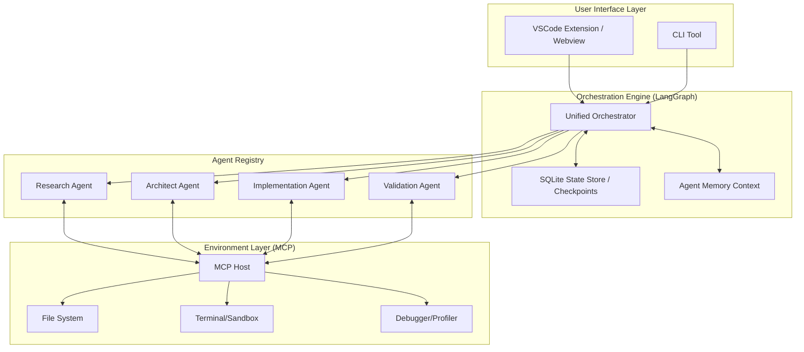

# Technology Landscape Report: devs

## 1. Executive Architecture Summary

`devs` is architected as a **Local-First Multi-Agent Orchestration System** designed to bridge the gap between high-level product design and low-level code implementation. The system follows a "Glass-Box" philosophy, ensuring that every agentic decision, state transition, and tool invocation is observable, reversible, and steerable by the human user.

The core architecture centers on a **Unified Orchestration Engine** that manages a graph of specialized agents. This engine interfaces with the user through two primary heads: a VSCode Extension for rich visual interaction and a CLI for headless automation. Communication with the development environment and external tools is standardized via the **Model Context Protocol (MCP)**, allowing for extensible debugging, profiling, and environment manipulation.

## 2. Proposed Technology Stack

### 2.1 Core Orchestration & Logic
*   **Language:** **TypeScript (Node.js)**
    *   *Justification:* Provides native compatibility with the VSCode Extension API, strong typing for complex agent states, and a vast ecosystem for CLI development (OCLIF) and MCP integration.
*   **Agent Framework:** **LangGraph.js**
    *   *Justification:* Unlike linear chains, LangGraph supports cyclic agent workflows, fine-grained state management, and "human-in-the-loop" breakpoints, which are essential for the `devs` "Glass-Box" architecture.
*   **LLM Integration:** **Google Gemini 1.5 Pro/Flash** (Primary) via **LiteLLM** or **Vercel AI SDK**
    *   *Justification:* Gemini 1.5's massive context window (2M+ tokens) is critical for ingestng entire codebases and long-running project histories. LiteLLM provides a provider-agnostic abstraction for fallback to Claude 3.5 Sonnet or GPT-4o.

### 2.2 Frontend & Interface
*   **VSCode Extension:** **VSCode API + React (Webviews)**
    *   *Justification:* React allows for a rich, interactive "Time-Travel" UI and real-time visualization of agent memory and task progress within the editor.
*   **CLI Tool:** **OCLIF (Open CLI Framework)**
    *   *Justification:* A robust framework for building extensible CLIs in TypeScript, supporting plugins and structured output.
*   **Styling:** **Tailwind CSS** (for Webviews)
    *   *Justification:* Rapid UI development with consistent design patterns that match VSCode's aesthetic.

### 2.3 Data & State Management
*   **Persistence:** **SQLite (via Drizzle ORM)**
    *   *Justification:* Local-first, high-performance relational database for storing project metadata, agent checkpoints, and task history. Supports complex queries for "Time-Travel" state reconstruction.
*   **State Control:** **Git-integrated Snapshots**
    *   *Justification:* Leveraging Git for filesystem-level versioning while SQLite tracks the high-level LLM context and decision-making metadata.

### 2.4 Infrastructure & Execution
*   **Standardization:** **Model Context Protocol (MCP)**
    *   *Justification:* Acts as the universal interface for agents to access local files, run shells, and interact with debugging/profiling tools.
*   **Sandboxing:** **Docker (Local)** or **Isolated Child Processes**
    *   *Justification:* Ensures that implementation agents are restricted to the project directory and cannot execute malicious or destructive commands on the host system.

## 3. High-Level System Architecture

The following diagram illustrates the flow from a user prompt to a finished software project, highlighting the interaction between the Orchestrator, Agents, and the local environment.

## 4. Third-Party Services, APIs, and External Dependencies

| Service/Tool | Purpose | Dependency Level |
| :--- | :--- | :--- |
| **Google Gemini API** | Primary LLM for research, architecture, and coding. | Critical |
| **Anthropic/OpenAI APIs** | Fallback LLMs for specific reasoning tasks. | Optional |
| **Tavily / Exa** | AI-optimized search for Market and Technology research. | High |
| **Model Context Protocol (MCP)** | Standardization of tool-use and environment access. | Critical |
| **Docker** | Optional sandboxed execution of generated code. | Medium |
| **LiteLLM / AI SDK** | Unified interface for multiple LLM providers. | High |

## 5. Security, Performance & Scalability Considerations

### 5.1 Security
*   **Sandbox Isolation:** Implementation agents must run in restricted environments (Docker or ephemeral VMs) to prevent accidental `rm -rf /` or credential theft.
*   **Secret Masking:** Automated filtering of API keys and secrets from agent logs and prompts.
*   **Human-in-the-Loop (HITL):** Critical actions (file writes, shell execution) require user approval via the VSCode/CLI interface unless explicitly "unlocked."

### 5.2 Performance
*   **Streaming Responses:** Real-time feedback for LLM generation to reduce perceived latency.
*   **Incremental Indexing:** Using vector embeddings (RAG) for large codebases to ensure agents only retrieve relevant context, saving tokens and time.
*   **Concurrent Execution:** Parallelizing independent research tasks or validation suites.

### 5.3 Scalability
*   **Modular Agent Design:** New specialized agents (e.g., Security Auditor, Performance Profiler) can be added as MCP clients without changing the core orchestrator.
*   **Stateless Execution:** By persisting state in SQLite/Git, the orchestrator can be stopped and resumed across different sessions or machines.

## 6. Technical Risks & Mitigation Strategies

| Risk | Impact | Mitigation Strategy |
| :--- | :--- | :--- |
| **LLM Loop Trapping** | High (Cost/Time) | Implement **Loop Detection logic** in LangGraph; monitor token usage per task; force human intervention after X iterations. |
| **Context Window Overflow** | Medium | Utilize **Gemini 1.5 Pro's 2M context**; implement sliding-window memory and RAG for non-critical context. |
| **Sandbox Escapes** | High (Security) | Use **Docker containers** with no network access for implementation tasks; enforce strict file system path white-listing. |
| **State Divergence** | Medium | Maintain a strict **Single Source of Truth** in SQLite; use Git as a fallback for filesystem restoration. |
| **MCP Fragmentation** | Low | Standardize on the core **MCP TypeScript SDK** and contribute to open-source MCP servers to ensure ecosystem stability. |
