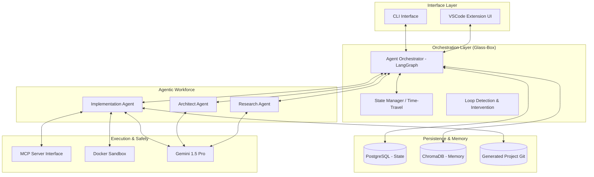

# Technology Landscape Report: devs

## 1. Executive Architecture Summary
**devs** is an agentic orchestration platform designed for high-fidelity, autonomous greenfield software development. The architecture follows a **"Glass-Box"** philosophy, ensuring transparency, auditability, and human-in-the-loop validation at every stage of the lifecycle. The system is built around an event-driven orchestrator that manages a specialized multi-agent workforce. Key architectural pillars include:
- **Strict Test-Driven Development (TDD) Enforcement:** Ensuring every line of code is verifiable.
- **Model Context Protocol (MCP) Integration:** Providing agents with standardized interfaces for debugging, profiling, and environment interaction.
- **Version-Controlled Development State:** A "Git-for-Prompts" system that allows for non-linear development, branching, and "time-travel" debugging of the agentic process.

## 2. Proposed Technology Stack

### Frontend & Interface
- **VSCode Extension:** Built with **TypeScript** and **React**. Webviews provide a rich dashboard for project monitoring, architectural approval, and "Time-Travel" navigation.
- **CLI Tool:** Developed in **Node.js (TypeScript)** using `commander`, providing a lightweight, headless interface for automation and CI/CD integration.
- **Styling:** **Vanilla CSS** to ensure maximum performance and seamless integration with VSCode's native theme variables.

### Backend & Orchestration
- **Agent Orchestrator:** **Node.js/TypeScript** utilizing **LangGraph**. This provides the necessary state-machine logic to handle complex, branching agent workflows and persistent session management.
- **Agent Communication:** **JSON-RPC** over **MCP (Model Context Protocol)** for standardized tool use.
- **Language Support:** Primarily **TypeScript** for the core engine to maintain seamless integration with the VSCode ecosystem.

### Database & Persistence
- **State & Checkpoints:** **PostgreSQL** (with **SQLite** as a local-first fallback) to store project metadata, agent logs, and "Time-Travel" snapshots.
- **Long-term Memory:** **ChromaDB** for vector-based retrieval of architectural decisions, coding standards, and project-specific context.
- **File System:** Native **Git** integration for versioning the generated codebase and managing "branches" of the development process.

### Infrastructure & Sandboxing
- **Agent Sandboxing:** **Docker** containers (via the Docker Engine API) to isolate implementation agents, ensuring a secure and reproducible environment for TDD cycles.
- **LLM Layer:** **Google Gemini 1.5 Pro** as the primary reasoning engine, leveraging its 2M+ context window for project-wide architectural coherence and checkpointing.

## 3. High-Level System Architecture

## 4. Third-Party Services, APIs, and External Dependencies
- **Model Context Protocol (MCP):** The primary standard for connecting AI agents to local development tools (debuggers, linters, profilers).
- **Google Gemini API:** Used for high-reasoning tasks, research synthesis, and large-context codebase analysis.
- **LangChain / LangGraph:** For managing the directed acyclic graph (DAG) of agent interactions and state transitions.
- **Docker Engine API:** For dynamic provisioning of isolated execution environments.
- **Git Binary:** For underlying source control management of the generated software projects.

## 5. Security, Performance & Scalability Considerations
- **Sandboxing & Isolation:** All implementation tasks are executed in non-privileged Docker containers with restricted network access to prevent lateral movement.
- **Token Economy & Loop Prevention:** Built-in "Budget Gates" monitor token consumption and execution time, automatically pausing agents if recursive patterns or excessive costs are detected.
- **Context Management:** Utilizing "Semantic Checkpoints" to summarize long-term project decisions, preventing context window saturation while maintaining architectural integrity.
- **Stateless Orchestration:** The core engine is stateless, with all critical data persisted in PostgreSQL, allowing for horizontal scaling and project resumption across different machines.

## 6. Technical Risks & Mitigation Strategies

| Risk | Impact | Mitigation Strategy |
| :--- | :--- | :--- |
| **Agentic Loop / Token Runaway** | High (Cost) | Implement a "Watchdog Agent" and hard token/time limits for every atomic task. |
| **State Explosion in "Time-Travel"** | Medium (Storage) | Use differential snapshots and Git-based delta storage for the filesystem state. |
| **Non-Deterministic TDD Failures** | Medium (UX) | Increase temperature-zero settings for code generation and implement "Self-Correction" loops within the TDD cycle. |
| **Sandbox Escapes** | High (Security) | Use **gVisor** or **Kata Containers** for a secondary layer of isolation beyond standard Docker namespaces. |
| **MCP Server Fragmentation** | Low (Compatibility)| Maintain a curated "devs-verified" list of MCP servers and provide an abstraction layer for custom tool integration. |
