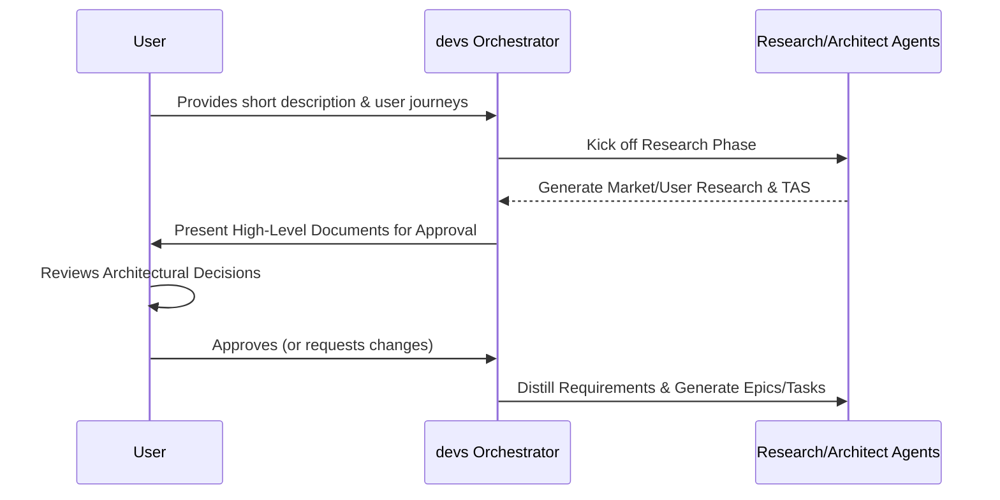
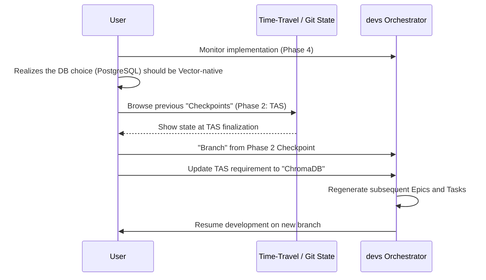
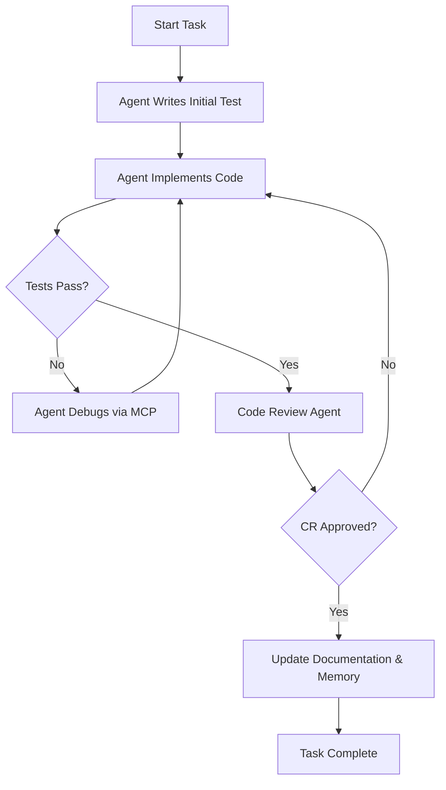

# User Research Report: devs

## 1. Executive Summary
The `devs` project addresses a critical gap in the AI-assisted development market: the transition from "code completion" to "architectural autonomy." Current tools often produce fragmented, untested, or architecturally weak code. `devs` solves this by mandating a research-first, TDD-driven approach within a "Glass-Box" architecture.

Our research identifies that target users are not looking for a "magic button" that hides complexity, but rather an "autonomous partner" that handles the heavy lifting of boilerplate, documentation, and testing while remaining fully auditable and steerable. The core value lies in the **Time-Travel** capability (branching development paths) and **Architectural Rigor** (PRD/TAS generation), which build the trust necessary for professional-grade greenfield development.

---

## 2. Target Audience Segments

### A. The Solo Founder & "Indie Maker"
*   **Focus:** Speed-to-market and quality foundations.
*   **Need:** A system that acts as a "CTO in a box," handling the architectural decisions they might lack the depth to make, while ensuring the MVP is robust enough to scale.

### B. The Polyglot Senior Developer
*   **Focus:** Efficiency and bypassing "Day 0" toil.
*   **Need:** To jump into new languages or frameworks (e.g., switching from Python to Rust) without spending days on idiomatic project structure, build pipelines, and testing harnesses.

### C. The Process-Driven Tech Lead
*   **Focus:** Consistency, TDD, and Documentation.
*   **Need:** To ensure that any AI-generated code meets strict organizational standards (TDD, security, documentation) and to have a transparent audit trail of *why* certain technical decisions were made.

---

## 3. User Personas

### Persona 1: Marcus, the "Lean" Founder
*   **Demographics:** 29, Non-CS background but tech-literate, based in a startup hub.
*   **Tech-Savviness:** High (can script, understands APIs), but not a systems architect.
*   **Goals:** Launch a functional, production-ready SaaS MVP in weeks, not months.
*   **Frustrations:** Hiring freelancers is expensive and slow; existing AI tools (like ChatGPT) generate "spaghetti" code that breaks when the project grows.
*   **Key Motivation:** Needs a tool that "does it right the first time" so he doesn't have to rewrite the entire codebase after getting his first 100 users.

### Persona 2: Elena, the "Stack-Switching" Senior Dev
*   **Demographics:** 38, 15+ years of experience in Java/Spring, moving into AI/Python.
*   **Tech-Savviness:** Expert.
*   **Goals:** Rapidly prototype a new agentic internal tool using FastAPI and LangGraph.
*   **Frustrations:** Spending hours on boilerplate (Docker, Auth, Test suites) instead of core logic. She hates "Black-Box" AI that hides the `config` files she needs to tune.
*   **Key Motivation:** Wants to leverage her experience as an architect while offloading the "manual labor" of implementation to a trusted agent.

### Persona 3: Simon, the "Process-Oriented" Tech Lead
*   **Demographics:** 42, Lead at a 50-person engineering org.
*   **Tech-Savviness:** Expert, Security-focused.
*   **Goals:** Enable his team to use AI without introducing security vulnerabilities or technical debt.
*   **Frustrations:** AI agents getting stuck in loops and wasting company API credits; lack of TDD in AI-generated PRs.
*   **Key Motivation:** Needs a "Glass-Box" where he can inspect the AI's "thought process" (PRDs, TAS) and intervene before a single line of implementation code is written.

---

## 4. User Pain Points & Needs

| Pain Point | User Need | `devs` Solution |
| :--- | :--- | :--- |
| **Architectural Debt** | High-quality, idiomatic project structure from Day 1. | Automated Research & TAS generation before coding starts. |
| **"Black-Box" Anxiety** | Transparency into AI decision-making. | Glass-Box architecture with human-approvable PRD/TAS documents. |
| **Stochastic Dead-Ends** | The ability to undo "bad" AI decisions without starting over. | "Git for Prompts" / Time-Travel and Branching. |
| **Lack of Verification** | Confidence that the generated code actually works. | Mandatory Test-Driven Development (TDD) cycle for every task. |
| **Manual Debugging** | AI agents that can fix their own mistakes. | Native MCP integration for agentic profiling and debugging. |

---

## 5. Core User Journeys

### Journey 1: The "Architect-First" Initialization
**User:** Marcus (Solo Founder)
**Goal:** Initialize a new project with professional-grade documentation.

### Journey 2: The Strategic Pivot (Time-Travel)
**User:** Elena (Senior Dev)
**Goal:** Realize a technology choice was wrong and "branch" to a new path.

### Journey 3: The Supervised Implementation (TDD Cycle)
**User:** Simon (Tech Lead)
**Goal:** Ensure every task is verified and documented.

