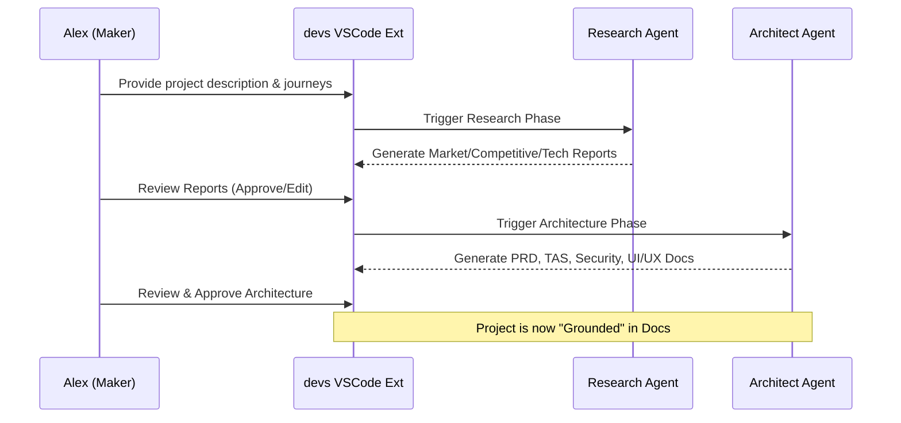
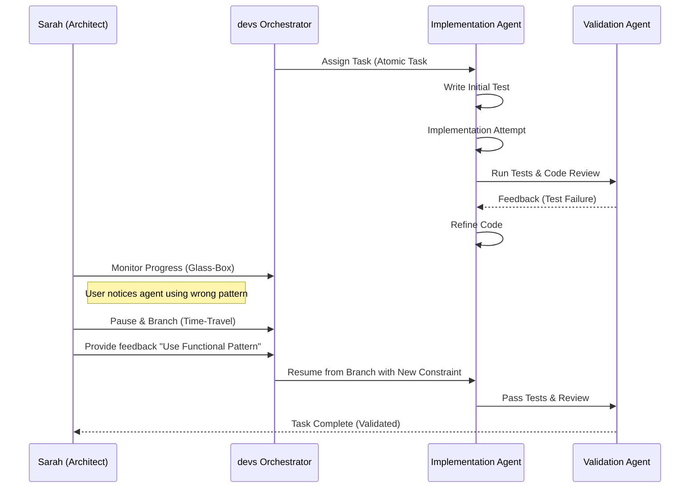
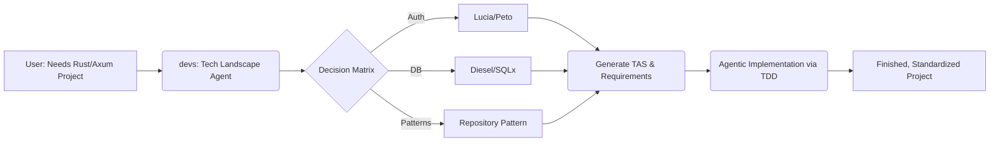

# User Research Report: devs

## 1. Executive Summary
The user research for `devs` identifies a critical gap in the current AI-assisted development market: the transition from "code completion" to "autonomous engineering" often sacrifices transparency and architectural integrity. Target users are increasingly wary of "Black-Box" agents that produce unverified code or hallucinated architectures.

`devs` addresses this by targeting three primary segments: the **Rapid Prototyper (Maker)**, the **Quality-Focused Architect**, and the **Polyglot Developer**. The core value sought by these users is not just "code generation," but "orchestrated engineering"—a system that handles the cognitive load of research, planning, and TDD implementation while remaining fully steerable and observable via a "Glass-Box" architecture and "Time-Travel" state management.

---

## 2. Target Audience Segments

### 2.1 The Lean Startup "Maker"
*   **Focus**: Speed to Market and MVP Validation.
*   **Profile**: Individuals or small teams building greenfield projects. They have technical knowledge but want to automate the "boring" parts of starting a new project (research, boilerplate, documentation).

### 2.2 The Senior Systems Architect
*   **Focus**: Scalability, Maintenance, and Rigorous Standards.
*   **Profile**: Experienced engineers in mid-to-large organizations. They are skeptical of AI "magic" and require tools that follow strict TDD cycles, generate authoritative documentation, and allow for deep-dive debugging through standard protocols (MCP).

### 2.3 The Polyglot Freelancer
*   **Focus**: Versatility and Technical Accuracy across Stacks.
*   **Profile**: Developers who switch between different frameworks and languages frequently. They need an AI agent that acts as a "Senior Mentor," ensuring that even in an unfamiliar stack, the project structure and patterns follow industry best practices.

---

## 3. User Personas

### Persona 1: Alex, the Lean Founder
*   **Role**: Founder & Lead Developer at a Pre-seed Startup.
*   **Demographics**: Age 28, works remotely, uses VSCode.
*   **Tech-Savviness**: High (Full-stack JS/TS), but limited experience in Security and Devops.
*   **Goals**: Move from a napkin sketch to a functional, documented MVP in 48 hours to show investors.
*   **Frustrations**: Spending hours on competitive research and setting up CI/CD pipelines instead of building core features.
*   **Key Need**: Automated generation of Market Research and PRDs that translate directly into tasks.

### Persona 2: Sarah, the Senior Architect
*   **Role**: Tech Lead at a Fintech Firm.
*   **Demographics**: Age 42, 15+ years of experience, CLI-power user.
*   **Tech-Savviness**: Expert. Values TDD, Clean Architecture, and Design Patterns.
*   **Goals**: Use AI to accelerate development without introducing technical debt or "magic" code she can't explain.
*   **Frustrations**: AI agents that ignore project constraints or fail to provide a clear audit trail of their decisions.
*   **Key Need**: "Glass-Box" observability and the ability to "time-travel" back to a previous state when an agent goes off-track.

### Persona 3: Jordan, the Polyglot Freelancer
*   **Role**: Independent Software Consultant.
*   **Demographics**: Age 34, manages 3-4 diverse client projects simultaneously.
*   **Tech-Savviness**: High. Familiar with multiple languages (Go, Python, Rust) but not always the latest frameworks within them.
*   **Goals**: Deliver high-quality, standardized codebases to clients regardless of the chosen technology stack.
*   **Frustrations**: The cognitive overhead of switching contexts and remembering the "right way" to scaffold a project in a new framework.
*   **Key Need**: A technology landscape agent that makes authoritative stack decisions and handles the initial scaffolding.

---

## 4. User Pain Points & Needs

| Pain Point | User Need | `devs` Solution |
| :--- | :--- | :--- |
| **Architectural Drift** | Ensuring code matches the original intent. | Agents generate PRD/TAS first; all tasks map back to these requirements. |
| **Black-Box Anxiety** | Understanding *why* an AI made a specific change. | "Glass-Box" architecture with visible agent memory and decision logs. |
| **Recursive Loop Costs** | Preventing agents from wasting tokens/time. | Built-in loop detection and task-specific sandboxing. |
| **Context Switching** | Moving between research, docs, and code. | Unified VSCode Extension/CLI that handles the entire SDLC. |
| **Lack of Rigor** | Ensuring AI-generated code is actually tested. | Mandatory TDD implementation cycle for every atomic task. |

---

## 5. Core User Journeys

### 5.1 The "Idea to Architecture" Journey (The Maker)
This journey focuses on the transition from a short description to a full suite of architectural documents.

### 5.2 The "Steerable Implementation" Journey (The Senior Architect)
This journey highlights the "Time-Travel" and "Intervention" capabilities during the implementation phase.

### 5.3 The "Polyglot Scaffolding" Journey (The Freelancer)
This journey shows how the system helps a developer master a new technology landscape.

