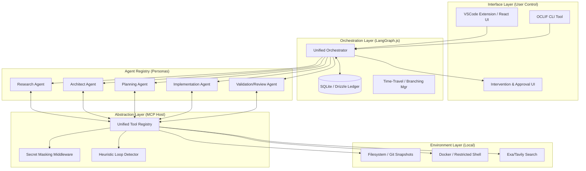
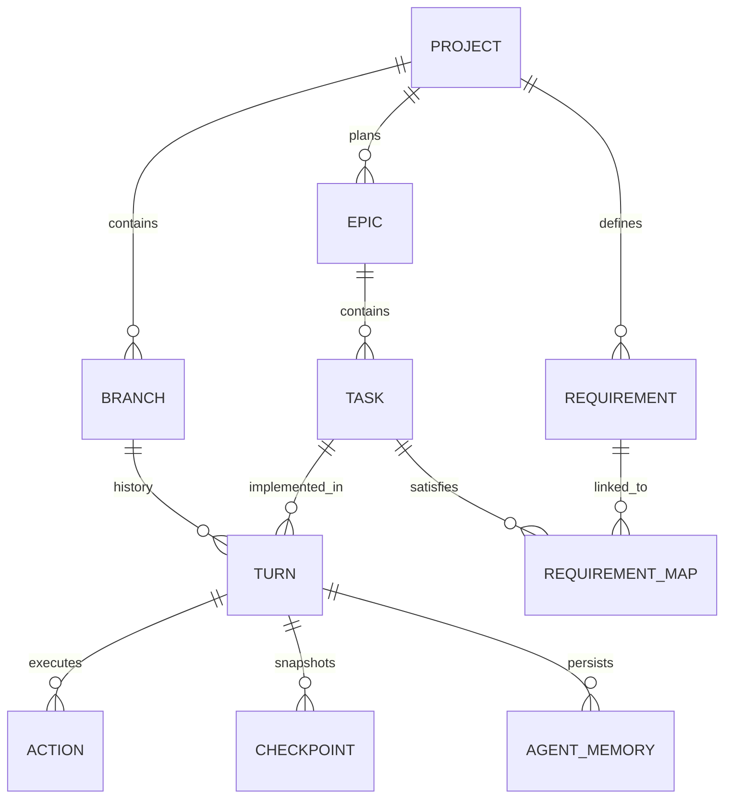
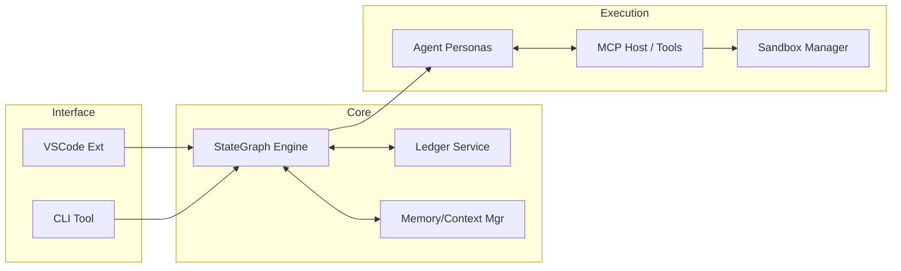

# Technical Architecture Specification (TAS): devs

## 1. Architecture Overview

### 1.1 Core Architectural Principles
**[TAS-001]** The `devs` system is built on a **"Glass-Box"** philosophy, ensuring that every agentic decision, state transition, and tool invocation is observable, reversible, and steerable by the human user. The architecture adheres to the following core mandates:
- **Local-First Execution:** All project artifacts, agent state, and execution environments reside on the user's machine.
- **Standardized Interoperability (MCP):** Every interaction between agents and the environment is mediated by the Model Context Protocol (MCP).
- **TDD-Mandated Implementation:** The system enforces a strict Test-Driven Development lifecycle for all code generation.
- **Agentic-Native Output:** Every project produced is "AI-ready," featuring comprehensive documentation, high test coverage, and a built-in MCP server for introspection.

### 1.2 The Orchestration Engine (LangGraph.js)
**[TAS-002]** The central brain of `devs` is a **Stateful, Cyclic Multi-Agent Orchestrator** built on LangGraph.js.
- **State Graph:** The engine manages a directed graph where nodes represent specialized agent personas (Research, Architect, Implementer, etc.) and edges represent state transitions.
- **Cyclic Workflows:** Unlike linear chains, the graph supports cycles—critical for the iterative TDD "Red-Green-Refactor" loops and recursive research tasks.
- **Persistence & Checkpointing:** The orchestrator automatically checkpoints the entire Global State Object (GSO) to SQLite after every node transition, enabling seamless pause/resume and time-travel capabilities.
- **Human-in-the-Loop (HITL) Gates:** The engine implements mandatory interruption points (breakpoints) where execution suspends until a human user approves the current state or provides a steering directive.

### 1.3 State Management & "Time-Travel" Strategy
**[TAS-003]** The system employs a three-tiered persistence strategy to ensure 100% state reproducibility:
1.  **Structural Ledger (SQLite):** An authoritative, local-first relational database (managed via Drizzle ORM) that tracks the lineage of `Turns`, `Actions`, `Decisions`, and `Requirements`.
2.  **Filesystem Snapshotting (Git):** Every successful task completion or major phase transition triggers an automated Git commit. This provides a low-level filesystem audit trail.
3.  **LLM Context Checkpointing:** Leveraging Gemini-native context caching and snapshotting to preserve the "mental state" of the agents at specific nodes in the graph.
- **Branching Logic:** Users can "fork" the project from any historical node. The orchestrator handles the simultaneous restoration of the SQLite state, the Git checkout, and the LLM context hydration.

### 1.4 Communication & Tooling (MCP Host)
**[TAS-004]** The `devs` system operates as a primary **MCP Host**.
- **Universal Interface:** Agents interact with the local environment (FS, Shell, Debugger) through standardized MCP tool definitions. This eliminates proprietary tool-calling silos and allows for the integration of third-party MCP servers (e.g., specialized security scanners or database profilers).
- **Observability:** Every tool call is intercepted by the orchestrator, logged with full arguments and results, and hashed for integrity verification.
- **Project Introspection:** The implementation agent utilizes the generated project's internal MCP server to perform runtime validation and debugging during the TDD cycle.

### 1.5 Execution Layer & Safety
**[TAS-005]** Implementation occurs within a **Hierarchical Security Sandbox**:
- **Isolation:** All shell commands and test executions are confined to a local Docker container or restricted child process (using `seccomp` on Linux).
- **Path Whitelisting:** Write access is strictly scoped to the project root.
- **Secret Scrubbing:** A real-time middleware scans all agent outputs and prompts to mask sensitive credentials (API keys, tokens) before they are logged or sent to the LLM.
- **Loop Protection:** Heuristic monitoring detects "Action Oscillations" (e.g., repeatedly reverting a file) and terminates stagnant agent loops after $N$ iterations.

### 1.6 System Architecture Diagram


---

## 2. Technology Stack & Toolchain

### 2.1 Core System & Runtime
- **Runtime Environment:** **Node.js v20.x (LTS)** or higher.
    - *Rationale:* Utilizes native `fs/promises`, stable Fetch API, and advanced ESM support.
- **Programming Language:** **TypeScript v5.4+**.
    - *Configuration:* `strict: true`, `esModuleInterop: true`, `target: ESNext`. Path aliases (e.g., `@core/*`) for modularity.
- **Orchestration Engine:** **LangGraph.js**.
    - *Implementation:* Uses `StateGraph` for defining multi-agent workflows. `CheckpointSaver` (implemented via SQLite) for turn-by-turn persistence.
- **Persistence (The Ledger):** **SQLite** via **Better-SQLite3** and **Drizzle ORM**.
    - *Migrations:* Managed via `drizzle-kit`. Supports real-time schema evolution without data loss during the "Time-Travel" process.
- **CLI Framework:** **OCLIF v4**.
    - *Features:* Plugin-based architecture, automated help generation, and standardized `--json` output for agent consumption.
- **VSCode Extension API:**
    - **UI Framework:** **React v18** with **Tailwind CSS** for Webviews.
    - **Communication:** Secure `postMessage` protocol with JSON-RPC for extension-to-webview coordination.

### 2.2 AI & LLM Infrastructure
- **Model Orchestration:** **Vercel AI SDK (`ai` package)**.
    - Provides a unified provider-agnostic interface for streaming, tool-calling, and structured output (via `zod` schemas).
- **Primary LLM Provider:** **Google Gemini 1.5 Pro & Flash**.
    - **Gemini 1.5 Pro:** (2M Context) Primary for the `RESEARCH`, `ARCHITECT`, and `PLAN` phases. Handles codebase-wide reasoning.
    - **Gemini 1.5 Flash:** (1M Context) Primary for the `IMPLEMENT` (TDD loop) and `REVIEW` phases. Optimized for low-latency iterations.
- **Context Management:**
    - **Programmatic Context Caching:** Static artifacts (PRD, TAS, requirements) are cached via the Gemini API to reduce per-turn token costs and latency.
    - **Token Counting:** `tiktoken` or provider-native tokenizers used for proactive context pruning.
- **Search & Retrieval:**
    - **Tavily/Exa APIs:** AI-optimized search for real-time market data and technology documentation.
- **Embeddings (Optional RAG):** `text-embedding-004` for vector indexing of the generated project's source code.

### 2.3 Protocols & Interoperability
- **Model Context Protocol (MCP):**
    - **SDK:** `@modelcontextprotocol/sdk`.
    - **Implementation:** `devs` acts as both an **MCP Host** (providing system tools to agents) and an **MCP Client** (consuming tools from the generated project's server).
- **Version Control:** **Git** (managed via `simple-git`).
    - Automated staging, committing, and branching.
- **Visualization:** **Mermaid.js v10+**.
    - Standardized format for all generated diagrams (sequence, ERD, flowcharts).

### 2.4 Environment & Execution Sandbox
- **Containerization:** **Docker Desktop / Docker Engine**.
    - Used for isolated implementation and testing.
- **Shell:** Restricted `bash` or `zsh` environment within the container.
- **Package Managers:** Support for `npm`, `pnpm`, and `yarn` (autodetected).

### 2.5 Security & Validation Tools
- **Secret Scanning:** Custom regex-based middleware + `gitleaks` (optional) for pre-commit scanning.
- **Linting:** **ESLint** and **Prettier** for enforcing code quality in both the orchestrator and generated code.
- **Testing:** **Vitest** for the `devs` system; generated projects default to **Vitest** (Node) or **Jest**.

### 2.6 Edge Cases & Technical Risks
- **[RISK-STK-001] Docker Dependency:** If Docker is not present on the host, implementation agents must fallback to `child_process.spawn` with significantly reduced security (Seccomp/AppArmor-based isolation where available).
- **[RISK-STK-002] Rate Limiting:** Aggressive TDD loops may hit Gemini API rate limits. Solution: Implement exponential backoff and jitter in the AI SDK middleware.
- **[RISK-STK-003] Context Window Fragmentation:** Frequent branching and "Time-Travel" operations can lead to complex SQLite state growth. Solution: Automated vacuuming and checkpoint pruning.

---

## 3. Data Model & Database Schema

### 3.1 The Structural Ledger (SQLite)
**[TAS-003]** The `devs` system uses a local SQLite database (managed via Drizzle ORM) as the single source of truth for agent state, project history, and requirement traceability. This "Ledger" is designed to support high-frequency turns, complex time-travel operations, and the "Glass-Box" observability requirements.

#### 3.1.1 Entity Relationship Diagram


#### 3.1.2 Detailed Table Definitions

| Table | Description | Key Columns |
| :--- | :--- | :--- |
| **`projects`** | Root configuration and metadata for a `devs` managed project. | `id` (UUID), `name`, `root_path`, `config` (JSON: model preferences, sandbox settings), `created_at`. |
| **`branches`** | Represents a distinct development path. Supports forking from any turn. | `id` (UUID), `project_id` (FK), `name`, `parent_turn_id` (FK, NULL for main), `is_active` (boolean), `metadata`. |
| **`turns`** | A single interaction cycle between the orchestrator and an agent persona. | `id` (UUID), `branch_id` (FK), `parent_turn_id` (FK), `agent_persona` (Enum), `phase` (Enum), `thought` (Text), `prompt` (Text), `response` (Text), `status` (Enum), `model_info` (JSON), `token_usage` (JSON), `latency_ms`, `created_at`. |
| **`actions`** | Individual tool calls (MCP or internal) executed during a turn. | `id` (UUID), `turn_id` (FK), `tool_name`, `arguments` (JSON), `result` (JSON), `stdout`, `stderr`, `exit_code`, `success` (boolean). |
| **`checkpoints`** | Point-in-time snapshots of the project state (Filesystem + AI State). | `id` (UUID), `turn_id` (FK), `git_hash` (String), `llm_context_cache_id` (String), `sqlite_snapshot_path` (Optional), `created_at`. |
| **`requirements`** | Atomic requirements distilled from specs. | `id` (REQ-XXX), `project_id` (FK), `source_doc`, `title`, `description`, `validation_criteria`, `priority` (P0-P2), `status`. |
| **`epics`** | High-level project phases (8-16 per project). | `id` (UUID), `project_id` (FK), `title`, `description`, `order_index`, `status`. |
| **`tasks`** | Atomic units of work (~25 per epic). | `id` (UUID), `epic_id` (FK), `title`, `description`, `status`, `order_index`, `test_file_path`, `retry_count`, `max_retries`. |
| **`requirement_task_map`** | Join table for M:N mapping (Traceability Matrix). | `requirement_id` (FK), `task_id` (FK). |
| **`agent_memory`** | Persistent fragments of agent context (Short/Medium/Long-term). | `id` (UUID), `turn_id` (FK), `type` (short/medium/long), `content` (Text), `importance_score` (Float). |

### 3.2 State Management & Time-Travel Logic

#### 3.2.1 Turn Lineage and Branching Implementation
**[TAS-011]** The `turns` table uses a self-referencing `parent_turn_id` to create a directed acyclic graph (DAG) of project evolution.
- **Forking:** When a user initiates a branch from Turn $T_{historical}$, the system creates a new `BRANCH` record where `parent_turn_id = T_{historical}`. Subsequent turns on this branch will follow their own linear history while maintaining a reference to the branching point.
- **Git Synchronization:** Every `CHECKPOINT` MUST link a specific `turn_id` to a unique `git_hash`. Branching triggers a `git checkout -b <branch_name> <checkpoint.git_hash>`.

#### 3.2.2 LLM Context Hydration & Resume
**[TAS-012]** To resume or branch from a historical turn, the orchestrator MUST perform a "Context Hydration" sequence:
1.  **Filesystem Restoration:** Execute `git reset --hard <git_hash>`.
2.  **State Reconstruction:** Load the Global State Object (GSO) from the `turns` and `actions` history up to the branching point.
3.  **Context Loading:** 
    - If a Gemini `llm_context_cache_id` is available and unexpired, it is utilized.
    - Otherwise, the system reconstructs the prompt context by performing a "Weighted Summary" of previous turns, prioritizing high-importance `agent_memory` fragments.
4.  **Directive Injection:** The user's new steering directive is appended as the "Last User Turn" to bias the agent's next action.

#### 3.2.3 State Reconciliation (Manual Interventions)
**[TAS-013]** If the user manually edits the filesystem while the orchestrator is paused:
1.  The system performs a `git diff` against the last checkpoint.
2.  A "Reconciliation Agent" is invoked to analyze the diff.
3.  The agent updates the `agent_memory` (Short-term) with a summary of the manual changes.
4.  A new `TURN` (Type: `RECONCILIATION`) and `CHECKPOINT` are created to anchor the manual work before autonomy resumes.

### 3.3 Requirement Traceability Matrix (RTM)
**[TAS-014]** The system enforces 100% traceability through the `requirement_task_map`.
- **Topological Sorting:** Epics and tasks are ordered based on requirement dependencies.
- **Validation Gates:**
    - A `TASK` cannot move to `verified` unless the `Validation Agent` confirms the `validation_criteria` from the linked `REQUIREMENT` is met.
    - A `REQUIREMENT` is only marked `satisfied` in the PRD audit when all associated tasks across all branches are successfully merged and verified.

### 3.4 Concurrency, Scaling & Performance
- **Write-Ahead Logging (WAL):** SQLite MUST be configured in WAL mode to allow the VSCode extension to perform high-frequency reads (for real-time UI updates) without blocking agent writes.
- **Atomic Transactions:** Critical operations involving both SQLite and Git MUST be wrapped in an orchestrator-level transaction. If the Git commit fails, the SQLite turn insertion MUST be rolled back.
- **Indexing Strategy:** 
    - `INDEX` on `turns.branch_id` and `turns.parent_turn_id` for rapid graph traversal.
    - `INDEX` on `actions.turn_id` for sub-millisecond tool-call auditing.
    - `INDEX` on `requirement_task_map.requirement_id` for real-time coverage reporting.

### 3.5 Edge Cases & Technical Risks
- **[RISK-DATA-001] Divergence during Crash:** If the system crashes mid-turn, the SQLite/Git state might diverge. *Mitigation:* The orchestrator performs a "Consistency Check" on startup, validating that `HEAD` matches the last `CHECKPOINT.git_hash`.
- **[RISK-DATA-002] Large Thought Blobs:** Agent "thoughts" can grow extremely large. *Mitigation:* Blobs exceeding 512KB are compressed or moved to an external object store within the `.gemini/` directory, with SQLite storing the reference.
- **[RISK-DATA-003] Schema Migrations:** Upgrading the `devs` engine while a project is in progress. *Mitigation:* Drizzle Migrations are bundled with the CLI; projects must be migrated to the latest schema before they can be resumed.

---

## 4. Component Hierarchy & Core Modules

**[TAS-015]** The `devs` system is organized into a modular monorepo structure, ensuring clear separation of concerns between orchestration logic, agent personas, environment interaction, and user interfaces.

### 4.1 `@devs/core`: The Orchestration & State Engine
The core package serves as the "brain" of the system, managing the lifecycle of agentic workflows and the integrity of the project state.
- **StateGraph Orchestrator:** A LangGraph-based implementation that defines the directed graph of agent turns. It manages the Global State Object (GSO) and handles asynchronous node transitions.
- **Ledger Service:** The authoritative interface for the SQLite state store. It abstracts complex queries for Turn lineage, Action auditing, and Requirement traceability.
- **Checkpoint & Branching Manager:** Orchestrates the multi-tiered snapshotting process.
    - *Logic:* Coordinates `git commit` with SQLite snapshotting and Gemini context caching.
    - *Time-Travel:* Implements the restoration algorithm (Git checkout + SQL hydration + Context injection).
- **Memory & Context Controller:** Responsible for the hierarchical memory strategy.
    - *Pruning:* Implements the summarization-driven pruning of short-term memory.
    - *RAG Integration:** Manages vector indexing and retrieval for large codebases.

### 4.2 `@devs/mcp-host`: Environment & Tool Abstraction
The bridge between the AI agents and the local development environment.
- **Universal Tool Registry:** Implements the MCP server host, exposing standardized tools (FileSystem, VCS, Shell) to the agents.
- **Sandbox Manager:** Manages the execution environment for Implementation agents.
    - *Docker Driver:* Orchestrates the lifecycle of the isolated Node.js containers.
    - *Local Driver:* Fallback restricted shell execution for non-containerized environments.
- **Guardrail Middleware:** Intercepts every tool call and LLM response:
    - `SecretScrubber`: Regex-based credential masking.
    - `LoopDetector`: Analyzes state oscillations and tool-call patterns to prevent recursive traps.
    - `PathValidator`: Ensures all FS operations are confined to the project root.

### 4.3 `@devs/agents`: Personas, Logic & Prompts
This module defines the specific capabilities and reasoning patterns of the various agent roles.
- **Agent Base Class:** A robust abstraction for LLM interactions. It handles streaming, tool-calling (via MCP), and standardized error handling.
- **Persona Registry:** Contains the specialized system prompts, temperature settings, and tool-whitelists for each persona.
- **Prompt Factory:** Dynamically assembles prompts by injecting Short/Medium/Long-term memory fragments and global constraints.

### 4.4 `@devs/interface`: CLI & IDE Extensions
The visual and interactive "heads" of the system.
- **`@devs/cli` (OCLIF):** Commands for headless operation, CI/CD integration, and structured JSON output.
- **`@devs/vscode` (Extension):** Provides the visual "Glass-Box" UI, including the State Graph Visualizer, Task Monitor, and Intervention Portal.

### 4.5 `@devs/schema`: Shared Data Models
- **Drizzle Schema Definitions:** Type-safe table definitions for SQLite.
- **Traceability Logic:** Shared utilities for mapping Requirements to Tasks and Epics.

### 4.6 Agent Personas & Workflows
**[TAS-016]** The system employs specialized agents with distinct personas and tool access.

#### 4.6.1 Discovery Agents (Phase 1)
- **Market Researcher:** Specialized in TAM/SAM/SOM and trend analysis.
- **Competitive Analyst:** Builds feature-parity matrices and identifies market gaps.
- **Tech Landscape Explorer:** Evaluates libraries based on GitHub stars, npm downloads, and "agent-friendliness" (e.g., strong types, documentation quality).
- **Research Synthesizer:** Merges reports and resolves contradictions into a single "Discovery Brief."

#### 4.6.2 Architectural Agents (Phase 2)
- **The Architect:** Responsible for the PRD and TAS. Uses strict hierarchical prompting to ensure every goal in the PRD is addressed in the TAS.
- **The Security Auditor:** Performs STRIDE threat modeling on the TAS and generates the `Security Design`.
- **The UI/UX Designer:** Translates user journeys into Mermaid component hierarchies and wireframes.
- **The Linter Agent:** A specialized "critic" that verifies cross-document consistency.

#### 4.6.3 Implementation Agents (Phase 3 & 4)
- **The Planner:** Distills documents into atomic requirements and orders them by dependency using a Topological Sort.
- **The Implementer (TDD Engine):** Executes the Red-Green-Refactor loop.
- **The Reviewer:** A secondary LLM persona (ideally using a different model) that audits code changes against the TAS and Style Guide.

### 4.7 Module Interaction Diagram


---

## 5. API Design & Protocols

**[TAS-017]** The `devs` system utilizes a strictly typed, contract-first communication layer to ensure seamless interoperability between the VSCode Extension, the CLI, and the LangGraph orchestration engine.

### 5.1 The Orchestrator Bridge (JSON-RPC)
The primary interface for the Interface Layer to control the SDLC workflow.
- **Protocol:** JSON-RPC 2.0 over Secure WebSockets (Extension) or Unix Domain Sockets/Named Pipes (CLI).
- **Control Methods:**
    - `session.create(config: ProjectConfig): Promise<SessionID>`: Initializes a new agentic session.
    - `session.resume(checkpointId: UUID): Promise<void>`: Restores state from a specific ledger node.
    - `workflow.pause()` / `workflow.resume()`: Human-in-the-loop control.
    - `branch.fork(turnId: UUID, name: string): Promise<BranchID>`: Creates a new timeline in the state graph.
    - `directive.inject(content: string, type: 'REQUIREMENT' | 'CONSTRAINT' | 'FEEDBACK')`: Inject user-defined context mid-task.
- **Telemetry & Event Streams:**
    - `stream.thoughts`: SSE stream of the current agent's `thought` field.
    - `stream.actions`: Real-time tool-call events (args + results).
    - `stream.logs`: Combined stdout/stderr from the sandbox.

### 5.2 Model Context Protocol (MCP) Infrastructure
**[TAS-018]** `devs` leverages MCP as the universal bus for all tool-agent interactions, ensuring the system remains extensible and observable.
- **Internal Tool Registry (Host):** The orchestrator exposes a set of core tools to all agents.
    - **Resource Schemas:** All tool inputs and outputs are validated against JSON Schema v7.
    - **Notification Protocol:** Agents receive asynchronous notifications (e.g., `git.commit_success`, `test.failed`) via MCP notifications.
- **Project Introspection (Client):** The Implementation Agent connects to the generated project's local MCP server.
    - **Standardized Discovery:** Agents look for `.gemini/mcp.json` to identify server capabilities and entry points.
    - **Cross-Language Support:** The protocol supports diverse runtimes (Node, Python, Go) via standard transport layers (stdio/http).

### 5.3 Extension-to-Webview Synchronization
**[TAS-019]** Real-time visualization of the "Glass-Box" state is managed via an event-driven synchronization protocol.
- **State Hydration:** Initial full-graph transfer on Webview load.
- **Incremental Diffing:** The extension host pushes only changed turns or actions to minimize IPC latency.
- **Message Schema:**
  ```typescript
  interface WebviewMessage {
    type: 'STATE_UPDATE' | 'AGENT_SIGNAL' | 'RENDER_DIAGRAM';
    payload: {
      turnId?: string;
      graphDelta?: GraphDelta;
      mermaidMarkup?: string;
    };
  }
  ```

### 5.4 Agentic-Native Discovery & Interop
**[TAS-020]** Generated projects follow a discovery protocol to remain "Agent-Ready" for future maintenance.
- **Well-Known Entry Points:**
    - `/.gemini/GEMINI.md`: Global constraints and project identity.
    - `/.gemini/mcp.json`: MCP server configuration.
- **Self-Documentation API:** The project's MCP server MUST provide a `get_architecture_map` tool that returns a high-level dependency graph of the generated modules.

### 5.5 LLM Middleware & Security Protocol
**[TAS-021]** All LLM traffic is mediated by a security-first middleware layer.
- **Secret Masking:** Mandatory pre-flight scrubbing of regex-identified credentials.
- **Context Pinning:** Implementation of Gemini-native context caching for the PRD, TAS, and requirement specs to ensure reasoning stability and cost efficiency.
- **Rate Limit Orchestration:** Intelligent queuing and jittered retries for high-frequency TDD loops.

---

## 6. The TDD Implementation Loop

**[TAS-022]** The implementation phase is a strictly gated cycle. No code is merged into the `main` development branch without passing all gates.

1.  **Context Injection:**
    - Load `GEMINI.md` (Global Constraints).
    - Load relevant TAS sections.
    - Load specific `TASK` and associated `REQUIREMENT` IDs.
2.  **Red Phase (Test First):**
    - Agent generates a test file (e.g., `tests/auth_service.test.ts`).
    - Agent runs the test suite via the MCP Sandbox tool.
    - **GATE:** The test MUST fail with a specific, expected error.
3.  **Green Phase (Implementation):**
    - Agent modifies/creates source files to satisfy the test.
    - Agent runs the specific test again.
    - **GATE:** The test MUST pass.
4.  **Verification Phase (Regression):**
    - Agent runs the **entire** project test suite.
    - **GATE:** 100% pass rate required.
5.  **Refactor & Review Phase:**
    - "Reviewer Agent" audits the diff for style, security, and TAS compliance.
    - If rejected, the Implementer enters a "Refactor" sub-loop.
6.  **Finalization:**
    - Automated `git commit -m "feat(REQ-001): implemented auth service"`.
    - SQLite `TURN` and `CHECKPOINT` creation.

---

## 7. MCP Tool Registry & Sandbox Architecture

### 7.1 Core MCP Tools
**[TAS-023]** The following tools are whitelisted for agent use:
- **Filesystem:** `read`, `write`, `list`, `move`, `delete` (Scoped to project root).
- **VCS:** `git_status`, `git_log`, `git_commit`, `git_checkout`, `git_diff`.
- **Search:** `web_search_tavily`, `fetch_url`.
- **Environment:** `run_shell_command`, `read_env_example`.
- **Project Context:** `get_tas`, `get_prd`, `get_requirements_traceability`.

### 7.2 Docker Sandbox Implementation
**[TAS-024]** All `run_shell_command` tool calls MUST be executed inside a local Docker container:
- **Image:** `node:20-alpine` (or stack-specific equivalent).
- **Mounts:** Only the `${projectRoot}` directory is mounted.
- **Privileges:** Non-root user (`node`). No `sudo` access.
- **Networking:** Restricted to package registries (npm/pypi) during the implementation phase.
- **Timeouts:** Hard timeout of 60 seconds per command to prevent hung processes.

---

## 8. Memory & Context Management

### 8.1 Hierarchical Memory Management
**[TAS-025]** **Context Window Optimization:** To manage the 2M token window effectively:
- **Short-Term (Task Context):** Raw logs of the current `TASK` implementation (approx. last 20 turns).
- **Medium-Term (Epic Context):** Agentic summaries of completed tasks within the current Epic.
- **Long-Term (Global Context):** The PRD, TAS, and `GEMINI.md`. These are injected into every prompt.

### 8.2 Context Pruning Algorithm
**[TAS-026]** When a task exceeds 15 turns:
1.  The orchestrator triggers a "Summarizer Agent."
2.  The summarizer collapses the task history into a "Lessons Learned" blob.
3.  The task history in the LLM context is replaced by this summary, while the full history remains in SQLite for user inspection.

---

## 9. Directory Structure Standards

**[TAS-029]** To ensure 100% interoperability across the VSCode Extension, CLI, and independent AI agents, `devs` enforces a strict, "Agentic-Native" directory structure. This structure is designed to be self-documenting, machine-readable, and robust against state divergence during "Time-Travel" operations.

### 9.1 The `devs` Orchestrator (System Monorepo)
The core `devs` project follows a modular monorepo structure, ensuring that orchestration logic remains decoupled from specific interface implementations.

```text
devs/
├── packages/
│   ├── core/                  # LangGraph Orchestration & SDLC Logic
│   │   ├── src/
│   │   │   ├── graph/         # StateGraph node and edge definitions
│   │   │   ├── agents/        # Persona definitions and prompt templates
│   │   │   ├── memory/        # Hierarchical memory & context pruning logic
│   │   │   ├── ledger/        # SQLite/Drizzle service layer
│   │   │   └── checkpoint/    # Git + SQLite snapshot coordination
│   ├── cli/                   # OCLIF-based CLI Tool
│   │   ├── src/
│   │   │   ├── commands/      # Command implementations (e.g., 'init', 'dev', 'branch')
│   │   │   └── hooks/         # Pre/Post-execution telemetry and init hooks
│   ├── vscode/                # VSCode Extension & React Webviews
│   │   ├── src/
│   │   │   ├── extension/     # Extension host logic (IPC, FS watchers)
│   │   │   └── webview/       # React code for State Graph visualization
│   └── mcp-host/              # Unified Tool Registry & Sandbox Controller
│       ├── src/
│       │   ├── tools/         # Core tool implementations (FS, Git, Shell)
│       │   ├── sandbox/       # Docker and ChildProcess driver logic
│       │   └── middleware/    # Secret scrubbing and loop detection
├── schema/                    # Central Drizzle/SQLite Schema Definitions
├── tests/                     # Integration and End-to-End System Tests
├── docs/                      # System documentation and Architecture Decision Records (ADR)
└── scripts/                   # Internal build and development utilities
```

### 9.2 Generated Projects (The "Agentic-Native" Layout)
Every project produced by `devs` MUST adhere to the following structure to ensure it can be maintained by future AI agents and supports the "Glass-Box" observability requirements.

```text
<project-root>/
├── .gemini/                   # The "Nerve Center" of Agentic State
│   ├── state.db               # Local SQLite Ledger (Ledger Service)
│   ├── GEMINI.md              # Project Identity & Global Constraints (LTM)
│   ├── mcp.json               # Local MCP Server configuration/capabilities
│   ├── checkpoints/           # SQLite snapshots and serialized LLM context caches
│   └── memory/                # Vector store indexes (RAG) for the project
├── research/                  # Phase 1: Discovery Artifacts
│   ├── market/                # TAM/SAM/SOM and Trend Reports
│   ├── competitive/           # Feature parity matrices and gap analysis
│   ├── landscape/             # Technology stack evaluations and documentation
│   └── summary.md             # Consolidated Research Brief
├── specs/                     # Phase 2: Architectural Specifications
│   ├── 1_prd.md               # Product Requirements Document
│   ├── 2_tas.md               # Technical Architecture Specification
│   ├── 3_security.md          # Security Design & Threat Models
│   ├── 4_ui_ux.md             # Design Journeys & Mermaid Wireframes
│   └── roadmap.md             # High-level Milestone Definition
├── requirements/              # Phase 3: Requirement Distillation
│   ├── distilled.json         # Traceability Matrix (Requirement Object Model)
│   └── mapping.md             # Human-readable requirement-to-doc mapping
├── planning/                  # Phase 4: Project Execution Plan
│   ├── epics/                 # Epic-level goal definitions
│   ├── tasks.json             # Topological sort of atomic tasks
│   └── status.json            # Current project velocity and task completion states
├── src/                       # Phase 5: Implementation (The Codebase)
├── tests/                     # Automated Test Suites (TDD Artifacts)
├── docs/                      # Agent-generated technical documentation
├── mcp-server/                # Built-in project introspection interface
└── package.json               # Environment and dependency metadata
```

### 9.3 Standardized File Naming & Conventions
**[TAS-030]** Consistency in file naming ensures that agents can navigate the project without exhaustive directory traversal.
- **Requirement IDs:** MUST use the format `REQ-###` (e.g., `REQ-001`).
- **Task IDs:** MUST use UUIDs in `tasks.json` but human-readable slugs in logs.
- **Test Files:** MUST be co-located or in a parallel `tests/` directory with the `.test.ts` or `.spec.ts` suffix.
- **Diagrams:** ALL architectural diagrams MUST be embedded as Mermaid blocks within Markdown files. No binary image formats are permitted for design documentation.

### 9.4 Ephemeral & Sandbox Storage
**[TAS-031]** During implementation, the orchestrator utilizes ephemeral storage within the `.sandbox/` directory (ignored by Git) for:
- Build artifacts and intermediate compiler output.
- Log files from individual test runs.
- Temporary "Refactor Workspaces" used during the Code Review phase.

### 9.5 Hidden Files & Project Identity
**[TAS-032]** Every project MUST include a `/.gemini/GEMINI.md` file which serves as the "Long-Term Memory" (LTM) anchor. This file includes:
- **Project UUID:** Unique identifier for telemetry and state matching.
- **Architectural Style:** (e.g., "Functional", "Object-Oriented").
- **Constraint Whitelist:** (e.g., "Strictly No External UI Libraries").
- **Agent Persona Hints:** Contextual guidance for future agents maintaining the project.

---

## 10. Security & Safety Guardrails

### 10.1 Secret Scrubbing
**[TAS-027]** A middleware in the LLM communication layer MUST scan all outgoing prompts for:
- Standard API key patterns (AWS, OpenAI, Stripe).
- Content of `.env` files.
- Values identified as "Secret" in the project configuration.
Scrubbed values are replaced with `[REDACTED_SECRET]`.

### 10.2 Loop Detection Heuristics
**[TAS-028]** **The "Oscillation" Monitor:**
- If an agent performs a `write_file` followed by a `git checkout` (revert) of that same file more than 2 times in a single task, the orchestrator MUST pause and alert the user.
- If a tool call with identical arguments fails 3 times consecutively, the agent persona is forcibly switched to a "Debugger" persona with higher-level logs.

---

## 11. Questions, Risks & Unknowns

### 11.1 Technical Risks
- **[RISK-001] Context Drift:** Long-term memory might lose signal as the project grows, despite the 2M window.
- **[RISK-002] Sandbox Complexity:** Supporting non-Node projects (e.g., Rust, Python) requires dynamic Docker image management.
- **[RISK-003] SQLite Performance:** Large state graphs with thousands of `TURN` records might slow down the "Time-Travel" UI.

### 11.2 Open Questions
- **[Q-001]** Should we support "Multi-Agent Chat" where the user talks to the Researcher and Architect simultaneously?
- **[Q-002]** How do we handle "Breaking Changes" in MCP servers that are outside our control?
- **[Q-003]** What is the optimal strategy for "Context Checkpointing" to minimize Gemini API costs?
