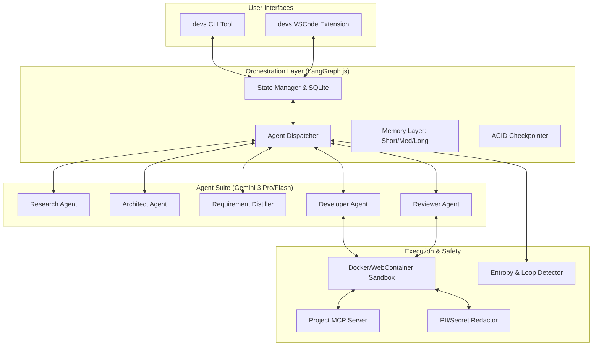
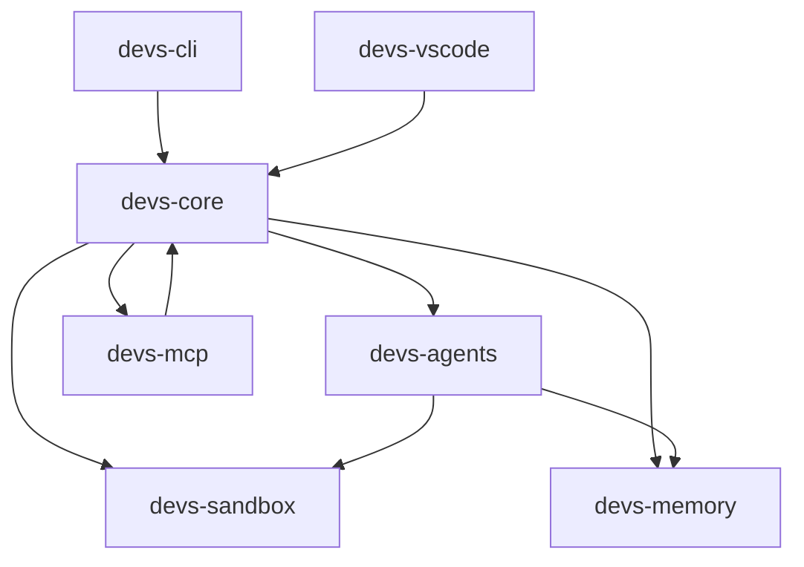

# Technical Architecture Specification (TAS): Project 'devs'

## 1. Architecture Overview

Project 'devs' is architected as a **Multi-Agent Glass-Box Orchestrator** that leverages a deterministic state machine (LangGraph.js) to manage the end-to-end lifecycle of greenfield software development. The system is designed to transition from ambiguous user intent to a fully validated, production-ready codebase through a rigorous, multi-phase **Plan-Act-Verify** cycle.

The architecture prioritizes **architectural integrity** over simple code generation, ensuring that every line of code is backed by a research-validated requirement and verified by an automated test suite executed in an isolated environment.

### 1.1 System Philosophy: The Glass-Box Orchestrator
Unlike traditional "Black-Box" AI agents that perform hidden operations, 'devs' operates as a "Glass-Box." This means:
1.  **[TAS-046] Full Traceability**: Every agent thought, decision, tool call, and terminal output is captured and queryable.
2.  **[TAS-047] Stateful Determinism**: The system can be paused, resumed, or rewound to any previous state (Task/Epic) with 100% fidelity.
3.  **[TAS-048] Human-in-the-Loop (HITL)**: The system provides explicit "Gated Autonomy" checkpoints where users must approve architectural blueprints and roadmaps before implementation begins.

### 1.2 Core Architectural Pillars
*   **[TAS-001] Glass-Box Transparency & Auditability**: Every state transition and agent reasoning step is persisted to a local SQLite database (`.devs/state.sqlite`). This serves as the "Flight Recorder" for the project, allowing human developers or auditor agents to understand *why* a specific architectural decision was made.
*   **[TAS-002] Stateless & Resumable Orchestration**: The core engine is stateless; the entire project context (Agent memory, requirement DAGs, and task status) is reloaded from the project's `.devs/` directory. This ensures resilience against system crashes or network interruptions.
*   **[TAS-003] Native Agentic Observability (MCP)**: The generated project is natively "Agent-Ready." It includes a built-in MCP server that exposes internal state, logs, and profiling data, allowing AI agents to debug and optimize the code they write using the same tools a human expert would use.
*   **[TAS-004] Strict TDD-Driven Implementation**: Implementation is non-negotiable and follows a mandatory "Red-Green-Refactor" cycle. Code is only written once a failing test case has been established in the sandbox, ensuring 100% requirement fulfillment.

### 1.3 Component Topology & Responsibility Matrix
The system is divided into four primary layers:

1.  **[TAS-078] Orchestration Layer**: Uses LangGraph.js to manage the high-level state machine. It handles agent handoffs, checkpointing to SQLite, and human-in-the-loop signaling.
2.  **[TAS-079] Agent Suite**: A collection of specialized agents (Research, Architect, Developer, Reviewer) each with dedicated system prompts and tool-access permissions.
3.  **[TAS-080] Execution Layer (Sandbox)**: An isolated Docker or WebContainer environment where the agent performs file I/O, runs tests, and executes shell commands.
4.  **[TAS-081] Memory Layer**: A tiered system consisting of:
    *   **Short-term**: Active task context and recent tool outputs.
    *   **Medium-term**: Epic-level decisions and recently resolved task summaries.
    *   **Long-term**: Project-wide constraints and architectural patterns stored in LanceDB (Vector).

### 1.4 The Plan-Act-Verify Lifecycle
The orchestrator moves the project through five distinct phases:

1.  **[TAS-049] Phase 1: Discovery & Research**: Deployment of parallel agents to analyze the market, technology landscape, and competitive space.
2.  **[TAS-050] Phase 2: Blueprint Generation**: The Architect Agent generates authoritative PRDs and TAS documents. This phase ends with a mandatory user approval gate.
3.  **[TAS-051] Phase 3: Requirement Compilation**: The Distiller Agent translates documents into a flat list of atomic requirements and a Directed Acyclic Graph (DAG) of implementation tasks.
4.  **[TAS-052] Phase 4: TDD Implementation**: Iterative execution of tasks. For each task, the Developer Agent writes a test, fails it, writes the code, and passes it.
5.  **[TAS-053] Phase 5: Full System Validation**: A final "Global Reviewer" agent runs the entire test suite and verifies documentation density before marking the project as complete.

### 1.5 System Architecture Diagram



### 1.6 Agentic Data Flow & State Management
Data flows through the system in a **[TAS-083] Cyclical Refinement pattern**:
- **[TAS-082] Input**: User provides a brief and journeys.
- **[2_TAS-REQ-001] Expansion**: Research agents expand this into thousands of tokens of context.
- **[2_TAS-REQ-002] Compression**: The Architect distills research into structured specifications.
- **[2_TAS-REQ-003] Decomposition**: The Distiller breaks specifications into atomic, executable tasks.
- **[2_TAS-REQ-004] Execution**: Developer agents transform tasks into code commits.
- **[2_TAS-REQ-005] Verification**: Reviewer agents validate commits against requirements.

The state is managed using a **[TAS-054] Snapshot-at-Commit strategy**. After every successful task, the system:
1.  **[TAS-055] Git Snapshots**: Commits the code change to the project's Git repository.
2.  **[TAS-056] Trace Persistence**: Persists the agent's reasoning trace to SQLite.
3.  **[TAS-057] Vector Memory Updates**: Updates the Vector DB with any new architectural decisions made during the task.

### 1.7 Observability & Traceability Infrastructure
The "Glass-Box" is implemented via:
*   **[TAS-058] Trace Streaming**: Real-time websocket streaming of agent "Thoughts" to the VSCode UI.
*   **[TAS-059] Decision Logs**: A searchable history of every alternative the agent considered but rejected.
*   **[TAS-063] Requirement Mapping**: Every function and test in the generated codebase is tagged with a `REQ-ID`, enabling a full audit trail from the PRD to the source code.
*   **[TAS-064] Entropy Detection**: Real-time monitoring of agent loops; if an agent repeats a failing strategy 3 times, the system automatically pauses and alerts the user.

---

## 2. Technology Stack & Toolchain

### 2.1 Core Orchestrator Runtime
*   **[TAS-060] Runtime Environment**: Node.js v22.x (LTS). Selected for its high-performance asynchronous I/O and native compatibility with the VSCode Extension Host. The orchestrator is designed as a headless-first system, ensuring parity between CLI and Extension environments.
*   **[TAS-005] Programming Language**: TypeScript 5.4+ (Strict Mode). Mandatory use of `strict: true`, `noImplicitAny: true`, and `exactOptionalPropertyTypes: true` to ensure type safety in the complex multi-agent state machine.
*   **[TAS-006] Package Manager**: `pnpm` v9.x. Leverages a monorepo workspace structure for core logic, CLI, and extension packages, utilizing content-addressable storage to minimize disk footprint across project sandboxes.

### 2.2 LLM & Multi-Agent Orchestration
*   **[TAS-007] Primary Reasoning Model**: Google Gemini 3 Pro. Leveraged for its 1M+ token context window, enabling the ingestion of massive research reports and entire codebases without loss of detail. Used for high-level research, architectural design, and complex implementation tasks.
*   **[TAS-008] Utility & Review Model**: Google Gemini 3 Flash. Employed for low-latency tasks including code linting, unit test generation, and real-time summarization of agent execution logs.
*   **[TAS-009] Orchestration Engine**: `LangGraph.js`. Orchestrates the multi-agent workflow as a stateful, cyclical graph.
    *   **Persistence**: Custom `SQLiteSaver` implementation ensures every node transition is persisted to the local `.devs/state.sqlite` database.
    *   **Interrupts**: Native support for "Gated Autonomy" checkpoints, allowing for human-in-the-loop approvals at Phase 2 and 3.

### 2.3 Data & Memory Persistence
*   **[TAS-010] Relational State Store**: SQLite 3 via `better-sqlite3`. 
    *   **Configuration**: Configured with `PRAGMA journal_mode = WAL` and `PRAGMA synchronous = NORMAL` for high-throughput logging with ACID compliance.
    *   **Traceability**: Every agent "thought" and tool interaction is logged with a nanosecond timestamp and correlated with a specific `Task-ID`.
*   **[TAS-011] Vector Memory (Long-term)**: LanceDB (embedded). Stores semantic embeddings of project requirements, architectural decisions, and user preferences.
    *   **Embeddings**: `text-embedding-004` (Gemini) for high-fidelity semantic retrieval during the Implementation Phase.
*   **[TAS-012] Filesystem & Change Tracking**: `simple-git` for atomic state snapshots. Every successful task completion results in a git commit to the target repository, ensuring a verifiable audit trail of project evolution.

### 2.4 Infrastructure & Execution (Agent Runtime)
*   **[TAS-013] Agent Sandboxing (Isolated Runtime)**:
    *   **CLI Mode**: Docker Engine. Utilizes minimal, hardened Alpine-based images with restricted `seccomp` profiles and `--network none` default policies (except during specific dependency resolution phases).
    *   **Extension Mode**: `WebContainers` API. Enables secure, in-browser Node.js execution and terminal emulation for the VSCode Web version.
*   **[TAS-014] Model Context Protocol (MCP)**: Full integration of `@modelcontextprotocol/sdk`. 
    *   **System Tools**: Standardized interface for all agent actions (file I/O, shell execution, research).
    *   **Observability**: Exposes the orchestrator's internal state as an MCP server for external auditing and extension UI updates.
*   **[TAS-023] Secret Masking & Redaction**: A middleware layer that intercepts all sandbox `stdout/stderr`, applying regex and entropy-based masking to prevent API keys, credentials, or PII from entering the `agent_logs` or LLM context.

### 2.5 Discovery & Research Toolchain
*   **[TAS-027] Real-time Search Integration**: Google Search API (via Serper) for validating library documentation, checking for package deprecations, and gathering competitive intelligence during Phase 1.
*   **[TAS-028] Content Extraction**: `Firecrawl` or `Jina Reader` for converting dynamic web content into clean, LLM-optimized Markdown, stripping navigation noise.

### 2.6 Frontend & User Experience
*   **[TAS-029] View Layer**: React 18+ with Tailwind CSS for the VSCode Webview dashboard.
*   **[TAS-030] Component Architecture**: `vscode-webview-ui-toolkit` to ensure seamless aesthetic integration with the user's VSCode theme.
*   **[TAS-031] Documentation Rendering**: `Mermaid.js` for dynamic rendering of architectural diagrams, roadmaps, and data models directly within the integrated Markdown previews.

### 2.7 Quality Assurance & Auditability
*   **[TAS-032] Orchestrator Verification**: `Vitest` for unit and integration testing of agent nodes, ensuring that state transitions and tool calls are deterministic.
*   **[TAS-033] Automated Code Auditing**: Integration of `ESLint`, `Prettier`, and language-specific static analysis tools (e.g., `PyRight`, `golangci-lint`) as mandatory verification steps in the TDD loop.

---

## 3. Data Model & Database Schema

The `devs` orchestrator relies on a dual-persistence strategy to maintain its "Glass-Box" integrity: a relational SQLite database for structured state, audit trails, and requirement tracing; and a vector-based LanceDB instance for semantic long-term memory.

### 3.1 Relational Schema (SQLite: `.devs/state.sqlite`)

The relational database is the **[TAS-066] Primary Source of Truth** for the project's state machine and audit logs. All tables use **[TAS-067] ACID-Compliant Transactions** to ensure consistency during multi-agent handoffs.

#### 3.1.1 Core Entity Tables

**[TAS-105] Projects Table**:
| Table | Column | Type | Constraints | Description |
| :--- | :--- | :--- | :--- | :--- |
| **`projects`** | `id` | UUID | PRIMARY KEY | Unique identifier for the project. |
| | `name` | TEXT | NOT NULL | Project name provided by the user. |
| | `description` | TEXT | NOT NULL | High-level project goal/brief. |
| | `current_phase` | TEXT | CHECK(...) | Current orchestrator phase (RESEARCH, DESIGN, DISTILL, IMPLEMENT, VALIDATE). |
| | `status` | TEXT | CHECK(...) | Project status (ACTIVE, PAUSED, COMPLETED, FAILED). |
| | `created_at` | DATETIME | DEFAULT CURRENT_TIMESTAMP | Timestamp of project initialization. |
| | `updated_at` | DATETIME | DEFAULT CURRENT_TIMESTAMP | Timestamp of last state change. |

**[TAS-106] Documents Table**:
| Table | Column | Type | Constraints | Description |
| :--- | :--- | :--- | :--- | :--- |
| **`documents`** | `id` | UUID | PRIMARY KEY | Unique identifier for the document. |
| | `project_id` | UUID | FOREIGN KEY | Reference to `projects.id`. |
| | `type` | TEXT | CHECK(...) | Document type (MARKET_RESEARCH, TECH_LANDSCAPE, PRD, TAS, etc.). |
| | `content` | TEXT | NOT NULL | Markdown content of the document. |
| | `version` | INTEGER | NOT NULL | Incremental version number for document iterations. |
| | `approval_status`| TEXT | CHECK(...) | PENDING, APPROVED, REJECTED. |
| | `approved_at` | DATETIME | | Timestamp of human sign-off. |

**[TAS-107] Requirements Table**:
| Table | Column | Type | Constraints | Description |
| :--- | :--- | :--- | :--- | :--- |
| **`requirements`** | `id` | TEXT | PRIMARY KEY | Human-readable ID (e.g., `REQ-001`). |
| | `doc_id` | UUID | FOREIGN KEY | Reference to the source document in `documents.id`. |
| | `text` | TEXT | NOT NULL | Atomic requirement description. |
| | `priority` | TEXT | CHECK(...) | P3 (Must have), P2 (Should have), P1 (Nice to have). |
| | `status` | TEXT | CHECK(...) | PENDING, IMPLEMENTED, VERIFIED, DEPRECATED. |
| | `trace_meta` | JSON | | Mapping to specific sections in documents. |

**[TAS-108] Epics Table**:
| Table | Column | Type | Constraints | Description |
| :--- | :--- | :--- | :--- | :--- |
| **`epics`** | `id` | UUID | PRIMARY KEY | Unique identifier for the Epic. |
| | `project_id` | UUID | FOREIGN KEY | Reference to `projects.id`. |
| | `title` | TEXT | NOT NULL | Epic name (e.g., "Authentication System"). |
| | `order_index` | INTEGER | NOT NULL | Sequence in the roadmap (1-16). |
| | `status` | TEXT | CHECK(...) | TODO, IN_PROGRESS, COMPLETED. |

**[TAS-109] Tasks Table**:
| Table | Column | Type | Constraints | Description |
| :--- | :--- | :--- | :--- | :--- |
| **`tasks`** | `id` | UUID | PRIMARY KEY | Unique identifier for the task. |
| | `epic_id` | UUID | FOREIGN KEY | Reference to `epics.id`. |
| | `req_id` | TEXT | FOREIGN KEY | Reference to `requirements.id`. |
| | `title` | TEXT | NOT NULL | Short task summary. |
| | `description` | TEXT | NOT NULL | Detailed implementation instructions. |
| | `status` | TEXT | CHECK(...) | PENDING, RUNNING, SUCCESS, FAILED, PAUSED. |
| | `git_commit_hash`| TEXT | | Commit hash associated with task completion. |
| | `retry_count` | INTEGER | DEFAULT 0 | Number of times the TDD loop failed. |

#### 3.1.2 The Glass-Box Audit Tables

**[TAS-110] Agent Logs Table**:
| Table | Column | Type | Constraints | Description |
| :--- | :--- | :--- | :--- | :--- |
| **`agent_logs`** | `id` | INTEGER | PRIMARY KEY AUTOINCREMENT | Sequential log ID. |
| | `task_id` | UUID | FOREIGN KEY | Reference to `tasks.id`. |
| | `agent_type` | TEXT | NOT NULL | DEVELOPER, ARCHITECT, REVIEWER, etc. |
| | `turn_index` | INTEGER | NOT NULL | The turn number within the task implementation. |
| | `thought` | TEXT | NOT NULL | Internal reasoning trace (JSON or Markdown). |
| | `strategy` | TEXT | | Explicit plan for the current turn. |
| | `action_json` | TEXT | | Structured JSON of tool calls made. |
| | `observation` | TEXT | | Raw output from the tools (redacted). |
| | `token_usage` | INTEGER | | Estimated tokens used for this turn. |
| | `timestamp` | DATETIME | DEFAULT CURRENT_TIMESTAMP | Log time. |

**[TAS-111] Entropy Events Table**:
| Table | Column | Type | Constraints | Description |
| :--- | :--- | :--- | :--- | :--- |
| **`entropy_events`** | `id` | INTEGER | PRIMARY KEY AUTOINCREMENT | Tracks repeating failures for loop prevention. |
| | `task_id` | UUID | FOREIGN KEY | |
| | `error_hash` | TEXT | NOT NULL | SHA-256 of the error message for loop detection. |
| | `occurrence_count`| INTEGER | | How many times this specific error repeated. |
| | `resolution_type` | TEXT | | PIVOTED, ESCALATED_TO_USER, RESOLVED. |

### 3.2 LanceDB Vector Schema (Memory Layer)

LanceDB provides semantic search capabilities for the "Long-term Memory" layer. This allows agents to retrieve relevant context across Epics.

*   **[2_TAS-REQ-015] Path**: `.devs/memory.lancedb`
*   **[TAS-091] Embedding Model**: `text-embedding-004` (768 dimensions).
*   **[TAS-092] Indexing Strategy**: IVF-PQ (Inverted File with Product Quantization).

**[TAS-093] Vector Schema**:
| Field | Type | Description |
| :--- | :--- | :--- |
| **`id`** | UUID | Primary key. |
| **`vector`** | Vector(768) | Semantic embedding of the content. |
| **`content`** | TEXT | The raw text (requirement, TAS decision, user directive). |
| **`type`** | TEXT | Enum: ARCHITECTURAL_DECISION, USER_PREFERENCE, REQ_CONTEXT, LESSON_LEARNED. |
| **`metadata`** | JSON | Contextual tags: `{ "epic_id": "...", "task_id": "...", "relevance_score": 0.9 }`. |
| **`timestamp`** | INTEGER | Unix epoch for temporal decay/weighting. |

### 3.3 State Machine Snapshots & Git Integration

While SQLite handles logs and status, the orchestrator's graph state (LangGraph) is persisted as a **[TAS-094] Checkpoint object**.

*   **Checkpoint Store**: `checkpoints` table in SQLite (managed by LangGraph's `SqliteSaver`).
*   **Content**: Binary/JSON blob of the entire graph state, including thread-local variables and recursion stacks.
*   **[TAS-095] Git Snapshots**: Every successful task completion results in a Git commit to the target repository. The `tasks` table stores the `commit_hash`, enabling the "Project Rewind" feature to restore both the filesystem (via `git checkout`) and the DB state (via time-traveling the SQLite logs).

### 3.4 Data Integrity & Safety Edge Cases

1.  **[TAS-068] Orphaned Requirements**: The system must verify that every requirement in the `requirements` table is mapped to at least one entry in the `tasks` table. This is checked during Phase 3 (Distillation).
2.  **[TAS-069] State Recovery**: If the `.devs` folder is deleted but the code remains, the orchestrator MUST treat the project as "Research-only" until a recovery process reconstructs the requirement map from code comments/documentation.
3.  **[TAS-070] Concurrency Management**: Although designed as a single-user tool, all DB writes use WAL mode and row-level locking to prevent corruption during parallel agent execution (e.g., parallel Research agents).
4.  **[TAS-071] Scaling Traces**: If `agent_logs` grow beyond 100MB, the system will implement an archival strategy, moving older Epic logs to compressed JSON files while keeping metadata in SQLite.

---

## 4. Component Hierarchy & Core Modules

The `devs` orchestrator is implemented as a TypeScript monorepo, ensuring a clean separation of concerns between the core state machine, agent logic, execution environments, and user interfaces.

### 4.1 Module Dependency Diagram
**[TAS-096] Module Architecture**:


### 4.2 Core Modules Definition

#### 4.2.1 **[TAS-097] @devs/core** (Orchestration Engine)
The central nervous system of the project, responsible for state transitions and persistence.
- **[2_TAS-REQ-016] `OrchestrationGraph`**: Implements the LangGraph.js state machine. Manages nodes for Research, Design, Distillation, and the TDD Implementation loop.
- **[2_TAS-REQ-017] `StateRepository`**: SQLite-backed ACID checkpointer for LangGraph state and `agent_logs`.
- **[2_TAS-REQ-018] `EventBus`**: Provides real-time event streaming for VSCode and CLI status updates.
- **[2_TAS-REQ-019] `HumanInTheLoopManager`**: Manages the "Wait-for-Approval" gates, persisting the graph state until a user directive is received.

#### 4.2.2 **[TAS-098] @devs/agents** (Agent Intelligence)
Encapsulates all LLM-specific logic, prompts, and tool bindings.
- **[2_TAS-REQ-020] `AgentFactory`**: Dynamically instantiates agents with specific Tier (Pro vs Flash) and System Prompts.
- **[2_TAS-REQ-021] `PromptManager`**: Version-controlled repository of system instructions, including the "Glass-Box" reasoning protocols.
- **[2_TAS-REQ-022] `ToolRegistry`**: Mapping of MCP tools to specific agent roles (e.g., only `DeveloperAgent` has `write_file` access).
- **[2_TAS-REQ-023] `ReasoningEngine`**: Logic for parsing the "Structured Thought Protocol" (JSON thoughts/actions).

#### 4.2.3 **[TAS-099] @devs/sandbox** (Isolated Execution)
The abstraction layer for running code securely across different platforms.
- **[2_TAS-REQ-024] `SandboxProvider`**: Abstract interface for executing shell commands and file operations.
- **[2_TAS-REQ-025] `DockerDriver`**: Implementation for CLI users, managing ephemeral containers with strict resource limits ([TAS-021]).
- **[2_TAS-REQ-026] `WebContainerDriver`**: Implementation for VSCode Web, enabling browser-native Node.js execution.
- **[TAS-080] `FilesystemManager`**: Handles the synchronization between the host project directory and the sandbox environment, ensuring `.git` and `.devs` are protected ([REQ-SEC-003]).

#### 4.2.4 **[TAS-100] @devs/memory** (Semantic & Temporal Persistence)
Manages the tiered memory system required for long-running projects.
- **[2_TAS-REQ-027] `VectorStore`**: LanceDB integration for long-term project-wide constraints and architectural decisions ([TAS-011]).
- **[2_TAS-REQ-028] `ContextPruner`**: Sophisticated logic for sliding-window context management, ensuring agents stay within the 1M token limit without losing critical architectural info ([REQ-SYS-001]).
- **[2_TAS-REQ-029] `MemoryRefresher`**: Periodic background task that summarizes Epic progress into Long-term memory.

#### 4.2.5 **[TAS-101] @devs/mcp** (Communication Protocols)
Standardizes how the system talks to itself and the generated project.
- **[2_TAS-REQ-030] `OrchestratorServer`**: An MCP server that exposes the internal state of `devs` to the VSCode UI.
- **[2_TAS-REQ-031] `ProjectServerTemplate`**: The blueprint for the MCP server that is injected into every generated project to enable "Agent-Ready" debugging ([REQ-GOAL-004]).
- **[2_TAS-REQ-032] `ToolProxy`**: Bridges tool calls from the LLM to the `devs-sandbox` execution layer.

#### 4.2.6 **[TAS-102] @devs/cli & @devs/vscode** (User Interfaces)
- **[2_TAS-REQ-033] `CLIController`**: Handles command-line arguments, environment setup, and terminal-based progress reporting.
- **[2_TAS-REQ-034] `ExtensionHost`**: The VSCode extension wrapper, managing the Webview lifecycle and real-time trace streaming.

### 4.3 Component Communication Patterns

1.  **[TAS-072] Command Execution**: Agents emit a `tool_call`. `devs-core` validates the call via the `ToolRegistry` and forwards it to `devs-sandbox`. The result is returned to the agent and simultaneously logged to the `agent_logs` table in `devs-core`.
2.  **[TAS-073] State Checkpointing**: After every node transition in LangGraph, `devs-core` triggers an ACID commit to SQLite. If the process dies, the next `devs resume` call reloads the exact graph state from the `checkpoints` table.
3.  **[TAS-074] Cross-Agent Verification**: When a `DeveloperAgent` completes a task, the `ReviewerAgent` is invoked by `devs-core`. The Reviewer is provided with a clean `devs-sandbox` instance to run the TDD suite independently.

### 4.4 Technical Risks & Unknowns
- **[RISK-401] Sandbox Latency**: Using Docker containers for every task execution (Red, Green, Lint) may introduce significant overhead. We may need a "Warm Sandbox" pool.
- **[RISK-402] Extension Memory Limits**: Running the full orchestrator inside a VSCode extension may hit memory limits, especially with Large Vector DB indexes.
- **[UNKNOWN-401]**: Will `WebContainers` support all features required by complex backend projects (e.g., specific native dependencies)?

---

## 5. Orchestration & Agent Logic

### 5.1 LangGraph State Machine
The orchestrator follows a **[TAS-103] cyclical graph** with the following primary nodes:
1.  **`ResearchNode`**: Iterates through Market, Comp, and Tech analysis.
2.  **`DesignNode`**: Generates PRD and TAS; waits for **[TAS-015] User Approval Gate**. This gate requires explicit user sign-off on the generated blueprints before the project can proceed to distillation.
3.  **`DistillNode`**: Transforms documents into atomic Requirements and a Task DAG.
4.  **`ImplementationLoop`**:
    *   **`PlanTask`**: Context retrieval and strategy formulation.
    *   **`WriteTest`**: Mandatory Red-phase test generation.
    *   **`ExecuteTest`**: Sandbox run (Expect Fail).
    *   **`WriteCode`**: Implementation turn.
    *   **`Verify`**: Multi-agent review (Developer vs. Reviewer).
    *   **`Commit`**: Git commit on success; retry on failure.

### 5.2 Multi-Tiered Memory Management
*   **[TAS-016] Short-term Memory**: In-context task logs, recent tool calls, and local file contents (active context window).
*   **[TAS-017] Medium-term Memory**: Epic-level decisions and recently resolved task summaries stored in the SQLite `agent_logs`.
*   **[TAS-018] Long-term Memory**: Project-wide constraints (e.g., "Use Tailwind only"), TAS architecture, and user preferences stored in LanceDB.

### 5.3 Entropy & Loop Prevention Algorithm
**[TAS-019] Deterministic Entropy Detection**:
1.  The `EntropyDetector` computes a SHA-256 hash of the last 3 error outputs from the sandbox for a given task.
2.  If `hash(N) == hash(N-1) == hash(N-2)`, the system triggers a `STRATEGY_PIVOT`.
3.  The agent is forced to "Reason from First Principles," ignoring its previous 3 attempts and specifically addressing the repeating error in its next thought block.
4.  After 5 total failures, the system executes an **[TAS-020] Escalation Pause** for human intervention.

---

## 6. Sandbox & Safety Protocols

### 6.1 Isolated Execution Environment
*   **[TAS-021] Resource Constraints**: Sandboxes are limited to:
    *   CPU: 2 vCPUs max.
    *   Memory: 4GB RAM max.
    *   Storage: 2GB ephemeral storage.
    *   Timeout: 300s per tool call.
*   **[TAS-022] Network Egress**: Default Deny. Allow-list restricted to `npmjs.org`, `pypi.org`, and `github.com` during dependency installation phases only.

### 6.2 Secret & PII Redaction
*   **[TAS-023] SecretMasker Module**: Intercepts all `stdout`/`stderr` from the sandbox. Uses high-entropy string detection and predefined regex patterns (AWS, Stripe, OpenAI keys) to replace sensitive data with `[REDACTED]` before it enters the `agent_logs` or LLM context.

---

## 7. MCP Integration Design

### 7.1 `DevsServer` (System Control)
Provides tools for external interfaces (VSCode/CLI) to interact with the orchestrator:
*   **[2_TAS-REQ-006] `get_project_status()`**: Returns requirement fulfillment and task progress.
*   **[2_TAS-REQ-007] `inject_directive(text)`**: Adds a human-in-the-loop constraint to the active task.
*   **[2_TAS-REQ-008] `rewind_to_task(taskId)`**: Rolls back the git state and SQLite state.

### 7.2 `ProjectServer` (Agentic Observability)
Injected into every project generated by 'devs'. Located at `/mcp-server/`.
*   **[2_TAS-REQ-009] `inspect_state(path)`**: Reads runtime variables or database state of the generated app.
*   **[2_TAS-REQ-010] `run_profiler(duration)`**: Captures CPU/Memory traces to identify bottlenecks.
*   **[2_TAS-REQ-011] `execute_query(sql)`**: Allows the agent to verify data persistence during TDD.

---

## 8. API Design & Protocols

### 8.1 Structured Agent-Orchestrator Protocol (SAOP)
[TAS-035] To ensure "Glass-Box" transparency and prevent architectural drift, all interactions between the Agent Suite and the Orchestration Layer MUST follow the SAOP specification. This protocol mandates a strict separation between internal reasoning, strategy formulation, and external tool execution.

#### 8.1.1 **[TAS-112] Turn Envelope Schema**
Every interaction turn from an agent must be encapsulated in the following strictly-typed JSON structure:
```typescript
interface SAOP_Envelope {
  header: {
    version: "1.0.0";
    agent_id: "researcher" | "architect" | "developer" | "reviewer";
    task_id: string; // Correlation ID to the SQLite tasks table
    timestamp: string; // ISO 8601 UTC
  };
  payload: {
    analysis: {
      observation_reflection: string; // Analysis of the results from the previous turn's tools
      state_assessment: string; // Evaluation of current progress toward task requirements
      reasoning_chain: string; // Internal monologue / Chain-of-Thought (Glass-Box visibility)
    };
    intent: {
      current_strategy: string; // The agent's immediate plan for this specific turn
      predicted_outcome: string; // Expected change in the codebase or system state
    };
    commands: Array<{
      call_id: string; // Unique ID for this specific tool invocation
      tool: string; // Name of the MCP tool being called
      arguments: Record<string, any>; // Tool-specific parameters
    }>;
  };
  telemetry: {
    confidence: number; // 0.0 to 1.0 score of the agent's certainty in this action
    estimated_complexity: "low" | "medium" | "high";
  };
}
```

### 8.2 Model Context Protocol (MCP) Implementation
[TAS-036] The orchestrator utilizes the MCP standard to provide a unified interface for all tool-based operations, ensuring that the system is modular and can easily integrate new capabilities.

#### 8.2.1 Core Toolset Scoping
[TAS-077] Tools are exposed to agents based on the current Phase and Epic context:
- **Phase 1 (Research)**: Scope includes `web_discovery`, `competitive_analysis_engine`, and `vector_memory_retrieval`.
- **Phase 4 (Implementation)**: Scope includes `isolated_fs`, `shell_sandbox`, `test_runner`, and `agentic_profiler`.

#### 8.2.2 Observation Standard (Output Format)
[TAS-065] To minimize parsing errors and hallucinations, tool outputs (observations) MUST be returned to the agent in a standardized structure:
```json
{
  "call_id": "req_987",
  "status": "success" | "failure" | "timeout" | "redacted",
  "data": {
    "content": "string", // The primary output (e.g., file content, stdout)
    "exit_code": number,
    "truncated": boolean, // True if the output exceeded the token buffer (default 10k chars)
    "mime_type": "text/plain" | "text/markdown" | "application/json"
  },
  "context_hints": {
    "related_files": ["string"], // Files semantically related to the output
    "error_analysis": "string" // Optional: Flash-model generated hint for common errors
  }
}
```

#### 8.2.3 Generated Project MCP API
[TAS-043] Every project generated by `devs` MUST include an internal MCP server at `/mcp-server` to allow for post-delivery agentic maintenance:
- `inspect_state(target)`: Reads internal application state or environment variables.
- `run_diagnostic(suite)`: Executes built-in health checks or performance benchmarks.
- `query_log_history(params)`: Accesses the application's internal structured logs.

### 8.3 Real-time Trace & Event Streaming (RTES)
[TAS-038] The orchestrator implements a real-time event bus to synchronize state between the headless core and the VSCode Extension / CLI Dashboard.

#### 8.3.1 **[TAS-113] Event Types and Payloads**
- **`AGENT_THOUGHT_STREAM`**: Incremental chunks of the `reasoning_chain` for low-latency UI feedback.
- **`TOOL_LIFECYCLE`**: Transitions between `INVOKED`, `RUNNING`, and `COMPLETED`.
- **`SANDBOX_BUFFER_PULSE`**: Real-time streaming of terminal output (masked for secrets).
- **`HITL_BLOCK`**: Signal that the orchestrator is suspended awaiting user input at a "Gated Autonomy" checkpoint.

### 8.4 TDD Verification & Binary Gate Protocol
[TAS-041] The verification loop uses a set of deterministic exit-code gates to control task progression.

| Gate | Command | Required Exit Code | Protocol Requirement |
| :--- | :--- | :--- | :--- |
| **RED** | `npm test -- <file>` | `!= 0` | Agent must log the specific failing assertion. |
| **GREEN** | `npm test -- <file>` | `0` | All tests in the task file must pass. |
| **REGRESSION** | `npm test` | `0` | All tests in the current Epic must pass. |
| **QUALITY** | `npm run lint` | `0` | Zero warnings/errors from the project's static analysis tools. |

### 8.5 Persistence & Inter-Agent Handoff
[TAS-039] All state transitions MUST be persistent and stateless. Handoffs between agents occur via the "Shared Database State."

- **[TAS-075] Data Locality**: No agent may hold long-term state in its internal memory. All findings must be written to the `documents` or `requirements` tables.
- **[TAS-114] Git State Correlation**: Every task transition is mapped to a Git Commit. The `tasks` table stores the `HEAD` hash, allowing the orchestrator to revert the entire environment (Filesystem + DB) to any historical point.

### 8.6 Unknowns & Technical Risks
- **[RISK-801] Non-UTF8 Tool Output**: Handling binary data or non-standard characters in terminal outputs could crash the JSON-based SAOP. A robust Base64 fallback is required.
- **[RISK-802] Context Window Exhaustion**: Long-running implementation tasks with heavy test failures can quickly fill the 1M token window. The protocol needs an "Autonomous Truncation" policy that prioritizes the TAS and the active task description.
- **[UNKNOWN-801]**: Will the SAOP schema need to support multi-agent parallel turn execution (i.e., multiple agents working on independent tasks within one turn)?
- **[UNKNOWN-802]**: How should the system handle "Transient Flakiness" in the sandbox environment (e.g., network timeouts during `npm install`) without triggering the Entropy Detector?

---

## 9. Failure Recovery & Edge Cases

*   **[TAS-024] Context Pruning**: When the task context exceeds 800k tokens, the `Flash` model is triggered to summarize the earliest 50% of the log, preserving the TAS and current requirement in the system prompt.
*   **[TAS-025] Dependency Deadlock**: If the `DeveloperAgent` attempts to install a package that conflicts with the TAS, the `ReviewerAgent` must block the commit and trigger a "TAS Reconciliation" node to either update the TAS or find an alternative library.
*   **[TAS-026] Rate Limit Handling**: Exponential backoff (starting at 2s, max 60s) for all LLM API calls. State is saved before every retry to ensure no progress is lost on persistent failures.

---

## 10. Project Directory Structure (Generated Output)

[TAS-040] The directory structure of a project generated by `devs` is designed for "Glass-Box" transparency, agentic observability, and strict architectural integrity. It differentiates between the orchestrator's internal state (`.devs/`), agent-specific guidance (`.agent/`), and the production codebase (`src/`).

### 10.1 **[TAS-104] Top-Level Overview**

```text
<project-root>/
├── .devs/                  # Internal Orchestrator State (Hidden from Agents)
├── .agent/                 # Agent-Oriented Documentation (AOD)
├── mcp-server/             # Project-Specific MCP Observability Server
├── src/                    # Application Source Code
├── tests/                  # Red-Green-Refactor Test Suite
├── docs/                   # High-Level Specs & Research Reports
├── scripts/                # Utility & Automation Scripts
├── .github/                # CI/CD & Workflow Definitions
├── .gitignore              # Standard Git Exclusions
├── .env.example            # Environment Template (No Secrets)
├── README.md               # Human-Readable Overview
└── package.json            # Version-Locked Manifest & Tasks
```

### 10.2 The `.devs/` Directory (Orchestrator Internal State)
[TAS-061] This directory is the "Flight Recorder" of the project. It MUST be excluded from the Developer Agent's write-access (except for state updates) and should not be manually edited by humans.

*   **`state.sqlite`**: The primary ACID-compliant relational store. Contains the `agent_logs`, `tasks`, `requirements`, and LangGraph `checkpoints`.
*   **`memory.lancedb/`**: The vector database containing semantic embeddings of architectural decisions and project-wide constraints.
*   **`trace.log`**: A raw, real-time append-only log of all agent-to-agent communication and tool outputs.
*   **`snapshots/`**: Contains filesystem diffs or metadata for "Project Rewind" points, allowing the system to restore the directory to the exact state of any specific Task ID.
*   **`config.json`**: Current orchestrator settings, including model tiers, token budgets, and active plugins.

### 10.3 The `.agent/` Directory (Agent-Oriented Documentation)
[TAS-042] Unlike traditional documentation, AOD is written specifically to provide context, intent, and "Agentic Hooks" for future AI agents (or the current Developer Agent) to understand the codebase.

*   **`index.agent.md`**: The "Entry Point" for any agent. Defines the project's core philosophy, high-level architecture, and "The Rules of the House" (e.g., "Never use external state libraries," "Always use Zod for validation").
*   **`catalog.json`**: A machine-readable map of all modules, their corresponding `.agent.md` files, and their REQ-ID mappings.
*   **`modules/`**: One `.agent.md` file per significant directory or complex module in `src/`.
    *   **Content**: Must include:
        *   **Intent**: "Why" this module exists.
        *   **Architecture**: High-level data flow and dependencies.
        *   **Agentic Hooks**: Specific functions or variables designed for profiling/debugging via the MCP server.
        *   **Test Strategy**: Explicit instructions on how to run and interpret tests for this module.
        *   **Common Failure Modes**: Lessons learned from previous implementation attempts (captured by the Reviewer Agent).

### 10.4 The `mcp-server/` Directory (Agentic Observability)
[TAS-062] A standalone Node.js/TypeScript project that implements the Model Context Protocol. This server is the primary interface for agents to "see" inside the running application.

*   **`src/tools/`**: Implementation of project-specific inspection tools (e.g., `query_db`, `inspect_cache`, `trigger_background_job`).
*   **`src/resources/`**: Dynamic resources exposed via MCP (e.g., live logs, environment variables, active connection counts).
*   **`src/prompts/`**: Reusable prompt templates for common debugging tasks (e.g., "Analyze this stack trace against the TAS").
*   **`index.ts`**: The entry point for the MCP server, typically running over Stdio or HTTP.

### 10.5 The `docs/` Directory (High-Level Specifications)
[TAS-044] Standardized Markdown files generated during Phase 1 & 2. These serve as the "Source of Truth" for the Distiller Agent.

*   **`research/`**:
    *   `market_research.md`, `competitive_analysis.md`, `tech_landscape.md`, `user_research.md`.
*   **`specs/`**:
    *   `1_prd.md`: Product Requirements.
    *   `2_tas.md`: Technical Architecture.
    *   `3_mcp_design.md`: Agentic Observability Design.
    *   `4_ui_ux.md`: Design System & Site Map.
    *   `5_security.md`: Threat Model & Mitigations.
*   **`roadmap.md`**: The generated Epic and Task DAG, including dependency links.

### 10.6 The `src/` and `tests/` Directories
[TAS-045] Structured for modularity and testability.

*   **`src/`**: Follows the architecture defined in the TAS (e.g., Layered, Hexagonal, or Feature-based).
    *   Each file SHOULD include a header comment linking it to a `REQ-ID`.
*   **`tests/`**: Mirroring the `src/` structure.
    *   **`unit/`**: Atomic logic tests.
    *   **`integration/`**: Cross-module flow tests.
    *   **`e2e/`**: Full user-journey validation (Playwright/Cypress).
    *   **`agent/`**: Specialized tests designed to be run by the Reviewer Agent to verify "Agentic Observability" (e.g., checking if the MCP server correctly reports a specific state change).

### 10.7 Root-Level Configuration & Scripts
*   **[TAS-076] Version Manifest**: `package.json` must include a `devs` section for project-level metadata.
    ```json
    {
      "devs": {
        "project_id": "uuid",
        "version": "1.0.0",
        "stack": "nextjs-supabase-typescript"
      }
    }
    ```
*   **`scripts/`**:
    *   **[2_TAS-REQ-012] `bootstrap-sandbox.sh`**: Prepares the Docker/WebContainer environment.
    *   **[2_TAS-REQ-013] `run-mcp.sh`**: Utility to start the project's internal MCP server.
    *   **[2_TAS-REQ-014] `validate-all.sh`**: Runs the full verification suite (Lint, Build, Test).

### 10.8 Edge Cases & Technical Risks
- **[RISK-601] Monorepo Complexity**: If the project evolves into a monorepo (e.g., `apps/` and `packages/`), the `.devs/` and `.agent/` directories MUST remain at the root, but `catalog.json` must support multi-package mapping.
- **[RISK-602] Documentation Drift**: Over time, `src/` and `.agent/` may drift. The Reviewer Agent MUST include a "Documentation Sync" check as part of Phase 5.
- **[UNKNOWN-601]**: Should `.devs/state.sqlite` be committed to Git? (Recommendation: No, to avoid merge conflicts; keep it local and use Git commits as the recovery mechanism).
- **[UNKNOWN-602]**: How should the system handle "Hidden" project files (e.g., `.vscode/settings.json`) that influence the agent's environment? (Recommendation: Include them in the TAS and version control).

