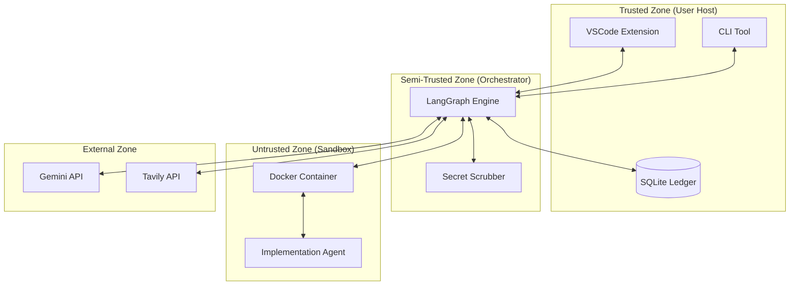

# Security Design: devs

## 1. Threat Model & Attack Surface

**[SEC-TM-001]** The `devs` system operates in a high-risk agentic environment where autonomous agents possess the capability to execute shell commands, modify files, and access external reasoning APIs. The threat model is structured around the **STRIDE** methodology, identifying trust boundaries and attack vectors across the Orchestration, LLM, and Execution layers.

### 1.1 Trusted Boundaries & Trust Zones
The system architecture defines four distinct security zones with varying levels of trust:

1.  **Trusted Zone (User Host):** The local machine where the VSCode Extension, CLI, and SQLite Ledger reside. This zone is assumed to be secure and under the direct control of the human user.
2.  **Semi-Trusted Zone (Orchestrator):** The Node.js LangGraph engine. It is responsible for enforcing security policies but handles potentially malicious content from the LLM and External Services.
3.  **Untrusted Zone (Execution Sandbox):** The Docker-isolated container where agents implement code and run tests. This zone is treated as malicious and strictly isolated from the Trusted Zone.
4.  **External Zone (LLM & Research):** Public APIs (Google Gemini, Tavily, etc.) that provide core reasoning. All data transit is encrypted (TLS 1.3), but the content is treated as unverified.

### 1.2 Attack Surface Mapping

#### 1.2.1 Orchestration & State Machine Surface
*   **State Graph Pollution:** Injecting malicious tool outputs into the LangGraph Global State Object (GSO) to manipulate downstream agent logic.
*   **Time-Travel Logic Manipulation:** Exploiting the branching and checkpoint restoration mechanism to bypass HITL gates or inject unauthorized turns into the Ledger history.
*   **Ledger Tampering:** Direct modification of the SQLite `state.db` to alter requirement traceability or hide malicious agent actions.

#### 1.2.2 LLM Interaction & Prompt Surface
*   **Direct Prompt Injection (DPI):** User-provided project descriptions designed to "jailbreak" the agent's system instructions and gain unauthorized shell access to the host.
*   **Indirect Prompt Injection (IPI):** Agents reading malicious files (e.g., a README in a researched repo) that contain instructions to exfiltrate the user's `.env` file via a DNS side-channel.
*   **Instructional Drift & Hijacking:** Overriding the global mandates in `GEMINI.md` to disable security middleware or secret scrubbing.

#### 1.2.3 Execution Layer (Sandbox) Surface
*   **Sandbox Escape:** Exploiting misconfigured Docker mounts (e.g., access to `/var/run/docker.sock`) or kernel vulnerabilities to gain root access to the user's host machine.
*   **Resource Exhaustion (DoS):** Agents spawning fork bombs, allocating massive memory blocks, or filling the local disk to crash the host system.
*   **Network Probing (SSRF):** Agents attempting to scan the user's local network or access internal services (e.g., `localhost:9000`) from within the sandbox.
*   **Supply Chain Attacks:** Agents unknowingly importing malicious npm/PyPI packages suggested by a compromised research agent.

#### 1.2.4 MCP & Tooling Surface
*   **MCP Server Impersonation:** Registering a malicious local MCP server that mimics project introspection tools to provide false architectural data.
*   **Tool-Call Interception:** Manipulating the JSON-RPC communication between the orchestrator and tools to execute arbitrary shell commands.

### 1.3 STRIDE Threat Matrix (Deep Dive)

| Category | Identifier | Threat Scenario | Impact | Mitigation Strategy |
| :--- | :--- | :--- | :--- | :--- |
| **Spoofing** | **[SEC-TM-01]** | Malicious MCP server impersonates internal tools. | High | Cryptographic verification of `mcp.json` entry points. |
| **Tampering** | **[SEC-TM-02]** | Agent modifies the SQLite Ledger to hide its actions. | Critical | HMAC-chained hashing of all turn records in the ledger. |
| **Repudiation** | **[SEC-TM-03]** | Agent performs a destructive `rm -rf` without a trace. | Med | Mandatory requirement-to-task mapping for every action. |
| **Information Disclosure** | **[SEC-TM-04]** | `.env` secrets leaked into LLM prompts or debug logs. | Critical | Multi-stage Secret Scrubber (Regex + Entropy) middleware. |
| **Denial of Service** | **[SEC-TM-05]** | Recursive agent loop exhausts host CPU/Memory/Tokens. | Med | Heuristic oscillation detection and hard resource quotas. |
| **Elevation of Privilege** | **[SEC-TM-06]** | Agent escapes Docker via kernel exploit to gain host root. | Critical | Non-root users, `seccomp` system call filtering, and network isolation. |

### 1.4 Agentic Attack Vectors & Edge Cases
*   **The "Sleepy Agent" Backdoor:** An agent implements a backdoored authentication module that remains dormant until the project is deployed in production.
*   **Requirement Poisoning:** Injecting malicious or unrequested requirements during the distillation phase (Phase 3) that are then implemented by a different agent persona.
*   **Context Window Poisoning:** Filling the 1M token window with high-entropy "noise" to push security-critical instructions out of the agent's active reasoning context.

---

## 2. Authentication & Authorization Policies

**[SEC-AUTH-001] Zero-Trust Agentic Identity & Authorization**
The `devs` security architecture is founded on the **"Zero-Trust Agentic"** principle. Since the system orchestrates autonomous agents capable of code execution and shell interaction, the security model assumes that any agent response could be influenced by prompt injection, non-deterministic drift, or adversarial compromise. Authentication and authorization are not merely perimeter checks but are enforced at every turn through multi-layered, hard-boundary isolation, phase-based whitelisting, and mandatory Human-in-the-Loop (HITL) authorization tokens.

### 2.1 User Authentication & Provider Identity Management
- **Local-First Identity:** Authentication is rooted in the host operating system's user session. `devs` does not implement a secondary user database; it operates strictly within the context of the authenticated OS user.
- **Provider API Authentication:** Access to reasoning (Gemini), search (Tavily/Exa), and other external services is authenticated via user-supplied API keys.
- **Secure Credential Storage:** 
    - **Primary:** API keys MUST be stored in the host's secure credential store (e.g., macOS Keychain, Windows Credential Manager, `libsecret` on Linux) using a specialized MCP tool.
    - **Fallback:** If a secure store is unavailable, keys can be stored in a non-committed `.env` file within the `.gemini/` directory. The orchestrator MUST verify that this file is included in `.gitignore`.
- **In-Memory Secret Protection:** API keys are loaded into the orchestrator's volatile memory ONLY during an active SDLC phase and are NEVER persisted in the SQLite Ledger, agent memory, or diagnostic logs.

### 2.2 Agent Persona Identity & Internal IAM
- **Agent Identity Mapping:** Every agent within the LangGraph orchestrator is assigned a unique `AgentID` and a `PersonaRole` (Researcher, Architect, Planner, Implementer, Reviewer).
- **Identity Injection:** The orchestrator dynamically injects the current persona's identity, system mandates, and authorized toolset into the prompt context for every turn.
- **Turn-Level Non-Repudiation:** Every entry in the SQLite Ledger (Turns, Thoughts, and Actions) is cryptographically signed using the `AgentID` and the parent turn's hash to ensure an immutable, non-repudiable audit trail of all agentic decisions.

### 2.3 Phase-Based Authorization (The Whitelist Policy)
**[SEC-AUTH-010]** Agent capabilities are strictly whitelisted based on the active SDLC phase. The MCP Host middleware MUST intercept every tool-call and verify authorization before execution. Any attempt to invoke an unauthorized tool triggers an immediate system suspension.

| SDLC Phase | Persona | Authorized Tools (Whitelist) | Restricted Tool-Categories |
| :--- | :--- | :--- | :--- |
| **1. Research** | Researcher | `web_search`, `fetch_url`, `read_file` | FS Write, Shell Exec, Git Mod |
| **2. Architecture** | Architect | `read_file`, `write_spec`, `mermaid_gen` | Shell Exec, External Network |
| **3. Planning** | Planner | `read_file`, `write_plan`, `topological_sort` | Shell Exec, FS Write (Code) |
| **4. Implementation** | Implementer | `patch_file`, `shell_exec`, `run_test` | External Network (except whitelisted registries) |
| **5. Review** | Reviewer | `read_file`, `git_diff`, `audit_code` | FS Write, Shell Exec |

*\*Note: Implementation phase allows network access ONLY to whitelisted package registries (e.g., npmjs.org) during dependency installation.*

### 2.4 Human-in-the-Loop (HITL) Authorization Tokens
**[SEC-AUTH-020]** High-risk actions require an explicit "Authorization Token" (User Approval) granted via the VSCode/CLI interface. Autonomy is suspended until the user provides a "Verified Approval" signal.

- **Destructive Filesystem Actions:** Any command involving `rm -rf`, `git reset --hard`, or directory deletions.
- **Supply Chain & Environment:** Modifying `package.json`, `requirements.txt`, or `.env` templates.
- **External State Mutation:** Executing `git push` or interacting with production-equivalent APIs.
- **Security Mandate Modification:** Any attempt to edit `.gemini/GEMINI.md` or the `specs/` directory after initial user sign-off.
- **Resource Escalation:** When a task exceeds the estimated token budget by >20% or fails to complete within the turn limit.

### 2.5 MCP Tool-Call Authorization Middleware
**[SEC-AUTH-030]** The Model Context Protocol (MCP) host implements a strictly-typed authorization middleware that validates every tool invocation:
1.  **Identity Verification:** Confirms the requesting `AgentID` is valid for the current LangGraph node.
2.  **Context Validation:** Confirms the tool is authorized for the current `PhaseID`.
3.  **Boundary Enforcement:** Verifies that all arguments (e.g., file paths, URLs) comply with the `Safe-FS` whitelisting and network egress policies.
4.  **Action Hashing:** Records a SHA-256 hash of the tool's intended effect (e.g., the `patch_file` diff) for user review during HITL gates.

### 2.6 Edge Cases & Authorization Risks
- **[RISK-AUTH-01] Identity Masquerading:** An agent persona attempting to bypass whitelisting by "hallucinating" that it is a different persona in its response. *Mitigation: Identity is enforced by the orchestrator host, not the agent response.*
- **[RISK-AUTH-02] Third-Party MCP Hijacking:** A user-installed third-party MCP server gaining unauthorized access to the project root. *Mitigation: Third-party servers must be explicitly whitelisted in `mcp.json` and restricted to their own namespaces.*
- **[RISK-AUTH-03] Session Hijacking via IDE:** A malicious VSCode extension attempting to spoof the `devs` orchestrator's JSON-RPC bridge. *Mitigation: Implementation of a secure handshake and UUID-based session tokens for all extension-to-orchestrator communication.*

### 2.7 Open Questions & Unknowns
- **[Q-AUTH-01]** Should `devs` support a "Supervisor Persona" (a secondary LLM) that acts as an independent authorization judge for all tool calls, reducing the burden on the human user?
- **[Q-AUTH-02]** How do we handle authentication for projects that require Cloud resources (e.g., AWS/GCP) during the implementation phase without exposing the user's master credentials to the agent?
- **[Q-AUTH-03]** Is there a requirement for "Hardware-Backed Authorization" (e.g., YubiKey) for high-sensitivity enterprise projects?

---

## 3. Data at Rest & Data in Transit Encryption

**[SEC-ENC-001] Comprehensive Encryption Mandate**
The `devs` system enforces a multi-layered encryption strategy to ensure the confidentiality and integrity of all project data, agent state, and communication channels. This strategy distinguishes between data residing on the local host (At Rest) and data being transmitted to external reasoning and search APIs (In Transit).

### 3.1 Encryption in Transit (External & Internal)
All communication channels that cross a trust boundary MUST be encrypted using modern, industry-standard protocols.

- **LLM & Search API Communication:** All outbound requests to Google Gemini, Anthropic, Tavily, and Exa MUST use **TLS 1.3**. The orchestrator MUST reject any attempt to fallback to insecure protocols (SSLv3, TLS 1.0/1.1).
- **Internal Orchestrator Bridge:** The JSON-RPC communication between the VSCode Extension and the LangGraph Engine (typically over WebSockets or Named Pipes on `localhost`) MUST utilize a secure handshake and, where supported by the transport, internal encryption to prevent local "man-in-the-middle" attacks by other malicious local processes.
- **Model Context Protocol (MCP) Transport:**
  - **Local (stdio):** Integrity is maintained by the operating system's process isolation.
  - **Remote (http/https):** Any remote MCP server interaction MUST be gated by TLS 1.3 and require mutual authentication (mTLS) or bearer tokens.
- **Package Registry Downloads:** All package managers (npm, pip, cargo) invoked within the sandbox MUST be configured to use HTTPS exclusively.

### 3.2 Encryption at Rest (The Secure Ledger)
**[SEC-ENC-010]** The project's "Nerve Center" (.gemini/ directory) contains sensitive architectural decisions, requirement details, and implementation thoughts that MUST be protected from unauthorized access.

- **SQLite Ledger Encryption (`state.db`):**
  - The system MUST use **SQLCipher (AES-256-GCM)** to encrypt the entire `state.db` file.
  - **Key Management:** The encryption key MUST NOT be hardcoded or stored in the project directory. It MUST be generated per-project and stored in the host's native secure enclave (e.g., **macOS Keychain**, **Windows Credential Manager**).
  - **Column-Level Salting:** High-sensitivity fields such as `thought`, `prompt`, and `response` SHOULD be individually salted and encrypted before insertion into the database as an additional layer of defense.
- **Agent Memory & Vector Stores:** All vector indexes and serialized context caches stored in `.gemini/memory/` and `.gemini/checkpoints/` MUST be encrypted using the same per-project key.
- **Filesystem Snapshots (Git):** While the source code is stored in standard Git format, the orchestrator SHOULD recommend (or integrate with) OS-level volume encryption (e.g., **FileVault**, **BitLocker**) to protect the physical project directory.

### 3.3 Secret Handling & Ephemeral Data
**[SEC-ENC-020] Zero-Persistence Policy for Secrets**
- **Volatile Context:** User API keys and redacted secrets MUST reside ONLY in volatile memory during an active session.
- **Scrubbed Logs:** All data written to the `actions` and `turns` tables MUST pass through the `SecretScrubber` middleware. Even if the database encryption is compromised, the ledger MUST NOT contain raw secrets.
- **Swap & Core Dump Protection:** The orchestrator SHOULD attempt to use `mlock` (where supported) for memory regions containing API keys to prevent them from being written to disk during memory swapping.

### 3.4 Key Lifecycle & Recovery
- **Key Generation:** Keys are generated using a cryptographically secure pseudo-random number generator (CSPRNG) during `devs init`.
- **Key Rotation:** The system SHOULD support manual key rotation, which involves re-encrypting the `state.db` and memory files with a new key.
- **Recovery:** Since `devs` is local-first, the loss of the host's keychain entry results in the permanent loss of the project's agentic history (though source code remains accessible via standard Git tools). Users MUST be warned of this during initialization.

### 3.5 Edge Cases & Technical Risks
- **[RISK-ENC-01] Performance Overhead:** Encryption/decryption of the SQLite ledger during high-frequency TDD cycles may increase turn latency. *Mitigation: Use of AES-NI hardware acceleration.*
- **[RISK-ENC-02] Key Leakage via Logs:** Accidental logging of the ledger encryption key during a system crash. *Mitigation: Strict `try/finally` blocks around key material and automated log scrubbing.*
- **[RISK-ENC-03] Cross-Platform Key Migration:** Moving a project between macOS and Linux. *Mitigation: Export/Import tool requiring a user-defined password to re-wrap the key.*

### 3.6 Open Questions & Unknowns
- **[Q-ENC-01]** Should we support **Hardware Security Modules (HSM)** or cloud-based KMS (e.g., AWS KMS) for enterprise users?
- **[Q-ENC-02]** Is it necessary to encrypt the `.git/` directory metadata, or is OS-level encryption sufficient?
- **[Q-ENC-03]** How do we handle decryption for headless CI/CD environments where a user session/keychain isn't available?

---

## 4. Application Security Controls

**[SEC-ASC-001]** Application Security Controls (ASC) represent the technical safeguards implemented at the application layer to enforce the security boundaries defined in the Threat Model. These controls focus on protecting the execution environment, validating all inputs and outputs, and ensuring the integrity of the agentic reasoning process.

### 4.1 Execution Sandbox (The Agent Playground)
**[SEC-ASC-010]** All implementation and validation tasks MUST execute within a strictly isolated Docker-based sandbox to prevent host system compromise.

- **Isolation Profile:**
  - **Base Image:** `node:20-alpine` (minimized attack surface).
  - **Non-Root User:** The container MUST run as a restricted `node` user (UID 1000). The `root` user and `sudo` capability MUST be disabled and removed from the image.
  - **Read-Only Root Filesystem:** The container's root filesystem SHOULD be mounted as read-only, except for designated `/tmp` and project workspace directories.
- **Resource Quotas & DoS Mitigation:**
  - **Memory:** Capped at `1024MB` per container.
  - **CPU:** Restricted to `1.0` cores (100,000 CPU shares).
  - **Disk I/O:** Workspace size limited to `2GB`.
  - **PID Limit:** Maximum `100` processes (prevents fork bombs).
  - **Timeout:** Hard `60-second` wall-clock timeout for any individual shell command.
- **System Call Filtering (Seccomp):**
  - A custom Seccomp profile MUST be applied to block dangerous syscalls: `mount`, `umount2`, `ptrace`, `reboot`, `swapon`, `swapoff`, `init_module`, `delete_module`, `keyctl`.
- **Network Egress Control:**
  - **Default:** `--network none` for implementation turns.
  - **Whitelist Mode:** Only permitted during `dependency_install` phases. Access is restricted via host-level `iptables` or Docker bridge policies to authorized domains (e.g., `registry.npmjs.org`, `pypi.org`, `crates.io`).

### 4.2 Prompt Defense & Input Validation
**[SEC-ASC-020]** Input validation is enforced at the orchestrator level to mitigate Indirect and Direct Prompt Injection (DPI/IPI).

- **Description Sanitization:** All user-provided project descriptions and journeys MUST be sanitized for control characters and length-limited (e.g., max 10,000 characters).
- **Instructional Guardrails:** System prompts are injected as immutable "Pre-flight Context" that cannot be overridden by user input.
- **IPI Detection in Research:** When agents ingest external data (e.g., from `web_search` or `fetch_url`), the content MUST pass through a "Neutralization Layer" that strips markdown formatting or instructional keywords (e.g., "Ignore previous instructions") before being passed to the Implementation Agent.
- **Character Whitelisting:** Input fields for file paths and shell arguments MUST use strict alphanumeric whitelisting to prevent command injection via metacharacters (`;`, `&`, `|`, `` ` ``, `$`).

### 4.3 Output Validation & Generated Code Safety
**[SEC-ASC-030]** Code generated by agents is treated as "Untrusted" until it passes a multi-stage validation pipeline.

- **Syntax & Linting Gate:** All generated files MUST pass `eslint` (or equivalent) and a syntax check before they are written to the project workspace.
- **Security Linting:** Static Analysis (SAST) tools are invoked within the sandbox to detect insecure patterns in generated code (e.g., use of `eval()`, hardcoded secrets, insecure cryptographic primitives).
- **TDD Enforcement:** The "Red Phase" of the TDD loop acts as a security control, ensuring that agents cannot implement logic without first proving they can write a valid, failing test.
- **Diff Review:** The `Reviewer Agent` (using a separate LLM context) MUST perform a security-focused diff review, looking for "Sleepy Agent" backdoors or logic bombs.

### 4.4 Filesystem & Volume Isolation (Safe-FS)
**[SEC-ASC-040]** The orchestrator enforces a strictly scoped filesystem boundary for all agent actions.

- **Path Canonicalization:** All tool-provided paths MUST be canonicalized and verified as sub-paths of the project root.
- **Volume Mount Restriction:** Only the specific project directory is mounted into the sandbox. Sensitive host paths (e.g., `/home`, `/etc`, `/var/run/docker.sock`, `.ssh`) MUST NEVER be exposed.
- **Symlink Protection:** Agents are forbidden from creating or following symlinks that resolve outside the project root. The `Safe-FS` middleware MUST audit symlink targets before any read/write operation.

### 4.5 Orchestrator Interface Security
**[SEC-ASC-050]** Security of the internal communication channels between the UI and the Engine.

- **JSON-RPC Schema Validation:** All messages between the VSCode Extension/CLI and the LangGraph Engine MUST be validated against strict Zod/JSON-schemas to prevent payload-based attacks.
- **Session Tokens:** Every session MUST use a unique UUID-based token for JSON-RPC authentication to prevent session hijacking by other local processes.
- **Error Sanitization:** Internal error stack traces and system-level exceptions MUST be sanitized before being returned to the agent or UI to prevent information leakage about the host environment.

---

## 5. Logging, Monitoring & Audit Trails

**[SEC-LOG-001] Immutable & Verifiable Audit Architecture**
The `devs` system treats logging and audit trails not just as diagnostic data, but as a critical security control and a fundamental pillar of the **"Glass-Box"** philosophy. Every agentic decision, tool invocation, and state transition is captured in a cryptographically verifiable ledger, ensuring that the entire SDLC history is transparent, immutable, and resistant to tampering.

### 5.1 The SQLite Security Ledger (State DB)
**[SEC-LOG-010]** The primary audit trail is stored in the local SQLite `state.db`. This ledger is the "Single Source of Truth" for all agent activity.
- **Chained Turn Integrity:** Each turn record MUST include a cryptographic hash of the previous turn's state, creating an immutable hash chain.
- **HMAC Verification:** The system SHOULD use a per-project HMAC key (stored in the host's secure enclave) to sign each ledger entry, preventing offline tampering of the database.
- **Granular Action Logging:** Every tool call MUST record:
    - `AgentID` and `PersonaRole`.
    - `ToolName` and exact `Arguments` (Scrubbed).
    - `Result` (stdout/stderr/exit_code).
    - `FS_Hash_Before` and `FS_Hash_After` for any file modifications.
    - `Token_Usage` and `Inference_Latency`.

### 5.2 Structured Application Logging
**[SEC-LOG-020]** The orchestrator and MCP hosts MUST produce structured JSON logs (e.g., using Pino or Winston) to facilitate automated monitoring and security analysis.
- **Secret Scrubbing Middleware:** A mandatory middleware MUST intercept all log entries to redact PII and secrets before they are written to disk.
- **Log Correlation:** Every log entry MUST include a `SessionID`, `BranchID`, and `TurnID` to allow for end-to-end tracing of agent activity across the system.
- **Log Retention:** Logs are persisted in `.gemini/logs/` with automated rotation and a user-defined retention policy (default: 30 days).

### 5.3 Real-time Monitoring & Resource Guardrails
**[SEC-LOG-030]** The system monitors agent behavior in real-time to detect security violations or resource abuse.
- **Sandbox Telemetry:** Continuous monitoring of the Docker sandbox for:
    - **Resource Spikes:** CPU/Memory usage exceeding quotas.
    - **Unauthorized Syscalls:** Blocked syscalls logged via Seccomp.
    - **Network Probes:** Attempts to access unauthorized domains or local network ranges.
- **Loop & Stagnation Detection:** Monitoring the frequency and pattern of tool calls to detect recursive loops (Oscillation Monitor) or agent stagnation.
- **Token Budget Tracking:** Real-time tracking of LLM token consumption against the user-defined budget.

### 5.4 Security Alerting & Incident Response
**[SEC-LOG-040]** Critical security events MUST trigger immediate system suspension and user alerts.
- **Alert Categories:**
    - `SEC_ALERT_FS_DIVERGENCE`: Detected manual filesystem changes without a corresponding ledger turn.
    - `SEC_ALERT_SANDBOX_ESCAPE`: Detected attempt to access unauthorized paths or execute blocked syscalls.
    - `SEC_ALERT_SECRET_LEAK`: Detected secret scrubbing failure or accidental secret commit.
    - `SEC_ALERT_LEAD_TAMPERING`: Detected hash-chain breakage in the SQLite ledger.
- **Intervention Gate:** Upon a security alert, the orchestrator MUST enter a "Safe Mode," suspending all agent autonomy and requiring explicit human "Security Clearance" to resume.

### 5.5 Audit Compliance & Reporting
**[SEC-LOG-050]** The system provides tools to generate human-readable and machine-readable audit reports.
- **`devs audit-log --export`:** Generates a signed PDF or JSON report of all implementation decisions, test results, and reviewer approvals for compliance (e.g., SOC2 Type II or GDPR).
- **Traceability Report:** Maps 100% of requirements to implementation turns and verification logs, providing a "Proof of Correctness" for the generated project.

---

## 6. Secret Scrubbing & Privacy Guard

**[SEC-061]** The system implements a **Real-time Redaction Middleware** that intercepts all communication between the orchestrator and the LLM provider.

### 6.1 Redaction Pipeline
1.  **Pre-flight Scan:** Before any Implementation Epic, the system scans the directory for un-ignored `.env` files or hardcoded secrets and alerts the user.
2.  **Regex Scrubbing:**
    - **AWS:** `AKIA[0-9A-Z]{16}`
    - **Generic Secret:** `(?i)secret|password|token|key` followed by high-entropy strings.
    - **GCP/OpenAI/GitHub:** Specific high-precision patterns for provider-native tokens.
3.  **Shannon Entropy Analysis:**
    - Strings exceeding 12 characters are analyzed for entropy.
    - **Threshold:** `Entropy > 4.5 bits` triggers a redaction warning unless the string is whitelisted (e.g., UUIDs or SHA hashes).
4.  **Whitelist Bypass:** Common technical terms, project-specific IDs, and whitelisted environment variables (e.g., `NODE_ENV`) are exempted.

### 6.2 Redaction Implementation
All detected secrets are replaced with `[REDACTED_SECRET_ID]`. The mapping between the original secret and the ID is held exclusively in volatile memory and is NEVER written to the SQLite Ledger or Git history.

---

## 7. IAM & Authorization Matrix

**[SEC-071] Phase-Based Tool Whitelisting:** Agent capabilities are dynamically restricted based on the project's current SDLC phase.

| Phase | Agent Persona | Permitted Tools | Restricted Actions |
| :--- | :--- | :--- | :--- |
| **Research** | Researcher | `web_search`, `fetch_url` | `write_file`, `shell_exec` |
| **Architect** | Architect | `read_file`, `write_spec` | `shell_exec`, `web_search` |
| **Implement** | Implementer | `patch_file`, `shell_exec`, `run_test` | `web_search`, `git_push` |
| **Review** | Reviewer | `read_file`, `git_diff` | `write_file`, `shell_exec` |

### 7.1 Human-in-the-Loop (HITL) Gates
**[SEC-072] Escalated Authorization:** Explicit user approval is required for:
1.  **Destructive VCS Operations:** `git reset --hard`, `git clean`.
2.  **Dependency Changes:** Modifying `package.json` or `requirements.txt`.
3.  **Outbound Network Access:** Requests to download packages from registries.
4.  **Security Mandate Overrides:** Any attempt to modify `GEMINI.md`.

---

## 8. SDLC & Integrity Controls

### 8.1 Chained Ledger Integrity
**[SEC-081]** The `actions` table uses a hash-chaining mechanism.
- Each action record contains `current_hash = HMAC_SHA256(data, previous_hash)`.
- The `devs verify-ledger` command re-calculates the chain to detect unauthorized record modification.

### 8.2 Requirement Traceability Guard
**[SEC-082] Shadow Code Prevention:**
- The `Reviewer Agent` MUST verify that every code diff contains a JSDoc/TSDoc `@satisfies REQ-XXX` tag.
- The `Orchestrator` blocks any commit that introduces code not mapped to a `distilled.json` requirement.

### 8.3 Loop & Oscillation Heuristics
**[SEC-083]** Heuristic engine detects recursive failures:
- **Oscillation:** If a file is reverted to a previous state within 3 turns, the system pauses.
- **Stagnation:** If a tool call fails 3 times with the identical `stderr`, the agent persona is forcibly switched to a `Debugger` role for a single turn to diagnose the blockage.

---

## 9. Supply Chain & Dependency Security

**[SEC-091] Automated Dependency Auditing:**
- Any library suggested by the `Tech Landscape Agent` MUST be scanned via `npm audit` or `snyk` (if available) before being added to the TAS.
- **Agentic Constraint:** The system prioritizes libraries with high "Agentic Friendliness" (strong typing, stable documentation) over bleeding-edge or undocumented modules.

---

## 10. Security Roadmap, Risks & Unknowns

### 10.1 Technical Risks
- **[RISK-SEC-01] Sandbox Performance for Compiled Languages:** Running heavy compilation (e.g., Rust/C++) inside a restricted Docker container may lead to frequent timeouts or resource exhaustion.
- **[RISK-SEC-02] LLM Hallucinated Rigor:** Agents may write tautological tests (e.g., `expect(true).toBe(true)`) to bypass the TDD gate. *Mitigation: Reviewer Agent must audit test quality.*
- **[RISK-SEC-03] State Desync during Intervention:** If a user manually edits a file and deletes a secret scrubbing marker, the system may inadvertently leak data upon resumption.

### 10.2 Critical Unknowns
- **[Q-SEC-01]** How do we handle hardware-specific requirements (e.g., GPU access for ML projects) within the restricted sandbox without compromising host security?
- **[Q-SEC-02]** Is there a scalable way to implement "Multi-Model Consensus" for high-stakes security logic (e.g., Auth/IAM implementation) without doubling token costs?
- **[Q-SEC-03]** How can we standardize "Agentic Permissions" for third-party MCP servers that are not under the orchestrator's direct control?

---

