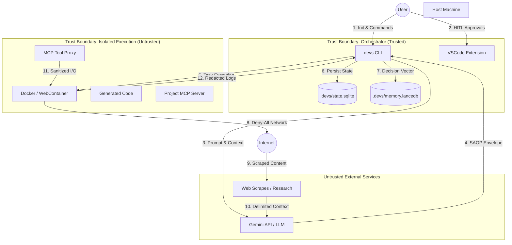

# Security Design: Project 'devs'

## 1. Threat Model & Attack Surface

The 'devs' system operates as a multi-agent orchestrator executing arbitrary code within a local environment. The attack surface is exceptionally broad due to the autonomous nature of agents, the use of external LLM APIs, and the requirement to execute generated code for validation. This section defines the actors, assets, and specific threat vectors that govern the system's security posture.

### 1.1 Actors & Trust Hierarchy
The system's security is modeled across five distinct trust levels, ranging from the Root of Trust (User) to entirely untrusted external environments.

| Trust Level | Actor | Role | Description |
| :--- | :--- | :--- | :--- |
| **Level 4** | **Human User** | Owner / Root of Trust | Provides the initial brief, approves blueprints, and controls the host OS. |
| **Level 3** | **Orchestrator** | Controller (Trusted) | The `devs` CLI/Extension logic. Enforces HITL gates and manages sandboxes. |
| **Level 2** | **MCP Infrastructure** | Bridge (Semi-Trusted) | Standardized communication layer between the Orchestrator and the Sandbox/App. |
| **Level 1** | **Agent / Sandbox** | Worker (Untrusted) | The Execution Sandbox where LLM-generated code is implemented and tested. |
| **Level 0** | **External Services** | Data/Logic (Untrusted) | The LLM APIs (Gemini) and arbitrary web content from the Research Phase. |

### 1.2 Asset Classification & Impact
A successful compromise of the 'devs' environment targets the following high-value assets.

| Asset | Category | Confidentiality | Integrity | Availability |
| :--- | :--- | :--- | :--- | :--- |
| **Gemini API Keys** | Host Secret | **CRITICAL** | High | Medium |
| **GitHub/SSH Tokens** | Host Secret | **CRITICAL** | **CRITICAL** | Medium |
| **Project State (SQLite)** | System State | Medium | **CRITICAL** | High |
| **Architectural DNA (Vector)** | IP / Context | High | **CRITICAL** | Medium |
| **Source Code (Work Tree)** | Intellectual Property | High | **CRITICAL** | High |
| **Reasoning Traces** | Audit Trail | Medium | High | Low |

### 1.3 Component Attack Surface Mapping

#### 1.3.1 The Orchestrator (CLI & VSCode Extension)
*   **Malicious State Injection**: Manipulation of the `.devs/state.sqlite` file to inject unauthorized tasks or skip approval gates.
*   **Path Traversal**: Exploiting tool calls (e.g., `read_file`) to access sensitive files outside the project root (e.g., `~/.ssh/id_rsa`).
*   **Plugin/Extension Hijacking**: Compromising the VSCode extension host to steal API keys from the global state.

#### 1.3.2 The Agent Suite (LLM Reasoning)
*   **Indirect Prompt Injection**: Malicious instructions embedded in scraped research data (e.g., a "poisoned" README on GitHub) that the agent ingests during Phase 1.
*   **Hallucination Exploitation**: Forcing the agent into a state of "Strategy Entropy" where it ignores security constraints in the TAS to resolve a failing test.
*   **Instruction Drift**: The gradual erosion of system-prompt constraints over long-running context windows (1M+ tokens).

#### 1.3.3 The Execution Sandbox (Docker / WebContainer)
*   **Container Escape**: Utilizing zero-day kernel exploits or misconfigured capabilities (e.g., `--privileged`) to gain host-level access.
*   **Side-Channel Exfiltration**: Using timing attacks or resource consumption patterns to leak host data without network access.
*   **Volume Mount Poisoning**: Exploiting write access to `/workspace` to plant malicious scripts that execute on the host when the user manually opens the file.

#### 1.3.4 MCP Interfaces (Tooling Bridge)
*   **Unvalidated Tool Arguments**: SSRF (Server Side Request Forgery) or Command Injection via malformed JSON payloads sent by the LLM.
*   **Session Hijacking**: Intercepting the local IPC between the Orchestrator and the Sandbox MCP server.

### 1.4 Agentic-Specific Threat Vectors

*   **[THREAT-AGENT-01] The "Trojan Requirement"**: An agent, influenced by malicious research, distills a requirement that seems valid (e.g., "Add health check endpoint") but includes a hidden backdoor (e.g., `eval(req.query.cmd)`).
*   **[THREAT-AGENT-02] Supply Chain Poisoning**: The agent is tricked into choosing a "typosquatted" or malicious library during the Tech Landscape phase because it lacked a live "reputation check."
*   **[THREAT-AGENT-03] Recursive Resource Drain**: An agent generates code that creates millions of tiny files or spawns thousands of processes within the sandbox to perform a local DoS.
*   **[THREAT-AGENT-04] Verification Bypass**: An agent writes both the implementation *and* a "fake" test that passes regardless of the actual logic, tricking the Reviewer Agent.

### 1.5 Detailed STRIDE Threat Matrix

| Category | Threat Scenario | Impact | Mitigation Strategy |
| :--- | :--- | :--- | :--- |
| **Spoofing** | Agent impersonates the Reviewer to sign off on its own task. | Integrity | Multi-agent signatures; Orchestrator-controlled agent identity. |
| **Tampering** | Modification of `.agent.md` to mislead future developer agents. | IP / Quality | Checksum verification of AOD files before agent ingestion. |
| **Repudiation** | Agent denies generating a specific malicious code block. | Audit | Persistent SAOP traces linked to Git commit hashes. |
| **Info Disclosure** | Secret leakage via error logs sent back to the Gemini API. | Privacy | Mandatory `SecretMasker` on all sandbox streams. |
| **DoS** | Agent generates an infinite loop that locks the sandbox CPU. | Availability | Hard resource quotas (2 cores, 4GB) and 300s timeouts. |
| **Privilege Escalation** | Agent uses `npm install` to execute a host-level post-install script. | **CRITICAL** | `ignore-scripts` flag; no-exec `/tmp` in sandbox. |

### 1.6 Trust Boundaries & Data Flow
The following diagram illustrates the enforcement of boundaries between trusted and untrusted components.

### 1.7 Implementation Unknowns & Security Risks
*   **[RISK-SEC-01] Sandbox Escape (WebContainers)**: The maturity of WebContainer isolation compared to Docker is an unknown for complex C-extension based Node modules.
*   **[RISK-SEC-02] Token Redaction Lag**: If the `SecretMasker` is too slow, it may introduce latency in the "Green-Phase" of the TDD loop.
*   **[QUESTION-SEC-01]**: Should we support "Local-only" models to eliminate the Level 0 (External Service) trust risk for enterprise users?
*   **[QUESTION-SEC-02]**: How do we handle "Host-Aware" agents that need to know the specific OS (Darwin vs. Linux) for implementation without leaking sensitive host details?

---

## 2. Authentication & Authorization Policies

The 'devs' system implements a Zero-Trust architecture between its internal components. Authorization is not just about "who" can access "what," but "which agent" can execute "which capability" in a specific "phase" of the development lifecycle.

### 2.1 Orchestrator Access Control (Local Host)
The Orchestrator (`devs-core`) is the highest trust component and must be protected from host-level compromise.
- **[SEC-010] Dedicated User Context**: The orchestrator MUST run under a non-privileged local user account. It MUST explicitly fail and exit if executed with `root` or `sudo` privileges (UID 0 check on startup).
- **[SEC-011] Directory Hardening**: The `.devs/` state directory MUST be initialized with `0700` (drwx------) permissions. On every startup, the orchestrator MUST verify that no other local user has read/write access and abort if permissions are loose.
- **[SEC-014] IPC Security (CLI <-> Extension)**: Communication between the VSCode extension and the CLI logic MUST use a secure local Unix Socket or Named Pipe. Every session MUST utilize a unique, ephemeral 128-bit Handshake Token to prevent local cross-process hijack attempts.
- **[SEC-015] Environment Isolation**: The orchestrator MUST sanitize its own environment variables before spawning sandboxes. Sensitive host variables (e.g., `AWS_ACCESS_KEY_ID`, `KUBECONFIG`) MUST be stripped from the agent's view.

### 2.2 Capability-Based Access Control (CBAC) for MCP Tools
Instead of broad permissions, 'devs' uses a granular capability model where tools are only authorized based on the current Agent Role and Project Phase.

- **[SEC-012] Role-Based Scoping (RBAC)**:
    - **ResearcherAgent**: Authorized for `web_discovery`, `read_memory`, `write_document`. Strictly forbidden from `shell_exec` and `filesystem_write` to `src/`.
    - **DeveloperAgent**: Authorized for `filesystem_rw` (limited to `/workspace`), `shell_exec` (monitored), and `mcp_inspect`.
    - **ReviewerAgent**: Authorized for `read_only_fs` and `test_execution`. Forbidden from modifying implementation code.
- **[SEC-013] Tool Call Validation & Schema Enforcement**: Every MCP tool call MUST be validated against a strict JSON schema. If an agent attempts to pass an argument not defined in the schema (e.g., trying to inject `--privileged` into a docker command), the `ToolProxy` MUST reject the call and log a security violation.
- **[SEC-016] Phase-Specific Permission Escalation**: Permissions are dynamic. During Phase 1 (Research), no agent is authorized to use implementation tools. During Phase 4 (Implementation), Research tools are revoked to minimize the attack surface for prompt injection from implementation-side files.
- **[SEC-017] Argument Sanitization (Anti-Injection)**:
    - **Shell Commands**: All shell tool calls MUST accept arguments as an array of strings (`argv[]`). Strings containing shell metacharacters (`;`, `&`, `|`, `$()`) MUST be rejected unless explicitly escaped by the `ToolProxy`.
    - **Path Normalization**: All filesystem paths MUST be resolved to absolute paths and verified to be within the `/workspace` subtree before execution.

### 2.3 External Service Authentication & Secret Management
Secrets are never stored in the project's state or logs.

- **[SEC-019] Host Keychain Integration**: All API keys (Gemini, Serper, GitHub) MUST be stored in the host's native secure storage (macOS Keychain, Linux Secret Service/KWallet, or Windows Credential Manager). 'devs' MUST NOT store secrets in `.env` files or the `state.sqlite` database.
- **[SEC-020] Zero-Persistence Secret Policy**: Secrets injected into the sandbox for specific tasks (e.g., `npm publish` token) MUST be provided via ephemeral environment variables that exist only for the duration of that specific tool call and are scrubbed from all logs.
- **[SEC-021] Ephemeral GitHub/VCS Tokens**: For Git operations, agents SHOULD use the host's existing `ssh-agent` or a short-lived GitHub App installation token. Credentials MUST NEVER be committed to the repository.

### 2.4 Human-in-the-Loop (HITL) as an Authorization Gate
In a Glass-Box architecture, the human user is the ultimate authorization authority.

- **[SEC-022] Mandatory Approval Junctions**: The orchestrator state machine MUST implement hard blocks at Phase 2 (Architecture) and Phase 3 (Roadmap). The "Next Phase" capability is ONLY authorized after the `projects` table in SQLite is updated with a `human_approval_signature`.
- **[SEC-023] Immutable Architectural Sign-off**: Once the TAS (Technical Architecture Specification) is approved, the Developer Agent is NOT authorized to modify core architectural files (e.g., `tsconfig.json`, `package.json` dependencies, `.env.example`) without a specific `ARCH_CHANGE_DIRECTIVE` from the user.
- **[SEC-024] Directive Injection Authorization**: Directives (User "Whispering") are authorized mid-task. The orchestrator validates that the directive comes from the authenticated user session before injecting it into the agent's short-term memory.

### 2.5 Authorization for Generated Application (The Output)
'devs' ensures that the projects it builds are secure by default.

- **[SEC-025] Default-Secure Auth Boilerplate**: Any project requiring authentication MUST be generated with industry-standard defaults: Argon2 for hashing, 15-minute JWT rotation, and HttpOnly/Secure/SameSite cookies. Use of `basic-auth` or unencrypted sessions is a violation of the 'devs' code standard.
- **[SEC-026] Agent-Oriented Debugging Auth**: The internal MCP server (`/mcp-server`) in the generated project MUST only listen on `localhost`. It MUST require a 256-bit Bearer Token generated by the `devs` orchestrator on sandbox startup, ensuring only authorized agents can profile the code.

### 2.6 Edge Cases & Authorization Risks
- **[RISK-AUTH-01] Identity Spoofing (Agent-to-Agent)**: An agent attempting to bypass the Reviewer Agent. *Mitigation*: The Orchestration Engine in `devs-core` tracks the `thread_id` and role; it will refuse to transition a task to `SUCCESS` if the same agent instance that wrote the code attempts to sign off as the Reviewer.
- **[RISK-AUTH-02] Indirect Tool Invocation**: Malicious data in a README tricking a Researcher into calling a Developer tool. *Mitigation*: Strict delimiters in LLM prompts and CBAC enforcement at the `OrchestratorServer` IPC level.
- **[RISK-AUTH-03] Privilege Escalation via Dependencies**: Using `npm install` to run a malicious post-install script. *Mitigation*: Mandatory use of `--ignore-scripts` in the sandbox and restricted network egress during installation.

---

## 3. Data at Rest & Data in Transit Encryption

The 'devs' system handles highly sensitive data, including API credentials, intellectual property in the form of architectural designs, and potentially sensitive reasoning traces. This section defines the technical requirements for protecting this data throughout its lifecycle.

### 3.1 Encryption in Transit (EiT)
All data movement between components and external services must be encrypted using modern cryptographic protocols.

#### 3.1.1 External API Communication (LLM & Research)
- **[SEC-027] Mandatory TLS 1.3**: All outbound requests to Google Gemini, Serper, and other external APIs MUST use TLS 1.3 (RFC 8446). 
- **[SEC-028] Cipher Suite Enforcement**: Only AEAD-based cipher suites are permitted (e.g., `TLS_AES_256_GCM_SHA384`, `TLS_CHACHA20_POLY1305_SHA256`).
- **[SEC-029] Certificate Pinning**: The orchestrator SHOULD implement certificate pinning for `generativelanguage.googleapis.com` to mitigate sophisticated MITM attacks in corporate environments.
- **[SEC-030] Secure Web Scraping Egress**: Research agents MUST default to `HTTPS` for all discovery tasks. Ingestion of `HTTP` content is blocked by default and requires an explicit `USER_OVERRIDE` per domain, which is logged as a security exception.

#### 3.1.2 Internal Inter-Process Communication (IPC)
- **[SEC-031] CLI-to-Extension Handshake**: Communication between the CLI tool and the VSCode Extension MUST occur over an encrypted Unix Domain Socket (UDS) on Unix systems or Named Pipes with ACLs on Windows.
- **[SEC-032] Session Handshake**: Each IPC session MUST begin with a 256-bit ephemeral handshake token. This token is generated by the parent process and passed via environment variables to the child process, ensuring only the authenticated user session can interact with the orchestrator.
- **[SEC-033] Localhost MCP Security**: MCP servers listening on TCP (e.g., for VSCode Web/WebContainers) MUST bind exclusively to `127.0.0.1`. They MUST require a Bearer token for every request, preventing other local users or malicious processes from executing tools.

### 3.2 Encryption at Rest (EaR)
Data stored on the host machine must be protected against unauthorized access, even in the event of local compromise.

#### 3.2.1 Host-Level Secret Storage (Keychain)
- **[SEC-034] Native Keychain Integration**: Secrets (Gemini API keys, GitHub tokens, database passwords) MUST NEVER be stored in plaintext. They MUST be stored using the host OS's secure credential manager:
    - **macOS**: `Security.framework` (Keychain Services).
    - **Linux**: `libsecret` (Secret Service API / KWallet).
    - **Windows**: `DPAPI` (Data Protection API) or Credential Manager.
- **[SEC-035] Zero-Plaintext Config**: The `config.json` and `.devs/state.sqlite` files MUST NOT contain any unencrypted API keys. References to secrets should use a URI-based lookup (e.g., `keychain://gemini-api-key`).

#### 3.2.2 Project State & Vector Database Protection
- **[SEC-036] Filesystem Permission Hardening**: The `.devs/` directory and all its contents (SQLite, LanceDB) MUST be initialized with `0700` (drwx------) permissions. Individual database files MUST be set to `0600` (rw-------).
- **[SEC-037] Vector Embedding Integrity**: LanceDB files containing semantic representations of the project's intellectual property MUST be treated as high-confidentiality assets. While OS-level encryption is primary, sensitive blobs in the vector metadata SHOULD be encrypted using a project-specific master key derived from the User Keychain.

#### 3.2.3 Reasoning Trace & Log Redaction
- **[SEC-038] Pre-Persistence Redaction (SecretMasker)**: The `SecretMasker` is a mandatory middleware in the data flow between the Sandbox and the Persistence layer. It MUST apply regex and entropy-based redaction (50+ known patterns and Shannon entropy > 4.5 check) to all `stdout`/`stderr` before they are written to `agent_logs` or `state.sqlite`.
- **[SEC-039] Reasoning Log Anonymization**: All agent "thoughts" saved to SQLite MUST be scrubbed of any PII (User Name, System Paths, Localhost IPs) unless they are explicitly required for the task.

#### 3.2.4 Handling of Environment Variables & Temporary Files
- **[SEC-040] Ephemeral Sandbox Environment**: Environment variables containing secrets MUST NOT be passed directly to the Docker command line (e.g., `docker run -e ...`). They SHOULD be passed via a secure `stdin` stream or an encrypted ephemeral file with `0400` permissions.
- **[SEC-041] Temporary Directory Isolation**: The project's temporary directory (`.gemini/tmp/devs`) MUST follow the same `0700` permission policy and MUST be purged upon project completion or a `devs purge` command.

### 3.3 Key Management & Rotation
The orchestrator relies on a hierarchy of keys to maintain its "Glass-Box" security.

- **[SEC-042] Master Key Derivation**: A 256-bit project master key MUST be derived from the user's host keychain (PBKDF2-HMAC-SHA512 with 100k+ iterations).
- **[SEC-043] Ephemeral Sandbox Key Rotation**: Every task execution in the Sandbox MUST use a new, ephemeral 128-bit session key for encrypting intermediate files or communication with the internal ProjectServer.
- **[SEC-044] Secure Deletion (devs purge)**: The `purge` command MUST overwrite sensitive files (SQLite, LanceDB, `.devs/config.json`) with random data where possible (e.g., OS-specific secure unlinking) before final removal from the filesystem.

---

## 4. Application Security Controls

The Application Security Controls (ASC) represent the technical enforcement layer designed to mitigate the risks identified in the STRIDE threat matrix. These controls are integrated into the `devs-core` orchestrator and the `devs-sandbox` environment, ensuring a "Glass-Box" security posture where every autonomous action is validated against a pre-defined security policy.

### 4.1 Agentic Sandboxing (The Primary Defense)
**[SEC-045] Mandatory Ephemeral Isolation**: All implementation, testing, and dependency resolution tasks MUST occur within a fresh, isolated sandbox (Docker or WebContainer). The lifecycle of the sandbox is managed by the `SandboxProvider`.

- **[SEC-046] Hardened Runtime Configuration (Docker-specific)**:
    - **Capability Stripping**: Containers MUST run with `--cap-drop=ALL`. Minimal capabilities (`CHOWN`, `SETUID`, `SETGID`) are only added during the `DependencyNode` and revoked for `ImplementationNode`.
    - **Privilege Limitation**: Use of `--security-opt=no-new-privileges:true` to prevent escalation via `setuid` binaries.
    - **PID Limiting**: `--pids-limit 128` to prevent fork-bomb attacks.
    - **Memory/CPU Quotas**: Hard limits of 4GB RAM and 2 vCPUs (`--memory="4g" --cpus="2.0"`).
- **[SEC-047] Filesystem Isolation & Integrity**:
    - **Immutable Root**: The container root filesystem MUST be mounted as read-only (`--read-only`).
    - **Isolated Writable Volumes**: Only `/workspace` (the project directory) and `/tmp` are writable.
    - **Secure Temp Space**: `/tmp` MUST be mounted as a `tmpfs` with `noexec,nosuid,nodev` options to prevent the execution of malicious payloads downloaded from the internet.
    - **Shadow Mounting**: The `.git` and `.devs` directories MUST NOT be mounted. The orchestrator MUST provide a virtualized view of the workspace to the agent to prevent tampering with project history or state.
- **[SEC-048] Network Egress & DNS Filtering**:
    - **Default Deny**: All containers start with `--network none`.
    - **Controlled Egress**: During dependency installation, a scoped bridge network is enabled. Traffic MUST be routed through an internal `devs-proxy` that enforces an allow-list:
        - `*.npmjs.org`, `registry.npmjs.org`
        - `*.github.com`, `github.com`
        - `*.pypi.org`, `files.pythonhosted.org`
    - **DNS Isolation**: The sandbox MUST NOT use the host's DNS settings. It uses a static mapping for the allow-list and resolves everything else to `0.0.0.0`.

### 4.2 LLM Safety & The "SecretMasker" Redaction Suite
**[SEC-049] Multi-Tiered Redaction**: To prevent the leakage of host secrets or PII into LLM contexts or the `state.sqlite` audit logs, all data passing through the `ToolProxy` MUST be processed by the `SecretMasker`.

- **[SEC-050] Phase 1: High-Entropy & Pattern Matching**:
    - **Regex Suite**: A library of 100+ patterns covering AWS Keys, Stripe Tokens, GCP Service Accounts, SSH Private Keys, and JWTs.
    - **Entropy Detection**: Any contiguous string of 20+ characters with a Shannon Entropy score > 4.5 is flagged for redaction.
- **[SEC-051] Phase 2: Contextual Validation (Flash-Model)**:
    - Flagged strings are sent to a local `Gemini 3 Flash` instance with a specific "Classifier" prompt. The model determines if the string is a legitimate secret or a safe technical artifact (e.g., a SHA-256 hash of a file).
- **[SEC-052] Phase 3: Replacement & Hashing**:
    - Detected secrets are replaced with a deterministic placeholder: `[REDACTED_<TYPE>_<SHORT_HASH>]`. This allows the agent to recognize that a secret exists and is consistent across turns without seeing the value.
- **[SEC-053] Input Redaction (Tool Call Protection)**:
    - The `SecretMasker` also inspects tool arguments *before* they are sent to the sandbox, preventing agents from accidentally passing host secrets into shell commands that might be logged.

### 4.3 Supply Chain & Dependency Integrity
**[SEC-054] Zero-Trust Dependency Management**: Agents are prone to "Hallucination-driven Supply Chain Attacks" (typosquatting).

- **[SEC-055] Mandatory Lockfile Enforcement**: The `DependencyManager` tool MUST fail if the agent attempts to install a package without generating/updating a lockfile (`package-lock.json`, `pnpm-lock.yaml`).
- **[SEC-056] Automated Vulnerability Gates**:
    - Every `npm install` or `pip install` MUST be followed by an automated `audit` (e.g., `npm audit`). 
    - Any "High" or "Critical" vulnerability detected MUST trigger a mandatory `ReviewerAgent` failure. The task cannot proceed until the vulnerability is resolved or documented with a TAS-approved mitigation.
- **[SEC-057] Script Execution Blocking**: All package installations MUST use the `--ignore-scripts` flag by default. If a package requires a post-install script, the orchestrator MUST pause and trigger a `HITL_GATE` for manual user approval.

### 4.4 Tool Call Integrity & Command Injection Prevention
**[SEC-058] Structured Argument Enforcement**:
- **JSON Schema Validation**: Every MCP tool call MUST be validated against a JSON schema stored in the `devs-core` ToolRegistry. Any additional or malformed properties result in an immediate rejection.
- **Shell Sanitization**: The `shell_exec` tool MUST NOT accept a raw string. It MUST accept an `argv` array. The `ToolProxy` is responsible for properly escaping arguments before passing them to the sandbox terminal.
- **Path Traversal Protection**: All path arguments are passed through a `resolveAndValidatePath()` function that ensures the target is within the `/workspace` subtree. Attempts to use `..` to escape the root are blocked.

### 4.5 State & Document Integrity
- **[SEC-059] Atomic State Persistence**: The `.devs/state.sqlite` database uses WAL (Write-Ahead Logging) and ACID transactions. Every state change is verified to ensure the `tasks` table remains consistent with the `requirements` table.
- **[SEC-060] Document Integrity Checksums**: Upon Phase 2 (Architecture) approval, the orchestrator generates SHA-256 checksums for the PRD and TAS. These are verified before the `DistillNode` and `ImplementationLoop` begin. If a human manually edits a spec file without re-running the approval gate, the orchestrator MUST block execution.
- **[SEC-061] Vector Memory Sanitization**: Long-term memory (LanceDB) is only updated with "Verified" architectural decisions. Research data from Level 0 (External Services) is kept in a separate, lower-trust partition to prevent "Semantic Poisoning" of the project's core DNA.

### 4.6 Logging, Monitoring & Audit (Forensic Traceability)
- **[SEC-062] Immutable Audit Log**: Every SAOP turn (Thought, Action, Observation) is logged to `agent_logs` with a nanosecond-precision timestamp.
- **[SEC-063] Sandbox violation alerts**: Any attempt by a container to access blocked network resources or exceed CPU/Memory quotas MUST be logged as a `SECURITY_ALERT` in the project state, visible in the VSCode Extension's security dashboard.
- **[SEC-064] Requirement-to-Commit Traceability**: Every Git commit is tagged with a `REQ-ID` and a reference to the specific SQLite task record, enabling a full forensic walk-back from any code block to the agent's reasoning that produced it.

---

## 5. Logging, Monitoring & Audit Trails

The 'devs' system implements a comprehensive observability suite designed to ensure that autonomous development is transparent, performant, and safe. By treating observability as a first-class citizen, the system enables both humans and agents to diagnose failures, optimize performance, and maintain architectural integrity throughout the project lifecycle.

### 5.1 The "Glass-Box" Forensic Log (SAOP Traces)
The core of the system's auditability is the Structured Agent-Orchestrator Protocol (SAOP) log. This provides a high-fidelity, turn-by-turn record of every agentic operation.
- **[SEC-065] Immutable Audit Record**: Every turn (Thought, Action, Observation) MUST be persisted to the `agent_logs` table in `state.sqlite` before any subsequent turn is initiated.
- **[SEC-066] Metadata Correlation**: Each log entry MUST be tagged with:
    - `thread_id`: The unique execution path.
    - `task_id`: The specific requirement being addressed.
    - `agent_role`: DEVELOPER, RESEARCHER, ARCHITECT, or REVIEWER.
    - `turn_index`: The sequence number within the task.
    - `git_commit_hash`: The state of the repository at the time of the log.
- **[SEC-067] Detailed Observation Persistence**: Tool outputs (Observations) MUST be stored in their raw form (after `SecretMasker` redaction). Truncation for the LLM context MUST NOT affect the stored log in SQLite.
- **[SEC-068] Reasoning Persistence**: The `payload.analysis.reasoning_chain` is never discarded. It is stored as a blob in the `agent_logs` table, allowing for post-hoc analysis of "hallucination triggers."

### 5.2 Real-time Trace & Event Streaming (RTES)
To achieve the "Glass-Box" vision, the orchestrator MUST stream internal events as they happen to the VSCode extension and CLI.
- **[SEC-069] Low-Latency Event Bus**: Use of WebSockets or SSE to stream `AGENT_THOUGHT_STREAM`, `TOOL_LIFECYCLE`, and `SANDBOX_BUFFER_PULSE` events.
- **[SEC-070] UI Redaction Parity**: The stream MUST pass through the same `SecretMasker` as the persistent logs to ensure no secrets are leaked to the VSCode UI or terminal.
- **[SEC-071] HITL Block Signaling**: Explicit events for when the orchestrator is suspended awaiting user approval (Gated Autonomy), ensuring the user is aware of the system's "frozen" state.

### 5.3 Git-Backed Code Auditability
The repository history serves as a secondary, immutable audit trail for the generated codebase.
- **[SEC-072] Atomic Task Commits**: Every successful task implementation MUST result in an atomic Git commit.
- **[SEC-073] Trace Linkage**: Commit messages MUST include the `TASK-ID` and a link/reference to the corresponding reasoning trace in the `.devs/` database. This allows a human developer to run `git show` and then immediately query the agent's thought process for that specific change.
- **[SEC-074] Git-DB Correlation (Rewind Support)**: The `tasks` table stores the `HEAD` hash, enabling a "Hard Rewind" that restores both the filesystem and the database to a consistent historical state.

### 5.4 Sandbox Security & Resource Monitoring
The orchestrator MUST monitor the execution environment for unauthorized activities and resource abuse.
- **[SEC-075] Security Alert Table**: A dedicated `security_alerts` table in SQLite to log:
    - **Network Egress Violations**: Attempts to access blocked hosts/IPs/Ports.
    - **Filesystem Violations**: Attempts to read/write outside the project `/workspace` or to protected directories like `.git`.
    - **Resource DoS**: CPU/Memory quota breaches (e.g., container hit 4GB RAM limit).
    - **Redaction Hits**: When and where the `SecretMasker` detected and redacted sensitive data.
- **[SEC-076] Forensic Sandbox Persistence**: On task failure or security violation, the orchestrator MUST NOT destroy the sandbox. It MUST preserve the container state ("Suspended State") to allow for manual forensic analysis via `devs debug`.

### 5.5 Forensic Analysis & Reporting Tools
- **[SEC-077] Command-Line Auditing**: Support for `devs trace --task <ID>` to output a human-readable Markdown summary of an agent's reasoning, actions, and observations for a specific task.
- **[SEC-078] Compliance & Traceability Export**: Ability to generate a "Project Integrity Report" containing the requirement-to-test-to-commit mapping for all implemented features, ensuring 100% RTI (Requirement Traceability Index).
- **[SEC-079] Log Integrity & Purge**: The system MUST support a `devs purge` command that securely deletes all traces, vector databases, and cached reasoning once the project is archived, complying with "Right to Erasure" (GDPR).

## 6. Agentic Fail-Safes & Entropy Management

### 6.1 Entropy Detection [SEC-080]
The orchestrator monitors the `Observation` output for repeating patterns to prevent token waste and autonomous "spinning."
- **[SEC-081] Deterministic Loop Detection**: The system computes a SHA-256 hash of the last 3 error outputs. If `hash(N) == hash(N-1) == hash(N-2)`, it triggers a `STRATEGY_PIVOT`.
- **[SEC-082] Strategy Pivot Directive**: The agent is forced to "Reason from First Principles," ignoring its previous attempts and explicitly addressing the repeating error in its next thought block.
- **[SEC-083] Escalation Pause**: After 5 total failed implementation attempts for a single task, the system MUST enter a `PAUSED_FOR_INTERVENTION` state and present the failure logs to the user.

### 6.2 Instruction Drift & Hallucination Guardrails
- **[SEC-084] Context Window Refresh**: To combat "Reasoning Decay," the system re-injects the full TAS and PRD blueprints every 10 turns, ensuring the agent doesn't "forget" security constraints during long cycles.
- **[SEC-085] Independent Reviewer Validation**: Every implementation task MUST be verified by a separate Reviewer Agent with a different system prompt to catch "fake" tests or bypassed security logic.

---

## 7. Cryptographic Standards Summary

To ensure a "Future-Proof" and "Agent-Resilient" security posture, 'devs' mandates the following cryptographic primitives and standards. These choices prioritize authenticated encryption (AEAD), resistance to side-channel attacks, and standardized implementation via host-native libraries.

### 7.1 Primitive & Algorithm Selection
The following table defines the mandatory algorithms for all core 'devs' operations and the default standards for generated projects.

| Domain | Standard / Primitive | Justification |
| :--- | :--- | :--- |
| **Hashing (Internal Integrity)** | SHA-256 / SHA-384 | NIST-approved, collision-resistant, and widely supported across all runtimes. |
| **Symmetric Encryption (EaR)** | AES-256-GCM | Authenticated Encryption with Associated Data (AEAD) ensures confidentiality and integrity. |
| **Asymmetric Encryption** | Ed25519 (Signatures), X25519 (Key Exchange) | High performance, resistant to side-channel attacks, and provides perfect forward secrecy. |
| **Key Derivation (KDF)** | PBKDF2-HMAC-SHA512 | Minimum 100,000 iterations; resistant to GPU-based brute force attacks. |
| **Password Hashing (Generated)**| Argon2id | Current industry best-in-class for memory-hard, side-channel resistant hashing. |
| **Authentication Tokens** | JWT (ES256) | ECDSA with P-256 curve provides high security with small token sizes. |
| **Message Authentication** | HMAC-SHA256 | Used for local IPC handshake verification and deterministic state integrity checks. |

### 7.2 Key Management & Storage Lifecycle
Keys are the root of trust in the 'devs' architecture. Their management is centralized in the Orchestrator to prevent untrusted agents from gaining direct access to sensitive material.

*   **[CRYPTO-001] Master Key Derivation**: Upon project initialization, a 256-bit **Project Master Key** is derived from the user's host keychain secret using PBKDF2-HMAC-SHA512. This key never leaves the memory of the `devs-core` process.
*   **[CRYPTO-002] Key Wrapping (KEK)**: All asset-specific keys (e.g., keys for SQLite encryption or temporary sandbox credentials) are wrapped using the Master Key.
*   **[CRYPTO-003] Host Keychain Integration**: API keys and long-lived secrets MUST be stored in the host OS's native secure storage (macOS Keychain, Linux Secret Service, Windows Credential Manager). Plaintext storage in `.env` or `config.json` is a hard violation.
*   **[CRYPTO-004] Ephemeral Session Keys**: IPC channels between the CLI and Extension use X25519 to establish unique session keys that are rotated on every restart.

### 7.3 Agentic Cryptography & Tooling
Agents are restricted from performing low-level cryptographic operations to minimize the risk of "Algorithm Hallucination" or implementation errors.

*   **[CRYPTO-005] No Raw Keys in Context**: The SAOP protocol ensures that agents only see "Key References" (e.g., `key_id: "auth_token_01"`). Raw private keys or master secrets MUST NOT be injected into the LLM context.
*   **[CRYPTO-006] Cryptographic MCP Tools**: All signing and encryption tasks are performed via the Orchestrator's MCP tools (e.g., `sign_artifact(payload_id)`, `encrypt_secret(plaintext)`). The Orchestrator validates the intent before using the internal keys.
*   **[CRYPTO-007] Default-Secure Generation**: When generating code for user projects, the Architect Agent MUST prioritize libraries that leverage native OS crypto (e.g., Node's `crypto` module, Python's `cryptography`) over user-land JS implementations.

### 7.4 Edge Cases & Technical Risks
*   **[EDGE-CRYPTO-01] Legacy System Integration**: If a project requires interaction with legacy systems using weak primitives (e.g., MD5 or SHA-1), the agent MUST wrap these calls in a dedicated `LEGACY_CRYPTO_ADAPTER` module that is clearly flagged in the TAS for human audit.
*   **[EDGE-CRYPTO-02] Host Entropy Depletion**: High-concurrency sandbox execution can deplete the host's `/dev/random` pool. Sandboxes SHOULD use a PRNG seeded from the host's entropy source to ensure non-blocking operation without compromising quality.
*   **[RISK-CRYPTO-01] Redaction Collision**: Using truncated SHA-256 hashes for secret masking in logs (to allow correlation) could theoretically lead to collisions in extremely large projects. *Mitigation*: Use the first 12 chars of the hash, which provides a collision probability negligible for the project scope.
*   **[UNKNOWN-CRYPTO-01]**: Should 'devs' implement Post-Quantum Cryptography (PQC) primitives (e.g., Kyber) for the local IPC handshake to future-proof against data-harvesting attacks? (Current: Out of Scope).

---

## 8. Compliance & Regulatory (SOC2/GDPR Readiness)

- **[SEC-086] Data Minimization**: The system only sends minimal project context to the LLM (Gemini). No host system environment variables (e.g., `PATH`, `HOME`) are sent.
- **[SEC-087] Right to Erasure**: `devs purge` command MUST recursively delete all state, vector databases, and cached reasoning traces.

---

## 9. Implementation Risks & Unknowns

- **[RISK-901] Sandbox Performance**: The overhead of strict Docker isolation (especially with no-exec / tmpfs) may impact build times for large projects.
- **[RISK-902] Redaction False Positives**: High-entropy strings in binary files or encoded assets may be incorrectly redacted, breaking builds.
- **[UNKNOWN-901]**: Will Gemini 3 Pro's long context window increase the risk of "Context Injection" where a malicious requirement in an older task influences a current task?
- **[UNKNOWN-902]**: How to handle projects requiring "Native Extensions" that need compilation and might require broader sandbox permissions?
