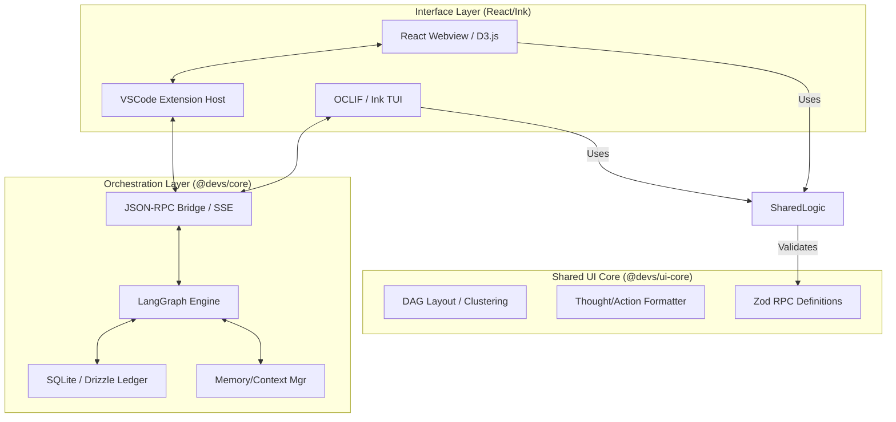
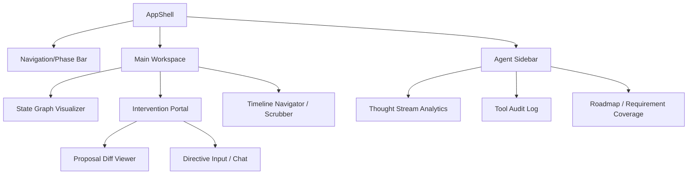

# UI/UX Architecture: devs

## 1. Frontend Architecture Overview & Frameworks

**[UI-ARCH-001]** The `devs` user interface is architected as a **Dual-Headed, Local-First System**. It provides a high-fidelity **VSCode Extension** for interactive development and a robust **CLI Tool** for automation and power-user workflows. Both interfaces are "thin clients" that interact with a unified **Orchestration Engine** (`@devs/core`) via a standardized JSON-RPC 2.0 bridge, ensuring absolute state parity and "Glass-Box" observability across all entry points.

### 1.1 Shared UI Core (`@devs/ui-core`)
To ensure consistency and minimize implementation drift, a shared TypeScript library contains the "headless" UI logic:
- **State Graph Logic:** Implementation of D3-force simulations, topological sorting for the visual DAG, and "Phase Clustering" algorithms used to simplify complex project histories.
- **Log Processing:** A standardized parser for agent "Thoughts" and "Tool Calls," supporting ANSI-to-HTML conversion (for Webviews) and ANSI-to-Ink (for CLI).
- **Requirement Mapping:** Logic to calculate real-time requirement coverage and visualize the "Traceability Heatmap."
- **RPC Definitions:** Zod-validated schemas for all JSON-RPC requests, responses, and notifications.

### 1.2 VSCode Extension Architecture (Rich UI)
The VSCode head leverages the **VSCode Webview API** to host a React-based "Mission Control" center.
- **Core Framework:** **React v18 (Strict Mode)** using Functional Components and Hooks for high-performance state updates.
- **State Management:** 
  - **Global State:** Uses React Context + `useReducer` to manage the local projection of the Orchestrator's state.
  - **Persistence:** Implements `WebviewPanelSerializer` to store UI metadata (zoom, active tab, filtered requirements) in the `vscode.getState()` object, surviving panel disposal.
- **Visualization Engine:** **D3.js (Canvas-based)**.
  - *Rationale:* SVG-based rendering bottlenecks at ~500 nodes. Canvas allows the "State Graph" to scale to 10,000+ turns and tool-calls at 60fps.
  - *Offloading:* Layout calculations (Force-Directed) are offloaded to a **Web Worker** to prevent React main-thread jank.
- **Styling Strategy:** **Vanilla CSS + CSS Modules**. 
  - *Theme Integration:* Strictly utilizes **VSCode CSS Variables** (e.g., `--vscode-editor-background`, `--vscode-button-hoverBackground`) to ensure 100% compliance with user themes.
- **IPC Bridge:** A JSON-RPC 2.0 implementation over the `postMessage` API, featuring an asynchronous request/response pattern and error serialization.

### 1.3 CLI Architecture (Interactive TUI)
The CLI provides an authoritative terminal interface for headless environments and CI/CD audit flows.
- **Framework:** **OCLIF v4** for command orchestration and **Ink (React for CLI)** for the interactive TUI.
- **Rendering Engine:** Ink translates the React component tree into ANSI-escaped terminal strings.
- **Input Handling:** Support for both **TTY (Interactive)** and **Non-TTY (Headless)** modes. 
  - *TTY:* Provides the full "Thought Stream" and "Progress Spinner" experience.
  - *Non-TTY:* Automatically falls back to high-signal, line-delimited JSON logs (`--json`) for machine-readability.
- **Data Access:** Directly interfaces with the `@devs/core` ledger service (SQLite) for sub-millisecond status reporting without needing the orchestrator active.

### 1.4 Dual-Head Synchronization & Consistency
**[UI-ARCH-002]** Absolute consistency between the VSCode Extension and CLI is maintained through the **Unified Ledger Protocol**:
- **Single Source of Truth:** Both interfaces read from the same `state.db` SQLite file located in the `.gemini/` directory.
- **Concurrency Control:** SQLite's **WAL (Write-Ahead Logging)** mode allows the VSCode extension to poll the database for real-time updates while implementation agents are writing results, preventing lock contention.
- **Filesystem Watchers:** The VSCode extension host utilizes the `vscode.workspace.createFileSystemWatcher` to detect manual edits or CLI-initiated snapshots, triggering an immediate "UI Reconciliation Pulse."

### 1.5 Frontend Architecture Diagram

## 2. Component Hierarchy & Reusability Strategy

**[UI-ARCH-002]** The `devs` frontend follows a **"Modular Workspace"** pattern, where the UI is divided into persistent functional areas (Views) that adapt based on the active SDLC phase. To minimize duplication between the VSCode Extension and the CLI, the architecture employs a **Hooks-First Logic Sharing** strategy, where 90% of the state management and domain logic resides in `@devs/ui-core`.

### 2.1 The "Dual-Head" Component Strategy
The system distinguishes between **Domain Logic (Agnostic)** and **Presentational Logic (Platform-Specific)**:
- **Agnostic Logic Hooks:** Residing in `@devs/ui-core`, these hooks (e.g., `useGraphData`, `useThoughtStream`, `useRequirementTraceability`) handle JSON-RPC subscriptions, data normalization, and local caching.
- **Platform Renderers:**
    - **React (Webview):** Uses standard DOM elements and VSCode-themed CSS Modules.
    - **Ink (CLI):** Uses Flexbox-based layout primitives (`<Box>`, `<Text>`) to render ANSI-escaped terminal output.

### 2.2 Functional View Decomposition
The UI dynamically transitions through specialized layouts based on the `Phase` signal from the orchestrator:

| View | Primary Component | Purpose |
| :--- | :--- | :--- |
| **Discovery View** | `ResearchDashboard` | Reviewing Market/Tech reports and approving the "Discovery Brief." |
| **Design View** | `ArchitectureCenter` | Visualizing Mermaid diagrams and auditing the TAS against the PRD. |
| **Execution View** | `ImplementationHub` | Monitoring the TDD loop, sandbox logs, and real-time thought streams. |
| **Maintenance View** | `AgenticExplorer` | Introspecting the generated codebase via the internal MCP server. |

### 2.3 Webview Component Hierarchy (React)
The React hierarchy is designed for high-frequency updates and deep nesting:

### 2.4 Component Standards & Reusability Patterns
- **[UI-ARCH-003] Atomic Design Implementation:** 
    - **Atoms:** `DevsButton`, `DevsInput`, `DevsBadge`. These wrap VSCode toolkit primitives but add "Agentic Status" variants (e.g., `pulsing` for active tools).
    - **Molecules:** `ThoughtCard`, `ToolExecutionRow`, `RequirementPill`.
    - **Organisms:** `ThoughtStream`, `RoadmapMonitor`.
- **[UI-ARCH-004] Visualization Scalability (LoD):** The `StateGraphViewer` MUST implement **Level of Detail (LoD)** rendering. 
    - *High Zoom:* Render full node labels, status icons, and tool-call diffs.
    - *Medium Zoom:* Render simplified nodes and primary lineage edges.
    - *Low Zoom:* Collapse individual turns into "Phase Clusters" or "Epic Blocks" to maintain 60fps.
- **[UI-ARCH-005] High-Signal Streaming:** Components displaying agent output (Thoughts, Logs) MUST support **Incremental JSON Patching**. Instead of re-rendering the whole list, the UI applies granular updates to the specific log entry identified by its UUID.
- **[UI-ARCH-006] Error Boundary Strategy:** Every major view (Discovery, Execution) is wrapped in a `SDLCErrorBoundary` that persists the local state to `vscode.getState()` before crashing, allowing for sub-second recovery of the UI state.

### 2.5 CLI Component Parity (Ink)
The CLI TUI mirrors the React hierarchy using **Ink Component Composition**:
- **`AgentTUI` (Root):** Manages the terminal's alternate screen buffer and handles global keys (e.g., `Ctrl+C` for pause).
- **`ThoughtLog`:** A virtualized list that renders ANSI-styled thought cards. Uses `ink-spinner` to indicate active reasoning.
- **`TaskStatusTable`:** A column-based view of the current Epic, using border styles and colors (Chalk) to indicate progress.
- **`InterventionPrompt`:** An interactive overlay that suspends the TUI stream to request user input for HITL gates.

### 2.6 Theming & Aesthetic Consistency
- **[UI-ARCH-007] Theme Mapping Interface:** A shared `ThemeToken` object in `@devs/ui-core` maps VSCode CSS variables to ANSI-256 color codes.
- **[UI-ARCH-008] Iconography:** Uses **Codicons** (VSCode) and **Nerd Fonts** (CLI) to provide a consistent visual language for agent personas and tool types.
- **[UI-ARCH-009] Accessibility (A11y):**
    - **Webview:** Mandatory `aria-live` regions for thought streams and `aria-describedby` for complex graph nodes.
    - **CLI:** Support for `NO_COLOR` environment variables and screen-reader friendly "Linear Log Mode."

## 3. State Management Paradigm

**[UI-ARCH-010]** The `devs` UI employs a **Reactive Projection Model**, where the frontend maintains a local, high-performance representation of the Orchestration Engine's state. This paradigm ensures that the UI remains responsive even when processing high-frequency agent thought streams or 10,000+ node graph updates.

### 3.1 Local State Projection (The "Ghost Graph")
The UI does not treat the SQLite ledger as its primary reactive store. Instead, it maintains an in-memory **Ghost Graph** within the React/Ink context.
- **`StateProvider`:** A unified provider in `@devs/ui-core` that manages the local projection.
- **Hydration Logic:** On session start, the UI performs a full state hydration. Subsequent updates are applied via incremental JSON patches (RFC 6902) or event-driven fragments (e.g., `thought.chunk`).
- **Parity Verification:** A background "Pulse" periodically checksums the local Ghost Graph against the SQLite ledger's latest `git_hash` and `TurnID` to detect and resolve state divergence.

### 3.2 Reactive Observability & Selective Subscriptions
To maintain 60fps performance, the UI avoids monolithic re-renders by utilizing selective, slice-based subscriptions:
- **`useActiveTurn()`:** Subscribes exclusively to the turn currently being processed by the agent.
- **`useThoughtBuffer(turnId)`:** Provides a reactive, append-only buffer for a specific turn's reasoning stream.
- **`useGraphData(filters)`:** A memoized selector for the D3 engine that recalculates the visible DAG nodes based on user filters (e.g., "Active Branch Only").
- **[UI-ARCH-011]** The system MUST use **Incremental Patching** for all streaming data. Instead of re-broadcasting entire turn objects, the orchestrator sends granular patches that the UI applies to its local reducer.

### 3.3 "Time-Travel" & Timeline Management
The state paradigm is designed to support non-linear history navigation:
- **Historical Buffering:** The UI caches the last $N$ turns in a local "History Buffer" to allow for instantaneous UI-only scrubbing without triggering a full orchestrator-level checkpoint restoration.
- **Checkout Protocol:** When the user clicks a historical node, the UI transitions to a **"Historical View"**. This mode is visually distinct (e.g., grayscale or sepia-toned) and locks all "Implement" controls to prevent accidental divergence on a stale turn.
- **Resumption Logic:** Resuming from a historical state triggers the "Triple-Anchor Restoration" (TAS-012), followed by a full UI state flush and re-hydration.

### 3.4 UI-Specific Metadata & Persistence
The UI manages its own persistent state which is independent of the SDLC ledger:
- **Layout Persistence:** Node coordinates, zoom levels, and sidebar widths are stored in the VSCode `vscode.getState()` object or a local `ui-config.json` for the CLI.
- **View States:** The current active tab, filtered requirements, and search queries are preserved across panel disposal.
- **[UI-ARCH-012]** UI metadata MUST be serialized and stored separately from the SDLC state to ensure that "Time-Travel" operations do not inadvertently revert the user's viewport or filter settings.

### 3.5 State Reconciliation (Conflict Management)
Handling the "Ghost Edit" scenario where manual filesystem changes occur while the UI is active:
- **`RECONCILIATION_REQUIRED` Signal:** Triggered by FS watchers in the Extension Host.
- **UI State Locking:** The UI disables "Run" and "Next Task" buttons until the user acknowledges the reconciliation.
- **Manual Overrides:** If the user manually edits a proposal in the Intervention Portal, the UI treats this as an **Optimistic Update**, reflecting the change locally while the orchestrator validates and anchors it in the Ledger.

## 4. Interaction Design & HITL Workflow

**[UI-ARCH-018]** The Intervention Portal: A dedicated workspace for resolving agentic conflicts, approving proposals, and injecting directives. It is the primary vehicle for "Steerable Autonomy."

### 4.1 Proposal & Approval Workflow
- **[UI-ARCH-019]** Proposal Diffing: High-fidelity, side-by-side diff viewer (using `monaco-editor` in the webview) for all `write_file` and `patch_file` actions. 
    - **Interactive Refinement:** Users can edit the "New" side of the diff before confirming.
    - **Semantic Acknowledgment:** The orchestrator treats these edits as a `USER_REFINEMENT` and updates the agent's short-term memory accordingly.
- **[UI-ARCH-020]** Directive Injection Interface: A real-time chat-like interface that allows users to provide natural language feedback or new requirements (e.g., "Actually, use the Repository pattern here").

### 4.2 Breaking Cycles & Safety
- **[UI-ARCH-021]** Loop Alert Visualization: When the `LoopMonitor` detects an oscillation, the UI must highlight the offending nodes in the State Graph and display a "Reasoning Conflict" summary to help the user diagnose the trap.
- **[UI-ARCH-022]** Budget Escalation Prompts: Mandatory modal gates that appear when an agent exceeds its estimated token or turn quota, requiring explicit user "Budget Extension."

## 5. Communication Protocol & Data Synchronization

**[UI-ARCH-023]** The system employs a strictly typed, contract-first communication layer between the orchestrator engine and the UI heads.

### 5.1 JSON-RPC 2.0 over PostMessage/Sockets
- **Methods:**
    - `workflow.pause()` / `workflow.resume()`
    - `state.getGraph(options: GraphOptions): Promise<GraphData>`
    - `state.checkoutTurn(turnId: UUID): Promise<void>`
    - `directive.submit(content: string): Promise<void>`
- **Events (Orchestrator to UI):**
    - `turn.started`, `turn.finished`
    - `thought.chunk`: Streamed fragments of agent reasoning.
    - `action.call`, `action.result`: Real-time tool execution logs.

### 5.2 State Synchronization & "Time-Travel"
- **[UI-ARCH-024]** Incremental Hydration: To minimize IPC overhead, the UI subscribes to a "Ledger Stream" and applies incremental JSON patches (RFC 6902) to its local React state.
- **[UI-ARCH-025]** Triple-Anchor Checkpoint Restoration: When a user "Time-Travels" in the UI:
    1. The UI sends `state.checkoutTurn(turnId)`.
    2. The Orchestrator performs a `git checkout`, SQLite rollback, and Context hydration.
    3. The UI performs a full state re-sync to ensure the graph and filesystem explorer match the historical state.

## 6. Visualization Engine: The State Graph (D3.js)

**[UI-ARCH-026]** The `StateGraphViewer` is the heart of the "Glass-Box" UI, rendering the DAG of turns, actions, and decisions.

- **[UI-ARCH-027] Dual-Layer Rendering Engine:**
    - **Canvas Layer (Background):** Renders high-frequency node positions, edges, and clusters using D3 force simulation. Supports >10,000 nodes at 60fps.
    - **SVG Layer (Foreground):** Renders the active selection, tooltips, and interactive hit-boxes for nodes.
- **[UI-ARCH-028] Temporal Force Layout:** A specialized D3 force directed layout where the Y-axis is constrained by turn timestamp, ensuring a top-to-bottom project evolution flow while allowing X-axis "branching" for parallel timelines.
- **[UI-ARCH-029] Visual Semantics:**
    - **Nodes:** Geometric shapes indicating persona (e.g., Circle: Researcher, Square: Implementer).
    - **Colors:** Green (Success), Red (Failed), Orange (Reconciled), Blue (Active).
    - **Edges:** Solid (Primary Path), Dashed (Branch/Fork), Red (Regression/Conflict).

## 7. CLI TUI Architecture (Ink/OCLIF)

**[UI-ARCH-030]** The CLI leverages **Ink** to translate React component trees into ANSI-escaped terminal output.

- **[UI-ARCH-031] Ink Component Lifecycle:** Managing agent logs in the terminal without flickering. Uses `Static` components for finished turns and `Box` layouts for active thought streams.
- **[UI-ARCH-032] Virtualized Terminal Output:** Support for large log buffers and thought streams using virtualized lists to prevent terminal buffer overflow.
- **[UI-ARCH-033] Interactive Command Prompts:** Uses `ink-text-input` and `ink-select-input` for HITL gates (e.g., "Approve this plan? [Y/n]").

## 8. Performance, Scalability & Accessibility

### 8.1 UI Performance Strategy
- **[UI-ARCH-034] Web Worker Offloading:** Move heavy graph layout calculations, requirement-traceability audits, and diff parsing to a dedicated Web Worker to keep the React main thread responsive.
- **[UI-ARCH-035] Virtualized Log Views:** Use `react-window` or similar for the `ThoughtStream` and `ToolAudit` logs to handle projects with thousands of turns.

### 8.2 Accessibility (A11y)
- **[UI-ARCH-036] Screen Reader Support:** All streaming agent logs and status updates must have correct ARIA live region attributes (`aria-live="polite"`).
- **[UI-ARCH-037] Keyboard Navigation:** 100% coverage for UI actions via VSCode commands and shortcuts. The State Graph must support keyboard-driven node traversal (Arrow keys to navigate turns).
- **[UI-ARCH-038] High Contrast Support:** Visualizations must dynamically adjust stroke widths and color contrast ratios based on the VSCode `highContrast` theme state.

## 9. Security & UI Sanitization

- **[UI-ARCH-039] Sanitized Markdown Rendering:** Use `dompurify` and `marked` to sanitize all agent-generated Markdown (thoughts, reports) before rendering to prevent XSS in the Webview.
- **[UI-ARCH-040] Secret Redaction in UI:** A client-side fallback `SecretScrubber` that matches regex patterns for common API keys in case the orchestrator-level scrubbing misses a fragment.
- **[UI-ARCH-041] Command Injection Prevention:** All inputs from the `DirectiveInput` are sanitized and validated against a strict command schema before being sent to the orchestrator.

## 10. UI/UX Architecture Risks & Unknowns

- **[RISK-UI-001] Webview Context Persistence:** VSCode may destroy Webview state if it is moved to the background. *Mitigation:* Aggressive use of `getState/setState` and the `WebviewPanelSerializer`.
- **[RISK-UI-002] D3 Graph Complexity:** Extremely deep branching trees may lead to "Visual Noise" that is difficult to navigate. *Mitigation:* Implementation of semantic "Phase Collapsing."
- **[Q-UI-001]** How should the system handle "Multi-User" monitoring if the project is stored on a shared network drive? (Out of scope for v1, but architectural hooks needed).
- **[Q-UI-002]** Should we implement a "Ghost Mode" where the user can preview the effect of a directive on the graph before committing to it?
