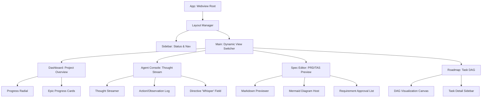

# UI/UX Architecture: Project 'devs'

## 1. Frontend Architecture Overview & Frameworks

The 'devs' project employs a **Hybrid Interface Architecture** designed to meet the requirements of high-velocity automated development and rigorous human architectural oversight. The system is architected as a "Headless Core" (`@devs/core`) with multiple specialized presentation layers. This separation ensures that the core agentic logic remains deterministic and platform-agnostic, while the interfaces provide optimized experiences for different developer workflows.

### 1.1 Interface Tech Stacks

**[6_UI_UX_ARCH-REQ-001] VSCode Extension (The Visual Glass-Box)**
The primary interface for architectural review and real-time monitoring.
*   **Framework**: **React 18.3+ (TypeScript)**. Leveraged for its robust concurrent rendering features (Transitions, Suspense) which are critical for maintaining UI responsiveness during high-frequency agent log streaming.
*   **Build Tool**: **Vite 5.x**. Configured for a single-bundle, ESM-targeted output to comply with VSCode's Webview security policies.
*   **Component Library**: **`@vscode/webview-ui-toolkit`**. Mandatory use to ensure 1:1 aesthetic parity with the host editor and native accessibility support.
*   **Visualization Engine**: **`Mermaid.js` (v10+)**. Integrated via a custom `MermaidHost` component that handles asynchronous SVG rendering and provides interactive pan/zoom capabilities for complex Task DAGs.
*   **State Bridge**: **VSCode `postMessage` API**. Utilizes a custom JSON-RPC layer to bridge the Webview to the local MCP Client running in the Extension Host.

**[6_UI_UX_ARCH-REQ-002] CLI (The Automation Engine)**
The interface for "Makers" and CI/CD integration, prioritizing speed and scriptability.
*   **Runtime**: **Node.js (LTS)**.
*   **TUI Framework**: **`ink` (v4+)**. Provides a React-based reconciler for the terminal, allowing the same state-driven logic from the Extension to be reused for interactive terminal components (progress bars, approval prompts).
*   **terminal-kit / chalk**: Used for low-level ANSI escape sequence management, ensuring support for 256-color and TrueColor terminals across Darwin, Linux, and Windows (WSL2/PowerShell).
*   **Output Strategy**:
    *   **Interactive Mode**: Rich TUI with real-time status updates and keyboard-driven approval gates.
    *   **Headless Mode**: triggered by `--json` or non-TTY environments. Suppresses all TUI elements in favor of NDJSON (Newline Delimited JSON) streams for pipeline consumption.

### 1.2 Core Architectural Rules

*   **[6_UI_UX_ARCH-REQ-003] Interface-Core Decoupling (The "Thin UI" Rule)**: The UI layers MUST remain strictly observational. No business logic, agent state transitions, or requirement distillation logic is permitted in the presentation packages. All state transformations must occur in `@devs/core`.
*   **[6_UI_UX_ARCH-REQ-004] Theme-Aware Styling**: The VSCode Extension MUST NOT hardcode colors. It MUST utilize the standard VSCode CSS variables (e.g., `--vscode-editor-background`) to ensure perfect legibility across Dark, Light, and High-Contrast themes.
*   **[6_UI_UX_ARCH-REQ-005] Sub-Second State Hydration**: The UI MUST be reactive. It utilizes a dedicated "Event Stream" (WebSockets in CLI, `postMessage` in VSCode) to reflect the underlying SQLite state transitions.
*   **[6_UI_UX_ARCH-REQ-006] Message Throttling**: The UI MUST implement a throttling mechanism (max 60fps) for agent thought streams. High-frequency updates from Gemini 3 Flash MUST NOT block the UI main thread or cause "input lag" in the VSCode editor.
*   **[6_UI_UX_ARCH-REQ-007] Bundle Size Constraints**: The Webview bundle MUST be optimized for load speed. Heavy visualization libraries (Mermaid, D3) SHOULD be lazy-loaded only when the user navigates to the Roadmap or Spec views.

### 1.3 Communication Bridge & Protocol
**[6_UI_UX_ARCH-REQ-008] The Orchestrator Bridge**: Both interfaces communicate with the `@devs/core` orchestrator via a standardized **MCP (Model Context Protocol) Client**.

1.  **[6_UI_UX_ARCH-REQ-009] Request/Response**: UI triggers tool calls (e.g., `approve_tas`) which are forwarded to the `OrchestratorServer`.
2.  **[6_UI_UX_ARCH-REQ-010] State Streaming**: The Orchestrator emits `STATE_CHANGE` events. The UI Context Provider captures these and performs a partial state refresh, ensuring the visual "Glass-Box" is always in sync with the "Flight Recorder" (SQLite).
3.  **[6_UI_UX_ARCH-REQ-011] Error Propagation**: All system errors (LLM timeouts, sandbox failures) MUST be bubbled up to the UI with original stack traces and "Root Cause" summaries to facilitate human debugging.

### 1.4 Security & Webview Isolation
**[6_UI_UX_ARCH-REQ-012] Content Security Policy (CSP)**: The VSCode Webview MUST implement a strict CSP:
*   `default-src 'none';`
*   `script-src 'self' 'unsafe-inline' 'unsafe-eval';` (eval required for Mermaid rendering).
*   `style-src 'self' 'unsafe-inline';`
*   `img-src 'self' data: https:;`
*   **Local Resource Loading**: All project assets and documentation MUST be served via the `vscode-resource` URI scheme. Direct local path access is prohibited.

### 1.5 Cross-Platform & Runtime Requirements
*   **[6_UI_UX_ARCH-REQ-013] TUI Resilience**: The CLI MUST detect terminal capabilities (Unicode support, color depth) and degrade gracefully (e.g., using ASCII Fallbacks if Unicode is unsupported).
*   **[6_UI_UX_ARCH-REQ-014] OS Compatibility**: The UI layers MUST be tested and verified on macOS (Darwin), Linux (Ubuntu/Debian), and Windows (Windows 11 / WSL2). Specific attention MUST be paid to font rendering and keybinding parity (Cmd vs Ctrl) in the VSCode Extension.

---

## 2. Component Hierarchy & Reusability Strategy

The 'devs' UI employs a **Feature-Based Atomic Design** pattern, optimized for the "Glass-Box" transparency requirement. The hierarchy is designed to ensure that the complex state of the multi-agent orchestrator is decomposed into manageable, reactive, and highly reusable modules across both the VSCode Webview (React) and the CLI (Ink).

### 2.1 Component Hierarchy Map



### 2.2 Detailed Component Specifications

#### 2.2.1 [6_UI_UX_ARCH-REQ-015] ThoughtStreamer (The Glass-Box Heart)
**Purpose**: Renders the agent's internal reasoning (SAOP `reasoning_chain`) in real-time as it is streamed from the orchestrator.
*   **[6_UI_UX_ARCH-REQ-016] Rendering Logic**: Uses `react-markdown` with `remark-gfm`. MUST support incremental streaming (append-only) without re-rendering the entire block to prevent UI flickering.
*   **[6_UI_UX_ARCH-REQ-017] Styling**: Uses a distinctive typography (e.g., `font-serif` or `italic`) to separate "Internal Thought" from "External Output".
*   **[6_UI_UX_ARCH-REQ-018] Edge Case: Large Reasoning Logs**: For tasks with >50 turns, the component MUST implement virtual scrolling (via `react-window`) to maintain 60fps performance.
*   **[6_UI_UX_ARCH-REQ-019] Requirement Mapping**: Thoughts that explicitly mention a `REQ-ID` SHOULD be decorated with a hoverable badge that links back to the PRD.

#### 2.2.2 [6_UI_UX_ARCH-REQ-020] DAGCanvas (Interactive Roadmap)
**Purpose**: Visualizes the 200+ task Directed Acyclic Graph (DAG) generated by the Distiller.
*   **[6_UI_UX_ARCH-REQ-021] Engine**: Custom implementation using `d3-force` for layout and `react-zoom-pan-pinch` for navigation.
*   **[6_UI_UX_ARCH-REQ-022] Node States**: MUST support PENDING, RUNNING, SUCCESS, FAILED, and PAUSED states with specific visual cues.
*   **[6_UI_UX_ARCH-REQ-023] Zoom/Pan Interaction**: Mandatory for navigating 8-16 Epics.
*   **[6_UI_UX_ARCH-REQ-024] Focus Interaction**: Clicking a node focuses the `TaskDetailCard` and syncs the `ConsoleView` to that task's history.
*   **[6_UI_UX_ARCH-REQ-025] Edge Case: Massive Graphs**: If task count > 300, the canvas MUST switch to a simplified "LOD" (Level of Detail) mode where labels are hidden until zoomed in.

#### 2.2.3 [6_UI_UX_ARCH-REQ-026] MermaidHost (Diagram Orchestrator)
**Purpose**: A centralized, safe environment for rendering Mermaid.js diagrams (ERDs, Sequence Diagrams, Roadmaps).
*   **[6_UI_UX_ARCH-REQ-027] Sandbox**: Mermaid MUST be rendered within an internal iframe or a strictly controlled `div` to prevent CSS leakage into the main UI.
*   **[6_UI_UX_ARCH-REQ-028] Error Resilience**: If Mermaid parsing fails, the component MUST display the raw code block with a "Syntax Error" warning and an "Edit" shortcut to the source file.
*   **[6_UI_UX_ARCH-REQ-029] Theme Sync**: MUST listen to VSCode theme changes and re-initialize Mermaid with the appropriate configuration (`dark`, `default`, or `neutral`).

#### 2.2.4 [6_UI_UX_ARCH-REQ-030] DirectiveWhisperer (HITL Input)
**Purpose**: The primary channel for "User Whispering" (mid-task directives).
*   **[6_UI_UX_ARCH-REQ-031] Context Awareness**: Auto-complete for `@file` paths and `#requirement` IDs.
*   **[6_UI_UX_ARCH-REQ-032] Priority Toggle**: Ability to flag a directive as "Immediate Pivot" (forces current agent turn to abort and reflect).
*   **[6_UI_UX_ARCH-REQ-033] State Integration**: On submit, it triggers the `inject_directive` MCP tool and optimistically appends the directive to the `ThoughtStreamer` with a "Pending" status.

### 2.3 Reusability & Shared Logic Strategy

To ensure parity between the CLI and VSCode Extension, the UI layer is split into "Pure Logic" and "Platform Renderers".

*   **[6_UI_UX_ARCH-REQ-034] Shared Logic Hooks (@devs/ui-hooks)**:
    *   `useTaskStatus(taskId)`: Logic for calculating status based on SQLite events.
    *   `useEntropyMonitor(taskId)`: Heuristics for detecting agent loops.
    *   `useRequirementTrace(reqId)`: Utilities for mapping code to specs.
*   **[6_UI_UX_ARCH-REQ-035] Cross-Platform State (Zustand Store)**:
    *   The core state logic (Task DAG, Agent Logs) is implemented in a platform-agnostic Zustand store.
    *   **CLI Integration**: The `ink` TUI consumes this store directly.
    *   **VSCode Integration**: The React Webview consumes this store via a `postMessage` bridge.

### 2.4 Atomic Primitives (The devs-UI Kit)

All UI elements MUST be composed from these foundational primitives to ensure "Architecture-First" consistency.

| Primitive | Library | CLI Fallback (Ink) | Purpose | ID |
| :--- | :--- | :--- | :--- | :--- |
| **`StatusBadge`** | Custom | `Text` with background color | Renders task/epic status with standard colors. | [6_UI_UX_ARCH-REQ-103] |
| **`ActionCard`** | Custom | `Box` with border | Displays a single SAOP tool call and its arguments. | [6_UI_UX_ARCH-REQ-104] |
| **`LogTerminal`** | `xterm.js` | `Text` (monospaced) | Renders sandbox stdout/stderr with secret masking. | [6_UI_UX_ARCH-REQ-105] |
| **`IconButton`** | `vscode-webview-ui-toolkit` | Keybinding shortcut | Standardized interactive triggers. | [6_UI_UX_ARCH-REQ-106] |
| **`StepProgress`** | Custom | `ProgressBar` | Visualizes the 5 phases of the 'devs' lifecycle. | [6_UI_UX_ARCH-REQ-107] |

### 2.5 UI Edge Cases & Technical Risks

*   **[6_UI_UX_ARCH-REQ-036] Webview Message Bottleneck**: High-frequency streaming from `ThoughtStreamer` can saturate the VSCode `postMessage` bridge.
    *   *Mitigation*: Implement an internal buffer in `@devs/core` that batches thought chunks every 50ms before sending to the UI.
*   **[6_UI_UX_ARCH-REQ-037] SVG Rendering Overhead**: Rendering massive Mermaid ERDs in Phase 2 can cause UI lag.
    *   *Mitigation*: MermaidHost MUST use a `ResizeObserver` to only render diagrams currently in the viewport.
*   **[6_UI_UX_ARCH-REQ-038] State Desync**: If the CLI and VSCode are open simultaneously, their views of the SQLite state might diverge.
    *   *Mitigation*: Mandatory use of SQLite `WAL` mode and file-system watchers on `.devs/state.sqlite` to trigger UI refreshes across all interfaces.
*   **[6_UI_UX_ARCH-REQ-039]**: How should the UI handle 3D visualizations or complex profiler traces (e.g., Flamegraphs) within the restricted Webview environment? (Current: Out of Scope, use static SVG snapshots).

---

## 3. State Management Paradigm

The 'devs' UI implements a **Reactive Tiered State Architecture** designed to handle the high-frequency telemetry of autonomous agents while maintaining the deterministic integrity of the "Glass-Box" flight recorder. The paradigm ensures that the UI remains a stateless reflection of the underlying `@devs/core` orchestrator, bridged by the Model Context Protocol (MCP).

### 3.1 Tiered State Hierarchy

To balance performance, persistence, and synchronization, state is categorized into four distinct tiers:

**[6_UI_UX_ARCH-REQ-040] Tier 0: Transient Component State (Ephemeral)**
*   **Scope**: Hover states, dropdown toggles, animation progress, input field focus.
*   **Implementation**: React `useState` and `useReducer`.
*   **Lifecycle**: Limited to the component's mount cycle; never persisted.

**[6_UI_UX_ARCH-REQ-041] Tier 1: Global UI Layout State (Volatile)**
*   **Scope**: Active tab/view mode, sidebar width, zoom/pan coordinates for the DAG, filtered task IDs.
*   **Implementation**: **Zustand (Slices Pattern)**.
*   **Sync**: Shared across all components in the Webview. Resets on Webview reload unless explicitly hydrated from Tier 3.

**[6_UI_UX_ARCH-REQ-042] Tier 2: Synchronized Project Mirror (Source of Truth)**
*   **Scope**: Task statuses, requirement fulfillment (REQ-IDs), active agent thoughts, tool execution logs.
*   **Implementation**: **Normalized Zustand Store** hydrated via **MCP Subscriptions**.
*   **Data Structure**: Uses a normalized "Entity Store" (e.g., `tasks: Record<UUID, Task>`, `logs: Record<UUID, LogChunk[]>`) to ensure O(1) updates and prevent unnecessary re-renders of the entire project tree.
*   **Persistence**: Reflects the SQLite `state.sqlite` database.

**[6_UI_UX_ARCH-REQ-043] Tier 3: Persistent User Preferences (Host-Level)**
*   **Scope**: Preferred theme (if overriding VSCode), user "Directives" history, experimental feature toggles.
*   **Implementation**: VSCode `workspaceState` and `globalState` bridged via `postMessage`.
*   **Lifecycle**: Persists across VSCode sessions and project reloads.

### 3.2 The MCP Synchronization Protocol

The UI maintains a "Mirror State" of the orchestrator through a robust event-driven bridge.

#### 3.2.1 Subscription Lifecycle
1.  **Connection**: Upon mount, the Webview issues an MCP `subscribe` request for specific project resource URIs (e.g., `devs://project/tasks`, `devs://project/active-thought`).
2.  **Initial Hydration**: The `OrchestratorServer` responds with a full JSON snapshot of the requested entities.
3.  **Delta Streaming**: Subsequent changes in the SQLite database trigger `notifications/resources/updated` events via MCP. The payload contains a "Delta Object" (e.g., only the changed fields of a Task).
4.  **Reconciliation**: The Zustand store merges the delta. React components subscribed to that specific entity ID re-render.

#### 3.2.2 Throttling & Batching (The 60FPS Rule)
**[6_UI_UX_ARCH-REQ-044] Update Batching**: During high-velocity implementation tasks (e.g., Gemini 3 Flash logs), the `@devs/core` orchestrator MUST NOT emit individual character-level updates. It MUST batch thought chunks every 32ms (targeting 30fps) to prevent the VSCode `postMessage` bridge from saturating.
**[6_UI_UX_ARCH-REQ-045] Selective Reactivity**: The `ThoughtStreamer` component uses a "Selector-based" subscription to Zustand. It only re-renders when the `active_turn_content` for its specific `task_id` changes.

### 3.3 Zustand Store Design & Slicing

The global state is partitioned into domain-specific slices to maximize maintainability.

```typescript
interface DevsStore {
  // Navigation Slice
  viewMode: 'DASHBOARD' | 'CONSOLE' | 'ROADMAP' | 'SPEC';
  activeTaskId: string | null;
  
  // Project Slice (Normalized Tier 2)
  tasks: Record<string, UITaskNode>;
  requirements: Record<string, UIRequirement>;
  activeThought: string; // Accumulating Markdown stream
  
  // UI State Slice (Tier 1)
  dagZoomLevel: number;
  sidebarCollapsed: boolean;
  
  // Actions
  updateTask: (id: string, delta: Partial<UITaskNode>) => void;
  appendThought: (chunk: string) => void;
  setNavigation: (mode: ViewMode, id?: string) => void;
}
```

### 3.4 Optimistic Updates & Transactional Integrity

To ensure a highly responsive "Pro" feel, the UI employs optimistic state transitions for human-initiated actions.

1.  **Action Trigger**: User clicks "Pause Task".
2.  **Optimistic Mutation**: The Zustand store immediately sets the Task status to `PAUSED_PENDING`. The UI renders an amber "Wait" indicator.
3.  **MCP Invocation**: A `tool_call` is sent to the `OrchestratorServer`.
4.  **Acknowledgment (Settle)**:
    *   **Success**: The server responds with the new SQLite state. The store updates status to `PAUSED`.
    *   **Failure**: The server returns an error. The store rolls back to `RUNNING` and triggers a `Toast` notification using the VSCode API.

### 3.5 Large Data Handling: Streaming & Pagination

As projects scale to 200+ tasks and thousands of reasoning turns, the UI MUST implement data virtualization.

*   **[6_UI_UX_ARCH-REQ-046] Reasoning Log Windowing**: The UI store only maintains the "Full Trace" for the `activeTaskId`. Historical traces for completed tasks are evicted from memory and re-fetched from MCP `get_task_trace` only when the user selects them in the UI.
*   **[6_UI_UX_ARCH-REQ-047] Log Chunking**: Observations (terminal outputs) exceeding 50KB are stored as discrete "Chunks" in the UI. The `LogTerminal` component only renders the last 500 lines by default, with an "Infinite Scroll" trigger to load older chunks from the store.
*   **[6_UI_UX_ARCH-REQ-048] DAG Level-of-Detail (LOD)**: For projects with >10 Epics, the Zustand store calculates a "Simplified DAG" containing only Epic-level summaries. The full task-level DAG is only computed and rendered when the user "drills down" into a specific Epic.

### 3.6 Edge Cases & Recovery Logic

*   **[6_UI_UX_ARCH-REQ-049] Disconnection Resilience**: If the MCP socket closes, the Zustand store enters a `RECONNECTING` state. All interactive buttons are disabled. Upon reconnection, a full `sync_all` request is issued to reconcile any state changes that occurred while the UI was offline.
*   **[6_UI_UX_ARCH-REQ-050] State Desync Detection**: Every state update from the server includes a `sequence_id` or `timestamp`. If the UI receives an update with a sequence older than its current state, it logs a `DESYNC_WARNING` and initiates a "Hard Refresh" of the project mirror.
*   **[6_UI_UX_ARCH-REQ-051] Webview Crash Recovery**: Since the Webview is ephemeral, all critical UI state (like active view and filters) SHOULD be persisted to `vscode.getState()` every 5 seconds, allowing the UI to restore its exact layout after a VSCode window reload or extension crash.

---

## 4. Routing Architecture

'devs' does not use traditional URL-based routing. Instead, it employs a **State-Driven Virtual Router** mechanism to manage navigation within the VSCode Webview, ensuring that the interface is a reactive reflection of the orchestrator's progress.

### 4.1 State-Driven Router (Virtual Routing)
The VSCode Webview lacks a traditional browser history and URL bar. Routing is implemented as a central state switcher powered by the Tier 1 Global UI State (Zustand).
*   **[6_UI_UX_ARCH-REQ-052] Router Provider**: A top-level `ViewRouter` component wraps the application, conditionally rendering primary view modules based on the `viewMode` state.
*   **[6_UI_UX_ARCH-REQ-053] Multi-Pane Architecture**: The router supports a split-pane layout where the `Sidebar` (Global Navigation & Health) remains persistent while the `MainViewport` transitions between specialized views.

### 4.2 View Definitions & Navigation Parameters
Views are parameterized to allow for specific context focusing and deep-linking.

| View Mode | Context Parameters | Access Requirement | ID |
| :--- | :--- | :--- | :--- |
| `DASHBOARD` | `None` | Always available. | [6_UI_UX_ARCH-REQ-054] |
| `RESEARCH_VIEW`| `reportId?` | Phase 1 (Research) must be active or completed. | [6_UI_UX_ARCH-REQ-055] |
| `SPEC_VIEW` | `docId?`, `reqId?` | Phase 2 (Design) must be active or completed. | [6_UI_UX_ARCH-REQ-056] |
| `ROADMAP` | `epicId?`, `focusTaskId?` | Phase 3 (Distillation) must be completed. | [6_UI_UX_ARCH-REQ-057] |
| `CONSOLE` | `taskId`, `turnIndex?` | Phase 4 (Implementation) must be active. | [6_UI_UX_ARCH-REQ-058] |
| `SETTINGS` | `None` | Always available. | [6_UI_UX_ARCH-REQ-059] |

### 4.3 Deep-Linking & Inter-Process Navigation
**[6_UI_UX_ARCH-REQ-060] Extension Host URI Handler**: The VSCode Extension MUST register a custom URI scheme (e.g., `vscode://google.gemini-devs/open-task?id=...`).
*   Clicking a link in a generated `.agent.md` file or a Markdown comment in `src/` (e.g., `// See Task: T-123`) MUST:
    1.  Activate the 'devs' Webview if it is currently hidden or closed.
    2.  Update the Zustand store to set `viewMode: 'CONSOLE'` and `activeTaskId: 'T-123'`.
*   **[6_UI_UX_ARCH-REQ-061] Cross-Document Spec Linking**: Links within generated documents (e.g., `REQ-ID` in the TAS) MUST be intercepted by the Webview's Markdown renderer and trigger a `NAVIGATE_TO_SPEC` action instead of attempting to open an external browser.

### 4.4 Phase-Gated Access Control
Navigation is strictly constrained by the current project phase persisted in the SQLite state.
*   **[6_UI_UX_ARCH-REQ-062] Incremental View Unlocking**:
    *   **Phase 1**: Only `DASHBOARD` and `RESEARCH_VIEW` are accessible.
    *   **Phase 2**: `SPEC_VIEW` unlocks. Attempts to access `ROADMAP` trigger a "Planning in Progress" placeholder.
    *   **Phase 3**: `ROADMAP` becomes fully interactive.
    *   **Phase 4**: `CONSOLE` becomes the primary view.
*   **[6_UI_UX_ARCH-REQ-063] Hard Redirects (Gated Autonomy)**: If the orchestrator transitions to a `WAITING_FOR_APPROVAL` state, the UI MUST automatically navigate the user to the relevant view (e.g., `SPEC_VIEW` for TAS approval) and trigger a pulsing notification in the Sidebar.

### 4.5 Navigation History & Persistence
*   **[6_UI_UX_ARCH-REQ-064] Virtual History Stack**: The UI store maintains a 10-level deep `navigationHistory` array, enabling "Back" and "Forward" button functionality within the Webview header.
*   **[6_UI_UX_ARCH-REQ-065] View State Restoration**: The router MUST cache transient states for each view. Returning to the `ROADMAP` from the `CONSOLE` MUST restore the previous pan coordinates and zoom level of the DAG canvas.
*   **[6_UI_UX_ARCH-REQ-066] Session Re-hydration**: On every navigation change, the UI MUST call `vscode.setState()`. If the Webview is disposed (e.g., user closes the tab), it MUST restore the exact `viewMode` and `activeTaskId` upon being reopened.

### 4.6 Edge Cases & Transition Safety
*   **[6_UI_UX_ARCH-REQ-067] Active Task Lock**: If the user attempts to navigate away from the `CONSOLE` while a high-priority "Human-in-the-Loop" gate is active (e.g., a critical error requires a directive), the UI MUST show a confirmation warning.
*   **[6_UI_UX_ARCH-REQ-068] Invalid Context Recovery**: If a `taskId` is provided in the navigation state that no longer exists in the Tier 2 Project Mirror (e.g., after a `rewind`), the router MUST fallback to the `DASHBOARD` and display a "Task Not Found" toast.
*   **[6_UI_UX_ARCH-REQ-069] Headless Transition**: In the CLI (Ink), "Routing" is simplified to a linear phase-based progression. The CLI MUST ignore complex navigation parameters and always focus on the current active task or phase gate.

---

## 5. Styling System & Asset Management

The 'devs' styling system is engineered for **Theme Resilience** and **Low-Latency Rendering**. It bridges the visual gap between a high-fidelity web interface (VSCode Webview) and a performance-critical terminal interface (CLI TUI), ensuring a consistent "Glass-Box" brand identity across all touchpoints.

### 5.1 Styling Framework & Theme Synchronization

**[6_UI_UX_ARCH-REQ-070] Tailwind CSS with Shadow DOM Isolation**
*   **Prefixing**: Tailwind MUST be configured with a unique prefix (e.g., `devs-`) and a specific `important` selector to prevent CSS collisions with VSCode's internal styles or other installed extensions.
*   **Just-In-Time (JIT) Engine**: Vite-integrated JIT compilation ensures only the CSS used in the Webview is bundled, keeping the final style payload under 50KB.
*   **Dynamic Utility Classes**: Use of Tailwind's `arbitrary values` (e.g., `text-[var(--vscode-editor-foreground)]`) is mandatory for mapping UI elements to the host environment.

**[6_UI_UX_ARCH-REQ-071] VSCode Theme Variable Mapping**
The system MUST NOT use hardcoded hex codes. All colors MUST reference the `vscode-webview-ui-toolkit` tokens or native VSCode variables.
*   **Backgrounds**: `--vscode-editor-background`, `--vscode-sideBar-background`.
*   **Foregrounds**: `--vscode-editor-foreground`, `--vscode-descriptionForeground`.
*   **Accents/Interactive**: `--vscode-button-background`, `--vscode-focusBorder`, `--vscode-progressBar-background`.
*   **Glass-Box Palette**: Custom variables (e.g., `--devs-thought-bg`) MUST be derived from `--vscode-editor-lineHighlightBackground` using CSS `color-mix()` to ensure contrast regardless of the user's theme.

**[6_UI_UX_ARCH-REQ-072] TUI Styling (Ink & Chalk)**
*   **Color Mapping**: The CLI uses a semantic color mapper that translates the "devs" palette into 256-color or TrueColor ANSI codes.
*   **Theme Detection**: On startup, the CLI MUST detect the terminal's background color (if supported by the TTY) to select between a "Dark" and "Light" ANSI theme.
*   **Layout Constraints**: TUI components in `Ink` utilize Flexbox-like props. These MUST mirror the spacing and padding scales defined in the Tailwind configuration (e.g., `p-4` in React maps to `padding={4}` in Ink).

### 5.2 Asset & Iconography Strategy

**[6_UI_UX_ARCH-REQ-073] VSCode Codicons (Iconography)**
*   **Library**: Integration of `@vscode/codicons` via font-injection. 
*   **Usage**: Icons MUST be rendered using the standard `codicon codicon-<name>` class pattern to support theme-driven color inheritance and accessibility labels.
*   **Custom Icons**: Any brand-specific icons MUST be provided as SVGs and injected via a custom `IconSprite` to avoid external HTTP fetches.

**[6_UI_UX_ARCH-REQ-074] Local Resource Loading (URI Scheme)**
*   **Security**: All assets (fonts, icons, static images) MUST be loaded using the `webview.asWebviewUri()` API. 
*   **Asset Bundling**: Webview assets are bundled into the `dist/webview/` directory during build. The Extension Host MUST resolve these to `vscode-resource://` URIs before passing them to the React app.

**[6_UI_UX_ARCH-REQ-075] Vector-First Visualization Pipeline**
*   **Mermaid.js Optimization**: Technical diagrams (ERDs, Roadmaps) are rendered client-side from text to SVG. 
*   **Canvas Fallback**: For the high-density Task DAG (Phase 4), the system MAY utilize an HTML5 Canvas-based renderer (`d3-canvas`) if the node count exceeds 500, ensuring smooth 60FPS panning/zooming.
*   **SVG Masking**: All SVGs MUST use `currentColor` or CSS variables for fill/stroke to ensure they remain visible when switching between Light and High-Contrast themes.

### 5.3 Typography & Readability Architecture

**[6_UI_UX_ARCH-REQ-076] Font Stack Hierarchy**
*   **UI Elements**: Inherits VSCode's workbench font (typically `Segoe UI`, `San Francisco`, or `Ubuntu`).
*   **Agent Reasoning (Thoughts)**: Uses a serif font stack (e.g., `Georgia`, `serif`) with increased line-height (1.6) to create a distinct "Journal" or "Thinking" aesthetic, separating it from code logic.
*   **Terminal/Code Logs**: Inherits the user's configured VSCode editor font (e.g., `Fira Code`, `JetBrains Mono`).

**[6_UI_UX_ARCH-REQ-077] Syntax Highlighting (Glass-Box Logs)**
*   **Engine**: Integration of `shiki` (for static blocks) or a lightweight Prism-based highlighter for real-time log streaming.
*   **Theme Sync**: Highlight themes MUST dynamically match the active VSCode color theme (e.g., `github-dark` vs `github-light`).

### 5.4 Performance & Asset Edge Cases

*   **[6_UI_UX_ARCH-REQ-078] Asset Lazy Loading**: Heavy binary assets (e.g., specific Mermaid.js sub-modules) MUST be lazy-loaded using dynamic imports only when the user transitions to Phase 2.
*   **[6_UI_UX_ARCH-REQ-079] Image Redaction**: If the Research Agent scrapes an image from the web, the UI MUST proxy it through a local "Sanitation Buffer" to ensure it doesn't violate the strict CSP or leak the user's IP address to an external server.
*   **[6_UI_UX_ARCH-REQ-080] TUI ASCII Fallbacks**: If the terminal does not support Unicode (detected via `is-unicode`), the CLI MUST automatically swap Codicons for ASCII equivalents (e.g., `[+]` instead of ``).
*   **[6_UI_UX_ARCH-REQ-081]**: How should the system handle "Custom CSS" provided by the user in the PRD for the generated app's UI? (Current: User assets are ignored by the 'devs' orchestrator UI, only applied to the generated project's `src/` folder).

---

## 6. Observability & Traceability Rendering (The Glass-Box UI)

The primary goal of the 'devs' UI is to render the internal reasoning of the agents in a human-parsable format.

### 6.1 SAOP Trace Rendering
*   **[6_UI_UX_ARCH-REQ-082] Streaming Thought Protocol**: The `ThoughtStream` component MUST support incremental rendering of Markdown as it is received from the SAOP stream.
*   **[6_UI_UX_ARCH-REQ-083] Semantic Differentiators**:
    *   **Thoughts (Reasoning)**: Rendered in a distinct serif font or italicized style to differentiate from output.
    *   **Actions (Tools)**: Rendered as "Action Cards" showing the tool name and arguments in a collapsed code block.
    *   **Observations (Sandbox)**: Rendered in a terminal-themed block (monospaced, dark background) with secret redaction markers (`[REDACTED]`).
*   **[6_UI_UX_ARCH-REQ-084] Chain-of-Thought Visualization**: The UI MUST visually link tool calls back to the reasoning block that initiated them, using vertical connecting lines or indentation.

### 6.2 The Reasoning Sidebar (Breadcrumbs)
*   **[6_UI_UX_ARCH-REQ-085] Temporal Navigation**: A scrollable vertical timeline that allows users to jump back to previous turns within the current task.
*   **[6_UI_UX_ARCH-REQ-086] State Delta Highlighting**: When an implementation turn completes, the UI MUST offer a "Diff View" showing exactly which files were modified by that turn.

---

## 7. Human-in-the-Loop (HITL) Interaction Design

HITL is not just a feature; it is a hard architectural gate enforced by the UI.

### 7.1 Approval Gates (Phase-Level)
*   **[6_UI_UX_ARCH-REQ-087] Spec Sign-off Component**: A specialized view for Phase 2 that renders the PRD and TAS with "Accept/Reject" buttons for individual requirement blocks.
*   **[6_UI_UX_ARCH-REQ-088] Roadmap DAG Editor**: An interactive canvas where users can:
    *   Drag to reorder tasks (respecting dependency constraints).
    *   Right-click to "Delete" or "Merge" tasks.
    *   Double-click to edit task descriptions.

### 7.2 Directive Injection ("Whispering")
*   **[6_UI_UX_ARCH-REQ-089] Global Directive Input**: A persistent text field in the sidebar or console footer.
*   **[6_UI_UX_ARCH-REQ-090] Contextual Snippets**: Support for `@file` mentions to automatically inject file contents into the directive context.
*   **[6_UI_UX_ARCH-REQ-091] Priority Feedback**: Visual confirmation when the agent acknowledges the directive (e.g., a "Directive Acknowledged" badge in the thought stream).

---

## 8. Data Models & UI API Contracts

The interface interacts with the core orchestrator via a set of standardized JSON models.

### 8.1 [6_UI_UX_ARCH-REQ-092] UI Task DAG Model
```typescript
interface UITaskNode {
  id: string;
  epicId: string;
  reqId: string;
  title: string;
  status: "PENDING" | "RUNNING" | "SUCCESS" | "FAILED" | "PAUSED";
  dependencies: string[]; // List of Task IDs
  position: { x: number; y: number }; // For canvas rendering
}
```

### 8.2 [6_UI_UX_ARCH-REQ-093] SAOP Envelope UI Representation
```typescript
interface SAOP_UI_Turn {
  turnIndex: number;
  agentId: string;
  thought: string; // Markdown
  strategy: string;
  actions: Array<{
    tool: string;
    args: any;
    status: "INVOKED" | "COMPLETED" | "FAILED";
    observation?: string; // Redacted sandbox output
  }>;
  timestamp: number;
}
```

---

## 9. Performance, Scalability & Edge Cases

### 9.1 Performance Guardrails
*   **[6_UI_UX_ARCH-REQ-094] Log Virtualization**: For long-running tasks with 100+ turns, the `ConsoleView` MUST use `react-window` or `react-virtualized` to render only the visible turns, preventing DOM bloat.
*   **[6_UI_UX_ARCH-REQ-095] Graph Throttling**: The DAG visualization MUST use an internal debouncer for updates during parallel task execution to prevent UI stuttering.

### 9.2 Edge Case Handling
*   **[6_UI_UX_ARCH-REQ-096] Broken Mermaid Handling**: If an agent generates an invalid Mermaid diagram, the UI MUST catch the rendering error and display a "Syntax Error in Diagram" fallback with a button to view the raw markup.
*   **[6_UI_UX_ARCH-REQ-097] Massive Log Handling**: Observations exceeding 10,000 characters MUST be truncated with a "Read More" button that fetches the full raw log from SQLite on-demand.
*   **[6_UI_UX_ARCH-REQ-098] Disconnected State**: If the MCP connection drops, the UI MUST overlay a "Reconnecting..." modal and disable all interactive buttons to prevent state desync.

---

## 10. Accessibility, Localization & Theme Resilience

### 10.1 Accessibility (A11y)
*   **[6_UI_UX_ARCH-REQ-099] Screen Reader ARIA-Live**: The `ThoughtStream` MUST use `aria-live="polite"` to announce new agent thoughts to visually impaired users.
*   **[6_UI_UX_ARCH-REQ-100] Keyboard Navigation**: Every task card and roadmap node MUST be focusable and operable via `Enter`/`Space` keys.

### 10.2 Localization & Theme
*   **[6_UI_UX_ARCH-REQ-101] i18n Skeleton**: Use `i18next` for all static UI strings, supporting dynamic locale switching.
*   **[6_UI_UX_ARCH-REQ-102] Theme Contrast Logic**: The UI MUST calculate its own foreground colors for diagrams based on the inherited VSCode background color to ensure WCAG 2.1 AA contrast ratios even in non-standard community themes.
