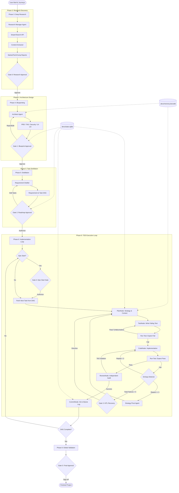

# Project Roadmap: Project 'devs'

## 1. Roadmap Overview & Phasing Strategy

The 'devs' project roadmap is engineered to transition from a theoretical multi-agent concept to a production-grade, autonomous software engineering system through a **Dependency-Aware Phasing Strategy**. The roadmap rejects a feature-first approach in favor of a **Foundation-First Infrastructure**, prioritizing the system's "Cerebral Cortex" (Orchestrator) and "Motor Cortex" (Sandbox) before implementing higher-order "Intelligence" (Research and Implementation Agents).

This strategy is built on the **Glass-Box Mandate**: every phase must produce queryable state and audit logs. There is no "black box" development; the system's ability to observe itself is a prerequisite for its ability to build other systems.

### 1.1 The "Foundation-First" Philosophy
The roadmap is divided into three major milestones, each representing a leap in the system's level of autonomy and reliability:
1.  **Milestone 1: The Deterministic Engine (Phases 1-2)**: Establishing the ACID-compliant state machine and the secure execution environment. The goal is a system that can fail safely and resume perfectly.
2.  **Milestone 3: The Architect's Intelligence (Phases 3-5)**: Deploying the "Discovery" and "Design" agents. The goal is to move from ambiguous user prompts to mathematically traceable Requirement DAGs.
3.  **Milestone 3: The Autonomous Loop (Phases 6-8)**: Activating the TDD implementation engine and multi-modal interfaces. The goal is the delivery of verified, agent-ready codebases.

### 1.2 Phasing Strategy & Dependency Logic
The order of operations is governed by the following critical dependencies:
- **Persistence before Planning**: The SQLite state manager and checkpointer (Phase 1) must be robust enough to handle the massive context generated by the Research Agents (Phase 3).
- **Isolation before Implementation**: The Docker/WebContainer sandbox and the SecretMasker (Phase 2) must be fully operational before the Developer Agent (Phase 6) is allowed to execute a single shell command.
- **Distillation before Execution**: The Requirement Distiller (Phase 5) is the "Compiler" of the roadmap; it transforms high-level Markdown (Phase 4) into the Task DAG that drives the implementation loop.

### 1.3 Phasing Summary

| Phase | Designation | Primary Objective | Technical Key Results (KRs) |
| :--- | :--- | :--- | :--- |
| **P1** | **Foundation** | The "Brain" | LangGraph.js State Machine; SQLite ACID persistence; Tiered Memory (S/M/L); SAOP Schema definition. |
| **P2** | **Execution** | The "Hands" | Hardened Docker/WebContainer Sandbox; MCP SDK integration; Real-time SecretMasker; Surgical Edit tools. |
| **P3** | **Discovery** | The "Eyes" | Parallel Research Manager; Serper/Search integration; Markdown Content Extraction; Source Credibility Scoring. |
| **P4** | **Synthesis** | The "Blueprint" | Architect Agent (PRD/TAS); Mermaid.js Auto-Generation; Security/UX Spec Agents; HITL Approval Gates. |
| **P5** | **Planning** | The "Strategy" | Requirement Distiller (REQ-ID Mapping); Epic & Task DAG Generator; Token/Cost Estimation Heuristics. |
| **P6** | **Implementation** | The "Loop" | TDD Orchestrator (Red-Green-Refactor); Developer Agent; Independent Reviewer; Entropy/Loop Detector. |
| **P7** | **Interface** | The "Lens" | CLI (Ink TUI); VSCode Extension (React); SAOP Real-time Trace Streaming; Interactive DAG UI. |
| **P8** | **Optimization** | The "Polish" | Global Validation (Phase 5 of devs); Project MCP Templates; Self-Hosting; Agent-Ready Templates. |

### 1.4 Gated Autonomy & Human-in-the-Loop (HITL)
The roadmap incorporates five "Hard Gates" where the orchestrator suspends execution until a human user issues a `RESUME` directive via the CLI or VSCode:
1.  **The Research Gate (Post-Phase 3)**: Approval of the Research Suite (Market, Tech, Comp, User). [9_ROADMAP-REQ-001]
2.  **The Blueprint Gate (Post-Phase 4)**: Approval of the PRD and TAS. This freezes the architectural DNA. [9_ROADMAP-REQ-002]
3.  **The Roadmap Gate (Post-Phase 5)**: Approval of the 8-16 Epics and 200+ Tasks. This authorizes the implementation spend. [9_ROADMAP-REQ-003]
4.  **The Epic Start Gate**: User review of the upcoming tasks at the beginning of each Epic. [9_ROADMAP-REQ-004]
5.  **The Final Validation Gate (Post-Phase 8)**: The "Zero-Defect" audit before the project is marked as `COMPLETED`. [9_ROADMAP-REQ-005]

Additionally, the **Task Failure Gate (HITL Recovery)** is triggered if an agent hits the entropy limit. [9_ROADMAP-REQ-006]

### 1.5 Technical Unknowns & Execution Risks
- **Context Management**: Can the `ContextPruner` (Phase 1) effectively manage the 1M+ token context of Gemini 3 Pro during 50+ turn implementation tasks without losing architectural focus?
- **Sandbox Parity**: Will `WebContainers` (Phase 2) provide enough syscall coverage for complex backend projects (e.g., PostgreSQL/Redis mock-ups) within the VSCode Web environment?
- **Agentic Entropy**: Will the `EntropyDetector` (Phase 6) be sensitive enough to detect subtle "logical loops" where an agent is not repeating an error but is failing to make progress on a requirement?

## 2. Logical Flow Diagram

The 'devs' operational lifecycle is a deterministic state machine managed by LangGraph.js, transitioning from ambiguous intent to verified code. The flow is partitioned into three distinct segments: **Discovery**, **Planning**, and the **TDD Execution Loop**.

### 2.1 Stage Transitions & State Logic

1.  **Discovery-to-Architecture (P3 -> P4)**: The transition occurs once the Research Manager Agent confirms that confidence scores for Market, Tech, and Competitive reports exceed 85%. If scores are low, the system triggers a "Deep Search" recursive turn. [9_ROADMAP-REQ-007]
2.  **The Blueprint Gate (Gate 1)**: This is a blocking synchronous wait. The orchestrator persists the current LangGraph checkpoint to SQLite and enters a `WAITING_FOR_USER` state. Implementation cannot begin until a signed `approval_token` is written to the `documents` table. [9_ROADMAP-REQ-008]
3.  **The Distillation Compiler (P5)**: Phase 5 acts as a "Compiler" for the project. It validates that 100% of the `Must-have` requirements in the PRD are mapped to at least one task in the DAG. Any "Orphaned Requirements" trigger an automated re-distillation turn. [9_ROADMAP-REQ-009]
4.  **The TDD implementation Loop (P6)**:
    *   **Context Injection**: Every turn in the loop is preceded by a `ContextRefresh` where the `ContextPruner` ensures the 1M token window contains the PRD, TAS, and the active task requirements. [9_ROADMAP-REQ-010]
    *   **The Red-Phase Gate**: A task MUST fail its test in the sandbox before implementation begins. This prevents "hallucination-driven success" where an agent claims a task is done without verifying it. [9_ROADMAP-REQ-011]
    *   **Entropy Detection**: The system hashes the last 3 terminal outputs. If hashes match, the `EntropyDetector` interrupts the loop and invokes a `PivotAgent` to rethink the implementation strategy from first principles. [9_ROADMAP-REQ-012]
5.  **Multi-Agent Verification (ReviewNode)**: Verification is performed by a separate agent instance with a "Hostile Auditor" prompt. It validates: [9_ROADMAP-REQ-013]
    *   **Functional Integrity**: All tests in the Epic pass.
    *   **Architectural Fidelity**: No unapproved libraries or pattern violations (checked against TAS).
    *   **Documentation Density**: Presence of `.agent.md` files for new modules.

### 2.2 Persistence & Recovery Protocol

*   **ACID State Transitions**: Every node transition in the diagram (e.g., `Green` to `Sandbox2`) is recorded as a LangGraph checkpoint in SQLite. If the process is killed mid-turn, the system resumes from the exact same "Thought" or "Action" turn. [9_ROADMAP-REQ-014]
*   **Git-SQLite Correlation**: Every `CommitNode` execution updates the `tasks` table with the `git_commit_hash`. This allows the "Time-Travel" feature (`devs rewind`) to perfectly synchronize the filesystem and the database. [9_ROADMAP-REQ-015]

### 2.3 Critical Path & Edge Cases

| Flow Edge Case | Orchestrator Response | Requirement |
| :--- | :--- | :--- |
| **Ambiguous Brief** | Research Agent triggers `AIC` (Agent-Initiated Clarification). | [9_ROADMAP-REQ-UI-013] |
| **TAS Violation** | Reviewer Agent blocks commit and returns task to `PlanNode`. | [9_ROADMAP-REQ-IMP-002] |
| **Sandbox Breach** | `SandboxMonitor` kills process and triggers `SECURITY_PAUSE`. | [9_ROADMAP-REQ-SEC-004] |
| **Context Exhaustion** | `ContextPruner` executes Flash-model summarization turn. | [9_ROADMAP-REQ-SYS-001] |
| **Dependency Deadlock**| Distiller Agent flags circular dependency and requests user DAG edit. | [9_ROADMAP-REQ-PLAN-003] |

## 3. Phase Details

The implementation of 'devs' is divided into 8 discrete phases, each adding a layer of capability to the orchestrator.

### **[9_ROADMAP-PHASE-001]** Phase 1: Core Orchestrator & State Persistence
**Objective**: Establish the central "Brain" of the system with deterministic state management and long-term memory.
- **Detailed Tasks**:
    - **[9_ROADMAP-TAS-101]** Implement LangGraph.js state machine with cyclical implementation nodes and explicit state transitions.
    - **[9_ROADMAP-TAS-102]** Schema design for SQLite `state.sqlite` (projects, documents, requirements, epics, tasks, agent_logs, entropy_events).
    - **[9_ROADMAP-TAS-103]** Implement `SQLiteSaver` checkpointer for ACID-compliant state snapshots, ensuring zero data loss on process crash.
    - **[9_ROADMAP-TAS-104]** Integrate LanceDB for vectorized Long-term Memory (Project DNA, Architectural Decisions).
    - **[9_ROADMAP-TAS-105]** Develop the `ContextPruner` utilizing Gemini 3 Flash for summarizing intermediate reasoning turns (1M context window management).
    - **[9_ROADMAP-TAS-106]** Implement the SAOP (Structured Agent-Orchestrator Protocol) parser and validator.
- **Technical Requirements**: [9_ROADMAP-REQ-SYS-002], [9_ROADMAP-REQ-SYS-003], [9_ROADMAP-REQ-MAP-002], [9_ROADMAP-TAS-010], [9_ROADMAP-TAS-011].
- **Edge Cases & Failure Modes**:
    - SQLite database locking during high-frequency parallel log writes from multiple research agents.
    - Token window exhaustion within a single agent turn requiring recursive summarization.
    - State desync between SQLite records and the Git worktree after a manual user intervention.
- **Unknowns & Risks**: 
    - [9_ROADMAP-RISK-401] Performance impact of deep LangGraph recursion on Node.js memory limits.

### **[9_ROADMAP-PHASE-002]** Phase 2: Sandbox Isolation & MCP Infrastructure
**Objective**: Build the "Motor Cortex" providing isolated execution and standardized tool access.
- **Detailed Tasks**:
    - **[9_ROADMAP-TAS-201]** Create hardened Docker base images (Alpine-based, non-root user, minimal syscalls).
    - **[9_ROADMAP-TAS-202]** Implement `SandboxProvider` for Docker (CLI) and WebContainers (VSCode Web).
    - **[9_ROADMAP-TAS-203]** Build the Network Egress Proxy with domain whitelist enforcement (npm, pypi, github).
    - **[9_ROADMAP-TAS-204]** Implement the `SecretMasker` middleware (Regex + Shannon Entropy > 4.5 detection).
    - **[9_ROADMAP-TAS-205]** Setup MCP Tool Registry: `read_file`, `write_file`, `shell_exec`, `git_commit`, `surgical_edit`.
    - **[9_ROADMAP-TAS-206]** Implement `surgical_edit` tool to prevent full-file overwrites and minimize context drift.
    - **[9_ROADMAP-TAS-207]** Implement resource quotas for sandboxes (CPU/RAM limiting via Cgroups).
- **Technical Requirements**: [9_ROADMAP-REQ-SEC-001], [9_ROADMAP-REQ-SEC-002], [9_ROADMAP-REQ-SEC-003], [9_ROADMAP-REQ-SEC-004], [9_ROADMAP-TAS-013], [9_ROADMAP-TAS-014].
- **Edge Cases & Failure Modes**:
    - Terminal escape sequences in sandbox output corrupting the SAOP JSON envelope.
    - Massive file reads exceeding Node.js buffer limits (requires streaming).
    - Dependency installation timeouts due to proxy latency or registry outages.
- **Unknowns & Risks**:
    - [9_ROADMAP-RISK-SEC-01] WebContainer syscall compatibility for non-JS languages (Rust/Go).

### **[9_ROADMAP-PHASE-003]** Phase 3: Discovery & Research Agents
**Objective**: Deploy the "Eyes" of the system to analyze the problem space and technology landscape.
- **Detailed Tasks**:
    - **[9_ROADMAP-TAS-301]** Develop `ResearchManager` agent for parallelizing Market, Competitive, and Tech searches.
    - **[9_ROADMAP-TAS-302]** Integrate Serper/Google Search API with "Source Credibility" scoring.
    - **[9_ROADMAP-TAS-303]** Implement `ContentExtractor` to convert dynamic/SPA content into clean Markdown.
    - **[9_ROADMAP-TAS-304]** Develop Tech Landscape decision matrix generator (weighted comparison of frameworks/libraries).
    - **[9_ROADMAP-TAS-305]** Implement automated Markdown report generation with Mermaid SWOT and Decision Matrix diagrams.
- **Technical Requirements**: [9_ROADMAP-REQ-RES-001], [9_ROADMAP-REQ-RES-002], [9_ROADMAP-REQ-RES-003], [9_ROADMAP-REQ-RES-004].
- **Edge Cases & Failure Modes**:
    - Scraper blocked by anti-bot measures or cookie-gated content.
    - Hallucinated technical documentation requiring cross-referencing across multiple sources.
    - API rate limits during exhaustive technology sweeps.
- **Unknowns & Risks**:
    - Accuracy of automated SWOT analysis compared to expert human judgment.

### **[9_ROADMAP-PHASE-004]** Phase 4: Documentation & Blueprinting Agents
**Objective**: Generate authoritative blueprints (PRD/TAS) that guide the development process.
- **Detailed Tasks**:
    - **[9_ROADMAP-TAS-401]** Implement `ArchitectAgent` (Gemini 3 Pro) for PRD and TAS generation.
    - **[9_ROADMAP-TAS-402]** Build Mermaid.js auto-generator for ERDs, Sequence Diagrams, and Site Maps.
    - **[9_ROADMAP-TAS-403]** Implement specialized Security Design and UI/UX Architecture agents.
    - **[9_ROADMAP-TAS-404]** Develop the "Wait-for-Approval" HITL gate logic in LangGraph.
    - **[9_ROADMAP-TAS-405]** Implement "Spec Synchronization" logic to detect and update requirements when docs are edited.
- **Technical Requirements**: [9_ROADMAP-REQ-DOC-001], [9_ROADMAP-REQ-DOC-002], [9_ROADMAP-REQ-DOC-003], [9_ROADMAP-REQ-UI-001], [9_ROADMAP-REQ-UI-002].
- **Edge Cases & Failure Modes**:
    - Invalid Mermaid syntax generated by LLM breaking the UI preview.
    - Logical contradictions between PRD (User Needs) and TAS (Technical Constraints).
    - User rejection of architectural decisions requiring recursive re-planning.
- **Unknowns & Risks**: 
    - Cost efficiency of multi-agent review for architectural consistency.

### **[9_ROADMAP-PHASE-005]** Phase 5: Requirement Distiller & Roadmap Generator
**Objective**: Translate specs into a Directed Acyclic Graph (DAG) of implementation tasks.
- **Detailed Tasks**:
    - **[9_ROADMAP-TAS-501]** Implement Requirement Distiller (Atomic REQ extraction with REQ-ID mapping).
    - **[9_ROADMAP-TAS-502]** Develop the Epic (8-16) and Task (200+) generation algorithm.
    - **[9_ROADMAP-TAS-503]** Build the Task Dependency DAG (Directed Acyclic Graph) generator.
    - **[9_ROADMAP-TAS-504]** Implement Token/Cost Estimation heuristic per Epic and Phase.
    - **[9_ROADMAP-TAS-505]** Build the RTI (Requirement Traceability Index) calculator.
- **Technical Requirements**: [9_ROADMAP-REQ-PLAN-001], [9_ROADMAP-REQ-PLAN-002], [9_ROADMAP-REQ-PLAN-003], [9_ROADMAP-REQ-UI-003].
- **Edge Cases & Failure Modes**:
    - Circular dependencies in the task graph preventing execution.
    - Orphaned requirements (PRD requirements with no corresponding implementation task).
    - Task granularity mismatch (tasks too large for single-turn implementation).
- **Unknowns & Risks**:
    - Reliability of LLM-based token cost estimation for experimental stacks.

### **[9_ROADMAP-PHASE-006]** Phase 6: TDD Implementation Engine & Reviewer Agent
**Objective**: Activate the implementation loop with rigorous verification and loop prevention.
- **Detailed Tasks**:
    - **[9_ROADMAP-TAS-601]** Implement the TDD Loop (Plan -> Test -> Code -> Verify -> Commit).
    - **[9_ROADMAP-TAS-602]** Develop Developer Agent turn logic (SAOP implementation, file-level write locks).
    - **[9_ROADMAP-TAS-603]** Implement the Independent Reviewer Agent (regression audit, pattern compliance).
    - **[9_ROADMAP-TAS-604]** Build the Entropy Detector (SHA-256 hash comparison of terminal stdout/stderr).
    - **[9_ROADMAP-TAS-605]** Implement the "Strategy Pivot" logic (force reasoning shift from first principles).
    - **[9_ROADMAP-TAS-606]** Develop "Medium-term Memory" handoffs (summarizing task status for the next task).
- **Technical Requirements**: [9_ROADMAP-REQ-IMP-001], [9_ROADMAP-REQ-IMP-002], [9_ROADMAP-REQ-IMP-003], [9_ROADMAP-REQ-IMP-005], [9_ROADMAP-REQ-UI-012], [9_ROADMAP-TAS-019].
- **Edge Cases & Failure Modes**:
    - Flaky tests (intermittent pass/fail) causing infinite implementation cycles.
    - Agent "spinning" without producing errors (logic loops).
    - Dependency drift between parallel implementation tasks within the same Epic.
- **Unknowns & Risks**: 
    - Optimizing sandbox "Warm Pools" to minimize task startup overhead.

### **[9_ROADMAP-PHASE-007]** Phase 7: Multi-Modal Interface (CLI & VSCode Extension)
**Objective**: Provide the visual "Glass-Box" for monitoring and human-in-the-loop control.
- **Detailed Tasks**:
    - **[9_ROADMAP-TAS-701]** Build CLI with Ink-based TUI (Progress bars, Real-time log streaming).
    - **[9_ROADMAP-TAS-702]** Develop VSCode Extension (React/Tailwind) with Webview bridge.
    - **[9_ROADMAP-TAS-703]** Implement the "Agent Console" with SAOP streaming (Thought/Action/Observation).
    - **[9_ROADMAP-TAS-704]** Build the Interactive Task DAG visualization (D3/React).
    - **[9_ROADMAP-TAS-705]** Implement "Directive Injection" (User Whispering) UI and MCP tool.
    - **[9_ROADMAP-TAS-706]** Implement `devs rewind` command (Git HEAD + SQLite state restoration).
- **Technical Requirements**: [9_ROADMAP-REQ-INT-001], [9_ROADMAP-REQ-INT-002], [9_ROADMAP-REQ-INT-003], [9_ROADMAP-REQ-UI-005], [9_ROADMAP-REQ-UI-009].
- **Edge Cases & Failure Modes**:
    - Terminal resize events corrupting the TUI layout.
    - High-frequency log streaming causing Webview memory leaks or UI lag.
    - State desync when switching between CLI and VSCode interfaces.
- **Unknowns & Risks**:
    - Performance of real-time DAG rendering for massive projects (>500 tasks).

### **[9_ROADMAP-PHASE-008]** Phase 8: Validation, Self-Hosting & Optimization
**Objective**: Final hardening, performance benchmarking, and system self-hosting.
- **Detailed Tasks**:
    - **[9_ROADMAP-TAS-801]** Implement "Global Validation" phase for full project requirement audit.
    - **[9_ROADMAP-TAS-802]** Build the Project MCP Server template for generated codebases.
    - **[9_ROADMAP-TAS-803]** Develop the Benchmarking Suite (TAR, TTFC, RTI, and USD/Task metrics).
    - **[9_ROADMAP-TAS-804]** **Project Self-Host**: Use 'devs' to implement new 'devs' features (The Maker Journey).
    - **[9_ROADMAP-TAS-805]** Create "Agent-Ready" project templates (Next.js, FastAPI, Go).
- **Technical Requirements**: [9_ROADMAP-REQ-SYS-004], [9_ROADMAP-REQ-MET-001], [9_ROADMAP-REQ-MET-003], [9_ROADMAP-TAS-043].
- **Edge Cases & Failure Modes**:
    - "Agentic Debt": generated code that is functionally correct but unreadable to humans.
    - Post-delivery environment drift rendering the TDD suite invalid.
    - Security vulnerabilities in generated MCP server implementations.
- **Unknowns & Risks**:
    - Long-term maintainability of codebases built entirely by autonomous agents.

## 4. Critical Path Analysis

The critical path for 'devs' is defined by the **Cascading Fidelity Sequence**. Because 'devs' is a "Glass-Box" system where requirements are traced from research to implementation, any latency in the earlier "Discovery" or "Design" phases creates non-linear delays in the implementation loop.

### 4.1 The Core Backbone: SAOP and Persistence (P1)
The **Structured Agent-Orchestrator Protocol (SAOP)** is the project's most significant "Long Pole" dependency.
- **Criticality**: Every agent node (Research, Architect, Developer, Reviewer) depends on the deterministic parsing of the SAOP envelope. A failure in SAOP stability during Phase 1 will invalidate all subsequent agent logic.
- **Blocker**: The `SQLiteSaver` checkpointer must achieve 100% ACID compliance before P3 (Research) can begin, as the research context often exceeds 500k tokens per session.
- **Requirement**: Implement a "Protocol Freeze" milestone at the end of P1 to prevent breaking changes during the implementation of P6. [9_ROADMAP-REQ-043]

### 4.2 The "Hands" Bottleneck: Sandbox and Security (P2)
The **Isolated Execution Environment** is the prerequisite for the TDD Loop (P6).
- **Hard Dependency**: The `SecretMasker` and `NetworkEgressProxy` must be 100% reliable before the Developer Agent is granted `shell_exec` capabilities.
- **Edge Case**: If the sandbox fails to provide a 1:1 parity between Docker (CLI) and WebContainers (VSCode), the project roadmap for the VSCode Extension will diverge significantly.
- **Risk**: Sandbox provisioning latency must be < 30s to maintain implementation velocity. [9_ROADMAP-REQ-044]

### 4.3 The Logical Compiler: Requirement Distillation (P5)
Phase 5 is the **Logical Bridge** between human-approved blueprints and machine-executable tasks.
- **Criticality**: This is the highest reasoning-risk phase. If the Distiller cannot consistently break complex PRD requirements into atomic tasks (< 200 LoC delta), the Developer Agent in P6 will enter a state of "Reasoning Collapse" or high entropy.
- **Task Granularity**: The Distiller must enforce a "Task Complexity Cap." Any task estimated to require > 10 implementation turns must be recursively decomposed. [9_ROADMAP-REQ-045]
- **Verification**: 100% mapping of PRD `Must-have` requirements to the Task DAG is the "Go/No-Go" gate for the implementation phase.

### 4.4 Implementation Parallelization and Buffer Management
- **Concurrent Tracks**: Once the SAOP and State Machine (P1) are frozen, P3 (Research) and P7 (Interface/VSCode Extension) can proceed in parallel.
- **P6 Resource Drain**: The TDD loop (P6) is estimated to consume 75% of the total project token budget and 60% of the development timeline.
- **Entropy Buffer**: A 20% "Research & Strategy" buffer is allocated within P6 to account for the `StrategyPivotAgent` and human-in-the-loop recovery cycles. [9_ROADMAP-REQ-046]

### 4.5 Unknowns & Critical Blocker Questions
- **[9_ROADMAP-BLOCKER-001]**: Will the `ContextPruner` be able to maintain architectural intent across 100+ turns without triggering "Model Drift"?
- **[9_ROADMAP-BLOCKER-002]**: Is the `surgical_edit` tool precise enough to handle multi-file refactors without introducing syntax errors that the agent cannot recover from?
- **[9_ROADMAP-BLOCKER-003]**: How does the system handle "Dependency Deadlocks" where two parallel tasks in the same Epic require conflicting library versions?

## 5. Phase Transition Checkpoints (Definition of Done)

To ensure the "Glass-Box" integrity and prevent cascading failures, each phase must satisfy a rigorous set of entry and exit criteria. No phase transition is permitted until 100% of its "Definition of Done" (DoD) requirements are met and persisted in the `state.sqlite` audit log.

### 5.1 [9_ROADMAP-DOD-P1] Foundation (The Brain)
*   **State Integrity**: `SQLiteSaver` must pass "Chaos Testing" (simulated process kills during high-frequency writes) with 0% state corruption. [9_ROADMAP-REQ-016]
*   **Schema Validation**: All 7 core tables (projects, documents, requirements, epics, tasks, agent_logs, entropy_events) must support ACID transactions. [9_ROADMAP-REQ-017]
*   **SAOP Compliance**: The `Structured Agent-Orchestrator Protocol` must validate 100% of agent envelopes against the versioned JSON schema. [9_ROADMAP-REQ-018]
*   **Memory Efficiency**: `ContextPruner` must successfully compress a 1M token context into a <200k token summary without losing P3 (Must-have) requirements. [9_ROADMAP-REQ-019]

### 5.2 [9_ROADMAP-DOD-P2] Execution (The Hands)
*   **Sandbox Isolation**: 100% of unauthorized network egress attempts must be blocked and logged. [9_ROADMAP-REQ-020]
*   **Redaction Accuracy**: `SecretMasker` must achieve >99.9% recall on a benchmark of 500+ diverse secrets (API keys, SSH tokens). [9_ROADMAP-REQ-021]
*   **Surgical Precision**: `surgical_edit` tool must pass the "Large File Refactor" test, applying 20+ non-contiguous edits without breaking syntax. [9_ROADMAP-REQ-022]
*   **MCP Handshake**: 100% success rate for agent-to-tool handshakes via the `@modelcontextprotocol/sdk`. [9_ROADMAP-REQ-023]

### 5.3 [9_ROADMAP-DOD-P3] Discovery (The Eyes)
*   **Parallelization**: `ResearchManager` must handle 3+ concurrent search/extract streams without thread starvation or rate-limit lockouts. [9_ROADMAP-REQ-024]
*   **Source Credibility**: 100% of cited facts in research reports must be linked to a verifiable URL with a `Confidence Score` > 0.8. [9_ROADMAP-REQ-025]
*   **Content Extraction**: `ContentExtractor` must successfully convert SPA/Dynamic sites into clean Markdown, stripping 100% of navigation/ad noise. [9_ROADMAP-REQ-026]

### 5.4 [9_ROADMAP-DOD-P4] Synthesis (The Blueprint)
*   **Document Validity**: PRD, TAS, Security, and UI/UX docs must pass the Markdown linting suite and be stored as `APPROVED` version 1.0. [9_ROADMAP-REQ-027]
*   **Visual Correctness**: 100% of Mermaid.js diagrams (ERD, Sequence) must render without syntax errors in the `MermaidHost`. [9_ROADMAP-REQ-028]
*   **Architectural Traceability**: Every requirement in the PRD must be linked to at least one interface contract in the TAS. [9_ROADMAP-REQ-029]

### 5.5 [9_ROADMAP-DOD-P5] Planning (The Strategy)
*   **Requirement Coverage**: The `RTI` (Requirement Traceability Index) must be 1.0. 100% of requirements must be mapped to Task IDs. [9_ROADMAP-REQ-030]
*   **DAG Determinism**: The Task DAG must be a Directed Acyclic Graph with zero cycles and clear dependency paths. [9_ROADMAP-REQ-031]
*   **Cost Heuristics**: The `TokenEstimate` must be within 25% of actual usage for the "Foundation" milestone benchmark. [9_ROADMAP-REQ-032]

### 5.6 [9_ROADMAP-DOD-P6] Implementation (The Loop)
*   **TDD Fidelity**: 100% of tasks must pass the "Red-Phase Gate" (empirical verification of a failing test). [9_ROADMAP-REQ-033]
*   **Reviewer Autonomy**: The Reviewer Agent must successfully catch and revert at least one "Deliberate Anti-Pattern" (e.g., hardcoded secret) in the implementation. [9_ROADMAP-REQ-034]
*   **Entropy Prevention**: `EntropyDetector` must pause the orchestrator within 1 turn of a detected hash-match loop. [9_ROADMAP-REQ-035]

### 5.7 [9_ROADMAP-DOD-P7] Interface (The Lens)
*   **Real-time Streaming**: VSCode Webview must maintain 60FPS during high-frequency log updates from Gemini 3 Flash. [9_ROADMAP-REQ-036]
*   **State Synchronization**: 0ms desync between CLI TUI and VSCode UI when both are active on the same `.devs` folder. [9_ROADMAP-REQ-037]
*   **Rewind Fidelity**: `devs rewind` must restore the filesystem and SQLite state to a previous Task ID with 100% checksum match. [9_ROADMAP-REQ-038]

### 5.8 [9_ROADMAP-DOD-P8] Optimization (The Polish)
*   **Self-Host Success**: 'devs' must successfully implement a minor feature for its own core orchestrator using the autonomous P6 loop. [9_ROADMAP-REQ-039]
*   **Global Audit**: Final "Full Project Validation" must run all tests (unit, integration, e2e) in a clean, non-persistent sandbox with 100% pass rate. [9_ROADMAP-REQ-040]
*   **AOD Density**: 1:1 ratio between production modules and `.agent.md` documentation files. [9_ROADMAP-REQ-041]
*   **Global Validation**: Implementation of "Global Validation" phase for full project requirement audit. [9_ROADMAP-REQ-042]

## 6. Research Spikes & Technical Unknowns

| ID | Research Topic | Target Phase | Description |
| :--- | :--- | :--- | :--- |
| **[9_ROADMAP-SPIKE-001]** | WebContainer Parity | Phase 2 | Determine if WebContainers support the same syscalls as Docker for non-JS stacks. |
| **[9_ROADMAP-SPIKE-002]** | Long-Term Memory Drift | Phase 1 | Investigate at what point LanceDB noise impacts Gemini's reasoning. |
| **[9_ROADMAP-SPIKE-003]** | Multi-Agent Parallelism | Phase 6 | Optimize file-level locking for simultaneous task implementation within one Epic. |
| **[9_ROADMAP-SPIKE-004]** | Visual Requirement Mapping | Phase 7 | Research D3-to-Mermaid interactivity for linking DAG nodes to PRD sections. |

## 7. Milestone Definition & KPIs

### **[9_ROADMAP-M-1] Foundation (Phase 1-2)**
*   **KPI**: State Recovery Time < 2s; Secret Redaction Accuracy 100%. [9_ROADMAP-REQ-047]
*   **Check**: "Flight Recorder" survives 50 consecutive process kills.

### **[9_ROADMAP-M-2] Intelligence (Phase 3-5)**
*   **KPI**: Research Citation Count > 5; Requirement Coverage 100%. [9_ROADMAP-REQ-048]
*   **Check**: User approves a 200-task roadmap for a complex "To-Do" app.

### **[9_ROADMAP-M-3] Autonomy (Phase 6-8)**
*   **KPI**: Task Autonomy Rate (TAR) > 85%; Time-to-First-Commit (TTFC) < 1hr. [9_ROADMAP-REQ-049]
*   **Check**: 'devs' builds a functional CRUD app with Auth in under 2 hours.

## 8. Infrastructure & CI/CD Roadmap

1.  **Phase 1**: Local development with Vitest (Orchestrator testing).
2.  **Phase 2**: Setup Docker Registry and "Warm Sandbox" pool for testing.
3.  **Phase 4**: Automated "Doc-to-Spec" regression suite (LLM-as-a-judge).
4.  **Phase 6**: "Shadow Builds": Running 'devs' on internal test briefs after every commit.
5.  **Phase 8**: Public Alpha with Token Usage analytics and cost monitoring.

## 9. Future Evolution (Post-MVP)

*   **[9_ROADMAP-FUTURE-001]**: Support for local LLMs (Ollama/vLLM) for enterprise offline mode.
*   **[9_ROADMAP-FUTURE-002]**: "Team Mode": Multi-user collaborative project development.
*   **[9_ROADMAP-FUTURE-003]**: Automated PR Reviewer: Integrating 'devs' into existing GitHub workflows.
*   **[9_ROADMAP-FUTURE-004]**: Native Mobile App: Monitoring project builds on the go.

## 10. Critical Risk Mitigation Summary

| Risk | Impact | Mitigation |
| :--- | :--- | :--- |
| **Token Cost** | High | Tiered Models (Flash for Review) & Budget Hard Caps. |
| **Hallucination** | High | TDD Loop & Independent Reviewer Agent. |
| **Security** | Critical | Default-Deny Sandboxing & SecretMasker. |
| **Context Loss** | Medium | Sliding Window Summarization & Static Spec Anchors. |

