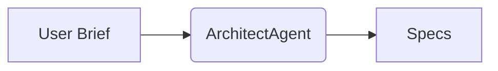

# Task: Create MCP & Glass-Box Architecture spec template and generator stub (Sub-Epic: 04_MCP and System Structure Documents)

## Covered Requirements
- [1_PRD-REQ-DOC-003]

## 1. Initial Test Written
- [ ] Add a pytest at `tests/test_mcp_spec_template.py` that asserts the presence and basic structure of the MCP spec template at `docs/mcp/spec_template.md`. The test must parse YAML front-matter and check for required headings and required front-matter keys including `title`, `doc_type`, `version`, and `schema`.

Example test:

```python
import subprocess
from pathlib import Path
import re
import yaml

def repo_root():
    return Path(subprocess.check_output(["git","rev-parse","--show-toplevel"]).decode().strip())


def test_mcp_template_exists_and_has_sections():
    root = repo_root()
    p = root / 'docs' / 'mcp' / 'spec_template.md'
    assert p.exists(), 'docs/mcp/spec_template.md must exist'
    raw = p.read_text()
    # Extract YAML front-matter
    assert raw.startswith('---'), 'Missing YAML front-matter'
    fm = raw.split('---', 2)[1]
    meta = yaml.safe_load(fm)
    for k in ('title','doc_type','version','schema'):
        assert k in meta, f'Missing front-matter key: {k}'
    # Check for required headings
    for h in ('# MCP Architecture','## Glass-Box Constraints','## Agent Interfaces','## Data Flows','## Approval Gates','## Traceability'):
        assert h in raw, f'Missing required heading: {h}'
```

- The test must run with `pytest -q tests/test_mcp_spec_template.py` and fail (red) before creating the template.

## 2. Task Implementation
- [ ] Implement the template and a minimal generator stub:
  - Create `docs/mcp/spec_template.md` with YAML front-matter containing at least keys: `title`, `doc_type: mcp`, `version: 0.1.0`, `schema: ../schemas/document.schema.json`, and `generated_by: ArchitectAgent`.
  - Include the following markdown sections and mermaid placeholders in the template:
    - # MCP Architecture
    - ## Glass-Box Constraints
    - ## Agent Interfaces
    - ## Data Flows
    - ## Approval Gates
    - ## Traceability
    - At least one fenced mermaid code block placeholder (e.g., sequenceDiagram or flowchart) showing where diagrams should go.
  - Add a generator stub at `scripts/generate_mcp_spec.py` which loads the template and writes `docs/mcp/generated_spec.md` when given simple JSON/YAML context. Use Jinja2 for templating (document `pip install jinja2` in the PR).

- Example minimal front-matter and placeholder content for `docs/mcp/spec_template.md`:

```
---
title: "MCP Architecture Template"
doc_type: "mcp"
version: "0.1.0"
schema: "../schemas/document.schema.json"
generated_by: "ArchitectAgent"
---

# MCP Architecture

## Glass-Box Constraints

Describe constraints that make internal agent logic observable and auditable.

## Agent Interfaces

Describe each agent API, expected inputs/outputs, and allowed side-effects.

## Data Flows



## Approval Gates

Describe the human-in-the-loop approval process and tokens.

## Traceability

Reference PRD/TAS requirement IDs and cross-link to machine-readable fragments.
```

## 3. Code Review
- [ ] PR review checklist:
  - Template includes YAML front-matter with the required keys and `doc_type: mcp`.
  - Template uses mermaid fenced blocks for diagrams (no embedded raster images).
  - Generator stub is side-effect free by default and writes an explicit output file when given context.
  - Ensure generated_spec.md includes the YAML front-matter so it can be validated by document schema.

## 4. Run Automated Tests to Verify
- [ ] Run the pytest test added in section 1 and, after implementing the generator, run a quick generation and validate output:

```bash
pip install jinja2 --quiet
python -m pytest -q tests/test_mcp_spec_template.py
python scripts/generate_mcp_spec.py --context tests/fixtures/mcp_context.yml --out docs/mcp/generated_spec.md
```

- Confirm `docs/mcp/generated_spec.md` exists and contains the expected headings and YAML front-matter.

## 5. Update Documentation
- [ ] Add `docs/mcp/README.md` describing the template location, generator usage, and how the MCP spec must be reviewed and approved.

## 6. Automated Verification
- [ ] Automated checks:
  - The unit test passes.
  - Running the generator with a minimal context produces `docs/mcp/generated_spec.md` that validates against `docs/schemas/document.schema.json` (validation is performed by task 4).
  - CI should run `pytest` and the generator smoke test as part of the docs-related jobs.
